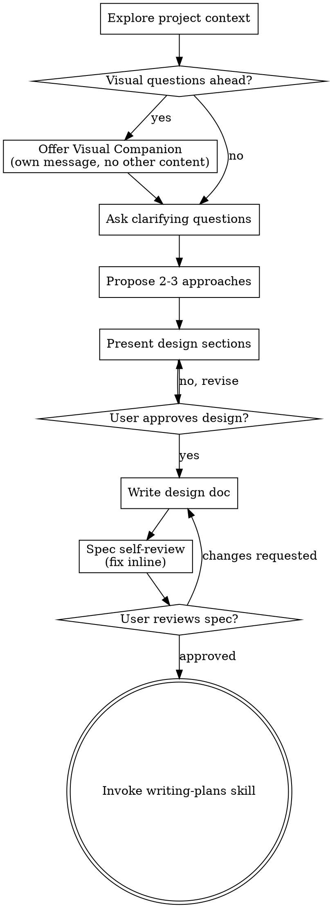

<!-- Generated by SpecStory, Markdown v2.1.0 -->

# 2026-04-01 01:40:40Z

<!-- Claude Code Session 350d858b-9643-44fe-b441-f8a2f5b5b873 (2026-04-01 01:40:40Z) -->

_**User (2026-04-01 01:40:40Z)**_

<ide_selection>The user selected the lines 93 to 110 from /Users/leocaseiro/Sites/base-skill/docs/baseskill_milestone_breakdown_85146c93.plan.md:

## Milestone 2 -- Data Layer and Core Infrastructure

Set up RxDB and the foundational systems that everything else depends on.

**SYNC (must complete in order):**

1. RxDB database initialization and schema definitions for all collections (`profiles`, `progress`, `settings`, `game_config_overrides`, `bookmarks`, `themes`, `session_history`, `session_history_index`, `sync_meta`, `app_meta`)
2. Schema migration framework (version tracking via `app_meta`)
3. React hooks for reactive RxDB queries
4. Evaluate TanStack Query integration -- determine if TanStack Query should wrap RxDB observables for cache management, or if RxDB's reactive queries are sufficient via custom hooks. Decision impacts all downstream data access patterns.

**ASYNC (can proceed in parallel once RxDB is up):**

- **Event bus / plugin hook system** -- pub/sub for app events, extension point registration
- **i18n setup** -- react-i18next (or lighter alternative), `en` + `pt-BR` translation files, namespace structure (common, games, settings, encouragements); integrate with TanStack Router for locale-aware routes if needed
- **Theme engine** -- load themes from RxDB `themes` collection, **two** pre-defined theme seeds for M2 (more presets later), CSS variable injection, clone-and-modify logic
- **Speech services** -- TTS wrapper (`SpeechOutput`), STT wrapper (`SpeechInput`), voice enumeration, fallback handling

This may or may not be related to the current task.</ide_selection>

claude plugin install superpowers@claude-plugins-official

---

_**Agent (claude-sonnet-4-6 2026-04-01 01:40:47Z)**_

<think><details><summary>Thought Process</summary>
The user is trying to install a Claude plugin using a command `claude plugin install superpowers@claude-plugins-official`. Let me check if this is a valid Claude Code command or skill.

This looks like a slash command or CLI command. Let me think about this - the user is typing what appears to be a Claude Code CLI command. However, I'm not sure if `claude plugin install` is a valid Claude Code command. Let me use the claude-code-guide agent to check this.

Actually, looking at this more carefully, this seems like the user is asking me to run or help with the command `claude plugin install superpowers@claude-plugins-official`. This doesn't look like a standard Claude Code command I'm familiar with. The user might be confused, or this might be referencing a new feature.

I should check the claude-code-guide agent to see if there's a plugin system available in Claude Code.
</details></think>

_**Agent (claude-sonnet-4-6 2026-04-01 01:40:52Z)**_

<tool-use data-tool-type="unknown" data-tool-name="Agent"><details>
<summary>Tool use: **Agent**</summary>
Check Claude Code plugin system

```text
The user doesn't want to proceed with this tool use. The tool use was rejected (eg. if it was a file edit, the new_string was NOT written to the file). STOP what you are doing and wait for the user to tell you how to proceed.
```

</details></tool-use>

_**Agent - sidechain (2026-04-01 01:40:48Z)**_

Does Claude Code have a plugin system or `claude plugin install` command? Is there a `superpowers` plugin or `claude-plugins-official` registry? Please check the official docs/release notes and report what you find. Keep response under 150 words.

_**Agent - sidechain (claude-haiku-4-5-20251001 2026-04-01 01:40:51Z)**_

I'll check the official Claude Code documentation for plugin system information.

_**Agent - sidechain (claude-haiku-4-5-20251001 2026-04-01 01:40:52Z)**_

<tool-use data-tool-type="read" data-tool-name="WebFetch"><details>
<summary>Tool use: **WebFetch**</summary>
 `https://code.claude.com/docs/en/claude_code_docs_map.md`

```text
> ## Documentation Index
> Fetch the complete documentation index at: https://code.claude.com/docs/llms.txt
> Use this file to discover all available pages before exploring further.

# Claude code docs map

# Claude Code Documentation Map

This is a comprehensive map of all Claude Code documentation pages with their headings, designed for easy navigation by LLMs.

> **Note:** This file is auto-generated by GitHub Actions. Do not edit manually.
> Last updated: 2026-03-30 23:58:32 UTC

## Document Structure

This map uses a hierarchical structure:

* **##** marks documentation groups (e.g., 'Getting started')
* **###** marks individual documentation pages
* **Nested bullets** show the heading structure within each page
* Each page title links to the full documentation

## Getting started

### [overview](https://code.claude.com/docs/en/overview.md)

* Get started
* What you can do
* Use Claude Code everywhere
* Next steps

### [quickstart](https://code.claude.com/docs/en/quickstart.md)

* Before you begin
* Step 1: Install Claude Code
* Step 2: Log in to your account
* Step 3: Start your first session
* Step 4: Ask your first question
* Step 5: Make your first code change
* Step 6: Use Git with Claude Code
* Step 7: Fix a bug or add a feature
* Step 8: Test out other common workflows
* Essential commands
* Pro tips for beginners
* What's next?
* Getting help

### [changelog](https://code.claude.com/docs/en/changelog.md)

* (No headings found)

## Core concepts

### [how-claude-code-works](https://code.claude.com/docs/en/how-claude-code-works.md)

* The agentic loop
  * Models
  * Tools
* What Claude can access
* Environments and interfaces
  * Execution environments
  * Interfaces
* Work with sessions
  * Work across branches
  * Resume or fork sessions
  * The context window
    * When context fills up
    * Manage context with skills and subagents
* Stay safe with checkpoints and permissions
  * Undo changes with checkpoints
  * Control what Claude can do
* Work effectively with Claude Code
  * Ask Claude Code for help
  * It's a conversation
    * Interrupt and steer
  * Be specific upfront
  * Give Claude something to verify against
  * Explore before implementing
  * Delegate, don't dictate
* What's next

### [features-overview](https://code.claude.com/docs/en/features-overview.md)

* Overview
* Match features to your goal
  * Compare similar features
  * Understand how features layer
  * Combine features
* Understand context costs
  * Context cost by feature
  * Understand how features load
* Learn more

### [claude-directory](https://code.claude.com/docs/en/claude-directory.md)

* What's not shown
* File reference
* Check what loaded
* Related resources

### [context-window](https://code.claude.com/docs/en/context-window.md)

* What the timeline shows
* Check your own session
* Related resources

## Use Claude Code

### [memory](https://code.claude.com/docs/en/memory.md)

* CLAUDE.md vs auto memory
* CLAUDE.md files
  * Choose where to put CLAUDE.md files
  * Set up a project CLAUDE.md
  * Write effective instructions
  * Import additional files
  * AGENTS.md
  * How CLAUDE.md files load
    * Load from additional directories
  * Organize rules with `.claude/rules/`
    * Set up rules
    * Path-specific rules
    * Share rules across projects with symlinks
    * User-level rules
  * Manage CLAUDE.md for large teams
    * Deploy organization-wide CLAUDE.md
    * Exclude specific CLAUDE.md files
* Auto memory
  * Enable or disable auto memory
  * Storage location
  * How it works
  * Audit and edit your memory
* View and edit with `/memory`
* Troubleshoot memory issues
  * Claude isn't following my CLAUDE.md
  * I don't know what auto memory saved
  * My CLAUDE.md is too large
  * Instructions seem lost after `/compact`
* Related resources

### [permission-modes](https://code.claude.com/docs/en/permission-modes.md)

* Switch permission modes
* Available modes
* Analyze before you edit with plan mode
  * When to use plan mode
  * Start and use plan mode
* Eliminate prompts with auto mode
  * How actions are evaluated
  * How auto mode handles subagents
  * What the classifier blocks by default
  * When auto mode falls back
* Allow only pre-approved tools with dontAsk mode
* Skip all checks with bypassPermissions mode
* Compare permission approaches
* Customize permissions further
* See also

### [common-workflows](https://code.claude.com/docs/en/common-workflows.md)

* Understand new codebases
  * Get a quick codebase overview
  * Find relevant code
* Fix bugs efficiently
* Refactor code
* Use specialized subagents
* Use Plan Mode for safe code analysis
  * When to use Plan Mode
  * How to use Plan Mode
  * Example: Planning a complex refactor
  * Configure Plan Mode as default
* Work with tests
* Create pull requests
* Handle documentation
* Work with images
* Reference files and directories
* Use extended thinking (thinking mode)
  * Configure thinking mode
  * How extended thinking works
* Resume previous conversations
  * Name your sessions
  * Use the session picker
* Run parallel Claude Code sessions with Git worktrees
  * Subagent worktrees
  * Worktree cleanup
  * Copy gitignored files to worktrees
  * Manage worktrees manually
  * Non-git version control
* Get notified when Claude needs your attention
* Use Claude as a unix-style utility
  * Add Claude to your verification process
  * Pipe in, pipe out
  * Control output format
* Run Claude on a schedule
* Ask Claude about its capabilities
  * Example questions
* Next steps

### [best-practices](https://code.claude.com/docs/en/best-practices.md)

* Give Claude a way to verify its work
* Explore first, then plan, then code
* Provide specific context in your prompts
  * Provide rich content
* Configure your environment
  * Write an effective CLAUDE.md
  * Configure permissions
  * Use CLI tools
  * Connect MCP servers
  * Set up hooks
  * Create skills
  * Create custom subagents
  * Install plugins
* Communicate effectively
  * Ask codebase questions
  * Let Claude interview you
* Manage your session
  * Course-correct early and often
  * Manage context aggressively
  * Use subagents for investigation
  * Rewind with checkpoints
  * Resume conversations
* Automate and scale
  * Run non-interactive mode
  * Run multiple Claude sessions
  * Fan out across files
  * Run autonomously with auto mode
* Avoid common failure patterns
* Develop your intuition
* Related resources

### Platforms and integrations > Claude Code on the web

#### [claude-code-on-the-web](https://code.claude.com/docs/en/claude-code-on-the-web.md)

* What is Claude Code on the web?
* Who can use Claude Code on the web?
* Getting started
  * From the browser
  * From the terminal
* How it works
* Review changes with diff view
* Auto-fix pull requests
  * How Claude responds to PR activity
* Moving tasks between web and terminal
  * From terminal to web
    * Tips for remote tasks
  * From web to terminal
    * Requirements for teleporting
  * Sharing sessions
    * Sharing from an Enterprise or Teams account
    * Sharing from a Max or Pro account
* Schedule recurring tasks
* Managing sessions
  * Archiving sessions
  * Deleting sessions
* Cloud environment
  * Default image
    * Checking available tools
    * Language-specific setups
    * Databases
  * Environment configuration
  * Setup scripts
    * Setup scripts vs. SessionStart hooks
  * Dependency management
    * Persist environment variables
    * Dependency management limitations
* Network access and security
  * Network policy
    * GitHub proxy
    * Security proxy
  * Access levels
  * Default allowed domains
    * Anthropic Services
    * Version Control
    * Container Registries
    * Cloud Platforms
    * Package Managers - JavaScript/Node
    * Package Managers - Python
    * Package Managers - Ruby
    * Package Managers - Rust
    * Package Managers - Go
    * Package Managers - JVM
    * Package Managers - Other Languages
    * Linux Distributions
    * Development Tools & Platforms
    * Cloud Services & Monitoring
    * Content Delivery & Mirrors
    * Schema & Configuration
    * Model Context Protocol
  * Security best practices for customized network access
* Security and isolation
* Pricing and rate limits
* Limitations
* Best practices
* Related resources

#### [web-scheduled-tasks](https://code.claude.com/docs/en/web-scheduled-tasks.md)

* Compare scheduling options
* Create a scheduled task
  * Frequency options
  * Repositories and branch permissions
  * Connectors
  * Environments
* Manage scheduled tasks
  * View and interact with runs
  * Edit and control tasks
* Related resources

### Platforms and integrations > Claude Code on desktop

#### [desktop-quickstart](https://code.claude.com/docs/en/desktop-quickstart.md)

* Install
* Start your first session
* Now what?
* Coming from the CLI?
* What's next

#### [desktop](https://code.claude.com/docs/en/desktop.md)

* Start a session
* Work with code
  * Use the prompt box
  * Add files and context to prompts
  * Choose a permission mode
  * Preview your app
  * Review changes with diff view
  * Review your code
  * Monitor pull request status
* Let Claude use your computer
  * When computer use applies
  * Enable computer use
  * App permissions
* Manage sessions
  * Work in parallel with sessions
  * Run long-running tasks remotely
  * Continue in another surface
  * Sessions from Dispatch
* Extend Claude Code
  * Connect external tools
  * Use skills
  * Install plugins
  * Configure preview servers
    * Auto-verify changes
    * Configuration fields
      * When to use `program` vs `runtimeExecutable`
    * Port conflicts
    * Examples
* Schedule recurring tasks
  * Compare scheduling options
  * Frequency options
  * How scheduled tasks run
  * Missed runs
  * Permissions for scheduled tasks
  * Manage scheduled tasks
* Environment configuration
  * Local sessions
  * Remote sessions
  * SSH sessions
* Enterprise configuration
  * Admin console controls
  * Managed settings
  * Device management policies
  * Authentication and SSO
  * Data handling
  * Deployment
* Coming from the CLI?
  * CLI flag equivalents
  * Shared configuration
  * Feature comparison
  * What's not available in Desktop
* Troubleshooting
  * Check your version
  * 403 or authentication errors in the Code tab
  * Blank or stuck screen on launch
  * "Failed to load session"
  * Session not finding installed tools
  * Git and Git LFS errors
  * MCP servers not working on Windows
  * App won't quit
  * Windows-specific issues
  * Cowork tab unavailable on Intel Macs
  * "Branch doesn't exist yet" when opening in CLI
  * Still stuck?

### Platforms and integrations > Code review & CI/CD

#### [code-review](https://code.claude.com/docs/en/code-review.md)

* How reviews work
  * Severity levels
  * Check run output
  * What Code Review checks
* Set up Code Review
* Manually trigger reviews
* Customize reviews
  * CLAUDE.md
  * REVIEW\.md
* View usage
* Pricing
* Related resources

#### [github-actions](https://code.claude.com/docs/en/github-actions.md)

* Why use Claude Code GitHub Actions?
* What can Claude do?
  * Claude Code Action
* Setup
* Quick setup
* Manual setup
* Upgrading from Beta
  * Essential changes
  * Breaking Changes Reference
  * Before and After Example
* Example use cases
  * Basic workflow
  * Using skills
  * Custom automation with prompts
  * Common use cases
* Best practices
  * CLAUDE.md configuration
  * Security considerations
  * Optimizing performance
  * CI costs
* Configuration examples
* Using with AWS Bedrock & Google Vertex AI
  * Prerequisites
    * For Google Cloud Vertex AI:
    * For AWS Bedrock:
* Troubleshooting
  * Claude not responding to @claude commands
  * CI not running on Claude's commits
  * Authentication errors
* Advanced configuration
  * Action parameters
    * Pass CLI arguments
  * Alternative integration methods
  * Customizing Claude's behavior

#### [github-enterprise-server](https://code.claude.com/docs/en/github-enterprise-server.md)

* What works with GitHub Enterprise Server
* Admin setup
  * GitHub App permissions
  * Manual setup
  * Network requirements
* Developer workflow
  * Teleport sessions to your terminal
* Plugin marketplaces on GHES
  * Add a GHES marketplace
  * Allowlist GHES marketplaces in managed settings
* Limitations
* Troubleshooting
  * Web session fails to clone repository
  * Marketplace add fails with a policy error
  * GHES instance not reachable
* Related resources

#### [gitlab-ci-cd](https://code.claude.com/docs/en/gitlab-ci-cd.md)

* Why use Claude Code with GitLab?
* How it works
* What can Claude do?
* Setup
  * Quick setup
  * Manual setup (recommended for production)
* Example use cases
  * Turn issues into MRs
  * Get implementation help
  * Fix bugs quickly
* Using with AWS Bedrock & Google Vertex AI
* Configuration examples
  * Basic .gitlab-ci.yml (Claude API)
  * AWS Bedrock job example (OIDC)
  * Google Vertex AI job example (Workload Identity Federation)
* Best practices
  * CLAUDE.md configuration
  * Security considerations
  * Optimizing performance
  * CI costs
* Security and governance
* Troubleshooting
  * Claude not responding to @claude commands
  * Job can't write comments or open MRs
  * Authentication errors
* Advanced configuration
  * Common parameters and variables
  * Customizing Claude's behavior

## Platforms and integrations

### [platforms](https://code.claude.com/docs/en/platforms.md)

* Where to run Claude Code
* Connect your tools
* Work when you are away from your terminal
* Related resources
  * Platforms
  * Integrations
  * Remote access

### [remote-control](https://code.claude.com/docs/en/remote-control.md)

* Requirements
* Start a Remote Control session
  * Connect from another device
  * Enable Remote Control for all sessions
* Connection and security
* Remote Control vs Claude Code on the web
* Limitations
* Troubleshooting
  * "Remote Control requires a claude.ai subscription"
  * "Remote Control requires a full-scope login token"
  * "Unable to determine your organization for Remote Control eligibility"
  * "Remote Control is not yet enabled for your account"
  * "Remote Control is disabled by your organization's policy"
  * "Remote credentials fetch failed"
* Choose the right approach
* Related resources

### [chrome](https://code.claude.com/docs/en/chrome.md)

* Capabilities
* Prerequisites
* Get started in the CLI
  * Enable Chrome by default
  * Manage site permissions
* Example workflows
  * Test a local web application
  * Debug with console logs
  * Automate form filling
  * Draft content in Google Docs
  * Extract data from web pages
  * Run multi-site workflows
  * Record a demo GIF
* Troubleshooting
  * Extension not detected
  * Browser not responding
  * Connection drops during long sessions
  * Windows-specific issues
  * Common error messages
* See also

### [computer-use](https://code.claude.com/docs/en/computer-use.md)

* What you can do with computer use
* When computer use applies
* Enable computer use
* Approve apps per session
* How Claude works on your screen
  * One session at a time
  * Apps are hidden while Claude works
  * Stop at any time
* Safety and the trust boundary
* Example workflows
  * Validate a native build
  * Reproduce a layout bug
  * Test a simulator flow
* Differences from the Desktop app
* Troubleshooting
  * "Computer use is in use by another Claude session"
  * macOS permissions prompt keeps reappearing
  * `computer-use` doesn't appear in `/mcp`
* See also

### [vs-code](https://code.claude.com/docs/en/vs-code.md)

* Prerequisites
* Install the extension
* Get started
* Use the prompt box
  * Reference files and folders
  * Resume past conversations
  * Resume remote sessions from Claude.ai
* Customize your workflow
  * Choose where Claude lives
  * Run multiple conversations
  * Switch to terminal mode
* Manage plugins
  * Install plugins
  * Manage marketplaces
* Automate browser tasks with Chrome
* VS Code commands and shortcuts
  * Launch a VS Code tab from other tools
* Configure settings
  * Extension settings
* VS Code extension vs. Claude Code CLI
  * Rewind with checkpoints
  * Run CLI in VS Code
  * Switch between extension and CLI
  * Include terminal output in prompts
  * Monitor background processes
  * Connect to external tools with MCP
* Work with git
  * Create commits and pull requests
  * Use git worktrees for parallel tasks
* Use third-party providers
* Security and privacy
  * The built-in IDE MCP server
* Fix common issues
  * Extension won't install
  * Spark icon not visible
  * Claude Code never responds
* Uninstall the extension
* Next steps

### [jetbrains](https://code.claude.com/docs/en/jetbrains.md)

* Supported IDEs
* Features
* Installation
  * Marketplace Installation
* Usage
  * From Your IDE
  * From External Terminals
* Configuration
  * Claude Code Settings
  * Plugin Settings
    * General Settings
    * ESC Key Configuration
* Special Configurations
  * Remote Development
  * WSL Configuration
* Troubleshooting
  * Plugin Not Working
  * IDE Not Detected
  * Command Not Found
* Security Considerations

### [slack](https://code.claude.com/docs/en/slack.md)

* Use cases
* Prerequisites
* Setting up Claude Code in Slack
* How it works
  * Automatic detection
  * Context gathering
  * Session flow
* User interface elements
  * App Home
  * Message actions
  * Repository selection
* Access and permissions
  * User-level access
  * Workspace-level access
  * Channel-based access control
* What's accessible where
* Best practices
  * Writing effective requests
  * When to use Slack vs. web
* Troubleshooting
  * Sessions not starting
  * Repository not showing
  * Wrong repository selected
  * Authentication errors
  * Session expiration
* Current limitations
* Related resources

## Agents

### [sub-agents](https://code.claude.com/docs/en/sub-agents.md)

* Built-in subagents
* Quickstart: create your first subagent
* Configure subagents
  * Use the /agents command
  * Choose the subagent scope
  * Write subagent files
    * Supported frontmatter fields
  * Choose a model
  * Control subagent capabilities
    * Available tools
    * Restrict which subagents can be spawned
    * Scope MCP servers to a subagent
    * Permission modes
    * Preload skills into subagents
    * Enable persistent memory
      * Persistent memory tips
    * Conditional rules with hooks
    * Disable specific subagents
  * Define hooks for subagents
    * Hooks in subagent frontmatter
    * Project-level hooks for subagent events
* Work with subagents
  * Understand automatic delegation
  * Invoke subagents explicitly
  * Run subagents in foreground or background
  * Common patterns
    * Isolate high-volume operations
    * Run parallel research
    * Chain subagents
  * Choose between subagents and main conversation
  * Manage subagent context
    * Resume subagents
    * Auto-compaction
* Example subagents
  * Code reviewer
  * Debugger
  * Data scientist
  * Database query validator
* Next steps

### [agent-teams](https://code.claude.com/docs/en/agent-teams.md)

* When to use agent teams
  * Compare with subagents
* Enable agent teams
* Start your first agent team
* Control your agent team
  * Choose a display mode
  * Specify teammates and models
  * Require plan approval for teammates
  * Talk to teammates directly
  * Assign and claim tasks
  * Shut down teammates
  * Clean up the team
  * Enforce quality gates with hooks
* How agent teams work
  * How Claude starts agent teams
  * Architecture
  * Permissions
  * Context and communication
  * Token usage
* Use case examples
  * Run a parallel code review
  * Investigate with competing hypotheses
* Best practices
  * Give teammates enough context
  * Choose an appropriate team size
  * Size tasks appropriately
  * Wait for teammates to finish
  * Start with research and review
  * Avoid file conflicts
  * Monitor and steer
* Troubleshooting
  * Teammates not appearing
  * Too many permission prompts
  * Teammates stopping on errors
  * Lead shuts down before work is done
  * Orphaned tmux sessions
* Limitations
* Next steps

## Tools and plugins

### [mcp](https://code.claude.com/docs/en/mcp.md)

* What you can do with MCP
* Popular MCP servers
* Installing MCP servers
  * Option 1: Add a remote HTTP server
  * Option 2: Add a remote SSE server
  * Option 3: Add a local stdio server
  * Managing your servers
  * Dynamic tool updates
  * Push messages with channels
  * Plugin-provided MCP servers
* MCP installation scopes
  * Local scope
  * Project scope
  * User scope
  * Choosing the right scope
  * Scope hierarchy and precedence
  * Environment variable expansion in `.mcp.json`
* Practical examples
  * Example: Monitor errors with Sentry
  * Example: Connect to GitHub for code reviews
  * Example: Query your PostgreSQL database
* Authenticate with remote MCP servers
  * Use a fixed OAuth callback port
  * Use pre-configured OAuth credentials
  * Override OAuth metadata discovery
  * Use dynamic headers for custom authentication
* Add MCP servers from JSON configuration
* Import MCP servers from Claude Desktop
* Use MCP servers from Claude.ai
* Use Claude Code as an MCP server
* MCP output limits and warnings
* Respond to MCP elicitation requests
* Use MCP resources
  * Reference MCP resources
* Scale with MCP Tool Search
  * How it works
  * For MCP server authors
  * Configure tool search
* Use MCP prompts as commands
  * Execute MCP prompts
* Managed MCP configuration
  * Option 1: Exclusive control with managed-mcp.json
  * Option 2: Policy-based control with allowlists and denylists
    * Restriction options
    * Example configuration
    * How command-based restrictions work
    * How URL-based restrictions work
    * Allowlist behavior (`allowedMcpServers`)
    * Denylist behavior (`deniedMcpServers`)
    * Important notes

### [discover-plugins](https://code.claude.com/docs/en/discover-plugins.md)

* How marketplaces work
* Official Anthropic marketplace
  * Code intelligence
    * What Claude gains from code intelligence plugins
  * External integrations
  * Development workflows
  * Output styles
* Try it: add the demo marketplace
* Add marketplaces
  * Add from GitHub
  * Add from other Git hosts
  * Add from local paths
  * Add from remote URLs
* Install plugins
* Manage installed plugins
  * Apply plugin changes without restarting
* Manage marketplaces
  * Use the interactive interface
  * Use CLI commands
  * Configure auto-updates
* Configure team marketplaces
* Security
* Troubleshooting
  * /plugin command not recognized
  * Common issues
  * Code intelligence issues
* Next steps

### [plugins](https://code.claude.com/docs/en/plugins.md)

* When to use plugins vs standalone configuration
* Quickstart
  * Prerequisites
  * Create your first plugin
* Hello Skill
  * Plugin structure overview
  * Develop more complex plugins
    * Add Skills to your plugin
    * Add LSP servers to your plugin
    * Ship default settings with your plugin
    * Organize complex plugins
    * Test your plugins locally
    * Debug plugin issues
    * Share your plugins
    * Submit your plugin to the official marketplace
  * Convert existing configurations to plugins
    * Migration steps
    * What changes when migrating
  * Next steps
    * For plugin users
    * For plugin developers

### [skills](https://code.claude.com/docs/en/skills.md)

* Bundled skills
* Getting started
  * Create your first skill
  * Where skills live
    * Automatic discovery from nested directories
    * Skills from additional directories
* Configure skills
  * Types of skill content
  * Frontmatter reference
    * Available string substitutions
  * Add supporting files
  * Control who invokes a skill
  * Restrict tool access
  * Pass arguments to skills
* Advanced patterns
  * Inject dynamic context
  * Run skills in a subagent
    * Example: Research skill using Explore agent
  * Restrict Claude's skill access
* Share skills
  * Generate visual output
* Troubleshooting
  * Skill not triggering
  * Skill triggers too often
  * Skill descriptions are cut short
* Related resources

## Automation

### [hooks-guide](https://code.claude.com/docs/en/hooks-guide.md)

* Set up your first hook
* What you can automate
  * Get notified when Claude needs input
  * Auto-format code after edits
  * Block edits to protected files
  * Re-inject context after compaction
  * Audit configuration changes
  * Reload environment when directory or files change
  * Auto-approve specific permission prompts
* How hooks work
  * Read input and return output
    * Hook input
    * Hook output
    * Structured JSON output
  * Filter hooks with matchers
    * Filter by tool name and arguments with the `if` field
  * Configure hook location
* Prompt-based hooks
* Agent-based hooks
* HTTP hooks
* Limitations and troubleshooting
  * Limitations
  * Hook not firing
  * Hook error in output
  * `/hooks` shows no hooks configured
  * Stop hook runs forever
  * JSON validation failed
  * Debug techniques
* Learn more

### [channels](https://code.claude.com/docs/en/channels.md)

* Supported channels
* Quickstart
* Security
* Enterprise controls
  * Enable channels for your organization
  * Restrict which channel plugins can run
* Research preview
* How channels compare
* Next steps

### [scheduled-tasks](https://code.claude.com/docs/en/scheduled-tasks.md)

* Compare scheduling options
* Schedule a recurring prompt with /loop
  * Interval syntax
  * Loop over another command
* Set a one-time reminder
* Manage scheduled tasks
* How scheduled tasks run
  * Jitter
  * Three-day expiry
* Cron expression reference
* Disable scheduled tasks
* Limitations

### [headless](https://code.claude.com/docs/en/headless.md)

* Basic usage
  * Start faster with bare mode
* Examples
  * Get structured output
  * Stream responses
  * Auto-approve tools
  * Create a commit
  * Customize the system prompt
  * Continue conversations
* Next steps

## Troubleshooting

### [troubleshooting](https://code.claude.com/docs/en/troubleshooting.md)

* Troubleshoot installation issues
* Debug installation problems
  * Check network connectivity
  * Verify your PATH
  * Check for conflicting installations
  * Check directory permissions
  * Verify the binary works
* Common installation issues
  * Install script returns HTML instead of a shell script
  * `command not found: claude` after installation
  * `curl: (56) Failure writing output to destination`
  * TLS or SSL connection errors
  * `Failed to fetch version from storage.googleapis.com`
  * Windows: `irm` or `&&` not recognized
  * Install killed on low-memory Linux servers
  * Install hangs in Docker
  * Windows: Claude Desktop overrides `claude` CLI command
  * Windows: "Claude Code on Windows requires git-bash"
  * Linux: wrong binary variant installed (musl/glibc mismatch)
  * `Illegal instruction` on Linux
  * `dyld: cannot load` on macOS
  * Windows installation issues: errors in WSL
  * WSL2 sandbox setup
  * Permission errors during installation
* Permissions and authentication
  * Repeated permission prompts
  * Authentication issues
  * OAuth error: Invalid code
  * 403 Forbidden after login
  * "This organization has been disabled" with an active subscription
  * OAuth login fails in WSL2
  * "Not logged in" or token expired
* Configuration file locations
  * Resetting configuration
* Performance and stability
  * High CPU or memory usage
  * Command hangs or freezes
  * Search and discovery issues
  * Slow or incomplete search results on WSL
* IDE integration issues
  * JetBrains IDE not detected on WSL2
    * WSL2 networking modes
  * Report Windows IDE integration issues
  * Escape key not working in JetBrains IDE terminals
* Markdown formatting issues
  * Missing language tags in code blocks
  * Inconsistent spacing and formatting
  * Reduce markdown formatting issues
* Get more help

## Deployment

### [third-party-integrations](https://code.claude.com/docs/en/third-party-integrations.md)

* Compare deployment options
* Configure proxies and gateways
  * Amazon Bedrock
  * Microsoft Foundry
  * Google Vertex AI
* Best practices for organizations
  * Invest in documentation and memory
  * Simplify deployment
  * Start with guided usage
  * Pin model versions for cloud providers
  * Configure security policies
  * Leverage MCP for integrations
* Next steps

### [amazon-bedrock](https://code.claude.com/docs/en/amazon-bedrock.md)

* Prerequisites
* Setup
  * 1. Submit use case details
  * 2. Configure AWS credentials
    * Advanced credential configuration
      * Example configuration
      * Configuration settings explained
  * 3. Configure Claude Code
  * 4. Pin model versions
    * Map each model version to an inference profile
* IAM configuration
* AWS Guardrails
* Troubleshooting
* Additional resources

### [google-vertex-ai](https://code.claude.com/docs/en/google-vertex-ai.md)

* Prerequisites
* Region Configuration
* Setup
  * 1. Enable Vertex AI API
  * 2. Request model access
  * 3. Configure GCP credentials
  * 4. Configure Claude Code
  * 5. Pin model versions
* IAM configuration
* 1M token context window
* Troubleshooting
* Additional resources

### [microsoft-foundry](https://code.claude.com/docs/en/microsoft-foundry.md)

* Prerequisites
* Setup
  * 1. Provision Microsoft Foundry resource
  * 2. Configure Azure credentials
  * 3. Configure Claude Code
  * 4. Pin model versions
* Azure RBAC configuration
* Troubleshooting
* Additional resources

### [network-config](https://code.claude.com/docs/en/network-config.md)

* Proxy configuration
  * Environment variables
  * Basic authentication
* Custom CA certificates
* mTLS authentication
* Network access requirements
* Additional resources

### [llm-gateway](https://code.claude.com/docs/en/llm-gateway.md)

* Gateway requirements
* Configuration
  * Model selection
* LiteLLM configuration
  * Prerequisites
  * Basic LiteLLM setup
    * Authentication methods
      * Static API key
      * Dynamic API key with helper
    * Unified endpoint (recommended)
    * Provider-specific pass-through endpoints (alternative)
      * Claude API through LiteLLM
      * Amazon Bedrock through LiteLLM
      * Google Vertex AI through LiteLLM
* Additional resources

### [devcontainer](https://code.claude.com/docs/en/devcontainer.md)

* Key features
* Getting started in 4 steps
* Configuration breakdown
* Security features
* Customization options
* Example use cases
  * Secure client work
  * Team onboarding
  * Consistent CI/CD environments
* Related resources

## Administration

### [setup](https://code.claude.com/docs/en/setup.md)

* System requirements
  * Additional dependencies
* Install Claude Code
  * Set up on Windows
  * Alpine Linux and musl-based distributions
* Verify your installation
* Authenticate
* Update Claude Code
  * Auto-updates
  * Configure release channel
  * Disable auto-updates
  * Update manually
* Advanced installation options
  * Install a specific version
  * Deprecated npm installation
    * Migrate from npm to native
    * Install with npm
  * Binary integrity and code signing
* Uninstall Claude Code
  * Native installation
  * Homebrew installation
  * WinGet installation
  * npm
  * Remove configuration files

### [authentication](https://code.claude.com/docs/en/authentication.md)

* Log in to Claude Code
* Set up team authentication
  * Claude for Teams or Enterprise
  * Claude Console authentication
  * Cloud provider authentication
* Credential management
  * Authentication precedence

### [security](https://code.claude.com/docs/en/security.md)

* How we approach security
  * Security foundation
  * Permission-based architecture
  * Built-in protections
  * User responsibility
* Protect against prompt injection
  * Core protections
  * Privacy safeguards
  * Additional safeguards
* MCP security
* IDE security
* Cloud execution security
* Security best practices
  * Working with sensitive code
  * Team security
  * Reporting security issues
* Related resources

### [server-managed-settings](https://code.claude.com/docs/en/server-managed-settings.md)

* Requirements
* Choose between server-managed and endpoint-managed settings
* Configure server-managed settings
  * Verify settings delivery
  * Access control
  * Current limitations
* Settings delivery
  * Settings precedence
  * Fetch and caching behavior
  * Security approval dialogs
* Platform availability
* Audit logging
* Security considerations
* See also

### [data-usage](https://code.claude.com/docs/en/data-usage.md)

* Data policies
  * Data training policy
  * Development Partner Program
  * Feedback using the `/feedback` command
  * Session quality surveys
  * Data retention
* Data access
* Local Claude Code: Data flow and dependencies
  * Cloud execution: Data flow and dependencies
* Telemetry services
* Default behaviors by API provider

### [zero-data-retention](https://code.claude.com/docs/en/zero-data-retention.md)

* ZDR scope
  * What ZDR covers
  * What ZDR does not cover
* Features disabled under ZDR
* Data retention for policy violations
* Request ZDR

### [monitoring-usage](https://code.claude.com/docs/en/monitoring-usage.md)

* Quick start
* Administrator configuration
* Configuration details
  * Common configuration variables
  * Metrics cardinality control
  * Dynamic headers
    * Settings configuration
    * Script requirements
    * Refresh behavior
  * Multi-team organization support
  * Example configurations
* Available metrics and events
  * Standard attributes
  * Metrics
  * Metric details
    * Session counter
    * Lines of code counter
    * Pull request counter
    * Commit counter
    * Cost counter
    * Token counter
    * Code edit tool decision counter
    * Active time counter
  * Events
    * Event correlation attributes
    * User prompt event
    * Tool result event
    * API request event
    * API error event
    * Tool decision event
* Interpret metrics and events data
  * Usage monitoring
  * Cost monitoring
  * Alerting and segmentation
  * Event analysis
* Backend considerations
  * For metrics
  * For events/logs
* Service information
* ROI measurement resources
* Security and privacy
* Monitor Claude Code on Amazon Bedrock

### [costs](https://code.claude.com/docs/en/costs.md)

* Track your costs
  * Using the `/cost` command
* Managing costs for teams
  * Rate limit recommendations
  * Agent team token costs
* Reduce token usage
  * Manage context proactively
  * Choose the right model
  * Reduce MCP server overhead
  * Install code intelligence plugins for typed languages
  * Offload processing to hooks and skills
  * Move instructions from CLAUDE.md to skills
  * Adjust extended thinking
  * Delegate verbose operations to subagents
  * Manage agent team costs
  * Write specific prompts
  * Work efficiently on complex tasks
* Background token usage
* Understanding changes in Claude Code behavior

### [analytics](https://code.claude.com/docs/en/analytics.md)

* Access analytics for Teams and Enterprise
  * Enable contribution metrics
  * Review summary metrics
  * Explore the charts
    * Track adoption
    * Measure PRs per user
    * View pull requests breakdown
    * Find top contributors
  * PR attribution
    * Tagging criteria
    * Attribution process
    * Time window
    * Excluded files
    * Attribution notes
  * Get the most from analytics
    * Monitor adoption
    * Measure ROI
    * Identify power users
    * Access data programmatically
* Access analytics for API customers
  * View team insights
* Related resources

### [plugin-marketplaces](https://code.claude.com/docs/en/plugin-marketplaces.md)

* Overview
* Walkthrough: create a local marketplace
* Create the marketplace file
* Marketplace schema
  * Required fields
  * Owner fields
  * Optional metadata
* Plugin entries
  * Required fields
  * Optional plugin fields
* Plugin sources
  * Relative paths
  * GitHub repositories
  * Git repositories
  * Git subdirectories
  * npm packages
  * Advanced plugin entries
  * Strict mode
* Host and distribute marketplaces
  * Host on GitHub (recommended)
  * Host on other git services
  * Private repositories
  * Test locally before distribution
  * Require marketplaces for your team
  * Pre-populate plugins for containers
  * Managed marketplace restrictions
    * Common configurations
    * How restrictions work
  * Version resolution and release channels
    * Set up release channels
      * Example
      * Assign channels to user groups
* Validation and testing
* Troubleshooting
  * Marketplace not loading
  * Marketplace validation errors
  * Plugin installation failures
  * Private repository authentication fails
  * Git operations time out
  * Plugins with relative paths fail in URL-based marketplaces
  * Files not found after installation
* See also

## Configuration

### [settings](https://code.claude.com/docs/en/settings.md)

* Configuration scopes
  * Available scopes
  * When to use each scope
  * How scopes interact
  * What uses scopes
* Settings files
  * Available settings
  * Global config settings
  * Worktree settings
  * Permission settings
  * Permission rule syntax
  * Sandbox settings
    * Sandbox path prefixes
  * Attribution settings
  * File suggestion settings
  * Hook configuration
  * Settings precedence
  * Verify active settings
  * Key points about the configuration system
  * System prompt
  * Excluding sensitive files
* Subagent configuration
* Plugin configuration
  * Plugin settings
    * `enabledPlugins`
    * `extraKnownMarketplaces`
    * `strictKnownMarketplaces`
  * Managing plugins
* Environment variables
* Tools available to Claude
* See also

### [permissions](https://code.claude.com/docs/en/permissions.md)

* Permission system
* Manage permissions
* Permission modes
* Permission rule syntax
  * Match all uses of a tool
  * Use specifiers for fine-grained control
  * Wildcard patterns
* Tool-specific permission rules
  * Bash
  * Read and Edit
  * WebFetch
  * MCP
  * Agent (subagents)
* Extend permissions with hooks
* Working directories
* How permissions interact with sandboxing
* Managed settings
  * Managed-only settings
* Configure the auto mode classifier
  * Define trusted infrastructure
  * Override the block and allow rules
  * Inspect the defaults and your effective config
* Settings precedence
* Example configurations
* See also

### [sandboxing](https://code.claude.com/docs/en/sandboxing.md)

* Overview
* Why sandboxing matters
* How it works
  * Filesystem isolation
  * Network isolation
  * OS-level enforcement
* Getting started
  * Prerequisites
  * Enable sandboxing
  * Sandbox modes
  * Configure sandboxing
    * Granting subprocess write access to specific paths
* Security benefits
  * Protection against prompt injection
  * Reduced attack surface
  * Transparent operation
* Security Limitations
* How sandboxing relates to permissions
* Advanced usage
  * Custom proxy configuration
  * Integration with existing security tools
* Best practices
* Open source
* Limitations
* What sandboxing does not cover
* See also

### [terminal-config](https://code.claude.com/docs/en/terminal-config.md)

* Themes and appearance
* Line breaks
* Notification setup
  * Terminal notifications
  * Notification hooks
* Handling large inputs
* Vim Mode

### [model-config](https://code.claude.com/docs/en/model-config.md)

* Available models
  * Model aliases
  * Setting your model
* Restrict model selection
  * Default model behavior
  * Control the model users run on
  * Merge behavior
* Special model behavior
  * `default` model setting
  * `opusplan` model setting
  * Adjust effort level
  * Extended context
* Checking your current model
* Add a custom model option
* Environment variables
  * Pin models for third-party deployments
  * Customize pinned model display and capabilities
  * Override model IDs per version
  * Prompt caching configuration

### [fast-mode](https://code.claude.com/docs/en/fast-mode.md)

* Toggle fast mode
* Understand the cost tradeoff
* Decide when to use fast mode
  * Fast mode vs effort level
* Requirements
  * Enable fast mode for your organization
  * Require per-session opt-in
* Handle rate limits
* Research preview
* See also

### [voice-dictation](https://code.claude.com/docs/en/voice-dictation.md)

* Requirements
* Enable voice dictation
* Record a prompt
* Change the dictation language
* Rebind the push-to-talk key
* Troubleshooting
* See also

### [output-styles](https://code.claude.com/docs/en/output-styles.md)

* Built-in output styles
* How output styles work
* Change your output style
* Create a custom output style
  * Frontmatter
* Comparisons to related features
  * Output Styles vs. CLAUDE.md vs. --append-system-prompt
  * Output Styles vs. [Agents](/en/sub-agents)
  * Output Styles vs. [Skills](/en/skills)

### [statusline](https://code.claude.com/docs/en/statusline.md)

* Set up a status line
  * Use the /statusline command
  * Manually configure a status line
  * Disable the status line
* Build a status line step by step
* How status lines work
* Available data
  * Context window fields
* Examples
  * Context window usage
  * Git status with colors
  * Cost and duration tracking
  * Display multiple lines
  * Clickable links
  * Rate limit usage
  * Cache expensive operations
  * Windows configuration
* Tips
* Troubleshooting

### [keybindings](https://code.claude.com/docs/en/keybindings.md)

* Configuration file
* Contexts
* Available actions
  * App actions
  * History actions
  * Chat actions
  * Autocomplete actions
  * Confirmation actions
  * Permission actions
  * Transcript actions
  * History search actions
  * Task actions
  * Theme actions
  * Help actions
  * Tabs actions
  * Attachments actions
  * Footer actions
  * Message selector actions
  * Diff actions
  * Model picker actions
  * Select actions
  * Plugin actions
  * Settings actions
  * Voice actions
* Keystroke syntax
  * Modifiers
  * Uppercase letters
  * Chords
  * Special keys
* Unbind default shortcuts
* Reserved shortcuts
* Terminal conflicts
* Vim mode interaction
* Validation

## Reference

### [cli-reference](https://code.claude.com/docs/en/cli-reference.md)

* CLI commands
* CLI flags
  * System prompt flags
* See also

### [commands](https://code.claude.com/docs/en/commands.md)

* MCP prompts
* See also

### [env-vars](https://code.claude.com/docs/en/env-vars.md)

* See also

### [tools-reference](https://code.claude.com/docs/en/tools-reference.md)

* Bash tool behavior
* PowerShell tool
  * Enable the PowerShell tool
  * Shell selection in settings, hooks, and skills
  * Preview limitations
* See also

### [interactive-mode](https://code.claude.com/docs/en/interactive-mode.md)

* Keyboard shortcuts
  * General controls
  * Text editing
  * Theme and display
  * Multiline input
  * Quick commands
  * Transcript viewer
  * Voice input
* Built-in commands
* Vim editor mode
  * Mode switching
  * Navigation (NORMAL mode)
  * Editing (NORMAL mode)
  * Text objects (NORMAL mode)
* Command history
  * Reverse search with Ctrl+R
* Background bash commands
  * How backgrounding works
  * Bash mode with `!` prefix
* Prompt suggestions
* Side questions with /btw
* Task list
* PR review status
* See also

### [checkpointing](https://code.claude.com/docs/en/checkpointing.md)

* How checkpoints work
  * Automatic tracking
  * Rewind and summarize
    * Restore vs. summarize
* Common use cases
* Limitations
  * Bash command changes not tracked
  * External changes not tracked
  * Not a replacement for version control
* See also

### [hooks](https://code.claude.com/docs/en/hooks.md)

* Hook lifecycle
  * How a hook resolves
* Configuration
  * Hook locations
  * Matcher patterns
    * Match MCP tools
  * Hook handler fields
    * Common fields
    * Command hook fields
    * HTTP hook fields
    * Prompt and agent hook fields
  * Reference scripts by path
  * Hooks in skills and agents
  * The `/hooks` menu
  * Disable or remove hooks
* Hook input and output
  * Common input fields
  * Exit code output
    * Exit code 2 behavior per event
  * HTTP response handling
  * JSON output
    * Decision control
* Hook events
  * SessionStart
    * SessionStart input
    * SessionStart decision control
    * Persist environment variables
  * InstructionsLoaded
    * InstructionsLoaded input
    * InstructionsLoaded decision control
  * UserPromptSubmit
    * UserPromptSubmit input
    * UserPromptSubmit decision control
  * PreToolUse
    * PreToolUse input
      * Bash
      * Write
      * Edit
      * Read
      * Glob
      * Grep
      * WebFetch
      * WebSearch
      * Agent
      * AskUserQuestion
    * PreToolUse decision control
  * PermissionRequest
    * PermissionRequest input
    * PermissionRequest decision control
    * Permission update entries
  * PostToolUse
    * PostToolUse input
    * PostToolUse decision control
  * PostToolUseFailure
    * PostToolUseFailure input
    * PostToolUseFailure decision control
  * Notification
    * Notification input
  * SubagentStart
    * SubagentStart input
  * SubagentStop
    * SubagentStop input
  * TaskCreated
    * TaskCreated input
    * TaskCreated decision control
  * TaskCompleted
    * TaskCompleted input
    * TaskCompleted decision control
  * Stop
    * Stop input
    * Stop decision control
  * StopFailure
    * StopFailure input
  * TeammateIdle
    * TeammateIdle input
    * TeammateIdle decision control
  * ConfigChange
    * ConfigChange input
    * ConfigChange decision control
  * CwdChanged
    * CwdChanged input
    * CwdChanged output
  * FileChanged
    * FileChanged input
    * FileChanged output
  * WorktreeCreate
    * WorktreeCreate input
    * WorktreeCreate output
  * WorktreeRemove
    * WorktreeRemove input
  * PreCompact
    * PreCompact input
  * PostCompact
    * PostCompact input
  * SessionEnd
    * SessionEnd input
  * Elicitation
    * Elicitation input
    * Elicitation output
  * ElicitationResult
    * ElicitationResult input
    * ElicitationResult output
* Prompt-based hooks
  * How prompt-based hooks work
  * Prompt hook configuration
  * Response schema
  * Example: Multi-criteria Stop hook
* Agent-based hooks
  * How agent hooks work
  * Agent hook configuration
* Run hooks in the background
  * Configure an async hook
  * How async hooks execute
  * Example: run tests after file changes
  * Limitations
* Security considerations
  * Disclaimer
  * Security best practices
* Windows PowerShell tool
* Debug hooks

### [plugins-reference](https://code.claude.com/docs/en/plugins-reference.md)

* Plugin components reference
  * Skills
  * Agents
  * Hooks
  * MCP servers
  * LSP servers
* Plugin installation scopes
* Plugin manifest schema
  * Complete schema
  * Required fields
  * Metadata fields
  * Component path fields
  * User configuration
  * Channels
  * Path behavior rules
  * Environment variables
    * Persistent data directory
* Plugin caching and file resolution
  * Path traversal limitations
  * Working with external dependencies
* Plugin directory structure
  * Standard plugin layout
  * File locations reference
* CLI commands reference
  * plugin install
  * plugin uninstall
  * plugin enable
  * plugin disable
  * plugin update
* Debugging and development tools
  * Debugging commands
  * Common issues
  * Example error messages
  * Hook troubleshooting
  * MCP server troubleshooting
  * Directory structure mistakes
* Distribution and versioning reference
  * Version management
* See also

### [channels-reference](https://code.claude.com/docs/en/channels-reference.md)

* Overview
* What you need
* Example: build a webhook receiver
* Test during the research preview
* Server options
* Notification format
* Expose a reply tool
* Gate inbound messages
* Relay permission prompts
  * How relay works
  * Permission request fields
  * Add relay to a chat bridge
  * Full example
* Package as a plugin
* See also

## Resources

### [legal-and-compliance](https://code.claude.com/docs/en/legal-and-compliance.md)

* Legal agreements
  * License
  * Commercial agreements
* Compliance
  * Healthcare compliance (BAA)
* Usage policy
  * Acceptable use
  * Authentication and credential use
* Security and trust
  * Trust and safety
  * Security vulnerability reporting
```

</details></tool-use>

_**Agent - sidechain (2026-04-01 01:40:52Z)**_

[Request interrupted by user]

---

_**User (2026-04-01 01:40:52Z)**_

[Request interrupted by user for tool use]

---

_**Agent (<synthetic> 2026-04-01 01:46:56Z)**_

No response requested.

---

_**User (2026-04-01 01:48:19Z)**_

<command-message>superpowers:brainstorm</command-message>
<command-name>/superpowers:brainstorm</command-name>

_**User (2026-04-01 01:48:19Z)**_

Tell your human partner that this command is deprecated and will be removed in the next major release. They should ask you to use the "superpowers brainstorming" skill instead.

---

_**Agent (claude-sonnet-4-6 2026-04-01 01:48:22Z)**_

This command is deprecated and will be removed in the next major release. Please use the **superpowers brainstorming** skill instead — just ask me to brainstorm something and I'll invoke it automatically.

---

_**User (2026-04-01 01:48:29Z)**_

<command-message>superpowers:brainstorming</command-message>
<command-name>/superpowers:brainstorming</command-name>

_**User (2026-04-01 01:48:29Z)**_

Base directory for this skill: /Users/leocaseiro/.claude/plugins/cache/claude-plugins-official/superpowers/5.0.7/skills/brainstorming

# Brainstorming Ideas Into Designs

Help turn ideas into fully formed designs and specs through natural collaborative dialogue.

Start by understanding the current project context, then ask questions one at a time to refine the idea. Once you understand what you're building, present the design and get user approval.

<HARD-GATE>
Do NOT invoke any implementation skill, write any code, scaffold any project, or take any implementation action until you have presented a design and the user has approved it. This applies to EVERY project regardless of perceived simplicity.
</HARD-GATE>

## Anti-Pattern: "This Is Too Simple To Need A Design"

Every project goes through this process. A todo list, a single-function utility, a config change — all of them. "Simple" projects are where unexamined assumptions cause the most wasted work. The design can be short (a few sentences for truly simple projects), but you MUST present it and get approval.

## Checklist

You MUST create a task for each of these items and complete them in order:

1. **Explore project context** — check files, docs, recent commits
2. **Offer visual companion** (if topic will involve visual questions) — this is its own message, not combined with a clarifying question. See the Visual Companion section below.
3. **Ask clarifying questions** — one at a time, understand purpose/constraints/success criteria
4. **Propose 2-3 approaches** — with trade-offs and your recommendation
5. **Present design** — in sections scaled to their complexity, get user approval after each section
6. **Write design doc** — save to `docs/superpowers/specs/YYYY-MM-DD-<topic>-design.md` and commit
7. **Spec self-review** — quick inline check for placeholders, contradictions, ambiguity, scope (see below)
8. **User reviews written spec** — ask user to review the spec file before proceeding
9. **Transition to implementation** — invoke writing-plans skill to create implementation plan

## Process Flow



**The terminal state is invoking writing-plans.** Do NOT invoke frontend-design, mcp-builder, or any other implementation skill. The ONLY skill you invoke after brainstorming is writing-plans.

## The Process

**Understanding the idea:**

- Check out the current project state first (files, docs, recent commits)
- Before asking detailed questions, assess scope: if the request describes multiple independent subsystems (e.g., "build a platform with chat, file storage, billing, and analytics"), flag this immediately. Don't spend questions refining details of a project that needs to be decomposed first.
- If the project is too large for a single spec, help the user decompose into sub-projects: what are the independent pieces, how do they relate, what order should they be built? Then brainstorm the first sub-project through the normal design flow. Each sub-project gets its own spec → plan → implementation cycle.
- For appropriately-scoped projects, ask questions one at a time to refine the idea
- Prefer multiple choice questions when possible, but open-ended is fine too
- Only one question per message - if a topic needs more exploration, break it into multiple questions
- Focus on understanding: purpose, constraints, success criteria

**Exploring approaches:**

- Propose 2-3 different approaches with trade-offs
- Present options conversationally with your recommendation and reasoning
- Lead with your recommended option and explain why

**Presenting the design:**

- Once you believe you understand what you're building, present the design
- Scale each section to its complexity: a few sentences if straightforward, up to 200-300 words if nuanced
- Ask after each section whether it looks right so far
- Cover: architecture, components, data flow, error handling, testing
- Be ready to go back and clarify if something doesn't make sense

**Design for isolation and clarity:**

- Break the system into smaller units that each have one clear purpose, communicate through well-defined interfaces, and can be understood and tested independently
- For each unit, you should be able to answer: what does it do, how do you use it, and what does it depend on?
- Can someone understand what a unit does without reading its internals? Can you change the internals without breaking consumers? If not, the boundaries need work.
- Smaller, well-bounded units are also easier for you to work with - you reason better about code you can hold in context at once, and your edits are more reliable when files are focused. When a file grows large, that's often a signal that it's doing too much.

**Working in existing codebases:**

- Explore the current structure before proposing changes. Follow existing patterns.
- Where existing code has problems that affect the work (e.g., a file that's grown too large, unclear boundaries, tangled responsibilities), include targeted improvements as part of the design - the way a good developer improves code they're working in.
- Don't propose unrelated refactoring. Stay focused on what serves the current goal.

## After the Design

**Documentation:**

- Write the validated design (spec) to `docs/superpowers/specs/YYYY-MM-DD-<topic>-design.md`
  - (User preferences for spec location override this default)
- Use elements-of-style:writing-clearly-and-concisely skill if available
- Commit the design document to git

**Spec Self-Review:**
After writing the spec document, look at it with fresh eyes:

1. **Placeholder scan:** Any "TBD", "TODO", incomplete sections, or vague requirements? Fix them.
2. **Internal consistency:** Do any sections contradict each other? Does the architecture match the feature descriptions?
3. **Scope check:** Is this focused enough for a single implementation plan, or does it need decomposition?
4. **Ambiguity check:** Could any requirement be interpreted two different ways? If so, pick one and make it explicit.

Fix any issues inline. No need to re-review — just fix and move on.

**User Review Gate:**
After the spec review loop passes, ask the user to review the written spec before proceeding:

> "Spec written and committed to `<path>`. Please review it and let me know if you want to make any changes before we start writing out the implementation plan."

Wait for the user's response. If they request changes, make them and re-run the spec review loop. Only proceed once the user approves.

**Implementation:**

- Invoke the writing-plans skill to create a detailed implementation plan
- Do NOT invoke any other skill. writing-plans is the next step.

## Key Principles

- **One question at a time** - Don't overwhelm with multiple questions
- **Multiple choice preferred** - Easier to answer than open-ended when possible
- **YAGNI ruthlessly** - Remove unnecessary features from all designs
- **Explore alternatives** - Always propose 2-3 approaches before settling
- **Incremental validation** - Present design, get approval before moving on
- **Be flexible** - Go back and clarify when something doesn't make sense

## Visual Companion

A browser-based companion for showing mockups, diagrams, and visual options during brainstorming. Available as a tool — not a mode. Accepting the companion means it's available for questions that benefit from visual treatment; it does NOT mean every question goes through the browser.

**Offering the companion:** When you anticipate that upcoming questions will involve visual content (mockups, layouts, diagrams), offer it once for consent:
> "Some of what we're working on might be easier to explain if I can show it to you in a web browser. I can put together mockups, diagrams, comparisons, and other visuals as we go. This feature is still new and can be token-intensive. Want to try it? (Requires opening a local URL)"

**This offer MUST be its own message.** Do not combine it with clarifying questions, context summaries, or any other content. The message should contain ONLY the offer above and nothing else. Wait for the user's response before continuing. If they decline, proceed with text-only brainstorming.

**Per-question decision:** Even after the user accepts, decide FOR EACH QUESTION whether to use the browser or the terminal. The test: **would the user understand this better by seeing it than reading it?**

- **Use the browser** for content that IS visual — mockups, wireframes, layout comparisons, architecture diagrams, side-by-side visual designs
- **Use the terminal** for content that is text — requirements questions, conceptual choices, tradeoff lists, A/B/C/D text options, scope decisions

A question about a UI topic is not automatically a visual question. "What does personality mean in this context?" is a conceptual question — use the terminal. "Which wizard layout works better?" is a visual question — use the browser.

If they agree to the companion, read the detailed guide before proceeding:
`skills/brainstorming/visual-companion.md`

---

_**Agent (claude-sonnet-4-6 2026-04-01 01:48:36Z)**_

<think><details><summary>Thought Process</summary>
The user has invoked the superpowers:brainstorming skill. I need to follow the checklist:

1. Explore project context — check files, docs, recent commits
2. Offer visual companion (if topic will involve visual questions)
3. Ask clarifying questions — one at a time
4. Propose 2-3 approaches
5. Present design
6. Write design doc
7. Spec self-review
8. User reviews written spec
9. Transition to implementation

First, let me set up tasks and explore the project context. The user hasn't told me what they want to brainstorm yet, so I need to understand the context first and then ask what they want to brainstorm.

I'll start by creating tasks and diving into the project files to understand what we're working with, then I can ask what specific problem or feature they want to brainstorm about.
</details></think>

_**Agent (claude-sonnet-4-6 2026-04-01 01:48:36Z)**_

<tool-use data-tool-type="unknown" data-tool-name="ToolSearch"><details>
<summary>Tool use: **ToolSearch**</summary>

**Input:**

- max_results: `1`
- query: `select:TodoWrite`

**Result:**

```

```

</details></tool-use>

_**Agent (claude-sonnet-4-6 2026-04-01 01:48:39Z)**_

<think><details><summary>Thought Process</summary>
Let me set up the brainstorming tasks and explore the project context.
</details></think>

_**Agent (claude-sonnet-4-6 2026-04-01 01:48:42Z)**_

<tool-use data-tool-type="task" data-tool-name="TodoWrite"><details>
<summary>Tool use: **TodoWrite**</summary>
**Agent task list:**
- [⚡] 🌡️ Explore project context
- [ ] 🌡️ Ask clarifying questions
- [ ] 🌡️ Propose 2-3 approaches
- [ ] 🌡️ Present design sections
- [ ] 🌡️ Write design doc
- [ ] 🌡️ Spec self-review
- [ ] 🌡️ User reviews written spec
- [ ] 🌡️ Transition to implementation (invoke writing-plans)

</details></tool-use>

_**Agent (claude-sonnet-4-6 2026-04-01 01:48:44Z)**_

<tool-use data-tool-type="search" data-tool-name="Glob"><details>
<summary>Tool use: **Glob**</summary>
 pattern `docs/**/*.md`

```text
docs/project-scope.md
docs/accessibility.md
docs/architecture.md
docs/ci-cd.md
docs/game-engine.md
docs/i18n.md
docs/prd.md
docs/testing-strategy.md
docs/ui-ux.md
docs/baseskill_milestone_breakdown_85146c93.plan.md
docs/brainstorms/2026-03-31-milestone-2-brainstorm.md
docs/superpowers/plans/2026-03-31-milestone-2-data-layer.md
docs/data-model.md
```

</details></tool-use>

_**Agent (claude-sonnet-4-6 2026-04-01 01:48:46Z)**_

<tool-use data-tool-type="shell" data-tool-name="Bash"><details>
<summary>Tool use: **Bash**</summary>
Show recent commits

`git log --oneline -10`

```text
0f3da60 docs(data-layer): M2 Data Layer plan
6415a2e chore(.gitignore): remove worktrees
47b3ede ai(specstory): update history
ad713f3 correct branch name is master
39f7665 setup husky pre-commit hooks to run prettier, lint and tests
83aa295 skip test coverage for now
590bb4e use yarn with nvm instead of npm
f488094 feat(milestone-1): complete project scaffolding and CI/CD pipeline
d68cce7 feat: initial commit
e7676ec chore: add .gitignore with .worktrees exclusion
```

</details></tool-use>

_**Agent (claude-sonnet-4-6 2026-04-01 01:48:49Z)**_

<tool-use data-tool-type="read" data-tool-name="Read"><details>
<summary>Tool use: **Read**</summary>
 `./docs/superpowers/plans/2026-03-31-milestone-2-data-layer.md`

```text
1 # Milestone 2 — Data Layer and Core Infrastructure Implementation Plan
2 
3 > **For agentic workers:** REQUIRED SUB-SKILL: Use @superpowers/subagent-driven-development (recommended) or @superpowers/executing-plans to implement this plan task-by-task. Steps use checkbox (`- [ ]`) syntax for tracking.
4 
5 **Goal:** Ship RxDB (all collections, migrations, React hooks), document the TanStack Query decision, and deliver internal event bus, locale-prefixed i18n, RxDB-backed theme engine with static default, speech wrappers, plus a static game registry — matching [docs/brainstorms/2026-03-31-milestone-2-brainstorm.md](../brainstorms/2026-03-31-milestone-2-brainstorm.md) and [docs/data-model.md](../data-model.md).
6 
7 **Architecture:** Single IndexedDB-backed RxDB database (`baseskill-data`) owns all persisted user data. React accesses data through a `DbProvider` and small reactive hooks (no `@tanstack/react-query` in M2). Locale lives in the URL (`/en`, `/pt-BR`); default redirect from `/` → `/en`. Built-in CSS variables provide default theme before DB; RxDB `themes` collection seeds **exactly two** preset rows for M2 (expand later); runtime injection for signed-in users. Event bus is an in-process typed pub/sub aligned with `docs/game-engine.md`, internal-only in M2.
8 
9 **Tech Stack:** React 19, TanStack Router (hash history), Vite 7, Vitest + RTL, RxDB with **Dexie-backed persistence** (`rxdb` + `dexie` + `rxdb/plugins/storage-dexie`) for the browser, **getRxStorageMemory()** for unit tests, `react-i18next`, `nanoid` (if not already present), `fake-indexeddb` (devDep for tests).
10 
11 **Git discipline (mandatory):** After **each** numbered step below that creates or edits files, **`git add` those paths and `git commit`** with a focused message **before** starting the next step. Pure verification steps (`yarn test`, `yarn typecheck`, manual smoke) need **no** commit if the tree is still clean; if you fix files to get green, **commit the fix** immediately. **Do not** batch multiple steps into one commit.
12 
13 **Persistence choice:** RxDB’s **native IndexedDB storage plugin is premium**; this project stays on the **free** stack. **Always use Dexie** as the IndexedDB layer via the official Dexie storage plugin. That still satisfies `docs/data-model.md` (“IndexedDB via RxDB”) — Dexie is the implementation path, not a duplicate store. Note in `docs/architecture.md` that we intentionally use Dexie storage rather than RxDB’s premium IndexedDB adapter.
14 
15 **Spec / context to keep open while coding:** [docs/data-model.md](../data-model.md), [docs/game-engine.md](../game-engine.md) §3 (event bus), [docs/i18n.md](../i18n.md), [docs/ui-ux.md](../ui-ux.md) (theme tokens), [docs/testing-strategy.md](../testing-strategy.md), [docs/architecture.md](../architecture.md).
16 
17 ---
18 
19 ## File structure (create / modify)
20 
21 | Path                                            | Responsibility                                                                                                                                                                |
22 | ----------------------------------------------- | ----------------------------------------------------------------------------------------------------------------------------------------------------------------------------- |
23 | `package.json`                                  | Add `rxdb`, `dexie`, `react-i18next`, `i18next`; devDeps `fake-indexeddb`, `@types/`\* if needed; `nanoid` if missing.                                                        |
24 | `src/db/types.ts`                               | Exported `BaseSkillDatabase` / collection name union.                                                                                                                         |
25 | `src/db/schemas/*.ts`                           | One module per collection: RxDB-compatible `RxJsonSchema` literals transcribed from `docs/data-model.md` §2.1–2.10.                                                           |
26 | `src/db/schemas/index.ts`                       | Re-exports + `MAX_SCHEMA_VERSION` helper (see data-model §6).                                                                                                                 |
27 | `src/db/create-database.ts`                     | `createRxDatabase`, `addCollections`; tests = memory; production = `wrappedDexieStorage` / `getRxStorageDexie` (exact API per installed `rxdb`).                              |
28 | `src/db/migrations.ts`                          | `checkVersionAndMigrate(db)`: ensure `app_meta` singleton, run RxDB migration strategies, update `rxdbSchemaVersion` / `lastMigrationAt`.                                     |
29 | `src/db/seed-themes.ts`                         | Insert 2 preset `themes` docs if missing (ids stable; match `docs/ui-ux.md`).                                                                                                 |
30 | `src/db/index.ts`                               | Public factory: `getOrCreateDatabase(): Promise<BaseSkillDatabase>`.                                                                                                          |
31 | `src/providers/DbProvider.tsx`                  | React context: db instance, `isReady`, error state.                                                                                                                           |
32 | `src/db/hooks/useRxDB.ts`                       | Consume context.                                                                                                                                                              |
33 | `src/db/hooks/useRxQuery.ts`                    | Generic hook: subscribe to RxDB `Observable` / `.subscribe`, cleanup on unmount (use `useSyncExternalStore` or subscription + `useState`).                                    |
34 | `src/lib/game-event-bus.ts`                     | `GameEventBus` implementation + `createGameEventBus()` singleton.                                                                                                             |
35 | `src/types/game-events.ts`                      | `GameEvent`, `GameEventType`, narrow event interfaces (subset OK for M2; expand in M4).                                                                                       |
36 | `src/lib/game-event-bus.md`                     | Short “future public API” note (internal-only M2).                                                                                                                            |
37 | `src/lib/i18n/i18n.ts`                          | `i18next` instance, resources, default `lng`.                                                                                                                                 |
38 | `src/lib/i18n/locales/en/*.json`                | Namespace files: `common`, `games`, `settings`, `encouragements`.                                                                                                             |
39 | `src/lib/i18n/locales/pt-BR/*.json`             | Same keys as `en` (real or stub translations).                                                                                                                                |
40 | `src/routes/index.tsx`                          | Root index: `redirect` to `/$locale` with `locale: 'en'`.                                                                                                                     |
41 | `src/routes/$locale/route.tsx`                  | Layout: `beforeLoad` validate `locale ∈ { en, 'pt-BR' }`, sync `i18n.changeLanguage`, `<Outlet />`.                                                                           |
42 | `src/routes/$locale/_app.tsx`                   | Moved from `src/routes/_app.tsx`; fix `createFileRoute` path.                                                                                                                 |
43 | `src/routes/$locale/_app/*`                     | Move entire `src/routes/_app/` tree here; update every `createFileRoute('...')` string to new route id (run dev to regenerate `routeTree.gen.ts`).                            |
44 | `src/lib/theme/css-vars.ts`                     | Map RxDB theme document → `--bs-*` / `--sea-*` assignments on `document.documentElement`.                                                                                     |
45 | `src/lib/theme/default-tokens.ts`               | Static fallback map when DB empty or anonymous.                                                                                                                               |
46 | `src/providers/ThemeRuntimeProvider.tsx`        | Subscribe to active theme (from settings/profile when present; else default), call `applyThemeCssVars`.                                                                       |
47 | `src/lib/speech/SpeechOutput.ts`                | TTS wrapper: `speak`, `cancel`, feature detect.                                                                                                                               |
48 | `src/lib/speech/SpeechInput.ts`                 | STT wrapper: `start`/`stop`, permissions, feature detect.                                                                                                                     |
49 | `src/lib/speech/voices.ts`                      | Enumerate voices filtered by language.                                                                                                                                        |
50 | `src/games/registry.ts`                         | Static `{ id, titleKey, ... }[]` for catalog (i18n keys into `games` namespace).                                                                                              |
51 | `docs/adrs/0001-rxdb-without-tanstack-query.md` | Decision record: defer Query until M6; hooks pattern summary.                                                                                                                 |
52 | `docs/architecture.md`                          | Short delta: bootstrap exceptions (URL locale, static theme), DbProvider, event bus location, **RxDB persistence via Dexie** (free tier; premium IndexedDB adapter not used). |
53 | `src/routes/__root.tsx`                         | Trim `THEME_INIT_SCRIPT` localStorage usage per brainstorm; keep minimal `prefers-color-scheme` class for first paint if still needed, or delegate to static tokens only.     |
54 | `src/components/ThemeToggle.tsx`                | Stop persisting theme to `localStorage`; wire to runtime provider / “auto” vs stored preference rules from `docs/ui-ux.md`.                                                   |
55 | `src/test-setup.ts`                             | Register `fake-indexeddb/auto` before tests.                                                                                                                                  |
56 | `vitest.config.ts`                              | Unchanged unless test globs need `src/db/**/*.test.ts`.                                                                                                                       |
57 | `e2e/smoke.spec.ts`                             | Assert navigation under `#/en/...` (hash router).                                                                                                                             |
58 
59 ---
60 
61 ## Dependency order
62 
63 1. **SYNC:** deps → schemas → `create-database` + migrations → `DbProvider` + hooks → ADR.
64 2. **ASYNC (after DB creates successfully in dev):** event bus, i18n + routes, theme + seed, speech, game registry — can parallelize across agents once `src/db/index.ts` API is stable.
65 3. **Integration last:** compose providers in root layout, fix E2E.
66 
67 ---
68 
69 ### Task 1: Dependencies and test IndexedDB shim
70 
71 **Files:**
72 
73 - Modify: `package.json`
74 - Modify: `src/test-setup.ts`
75 - Test: `src/db/setup-validation.test.ts` (new)
76 - **Step 1: Add packages**
77 
78 Run:
79 
80 ```bash
81 cd /Users/leocaseiro/Sites/base-skill && yarn add rxdb dexie react-i18next i18next nanoid
82 yarn add -D fake-indexeddb
83 ```
84 
85 Expected: `yarn.lock` updates; no peer warnings unresolved (resolve per Yarn output).
86 
87 **Commit:**
88 
89 ```bash
90 git add package.json yarn.lock
91 git commit -m "chore(deps): add rxdb, dexie, i18n, nanoid, fake-indexeddb"
92 ```
93 
94 - **Step 2: Register fake IndexedDB globally for Vitest**
95 
96 In `src/test-setup.ts`, prepend:
97 
98 ```typescript
99 import 'fake-indexeddb/auto'
100 import '@testing-library/jest-dom'
101 ```
102 
103 **Commit:**
104 
105 ```bash
106 git add src/test-setup.ts
107 git commit -m "chore(test): register fake-indexeddb in vitest setup"
108 ```
109 
110 - **Step 3: Add IndexedDB smoke test**
111 
112 Create `src/db/setup-validation.test.ts`:
113 
114 ```typescript
115 import { describe, it, expect } from 'vitest'
116 
117 describe('test environment', () => {
118   it('indexedDB is available', () => {
119     expect(indexedDB).toBeDefined()
120   })
121 })
122 ```
123 
124 **Commit:**
125 
126 ```bash
127 git add src/db/setup-validation.test.ts
128 git commit -m "test(db): assert indexedDB available in test env"
129 ```
130 
131 - **Step 4: Run test**
132 
133 Run: `yarn test src/db/setup-validation.test.ts`  
134 Expected: **PASS** (no commit if clean).
135 
136 ---
137 
138 ### Task 2: RxDB database factory (memory in tests) + first collection
139 
140 **Files:**
141 
142 - Create: `src/db/types.ts`
143 - Create: `src/db/schemas/app-meta.ts`
144 - Create: `src/db/create-database.ts`
145 - Create: `src/db/index.ts`
146 - Test: `src/db/create-database.test.ts`
147 
148 Use **memory storage** in this task. **Dexie** is wired in **Task 5** for production (verify import paths against installed `rxdb` version).
149 
150 - **Step 1: Write failing test — create DB and add `app_meta`**
151 
152 `src/db/create-database.test.ts`:
153 
154 ```typescript
155 import { afterEach, describe, expect, it } from 'vitest'
156 import { createTestDatabase, destroyTestDatabase } from './create-database'
157 
158 describe('createTestDatabase', () => {
159   let db: Awaited<ReturnType<typeof createTestDatabase>> | undefined
160   afterEach(async () => {
161     if (db) await destroyTestDatabase(db)
162     db = undefined
163   })
164 
165   it('creates app_meta collection', async () => {
166     db = await createTestDatabase()
167     expect(db.app_meta).toBeDefined()
168   })
169 })
170 ```
171 
172 Export `createTestDatabase` / `destroyTestDatabase` from `create-database.ts` using **memory storage** for unit tests only; production path uses Dexie.
173 
174 Run: `yarn test src/db/create-database.test.ts`  
175 Expected: **FAIL** (module missing). No commit if nothing new to save; if you add a temporary stub to compile, **commit that stub** before Step 2.
176 
177 **Commit** (failing test + **minimal** `create-database.ts` / `index.ts` stubs so the test file type-checks and Vitest can collect it — e.g. `createTestDatabase` missing or throwing until Step 3):
178 
179 ```bash
180 git add src/db/create-database.test.ts src/db/create-database.ts src/db/schemas/app-meta.ts src/db/types.ts src/db/index.ts
181 git commit -m "test(db): failing test for createTestDatabase with app_meta"
182 ```
183 
184 - **Step 2: Implement minimal `app_meta` schema**
185 
186 Transcribe `docs/data-model.md` §2.10 into `src/db/schemas/app-meta.ts` as `export const appMetaSchema = { ... }` with `version: 0`, `primaryKey: 'id'`, `type: 'object'`, `properties` / `required` matching the doc. No `additionalProperties` if RxDB version disallows — follow RxDB json-schema rules.
187 
188 **Commit:**
189 
190 ```bash
191 git add src/db/schemas/app-meta.ts
192 git commit -m "feat(db): add app_meta RxJSON schema"
193 ```
194 
195 - **Step 3: Implement `createTestDatabase` only** (`getOrCreateDatabase` + Dexie in Task 5)
196 
197 `src/db/create-database.ts` skeleton:
198 
199 ```typescript
200 import { createRxDatabase, type RxDatabase, type RxCollection } from 'rxdb'
201 import { getRxStorageMemory } from 'rxdb/plugins/storage-memory'
202 import { appMetaSchema } from './schemas/app-meta'
203 
204 export type AppMetaDoc = {
205   id: 'singleton'
206   appVersion: string
207   rxdbSchemaVersion: number
208   lastMigrationAt: string | null
209   installId: string
210 }
211 
212 // eslint-disable-next-line @typescript-eslint/consistent-type-definitions -- RxDB collection map
213 type Collections = {
214   app_meta: RxCollection<AppMetaDoc>
215 }
216 
217 export type BaseSkillDatabase = RxDatabase<Collections>
218 
219 const DB_NAME = 'baseskill-data-test'
220 
221 export async function createTestDatabase(): Promise<BaseSkillDatabase> {
222   const db = await createRxDatabase<BaseSkillDatabase>({
223     name: DB_NAME + Math.random(),
224     storage: getRxStorageMemory(),
225     multiInstance: false,
226     ignoreDuplicate: true,
227   })
228   await db.addCollections({
229     app_meta: { schema: appMetaSchema },
230   })
231   return db
232 }
233 
234 export async function destroyTestDatabase(
235   db?: BaseSkillDatabase,
236 ): Promise<void> {
237   if (db) await db.remove()
238 }
239 ```
240 
241 **Note:** Replace imports with the exact APIs from your installed `rxdb` version (use `@plugin-compound-engineering-context7` / RxDB docs if build fails).
242 
243 Run: `yarn test src/db/create-database.test.ts`  
244 Expected: **PASS**
245 
246 **Commit:**
247 
248 ```bash
249 git add src/db/create-database.ts src/db/types.ts src/db/index.ts
250 git commit -m "feat(db): createTestDatabase with memory storage and app_meta"
251 ```
252 
253 - **Step 4: `yarn typecheck`**
254 
255 Run: `yarn typecheck`  
256 Expected: **PASS** (commit any type fixes immediately if you touched files).
257 
258 ---
259 
260 ### Task 3: All remaining collection schemas + `addCollections`
261 
262 **Files:**
263 
264 - Create: `src/db/schemas/profiles.ts` … `sync-meta.ts` (one file per collection from data-model §2.1–2.9)
265 - Create: `src/db/schemas/index.ts`
266 - Modify: `src/db/create-database.ts`
267 - Modify: `src/db/types.ts`
268 - Test: extend `src/db/create-database.test.ts`
269 - **Step 1: Transcribe schemas** from `docs/data-model.md` for `profiles`, `progress`, `settings`, `game_config_overrides`, `bookmarks`, `themes`, `session_history`, `session_history_index`, `sync_meta`. Export `MAX_SCHEMA_VERSION` in `schemas/index.ts` using the same formula as the doc §6.
270 
271 **Commit:**
272 
273 ```bash
274 git add src/db/schemas/
275 git commit -m "feat(db): add RxJSON schemas for remaining collections"
276 ```
277 
278 - **Step 2: Register collections** in `create-database.ts` / `types.ts` and extend `create-database.test.ts` with `it('adds all collections', …)` asserting each `db[collectionName]` exists.
279 
280 **Commit:**
281 
282 ```bash
283 git add src/db/create-database.ts src/db/types.ts src/db/create-database.test.ts
284 git commit -m "feat(db): register all collections in createTestDatabase"
285 ```
286 
287 - **Step 3: Run tests**
288 
289 Run: `yarn test src/db/create-database.test.ts`  
290 Expected: **PASS** (commit any fixes before continuing).
291 
292 ---
293 
294 ### Task 4: Migrations + `app_meta` bootstrap
295 
296 **Files:**
297 
298 - Create: `src/db/migrations.ts`
299 - Modify: `src/db/create-database.ts` (call migrations after `addCollections`)
300 - Test: `src/db/migrations.test.ts`
301 - **Step 1: Write failing test**
302 
303 `migrations.test.ts`: after `createTestDatabase()`, call `ensureAppMetaSingleton(db)`, then `findOne('singleton')` returns doc with `rxdbSchemaVersion === MAX_SCHEMA_VERSION` and non-empty `installId`.
304 
305 Run: `yarn test src/db/migrations.test.ts` — expect **FAIL**.
306 
307 **Commit:**
308 
309 ```bash
310 git add src/db/migrations.test.ts
311 git commit -m "test(db): failing tests for app_meta bootstrap and migrations"
312 ```
313 
314 - **Step 2: Implement** per `docs/data-model.md` §6–9: RxDB `migrationStrategies` on each collection (start with identity `old => old` for version 0 only). `ensureAppMetaSingleton` inserts row if missing using `package.json` version for `appVersion`.
315 
316 **Commit:**
317 
318 ```bash
319 git add src/db/migrations.ts src/db/create-database.ts
320 git commit -m "feat(db): app_meta bootstrap and migration framework"
321 ```
322 
323 - **Step 3: Run tests + typecheck**
324 
325 Run: `yarn test src/db/migrations.test.ts && yarn typecheck`  
326 Expected: **PASS** (commit any fixes immediately).
327 
328 ---
329 
330 ### Task 5: Production database entry + Dexie storage
331 
332 **Files:**
333 
334 - Modify: `src/db/create-database.ts`
335 - Modify: `src/db/index.ts`
336 - Test: optional `src/db/production-database.browser.test.ts` (skip in CI if flaky; or manual QA step documented)
337 - **Step 1: Export `getOrCreateDatabase()`** using **fixed** `name: 'baseskill-data'`, `wrappedDexieStorage` / `getRxStorageDexie` for browser, `multiInstance: false`.
338 
339 **Commit:**
340 
341 ```bash
342 git add src/db/create-database.ts src/db/index.ts
343 git commit -m "feat(db): production Dexie storage and getOrCreateDatabase"
344 ```
345 
346 - **Step 2: Manual smoke** — `yarn dev`, confirm IndexedDB in DevTools. Remove any temporary `console.log` (or guard with `import.meta.env.DEV`); **commit** if that edit touched files.
347 
348 ---
349 
350 ### Task 6: `DbProvider` + `useRxDB`
351 
352 **Files:**
353 
354 - Create: `src/providers/DbProvider.tsx`
355 - Create: `src/db/hooks/useRxDB.ts`
356 - Test: `src/providers/DbProvider.test.tsx`
357 - **Step 1: Write failing test** — render provider with mocked `getOrCreateDatabase`, assert children see ready state.
358 
359 **Commit:**
360 
361 ```bash
362 git add src/providers/DbProvider.test.tsx
363 git commit -m "test(db): failing tests for DbProvider"
364 ```
365 
366 - **Step 2: Implement** provider: `useEffect` calls `getOrCreateDatabase`, sets state, provides `{ db, error, isReady }`; add `useRxDB`.
367 
368 **Commit:**
369 
370 ```bash
371 git add src/providers/DbProvider.tsx src/db/hooks/useRxDB.ts
372 git commit -m "feat(db): DbProvider and useRxDB context"
373 ```
374 
375 - **Step 3: Run**
376 
377 Run: `yarn test src/providers/DbProvider.test.tsx`  
378 Expected: **PASS** (commit fixes if any).
379 
380 ---
381 
382 ### Task 7: Reactive `useRxQuery` hook
383 
384 **Files:**
385 
386 - Create: `src/db/hooks/useRxQuery.ts`
387 - Test: `src/db/hooks/useRxQuery.test.tsx`
388 - **Step 1: Write test** — insert doc into `themes` via memory db, hook subscribes to `find().$`, assert UI updates after second insert.
389 
390 **Commit:**
391 
392 ```bash
393 git add src/db/hooks/useRxQuery.test.tsx
394 git commit -m "test(db): useRxQuery reactive subscription"
395 ```
396 
397 - **Step 2: Implement** hook with proper cleanup (`subscription.unsubscribe()`).
398 
399 **Commit:**
400 
401 ```bash
402 git add src/db/hooks/useRxQuery.ts
403 git commit -m "feat(db): useRxQuery hook"
404 ```
405 
406 - **Step 3: Run**
407 
408 Run: `yarn test src/db/hooks/useRxQuery.test.tsx`  
409 Expected: **PASS** (commit fixes if any).
410 
411 ---
412 
413 ### Task 8: ADR — TanStack Query deferred
414 
415 **Files:**
416 
417 - Create: `docs/adrs/0001-rxdb-without-tanstack-query.md`
418 - Modify: `docs/architecture.md` (link ADR; 1 short paragraph on data access)
419 - **Step 1: Write ADR** — Context, Decision (defer `@tanstack/react-query` until M6 network layer), Consequences (hooks-only pattern, no duplicate cache).
420 
421 **Commit:**
422 
423 ```bash
424 git add docs/adrs/0001-rxdb-without-tanstack-query.md
425 git commit -m "docs: ADR defer TanStack Query until cloud sync milestone"
426 ```
427 
428 - **Step 2: Update `docs/architecture.md`** — link ADR; short paragraph on data access + Dexie persistence.
429 
430 **Commit:**
431 
432 ```bash
433 git add docs/architecture.md
434 git commit -m "docs(architecture): link RxDB ADR and persistence notes"
435 ```
436 
437 ---
438 
439 ### Task 9: Game event bus (internal)
440 
441 **Files:**
442 
443 - Create: `src/types/game-events.ts`
444 - Create: `src/lib/game-event-bus.ts`
445 - Create: `src/lib/game-event-bus.md`
446 - Test: `src/lib/game-event-bus.test.ts`
447 - **Step 1: Add `game-events` types + failing tests** — `emit` delivers to exact type subscribers; `game:*` receives all; unsubscribe stops delivery.
448 
449 **Commit:**
450 
451 ```bash
452 git add src/types/game-events.ts src/lib/game-event-bus.test.ts
453 git commit -m "test(events): GameEventBus failing tests"
454 ```
455 
456 - **Step 2: Implement** typed bus (sync dispatch is fine for M2) + `game-event-bus.md`.
457 
458 **Commit:**
459 
460 ```bash
461 git add src/lib/game-event-bus.ts src/lib/game-event-bus.md
462 git commit -m "feat(events): internal GameEventBus with wildcard subscribe"
463 ```
464 
465 - **Step 3: Run**
466 
467 Run: `yarn test src/lib/game-event-bus.test.ts`  
468 Expected: **PASS** (commit fixes if any).
469 
470 ---
471 
472 ### Task 10: i18n resources + instance
473 
474 **Files:**
475 
476 - Create: `src/lib/i18n/i18n.ts`
477 - Create: `src/lib/i18n/locales/en/common.json` (etc.)
478 - Create: `src/lib/i18n/locales/pt-BR/common.json` (etc.)
479 - Test: `src/lib/i18n/i18n.test.ts`
480 - **Step 1: Write test** — `i18n.t('common:appName')` returns string for both langs (test may fail until Step 2 fills resources).
481 
482 **Commit:**
483 
484 ```bash
485 git add src/lib/i18n/i18n.test.ts
486 git commit -m "test(i18n): assert translations resolve for en and pt-BR"
487 ```
488 
489 - **Step 2: Add** `i18n.ts` + namespace JSON files (minimal keys: `appName`, `home.title`, a few game titles).
490 
491 **Commit:**
492 
493 ```bash
494 git add src/lib/i18n/
495 git commit -m "feat(i18n): react-i18next setup with en and pt-BR namespaces"
496 ```
497 
498 - **Step 3: Run**
499 
500 Run: `yarn test src/lib/i18n/i18n.test.ts`  
501 Expected: **PASS** (commit fixes if any).
502 
503 ---
504 
505 ### Task 11: Locale route segment + move `_app` tree
506 
507 **Files:**
508 
509 - Create: `src/routes/index.tsx`
510 - Create: `src/routes/$locale/route.tsx`
511 - Move: `src/routes/_app.tsx` → `src/routes/$locale/_app.tsx`
512 - Move: `src/routes/_app/`** → `src/routes/$locale/\_app/**`
513 - Delete: empty `src/routes/_app/` if unused
514 - Modify: every moved route’s `createFileRoute(...)` path (TanStack will error until paths match; use `yarn dev` to see expected ids)
515 - Test: update `src/routes/_app/index.test.tsx` path → `src/routes/$locale/_app/index.test.tsx`; fix imports
516 - Modify: `src/routes/__root.test.tsx` if fullPath assertions exist
517 - **Step 1: Add root redirect**
518 
519 `src/routes/index.tsx`:
520 
521 ```typescript
522 import { createFileRoute, redirect } from '@tanstack/react-router'
523 
524 export const Route = createFileRoute('/')({
525   beforeLoad: () => {
526     throw redirect({ to: '/$locale', params: { locale: 'en' }, replace: true })
527   },
528 })
529 ```
530 
531 **Commit:**
532 
533 ```bash
534 git add src/routes/index.tsx
535 git commit -m "feat(router): redirect / to default locale en"
536 ```
537 
538 - **Step 2: Locale layout** validates param and sets language:
539 
540 ```typescript
541 import { Outlet, createFileRoute, redirect } from '@tanstack/react-router'
542 import i18n from '@/lib/i18n/i18n'
543 
544 const LOCALES = ['en', 'pt-BR'] as const
545 export type AppLocale = (typeof LOCALES)[number]
546 
547 export const Route = createFileRoute('/$locale')({
548   beforeLoad: ({ params }) => {
549     if (!LOCALES.includes(params.locale as AppLocale)) {
550       throw redirect({ to: '/$locale', params: { locale: 'en' }, replace: true })
551     }
552   },
553   component: LocaleLayout,
554 })
555 
556 function LocaleLayout() {
557   const { locale } = Route.useParams()
558   void i18n.changeLanguage(locale)
559   return <Outlet />
560 }
561 ```
562 
563 **Commit:**
564 
565 ```bash
566 git add 'src/routes/$locale/route.tsx'
567 git commit -m "feat(router): locale layout and i18n sync"
568 ```
569 
570 - **Step 3: Move `src/routes/\_app/**`→`src/routes/$locale/\_app/**`**; fix every `createFileRoute('…')` id; update tests (`__root.test.tsx`, etc.); run `yarn dev` to regenerate `routeTree.gen.ts`.
571 
572 **Commit:**
573 
574 ```bash
575 git add src/routes/ src/routeTree.gen.ts
576 git commit -m "feat(router): nest app routes under locale segment"
577 ```
578 
579 - **Step 4: Verify**
580 
581 Run: `yarn typecheck && yarn test`  
582 Expected: **PASS** (commit any fixes immediately).
583 
584 ---
585 
586 ### Task 12: Wire `I18nextProvider` + `DbProvider` in app shell
587 
588 **Files:**
589 
590 - Modify: `src/routes/$locale/_app.tsx` (or `src/routes/__root.tsx` — prefer `_app` so `html lang` can stay dynamic via a tiny effect setting `document.documentElement.lang`)
591 - Modify: app entry if needed (`src/start.ts` / router mount — follow existing TanStack Start pattern)
592 - **Step 1: Wrap** `<Outlet />` with `I18nextProvider` and `DbProvider` (order: `DbProvider` outer if games read DB from shell later).
593 
594 **Commit:**
595 
596 ```bash
597 git add 'src/routes/$locale/_app.tsx'
598 git commit -m "feat(app): compose DbProvider and I18nextProvider in shell"
599 ```
600 
601 - **Step 2: Test** smoke render in `src/routes/$locale/_app.test.tsx` (optional).
602 
603 **Commit** (skip if you did not add/change files):
604 
605 ```bash
606 git add 'src/routes/$locale/_app.test.tsx'
607 git commit -m "test(app): smoke render with providers"
608 ```
609 
610 - **Step 3: Run**
611 
612 Run: `yarn test` (scoped to new test if needed)  
613 Expected: **PASS** (commit fixes if any).
614 
615 ---
616 
617 ### Task 13: Theme seed + runtime CSS variables
618 
619 **Files:**
620 
621 - Create: `src/db/seed-themes.ts`
622 - Create: `src/lib/theme/default-tokens.ts`
623 - Create: `src/lib/theme/css-vars.ts`
624 - Create: `src/providers/ThemeRuntimeProvider.tsx`
625 - Modify: `src/providers/DbProvider.tsx` or `_app.tsx` — call `seedThemesOnce(db)` after ready
626 - Modify: `src/routes/__root.tsx` — reduce/remove `localStorage` theme script per brainstorm
627 - Modify: `src/components/ThemeToggle.tsx`
628 - Test: `src/lib/theme/css-vars.test.ts`
629 - **Step 1: Test** — `applyThemeCssVars` sets `--bs-background` (or your token names from `src/styles.css`) on a detached `HTMLElement`.
630 
631 **Commit:**
632 
633 ```bash
634 git add src/lib/theme/css-vars.test.ts
635 git commit -m "test(theme): applyThemeCssVars maps tokens to element"
636 ```
637 
638 - **Step 2: Implement** `css-vars.ts` + `default-tokens.ts` (static fallback when DB empty / anonymous).
639 
640 **Commit:**
641 
642 ```bash
643 git add src/lib/theme/css-vars.ts src/lib/theme/default-tokens.ts
644 git commit -m "feat(theme): CSS variable application and default tokens"
645 ```
646 
647 - **Step 3: Seed presets** — `src/db/seed-themes.ts` inserts **exactly two** preset `themes` documents if missing (stable ids; derived from `docs/ui-ux.md` / `src/styles.css`). **Do not** add more presets in M2.
648 
649 **Commit:**
650 
651 ```bash
652 git add src/db/seed-themes.ts
653 git commit -m "feat(theme): seed two preset themes in RxDB"
654 ```
655 
656 - **Step 4: Runtime provider + shell** — `ThemeRuntimeProvider`; call `seedThemesOnce(db)` after DB ready; trim `__root.tsx` theme script; update `ThemeToggle.tsx`.
657 
658 **Commit:**
659 
660 ```bash
661 git add src/providers/ThemeRuntimeProvider.tsx src/providers/DbProvider.tsx src/routes/__root.tsx src/components/ThemeToggle.tsx 'src/routes/$locale/_app.tsx'
662 git commit -m "feat(theme): runtime provider, seed on init, toggle without localStorage mirror"
663 ```
664 
665 - **Step 5: Run**
666 
667 Run: `yarn test src/lib/theme/`  
668 Expected: **PASS** (commit fixes if any).
669 
670 ---
671 
672 ### Task 14: Speech wrappers
673 
674 **Files:**
675 
676 - Create: `src/lib/speech/SpeechOutput.ts`
677 - Create: `src/lib/speech/SpeechInput.ts`
678 - Create: `src/lib/speech/voices.ts`
679 - Test: `src/lib/speech/SpeechOutput.test.ts` (mock `speechSynthesis` per `docs/testing-strategy.md`)
680 - **Step 1: Tests first** — when `speechSynthesis` undefined, `speak` no-ops without throw.
681 
682 **Commit:**
683 
684 ```bash
685 git add src/lib/speech/SpeechOutput.test.ts
686 git commit -m "test(speech): SpeechOutput safe when API missing"
687 ```
688 
689 - **Step 2: Implement** `SpeechOutput.ts`, `SpeechInput.ts`, `voices.ts`.
690 
691 **Commit:**
692 
693 ```bash
694 git add src/lib/speech/
695 git commit -m "feat(speech): TTS and STT wrappers with safe fallbacks"
696 ```
697 
698 - **Step 3: Run**
699 
700 Run: `yarn test src/lib/speech/`  
701 Expected: **PASS** (commit fixes if any).
702 
703 ---
704 
705 ### Task 15: Static game registry
706 
707 **Files:**
708 
709 - Create: `src/games/registry.ts`
710 - Test: `src/games/registry.test.ts`
711 - **Step 1: Test** — minimal assertion on `GAME_CATALOG` length / shape.
712 
713 **Commit:**
714 
715 ```bash
716 git add src/games/registry.test.ts
717 git commit -m "test(games): static game catalog shape"
718 ```
719 
720 - **Step 2: Implement** `GAME_CATALOG` with stable `id` and `titleKey` for i18n.
721 
722 **Commit:**
723 
724 ```bash
725 git add src/games/registry.ts
726 git commit -m "feat(games): static catalog registry for anonymous browsing"
727 ```
728 
729 - **Step 3: Run**
730 
731 Run: `yarn test src/games/registry.test.ts`  
732 Expected: **PASS** (commit fixes if any).
733 
734 ---
735 
736 ### Task 16: Homepage uses catalog + i18n (minimal M2 vertical slice)
737 
738 **Files:**
739 
740 - Modify: `src/routes/$locale/_app/index.tsx`
741 - **Step 1: Render** list from `GAME_CATALOG` with `useTranslation('games')`.
742 
743 **Commit:**
744 
745 ```bash
746 git add 'src/routes/$locale/_app/index.tsx'
747 git commit -m "feat(home): show static game list with i18n under locale route"
748 ```
749 
750 - **Step 2: Run**
751 
752 Run: `yarn test` (and any route tests)  
753 Expected: **PASS** (commit fixes if any).
754 
755 ---
756 
757 ### Task 17: E2E and lint gate
758 
759 **Files:**
760 
761 - Modify: `e2e/smoke.spec.ts`, `e2e/a11y.spec.ts` if URLs assumed `/`
762 - **Step 1: Update** Playwright paths to `/#/en` or full hash paths your router uses.
763 
764 **Commit:**
765 
766 ```bash
767 git add e2e/
768 git commit -m "test(e2e): align Playwright with locale-prefixed routes"
769 ```
770 
771 - **Step 2: Full gate**
772 
773 Run:
774 
775 ```bash
776 yarn lint && yarn typecheck && yarn test && yarn test:e2e
777 ```
778 
779 Expected: all **PASS** (commit any lint/type fixes immediately if needed).
780 
781 ---
782 
783 ## Post-plan review (recommended)
784 
785 1. Dispatch a **plan-document-reviewer** subagent with: this file path + brainstorm path `docs/brainstorms/2026-03-31-milestone-2-brainstorm.md`.
786 2. Fix any gaps (e.g. missing `session_history` indexes from data-model §10).
787 3. Max 3 review iterations, then ask a human.
788 
789 ---
790 
791 ## Execution handoff
792 
793 **Plan complete and saved to `docs/superpowers/plans/2026-03-31-milestone-2-data-layer.md`.**
794 
795 **1. Subagent-Driven (recommended)** — Fresh subagent per task, review between tasks: use @superpowers/subagent-driven-development.
796 
797 **2. Inline Execution** — Batch tasks in this session with checkpoints: use @superpowers/executing-plans.
798 
799 **Which approach do you want?**
800 
801 ---
802 
803 ## Notes
804 
805 - **Git:** The **Git discipline** paragraph at the top is binding; each file-changing step below ends with an explicit **Commit** block — follow it in order.
806 - **Milestone 3 prep:** Brainstorm requires anonymous homepage + full game list without profile; this plan only adds **static** catalog UI. Removing profile-first `beforeLoad` guards is **explicitly M3** work — do not block M2 on redesigning all M3 routes.
807 - **RxDB API drift:** If imports fail, consult current RxDB docs (`rxdb` version in `yarn.lock`) and adjust `create-database.ts` in one focused commit.
808 - **Dexie vs premium IndexedDB:** Do not adopt RxDB’s premium IndexedDB-only adapter; Dexie + `storage-dexie` is the supported **free** persistence path for this repo.
809 - **Regenerated files:** Never hand-edit `src/routeTree.gen.ts`; fix file-route paths and run dev/build.
810
```

</details></tool-use>

_**Agent (claude-sonnet-4-6 2026-04-01 01:48:49Z)**_

<tool-use data-tool-type="read" data-tool-name="Read"><details>
<summary>Tool use: **Read**</summary>
 `./docs/brainstorms/2026-03-31-milestone-2-brainstorm.md`

```text
1 # Brainstorm: Milestone 2 — Data Layer and Core Infrastructure
2 
3 **Date:** 2026-03-31  
4 **Source:** [baseskill_milestone_breakdown_85146c93.plan.md](../baseskill_milestone_breakdown_85146c93.plan.md) (Milestone 2)  
5 **Status:** Implementation plan captured — see [docs/superpowers/plans/2026-03-31-milestone-2-data-layer.md](../superpowers/plans/2026-03-31-milestone-2-data-layer.md).
6 
7 ---
8 
9 ## What We're Building
10 
11 Milestone 2 establishes the **local-first data plane** and **cross-cutting services** everything else depends on.
12 
13 **SYNC (ordered):**
14 
15 1. **RxDB** — All collections from `docs/data-model.md`: `profiles`, `progress`, `settings`, `game_config_overrides`, `bookmarks`, `themes`, `session_history`, `session_history_index`, `sync_meta`, `app_meta`; IndexedDB storage; schemas aligned with JSON Schema + version fields.
16 2. **Migrations** — Framework driven by `app_meta` (and RxDB migration hooks) so schema changes are explicit and testable.
17 3. **React integration** — Hooks (or thin wrappers) so UI subscribes reactively to queries and collections without leaking RxDB types into every component.
18 4. **TanStack Query decision** — Document whether Query adds value on top of RxDB for this app, or whether custom hooks over RxDB observables are sufficient through Milestone 6+.
19 
20 **ASYNC (after RxDB is initialized; can parallelize across people/agents):**
21 
22 - **Event bus / plugin hooks** — Pub/sub for **first-party** core + games only in M2; **document** future extension points without committing to a stable third-party API yet (see `docs/game-engine.md` / `docs/architecture.md`).
23 - **i18n** — `en` + `pt-BR`, namespaces (`common`, `games`, `settings`, `encouragements`); **locale in the URL** (e.g. `/en/...`, `/pt-BR/...`) via TanStack Router, aligned with shareable links and history.
24 - **Theme engine** — Themes loaded from RxDB `themes` collection; seed **two** presets for M2 (more later); CSS variable injection; clone/edit flows for custom themes. **Anonymous users** still get a **built-in default theme** (static design tokens) before/without RxDB hydration.
25 - **Speech** — `SpeechOutput` (TTS), `SpeechInput` (STT), voice enumeration, graceful degradation when APIs are missing or denied.
26 
27 **Repo reality today:** No `rxdb` in `package.json` yet; `src/routes/__root.tsx` and `ThemeToggle` use `localStorage` for light/dark. `docs/data-model.md` states user-facing data must go through RxDB — M2 should **replace or narrow** localStorage usage so it does not contradict the authoritative data model (system/bootstrap exceptions should be explicit and minimal).
28 
29 **Product constraint (pre-profile):** Users are **not** required to pick a profile (“signed in”) to see a **usable homepage with the full game list**. Locale and theme must have **sensible defaults** so that screen is fully styled and translated. Profile (and RxDB-backed settings) gate **per-child** features (progress, bookmarks, parent overrides), not casual browsing. _Note:_ `docs/baseskill_milestone_breakdown_85146c93.plan.md` / `docs/ui-ux.md` currently lean profile-first in places; **Milestone 3 routing and guards** should be updated during planning so they match this constraint.
30 
31 ---
32 
33 ## Why This Approach
34 
35 - **Single local source of truth** matches the PRD/architecture path to offline-first and later cloud sync (M6): investing in correct schemas and migrations now avoids rework.
36 - **Ordered SYNC** reduces risk: hooks and the TanStack Query decision depend on stable DB shape and migration story.
37 - **Parallel ASYNC** after DB init improves throughput without blocking the critical path, as long as shared contracts (e.g. event names, theme token shape) are agreed early from `docs/ui-ux.md` / `docs/game-engine.md`.
38 
39 ---
40 
41 ## Approaches: TanStack Query vs RxDB-Only (M2 decision)
42 
43 | Approach                         | Summary                                                                                                                                 | Pros                                                                                          | Cons                                                                                                                                       | Best when                                                                                                       |
44 | -------------------------------- | --------------------------------------------------------------------------------------------------------------------------------------- | --------------------------------------------------------------------------------------------- | ------------------------------------------------------------------------------------------------------------------------------------------ | --------------------------------------------------------------------------------------------------------------- |
45 | **A — RxDB-first hooks**         | Custom hooks wrap observables / `toObservable` patterns; components subscribe via React state or small `useSyncExternalStore` adapters. | Fewer deps; model matches “live” data; no duplicate cache layer; aligns with `data-model.md`. | Team must own hook patterns and testing recipes.                                                                                           | **Default recommendation** for BaseSkill through M5: almost all state is local and reactive.                    |
46 | **B — TanStack Query as façade** | `useQuery` + `queryFn` snapshots from RxDB, or experimental observable integration where available.                                     | Familiar async/cache API for developers coming from server-first apps.                        | RxDB is already reactive; double bookkeeping and stale closure bugs unless carefully designed; poor fit for high-frequency session events. | Large app with heavy server fetch mix **after** M6; not needed for pure local RxDB in M2–M5.                    |
47 | **C — Hybrid boundary**          | RxDB hooks for local collections; TanStack Query reserved for **network** (OAuth, Drive/OneDrive metadata later).                       | Clear separation: local reactive vs remote request/response.                                  | Two mental models; need lint/docs so local data never goes only through Query.                                                             | **Adopt at M6** when cloud APIs land; optionally add `@tanstack/react-query` then, not as a prerequisite in M2. |
48 
49 **Recommendation:** **Approach A** for Milestone 2–5; capture the decision in a short ADR or `docs/architecture.md` delta. Revisit **C** when implementing Milestone 6 cloud sync if remote calls benefit from Query’s request deduplication and status surfaces.
50 
51 ---
52 
53 ## Key Decisions
54 
55 1. **Data access:** Implement **RxDB-only** reactive reads/writes per `docs/data-model.md` for **persisted** profile/settings/theme/bookmarks/progress. **Exceptions (documented in architecture):** (a) **URL locale** is authoritative for language segment (`/en/…`, `/pt-BR/…`); **default locale `en`** when navigating from `/` (redirect to `/en/…` or equivalent). (b) **Built-in default theme** via static CSS variables / app shell so the UI is correct before RxDB opens. (c) Optional tiny allowlist later (e.g. migration flags) — avoid duplicating RxDB fields in `localStorage` for signed-in users.
56 2. **TanStack Query:** **Defer** adding `@tanstack/react-query` until cloud/network features justify it; M2 “evaluate” step = written decision + hook conventions, not necessarily a new dependency.
57 3. **Theme transition:** Plan explicit cutover from current `localStorage` theme mode to **RxDB-backed themes** + CSS variables for users with persisted settings, while keeping a **static default theme** for anonymous and first-paint. Preserve `prefers-color-scheme` / “auto” behavior per `docs/ui-ux.md` where product still requires it.
58 4. **Event bus:** Implement as **separate module** from RxDB (events are not a substitute for persisted state); align with game-engine spec for session recording. **M2 scope:** **internal-only** (core + bundled games); extension points **documented** for later; **no** versioned third-party registration API in this milestone.
59 5. **Testing:** Follow `docs/testing-strategy.md` — real RxDB in tests where practical, `fake-indexeddb`, speech API mocks for speech services.
60 6. **i18n routing:** **Locale in the URL** (`/en/...`, `/pt-BR/...`); `react-i18next` (or chosen stack) stays in sync with the active route segment. **Default language `en`:** e.g. root path redirects into `/en/...` so unauthenticated users always land on a defined locale without RxDB.
61 7. **Anonymous browsing:** **Homepage + full game catalog** available **without** an active profile; game list comes from the **static registry** (or equivalent) until/unless product later ties visibility to RxDB. Profile required only for per-child flows (progress, session history, parent settings, etc.).
62 
63 ---
64 
65 ## Open Questions
66 
67 _None._
68 
69 ---
70 
71 ## Resolved Questions
72 
73 1. **Milestone 2 “done” scope:** **Full scope (A).** All SYNC items and all four ASYNC areas (event bus, i18n, theme engine, speech) ship in the same milestone closure.
74 2. **Locale in URLs:** **A — locale in the path.** Use URL segments for `en` and `pt-BR` (shareable links, clearer navigation); integrate with TanStack Router and i18n.
75 3. **Bootstrap / defaults:** **Default theme** = built-in static tokens (full UI before RxDB). **Default language** = `en` via routing (redirect from `/` into `/en/...`). **No profile required** to view homepage and full game list; RxDB holds per-profile data when the user engages deeper. Persisted theme/language preferences live in RxDB when tied to profiles/families; do not mirror them in `localStorage` for signed-in users.
76 4. **Plugin / event-bus surface:** **A — simple for now.** M2 is **internal-only**; document where a public plugin API might land later; defer stable third-party contracts.
77 
78 ---
79 
80 ## Next Steps
81 
82 Use **`/writing-plans`** (or the saved plan) for execution. Plan: [docs/superpowers/plans/2026-03-31-milestone-2-data-layer.md](../superpowers/plans/2026-03-31-milestone-2-data-layer.md). Reconcile **Milestone 3** route guards and `docs/ui-ux.md` with **anonymous homepage + game catalog** when implementing M3.
83
```

</details></tool-use>

_**Agent (claude-sonnet-4-6 2026-04-01 01:48:58Z)**_

<think><details><summary>Thought Process</summary>
Now I have a good picture of the project. This is the "base-skill" project - an educational game platform for children. Milestone 1 (scaffolding) is done, Milestone 2 (Data Layer) has a brainstorm doc and an implementation plan already written.

The user has invoked the brainstorming skill but hasn't told me what they want to brainstorm about. I need to ask them. The project context is clear:

- base-skill: educational game platform
- M1 done (scaffolding)
- M2 (Data Layer) has a plan already written: docs/superpowers/plans/2026-03-31-milestone-2-data-layer.md

- M3 is likely next, but they could want to brainstorm something else entirely

Let me mark the first task as complete and ask what they'd like to focus on.
</details></think>

_**Agent (claude-sonnet-4-6 2026-04-01 01:49:00Z)**_

<tool-use data-tool-type="task" data-tool-name="TodoWrite"><details>
<summary>Tool use: **TodoWrite**</summary>
**Agent task list:**
- [X] 🌡️ Explore project context
- [⚡] 🌡️ Ask clarifying questions
- [ ] 🌡️ Propose 2-3 approaches
- [ ] 🌡️ Present design sections
- [ ] 🌡️ Write design doc
- [ ] 🌡️ Spec self-review
- [ ] 🌡️ User reviews written spec
- [ ] 🌡️ Transition to implementation (invoke writing-plans)

</details></tool-use>

_**Agent (claude-sonnet-4-6 2026-04-01 01:49:10Z)**_

<think><details><summary>Thought Process</summary>
The user wants to review milestones 1 and 2 and check what's missing to complete them. This isn't really a brainstorming task per se, but more of a project review. Let me read the milestone breakdown file to understand what was planned for M1 and M2, and then check the current state of the codebase.

Actually, the user opened the milestone breakdown plan file and wants to review milestones 1 and 2. Let me read that file and the current codebase state to understand what's been done.

Wait, the brainstorming skill has a HARD-GATE saying not to take implementation actions before presenting a design and getting approval.

I'm realizing this is more of an audit task than a brainstorming session, but since the brainstorming skill is active, I should follow its process and present findings for approval rather than diving straight into implementation.

Let me pull up the milestone breakdown and examine the current codebase to identify what's already done and what gaps remain for M1 and M2.
</details></think>

_**Agent (claude-sonnet-4-6 2026-04-01 01:49:10Z)**_

<tool-use data-tool-type="read" data-tool-name="Read"><details>
<summary>Tool use: **Read**</summary>
 `./docs/baseskill_milestone_breakdown_85146c93.plan.md`

```text
1 ---
2 name: BaseSkill Milestone Breakdown
3 overview: Break the BaseSkill PRD into sequential milestones and identify which work streams within each milestone can proceed in parallel (async) versus which must be completed sequentially (sync).
4 todos:
5   - id: m0-design-docs
6     content: 'Milestone 0: Author all 8+ design docs in docs/ folder (prd.md, architecture.md, data-model.md, game-engine.md, ui-ux.md, i18n.md, accessibility.md, testing-strategy.md, ci-cd.md)'
7     status: pending
8   - id: m1-scaffolding
9     content: 'Milestone 1: TanStack Start + TanStack Router + React + TS strict + shadcn/ui + Tailwind v4 + ESLint + Vitest + Playwright + GitHub Actions CI/CD + static SPA output + vite-plugin-pwa + GPL v3 LICENSE'
10     status: pending
11   - id: m2-data-layer
12     content: 'Milestone 2: RxDB setup (all collections + schemas), migration framework, React hooks, event bus, i18n, theme engine, speech services'
13     status: pending
14   - id: m3-app-shell
15     content: 'Milestone 3: Profile picker, family sharing, app layout, dashboard, settings, offline indicator, bookmarks, recents'
16     status: pending
17   - id: m4-game-engine
18     content: 'Milestone 4: Game lifecycle, game shell UI, config loader + override merging, session recorder, 7 reusable game components'
19     status: pending
20   - id: m5-reference-games
21     content: 'Milestone 5: 5 reference games (Letter Tracing, Number Match, Word Builder, Read Aloud, Math Facts)'
22     status: pending
23   - id: m6-cloud-sync
24     content: 'Milestone 6: OneDrive MSAL.js PKCE, Google Drive PKCE + CF Worker proxy, token management, device-aware sync, conflict resolution'
25     status: pending
26   - id: m7-parent-features
27     content: 'Milestone 7: Parent settings (game overrides, session history viewer, data management, cloud sync config, TTS voice selector)'
28     status: pending
29   - id: m8-polish
30     content: 'Milestone 8: Accessibility audit, offline hardening, visual regression, i18n verification, performance, analytics abstraction, PWA install prompt, SW migration testing'
31     status: pending
32 isProject: false
33 ---
34 
35 # BaseSkill: PRD to Completion Milestone Breakdown
36 
37 **Meta Framework: TanStack Start** -- chosen for its Vite-native architecture, fully type-safe routing (TanStack Router), and full-stack upgrade path for future cloud/server features (auth, multiplayer, premium APIs) without a framework migration. Currently deployed as a static SPA to GitHub Pages; when server features are needed, TanStack Start's server functions and API routes activate without restructuring the app.
38 
39 This plan organizes the project into 8 milestones. Within each milestone, work streams are labeled **ASYNC** (can be developed in parallel by different agents/developers) or **SYNC** (must be completed before the next step starts).
40 
41 ---
42 
43 ## Milestone 0 -- Design Documents (SYNC prerequisite)
44 
45 Before any code is written, the 8 design docs outlined in [docs/prd-plan.md](docs/prd-plan.md) must be authored. Several can be written in parallel.
46 
47 **ASYNC work streams:**
48 
49 - `docs/prd.md` -- full PRD with user stories, feature requirements, constraints
50 - `docs/architecture.md` -- system diagram, TanStack Start app structure, TanStack Router route tree, component tree, state management, data flow, OAuth architecture, extension points
51 - `docs/data-model.md` -- RxDB schemas (JSON Schema), relationships, sync strategy, conflict resolution, chunking rules, token storage
52 - `docs/game-engine.md` -- game lifecycle, session recorder spec, config schema, parent override merging logic, 5 reference game specs
53 - `docs/ui-ux.md` -- design system, 4-6 theme definitions, core layouts, navigation, responsive strategy, encouragement system, session history viewer, data management screen
54 - `docs/i18n.md` -- i18n setup (react-i18next or TanStack-compatible alternative), translation file structure, TTS voice selection, device-aware voice sync
55 - `docs/accessibility.md` -- WCAG 2.1 AA checklist, screen reader, motor, cognitive, speech API fallbacks
56 - `docs/testing-strategy.md` -- Vitest + RTL + Playwright plan, coverage targets, test data fixtures
57 - `docs/ci-cd.md` -- GitHub Actions workflows, versioning, SW lifecycle, deploy, branch protection
58 
59 **SYNC dependency:** `prd.md` and `architecture.md` should be drafted first (or at least outlined) since the other docs reference decisions made there.
60 
61 ---
62 
63 ## Milestone 1 -- Project Scaffolding and CI/CD
64 
65 Bootstrap the repository and get a green CI pipeline on an empty app shell.
66 
67 **SYNC (sequential):**
68 
69 1. Scaffold project via `npx @tanstack/cli@latest create` (select Tailwind + ESLint options from the interactive prompts); this generates TanStack Start + TanStack Router with file-based routing pre-configured
70 2. Configure TypeScript strict mode (`noImplicitAny`, no `any` ESLint rule) on top of the generated config
71 3. Set up TanStack Router nested layouts for app shell / game shell / settings
72 4. Add `shadcn/ui` on top of the Tailwind CSS setup from the CLI scaffold
73 5. Add `LICENSE` (GPL v3)
74 6. Configure ESLint, Prettier, `@typescript-eslint/no-explicit-any` as error
75 7. Set up Vitest + React Testing Library
76 8. Set up Playwright (empty E2E suite)
77 9. GitHub Actions: lint, type-check, unit test, E2E, build, deploy to GitHub Pages
78 10. Configure static SPA output (TanStack Start with `server.preset: 'static'` or equivalent Nitro static preset) for GitHub Pages deployment
79 11. PWA manifest (`manifest.json`) + basic Workbox service worker via `vite-plugin-pwa` (pre-cache app shell only)
80 12. App versioning: semver stamp in build output
81 
82 **Key TanStack decisions:**
83 
84 - Use TanStack Router's file-based routing convention (`routes/` directory)
85 - Use TanStack Router's `beforeLoad` / `loader` for client-side data loading from RxDB
86 - Consider TanStack Query alongside RxDB for async state management (evaluate in M2)
87 - Static preset for now; switch to Cloudflare/Vercel/Node preset when server features are added
88 
89 **Deliverable:** A deployable blank PWA on GitHub Pages with passing CI, type-safe routing, and nested layout structure.
90 
91 ---
92 
93 ## Milestone 2 -- Data Layer and Core Infrastructure
94 
95 Set up RxDB and the foundational systems that everything else depends on.
96 
97 **SYNC (must complete in order):**
98 
99 1. RxDB database initialization and schema definitions for all collections (`profiles`, `progress`, `settings`, `game_config_overrides`, `bookmarks`, `themes`, `session_history`, `session_history_index`, `sync_meta`, `app_meta`)
100 2. Schema migration framework (version tracking via `app_meta`)
```

</details></tool-use>

_**Agent (claude-sonnet-4-6 2026-04-01 01:49:12Z)**_

<tool-use data-tool-type="shell" data-tool-name="Bash"><details>
<summary>Tool use: **Bash**</summary>
Survey current src structure

`ls /Users/leocaseiro/Sites/base-skill/src/ 2>/dev/null && echo "---" && ls /Users/leocaseiro/Sites/base-skill/src/db 2>/dev/null && echo "---" && ls /Users/leocaseiro/Sites/base-skill/src/providers 2>/dev/null && echo "---" && ls /Users/leocaseiro/Sites/base-skill/src/lib 2>/dev/null && echo "---" && ls /Users/leocaseiro/Sites/base-skill/src/routes 2>/dev/null`

```text
Exit code 1
components
lib
routeTree.gen.ts
router.tsx
routes
styles.css
test-setup.ts
vite-env.d.ts
---
```

</details></tool-use>

_**Agent (claude-sonnet-4-6 2026-04-01 01:49:16Z)**_

<think><details><summary>Thought Process</summary>
The `src/db`, `src/providers`, and `src/lib` directories don't exist yet. Let me check more carefully what's been implemented so far.
</details></think>

_**Agent (claude-sonnet-4-6 2026-04-01 01:49:27Z)**_

<tool-use data-tool-type="shell" data-tool-name="Bash"><details>
<summary>Tool use: **Bash**</summary>
Check components, routes, and package.json deps

`ls /Users/leocaseiro/Sites/base-skill/src/components && echo "---" && ls /Users/leocaseiro/Sites/base-skill/src/routes && echo "---" && cat /Users/leocaseiro/Sites/base-skill/package.json | grep -E '"dependencies|"devDependencies' -A 30 | head -60`

```text
Footer.tsx
Header.tsx
ThemeToggle.tsx
ui
---
__root.test.tsx
__root.tsx
_app
_app.tsx
---
  "dependencies": {
    "@fontsource-variable/geist": "^5.2.8",
    "@tailwindcss/vite": "^4.1.18",
    "@tanstack/react-devtools": "latest",
    "@tanstack/react-router": "latest",
    "@tanstack/react-router-devtools": "latest",
    "@tanstack/react-router-ssr-query": "latest",
    "@tanstack/react-start": "latest",
    "@tanstack/router-plugin": "^1.132.0",
    "class-variance-authority": "^0.7.1",
    "clsx": "^2.1.1",
    "lucide-react": "^0.545.0",
    "next-themes": "^0.4.6",
    "radix-ui": "^1.4.3",
    "react": "^19.2.0",
    "react-dom": "^19.2.0",
    "shadcn": "^4.1.1",
    "sonner": "^2.0.7",
    "tailwind-merge": "^3.5.0",
    "tailwindcss": "^4.1.18",
    "tw-animate-css": "^1.4.0"
  },
  "devDependencies": {
    "@axe-core/playwright": "^4.11.1",
    "@playwright/test": "^1.58.2",
    "@tailwindcss/typography": "^0.5.16",
    "@tanstack/devtools-vite": "latest",
    "@tanstack/eslint-config": "latest",
    "@testing-library/dom": "^10.4.1",
    "@testing-library/jest-dom": "^6.9.1",
    "@testing-library/react": "^16.3.0",
    "@types/node": "^22.10.2",
    "@types/react": "^19.2.0",
    "@types/react-dom": "^19.2.0",
    "@vitejs/plugin-react": "^5.1.4",
    "@vitest/coverage-v8": "3.2.4",
    "eslint": "^10.1.0",
    "husky": "^9.1.7",
    "jsdom": "^28.1.0",
    "prettier": "^3.8.1",
    "typescript": "^5.7.2",
    "vite": "^7.3.1",
    "vite-plugin-pwa": "^1.2.0",
    "vite-tsconfig-paths": "^5.1.4",
    "vitest": "^3.0.5",
    "workbox-build": "^7.4.0",
    "workbox-window": "^7.4.0"
  },
  "engines": {
    "node": ">=22.12.0"
  }
}
```

</details></tool-use>

_**Agent (claude-sonnet-4-6 2026-04-01 01:49:29Z)**_

<tool-use data-tool-type="shell" data-tool-name="Bash"><details>
<summary>Tool use: **Bash**</summary>
Check routes and lib directories

`ls /Users/leocaseiro/Sites/base-skill/src/routes/_app/ && echo "---" && ls /Users/leocaseiro/Sites/base-skill/e2e/ 2>/dev/null && echo "---" && ls /Users/leocaseiro/Sites/base-skill/src/lib/ 2>/dev/null`

```text
dashboard.tsx
game
index.test.tsx
index.tsx
parent
parent.tsx
settings.tsx
---
a11y.spec.ts
smoke.spec.ts
---
utils.ts
```

</details></tool-use>

_**Agent (claude-sonnet-4-6 2026-04-01 01:49:43Z)**_

<think><details><summary>Thought Process</summary>
Now I have a good picture. Let me analyze the state:

**Milestone 0 (Design Docs):**

- All design docs present: docs/prd.md, docs/architecture.md, docs/data-model.md, docs/game-engine.md, docs/ui-ux.md, docs/i18n.md, docs/accessibility.md, docs/testing-strategy.md, docs/ci-cd.md ✅

**Milestone 1 (Scaffolding):**
Let me check each item:

1. ✅ TanStack Start + Router scaffolded (files exist)

2. Need to verify TypeScript strict mode
3. ✅ Routes structure exists (nested layouts)
4. ✅ shadcn/ui present (package.json)
5. Need to check LICENSE
6. ✅ ESLint + Prettier configured
7. ✅ Vitest + RTL configured
8. ✅ Playwright E2E
9. Need to check GitHub Actions
10. Need to check static SPA output
11. ✅ vite-plugin-pwa present
12. Need to check app versioning

**Milestone 2 (Data Layer):**
Looking at the src/ directory, I don't see the data layer implementation yet.

The database setup is missing entirely—no RxDB configuration, no provider component, and the required dependencies like rxdb, dexie, react-i18next, i18next, and nanoid aren't in package.json. There's also no games directory or speech modules. So M2 hasn't really started.

For M1, I need to do a more thorough check on those remaining items to see what's actually blocking completion.
</details></think>

_**Agent (claude-sonnet-4-6 2026-04-01 01:49:43Z)**_

<tool-use data-tool-type="shell" data-tool-name="Bash"><details>
<summary>Tool use: **Bash**</summary>
Check root files, tsconfig, and GitHub Actions

`ls /Users/leocaseiro/Sites/base-skill/ | head -20 && echo "---" && cat /Users/leocaseiro/Sites/base-skill/tsconfig.json 2>/dev/null | head -20 && echo "---" && ls /Users/leocaseiro/Sites/base-skill/.github/workflows/ 2>/dev/null`

```text
LICENSE
README.md
components.json
docs
e2e
eslint.config.js
package.json
playwright.config.ts
prettier.config.js
public
scope.md
src
tsconfig.json
vite.config.ts
vitest.config.ts
yarn.lock
---
{
  "include": [
    "**/*.ts",
    "**/*.tsx",
    "eslint.config.js",
    "prettier.config.js",
    "vite.config.js"
  ],

  "compilerOptions": {
    "target": "ES2022",
    "jsx": "react-jsx",
    "module": "ESNext",
    "baseUrl": ".",
    "paths": {
      "#/*": ["./src/*"],
      "@/*": ["./src/*"]
    },
    "lib": ["ES2022", "DOM", "DOM.Iterable"],
    "types": ["vite/client"],
---
ci.yml
deploy.yml
e2e.yml
visual-regression.yml
```

</details></tool-use>

_**Agent (claude-sonnet-4-6 2026-04-01 01:49:50Z)**_

<think><details><summary>Thought Process</summary>
I'm now in Plan mode. I need to:

1. Continue exploring the codebase to understand what's missing for M1 and M2
2. Write a plan file
3. Call ExitPlanMode

I've already gathered enough context. Let me also check tsconfig for strict mode and the vite.config for static output, then write the plan.

Actually, let me also check the milestone breakdown more carefully for M1 items I haven't verified:

- TypeScript strict mode (`noImplicitAny`, no `any` ESLint rule)
- shadcn/ui ✅
- LICENSE ✅

- ESLint/Prettier ✅
- Vitest + RTL ✅
- Playwright ✅
- GitHub Actions ✅
- Static SPA output (need to check)
- vite-plugin-pwa ✅
- App versioning (need to check)

Let me verify those last couple of items before finalizing the plan.
</details></think>

_**Agent (claude-sonnet-4-6 2026-04-01 01:49:51Z)**_

<tool-use data-tool-type="shell" data-tool-name="Bash"><details>
<summary>Tool use: **Bash**</summary>
Check TypeScript strict settings and ESLint no-any rule

`cat /Users/leocaseiro/Sites/base-skill/tsconfig.json && echo "===" && grep -E "no-explicit-any|noImplicitAny|strict" /Users/leocaseiro/Sites/base-skill/eslint.config.js 2>/dev/null | head -10 && echo "===" && grep -E "strict|noImplicit" /Users/leocaseiro/Sites/base-skill/tsconfig.json`

```text
{
  "include": [
    "**/*.ts",
    "**/*.tsx",
    "eslint.config.js",
    "prettier.config.js",
    "vite.config.js"
  ],

  "compilerOptions": {
    "target": "ES2022",
    "jsx": "react-jsx",
    "module": "ESNext",
    "baseUrl": ".",
    "paths": {
      "#/*": ["./src/*"],
      "@/*": ["./src/*"]
    },
    "lib": ["ES2022", "DOM", "DOM.Iterable"],
    "types": ["vite/client"],

    /* Bundler mode */
    "moduleResolution": "bundler",
    "allowImportingTsExtensions": true,
    "verbatimModuleSyntax": true,
    "noEmit": true,

    /* Linting */
    "skipLibCheck": true,
    "strict": true,
    "noImplicitAny": true,
    "strictNullChecks": true,
    "noUncheckedIndexedAccess": true,
    "noUnusedLocals": true,
    "noUnusedParameters": true,
    "noFallthroughCasesInSwitch": true,
    "noUncheckedSideEffectImports": true
  }
}
===
      '@typescript-eslint/no-explicit-any': 'error',
===
    "strict": true,
    "noImplicitAny": true,
    "strictNullChecks": true,
```

</details></tool-use>

_**Agent (claude-sonnet-4-6 2026-04-01 01:50:00Z)**_

<tool-use data-tool-type="shell" data-tool-name="Bash"><details>
<summary>Tool use: **Bash**</summary>
Check static output config and app versioning

`grep -E "static|preset|github" /Users/leocaseiro/Sites/base-skill/vite.config.ts 2>/dev/null | head -10 && echo "===" && grep -E "version|stamp" /Users/leocaseiro/Sites/base-skill/vite.config.ts 2>/dev/null | head -5 && echo "===" && cat /Users/leocaseiro/Sites/base-skill/package.json | grep '"version"'`

```text
            urlPattern: /^https:\/\/fonts\.gstatic\.com\/.*/i,
              cacheName: 'gstatic-fonts-cache',
===
import { version } from './package.json'
    'import.meta.env.VITE_APP_VERSION': JSON.stringify(version),
===
  "version": "0.1.0",
```

</details></tool-use>

_**Agent (claude-sonnet-4-6 2026-04-01 01:50:05Z)**_

<tool-use data-tool-type="shell" data-tool-name="Bash"><details>
<summary>Tool use: **Bash**</summary>
Check TanStack Start static preset config

`grep -E "preset|static|tanstack" /Users/leocaseiro/Sites/base-skill/vite.config.ts | head -10 && echo "===" && cat /Users/leocaseiro/Sites/base-skill/app.config.ts 2>/dev/null | head -20`

```text
import { devtools } from '@tanstack/devtools-vite'
import { tanstackStart } from '@tanstack/react-start/plugin/vite'
    tanstackStart({
            urlPattern: /^https:\/\/fonts\.gstatic\.com\/.*/i,
              cacheName: 'gstatic-fonts-cache',
===
```

</details></tool-use>

_**Agent (claude-sonnet-4-6 2026-04-01 01:50:21Z)**_

<tool-use data-tool-type="shell" data-tool-name="Bash"><details>
<summary>Tool use: **Bash**</summary>
Find TanStack Start config for static preset

`find /Users/leocaseiro/Sites/base-skill -maxdepth 2 -name "app.config.*" 2>/dev/null && echo "===" && grep -A 5 "tanstackStart" /Users/leocaseiro/Sites/base-skill/vite.config.ts | head -20`

```text
===
import { tanstackStart } from '@tanstack/react-start/plugin/vite'

import viteReact from '@vitejs/plugin-react'
import tailwindcss from '@tailwindcss/vite'
import { VitePWA } from 'vite-plugin-pwa'
import { version } from './package.json'
--
    tanstackStart({
      spa: { enabled: true },
      router: {
        routeFileIgnorePattern: '(test|spec)\\.(ts|tsx)$',
      },
    }),
```

</details></tool-use>

_**Agent (claude-sonnet-4-6 2026-04-01 01:50:38Z)**_

<think><details><summary>Thought Process</summary>
Good. Now I have a comprehensive picture of both milestones. Let me summarize:

**Milestone 0 (Design Docs):** ✅ All design docs are present.

**Milestone 1 (Scaffolding):** Let me go through each item:

1. ✅ TanStack Start + Router scaffolded
2. ✅ TypeScript strict mode (`noImplicitAny: true`, `strict: true`, `@typescript-eslint/no-explicit-any: error`)
3. ✅ Nested layouts (routes structure has `_app`, game, parent routes)

4. ✅ shadcn/ui, GPL v3 license, ESLint + Prettier, Vitest + React Testing Library, and Playwright for e2e testing are all in place. GitHub Actions workflows are configured for CI, deployment, e2e, and visual regression testing. The project is set up as a static SPA with vite-plugin-pwa for PWA support.
5. ✅ App versioning is pulling from package.json.

M1 is wrapped up with the scaffolding and CI/CD pipeline complete. For M2, I need to start the data layer—nothing's been touched yet. RxDB, Dexie, i18n libraries, nanoid, and the database/provider directories don't exist. The games directory is missing, routes are still flat without locale support, and the lib folder only has basic utils. The M2 plan is documented but implementation hasn't begun.

I should write out what needs to happen: confirm M1 is done, lay out the M2 tasks from the existing plan, and figure out the next steps to move forward.
</details></think>

_**Agent (claude-sonnet-4-6 2026-04-01 01:50:38Z)**_

Now I have a full picture. Let me write the audit plan.

_**Agent (claude-sonnet-4-6 2026-04-01 01:51:02Z)**_

<tool-use data-tool-type="write" data-tool-name="Write"><details>
<summary>Tool use: **Write**</summary>

```md
# Context

The user wants to audit the completion state of Milestones 1 and 2 of the BaseSkill project, identify what is missing, and understand what needs to happen to close both milestones.

---

## Milestone 1 — Status: COMPLETE ✅

All 12 M1 deliverables are implemented:

| Item | Status | Evidence |
|------|--------|----------|
| TanStack Start + Router scaffold | ✅ | `vite.config.ts`, `src/routes/` |
| TypeScript strict mode | ✅ | `tsconfig.json`: `strict`, `noImplicitAny`, `strictNullChecks` |
| ESLint `no-explicit-any` as error | ✅ | `eslint.config.js` |
| Nested layouts (app / game / settings) | ✅ | `src/routes/_app/`, `game/`, `parent/` |
| shadcn/ui | ✅ | `package.json`, `components.json`, `src/components/ui/` |
| GPL v3 LICENSE | ✅ | `LICENSE` |
| Prettier | ✅ | `prettier.config.js` |
| Vitest + React Testing Library | ✅ | `vitest.config.ts`, devDeps |
| Playwright E2E | ✅ | `e2e/`, `playwright.config.ts` |
| GitHub Actions CI/CD | ✅ | `.github/workflows/` (ci, deploy, e2e, visual-regression) |
| Static SPA output | ✅ | `vite.config.ts`: `spa: { enabled: true }` |
| vite-plugin-pwa | ✅ | `vite.config.ts`, devDeps |
| App versioning | ✅ | `VITE_APP_VERSION` injected from `package.json` |

**No action needed for M1.**

---

## Milestone 2 — Status: NOT STARTED ❌

A detailed 17-task implementation plan already exists at:
`docs/superpowers/plans/2026-03-31-milestone-2-data-layer.md`

### What is missing (everything):

**SYNC track (blocking):**
- [ ] Task 1: Add deps — `rxdb`, `dexie`, `react-i18next`, `i18next`, `nanoid`; devDep `fake-indexeddb`; register `fake-indexeddb/auto` in `src/test-setup.ts`
- [ ] Task 2: RxDB database factory (`src/db/create-database.ts`) with memory storage for tests, `app_meta` schema + collection
- [ ] Task 3: All 9 remaining schemas (`profiles`, `progress`, `settings`, `game_config_overrides`, `bookmarks`, `themes`, `session_history`, `session_history_index`, `sync_meta`) in `src/db/schemas/`
- [ ] Task 4: Migration framework (`src/db/migrations.ts`) — `app_meta` singleton bootstrap, RxDB migration strategies
- [ ] Task 5: Production DB entry (`src/db/index.ts`) with Dexie storage (`wrappedDexieStorage`)
- [ ] Task 6: `DbProvider` (`src/providers/DbProvider.tsx`) + `useRxDB` hook
- [ ] Task 7: `useRxQuery` reactive hook
- [ ] Task 8: ADR doc — `docs/adrs/0001-rxdb-without-tanstack-query.md`; update `docs/architecture.md`

**ASYNC track (after DB stable):**
- [ ] Task 9: Game event bus (`src/lib/game-event-bus.ts`, `src/types/game-events.ts`)
- [ ] Task 10: i18n setup (`src/lib/i18n/`) — `react-i18next`, `en` + `pt-BR` namespace JSON files
- [ ] Task 11: Locale route segment — add `src/routes/$locale/route.tsx`; move `_app` tree under `$locale`; root redirect `/` → `/en`
- [ ] Task 12: Wire `I18nextProvider` + `DbProvider` in app shell
- [ ] Task 13: Theme seed + runtime CSS variables (`src/db/seed-themes.ts`, `src/lib/theme/`, `src/providers/ThemeRuntimeProvider.tsx`); remove localStorage theme mirror
- [ ] Task 14: Speech wrappers (`src/lib/speech/SpeechOutput.ts`, `SpeechInput.ts`, `voices.ts`)
- [ ] Task 15: Static game registry (`src/games/registry.ts`)
- [ ] Task 16: Homepage uses catalog + i18n (minimal M2 vertical slice)
- [ ] Task 17: Update E2E tests for locale-prefixed routes; full lint + typecheck + test + e2e gate

### Current src/ gaps:
- `src/db/` — does not exist
- `src/providers/` — does not exist
- `src/lib/` — only has `utils.ts`; missing `i18n/`, `theme/`, `speech/`
- `src/games/` — does not exist
- `src/routes/$locale/` — does not exist (routes still flat)

---

## Recommended Next Step

The M2 plan is complete and ready. Invoke the `superpowers:executing-plans` or `superpowers:subagent-driven-development` skill to begin executing `docs/superpowers/plans/2026-03-31-milestone-2-data-layer.md` task by task.

**Critical files to keep open during execution:**
- `docs/superpowers/plans/2026-03-31-milestone-2-data-layer.md` — the execution plan
- `docs/data-model.md` — RxDB schema source of truth
- `docs/ui-ux.md` — theme token names
- `docs/game-engine.md` §3 — event bus spec
- `docs/i18n.md` — i18n namespace structure
- `docs/testing-strategy.md` — test approach

```

```text
File created successfully at: /Users/leocaseiro/.claude/plans/wiggly-hopping-moonbeam.md
```

</details></tool-use>

_**Agent (claude-sonnet-4-6 2026-04-01 01:51:06Z)**_

<tool-use data-tool-type="unknown" data-tool-name="ToolSearch"><details>
<summary>Tool use: **ToolSearch**</summary>

**Input:**

- max_results: `1`
- query: `select:ExitPlanMode`

**Result:**

```

```

</details></tool-use>

_**Agent (claude-sonnet-4-6 2026-04-01 01:51:09Z)**_

<tool-use data-tool-type="generic" data-tool-name="ExitPlanMode"><details>
<summary>Tool use: **ExitPlanMode**</summary>

**Input:**

- allowedPrompts: `[map[prompt:run tests, typecheck, lint tool:Bash] map[prompt:install dependencies with yarn tool:Bash]]`
- plan:

```
# Context

The user wants to audit the completion state of Milestones 1 and 2 of the BaseSkill project, identify what is missing, and understand what needs to happen to close both milestones.

---

## Milestone 1 — Status: COMPLETE ✅

All 12 M1 deliverables are implemented:

| Item | Status | Evidence |
|------|--------|----------|
| TanStack Start + Router scaffold | ✅ | `vite.config.ts`, `src/routes/` |
| TypeScript strict mode | ✅ | `tsconfig.json`: `strict`, `noImplicitAny`, `strictNullChecks` |
| ESLint `no-explicit-any` as error | ✅ | `eslint.config.js` |
| Nested layouts (app / game / settings) | ✅ | `src/routes/_app/`, `game/`, `parent/` |
| shadcn/ui | ✅ | `package.json`, `components.json`, `src/components/ui/` |
| GPL v3 LICENSE | ✅ | `LICENSE` |
| Prettier | ✅ | `prettier.config.js` |
| Vitest + React Testing Library | ✅ | `vitest.config.ts`, devDeps |
| Playwright E2E | ✅ | `e2e/`, `playwright.config.ts` |
| GitHub Actions CI/CD | ✅ | `.github/workflows/` (ci, deploy, e2e, visual-regression) |
| Static SPA output | ✅ | `vite.config.ts`: `spa: { enabled: true }` |
| vite-plugin-pwa | ✅ | `vite.config.ts`, devDeps |
| App versioning | ✅ | `VITE_APP_VERSION` injected from `package.json` |

**No action needed for M1.**

---

## Milestone 2 — Status: NOT STARTED ❌

A detailed 17-task implementation plan already exists at:
`docs/superpowers/plans/2026-03-31-milestone-2-data-layer.md`

### What is missing (everything):

**SYNC track (blocking):**
- [ ] Task 1: Add deps — `rxdb`, `dexie`, `react-i18next`, `i18next`, `nanoid`; devDep `fake-indexeddb`; register `fake-indexeddb/auto` in `src/test-setup.ts`
- [ ] Task 2: RxDB database factory (`src/db/create-database.ts`) with memory storage for tests, `app_meta` schema + collection
- [ ] Task 3: All 9 remaining schemas (`profiles`, `progress`, `settings`, `game_config_overrides`, `bookmarks`, `themes`, `session_history`, `session_history_index`, `sync_meta`) in `src/db/schemas/`
- [ ] Task 4: Migration framework (`src/db/migrations.ts`) — `app_meta` singleton bootstrap, RxDB migration strategies
- [ ] Task 5: Production DB entry (`src/db/index.ts`) with Dexie storage (`wrappedDexieStorage`)
- [ ] Task 6: `DbProvider` (`src/providers/DbProvider.tsx`) + `useRxDB` hook
- [ ] Task 7: `useRxQuery` reactive hook
- [ ] Task 8: ADR doc — `docs/adrs/0001-rxdb-without-tanstack-query.md`; update `docs/architecture.md`

**ASYNC track (after DB stable):**
- [ ] Task 9: Game event bus (`src/lib/game-event-bus.ts`, `src/types/game-events.ts`)
- [ ] Task 10: i18n setup (`src/lib/i18n/`) — `react-i18next`, `en` + `pt-BR` namespace JSON files
- [ ] Task 11: Locale route segment — add `src/routes/$locale/route.tsx`; move `_app` tree under `$locale`; root redirect `/` → `/en`
- [ ] Task 12: Wire `I18nextProvider` + `DbProvider` in app shell
- [ ] Task 13: Theme seed + runtime CSS variables (`src/db/seed-themes.ts`, `src/lib/theme/`, `src/providers/ThemeRuntimeProvider.tsx`); remove localStorage theme mirror
- [ ] Task 14: Speech wrappers (`src/lib/speech/SpeechOutput.ts`, `SpeechInput.ts`, `voices.ts`)
- [ ] Task 15: Static game registry (`src/games/registry.ts`)
- [ ] Task 16: Homepage uses catalog + i18n (minimal M2 vertical slice)
- [ ] Task 17: Update E2E tests for locale-prefixed routes; full lint + typecheck + test + e2e gate

### Current src/ gaps:
- `src/db/` — does not exist
- `src/providers/` — does not exist
- `src/lib/` — only has `utils.ts`; missing `i18n/`, `theme/`, `speech/`
- `src/games/` — does not exist
- `src/routes/$locale/` — does not exist (routes still flat)

---

## Recommended Next Step

The M2 plan is complete and ready. Invoke the `superpowers:executing-plans` or `superpowers:subagent-driven-development` skill to begin executing `docs/superpowers/plans/2026-03-31-milestone-2-data-layer.md` task by task.

**Critical files to keep open during execution:**
- `docs/superpowers/plans/2026-03-31-milestone-2-data-layer.md` — the execution plan
- `docs/data-model.md` — RxDB schema source of truth
- `docs/ui-ux.md` — theme token names
- `docs/game-engine.md` §3 — event bus spec
- `docs/i18n.md` — i18n namespace structure
- `docs/testing-strategy.md` — test approach

```

- planFilePath: `/Users/leocaseiro/.claude/plans/wiggly-hopping-moonbeam.md`

</details></tool-use>
