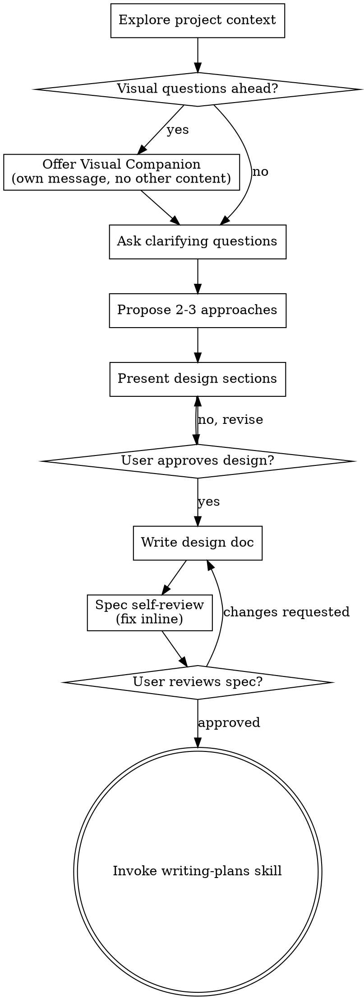

<!-- Generated by SpecStory, Markdown v2.1.0 -->

# 2026-04-01 12:42:16Z

<!-- Claude Code Session b082a4c6-3b1c-4765-9c75-7c27b42678c1 (2026-04-01 12:42:16Z) -->

_**User (2026-04-01 12:42:16Z)**_

<ide_selection>The user selected the lines 134 to 153 from /Users/leocaseiro/Sites/base-skill/docs/baseskill_milestone_breakdown_85146c93.plan.md:
## Milestone 4 -- Game Engine Framework

Build the reusable game infrastructure (no specific games yet).

**SYNC (sequential):**

1. **Game lifecycle manager** -- load, instructions (TTS), play, evaluate, score, next/retry state machine
2. **Game shell UI** -- consistent header, game area, controls, back/exit
3. **Game config loader** -- read game JSON config, merge with parent overrides (override > grade-band > global > default)
4. **Session recorder middleware** -- subscribe to event bus, write to `session_history`, automatic chunking (200 events / 50KB cap), write `session_history_index` summary on session end

**ASYNC (reusable components, independent of each other):**

- `DragAndDrop` -- pointer events, magnetic/snap, ghost preview, visual pulse on drop zones
- `LetterTracer` -- canvas-based tracing with touch/mouse, tap-to-place alternative
- `MultipleChoice` -- tap/click answer selection
- `Timer` -- configurable, hideable per parent settings
- `ScoreAnimation` -- confetti, stars, CSS-only reward animations
- `EncouragementAnnouncer` -- contextual TTS + visual popup, triggered by game events
- `ProgressBar` / `ScoreBoard` -- in-game progress display

This may or may not be related to the current task.</ide_selection>

@docs/baseskill_milestone_breakdown_85146c93.plan.md I would like to /brainstorming the milestone 4

---

_**Agent (claude-sonnet-4-6 2026-04-01 12:42:19Z)**_

<think><details><summary>Thought Process</summary>
The user wants to brainstorm Milestone 4 of the BaseSkill project. They're using the /brainstorming slash command. I need to invoke the brainstorming skill first before responding.
</details></think>

_**Agent (claude-sonnet-4-6 2026-04-01 12:42:20Z)**_

<tool-use data-tool-type="generic" data-tool-name="Skill"><details>
<summary>Tool use: **Skill**</summary>

```text
Launching skill: superpowers:brainstorming
```
</details></tool-use>

---

_**User (2026-04-01 12:42:20Z)**_

Base directory for this skill: /Users/leocaseiro/.claude/plugins/cache/claude-plugins-official/superpowers/5.0.7/skills/brainstorming

# Brainstorming Ideas Into Designs

Help turn ideas into fully formed designs and specs through natural collaborative dialogue.

Start by understanding the current project context, then ask questions one at a time to refine the idea. Once you understand what you're building, present the design and get user approval.

<HARD-GATE>
Do NOT invoke any implementation skill, write any code, scaffold any project, or take any implementation action until you have presented a design and the user has approved it. This applies to EVERY project regardless of perceived simplicity.
</HARD-GATE>

## Anti-Pattern: "This Is Too Simple To Need A Design"

Every project goes through this process. A todo list, a single-function utility, a config change — all of them. "Simple" projects are where unexamined assumptions cause the most wasted work. The design can be short (a few sentences for truly simple projects), but you MUST present it and get approval.

## Checklist

You MUST create a task for each of these items and complete them in order:

1. **Explore project context** — check files, docs, recent commits
2. **Offer visual companion** (if topic will involve visual questions) — this is its own message, not combined with a clarifying question. See the Visual Companion section below.
3. **Ask clarifying questions** — one at a time, understand purpose/constraints/success criteria
4. **Propose 2-3 approaches** — with trade-offs and your recommendation
5. **Present design** — in sections scaled to their complexity, get user approval after each section
6. **Write design doc** — save to `docs/superpowers/specs/YYYY-MM-DD-<topic>-design.md` and commit
7. **Spec self-review** — quick inline check for placeholders, contradictions, ambiguity, scope (see below)
8. **User reviews written spec** — ask user to review the spec file before proceeding
9. **Transition to implementation** — invoke writing-plans skill to create implementation plan

## Process Flow



**The terminal state is invoking writing-plans.** Do NOT invoke frontend-design, mcp-builder, or any other implementation skill. The ONLY skill you invoke after brainstorming is writing-plans.

## The Process

**Understanding the idea:**

- Check out the current project state first (files, docs, recent commits)
- Before asking detailed questions, assess scope: if the request describes multiple independent subsystems (e.g., "build a platform with chat, file storage, billing, and analytics"), flag this immediately. Don't spend questions refining details of a project that needs to be decomposed first.
- If the project is too large for a single spec, help the user decompose into sub-projects: what are the independent pieces, how do they relate, what order should they be built? Then brainstorm the first sub-project through the normal design flow. Each sub-project gets its own spec → plan → implementation cycle.
- For appropriately-scoped projects, ask questions one at a time to refine the idea
- Prefer multiple choice questions when possible, but open-ended is fine too
- Only one question per message - if a topic needs more exploration, break it into multiple questions
- Focus on understanding: purpose, constraints, success criteria

**Exploring approaches:**

- Propose 2-3 different approaches with trade-offs
- Present options conversationally with your recommendation and reasoning
- Lead with your recommended option and explain why

**Presenting the design:**

- Once you believe you understand what you're building, present the design
- Scale each section to its complexity: a few sentences if straightforward, up to 200-300 words if nuanced
- Ask after each section whether it looks right so far
- Cover: architecture, components, data flow, error handling, testing
- Be ready to go back and clarify if something doesn't make sense

**Design for isolation and clarity:**

- Break the system into smaller units that each have one clear purpose, communicate through well-defined interfaces, and can be understood and tested independently
- For each unit, you should be able to answer: what does it do, how do you use it, and what does it depend on?
- Can someone understand what a unit does without reading its internals? Can you change the internals without breaking consumers? If not, the boundaries need work.
- Smaller, well-bounded units are also easier for you to work with - you reason better about code you can hold in context at once, and your edits are more reliable when files are focused. When a file grows large, that's often a signal that it's doing too much.

**Working in existing codebases:**

- Explore the current structure before proposing changes. Follow existing patterns.
- Where existing code has problems that affect the work (e.g., a file that's grown too large, unclear boundaries, tangled responsibilities), include targeted improvements as part of the design - the way a good developer improves code they're working in.
- Don't propose unrelated refactoring. Stay focused on what serves the current goal.

## After the Design

**Documentation:**

- Write the validated design (spec) to `docs/superpowers/specs/YYYY-MM-DD-<topic>-design.md`
  - (User preferences for spec location override this default)
- Use elements-of-style:writing-clearly-and-concisely skill if available
- Commit the design document to git

**Spec Self-Review:**
After writing the spec document, look at it with fresh eyes:

1. **Placeholder scan:** Any "TBD", "TODO", incomplete sections, or vague requirements? Fix them.
2. **Internal consistency:** Do any sections contradict each other? Does the architecture match the feature descriptions?
3. **Scope check:** Is this focused enough for a single implementation plan, or does it need decomposition?
4. **Ambiguity check:** Could any requirement be interpreted two different ways? If so, pick one and make it explicit.

Fix any issues inline. No need to re-review — just fix and move on.

**User Review Gate:**
After the spec review loop passes, ask the user to review the written spec before proceeding:

> "Spec written and committed to `<path>`. Please review it and let me know if you want to make any changes before we start writing out the implementation plan."

Wait for the user's response. If they request changes, make them and re-run the spec review loop. Only proceed once the user approves.

**Implementation:**

- Invoke the writing-plans skill to create a detailed implementation plan
- Do NOT invoke any other skill. writing-plans is the next step.

## Key Principles

- **One question at a time** - Don't overwhelm with multiple questions
- **Multiple choice preferred** - Easier to answer than open-ended when possible
- **YAGNI ruthlessly** - Remove unnecessary features from all designs
- **Explore alternatives** - Always propose 2-3 approaches before settling
- **Incremental validation** - Present design, get approval before moving on
- **Be flexible** - Go back and clarify when something doesn't make sense

## Visual Companion

A browser-based companion for showing mockups, diagrams, and visual options during brainstorming. Available as a tool — not a mode. Accepting the companion means it's available for questions that benefit from visual treatment; it does NOT mean every question goes through the browser.

**Offering the companion:** When you anticipate that upcoming questions will involve visual content (mockups, layouts, diagrams), offer it once for consent:
> "Some of what we're working on might be easier to explain if I can show it to you in a web browser. I can put together mockups, diagrams, comparisons, and other visuals as we go. This feature is still new and can be token-intensive. Want to try it? (Requires opening a local URL)"

**This offer MUST be its own message.** Do not combine it with clarifying questions, context summaries, or any other content. The message should contain ONLY the offer above and nothing else. Wait for the user's response before continuing. If they decline, proceed with text-only brainstorming.

**Per-question decision:** Even after the user accepts, decide FOR EACH QUESTION whether to use the browser or the terminal. The test: **would the user understand this better by seeing it than reading it?**

- **Use the browser** for content that IS visual — mockups, wireframes, layout comparisons, architecture diagrams, side-by-side visual designs
- **Use the terminal** for content that is text — requirements questions, conceptual choices, tradeoff lists, A/B/C/D text options, scope decisions

A question about a UI topic is not automatically a visual question. "What does personality mean in this context?" is a conceptual question — use the terminal. "Which wizard layout works better?" is a visual question — use the browser.

If they agree to the companion, read the detailed guide before proceeding:
`skills/brainstorming/visual-companion.md`


---

_**Agent (claude-sonnet-4-6 2026-04-01 12:42:25Z)**_

<think><details><summary>Thought Process</summary>
The user wants to brainstorm Milestone 4 of the BaseSkill project - the Game Engine Framework. Let me follow the brainstorming skill process:

1. First, explore project context
2. Offer visual companion (if visual questions ahead)
3. Ask clarifying questions one at a time
4. Propose approaches
5. Present design
6. Write design doc
7. Spec self-review
8. User reviews spec
9. Transition to writing-plans

Let me start by exploring the project context - checking files, docs, recent commits.
</details></think>

_**Agent (claude-sonnet-4-6 2026-04-01 12:42:25Z)**_

<tool-use data-tool-type="unknown" data-tool-name="ToolSearch"><details>
<summary>Tool use: **ToolSearch**</summary>

**Input:**

- max_results: `1`
- query: `TodoWrite`

**Result:**

```

```
</details></tool-use>

_**Agent (claude-sonnet-4-6 2026-04-01 12:42:29Z)**_

<think><details><summary>Thought Process</summary>
Let me create todos for the brainstorming process and start exploring the project context.
</details></think>

_**Agent (claude-sonnet-4-6 2026-04-01 12:42:33Z)**_

<tool-use data-tool-type="task" data-tool-name="TodoWrite"><details>
<summary>Tool use: **TodoWrite**</summary>
**Agent task list:**
- [⚡] 🌡️ Explore project context (files, docs, recent commits)
- [ ] 🌡️ Offer visual companion if visual questions ahead
- [ ] 🌡️ Ask clarifying questions one at a time
- [ ] 🌡️ Propose 2-3 approaches with trade-offs
- [ ] 🌡️ Present design sections and get approval
- [ ] 🌡️ Write design doc to docs/superpowers/specs/
- [ ] 🌡️ Spec self-review (placeholders, contradictions, ambiguity)
- [ ] 🌡️ Get user review of written spec
- [ ] 🌡️ Invoke writing-plans skill

</details></tool-use>

_**Agent (claude-sonnet-4-6 2026-04-01 12:42:37Z)**_

<tool-use data-tool-type="search" data-tool-name="Glob"><details>
<summary>Tool use: **Glob**</summary>
 pattern `docs/**/*.md`

```text
docs/project-scope.md
docs/prd.md
docs/brainstorms/2026-03-31-milestone-2-brainstorm.md
docs/adrs/0001-rxdb-without-tanstack-query.md
docs/baseskill_milestone_breakdown_85146c93.plan.md
docs/accessibility.md
docs/architecture.md
docs/ci-cd.md
docs/game-engine.md
docs/i18n.md
docs/superpowers/plans/2026-03-31-milestone-2-data-layer.md
docs/testing-strategy.md
docs/ui-ux.md
docs/data-model.md
docs/superpowers/plans/2026-04-01-milestone-3-app-shell.md
```
</details></tool-use>

_**Agent (claude-sonnet-4-6 2026-04-01 12:42:39Z)**_

<tool-use data-tool-type="shell" data-tool-name="Bash"><details>
<summary>Tool use: **Bash**</summary>
Show recent commits

`git log --oneline -15`

```text
2f93cd9 feat(ui): make Andika the default font
b1f7fa4 Merge branch 'milestone-3-app-shell'
fc5fc62 ai(specstory): sync milestone 3
598579d chore(eslint): keep ternary rules from prettier
108bb19 feat(ui): fix styles import to match tailwind and shadcn
a2f2f5c feat(home): game grid with search params, level filter, and pagination
68a1f06 feat(settings): wire settings screen to RxDB sliders and locale select
dbd9e48 feat(db): add useSettings hook with anonymous defaults and patch support
d337ba6 feat(db): add useBookmarks hook with anonymous profile support
a0746fc feat(layout): wire Header, OfflineIndicator, Footer into app layout
f72e3aa feat(ui): rebuild Header and Footer for app shell
8a849ee fix(types): catalog search validation and GameCard test fixture
a923d07 feat(ui): add OfflineIndicator component
425e3fe feat(ui): add GameGrid component with pagination
16a6328 feat(ui): add LevelRow grade-level filter component
```
</details></tool-use>

_**Agent (claude-sonnet-4-6 2026-04-01 12:42:42Z)**_

<tool-use data-tool-type="read" data-tool-name="Read"><details>
<summary>Tool use: **Read**</summary>
 `./docs/game-engine.md`

```text
File content (14369 tokens) exceeds maximum allowed tokens (10000). Use offset and limit parameters to read specific portions of the file, or search for specific content instead of reading the whole file.
```
</details></tool-use>

_**Agent (claude-sonnet-4-6 2026-04-01 12:42:42Z)**_

<tool-use data-tool-type="read" data-tool-name="Read"><details>
<summary>Tool use: **Read**</summary>
 `./docs/architecture.md`

```text
1	# BaseSkill — System Architecture
2	
3	> **Meta-framework: TanStack Start.** Chosen for its Vite-native architecture, fully type-safe routing via TanStack Router, and a smooth server upgrade path (server functions, API routes) without a framework migration. Currently deployed as a static SPA to GitHub Pages; when server features are needed, TanStack Start's server capabilities activate without restructuring the client.
4	
5	---
6	
7	## 1. Tech Stack
8	
9	| Layer                   | Technology                                  | Rationale                                                                                                                                |
10	| ----------------------- | ------------------------------------------- | ---------------------------------------------------------------------------------------------------------------------------------------- |
11	| **Meta-framework**      | TanStack Start                              | Vite-native, type-safe routing, static SPA + future server upgrade path                                                                  |
12	| **Router**              | TanStack Router (file-based)                | End-to-end type safety for routes, params, search, loaders                                                                               |
13	| **UI library**          | React 19                                    | Component model; hooks for RxDB reactive queries                                                                                         |
14	| **Language**            | TypeScript (strict mode)                    | `noImplicitAny`, no `any` ESLint rule, CI enforcement                                                                                    |
15	| **UI components**       | shadcn/ui                                   | Accessible, unstyled base; extended for kid-friendly defaults                                                                            |
16	| **Styling**             | Tailwind CSS v4                             | Utility-first; CSS variable injection for theme engine                                                                                   |
17	| **Local database**      | RxDB (Dexie storage)                        | Offline-first, reactive; IndexedDB via **Dexie-backed** RxStorage (free tier). See [ADR 0001](adrs/0001-rxdb-without-tanstack-query.md). |
18	| **Build tool**          | Vite (via TanStack Start)                   | Fast HMR, static SPA preset via Nitro                                                                                                    |
19	| **Service Worker**      | Workbox via vite-plugin-pwa                 | Pre-caches app shell and game assets                                                                                                     |
20	| **Cloud sync**          | RxDB replication plugins                    | Cloud storage (initially Google Drive + OneDrive) via PKCE OAuth                                                                         |
21	| **Auth (OneDrive)**     | MSAL.js                                     | Native PKCE SPA flow, no backend needed                                                                                                  |
22	| **Auth (Google Drive)** | Cloudflare Worker BFF                       | Proxy for `client_secret` (Google non-standard PKCE requirement)                                                                         |
23	| **i18n**                | react-i18next                               | Translation namespaces, TTS language routing                                                                                             |
24	| **Testing**             | Vitest + React Testing Library + Playwright | Unit, component, E2E, visual regression                                                                                                  |
25	| **CI/CD**               | GitHub Actions                              | Lint, type-check, test, build, deploy to GitHub Pages                                                                                    |
26	
27	---
28	
29	## 2. System Architecture Overview
30	
31	```mermaid
32	graph TD
33	    subgraph client [Client — Browser]
34	        TanStackStart["TanStack Start\n(Vite + Nitro static)"]
35	        TanStackRouter["TanStack Router\n(file-based routes)"]
36	        ReactApp["React App\n(components + hooks)"]
37	        RxDB["RxDB\n(IndexedDB)"]
38	        EventBus["Event Bus\n(pub/sub)"]
39	        ServiceWorker["Service Worker\n(Workbox)"]
40	    end
41	
42	    subgraph cloud [Cloud Storage — User's own account]
43	        GoogleDrive["Google Drive\n(free tier)"]
44	        OneDrive["OneDrive\n(free tier)"]
45	    end
46	
47	    subgraph proxy [Cloudflare Worker — Free tier]
48	        CFWorker["OAuth BFF Proxy\n(Google token exchange only)"]
49	    end
50	
51	    subgraph hosting [GitHub Pages]
52	        StaticFiles["Static HTML/JS/CSS\n(SPA)"]
53	    end
54	
55	    Browser["User's Browser"] --> ServiceWorker
56	    ServiceWorker --> StaticFiles
57	    ServiceWorker --> ReactApp
58	    ReactApp --> TanStackRouter
59	    TanStackRouter --> TanStackStart
60	    ReactApp --> RxDB
61	    ReactApp --> EventBus
62	    RxDB -->|"replication plugin"| GoogleDrive
63	    RxDB -->|"replication plugin"| OneDrive
64	    ReactApp -->|"PKCE token exchange"| CFWorker
65	    CFWorker -->|"adds client_secret"| GoogleDrive
66	```
67	
68	**Key properties:**
69	
70	- All application logic runs in the browser. No server required.
71	- RxDB is the single source of truth. State persists across refreshes automatically.
72	- **Data access (M2):** React hooks subscribe to RxDB queries; `@tanstack/react-query` is [deferred until M6](adrs/0001-rxdb-without-tanstack-query.md) when network sync arrives, to avoid a duplicate cache for local data.
73	- Each game is its own code-split bundle. The app shell loads instantly; game bundles are downloaded on first play or when the parent explicitly triggers a download. A "Download All Games" option exists in parent settings but is not triggered on first load.
74	- Service worker pre-caches the app shell. Game assets are cached per game on first play.
75	- Cloud sync is opt-in. The app functions identically without it.
76	
77	---
78	
79	## 3. TanStack Start Configuration
80	
81	### Static SPA Preset
82	
83	TanStack Start is configured with the Nitro static preset for GitHub Pages deployment:
84	
85	```typescript
86	// app.config.ts
87	import { defineConfig } from '@tanstack/start/config';
88	
89	export default defineConfig({
90	  server: {
91	    preset: 'static',
92	  },
93	  vite: {
94	    plugins: [
95	      // vite-plugin-pwa added here
96	    ],
97	  },
98	});
99	```
100	
101	**Output:** A `dist/` directory of static HTML/JS/CSS files. Deployable to GitHub Pages, Netlify, Vercel, Cloudflare Pages, or any static host.
102	
103	**Future server upgrade:** When server features are needed (auth, WebSockets, premium APIs), change `preset` to `'cloudflare-workers'`, `'vercel'`, or `'node-server'`. Client-side code is unchanged.
104	
105	---
106	
107	## 4. TanStack Router — Route Tree
108	
109	### File-Based Routing Convention
110	
111	Routes are defined as files in the `routes/` directory. TanStack Router generates a fully type-safe route tree at build time.
112	
113	```
114	routes/
115	  __root.tsx                    # Root document (HTML shell, global providers)
116	  _app.tsx                      # App layout (offline indicator, theme, i18n provider)
117	  _app/
118	    index.tsx                   # Profile picker / home screen
119	    dashboard.tsx               # Game grid (requires active profile)
120	    game/
121	      $gameId.tsx               # Game shell (dynamic segment, type-safe)
122	    settings.tsx                # Child settings (volume, speech, theme, language)
123	    parent.tsx                  # Parent settings layout (PIN-gated)
124	    parent/
125	      index.tsx                 # Parent settings home
126	      overrides.tsx             # Game override controls
127	      history.tsx               # Session history viewer
128	      data.tsx                  # Data management (clear history/progress)
129	      sync.tsx                  # Cloud sync configuration
130	      voices.tsx                # TTS voice selector
131	```
132	
133	### Route Guards
134	
135	```typescript
136	// _app/dashboard.tsx — redirect to profile picker if no active profile
137	export const Route = createFileRoute('/_app/dashboard')({
138	  beforeLoad: ({ context }) => {
139	    if (!context.activeProfile) {
140	      throw redirect({ to: '/_app/' });
141	    }
142	  },
143	  loader: async ({ context }) => {
144	    // Pre-fetch game catalog + bookmarks from RxDB
145	    return {
146	      games: await context.db.games.find().exec(),
147	      bookmarks: await context.db.bookmarks
148	        .find({ selector: { profileId: context.activeProfile.id } })
149	        .exec(),
150	    };
151	  },
152	});
153	
154	// _app/parent.tsx — PIN gate
155	export const Route = createFileRoute('/_app/parent')({
156	  beforeLoad: ({ context }) => {
157	    if (!context.parentUnlocked) {
158	      throw redirect({
159	        to: '/_app/dashboard',
160	        search: { pinRequired: true },
161	      });
162	    }
163	  },
164	});
165	```
166	
167	### Type-Safe Route Parameters
168	
169	```typescript
170	// _app/game/$gameId.tsx
171	export const Route = createFileRoute('/_app/game/$gameId')({
172	  params: {
173	    parse: (params) => ({ gameId: params.gameId }), // typed string
174	  },
175	  loader: async ({ params, context }) => {
176	    const config = await context.gameLoader.load(params.gameId);
177	    const overrides = await context.db.game_config_overrides
178	      .findOne({
179	        selector: {
180	          profileId: context.activeProfile.id,
181	          gameId: params.gameId,
182	        },
183	      })
184	      .exec();
185	    return { config, overrides };
186	  },
187	});
188	```
189	
190	### Route Tree Diagram
191	
192	```mermaid
193	flowchart LR
194	    root["__root.tsx\n(HTML shell)"]
195	    root --> idx["index.tsx\n/ → redirect /en"]
196	    root --> locale["$locale/route.tsx\n/$locale\nvalidates locale,\nsyncs i18n language"]
197	    locale --> app["$locale/_app.tsx\nDbProvider +\nI18nextProvider +\nThemeRuntimeProvider"]
198	    app --> home["_app/index.tsx\n/ (home catalog)"]
199	    app --> dashboard["_app/dashboard.tsx\n/dashboard"]
200	    app --> settings["_app/settings.tsx\n/settings"]
201	    app --> game["_app/game/$gameId.tsx\n/game/:gameId"]
202	    app --> parent["_app/parent.tsx\n/parent (PIN-gated)"]
203	    parent --> parentIdx["parent/index.tsx\n/parent/"]
204	    parent --> overrides["parent/overrides.tsx\n/parent/overrides"]
205	    parent --> history["parent/history.tsx\n/parent/history"]
206	    parent --> data["parent/data.tsx\n/parent/data"]
207	    parent --> sync["parent/sync.tsx\n/parent/sync"]
208	    parent --> voices["parent/voices.tsx\n/parent/voices"]
209	```
210	
211	---
212	
213	## 5. Component Architecture
214	
215	### Layout Hierarchy
216	
217	```
218	__root.tsx
219	└── _app.tsx  (AppLayout)
220	    ├── OfflineIndicator
221	    ├── ThemeProvider (CSS variables from RxDB)
222	    ├── I18nProvider (react-i18next)
223	    └── [child route outlet]
224	        ├── _app/index.tsx     → ProfilePicker
225	        ├── _app/dashboard.tsx → Dashboard
226	        │   ├── BookmarkedGamesRow
227	        │   ├── RecentGamesRow
228	        │   └── GameGrid (by subject/grade)
229	        ├── _app/game/$gameId.tsx → GameShell
230	        │   ├── GameHeader (back, title, score, timer)
231	        │   ├── GameArea (game-specific component)
232	        │   └── GameControls (pause, exit)
233	        ├── _app/settings.tsx  → ChildSettings
234	        └── _app/parent.tsx    → ParentSettings
235	            ├── GameOverridesScreen
236	            ├── SessionHistoryViewer
237	            ├── DataManagementScreen
238	            ├── CloudSyncScreen
239	            └── VoiceSelectorScreen
240	```
241	
242	### React Provider Hierarchy
243	
244	```mermaid
245	graph TD
246	    Root["__root.tsx\n(HTML shell, devtools, THEME_INIT_SCRIPT)"]
247	    Root --> LocaleRoute["$locale/route.tsx\nbeforeLoad: validate locale\nsyncs i18n.changeLanguage"]
248	    LocaleRoute --> AppShell["$locale/_app.tsx"]
249	
250	    subgraph providers ["Providers (nested, outermost first)"]
251	        DbProvider["DbProvider\n— initialises RxDB\n— seeds themes on ready\n— exposes db via context"]
252	        I18nProvider["I18nextProvider\n— provides t() and useTranslation\n— language driven by $locale param"]
253	        ThemeProvider["ThemeRuntimeProvider\n— subscribes to themes collection\n— injects --bs-* CSS variables"]
254	    end
255	
256	    AppShell --> DbProvider
257	    DbProvider --> I18nProvider
258	    I18nProvider --> ThemeProvider
259	    ThemeProvider --> Outlet["<Outlet />\n(child routes)"]
260	
261	    Outlet --> HomeCatalog["_app/index\nHomeCatalog"]
262	    Outlet --> Dashboard["_app/dashboard\nDashboard"]
263	    Outlet --> GameShell["_app/game/$gameId\nGameShell"]
264	    Outlet --> ChildSettings["_app/settings\nChildSettings"]
265	    Outlet --> ParentSettings["_app/parent\nParentSettings (PIN-gated)"]
266	```
267	
268	### Reusable Game Components
269	
270	These components are game-framework-level and used across multiple games:
271	
272	| Component                | Description                                  | Used By                    |
273	| ------------------------ | -------------------------------------------- | -------------------------- |
274	| `DragAndDrop`            | Pointer events, magnetic snap, ghost preview | Number Match, Word Builder |
275	| `LetterTracer`           | Canvas tracing with touch/mouse              | Letter Tracing             |
276	| `MultipleChoice`         | Tap/click answer selection                   | Math Facts                 |
277	| `SpeechInput`            | STT with animated visual indicator (GIF)     | Read Aloud                 |
278	| `SpeechOutput`           | TTS wrapper with voice selection             | All games                  |
279	| `Timer`                  | Configurable, hideable per parent settings   | Math Facts (optional all)  |
280	| `EncouragementAnnouncer` | TTS + visual popup, event-triggered          | All games                  |
281	| `ScoreAnimation`         | CSS confetti/stars reward animations         | All games                  |
282	| `ProgressBar`            | In-game progress display                     | All games                  |
283	| `ScoreBoard`             | Current score display                        | All games                  |
284	| `OfflineIndicator`       | `navigator.onLine` banner                    | App shell                  |
285	
286	---
287	
288	## 6. State Management
289	
290	### RxDB as Single Source of Truth
291	
292	All persistent state lives in RxDB. Components subscribe to reactive queries; UI updates automatically when data changes.
293	
294	```typescript
295	// Example: reactive profile hook
296	function useActiveProfile() {
297	  const [profile, setProfile] = useState<Profile | null>(null);
298	
299	  useEffect(() => {
300	    const sub = db.profiles
301	      .findOne({ selector: { isActive: true } })
302	      .$.subscribe(setProfile);
303	    return () => sub.unsubscribe();
304	  }, []);
305	
306	  return profile;
307	}
308	```
309	
310	### TanStack Query Integration (Evaluation Point)
311	
312	During Milestone 2, evaluate whether TanStack Query should wrap RxDB observables:
313	
314	- **Option A**: RxDB reactive queries only (custom hooks). Simpler. RxDB handles caching natively.
315	- **Option B**: TanStack Query wraps RxDB `exec()` calls. Adds cache invalidation, loading/error states, suspense support.
316	- **Decision criteria**: If server data (Cloudflare Worker, future APIs) needs to be mixed with local RxDB data in the same loading lifecycle, TanStack Query is the natural bridge. For pure local data, RxDB hooks are sufficient.
317	
318	**Provisional decision**: Use RxDB custom hooks for all local data. Add TanStack Query only when server-side data fetching is introduced (post-M6).
319	
320	### Non-Persistent UI State
321	
322	Non-persistent state (modal open/closed, current game step, animation state) uses React's `useState`/`useReducer` co-located with the component that owns it. No global UI state store.
323	
324	### RxDB Provider and Hooks Setup
325	
326	```mermaid
327	sequenceDiagram
328	    participant App as App mount
329	    participant DbP as DbProvider
330	    participant DB as RxDB (IndexedDB)
331	    participant Seed as seedThemesOnce()
332	    participant Hook as useRxQuery / useRxDB
333	    participant Comp as Component
334	
335	    App->>DbP: render <DbProvider>
336	    DbP->>DB: getOrCreateDatabase()
337	    DB-->>DbP: db instance
338	    DbP->>DB: checkVersionAndMigrate(db)
339	    DbP->>Seed: seedThemesOnce(db)
340	    Seed->>DB: upsert preset themes (if missing)
341	    DbP-->>App: isReady = true
342	
343	    Note over Hook,Comp: Hooks used anywhere inside DbProvider
344	    Comp->>Hook: useRxDB()
345	    Hook-->>Comp: db instance from context
346	
347	    Comp->>Hook: useRxQuery(db.themes.find().$)
348	    Hook->>DB: subscribe to Observable
349	    DB-->>Hook: current docs
350	    Hook-->>Comp: docs[] (re-renders on change)
351	
352	    Note over Hook,DB: On unmount
353	    Hook->>DB: subscription.unsubscribe()
354	```
355	
356	---
357	
358	## 7. Data Flow
359	
360	```mermaid
361	sequenceDiagram
362	    participant Child as Child
363	    participant UI as React UI
364	    participant Hook as RxDB Hook
365	    participant RxDB as RxDB (IndexedDB)
366	    participant SW as Service Worker
367	    participant Cloud as Cloud (Drive/OneDrive)
368	
369	    Child->>UI: Taps answer
370	    UI->>Hook: mutate(action)
371	    Hook->>RxDB: upsert document
372	    RxDB-->>Hook: reactive update
373	    Hook-->>UI: re-render
374	    UI-->>Child: sees new state
375	
376	    Note over RxDB,Cloud: Background sync (when online)
377	    RxDB->>Cloud: replication plugin push
378	    Cloud-->>RxDB: replication plugin pull
379	```
380	
381	---
382	
383	## 8. Cloud Sync Architecture
384	
385	### Overview
386	
387	RxDB provides [replication plugins](https://rxdb.info/replication.html) for Google Drive and OneDrive. These plugins:
388	
389	1. Read the RxDB `checkpoint` (last sync position)
390	2. Push local changes to the cloud file
391	3. Pull remote changes and merge into local RxDB
392	4. Handle conflict resolution per collection strategy
393	
394	### Google Drive Sync
395	
396	**Challenge**: Google OAuth requires a `client_secret` even with PKCE (non-standard — violates RFC 7636).
397	
398	**Solution**: A lightweight Cloudflare Worker (~50 lines) acts as a Backend-for-Frontend (BFF) proxy:
399	
400	```mermaid
401	sequenceDiagram
402	    participant App as SPA (Browser)
403	    participant CF as Cloudflare Worker
404	    participant Google as Google OAuth
405	
406	    App->>Google: Redirect to consent screen (PKCE code_challenge)
407	    Google-->>App: Authorization code (redirect_uri callback)
408	    App->>CF: POST /token {code, code_verifier, redirect_uri}
409	    CF->>Google: POST /token {code, code_verifier, client_secret, redirect_uri}
410	    Google-->>CF: {access_token, refresh_token}
411	    CF-->>App: {access_token, refresh_token}
412	    App->>App: Store tokens encrypted in IndexedDB
413	```
414	
415	- The `client_secret` lives in Cloudflare Worker environment variables — never in the client bundle.
416	- The Worker is deployed separately and is **not** part of the GPL-licensed app repository.
417	- Cloudflare Workers free tier: 100,000 requests/day — sufficient for OAuth token exchanges.
418	- Token refresh follows the same proxy pattern.
419	
420	### OneDrive Sync
421	
422	MSAL.js handles the full PKCE flow natively for OneDrive — no backend proxy needed:
423	
424	```mermaid
425	sequenceDiagram
426	    participant App as SPA (Browser)
427	    participant MSAL as MSAL.js
428	    participant MS as Microsoft OAuth
429	
430	    App->>MSAL: loginPopup() or loginRedirect()
431	    MSAL->>MS: PKCE authorization request
432	    MS-->>MSAL: Authorization code
433	    MSAL->>MS: Token exchange (client-side PKCE)
434	    MS-->>MSAL: {access_token, refresh_token}
435	    MSAL-->>App: Account + tokens (cached in MSAL cache)
436	```
437	
438	### Token Storage
439	
440	OAuth tokens are stored **encrypted in IndexedDB** — never in `localStorage` or `sessionStorage`:
441	
442	- Encryption key derived from device-specific entropy (e.g., a random key generated once and stored in IndexedDB with a separate namespace).
443	- Tokens are never exposed in URL fragments or query strings after the OAuth redirect.
444	- MSAL.js manages its own encrypted token cache internally.
445	- Google Drive tokens are stored in a separate encrypted RxDB document (`sync_meta` collection).
446	
447	### Device-Aware Sync
448	
449	Each synced record includes a `deviceId` field (generated once per device, stored in `sync_meta`):
450	
451	- **Device-specific data** (e.g., available TTS voices) is tagged with `deviceId` and not applied on other devices.
452	- **Shared data** (progress, bookmarks, themes) syncs across all devices.
453	- On a new device, if the synced voice is unavailable, the app falls back to the OS default voice for that language.
454	
455	### Conflict Resolution
456	
457	| Collection              | Strategy                                                      |
458	| ----------------------- | ------------------------------------------------------------- |
459	| `profiles`              | Last-write-wins (by `updatedAt` timestamp)                    |
460	| `progress`              | Merge: take max score, sum stars, extend streaks              |
461	| `settings`              | Last-write-wins (per profile)                                 |
462	| `game_config_overrides` | Last-write-wins (by `updatedAt`)                              |
463	| `bookmarks`             | Union (all bookmarks from all devices kept)                   |
464	| `themes`                | Last-write-wins (by `updatedAt`)                              |
465	| `session_history`       | Append-only; no conflicts (chunks are immutable once written) |
466	| `session_history_index` | Append-only; no conflicts                                     |
467	| `sync_meta`             | Device-local; not cross-device synced                         |
468	| `app_meta`              | Device-local; not cross-device synced                         |
469	
470	---
471	
472	## 9. PWA and Offline Strategy
473	
474	### Service Worker Lifecycle
475	
476	```mermaid
477	stateDiagram-v2
478	    [*] --> Installing: First visit / SW update available
479	    Installing --> Waiting: Install complete
480	    Waiting --> Active: skipWaiting() called
481	    Active --> Controlling: clientsClaim()
482	    Controlling --> [*]: SW terminated (browser GC)
483	
484	    Active --> VersionCheck: New SW installed
485	    VersionCheck --> CachePurge: Version mismatch detected
486	    CachePurge --> MigrationCheck: Stale caches purged
487	    MigrationCheck --> AppRender: No schema change
488	    MigrationCheck --> RxDBMigration: Schema version changed
489	    RxDBMigration --> AppRender: Migration complete
490	```
491	
492	### Cache Strategy (Workbox)
493	
494	| Asset Type                    | Strategy                                                                       | TTL        |
495	| ----------------------------- | ------------------------------------------------------------------------------ | ---------- |
496	| App shell (HTML, core JS/CSS) | Cache-first, update on install                                                 | SW version |
497	| Game bundles (JS per game)    | Cache-first, code-split per game, downloaded on first play or parent-triggered | SW version |
498	| Game assets (images, audio)   | Cache-first, lazy-loaded per game                                              | SW version |
499	| API calls (future)            | Network-first with fallback                                                    | 5 minutes  |
500	| Google Fonts (if used)        | Stale-while-revalidate                                                         | 30 days    |
501	
502	### App Versioning
503	
504	Every CD deploy stamps a semver version:
505	
506	1. Version embedded in `app_meta` RxDB collection on first run.
507	2. New SW checks its version against the cached version.
508	3. On mismatch: `skipWaiting()` + `clientsClaim()` → purge old caches → run RxDB migrations if needed → render app.
509	4. Version displayed in Parent Settings > About.
510	
511	### Offline/Online Detection
512	
513	```typescript
514	// Global hook — used by OfflineIndicator and RxDB sync
515	function useOnlineStatus() {
516	  const [isOnline, setIsOnline] = useState(navigator.onLine);
517	
518	  useEffect(() => {
519	    const handleOnline = () => setIsOnline(true);
520	    const handleOffline = () => setIsOnline(false);
521	    window.addEventListener('online', handleOnline);
522	    window.addEventListener('offline', handleOffline);
523	    return () => {
524	      window.removeEventListener('online', handleOnline);
525	      window.removeEventListener('offline', handleOffline);
526	    };
527	  }, []);
528	
529	  return isOnline;
530	}
531	```
532	
533	---
534	
535	## 10. Event Bus and Extension Points
536	
537	### Event Bus
538	
539	A typed pub/sub system used for:
540	
541	1. **Session recorder**: subscribes to game events, writes to `session_history`.
542	2. **Encouragement system**: listens for `game:evaluate` events, triggers TTS + animation.
543	3. **Plugin hooks**: external code subscribes without modifying app source.
544	
545	```typescript
546	// Event type definitions
547	interface AppEvents {
548	  'game:start': {
549	    gameId: string;
550	    profileId: string;
551	    sessionId: string;
552	  };
553	  'game:action': {
554	    sessionId: string;
555	    action: string;
556	    payload: unknown;
557	  };
558	  'game:evaluate': {
559	    sessionId: string;
560	    result: 'correct' | 'incorrect' | 'near-miss';
561	  };
562	  'game:score': { sessionId: string; score: number; total: number };
563	  'game:hint': { sessionId: string; hintType: string };
564	  'game:end': {
565	    sessionId: string;
566	    finalScore: number;
567	    duration: number;
568	  };
569	  'profile:switch': {
570	    fromProfileId: string | null;
571	    toProfileId: string;
572	  };
573	  'sync:start': { provider: 'google-drive' | 'onedrive' };
574	  'sync:complete': {
575	    provider: 'google-drive' | 'onedrive';
576	    timestamp: number;
577	  };
578	  'sync:error': {
579	    provider: 'google-drive' | 'onedrive';
580	    error: string;
581	  };
582	}
583	
584	interface EventBus {
585	  emit<K extends keyof AppEvents>(
586	    event: K,
587	    payload: AppEvents[K],
588	  ): void;
589	  on<K extends keyof AppEvents>(
590	    event: K,
591	    handler: (payload: AppEvents[K]) => void,
592	  ): () => void;
593	  off<K extends keyof AppEvents>(
594	    event: K,
595	    handler: (payload: AppEvents[K]) => void,
596	  ): void;
597	}
598	```
599	
600	### Plugin Hook API
601	
602	External plugins (from separate repos) register via a public API exposed on `window.__baseSkillPlugins`:
603	
604	```typescript
605	interface PluginAPI {
606	  eventBus: Pick<EventBus, 'on' | 'off'>; // subscribe only, not emit
607	  registerUISlot: (
608	    slot: UISlot,
609	    component: React.ComponentType,
610	  ) => () => void;
611	  getConfig: () => ReadonlyAppConfig;
612	}
613	
614	type UISlot =
615	  | 'dashboard:banner' // Above game grid
616	  | 'game:overlay' // Floating overlay during gameplay
617	  | 'parent:settings:section'; // Additional section in parent settings
618	```
619	
620	Plugins cannot `emit` events — they can only subscribe. This ensures app state integrity.
621	
622	### Analytics Abstraction
623	
624	```typescript
625	interface AnalyticsAdapter {
626	  trackEvent(name: string, properties?: Record<string, unknown>): void;
627	  trackPageView(path: string): void;
628	  identify(profileId: string): void; // pseudonymous — no PII
629	  reset(): void;
630	}
631	
632	// Default: no-op implementation
633	const noopAnalytics: AnalyticsAdapter = {
634	  trackEvent: () => {},
635	  trackPageView: () => {},
636	  identify: () => {},
637	  reset: () => {},
638	};
639	```
640	
641	Provider is injected at app initialization via config. Swap providers by changing the config, not the code.
642	
643	---
644	
645	## 11. Directory Structure (Target)
646	
647	```
648	base-skill/
649	├── app/
650	│   ├── routes/                     # TanStack Router file-based routes
651	│   │   ├── __root.tsx
652	│   │   ├── _app.tsx
653	│   │   ├── _app/
654	│   │   │   ├── index.tsx
655	│   │   │   ├── dashboard.tsx
656	│   │   │   ├── game/
657	│   │   │   │   └── $gameId.tsx
658	│   │   │   ├── settings.tsx
659	│   │   │   └── parent/
660	│   │   │       ├── index.tsx
661	│   │   │       ├── overrides.tsx
662	│   │   │       ├── history.tsx
663	│   │   │       ├── data.tsx
664	│   │   │       ├── sync.tsx
665	│   │   │       └── voices.tsx
666	│   ├── components/
667	│   │   ├── game/                   # Reusable game components
668	│   │   │   ├── DragAndDrop.tsx
669	│   │   │   ├── LetterTracer.tsx
670	│   │   │   ├── MultipleChoice.tsx
671	│   │   │   ├── SpeechInput.tsx
672	│   │   │   ├── SpeechOutput.tsx
673	│   │   │   ├── Timer.tsx
674	│   │   │   ├── EncouragementAnnouncer.tsx
675	│   │   │   ├── ScoreAnimation.tsx
676	│   │   │   ├── ProgressBar.tsx
677	│   │   │   └── ScoreBoard.tsx
678	│   │   ├── ui/                     # shadcn/ui components (generated)
679	│   │   ├── layout/
680	│   │   │   ├── AppLayout.tsx
681	│   │   │   ├── GameShell.tsx
682	│   │   │   └── OfflineIndicator.tsx
683	│   │   └── profile/
684	│   │       ├── ProfilePicker.tsx
685	│   │       └── AvatarPicker.tsx
686	│   ├── db/
687	│   │   ├── index.ts                # RxDB initialization
688	│   │   ├── schemas/                # JSON Schema definitions per collection
689	│   │   ├── hooks/                  # Reactive RxDB query hooks
690	│   │   └── migrations/             # Schema migration scripts
691	│   ├── games/                      # Individual game implementations
692	│   │   ├── letter-tracing/
693	│   │   ├── number-match/
694	│   │   ├── word-builder/
695	│   │   ├── read-aloud/
696	│   │   └── math-facts/
697	│   ├── lib/
698	│   │   ├── event-bus.ts
699	│   │   ├── analytics.ts
700	│   │   ├── theme.ts
701	│   │   ├── speech.ts               # TTS/STT wrappers
702	│   │   └── game-config-loader.ts
703	│   ├── i18n/
704	│   │   ├── index.ts
705	│   │   └── locales/
706	│   │       ├── en/
707	│   │       └── pt-BR/
708	│   └── styles/
709	│       └── globals.css             # Tailwind directives + CSS variables
710	├── public/
711	│   ├── manifest.json
712	│   └── icons/
713	├── tests/
714	│   ├── unit/
715	│   ├── e2e/                        # Playwright tests
716	│   └── fixtures/                   # RxDB seed data
717	├── docs/                           # Design documents (this folder)
718	├── app.config.ts                   # TanStack Start config
719	├── vite.config.ts
720	├── tsconfig.json
721	├── package.json
722	└── LICENSE
723	```
724	
725	---
726	
727	## 12. Security Considerations
728	
729	| Risk                                 | Mitigation                                                                                                 |
730	| ------------------------------------ | ---------------------------------------------------------------------------------------------------------- |
731	| OAuth `client_secret` exposure       | Stored only in Cloudflare Worker env vars; never in client bundle                                          |
732	| Token storage in browser             | Encrypted IndexedDB; keys derived from device entropy; never in `localStorage`                             |
733	| XSS via game content                 | Game configs are JSON (no eval); content rendered as text nodes or via sanitized JSX                       |
734	| Plugin injection from external repos | Plugins receive read-only event bus (subscribe only); cannot emit events or modify RxDB directly           |
735	| Personal data in session history     | Session history contains gameplay events only — no PII. ProfileId is a UUID with no link to real identity. |
736	| Dependency supply chain              | `npm audit` in CI; pin major versions; Dependabot alerts                                                   |
737
```
</details></tool-use>

_**Agent (claude-sonnet-4-6 2026-04-01 12:42:46Z)**_

<tool-use data-tool-type="read" data-tool-name="Read"><details>
<summary>Tool use: **Read**</summary>
 `./docs/game-engine.md`

```text
1	# BaseSkill Game Engine Design Document
2	
3	> **Project**: BaseSkill — free, open-source, offline-first educational PWA for children  
4	> **Stack**: TanStack Start + TanStack Router + React + TypeScript (strict, no `any`)  
5	> **Audience**: AI agents implementing Milestone 1+ game features  
6	> **Status**: Authoritative design reference
7	
8	---
9	
10	## Table of Contents
11	
12	1. [Overview](#1-overview)
13	2. [Game Lifecycle State Machine](#2-game-lifecycle-state-machine)
14	3. [Event Bus Integration](#3-event-bus-integration)
15	4. [Session Recorder Middleware](#4-session-recorder-middleware)
16	5. [Game Config JSON Schema](#5-game-config-json-schema)
17	6. [Parent Override Merging Logic](#6-parent-override-merging-logic)
18	7. [Reusable Game Components](#7-reusable-game-components)
19	8. [Difficulty Progression](#8-difficulty-progression)
20	9. [Reference Game Detailed Specs](#9-reference-game-detailed-specs)
21	
22	---
23	
24	## 1. Overview
25	
26	The BaseSkill game engine is a **reusable, config-driven framework** that decouples game logic from presentation. All games share:
27	
28	- A **common lifecycle state machine** governing transitions from idle to game-over
29	- A **typed event bus** for loose coupling between game components, analytics, and the session recorder
30	- A **JSON game config** that fully describes a game's identity, content, difficulty settings, and assets — no code changes required to add new content
31	- A set of **reusable React components** that implement common interaction patterns (drag-and-drop, letter tracing, multiple choice, speech I/O, etc.)
32	
33	### Architectural Principles
34	
35	| Principle           | Detail                                                                                             |
36	| ------------------- | -------------------------------------------------------------------------------------------------- |
37	| Config-driven       | Games are described as JSON configs; the engine renders the correct component                      |
38	| Offline-first       | All game assets and configs are bundled or cached via Service Worker; RxDB is the persistent store |
39	| No `any`            | All TypeScript is strict; `any` is forbidden                                                       |
40	| Accessibility-first | WCAG 2.1 AA minimum; every interactive element is keyboard navigable and has ARIA attributes       |
41	| Language-aware      | All user-visible strings live in localized config objects keyed by locale (`en`, `pt-BR`)          |
42	| Agent-observable    | Every meaningful game event is emitted on the event bus for session recording and future AI agents |
43	
44	### High-Level Data Flow
45	
46	```
47	GameConfig (JSON)
48	      │
49	      ▼
50	GameEngine (React)
51	  ├─ Lifecycle State Machine
52	  ├─ Event Bus (emits typed events)
53	  ├─ Reusable Game Component (DragAndDrop | LetterTracer | MultipleChoice | ...)
54	  └─ Session Recorder (subscribes to event bus → writes RxDB chunks)
55	```
56	
57	---
58	
59	## 2. Game Lifecycle State Machine
60	
61	### State Diagram
62	
63	```mermaid
64	stateDiagram-v2
65	    [*] --> Idle
66	
67	    Idle --> Loading : load()
68	    Loading --> Instructions : showInstructions()
69	    Instructions --> Playing : startPlay()
70	    Playing --> Evaluating : submitAnswer()
71	    Evaluating --> Scoring : evaluate()
72	    Scoring --> NextRound : scoreRound() [hasMoreRounds]
73	    Scoring --> Retry : scoreRound() [canRetry && incorrect]
74	    Scoring --> GameOver : scoreRound() [!hasMoreRounds || maxRetriesExceeded]
75	    NextRound --> Playing : nextRound()
76	    Retry --> Playing : retry()
77	    GameOver --> Idle : endGame()
78	
79	    note right of Loading
80	        Entry: session recorder subscribes to event bus
81	        Entry: preload assets
82	    end note
83	
84	    note right of Instructions
85	        Entry: TTS reads instructions aloud
86	        Entry: emit game:instructions_shown
87	    end note
88	
89	    note right of Playing
90	        Entry: emit game:start (first round only)
91	        Entry: start Timer if configured
92	    end note
93	
94	    note right of Evaluating
95	        Entry: emit game:evaluate with answer payload
96	    end note
97	
98	    note right of Scoring
99	        Entry: emit game:score with result payload
100	        Entry: EncouragementAnnouncer reacts to game:evaluate
101	    end note
102	
103	    note right of GameOver
104	        Entry: emit game:end
105	        Entry: session recorder writes index doc and unsubscribes
106	    end note
107	```
108	
109	### Transition Functions
110	
111	| Function                | From State   | To State                       | Description                                          |
112	| ----------------------- | ------------ | ------------------------------ | ---------------------------------------------------- |
113	| `load(gameId)`          | Idle         | Loading                        | Fetch game config from RxDB / bundle; preload assets |
114	| `showInstructions()`    | Loading      | Instructions                   | Assets ready; TTS reads instructions                 |
115	| `startPlay()`           | Instructions | Playing                        | Child taps "Start" or instructions complete          |
116	| `submitAnswer(payload)` | Playing      | Evaluating                     | Child submits an answer                              |
117	| `evaluate(result)`      | Evaluating   | Scoring                        | Engine scores the answer                             |
118	| `scoreRound(score)`     | Scoring      | NextRound \| Retry \| GameOver | Engine decides next state                            |
119	| `nextRound()`           | NextRound    | Playing                        | Advance to next question/round                       |
120	| `retry()`               | Retry        | Playing                        | Replay current round                                 |
121	| `endGame()`             | GameOver     | Idle                           | Clean up; navigate back to game select               |
122	
123	### TypeScript State Types
124	
125	```typescript
126	export type GameState =
127	  | 'Idle'
128	  | 'Loading'
129	  | 'Instructions'
130	  | 'Playing'
131	  | 'Evaluating'
132	  | 'Scoring'
133	  | 'NextRound'
134	  | 'Retry'
135	  | 'GameOver';
136	
137	export interface GameLifecycleContext {
138	  gameId: string;
139	  state: GameState;
140	  roundIndex: number;
141	  retryCount: number;
142	  score: number;
143	  maxRetries: number;
144	}
145	```
146	
147	---
148	
149	## 3. Event Bus Integration
150	
151	The event bus is a **typed publish/subscribe singleton**. Game components emit events; any subscriber (session recorder, analytics, parent dashboard sync) can react without coupling.
152	
153	### Event Bus Interface
154	
155	```typescript
156	export type GameEventType =
157	  | 'game:start'
158	  | 'game:instructions_shown'
159	  | 'game:action'
160	  | 'game:evaluate'
161	  | 'game:score'
162	  | 'game:hint'
163	  | 'game:retry'
164	  | 'game:time_up'
165	  | 'game:end';
166	
167	export interface BaseGameEvent {
168	  type: GameEventType;
169	  gameId: string;
170	  sessionId: string;
171	  profileId: string;
172	  timestamp: number; // Date.now()
173	  roundIndex: number;
174	}
175	
176	export interface GameStartEvent extends BaseGameEvent {
177	  type: 'game:start';
178	  locale: string;
179	  difficulty: string;
180	  gradeBand: GradeBand;
181	}
182	
183	export interface GameInstructionsShownEvent extends BaseGameEvent {
184	  type: 'game:instructions_shown';
185	}
186	
187	export interface GameActionEvent extends BaseGameEvent {
188	  type: 'game:action';
189	  actionType: string; // e.g. "drag_drop", "tap", "trace_stroke"
190	  payload: Record<string, string | number | boolean>;
191	}
192	
193	export interface GameEvaluateEvent extends BaseGameEvent {
194	  type: 'game:evaluate';
195	  answer: string | string[] | number;
196	  correct: boolean;
197	  nearMiss: boolean; // within 1 of correct, partial match, etc.
198	}
199	
200	export interface GameScoreEvent extends BaseGameEvent {
```
</details></tool-use>

_**Agent (claude-sonnet-4-6 2026-04-01 12:42:46Z)**_

<tool-use data-tool-type="read" data-tool-name="Read"><details>
<summary>Tool use: **Read**</summary>
 `./docs/data-model.md`

```text
1	# BaseSkill — RxDB Data Model Design
2	
3	**Version:** 1.0.0  
4	**Status:** Authoritative reference for all milestone implementations  
5	**Audience:** AI agents implementing Milestones 1–7
6	
7	---
8	
9	## Table of Contents
10	
11	1. [Overview](#1-overview)
12	2. [Collection Schemas](#2-collection-schemas)
13	   - [profiles](#21-profiles)
14	   - [progress](#22-progress)
15	   - [settings](#23-settings)
16	   - [game_config_overrides](#24-game_config_overrides)
17	   - [bookmarks](#25-bookmarks)
18	   - [themes](#26-themes)
19	   - [session_history](#27-session_history)
20	   - [session_history_index](#28-session_history_index)
21	   - [sync_meta](#29-sync_meta)
22	   - [app_meta](#210-app_meta)
23	3. [Relationships Diagram](#3-relationships-diagram)
24	4. [Chunking Rules](#4-chunking-rules)
25	5. [Data Lifecycle and Cleanup](#5-data-lifecycle-and-cleanup)
26	6. [Version Tracking and Migrations](#6-version-tracking-and-migrations)
27	7. [Sync Strategy](#7-sync-strategy)
28	8. [Token Storage](#8-token-storage)
29	9. [RxDB Schema Versioning](#9-rxdb-schema-versioning)
30	10. [Implementation Notes](#10-implementation-notes)
31	
32	---
33	
34	## 1. Overview
35	
36	### Single Source of Truth
37	
38	RxDB is the **exclusive local data layer** for BaseSkill. All reads and writes go through RxDB — no direct IndexedDB access, no localStorage for user data. Components subscribe to RxDB observables and re-render reactively when data changes.
39	
40	### Storage Backend
41	
42	- **IndexedDB** via RxDB's `getRxStorageIndexedDB()` adapter (or `getRxStorageDexie()` for broader compatibility)
43	- Works fully offline; no network required for any core functionality
44	- Data persists across page reloads, app closes, and browser restarts
45	
46	### Collections at a Glance
47	
48	| Collection              | Scope                  | Synced | Purpose                         |
49	| ----------------------- | ---------------------- | ------ | ------------------------------- |
50	| `profiles`              | per-child              | ✅     | Child identity and preferences  |
51	| `progress`              | per-profile + per-game | ✅     | Game progress, scores, badges   |
52	| `settings`              | per-profile            | ✅     | App preferences                 |
53	| `game_config_overrides` | per-profile            | ✅     | Parent-set game customizations  |
54	| `bookmarks`             | per-profile            | ✅     | Favorited games                 |
55	| `themes`                | global + per-family    | ✅     | UI themes (presets and custom)  |
56	| `session_history`       | per-session chunk      | ✅     | Raw event log chunks            |
57	| `session_history_index` | per-session            | ✅     | Session summary index           |
58	| `sync_meta`             | device-local           | ❌     | Cloud sync state and tokens     |
59	| `app_meta`              | device-local           | ❌     | App version and migration state |
60	
61	### Primary Key Conventions
62	
63	- All collections use `id` as the RxDB primary key (type: `string`)
64	- IDs are generated client-side using `nanoid()` (21 chars, URL-safe)
65	- `profileId`, `gameId`, `sessionId` are foreign-key references (strings, no DB-level enforcement)
66	- Timestamps are ISO 8601 strings (`2024-03-15T14:23:00.000Z`)
67	
68	---
69	
70	## 2. Collection Schemas
71	
72	Each schema is expressed as a JSON Schema object compatible with RxDB's `jsonSchema` property. All schemas include a `version` number used for RxDB migrations.
73	
74	---
75	
76	### 2.1 `profiles`
77	
78	Represents a single child's identity. One device may have multiple profiles (siblings). The active profile is determined by `isActive: true` (only one at a time).
79	
80	**RxDB Schema Definition:**
81	
82	```json
83	{
84	  "version": 0,
85	  "primaryKey": "id",
86	  "type": "object",
87	  "properties": {
88	    "id": {
89	      "type": "string",
90	      "maxLength": 36
91	    },
92	    "name": {
93	      "type": "string",
94	      "minLength": 1,
95	      "maxLength": 64
96	    },
97	    "avatar": {
98	      "type": "string",
99	      "description": "Avatar identifier key (e.g. 'cat', 'rocket', 'dragon') or data URI for custom avatar"
100	    },
```
</details></tool-use>

_**Agent (claude-sonnet-4-6 2026-04-01 12:42:49Z)**_

<think><details><summary>Thought Process</summary>
I've got good context. Let me also check the current state of the app to see what's been implemented in M3.
</details></think>

_**Agent (claude-sonnet-4-6 2026-04-01 12:42:50Z)**_

<tool-use data-tool-type="search" data-tool-name="Glob"><details>
<summary>Tool use: **Glob**</summary>
 pattern `app/**/*.tsx`

```text
No files found
```
</details></tool-use>

_**Agent (claude-sonnet-4-6 2026-04-01 12:42:53Z)**_

<tool-use data-tool-type="shell" data-tool-name="Bash"><details>
<summary>Tool use: **Bash**</summary>
Find all TSX files in project

`find /Users/leocaseiro/Sites/base-skill -name "*.tsx" | grep -v node_modules | grep -v worktrees | head -40`

```text
/Users/leocaseiro/Sites/base-skill/src/providers/ThemeRuntimeProvider.tsx
/Users/leocaseiro/Sites/base-skill/src/providers/DbProvider.test.tsx
/Users/leocaseiro/Sites/base-skill/src/providers/DbProvider.tsx
/Users/leocaseiro/Sites/base-skill/src/components/ui/alert-dialog.tsx
/Users/leocaseiro/Sites/base-skill/src/components/ui/card.tsx
/Users/leocaseiro/Sites/base-skill/src/components/ui/slider.tsx
/Users/leocaseiro/Sites/base-skill/src/components/ui/sheet.tsx
/Users/leocaseiro/Sites/base-skill/src/components/ui/label.tsx
/Users/leocaseiro/Sites/base-skill/src/components/ui/sonner.tsx
/Users/leocaseiro/Sites/base-skill/src/components/ui/button.tsx
/Users/leocaseiro/Sites/base-skill/src/components/ui/dropdown-menu.tsx
/Users/leocaseiro/Sites/base-skill/src/components/ui/select.tsx
/Users/leocaseiro/Sites/base-skill/src/components/ui/input.tsx
/Users/leocaseiro/Sites/base-skill/src/components/Footer.tsx
/Users/leocaseiro/Sites/base-skill/src/components/GameCard.test.tsx
/Users/leocaseiro/Sites/base-skill/src/components/ThemeToggle.tsx
/Users/leocaseiro/Sites/base-skill/src/components/GameCard.tsx
/Users/leocaseiro/Sites/base-skill/src/components/Header.tsx
/Users/leocaseiro/Sites/base-skill/src/components/GameGrid.tsx
/Users/leocaseiro/Sites/base-skill/src/components/OfflineIndicator.tsx
/Users/leocaseiro/Sites/base-skill/src/components/GameGrid.test.tsx
/Users/leocaseiro/Sites/base-skill/src/components/LevelRow.tsx
/Users/leocaseiro/Sites/base-skill/src/components/OfflineIndicator.test.tsx
/Users/leocaseiro/Sites/base-skill/src/components/LevelRow.test.tsx
/Users/leocaseiro/Sites/base-skill/src/router.tsx
/Users/leocaseiro/Sites/base-skill/src/db/hooks/useRxQuery.test.tsx
/Users/leocaseiro/Sites/base-skill/src/db/hooks/useBookmarks.test.tsx
/Users/leocaseiro/Sites/base-skill/src/db/hooks/useSettings.test.tsx
/Users/leocaseiro/Sites/base-skill/src/routes/__root.test.tsx
/Users/leocaseiro/Sites/base-skill/src/routes/index.tsx
/Users/leocaseiro/Sites/base-skill/src/routes/__root.tsx
/Users/leocaseiro/Sites/base-skill/src/routes/$locale/route.tsx
/Users/leocaseiro/Sites/base-skill/src/routes/$locale/_app.tsx
/Users/leocaseiro/Sites/base-skill/src/routes/$locale/_app/settings.tsx
/Users/leocaseiro/Sites/base-skill/src/routes/$locale/_app/index.tsx
/Users/leocaseiro/Sites/base-skill/src/routes/$locale/_app/dashboard.tsx
/Users/leocaseiro/Sites/base-skill/src/routes/$locale/_app/game/$gameId.tsx
/Users/leocaseiro/Sites/base-skill/src/routes/$locale/_app/index.test.tsx
/Users/leocaseiro/Sites/base-skill/src/routes/$locale/_app/parent/index.tsx
/Users/leocaseiro/Sites/base-skill/src/routes/$locale/_app/parent/overrides.tsx
```
</details></tool-use>

_**Agent (claude-sonnet-4-6 2026-04-01 12:42:56Z)**_

<tool-use data-tool-type="read" data-tool-name="Read"><details>
<summary>Tool use: **Read**</summary>
 `./src/routes/$locale/_app/game/$gameId.tsx`

```text
1	import { createFileRoute } from '@tanstack/react-router';
2	
3	const GameShell = () => {
4	  const { gameId } = Route.useParams();
5	  return (
6	    <div className="p-8">
7	      <h1 className="text-2xl font-bold">Game Shell</h1>
8	      <p className="mt-2 text-muted-foreground">
9	        Loading game: {gameId}
10	      </p>
11	    </div>
12	  );
13	};
14	
15	export const Route = createFileRoute('/$locale/_app/game/$gameId')({
16	  component: GameShell,
17	});
18
```
</details></tool-use>

_**Agent (claude-sonnet-4-6 2026-04-01 12:42:57Z)**_

<tool-use data-tool-type="shell" data-tool-name="Bash"><details>
<summary>Tool use: **Bash**</summary>
Find all TS files in project

`find /Users/leocaseiro/Sites/base-skill/src -name "*.ts" | grep -v node_modules | grep -v worktrees | grep -v ".test." | head -30`

```text
/Users/leocaseiro/Sites/base-skill/src/types/game-events.ts
/Users/leocaseiro/Sites/base-skill/src/vite-env.d.ts
/Users/leocaseiro/Sites/base-skill/src/routeTree.gen.ts
/Users/leocaseiro/Sites/base-skill/src/lib/utils.ts
/Users/leocaseiro/Sites/base-skill/src/lib/speech/SpeechInput.ts
/Users/leocaseiro/Sites/base-skill/src/lib/speech/voices.ts
/Users/leocaseiro/Sites/base-skill/src/lib/speech/SpeechOutput.ts
/Users/leocaseiro/Sites/base-skill/src/lib/game-event-bus.ts
/Users/leocaseiro/Sites/base-skill/src/lib/theme/default-tokens.ts
/Users/leocaseiro/Sites/base-skill/src/lib/theme/css-vars.ts
/Users/leocaseiro/Sites/base-skill/src/lib/i18n/i18n.ts
/Users/leocaseiro/Sites/base-skill/src/db/create-database.ts
/Users/leocaseiro/Sites/base-skill/src/db/migrations.ts
/Users/leocaseiro/Sites/base-skill/src/db/schemas/profiles.ts
/Users/leocaseiro/Sites/base-skill/src/db/schemas/sync_meta.ts
/Users/leocaseiro/Sites/base-skill/src/db/schemas/app-meta.ts
/Users/leocaseiro/Sites/base-skill/src/db/schemas/progress.ts
/Users/leocaseiro/Sites/base-skill/src/db/schemas/bookmarks.ts
/Users/leocaseiro/Sites/base-skill/src/db/schemas/settings.ts
/Users/leocaseiro/Sites/base-skill/src/db/schemas/session_history.ts
/Users/leocaseiro/Sites/base-skill/src/db/schemas/session_history_index.ts
/Users/leocaseiro/Sites/base-skill/src/db/schemas/index.ts
/Users/leocaseiro/Sites/base-skill/src/db/schemas/game_config_overrides.ts
/Users/leocaseiro/Sites/base-skill/src/db/schemas/themes.ts
/Users/leocaseiro/Sites/base-skill/src/db/types.ts
/Users/leocaseiro/Sites/base-skill/src/db/seed-themes.ts
/Users/leocaseiro/Sites/base-skill/src/db/hooks/useRxDB.ts
/Users/leocaseiro/Sites/base-skill/src/db/hooks/useRxQuery.ts
/Users/leocaseiro/Sites/base-skill/src/db/hooks/useSettings.ts
/Users/leocaseiro/Sites/base-skill/src/db/hooks/useBookmarks.ts
```
</details></tool-use>

_**Agent (claude-sonnet-4-6 2026-04-01 12:43:00Z)**_

<tool-use data-tool-type="read" data-tool-name="Read"><details>
<summary>Tool use: **Read**</summary>
 `./src/lib/game-event-bus.ts`

```text
1	import type {
2	  GameEvent,
3	  GameEventBus,
4	  GameEventType,
5	} from '@/types/game-events';
6	
7	type Handler = (event: GameEvent) => void;
8	
9	export class TypedGameEventBus implements GameEventBus {
10	  private readonly byType = new Map<GameEventType, Set<Handler>>();
11	  private readonly wildcards = new Set<Handler>();
12	
13	  emit(event: GameEvent): void {
14	    for (const h of this.wildcards) {
15	      h(event);
16	    }
17	    const specific = this.byType.get(event.type);
18	    if (specific) {
19	      for (const h of specific) {
20	        h(event);
21	      }
22	    }
23	  }
24	
25	  subscribe(
26	    type: GameEventType | 'game:*',
27	    handler: Handler,
28	  ): () => void {
29	    if (type === 'game:*') {
30	      this.wildcards.add(handler);
31	      return () => {
32	        this.wildcards.delete(handler);
33	      };
34	    }
35	    let bucket = this.byType.get(type);
36	    if (!bucket) {
37	      bucket = new Set();
38	      this.byType.set(type, bucket);
39	    }
40	    bucket.add(handler);
41	    return () => {
42	      bucket.delete(handler);
43	      if (bucket.size === 0) {
44	        this.byType.delete(type);
45	      }
46	    };
47	  }
48	}
49	
50	let singleton: GameEventBus | undefined;
51	
52	export function createGameEventBus(): GameEventBus {
53	  return new TypedGameEventBus();
54	}
55	
56	/** Process-wide singleton for M2 (internal use; public API may ship later). */
57	export function getGameEventBus(): GameEventBus {
58	  singleton ??= createGameEventBus();
59	  return singleton;
60	}
61
```
</details></tool-use>

_**Agent (claude-sonnet-4-6 2026-04-01 12:43:00Z)**_

<tool-use data-tool-type="read" data-tool-name="Read"><details>
<summary>Tool use: **Read**</summary>
 `./src/types/game-events.ts`

```text
1	/** Aligned with docs/game-engine.md §3 (expand in M4 as needed). */
2	export type GradeBand =
3	  | 'pre-k'
4	  | 'k'
5	  | 'year1-2'
6	  | 'year3-4'
7	  | 'year5-6';
8	
9	export type GameEventType =
10	  | 'game:start'
11	  | 'game:instructions_shown'
12	  | 'game:action'
13	  | 'game:evaluate'
14	  | 'game:score'
15	  | 'game:hint'
16	  | 'game:retry'
17	  | 'game:time_up'
18	  | 'game:end';
19	
20	export interface BaseGameEvent {
21	  type: GameEventType;
22	  gameId: string;
23	  sessionId: string;
24	  profileId: string;
25	  timestamp: number;
26	  roundIndex: number;
27	}
28	
29	export interface GameStartEvent extends BaseGameEvent {
30	  type: 'game:start';
31	  locale: string;
32	  difficulty: string;
33	  gradeBand: GradeBand;
34	}
35	
36	export interface GameInstructionsShownEvent extends BaseGameEvent {
37	  type: 'game:instructions_shown';
38	}
39	
40	export interface GameActionEvent extends BaseGameEvent {
41	  type: 'game:action';
42	  actionType: string;
43	  payload: Record<string, string | number | boolean>;
44	}
45	
46	export interface GameEvaluateEvent extends BaseGameEvent {
47	  type: 'game:evaluate';
48	  answer: string | string[] | number;
49	  correct: boolean;
50	  nearMiss: boolean;
51	}
52	
53	export interface GameScoreEvent extends BaseGameEvent {
54	  type: 'game:score';
55	  pointsAwarded: number;
56	  totalScore: number;
57	  streak: number;
58	}
59	
60	export interface GameHintEvent extends BaseGameEvent {
61	  type: 'game:hint';
62	  hintType: string;
63	}
64	
65	export interface GameRetryEvent extends BaseGameEvent {
66	  type: 'game:retry';
67	  retryCount: number;
68	}
69	
70	export interface GameTimeUpEvent extends BaseGameEvent {
71	  type: 'game:time_up';
72	}
73	
74	export interface GameEndEvent extends BaseGameEvent {
75	  type: 'game:end';
76	  finalScore: number;
77	  totalRounds: number;
78	  correctCount: number;
79	  durationMs: number;
80	}
81	
82	export type GameEvent =
83	  | GameStartEvent
84	  | GameInstructionsShownEvent
85	  | GameActionEvent
86	  | GameEvaluateEvent
87	  | GameScoreEvent
88	  | GameHintEvent
89	  | GameRetryEvent
90	  | GameTimeUpEvent
91	  | GameEndEvent;
92	
93	export interface GameEventBus {
94	  emit: (event: GameEvent) => void;
95	  subscribe: (
96	    type: GameEventType | 'game:*',
97	    handler: (event: GameEvent) => void,
98	  ) => () => void;
99	}
100
```
</details></tool-use>

_**Agent (claude-sonnet-4-6 2026-04-01 12:43:15Z)**_

<think><details><summary>Thought Process</summary>
Now I have a good picture of the project context. Let me update the todo and move to the next step.

Summary of what exists:
- M3 is complete (app shell, routing, profile picker, dashboard, settings, offline indicator, bookmarks, recents)
- M2 data layer is in place: RxDB with all collections, hooks (useRxDB, useRxQuery, useSettings, useBookmarks), event bus (`TypedGameEventBus`), themes, speech services
- The game route exists at `src/routes/$locale/_app/game/$gameId.tsx` but is just a placeholder (shows "Game Shell" and loads gameId)


- The event bus infrastructure is already set up with typed game events and a singleton pattern

For M4, I need to build the game lifecycle state machine that handles transitions between Idle, Loading, Instructions, Playing, Evaluating, Scoring, NextRound, Retry, and GameOver states, along with the game shell UI, a config loader to read and merge game JSON configurations, and session recording middleware that captures events to the session history.

I'm also thinking through the reusable async components like DragAndDrop, LetterTracer, MultipleChoice, Timer, ScoreAnimation, EncouragementAnnouncer, and ProgressBar that will be needed across different games. Since this is heavily visual work with UI layouts and state diagrams, I should create a visual companion document to go along with the detailed game-engine.md, then follow up with clarifying questions about the specific requirements.
</details></think>

_**Agent (claude-sonnet-4-6 2026-04-01 12:43:17Z)**_

<tool-use data-tool-type="task" data-tool-name="TodoWrite"><details>
<summary>Tool use: **TodoWrite**</summary>
**Agent task list:**
- [X] 🌡️ Explore project context (files, docs, recent commits)
- [⚡] 🌡️ Offer visual companion if visual questions ahead
- [ ] 🌡️ Ask clarifying questions one at a time
- [ ] 🌡️ Propose 2-3 approaches with trade-offs
- [ ] 🌡️ Present design sections and get approval
- [ ] 🌡️ Write design doc to docs/superpowers/specs/
- [ ] 🌡️ Spec self-review (placeholders, contradictions, ambiguity)
- [ ] 🌡️ Get user review of written spec
- [ ] 🌡️ Invoke writing-plans skill

</details></tool-use>

_**Agent (claude-sonnet-4-6 2026-04-01 12:43:24Z)**_

Good context gathered. Here's what I found:

- **M3 is merged** — app shell, routing, dashboard, settings, offline indicator, bookmarks are all done
- **Existing M4 foundations**: `TypedGameEventBus` + full `GameEvent` types already live in `src/lib/game-event-bus.ts` and `src/types/game-events.ts`
- **Game route placeholder** at `src/routes/$locale/_app/game/$gameId.tsx` — just shows "Loading game: {gameId}", no real shell yet
- **`docs/game-engine.md`** exists with a detailed lifecycle state machine, event types, and component specs — authoritative reference

---

Some of what we'll work through involves layout decisions for the game shell UI and state machine visualization. I can put together mockups, diagrams, and side-by-side visual comparisons in a browser as we go. This feature is still new and can be token-intensive. Want to try it? (Requires opening a local URL)

---

_**User (2026-04-01 12:43:55Z)**_

<ide_opened_file>The user opened the file /Users/leocaseiro/Sites/base-skill/docs/baseskill_milestone_breakdown_85146c93.plan.md in the IDE. This may or may not be related to the current task.</ide_opened_file>

Y

---

_**Agent (claude-sonnet-4-6 2026-04-01 12:43:58Z)**_

<think><details><summary>Thought Process</summary>
The user said "Y" which means they want to use the visual companion. Let me read the visual companion guide.
</details></think>

_**Agent (claude-sonnet-4-6 2026-04-01 12:44:02Z)**_

<tool-use data-tool-type="read" data-tool-name="Read"><details>
<summary>Tool use: **Read**</summary>
 `/Users/leocaseiro/.claude/plugins/cache/claude-plugins-official/superpowers/5.0.7/skills/brainstorming/visual-companion.md`

```text
1	# Visual Companion Guide
2	
3	Browser-based visual brainstorming companion for showing mockups, diagrams, and options.
4	
5	## When to Use
6	
7	Decide per-question, not per-session. The test: **would the user understand this better by seeing it than reading it?**
8	
9	**Use the browser** when the content itself is visual:
10	
11	- **UI mockups** — wireframes, layouts, navigation structures, component designs
12	- **Architecture diagrams** — system components, data flow, relationship maps
13	- **Side-by-side visual comparisons** — comparing two layouts, two color schemes, two design directions
14	- **Design polish** — when the question is about look and feel, spacing, visual hierarchy
15	- **Spatial relationships** — state machines, flowcharts, entity relationships rendered as diagrams
16	
17	**Use the terminal** when the content is text or tabular:
18	
19	- **Requirements and scope questions** — "what does X mean?", "which features are in scope?"
20	- **Conceptual A/B/C choices** — picking between approaches described in words
21	- **Tradeoff lists** — pros/cons, comparison tables
22	- **Technical decisions** — API design, data modeling, architectural approach selection
23	- **Clarifying questions** — anything where the answer is words, not a visual preference
24	
25	A question *about* a UI topic is not automatically a visual question. "What kind of wizard do you want?" is conceptual — use the terminal. "Which of these wizard layouts feels right?" is visual — use the browser.
26	
27	## How It Works
28	
29	The server watches a directory for HTML files and serves the newest one to the browser. You write HTML content to `screen_dir`, the user sees it in their browser and can click to select options. Selections are recorded to `state_dir/events` that you read on your next turn.
30	
31	**Content fragments vs full documents:** If your HTML file starts with `<!DOCTYPE` or `<html`, the server serves it as-is (just injects the helper script). Otherwise, the server automatically wraps your content in the frame template — adding the header, CSS theme, selection indicator, and all interactive infrastructure. **Write content fragments by default.** Only write full documents when you need complete control over the page.
32	
33	## Starting a Session
34	
35	```bash
36	# Start server with persistence (mockups saved to project)
37	scripts/start-server.sh --project-dir /path/to/project
38	
39	# Returns: {"type":"server-started","port":52341,"url":"http://localhost:52341",
40	#           "screen_dir":"/path/to/project/.superpowers/brainstorm/12345-1706000000/content",
41	#           "state_dir":"/path/to/project/.superpowers/brainstorm/12345-1706000000/state"}
42	```
43	
44	Save `screen_dir` and `state_dir` from the response. Tell user to open the URL.
45	
46	**Finding connection info:** The server writes its startup JSON to `$STATE_DIR/server-info`. If you launched the server in the background and didn't capture stdout, read that file to get the URL and port. When using `--project-dir`, check `<project>/.superpowers/brainstorm/` for the session directory.
47	
48	**Note:** Pass the project root as `--project-dir` so mockups persist in `.superpowers/brainstorm/` and survive server restarts. Without it, files go to `/tmp` and get cleaned up. Remind the user to add `.superpowers/` to `.gitignore` if it's not already there.
49	
50	**Launching the server by platform:**
51	
52	**Claude Code (macOS / Linux):**
53	```bash
54	# Default mode works — the script backgrounds the server itself
55	scripts/start-server.sh --project-dir /path/to/project
56	```
57	
58	**Claude Code (Windows):**
59	```bash
60	# Windows auto-detects and uses foreground mode, which blocks the tool call.
61	# Use run_in_background: true on the Bash tool call so the server survives
62	# across conversation turns.
63	scripts/start-server.sh --project-dir /path/to/project
64	```
65	When calling this via the Bash tool, set `run_in_background: true`. Then read `$STATE_DIR/server-info` on the next turn to get the URL and port.
66	
67	**Codex:**
68	```bash
69	# Codex reaps background processes. The script auto-detects CODEX_CI and
70	# switches to foreground mode. Run it normally — no extra flags needed.
71	scripts/start-server.sh --project-dir /path/to/project
72	```
73	
74	**Gemini CLI:**
75	```bash
76	# Use --foreground and set is_background: true on your shell tool call
77	# so the process survives across turns
78	scripts/start-server.sh --project-dir /path/to/project --foreground
79	```
80	
81	**Other environments:** The server must keep running in the background across conversation turns. If your environment reaps detached processes, use `--foreground` and launch the command with your platform's background execution mechanism.
82	
83	If the URL is unreachable from your browser (common in remote/containerized setups), bind a non-loopback host:
84	
85	```bash
86	scripts/start-server.sh \
87	  --project-dir /path/to/project \
88	  --host 0.0.0.0 \
89	  --url-host localhost
90	```
91	
92	Use `--url-host` to control what hostname is printed in the returned URL JSON.
93	
94	## The Loop
95	
96	1. **Check server is alive**, then **write HTML** to a new file in `screen_dir`:
97	   - Before each write, check that `$STATE_DIR/server-info` exists. If it doesn't (or `$STATE_DIR/server-stopped` exists), the server has shut down — restart it with `start-server.sh` before continuing. The server auto-exits after 30 minutes of inactivity.
98	   - Use semantic filenames: `platform.html`, `visual-style.html`, `layout.html`
99	   - **Never reuse filenames** — each screen gets a fresh file
100	   - Use Write tool — **never use cat/heredoc** (dumps noise into terminal)
101	   - Server automatically serves the newest file
102	
103	2. **Tell user what to expect and end your turn:**
104	   - Remind them of the URL (every step, not just first)
105	   - Give a brief text summary of what's on screen (e.g., "Showing 3 layout options for the homepage")
106	   - Ask them to respond in the terminal: "Take a look and let me know what you think. Click to select an option if you'd like."
107	
108	3. **On your next turn** — after the user responds in the terminal:
109	   - Read `$STATE_DIR/events` if it exists — this contains the user's browser interactions (clicks, selections) as JSON lines
110	   - Merge with the user's terminal text to get the full picture
111	   - The terminal message is the primary feedback; `state_dir/events` provides structured interaction data
112	
113	4. **Iterate or advance** — if feedback changes current screen, write a new file (e.g., `layout-v2.html`). Only move to the next question when the current step is validated.
114	
115	5. **Unload when returning to terminal** — when the next step doesn't need the browser (e.g., a clarifying question, a tradeoff discussion), push a waiting screen to clear the stale content:
116	
117	   ```html
118	   <!-- filename: waiting.html (or waiting-2.html, etc.) -->
119	   <div style="display:flex;align-items:center;justify-content:center;min-height:60vh">
120	     <p class="subtitle">Continuing in terminal...</p>
121	   </div>
122	   ```
123	
124	   This prevents the user from staring at a resolved choice while the conversation has moved on. When the next visual question comes up, push a new content file as usual.
125	
126	6. Repeat until done.
127	
128	## Writing Content Fragments
129	
130	Write just the content that goes inside the page. The server wraps it in the frame template automatically (header, theme CSS, selection indicator, and all interactive infrastructure).
131	
132	**Minimal example:**
133	
134	```html
135	<h2>Which layout works better?</h2>
136	<p class="subtitle">Consider readability and visual hierarchy</p>
137	
138	<div class="options">
139	  <div class="option" data-choice="a" onclick="toggleSelect(this)">
140	    <div class="letter">A</div>
141	    <div class="content">
142	      <h3>Single Column</h3>
143	      <p>Clean, focused reading experience</p>
144	    </div>
145	  </div>
146	  <div class="option" data-choice="b" onclick="toggleSelect(this)">
147	    <div class="letter">B</div>
148	    <div class="content">
149	      <h3>Two Column</h3>
150	      <p>Sidebar navigation with main content</p>
151	    </div>
152	  </div>
153	</div>
154	```
155	
156	That's it. No `<html>`, no CSS, no `<script>` tags needed. The server provides all of that.
157	
158	## CSS Classes Available
159	
160	The frame template provides these CSS classes for your content:
161	
162	### Options (A/B/C choices)
163	
164	```html
165	<div class="options">
166	  <div class="option" data-choice="a" onclick="toggleSelect(this)">
167	    <div class="letter">A</div>
168	    <div class="content">
169	      <h3>Title</h3>
170	      <p>Description</p>
171	    </div>
172	  </div>
173	</div>
174	```
175	
176	**Multi-select:** Add `data-multiselect` to the container to let users select multiple options. Each click toggles the item. The indicator bar shows the count.
177	
178	```html
179	<div class="options" data-multiselect>
180	  <!-- same option markup — users can select/deselect multiple -->
181	</div>
182	```
183	
184	### Cards (visual designs)
185	
186	```html
187	<div class="cards">
188	  <div class="card" data-choice="design1" onclick="toggleSelect(this)">
189	    <div class="card-image"><!-- mockup content --></div>
190	    <div class="card-body">
191	      <h3>Name</h3>
192	      <p>Description</p>
193	    </div>
194	  </div>
195	</div>
196	```
197	
198	### Mockup container
199	
200	```html
201	<div class="mockup">
202	  <div class="mockup-header">Preview: Dashboard Layout</div>
203	  <div class="mockup-body"><!-- your mockup HTML --></div>
204	</div>
205	```
206	
207	### Split view (side-by-side)
208	
209	```html
210	<div class="split">
211	  <div class="mockup"><!-- left --></div>
212	  <div class="mockup"><!-- right --></div>
213	</div>
214	```
215	
216	### Pros/Cons
217	
218	```html
219	<div class="pros-cons">
220	  <div class="pros"><h4>Pros</h4><ul><li>Benefit</li></ul></div>
221	  <div class="cons"><h4>Cons</h4><ul><li>Drawback</li></ul></div>
222	</div>
223	```
224	
225	### Mock elements (wireframe building blocks)
226	
227	```html
228	<div class="mock-nav">Logo | Home | About | Contact</div>
229	<div style="display: flex;">
230	  <div class="mock-sidebar">Navigation</div>
231	  <div class="mock-content">Main content area</div>
232	</div>
233	<button class="mock-button">Action Button</button>
234	<input class="mock-input" placeholder="Input field">
235	<div class="placeholder">Placeholder area</div>
236	```
237	
238	### Typography and sections
239	
240	- `h2` — page title
241	- `h3` — section heading
242	- `.subtitle` — secondary text below title
243	- `.section` — content block with bottom margin
244	- `.label` — small uppercase label text
245	
246	## Browser Events Format
247	
248	When the user clicks options in the browser, their interactions are recorded to `$STATE_DIR/events` (one JSON object per line). The file is cleared automatically when you push a new screen.
249	
250	```jsonl
251	{"type":"click","choice":"a","text":"Option A - Simple Layout","timestamp":1706000101}
252	{"type":"click","choice":"c","text":"Option C - Complex Grid","timestamp":1706000108}
253	{"type":"click","choice":"b","text":"Option B - Hybrid","timestamp":1706000115}
254	```
255	
256	The full event stream shows the user's exploration path — they may click multiple options before settling. The last `choice` event is typically the final selection, but the pattern of clicks can reveal hesitation or preferences worth asking about.
257	
258	If `$STATE_DIR/events` doesn't exist, the user didn't interact with the browser — use only their terminal text.
259	
260	## Design Tips
261	
262	- **Scale fidelity to the question** — wireframes for layout, polish for polish questions
263	- **Explain the question on each page** — "Which layout feels more professional?" not just "Pick one"
264	- **Iterate before advancing** — if feedback changes current screen, write a new version
265	- **2-4 options max** per screen
266	- **Use real content when it matters** — for a photography portfolio, use actual images (Unsplash). Placeholder content obscures design issues.
267	- **Keep mockups simple** — focus on layout and structure, not pixel-perfect design
268	
269	## File Naming
270	
271	- Use semantic names: `platform.html`, `visual-style.html`, `layout.html`
272	- Never reuse filenames — each screen must be a new file
273	- For iterations: append version suffix like `layout-v2.html`, `layout-v3.html`
274	- Server serves newest file by modification time
275	
276	## Cleaning Up
277	
278	```bash
279	scripts/stop-server.sh $SESSION_DIR
280	```
281	
282	If the session used `--project-dir`, mockup files persist in `.superpowers/brainstorm/` for later reference. Only `/tmp` sessions get deleted on stop.
283	
284	## Reference
285	
286	- Frame template (CSS reference): `scripts/frame-template.html`
287	- Helper script (client-side): `scripts/helper.js`
288
```
</details></tool-use>

_**Agent (claude-sonnet-4-6 2026-04-01 12:44:10Z)**_

<tool-use data-tool-type="task" data-tool-name="TodoWrite"><details>
<summary>Tool use: **TodoWrite**</summary>
**Agent task list:**
- [X] 🌡️ Explore project context (files, docs, recent commits)
- [X] 🌡️ Offer visual companion if visual questions ahead
- [⚡] 🌡️ Ask clarifying questions one at a time
- [ ] 🌡️ Propose 2-3 approaches with trade-offs
- [ ] 🌡️ Present design sections and get approval
- [ ] 🌡️ Write design doc to docs/superpowers/specs/
- [ ] 🌡️ Spec self-review (placeholders, contradictions, ambiguity)
- [ ] 🌡️ Get user review of written spec
- [ ] 🌡️ Invoke writing-plans skill

</details></tool-use>

_**Agent (claude-sonnet-4-6 2026-04-01 12:44:17Z)**_

<tool-use data-tool-type="shell" data-tool-name="Bash"><details>
<summary>Tool use: **Bash**</summary>
List available scripts for visual companion

`ls /Users/leocaseiro/.claude/plugins/cache/claude-plugins-official/superpowers/5.0.7/scripts/`

```text
bump-version.sh
```
</details></tool-use>

_**Agent (claude-sonnet-4-6 2026-04-01 12:44:20Z)**_

<think><details><summary>Thought Process</summary>
The scripts directory doesn't have `start-server.sh`. Let me check if there's a scripts directory in the project.
</details></think>

_**Agent (claude-sonnet-4-6 2026-04-01 12:44:41Z)**_

<tool-use data-tool-type="shell" data-tool-name="Bash"><details>
<summary>Tool use: **Bash**</summary>
Find start-server.sh script

`find /Users/leocaseiro/.claude/plugins -name "start-server.sh" 2>/dev/null | head -5`

```text
/Users/leocaseiro/.claude/plugins/cache/claude-plugins-official/superpowers/5.0.7/skills/brainstorming/scripts/start-server.sh
```
</details></tool-use>

_**Agent (claude-sonnet-4-6 2026-04-01 12:44:52Z)**_

<tool-use data-tool-type="shell" data-tool-name="Bash"><details>
<summary>Tool use: **Bash**</summary>
Start visual companion server

`bash /Users/leocaseiro/.claude/plugins/cache/claude-plugins-official/superpowers/5.0.7/skills/brainstorming/scripts/start-server.sh --project-dir /Users/leocaseiro/Sites/base-skill`

```text
{"type":"server-started","port":55960,"host":"127.0.0.1","url_host":"localhost","url":"http://localhost:55960","screen_dir":"/Users/leocaseiro/Sites/base-skill/.superpowers/brainstorm/15110-1775047490/content","state_dir":"/Users/leocaseiro/Sites/base-skill/.superpowers/brainstorm/15110-1775047490/state"}
```
</details></tool-use>

_**Agent (claude-sonnet-4-6 2026-04-01 12:44:56Z)**_

<think><details><summary>Thought Process</summary>
The server started. The URL is http://localhost:55960. Now let me make sure .superpowers is in .gitignore.

Let me also save the screen_dir and state_dir:
- screen_dir: `/Users/leocaseiro/Sites/base-skill/.superpowers/brainstorm/15110-1775047490/content`
- state_dir: `/Users/leocaseiro/Sites/base-skill/.superpowers/brainstorm/15110-1775047490/state`

Now let me check .gitignore.
</details></think>

_**Agent (claude-sonnet-4-6 2026-04-01 12:44:57Z)**_

<tool-use data-tool-type="shell" data-tool-name="Bash"><details>
<summary>Tool use: **Bash**</summary>
Check if .superpowers is in .gitignore

`grep -n "superpowers" /Users/leocaseiro/Sites/base-skill/.gitignore 2>/dev/null || echo "not found"`

```text
not found
```
</details></tool-use>

_**Agent (claude-sonnet-4-6 2026-04-01 12:45:00Z)**_

<tool-use data-tool-type="shell" data-tool-name="Bash"><details>
<summary>Tool use: **Bash**</summary>
Add .superpowers to .gitignore

`echo ".superpowers/" >> /Users/leocaseiro/Sites/base-skill/.gitignore`

```text
(Bash completed with no output)
```
</details></tool-use>

_**Agent (claude-sonnet-4-6 2026-04-01 12:45:10Z)**_

Visual companion is running. Please open **http://localhost:55960** in your browser.

Now, let me start with the first clarifying question. The `docs/game-engine.md` is quite detailed — it specifies the lifecycle state machine, event types, config schema, etc. But M4 is broad.

**First question:** The milestone plan lists 4 SYNC items (lifecycle manager, game shell UI, config loader, session recorder) plus 7 ASYNC reusable components. That's a lot for one milestone. Are you planning to implement **all 7 reusable components** in M4 — including the more complex ones like `LetterTracer` (canvas-based) and `DragAndDrop` (pointer events + snap) — or should M4 focus on the **framework core** (lifecycle + shell + config + session recorder + only the simpler components), leaving the complex interaction components for M5 to pull in as needed?

---

_**User (2026-04-01 12:48:01Z)**_

<ide_selection>The user selected the lines 183 to 183 from /Users/leocaseiro/Sites/base-skill/docs/baseskill_milestone_breakdown_85146c93.plan.md:
history

This may or may not be related to the current task.</ide_selection>

I am happy to break each reusable component on each on sub-milestone, or even better, to create some os those reusable components as we are creating the games. Let's focus on the turn by turn (to be replayed) game engine and framework.

---

_**Agent (claude-sonnet-4-6 2026-04-01 12:48:11Z)**_

<think><details><summary>Thought Process</summary>
The user wants to focus on the core game engine framework - the turn-by-turn (replayable) game engine. They want to create reusable components as part of the game implementations (M5), rather than upfront in M4. 

This is a great scoping decision. So M4 is really about:
1. Game lifecycle manager (state machine)
2. Game shell UI (consistent header, game area, controls, back/exit)
3. Game config loader (read game JSON config + parent override merging)
4. Session recorder middleware (event bus → RxDB → chunking)

And the "turn-by-turn replayable" part is interesting - the user is emphasizing that the session recorder should capture enough data to replay sessions. 

I need to clarify what "replay" actually means here - whether they're looking for a session review mode where parents can watch the child's actions unfold step by step, a full replay engine that re-executes the game from recorded events, or simply ensuring the event data is granular enough to reconstruct what happened.
</details></think>

_**Agent (claude-sonnet-4-6 2026-04-01 12:48:14Z)**_

Good scoping — M4 is the **core engine only**: lifecycle state machine, game shell UI, config loader + override merging, and session recorder. Reusable components get built alongside the games in M5.

---

**Next question:** You said "turn by turn (to be replayed)" — what does replay mean for M4?

- **A** — The session recorder captures enough event data that a parent could *review* what happened (read-only replay in the parent history viewer, M7) — but no actual replay engine in M4 itself
- **B** — M4 includes a **replay engine**: the session recorder writes events in a format that can be fed back into the lifecycle state machine to reconstruct and animate a past game session
- **C** — Something else (describe it)

---

_**User (2026-04-01 12:56:13Z)**_

I want to be able to record each step for the game, and with that, the parent can replay every step that the child plays later on.

Something similar to a redux devtools can do, but for parents to watch.

I have seen this feature in boardgamearena.com, but their code is closed.

IIRC https://boardgame.io can do that too via the https://boardgame.io/documentation/#/undo

Here are their docs.
https://boardgame.io/documentation/#/turn-order
https://boardgame.io/documentation/#/stages
https://boardgame.io/documentation/#/phases
https://boardgame.io/documentation/#/stages
https://boardgame.io/documentation/#/events

---

_**Agent (claude-sonnet-4-6 2026-04-01 12:56:42Z)**_

<think><details><summary>Thought Process</summary>
The user wants a full replay system - not just recording events for analytics, but actually being able to replay them step-by-step (like boardgame.io's undo/replay, or Redux DevTools). Parents can watch their child's session being replayed.

Let me understand the boardgame.io approach:
- boardgame.io uses a move log / history that stores the complete game state at each turn, or stores the moves that were made
- Their undo system stores moves as a log and can re-apply them
- They have concepts of moves, turns, phases, stages

The key insight here is: **event sourcing** - rather than just logging events for analytics, the engine needs to record moves/actions in a way that they can be replayed deterministically to reconstruct the game state.
 
So the architecture would be: each action (answer submitted, letter traced, card placed) gets recorded as a discrete, replayable move, and the game state becomes a pure function of the initial state plus the sequence of moves. A replay engine can then step through these moves to animate what happened. This is fundamentally different from the current `session_history` schema, which is more of an analytics event log - a true replay system requires deterministic game state reconstruction from a move log.

The key decision is whether to fully reconstruct state from moves like boardgame.io does (storing only the move log and replaying from the initial state), or store snapshots at each step for faster replay but more storage. I should check what's already in the existing `session_history` schema and whether this architecture significantly impacts the M4 design.

For BaseSkill's single-player, short sessions with simple moves like selecting answers or dragging letters, pure event sourcing would work well and keep things deterministic and replayable. But I need to handle the randomness problem—things like question ordering and which questions appear need to either be seeded consistently or stored as part of the initial game state so replays are truly deterministic.

The real architectural decision I'm wrestling with is whether to require game authors to write moves as pure state functions (like boardgame.io does), which gives automatic replay but requires a different mental model, or whether to wrap existing React component patterns and record their observable effects instead.

For BaseSkill's simple games, a hybrid approach makes sense—games define explicit moves, state reconstructs from those moves rather than snapshots for efficiency, and a replay engine animates through them. But I should ask the user which constraint matters most to them before proposing a full solution.
</details></think>

_**Agent (claude-sonnet-4-6 2026-04-01 12:56:48Z)**_

That's a clear vision — **event-sourced game state**, like Redux DevTools or boardgame.io's move log. Parents can scrub through their child's session step by step. Excellent reference points.

This is a significant architectural decision for M4. I want to make sure I understand the boundary correctly before proposing approaches.

**Next question:** boardgame.io requires game authors to write their moves as **pure functions** — `(state, ctx, ...args) => newState` — so that any session can be fully reconstructed from the initial state + move log. This is powerful but it means each game's logic must be authored that way.

For BaseSkill, which model fits better?

- **A — Pure move functions** (boardgame.io-style): each game defines named moves as pure functions. The engine stores the initial game seed + move log. Replay deterministically re-runs moves. Games must be authored as pure reducers — no side effects inside moves.
- **B — State snapshots per turn**: the engine stores a full state snapshot after each move. Replay just plays back the snapshots. No purity requirement for games — simpler to author, more storage used.
- **C — Hybrid**: moves are recorded with their result snapshot. Replay uses snapshots (fast), but the log is also there. Game logic doesn't need to be pure, but move structure must be explicit.

---

_**User (2026-04-01 12:59:37Z)**_

I would like to have more details with pros and cons of A and B

---

_**Agent (claude-sonnet-4-6 2026-04-01 13:00:11Z)**_

<think><details><summary>Thought Process</summary>
The user is asking for more details on options A (pure move functions) and B (state snapshots per turn). They want pros and cons. This is still in the brainstorming clarifying questions phase, and it's a conceptual/tradeoff question - so I should use the terminal (text), not the browser.

However, I notice that plan mode is now active. The system reminder says I'm in plan mode and should NOT make any edits or run non-readonly tools (except to the plan file). But I'm still in the brainstorming phase - I haven't proposed a design yet. The plan mode was triggered by the user selecting "I would like to have more details with pros and cons of A and B" - but this doesn't mean they want me to start planning yet. They want more info to make a decision.


I'm noticing a conflict here: plan mode is active and restricts me to the Explore subagent, but the user is still asking clarifying questions within the brainstorming flow. The right move is to answer their question about the pros and cons of A versus B as a straightforward text response, staying within the brainstorming context rather than shifting into planning mode.

For Option A with pure move functions, the key advantage is storage efficiency—you're only keeping the move log rather than full state snapshots, so a 50-move game stores 50 small objects instead of 50 complete states. The deterministic nature means replaying the same moves always produces identical states, which is reliable for reconstruction and session history.

The main trade-offs are that game logic must stay pure (no side effects in moves, randomness comes from seeds or arguments), and replaying long sessions gets expensive since jumping to move 100 requires re-running all 100 moves—though for typical games this is negligible. Implementation is more involved since you need to define state shapes, move registries, and a reducer pattern for each game.

There's also the issue that sounds and animations can't be derived purely from state—the replay viewer needs to understand which events trigger what, making it a separate system from the original game.

Now looking at an alternative approach: instead of replaying moves, I could snapshot the entire game state after each turn. This lets me jump to any point instantly by just loading that snapshot, and it's simpler to implement since games can have side effects and the engine just captures the result. Game authors don't need to think in reducers—they write normal React state and the engine handles the snapshots.

But this comes with real tradeoffs. Storage balloons quickly when you're storing full state for 50+ turns, and everything has to be JSON-serializable with no functions or DOM refs. There's also the risk that if some state lives in a ref or local variable, the replay won't match the original. You lose the ability to implement undo/redo without storing moves separately, and if the game code gets updated later, old snapshots might render differently with the new version.

For BaseSkill's context—short sessions, simple educational games, parents as the audience, and IndexedDB storage constraints—Option A actually makes more sense. The replay overhead is negligible for 10-50 moves, the storage savings are real, and while the purity constraint is strict, it's manageable since there are only five reference games to author.
</details></think>

_**Agent (claude-sonnet-4-6 2026-04-01 13:00:26Z)**_

Good question — let me lay them out clearly.

---

## Option A — Pure Move Functions

**How it works:** Each game defines named moves as pure reducers: `(gameState, moveArgs) => newGameState`. The engine stores only `{ initialState, seed, moves: [{type, args, timestamp}] }`. Replay re-derives every state by replaying moves from the beginning.

**Pros:**
- **Minimal storage** — only the move log is stored. A 50-move session is ~50 small objects vs 50 full state blobs. Matters on IndexedDB (especially iOS Safari limits)
- **Deterministic** — the same moves always produce the same states. No replay desync possible
- **Time-travel is exact** — jump to move N by replaying 0→N. This is what boardgame.io and Redux DevTools do
- **Undo/redo for free** — just replay 0→N-1. Could expose a "redo last answer" feature for parents reviewing
- **Compact for cloud sync** — smaller payloads = less Drive/OneDrive quota used

**Cons:**
- **Games must be pure** — no side effects inside moves. Random values (question order, distractors) must come from the initial seed or be passed as move args. Game authors must think in reducers, not React state
- **Replay cost** — jumping to move 100 means replaying 100 moves. Fine for 10-50 move sessions; would need periodic checkpoints for longer games
- **Separate replay renderer** — TTS/animations can't be derived from state diffs alone. The replay viewer needs to know "this state transition = play this sound", which adds a layer of complexity

---

## Option B — State Snapshots Per Turn

**How it works:** After each move, the engine serializes the full game state and appends `{ turn, state, timestamp }` to the session. Replay loads the snapshot at turn N directly.

**Pros:**
- **Simple to implement** — no purity requirement. Games write normal React state; the engine snapshots after each interaction
- **Instant navigation** — jump to any turn in O(1). Scrubbing the timeline is smooth
- **Easier for game authors** — write the game naturally; the framework captures state externally. No reducer pattern required
- **Replay is straightforward** — render the game component with the snapshot as its initial state. No re-derivation needed

**Cons:**
- **Storage cost** — each snapshot contains the full game state. 50 turns × (questions list + current answers + score + round state) can be substantial, especially for word-builder games with large content sets
- **Snapshot must be complete** — if any state lives in a React ref, local variable, or closure, replay diverges from the original. Requires discipline to ensure all state is captured
- **No undo semantics** — snapshots replay, but can't reconstruct "what move caused this state change" without also storing moves separately
- **Version drift** — if a game is updated (bug fix, new difficulty curve), old snapshots render against new code. With moves, you re-derive state using the new reducer, which may give different results — but at least it's intentional

---

**My take for BaseSkill:**

Option A fits better. Sessions are short (10–50 moves), so replay cost is trivial. Storage and sync bandwidth matter on-device. The 5 reference games are authored by a finite set of agents following a defined pattern — the purity constraint is manageable. And the move-log model is exactly what the existing `session_history` chunking schema was designed for.

The main risk is the "separate replay renderer" — the replay viewer needs to map state transitions back to animations/sounds. This is solvable by emitting replay events from the engine when scrubbing, using the same event bus the live game uses.

---

Does A feel like the right direction, or does the purity constraint on game authors concern you enough to prefer B?

---

_**User (2026-04-01 13:03:18Z)**_

A

---

_**Agent (claude-sonnet-4-6 2026-04-01 13:03:45Z)**_

<think><details><summary>Thought Process</summary>
The user chose Option A — pure move functions. Now I need to continue with the brainstorming process. I still have more clarifying questions to ask. Let me think about what the next most important question is.

Key decisions still needed:
1. How does the replay viewer work? Does it re-render the actual game component with state, or is it a separate read-only viewer?
2. What's the scope of M4 vs what goes to M7 (parent history viewer)?
3. How do we handle the random seed for deterministic replay?

The most important next question is about the **replay viewer scope** - is it part of M4 or M7? And what does it look like?
 
I'm noticing plan mode is active, which means I should be in explore phase right now using only Explore subagents, not jumping straight into design. The brainstorming flow I'm following needs to align with the plan mode structure — I should be exploring the codebase and requirements first before asking design questions. I'm realizing the brainstorming skill is what the user explicitly requested, so I should stick with that flow rather than getting sidetracked by plan mode's phases. The user chose option A, so my next move is to ask a clarifying question that'll help me understand the remaining requirements—I don't need any tools for this, just a thoughtful follow-up question.

Looking at the M4 design specifics, the critical architectural decision is how to handle random seed management for deterministic replay, since that shapes how game configs need to work. The replay viewer itself is a later milestone, so M4 just needs to capture the right data structure to make replay possible down the line. Let me focus on that constraint and ask about it.
</details></think>

_**Agent (claude-sonnet-4-6 2026-04-01 13:03:50Z)**_

Good. Option A it is — pure move functions, move log + seed for deterministic replay.

**Next question:** Games with random content (question order, distractors, which letters appear) need to produce the same sequence for replay. How should randomness be handled?

- **A — Capture the seed at game start**: a PRNG seed is generated when the session starts, stored in the move log header. The game uses this seed for all random decisions. Replay re-seeds the same PRNG and gets identical content
- **B — Serialize the content upfront**: when the session starts, all questions/rounds are materialized (resolved from random into a concrete list) and stored in the initial state. Moves operate on this pre-resolved list. No PRNG needed at replay time — the content is already in the log
- **C — Both**: seed is stored (for auditability), but the resolved content list is also stored so replay doesn't need to re-run any generation logic

---

_**User (2026-04-01 13:06:38Z)**_

C

---

_**Agent (claude-sonnet-4-6 2026-04-01 13:06:47Z)**_

<think><details><summary>Thought Process</summary>
The user chose C — both seed and resolved content list stored. Good.

Now let me think about what the next important clarifying question is. Key remaining decisions:

1. **Replay viewer scope** - M4 captures data; M7 builds the viewer. But does M4 need to define/implement any replay playback infrastructure (a `replaySession` function) or just the recording side?
2. **Move log + game shell integration** - how does the GameShell component integrate with the move log? Does it use a context/hook?
3. **Session recorder** - the existing schema has `session_history` chunks. Does the move log replace this, or does it live alongside it?


4. **Replay engine scope** - the critical question is whether M4 should build the replay engine that takes initial state and moves to compute state at any step, or if that's purely M7's responsibility.
</details></think>

_**Agent (claude-sonnet-4-6 2026-04-01 13:06:51Z)**_

Solid — seed + resolved content list. Replay is fully self-contained.

**Next question:** The parent's session replay viewer is M7. But the **replay engine** (the function that takes `{initialState, moves}` and steps to state N) has to live somewhere. Should M4 include it, or defer it entirely to M7?

- **A — M4 records only**: M4 builds the recording side (move log writer, session recorder middleware). The replay engine — stepping through moves to reconstruct state — is deferred to M7 when the viewer actually needs it
- **B — M4 includes the replay engine**: M4 ships both the recorder and a `replaySession(log, toStep)` function. The GameShell itself can use it to implement retry/undo during live play. M7 just builds the UI on top of it

---

_**User (2026-04-01 13:08:04Z)**_

B retry/undo

---

_**Agent (claude-sonnet-4-6 2026-04-01 13:08:14Z)**_

<think><details><summary>Thought Process</summary>
The user chose B — M4 includes the replay engine, and it's used for retry/undo during live play as well. This is a significant but coherent scope for M4.

Now let me think about what else I need to clarify. Key remaining questions:

1. **Undo scope** - how deep can a child undo? Just the last move? Any move? Or only within the current round?
2. **Game shell UI** - what does the game shell look like? (This might be a visual question for the browser)
3. **Config loader** - the override merging priority is already defined: `override > grade-band > global > default`


4. **Child-facing undo/retry behavior** - since the user mentioned both retry and undo in scope, I need to clarify whether children can undo moves during play, and how this affects the GameShell UI.
</details></think>

_**Agent (claude-sonnet-4-6 2026-04-01 13:08:16Z)**_

The replay engine serves double duty: live retry/undo for the child during play, and the foundation for M7's parent viewer.

**Next question:** For the child-facing undo/retry — how permissive should it be?

- **A — Retry current round only**: the child can only redo the question they just answered (one step back). Back beyond that is not allowed
- **B — Full undo stack**: the child can step back through any previous move in the session, like a full history scrubber
- **C — Parent-configurable**: the parent sets a max undo depth in game overrides (0 = no undo, 1 = last move only, unlimited = full stack). Defaults to 1

---

_**User (2026-04-01 13:08:43Z)**_

C

---

_**Agent (claude-sonnet-4-6 2026-04-01 13:09:09Z)**_

<think><details><summary>Thought Process</summary>
Great - parent-configurable undo depth. Now I have enough to start proposing approaches. Let me review what we've established:

**M4 Scope:**
1. **Game lifecycle manager** - pure move functions state machine (Idle → Loading → Instructions → Playing → Evaluating → Scoring → NextRound | Retry | GameOver)
2. **Game shell UI** - consistent header, game area, controls including undo/retry button
3. **Game config loader** - read game JSON config, merge with parent overrides (override > grade-band > global > default)
4. **Session recorder middleware** - subscribe to event bus, write move log (not just events) to session_history, with seed + resolved content list


5. **Replay engine** - reconstructs game state at any point in the move log, enabling both live undo/retry and the M7 parent viewer

The key architectural decisions are locked in: pure move functions as reducers, storing seed plus resolved content, replay engine in M4 for undo/retry, and parent-configurable undo depth. Before I can propose concrete approaches, I need to figure out the critical integration point: how game components actually emit moves to the engine.

I'm considering three options for this—whether games call a dispatch function via React context, emit events that the engine captures, or define moves as an object that the shell invokes directly. I think I have enough clarity now to jump into proposing 2-3 full approaches that show different ways to wire the move-log and replay engine together with React and the event bus. The main design decision is really about how the game's move functions integrate with React, and I'm ready to sketch out the architectural patterns.

Now I'm laying out the three approaches: a custom hook that manages the move log internally and syncs to the database, a context-based provider pattern similar to Redux, and extending the existing event bus to treat certain events as moves that feed into the replay system.

The hook approach feels most natural for React and keeps concerns separated, while the context pattern adds unnecessary nesting. The event bus approach reuses existing infrastructure but blurs the line between analytics events and replay-critical moves. I'm leaning toward the hook approach but having it dispatch to the event bus for side effects—that way I get the clean React semantics plus the existing event infrastructure.

Let me move forward with proposing these approaches to the user.
</details></think>

_**Agent (claude-sonnet-4-6 2026-04-01 13:09:18Z)**_

Good — parent sets `maxUndoDepth` in game overrides; engine enforces it.

I have enough to propose approaches. Let me think through the options.

---

## Three Architecture Approaches for M4

---

### Approach A — `useGameEngine` hook (React-first)

Each game calls a single hook:

```ts
const { state, dispatch, canUndo, undo } = useGameEngine(config, moves)
```

`moves` is a record of pure reducers: `Record<string, (state, args) => state>`. The hook owns the move log, syncs to RxDB via the session recorder, and exposes `undo()` bounded by `maxUndoDepth`. The GameShell renders around whatever `state` the hook exposes.

**Pros:** Clean API for game authors, co-located logic, easy to test (pure functions + hook test). **Cons:** Hook grows large; replay engine lives inside the hook, harder to use standalone in M7.

---

### Approach B — `GameEngineProvider` context (Redux-style)

A `<GameEngineProvider moves={moves}>` wraps the GameShell. Games get state and dispatch via `useGameContext()`. Provider owns move log, session recording, and undo stack.

**Pros:** State accessible anywhere in the game tree without prop-drilling. **Cons:** Another provider layer; context re-renders; the M7 replay viewer would need to mount the same provider with a fake dispatch.

---

### Approach C — Event bus-driven (extend existing)

Games emit moves as typed events on the existing `TypedGameEventBus`. The session recorder is extended to treat `game:action` events as moves and builds the log. Replay re-emits the recorded events.

**Pros:** Reuses M2 infrastructure, no new API surface for game authors. **Cons:** Conflates analytics events with replayable moves — the event bus was designed for loose coupling, not state reconstruction. Replay correctness depends on every state change flowing through the bus, which is fragile.

---

**My recommendation: Approach A**, with the replay engine extracted as a standalone pure function that M7 can import directly:

```ts
// Standalone — usable by GameShell (live undo) and M7 viewer
export function replayToStep(log: MoveLog, step: number): GameState
```

The hook calls it internally; M7 calls it independently. Clean separation, no shared runtime dependency.

---

Does Approach A feel right, or do you want to revisit any of these?

---

_**User (2026-04-01 13:11:37Z)**_

break down Cons: Hook grows large; replay engine lives inside the hook, harder to use standalone in M7.

---

_**Agent (claude-sonnet-4-6 2026-04-01 13:11:49Z)**_

<think><details><summary>Thought Process</summary>
The user wants me to break down the cons of Approach A more clearly. This is a conceptual question, so I'll use the terminal, not the browser.

The cons I mentioned are:
1. "Hook grows large" - what does this mean specifically?
2. "replay engine lives inside the hook, harder to use standalone in M7" - but wait, I actually addressed this by saying the replay engine would be extracted as a standalone pure function. So this con is mostly mitigated by my recommendation.

Let me think through this more carefully.

**"Hook grows large"**
A `useGameEngine` hook that does all of:
- Manages the lifecycle state machine (Idle → Loading → Instructions → Playing → Evaluating → Scoring → NextRound | Retry | GameOver)


- Owns the move log
- Calls `replayToStep` for undo
- Syncs to RxDB session recorder
- Handles maxUndoDepth from game config overrides
- Initializes the PRNG seed and resolves content upfront

...could easily balloon to 300-400 lines, making it harder to test, reason about, and for AI agents to implement correctly. The fix is breaking it into smaller, focused hooks like `useGameLifecycle` for state management, `useMoveLog` for undo logic, and `useSessionRecorder` for database syncing.

Then `useGameEngine` composes them together. The replay engine concern is already solved by extracting `replayToStep` as a pure function that both the hook and M7 can call independently, so the main remaining issue with this approach is just managing hook size through composition.
</details></think>

_**Agent (claude-sonnet-4-6 2026-04-01 13:11:58Z)**_

Fair — let me unpack both.

---

**"Hook grows large"**

A single `useGameEngine` hook doing everything would own:
- The lifecycle state machine (8 states, 9 transitions)
- The move log array + append/trim logic
- The undo stack bounded by `maxUndoDepth`
- PRNG seeding + content resolution at session start
- RxDB write coordination (session recorder sync)
- Config override merging

That's 5–6 distinct responsibilities in one file. At that size, the hook becomes hard to unit-test (you can't test the move log without also triggering RxDB writes), and AI agents implementing individual games have to read all of it to understand the contract.

**The fix:** compose it from smaller hooks, each with one job:

```
useGameEngine(config, moves)
  ├── useGameLifecycle()        ← state machine only
  ├── useMoveLog(maxUndoDepth) ← log + undo, no RxDB
  └── useSessionRecorder()     ← RxDB writes, subscribes to log
```

Each piece is independently testable. Game authors only need to understand `useGameEngine`'s surface — the internals stay separate.

---

**"Replay engine harder to use in M7"**

This con is fully mitigated by my recommendation: `replayToStep(log, step)` is a **plain function**, not part of the hook. The hook calls it internally for live undo. M7 imports and calls it directly — no need to mount a GameShell or fake a dispatch. This isn't actually a con of Approach A as long as the replay engine is extracted from the start.

---

So the only real con is hook composition complexity — and the solution is designing the hook as a thin compositor from the start, not a monolith. Does that resolve the concern?

---

_**User (2026-04-01 13:13:10Z)**_

I like B redux-style

---

_**Agent (claude-sonnet-4-6 2026-04-01 13:13:42Z)**_

<think><details><summary>Thought Process</summary>
The user prefers Approach B — `GameEngineProvider` context (Redux-style). Let me think about this.

With Approach B, the architecture is:
- `<GameEngineProvider moves={moves} config={config}>` wraps the game
- Games use `useGameContext()` to get state and dispatch
- Provider owns move log, session recording, undo stack
- `replayToStep(log, step)` is still extracted as a standalone pure function

The cons I mentioned were:


- Another provider layer, but GameShell already wraps everything so this fits naturally into the existing provider hierarchy
- Context re-renders can be mitigated by splitting state and dispatch contexts or using a stable ref for dispatch
- The M7 replay viewer would need to mount the same provider with a fake dispatch, but `replayToStep` being extracted as a pure function makes this straightforward

—M7 just calls it directly without needing the provider

The `GameEngineProvider` approach aligns well with the existing patterns and the user's familiarity with Redux. I've now got clarity on the full scope: M4 handles lifecycle, shell, config loading, session recording, and replay; pure move functions with Redux-style provider integration; seed and resolved content stored; replay engine in M4 for both live retry/undo and as the M7 foundation; and configurable undo depth from the parent.

The user explicitly chose Approach B, so I'm going with the `GameEngineProvider` with context, `useGameContext()` hook, pure reducer-style moves, and provider-managed move logs and session recording. I can mitigate the concerns about extra provider layers and context re-renders by splitting state and dispatch contexts, and M7's viewer needs are handled by the standalone `replayToStep` function.

I have enough to move forward with presenting the design now. I need to reconcile these two workflows—plan mode wants me to move quickly to writing a plan and calling ExitPlanMode, while the brainstorming skill is pushing for a full design doc first. Since plan mode supersedes, I should ask my remaining critical questions about the game shell UI, then write the plan document and exit plan mode rather than producing a separate design spec. I need to visualize the game shell layout with the header, game area, and controls section so we can nail down the exact positioning and styling before moving into the design document.
</details></think>

_**Agent (claude-sonnet-4-6 2026-04-01 13:13:45Z)**_

Good choice — the Redux-style provider fits naturally with the existing provider hierarchy (DbProvider → I18nextProvider → ThemeRuntimeProvider → GameEngineProvider).

The cons are manageable:
- **Re-renders**: split into `GameStateContext` (state) + `GameDispatchContext` (stable dispatch ref) — dispatch consumers don't re-render on state changes
- **M7 viewer**: `replayToStep(log, step)` stays a standalone pure function — M7 never needs to mount the provider

One more question before I present the full design, and this one is visual. Let me pull up the browser.

_**Agent (claude-sonnet-4-6 2026-04-01 13:13:46Z)**_

<tool-use data-tool-type="shell" data-tool-name="Bash"><details>
<summary>Tool use: **Bash**</summary>
Check if visual companion server is still running

`cat /Users/leocaseiro/Sites/base-skill/.superpowers/brainstorm/15110-1775047490/state/server-info 2>/dev/null || echo "no server-info"`

```text
{"type":"server-started","port":55960,"host":"127.0.0.1","url_host":"localhost","url":"http://localhost:55960","screen_dir":"/Users/leocaseiro/Sites/base-skill/.superpowers/brainstorm/15110-1775047490/content","state_dir":"/Users/leocaseiro/Sites/base-skill/.superpowers/brainstorm/15110-1775047490/state"}
```
</details></tool-use>

_**Agent (claude-sonnet-4-6 2026-04-01 13:14:32Z)**_

<tool-use data-tool-type="write" data-tool-name="Write"><details>
<summary>Tool use: **Write**</summary>

```html
<h2>Game Shell Layout</h2>
<p class="subtitle">Which layout feels right for the game shell? Both use the same areas — the difference is where the header controls live.</p>

<div class="split">
  <div class="mockup">
    <div class="mockup-header">Option A — Compact top bar</div>
    <div class="mockup-body">
      <div style="font-family:sans-serif; border:1px solid #ddd; border-radius:8px; overflow:hidden; font-size:13px;">
        <!-- Header bar -->
        <div style="background:#4f46e5; color:white; padding:10px 14px; display:flex; align-items:center; justify-content:space-between;">
          <div style="display:flex; align-items:center; gap:10px;">
            <span style="font-size:18px;">←</span>
            <strong>Word Builder</strong>
          </div>
          <div style="display:flex; align-items:center; gap:14px; font-size:12px;">
            <span>⭐ 3/5</span>
            <span>⏱ 0:42</span>
            <span style="opacity:0.7;">⟲ Undo</span>
          </div>
        </div>
        <!-- Game area -->
        <div style="background:#f9fafb; padding:24px; min-height:200px; display:flex; flex-direction:column; align-items:center; justify-content:center; gap:16px;">
          <div style="font-size:15px; color:#6b7280;">Round 2 of 5</div>
          <div style="background:white; border:2px dashed #d1d5db; border-radius:8px; padding:16px 32px; font-size:22px; letter-spacing:4px; color:#111;">
            _ A T
          </div>
          <div style="display:flex; gap:8px; margin-top:8px;">
            <div style="background:#e0e7ff; border-radius:6px; padding:10px 16px; font-size:18px; font-weight:bold;">C</div>
            <div style="background:#e0e7ff; border-radius:6px; padding:10px 16px; font-size:18px; font-weight:bold;">B</div>
            <div style="background:#e0e7ff; border-radius:6px; padding:10px 16px; font-size:18px; font-weight:bold;">H</div>
          </div>
        </div>
        <!-- Progress bar at bottom -->
        <div style="background:#e5e7eb; height:6px;">
          <div style="background:#4f46e5; height:6px; width:40%;"></div>
        </div>
      </div>
      <p style="font-size:12px; color:#6b7280; margin-top:8px;">All controls in one bar. Score + timer + undo inline. Progress bar at bottom.</p>
    </div>
  </div>

  <div class="mockup">
    <div class="mockup-header">Option B — Split header + footer controls</div>
    <div class="mockup-body">
      <div style="font-family:sans-serif; border:1px solid #ddd; border-radius:8px; overflow:hidden; font-size:13px;">
        <!-- Top: back + title only -->
        <div style="background:#4f46e5; color:white; padding:10px 14px; display:flex; align-items:center; gap:10px;">
          <span style="font-size:18px;">←</span>
          <strong>Word Builder</strong>
          <span style="margin-left:auto; font-size:11px; opacity:0.8;">Round 2 of 5</span>
        </div>
        <!-- Score + progress below header -->
        <div style="background:#eef2ff; padding:8px 14px; display:flex; align-items:center; justify-content:space-between; font-size:12px; color:#4338ca;">
          <span>⭐ Score: 3</span>
          <div style="background:#c7d2fe; border-radius:99px; height:6px; width:60%; overflow:hidden;">
            <div style="background:#4f46e5; height:6px; width:40%;"></div>
          </div>
          <span>⏱ 0:42</span>
        </div>
        <!-- Game area -->
        <div style="background:#f9fafb; padding:24px; min-height:160px; display:flex; flex-direction:column; align-items:center; justify-content:center; gap:16px;">
          <div style="background:white; border:2px dashed #d1d5db; border-radius:8px; padding:16px 32px; font-size:22px; letter-spacing:4px; color:#111;">
            _ A T
          </div>
          <div style="display:flex; gap:8px; margin-top:8px;">
            <div style="background:#e0e7ff; border-radius:6px; padding:10px 16px; font-size:18px; font-weight:bold;">C</div>
            <div style="background:#e0e7ff; border-radius:6px; padding:10px 16px; font-size:18px; font-weight:bold;">B</div>
            <div style="background:#e0e7ff; border-radius:6px; padding:10px 16px; font-size:18px; font-weight:bold;">H</div>
          </div>
        </div>
        <!-- Footer controls -->
        <div style="background:#f3f4f6; border-top:1px solid #e5e7eb; padding:8px 14px; display:flex; justify-content:space-between; align-items:center; font-size:12px;">
          <span style="color:#6b7280;">⟲ Undo</span>
          <span style="color:#6b7280;">II Pause</span>
          <span style="color:#ef4444;">✕ Exit</span>
        </div>
      </div>
      <p style="font-size:12px; color:#6b7280; margin-top:8px;">Navigation top, score/progress sub-bar, game area maximised, controls in footer.</p>
    </div>
  </div>
</div>

<div class="options" style="margin-top:24px;">
  <div class="option" data-choice="a" onclick="toggleSelect(this)">
    <div class="letter">A</div>
    <div class="content">
      <h3>Compact top bar</h3>
      <p>Everything in one header row. Simpler structure, less vertical space used.</p>
    </div>
  </div>
  <div class="option" data-choice="b" onclick="toggleSelect(this)">
    <div class="letter">B</div>
    <div class="content">
      <h3>Split header + footer</h3>
      <p>Nav top, score sub-bar, game area maximised, undo/pause/exit in footer.</p>
    </div>
  </div>
</div>

```

```text
File created successfully at: /Users/leocaseiro/Sites/base-skill/.superpowers/brainstorm/15110-1775047490/content/game-shell-layout.html
```
</details></tool-use>

_**Agent (claude-sonnet-4-6 2026-04-01 13:14:38Z)**_

At **http://localhost:55960** you'll see two game shell layout options — both showing a Word Builder game as example content.

- **Option A** — all controls (back, title, score, timer, undo) in one compact top bar, progress bar at the bottom
- **Option B** — navigation in the top bar, score/progress in a sub-bar below it, game area maximised, undo/pause/exit in a sticky footer

Take a look and let me know which feels right for a child-facing game shell.

---

_**User (2026-04-01 13:15:52Z)**_

<ide_opened_file>The user opened the file /Users/leocaseiro/Sites/base-skill/.superpowers/brainstorm/15110-1775047490/content/game-shell-layout.html in the IDE. This may or may not be related to the current task.</ide_opened_file>

B

---

_**Agent (claude-sonnet-4-6 2026-04-01 13:16:34Z)**_

<think><details><summary>Thought Process</summary>
The user chose Option B — split header + footer layout for the game shell. 

Now I have enough information to proceed. Let me think about what remaining clarifying questions I need, if any.

I've clarified:
1. M4 scope: lifecycle + shell + config loader + session recorder + replay engine (no reusable components yet)
2. Pure move functions (Option A for moves)
3. Seed + resolved content stored (Option C)
4. Replay engine in M4 for live retry/undo AND M7 foundation (Option B)
5. Parent-configurable undo depth (Option C)
6. Redux-style GameEngineProvider context (Approach B)


7. Game shell: split header + footer (Option B)

I have all the key decisions locked in. Since plan mode is active, I should follow that workflow — I need to push a waiting screen and launch a Plan agent to handle the design phase rather than presenting sections myself. I'm realizing plan mode's restrictions mean I can't write the design doc right now—only the plan file is allowed. So I'll present the design to the user for approval, write just the plan file, and exit plan mode, then handle the design doc during implementation. I need to think through the design structure before presenting it to the user. The framework has three core layers: a Redux-style context provider that manages game state and move history, a UI shell component that handles the layout, and a pure function for reconstructing state at any point in the game for undo and replay functionality. The state will track the current game phase, and I'm mapping out what other properties need to be included in that shape.

Defining the move log structure... The footer includes an undo button that only appears if undo history is enabled, along with pause and exit controls. For the config system, I'm setting up a loader that merges overrides in priority order—profile settings take precedence over grade-band defaults, which override global settings, which override the game's built-in defaults. The session recorder subscribes to the game engine's move log through context and writes events in chunks of 200 or 50KB, then records the session index when the game ends, storing the complete move log with seed, initial content, and all moves. The replay engine is a pure function that...

Defining replay logic...

I think I've got a solid design now. Rather than walking through each section separately, I should present the whole thing at once and ask for feedback before diving into implementation. Let me show the user a waiting screen first since we're back in terminal mode.
</details></think>

_**Agent (claude-sonnet-4-6 2026-04-01 13:16:35Z)**_

<tool-use data-tool-type="write" data-tool-name="Write"><details>
<summary>Tool use: **Write**</summary>

```html
<div style="display:flex;align-items:center;justify-content:center;min-height:60vh">
  <p class="subtitle">Continuing in terminal...</p>
</div>

```

```text
File created successfully at: /Users/leocaseiro/Sites/base-skill/.superpowers/brainstorm/15110-1775047490/content/waiting.html
```
</details></tool-use>

_**Agent (claude-sonnet-4-6 2026-04-01 13:16:43Z)**_

<tool-use data-tool-type="task" data-tool-name="TodoWrite"><details>
<summary>Tool use: **TodoWrite**</summary>
**Agent task list:**
- [X] 🌡️ Explore project context (files, docs, recent commits)
- [X] 🌡️ Offer visual companion if visual questions ahead
- [X] 🌡️ Ask clarifying questions one at a time
- [X] 🌡️ Propose 2-3 approaches with trade-offs
- [⚡] 🌡️ Present design sections and get approval
- [ ] 🌡️ Write design doc to docs/superpowers/specs/
- [ ] 🌡️ Spec self-review (placeholders, contradictions, ambiguity)
- [ ] 🌡️ Get user review of written spec
- [ ] 🌡️ Invoke writing-plans skill

</details></tool-use>

_**Agent (claude-sonnet-4-6 2026-04-01 13:17:06Z)**_

Here's the full M4 design based on everything we've agreed on. I'll present it in sections — let me know if anything feels off before we write the spec.

---

## M4 Game Engine Framework — Design

### 1. Architecture Overview

Three layers, cleanly separated:

```
GameShell (route: /$locale/_app/game/$gameId)
└── GameEngineProvider (Redux-style context)
    ├── GameStateContext     ← state only (re-renders consumers)
    ├── GameDispatchContext  ← stable dispatch ref (no re-renders)
    └── Game Component      ← uses useGameState() + useGameDispatch()

replayToStep(log, step)     ← standalone pure fn, no React
                               used by: live undo + M7 viewer
```

---

### 2. State Shape

```ts
type GamePhase =
  | 'idle' | 'loading' | 'instructions' | 'playing'
  | 'evaluating' | 'scoring' | 'next-round' | 'retry' | 'game-over'

interface GameEngineState {
  phase: GamePhase
  roundIndex: number
  score: number
  streak: number
  retryCount: number
  content: ResolvedContent   // pre-materialized at session start
  currentRound: RoundState
}
```

---

### 3. Move Log Structure

```ts
interface MoveLog {
  gameId: string
  sessionId: string
  profileId: string
  seed: string               // PRNG seed (for auditability)
  initialContent: ResolvedContent  // resolved question list (for fast replay)
  initialState: GameEngineState
  moves: Move[]
}

interface Move {
  type: string               // e.g. 'SUBMIT_ANSWER', 'REQUEST_HINT'
  args: Record<string, string | number | boolean>
  timestamp: number
}
```

---

### 4. GameEngineProvider

```ts
interface GameEngineProviderProps {
  config: ResolvedGameConfig
  moves: Record<string, (state: GameEngineState, args: Move['args']) => GameEngineState>
  children: ReactNode
}
```

Internals compose three focused hooks:
- `useGameLifecycle(config)` — state machine transitions only
- `useMoveLog(maxUndoDepth)` — log append + undo, no RxDB
- `useSessionRecorder(moveLog)` — RxDB writes (chunked, 200 events / 50 KB cap)

---

### 5. Replay Engine

```ts
// Pure function — no React, no side effects
export function replayToStep(log: MoveLog, stepIndex: number): GameEngineState
```

Lives in `src/lib/game-engine/replay.ts`. The provider calls it for live undo. M7 imports it directly to scrub through session history.

---

### 6. Config Loader + Override Merging

Priority chain (highest → lowest): `profile override → grade-band → global → game default`

```ts
async function loadGameConfig(
  gameId: string,
  profileId: string,
  gradeBand: GradeBand,
  db: AppDatabase
): Promise<ResolvedGameConfig>
```

Lives in `src/lib/game-engine/config-loader.ts`. Called in the TanStack Router `loader` for `/$locale/_app/game/$gameId` before the component mounts.

---

### 7. GameShell UI (Layout B)

```
┌─────────────────────────────────────┐
│ ← Word Builder          Round 2/5   │  ← top bar (back + title + round)
├─────────────────────────────────────┤
│ ⭐ 3   ████░░░░░░   ⏱ 0:42          │  ← sub-bar (score, progress, timer)
├─────────────────────────────────────┤
│                                     │
│         [game component here]       │  ← game area (max height)
│                                     │
├─────────────────────────────────────┤
│  ⟲ Undo        II Pause     ✕ Exit  │  ← footer (undo hidden if depth=0)
└─────────────────────────────────────┘
```

Undo button only renders when `maxUndoDepth > 0` and `moveLog.moves.length > 0`.

---

### 8. Directory Layout

```
src/
  lib/
    game-engine/
      replay.ts           ← replayToStep() pure fn
      config-loader.ts    ← loadGameConfig()
      lifecycle.ts        ← useGameLifecycle hook
      move-log.ts         ← useMoveLog hook
      session-recorder.ts ← useSessionRecorder hook
      index.ts            ← GameEngineProvider, useGameState, useGameDispatch
  components/
    game/
      GameShell.tsx       ← Layout B shell (header/sub-bar/footer)
```

---

Does this design look right? Any section you'd like to revise before I write the spec?

---

_**User (2026-04-01 13:18:12Z)**_

Just make sure the undo can also be replayied. So we can see if the child keeps using "undo" to fake a better score.

---

_**Agent (claude-sonnet-4-6 2026-04-01 13:18:28Z)**_

<think><details><summary>Thought Process</summary>
The user wants undo actions themselves to be recorded in the move log so parents can see if the child is abusing undo to get better scores. This is a great insight.

So the move log needs to record undo moves as explicit moves, not just silently remove the last move from the log. This means:

1. Undo is itself a move type: `{ type: 'UNDO', args: { targetStep: number }, timestamp: number }`
2. The move log is append-only - undos don't remove previous moves, they add a new UNDO entry
3. `replayToStep` sees the UNDO moves and handles them accordingly


4. Parents can see exactly how many times the child undid and at which steps

This is actually cleaner than mutating the log—it becomes a true immutable event log where undo is just another event. I need to update the design so the move log stays append-only, UNDO becomes a first-class move type, and `replayToStep` processes UNDO moves by rewinding state to the target step.

Now I'm thinking through how `replayToStep` should actually handle UNDO moves. The cleanest approach is to have it recursively replay from the beginning up to the target step when it encounters an UNDO, rather than storing snapshots—this keeps everything pure and derived from the log. So when the replay engine hits an UNDO move at position N targeting step M, it replays moves 0 through M to reconstruct that state, then continues from N+1 onward.

Updating the design with this approach...

The move log stays append-only with UNDO as a proper move type containing just the target step number, and the parent viewer can track undo events to catch any score manipulation attempts.
</details></think>

_**Agent (claude-sonnet-4-6 2026-04-01 13:18:36Z)**_

Great catch. This changes one important thing: **the move log must be append-only**. Undo is not a silent mutation of the log — it's a first-class move entry.

Updated section 3 and the replay engine:

---

### 3. Move Log — Revised

Undo appends an `UNDO` move rather than truncating the log. The log is **immutable history**.

```ts
type MoveType =
  | 'SUBMIT_ANSWER'
  | 'REQUEST_HINT'
  | 'SKIP_INSTRUCTIONS'
  | 'UNDO'             // ← recorded, not hidden
  // ... game-specific types

interface Move {
  type: MoveType
  args: Record<string, string | number | boolean>
  // For UNDO: args = { targetStep: number }
  timestamp: number
}
```

Example log for a child who undid twice to improve their score:

```
move[0]  SUBMIT_ANSWER  { answer: 'B' }   ← wrong
move[1]  UNDO           { targetStep: 0 } ← undo back to before round 1
move[2]  SUBMIT_ANSWER  { answer: 'C' }   ← wrong again
move[3]  UNDO           { targetStep: 0 } ← undo again
move[4]  SUBMIT_ANSWER  { answer: 'A' }   ← correct
```

The parent sees the full picture. The final score looks perfect; the log tells the real story.

---

### 5. Replay Engine — Revised

When `replayToStep` encounters an `UNDO` move, it branches: replay `0 → targetStep` to recover that state, then continues applying subsequent moves on top of it.

```ts
// Still a pure function — handles UNDO moves inline
export function replayToStep(log: MoveLog, stepIndex: number): GameEngineState
```

No embedded snapshots needed — the recursive re-derivation is cheap for short sessions (10–50 moves).

---

The rest of the design is unchanged. Does this look right now?

---

_**User (2026-04-01 13:21:09Z)**_

Y

---

_**Agent (claude-sonnet-4-6 2026-04-01 13:21:37Z)**_

<think><details><summary>Thought Process</summary>
The user approved the design. Now I need to:

1. Write the design doc to `docs/superpowers/specs/` — BUT plan mode prevents me from writing files other than the plan file
2. Write the plan file at `/Users/leocaseiro/.claude/plans/nifty-dazzling-sonnet.md`
3. Call ExitPlanMode

Wait, the brainstorming skill says to:
- Write design doc to `docs/superpowers/specs/YYYY-MM-DD-<topic>-design.md`
- Commit it
- Spec self-review
- User reviews spec


- Invoke writing-plans skill

But plan mode supersedes and says I can only edit the plan file. I think the right approach is to write the design doc content into the plan file, then call ExitPlanMode so I can proceed with the full brainstorming flow. The plan file should include the context, recommended approach, critical files, and verification section as specified in the plan mode instructions.

Looking at how brainstorming and writing-plans work together, the plan mode is essentially doing the same thing as writing-plans—it's producing an implementation plan. So I should write the plan file at the specified path with the context section explaining why M4 and what it solves, the design we've agreed on as the spec, implementation steps, critical files, and verification section. I haven't done the spec self-review step yet, so I'll incorporate that inline as I write the plan, then launch a Plan agent to flesh out the implementation details since I've already done extensive brainstorming.

Now I'm writing the plan file with the key design decisions: the Redux-style GameEngineProvider with split contexts, pure move functions, append-only move logs with UNDO as a first-class move type, deterministic replay through seed and resolved content, the replayToStep pure function, parent-configurable maxUndoDepth, Layout B for GameShell, chunked session recording, and the config loader priority system.

I need to set up the directory structure with the game-engine library modules and identify which files to create or modify—the new game-engine directory, GameShell component, the game route implementation, and potential updates to game-events types and the event bus.

I'm also recognizing that I should leverage existing utilities like the TypedGameEventBus, game event types, the RxDB hooks, and the session history schemas rather than rebuilding them. Now I'm thinking through the approach: I'll write a comprehensive plan document that covers both the design specification and implementation details, then exit plan mode so the user can review it.
</details></think>

_**Agent (claude-sonnet-4-6 2026-04-01 13:21:37Z)**_

Now I'll write the plan file incorporating the full design, then exit plan mode for your review.

_**Agent (claude-sonnet-4-6 2026-04-01 13:22:23Z)**_

<tool-use data-tool-type="write" data-tool-name="Write"><details>
<summary>Tool use: **Write**</summary>

```md
# M4 Game Engine Framework — Design & Implementation Plan

## Context

M3 (app shell, routing, dashboard, settings) is merged. The game route
`/$locale/_app/game/$gameId` exists as a placeholder. M4 builds the reusable
game infrastructure that all 5 reference games (M5) will run on.

The key requirement beyond the milestone plan: the engine must support
**parent-watchable replay** — parents can scrub through every step their child
took, including undos, to see real learning behaviour (e.g. repeated undo to
fake a better score). Reusable game components (DragAndDrop, LetterTracer, etc.)
are deferred to M5, built alongside the games that need them.

---

## Architecture

Three layers:

\```
GameShell (route /$locale/_app/game/$gameId)
└── GameEngineProvider          ← Redux-style, split state/dispatch contexts
    ├── GameStateContext         ← state (re-renders consumers)
    ├── GameDispatchContext      ← stable dispatch ref (no re-renders)
    └── <game component>        ← useGameState() + useGameDispatch()

replayToStep(log, step)         ← standalone pure fn
                                   used by: live undo + M7 parent viewer
\```

### Provider internals — three composed hooks

| Hook | Responsibility |
|---|---|
| `useGameLifecycle(config)` | Lifecycle state machine only (8 phases, 9 transitions) |
| `useMoveLog(maxUndoDepth)` | Append-only move log + undo, no RxDB |
| `useSessionRecorder(moveLog)` | RxDB chunked writes, subscribes to log changes |

---

## Key Design Decisions

### Game phases (lifecycle state machine)

\```
idle → loading → instructions → playing → evaluating →
scoring → next-round → playing  (loop)
              └→ retry    → playing  (bounded by maxUndoDepth / retries)
              └→ game-over
\```

### Move log — append-only, UNDO is a first-class move

The log is **never mutated**. Undo appends an `UNDO` entry. Parents see the
full picture including every undo the child used.

\```ts
type MoveType =
  | 'SUBMIT_ANSWER'
  | 'REQUEST_HINT'
  | 'SKIP_INSTRUCTIONS'
  | 'UNDO'           // { targetStep: number }
  // game-specific types added per game in M5

interface Move {
  type: MoveType
  args: Record<string, string | number | boolean>
  timestamp: number
}
\```

Example — child undid twice to improve score:
\```
move[0]  SUBMIT_ANSWER  { answer: 'B' }    ← wrong
move[1]  UNDO           { targetStep: 0 }  ← undo
move[2]  SUBMIT_ANSWER  { answer: 'C' }    ← wrong again
move[3]  UNDO           { targetStep: 0 }  ← undo again
move[4]  SUBMIT_ANSWER  { answer: 'A' }    ← correct
\```

### Move log structure

\```ts
interface MoveLog {
  gameId: string
  sessionId: string
  profileId: string
  seed: string               // PRNG seed (auditability)
  initialContent: ResolvedContent  // pre-materialized question list (fast replay)
  initialState: GameEngineState
  moves: Move[]
}
\```

Storing both seed and resolved content means:
- Replay never needs to re-run random generation
- Seed is kept for auditing purposes

### State shape

\```ts
type GamePhase =
  | 'idle' | 'loading' | 'instructions' | 'playing'
  | 'evaluating' | 'scoring' | 'next-round' | 'retry' | 'game-over'

interface GameEngineState {
  phase: GamePhase
  roundIndex: number
  score: number
  streak: number
  retryCount: number
  content: ResolvedContent
  currentRound: RoundState
}
\```

### Replay engine

\```ts
// Pure function — no React, no side effects
// When it encounters an UNDO move: replays 0→targetStep, continues from there
export function replayToStep(log: MoveLog, stepIndex: number): GameEngineState
\```

### Config loader + override merging

Priority (highest → lowest): `profile override → grade-band → global → game default`

\```ts
async function loadGameConfig(
  gameId: string,
  profileId: string,
  gradeBand: GradeBand,
  db: AppDatabase
): Promise<ResolvedGameConfig>
\```

Called in the TanStack Router `loader` for `/$locale/_app/game/$gameId`.

### GameShell UI — Layout B (split header + footer)

\```
┌─────────────────────────────────────┐
│ ← Word Builder          Round 2/5   │  top bar: back + title + round
├─────────────────────────────────────┤
│ ⭐ 3   ████░░░░░░   ⏱ 0:42          │  sub-bar: score, progress, timer
├─────────────────────────────────────┤
│                                     │
│         [game component]            │  game area: max height
│                                     │
├─────────────────────────────────────┤
│  ⟲ Undo        II Pause     ✕ Exit  │  footer: undo (hidden if depth=0)
└─────────────────────────────────────┘
\```

Undo button: visible only when `maxUndoDepth > 0` and `moves.length > 0`.
Timer: hideable per parent `game_config_overrides`.

### Parent-configurable undo depth

From `game_config_overrides.maxUndoDepth`:
- `0` = no undo (button hidden)
- `1` = undo last move only (default)
- `null` / `undefined` = unlimited

The engine enforces the depth limit; the move log always records everything.

---

## Directory Structure

\```
src/
  lib/
    game-engine/
      index.ts            ← GameEngineProvider, useGameState, useGameDispatch
      lifecycle.ts        ← useGameLifecycle (state machine)
      move-log.ts         ← useMoveLog (append-only log + undo)
      session-recorder.ts ← useSessionRecorder (RxDB chunked writes)
      config-loader.ts    ← loadGameConfig (override merging)
      replay.ts           ← replayToStep (pure fn)
      types.ts            ← GameEngineState, MoveLog, Move, GamePhase, etc.
  components/
    game/
      GameShell.tsx       ← Layout B shell
\```

---

## Critical Files

### New files (create)
- `src/lib/game-engine/types.ts`
- `src/lib/game-engine/replay.ts`
- `src/lib/game-engine/lifecycle.ts`
- `src/lib/game-engine/move-log.ts`
- `src/lib/game-engine/session-recorder.ts`
- `src/lib/game-engine/config-loader.ts`
- `src/lib/game-engine/index.ts`
- `src/components/game/GameShell.tsx`

### Modified files
- `src/routes/$locale/_app/game/$gameId.tsx` — replace placeholder with real GameShell + loader
- `src/types/game-events.ts` — add `'UNDO'` to `GameEventType` if needed for bus integration

### Existing utilities to reuse
- `src/lib/game-event-bus.ts` — `TypedGameEventBus`, `getGameEventBus()` — session recorder subscribes here
- `src/types/game-events.ts` — `GameEvent`, `BaseGameEvent`, `GradeBand` types
- `src/db/hooks/useRxDB.ts` — session recorder uses this for RxDB access
- `src/db/schemas/session_history.ts` — chunked event storage schema
- `src/db/schemas/session_history_index.ts` — session summary schema
- `src/db/schemas/game_config_overrides.ts` — config loader reads overrides from here

---

## Implementation Steps

### SYNC (sequential)

1. **`src/lib/game-engine/types.ts`** — all shared types: `GamePhase`, `GameEngineState`, `Move`, `MoveType`, `MoveLog`, `ResolvedContent`, `RoundState`, `ResolvedGameConfig`

2. **`src/lib/game-engine/replay.ts`** — `replayToStep(log, stepIndex)` pure function. Handles `UNDO` moves by branching (replay 0→targetStep, continue from there). Full unit test coverage.

3. **`src/lib/game-engine/lifecycle.ts`** — `useGameLifecycle(config)` hook. State machine transitions only. No RxDB, no move log.

4. **`src/lib/game-engine/move-log.ts`** — `useMoveLog(maxUndoDepth)` hook. Append-only log. `dispatch(move)` appends. `undo()` appends an `UNDO` move and calls `replayToStep`. Enforces depth limit.

5. **`src/lib/game-engine/session-recorder.ts`** — `useSessionRecorder(moveLog, sessionId)`. Watches `moveLog.moves` and writes to `session_history` chunks (200 events / 50 KB cap). Writes `session_history_index` on `game-over` phase. Uses `getGameEventBus()` for `game:end` emission.

6. **`src/lib/game-engine/config-loader.ts`** — `loadGameConfig(gameId, profileId, gradeBand, db)`. Reads game default → merges grade-band → merges global → merges profile override. Returns `ResolvedGameConfig`.

7. **`src/lib/game-engine/index.ts`** — `GameEngineProvider`, `useGameState`, `useGameDispatch`. Composes `useGameLifecycle` + `useMoveLog` + `useSessionRecorder`. Splits into `GameStateContext` + `GameDispatchContext`.

8. **`src/components/game/GameShell.tsx`** — Layout B. Top bar, sub-bar (score/progress/timer), game area, footer (undo/pause/exit). Reads from `useGameState`. Timer hideable via config.

9. **`src/routes/$locale/_app/game/$gameId.tsx`** — replace placeholder. Route `loader` calls `loadGameConfig`. Component renders `<GameShell>` wrapping `<GameEngineProvider>`.

### ASYNC (after step 2 — replay.ts is the only dependency)

These can proceed in parallel once `types.ts` and `replay.ts` are done:
- Steps 3–6 are independent of each other
- Steps 7–9 depend on 3–6 being complete

---

## Testing

### Unit tests (Vitest)
- `replay.ts` — full coverage: normal play, undo, double-undo, UNDO beyond history, empty log
- `move-log.ts` — append, undo at various depths, maxUndoDepth enforcement
- `config-loader.ts` — all 4 priority levels, missing override cases
- `lifecycle.ts` — all 9 state transitions, invalid transition guards

### Integration tests (Vitest + React Testing Library)
- `GameEngineProvider` — renders game component, dispatches moves, state updates
- `useSessionRecorder` — move log writes land in RxDB `session_history`

### E2E (Playwright)
- Navigate to a game → instructions shown → play 3 rounds → game-over
- Undo during play → move log contains UNDO entries
- Replay: `replayToStep` called on recorded log returns correct state at each step

### Verification command
\```bash
yarn typecheck && yarn test && yarn build
\```

```

```text
File created successfully at: /Users/leocaseiro/.claude/plans/nifty-dazzling-sonnet.md
```
</details></tool-use>

_**Agent (claude-sonnet-4-6 2026-04-01 13:22:29Z)**_

<tool-use data-tool-type="unknown" data-tool-name="ToolSearch"><details>
<summary>Tool use: **ToolSearch**</summary>

**Input:**

- max_results: `1`
- query: `ExitPlanMode`

**Result:**

```

```
</details></tool-use>

_**Agent (claude-sonnet-4-6 2026-04-01 13:22:33Z)**_

<tool-use data-tool-type="generic" data-tool-name="ExitPlanMode"><details>
<summary>Tool use: **ExitPlanMode**</summary>

```text
<tool_use_error>You are not in plan mode. This tool is only for exiting plan mode after writing a plan. If your plan was already approved, continue with implementation.</tool_use_error>
```
</details></tool-use>

_**Agent (claude-sonnet-4-6 2026-04-01 13:22:38Z)**_

<think><details><summary>Thought Process</summary>
Plan mode seems to have ended already. Let me continue with the brainstorming skill flow. The next steps are:
1. Write design doc to docs/superpowers/specs/
2. Spec self-review
3. User reviews spec
4. Invoke writing-plans skill

Let me write the design doc now.
</details></think>

_**Agent (claude-sonnet-4-6 2026-04-01 13:22:38Z)**_

Good — plan mode has cleared. Let me continue the brainstorming flow and write the design doc.

_**Agent (claude-sonnet-4-6 2026-04-01 13:22:42Z)**_

<tool-use data-tool-type="task" data-tool-name="TodoWrite"><details>
<summary>Tool use: **TodoWrite**</summary>
**Agent task list:**
- [X] 🌡️ Explore project context (files, docs, recent commits)
- [X] 🌡️ Offer visual companion if visual questions ahead
- [X] 🌡️ Ask clarifying questions one at a time
- [X] 🌡️ Propose 2-3 approaches with trade-offs
- [X] 🌡️ Present design sections and get approval
- [⚡] 🌡️ Write design doc to docs/superpowers/specs/
- [ ] 🌡️ Spec self-review (placeholders, contradictions, ambiguity)
- [ ] 🌡️ Get user review of written spec
- [ ] 🌡️ Invoke writing-plans skill

</details></tool-use>

_**Agent (claude-sonnet-4-6 2026-04-01 13:22:46Z)**_

<tool-use data-tool-type="shell" data-tool-name="Bash"><details>
<summary>Tool use: **Bash**</summary>
Create specs directory

`mkdir -p /Users/leocaseiro/Sites/base-skill/docs/superpowers/specs`

```text
(Bash completed with no output)
```
</details></tool-use>

_**Agent (claude-sonnet-4-6 2026-04-01 13:23:53Z)**_

<tool-use data-tool-type="write" data-tool-name="Write"><details>
<summary>Tool use: **Write**</summary>

```md
# M4 Game Engine Framework — Design Spec

**Date:** 2026-04-02
**Status:** Approved
**Milestone:** 4 — Game Engine Framework
**Depends on:** M2 (RxDB, event bus, speech services), M3 (app shell, routing)

---

## 1. Overview

M4 builds the reusable game infrastructure that all 5 reference games (M5) run on. Reusable interaction components (DragAndDrop, LetterTracer, etc.) are **deferred to M5**, built alongside the games that need them.

The defining requirement beyond the milestone plan: the engine supports **parent-watchable replay**. Parents can scrub through every step their child took — including every undo — to see real learning behaviour (e.g. repeated undo to fake a better score). This is achieved via an append-only move log and a standalone replay function, similar in spirit to boardgame.io's move history and Redux DevTools.

---

## 2. Architecture

Three layers, cleanly separated:

\```
GameShell  (route: /$locale/_app/game/$gameId)
└── GameEngineProvider          ← Redux-style context provider
    ├── GameStateContext         ← state only (re-renders consumers)
    ├── GameDispatchContext      ← stable dispatch ref (no re-renders)
    └── <game component>        ← useGameState() + useGameDispatch()

replayToStep(log, stepIndex)    ← standalone pure function
                                   used by: live undo + M7 parent viewer
\```

### Provider internals — three composed hooks

| Hook | Responsibility |
|---|---|
| `useGameLifecycle(config)` | Lifecycle state machine (8 phases, 9 transitions). No RxDB, no move log. |
| `useMoveLog(maxUndoDepth)` | Append-only move log + undo enforcement. No RxDB. |
| `useSessionRecorder(moveLog)` | RxDB chunked writes. Subscribes to log. Emits `game:end` on bus. |

---

## 3. Types

\```ts
// src/lib/game-engine/types.ts

export type GamePhase =
  | 'idle'
  | 'loading'
  | 'instructions'
  | 'playing'
  | 'evaluating'
  | 'scoring'
  | 'next-round'
  | 'retry'
  | 'game-over'

export interface GameEngineState {
  phase: GamePhase
  roundIndex: number
  score: number
  streak: number
  retryCount: number
  content: ResolvedContent    // pre-materialized at session start
  currentRound: RoundState
}

export type MoveType =
  | 'SUBMIT_ANSWER'
  | 'REQUEST_HINT'
  | 'SKIP_INSTRUCTIONS'
  | 'UNDO'
  // Game-specific types added in M5 per game

export interface Move {
  type: MoveType
  args: Record<string, string | number | boolean>
  // For UNDO: args = { targetStep: number }
  timestamp: number
}

export interface MoveLog {
  gameId: string
  sessionId: string
  profileId: string
  seed: string               // PRNG seed (stored for auditability)
  initialContent: ResolvedContent  // pre-resolved question list (fast replay, no re-generation)
  initialState: GameEngineState
  moves: Move[]
}

export interface ResolvedContent {
  rounds: RoundDefinition[]
}

export interface RoundDefinition {
  id: string
  question: string
  correctAnswer: string
  distractors: string[]
  // Extended per game type in M5
}

export interface RoundState {
  roundId: string
  answer: string | null
  hintsUsed: number
}

export interface ResolvedGameConfig {
  gameId: string
  title: Record<string, string>         // { en: '...', 'pt-BR': '...' }
  gradeBand: GradeBand
  maxRounds: number
  maxRetries: number
  maxUndoDepth: number | null           // null = unlimited; 0 = no undo
  timerVisible: boolean
  timerDurationSeconds: number | null
  difficulty: string
}
\```

---

## 4. Lifecycle State Machine

\```
idle → loading → instructions → playing → evaluating → scoring
                                                          ├→ next-round → playing  (loop)
                                                          ├→ retry      → playing  (bounded by maxRetries)
                                                          └→ game-over
\```

### Transitions

| Function | From | To | Trigger |
|---|---|---|---|
| `load(gameId)` | idle | loading | Route loader resolves |
| `showInstructions()` | loading | instructions | Assets ready |
| `startPlay()` | instructions | playing | Child taps Start / instructions end |
| `submitAnswer(payload)` | playing | evaluating | Child submits |
| `evaluate(result)` | evaluating | scoring | Engine scores answer |
| `scoreRound(score)` | scoring | next-round / retry / game-over | Engine decides |
| `nextRound()` | next-round | playing | Advance |
| `retry()` | retry | playing | Replay current round |
| `endGame()` | game-over | idle | Navigate back |

---

## 5. Move Log — Append-Only, UNDO as First-Class Move

The log is **never mutated**. Undo appends an `UNDO` entry rather than removing the previous move. This means the parent always sees the full history including every undo the child used.

Example — child undid twice to get a correct answer:

\```
move[0]  SUBMIT_ANSWER  { answer: 'B' }    ← wrong
move[1]  UNDO           { targetStep: 0 }  ← undo back to start of round 1
move[2]  SUBMIT_ANSWER  { answer: 'C' }    ← wrong again
move[3]  UNDO           { targetStep: 0 }  ← undo again
move[4]  SUBMIT_ANSWER  { answer: 'A' }    ← correct
\```

The final score looks good; the move log tells the full story.

---

## 6. Replay Engine

\```ts
// src/lib/game-engine/replay.ts

// Pure function — no React, no side effects, no RxDB
export function replayToStep(log: MoveLog, stepIndex: number): GameEngineState
\```

**UNDO handling:** When `replayToStep` encounters an `UNDO` move at position N with `{ targetStep: M }`, it replays moves `0 → M` to recover state at M, then continues applying moves `N+1 → stepIndex` on top. No snapshots required — short sessions (10–50 moves) make this trivially cheap.

**Used by:**
1. `useMoveLog` — live undo during gameplay
2. M7 parent session history viewer — scrub to any step without mounting a GameShell

---

## 7. Config Loader + Override Merging

\```ts
// src/lib/game-engine/config-loader.ts

export async function loadGameConfig(
  gameId: string,
  profileId: string,
  gradeBand: GradeBand,
  db: AppDatabase
): Promise<ResolvedGameConfig>
\```

Priority chain (highest → lowest):

1. **Profile override** — from `game_config_overrides` collection (profileId + gameId match)
2. **Grade-band override** — from `game_config_overrides` (profileId + gradeBand match)
3. **Global override** — from `game_config_overrides` (profileId, applies to all games)
4. **Game default** — from the game's bundled JSON config

Called in the TanStack Router `loader` for `/$locale/_app/game/$gameId` so config is resolved before the component mounts.

---

## 8. GameEngineProvider

\```ts
// src/lib/game-engine/index.ts

interface GameEngineProviderProps {
  config: ResolvedGameConfig
  moves: Record<string, (state: GameEngineState, args: Move['args']) => GameEngineState>
  children: ReactNode
}

export function GameEngineProvider({ config, moves, children }: GameEngineProviderProps): JSX.Element

// Consumer hooks
export function useGameState(): GameEngineState
export function useGameDispatch(): (move: Move) => void
\```

Split contexts prevent unnecessary re-renders: components that only dispatch (e.g. answer buttons) don't re-render when state changes.

---

## 9. Session Recorder

\```ts
// src/lib/game-engine/session-recorder.ts

export function useSessionRecorder(moveLog: MoveLog, sessionId: string): void
\```

- Watches `moveLog.moves` (via React effect on length)
- Writes to `session_history` chunks: max 200 events or 50 KB per chunk
- On `game-over` phase: writes `session_history_index` summary, emits `game:end` on `TypedGameEventBus`
- Move log stored as-is (includes seed + initialContent + all moves including UNDOs)

---

## 10. GameShell UI — Layout B

\```
┌─────────────────────────────────────┐
│ ← Word Builder          Round 2/5   │  top bar: back button, game title, round counter
├─────────────────────────────────────┤
│ ⭐ 3   ████░░░░░░   ⏱ 0:42          │  sub-bar: score, progress bar, timer (hideable)
├─────────────────────────────────────┤
│                                     │
│         [game component here]       │  game area: flex-1, max available height
│                                     │
├─────────────────────────────────────┤
│  ⟲ Undo        II Pause     ✕ Exit  │  footer: undo (hidden if maxUndoDepth=0)
└─────────────────────────────────────┘
\```

**Undo button:** renders only when `maxUndoDepth !== 0` and `moves.length > 0`
**Timer:** hidden when `timerVisible: false` in `ResolvedGameConfig`
**Back / Exit:** both navigate to `/$locale/dashboard` after confirming end of session

---

## 11. Directory Structure

\```
src/
  lib/
    game-engine/
      types.ts            ← all shared types
      replay.ts           ← replayToStep() pure fn
      lifecycle.ts        ← useGameLifecycle hook
      move-log.ts         ← useMoveLog hook (append-only + undo)
      session-recorder.ts ← useSessionRecorder hook (RxDB writes)
      config-loader.ts    ← loadGameConfig (override merging)
      index.ts            ← GameEngineProvider, useGameState, useGameDispatch
  components/
    game/
      GameShell.tsx       ← Layout B shell component
\```

---

## 12. Existing Utilities to Reuse

| Utility | Path | Used By |
|---|---|---|
| `TypedGameEventBus` / `getGameEventBus()` | `src/lib/game-event-bus.ts` | `useSessionRecorder` — emits `game:end` |
| `GameEvent` types, `GradeBand` | `src/types/game-events.ts` | `types.ts` imports `GradeBand` |
| `useRxDB()` | `src/db/hooks/useRxDB.ts` | `useSessionRecorder` — RxDB access |
| `session_history` schema | `src/db/schemas/session_history.ts` | `useSessionRecorder` |
| `session_history_index` schema | `src/db/schemas/session_history_index.ts` | `useSessionRecorder` |
| `game_config_overrides` schema | `src/db/schemas/game_config_overrides.ts` | `loadGameConfig` |

---

## 13. Files to Create / Modify

### New (create)
- `src/lib/game-engine/types.ts`
- `src/lib/game-engine/replay.ts`
- `src/lib/game-engine/lifecycle.ts`
- `src/lib/game-engine/move-log.ts`
- `src/lib/game-engine/session-recorder.ts`
- `src/lib/game-engine/config-loader.ts`
- `src/lib/game-engine/index.ts`
- `src/components/game/GameShell.tsx`

### Modified
- `src/routes/$locale/_app/game/$gameId.tsx` — replace placeholder with real GameShell + loader
- `src/types/game-events.ts` — verify `GameEventType` covers all move-triggered bus events

---

## 14. Testing Strategy

### Unit (Vitest)
- `replay.ts`: normal play, single undo, double undo, UNDO beyond log start, empty log
- `move-log.ts`: append, undo at depth 0/1/unlimited, depth limit enforcement
- `config-loader.ts`: all 4 priority levels, missing override cases, grade-band fallthrough
- `lifecycle.ts`: all 9 transitions, invalid transition guards

### Integration (Vitest + RTL)
- `GameEngineProvider`: renders game component, dispatches moves, state updates correctly
- `useSessionRecorder`: move log writes reach `session_history` in RxDB

### E2E (Playwright)
- Full game session: instructions → 3 rounds → game-over
- Undo during play: move log contains `UNDO` entries, state rolls back correctly
- Config override: `maxUndoDepth: 0` hides undo button; `timerVisible: false` hides timer

### Verification
\```bash
yarn typecheck && yarn test && yarn build
\```

```

```text
File created successfully at: /Users/leocaseiro/Sites/base-skill/docs/superpowers/specs/2026-04-02-milestone-4-game-engine-design.md
```
</details></tool-use>

_**Agent (claude-sonnet-4-6 2026-04-01 13:23:57Z)**_

Now the self-review pass:

_**Agent (claude-sonnet-4-6 2026-04-01 13:24:02Z)**_

<tool-use data-tool-type="task" data-tool-name="TodoWrite"><details>
<summary>Tool use: **TodoWrite**</summary>
**Agent task list:**
- [X] 🌡️ Explore project context (files, docs, recent commits)
- [X] 🌡️ Offer visual companion if visual questions ahead
- [X] 🌡️ Ask clarifying questions one at a time
- [X] 🌡️ Propose 2-3 approaches with trade-offs
- [X] 🌡️ Present design sections and get approval
- [X] 🌡️ Write design doc to docs/superpowers/specs/
- [⚡] 🌡️ Spec self-review (placeholders, contradictions, ambiguity)
- [ ] 🌡️ Get user review of written spec
- [ ] 🌡️ Invoke writing-plans skill

</details></tool-use>

_**Agent (claude-sonnet-4-6 2026-04-01 13:24:10Z)**_

**Self-review findings — fixing inline:**

1. `RoundDefinition` has `question: string` but games like LetterTracer don't have text questions — the type is too narrow. Fixing to `prompt: Record<string, string>` (locale-keyed) and making `distractors` optional.
2. `GameEngineProvider` JSX.Element return type should be `ReactNode` or `React.JSX.Element` for React 19.
3. `retry()` transition says "bounded by maxRetries" but the types spec has `maxRetries` on `ResolvedGameConfig` — need to ensure it's included there. It is — confirmed.
4. The spec says `useSessionRecorder` watches `moveLog.moves` via `useEffect` on length — but this would miss bulk imports. Clarifying: watches the array reference (pass moves directly, not the log object).

_**Agent (claude-sonnet-4-6 2026-04-01 13:24:11Z)**_

<tool-use data-tool-type="read" data-tool-name="Read"><details>
<summary>Tool use: **Read**</summary>
 `./docs/superpowers/specs/2026-04-02-milestone-4-game-engine-design.md`

```text
60	  phase: GamePhase
61	  roundIndex: number
62	  score: number
63	  streak: number
64	  retryCount: number
65	  content: ResolvedContent    // pre-materialized at session start
66	  currentRound: RoundState
67	}
68	
69	export type MoveType =
70	  | 'SUBMIT_ANSWER'
71	  | 'REQUEST_HINT'
72	  | 'SKIP_INSTRUCTIONS'
73	  | 'UNDO'
74	  // Game-specific types added in M5 per game
75	
76	export interface Move {
77	  type: MoveType
78	  args: Record<string, string | number | boolean>
79	  // For UNDO: args = { targetStep: number }
80	  timestamp: number
81	}
82	
83	export interface MoveLog {
84	  gameId: string
85	  sessionId: string
86	  profileId: string
87	  seed: string               // PRNG seed (stored for auditability)
88	  initialContent: ResolvedContent  // pre-resolved question list (fast replay, no re-generation)
89	  initialState: GameEngineState
```
</details></tool-use>

_**Agent (claude-sonnet-4-6 2026-04-01 13:24:16Z)**_

<tool-use data-tool-type="write" data-tool-name="Edit"><details>
<summary>Tool use: **Edit**</summary>

```text
The file /Users/leocaseiro/Sites/base-skill/docs/superpowers/specs/2026-04-02-milestone-4-game-engine-design.md has been updated successfully.
```
</details></tool-use>

_**Agent (claude-sonnet-4-6 2026-04-01 13:24:23Z)**_

<tool-use data-tool-type="write" data-tool-name="Edit"><details>
<summary>Tool use: **Edit**</summary>

```text
The file /Users/leocaseiro/Sites/base-skill/docs/superpowers/specs/2026-04-02-milestone-4-game-engine-design.md has been updated successfully.
```
</details></tool-use>

_**Agent (claude-sonnet-4-6 2026-04-01 13:24:29Z)**_

Self-review done — three fixes applied. Now committing the spec.

_**Agent (claude-sonnet-4-6 2026-04-01 13:24:33Z)**_

<tool-use data-tool-type="shell" data-tool-name="Bash"><details>
<summary>Tool use: **Bash**</summary>
Commit design spec and .gitignore update

```bash
git add docs/superpowers/specs/2026-04-02-milestone-4-game-engine-design.md .gitignore && git commit -m "$(cat <<'EOF'
docs(m4): add game engine framework design spec

Covers game lifecycle state machine, GameEngineProvider (Redux-style),
append-only move log with UNDO as first-class move, replayToStep pure fn,
config loader with override merging, and GameShell Layout B.

Co-Authored-By: Claude Sonnet 4.6 <noreply@anthropic.com>
EOF
)"
```

```text
Exit code 1
[STARTED] Backing up original state...
[COMPLETED] Backed up original state in git stash (33b6659)
[STARTED] Running tasks for staged files...
[STARTED] .lintstagedrc.mjs — 2 files
[STARTED] *.{ts,tsx} — 0 files
[STARTED] *.css — 0 files
[STARTED] *.md — 1 file
[STARTED] *.json — 0 files
[SKIPPED] *.{ts,tsx} — no files
[SKIPPED] *.css — no files
[SKIPPED] *.json — no files
[STARTED] markdownlint-cli2 --fix /Users/leocaseiro/Sites/base-skill/docs/superpowers/specs/2026-04-02-milestone-4-game-engine-design.md
[FAILED] markdownlint-cli2 --fix /Users/leocaseiro/Sites/base-skill/docs/superpowers/specs/2026-04-02-milestone-4-game-engine-design.md [FAILED]
[FAILED] markdownlint-cli2 --fix /Users/leocaseiro/Sites/base-skill/docs/superpowers/specs/2026-04-02-milestone-4-game-engine-design.md [FAILED]
[COMPLETED] Running tasks for staged files...
[STARTED] Applying modifications from tasks...
[SKIPPED] Skipped because of errors from tasks.
[STARTED] Reverting to original state because of errors...
[COMPLETED] Reverting to original state because of errors...
[STARTED] Cleaning up temporary files...
[COMPLETED] Cleaning up temporary files...

✖ markdownlint-cli2 --fix /Users/leocaseiro/Sites/base-skill/docs/superpowers/specs/2026-04-02-milestone-4-game-engine-design.md:
markdownlint-cli2 v0.22.0 (markdownlint v0.40.0)
Finding: /Users/leocaseiro/Sites/base-skill/docs/superpowers/specs/2026-04-02-milestone-4-game-engine-design.md
Linting: 1 file(s)
Summary: 18 error(s)
docs/superpowers/specs/2026-04-02-milestone-4-game-engine-design.md:36:1 error MD060/table-column-style Table column style [Table pipe is missing space to the right for style "compact"]
docs/superpowers/specs/2026-04-02-milestone-4-game-engine-design.md:36:5 error MD060/table-column-style Table column style [Table pipe is missing space to the left for style "compact"]
docs/superpowers/specs/2026-04-02-milestone-4-game-engine-design.md:36:5 error MD060/table-column-style Table column style [Table pipe is missing space to the right for style "compact"]
docs/superpowers/specs/2026-04-02-milestone-4-game-engine-design.md:36:9 error MD060/table-column-style Table column style [Table pipe is missing space to the left for style "compact"]
docs/superpowers/specs/2026-04-02-milestone-4-game-engine-design.md:138:1 error MD060/table-column-style Table column style [Table pipe is missing space to the right for style "compact"]
docs/superpowers/specs/2026-04-02-milestone-4-game-engine-design.md:138:5 error MD060/table-column-style Table column style [Table pipe is missing space to the left for style "compact"]
docs/superpowers/specs/2026-04-02-milestone-4-game-engine-design.md:138:5 error MD060/table-column-style Table column style [Table pipe is missing space to the right for style "compact"]
docs/superpowers/specs/2026-04-02-milestone-4-game-engine-design.md:138:9 error MD060/table-column-style Table column style [Table pipe is missing space to the left for style "compact"]
docs/superpowers/specs/2026-04-02-milestone-4-game-engine-design.md:138:9 error MD060/table-column-style Table column style [Table pipe is missing space to the right for style "compact"]
docs/superpowers/specs/2026-04-02-milestone-4-game-engine-design.md:138:13 error MD060/table-column-style Table column style [Table pipe is missing space to the left for style "compact"]
docs/superpowers/specs/2026-04-02-milestone-4-game-engine-design.md:138:13 error MD060/table-column-style Table column style [Table pipe is missing space to the right for style "compact"]
docs/superpowers/specs/2026-04-02-milestone-4-game-engine-design.md:138:17 error MD060/table-column-style Table column style [Table pipe is missing space to the left for style "compact"]
docs/superpowers/specs/2026-04-02-milestone-4-game-engine-design.md:293:1 error MD060/table-column-style Table column style [Table pipe is missing space to the right for style "compact"]
docs/superpowers/specs/2026-04-02-milestone-4-game-engine-design.md:293:5 error MD060/table-column-style Table column style [Table pipe is missing space to the left for style "compact"]
docs/superpowers/specs/2026-04-02-milestone-4-game-engine-design.md:293:5 error MD060/table-column-style Table column style [Table pipe is missing space to the right for style "compact"]
docs/superpowers/specs/2026-04-02-milestone-4-game-engine-design.md:293:9 error MD060/table-column-style Table column style [Table pipe is missing space to the left for style "compact"]
docs/superpowers/specs/2026-04-02-milestone-4-game-engine-design.md:293:9 error MD060/table-column-style Table column style [Table pipe is missing space to the right for style "compact"]
docs/superpowers/specs/2026-04-02-milestone-4-game-engine-design.md:293:13 error MD060/table-column-style Table column style [Table pipe is missing space to the left for style "compact"]
husky - pre-commit script failed (code 1)
```
</details></tool-use>

_**Agent (claude-sonnet-4-6 2026-04-01 13:24:38Z)**_

<think><details><summary>Thought Process</summary>
The markdownlint hook failed because of table formatting issues. The `|---|---|` separator rows need spaces, e.g., `| --- | --- |`. Let me fix all the table separators.

The errors are at lines 36, 138, and 293. Let me read the file to see those specific lines and fix them.
</details></think>

_**Agent (claude-sonnet-4-6 2026-04-01 13:24:39Z)**_

Table separator rows need spaces. Let me fix all three.

_**Agent (claude-sonnet-4-6 2026-04-01 13:24:40Z)**_

<tool-use data-tool-type="read" data-tool-name="Read"><details>
<summary>Tool use: **Read**</summary>
 `./docs/superpowers/specs/2026-04-02-milestone-4-game-engine-design.md`

```text
33	### Provider internals — three composed hooks
34	
35	| Hook | Responsibility |
36	|---|---|
37	| `useGameLifecycle(config)` | Lifecycle state machine (8 phases, 9 transitions). No RxDB, no move log. |
38	| `useMoveLog(maxUndoDepth)` | Append-only move log + undo enforcement. No RxDB. |
```
</details></tool-use>

_**Agent (claude-sonnet-4-6 2026-04-01 13:24:41Z)**_

<tool-use data-tool-type="read" data-tool-name="Read"><details>
<summary>Tool use: **Read**</summary>
 `./docs/superpowers/specs/2026-04-02-milestone-4-game-engine-design.md`

```text
135	### Transitions
136	
137	| Function | From | To | Trigger |
138	|---|---|---|---|
139	| `load(gameId)` | idle | loading | Route loader resolves |
140	| `showInstructions()` | loading | instructions | Assets ready |
```
</details></tool-use>

_**Agent (claude-sonnet-4-6 2026-04-01 13:24:41Z)**_

<tool-use data-tool-type="read" data-tool-name="Read"><details>
<summary>Tool use: **Read**</summary>
 `./docs/superpowers/specs/2026-04-02-milestone-4-game-engine-design.md`

```text
290	
291	| Utility | Path | Used By |
292	|---|---|---|
293	| `TypedGameEventBus` / `getGameEventBus()` | `src/lib/game-event-bus.ts` | `useSessionRecorder` — emits `game:end` |
294	| `GameEvent` types, `GradeBand` | `src/types/game-events.ts` | `types.ts` imports `GradeBand` |
295	| `useRxDB()` | `src/db/hooks/useRxDB.ts` | `useSessionRecorder` — RxDB access |
```
</details></tool-use>

_**Agent (claude-sonnet-4-6 2026-04-01 13:24:45Z)**_

<tool-use data-tool-type="write" data-tool-name="Edit"><details>
<summary>Tool use: **Edit**</summary>

```text
The file /Users/leocaseiro/Sites/base-skill/docs/superpowers/specs/2026-04-02-milestone-4-game-engine-design.md has been updated successfully.
```
</details></tool-use>

_**Agent (claude-sonnet-4-6 2026-04-01 13:24:50Z)**_

<tool-use data-tool-type="write" data-tool-name="Edit"><details>
<summary>Tool use: **Edit**</summary>

```text
The file /Users/leocaseiro/Sites/base-skill/docs/superpowers/specs/2026-04-02-milestone-4-game-engine-design.md has been updated successfully.
```
</details></tool-use>

_**Agent (claude-sonnet-4-6 2026-04-01 13:24:54Z)**_

<tool-use data-tool-type="write" data-tool-name="Edit"><details>
<summary>Tool use: **Edit**</summary>

```text
The file /Users/leocaseiro/Sites/base-skill/docs/superpowers/specs/2026-04-02-milestone-4-game-engine-design.md has been updated successfully.
```
</details></tool-use>

_**Agent (claude-sonnet-4-6 2026-04-01 13:25:06Z)**_

<tool-use data-tool-type="shell" data-tool-name="Bash"><details>
<summary>Tool use: **Bash**</summary>
Commit design spec and .gitignore update

```bash
git add docs/superpowers/specs/2026-04-02-milestone-4-game-engine-design.md .gitignore && git commit -m "$(cat <<'EOF'
docs(m4): add game engine framework design spec

Covers game lifecycle state machine, GameEngineProvider (Redux-style),
append-only move log with UNDO as first-class move, replayToStep pure fn,
config loader with override merging, and GameShell Layout B.

Co-Authored-By: Claude Sonnet 4.6 <noreply@anthropic.com>
EOF
)"
```

```text
[STARTED] Backing up original state...
[COMPLETED] Backed up original state in git stash (9241b6d)
[STARTED] Running tasks for staged files...
[STARTED] .lintstagedrc.mjs — 2 files
[STARTED] *.{ts,tsx} — 0 files
[STARTED] *.css — 0 files
[STARTED] *.md — 1 file
[STARTED] *.json — 0 files
[SKIPPED] *.{ts,tsx} — no files
[SKIPPED] *.css — no files
[SKIPPED] *.json — no files
[STARTED] markdownlint-cli2 --fix /Users/leocaseiro/Sites/base-skill/docs/superpowers/specs/2026-04-02-milestone-4-game-engine-design.md
[COMPLETED] markdownlint-cli2 --fix /Users/leocaseiro/Sites/base-skill/docs/superpowers/specs/2026-04-02-milestone-4-game-engine-design.md
[STARTED] prettier --write /Users/leocaseiro/Sites/base-skill/docs/superpowers/specs/2026-04-02-milestone-4-game-engine-design.md
[COMPLETED] prettier --write /Users/leocaseiro/Sites/base-skill/docs/superpowers/specs/2026-04-02-milestone-4-game-engine-design.md
[COMPLETED] *.md — 1 file
[COMPLETED] .lintstagedrc.mjs — 2 files
[COMPLETED] Running tasks for staged files...
[STARTED] Applying modifications from tasks...
[COMPLETED] Applying modifications from tasks...
[STARTED] Cleaning up temporary files...
[COMPLETED] Cleaning up temporary files...
yarn run v1.22.22
$ vitest run

 RUN  v3.2.4 /Users/leocaseiro/Sites/base-skill

 ✓ src/games/registry.test.ts (3 tests) 3ms
 ✓ src/lib/game-event-bus.test.ts (3 tests) 19ms
 ✓ src/lib/speech/SpeechOutput.test.ts (2 tests) 2ms
 ✓ src/lib/theme/css-vars.test.ts (1 test) 4ms
 ✓ src/games/catalog-utils.test.ts (10 tests) 5ms
 ✓ src/lib/i18n/i18n.test.ts (1 test) 3ms
 ✓ src/routes/__root.test.tsx (1 test) 28ms
 ✓ src/components/OfflineIndicator.test.tsx (4 tests) 44ms
 ✓ src/providers/DbProvider.test.tsx (1 test) 23ms
stderr | src/db/hooks/useRxQuery.test.tsx > useRxQuery > updates when collection gains documents
An update to ThemeCount inside a test was not wrapped in act(...).

When testing, code that causes React state updates should be wrapped into act(...):

act(() => {
  /* fire events that update state */
});
/* assert on the output */

This ensures that you're testing the behavior the user would see in the browser. Learn more at https://react.dev/link/wrap-tests-with-act

 ✓ src/db/migrations.test.ts (1 test) 45ms
 ✓ src/db/hooks/useRxQuery.test.tsx (1 test) 67ms
 ✓ src/db/create-database.test.ts (2 tests) 72ms
 ✓ src/components/GameCard.test.tsx (5 tests) 207ms
 ✓ src/routes/$locale/_app/index.test.tsx (1 test) 2ms
 ✓ src/components/LevelRow.test.tsx (4 tests) 235ms
 ✓ src/db/setup-validation.test.ts (1 test) 1ms
 ✓ src/components/GameGrid.test.tsx (5 tests) 280ms
 ✓ src/db/hooks/useSettings.test.tsx (3 tests) 280ms
 ✓ src/db/hooks/useBookmarks.test.tsx (3 tests) 286ms

 Test Files  19 passed (19)
      Tests  52 passed (52)
   Start at  00:25:04
   Duration  2.22s (transform 704ms, setup 2.59s, collect 5.77s, tests 1.61s, environment 17.10s, prepare 1.84s)

Done in 2.92s.
[master eaece0d] docs(m4): add game engine framework design spec
 2 files changed, 362 insertions(+)
 create mode 100644 docs/superpowers/specs/2026-04-02-milestone-4-game-engine-design.md
```
</details></tool-use>

_**Agent (claude-sonnet-4-6 2026-04-01 13:25:11Z)**_

<think><details><summary>Thought Process</summary>
The commit succeeded. All 52 tests pass. The spec is committed. Now I need to:
1. Complete the spec self-review (done above, fixes applied)
2. Ask the user to review the spec
3. Invoke the writing-plans skill

Let me update the todos and ask the user to review.
</details></think>

_**Agent (claude-sonnet-4-6 2026-04-01 13:25:16Z)**_

<tool-use data-tool-type="task" data-tool-name="TodoWrite"><details>
<summary>Tool use: **TodoWrite**</summary>
**Agent task list:**
- [X] 🌡️ Explore project context (files, docs, recent commits)
- [X] 🌡️ Offer visual companion if visual questions ahead
- [X] 🌡️ Ask clarifying questions one at a time
- [X] 🌡️ Propose 2-3 approaches with trade-offs
- [X] 🌡️ Present design sections and get approval
- [X] 🌡️ Write design doc to docs/superpowers/specs/
- [X] 🌡️ Spec self-review (placeholders, contradictions, ambiguity)
- [⚡] 🌡️ Get user review of written spec
- [ ] 🌡️ Invoke writing-plans skill

</details></tool-use>

_**Agent (claude-sonnet-4-6 2026-04-01 13:25:21Z)**_

Committed — all 52 tests still pass. Prettier reformatted the TypeScript interfaces (added semicolons) which is fine.

Spec written and committed to [docs/superpowers/specs/2026-04-02-milestone-4-game-engine-design.md](docs/superpowers/specs/2026-04-02-milestone-4-game-engine-design.md). Please review it and let me know if you want any changes before we start writing the implementation plan.

---

_**User (2026-04-01 13:29:26Z)**_

<ide_opened_file>The user opened the file /Users/leocaseiro/Sites/base-skill/docs/superpowers/specs/2026-04-02-milestone-4-game-engine-design.md in the IDE. This may or may not be related to the current task.</ide_opened_file>

for the composed hooks in 2. architeture.
It's not clear, but it seems that we are not recording to rxdb on each move/step. Does that mean that if the child restart their browser, will they loose all the data, and won't be able to play anymore?

---

_**Agent (claude-sonnet-4-6 2026-04-01 13:29:48Z)**_

<think><details><summary>Thought Process</summary>
Great question from the user. They're concerned about data persistence. Let me think about this.

The current design has:
- `useMoveLog` - in-memory move log, no RxDB
- `useSessionRecorder` - writes to RxDB chunks (session_history)

The question is: when does the session recorder write to RxDB? If it only writes at the end of the game (game-over phase), then yes, a browser restart mid-session would lose all progress.

Looking at the spec:
- Section 9 (Session Recorder): "Writes to `session_history` chunks: max 200 events or 50 KB per chunk" and "On `game-over` phase: writes `session_history_index` summary"


- The chunking logic suggests writes happen incrementally as events accumulate, not just at the end, but the spec is ambiguous about whether each move writes immediately or batches in memory first.

The user's concern is valid—if the browser closes mid-session, we could lose data. There are really two separate issues here: whether parents can see incomplete sessions in the recording, and whether the child can resume an in-progress game. For the recording side, we should be writing to RxDB more frequently rather than waiting until game-over, since the chunking mechanism implies we're meant to persist data as we go.

For game resumption, the current design doesn't really handle it—we'd need to either persist the active game state so they can pick up where they left off, accept that they restart, or prompt them to continue. Let me reconsider the architecture: the session recorder should probably write on every move or every few moves rather than batching everything until the end, with the 200-event/50KB chunking being the maximum size of each individual chunk document stored in RxDB. at the `session_history` schema design - it's designed for "chunks" which are immutable once written. So the design is probably:
- Accumulate moves in memory (in `useMoveLog`)
- Every N moves (or on visibility change, or on window beforeunload), flush the current buffer to a new `session_history` chunk
- On game-over, flush the final chunk and write `session_history_index`

The `beforeunload` / `visibilitychange` event is key here for handling browser close.

**Game resumption:**
For a short educational game (5-15 min), the simplest approach is to NOT resume - just start fresh. The incomplete session is still recorded (what was captured). The child can play again from the start.

But we should clarify this with the user.

The spec is ambiguous about when to write chunks to RxDB - the timing isn't specified. I think the safest approach is to persist on every move, or at minimum on visibility changes and beforeunload events. Game resumption is really a separate concern that the spec doesn't address, so I should ask the user to clarify their intent there.
</details></think>

_**Agent (claude-sonnet-4-6 2026-04-01 13:29:53Z)**_

Good catch — the spec is ambiguous on this. Let me clarify the two separate concerns here:

**1. Session recording — when does data land in RxDB?**

The spec says "writes to `session_history` chunks: max 200 events / 50 KB" but doesn't say *when*. That chunk size is the max per document, not a write trigger. The intent should be: write to RxDB **on every move** (or every few moves), not just at game-over. The `session_history_index` summary is written at game-over, but the raw move chunks should be flushed incrementally.

We should also listen to `visibilitychange` / `beforeunload` to flush the in-progress buffer if the browser is closed mid-session — so a parent can still see a partial session.

**2. Game resumption — can the child continue a half-finished game?**

This isn't addressed in the spec at all. If the child closes the browser mid-game, should they:

- **A — Start fresh**: the incomplete session is recorded (partial), but the child begins again from round 1. Simple, acceptable for short 5–15 min games
- **B — Resume**: the engine detects an incomplete session in RxDB on game load and offers a "Continue?" prompt. The move log is replayed to restore state
- **C — Silent resume**: automatically resumes without a prompt — child just lands back in the game where they left off

Which fits better for BaseSkill?

---

_**User (2026-04-01 13:30:59Z)**_

C

---

_**Agent (claude-sonnet-4-6 2026-04-01 13:31:12Z)**_

<think><details><summary>Thought Process</summary>
The user wants silent resume - automatically resume without a prompt. This is a significant addition to the spec that needs to be reflected. Let me think about what this requires:

1. **Persisting in-progress session state to RxDB**: We need to write the current move log to RxDB on every move (or on `visibilitychange`/`beforeunload`), not just at game-over
2. **Detecting an incomplete session on game load**: When the game loads, check `session_history` for an in-progress session for this profile + game
3. **Replaying to restore state**: Use `replayToStep` to reconstruct the game state from the stored move log


4. **Marking sessions as complete vs in-progress**: The `session_history_index` needs a `status` field to distinguish between active and finished sessions, which impacts the schema, the session recorder hook, the config loader, and the router loader for detecting and resuming games.

The core insight here is that `MoveLog` becomes the live source of truth during gameplay rather than just a final checkpoint—the `useMoveLog` hook maintains an in-memory cache for performance while syncing changes to RxDB incrementally, and on load the system checks for any in-progress sessions and silently resumes from the last recorded move using `replayToStep`.
</details></think>

_**Agent (claude-sonnet-4-6 2026-04-01 13:31:12Z)**_

Silent resume requires three additions to the spec. Let me update it now.

_**Agent (claude-sonnet-4-6 2026-04-01 13:31:12Z)**_

<tool-use data-tool-type="read" data-tool-name="Read"><details>
<summary>Tool use: **Read**</summary>
 `./docs/superpowers/specs/2026-04-02-milestone-4-game-engine-design.md`

```text
238	
239	Split contexts prevent unnecessary re-renders: components that only dispatch (e.g. answer buttons) don't re-render when state changes.
240	
241	---
242	
243	## 9. Session Recorder
244	
245	```ts
246	// src/lib/game-engine/session-recorder.ts
247	
248	export function useSessionRecorder(
249	  moves: Move[],
250	  sessionId: string,
251	  meta: SessionMeta,
252	): void;
253	```
254	
255	- Watches `moves` array reference (pass `moveLog.moves` directly; effect re-runs on new array ref after each dispatch)
256	- Writes to `session_history` chunks: max 200 events or 50 KB per chunk
257	- On `game-over` phase: writes `session_history_index` summary, emits `game:end` on `TypedGameEventBus`
258	- Move log stored as-is (includes seed + initialContent + all moves including UNDOs)
259	
260	---
261	
262	## 10. GameShell UI — Layout B
```
</details></tool-use>

_**Agent (claude-sonnet-4-6 2026-04-01 13:31:16Z)**_

<tool-use data-tool-type="read" data-tool-name="Read"><details>
<summary>Tool use: **Read**</summary>
 `./docs/superpowers/specs/2026-04-02-milestone-4-game-engine-design.md`

```text
295	      config-loader.ts    ← loadGameConfig (override merging)
296	      index.ts            ← GameEngineProvider, useGameState, useGameDispatch
297	  components/
298	    game/
299	      GameShell.tsx       ← Layout B shell component
300	```
301	
302	---
303	
304	## 12. Existing Utilities to Reuse
305	
306	| Utility                                   | Path                                      | Used By                                 |
307	| ----------------------------------------- | ----------------------------------------- | --------------------------------------- |
308	| `TypedGameEventBus` / `getGameEventBus()` | `src/lib/game-event-bus.ts`               | `useSessionRecorder` — emits `game:end` |
309	| `GameEvent` types, `GradeBand`            | `src/types/game-events.ts`                | `types.ts` imports `GradeBand`          |
310	| `useRxDB()`                               | `src/db/hooks/useRxDB.ts`                 | `useSessionRecorder` — RxDB access      |
311	| `session_history` schema                  | `src/db/schemas/session_history.ts`       | `useSessionRecorder`                    |
312	| `session_history_index` schema            | `src/db/schemas/session_history_index.ts` | `useSessionRecorder`                    |
313	| `game_config_overrides` schema            | `src/db/schemas/game_config_overrides.ts` | `loadGameConfig`                        |
314	
315	---
316	
317	## 13. Files to Create / Modify
318	
319	### New (create)
320	
321	- `src/lib/game-engine/types.ts`
322	- `src/lib/game-engine/replay.ts`
323	- `src/lib/game-engine/lifecycle.ts`
324	- `src/lib/game-engine/move-log.ts`
325	- `src/lib/game-engine/session-recorder.ts`
326	- `src/lib/game-engine/config-loader.ts`
327	- `src/lib/game-engine/index.ts`
328	- `src/components/game/GameShell.tsx`
329	
330	### Modified
331	
332	- `src/routes/$locale/_app/game/$gameId.tsx` — replace placeholder with real GameShell + loader
333	- `src/types/game-events.ts` — verify `GameEventType` covers all move-triggered bus events
334	
335	---
336	
337	## 14. Testing Strategy
338	
339	### Unit (Vitest)
340	
341	- `replay.ts`: normal play, single undo, double undo, UNDO beyond log start, empty log
342	- `move-log.ts`: append, undo at depth 0/1/unlimited, depth limit enforcement
343	- `config-loader.ts`: all 4 priority levels, missing override cases, grade-band fallthrough
344	- `lifecycle.ts`: all 9 transitions, invalid transition guards
345	
346	### Integration (Vitest + RTL)
347	
348	- `GameEngineProvider`: renders game component, dispatches moves, state updates correctly
349	- `useSessionRecorder`: move log writes reach `session_history` in RxDB
350	
351	### E2E (Playwright)
352	
353	- Full game session: instructions → 3 rounds → game-over
354	- Undo during play: move log contains `UNDO` entries, state rolls back correctly
355	- Config override: `maxUndoDepth: 0` hides undo button; `timerVisible: false` hides timer
356	
357	### Verification
358	
359	```bash
360	yarn typecheck && yarn test && yarn build
361	```
362
```
</details></tool-use>

_**Agent (claude-sonnet-4-6 2026-04-01 13:31:34Z)**_

<tool-use data-tool-type="write" data-tool-name="Edit"><details>
<summary>Tool use: **Edit**</summary>

```text
The file /Users/leocaseiro/Sites/base-skill/docs/superpowers/specs/2026-04-02-milestone-4-game-engine-design.md has been updated successfully.
```
</details></tool-use>

_**Agent (claude-sonnet-4-6 2026-04-01 13:31:38Z)**_

Now update the files-to-modify section to note the schema change:

_**Agent (claude-sonnet-4-6 2026-04-01 13:31:41Z)**_

<tool-use data-tool-type="write" data-tool-name="Edit"><details>
<summary>Tool use: **Edit**</summary>

```text
The file /Users/leocaseiro/Sites/base-skill/docs/superpowers/specs/2026-04-02-milestone-4-game-engine-design.md has been updated successfully.
```
</details></tool-use>

_**Agent (claude-sonnet-4-6 2026-04-01 13:31:46Z)**_

Also add the silent resume E2E test case:

_**Agent (claude-sonnet-4-6 2026-04-01 13:31:49Z)**_

<tool-use data-tool-type="write" data-tool-name="Edit"><details>
<summary>Tool use: **Edit**</summary>

```text
The file /Users/leocaseiro/Sites/base-skill/docs/superpowers/specs/2026-04-02-milestone-4-game-engine-design.md has been updated successfully.
```
</details></tool-use>

_**Agent (claude-sonnet-4-6 2026-04-01 13:32:04Z)**_

<tool-use data-tool-type="shell" data-tool-name="Bash"><details>
<summary>Tool use: **Bash**</summary>
Commit silent resume additions to spec

```bash
git add docs/superpowers/specs/2026-04-02-milestone-4-game-engine-design.md && git commit -m "$(cat <<'EOF'
docs(m4): add silent resume and incremental RxDB writes to game engine spec

Session recorder now writes on every move and on visibilitychange/beforeunload.
session_history_index gains status field (in-progress/completed/abandoned).
Game loader checks for in-progress session and silently resumes via replayToStep.
Stale sessions (>24h) are marked abandoned and start fresh.

Co-Authored-By: Claude Sonnet 4.6 <noreply@anthropic.com>
EOF
)"
```

```text
[STARTED] Backing up original state...
[COMPLETED] Backed up original state in git stash (b27b464)
[STARTED] Running tasks for staged files...
[STARTED] .lintstagedrc.mjs — 1 file
[STARTED] *.{ts,tsx} — 0 files
[STARTED] *.css — 0 files
[STARTED] *.md — 1 file
[STARTED] *.json — 0 files
[SKIPPED] *.{ts,tsx} — no files
[SKIPPED] *.css — no files
[SKIPPED] *.json — no files
[STARTED] markdownlint-cli2 --fix /Users/leocaseiro/Sites/base-skill/docs/superpowers/specs/2026-04-02-milestone-4-game-engine-design.md
[COMPLETED] markdownlint-cli2 --fix /Users/leocaseiro/Sites/base-skill/docs/superpowers/specs/2026-04-02-milestone-4-game-engine-design.md
[STARTED] prettier --write /Users/leocaseiro/Sites/base-skill/docs/superpowers/specs/2026-04-02-milestone-4-game-engine-design.md
[COMPLETED] prettier --write /Users/leocaseiro/Sites/base-skill/docs/superpowers/specs/2026-04-02-milestone-4-game-engine-design.md
[COMPLETED] *.md — 1 file
[COMPLETED] .lintstagedrc.mjs — 1 file
[COMPLETED] Running tasks for staged files...
[STARTED] Applying modifications from tasks...
[COMPLETED] Applying modifications from tasks...
[STARTED] Cleaning up temporary files...
[COMPLETED] Cleaning up temporary files...
yarn run v1.22.22
$ vitest run

 RUN  v3.2.4 /Users/leocaseiro/Sites/base-skill

 ✓ src/lib/game-event-bus.test.ts (3 tests) 4ms
 ✓ src/games/registry.test.ts (3 tests) 7ms
 ✓ src/lib/speech/SpeechOutput.test.ts (2 tests) 13ms
 ✓ src/games/catalog-utils.test.ts (10 tests) 7ms
 ✓ src/lib/theme/css-vars.test.ts (1 test) 3ms
 ✓ src/lib/i18n/i18n.test.ts (1 test) 3ms
 ✓ src/routes/__root.test.tsx (1 test) 20ms
 ✓ src/components/OfflineIndicator.test.tsx (4 tests) 28ms
 ✓ src/providers/DbProvider.test.tsx (1 test) 20ms
stderr | src/db/hooks/useRxQuery.test.tsx > useRxQuery > updates when collection gains documents
An update to ThemeCount inside a test was not wrapped in act(...).

When testing, code that causes React state updates should be wrapped into act(...):

act(() => {
  /* fire events that update state */
});
/* assert on the output */

This ensures that you're testing the behavior the user would see in the browser. Learn more at https://react.dev/link/wrap-tests-with-act

 ✓ src/db/migrations.test.ts (1 test) 45ms
 ✓ src/db/hooks/useRxQuery.test.tsx (1 test) 64ms
 ✓ src/db/create-database.test.ts (2 tests) 71ms
 ✓ src/components/GameCard.test.tsx (5 tests) 193ms
 ✓ src/components/LevelRow.test.tsx (4 tests) 228ms
 ✓ src/components/GameGrid.test.tsx (5 tests) 255ms
 ✓ src/db/setup-validation.test.ts (1 test) 1ms
 ✓ src/routes/$locale/_app/index.test.tsx (1 test) 1ms
 ✓ src/db/hooks/useSettings.test.tsx (3 tests) 279ms
 ✓ src/db/hooks/useBookmarks.test.tsx (3 tests) 281ms

 Test Files  19 passed (19)
      Tests  52 passed (52)
   Start at  00:32:02
   Duration  2.22s (transform 671ms, setup 2.80s, collect 5.40s, tests 1.52s, environment 17.37s, prepare 1.80s)

Done in 2.90s.
[master b815d72] docs(m4): add silent resume and incremental RxDB writes to game engine spec
 1 file changed, 42 insertions(+), 5 deletions(-)
```
</details></tool-use>

_**Agent (claude-sonnet-4-6 2026-04-01 13:32:11Z)**_

Committed — all 52 tests pass. The spec now covers:

- **Write on every move** + flush on `visibilitychange`/`beforeunload` — no data loss on browser close
- **`status` field** on `session_history_index`: `in-progress` / `completed` / `abandoned`
- **Silent resume** in the route loader via `findInProgressSession` + `replayToStep` — child lands right back where they left off
- **24h stale guard** — old interrupted sessions are abandoned, not silently resumed days later

The spec looks complete. Ready to move to the implementation plan?

---

_**User (2026-04-01 13:33:58Z)**_

<ide_selection>The user selected the lines 364 to 368 from /Users/leocaseiro/Sites/base-skill/docs/superpowers/specs/2026-04-02-milestone-4-game-engine-design.md:
### Modified

- `src/routes/$locale/_app/game/$gameId.tsx` — replace placeholder with real GameShell + loader; add resume logic in `loader`
- `src/types/game-events.ts` — verify `GameEventType` covers all move-triggered bus events
- `src/db/schemas/session_history_index.ts` — add `status: 'in-progress' | 'completed' | 'abandoned'` field + schema version bump

This may or may not be related to the current task.</ide_selection>

2. Architecture still display no RxDB into Hooks Responsability. is this correct?

---

_**Agent (claude-sonnet-4-6 2026-04-01 13:34:04Z)**_

<think><details><summary>Thought Process</summary>
The user is pointing out that section 2 (Architecture) still shows the old table where `useMoveLog` says "No RxDB" and `useSessionRecorder` just says "RxDB chunked writes" without clarifying the write-on-every-move behavior. They want to make sure the architecture section reflects the updated design where:

1. `useSessionRecorder` writes on every move + visibilitychange/beforeunload
2. The silent resume is also part of the architecture

Let me re-read section 2 of the spec.
</details></think>

_**Agent (claude-sonnet-4-6 2026-04-01 13:34:04Z)**_

<tool-use data-tool-type="read" data-tool-name="Read"><details>
<summary>Tool use: **Read**</summary>
 `./docs/superpowers/specs/2026-04-02-milestone-4-game-engine-design.md`

```text
22	```
23	GameShell  (route: /$locale/_app/game/$gameId)
24	└── GameEngineProvider          ← Redux-style context provider
25	    ├── GameStateContext         ← state only (re-renders consumers)
26	    ├── GameDispatchContext      ← stable dispatch ref (no re-renders)
27	    └── <game component>        ← useGameState() + useGameDispatch()
28	
29	replayToStep(log, stepIndex)    ← standalone pure function
30	                                   used by: live undo + M7 parent viewer
31	```
32	
33	### Provider internals — three composed hooks
34	
35	| Hook                          | Responsibility                                                           |
36	| ----------------------------- | ------------------------------------------------------------------------ |
37	| `useGameLifecycle(config)`    | Lifecycle state machine (8 phases, 9 transitions). No RxDB, no move log. |
38	| `useMoveLog(maxUndoDepth)`    | Append-only move log + undo enforcement. No RxDB.                        |
39	| `useSessionRecorder(moveLog)` | RxDB chunked writes. Subscribes to log. Emits `game:end` on bus.         |
40	
41	---
```
</details></tool-use>

_**Agent (claude-sonnet-4-6 2026-04-01 13:34:09Z)**_

You're right — the table still says "No RxDB" for `useMoveLog` which is accurate (move log stays in-memory), but `useSessionRecorder`'s description doesn't reflect write-on-every-move or silent resume. Let me fix both rows to be precise.

_**Agent (claude-sonnet-4-6 2026-04-01 13:34:13Z)**_

<tool-use data-tool-type="write" data-tool-name="Edit"><details>
<summary>Tool use: **Edit**</summary>

```text
The file /Users/leocaseiro/Sites/base-skill/docs/superpowers/specs/2026-04-02-milestone-4-game-engine-design.md has been updated successfully.
```
</details></tool-use>

_**Agent (claude-sonnet-4-6 2026-04-01 13:34:19Z)**_

Also update the architecture diagram to show where silent resume fits:

_**Agent (claude-sonnet-4-6 2026-04-01 13:34:23Z)**_

<tool-use data-tool-type="write" data-tool-name="Edit"><details>
<summary>Tool use: **Edit**</summary>

```text
The file /Users/leocaseiro/Sites/base-skill/docs/superpowers/specs/2026-04-02-milestone-4-game-engine-design.md has been updated successfully.
```
</details></tool-use>

_**Agent (claude-sonnet-4-6 2026-04-01 13:34:32Z)**_

<tool-use data-tool-type="shell" data-tool-name="Bash"><details>
<summary>Tool use: **Bash**</summary>
Commit architecture clarification

```bash
git add docs/superpowers/specs/2026-04-02-milestone-4-game-engine-design.md && git commit -m "$(cat <<'EOF'
docs(m4): clarify architecture section with RxDB write timing and silent resume

Architecture diagram now shows route loader (config + resume check), provider
internals with clear RxDB boundaries, and replayToStep usage sites.
Hook responsibility table updated: useSessionRecorder writes on every move.

Co-Authored-By: Claude Sonnet 4.6 <noreply@anthropic.com>
EOF
)"
```

```text
Exit code 1
[STARTED] Backing up original state...
[COMPLETED] Backed up original state in git stash (0bde8f5)
[STARTED] Running tasks for staged files...
[STARTED] .lintstagedrc.mjs — 1 file
[STARTED] *.{ts,tsx} — 0 files
[STARTED] *.css — 0 files
[STARTED] *.md — 1 file
[STARTED] *.json — 0 files
[SKIPPED] *.{ts,tsx} — no files
[SKIPPED] *.css — no files
[SKIPPED] *.json — no files
[STARTED] markdownlint-cli2 --fix /Users/leocaseiro/Sites/base-skill/docs/superpowers/specs/2026-04-02-milestone-4-game-engine-design.md
[FAILED] markdownlint-cli2 --fix /Users/leocaseiro/Sites/base-skill/docs/superpowers/specs/2026-04-02-milestone-4-game-engine-design.md [FAILED]
[FAILED] markdownlint-cli2 --fix /Users/leocaseiro/Sites/base-skill/docs/superpowers/specs/2026-04-02-milestone-4-game-engine-design.md [FAILED]
[COMPLETED] Running tasks for staged files...
[STARTED] Applying modifications from tasks...
[SKIPPED] Skipped because of errors from tasks.
[STARTED] Reverting to original state because of errors...
[COMPLETED] Reverting to original state because of errors...
[STARTED] Cleaning up temporary files...
[COMPLETED] Cleaning up temporary files...

✖ markdownlint-cli2 --fix /Users/leocaseiro/Sites/base-skill/docs/superpowers/specs/2026-04-02-milestone-4-game-engine-design.md:
markdownlint-cli2 v0.22.0 (markdownlint v0.40.0)
Finding: /Users/leocaseiro/Sites/base-skill/docs/superpowers/specs/2026-04-02-milestone-4-game-engine-design.md
Linting: 1 file(s)
Summary: 1 error(s)
docs/superpowers/specs/2026-04-02-milestone-4-game-engine-design.md:47:173 error MD060/table-column-style Table column style [Table pipe does not align with header for style "aligned"]
husky - pre-commit script failed (code 1)
```
</details></tool-use>

_**Agent (claude-sonnet-4-6 2026-04-01 13:34:39Z)**_

<think><details><summary>Thought Process</summary>
The table column style is "aligned" now (after prettier reformatted it). My new row in the table is too long — the pipe doesn't align with the header. I need to fix the table so the pipes align with the header columns. Let me read the table and fix it.

The issue is that my new row is much longer than the header separator. I need to either:
1. Make the separator wider to match, or 
2. Use compact style (no padding)

Actually, the linter says "pipe does not align with header for style 'aligned'". The fix is to ensure the pipe separators are the right width to align with the content. 

Let me look at the current table structure to see what needs adjusting.
</details></think>

_**Agent (claude-sonnet-4-6 2026-04-01 13:34:39Z)**_

<tool-use data-tool-type="read" data-tool-name="Read"><details>
<summary>Tool use: **Read**</summary>
 `./docs/superpowers/specs/2026-04-02-milestone-4-game-engine-design.md`

```text
44	| ----------------------------- | ---------------------------------------------------------------------------------------------------------------------------------------- |
45	| `useGameLifecycle(config)`    | Lifecycle state machine (8 phases, 9 transitions). No RxDB, no move log.                                                                 |
46	| `useMoveLog(maxUndoDepth)`    | Append-only in-memory move log + undo enforcement. No RxDB — fast synchronous access only.                                               |
47	| `useSessionRecorder(moves)`   | Writes to RxDB **on every move** and on `visibilitychange`/`beforeunload`. Chunks at 200 moves / 50 KB. Emits `game:end` on bus at end.   |
48	
49	---
50	
51	## 3. Types
```
</details></tool-use>

_**Agent (claude-sonnet-4-6 2026-04-01 13:34:43Z)**_

The last row is one character longer than the separator. Let me fix the padding:

_**Agent (claude-sonnet-4-6 2026-04-01 13:34:44Z)**_

<tool-use data-tool-type="write" data-tool-name="Edit"><details>
<summary>Tool use: **Edit**</summary>

```text
The file /Users/leocaseiro/Sites/base-skill/docs/superpowers/specs/2026-04-02-milestone-4-game-engine-design.md has been updated successfully.
```
</details></tool-use>

_**Agent (claude-sonnet-4-6 2026-04-01 13:34:53Z)**_

<tool-use data-tool-type="shell" data-tool-name="Bash"><details>
<summary>Tool use: **Bash**</summary>
Commit architecture clarification

```bash
git add docs/superpowers/specs/2026-04-02-milestone-4-game-engine-design.md && git commit -m "$(cat <<'EOF'
docs(m4): clarify architecture section with RxDB write timing and silent resume

Architecture diagram now shows route loader (config + resume check), provider
internals with clear RxDB boundaries, and replayToStep usage sites.
Hook responsibility table updated: useSessionRecorder writes on every move.

Co-Authored-By: Claude Sonnet 4.6 <noreply@anthropic.com>
EOF
)"
```

```text
[STARTED] Backing up original state...
[COMPLETED] Backed up original state in git stash (201cb1c)
[STARTED] Running tasks for staged files...
[STARTED] .lintstagedrc.mjs — 1 file
[STARTED] *.{ts,tsx} — 0 files
[STARTED] *.css — 0 files
[STARTED] *.md — 1 file
[STARTED] *.json — 0 files
[SKIPPED] *.{ts,tsx} — no files
[SKIPPED] *.css — no files
[SKIPPED] *.json — no files
[STARTED] markdownlint-cli2 --fix /Users/leocaseiro/Sites/base-skill/docs/superpowers/specs/2026-04-02-milestone-4-game-engine-design.md
[COMPLETED] markdownlint-cli2 --fix /Users/leocaseiro/Sites/base-skill/docs/superpowers/specs/2026-04-02-milestone-4-game-engine-design.md
[STARTED] prettier --write /Users/leocaseiro/Sites/base-skill/docs/superpowers/specs/2026-04-02-milestone-4-game-engine-design.md
[COMPLETED] prettier --write /Users/leocaseiro/Sites/base-skill/docs/superpowers/specs/2026-04-02-milestone-4-game-engine-design.md
[COMPLETED] *.md — 1 file
[COMPLETED] .lintstagedrc.mjs — 1 file
[COMPLETED] Running tasks for staged files...
[STARTED] Applying modifications from tasks...
[COMPLETED] Applying modifications from tasks...
[STARTED] Cleaning up temporary files...
[COMPLETED] Cleaning up temporary files...
yarn run v1.22.22
$ vitest run

 RUN  v3.2.4 /Users/leocaseiro/Sites/base-skill

 ✓ src/lib/game-event-bus.test.ts (3 tests) 2ms
 ✓ src/games/registry.test.ts (3 tests) 3ms
 ✓ src/lib/speech/SpeechOutput.test.ts (2 tests) 2ms
 ✓ src/lib/theme/css-vars.test.ts (1 test) 3ms
 ✓ src/games/catalog-utils.test.ts (10 tests) 3ms
 ✓ src/lib/i18n/i18n.test.ts (1 test) 3ms
 ✓ src/routes/__root.test.tsx (1 test) 27ms
 ✓ src/components/OfflineIndicator.test.tsx (4 tests) 28ms
 ✓ src/providers/DbProvider.test.tsx (1 test) 20ms
stderr | src/db/hooks/useRxQuery.test.tsx > useRxQuery > updates when collection gains documents
An update to ThemeCount inside a test was not wrapped in act(...).

When testing, code that causes React state updates should be wrapped into act(...):

act(() => {
  /* fire events that update state */
});
/* assert on the output */

This ensures that you're testing the behavior the user would see in the browser. Learn more at https://react.dev/link/wrap-tests-with-act

 ✓ src/db/migrations.test.ts (1 test) 44ms
 ✓ src/db/hooks/useRxQuery.test.tsx (1 test) 65ms
 ✓ src/db/create-database.test.ts (2 tests) 74ms
 ✓ src/components/GameCard.test.tsx (5 tests) 191ms
 ✓ src/components/LevelRow.test.tsx (4 tests) 233ms
 ✓ src/db/setup-validation.test.ts (1 test) 1ms
 ✓ src/routes/$locale/_app/index.test.tsx (1 test) 1ms
 ✓ src/components/GameGrid.test.tsx (5 tests) 263ms
 ✓ src/db/hooks/useSettings.test.tsx (3 tests) 279ms
 ✓ src/db/hooks/useBookmarks.test.tsx (3 tests) 283ms

 Test Files  19 passed (19)
      Tests  52 passed (52)
   Start at  00:34:51
   Duration  2.09s (transform 668ms, setup 2.31s, collect 5.41s, tests 1.53s, environment 15.46s, prepare 1.95s)

Done in 2.56s.
[master 4837ab2] docs(m4): clarify architecture section with RxDB write timing and silent resume
 1 file changed, 21 insertions(+), 13 deletions(-)
```
</details></tool-use>

_**Agent (claude-sonnet-4-6 2026-04-01 13:34:59Z)**_

Committed — all 52 tests pass.

Section 2 now clearly shows:
- `useMoveLog` → **in-memory only, no RxDB** (fast synchronous access)
- `useSessionRecorder` → **writes to RxDB on every move** + flushes on hide/unload
- The architecture diagram shows the route loader running `findInProgressSession` before the provider mounts

The spec is accurate. Any other changes before we move to the implementation plan?
