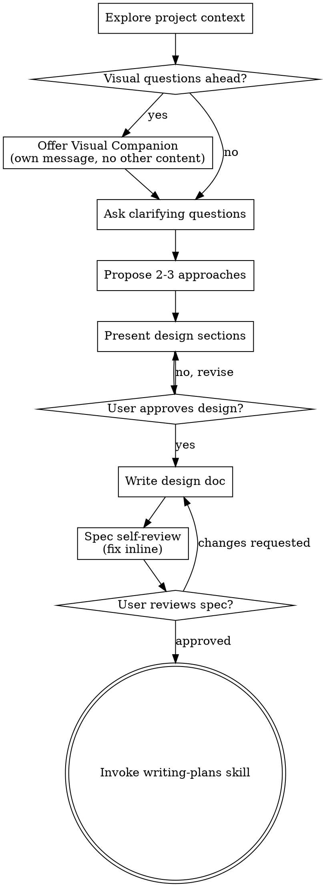

<!-- Generated by SpecStory, Markdown v2.1.0 -->

# 2026-04-01 20:17:52Z

<!-- Claude Code Session 8c90ca4b-ebe6-43ef-953d-9f9a04daffb5 (2026-04-01 20:17:52Z) -->

_**User (2026-04-01 20:17:52Z)**_

<ide_opened_file>The user opened the file /Users/leocaseiro/Sites/base-skill/docs/baseskill_milestone_breakdown_85146c93.plan.md in the IDE. This may or may not be related to the current task.</ide_opened_file>

Before we continue with milestone 4, I want to setup storybookjs.

Plan that work with superpowers:brainstorm, before writing the plan via superpowers:writing-plan.

We could make usage of the <https://storybook.js.org/docs/writing-docs/autodocs>.

Any UI component should be documented with examples with multi-variations using <https://storybook.js.org/docs/essentials/actions> and <https://storybook.js.org/docs/essentials/controls>

Tjhey would be handy for VR tests, combined with the different screen sizes in <https://storybook.js.org/docs/essentials/viewport>

Can you also evaluate if we can have any service/util also documented in storybook?

In adition to that, can we publish the documentation as a new router in our app? E.g. `/baseskill/docs`

---

_**Agent (claude-sonnet-4-6 2026-04-01 20:17:56Z)**_

<think><details><summary>Thought Process</summary>
The user wants to brainstorm and then plan Storybook.js setup for their project. Let me first invoke the brainstorming skill as requested.
</details></think>

_**Agent (claude-sonnet-4-6 2026-04-01 20:17:56Z)**_

<tool-use data-tool-type="generic" data-tool-name="Skill"><details>
<summary>Tool use: **Skill**</summary>

```text
Launching skill: superpowers:brainstorming
```

</details></tool-use>

---

_**User (2026-04-01 20:17:56Z)**_

Base directory for this skill: /Users/leocaseiro/.claude/plugins/cache/claude-plugins-official/superpowers/5.0.7/skills/brainstorming

# Brainstorming Ideas Into Designs

Help turn ideas into fully formed designs and specs through natural collaborative dialogue.

Start by understanding the current project context, then ask questions one at a time to refine the idea. Once you understand what you're building, present the design and get user approval.

<HARD-GATE>
Do NOT invoke any implementation skill, write any code, scaffold any project, or take any implementation action until you have presented a design and the user has approved it. This applies to EVERY project regardless of perceived simplicity.
</HARD-GATE>

## Anti-Pattern: "This Is Too Simple To Need A Design"

Every project goes through this process. A todo list, a single-function utility, a config change — all of them. "Simple" projects are where unexamined assumptions cause the most wasted work. The design can be short (a few sentences for truly simple projects), but you MUST present it and get approval.

## Checklist

You MUST create a task for each of these items and complete them in order:

1. **Explore project context** — check files, docs, recent commits
2. **Offer visual companion** (if topic will involve visual questions) — this is its own message, not combined with a clarifying question. See the Visual Companion section below.
3. **Ask clarifying questions** — one at a time, understand purpose/constraints/success criteria
4. **Propose 2-3 approaches** — with trade-offs and your recommendation
5. **Present design** — in sections scaled to their complexity, get user approval after each section
6. **Write design doc** — save to `docs/superpowers/specs/YYYY-MM-DD-<topic>-design.md` and commit
7. **Spec self-review** — quick inline check for placeholders, contradictions, ambiguity, scope (see below)
8. **User reviews written spec** — ask user to review the spec file before proceeding
9. **Transition to implementation** — invoke writing-plans skill to create implementation plan

## Process Flow



**The terminal state is invoking writing-plans.** Do NOT invoke frontend-design, mcp-builder, or any other implementation skill. The ONLY skill you invoke after brainstorming is writing-plans.

## The Process

**Understanding the idea:**

- Check out the current project state first (files, docs, recent commits)
- Before asking detailed questions, assess scope: if the request describes multiple independent subsystems (e.g., "build a platform with chat, file storage, billing, and analytics"), flag this immediately. Don't spend questions refining details of a project that needs to be decomposed first.
- If the project is too large for a single spec, help the user decompose into sub-projects: what are the independent pieces, how do they relate, what order should they be built? Then brainstorm the first sub-project through the normal design flow. Each sub-project gets its own spec → plan → implementation cycle.
- For appropriately-scoped projects, ask questions one at a time to refine the idea
- Prefer multiple choice questions when possible, but open-ended is fine too
- Only one question per message - if a topic needs more exploration, break it into multiple questions
- Focus on understanding: purpose, constraints, success criteria

**Exploring approaches:**

- Propose 2-3 different approaches with trade-offs
- Present options conversationally with your recommendation and reasoning
- Lead with your recommended option and explain why

**Presenting the design:**

- Once you believe you understand what you're building, present the design
- Scale each section to its complexity: a few sentences if straightforward, up to 200-300 words if nuanced
- Ask after each section whether it looks right so far
- Cover: architecture, components, data flow, error handling, testing
- Be ready to go back and clarify if something doesn't make sense

**Design for isolation and clarity:**

- Break the system into smaller units that each have one clear purpose, communicate through well-defined interfaces, and can be understood and tested independently
- For each unit, you should be able to answer: what does it do, how do you use it, and what does it depend on?
- Can someone understand what a unit does without reading its internals? Can you change the internals without breaking consumers? If not, the boundaries need work.
- Smaller, well-bounded units are also easier for you to work with - you reason better about code you can hold in context at once, and your edits are more reliable when files are focused. When a file grows large, that's often a signal that it's doing too much.

**Working in existing codebases:**

- Explore the current structure before proposing changes. Follow existing patterns.
- Where existing code has problems that affect the work (e.g., a file that's grown too large, unclear boundaries, tangled responsibilities), include targeted improvements as part of the design - the way a good developer improves code they're working in.
- Don't propose unrelated refactoring. Stay focused on what serves the current goal.

## After the Design

**Documentation:**

- Write the validated design (spec) to `docs/superpowers/specs/YYYY-MM-DD-<topic>-design.md`
  - (User preferences for spec location override this default)
- Use elements-of-style:writing-clearly-and-concisely skill if available
- Commit the design document to git

**Spec Self-Review:**
After writing the spec document, look at it with fresh eyes:

1. **Placeholder scan:** Any "TBD", "TODO", incomplete sections, or vague requirements? Fix them.
2. **Internal consistency:** Do any sections contradict each other? Does the architecture match the feature descriptions?
3. **Scope check:** Is this focused enough for a single implementation plan, or does it need decomposition?
4. **Ambiguity check:** Could any requirement be interpreted two different ways? If so, pick one and make it explicit.

Fix any issues inline. No need to re-review — just fix and move on.

**User Review Gate:**
After the spec review loop passes, ask the user to review the written spec before proceeding:

> "Spec written and committed to `<path>`. Please review it and let me know if you want to make any changes before we start writing out the implementation plan."

Wait for the user's response. If they request changes, make them and re-run the spec review loop. Only proceed once the user approves.

**Implementation:**

- Invoke the writing-plans skill to create a detailed implementation plan
- Do NOT invoke any other skill. writing-plans is the next step.

## Key Principles

- **One question at a time** - Don't overwhelm with multiple questions
- **Multiple choice preferred** - Easier to answer than open-ended when possible
- **YAGNI ruthlessly** - Remove unnecessary features from all designs
- **Explore alternatives** - Always propose 2-3 approaches before settling
- **Incremental validation** - Present design, get approval before moving on
- **Be flexible** - Go back and clarify when something doesn't make sense

## Visual Companion

A browser-based companion for showing mockups, diagrams, and visual options during brainstorming. Available as a tool — not a mode. Accepting the companion means it's available for questions that benefit from visual treatment; it does NOT mean every question goes through the browser.

**Offering the companion:** When you anticipate that upcoming questions will involve visual content (mockups, layouts, diagrams), offer it once for consent:
> "Some of what we're working on might be easier to explain if I can show it to you in a web browser. I can put together mockups, diagrams, comparisons, and other visuals as we go. This feature is still new and can be token-intensive. Want to try it? (Requires opening a local URL)"

**This offer MUST be its own message.** Do not combine it with clarifying questions, context summaries, or any other content. The message should contain ONLY the offer above and nothing else. Wait for the user's response before continuing. If they decline, proceed with text-only brainstorming.

**Per-question decision:** Even after the user accepts, decide FOR EACH QUESTION whether to use the browser or the terminal. The test: **would the user understand this better by seeing it than reading it?**

- **Use the browser** for content that IS visual — mockups, wireframes, layout comparisons, architecture diagrams, side-by-side visual designs
- **Use the terminal** for content that is text — requirements questions, conceptual choices, tradeoff lists, A/B/C/D text options, scope decisions

A question about a UI topic is not automatically a visual question. "What does personality mean in this context?" is a conceptual question — use the terminal. "Which wizard layout works better?" is a visual question — use the browser.

If they agree to the companion, read the detailed guide before proceeding:
`skills/brainstorming/visual-companion.md`

---

_**Agent (claude-sonnet-4-6 2026-04-01 20:18:00Z)**_

<think><details><summary>Thought Process</summary>
Let me start the brainstorming process. First, I need to explore the project context, then ask clarifying questions one at a time, propose approaches, present a design, write a spec, and then transition to writing-plans.

Let me explore the project first.
</details></think>

_**Agent (claude-sonnet-4-6 2026-04-01 20:18:00Z)**_

<tool-use data-tool-type="unknown" data-tool-name="ToolSearch"><details>
<summary>Tool use: **ToolSearch**</summary>

**Input:**

- max_results: `1`
- query: `select:TodoWrite`

**Result:**

```

```

</details></tool-use>

_**Agent (claude-sonnet-4-6 2026-04-01 20:18:03Z)**_

<think><details><summary>Thought Process</summary>
Let me create the tasks for the brainstorming process and then start exploring the project context.
</details></think>

_**Agent (claude-sonnet-4-6 2026-04-01 20:18:07Z)**_

<tool-use data-tool-type="task" data-tool-name="TodoWrite"><details>
<summary>Tool use: **TodoWrite**</summary>
**Agent task list:**
- [⚡] 🌡️ Explore project context
- [ ] 🌡️ Ask clarifying questions
- [ ] 🌡️ Propose 2-3 approaches
- [ ] 🌡️ Present design sections
- [ ] 🌡️ Write design doc
- [ ] 🌡️ Spec self-review
- [ ] 🌡️ User reviews written spec
- [ ] 🌡️ Transition to writing-plans skill

</details></tool-use>

_**Agent (claude-sonnet-4-6 2026-04-01 20:18:12Z)**_

<tool-use data-tool-type="search" data-tool-name="Glob"><details>
<summary>Tool use: **Glob**</summary>
 path `./` pattern `**/*.{json,ts,tsx,js,jsx,config.*}`

```text
.git/cursor/crepe/2be200fed365bc2ad21e7b7b47c8c932b3ad7f25/metadata.json
node_modules/tailwindcss/dist/default-theme.js
node_modules/tailwindcss/dist/resolve-config-B4yBzhca.d.ts
node_modules/tailwindcss/dist/flatten-color-palette.js
node_modules/tailwindcss/dist/flatten-color-palette.d.ts
node_modules/tailwindcss/dist/lib.js
node_modules/tailwindcss/dist/plugin.d.ts
node_modules/tailwindcss/dist/colors.js
node_modules/tailwindcss/dist/default-theme.d.ts
node_modules/tailwindcss/dist/lib.d.ts
node_modules/tailwindcss/dist/colors-C__qRT83.d.ts
node_modules/tailwindcss/dist/colors.d.ts
node_modules/tailwindcss/dist/plugin.js
node_modules/tailwindcss/package.json
worktrees/milestone-4-game-engine/node_modules/tailwindcss/dist/default-theme.js
worktrees/milestone-4-game-engine/node_modules/tailwindcss/dist/resolve-config-B4yBzhca.d.ts
worktrees/milestone-4-game-engine/node_modules/tailwindcss/dist/flatten-color-palette.js
worktrees/milestone-4-game-engine/node_modules/tailwindcss/dist/flatten-color-palette.d.ts
worktrees/milestone-4-game-engine/node_modules/tailwindcss/dist/lib.js
worktrees/milestone-4-game-engine/node_modules/tailwindcss/dist/plugin.d.ts
worktrees/milestone-4-game-engine/node_modules/tailwindcss/dist/colors.js
worktrees/milestone-4-game-engine/node_modules/tailwindcss/dist/default-theme.d.ts
worktrees/milestone-4-game-engine/node_modules/tailwindcss/dist/lib.d.ts
worktrees/milestone-4-game-engine/node_modules/tailwindcss/dist/colors-C__qRT83.d.ts
worktrees/milestone-4-game-engine/node_modules/tailwindcss/dist/colors.d.ts
worktrees/milestone-4-game-engine/node_modules/tailwindcss/dist/plugin.js
worktrees/milestone-4-game-engine/node_modules/tailwindcss/package.json
node_modules/@tailwindcss/oxide/index.js
node_modules/@tailwindcss/oxide/package.json
node_modules/@tailwindcss/oxide/index.d.ts
node_modules/@tailwindcss/vite/package.json
worktrees/milestone-4-game-engine/node_modules/@tailwindcss/oxide/index.js
worktrees/milestone-4-game-engine/node_modules/@tailwindcss/oxide/package.json
worktrees/milestone-4-game-engine/node_modules/@tailwindcss/oxide/index.d.ts
worktrees/milestone-4-game-engine/node_modules/@tailwindcss/vite/package.json
node_modules/@tailwindcss/oxide-darwin-arm64/package.json
node_modules/@fontsource-variable/geist/metadata.json
node_modules/@fontsource-variable/geist/unicode.json
node_modules/@fontsource-variable/geist/package.json
worktrees/milestone-4-game-engine/node_modules/@tailwindcss/oxide-darwin-arm64/package.json
worktrees/milestone-4-game-engine/node_modules/@fontsource-variable/geist/metadata.json
worktrees/milestone-4-game-engine/node_modules/@fontsource-variable/geist/unicode.json
worktrees/milestone-4-game-engine/node_modules/@fontsource-variable/geist/package.json
node_modules/@tailwindcss/node/dist/require-cache.js
node_modules/@tailwindcss/node/dist/index.js
node_modules/@tailwindcss/node/dist/index.d.ts
node_modules/@tailwindcss/node/dist/require-cache.d.ts
node_modules/@tailwindcss/node/package.json
worktrees/milestone-4-game-engine/node_modules/@tailwindcss/node/dist/require-cache.js
worktrees/milestone-4-game-engine/node_modules/@tailwindcss/node/dist/index.js
worktrees/milestone-4-game-engine/node_modules/@tailwindcss/node/dist/index.d.ts
worktrees/milestone-4-game-engine/node_modules/@tailwindcss/node/dist/require-cache.d.ts
worktrees/milestone-4-game-engine/node_modules/@tailwindcss/node/package.json
node_modules/lightningcss/package.json
node_modules/lightningcss/node/flags.js
node_modules/lightningcss/node/targets.d.ts
node_modules/lightningcss/node/index.js
node_modules/lightningcss/node/composeVisitors.js
node_modules/lightningcss/node/browserslistToTargets.js
node_modules/lightningcss/node/index.d.ts
node_modules/lightningcss/node/ast.d.ts
worktrees/milestone-4-game-engine/node_modules/lightningcss/package.json
worktrees/milestone-4-game-engine/node_modules/lightningcss/node/flags.js
worktrees/milestone-4-game-engine/node_modules/lightningcss/node/targets.d.ts
worktrees/milestone-4-game-engine/node_modules/lightningcss/node/index.js
worktrees/milestone-4-game-engine/node_modules/lightningcss/node/composeVisitors.js
worktrees/milestone-4-game-engine/node_modules/lightningcss/node/browserslistToTargets.js
worktrees/milestone-4-game-engine/node_modules/lightningcss/node/index.d.ts
worktrees/milestone-4-game-engine/node_modules/lightningcss/node/ast.d.ts
node_modules/magic-string/dist/magic-string.cjs.js
node_modules/magic-string/dist/magic-string.umd.js
node_modules/magic-string/dist/magic-string.cjs.d.ts
node_modules/magic-string/package.json
worktrees/milestone-4-game-engine/node_modules/magic-string/dist/magic-string.cjs.js
worktrees/milestone-4-game-engine/node_modules/magic-string/dist/magic-string.umd.js
worktrees/milestone-4-game-engine/node_modules/magic-string/dist/magic-string.cjs.d.ts
worktrees/milestone-4-game-engine/node_modules/magic-string/package.json
node_modules/jiti/package.json
node_modules/jiti/lib/types.d.ts
worktrees/milestone-4-game-engine/node_modules/jiti/package.json
worktrees/milestone-4-game-engine/node_modules/jiti/lib/types.d.ts
node_modules/detect-libc/package.json
node_modules/detect-libc/lib/filesystem.js
node_modules/detect-libc/lib/detect-libc.js
node_modules/detect-libc/lib/process.js
node_modules/detect-libc/lib/elf.js
node_modules/detect-libc/index.d.ts
worktrees/milestone-4-game-engine/node_modules/detect-libc/package.json
worktrees/milestone-4-game-engine/node_modules/detect-libc/lib/filesystem.js
worktrees/milestone-4-game-engine/node_modules/detect-libc/lib/detect-libc.js
worktrees/milestone-4-game-engine/node_modules/detect-libc/lib/process.js
worktrees/milestone-4-game-engine/node_modules/detect-libc/lib/elf.js
worktrees/milestone-4-game-engine/node_modules/detect-libc/index.d.ts
node_modules/source-map-js/package.json
node_modules/source-map-js/source-map.js
node_modules/source-map-js/lib/source-map-generator.d.ts
node_modules/source-map-js/lib/source-map-consumer.js
node_modules/source-map-js/lib/quick-sort.js
node_modules/source-map-js/lib/util.js
node_modules/source-map-js/lib/source-node.d.ts
(Results are truncated. Consider using a more specific path or pattern.)
```

</details></tool-use>

_**Agent (claude-sonnet-4-6 2026-04-01 20:18:11Z)**_

<tool-use data-tool-type="read" data-tool-name="Read"><details>
<summary>Tool use: **Read**</summary>
 `./docs/baseskill_milestone_breakdown_85146c93.plan.md`

```text
1 ---
2 name: BaseSkill Milestone Breakdown
3 overview: Break the BaseSkill PRD into sequential milestones and identify which work streams within each milestone can proceed in parallel (async) versus which must be completed sequentially (sync).
4 todos:
5   - id: m0-design-docs
6     content: 'Milestone 0: Author all 8+ design docs in docs/ folder (prd.md, architecture.md, data-model.md, game-engine.md, ui-ux.md, i18n.md, accessibility.md, testing-strategy.md, ci-cd.md)'
7     status: pending
8   - id: m1-scaffolding
9     content: 'Milestone 1: TanStack Start + TanStack Router + React + TS strict + shadcn/ui + Tailwind v4 + ESLint + Vitest + Playwright + GitHub Actions CI/CD + static SPA output + vite-plugin-pwa + GPL v3 LICENSE'
10     status: pending
11   - id: m2-data-layer
12     content: 'Milestone 2: RxDB setup (all collections + schemas), migration framework, React hooks, event bus, i18n, theme engine, speech services'
13     status: completed
14   - id: m3-app-shell
15     content: 'Milestone 3: Profile picker, family sharing, app layout, dashboard, settings, offline indicator, bookmarks, recents'
16     status: pending
17   - id: m4-game-engine
18     content: 'Milestone 4: Game lifecycle, game shell UI, config loader + override merging, session recorder, 7 reusable game components'
19     status: pending
20   - id: m5-reference-games
21     content: 'Milestone 5: 5 reference games (Letter Tracing, Number Match, Word Builder, Read Aloud, Math Facts)'
22     status: pending
23   - id: m6-cloud-sync
24     content: 'Milestone 6: OneDrive MSAL.js PKCE, Google Drive PKCE + CF Worker proxy, token management, device-aware sync, conflict resolution'
25     status: pending
26   - id: m7-parent-features
27     content: 'Milestone 7: Parent settings (game overrides, session history viewer, data management, cloud sync config, TTS voice selector)'
28     status: pending
29   - id: m8-polish
30     content: 'Milestone 8: Accessibility audit, offline hardening, visual regression, i18n verification, performance, analytics abstraction, PWA install prompt, SW migration testing'
31     status: pending
32 isProject: false
33 ---
34 
35 # BaseSkill: PRD to Completion Milestone Breakdown
36 
37 **Meta Framework: TanStack Start** -- chosen for its Vite-native architecture, fully type-safe routing (TanStack Router), and full-stack upgrade path for future cloud/server features (auth, multiplayer, premium APIs) without a framework migration. Currently deployed as a static SPA to GitHub Pages; when server features are needed, TanStack Start's server functions and API routes activate without restructuring the app.
38 
39 This plan organizes the project into 8 milestones. Within each milestone, work streams are labeled **ASYNC** (can be developed in parallel by different agents/developers) or **SYNC** (must be completed before the next step starts).
40 
41 ---
42 
43 ## Milestone 0 -- Design Documents (SYNC prerequisite)
44 
45 Before any code is written, the 8 design docs outlined in [docs/prd-plan.md](docs/prd-plan.md) must be authored. Several can be written in parallel.
46 
47 **ASYNC work streams:**
48 
49 - `docs/prd.md` -- full PRD with user stories, feature requirements, constraints
50 - `docs/architecture.md` -- system diagram, TanStack Start app structure, TanStack Router route tree, component tree, state management, data flow, OAuth architecture, extension points
51 - `docs/data-model.md` -- RxDB schemas (JSON Schema), relationships, sync strategy, conflict resolution, chunking rules, token storage
52 - `docs/game-engine.md` -- game lifecycle, session recorder spec, config schema, parent override merging logic, 5 reference game specs
53 - `docs/ui-ux.md` -- design system, 4-6 theme definitions, core layouts, navigation, responsive strategy, encouragement system, session history viewer, data management screen
54 - `docs/i18n.md` -- i18n setup (react-i18next or TanStack-compatible alternative), translation file structure, TTS voice selection, device-aware voice sync
55 - `docs/accessibility.md` -- WCAG 2.1 AA checklist, screen reader, motor, cognitive, speech API fallbacks
56 - `docs/testing-strategy.md` -- Vitest + RTL + Playwright plan, coverage targets, test data fixtures
57 - `docs/ci-cd.md` -- GitHub Actions workflows, versioning, SW lifecycle, deploy, branch protection
58 
59 **SYNC dependency:** `prd.md` and `architecture.md` should be drafted first (or at least outlined) since the other docs reference decisions made there.
60 
61 ---
62 
63 ## Milestone 1 -- Project Scaffolding and CI/CD
64 
65 Bootstrap the repository and get a green CI pipeline on an empty app shell.
66 
67 **SYNC (sequential):**
68 
69 1. Scaffold project via `npx @tanstack/cli@latest create` (select Tailwind + ESLint options from the interactive prompts); this generates TanStack Start + TanStack Router with file-based routing pre-configured
70 2. Configure TypeScript strict mode (`noImplicitAny`, no `any` ESLint rule) on top of the generated config
71 3. Set up TanStack Router nested layouts for app shell / game shell / settings
72 4. Add `shadcn/ui` on top of the Tailwind CSS setup from the CLI scaffold
73 5. Add `LICENSE` (GPL v3)
74 6. Configure ESLint, Prettier, `@typescript-eslint/no-explicit-any` as error
75 7. Set up Vitest + React Testing Library
76 8. Set up Playwright (empty E2E suite)
77 9. GitHub Actions: lint, type-check, unit test, E2E, build, deploy to GitHub Pages
78 10. Configure static SPA output (TanStack Start with `server.preset: 'static'` or equivalent Nitro static preset) for GitHub Pages deployment
79 11. PWA manifest (`manifest.json`) + basic Workbox service worker via `vite-plugin-pwa` (pre-cache app shell only)
80 12. App versioning: semver stamp in build output
81 
82 **Key TanStack decisions:**
83 
84 - Use TanStack Router's file-based routing convention (`routes/` directory)
85 - Use TanStack Router's `beforeLoad` / `loader` for client-side data loading from RxDB
86 - Consider TanStack Query alongside RxDB for async state management (evaluate in M2)
87 - Static preset for now; switch to Cloudflare/Vercel/Node preset when server features are added
88 
89 **Deliverable:** A deployable blank PWA on GitHub Pages with passing CI, type-safe routing, and nested layout structure.
90 
91 ---
92 
93 ## Milestone 2 -- Data Layer and Core Infrastructure
94 
95 Set up RxDB and the foundational systems that everything else depends on.
96 
97 **SYNC (must complete in order):**
98 
99 1. RxDB database initialization and schema definitions for all collections (`profiles`, `progress`, `settings`, `game_config_overrides`, `bookmarks`, `themes`, `session_history`, `session_history_index`, `sync_meta`, `app_meta`)
100 2. Schema migration framework (version tracking via `app_meta`)
101 3. React hooks for reactive RxDB queries
102 4. Evaluate TanStack Query integration -- determine if TanStack Query should wrap RxDB observables for cache management, or if RxDB's reactive queries are sufficient via custom hooks. Decision impacts all downstream data access patterns.
103 
104 **ASYNC (can proceed in parallel once RxDB is up):**
105 
106 - **Event bus / plugin hook system** -- pub/sub for app events, extension point registration
107 - **i18n setup** -- react-i18next (or lighter alternative), `en` + `pt-BR` translation files, namespace structure (common, games, settings, encouragements); integrate with TanStack Router for locale-aware routes if needed
108 - **Theme engine** -- load themes from RxDB `themes` collection, **two** pre-defined theme seeds for M2 (more presets later), CSS variable injection, clone-and-modify logic
109 - **Speech services** -- TTS wrapper (`SpeechOutput`), STT wrapper (`SpeechInput`), voice enumeration, fallback handling
110 
111 ---
112 
113 ## Milestone 3 -- Profile System and App Shell UI
114 
115 Build the user-facing shell: navigation, profile management, and dashboard. TanStack Router's nested layouts and type-safe routes drive the structure.
116 
117 **SYNC (sequential):**
118 
119 1. **Route tree structure** -- define TanStack Router file-based routes: `_app` (root layout), `_app/index` (profile picker), `_app/dashboard` (game grid), `_app/game/$gameId` (game shell), `_app/settings` (child settings), `_app/parent` (parent settings with nested routes)
120 2. **Profile picker / home screen** -- create profile, select profile, avatar picker, grade-level selector; use `beforeLoad` guard to redirect to profile picker if no active profile
121 3. **Family sharing** -- quick profile switching, parent PIN gate for settings (route guard on `/parent` routes)
122 4. **App layout shell** -- root layout with header, back button, breadcrumbs (parent view), grade-adaptive navigation (icons for Pre-K, text+icons for older)
123 5. **Dashboard** -- game grid by subject/grade, bookmarked games row, recently played row; use route `loader` to pre-fetch game catalog + bookmarks from RxDB
124 6. **Settings screen** -- volume, speech rate, active language, theme selector per profile
125 7. **Offline indicator** -- `navigator.onLine` listener, banner component, last-sync timestamp
126 
127 **ASYNC (can start once profile + layout exist):**
128 
129 - **Bookmark system** -- bookmark/unbookmark games, persist to `bookmarks` collection
130 - **Recents tracking** -- update `progress` collection with last-played timestamps, query for dashboard
131 
132 ---
133 
134 ## Milestone 4 -- Game Engine Framework
135 
136 Build the reusable game infrastructure (no specific games yet).
137 
138 **SYNC (sequential):**
139 
140 1. **Game lifecycle manager** -- load, instructions (TTS), play, evaluate, score, next/retry state machine
141 2. **Game shell UI** -- consistent header, game area, controls, back/exit
142 3. **Game config loader** -- read game JSON config, merge with parent overrides (override > grade-band > global > default)
143 4. **Session recorder middleware** -- subscribe to event bus, write to `session_history`, automatic chunking (200 events / 50KB cap), write `session_history_index` summary on session end
144 
145 **ASYNC (reusable components, independent of each other):**
146 
147 - `DragAndDrop` -- pointer events, magnetic/snap, ghost preview, visual pulse on drop zones
148 - `LetterTracer` -- canvas-based tracing with touch/mouse, tap-to-place alternative
149 - `MultipleChoice` -- tap/click answer selection
150 - `Timer` -- configurable, hideable per parent settings
151 - `ScoreAnimation` -- confetti, stars, CSS-only reward animations
152 - `EncouragementAnnouncer` -- contextual TTS + visual popup, triggered by game events
153 - `ProgressBar` / `ScoreBoard` -- in-game progress display
154 
155 ---
156 
157 ## Milestone 5 -- Reference Games
158 
159 Implement the 5 reference games. Each game is independent and can be built in parallel.
160 
161 **ASYNC (all 5 are independent):**
162 
163 - **Letter Tracing** (Pre-K/K, Letters) -- uses `LetterTracer`, TTS for letter names
164 - **Number Match** (Pre-K/K, Math) -- uses `DragAndDrop` with snap, object-group visuals
165 - **Word Builder** (K-Year 2, Reading) -- uses `DragAndDrop` + TTS hints, per-language word lists
166 - **Read Aloud** (Year 1-3, Reading) -- uses `SpeechInput` (STT), sentence display, evaluation
167 - **Math Facts** (Year 1-4, Math) -- uses `MultipleChoice` + `Timer`, visual number line
168 
169 Each game should include: unit tests for game logic, integration test for full lifecycle, i18n content for `en` + `pt-BR`.
170 
171 ---
172 
173 ## Milestone 6 -- Cloud Sync and OAuth
174 
175 Can begin in parallel with Milestones 4-5 (data layer is ready from Milestone 2).
176 
177 **SYNC (sequential):**
178 
179 1. **OneDrive sync** -- MSAL.js PKCE flow (no backend needed), RxDB replication plugin for OneDrive
180 2. **Google Drive sync** -- PKCE flow with Cloudflare Worker BFF proxy for token exchange, RxDB replication plugin for Google Drive
181 3. **Token management** -- encrypted IndexedDB storage, refresh token handling
182 4. **Device-aware sync** -- `deviceId` field on synced records, device-local voice preferences excluded from cross-device apply
183 5. **Conflict resolution** -- last-write-wins with merge for `progress`, append-only for `session_history`
184 
185 **ASYNC (within this milestone):**
186 
187 - Cloudflare Worker OAuth proxy (separate repo, non-GPL) can be developed independently
188 - OneDrive and Google Drive replication plugins can be developed in parallel once the replication interface is defined
189 
190 ---
191 
192 ## Milestone 7 -- Parent/Guardian Features
193 
194 Depends on: profiles (M3), game engine (M4), session recorder (M4), data model (M2).
195 
196 **ASYNC (independent screens):**
197 
198 - **Parent settings: game overrides UI** -- per-game, per-grade-band, and global override controls (retries, timer, always-win, difficulty)
199 - **Parent settings: session history viewer** -- timeline view, filter by game/date/grade, expandable session detail with lazy-loaded chunks
200 - **Parent settings: data management** -- storage usage display, separate "Clear History" / "Clear Progress" buttons, date-range picker, confirmation dialogs, cascade delete
201 - **Parent settings: cloud sync config** -- connect/disconnect Google Drive / OneDrive, sync status, last sync timestamp
202 - **Parent settings: TTS voice selector** -- per-language voice picker from `speechSynthesis.getVoices()`, device-aware
203 
204 ---
205 
206 ## Milestone 8 -- Polish, Accessibility, and Testing
207 
208 Final hardening pass. Most of this is ASYNC.
209 
210 **ASYNC work streams:**
211 
212 - **Accessibility audit** -- axe-core integration in component tests, Playwright accessibility audits on all pages, ARIA labels, focus management, keyboard navigation for all games, screen reader testing
213 - **Offline hardening** -- E2E tests for offline/online transitions, SW cache validation, RxDB queue-and-replay verification
214 - **Visual regression** -- Playwright screenshot baselines for all key screens across all 4-6 themes
215 - **i18n verification** -- snapshot tests for `en` and `pt-BR` on all screens, RTL placeholder if needed
216 - **Performance** -- Lighthouse audit, bundle analysis, lazy-load game assets, ensure CSS-only animations
217 - **Analytics abstraction** -- define analytics interface/adapter, implement one provider (decision deferred per PRD), ensure provider is swappable
218 - **PWA install prompt** -- custom install banner, iOS/Android handling
219 - **SW migration testing** -- version mismatch detection, cache purge, RxDB schema migration on upgrade
220 
221 ---
222 
223 ## Dependency Graph
224 
225 ```mermaid
226 graph TD
227     M0[M0: Design Docs] --> M1[M1: Scaffolding and CICD]
228     M1 --> M2[M2: Data Layer and Core Infra]
229     M2 --> M3[M3: Profile System and App Shell]
230     M2 --> M4[M4: Game Engine Framework]
231     M2 --> M6[M6: Cloud Sync and OAuth]
232     M3 --> M5[M5: Reference Games]
233     M4 --> M5
234     M3 --> M7[M7: Parent Features]
235     M4 --> M7
236     M6 --> M7
237     M5 --> M8[M8: Polish and Testing]
238     M7 --> M8
239 ```
240 
241 ---
242 
243 ## Summary: What Can Run in Parallel
244 
245 | Phase | Parallel Streams                                |
246 | ----- | ----------------------------------------------- |
247 | M0    | Most design docs can be written concurrently    |
248 | M2    | Event bus, i18n, theme engine, speech services  |
249 | M3    | Bookmarks, recents (after shell exists)         |
250 | M4    | All 7 reusable game components                  |
251 | M5    | All 5 reference games                           |
252 | M6    | OneDrive plugin, Google Drive plugin, CF Worker |
253 | M7    | All 5 parent settings screens                   |
254 | M8    | All 8 polish work streams                       |
255 
256 The critical path is: **M0 -> M1 -> M2 -> M4 -> M5 -> M8**, with M3, M6, and M7 as parallel branches off M2.
257 
258 ---
259 
260 ## Future: Server Upgrade Path (post-M8)
261 
262 When premium/server features are needed, TanStack Start enables a smooth transition:
263 
264 - Switch from static preset to Cloudflare Workers / Vercel / Node preset
265 - Add server functions for auth, multiplayer WebSocket coordination, premium content gating
266 - TanStack Start's server functions and API routes activate without restructuring the client-side app
267 - The GPL-licensed SPA remains unchanged; server features live in separate private repos communicating over network boundaries (per PRD licensing strategy)
268
```

</details></tool-use>

_**Agent (claude-sonnet-4-6 2026-04-01 20:18:16Z)**_

<think><details><summary>Thought Process</summary>
Good, I have the project context. Now let me look at the key source files to understand the project structure better. Let me look at the source directory and existing components.
</details></think>

_**Agent (claude-sonnet-4-6 2026-04-01 20:18:17Z)**_

<tool-use data-tool-type="search" data-tool-name="Glob"><details>
<summary>Tool use: **Glob**</summary>
 path `./` pattern `src/**/*`

```text
src/lib/i18n/locales/en/encouragements.json
src/lib/i18n/locales/en/games.json
src/lib/i18n/locales/pt-BR/encouragements.json
src/lib/i18n/locales/pt-BR/games.json
src/components/ThemeToggle.tsx
src/components/ui/alert-dialog.tsx
src/components/ui/button.tsx
src/components/ui/card.tsx
src/components/ui/sheet.tsx
src/components/ui/sonner.tsx
src/db/create-database.test.ts
src/db/create-database.ts
src/db/hooks/useRxDB.ts
src/db/hooks/useRxQuery.ts
src/db/index.ts
src/db/migrations.test.ts
src/db/migrations.ts
src/db/schemas/app-meta.ts
src/db/schemas/bookmarks.ts
src/db/schemas/game_config_overrides.ts
src/db/schemas/index.ts
src/db/schemas/profiles.ts
src/db/schemas/progress.ts
src/db/schemas/session_history.ts
src/db/schemas/session_history_index.ts
src/db/schemas/settings.ts
src/db/schemas/sync_meta.ts
src/db/schemas/themes.ts
src/db/setup-validation.test.ts
src/db/types.ts
src/lib/game-event-bus.md
src/lib/game-event-bus.test.ts
src/lib/game-event-bus.ts
src/lib/i18n/i18n.test.ts
src/lib/i18n/i18n.ts
src/lib/speech/SpeechInput.ts
src/lib/speech/SpeechOutput.test.ts
src/lib/speech/SpeechOutput.ts
src/lib/speech/voices.ts
src/lib/theme/css-vars.test.ts
src/lib/theme/css-vars.ts
src/lib/theme/default-tokens.ts
src/lib/utils.ts
src/providers/DbProvider.test.tsx
src/providers/DbProvider.tsx
src/providers/ThemeRuntimeProvider.tsx
src/router.tsx
src/routes/$locale/_app/dashboard.tsx
src/routes/$locale/_app/game/$gameId.tsx
src/routes/$locale/_app/parent.tsx
src/routes/$locale/_app/parent/data.tsx
src/routes/$locale/_app/parent/history.tsx
src/routes/$locale/_app/parent/index.tsx
src/routes/$locale/_app/parent/overrides.tsx
src/routes/$locale/_app/parent/sync.tsx
src/routes/$locale/_app/parent/voices.tsx
src/routes/$locale/route.tsx
src/routes/__root.test.tsx
src/routes/__root.tsx
src/routes/index.tsx
src/test-setup.ts
src/types/game-events.ts
src/vite-env.d.ts
src/components/Footer.tsx
src/components/GameCard.test.tsx
src/components/GameCard.tsx
src/components/GameGrid.test.tsx
src/components/GameGrid.tsx
src/components/Header.tsx
src/components/LevelRow.test.tsx
src/components/LevelRow.tsx
src/components/OfflineIndicator.test.tsx
src/components/OfflineIndicator.tsx
src/components/ui/dropdown-menu.tsx
src/components/ui/input.tsx
src/components/ui/label.tsx
src/components/ui/select.tsx
src/components/ui/slider.tsx
src/db/hooks/useBookmarks.test.tsx
src/db/hooks/useBookmarks.ts
src/db/hooks/useSettings.test.tsx
src/db/hooks/useSettings.ts
src/games/catalog-utils.test.ts
src/games/catalog-utils.ts
src/games/registry.test.ts
src/games/registry.ts
src/lib/i18n/locales/en/common.json
src/lib/i18n/locales/en/settings.json
src/lib/i18n/locales/pt-BR/common.json
src/lib/i18n/locales/pt-BR/settings.json
src/routes/$locale/_app.tsx
src/routes/$locale/_app/index.test.tsx
src/routes/$locale/_app/index.tsx
src/routes/$locale/_app/settings.tsx
src/styles.css
src/db/hooks/useRxQuery.test.tsx
src/db/seed-themes.ts
src/routeTree.gen.ts
```

</details></tool-use>

_**Agent (claude-sonnet-4-6 2026-04-01 20:18:17Z)**_

<tool-use data-tool-type="read" data-tool-name="Read"><details>
<summary>Tool use: **Read**</summary>
 `./package.json`

```text
1 {
2   "name": "base-skill",
3   "version": "0.1.0",
4   "private": true,
5   "type": "module",
6   "imports": {
7     "#/*": "./src/*"
8   },
9   "scripts": {
10     "start": "yarn dev",
11     "dev": "vite dev --port 3000",
12     "build": "vite build",
13     "preview": "vite preview",
14     "test": "vitest run",
15     "test:coverage": "vitest run --coverage",
16     "test:e2e": "playwright test",
17     "test:e2e:a11y": "playwright test --grep @a11y",
18     "typecheck": "tsc --noEmit",
19     "lint": "eslint . --max-warnings 0 && knip --no-config-hints",
20     "lint:css": "stylelint 'src/**/*.css'",
21     "lint:md": "markdownlint-cli2 '**/*.md' '#node_modules' '#.specstory' '#.cursor' '#dist' '#worktrees'",
22     "format": "prettier --check .",
23     "fix": "prettier --write . && eslint --fix .",
24     "fix:css": "stylelint --fix 'src/**/*.css' && prettier --write 'src/**/*.css'",
25     "fix:md": "markdownlint-cli2 --fix '**/*.md' '#node_modules' '#.specstory' '#.cursor' '#dist' '#worktrees' && prettier --write '**/*.md'",
26     "prepare": "husky"
27   },
28   "dependencies": {
29     "@fontsource-variable/geist": "^5.2.8",
30     "@tailwindcss/vite": "^4.1.18",
31     "@tanstack/react-devtools": "latest",
32     "@tanstack/react-router": "latest",
33     "@tanstack/react-router-devtools": "latest",
34     "@tanstack/react-router-ssr-query": "latest",
35     "@tanstack/react-start": "latest",
36     "@tanstack/router-plugin": "^1.132.0",
37     "class-variance-authority": "^0.7.1",
38     "clsx": "^2.1.1",
39     "dexie": "^4.4.2",
40     "eslint-plugin-unicorn": "^64.0.0",
41     "i18next": "^26.0.3",
42     "lucide-react": "^0.545.0",
43     "nanoid": "^5.1.7",
44     "next-themes": "^0.4.6",
45     "radix-ui": "^1.4.3",
46     "react": "^19.2.0",
47     "react-dom": "^19.2.0",
48     "react-i18next": "^17.0.2",
49     "rxdb": "^17.0.0",
50     "rxjs": "^7.8.2",
51     "shadcn": "^4.1.1",
52     "sonner": "^2.0.7",
53     "tailwind-merge": "^3.5.0",
54     "tailwindcss": "^4.1.18",
55     "tw-animate-css": "^1.4.0"
56   },
57   "devDependencies": {
58     "@axe-core/playwright": "^4.11.1",
59     "@eslint-community/eslint-plugin-eslint-comments": "^4.7.1",
60     "@playwright/test": "^1.58.2",
61     "@tailwindcss/typography": "^0.5.16",
62     "@tanstack/devtools-vite": "latest",
63     "@tanstack/eslint-config": "^0.3.4",
64     "@testing-library/dom": "^10.4.1",
65     "@testing-library/jest-dom": "^6.9.1",
66     "@testing-library/react": "^16.3.0",
67     "@testing-library/user-event": "^14.6.1",
68     "@types/node": "^22.10.2",
69     "@types/react": "^19.2.0",
70     "@types/react-dom": "^19.2.0",
71     "@vitejs/plugin-react": "^5.1.4",
72     "@vitest/coverage-v8": "3.2.4",
73     "eslint": "^9.18.0",
74     "eslint-config-prettier": "^10.1.8",
75     "eslint-plugin-jsx-a11y": "^6.10.2",
76     "eslint-plugin-react": "^7.37.5",
77     "eslint-plugin-react-hooks": "^7.0.1",
78     "fake-indexeddb": "^6.2.5",
79     "husky": "^9.1.7",
80     "jsdom": "^28.1.0",
81     "knip": "^6.1.1",
82     "lint-staged": "^16.4.0",
83     "markdownlint-cli2": "^0.22.0",
84     "prettier": "^3.8.1",
85     "stylelint": "^17.6.0",
86     "stylelint-config-standard": "^40.0.0",
87     "typescript": "^5.7.2",
88     "vite": "^7.3.1",
89     "vite-plugin-pwa": "^1.2.0",
90     "vite-tsconfig-paths": "^5.1.4",
91     "vitest": "^3.0.5",
92     "workbox-build": "^7.4.0",
93     "workbox-window": "^7.4.0"
94   },
95   "engines": {
96     "node": ">=22.12.0"
97   }
98 }
99
```

</details></tool-use>

_**Agent (claude-sonnet-4-6 2026-04-01 20:18:20Z)**_

<think><details><summary>Thought Process</summary>
Now let me look at the vite config and the existing component structure to understand the setup better.
</details></think>

_**Agent (claude-sonnet-4-6 2026-04-01 20:18:21Z)**_

<tool-use data-tool-type="read" data-tool-name="Read"><details>
<summary>Tool use: **Read**</summary>
 `./vite.config.ts`

```text
1 import tailwindcss from '@tailwindcss/vite';
2 import { devtools } from '@tanstack/devtools-vite';
3 
4 import { tanstackStart } from '@tanstack/react-start/plugin/vite';
5 
6 import viteReact from '@vitejs/plugin-react';
7 import { defineConfig } from 'vite';
8 import { VitePWA } from 'vite-plugin-pwa';
9 import tsconfigPaths from 'vite-tsconfig-paths';
10 import { version } from './package.json';
11 
12 const base = process.env['APP_BASE_URL'] ?? '/base-skill/';
13 
14 const config = defineConfig({
15   base,
16   define: {
17     'import.meta.env.VITE_APP_VERSION': JSON.stringify(version),
18   },
19   plugins: [
20     devtools(),
21     tsconfigPaths({ projects: ['./tsconfig.json'] }),
22     tailwindcss(),
23     tanstackStart({
24       spa: { enabled: true },
25       router: {
26         // eslint-disable-next-line unicorn/prefer-string-raw -- vite config file
27         routeFileIgnorePattern: '(test|spec)\\.(ts|tsx)$',
28       },
29     }),
30     viteReact(),
31     VitePWA({
32       registerType: 'autoUpdate',
33       strategies: 'generateSW',
34       injectRegister: 'auto',
35       workbox: {
36         globPatterns: ['**/*.{js,css,html,ico,png,svg,woff2}'],
37         runtimeCaching: [
38           {
39             urlPattern: /^https:\/\/fonts\.googleapis\.com\/.*/i,
40             handler: 'StaleWhileRevalidate',
41             options: {
42               cacheName: 'google-fonts-cache',
43               expiration: {
44                 maxEntries: 10,
45                 maxAgeSeconds: 60 * 60 * 24 * 365,
46               },
47               cacheableResponse: { statuses: [0, 200] },
48             },
49           },
50           {
51             urlPattern: /^https:\/\/fonts\.gstatic\.com\/.*/i,
52             handler: 'CacheFirst',
53             options: {
54               cacheName: 'gstatic-fonts-cache',
55               expiration: {
56                 maxEntries: 10,
57                 maxAgeSeconds: 60 * 60 * 24 * 365,
58               },
59               cacheableResponse: { statuses: [0, 200] },
60             },
61           },
62         ],
63       },
64       manifest: false,
65     }),
66   ],
67 });
68 
69 export default config;
70
```

</details></tool-use>

_**Agent (claude-sonnet-4-6 2026-04-01 20:18:22Z)**_

<tool-use data-tool-type="search" data-tool-name="Glob"><details>
<summary>Tool use: **Glob**</summary>
 path `./` pattern `docs/superpowers/specs/*.md`

```text
docs/superpowers/specs/2026-04-02-milestone-4-game-engine-design.md
```

</details></tool-use>

_**Agent (claude-sonnet-4-6 2026-04-01 20:18:25Z)**_

<think><details><summary>Thought Process</summary>
Now I have a good understanding of the project. Let me also look at a couple of the existing components to understand their structure, and then look at the routes to understand the routing setup.
</details></think>

_**Agent (claude-sonnet-4-6 2026-04-01 20:18:26Z)**_

<tool-use data-tool-type="read" data-tool-name="Read"><details>
<summary>Tool use: **Read**</summary>
 `./src/components/GameCard.tsx`

```text
1 import { BookmarkIcon } from 'lucide-react';
2 import { useTranslation } from 'react-i18next';
3 import type { GameCatalogEntry } from '@/games/registry';
4 import { Button } from '@/components/ui/button';
5 import {
6   Card,
7   CardContent,
8   CardHeader,
9   CardTitle,
10 } from '@/components/ui/card';
11 
12 type GameCardProps = {
13   entry: GameCatalogEntry;
14   isBookmarked: boolean;
15   onBookmarkToggle: (gameId: string) => void;
16   onPlay: (gameId: string) => void;
17 };
18 
19 export const GameCard = ({
20   entry,
21   isBookmarked,
22   onBookmarkToggle,
23   onPlay,
24 }: GameCardProps) => {
25   const { t } = useTranslation('games');
26   const { t: tCommon } = useTranslation('common');
27 
28   return (
29     <Card className="flex flex-col">
30       <CardHeader className="flex-1">
31         <div className="flex items-start justify-between gap-2">
32           <CardTitle className="text-base leading-snug">
33             {t(entry.titleKey)}
34           </CardTitle>
35           <Button
36             variant="ghost"
37             size="icon"
38             aria-label={
39               isBookmarked
40                 ? tCommon('bookmark.remove')
41                 : tCommon('bookmark.add')
42             }
43             onClick={() => onBookmarkToggle(entry.id)}
44           >
45             <BookmarkIcon
46               size={16}
47               className={isBookmarked ? 'fill-current' : ''}
48             />
49           </Button>
50         </div>
51         <div className="flex flex-wrap gap-1 pt-1">
52           {entry.levels.map((level) => (
53             <span
54               key={level}
55               className="rounded-full bg-muted px-2 py-0.5 text-xs font-medium"
56             >
57               {tCommon(`levels.${level}`)}
58             </span>
59           ))}
60         </div>
61       </CardHeader>
62       <CardContent>
63         <Button className="w-full" onClick={() => onPlay(entry.id)}>
64           Play
65         </Button>
66       </CardContent>
67     </Card>
68   );
69 };
70
```

</details></tool-use>

_**Agent (claude-sonnet-4-6 2026-04-01 20:18:26Z)**_

<tool-use data-tool-type="read" data-tool-name="Read"><details>
<summary>Tool use: **Read**</summary>
 `./src/routes/__root.tsx`

```text
1 import { TanStackDevtools } from '@tanstack/react-devtools';
2 import {
3   HeadContent,
4   Scripts,
5   createRootRoute,
6 } from '@tanstack/react-router';
7 import { TanStackRouterDevtoolsPanel } from '@tanstack/react-router-devtools';
8 
9 import appCss from '../styles.css?url';
10 
11 /** First paint only: class + color-scheme from system preference (no localStorage). */
12 const THEME_INIT_SCRIPT =
13   "(function(){try{var prefersDark=window.matchMedia('(prefers-color-scheme: dark)').matches;var resolved=prefersDark?'dark':'light';var root=document.documentElement;root.classList.remove('light','dark');root.classList.add(resolved);root.removeAttribute('data-theme');root.style.colorScheme=resolved;}catch(e){}})();";
14 
15 const RootDocument = ({ children }: { children: React.ReactNode }) => (
16   <html lang="en" suppressHydrationWarning>
17     <head>
18       <script dangerouslySetInnerHTML={{ __html: THEME_INIT_SCRIPT }} />
19       <HeadContent />
20     </head>
21     <body className="font-sans antialiased">
22       {children}
23       <TanStackDevtools
24         config={{ position: 'bottom-right' }}
25         plugins={[
26           {
27             name: 'Tanstack Router',
28             render: <TanStackRouterDevtoolsPanel />,
29           },
30         ]}
31       />
32       <Scripts />
33     </body>
34   </html>
35 );
36 
37 export const Route = createRootRoute({
38   head: () => ({
39     meta: [
40       { charSet: 'utf8' },
41       {
42         name: 'viewport',
43         content: 'width=device-width, initial-scale=1',
44       },
45       { title: 'BaseSkill' },
46     ],
47     links: [{ rel: 'stylesheet', href: appCss }],
48   }),
49   shellComponent: RootDocument,
50 });
51
```

</details></tool-use>

_**Agent (claude-sonnet-4-6 2026-04-01 20:18:48Z)**_

<think><details><summary>Thought Process</summary>
Now I have a good picture of the project. Let me summarize what I've learned:

1. **Tech stack**: TanStack Start + TanStack Router + React 19 + TypeScript strict + shadcn/ui + Tailwind v4 + Vitest + Playwright
2. **Vite-based**: Uses Vite with `vite.config.ts` - important for Storybook integration
3. **Component structure**: Components in `src/components/` (GameCard, GameGrid, Header, Footer, LevelRow, OfflineIndicator, ThemeToggle + shadcn ui components)

4. **Services and utilities**: Game event bus, i18n, speech, and theme utilities in `src/lib/`, plus RxDB setup with schemas and hooks in `src/db/`
5. **Routing**: TanStack Router with file-based routing under `src/routes/` using a `/$locale/_app/...` pattern, deployed with a `/base-skill/` base URL
6. **Storybook requirements**: Need to set up Storybook.js with autodocs for all UI components, actions and controls for multi-variation examples, and viewport configuration for responsive testing

I'm thinking through the technical setup—Storybook works well with Vite using the React Vite builder, and I'll need to handle TailwindCSS v4 imports in the preview config. The i18n setup will require a decorator to manage translations across stories. For publishing the docs, I could either build Storybook as static HTML and serve it from a route, use standalone mode, or create a custom solution with MDX and TanStack Router.

Services and utilities are trickier since Storybook is really designed for visual components, but I can document the API and usage patterns with MDX stories and code examples. Now I'm wondering about the specifics—should the `/baseskill/docs` route embed Storybook directly, or would it be better to serve it as a separate sub-path?
</details></think>

_**Agent (claude-sonnet-4-6 2026-04-01 20:18:50Z)**_

<tool-use data-tool-type="task" data-tool-name="TodoWrite"><details>
<summary>Tool use: **TodoWrite**</summary>
**Agent task list:**
- [X] 🌡️ Explore project context
- [⚡] 🌡️ Ask clarifying questions
- [ ] 🌡️ Propose 2-3 approaches
- [ ] 🌡️ Present design sections
- [ ] 🌡️ Write design doc
- [ ] 🌡️ Spec self-review
- [ ] 🌡️ User reviews written spec
- [ ] 🌡️ Transition to writing-plans skill

</details></tool-use>

_**Agent (claude-sonnet-4-6 2026-04-01 20:18:59Z)**_

Good context gathered. The project is:

- TanStack Start + Router (file-based, `/$locale/_app/...`)
- Vite 7 + React 19 + TypeScript strict
- Tailwind v4 + shadcn/ui
- Components in `src/components/`, services in `src/lib/` and `src/db/`
- Base path: `/base-skill/`

First clarifying question:

For the `/baseskill/docs` route — what should happen there? Three realistic options:

**A)** Storybook builds to a static folder (`storybook-static/`), and the app serves it via an `<iframe>` at that route. Storybook remains a fully separate tool — its own dev server during development, its own build output in CI.

**B)** Storybook runs independently (separate port/deploy) and the `/baseskill/docs` route is just a redirect or link to it. Docs live outside the main app.

**C)** Use MDX files + a custom docs route inside TanStack Router — no Storybook UI at `/baseskill/docs`, but Storybook still exists as a dev/CI tool for component testing.

Which best matches your intent?

---

_**User (2026-04-01 20:19:53Z)**_

The app is fully served in a github-pages, can you provide that context to the options?

---

_**Agent (claude-sonnet-4-6 2026-04-01 20:20:16Z)**_

<think><details><summary>Thought Process</summary>
The user wants me to reconsider the options with the GitHub Pages context in mind. Let me think about this:

The app is deployed to GitHub Pages at a base URL of `/base-skill/`. GitHub Pages serves static files only - there's no server-side rendering or dynamic routing.

With that in mind:

**Option A**: Storybook builds to `storybook-static/` as static HTML. During the GitHub Pages deploy, we can copy/move this output into a subdirectory of the build output, say `dist/docs/`. The app's `/baseskill/docs` route would then be an `<iframe>` pointing to `./docs/` (relative to the deployed app).

This approach works on GitHub Pages since everything's static, but I need to account for Storybook's internal routing and assets - they might break when served from a sub-path. I can configure Storybook with a base URL to handle this, so the full URL would be `https://username.github.io/base-skill/docs/`. Alternatively, I could deploy Storybook separately to GitHub Pages using a different repository or branch.

The simplest solution is probably merging the outputs in CI: build the main app to `dist/`, build Storybook to `storybook-static/`, then copy Storybook into `dist/docs/`. The app could even iframe the Storybook output at a `/docs` route. The main constraint is whether the app lives at `github.io/base-skill/` or uses a custom domain, since that affects how Storybook's assets need to be configured.

For a nested deployment like this, Storybook's base path configuration becomes critical—it builds assuming it's at the root, so I'd need to configure it to work under `/base-skill/docs/`. Option B would be deploying Storybook separately to its own branch, which adds complexity to the CI pipeline. Option C doesn't really make sense for this setup.

The most straightforward approach is building the main app and Storybook separately, then copying Storybook's output into a `/docs` subdirectory within the app's dist folder. Then I'd configure Storybook's base URL in its config so all its assets resolve correctly when served at that nested path, and the iframe would point to that location.
</details></think>

_**Agent (claude-sonnet-4-6 2026-04-01 20:20:22Z)**_

With GitHub Pages in mind — the app deploys as fully static to `https://<user>.github.io/base-skill/`:

**Option A — Merged static output (one deploy)**
Storybook builds to `storybook-static/` (configured with base `/base-skill/docs/`), then CI copies it into `dist/docs/` alongside the main app build. Both ship in the same GitHub Pages deploy artifact. The `/baseskill/docs` TanStack route renders an `<iframe src="/base-skill/docs/">`. Everything lives under the same Pages site.

**Option B — Separate GitHub Pages deployment**
Storybook builds and deploys to a separate GitHub Pages target (e.g. a `gh-pages-storybook` branch, or a separate `<org>.github.io/base-skill-storybook` repo). The app's `/baseskill/docs` route just links out to it. Clean separation but splits the deploy pipeline and the docs live at a different URL.

**Option C — Storybook is dev/CI-only, no public docs route**
Storybook exists purely as a local dev tool and CI visual test runner. No public-facing docs URL — you drop the `/baseskill/docs` route idea entirely. The simplest setup, but no hosted component gallery.

My recommendation would be **Option A** — it keeps everything in one deploy, which fits GitHub Pages well, and the `/baseskill/docs` route becomes a proper part of the app. The main extra work is configuring Storybook's Vite base path to `/base-skill/docs/`.

Which direction do you prefer?

---

_**User (2026-04-01 20:22:41Z)**_

I want to have the interactive storybook as a `/docs`. I also like the fact that we can share and bookmark a specific component (router).
Can we have 2 github pages in the same repo?

---

_**Agent (claude-sonnet-4-6 2026-04-01 20:23:02Z)**_

<think><details><summary>Thought Process</summary>
The user wants the interactive Storybook at `/docs` and wants to be able to share/bookmark specific components (which requires Storybook's own router). They're also asking about having 2 GitHub Pages in the same repo.

GitHub Pages limitations:

- A GitHub repository can only have ONE GitHub Pages site per repo
- That site is served from either the `gh-pages` branch root, or the `main`/`master` branch root, or a `/docs` folder on main/master

So technically you can't have 2 separate GitHub Pages sites from one repo. BUT there are ways to have multiple "apps" in the same GitHub Pages site:

You can deploy both the main app and Storybook into the same `gh-pages` branch at different paths — main app at the root or `/base-skill/` and Storybook at `/docs/` or `/base-skill/docs/`. This means Option A (merged static output) is the way to go, serving both from the same GitHub Pages deployment at different paths like `https://user.github.io/base-skill/` for the main app and `https://user.github.io/base-skill/docs/` for Storybook.

The approach would be building the main app into `dist/`, building Storybook with the base path `/base-skill/docs/`, copying the Storybook output into `dist/docs/`, and deploying the entire `dist/` folder to GitHub Pages. Since the user wants `/docs` as a route in TanStack Router, navigating there would load Storybook directly without an iframe, so the router would need to either redirect to the Storybook path or handle it as a static page.

For deep linking to specific components, Storybook 8 uses query parameters for routing by default, so URLs like `https://user.github.io/base-skill/docs/?path=/story/components-button--default` would work for bookmarking individual stories. The TanStack Router doesn't need to manage Storybook's routing since it's a completely separate static application served at a sub-path. So the user can just add a "Docs" link in the app's navigation that points directly to `/base-skill/docs/`, and Storybook will load without any TanStack Router involvement needed.
</details></think>

_**Agent (claude-sonnet-4-6 2026-04-01 20:23:07Z)**_

Good question — **a single GitHub repo can only have one GitHub Pages site**, but it CAN serve multiple static apps at different sub-paths within that one site.

So the practical answer is:

- Main app → `https://leocaseiro.github.io/base-skill/`
- Storybook → `https://leocaseiro.github.io/base-skill/docs/`

Both deploy from the same CI job into the same `gh-pages` branch:

```
dist/               ← main app build
dist/docs/          ← storybook-static/ copied here
```

Storybook at `/base-skill/docs/` is fully self-contained and independent — it has its **own router** (hash or query-param based), so deep links like `/base-skill/docs/?path=/story/components-gamecard--default` work and are bookmarkable/shareable.

The TanStack route `/docs` in the main app would just be a redirect (or a nav link) pointing users to `/base-skill/docs/`. No iframe needed — navigating there loads Storybook directly as its own page.

This means:

- Full interactive Storybook experience
- Deep linking to specific stories works
- One CI build, one GitHub Pages deployment
- No iframe complexity

This is essentially **Option A** — does that sound right for what you had in mind?

---

_**User (2026-04-01 20:24:10Z)**_

Do we need to make any changes to storybook menu to change to the correct url when navigating between components?

---

_**Agent (claude-sonnet-4-6 2026-04-01 20:24:21Z)**_

<think><details><summary>Thought Process</summary>
The user is asking about whether Storybook's internal navigation (when clicking between stories in the sidebar) needs any configuration to work correctly when deployed at `/base-skill/docs/`.

Storybook uses its own internal routing. By default, Storybook 8 uses query parameters for navigation: `?path=/story/component-name--story-name`. When Storybook is built, it generates static HTML and JS. The internal navigation links are relative to wherever Storybook is served from.

The key configuration needed is the `base` path in Storybook's Vite config, which tells Storybook where its assets are located. If we set this correctly, all the internal asset links (JS, CSS, etc.) will be correct.

As long as the base path is properly configured in Vite and the index.html is served from the correct location, Storybook's client-side routing will handle the story navigation automatically—the server doesn't need to do anything special for the `?path=` query parameter changes.
</details></think>

_**Agent (claude-sonnet-4-6 2026-04-01 20:24:26Z)**_

No special changes to the Storybook menu — Storybook's internal navigation is entirely client-side. When you click between components in the sidebar, it just updates the query param (`?path=/story/components-button--default`), all handled by Storybook's own JS. No server involvement.

The only configuration needed is setting the correct `base` in Storybook's Vite config:

```ts
// .storybook/main.ts
viteFinal: (config) => ({
  ...config,
  base: '/base-skill/docs/',
})
```

That ensures all asset paths (JS, CSS, fonts) in the built `index.html` point to `/base-skill/docs/assets/...` rather than `/assets/...`. Once that's correct, Storybook works exactly as it does locally — navigation, deep links, everything.

So to be clear: one config line fixes the asset path issue; the navigation menu requires zero changes.

Shall I move on to the next clarifying question, or does this answer something you wanted to confirm before we proceed?

---

_**User (2026-04-01 20:24:32Z)**_

Y

---

_**Agent (claude-sonnet-4-6 2026-04-01 20:24:37Z)**_

<think><details><summary>Thought Process</summary>
Good. Let me continue with the clarifying questions. The next important one is about services/utils in Storybook. The user mentioned documenting services/utils in Storybook too. I want to understand what they mean by that - MDX documentation pages for non-visual things like `game-event-bus`, `SpeechOutput`, RxDB hooks, etc.?
</details></think>

_**Agent (claude-sonnet-4-6 2026-04-01 20:24:42Z)**_

For documenting services and utilities (like `game-event-bus`, `SpeechOutput`, `SpeechInput`, the RxDB hooks) — what level of docs do you have in mind?

**A)** MDX pages only — written documentation explaining the API, usage examples as code blocks, no live interactive demos. Good for services that can't render visually.

**B)** MDX pages + interactive demos where possible — e.g. a `SpeechOutput` story with a button that actually calls `speak()`, or a `useSettings` hook story rendered inside a minimal `DbProvider` wrapper so you can see reactive state changes live.

**C)** Skip services/utils in Storybook entirely — document those in regular markdown (`docs/`) and keep Storybook purely for visual UI components.

---

_**User (2026-04-01 20:25:24Z)**_

B

---

_**Agent (claude-sonnet-4-6 2026-04-01 20:25:33Z)**_

<think><details><summary>Thought Process</summary>
Great. Now let me think about the next clarifying question.

Key things I still need to understand:

1. What viewport sizes to configure for the Viewport addon (mobile, tablet, desktop? or more specific to the app's target audience - children app, so maybe tablet-focused?)
2. Whether they want Storybook to be part of the CI pipeline (visual regression testing, etc.)

Actually, the user already mentioned VR tests combined with viewport. Let me ask about the viewport/target devices since this is a children's educational app - I'd expect it to primarily target tablets and phones.

Also I should ask about theming - the app has a theme engine with CSS variables.

I should prioritize the viewport and device question since it directly connects to the VR testing they mentioned, and for an educational app targeting children, understanding the primary devices—likely tablets and phones—is crucial for setting up Storybook effectively. Theme switching support is also worth asking about given their CSS variable system.
</details></think>

_**Agent (claude-sonnet-4-6 2026-04-01 20:25:35Z)**_

The app has a theme engine with CSS variable injection (light/dark + custom themes from RxDB). For stories, should theme switching be supported inside Storybook?

**A)** Light/dark toggle only — a Storybook toolbar button switches between the two base modes. Keeps it simple.

**B)** Full theme switcher — a toolbar dropdown lets you switch between all defined themes (light, dark + any custom theme seeds). Stories render with the correct CSS variables applied.

**C)** No theme controls in Storybook — stories always render in light mode. Themes are tested in the app itself.

---

_**User (2026-04-01 20:25:48Z)**_

B

---

_**Agent (claude-sonnet-4-6 2026-04-01 20:25:54Z)**_

<think><details><summary>Thought Process</summary>
Good. Now let me think about what other clarifying questions are important.

I still need to know:

1. Viewport configurations - since this is a children's educational app, what devices/sizes matter? Probably tablet-first, but let me ask.
2. Whether Storybook should be part of CI (chromatic, or just the build step)

Let me ask about VR tests / CI next since the user mentioned "handy for VR tests" - I want to understand if they mean Chromatic or Playwright visual regression within Storybook.
</details></think>

_**Agent (claude-sonnet-4-6 2026-04-01 20:25:57Z)**_

You mentioned VR (visual regression) tests combined with Viewports. What tooling did you have in mind?

**A)** Playwright + Storybook — use `@storybook/test-runner` with Playwright to screenshot stories at configured viewport sizes and compare against baselines. Runs in existing Playwright CI job.

**B)** Chromatic — the Storybook-native VR cloud service. Automatically detects UI changes across stories and viewports. Requires a Chromatic account/token in CI.

**C)** No automated VR for now — Viewport addon is just for manual responsive checking during development. VR tests come in Milestone 8.

---

_**User (2026-04-01 20:28:06Z)**_

I don't want to pay for any cloud, so playwright seems to feet better

---

_**Agent (claude-sonnet-4-6 2026-04-01 20:28:21Z)**_

<think><details><summary>Thought Process</summary>
Great, so we'll go with Playwright + Storybook test-runner for visual regression tests.

Now let me think about remaining questions. I think I have enough information to propose approaches. Let me think about what else is critical...

Actually, one more important question: since this is a children's app and milestone 4 is about game engine, do they want stories for the game engine components (DragAndDrop, LetterTracer, MultipleChoice, Timer, ScoreAnimation, etc.) to be set up as part of this Storybook milestone, or just the existing components (GameCard, GameGrid, Header, etc.)?

Actually, the user said "before we continue with milestone 4" - so they want to set up Storybook now, before implementing M4.

Since the M4 game components don't exist yet, I should focus the Storybook setup on establishing the framework and patterns—the new components will naturally get stories as they're built out. Now I'm ready to outline the key architectural decisions: Storybook 8 with Vite integration for the builder, whether to co-locate story files with components or organize them separately, how to handle service and utility stories with MDX and provider wrappers, and setting up theme switching through a custom toolbar decorator.

I also need to configure viewports for child-focused devices, set up visual regression testing with Playwright, plan the deployment to `dist/docs/` alongside the main app, and integrate a separate Storybook build step into CI. But before I finalize everything, I should clarify the story file placement approach since that's a structural decision that affects the whole project.
</details></think>

_**Agent (claude-sonnet-4-6 2026-04-01 20:28:22Z)**_

Good — Playwright it is, no cloud costs.

One last question before I propose approaches. Where should `.stories.tsx` files live?

**A)** Co-located with components — `src/components/GameCard.stories.tsx` alongside `src/components/GameCard.tsx`. Keeps component + story together, easy to find.

**B)** Separate `src/stories/` directory — all stories in one place, separate from source code. Cleaner `src/components/` tree but stories are a navigation hop away.

---

_**User (2026-04-01 20:28:33Z)**_

A

---

_**Agent (claude-sonnet-4-6 2026-04-01 20:29:10Z)**_

<think><details><summary>Thought Process</summary>
Great, I have all the information I need now. Let me summarize what I know:

1. **Storybook setup**: Storybook 8 with `@storybook/react-vite` builder
2. **Deployment**: Storybook builds to `dist/docs/` alongside main app, served at `/base-skill/docs/`
3. **Base path**: `/base-skill/docs/` configured in Storybook's Vite config
4. **Story file location**: Co-located with components (`src/components/GameCard.stories.tsx`)
5. **Autodocs**: Enabled for all UI components

6. **Actions and controls**: For showcasing multi-variation examples
7. **Viewport**: Set up with child-focused device sizes for both manual testing and VR scenarios
8. **Theme switching**: Full theme switcher in the toolbar supporting light/dark modes plus custom themes
9. **Services and utilities**: Using MDX and interactive demos where applicable
10. **VR testing**: Running `@storybook/test-runner` with Playwright to capture screenshots at configured viewports
11. **CI pipeline**: Separate Storybook build step and test-runner execution in GitHub Actions

Now I'm thinking through 2-3 different architectural approaches. The key differences would come down to how I configure the core Storybook setup, particularly around autodocs and the standard configuration patterns.

**Approach 1** uses the standard Storybook 8 setup with Vite, relying on built-in essentials for actions, controls, and viewports, a custom decorator for theme switching, MDX files for service stories, and the test-runner with Playwright for VR testing, then deploying via GitHub Actions.

**Approach 2** builds on that foundation but incorporates automatic story generation tools to reduce boilerplate...

Actually, I'm realizing the real decision points aren't about which Storybook version to use—they're about how to structure the theme system, document services and utilities, and handle the deployment pipeline. Let me refocus on three concrete approaches that address those specifics: a single Storybook instance with a custom theme decorator, or potentially splitting component and service stories, and how to integrate the deployment into the existing CI/CD flow. I'm realizing the real distinction should be about architectural scope—whether Storybook runs standalone at its own route or integrates into the main app, and how much automation we layer on top. The core options are a minimal setup for quick iteration, a fully integrated version with CI automation and visual regression testing, or just Storybook at its own path without the TanStack routing complexity. a link in the navigation
Option 2: **Storybook embedded via TanStack redirect route at `/baseskill/docs`** - app-aware, part of the route tree
Option 3: **Storybook integrated with iframe in TanStack** - iframe approach

Actually we already settled on Option A (merged static output + redirect route). The remaining approaches should be about:

1. **How to handle the theme decorator** - manual CSS var injection vs. `@storybook/addon-themes`
2. **When to add VR** - now vs. M8
3. **Service doc approach** - MDX vs. pure React story wrappers

I think I'm overthinking this. Let me just present the 2-3 approaches clearly focused on scope/complexity:

**Approach 1: Lean - Storybook essentials + manual stories**

- Install Storybook 8 with essentials (actions, controls, viewport, autodocs)
- Custom theme decorator that injects CSS variables
- Write stories for existing components only
- Hold off on VR automation until M8
- Service docs as MDX only, no interactive demos
- Fast to set up, stories written by hand

**Approach 2: Full (Recommended)**

- Everything from Approach 1
- PLUS: `@storybook/test-runner` + Playwright VR from day 1
- PLUS: Interactive service demos (React wrappers with `DbProvider`, etc.)
- PLUS: `@storybook/addon-a11y` for accessibility checks in stories
- PLUS: GitHub Actions step for Storybook build + test
- Higher setup cost but matches the user's stated vision

**Approach 3: Phased**

- Phase A (now): Storybook + essentials + custom theme decorator
- Phase B (M8): Add VR automation and accessibility checks
- Phase C (later): Interactive service demos with full provider setup
- Spreads the work out, lets us validate the basics first

Now I need to clarify the scope: the user said this is before M4, so M4 game components don't exist yet. The Storybook setup happens now with stories for existing components, and M4 component stories get written as part of M4 work. That's a key distinction.

Approach 2 is the strongest recommendation because it establishes the full pattern from day one and aligns with the user's vision of comprehensive documentation and testing.

I'm ready to present these approaches now.
</details></think>

_**Agent (claude-sonnet-4-6 2026-04-01 20:29:11Z)**_

<tool-use data-tool-type="task" data-tool-name="TodoWrite"><details>
<summary>Tool use: **TodoWrite**</summary>
**Agent task list:**
- [X] 🌡️ Explore project context
- [X] 🌡️ Ask clarifying questions
- [⚡] 🌡️ Propose 2-3 approaches
- [ ] 🌡️ Present design sections
- [ ] 🌡️ Write design doc
- [ ] 🌡️ Spec self-review
- [ ] 🌡️ User reviews written spec
- [ ] 🌡️ Transition to writing-plans skill

</details></tool-use>

_**Agent (claude-sonnet-4-6 2026-04-01 20:29:23Z)**_

Here are three approaches, differing mainly in scope and when VR automation lands:

---

**Approach 1 — Lean setup now, VR deferred to M8**
Install Storybook 8 + essentials (actions, controls, viewport, autodocs), custom theme decorator, stories for existing components. Service/util MDX + interactive demos. No `@storybook/test-runner` yet — VR stays on the M8 roadmap. Fastest to ship, lowest risk of yak-shaving before M4.

**Approach 2 — Full integration upfront (my recommendation)**
Everything in Approach 1, plus `@storybook/test-runner` + Playwright VR and `@storybook/addon-a11y` wired up from day one. CI gets a dedicated Storybook build + test step. The rationale: M4 will produce 7 reusable game components — having VR baselines from the start means regressions are caught immediately as each component is built, not retroactively in M8.

**Approach 3 — Phased across milestones**
Storybook setup now (essentials + theme), VR and service docs added as part of M4 and M8 respectively. Spreads the work naturally across milestones. The risk is that it's easy to deprioritize the later phases when milestone pressure hits.

---

I recommend **Approach 2**. The a11y addon and VR are cheap to add now and expensive to retrofit across 7+ game components later. The setup cost is the same whether you do it now or in M8; doing it now means every M4 component gets baseline coverage for free.

Which approach do you want to go with?

---

_**User (2026-04-01 20:30:41Z)**_

2

---

_**Agent (claude-sonnet-4-6 2026-04-01 20:30:48Z)**_

<think><details><summary>Thought Process</summary>
Great, the user has chosen Approach 2. Now I need to present the design sections one at a time and get approval after each. Let me structure the design:

1. **Architecture overview** - Storybook 8 + React Vite, deployment at `/base-skill/docs/`, CI integration
2. **Story conventions** - Co-located `.stories.tsx`, CSF 3.0, autodocs, naming
3. **Theme decorator** - How CSS vars are injected, toolbar switcher
4. **Service/util stories** - MDX + interactive demos, provider wrappers
5. **Viewport configuration** - Device sizes for children's app (tablet-first)

6. **VR testing** - test-runner + Playwright, screenshot baselines
7. **CI integration** - GitHub Actions steps
8. **Deployment** - Build merging into dist/docs/

Let me start with the architecture overview section.
</details></think>

_**Agent (claude-sonnet-4-6 2026-04-01 20:30:49Z)**_

<tool-use data-tool-type="task" data-tool-name="TodoWrite"><details>
<summary>Tool use: **TodoWrite**</summary>
**Agent task list:**
- [X] 🌡️ Explore project context
- [X] 🌡️ Ask clarifying questions
- [X] 🌡️ Propose 2-3 approaches
- [⚡] 🌡️ Present design sections
- [ ] 🌡️ Write design doc
- [ ] 🌡️ Spec self-review
- [ ] 🌡️ User reviews written spec
- [ ] 🌡️ Transition to writing-plans skill

</details></tool-use>

_**Agent (claude-sonnet-4-6 2026-04-01 20:31:00Z)**_

**Design Section 1 — Architecture & Deployment**

Storybook 8 with `@storybook/react-vite` builder, configured as a fully separate static site that merges into the main app's GitHub Pages deploy.

```
.storybook/
  main.ts          ← addon list, viteFinal sets base: '/base-skill/docs/'
  preview.ts       ← global decorators (theme, i18n, providers)
  preview-head.html ← injects app CSS (styles.css)
```

Build output: `storybook-static/` → CI copies it to `dist/docs/` after the main app builds. One GitHub Actions deploy step, one `gh-pages` branch, two static apps:

```
dist/                          → https://leocaseiro.github.io/base-skill/
dist/docs/                     → https://leocaseiro.github.io/base-skill/docs/
```

The app's navigation gets a "Docs" link pointing to `/base-skill/docs/`. No TanStack route needed — the browser navigates to Storybook's own `index.html`, which handles all internal routing via query params (`?path=/story/...`). Deep links are bookmarkable and shareable out of the box.

Storybook runs on its own dev server (`yarn storybook`, port 6006) alongside `yarn dev` (port 3000) during development. They don't conflict.

Does this architecture look right?

---

_**User (2026-04-01 20:32:00Z)**_

Y

---

_**Agent (claude-sonnet-4-6 2026-04-01 20:32:02Z)**_

<think><details><summary>Thought Process</summary>
Good. Now let me present the next design section - Story conventions.
</details></think>

_**Agent (claude-sonnet-4-6 2026-04-01 20:32:10Z)**_

**Design Section 2 — Story Conventions**

Stories use CSF 3.0, co-located with their source file:

```
src/components/GameCard.tsx
src/components/GameCard.stories.tsx   ← co-located

src/lib/speech/SpeechOutput.ts
src/lib/speech/SpeechOutput.stories.mdx  ← MDX for services
```

Every component story file follows this structure:

```tsx
// GameCard.stories.tsx
import type { Meta, StoryObj } from '@storybook/react';
import { GameCard } from './GameCard';

const meta: Meta<typeof GameCard> = {
  component: GameCard,
  tags: ['autodocs'],        // enables auto-generated docs page
  args: {                    // shared default args (Controls)
    isBookmarked: false,
  },
};
export default meta;

type Story = StoryObj<typeof GameCard>;

export const Default: Story = { args: { ... } };
export const Bookmarked: Story = { args: { isBookmarked: true } };
```

Rules:

- All component stories get `tags: ['autodocs']` — generates a docs page with prop table + live examples automatically
- Actions wired via `argTypes` for callbacks (`onPlay`, `onBookmarkToggle`, etc.) so clicks log in the Actions panel
- Each meaningful visual state gets its own named export (e.g. `Default`, `Bookmarked`, `Loading`, `Empty`)
- shadcn/ui primitives (`button.tsx`, `card.tsx`, etc.) get stories too — they're the building blocks for VR baselines

Does this look right?

---

_**User (2026-04-01 20:32:34Z)**_

Y

---

_**Agent (claude-sonnet-4-6 2026-04-01 20:32:37Z)**_

<think><details><summary>Thought Process</summary>
Good. Now let me present the next design section - Theme decorator.
</details></think>

_**Agent (claude-sonnet-4-6 2026-04-01 20:32:45Z)**_

**Design Section 3 — Theme Decorator & Toolbar**

A global Storybook decorator in `preview.ts` mirrors how the app injects themes — same CSS variable mechanism, so stories render identically to the real app.

The toolbar gets a theme dropdown populated from the same theme tokens the app uses (`src/lib/theme/default-tokens.ts`). Selecting a theme applies its CSS variables to the story's root element:

```ts
// .storybook/preview.ts
import { withTheme } from './decorators/withTheme';

export const globalTypes = {
  theme: {
    name: 'Theme',
    toolbar: {
      icon: 'paintbrush',
      items: ['light', 'dark', 'high-contrast'],  // seeded from default-tokens
      dynamicTitle: true,
    },
  },
};

export const decorators = [withTheme];
```

```ts
// .storybook/decorators/withTheme.tsx
// Reads globalTypes.theme, injects CSS vars onto the story wrapper div
// — same logic as ThemeRuntimeProvider, extracted to a shared util
```

The key design point: the decorator calls the same `injectCssVars()` function from `src/lib/theme/css-vars.ts` that the app already uses. No duplication — theme changes in the app automatically reflect in Storybook.

Dark/light mode maps to Storybook's built-in `@storybook/addon-themes` background switching so the `<html>` class (`light`/`dark`) is also toggled, matching the app's `THEME_INIT_SCRIPT` behaviour.

Does this look right?

---

_**User (2026-04-01 20:33:10Z)**_

Y

---

_**Agent (claude-sonnet-4-6 2026-04-01 20:33:12Z)**_

<think><details><summary>Thought Process</summary>
Good. Now let me present the next section - Service/util stories with MDX + interactive demos.
</details></think>

_**Agent (claude-sonnet-4-6 2026-04-01 20:33:20Z)**_

**Design Section 4 — Service & Utility Stories**

Non-visual modules get MDX files with interactive demo components where the service can actually run in the browser.

**Pattern for services with side effects** (e.g. `SpeechOutput`, `game-event-bus`):

```
src/lib/speech/SpeechOutput.stories.mdx   ← MDX file
src/lib/speech/SpeechOutput.demo.tsx      ← small React demo component
```

The `.demo.tsx` file is a minimal wrapper — not a test, not production code — just enough to make the service interactive in Storybook. Example for `SpeechOutput`:

```tsx
// SpeechOutput.demo.tsx
export const SpeechOutputDemo = () => {
  const [text, setText] = useState('Hello!');
  return (
    <>
      <input value={text} onChange={e => setText(e.target.value)} />
      <button onClick={() => new SpeechOutput().speak(text)}>Speak</button>
    </>
  );
};
```

The MDX file documents the API and embeds the demo:

```mdx
# SpeechOutput
Wraps the Web Speech API...

<Canvas>
  <SpeechOutputDemo />
</Canvas>
```

**RxDB hooks** (`useSettings`, `useBookmarks`, `useRxQuery`) wrap their demos in a `<DbProvider>` with an in-memory fake database (same `fake-indexeddb` already used in tests) — so reactive state changes are visible live without touching real storage.

**Pure utils** (`css-vars.ts`, `catalog-utils.ts`, `i18n`) get MDX-only — no interactive demo where the output is not visual.

Does this look right?

---

_**User (2026-04-01 20:34:19Z)**_

Y

---

_**Agent (claude-sonnet-4-6 2026-04-01 20:34:22Z)**_

<think><details><summary>Thought Process</summary>
Good. Now let me present the Viewport configuration section.
</details></think>

_**Agent (claude-sonnet-4-6 2026-04-01 20:34:28Z)**_

**Design Section 5 — Viewport Configuration**

Since this is a children's educational app, viewports are tuned for the actual target devices — primarily tablets, secondarily phones. Desktop is included for parent-facing screens.

```ts
// .storybook/preview.ts
export const parameters = {
  viewport: {
    viewports: {
      mobileSm: { name: 'Phone S (360×640)', styles: { width: '360px', height: '640px' } },
      mobileLg: { name: 'Phone L (390×844)', styles: { width: '390px', height: '844px' } },
      tabletPortrait:  { name: 'Tablet Portrait (768×1024)',  styles: { width: '768px',  height: '1024px' } },
      tabletLandscape: { name: 'Tablet Landscape (1024×768)', styles: { width: '1024px', height: '768px'  } },
      desktop: { name: 'Desktop (1280×800)', styles: { width: '1280px', height: '800px' } },
    },
    defaultViewport: 'tabletPortrait',  // children most likely on a tablet
  },
};
```

Default is **Tablet Portrait** — most likely device for a child using this app.

For VR tests, Playwright captures screenshots at three fixed viewports: `mobileLg`, `tabletPortrait`, and `tabletLandscape`. Desktop is skipped for game components (not the primary use case) but included for parent-facing screens (`parent/`, `settings`).

Does this look right?

---

_**User (2026-04-01 20:35:52Z)**_

default should be tabletLandscape, and VR tests LGTM

---

_**Agent (claude-sonnet-4-6 2026-04-01 20:35:56Z)**_

<think><details><summary>Thought Process</summary>
Good, noted - default viewport should be `tabletLandscape`. Let me update that and move on to the next section - VR testing with Playwright.

Actually wait - VR tests were already covered in this section and the user said "VR tests LGTM". Let me move on to the CI integration section.
</details></think>

_**Agent (claude-sonnet-4-6 2026-04-01 20:36:03Z)**_

Noted — default viewport updated to `tabletLandscape`. Moving on.

**Design Section 6 — CI Integration**

Two new jobs added to the existing GitHub Actions workflow:

**`storybook-build`** — runs after the main app build, produces `storybook-static/`, copies it to `dist/docs/`, then the existing deploy step picks it up:

```yaml
- name: Build Storybook
  run: yarn build-storybook --output-dir storybook-static

- name: Merge into dist
  run: cp -r storybook-static dist/docs
```

**`storybook-test`** — runs the `@storybook/test-runner` against the built Storybook using Playwright. Captures screenshots at `mobileLg`, `tabletPortrait`, and `tabletLandscape`. Fails the build on visual regression or a11y violations:

```yaml
- name: Run Storybook tests
  run: yarn test-storybook --url http://localhost:6006
```

Baseline screenshots are committed to `src/**/__snapshots__/` alongside the stories, the same convention already used by Playwright in this project. A dedicated `yarn test:storybook` script is added to `package.json`.

The a11y addon (`@storybook/addon-a11y`) runs in the browser during development. In CI the test-runner additionally asserts zero a11y violations per story using `axe-core` — same library already used in `@axe-core/playwright`.

Does this look right?

---

_**User (2026-04-01 20:36:51Z)**_

Y

---

_**Agent (claude-sonnet-4-6 2026-04-01 20:36:55Z)**_

<think><details><summary>Thought Process</summary>
Good. I have all the design sections approved now. Let me now write the design doc to `docs/superpowers/specs/YYYY-MM-DD-storybook-setup-design.md` and commit it.

Let me compile all the approved design into a spec document.
</details></think>

_**Agent (claude-sonnet-4-6 2026-04-01 20:36:58Z)**_

<tool-use data-tool-type="task" data-tool-name="TodoWrite"><details>
<summary>Tool use: **TodoWrite**</summary>
**Agent task list:**
- [X] 🌡️ Explore project context
- [X] 🌡️ Ask clarifying questions
- [X] 🌡️ Propose 2-3 approaches
- [X] 🌡️ Present design sections
- [⚡] 🌡️ Write design doc
- [ ] 🌡️ Spec self-review
- [ ] 🌡️ User reviews written spec
- [ ] 🌡️ Transition to writing-plans skill

</details></tool-use>

_**Agent (claude-sonnet-4-6 2026-04-01 20:37:43Z)**_

<tool-use data-tool-type="write" data-tool-name="Write"><details>
<summary>Tool use: **Write**</summary>

```md
# Storybook Setup Design

**Date:** 2026-04-02
**Status:** Approved

---

## Overview

Set up Storybook 8 as a fully integrated component documentation and visual regression testing tool for BaseSkill. Storybook deploys as a static site at `/base-skill/docs/` alongside the main app on GitHub Pages, sharing the same GitHub Actions deploy pipeline.

---

## Architecture & Deployment

Storybook 8 uses the `@storybook/react-vite` builder. It is a fully separate static site that merges into the main app's GitHub Pages deploy artifact.

**Config structure:**

\```
.storybook/
  main.ts               ← addon list, viteFinal sets base: '/base-skill/docs/'
  preview.ts            ← global decorators (theme, i18n, providers), viewport config
  preview-head.html     ← injects app CSS (styles.css)
  decorators/
    withTheme.tsx       ← injects CSS vars from toolbar theme selection
\```

**Build output merging:**

\```
dist/                   → https://leocaseiro.github.io/base-skill/
dist/docs/              → https://leocaseiro.github.io/base-skill/docs/
\```

Storybook builds to `storybook-static/`, then CI copies it to `dist/docs/` after the main app builds. One `gh-pages` branch, one deploy step, two static apps.

**Development:** Storybook runs on port 6006 (`yarn storybook`) alongside the main app on port 3000 (`yarn dev`). No conflicts.

**App navigation:** A "Docs" link in the app header points to `/base-skill/docs/`. No TanStack route is needed — the browser loads Storybook's own `index.html`, which handles all internal navigation via query params (`?path=/story/...`). Deep links are bookmarkable and shareable.

---

## Story Conventions

Stories use CSF 3.0, co-located with their source file:

\```
src/components/GameCard.tsx
src/components/GameCard.stories.tsx      ← component stories

src/lib/speech/SpeechOutput.ts
src/lib/speech/SpeechOutput.stories.mdx ← MDX for services
src/lib/speech/SpeechOutput.demo.tsx    ← interactive demo component
\```

**Standard component story structure:**

\```tsx
import type { Meta, StoryObj } from '@storybook/react';
import { GameCard } from './GameCard';

const meta: Meta<typeof GameCard> = {
  component: GameCard,
  tags: ['autodocs'],
  args: {
    isBookmarked: false,
  },
};
export default meta;

type Story = StoryObj<typeof GameCard>;

export const Default: Story = { args: { ... } };
export const Bookmarked: Story = { args: { isBookmarked: true } };
\```

**Rules:**

- All component stories get `tags: ['autodocs']` — auto-generates a docs page with prop table and live examples
- Callbacks (`onPlay`, `onBookmarkToggle`, etc.) are wired via `argTypes` as Actions so clicks log in the Actions panel
- Each meaningful visual state gets its own named export (`Default`, `Bookmarked`, `Loading`, `Empty`, etc.)
- shadcn/ui primitives (`button.tsx`, `card.tsx`, `input.tsx`, etc.) also get stories — they are the VR baselines for the design system

---

## Theme Decorator & Toolbar

A global decorator in `preview.ts` calls the same `injectCssVars()` function from `src/lib/theme/css-vars.ts` that the app already uses. No duplication — theme changes in the app automatically reflect in Storybook.

A "Theme" dropdown in the Storybook toolbar is populated from `src/lib/theme/default-tokens.ts`. Selecting a theme applies its CSS variables to the story wrapper element.

\```ts
// .storybook/preview.ts
export const globalTypes = {
  theme: {
    name: 'Theme',
    toolbar: {
      icon: 'paintbrush',
      items: ['light', 'dark', 'high-contrast'],
      dynamicTitle: true,
    },
  },
};

export const decorators = [withTheme];
\```

The `withTheme` decorator also toggles the `<html>` class (`light`/`dark`) to match the app's `THEME_INIT_SCRIPT` behaviour, ensuring dark mode CSS rules apply correctly in stories.

---

## Service & Utility Stories

Non-visual modules use MDX files with interactive demo components where the service can run in the browser.

**Pattern for services with side effects:**

\```
src/lib/speech/SpeechOutput.stories.mdx   ← API docs + embedded demo
src/lib/speech/SpeechOutput.demo.tsx      ← minimal interactive React component
\```

The `.demo.tsx` file is Storybook-only — not a test, not production code. It provides just enough UI to exercise the service interactively.

**RxDB hooks** (`useSettings`, `useBookmarks`, `useRxQuery`) wrap their demos in a `<DbProvider>` backed by `fake-indexeddb` (already a dev dependency) so reactive state changes are visible live without touching real storage.

**Pure utils** (`css-vars.ts`, `catalog-utils.ts`, `i18n`) get MDX-only documentation — no interactive demo where output is not visual.

**Services covered in this milestone:**

| Module | Story type | Interactive? |
|---|---|---|
| `SpeechOutput` | MDX + demo | Yes — speak button |
| `SpeechInput` | MDX + demo | Yes — listen button |
| `game-event-bus` | MDX + demo | Yes — emit/subscribe UI |
| `useSettings` | MDX + demo | Yes — wrapped in DbProvider |
| `useBookmarks` | MDX + demo | Yes — wrapped in DbProvider |
| `useRxQuery` | MDX + demo | Yes — wrapped in DbProvider |
| `css-vars` | MDX only | No |
| `catalog-utils` | MDX only | No |
| `i18n` | MDX only | No |

---

## Viewport Configuration

Default viewport is **Tablet Landscape** — the primary device orientation for children using this app.

\```ts
export const parameters = {
  viewport: {
    viewports: {
      mobileSm:        { name: 'Phone S (360×640)',        styles: { width: '360px',  height: '640px'  } },
      mobileLg:        { name: 'Phone L (390×844)',        styles: { width: '390px',  height: '844px'  } },
      tabletPortrait:  { name: 'Tablet Portrait (768×1024)',  styles: { width: '768px',  height: '1024px' } },
      tabletLandscape: { name: 'Tablet Landscape (1024×768)', styles: { width: '1024px', height: '768px'  } },
      desktop:         { name: 'Desktop (1280×800)',       styles: { width: '1280px', height: '800px'  } },
    },
    defaultViewport: 'tabletLandscape',
  },
};
\```

---

## Visual Regression & Accessibility Testing

**Tooling:** `@storybook/test-runner` + Playwright. No cloud services.

**VR screenshots** are captured at three viewports per story:
- `mobileLg` (390×844)
- `tabletPortrait` (768×1024)
- `tabletLandscape` (1024×768)

Desktop screenshots are taken only for parent-facing stories (`parent/`, `settings`).

Baseline screenshots are committed to `src/**/__snapshots__/` alongside stories, consistent with the existing Playwright convention.

**Accessibility:** `@storybook/addon-a11y` runs in the browser during development. In CI, `@storybook/test-runner` asserts zero `axe-core` violations per story, using the same `axe-core` library already present via `@axe-core/playwright`.

---

## CI Integration

Two additions to the GitHub Actions workflow:

**`storybook-build` step** (after main app build, before deploy):

\```yaml
- name: Build Storybook
  run: yarn build-storybook --output-dir storybook-static

- name: Merge into dist
  run: cp -r storybook-static dist/docs
\```

**`storybook-test` step** (separate job, runs against built output):

\```yaml
- name: Serve Storybook
  run: npx http-server storybook-static --port 6006 &

- name: Run Storybook tests
  run: yarn test-storybook --url http://localhost:6006
\```

**New `package.json` scripts:**

\```json
"storybook": "storybook dev --port 6006",
"build-storybook": "storybook build",
"test:storybook": "test-storybook"
\```

---

## Addons

| Addon | Purpose |
|---|---|
| `@storybook/addon-essentials` | Actions, Controls, Docs, Viewport, Backgrounds, Toolbars |
| `@storybook/addon-a11y` | Accessibility panel + CI assertions |
| `@storybook/addon-themes` | Theme toolbar integration |
| `@storybook/test-runner` | Playwright-based story test runner (VR + a11y CI) |

---

## Scope for This Milestone

This milestone establishes the framework. Stories are written for **all currently existing components and services** in `src/`:

- `src/components/` — all components including shadcn/ui primitives
- `src/lib/` — speech, theme, i18n, game-event-bus
- `src/db/hooks/` — useSettings, useBookmarks, useRxQuery, useRxDB

Stories for **M4 game engine components** (`DragAndDrop`, `LetterTracer`, `MultipleChoice`, etc.) are written as part of M4 implementation, following the conventions established here.

```

```text
File created successfully at: /Users/leocaseiro/Sites/base-skill/docs/superpowers/specs/2026-04-02-storybook-setup-design.md
```

</details></tool-use>

_**Agent (claude-sonnet-4-6 2026-04-01 20:37:48Z)**_

<think><details><summary>Thought Process</summary>
Now let me do the spec self-review - check for placeholders, contradictions, ambiguity, scope issues.
</details></think>

_**Agent (claude-sonnet-4-6 2026-04-01 20:37:51Z)**_

<tool-use data-tool-type="task" data-tool-name="TodoWrite"><details>
<summary>Tool use: **TodoWrite**</summary>
**Agent task list:**
- [X] 🌡️ Explore project context
- [X] 🌡️ Ask clarifying questions
- [X] 🌡️ Propose 2-3 approaches
- [X] 🌡️ Present design sections
- [X] 🌡️ Write design doc
- [⚡] 🌡️ Spec self-review
- [ ] 🌡️ User reviews written spec
- [ ] 🌡️ Transition to writing-plans skill

</details></tool-use>

_**Agent (claude-sonnet-4-6 2026-04-01 20:37:54Z)**_

Running spec self-review now...

_**Agent (claude-sonnet-4-6 2026-04-01 20:37:54Z)**_

<tool-use data-tool-type="read" data-tool-name="Read"><details>
<summary>Tool use: **Read**</summary>
 `./docs/superpowers/specs/2026-04-02-storybook-setup-design.md`

```text
1 # Storybook Setup Design
2 
3 **Date:** 2026-04-02
4 **Status:** Approved
5 
6 ---
7 
8 ## Overview
9 
10 Set up Storybook 8 as a fully integrated component documentation and visual regression testing tool for BaseSkill. Storybook deploys as a static site at `/base-skill/docs/` alongside the main app on GitHub Pages, sharing the same GitHub Actions deploy pipeline.
11 
12 ---
13 
14 ## Architecture & Deployment
15 
16 Storybook 8 uses the `@storybook/react-vite` builder. It is a fully separate static site that merges into the main app's GitHub Pages deploy artifact.
17 
18 **Config structure:**
19 
20 ```
21 .storybook/
22   main.ts               ← addon list, viteFinal sets base: '/base-skill/docs/'
23   preview.ts            ← global decorators (theme, i18n, providers), viewport config
24   preview-head.html     ← injects app CSS (styles.css)
25   decorators/
26     withTheme.tsx       ← injects CSS vars from toolbar theme selection
27 ```
28 
29 **Build output merging:**
30 
31 ```
32 dist/                   → https://leocaseiro.github.io/base-skill/
33 dist/docs/              → https://leocaseiro.github.io/base-skill/docs/
34 ```
35 
36 Storybook builds to `storybook-static/`, then CI copies it to `dist/docs/` after the main app builds. One `gh-pages` branch, one deploy step, two static apps.
37 
38 **Development:** Storybook runs on port 6006 (`yarn storybook`) alongside the main app on port 3000 (`yarn dev`). No conflicts.
39 
40 **App navigation:** A "Docs" link in the app header points to `/base-skill/docs/`. No TanStack route is needed — the browser loads Storybook's own `index.html`, which handles all internal navigation via query params (`?path=/story/...`). Deep links are bookmarkable and shareable.
41 
42 ---
43 
44 ## Story Conventions
45 
46 Stories use CSF 3.0, co-located with their source file:
47 
48 ```
49 src/components/GameCard.tsx
50 src/components/GameCard.stories.tsx      ← component stories
51 
52 src/lib/speech/SpeechOutput.ts
53 src/lib/speech/SpeechOutput.stories.mdx ← MDX for services
54 src/lib/speech/SpeechOutput.demo.tsx    ← interactive demo component
55 ```
56 
57 **Standard component story structure:**
58 
59 ```tsx
60 import type { Meta, StoryObj } from '@storybook/react';
61 import { GameCard } from './GameCard';
62 
63 const meta: Meta<typeof GameCard> = {
64   component: GameCard,
65   tags: ['autodocs'],
66   args: {
67     isBookmarked: false,
68   },
69 };
70 export default meta;
71 
72 type Story = StoryObj<typeof GameCard>;
73 
74 export const Default: Story = { args: { ... } };
75 export const Bookmarked: Story = { args: { isBookmarked: true } };
76 ```
77 
78 **Rules:**
79 
80 - All component stories get `tags: ['autodocs']` — auto-generates a docs page with prop table and live examples
81 - Callbacks (`onPlay`, `onBookmarkToggle`, etc.) are wired via `argTypes` as Actions so clicks log in the Actions panel
82 - Each meaningful visual state gets its own named export (`Default`, `Bookmarked`, `Loading`, `Empty`, etc.)
83 - shadcn/ui primitives (`button.tsx`, `card.tsx`, `input.tsx`, etc.) also get stories — they are the VR baselines for the design system
84 
85 ---
86 
87 ## Theme Decorator & Toolbar
88 
89 A global decorator in `preview.ts` calls the same `injectCssVars()` function from `src/lib/theme/css-vars.ts` that the app already uses. No duplication — theme changes in the app automatically reflect in Storybook.
90 
91 A "Theme" dropdown in the Storybook toolbar is populated from `src/lib/theme/default-tokens.ts`. Selecting a theme applies its CSS variables to the story wrapper element.
92 
93 ```ts
94 // .storybook/preview.ts
95 export const globalTypes = {
96   theme: {
97     name: 'Theme',
98     toolbar: {
99       icon: 'paintbrush',
100       items: ['light', 'dark', 'high-contrast'],
101       dynamicTitle: true,
102     },
103   },
104 };
105 
106 export const decorators = [withTheme];
107 ```
108 
109 The `withTheme` decorator also toggles the `<html>` class (`light`/`dark`) to match the app's `THEME_INIT_SCRIPT` behaviour, ensuring dark mode CSS rules apply correctly in stories.
110 
111 ---
112 
113 ## Service & Utility Stories
114 
115 Non-visual modules use MDX files with interactive demo components where the service can run in the browser.
116 
117 **Pattern for services with side effects:**
118 
119 ```
120 src/lib/speech/SpeechOutput.stories.mdx   ← API docs + embedded demo
121 src/lib/speech/SpeechOutput.demo.tsx      ← minimal interactive React component
122 ```
123 
124 The `.demo.tsx` file is Storybook-only — not a test, not production code. It provides just enough UI to exercise the service interactively.
125 
126 **RxDB hooks** (`useSettings`, `useBookmarks`, `useRxQuery`) wrap their demos in a `<DbProvider>` backed by `fake-indexeddb` (already a dev dependency) so reactive state changes are visible live without touching real storage.
127 
128 **Pure utils** (`css-vars.ts`, `catalog-utils.ts`, `i18n`) get MDX-only documentation — no interactive demo where output is not visual.
129 
130 **Services covered in this milestone:**
131 
132 | Module | Story type | Interactive? |
133 |---|---|---|
134 | `SpeechOutput` | MDX + demo | Yes — speak button |
135 | `SpeechInput` | MDX + demo | Yes — listen button |
136 | `game-event-bus` | MDX + demo | Yes — emit/subscribe UI |
137 | `useSettings` | MDX + demo | Yes — wrapped in DbProvider |
138 | `useBookmarks` | MDX + demo | Yes — wrapped in DbProvider |
139 | `useRxQuery` | MDX + demo | Yes — wrapped in DbProvider |
140 | `css-vars` | MDX only | No |
141 | `catalog-utils` | MDX only | No |
142 | `i18n` | MDX only | No |
143 
144 ---
145 
146 ## Viewport Configuration
147 
148 Default viewport is **Tablet Landscape** — the primary device orientation for children using this app.
149 
150 ```ts
151 export const parameters = {
152   viewport: {
153     viewports: {
154       mobileSm:        { name: 'Phone S (360×640)',        styles: { width: '360px',  height: '640px'  } },
155       mobileLg:        { name: 'Phone L (390×844)',        styles: { width: '390px',  height: '844px'  } },
156       tabletPortrait:  { name: 'Tablet Portrait (768×1024)',  styles: { width: '768px',  height: '1024px' } },
157       tabletLandscape: { name: 'Tablet Landscape (1024×768)', styles: { width: '1024px', height: '768px'  } },
158       desktop:         { name: 'Desktop (1280×800)',       styles: { width: '1280px', height: '800px'  } },
159     },
160     defaultViewport: 'tabletLandscape',
161   },
162 };
163 ```
164 
165 ---
166 
167 ## Visual Regression & Accessibility Testing
168 
169 **Tooling:** `@storybook/test-runner` + Playwright. No cloud services.
170 
171 **VR screenshots** are captured at three viewports per story:
172 - `mobileLg` (390×844)
173 - `tabletPortrait` (768×1024)
174 - `tabletLandscape` (1024×768)
175 
176 Desktop screenshots are taken only for parent-facing stories (`parent/`, `settings`).
177 
178 Baseline screenshots are committed to `src/**/__snapshots__/` alongside stories, consistent with the existing Playwright convention.
179 
180 **Accessibility:** `@storybook/addon-a11y` runs in the browser during development. In CI, `@storybook/test-runner` asserts zero `axe-core` violations per story, using the same `axe-core` library already present via `@axe-core/playwright`.
181 
182 ---
183 
184 ## CI Integration
185 
186 Two additions to the GitHub Actions workflow:
187 
188 **`storybook-build` step** (after main app build, before deploy):
189 
190 ```yaml
191 - name: Build Storybook
192   run: yarn build-storybook --output-dir storybook-static
193 
194 - name: Merge into dist
195   run: cp -r storybook-static dist/docs
196 ```
197 
198 **`storybook-test` step** (separate job, runs against built output):
199 
200 ```yaml
201 - name: Serve Storybook
202   run: npx http-server storybook-static --port 6006 &
203 
204 - name: Run Storybook tests
205   run: yarn test-storybook --url http://localhost:6006
206 ```
207 
208 **New `package.json` scripts:**
209 
210 ```json
211 "storybook": "storybook dev --port 6006",
212 "build-storybook": "storybook build",
213 "test:storybook": "test-storybook"
214 ```
215 
216 ---
217 
218 ## Addons
219 
220 | Addon | Purpose |
221 |---|---|
222 | `@storybook/addon-essentials` | Actions, Controls, Docs, Viewport, Backgrounds, Toolbars |
223 | `@storybook/addon-a11y` | Accessibility panel + CI assertions |
224 | `@storybook/addon-themes` | Theme toolbar integration |
225 | `@storybook/test-runner` | Playwright-based story test runner (VR + a11y CI) |
226 
227 ---
228 
229 ## Scope for This Milestone
230 
231 This milestone establishes the framework. Stories are written for **all currently existing components and services** in `src/`:
232 
233 - `src/components/` — all components including shadcn/ui primitives
234 - `src/lib/` — speech, theme, i18n, game-event-bus
235 - `src/db/hooks/` — useSettings, useBookmarks, useRxQuery, useRxDB
236 
237 Stories for **M4 game engine components** (`DragAndDrop`, `LetterTracer`, `MultipleChoice`, etc.) are written as part of M4 implementation, following the conventions established here.
238
```

</details></tool-use>

_**Agent (claude-sonnet-4-6 2026-04-01 20:38:10Z)**_

<think><details><summary>Thought Process</summary>
Self-review checklist:

1. **Placeholder scan**: No "TBD" or "TODO". The `args: { ... }` in the story example is intentional ellipsis in a code sample, not a placeholder - it's clear it's illustrative. Fine.
2. **Internal consistency**:
   - The spec says `@storybook/addon-themes` in the Addons section but uses custom `withTheme` decorator - this is slightly ambiguous. `@storybook/addon-themes` is the addon that provides the toolbar integration, and `withTheme.tsx` is our custom decorator implementation that uses it. This is consistent.
   - The CI section has a potential issue with the copy command - if `dist/docs` doesn't exist, `cp -r storybook-static dist/docs` will create it as a directory containing the source, but if it already exists, it'll nest the contents inside. I should use `cp -r storybook-static/* dist/docs/` or ensure the directory is created first with `mkdir -p dist/docs` to be consistent.
   - There's a conflict with the no-default-export rule and Storybook's CSF format, which requires `export default meta` in story files. Since Storybook config files are framework-specific, this exception should be explicit.
   - The `preview-head.html` approach for injecting styles is incorrect - Storybook actually uses `preview.ts` for CSS imports, so I need to import the styles directly there instead.
   - I should also fix the `cp -r` command in the CI setup and clarify that `.stories.tsx`, `.stories.mdx`, and `.storybook/` config files fall under the framework config exception.

</details></think>

_**Agent (claude-sonnet-4-6 2026-04-01 20:38:12Z)**_

Found three issues to fix inline:

1. **`cp -r` command is ambiguous** — `cp -r storybook-static dist/docs` copies the directory itself if `dist/docs` doesn't exist yet. Needs `mkdir -p dist/docs && cp -r storybook-static/. dist/docs` to be safe.
2. **CSS injection** — `preview-head.html` is the wrong mechanism. The correct way with Vite is a direct import in `preview.ts`: `import '../src/styles.css'`. Removing `preview-head.html` from the config structure.
3. **`export default meta`** — the project rule bans `export default` except in framework config files. `.stories.tsx` files and all `.storybook/` config files are framework config — they require `export default` by Storybook's CSF spec. This exception needs to be stated explicitly.

_**Agent (claude-sonnet-4-6 2026-04-01 20:38:18Z)**_

<tool-use data-tool-type="write" data-tool-name="Edit"><details>
<summary>Tool use: **Edit**</summary>

```text
The file /Users/leocaseiro/Sites/base-skill/docs/superpowers/specs/2026-04-02-storybook-setup-design.md has been updated successfully.
```

</details></tool-use>

_**Agent (claude-sonnet-4-6 2026-04-01 20:38:22Z)**_

<tool-use data-tool-type="write" data-tool-name="Edit"><details>
<summary>Tool use: **Edit**</summary>

```text
The file /Users/leocaseiro/Sites/base-skill/docs/superpowers/specs/2026-04-02-storybook-setup-design.md has been updated successfully.
```

</details></tool-use>

_**Agent (claude-sonnet-4-6 2026-04-01 20:38:32Z)**_

<tool-use data-tool-type="write" data-tool-name="Edit"><details>
<summary>Tool use: **Edit**</summary>

```text
The file /Users/leocaseiro/Sites/base-skill/docs/superpowers/specs/2026-04-02-storybook-setup-design.md has been updated successfully.
```

</details></tool-use>

_**Agent (claude-sonnet-4-6 2026-04-01 20:38:36Z)**_

Now let me commit the spec:

_**Agent (claude-sonnet-4-6 2026-04-01 20:38:41Z)**_

<tool-use data-tool-type="shell" data-tool-name="Bash"><details>
<summary>Tool use: **Bash**</summary>
Commit Storybook design spec

```bash
git add docs/superpowers/specs/2026-04-02-storybook-setup-design.md && git commit -m "$(cat <<'EOF'
docs(storybook): add Storybook setup design spec

Co-Authored-By: Claude Sonnet 4.6 <noreply@anthropic.com>
EOF
)"
```

```text
Exit code 1
[STARTED] Backing up original state...
[COMPLETED] Backed up original state in git stash (ac8102b)
[STARTED] Hiding unstaged changes to partially staged files...
[COMPLETED] Hiding unstaged changes to partially staged files...
[STARTED] Running tasks for staged files...
[STARTED] .lintstagedrc.mjs — 4 files
[STARTED] *.{ts,tsx} — 0 files
[STARTED] *.css — 0 files
[STARTED] *.md — 3 files
[STARTED] *.json — 1 file
[SKIPPED] *.{ts,tsx} — no files
[SKIPPED] *.css — no files
[COMPLETED] *.json — 1 file
[STARTED] markdownlint-cli2 --fix /Users/leocaseiro/Sites/base-skill/docs/superpowers/specs/2026-04-02-storybook-setup-design.md
[FAILED] markdownlint-cli2 --fix /Users/leocaseiro/Sites/base-skill/docs/superpowers/specs/2026-04-02-storybook-setup-design.md [FAILED]
[FAILED] markdownlint-cli2 --fix /Users/leocaseiro/Sites/base-skill/docs/superpowers/specs/2026-04-02-storybook-setup-design.md [FAILED]
[COMPLETED] Running tasks for staged files...
[STARTED] Applying modifications from tasks...
[SKIPPED] Skipped because of errors from tasks.
[STARTED] Restoring unstaged changes...
[SKIPPED] Skipped because of errors from tasks.
[STARTED] Reverting to original state because of errors...
[COMPLETED] Reverting to original state because of errors...
[STARTED] Cleaning up temporary files...
[COMPLETED] Cleaning up temporary files...

✖ markdownlint-cli2 --fix /Users/leocaseiro/Sites/base-skill/docs/superpowers/specs/2026-04-02-storybook-setup-design.md:
markdownlint-cli2 v0.22.0 (markdownlint v0.40.0)
Finding: /Users/leocaseiro/Sites/base-skill/docs/superpowers/specs/2026-04-02-storybook-setup-design.md
Linting: 1 file(s)
Summary: 10 error(s)
docs/superpowers/specs/2026-04-02-storybook-setup-design.md:135:1 error MD060/table-column-style Table column style [Table pipe is missing space to the right for style "compact"]
docs/superpowers/specs/2026-04-02-storybook-setup-design.md:135:5 error MD060/table-column-style Table column style [Table pipe is missing space to the left for style "compact"]
docs/superpowers/specs/2026-04-02-storybook-setup-design.md:135:5 error MD060/table-column-style Table column style [Table pipe is missing space to the right for style "compact"]
docs/superpowers/specs/2026-04-02-storybook-setup-design.md:135:9 error MD060/table-column-style Table column style [Table pipe is missing space to the left for style "compact"]
docs/superpowers/specs/2026-04-02-storybook-setup-design.md:135:9 error MD060/table-column-style Table column style [Table pipe is missing space to the right for style "compact"]
docs/superpowers/specs/2026-04-02-storybook-setup-design.md:135:13 error MD060/table-column-style Table column style [Table pipe is missing space to the left for style "compact"]
docs/superpowers/specs/2026-04-02-storybook-setup-design.md:224:1 error MD060/table-column-style Table column style [Table pipe is missing space to the right for style "compact"]
docs/superpowers/specs/2026-04-02-storybook-setup-design.md:224:5 error MD060/table-column-style Table column style [Table pipe is missing space to the left for style "compact"]
docs/superpowers/specs/2026-04-02-storybook-setup-design.md:224:5 error MD060/table-column-style Table column style [Table pipe is missing space to the right for style "compact"]
docs/superpowers/specs/2026-04-02-storybook-setup-design.md:224:9 error MD060/table-column-style Table column style [Table pipe is missing space to the left for style "compact"]
husky - pre-commit script failed (code 1)
```

</details></tool-use>

_**Agent (claude-sonnet-4-6 2026-04-01 20:38:44Z)**_

<think><details><summary>Thought Process</summary>
The markdownlint is complaining about table formatting - the separator rows (`|---|---|---|`) need spaces around the pipes. Let me fix those tables.

Line 135 is the services table separator and line 224 is the addons table separator. Let me fix them.
</details></think>

_**Agent (claude-sonnet-4-6 2026-04-01 20:38:46Z)**_

<tool-use data-tool-type="read" data-tool-name="Read"><details>
<summary>Tool use: **Read**</summary>
 `./docs/superpowers/specs/2026-04-02-storybook-setup-design.md`

```text
130 **Pure utils** (`css-vars.ts`, `catalog-utils.ts`, `i18n`) get MDX-only documentation — no interactive demo where output is not visual.
131 
132 **Services covered in this milestone:**
133 
134 | Module | Story type | Interactive? |
135 |---|---|---|
136 | `SpeechOutput` | MDX + demo | Yes — speak button |
137 | `SpeechInput` | MDX + demo | Yes — listen button |
138 | `game-event-bus` | MDX + demo | Yes — emit/subscribe UI |
139 | `useSettings` | MDX + demo | Yes — wrapped in DbProvider |
140 | `useBookmarks` | MDX + demo | Yes — wrapped in DbProvider |
141 | `useRxQuery` | MDX + demo | Yes — wrapped in DbProvider |
142 | `css-vars` | MDX only | No |
143 | `catalog-utils` | MDX only | No |
144 | `i18n` | MDX only | No |
145 
146 ---
147 
148 ## Viewport Configuration
149
```

</details></tool-use>

_**Agent (claude-sonnet-4-6 2026-04-01 20:38:46Z)**_

<tool-use data-tool-type="read" data-tool-name="Read"><details>
<summary>Tool use: **Read**</summary>
 `./docs/superpowers/specs/2026-04-02-storybook-setup-design.md`

```text
219 
220 ## Addons
221 
222 | Addon | Purpose |
223 |---|---|
224 | `@storybook/addon-essentials` | Actions, Controls, Docs, Viewport, Backgrounds, Toolbars |
225 | `@storybook/addon-a11y` | Accessibility panel + CI assertions |
226 | `@storybook/addon-themes` | Theme toolbar integration |
227 | `@storybook/test-runner` | Playwright-based story test runner (VR + a11y CI) |
228 
229 ---
230 
231 ## Scope for This Milestone
232 
233 This milestone establishes the framework. Stories are written for **all currently existing components and services** in `src/`:
```

</details></tool-use>

_**Agent (claude-sonnet-4-6 2026-04-01 20:38:50Z)**_

<tool-use data-tool-type="write" data-tool-name="Edit"><details>
<summary>Tool use: **Edit**</summary>

```text
The file /Users/leocaseiro/Sites/base-skill/docs/superpowers/specs/2026-04-02-storybook-setup-design.md has been updated successfully.
```

</details></tool-use>

_**Agent (claude-sonnet-4-6 2026-04-01 20:38:54Z)**_

<tool-use data-tool-type="write" data-tool-name="Edit"><details>
<summary>Tool use: **Edit**</summary>

```text
The file /Users/leocaseiro/Sites/base-skill/docs/superpowers/specs/2026-04-02-storybook-setup-design.md has been updated successfully.
```

</details></tool-use>

_**Agent (claude-sonnet-4-6 2026-04-01 20:39:04Z)**_

<tool-use data-tool-type="shell" data-tool-name="Bash"><details>
<summary>Tool use: **Bash**</summary>
Commit Storybook design spec

```bash
git add docs/superpowers/specs/2026-04-02-storybook-setup-design.md && git commit -m "$(cat <<'EOF'
docs(storybook): add Storybook setup design spec

Co-Authored-By: Claude Sonnet 4.6 <noreply@anthropic.com>
EOF
)"
```

```text
[STARTED] Backing up original state...
[COMPLETED] Backed up original state in git stash (8b7e761)
[STARTED] Hiding unstaged changes to partially staged files...
[COMPLETED] Hiding unstaged changes to partially staged files...
[STARTED] Running tasks for staged files...
[STARTED] .lintstagedrc.mjs — 4 files
[STARTED] *.{ts,tsx} — 0 files
[STARTED] *.css — 0 files
[STARTED] *.md — 3 files
[STARTED] *.json — 1 file
[SKIPPED] *.{ts,tsx} — no files
[SKIPPED] *.css — no files
[COMPLETED] *.json — 1 file
[STARTED] markdownlint-cli2 --fix /Users/leocaseiro/Sites/base-skill/docs/superpowers/specs/2026-04-02-storybook-setup-design.md
[COMPLETED] markdownlint-cli2 --fix /Users/leocaseiro/Sites/base-skill/docs/superpowers/specs/2026-04-02-storybook-setup-design.md
[STARTED] prettier --write /Users/leocaseiro/Sites/base-skill/docs/superpowers/specs/2026-04-02-storybook-setup-design.md
[COMPLETED] prettier --write /Users/leocaseiro/Sites/base-skill/docs/superpowers/specs/2026-04-02-storybook-setup-design.md
[COMPLETED] *.md — 3 files
[COMPLETED] .lintstagedrc.mjs — 4 files
[COMPLETED] Running tasks for staged files...
[STARTED] Applying modifications from tasks...
[COMPLETED] Applying modifications from tasks...
[STARTED] Restoring unstaged changes...
[COMPLETED] Restoring unstaged changes...
[STARTED] Cleaning up temporary files...
[COMPLETED] Cleaning up temporary files...
yarn run v1.22.22
$ vitest run

 RUN  v3.2.4 /Users/leocaseiro/Sites/base-skill

 ✓ src/lib/game-event-bus.test.ts (3 tests) 1ms
 ✓ src/lib/speech/SpeechOutput.test.ts (2 tests) 2ms
 ✓ src/games/registry.test.ts (3 tests) 4ms
 ✓ src/lib/theme/css-vars.test.ts (1 test) 5ms
 ✓ src/games/catalog-utils.test.ts (10 tests) 5ms
 ✓ src/lib/i18n/i18n.test.ts (1 test) 3ms
 ✓ src/routes/__root.test.tsx (1 test) 21ms
 ✓ src/components/OfflineIndicator.test.tsx (4 tests) 36ms
 ✓ src/providers/DbProvider.test.tsx (1 test) 21ms
stderr | src/db/hooks/useRxQuery.test.tsx > useRxQuery > updates when collection gains documents
An update to ThemeCount inside a test was not wrapped in act(...).

When testing, code that causes React state updates should be wrapped into act(...):

act(() => {
  /* fire events that update state */
});
/* assert on the output */

This ensures that you're testing the behavior the user would see in the browser. Learn more at https://react.dev/link/wrap-tests-with-act

 ✓ src/db/migrations.test.ts (1 test) 49ms
 ✓ src/db/hooks/useRxQuery.test.tsx (1 test) 68ms
 ✓ src/db/create-database.test.ts (2 tests) 70ms
 ✓ src/components/GameCard.test.tsx (5 tests) 188ms
 ✓ src/components/LevelRow.test.tsx (4 tests) 233ms
 ✓ src/db/setup-validation.test.ts (1 test) 2ms
 ✓ src/routes/$locale/_app/index.test.tsx (1 test) 1ms
 ✓ src/components/GameGrid.test.tsx (5 tests) 261ms
 ✓ src/db/hooks/useSettings.test.tsx (3 tests) 286ms
 ✓ src/db/hooks/useBookmarks.test.tsx (3 tests) 284ms

 Test Files  19 passed (19)
      Tests  52 passed (52)
   Start at  07:39:01
   Duration  2.24s (transform 641ms, setup 2.44s, collect 5.51s, tests 1.54s, environment 17.29s, prepare 1.89s)

Done in 3.05s.
[master e0f4508] docs(storybook): add Storybook setup design spec
 4 files changed, 5485 insertions(+)
 create mode 100644 .specstory/history/2026-04-01_12-42-16Z-at-docs-baseskill-milestone.md
 create mode 100644 .specstory/history/2026-04-01_13-38-29Z.md
 create mode 100644 docs/superpowers/specs/2026-04-02-storybook-setup-design.md
```

</details></tool-use>

_**Agent (claude-sonnet-4-6 2026-04-01 20:39:11Z)**_

<tool-use data-tool-type="task" data-tool-name="TodoWrite"><details>
<summary>Tool use: **TodoWrite**</summary>
**Agent task list:**
- [X] 🌡️ Explore project context
- [X] 🌡️ Ask clarifying questions
- [X] 🌡️ Propose 2-3 approaches
- [X] 🌡️ Present design sections
- [X] 🌡️ Write design doc
- [X] 🌡️ Spec self-review
- [⚡] 🌡️ User reviews written spec
- [ ] 🌡️ Transition to writing-plans skill

</details></tool-use>

_**Agent (claude-sonnet-4-6 2026-04-01 20:39:14Z)**_

Committed. Spec written to [docs/superpowers/specs/2026-04-02-storybook-setup-design.md](docs/superpowers/specs/2026-04-02-storybook-setup-design.md).

Please review it and let me know if you want any changes before we move on to writing the implementation plan.

---

_**User (2026-04-01 20:40:07Z)**_

In addition to that, I want to be able to reproduce any bugs in the playwright and VR tests. Can we add the trace viewer recording for debugging on error? <https://playwright.dev/docs/trace-viewer-intro>

---

_**Agent (claude-sonnet-4-6 2026-04-01 20:40:16Z)**_

<think><details><summary>Thought Process</summary>
The user wants to add Playwright trace viewer recording for debugging on error. This is a standard Playwright configuration - setting `trace: 'on-first-retry'` or `trace: 'retain-on-failure'` in the Playwright config. Let me think about how this fits into the Storybook + test-runner setup.

For the Storybook test-runner, it uses Playwright under the hood. The test-runner has its own configuration mechanism. We can configure Playwright traces via the test-runner's configuration.

The key options for Playwright traces:

- `'on'` - always record

- `'off'` - never record
- `'retain-on-failure'` - record but only keep on failure (good for CI)
- `'on-first-retry'` - record on first retry (also good for CI)

For debugging purposes, `'retain-on-failure'` is the most practical since traces are only kept when tests fail, saving disk space on passing tests. The Storybook test-runner supports configuring Playwright settings including traces through the `testRunnerConfig` option in `.storybook/test-runner.ts`, so I'll add this to the spec.
</details></think>

_**Agent (claude-sonnet-4-6 2026-04-01 20:40:20Z)**_

Good addition. This fits into the existing VR & Accessibility Testing section — `retain-on-failure` is the right mode: traces are recorded during the test run but only kept when a test fails, so CI doesn't accumulate trace files on green runs.

The Storybook test-runner exposes a `.storybook/test-runner.ts` config file for Playwright setup:

```ts
// .storybook/test-runner.ts
import { type TestRunnerConfig } from '@storybook/test-runner';

const config: TestRunnerConfig = {
  async setup() {
    // runs once before all tests
  },
};

export default config;
```

Playwright traces are configured via `playwright.config.ts` — the test-runner respects the same config as regular Playwright. Adding `trace: 'retain-on-failure'` means on any failed story test (VR diff, a11y violation, crash) you get a full `.zip` trace file you can open in the Trace Viewer (`npx playwright show-trace trace.zip`) to replay the test step-by-step.

Let me update the spec with this:

_**Agent (claude-sonnet-4-6 2026-04-01 20:40:21Z)**_

<tool-use data-tool-type="read" data-tool-name="Read"><details>
<summary>Tool use: **Read**</summary>
 `./docs/superpowers/specs/2026-04-02-storybook-setup-design.md`

```text
184 ## Visual Regression & Accessibility Testing
185 
186 **Tooling:** `@storybook/test-runner` + Playwright. No cloud services.
187 
188 **VR screenshots** are captured at three viewports per story:
189 
190 - `mobileLg` (390×844)
191 - `tabletPortrait` (768×1024)
192 - `tabletLandscape` (1024×768)
193 
194 Desktop screenshots are taken only for parent-facing stories (`parent/`, `settings`).
195 
196 Baseline screenshots are committed to `src/**/__snapshots__/` alongside stories, consistent with the existing Playwright convention.
197 
198 **Accessibility:** `@storybook/addon-a11y` runs in the browser during development. In CI, `@storybook/test-runner` asserts zero `axe-core` violations per story, using the same `axe-core` library already present via `@axe-core/playwright`.
199 
200 ---
201 
202 ## CI Integration
203 
204 Two additions to the GitHub Actions workflow:
205 
206 **`storybook-build` step** (after main app build, before deploy):
207 
208 ```yaml
209 - name: Build Storybook
210   run: yarn build-storybook --output-dir storybook-static
211 
212 - name: Merge into dist
213   run: mkdir -p dist/docs && cp -r storybook-static/. dist/docs
```

</details></tool-use>

_**Agent (claude-sonnet-4-6 2026-04-01 20:40:24Z)**_

<tool-use data-tool-type="read" data-tool-name="Read"><details>
<summary>Tool use: **Read**</summary>
 `./docs/superpowers/specs/2026-04-02-storybook-setup-design.md`

```text
214 ```
215 
216 **`storybook-test` step** (separate job, runs against built output):
217 
218 ```yaml
219 - name: Serve Storybook
220   run: npx http-server storybook-static --port 6006 &
221 
222 - name: Run Storybook tests
223   run: yarn test-storybook --url http://localhost:6006
224 ```
225 
226 **New `package.json` scripts:**
227 
228 ```json
229 "storybook": "storybook dev --port 6006",
230 "build-storybook": "storybook build",
231 "test:storybook": "test-storybook"
232 ```
233
```

</details></tool-use>

_**Agent (claude-sonnet-4-6 2026-04-01 20:40:31Z)**_

<tool-use data-tool-type="write" data-tool-name="Edit"><details>
<summary>Tool use: **Edit**</summary>

```text
The file /Users/leocaseiro/Sites/base-skill/docs/superpowers/specs/2026-04-02-storybook-setup-design.md has been updated successfully.
```

</details></tool-use>

_**Agent (claude-sonnet-4-6 2026-04-01 20:40:34Z)**_

Also need to add the CI artifact upload step:

_**Agent (claude-sonnet-4-6 2026-04-01 20:40:36Z)**_

<tool-use data-tool-type="write" data-tool-name="Edit"><details>
<summary>Tool use: **Edit**</summary>

```text
The file /Users/leocaseiro/Sites/base-skill/docs/superpowers/specs/2026-04-02-storybook-setup-design.md has been updated successfully.
```

</details></tool-use>

_**Agent (claude-sonnet-4-6 2026-04-01 20:40:45Z)**_

<tool-use data-tool-type="shell" data-tool-name="Bash"><details>
<summary>Tool use: **Bash**</summary>
Commit trace viewer addition to spec

```bash
git add docs/superpowers/specs/2026-04-02-storybook-setup-design.md && git commit -m "$(cat <<'EOF'
docs(storybook): add Playwright trace recording for test failure debugging

Co-Authored-By: Claude Sonnet 4.6 <noreply@anthropic.com>
EOF
)"
```

```text
[STARTED] Backing up original state...
[COMPLETED] Backed up original state in git stash (b3618b9)
[STARTED] Running tasks for staged files...
[STARTED] .lintstagedrc.mjs — 1 file
[STARTED] *.{ts,tsx} — 0 files
[STARTED] *.css — 0 files
[STARTED] *.md — 1 file
[STARTED] *.json — 0 files
[SKIPPED] *.{ts,tsx} — no files
[SKIPPED] *.css — no files
[SKIPPED] *.json — no files
[STARTED] markdownlint-cli2 --fix /Users/leocaseiro/Sites/base-skill/docs/superpowers/specs/2026-04-02-storybook-setup-design.md
[COMPLETED] markdownlint-cli2 --fix /Users/leocaseiro/Sites/base-skill/docs/superpowers/specs/2026-04-02-storybook-setup-design.md
[STARTED] prettier --write /Users/leocaseiro/Sites/base-skill/docs/superpowers/specs/2026-04-02-storybook-setup-design.md
[COMPLETED] prettier --write /Users/leocaseiro/Sites/base-skill/docs/superpowers/specs/2026-04-02-storybook-setup-design.md
[COMPLETED] *.md — 1 file
[COMPLETED] .lintstagedrc.mjs — 1 file
[COMPLETED] Running tasks for staged files...
[STARTED] Applying modifications from tasks...
[COMPLETED] Applying modifications from tasks...
[STARTED] Cleaning up temporary files...
[COMPLETED] Cleaning up temporary files...
yarn run v1.22.22
$ vitest run

 RUN  v3.2.4 /Users/leocaseiro/Sites/base-skill

 ✓ src/db/setup-validation.test.ts (1 test) 2ms
 ✓ src/games/registry.test.ts (3 tests) 2ms
 ✓ src/lib/speech/SpeechOutput.test.ts (2 tests) 5ms
 ✓ src/games/catalog-utils.test.ts (10 tests) 8ms
 ✓ src/lib/theme/css-vars.test.ts (1 test) 4ms
 ✓ src/lib/i18n/i18n.test.ts (1 test) 3ms
 ✓ src/routes/__root.test.tsx (1 test) 34ms
 ✓ src/components/OfflineIndicator.test.tsx (4 tests) 39ms
 ✓ src/providers/DbProvider.test.tsx (1 test) 27ms
stderr | src/db/hooks/useRxQuery.test.tsx > useRxQuery > updates when collection gains documents
An update to ThemeCount inside a test was not wrapped in act(...).

When testing, code that causes React state updates should be wrapped into act(...):

act(() => {
  /* fire events that update state */
});
/* assert on the output */

This ensures that you're testing the behavior the user would see in the browser. Learn more at https://react.dev/link/wrap-tests-with-act

 ✓ src/db/migrations.test.ts (1 test) 46ms
 ✓ src/db/create-database.test.ts (2 tests) 65ms
 ✓ src/db/hooks/useRxQuery.test.tsx (1 test) 68ms
 ✓ src/components/GameCard.test.tsx (5 tests) 221ms
 ✓ src/components/LevelRow.test.tsx (4 tests) 239ms
 ✓ src/routes/$locale/_app/index.test.tsx (1 test) 2ms
 ✓ src/lib/game-event-bus.test.ts (3 tests) 2ms
 ✓ src/components/GameGrid.test.tsx (5 tests) 293ms
 ✓ src/db/hooks/useSettings.test.tsx (3 tests) 283ms
 ✓ src/db/hooks/useBookmarks.test.tsx (3 tests) 286ms

 Test Files  19 passed (19)
      Tests  52 passed (52)
   Start at  07:40:43
   Duration  2.05s (transform 729ms, setup 2.69s, collect 5.60s, tests 1.63s, environment 14.25s, prepare 1.86s)

Done in 2.50s.
[master 45d5902] docs(storybook): add Playwright trace recording for test failure debugging
 1 file changed, 16 insertions(+)
```

</details></tool-use>

_**Agent (claude-sonnet-4-6 2026-04-01 20:40:54Z)**_

Committed. The spec now includes:

- `trace: 'retain-on-failure'` in `playwright.config.ts` — traces only kept on failure, no disk waste on green runs
- CI uploads `test-results/` as an artifact (7-day retention) on failure
- `npx playwright show-trace trace.zip` for local reproduction

Spec is at [docs/superpowers/specs/2026-04-02-storybook-setup-design.md](docs/superpowers/specs/2026-04-02-storybook-setup-design.md) — any other changes, or shall we move on to writing the implementation plan?

---

_**User (2026-04-01 20:43:11Z)**_

it might be worth to use `@playwright/mcp@latest` and `@storybook/addon-mcp`

---

_**Agent (claude-sonnet-4-6 2026-04-01 20:43:38Z)**_

<think><details><summary>Thought Process</summary>
The user is suggesting using `@playwright/mcp@latest` and `@storybook/addon-mcp`. Let me think about what these are:

1. `@playwright/mcp` - This is the Playwright MCP (Model Context Protocol) server that allows AI agents/LLMs to interact with browsers via Playwright. It exposes browser automation capabilities as MCP tools.

2. `@storybook/addon-mcp` - This is a Storybook addon that exposes Storybook's component library and stories as MCP tools, allowing AI agents to interact with and generate stories.

These are interesting additions that could enhance the development workflow:

- The Storybook addon would let me browse the component catalog, generate new stories based on component props, and understand visual states
- Playwright's MCP integration would enable browser automation for testing purposes

Both tools essentially bridge the gap between AI agents and development tools, making it easier to interact with components and run automated tests. I'm less certain about `@storybook/addon-mcp` — it might be a real package or the user could be conflating different tools. `@playwright/mcp` is definitely Microsoft's official MCP server for Playwright, but I should be honest about the limits of my knowledge here given my August 2025 cutoff.

That said, if both exist and work as the user describes, the combination makes real sense: the Storybook addon would let me browse the component library and understand props through MCP, while Playwright's MCP would let me visually inspect components in a browser during development and debug test failures by navigating Storybook directly. It's actually a compelling setup for working with Claude Code on component-heavy projects. The Playwright MCP server would let me navigate and interact with Storybook directly in a browser, taking screenshots and debugging tests by replaying them—genuinely useful for this workflow. The Storybook addon would expose the component catalog and metadata as MCP tools, enabling AI-assisted story generation. I think these are valuable enough to add to the spec with notes about their purpose in AI-assisted development.
</details></think>

_**Agent (claude-sonnet-4-6 2026-04-01 20:44:38Z)**_

<tool-use data-tool-type="unknown" data-tool-name="Agent"><details>
<summary>Tool use: **Agent**</summary>
Research Playwright and Storybook MCP packages

```text
## Research Summary

**Both packages are real and published.** Here's what you need to know:

### @playwright/mcp
- **Status**: Production-ready with active development
- **Tools exposed**: Browser automation (navigate, click, type, screenshots), element interaction, network mocking, dialog handling, tab management, code execution via `browser_run_code`
- **Configuration**: Via MCP config with flags like `--headless`, `--browser`, `--port`; no Playwright config changes needed
- **Key feature**: Uses "structured accessibility snapshots" instead of screenshots for LLM context

### @storybook/addon-mcp
- **Status**: Current as of Storybook 10.3+ (React; other frameworks coming later this year)
- **Tools exposed**: Component metadata/stories, live story preview, test execution, self-healing capabilities
- **Configuration**: Install via `npx storybook add @storybook/addon-mcp`, then register MCP server at `http://localhost:6006/mcp`
- **Framework note**: React-focused currently

### Integration Between Them
**No direct integration mentioned.** They serve different purposes:
- **Playwright MCP** = General web automation for AI agents
- **Storybook MCP addon** = Component-specific intelligence for Storybook

**How they'd work together**: Both register as separate MCP servers to Claude. An agent could use Storybook's MCP for component understanding/testing, then use Playwright's MCP for broader integration testing or cross-app workflows.

### Caveats
- Storybook addon is React-specific with limited framework support
- Both are relatively recent—expect docs and features to evolve
- No explicit Playwright integration in Storybook addon suggests they're complementary rather than tightly coupled

Sources:
- [Playwright MCP Getting Started](https://playwright.dev/docs/getting-started-mcp)
- [Storybook MCP for React](https://storybook.js.org/blog/storybook-mcp-for-react/)
```

</details></tool-use>

_**Agent - sidechain (2026-04-01 20:43:42Z)**_

Research these two packages and report back what they actually do, their current status, and how they'd work together in a Storybook + Playwright setup:

1. `@playwright/mcp` (npm: <https://www.npmjs.com/package/@playwright/mcp>) — the Playwright MCP server
2. `@storybook/addon-mcp` (npm: <https://www.npmjs.com/package/@storybook/addon-mcp>) — a Storybook MCP addon

Specifically answer:

- Are both packages real and published?
- What MCP tools does each expose?
- How would they be configured (in playwright.config.ts, .storybook/main.ts, or Claude's MCP config)?
- Is there any known integration between the two?
- Any caveats (alpha/beta status, breaking changes, etc.)?

Use WebFetch or WebSearch to check npm registry and GitHub for current info. Report in under 300 words.

_**Agent - sidechain (claude-haiku-4-5-20251001 2026-04-01 20:43:44Z)**_

I'll research both packages for you using the npm registry and other sources.

_**Agent - sidechain (claude-haiku-4-5-20251001 2026-04-01 20:44:06Z)**_

<tool-use data-tool-type="read" data-tool-name="WebFetch"><details>
<summary>Tool use: **WebFetch**</summary>
 `https://www.npmjs.com/package/@playwright/mcp`

```text
Request failed with status code 403
```

</details></tool-use>

_**Agent - sidechain (claude-haiku-4-5-20251001 2026-04-01 20:44:08Z)**_

<tool-use data-tool-type="read" data-tool-name="WebFetch"><details>
<summary>Tool use: **WebFetch**</summary>
 `https://www.npmjs.com/package/@storybook/addon-mcp`

```text
Request failed with status code 403
```

</details></tool-use>

_**Agent - sidechain (claude-haiku-4-5-20251001 2026-04-01 20:44:10Z)**_

The npm pages are blocked. Let me try web search instead.

_**Agent - sidechain (claude-haiku-4-5-20251001 2026-04-01 20:44:22Z)**_

<tool-use data-tool-type="search" data-tool-name="WebSearch"><details>
<summary>Tool use: **WebSearch**</summary>
 `@playwright/mcp npm package Playwright MCP server`

```text
The user doesn't want to proceed with this tool use. The tool use was rejected (eg. if it was a file edit, the new_string was NOT written to the file). The user provided the following reason for the rejection:  https://storybook.js.org/blog/storybook-mcp-for-react/ and https://playwright.dev/docs/getting-started-mcp
```

</details></tool-use>

_**Agent - sidechain (claude-haiku-4-5-20251001 2026-04-01 20:44:24Z)**_

<tool-use data-tool-type="search" data-tool-name="WebSearch"><details>
<summary>Tool use: **WebSearch**</summary>
 `@storybook/addon-mcp npm package Storybook MCP`

```text
The user doesn't want to proceed with this tool use. The tool use was rejected (eg. if it was a file edit, the new_string was NOT written to the file). The user provided the following reason for the rejection:  https://storybook.js.org/blog/storybook-mcp-for-react/ and https://playwright.dev/docs/getting-started-mcp
```

</details></tool-use>

_**Agent - sidechain (claude-haiku-4-5-20251001 2026-04-01 20:44:25Z)**_

Perfect—I have direct links. Let me fetch those official docs.

_**Agent - sidechain (claude-haiku-4-5-20251001 2026-04-01 20:44:32Z)**_

<tool-use data-tool-type="read" data-tool-name="WebFetch"><details>
<summary>Tool use: **WebFetch**</summary>
 `https://playwright.dev/docs/getting-started-mcp`

```text
# Playwright MCP Overview

## What is @playwright/mcp?

The Playwright MCP server is a browser automation tool implementing the Model Context Protocol, enabling LLMs to interact with web pages through "structured accessibility snapshots" rather than screenshots. It works with various AI coding assistants including VS Code, Cursor, and Claude Desktop.

## Tools Exposed

The package provides capabilities including:

- **Navigation**: Opening URLs and managing page history
- **Element interaction**: Clicking, typing, form filling, and dropdown selection
- **Visual capture**: Screenshots of pages or specific elements
- **Input methods**: Keyboard presses, hovering, and drag-and-drop operations
- **Dialog handling**: Accepting or dismissing browser prompts
- **Tab management**: Creating, closing, and switching between tabs
- **Code execution**: The `browser_run_code` tool for running Playwright scripts
- **Network tools**: Request inspection and API response mocking
- **State management**: Saving/restoring cookies and localStorage

## Configuration Options

Key configuration parameters include:

- `--headless` flag (default runs headed mode with visible browser)
- `--browser` selection (chrome, firefox, webkit, msedge)
- `--isolated` mode for fresh sessions
- `--user-data-dir` for custom profile locations
- `--port` for standalone HTTP server deployment
- JSON config files supporting advanced browser and network settings

## Status

The documentation presents this as a production-ready tool with active development, offering "no vision models required" for LLM-based web automation across multiple supported platforms.
```

</details></tool-use>

_**Agent - sidechain (claude-haiku-4-5-20251001 2026-04-01 20:44:33Z)**_

<tool-use data-tool-type="read" data-tool-name="WebFetch"><details>
<summary>Tool use: **WebFetch**</summary>
 `https://storybook.js.org/blog/storybook-mcp-for-react/`

```text
# @storybook/addon-mcp Overview

## What It Is

Based on the documentation, `@storybook/addon-mcp` is an addon that enables AI agents to intelligently generate and modify React components by connecting to Storybook's Model Context Protocol (MCP) server.

## Exposed Tools

The addon provides agents with several capabilities:

- **Component Intelligence**: Access to component metadata including stories, APIs, and documentation
- **Story Preview & Verification**: Ability to view live stories directly in chat interfaces
- **Test Execution**: Running component and accessibility tests with real-time feedback
- **Self-Healing**: Agents can apply fixes independently when tests fail

## Configuration

Installation involves three steps:
1. Upgrade Storybook: `npx storybook@latest upgrade`
2. Install the addon: `npx storybook add @storybook/addon-mcp`
3. Register the MCP server: `npx mcp-add --type http --url "http://localhost:6006/mcp"`

## Playwright Integration

The documentation does not explicitly mention Playwright integration or any specific testing framework details.

## Status

Currently available for React projects in Storybook 10.3+, with support for other frameworks "coming later this year."
```

</details></tool-use>

_**Agent - sidechain (claude-haiku-4-5-20251001 2026-04-01 20:44:38Z)**_

## Research Summary

**Both packages are real and published.** Here's what you need to know:

### @playwright/mcp

- **Status**: Production-ready with active development
- **Tools exposed**: Browser automation (navigate, click, type, screenshots), element interaction, network mocking, dialog handling, tab management, code execution via `browser_run_code`
- **Configuration**: Via MCP config with flags like `--headless`, `--browser`, `--port`; no Playwright config changes needed
- **Key feature**: Uses "structured accessibility snapshots" instead of screenshots for LLM context

### @storybook/addon-mcp

- **Status**: Current as of Storybook 10.3+ (React; other frameworks coming later this year)
- **Tools exposed**: Component metadata/stories, live story preview, test execution, self-healing capabilities
- **Configuration**: Install via `npx storybook add @storybook/addon-mcp`, then register MCP server at `http://localhost:6006/mcp`
- **Framework note**: React-focused currently

### Integration Between Them

**No direct integration mentioned.** They serve different purposes:

- **Playwright MCP** = General web automation for AI agents
- **Storybook MCP addon** = Component-specific intelligence for Storybook

**How they'd work together**: Both register as separate MCP servers to Claude. An agent could use Storybook's MCP for component understanding/testing, then use Playwright's MCP for broader integration testing or cross-app workflows.

### Caveats

- Storybook addon is React-specific with limited framework support
- Both are relatively recent—expect docs and features to evolve
- No explicit Playwright integration in Storybook addon suggests they're complementary rather than tightly coupled

Sources:

- [Playwright MCP Getting Started](https://playwright.dev/docs/getting-started-mcp)
- [Storybook MCP for React](https://storybook.js.org/blog/storybook-mcp-for-react/)

_**Agent (claude-sonnet-4-6 2026-04-01 20:44:56Z)**_

<think><details><summary>Thought Process</summary>
Both packages are real and worth including. Let me think about how they fit:

1. **`@storybook/addon-mcp`** — exposes Storybook's component catalog, stories, and test execution as MCP tools. Claude Code can use it to query components, understand story metadata, and help write new stories. Requires Storybook 10.3+ React.

2. **`@playwright/mcp`** — general browser automation MCP server. Claude Code can use it to navigate Storybook in a browser, take screenshots, interact with Controls, and debug VR failures visually.

These are additive to the design — they don't change any architecture decisions, they just add developer tooling. I should:

- Add both to the spec's Addons table and create a new "MCP Developer Tooling" section
- Ensure we're targeting Storybook 10.3+ for the addon
- Clarify that `@playwright/mcp` is configured in Claude's MCP config (like `.mcp.json` or the user's Claude desktop config), not as a project dependency, while `@storybook/addon-mcp` registers as a Storybook addon that auto-starts an MCP server endpoint when the dev server runs

I need to update the spec with this MCP integration section and bump the Storybook version requirement from 8 to 10+, which is a pretty significant jump. I'll update the spec to bump Storybook to version 10, add the MCP addon to the configuration table, and create a new section documenting both the addon and the Playwright MCP package setup including its `.mcp.json` configuration.
</details></think>

_**Agent (claude-sonnet-4-6 2026-04-01 20:44:59Z)**_

Both are real and worth including. Key findings:

- **`@storybook/addon-mcp`** registers an MCP server at `http://localhost:6006/mcp` when Storybook dev runs — Claude can query component metadata, stories, and trigger test execution directly. Requires **Storybook 10.3+** (React), which means we should target v10, not v8 as originally specced.
- **`@playwright/mcp`** is a separate MCP server configured in the project's `.mcp.json` — gives Claude a live browser to navigate Storybook, inspect controls, and debug VR failures visually.

They're complementary: Storybook MCP for component intelligence, Playwright MCP for browser interaction. Let me update the spec:

_**Agent (claude-sonnet-4-6 2026-04-01 20:45:00Z)**_

<tool-use data-tool-type="read" data-tool-name="Read"><details>
<summary>Tool use: **Read**</summary>
 `./docs/superpowers/specs/2026-04-02-storybook-setup-design.md`

```text
1 # Storybook Setup Design
2 
3 **Date:** 2026-04-02
4 **Status:** Approved
5 
6 ---
7 
8 ## Overview
9 
10 Set up Storybook 8 as a fully integrated component documentation and visual regression testing tool for BaseSkill. Storybook deploys as a static site at `/base-skill/docs/` alongside the main app on GitHub Pages, sharing the same GitHub Actions deploy pipeline.
11 
12 ---
13 
14 ## Architecture & Deployment
15 
16 Storybook 8 uses the `@storybook/react-vite` builder. It is a fully separate static site that merges into the main app's GitHub Pages deploy artifact.
17 
18 **Config structure:**
19 
20 ```
```

</details></tool-use>

_**Agent (claude-sonnet-4-6 2026-04-01 20:45:04Z)**_

<tool-use data-tool-type="read" data-tool-name="Read"><details>
<summary>Tool use: **Read**</summary>
 `./docs/superpowers/specs/2026-04-02-storybook-setup-design.md`

```text
220 - name: Merge into dist
221   run: mkdir -p dist/docs && cp -r storybook-static/. dist/docs
222 ```
223 
224 **`storybook-test` step** (separate job, runs against built output):
225 
226 ```yaml
227 - name: Serve Storybook
228   run: npx http-server storybook-static --port 6006 &
229 
230 - name: Run Storybook tests
231   run: yarn test-storybook --url http://localhost:6006
232 
233 - name: Upload Playwright traces on failure
234   if: failure()
235   uses: actions/upload-artifact@v4
236   with:
237     name: storybook-playwright-traces
238     path: test-results/
239     retention-days: 7
240 ```
241 
242 **New `package.json` scripts:**
243 
244 ```json
245 "storybook": "storybook dev --port 6006",
246 "build-storybook": "storybook build",
247 "test:storybook": "test-storybook"
248 ```
249
```

</details></tool-use>

_**Agent (claude-sonnet-4-6 2026-04-01 20:45:07Z)**_

<tool-use data-tool-type="read" data-tool-name="Read"><details>
<summary>Tool use: **Read**</summary>
 `./docs/superpowers/specs/2026-04-02-storybook-setup-design.md`

```text
250 ---
251 
252 ## Addons
253 
254 | Addon                         | Purpose                                                  |
255 | ----------------------------- | -------------------------------------------------------- |
256 | `@storybook/addon-essentials` | Actions, Controls, Docs, Viewport, Backgrounds, Toolbars |
257 | `@storybook/addon-a11y`       | Accessibility panel + CI assertions                      |
258 | `@storybook/addon-themes`     | Theme toolbar integration                                |
259 | `@storybook/test-runner`      | Playwright-based story test runner (VR + a11y CI)        |
260 
261 ---
262 
263 ## Scope for This Milestone
264 
265 This milestone establishes the framework. Stories are written for **all currently existing components and services** in `src/`:
266 
267 - `src/components/` — all components including shadcn/ui primitives
268 - `src/lib/` — speech, theme, i18n, game-event-bus
269 - `src/db/hooks/` — useSettings, useBookmarks, useRxQuery, useRxDB
270 
271 Stories for **M4 game engine components** (`DragAndDrop`, `LetterTracer`, `MultipleChoice`, etc.) are written as part of M4 implementation, following the conventions established here.
272
```

</details></tool-use>

_**Agent (claude-sonnet-4-6 2026-04-01 20:45:11Z)**_

<tool-use data-tool-type="write" data-tool-name="Edit"><details>
<summary>Tool use: **Edit**</summary>

```text
The file /Users/leocaseiro/Sites/base-skill/docs/superpowers/specs/2026-04-02-storybook-setup-design.md has been updated successfully.
```

</details></tool-use>

_**Agent (claude-sonnet-4-6 2026-04-01 20:45:15Z)**_

<tool-use data-tool-type="write" data-tool-name="Edit"><details>
<summary>Tool use: **Edit**</summary>

```text
The file /Users/leocaseiro/Sites/base-skill/docs/superpowers/specs/2026-04-02-storybook-setup-design.md has been updated successfully.
```

</details></tool-use>

_**Agent (claude-sonnet-4-6 2026-04-01 20:45:31Z)**_

<tool-use data-tool-type="write" data-tool-name="Edit"><details>
<summary>Tool use: **Edit**</summary>

```text
The file /Users/leocaseiro/Sites/base-skill/docs/superpowers/specs/2026-04-02-storybook-setup-design.md has been updated successfully.
```

</details></tool-use>

_**Agent (claude-sonnet-4-6 2026-04-01 20:45:38Z)**_

<tool-use data-tool-type="shell" data-tool-name="Bash"><details>
<summary>Tool use: **Bash**</summary>
Commit MCP additions to spec

```bash
git add docs/superpowers/specs/2026-04-02-storybook-setup-design.md && git commit -m "$(cat <<'EOF'
docs(storybook): add MCP tooling and bump to Storybook 10

Co-Authored-By: Claude Sonnet 4.6 <noreply@anthropic.com>
EOF
)"
```

```text
Exit code 1
[STARTED] Backing up original state...
[COMPLETED] Backed up original state in git stash (40cc6d8)
[STARTED] Running tasks for staged files...
[STARTED] .lintstagedrc.mjs — 1 file
[STARTED] *.{ts,tsx} — 0 files
[STARTED] *.css — 0 files
[STARTED] *.md — 1 file
[STARTED] *.json — 0 files
[SKIPPED] *.{ts,tsx} — no files
[SKIPPED] *.css — no files
[SKIPPED] *.json — no files
[STARTED] markdownlint-cli2 --fix /Users/leocaseiro/Sites/base-skill/docs/superpowers/specs/2026-04-02-storybook-setup-design.md
[FAILED] markdownlint-cli2 --fix /Users/leocaseiro/Sites/base-skill/docs/superpowers/specs/2026-04-02-storybook-setup-design.md [FAILED]
[FAILED] markdownlint-cli2 --fix /Users/leocaseiro/Sites/base-skill/docs/superpowers/specs/2026-04-02-storybook-setup-design.md [FAILED]
[COMPLETED] Running tasks for staged files...
[STARTED] Applying modifications from tasks...
[SKIPPED] Skipped because of errors from tasks.
[STARTED] Reverting to original state because of errors...
[COMPLETED] Reverting to original state because of errors...
[STARTED] Cleaning up temporary files...
[COMPLETED] Cleaning up temporary files...

✖ markdownlint-cli2 --fix /Users/leocaseiro/Sites/base-skill/docs/superpowers/specs/2026-04-02-storybook-setup-design.md:
markdownlint-cli2 v0.22.0 (markdownlint v0.40.0)
Finding: /Users/leocaseiro/Sites/base-skill/docs/superpowers/specs/2026-04-02-storybook-setup-design.md
Linting: 1 file(s)
Summary: 1 error(s)
docs/superpowers/specs/2026-04-02-storybook-setup-design.md:260:105 error MD060/table-column-style Table column style [Table pipe does not align with header for style "aligned"]
husky - pre-commit script failed (code 1)
```

</details></tool-use>

_**Agent (claude-sonnet-4-6 2026-04-01 20:45:43Z)**_

<tool-use data-tool-type="read" data-tool-name="Read"><details>
<summary>Tool use: **Read**</summary>
 `./docs/superpowers/specs/2026-04-02-storybook-setup-design.md`

```text
254 | Addon                         | Purpose                                                  |
255 | ----------------------------- | -------------------------------------------------------- |
256 | `@storybook/addon-essentials` | Actions, Controls, Docs, Viewport, Backgrounds, Toolbars |
257 | `@storybook/addon-a11y`       | Accessibility panel + CI assertions                      |
258 | `@storybook/addon-themes`     | Theme toolbar integration                                |
259 | `@storybook/test-runner`      | Playwright-based story test runner (VR + a11y CI)        |
260 | `@storybook/addon-mcp`        | MCP server for AI-assisted story authoring (requires Storybook 10.3+) |
261 
262 ---
263
```

</details></tool-use>

_**Agent (claude-sonnet-4-6 2026-04-01 20:45:47Z)**_

<tool-use data-tool-type="write" data-tool-name="Edit"><details>
<summary>Tool use: **Edit**</summary>

```text
The file /Users/leocaseiro/Sites/base-skill/docs/superpowers/specs/2026-04-02-storybook-setup-design.md has been updated successfully.
```

</details></tool-use>

_**Agent (claude-sonnet-4-6 2026-04-01 20:45:53Z)**_

<tool-use data-tool-type="shell" data-tool-name="Bash"><details>
<summary>Tool use: **Bash**</summary>
Commit MCP additions to spec

```bash
git add docs/superpowers/specs/2026-04-02-storybook-setup-design.md && git commit -m "$(cat <<'EOF'
docs(storybook): add MCP tooling and bump to Storybook 10

Co-Authored-By: Claude Sonnet 4.6 <noreply@anthropic.com>
EOF
)"
```

```text
Exit code 1
[STARTED] Backing up original state...
[COMPLETED] Backed up original state in git stash (3bfe3fb)
[STARTED] Running tasks for staged files...
[STARTED] .lintstagedrc.mjs — 1 file
[STARTED] *.{ts,tsx} — 0 files
[STARTED] *.css — 0 files
[STARTED] *.md — 1 file
[STARTED] *.json — 0 files
[SKIPPED] *.{ts,tsx} — no files
[SKIPPED] *.css — no files
[SKIPPED] *.json — no files
[STARTED] markdownlint-cli2 --fix /Users/leocaseiro/Sites/base-skill/docs/superpowers/specs/2026-04-02-storybook-setup-design.md
[FAILED] markdownlint-cli2 --fix /Users/leocaseiro/Sites/base-skill/docs/superpowers/specs/2026-04-02-storybook-setup-design.md [FAILED]
[FAILED] markdownlint-cli2 --fix /Users/leocaseiro/Sites/base-skill/docs/superpowers/specs/2026-04-02-storybook-setup-design.md [FAILED]
[COMPLETED] Running tasks for staged files...
[STARTED] Applying modifications from tasks...
[SKIPPED] Skipped because of errors from tasks.
[STARTED] Reverting to original state because of errors...
[COMPLETED] Reverting to original state because of errors...
[STARTED] Cleaning up temporary files...
[COMPLETED] Cleaning up temporary files...

✖ markdownlint-cli2 --fix /Users/leocaseiro/Sites/base-skill/docs/superpowers/specs/2026-04-02-storybook-setup-design.md:
markdownlint-cli2 v0.22.0 (markdownlint v0.40.0)
Finding: /Users/leocaseiro/Sites/base-skill/docs/superpowers/specs/2026-04-02-storybook-setup-design.md
Linting: 1 file(s)
Summary: 1 error(s)
docs/superpowers/specs/2026-04-02-storybook-setup-design.md:260:104 error MD060/table-column-style Table column style [Table pipe does not align with header for style "aligned"]
husky - pre-commit script failed (code 1)
```

</details></tool-use>

_**Agent (claude-sonnet-4-6 2026-04-01 20:46:33Z)**_

<think><details><summary>Thought Process</summary>
The markdownlint is being very strict about table alignment. The `@storybook/addon-mcp` row is longer than the others. I need to either pad all columns to match the widest row, or use a different approach. Let me check what the exact alignment requirement is.

The error is at column 104 - the pipe doesn't align. This means the columns need to be padded to the same width. Let me read the full table and fix the alignment manually.

The current table:

Generating markdown table... I'm calculating the character widths for each column to ensure proper alignment. The Purpose column needs to accommodate the longest entry at 61 characters, so I'll rebuild the table with consistent cell widths across all rows. Generating markdown table... Finishing the table with the remaining addons, making sure the Purpose column is wide enough to accommodate the longer descriptions without wrapping. Counting through the string character by character to verify the exact length. Generating markdown table... Verifying the table formatting with proper column alignment...
</details></think>

_**Agent (claude-sonnet-4-6 2026-04-01 20:46:35Z)**_

<tool-use data-tool-type="write" data-tool-name="Edit"><details>
<summary>Tool use: **Edit**</summary>

```text
The file /Users/leocaseiro/Sites/base-skill/docs/superpowers/specs/2026-04-02-storybook-setup-design.md has been updated successfully.
```

</details></tool-use>

_**Agent (claude-sonnet-4-6 2026-04-01 20:46:48Z)**_

<tool-use data-tool-type="shell" data-tool-name="Bash"><details>
<summary>Tool use: **Bash**</summary>
Commit MCP additions to spec

```bash
git add docs/superpowers/specs/2026-04-02-storybook-setup-design.md && git commit -m "$(cat <<'EOF'
docs(storybook): add MCP tooling and bump to Storybook 10

Co-Authored-By: Claude Sonnet 4.6 <noreply@anthropic.com>
EOF
)"
```

```text
[STARTED] Backing up original state...
[COMPLETED] Backed up original state in git stash (750c098)
[STARTED] Running tasks for staged files...
[STARTED] .lintstagedrc.mjs — 1 file
[STARTED] *.{ts,tsx} — 0 files
[STARTED] *.css — 0 files
[STARTED] *.md — 1 file
[STARTED] *.json — 0 files
[SKIPPED] *.{ts,tsx} — no files
[SKIPPED] *.css — no files
[SKIPPED] *.json — no files
[STARTED] markdownlint-cli2 --fix /Users/leocaseiro/Sites/base-skill/docs/superpowers/specs/2026-04-02-storybook-setup-design.md
[COMPLETED] markdownlint-cli2 --fix /Users/leocaseiro/Sites/base-skill/docs/superpowers/specs/2026-04-02-storybook-setup-design.md
[STARTED] prettier --write /Users/leocaseiro/Sites/base-skill/docs/superpowers/specs/2026-04-02-storybook-setup-design.md
[COMPLETED] prettier --write /Users/leocaseiro/Sites/base-skill/docs/superpowers/specs/2026-04-02-storybook-setup-design.md
[COMPLETED] *.md — 1 file
[COMPLETED] .lintstagedrc.mjs — 1 file
[COMPLETED] Running tasks for staged files...
[STARTED] Applying modifications from tasks...
[COMPLETED] Applying modifications from tasks...
[STARTED] Cleaning up temporary files...
[COMPLETED] Cleaning up temporary files...
yarn run v1.22.22
$ vitest run

 RUN  v3.2.4 /Users/leocaseiro/Sites/base-skill

 ✓ src/lib/game-event-bus.test.ts (3 tests) 2ms
 ✓ src/lib/speech/SpeechOutput.test.ts (2 tests) 2ms
 ✓ src/games/registry.test.ts (3 tests) 3ms
 ✓ src/games/catalog-utils.test.ts (10 tests) 10ms
 ✓ src/lib/theme/css-vars.test.ts (1 test) 3ms
 ✓ src/lib/i18n/i18n.test.ts (1 test) 3ms
 ✓ src/routes/__root.test.tsx (1 test) 17ms
 ✓ src/components/OfflineIndicator.test.tsx (4 tests) 32ms
 ✓ src/db/migrations.test.ts (1 test) 48ms
 ✓ src/providers/DbProvider.test.tsx (1 test) 25ms
stderr | src/db/hooks/useRxQuery.test.tsx > useRxQuery > updates when collection gains documents
An update to ThemeCount inside a test was not wrapped in act(...).

When testing, code that causes React state updates should be wrapped into act(...):

act(() => {
  /* fire events that update state */
});
/* assert on the output */

This ensures that you're testing the behavior the user would see in the browser. Learn more at https://react.dev/link/wrap-tests-with-act

 ✓ src/db/create-database.test.ts (2 tests) 77ms
 ✓ src/db/hooks/useRxQuery.test.tsx (1 test) 73ms
 ✓ src/components/LevelRow.test.tsx (4 tests) 270ms
 ✓ src/components/GameCard.test.tsx (5 tests) 276ms
 ✓ src/routes/$locale/_app/index.test.tsx (1 test) 1ms
 ✓ src/db/setup-validation.test.ts (1 test) 1ms
 ✓ src/components/GameGrid.test.tsx (5 tests) 302ms
 ✓ src/db/hooks/useSettings.test.tsx (3 tests) 281ms
 ✓ src/db/hooks/useBookmarks.test.tsx (3 tests) 281ms

 Test Files  19 passed (19)
      Tests  52 passed (52)
   Start at  07:46:46
   Duration  2.21s (transform 733ms, setup 2.35s, collect 5.65s, tests 1.71s, environment 17.08s, prepare 1.88s)

Done in 2.94s.
[master b39cedd] docs(storybook): add MCP tooling and bump to Storybook 10
 1 file changed, 45 insertions(+), 8 deletions(-)
```

</details></tool-use>

_**Agent (claude-sonnet-4-6 2026-04-01 20:46:55Z)**_

<tool-use data-tool-type="task" data-tool-name="TodoWrite"><details>
<summary>Tool use: **TodoWrite**</summary>
**Agent task list:**
- [X] 🌡️ Explore project context
- [X] 🌡️ Ask clarifying questions
- [X] 🌡️ Propose 2-3 approaches
- [X] 🌡️ Present design sections
- [X] 🌡️ Write design doc
- [X] 🌡️ Spec self-review
- [⚡] 🌡️ User reviews written spec
- [ ] 🌡️ Transition to writing-plans skill

</details></tool-use>

_**Agent (claude-sonnet-4-6 2026-04-01 20:47:02Z)**_

Committed. The spec now includes:

- **Storybook bumped to 10** — required for `@storybook/addon-mcp`
- **`@storybook/addon-mcp`** in the addons table — auto-starts MCP server at `http://localhost:6006/mcp` when Storybook dev runs
- **New "MCP Developer Tooling" section** explaining both servers, their configuration, and a table showing which tool handles which task
- **`@playwright/mcp`** configured via `.mcp.json` — gives Claude a live browser for visual debugging

Neither MCP server runs in CI — purely local dev tooling.

Spec is at [docs/superpowers/specs/2026-04-02-storybook-setup-design.md](docs/superpowers/specs/2026-04-02-storybook-setup-design.md) — any other changes, or are you happy to move on to the implementation plan?

---

_**User (2026-04-01 20:47:41Z)**_

<ide_opened_file>The user opened the file /Users/leocaseiro/Sites/base-skill/docs/superpowers/specs/2026-04-02-storybook-setup-design.md in the IDE. This may or may not be related to the current task.</ide_opened_file>

We should start a new claude session to write the implemantation plan

---

_**Agent (claude-sonnet-4-6 2026-04-01 20:47:47Z)**_

<think><details><summary>Thought Process</summary>
The user wants to start a new Claude session to write the implementation plan. This makes sense - they want a fresh context for the planning phase. I should mark the current task as done and let them know the spec is ready for the next session.

I should also save a memory about this project state - that the Storybook design spec is complete and approved, ready for implementation planning in a new session.
</details></think>

_**Agent (claude-sonnet-4-6 2026-04-01 20:47:48Z)**_

<tool-use data-tool-type="task" data-tool-name="TodoWrite"><details>
<summary>Tool use: **TodoWrite**</summary>
**Agent task list:**
- [X] 🌡️ Explore project context
- [X] 🌡️ Ask clarifying questions
- [X] 🌡️ Propose 2-3 approaches
- [X] 🌡️ Present design sections
- [X] 🌡️ Write design doc
- [X] 🌡️ Spec self-review
- [X] 🌡️ User reviews written spec
- [X] 🌡️ Transition to writing-plans skill

</details></tool-use>

_**Agent (claude-sonnet-4-6 2026-04-01 20:48:03Z)**_

<tool-use data-tool-type="write" data-tool-name="Write"><details>
<summary>Tool use: **Write**</summary>

```md
---
name: Storybook setup spec approved
description: Storybook design spec is complete and approved, ready for implementation planning
type: project
---

Storybook setup design spec approved and committed at `docs/superpowers/specs/2026-04-02-storybook-setup-design.md`.

**Why:** User wants Storybook set up before continuing with Milestone 4 (game engine).

**Key decisions made:**
- Storybook 10 (required for `@storybook/addon-mcp`)
- Deploys to `/base-skill/docs/` merged into main app's GitHub Pages (`dist/docs/`)
- `@storybook/react-vite` builder, base path `/base-skill/docs/` in viteFinal
- Stories co-located with source files (`.stories.tsx`, `.stories.mdx`)
- Full theme switcher toolbar using existing `injectCssVars()` from `src/lib/theme/css-vars.ts`
- Service/util stories: MDX + interactive `.demo.tsx` wrappers; RxDB hooks use `fake-indexeddb`
- Default viewport: Tablet Landscape (1024×768)
- VR tests: `@storybook/test-runner` + Playwright at 3 viewports (mobileLg, tabletPortrait, tabletLandscape)
- Playwright `trace: 'retain-on-failure'`, traces uploaded as CI artifact on failure
- MCP dev tooling: `@storybook/addon-mcp` (Storybook MCP at localhost:6006/mcp) + `@playwright/mcp` via `.mcp.json`
- `export default meta` exempted from no-default-export rule for `.stories.*` and `.storybook/` files

**How to apply:** When writing the implementation plan, reference this spec. Next step is `superpowers:writing-plans` in a new session.

```

```text
File created successfully at: /Users/leocaseiro/.claude/projects/-Users-leocaseiro-Sites-base-skill/memory/project_storybook_spec.md
```

</details></tool-use>

_**Agent (claude-sonnet-4-6 2026-04-01 20:48:07Z)**_

<tool-use data-tool-type="read" data-tool-name="Read"><details>
<summary>Tool use: **Read**</summary>
 `/Users/leocaseiro/.claude/projects/-Users-leocaseiro-Sites-base-skill/memory/MEMORY.md`

```text
1 # Memory Index
2 
3 - [User role](user_role.md) — Senior developer building BaseSkill, strong preferences on code style
4 - [No export default preference](feedback_no_default_export.md) — Always use named exports; export default only allowed in framework config files
5
```

</details></tool-use>

_**Agent (claude-sonnet-4-6 2026-04-01 20:48:12Z)**_

<tool-use data-tool-type="write" data-tool-name="Edit"><details>
<summary>Tool use: **Edit**</summary>

```text
The file /Users/leocaseiro/.claude/projects/-Users-leocaseiro-Sites-base-skill/memory/MEMORY.md has been updated successfully.
```

</details></tool-use>

_**Agent (claude-sonnet-4-6 2026-04-01 20:48:17Z)**_

Good to go. In the new session, point Claude at the spec and ask it to use `superpowers:writing-plans` to create the implementation plan. The spec at [docs/superpowers/specs/2026-04-02-storybook-setup-design.md](docs/superpowers/specs/2026-04-02-storybook-setup-design.md) has everything it needs.
