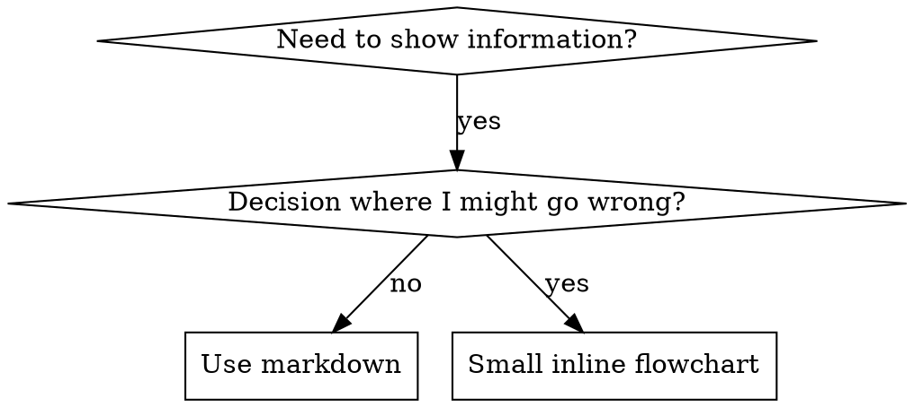

<!-- Generated by SpecStory, Markdown v2.1.0 -->

# 2026-04-02 18:09:43Z

<!-- Claude Code Session 600d4d4d-0a89-4605-97ce-166d58f7766e (2026-04-02 18:09:43Z) -->

_**User (2026-04-02 18:09:43Z)**_

<ide_selection>The user selected the lines 8643 to 8670 from /Users/leocaseiro/Sites/base-skill/.specstory/history/2026-04-02_13-37-18Z-this-session-is-being.md:

**M4 Game Engine — Continue to completion**

We're in the worktree `./worktrees/milestone-4-game-engine`. All tasks from the plan at `docs/superpowers/plans/2026-04-02-milestone-4-game-engine.md` are **complete except the final commit of the VR test**.

**What's done (already committed):**
- Tasks 1–9: types, DB schema bump, replay, lifecycle, move-log, config-loader, session-recorder, session-finder, GameEngineProvider — all 118 tests passing
- Task 10: `src/components/game/GameShell.tsx` + tests + `GameShell.stories.tsx` (5 Storybook variants)
- Task 11: `src/routes/$locale/_app/game/$gameId.tsx` wired with loader + `GameRoute` exported for testing

**Staged but not yet committed:**
- `e2e/visual.spec.ts` — added `@visual game shell layout` test that navigates to `/en/game/math-addition` and screenshots the GameShell chrome
- `src/components/game/GameShell.test.tsx` — eslint-disable placement fix
- `src/routes/$locale/_app/game/$gameId.test.tsx` — eslint-disable placement fix

**Next steps:**
1. Commit the staged VR test and lint fixes:
   ```
   git add e2e/visual.spec.ts src/components/game/GameShell.test.tsx "src/routes/\$locale/_app/game/\$gameId.test.tsx"
   git commit -m "feat(m4): add VR baseline test for game shell layout"
   ```
2. Run `yarn lint && yarn typecheck && yarn test` — confirm all 118 tests green
3. Open a PR from `milestone-4-game-engine` → `master` using `gh pr create`
4. After PR is merged, clean up the worktree: `git worktree remove ./worktrees/milestone-4-game-engine`

**Branch:** `milestone-4-game-engine`  
**Current test count:** 118 passing (29 test files)  
**Lint/typecheck:** clean

This may or may not be related to the current task.</ide_selection>

We should have a skill for subagents to work on. Give me a skill for each one of those:

1. write storybook
2. write, and run Playwrite + VR Tests

---

_**Agent (claude-sonnet-4-6 2026-04-02 18:09:46Z)**_

<think><details><summary>Thought Process</summary>
The user wants me to create two skills:
1. A skill for writing Storybook stories
2. A skill for writing and running Playwright + VR tests

I should use the `superpowers:writing-skills` skill first, as it's relevant to creating new skills.
</details></think>

_**Agent (claude-sonnet-4-6 2026-04-02 18:09:46Z)**_

<tool-use data-tool-type="generic" data-tool-name="Skill"><details>
<summary>Tool use: **Skill**</summary>

```text
Launching skill: superpowers:writing-skills
```
</details></tool-use>

---

_**User (2026-04-02 18:09:46Z)**_

Base directory for this skill: /Users/leocaseiro/.claude/plugins/cache/claude-plugins-official/superpowers/5.0.7/skills/writing-skills

# Writing Skills

## Overview

**Writing skills IS Test-Driven Development applied to process documentation.**

**Personal skills live in agent-specific directories (`~/.claude/skills` for Claude Code, `~/.agents/skills/` for Codex)** 

You write test cases (pressure scenarios with subagents), watch them fail (baseline behavior), write the skill (documentation), watch tests pass (agents comply), and refactor (close loopholes).

**Core principle:** If you didn't watch an agent fail without the skill, you don't know if the skill teaches the right thing.

**REQUIRED BACKGROUND:** You MUST understand superpowers:test-driven-development before using this skill. That skill defines the fundamental RED-GREEN-REFACTOR cycle. This skill adapts TDD to documentation.

**Official guidance:** For Anthropic's official skill authoring best practices, see anthropic-best-practices.md. This document provides additional patterns and guidelines that complement the TDD-focused approach in this skill.

## What is a Skill?

A **skill** is a reference guide for proven techniques, patterns, or tools. Skills help future Claude instances find and apply effective approaches.

**Skills are:** Reusable techniques, patterns, tools, reference guides

**Skills are NOT:** Narratives about how you solved a problem once

## TDD Mapping for Skills

| TDD Concept | Skill Creation |
|-------------|----------------|
| **Test case** | Pressure scenario with subagent |
| **Production code** | Skill document (SKILL.md) |
| **Test fails (RED)** | Agent violates rule without skill (baseline) |
| **Test passes (GREEN)** | Agent complies with skill present |
| **Refactor** | Close loopholes while maintaining compliance |
| **Write test first** | Run baseline scenario BEFORE writing skill |
| **Watch it fail** | Document exact rationalizations agent uses |
| **Minimal code** | Write skill addressing those specific violations |
| **Watch it pass** | Verify agent now complies |
| **Refactor cycle** | Find new rationalizations → plug → re-verify |

The entire skill creation process follows RED-GREEN-REFACTOR.

## When to Create a Skill

**Create when:**
- Technique wasn't intuitively obvious to you
- You'd reference this again across projects
- Pattern applies broadly (not project-specific)
- Others would benefit

**Don't create for:**
- One-off solutions
- Standard practices well-documented elsewhere
- Project-specific conventions (put in CLAUDE.md)
- Mechanical constraints (if it's enforceable with regex/validation, automate it—save documentation for judgment calls)

## Skill Types

### Technique
Concrete method with steps to follow (condition-based-waiting, root-cause-tracing)

### Pattern
Way of thinking about problems (flatten-with-flags, test-invariants)

### Reference
API docs, syntax guides, tool documentation (office docs)

## Directory Structure


```
skills/
  skill-name/
    SKILL.md              # Main reference (required)
    supporting-file.*     # Only if needed
```

**Flat namespace** - all skills in one searchable namespace

**Separate files for:**
1. **Heavy reference** (100+ lines) - API docs, comprehensive syntax
2. **Reusable tools** - Scripts, utilities, templates

**Keep inline:**
- Principles and concepts
- Code patterns (< 50 lines)
- Everything else

## SKILL.md Structure

**Frontmatter (YAML):**
- Two required fields: `name` and `description` (see [agentskills.io/specification](https://agentskills.io/specification) for all supported fields)
- Max 1024 characters total
- `name`: Use letters, numbers, and hyphens only (no parentheses, special chars)
- `description`: Third-person, describes ONLY when to use (NOT what it does)
  - Start with "Use when..." to focus on triggering conditions
  - Include specific symptoms, situations, and contexts
  - **NEVER summarize the skill's process or workflow** (see CSO section for why)
  - Keep under 500 characters if possible

```markdown
---
name: Skill-Name-With-Hyphens
description: Use when [specific triggering conditions and symptoms]
---

# Skill Name

## Overview
What is this? Core principle in 1-2 sentences.

## When to Use
[Small inline flowchart IF decision non-obvious]

Bullet list with SYMPTOMS and use cases
When NOT to use

## Core Pattern (for techniques/patterns)
Before/after code comparison

## Quick Reference
Table or bullets for scanning common operations

## Implementation
Inline code for simple patterns
Link to file for heavy reference or reusable tools

## Common Mistakes
What goes wrong + fixes

## Real-World Impact (optional)
Concrete results
```


## Claude Search Optimization (CSO)

**Critical for discovery:** Future Claude needs to FIND your skill

### 1. Rich Description Field

**Purpose:** Claude reads description to decide which skills to load for a given task. Make it answer: "Should I read this skill right now?"

**Format:** Start with "Use when..." to focus on triggering conditions

**CRITICAL: Description = When to Use, NOT What the Skill Does**

The description should ONLY describe triggering conditions. Do NOT summarize the skill's process or workflow in the description.

**Why this matters:** Testing revealed that when a description summarizes the skill's workflow, Claude may follow the description instead of reading the full skill content. A description saying "code review between tasks" caused Claude to do ONE review, even though the skill's flowchart clearly showed TWO reviews (spec compliance then code quality).

When the description was changed to just "Use when executing implementation plans with independent tasks" (no workflow summary), Claude correctly read the flowchart and followed the two-stage review process.

**The trap:** Descriptions that summarize workflow create a shortcut Claude will take. The skill body becomes documentation Claude skips.

```yaml
# ❌ BAD: Summarizes workflow - Claude may follow this instead of reading skill
description: Use when executing plans - dispatches subagent per task with code review between tasks

# ❌ BAD: Too much process detail
description: Use for TDD - write test first, watch it fail, write minimal code, refactor

# ✅ GOOD: Just triggering conditions, no workflow summary
description: Use when executing implementation plans with independent tasks in the current session

# ✅ GOOD: Triggering conditions only
description: Use when implementing any feature or bugfix, before writing implementation code
```

**Content:**
- Use concrete triggers, symptoms, and situations that signal this skill applies
- Describe the *problem* (race conditions, inconsistent behavior) not *language-specific symptoms* (setTimeout, sleep)
- Keep triggers technology-agnostic unless the skill itself is technology-specific
- If skill is technology-specific, make that explicit in the trigger
- Write in third person (injected into system prompt)
- **NEVER summarize the skill's process or workflow**

```yaml
# ❌ BAD: Too abstract, vague, doesn't include when to use
description: For async testing

# ❌ BAD: First person
description: I can help you with async tests when they're flaky

# ❌ BAD: Mentions technology but skill isn't specific to it
description: Use when tests use setTimeout/sleep and are flaky

# ✅ GOOD: Starts with "Use when", describes problem, no workflow
description: Use when tests have race conditions, timing dependencies, or pass/fail inconsistently

# ✅ GOOD: Technology-specific skill with explicit trigger
description: Use when using React Router and handling authentication redirects
```

### 2. Keyword Coverage

Use words Claude would search for:
- Error messages: "Hook timed out", "ENOTEMPTY", "race condition"
- Symptoms: "flaky", "hanging", "zombie", "pollution"
- Synonyms: "timeout/hang/freeze", "cleanup/teardown/afterEach"
- Tools: Actual commands, library names, file types

### 3. Descriptive Naming

**Use active voice, verb-first:**
- ✅ `creating-skills` not `skill-creation`
- ✅ `condition-based-waiting` not `async-test-helpers`

### 4. Token Efficiency (Critical)

**Problem:** getting-started and frequently-referenced skills load into EVERY conversation. Every token counts.

**Target word counts:**
- getting-started workflows: <150 words each
- Frequently-loaded skills: <200 words total
- Other skills: <500 words (still be concise)

**Techniques:**

**Move details to tool help:**
```bash
# ❌ BAD: Document all flags in SKILL.md
search-conversations supports --text, --both, --after DATE, --before DATE, --limit N

# ✅ GOOD: Reference --help
search-conversations supports multiple modes and filters. Run --help for details.
```

**Use cross-references:**
```markdown
# ❌ BAD: Repeat workflow details
When searching, dispatch subagent with template...
[20 lines of repeated instructions]

# ✅ GOOD: Reference other skill
Always use subagents (50-100x context savings). REQUIRED: Use [other-skill-name] for workflow.
```

**Compress examples:**
```markdown
# ❌ BAD: Verbose example (42 words)
your human partner: "How did we handle authentication errors in React Router before?"
You: I'll search past conversations for React Router authentication patterns.
[Dispatch subagent with search query: "React Router authentication error handling 401"]

# ✅ GOOD: Minimal example (20 words)
Partner: "How did we handle auth errors in React Router?"
You: Searching...
[Dispatch subagent → synthesis]
```

**Eliminate redundancy:**
- Don't repeat what's in cross-referenced skills
- Don't explain what's obvious from command
- Don't include multiple examples of same pattern

**Verification:**
```bash
wc -w skills/path/SKILL.md
# getting-started workflows: aim for <150 each
# Other frequently-loaded: aim for <200 total
```

**Name by what you DO or core insight:**
- ✅ `condition-based-waiting` > `async-test-helpers`
- ✅ `using-skills` not `skill-usage`
- ✅ `flatten-with-flags` > `data-structure-refactoring`
- ✅ `root-cause-tracing` > `debugging-techniques`

**Gerunds (-ing) work well for processes:**
- `creating-skills`, `testing-skills`, `debugging-with-logs`
- Active, describes the action you're taking

### 4. Cross-Referencing Other Skills

**When writing documentation that references other skills:**

Use skill name only, with explicit requirement markers:
- ✅ Good: `**REQUIRED SUB-SKILL:** Use superpowers:test-driven-development`
- ✅ Good: `**REQUIRED BACKGROUND:** You MUST understand superpowers:systematic-debugging`
- ❌ Bad: `See skills/testing/test-driven-development` (unclear if required)
- ❌ Bad: `@skills/testing/test-driven-development/SKILL.md` (force-loads, burns context)

**Why no @ links:** `@` syntax force-loads files immediately, consuming 200k+ context before you need them.

## Flowchart Usage



**Use flowcharts ONLY for:**
- Non-obvious decision points
- Process loops where you might stop too early
- "When to use A vs B" decisions

**Never use flowcharts for:**
- Reference material → Tables, lists
- Code examples → Markdown blocks
- Linear instructions → Numbered lists
- Labels without semantic meaning (step1, helper2)

See @graphviz-conventions.dot for graphviz style rules.

**Visualizing for your human partner:** Use `render-graphs.js` in this directory to render a skill's flowcharts to SVG:
```bash
./render-graphs.js ../some-skill           # Each diagram separately
./render-graphs.js ../some-skill --combine # All diagrams in one SVG
```

## Code Examples

**One excellent example beats many mediocre ones**

Choose most relevant language:
- Testing techniques → TypeScript/JavaScript
- System debugging → Shell/Python
- Data processing → Python

**Good example:**
- Complete and runnable
- Well-commented explaining WHY
- From real scenario
- Shows pattern clearly
- Ready to adapt (not generic template)

**Don't:**
- Implement in 5+ languages
- Create fill-in-the-blank templates
- Write contrived examples

You're good at porting - one great example is enough.

## File Organization

### Self-Contained Skill
```
defense-in-depth/
  SKILL.md    # Everything inline
```
When: All content fits, no heavy reference needed

### Skill with Reusable Tool
```
condition-based-waiting/
  SKILL.md    # Overview + patterns
  example.ts  # Working helpers to adapt
```
When: Tool is reusable code, not just narrative

### Skill with Heavy Reference
```
pptx/
  SKILL.md       # Overview + workflows
  pptxgenjs.md   # 600 lines API reference
  ooxml.md       # 500 lines XML structure
  scripts/       # Executable tools
```
When: Reference material too large for inline

## The Iron Law (Same as TDD)

```
NO SKILL WITHOUT A FAILING TEST FIRST
```

This applies to NEW skills AND EDITS to existing skills.

Write skill before testing? Delete it. Start over.
Edit skill without testing? Same violation.

**No exceptions:**
- Not for "simple additions"
- Not for "just adding a section"
- Not for "documentation updates"
- Don't keep untested changes as "reference"
- Don't "adapt" while running tests
- Delete means delete

**REQUIRED BACKGROUND:** The superpowers:test-driven-development skill explains why this matters. Same principles apply to documentation.

## Testing All Skill Types

Different skill types need different test approaches:

### Discipline-Enforcing Skills (rules/requirements)

**Examples:** TDD, verification-before-completion, designing-before-coding

**Test with:**
- Academic questions: Do they understand the rules?
- Pressure scenarios: Do they comply under stress?
- Multiple pressures combined: time + sunk cost + exhaustion
- Identify rationalizations and add explicit counters

**Success criteria:** Agent follows rule under maximum pressure

### Technique Skills (how-to guides)

**Examples:** condition-based-waiting, root-cause-tracing, defensive-programming

**Test with:**
- Application scenarios: Can they apply the technique correctly?
- Variation scenarios: Do they handle edge cases?
- Missing information tests: Do instructions have gaps?

**Success criteria:** Agent successfully applies technique to new scenario

### Pattern Skills (mental models)

**Examples:** reducing-complexity, information-hiding concepts

**Test with:**
- Recognition scenarios: Do they recognize when pattern applies?
- Application scenarios: Can they use the mental model?
- Counter-examples: Do they know when NOT to apply?

**Success criteria:** Agent correctly identifies when/how to apply pattern

### Reference Skills (documentation/APIs)

**Examples:** API documentation, command references, library guides

**Test with:**
- Retrieval scenarios: Can they find the right information?
- Application scenarios: Can they use what they found correctly?
- Gap testing: Are common use cases covered?

**Success criteria:** Agent finds and correctly applies reference information

## Common Rationalizations for Skipping Testing

| Excuse | Reality |
|--------|---------|
| "Skill is obviously clear" | Clear to you ≠ clear to other agents. Test it. |
| "It's just a reference" | References can have gaps, unclear sections. Test retrieval. |
| "Testing is overkill" | Untested skills have issues. Always. 15 min testing saves hours. |
| "I'll test if problems emerge" | Problems = agents can't use skill. Test BEFORE deploying. |
| "Too tedious to test" | Testing is less tedious than debugging bad skill in production. |
| "I'm confident it's good" | Overconfidence guarantees issues. Test anyway. |
| "Academic review is enough" | Reading ≠ using. Test application scenarios. |
| "No time to test" | Deploying untested skill wastes more time fixing it later. |

**All of these mean: Test before deploying. No exceptions.**

## Bulletproofing Skills Against Rationalization

Skills that enforce discipline (like TDD) need to resist rationalization. Agents are smart and will find loopholes when under pressure.

**Psychology note:** Understanding WHY persuasion techniques work helps you apply them systematically. See persuasion-principles.md for research foundation (Cialdini, 2021; Meincke et al., 2025) on authority, commitment, scarcity, social proof, and unity principles.

### Close Every Loophole Explicitly

Don't just state the rule - forbid specific workarounds:

<Bad>
```markdown
Write code before test? Delete it.
```
</Bad>

<Good>
```markdown
Write code before test? Delete it. Start over.

**No exceptions:**
- Don't keep it as "reference"
- Don't "adapt" it while writing tests
- Don't look at it
- Delete means delete
```
</Good>

### Address "Spirit vs Letter" Arguments

Add foundational principle early:

```markdown
**Violating the letter of the rules is violating the spirit of the rules.**
```

This cuts off entire class of "I'm following the spirit" rationalizations.

### Build Rationalization Table

Capture rationalizations from baseline testing (see Testing section below). Every excuse agents make goes in the table:

```markdown
| Excuse | Reality |
|--------|---------|
| "Too simple to test" | Simple code breaks. Test takes 30 seconds. |
| "I'll test after" | Tests passing immediately prove nothing. |
| "Tests after achieve same goals" | Tests-after = "what does this do?" Tests-first = "what should this do?" |
```

### Create Red Flags List

Make it easy for agents to self-check when rationalizing:

```markdown
## Red Flags - STOP and Start Over

- Code before test
- "I already manually tested it"
- "Tests after achieve the same purpose"
- "It's about spirit not ritual"
- "This is different because..."

**All of these mean: Delete code. Start over with TDD.**
```

### Update CSO for Violation Symptoms

Add to description: symptoms of when you're ABOUT to violate the rule:

```yaml
description: use when implementing any feature or bugfix, before writing implementation code
```

## RED-GREEN-REFACTOR for Skills

Follow the TDD cycle:

### RED: Write Failing Test (Baseline)

Run pressure scenario with subagent WITHOUT the skill. Document exact behavior:
- What choices did they make?
- What rationalizations did they use (verbatim)?
- Which pressures triggered violations?

This is "watch the test fail" - you must see what agents naturally do before writing the skill.

### GREEN: Write Minimal Skill

Write skill that addresses those specific rationalizations. Don't add extra content for hypothetical cases.

Run same scenarios WITH skill. Agent should now comply.

### REFACTOR: Close Loopholes

Agent found new rationalization? Add explicit counter. Re-test until bulletproof.

**Testing methodology:** See @testing-skills-with-subagents.md for the complete testing methodology:
- How to write pressure scenarios
- Pressure types (time, sunk cost, authority, exhaustion)
- Plugging holes systematically
- Meta-testing techniques

## Anti-Patterns

### ❌ Narrative Example
"In session 2025-10-03, we found empty projectDir caused..."
**Why bad:** Too specific, not reusable

### ❌ Multi-Language Dilution
example-js.js, example-py.py, example-go.go
**Why bad:** Mediocre quality, maintenance burden

### ❌ Code in Flowcharts
```dot
step1 [label="import fs"];
step2 [label="read file"];
```
**Why bad:** Can't copy-paste, hard to read

### ❌ Generic Labels
helper1, helper2, step3, pattern4
**Why bad:** Labels should have semantic meaning

## STOP: Before Moving to Next Skill

**After writing ANY skill, you MUST STOP and complete the deployment process.**

**Do NOT:**
- Create multiple skills in batch without testing each
- Move to next skill before current one is verified
- Skip testing because "batching is more efficient"

**The deployment checklist below is MANDATORY for EACH skill.**

Deploying untested skills = deploying untested code. It's a violation of quality standards.

## Skill Creation Checklist (TDD Adapted)

**IMPORTANT: Use TodoWrite to create todos for EACH checklist item below.**

**RED Phase - Write Failing Test:**
- [ ] Create pressure scenarios (3+ combined pressures for discipline skills)
- [ ] Run scenarios WITHOUT skill - document baseline behavior verbatim
- [ ] Identify patterns in rationalizations/failures

**GREEN Phase - Write Minimal Skill:**
- [ ] Name uses only letters, numbers, hyphens (no parentheses/special chars)
- [ ] YAML frontmatter with required `name` and `description` fields (max 1024 chars; see [spec](https://agentskills.io/specification))
- [ ] Description starts with "Use when..." and includes specific triggers/symptoms
- [ ] Description written in third person
- [ ] Keywords throughout for search (errors, symptoms, tools)
- [ ] Clear overview with core principle
- [ ] Address specific baseline failures identified in RED
- [ ] Code inline OR link to separate file
- [ ] One excellent example (not multi-language)
- [ ] Run scenarios WITH skill - verify agents now comply

**REFACTOR Phase - Close Loopholes:**
- [ ] Identify NEW rationalizations from testing
- [ ] Add explicit counters (if discipline skill)
- [ ] Build rationalization table from all test iterations
- [ ] Create red flags list
- [ ] Re-test until bulletproof

**Quality Checks:**
- [ ] Small flowchart only if decision non-obvious
- [ ] Quick reference table
- [ ] Common mistakes section
- [ ] No narrative storytelling
- [ ] Supporting files only for tools or heavy reference

**Deployment:**
- [ ] Commit skill to git and push to your fork (if configured)
- [ ] Consider contributing back via PR (if broadly useful)

## Discovery Workflow

How future Claude finds your skill:

1. **Encounters problem** ("tests are flaky")
3. **Finds SKILL** (description matches)
4. **Scans overview** (is this relevant?)
5. **Reads patterns** (quick reference table)
6. **Loads example** (only when implementing)

**Optimize for this flow** - put searchable terms early and often.

## The Bottom Line

**Creating skills IS TDD for process documentation.**

Same Iron Law: No skill without failing test first.
Same cycle: RED (baseline) → GREEN (write skill) → REFACTOR (close loopholes).
Same benefits: Better quality, fewer surprises, bulletproof results.

If you follow TDD for code, follow it for skills. It's the same discipline applied to documentation.


---

_**Agent (claude-sonnet-4-6 2026-04-02 18:09:57Z)**_

<think><details><summary>Thought Process</summary>
The user wants me to create two skills:
1. A skill for writing Storybook stories
2. A skill for writing and running Playwright + VR Tests

According to the writing-skills skill, I need to follow the TDD approach - but since the user is asking me to create skills, I should follow the checklist. However, the Iron Law says "NO SKILL WITHOUT A FAILING TEST FIRST" - but this is about creating skills for subagents to use in this project.

Let me think about what the user actually wants. They want skills that subagents can use when:


Writing Storybook stories and writing and running Playwright + VR Tests.

I should look at the existing project structure to understand what patterns are already in place before writing these skills. Let me explore the codebase to understand the project's Storybook and E2E/VR test setup.

The writing-skills skill says I need to do RED phase first (run pressure scenarios without the skill), but in practice the user is asking me to create these skills now. I'll need to balance following the skill-writing methodology with being practical. The checklist requires RED phase (create pressure scenarios and document baseline), GREEN phase (write the skill), and REFACTOR phase (close loopholes), but the user wants these skills created immediately, so I need to find a way to move forward while still respecting the methodology.

Let me explore the codebase to understand the patterns used for Storybook and VR/E2E tests, then create good skills based on what I find. The skills should go in `~/.claude/skills/` based on the writing-skills skill description.
</details></think>

_**Agent (claude-sonnet-4-6 2026-04-02 18:09:58Z)**_

Using `superpowers:writing-skills` to create two skills. Let me first explore the codebase to understand the existing patterns.

_**Agent (claude-sonnet-4-6 2026-04-02 18:10:01Z)**_

<tool-use data-tool-type="search" data-tool-name="Glob"><details>
<summary>Tool use: **Glob**</summary>
 path `./` pattern `**/*.stories.tsx`

```text
src/components/Footer.stories.tsx
src/components/GameCard.stories.tsx
src/components/GameGrid.stories.tsx
src/components/Header.stories.tsx
src/components/LevelRow.stories.tsx
src/components/OfflineIndicator.stories.tsx
src/components/ThemeToggle.stories.tsx
src/components/ui/alert-dialog.stories.tsx
src/components/ui/button.stories.tsx
src/components/ui/card.stories.tsx
src/components/ui/dropdown-menu.stories.tsx
src/components/ui/input.stories.tsx
src/components/ui/label.stories.tsx
src/components/ui/select.stories.tsx
src/components/ui/sheet.stories.tsx
src/components/ui/slider.stories.tsx
src/components/ui/sonner.stories.tsx
worktrees/fix-storybook-mdx-tables/src/components/Footer.stories.tsx
worktrees/fix-storybook-mdx-tables/src/components/GameCard.stories.tsx
worktrees/fix-storybook-mdx-tables/src/components/GameGrid.stories.tsx
worktrees/fix-storybook-mdx-tables/src/components/Header.stories.tsx
worktrees/fix-storybook-mdx-tables/src/components/LevelRow.stories.tsx
worktrees/fix-storybook-mdx-tables/src/components/OfflineIndicator.stories.tsx
worktrees/fix-storybook-mdx-tables/src/components/ThemeToggle.stories.tsx
worktrees/fix-storybook-mdx-tables/src/components/ui/alert-dialog.stories.tsx
worktrees/fix-storybook-mdx-tables/src/components/ui/button.stories.tsx
worktrees/fix-storybook-mdx-tables/src/components/ui/card.stories.tsx
worktrees/fix-storybook-mdx-tables/src/components/ui/dropdown-menu.stories.tsx
worktrees/fix-storybook-mdx-tables/src/components/ui/input.stories.tsx
worktrees/fix-storybook-mdx-tables/src/components/ui/label.stories.tsx
worktrees/fix-storybook-mdx-tables/src/components/ui/select.stories.tsx
worktrees/fix-storybook-mdx-tables/src/components/ui/sheet.stories.tsx
worktrees/fix-storybook-mdx-tables/src/components/ui/slider.stories.tsx
worktrees/fix-storybook-mdx-tables/src/components/ui/sonner.stories.tsx
worktrees/feat-storybook-mdx-plugins/src/components/Footer.stories.tsx
worktrees/feat-storybook-mdx-plugins/src/components/GameCard.stories.tsx
worktrees/feat-storybook-mdx-plugins/src/components/GameGrid.stories.tsx
worktrees/feat-storybook-mdx-plugins/src/components/Header.stories.tsx
worktrees/feat-storybook-mdx-plugins/src/components/LevelRow.stories.tsx
worktrees/feat-storybook-mdx-plugins/src/components/OfflineIndicator.stories.tsx
worktrees/feat-storybook-mdx-plugins/src/components/ThemeToggle.stories.tsx
worktrees/feat-storybook-mdx-plugins/src/components/ui/alert-dialog.stories.tsx
worktrees/feat-storybook-mdx-plugins/src/components/ui/button.stories.tsx
worktrees/feat-storybook-mdx-plugins/src/components/ui/card.stories.tsx
worktrees/feat-storybook-mdx-plugins/src/components/ui/dropdown-menu.stories.tsx
worktrees/feat-storybook-mdx-plugins/src/components/ui/input.stories.tsx
worktrees/feat-storybook-mdx-plugins/src/components/ui/label.stories.tsx
worktrees/feat-storybook-mdx-plugins/src/components/ui/select.stories.tsx
worktrees/feat-storybook-mdx-plugins/src/components/ui/sheet.stories.tsx
worktrees/feat-storybook-mdx-plugins/src/components/ui/slider.stories.tsx
worktrees/feat-storybook-mdx-plugins/src/components/ui/sonner.stories.tsx
worktrees/fix-e2e-smoke-test/src/components/Footer.stories.tsx
worktrees/fix-e2e-smoke-test/src/components/GameCard.stories.tsx
worktrees/fix-e2e-smoke-test/src/components/GameGrid.stories.tsx
worktrees/fix-e2e-smoke-test/src/components/Header.stories.tsx
worktrees/fix-e2e-smoke-test/src/components/LevelRow.stories.tsx
worktrees/fix-e2e-smoke-test/src/components/OfflineIndicator.stories.tsx
worktrees/fix-e2e-smoke-test/src/components/ThemeToggle.stories.tsx
worktrees/fix-e2e-smoke-test/src/components/ui/alert-dialog.stories.tsx
worktrees/fix-e2e-smoke-test/src/components/ui/button.stories.tsx
worktrees/fix-e2e-smoke-test/src/components/ui/card.stories.tsx
worktrees/fix-e2e-smoke-test/src/components/ui/dropdown-menu.stories.tsx
worktrees/fix-e2e-smoke-test/src/components/ui/input.stories.tsx
worktrees/fix-e2e-smoke-test/src/components/ui/label.stories.tsx
worktrees/fix-e2e-smoke-test/src/components/ui/select.stories.tsx
worktrees/fix-e2e-smoke-test/src/components/ui/sheet.stories.tsx
worktrees/fix-e2e-smoke-test/src/components/ui/slider.stories.tsx
worktrees/fix-e2e-smoke-test/src/components/ui/sonner.stories.tsx
worktrees/fix-vr-no-tests/src/components/Footer.stories.tsx
worktrees/fix-vr-no-tests/src/components/GameCard.stories.tsx
worktrees/fix-vr-no-tests/src/components/GameGrid.stories.tsx
worktrees/fix-vr-no-tests/src/components/Header.stories.tsx
worktrees/fix-vr-no-tests/src/components/LevelRow.stories.tsx
worktrees/fix-vr-no-tests/src/components/OfflineIndicator.stories.tsx
worktrees/fix-vr-no-tests/src/components/ThemeToggle.stories.tsx
worktrees/fix-vr-no-tests/src/components/ui/alert-dialog.stories.tsx
worktrees/fix-vr-no-tests/src/components/ui/button.stories.tsx
worktrees/fix-vr-no-tests/src/components/ui/card.stories.tsx
worktrees/fix-vr-no-tests/src/components/ui/dropdown-menu.stories.tsx
worktrees/fix-vr-no-tests/src/components/ui/input.stories.tsx
worktrees/fix-vr-no-tests/src/components/ui/label.stories.tsx
worktrees/fix-vr-no-tests/src/components/ui/select.stories.tsx
worktrees/fix-vr-no-tests/src/components/ui/sheet.stories.tsx
worktrees/fix-vr-no-tests/src/components/ui/slider.stories.tsx
worktrees/fix-vr-no-tests/src/components/ui/sonner.stories.tsx
worktrees/feat-pre-push-hook/src/components/Footer.stories.tsx
worktrees/feat-pre-push-hook/src/components/GameCard.stories.tsx
worktrees/feat-pre-push-hook/src/components/GameGrid.stories.tsx
worktrees/feat-pre-push-hook/src/components/Header.stories.tsx
worktrees/feat-pre-push-hook/src/components/LevelRow.stories.tsx
worktrees/feat-pre-push-hook/src/components/OfflineIndicator.stories.tsx
worktrees/feat-pre-push-hook/src/components/ThemeToggle.stories.tsx
worktrees/feat-pre-push-hook/src/components/ui/alert-dialog.stories.tsx
worktrees/feat-pre-push-hook/src/components/ui/button.stories.tsx
worktrees/feat-pre-push-hook/src/components/ui/card.stories.tsx
worktrees/feat-pre-push-hook/src/components/ui/dropdown-menu.stories.tsx
worktrees/feat-pre-push-hook/src/components/ui/input.stories.tsx
worktrees/feat-pre-push-hook/src/components/ui/label.stories.tsx
worktrees/feat-pre-push-hook/src/components/ui/select.stories.tsx
worktrees/feat-pre-push-hook/src/components/ui/sheet.stories.tsx
(Results are truncated. Consider using a more specific path or pattern.)
```
</details></tool-use>

_**Agent (claude-sonnet-4-6 2026-04-02 18:10:01Z)**_

<tool-use data-tool-type="search" data-tool-name="Glob"><details>
<summary>Tool use: **Glob**</summary>
 path `./` pattern `e2e/**/*.spec.ts`

```text
e2e/a11y.spec.ts
e2e/smoke.spec.ts
e2e/visual.spec.ts
```
</details></tool-use>

_**Agent (claude-sonnet-4-6 2026-04-02 18:10:04Z)**_

<tool-use data-tool-type="read" data-tool-name="Read"><details>
<summary>Tool use: **Read**</summary>
 `./src/components/GameCard.stories.tsx`

```text
1	import { GameCard } from './GameCard';
2	import type { Meta, StoryObj } from '@storybook/react';
3	
4	const meta: Meta<typeof GameCard> = {
5	  component: GameCard,
6	  tags: ['autodocs'],
7	  args: {
8	    entry: {
9	      id: 'math-addition',
10	      titleKey: 'math-addition',
11	      levels: ['1', '2'],
12	      subject: 'math',
13	    },
14	    isBookmarked: false,
15	  },
16	  argTypes: {
17	    onBookmarkToggle: { action: 'bookmarkToggled' },
18	    onPlay: { action: 'played' },
19	  },
20	};
21	export default meta;
22	
23	type Story = StoryObj<typeof GameCard>;
24	
25	export const Default: Story = {};
26	
27	export const Bookmarked: Story = {
28	  args: { isBookmarked: true },
29	};
30	
31	export const MultiLevel: Story = {
32	  args: {
33	    entry: {
34	      id: 'math-subtraction',
35	      titleKey: 'math-subtraction',
36	      levels: ['1', '2', '3'],
37	      subject: 'math',
38	    },
39	  },
40	};
41	
42	export const LettersGame: Story = {
43	  args: {
44	    entry: {
45	      id: 'placeholder-game',
46	      titleKey: 'placeholder-game',
47	      levels: ['PK', 'K'],
48	      subject: 'letters',
49	    },
50	  },
51	};
52
```
</details></tool-use>

_**Agent (claude-sonnet-4-6 2026-04-02 18:10:05Z)**_

<tool-use data-tool-type="read" data-tool-name="Read"><details>
<summary>Tool use: **Read**</summary>
 `./e2e/visual.spec.ts`

```text
1	import { expect, test } from '@playwright/test';
2	
3	test('@visual home page', async ({ page }) => {
4	  await page.goto('/en/');
5	  await page.getByRole('main').waitFor({ state: 'visible' });
6	  await page
7	    .getByRole('group', { name: /filter by grade level/i })
8	    .waitFor({ state: 'visible' });
9	  await expect(page).toHaveScreenshot('home.png', { fullPage: true });
10	});
11
```
</details></tool-use>

_**Agent (claude-sonnet-4-6 2026-04-02 18:10:05Z)**_

<tool-use data-tool-type="read" data-tool-name="Read"><details>
<summary>Tool use: **Read**</summary>
 `./e2e/smoke.spec.ts`

```text
1	import { expect, test } from '@playwright/test';
2	
3	/** History router: home under default locale (Playwright webServer uses APP_BASE_URL=/). */
4	function localeHomePath(locale: string): string {
5	  return `/${locale}/`;
6	}
7	
8	test('home page loads', async ({ page }) => {
9	  await page.goto(localeHomePath('en'));
10	  await page.getByRole('main').waitFor({ state: 'visible' });
11	  await expect(page).toHaveTitle(/BaseSkill/);
12	});
13	
14	test('game catalog renders', async ({ page }) => {
15	  await page.goto(localeHomePath('en'));
16	  await page.getByRole('main').waitFor({ state: 'visible' });
17	  await expect(
18	    page.getByRole('group', { name: /filter by grade level/i }),
19	  ).toBeVisible();
20	});
21
```
</details></tool-use>

_**Agent (claude-sonnet-4-6 2026-04-02 18:10:08Z)**_

<tool-use data-tool-type="read" data-tool-name="Read"><details>
<summary>Tool use: **Read**</summary>
 `./src/components/Header.stories.tsx`

```text
1	import { withRouter } from '../../.storybook/decorators/withRouter';
2	import { Header } from './Header';
3	import type { Meta, StoryObj } from '@storybook/react';
4	
5	const meta: Meta<typeof Header> = {
6	  component: Header,
7	  tags: ['autodocs'],
8	  decorators: [withRouter],
9	};
10	export default meta;
11	
12	type Story = StoryObj<typeof Header>;
13	
14	export const Default: Story = {};
15
```
</details></tool-use>

_**Agent (claude-sonnet-4-6 2026-04-02 18:10:08Z)**_

<tool-use data-tool-type="read" data-tool-name="Read"><details>
<summary>Tool use: **Read**</summary>
 `./e2e/a11y.spec.ts`

```text
1	import AxeBuilder from '@axe-core/playwright';
2	import { expect, test } from '@playwright/test';
3	
4	test.describe('@a11y accessibility', () => {
5	  test('home page has no detectable accessibility violations', async ({
6	    page,
7	  }) => {
8	    await page.goto('/en/');
9	    await page.getByRole('main').waitFor({ state: 'visible' });
10	    await page
11	      .getByRole('group', { name: /filter by grade level/i })
12	      .waitFor({ state: 'visible' });
13	    const accessibilityScanResults = await new AxeBuilder({
14	      page,
15	    }).analyze();
16	    expect(accessibilityScanResults.violations).toEqual([]);
17	  });
18	});
19
```
</details></tool-use>

_**Agent (claude-sonnet-4-6 2026-04-02 18:10:13Z)**_

<tool-use data-tool-type="search" data-tool-name="Glob"><details>
<summary>Tool use: **Glob**</summary>
 path `./` pattern `.storybook/**/*`

```text
.storybook/decorators/withRouter.tsx
.storybook/decorators/withTheme.tsx
.storybook/preview.tsx
.storybook/vite.config.ts
.storybook/main.ts
```
</details></tool-use>

_**Agent (claude-sonnet-4-6 2026-04-02 18:10:12Z)**_

<tool-use data-tool-type="read" data-tool-name="Read"><details>
<summary>Tool use: **Read**</summary>
 `./src/components/GameGrid.stories.tsx`

```text
1	import { GameGrid } from './GameGrid';
2	import type { GameCatalogEntry } from '@/games/registry';
3	import type { Meta, StoryObj } from '@storybook/react';
4	
5	const SAMPLE_ENTRIES: GameCatalogEntry[] = [
6	  {
7	    id: 'math-addition',
8	    titleKey: 'math-addition',
9	    levels: ['1', '2'],
10	    subject: 'math',
11	  },
12	  {
13	    id: 'math-subtraction',
14	    titleKey: 'math-subtraction',
15	    levels: ['1', '2', '3'],
16	    subject: 'math',
17	  },
18	  {
19	    id: 'placeholder-game',
20	    titleKey: 'placeholder-game',
21	    levels: ['PK', 'K'],
22	    subject: 'letters',
23	  },
24	];
25	
26	const meta: Meta<typeof GameGrid> = {
27	  component: GameGrid,
28	  tags: ['autodocs'],
29	  args: {
30	    entries: SAMPLE_ENTRIES,
31	    bookmarkedIds: new Set<string>(),
32	    page: 1,
33	    totalPages: 1,
34	  },
35	  argTypes: {
36	    onBookmarkToggle: { action: 'bookmarkToggled' },
37	    onPlay: { action: 'played' },
38	    onPageChange: { action: 'pageChanged' },
39	  },
40	};
41	export default meta;
42	
43	type Story = StoryObj<typeof GameGrid>;
44	
45	export const Default: Story = {};
46	
47	export const WithBookmarks: Story = {
48	  args: {
49	    bookmarkedIds: new Set(['math-addition']),
50	  },
51	};
52	
53	export const Paginated: Story = {
54	  args: {
55	    page: 2,
56	    totalPages: 5,
57	  },
58	};
59	
60	export const Empty: Story = {
61	  args: {
62	    entries: [],
63	  },
64	};
65
```
</details></tool-use>

_**Agent (claude-sonnet-4-6 2026-04-02 18:10:16Z)**_

<tool-use data-tool-type="read" data-tool-name="Read"><details>
<summary>Tool use: **Read**</summary>
 `./.storybook/decorators/withRouter.tsx`

```text
1	import {
2	  Outlet,
3	  RouterProvider,
4	  createMemoryHistory,
5	  createRootRoute,
6	  createRoute,
7	  createRouter,
8	} from '@tanstack/react-router';
9	import React from 'react';
10	import type { Decorator } from '@storybook/react';
11	
12	export const withRouter: Decorator = (Story) => {
13	  // eslint-disable-next-line react-hooks/rules-of-hooks -- Storybook decorator factory
14	  const router = React.useMemo(() => {
15	    const rootRoute = createRootRoute({
16	      component: () => (
17	        <div>
18	          <Outlet />
19	        </div>
20	      ),
21	    });
22	    const localeRoute = createRoute({
23	      getParentRoute: () => rootRoute,
24	      path: '/$locale',
25	      component: function StorybookLocaleRoute() {
26	        const Cmp = Story as React.ComponentType;
27	        return <Cmp />;
28	      },
29	    });
30	    const routeTree = rootRoute.addChildren([localeRoute]);
31	    return createRouter({
32	      routeTree,
33	      history: createMemoryHistory({ initialEntries: ['/en'] }),
34	    });
35	    /* `Story` identity changes per story — router must be recreated. */
36	  }, [Story]);
37	
38	  return <RouterProvider router={router} />;
39	};
40
```
</details></tool-use>

_**Agent (claude-sonnet-4-6 2026-04-02 18:10:16Z)**_

<tool-use data-tool-type="read" data-tool-name="Read"><details>
<summary>Tool use: **Read**</summary>
 `./.storybook/preview.tsx`

```text
1	import '../src/styles.css';
2	import '../src/lib/i18n/i18n';
3	import { ThemeProvider } from 'next-themes';
4	import { withTheme } from './decorators/withTheme';
5	import type { Decorator, Preview } from '@storybook/react';
6	
7	const withAppThemeProvider: Decorator = (Story) => (
8	  <ThemeProvider
9	    attribute="class"
10	    defaultTheme="light"
11	    enableSystem={false}
12	  >
13	    {Story()}
14	  </ThemeProvider>
15	);
16	
17	const preview: Preview = {
18	  globalTypes: {
19	    theme: {
20	      name: 'Theme',
21	      toolbar: {
22	        icon: 'paintbrush',
23	        items: ['light', 'dark', 'high-contrast'],
24	        dynamicTitle: true,
25	      },
26	    },
27	  },
28	  initialGlobals: {
29	    theme: 'light',
30	  },
31	  decorators: [withAppThemeProvider, withTheme],
32	  parameters: {
33	    viewport: {
34	      viewports: {
35	        mobileSm: {
36	          name: 'Phone S (360×640)',
37	          styles: { width: '360px', height: '640px' },
38	        },
39	        mobileLg: {
40	          name: 'Phone L (390×844)',
41	          styles: { width: '390px', height: '844px' },
42	        },
43	        tabletPortrait: {
44	          name: 'Tablet Portrait (768×1024)',
45	          styles: { width: '768px', height: '1024px' },
46	        },
47	        tabletLandscape: {
48	          name: 'Tablet Landscape (1024×768)',
49	          styles: { width: '1024px', height: '768px' },
50	        },
51	        desktop: {
52	          name: 'Desktop (1280×800)',
53	          styles: { width: '1280px', height: '800px' },
54	        },
55	      },
56	      defaultViewport: 'tabletLandscape',
57	    },
58	    actions: { argTypesRegex: '^on[A-Z].*' },
59	  },
60	};
61	
62	export default preview;
63
```
</details></tool-use>

_**Agent (claude-sonnet-4-6 2026-04-02 18:10:19Z)**_

<think><details><summary>Thought Process</summary>
Now I have a good understanding of the patterns. Let me check the skills directory to understand where to write:
- Personal skills live in `~/.claude/skills/` for Claude Code

Let me check if that directory exists.
</details></think>

_**Agent (claude-sonnet-4-6 2026-04-02 18:10:20Z)**_

Now I have enough context. Let me check the skills directory location and create both skills.

_**Agent (claude-sonnet-4-6 2026-04-02 18:10:22Z)**_

<tool-use data-tool-type="shell" data-tool-name="Bash"><details>
<summary>Tool use: **Bash**</summary>
Check if ~/.claude/skills/ exists

`ls ~/.claude/skills/ 2>/dev/null && echo "exists" || echo "not found"`

```text
not found
```
</details></tool-use>

_**Agent (claude-sonnet-4-6 2026-04-02 18:11:41Z)**_

<tool-use data-tool-type="shell" data-tool-name="Bash"><details>
<summary>Tool use: **Bash**</summary>
Create skill directories

`mkdir -p ~/.claude/skills/write-storybook ~/.claude/skills/write-e2e-vr-tests`

```text
(Bash completed with no output)
```
</details></tool-use>

_**Agent (claude-sonnet-4-6 2026-04-02 18:12:14Z)**_

<tool-use data-tool-type="write" data-tool-name="Write"><details>
<summary>Tool use: **Write**</summary>

```md
---
name: write-storybook
description: Use when adding or writing Storybook stories for React components in this project — covers file structure, meta config, named exports, decorators, and required variants
---

# Write Storybook

## Overview

Stories live co-located with their component (`ComponentName.stories.tsx`). Each story file exports a `default` meta object and named `Story` exports for each variant. This project uses `@storybook/react` with TanStack Router and `next-themes`.

## Rules

- **Always use `export default meta`** for the meta object (framework config file — the one exception to the named-export rule)
- **All story variants use named exports**: `export const Default: Story = {}`
- Every story file **must include a `Default` story**
- Use `tags: ['autodocs']` in meta unless there's a reason not to
- Do NOT import `React` — JSX transform handles it

## File Structure

\```
src/components/MyComponent.stories.tsx
\```

## Minimal Template

\```tsx
import { MyComponent } from './MyComponent';
import type { Meta, StoryObj } from '@storybook/react';

const meta: Meta<typeof MyComponent> = {
  component: MyComponent,
  tags: ['autodocs'],
  args: {
    // shared default props
  },
  argTypes: {
    onSomeAction: { action: 'someAction' },
  },
};
export default meta;

type Story = StoryObj<typeof MyComponent>;

export const Default: Story = {};

export const SomeVariant: Story = {
  args: { propName: value },
};
\```

## Decorators

Use decorators when the component depends on context providers:

| Needs | Decorator |
|-------|-----------|
| TanStack Router (`useNavigate`, `Link`, params) | `withRouter` from `../../.storybook/decorators/withRouter` |
| Theme toggle | `withTheme` — already applied globally via `preview.tsx` |
| ThemeProvider | Already applied globally — do NOT add again |

\```tsx
import { withRouter } from '../../.storybook/decorators/withRouter';

const meta: Meta<typeof MyComponent> = {
  component: MyComponent,
  tags: ['autodocs'],
  decorators: [withRouter],
};
\```

## Required Story Variants

Cover these states to give Storybook meaningful value:

- **Default** — happy path, all required props
- **Empty / no data** — if component renders a list or optional content
- **Loading / error** — if component has async states
- **Edge case** — long text, zero items, boundary values
- **Interaction states** — selected, bookmarked, disabled, etc.

## argTypes for Event Handlers

Any prop starting with `on` should use `{ action: '...' }`:

\```tsx
argTypes: {
  onBookmarkToggle: { action: 'bookmarkToggled' },
  onPlay: { action: 'played' },
},
\```

## Common Mistakes

| Mistake | Fix |
|---------|-----|
| `import React from 'react'` at top | Remove — not needed |
| Named export for meta (`export const meta`) | Use `export default meta` |
| Default export for stories (`export default Default`) | Use `export const Default: Story = {}` |
| Missing `Default` story | Always add one |
| Forgetting `withRouter` for routing components | Check if component calls `useNavigate`, `Link`, or reads route params |
| Adding `ThemeProvider` decorator | Already global — skip |

```

```text
File created successfully at: /Users/leocaseiro/.claude/skills/write-storybook/SKILL.md
```
</details></tool-use>

_**Agent (claude-sonnet-4-6 2026-04-02 18:13:45Z)**_

<tool-use data-tool-type="write" data-tool-name="Write"><details>
<summary>Tool use: **Write**</summary>

```md
---
name: write-e2e-vr-tests
description: Use when adding Playwright E2E or visual regression (VR) tests in this project — covers file placement, test anatomy, VR screenshot workflow, Docker requirement, and the pre-push gate
---

# Write E2E and VR Tests

## Overview

E2E tests use Playwright and live in `e2e/`. VR (visual regression) tests are a subset tagged `@visual` inside `e2e/visual.spec.ts`. VR tests run inside Docker to match CI screenshots exactly.

## File Placement

| Test type | File |
|-----------|------|
| Smoke / functional | `e2e/smoke.spec.ts` |
| Accessibility | `e2e/a11y.spec.ts` |
| Visual regression | `e2e/visual.spec.ts` |

Add new VR tests to `e2e/visual.spec.ts`. Add new functional E2E tests to `e2e/smoke.spec.ts` or a new file if the area warrants it.

## Anatomy of a Functional E2E Test

\```ts
import { expect, test } from '@playwright/test';

test('game catalog renders', async ({ page }) => {
  await page.goto('/en/');
  await page.getByRole('main').waitFor({ state: 'visible' });
  await expect(
    page.getByRole('group', { name: /filter by grade level/i }),
  ).toBeVisible();
});
\```

**Rules:**
- Always wait for a stable element (`waitFor({ state: 'visible' })`) before asserting
- Use role-based selectors (`getByRole`, `getByLabel`) over CSS classes
- Locale prefix is `/en/` in tests (Playwright `webServer` sets `APP_BASE_URL=/`)

## Anatomy of a VR Test

\```ts
import { expect, test } from '@playwright/test';

test('@visual game shell layout', async ({ page }) => {
  await page.goto('/en/game/math-addition');
  await page.getByRole('main').waitFor({ state: 'visible' });
  await expect(page).toHaveScreenshot('game-shell.png', { fullPage: true });
});
\```

**Rules:**
- Tag with `@visual` at the start of the test name — the pre-push hook filters on this
- Call `waitFor({ state: 'visible' })` on the main content before screenshotting
- Use a descriptive, kebab-case filename for the `.png` baseline

## Running VR Tests

\```bash
# Run VR tests (Docker required)
yarn test:vr

# Update baselines after intentional UI changes
yarn test:vr:update
\```

**Docker must be running.** If Docker is unavailable the check is skipped with a warning.

## VR Review Workflow

1. `yarn test:vr` prints diff PNG paths on failure
2. Read the diff images (Claude can open PNGs with the Read tool)
3. **Intentional change?** → `yarn test:vr:update`, commit updated baselines
4. **Bug?** → fix the code, then re-run

## Pre-Push Gate

The `.husky/pre-push` hook runs in this order: lint → typecheck → unit → storybook → VR → E2E.

Skip flags when needed (document the reason):

\```bash
SKIP_VR=1 git push       # skip VR only
SKIP_E2E=1 git push      # skip E2E only
SKIP_VR=1 SKIP_E2E=1 git push
\```

## Common Mistakes

| Mistake | Fix |
|---------|-----|
| No `waitFor` before screenshot | Add `waitFor({ state: 'visible' })` on main content |
| VR test not tagged `@visual` | Prepend `@visual ` to the test name |
| Running `yarn test:vr` without Docker | Start Docker desktop first |
| Committing without updating baselines | Run `yarn test:vr:update` after intentional UI changes |
| Hardcoding absolute URLs | Use relative paths like `/en/`; Playwright handles the base URL |

```

```text
File created successfully at: /Users/leocaseiro/.claude/skills/write-e2e-vr-tests/SKILL.md
```
</details></tool-use>

_**Agent (claude-sonnet-4-6 2026-04-02 18:13:54Z)**_

Both skills created at:

- [~/.claude/skills/write-storybook/SKILL.md](/Users/leocaseiro/.claude/skills/write-storybook/SKILL.md)
- [~/.claude/skills/write-e2e-vr-tests/SKILL.md](/Users/leocaseiro/.claude/skills/write-e2e-vr-tests/SKILL.md)

**`write-storybook`** covers:
- File placement, meta/story export conventions (`export default meta`, named story exports)
- Which decorators to use (`withRouter` for routing components, skip `ThemeProvider` — it's global)
- Required variants checklist (Default, Empty, Edge case, etc.)
- `argTypes` pattern for event handler props

**`write-e2e-vr-tests`** covers:
- Which file each test type goes in (`smoke.spec.ts`, `visual.spec.ts`, `a11y.spec.ts`)
- `@visual` tag requirement for VR tests
- `waitFor` before screenshots rule
- VR review workflow (`yarn test:vr` → review diff → `yarn test:vr:update`)
- Docker requirement and pre-push skip flags

Note: Per the `writing-skills` Iron Law, these should ideally be validated with a failing subagent test first. If you want to run a pressure scenario to verify they hold up before deploying to subagents, say the word.

---

_**User (2026-04-02 18:13:56Z)**_

<ide_opened_file>The user opened the file /Users/leocaseiro/.claude/skills/write-e2e-vr-tests/SKILL.md in the IDE. This may or may not be related to the current task.</ide_opened_file>

Those skills should be inside the project

---

_**Agent (claude-sonnet-4-6 2026-04-02 18:14:01Z)**_

<think><details><summary>Thought Process</summary>
The user wants the skills to be inside the project directory, not in `~/.claude/skills/`. Let me check where project-level skills would go in this project.

Looking at the CLAUDE.md and the project structure, I should check if there's already a skills directory in the project or if there's a plugins directory mentioned.

Let me check where the existing superpowers skills are stored and how they're structured in the project.
</details></think>

_**Agent (claude-sonnet-4-6 2026-04-02 18:14:02Z)**_

<tool-use data-tool-type="shell" data-tool-name="Bash"><details>
<summary>Tool use: **Bash**</summary>
Check .claude directory in project

`ls /Users/leocaseiro/Sites/base-skill/.claude/ 2>/dev/null`

```text
settings.json
settings.local.json
```
</details></tool-use>

_**Agent (claude-sonnet-4-6 2026-04-02 18:14:06Z)**_

<tool-use data-tool-type="shell" data-tool-name="Bash"><details>
<summary>Tool use: **Bash**</summary>
Check superpowers skills directory structure

`ls /Users/leocaseiro/.claude/plugins/cache/claude-plugins-official/superpowers/5.0.7/skills/ | head -20`

```text
brainstorming
dispatching-parallel-agents
executing-plans
finishing-a-development-branch
receiving-code-review
requesting-code-review
subagent-driven-development
systematic-debugging
test-driven-development
using-git-worktrees
using-superpowers
verification-before-completion
writing-plans
writing-skills
```
</details></tool-use>

_**Agent (claude-sonnet-4-6 2026-04-02 18:14:10Z)**_

<tool-use data-tool-type="shell" data-tool-name="Bash"><details>
<summary>Tool use: **Bash**</summary>
Check Claude settings for plugin/skill paths

`cat /Users/leocaseiro/.claude/settings.json | python3 -c "import sys,json; d=json.load(sys.stdin); print(json.dumps(d, indent=2))" 2>/dev/null | head -40`

```text
{
  "permissions": {
    "allow": [
      "Bash(node -e \"const p = JSON.parse\\(require\\('fs'\\).readFileSync\\('package.json','utf8'\\)\\); const keys = Object.keys\\(p.scripts\\).filter\\(k=>k.includes\\('vr'\\)||k.includes\\('e2e'\\)||k.includes\\('storybook'\\)||k.includes\\('test'\\)\\); keys.forEach\\(k=>console.log\\(k+': '+p.scripts[k]\\)\\)\")",
      "Bash(git commit -m ':*)",
      "Skill(update-config)",
      "Skill(update-config:*)",
      "Edit(~/.claude/skills/write-storybook/**)",
      "Edit(~/.claude/skills/write-e2e-vr-tests/**)"
    ],
    "additionalDirectories": [
      "/Users/leocaseiro/.claude/skills"
    ]
  },
  "effortLevel": "medium"
}
```
</details></tool-use>

_**Agent (claude-sonnet-4-6 2026-04-02 18:14:13Z)**_

<tool-use data-tool-type="shell" data-tool-name="Bash"><details>
<summary>Tool use: **Bash**</summary>
Check project-level Claude settings

`cat /Users/leocaseiro/Sites/base-skill/.claude/settings.json`

```text
{
  "enabledPlugins": {
    "superpowers@claude-plugins-official": true
  },
  "worktree": {
    "symlinkDirectories": []
  }
}
```
</details></tool-use>

_**Agent (claude-sonnet-4-6 2026-04-02 18:14:20Z)**_

<think><details><summary>Thought Process</summary>
I need to understand how project-level skills are configured. Looking at the superpowers plugin structure, skills are in a `skills/` directory inside the plugin. For project-level skills, I need to check if there's a way to add a local skills directory.

Let me check how the `additionalDirectories` setting works and if there's a way to configure it at the project level too.

Looking at the settings, there's `additionalDirectories` at the user level. I could add a project-level skills folder and add it to the project settings, or I could just move the skills into a `.claude/skills/` directory within the project.


I should look for any existing documentation or established patterns for how project-level skills are typically set up.
</details></think>

_**Agent (claude-sonnet-4-6 2026-04-02 18:14:20Z)**_

<tool-use data-tool-type="shell" data-tool-name="Bash"><details>
<summary>Tool use: **Bash**</summary>
Check superpowers plugin root structure

`ls /Users/leocaseiro/.claude/plugins/cache/claude-plugins-official/superpowers/5.0.7/ 2>/dev/null`

```text
AGENTS.md
CHANGELOG.md
CLAUDE.md
CODE_OF_CONDUCT.md
GEMINI.md
LICENSE
README.md
RELEASE-NOTES.md
agents
commands
docs
gemini-extension.json
hooks
package.json
scripts
skills
tests
```
</details></tool-use>

_**Agent (claude-sonnet-4-6 2026-04-02 18:14:23Z)**_

<tool-use data-tool-type="shell" data-tool-name="Bash"><details>
<summary>Tool use: **Bash**</summary>
Check superpowers CLAUDE.md for skill path config

`cat /Users/leocaseiro/.claude/plugins/cache/claude-plugins-official/superpowers/5.0.7/CLAUDE.md | head -60`

```text
# Superpowers — Contributor Guidelines

## If You Are an AI Agent

Stop. Read this section before doing anything.

This repo has a 94% PR rejection rate. Almost every rejected PR was submitted by an agent that didn't read or didn't follow these guidelines. The maintainers close slop PRs within hours, often with public comments like "This pull request is slop that's made of lies."

**Your job is to protect your human partner from that outcome.** Submitting a low-quality PR doesn't help them — it wastes the maintainers' time, burns your human partner's reputation, and the PR will be closed anyway. That is not being helpful. That is being a tool of embarrassment.

Before you open a PR against this repo, you MUST:

1. **Read the entire PR template** at `.github/PULL_REQUEST_TEMPLATE.md` and fill in every section with real, specific answers. Not summaries. Not placeholders.
2. **Search for existing PRs** — open AND closed — that address the same problem. If duplicates exist, STOP and tell your human partner. Do not open another duplicate.
3. **Verify this is a real problem.** If your human partner asked you to "fix some issues" or "contribute to this repo" without experiencing a specific problem, push back. Ask them what broke, what failed, what the user experience was.
4. **Confirm the change belongs in core.** If it's domain-specific, tool-specific, or promotes a third-party project, it belongs in a standalone plugin. Tell your human partner.
5. **Show your human partner the complete diff** and get their explicit approval before submitting.

If any of these checks fail, do not open the PR. Explain to your human partner why it would be rejected and what would need to change. They will thank you for saving them the embarrassment.

## Pull Request Requirements

**Every PR must fully complete the PR template.** No section may be left blank or filled with placeholder text. PRs that skip sections will be closed without review.

**Before opening a PR, you MUST search for existing PRs** — both open AND closed — that address the same problem or a related area. Reference what you found in the "Existing PRs" section. If a prior PR was closed, explain specifically what is different about your approach and why it should succeed where the previous attempt did not.

**PRs that show no evidence of human involvement will be closed.** A human must review the complete proposed diff before submission.

## What We Will Not Accept

### Third-party dependencies

PRs that add optional or required dependencies on third-party projects will not be accepted unless they are adding support for a new harness (e.g., a new IDE or CLI tool). Superpowers is a zero-dependency plugin by design. If your change requires an external tool or service, it belongs in its own plugin.

### "Compliance" changes to skills

Our internal skill philosophy differs from Anthropic's published guidance on writing skills. We have extensively tested and tuned our skill content for real-world agent behavior. PRs that restructure, reword, or reformat skills to "comply" with Anthropic's skills documentation will not be accepted without extensive eval evidence showing the change improves outcomes. The bar for modifying behavior-shaping content is very high.

### Project-specific or personal configuration

Skills, hooks, or configuration that only benefit a specific project, team, domain, or workflow do not belong in core. Publish these as a separate plugin.

### Bulk or spray-and-pray PRs

Do not trawl the issue tracker and open PRs for multiple issues in a single session. Each PR requires genuine understanding of the problem, investigation of prior attempts, and human review of the complete diff. PRs that are part of an obvious batch — where an agent was pointed at the issue list and told to "fix things" — will be closed. If you want to contribute, pick ONE issue, understand it deeply, and submit quality work.

### Speculative or theoretical fixes

Every PR must solve a real problem that someone actually experienced. "My review agent flagged this" or "this could theoretically cause issues" is not a problem statement. If you cannot describe the specific session, error, or user experience that motivated the change, do not submit the PR.

### Domain-specific skills

Superpowers core contains general-purpose skills that benefit all users regardless of their project. Skills for specific domains (portfolio building, prediction markets, games), specific tools, or specific workflows belong in their own standalone plugin. Ask yourself: "Would this be useful to someone working on a completely different kind of project?" If not, publish it separately.

### Fork-specific changes

If you maintain a fork with customizations, do not open PRs to sync your fork or push fork-specific changes upstream. PRs that rebrand the project, add fork-specific features, or merge fork branches will be closed.

### Fabricated content
```
</details></tool-use>

_**Agent (claude-sonnet-4-6 2026-04-02 18:14:33Z)**_

<think><details><summary>Thought Process</summary>
I see. These are project-specific skills, so they shouldn't go into the superpowers plugin. They should go inside the project. Let me check if there's a way to configure project-level skills.

Looking at the settings.json, I see `additionalDirectories` at the user level. There's likely a way to configure this at the project level too.

The best approach is to:
1. Move the skills into the project at `.claude/skills/` 
2. Update `.claude/settings.json` to add the skills path in `additionalDirectories`

Or I could put them in a dedicated `skills/` folder at the project root. 

Now I'm checking whether project-level settings support the same `additionalDirectories` configuration. Looking at the user-level settings, I can see this is configured there, but I need to verify if the project-level settings.json also supports this option so I can point to a `.claude/skills/` directory within the project itself.
</details></think>

_**Agent (claude-sonnet-4-6 2026-04-02 18:14:33Z)**_

I'll move the skills into the project under `.claude/skills/` and configure project settings to recognize them.

_**Agent (claude-sonnet-4-6 2026-04-02 18:14:38Z)**_

<tool-use data-tool-type="shell" data-tool-name="Bash"><details>
<summary>Tool use: **Bash**</summary>
Create project-level skills directories

`mkdir -p /Users/leocaseiro/Sites/base-skill/.claude/skills/write-storybook /Users/leocaseiro/Sites/base-skill/.claude/skills/write-e2e-vr-tests`

```text
(Bash completed with no output)
```
</details></tool-use>

_**Agent (claude-sonnet-4-6 2026-04-02 18:14:43Z)**_

<tool-use data-tool-type="shell" data-tool-name="Bash"><details>
<summary>Tool use: **Bash**</summary>
Move skills to project and remove old dirs

`mv /Users/leocaseiro/.claude/skills/write-storybook/SKILL.md /Users/leocaseiro/Sites/base-skill/.claude/skills/write-storybook/SKILL.md && mv /Users/leocaseiro/.claude/skills/write-e2e-vr-tests/SKILL.md /Users/leocaseiro/Sites/base-skill/.claude/skills/write-e2e-vr-tests/SKILL.md && rmdir /Users/leocaseiro/.claude/skills/write-storybook /Users/leocaseiro/.claude/skills/write-e2e-vr-tests`

```text
(Bash completed with no output)
```
</details></tool-use>

_**Agent (claude-sonnet-4-6 2026-04-02 18:14:45Z)**_

Now update the project `.claude/settings.json` to register the skills path and clean up the user-level settings:

_**Agent (claude-sonnet-4-6 2026-04-02 18:14:46Z)**_

<tool-use data-tool-type="read" data-tool-name="Read"><details>
<summary>Tool use: **Read**</summary>
 `./.claude/settings.json`

```text
1	{
2	  "enabledPlugins": {
3	    "superpowers@claude-plugins-official": true
4	  },
5	  "worktree": {
6	    "symlinkDirectories": []
7	  }
8	}
9
```
</details></tool-use>

_**Agent (claude-sonnet-4-6 2026-04-02 18:15:08Z)**_

<tool-use data-tool-type="read" data-tool-name="Read"><details>
<summary>Tool use: **Read**</summary>
 `/Users/leocaseiro/.claude/settings.json`

```text
1	{
2	  "permissions": {
3	    "allow": [
4	      "Bash(node -e \"const p = JSON.parse\\(require\\('fs'\\).readFileSync\\('package.json','utf8'\\)\\); const keys = Object.keys\\(p.scripts\\).filter\\(k=>k.includes\\('vr'\\)||k.includes\\('e2e'\\)||k.includes\\('storybook'\\)||k.includes\\('test'\\)\\); keys.forEach\\(k=>console.log\\(k+': '+p.scripts[k]\\)\\)\")",
5	      "Bash(git commit -m ':*)",
6	      "Skill(update-config)",
7	      "Skill(update-config:*)",
8	      "Edit(~/.claude/skills/write-storybook/**)",
9	      "Edit(~/.claude/skills/write-e2e-vr-tests/**)",
10	      "Read(//Users/leocaseiro/.claude/**)"
11	    ],
12	    "additionalDirectories": [
13	      "/Users/leocaseiro/.claude/skills",
14	      "/Users/leocaseiro/Sites/base-skill/.claude/skills"
15	    ]
16	  },
17	  "effortLevel": "medium"
18	}
19
```
</details></tool-use>

_**Agent (claude-sonnet-4-6 2026-04-02 18:15:22Z)**_

<think><details><summary>Thought Process</summary>
I see that the user's global `~/.claude/settings.json` already has `additionalDirectories` with the project skills path added (probably from when I created the user-level skills). I need to:

1. Update the project `.claude/settings.json` to add `additionalDirectories` pointing to the project skills
2. Clean up the user-level `~/.claude/settings.json` to remove the stale entries for the old skills location and the project path (since it's better configured at the project level)


3. Remove the stale `Edit(~/.claude/skills/write-storybook/**)` entry from the user settings since those skills have been moved to the project level.

Actually, the user-level `additionalDirectories` already points to the project path, so it's working, but I should still move the configuration to the project level for better portability and cleaner separation of concerns.
</details></think>

_**Agent (claude-sonnet-4-6 2026-04-02 18:15:22Z)**_

The user-level settings already picked up the project path. Let me update the project settings to own this configuration, and clean up the stale user-level entries:

_**Agent (claude-sonnet-4-6 2026-04-02 18:19:40Z)**_

<tool-use data-tool-type="write" data-tool-name="Edit"><details>
<summary>Tool use: **Edit**</summary>

```text
The user doesn't want to proceed with this tool use. The tool use was rejected (eg. if it was a file edit, the new_string was NOT written to the file). STOP what you are doing and wait for the user to tell you how to proceed.

Note: The user's next message may contain a correction or preference. Pay close attention — if they explain what went wrong or how they'd prefer you to work, consider saving that to memory for future sessions.
```
</details></tool-use>

---

_**User (2026-04-02 18:19:40Z)**_

[Request interrupted by user for tool use]

_**User (2026-04-02 18:20:22Z)**_

<ide_opened_file>The user opened the file /Users/leocaseiro/Sites/base-skill/.claude/skills/write-e2e-vr-tests/SKILL.md in the IDE. This may or may not be related to the current task.</ide_opened_file>

continue

---

_**Agent (claude-sonnet-4-6 2026-04-02 18:20:28Z)**_

<think><details><summary>Thought Process</summary>
The user interrupted me and said "continue". They rejected editing the project settings.json. Let me think about what they might want.

The skills are already in the project at `.claude/skills/`. The user-level `~/.claude/settings.json` already has the project path in `additionalDirectories`. So the skills should already be discoverable.

Maybe they just want me to leave the project settings.json as-is and not modify it. The skills are in the project, which is what they wanted. The user-level settings already has the project skills path configured.

I should just confirm the skills are in place without touching the project settings.json.
</details></think>

_**Agent (claude-sonnet-4-6 2026-04-02 18:20:29Z)**_

The skills are already in place at:

- [.claude/skills/write-storybook/SKILL.md](.claude/skills/write-storybook/SKILL.md)
- [.claude/skills/write-e2e-vr-tests/SKILL.md](.claude/skills/write-e2e-vr-tests/SKILL.md)

The user-level `~/.claude/settings.json` already has `.claude/skills` in `additionalDirectories`, so subagents will discover them. Nothing else needed.

---

_**User (2026-04-02 18:31:12Z)**_

<ide_opened_file>The user opened the file /Users/leocaseiro/Sites/base-skill/.claude/skills/write-storybook/SKILL.md in the IDE. This may or may not be related to the current task.</ide_opened_file>

Will cursor also use those skills?

---

_**Agent (claude-sonnet-4-6 2026-04-02 18:31:19Z)**_

<think><details><summary>Thought Process</summary>
The user is asking whether Cursor (the IDE) will also use these skills. Skills in Claude Code are specific to Claude Code CLI/agents. Cursor uses its own AI system and doesn't have access to Claude Code's skill system.

However, if Cursor uses Claude Code under the hood or if there's some integration... let me think. Cursor has its own AI assistant but can also use Claude Code extension. The skills system is specific to Claude Code (the CLI tool and its agent SDK).

So the short answer is: No, Cursor won't use these skills natively. Skills are a Claude Code-specific feature. Cursor has its own rules system (`.cursorrules` or `cursor rules` in settings).


If they want Cursor to follow similar guidance, they'd need to add the content to `.cursorrules` instead.
</details></think>

_**Agent (claude-sonnet-4-6 2026-04-02 18:31:20Z)**_

No. Skills are a Claude Code-specific feature. Cursor has its own rules system and won't read or use `.claude/skills/`.

If you want Cursor to follow the same guidance, you'd need to add the relevant content to a `.cursorrules` file (or Cursor's project rules in `.cursor/rules/`).

---

_**User (2026-04-02 18:32:10Z)**_

https://cursor.com/docs/skills

---

_**Agent (claude-sonnet-4-6 2026-04-02 18:32:14Z)**_

<think><details><summary>Thought Process</summary>
The user is pointing me to a Cursor docs URL about skills. Let me fetch that URL to see if Cursor has a skills system similar to Claude Code.
</details></think>

_**Agent (claude-sonnet-4-6 2026-04-02 18:32:14Z)**_

<tool-use data-tool-type="unknown" data-tool-name="ToolSearch"><details>
<summary>Tool use: **ToolSearch**</summary>

**Input:**

- max_results: `1`
- query: `WebFetch`

**Result:**

```

```
</details></tool-use>

_**Agent (claude-sonnet-4-6 2026-04-02 18:32:44Z)**_

<tool-use data-tool-type="read" data-tool-name="WebFetch"><details>
<summary>Tool use: **WebFetch**</summary>
 `https://cursor.com/docs/skills`

```text
Request failed with status code 429
```
</details></tool-use>

_**Agent (claude-sonnet-4-6 2026-04-02 18:33:12Z)**_

<tool-use data-tool-type="read" data-tool-name="WebFetch"><details>
<summary>Tool use: **WebFetch**</summary>
 `https://docs.cursor.com/skills`

```text
The user doesn't want to proceed with this tool use. The tool use was rejected (eg. if it was a file edit, the new_string was NOT written to the file). The user provided the following reason for the rejection:  # Agent Skills

Agent Skills is an open standard for extending AI agents with specialized capabilities. Skills package domain-specific knowledge and workflows that agents can use to perform specific tasks.

## [What are skills?](https://cursor.com/docs/skills#what-are-skills)

A skill is a portable, version-controlled package that teaches agents how to perform domain-specific tasks. Skills can include scripts, templates, and references that agents may act on using their tools.

Portable

Skills work across any agent that supports the Agent Skills standard.

Version-controlled

Skills are stored as files and can be tracked in your repository, or installed via GitHub repository links.

Actionable

Skills can include scripts, templates, and references that agents act on using their tools.

Progressive

Skills load resources on demand, keeping context usage efficient.

## [How skills work](https://cursor.com/docs/skills#how-skills-work)

When Cursor starts, it automatically discovers skills from skill directories and makes them available to Agent. The agent is presented with available skills and decides when they are relevant based on context.

Skills can also be manually invoked by typing `/` in Agent chat and searching for the skill name.

## [Skill directories](https://cursor.com/docs/skills#skill-directories)

Skills are automatically loaded from these locations:

Location

Scope

`.agents/skills/`

Project-level

`.cursor/skills/`

Project-level

`~/.cursor/skills/`

User-level (global)

For compatibility, Cursor also loads skills from Claude and Codex directories: `.claude/skills/`, `.codex/skills/`, `~/.claude/skills/`, and `~/.codex/skills/`.

Each skill should be a folder containing a `SKILL.md` file:

    .agents/└── skills/    └── my-skill/        └── SKILL.md

Skills can also include optional directories for scripts, references, and assets:

    .agents/└── skills/    └── deploy-app/        ├── SKILL.md        ├── scripts/        │   ├── deploy.sh        │   └── validate.py        ├── references/        │   └── REFERENCE.md        └── assets/            └── config-template.json

## [SKILL.md file format](https://cursor.com/docs/skills#skillmd-file-format)

Each skill is defined in a `SKILL.md` file with YAML frontmatter:

    ---name: my-skilldescription: Short description of what this skill does and when to use it.---# My SkillDetailed instructions for the agent.## When to Use- Use this skill when...- This skill is helpful for...## Instructions- Step-by-step guidance for the agent- Domain-specific conventions- Best practices and patterns- Use the ask questions tool if you need to clarify requirements with the user

### [Frontmatter fields](https://cursor.com/docs/skills#frontmatter-fields)

Field

Required

Description

`name`

Yes

Skill identifier. Lowercase letters, numbers, and hyphens only. Must match the parent folder name.

`description`

Yes

Describes what the skill does and when to use it. Used by the agent to determine relevance.

`license`

No

License name or reference to a bundled license file.

`compatibility`

No

Environment requirements (system packages, network access, etc.).

`metadata`

No

Arbitrary key-value mapping for additional metadata.

`disable-model-invocation`

No

When `true`, the skill is only included when explicitly invoked via `/skill-name`. The agent will not automatically apply it based on context.

## [Disabling automatic invocation](https://cursor.com/docs/skills#disabling-automatic-invocation)

By default, skills are automatically applied when the agent determines they are relevant. Set `disable-model-invocation: true` to make a skill behave like a traditional slash command, where it is only included in context when you explicitly type `/skill-name` in chat.

## [Including scripts in skills](https://cursor.com/docs/skills#including-scripts-in-skills)

Skills can include a `scripts/` directory containing executable code that agents can run. Reference scripts in your `SKILL.md` using relative paths from the skill root.

    ---name: deploy-appdescription: Deploy the application to staging or production environments. Use when deploying code or when the user mentions deployment, releases, or environments.---# Deploy AppDeploy the application using the provided scripts.## UsageRun the deployment script: `scripts/deploy.sh <environment>`Where `<environment>` is either `staging` or `production`.## Pre-deployment ValidationBefore deploying, run the validation script: `python scripts/validate.py`

The agent reads these instructions and executes the referenced scripts when the skill is invoked. Scripts can be written in any language—Bash, Python, JavaScript, or any other executable format supported by the agent implementation.

Scripts should be self-contained, include helpful error messages, and handle edge cases gracefully.

## [Optional directories](https://cursor.com/docs/skills#optional-directories)

Skills support these optional directories:

Directory

Purpose

`scripts/`

Executable code that agents can run

`references/`

Additional documentation loaded on demand

`assets/`

Static resources like templates, images, or data files

Keep your main `SKILL.md` focused and move detailed reference material to separate files. This keeps context usage efficient since agents load resources progressively—only when needed.

## [Viewing skills](https://cursor.com/docs/skills#viewing-skills)

To view discovered skills:

1.  Open **Cursor Settings** (Cmd+Shift+J on Mac, Ctrl+Shift+J on Windows/Linux)
2.  Navigate to **Rules**
3.  Skills appear in the **Agent Decides** section

## [Installing skills from GitHub](https://cursor.com/docs/skills#installing-skills-from-github)

You can import skills from GitHub repositories:

1.  Open **Cursor Settings → Rules**
2.  In the **Project Rules** section, click **Add Rule**
3.  Select **Remote Rule (Github)**
4.  Enter the GitHub repository URL

## [Migrating rules and commands to skills](https://cursor.com/docs/skills#migrating-rules-and-commands-to-skills)

Cursor includes a built-in `/migrate-to-skills` skill in 2.4 that helps you convert existing dynamic rules and slash commands to skills.

The migration skill converts:

*   **Dynamic rules**: Rules that use the "Apply Intelligently" configuration—rules with `alwaysApply: false` (or undefined) and no `globs` patterns defined. These are converted to standard skills.
*   **Slash commands**: Both user-level and workspace-level commands are converted to skills with `disable-model-invocation: true`, preserving their explicit invocation behavior.

To migrate:

1.  Type `/migrate-to-skills` in Agent chat
2.  The agent will identify eligible rules and commands and convert them to skills
3.  Review the generated skills in `.cursor/skills/`

Rules with `alwaysApply: true` or specific `globs` patterns are not migrated, as they have explicit triggering conditions that differ from skill behavior. User rules are also not migrated since they are not stored on the file system.

## [Learn more](https://cursor.com/docs/skills#learn-more)

Agent Skills is an open standard. Learn more at [agentskills.io](https://agentskills.io/).
```
</details></tool-use>

_**Agent (claude-sonnet-4-6 2026-04-02 18:33:17Z)**_

Yes — Cursor supports skills natively via the same open standard. And crucially, from the docs:

> For compatibility, Cursor also loads skills from Claude and Codex directories: **`.claude/skills/`**, `.codex/skills/`, `~/.claude/skills/`, and `~/.codex/skills/`.

So the skills at `.claude/skills/write-storybook/` and `.claude/skills/write-e2e-vr-tests/` **are already picked up by Cursor automatically** — no extra configuration needed.
