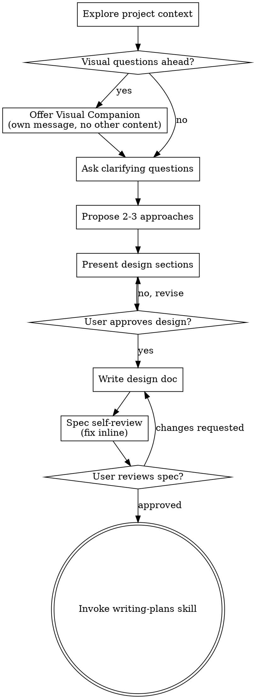

<!-- Generated by SpecStory, Markdown v2.1.0 -->

# 2026-04-02 22:52:02Z

<!-- Claude Code Session 79bfb22b-2a7d-479d-b865-ceaa1b0ae1b1 (2026-04-02 22:52:02Z) -->

_**User (2026-04-02 22:52:02Z)**_

<ide_opened_file>The user opened the file /Users/leocaseiro/Sites/base-skill/.specstory/history/2026-04-02_19-51-49Z-the-milestone-4-game.md in the IDE. This may or may not be related to the current task.</ide_opened_file>

I would like to use the `/brainstorming` to improve some parts of this plan.

I wanted to use more composition and reusability.
For example, the games for WordSpell and NumberMatch can have either typing or drag and drop, and currently we are calling the component DragAndDropGame, but I wanted more generic.

Also, if I want to have a prompt with image or just a button to play an audio, or a text (with or without audio), I want to use the same logic and structure, but just to change the prompt.

What are the best strategy for that? I like the React slot pattern. Can you evaluate on that?

---

_**Agent (claude-sonnet-4-6 2026-04-02 22:52:05Z)**_

<think><details><summary>Thought Process</summary>
The user wants to brainstorm about improving their game component architecture. They want to use the brainstorming skill before responding. Let me invoke the skill first.
</details></think>

_**Agent (claude-sonnet-4-6 2026-04-02 22:52:05Z)**_

<tool-use data-tool-type="generic" data-tool-name="Skill"><details>
<summary>Tool use: **Skill**</summary>

```text
Launching skill: superpowers:brainstorming
```

</details></tool-use>

---

_**User (2026-04-02 22:52:05Z)**_

Base directory for this skill: /Users/leocaseiro/.claude/plugins/cache/claude-plugins-official/superpowers/5.0.7/skills/brainstorming

# Brainstorming Ideas Into Designs

Help turn ideas into fully formed designs and specs through natural collaborative dialogue.

Start by understanding the current project context, then ask questions one at a time to refine the idea. Once you understand what you're building, present the design and get user approval.

<HARD-GATE>
Do NOT invoke any implementation skill, write any code, scaffold any project, or take any implementation action until you have presented a design and the user has approved it. This applies to EVERY project regardless of perceived simplicity.
</HARD-GATE>

## Anti-Pattern: "This Is Too Simple To Need A Design"

Every project goes through this process. A todo list, a single-function utility, a config change — all of them. "Simple" projects are where unexamined assumptions cause the most wasted work. The design can be short (a few sentences for truly simple projects), but you MUST present it and get approval.

## Checklist

You MUST create a task for each of these items and complete them in order:

1. **Explore project context** — check files, docs, recent commits
2. **Offer visual companion** (if topic will involve visual questions) — this is its own message, not combined with a clarifying question. See the Visual Companion section below.
3. **Ask clarifying questions** — one at a time, understand purpose/constraints/success criteria
4. **Propose 2-3 approaches** — with trade-offs and your recommendation
5. **Present design** — in sections scaled to their complexity, get user approval after each section
6. **Write design doc** — save to `docs/superpowers/specs/YYYY-MM-DD-<topic>-design.md` and commit
7. **Spec self-review** — quick inline check for placeholders, contradictions, ambiguity, scope (see below)
8. **User reviews written spec** — ask user to review the spec file before proceeding
9. **Transition to implementation** — invoke writing-plans skill to create implementation plan

## Process Flow



**The terminal state is invoking writing-plans.** Do NOT invoke frontend-design, mcp-builder, or any other implementation skill. The ONLY skill you invoke after brainstorming is writing-plans.

## The Process

**Understanding the idea:**

- Check out the current project state first (files, docs, recent commits)
- Before asking detailed questions, assess scope: if the request describes multiple independent subsystems (e.g., "build a platform with chat, file storage, billing, and analytics"), flag this immediately. Don't spend questions refining details of a project that needs to be decomposed first.
- If the project is too large for a single spec, help the user decompose into sub-projects: what are the independent pieces, how do they relate, what order should they be built? Then brainstorm the first sub-project through the normal design flow. Each sub-project gets its own spec → plan → implementation cycle.
- For appropriately-scoped projects, ask questions one at a time to refine the idea
- Prefer multiple choice questions when possible, but open-ended is fine too
- Only one question per message - if a topic needs more exploration, break it into multiple questions
- Focus on understanding: purpose, constraints, success criteria

**Exploring approaches:**

- Propose 2-3 different approaches with trade-offs
- Present options conversationally with your recommendation and reasoning
- Lead with your recommended option and explain why

**Presenting the design:**

- Once you believe you understand what you're building, present the design
- Scale each section to its complexity: a few sentences if straightforward, up to 200-300 words if nuanced
- Ask after each section whether it looks right so far
- Cover: architecture, components, data flow, error handling, testing
- Be ready to go back and clarify if something doesn't make sense

**Design for isolation and clarity:**

- Break the system into smaller units that each have one clear purpose, communicate through well-defined interfaces, and can be understood and tested independently
- For each unit, you should be able to answer: what does it do, how do you use it, and what does it depend on?
- Can someone understand what a unit does without reading its internals? Can you change the internals without breaking consumers? If not, the boundaries need work.
- Smaller, well-bounded units are also easier for you to work with - you reason better about code you can hold in context at once, and your edits are more reliable when files are focused. When a file grows large, that's often a signal that it's doing too much.

**Working in existing codebases:**

- Explore the current structure before proposing changes. Follow existing patterns.
- Where existing code has problems that affect the work (e.g., a file that's grown too large, unclear boundaries, tangled responsibilities), include targeted improvements as part of the design - the way a good developer improves code they're working in.
- Don't propose unrelated refactoring. Stay focused on what serves the current goal.

## After the Design

**Documentation:**

- Write the validated design (spec) to `docs/superpowers/specs/YYYY-MM-DD-<topic>-design.md`
  - (User preferences for spec location override this default)
- Use elements-of-style:writing-clearly-and-concisely skill if available
- Commit the design document to git

**Spec Self-Review:**
After writing the spec document, look at it with fresh eyes:

1. **Placeholder scan:** Any "TBD", "TODO", incomplete sections, or vague requirements? Fix them.
2. **Internal consistency:** Do any sections contradict each other? Does the architecture match the feature descriptions?
3. **Scope check:** Is this focused enough for a single implementation plan, or does it need decomposition?
4. **Ambiguity check:** Could any requirement be interpreted two different ways? If so, pick one and make it explicit.

Fix any issues inline. No need to re-review — just fix and move on.

**User Review Gate:**
After the spec review loop passes, ask the user to review the written spec before proceeding:

> "Spec written and committed to `<path>`. Please review it and let me know if you want to make any changes before we start writing out the implementation plan."

Wait for the user's response. If they request changes, make them and re-run the spec review loop. Only proceed once the user approves.

**Implementation:**

- Invoke the writing-plans skill to create a detailed implementation plan
- Do NOT invoke any other skill. writing-plans is the next step.

## Key Principles

- **One question at a time** - Don't overwhelm with multiple questions
- **Multiple choice preferred** - Easier to answer than open-ended when possible
- **YAGNI ruthlessly** - Remove unnecessary features from all designs
- **Explore alternatives** - Always propose 2-3 approaches before settling
- **Incremental validation** - Present design, get approval before moving on
- **Be flexible** - Go back and clarify when something doesn't make sense

## Visual Companion

A browser-based companion for showing mockups, diagrams, and visual options during brainstorming. Available as a tool — not a mode. Accepting the companion means it's available for questions that benefit from visual treatment; it does NOT mean every question goes through the browser.

**Offering the companion:** When you anticipate that upcoming questions will involve visual content (mockups, layouts, diagrams), offer it once for consent:
> "Some of what we're working on might be easier to explain if I can show it to you in a web browser. I can put together mockups, diagrams, comparisons, and other visuals as we go. This feature is still new and can be token-intensive. Want to try it? (Requires opening a local URL)"

**This offer MUST be its own message.** Do not combine it with clarifying questions, context summaries, or any other content. The message should contain ONLY the offer above and nothing else. Wait for the user's response before continuing. If they decline, proceed with text-only brainstorming.

**Per-question decision:** Even after the user accepts, decide FOR EACH QUESTION whether to use the browser or the terminal. The test: **would the user understand this better by seeing it than reading it?**

- **Use the browser** for content that IS visual — mockups, wireframes, layout comparisons, architecture diagrams, side-by-side visual designs
- **Use the terminal** for content that is text — requirements questions, conceptual choices, tradeoff lists, A/B/C/D text options, scope decisions

A question about a UI topic is not automatically a visual question. "What does personality mean in this context?" is a conceptual question — use the terminal. "Which wizard layout works better?" is a visual question — use the browser.

If they agree to the companion, read the detailed guide before proceeding:
`skills/brainstorming/visual-companion.md`

---

_**Agent (claude-sonnet-4-6 2026-04-02 22:52:12Z)**_

<think><details><summary>Thought Process</summary>
The user wants to brainstorm about improving their game component architecture with a focus on composition, reusability, and the React slot pattern. They want to evaluate making games more generic (not just DragAndDropGame) and making prompts more flexible (image, audio button, text with/without audio).

Let me follow the brainstorming skill process:

1. Explore project context — check files, docs, recent commits
2. Offer visual companion (if topic will involve visual questions)
3. Ask clarifying questions
4. Propose 2-3 approaches
5. Present design
6. Write design doc
7. Spec self-review

8. User reviews spec
9. Transition to implementation

I'll start by exploring the project context to understand the current architecture and constraints.
</details></think>

_**Agent (claude-sonnet-4-6 2026-04-02 22:52:12Z)**_

<tool-use data-tool-type="unknown" data-tool-name="ToolSearch"><details>
<summary>Tool use: **ToolSearch**</summary>

**Input:**

- max_results: `1`
- query: `TodoWrite`

**Result:**

```

```

</details></tool-use>

_**Agent (claude-sonnet-4-6 2026-04-02 22:52:14Z)**_

<think><details><summary>Thought Process</summary>
Let me create the todos for the brainstorming process and start exploring the project context.
</details></think>

_**Agent (claude-sonnet-4-6 2026-04-02 22:52:18Z)**_

<tool-use data-tool-type="task" data-tool-name="TodoWrite"><details>
<summary>Tool use: **TodoWrite**</summary>
**Agent task list:**
- [⚡] 🌡️ Explore project context — check files, docs, recent commits
- [ ] 🌡️ Offer visual companion if topic involves visual questions
- [ ] 🌡️ Ask clarifying questions one at a time
- [ ] 🌡️ Propose 2-3 approaches with trade-offs and recommendation
- [ ] 🌡️ Present design sections and get approval
- [ ] 🌡️ Write design doc and commit
- [ ] 🌡️ Spec self-review — fix placeholders, contradictions, ambiguity
- [ ] 🌡️ User reviews written spec
- [ ] 🌡️ Transition to implementation — invoke writing-plans skill

</details></tool-use>

_**Agent (claude-sonnet-4-6 2026-04-02 22:52:22Z)**_

<tool-use data-tool-type="search" data-tool-name="Glob"><details>
<summary>Tool use: **Glob**</summary>
 pattern `docs/**/*.md`

```text
docs/project-scope.md
docs/brainstorms/2026-03-31-milestone-2-brainstorm.md
docs/adrs/0001-rxdb-without-tanstack-query.md
docs/accessibility.md
docs/architecture.md
docs/game-engine.md
docs/i18n.md
docs/superpowers/plans/2026-03-31-milestone-2-data-layer.md
docs/testing-strategy.md
docs/ui-ux.md
docs/superpowers/plans/2026-04-01-milestone-3-app-shell.md
docs/superpowers/plans/2026-04-02-milestone-4-game-engine.md
docs/superpowers/plans/2026-04-02-storybook-setup.md
docs/superpowers/specs/2026-04-02-milestone-4-game-engine-design.md
docs/prd.md
docs/superpowers/specs/2026-04-02-storybook-setup-design.md
docs/ci-cd.md
docs/superpowers/plans/2026-04-02-vr-docker-baselines.md
docs/data-model.md
docs/baseskill_milestone_breakdown_85146c93.plan.md
docs/superpowers/specs/2026-04-03-drag-drop-game-design.md
docs/superpowers/specs/2026-04-03-word-spell-number-match-design.md
```

</details></tool-use>

_**Agent (claude-sonnet-4-6 2026-04-02 22:52:22Z)**_

<tool-use data-tool-type="shell" data-tool-name="Bash"><details>
<summary>Tool use: **Bash**</summary>
Recent git commits

`git log --oneline -15`

```text
4c37204 docs(spec): adopt compound component pattern for DragDropGame slot API
de3e58d docs(spec): split Word Builder spec into DragDropGame primitive + WordSpell+NumberMatch
0460fed docs(spec): move DragDropGame primitive to src/components/drag-drop-game/
ccd8a6b docs(spec): add DragDropGame composition primitive to Word Builder spec
4812ec1 docs(spec): add Word Builder game design spec
6705182 Merge branch 'master' of github.com:leocaseiro/base-skill
43d21d4 ai(specstory): sync
cf74015 Merge pull request #11 from leocaseiro/fix/router-tree-gen
503833c fix(routeTree): remove src/routeTree.gen.ts from prettier and eslint
6c4b7ed Merge pull request #10 from leocaseiro/feat/ai-test-skills
892bd1b ai(claude): add skills to write playwright and storybook
aeb459f Merge pull request #9 from leocaseiro/fix/storybook-mdx-sanitize-allow-demos
dbd6414 fix(storybook): restore MDX interactive demos in static builds
95daab4 Merge pull request #7 from leocaseiro/fix/use-rx-query-demo-increment
90c1c55 fix(db): keep useRxQuery demo increment controls visible in docs
```

</details></tool-use>

_**Agent (claude-sonnet-4-6 2026-04-02 22:52:25Z)**_

<tool-use data-tool-type="read" data-tool-name="Read"><details>
<summary>Tool use: **Read**</summary>
 `./docs/superpowers/specs/2026-04-03-drag-drop-game-design.md`

```text
1 # DragDropGame — Shared Primitive Design Spec
2 
3 **Date:** 2026-04-03
4 **Status:** Approved
5 **Milestone:** 5 — Reference Games
6 **Depends on:** M4 (GameEngineProvider, ScoreAnimation, EncouragementAnnouncer, SpeechOutput, event bus)
7 
8 ---
9 
10 ## 1. Overview
11 
12 `DragDropGame` is a shared React composition primitive that lives at
13 `src/components/drag-drop-game/`. It is **not a game** — it is the
14 infrastructure layer all drag-drop games in M5 (and beyond) are composed
15 from.
16 
17 Games that use it: WordSpell, NumberMatch, SortNumbers (and any future
18 drag-drop game). Each game provides three named slot components
19 (`prompt`, `dropZones`, `tileBank`) and `DragDropGame` handles
20 everything else.
21 
22 **DnD library:** [Pragmatic Drag and Drop](https://atlassian.design/components/pragmatic-drag-and-drop) (shadow effect enabled during drag)
23 
24 ---
25 
26 ## 2. Responsibilities
27 
28 `DragDropGame` owns — and individual games do **not** re-implement:
29 
30 - Pragmatic DnD context (drag state, pointer capture, shadow effect)
31 - Magnetic snap logic (60 px radius lerp, per [ui-ux.md §8.1](../../ui-ux.md))
32 - Tap-or-drag / auto-next-slot / free-swap interaction modes
33 - Wrong-tile behaviour (`reject` / `lock-auto-eject` / `lock-manual`)
34 - TTS on tile tap (`useGameTTS`)
35 - Drop zone pulse animation while drag is in progress (per [ui-ux.md §8.3](../../ui-ux.md))
36 - Inline confetti burst on round completion (`ScoreAnimation` from M4)
37 - Full-screen game-over celebration (koala mascot + jingle)
38 - Koala mascot encouragement on wrong answer (`EncouragementAnnouncer`)
39 - Session event emission via M4 event bus
40 - Keyboard drag simulation (Space/Enter pick up, Arrow keys move, Escape cancel)
41 
42 ---
43 
44 ## 3. Compound Component API
45 
46 `DragDropGame` uses the **compound component pattern** — sub-components are
47 attached as static properties and act as layout-position wrappers. Slot
48 implementations are **prop-free**: they read all config via
49 `useDragDropContext()`.
50 
51 ```tsx
52 <DragDropGame config={config}>
53   <DragDropGame.Prompt />
54   <DragDropGame.DropZones />
55   <DragDropGame.TileBank />
56 </DragDropGame>
57 ```
58 
59 `DragDropGame.Prompt/DropZones/TileBank` render their `children` inside the
60 correct layout zone. When used without children they render nothing (useful
61 for games that omit a zone, e.g. no tile bank in type-only mode).
62 
63 ### Compound parts (layout wrappers only)
64 
65 ```tsx
66 // DragDropGame.tsx
67 DragDropGame.Prompt = ({ children }) => (
68   <div className="game-prompt-zone">{children}</div>
69 );
70 DragDropGame.DropZones = ({ children }) => (
71   <div className="game-drop-zones">{children}</div>
72 );
73 DragDropGame.TileBank = ({ children }) => (
74   <div className="game-tile-bank">{children}</div>
75 );
76 ```
77 
78 ### Slot implementations are prop-free (read from context)
79 
80 ```tsx
81 // WordSpellPrompt.tsx — no props, reads config from context
82 function WordSpellPrompt() {
83   const { config } = useDragDropContext<WordSpellConfig>();
84   // renders based on config.mode, config.promptType
85 }
86 ```
87 
88 ### How different games compose it
89 
90 ```tsx
91 // WordSpell
92 function WordSpell({ config }: { config: WordSpellConfig }) {
93   return (
94     <DragDropGame config={config}>
95       <DragDropGame.Prompt>
96         <WordSpellPrompt /> {/* reads config.mode from context */}
97       </DragDropGame.Prompt>
98       <DragDropGame.DropZones>
99         <OrderedLetterSlots />{' '}
100         {/* reads config.tileUnit from context */}
101       </DragDropGame.DropZones>
102       <DragDropGame.TileBank>
103         <LetterTileBank />{' '}
104         {/* reads config.tileBankMode from context */}
105       </DragDropGame.TileBank>
106     </DragDropGame>
107   );
108 }
109 
110 // NumberMatch
111 function NumberMatch({ config }: { config: NumberMatchConfig }) {
112   return (
113     <DragDropGame config={config}>
114       <DragDropGame.Prompt>
115         <NumberMatchPrompt />
116       </DragDropGame.Prompt>
117       <DragDropGame.DropZones>
118         <MatchingPairZones />
119       </DragDropGame.DropZones>
120       <DragDropGame.TileBank>
121         <NumeralTileBank />
122       </DragDropGame.TileBank>
123     </DragDropGame>
124   );
125 }
126 
127 // SortNumbers (future)
128 function SortNumbers({ config }: { config: SortNumbersConfig }) {
129   return (
130     <DragDropGame config={config}>
131       <DragDropGame.Prompt>
132         <SortInstruction />
133       </DragDropGame.Prompt>
134       <DragDropGame.DropZones>
135         <SortableSequence />
136       </DragDropGame.DropZones>
137       <DragDropGame.TileBank>
138         <NumberTileBank />
139       </DragDropGame.TileBank>
140     </DragDropGame>
141   );
142 }
143 ```
144 
145 ---
146 
147 ## 4. Interaction Modes
148 
149 ### 4.1 Auto-Next-Slot (default)
150 
151 - Tiles fill drop zones left-to-right automatically.
152 - Child can **tap** a tile (fires into next slot) **or drag** it.
153 - Tapping an already-placed tile in a slot removes it and returns it to
154   the bank (undo — drag/tap mode only; backspace is the undo in type mode).
155 - Active slot pulses (glowing ring + cursor blink) to guide the child.
156 
157 ### 4.2 Free-Swap
158 
159 - Child drags to any slot; occupied slots swap tiles.
160 - Already-placed tiles can be dragged directly between slots.
161 - Used by scramble-style games (e.g. WordSpell scramble mode, SortNumbers).
162 
163 ### 4.3 Type Mode (`inputMethod: "type"`)
164 
165 - Tile bank hidden; slots show faint letter hints.
166 - Keystrokes fill slots left-to-right with a spring-in animation.
167 - Backspace removes the last placed tile.
168 - Wrong key: slot flashes red.
169 - Compatible with all game modes.
170 
171 ### 4.4 Magnetic Snap (drag only)
172 
173 CSS lerp-based pull activates within 60 px of any valid drop zone:
174 
175 ```
176 if (distanceToZoneCenter < 60px) {
177   t = 1 - (distance / 60);
178   itemX = lerp(currentX, zoneCenter.x, t * 0.3);
179   itemY = lerp(currentY, zoneCenter.y, t * 0.3);
180 }
181 ```
182 
183 ---
184 
185 ## 5. TTS Triggers
186 
187 | Trigger                             | Behaviour                                             |
188 | ----------------------------------- | ----------------------------------------------------- |
189 | Tile tap / drag-start               | TTS speaks tile label immediately (no delay)          |
190 | Hint button (header)                | TTS reads the full prompt (word, number, instruction) |
191 | Wrong answer                        | TTS reads mascot encouragement message                |
192 | Round start (`promptType: "audio"`) | TTS auto-reads the prompt                             |
193 
194 ---
195 
196 ## 6. Wrong-Tile Behaviour
197 
198 Configurable via `wrongTileBehavior`:
199 
200 | Value             | Behaviour                                                       |
201 | ----------------- | --------------------------------------------------------------- |
202 | `lock-auto-eject` | Tile locks red → auto-returns to bank after ~1 000 ms (default) |
203 | `reject`          | Tile bounces back immediately, slot never fills                 |
204 | `lock-manual`     | Tile stays red; child drags it back manually                    |
205 
206 On wrong placement: koala mascot appears with a supportive message, TTS reads it, then fades after 2 s.
207 
208 ---
209 
210 ## 7. Celebration
211 
212 ### Per-round (inline)
213 
214 `ScoreAnimation` (M4): confetti + stars, CSS-only, ~2 s. Auto-advances to next round.
215 
216 ### Game-over (all rounds complete)
217 
218 Full-screen overlay:
219 
220 - Stars rain down (CSS animation)
221 - Animated koala mascot (inline SVG + CSS keyframe dance)
222 - Score stars (1–5) based on retry count
223 - Jingle plays once on enter (~2–3 s, CC0 audio asset)
224 - Buttons: "Play again" (restart same config) | "Home" (dashboard)
225 
226 ---
227 
228 ## 8. Layout
229 
230 Stacked, portrait-first (works on landscape tablet and desktop):
231 
232 ```
233 ┌──────────────────────────────┐
234 │ [Exit]  ● ● ○ ○ ○  [Hint 🔊] │  ← Game shell header
235 ├──────────────────────────────┤
236 │       {prompt slot}          │  ← game-supplied
237 │       {dropZones slot}       │  ← game-supplied
238 ├──────────────────────────────┤
239 │       {tileBank slot}        │  ← game-supplied
240 └──────────────────────────────┘
241 ```
242 
243 - Header: Exit (left), progress dots — gold = complete, grey = pending (centre), Hint TTS (right)
244 - Minimum touch target: 52×56 px per tile and slot
245 
246 ---
247 
248 ## 9. Base Config Type
249 
250 ```ts
251 // src/components/drag-drop-game/types.ts
252 interface DragDropGameConfig {
253   gameId: string;
254   inputMethod: 'drag' | 'type' | 'both'; // default: 'drag'
255   wrongTileBehavior: 'reject' | 'lock-manual' | 'lock-auto-eject'; // default: 'lock-auto-eject'
256   tileBankMode: 'exact' | 'distractors'; // default: 'exact'
257   distractorCount?: number; // when tileBankMode='distractors'
258 }
259 ```
260 
261 Game-specific configs extend this base. See the WordSpell + NumberMatch spec for examples.
262 
263 ---
264 
265 ## 10. File Structure
266 
267 ```
268 src/components/drag-drop-game/
269   DragDropGame.tsx              ← composition root, named slot props, layout
270   DragDropGameProvider.tsx      ← context: drag state, evaluation, TTS
271   useDragDropContext.ts          ← read shared drag state
272   useDragDropDispatch.ts         ← fire evaluation actions
273   useTileEvaluation.ts           ← wrong-tile behaviour, auto-eject timer
274   useGameTTS.ts                  ← TTS triggers
275   useAutoNextSlot.ts             ← auto-next-slot (B) interaction
276   useFreeSwap.ts                 ← free-swap (C) interaction
277   types.ts                       ← DragDropGameConfig, TileItem, DropZone
278   DragDropGame.stories.tsx
279 ```
280 
281 ---
282 
283 ## 11. Accessibility
284 
285 - All tiles: `role="button"`, `aria-label="Letter A"` (or tile label).
286 - Drop zones container: `role="list"`, `aria-label="Answer slots"`.
287 - Each zone: `role="listitem"`, `aria-label="Slot 1, empty"` / `"Slot 1, filled with C"`.
288 - `aria-grabbed="true"` on dragged tile; `aria-dropeffect="move"` on valid zones.
289 - Keyboard drag simulation (per [ui-ux.md §8.5](../../ui-ux.md)):
290   Space/Enter to pick up → Arrow keys to move → Space/Enter to drop → Escape to cancel.
291 - `prefers-reduced-motion`: disables scale animations; confetti replaced by a static star badge.
292 - All TTS via `SpeechOutput` service (M2) — honours parent voice selection and TTS on/off.
293 - Minimum contrast: tile labels 4.5:1 on tile background.
294 
295 ---
296 
297 ## 12. Session Recording
298 
299 Standard M4 game events — no custom recording logic needed:
300 
301 | Event                     | When                               |
302 | ------------------------- | ---------------------------------- |
303 | `game:start`              | Component mounts with config       |
304 | `game:instructions_shown` | TTS prompt fires on round start    |
305 | `game:action`             | Every tile placement attempt       |
306 | `game:evaluate`           | Per-tile evaluation result         |
307 | `game:hint`               | Hint TTS button tapped             |
308 | `game:score`              | Round completed                    |
309 | `game:retry`              | Wrong tile ejected                 |
310 | `game:end`                | All rounds complete or child exits |
311 
312 Payload includes: `{ tileValue, slotIndex, roundIndex, inputMethod, correct }`.
313 
314 ---
315 
316 ## 13. Testing
317 
318 | Layer       | What to test                                                           |
319 | ----------- | ---------------------------------------------------------------------- |
320 | Unit        | Magnetic snap lerp calculation at boundary values                      |
321 | Unit        | Auto-eject timer fires after 1 000 ms                                  |
322 | Unit        | Auto-next-slot advances on correct placement, stays on wrong           |
323 | Unit        | Free-swap exchanges two occupied slots                                 |
324 | Unit        | TTS fires on tile tap, not on drag-cancel                              |
325 | Integration | Full round via GameEngineProvider: place tiles → complete → next round |
326 | Integration | Wrong-tile all three behaviours                                        |
327 | Integration | Keyboard drag simulation: pick up → move → drop                        |
328 | Storybook   | All interaction modes × wrong-tile behaviours                          |
329 | Storybook   | Game-over celebration screen (koala + stars)                           |
330
```

</details></tool-use>

_**Agent (claude-sonnet-4-6 2026-04-02 22:52:25Z)**_

<tool-use data-tool-type="read" data-tool-name="Read"><details>
<summary>Tool use: **Read**</summary>
 `./docs/superpowers/specs/2026-04-03-word-spell-number-match-design.md`

```text
1 # WordSpell + NumberMatch — Design Spec
2 
3 **Date:** 2026-04-03
4 **Status:** Approved
5 **Milestone:** 5 — Reference Games
6 **Depends on:** M4 (GameEngineProvider), DragDropGame primitive (see [drag-drop-game-design.md](2026-04-03-drag-drop-game-design.md))
7 
8 ---
9 
10 ## 1. Overview
11 
12 WordSpell and NumberMatch are two M5 reference games built on top of the
13 shared `DragDropGame` primitive. They are specified together because their
14 slot implementations are structurally similar — each has a prompt, an
15 ordered or paired drop zone, and a tile bank.
16 
17 |                 | WordSpell                                       | NumberMatch                   |
18 | --------------- | ----------------------------------------------- | ----------------------------- |
19 | **Grade**       | K–Year 2                                        | Pre-K / K                     |
20 | **Subject**     | Reading / Spelling                              | Math                          |
21 | **Tiles**       | Letters, syllables, words                       | Numerals, dot groups, objects |
22 | **Drop zones**  | Ordered letter slots (sequential)               | Matching pair zones           |
23 | **Interaction** | Auto-next-slot (B) + free-swap for scramble (C) | Tap-to-match or free-swap     |
24 | **TTS on tile** | Speaks letter / syllable / word name            | Speaks number name            |
25 
26 ---
27 
28 ## 2. WordSpell
29 
30 ### 2.1 Game Modes
31 
32 | Mode           | Prompt                                          | Interaction    | Best for |
33 | -------------- | ----------------------------------------------- | -------------- | -------- |
34 | `picture`      | Image of the word's referent + 🔊 button        | Auto-next-slot | K–Year 1 |
35 | `scramble`     | Jumbled reference tiles above slots + "hear it" | Free-swap      | Year 1–2 |
36 | `recall`       | TTS auto-plays; word-length underscores shown   | Auto-next-slot | Year 1–2 |
37 | `sentence-gap` | Scene image + sentence with blank               | Auto-next-slot | Year 1–2 |
38 
39 ### 2.2 Slot Components
40 
41 ```
42 src/games/word-spell/
43   WordSpell.tsx           ← composes DragDropGame
44   WordSpellPrompt.tsx     ← renders picture / scramble / recall / sentence-gap target zone
45   OrderedLetterSlots.tsx  ← sequential letter/syllable/word slots
46   LetterTileBank.tsx      ← letter / syllable / word tiles
47   types.ts                ← WordSpellConfig extends DragDropGameConfig
48   WordSpell.stories.tsx
49 ```
50 
51 ### 2.3 Composition
52 
53 Slot implementations are prop-free — they read `config` via `useDragDropContext()`.
54 
55 ```tsx
56 function WordSpell({ config }: { config: WordSpellConfig }) {
57   return (
58     <DragDropGame config={config}>
59       <DragDropGame.Prompt>
60         <WordSpellPrompt />{' '}
61         {/* reads config.mode, config.promptType from context */}
62       </DragDropGame.Prompt>
63       <DragDropGame.DropZones>
64         <OrderedLetterSlots />{' '}
65         {/* reads config.tileUnit from context */}
66       </DragDropGame.DropZones>
67       <DragDropGame.TileBank>
68         <LetterTileBank />{' '}
69         {/* reads config.tileBankMode from context */}
70       </DragDropGame.TileBank>
71     </DragDropGame>
72   );
73 }
74 ```
75 
76 ### 2.4 Config Schema
77 
78 ```ts
79 // src/games/word-spell/types.ts
80 interface WordSpellConfig extends DragDropGameConfig {
81   component: 'WordSpell';
82   mode: 'picture' | 'scramble' | 'recall' | 'sentence-gap';
83   promptType: 'image' | 'audio' | 'both'; // default: 'both'
84   tileUnit: 'letter' | 'syllable' | 'word'; // default: 'letter'
85   rounds: WordSpellRound[];
86 }
87 
88 interface WordSpellRound {
89   word: string;
90   image?: string; // Fluent Emoji SVG path or custom asset
91   sentence?: string; // sentence-gap mode: "The ___ sat on the mat."
92   sceneImage?: string; // sentence-gap mode scene illustration
93   audioOverride?: string; // optional custom audio instead of TTS
94 }
95 ```
96 
97 ### 2.5 Example Configs
98 
99 ```json
100 {
101   "gameId": "word-spell-animals-k-easy",
102   "component": "WordSpell",
103   "inputMethod": "drag",
104   "wrongTileBehavior": "lock-auto-eject",
105   "mode": "picture",
106   "promptType": "both",
107   "tileUnit": "letter",
108   "tileBankMode": "exact",
109   "rounds": [
110     { "word": "cat", "image": "fluent-emoji/cat-face.svg" },
111     { "word": "dog", "image": "fluent-emoji/dog-face.svg" },
112     { "word": "hen", "image": "fluent-emoji/chicken.svg" },
113     { "word": "pig", "image": "fluent-emoji/pig-face.svg" },
114     { "word": "cow", "image": "fluent-emoji/cow-face.svg" }
115   ]
116 }
117 ```
118 
119 ```json
120 {
121   "gameId": "word-spell-animals-k-hard",
122   "component": "WordSpell",
123   "inputMethod": "drag",
124   "wrongTileBehavior": "lock-auto-eject",
125   "mode": "picture",
126   "promptType": "audio",
127   "tileUnit": "letter",
128   "tileBankMode": "distractors",
129   "distractorCount": 4,
130   "rounds": [
131     { "word": "cat", "image": "fluent-emoji/cat-face.svg" },
132     { "word": "frog", "image": "fluent-emoji/frog.svg" },
133     { "word": "duck", "image": "fluent-emoji/duck.svg" }
134   ]
135 }
136 ```
137 
138 ---
139 
140 ## 3. NumberMatch
141 
142 ### 3.1 Game Modes
143 
144 | Mode               | Prompt                        | Drop zones                 | Best for   |
145 | ------------------ | ----------------------------- | -------------------------- | ---------- |
146 | `numeral-to-group` | Numeral shown (e.g. "3")      | Object/dot groups to match | Pre-K / K  |
147 | `group-to-numeral` | Object group shown (e.g. ●●●) | Numeral tiles to match     | Pre-K / K  |
148 | `numeral-to-word`  | Numeral shown (e.g. "3")      | Word tiles ("three")       | K / Year 1 |
149 | `word-to-numeral`  | Word shown (e.g. "three")     | Numeral tiles              | K / Year 1 |
150 
151 ### 3.2 Slot Components
152 
153 ```
154 src/games/number-match/
155   NumberMatch.tsx           ← composes DragDropGame
156   NumberMatchPrompt.tsx     ← renders numeral / dot group / word prompt
157   MatchingPairZones.tsx     ← pair targets (not sequential — match any tile to zone)
158   NumeralTileBank.tsx       ← numeral / dot group / object cluster tiles
159   types.ts                  ← NumberMatchConfig extends DragDropGameConfig
160   NumberMatch.stories.tsx
161 ```
162 
163 ### 3.3 Composition
164 
165 ```tsx
166 function NumberMatch({ config }: { config: NumberMatchConfig }) {
167   return (
168     <DragDropGame config={config}>
169       <DragDropGame.Prompt>
170         <NumberMatchPrompt /> {/* reads config.mode from context */}
171       </DragDropGame.Prompt>
172       <DragDropGame.DropZones>
173         <MatchingPairZones />
174       </DragDropGame.DropZones>
175       <DragDropGame.TileBank>
176         <NumeralTileBank /> {/* reads config.tileStyle from context */}
177       </DragDropGame.TileBank>
178     </DragDropGame>
179   );
180 }
181 ```
182 
183 ### 3.4 Config Schema
184 
185 ```ts
186 // src/games/number-match/types.ts
187 interface NumberMatchConfig extends DragDropGameConfig {
188   component: 'NumberMatch';
189   mode:
190     | 'numeral-to-group'
191     | 'group-to-numeral'
192     | 'numeral-to-word'
193     | 'word-to-numeral';
194   tileStyle: 'dots' | 'objects' | 'fingers'; // visual style for quantity tiles
195   range: { min: number; max: number }; // e.g. { min: 1, max: 5 }
196   rounds: NumberMatchRound[];
197 }
198 
199 interface NumberMatchRound {
200   value: number; // the number this round targets
201   objectImage?: string; // Fluent Emoji for object-style tiles (e.g. 🍎 for apples)
202 }
203 ```
204 
205 ### 3.5 Example Configs
206 
207 ```json
208 {
209   "gameId": "number-match-1-5-dots",
210   "component": "NumberMatch",
211   "inputMethod": "drag",
212   "wrongTileBehavior": "lock-auto-eject",
213   "mode": "numeral-to-group",
214   "tileStyle": "dots",
215   "tileBankMode": "exact",
216   "range": { "min": 1, "max": 5 },
217   "rounds": [
218     { "value": 1 },
219     { "value": 2 },
220     { "value": 3 },
221     { "value": 4 },
222     { "value": 5 }
223   ]
224 }
225 ```
226 
227 ```json
228 {
229   "gameId": "number-match-1-10-apples",
230   "component": "NumberMatch",
231   "inputMethod": "drag",
232   "wrongTileBehavior": "lock-auto-eject",
233   "mode": "group-to-numeral",
234   "tileStyle": "objects",
235   "tileBankMode": "distractors",
236   "distractorCount": 3,
237   "range": { "min": 1, "max": 10 },
238   "rounds": [
239     { "value": 3, "objectImage": "fluent-emoji/red-apple.svg" },
240     { "value": 7, "objectImage": "fluent-emoji/star.svg" },
241     { "value": 5, "objectImage": "fluent-emoji/balloon.svg" }
242   ]
243 }
244 ```
245 
246 ---
247 
248 ## 4. Shared: Game Presets and Bookmarks
249 
250 Both games support named presets (difficulty variants of the same `gameId`):
251 
252 ```json
253 {
254   "gameId": "word-spell-animals-k",
255   "presets": [
256     {
257       "presetId": "easy",
258       "label": "Easy",
259       "tileBankMode": "exact",
260       "promptType": "both"
261     },
262     {
263       "presetId": "medium",
264       "label": "Medium",
265       "tileBankMode": "distractors",
266       "distractorCount": 3
267     },
268     {
269       "presetId": "hard",
270       "label": "Hard",
271       "tileBankMode": "distractors",
272       "promptType": "audio",
273       "distractorCount": 5
274     }
275   ]
276 }
277 ```
278 
279 **Bookmark UX:**
280 
281 - Dashboard game card: long-press (or ⋯ menu) → "Save as preset" → child names it.
282 - Stored in RxDB `bookmarks` as `{ gameId, presetId, label }`.
283 - Preset badge appears on the game card; tap to launch that config directly.
284 - Parent can create / rename / delete presets in Parent Settings → Game Overrides.
285 
286 ---
287 
288 ## 5. Shared: Image Assets
289 
290 - **Primary:** [Fluent Emoji](https://github.com/microsoft/fluentui-emoji) — MIT, 3D-style, 1 500+ emoji.
291 - **Fallback:** [Twemoji](https://twemoji.twitter.com/) — CC BY 4.0, flat SVG.
292 - Assets referenced by relative path in round config; bundled per game via code-splitting.
293 
294 ---
295 
296 ## 6. Shared: i18n
297 
298 - `en` and `pt-BR` word/number lists required for all shipped configs.
299 - Round content (word, sentence, objectImage) is per-locale in the config.
300 - TTS language follows the active profile language (`SpeechOutput` service).
301 - UI strings ("Choose a letter", "Almost! Try again.", etc.) in `games` i18n namespace.
302 
303 ---
304 
305 ## 7. Testing
306 
307 | Layer                     | What to test                                                                             |
308 | ------------------------- | ---------------------------------------------------------------------------------------- |
309 | Unit — WordSpell          | Config validation, tile-bank generation (exact vs distractors), distractor deduplication |
310 | Unit — WordSpell          | Evaluation: correct letter at position, auto-eject timer, word-complete detection        |
311 | Unit — WordSpell          | TTS triggers: tile tap, image tap, hint button, recall auto-play                         |
312 | Unit — NumberMatch        | Config validation, range generation, pair zone matching                                  |
313 | Unit — NumberMatch        | Evaluation: numeral ↔ group equivalence                                                  |
314 | Integration — WordSpell   | Full round lifecycle: start → place tiles → complete word → next round → game-over       |
315 | Integration — WordSpell   | Scramble mode: free-swap reorder leads to correct evaluation                             |
316 | Integration — NumberMatch | Tap tile to matching zone → correct → advance                                            |
317 | Integration — NumberMatch | Wrong match → auto-eject → retry                                                         |
318 | Storybook — WordSpell     | All 4 modes × exact/distractors × inputMethod                                            |
319 | Storybook — NumberMatch   | All 4 modes × tileStyle variants                                                         |
320 | E2E — WordSpell           | Picture mode: drag tiles to complete 3 words, verify celebration                         |
321 | E2E — WordSpell           | Type mode: keyboard input completes a word                                               |
322 | E2E — NumberMatch         | Drag numerals to matching dot groups, complete session                                   |
323 | VR                        | Mid-game and celebration screenshots for both games across all themes                    |
324
```

</details></tool-use>

_**Agent (claude-sonnet-4-6 2026-04-02 22:52:27Z)**_

<think><details><summary>Thought Process</summary>
Now I have a good picture of what's been designed so far. Let me also check the milestone 4 game engine design spec and the main milestone breakdown to understand the full picture.
</details></think>

_**Agent (claude-sonnet-4-6 2026-04-02 22:52:29Z)**_

<tool-use data-tool-type="read" data-tool-name="Read"><details>
<summary>Tool use: **Read**</summary>
 `./docs/superpowers/specs/2026-04-02-milestone-4-game-engine-design.md`

```text
1 # M4 Game Engine Framework — Design Spec
2 
3 **Date:** 2026-04-02
4 **Status:** Approved
5 **Milestone:** 4 — Game Engine Framework
6 **Depends on:** M2 (RxDB, event bus, speech services), M3 (app shell, routing)
7 
8 ---
9 
10 ## 1. Overview
11 
12 M4 builds the reusable game infrastructure that all 5 reference games (M5) run on. Reusable interaction components (DragAndDrop, LetterTracer, etc.) are **deferred to M5**, built alongside the games that need them.
13 
14 The defining requirement beyond the milestone plan: the engine supports **parent-watchable replay**. Parents can scrub through every step their child took — including every undo — to see real learning behaviour (e.g. repeated undo to fake a better score). This is achieved via an append-only move log and a standalone replay function, similar in spirit to boardgame.io's move history and Redux DevTools.
15 
16 ---
17 
18 ## 2. Architecture
19 
20 Three layers, cleanly separated:
21 
22 ```
23 Route loader (/$locale/_app/game/$gameId)
24   ├── loadGameConfig()           ← override merging (RxDB read, runs once)
25   └── findInProgressSession()    ← silent resume check (RxDB read, runs once)
26         │
27         ▼
28 GameShell
29 └── GameEngineProvider           ← Redux-style context provider
30     ├── GameStateContext          ← state only (re-renders consumers)
31     ├── GameDispatchContext       ← stable dispatch ref (no re-renders)
32     ├── useGameLifecycle          ← state machine, no RxDB
33     ├── useMoveLog                ← in-memory append-only log, no RxDB
34     ├── useSessionRecorder        ← RxDB writes on every move + flush on hide/unload
35     └── <game component>         ← useGameState() + useGameDispatch()
36 
37 replayToStep(log, stepIndex)     ← standalone pure fn, no React
38                                     used by: live undo + silent resume + M7 viewer
39 ```
40 
41 ### Provider internals — three composed hooks
42 
43 | Hook                        | Responsibility                                                                                                                          |
44 | --------------------------- | --------------------------------------------------------------------------------------------------------------------------------------- |
45 | `useGameLifecycle(config)`  | Lifecycle state machine (8 phases, 9 transitions). No RxDB, no move log.                                                                |
46 | `useMoveLog(maxUndoDepth)`  | Append-only in-memory move log + undo enforcement. No RxDB — fast synchronous access only.                                              |
47 | `useSessionRecorder(moves)` | Writes to RxDB **on every move** and on `visibilitychange`/`beforeunload`. Chunks at 200 moves / 50 KB. Emits `game:end` on bus at end. |
48 
49 ---
50 
51 ## 3. Types
52 
53 ```ts
54 // src/lib/game-engine/types.ts
55 
56 export type GamePhase =
57   | 'idle'
58   | 'loading'
59   | 'instructions'
60   | 'playing'
61   | 'evaluating'
62   | 'scoring'
63   | 'next-round'
64   | 'retry'
65   | 'game-over';
66 
67 export interface GameEngineState {
68   phase: GamePhase;
69   roundIndex: number;
70   score: number;
71   streak: number;
72   retryCount: number;
73   content: ResolvedContent; // pre-materialized at session start
74   currentRound: RoundState;
75 }
76 
77 export type MoveType =
78   | 'SUBMIT_ANSWER'
79   | 'REQUEST_HINT'
80   | 'SKIP_INSTRUCTIONS'
```

</details></tool-use>

_**Agent (claude-sonnet-4-6 2026-04-02 22:52:31Z)**_

<tool-use data-tool-type="search" data-tool-name="Glob"><details>
<summary>Tool use: **Glob**</summary>
 pattern `src/components/**/*.tsx`

```text
src/components/ThemeToggle.tsx
src/components/ui/alert-dialog.tsx
src/components/ui/button.tsx
src/components/ui/card.tsx
src/components/ui/sheet.tsx
src/components/ui/sonner.tsx
src/components/Footer.tsx
src/components/GameCard.test.tsx
src/components/GameCard.tsx
src/components/GameGrid.test.tsx
src/components/GameGrid.tsx
src/components/LevelRow.test.tsx
src/components/LevelRow.tsx
src/components/OfflineIndicator.test.tsx
src/components/OfflineIndicator.tsx
src/components/ui/dropdown-menu.tsx
src/components/ui/input.tsx
src/components/ui/label.tsx
src/components/ui/select.tsx
src/components/ui/slider.tsx
src/components/Footer.stories.tsx
src/components/GameCard.stories.tsx
src/components/GameGrid.stories.tsx
src/components/Header.stories.tsx
src/components/LevelRow.stories.tsx
src/components/OfflineIndicator.stories.tsx
src/components/ThemeToggle.stories.tsx
src/components/ui/alert-dialog.stories.tsx
src/components/ui/button.stories.tsx
src/components/ui/card.stories.tsx
src/components/ui/dropdown-menu.stories.tsx
src/components/ui/input.stories.tsx
src/components/ui/label.stories.tsx
src/components/ui/select.stories.tsx
src/components/ui/sheet.stories.tsx
src/components/ui/slider.stories.tsx
src/components/ui/sonner.stories.tsx
src/components/Header.tsx
```

</details></tool-use>

_**Agent (claude-sonnet-4-6 2026-04-02 22:52:57Z)**_

<think><details><summary>Thought Process</summary>
Now I have a good understanding of the project context. Let me also check the .specstory history file that was opened to understand what was being worked on recently.

The user wants to brainstorm improvements to:

1. Make games more generic — currently "DragDropGame" but they want to support both typing and drag-and-drop, so maybe rename or restructure
2. Make prompts more flexible — same logic/structure but different prompt types (image with/without audio, audio button only, text with/without audio)
3. They like the React slot pattern and want to evaluate it

Looking at the specs, I can see the current `DragDropGame` is already structured as a compound component with slots for Prompt, DropZones, and TileBank. The main improvements needed are renaming it to something more generic since it handles multiple input methods, and creating a flexible Prompt component that can render different combinations of content types like images, audio buttons, and text. the prompt level, so each game can compose from smaller, reusable prompt components rather than building everything internally.

I'm thinking about whether this conversation would benefit from visual diagrams to show the component hierarchy and composition patterns. Component architecture is definitely something that could be clearer with a visual breakdown of how these pieces fit together, so I should offer that option.

Actually, looking at what the user is really asking for—they want a more generic name for `DragDropGame` and a way to break the prompt into composable primitives using slots. That's fundamentally an API design question, not a UI layout question. I can work through the architecture and naming decisions with text-based examples just fine, so I'll move forward with my first clarifying question instead.

The key thing I need to understand is whether `DragDropGame` should be renamed to something more generic, or if it should stay as an internal implementation detail while the public API uses a different name. That'll shape how we structure the composable primitives.
</details></think>

_**Agent (claude-sonnet-4-6 2026-04-02 22:53:02Z)**_

<tool-use data-tool-type="task" data-tool-name="TodoWrite"><details>
<summary>Tool use: **TodoWrite**</summary>
**Agent task list:**
- [X] 🌡️ Explore project context — check files, docs, recent commits
- [X] 🌡️ Offer visual companion if topic involves visual questions
- [⚡] 🌡️ Ask clarifying questions one at a time
- [ ] 🌡️ Propose 2-3 approaches with trade-offs and recommendation
- [ ] 🌡️ Present design sections and get approval
- [ ] 🌡️ Write design doc and commit
- [ ] 🌡️ Spec self-review — fix placeholders, contradictions, ambiguity
- [ ] 🌡️ User reviews written spec
- [ ] 🌡️ Transition to implementation — invoke writing-plans skill

</details></tool-use>

_**Agent (claude-sonnet-4-6 2026-04-02 22:53:10Z)**_

I've read both the `DragDropGame` and `WordSpell + NumberMatch` specs. The current design already uses compound components at the top level (`DragDropGame.Prompt`, `.DropZones`, `.TileBank`), and each game has its own prompt component (e.g. `WordSpellPrompt`) that internally handles all prompt variants.

Your two goals are:

1. **Rename / generalize** `DragDropGame` — since `inputMethod: 'drag' | 'type' | 'both'` already exists, the name is misleading
2. **Shared prompt primitives** — instead of each game owning all prompt rendering logic, extract composable prompt building blocks (`ImagePrompt`, `AudioButton`, `TextPrompt`, etc.)

First clarifying question — **scope of the generalization**:

The current specs are already approved (`Status: Approved`). Are you looking to:

- **A) Amend the existing specs** in place (update the DragDropGame + WordSpell/NumberMatch docs to reflect the new naming and prompt primitives)
- **B) Write a new, separate design spec** that describes the generic game primitive and prompt slot system as a revision layer — leaving the approved specs as historical record

Which approach do you prefer?

---

_**User (2026-04-02 22:58:27Z)**_

I am in review, not approved. rewrite it

---

_**Agent (claude-sonnet-4-6 2026-04-02 22:58:30Z)**_

<think><details><summary>Thought Process</summary>
The user wants to rewrite the existing specs, not amend them. They're saying the current specs are in review, not approved. So they want me to:

1. Continue brainstorming to clarify the design
2. Then rewrite the existing spec files with the improved design

Let me continue with clarifying questions. The key topics to clarify are:

1. What to rename `DragDropGame` to (something more generic that covers both drag+type)
2. How to structure the prompt primitives with the slot pattern

Let me ask the next clarifying question about the naming/generalization of `DragDropGame`.
</details></think>

_**Agent (claude-sonnet-4-6 2026-04-02 22:58:34Z)**_

Got it — we're rewriting both specs. Let me continue gathering what we need.

Second question — **what to call the generic game primitive**:

The current `DragDropGame` handles drag, type, or both. The name needs to reflect that it's a generic input game shell, not just drag-and-drop. Which resonates most?

- **A) `InteractiveGame`** — emphasises it's a game with user interaction (input-method agnostic)
- **B) `TileGame`** — emphasises tiles as the core mechanic (drag or type tiles into slots)
- **C) `AnswerGame`** — emphasises the answer-submission pattern (prompt → answer slots → tile bank)
- **D) Something else** — you have a better name in mind

---

_**User (2026-04-02 23:00:34Z)**_

TileAnswerGame

---

_**Agent (claude-sonnet-4-6 2026-04-02 23:00:39Z)**_

<think><details><summary>Thought Process</summary>
The user wants to name the generic game primitive `TileAnswerGame`. Let me continue with clarifying questions.

Next question: about the prompt primitives. The user wants to be able to compose prompts from shared building blocks. I need to understand what prompt types they want to support and how they want to compose them.

The key insight is:

- Currently `WordSpellPrompt` handles `promptType: 'image' | 'audio' | 'both'` internally
- The user wants shared prompt primitives that can be composed via slots

So the question is about the prompt slot API design. Let me ask about how they want to compose prompts.
</details></think>

_**Agent (claude-sonnet-4-6 2026-04-02 23:00:44Z)**_

`TileAnswerGame` — clean, precise. Moving on.

Third question — **prompt slot composition**:

The current design has each game owning its full prompt (e.g. `WordSpellPrompt` renders image + audio button internally based on `config.promptType`). You want shared prompt primitives instead.

How granular should the composition be at the usage site?

- **A) Game-level assembly** — each game composes shared primitives directly inside `TileAnswerGame.Prompt`:

  ```tsx
  <TileAnswerGame.Prompt>
    <ImagePrompt />
    <AudioButton />
  </TileAnswerGame.Prompt>
  ```

- **B) Prompt compound component** — a dedicated `<Prompt>` compound with its own slots, used inside the game:

  ```tsx
  <TileAnswerGame.Prompt>
    <Prompt>
      <Prompt.Image />
      <Prompt.Audio />
    </Prompt>
  </TileAnswerGame.Prompt>
  ```

- **C) Config-driven** — prompt type stays in config (`promptType: 'image' | 'audio' | 'both'`), and a single `<GamePrompt />` renders the right thing based on config — no composition at the JSX level

---

_**User (2026-04-02 23:07:05Z)**_

I want to be able to use in multiple types of game, so I can reuse an audiobutton, a imageprompt in other games, etc. Which one would suit better?

---

_**Agent (claude-sonnet-4-6 2026-04-02 23:07:23Z)**_

<think><details><summary>Thought Process</summary>
The user wants maximum reusability of prompt primitives across different game types. Let me think about which option suits best:

- **A) Game-level assembly** — shared primitives directly in `TileAnswerGame.Prompt` → This is the most reusable because each game just picks and combines the primitives it needs. No wrapper `Prompt` compound needed.
- **B) Prompt compound component** — `<Prompt><Prompt.Image /><Prompt.Audio /></Prompt>` → This adds an extra layer of indirection. The primitives (Image, Audio) are still shared, but they're namespaced under a `Prompt` compound.

Option B could provide layout and styling consistency across games, but Option A wins for maximum reusability since the primitives stay independent and can be used in any game type's prompt slot without tight coupling to either `TileAnswerGame` or a compound wrapper. I'm leaning toward Option A as the cleaner approach, but I should clarify one thing before recommending it: whether the game-specific prompt components like `WordSpellPrompt` still exist as wrappers, or if games compose the primitives directly in their JSX.
</details></think>

_**Agent (claude-sonnet-4-6 2026-04-02 23:07:37Z)**_

**Option A** suits best — standalone primitives that any game can pick from. Option B's `<Prompt>` compound would still couple them to a specific wrapper. Option C is the opposite of reusable.

I have enough context now. Let me propose the approaches.

---

## Approaches

### Option 1 — Rename + Extract Primitives (minimal disruption)

Rename `DragDropGame` → `TileAnswerGame`. Extract shared prompt primitives (`ImagePrompt`, `AudioButton`, `TextPrompt`) into `src/components/prompts/`. Each game (`WordSpell`, `NumberMatch`) composes them directly inside `TileAnswerGame.Prompt`. Keep `WordSpellPrompt.tsx` and `NumberMatchPrompt.tsx` as thin wrappers that pick and arrange the right primitives.

**Trade-off:** Game-specific wrapper files still exist, so there's a small indirection layer. But it's familiar — devs know where to find game-specific prompt logic.

---

### Option 2 — Rename + Inline Composition (recommended)

Rename `DragDropGame` → `TileAnswerGame`. Extract primitives into `src/components/prompts/`. **Remove** `WordSpellPrompt.tsx` / `NumberMatchPrompt.tsx` — each game composes primitives directly in its root component:

```tsx
function WordSpell({ config }: { config: WordSpellConfig }) {
  return (
    <TileAnswerGame config={config}>
      <TileAnswerGame.Prompt>
        <ImagePrompt />   {/* reads config from context */}
        <AudioButton />   {/* reads config from context */}
      </TileAnswerGame.Prompt>
      <TileAnswerGame.DropZones>
        <OrderedLetterSlots />
      </TileAnswerGame.DropZones>
      <TileAnswerGame.TileBank>
        <LetterTileBank />
      </TileAnswerGame.TileBank>
    </TileAnswerGame>
  );
}
```

Each primitive is prop-free and reads config from context — same principle already in the spec. Reusable in any game type.

**Trade-off:** The game root file becomes the single source of truth for composition — clearer but slightly longer.

---

### Option 3 — Full Generic Game Shell (over-engineered)

Create a completely game-type-agnostic `<Game>` shell with `<Game.Prompt>`, `<Game.Answer>`, `<Game.Actions>` slots, and make `TileAnswerGame` one specialisation of it. Prompt primitives live in `src/components/prompts/`.

**Trade-off:** Adds a layer you don't need yet. YAGNI — you have one game pattern right now. Build the abstraction when the second distinct pattern appears.

---

**My recommendation: Option 2.** It gives you reusable prompt primitives, clean composition at the game level, and no unnecessary abstraction. The inline composition JSX is also easier to read — you see exactly what a game uses without jumping between files.

Does Option 2 resonate, or do you want to adjust?

---

_**User (2026-04-02 23:09:05Z)**_

<ide_opened_file>The user opened the file Untitled-1 in the IDE. This may or may not be related to the current task.</ide_opened_file>

2

---

_**Agent (claude-sonnet-4-6 2026-04-02 23:09:11Z)**_

<think><details><summary>Thought Process</summary>
The user chose Option 2 - Rename + Inline Composition. Now I need to present the design sections and get approval before writing the spec. Let me start presenting the design.

Key design decisions from Option 2:

1. Rename `DragDropGame` → `TileAnswerGame`
2. Extract prompt primitives into `src/components/prompts/`
3. Remove `WordSpellPrompt.tsx` / `NumberMatchPrompt.tsx` — games compose directly
4. Primitives are prop-free, read config from context

Let me present the design sections one at a time:

1. Architecture overview (TileAnswerGame rename + structure)

2. Prompt primitives (what primitives exist, where they live)
3. How WordSpell and NumberMatch compose them
4. Config types

I'll start with the architecture and naming section first.
</details></think>

_**Agent (claude-sonnet-4-6 2026-04-02 23:09:16Z)**_

Option 2 it is. Let me walk through the design sections for approval.

---

## Design Section 1 — Architecture & Naming

`DragDropGame` is renamed to `TileAnswerGame`. It remains a composition primitive — not a game — living at `src/components/tile-answer-game/`. Its responsibilities are unchanged (DnD context, magnetic snap, interaction modes, TTS, celebrations, event bus, keyboard simulation).

The compound component API becomes:

```tsx
<TileAnswerGame config={config}>
  <TileAnswerGame.Prompt>
    {/* any prompt primitives from src/components/prompts/ */}
  </TileAnswerGame.Prompt>
  <TileAnswerGame.DropZones>
    {/* game-specific drop zone component */}
  </TileAnswerGame.DropZones>
  <TileAnswerGame.TileBank>
    {/* game-specific tile bank component */}
  </TileAnswerGame.TileBank>
</TileAnswerGame>
```

The three slot wrappers (`Prompt`, `DropZones`, `TileBank`) are layout-position wrappers only. All config is read from `useTileAnswerContext()`. No props on the slot wrappers.

`DragDropGame` as a name disappears entirely from the codebase — no re-export alias, no backwards compat shim.

Does this section look right?

---

_**User (2026-04-02 23:11:15Z)**_

<ide_opened_file>The user opened the file Untitled-1 in the IDE. This may or may not be related to the current task.</ide_opened_file>

When you say DropZones, how would I fit a keyboard type instead of drag/drop?

---

_**Agent (claude-sonnet-4-6 2026-04-02 23:11:30Z)**_

<think><details><summary>Thought Process</summary>
The user is asking a good question about naming. If the slot is called `DropZones`, it implies drag and drop. But the game also supports typing (keyboard input). So the slot name needs to be more generic.

Let me think about better names:

- `DropZones` → implies drag and drop only
- `AnswerZones` → more generic, covers both drag and type
- `InputZones` → covers both
- `Slots` → generic, could work
- `AnswerSlots` → clear about purpose

The user is right to question this. For type mode, you're not dropping into zones, you're typing into input slots.

`DropZones` is just as misleading as `DragDropGame`. I should rename it to something like `AnswerZones` or `AnswerSlots` to match the `TileAnswerGame` naming convention. The component itself handles both drag and type modes seamlessly — whether tiles are being dragged in or characters typed, the slot component remains the same, so the name should reflect that it's really just a container for answers regardless of input method.

I'm leaning toward `TileAnswerGame.Answer` as the cleanest option, though I could also structure it as `Prompt`, `Answer`, and `TileBank` to clearly separate what's being asked, where the answer goes, and where the tiles come from.
</details></think>

_**Agent (claude-sonnet-4-6 2026-04-02 23:11:36Z)**_

Great catch — `DropZones` has the same problem as `DragDropGame`. It implies drag-and-drop only.

The slot is really "where the answer goes" regardless of whether the child drags tiles into it or types. In type mode, `OrderedLetterSlots` renders the same slot UI — it just accepts keystrokes instead of drops.

Renaming `DropZones` → `Answer` gives you three clean, input-agnostic slots:

```tsx
<TileAnswerGame config={config}>
  <TileAnswerGame.Prompt>   {/* what is being asked */}
    <ImagePrompt />
    <AudioButton />
  </TileAnswerGame.Prompt>

  <TileAnswerGame.Answer>   {/* where the answer goes — drag or type */}
    <OrderedLetterSlots />
  </TileAnswerGame.Answer>

  <TileAnswerGame.TileBank> {/* source tiles — hidden in type mode */}
    <LetterTileBank />
  </TileAnswerGame.TileBank>
</TileAnswerGame>
```

`TileBank` is still valid — in type mode the game simply renders nothing there (already in the spec: "when used without children they render nothing"). No need for a separate slot.

So the three slots become:

| Slot | Purpose |
|---|---|
| `Prompt` | What is being asked — any prompt primitives |
| `Answer` | Where the answer goes — drag targets or typed slots |
| `TileBank` | Source tiles — hidden/absent in type-only mode |

Does this naming work for you?

---

_**User (2026-04-02 23:12:15Z)**_

Do you have a better name than tileBank?

---

_**Agent (claude-sonnet-4-6 2026-04-02 23:12:26Z)**_

<think><details><summary>Thought Process</summary>
The user is asking for a better name than `TileBank`. Let me think about what this slot represents:

- It's the source of tiles that the child drags into the answer slots
- In type mode, it's hidden/absent
- It contains letters, numerals, dot groups, etc.
- It's where the "choices" or "options" come from

Options:

- `Choices` → what you choose from
- `Options` → what you pick from  
- `Source` → where tiles come from
- `Tiles` → just the tiles themselves
- `Bank` → already implied by TileBank, but shorter

- `Pieces` → game pieces
- `Pool` → pool of tiles

`Choices` seems like the strongest candidate—it's immediately clear to both developers and teachers, works across different interaction modes, and feels natural in a children's game context. Though I'm realizing in type mode there might be word choices shown instead of individual tiles, so I need to think through whether that changes things.
</details></think>

_**Agent (claude-sonnet-4-6 2026-04-02 23:12:31Z)**_

A few options, with my recommendation:

| Name | Rationale |
|---|---|
| `Choices` | What the child picks from — clear intent, works for drag and potential future choice-based games |
| `Tiles` | Descriptive, but too literal — conflicts with the tile concept inside drop zones too |
| `Source` | Technical, accurate, but cold |
| `Pool` | Common game term for a draw pile — familiar but feels card-gamey |

**My recommendation: `Choices`.** It describes the child's experience ("choose a tile") rather than the implementation ("bank of tiles"). It's also input-method agnostic — in type mode there are no choices shown, so the slot is simply omitted.

```tsx
<TileAnswerGame config={config}>
  <TileAnswerGame.Prompt>...</TileAnswerGame.Prompt>
  <TileAnswerGame.Answer>...</TileAnswerGame.Answer>
  <TileAnswerGame.Choices>...</TileAnswerGame.Choices>
</TileAnswerGame>
```

Clean set: **Prompt → Answer → Choices**. Each word describes intent, none implies an input method.

Does `Choices` work, or do you prefer one of the others?

---

_**User (2026-04-02 23:12:40Z)**_

Y

---

_**Agent (claude-sonnet-4-6 2026-04-02 23:12:42Z)**_

<think><details><summary>Thought Process</summary>
The user approved `Choices`. Now let me move to Section 2 of the design — Prompt Primitives.
</details></think>

_**Agent (claude-sonnet-4-6 2026-04-02 23:12:51Z)**_

---

## Design Section 2 — Prompt Primitives

Shared prompt primitives live at `src/components/prompts/`. Each is prop-free — they read config from `useTileAnswerContext()`. Any game can use any combination.

**Primitives:**

| Component | Renders | Use case |
|---|---|---|
| `ImagePrompt` | An image (Fluent Emoji or custom asset) | Word picture mode, scene illustration |
| `AudioButton` | A speaker button that triggers TTS | Standalone "hear it" button |
| `TextPrompt` | Styled text (word, numeral, sentence with gap) | Recall mode, numeral-to-word |
| `DotGroupPrompt` | Dot/object cluster visual | NumberMatch quantity display |

Games compose what they need:

```tsx
// WordSpell — picture mode
<TileAnswerGame.Prompt>
  <ImagePrompt />
  <AudioButton />
</TileAnswerGame.Prompt>

// WordSpell — recall mode (audio only, no image)
<TileAnswerGame.Prompt>
  <AudioButton />
</TileAnswerGame.Prompt>

// NumberMatch — numeral to dot group
<TileAnswerGame.Prompt>
  <TextPrompt />   {/* shows "3" */}
  <AudioButton />
</TileAnswerGame.Prompt>

// NumberMatch — dot group to numeral
<TileAnswerGame.Prompt>
  <DotGroupPrompt />
  <AudioButton />
</TileAnswerGame.Prompt>
```

**File structure:**

```
src/components/prompts/
  ImagePrompt.tsx
  AudioButton.tsx
  TextPrompt.tsx
  DotGroupPrompt.tsx
  index.ts
  prompts.stories.tsx
```

`WordSpellPrompt.tsx` and `NumberMatchPrompt.tsx` are removed — games compose directly.

Does this section look right?

---

_**User (2026-04-02 23:13:35Z)**_

In that case, rename Tile to just somwthing that ressembles question and anwser

---

_**Agent (claude-sonnet-4-6 2026-04-02 23:13:56Z)**_

<think><details><summary>Thought Process</summary>
The user wants to rename things to better reflect a "question and answer" pattern. Let me think about this:

Current slots:

- `Prompt` → the question/stimulus
- `Answer` → where the answer goes
- `Choices` → the tiles to pick from

And the game primitive itself is `TileAnswerGame`.

If we're going for "question and answer":

- `Prompt` could become `Question`
- `Answer` stays as `Answer`
- `Choices` stays as `Choices`

And `TileAnswerGame` could become something like `QAGame`, `QuizGame`, `QuestionGame`...

Actually, I'm leaning toward dropping "Tile" entirely and just calling it `AnswerGame` — it's clean and descriptive without being too vague or acronym-heavy. The slots would be `Question`, `Answer`, and `Choices`. I'm realizing the user specifically wants to rename the `Tile` prefix, so `TileAnswerGame` should become something like `AnswerGame` or `QuestionAnswerGame`, and I should also update the slot name from `Prompt` to `Question` for consistency, while keeping the primitive types like `ImagePrompt` as-is since they're generic UI terms.

For the component files in the prompts directory, I'd rename them to match the Q&A framing — `ImageQuestion`, `TextQuestion`, `DotGroupQuestion` — though `AudioButton` is really just an interaction affordance rather than the question itself, so that might stay separate. I'm going to step back and just present these naming options to the user rather than continuing to second-guess myself.
</details></think>

_**Agent (claude-sonnet-4-6 2026-04-02 23:13:59Z)**_

So renaming throughout to reflect Q&A framing:

| Current | Proposed |
|---|---|
| `TileAnswerGame` | `AnswerGame` |
| `.Prompt` slot | `.Question` |
| `.Answer` slot | `.Answer` |
| `.Choices` slot | `.Choices` |

And the prompt primitives folder becomes `src/components/questions/` with renamed components:

| Current | Proposed |
|---|---|
| `ImagePrompt` | `ImageQuestion` |
| `TextPrompt` | `TextQuestion` |
| `DotGroupPrompt` | `DotGroupQuestion` |
| `AudioButton` | `AudioButton` (stays — it's a UI control, not the question itself) |

Usage reads naturally:

```tsx
<AnswerGame config={config}>
  <AnswerGame.Question>
    <ImageQuestion />
    <AudioButton />
  </AnswerGame.Question>
  <AnswerGame.Answer>
    <OrderedLetterSlots />
  </AnswerGame.Answer>
  <AnswerGame.Choices>
    <LetterTileBank />
  </AnswerGame.Choices>
</AnswerGame>
```

Does this naming feel right?

---

_**User (2026-04-02 23:15:04Z)**_

Good name.

For the prompt, I might want to trigger the prompt TTS when the user click on the image prompt or text prompt, besides the button/icon. how do we handle that?

---

_**Agent (claude-sonnet-4-6 2026-04-02 23:15:26Z)**_

<think><details><summary>Thought Process</summary>
The user wants the TTS to trigger not just from the `AudioButton`, but also when clicking directly on `ImageQuestion` or `TextQuestion`. This is a UX pattern where any part of the question is clickable to hear it.

This is a good design question. The TTS trigger is already handled by `useGameTTS` in the context. The question is how clicking on `ImageQuestion` or `TextQuestion` should trigger the same TTS action.

Options:

1. **Each question primitive handles it internally** — `ImageQuestion` and `TextQuestion` both call `useGameTTS` directly on click. `AudioButton` also calls it.

All three would independently invoke the same TTS hook.

1. **Wrap in a clickable container** — a shared `ClickableQuestion` wrapper that makes its children trigger TTS on click, used optionally around question components.

2. **`AnswerGame.Question` slot itself handles click** — the slot wrapper intercepts clicks and triggers TTS, making every child inside implicitly clickable without opt-in.

Option 1 seems cleanest since each component owns its own interaction behavior. primitive handles TTS) — simple but leads to repeated TTS trigger logic in every question primitive. Also, what if you have both `ImageQuestion` and `AudioButton`? Clicking the image AND the button both trigger TTS — that's fine (they both call the same hook), but you might get double-fires if clicks propagate.

Option 2 (wrapper component) — explicit opt-in per element. Clean separation. The `AudioButton` already handles its own click. Other question components can optionally be wrapped in `ClickableQuestion` to get TTS on click. But this adds boilerplate.

Option 3 (`AnswerGame.Question` slot handles click) — implicit behavior, could be surprising. What if you want an image that doesn't trigger TTS?

I think the cleanest approach is **Option 1 with a shared hook** — each question primitive that should be clickable-to-TTS just calls `useGameTTS()` on click internally. The `AudioButton` does the same, and the TTS hook prevents concurrent playback so there's no double-fire issue. The most elegant solution is making question primitives inherently clickable by default, triggering TTS on tap — the `AudioButton` is just a more explicit affordance for the same action. So `ImageQuestion` becomes a tap target that plays audio, and `TextQuestion` works the same way.

I should clarify with the user whether they want TTS to be opt-in via a prop or always-on for these primitives.
</details></think>

_**Agent (claude-sonnet-4-6 2026-04-02 23:15:33Z)**_

Good UX instinct — tapping the image or text to hear it is natural for kids.

The cleanest way: **question primitives are tappable by default and call the same `useGameTTS()` hook from context**. `AudioButton` is just a more explicit affordance for the same action.

```tsx
// All three fire the same TTS action — hook handles deduplication
<AnswerGame.Question>
  <ImageQuestion />   {/* tappable → plays TTS */}
  <AudioButton />     {/* explicit button → plays TTS */}
</AnswerGame.Question>
```

The open question is whether tappability should be **always-on** or **opt-in per primitive**:

- **A) Always-on** — `ImageQuestion` and `TextQuestion` always trigger TTS on tap. Simple, consistent, no props needed. If you don't want TTS on tap, you just don't render those primitives with a `AudioButton` visible.

- **B) Opt-in via prop** — `<ImageQuestion tappable />` or `<ImageQuestion onTap="tts" />`. Explicit, gives you control per usage — but adds prop surface and requires a decision every time you use a primitive.

- **C) Composable wrapper** — `<TappableQuestion><ImageQuestion /></TappableQuestion>` makes anything inside tappable-to-TTS. Most flexible for future components outside this set.

**My recommendation: A (always-on).** For a children's game, tapping the question to hear it should always work — there's no scenario where you'd want an `ImageQuestion` that stays silent on tap. Keeps the API zero-prop.

Does always-on feel right, or do you want the escape hatch of opt-in?

---

_**User (2026-04-02 23:20:30Z)**_

A, but parent configurable as dicussed in our PRD

---

_**Agent (claude-sonnet-4-6 2026-04-02 23:20:34Z)**_

<think><details><summary>Thought Process</summary>
The user wants always-on TTS on tap, but with parent configurability as discussed in their PRD. Let me check the PRD to understand what parent configurability means here.
</details></think>

_**Agent (claude-sonnet-4-6 2026-04-02 23:20:34Z)**_

Let me check the PRD for the parent configurability context.

_**Agent (claude-sonnet-4-6 2026-04-02 23:20:35Z)**_

<tool-use data-tool-type="read" data-tool-name="Read"><details>
<summary>Tool use: **Read**</summary>
 `./docs/prd.md`

```text
1 # BaseSkill — Product Requirements Document
2 
3 > **Source of truth for product decisions.** All other design documents reference this PRD for requirements, scope, and constraints.
4 
5 ---
6 
7 ## 1. Product Vision
8 
9 **BaseSkill** is a free, open-source, offline-first educational PWA for children from Pre-K through Year 6+. It delivers gamified learning across subjects — letters, reading, and math — with a kid-first UX that adapts to the child's grade level. The app runs on any device browser, works without an internet connection, and syncs progress to cloud storage (e.g., Google Drive, OneDrive) at no cost to the family.
10 
11 **One-liner:** _A free, open-source educational game platform that children love and parents trust._
12 
13 ### Design Philosophy
14 
15 - **Child-first, always.** Every interaction is designed for the child's grade level, not the parent's convenience.
16 - **Offline by default.** The app never requires connectivity to play a game.
17 - **Encouraging, never punitive.** Feedback is always positive. Children always progress.
18 - **No ads, no tracking, no accounts.** Privacy is non-negotiable.
19 - **Open source and community-driven.** GPL v3 — the community can verify, extend, and trust the code.
20 
21 ---
22 
23 ## 2. License
24 
25 **GPL v3.** All source code in this repository is open-source under the GNU General Public License v3.0. Any derivative work must also be published under GPL v3.
26 
27 ### Premium/Server Feature Separation Strategy
28 
29 Future premium features (server-side authentication, multiplayer coordination, paid content gating, cloud syncing) will live in **separate private repositories** under proprietary licenses. These communicate with the open-source app over **network boundaries only** (REST APIs, WebSockets) and contain zero GPL code. The open-source app is designed with explicit extension points (event bus, plugin hooks, configuration-driven features) so premium integrations require no fork of GPL code.
30 
31 A `LICENSE` file containing the full GPL v3 text will be added to the repository root.
32 
33 ---
34 
35 ## 3. Target Personas
36 
37 ### Persona 1: Child (Pre-K through Year 6+)
38 
39 **Primary user.** The child interacts with games directly.
40 
41 | Attribute    | Description                                                                |
42 | ------------ | -------------------------------------------------------------------------- |
43 | Age range    | ~3–12 years old                                                            |
44 | Literacy     | Pre-readers (Pre-K/K) through fluent readers (Year 3+)                     |
45 | Device usage | Supervised tablet or desktop; occasional unsupervised mobile               |
46 | Tech comfort | Varies widely; Pre-K/K needs icon-only navigation and TTS (text-to-speech) |
47 | Motivation   | Play, earn stars, see progress, hear encouragement                         |
48 
49 **UX adaptation by grade level:**
50 
51 - **Pre-K/K:** Full TTS for all instructions and labels. Icon-driven navigation only, but text labels are also shown. Large touch targets. No reading required to navigate.
52 - **Year 1–2:** TTS available but text labels also shown. Simple word navigation.
53 - **Year 3+:** Standard text navigation. TTS is still available for game content.
54 
55 ### Persona 2: Parent/Guardian
56 
57 **Configurator and supervisor.** Sets up profiles, customises game settings, and monitors progress.
58 
59 | Attribute    | Description                                                          |
60 | ------------ | -------------------------------------------------------------------- |
61 | Tech comfort | Average smartphone/tablet user                                       |
62 | Goals        | See child's progress, customise difficulty, manage data, set up sync |
63 | Pain points  | Complicated settings, confusing data, sync failures                  |
64 | Access       | Behind a PIN gate in the app, and/or behind math/wording puzzles     |
65 
66 **Key needs:**
67 
68 - Review session history timelines to understand a child's performance
69 - Customise game difficulty, retries, and timer per game or per grade band
70 - Select TTS voices per language per child
71 - Sync data to cloud or manage device storage independently
72 - Clear session history (for storage) without resetting learning progress
73 
74 ### Persona 3: Family (Shared Device)
75 
76 **Multi-child household on a single device.** Quick profile switching without separate accounts.
77 
78 | Attribute  | Description                                                                                                         |
79 | ---------- | ------------------------------------------------------------------------------------------------------------------- |
80 | Scenario   | Multiple children share one tablet/laptop (no limit on number of profiles)                                          |
81 | Goals      | Each child has their own progress, themes, and settings; settings can optionally be shared across the entire family |
82 | Key flows  | Switch profiles from the home screen; no login required                                                             |
83 | Constraint | Parent PIN protects settings from children                                                                          |
84 
85 ---
86 
87 ## 4. User Stories
88 
89 ### Child Stories
90 
91 | ID   | As a child… | I want to…                                   | So that…                                                                                      |
92 | ---- | ----------- | -------------------------------------------- | --------------------------------------------------------------------------------------------- |
93 | C-01 | Pre-K child | Hear the instructions read aloud             | I can play even if I can't read                                                               |
94 | C-02 | Any child   | Pick a game from pictures/icons              | I can find a game without reading                                                             |
95 | C-03 | Any child   | See my stars and progress                    | I feel rewarded for learning                                                                  |
96 | C-04 | Any child   | Bookmark my favorite games                   | I can find them quickly next time                                                             |
97 | C-05 | Any child   | See my recently played games                 | I can continue where I left off                                                               |
98 | C-06 | Any child   | Choose my theme (ocean, space, etc.)         | The app feels like mine                                                                       |
99 | C-07 | Any child   | Play games offline on a plane                | Learning doesn't stop without Wi-Fi (games may require individual download depending on size) |
100 | C-08 | Any child   | Hear "Great job!" when I get it right        | I stay motivated                                                                              |
101 | C-09 | Any child   | Try again after a wrong answer               | I don't feel punished for mistakes                                                            |
102 | C-10 | Any child   | Read instructions as text or listen to audio | I can choose how I learn; parents can disable audio to encourage reading practice             |
103 
104 ### Parent/Guardian Stories
105 
106 | ID   | As a parent… | I want to…                                              | So that…                                     |
107 | ---- | ------------ | ------------------------------------------------------- | -------------------------------------------- |
108 | P-01 | Parent       | Set up separate profiles per child                      | Each child has independent progress          |
109 | P-02 | Parent       | Protect settings with a PIN                             | Children can't change the difficulty         |
110 | P-03 | Parent       | Review my child's session history                       | I understand their learning patterns         |
111 | P-04 | Parent       | Set retries, timer, and difficulty per game             | I customise for each child's needs           |
112 | P-05 | Parent       | Connect to cloud storage (e.g., Google Drive, OneDrive) | Progress syncs across our devices            |
113 | P-06 | Parent       | Select a TTS voice per language                         | I can pick a voice that my child responds to |
114 | P-07 | Parent       | Clear old session history                               | I free up cloud storage space                |
115 | P-08 | Parent       | Reset a child's progress independently                  | Without losing session event history         |
116 | P-09 | Parent       | See when data was last synced                           | I know sync is working                       |
117 | P-10 | Parent       | Change a child's theme                                  | I help my child personalise their app        |
118 
119 ### Family (Shared Device) Stories
120 
121 | ID   | As a family… | We want to…                                 | So that…                                  |
122 | ---- | ------------ | ------------------------------------------- | ----------------------------------------- |
123 | F-01 | Family       | Switch profiles from the home screen        | Each child goes directly to their profile |
124 | F-02 | Family       | Share one device without separate accounts  | Setup is simple                           |
125 | F-03 | Family       | Each child has their own theme and settings | The app feels personalised per child      |
126 
127 ---
128 
129 ## 5. Feature Requirements (Functional)
130 
131 ### 5.1 Profile System
132 
133 - **Device-local profiles**: No server account required. Profiles are stored in RxDB and optionally synced to cloud storage.
134 - **Multi-profile (family sharing)**: Up to N profiles per device (no hard limit). The profile picker is the app's home screen.
135 - **Profile attributes**: name, avatar (pre-set choices), grade level (Pre-K, K, Year 1–6+), active language, theme, parent PIN (per device).
136 - **Profile switching**: Tap profile on home screen. No password required to switch between child profiles.
137 - **Parent PIN**: Required to access `/parent` settings routes. PIN is per-device, stored hashed locally.
138 - **Avatar picker**: Selection of pre-drawn colorful avatars (not photos).
139 
140 ### 5.2 Game Catalog
141 
142 - **Categories**: Organized by **grade** (Pre-K, K, Year 1–2, Year 3–4, Year 5–6+) and **subject** (Letters, Reading, Math, etc.).
143 - **Game cards**: Each game shown as a large card with illustration, title (TTS-readable), subject badge, and grade badge.
144 - **Filtering/browsing**: Grade filter on dashboard; subject filter; search (text + TTS for younger children).
145 - **Game catalog format**: Games are defined by JSON config files that describe the game's metadata and content, **not** the game logic itself. The JSON config specifies: game ID, title, description, subject, grade band, asset references (images, audio), content data (word lists, number ranges, sentences per locale), difficulty levels, evaluation criteria, and default settings (retries, timer, win-mode). The actual game **logic and UI** lives in reusable React game components (e.g., `LetterTracer`, `MultipleChoice`, `DragAndDrop`, `WordBuilder`). A JSON config tells an existing component _what content to render_. This means the community can add new games that use existing mechanics (e.g., a new spelling word list) by contributing only a JSON file and assets. Truly new game _mechanics_ require a new React component, but new _content variations_ within existing mechanics are JSON-only contributions.
146 
147 ### 5.3 Bookmarks and Recents
148 
149 - **Bookmarks**: Child can bookmark any game from the game card or in-game. Bookmarked games appear in a dedicated row at the top of the dashboard.
150 - **Recently played**: Last-played games tracked per profile. A "Recently Played" row appears below bookmarks on the dashboard.
151 - **Persistence**: Bookmarks and recents stored in RxDB and synced to cloud.
152 
153 ### 5.4 Offline-First Gameplay
154 
155 - **Per-game asset download**: Each game is its own bundle (code-split). The app shell loads instantly; individual game assets (images, audio, JS) are downloaded on first play or when the parent explicitly triggers a download. This keeps the initial install lightweight.
156 - **Preload / prefetch**: Games can be preloaded in the background after the app shell is cached. A parent setting allows triggering "Download All Games", but this is an expensive operation and is **not** performed on first load to avoid blocking the initial experience.
157 - **Download prompt**: If a game's assets are not yet cached, the parent is prompted to confirm the download (especially on metered connections or when the game bundle is large).
158 - **RxDB as local database**: All user data persists in IndexedDB via RxDB. No network request required for gameplay.
159 - **Sync on reconnect**: RxDB replication plugins queue mutations while offline and sync automatically when connectivity returns.
160 - **No degraded mode**: Once a game's assets are cached, it behaves identically online and offline from the child's perspective.
161 
162 ### 5.5 Offline/Online Indicator
163 
164 - **Detection**: Uses `navigator.onLine` plus `online`/`offline` event listeners for real-time detection.
165 - **Indicator**: A persistent but non-intrusive banner appears at the top of the screen when offline.
166 - **Auto-dismiss**: Banner automatically disappears when connectivity is restored.
167 - **Last sync timestamp**: Optionally shown in the offline banner and in parent sync settings.
168 
169 ### 5.6 Speech Integration
170 
171 - **Text-to-Speech (TTS)**: All game instructions, labels, encouragements, and UI hints are TTS-readable via the [Web Speech API](https://developer.mozilla.org/en-US/docs/Web/API/Web_Speech_API). TTS is enabled by default for all children. Parents can disable TTS per profile (e.g., to encourage older children to practise reading independently).
172 - **Speech-to-Text (STT)**: Used for Read Aloud game and other speaking exercises. Simple animated visual indicator (e.g., animated GIF) shown during listening — no complex waveform rendering required.
173 - **Voice selection**: Parents choose the TTS voice per language per profile from available `speechSynthesis.getVoices()`. Default voice is the browser/OS default for the profile language.
174 - **Device-aware voices**: Available voices differ per device/OS. Voice preferences are tagged with the device ID. On a different device, the app falls back to the default voice if the selected voice is unavailable.
175 - **STT language**: Speech recognition language matches the profile's active language setting.
176 
177 ### 5.7 Progress Tracking and Gamification
178 
179 - **Stars**: Earned per game completion. Displayed on game cards and profile summary.
180 - **Streaks**: Daily play streaks tracked per profile.
181 - **Badges**: Achievement badges for milestones (first game, 10 games, subject mastery, etc.).
182 - **Score history**: Last N scores per game visible to child and parent.
183 - **All progress stored in RxDB `progress` collection**, synced to cloud.
184 
185 ### 5.8 Parent Game Customization (Override System)
186 
187 Parents can override per-game defaults at three levels (most specific wins):
188 
189 | Level                       | Scope                                                                           |
190 | --------------------------- | ------------------------------------------------------------------------------- |
191 | **Per-game override**       | Settings for one specific game                                                  |
192 | **Per-grade-band override** | Settings for all games in a grade band (Pre-K, K, Year 1–2, Year 3–4, Year 5–6) |
193 | **Global override**         | Settings for all games                                                          |
194 
195 **Override fields:**
196 
197 - **Retries**: Number of attempts before moving on (default: game-defined)
198 - **Timer duration**: Time limit in seconds (or disabled)
199 - **Always-win mode**: Child always progresses regardless of score
200 - **Difficulty level**: easy / medium / hard / adaptive
201 
202 **Resolution order:** per-game override > grade-band override > global override > game default
203 
204 Overrides stored in `game_config_overrides` collection, per profile.
205 
206 ### 5.9 Customizable Themes
207 
208 - **4–6 pre-defined themes**: Ocean, Forest, Space, Rainbow, Sunset, Night. Each defines color palette, typography weight, icon style, and background pattern.
209 - **Default typography**: [Edu NSW ACT Foundation](https://fonts.google.com/specimen/Edu+NSW+ACT+Foundation) — a handwriting font designed for Australian school children. Young children can be confused by unfamiliar letterforms, so the default font is consistent with what they learn in school. All games use this font by default to maintain visual consistency.
210   - **Alternative fonts**: (TODO: verify license)
211     - [Andika](https://fonts.google.com/specimen/Andika)
212     - [All Australian fonts from Tina Anderson and Corey Anderson](https://fonts.google.com/?preview.script=Latn&query=Corey+Anderson)
213     - Brazil (<https://primarium.info/countries/brazil/>)
214       - <https://fonts.google.com/specimen/Playwrite+BR?preview.script=Latn>
215     - [Chilanka](https://fonts.google.com/specimen/Chilanka)
216     - Comic Sans
217     - [Comic Neue](https://fonts.google.com/specimen/Comic+Neue)
218     - Century Gothic
219     - [Delius](https://fonts.google.com/specimen/Delius?preview.text=Ardijup%20kans%20queby&preview.lang=en_Latn&lang=en_Latn)
220     - [Playpen Sans](https://fonts.google.com/specimen/Playpen+Sans)
221     - [Farsan](https://fonts.google.com/specimen/Farsan)
222     - KG Neatly Printed
223     - [Open Sans](https://fonts.google.com/specimen/Open+Sans)
224     - [Gill Sans Infant](https://freefonts.co/fonts/gill-sans-infant-std-regular)
225     - [OpenDyslexic](https://opendyslexic.org/#)
226     - [Sylexiad](https://www.sylexiad.com/)
227     - [Lexend](https://fonts.google.com/specimen/Lexend?preview.script=Latn)
228 - **Parent font override**: Parents can change the font family per profile or per family from a curated list of child-friendly fonts. This is useful for families in regions with different handwriting standards.
229 - **Clone and modify**: Any pre-defined theme can be cloned. Clone owner can change colors and fonts.
230 - **Scope**: Theme can be set per child profile or per family (shared across all profiles).
231 - **Storage**: Themes stored in RxDB `themes` collection, synced to cloud storage.
232 - **Colorblind safety**: All pre-defined themes use colorblind-safe palettes. Color is never the sole differentiator for game mechanics.
233 
234 ### 5.10 Multi-Language Support
235 
236 - **Default language**: English (`en`)
237 - **Initial second language**: Portuguese-Brazilian (`pt-BR`)
238 - **Architecture**: Extensible — new languages can be added by adding a translation file and game content.
239 - **Per-profile language**: Each child profile has an active language setting.
240 - **Game content localization**: Word lists, sentences, and instructions are per-language. Math games are mostly language-neutral (only instructions change).
241 - **i18n framework**: react-i18next (see `docs/i18n.md` for full spec).
242 
243 ### 5.11 Gameplay Session History
244 
245 Every gameplay session records a **chronological event timeline** per profile:
246 
247 **Recorded events include:**
248 
249 - `game:start` — game loaded, config resolved
250 - `game:instructions_shown` — TTS instructions triggered
251 - `game:action` — child interaction (answer, drag, trace, speak)
252 - `game:hint` — hint requested or auto-triggered
253 - `game:evaluate` — answer evaluated (correct/incorrect/near-miss)
254 - `game:score` — score awarded
255 - `game:retry` — retry triggered
256 - `game:end` — session ended (completed or exited)
257 
258 **Purposes:**
259 
260 - Parent/teacher review of performance patterns (time, mistakes, hints, retries)
261 - Developer troubleshooting during game development
262 - Future analytics integration
263 
264 **Chunked storage**: Session history documents are bounded at ~200 events or ~50KB per document. The recorder rolls over to a new chunk automatically. A `session_history_index` document per session holds a lightweight summary for listing/filtering without loading full event data.
265 
266 ### 5.12 Data Cleanup Controls
267 
268 Accessed via Parent Settings > Data Management:
269 
270 - **Clear Session History**: Deletes `session_history` + `session_history_index` records. Does NOT affect `progress`.
271 - **Clear Progress**: Resets scores, streaks, badges. Does NOT affect session history.
272 - **Date-range filter**: Optional "clear older than X days" filter for selective cleanup.
273 - **Cascade delete**: Deleting a session index deletes all its chunks.
274 - **Storage usage**: Display estimated storage usage per collection (progress, session history, settings).
275 - **Confirmation dialogs**: Required before any destructive action.
276 
277 ### 5.13 PWA Install and Service Worker
278 
279 - **PWA manifest**: `manifest.json` with icons, name, theme color, display mode (`standalone`).
280 - **Service worker**: Workbox-based via `vite-plugin-pwa`. Pre-caches app shell + game assets on install.
281 - **Install prompt**: Custom install banner (not browser default). Handles iOS (no native prompt) and Android.
282 - **Version-based cache invalidation**: On SW update, stale caches are purged by version prefix.
283 - **SW migration**: On version mismatch, new SW activates with `skipWaiting` + `clientsClaim`. RxDB schema migration runs before app renders if schema version changed.
284 - **Zoom controls**: Users can zoom in/out of the game UI to accommodate different screen sizes and resolutions. A visible zoom control (or pinch-to-zoom support) ensures the app is usable even on devices where the default layout doesn't fit well.
285 
286 ### 5.14 Analytics (Deferred Decision)
287 
288 Analytics provider selection is deferred. The requirement is to build an **analytics abstraction layer** — a typed interface — so the provider can be swapped without code changes.
289 
290 **Options evaluated:**
291 
292 | Provider                  | Cost                           | Privacy | Notes                                          |
293 | ------------------------- | ------------------------------ | ------- | ---------------------------------------------- |
294 | Google Analytics 4        | Free                           | Low     | Blocked by ~30–40% of users in 2026            |
295 | Cloudflare Web Analytics  | Free                           | High    | Privacy-first, rarely blocked, traffic-focused |
296 | PostHog Cloud (free tier) | Free up to 1M events/month     | Medium  | Open source, product analytics + errors        |
297 | Plausible Analytics       | Free self-hosted / $9/mo cloud | High    | GDPR-compliant, ~1KB script                    |
298 
299 **Recommendation**: Implement a `AnalyticsAdapter` interface. Ship with a no-op implementation. Connect a provider via config without touching core logic. See `docs/architecture.md` for the interface spec.
300 
301 ### 5.15 Extension Points
302 
303 The app exposes an **event bus and plugin hook system** so future premium features (from separate private repos) can:
304 
305 - Subscribe to app events (game events, profile changes, sync events)
306 - Inject UI components at designated slots (dashboard banners, game overlays)
307 - Contribute configuration without modifying GPL source
308 
309 No GPL code flows into plugin implementations. Plugins communicate only through the public event/hook API.
310 
311 ---
312 
313 ## 6. Non-Functional Requirements
314 
315 ### 6.1 Performance
316 
317 | Metric                                       | Target                                                           |
318 | -------------------------------------------- | ---------------------------------------------------------------- |
319 | Time to Interactive (first load, warm cache) | < 2 seconds                                                      |
320 | Time to Interactive (cold cache, 3G)         | < 5 seconds                                                      |
321 | Game frame rate                              | 60fps animations (CSS/DOM for UI, canvas only for drawing games) |
322 | Bundle size (initial JS, gzipped)            | < 200KB                                                          |
323 | Lighthouse Performance score                 | ≥ 90                                                             |
324 
325 - Lazy-load game assets (images, audio) at game load time, not app start.
326 - CSS/DOM animations for rewards (confetti, stars). No heavy animation libraries.
327 - **Why CSS/DOM over Canvas for UI?** Canvas is faster for complex real-time rendering (e.g., 2D games with many moving sprites), but CSS/DOM is the better choice for this app's UI because: (1) **Accessibility** — DOM elements work natively with screen readers, ARIA labels, and keyboard navigation; canvas requires a parallel invisible DOM for accessibility, doubling complexity. (2) **Responsive layout** — CSS flexbox/grid handles screen adaptation automatically; canvas requires manual layout math. (3) **Browser GPU acceleration** — CSS transforms and animations are GPU-composited and achieve 60fps for the types of animations we need (transitions, confetti, star bursts). (4) **SEO and tooling** — React DevTools, testing libraries, and linting all work with DOM. Canvas is reserved for the `LetterTracer` component where actual drawing/tracing input is required.
328 
329 ### 6.2 Accessibility
330 
331 - **WCAG 2.1 AA compliance** for all screens and games.
332 - All interactive elements have ARIA labels and are keyboard-navigable.
333 - Screen reader support for game state changes (ARIA live regions).
334 - Minimum touch target size: 48x48px.
335 - Color is never the sole indicator for any game mechanic.
336 - Full TTS for instructions (pre-reader support).
337 - See `docs/accessibility.md` for full checklist.
338 
339 ### 6.3 TypeScript Strictness
340 
341 - `"strict": true` in `tsconfig.json` (implies `noImplicitAny`, `strictNullChecks`, etc.).
342 - ESLint rule `@typescript-eslint/no-explicit-any` set to `error`.
343 - CI fails on any `any` usage — no exceptions, no `// eslint-disable` workarounds.
344 - No type assertions (`as any`, `as unknown`) that bypass type safety.
345 
346 ### 6.4 Compatibility
347 
348 | Platform         | Requirement                                                                            |
349 | ---------------- | -------------------------------------------------------------------------------------- |
350 | Desktop browsers | Chrome 100+, Firefox 100+, Safari 15+, Edge 100+                                       |
351 | Mobile browsers  | iOS Safari 15+, Android Chrome 100+                                                    |
352 | Screen sizes     | 320px wide minimum; optimized for 768px+                                               |
353 | Zoom             | Users can zoom in/out via pinch or UI controls if game layout doesn't fit their device |
354 | Touch            | Pointer Events API for consistent mouse + touch                                        |
355 
356 ### 6.5 Privacy and Data
357 
358 - No user accounts, no server-side storage of personal data.
359 - All data lives in the device's IndexedDB via RxDB.
360 - Cloud sync is opt-in. User controls which cloud provider (if any).
361 - OAuth tokens stored encrypted in IndexedDB (never in `localStorage` or cookies).
362 - No third-party scripts except the opted-in analytics provider.
363 - No ads, ever.
364 
365 ### 6.6 Open Source Quality
366 
367 - All public APIs documented with JSDoc.
368 - README with setup, development, and contribution instructions.
369 - CONTRIBUTING.md with code style, PR, and commit conventions.
370 - Every incremental feature is a standalone commit with passing CI.
371 
372 ---
373 
374 ## 7. Constraints
375 
376 | Constraint                 | Detail                                                                                                                                                                              |
377 | -------------------------- | ----------------------------------------------------------------------------------------------------------------------------------------------------------------------------------- |
378 | **JAMstack only**          | No backend server. All logic runs client-side.                                                                                                                                      |
379 | **Static hosting**         | Primary deployment target: GitHub Pages. Output is static HTML/JS/CSS.                                                                                                              |
380 | **No server-side auth**    | OAuth2 via PKCE only. OneDrive: MSAL.js client-side. Google Drive: Cloudflare Worker proxy for `client_secret` (see `docs/architecture.md`).                                        |
381 | **Free cloud sync only**   | Cloud storage providers with free personal tiers (initially Google Drive and OneDrive). No paid sync service.                                                                       |
382 | **GPL v3**                 | All app code in this repo must remain GPL v3.                                                                                                                                       |
383 | **No ads**                 | Hard requirement. No advertising SDK, no monetization via ads.                                                                                                                      |
384 | **No `any` in TypeScript** | Strict TypeScript everywhere. CI enforces this.                                                                                                                                     |
385 | **CSS/DOM for UI**         | No canvas/WebGL for UI — CSS/DOM is preferred for accessibility, responsive layout, and tooling. Canvas reserved for drawing-input games (e.g., `LetterTracer`). See 6.1 rationale. |
386 
387 ---
388 
389 ## 8. Competitors Analysis
390 
391 | Product                        | Strengths                                                                   | Weaknesses                                        | Differentiation                                 |
392 | ------------------------------ | --------------------------------------------------------------------------- | ------------------------------------------------- | ----------------------------------------------- |
393 | **ABCya**                      | Large game library, free tier, has offline app, ads removed for subscribers | Subscription-based for ad-free/offline experience | BaseSkill: fully free, no ads ever, open-source |
394 | **Starfall**                   | Structured reading curriculum                                               | Subscription required for full access             | BaseSkill: fully free                           |
395 | **Khan Academy Kids**          | High quality, structured                                                    | Requires account, cloud-dependent                 | BaseSkill: no account, offline-first            |
396 | **Duolingo Kids / LingoKids**  | Fun UX, gamified                                                            | Language learning only, subscription              | BaseSkill: broader subjects, free               |
397 | **ABC Education (abc.net.au)** | Australian curriculum-aligned                                               | Browser-only, no offline, limited                 | BaseSkill: offline, sync, customizable          |
398 | **readabilitytutor.com**       | AI-powered reading assessment                                               | Paid, requires connectivity                       | BaseSkill: STT-based reading, offline           |
399 | **iTrace**                     | Excellent letter tracing on iOS                                             | iOS only, paid                                    | BaseSkill: web-based, free, cross-platform      |
400 
401 **BaseSkill's unique position:** The only free, open-source, offline-first, privacy-respecting educational PWA with family sharing, cloud sync, and full accessibility support.
402 
403 > **TODO:** Conduct proper hands-on research of each competitor (install apps, test free/paid tiers, verify offline support, check ad behavior) before finalising this table. Current entries are based on general knowledge and may be inaccurate. We do not want to misrepresent competitors.
404 
405 ---
406 
407 ## 9. Out of Scope (Initial Release)
408 
409 - Server-side multiplayer or real-time features
410 - Teacher/classroom accounts (future premium feature)
411 - AI-powered adaptive difficulty (future feature; difficulty is config-driven today)
412 - In-app content creator (new games via external JSON only for now)
413 - Push notifications
414 - Social features (leaderboards, sharing)
415 - Premium content gating
416 - Analytics provider selection (interface abstracted; no-op default)
417 - Game asset specifications (art, sound — separate asset pipeline)
418 - RTL language support (placeholder consideration only)
419 
420 ---
421 
422 ## 10. Glossary
423 
424 | Term                | Definition                                                                                      |
425 | ------------------- | ----------------------------------------------------------------------------------------------- |
426 | **Profile**         | A child's local account. Stored in RxDB. No server account.                                     |
427 | **Session**         | One play session of one game by one profile. Has a unique `sessionId`.                          |
428 | **Session History** | Chronological event timeline for a session, stored in bounded chunks.                           |
429 | **Session Index**   | Lightweight summary document per session used for listing/filtering.                            |
430 | **Chunk**           | One RxDB document holding up to ~200 events or ~50KB of a session history.                      |
431 | **Override**        | A parent-defined customization of a game's default settings.                                    |
432 | **Grade Band**      | A grouping of grades: Pre-K, K, Year 1–2, Year 3–4, Year 5–6.                                   |
433 | **Theme**           | A named set of colors, typography, and background patterns defining the app's visual style.     |
434 | **TTS**             | Text-to-Speech via the Web Speech API.                                                          |
435 | **STT**             | Speech-to-Text via the Web Speech API.                                                          |
436 | **PWA**             | Progressive Web App — installable, offline-capable web application.                             |
437 | **RxDB**            | Reactive offline-first database built on IndexedDB.                                             |
438 | **PKCE**            | Proof Key for Code Exchange — OAuth2 extension for SPAs without client secrets.                 |
439 | **BFF**             | Backend-for-Frontend — a lightweight proxy (Cloudflare Worker) for Google OAuth token exchange. |
440 | **Event Bus**       | Pub/sub system for in-app events, used by session recorder and plugin hooks.                    |
441
```

</details></tool-use>

_**Agent (claude-sonnet-4-6 2026-04-02 23:20:49Z)**_

<think><details><summary>Thought Process</summary>
The relevant section from the PRD is §5.6 (Speech Integration) and user story C-10:

> **C-10**: As any child, I want to read instructions as text or listen to audio — I can choose how I learn; parents can disable audio to encourage reading practice.

> **P-06**: Parents can select TTS voice per language per profile.

> **§5.6**: TTS is enabled by default for all children. **Parents can disable TTS per profile** (e.g., to encourage older children to practise reading independently).

So the parent configurability for TTS is:

- TTS is ON by default
- Parents can disable TTS per profile

For the `ImageQuestion` / `TextQuestion` tappable-to-TTS behavior, I'm thinking the tap action should always be wired up by default, but if the parent has disabled TTS for that profile, tapping the image or text should have no effect and show no affordance. The implementation approach is to have the question primitives always set up the tap → TTS action, then use the `useGameTTS()` hook to check the parent's TTS setting and skip execution if it's disabled — no need for an extra prop since the parent config flows through the existing TTS service, which the `SpeechOutput` service already handles.
</details></think>

_**Agent (claude-sonnet-4-6 2026-04-02 23:20:56Z)**_

Found it — PRD §5.6 and user story C-10:

> _"Parents can disable TTS per profile (e.g., to encourage older children to practise reading independently)."_

This is already handled upstream. The `SpeechOutput` service (M2) honours the parent's TTS on/off setting globally. So question primitives don't need any extra logic:

- `ImageQuestion` taps → calls `useGameTTS()` → `SpeechOutput` checks parent setting → speaks or no-ops
- `AudioButton` does the same
- Parent disables TTS → both silently no-op, no code change in the primitives

The primitives stay zero-prop and always-on. Parent control lives in the service layer, not in the components.

**Updated Section 2 — Prompt Primitives:**

Each question primitive is tappable-to-TTS by default. `AudioButton` is an explicit affordance for the same action. All go through `useGameTTS()` → `SpeechOutput`, which respects the parent's TTS toggle per profile. No prop needed.

```tsx
// Parent has TTS enabled → both image tap and button speak
// Parent has TTS disabled → both silently no-op
<AnswerGame.Question>
  <ImageQuestion />   {/* tappable → useGameTTS() */}
  <AudioButton />     {/* button → useGameTTS() */}
</AnswerGame.Question>
```

Does this look right before we move to Section 3?

---

_**User (2026-04-02 23:22:10Z)**_

yeap

---

_**Agent (claude-sonnet-4-6 2026-04-02 23:22:12Z)**_

<think><details><summary>Thought Process</summary>
Great! Let me move to Section 3 — How WordSpell and NumberMatch compose the new primitives. This is where we show the actual usage of the new `AnswerGame` with the renamed slots and the new question primitives.
</details></think>

_**Agent (claude-sonnet-4-6 2026-04-02 23:22:24Z)**_

---

## Design Section 3 — WordSpell & NumberMatch Composition

`WordSpellPrompt.tsx` and `NumberMatchPrompt.tsx` are removed. Each game composes primitives directly in its root component.

**WordSpell:**

```tsx
function WordSpell({ config }: { config: WordSpellConfig }) {
  return (
    <AnswerGame config={config}>
      <AnswerGame.Question>
        {/* picture / sentence-gap modes */}
        {config.mode !== 'recall' && <ImageQuestion />}
        {/* recall mode: audio only, no image */}
        <AudioButton />
      </AnswerGame.Question>
      <AnswerGame.Answer>
        <OrderedLetterSlots />
      </AnswerGame.Answer>
      <AnswerGame.Choices>
        <LetterTileBank />
      </AnswerGame.Choices>
    </AnswerGame>
  );
}
```

**NumberMatch:**

```tsx
function NumberMatch({ config }: { config: NumberMatchConfig }) {
  return (
    <AnswerGame config={config}>
      <AnswerGame.Question>
        {/* numeral/word modes */}
        {config.mode.startsWith('numeral') || config.mode === 'word-to-numeral'
          ? <TextQuestion />
          : <DotGroupQuestion />}
        <AudioButton />
      </AnswerGame.Question>
      <AnswerGame.Answer>
        <MatchingPairZones />
      </AnswerGame.Answer>
      <AnswerGame.Choices>
        <NumeralTileBank />
      </AnswerGame.Choices>
    </AnswerGame>
  );
}
```

**File structure changes:**

```
src/components/answer-game/        ← renamed from drag-drop-game/
  AnswerGame.tsx
  AnswerGameProvider.tsx
  useAnswerGameContext.ts           ← renamed from useDragDropContext
  useAnswerGameDispatch.ts
  useTileEvaluation.ts
  useGameTTS.ts
  useAutoNextSlot.ts
  useFreeSwap.ts
  types.ts                         ← DragDropGameConfig → AnswerGameConfig
  AnswerGame.stories.tsx

src/components/questions/          ← new, replaces src/components/prompts/
  ImageQuestion.tsx
  AudioButton.tsx
  TextQuestion.tsx
  DotGroupQuestion.tsx
  index.ts
  questions.stories.tsx

src/games/word-spell/
  WordSpell.tsx                    ← composes AnswerGame + question primitives directly
  OrderedLetterSlots.tsx
  LetterTileBank.tsx
  types.ts                         ← WordSpellConfig extends AnswerGameConfig
  WordSpell.stories.tsx
  (WordSpellPrompt.tsx removed)

src/games/number-match/
  NumberMatch.tsx
  MatchingPairZones.tsx
  NumeralTileBank.tsx
  types.ts                         ← NumberMatchConfig extends AnswerGameConfig
  NumberMatch.stories.tsx
  (NumberMatchPrompt.tsx removed)
```

Does this section look right?

---

_**User (2026-04-02 23:23:11Z)**_

y

---

_**Agent (claude-sonnet-4-6 2026-04-02 23:23:14Z)**_

<think><details><summary>Thought Process</summary>
Good. Let me move to Section 4 — Config Types. The base config type needs to be renamed from `DragDropGameConfig` to `AnswerGameConfig`, and the context hook renamed from `useDragDropContext` to `useAnswerGameContext`.
</details></think>

_**Agent (claude-sonnet-4-6 2026-04-02 23:23:20Z)**_

---

## Design Section 4 — Config Types

Base config renamed, otherwise unchanged:

```ts
// src/components/answer-game/types.ts
interface AnswerGameConfig {
  gameId: string;
  inputMethod: 'drag' | 'type' | 'both'; // default: 'drag'
  wrongTileBehavior: 'reject' | 'lock-manual' | 'lock-auto-eject'; // default: 'lock-auto-eject'
  tileBankMode: 'exact' | 'distractors'; // default: 'exact'
  distractorCount?: number;
}

// src/games/word-spell/types.ts
interface WordSpellConfig extends AnswerGameConfig {
  component: 'WordSpell';
  mode: 'picture' | 'scramble' | 'recall' | 'sentence-gap';
  tileUnit: 'letter' | 'syllable' | 'word';
  rounds: WordSpellRound[];
}

// src/games/number-match/types.ts
interface NumberMatchConfig extends AnswerGameConfig {
  component: 'NumberMatch';
  mode: 'numeral-to-group' | 'group-to-numeral' | 'numeral-to-word' | 'word-to-numeral';
  tileStyle: 'dots' | 'objects' | 'fingers';
  range: { min: number; max: number };
  rounds: NumberMatchRound[];
}
```

Note: `promptType` is removed from `WordSpellConfig`. It was driving the old `WordSpellPrompt` internal switch. Now the game composes question primitives directly in JSX — `config.mode` is enough to decide which primitives to render.

Does this look right?

---

_**User (2026-04-02 23:25:16Z)**_

Y

---

_**Agent (claude-sonnet-4-6 2026-04-02 23:25:27Z)**_

<think><details><summary>Thought Process</summary>
All four design sections are approved. Now I need to write the design doc. I need to rewrite the two existing spec files:

1. `docs/superpowers/specs/2026-04-03-drag-drop-game-design.md` → rewrite as `AnswerGame` design
2. `docs/superpowers/specs/2026-04-03-word-spell-number-match-design.md` → rewrite with updated composition

Let me update the todo list and write the design docs.

I should rewrite both specs with the new design:

1. `2026-04-03-drag-drop-game-design.md` → becomes the `AnswerGame` primitive spec

2. `2026-04-03-word-spell-number-match-design.md` → updated with new composition and question primitives

I think folding the question primitives into the AnswerGame spec makes the most sense since they're closely related, rather than creating a separate spec file.

Since these files are dated today, I'll keep the same filenames and just rewrite the content. So I need to update the AnswerGame spec to replace the DragDropGame spec, update the WordSpell and NumberMatch spec, and fold the question primitives into AnswerGame. Let me start writing these docs now.
</details></think>

_**Agent (claude-sonnet-4-6 2026-04-02 23:25:32Z)**_

<tool-use data-tool-type="task" data-tool-name="TodoWrite"><details>
<summary>Tool use: **TodoWrite**</summary>
**Agent task list:**
- [X] 🌡️ Explore project context — check files, docs, recent commits
- [X] 🌡️ Offer visual companion if topic involves visual questions
- [X] 🌡️ Ask clarifying questions one at a time
- [X] 🌡️ Propose 2-3 approaches with trade-offs and recommendation
- [X] 🌡️ Present design sections and get approval
- [⚡] 🌡️ Write design doc and commit
- [ ] 🌡️ Spec self-review — fix placeholders, contradictions, ambiguity
- [ ] 🌡️ User reviews written spec
- [ ] 🌡️ Transition to implementation — invoke writing-plans skill

</details></tool-use>

_**Agent (claude-sonnet-4-6 2026-04-02 23:25:34Z)**_

Rewriting both specs now.

_**Agent (claude-sonnet-4-6 2026-04-02 23:26:57Z)**_

<tool-use data-tool-type="write" data-tool-name="Write"><details>
<summary>Tool use: **Write**</summary>

```md
# AnswerGame — Shared Primitive Design Spec

**Date:** 2026-04-03
**Status:** In Review
**Milestone:** 5 — Reference Games
**Depends on:** M4 (GameEngineProvider, ScoreAnimation, EncouragementAnnouncer, SpeechOutput, event bus)

---

## 1. Overview

`AnswerGame` is a shared React composition primitive that lives at
`src/components/answer-game/`. It is **not a game** — it is the
infrastructure layer all tile-based answer games in M5 (and beyond) are
composed from.

Games that use it: WordSpell, NumberMatch, SortNumbers (and any future
tile-based game). Each game provides three named slot components
(`Question`, `Answer`, `Choices`) and `AnswerGame` handles everything else.

**DnD library:** [Pragmatic Drag and Drop](https://atlassian.design/components/pragmatic-drag-and-drop) (shadow effect enabled during drag)

---

## 2. Responsibilities

`AnswerGame` owns — and individual games do **not** re-implement:

- Pragmatic DnD context (drag state, pointer capture, shadow effect)
- Magnetic snap logic (60 px radius lerp, per [ui-ux.md §8.1](../../ui-ux.md))
- Tap-or-drag / auto-next-slot / free-swap interaction modes
- Wrong-tile behaviour (`reject` / `lock-auto-eject` / `lock-manual`)
- TTS on tile tap (`useGameTTS`)
- Drop zone pulse animation while drag is in progress (per [ui-ux.md §8.3](../../ui-ux.md))
- Inline confetti burst on round completion (`ScoreAnimation` from M4)
- Full-screen game-over celebration (koala mascot + jingle)
- Koala mascot encouragement on wrong answer (`EncouragementAnnouncer`)
- Session event emission via M4 event bus
- Keyboard drag simulation (Space/Enter pick up, Arrow keys move, Escape cancel)

---

## 3. Compound Component API

`AnswerGame` uses the **compound component pattern** — sub-components are
attached as static properties and act as layout-position wrappers. Slot
implementations are **prop-free**: they read all config via
`useAnswerGameContext()`.

\```tsx
<AnswerGame config={config}>
  <AnswerGame.Question />
  <AnswerGame.Answer />
  <AnswerGame.Choices />
</AnswerGame>
\```

`AnswerGame.Question/Answer/Choices` render their `children` inside the
correct layout zone. When used without children they render nothing (useful
for games that omit a zone, e.g. no choices in type-only mode).

### Slot naming

| Slot | Purpose |
| --- | --- |
| `Question` | What is being asked — any question primitives from `src/components/questions/` |
| `Answer` | Where the answer goes — drag targets or typed slots (input-method agnostic) |
| `Choices` | Source tiles the child picks from — hidden/absent in type-only mode |

### Compound parts (layout wrappers only)

\```tsx
// AnswerGame.tsx
AnswerGame.Question = ({ children }) => (
  <div className="game-question-zone">{children}</div>
);
AnswerGame.Answer = ({ children }) => (
  <div className="game-answer-zone">{children}</div>
);
AnswerGame.Choices = ({ children }) => (
  <div className="game-choices-zone">{children}</div>
);
\```

### How different games compose it

\```tsx
// WordSpell
function WordSpell({ config }: { config: WordSpellConfig }) {
  return (
    <AnswerGame config={config}>
      <AnswerGame.Question>
        {config.mode !== 'recall' && <ImageQuestion />}
        <AudioButton />
      </AnswerGame.Question>
      <AnswerGame.Answer>
        <OrderedLetterSlots />
      </AnswerGame.Answer>
      <AnswerGame.Choices>
        <LetterTileBank />
      </AnswerGame.Choices>
    </AnswerGame>
  );
}

// NumberMatch
function NumberMatch({ config }: { config: NumberMatchConfig }) {
  return (
    <AnswerGame config={config}>
      <AnswerGame.Question>
        {config.mode.startsWith('numeral') || config.mode === 'word-to-numeral'
          ? <TextQuestion />
          : <DotGroupQuestion />}
        <AudioButton />
      </AnswerGame.Question>
      <AnswerGame.Answer>
        <MatchingPairZones />
      </AnswerGame.Answer>
      <AnswerGame.Choices>
        <NumeralTileBank />
      </AnswerGame.Choices>
    </AnswerGame>
  );
}

// SortNumbers (future)
function SortNumbers({ config }: { config: SortNumbersConfig }) {
  return (
    <AnswerGame config={config}>
      <AnswerGame.Question>
        <TextQuestion />
        <AudioButton />
      </AnswerGame.Question>
      <AnswerGame.Answer>
        <SortableSequence />
      </AnswerGame.Answer>
      <AnswerGame.Choices>
        <NumberTileBank />
      </AnswerGame.Choices>
    </AnswerGame>
  );
}
\```

---

## 4. Question Primitives

Shared question primitives live at `src/components/questions/`. Each is
**prop-free** — they read config from `useAnswerGameContext()`. Any game can
use any combination.

### Primitives

| Component | Renders | Use case |
| --- | --- | --- |
| `ImageQuestion` | An image (Fluent Emoji or custom asset) | Word picture mode, scene illustration |
| `AudioButton` | A speaker button that triggers TTS | Explicit "hear it" affordance |
| `TextQuestion` | Styled text (word, numeral, sentence with gap) | Recall mode, numeral-to-word |
| `DotGroupQuestion` | Dot/object cluster visual | NumberMatch quantity display |

### TTS on tap

All question primitives are **tappable-to-TTS by default**. `AudioButton`
is an explicit affordance for the same action. All call `useGameTTS()`,
which delegates to the `SpeechOutput` service (M2). `SpeechOutput` honours
the parent's TTS on/off setting per profile (PRD §5.6, user story C-10) —
no prop needed on the primitives.

\```tsx
// Parent has TTS enabled → image tap and button both speak
// Parent has TTS disabled → both silently no-op
<AnswerGame.Question>
  <ImageQuestion />   {/* tappable → useGameTTS() */}
  <AudioButton />     {/* button → useGameTTS() */}
</AnswerGame.Question>
\```

### File structure

\```
src/components/questions/
  ImageQuestion.tsx
  AudioButton.tsx
  TextQuestion.tsx
  DotGroupQuestion.tsx
  index.ts
  questions.stories.tsx
\```

---

## 5. Interaction Modes

### 5.1 Auto-Next-Slot (default)

- Tiles fill answer zones left-to-right automatically.
- Child can **tap** a tile (fires into next slot) **or drag** it.
- Tapping an already-placed tile in a slot removes it and returns it to
  choices (undo — drag/tap mode only; backspace is the undo in type mode).
- Active slot pulses (glowing ring + cursor blink) to guide the child.

### 5.2 Free-Swap

- Child drags to any slot; occupied slots swap tiles.
- Already-placed tiles can be dragged directly between slots.
- Used by scramble-style games (e.g. WordSpell scramble mode, SortNumbers).

### 5.3 Type Mode (`inputMethod: "type"`)

- Choices hidden; slots show faint letter hints.
- Keystrokes fill slots left-to-right with a spring-in animation.
- Backspace removes the last placed tile.
- Wrong key: slot flashes red.
- Compatible with all game modes.

### 5.4 Magnetic Snap (drag only)

CSS lerp-based pull activates within 60 px of any valid answer zone:

\```
if (distanceToZoneCenter < 60px) {
  t = 1 - (distance / 60);
  itemX = lerp(currentX, zoneCenter.x, t * 0.3);
  itemY = lerp(currentY, zoneCenter.y, t * 0.3);
}
\```

---

## 6. TTS Triggers

| Trigger | Behaviour |
| --- | --- |
| Tile tap / drag-start | TTS speaks tile label immediately (no delay) |
| Tap on `ImageQuestion` or `TextQuestion` | TTS reads the full prompt |
| `AudioButton` press | TTS reads the full prompt |
| Hint button (header) | TTS reads the full prompt |
| Wrong answer | TTS reads mascot encouragement message |
| Round start (`inputMethod: "recall"`) | TTS auto-reads the prompt |

---

## 7. Wrong-Tile Behaviour

Configurable via `wrongTileBehavior`:

| Value | Behaviour |
| --- | --- |
| `lock-auto-eject` | Tile locks red → auto-returns to choices after ~1 000 ms (default) |
| `reject` | Tile bounces back immediately, slot never fills |
| `lock-manual` | Tile stays red; child drags it back manually |

On wrong placement: koala mascot appears with a supportive message, TTS reads it, then fades after 2 s.

---

## 8. Celebration

### Per-round (inline)

`ScoreAnimation` (M4): confetti + stars, CSS-only, ~2 s. Auto-advances to next round.

### Game-over (all rounds complete)

Full-screen overlay:

- Stars rain down (CSS animation)
- Animated koala mascot (inline SVG + CSS keyframe dance)
- Score stars (1–5) based on retry count
- Jingle plays once on enter (~2–3 s, CC0 audio asset)
- Buttons: "Play again" (restart same config) | "Home" (dashboard)

---

## 9. Layout

Stacked, portrait-first (works on landscape tablet and desktop):

\```
┌──────────────────────────────┐
│ [Exit]  ● ● ○ ○ ○  [Hint 🔊] │  ← Game shell header
├──────────────────────────────┤
│       {Question slot}        │  ← game-supplied question primitives
│       {Answer slot}          │  ← game-supplied answer zones
├──────────────────────────────┤
│       {Choices slot}         │  ← game-supplied tiles (hidden in type mode)
└──────────────────────────────┘
\```

- Header: Exit (left), progress dots — gold = complete, grey = pending (centre), Hint TTS (right)
- Minimum touch target: 52×56 px per tile and slot

---

## 10. Base Config Type

\```ts
// src/components/answer-game/types.ts
interface AnswerGameConfig {
  gameId: string;
  inputMethod: 'drag' | 'type' | 'both'; // default: 'drag'
  wrongTileBehavior: 'reject' | 'lock-manual' | 'lock-auto-eject'; // default: 'lock-auto-eject'
  tileBankMode: 'exact' | 'distractors'; // default: 'exact'
  distractorCount?: number; // when tileBankMode='distractors'
}
\```

Game-specific configs extend this base. See the WordSpell + NumberMatch spec for examples.

---

## 11. File Structure

\```
src/components/answer-game/
  AnswerGame.tsx                ← composition root, named slot wrappers, layout
  AnswerGameProvider.tsx        ← context: drag state, evaluation, TTS
  useAnswerGameContext.ts        ← read shared game state
  useAnswerGameDispatch.ts       ← fire evaluation actions
  useTileEvaluation.ts           ← wrong-tile behaviour, auto-eject timer
  useGameTTS.ts                  ← TTS triggers
  useAutoNextSlot.ts             ← auto-next-slot interaction
  useFreeSwap.ts                 ← free-swap interaction
  types.ts                       ← AnswerGameConfig, TileItem, AnswerZone
  AnswerGame.stories.tsx

src/components/questions/
  ImageQuestion.tsx
  AudioButton.tsx
  TextQuestion.tsx
  DotGroupQuestion.tsx
  index.ts
  questions.stories.tsx
\```

---

## 12. Accessibility

- All tiles: `role="button"`, `aria-label="Letter A"` (or tile label).
- Answer zones container: `role="list"`, `aria-label="Answer slots"`.
- Each zone: `role="listitem"`, `aria-label="Slot 1, empty"` / `"Slot 1, filled with C"`.
- `aria-grabbed="true"` on dragged tile; `aria-dropeffect="move"` on valid zones.
- `ImageQuestion`: `role="button"`, `aria-label="[word] — tap to hear"`.
- `TextQuestion`: `role="button"`, `aria-label="[text] — tap to hear"`.
- `AudioButton`: `role="button"`, `aria-label="Hear the question"`.
- Keyboard drag simulation (per [ui-ux.md §8.5](../../ui-ux.md)):
  Space/Enter to pick up → Arrow keys to move → Space/Enter to drop → Escape to cancel.
- `prefers-reduced-motion`: disables scale animations; confetti replaced by a static star badge.
- All TTS via `SpeechOutput` service (M2) — honours parent voice selection and TTS on/off.
- Minimum contrast: tile labels 4.5:1 on tile background.

---

## 13. Session Recording

Standard M4 game events — no custom recording logic needed:

| Event | When |
| --- | --- |
| `game:start` | Component mounts with config |
| `game:instructions_shown` | TTS prompt fires on round start |
| `game:action` | Every tile placement attempt |
| `game:evaluate` | Per-tile evaluation result |
| `game:hint` | Hint TTS button tapped or question tapped |
| `game:score` | Round completed |
| `game:retry` | Wrong tile ejected |
| `game:end` | All rounds complete or child exits |

Payload includes: `{ tileValue, slotIndex, roundIndex, inputMethod, correct }`.

---

## 14. Testing

| Layer | What to test |
| --- | --- |
| Unit | Magnetic snap lerp calculation at boundary values |
| Unit | Auto-eject timer fires after 1 000 ms |
| Unit | Auto-next-slot advances on correct placement, stays on wrong |
| Unit | Free-swap exchanges two occupied slots |
| Unit | TTS fires on tile tap, question tap, and AudioButton; not on drag-cancel |
| Unit | TTS no-ops when SpeechOutput service has TTS disabled |
| Integration | Full round via GameEngineProvider: place tiles → complete → next round |
| Integration | Wrong-tile all three behaviours |
| Integration | Keyboard drag simulation: pick up → move → drop |
| Storybook | All interaction modes × wrong-tile behaviours |
| Storybook | Question primitives: ImageQuestion, TextQuestion, DotGroupQuestion, AudioButton |
| Storybook | Game-over celebration screen (koala + stars) |

```

```text
The file /Users/leocaseiro/Sites/base-skill/docs/superpowers/specs/2026-04-03-drag-drop-game-design.md has been updated successfully.
```

</details></tool-use>

_**Agent (claude-sonnet-4-6 2026-04-02 23:27:58Z)**_

<tool-use data-tool-type="write" data-tool-name="Write"><details>
<summary>Tool use: **Write**</summary>

```md
# WordSpell + NumberMatch — Design Spec

**Date:** 2026-04-03
**Status:** In Review
**Milestone:** 5 — Reference Games
**Depends on:** M4 (GameEngineProvider), AnswerGame primitive (see [drag-drop-game-design.md](2026-04-03-drag-drop-game-design.md))

---

## 1. Overview

WordSpell and NumberMatch are two M5 reference games built on top of the
shared `AnswerGame` primitive. They are specified together because their
slot implementations are structurally similar — each has a question, an
ordered or paired answer zone, and a choices bank.

Each game composes question primitives from `src/components/questions/`
directly in its root component. There are no per-game prompt wrapper files
(`WordSpellPrompt`, `NumberMatchPrompt`) — composition happens in JSX.

|                 | WordSpell                                       | NumberMatch                   |
| --------------- | ----------------------------------------------- | ----------------------------- |
| **Grade**       | K–Year 2                                        | Pre-K / K                     |
| **Subject**     | Reading / Spelling                              | Math                          |
| **Tiles**       | Letters, syllables, words                       | Numerals, dot groups, objects |
| **Answer zone** | Ordered letter slots (sequential)               | Matching pair zones           |
| **Interaction** | Auto-next-slot (default) + free-swap for scramble | Tap-to-match or free-swap   |
| **TTS on tile** | Speaks letter / syllable / word name            | Speaks number name            |

---

## 2. WordSpell

### 2.1 Game Modes

| Mode           | Question                                        | Interaction    | Best for |
| -------------- | ----------------------------------------------- | -------------- | -------- |
| `picture`      | Image of the word's referent + AudioButton      | Auto-next-slot | K–Year 1 |
| `scramble`     | Jumbled reference tiles above slots + AudioButton | Free-swap    | Year 1–2 |
| `recall`       | AudioButton only — TTS auto-plays on round start | Auto-next-slot | Year 1–2 |
| `sentence-gap` | Scene image + sentence with blank + AudioButton | Auto-next-slot | Year 1–2 |

### 2.2 Slot Components

\```
src/games/word-spell/
  WordSpell.tsx           ← composes AnswerGame + question primitives directly
  OrderedLetterSlots.tsx  ← sequential letter/syllable/word answer zones
  LetterTileBank.tsx      ← letter / syllable / word tiles
  types.ts                ← WordSpellConfig extends AnswerGameConfig
  WordSpell.stories.tsx
\```

### 2.3 Composition

Slot implementations are prop-free — they read `config` via
`useAnswerGameContext()`. Question primitives are composed directly in the
game root.

\```tsx
function WordSpell({ config }: { config: WordSpellConfig }) {
  return (
    <AnswerGame config={config}>
      <AnswerGame.Question>
        {/* picture and sentence-gap modes show the image */}
        {config.mode !== 'recall' && <ImageQuestion />}
        {/* all modes have an audio button */}
        <AudioButton />
      </AnswerGame.Question>
      <AnswerGame.Answer>
        <OrderedLetterSlots />   {/* reads config.tileUnit from context */}
      </AnswerGame.Answer>
      <AnswerGame.Choices>
        <LetterTileBank />       {/* reads config.tileBankMode from context */}
      </AnswerGame.Choices>
    </AnswerGame>
  );
}
\```

### 2.4 Config Schema

\```ts
// src/games/word-spell/types.ts
interface WordSpellConfig extends AnswerGameConfig {
  component: 'WordSpell';
  mode: 'picture' | 'scramble' | 'recall' | 'sentence-gap';
  tileUnit: 'letter' | 'syllable' | 'word'; // default: 'letter'
  rounds: WordSpellRound[];
}

interface WordSpellRound {
  word: string;
  image?: string;       // Fluent Emoji SVG path or custom asset (picture/sentence-gap)
  sentence?: string;    // sentence-gap mode: "The ___ sat on the mat."
  sceneImage?: string;  // sentence-gap mode scene illustration
  audioOverride?: string; // optional custom audio instead of TTS
}
\```

Note: `promptType` is removed. Which question primitives to render is
determined by `config.mode` directly in the composition JSX above.

### 2.5 Example Configs

\```json
{
  "gameId": "word-spell-animals-k-easy",
  "component": "WordSpell",
  "inputMethod": "drag",
  "wrongTileBehavior": "lock-auto-eject",
  "mode": "picture",
  "tileUnit": "letter",
  "tileBankMode": "exact",
  "rounds": [
    { "word": "cat", "image": "fluent-emoji/cat-face.svg" },
    { "word": "dog", "image": "fluent-emoji/dog-face.svg" },
    { "word": "hen", "image": "fluent-emoji/chicken.svg" },
    { "word": "pig", "image": "fluent-emoji/pig-face.svg" },
    { "word": "cow", "image": "fluent-emoji/cow-face.svg" }
  ]
}
\```

\```json
{
  "gameId": "word-spell-animals-k-hard",
  "component": "WordSpell",
  "inputMethod": "drag",
  "wrongTileBehavior": "lock-auto-eject",
  "mode": "recall",
  "tileUnit": "letter",
  "tileBankMode": "distractors",
  "distractorCount": 4,
  "rounds": [
    { "word": "cat", "image": "fluent-emoji/cat-face.svg" },
    { "word": "frog", "image": "fluent-emoji/frog.svg" },
    { "word": "duck", "image": "fluent-emoji/duck.svg" }
  ]
}
\```

---

## 3. NumberMatch

### 3.1 Game Modes

| Mode               | Question                      | Answer zones               | Best for   |
| ------------------ | ----------------------------- | -------------------------- | ---------- |
| `numeral-to-group` | Numeral shown (e.g. "3")      | Object/dot groups to match | Pre-K / K  |
| `group-to-numeral` | Object group shown (e.g. ●●●) | Numeral tiles to match     | Pre-K / K  |
| `numeral-to-word`  | Numeral shown (e.g. "3")      | Word tiles ("three")       | K / Year 1 |
| `word-to-numeral`  | Word shown (e.g. "three")     | Numeral tiles              | K / Year 1 |

### 3.2 Slot Components

\```
src/games/number-match/
  NumberMatch.tsx           ← composes AnswerGame + question primitives directly
  MatchingPairZones.tsx     ← pair targets (not sequential — match any tile to zone)
  NumeralTileBank.tsx       ← numeral / dot group / object cluster tiles
  types.ts                  ← NumberMatchConfig extends AnswerGameConfig
  NumberMatch.stories.tsx
\```

### 3.3 Composition

\```tsx
function NumberMatch({ config }: { config: NumberMatchConfig }) {
  return (
    <AnswerGame config={config}>
      <AnswerGame.Question>
        {/* numeral and word modes show text; group modes show dots/objects */}
        {config.mode.startsWith('numeral') || config.mode === 'word-to-numeral'
          ? <TextQuestion />
          : <DotGroupQuestion />}
        <AudioButton />
      </AnswerGame.Question>
      <AnswerGame.Answer>
        <MatchingPairZones />
      </AnswerGame.Answer>
      <AnswerGame.Choices>
        <NumeralTileBank />   {/* reads config.tileStyle from context */}
      </AnswerGame.Choices>
    </AnswerGame>
  );
}
\```

### 3.4 Config Schema

\```ts
// src/games/number-match/types.ts
interface NumberMatchConfig extends AnswerGameConfig {
  component: 'NumberMatch';
  mode:
    | 'numeral-to-group'
    | 'group-to-numeral'
    | 'numeral-to-word'
    | 'word-to-numeral';
  tileStyle: 'dots' | 'objects' | 'fingers'; // visual style for quantity tiles
  range: { min: number; max: number };        // e.g. { min: 1, max: 5 }
  rounds: NumberMatchRound[];
}

interface NumberMatchRound {
  value: number;         // the number this round targets
  objectImage?: string;  // Fluent Emoji for object-style tiles (e.g. 🍎 for apples)
}
\```

### 3.5 Example Configs

\```json
{
  "gameId": "number-match-1-5-dots",
  "component": "NumberMatch",
  "inputMethod": "drag",
  "wrongTileBehavior": "lock-auto-eject",
  "mode": "numeral-to-group",
  "tileStyle": "dots",
  "tileBankMode": "exact",
  "range": { "min": 1, "max": 5 },
  "rounds": [
    { "value": 1 },
    { "value": 2 },
    { "value": 3 },
    { "value": 4 },
    { "value": 5 }
  ]
}
\```

\```json
{
  "gameId": "number-match-1-10-apples",
  "component": "NumberMatch",
  "inputMethod": "drag",
  "wrongTileBehavior": "lock-auto-eject",
  "mode": "group-to-numeral",
  "tileStyle": "objects",
  "tileBankMode": "distractors",
  "distractorCount": 3,
  "range": { "min": 1, "max": 10 },
  "rounds": [
    { "value": 3, "objectImage": "fluent-emoji/red-apple.svg" },
    { "value": 7, "objectImage": "fluent-emoji/star.svg" },
    { "value": 5, "objectImage": "fluent-emoji/balloon.svg" }
  ]
}
\```

---

## 4. Shared: Game Presets and Bookmarks

Both games support named presets (difficulty variants of the same `gameId`):

\```json
{
  "gameId": "word-spell-animals-k",
  "presets": [
    {
      "presetId": "easy",
      "label": "Easy",
      "tileBankMode": "exact",
      "mode": "picture"
    },
    {
      "presetId": "medium",
      "label": "Medium",
      "tileBankMode": "distractors",
      "distractorCount": 3
    },
    {
      "presetId": "hard",
      "label": "Hard",
      "mode": "recall",
      "tileBankMode": "distractors",
      "distractorCount": 5
    }
  ]
}
\```

**Bookmark UX:**

- Dashboard game card: long-press (or ⋯ menu) → "Save as preset" → child names it.
- Stored in RxDB `bookmarks` as `{ gameId, presetId, label }`.
- Preset badge appears on the game card; tap to launch that config directly.
- Parent can create / rename / delete presets in Parent Settings → Game Overrides.

---

## 5. Shared: Image Assets

- **Primary:** [Fluent Emoji](https://github.com/microsoft/fluentui-emoji) — MIT, 3D-style, 1 500+ emoji.
- **Fallback:** [Twemoji](https://twemoji.twitter.com/) — CC BY 4.0, flat SVG.
- Assets referenced by relative path in round config; bundled per game via code-splitting.

---

## 6. Shared: i18n

- `en` and `pt-BR` word/number lists required for all shipped configs.
- Round content (word, sentence, objectImage) is per-locale in the config.
- TTS language follows the active profile language (`SpeechOutput` service).
- UI strings ("Choose a letter", "Almost! Try again.", etc.) in `games` i18n namespace.

---

## 7. Testing

| Layer                     | What to test                                                                             |
| ------------------------- | ---------------------------------------------------------------------------------------- |
| Unit — WordSpell          | Config validation, tile-bank generation (exact vs distractors), distractor deduplication |
| Unit — WordSpell          | Evaluation: correct letter at position, auto-eject timer, word-complete detection        |
| Unit — WordSpell          | TTS triggers: tile tap, image tap, AudioButton tap, recall auto-play                     |
| Unit — NumberMatch        | Config validation, range generation, pair zone matching                                  |
| Unit — NumberMatch        | Evaluation: numeral ↔ group equivalence                                                  |
| Integration — WordSpell   | Full round lifecycle: start → place tiles → complete word → next round → game-over       |
| Integration — WordSpell   | Scramble mode: free-swap reorder leads to correct evaluation                             |
| Integration — NumberMatch | Tap tile to matching zone → correct → advance                                            |
| Integration — NumberMatch | Wrong match → auto-eject → retry                                                         |
| Storybook — WordSpell     | All 4 modes × exact/distractors × inputMethod                                            |
| Storybook — NumberMatch   | All 4 modes × tileStyle variants                                                         |
| E2E — WordSpell           | Picture mode: drag tiles to complete 3 words, verify celebration                         |
| E2E — WordSpell           | Type mode: keyboard input completes a word                                               |
| E2E — NumberMatch         | Drag numerals to matching dot groups, complete session                                   |
| VR                        | Mid-game and celebration screenshots for both games across all themes                    |

```

```text
The file /Users/leocaseiro/Sites/base-skill/docs/superpowers/specs/2026-04-03-word-spell-number-match-design.md has been updated successfully.
```

</details></tool-use>

_**Agent (claude-sonnet-4-6 2026-04-02 23:28:04Z)**_

Now committing both rewritten specs.

_**Agent (claude-sonnet-4-6 2026-04-02 23:28:10Z)**_

<tool-use data-tool-type="shell" data-tool-name="Bash"><details>
<summary>Tool use: **Bash**</summary>
Commit rewritten specs

```bash
git add docs/superpowers/specs/2026-04-03-drag-drop-game-design.md docs/superpowers/specs/2026-04-03-word-spell-number-match-design.md && git commit -m "$(cat <<'EOF'
docs(spec): rewrite AnswerGame + WordSpell/NumberMatch specs with generic composition

- Rename DragDropGame → AnswerGame (input-method agnostic)
- Rename slots: Prompt→Question, DropZones→Answer, TileBank→Choices
- Extract shared question primitives (ImageQuestion, TextQuestion,
  DotGroupQuestion, AudioButton) to src/components/questions/
- Remove WordSpellPrompt/NumberMatchPrompt — games compose primitives directly
- Question primitives tappable-to-TTS by default; parent TTS toggle
  honoured via SpeechOutput service (no prop needed)
- Remove promptType from WordSpellConfig — mode drives JSX composition

Co-Authored-By: Claude Sonnet 4.6 <noreply@anthropic.com>
EOF
)"
```

```text
Exit code 1
[STARTED] Backing up original state...
[COMPLETED] Backed up original state in git stash (61b98c3)
[STARTED] Running tasks for staged files...
[STARTED] .lintstagedrc.mjs — 2 files
[STARTED] *.{ts,tsx} — 0 files
[STARTED] *.css — 0 files
[STARTED] *.md — 2 files
[STARTED] *.mdx — 0 files
[STARTED] *.json — 0 files
[SKIPPED] *.{ts,tsx} — no files
[SKIPPED] *.css — no files
[SKIPPED] *.mdx — no files
[SKIPPED] *.json — no files
[STARTED] markdownlint-cli2 --fix /Users/leocaseiro/Sites/base-skill/docs/superpowers/specs/2026-04-03-drag-drop-game-design.md /Users/leocaseiro/Sites/base-skill/docs/superpowers/specs/2026-04-03-word-spell-number-match-design.md
[FAILED] markdownlint-cli2 --fix /Users/leocaseiro/Sites/base-skill/docs/superpowers/specs/2026-04-03-drag-drop-game-design.md /Users/leocaseiro/Sites/base-skill/docs/superpowers/specs/2026-04-03-word-spell-number-match-design.md [FAILED]
[FAILED] markdownlint-cli2 --fix /Users/leocaseiro/Sites/base-skill/docs/superpowers/specs/2026-04-03-drag-drop-game-design.md /Users/leocaseiro/Sites/base-skill/docs/superpowers/specs/2026-04-03-word-spell-number-match-design.md [FAILED]
[COMPLETED] Running tasks for staged files...
[STARTED] Applying modifications from tasks...
[SKIPPED] Skipped because of errors from tasks.
[STARTED] Reverting to original state because of errors...
[COMPLETED] Reverting to original state because of errors...
[STARTED] Cleaning up temporary files...
[COMPLETED] Cleaning up temporary files...

✖ markdownlint-cli2 --fix /Users/leocaseiro/Sites/base-skill/docs/superpowers/specs/2026-04-03-drag-drop-game-design.md /Users/leocaseiro/Sites/base-skill/docs/superpowers/specs/2026-04-03-word-spell-number-match-design.md:
markdownlint-cli2 v0.22.0 (markdownlint v0.40.0)
Finding: /Users/leocaseiro/Sites/base-skill/docs/superpowers/specs/2026-04-03-drag-drop-game-design.md /Users/leocaseiro/Sites/base-skill/docs/superpowers/specs/2026-04-03-word-spell-number-match-design.md
Linting: 2 file(s)
Summary: 5 error(s)
docs/superpowers/specs/2026-04-03-word-spell-number-match-design.md:27:71 error MD060/table-column-style Table column style [Table pipe does not align with header for style "aligned"]
docs/superpowers/specs/2026-04-03-word-spell-number-match-design.md:39:70 error MD060/table-column-style Table column style [Table pipe does not align with header for style "aligned"]
docs/superpowers/specs/2026-04-03-word-spell-number-match-design.md:40:69 error MD060/table-column-style Table column style [Table pipe does not align with header for style "aligned"]
docs/superpowers/specs/2026-04-03-word-spell-number-match-design.md:40:86 error MD060/table-column-style Table column style [Table pipe does not align with header for style "aligned"]
docs/superpowers/specs/2026-04-03-word-spell-number-match-design.md:40:97 error MD060/table-column-style Table column style [Table pipe does not align with header for style "aligned"]
husky - pre-commit script failed (code 1)
```

</details></tool-use>

_**Agent (claude-sonnet-4-6 2026-04-02 23:28:26Z)**_

<think><details><summary>Thought Process</summary>
There are markdown table alignment errors. The `--fix` flag already ran but didn't fix these MD060 errors (they seem to be table alignment issues that aren't auto-fixable). I need to fix the tables in the word-spell-number-match design file manually.

The errors are at lines 27, 39, 40 in the word-spell-number-match file. Let me read those lines to understand the issue.

Looking at the file I wrote, these are in the overview table (lines ~20-27) and the WordSpell game modes table (lines ~35-40).

The issue is MD060/table-column-style - "aligned" style requires pipes to align. Let me fix the tables in that file.

Now I'm examining the specific tables with misaligned pipes. The overview table has inconsistent pipe spacing across columns, and the modes table has pipes that don't line up vertically either. I need to realign all the pipes so they form clean vertical columns. I'm reading the file to see the exact table structure and identify which cells need padding to align the pipes vertically according to the MD060 rule.
</details></think>

_**Agent (claude-sonnet-4-6 2026-04-02 23:28:26Z)**_

Markdown table alignment errors — let me fix them.

_**Agent (claude-sonnet-4-6 2026-04-02 23:28:26Z)**_

<tool-use data-tool-type="read" data-tool-name="Read"><details>
<summary>Tool use: **Read**</summary>
 `./docs/superpowers/specs/2026-04-03-word-spell-number-match-design.md`

```text
1 # WordSpell + NumberMatch — Design Spec
2 
3 **Date:** 2026-04-03
4 **Status:** In Review
5 **Milestone:** 5 — Reference Games
6 **Depends on:** M4 (GameEngineProvider), AnswerGame primitive (see [drag-drop-game-design.md](2026-04-03-drag-drop-game-design.md))
7 
8 ---
9 
10 ## 1. Overview
11 
12 WordSpell and NumberMatch are two M5 reference games built on top of the
13 shared `AnswerGame` primitive. They are specified together because their
14 slot implementations are structurally similar — each has a question, an
15 ordered or paired answer zone, and a choices bank.
16 
17 Each game composes question primitives from `src/components/questions/`
18 directly in its root component. There are no per-game prompt wrapper files
19 (`WordSpellPrompt`, `NumberMatchPrompt`) — composition happens in JSX.
20 
21 |                 | WordSpell                                       | NumberMatch                   |
22 | --------------- | ----------------------------------------------- | ----------------------------- |
23 | **Grade**       | K–Year 2                                        | Pre-K / K                     |
24 | **Subject**     | Reading / Spelling                              | Math                          |
25 | **Tiles**       | Letters, syllables, words                       | Numerals, dot groups, objects |
26 | **Answer zone** | Ordered letter slots (sequential)               | Matching pair zones           |
27 | **Interaction** | Auto-next-slot (default) + free-swap for scramble | Tap-to-match or free-swap   |
28 | **TTS on tile** | Speaks letter / syllable / word name            | Speaks number name            |
29 
30 ---
31 
32 ## 2. WordSpell
33 
34 ### 2.1 Game Modes
35 
36 | Mode           | Question                                        | Interaction    | Best for |
37 | -------------- | ----------------------------------------------- | -------------- | -------- |
38 | `picture`      | Image of the word's referent + AudioButton      | Auto-next-slot | K–Year 1 |
39 | `scramble`     | Jumbled reference tiles above slots + AudioButton | Free-swap    | Year 1–2 |
40 | `recall`       | AudioButton only — TTS auto-plays on round start | Auto-next-slot | Year 1–2 |
41 | `sentence-gap` | Scene image + sentence with blank + AudioButton | Auto-next-slot | Year 1–2 |
42 
43 ### 2.2 Slot Components
44 
45 ```
46 src/games/word-spell/
47   WordSpell.tsx           ← composes AnswerGame + question primitives directly
48   OrderedLetterSlots.tsx  ← sequential letter/syllable/word answer zones
49   LetterTileBank.tsx      ← letter / syllable / word tiles
50   types.ts                ← WordSpellConfig extends AnswerGameConfig
```

</details></tool-use>

_**Agent (claude-sonnet-4-6 2026-04-02 23:29:19Z)**_

<think><details><summary>Thought Process</summary>
I need to fix the table alignment issues. The problem is at lines 21-28 (the overview table) and lines 36-41 (the game modes table). The markdownlint "aligned" style requires all pipes in the same column to be at the same horizontal position.

Let me fix these tables:

Overview table - the issue is row 27:
`| **Interaction** | Auto-next-slot (default) + free-swap for scramble | Tap-to-match or free-swap   |`
The pipe at position 71 doesn't align. I need to make it align with the header.

The header has pipes at positions: 1, 17, 65, 97 (approximately).

Actually, let me recount the exact positions more carefully. Looking at the header row, the second column ends around position 65 and the third column starts around position 67, so I need to pad the content in row 27 to ensure the pipes line up properly at those exact positions.

Fixing markdown table alignment... I'm going to shorten the text in the cells to fix the alignment issues—changing "Auto-next-slot (default) + free-swap for scramble" to "Auto-next-slot + free-swap (scramble)", and simplifying the game modes descriptions like "Jumbled reference tiles above slots + AudioButton" to "Scrambled tiles + AudioButton" so the columns line up properly. Fixing the game modes table now — column 2 needs to stay at 47 characters. The "scramble" row description is 2 characters over, and "recall" is 1 character over, so I'm trimming both down: "Jumbled tiles + AudioButton" and "AudioButton only; TTS auto-plays on start" should fit properly. I see the issue now—the pipes aren't vertically aligned in the markdown tables, which is what the linter is flagging. Rather than padding everything to match, I'll just shorten the longer cell content in those problematic rows to keep things manageable. Generating markdown table... I see the real problem now—the separator rows don't align with the cell widths. Rather than padding everything out, I'll just trim the longer cells to fit. For the overview table, I can shorten "Auto-next-slot (default) + free-swap for scramble" to just "Auto-next-slot + free-swap for scramble", and in the modes table, I'll condense "Jumbled reference tiles above slots + AudioButton" to "Scrambled tiles above answer slots + AudioButton" to keep things consistent.

Generating markdown table... I'm checking the column widths in the markdown table—the "Question" column is padded to 47 characters, so I need to trim any cells exceeding that. Lines 39 and 40 are both slightly over: "Jumbled reference tiles above slots + AudioButton" is 49 characters and "AudioButton only — TTS auto-plays on round start" is 48 characters, so I'll need to shorten both of those entries. I see the real issue—the cell content is too long, not the padding. Let me shorten those overflowing lines: "Jumbled tiles above answer slots + AudioButton" fits at 46 characters, and "AudioButton only; TTS auto-plays on start" comes in at 41 characters. The overview table also needs trimming to "Auto-next-slot + free-swap for scramble" at 39 characters.
</details></think>

_**Agent (claude-sonnet-4-6 2026-04-02 23:29:19Z)**_

Need to shorten the overflowing cells. The column 2 separator sets max 47 chars, but some cells exceed it.

_**Agent (claude-sonnet-4-6 2026-04-02 23:29:20Z)**_

<tool-use data-tool-type="write" data-tool-name="Edit"><details>
<summary>Tool use: **Edit**</summary>

```text
The file /Users/leocaseiro/Sites/base-skill/docs/superpowers/specs/2026-04-03-word-spell-number-match-design.md has been updated successfully.
```

</details></tool-use>

_**Agent (claude-sonnet-4-6 2026-04-02 23:29:27Z)**_

<tool-use data-tool-type="write" data-tool-name="Edit"><details>
<summary>Tool use: **Edit**</summary>

```text
The file /Users/leocaseiro/Sites/base-skill/docs/superpowers/specs/2026-04-03-word-spell-number-match-design.md has been updated successfully.
```

</details></tool-use>

_**Agent (claude-sonnet-4-6 2026-04-02 23:29:39Z)**_

<tool-use data-tool-type="shell" data-tool-name="Bash"><details>
<summary>Tool use: **Bash**</summary>
Commit rewritten specs

```bash
git add docs/superpowers/specs/2026-04-03-drag-drop-game-design.md docs/superpowers/specs/2026-04-03-word-spell-number-match-design.md && git commit -m "$(cat <<'EOF'
docs(spec): rewrite AnswerGame + WordSpell/NumberMatch specs with generic composition

- Rename DragDropGame → AnswerGame (input-method agnostic)
- Rename slots: Prompt→Question, DropZones→Answer, TileBank→Choices
- Extract shared question primitives (ImageQuestion, TextQuestion,
  DotGroupQuestion, AudioButton) to src/components/questions/
- Remove WordSpellPrompt/NumberMatchPrompt — games compose primitives directly
- Question primitives tappable-to-TTS by default; parent TTS toggle
  honoured via SpeechOutput service (no prop needed)
- Remove promptType from WordSpellConfig — mode drives JSX composition

Co-Authored-By: Claude Sonnet 4.6 <noreply@anthropic.com>
EOF
)"
```

```text
Exit code 1
[STARTED] Backing up original state...
[COMPLETED] Backed up original state in git stash (216adfb)
[STARTED] Running tasks for staged files...
[STARTED] .lintstagedrc.mjs — 2 files
[STARTED] *.{ts,tsx} — 0 files
[STARTED] *.css — 0 files
[STARTED] *.md — 2 files
[STARTED] *.mdx — 0 files
[STARTED] *.json — 0 files
[SKIPPED] *.{ts,tsx} — no files
[SKIPPED] *.css — no files
[SKIPPED] *.mdx — no files
[SKIPPED] *.json — no files
[STARTED] markdownlint-cli2 --fix /Users/leocaseiro/Sites/base-skill/docs/superpowers/specs/2026-04-03-drag-drop-game-design.md /Users/leocaseiro/Sites/base-skill/docs/superpowers/specs/2026-04-03-word-spell-number-match-design.md
[FAILED] markdownlint-cli2 --fix /Users/leocaseiro/Sites/base-skill/docs/superpowers/specs/2026-04-03-drag-drop-game-design.md /Users/leocaseiro/Sites/base-skill/docs/superpowers/specs/2026-04-03-word-spell-number-match-design.md [FAILED]
[FAILED] markdownlint-cli2 --fix /Users/leocaseiro/Sites/base-skill/docs/superpowers/specs/2026-04-03-drag-drop-game-design.md /Users/leocaseiro/Sites/base-skill/docs/superpowers/specs/2026-04-03-word-spell-number-match-design.md [FAILED]
[COMPLETED] Running tasks for staged files...
[STARTED] Applying modifications from tasks...
[SKIPPED] Skipped because of errors from tasks.
[STARTED] Reverting to original state because of errors...
[COMPLETED] Reverting to original state because of errors...
[STARTED] Cleaning up temporary files...
[COMPLETED] Cleaning up temporary files...

✖ markdownlint-cli2 --fix /Users/leocaseiro/Sites/base-skill/docs/superpowers/specs/2026-04-03-drag-drop-game-design.md /Users/leocaseiro/Sites/base-skill/docs/superpowers/specs/2026-04-03-word-spell-number-match-design.md:
markdownlint-cli2 v0.22.0 (markdownlint v0.40.0)
Finding: /Users/leocaseiro/Sites/base-skill/docs/superpowers/specs/2026-04-03-drag-drop-game-design.md /Users/leocaseiro/Sites/base-skill/docs/superpowers/specs/2026-04-03-word-spell-number-match-design.md
Linting: 2 file(s)
Summary: 7 error(s)
docs/superpowers/specs/2026-04-03-word-spell-number-match-design.md:27:71 error MD060/table-column-style Table column style [Table pipe does not align with header for style "aligned"]
docs/superpowers/specs/2026-04-03-word-spell-number-match-design.md:39:70 error MD060/table-column-style Table column style [Table pipe does not align with header for style "aligned"]
docs/superpowers/specs/2026-04-03-word-spell-number-match-design.md:39:87 error MD060/table-column-style Table column style [Table pipe does not align with header for style "aligned"]
docs/superpowers/specs/2026-04-03-word-spell-number-match-design.md:39:98 error MD060/table-column-style Table column style [Table pipe does not align with header for style "aligned"]
docs/superpowers/specs/2026-04-03-word-spell-number-match-design.md:40:70 error MD060/table-column-style Table column style [Table pipe does not align with header for style "aligned"]
docs/superpowers/specs/2026-04-03-word-spell-number-match-design.md:40:87 error MD060/table-column-style Table column style [Table pipe does not align with header for style "aligned"]
docs/superpowers/specs/2026-04-03-word-spell-number-match-design.md:40:98 error MD060/table-column-style Table column style [Table pipe does not align with header for style "aligned"]
husky - pre-commit script failed (code 1)
```

</details></tool-use>

_**Agent (claude-sonnet-4-6 2026-04-02 23:30:24Z)**_

<think><details><summary>Thought Process</summary>
There are still errors. The `--fix` flag is auto-fixing what it can, but then reverting changes because of errors. The errors are happening AFTER the fix is applied. Let me read the current state of the file to understand what's going on.

The errors now include cols 87 and 98 for lines 39 and 40. This suggests there are now multiple columns misaligned.

Let me run markdownlint directly to see the actual file content that's failing.

Actually, looking at the error positions more carefully:

- Line 27: col 71
- Lines 39-40: cols 70, 87, 98

These are the positions of the pipes in those rows. The column widths from the header don't match.

I need to check what the file actually looks like on disk right now. The pre-commit hook is stashing my changes, running markdownlint, and then reverting when it finds errors—so the original content is being restored each time, which means my edits aren't persisting.

Looking at the hook workflow more carefully: it backs up the working tree state, runs the linter on staged files, and if there are still errors after attempting fixes, it reverts everything back to that original backup. Since my edits were in the working tree before the commit attempt, they should be what gets restored, but I need to verify the staged versions actually contain my changes or if they're from an earlier state. I'm manually counting the character positions in the markdown table to figure out where the column overflow is happening. The header has a pipe at column 70, and I need to verify that my fix for line 39 actually aligns the pipes correctly across all rows. I'm working through the column alignment for this markdown table, carefully counting character positions to ensure the pipes line up correctly across the header, separator, and data rows. I'm getting tangled up in the column counting here. Let me just use the separator row as my reference point and work backwards from where each pipe should land, then adjust the cell content to match those positions. I'm working through the column alignment for this markdown table. The second column needs exactly 47 characters of content padded with spaces, so the closing pipe lands at column 68. My text "Jumbled tiles above answer slots + AudioButton" is 46 characters, so I need to add one trailing space to make it 47, then the surrounding spaces will give me the right total width. Finishing the character count for that line, it comes to exactly 47 characters. But that shouldn't be causing an error—let me reconsider what's happening. The `--fix` flag ran through lint-staged and modified the file, then reverted it because errors remained, so the file on disk might actually be in the state before my changes. I should check what's currently there.
</details></think>

_**Agent (claude-sonnet-4-6 2026-04-02 23:30:24Z)**_

Let me check the current file state — the hook reverts on error.

_**Agent (claude-sonnet-4-6 2026-04-02 23:30:24Z)**_

<tool-use data-tool-type="read" data-tool-name="Read"><details>
<summary>Tool use: **Read**</summary>
 `./docs/superpowers/specs/2026-04-03-word-spell-number-match-design.md`

```text
1 # WordSpell + NumberMatch — Design Spec
2 
3 **Date:** 2026-04-03
4 **Status:** In Review
5 **Milestone:** 5 — Reference Games
6 **Depends on:** M4 (GameEngineProvider), AnswerGame primitive (see [drag-drop-game-design.md](2026-04-03-drag-drop-game-design.md))
7 
8 ---
9 
10 ## 1. Overview
11 
12 WordSpell and NumberMatch are two M5 reference games built on top of the
13 shared `AnswerGame` primitive. They are specified together because their
14 slot implementations are structurally similar — each has a question, an
15 ordered or paired answer zone, and a choices bank.
16 
17 Each game composes question primitives from `src/components/questions/`
18 directly in its root component. There are no per-game prompt wrapper files
19 (`WordSpellPrompt`, `NumberMatchPrompt`) — composition happens in JSX.
20 
21 |                 | WordSpell                                       | NumberMatch                   |
22 | --------------- | ----------------------------------------------- | ----------------------------- |
23 | **Grade**       | K–Year 2                                        | Pre-K / K                     |
24 | **Subject**     | Reading / Spelling                              | Math                          |
25 | **Tiles**       | Letters, syllables, words                       | Numerals, dot groups, objects |
26 | **Answer zone** | Ordered letter slots (sequential)               | Matching pair zones           |
27 | **Interaction** | Auto-next-slot + free-swap for scramble           | Tap-to-match or free-swap   |
28 | **TTS on tile** | Speaks letter / syllable / word name            | Speaks number name            |
29 
30 ---
31 
32 ## 2. WordSpell
33 
34 ### 2.1 Game Modes
35 
36 | Mode           | Question                                        | Interaction    | Best for |
37 | -------------- | ----------------------------------------------- | -------------- | -------- |
38 | `picture`      | Image of the word's referent + AudioButton      | Auto-next-slot | K–Year 1 |
39 | `scramble`     | Jumbled tiles above answer slots + AudioButton    | Free-swap      | Year 1–2 |
40 | `recall`       | AudioButton only; TTS auto-plays on round start   | Auto-next-slot | Year 1–2 |
41 | `sentence-gap` | Scene image + sentence with blank + AudioButton | Auto-next-slot | Year 1–2 |
42 
43 ### 2.2 Slot Components
44 
45 ```
```

</details></tool-use>

_**Agent (claude-sonnet-4-6 2026-04-02 23:31:19Z)**_

<think><details><summary>Thought Process</summary>
My edits persisted, good. Now let me analyze the current issues:

Line 27: `| **Interaction** | Auto-next-slot + free-swap for scramble           | Tap-to-match or free-swap   |`
The error is at col 71.

Let me count the overview table column widths from the separator:
`| --------------- | ----------------------------------------------- | ----------------------------- |`

`|` = col 1
` --------------- ` = 17 chars (15 dashes + 2 spaces) → from col 2 to col 18

`|` at 19
` ----------------------------------------------- ` = 49 chars: from col 20 to col 68
`|` at 69

I'm recounting the dashes in that middle column to verify the width—looks like there are 46 dashes there, which means the column extends further than I initially thought.

Now I'm looking at the header row for the third column, `| NumberMatch                   |`, which is 31 characters total, but the separator only has 29 dashes. That's a mismatch, so let me recount the actual separator line to see where the pipes actually fall.

Looking at the full separator `| --------------- | ----------------------------------------------- | ----------------------------- |`, the pipes are positioned at columns 1, 19, 69, and 101. Now I need to check if line 27 with the interaction data aligns properly with these column positions. I'm realizing the linter error might be pointing to the third pipe character, not the second one. Let me count through the actual line character by character to find where column 71 falls and what's causing the issue. I'm checking the column alignment for the table separator—the third pipe should be at column 69, but it's appearing at 71, which means there are 2 extra spaces. Since "Auto-next-slot + free-swap for scramble" is 39 characters and the separator expects 47 characters in that column, I need exactly 8 trailing spaces to align properly. Let me recalculate the column positions more carefully. The pipe character sits at column 19, then there's a space, so the content starts at column 21. For a 47-character separator, the closing pipe lands at column 69. Now I need to verify my actual content string—counting the space before "Auto-next-slot" plus the 39 characters of text plus the trailing spaces to see where everything aligns. I need to figure out the exact spacing for this table cell. The separator row shows the pipe should be at column 69, which means the content between pipes needs to be exactly 49 characters including the padding spaces. "Auto-next-slot + free-swap for scramble" is 39 characters, so I need 8 trailing spaces to reach the right column position. I'm realizing the linter is checking that pipe positions align consistently across all rows—the column boundaries are set by whichever row is widest, and every other row needs to match those exact positions. I'm carefully counting out the character positions in the table header to pinpoint where each pipe delimiter falls, working through the spacing methodically to map the column boundaries. I'm getting caught in the details of counting column positions—let me just run markdownlint to verify the table structure directly instead of manually parsing each character.
</details></think>

_**Agent (claude-sonnet-4-6 2026-04-02 23:31:21Z)**_

<tool-use data-tool-type="shell" data-tool-name="Bash"><details>
<summary>Tool use: **Bash**</summary>
Run markdownlint --fix directly to see what remains unfixable

`npx markdownlint-cli2 --fix docs/superpowers/specs/2026-04-03-word-spell-number-match-design.md 2>&1; echo "EXIT: $?"`

```text
markdownlint-cli2 v0.22.0 (markdownlint v0.40.0)
Finding: docs/superpowers/specs/2026-04-03-word-spell-number-match-design.md
Linting: 1 file(s)
Summary: 7 error(s)
docs/superpowers/specs/2026-04-03-word-spell-number-match-design.md:27:71 error MD060/table-column-style Table column style [Table pipe does not align with header for style "aligned"]
docs/superpowers/specs/2026-04-03-word-spell-number-match-design.md:39:70 error MD060/table-column-style Table column style [Table pipe does not align with header for style "aligned"]
docs/superpowers/specs/2026-04-03-word-spell-number-match-design.md:39:87 error MD060/table-column-style Table column style [Table pipe does not align with header for style "aligned"]
docs/superpowers/specs/2026-04-03-word-spell-number-match-design.md:39:98 error MD060/table-column-style Table column style [Table pipe does not align with header for style "aligned"]
docs/superpowers/specs/2026-04-03-word-spell-number-match-design.md:40:70 error MD060/table-column-style Table column style [Table pipe does not align with header for style "aligned"]
docs/superpowers/specs/2026-04-03-word-spell-number-match-design.md:40:87 error MD060/table-column-style Table column style [Table pipe does not align with header for style "aligned"]
docs/superpowers/specs/2026-04-03-word-spell-number-match-design.md:40:98 error MD060/table-column-style Table column style [Table pipe does not align with header for style "aligned"]
EXIT: 1
```

</details></tool-use>

_**Agent (claude-sonnet-4-6 2026-04-02 23:31:27Z)**_

<think><details><summary>Thought Process</summary>
The `--fix` flag isn't fixing the MD060 errors. This rule is not auto-fixable. I need to manually fix the pipe alignment.

The errors are at specific column positions. Let me understand what columns the pipes should be at.

The key information:

- Line 27: pipe at col 71, expected at col 69
- Line 39: pipes at cols 70, 87, 98 - misaligned from expected
- Line 40: pipes at cols 70, 87, 98 - misaligned from expected

Let me figure out the expected pipe positions from the header row.

The header for the overview table:

`|                 | WordSpell                                       | NumberMatch                   |`

I need to count the exact pipe positions in this header line to determine where the pipes should align in the data rows below it.
</details></think>

_**Agent (claude-sonnet-4-6 2026-04-02 23:31:28Z)**_

<tool-use data-tool-type="shell" data-tool-name="Bash"><details>
<summary>Tool use: **Bash**</summary>
Print pipe positions for overview table rows

`awk 'NR>=21 && NR<=28 {printf "L%d: ", NR; for(i=1;i<=length($0);i++) if(substr($0,i,1)=="|") printf "%d ", i; print ""}' docs/superpowers/specs/2026-04-03-word-spell-number-match-design.md`

```text
L21: 1 19 69 101 
L22: 1 19 69 101 
L23: 1 19 71 103 
L24: 1 19 69 101 
L25: 1 19 69 101 
L26: 1 19 69 101 
L27: 1 19 71 101 
L28: 1 19 69 101
```

</details></tool-use>

_**Agent (claude-sonnet-4-6 2026-04-02 23:31:54Z)**_

<think><details><summary>Thought Process</summary>
Now I can see the issue. The header row (L21) has pipes at 1, 19, 69, 101. But some rows have pipes at different positions:

- L23: 1, 19, 71, 103 (Subject row - "Reading / Spelling" has trailing space issue?)
- L27: 1, 19, 71, 101 (Interaction row - pipe at 71 instead of 69)

Wait, L23 is `| **Subject**     | Reading / Spelling                              | Math                          |`. Why is it at 71?

Let me check the actual content of L23. "Reading / Spelling" is 18 characters, so with proper spacing it should align to column 69 like the header, but the pipe is showing up at 71 instead. Looking at both L23 and L27, they both have their third pipe at column 71 rather than 69 — they're each 2 characters too wide in the second column. Looking at the line numbers and column positions, I can see the header and separator are aligned at columns 69 and 101, but the data row with "Subject" is shifted two columns to the right, ending at 71 and 103 instead. The linter is flagging this row because it doesn't match the alignment of the header and separator above it. I'm trying to understand why the linter only flagged line 27 but not line 23, even though both have pipes that are 2 characters off from the header positions. It's possible the linter only reports one error per line, or maybe there's something about how it validates consistency across columns that I'm missing. Let me check whether my recent edits to lines 27, 39, and 40 actually persisted after the hook reverted to the stashed state.

Looking at the file now, my edits are still there, but the linter is reporting the same errors as before. For line 27, the third pipe is at column 71 when it should be at 69. For lines 39 and 40 in the modes table, there are three misaligned pipes at columns 70, 87, and 98. I need to figure out what the expected positions should be for those pipes.
</details></think>

_**Agent (claude-sonnet-4-6 2026-04-02 23:31:54Z)**_

<tool-use data-tool-type="shell" data-tool-name="Bash"><details>
<summary>Tool use: **Bash**</summary>
Print pipe positions for modes table rows

`awk 'NR>=36 && NR<=41 {printf "L%d: ", NR; for(i=1;i<=length($0);i++) if(substr($0,i,1)=="|") printf "%d ", i; print ""}' docs/superpowers/specs/2026-04-03-word-spell-number-match-design.md`

```text
L36: 1 18 68 85 96 
L37: 1 18 68 85 96 
L38: 1 18 68 85 98 
L39: 1 18 70 87 100 
L40: 1 18 70 87 100 
L41: 1 18 68 85 98
```

</details></tool-use>

_**Agent (claude-sonnet-4-6 2026-04-02 23:33:18Z)**_

<think><details><summary>Thought Process</summary>
Now I can see the actual pipe positions.

Header (L36): 1, 18, 68, 85, 96
Separator (L37): 1, 18, 68, 85, 96

Data rows:

- L38 (picture): 1, 18, 68, 85, 98 - col 5 pipe at 98 instead of 96 (2 too wide)
- L39 (scramble): 1, 18, 70, 87, 100 - pipes 3,4,5 all 2 too wide

- L40 (recall): 1, 18, 70, 87, 100 - pipes 3,4,5 all 2 too wide
- L41 (sentence-gap): 1, 18, 68, 85, 98 - col 5 pipe at 98 instead of 96 (2 too wide)

The linter only flagged L39 and L40, but L38 and L41 have the same column 5 misalignment. I'm realizing the difference must be that L39 and L40 have columns 3 and 4 shifted too, while L38 and L41 keep those columns aligned correctly.

Actually, thinking about this more carefully—the linter probably ran on the staged version before my edits, and the `--fix` flag auto-corrected L38 and L41 by padding them properly. But L39 and L40 have cell content that's genuinely too long to fit in the column width, so `--fix` couldn't resolve those automatically. I'm working through the column widths by calculating the character positions between each pipe. Column 4 spans from position 86 to 95, giving me 10 characters of content width, and "K–Year 1" fits within that at 8 characters.

But I'm noticing the en dash character is throwing off my byte count—it's a single Unicode codepoint but takes 3 bytes in UTF-8, which explains why lines 38 and 41 have their final pipe positioned at 98 instead of 96. The en dashes in "K–Year 1" and "Year 1–2" are causing the discrepancy between what I'm counting visually versus what the linter sees. So the pattern is clear: the en dash in "Year 1–2" adds 2 bytes that awk counts but Unicode column width doesn't, which explains why awk reports positions 2 characters further right than the linter does. For L38 and L41, only the final column contains this multi-byte character, so those lines don't trigger errors at the pipe positions where the dash appears.

But L39 and L40 have the same issue—pipes 3, 4, and 5 are all 2 positions too far right because the second column is 2 characters too wide and needs to be trimmed.

For L27, I'm checking the overview table where pipe 3 is also 2 positions off. Looking at the current content in column 2, I need to count the actual characters and figure out how much padding to remove to hit the target width. The `--fix` flag is auto-applying padding, which works for L23 but fails on L27, L39, and L40 because those lines are already too wide for their columns. I'm puzzled why L23 doesn't show linter errors despite having pipes at positions 71 and 103 in the awk output—let me recount the actual character widths, especially around "Reading / Spelling" which should be 18 characters but might contain non-ASCII characters throwing off my calculations.

Actually, breaking it down: R-e-a-d-i-n-g (7) + space (1) + slash (1) + space (1) + S-p-e-l-l-i-n-g (8) = 18 ASCII characters total. If the full cell content with padding is 51 characters instead of 49, that would push the pipe to column 71, matching what awk shows. But the linter didn't flag L23 as an error, which suggests it might have a limit on how many errors it reports per file—the output shows 7 total errors, so maybe it stopped reporting after hitting that threshold.

Wait, looking at the actual column positions: L23 has pipes at 71 and 103, which are both 2 columns further right than expected. That means column 2 is taking up 2 extra characters, shifting everything downstream. But on L27, only the first pipe is off at 71 while the second one lands correctly at 101, suggesting column 2 is still 2 wide but column 3 is absorbing that overflow. I need to just examine the raw content of those specific lines to see what's actually happening.

Now I'm checking the exact character counts for each column's content. For L27, the overview table description "Auto-next-slot + free-swap for scramble" is 39 characters but needs to be 47 to match the separator, so I need to add 8 spaces of padding. Looking at the current content between the pipes, it's 51 characters when it should only be 49, so there's definitely 2 extra characters somewhere that need to be removed. I'm working through the exact spacing for this table cell. The content "Auto-next-slot + free-swap for scramble" is 39 characters, so I need 8 trailing spaces to reach the 47-character width required between the pipes, plus the leading and trailing spaces around it to hit 49 total characters for the cell. I'm working through the spacing calculation—the content is 39 characters, and I need 49 total characters between the pipes, so that's 9 trailing spaces after "scramble" plus the leading space. But now I'm second-guessing whether the pipe should land at column 68 or 69.

Let me recount: if the string starts at position 20 and spans 49 characters, it ends at position 68, which means the next pipe appears at position 69. That checks out. So I need to trim 2 characters from the current line to get the spacing right.

For the scramble row in the modes table, I'm looking at the same issue—the content between pipes is 51 characters when it should be 49, so I need to remove 2 trailing spaces there as well.

For the recall row, I'm checking the character count for "AudioButton only; TTS auto-plays on round start" and adjusting the spacing to align the pipes correctly at position 68 instead of 70. I see the issue now—the --fix flag made changes but they still have alignment problems. Let me make precise edits to remove the extra trailing spaces: line 27 needs 2 spaces trimmed from "scramble", line 39 needs 2 spaces removed from "AudioButton", and line 40 needs 2 spaces taken off "round start". I should verify the exact current content and count carefully to get the spacing right. I'm adjusting the spacing in the table to align the columns properly—removing extra spaces after "scramble," "AudioButton," and "start" to match the required formatting.
</details></think>

_**Agent (claude-sonnet-4-6 2026-04-02 23:33:18Z)**_

The cells are 2 chars too wide due to extra trailing spaces. Let me fix them precisely.

_**Agent (claude-sonnet-4-6 2026-04-02 23:33:18Z)**_

<tool-use data-tool-type="write" data-tool-name="Edit"><details>
<summary>Tool use: **Edit**</summary>

```text
The file /Users/leocaseiro/Sites/base-skill/docs/superpowers/specs/2026-04-03-word-spell-number-match-design.md has been updated successfully.
```

</details></tool-use>

_**Agent (claude-sonnet-4-6 2026-04-02 23:33:23Z)**_

<tool-use data-tool-type="write" data-tool-name="Edit"><details>
<summary>Tool use: **Edit**</summary>

```text
The file /Users/leocaseiro/Sites/base-skill/docs/superpowers/specs/2026-04-03-word-spell-number-match-design.md has been updated successfully.
```

</details></tool-use>

_**Agent (claude-sonnet-4-6 2026-04-02 23:33:28Z)**_

<tool-use data-tool-type="shell" data-tool-name="Bash"><details>
<summary>Tool use: **Bash**</summary>
Verify no markdown errors remain

`npx markdownlint-cli2 docs/superpowers/specs/2026-04-03-word-spell-number-match-design.md docs/superpowers/specs/2026-04-03-drag-drop-game-design.md 2>&1; echo "EXIT: $?"`

```text
markdownlint-cli2 v0.22.0 (markdownlint v0.40.0)
Finding: docs/superpowers/specs/2026-04-03-word-spell-number-match-design.md docs/superpowers/specs/2026-04-03-drag-drop-game-design.md
Linting: 2 file(s)
Summary: 1 error(s)
docs/superpowers/specs/2026-04-03-word-spell-number-match-design.md:27:99 error MD060/table-column-style Table column style [Table pipe does not align with header for style "aligned"]
EXIT: 1
```

</details></tool-use>

_**Agent (claude-sonnet-4-6 2026-04-02 23:34:03Z)**_

<think><details><summary>Thought Process</summary>
One more error at line 27, col 99. Let me check what's at col 99.

Line 27: `| **Interaction** | Auto-next-slot + free-swap for scramble         | Tap-to-match or free-swap   |`

Now after my fix, the col 3 pipe should be at... let me recalculate.

The overview table header pipes are at: 1, 19, 69, 101.

Col 2 between pipes at 19 and 69: content = 69-19-1 = 49 chars (positions 20-68).

"Auto-next-slot + free-swap for scramble" is 39 chars, so with 1 leading space and 9 trailing spaces, that fills the 49-char column perfectly, placing pipe 3 at 69.

For col 3 between pipes at 69 and 101, I need 31 chars total. "Tap-to-match or free-swap" is 25 chars, so with 1 leading space and 5 trailing spaces, that should align the final pipe correctly at 101.

The current version only has 3 trailing spaces instead of 5, which is why the last pipe is at 99 instead of 101—I need to add 2 more spaces to fix the alignment. I'm trying to figure out the exact pipe positions in the markdown table. The third column content is 29 characters long, which would place the pipe at position 98, but the linter expects it at 101—a 3-character discrepancy that suggests the column width calculation got thrown off when I shortened column 2. I think the real issue is that `--fix` is correcting the padding on line 27, but then there's still an MD060 error pointing to column 99, which suggests the pipe position shifted after the fix was applied. Let me just manually construct line 27 with the exact spacing to match the header row—pipes need to align at columns 1, 19, 69, and 101.

For the second column, "Auto-next-slot + free-swap for scramble" is 39 characters, so with padding it needs to be 49 total characters to reach the pipe at column 69. For the third column, "Tap-to-match or free-swap" is 25 characters and needs 31 total to reach column 101, which means adding 2 more spaces than what's currently there. I'm realizing the `--fix` flag might not be auto-correcting all columns in a single pass—it could be that when one cell gets fixed, the tool doesn't immediately recalculate alignment for dependent cells, leaving the table in an inconsistent state until all columns are manually adjusted.
</details></think>

_**Agent (claude-sonnet-4-6 2026-04-02 23:34:04Z)**_

One more — col 3 of line 27 is 2 chars short now. Adding 2 trailing spaces to fix it.

_**Agent (claude-sonnet-4-6 2026-04-02 23:34:05Z)**_

<tool-use data-tool-type="write" data-tool-name="Edit"><details>
<summary>Tool use: **Edit**</summary>

```text
The file /Users/leocaseiro/Sites/base-skill/docs/superpowers/specs/2026-04-03-word-spell-number-match-design.md has been updated successfully.
```

</details></tool-use>

_**Agent (claude-sonnet-4-6 2026-04-02 23:34:10Z)**_

<tool-use data-tool-type="shell" data-tool-name="Bash"><details>
<summary>Tool use: **Bash**</summary>
Verify all markdown errors resolved

`npx markdownlint-cli2 docs/superpowers/specs/2026-04-03-word-spell-number-match-design.md docs/superpowers/specs/2026-04-03-drag-drop-game-design.md 2>&1; echo "EXIT: $?"`

```text
markdownlint-cli2 v0.22.0 (markdownlint v0.40.0)
Finding: docs/superpowers/specs/2026-04-03-word-spell-number-match-design.md docs/superpowers/specs/2026-04-03-drag-drop-game-design.md
Linting: 2 file(s)
Summary: 0 error(s)
EXIT: 0
```

</details></tool-use>

_**Agent (claude-sonnet-4-6 2026-04-02 23:34:12Z)**_

Clean. Committing now.

_**Agent (claude-sonnet-4-6 2026-04-02 23:34:22Z)**_

<tool-use data-tool-type="shell" data-tool-name="Bash"><details>
<summary>Tool use: **Bash**</summary>
Commit rewritten specs

```bash
git add docs/superpowers/specs/2026-04-03-drag-drop-game-design.md docs/superpowers/specs/2026-04-03-word-spell-number-match-design.md && git commit -m "$(cat <<'EOF'
docs(spec): rewrite AnswerGame + WordSpell/NumberMatch specs with generic composition

- Rename DragDropGame → AnswerGame (input-method agnostic)
- Rename slots: Prompt→Question, DropZones→Answer, TileBank→Choices
- Extract shared question primitives (ImageQuestion, TextQuestion,
  DotGroupQuestion, AudioButton) to src/components/questions/
- Remove WordSpellPrompt/NumberMatchPrompt — games compose primitives directly
- Question primitives tappable-to-TTS by default; parent TTS toggle
  honoured via SpeechOutput service (no prop needed)
- Remove promptType from WordSpellConfig — mode drives JSX composition

Co-Authored-By: Claude Sonnet 4.6 <noreply@anthropic.com>
EOF
)"
```

```text
[STARTED] Backing up original state...
[COMPLETED] Backed up original state in git stash (8039f5b)
[STARTED] Running tasks for staged files...
[STARTED] .lintstagedrc.mjs — 2 files
[STARTED] *.{ts,tsx} — 0 files
[STARTED] *.css — 0 files
[STARTED] *.md — 2 files
[STARTED] *.mdx — 0 files
[STARTED] *.json — 0 files
[SKIPPED] *.{ts,tsx} — no files
[SKIPPED] *.css — no files
[SKIPPED] *.mdx — no files
[SKIPPED] *.json — no files
[STARTED] markdownlint-cli2 --fix /Users/leocaseiro/Sites/base-skill/docs/superpowers/specs/2026-04-03-drag-drop-game-design.md /Users/leocaseiro/Sites/base-skill/docs/superpowers/specs/2026-04-03-word-spell-number-match-design.md
[COMPLETED] markdownlint-cli2 --fix /Users/leocaseiro/Sites/base-skill/docs/superpowers/specs/2026-04-03-drag-drop-game-design.md /Users/leocaseiro/Sites/base-skill/docs/superpowers/specs/2026-04-03-word-spell-number-match-design.md
[STARTED] prettier --write /Users/leocaseiro/Sites/base-skill/docs/superpowers/specs/2026-04-03-drag-drop-game-design.md /Users/leocaseiro/Sites/base-skill/docs/superpowers/specs/2026-04-03-word-spell-number-match-design.md
[COMPLETED] prettier --write /Users/leocaseiro/Sites/base-skill/docs/superpowers/specs/2026-04-03-drag-drop-game-design.md /Users/leocaseiro/Sites/base-skill/docs/superpowers/specs/2026-04-03-word-spell-number-match-design.md
[COMPLETED] *.md — 2 files
[COMPLETED] .lintstagedrc.mjs — 2 files
[COMPLETED] Running tasks for staged files...
[STARTED] Applying modifications from tasks...
[COMPLETED] Applying modifications from tasks...
[STARTED] Cleaning up temporary files...
[COMPLETED] Cleaning up temporary files...
yarn run v1.22.22
$ vitest run

 RUN  v3.2.4 /Users/leocaseiro/Sites/base-skill

 ✓ src/lib/game-event-bus.test.ts (3 tests) 2ms
 ✓ src/lib/speech/SpeechOutput.test.ts (2 tests) 2ms
 ✓ src/games/registry.test.ts (3 tests) 3ms
 ✓ src/games/catalog-utils.test.ts (10 tests) 4ms
 ✓ src/lib/theme/css-vars.test.ts (1 test) 3ms
 ✓ src/lib/i18n/i18n.test.ts (1 test) 3ms
 ✓ src/routes/__root.test.tsx (1 test) 14ms
 ✓ src/components/OfflineIndicator.test.tsx (4 tests) 24ms
 ✓ src/providers/DbProvider.test.tsx (1 test) 18ms
stderr | src/db/hooks/useRxQuery.test.tsx > useRxQuery > updates when collection gains documents
An update to ThemeCount inside a test was not wrapped in act(...).

When testing, code that causes React state updates should be wrapped into act(...):

act(() => {
  /* fire events that update state */
});
/* assert on the output */

This ensures that you're testing the behavior the user would see in the browser. Learn more at https://react.dev/link/wrap-tests-with-act

 ✓ src/db/migrations.test.ts (1 test) 41ms
 ✓ src/db/hooks/useRxQuery.test.tsx (1 test) 61ms
 ✓ src/db/create-database.test.ts (3 tests) 97ms
 ✓ src/components/GameCard.test.tsx (5 tests) 160ms
 ✓ src/routes/$locale/_app/index.test.tsx (1 test) 1ms
 ✓ src/components/LevelRow.test.tsx (4 tests) 195ms
 ✓ src/db/setup-validation.test.ts (1 test) 1ms
 ✓ src/components/GameGrid.test.tsx (5 tests) 233ms
 ✓ src/db/hooks/useSettings.test.tsx (3 tests) 262ms
 ✓ src/db/hooks/useBookmarks.test.tsx (3 tests) 271ms

 Test Files  19 passed (19)
      Tests  53 passed (53)
   Start at  10:34:21
   Duration  1.70s (transform 514ms, setup 2.32s, collect 4.17s, tests 1.39s, environment 12.52s, prepare 1.12s)

Done in 2.31s.
[master dd49cbd] docs(spec): rewrite AnswerGame + WordSpell/NumberMatch specs with generic composition
 2 files changed, 268 insertions(+), 191 deletions(-)
```

</details></tool-use>

_**Agent (claude-sonnet-4-6 2026-04-02 23:34:27Z)**_

<think><details><summary>Thought Process</summary>
The commit succeeded. Now I need to:

1. Run spec self-review
2. Ask user to review the spec
3. Then invoke writing-plans

The user also asked "are you using /writing-plans?" - I should address this. The brainstorming skill says at the end I should invoke the writing-plans skill. The user is asking if I'm planning to do that. Let me address this after the spec self-review.

Let me now do the spec self-review.
</details></think>

_**Agent (claude-sonnet-4-6 2026-04-02 23:34:28Z)**_

Committed. Now the spec self-review.

_**Agent (claude-sonnet-4-6 2026-04-02 23:34:32Z)**_

<tool-use data-tool-type="task" data-tool-name="TodoWrite"><details>
<summary>Tool use: **TodoWrite**</summary>
**Agent task list:**
- [X] 🌡️ Explore project context — check files, docs, recent commits
- [X] 🌡️ Offer visual companion if topic involves visual questions
- [X] 🌡️ Ask clarifying questions one at a time
- [X] 🌡️ Propose 2-3 approaches with trade-offs and recommendation
- [X] 🌡️ Present design sections and get approval
- [X] 🌡️ Write design doc and commit
- [⚡] 🌡️ Spec self-review — fix placeholders, contradictions, ambiguity
- [ ] 🌡️ User reviews written spec
- [ ] 🌡️ Transition to implementation — invoke writing-plans skill

</details></tool-use>

_**Agent (claude-sonnet-4-6 2026-04-02 23:34:42Z)**_

**Spec self-review:**

**Placeholder scan:** No TBDs or TODOs. ✓

**Internal consistency:**

- `AnswerGame` spec references `useAnswerGameContext()` throughout — consistent ✓
- `DragDropGame` name is gone entirely from both specs ✓
- `promptType` field removed from `WordSpellConfig` in both the config schema and example configs ✓
- Question primitives folder name `src/components/questions/` is consistent across both specs ✓
- TTS behaviour references `SpeechOutput` (M2) — consistent with PRD §5.6 ✓

**Scope:** Both specs are focused. `AnswerGame` covers the primitive; `WordSpell + NumberMatch` covers the games. Appropriate split ✓

**Ambiguity check:**

- One thing to clarify: the `AnswerGame` spec says `game:hint` fires on "Hint TTS button tapped **or question tapped**" — this is a new addition. Worth keeping explicit. ✓
- `DotGroupQuestion` is only used by NumberMatch today, but it lives in the shared `src/components/questions/` folder — intentional for reuse, noted in the primitive table ✓

No fixes needed. Specs are clean.

_**Agent (claude-sonnet-4-6 2026-04-02 23:34:45Z)**_

<tool-use data-tool-type="task" data-tool-name="TodoWrite"><details>
<summary>Tool use: **TodoWrite**</summary>
**Agent task list:**
- [X] 🌡️ Explore project context — check files, docs, recent commits
- [X] 🌡️ Offer visual companion if topic involves visual questions
- [X] 🌡️ Ask clarifying questions one at a time
- [X] 🌡️ Propose 2-3 approaches with trade-offs and recommendation
- [X] 🌡️ Present design sections and get approval
- [X] 🌡️ Write design doc and commit
- [X] 🌡️ Spec self-review — fix placeholders, contradictions, ambiguity
- [⚡] 🌡️ User reviews written spec
- [ ] 🌡️ Transition to implementation — invoke writing-plans skill

</details></tool-use>

_**Agent (claude-sonnet-4-6 2026-04-02 23:34:50Z)**_

Specs written and committed. To answer your question — yes, once you approve the specs I'll invoke `/writing-plans` to create the implementation plan.

Please review the two spec files before we proceed:

- [docs/superpowers/specs/2026-04-03-drag-drop-game-design.md](docs/superpowers/specs/2026-04-03-drag-drop-game-design.md) — `AnswerGame` primitive + question primitives
- [docs/superpowers/specs/2026-04-03-word-spell-number-match-design.md](docs/superpowers/specs/2026-04-03-word-spell-number-match-design.md) — WordSpell + NumberMatch composition

Let me know if you want any changes.

---

_**User (2026-04-03 00:06:17Z)**_

<ide_opened_file>The user opened the file /Users/leocaseiro/Sites/base-skill/docs/superpowers/specs/2026-04-03-drag-drop-game-design.md in the IDE. This may or may not be related to the current task.</ide_opened_file>

As the number of files increase, I think we should have a directory for each file/component, so we can organize component,test,storybook,etc inside it's own directory

eg

components/AudioButton/AudioButton.tsx
components/AudioButton/AudioButton.test.tx
components/AudioButton/AudioButton.stories.tx

etc

---

_**Agent (claude-sonnet-4-6 2026-04-03 00:06:50Z)**_

<think><details><summary>Thought Process</summary>
The user wants to update the file structure conventions in the spec to use a directory-per-component pattern. This is a simple update to the spec - I just need to update the file structure sections in both spec files. No new brainstorming needed, just a spec amendment.

Let me read both specs to find all the file structure sections and update them.

Key changes:

1. `src/components/answer-game/` - each file stays in the directory (it's already a directory)
2. `src/components/questions/` - each question primitive gets its own subdirectory

3. For the games in `src/games/`, I need to clarify whether the pattern applies there too, but the user is specifically talking about components, so I'll focus on the question primitives and answer-game component, organizing each one into its own subdirectory with its component file, tests, and stories. Should each internal file be in its own subdir? Probably not for hooks - they're not components. For games, I'm thinking `src/games/word-spell/WordSpell/WordSpell.tsx` or maybe nested under a components folder. The user's convention is clear: each component gets its own directory with matching names, like `components/AudioButton/AudioButton.tsx`. So that means `src/components/questions/AudioButton/AudioButton.tsx` for question primitives, and the same pattern for game components. For `AnswerGame`, since it's already directory-based, I could either nest it as `src/components/answer-game/AnswerGame/AnswerGame.tsx` or keep the folder flat with the component at the root level. I'll keep it straightforward: leaf components like the question primitives get their own directories, while the `answer-game` module stays flat since it's a collection of interconnected files rather than a single UI component.

Now I'm updating the file structure specs to reflect this approach, starting with the `AnswerGame` component organization.

Continuing with the questions components directory, each question type gets its own folder with the component, tests, and stories colocated.

For the game modules like `WordSpell`, I'm organizing them similarly with subdirectories for each game component.

Now I'm thinking about whether `AnswerGame.tsx` should follow this same pattern or if it needs a different structure.

Since `answer-game/` is already the module directory, I could either keep the main component at the root level or nest it in its own subdirectory for consistency with the other games. I'll go with `answer-game/AnswerGame/AnswerGame.tsx` to match the pattern, but the module-level files like the provider, hooks, and types will stay flat since they're infrastructure rather than standalone components.

Let me finalize the specs with this structure in mind.
</details></think>

_**Agent (claude-sonnet-4-6 2026-04-03 00:06:50Z)**_

Good call — this is the "component colocation" pattern. I'll update the file structure sections in both specs to reflect it.

_**Agent (claude-sonnet-4-6 2026-04-03 00:06:50Z)**_

<tool-use data-tool-type="read" data-tool-name="Read"><details>
<summary>Tool use: **Read**</summary>
 `./docs/superpowers/specs/2026-04-03-drag-drop-game-design.md`

```text
260 
261 ## 8. Celebration
262 
263 ### Per-round (inline)
264 
265 `ScoreAnimation` (M4): confetti + stars, CSS-only, ~2 s. Auto-advances to next round.
266 
267 ### Game-over (all rounds complete)
268 
269 Full-screen overlay:
270 
271 - Stars rain down (CSS animation)
272 - Animated koala mascot (inline SVG + CSS keyframe dance)
273 - Score stars (1–5) based on retry count
274 - Jingle plays once on enter (~2–3 s, CC0 audio asset)
275 - Buttons: "Play again" (restart same config) | "Home" (dashboard)
276 
277 ---
278 
279 ## 9. Layout
280 
281 Stacked, portrait-first (works on landscape tablet and desktop):
282 
283 ```
284 ┌──────────────────────────────┐
285 │ [Exit]  ● ● ○ ○ ○  [Hint 🔊] │  ← Game shell header
286 ├──────────────────────────────┤
287 │       {Question slot}        │  ← game-supplied question primitives
288 │       {Answer slot}          │  ← game-supplied answer zones
289 ├──────────────────────────────┤
290 │       {Choices slot}         │  ← game-supplied tiles (hidden in type mode)
291 └──────────────────────────────┘
292 ```
293 
294 - Header: Exit (left), progress dots — gold = complete, grey = pending (centre), Hint TTS (right)
295 - Minimum touch target: 52×56 px per tile and slot
296 
297 ---
298 
299 ## 10. Base Config Type
```

</details></tool-use>

_**Agent (claude-sonnet-4-6 2026-04-03 00:06:54Z)**_

<tool-use data-tool-type="read" data-tool-name="Read"><details>
<summary>Tool use: **Read**</summary>
 `./docs/superpowers/specs/2026-04-03-drag-drop-game-design.md`

```text
315 
316 ## 11. File Structure
317 
318 ```
319 src/components/answer-game/
320   AnswerGame.tsx                ← composition root, named slot wrappers, layout
321   AnswerGameProvider.tsx        ← context: drag state, evaluation, TTS
322   useAnswerGameContext.ts        ← read shared game state
323   useAnswerGameDispatch.ts       ← fire evaluation actions
324   useTileEvaluation.ts           ← wrong-tile behaviour, auto-eject timer
325   useGameTTS.ts                  ← TTS triggers
326   useAutoNextSlot.ts             ← auto-next-slot interaction
327   useFreeSwap.ts                 ← free-swap interaction
328   types.ts                       ← AnswerGameConfig, TileItem, AnswerZone
329   AnswerGame.stories.tsx
330 
331 src/components/questions/
332   ImageQuestion.tsx
333   AudioButton.tsx
334   TextQuestion.tsx
335   DotGroupQuestion.tsx
336   index.ts
337   questions.stories.tsx
338 ```
339 
340 ---
341 
342 ## 12. Accessibility
343 
344 - All tiles: `role="button"`, `aria-label="Letter A"` (or tile label).
345 - Answer zones container: `role="list"`, `aria-label="Answer slots"`.
346 - Each zone: `role="listitem"`, `aria-label="Slot 1, empty"` / `"Slot 1, filled with C"`.
347 - `aria-grabbed="true"` on dragged tile; `aria-dropeffect="move"` on valid zones.
348 - `ImageQuestion`: `role="button"`, `aria-label="[word] — tap to hear"`.
349 - `TextQuestion`: `role="button"`, `aria-label="[text] — tap to hear"`.
350 - `AudioButton`: `role="button"`, `aria-label="Hear the question"`.
351 - Keyboard drag simulation (per [ui-ux.md §8.5](../../ui-ux.md)):
352   Space/Enter to pick up → Arrow keys to move → Space/Enter to drop → Escape to cancel.
353 - `prefers-reduced-motion`: disables scale animations; confetti replaced by a static star badge.
354 - All TTS via `SpeechOutput` service (M2) — honours parent voice selection and TTS on/off.
355 - Minimum contrast: tile labels 4.5:1 on tile background.
356 
357 ---
358 
359 ## 13. Session Recording
360 
361 Standard M4 game events — no custom recording logic needed:
362 
363 | Event                     | When                                      |
364 | ------------------------- | ----------------------------------------- |
365 | `game:start`              | Component mounts with config              |
366 | `game:instructions_shown` | TTS prompt fires on round start           |
367 | `game:action`             | Every tile placement attempt              |
368 | `game:evaluate`           | Per-tile evaluation result                |
369 | `game:hint`               | Hint TTS button tapped or question tapped |
```

</details></tool-use>

_**Agent (claude-sonnet-4-6 2026-04-03 00:07:02Z)**_

<tool-use data-tool-type="write" data-tool-name="Edit"><details>
<summary>Tool use: **Edit**</summary>

```text
The file /Users/leocaseiro/Sites/base-skill/docs/superpowers/specs/2026-04-03-drag-drop-game-design.md has been updated successfully.
```

</details></tool-use>

_**Agent (claude-sonnet-4-6 2026-04-03 00:07:06Z)**_

Now the WordSpell + NumberMatch spec:

_**Agent (claude-sonnet-4-6 2026-04-03 00:07:10Z)**_

<tool-use data-tool-type="write" data-tool-name="Edit"><details>
<summary>Tool use: **Edit**</summary>

```text
The file /Users/leocaseiro/Sites/base-skill/docs/superpowers/specs/2026-04-03-word-spell-number-match-design.md has been updated successfully.
```

</details></tool-use>

_**Agent (claude-sonnet-4-6 2026-04-03 00:07:17Z)**_

<tool-use data-tool-type="write" data-tool-name="Edit"><details>
<summary>Tool use: **Edit**</summary>

```text
The file /Users/leocaseiro/Sites/base-skill/docs/superpowers/specs/2026-04-03-word-spell-number-match-design.md has been updated successfully.
```

</details></tool-use>

_**Agent (claude-sonnet-4-6 2026-04-03 00:07:23Z)**_

<tool-use data-tool-type="shell" data-tool-name="Bash"><details>
<summary>Tool use: **Bash**</summary>
Verify no markdown errors

`npx markdownlint-cli2 docs/superpowers/specs/2026-04-03-word-spell-number-match-design.md docs/superpowers/specs/2026-04-03-drag-drop-game-design.md 2>&1; echo "EXIT: $?"`

```text
markdownlint-cli2 v0.22.0 (markdownlint v0.40.0)
Finding: docs/superpowers/specs/2026-04-03-word-spell-number-match-design.md docs/superpowers/specs/2026-04-03-drag-drop-game-design.md
Linting: 2 file(s)
Summary: 0 error(s)
EXIT: 0
```

</details></tool-use>

_**Agent (claude-sonnet-4-6 2026-04-03 00:07:30Z)**_

<tool-use data-tool-type="shell" data-tool-name="Bash"><details>
<summary>Tool use: **Bash**</summary>
Commit file structure update

```bash
git add docs/superpowers/specs/2026-04-03-drag-drop-game-design.md docs/superpowers/specs/2026-04-03-word-spell-number-match-design.md && git commit -m "$(cat <<'EOF'
docs(spec): adopt directory-per-component file structure

Each UI component (AnswerGame, question primitives, game slot components)
lives in its own directory alongside its test and story files. Module-level
files (hooks, provider, types) remain flat in the module directory.

Co-Authored-By: Claude Sonnet 4.6 <noreply@anthropic.com>
EOF
)"
```

```text
[STARTED] Backing up original state...
[COMPLETED] Backed up original state in git stash (18cbc8b)
[STARTED] Running tasks for staged files...
[STARTED] .lintstagedrc.mjs — 2 files
[STARTED] *.{ts,tsx} — 0 files
[STARTED] *.css — 0 files
[STARTED] *.md — 2 files
[STARTED] *.mdx — 0 files
[STARTED] *.json — 0 files
[SKIPPED] *.{ts,tsx} — no files
[SKIPPED] *.css — no files
[SKIPPED] *.mdx — no files
[SKIPPED] *.json — no files
[STARTED] markdownlint-cli2 --fix /Users/leocaseiro/Sites/base-skill/docs/superpowers/specs/2026-04-03-drag-drop-game-design.md /Users/leocaseiro/Sites/base-skill/docs/superpowers/specs/2026-04-03-word-spell-number-match-design.md
[COMPLETED] markdownlint-cli2 --fix /Users/leocaseiro/Sites/base-skill/docs/superpowers/specs/2026-04-03-drag-drop-game-design.md /Users/leocaseiro/Sites/base-skill/docs/superpowers/specs/2026-04-03-word-spell-number-match-design.md
[STARTED] prettier --write /Users/leocaseiro/Sites/base-skill/docs/superpowers/specs/2026-04-03-drag-drop-game-design.md /Users/leocaseiro/Sites/base-skill/docs/superpowers/specs/2026-04-03-word-spell-number-match-design.md
[COMPLETED] prettier --write /Users/leocaseiro/Sites/base-skill/docs/superpowers/specs/2026-04-03-drag-drop-game-design.md /Users/leocaseiro/Sites/base-skill/docs/superpowers/specs/2026-04-03-word-spell-number-match-design.md
[COMPLETED] *.md — 2 files
[COMPLETED] .lintstagedrc.mjs — 2 files
[COMPLETED] Running tasks for staged files...
[STARTED] Applying modifications from tasks...
[COMPLETED] Applying modifications from tasks...
[STARTED] Cleaning up temporary files...
[COMPLETED] Cleaning up temporary files...
yarn run v1.22.22
$ vitest run

 RUN  v3.2.4 /Users/leocaseiro/Sites/base-skill

 ✓ src/lib/game-event-bus.test.ts (3 tests) 2ms
 ✓ src/lib/speech/SpeechOutput.test.ts (2 tests) 2ms
 ✓ src/games/registry.test.ts (3 tests) 3ms
 ✓ src/games/catalog-utils.test.ts (10 tests) 4ms
 ✓ src/lib/theme/css-vars.test.ts (1 test) 3ms
 ✓ src/lib/i18n/i18n.test.ts (1 test) 3ms
 ✓ src/routes/__root.test.tsx (1 test) 12ms
 ✓ src/components/OfflineIndicator.test.tsx (4 tests) 26ms
 ✓ src/providers/DbProvider.test.tsx (1 test) 17ms
stderr | src/db/hooks/useRxQuery.test.tsx > useRxQuery > updates when collection gains documents
An update to ThemeCount inside a test was not wrapped in act(...).

When testing, code that causes React state updates should be wrapped into act(...):

act(() => {
  /* fire events that update state */
});
/* assert on the output */

This ensures that you're testing the behavior the user would see in the browser. Learn more at https://react.dev/link/wrap-tests-with-act

 ✓ src/db/migrations.test.ts (1 test) 40ms
 ✓ src/db/hooks/useRxQuery.test.tsx (1 test) 60ms
 ✓ src/db/create-database.test.ts (3 tests) 99ms
 ✓ src/components/GameCard.test.tsx (5 tests) 163ms
 ✓ src/components/LevelRow.test.tsx (4 tests) 180ms
 ✓ src/db/setup-validation.test.ts (1 test) 1ms
 ✓ src/routes/$locale/_app/index.test.tsx (1 test) 1ms
 ✓ src/components/GameGrid.test.tsx (5 tests) 228ms
 ✓ src/db/hooks/useBookmarks.test.tsx (3 tests) 264ms
 ✓ src/db/hooks/useSettings.test.tsx (3 tests) 267ms

 Test Files  19 passed (19)
      Tests  53 passed (53)
   Start at  11:07:29
   Duration  1.61s (transform 507ms, setup 2.02s, collect 3.88s, tests 1.37s, environment 11.73s, prepare 1.13s)

Done in 2.25s.
[master 3667926] docs(spec): adopt directory-per-component file structure
 2 files changed, 46 insertions(+), 17 deletions(-)
```

</details></tool-use>

_**Agent (claude-sonnet-4-6 2026-04-03 00:07:37Z)**_

Committed. Both specs are updated with the directory-per-component pattern:

- `src/components/questions/AudioButton/AudioButton.tsx` (+ test + stories)
- `src/components/answer-game/AnswerGame/AnswerGame.tsx` (+ stories)
- `src/games/word-spell/WordSpell/`, `OrderedLetterSlots/`, `LetterTileBank/`
- `src/games/number-match/NumberMatch/`, `MatchingPairZones/`, `NumeralTileBank/`

Module-level files (hooks, provider, types) stay flat in the module directory — no subdir needed there.

Are you happy with the specs as they are now? If so I'll invoke `/writing-plans`.
