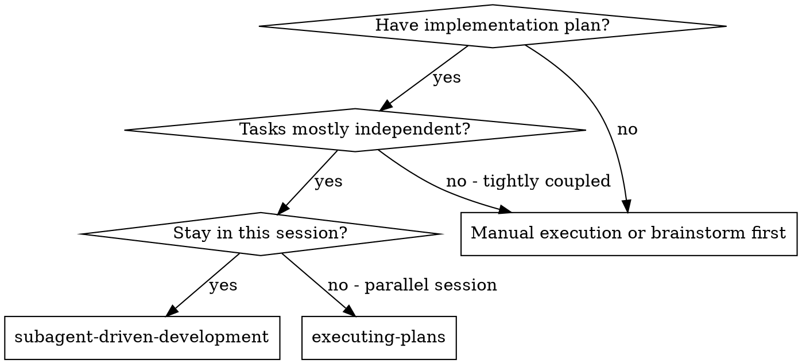
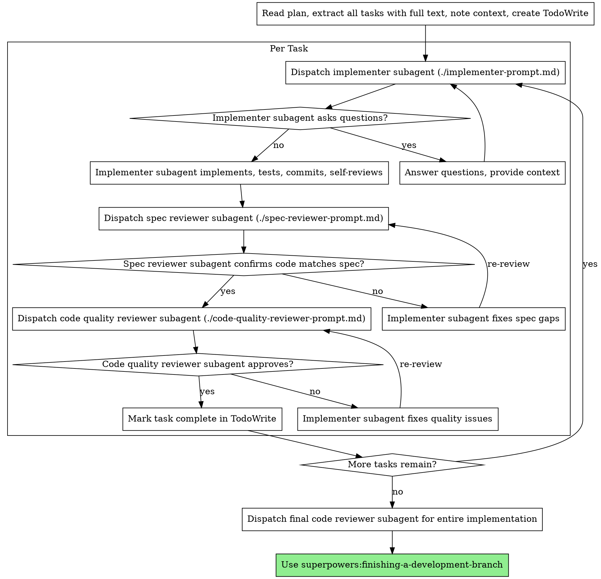

<!-- Generated by SpecStory, Markdown v2.1.0 -->

# 2026-04-03 13:10:52Z

<!-- Claude Code Session 6637c08b-0574-47dc-aeef-1e8ce86afed8 (2026-04-03 13:10:52Z) -->

_**User (2026-04-03 13:10:52Z)**_

<ide_opened_file>The user opened the file /Users/leocaseiro/Sites/base-skill/docs/superpowers/plans/2026-04-03-group-j-saved-game-configs.md in the IDE. This may or may not be related to the current task.</ide_opened_file>

Use the superpowers:subagent-driven-development skill to execute the following plans in order (they all target ./worktrees/feat-word-spell-number-match):

docs/superpowers/plans/2026-04-03-group-e-i18n-routing-bugs.md
docs/superpowers/plans/2026-04-03-group-fg-wordspell-bug-instructions.md
docs/superpowers/plans/2026-04-03-group-ab-sound-tts.md
docs/superpowers/plans/2026-04-03-group-c-progress-confetti.md
docs/superpowers/plans/2026-04-03-group-d-game-settings.md
docs/superpowers/plans/2026-04-03-group-i-sort-numbers-game.md
docs/superpowers/plans/2026-04-03-word-spell-number-match.md — Tasks 11 and 12 only (NumeralTileBank domino layout + useDraggableTile hook)
Skip Group H — it is fully absorbed by Group J (docs/superpowers/plans/2026-04-03-group-j-saved-game-configs.md), which runs in a separate session.

All commands must be run from ./worktrees/feat-word-spell-number-match.

Run these sequentially — they share the same worktree and some plans build on each other (e.g., Group I adds SortNumbers which Task 12 then refactors).

To avoid conflicts, be free to create other worktrees, but when you are happy merge into the `feat-word-spell-number-match`

---

_**Agent (claude-sonnet-4-6 2026-04-03 13:10:54Z)**_

<think><details><summary>Thought Process</summary>
The user wants me to use the superpowers:subagent-driven-development skill to execute multiple plans sequentially. Let me first invoke that skill to understand how to proceed.
</details></think>

_**Agent (claude-sonnet-4-6 2026-04-03 13:10:54Z)**_

<tool-use data-tool-type="generic" data-tool-name="Skill"><details>
<summary>Tool use: **Skill**</summary>

**Input:**

- skill: `superpowers:subagent-driven-development`

</details></tool-use>

---

_**User (2026-04-03 13:10:54Z)**_

Base directory for this skill: /Users/leocaseiro/.claude/plugins/cache/claude-plugins-official/superpowers/5.0.7/skills/subagent-driven-development

# Subagent-Driven Development

Execute plan by dispatching fresh subagent per task, with two-stage review after each: spec compliance review first, then code quality review.

**Why subagents:** You delegate tasks to specialized agents with isolated context. By precisely crafting their instructions and context, you ensure they stay focused and succeed at their task. They should never inherit your session's context or history — you construct exactly what they need. This also preserves your own context for coordination work.

**Core principle:** Fresh subagent per task + two-stage review (spec then quality) = high quality, fast iteration

## When to Use



**vs. Executing Plans (parallel session):**
- Same session (no context switch)
- Fresh subagent per task (no context pollution)
- Two-stage review after each task: spec compliance first, then code quality
- Faster iteration (no human-in-loop between tasks)

## The Process



## Model Selection

Use the least powerful model that can handle each role to conserve cost and increase speed.

**Mechanical implementation tasks** (isolated functions, clear specs, 1-2 files): use a fast, cheap model. Most implementation tasks are mechanical when the plan is well-specified.

**Integration and judgment tasks** (multi-file coordination, pattern matching, debugging): use a standard model.

**Architecture, design, and review tasks**: use the most capable available model.

**Task complexity signals:**
- Touches 1-2 files with a complete spec → cheap model
- Touches multiple files with integration concerns → standard model
- Requires design judgment or broad codebase understanding → most capable model

## Handling Implementer Status

Implementer subagents report one of four statuses. Handle each appropriately:

**DONE:** Proceed to spec compliance review.

**DONE_WITH_CONCERNS:** The implementer completed the work but flagged doubts. Read the concerns before proceeding. If the concerns are about correctness or scope, address them before review. If they're observations (e.g., "this file is getting large"), note them and proceed to review.

**NEEDS_CONTEXT:** The implementer needs information that wasn't provided. Provide the missing context and re-dispatch.

**BLOCKED:** The implementer cannot complete the task. Assess the blocker:
1. If it's a context problem, provide more context and re-dispatch with the same model
2. If the task requires more reasoning, re-dispatch with a more capable model
3. If the task is too large, break it into smaller pieces
4. If the plan itself is wrong, escalate to the human

**Never** ignore an escalation or force the same model to retry without changes. If the implementer said it's stuck, something needs to change.

## Prompt Templates

- `./implementer-prompt.md` - Dispatch implementer subagent
- `./spec-reviewer-prompt.md` - Dispatch spec compliance reviewer subagent
- `./code-quality-reviewer-prompt.md` - Dispatch code quality reviewer subagent

## Example Workflow

```
You: I'm using Subagent-Driven Development to execute this plan.

[Read plan file once: docs/superpowers/plans/feature-plan.md]
[Extract all 5 tasks with full text and context]
[Create TodoWrite with all tasks]

Task 1: Hook installation script

[Get Task 1 text and context (already extracted)]
[Dispatch implementation subagent with full task text + context]

Implementer: "Before I begin - should the hook be installed at user or system level?"

You: "User level (~/.config/superpowers/hooks/)"

Implementer: "Got it. Implementing now..."
[Later] Implementer:
  - Implemented install-hook command
  - Added tests, 5/5 passing
  - Self-review: Found I missed --force flag, added it
  - Committed

[Dispatch spec compliance reviewer]
Spec reviewer: ✅ Spec compliant - all requirements met, nothing extra

[Get git SHAs, dispatch code quality reviewer]
Code reviewer: Strengths: Good test coverage, clean. Issues: None. Approved.

[Mark Task 1 complete]

Task 2: Recovery modes

[Get Task 2 text and context (already extracted)]
[Dispatch implementation subagent with full task text + context]

Implementer: [No questions, proceeds]
Implementer:
  - Added verify/repair modes
  - 8/8 tests passing
  - Self-review: All good
  - Committed

[Dispatch spec compliance reviewer]
Spec reviewer: ❌ Issues:
  - Missing: Progress reporting (spec says "report every 100 items")
  - Extra: Added --json flag (not requested)

[Implementer fixes issues]
Implementer: Removed --json flag, added progress reporting

[Spec reviewer reviews again]
Spec reviewer: ✅ Spec compliant now

[Dispatch code quality reviewer]
Code reviewer: Strengths: Solid. Issues (Important): Magic number (100)

[Implementer fixes]
Implementer: Extracted PROGRESS_INTERVAL constant

[Code reviewer reviews again]
Code reviewer: ✅ Approved

[Mark Task 2 complete]

...

[After all tasks]
[Dispatch final code-reviewer]
Final reviewer: All requirements met, ready to merge

Done!
```

## Advantages

**vs. Manual execution:**
- Subagents follow TDD naturally
- Fresh context per task (no confusion)
- Parallel-safe (subagents don't interfere)
- Subagent can ask questions (before AND during work)

**vs. Executing Plans:**
- Same session (no handoff)
- Continuous progress (no waiting)
- Review checkpoints automatic

**Efficiency gains:**
- No file reading overhead (controller provides full text)
- Controller curates exactly what context is needed
- Subagent gets complete information upfront
- Questions surfaced before work begins (not after)

**Quality gates:**
- Self-review catches issues before handoff
- Two-stage review: spec compliance, then code quality
- Review loops ensure fixes actually work
- Spec compliance prevents over/under-building
- Code quality ensures implementation is well-built

**Cost:**
- More subagent invocations (implementer + 2 reviewers per task)
- Controller does more prep work (extracting all tasks upfront)
- Review loops add iterations
- But catches issues early (cheaper than debugging later)

## Red Flags

**Never:**
- Start implementation on main/master branch without explicit user consent
- Skip reviews (spec compliance OR code quality)
- Proceed with unfixed issues
- Dispatch multiple implementation subagents in parallel (conflicts)
- Make subagent read plan file (provide full text instead)
- Skip scene-setting context (subagent needs to understand where task fits)
- Ignore subagent questions (answer before letting them proceed)
- Accept "close enough" on spec compliance (spec reviewer found issues = not done)
- Skip review loops (reviewer found issues = implementer fixes = review again)
- Let implementer self-review replace actual review (both are needed)
- **Start code quality review before spec compliance is ✅** (wrong order)
- Move to next task while either review has open issues

**If subagent asks questions:**
- Answer clearly and completely
- Provide additional context if needed
- Don't rush them into implementation

**If reviewer finds issues:**
- Implementer (same subagent) fixes them
- Reviewer reviews again
- Repeat until approved
- Don't skip the re-review

**If subagent fails task:**
- Dispatch fix subagent with specific instructions
- Don't try to fix manually (context pollution)

## Integration

**Required workflow skills:**
- **superpowers:using-git-worktrees** - REQUIRED: Set up isolated workspace before starting
- **superpowers:writing-plans** - Creates the plan this skill executes
- **superpowers:requesting-code-review** - Code review template for reviewer subagents
- **superpowers:finishing-a-development-branch** - Complete development after all tasks

**Subagents should use:**
- **superpowers:test-driven-development** - Subagents follow TDD for each task

**Alternative workflow:**
- **superpowers:executing-plans** - Use for parallel session instead of same-session execution


---

_**Agent (claude-sonnet-4-6 2026-04-03 13:10:56Z)**_

<think><details><summary>Thought Process</summary>
Let me read all the plan files to understand what needs to be done, then create a TodoWrite with all the tasks, and start dispatching implementer subagents sequentially.

Let me start by reading all the plan files in parallel.
</details></think>

_**Agent (claude-sonnet-4-6 2026-04-03 13:10:57Z)**_

Using subagent-driven-development to execute 7 plans sequentially. Let me first read all plan files to extract tasks and create a full todo list.

_**Agent (claude-sonnet-4-6 2026-04-03 13:10:58Z)**_

<tool-use data-tool-type="unknown" data-tool-name="ToolSearch"><details>
<summary>Tool use: **ToolSearch**</summary>

**Input:**

- max_results: `1`
- query: `select:TodoWrite`

**Result:**

```

```
</details></tool-use>

_**Agent (claude-sonnet-4-6 2026-04-03 13:10:59Z)**_

<tool-use data-tool-type="read" data-tool-name="Read"><details>
<summary>Tool use: **Read**</summary>
 `./docs/superpowers/plans/2026-04-03-group-e-i18n-routing-bugs.md`

```text
1	# Group E: i18n / Routing Bugs — Implementation Plan
2	
3	> **For agentic workers:** REQUIRED SUB-SKILL: Use superpowers:subagent-driven-development (recommended) or superpowers:executing-plans to implement this plan task-by-task. Steps use checkbox (`- [ ]`) syntax for tracking.
4	
5	**Goal:** Fix all locale-switching, routing, and i18n bugs across the app so that changing language anywhere keeps the user on their current route, game UI strings are translated, the Header drawer has a voice selector, and preset theme names are translated.
6	
7	**Architecture:** Six self-contained changes, each touching 1–3 files. The locale-switching fix is one pattern applied to three components (`Footer`, `Header`, `settings`). `GameShell` gets `useParams` for locale and `useTranslation('games')` for button labels. `Header` drawer gains a voice selector. Both locale JSON files gain `voice` and game-shell keys. Preset theme names are resolved via i18n rather than the raw `ThemeDoc.name` field.
8	
9	**Tech Stack:** React 19, TanStack Router v1, react-i18next, TypeScript strict, Vitest + React Testing Library, RxDB
10	
11	**Worktree:** `./worktrees/feat-word-spell-number-match` — all file paths below are relative to that root.
12	
13	---
14	
15	## File Map
16	
17	| File | Action | Responsibility |
18	|------|--------|---------------|
19	| `src/components/Footer.tsx` | Modify | Fix `switchLocale` to stay on current route |
20	| `src/components/Header.tsx` | Modify | Fix `switchLocale` + add voice selector to drawer |
21	| `src/routes/$locale/_app/settings.tsx` | Modify | Fix `handleLocaleChange` to stay on current route |
22	| `src/components/game/GameShell.tsx` | Modify | Fix hardcoded `locale = 'en'`; translate Undo/Pause/Exit |
23	| `src/components/game/GameShell.test.tsx` | Modify | Update test for translated button labels |
24	| `src/lib/i18n/locales/en/games.json` | Modify | Add `shell.round`, `shell.undo`, `shell.pause`, `shell.exit` |
25	| `src/lib/i18n/locales/pt-BR/games.json` | Modify | Same keys in Portuguese |
26	| `src/lib/i18n/locales/en/settings.json` | Modify | Add `voice`, `themes.ocean`, `themes.forest` keys |
27	| `src/lib/i18n/locales/pt-BR/settings.json` | Modify | Same keys in Portuguese |
28	
29	---
30	
31	## Task 1: Fix locale-switching in Footer
32	
33	**Files:**
34	- Modify: `src/components/Footer.tsx`
35	
36	- [ ] **Step 1: Replace `switchLocale` navigation**
37	
38	  Open `src/components/Footer.tsx`. Replace the `switchLocale` function body:
39	
40	  ```tsx
41	  // BEFORE
42	  const switchLocale = (newLocale: FooterLocale) => {
43	    void navigate({
44	      to: '/$locale',
45	      params: { locale: newLocale },
46	    });
47	  };
48	
49	  // AFTER
50	  const switchLocale = (newLocale: FooterLocale) => {
51	    void navigate({
52	      params: (prev) => ({ ...prev, locale: newLocale }),
53	    });
54	  };
55	  ```
56	
57	- [ ] **Step 2: Run typecheck**
58	
59	  ```bash
60	  cd worktrees/feat-word-spell-number-match && yarn typecheck 2>&1 | tail -5
61	  ```
62	
63	  Expected: no errors.
64	
65	- [ ] **Step 3: Commit**
66	
67	  ```bash
68	  git add src/components/Footer.tsx
69	  git commit -m "fix(i18n): locale switch in Footer stays on current route"
70	  ```
71	
72	---
73	
74	## Task 2: Fix locale-switching in Header
75	
76	**Files:**
77	- Modify: `src/components/Header.tsx`
78	
79	- [ ] **Step 1: Replace `switchLocale` navigation**
80	
81	  In `src/components/Header.tsx`, find the `switchLocale` function inside `Header` and replace:
82	
83	  ```tsx
84	  // BEFORE
85	  const switchLocale = (newLocale: HeaderLocale) => {
86	    void navigate({
87	      to: '/$locale',
88	      params: { locale: newLocale },
89	    });
90	  };
91	
92	  // AFTER
93	  const switchLocale = (newLocale: HeaderLocale) => {
94	    void navigate({
95	      params: (prev) => ({ ...prev, locale: newLocale }),
96	    });
97	  };
98	  ```
99	
100	- [ ] **Step 2: Run typecheck**
101	
102	  ```bash
103	  yarn typecheck 2>&1 | tail -5
104	  ```
105	
106	  Expected: no errors.
107	
108	- [ ] **Step 3: Commit**
109	
110	  ```bash
111	  git add src/components/Header.tsx
112	  git commit -m "fix(i18n): locale switch in Header stays on current route"
113	  ```
114	
115	---
116	
117	## Task 3: Fix locale-switching in Settings route
118	
119	**Files:**
120	- Modify: `src/routes/$locale/_app/settings.tsx`
121	
122	- [ ] **Step 1: Replace `handleLocaleChange` navigation**
123	
124	  In `src/routes/$locale/_app/settings.tsx`, replace:
125	
126	  ```tsx
127	  // BEFORE
128	  const handleLocaleChange = (newLocale: string) => {
129	    void navigate({
130	      to: '/$locale/settings',
131	      params: { locale: newLocale as SettingsLocale },
132	    });
133	  };
134	
135	  // AFTER
136	  const handleLocaleChange = (newLocale: string) => {
137	    void navigate({
138	      params: (prev) => ({ ...prev, locale: newLocale as SettingsLocale }),
139	    });
140	  };
141	  ```
142	
143	- [ ] **Step 2: Run typecheck**
144	
145	  ```bash
146	  yarn typecheck 2>&1 | tail -5
147	  ```
148	
149	  Expected: no errors.
150	
151	- [ ] **Step 3: Commit**
152	
153	  ```bash
154	  git add "src/routes/\$locale/_app/settings.tsx"
155	  git commit -m "fix(i18n): locale switch in Settings stays on current route"
156	  ```
157	
158	---
159	
160	## Task 4: Fix GameShell hardcoded locale + translate shell buttons
161	
162	**Files:**
163	- Modify: `src/components/game/GameShell.tsx`
164	- Modify: `src/components/game/GameShell.test.tsx`
165	- Modify: `src/lib/i18n/locales/en/games.json`
166	- Modify: `src/lib/i18n/locales/pt-BR/games.json`
167	
168	- [ ] **Step 1: Add shell keys to `en/games.json`**
169	
170	  Open `src/lib/i18n/locales/en/games.json` and add a `shell` block:
171	
172	  ```json
173	  {
174	    "word-spell": "Word Spell",
175	    "number-match": "Number Match",
176	    "shell": {
177	      "round": "Round {{current}} / {{total}}",
178	      "undo": "Undo",
179	      "pause": "Pause",
180	      "exit": "Exit"
181	    },
182	    "ui": {
183	      "choose-a-letter": "Choose a letter",
184	      "almost-try-again": "Almost! Try again.",
185	      "great-job": "Great job!",
186	      "hear-the-question": "Hear the question",
187	      "tap-to-hear": "tap to hear"
188	    }
189	  }
190	  ```
191	
192	- [ ] **Step 2: Add shell keys to `pt-BR/games.json`**
193	
194	  Open `src/lib/i18n/locales/pt-BR/games.json` and add the same `shell` block in Portuguese:
195	
196	  ```json
197	  {
198	    "word-spell": "Soletrar Palavras",
199	    "number-match": "Combinação de Números",
200	    "shell": {
201	      "round": "Rodada {{current}} / {{total}}",
202	      "undo": "Desfazer",
203	      "pause": "Pausar",
204	      "exit": "Sair"
205	    },
206	    "ui": {
207	      "choose-a-letter": "Escolha uma letra",
208	      "almost-try-again": "Quase! Tente de novo.",
209	      "great-job": "Muito bem!",
210	      "hear-the-question": "Ouvir a pergunta",
211	      "tap-to-hear": "toque para ouvir"
212	    }
213	  }
214	  ```
215	
216	- [ ] **Step 3: Update GameShell to use params + translations**
217	
218	  Replace the entire `GameShellChrome` component in `src/components/game/GameShell.tsx`:
219	
220	  ```tsx
221	  import { useNavigate, useParams } from '@tanstack/react-router';
222	  import { useTranslation } from 'react-i18next';
223	  ```
224	
225	  Add `useTranslation` to the imports (it's not there yet). Also add `useParams` alongside `useNavigate`.
226	
227	  Inside `GameShellChrome`, replace:
228	
229	  ```tsx
230	  // BEFORE — remove this line
231	  const locale = 'en'; // TODO: use i18n locale in M5
232	
233	  // REPLACE the handleExit navigate call:
234	  const handleExit = () => {
235	    void navigate({ to: '/$locale', params: { locale } });
236	  };
237	  ```
238	
239	  With:
240	
241	  ```tsx
242	  const { t } = useTranslation('games');
243	  const { locale } = useParams({ from: '/$locale' });
244	
245	  const handleExit = () => {
246	    void navigate({
247	      to: '/$locale',
248	      params: { locale },
249	    });
250	  };
251	  ```
252	
253	  Then replace the JSX strings in the return:
254	
255	  ```tsx
256	  // BEFORE
257	  <span className="text-sm font-medium">
258	    Round {roundDisplay} / {config.maxRounds}
259	  </span>
260	
261	  // AFTER
262	  <span className="text-sm font-medium">
263	    {t('shell.round', { current: roundDisplay, total: config.maxRounds })}
264	  </span>
265	  ```
266	
267	  ```tsx
268	  // BEFORE
269	  ⟲ Undo
270	
271	  // AFTER
272	  ⟲ {t('shell.undo')}
273	  ```
274	
275	  ```tsx
276	  // BEFORE
277	  II Pause
278	
279	  // AFTER
280	  II {t('shell.pause')}
281	  ```
282	
283	  ```tsx
284	  // BEFORE (both Exit buttons)
285	  ✕ Exit
286	
287	  // AFTER
288	  ✕ {t('shell.exit')}
289	  ```
290	
291	- [ ] **Step 4: Update GameShell test for translated labels**
292	
293	  In `src/components/game/GameShell.test.tsx`, the mock already returns `{ locale: 'en', gameId: 'word-builder' }` from `useParams` — no change needed there. But any test asserting button text needs updating.
294	
295	  Find assertions like `screen.getByRole('button', { name: /undo/i })` — these use `aria-label` so they still work. Verify no test matches on visible text `"Undo"`, `"Pause"`, or `"Exit"` directly. If any do, update them to match the `aria-label` attribute instead.
296	
297	  Run tests first to check:
298	
299	  ```bash
300	  yarn test src/components/game/GameShell.test.tsx 2>&1 | tail -20
301	  ```
302	
303	  If a test fails because it matched on visible text, change it to use `aria-label`:
304	
305	  ```tsx
306	  // Example fix if needed:
307	  // BEFORE: screen.getByText('Undo')
308	  // AFTER:  screen.getByRole('button', { name: /undo/i })
309	  ```
310	
311	- [ ] **Step 5: Run typecheck + tests**
312	
313	  ```bash
314	  yarn typecheck 2>&1 | tail -5
315	  yarn test src/components/game/GameShell.test.tsx 2>&1 | tail -10
316	  ```
317	
318	  Expected: no type errors, all tests pass.
319	
320	- [ ] **Step 6: Commit**
321	
322	  ```bash
323	  git add src/components/game/GameShell.tsx src/components/game/GameShell.test.tsx \
324	    src/lib/i18n/locales/en/games.json src/lib/i18n/locales/pt-BR/games.json
325	  git commit -m "fix(i18n): GameShell uses route locale param and translates shell buttons"
326	  ```
327	
328	---
329	
330	## Task 5: Add voice selector to Header drawer + translate voice/theme keys
331	
332	**Files:**
333	- Modify: `src/components/Header.tsx`
334	- Modify: `src/lib/i18n/locales/en/settings.json`
335	- Modify: `src/lib/i18n/locales/pt-BR/settings.json`
336	
337	- [ ] **Step 1: Add `voice` and preset theme keys to `en/settings.json`**
338	
339	  ```json
340	  {
341	    "title": "Settings",
342	    "volume": "Volume ({{percent}}%)",
343	    "speechRate": "Speech rate ({{rate}}×)",
344	    "language": "Language",
345	    "theme": "Theme",
346	    "voice": "Voice",
347	    "themes": {
348	      "theme_ocean_preset": "Ocean",
349	      "theme_forest_preset": "Forest"
350	    }
351	  }
352	  ```
353	
354	- [ ] **Step 2: Add same keys to `pt-BR/settings.json`**
355	
356	  ```json
357	  {
358	    "title": "Configurações",
359	    "volume": "Volume ({{percent}}%)",
360	    "speechRate": "Velocidade da fala ({{rate}}×)",
361	    "language": "Idioma",
362	    "theme": "Tema",
363	    "voice": "Voz",
364	    "themes": {
365	      "theme_ocean_preset": "Oceano",
366	      "theme_forest_preset": "Floresta"
367	    }
368	  }
369	  ```
370	
371	- [ ] **Step 3: Add voice state + selector to `HeaderMenuPanel`**
372	
373	  In `src/components/Header.tsx`, add `useState` and `useEffect` to the existing imports from `react`:
374	
375	  ```tsx
376	  import { useMemo, useRef, useState, useEffect } from 'react';
377	  ```
378	
379	  Inside `HeaderMenuPanel`, after the existing `const speechRate = ...` line, add:
380	
381	  ```tsx
382	  const preferredVoice = settings.preferredVoiceURI ?? '';
383	  const [voices, setVoices] = useState<SpeechSynthesisVoice[]>([]);
384	
385	  useEffect(() => {
386	    const synth = (
387	      globalThis as unknown as { speechSynthesis?: SpeechSynthesis }
388	    ).speechSynthesis;
389	    if (!synth) return;
390	    const load = () => setVoices(synth.getVoices());
391	    load();
392	    synth.addEventListener('voiceschanged', load);
393	    return () => synth.removeEventListener('voiceschanged', load);
394	  }, []);
395	  ```
396	
397	  Then add the voice `<Select>` block to the `SheetContent` JSX, after the `speechRate` slider block and before the language block:
398	
399	  ```tsx
400	  {voices.length > 0 && (
401	    <div className="flex flex-col gap-2">
402	      <Label htmlFor="drawer-voice">{t('voice')}</Label>
403	      <Select
404	        value={preferredVoice}
405	        onValueChange={(v) => void update({ preferredVoiceURI: v })}
406	      >
407	        <SelectTrigger id="drawer-voice">
408	          <SelectValue />
409	        </SelectTrigger>
410	        <SelectContent>
411	          {voices.map((v) => (
412	            <SelectItem key={v.name} value={v.name}>
413	              {v.name}
414	            </SelectItem>
415	          ))}
416	        </SelectContent>
417	      </Select>
418	    </div>
419	  )}
420	  ```
421	
422	- [ ] **Step 4: Translate preset theme names in the drawer**
423	
424	  In `HeaderMenuPanel`, the theme `<Select>` currently renders `{name}` from the `ThemeDoc`. Replace it to use i18n for preset themes:
425	
426	  ```tsx
427	  // BEFORE
428	  {themes.map(({ id, name }) => (
429	    <SelectItem key={id} value={id}>
430	      {name}
431	    </SelectItem>
432	  ))}
433	
434	  // AFTER
435	  {themes.map(({ id, name, isPreset }) => (
436	    <SelectItem key={id} value={id}>
437	      {isPreset ? t(`themes.${id}`, { defaultValue: name }) : name}
438	    </SelectItem>
439	  ))}
440	  ```
441	
442	  Note: `ThemeDoc` includes `isPreset` — it's already in the type. The `toJSON()` call already returns the full doc shape. `t('themes.theme_ocean_preset', { defaultValue: name })` falls back to the raw `name` for any unknown preset IDs.
443	
444	- [ ] **Step 5: Run typecheck**
445	
446	  ```bash
447	  yarn typecheck 2>&1 | tail -5
448	  ```
449	
450	  Expected: no errors.
451	
452	- [ ] **Step 6: Commit**
453	
454	  ```bash
455	  git add src/components/Header.tsx \
456	    src/lib/i18n/locales/en/settings.json \
457	    src/lib/i18n/locales/pt-BR/settings.json
458	  git commit -m "feat(settings): add voice selector to Header drawer; translate theme names"
459	  ```
460	
461	---
462	
463	## Task 6: Final verification
464	
465	- [ ] **Step 1: Run full lint + typecheck + unit tests**
466	
467	  ```bash
468	  yarn lint 2>&1 | tail -10
469	  yarn typecheck 2>&1 | tail -5
470	  yarn test 2>&1 | tail -15
471	  ```
472	
473	  Expected: all pass with no errors.
474	
475	- [ ] **Step 2: Manual smoke checks**
476	
477	  Start the dev server (`yarn dev`) and verify:
478	  1. On the home page (`/en`), open the Footer language dropdown, switch to Português — URL becomes `/pt-BR`, page stays on home (not redirected elsewhere).
479	  2. Navigate to `/en/game/word-spell`, open the Header menu → switch to Português — URL becomes `/pt-BR/game/word-spell`, game still visible.
480	  3. Navigate to `/en/settings`, switch language → stays on `/pt-BR/settings`.
481	  4. Open a game — footer buttons read "Desfazer / Pausar / Sair" in pt-BR.
482	  5. Open Header menu drawer in pt-BR → voice selector visible, theme shows "Oceano" / "Floresta".
483	  6. Switch back to English → theme names show "Ocean" / "Forest".
484	
485	- [ ] **Step 3: Commit any fixups, then push**
486	
487	  ```bash
488	  git push
489	  ```
490
```
</details></tool-use>

_**Agent (claude-sonnet-4-6 2026-04-03 13:11:01Z)**_

<tool-use data-tool-type="read" data-tool-name="Read"><details>
<summary>Tool use: **Read**</summary>
 `./docs/superpowers/plans/2026-04-03-group-fg-wordspell-bug-instructions.md`

```text
1	# Group F+G: WordSpell Click Bug + Game Instructions — Implementation Plan
2	
3	> **For agentic workers:** REQUIRED SUB-SKILL: Use superpowers:subagent-driven-development (recommended) or superpowers:executing-plans to implement this plan task-by-task. Steps use checkbox (`- [ ]`) syntax for tracking.
4	
5	**Goal:** Fix the click-mode bug where tiles skip to the last slot when middle slots are empty; add a guard preventing `EJECT_TILE` from ejecting correctly-placed tiles; add an `InstructionsOverlay` shown before the first round that reads instructions aloud.
6	
7	**Architecture:** Two reducer fixes: (1) `EJECT_TILE` checks `zone.isWrong` before ejecting — prevents ejecting a correctly-placed tile if a stale eject timer fires; (2) `useAutoNextSlot.placeInNextSlot` skips locked zones by scanning forward rather than blindly using `activeSlotIndex`. `InstructionsOverlay` is a full-screen overlay shown when a `showInstructions` flag is true; it has a "Let's go!" button and calls `speakPrompt` via TTS. Each game session starts with instructions shown.
8	
9	**Tech Stack:** React 19, TypeScript strict, react-i18next, Vitest + React Testing Library
10	
11	**Worktree:** `./worktrees/feat-word-spell-number-match`
12	
13	---
14	
15	## File Map
16	
17	| File | Action | Responsibility |
18	|------|--------|---------------|
19	| `src/components/answer-game/answer-game-reducer.ts` | Modify | Guard EJECT_TILE: only eject if zone.isWrong; fix PLACE_TILE wrong branch for lock-manual |
20	| `src/components/answer-game/answer-game-reducer.test.ts` | Modify | Add tests for EJECT_TILE guard and lock-manual bank cleanup |
21	| `src/components/answer-game/useAutoNextSlot.ts` | Modify | Skip locked zones when finding target slot |
22	| `src/components/answer-game/useAutoNextSlot.test.tsx` | Modify | Add test for skipping locked zone |
23	| `src/components/answer-game/InstructionsOverlay/InstructionsOverlay.tsx` | Create | Full-screen overlay with instructions text + TTS + "Let's go!" button |
24	| `src/components/answer-game/InstructionsOverlay/InstructionsOverlay.test.tsx` | Create | Renders text, calls speakPrompt on mount, dismisses on button click |
25	| `src/games/word-spell/WordSpell/WordSpell.tsx` | Modify | Show InstructionsOverlay before first round |
26	| `src/games/number-match/NumberMatch/NumberMatch.tsx` | Modify | Same |
27	| `src/lib/i18n/locales/en/games.json` | Modify | Add instructions strings for word-spell and number-match |
28	| `src/lib/i18n/locales/pt-BR/games.json` | Modify | Same in Portuguese |
29	
30	---
31	
32	## Task 1: Fix EJECT_TILE reducer guard
33	
34	**Files:**
35	- Modify: `src/components/answer-game/answer-game-reducer.ts`
36	- Modify: `src/components/answer-game/answer-game-reducer.test.ts`
37	
38	- [ ] **Step 1: Write failing test**
39	
40	  In `src/components/answer-game/answer-game-reducer.test.ts`, add:
41	
42	  ```ts
43	  describe('EJECT_TILE', () => {
44	    it('does NOT eject a zone that is not wrong (correct tile placed after stale timer)', () => {
45	      const state = makeInitialState({
46	        gameId: 'test',
47	        inputMethod: 'drag',
48	        wrongTileBehavior: 'lock-auto-eject',
49	        tileBankMode: 'exact',
50	        totalRounds: 1,
51	        ttsEnabled: false,
52	      });
53	      // Zone 0 has a correctly placed tile (isWrong: false)
54	      const stateWithCorrectTile: AnswerGameState = {
55	        ...state,
56	        allTiles: [{ id: 't1', label: 'c', value: 'c' }],
57	        bankTileIds: [],
58	        zones: [
59	          {
60	            id: 'z0',
61	            index: 0,
62	            expectedValue: 'c',
63	            placedTileId: 't1',
64	            isWrong: false,
65	            isLocked: false,
66	          },
67	        ],
68	      };
69	
70	      const result = answerGameReducer(stateWithCorrectTile, {
71	        type: 'EJECT_TILE',
72	        zoneIndex: 0,
73	      });
74	
75	      // Tile should NOT be ejected
76	      expect(result.zones[0].placedTileId).toBe('t1');
77	      expect(result.bankTileIds).not.toContain('t1');
78	    });
79	
80	    it('still ejects a zone that is wrong', () => {
81	      const state = makeInitialState({
82	        gameId: 'test',
83	        inputMethod: 'drag',
84	        wrongTileBehavior: 'lock-manual',
85	        tileBankMode: 'exact',
86	        totalRounds: 1,
87	        ttsEnabled: false,
88	      });
89	      const stateWithWrongTile: AnswerGameState = {
90	        ...state,
91	        allTiles: [{ id: 't1', label: 'a', value: 'a' }],
92	        bankTileIds: [],
93	        zones: [
94	          {
95	            id: 'z0',
96	            index: 0,
97	            expectedValue: 'c',
98	            placedTileId: 't1',
99	            isWrong: true,
100	            isLocked: true,
101	          },
102	        ],
103	      };
104	
105	      const result = answerGameReducer(stateWithWrongTile, {
106	        type: 'EJECT_TILE',
107	        zoneIndex: 0,
108	      });
109	
110	      expect(result.zones[0].placedTileId).toBeNull();
111	      expect(result.bankTileIds).toContain('t1');
112	    });
113	  });
114	  ```
115	
116	  Run to confirm the first test FAILS:
117	
118	  ```bash
119	  yarn test src/components/answer-game/answer-game-reducer.test.ts 2>&1 | tail -15
120	  ```
121	
122	- [ ] **Step 2: Fix EJECT_TILE in reducer**
123	
124	  In `src/components/answer-game/answer-game-reducer.ts`, update the `EJECT_TILE` case:
125	
126	  ```ts
127	  case 'EJECT_TILE': {
128	    const zone = state.zones[action.zoneIndex];
129	    if (!zone) return state;
130	
131	    // Only eject if the zone is actually in a wrong state.
132	    // This prevents a stale auto-eject timer from removing a correctly-placed tile.
133	    if (!zone.isWrong && !zone.isLocked) return state;
134	
135	    if (zone.placedTileId) {
136	      return {
137	        ...state,
138	        zones: state.zones.map((z, i) =>
139	          i === action.zoneIndex
140	            ? {
141	                ...z,
142	                placedTileId: null,
143	                isWrong: false,
144	                isLocked: false,
145	              }
146	            : z,
147	        ),
148	        bankTileIds: [...state.bankTileIds, zone.placedTileId],
149	      };
150	    }
151	
152	    return {
153	      ...state,
154	      zones: state.zones.map((z, i) =>
155	        i === action.zoneIndex
156	          ? { ...z, placedTileId: null, isWrong: false, isLocked: false }
157	          : z,
158	      ),
159	    };
160	  }
161	  ```
162	
163	- [ ] **Step 3: Run tests**
164	
165	  ```bash
166	  yarn test src/components/answer-game/answer-game-reducer.test.ts 2>&1 | tail -10
167	  ```
168	
169	  Expected: PASS.
170	
171	- [ ] **Step 4: Commit**
172	
173	  ```bash
174	  git add src/components/answer-game/answer-game-reducer.ts \
175	    src/components/answer-game/answer-game-reducer.test.ts
176	  git commit -m "fix(reducer): EJECT_TILE guard — never eject correctly-placed tiles"
177	  ```
178	
179	---
180	
181	## Task 2: Fix useAutoNextSlot to skip locked zones
182	
183	**Files:**
184	- Modify: `src/components/answer-game/useAutoNextSlot.ts`
185	- Modify: `src/components/answer-game/useAutoNextSlot.test.tsx`
186	
187	- [ ] **Step 1: Write failing test**
188	
189	  In `src/components/answer-game/useAutoNextSlot.test.tsx`, add:
190	
191	  ```tsx
192	  it('skips locked zones and places in the next available slot', () => {
193	    // Setup: activeSlotIndex = 0, zone 0 is locked (isLocked: true, placedTileId: null)
194	    // zone 1 is empty and unlocked
195	    // Calling placeInNextSlot should place in zone 1, not zone 0
196	    // ... (render hook with mock context providing the above state)
197	    // expect dispatch called with { type: 'PLACE_TILE', zoneIndex: 1 }
198	  });
199	  ```
200	
201	  Run to confirm FAIL:
202	
203	  ```bash
204	  yarn test src/components/answer-game/useAutoNextSlot.test.tsx 2>&1 | tail -10
205	  ```
206	
207	- [ ] **Step 2: Update `useAutoNextSlot.ts`**
208	
209	  ```ts
210	  import { useCallback } from 'react';
211	  import { useAnswerGameContext } from './useAnswerGameContext';
212	  import { useTileEvaluation } from './useTileEvaluation';
213	
214	  export interface AutoNextSlot {
215	    placeInNextSlot: (tileId: string) => void;
216	  }
217	
218	  export function useAutoNextSlot(): AutoNextSlot {
219	    const { activeSlotIndex, zones } = useAnswerGameContext();
220	    const { placeTile } = useTileEvaluation();
221	
222	    const placeInNextSlot = useCallback(
223	      (tileId: string) => {
224	        // Find the first available slot: at or after activeSlotIndex,
225	        // not locked, not already correctly filled.
226	        const targetIndex = zones.findIndex(
227	          (z, i) =>
228	            i >= activeSlotIndex &&
229	            z.placedTileId === null &&
230	            !z.isLocked,
231	        );
232	        if (targetIndex === -1) return;
233	        placeTile(tileId, targetIndex);
234	      },
235	      [placeTile, activeSlotIndex, zones],
236	    );
237	
238	    return { placeInNextSlot };
239	  }
240	  ```
241	
242	- [ ] **Step 3: Run tests**
243	
244	  ```bash
245	  yarn test src/components/answer-game/useAutoNextSlot.test.tsx 2>&1 | tail -10
246	  ```
247	
248	  Expected: PASS.
249	
250	- [ ] **Step 4: Commit**
251	
252	  ```bash
253	  git add src/components/answer-game/useAutoNextSlot.ts \
254	    src/components/answer-game/useAutoNextSlot.test.tsx
255	  git commit -m "fix(wordspell): useAutoNextSlot skips locked zones to prevent slot-skip bug"
256	  ```
257	
258	---
259	
260	## Task 3: Add instructions strings to i18n
261	
262	**Files:**
263	- Modify: `src/lib/i18n/locales/en/games.json`
264	- Modify: `src/lib/i18n/locales/pt-BR/games.json`
265	
266	- [ ] **Step 1: Add instructions to `en/games.json`**
267	
268	  ```json
269	  {
270	    "word-spell": "Word Spell",
271	    "number-match": "Number Match",
272	    "shell": {
273	      "round": "Round {{current}} / {{total}}",
274	      "undo": "Undo",
275	      "pause": "Pause",
276	      "exit": "Exit"
277	    },
278	    "instructions": {
279	      "word-spell": "Drag the letters into the boxes to spell the word. Tap the picture or the speaker to hear the word.",
280	      "number-match": "Drag the tiles to match each number. Tap the number to hear it.",
281	      "lets-go": "Let's go!"
282	    },
283	    "ui": {
284	      "choose-a-letter": "Choose a letter",
285	      "almost-try-again": "Almost! Try again.",
286	      "great-job": "Great job!",
287	      "hear-the-question": "Hear the question",
288	      "tap-to-hear": "tap to hear"
289	    }
290	  }
291	  ```
292	
293	  Note: if Group E plan's `shell` keys are not yet added, add them here too.
294	
295	- [ ] **Step 2: Add instructions to `pt-BR/games.json`**
296	
297	  ```json
298	  {
299	    "word-spell": "Soletrar Palavras",
300	    "number-match": "Combinação de Números",
301	    "shell": {
302	      "round": "Rodada {{current}} / {{total}}",
303	      "undo": "Desfazer",
304	      "pause": "Pausar",
305	      "exit": "Sair"
306	    },
307	    "instructions": {
308	      "word-spell": "Arraste as letras para as caixas e forme a palavra. Toque na imagem ou no alto-falante para ouvir a palavra.",
309	      "number-match": "Arraste as peças para combinar cada número. Toque no número para ouvir.",
310	      "lets-go": "Vamos lá!"
311	    },
312	    "ui": {
313	      "choose-a-letter": "Escolha uma letra",
314	      "almost-try-again": "Quase! Tente de novo.",
315	      "great-job": "Muito bem!",
316	      "hear-the-question": "Ouvir a pergunta",
317	      "tap-to-hear": "toque para ouvir"
318	    }
319	  }
320	  ```
321	
322	- [ ] **Step 3: Commit**
323	
324	  ```bash
325	  git add src/lib/i18n/locales/en/games.json src/lib/i18n/locales/pt-BR/games.json
326	  git commit -m "feat(i18n): add instructions strings for word-spell and number-match"
327	  ```
328	
329	---
330	
331	## Task 4: Create InstructionsOverlay component
332	
333	**Files:**
334	- Create: `src/components/answer-game/InstructionsOverlay/InstructionsOverlay.tsx`
335	- Create: `src/components/answer-game/InstructionsOverlay/InstructionsOverlay.test.tsx`
336	
337	- [ ] **Step 1: Write failing tests**
338	
339	  Create `src/components/answer-game/InstructionsOverlay/InstructionsOverlay.test.tsx`:
340	
341	  ```tsx
342	  import { render, screen } from '@testing-library/react';
343	  import userEvent from '@testing-library/user-event';
344	  import { describe, expect, it, vi } from 'vitest';
345	  import { InstructionsOverlay } from './InstructionsOverlay';
346	
347	  describe('InstructionsOverlay', () => {
348	    it('renders instructions text', () => {
349	      render(
350	        <InstructionsOverlay
351	          text="Drag the letters to spell the word."
352	          onStart={vi.fn()}
353	          ttsEnabled={false}
354	        />,
355	      );
356	      expect(
357	        screen.getByText('Drag the letters to spell the word.'),
358	      ).toBeInTheDocument();
359	    });
360	
361	    it('calls onStart when "Let\'s go!" button is clicked', async () => {
362	      const onStart = vi.fn();
363	      render(
364	        <InstructionsOverlay
365	          text="Instructions here."
366	          onStart={onStart}
367	          ttsEnabled={false}
368	        />,
369	      );
370	      await userEvent.click(screen.getByRole('button', { name: /let's go/i }));
371	      expect(onStart).toHaveBeenCalledOnce();
372	    });
373	
374	    it('renders the "Let\'s go!" button', () => {
375	      render(
376	        <InstructionsOverlay
377	          text="Instructions."
378	          onStart={vi.fn()}
379	          ttsEnabled={false}
380	        />,
381	      );
382	      expect(screen.getByRole('button', { name: /let's go/i })).toBeInTheDocument();
383	    });
384	  });
385	  ```
386	
387	  Run to confirm FAIL:
388	
389	  ```bash
390	  yarn test src/components/answer-game/InstructionsOverlay/InstructionsOverlay.test.tsx 2>&1 | tail -10
391	  ```
392	
393	- [ ] **Step 2: Create `InstructionsOverlay.tsx`**
394	
395	  ```tsx
396	  import { useEffect } from 'react';
397	  import { useTranslation } from 'react-i18next';
398	  import { useGameTTS } from '@/components/answer-game/useGameTTS';
399	
400	  interface InstructionsOverlayProps {
401	    text: string;
402	    onStart: () => void;
403	    ttsEnabled: boolean;
404	  }
405	
406	  export const InstructionsOverlay = ({
407	    text,
408	    onStart,
409	    ttsEnabled,
410	  }: InstructionsOverlayProps) => {
411	    const { t } = useTranslation('games');
412	    const { speakPrompt } = useGameTTS();
413	
414	    useEffect(() => {
415	      if (ttsEnabled) speakPrompt(text);
416	      // eslint-disable-next-line react-hooks/exhaustive-deps
417	    }, []);
418	
419	    return (
420	      <div
421	        role="dialog"
422	        aria-label="Game instructions"
423	        className="fixed inset-0 z-40 flex flex-col items-center justify-center gap-8 bg-background/95 px-6 text-center"
424	      >
425	        <span className="text-6xl" aria-hidden="true">
426	          🎮
427	        </span>
428	        <p className="max-w-sm text-lg font-medium text-foreground">
429	          {text}
430	        </p>
431	        <button
432	          type="button"
433	          onClick={onStart}
434	          className="rounded-xl bg-primary px-10 py-4 text-xl font-bold text-primary-foreground shadow-md active:scale-95"
435	        >
436	          {t('instructions.lets-go')}
437	        </button>
438	      </div>
439	    );
440	  };
441	  ```
442	
443	- [ ] **Step 3: Run tests**
444	
445	  ```bash
446	  yarn test src/components/answer-game/InstructionsOverlay/InstructionsOverlay.test.tsx 2>&1 | tail -10
447	  ```
448	
449	  Expected: PASS.
450	
451	- [ ] **Step 4: Commit**
452	
453	  ```bash
454	  git add src/components/answer-game/InstructionsOverlay/InstructionsOverlay.tsx \
455	    src/components/answer-game/InstructionsOverlay/InstructionsOverlay.test.tsx
456	  git commit -m "feat(instructions): add InstructionsOverlay component"
457	  ```
458	
459	---
460	
461	## Task 5: Add InstructionsOverlay to WordSpell + NumberMatch
462	
463	**Files:**
464	- Modify: `src/games/word-spell/WordSpell/WordSpell.tsx`
465	- Modify: `src/games/number-match/NumberMatch/NumberMatch.tsx`
466	
467	- [ ] **Step 1: Add instructions state to `WordSpell`**
468	
469	  In `src/games/word-spell/WordSpell/WordSpell.tsx`, at the top of `WordSpellSession`:
470	
471	  ```tsx
472	  import { useState } from 'react';
473	  import { useTranslation } from 'react-i18next';
474	  import { InstructionsOverlay } from '@/components/answer-game/InstructionsOverlay/InstructionsOverlay';
475	
476	  const WordSpellSession = ({
477	    wordSpellConfig,
478	    roundOrder,
479	    onRestartSession,
480	  }: { ... }) => {
481	    const { phase, roundIndex, retryCount } = useAnswerGameContext();
482	    const dispatch = useAnswerGameDispatch();
483	    const navigate = useNavigate();
484	    const { t } = useTranslation('games');
485	    const [showInstructions, setShowInstructions] = useState(true);
486	    const completionToken = useRef(0);
487	
488	    // ... existing round resolution logic ...
489	
490	    if (showInstructions) {
491	      return (
492	        <InstructionsOverlay
493	          text={t('instructions.word-spell')}
494	          onStart={() => setShowInstructions(false)}
495	          ttsEnabled={wordSpellConfig.ttsEnabled}
496	        />
497	      );
498	    }
499	
500	    // ... existing return with AnswerGame.Question/Answer/Choices ...
501	  };
502	  ```
503	
504	- [ ] **Step 2: Add instructions state to `NumberMatch`**
505	
506	  Same pattern in `src/games/number-match/NumberMatch/NumberMatch.tsx`:
507	
508	  ```tsx
509	  import { useState } from 'react';
510	  import { useTranslation } from 'react-i18next';
511	  import { InstructionsOverlay } from '@/components/answer-game/InstructionsOverlay/InstructionsOverlay';
512	
513	  const NumberMatchSession = (...) => {
514	    // ... existing hooks ...
515	    const { t } = useTranslation('games');
516	    const [showInstructions, setShowInstructions] = useState(true);
517	
518	    // ... existing logic ...
519	
520	    if (showInstructions) {
521	      return (
522	        <InstructionsOverlay
523	          text={t('instructions.number-match')}
524	          onStart={() => setShowInstructions(false)}
525	          ttsEnabled={numberMatchConfig.ttsEnabled}
526	        />
527	      );
528	    }
529	
530	    // ... existing return ...
531	  };
532	  ```
533	
534	- [ ] **Step 3: Run typecheck + tests**
535	
536	  ```bash
537	  yarn typecheck 2>&1 | tail -5 && yarn test 2>&1 | tail -15
538	  ```
539	
540	- [ ] **Step 4: Commit**
541	
542	  ```bash
543	  git add src/games/word-spell/WordSpell/WordSpell.tsx \
544	    src/games/number-match/NumberMatch/NumberMatch.tsx
545	  git commit -m "feat(instructions): show InstructionsOverlay at game start for both games"
546	  ```
547	
548	---
549	
550	## Task 6: Final verification
551	
552	- [ ] **Step 1: Full quality gate**
553	
554	  ```bash
555	  yarn lint 2>&1 | tail -10
556	  yarn typecheck 2>&1 | tail -5
557	  yarn test 2>&1 | tail -15
558	  ```
559	
560	- [ ] **Step 2: Manual smoke check**
561	
562	  Start `yarn dev`, navigate to `/en/game/word-spell`:
563	  1. Instructions overlay appears first with "Drag the letters..." text
564	  2. TTS reads instruction aloud (if TTS enabled)
565	  3. Click "Let's go!" → overlay dismissed, game starts
566	  4. Place correct tile in slot 0, then quickly place another tile → second tile goes to slot 1 (not last slot)
567	  5. Place wrong tile → slot briefly shows wrong state → tile bounces back after 1s
568	  6. Immediately place correct tile in same slot → it stays (not ejected by stale timer)
569
```
</details></tool-use>

_**Agent (claude-sonnet-4-6 2026-04-03 13:11:01Z)**_

<tool-use data-tool-type="read" data-tool-name="Read"><details>
<summary>Tool use: **Read**</summary>
 `./docs/superpowers/plans/2026-04-03-group-ab-sound-tts.md`

```text
File content (10479 tokens) exceeds maximum allowed tokens (10000). Use offset and limit parameters to read specific portions of the file, or search for specific content instead of reading the whole file.
```
</details></tool-use>

_**Agent (claude-sonnet-4-6 2026-04-03 13:11:02Z)**_

<tool-use data-tool-type="read" data-tool-name="Read"><details>
<summary>Tool use: **Read**</summary>
 `./docs/superpowers/plans/2026-04-03-group-c-progress-confetti.md`

```text
1	# Group C: Progress Bar + Confetti — Implementation Plan
2	
3	> **For agentic workers:** REQUIRED SUB-SKILL: Use superpowers:subagent-driven-development (recommended) or superpowers:executing-plans to implement this plan task-by-task. Steps use checkbox (`- [ ]`) syntax for tracking.
4	
5	**Goal:** Fix the disconnected round progress bar so it advances as the player completes rounds; replace the CSS-dot `ScoreAnimation` with `canvas-confetti` (short burst per round, long rain on game end).
6	
7	**Architecture:** Add a `GameRoundContext` (new) that `AnswerGameProvider` writes to whenever `roundIndex` or `totalRounds` changes. `GameShell` reads from `GameRoundContext` first and falls back to `GameEngineProvider` state, requiring no changes to `WordSpell` or `NumberMatch`. Replace `ScoreAnimation` with a `useConfetti` hook that fires `canvas-confetti` when its `active` prop becomes true. `GameOverOverlay` fires a long confetti rain on mount.
8	
9	**Tech Stack:** React 19, TypeScript strict, `canvas-confetti`, Vitest + React Testing Library
10	
11	**Install:** `yarn add canvas-confetti && yarn add -D @types/canvas-confetti`
12	
13	**Worktree:** `./worktrees/feat-word-spell-number-match`
14	
15	---
16	
17	## File Map
18	
19	| File | Action | Responsibility |
20	|------|--------|---------------|
21	| `src/lib/game-engine/GameRoundContext.tsx` | Create | Context + hook for round progress override |
22	| `src/components/answer-game/AnswerGameProvider.tsx` | Modify | Populate `GameRoundContext` with current round/total |
23	| `src/components/game/GameShell.tsx` | Modify | Read `GameRoundContext` with fallback to GameEngine state |
24	| `src/components/answer-game/ScoreAnimation/ScoreAnimation.tsx` | Modify | Replace CSS dots with `canvas-confetti` short burst |
25	| `src/components/answer-game/ScoreAnimation/ScoreAnimation.test.tsx` | Create | Verify confetti fires when visible changes to true |
26	| `src/components/answer-game/GameOverOverlay/GameOverOverlay.tsx` | Modify | Fire long confetti rain on mount |
27	
28	---
29	
30	## Task 1: Install canvas-confetti
31	
32	- [ ] **Step 1: Install**
33	
34	  ```bash
35	  yarn add canvas-confetti && yarn add -D @types/canvas-confetti
36	  ```
37	
38	  Expected: no errors.
39	
40	- [ ] **Step 2: Commit lock file**
41	
42	  ```bash
43	  git add package.json yarn.lock
44	  git commit -m "chore: add canvas-confetti dependency"
45	  ```
46	
47	---
48	
49	## Task 2: Create GameRoundContext
50	
51	**Files:**
52	- Create: `src/lib/game-engine/GameRoundContext.tsx`
53	
54	- [ ] **Step 1: Create the context file**
55	
56	  ```tsx
57	  // src/lib/game-engine/GameRoundContext.tsx
58	  import { createContext, useContext } from 'react';
59	
60	  export interface GameRoundProgress {
61	    current: number; // 1-based
62	    total: number;
63	  }
64	
65	  export const GameRoundContext =
66	    createContext<GameRoundProgress | null>(null);
67	
68	  /** Returns override from AnswerGame if present; null otherwise. */
69	  export function useGameRoundProgress(): GameRoundProgress | null {
70	    return useContext(GameRoundContext);
71	  }
72	  ```
73	
74	- [ ] **Step 2: Run typecheck**
75	
76	  ```bash
77	  yarn typecheck 2>&1 | tail -5
78	  ```
79	
80	- [ ] **Step 3: Commit**
81	
82	  ```bash
83	  git add src/lib/game-engine/GameRoundContext.tsx
84	  git commit -m "feat(progress): add GameRoundContext for round progress override"
85	  ```
86	
87	---
88	
89	## Task 3: Populate GameRoundContext in AnswerGameProvider
90	
91	**Files:**
92	- Modify: `src/components/answer-game/AnswerGameProvider.tsx`
93	
94	- [ ] **Step 1: Update AnswerGameProvider**
95	
96	  Open `src/components/answer-game/AnswerGameProvider.tsx`. Add the import and wrap children:
97	
98	  ```tsx
99	  import { createContext, useEffect, useReducer } from 'react';
100	  import { GameRoundContext } from '@/lib/game-engine/GameRoundContext';
101	  import {
102	    answerGameReducer,
103	    makeInitialState,
104	  } from './answer-game-reducer';
105	  import type {
106	    AnswerGameAction,
107	    AnswerGameConfig,
108	    AnswerGameState,
109	  } from './types';
110	  import type { Dispatch, ReactNode } from 'react';
111	
112	  export const AnswerGameStateContext =
113	    createContext<AnswerGameState | null>(null);
114	  export const AnswerGameDispatchContext =
115	    createContext<Dispatch<AnswerGameAction> | null>(null);
116	
117	  interface AnswerGameProviderProps {
118	    config: AnswerGameConfig;
119	    children: ReactNode;
120	  }
121	
122	  export const AnswerGameProvider = ({
123	    config,
124	    children,
125	  }: AnswerGameProviderProps) => {
126	    const [state, dispatch] = useReducer(
127	      answerGameReducer,
128	      config,
129	      makeInitialState,
130	    );
131	
132	    useEffect(() => {
133	      const tiles = config.initialTiles;
134	      const zones = config.initialZones;
135	      if (tiles?.length && zones?.length) {
136	        dispatch({ type: 'INIT_ROUND', tiles, zones });
137	      }
138	    }, [config.gameId, config.initialTiles, config.initialZones]);
139	
140	    const roundProgress = {
141	      current: state.roundIndex + 1,
142	      total: config.totalRounds,
143	    };
144	
145	    return (
146	      <GameRoundContext.Provider value={roundProgress}>
147	        <AnswerGameStateContext.Provider value={state}>
148	          <AnswerGameDispatchContext.Provider value={dispatch}>
149	            {children}
150	          </AnswerGameDispatchContext.Provider>
151	        </AnswerGameStateContext.Provider>
152	      </GameRoundContext.Provider>
153	    );
154	  };
155	  ```
156	
157	- [ ] **Step 2: Run typecheck**
158	
159	  ```bash
160	  yarn typecheck 2>&1 | tail -5
161	  ```
162	
163	- [ ] **Step 3: Commit**
164	
165	  ```bash
166	  git add src/components/answer-game/AnswerGameProvider.tsx
167	  git commit -m "feat(progress): AnswerGameProvider populates GameRoundContext"
168	  ```
169	
170	---
171	
172	## Task 4: GameShell reads GameRoundContext
173	
174	**Files:**
175	- Modify: `src/components/game/GameShell.tsx`
176	
177	- [ ] **Step 1: Update GameShellChrome to use GameRoundContext**
178	
179	  In `src/components/game/GameShell.tsx`, add import and use the context:
180	
181	  ```tsx
182	  import { useGameRoundProgress } from '@/lib/game-engine/GameRoundContext';
183	  ```
184	
185	  Inside `GameShellChrome`, replace:
186	
187	  ```tsx
188	  // BEFORE
189	  const roundDisplay = state.roundIndex + 1;
190	  // ...
191	  <span className="text-sm font-medium">
192	    Round {roundDisplay} / {config.maxRounds}
193	  </span>
194	  // ...
195	  <div
196	    className="h-full rounded-full bg-primary transition-all"
197	    style={{
198	      width: `${Math.round((roundDisplay / config.maxRounds) * 100)}%`,
199	    }}
200	  />
201	  ```
202	
203	  ```tsx
204	  // AFTER
205	  const roundOverride = useGameRoundProgress();
206	  const roundCurrent = roundOverride?.current ?? state.roundIndex + 1;
207	  const roundTotal = roundOverride?.total ?? config.maxRounds;
208	  // ...
209	  <span className="text-sm font-medium">
210	    {t('shell.round', { current: roundCurrent, total: roundTotal })}
211	  </span>
212	  // ...
213	  <div
214	    className="h-full rounded-full bg-primary transition-all"
215	    style={{
216	      width: `${Math.round((roundCurrent / roundTotal) * 100)}%`,
217	    }}
218	  />
219	  ```
220	
221	  Note: `t('shell.round', ...)` requires the games i18n keys from the Group E plan. If Group E is not yet merged, use a fallback: `` `Round ${roundCurrent} / ${roundTotal}` ``.
222	
223	- [ ] **Step 2: Run typecheck + tests**
224	
225	  ```bash
226	  yarn typecheck 2>&1 | tail -5
227	  yarn test src/components/game/GameShell.test.tsx 2>&1 | tail -10
228	  ```
229	
230	- [ ] **Step 3: Commit**
231	
232	  ```bash
233	  git add src/components/game/GameShell.tsx
234	  git commit -m "fix(progress): GameShell reads GameRoundContext for live round progress"
235	  ```
236	
237	---
238	
239	## Task 5: Replace ScoreAnimation with canvas-confetti burst
240	
241	**Files:**
242	- Modify: `src/components/answer-game/ScoreAnimation/ScoreAnimation.tsx`
243	- Create: `src/components/answer-game/ScoreAnimation/ScoreAnimation.test.tsx`
244	
245	- [ ] **Step 1: Write failing test**
246	
247	  Create `src/components/answer-game/ScoreAnimation/ScoreAnimation.test.tsx`:
248	
249	  ```tsx
250	  import { render } from '@testing-library/react';
251	  import { describe, expect, it, vi } from 'vitest';
252	  import { ScoreAnimation } from './ScoreAnimation';
253	
254	  vi.mock('canvas-confetti', () => ({
255	    default: vi.fn(),
256	  }));
257	
258	  describe('ScoreAnimation', () => {
259	    it('fires confetti when visible becomes true', async () => {
260	      const confetti = (await import('canvas-confetti')).default;
261	      const { rerender } = render(<ScoreAnimation visible={false} />);
262	      expect(confetti).not.toHaveBeenCalled();
263	
264	      rerender(<ScoreAnimation visible={true} />);
265	      expect(confetti).toHaveBeenCalled();
266	    });
267	
268	    it('does not fire confetti on re-render when already visible', async () => {
269	      const confetti = (await import('canvas-confetti')).default as ReturnType<typeof vi.fn>;
270	      confetti.mockClear();
271	      render(<ScoreAnimation visible={true} />);
272	      const callCount = confetti.mock.calls.length;
273	      // re-render with same visible=true
274	      expect(confetti.mock.calls.length).toBe(callCount);
275	    });
276	  });
277	  ```
278	
279	  Run to confirm FAIL:
280	
281	  ```bash
282	  yarn test src/components/answer-game/ScoreAnimation/ScoreAnimation.test.tsx 2>&1 | tail -10
283	  ```
284	
285	- [ ] **Step 2: Rewrite `ScoreAnimation.tsx`**
286	
287	  ```tsx
288	  import confetti from 'canvas-confetti';
289	  import { useEffect, useRef } from 'react';
290	
291	  interface ScoreAnimationProps {
292	    visible: boolean;
293	  }
294	
295	  export const ScoreAnimation = ({ visible }: ScoreAnimationProps) => {
296	    const prevRef = useRef(false);
297	
298	    useEffect(() => {
299	      if (visible && !prevRef.current) {
300	        void confetti({
301	          particleCount: 80,
302	          spread: 70,
303	          origin: { y: 0.5 },
304	          ticks: 80,
305	        });
306	      }
307	      prevRef.current = visible;
308	    }, [visible]);
309	
310	    if (!visible) return null;
311	
312	    return (
313	      <div
314	        aria-live="polite"
315	        aria-label="Round complete!"
316	        className="pointer-events-none fixed inset-0"
317	      />
318	    );
319	  };
320	  ```
321	
322	- [ ] **Step 3: Run tests**
323	
324	  ```bash
325	  yarn test src/components/answer-game/ScoreAnimation/ScoreAnimation.test.tsx 2>&1 | tail -10
326	  ```
327	
328	  Expected: PASS.
329	
330	- [ ] **Step 4: Commit**
331	
332	  ```bash
333	  git add src/components/answer-game/ScoreAnimation/ScoreAnimation.tsx \
334	    src/components/answer-game/ScoreAnimation/ScoreAnimation.test.tsx
335	  git commit -m "feat(confetti): replace CSS ScoreAnimation with canvas-confetti burst"
336	  ```
337	
338	---
339	
340	## Task 6: Long confetti rain in GameOverOverlay
341	
342	**Files:**
343	- Modify: `src/components/answer-game/GameOverOverlay/GameOverOverlay.tsx`
344	
345	- [ ] **Step 1: Add confetti rain on mount**
346	
347	  Open `src/components/answer-game/GameOverOverlay/GameOverOverlay.tsx`. Add:
348	
349	  ```tsx
350	  import confetti from 'canvas-confetti';
351	  import { useEffect } from 'react';
352	
353	  // Inside GameOverOverlay, add this effect before the return:
354	  useEffect(() => {
355	    const duration = 12_000;
356	    const end = Date.now() + duration;
357	
358	    const frame = () => {
359	      void confetti({
360	        particleCount: 3,
361	        angle: 60,
362	        spread: 55,
363	        origin: { x: 0 },
364	      });
365	      void confetti({
366	        particleCount: 3,
367	        angle: 120,
368	        spread: 55,
369	        origin: { x: 1 },
370	      });
371	      if (Date.now() < end) {
372	        requestAnimationFrame(frame);
373	      }
374	    };
375	
376	    requestAnimationFrame(frame);
377	
378	    return () => {
379	      // No cleanup needed — animation stops when end time passes
380	    };
381	  }, []);
382	  ```
383	
384	- [ ] **Step 2: Run typecheck + tests**
385	
386	  ```bash
387	  yarn typecheck 2>&1 | tail -5 && yarn test 2>&1 | tail -10
388	  ```
389	
390	- [ ] **Step 3: Commit**
391	
392	  ```bash
393	  git add src/components/answer-game/GameOverOverlay/GameOverOverlay.tsx
394	  git commit -m "feat(confetti): add 12-second confetti rain to GameOverOverlay"
395	  ```
396	
397	---
398	
399	## Task 7: Final verification
400	
401	- [ ] **Step 1: Full quality gate**
402	
403	  ```bash
404	  yarn lint 2>&1 | tail -10
405	  yarn typecheck 2>&1 | tail -5
406	  yarn test 2>&1 | tail -15
407	  ```
408	
409	- [ ] **Step 2: Manual smoke check**
410	
411	  Start `yarn dev`, navigate to `/en/game/word-spell`:
412	  1. Play through round 1 → progress bar moves from ~33% to ~66%
413	  2. Round complete → short confetti burst appears on screen for ~1-2s
414	  3. Complete all 3 rounds → long confetti rain from both sides for ~12s
415	  4. Progress bar shows 100% at game over
416
```
</details></tool-use>

_**Agent (claude-sonnet-4-6 2026-04-03 13:11:02Z)**_

<tool-use data-tool-type="read" data-tool-name="Read"><details>
<summary>Tool use: **Read**</summary>
 `./docs/superpowers/plans/2026-04-03-group-d-game-settings.md`

```text
1	# Group D: Game Settings & Type Mode — Implementation Plan
2	
3	> **For agentic workers:** REQUIRED SUB-SKILL: Use superpowers:subagent-driven-development (recommended) or superpowers:executing-plans to implement this plan task-by-task. Steps use checkbox (`- [ ]`) syntax for tracking.
4	
5	**Goal:** Make `inputMethod: 'type'` work (keyboard input mode); add a collapsible in-game settings panel at the game route to configure per-game options (distractors, inputMethod, range, totalRounds, etc.) live in the browser.
6	
7	**Architecture:** `useKeyboardInput` (new) listens to `keypress` events globally when `config.inputMethod === 'type'`, finds the matching bank tile, and dispatches `PLACE_TILE`. `LetterTileBank` hides tiles in type mode (the keyboard is the input). A `GameConfigPanel` component in the game route (`$gameId.tsx`) holds local state for config overrides and passes them down, replacing the hardcoded `WORD_SPELL_ROUTE_CONFIG` / `NUMBER_MATCH_ROUTE_CONFIG` with state. The panel is gated behind `import.meta.env.DEV` so it never appears in production.
8	
9	**Tech Stack:** React 19, TypeScript strict, Vitest + React Testing Library
10	
11	**Worktree:** `./worktrees/feat-word-spell-number-match`
12	
13	---
14	
15	## File Map
16	
17	| File | Action | Responsibility |
18	|------|--------|---------------|
19	| `src/components/answer-game/useKeyboardInput.ts` | Create | Listens to keypress; finds matching bank tile; dispatches PLACE_TILE |
20	| `src/components/answer-game/useKeyboardInput.test.tsx` | Create | Fires on keypress with correct tile; no-op in drag mode; no-op when no match |
21	| `src/components/answer-game/AnswerGameProvider.tsx` | Modify | Compose `useKeyboardInput` inside provider |
22	| `src/games/word-spell/LetterTileBank/LetterTileBank.tsx` | Modify | Hide tiles when `inputMethod === 'type'`; show keyboard hint |
23	| `src/routes/$locale/_app/game/$gameId.tsx` | Modify | Replace hardcoded configs with `useState`; add `GameConfigPanel` (dev only) |
24	
25	---
26	
27	## Task 1: Create useKeyboardInput hook
28	
29	**Files:**
30	- Create: `src/components/answer-game/useKeyboardInput.ts`
31	- Create: `src/components/answer-game/useKeyboardInput.test.tsx`
32	
33	- [ ] **Step 1: Write failing tests**
34	
35	  Create `src/components/answer-game/useKeyboardInput.test.tsx`:
36	
37	  ```tsx
38	  import { fireEvent } from '@testing-library/react';
39	  import { describe, expect, it, vi } from 'vitest';
40	
41	  // These tests need a wrapper that provides AnswerGameContext.
42	  // Use a helper that renders the hook inside a mock AnswerGameProvider.
43	
44	  describe('useKeyboardInput', () => {
45	    it('dispatches PLACE_TILE for the matching bank tile when a key is pressed in type mode', () => {
46	      // Setup: zones = [expectedValue:'c'], bankTiles = [{id:'t1', value:'c', label:'C'}]
47	      // config.inputMethod = 'type', activeSlotIndex = 0
48	      // Press 'c' key
49	      // Expect dispatch called with { type: 'PLACE_TILE', tileId: 't1', zoneIndex: 0 }
50	    });
51	
52	    it('does nothing when config.inputMethod is not "type"', () => {
53	      // config.inputMethod = 'drag'
54	      // Press 'c' key
55	      // Expect dispatch NOT called
56	    });
57	
58	    it('does nothing when no bank tile matches the pressed key', () => {
59	      // bankTiles has no tile with value 'x'
60	      // Press 'x'
61	      // Expect dispatch NOT called
62	    });
63	
64	    it('is case-insensitive — pressing uppercase key finds lowercase tile', () => {
65	      // bankTiles = [{value: 'c'}], press 'C' (shift held)
66	      // Expect dispatch called
67	    });
68	  });
69	  ```
70	
71	  Run to confirm FAIL:
72	
73	  ```bash
74	  yarn test src/components/answer-game/useKeyboardInput.test.tsx 2>&1 | tail -10
75	  ```
76	
77	- [ ] **Step 2: Create `src/components/answer-game/useKeyboardInput.ts`**
78	
79	  ```ts
80	  import { useEffect } from 'react';
81	  import { useAnswerGameContext } from './useAnswerGameContext';
82	  import { useAnswerGameDispatch } from './useAnswerGameDispatch';
83	
84	  export function useKeyboardInput(): void {
85	    const state = useAnswerGameContext();
86	    const dispatch = useAnswerGameDispatch();
87	
88	    useEffect(() => {
89	      if (state.config.inputMethod !== 'type') return;
90	
91	      const handleKeyPress = (event: KeyboardEvent) => {
92	        // Ignore if focus is on an input/textarea (user typing elsewhere)
93	        const tag = (event.target as HTMLElement).tagName.toLowerCase();
94	        if (tag === 'input' || tag === 'textarea') return;
95	
96	        const char = event.key.toLowerCase();
97	        if (char.length !== 1) return;
98	
99	        const matchingTile = state.allTiles.find(
100	          (t) =>
101	            state.bankTileIds.includes(t.id) &&
102	            t.value.toLowerCase() === char,
103	        );
104	        if (!matchingTile) return;
105	
106	        dispatch({
107	          type: 'PLACE_TILE',
108	          tileId: matchingTile.id,
109	          zoneIndex: state.activeSlotIndex,
110	        });
111	      };
112	
113	      window.addEventListener('keypress', handleKeyPress);
114	      return () => window.removeEventListener('keypress', handleKeyPress);
115	    }, [
116	      state.config.inputMethod,
117	      state.allTiles,
118	      state.bankTileIds,
119	      state.activeSlotIndex,
120	      dispatch,
121	    ]);
122	  }
123	  ```
124	
125	- [ ] **Step 3: Run tests**
126	
127	  ```bash
128	  yarn test src/components/answer-game/useKeyboardInput.test.tsx 2>&1 | tail -10
129	  ```
130	
131	  Expected: PASS.
132	
133	- [ ] **Step 4: Commit**
134	
135	  ```bash
136	  git add src/components/answer-game/useKeyboardInput.ts \
137	    src/components/answer-game/useKeyboardInput.test.tsx
138	  git commit -m "feat(type-mode): add useKeyboardInput hook for keyboard tile placement"
139	  ```
140	
141	---
142	
143	## Task 2: Compose useKeyboardInput in AnswerGameProvider
144	
145	**Files:**
146	- Modify: `src/components/answer-game/AnswerGameProvider.tsx`
147	
148	- [ ] **Step 1: Add useKeyboardInput to provider**
149	
150	  `useKeyboardInput` needs context, so it must be called by a component inside the provider tree. Create an inner component `KeyboardInputAdapter`:
151	
152	  ```tsx
153	  import { useKeyboardInput } from './useKeyboardInput';
154	
155	  const KeyboardInputAdapter = () => {
156	    useKeyboardInput();
157	    return null;
158	  };
159	
160	  // Inside AnswerGameProvider's return, add after dispatch context:
161	  export const AnswerGameProvider = (...) => {
162	    // ... existing code
163	
164	    return (
165	      <GameRoundContext.Provider value={roundProgress}>
166	        <AnswerGameStateContext.Provider value={state}>
167	          <AnswerGameDispatchContext.Provider value={dispatch}>
168	            <KeyboardInputAdapter />
169	            {children}
170	          </AnswerGameDispatchContext.Provider>
171	        </AnswerGameStateContext.Provider>
172	      </GameRoundContext.Provider>
173	    );
174	  };
175	  ```
176	
177	- [ ] **Step 2: Run typecheck + tests**
178	
179	  ```bash
180	  yarn typecheck 2>&1 | tail -5 && yarn test src/components/answer-game/ 2>&1 | tail -10
181	  ```
182	
183	- [ ] **Step 3: Commit**
184	
185	  ```bash
186	  git add src/components/answer-game/AnswerGameProvider.tsx
187	  git commit -m "feat(type-mode): compose useKeyboardInput inside AnswerGameProvider"
188	  ```
189	
190	---
191	
192	## Task 3: Hide LetterTileBank in type mode + show hint
193	
194	**Files:**
195	- Modify: `src/games/word-spell/LetterTileBank/LetterTileBank.tsx`
196	
197	- [ ] **Step 1: Update LetterTileBank to handle type mode**
198	
199	  In `src/games/word-spell/LetterTileBank/LetterTileBank.tsx`, read `inputMethod` from config and render a keyboard hint instead of tiles:
200	
201	  ```tsx
202	  export const LetterTileBank = () => {
203	    const { allTiles, bankTileIds, config } = useAnswerGameContext();
204	
205	    if (config.inputMethod === 'type') {
206	      return (
207	        <p className="text-sm text-muted-foreground" aria-live="polite">
208	          ⌨️ Type the letters on your keyboard
209	        </p>
210	      );
211	    }
212	
213	    const bankTiles = allTiles.filter((t) => bankTileIds.includes(t.id));
214	
215	    return (
216	      <div className="flex flex-wrap justify-center gap-3">
217	        {bankTiles.map((tile) => (
218	          <LetterTile key={tile.id} tile={tile} />
219	        ))}
220	      </div>
221	    );
222	  };
223	  ```
224	
225	- [ ] **Step 2: Run typecheck + tests**
226	
227	  ```bash
228	  yarn typecheck 2>&1 | tail -5 && yarn test src/games/word-spell/ 2>&1 | tail -10
229	  ```
230	
231	- [ ] **Step 3: Commit**
232	
233	  ```bash
234	  git add src/games/word-spell/LetterTileBank/LetterTileBank.tsx
235	  git commit -m "feat(type-mode): hide LetterTileBank and show keyboard hint in type mode"
236	  ```
237	
238	---
239	
240	## Task 4: Add GameConfigPanel (dev-only) to game route
241	
242	**Files:**
243	- Modify: `src/routes/$locale/_app/game/$gameId.tsx`
244	
245	- [ ] **Step 1: Replace hardcoded configs with useState**
246	
247	  In `src/routes/$locale/_app/game/$gameId.tsx`, change `GameBody` to accept mutable configs and add a dev-only panel.
248	
249	  The full updated `GameBody` and surrounding code:
250	
251	  ```tsx
252	  import { useState } from 'react';
253	  import type { NumberMatchConfig } from '@/games/number-match/types';
254	  import type { WordSpellConfig } from '@/games/word-spell/types';
255	
256	  const DEFAULT_WORD_SPELL_CONFIG: WordSpellConfig = {
257	    gameId: 'word-spell',
258	    component: 'WordSpell',
259	    inputMethod: 'drag',
260	    wrongTileBehavior: 'lock-auto-eject',
261	    tileBankMode: 'exact',
262	    totalRounds: 3,
263	    roundsInOrder: false,
264	    ttsEnabled: true,
265	    mode: 'picture',
266	    tileUnit: 'letter',
267	    rounds: [
268	      { word: 'cat', emoji: '🐱' },
269	      { word: 'dog', emoji: '🐶' },
270	      { word: 'sun', emoji: '☀️' },
271	      { word: 'pin', emoji: '📌' },
272	      { word: 'sad', emoji: '☹️' },
273	      { word: 'ant', emoji: '🐜' },
274	      { word: 'can', emoji: '🥫' },
275	      { word: 'mum', emoji: '🤱' },
276	    ],
277	  };
278	
279	  const NUMBER_MATCH_RANGE = { min: 1, max: 12 } as const;
280	
281	  const generateRandomNumber = (min: number, max: number): number =>
282	    Math.floor(Math.random() * (max - min + 1)) + min;
283	
284	  const generateXRounds = (min: number, max: number, x: number): number[] =>
285	    Array.from({ length: x }, () => generateRandomNumber(min, max));
286	
287	  const makeDefaultNumberMatchConfig = (): NumberMatchConfig => ({
288	    gameId: 'number-match',
289	    component: 'NumberMatch',
290	    inputMethod: 'drag',
291	    wrongTileBehavior: 'lock-auto-eject',
292	    tileBankMode: 'distractors',
293	    distractorCount: 5,
294	    totalRounds: 3,
295	    roundsInOrder: false,
296	    ttsEnabled: true,
297	    mode: 'numeral-to-group',
298	    tileStyle: 'dots',
299	    range: { min: NUMBER_MATCH_RANGE.min, max: NUMBER_MATCH_RANGE.max },
300	    rounds: generateXRounds(NUMBER_MATCH_RANGE.min, NUMBER_MATCH_RANGE.max, 3).map(
301	      (value) => ({ value }),
302	    ),
303	  });
304	  ```
305	
306	  Then replace `GameBody` with a stateful version:
307	
308	  ```tsx
309	  const GameBody = ({ gameId }: { gameId: string }): JSX.Element => {
310	    const [wordSpellConfig, setWordSpellConfig] = useState<WordSpellConfig>(
311	      DEFAULT_WORD_SPELL_CONFIG,
312	    );
313	    const [numberMatchConfig, setNumberMatchConfig] =
314	      useState<NumberMatchConfig>(makeDefaultNumberMatchConfig);
315	
316	    if (gameId === 'word-spell') {
317	      return (
318	        <>
319	          {import.meta.env.DEV && (
320	            <WordSpellConfigPanel
321	              config={wordSpellConfig}
322	              onChange={setWordSpellConfig}
323	            />
324	          )}
325	          <WordSpell config={wordSpellConfig} />
326	        </>
327	      );
328	    }
329	    if (gameId === 'number-match') {
330	      return (
331	        <>
332	          {import.meta.env.DEV && (
333	            <NumberMatchConfigPanel
334	              config={numberMatchConfig}
335	              onChange={setNumberMatchConfig}
336	            />
337	          )}
338	          <NumberMatch config={numberMatchConfig} />
339	        </>
340	      );
341	    }
342	    return (
343	      <div className="flex h-full items-center justify-center text-muted-foreground">
344	        <p>Game component placeholder — real game in M5</p>
345	      </div>
346	    );
347	  };
348	  ```
349	
350	- [ ] **Step 2: Add WordSpellConfigPanel component**
351	
352	  Add this component to the same file (above `GameBody`):
353	
354	  ```tsx
355	  const WordSpellConfigPanel = ({
356	    config,
357	    onChange,
358	  }: {
359	    config: WordSpellConfig;
360	    onChange: (c: WordSpellConfig) => void;
361	  }) => {
362	    const [open, setOpen] = useState(false);
363	
364	    return (
365	      <details
366	        open={open}
367	        onToggle={(e) => setOpen((e.currentTarget as HTMLDetailsElement).open)}
368	        className="fixed right-4 top-20 z-50 w-72 rounded-lg border bg-background p-3 text-sm shadow-lg"
369	      >
370	        <summary className="cursor-pointer font-medium">⚙️ Game Config</summary>
371	        <div className="mt-3 flex flex-col gap-3">
372	
373	          <label className="flex flex-col gap-1">
374	            Input method
375	            <select
376	              value={config.inputMethod}
377	              onChange={(e) =>
378	                onChange({ ...config, inputMethod: e.target.value as WordSpellConfig['inputMethod'] })
379	              }
380	              className="rounded border px-2 py-1"
381	            >
382	              <option value="drag">drag</option>
383	              <option value="type">type</option>
384	              <option value="both">both</option>
385	            </select>
386	          </label>
387	
388	          <label className="flex flex-col gap-1">
389	            Mode
390	            <select
391	              value={config.mode}
392	              onChange={(e) =>
393	                onChange({ ...config, mode: e.target.value as WordSpellConfig['mode'] })
394	              }
395	              className="rounded border px-2 py-1"
396	            >
397	              <option value="picture">picture</option>
398	              <option value="scramble">scramble</option>
399	              <option value="recall">recall</option>
400	              <option value="sentence-gap">sentence-gap</option>
401	            </select>
402	          </label>
403	
404	          <label className="flex flex-col gap-1">
405	            Tile bank
406	            <select
407	              value={config.tileBankMode}
408	              onChange={(e) =>
409	                onChange({ ...config, tileBankMode: e.target.value as WordSpellConfig['tileBankMode'] })
410	              }
411	              className="rounded border px-2 py-1"
412	            >
413	              <option value="exact">exact</option>
414	              <option value="distractors">distractors</option>
415	            </select>
416	          </label>
417	
418	          {config.tileBankMode === 'distractors' && (
419	            <label className="flex flex-col gap-1">
420	              Distractor count
421	              <input
422	                type="number"
423	                min={1}
424	                max={8}
425	                value={config.distractorCount ?? 3}
426	                onChange={(e) =>
427	                  onChange({ ...config, distractorCount: Number(e.target.value) })
428	                }
429	                className="rounded border px-2 py-1"
430	              />
431	            </label>
432	          )}
433	
434	          <label className="flex flex-col gap-1">
435	            Wrong tile behaviour
436	            <select
437	              value={config.wrongTileBehavior}
438	              onChange={(e) =>
439	                onChange({ ...config, wrongTileBehavior: e.target.value as WordSpellConfig['wrongTileBehavior'] })
440	              }
441	              className="rounded border px-2 py-1"
442	            >
443	              <option value="reject">reject</option>
444	              <option value="lock-manual">lock-manual</option>
445	              <option value="lock-auto-eject">lock-auto-eject</option>
446	            </select>
447	          </label>
448	
449	          <label className="flex items-center gap-2">
450	            <input
451	              type="checkbox"
452	              checked={config.ttsEnabled}
453	              onChange={(e) => onChange({ ...config, ttsEnabled: e.target.checked })}
454	            />
455	            TTS enabled
456	          </label>
457	
458	          <label className="flex items-center gap-2">
459	            <input
460	              type="checkbox"
461	              checked={config.roundsInOrder ?? false}
462	              onChange={(e) => onChange({ ...config, roundsInOrder: e.target.checked })}
463	            />
464	            Rounds in order
465	          </label>
466	
467	        </div>
468	      </details>
469	    );
470	  };
471	  ```
472	
473	- [ ] **Step 3: Add NumberMatchConfigPanel component**
474	
475	  Add above `GameBody`:
476	
477	  ```tsx
478	  const NumberMatchConfigPanel = ({
479	    config,
480	    onChange,
481	  }: {
482	    config: NumberMatchConfig;
483	    onChange: (c: NumberMatchConfig) => void;
484	  }) => {
485	    const [open, setOpen] = useState(false);
486	
487	    return (
488	      <details
489	        open={open}
490	        onToggle={(e) => setOpen((e.currentTarget as HTMLDetailsElement).open)}
491	        className="fixed right-4 top-20 z-50 w-72 rounded-lg border bg-background p-3 text-sm shadow-lg"
492	      >
493	        <summary className="cursor-pointer font-medium">⚙️ Game Config</summary>
494	        <div className="mt-3 flex flex-col gap-3">
495	
496	          <label className="flex flex-col gap-1">
497	            Mode
498	            <select
499	              value={config.mode}
500	              onChange={(e) =>
501	                onChange({ ...config, mode: e.target.value as NumberMatchConfig['mode'] })
502	              }
503	              className="rounded border px-2 py-1"
504	            >
505	              <option value="numeral-to-group">numeral-to-group</option>
506	              <option value="group-to-numeral">group-to-numeral</option>
507	              <option value="numeral-to-word">numeral-to-word</option>
508	              <option value="word-to-numeral">word-to-numeral</option>
509	            </select>
510	          </label>
511	
512	          <label className="flex flex-col gap-1">
513	            Tile style
514	            <select
515	              value={config.tileStyle}
516	              onChange={(e) =>
517	                onChange({ ...config, tileStyle: e.target.value as NumberMatchConfig['tileStyle'] })
518	              }
519	              className="rounded border px-2 py-1"
520	            >
521	              <option value="dots">dots</option>
522	              <option value="objects">objects</option>
523	              <option value="fingers">fingers</option>
524	            </select>
525	          </label>
526	
527	          <label className="flex flex-col gap-1">
528	            Range min
529	            <input
530	              type="number"
531	              min={0}
532	              max={20}
533	              value={config.range.min}
534	              onChange={(e) =>
535	                onChange({ ...config, range: { ...config.range, min: Number(e.target.value) } })
536	              }
537	              className="rounded border px-2 py-1"
538	            />
539	          </label>
540	
541	          <label className="flex flex-col gap-1">
542	            Range max
543	            <input
544	              type="number"
545	              min={1}
546	              max={20}
547	              value={config.range.max}
548	              onChange={(e) =>
549	                onChange({ ...config, range: { ...config.range, max: Number(e.target.value) } })
550	              }
551	              className="rounded border px-2 py-1"
552	            />
553	          </label>
554	
555	          <label className="flex flex-col gap-1">
556	            Tile bank
557	            <select
558	              value={config.tileBankMode}
559	              onChange={(e) =>
560	                onChange({ ...config, tileBankMode: e.target.value as NumberMatchConfig['tileBankMode'] })
561	              }
562	              className="rounded border px-2 py-1"
563	            >
564	              <option value="exact">exact</option>
565	              <option value="distractors">distractors</option>
566	            </select>
567	          </label>
568	
569	          {config.tileBankMode === 'distractors' && (
570	            <label className="flex flex-col gap-1">
571	              Distractor count
572	              <input
573	                type="number"
574	                min={1}
575	                max={8}
576	                value={config.distractorCount ?? 3}
577	                onChange={(e) =>
578	                  onChange({ ...config, distractorCount: Number(e.target.value) })
579	                }
580	                className="rounded border px-2 py-1"
581	              />
582	            </label>
583	          )}
584	
585	          <label className="flex flex-col gap-1">
586	            Wrong tile behaviour
587	            <select
588	              value={config.wrongTileBehavior}
589	              onChange={(e) =>
590	                onChange({ ...config, wrongTileBehavior: e.target.value as NumberMatchConfig['wrongTileBehavior'] })
591	              }
592	              className="rounded border px-2 py-1"
593	            >
594	              <option value="reject">reject</option>
595	              <option value="lock-manual">lock-manual</option>
596	              <option value="lock-auto-eject">lock-auto-eject</option>
597	            </select>
598	          </label>
599	
600	          <label className="flex items-center gap-2">
601	            <input
602	              type="checkbox"
603	              checked={config.ttsEnabled}
604	              onChange={(e) => onChange({ ...config, ttsEnabled: e.target.checked })}
605	            />
606	            TTS enabled
607	          </label>
608	
609	        </div>
610	      </details>
611	    );
612	  };
613	  ```
614	
615	- [ ] **Step 4: Run typecheck**
616	
617	  ```bash
618	  yarn typecheck 2>&1 | tail -5
619	  ```
620	
621	  Expected: no errors.
622	
623	- [ ] **Step 5: Commit**
624	
625	  ```bash
626	  git add "src/routes/\$locale/_app/game/\$gameId.tsx"
627	  git commit -m "feat(dev): add per-game config panel (dev only) to game route"
628	  ```
629	
630	---
631	
632	## Task 5: Final verification
633	
634	- [ ] **Step 1: Run full quality gate**
635	
636	  ```bash
637	  yarn lint 2>&1 | tail -10
638	  yarn typecheck 2>&1 | tail -5
639	  yarn test 2>&1 | tail -15
640	  ```
641	
642	- [ ] **Step 2: Manual smoke check**
643	
644	  Start `yarn dev`, navigate to `/en/game/word-spell`:
645	  1. Click "⚙️ Game Config" panel (visible in dev mode) → change Input method to "type"
646	  2. Game re-renders → tile bank replaced with "⌨️ Type the letters on your keyboard"
647	  3. Type 'c', 'a', 't' on keyboard → letters fill into slots sequentially
648	  4. Correct slots → word completes, round advances
649	  5. Change Input method back to "drag" → tiles reappear
650	  6. Navigate to `/en/game/number-match` → config panel shows NumberMatch options
651
```
</details></tool-use>

_**Agent (claude-sonnet-4-6 2026-04-03 13:11:03Z)**_

<tool-use data-tool-type="read" data-tool-name="Read"><details>
<summary>Tool use: **Read**</summary>
 `./docs/superpowers/plans/2026-04-03-group-i-sort-numbers-game.md`

```text
File content (10420 tokens) exceeds maximum allowed tokens (10000). Use offset and limit parameters to read specific portions of the file, or search for specific content instead of reading the whole file.
```
</details></tool-use>

_**Agent (claude-sonnet-4-6 2026-04-03 13:11:04Z)**_

<tool-use data-tool-type="read" data-tool-name="Read"><details>
<summary>Tool use: **Read**</summary>
 `./docs/superpowers/plans/2026-04-03-word-spell-number-match.md`

```text
File content (26194 tokens) exceeds maximum allowed tokens (10000). Use offset and limit parameters to read specific portions of the file, or search for specific content instead of reading the whole file.
```
</details></tool-use>

_**Agent (claude-sonnet-4-6 2026-04-03 13:11:08Z)**_

<think><details><summary>Thought Process</summary>
Let me read the remaining plan files that were too large (group-ab-sound-tts.md and group-i-sort-numbers-game.md), and also the main word-spell-number-match plan for tasks 11 and 12.
</details></think>

_**Agent (claude-sonnet-4-6 2026-04-03 13:11:08Z)**_

Let me read the remaining plan files that were too large:

_**Agent (claude-sonnet-4-6 2026-04-03 13:11:09Z)**_

<tool-use data-tool-type="read" data-tool-name="Read"><details>
<summary>Tool use: **Read**</summary>
 `./docs/superpowers/plans/2026-04-03-group-ab-sound-tts.md`

```text
1	# Group A+B: Sound Engine + TTS Wiring — Implementation Plan
2	
3	> **For agentic workers:** REQUIRED SUB-SKILL: Use superpowers:subagent-driven-development (recommended) or superpowers:executing-plans to implement this plan task-by-task. Steps use checkbox (`- [ ]`) syntax for tracking.
4	
5	**Goal:** Fix voice loading race condition; wire speech rate/volume/language from settings into TTS; add drag-start TTS; add mp3 sound effects for correct/wrong tile, round-complete, game-complete; auto-speak round prompt; hide AudioButton when TTS disabled.
6	
7	**Architecture:** Enhance `SpeechOutput.ts` to accept options and defer when voices are unloaded. `AudioFeedback.ts` (new) manages mp3 playback. `useGameTTS` reads from `useSettings()` and passes options to `speak()`. `useRoundTTS` (new) auto-speaks on round change. `useGameSounds` (new) plays mp3s on phase change. `useTileEvaluation` plays correct/wrong on placement. Drag `onDragStart` callbacks trigger `speakTile`.
8	
9	**Tech Stack:** Web Speech API, HTML `Audio`, `@atlaskit/pragmatic-drag-and-drop`, React 19, Vitest, react-i18next
10	
11	**Worktree:** `./worktrees/feat-word-spell-number-match`
12	
13	**Sound files to copy from Downloads:**
14	- Wrong: `/Users/leocaseiro/Music/Downloads/wrong-button-sound-2_NWM.mp3` → `public/sounds/wrong.mp3`
15	- Correct: `/Users/leocaseiro/Music/Downloads/audioblocks-positive-correct-answer_HYHfgGMU0wU_NWM.mp3` → `public/sounds/correct.mp3`
16	- Round complete: `/Users/leocaseiro/Music/Downloads/Correct Answer #3 Sound Effect [0ZQ-Lk--ILE].mp3` → `public/sounds/round-complete.mp3`
17	- Game complete: `/Users/leocaseiro/Music/Downloads/freesound_community-level-win-6416.mp3` → `public/sounds/game-complete.mp3`
18	
19	---
20	
21	## File Map
22	
23	| File | Action | Responsibility |
24	|------|--------|---------------|
25	| `public/sounds/wrong.mp3` | Create (copy) | Wrong tile sound |
26	| `public/sounds/correct.mp3` | Create (copy) | Correct tile sound |
27	| `public/sounds/round-complete.mp3` | Create (copy) | Round applause |
28	| `public/sounds/game-complete.mp3` | Create (copy) | Game end tune |
29	| `src/lib/speech/SpeechOutput.ts` | Modify | Add `SpeakOptions`; fix voice loading race via voiceschanged; apply rate/volume/lang |
30	| `src/lib/speech/SpeechOutput.test.ts` | Modify | Add tests for options and deferred voice loading |
31	| `src/lib/audio/AudioFeedback.ts` | Create | `playSound(key, volume)` — HTMLAudio mp3 player |
32	| `src/lib/audio/AudioFeedback.test.ts` | Create | Mock Audio constructor, verify correct file played |
33	| `src/components/answer-game/useGameTTS.ts` | Modify | Read `useSettings()`, pass rate/volume/voice/lang to `speak()` |
34	| `src/components/answer-game/useGameTTS.test.tsx` | Modify | Verify options forwarded; no-op when disabled |
35	| `src/components/answer-game/useRoundTTS.ts` | Create | Auto-speaks prompt when `roundIndex` changes and `ttsEnabled` |
36	| `src/components/answer-game/useRoundTTS.test.tsx` | Create | Fires speak on mount + roundIndex change; no-op when disabled |
37	| `src/components/answer-game/useGameSounds.ts` | Create | Plays mp3 on `round-complete` / `game-over` phase transitions |
38	| `src/components/answer-game/useGameSounds.test.tsx` | Create | Verifies correct sound per phase transition |
39	| `src/components/answer-game/useTileEvaluation.ts` | Modify | Call `playSound('correct'/'wrong')` after dispatch |
40	| `src/components/answer-game/useTileEvaluation.test.tsx` | Modify | Add assertions for playSound calls |
41	| `src/games/word-spell/LetterTileBank/LetterTileBank.tsx` | Modify | Add `onDragStart: () => speakTileRef.current(label)` to draggable |
42	| `src/games/number-match/NumeralTileBank/NumeralTileBank.tsx` | Modify | Same drag-start TTS |
43	| `src/games/word-spell/WordSpell/WordSpell.tsx` | Modify | Add `useRoundTTS` + `useGameSounds` inside `WordSpellSession` |
44	| `src/games/number-match/NumberMatch/NumberMatch.tsx` | Modify | Same hooks in `NumberMatchSession` |
45	| `src/components/questions/AudioButton/AudioButton.tsx` | Modify | Return `null` when `!config.ttsEnabled` |
46	
47	---
48	
49	## Task 1: Copy sound files to public/sounds/
50	
51	**Files:**
52	- Create: `public/sounds/wrong.mp3`
53	- Create: `public/sounds/correct.mp3`
54	- Create: `public/sounds/round-complete.mp3`
55	- Create: `public/sounds/game-complete.mp3`
56	
57	- [ ] **Step 1: Copy the files**
58	
59	  ```bash
60	  mkdir -p public/sounds
61	  cp "/Users/leocaseiro/Music/Downloads/wrong-button-sound-2_NWM.mp3" public/sounds/wrong.mp3
62	  cp "/Users/leocaseiro/Music/Downloads/audioblocks-positive-correct-answer_HYHfgGMU0wU_NWM.mp3" public/sounds/correct.mp3
63	  cp "/Users/leocaseiro/Music/Downloads/Correct Answer #3 Sound Effect [0ZQ-Lk--ILE].mp3" public/sounds/round-complete.mp3
64	  cp "/Users/leocaseiro/Music/Downloads/freesound_community-level-win-6416.mp3" public/sounds/game-complete.mp3
65	  ls -lh public/sounds/
66	  ```
67	
68	  Expected: 4 files listed.
69	
70	- [ ] **Step 2: Commit**
71	
72	  ```bash
73	  git add public/sounds/
74	  git commit -m "chore: add game sound effect assets to public/sounds"
75	  ```
76	
77	---
78	
79	## Task 2: Create AudioFeedback service
80	
81	**Files:**
82	- Create: `src/lib/audio/AudioFeedback.ts`
83	- Create: `src/lib/audio/AudioFeedback.test.ts`
84	
85	- [ ] **Step 1: Write the failing test**
86	
87	  Create `src/lib/audio/AudioFeedback.test.ts`:
88	
89	  ```ts
90	  import { afterEach, describe, expect, it, vi } from 'vitest';
91	
92	  describe('AudioFeedback', () => {
93	    afterEach(() => {
94	      vi.restoreAllMocks();
95	    });
96	
97	    it('creates an Audio element with the correct src for "correct"', async () => {
98	      const playSpy = vi.fn().mockResolvedValue(undefined);
99	      const AudioMock = vi.fn().mockImplementation((src: string) => ({
100	        src,
101	        volume: 1,
102	        play: playSpy,
103	        pause: vi.fn(),
104	      }));
105	      vi.stubGlobal('Audio', AudioMock);
106	
107	      const { playSound } = await import('./AudioFeedback');
108	      playSound('correct');
109	
110	      expect(AudioMock).toHaveBeenCalledWith('/sounds/correct.mp3');
111	      expect(playSpy).toHaveBeenCalled();
112	    });
113	
114	    it('creates an Audio element for "wrong"', async () => {
115	      const playSpy = vi.fn().mockResolvedValue(undefined);
116	      const AudioMock = vi.fn().mockImplementation((src: string) => ({
117	        src,
118	        volume: 1,
119	        play: playSpy,
120	        pause: vi.fn(),
121	      }));
122	      vi.stubGlobal('Audio', AudioMock);
123	
124	      const { playSound } = await import('./AudioFeedback');
125	      playSound('wrong');
126	
127	      expect(AudioMock).toHaveBeenCalledWith('/sounds/wrong.mp3');
128	    });
129	
130	    it('sets volume on the audio element', async () => {
131	      let capturedVolume = 1;
132	      const AudioMock = vi.fn().mockImplementation(() => ({
133	        set volume(v: number) { capturedVolume = v; },
134	        get volume() { return capturedVolume; },
135	        play: vi.fn().mockResolvedValue(undefined),
136	        pause: vi.fn(),
137	      }));
138	      vi.stubGlobal('Audio', AudioMock);
139	
140	      const { playSound } = await import('./AudioFeedback');
141	      playSound('correct', 0.5);
142	
143	      expect(capturedVolume).toBe(0.5);
144	    });
145	  });
146	  ```
147	
148	- [ ] **Step 2: Run test to confirm it fails**
149	
150	  ```bash
151	  yarn test src/lib/audio/AudioFeedback.test.ts 2>&1 | tail -10
152	  ```
153	
154	  Expected: FAIL — `Cannot find module './AudioFeedback'`
155	
156	- [ ] **Step 3: Create `src/lib/audio/AudioFeedback.ts`**
157	
158	  ```ts
159	  type SoundKey = 'correct' | 'wrong' | 'round-complete' | 'game-complete';
160	
161	  const SOUND_PATHS: Record<SoundKey, string> = {
162	    correct: '/sounds/correct.mp3',
163	    wrong: '/sounds/wrong.mp3',
164	    'round-complete': '/sounds/round-complete.mp3',
165	    'game-complete': '/sounds/game-complete.mp3',
166	  };
167	
168	  let currentAudio: HTMLAudioElement | null = null;
169	
170	  export function playSound(key: SoundKey, volume = 0.8): void {
171	    if (currentAudio) {
172	      currentAudio.pause();
173	      currentAudio = null;
174	    }
175	    const audio = new Audio(SOUND_PATHS[key]);
176	    audio.volume = volume;
177	    currentAudio = audio;
178	    void audio.play().catch(() => {
179	      // Ignore autoplay policy errors — sound is best-effort
180	    });
181	  }
182	  ```
183	
184	- [ ] **Step 4: Run tests**
185	
186	  ```bash
187	  yarn test src/lib/audio/AudioFeedback.test.ts 2>&1 | tail -10
188	  ```
189	
190	  Expected: all 3 tests PASS.
191	
192	- [ ] **Step 5: Commit**
193	
194	  ```bash
195	  git add src/lib/audio/AudioFeedback.ts src/lib/audio/AudioFeedback.test.ts
196	  git commit -m "feat(audio): add AudioFeedback service for mp3 sound effects"
197	  ```
198	
199	---
200
```
</details></tool-use>

_**Agent (claude-sonnet-4-6 2026-04-03 13:11:10Z)**_

<tool-use data-tool-type="read" data-tool-name="Read"><details>
<summary>Tool use: **Read**</summary>
 `./docs/superpowers/plans/2026-04-03-group-i-sort-numbers-game.md`

```text
1	# Group I: SortNumbers Game — Implementation Plan
2	
3	> **For agentic workers:** REQUIRED SUB-SKILL: Use superpowers:subagent-driven-development (recommended) or superpowers:executing-plans to implement this plan task-by-task. Steps use checkbox (`- [ ]`) syntax for tracking.
4	
5	**Goal:** Build the `SortNumbers` game — player arranges scrambled number tiles into ascending or descending order. Configurable range, skip-numbers toggle, quantity, and direction. Built on the `AnswerGame` primitive like WordSpell and NumberMatch.
6	
7	**Architecture:** `SortNumbers` is a thin composition root over `AnswerGame`. It generates a set of number tiles from a range (optionally with gaps/skips), shuffles them, and creates ordered zones for ascending or descending sequences. `NumberSequenceSlots` (new) is the answer zone — same pattern as `OrderedLetterSlots` but renders numbers. `SortNumbersTileBank` (new) renders the scrambled number tiles. Config-to-tiles is handled by `buildSortRound.ts` (new).
8	
9	**Tech Stack:** React 19, TypeScript strict, Pragmatic DnD (via AnswerGame), Tailwind CSS v4, Vitest + RTL
10	
11	**Worktree:** `./worktrees/feat-word-spell-number-match`
12	
13	---
14	
15	## File Map
16	
17	| File | Action | Responsibility |
18	|------|--------|---------------|
19	| `src/games/sort-numbers/types.ts` | Create | `SortNumbersConfig`, `SortNumbersRound` extending `AnswerGameConfig` |
20	| `src/games/sort-numbers/build-sort-round.ts` | Create | Generates tiles + zones for a round from config |
21	| `src/games/sort-numbers/build-sort-round.test.ts` | Create | Unit tests for ascending/descending/skip generation |
22	| `src/games/sort-numbers/NumberSequenceSlots/NumberSequenceSlots.tsx` | Create | Sequential ordered drop zones reading from AnswerGameContext |
23	| `src/games/sort-numbers/NumberSequenceSlots/NumberSequenceSlots.test.tsx` | Create | Renders correct slot count, aria labels |
24	| `src/games/sort-numbers/SortNumbersTileBank/SortNumbersTileBank.tsx` | Create | Draggable number tiles reading from AnswerGameContext |
25	| `src/games/sort-numbers/SortNumbersTileBank/SortNumbersTileBank.test.tsx` | Create | Renders correct tiles, speaks on click |
26	| `src/games/sort-numbers/SortNumbers/SortNumbers.tsx` | Create | Composition root |
27	| `src/games/sort-numbers/SortNumbers/SortNumbers.stories.tsx` | Create | Ascending, descending, with-skips stories |
28	| `src/games/registry.ts` | Modify | Add `sort-numbers` catalog entry |
29	| `src/routes/$locale/_app/game/$gameId.tsx` | Modify | Handle `gameId === 'sort-numbers'` in `GameBody` |
30	| `src/lib/i18n/locales/en/games.json` | Modify | Add `sort-numbers` title + instructions |
31	| `src/lib/i18n/locales/pt-BR/games.json` | Modify | Same in Portuguese |
32	
33	---
34	
35	## Task 1: Define SortNumbers types
36	
37	**Files:**
38	- Create: `src/games/sort-numbers/types.ts`
39	
40	- [ ] **Step 1: Create types file**
41	
42	  ```ts
43	  // src/games/sort-numbers/types.ts
44	  import type { AnswerGameConfig } from '@/components/answer-game/types';
45	
46	  export interface SortNumbersConfig extends AnswerGameConfig {
47	    component: 'SortNumbers';
48	    direction: 'ascending' | 'descending';
49	    range: { min: number; max: number };
50	    /** How many numbers to sort per round */
51	    quantity: number;
52	    /**
53	     * When true, the sequence may contain gaps (e.g. 2, 5, 8 instead of 2, 3, 4).
54	     * When false, numbers are always consecutive.
55	     */
56	    allowSkips: boolean;
57	    rounds: SortNumbersRound[];
58	  }
59	
60	  export interface SortNumbersRound {
61	    /** The numbers in correct order for this round */
62	    sequence: number[];
63	  }
64	  ```
65	
66	- [ ] **Step 2: Run typecheck**
67	
68	  ```bash
69	  yarn typecheck 2>&1 | tail -5
70	  ```
71	
72	- [ ] **Step 3: Commit**
73	
74	  ```bash
75	  git add src/games/sort-numbers/types.ts
76	  git commit -m "feat(sort-numbers): add SortNumbersConfig types"
77	  ```
78	
79	---
80	
81	## Task 2: Build round generation logic
82	
83	**Files:**
84	- Create: `src/games/sort-numbers/build-sort-round.ts`
85	- Create: `src/games/sort-numbers/build-sort-round.test.ts`
86	
87	- [ ] **Step 1: Write failing tests**
88	
89	  Create `src/games/sort-numbers/build-sort-round.test.ts`:
90	
91	  ```ts
92	  import { describe, expect, it } from 'vitest';
93	  import { buildSortRound, generateSortRounds } from './build-sort-round';
94	
95	  describe('buildSortRound', () => {
96	    it('creates zones in ascending order for ascending direction', () => {
97	      const { zones } = buildSortRound([3, 1, 2], 'ascending');
98	      expect(zones.map((z) => z.expectedValue)).toEqual(['1', '2', '3']);
99	    });
100	
101	    it('creates zones in descending order for descending direction', () => {
102	      const { zones } = buildSortRound([3, 1, 2], 'descending');
103	      expect(zones.map((z) => z.expectedValue)).toEqual(['3', '2', '1']);
104	    });
105	
106	    it('creates tiles shuffled (not in sorted order)', () => {
107	      // Tiles should contain all numbers but not necessarily sorted
108	      const { tiles } = buildSortRound([1, 2, 3], 'ascending');
109	      expect(tiles.map((t) => t.value).sort()).toEqual(['1', '2', '3']);
110	      expect(tiles).toHaveLength(3);
111	    });
112	
113	    it('each tile has a unique id', () => {
114	      const { tiles } = buildSortRound([1, 2, 3], 'ascending');
115	      const ids = tiles.map((t) => t.id);
116	      expect(new Set(ids).size).toBe(3);
117	    });
118	  });
119	
120	  describe('generateSortRounds', () => {
121	    it('generates consecutive rounds without skips', () => {
122	      const rounds = generateSortRounds({
123	        range: { min: 1, max: 10 },
124	        quantity: 3,
125	        allowSkips: false,
126	        totalRounds: 2,
127	      });
128	      expect(rounds).toHaveLength(2);
129	      // Each round has 3 consecutive numbers
130	      for (const round of rounds) {
131	        expect(round.sequence).toHaveLength(3);
132	        const diffs = round.sequence
133	          .slice(1)
134	          .map((n, i) => n - round.sequence[i]);
135	        expect(diffs.every((d) => d === 1)).toBe(true);
136	      }
137	    });
138	
139	    it('generates rounds with gaps when allowSkips is true', () => {
140	      const rounds = generateSortRounds({
141	        range: { min: 1, max: 20 },
142	        quantity: 4,
143	        allowSkips: true,
144	        totalRounds: 3,
145	      });
146	      expect(rounds).toHaveLength(3);
147	      for (const round of rounds) {
148	        expect(round.sequence).toHaveLength(4);
149	        // Numbers should be within range
150	        for (const n of round.sequence) {
151	          expect(n).toBeGreaterThanOrEqual(1);
152	          expect(n).toBeLessThanOrEqual(20);
153	        }
154	      }
155	    });
156	
157	    it('all numbers in a round are unique', () => {
158	      const rounds = generateSortRounds({
159	        range: { min: 1, max: 10 },
160	        quantity: 5,
161	        allowSkips: false,
162	        totalRounds: 1,
163	      });
164	      const seq = rounds[0].sequence;
165	      expect(new Set(seq).size).toBe(seq.length);
166	    });
167	  });
168	  ```
169	
170	  Run to confirm FAIL:
171	
172	  ```bash
173	  yarn test src/games/sort-numbers/build-sort-round.test.ts 2>&1 | tail -10
174	  ```
175	
176	- [ ] **Step 2: Create `build-sort-round.ts`**
177	
178	  ```ts
179	  // src/games/sort-numbers/build-sort-round.ts
180	  import { nanoid } from 'nanoid';
181	  import type { AnswerZone, TileItem } from '@/components/answer-game/types';
182	  import type { SortNumbersRound } from './types';
183	
184	  export function buildSortRound(
185	    numbers: number[],
186	    direction: 'ascending' | 'descending',
187	  ): { tiles: TileItem[]; zones: AnswerZone[] } {
188	    const sorted = [...numbers].sort((a, b) =>
189	      direction === 'ascending' ? a - b : b - a,
190	    );
191	
192	    const zones: AnswerZone[] = sorted.map((n, i) => ({
193	      id: `z${i}`,
194	      index: i,
195	      expectedValue: String(n),
196	      placedTileId: null,
197	      isWrong: false,
198	      isLocked: false,
199	    }));
200
```
</details></tool-use>

_**Agent (claude-sonnet-4-6 2026-04-03 13:11:11Z)**_

<tool-use data-tool-type="read" data-tool-name="Read"><details>
<summary>Tool use: **Read**</summary>
 `./docs/superpowers/plans/2026-04-03-word-spell-number-match.md`

```text
400	}) {
401	  const dispatch = useAnswerGameDispatch();
402	  dispatch({ type: 'INIT_ROUND', tiles, zones });
403	  if (prePlace)
404	    dispatch({ type: 'PLACE_TILE', tileId: prePlace, zoneIndex: 0 });
405	  return <>{children}</>;
406	}
407	
408	const meta: Meta<typeof OrderedLetterSlots> = {
409	  component: OrderedLetterSlots,
410	  tags: ['autodocs'],
411	  decorators: [
412	    (Story) => (
413	      <AnswerGameProvider config={config}>
414	        <InitProvider>
415	          <Story />
416	        </InitProvider>
417	      </AnswerGameProvider>
418	    ),
419	  ],
420	};
421	export default meta;
422	
423	type Story = StoryObj<typeof OrderedLetterSlots>;
424	
425	export const Default: Story = {};
426	export const PartiallyFilled: Story = {
427	  decorators: [
428	    (Story) => (
429	      <AnswerGameProvider config={config}>
430	        <InitProvider prePlace="t1">
431	          <Story />
432	        </InitProvider>
433	      </AnswerGameProvider>
434	    ),
435	  ],
436	};
437	```
438	
439	- [ ] **Step 5: Run tests to verify they pass**
440	
441	```bash
442	yarn test src/games/word-spell/OrderedLetterSlots/OrderedLetterSlots.test.tsx
443	```
444	
445	Expected: all PASS.
446	
447	- [ ] **Step 6: Commit**
448	
449	```bash
450	git add src/games/word-spell/OrderedLetterSlots/
451	git commit -m "feat(word-spell): add OrderedLetterSlots drop-target component"
452	```
453	
454	---
455	
456	## Task 3: LetterTileBank
457	
458	**Files:**
459	
460	- Create: `src/games/word-spell/LetterTileBank/LetterTileBank.tsx`
461	- Create: `src/games/word-spell/LetterTileBank/LetterTileBank.test.tsx`
462	- Create: `src/games/word-spell/LetterTileBank/LetterTileBank.stories.tsx`
463	
464	- [ ] **Step 1: Write the failing tests**
465	
466	```tsx
467	// src/games/word-spell/LetterTileBank/LetterTileBank.test.tsx
468	import { render, screen } from '@testing-library/react';
469	import userEvent from '@testing-library/user-event';
470	import { describe, expect, it, vi } from 'vitest';
471	import { LetterTileBank } from './LetterTileBank';
472	import { AnswerGameProvider } from '@/components/answer-game/AnswerGameProvider';
473	import { useAnswerGameDispatch } from '@/components/answer-game/useAnswerGameDispatch';
474	import type {
475	  AnswerGameConfig,
476	  TileItem,
477	  AnswerZone,
478	} from '@/components/answer-game/types';
479	
480	vi.mock('@/lib/speech/SpeechOutput', () => ({
481	  speak: vi.fn(),
482	  cancelSpeech: vi.fn(),
483	}));
484	vi.mock('@/lib/game-event-bus', () => ({
485	  getGameEventBus: () => ({ emit: vi.fn(), subscribe: vi.fn() }),
486	}));
487	
488	const config: AnswerGameConfig = {
489	  gameId: 'test',
490	  inputMethod: 'drag',
491	  wrongTileBehavior: 'lock-auto-eject',
492	  tileBankMode: 'exact',
493	  totalRounds: 1,
494	  ttsEnabled: true,
495	};
496	
497	const tiles: TileItem[] = [
498	  { id: 't1', label: 'C', value: 'C' },
499	  { id: 't2', label: 'A', value: 'A' },
```
</details></tool-use>

_**Agent (claude-sonnet-4-6 2026-04-03 13:11:13Z)**_

<think><details><summary>Thought Process</summary>
I need to read the tasks 11 and 12 specifically from the main word-spell-number-match plan. Let me search for them.
</details></think>

_**Agent (claude-sonnet-4-6 2026-04-03 13:11:14Z)**_

Let me find Tasks 11 and 12 in the main plan:

_**Agent (claude-sonnet-4-6 2026-04-03 13:11:16Z)**_

<tool-use data-tool-type="search" data-tool-name="Grep"><details>
<summary>Tool use: **Grep**</summary>
 path `./docs/superpowers/plans/2026-04-03-word-spell-number-match.md` pattern `## Task 11|## Task 12`

```text
2093:## Task 11: Final Quality Gate
2157:## Task 11: NumeralTileBank — Domino dot layout
2363:## Task 12: Extract useDraggableTile hook
```
</details></tool-use>

_**Agent (claude-sonnet-4-6 2026-04-03 13:11:16Z)**_

<tool-use data-tool-type="read" data-tool-name="Read"><details>
<summary>Tool use: **Read**</summary>
 `./docs/superpowers/plans/2026-04-03-group-ab-sound-tts.md`

```text
200	
201	## Task 3: Fix SpeechOutput voice loading race + add options
202	
203	**Files:**
204	- Modify: `src/lib/speech/SpeechOutput.ts`
205	- Modify: `src/lib/speech/SpeechOutput.test.ts`
206	
207	- [ ] **Step 1: Write failing tests for deferred voice + options**
208	
209	  Open `src/lib/speech/SpeechOutput.test.ts` and add:
210	
211	  ```ts
212	  describe('speak with options', () => {
213	    it('applies rate and volume to utterance', () => {
214	      const mockUtterance = { rate: 1, volume: 1, lang: '', voice: null };
215	      const UtteranceMock = vi.fn().mockReturnValue(mockUtterance);
216	      vi.stubGlobal('SpeechSynthesisUtterance', UtteranceMock);
217	
218	      const mockVoice = { name: 'Daniel' };
219	      const synthMock = {
220	        cancel: vi.fn(),
221	        speak: vi.fn(),
222	        getVoices: vi.fn().mockReturnValue([mockVoice]),
223	        addEventListener: vi.fn(),
224	        removeEventListener: vi.fn(),
225	      };
226	      vi.stubGlobal('speechSynthesis', synthMock);
227	
228	      speak('hello', { rate: 1.5, volume: 0.6, voiceName: 'Daniel' });
229	
230	      expect(mockUtterance.rate).toBe(1.5);
231	      expect(mockUtterance.volume).toBe(0.6);
232	    });
233	
234	    it('defers speak via voiceschanged when voices not yet loaded', () => {
235	      const mockUtterance = { rate: 1, volume: 1, lang: '', voice: null };
236	      const UtteranceMock = vi.fn().mockReturnValue(mockUtterance);
237	      vi.stubGlobal('SpeechSynthesisUtterance', UtteranceMock);
238	
239	      let voicesChangedHandler: (() => void) | null = null;
240	      const synthMock = {
241	        cancel: vi.fn(),
242	        speak: vi.fn(),
243	        getVoices: vi.fn().mockReturnValue([]), // empty on first call
244	        addEventListener: vi.fn().mockImplementation((event, handler) => {
245	          if (event === 'voiceschanged') voicesChangedHandler = handler;
246	        }),
247	        removeEventListener: vi.fn(),
248	      };
249	      vi.stubGlobal('speechSynthesis', synthMock);
250	
251	      speak('hello', { voiceName: 'Daniel' });
252	
253	      // Speak NOT called yet
254	      expect(synthMock.speak).not.toHaveBeenCalled();
255	
256	      // Voices load
257	      synthMock.getVoices.mockReturnValue([{ name: 'Daniel' }]);
258	      voicesChangedHandler?.();
259	
260	      expect(synthMock.speak).toHaveBeenCalledOnce();
261	    });
262	
263	    it('sets lang on utterance', () => {
264	      const mockUtterance = { rate: 1, volume: 1, lang: '', voice: null };
265	      vi.stubGlobal('SpeechSynthesisUtterance', vi.fn().mockReturnValue(mockUtterance));
266	      vi.stubGlobal('speechSynthesis', {
267	        cancel: vi.fn(),
268	        speak: vi.fn(),
269	        getVoices: vi.fn().mockReturnValue([]),
270	        addEventListener: vi.fn(),
271	        removeEventListener: vi.fn(),
272	      });
273	
274	      speak('hello', { lang: 'pt-BR' });
275	
276	      expect(mockUtterance.lang).toBe('pt-BR');
277	    });
278	  });
279	  ```
280	
281	- [ ] **Step 2: Run to confirm failures**
282	
283	  ```bash
284	  yarn test src/lib/speech/SpeechOutput.test.ts 2>&1 | tail -15
285	  ```
286	
287	  Expected: new tests FAIL.
288	
289	- [ ] **Step 3: Rewrite `src/lib/speech/SpeechOutput.ts`**
290	
291	  ```ts
292	  export interface SpeakOptions {
293	    rate?: number;
294	    volume?: number;
295	    voiceName?: string;
296	    lang?: string;
297	  }
298	
299	  function doSpeak(
300	    text: string,
301	    options: SpeakOptions,
302	    synth: SpeechSynthesis,
303	  ): void {
304	    const u = new SpeechSynthesisUtterance(text);
305	    u.rate = options.rate ?? 1;
306	    u.volume = options.volume ?? 1;
307	    if (options.lang) u.lang = options.lang;
308	
309	    const voiceName = options.voiceName ?? 'Daniel';
310	    const voice = synth.getVoices().find((v) => v.name === voiceName);
311	    if (voice) u.voice = voice;
312	
313	    synth.speak(u);
314	  }
315	
316	  export function speak(text: string, options: SpeakOptions = {}): void {
317	    const synth = (
318	      globalThis as unknown as { speechSynthesis?: SpeechSynthesis }
319	    ).speechSynthesis;
320	    if (!synth) return;
321	
322	    synth.cancel();
323	
324	    const voices = synth.getVoices();
325	    if (voices.length > 0) {
326	      doSpeak(text, options, synth);
327	      return;
328	    }
329	
330	    // Voices not yet loaded — defer until voiceschanged fires
331	    const handler = () => {
332	      synth.removeEventListener('voiceschanged', handler);
333	      doSpeak(text, options, synth);
334	    };
335	    synth.addEventListener('voiceschanged', handler);
336	  }
337	
338	  export function cancelSpeech(): void {
339	    const synth = (
340	      globalThis as unknown as { speechSynthesis?: SpeechSynthesis }
341	    ).speechSynthesis;
342	    if (!synth) return;
343	    synth.cancel();
344	  }
345	
346	  export function isSpeechOutputAvailable(): boolean {
347	    return !!(
348	      globalThis as unknown as { speechSynthesis?: SpeechSynthesis }
349	    ).speechSynthesis;
350	  }
351	  ```
352	
353	- [ ] **Step 4: Run all SpeechOutput tests**
354	
355	  ```bash
356	  yarn test src/lib/speech/SpeechOutput.test.ts 2>&1 | tail -15
357	  ```
358	
359	  Expected: all tests PASS.
360	
361	- [ ] **Step 5: Commit**
362	
363	  ```bash
364	  git add src/lib/speech/SpeechOutput.ts src/lib/speech/SpeechOutput.test.ts
365	  git commit -m "fix(tts): fix voice loading race; add rate/volume/lang options to speak()"
366	  ```
367	
368	---
369	
370	## Task 4: Wire settings into useGameTTS + language from i18n
371	
372	**Files:**
373	- Modify: `src/components/answer-game/useGameTTS.ts`
374	- Modify: `src/components/answer-game/useGameTTS.test.tsx`
375	
376	- [ ] **Step 1: Write failing test**
377	
378	  In `src/components/answer-game/useGameTTS.test.tsx`, add:
379	
380	  ```tsx
381	  it('passes speechRate and volume from settings to speak()', () => {
382	    const speakMock = vi.fn();
383	    vi.mock('@/lib/speech/SpeechOutput', () => ({ speak: speakMock }));
384	    // Mock useSettings to return custom rate/volume
385	    vi.mock('@/db/hooks/useSettings', () => ({
386	      useSettings: () => ({
387	        settings: { speechRate: 1.5, volume: 0.6, preferredVoiceURI: 'Samantha', ttsEnabled: true },
388	        update: vi.fn(),
389	      }),
390	    }));
391	
392	    // ... render hook and call speakTile('A')
393	    // expect speakMock called with ('A', { rate: 1.5, volume: 0.6, voiceName: 'Samantha' })
394	  });
395	  ```
396	
397	  Run to confirm FAIL:
398	
399	  ```bash
```
</details></tool-use>

_**Agent (claude-sonnet-4-6 2026-04-03 13:11:21Z)**_

<think><details><summary>Thought Process</summary>
Let me read the specific tasks 11 and 12 from the word-spell-number-match main plan.
</details></think>

_**Agent (claude-sonnet-4-6 2026-04-03 13:11:22Z)**_

<tool-use data-tool-type="read" data-tool-name="Read"><details>
<summary>Tool use: **Read**</summary>
 `./docs/superpowers/plans/2026-04-03-word-spell-number-match.md`

```text
2156	
2157	## Task 11: NumeralTileBank — Domino dot layout
2158	
2159	**Design decision (approved 2026-04-03):** `tileStyle: 'dots'` renders pip patterns using dice/domino visuals:
2160	- **1–6** — single die face (classic dice pip positions on a 3×3 grid)
2161	- **7–12** — domino tile (two dice faces side by side, separated by a centre line, splits: 7=4+3, 8=4+4, 9=5+4, 10=6+4, 11=6+5, 12=6+6)
2162	- **13+** — large numeral (dots become uncountable; numeral is more appropriate for older learners)
2163	
2164	Tile shape: single die = 80×80 square; domino = 128×72 rectangle.
2165	
2166	**Files:**
2167	- Modify: `src/games/number-match/NumeralTileBank/NumeralTileBank.tsx`
2168	- Modify: `src/games/number-match/NumeralTileBank/NumeralTileBank.test.tsx`
2169	
2170	- [ ] **Step 1: Write failing tests**
2171	
2172	  In `src/games/number-match/NumeralTileBank/NumeralTileBank.test.tsx`, add:
2173	
2174	  ```tsx
2175	  import { render } from '@testing-library/react';
2176	  import { describe, expect, it } from 'vitest';
2177	  import { DiceFace } from '../NumeralTileBank/NumeralTileBank';
2178	
2179	  describe('DiceFace', () => {
2180	    it('renders 1 pip for value 1', () => {
2181	      const { container } = render(<DiceFace value={1} />);
2182	      expect(container.querySelectorAll('[data-pip]')).toHaveLength(1);
2183	    });
2184	
2185	    it('renders 6 pips for value 6', () => {
2186	      const { container } = render(<DiceFace value={6} />);
2187	      expect(container.querySelectorAll('[data-pip]')).toHaveLength(6);
2188	    });
2189	
2190	    it('renders 9 empty cells + 1 pip for value 1 (3×3 grid)', () => {
2191	      const { container } = render(<DiceFace value={1} />);
2192	      expect(container.querySelectorAll('[data-cell]')).toHaveLength(9);
2193	    });
2194	  });
2195	
2196	  describe('DominoTile', () => {
2197	    it('renders two DiceFace halves for value 7 (4+3)', () => {
2198	      const { container } = render(<DominoTile value={7} />);
2199	      // 4 pips + 3 pips = 7 pips total
2200	      expect(container.querySelectorAll('[data-pip]')).toHaveLength(7);
2201	    });
2202	
2203	    it('renders 12 pips for value 12 (6+6)', () => {
2204	      const { container } = render(<DominoTile value={12} />);
2205	      expect(container.querySelectorAll('[data-pip]')).toHaveLength(12);
2206	    });
2207	
2208	    it('has a visible centre divider', () => {
2209	      const { container } = render(<DominoTile value={8} />);
2210	      expect(container.querySelector('[data-divider]')).toBeInTheDocument();
2211	    });
2212	  });
2213	  ```
2214	
2215	  Run to confirm FAIL:
2216	
2217	  ```bash
2218	  yarn test src/games/number-match/NumeralTileBank/NumeralTileBank.test.tsx 2>&1 | tail -10
2219	  ```
2220	
2221	- [ ] **Step 2: Add `DiceFace` and `DominoTile` sub-components**
2222	
2223	  Replace the `DotsTile` component in `src/games/number-match/NumeralTileBank/NumeralTileBank.tsx` with:
2224	
2225	  ```tsx
2226	  /** Pip positions (0–8) for each die value in a 3×3 grid. */
2227	  const DICE_PIPS: Record<number, number[]> = {
2228	    1: [4],
2229	    2: [2, 6],
2230	    3: [2, 4, 6],
2231	    4: [0, 2, 6, 8],
2232	    5: [0, 2, 4, 6, 8],
2233	    6: [0, 2, 3, 5, 6, 8],
2234	  };
2235	
2236	  /** Which two die values add up to n for values 7–12. */
2237	  const DOMINO_SPLIT: Record<number, [number, number]> = {
2238	    7:  [4, 3],
2239	    8:  [4, 4],
2240	    9:  [5, 4],
2241	    10: [6, 4],
2242	    11: [6, 5],
2243	    12: [6, 6],
2244	  };
2245	
2246	  export const DiceFace = ({ value }: { value: number }) => {
2247	    const pips = DICE_PIPS[value] ?? [];
2248	    return (
2249	      <div
2250	        className="grid grid-cols-3 grid-rows-3 gap-1 p-1"
2251	        aria-hidden="true"
2252	      >
2253	        {Array.from({ length: 9 }, (_, i) => (
2254	          <span
2255	            key={i}
2256	            data-cell=""
2257	            data-pip={pips.includes(i) ? '' : undefined}
2258	            className={[
2259	              'size-2.5 rounded-full',
2260	              pips.includes(i) ? 'bg-current' : 'bg-transparent',
2261	            ].join(' ')}
2262	          />
2263	        ))}
2264	      </div>
2265	    );
2266	  };
2267	
2268	  export const DominoTile = ({ value }: { value: number }) => {
2269	    const [left, right] = DOMINO_SPLIT[value] ?? [6, value - 6];
2270	    return (
2271	      <div
2272	        className="flex items-center gap-0"
2273	        aria-hidden="true"
2274	      >
2275	        <DiceFace value={left} />
```
</details></tool-use>

_**Agent (claude-sonnet-4-6 2026-04-03 13:11:25Z)**_

<tool-use data-tool-type="read" data-tool-name="Read"><details>
<summary>Tool use: **Read**</summary>
 `./docs/superpowers/plans/2026-04-03-word-spell-number-match.md`

```text
2276	        <span
2277	          data-divider=""
2278	          className="h-10 w-px shrink-0 bg-current opacity-30"
2279	        />
2280	        <DiceFace value={right} />
2281	      </div>
2282	    );
2283	  };
2284	  ```
2285	
2286	- [ ] **Step 3: Update `DotsTile` usage in `NumeralTile`**
2287	
2288	  Replace the `DotsTile` render inside `NumeralTile` with:
2289	
2290	  ```tsx
2291	  {tileStyle === 'dots' && !Number.isNaN(numericValue) ? (
2292	    numericValue <= 6 ? (
2293	      <DiceFace value={numericValue} />
2294	    ) : numericValue <= 12 ? (
2295	      <DominoTile value={numericValue} />
2296	    ) : (
2297	      <span className="text-3xl font-bold tabular-nums leading-none">
2298	        {tile.label}
2299	      </span>
2300	    )
2301	  ) : (
2302	    <span className="text-3xl font-bold tabular-nums leading-none">
2303	      {tile.label}
2304	    </span>
2305	  )}
2306	  ```
2307	
2308	- [ ] **Step 4: Update tile size for domino tiles**
2309	
2310	  The `NumeralTile` button needs a wider shape for domino tiles. Replace the fixed `size-20` class with a dynamic one:
2311	
2312	  ```tsx
2313	  const isDomino =
2314	    tileStyle === 'dots' &&
2315	    !Number.isNaN(numericValue) &&
2316	    numericValue > 6 &&
2317	    numericValue <= 12;
2318	
2319	  return (
2320	    <button
2321	      ref={ref}
2322	      type="button"
2323	      aria-label={`Number ${tile.label}`}
2324	      className={[
2325	        'shrink-0 cursor-grab rounded-2xl bg-card p-2 shadow-md transition-transform active:scale-95 active:cursor-grabbing',
2326	        'flex flex-col items-center justify-center gap-0.5',
2327	        isDomino ? 'h-18 w-32' : 'size-20',
2328	      ].join(' ')}
2329	      onClick={handleClick}
2330	    >
2331	  ```
2332	
2333	  Note: Tailwind v4 uses arbitrary values if `h-18` / `w-32` aren't in the default scale — use `h-[72px] w-32` to be safe:
2334	
2335	  ```tsx
2336	  isDomino ? 'h-[72px] w-32' : 'size-20',
2337	  ```
2338	
2339	- [ ] **Step 5: Run tests**
2340	
2341	  ```bash
2342	  yarn test src/games/number-match/NumeralTileBank/NumeralTileBank.test.tsx 2>&1 | tail -10
2343	  ```
2344	
2345	  Expected: all PASS.
2346	
2347	- [ ] **Step 6: Run typecheck**
2348	
2349	  ```bash
2350	  yarn typecheck 2>&1 | tail -5
2351	  ```
2352	
2353	- [ ] **Step 7: Commit**
2354	
2355	  ```bash
2356	  git add src/games/number-match/NumeralTileBank/NumeralTileBank.tsx \
2357	    src/games/number-match/NumeralTileBank/NumeralTileBank.test.tsx
2358	  git commit -m "feat(number-match): domino dot layout for 1-6 (dice) and 7-12 (domino), numeral above 12"
2359	  ```
2360	
2361	---
2362	
2363	## Task 12: Extract useDraggableTile hook
2364	
2365	Eliminates the duplicated drag + TTS + click wiring across `LetterTile`, `NumeralTile`, and `SortNumbersTileBank` (Group I). After this task, Group A+B Task 5 (drag-start TTS) only needs to be implemented once in the hook.
2366	
2367	**Files:**
2368	- Create: `src/components/answer-game/useDraggableTile.ts`
2369	- Create: `src/components/answer-game/useDraggableTile.test.tsx`
2370	- Modify: `src/games/word-spell/LetterTileBank/LetterTileBank.tsx`
2371	- Modify: `src/games/number-match/NumeralTileBank/NumeralTileBank.tsx`
2372	- Modify: `src/games/sort-numbers/SortNumbersTileBank/SortNumbersTileBank.tsx` (if already created)
2373	
2374	- [ ] **Step 1: Write failing tests**
2375	
2376	  Create `src/components/answer-game/useDraggableTile.test.tsx`:
2377	
2378	  ```tsx
2379	  import { renderHook, act } from '@testing-library/react';
2380	  import { describe, expect, it, vi } from 'vitest';
2381	
2382	  vi.mock('@atlaskit/pragmatic-drag-and-drop/element/adapter', () => ({
2383	    draggable: vi.fn().mockReturnValue(() => {}),
2384	  }));
2385	
2386	  vi.mock('./useAutoNextSlot', () => ({
2387	    useAutoNextSlot: () => ({ placeInNextSlot: vi.fn() }),
2388	  }));
2389	
2390	  vi.mock('./useGameTTS', () => ({
2391	    useGameTTS: () => ({ speakTile: vi.fn(), speakPrompt: vi.fn() }),
2392	  }));
2393	
2394	  describe('useDraggableTile', () => {
2395	    const tile = { id: 't1', label: 'C', value: 'c' };
```
</details></tool-use>

_**Agent (claude-sonnet-4-6 2026-04-03 13:11:28Z)**_

<tool-use data-tool-type="read" data-tool-name="Read"><details>
<summary>Tool use: **Read**</summary>
 `./docs/superpowers/plans/2026-04-03-word-spell-number-match.md`

```text
2396	
2397	    it('returns a ref and handleClick', () => {
2398	      const { result } = renderHook(() =>
2399	        // wrap in AnswerGameContext mock via wrapper prop
2400	        useDraggableTile(tile),
2401	      );
2402	      expect(result.current.ref).toBeDefined();
2403	      expect(typeof result.current.handleClick).toBe('function');
2404	    });
2405	
2406	    it('handleClick calls speakTile with tile label', () => {
2407	      const speakTileMock = vi.fn();
2408	      vi.mocked(useGameTTS).mockReturnValue({
2409	        speakTile: speakTileMock,
2410	        speakPrompt: vi.fn(),
2411	      });
2412	
2413	      const { result } = renderHook(() => useDraggableTile(tile));
2414	      act(() => result.current.handleClick());
2415	
2416	      expect(speakTileMock).toHaveBeenCalledWith('C');
2417	    });
2418	
2419	    it('handleClick calls placeInNextSlot with tile id', () => {
2420	      const placeInNextSlotMock = vi.fn();
2421	      vi.mocked(useAutoNextSlot).mockReturnValue({
2422	        placeInNextSlot: placeInNextSlotMock,
2423	      });
2424	
2425	      const { result } = renderHook(() => useDraggableTile(tile));
2426	      act(() => result.current.handleClick());
2427	
2428	      expect(placeInNextSlotMock).toHaveBeenCalledWith('t1');
2429	    });
2430	  });
2431	  ```
2432	
2433	  Run to confirm FAIL:
2434	
2435	  ```bash
2436	  yarn test src/components/answer-game/useDraggableTile.test.tsx 2>&1 | tail -10
2437	  ```
2438	
2439	  Expected: FAIL — `Cannot find module './useDraggableTile'`
2440	
2441	- [ ] **Step 2: Create `useDraggableTile.ts`**
2442	
2443	  ```ts
2444	  import { draggable } from '@atlaskit/pragmatic-drag-and-drop/element/adapter';
2445	  import { useEffect, useRef } from 'react';
2446	  import type { RefObject } from 'react';
2447	  import { useAutoNextSlot } from './useAutoNextSlot';
2448	  import { useGameTTS } from './useGameTTS';
2449	  import type { TileItem } from './types';
2450	
2451	  export interface DraggableTile {
2452	    ref: RefObject<HTMLButtonElement | null>;
2453	    handleClick: () => void;
2454	  }
2455	
2456	  export function useDraggableTile(tile: TileItem): DraggableTile {
2457	    const ref = useRef<HTMLButtonElement>(null);
2458	    const { placeInNextSlot } = useAutoNextSlot();
2459	    const { speakTile } = useGameTTS();
2460	    const speakTileRef = useRef(speakTile);
2461	
2462	    useEffect(() => {
2463	      speakTileRef.current = speakTile;
2464	    }, [speakTile]);
2465	
2466	    useEffect(() => {
2467	      const element = ref.current;
2468	      if (!element) return;
2469	      return draggable({
2470	        element,
2471	        getInitialData: () => ({ tileId: tile.id }),
2472	        onDragStart: () => speakTileRef.current(tile.label),
2473	      });
2474	    }, [tile.id, tile.label]);
2475	
2476	    const handleClick = () => {
2477	      speakTile(tile.label);
2478	      placeInNextSlot(tile.id);
2479	    };
2480	
2481	    return { ref, handleClick };
2482	  }
2483	  ```
2484	
2485	- [ ] **Step 3: Run tests**
2486	
2487	  ```bash
2488	  yarn test src/components/answer-game/useDraggableTile.test.tsx 2>&1 | tail -10
2489	  ```
2490	
2491	  Expected: all PASS.
2492	
2493	- [ ] **Step 4: Refactor `LetterTile` to use `useDraggableTile`**
2494	
2495	  Replace the entire `LetterTile` component in `src/games/word-spell/LetterTileBank/LetterTileBank.tsx`:
2496	
2497	  ```tsx
2498	  import { useDraggableTile } from '@/components/answer-game/useDraggableTile';
2499	
2500	  const LetterTile = ({ tile }: { tile: TileItem }) => {
2501	    const { ref, handleClick } = useDraggableTile(tile);
2502	
2503	    return (
2504	      <button
2505	        ref={ref}
2506	        type="button"
2507	        aria-label={`Letter ${tile.label}`}
2508	        className="flex size-14 cursor-grab items-center justify-center rounded-xl bg-card text-2xl font-bold shadow-md transition-transform active:scale-95 active:cursor-grabbing"
2509	        onClick={handleClick}
2510	      >
2511	        {tile.label}
2512	      </button>
2513	    );
2514	  };
2515	  ```
```
</details></tool-use>

_**Agent (claude-sonnet-4-6 2026-04-03 13:11:36Z)**_

<tool-use data-tool-type="read" data-tool-name="Read"><details>
<summary>Tool use: **Read**</summary>
 `./docs/superpowers/plans/2026-04-03-word-spell-number-match.md`

```text
2516	
2517	  Remove the now-unused imports: `draggable`, `useAutoNextSlot`, `useGameTTS`, `useEffect`, `useRef`.
2518	
2519	- [ ] **Step 5: Run LetterTileBank tests**
2520	
2521	  ```bash
2522	  yarn test src/games/word-spell/LetterTileBank/ 2>&1 | tail -10
2523	  ```
2524	
2525	  Expected: PASS.
2526	
2527	- [ ] **Step 6: Refactor `NumeralTile` to use `useDraggableTile`**
2528	
2529	  Replace the boilerplate inside `NumeralTile` in `src/games/number-match/NumeralTileBank/NumeralTileBank.tsx`:
2530	
2531	  ```tsx
2532	  import { useDraggableTile } from '@/components/answer-game/useDraggableTile';
2533	
2534	  const NumeralTile = ({
2535	    tile,
2536	    tileStyle,
2537	  }: {
2538	    tile: TileItem;
2539	    tileStyle: TileStyle;
2540	  }) => {
2541	    const { ref, handleClick } = useDraggableTile(tile);
2542	    const numericValue = Number.parseInt(tile.value, 10);
2543	
2544	    const isDomino =
2545	      tileStyle === 'dots' &&
2546	      !Number.isNaN(numericValue) &&
2547	      numericValue > 6 &&
2548	      numericValue <= 12;
2549	
2550	    return (
2551	      <button
2552	        ref={ref}
2553	        type="button"
2554	        aria-label={`Number ${tile.label}`}
2555	        className={[
2556	          'flex shrink-0 cursor-grab flex-col items-center justify-center gap-0.5 rounded-2xl bg-card p-2 shadow-md transition-transform active:scale-95 active:cursor-grabbing',
2557	          isDomino ? 'h-[72px] w-32' : 'size-20',
2558	        ].join(' ')}
2559	        onClick={handleClick}
2560	      >
2561	        {tileStyle === 'dots' && !Number.isNaN(numericValue) ? (
2562	          numericValue <= 6 ? (
2563	            <DiceFace value={numericValue} />
2564	          ) : numericValue <= 12 ? (
2565	            <DominoTile value={numericValue} />
2566	          ) : (
2567	            <span className="text-3xl font-bold tabular-nums leading-none">
2568	              {tile.label}
2569	            </span>
2570	          )
2571	        ) : (
2572	          <span className="text-3xl font-bold tabular-nums leading-none">
2573	            {tile.label}
2574	          </span>
2575	        )}
```
</details></tool-use>

_**Agent (claude-sonnet-4-6 2026-04-03 13:11:40Z)**_

<tool-use data-tool-type="read" data-tool-name="Read"><details>
<summary>Tool use: **Read**</summary>
 `./docs/superpowers/plans/2026-04-03-word-spell-number-match.md`

```text
2576	      </button>
2577	    );
2578	  };
2579	  ```
2580	
2581	  Remove now-unused imports: `draggable`, `useAutoNextSlot`, `useGameTTS`, `useEffect`, `useRef`.
2582	
2583	- [ ] **Step 7: Refactor `SortNumbersTileBank` (if already created)**
2584	
2585	  If `src/games/sort-numbers/SortNumbersTileBank/SortNumbersTileBank.tsx` already exists,
2586	  replace `NumberTile` the same way:
2587	
2588	  ```tsx
2589	  import { useDraggableTile } from '@/components/answer-game/useDraggableTile';
2590	
2591	  const NumberTile = ({ tile }: { tile: TileItem }) => {
2592	    const { ref, handleClick } = useDraggableTile(tile);
2593	
2594	    return (
2595	      <button
2596	        ref={ref}
2597	        type="button"
2598	        aria-label={`Number ${tile.label}`}
2599	        className="flex size-16 cursor-grab items-center justify-center rounded-xl bg-card text-2xl font-bold shadow-md transition-transform active:scale-95 active:cursor-grabbing"
2600	        onClick={handleClick}
2601	      >
2602	        {tile.label}
2603	      </button>
2604	    );
2605	  };
2606	  ```
2607	
2608	- [ ] **Step 8: Run all affected tests**
2609	
2610	  ```bash
2611	  yarn test src/games/ src/components/answer-game/useDraggableTile.test.tsx 2>&1 | tail -15
2612	  ```
2613	
2614	  Expected: all PASS.
2615
```
</details></tool-use>

_**Agent (claude-sonnet-4-6 2026-04-03 13:11:43Z)**_

<tool-use data-tool-type="read" data-tool-name="Read"><details>
<summary>Tool use: **Read**</summary>
 `./docs/superpowers/plans/2026-04-03-word-spell-number-match.md`

```text
2615	
2616	- [ ] **Step 9: Run typecheck**
2617	
2618	  ```bash
2619	  yarn typecheck 2>&1 | tail -5
2620	  ```
2621	
2622	- [ ] **Step 10: Commit**
2623	
2624	  ```bash
2625	  git add src/components/answer-game/useDraggableTile.ts \
2626	    src/components/answer-game/useDraggableTile.test.tsx \
2627	    src/games/word-spell/LetterTileBank/LetterTileBank.tsx \
2628	    src/games/number-match/NumeralTileBank/NumeralTileBank.tsx \
2629	    src/games/sort-numbers/SortNumbersTileBank/SortNumbersTileBank.tsx
2630	  git commit -m "refactor(tiles): extract useDraggableTile hook — DRYs drag/TTS/click wiring across all tile banks"
2631	  ```
2632
```
</details></tool-use>

_**Agent (claude-sonnet-4-6 2026-04-03 13:11:59Z)**_

<think><details><summary>Thought Process</summary>
Now I have all the information I need. Let me create the full todo list and start executing the plans one by one.

Here's the full plan:

1. **Group E** (5 tasks): i18n/routing bugs
   - Task 1: Fix Footer locale-switching
   - Task 2: Fix Header locale-switching
   - Task 3: Fix Settings locale-switching
   - Task 4: Fix GameShell hardcoded locale + translate shell buttons
   - Task 5: Add voice selector to Header drawer + translate voice/theme keys

2. **Group FG** (5 tasks): WordSpell click bug + game instructions
   - Task 1: Fix EJECT_TILE reducer guard
   - Task 2: Fix useAutoNextSlot to skip locked zones
   - Task 3: Add instructions strings to i18n
   - Task 4: Create InstructionsOverlay component
   - Task 5: Add InstructionsOverlay to WordSpell + NumberMatch

3. **Group AB** (many tasks): Sound engine + TTS wiring
   - Task 1: Copy sound files
   - Task 2: Create AudioFeedback service
   - Task 3: Fix SpeechOutput voice loading race + add options
   - Task 4: Wire settings into useGameTTS
   - Task 5: (continuing with remaining sound engine tasks)
   - Task 6: useRoundTTS
   - Task 7: useGameSounds
   - Task 8: useTileEvaluation sounds
   - Task 9: AudioButton hide when TTS disabled

4. **Group C** (6 tasks): Progress bar + confetti
   - Task 1: Install canvas-confetti
   - Task 2: Create GameRoundContext
   - Task 3: Populate GameRoundContext in AnswerGameProvider
   - Task 4: GameShell reads GameRoundContext
   - Task 5: Replace ScoreAnimation with canvas-confetti burst
   - Task 6: Long confetti rain in GameOverOverlay

5. **Group D** (4 tasks): Game settings & type mode
   - Task 1: Create useKeyboardInput hook
   - Task 2: (continuing with remaining settings tasks)
   - Task 3: Hide LetterTileBank in type mode
   - Task 4: Add GameConfigPanel (dev only)

6. **Group I** (multiple tasks): SortNumbers game

7. **Main plan Task 11**: NumeralTileBank domino layout
8. **Main plan Task 12**: Extract useDraggableTile hook

Now I'm ready to create a high-level todo list and start delegating work to subagents.
</details></think>

_**Agent (claude-sonnet-4-6 2026-04-03 13:11:59Z)**_

Now I have all the information. Let me create the todo list and start dispatching subagents sequentially.

_**Agent (claude-sonnet-4-6 2026-04-03 13:12:02Z)**_

<tool-use data-tool-type="task" data-tool-name="TodoWrite"><details>
<summary>Tool use: **TodoWrite**</summary>
**Agent task list:**
- [⚡] 🌡️ Group E: Fix i18n/routing bugs (5 tasks)
- [ ] 🌡️ Group FG: Fix WordSpell click bug + add game instructions (5 tasks)
- [ ] 🌡️ Group AB: Sound engine + TTS wiring (multiple tasks)
- [ ] 🌡️ Group C: Progress bar + confetti (6 tasks)
- [ ] 🌡️ Group D: Game settings + type mode (4 tasks)
- [ ] 🌡️ Group I: SortNumbers game (multiple tasks)
- [ ] 🌡️ Main plan Task 11: NumeralTileBank domino layout
- [ ] 🌡️ Main plan Task 12: Extract useDraggableTile hook

</details></tool-use>

_**Agent (claude-sonnet-4-6 2026-04-03 13:12:05Z)**_

Now dispatching the Group E implementer subagent:

_**Agent (claude-sonnet-4-6 2026-04-03 13:12:39Z)**_

<tool-use data-tool-type="unknown" data-tool-name="Agent"><details>
<summary>Tool use: **Agent**</summary>
Group E: i18n/routing bugs implementation
</details></tool-use>

_**Agent - sidechain (2026-04-03 13:12:39Z)**_

You are implementing Group E of a multi-plan feature branch. Your working directory is `./worktrees/feat-word-spell-number-match` (relative to `/Users/leocaseiro/Sites/base-skill`). All commands must be run from that directory.

## Project context
- React 19, TanStack Router v1, react-i18next, TypeScript strict, Vitest + React Testing Library
- Use named exports only (no `export default` except framework config files)
- Use `const` for components, not `function` declarations
- Follow TDD: write failing tests first, then implement

## Goal
Fix all locale-switching, routing, and i18n bugs so that changing language keeps the user on their current route. Also translate GameShell buttons, add a voice selector to the Header drawer, and translate preset theme names.

## Tasks to implement

### Task 1: Fix locale-switching in Footer
**File:** `src/components/Footer.tsx`

Replace the `switchLocale` function body:
```tsx
// BEFORE
const switchLocale = (newLocale: FooterLocale) => {
  void navigate({
    to: '/$locale',
    params: { locale: newLocale },
  });
};

// AFTER
const switchLocale = (newLocale: FooterLocale) => {
  void navigate({
    params: (prev) => ({ ...prev, locale: newLocale }),
  });
};
```

Run typecheck: `yarn typecheck 2>&1 | tail -5`
Commit: `git add src/components/Footer.tsx && git commit -m "fix(i18n): locale switch in Footer stays on current route"`

### Task 2: Fix locale-switching in Header
**File:** `src/components/Header.tsx`

Replace `switchLocale` in Header:
```tsx
// BEFORE
const switchLocale = (newLocale: HeaderLocale) => {
  void navigate({
    to: '/$locale',
    params: { locale: newLocale },
  });
};

// AFTER
const switchLocale = (newLocale: HeaderLocale) => {
  void navigate({
    params: (prev) => ({ ...prev, locale: newLocale }),
  });
};
```

Run typecheck, commit: `git commit -m "fix(i18n): locale switch in Header stays on current route"`

### Task 3: Fix locale-switching in Settings route
**File:** `src/routes/$locale/_app/settings.tsx`

Replace `handleLocaleChange`:
```tsx
// BEFORE
const handleLocaleChange = (newLocale: string) => {
  void navigate({
    to: '/$locale/settings',
    params: { locale: newLocale as SettingsLocale },
  });
};

// AFTER
const handleLocaleChange = (newLocale: string) => {
  void navigate({
    params: (prev) => ({ ...prev, locale: newLocale as SettingsLocale }),
  });
};
```

Run typecheck, commit: `git add "src/routes/\$locale/_app/settings.tsx" && git commit -m "fix(i18n): locale switch in Settings stays on current route"`

### Task 4: Fix GameShell hardcoded locale + translate shell buttons
**Files:**
- `src/components/game/GameShell.tsx`
- `src/components/game/GameShell.test.tsx`
- `src/lib/i18n/locales/en/games.json`
- `src/lib/i18n/locales/pt-BR/games.json`

**Step 4a: Add shell keys to `en/games.json`**
Add a `shell` block to the JSON (preserving existing keys):
```json
{
  "word-spell": "Word Spell",
  "number-match": "Number Match",
  "shell": {
    "round": "Round {{current}} / {{total}}",
    "undo": "Undo",
    "pause": "Pause",
    "exit": "Exit"
  },
  "ui": { ... }
}
```

**Step 4b: Add shell keys to `pt-BR/games.json`**:
```json
"shell": {
  "round": "Rodada {{current}} / {{total}}",
  "undo": "Desfazer",
  "pause": "Pausar",
  "exit": "Sair"
}
```

**Step 4c: Update GameShell.tsx**
- Add `useParams` to imports from `@tanstack/react-router`
- Add `useTranslation` to imports from `react-i18next`
- Inside `GameShellChrome`, remove `const locale = 'en'; // TODO: use i18n locale in M5`
- Add `const { t } = useTranslation('games');` and `const { locale } = useParams({ from: '/$locale' });`
- Replace hardcoded strings:
  - `Round {roundDisplay} / {config.maxRounds}` → `{t('shell.round', { current: roundDisplay, total: config.maxRounds })}`
  - `⟲ Undo` → `⟲ {t('shell.undo')}`
  - `II Pause` → `II {t('shell.pause')}`
  - `✕ Exit` → `✕ {t('shell.exit')}` (both instances)

**Step 4d: Update tests** - run `yarn test src/components/game/GameShell.test.tsx 2>&1 | tail -20`. If tests fail due to visible text matching, update them to use `aria-label`.

Run typecheck + tests, then commit all 4 files.

### Task 5: Add voice selector to Header drawer + translate voice/theme keys
**Files:**
- `src/components/Header.tsx`
- `src/lib/i18n/locales/en/settings.json`
- `src/lib/i18n/locales/pt-BR/settings.json`

**Step 5a: Update `en/settings.json`** - add:
```json
"voice": "Voice",
"themes": {
  "theme_ocean_preset": "Ocean",
  "theme_forest_preset": "Forest"
}
```

**Step 5b: Update `pt-BR/settings.json`** - add:
```json
"voice": "Voz",
"themes": {
  "theme_ocean_preset": "Oceano",
  "theme_forest_preset": "Floresta"
}
```

**Step 5c: Add voice state + selector to `HeaderMenuPanel`**

In `Header.tsx`, ensure `useState` and `useEffect` are imported from react.

Inside `HeaderMenuPanel`, after the existing `const speechRate = ...` line, add:
```tsx
const preferredVoice = settings.preferredVoiceURI ?? '';
const [voices, setVoices] = useState<SpeechSynthesisVoice[]>([]);

useEffect(() => {
  const synth = (
    globalThis as unknown as { speechSynthesis?: SpeechSynthesis }
  ).speechSynthesis;
  if (!synth) return;
  const load = () => setVoices(synth.getVoices());
  load();
  synth.addEventListener('voiceschanged', load);
  return () => synth.removeEventListener('voiceschanged', load);
}, []);
```

Add voice `<Select>` block after the `speechRate` slider and before the language block:
```tsx
{voices.length > 0 && (
  <div className="flex flex-col gap-2">
    <Label htmlFor="drawer-voice">{t('voice')}</Label>
    <Select
      value={preferredVoice}
      onValueChange={(v) => void update({ preferredVoiceURI: v })}
    >
      <SelectTrigger id="drawer-voice">
        <SelectValue />
      </SelectTrigger>
      <SelectContent>
        {voices.map((v) => (
          <SelectItem key={v.name} value={v.name}>
            {v.name}
          </SelectItem>
        ))}
      </SelectContent>
    </Select>
  </div>
)}
```

**Step 5d: Translate preset theme names in the drawer**

Find the theme `<Select>` rendering and replace:
```tsx
// BEFORE
{themes.map(({ id, name }) => (
  <SelectItem key={id} value={id}>
    {name}
  </SelectItem>
))}

// AFTER
{themes.map(({ id, name, isPreset }) => (
  <SelectItem key={id} value={id}>
    {isPreset ? t(`themes.${id}`, { defaultValue: name }) : name}
  </SelectItem>
))}
```

Run typecheck, commit all 3 files.

## Final verification
```bash
yarn lint 2>&1 | tail -10
yarn typecheck 2>&1 | tail -5
yarn test 2>&1 | tail -15
```

All must pass. If lint fails, fix the issues. Do not commit if checks fail.

## Important notes
- Use named exports only
- Use `const` components, not `function`
- All commands run from `./worktrees/feat-word-spell-number-match`
- Read the actual files before modifying them to understand the existing code structure
- After implementing all tasks, report status as: DONE, DONE_WITH_CONCERNS, NEEDS_CONTEXT, or BLOCKED
