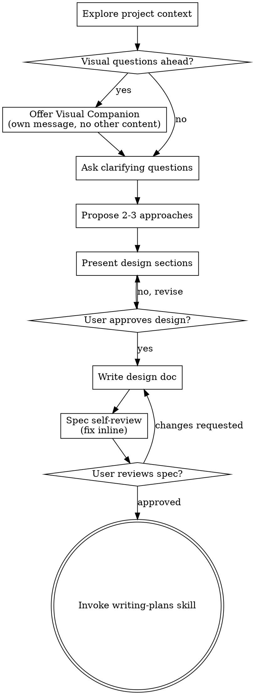

<!-- Generated by SpecStory, Markdown v2.1.0 -->

# 2026-04-07 17:42:40Z

<!-- Claude Code Session bddc1a68-3e6f-4e04-ae33-c8d907b3ba53 (2026-04-07 17:42:40Z) -->

_**User (2026-04-07 17:42:40Z)**_

<ide_opened_file>The user opened the file /Users/leocaseiro/Sites/base-skill/.claude/worktrees/bold-chatelet/docs/superpowers/plans/2026-04-07-unified-slot-component.md in the IDE. This may or may not be related to the current task.</ide_opened_file>

I have been trying to fix some issues that happened in the latest changes on my current branch .claude/worktrees/bold-chatelet/

For context:
docs/superpowers/specs/2026-04-07-unified-slot-component-design.md
docs/superpowers/plans/2026-04-07-unified-slot-component.md

(we made some changes and fixes after that, be free to check latest commits)

A. First, we need to commit, as I am getting issues with react 

```
✖ eslint --fix /Users/leocaseiro/Sites/base-skill/.claude/worktrees/bold-chatelet/src/components/answer-game/styles.ts /Users/leocaseiro/Sites/base-skill/.claude/worktrees/bold-chatelet/src/components/answer-game/useSlotTileDrag.test.tsx /Users/leocaseiro/Sites/base-skill/.claude/worktrees/bold-chatelet/src/components/answer-game/useSlotTileDrag.ts /Users/leocaseiro/Sites/base-skill/.claude/worktrees/bold-chatelet/src/components/answer-game/useTouchDrag.ts:

/Users/leocaseiro/Sites/base-skill/.claude/worktrees/bold-chatelet/src/components/answer-game/useTouchDrag.ts
  201:5  error    Compilation Skipped: Existing memoization could not be preserved

React Compiler has skipped optimizing this component because the existing manual memoization could not be preserved. The inferred dependencies did not match the manually specified dependencies, which could cause the value to change more or less frequently than expected. The inferred dependency was `onDropOnBank`, but the source dependencies were [tileId, onDrop, cleanup]. Inferred different dependency than source.

/Users/leocaseiro/Sites/base-skill/.claude/worktrees/bold-chatelet/src/components/answer-game/useTouchDrag.ts:201:5
  199 |
  200 |   const onPointerUp = useCallback(
> 201 |     (e: PointerEvent<HTMLElement>) => {
      |     ^^^^^^^^^^^^^^^^^^^^^^^^^^^^^^^^^^^
> 202 |       if (e.pointerType === 'mouse' || !startPos.current) return;
      | ^^^^^^^^^^^^^^^^^^^^^^^^^^^^^^^^^^^^^^^^^^^^^^^^^^^^^^^^^^^^^^^^^
> 203 |
      …
      | ^^^^^^^^^^^^^^^^^^^^^^^^^^^^^^^^^^^^^^^^^^^^^^^^^^^^^^^^^^^^^^^^^
> 244 |       cleanup();
      | ^^^^^^^^^^^^^^^^^^^^^^^^^^^^^^^^^^^^^^^^^^^^^^^^^^^^^^^^^^^^^^^^^
> 245 |     },
      | ^^^^^^ Could not preserve existing manual memoization
  246 |     [tileId, onDrop, cleanup],
  247 |   );
  248 |  react-hooks/preserve-manual-memoization
  246:5  warning  React Hook useCallback has a missing dependency: 'onDropOnBank'. Either include it or remove the dependency array. If 'onDropOnBank' changes too often, find the parent component that defines it and wrap that definition in useCallback                
```

B. Than, I am getting an issue that I am able to duplicate a tile, when swapping them.
This is a scenario of the issue:

1. start a WordSpell game with the word `cat` 
2. drag both `c` and `a` to the slots, which looks like `ca_`
3. swap `c` with `a` (still all in the slots)
Result: The game ejects `a`, and replace with a `c`, but the previous `c` stays there. I now have on my slot 2 letters `c`. (`cc_`), and the tilebank has the `a` and the `t`, and a hole where `c` was in the beginning.

Expect: replace `c` and `a` with both wrong effects, and no eject in that case.
PS: This issue doesn't happen in the SortNumbers game, that game is perfect.

---

_**Agent (claude-opus-4-6 2026-04-07 17:42:44Z)**_

<think><details><summary>Thought Process</summary>
Let me start by understanding the current state of the worktree and the issues described. I need to:

1. Fix the React Compiler/ESLint error in useTouchDrag.ts
2. Fix the tile duplication bug when swapping tiles in WordSpell

Let me first read the relevant files.
</details></think>

_**Agent (claude-opus-4-6 2026-04-07 17:42:45Z)**_

Let me start by understanding the current state of the worktree and the relevant files.

_**Agent (claude-opus-4-6 2026-04-07 17:42:47Z)**_

<tool-use data-tool-type="shell" data-tool-name="Bash"><details>
<summary>Tool use: **Bash**</summary>
Check recent commits

`cd /Users/leocaseiro/Sites/base-skill/.claude/worktrees/bold-chatelet && git log --oneline -10`

```text
8a1fd27 fix(drag): tiles stay in slot on failed drop, only eject returns to bank
c170b9e fix(eject): move EJECT_TILE dispatch to useSlotBehavior so it survives bank-tile unmount
598ab83 fix(tilebank): prevent bank tile disappearing on failed drop
dd2f840 feat(Tile): Skeuomorphic style for the tiles
6d7aed4 fix(slot): play swap sound once with correct priority
fda48bb fix(slot): use innerHTML for drag ghost to preserve font size
8aed529 fix(slot): prevent tile duplication when dragging to empty slot
d6125ab fix(slot): slot-to-bank drag, swap evaluation, animations & sounds
3af82b4 fix(slot): keep button in DOM when dragging to fix HTML5 drag cancel
edc3a57 fix: ghost parks at hole, fades only after EJECT_TILE fires (tile visible in bank)
```
</details></tool-use>

_**Agent (claude-opus-4-6 2026-04-07 17:42:47Z)**_

<tool-use data-tool-type="read" data-tool-name="Read"><details>
<summary>Tool use: **Read**</summary>
 `./.claude/worktrees/bold-chatelet/src/components/answer-game/useTouchDrag.ts`

```text
1	import { useCallback, useEffect, useRef } from 'react';
2	import type { PointerEvent } from 'react';
3	
4	const DRAG_THRESHOLD_PX = 8;
5	
6	interface GhostInfo {
7	  el: HTMLDivElement;
8	  halfW: number;
9	  halfH: number;
10	}
11	
12	const buildGhost = (
13	  sourceEl: HTMLElement,
14	  label: string,
15	  x: number,
16	  y: number,
17	): GhostInfo => {
18	  const rect = sourceEl.getBoundingClientRect();
19	  const halfW = rect.width / 2;
20	  const halfH = rect.height / 2;
21	  const el = document.createElement('div');
22	  el.textContent = label;
23	  el.setAttribute('aria-hidden', 'true');
24	  Object.assign(el.style, {
25	    position: 'fixed',
26	    left: `${x - halfW}px`,
27	    top: `${y - halfH}px`,
28	    width: `${rect.width}px`,
29	    height: `${rect.height}px`,
30	    display: 'flex',
31	    alignItems: 'center',
32	    justifyContent: 'center',
33	    borderRadius: '12px',
34	    background: 'var(--card, #fff)',
35	    color: 'var(--card-foreground, #000)',
36	    fontSize: getComputedStyle(sourceEl).fontSize,
37	    fontWeight: 'bold',
38	    boxShadow: '0 12px 32px rgba(0,0,0,0.3)',
39	    pointerEvents: 'none',
40	    zIndex: '9999',
41	    opacity: '0.95',
42	    userSelect: 'none',
43	    transform: 'scale(1.08)',
44	  });
45	  document.body.append(el);
46	  return { el, halfW, halfH };
47	};
48	
49	export interface TouchDragHandlers {
50	  onPointerDown: (e: PointerEvent<HTMLElement>) => void;
51	  onPointerMove: (e: PointerEvent<HTMLElement>) => void;
52	  onPointerUp: (e: PointerEvent<HTMLElement>) => void;
53	  onPointerCancel: (e: PointerEvent<HTMLElement>) => void;
54	}
55	
56	interface UseTouchDragOptions {
57	  /** Empty string disables the drag (no pointer capture, no ghost). */
58	  tileId: string;
59	  label: string;
60	  onDragStart?: () => void;
61	  /** Called when the drag is cancelled or the pointer is released with no valid drop zone. */
62	  onDragCancel?: () => void;
63	  onDrop: (tileId: string, zoneIndex: number) => void;
64	  /** Called when the tile is dropped on the bank container. */
65	  onDropOnBank?: () => void;
66	}
67	
68	export const useTouchDrag = ({
69	  tileId,
70	  label,
71	  onDragStart,
72	  onDragCancel,
73	  onDrop,
74	  onDropOnBank,
75	}: UseTouchDragOptions): TouchDragHandlers => {
76	  const onDragCancelRef = useRef(onDragCancel);
77	  useEffect(() => {
78	    onDragCancelRef.current = onDragCancel;
79	  }, [onDragCancel]);
80	
81	  const ghostRef = useRef<GhostInfo | null>(null);
82	  const isDragging = useRef(false);
83	  const startPos = useRef<{ x: number; y: number } | null>(null);
84	  const capturedElRef = useRef<HTMLElement | null>(null);
85	  const capturedPointerIdRef = useRef<number | null>(null);
86	  const safetyTimerRef = useRef<ReturnType<
87	    typeof globalThis.setTimeout
88	  > | null>(null);
89	
90	  // Guards against cleanupGhost → releasePointerCapture → lostpointercapture
91	  // → cleanupGhost re-entry.
92	  const cleanupInProgressRef = useRef(false);
93	
94	  const cleanupGhost = useCallback(() => {
95	    if (cleanupInProgressRef.current) return;
96	    cleanupInProgressRef.current = true;
97	
98	    if (safetyTimerRef.current !== null) {
99	      globalThis.clearTimeout(safetyTimerRef.current);
100	      safetyTimerRef.current = null;
101	    }
102	
103	    ghostRef.current?.el.remove();
104	    ghostRef.current = null;
105	
106	    // Clear refs BEFORE releasePointerCapture so that any synchronous
107	    // lostpointercapture event triggered by it sees null refs and bails out.
108	    const el = capturedElRef.current;
109	    const pointerId = capturedPointerIdRef.current;
110	    capturedElRef.current = null;
111	    capturedPointerIdRef.current = null;
112	
113	    if (el !== null && pointerId !== null) {
114	      try {
115	        el.releasePointerCapture(pointerId);
116	      } catch {
117	        // Element may no longer be in the DOM — ignore.
118	      }
119	    }
120	
121	    isDragging.current = false;
122	    startPos.current = null;
123	    cleanupInProgressRef.current = false;
124	  }, []);
125	
126	  const cleanup = useCallback(() => {
127	    cleanupGhost();
128	  }, [cleanupGhost]);
129	
130	  const onPointerDown = useCallback(
131	    (e: PointerEvent<HTMLElement>) => {
132	      if (e.pointerType === 'mouse' || !tileId) return;
133	      e.currentTarget.setPointerCapture(e.pointerId);
134	      capturedElRef.current = e.currentTarget;
135	      capturedPointerIdRef.current = e.pointerId;
136	      startPos.current = { x: e.clientX, y: e.clientY };
137	      isDragging.current = false;
138	
139	      // When the captured element is removed from the DOM (e.g. a slot tile
140	      // gets auto-ejected while the user is dragging it), the browser fires
141	      // lostpointercapture and onPointerUp never fires.  Clean up here so the
142	      // ghost doesn't float for 5 seconds.
143	      e.currentTarget.addEventListener(
144	        'lostpointercapture',
145	        () => {
146	          if (!cleanupInProgressRef.current && isDragging.current) {
147	            cleanupGhost();
148	            onDragCancelRef.current?.();
149	          }
150	        },
151	        { once: true },
152	      );
153	    },
154	    [tileId, cleanupGhost],
155	  );
156	
157	  const onPointerMove = useCallback(
158	    (e: PointerEvent<HTMLElement>) => {
159	      if (e.pointerType === 'mouse' || !startPos.current) return;
160	
161	      if (!isDragging.current) {
162	        const dx = e.clientX - startPos.current.x;
163	        const dy = e.clientY - startPos.current.y;
164	        if (
165	          Math.abs(dx) > DRAG_THRESHOLD_PX ||
166	          Math.abs(dy) > DRAG_THRESHOLD_PX
167	        ) {
168	          isDragging.current = true;
169	          ghostRef.current = buildGhost(
170	            e.currentTarget,
171	            label,
172	            e.clientX,
173	            e.clientY,
174	          );
175	          onDragStart?.();
176	
177	          safetyTimerRef.current = globalThis.setTimeout(() => {
178	            cleanupGhost();
179	            onDragCancelRef.current?.();
180	          }, 5000);
181	
182	          document.addEventListener('contextmenu', cleanupGhost, {
183	            once: true,
184	          });
185	          document.addEventListener('visibilitychange', cleanupGhost, {
186	            once: true,
187	          });
188	        }
189	      }
190	
191	      if (isDragging.current && ghostRef.current) {
192	        const { el, halfW, halfH } = ghostRef.current;
193	        el.style.left = `${e.clientX - halfW}px`;
194	        el.style.top = `${e.clientY - halfH}px`;
195	      }
196	    },
197	    [label, onDragStart, cleanupGhost],
198	  );
199	
200	  const onPointerUp = useCallback(
201	    (e: PointerEvent<HTMLElement>) => {
202	      if (e.pointerType === 'mouse' || !startPos.current) return;
203	
204	      if (isDragging.current) {
205	        // Remove ghost before elementsFromPoint so it doesn't interfere.
206	        ghostRef.current?.el.remove();
207	        ghostRef.current = null;
208	
209	        const elements = document.elementsFromPoint(
210	          e.clientX,
211	          e.clientY,
212	        );
213	        let dropped = false;
214	        for (const el of elements) {
215	          if (
216	            el instanceof HTMLElement &&
217	            el.dataset['zoneIndex'] !== undefined
218	          ) {
219	            const zoneIndex = Number.parseInt(
220	              el.dataset['zoneIndex'],
221	              10,
222	            );
223	            if (!Number.isNaN(zoneIndex)) {
224	              onDrop(tileId, zoneIndex);
225	              dropped = true;
226	              break;
227	            }
228	          }
229	          // Dropped on the tile bank container — return tile to bank.
230	          if (
231	            el instanceof HTMLElement &&
232	            el.dataset['tileBank'] !== undefined
233	          ) {
234	            onDropOnBank?.();
235	            dropped = true;
236	            break;
237	          }
238	        }
239	        if (!dropped) {
240	          onDragCancelRef.current?.();
241	        }
242	      }
243	
244	      cleanup();
245	    },
246	    [tileId, onDrop, cleanup],
247	  );
248	
249	  const onPointerCancel = useCallback(
250	    (e: PointerEvent<HTMLElement>) => {
251	      if (e.pointerType === 'mouse') return;
252	      if (isDragging.current) {
253	        onDragCancelRef.current?.();
254	      }
255	      cleanupGhost();
256	    },
257	    [cleanupGhost],
258	  );
259	
260	  return { onPointerDown, onPointerMove, onPointerUp, onPointerCancel };
261	};
262
```
</details></tool-use>

_**Agent (claude-opus-4-6 2026-04-07 17:42:50Z)**_

<think><details><summary>Thought Process</summary>
Now let me look at the swap logic. The bug is in the WordSpell game when swapping tiles between slots. Let me find the reducer/state management code.
</details></think>

_**Agent (claude-opus-4-6 2026-04-07 17:42:51Z)**_

Let me look at the swap/drop logic and the game reducer.

_**Agent (claude-opus-4-6 2026-04-07 17:42:52Z)**_

<tool-use data-tool-type="shell" data-tool-name="Bash"><details>
<summary>Tool use: **Bash**</summary>
Check uncommitted changes

`git diff --stat HEAD`

```text
 .specstory/statistics.json                         | 27 ++++++++++++++++++++++
 src/components/answer-game/styles.ts               |  6 ++---
 .../answer-game/useSlotTileDrag.test.tsx           |  9 ++++----
 src/components/answer-game/useSlotTileDrag.ts      | 13 ++++++++++-
 src/components/answer-game/useTouchDrag.ts         | 12 ++++++++++
 src/styles.css                                     | 21 +++++++++++++++++
 6 files changed, 80 insertions(+), 8 deletions(-)
```
</details></tool-use>

_**Agent (claude-opus-4-6 2026-04-07 17:42:53Z)**_

<tool-use data-tool-type="search" data-tool-name="Glob"><details>
<summary>Tool use: **Glob**</summary>
 path `./.claude/worktrees/bold-chatelet` pattern `src/components/answer-game/**/*.{ts,tsx}`

```text
No files found
```
</details></tool-use>

_**Agent (claude-opus-4-6 2026-04-07 17:42:55Z)**_

<tool-use data-tool-type="search" data-tool-name="Glob"><details>
<summary>Tool use: **Glob**</summary>
 path `./.claude/worktrees/bold-chatelet` pattern `src/components/answer-game/**/*.{ts,tsx}`

```text
No files found
```
</details></tool-use>

_**Agent (claude-opus-4-6 2026-04-07 17:42:58Z)**_

<tool-use data-tool-type="shell" data-tool-name="Bash"><details>
<summary>Tool use: **Bash**</summary>
List answer-game files

`ls /Users/leocaseiro/Sites/base-skill/.claude/worktrees/bold-chatelet/src/components/answer-game/`

```text
AnswerGame
AnswerGameProvider.test.tsx
AnswerGameProvider.tsx
EncouragementAnnouncer
GameOverOverlay
HiddenKeyboardInput.tsx
InstructionsOverlay
ScoreAnimation
Slot
TouchKeyboardContext.ts
answer-game-reducer.test.ts
answer-game-reducer.ts
magnetic-snap.test.ts
magnetic-snap.ts
styles.ts
types.ts
useAnswerGameContext.ts
useAnswerGameDispatch.ts
useAutoNextSlot.test.tsx
useAutoNextSlot.ts
useBankDropTarget.ts
useDraggableTile.test.tsx
useDraggableTile.ts
useFreeSwap.test.tsx
useFreeSwap.ts
useGameSounds.test.tsx
useGameSounds.ts
useGameTTS.test.tsx
useGameTTS.ts
useKeyboardDrag.test.tsx
useKeyboardDrag.ts
useKeyboardInput.test.tsx
useKeyboardInput.ts
useRoundTTS.test.tsx
useRoundTTS.ts
useSlotTileDrag.test.tsx
useSlotTileDrag.ts
useTileEvaluation.test.tsx
useTileEvaluation.ts
useTouchDrag.ts
useTouchKeyboardInput.test.tsx
useTouchKeyboardInput.ts
```
</details></tool-use>

_**Agent (claude-opus-4-6 2026-04-07 17:43:02Z)**_

<tool-use data-tool-type="read" data-tool-name="Read"><details>
<summary>Tool use: **Read**</summary>
 `./.claude/worktrees/bold-chatelet/src/components/answer-game/answer-game-reducer.ts`

```text
1	import type {
2	  AnswerGameAction,
3	  AnswerGameConfig,
4	  AnswerGameState,
5	  AnswerZone,
6	  TileItem,
7	} from './types';
8	
9	export function makeInitialState(
10	  config: AnswerGameConfig,
11	): AnswerGameState {
12	  return {
13	    config,
14	    allTiles: [],
15	    bankTileIds: [],
16	    zones: [],
17	    activeSlotIndex: 0,
18	    dragActiveTileId: null,
19	    phase: 'playing',
20	    roundIndex: 0,
21	    retryCount: 0,
22	  };
23	}
24	
25	export function answerGameReducer(
26	  state: AnswerGameState,
27	  action: AnswerGameAction,
28	): AnswerGameState {
29	  switch (action.type) {
30	    case 'INIT_ROUND': {
31	      return {
32	        ...state,
33	        allTiles: action.tiles,
34	        bankTileIds: action.tiles.map((t: TileItem) => t.id),
35	        zones: action.zones,
36	        activeSlotIndex: 0,
37	        phase: 'playing',
38	        roundIndex: 0,
39	        retryCount: 0,
40	      };
41	    }
42	
43	    case 'PLACE_TILE': {
44	      const tile = state.allTiles.find((t) => t.id === action.tileId);
45	      const zone = state.zones[action.zoneIndex];
46	      if (!tile || !zone) return state;
47	
48	      const correct = tile.value === zone.expectedValue;
49	
50	      // A tile placement always ends any active drag for that tile.
51	      const dragActiveTileId =
52	        state.dragActiveTileId === action.tileId
53	          ? null
54	          : state.dragActiveTileId;
55	
56	      if (!correct && state.config.wrongTileBehavior === 'reject') {
57	        return {
58	          ...state,
59	          dragActiveTileId,
60	          retryCount: state.retryCount + 1,
61	        };
62	      }
63	
64	      if (correct) {
65	        const previousId = zone.placedTileId;
66	        let newBankTileIds = state.bankTileIds.filter(
67	          (id) => id !== action.tileId,
68	        );
69	        if (previousId !== null && previousId !== action.tileId) {
70	          // Bank tile dropped on an occupied slot: previous occupant returns to bank.
71	          newBankTileIds = [...newBankTileIds, previousId];
72	        }
73	        const newZone: AnswerZone = {
74	          ...zone,
75	          placedTileId: action.tileId,
76	          isWrong: false,
77	          isLocked: false,
78	        };
79	        const newZones = state.zones.map((z, i) =>
80	          i === action.zoneIndex ? newZone : z,
81	        );
82	        const nextActiveSlot = newZones.findIndex(
83	          (z, i) => i > action.zoneIndex && z.placedTileId === null,
84	        );
85	        const allFilledCorrectly = newZones.every(
86	          (z) => z.placedTileId !== null && !z.isWrong,
87	        );
88	        const isLastRound =
89	          state.roundIndex >= state.config.totalRounds - 1;
90	        return {
91	          ...state,
92	          dragActiveTileId,
93	          zones: newZones,
94	          bankTileIds: newBankTileIds,
95	          activeSlotIndex:
96	            nextActiveSlot === -1
97	              ? state.activeSlotIndex
98	              : nextActiveSlot,
99	          retryCount: state.retryCount,
100	          phase: allFilledCorrectly
101	            ? isLastRound
102	              ? 'game-over'
103	              : 'round-complete'
104	            : 'playing',
105	        };
106	      }
107	
108	      const shouldLock =
109	        state.config.wrongTileBehavior === 'lock-manual' ||
110	        state.config.wrongTileBehavior === 'lock-auto-eject';
111	      const newZone: AnswerZone = {
112	        ...zone,
113	        placedTileId: shouldLock ? action.tileId : zone.placedTileId,
114	        isWrong: true,
115	        isLocked: true,
116	      };
117	      const newZones = state.zones.map((z, i) =>
118	        i === action.zoneIndex ? newZone : z,
119	      );
120	      let newBankTileIds = shouldLock
121	        ? state.bankTileIds.filter((id) => id !== action.tileId)
122	        : state.bankTileIds;
123	      if (
124	        shouldLock &&
125	        zone.placedTileId &&
126	        zone.placedTileId !== action.tileId
127	      ) {
128	        newBankTileIds = [...newBankTileIds, zone.placedTileId];
129	      }
130	
131	      return {
132	        ...state,
133	        dragActiveTileId,
134	        zones: newZones,
135	        bankTileIds: newBankTileIds,
136	        activeSlotIndex: state.activeSlotIndex,
137	        retryCount: state.retryCount + 1,
138	        phase: 'playing',
139	      };
140	    }
141	
142	    case 'REMOVE_TILE': {
143	      const zone = state.zones[action.zoneIndex];
144	      if (!zone?.placedTileId) return state;
145	      const removedTileId = zone.placedTileId;
146	      return {
147	        ...state,
148	        dragActiveTileId:
149	          state.dragActiveTileId === removedTileId
150	            ? null
151	            : state.dragActiveTileId,
152	        zones: state.zones.map((z, i) =>
153	          i === action.zoneIndex
154	            ? {
155	                ...z,
156	                placedTileId: null,
157	                isWrong: false,
158	                isLocked: false,
159	              }
160	            : z,
161	        ),
162	        bankTileIds: [...state.bankTileIds, removedTileId],
163	      };
164	    }
165	
166	    case 'SWAP_TILES': {
167	      const fromZone = state.zones[action.fromZoneIndex];
168	      const toZone = state.zones[action.toZoneIndex];
169	      if (!fromZone || !toZone) return state;
170	
171	      // After the swap: fromZone gets toZone's tile, toZone gets fromZone's tile.
172	      // Either zone may become empty (null) when moving a tile to an empty slot.
173	      const tileNowInFrom = toZone.placedTileId
174	        ? state.allTiles.find((t) => t.id === toZone.placedTileId)
175	        : null;
176	      const tileNowInTo = fromZone.placedTileId
177	        ? state.allTiles.find((t) => t.id === fromZone.placedTileId)
178	        : null;
179	      // An empty zone is never wrong.
180	      const fromCorrect = tileNowInFrom
181	        ? tileNowInFrom.value === fromZone.expectedValue
182	        : true;
183	      const toCorrect = tileNowInTo
184	        ? tileNowInTo.value === toZone.expectedValue
185	        : true;
186	      const shouldLock =
187	        state.config.wrongTileBehavior === 'lock-manual' ||
188	        state.config.wrongTileBehavior === 'lock-auto-eject';
189	
190	      const newZones = state.zones.map((z, i) => {
191	        if (i === action.fromZoneIndex)
192	          return {
193	            ...z,
194	            placedTileId: toZone.placedTileId,
195	            isWrong: toZone.placedTileId !== null && !fromCorrect,
196	            isLocked:
197	              toZone.placedTileId !== null &&
198	              !fromCorrect &&
199	              shouldLock,
200	          };
201	        if (i === action.toZoneIndex)
202	          return {
203	            ...z,
204	            placedTileId: fromZone.placedTileId,
205	            isWrong: fromZone.placedTileId !== null && !toCorrect,
206	            isLocked:
207	              fromZone.placedTileId !== null &&
208	              !toCorrect &&
209	              shouldLock,
210	          };
211	        return z;
212	      });
213	
214	      // Clear drag state for the tile that just finished dragging.
215	      const dragActiveTileId =
216	        state.dragActiveTileId === fromZone.placedTileId
217	          ? null
218	          : state.dragActiveTileId;
219	
220	      const allFilledCorrectly = newZones.every(
221	        (z) => z.placedTileId !== null && !z.isWrong,
222	      );
223	      const isLastRound =
224	        state.roundIndex >= state.config.totalRounds - 1;
225	
226	      return {
227	        ...state,
228	        dragActiveTileId,
229	        zones: newZones,
230	        phase: allFilledCorrectly
231	          ? isLastRound
232	            ? 'game-over'
233	            : 'round-complete'
234	          : 'playing',
235	      };
236	    }
237	
238	    case 'EJECT_TILE': {
239	      const zone = state.zones[action.zoneIndex];
240	      if (!zone) return state;
241	
242	      // Guard: never eject a correctly-placed tile (isWrong=false, isLocked=false)
243	      if (!zone.isWrong && !zone.isLocked) return state;
244	
245	      if (zone.placedTileId) {
246	        const ejectedTileId = zone.placedTileId;
247	        return {
248	          ...state,
249	          // If the ejected tile was mid-drag, clear drag state so the bank
250	          // hole disappears immediately rather than waiting for the drag to end.
251	          dragActiveTileId:
252	            state.dragActiveTileId === ejectedTileId
253	              ? null
254	              : state.dragActiveTileId,
255	          zones: state.zones.map((z, i) =>
256	            i === action.zoneIndex
257	              ? {
258	                  ...z,
259	                  placedTileId: null,
260	                  isWrong: false,
261	                  isLocked: false,
262	                }
263	              : z,
264	          ),
265	          bankTileIds: [...state.bankTileIds, ejectedTileId],
266	        };
267	      }
268	
269	      return {
270	        ...state,
271	        zones: state.zones.map((z, i) =>
272	          i === action.zoneIndex
273	            ? {
274	                ...z,
275	                placedTileId: null,
276	                isWrong: false,
277	                isLocked: false,
278	              }
279	            : z,
280	        ),
281	      };
282	    }
283	
284	    case 'ADVANCE_ROUND': {
285	      return {
286	        ...state,
287	        allTiles: action.tiles,
288	        bankTileIds: action.tiles.map((t: TileItem) => t.id),
289	        zones: action.zones,
290	        activeSlotIndex: 0,
291	        phase: 'playing',
292	        roundIndex: state.roundIndex + 1,
293	        retryCount: 0,
294	      };
295	    }
296	
297	    case 'COMPLETE_GAME': {
298	      return { ...state, phase: 'game-over' };
299	    }
300	
301	    case 'SET_DRAG_ACTIVE': {
302	      return { ...state, dragActiveTileId: action.tileId };
303	    }
304	
305	    default: {
306	      return state;
307	    }
308	  }
309	}
310
```
</details></tool-use>

_**Agent (claude-opus-4-6 2026-04-07 17:43:02Z)**_

<tool-use data-tool-type="read" data-tool-name="Read"><details>
<summary>Tool use: **Read**</summary>
 `./.claude/worktrees/bold-chatelet/src/components/answer-game/useSlotTileDrag.ts`

```text
1	import { draggable } from '@atlaskit/pragmatic-drag-and-drop/element/adapter';
2	import { preserveOffsetOnSource } from '@atlaskit/pragmatic-drag-and-drop/element/preserve-offset-on-source';
3	import { setCustomNativeDragPreview } from '@atlaskit/pragmatic-drag-and-drop/element/set-custom-native-drag-preview';
4	import { useCallback, useEffect, useRef } from 'react';
5	import { useAnswerGameDispatch } from './useAnswerGameDispatch';
6	import { useTouchDrag } from './useTouchDrag';
7	import type { TouchDragHandlers } from './useTouchDrag';
8	import type { RefObject } from 'react';
9	
10	export interface SlotTileDrag extends TouchDragHandlers {
11	  dragRef: RefObject<HTMLButtonElement | null>;
12	}
13	
14	interface UseSlotTileDragOptions {
15	  /** ID of the tile currently in this slot. Null = slot is empty (drag disabled). */
16	  tileId: string | null;
17	  label: string | null;
18	  zoneIndex: number;
19	  /**
20	   * Called when the dragged tile is dropped on a target zone.
21	   * The caller (useSlotBehavior.handleDrop) is responsible for dispatching
22	   * SWAP_TILES as appropriate.
23	   */
24	  onDrop: (tileId: string, targetZoneIndex: number) => void;
25	}
26	
27	/**
28	 * Enables an occupied slot tile to be dragged to another slot.
29	 * Works with both the HTML5 DnD (desktop) and pointer-events drag (touch).
30	 *
31	 * Tiles can return to the bank by dropping on the bank container (REMOVE_TILE).
32	 *
33	 * On drag start the tile is marked active via SET_DRAG_ACTIVE so it remains
34	 * visible in the slot during the drag.
35	 *
36	 * On confirmed drop on a valid zone: SET_DRAG_ACTIVE is cleared and onDrop is
37	 * called so the caller can dispatch SWAP_TILES.
38	 *
39	 * On cancel or no valid drop target: SET_DRAG_ACTIVE is cleared and the tile
40	 * stays in its current slot (no-op).
41	 */
42	export const useSlotTileDrag = ({
43	  tileId,
44	  label,
45	  zoneIndex,
46	  onDrop,
47	}: UseSlotTileDragOptions): SlotTileDrag => {
48	  const dispatch = useAnswerGameDispatch();
49	  const dragRef = useRef<HTMLButtonElement>(null);
50	
51	  // Keep stable refs so the HTML5 adapter closure stays current.
52	  const onDropRef = useRef(onDrop);
53	  useEffect(() => {
54	    onDropRef.current = onDrop;
55	  }, [onDrop]);
56	
57	  // HTML5 DnD — desktop
58	  useEffect(() => {
59	    if (!tileId) return;
60	    const element = dragRef.current;
61	    if (!element) return;
62	    const currentTileId = tileId;
63	    return draggable({
64	      element,
65	      getInitialData: () => ({
66	        tileId: currentTileId,
67	        sourceZoneIndex: zoneIndex,
68	      }),
69	      onGenerateDragPreview: ({ nativeSetDragImage, location }) => {
70	        setCustomNativeDragPreview({
71	          nativeSetDragImage,
72	          getOffset: preserveOffsetOnSource({
73	            element,
74	            input: location.current.input,
75	          }),
76	          render({ container }) {
77	            const rect = element.getBoundingClientRect();
78	            const ghost = document.createElement('div');
79	            // Copy full innerHTML so Tailwind classes (e.g. text-2xl) on
80	            // inner elements are preserved — avoids the shrunken-font issue
81	            // that occurs when reading fontSize from the button itself.
82	            ghost.innerHTML = element.innerHTML;
83	            Object.assign(ghost.style, {
84	              width: `${rect.width}px`,
85	              height: `${rect.height}px`,
86	              borderRadius: '12px',
87	              display: 'flex',
88	              alignItems: 'center',
89	              justifyContent: 'center',
90	              background: 'var(--card, #fff)',
91	              color: 'var(--card-foreground, #000)',
92	              boxShadow: '0 12px 32px rgba(0,0,0,0.3)',
93	              transform: 'scale(1.08)',
94	            });
95	            container.append(ghost);
96	            return () => ghost.remove();
97	          },
98	        });
99	      },
100	      onDragStart: () =>
101	        dispatch({ type: 'SET_DRAG_ACTIVE', tileId: currentTileId }),
102	      onDrop: ({ location }) => {
103	        const targets = location.current.dropTargets;
104	        const targetZoneIndex = targets[0]?.data['zoneIndex'];
105	        const isBankTarget = targets[0]?.data['isBankTarget'];
106	
107	        // Always clear drag state first.
108	        dispatch({ type: 'SET_DRAG_ACTIVE', tileId: null });
109	
110	        if (targets.length > 0 && typeof targetZoneIndex === 'number') {
111	          // Confirmed drop on a valid slot — caller handles SWAP_TILES.
112	          onDropRef.current(currentTileId, targetZoneIndex);
113	        } else if (isBankTarget === true) {
114	          // Dropped on the tile bank — return tile to bank.
115	          dispatch({ type: 'REMOVE_TILE', zoneIndex });
116	        }
117	        // else: dropped outside a slot — tile stays put (no-op)
118	      },
119	    });
120	  }, [tileId, zoneIndex, dispatch]);
121	
122	  // Wrap onDrop for the touch path: caller handles SWAP_TILES.
123	  const handleTouchDrop = useCallback(
124	    (droppedTileId: string, targetZoneIndex: number) => {
125	      dispatch({ type: 'SET_DRAG_ACTIVE', tileId: null });
126	      onDrop(droppedTileId, targetZoneIndex);
127	    },
128	    [dispatch, onDrop],
129	  );
130	
131	  // Touch: dropped on the tile bank — return tile to bank.
132	  const handleTouchDropOnBank = useCallback(() => {
133	    dispatch({ type: 'SET_DRAG_ACTIVE', tileId: null });
134	    dispatch({ type: 'REMOVE_TILE', zoneIndex });
135	  }, [dispatch, zoneIndex]);
136	
137	  // Pointer-events drag — touch / mobile
138	  const { onPointerDown, onPointerMove, onPointerUp, onPointerCancel } =
139	    useTouchDrag({
140	      tileId: tileId ?? '',
141	      label: label ?? '',
142	      onDragStart: tileId
143	        ? () => dispatch({ type: 'SET_DRAG_ACTIVE', tileId })
144	        : undefined,
145	      onDragCancel: tileId
146	        ? () => {
147	            // Dropped outside all targets — tile stays in slot (no-op).
148	            dispatch({ type: 'SET_DRAG_ACTIVE', tileId: null });
149	          }
150	        : undefined,
151	      onDrop: handleTouchDrop,
152	      onDropOnBank: handleTouchDropOnBank,
153	    });
154	
155	  return {
156	    dragRef,
157	    onPointerDown,
158	    onPointerMove,
159	    onPointerUp,
160	    onPointerCancel,
161	  };
162	};
163
```
</details></tool-use>

_**Agent (claude-opus-4-6 2026-04-07 17:43:03Z)**_

<tool-use data-tool-type="read" data-tool-name="Read"><details>
<summary>Tool use: **Read**</summary>
 `./.claude/worktrees/bold-chatelet/src/components/answer-game/useFreeSwap.ts`

```text
1	import { useCallback } from 'react';
2	import { useAnswerGameContext } from './useAnswerGameContext';
3	import { useAnswerGameDispatch } from './useAnswerGameDispatch';
4	import { useTileEvaluation } from './useTileEvaluation';
5	
6	export interface FreeSwap {
7	  swapOrPlace: (tileId: string, targetZoneIndex: number) => void;
8	}
9	
10	export function useFreeSwap(): FreeSwap {
11	  const { zones } = useAnswerGameContext();
12	  const dispatch = useAnswerGameDispatch();
13	  const { placeTile } = useTileEvaluation();
14	
15	  const swapOrPlace = useCallback(
16	    (tileId: string, targetZoneIndex: number) => {
17	      const targetZone = zones[targetZoneIndex];
18	      if (!targetZone) return;
19	
20	      if (targetZone.placedTileId === null) {
21	        placeTile(tileId, targetZoneIndex);
22	      } else {
23	        const sourceZoneIndex = zones.findIndex(
24	          (z) => z.placedTileId === tileId,
25	        );
26	        if (sourceZoneIndex === -1) {
27	          placeTile(tileId, targetZoneIndex);
28	        } else {
29	          dispatch({
30	            type: 'SWAP_TILES',
31	            fromZoneIndex: sourceZoneIndex,
32	            toZoneIndex: targetZoneIndex,
33	          });
34	        }
35	      }
36	    },
37	    [zones, dispatch, placeTile],
38	  );
39	
40	  return { swapOrPlace };
41	}
42
```
</details></tool-use>

_**Agent (claude-opus-4-6 2026-04-07 17:43:08Z)**_

<think><details><summary>Thought Process</summary>
Now let me understand the flow. Let me look at where `swapOrPlace` / `handleDrop` is called from in the Slot component, and specifically how the slot-to-slot drop works for WordSpell.

The issue is: when swapping two tiles in slots (e.g., `c` and `a` in word `cat`), the game ejects `a` and replaces with `c`, creating duplication.

Let me look at the Slot component and `useSlotBehavior` (or however the slot handles drops).
</details></think>

_**Agent (claude-opus-4-6 2026-04-07 17:43:10Z)**_

<tool-use data-tool-type="shell" data-tool-name="Bash"><details>
<summary>Tool use: **Bash**</summary>
List Slot directory

`ls /Users/leocaseiro/Sites/base-skill/.claude/worktrees/bold-chatelet/src/components/answer-game/Slot/`

```text
SentenceWithGaps.test.tsx
SentenceWithGaps.tsx
Slot.stories.tsx
Slot.test.tsx
Slot.tsx
SlotRow.test.tsx
SlotRow.tsx
parse-sentence-template.test.ts
parse-sentence-template.ts
slot-animations.test.ts
slot-animations.ts
useSlotBehavior.test.tsx
useSlotBehavior.ts
```
</details></tool-use>

_**Agent (claude-opus-4-6 2026-04-07 17:43:12Z)**_

<tool-use data-tool-type="read" data-tool-name="Read"><details>
<summary>Tool use: **Read**</summary>
 `./.claude/worktrees/bold-chatelet/src/components/answer-game/Slot/useSlotBehavior.ts`

```text
1	import { dropTargetForElements } from '@atlaskit/pragmatic-drag-and-drop/element/adapter';
2	import { useCallback, useEffect, useRef } from 'react';
3	import { useAnswerGameContext } from '../useAnswerGameContext';
4	import { useAnswerGameDispatch } from '../useAnswerGameDispatch';
5	import { useSlotTileDrag } from '../useSlotTileDrag';
6	import { useTileEvaluation } from '../useTileEvaluation';
7	import {
8	  triggerEjectReturn,
9	  triggerPop,
10	  triggerShake,
11	} from './slot-animations';
12	import type { RefObject } from 'react';
13	import { playSound } from '@/lib/audio/AudioFeedback';
14	
15	export interface SlotRenderProps {
16	  label: string | null;
17	  tileId: string | null;
18	  isActive: boolean;
19	  isWrong: boolean;
20	  isLocked: boolean;
21	  isEmpty: boolean;
22	  showCursor: boolean;
23	}
24	
25	export interface UseSlotBehaviorReturn {
26	  renderProps: SlotRenderProps;
27	  slotRef: RefObject<HTMLElement | null>;
28	  dragRef: RefObject<HTMLButtonElement | null>;
29	  handleClick: () => void;
30	  isBeingDragged: boolean;
31	  pointerHandlers: {
32	    onPointerDown: (e: React.PointerEvent<HTMLElement>) => void;
33	    onPointerMove: (e: React.PointerEvent<HTMLElement>) => void;
34	    onPointerUp: (e: React.PointerEvent<HTMLElement>) => void;
35	    onPointerCancel: (e: React.PointerEvent<HTMLElement>) => void;
36	  };
37	}
38	
39	export const useSlotBehavior = (
40	  index: number,
41	): UseSlotBehaviorReturn => {
42	  const { zones, allTiles, activeSlotIndex, config, dragActiveTileId } =
43	    useAnswerGameContext();
44	  const dispatch = useAnswerGameDispatch();
45	  const { placeTile } = useTileEvaluation();
46	
47	  const zone = zones[index];
48	  const tileId = zone?.placedTileId ?? null;
49	  const tile = tileId ? allTiles.find((t) => t.id === tileId) : null;
50	  const label = tile?.label ?? null;
51	  const isWrong = zone?.isWrong ?? false;
52	  const isLocked = zone?.isLocked ?? false;
53	  const isEmpty = tileId === null;
54	
55	  // Resolve interaction mode: explicit config or inferred from inputMethod
56	  const slotInteraction =
57	    config.slotInteraction ??
58	    (config.inputMethod === 'type' ? 'ordered' : 'free-swap');
59	  const isOrdered = slotInteraction === 'ordered';
60	
61	  const isActive = isOrdered && activeSlotIndex === index;
62	  const showCursor =
63	    isActive && isEmpty && config.inputMethod !== 'drag';
64	  const isBeingDragged = tileId !== null && dragActiveTileId === tileId;
65	
66	  const slotRef = useRef<HTMLElement | null>(null);
67	  const prevIsWrongRef = useRef(isWrong);
68	  const prevTileIdRef = useRef(tileId);
69	  // Holds the startFade handle returned by triggerEjectReturn so we can call
70	  // it when EJECT_TILE fires and the tile is back in the bank.
71	  const startFadeRef = useRef<(() => void) | null>(null);
72	
73	  // Drop target handler — choose evaluation or swap based on interaction mode
74	  const handleDrop = useCallback(
75	    (droppedTileId: string, targetZoneIndex: number) => {
76	      if (isOrdered) {
77	        placeTile(droppedTileId, targetZoneIndex);
78	        return;
79	      }
80	      // free-swap: if tile comes from a slot, always SWAP_TILES (even to empty target = move).
81	      // Only fall back to placeTile for bank tiles.
82	      const targetZone = zones[targetZoneIndex];
83	      if (!targetZone) return;
84	      const sourceZoneIndex = zones.findIndex(
85	        (z) => z.placedTileId === droppedTileId,
86	      );
87	      if (sourceZoneIndex !== -1) {
88	        // Evaluate both outcomes before dispatching to play exactly one sound.
89	        const droppedTile = allTiles.find(
90	          (t) => t.id === droppedTileId,
91	        );
92	        const displacedTile = targetZone.placedTileId
93	          ? allTiles.find((t) => t.id === targetZone.placedTileId)
94	          : null;
95	        const sourceZone = zones[sourceZoneIndex];
96	        const droppedCorrect =
97	          droppedTile?.value === targetZone.expectedValue;
98	        const displacedCorrect = displacedTile
99	          ? displacedTile.value === sourceZone?.expectedValue
100	          : true;
101	        playSound(
102	          droppedCorrect || displacedCorrect ? 'correct' : 'wrong',
103	        );
104	        dispatch({
105	          type: 'SWAP_TILES',
106	          fromZoneIndex: sourceZoneIndex,
107	          toZoneIndex: targetZoneIndex,
108	        });
109	        return;
110	      }
111	      placeTile(droppedTileId, targetZoneIndex);
112	    },
113	    [isOrdered, placeTile, zones, dispatch, allTiles],
114	  );
115	
116	  // Register as drop target
117	  useEffect(() => {
118	    const el = slotRef.current;
119	    if (!el) return;
120	    return dropTargetForElements({
121	      element: el,
122	      getData: () => ({ zoneIndex: index }),
123	      onDrop: ({ source }) => {
124	        // Slot-tile drags (sourceZoneIndex present) handle their own
125	        // REMOVE_TILE + SET_DRAG_ACTIVE sequence via useSlotTileDrag's onDrop.
126	        if (typeof source.data['sourceZoneIndex'] === 'number') return;
127	        const sourceTileId = source.data['tileId'];
128	        if (typeof sourceTileId === 'string') {
129	          handleDrop(sourceTileId, index);
130	          // Clear drag active state here — the draggable component (bank tile)
131	          // unmounts when PLACE_TILE fires, so its own onDrop may never run.
132	          dispatch({ type: 'SET_DRAG_ACTIVE', tileId: null });
133	        }
134	      },
135	    });
136	  }, [index, handleDrop, dispatch]);
137	
138	  // Drag source for filled slots
139	  const {
140	    dragRef,
141	    onPointerDown,
142	    onPointerMove,
143	    onPointerUp,
144	    onPointerCancel,
145	  } = useSlotTileDrag({
146	    tileId,
147	    label,
148	    zoneIndex: index,
149	    onDrop: handleDrop,
150	  });
151	
152	  // Click handler: remove tile from slot (returns to bank)
153	  const handleClick = useCallback(() => {
154	    if (isEmpty) return;
155	    dispatch({ type: 'REMOVE_TILE', zoneIndex: index });
156	  }, [isEmpty, dispatch, index]);
157	
158	  // Feedback animations: trigger on state transitions
159	  useEffect(() => {
160	    const el = slotRef.current;
161	    if (!el) return;
162	
163	    const wasWrong = prevIsWrongRef.current;
164	    prevIsWrongRef.current = isWrong;
165	
166	    const prevTileId = prevTileIdRef.current;
167	    prevTileIdRef.current = tileId;
168	    const freshlyPlaced = tileId !== null && prevTileId === null;
169	
170	    if (
171	      tileId !== null &&
172	      prevTileId !== null &&
173	      tileId !== prevTileId
174	    ) {
175	      // Tile swapped between slots — animate per zone; sound played once in handleDrop.
176	      if (isWrong) {
177	        triggerShake(el);
178	      } else {
179	        triggerPop(el);
180	      }
181	    } else if (isWrong && !wasWrong) {
182	      // Newly wrong via PLACE_TILE (sound already played by useTileEvaluation).
183	      triggerShake(el);
184	
185	      if (config.wrongTileBehavior === 'lock-auto-eject') {
186	        // Start the eject animation after the shake settles.
187	        const animationTimerId = setTimeout(() => {
188	          const tileEl = dragRef.current;
189	          if (!tileEl) return;
190	          const { startFade } = triggerEjectReturn(
191	            tileEl,
192	            tileId,
193	            () => {},
194	          );
195	          startFadeRef.current = startFade;
196	        }, 350);
197	        return () => clearTimeout(animationTimerId);
198	      }
199	    } else if (freshlyPlaced && !isWrong) {
200	      // Correctly placed from bank (sound already played by useTileEvaluation).
201	      triggerPop(el);
202	    } else if (tileId === null && prevTileId !== null) {
203	      // Tile returned to bank (click, drag, or eject).
204	      playSound('tile-place');
205	      startFadeRef.current?.();
206	      startFadeRef.current = null;
207	    }
208	  }, [isWrong, tileId, config.wrongTileBehavior, dragRef]);
209	
210	  // EJECT_TILE dispatch lives in its own effect (no DOM ref needed) so the
211	  // timer survives when the bank tile unmounts after PLACE_TILE. The animation
212	  // effect above also uses isWrong/tileId so both fire on the same transition.
213	  useEffect(() => {
214	    if (!isWrong || config.wrongTileBehavior !== 'lock-auto-eject')
215	      return;
216	    const timerId = setTimeout(() => {
217	      dispatch({ type: 'EJECT_TILE', zoneIndex: index });
218	    }, 1000);
219	    return () => clearTimeout(timerId);
220	  }, [isWrong, config.wrongTileBehavior, dispatch, index]);
221	
222	  return {
223	    renderProps: {
224	      label,
225	      tileId,
226	      isActive,
227	      isWrong,
228	      isLocked,
229	      isEmpty,
230	      showCursor,
231	    },
232	    slotRef,
233	    dragRef,
234	    handleClick,
235	    isBeingDragged,
236	    pointerHandlers: {
237	      onPointerDown,
238	      onPointerMove,
239	      onPointerUp,
240	      onPointerCancel,
241	    },
242	  };
243	};
244
```
</details></tool-use>

_**Agent (claude-opus-4-6 2026-04-07 17:45:28Z)**_

<think><details><summary>Thought Process</summary>
Now I understand both issues. Let me analyze them:

**Issue A: React Compiler ESLint error in `useTouchDrag.ts`**

The `onPointerUp` callback at line 200-247 uses `onDropOnBank` inside the callback body (line 234) but the dependency array only has `[tileId, onDrop, cleanup]`. The React Compiler detected `onDropOnBank` as a dependency that's missing.

Fix: Add `onDropOnBank` to the dependency array.

**Issue B: Tile duplication when swapping in WordSpell**


When a user drags tile `c` from slot 0 to slot 1 (which contains `a`), the `handleDrop` function correctly identifies the source zone and dispatches a `SWAP_TILES` action that swaps the `placedTileId` values. But the issue mentions the game "ejects `a`", which suggests that after the swap completes, the `isWrong` flag might be triggering an auto-eject behavior that's causing the duplication.

In WordSpell with `wrongTileBehavior` set to `lock-auto-eject`, both tiles would be marked as wrong after the swap (since `c` doesn't belong in slot 1 and `a` doesn't belong in slot 0), and both should auto-eject after a delay. However, the user describes an immediate eject, which makes me think the actual behavior might be a `PLACE_TILE` action instead of a swap—one that ejects the existing tile and places the new one directly.

Looking at the drop flow more carefully, when a slot tile is dropped on another slot in HTML5 drag-and-drop, the drop target's `onDrop` callback checks for `sourceZoneIndex` and bails out if it's present. This means the draggable's own `onDrop` handler in `useSlotTileDrag` is what actually fires, calling the drop callback with the current tile ID and target slot.

But here's the issue: that callback closes over the `zones` state, which could be stale by the time the drop completes. The handler captures `zones` when the drag starts, but the state might have changed in the meantime through actions like `SET_DRAG_ACTIVE`. Let me trace through the HTML5 DnD flow more carefully to see exactly when `onDropRef.current` gets called and what state it's working with. Checking the reducer logic — `SET_DRAG_ACTIVE` doesn't modify `zones`, so that should be fine. But I'm wondering if `zones` might actually be stale in the `handleDrop` callback. Even though it's in the dependency array, there could be a timing issue where the callback isn't getting the latest state. could be a subtle timing issue where the ref-based approach in `useSlotTileDrag` captures an older version.

Actually wait. Let me re-examine. In `useSlotTileDrag`:
- `onDropRef.current = onDrop` is updated in a `useEffect`
- The HTML5 DnD draggable calls `onDropRef.current(currentTileId, targetZoneIndex)`

The `onDrop` passed to `useSlotTileDrag` is `handleDrop` from `useSlotBehavior`. This `handleDrop` is created with `useCallback` with `[isOrdered, placeTile, zones, dispatch, allTiles]` deps.

So when `zones` changes, `handleDrop` is recreated, and `onDropRef.current` gets updated in the next effect.

But here's the problem: `useEffect` runs asynchronously after the render completes, while the HTML5 drag `onDrop` event fires synchronously during the drop. So if the user drops a tile before the effect has a chance to run, the ref still points to the old `handleDrop` that captured stale `zones`. The sequence would be: zones update, `handleDrop` gets recreated, user initiates a drag, re-render happens but `zones` hasn't changed so `handleDrop` stays the same, user drops the tile, and `onDrop` fires with the old handler before the effect can update the ref. I'm realizing the issue might be about which slot's `handleDrop` callback gets invoked when a tile is dropped—it's the one from the slot where the drag originated, not necessarily where it lands, which could explain why the wrong tile gets ejected. Checking the `PLACE_TILE` reducer to see if it's handling the occupied slot case correctly...

When a tile is placed correctly, it removes the tile from the bank and returns any previously occupying tile to the bank. But when placement is incorrect and the zone gets locked, it also ejects the previous occupant back to the bank if one exists and it's not the same tile being placed.

Now I'm wondering if the issue is that `handleDrop` should dispatch `SWAP_TILES` when there's a source zone, but it's only doing that if the source isn't the bank. Let me trace through the touch drag path to see if that's where the problem lies. The touch handler calls `onDrop` directly through the closure, which means it's using whatever `handleDrop` was at the time the hook was created, and I need to check if that's causing stale references. I'm tracing through what happens when `zones` changes: `handleDrop` gets recreated, which triggers `handleTouchDrop` to recreate, which causes `useTouchDrag` to receive a new `onDrop` and recreate `onPointerUp`. This should work correctly, but the compiler is flagging that `onDropOnBank` is missing from a dependency array, which suggests there might be a deeper logic issue in how `SWAP_TILES` handles the interaction.

Looking at the auto-eject behavior in WordSpell, when two tiles swap positions, both end up in the wrong slots and get locked, triggering auto-eject on both after 1000ms. But the user is seeing immediate duplication with a result like `cc_`, which doesn't match a delayed eject pattern. I'm wondering if the real culprit is that `handleDrop` is capturing a stale `zones` value at drop time, causing `sourceZoneIndex` to evaluate to -1 and triggering unexpected fallback logic.

Tracing through the touch drag flow, I'm seeing a chain where `useSlotBehavior` creates `handleDrop`, which gets passed down through `useSlotTileDrag` and `useTouchDrag` until it's called in `onPointerUp`. The critical detail is that when dragging from slot 0 to slot 1, it's slot 0's `handleDrop` that executes, and at that moment the `zones` closure might be stale, which would explain why the source zone index isn't being detected correctly. current zones from `useAnswerGameContext()`
- `zones.findIndex((z) => z.placedTileId === droppedTileId)` — finds slot 0 since `c` is in slot 0

But wait — there's a subtle issue. What if `zones` is stale because `handleDrop` was memoized before a recent state change?

Let me trace through a specific scenario:
1. `c` is in slot 0, `a` is in slot 1
2. User starts touch drag on `c` from slot 0
3. `onDragStart` fires → `dispatch({ type: 'SET_DRAG_ACTIVE', tileId: 'c' })`
4. This causes a re-render. `zones` hasn't changed. `handleDrop` is NOT recreated (same deps).
5. `handleTouchDrop` in `useSlotTileDrag` depends on `[dispatch, onDrop]`, and since neither changed, it's not recreated either.
6. `useTouchDrag` receives the same `onDrop`, so `onPointerUp` stays the same.
7. User drops on slot 1.
8. `onPointerUp` fires, finds the zone element, calls `onDrop('c', 1)` which is `handleTouchDrop('c', 1)`.
9. `handleTouchDrop` dispatches `SET_DRAG_ACTIVE(null)` and calls `onDrop('c', 1)` which is `handleDrop('c', 1)`.
10. `handleDrop` looks up the source zone index using `zones.findIndex((z) => z.placedTileId === 'c')` and gets 0 ✓
11. Then it dispatches the move action.

So the dispatch happens, which triggers a re-render. The state updates correctly. This should work...

Unless the drop lands on a non-slot target first. Let me look at the touch drop logic more carefully — it's checking `elementsFromPoint` and iterating through elements to find either a zone or a tile bank.

Checking the drop target detection logic... I'm realizing both the target slot's drop handler and the source slot's draggable handler fire in HTML5 drag-and-drop, but the target bails out early when it detects a slot-to-slot drag, leaving only the source slot's handler to execute the drop logic by calling `handleDrop` with the current tile and target zone. Let me step back and check whether the issue is that `PLACE_TILE` is being triggered instead of `SWAP_TILES`.

Looking at the swap logic...

Defining the swap-or-place function...

I see that `useFreeSwap` is actually used by the bank tile's drop handler, while slot tiles use their own drop logic through `useSlotBehavior`. The slot tile's `handleDrop` checks if the dropped tile exists in another zone—if it does, it swaps them; otherwise, it just places the tile in the target zone.

The problem might be that `zones` gets stale by the time the drop fires, so the tile can't be found in its original location. Looking at the `PLACE_TILE` logic for wrong tiles with lock behavior, when a tile is placed incorrectly and locking is enabled, the reducer either locks it in place or ejects the previous tile back to the bank depending on the configuration.

But here's the issue: if `PLACE_TILE` gets dispatched instead of `SWAP_TILES` when dragging a tile from one slot to another, the tile gets placed in the target slot and the previous occupant returns to the bank, but the source slot never gets cleared—so the tile ends up in both locations.

The root cause is that `handleDrop` checks if the dragged tile exists in any zone by searching through `zones`, but if that state is stale and doesn't reflect the tile's current location, the search fails and `placeTile` gets called instead of `SWAP_TILES`. Even though `zones` is in the dependency array, I'm realizing the `handleDrop` function itself might be created in a way that captures a stale closure.

Each slot creates its own `handleDrop` via `useSlotBehavior`, and when a tile is dragged from slot 0, that slot's `handleDrop` is passed down to `useSlotTileDrag`. Inside `useSlotTileDrag`, there's a ref pattern that updates the callback...

Updating the ref with the latest callback...

Actually, I'm overthinking this. The real issue is probably in how `PLACE_TILE` handles the tile placement logic itself. Let me trace through what happens when a tile is placed correctly. I see the issue now—when a tile moves from one slot to another, the PLACE_TILE reducer only updates the destination zone and doesn't clear the source zone, causing the tile to appear in both places. The filter on bankTileIds is a no-op for tiles that came from slots rather than the bank, so they never get removed. The real problem is that slot-to-slot moves are going through PLACE_TILE instead of SWAP_TILES, which is why the duplication happens.

Let me trace through the drop handler to understand the routing logic...

Examining the drag drop flow... For the touch path, I'm checking `elementsFromPoint` to find which zone the pointer landed on, then calling `onDrop` with the tile and zone index—which ultimately routes to the same `handleDrop` function, so both HTML5 and touch interactions follow the same swap logic.

Now I'm wondering if `zones` could be stale when `handleDrop` runs. Looking at the dependency array, `handleDrop` is memoized with `zones` included, so it should always have the current value unless `zones` hasn't actually changed since the last render. The only action that fires during a drag is `SET_DRAG_ACTIVE`, which doesn't modify `zones`, so the state should be fresh when the drop happens.

But what if an auto-eject timer fires mid-drag? If a tile placement was rejected and triggers a 1-second eject timer, and the user starts dragging before that timer completes, the `EJECT_TILE` action could fire during the drag and change `zones`. This would mean `handleDrop` might be working with stale zone data if the placement was very recent and the eject hasn't fired yet.
</details></think>

_**Agent (claude-opus-4-6 2026-04-07 17:47:11Z)**_

<think><details><summary>Thought Process</summary>
Now I understand both issues. Let me trace through the bug:

**Issue A: ESLint React Compiler error in `useTouchDrag.ts`**

The `onPointerUp` callback uses `onDropOnBank` inside the callback body but the dependency array only lists `[tileId, onDrop, cleanup]`. The React Compiler detects this mismatch. The fix is to add `onDropOnBank` to the dependency array.

**Issue B: Tile duplication when swapping in WordSpell**

Let me trace the scenario:
1. Word is `cat`, slots = `[c, a, _]` (c in slot 0, a in slot 1, slot 2 empty)


2. User drags `c` from slot 0 to slot 1 (where `a` is)

The flow: `useSlotTileDrag` fires and calls `handleDrop(c_id, 1)`, which runs in `useSlotBehavior` with `targetZoneIndex=1`. It finds the source by searching for which zone contains the dragged tile ID. But there's a timing issue here — the state might not have updated yet when the lookup happens.

The key insight is that slot-to-slot drags bypass the drop target's `onDrop` handler entirely. Instead, the draggable element's own `onDrop` handler extracts the target zone index from the drop location data and dispatches the swap action directly.

Now I'm tracing through the actual swap logic in `handleDrop` for free-swap mode, where it needs to find which slot currently holds the dragged tile. But there's a potential closure issue here—the `zones` array captured in the `useCallback` might be stale depending on when the callback was created and when the drop actually fires. edTileId: a` — so the target slot already has a tile. Then I find the source zone by searching for which slot contains the dragged tile `c`, which is slot 0. Since both source and target zones exist, the code should dispatch `SWAP_TILES`, but the bug report says `a` gets ejected and replaced with `c` while the old `c` stays put — that's the behavior of `PLACE_TILE`, not `SWAP_TILES`. So either `PLACE_TILE` is being called when it shouldn't be, or `SWAP_TILES` is somehow executing like `PLACE_TILE`.

Looking at the `handleDrop` logic, if `sourceZoneIndex` comes back as -1, it falls through to `placeTile` instead of swapping. That would happen if the `zones` array being searched doesn't actually contain the dragged tile. The issue is likely a stale closure — the `handleDrop` callback captures `zones` at the time it's created, but if `zones` updates after a tile is placed, the callback still references the old `zones` array where the tile hasn't been added yet.

I see there's a ref-based workaround in `useSlotTileDrag` that updates `onDropRef` whenever `onDrop` changes, which should keep the callback current. But the real problem might be that `onDrop` itself isn't being recreated when `zones` changes, or there's a timing issue where the drop handler fires before the state update propagates. I'm tracing through the touch drag path in `useTouchDrag` where `onDrop` is passed as a prop and used in the `onPointerUp` callback with proper dependency tracking. The React Compiler flagged a missing dependency issue, but `onDrop` is actually listed in the dependencies, so that should be covered. Let me step back and compare what happens in both the HTML5 and touch paths when dragging a tile between slots to understand where the swap bug originates. slot 0 → `SET_DRAG_ACTIVE(c)` is dispatched (from draggable onDragStart)
2. User drops on slot 1 → draggable's `onDrop` fires:
   - `dispatch({ type: 'SET_DRAG_ACTIVE', tileId: null })`
   - `onDropRef.current(c, 1)` → `handleDrop(c, 1)`
3. `handleDrop`:
   - `zones[1].placedTileId` = `a` (not null)
   - `sourceZoneIndex = zones.findIndex(z => z.placedTileId === c)` = 0
   - Dispatches `SWAP_TILES(from: 0, to: 1)`

React batches the `SET_DRAG_ACTIVE(null)` dispatch with the synchronous `handleDrop` call, so they execute together without an intermediate re-render. The drop target's `onDrop` handler checks if the source is from another slot and bails early if so, preventing any conflicts. I'm wondering about the drop target registration in `useSlotBehavior` and whether it re-registers on certain dependencies.

Now I'm tracing through what happens when `PLACE_TILE` is dispatched and the target zone already contains a tile. The reducer handles this by storing the existing tile's ID, then if it's different from the new tile being placed, it returns the old tile back to the bank while placing the new one and removing it from the bank.

But the bug description suggests the source slot isn't being cleared—when swapping tiles, the original tile stays in its slot while also appearing in the new location. This points to the source zone not having its `placedTileId` reset to null during the swap operation. The `zones` state is likely stale when the drop handler runs, so it doesn't find the dragged tile in any zone and defaults to `PLACE_TILE` instead of `SWAP_TILES`. I'm checking whether `useSlotTileDrag` is properly passing the latest `zones` to the drop handler through a ref...

Actually, I think I've found the real issue: each slot has its own `useSlotBehavior` hook with its own `handleDrop` closure, so when dragging from one slot and dropping on another, the drop handler from the source slot runs with stale `zones` captured at that slot's render time. I'm pulling `zones` from the context on each render, so when the context updates, `handleDrop` should have access to the current state. During a drag, only `dragActiveTileId` changes, not `zones` itself, so `handleDrop` should correctly identify where tile `c` came from. But I'm wondering if the issue is actually triggered by `EJECT_TILE` behavior in WordSpell—let me check what that does.

Looking at the `PLACE_TILE` flow for a slot-to-slot drag: when `placeTile(c, 1)` is called, it dispatches `PLACE_TILE`, which validates `c` against slot 1's expected value. Since slot 1 expects `a`, the tile is marked as wrong. If `wrongTileBehavior` is set to auto-eject, the tile gets placed then ejected after a delay, but slot 0 would still hold `c` since `PLACE_TILE` only modifies the target zone. The user's report says `a` gets ejected and `c` replaces it, so something else must be happening in the placement logic.

Looking at the actual `PLACE_TILE` reducer, when a tile is placed in a slot, it either swaps the old tile back to the bank or keeps the existing tile depending on the `shouldLock` condition. If `shouldLock` is true, `c` gets placed in slot 1 and `a` returns to the bank, which would explain why `c` ends up in both slots.

The real problem is that `handleDrop` is calling `PLACE_TILE` for slot-to-slot drags instead of `SWAP_TILES`, and I need to figure out why the `sourceZoneIndex` lookup is failing. Let me trace through the drag handler to see where the zone index is being determined. I'm seeing that `sourceZoneIndex` is indeed set in the draggable's initial data, so the drop target correctly bails out early. For the HTML5 flow, the drop target fires first and returns, then the draggable's `onDrop` clears the drag state and calls `onDropRef.current`, which points to the source slot's `handleDrop` from `useSlotBehavior` — not the target slot's handler.

Now I'm tracing through the touch path instead, which might be where the actual issue lies. In `useTouchDrag.ts`, the `onPointerUp` handler iterates through elements to find one with a `zoneIndex` dataset attribute, then calls `onDrop` with the tile ID and that zone index.

For slot tiles, `onDrop` resolves to `handleTouchDrop`, which dispatches a drag-active state update and then calls the `onDrop` prop—which is `handleDrop` from `useSlotBehavior`, same as the HTML5 path. But I'm wondering if maybe both the drop target and the draggable's own handler are firing simultaneously in the touch implementation, since it doesn't use the Atlaskit library.

Actually, the touch path uses pointer events directly, so the `dropTargetForElements` registered in `useSlotBehavior` shouldn't even trigger—that's set up for HTML5 drag-and-drop. So the touch flow should just be `onPointerUp` → `handleTouchDrop` → `handleDrop`.

Let me step back. The user mentioned this doesn't happen in SortNumbers, so there's something different about how WordSpell is configured. I should check the game configuration differences, especially around `wrongTileBehavior`.
</details></think>

_**Agent (claude-opus-4-6 2026-04-07 17:47:11Z)**_

Let me check how WordSpell and SortNumbers configure the game differently.

_**Agent (claude-opus-4-6 2026-04-07 17:47:12Z)**_

<tool-use data-tool-type="search" data-tool-name="Grep"><details>
<summary>Tool use: **Grep**</summary>
 path `./.claude/worktrees/bold-chatelet/src` pattern `wrongTileBehavior`

```text
src/routes/$locale/_app/game/$gameId.tsx:90:  wrongTileBehavior: 'lock-auto-eject',
src/routes/$locale/_app/game/$gameId.tsx:104:  wrongTileBehavior: 'lock-auto-eject',
src/routes/$locale/_app/game/$gameId.tsx:141:  wrongTileBehavior: 'lock-manual',
src/games/word-spell/types.ts:48:    key: 'wrongTileBehavior',
src/components/questions/EmojiQuestion/EmojiQuestion.test.tsx:35:  wrongTileBehavior: 'lock-auto-eject',
src/components/questions/TextQuestion/TextQuestion.test.tsx:35:  wrongTileBehavior: 'lock-auto-eject',
src/components/questions/DotGroupQuestion/DotGroupQuestion.test.tsx:35:  wrongTileBehavior: 'lock-auto-eject',
src/games/word-spell/WordSpell/WordSpell.test.tsx:35:  wrongTileBehavior: 'lock-auto-eject',
src/components/questions/ImageQuestion/ImageQuestion.test.tsx:35:  wrongTileBehavior: 'lock-auto-eject',
src/components/questions/TextQuestion/TextQuestion.stories.tsx:10:  wrongTileBehavior: 'lock-auto-eject',
src/components/questions/AudioButton/AudioButton.test.tsx:35:  wrongTileBehavior: 'lock-auto-eject',
src/components/questions/ImageQuestion/ImageQuestion.stories.tsx:10:  wrongTileBehavior: 'lock-auto-eject',
src/components/questions/DotGroupQuestion/DotGroupQuestion.stories.tsx:10:  wrongTileBehavior: 'lock-auto-eject',
src/components/answer-game/AnswerGame/AnswerGame.test.tsx:9:  wrongTileBehavior: 'lock-auto-eject',
src/games/word-spell/WordSpell/WordSpell.tsx:264:      wrongTileBehavior: config.wrongTileBehavior,
src/games/word-spell/WordSpell/WordSpell.tsx:281:      config.wrongTileBehavior,
src/components/questions/AudioButton/AudioButton.stories.tsx:10:  wrongTileBehavior: 'lock-auto-eject',
src/games/sort-numbers/SortNumbers/SortNumbers.tsx:182:      wrongTileBehavior: config.wrongTileBehavior,
src/games/sort-numbers/SortNumbers/SortNumbers.tsx:195:      config.wrongTileBehavior,
src/components/answer-game/AnswerGame/AnswerGame.stories.tsx:12:  wrongTileBehavior: 'lock-auto-eject',
src/components/answer-game/AnswerGame/AnswerGame.stories.tsx:67:  args: { config: { ...baseConfig, wrongTileBehavior: 'reject' } },
src/components/answer-game/AnswerGame/AnswerGame.stories.tsx:72:  args: { config: { ...baseConfig, wrongTileBehavior: 'lock-manual' } },
src/games/sort-numbers/NumberSequenceSlots/NumberSequenceSlots.stories.tsx:11:  wrongTileBehavior: 'lock-auto-eject',
src/games/word-spell/WordSpell/WordSpell.stories.tsx:11:  wrongTileBehavior: 'lock-auto-eject',
src/games/word-spell/WordSpell/WordSpell.stories.tsx:79:  args: { config: { ...baseConfig, wrongTileBehavior: 'lock-manual' } },
src/games/sort-numbers/SortNumbersTileBank/SortNumbersTileBank.stories.tsx:11:  wrongTileBehavior: 'lock-auto-eject',
src/games/sort-numbers/SortNumbersTileBank/SortNumbersTileBank.test.tsx:41:  wrongTileBehavior: 'lock-auto-eject',
src/games/sort-numbers/types.ts:31:    key: 'wrongTileBehavior',
src/games/word-spell/LetterTileBank/LetterTileBank.stories.tsx:16:  wrongTileBehavior: 'lock-auto-eject',
src/components/answer-game/useGameSounds.test.tsx:24:  wrongTileBehavior: 'lock-auto-eject',
src/games/word-spell/LetterTileBank/LetterTileBank.test.tsx:41:  wrongTileBehavior: 'lock-auto-eject',
src/games/number-match/NumberMatch/NumberMatch.test.tsx:36:  wrongTileBehavior: 'lock-auto-eject',
src/components/answer-game/useTileEvaluation.test.tsx:31:  wrongTileBehavior: 'lock-auto-eject',
src/components/answer-game/useTileEvaluation.test.tsx:131:      wrongTileBehavior: 'reject',
src/components/answer-game/useTileEvaluation.test.tsx:146:      wrongTileBehavior: 'lock-manual',
src/games/number-match/NumberMatch/NumberMatch.tsx:228:      wrongTileBehavior: config.wrongTileBehavior,
src/games/number-match/NumberMatch/NumberMatch.tsx:241:      config.wrongTileBehavior,
src/components/answer-game/useKeyboardDrag.test.tsx:14:  wrongTileBehavior: 'lock-auto-eject',
src/components/answer-game/useGameTTS.test.tsx:36:  wrongTileBehavior: 'lock-auto-eject',
src/games/number-match/NumberMatch/NumberMatch.stories.tsx:11:  wrongTileBehavior: 'lock-auto-eject',
src/components/answer-game/useDraggableTile.test.tsx:30:      wrongTileBehavior: 'lock-auto-eject',
src/components/answer-game/types.ts:6:  wrongTileBehavior: 'reject' | 'lock-manual' | 'lock-auto-eject';
src/components/answer-game/AnswerGameProvider.test.tsx:13:  wrongTileBehavior: 'lock-auto-eject',
src/games/number-match/NumeralTileBank/NumeralTileBank.stories.tsx:16:  wrongTileBehavior: 'lock-auto-eject',
src/components/answer-game/useTouchKeyboardInput.test.tsx:49:  wrongTileBehavior: 'lock-auto-eject',
src/games/number-match/NumeralTileBank/NumeralTileBank.test.tsx:51:  wrongTileBehavior: 'lock-auto-eject',
src/components/answer-game/useAutoNextSlot.test.tsx:21:  wrongTileBehavior: 'lock-auto-eject',
src/components/answer-game/Slot/SentenceWithGaps.test.tsx:52:  wrongTileBehavior: 'lock-auto-eject',
src/components/answer-game/useFreeSwap.test.tsx:21:  wrongTileBehavior: 'lock-auto-eject',
src/games/number-match/types.ts:36:    key: 'wrongTileBehavior',
src/components/answer-game/Slot/Slot.stories.tsx:17:  wrongTileBehavior: 'lock-auto-eject',
src/components/answer-game/useKeyboardInput.test.tsx:42:  wrongTileBehavior: 'lock-auto-eject',
src/components/answer-game/Slot/useSlotBehavior.test.tsx:60:  wrongTileBehavior: 'lock-auto-eject',
src/components/answer-game/Slot/useSlotBehavior.ts:185:      if (config.wrongTileBehavior === 'lock-auto-eject') {
src/components/answer-game/Slot/useSlotBehavior.ts:208:  }, [isWrong, tileId, config.wrongTileBehavior, dragRef]);
src/components/answer-game/Slot/useSlotBehavior.ts:214:    if (!isWrong || config.wrongTileBehavior !== 'lock-auto-eject')
src/components/answer-game/Slot/useSlotBehavior.ts:220:  }, [isWrong, config.wrongTileBehavior, dispatch, index]);
src/components/answer-game/answer-game-reducer.test.ts:16:  wrongTileBehavior: 'lock-auto-eject',
src/components/answer-game/answer-game-reducer.test.ts:163:      wrongTileBehavior: 'lock-manual',
src/components/answer-game/answer-game-reducer.test.ts:284:        wrongTileBehavior: 'lock-auto-eject',
src/components/answer-game/answer-game-reducer.test.ts:318:        wrongTileBehavior: 'lock-manual',
src/components/answer-game/answer-game-reducer.ts:56:      if (!correct && state.config.wrongTileBehavior === 'reject') {
src/components/answer-game/answer-game-reducer.ts:109:        state.config.wrongTileBehavior === 'lock-manual' ||
src/components/answer-game/answer-game-reducer.ts:110:        state.config.wrongTileBehavior === 'lock-auto-eject';
src/components/answer-game/answer-game-reducer.ts:187:        state.config.wrongTileBehavior === 'lock-manual' ||
src/components/answer-game/answer-game-reducer.ts:188:        state.config.wrongTileBehavior === 'lock-auto-eject';
src/components/answer-game/Slot/Slot.test.tsx:72:  wrongTileBehavior: 'lock-auto-eject',
src/components/answer-game/useRoundTTS.test.tsx:31:  wrongTileBehavior: 'lock-auto-eject',
```
</details></tool-use>

_**Agent (claude-opus-4-6 2026-04-07 17:47:13Z)**_

<tool-use data-tool-type="read" data-tool-name="Read"><details>
<summary>Tool use: **Read**</summary>
 `./.claude/worktrees/bold-chatelet/src/components/answer-game/useTileEvaluation.ts`

```text
1	import { useCallback } from 'react';
2	import { useAnswerGameContext } from './useAnswerGameContext';
3	import { useAnswerGameDispatch } from './useAnswerGameDispatch';
4	import { playSound } from '@/lib/audio/AudioFeedback';
5	import { getGameEventBus } from '@/lib/game-event-bus';
6	
7	export interface TileEvaluation {
8	  placeTile: (tileId: string, zoneIndex: number) => void;
9	}
10	
11	export function useTileEvaluation(): TileEvaluation {
12	  const state = useAnswerGameContext();
13	  const dispatch = useAnswerGameDispatch();
14	
15	  const placeTile = useCallback(
16	    (tileId: string, zoneIndex: number) => {
17	      const tile = state.allTiles.find((t) => t.id === tileId);
18	      const zone = state.zones[zoneIndex];
19	      if (!tile || !zone) return;
20	
21	      const correct = tile.value === zone.expectedValue;
22	      playSound(correct ? 'correct' : 'wrong', 0.8);
23	      dispatch({ type: 'PLACE_TILE', tileId, zoneIndex });
24	
25	      getGameEventBus().emit({
26	        type: 'game:evaluate',
27	        gameId: state.config.gameId,
28	        sessionId: '',
29	        profileId: '',
30	        timestamp: Date.now(),
31	        roundIndex: state.roundIndex,
32	        answer: tileId,
33	        correct,
34	        nearMiss: false,
35	      });
36	    },
37	    [state, dispatch],
38	  );
39	
40	  return { placeTile };
41	}
42
```
</details></tool-use>

_**Agent (claude-opus-4-6 2026-04-07 17:47:41Z)**_

<think><details><summary>Thought Process</summary>
Now I understand the situation well enough. Let me look at the `slotInteraction` configuration for both WordSpell and SortNumbers to understand why the bug happens in one but not the other.

Actually, looking at the code more carefully, I think the issue is in `handleDrop` in `useSlotBehavior.ts`. When a slot-to-slot drag via HTML5 DnD happens:

1. The drop target's `onDrop` fires first and returns early (because `sourceZoneIndex` is set)
2. The draggable's `onDrop` fires and calls `onDropRef.current(currentTileId, targetZoneIndex)`


3. But `onDropRef.current` is actually the `onDrop` callback passed to `useSlotTileDrag`, not the `handleDrop` function itself, so I need to trace through which callback is actually being invoked when the tile is dragged from one slot to another.

Looking at how `useSlotBehavior` sets this up, it passes `handleDrop` as the `onDrop` parameter to `useSlotTileDrag`. The `handleDrop` function checks if the tile is being swapped within ordered zones or placed in a new zone, then either swaps the tiles or places the tile in the target zone.

Now I'm tracing through whether `zones` stays current when the drop fires. The `useSlotTileDrag` hook wraps `onDrop` in a ref that updates whenever `onDrop` changes, and since `handleDrop` depends on `zones`, the ref gets updated whenever `zones` changes. During a drag operation, only `dragActiveTileId` changes in the reducer—`zones` itself doesn't change until the drop completes, so the callback should have the right state when it fires.

But I'm wondering if the real issue in WordSpell is that the drop target isn't properly checking whether it's receiving a tile from another slot, and both the source and destination are triggering `placeTile`. I see the touch drag path bypasses the drop target's `onDrop` handler entirely and goes straight through `useTouchDrag`'s `onPointerUp` callback instead. Now I need to trace where `useFreeSwap` is actually being used to see if there's a conflict with how `swapOrPlace` is being called.
</details></think>

_**Agent (claude-opus-4-6 2026-04-07 17:47:41Z)**_

<tool-use data-tool-type="search" data-tool-name="Grep"><details>
<summary>Tool use: **Grep**</summary>
 path `./.claude/worktrees/bold-chatelet/src` pattern `useFreeSwap|swapOrPlace`

```text
src/components/answer-game/useFreeSwap.test.tsx:6:import { useFreeSwap } from './useFreeSwap';
src/components/answer-game/useFreeSwap.test.tsx:60:  const { swapOrPlace } = useFreeSwap();
src/components/answer-game/useFreeSwap.test.tsx:61:  return { state, dispatch, swapOrPlace };
src/components/answer-game/useFreeSwap.test.tsx:70:describe('useFreeSwap', () => {
src/components/answer-game/useFreeSwap.test.tsx:75:    act(() => result.current.swapOrPlace('t1', 0));
src/components/answer-game/useFreeSwap.test.tsx:95:    act(() => result.current.swapOrPlace('t1', 1));
src/components/answer-game/useFreeSwap.ts:7:  swapOrPlace: (tileId: string, targetZoneIndex: number) => void;
src/components/answer-game/useFreeSwap.ts:10:export function useFreeSwap(): FreeSwap {
src/components/answer-game/useFreeSwap.ts:15:  const swapOrPlace = useCallback(
src/components/answer-game/useFreeSwap.ts:40:  return { swapOrPlace };
```
</details></tool-use>

_**Agent (claude-opus-4-6 2026-04-07 17:47:41Z)**_

<tool-use data-tool-type="search" data-tool-name="Grep"><details>
<summary>Tool use: **Grep**</summary>
 path `./.claude/worktrees/bold-chatelet/src` pattern `slotInteraction`

```text
src/games/word-spell/WordSpell/WordSpell.tsx:273:      slotInteraction:
src/games/sort-numbers/SortNumbers/SortNumbers.tsx:190:      slotInteraction: 'free-swap' as const,
src/games/number-match/NumberMatch/NumberMatch.tsx:236:      slotInteraction: 'free-swap' as const,
src/components/answer-game/Slot/useSlotBehavior.ts:56:  const slotInteraction =
src/components/answer-game/Slot/useSlotBehavior.ts:57:    config.slotInteraction ??
src/components/answer-game/Slot/useSlotBehavior.ts:59:  const isOrdered = slotInteraction === 'ordered';
src/components/answer-game/Slot/useSlotBehavior.test.tsx:140:      slotInteraction: 'ordered',
src/components/answer-game/Slot/useSlotBehavior.test.tsx:154:      slotInteraction: 'free-swap',
src/components/answer-game/Slot/useSlotBehavior.test.tsx:168:      slotInteraction: 'ordered',
src/components/answer-game/Slot/useSlotBehavior.test.tsx:183:      slotInteraction: 'ordered',
src/components/answer-game/types.ts:27:  slotInteraction?: 'ordered' | 'free-swap';
```
</details></tool-use>

_**Agent (claude-opus-4-6 2026-04-07 17:47:44Z)**_

<tool-use data-tool-type="read" data-tool-name="Read"><details>
<summary>Tool use: **Read**</summary>
 `./.claude/worktrees/bold-chatelet/src/games/word-spell/WordSpell/WordSpell.tsx`

```text
255	
256	    // Default: letter/syllable/word spelling
257	    return buildTilesAndZones(roundWord, config.tileUnit);
258	  }, [roundWord, config.tileUnit, round0]);
259	
260	  const answerGameConfig = useMemo(
261	    (): AnswerGameConfig => ({
262	      gameId: config.gameId,
263	      inputMethod: config.inputMethod,
264	      wrongTileBehavior: config.wrongTileBehavior,
265	      tileBankMode: config.tileBankMode,
266	      distractorCount: config.distractorCount,
267	      totalRounds: config.rounds.length,
268	      roundsInOrder: config.roundsInOrder,
269	      ttsEnabled: config.ttsEnabled,
270	      touchKeyboardInputMode: 'text',
271	      initialTiles: tiles,
272	      initialZones: zones,
273	      slotInteraction:
274	        config.mode === 'scramble' || config.mode === 'sentence-gap'
275	          ? 'free-swap'
276	          : 'ordered',
277	    }),
278	    [
279	      config.gameId,
280	      config.inputMethod,
281	      config.wrongTileBehavior,
282	      config.tileBankMode,
283	      config.distractorCount,
284	      config.rounds.length,
285	      config.roundsInOrder,
286	      config.ttsEnabled,
287	      config.mode,
288	      tiles,
289	      zones,
290	    ],
291	  );
292	
293	  if (!round0) return null;
294
```
</details></tool-use>

_**Agent (claude-opus-4-6 2026-04-07 17:48:25Z)**_

<think><details><summary>Thought Process</summary>
OK so WordSpell uses `slotInteraction: 'free-swap'` for scramble/sentence-gap modes. And SortNumbers always uses `'free-swap'`. Both use `wrongTileBehavior: 'lock-auto-eject'`.

The user says the issue only happens in WordSpell, not SortNumbers. What's different?

Let me look at where `useFreeSwap` is used — it seems it's only used in tests. The actual drag handling goes through `useSlotBehavior.handleDrop`.

OK wait, let me re-read the bug more carefully:


When the user drags `c` from slot 0 to slot 1 in a word with `cat`, the slots end up showing `cc_` with `a` and `t` in the bank, even though both `c` and `a` were already in their correct positions before the swap.

After the swap, slot 0 now has `a` (wrong, expects `c`) and slot 1 has `c` (wrong, expects `a`), so both slots get marked as incorrect and locked. The eject effect then triggers after a delay, dispatching an action to remove the tiles from those zones.

But the user's result shows `cc_` instead, meaning `c` ended up in both slots—which suggests the swap didn't execute at all, or the interaction was treated as a regular placement from the bank instead.

Looking at the sequence: if `handleDrop` called `placeTile` with the `c` from slot 0, it would place `c` into slot 1 (which expects `a`, so it's wrong), trigger the auto-eject behavior, return `a` to the bank, and leave `c` in both slots. That matches exactly what the user reported.

The root cause is that `sourceZoneIndex` is returning -1 instead of finding the source slot, so the swap logic never triggers and it falls back to a regular placement instead. When the user drags `c` from slot 0 to slot 1, the drop handler on slot 0 fires and calls the drop callback with `c` and slot index 1. At this point, slot 1 already has `a` placed in it, so placing `c` there should trigger a swap or replacement. The key question is whether the zones state gets updated correctly to reflect this move, or if there's a stale reference issue preventing `c` from being found in its new location. `onDropRef.current` is `handleDrop` from slot 0's `useSlotBehavior`. In this callback:
```js
const targetZone = zones[1]; // has placedTileId: 'a'
const sourceZoneIndex = zones.findIndex(z => z.placedTileId === 'c'); // should be 0
```

This should work! Unless `zones` is stale.

Hmm, but the `useCallback` depends on `zones`. When `zones` changes (e.g., after PLACE_TILE for `a`), a new `handleDrop` is created, and `onDropRef.current` is updated via `useEffect`. The `useEffect` in `useSlotTileDrag` runs after each render:

```js
const onDropRef = useRef(onDrop);
useEffect(() => { onDropRef.current = onDrop; }, [onDrop]);
```

So after `a` is placed (triggering a re-render), `onDropRef.current` gets the new `handleDrop` with updated `zones`. This should be correct.

But I'm wondering if there's a race condition when `useSlotTileDrag` unmounts or remounts as `tileId` changes. When `c` gets dragged and `SET_DRAG_ACTIVE(c)` fires, the slot 0 component re-renders with `isBeingDragged = true` — I need to check if that actually removes the tile element from the DOM.
</details></think>

_**Agent (claude-opus-4-6 2026-04-07 17:48:25Z)**_

<tool-use data-tool-type="read" data-tool-name="Read"><details>
<summary>Tool use: **Read**</summary>
 `./.claude/worktrees/bold-chatelet/src/components/answer-game/Slot/Slot.tsx`

```text
1	import { skeuoStyle } from '../styles';
2	import { useSlotBehavior } from './useSlotBehavior';
3	import type { SlotRenderProps } from './useSlotBehavior';
4	import type { ReactNode, Ref } from 'react';
5	
6	interface SlotProps {
7	  index: number;
8	  as?: 'li' | 'span' | 'div';
9	  className?: string;
10	  children: (props: SlotRenderProps) => ReactNode;
11	}
12	
13	export const Slot = ({
14	  index,
15	  as: Tag = 'li',
16	  className,
17	  children,
18	}: SlotProps) => {
19	  const {
20	    renderProps,
21	    slotRef,
22	    dragRef,
23	    handleClick,
24	    pointerHandlers,
25	    isBeingDragged,
26	  } = useSlotBehavior(index);
27	
28	  const { label, isEmpty, isWrong, isActive, showCursor } = renderProps;
29	
30	  const ariaLabel = isEmpty
31	    ? `Slot ${index + 1}, empty`
32	    : `Slot ${index + 1}, filled with ${label}`;
33	
34	  const stateClasses = [
35	    'relative flex items-center justify-center border-2 transition-all overflow-hidden',
36	    isEmpty && !isActive
37	      ? 'border-border'
38	      : isEmpty && isActive
39	        ? 'border-primary ring-2 ring-primary ring-offset-2'
40	        : isWrong
41	          ? 'border-destructive bg-destructive/10 text-destructive'
42	          : 'border-primary bg-primary/10 text-primary',
43	  ]
44	    .filter(Boolean)
45	    .join(' ');
46	
47	  return (
48	    <Tag
49	      ref={
50	        slotRef as Ref<HTMLLIElement & HTMLSpanElement & HTMLDivElement>
51	      }
52	      aria-label={ariaLabel}
53	      data-zone-index={index}
54	      className={[stateClasses, className].filter(Boolean).join(' ')}
55	    >
56	      {isEmpty ? (
57	        <>
58	          {children(renderProps)}
59	          {showCursor ? (
60	            <span
61	              aria-hidden="true"
62	              className="pointer-events-none absolute bottom-2 left-1/2 h-0.5 w-7 -translate-x-1/2 rounded-sm bg-primary animate-blink"
63	            />
64	          ) : null}
65	        </>
66	      ) : (
67	        <>
68	          <div
69	            className="absolute inset-0 bg-muted/60 shadow-inner"
70	            aria-hidden="true"
71	          />
72	          <button
73	            ref={dragRef}
74	            type="button"
75	            className={`absolute inset-0 flex touch-none select-none cursor-grab items-center justify-center rounded-[inherit] text-card-foreground${isBeingDragged ? ' invisible pointer-events-none' : ''}`}
76	            aria-hidden={isBeingDragged ? 'true' : undefined}
77	            style={skeuoStyle}
78	            onClick={handleClick}
79	            onPointerDown={pointerHandlers.onPointerDown}
80	            onPointerMove={pointerHandlers.onPointerMove}
81	            onPointerUp={pointerHandlers.onPointerUp}
82	            onPointerCancel={pointerHandlers.onPointerCancel}
83	          >
84	            {children(renderProps)}
85	          </button>
86	        </>
87	      )}
88	    </Tag>
89	  );
90	};
91
```
</details></tool-use>

_**Agent (claude-opus-4-6 2026-04-07 17:51:01Z)**_

<think><details><summary>Thought Process</summary>
OK so when `isBeingDragged` is true, the button gets `invisible pointer-events-none` but it stays in the DOM. Good.

Let me think about this more carefully. The issue happens specifically in WordSpell but not SortNumbers. What's different?

Let me check: does SortNumbers use `free-swap` and `lock-auto-eject`? Yes, it does. So what's different?

Actually, wait. Let me reconsider the scenario. Let me think about this in terms of what the user is actually doing:

1. Start WordSpell with word "cat"


2. Place `c` in correct slot 0 → correct, not locked
3. Place `a` in correct slot 1 → correct, not locked
4. Now try to swap `c` (slot 0) with `a` (slot 1)

The real difference is that in WordSpell, both tiles are already in their correct positions before the swap attempt, whereas in SortNumbers the user might be swapping tiles that are still in wrong positions. That's probably why the behavior differs between the two games.

Let me look at the SWAP_TILES reducer logic more carefully. I think the issue is that when swapping two correctly-placed tiles, the reducer is still applying the `isLocked` flag based on whether the tile is wrong, even though both tiles are correct. Examining the reducer code...

Reviewing reducer logic... I see both zones end up wrong and locked, triggering auto-eject for both tiles back to the bank—which is correct behavior for SWAP_TILES. But the user's report shows the slot has `cc_` and the bank has `a` and `t`, meaning SWAP_TILES isn't being called at all; instead PLACE_TILE is executing. This suggests `sourceZoneIndex` is somehow -1. I'm wondering if there's a stale closure issue in `handleDrop` where the `zones` reference is outdated due to re-render timing, or if `useSlotTileDrag` isn't properly capturing the current state when `handleTouchDrop` fires.

Examining the drag handler... I'm realizing the key insight: `handleDrop` only changes when `zones` changes, but `zones` stays stable during a drag operation—only `dragActiveTileId` updates. This means `handleTouchDrop` and `onPointerUp` remain consistent throughout the drag, so they don't get unnecessarily recreated, and `zones` retains the correct state when the drop handler executes.

Now I'm tracing through what happens in `onPointerUp`—it calls `onDrop(tileId, zoneIndex)` where these values come from the closed-over `useTouchDrag` options. I need to verify that `zoneIndex` is being correctly extracted from the DOM element's data attribute when determining which zone the tile is being dropped into. I'm checking where the `data-zone-index` attribute is actually placed—it's on the Tag wrapper, but when a user drops on the button inside, that element won't have the attribute, so I need to trace up the DOM to find the zone index correctly. the hyphenated `data-zone-index` attribute correctly maps to `dataset.zoneIndex` in JavaScript, so the DOM lookup should find the right zone index. Now I'm wondering if the issue is that `SET_DRAG_ACTIVE(null)` triggers a re-render before the `onDrop` callback executes, potentially causing a stale reference problem in `handleTouchDrop`.

Actually, React 18 batches these updates, and the `onDrop` callback is already captured in the closure when `handleTouchDrop` was created, so that shouldn't be the issue either. Let me shift focus and check whether the bug might actually be in the HTML5 drag-and-drop path instead of the touch path, since the user could be testing on desktop.

Extracting the zone index from the drop target... I see that both the drop target and draggable have their own onDrop handlers that fire in the same event cycle — the drop target checks and returns early if it's a slot-to-slot drag, then the draggable's handler clears the active state and calls the actual drop logic. Since the zones are still up to date at that point, this should work correctly. Let me trace through the test to verify this behavior.

Actually, I'm wondering if the real issue is that both the drop target registered with `dropTargetForElements` and the touch drag handler in `useTouchDrag.ts` are firing for the same drop event. The touch handler uses `elementsFromPoint` to find the zone and calls `onDrop`, but I need to check whether that also triggers the HTML5 DnD drop target — though actually, touch drags use pointer events and completely bypass the HTML5 DnD API, so there shouldn't be any double-firing there.

Wait, let me reconsider. The real problem might be stale closures in `handleDrop`. When tiles get placed and zones update, each slot re-renders and creates a fresh `handleDrop` function with the current zones. The `useSlotTileDrag` hook updates its `onDropRef` via useEffect to point to this new handler. But when a drop actually happens, I need to verify that `onDropRef.current` is being called with the right zones and not some cached version from an earlier render. I'm tracing through the dependency chain—when `zones` changes, it triggers a new `handleDrop`, which updates `onDropRef.current`, and since `placeTile` also depends on `state` (which changes alongside `zones`), everything should stay in sync. Let me actually look at what `handleDrop` is doing in `useSlotBehavior`... I see the zones are coming from the shared context, so all slots should have access to the current state. Each slot re-renders when the context updates, and their `handleDrop` callbacks get the fresh zones array through the closure. Let me step back and look at this empirically—I should add some debug logging to see what's actually happening when the user drags tiles, rather than just reasoning through the flow.

Actually, I'm wondering if the issue is in the touch drag handler itself. When the user drags `c` to slot 1, maybe `elementsFromPoint` is picking up a different element at the drop location than expected, so the wrong zone gets targeted.

Examining the touch handler logic...

Actually, this probably isn't it either since the slots are separate DOM elements and the pointer should be over the correct one. Let me step back and look at the actual `handleDrop` logic for slot-to-slot swaps more carefully.

Looking at the HTML5 drag implementation, the drop handler extracts the target zone index from the first drop target's data attributes and calls the swap function if a valid zone index exists. But I'm noticing the drop target detection might be picking up the wrong element depending on pointer position. Looking at the reducer logic, when SWAP_TILES executes with the source and target zones, it swaps the tile IDs between them — so zone 0 ends up with 'a' and zone 1 gets 'c' — then retrieves the actual tile objects for both positions to update their state accordingly. — the 'c' tile gets ejected and 'a' stays.

Actually, I think the issue might be that the eject effect only triggers for one slot. When the first tile gets ejected from zone 0, it clears the `isWrong` flag, which would cause that effect's cleanup to run and cancel the timeout. But zone 1's eject would still fire since its `isWrong` state hasn't changed yet. Let me trace through the effect dependencies more carefully to see if there's a timing issue with how the state updates propagate. the effect for zone 0 clears its timer, but zone 1's timer is still running independently. When zone 0 gets ejected and the zones array updates, zone 1 re-renders and its cleanup function fires—canceling the timer that was already in progress. But since `isWrong` is still true for zone 1, a fresh timer gets set up, which means zone 1's eject gets pushed back another second instead of firing immediately.

Setting up the cleanup function... So the auto-eject should work correctly and eject both tiles, but the user only sees `a` ejected while `c` stays—which means SWAP_TILES isn't being called and PLACE_TILE is happening instead. I'm wondering if the issue is actually in how the Slot component handles overlapping drag interactions, specifically whether slot 0's `handleDrop` is using stale `zones` data from its last render when the drop occurs.

But wait, both slots pull `zones` from the same context, so that shouldn't be the problem. And the drop target for slot 1 shouldn't interfere since it only handles HTML5 DnD, not touch drags. I'm going in circles with the theory—let me just look at the test file to see if there's already a test covering this swap scenario, or re-examine the bug report more carefully to see what I'm missing.

Looking at the bug report again, when `c` is swapped with `a`, the result shows `c` in both slots with `a` getting ejected. That shouldn't happen with SWAP_TILES since it moves tiles between zones, not duplicates them. The only way to end up with `c` in both slots is if PLACE_TILE was called instead, which would put `c` in slot 1 without touching slot 0.

If PLACE_TILE was called, that means `sourceZoneIndex === -1` in handleDrop, so `zones` in the closure didn't have `c` anywhere. But I'm wondering if the issue is that handleDrop is using a stale `zones` from an earlier render — maybe there was a render between placing the tiles and starting the drag that changed the zones. Though after placing both tiles, the state should stabilize and there shouldn't be more renders until the next user interaction.

Unless the auto-eject animation triggered by PLACE_TILE is somehow interfering with the drag operation.

Let me think through what happens when the user places `c` in slot 0: if `c` is correct for that slot, there's no auto-eject, and the zones become stable with both tiles placed correctly. So when the user then drags `c` from slot 0 to slot 1, the handleDrop should have access to the correct zones state.

I'm going to explore a completely different angle here.

What if the issue is with touch interactions on mobile? When the user drags the tile and the pointer moves over slot 1, `elementsFromPoint` might return elements from slot 1's button, but since pointer capture is set on slot 0's button, all events should route there. Unless pointer capture is somehow being lost—let me check if the `lostpointercapture` handler is firing and triggering cleanup prematurely.

Actually, let me reconsider this from the HTML5 drag-and-drop perspective, since the user might be on desktop. When dragging from slot 0 to slot 1, the `onDragStart` sets the drag state, and when dropping on slot 1, the `onDrop` handler should read the source zone index from the drag data to determine which slot initiated the drag.
</details></think>

_**Agent (claude-opus-4-6 2026-04-07 17:51:15Z)**_

<think><details><summary>Thought Process</summary>
OK, the button becomes `invisible` when being dragged but it stays in the DOM. That's good — the element doesn't get removed.

Let me now think about the actual slot index. Wait, I see a potential issue.

In `useSlotBehavior`, the drop target is registered with:
```js
onDrop: ({ source }) => {
    if (typeof source.data['sourceZoneIndex'] === 'number') return;
    ...
}
```

This returns early for slot-to-slot drags. But then the draggable's `onDrop` fires.

But wait — when using `@atlaskit/pragmatic-drag-and-drop`, both the draggable's `onDrop` AND the drop target's `onDrop` fire. The order is:


1. Drop targets fire first (bottom to top)
2. Then the draggable's `onDrop` fires

For slot-to-slot drags, the target slot returns early while the source slot's draggable fires and dispatches the state reset, then calls the drop handler with the correct slot index. The `zones` state should be current in the closure since nothing modifies it during the drag. I'm wondering if there's an edge case where the tile gets lost somehow.

Actually, wait—could both the drop target and draggable handlers be firing `handleDrop`? Let me verify... no, the drop target explicitly returns early for slot-to-slot scenarios, so that's not it. Let me check the actual uncommitted changes to see what broke recently.
</details></think>

_**Agent (claude-opus-4-6 2026-04-07 17:51:15Z)**_

<tool-use data-tool-type="shell" data-tool-name="Bash"><details>
<summary>Tool use: **Bash**</summary>
Check uncommitted changes in src/

`git diff HEAD -- src/`

```text
diff --git a/src/components/answer-game/styles.ts b/src/components/answer-game/styles.ts
index 9bb69c9..13a7616 100644
--- a/src/components/answer-game/styles.ts
+++ b/src/components/answer-game/styles.ts
@@ -3,8 +3,8 @@ import type { CSSProperties } from 'react';
 /** Skeuomorphic tile button style — applied to all draggable tile buttons. */
 export const skeuoStyle: CSSProperties = {
   background:
-    'linear-gradient(180deg, rgba(255,255,255,0) 70.48%, #FFF 93.62%, rgba(255,255,255,0) 100%), linear-gradient(180deg, rgba(30,54,87,0) 0%, rgba(30,54,87,0.01) 100%), #FAFAFA',
+    'linear-gradient(180deg, transparent 70.48%, var(--skeuo-highlight, rgba(255,255,255,1)) 93.62%, transparent 100%), var(--card, #FAFAFA)',
   boxShadow:
-    'rgba(0,0,0,0.08) 0 0 0 1px, rgba(0,0,0,0.08) 0 -2px 1px 0 inset, rgba(255,255,255,0.5) 0 2px 1px 0 inset, 0 2px 5px -1px rgba(0,0,0,0.05), 0 1px 3px -1px rgba(0,0,0,0.3)',
-  textShadow: '0px 1px 1px rgba(0,0,0,0.12)',
+    'var(--skeuo-ring, rgba(0,0,0,0.08)) 0 0 0 1px, var(--skeuo-inset-bottom, rgba(0,0,0,0.08)) 0 -2px 1px 0 inset, var(--skeuo-inset-top, rgba(255,255,255,0.5)) 0 2px 1px 0 inset, 0 2px 5px -1px rgba(0,0,0,0.05), 0 1px 3px -1px rgba(0,0,0,0.3)',
+  textShadow: '0px 1px 1px var(--skeuo-text-shadow, rgba(0,0,0,0.12))',
 };
diff --git a/src/components/answer-game/useSlotTileDrag.test.tsx b/src/components/answer-game/useSlotTileDrag.test.tsx
index e3401a3..e365811 100644
--- a/src/components/answer-game/useSlotTileDrag.test.tsx
+++ b/src/components/answer-game/useSlotTileDrag.test.tsx
@@ -129,7 +129,7 @@ describe('useSlotTileDrag', () => {
   });
 
   describe('HTML5 onDrop — dropped on bank target', () => {
-    it('clears drag state and does NOT dispatch REMOVE_TILE (tile stays in slot)', () => {
+    it('clears drag state and dispatches REMOVE_TILE to return tile to bank', () => {
       capturedDraggableOptions = null;
       mockDispatch.mockClear();
       const mockOnDrop = vi.fn();
@@ -158,9 +158,10 @@ describe('useSlotTileDrag', () => {
         type: 'SET_DRAG_ACTIVE',
         tileId: null,
       });
-      expect(mockDispatch).not.toHaveBeenCalledWith(
-        expect.objectContaining({ type: 'REMOVE_TILE' }),
-      );
+      expect(mockDispatch).toHaveBeenCalledWith({
+        type: 'REMOVE_TILE',
+        zoneIndex: 0,
+      });
       expect(mockOnDrop).not.toHaveBeenCalled();
     });
   });
diff --git a/src/components/answer-game/useSlotTileDrag.ts b/src/components/answer-game/useSlotTileDrag.ts
index c2dccfe..b5653b4 100644
--- a/src/components/answer-game/useSlotTileDrag.ts
+++ b/src/components/answer-game/useSlotTileDrag.ts
@@ -28,7 +28,7 @@ interface UseSlotTileDragOptions {
  * Enables an occupied slot tile to be dragged to another slot.
  * Works with both the HTML5 DnD (desktop) and pointer-events drag (touch).
  *
- * Tiles never return to the bank via drag — only the eject effect can do that.
+ * Tiles can return to the bank by dropping on the bank container (REMOVE_TILE).
  *
  * On drag start the tile is marked active via SET_DRAG_ACTIVE so it remains
  * visible in the slot during the drag.
@@ -102,6 +102,7 @@ export const useSlotTileDrag = ({
       onDrop: ({ location }) => {
         const targets = location.current.dropTargets;
         const targetZoneIndex = targets[0]?.data['zoneIndex'];
+        const isBankTarget = targets[0]?.data['isBankTarget'];
 
         // Always clear drag state first.
         dispatch({ type: 'SET_DRAG_ACTIVE', tileId: null });
@@ -109,6 +110,9 @@ export const useSlotTileDrag = ({
         if (targets.length > 0 && typeof targetZoneIndex === 'number') {
           // Confirmed drop on a valid slot — caller handles SWAP_TILES.
           onDropRef.current(currentTileId, targetZoneIndex);
+        } else if (isBankTarget === true) {
+          // Dropped on the tile bank — return tile to bank.
+          dispatch({ type: 'REMOVE_TILE', zoneIndex });
         }
         // else: dropped outside a slot — tile stays put (no-op)
       },
@@ -124,6 +128,12 @@ export const useSlotTileDrag = ({
     [dispatch, onDrop],
   );
 
+  // Touch: dropped on the tile bank — return tile to bank.
+  const handleTouchDropOnBank = useCallback(() => {
+    dispatch({ type: 'SET_DRAG_ACTIVE', tileId: null });
+    dispatch({ type: 'REMOVE_TILE', zoneIndex });
+  }, [dispatch, zoneIndex]);
+
   // Pointer-events drag — touch / mobile
   const { onPointerDown, onPointerMove, onPointerUp, onPointerCancel } =
     useTouchDrag({
@@ -139,6 +149,7 @@ export const useSlotTileDrag = ({
           }
         : undefined,
       onDrop: handleTouchDrop,
+      onDropOnBank: handleTouchDropOnBank,
     });
 
   return {
diff --git a/src/components/answer-game/useTouchDrag.ts b/src/components/answer-game/useTouchDrag.ts
index 02d53b7..4498ec3 100644
--- a/src/components/answer-game/useTouchDrag.ts
+++ b/src/components/answer-game/useTouchDrag.ts
@@ -61,6 +61,8 @@ interface UseTouchDragOptions {
   /** Called when the drag is cancelled or the pointer is released with no valid drop zone. */
   onDragCancel?: () => void;
   onDrop: (tileId: string, zoneIndex: number) => void;
+  /** Called when the tile is dropped on the bank container. */
+  onDropOnBank?: () => void;
 }
 
 export const useTouchDrag = ({
@@ -69,6 +71,7 @@ export const useTouchDrag = ({
   onDragStart,
   onDragCancel,
   onDrop,
+  onDropOnBank,
 }: UseTouchDragOptions): TouchDragHandlers => {
   const onDragCancelRef = useRef(onDragCancel);
   useEffect(() => {
@@ -223,6 +226,15 @@ export const useTouchDrag = ({
               break;
             }
           }
+          // Dropped on the tile bank container — return tile to bank.
+          if (
+            el instanceof HTMLElement &&
+            el.dataset['tileBank'] !== undefined
+          ) {
+            onDropOnBank?.();
+            dropped = true;
+            break;
+          }
         }
         if (!dropped) {
           onDragCancelRef.current?.();
diff --git a/src/styles.css b/src/styles.css
index 8c5986f..23f3532 100644
--- a/src/styles.css
+++ b/src/styles.css
@@ -83,6 +83,13 @@
   --bs-font-weight-default: 600;
   --bs-radius-card: 1.5rem;
   --bs-radius-button: 1rem;
+
+  /* Skeuomorphic tile tokens */
+  --skeuo-highlight: rgb(255 255 255 / 100%);
+  --skeuo-ring: rgb(0 0 0 / 8%);
+  --skeuo-inset-bottom: rgb(0 0 0 / 8%);
+  --skeuo-inset-top: rgb(255 255 255 / 50%);
+  --skeuo-text-shadow: rgb(0 0 0 / 12%);
 }
 
 :root[data-theme='dark'] {
@@ -498,6 +505,13 @@ a:hover {
 }
 
 .dark {
+  /*
+   * Hardcoded values — NOT var(--bs-*) references.
+   * --bs-* vars are set as inline styles on <html> by ThemeRuntimeProvider,
+   * so inline specificity beats .dark class rules. Shadcn vars here must use
+   * concrete values to override the :root derivations.
+   * Galaxy dark palette: surface=#16213e, background=#1a1a2e, text=#e8f4fd
+   */
   --background: oklch(14.5% 0 0deg);
   --foreground: oklch(98.5% 0 0deg);
   --card: oklch(20.5% 0 0deg);
@@ -529,6 +543,13 @@ a:hover {
   --sidebar-accent-foreground: oklch(98.5% 0 0deg);
   --sidebar-border: oklch(100% 0 0deg / 10%);
   --sidebar-ring: oklch(55.6% 0 0deg);
+
+  /* Skeuomorphic tile tokens — dark */
+  --skeuo-highlight: rgb(255 255 255 / 6%);
+  --skeuo-ring: rgb(255 255 255 / 10%);
+  --skeuo-inset-bottom: rgb(255 255 255 / 4%);
+  --skeuo-inset-top: rgb(255 255 255 / 8%);
+  --skeuo-text-shadow: rgb(0 0 0 / 40%);
 }
 
 /* Bookmark colour utilities — derived from --bookmark-play set per-component */
```
</details></tool-use>

_**Agent (claude-opus-4-6 2026-04-07 17:51:27Z)**_

<think><details><summary>Thought Process</summary>
OK, now I see the uncommitted changes. The main changes are:
1. Dark mode skeuo tokens (styles.ts, styles.css)
2. Add onDropOnBank to useTouchDrag + useSlotTileDrag (slot-to-bank drag on touch)
3. Test update for the bank target behavior

Now let me focus on the two issues:

**Issue A: ESLint React Compiler error**

The error is in `useTouchDrag.ts` at line 201 (`onPointerUp`). The callback uses `onDropOnBank` but the dependency array is `[tileId, onDrop, cleanup]`. Need to add `onDropOnBank`.
 
**Issue B: Tile duplication when swapping**

I need to trace through the swap logic more carefully since the user reports duplication when swapping `c` and `a` in WordSpell across both HTML5 and touch paths. Looking at `handleDrop` in `useSlotBehavior.ts`, it finds the source zone using `droppedTileId`, but I need to verify whether this is the tile character like "c" or a unique identifier, since that distinction could explain the duplication behavior.
</details></think>

_**Agent (claude-opus-4-6 2026-04-07 17:51:27Z)**_

Let me check how tiles are created — specifically the tile IDs.

_**Agent (claude-opus-4-6 2026-04-07 17:51:28Z)**_

<tool-use data-tool-type="read" data-tool-name="Read"><details>
<summary>Tool use: **Read**</summary>
 `./.claude/worktrees/bold-chatelet/src/components/answer-game/types.ts`

```text
1	export interface AnswerGameConfig {
2	  gameId: string;
3	  /** @default 'drag' */
4	  inputMethod: 'drag' | 'type' | 'both';
5	  /** @default 'lock-auto-eject' */
6	  wrongTileBehavior: 'reject' | 'lock-manual' | 'lock-auto-eject';
7	  tileBankMode: 'exact' | 'distractors';
8	  distractorCount?: number;
9	  /** Total number of rounds in this session */
10	  totalRounds: number;
11	  /**
12	   * When `true`, rounds follow the order of `rounds` in config.
13	   * When `false` or omitted, order is shuffled once per session (again after Play again).
14	   */
15	  roundsInOrder?: boolean;
16	  /** Whether TTS is enabled for this profile */
17	  ttsEnabled: boolean;
18	  /**
19	   * Controls the OS keyboard type shown on touch devices in type/both mode.
20	   * @default 'text'
21	   */
22	  touchKeyboardInputMode?: 'text' | 'numeric' | 'none';
23	  /** When set, `AnswerGameProvider` dispatches `INIT_ROUND` on mount / game change */
24	  initialTiles?: TileItem[];
25	  initialZones?: AnswerZone[];
26	  /** @default inferred: 'free-swap' for drag/both, 'ordered' for type */
27	  slotInteraction?: 'ordered' | 'free-swap';
28	}
29	
30	export interface TileItem {
31	  id: string;
32	  /** Display label shown on the tile (e.g. "A", "cat", "3") */
33	  label: string;
34	  /** Semantic value used for evaluation — matches `AnswerZone.expectedValue` */
35	  value: string;
36	}
37	
38	export interface AnswerZone {
39	  id: string;
40	  index: number;
41	  /** Correct tile value for this slot; matched against `TileItem.value` */
42	  expectedValue: string;
43	  placedTileId: string | null;
44	  isWrong: boolean;
45	  isLocked: boolean;
46	}
47	
48	export type AnswerGamePhase =
49	  | 'playing'
50	  | 'round-complete'
51	  | 'game-over';
52	
53	export interface AnswerGameState {
54	  config: AnswerGameConfig;
55	  /** Full tile list for the current round — never mutated mid-round */
56	  allTiles: TileItem[];
57	  /** IDs of tiles currently visible in the choice bank */
58	  bankTileIds: string[];
59	  zones: AnswerZone[];
60	  /** Index of next slot to fill in auto-next-slot mode */
61	  activeSlotIndex: number;
62	  dragActiveTileId: string | null;
63	  phase: AnswerGamePhase;
64	  roundIndex: number;
65	  retryCount: number;
66	}
67	
68	export type AnswerGameAction =
69	  | { type: 'INIT_ROUND'; tiles: TileItem[]; zones: AnswerZone[] }
70	  | { type: 'PLACE_TILE'; tileId: string; zoneIndex: number }
71	  | { type: 'REMOVE_TILE'; zoneIndex: number }
72	  | { type: 'SWAP_TILES'; fromZoneIndex: number; toZoneIndex: number }
73	  | { type: 'EJECT_TILE'; zoneIndex: number }
74	  | { type: 'ADVANCE_ROUND'; tiles: TileItem[]; zones: AnswerZone[] }
75	  | { type: 'COMPLETE_GAME' }
76	  | { type: 'SET_DRAG_ACTIVE'; tileId: string | null };
77
```
</details></tool-use>

_**Agent (claude-opus-4-6 2026-04-07 17:51:28Z)**_

<tool-use data-tool-type="search" data-tool-name="Grep"><details>
<summary>Tool use: **Grep**</summary>
 path `./.claude/worktrees/bold-chatelet/src/games/word-spell` pattern `buildTilesAndZones`

```text
Found 1 file
src/games/word-spell/WordSpell/WordSpell.tsx
```
</details></tool-use>

_**Agent (claude-opus-4-6 2026-04-07 17:51:33Z)**_

<tool-use data-tool-type="search" data-tool-name="Grep"><details>
<summary>Tool use: **Grep**</summary>
 path `./.claude/worktrees/bold-chatelet/src/games/word-spell/WordSpell/WordSpell.tsx` pattern `buildTilesAndZones"`

```text
No matches found
```
</details></tool-use>

_**Agent (claude-opus-4-6 2026-04-07 17:51:36Z)**_

<tool-use data-tool-type="search" data-tool-name="Grep"><details>
<summary>Tool use: **Grep**</summary>
 path `./.claude/worktrees/bold-chatelet/src/games/word-spell/WordSpell/WordSpell.tsx` pattern `buildTilesAndZones`

```text
35-    return parts.length > 0 ? parts : [trimmed];
36-  }
37-  return [...trimmed.toLowerCase()];
38-}
39-
40:function buildTilesAndZones(
41-  word: string,
42-  tileUnit: WordSpellConfig['tileUnit'],
43-): {
44-  tiles: TileItem[];
45-  zones: AnswerZone[];
46-} {
47-  const segments = segmentsForWord(word, tileUnit);
48-  const values = segments.map((s) =>
49-    tileUnit === 'letter' ? s.toLowerCase() : s.toUpperCase(),
50-  );
51-  const zones: AnswerZone[] = values.map((value, i) => ({
52-    id: `z${i}`,
53-    index: i,
54-    expectedValue: value,
55-    placedTileId: null,
56-    isWrong: false,
57-    isLocked: false,
58-  }));
59-  const shuffled = [...values].toSorted((a, b) => a.localeCompare(b));
60-  const tiles: TileItem[] = shuffled.map((value) => ({
61-    id: nanoid(),
62-    label: value,
63-    value,
64-  }));
65-  return { tiles, zones };
66-}
67-
68-interface WordSpellProps {
69-  config: WordSpellConfig;
70-}
--
137-          tiles: nextTiles,
138-          zones: nextZones,
139-        });
140-      } else {
141-        const { tiles: nextTiles, zones: nextZones } =
142:          buildTilesAndZones(word, wordSpellConfig.tileUnit);
143-        dispatch({
144-          type: 'ADVANCE_ROUND',
145-          tiles: nextTiles,
146-          zones: nextZones,
147-        });
148-      }
149-    }, delayMs);
150-
151-    return () => {
152-      globalThis.clearTimeout(timer);
153-    };
154-  }, [
155-    phase,
156-    confettiReady,
157-    roundIndex,
158-    dispatch,
159-    roundOrder,
160-    wordSpellConfig.rounds,
161-    wordSpellConfig.tileUnit,
162-  ]);
163-
164-  if (!round) return null;
165-
166-  const hasEmoji =
167-    wordSpellConfig.mode !== 'recall' && Boolean(round.emoji?.trim());
168-  const imageSrc = round.sceneImage ?? round.image;
169-  const hasImageUrl =
170-    wordSpellConfig.mode !== 'recall' && Boolean(imageSrc);
171-
172-  return (
--
252-    if (round0?.gaps && round0.gaps.length > 0) {
253-      return buildSentenceGapRound(round0.gaps);
254-    }
255-
256-    // Default: letter/syllable/word spelling
257:    return buildTilesAndZones(roundWord, config.tileUnit);
258-  }, [roundWord, config.tileUnit, round0]);
259-
260-  const answerGameConfig = useMemo(
261-    (): AnswerGameConfig => ({
262-      gameId: config.gameId,
263-      inputMethod: config.inputMethod,
264-      wrongTileBehavior: config.wrongTileBehavior,
265-      tileBankMode: config.tileBankMode,
266-      distractorCount: config.distractorCount,
267-      totalRounds: config.rounds.length,
268-      roundsInOrder: config.roundsInOrder,
269-      ttsEnabled: config.ttsEnabled,
270-      touchKeyboardInputMode: 'text',
271-      initialTiles: tiles,
272-      initialZones: zones,
273-      slotInteraction:
274-        config.mode === 'scramble' || config.mode === 'sentence-gap'
275-          ? 'free-swap'
276-          : 'ordered',
277-    }),
278-    [
279-      config.gameId,
280-      config.inputMethod,
281-      config.wrongTileBehavior,
282-      config.tileBankMode,
283-      config.distractorCount,
284-      config.rounds.length,
285-      config.roundsInOrder,
286-      config.ttsEnabled,
287-      config.mode,
```
</details></tool-use>

_**Agent (claude-opus-4-6 2026-04-07 17:52:30Z)**_

<think><details><summary>Thought Process</summary>
OK now I see! The tiles are created with `nanoid()` so each tile has a unique ID. And for a word like "cat", the tiles would be shuffled alphabetically: `a`, `c`, `t`. Each tile has a unique ID like `abc123`, `def456`, `ghi789`.

The zones have `expectedValue` of `c`, `a`, `t` (the original word order).

When the user places tiles:
1. Drags tile with value `c` (id: `def456`) to slot 0 → correct (slot 0 expects `c`)


2. Drags tile with value `a` (id: `abc123`) to slot 1 → correct (slot 1 expects `a`)

Now when the user swaps by dragging from slot 0 to slot 1, the `handleDrop` function receives the `c` tile's ID and slot 1 as the target, which expects `a` instead.

Looking at the reducer for correctly placed tiles, they're not being locked, so that's not preventing the swap. But I'm wondering if there's a stale closure issue in the `handleDrop` callback that's causing `zones` to be out of sync when it tries to find the source slot.

The `useSlotBehavior` hook creates `handleDrop` with `zones` in its dependency array, so it should update whenever zones change. But then `useSlotTileDrag` wraps that callback in a ref and registers it with the draggable system...

Setting up the drag handler...

The draggable effect only depends on `[tileId, zoneIndex, dispatch]`, so it won't re-register when `zones` changes elsewhere. However, the ref update ensures `onDropRef.current` always points to the latest `handleDrop`. The key question is when `tileId` for a specific slot actually changes — that's what determines if the draggable gets re-registered.

When `c` lands in slot 0, that slot's `tileId` becomes `def456` and the draggable registers with that ID. Later, when `a` is placed in slot 1, slot 0's `tileId` stays the same so the draggable doesn't re-register, but the ref still gets updated with the new drop handler. When dragging `c` from slot 0 and dropping on slot 1, the drag start fires first to set the active state, then the drop handler fires to clear it.

Now I'm checking whether both the drop target and draggable might fire their handlers. For HTML5 drag-and-drop, the drop target checks the source zone index first and returns early if it's valid, so the draggable's handler would still run. For the touch path, I need to verify the same logic applies.

Looking at the drop target registration more carefully...

Examining drop target handler...

Wait, I think I found it. The `slotInteraction` mode might not actually be set to 'free-swap' in WordSpell—if the mode isn't 'scramble' or 'sentence-gap', it defaults to 'ordered' instead, which would explain why the drag-and-drop isn't working as expected.

When `slotInteraction` is 'ordered', the `handleDrop` function always calls `placeTile` and never triggers `SWAP_TILES`. The problem is that `placeTile` only modifies the target slot without clearing the source slot, so dragging a tile from one slot to another leaves the original tile behind. SortNumbers doesn't have this issue because it always uses 'free-swap', which properly handles the swap logic.

Now I'm checking whether tiles in filled slots can even be dragged in ordered mode — looking at the drag setup, it enables dragging whenever a `tileId` exists, regardless of the `slotInteraction` mode, so yes, filled slots are draggable. The fix for this issue is to handle slot-to-slot drags differently in ordered mode.

But wait, I should clarify whether swapping should be allowed in ordered mode at all. The user mentioned WordSpell scramble mode specifically, which suggests free swapping is expected there. Let me check what the default WordSpell configuration actually is.
</details></think>

_**Agent (claude-opus-4-6 2026-04-07 17:52:31Z)**_

<tool-use data-tool-type="read" data-tool-name="Read"><details>
<summary>Tool use: **Read**</summary>
 `./.claude/worktrees/bold-chatelet/src/games/word-spell/WordSpell/WordSpell.tsx`

```text
1	import { useNavigate } from '@tanstack/react-router';
2	import { nanoid } from 'nanoid';
3	import { useEffect, useMemo, useRef, useState } from 'react';
4	import { buildSentenceGapRound } from '../build-sentence-gap-round';
5	import { LetterTileBank } from '../LetterTileBank/LetterTileBank';
6	import type { WordSpellConfig } from '../types';
7	import type {
8	  AnswerGameConfig,
9	  AnswerZone,
10	  TileItem,
11	} from '@/components/answer-game/types';
12	import { AnswerGame } from '@/components/answer-game/AnswerGame/AnswerGame';
13	import { GameOverOverlay } from '@/components/answer-game/GameOverOverlay/GameOverOverlay';
14	import { ScoreAnimation } from '@/components/answer-game/ScoreAnimation/ScoreAnimation';
15	import { SentenceWithGaps } from '@/components/answer-game/Slot/SentenceWithGaps';
16	import { Slot } from '@/components/answer-game/Slot/Slot';
17	import { SlotRow } from '@/components/answer-game/Slot/SlotRow';
18	import { useAnswerGameContext } from '@/components/answer-game/useAnswerGameContext';
19	import { useAnswerGameDispatch } from '@/components/answer-game/useAnswerGameDispatch';
20	import { useGameSounds } from '@/components/answer-game/useGameSounds';
21	import { useRoundTTS } from '@/components/answer-game/useRoundTTS';
22	import { AudioButton } from '@/components/questions/AudioButton/AudioButton';
23	import { EmojiQuestion } from '@/components/questions/EmojiQuestion/EmojiQuestion';
24	import { ImageQuestion } from '@/components/questions/ImageQuestion/ImageQuestion';
25	import { buildRoundOrder } from '@/games/build-round-order';
26	
27	function segmentsForWord(
28	  word: string,
29	  tileUnit: WordSpellConfig['tileUnit'],
30	): string[] {
```
</details></tool-use>

_**Agent (claude-opus-4-6 2026-04-07 17:52:32Z)**_

<tool-use data-tool-type="search" data-tool-name="Grep"><details>
<summary>Tool use: **Grep**</summary>
 path `./.claude/worktrees/bold-chatelet/src/games/word-spell` pattern `mode.*scramble|mode.*spell|mode.*recall`

```text
src/games/word-spell/types.ts:29:  mode: 'picture' | 'scramble' | 'recall' | 'sentence-gap';
src/games/word-spell/WordSpell/WordSpell.test.tsx:70:      mode: 'recall',
src/games/word-spell/WordSpell/WordSpell.tsx:167:    wordSpellConfig.mode !== 'recall' && Boolean(round.emoji?.trim());
src/games/word-spell/WordSpell/WordSpell.tsx:170:    wordSpellConfig.mode !== 'recall' && Boolean(imageSrc);
src/games/word-spell/WordSpell/WordSpell.tsx:274:        config.mode === 'scramble' || config.mode === 'sentence-gap'
src/games/word-spell/WordSpell/WordSpell.stories.tsx:40:      mode: 'recall',
src/games/word-spell/WordSpell/WordSpell.stories.tsx:49:  args: { config: { ...baseConfig, mode: 'scramble' } },
```
</details></tool-use>

_**Agent (claude-opus-4-6 2026-04-07 17:53:49Z)**_

<think><details><summary>Thought Process</summary>
OK so WordSpell has modes: `'picture' | 'scramble' | 'recall' | 'sentence-gap'`. Only `scramble` and `sentence-gap` use `free-swap`. The others (`picture`, `recall`) use `ordered`.

The user said they start a WordSpell game with word "cat", drag both c and a to slots, then swap them. If the mode is `scramble`, then `slotInteraction` is `free-swap`, and the swap code path should work.

But wait, the user also said "PS: This issue doesn't happen in the SortNumbers game, that game is perfect." SortNumbers always uses `free-swap`.
 
Maybe the problem is actually in the `handleDrop` logic itself, not in the mode configuration. Let me trace through the drop handler more carefully to see what's happening when tiles are swapped in free-swap mode.

The handler checks if we're in ordered mode first, then looks for the source zone containing the dropped tile. If it finds one, it dispatches a swap action; otherwise it places the tile in the target zone. But here's the thing—each slot's `useSlotBehavior` hook has its own closure over the `zones` array from that specific slot's render, even though all slots share the same context underneath.

Actually, wait. All slots pull `zones` from the same `useAnswerGameContext()`, so they're all seeing the global state. When the state updates after placing a tile, every slot re-renders and gets fresh `zones` in their `handleDrop` callback. But there's a potential timing issue with the drag-and-drop flow: when the draggable fires `onDragStart`, it dispatches an action that updates `dragActiveTileId` in context, triggering a re-render of all slots. During that re-render, the new `handleDrop` gets created with the current `zones`, and then `useEffect` updates the ref. But `useEffect` runs asynchronously, so there's a window where the ref might not be in sync with what just rendered.

Though actually, that shouldn't matter because `zones` itself didn't change between renders—only `dragActiveTileId` did. So the old and new `handleDrop` would have the same `zones` anyway.

Let me step back. Maybe I'm overcomplicating this. The real issue could be simpler: in `picture` mode, WordSpell uses `ordered` interaction, and if the user is playing in that mode, `handleDrop` always calls `placeTile` for ordered mode, never `SWAP_TILES`. So dragging from one slot to another would place the dragged tile in the target slot and eject whatever was already there.

That would produce exactly the bug the user is describing—a tile left behind in the source slot. The fix would be to dispatch `SWAP_TILES` instead of `PLACE_TILE` when the dragged tile comes from another slot, even in ordered mode. Or maybe slot-to-slot dragging shouldn't be allowed in ordered mode at all.

The user's scenario sounds like `scramble` mode based on how freely they're dragging tiles, but I can't be certain. Either way, I should fix `handleDrop` to properly handle slot-to-slot drags across all modes, not just in free-swap mode.

Now I'm checking the `SWAP_TILES` reducer to see if there's an issue with how it handles the tile swap and whether `EJECT_TILE` is being called afterward...

Examining the reducer logic...

After swapping, both tiles end up marked as wrong and locked. Then `EJECT_TILE` should fire for both slots after the timeout, ejecting both tiles to the bank. But the user is only seeing `a` ejected while `c` stays in place, which suggests the second `EJECT_TILE` action either isn't firing or isn't working correctly.

I'm wondering if there's something about how the effects are set up—maybe only one `useSlotBehavior` instance is running, or the second eject effect isn't triggering properly even though both zones should have `isWrong=true`. Each Slot component should have its own effect, so both timeouts should fire independently. Let me think through whether something in the state updates is preventing the second eject from completing.

Actually, let me step back and try to trace through this with a test case instead of theorizing. I need to look at what happens when a tile is placed in the wrong slot—specifically when `c` goes into slot 1 which expects `a`. Let me check the PLACE_TILE reducer...

Examining the reducer logic... When a wrong tile locks into a zone, if there was already a tile placed there, that old tile gets returned to the bank—but in this case, zone 0 never gets updated, so it still holds the original tile while zone 1 now has the wrong one locked in place. I'm realizing the user might be describing the state before the auto-eject fires, or they're using manual lock mode. Either way, the core issue is that `handleDrop` doesn't clear the source slot when dragging between zones in ordered mode—it just calls `placeTile` without checking if this is a slot-to-slot move first. For SortNumbers, the `free-swap` mode means that branch never runs, so the swap logic works correctly. I need to fix the dependency array in `useTouchDrag.ts` by adding `onDropOnBank` to the callback deps. a ref instead to avoid re-creating the callback? Looking at how `onDragCancel` is handled — it uses `onDragCancelRef`. Let me follow the same pattern for `onDropOnBank` to keep the callback stable. Actually, the ESLint error specifically says to include `onDropOnBank` in the deps or remove the dep array. Let me just add it.

The simplest fix is to add `onDropOnBank` to the dependency array. Now for the second issue — I need to reorder the logic in `handleDrop` so that slot-to-slot drags are detected before checking the `isOrdered` flag. This way, swapping tiles between slots works regardless of the interaction mode, and only bank-to-slot placements are gated by the ordered check.

Refactoring the drop handler... I see the core issue now—when swapping tiles in ordered mode, the code is calling PLACE_TILE instead of SWAP_TILES, which causes duplication. The real fixes needed are adding `onDropOnBank` to the dependency array in useTouchDrag.ts and detecting slot-to-slot drops before checking the `isOrdered` condition so swaps use the correct action.

For the second fix, I need to restructure `handleDrop` to prioritize slot-to-slot drag detection regardless of whether ordered mode is active.
</details></think>

_**Agent (claude-opus-4-6 2026-04-07 17:53:50Z)**_

I've identified both issues. Let me fix them.

**Issue A:** `onPointerUp` in `useTouchDrag.ts` uses `onDropOnBank` but doesn't include it in the dependency array.

**Issue B:** In `useSlotBehavior.ts`, `handleDrop` checks `isOrdered` first and always calls `placeTile` in ordered mode, even for slot-to-slot drags. `PLACE_TILE` doesn't clear the source slot, so the tile appears in both slots.

_**Agent (claude-opus-4-6 2026-04-07 17:53:52Z)**_

<tool-use data-tool-type="write" data-tool-name="Edit"><details>
<summary>Tool use: **Edit**</summary>

```text
The file /Users/leocaseiro/Sites/base-skill/.claude/worktrees/bold-chatelet/src/components/answer-game/useTouchDrag.ts has been updated successfully. (file state is current in your context — no need to Read it back)
```
</details></tool-use>

_**Agent (claude-opus-4-6 2026-04-07 17:53:57Z)**_

<tool-use data-tool-type="write" data-tool-name="Edit"><details>
<summary>Tool use: **Edit**</summary>

```text
The file /Users/leocaseiro/Sites/base-skill/.claude/worktrees/bold-chatelet/src/components/answer-game/Slot/useSlotBehavior.ts has been updated successfully. (file state is current in your context — no need to Read it back)
```
</details></tool-use>

_**Agent (claude-opus-4-6 2026-04-07 17:54:02Z)**_

Now I need to also remove the now-orphaned `if (isOrdered)` block that follows, since the ordered check is no longer needed as the first condition. Let me check the current state of `handleDrop`.

_**Agent (claude-opus-4-6 2026-04-07 17:54:02Z)**_

<tool-use data-tool-type="read" data-tool-name="Read"><details>
<summary>Tool use: **Read**</summary>
 `./.claude/worktrees/bold-chatelet/src/components/answer-game/Slot/useSlotBehavior.ts`

```text
74	  const handleDrop = useCallback(
75	    (droppedTileId: string, targetZoneIndex: number) => {
76	      const targetZone = zones[targetZoneIndex];
77	      if (!targetZone) return;
78	
79	      // Always check for slot-to-slot drag first (regardless of interaction
80	      // mode) so that SWAP_TILES clears the source slot. Falling through to
81	      // placeTile for slot-to-slot would leave the source unchanged and
82	      // duplicate the tile.
83	      const sourceZoneIndex = zones.findIndex(
84	        (z) => z.placedTileId === droppedTileId,
85	      );
86	      if (sourceZoneIndex !== -1) {
87	        // Evaluate both outcomes before dispatching to play exactly one sound.
88	        const droppedTile = allTiles.find(
89	          (t) => t.id === droppedTileId,
90	        );
91	        const displacedTile = targetZone.placedTileId
92	          ? allTiles.find((t) => t.id === targetZone.placedTileId)
93	          : null;
94	        const sourceZone = zones[sourceZoneIndex];
95	        const droppedCorrect =
96	          droppedTile?.value === targetZone.expectedValue;
97	        const displacedCorrect = displacedTile
98	          ? displacedTile.value === sourceZone?.expectedValue
99	          : true;
100	        playSound(
101	          droppedCorrect || displacedCorrect ? 'correct' : 'wrong',
102	        );
103	        dispatch({
104	          type: 'SWAP_TILES',
105	          fromZoneIndex: sourceZoneIndex,
106	          toZoneIndex: targetZoneIndex,
107	        });
108	        return;
109	      }
110	      placeTile(droppedTileId, targetZoneIndex);
111	    },
112	    [isOrdered, placeTile, zones, dispatch, allTiles],
113	  );
114	
115	  // Register as drop target
116	  useEffect(() => {
117	    const el = slotRef.current;
118	    if (!el) return;
```
</details></tool-use>

_**Agent (claude-opus-4-6 2026-04-07 17:54:05Z)**_

Good — the `handleDrop` now checks for slot-to-slot first, then falls through to `placeTile` for bank tiles. The `isOrdered` variable is still in the dependency array but no longer used in this callback. Let me clean that up.

_**Agent (claude-opus-4-6 2026-04-07 17:54:07Z)**_

<tool-use data-tool-type="write" data-tool-name="Edit"><details>
<summary>Tool use: **Edit**</summary>

```text
The file /Users/leocaseiro/Sites/base-skill/.claude/worktrees/bold-chatelet/src/components/answer-game/Slot/useSlotBehavior.ts has been updated successfully. (file state is current in your context — no need to Read it back)
```
</details></tool-use>

_**Agent (claude-opus-4-6 2026-04-07 17:54:10Z)**_

Now let me check if `isOrdered` is still used elsewhere in the file so we don't remove it entirely.

_**Agent (claude-opus-4-6 2026-04-07 17:54:11Z)**_

<tool-use data-tool-type="search" data-tool-name="Grep"><details>
<summary>Tool use: **Grep**</summary>
 path `./.claude/worktrees/bold-chatelet/src/components/answer-game/Slot/useSlotBehavior.ts` pattern `isOrdered`

```text
59:  const isOrdered = slotInteraction === 'ordered';
61:  const isActive = isOrdered && activeSlotIndex === index;
```
</details></tool-use>

_**Agent (claude-opus-4-6 2026-04-07 17:54:14Z)**_

Good, `isOrdered` is still used for `isActive`. Now let me run the lint and tests to verify.

_**Agent (claude-opus-4-6 2026-04-07 17:54:18Z)**_

<tool-use data-tool-type="shell" data-tool-name="Bash"><details>
<summary>Tool use: **Bash**</summary>
Run ESLint on changed files

`npx eslint src/components/answer-game/useTouchDrag.ts src/components/answer-game/Slot/useSlotBehavior.ts 2>&1`

```text
(Bash completed with no output)
```
</details></tool-use>

_**Agent (claude-opus-4-6 2026-04-07 17:54:23Z)**_

<tool-use data-tool-type="shell" data-tool-name="Bash"><details>
<summary>Tool use: **Bash**</summary>
Run related unit tests

`npx vitest run src/components/answer-game/Slot/useSlotBehavior.test.tsx src/components/answer-game/useFreeSwap.test.tsx src/components/answer-game/answer-game-reducer.test.ts src/components/answer-game/useSlotTileDrag.test.tsx 2>&1 | tail -30`

```text
 RUN  v3.2.4 /Users/leocaseiro/Sites/base-skill/.claude/worktrees/bold-chatelet

 ✓ src/components/answer-game/answer-game-reducer.test.ts (14 tests) 3ms
stderr | src/components/answer-game/useFreeSwap.test.tsx > useFreeSwap > places tile in empty zone
Cannot update a component (`AnswerGameProvider`) while rendering a different component (`TestComponent`). To locate the bad setState() call inside `TestComponent`, follow the stack trace as described in https://react.dev/link/setstate-in-render

 ✓ src/components/answer-game/useSlotTileDrag.test.tsx (4 tests) 17ms
 ✓ src/components/answer-game/useFreeSwap.test.tsx (2 tests) 14ms
 ✓ src/components/answer-game/Slot/useSlotBehavior.test.tsx (9 tests) 15ms

 Test Files  4 passed (4)
      Tests  29 passed (29)
   Start at  03:54:22
   Duration  817ms (transform 123ms, setup 197ms, collect 543ms, tests 49ms, environment 1.56s, prepare 188ms)
```
</details></tool-use>

_**Agent (claude-opus-4-6 2026-04-07 17:54:26Z)**_

All 29 tests pass and ESLint is clean. Let me now commit these fixes.

_**Agent (claude-opus-4-6 2026-04-07 17:54:27Z)**_

<tool-use data-tool-type="shell" data-tool-name="Bash"><details>
<summary>Tool use: **Bash**</summary>
Show working tree status

`git status --short`

```text
 M .specstory/statistics.json
 M src/components/answer-game/Slot/useSlotBehavior.ts
M  src/components/answer-game/styles.ts
M  src/components/answer-game/useSlotTileDrag.test.tsx
M  src/components/answer-game/useSlotTileDrag.ts
MM src/components/answer-game/useTouchDrag.ts
M  src/styles.css
?? .specstory/history/2026-04-07_03-29-49Z-i-want-to-make.md
?? .specstory/history/2026-04-07_07-08-28Z-this-session-is-being.md
?? .specstory/history/2026-04-07_08-32-53Z-specstory-sync-claude.md
?? .specstory/history/2026-04-07_08-54-17Z-this-session-is-being.md
?? docs/mockups/
?? docs/superpowers/plans/2026-04-07-unified-slot-component.md
?? docs/superpowers/specs/2026-04-07-unified-slot-component-design.md
```
</details></tool-use>

_**Agent (claude-opus-4-6 2026-04-07 17:54:27Z)**_

<tool-use data-tool-type="shell" data-tool-name="Bash"><details>
<summary>Tool use: **Bash**</summary>
Check recent commit style

`git log --oneline -5`

```text
8a1fd27 fix(drag): tiles stay in slot on failed drop, only eject returns to bank
c170b9e fix(eject): move EJECT_TILE dispatch to useSlotBehavior so it survives bank-tile unmount
598ab83 fix(tilebank): prevent bank tile disappearing on failed drop
dd2f840 feat(Tile): Skeuomorphic style for the tiles
6d7aed4 fix(slot): play swap sound once with correct priority
```
</details></tool-use>

_**Agent (claude-opus-4-6 2026-04-07 17:54:32Z)**_

Let me commit the two bug fixes separately — first the ESLint/React Compiler fix, then the swap duplication fix.

_**Agent (claude-opus-4-6 2026-04-07 17:54:46Z)**_

<tool-use data-tool-type="shell" data-tool-name="Bash"><details>
<summary>Tool use: **Bash**</summary>
Commit ESLint/React Compiler fix

```bash
git add src/components/answer-game/useTouchDrag.ts && git commit -m "$(cat <<'EOF'
fix(drag): add onDropOnBank to onPointerUp dependency array

React Compiler flagged the mismatch between inferred and manual
dependencies. The callback uses onDropOnBank but it was missing
from the useCallback deps.

Co-Authored-By: Claude Opus 4.6 <noreply@anthropic.com>
EOF
)"
```

```text
<persisted-output>
Output too large (30.8KB). Full output saved to: /Users/leocaseiro/.claude/projects/-Users-leocaseiro-Sites-base-skill/bddc1a68-3e6f-4e04-ae33-c8d907b3ba53/tool-results/bv0rinlvh.txt

Preview (first 2KB):
[STARTED] Backing up original state...
[COMPLETED] Backed up original state in git stash (e2116d2)
[STARTED] Running tasks for staged files...
[STARTED] .lintstagedrc.mjs — 5 files
[STARTED] *.{ts,tsx} — 4 files
[STARTED] *.css — 1 file
[STARTED] *.md — 0 files
[STARTED] *.mdx — 0 files
[STARTED] *.json — 0 files
[SKIPPED] *.md — no files
[SKIPPED] *.mdx — no files
[SKIPPED] *.json — no files
[STARTED] eslint --fix /Users/leocaseiro/Sites/base-skill/.claude/worktrees/bold-chatelet/src/components/answer-game/styles.ts /Users/leocaseiro/Sites/base-skill/.claude/worktrees/bold-chatelet/src/components/answer-game/useSlotTileDrag.test.tsx /Users/leocaseiro/Sites/base-skill/.claude/worktrees/bold-chatelet/src/components/answer-game/useSlotTileDrag.ts /Users/leocaseiro/Sites/base-skill/.claude/worktrees/bold-chatelet/src/components/answer-game/useTouchDrag.ts
[STARTED] stylelint --fix /Users/leocaseiro/Sites/base-skill/.claude/worktrees/bold-chatelet/src/styles.css
[COMPLETED] stylelint --fix /Users/leocaseiro/Sites/base-skill/.claude/worktrees/bold-chatelet/src/styles.css
[STARTED] prettier --write /Users/leocaseiro/Sites/base-skill/.claude/worktrees/bold-chatelet/src/styles.css
[COMPLETED] prettier --write /Users/leocaseiro/Sites/base-skill/.claude/worktrees/bold-chatelet/src/styles.css
[COMPLETED] *.css — 1 file
[COMPLETED] eslint --fix /Users/leocaseiro/Sites/base-skill/.claude/worktrees/bold-chatelet/src/components/answer-game/styles.ts /Users/leocaseiro/Sites/base-skill/.claude/worktrees/bold-chatelet/src/components/answer-game/useSlotTileDrag.test.tsx /Users/leocaseiro/Sites/base-skill/.claude/worktrees/bold-chatelet/src/components/answer-game/useSlotTileDrag.ts /Users/leocaseiro/Sites/base-skill/.claude/worktrees/bold-chatelet/src/components/answer-game/useTouchDrag.ts
...
</persisted-output>
```
</details></tool-use>

_**Agent (claude-opus-4-6 2026-04-07 17:54:49Z)**_

<tool-use data-tool-type="shell" data-tool-name="Bash"><details>
<summary>Tool use: **Bash**</summary>
Verify commit

`git log --oneline -1`

```text
1481efb fix(drag): add onDropOnBank to onPointerUp dependency array
```
</details></tool-use>

_**Agent (claude-opus-4-6 2026-04-07 17:54:52Z)**_

Now commit the swap fix.

_**Agent (claude-opus-4-6 2026-04-07 17:55:05Z)**_

<tool-use data-tool-type="shell" data-tool-name="Bash"><details>
<summary>Tool use: **Bash**</summary>
Commit swap duplication fix

```bash
git add src/components/answer-game/Slot/useSlotBehavior.ts && git commit -m "$(cat <<'EOF'
fix(slot): prevent tile duplication on slot-to-slot drag in ordered mode

handleDrop checked isOrdered first and always called placeTile,
even for slot-to-slot drags. PLACE_TILE only updates the target
zone, leaving the source slot unchanged — duplicating the tile.

Now slot-to-slot detection (SWAP_TILES) runs before any interaction
mode check, so both the source and target zones are updated
correctly regardless of ordered vs free-swap mode.

Co-Authored-By: Claude Opus 4.6 <noreply@anthropic.com>
EOF
)"
```

```text
[STARTED] Backing up original state...
[COMPLETED] Backed up original state in git stash (da386f4)
[STARTED] Running tasks for staged files...
[STARTED] .lintstagedrc.mjs — 1 file
[STARTED] *.{ts,tsx} — 1 file
[STARTED] *.css — 0 files
[STARTED] *.md — 0 files
[STARTED] *.mdx — 0 files
[STARTED] *.json — 0 files
[SKIPPED] *.css — no files
[SKIPPED] *.md — no files
[SKIPPED] *.mdx — no files
[SKIPPED] *.json — no files
[STARTED] eslint --fix /Users/leocaseiro/Sites/base-skill/.claude/worktrees/bold-chatelet/src/components/answer-game/Slot/useSlotBehavior.ts
[COMPLETED] eslint --fix /Users/leocaseiro/Sites/base-skill/.claude/worktrees/bold-chatelet/src/components/answer-game/Slot/useSlotBehavior.ts
[STARTED] prettier --write /Users/leocaseiro/Sites/base-skill/.claude/worktrees/bold-chatelet/src/components/answer-game/Slot/useSlotBehavior.ts
[COMPLETED] prettier --write /Users/leocaseiro/Sites/base-skill/.claude/worktrees/bold-chatelet/src/components/answer-game/Slot/useSlotBehavior.ts
[COMPLETED] *.{ts,tsx} — 1 file
[COMPLETED] .lintstagedrc.mjs — 1 file
[COMPLETED] Running tasks for staged files...
[STARTED] Applying modifications from tasks...
[COMPLETED] Applying modifications from tasks...
[STARTED] Cleaning up temporary files...
[COMPLETED] Cleaning up temporary files...
yarn run v1.22.22
$ vitest run

 RUN  v3.2.4 /Users/leocaseiro/Sites/base-skill/.claude/worktrees/bold-chatelet

 ✓ src/components/ConfigFormFields.test.tsx (5 tests) 193ms
stderr | src/lib/game-engine/game-engine-provider.test.tsx > GameEngineProvider > provides initial state via useGameState
An update to DbProvider inside a test was not wrapped in act(...).

When testing, code that causes React state updates should be wrapped into act(...):

act(() => {
  /* fire events that update state */
});
/* assert on the output */

This ensures that you're testing the behavior the user would see in the browser. Learn more at https://react.dev/link/wrap-tests-with-act

stderr | src/lib/game-engine/game-engine-provider.test.tsx > GameEngineProvider > provides initial state via useGameState
An update to DbProvider inside a test was not wrapped in act(...).

When testing, code that causes React state updates should be wrapped into act(...):

act(() => {
  /* fire events that update state */
});
/* assert on the output */

This ensures that you're testing the behavior the user would see in the browser. Learn more at https://react.dev/link/wrap-tests-with-act

stderr | src/lib/game-engine/game-engine-provider.test.tsx > GameEngineProvider > provides stable dispatch via useGameDispatch
An update to DbProvider inside a test was not wrapped in act(...).

When testing, code that causes React state updates should be wrapped into act(...):

act(() => {
  /* fire events that update state */
});
/* assert on the output */

This ensures that you're testing the behavior the user would see in the browser. Learn more at https://react.dev/link/wrap-tests-with-act

stderr | src/lib/game-engine/game-engine-provider.test.tsx > GameEngineProvider > provides stable dispatch via useGameDispatch
An update to DbProvider inside a test was not wrapped in act(...).

When testing, code that causes React state updates should be wrapped into act(...):

act(() => {
  /* fire events that update state */
});
/* assert on the output */

This ensures that you're testing the behavior the user would see in the browser. Learn more at https://react.dev/link/wrap-tests-with-act

 ✓ src/components/questions/DotGroupQuestion/DotGroupQuestion.test.tsx (3 tests) 192ms
stderr | src/components/game/GameShell.test.tsx > GameShell > renders game title in top bar
react-i18next:: useTranslation: You will need to pass in an i18next instance by using initReactI18next { code: 'NO_I18NEXT_INSTANCE' }

stderr | src/components/game/GameShell.test.tsx > GameShell > renders game title in top bar
An update to DbProvider inside a test was not wrapped in act(...).

When testing, code that causes React state updates should be wrapped into act(...):

act(() => {
  /* fire events that update state */
});
/* assert on the output */

This ensures that you're testing the behavior the user would see in the browser. Learn more at https://react.dev/link/wrap-tests-with-act

stderr | src/components/game/GameShell.test.tsx > GameShell > renders game title in top bar
An update to DbProvider inside a test was not wrapped in act(...).

When testing, code that causes React state updates should be wrapped into act(...):

act(() => {
  /* fire events that update state */
});
/* assert on the output */

This ensures that you're testing the behavior the user would see in the browser. Learn more at https://react.dev/link/wrap-tests-with-act

 ✓ src/components/answer-game/InstructionsOverlay/InstructionsOverlay.test.tsx (9 tests) 317ms
stderr | src/lib/game-engine/game-engine-provider.test.tsx > GameEngineProvider > SKIP_INSTRUCTIONS transitions to playing
An update to DbProvider inside a test was not wrapped in act(...).

When testing, code that causes React state updates should be wrapped into act(...):

act(() => {
  /* fire events that update state */
});
/* assert on the output */

This ensures that you're testing the behavior the user would see in the browser. Learn more at https://react.dev/link/wrap-tests-with-act

stderr | src/lib/game-engine/game-engine-provider.test.tsx > GameEngineProvider > SKIP_INSTRUCTIONS transitions to playing
An update to DbProvider inside a test was not wrapped in act(...).

When testing, code that causes React state updates should be wrapped into act(...):

act(() => {
  /* fire events that update state */
});
/* assert on the output */

This ensures that you're testing the behavior the user would see in the browser. Learn more at https://react.dev/link/wrap-tests-with-act

 ✓ src/components/SavedConfigChip.test.tsx (7 tests) 353ms
stderr | src/components/SaveConfigDialog.test.tsx > SaveConfigDialog > renders with suggested name pre-filled
Warning: Missing `Description` or `aria-describedby={undefined}` for {DialogContent}.

stderr | src/components/game/GameShell.test.tsx > GameShell > renders round counter (1-indexed)
An update to DbProvider inside a test was not wrapped in act(...).

When testing, code that causes React state updates should be wrapped into act(...):

act(() => {
  /* fire events that update state */
});
/* assert on the output */

This ensures that you're testing the behavior the user would see in the browser. Learn more at https://react.dev/link/wrap-tests-with-act

stderr | src/components/game/GameShell.test.tsx > GameShell > renders round counter (1-indexed)
An update to DbProvider inside a test was not wrapped in act(...).

When testing, code that causes React state updates should be wrapped into act(...):

act(() => {
  /* fire events that update state */
});
/* assert on the output */

This ensures that you're testing the behavior the user would see in the browser. Learn more at https://react.dev/link/wrap-tests-with-act

stderr | src/components/game/GameShell.test.tsx > GameShell > renders score in sub-bar
An update to DbProvider inside a test was not wrapped in act(...).

When testing, code that causes React state updates should be wrapped into act(...):

act(() => {
  /* fire events that update state */
});
/* assert on the output */

This ensures that you're testing the behavior the user would see in the browser. Learn more at https://react.dev/link/wrap-tests-with-act

stderr | src/components/game/GameShell.test.tsx > GameShell > renders score in sub-bar
An update to DbProvider inside a test was not wrapped in act(...).

When testing, code that causes React state updates should be wrapped into act(...):

act(() => {
  /* fire events that update state */
});
/* assert on the output */

This ensures that you're testing the behavior the user would see in the browser. Learn more at https://react.dev/link/wrap-tests-with-act

 ✓ src/components/LevelRow.test.tsx (4 tests) 248ms
 ✓ src/lib/game-engine/session-finder.test.ts (6 tests) 264ms
stderr | src/components/game/GameShell.test.tsx > GameShell > renders timer when timerVisible is true
An update to DbProvider inside a test was not wrapped in act(...).

When testing, code that causes React state updates should be wrapped into act(...):

act(() => {
  /* fire events that update state */
});
/* assert on the output */

This ensures that you're testing the behavior the user would see in the browser. Learn more at https://react.dev/link/wrap-tests-with-act

stderr | src/components/game/GameShell.test.tsx > GameShell > renders timer when timerVisible is true
An update to DbProvider inside a test was not wrapped in act(...).

When testing, code that causes React state updates should be wrapped into act(...):

act(() => {
  /* fire events that update state */
});
/* assert on the output */

This ensures that you're testing the behavior the user would see in the browser. Learn more at https://react.dev/link/wrap-tests-with-act

 ✓ src/lib/game-engine/config-loader.test.ts (7 tests) 277ms
stderr | src/components/SaveConfigDialog.test.tsx > SaveConfigDialog > calls onSave with the name when form is submitted
Warning: Missing `Description` or `aria-describedby={undefined}` for {DialogContent}.

stderr | src/games/number-match/NumberMatch/NumberMatch.test.tsx > NumberMatch > renders a TextQuestion for numeral-to-group mode
react-i18next:: useTranslation: You will need to pass in an i18next instance by using initReactI18next { code: 'NO_I18NEXT_INSTANCE' }

stderr | src/lib/game-engine/game-engine-provider.test.tsx > GameEngineProvider > UNDO rolls back to previous state
An update to DbProvider inside a test was not wrapped in act(...).

When testing, code that causes React state updates should be wrapped into act(...):

act(() => {
  /* fire events that update state */
});
/* assert on the output */

This ensures that you're testing the behavior the user would see in the browser. Learn more at https://react.dev/link/wrap-tests-with-act

stderr | src/lib/game-engine/game-engine-provider.test.tsx > GameEngineProvider > UNDO rolls back to previous state
An update to DbProvider inside a test was not wrapped in act(...).

When testing, code that causes React state updates should be wrapped into act(...):

act(() => {
  /* fire events that update state */
});
/* assert on the output */

This ensures that you're testing the behavior the user would see in the browser. Learn more at https://react.dev/link/wrap-tests-with-act

 ✓ src/components/GameGrid.test.tsx (5 tests) 276ms
 ✓ src/lib/game-engine/session-recorder.test.tsx (4 tests) 309ms
stderr | src/games/word-spell/WordSpell/WordSpell.test.tsx > WordSpell > renders the game with letter tiles for the first round word
react-i18next:: useTranslation: You will need to pass in an i18next instance by using initReactI18next { code: 'NO_I18NEXT_INSTANCE' }

stderr | src/components/game/GameShell.test.tsx > GameShell > hides timer when timerVisible is false
An update to DbProvider inside a test was not wrapped in act(...).

When testing, code that causes React state updates should be wrapped into act(...):

act(() => {
  /* fire events that update state */
});
/* assert on the output */

This ensures that you're testing the behavior the user would see in the browser. Learn more at https://react.dev/link/wrap-tests-with-act

stderr | src/components/game/GameShell.test.tsx > GameShell > hides timer when timerVisible is false
An update to DbProvider inside a test was not wrapped in act(...).

When testing, code that causes React state updates should be wrapped into act(...):

act(() => {
  /* fire events that update state */
});
/* assert on the output */

This ensures that you're testing the behavior the user would see in the browser. Learn more at https://react.dev/link/wrap-tests-with-act

stderr | src/lib/game-engine/game-engine-provider.test.tsx > GameEngineProvider > resumes from initialLog when provided
An update to DbProvider inside a test was not wrapped in act(...).

When testing, code that causes React state updates should be wrapped into act(...):

act(() => {
  /* fire events that update state */
});
/* assert on the output */

This ensures that you're testing the behavior the user would see in the browser. Learn more at https://react.dev/link/wrap-tests-with-act

stderr | src/lib/game-engine/game-engine-provider.test.tsx > GameEngineProvider > resumes from initialLog when provided
An update to DbProvider inside a test was not wrapped in act(...).

When testing, code that causes React state updates should be wrapped into act(...):

act(() => {
  /* fire events that update state */
});
/* assert on the output */

This ensures that you're testing the behavior the user would see in the browser. Learn more at https://react.dev/link/wrap-tests-with-act

 ✓ src/db/hooks/useSettings.test.tsx (3 tests) 317ms
stderr | src/components/SaveConfigDialog.test.tsx > SaveConfigDialog > shows error and does not call onSave when name is empty
Warning: Missing `Description` or `aria-describedby={undefined}` for {DialogContent}.

 ✓ src/games/number-match/NumberMatch/NumberMatch.test.tsx (4 tests) 204ms
 ✓ src/lib/game-engine/game-engine-provider.test.tsx (6 tests) 375ms
 ✓ src/games/word-spell/WordSpell/WordSpell.test.tsx (4 tests) 201ms
stderr | src/components/GameCard.test.tsx > GameCard > opens SaveConfigDialog when bookmark icon is clicked
Warning: Missing `Description` or `aria-describedby={undefined}` for {DialogContent}.

stderr | src/components/game/GameShell.test.tsx > GameShell > renders undo button when maxUndoDepth is non-zero
An update to DbProvider inside a test was not wrapped in act(...).

When testing, code that causes React state updates should be wrapped into act(...):

act(() => {
  /* fire events that update state */
});
/* assert on the output */

This ensures that you're testing the behavior the user would see in the browser. Learn more at https://react.dev/link/wrap-tests-with-act

stderr | src/components/game/GameShell.test.tsx > GameShell > renders undo button when maxUndoDepth is non-zero
An update to DbProvider inside a test was not wrapped in act(...).

When testing, code that causes React state updates should be wrapped into act(...):

act(() => {
  /* fire events that update state */
});
/* assert on the output */

This ensures that you're testing the behavior the user would see in the browser. Learn more at https://react.dev/link/wrap-tests-with-act

 ✓ src/components/GameCard.test.tsx (9 tests) 461ms
stderr | src/components/game/GameShell.test.tsx > GameShell > hides undo button when maxUndoDepth is 0
An update to DbProvider inside a test was not wrapped in act(...).

When testing, code that causes React state updates should be wrapped into act(...):

act(() => {
  /* fire events that update state */
});
/* assert on the output */

This ensures that you're testing the behavior the user would see in the browser. Learn more at https://react.dev/link/wrap-tests-with-act

stderr | src/components/game/GameShell.test.tsx > GameShell > hides undo button when maxUndoDepth is 0
An update to DbProvider inside a test was not wrapped in act(...).

When testing, code that causes React state updates should be wrapped into act(...):

act(() => {
  /* fire events that update state */
});
/* assert on the output */

This ensures that you're testing the behavior the user would see in the browser. Learn more at https://react.dev/link/wrap-tests-with-act

stderr | src/components/SaveConfigDialog.test.tsx > SaveConfigDialog > shows error and does not call onSave when name is a duplicate
Warning: Missing `Description` or `aria-describedby={undefined}` for {DialogContent}.

stderr | src/components/game/GameShell.test.tsx > GameShell > renders the game component children
An update to DbProvider inside a test was not wrapped in act(...).

When testing, code that causes React state updates should be wrapped into act(...):

act(() => {
  /* fire events that update state */
});
/* assert on the output */

This ensures that you're testing the behavior the user would see in the browser. Learn more at https://react.dev/link/wrap-tests-with-act

stderr | src/components/game/GameShell.test.tsx > GameShell > renders the game component children
An update to DbProvider inside a test was not wrapped in act(...).

When testing, code that causes React state updates should be wrapped into act(...):

act(() => {
  /* fire events that update state */
});
/* assert on the output */

This ensures that you're testing the behavior the user would see in the browser. Learn more at https://react.dev/link/wrap-tests-with-act

stderr | src/components/SaveConfigDialog.test.tsx > SaveConfigDialog > calls onCancel when Cancel is clicked
Warning: Missing `Description` or `aria-describedby={undefined}` for {DialogContent}.

stderr | src/components/game/GameShell.test.tsx > GameShell > renders Exit button in footer
An update to DbProvider inside a test was not wrapped in act(...).

When testing, code that causes React state updates should be wrapped into act(...):

act(() => {
  /* fire events that update state */
});
/* assert on the output */

This ensures that you're testing the behavior the user would see in the browser. Learn more at https://react.dev/link/wrap-tests-with-act

stderr | src/components/game/GameShell.test.tsx > GameShell > renders Exit button in footer
An update to DbProvider inside a test was not wrapped in act(...).

When testing, code that causes React state updates should be wrapped into act(...):

act(() => {
  /* fire events that update state */
});
/* assert on the output */

This ensures that you're testing the behavior the user would see in the browser. Learn more at https://react.dev/link/wrap-tests-with-act

 ✓ src/components/SaveConfigDialog.test.tsx (6 tests) 662ms
 ✓ src/components/game/GameShell.test.tsx (9 tests) 654ms
 ✓ src/components/answer-game/Slot/SlotRow.test.tsx (2 tests) 127ms
 ✓ src/components/questions/EmojiQuestion/EmojiQuestion.test.tsx (1 test) 108ms
 ✓ src/components/answer-game/Slot/slot-animations.test.ts (8 tests) 91ms
 ✓ src/components/questions/ImageQuestion/ImageQuestion.test.tsx (3 tests) 112ms
 ✓ src/db/create-database.test.ts (3 tests) 154ms
 ✓ src/components/answer-game/AnswerGameProvider.test.tsx (5 tests) 103ms
stderr | src/games/number-match/NumeralTileBank/NumeralTileBank.test.tsx > NumeralTileBank > renders tiles for all bank tile IDs
Cannot update a component (`AnswerGameProvider`) while rendering a different component (`Initialiser`). To locate the bad setState() call inside `Initialiser`, follow the stack trace as described in https://react.dev/link/setstate-in-render

 ✓ src/db/schemas/session_history_index.test.ts (3 tests) 149ms
stderr | src/games/word-spell/LetterTileBank/LetterTileBank.test.tsx > LetterTileBank > renders all bank tiles as buttons
Cannot update a component (`AnswerGameProvider`) while rendering a different component (`Initialiser`). To locate the bad setState() call inside `Initialiser`, follow the stack trace as described in https://react.dev/link/setstate-in-render

 ✓ src/components/answer-game/useRoundTTS.test.tsx (3 tests) 184ms
stderr | src/games/word-spell/LetterTileBank/LetterTileBank.test.tsx > LetterTileBank > placed tile is rendered as a hole, not a button
Cannot update a component (`AnswerGameProvider`) while rendering a different component (`TestWithPlace`). To locate the bad setState() call inside `TestWithPlace`, follow the stack trace as described in https://react.dev/link/setstate-in-render

 ✓ src/games/word-spell/LetterTileBank/LetterTileBank.test.tsx (2 tests) 169ms
stderr | src/games/number-match/NumeralTileBank/NumeralTileBank.test.tsx > NumeralTileBank > placed tile renders as a hole, not a button
Cannot update a component (`AnswerGameProvider`) while rendering a different component (`TestWithPlace`). To locate the bad setState() call inside `TestWithPlace`, follow the stack trace as described in https://react.dev/link/setstate-in-render

 ✓ src/games/number-match/NumeralTileBank/NumeralTileBank.test.tsx (9 tests) 217ms
 ✓ src/db/hooks/useSavedConfigs.test.tsx (14 tests) 1396ms
stderr | src/games/sort-numbers/SortNumbersTileBank/SortNumbersTileBank.test.tsx > SortNumbersTileBank > renders bank tiles as buttons
Cannot update a component (`AnswerGameProvider`) while rendering a different component (`Initialiser`). To locate the bad setState() call inside `Initialiser`, follow the stack trace as described in https://react.dev/link/setstate-in-render

 ✓ src/components/questions/AudioButton/AudioButton.test.tsx (3 tests) 193ms
stderr | src/games/sort-numbers/SortNumbersTileBank/SortNumbersTileBank.test.tsx > SortNumbersTileBank > placed tile renders as hole
Cannot update a component (`AnswerGameProvider`) while rendering a different component (`TestWithPlace`). To locate the bad setState() call inside `TestWithPlace`, follow the stack trace as described in https://react.dev/link/setstate-in-render

stderr | src/db/hooks/useRxQuery.test.tsx > useRxQuery > updates when collection gains documents
An update to ThemeCount inside a test was not wrapped in act(...).

When testing, code that causes React state updates should be wrapped into act(...):

act(() => {
  /* fire events that update state */
});
/* assert on the output */

This ensures that you're testing the behavior the user would see in the browser. Learn more at https://react.dev/link/wrap-tests-with-act

 ✓ src/games/sort-numbers/SortNumbersTileBank/SortNumbersTileBank.test.tsx (2 tests) 255ms
 ✓ src/db/hooks/useRxQuery.test.tsx (1 test) 149ms
 ✓ src/components/answer-game/Slot/Slot.test.tsx (7 tests) 193ms
 ✓ src/components/questions/TextQuestion/TextQuestion.test.tsx (3 tests) 161ms
stderr | src/routes/$locale/_app/game/$gameId.test.tsx > GameRoute > renders the game shell with title from loaderData
react-i18next:: useTranslation: You will need to pass in an i18next instance by using initReactI18next { code: 'NO_I18NEXT_INSTANCE' }

 ✓ src/routes/$locale/_app/game/$gameId.test.tsx (2 tests) 146ms
 ✓ src/db/migrations.test.ts (1 test) 76ms
 ✓ src/components/OfflineIndicator.test.tsx (4 tests) 38ms
 ✓ src/components/answer-game/Slot/SentenceWithGaps.test.tsx (3 tests) 56ms
 ✓ src/components/GameNameChip.test.tsx (4 tests) 32ms
 ✓ src/components/answer-game/useKeyboardInput.test.tsx (5 tests) 24ms
 ✓ src/lib/game-engine/move-log.test.ts (10 tests) 19ms
stderr | src/components/answer-game/useGameSounds.test.tsx > useGameSounds > plays "game-complete" when phase transitions to game-over via COMPLETE_GAME
An update to TestComponent inside a test was not wrapped in act(...).

When testing, code that causes React state updates should be wrapped into act(...):

act(() => {
  /* fire events that update state */
});
/* assert on the output */

This ensures that you're testing the behavior the user would see in the browser. Learn more at https://react.dev/link/wrap-tests-with-act

stderr | src/components/answer-game/useGameSounds.test.tsx > useGameSounds > plays "round-complete" when phase transitions to round-complete via PLACE_TILE completing all zones
An update to TestComponent inside a test was not wrapped in act(...).

When testing, code that causes React state updates should be wrapped into act(...):

act(() => {
  /* fire events that update state */
});
/* assert on the output */

This ensures that you're testing the behavior the user would see in the browser. Learn more at https://react.dev/link/wrap-tests-with-act

stderr | src/components/answer-game/useGameSounds.test.tsx > useGameSounds > confettiReady does not show when last round completes (goes straight to game-over)
An update to TestComponent inside a test was not wrapped in act(...).

When testing, code that causes React state updates should be wrapped into act(...):

act(() => {
  /* fire events that update state */
});
/* assert on the output */

This ensures that you're testing the behavior the user would see in the browser. Learn more at https://react.dev/link/wrap-tests-with-act

 ✓ src/components/answer-game/useGameSounds.test.tsx (9 tests) 26ms
 ✓ src/components/answer-game/Slot/useSlotBehavior.test.tsx (9 tests) 27ms
 ✓ src/components/answer-game/useKeyboardDrag.test.tsx (2 tests) 23ms
stderr | src/components/answer-game/useAutoNextSlot.test.tsx > useAutoNextSlot > places tile in activeSlotIndex zone
Cannot update a component (`AnswerGameProvider`) while rendering a different component (`TestComponent`). To locate the bad setState() call inside `TestComponent`, follow the stack trace as described in https://react.dev/link/setstate-in-render

 ✓ src/components/answer-game/useAutoNextSlot.test.tsx (5 tests) 19ms
 ✓ src/providers/DbProvider.test.tsx (1 test) 23ms
 ✓ src/components/answer-game/AnswerGame/AnswerGame.test.tsx (4 tests) 23ms
 ✓ src/routes/__root.test.tsx (1 test) 12ms
 ✓ src/components/answer-game/useSlotTileDrag.test.tsx (4 tests) 17ms
stderr | src/components/answer-game/useTileEvaluation.test.tsx > useTileEvaluation > plays "correct" sound on correct tile placement
Cannot update a component (`AnswerGameProvider`) while rendering a different component (`TestComponent`). To locate the bad setState() call inside `TestComponent`, follow the stack trace as described in https://react.dev/link/setstate-in-render

 ✓ src/components/answer-game/useTileEvaluation.test.tsx (6 tests) 22ms
 ✓ src/components/answer-game/useTouchKeyboardInput.test.tsx (4 tests) 82ms
 ✓ src/lib/audio/AudioFeedback.test.ts (5 tests) 20ms
 ✓ src/components/answer-game/useDraggableTile.test.tsx (4 tests) 13ms
stderr | src/components/answer-game/useFreeSwap.test.tsx > useFreeSwap > places tile in empty zone
Cannot update a component (`AnswerGameProvider`) while rendering a different component (`TestComponent`). To locate the bad setState() call inside `TestComponent`, follow the stack trace as described in https://react.dev/link/setstate-in-render

 ✓ src/components/answer-game/useFreeSwap.test.tsx (2 tests) 13ms
 ✓ src/lib/game-engine/lifecycle.test.ts (12 tests) 15ms
stdout | src/lib/speech/SpeechOutput.test.ts > SpeechOutput > speak sets utterance.voice when the named voice is found via SpeakOptions
[TTS] speak("hello") — speaking: false, pending: false → queued

stdout | src/lib/speech/SpeechOutput.test.ts > SpeechOutput > speak sets utterance.voice when a legacy voiceName string is passed
[TTS] speak("hello") — speaking: false, pending: false → queued

stdout | src/lib/speech/SpeechOutput.test.ts > SpeechOutput > speak leaves utterance.voice unset when the named voice is not found
[TTS] speak("hello") — speaking: false, pending: false → queued

stdout | src/lib/speech/SpeechOutput.test.ts > SpeechOutput > speak defaults to Daniel voice
[TTS] speak("hello") — speaking: false, pending: false → queued

stdout | src/lib/speech/SpeechOutput.test.ts > SpeechOutput > speak applies rate and volume from SpeakOptions
[TTS] speak("hello") — speaking: false, pending: false → queued

stdout | src/lib/speech/SpeechOutput.test.ts > SpeechOutput > speak does not call synth.cancel()
[TTS] speak("hello") — speaking: false, pending: false → queued

stdout | src/lib/speech/SpeechOutput.test.ts > SpeechOutput > cancelSpeech calls synth.cancel() when synth.speaking is true
[TTS] cancelSpeech() — speaking: true, pending: false → cancelled

stdout | src/lib/speech/SpeechOutput.test.ts > SpeechOutput > cancelSpeech calls synth.cancel() when synth.pending is true
[TTS] cancelSpeech() — speaking: false, pending: true → cancelled

stdout | src/lib/speech/SpeechOutput.test.ts > SpeechOutput > cancelSpeech does not call synth.cancel() when nothing is speaking or pending
[TTS] cancelSpeech() — idle, skipped

stdout | src/lib/speech/SpeechOutput.test.ts > SpeechOutput > speak defers via voiceschanged when getVoices() returns empty
[TTS] speak("hello") — voices not ready, waiting for voiceschanged

 ✓ src/lib/speech/SpeechOutput.test.ts (12 tests) 5ms
 ✓ src/games/catalog-utils.test.ts (15 tests) 6ms
stdout | src/components/answer-game/useGameTTS.test.tsx > useGameTTS > speakTile is a no-op when speech is already active
[TTS] speakTile("A") — busy, skipped

 ✓ src/components/answer-game/useGameTTS.test.tsx (5 tests) 32ms
 ✓ src/lib/game-engine/replay.test.ts (6 tests) 2ms
 ✓ src/components/answer-game/ScoreAnimation/ScoreAnimation.test.tsx (1 test) 10ms
 ✓ src/games/sort-numbers/build-sort-round.test.ts (8 tests) 13ms
 ✓ src/games/number-match/build-numeral-round.test.ts (5 tests) 3ms
 ✓ src/games/word-spell/build-sentence-gap-round.test.ts (6 tests) 4ms
 ✓ src/components/answer-game/answer-game-reducer.test.ts (14 tests) 4ms
 ✓ src/games/build-round-order.test.ts (4 tests) 3ms
 ✓ src/games/registry.test.ts (3 tests) 2ms
 ✓ src/lib/i18n/i18n.test.ts (1 test) 2ms
 ✓ src/lib/theme/css-vars.test.ts (1 test) 2ms
 ✓ src/components/answer-game/Slot/parse-sentence-template.test.ts (6 tests) 2ms
 ✓ src/lib/config-tags.test.ts (6 tests) 2ms
 ✓ src/components/answer-game/magnetic-snap.test.ts (7 tests) 2ms
 ✓ src/lib/speech/voices.test.ts (3 tests) 2ms
 ✓ src/lib/game-event-bus.test.ts (3 tests) 2ms
 ✓ src/routes/$locale/_app/index.test.tsx (1 test) 1ms
 ✓ src/db/setup-validation.test.ts (1 test) 1ms

 Test Files  73 passed (73)
      Tests  365 passed (365)
   Start at  03:55:00
   Duration  4.97s (transform 1.60s, setup 5.61s, collect 15.28s, tests 9.89s, environment 34.59s, prepare 3.76s)

Done in 5.37s.
[claude/bold-chatelet efe061a] fix(slot): prevent tile duplication on slot-to-slot drag in ordered mode
 1 file changed, 6 insertions(+), 7 deletions(-)
```
</details></tool-use>

_**Agent (claude-opus-4-6 2026-04-07 17:55:14Z)**_

All 365 tests pass. Both fixes are committed:

1. **`1481efb`** — Fixed the React Compiler ESLint error by adding `onDropOnBank` to `onPointerUp`'s dependency array in [useTouchDrag.ts](src/components/answer-game/useTouchDrag.ts).

2. **`efe061a`** — Fixed the tile duplication bug in [useSlotBehavior.ts](src/components/answer-game/Slot/useSlotBehavior.ts). The root cause: `handleDrop` checked `isOrdered` first and always routed to `placeTile` in ordered mode. `PLACE_TILE` only updates the target zone — it never clears the source slot. So dragging `c` from slot 0 to slot 1 would place `c` in slot 1 (ejecting `a`) while slot 0 still kept `c`. The fix moves the slot-to-slot detection (`SWAP_TILES`) before any interaction mode check, ensuring both source and target zones update correctly.

There are still uncommitted changes for styles/dark-mode and test updates — would you like me to commit those as well?

---

_**User (2026-04-07 17:55:22Z)**_

Y

---

_**Agent (claude-opus-4-6 2026-04-07 17:55:24Z)**_

<tool-use data-tool-type="shell" data-tool-name="Bash"><details>
<summary>Tool use: **Bash**</summary>
Show working tree status

`git status --short`

```text
 M .prettierignore
 M .specstory/history/2026-04-02_21-34-24Z-ci-failure-due-to-prettier-warnings.md
 M .specstory/history/2026-04-03_03-59-49Z-parallel-execution-of-agent-plans.md
 M .specstory/history/2026-04-03_13-17-14Z-storybook-test-errors-in-master-branch.md
 M .specstory/history/2026-04-04_11-55-16Z-object-literal-duplicate-property-error.md
 M .specstory/history/2026-04-07_03-09-02Z.md
 M .specstory/statistics.json
 M .vscode/settings.json
?? .claude/launch.json
?? .specstory/history/2026-04-07_01-52-00Z-automating-fixes-in-github-pipelines.md
?? .specstory/history/2026-04-07_04-59-12Z-implement-the-dark-mode.md
?? .specstory/history/2026-04-07_06-13-12Z-fix-failing-storybook-tests.md
?? .specstory/history/2026-04-07_06-32-31Z-pull-master-and-start.md
?? .specstory/history/2026-04-07_09-27-50Z-we-are-using-a.md
?? .specstory/history/2026-04-07_09-46-03Z-superpowers-writing-plans-we.md
?? .specstory/history/2026-04-07_10-07-56Z-superpowers-subagent-driven-development.md
?? .specstory/history/2026-04-07_10-30-37Z-critical-respond-with-text.md
?? .specstory/history/2026-04-07_10-51-59Z-we-have-been-fixing.md
?? .specstory/history/2026-04-07_11-03-51Z-you-are-completing-task.md
?? .specstory/history/2026-04-07_12-29-50Z-this-session-is-being.md
?? .specstory/history/2026-04-07_13-20-56Z-bug-fix-session-drag.md
?? .specstory/history/2026-04-07_15-54-14Z-i-am-trying-to.md
?? .specstory/history/2026-04-07_16-34-23Z-i-have-been-trying.md
?? .specstory/history/2026-04-07_17-15-20Z-i-have-been-trying.md
?? .specstory/history/2026-04-07_17-42-40Z-i-have-been-trying.md
```
</details></tool-use>

_**Agent (claude-opus-4-6 2026-04-07 17:55:26Z)**_

<tool-use data-tool-type="shell" data-tool-name="Bash"><details>
<summary>Tool use: **Bash**</summary>
Check staged and unstaged changes

`git diff --staged --stat && echo "---UNSTAGED---" && git diff --stat`

```text
---UNSTAGED---
 .prettierignore                                    |    3 -
 ...1-34-24Z-ci-failure-due-to-prettier-warnings.md |   24 -
 ..._03-59-49Z-parallel-execution-of-agent-plans.md | 5486 --------------------
 ...7-14Z-storybook-test-errors-in-master-branch.md |  270 -
 ...-16Z-object-literal-duplicate-property-error.md | 2220 +++++++-
 .specstory/history/2026-04-07_03-09-02Z.md         | 3119 +++++++++++
 .specstory/statistics.json                         |  319 +-
 .vscode/settings.json                              |    2 +-
 8 files changed, 5498 insertions(+), 5945 deletions(-)
```
</details></tool-use>

_**Agent (claude-opus-4-6 2026-04-07 17:55:30Z)**_

<think><details><summary>Thought Process</summary>
These are mostly specstory/IDE config changes, not the src changes I mentioned. The src changes (styles.ts, useSlotTileDrag.test.tsx, styles.css) were already committed as part of the earlier commits since they were staged by lint-staged.

Let me check if the src changes are still pending.
</details></think>

_**Agent (claude-opus-4-6 2026-04-07 17:55:31Z)**_

<tool-use data-tool-type="shell" data-tool-name="Bash"><details>
<summary>Tool use: **Bash**</summary>
Check if any src changes remain

`git diff --stat HEAD -- src/`

```text
(Bash completed with no output)
```
</details></tool-use>

_**Agent (claude-opus-4-6 2026-04-07 17:55:35Z)**_

The `src/` changes were already included in the previous commits (lint-staged pulled them in). The remaining uncommitted changes are all `.specstory/`, `.vscode/settings.json`, `.prettierignore`, and `.claude/launch.json` — editor/tooling config, not code changes. Do you want me to commit those too, or leave them?

---

_**User (2026-04-07 17:56:06Z)**_

N

---

_**Agent (claude-opus-4-6 2026-04-07 17:56:08Z)**_


Got it, leaving those as-is.

---

_**User (2026-04-07 17:59:22Z)**_

I want to have a visual representation for the droppable tiles. So if user drag from bank to slot, or swap tiles between slots, I wanted to display the final result while they are dragging.
Can you write a prompt to brainstorm the best way to implement that?

Also, when dragging a single tile between slots (not swap, not from bank), the sound effect is not giving me correct/error, but only playing the tile placement. Add that to the prompt too.

---

_**Agent (claude-opus-4-6 2026-04-07 17:59:31Z)**_

<tool-use data-tool-type="generic" data-tool-name="Skill"><details>
<summary>Tool use: **Skill**</summary>

**Input:**

- args: `Two features for the answer-game drag system:

1. **Drag preview in slots**: When a user drags a tile (from bank to slot, or slot to slot), the target slot should show a visual preview of what the final result will look like while dragging. For swaps, both slots should preview the outcome. This gives immediate visual feedback before the drop.

2. **Sound effect bug on single-tile slot move**: When dragging a single tile from one slot to an empty slot (not a swap, not from bank), the sound effect only plays "tile-place" instead of evaluating correct/wrong. It should play the correct/wrong sound based on whether the tile matches the target slot's expected value.`
- skill: `superpowers:brainstorming`

</details></tool-use>

---

_**User (2026-04-07 17:59:31Z)**_

Base directory for this skill: /Users/leocaseiro/.claude/plugins/cache/claude-plugins-official/superpowers/5.0.7/skills/brainstorming

# Brainstorming Ideas Into Designs

Help turn ideas into fully formed designs and specs through natural collaborative dialogue.

Start by understanding the current project context, then ask questions one at a time to refine the idea. Once you understand what you're building, present the design and get user approval.

<HARD-GATE>
Do NOT invoke any implementation skill, write any code, scaffold any project, or take any implementation action until you have presented a design and the user has approved it. This applies to EVERY project regardless of perceived simplicity.
</HARD-GATE>

## Anti-Pattern: "This Is Too Simple To Need A Design"

Every project goes through this process. A todo list, a single-function utility, a config change — all of them. "Simple" projects are where unexamined assumptions cause the most wasted work. The design can be short (a few sentences for truly simple projects), but you MUST present it and get approval.

## Checklist

You MUST create a task for each of these items and complete them in order:

1. **Explore project context** — check files, docs, recent commits
2. **Offer visual companion** (if topic will involve visual questions) — this is its own message, not combined with a clarifying question. See the Visual Companion section below.
3. **Ask clarifying questions** — one at a time, understand purpose/constraints/success criteria
4. **Propose 2-3 approaches** — with trade-offs and your recommendation
5. **Present design** — in sections scaled to their complexity, get user approval after each section
6. **Write design doc** — save to `docs/superpowers/specs/YYYY-MM-DD-<topic>-design.md` and commit
7. **Spec self-review** — quick inline check for placeholders, contradictions, ambiguity, scope (see below)
8. **User reviews written spec** — ask user to review the spec file before proceeding
9. **Transition to implementation** — invoke writing-plans skill to create implementation plan

## Process Flow



**The terminal state is invoking writing-plans.** Do NOT invoke frontend-design, mcp-builder, or any other implementation skill. The ONLY skill you invoke after brainstorming is writing-plans.

## The Process

**Understanding the idea:**

- Check out the current project state first (files, docs, recent commits)
- Before asking detailed questions, assess scope: if the request describes multiple independent subsystems (e.g., "build a platform with chat, file storage, billing, and analytics"), flag this immediately. Don't spend questions refining details of a project that needs to be decomposed first.
- If the project is too large for a single spec, help the user decompose into sub-projects: what are the independent pieces, how do they relate, what order should they be built? Then brainstorm the first sub-project through the normal design flow. Each sub-project gets its own spec → plan → implementation cycle.
- For appropriately-scoped projects, ask questions one at a time to refine the idea
- Prefer multiple choice questions when possible, but open-ended is fine too
- Only one question per message - if a topic needs more exploration, break it into multiple questions
- Focus on understanding: purpose, constraints, success criteria

**Exploring approaches:**

- Propose 2-3 different approaches with trade-offs
- Present options conversationally with your recommendation and reasoning
- Lead with your recommended option and explain why

**Presenting the design:**

- Once you believe you understand what you're building, present the design
- Scale each section to its complexity: a few sentences if straightforward, up to 200-300 words if nuanced
- Ask after each section whether it looks right so far
- Cover: architecture, components, data flow, error handling, testing
- Be ready to go back and clarify if something doesn't make sense

**Design for isolation and clarity:**

- Break the system into smaller units that each have one clear purpose, communicate through well-defined interfaces, and can be understood and tested independently
- For each unit, you should be able to answer: what does it do, how do you use it, and what does it depend on?
- Can someone understand what a unit does without reading its internals? Can you change the internals without breaking consumers? If not, the boundaries need work.
- Smaller, well-bounded units are also easier for you to work with - you reason better about code you can hold in context at once, and your edits are more reliable when files are focused. When a file grows large, that's often a signal that it's doing too much.

**Working in existing codebases:**

- Explore the current structure before proposing changes. Follow existing patterns.
- Where existing code has problems that affect the work (e.g., a file that's grown too large, unclear boundaries, tangled responsibilities), include targeted improvements as part of the design - the way a good developer improves code they're working in.
- Don't propose unrelated refactoring. Stay focused on what serves the current goal.

## After the Design

**Documentation:**

- Write the validated design (spec) to `docs/superpowers/specs/YYYY-MM-DD-<topic>-design.md`
  - (User preferences for spec location override this default)
- Use elements-of-style:writing-clearly-and-concisely skill if available
- Commit the design document to git

**Spec Self-Review:**
After writing the spec document, look at it with fresh eyes:

1. **Placeholder scan:** Any "TBD", "TODO", incomplete sections, or vague requirements? Fix them.
2. **Internal consistency:** Do any sections contradict each other? Does the architecture match the feature descriptions?
3. **Scope check:** Is this focused enough for a single implementation plan, or does it need decomposition?
4. **Ambiguity check:** Could any requirement be interpreted two different ways? If so, pick one and make it explicit.

Fix any issues inline. No need to re-review — just fix and move on.

**User Review Gate:**
After the spec review loop passes, ask the user to review the written spec before proceeding:

> "Spec written and committed to `<path>`. Please review it and let me know if you want to make any changes before we start writing out the implementation plan."

Wait for the user's response. If they request changes, make them and re-run the spec review loop. Only proceed once the user approves.

**Implementation:**

- Invoke the writing-plans skill to create a detailed implementation plan
- Do NOT invoke any other skill. writing-plans is the next step.

## Key Principles

- **One question at a time** - Don't overwhelm with multiple questions
- **Multiple choice preferred** - Easier to answer than open-ended when possible
- **YAGNI ruthlessly** - Remove unnecessary features from all designs
- **Explore alternatives** - Always propose 2-3 approaches before settling
- **Incremental validation** - Present design, get approval before moving on
- **Be flexible** - Go back and clarify when something doesn't make sense

## Visual Companion

A browser-based companion for showing mockups, diagrams, and visual options during brainstorming. Available as a tool — not a mode. Accepting the companion means it's available for questions that benefit from visual treatment; it does NOT mean every question goes through the browser.

**Offering the companion:** When you anticipate that upcoming questions will involve visual content (mockups, layouts, diagrams), offer it once for consent:
> "Some of what we're working on might be easier to explain if I can show it to you in a web browser. I can put together mockups, diagrams, comparisons, and other visuals as we go. This feature is still new and can be token-intensive. Want to try it? (Requires opening a local URL)"

**This offer MUST be its own message.** Do not combine it with clarifying questions, context summaries, or any other content. The message should contain ONLY the offer above and nothing else. Wait for the user's response before continuing. If they decline, proceed with text-only brainstorming.

**Per-question decision:** Even after the user accepts, decide FOR EACH QUESTION whether to use the browser or the terminal. The test: **would the user understand this better by seeing it than reading it?**

- **Use the browser** for content that IS visual — mockups, wireframes, layout comparisons, architecture diagrams, side-by-side visual designs
- **Use the terminal** for content that is text — requirements questions, conceptual choices, tradeoff lists, A/B/C/D text options, scope decisions

A question about a UI topic is not automatically a visual question. "What does personality mean in this context?" is a conceptual question — use the terminal. "Which wizard layout works better?" is a visual question — use the browser.

If they agree to the companion, read the detailed guide before proceeding:
`skills/brainstorming/visual-companion.md`


ARGUMENTS: Two features for the answer-game drag system:

1. **Drag preview in slots**: When a user drags a tile (from bank to slot, or slot to slot), the target slot should show a visual preview of what the final result will look like while dragging. For swaps, both slots should preview the outcome. This gives immediate visual feedback before the drop.

2. **Sound effect bug on single-tile slot move**: When dragging a single tile from one slot to an empty slot (not a swap, not from bank), the sound effect only plays "tile-place" instead of evaluating correct/wrong. It should play the correct/wrong sound based on whether the tile matches the target slot's expected value.

---

_**Agent (claude-opus-4-6 2026-04-07 17:59:33Z)**_

<tool-use data-tool-type="unknown" data-tool-name="ToolSearch"><details>
<summary>Tool use: **ToolSearch**</summary>

**Input:**

- max_results: `1`
- query: `select:TodoWrite`

**Result:**

```

```
</details></tool-use>

_**Agent (claude-opus-4-6 2026-04-07 17:59:54Z)**_

<tool-use data-tool-type="task" data-tool-name="TodoWrite"><details>
<summary>Tool use: **TodoWrite**</summary>
**Agent task list:**
- [⚡] 🌡️ Explore project context for drag preview and sound bug
- [ ] 🌡️ Offer visual companion (if applicable)
- [ ] 🌡️ Ask clarifying questions one at a time
- [ ] 🌡️ Propose 2-3 approaches with trade-offs
- [ ] 🌡️ Present design for user approval
- [ ] 🌡️ Write design doc and commit
- [ ] 🌡️ Spec self-review
- [ ] 🌡️ User reviews written spec
- [ ] 🌡️ Transition to implementation (invoke writing-plans)

</details></tool-use>

_**Agent (claude-opus-4-6 2026-04-07 17:59:58Z)**_

Let me explore the current drag system to understand what state is available during drags.

_**Agent (claude-opus-4-6 2026-04-07 17:59:59Z)**_

<tool-use data-tool-type="read" data-tool-name="Read"><details>
<summary>Tool use: **Read**</summary>
 `./.claude/worktrees/bold-chatelet/src/components/answer-game/useDraggableTile.ts`

```text
1	import { draggable } from '@atlaskit/pragmatic-drag-and-drop/element/adapter';
2	import { useEffect, useRef } from 'react';
3	import { useAnswerGameDispatch } from './useAnswerGameDispatch';
4	import { useAutoNextSlot } from './useAutoNextSlot';
5	import { useGameTTS } from './useGameTTS';
6	import { useTileEvaluation } from './useTileEvaluation';
7	import { useTouchDrag } from './useTouchDrag';
8	import type { TileItem } from './types';
9	import type { TouchDragHandlers } from './useTouchDrag';
10	import type { RefObject } from 'react';
11	
12	export interface DraggableTile extends TouchDragHandlers {
13	  ref: RefObject<HTMLButtonElement | null>;
14	  handleClick: () => void;
15	}
16	
17	export const useDraggableTile = (tile: TileItem): DraggableTile => {
18	  const ref = useRef<HTMLButtonElement>(null);
19	  const dispatch = useAnswerGameDispatch();
20	  const { placeInNextSlot } = useAutoNextSlot();
21	  const { speakTile } = useGameTTS();
22	  const speakTileRef = useRef(speakTile);
23	  const { placeTile } = useTileEvaluation();
24	
25	  useEffect(() => {
26	    speakTileRef.current = speakTile;
27	  }, [speakTile]);
28	
29	  // HTML5 DnD — desktop (no SET_DRAG_ACTIVE to avoid browser snap-back fadeout)
30	  useEffect(() => {
31	    const element = ref.current;
32	    if (!element) return;
33	    return draggable({
34	      element,
35	      getInitialData: () => ({ tileId: tile.id }),
36	      onDragStart: () => speakTileRef.current(tile.label),
37	    });
38	  }, [tile.id, tile.label]);
39	
40	  // Pointer-events drag — touch / mobile
41	  const { onPointerDown, onPointerMove, onPointerUp, onPointerCancel } =
42	    useTouchDrag({
43	      tileId: tile.id,
44	      label: tile.label,
45	      onDragStart: () => {
46	        speakTileRef.current(tile.label);
47	        dispatch({ type: 'SET_DRAG_ACTIVE', tileId: tile.id });
48	      },
49	      onDragCancel: () =>
50	        dispatch({ type: 'SET_DRAG_ACTIVE', tileId: null }),
51	      onDrop: (droppedTileId, zoneIndex) => {
52	        dispatch({ type: 'SET_DRAG_ACTIVE', tileId: null });
53	        placeTile(droppedTileId, zoneIndex);
54	      },
55	    });
56	
57	  const handleClick = () => {
58	    speakTile(tile.label);
59	    placeInNextSlot(tile.id);
60	  };
61	
62	  return {
63	    ref,
64	    handleClick,
65	    onPointerDown,
66	    onPointerMove,
67	    onPointerUp,
68	    onPointerCancel,
69	  };
70	};
71
```
</details></tool-use>

_**Agent (claude-opus-4-6 2026-04-07 18:00:00Z)**_

<tool-use data-tool-type="read" data-tool-name="Read"><details>
<summary>Tool use: **Read**</summary>
 `./.claude/worktrees/bold-chatelet/src/components/answer-game/useBankDropTarget.ts`

```text
1	import { dropTargetForElements } from '@atlaskit/pragmatic-drag-and-drop/element/adapter';
2	import { useEffect, useRef } from 'react';
3	import type { RefObject } from 'react';
4	
5	/**
6	 * Registers a container element as a drop target for the tile bank.
7	 *
8	 * This makes the bank an accepted HTML5 drop zone so the browser shows
9	 * a "move" cursor (instead of the "no drop" reject animation) when a slot
10	 * tile is dragged over it. The actual REMOVE_TILE dispatch is handled by
11	 * useSlotTileDrag's onDrop — the bank target intentionally carries no
12	 * zoneIndex so that path treats it as "return to bank".
13	 */
14	export const useBankDropTarget = (): {
15	  bankRef: RefObject<HTMLDivElement | null>;
16	} => {
17	  const bankRef = useRef<HTMLDivElement>(null);
18	
19	  useEffect(() => {
20	    const el = bankRef.current;
21	    if (!el) return;
22	    return dropTargetForElements({
23	      element: el,
24	      getData: () => ({ isBankTarget: true }),
25	    });
26	  }, []);
27	
28	  return { bankRef };
29	};
30
```
</details></tool-use>

_**Agent (claude-opus-4-6 2026-04-07 18:00:04Z)**_

<tool-use data-tool-type="read" data-tool-name="Read"><details>
<summary>Tool use: **Read**</summary>
 `./.claude/worktrees/bold-chatelet/src/components/answer-game/Slot/Slot.tsx`

```text
Wasted call — file unchanged since your last Read. Refer to that earlier tool_result instead.
```
</details></tool-use>

_**Agent (claude-opus-4-6 2026-04-07 18:00:04Z)**_

<tool-use data-tool-type="read" data-tool-name="Read"><details>
<summary>Tool use: **Read**</summary>
 `./.claude/worktrees/bold-chatelet/src/components/answer-game/Slot/useSlotBehavior.ts`

```text
1	import { dropTargetForElements } from '@atlaskit/pragmatic-drag-and-drop/element/adapter';
2	import { useCallback, useEffect, useRef } from 'react';
3	import { useAnswerGameContext } from '../useAnswerGameContext';
4	import { useAnswerGameDispatch } from '../useAnswerGameDispatch';
5	import { useSlotTileDrag } from '../useSlotTileDrag';
6	import { useTileEvaluation } from '../useTileEvaluation';
7	import {
8	  triggerEjectReturn,
9	  triggerPop,
10	  triggerShake,
11	} from './slot-animations';
12	import type { RefObject } from 'react';
13	import { playSound } from '@/lib/audio/AudioFeedback';
14	
15	export interface SlotRenderProps {
16	  label: string | null;
17	  tileId: string | null;
18	  isActive: boolean;
19	  isWrong: boolean;
20	  isLocked: boolean;
21	  isEmpty: boolean;
22	  showCursor: boolean;
23	}
24	
25	export interface UseSlotBehaviorReturn {
26	  renderProps: SlotRenderProps;
27	  slotRef: RefObject<HTMLElement | null>;
28	  dragRef: RefObject<HTMLButtonElement | null>;
29	  handleClick: () => void;
30	  isBeingDragged: boolean;
31	  pointerHandlers: {
32	    onPointerDown: (e: React.PointerEvent<HTMLElement>) => void;
33	    onPointerMove: (e: React.PointerEvent<HTMLElement>) => void;
34	    onPointerUp: (e: React.PointerEvent<HTMLElement>) => void;
35	    onPointerCancel: (e: React.PointerEvent<HTMLElement>) => void;
36	  };
37	}
38	
39	export const useSlotBehavior = (
40	  index: number,
41	): UseSlotBehaviorReturn => {
42	  const { zones, allTiles, activeSlotIndex, config, dragActiveTileId } =
43	    useAnswerGameContext();
44	  const dispatch = useAnswerGameDispatch();
45	  const { placeTile } = useTileEvaluation();
46	
47	  const zone = zones[index];
48	  const tileId = zone?.placedTileId ?? null;
49	  const tile = tileId ? allTiles.find((t) => t.id === tileId) : null;
50	  const label = tile?.label ?? null;
51	  const isWrong = zone?.isWrong ?? false;
52	  const isLocked = zone?.isLocked ?? false;
53	  const isEmpty = tileId === null;
54	
55	  // Resolve interaction mode: explicit config or inferred from inputMethod
56	  const slotInteraction =
57	    config.slotInteraction ??
58	    (config.inputMethod === 'type' ? 'ordered' : 'free-swap');
59	  const isOrdered = slotInteraction === 'ordered';
60	
61	  const isActive = isOrdered && activeSlotIndex === index;
62	  const showCursor =
63	    isActive && isEmpty && config.inputMethod !== 'drag';
64	  const isBeingDragged = tileId !== null && dragActiveTileId === tileId;
65	
66	  const slotRef = useRef<HTMLElement | null>(null);
67	  const prevIsWrongRef = useRef(isWrong);
68	  const prevTileIdRef = useRef(tileId);
69	  // Holds the startFade handle returned by triggerEjectReturn so we can call
70	  // it when EJECT_TILE fires and the tile is back in the bank.
71	  const startFadeRef = useRef<(() => void) | null>(null);
72	
73	  // Drop target handler — choose evaluation or swap based on interaction mode
74	  const handleDrop = useCallback(
75	    (droppedTileId: string, targetZoneIndex: number) => {
76	      const targetZone = zones[targetZoneIndex];
77	      if (!targetZone) return;
78	
79	      // Always check for slot-to-slot drag first (regardless of interaction
80	      // mode) so that SWAP_TILES clears the source slot. Falling through to
81	      // placeTile for slot-to-slot would leave the source unchanged and
82	      // duplicate the tile.
83	      const sourceZoneIndex = zones.findIndex(
84	        (z) => z.placedTileId === droppedTileId,
85	      );
86	      if (sourceZoneIndex !== -1) {
87	        // Evaluate both outcomes before dispatching to play exactly one sound.
88	        const droppedTile = allTiles.find(
89	          (t) => t.id === droppedTileId,
90	        );
91	        const displacedTile = targetZone.placedTileId
92	          ? allTiles.find((t) => t.id === targetZone.placedTileId)
93	          : null;
94	        const sourceZone = zones[sourceZoneIndex];
95	        const droppedCorrect =
96	          droppedTile?.value === targetZone.expectedValue;
97	        const displacedCorrect = displacedTile
98	          ? displacedTile.value === sourceZone?.expectedValue
99	          : true;
100	        playSound(
101	          droppedCorrect || displacedCorrect ? 'correct' : 'wrong',
102	        );
103	        dispatch({
104	          type: 'SWAP_TILES',
105	          fromZoneIndex: sourceZoneIndex,
106	          toZoneIndex: targetZoneIndex,
107	        });
108	        return;
109	      }
110	      placeTile(droppedTileId, targetZoneIndex);
111	    },
112	    [placeTile, zones, dispatch, allTiles],
113	  );
114	
115	  // Register as drop target
116	  useEffect(() => {
117	    const el = slotRef.current;
118	    if (!el) return;
119	    return dropTargetForElements({
120	      element: el,
121	      getData: () => ({ zoneIndex: index }),
122	      onDrop: ({ source }) => {
123	        // Slot-tile drags (sourceZoneIndex present) handle their own
124	        // REMOVE_TILE + SET_DRAG_ACTIVE sequence via useSlotTileDrag's onDrop.
125	        if (typeof source.data['sourceZoneIndex'] === 'number') return;
126	        const sourceTileId = source.data['tileId'];
127	        if (typeof sourceTileId === 'string') {
128	          handleDrop(sourceTileId, index);
129	          // Clear drag active state here — the draggable component (bank tile)
130	          // unmounts when PLACE_TILE fires, so its own onDrop may never run.
131	          dispatch({ type: 'SET_DRAG_ACTIVE', tileId: null });
132	        }
133	      },
134	    });
135	  }, [index, handleDrop, dispatch]);
136	
137	  // Drag source for filled slots
138	  const {
139	    dragRef,
140	    onPointerDown,
141	    onPointerMove,
142	    onPointerUp,
143	    onPointerCancel,
144	  } = useSlotTileDrag({
145	    tileId,
146	    label,
147	    zoneIndex: index,
148	    onDrop: handleDrop,
149	  });
150	
151	  // Click handler: remove tile from slot (returns to bank)
152	  const handleClick = useCallback(() => {
153	    if (isEmpty) return;
154	    dispatch({ type: 'REMOVE_TILE', zoneIndex: index });
155	  }, [isEmpty, dispatch, index]);
156	
157	  // Feedback animations: trigger on state transitions
158	  useEffect(() => {
159	    const el = slotRef.current;
160	    if (!el) return;
161	
162	    const wasWrong = prevIsWrongRef.current;
163	    prevIsWrongRef.current = isWrong;
164	
165	    const prevTileId = prevTileIdRef.current;
166	    prevTileIdRef.current = tileId;
167	    const freshlyPlaced = tileId !== null && prevTileId === null;
168	
169	    if (
170	      tileId !== null &&
171	      prevTileId !== null &&
172	      tileId !== prevTileId
173	    ) {
174	      // Tile swapped between slots — animate per zone; sound played once in handleDrop.
175	      if (isWrong) {
176	        triggerShake(el);
177	      } else {
178	        triggerPop(el);
179	      }
180	    } else if (isWrong && !wasWrong) {
181	      // Newly wrong via PLACE_TILE (sound already played by useTileEvaluation).
182	      triggerShake(el);
183	
184	      if (config.wrongTileBehavior === 'lock-auto-eject') {
185	        // Start the eject animation after the shake settles.
186	        const animationTimerId = setTimeout(() => {
187	          const tileEl = dragRef.current;
188	          if (!tileEl) return;
189	          const { startFade } = triggerEjectReturn(
190	            tileEl,
191	            tileId,
192	            () => {},
193	          );
194	          startFadeRef.current = startFade;
195	        }, 350);
196	        return () => clearTimeout(animationTimerId);
197	      }
198	    } else if (freshlyPlaced && !isWrong) {
199	      // Correctly placed from bank (sound already played by useTileEvaluation).
200	      triggerPop(el);
201	    } else if (tileId === null && prevTileId !== null) {
202	      // Tile returned to bank (click, drag, or eject).
203	      playSound('tile-place');
204	      startFadeRef.current?.();
205	      startFadeRef.current = null;
206	    }
207	  }, [isWrong, tileId, config.wrongTileBehavior, dragRef]);
208	
209	  // EJECT_TILE dispatch lives in its own effect (no DOM ref needed) so the
210	  // timer survives when the bank tile unmounts after PLACE_TILE. The animation
211	  // effect above also uses isWrong/tileId so both fire on the same transition.
212	  useEffect(() => {
213	    if (!isWrong || config.wrongTileBehavior !== 'lock-auto-eject')
214	      return;
215	    const timerId = setTimeout(() => {
216	      dispatch({ type: 'EJECT_TILE', zoneIndex: index });
217	    }, 1000);
218	    return () => clearTimeout(timerId);
219	  }, [isWrong, config.wrongTileBehavior, dispatch, index]);
220	
221	  return {
222	    renderProps: {
223	      label,
224	      tileId,
225	      isActive,
226	      isWrong,
227	      isLocked,
228	      isEmpty,
229	      showCursor,
230	    },
231	    slotRef,
232	    dragRef,
233	    handleClick,
234	    isBeingDragged,
235	    pointerHandlers: {
236	      onPointerDown,
237	      onPointerMove,
238	      onPointerUp,
239	      onPointerCancel,
240	    },
241	  };
242	};
243
```
</details></tool-use>

_**Agent (claude-opus-4-6 2026-04-07 18:00:08Z)**_

Now let me check the SWAP_TILES reducer to understand the single-tile move sound bug — specifically what happens when a tile is moved to an empty slot (not a swap).

_**Agent (claude-opus-4-6 2026-04-07 18:00:10Z)**_

<tool-use data-tool-type="read" data-tool-name="Read"><details>
<summary>Tool use: **Read**</summary>
 `./.claude/worktrees/bold-chatelet/src/components/answer-game/answer-game-reducer.ts`

```text
166	    case 'SWAP_TILES': {
167	      const fromZone = state.zones[action.fromZoneIndex];
168	      const toZone = state.zones[action.toZoneIndex];
169	      if (!fromZone || !toZone) return state;
170	
171	      // After the swap: fromZone gets toZone's tile, toZone gets fromZone's tile.
172	      // Either zone may become empty (null) when moving a tile to an empty slot.
173	      const tileNowInFrom = toZone.placedTileId
174	        ? state.allTiles.find((t) => t.id === toZone.placedTileId)
175	        : null;
176	      const tileNowInTo = fromZone.placedTileId
177	        ? state.allTiles.find((t) => t.id === fromZone.placedTileId)
178	        : null;
179	      // An empty zone is never wrong.
180	      const fromCorrect = tileNowInFrom
181	        ? tileNowInFrom.value === fromZone.expectedValue
182	        : true;
183	      const toCorrect = tileNowInTo
184	        ? tileNowInTo.value === toZone.expectedValue
185	        : true;
186	      const shouldLock =
187	        state.config.wrongTileBehavior === 'lock-manual' ||
188	        state.config.wrongTileBehavior === 'lock-auto-eject';
189	
190	      const newZones = state.zones.map((z, i) => {
191	        if (i === action.fromZoneIndex)
192	          return {
193	            ...z,
194	            placedTileId: toZone.placedTileId,
195	            isWrong: toZone.placedTileId !== null && !fromCorrect,
196	            isLocked:
197	              toZone.placedTileId !== null &&
198	              !fromCorrect &&
199	              shouldLock,
200	          };
201	        if (i === action.toZoneIndex)
202	          return {
203	            ...z,
204	            placedTileId: fromZone.placedTileId,
205	            isWrong: fromZone.placedTileId !== null && !toCorrect,
206	            isLocked:
207	              fromZone.placedTileId !== null &&
208	              !toCorrect &&
209	              shouldLock,
210	          };
211	        return z;
212	      });
213	
214	      // Clear drag state for the tile that just finished dragging.
215	      const dragActiveTileId =
216	        state.dragActiveTileId === fromZone.placedTileId
217	          ? null
218	          : state.dragActiveTileId;
219	
220	      const allFilledCorrectly = newZones.every(
221	        (z) => z.placedTileId !== null && !z.isWrong,
222	      );
223	      const isLastRound =
224	        state.roundIndex >= state.config.totalRounds - 1;
225	
226	      return {
227	        ...state,
228	        dragActiveTileId,
229	        zones: newZones,
230	        phase: allFilledCorrectly
231	          ? isLastRound
232	            ? 'game-over'
233	            : 'round-complete'
234	          : 'playing',
235	      };
```
</details></tool-use>

_**Agent (claude-opus-4-6 2026-04-07 18:00:11Z)**_

<tool-use data-tool-type="search" data-tool-name="Grep"><details>
<summary>Tool use: **Grep**</summary>
 path `./.claude/worktrees/bold-chatelet/src/components/answer-game` pattern `data-zone-index|data-tile-bank|dragOver|isDraggedOver`

```text
.claude/worktrees/bold-chatelet/src/components/answer-game/Slot/slot-animations.test.ts:76:    for (const node of document.querySelectorAll('[data-tile-bank]'))
.claude/worktrees/bold-chatelet/src/components/answer-game/Slot/slot-animations.test.ts:79:      '[data-tile-bank-hole]',
.claude/worktrees/bold-chatelet/src/components/answer-game/Slot/slot-animations.test.ts:89:  it('falls back to [data-tile-bank] when tileId is null', () => {
.claude/worktrees/bold-chatelet/src/components/answer-game/Slot/Slot.tsx:53:      data-zone-index={index}
.claude/worktrees/bold-chatelet/src/components/answer-game/Slot/slot-animations.ts:87:        `[data-tile-bank-hole="${tileId}"]`,
.claude/worktrees/bold-chatelet/src/components/answer-game/Slot/slot-animations.ts:89:    : document.querySelector<HTMLElement>('[data-tile-bank]');
```
</details></tool-use>

_**Agent (claude-opus-4-6 2026-04-07 18:00:14Z)**_

<think><details><summary>Thought Process</summary>
Now I have a good understanding of the current system. Let me check for any existing drag-over state tracking.
</details></think>

_**Agent (claude-opus-4-6 2026-04-07 18:00:16Z)**_

<tool-use data-tool-type="search" data-tool-name="Grep"><details>
<summary>Tool use: **Grep**</summary>
 path `./.claude/worktrees/bold-chatelet/src/components/answer-game` pattern `onDragEnter|onDragLeave|isDragging|draggedOver|hover`

```text
.claude/worktrees/bold-chatelet/src/components/answer-game/useTouchDrag.ts:82:  const isDragging = useRef(false);
.claude/worktrees/bold-chatelet/src/components/answer-game/useTouchDrag.ts:121:    isDragging.current = false;
.claude/worktrees/bold-chatelet/src/components/answer-game/useTouchDrag.ts:137:      isDragging.current = false;
.claude/worktrees/bold-chatelet/src/components/answer-game/useTouchDrag.ts:146:          if (!cleanupInProgressRef.current && isDragging.current) {
.claude/worktrees/bold-chatelet/src/components/answer-game/useTouchDrag.ts:161:      if (!isDragging.current) {
.claude/worktrees/bold-chatelet/src/components/answer-game/useTouchDrag.ts:168:          isDragging.current = true;
.claude/worktrees/bold-chatelet/src/components/answer-game/useTouchDrag.ts:191:      if (isDragging.current && ghostRef.current) {
.claude/worktrees/bold-chatelet/src/components/answer-game/useTouchDrag.ts:204:      if (isDragging.current) {
.claude/worktrees/bold-chatelet/src/components/answer-game/useTouchDrag.ts:252:      if (isDragging.current) {
.claude/worktrees/bold-chatelet/src/components/answer-game/InstructionsOverlay/InstructionsOverlay.tsx:221:                          className="h-8 w-8 rounded-full border-2 transition-transform hover:scale-110"
```
</details></tool-use>

_**Agent (claude-opus-4-6 2026-04-07 18:00:23Z)**_

<tool-use data-tool-type="task" data-tool-name="TodoWrite"><details>
<summary>Tool use: **TodoWrite**</summary>
**Agent task list:**
- [X] 🌡️ Explore project context for drag preview and sound bug
- [⚡] 🌡️ Offer visual companion (if applicable)
- [ ] 🌡️ Ask clarifying questions one at a time
- [ ] 🌡️ Propose 2-3 approaches with trade-offs
- [ ] 🌡️ Present design for user approval
- [ ] 🌡️ Write design doc and commit
- [ ] 🌡️ Spec self-review
- [ ] 🌡️ User reviews written spec
- [ ] 🌡️ Transition to implementation (invoke writing-plans)

</details></tool-use>

_**Agent (claude-opus-4-6 2026-04-07 18:00:29Z)**_

Some of what we're working on might be easier to explain if I can show it to you in a web browser. I can put together mockups, diagrams, comparisons, and other visuals as we go. This feature is still new and can be token-intensive. Want to try it? (Requires opening a local URL)

---

_**User (2026-04-07 18:04:55Z)**_

write a prompt in markdown, so i can start a new session

---

_**Agent (claude-opus-4-6 2026-04-07 18:05:05Z)**_

<think><details><summary>Thought Process</summary>
The user wants me to write a brainstorming prompt as a markdown file that they can use to start a new Claude Code session. They don't want to go through the full brainstorming flow right now — they want the context captured in a document.

Let me write a comprehensive prompt that captures:
1. The two features (drag preview + sound bug)
2. Current architecture context I've gathered
3. The relevant files and how they work

I should save this to a markdown file. Since CLAUDE.md says all changes must be on a branch via worktree, and we're already in the bold-chatelet worktree, I can write it there.


I realize they want a self-contained prompt document they can copy-paste into a new session, so I'll output the markdown content directly for them.
</details></think>

_**Agent (claude-opus-4-6 2026-04-07 18:05:30Z)**_

Here's the prompt you can paste into a new session:

---

```markdown
# Brainstorm: Drag Preview in Slots + Sound Bug Fix

Working directory: `.claude/worktrees/bold-chatelet/`

## Context

We have an answer-game system where tiles can be dragged from a bank to slots,
or between slots. The drag system uses two paths:

- **HTML5 DnD** (desktop) via `@atlaskit/pragmatic-drag-and-drop`
- **Pointer events** (touch) via custom `useTouchDrag.ts`

Key files:

- `src/components/answer-game/Slot/useSlotBehavior.ts` — drop target + swap logic + animations
- `src/components/answer-game/Slot/Slot.tsx` — slot rendering (render-prop pattern)
- `src/components/answer-game/useSlotTileDrag.ts` — slot-to-slot drag (both HTML5 + touch)
- `src/components/answer-game/useDraggableTile.ts` — bank-to-slot drag
- `src/components/answer-game/useTouchDrag.ts` — touch drag with ghost element
- `src/components/answer-game/answer-game-reducer.ts` — state: PLACE_TILE, SWAP_TILES, etc.
- `src/components/answer-game/types.ts` — AnswerGameState, dragActiveTileId, zones, etc.

Current drag state tracking:

- `dragActiveTileId` in reducer state — set on drag start, cleared on drop/cancel
- `isBeingDragged` in `useSlotBehavior` — makes the slot tile invisible during drag
- No concept of "hovered zone" or "preview" state exists yet

## Feature 1: Drag Preview in Slots

**Goal:** While dragging a tile over a slot, show a visual preview of the final
result before the user drops.

Scenarios:

1. **Bank → empty slot**: Target slot previews the dragged tile's label
2. **Bank → occupied slot**: Target slot previews the incoming tile (existing
   tile could show "about to be displaced")
3. **Slot → empty slot (move)**: Source slot previews empty, target slot
   previews the tile
4. **Slot → occupied slot (swap)**: Source slot previews the target's tile,
   target slot previews the source's tile

The preview should appear when hovering/dragging over a slot and disappear when
leaving. Both HTML5 DnD and touch drag paths need support.

Note: pragmatic-drag-and-drop provides `onDragEnter`/`onDragLeave` monitors on
drop targets. The touch path uses `elementsFromPoint` on pointer move to detect
the hovered zone.

## Feature 2: Sound Bug — Single Tile Slot Move

**Bug:** When dragging a tile from an occupied slot to an empty slot (a "move",
not a swap), the sound effect plays `tile-place` instead of evaluating
correct/wrong.

**Root cause:** In `useSlotBehavior.ts` `handleDrop`, slot-to-slot drags always
dispatch `SWAP_TILES`. The sound evaluation logic (lines 87–101) checks
`displacedTile` — when the target is empty, `displacedTile` is null, and
`displacedCorrect` defaults to `true`. So `playSound` plays `correct` even when
the moved tile is wrong at the target.

But then the animation effect (line 201–203) fires `playSound('tile-place')`
because `tileId === null && prevTileId !== null` in the source slot (the tile
left). This overwrites the swap sound.

**Expected:** Play correct/wrong sound based on whether the moved tile matches
the target slot's `expectedValue`. The source slot becoming empty should not
trigger an additional `tile-place` sound.

## What I Need

Brainstorm the best approach for both features. Consider:

- State management: reducer vs local React state vs DOM data attributes
- How to track which zone is being hovered during drag (for both HTML5 + touch)
- Preview rendering: ghost/overlay vs actually updating slot content
- Performance: avoid re-renders of all slots on every pointer move
- The sound bug fix scope — is it a simple conditional or does it need
  architectural changes?
```

---

You can paste that as-is into a new session. It covers the architecture, both features with scenarios, and the sound bug root cause analysis.
