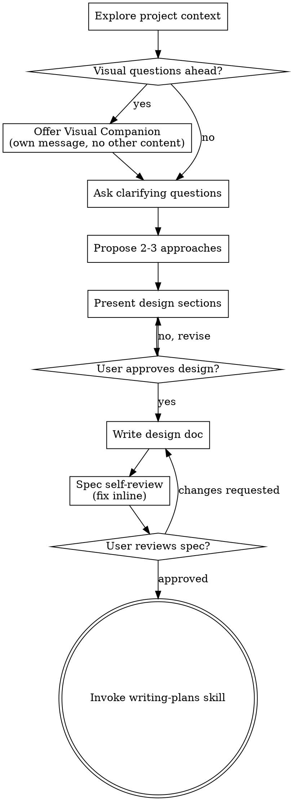

<!-- Generated by SpecStory, Markdown v2.1.0 -->

# 2026-04-07 19:40:00Z

<!-- Claude Code Session daecb695-93b0-4f55-97e1-6f5388d437b4 (2026-04-07 19:40:00Z) -->

_**User (2026-04-07 19:40:00Z)**_

Please pull master before your work.

I want to improve the configuration for the game SortNumbers.

Currently, we only allow random skip, but I want users to improve their counting.
So, we should be able to:

1. define to skip either by a number (e.g. by 2, by 10s, by 100s, etc), or by random (like now)
2. for distractions on those, we should set to display random(like now), or numbers between the correct ones. For example, display all numbers as distraction from 1-10, even though user needs to only add skipped by 2s, so 2,4,6,8,10.

Does that make sense? Needs more clarification?

---

_**Agent (claude-sonnet-4-6 2026-04-07 19:40:04Z)**_

<think><details><summary>Thought Process</summary>
The user wants to improve the SortNumbers game configuration. Let me first invoke the brainstorming skill as this is a feature request/creative work.
</details></think>

_**Agent (claude-sonnet-4-6 2026-04-07 19:40:04Z)**_

<tool-use data-tool-type="generic" data-tool-name="Skill"><details>
<summary>Tool use: **Skill**</summary>

```text
Launching skill: superpowers:brainstorming
```

</details></tool-use>

---

_**User (2026-04-07 19:40:04Z)**_

Base directory for this skill: /Users/leocaseiro/.claude/plugins/cache/claude-plugins-official/superpowers/5.0.7/skills/brainstorming

# Brainstorming Ideas Into Designs

Help turn ideas into fully formed designs and specs through natural collaborative dialogue.

Start by understanding the current project context, then ask questions one at a time to refine the idea. Once you understand what you're building, present the design and get user approval.

<HARD-GATE>
Do NOT invoke any implementation skill, write any code, scaffold any project, or take any implementation action until you have presented a design and the user has approved it. This applies to EVERY project regardless of perceived simplicity.
</HARD-GATE>

## Anti-Pattern: "This Is Too Simple To Need A Design"

Every project goes through this process. A todo list, a single-function utility, a config change — all of them. "Simple" projects are where unexamined assumptions cause the most wasted work. The design can be short (a few sentences for truly simple projects), but you MUST present it and get approval.

## Checklist

You MUST create a task for each of these items and complete them in order:

1. **Explore project context** — check files, docs, recent commits
2. **Offer visual companion** (if topic will involve visual questions) — this is its own message, not combined with a clarifying question. See the Visual Companion section below.
3. **Ask clarifying questions** — one at a time, understand purpose/constraints/success criteria
4. **Propose 2-3 approaches** — with trade-offs and your recommendation
5. **Present design** — in sections scaled to their complexity, get user approval after each section
6. **Write design doc** — save to `docs/superpowers/specs/YYYY-MM-DD-<topic>-design.md` and commit
7. **Spec self-review** — quick inline check for placeholders, contradictions, ambiguity, scope (see below)
8. **User reviews written spec** — ask user to review the spec file before proceeding
9. **Transition to implementation** — invoke writing-plans skill to create implementation plan

## Process Flow



**The terminal state is invoking writing-plans.** Do NOT invoke frontend-design, mcp-builder, or any other implementation skill. The ONLY skill you invoke after brainstorming is writing-plans.

## The Process

**Understanding the idea:**

- Check out the current project state first (files, docs, recent commits)
- Before asking detailed questions, assess scope: if the request describes multiple independent subsystems (e.g., "build a platform with chat, file storage, billing, and analytics"), flag this immediately. Don't spend questions refining details of a project that needs to be decomposed first.
- If the project is too large for a single spec, help the user decompose into sub-projects: what are the independent pieces, how do they relate, what order should they be built? Then brainstorm the first sub-project through the normal design flow. Each sub-project gets its own spec → plan → implementation cycle.
- For appropriately-scoped projects, ask questions one at a time to refine the idea
- Prefer multiple choice questions when possible, but open-ended is fine too
- Only one question per message - if a topic needs more exploration, break it into multiple questions
- Focus on understanding: purpose, constraints, success criteria

**Exploring approaches:**

- Propose 2-3 different approaches with trade-offs
- Present options conversationally with your recommendation and reasoning
- Lead with your recommended option and explain why

**Presenting the design:**

- Once you believe you understand what you're building, present the design
- Scale each section to its complexity: a few sentences if straightforward, up to 200-300 words if nuanced
- Ask after each section whether it looks right so far
- Cover: architecture, components, data flow, error handling, testing
- Be ready to go back and clarify if something doesn't make sense

**Design for isolation and clarity:**

- Break the system into smaller units that each have one clear purpose, communicate through well-defined interfaces, and can be understood and tested independently
- For each unit, you should be able to answer: what does it do, how do you use it, and what does it depend on?
- Can someone understand what a unit does without reading its internals? Can you change the internals without breaking consumers? If not, the boundaries need work.
- Smaller, well-bounded units are also easier for you to work with - you reason better about code you can hold in context at once, and your edits are more reliable when files are focused. When a file grows large, that's often a signal that it's doing too much.

**Working in existing codebases:**

- Explore the current structure before proposing changes. Follow existing patterns.
- Where existing code has problems that affect the work (e.g., a file that's grown too large, unclear boundaries, tangled responsibilities), include targeted improvements as part of the design - the way a good developer improves code they're working in.
- Don't propose unrelated refactoring. Stay focused on what serves the current goal.

## After the Design

**Documentation:**

- Write the validated design (spec) to `docs/superpowers/specs/YYYY-MM-DD-<topic>-design.md`
  - (User preferences for spec location override this default)
- Use elements-of-style:writing-clearly-and-concisely skill if available
- Commit the design document to git

**Spec Self-Review:**
After writing the spec document, look at it with fresh eyes:

1. **Placeholder scan:** Any "TBD", "TODO", incomplete sections, or vague requirements? Fix them.
2. **Internal consistency:** Do any sections contradict each other? Does the architecture match the feature descriptions?
3. **Scope check:** Is this focused enough for a single implementation plan, or does it need decomposition?
4. **Ambiguity check:** Could any requirement be interpreted two different ways? If so, pick one and make it explicit.

Fix any issues inline. No need to re-review — just fix and move on.

**User Review Gate:**
After the spec review loop passes, ask the user to review the written spec before proceeding:

> "Spec written and committed to `<path>`. Please review it and let me know if you want to make any changes before we start writing out the implementation plan."

Wait for the user's response. If they request changes, make them and re-run the spec review loop. Only proceed once the user approves.

**Implementation:**

- Invoke the writing-plans skill to create a detailed implementation plan
- Do NOT invoke any other skill. writing-plans is the next step.

## Key Principles

- **One question at a time** - Don't overwhelm with multiple questions
- **Multiple choice preferred** - Easier to answer than open-ended when possible
- **YAGNI ruthlessly** - Remove unnecessary features from all designs
- **Explore alternatives** - Always propose 2-3 approaches before settling
- **Incremental validation** - Present design, get approval before moving on
- **Be flexible** - Go back and clarify when something doesn't make sense

## Visual Companion

A browser-based companion for showing mockups, diagrams, and visual options during brainstorming. Available as a tool — not a mode. Accepting the companion means it's available for questions that benefit from visual treatment; it does NOT mean every question goes through the browser.

**Offering the companion:** When you anticipate that upcoming questions will involve visual content (mockups, layouts, diagrams), offer it once for consent:
> "Some of what we're working on might be easier to explain if I can show it to you in a web browser. I can put together mockups, diagrams, comparisons, and other visuals as we go. This feature is still new and can be token-intensive. Want to try it? (Requires opening a local URL)"

**This offer MUST be its own message.** Do not combine it with clarifying questions, context summaries, or any other content. The message should contain ONLY the offer above and nothing else. Wait for the user's response before continuing. If they decline, proceed with text-only brainstorming.

**Per-question decision:** Even after the user accepts, decide FOR EACH QUESTION whether to use the browser or the terminal. The test: **would the user understand this better by seeing it than reading it?**

- **Use the browser** for content that IS visual — mockups, wireframes, layout comparisons, architecture diagrams, side-by-side visual designs
- **Use the terminal** for content that is text — requirements questions, conceptual choices, tradeoff lists, A/B/C/D text options, scope decisions

A question about a UI topic is not automatically a visual question. "What does personality mean in this context?" is a conceptual question — use the terminal. "Which wizard layout works better?" is a visual question — use the browser.

If they agree to the companion, read the detailed guide before proceeding:
`skills/brainstorming/visual-companion.md`

---

_**Agent (claude-sonnet-4-6 2026-04-07 19:40:07Z)**_

<think><details><summary>Thought Process</summary>
Let me follow the brainstorming skill. I need to:

1. Explore project context first
2. Ask clarifying questions one at a time

Let me start by exploring the SortNumbers game to understand the current implementation.
</details></think>

_**Agent (claude-sonnet-4-6 2026-04-07 19:40:07Z)**_

<tool-use data-tool-type="unknown" data-tool-name="ToolSearch"><details>
<summary>Tool use: **ToolSearch**</summary>

**Input:**

- max_results: `1`
- query: `TodoWrite`

**Result:**

```

```

</details></tool-use>

_**Agent (claude-sonnet-4-6 2026-04-07 19:40:11Z)**_

<think><details><summary>Thought Process</summary>
Let me set up the todo list for the brainstorming process and then explore the project context.
</details></think>

_**Agent (claude-sonnet-4-6 2026-04-07 19:40:14Z)**_

<tool-use data-tool-type="task" data-tool-name="TodoWrite"><details>
<summary>Tool use: **TodoWrite**</summary>
**Agent task list:**
- [⚡] 🌡️ Explore project context (SortNumbers game)
- [ ] 🌡️ Ask clarifying questions
- [ ] 🌡️ Propose 2-3 approaches with trade-offs
- [ ] 🌡️ Present design and get approval
- [ ] 🌡️ Write design doc
- [ ] 🌡️ Spec self-review
- [ ] 🌡️ User reviews written spec
- [ ] 🌡️ Transition to writing-plans skill

</details></tool-use>

_**Agent (claude-sonnet-4-6 2026-04-07 19:40:23Z)**_

<tool-use data-tool-type="shell" data-tool-name="Bash"><details>
<summary>Tool use: **Bash**</summary>
Pull latest master

`git pull origin master 2>&1 | tail -5`

```text
 create mode 100644 src/lib/game-engine/useAnswerGameDraftSync.ts
 create mode 100644 src/lib/service-worker/ServiceWorkerContext.ts
 create mode 100644 src/lib/service-worker/ServiceWorkerProvider.tsx
 create mode 100644 src/lib/service-worker/useServiceWorker.ts
 create mode 100644 src/lib/version.ts
```

</details></tool-use>

_**Agent (claude-sonnet-4-6 2026-04-07 19:40:23Z)**_

<tool-use data-tool-type="search" data-tool-name="Glob"><details>
<summary>Tool use: **Glob**</summary>
 path `./src` pattern `**/SortNumbers*`

```text
src/games/sort-numbers/SortNumbersTileBank/SortNumbersTileBank.tsx
src/games/sort-numbers/SortNumbersTileBank/SortNumbersTileBank.test.tsx
src/games/sort-numbers/SortNumbersTileBank/SortNumbersTileBank.stories.tsx
src/games/sort-numbers/SortNumbers/SortNumbers.tsx
```

</details></tool-use>

_**Agent (claude-sonnet-4-6 2026-04-07 19:40:26Z)**_

<tool-use data-tool-type="search" data-tool-name="Glob"><details>
<summary>Tool use: **Glob**</summary>
 path `./src/games/sort-numbers` pattern `**/*.{ts,tsx,json}`

```text
src/games/sort-numbers/NumberSequenceSlots/NumberSequenceSlots.test.tsx
src/games/sort-numbers/build-sort-round.test.ts
src/games/sort-numbers/build-sort-round.ts
src/games/sort-numbers/SortNumbersTileBank/SortNumbersTileBank.tsx
src/games/sort-numbers/types.ts
src/games/sort-numbers/NumberSequenceSlots/NumberSequenceSlots.tsx
src/games/sort-numbers/SortNumbersTileBank/SortNumbersTileBank.test.tsx
src/games/sort-numbers/NumberSequenceSlots/NumberSequenceSlots.stories.tsx
src/games/sort-numbers/SortNumbersTileBank/SortNumbersTileBank.stories.tsx
src/games/sort-numbers/SortNumbers/SortNumbers.tsx
```

</details></tool-use>

_**Agent (claude-sonnet-4-6 2026-04-07 19:40:28Z)**_

<tool-use data-tool-type="read" data-tool-name="Read"><details>
<summary>Tool use: **Read**</summary>
 `./src/games/sort-numbers/types.ts`

```text
1 import type { AnswerGameConfig } from '@/components/answer-game/types';
2 import type { ConfigField } from '@/lib/config-fields';
3 
4 export interface SortNumbersConfig extends AnswerGameConfig {
5   component: 'SortNumbers';
6   direction: 'ascending' | 'descending';
7   range: { min: number; max: number };
8   /** How many numbers to sort per round */
9   quantity: number;
10   allowSkips: boolean;
11   rounds: SortNumbersRound[];
12 }
13 
14 export interface SortNumbersRound {
15   sequence: number[];
16 }
17 
18 export const sortNumbersConfigFields: ConfigField[] = [
19   {
20     type: 'select',
21     key: 'inputMethod',
22     label: 'Input method',
23     options: [
24       { value: 'drag', label: 'drag' },
25       { value: 'type', label: 'type' },
26       { value: 'both', label: 'both' },
27     ],
28   },
29   {
30     type: 'select',
31     key: 'wrongTileBehavior',
32     label: 'Wrong tile behaviour',
33     options: [
34       { value: 'reject', label: 'reject' },
35       { value: 'lock-manual', label: 'lock-manual' },
36       { value: 'lock-auto-eject', label: 'lock-auto-eject' },
37     ],
38   },
39   {
40     type: 'select',
41     key: 'tileBankMode',
42     label: 'Tile bank mode',
43     options: [
44       { value: 'exact', label: 'exact' },
45       { value: 'distractors', label: 'distractors' },
46     ],
47   },
48   {
49     type: 'number',
50     key: 'totalRounds',
51     label: 'Total rounds',
52     min: 1,
53     max: 30,
54   },
55   { type: 'checkbox', key: 'roundsInOrder', label: 'Rounds in order' },
56   {
57     type: 'select',
58     key: 'direction',
59     label: 'Direction',
60     options: [
61       { value: 'ascending', label: 'ascending' },
62       { value: 'descending', label: 'descending' },
63     ],
64   },
65   {
66     type: 'number',
67     key: 'quantity',
68     label: 'Quantity',
69     min: 2,
70     max: 8,
71   },
72   {
73     type: 'nested-number',
74     key: 'range',
75     subKey: 'min',
76     label: 'Range min',
77     min: 1,
78     max: 999,
79   },
80   {
81     type: 'nested-number',
82     key: 'range',
83     subKey: 'max',
84     label: 'Range max',
85     min: 1,
86     max: 999,
87   },
88   { type: 'checkbox', key: 'allowSkips', label: 'Allow skips' },
89   { type: 'checkbox', key: 'ttsEnabled', label: 'TTS enabled' },
90 ];
91
```

</details></tool-use>

_**Agent (claude-sonnet-4-6 2026-04-07 19:40:28Z)**_

<tool-use data-tool-type="read" data-tool-name="Read"><details>
<summary>Tool use: **Read**</summary>
 `./src/games/sort-numbers/build-sort-round.ts`

```text
1 import { nanoid } from 'nanoid';
2 import type { SortNumbersRound } from './types';
3 import type {
4   AnswerZone,
5   TileItem,
6 } from '@/components/answer-game/types';
7 
8 export function buildSortRound(
9   numbers: number[],
10   direction: 'ascending' | 'descending',
11 ): { tiles: TileItem[]; zones: AnswerZone[] } {
12   const sorted = numbers.toSorted((a, b) =>
13     direction === 'ascending' ? a - b : b - a,
14   );
15 
16   const zones: AnswerZone[] = sorted.map((n, i) => ({
17     id: `z${i}`,
18     index: i,
19     expectedValue: String(n),
20     placedTileId: null,
21     isWrong: false,
22     isLocked: false,
23   }));
24 
25   // Shuffle tiles (Fisher-Yates)
26   const shuffled = [...numbers];
27   for (let i = shuffled.length - 1; i > 0; i--) {
28     const j = Math.floor(Math.random() * (i + 1));
29     [shuffled[i], shuffled[j]] = [shuffled[j]!, shuffled[i]!];
30   }
31 
32   const tiles: TileItem[] = shuffled.map((n) => ({
33     id: nanoid(),
34     label: String(n),
35     value: String(n),
36   }));
37 
38   return { tiles, zones };
39 }
40 
41 interface GenerateOptions {
42   range: { min: number; max: number };
43   quantity: number;
44   allowSkips: boolean;
45   totalRounds: number;
46 }
47 
48 export function generateSortRounds(
49   options: GenerateOptions,
50 ): SortNumbersRound[] {
51   const { range, quantity, allowSkips, totalRounds } = options;
52 
53   return Array.from({ length: totalRounds }, () => {
54     if (allowSkips) {
55       const pool = Array.from(
56         { length: range.max - range.min + 1 },
57         (_, i) => range.min + i,
58       );
59       const picked: number[] = [];
60       const available = [...pool];
61       for (let i = 0; i < quantity && available.length > 0; i++) {
62         const idx = Math.floor(Math.random() * available.length);
63         picked.push(available[idx]!);
64         available.splice(idx, 1);
65       }
66       return { sequence: picked };
67     }
68 
69     // Consecutive: pick a random start such that start + quantity - 1 <= max
70     const rangeSize = range.max - range.min + 1;
71     if (quantity > rangeSize) {
72       // quantity exceeds range — fall back to the full range in order
73       const sequence = Array.from(
74         { length: rangeSize },
75         (_, i) => range.min + i,
76       );
77       return { sequence };
78     }
79     const maxStart = range.max - quantity + 1;
80     const start =
81       Math.floor(Math.random() * (maxStart - range.min + 1)) +
82       range.min;
83     const sequence = Array.from(
84       { length: quantity },
85       (_, i) => start + i,
86     );
87     return { sequence };
88   });
89 }
90
```

</details></tool-use>

_**Agent (claude-sonnet-4-6 2026-04-07 19:40:31Z)**_

<tool-use data-tool-type="read" data-tool-name="Read"><details>
<summary>Tool use: **Read**</summary>
 `./src/games/sort-numbers/SortNumbers/SortNumbers.tsx`

```text
1 import { useNavigate, useParams } from '@tanstack/react-router';
2 import { useEffect, useMemo, useRef, useState } from 'react';
3 import { useTranslation } from 'react-i18next';
4 import { buildSortRound } from '../build-sort-round';
5 import { NumberSequenceSlots } from '../NumberSequenceSlots/NumberSequenceSlots';
6 import { SortNumbersTileBank } from '../SortNumbersTileBank/SortNumbersTileBank';
7 import type { SortNumbersConfig } from '../types';
8 import type {
9   AnswerGameConfig,
10   AnswerGameDraftState,
11   AnswerZone,
12   TileItem,
13 } from '@/components/answer-game/types';
14 import { AnswerGame } from '@/components/answer-game/AnswerGame/AnswerGame';
15 import { GameOverOverlay } from '@/components/answer-game/GameOverOverlay/GameOverOverlay';
16 import { ScoreAnimation } from '@/components/answer-game/ScoreAnimation/ScoreAnimation';
17 import { useAnswerGameContext } from '@/components/answer-game/useAnswerGameContext';
18 import { useAnswerGameDispatch } from '@/components/answer-game/useAnswerGameDispatch';
19 import { useGameSounds } from '@/components/answer-game/useGameSounds';
20 import { useRoundTTS } from '@/components/answer-game/useRoundTTS';
21 import { buildRoundOrder } from '@/games/build-round-order';
22 
23 interface SortNumbersProps {
24   config: SortNumbersConfig;
25   initialState?: AnswerGameDraftState;
26   sessionId?: string;
27   seed?: string;
28 }
29 
30 const SortNumbersSession = ({
31   sortNumbersConfig,
32   roundOrder,
33   onRestartSession,
34 }: {
35   sortNumbersConfig: SortNumbersConfig;
36   roundOrder: readonly number[];
37   onRestartSession: () => void;
38 }) => {
39   const { t } = useTranslation('games');
40   const { phase, roundIndex, retryCount } = useAnswerGameContext();
41   const dispatch = useAnswerGameDispatch();
42   const { confettiReady, gameOverReady } = useGameSounds();
43   const navigate = useNavigate();
44   const { locale } = useParams({ from: '/$locale' });
45   const completionToken = useRef(0);
46 
47   const configRoundIndex = roundOrder[roundIndex];
48   const round =
49     configRoundIndex === undefined
50       ? undefined
51       : sortNumbersConfig.rounds[configRoundIndex];
52 
53   const directionLabel =
54     sortNumbersConfig.direction === 'ascending'
55       ? t('sort-numbers-ui.ascending-label')
56       : t('sort-numbers-ui.descending-label');
57 
58   useRoundTTS(directionLabel);
59 
60   const handleHome = () => {
61     void navigate({ to: '/$locale', params: { locale } });
62   };
63 
64   const handlePlayAgain = () => {
65     onRestartSession();
66   };
67 
68   useEffect(() => {
69     if (phase !== 'round-complete' || !confettiReady) return;
70 
71     const token = ++completionToken.current;
72     const delayMs = 750;
73     const timer = globalThis.setTimeout(() => {
74       if (completionToken.current !== token) return;
75 
76       const isLastRound = roundIndex >= roundOrder.length - 1;
77       if (isLastRound) {
78         dispatch({ type: 'COMPLETE_GAME' });
79         return;
80       }
81 
82       const nextConfigIndex = roundOrder[roundIndex + 1];
83       const nextRound =
84         nextConfigIndex === undefined
85           ? undefined
86           : sortNumbersConfig.rounds[nextConfigIndex];
87 
88       if (!nextRound) {
89         dispatch({ type: 'COMPLETE_GAME' });
90         return;
91       }
92 
93       const { tiles, zones } = buildSortRound(
94         nextRound.sequence,
95         sortNumbersConfig.direction,
96       );
97       dispatch({ type: 'ADVANCE_ROUND', tiles, zones });
98     }, delayMs);
99 
100     return () => {
101       globalThis.clearTimeout(timer);
102     };
103   }, [
104     phase,
105     confettiReady,
106     roundIndex,
107     dispatch,
108     roundOrder,
109     sortNumbersConfig.rounds,
110     sortNumbersConfig.direction,
111   ]);
112 
113   if (!round) return null;
114 
115   return (
116     <>
117       <div className="flex w-full max-w-2xl flex-col items-center justify-center gap-8 px-4 py-6">
118         <AnswerGame.Question>
119           <p className="text-center text-lg font-semibold text-foreground">
120             {directionLabel}
121           </p>
122         </AnswerGame.Question>
123         <AnswerGame.Answer>
124           <NumberSequenceSlots />
125         </AnswerGame.Answer>
126         <AnswerGame.Choices>
127           <SortNumbersTileBank />
128         </AnswerGame.Choices>
129       </div>
130       <ScoreAnimation visible={confettiReady} />
131       {gameOverReady ? (
132         <GameOverOverlay
133           retryCount={retryCount}
134           onPlayAgain={handlePlayAgain}
135           onHome={handleHome}
136         />
137       ) : null}
138     </>
139   );
140 };
141 
142 export const SortNumbers = ({
143   config,
144   initialState,
145   sessionId,
146   seed,
147 }: SortNumbersProps) => {
148   const roundsInOrder = config.roundsInOrder === true;
149   const [sessionEpoch, setSessionEpoch] = useState(0);
150 
151   const roundOrder = useMemo(() => {
152     void sessionEpoch;
153     return buildRoundOrder(config.rounds.length, roundsInOrder, seed);
154   }, [config.rounds.length, roundsInOrder, seed, sessionEpoch]);
155 
156   const firstConfigIndex = roundOrder[0];
157   const round0 =
158     firstConfigIndex === undefined
159       ? undefined
160       : config.rounds[firstConfigIndex];
161 
162   const { tiles, zones } = useMemo(() => {
163     if (!round0) {
164       return { tiles: [] as TileItem[], zones: [] as AnswerZone[] };
165     }
166     return buildSortRound(round0.sequence, config.direction);
167   }, [round0, config.direction]);
168 
169   const answerGameConfig = useMemo(
170     (): AnswerGameConfig => ({
171       gameId: config.gameId,
172       inputMethod: config.inputMethod,
173       wrongTileBehavior: config.wrongTileBehavior,
174       tileBankMode: config.tileBankMode,
175       totalRounds: config.rounds.length,
176       roundsInOrder: config.roundsInOrder,
177       ttsEnabled: config.ttsEnabled,
178       touchKeyboardInputMode: 'numeric',
179       initialTiles: tiles,
180       initialZones: zones,
181     }),
182     [
183       config.gameId,
184       config.inputMethod,
185       config.wrongTileBehavior,
186       config.tileBankMode,
187       config.rounds.length,
188       config.roundsInOrder,
189       config.ttsEnabled,
190       tiles,
191       zones,
192     ],
193   );
194 
195   if (!round0) return null;
196 
197   return (
198     <AnswerGame
199       config={answerGameConfig}
200       initialState={initialState}
201       sessionId={sessionId}
202     >
203       <SortNumbersSession
204         sortNumbersConfig={config}
205         roundOrder={roundOrder}
206         onRestartSession={() => {
207           setSessionEpoch((e) => e + 1);
208         }}
209       />
210     </AnswerGame>
211   );
212 };
213
```

</details></tool-use>

_**Agent (claude-sonnet-4-6 2026-04-07 19:40:37Z)**_

<think><details><summary>Thought Process</summary>
Now I have a good understanding of the current implementation. Let me understand what the user is asking:

1. **Skip mode**: Currently `allowSkips: boolean` - just random or not. The user wants to be able to define specific skip values (skip by 2, by 10, by 100, etc.) or keep random.

2. **Distractors**: Currently when `tileBankMode: 'distractors'`, the distractor numbers seem to be random. The user wants to be able to set distractors to either:
   - Random (like now)
   - Numbers between the correct ones (e.g., if counting by 2s: 2,4,6,8,10, distractors could be 1,3,5,7,9 - the numbers in between)

Let me examine how the tile bank generates distractors currently.
</details></think>

_**Agent (claude-sonnet-4-6 2026-04-07 19:40:38Z)**_

<tool-use data-tool-type="read" data-tool-name="Read"><details>
<summary>Tool use: **Read**</summary>
 `./src/games/sort-numbers/SortNumbersTileBank/SortNumbersTileBank.tsx`

```text
1 import type { TileItem } from '@/components/answer-game/types';
2 import { useAnswerGameContext } from '@/components/answer-game/useAnswerGameContext';
3 import { useDraggableTile } from '@/components/answer-game/useDraggableTile';
4 
5 const NumberTile = ({ tile }: { tile: TileItem }) => {
6   const {
7     ref,
8     handleClick,
9     onPointerDown,
10     onPointerMove,
11     onPointerUp,
12     onPointerCancel,
13   } = useDraggableTile(tile);
14 
15   return (
16     <button
17       ref={ref}
18       type="button"
19       aria-label={`Number ${tile.label}`}
20       className="flex size-14 touch-none select-none cursor-grab items-center justify-center rounded-xl bg-card text-2xl font-bold shadow-md transition-transform active:scale-95 active:cursor-grabbing"
21       onClick={handleClick}
22       onPointerDown={onPointerDown}
23       onPointerMove={onPointerMove}
24       onPointerUp={onPointerUp}
25       onPointerCancel={onPointerCancel}
26     >
27       {tile.label}
28     </button>
29   );
30 };
31 
32 export const SortNumbersTileBank = () => {
33   const { allTiles, bankTileIds } = useAnswerGameContext();
34 
35   const bankTiles = allTiles.filter((t) => bankTileIds.includes(t.id));
36 
37   return (
38     <div className="flex flex-wrap justify-center gap-3">
39       {bankTiles.map((tile) => (
40         <NumberTile key={tile.id} tile={tile} />
41       ))}
42     </div>
43   );
44 };
45
```

</details></tool-use>

_**Agent (claude-sonnet-4-6 2026-04-07 19:40:40Z)**_

<tool-use data-tool-type="search" data-tool-name="Grep"><details>
<summary>Tool use: **Grep**</summary>
 path `./src` pattern `distractors|distractor|tileBankMode`

```text
Found 52 files
src/routes/$locale/_app/game/$gameId.tsx
src/lib/game-engine/useAnswerGameDraftSync.test.ts
src/games/word-spell/WordSpell/WordSpell.tsx
src/games/sort-numbers/SortNumbers/SortNumbers.tsx
src/games/number-match/NumberMatch/NumberMatch.tsx
src/components/answer-game/types.ts
src/components/answer-game/AnswerGameProvider.test.tsx
src/games/sort-numbers/SortNumbersTileBank/SortNumbersTileBank.stories.tsx
src/games/sort-numbers/NumberSequenceSlots/NumberSequenceSlots.stories.tsx
src/games/word-spell/WordSpell/WordSpell.test.tsx
src/games/word-spell/LetterTileBank/LetterTileBank.test.tsx
src/games/sort-numbers/SortNumbersTileBank/SortNumbersTileBank.test.tsx
src/games/number-match/NumeralTileBank/NumeralTileBank.test.tsx
src/games/number-match/NumberMatch/NumberMatch.test.tsx
src/components/answer-game/useTileEvaluation.test.tsx
src/components/answer-game/useGameTTS.test.tsx
src/components/answer-game/useGameSounds.test.tsx
src/components/answer-game/useTouchKeyboardInput.test.tsx
src/components/answer-game/useKeyboardInput.test.tsx
src/components/answer-game/OrderedSlots/OrderedSlots.test.tsx
src/games/word-spell/types.ts
src/games/sort-numbers/types.ts
src/games/number-match/types.ts
src/components/answer-game/answer-game-reducer.test.ts
src/components/answer-game/useDraggableTile.test.tsx
src/components/answer-game/useAutoNextSlot.test.tsx
src/games/word-spell/WordSpell/WordSpell.stories.tsx
src/games/word-spell/LetterTileBank/LetterTileBank.stories.tsx
src/games/sort-numbers/NumberSequenceSlots/NumberSequenceSlots.test.tsx
src/games/number-match/NumeralTileBank/NumeralTileBank.stories.tsx
src/games/number-match/NumberMatch/NumberMatch.stories.tsx
src/components/questions/TextQuestion/TextQuestion.test.tsx
src/components/questions/TextQuestion/TextQuestion.stories.tsx
src/components/questions/ImageQuestion/ImageQuestion.test.tsx
src/components/questions/ImageQuestion/ImageQuestion.stories.tsx
src/components/questions/EmojiQuestion/EmojiQuestion.test.tsx
src/components/questions/DotGroupQuestion/DotGroupQuestion.test.tsx
src/components/questions/DotGroupQuestion/DotGroupQuestion.stories.tsx
src/components/questions/AudioButton/AudioButton.test.tsx
src/components/questions/AudioButton/AudioButton.stories.tsx
src/components/answer-game/useRoundTTS.test.tsx
src/components/answer-game/useFreeSwap.test.tsx
src/components/answer-game/AnswerGame/AnswerGame.stories.tsx
src/games/word-spell/OrderedLetterSlots/OrderedLetterSlots.test.tsx
src/games/word-spell/OrderedLetterSlots/OrderedLetterSlots.stories.tsx
src/games/number-match/build-numeral-round.ts
src/games/number-match/build-numeral-round.test.ts
src/games/number-match/MatchingPairZones/MatchingPairZones.test.tsx
src/games/number-match/MatchingPairZones/MatchingPairZones.stories.tsx
src/components/answer-game/useKeyboardDrag.test.tsx
src/components/answer-game/AnswerGame/AnswerGame.test.tsx
src/lib/game-engine/types.ts
```

</details></tool-use>

_**Agent (claude-sonnet-4-6 2026-04-07 19:40:44Z)**_

<tool-use data-tool-type="search" data-tool-name="Grep"><details>
<summary>Tool use: **Grep**</summary>
 path `./src/components/answer-game/types.ts` pattern `distractors`

```text
4-  inputMethod: 'drag' | 'type' | 'both';
5-  /** @default 'lock-auto-eject' */
6-  wrongTileBehavior: 'reject' | 'lock-manual' | 'lock-auto-eject';
7:  tileBankMode: 'exact' | 'distractors';
8-  distractorCount?: number;
9-  /** Total number of rounds in this session */
10-  totalRounds: number;
```

</details></tool-use>

_**Agent (claude-sonnet-4-6 2026-04-07 19:40:44Z)**_

<tool-use data-tool-type="search" data-tool-name="Grep"><details>
<summary>Tool use: **Grep**</summary>
 path `./src/games/sort-numbers` pattern `distractors|distractor`

```text
src/games/sort-numbers/types.ts-42-    label: 'Tile bank mode',
src/games/sort-numbers/types.ts-43-    options: [
src/games/sort-numbers/types.ts-44-      { value: 'exact', label: 'exact' },
src/games/sort-numbers/types.ts:45:      { value: 'distractors', label: 'distractors' },
/Users/leocaseiro/Sites/base-skill/src/games/sort-numbers/types.ts-46-    ],
/Users/leocaseiro/Sites/base-skill/src/games/sort-numbers/types.ts-47-  },
/Users/leocaseiro/Sites/base-skill/src/games/sort-numbers/types.ts-48-  {
```

</details></tool-use>

_**Agent (claude-sonnet-4-6 2026-04-07 19:40:48Z)**_

<tool-use data-tool-type="search" data-tool-name="Grep"><details>
<summary>Tool use: **Grep**</summary>
 path `./src/components/answer-game` pattern `distractorCount|distractor`

```text
src/components/answer-game/types.ts-4-  inputMethod: 'drag' | 'type' | 'both';
/Users/leocaseiro/Sites/base-skill/src/components/answer-game/types.ts-5-  /** @default 'lock-auto-eject' */
src/components/answer-game/types.ts-6-  wrongTileBehavior: 'reject' | 'lock-manual' | 'lock-auto-eject';
src/components/answer-game/types.ts:7:  tileBankMode: 'exact' | 'distractors';
src/components/answer-game/types.ts:8:  distractorCount?: number;
/Users/leocaseiro/Sites/base-skill/src/components/answer-game/types.ts-9-  /** Total number of rounds in this session */
src/components/answer-game/types.ts-10-  totalRounds: number;
/Users/leocaseiro/Sites/base-skill/src/components/answer-game/types.ts-11-  /**
```

</details></tool-use>

_**Agent (claude-sonnet-4-6 2026-04-07 19:40:50Z)**_

<tool-use data-tool-type="search" data-tool-name="Grep"><details>
<summary>Tool use: **Grep**</summary>
 path `./src` pattern `distractorCount`

```text
src/routes/$locale/_app/game/$gameId.tsx-107-  inputMethod: 'drag',
src/routes/$locale/_app/game/$gameId.tsx-108-  wrongTileBehavior: 'lock-auto-eject',
src/routes/$locale/_app/game/$gameId.tsx-109-  tileBankMode: 'distractors',
src/routes/$locale/_app/game/$gameId.tsx:110:  distractorCount: 2,
src/routes/$locale/_app/game/$gameId.tsx-111-  totalRounds: 3,
src/routes/$locale/_app/game/$gameId.tsx-112-  roundsInOrder: false,
src/routes/$locale/_app/game/$gameId.tsx-113-  ttsEnabled: true,
--
src/games/word-spell/WordSpell/WordSpell.tsx-228-      inputMethod: config.inputMethod,
src/games/word-spell/WordSpell/WordSpell.tsx-229-      wrongTileBehavior: config.wrongTileBehavior,
src/games/word-spell/WordSpell/WordSpell.tsx-230-      tileBankMode: config.tileBankMode,
src/games/word-spell/WordSpell/WordSpell.tsx:231:      distractorCount: config.distractorCount,
src/games/word-spell/WordSpell/WordSpell.tsx-232-      totalRounds: config.rounds.length,
src/games/word-spell/WordSpell/WordSpell.tsx-233-      roundsInOrder: config.roundsInOrder,
src/games/word-spell/WordSpell/WordSpell.tsx-234-      ttsEnabled: config.ttsEnabled,
--
/Users/leocaseiro/Sites/base-skill/src/games/word-spell/WordSpell/WordSpell.tsx-241-      config.inputMethod,
/Users/leocaseiro/Sites/base-skill/src/games/word-spell/WordSpell/WordSpell.tsx-242-      config.wrongTileBehavior,
/Users/leocaseiro/Sites/base-skill/src/games/word-spell/WordSpell/WordSpell.tsx-243-      config.tileBankMode,
src/games/word-spell/WordSpell/WordSpell.tsx:244:      config.distractorCount,
/Users/leocaseiro/Sites/base-skill/src/games/word-spell/WordSpell/WordSpell.tsx-245-      config.rounds.length,
/Users/leocaseiro/Sites/base-skill/src/games/word-spell/WordSpell/WordSpell.tsx-246-      config.roundsInOrder,
/Users/leocaseiro/Sites/base-skill/src/games/word-spell/WordSpell/WordSpell.tsx-247-      config.ttsEnabled,
--
/Users/leocaseiro/Sites/base-skill/src/games/word-spell/WordSpell/WordSpell.stories.tsx-39-      ...baseConfig,
src/games/word-spell/WordSpell/WordSpell.stories.tsx-40-      mode: 'recall',
src/games/word-spell/WordSpell/WordSpell.stories.tsx-41-      tileBankMode: 'distractors',
src/games/word-spell/WordSpell/WordSpell.stories.tsx:42:      distractorCount: 4,
src/games/word-spell/WordSpell/WordSpell.stories.tsx-43-      rounds: [{ word: 'cat' }],
/Users/leocaseiro/Sites/base-skill/src/games/word-spell/WordSpell/WordSpell.stories.tsx-44-    },
/Users/leocaseiro/Sites/base-skill/src/games/word-spell/WordSpell/WordSpell.stories.tsx-45-  },
--
src/games/word-spell/WordSpell/WordSpell.stories.tsx-70-    config: {
/Users/leocaseiro/Sites/base-skill/src/games/word-spell/WordSpell/WordSpell.stories.tsx-71-      ...baseConfig,
src/games/word-spell/WordSpell/WordSpell.stories.tsx-72-      tileBankMode: 'distractors',
src/games/word-spell/WordSpell/WordSpell.stories.tsx:73:      distractorCount: 3,
/Users/leocaseiro/Sites/base-skill/src/games/word-spell/WordSpell/WordSpell.stories.tsx-74-    },
/Users/leocaseiro/Sites/base-skill/src/games/word-spell/WordSpell/WordSpell.stories.tsx-75-  },
/Users/leocaseiro/Sites/base-skill/src/games/word-spell/WordSpell/WordSpell.stories.tsx-76-};
--
/Users/leocaseiro/Sites/base-skill/src/games/number-match/build-numeral-round.test.ts-39-  it('distractors mode adds extra tiles with unique values', () => {
/Users/leocaseiro/Sites/base-skill/src/games/number-match/build-numeral-round.test.ts-40-    const { tiles, zones } = buildNumeralRound(4, {
src/games/number-match/build-numeral-round.test.ts-41-      tileBankMode: 'distractors',
src/games/number-match/build-numeral-round.test.ts:42:      distractorCount: 3,
src/games/number-match/build-numeral-round.test.ts-43-      range: { min: 1, max: 9 },
/Users/leocaseiro/Sites/base-skill/src/games/number-match/build-numeral-round.test.ts-44-    });
/Users/leocaseiro/Sites/base-skill/src/games/number-match/build-numeral-round.test.ts-45-    expect(tiles).toHaveLength(4);
--
src/games/word-spell/LetterTileBank/LetterTileBank.stories.tsx-65-const distractorConfig: AnswerGameConfig = {
/Users/leocaseiro/Sites/base-skill/src/games/word-spell/LetterTileBank/LetterTileBank.stories.tsx-66-  ...config,
src/games/word-spell/LetterTileBank/LetterTileBank.stories.tsx-67-  tileBankMode: 'distractors',
src/games/word-spell/LetterTileBank/LetterTileBank.stories.tsx:68:  distractorCount: 2,
/Users/leocaseiro/Sites/base-skill/src/games/word-spell/LetterTileBank/LetterTileBank.stories.tsx-69-};
src/games/word-spell/LetterTileBank/LetterTileBank.stories.tsx-70-const distractorTiles: TileItem[] = [
/Users/leocaseiro/Sites/base-skill/src/games/word-spell/LetterTileBank/LetterTileBank.stories.tsx-71-  ...tiles,
--
/Users/leocaseiro/Sites/base-skill/src/games/number-match/build-numeral-round.ts-6-
/Users/leocaseiro/Sites/base-skill/src/games/number-match/build-numeral-round.ts-7-export type NumeralBankOptions = {
src/games/number-match/build-numeral-round.ts-8-  tileBankMode: 'exact' | 'distractors';
src/games/number-match/build-numeral-round.ts:9:  distractorCount?: number;
src/games/number-match/build-numeral-round.ts-10-  range: { min: number; max: number };
/Users/leocaseiro/Sites/base-skill/src/games/number-match/build-numeral-round.ts-11-};
/Users/leocaseiro/Sites/base-skill/src/games/number-match/build-numeral-round.ts-12-
--
/Users/leocaseiro/Sites/base-skill/src/games/number-match/build-numeral-round.ts-54-  if (bank.tileBankMode === 'distractors') {
/Users/leocaseiro/Sites/base-skill/src/games/number-match/build-numeral-round.ts-55-    const extra = pickDistractorNumerals(
/Users/leocaseiro/Sites/base-skill/src/games/number-match/build-numeral-round.ts-56-      value,
src/games/number-match/build-numeral-round.ts:57:      bank.distractorCount ?? 0,
/Users/leocaseiro/Sites/base-skill/src/games/number-match/build-numeral-round.ts-58-      bank.range.min,
/Users/leocaseiro/Sites/base-skill/src/games/number-match/build-numeral-round.ts-59-      bank.range.max,
/Users/leocaseiro/Sites/base-skill/src/games/number-match/build-numeral-round.ts-60-    );
--
/Users/leocaseiro/Sites/base-skill/src/games/number-match/types.ts-73-  },
/Users/leocaseiro/Sites/base-skill/src/games/number-match/types.ts-74-  {
src/games/number-match/types.ts-75-    type: 'number',
src/games/number-match/types.ts:76:    key: 'distractorCount',
src/games/number-match/types.ts-77-    label: 'Distractor count',
src/games/number-match/types.ts-78-    min: 1,
src/games/number-match/types.ts-79-    max: 10,
--
src/games/number-match/NumberMatch/NumberMatch.test.tsx-72-    const distractorConfig: NumberMatchConfig = {
/Users/leocaseiro/Sites/base-skill/src/games/number-match/NumberMatch/NumberMatch.test.tsx-73-      ...config,
src/games/number-match/NumberMatch/NumberMatch.test.tsx-74-      tileBankMode: 'distractors',
src/games/number-match/NumberMatch/NumberMatch.test.tsx:75:      distractorCount: 3,
src/games/number-match/NumberMatch/NumberMatch.test.tsx-76-      range: { min: 1, max: 9 },
src/games/number-match/NumberMatch/NumberMatch.test.tsx-77-      rounds: [{ value: 5 }],
/Users/leocaseiro/Sites/base-skill/src/games/number-match/NumberMatch/NumberMatch.test.tsx-78-    };
--
/Users/leocaseiro/Sites/base-skill/src/games/number-match/NumberMatch/NumberMatch.tsx-87-      }
/Users/leocaseiro/Sites/base-skill/src/games/number-match/NumberMatch/NumberMatch.tsx-88-      const { tiles, zones } = buildNumeralRound(value, {
src/games/number-match/NumberMatch/NumberMatch.tsx-89-        tileBankMode: numberMatchConfig.tileBankMode,
src/games/number-match/NumberMatch/NumberMatch.tsx:90:        distractorCount: numberMatchConfig.distractorCount,
src/games/number-match/NumberMatch/NumberMatch.tsx-91-        range: numberMatchConfig.range,
/Users/leocaseiro/Sites/base-skill/src/games/number-match/NumberMatch/NumberMatch.tsx-92-      });
src/games/number-match/NumberMatch/NumberMatch.tsx-93-      dispatch({ type: 'ADVANCE_ROUND', tiles, zones });
--
/Users/leocaseiro/Sites/base-skill/src/games/number-match/NumberMatch/NumberMatch.tsx-104-    roundOrder,
/Users/leocaseiro/Sites/base-skill/src/games/number-match/NumberMatch/NumberMatch.tsx-105-    numberMatchConfig.rounds,
/Users/leocaseiro/Sites/base-skill/src/games/number-match/NumberMatch/NumberMatch.tsx-106-    numberMatchConfig.tileBankMode,
src/games/number-match/NumberMatch/NumberMatch.tsx:107:    numberMatchConfig.distractorCount,
/Users/leocaseiro/Sites/base-skill/src/games/number-match/NumberMatch/NumberMatch.tsx-108-    numberMatchConfig.range,
/Users/leocaseiro/Sites/base-skill/src/games/number-match/NumberMatch/NumberMatch.tsx-109-  ]);
/Users/leocaseiro/Sites/base-skill/src/games/number-match/NumberMatch/NumberMatch.tsx-110-
--
/Users/leocaseiro/Sites/base-skill/src/games/number-match/NumberMatch/NumberMatch.tsx-175-    }
/Users/leocaseiro/Sites/base-skill/src/games/number-match/NumberMatch/NumberMatch.tsx-176-    return buildNumeralRound(roundValue, {
src/games/number-match/NumberMatch/NumberMatch.tsx-177-      tileBankMode: config.tileBankMode,
src/games/number-match/NumberMatch/NumberMatch.tsx:178:      distractorCount: config.distractorCount,
src/games/number-match/NumberMatch/NumberMatch.tsx-179-      range: config.range,
/Users/leocaseiro/Sites/base-skill/src/games/number-match/NumberMatch/NumberMatch.tsx-180-    });
/Users/leocaseiro/Sites/base-skill/src/games/number-match/NumberMatch/NumberMatch.tsx-181-  }, [
/Users/leocaseiro/Sites/base-skill/src/games/number-match/NumberMatch/NumberMatch.tsx-182-    roundValue,
/Users/leocaseiro/Sites/base-skill/src/games/number-match/NumberMatch/NumberMatch.tsx-183-    config.tileBankMode,
src/games/number-match/NumberMatch/NumberMatch.tsx:184:    config.distractorCount,
/Users/leocaseiro/Sites/base-skill/src/games/number-match/NumberMatch/NumberMatch.tsx-185-    config.range,
/Users/leocaseiro/Sites/base-skill/src/games/number-match/NumberMatch/NumberMatch.tsx-186-  ]);
/Users/leocaseiro/Sites/base-skill/src/games/number-match/NumberMatch/NumberMatch.tsx-187-
--
src/games/number-match/NumberMatch/NumberMatch.tsx-191-      inputMethod: config.inputMethod,
src/games/number-match/NumberMatch/NumberMatch.tsx-192-      wrongTileBehavior: config.wrongTileBehavior,
src/games/number-match/NumberMatch/NumberMatch.tsx-193-      tileBankMode: config.tileBankMode,
src/games/number-match/NumberMatch/NumberMatch.tsx:194:      distractorCount: config.distractorCount,
src/games/number-match/NumberMatch/NumberMatch.tsx-195-      totalRounds: config.rounds.length,
src/games/number-match/NumberMatch/NumberMatch.tsx-196-      roundsInOrder: config.roundsInOrder,
src/games/number-match/NumberMatch/NumberMatch.tsx-197-      ttsEnabled: config.ttsEnabled,
--
/Users/leocaseiro/Sites/base-skill/src/games/number-match/NumberMatch/NumberMatch.tsx-203-      config.inputMethod,
/Users/leocaseiro/Sites/base-skill/src/games/number-match/NumberMatch/NumberMatch.tsx-204-      config.wrongTileBehavior,
/Users/leocaseiro/Sites/base-skill/src/games/number-match/NumberMatch/NumberMatch.tsx-205-      config.tileBankMode,
src/games/number-match/NumberMatch/NumberMatch.tsx:206:      config.distractorCount,
/Users/leocaseiro/Sites/base-skill/src/games/number-match/NumberMatch/NumberMatch.tsx-207-      config.rounds.length,
/Users/leocaseiro/Sites/base-skill/src/games/number-match/NumberMatch/NumberMatch.tsx-208-      config.roundsInOrder,
/Users/leocaseiro/Sites/base-skill/src/games/number-match/NumberMatch/NumberMatch.tsx-209-      config.ttsEnabled,
--
/Users/leocaseiro/Sites/base-skill/src/components/answer-game/types.ts-5-  /** @default 'lock-auto-eject' */
src/components/answer-game/types.ts-6-  wrongTileBehavior: 'reject' | 'lock-manual' | 'lock-auto-eject';
src/components/answer-game/types.ts-7-  tileBankMode: 'exact' | 'distractors';
src/components/answer-game/types.ts:8:  distractorCount?: number;
/Users/leocaseiro/Sites/base-skill/src/components/answer-game/types.ts-9-  /** Total number of rounds in this session */
src/components/answer-game/types.ts-10-  totalRounds: number;
/Users/leocaseiro/Sites/base-skill/src/components/answer-game/types.ts-11-  /**
```

</details></tool-use>

_**Agent (claude-sonnet-4-6 2026-04-07 19:41:03Z)**_

<think><details><summary>Thought Process</summary>
Now I have a solid understanding of the current codebase. Let me summarize what I know:

Current state:

- `SortNumbersConfig` has `allowSkips: boolean` - when true, picks random numbers from the range
- When `allowSkips: false`, it picks consecutive numbers
- `tileBankMode: 'exact' | 'distractors'` - when 'distractors', it presumably adds extra tiles beyond the correct ones (but SortNumbers doesn't seem to pass `distractorCount` to the answer game config - it doesn't pass it in `SortNumbers.tsx`)

- The distractor behavior for SortNumbers isn't fully implemented yet since it's missing the `distractorCount` configuration.

The user wants me to refactor this: replace `allowSkips: boolean` with `skipBy: 'random' | number` to support either random selection or a specific skip interval, and add a `distractorType` option that lets you choose between random distractors or numbers that fall between the correct answers.

Now I'm clarifying a few implementation details—specifically whether skip-by-N sequences should always start at the range minimum or can begin at different positions, how to define "between" for the distractor type, and whether there should be limits on the distractor pool size.
</details></think>

_**Agent (claude-sonnet-4-6 2026-04-07 19:41:05Z)**_

<tool-use data-tool-type="task" data-tool-name="TodoWrite"><details>
<summary>Tool use: **TodoWrite**</summary>
**Agent task list:**
- [X] 🌡️ Explore project context (SortNumbers game)
- [⚡] 🌡️ Ask clarifying questions
- [ ] 🌡️ Propose 2-3 approaches with trade-offs
- [ ] 🌡️ Present design and get approval
- [ ] 🌡️ Write design doc
- [ ] 🌡️ Spec self-review
- [ ] 🌡️ User reviews written spec
- [ ] 🌡️ Transition to writing-plans skill

</details></tool-use>

_**Agent (claude-sonnet-4-6 2026-04-07 19:41:12Z)**_

Yes, this makes complete sense. I've read through the current code — here's what's happening now:

- `allowSkips: boolean` — when `false`, picks consecutive numbers (e.g. 3,4,5,6); when `true`, picks random numbers from the range
- `tileBankMode: 'distractors'` — SortNumbers doesn't yet wire up `distractorCount`, so it's essentially not producing extra distractor tiles

Your two changes are clear:

1. **Skip mode**: `random` (current behavior) or `by N` (e.g. by 2 → 2,4,6,8...)
2. **Distractor source**: `random` (current) or `between` (the numbers skipped over)

First clarifying question: for **"skip by N"**, should the starting number always be `range.min`, or should it start at a random valid position within the range?

For example, with range 1–20, skip by 3, quantity 4:

- **Fixed start**: always starts at `range.min`, so → 1, 4, 7, 10
- **Random start**: could start at 2 → 2, 5, 8, 11 — or 3 → 3, 6, 9, 12

---

_**User (2026-04-07 19:50:02Z)**_

lets make configurable this one

---

_**Agent (claude-sonnet-4-6 2026-04-07 19:50:05Z)**_

<think><details><summary>Thought Process</summary>
The user wants the starting position to be configurable too. So they want a `startAt` option that could be either `range.min` (fixed) or random. Let me ask the next clarifying question about the distractors.
</details></think>

_**Agent (claude-sonnet-4-6 2026-04-07 19:50:09Z)**_

Got it — so the config would have both a skip interval and a start position (fixed at `range.min` or random).

Next question: for **"between" distractors** — when counting by 2s (sequence: 2, 4, 6, 8, 10), the numbers "between" could mean:

- **Immediate gaps only**: the numbers directly skipped over → 1, 3, 5, 7, 9 (exactly the missed numbers)
- **Any non-sequence number in range**: all numbers in range that aren't in the sequence → could include numbers beyond the sequence endpoints too (e.g. if range is 1–15, would include 11, 12, 13, 14, 15 as potential distractors)

Which interpretation, or should it also be configurable?

---

_**User (2026-04-07 19:50:36Z)**_

configurable

---

_**Agent (claude-sonnet-4-6 2026-04-07 19:50:40Z)**_

<think><details><summary>Thought Process</summary>
The user wants this to be configurable too. Let me ask the next question about whether we need to limit the number of distractors.
</details></think>

_**Agent (claude-sonnet-4-6 2026-04-07 19:50:41Z)**_

Good. One more: when `tileBankMode: 'distractors'`, the existing `distractorCount` field controls how many extra tiles appear. Should that field still apply here, or should "between" mode always show **all** available between-numbers regardless of count?

---

_**User (2026-04-07 19:51:57Z)**_

we should have distractorCount or all

---

_**Agent (claude-sonnet-4-6 2026-04-07 19:52:00Z)**_

<think><details><summary>Thought Process</summary>
The user wants a `distractorCount` (a specific number) or `all` (show all available between numbers). Let me now move to proposing approaches.
</details></think>

_**Agent (claude-sonnet-4-6 2026-04-07 19:52:01Z)**_

<tool-use data-tool-type="task" data-tool-name="TodoWrite"><details>
<summary>Tool use: **TodoWrite**</summary>
**Agent task list:**
- [X] 🌡️ Explore project context (SortNumbers game)
- [X] 🌡️ Ask clarifying questions
- [⚡] 🌡️ Propose 2-3 approaches with trade-offs
- [ ] 🌡️ Present design and get approval
- [ ] 🌡️ Write design doc
- [ ] 🌡️ Spec self-review
- [ ] 🌡️ User reviews written spec
- [ ] 🌡️ Transition to writing-plans skill

</details></tool-use>

_**Agent (claude-sonnet-4-6 2026-04-07 19:52:12Z)**_

Here are 3 approaches for structuring the new config fields:

---

**Option A — Flat fields on `SortNumbersConfig`**

Replace `allowSkips: boolean` with:

```ts
skipMode: 'random' | 'consecutive'
skipBy?: number          // only when skipMode === 'random' is removed; e.g. 2, 10, 100
skipStart: 'range-min' | 'random'
distractorSource: 'random' | 'gaps-only' | 'full-range'
distractorCount: number | 'all'
```

Simple, no nesting. Downside: the relationship between `skipMode` and `skipBy` isn't enforced by the type.

---

**Option B — Discriminated union for skip config**

```ts
skip:
  | { mode: 'random' }
  | { mode: 'consecutive' }
  | { mode: 'by'; step: number; start: 'range-min' | 'random' }

distractors:
  | { source: 'random'; count: number }
  | { source: 'gaps-only'; count: number | 'all' }
  | { source: 'full-range'; count: number | 'all' }
```

Most type-safe — invalid combinations are impossible. Matches the shape of the data. Slightly more complex to render config fields.

---

**Option C — Separate skip step + flat flags**

Keep `allowSkips`, add `skipStep: number | 'random'`, `skipStart: 'range-min' | 'random'`, `distractorSource`, `distractorCount` all flat. Migration-friendly but leaves `allowSkips` as a redundant concept.

---

**My recommendation: Option B.** The discriminated union makes the intent clear, prevents impossible states (e.g. `skipBy: 5` with `mode: 'random'`), and maps naturally to how `generateSortRounds` would branch. The config field renderer already handles conditional fields elsewhere.

Which approach do you prefer?

---

_**User (2026-04-07 19:54:06Z)**_

B

---

_**Agent (claude-sonnet-4-6 2026-04-07 19:54:10Z)**_

<think><details><summary>Thought Process</summary>
The user chose Option B. Now let me present the full design and get approval.
</details></think>

_**Agent (claude-sonnet-4-6 2026-04-07 19:54:12Z)**_

<tool-use data-tool-type="task" data-tool-name="TodoWrite"><details>
<summary>Tool use: **TodoWrite**</summary>
**Agent task list:**
- [X] 🌡️ Explore project context (SortNumbers game)
- [X] 🌡️ Ask clarifying questions
- [X] 🌡️ Propose 2-3 approaches with trade-offs
- [⚡] 🌡️ Present design and get approval
- [ ] 🌡️ Write design doc
- [ ] 🌡️ Spec self-review
- [ ] 🌡️ User reviews written spec
- [ ] 🌡️ Transition to writing-plans skill

</details></tool-use>

_**Agent (claude-sonnet-4-6 2026-04-07 19:54:19Z)**_

**Design — Types & Config**

Replace `allowSkips: boolean` with two new discriminated unions on `SortNumbersConfig`:

```ts
type SkipConfig =
  | { mode: 'random' }
  | { mode: 'consecutive' }
  | { mode: 'by'; step: number; start: 'range-min' | 'random' }

type DistractorConfig =
  | { source: 'random'; count: number }
  | { source: 'gaps-only'; count: number | 'all' }
  | { source: 'full-range'; count: number | 'all' }

interface SortNumbersConfig extends AnswerGameConfig {
  // ...existing fields...
  skip: SkipConfig
  distractors: DistractorConfig   // replaces tileBankMode + distractorCount
}
```

`tileBankMode: 'exact'` becomes `distractors: { source: 'random'; count: 0 }` (or we keep `tileBankMode` for the exact/distractor split and only use `DistractorConfig` when `tileBankMode === 'distractors'`). I'd lean toward keeping `tileBankMode: 'exact' | 'distractors'` as-is and only applying `DistractorConfig` when `tileBankMode === 'distractors'` — that way the existing `exact` mode is untouched.

Does this types section look right?

---

_**User (2026-04-07 20:23:17Z)**_

y

---

_**Agent (claude-sonnet-4-6 2026-04-07 20:23:27Z)**_

**Design — Round Generation (`build-sort-round.ts`)**

`generateSortRounds` gets updated `GenerateOptions`:

```ts
interface GenerateOptions {
  range: { min: number; max: number }
  quantity: number
  skip: SkipConfig
  totalRounds: number
}
```

Branching logic:

- `mode: 'consecutive'` — existing behavior (random start, consecutive numbers)
- `mode: 'random'` — existing `allowSkips: true` behavior (random pick from pool)
- `mode: 'by'` — generate sequence starting at `range.min` or a random valid start, stepping by `step`. Valid start = any value where `start + (quantity - 1) * step <= range.max`

A new `buildSortRoundWithDistractors` function (or extended `buildSortRound`) takes the sequence + `DistractorConfig` and builds the tile pool:

- `source: 'random'` — existing behavior, picks random extras from range excluding sequence
- `source: 'gaps-only'` — pool is numbers skipped over (e.g. step=2 on 2,4,6 → gaps are 1,3,5,7... the numbers between sequence values)
- `source: 'full-range'` — pool is all range numbers not in the sequence

For both `gaps-only` and `full-range`: if `count` is a number, pick that many randomly from the pool; if `'all'`, include the entire pool.

Does this generation logic look right?

---

_**User (2026-04-07 20:24:19Z)**_

y

---

_**Agent (claude-sonnet-4-6 2026-04-07 20:24:25Z)**_

**Design — Config Fields (`types.ts`)**

The `sortNumbersConfigFields` array gets new entries to drive the config UI:

```ts
// Skip mode selector
{ type: 'select', key: 'skip.mode', label: 'Skip mode',
  options: ['random', 'consecutive', 'by'] }

// Shown only when skip.mode === 'by'
{ type: 'number', key: 'skip.step', label: 'Skip step', min: 2, max: 100 }
{ type: 'select', key: 'skip.start', label: 'Skip start',
  options: ['range-min', 'random'] }

// Distractor source (shown when tileBankMode === 'distractors')
{ type: 'select', key: 'distractors.source', label: 'Distractor source',
  options: ['random', 'gaps-only', 'full-range'] }

// Distractor count — number or 'all'
{ type: 'select-or-number', key: 'distractors.count', label: 'Distractor count',
  options: ['all'], min: 1, max: 20 }
```

One question here: does the config field renderer already support **nested keys** (e.g. `skip.mode`) and **conditional fields** (show only when another field has a certain value)? Or would those need to be added as part of this work?

---

_**User (2026-04-07 20:25:07Z)**_

new work, I think

---

_**Agent (claude-sonnet-4-6 2026-04-07 20:25:10Z)**_

<think><details><summary>Thought Process</summary>
The user says that the nested keys and conditional fields for the config field renderer would be new work. This is important to note in the design. Let me check what the current config field renderer looks like to understand what needs to be added.
</details></think>

_**Agent (claude-sonnet-4-6 2026-04-07 20:25:11Z)**_

Let me check the current config field renderer quickly.

_**Agent (claude-sonnet-4-6 2026-04-07 20:25:11Z)**_

<tool-use data-tool-type="search" data-tool-name="Glob"><details>
<summary>Tool use: **Glob**</summary>
 path `./src` pattern `**/*onfigField*`

```text
No files found
```

</details></tool-use>

_**Agent (claude-sonnet-4-6 2026-04-07 20:25:12Z)**_

<tool-use data-tool-type="search" data-tool-name="Grep"><details>
<summary>Tool use: **Grep**</summary>
 path `./src/lib/config-fields` pattern `ConfigField`

```text
<tool_use_error>Path does not exist: /Users/leocaseiro/Sites/base-skill/src/lib/config-fields. Note: your current working directory is /Users/leocaseiro/Sites/base-skill.</tool_use_error>
```

</details></tool-use>

_**Agent (claude-sonnet-4-6 2026-04-07 20:25:16Z)**_

<tool-use data-tool-type="search" data-tool-name="Grep"><details>
<summary>Tool use: **Grep**</summary>
 path `./src` pattern `ConfigField`

```text
Found 16 files
src/routes/$locale/_app/game/$gameId.tsx
src/stories/ThemeShowcase.stories.tsx
src/components/answer-game/InstructionsOverlay/InstructionsOverlay.tsx
src/components/SavedConfigChip.tsx
src/components/SavedConfigChip.stories.tsx
src/components/ConfigFormFields.stories.tsx
src/lib/config-fields.ts
src/games/word-spell/types.ts
src/games/sort-numbers/types.ts
src/games/number-match/types.ts
src/games/config-fields-registry.ts
src/components/answer-game/InstructionsOverlay/InstructionsOverlay.test.tsx
src/components/SavedConfigChip.test.tsx
src/components/GameCard.tsx
src/components/ConfigFormFields.tsx
src/components/ConfigFormFields.test.tsx
```

</details></tool-use>

_**Agent (claude-sonnet-4-6 2026-04-07 20:25:20Z)**_

<tool-use data-tool-type="read" data-tool-name="Read"><details>
<summary>Tool use: **Read**</summary>
 `./src/lib/config-fields.ts`

```text
1 // src/lib/config-fields.ts
2 export type ConfigField =
3   | {
4       type: 'select';
5       key: string;
6       label: string;
7       options: { value: string; label: string }[];
8     }
9   | {
10       type: 'number';
11       key: string;
12       label: string;
13       min: number;
14       max: number;
15     }
16   | {
17       /** A number field that reads/writes from a nested object: config[key][subKey] */
18       type: 'nested-number';
19       key: string;
20       subKey: string;
21       label: string;
22       min: number;
23       max: number;
24     }
25   | { type: 'checkbox'; key: string; label: string };
26
```

</details></tool-use>

_**Agent (claude-sonnet-4-6 2026-04-07 20:25:23Z)**_

<tool-use data-tool-type="read" data-tool-name="Read"><details>
<summary>Tool use: **Read**</summary>
 `./src/components/ConfigFormFields.tsx`

```text
1 // src/components/ConfigFormFields.tsx
2 import type { ConfigField } from '@/lib/config-fields';
3 import type { JSX } from 'react';
4 
5 type ConfigFormFieldsProps = {
6   fields: ConfigField[];
7   config: Record<string, unknown>;
8   onChange: (config: Record<string, unknown>) => void;
9 };
10 
11 export const ConfigFormFields = ({
12   fields,
13   config,
14   onChange,
15 }: ConfigFormFieldsProps): JSX.Element => (
16   <div className="flex flex-col gap-3">
17     {fields.map((field) => {
18       if (field.type === 'select') {
19         return (
20           <label
21             key={field.key}
22             className="flex flex-col gap-1 text-sm font-semibold text-foreground"
23           >
24             {field.label}
25             <select
26               aria-label={field.label}
27               value={String(config[field.key] ?? '')}
28               onChange={(e) =>
29                 onChange({ ...config, [field.key]: e.target.value })
30               }
31               className="h-12 rounded-lg border border-input bg-background px-3 text-sm"
32             >
33               {field.options.map((opt) => (
34                 <option key={opt.value} value={opt.value}>
35                   {opt.label}
36                 </option>
37               ))}
38             </select>
39           </label>
40         );
41       }
42 
43       if (field.type === 'nested-number') {
44         const nested = config[field.key] as
45           | Record<string, unknown>
46           | undefined;
47         return (
48           <label
49             key={`${field.key}.${field.subKey}`}
50             className="flex flex-col gap-1 text-sm font-semibold text-foreground"
51           >
52             {field.label}
53             <input
54               type="number"
55               aria-label={field.label}
56               value={Number(nested?.[field.subKey] ?? field.min)}
57               min={field.min}
58               max={field.max}
59               onChange={(e) =>
60                 onChange({
61                   ...config,
62                   [field.key]: {
63                     ...nested,
64                     [field.subKey]: Number(e.target.value),
65                   },
66                 })
67               }
68               className="h-12 w-28 rounded-lg border border-input bg-background px-3 text-sm"
69             />
70           </label>
71         );
72       }
73 
74       if (field.type === 'number') {
75         return (
76           <label
77             key={field.key}
78             className="flex flex-col gap-1 text-sm font-semibold text-foreground"
79           >
80             {field.label}
81             <input
82               type="number"
83               aria-label={field.label}
84               value={Number(config[field.key] ?? field.min)}
85               min={field.min}
86               max={field.max}
87               onChange={(e) =>
88                 onChange({
89                   ...config,
90                   [field.key]: Number(e.target.value),
91                 })
92               }
93               className="h-12 w-28 rounded-lg border border-input bg-background px-3 text-sm"
94             />
95           </label>
96         );
97       }
98 
99       // checkbox
100       return (
101         <label
102           key={field.key}
103           className="flex min-h-12 cursor-pointer items-center gap-3 text-sm font-semibold text-foreground"
104         >
105           <input
106             type="checkbox"
107             aria-label={field.label}
108             checked={Boolean(config[field.key])}
109             onChange={(e) =>
110               onChange({ ...config, [field.key]: e.target.checked })
111             }
112             className="h-5 w-5 accent-primary"
113           />
114           {field.label}
115         </label>
116       );
117     })}
118   </div>
119 );
120
```

</details></tool-use>

_**Agent (claude-sonnet-4-6 2026-04-07 20:25:40Z)**_

<think><details><summary>Thought Process</summary>
Now I have a full picture. The `ConfigFormFields` component:

- Has `nested-number` support for reading/writing from `config[key][subKey]`
- Does NOT support nested selects (like `config.skip.mode`)
- Does NOT support conditional fields (show only when another field has a certain value)

So the new work required for the config fields would be:

1. Add `nested-select` type for `skip.mode`, `skip.start`, `distractors.source`
2. Add `nested-number` for `skip.step` (already exists but for `config[key][subKey]`, which would work)

3. Add conditional/dependent fields support (show `skip.step` and `skip.start` only when `skip.mode === 'by'`)
4. Add a new field type for `distractors.count` which is `number | 'all'`

The cleanest approach would be extending the existing `nested-select` pattern to handle all nested object fields, including `distractors.count` as a select that offers numeric options plus an 'all' choice.

I'd also add a `visibleWhen` property to ConfigField for conditional rendering based on sibling field values, then use `nested-select` for all the nested dropdown fields and handle `distractors.count` the same way with predefined numeric options.
</details></think>

_**Agent (claude-sonnet-4-6 2026-04-07 20:25:43Z)**_

Good — so the config renderer needs extensions. Here's what's required:

**New `ConfigField` types needed:**

- `nested-select` — reads/writes `config[key][subKey]` (mirrors existing `nested-number` but for selects). Used for `skip.mode`, `skip.start`, `distractors.source`
- `nested-number` already covers `skip.step` and a numeric `distractors.count`
- `visibleWhen?: { key: string; subKey?: string; value: unknown }` — optional prop on any field, hides the field when the condition isn't met. Used to show `skip.step`/`skip.start` only when `skip.mode === 'by'`
- For `distractors.count: number | 'all'` — a new `nested-select-or-number` type, rendered as a select that includes `'all'` plus a number input when a numeric value is selected

`ConfigFormFields` gets updated to read `visibleWhen` and skip rendering when the condition fails.

Does this config fields extension look right before I write the full spec?

---

_**User (2026-04-07 20:27:35Z)**_

Y

---

_**Agent (claude-sonnet-4-6 2026-04-07 20:27:41Z)**_

<think><details><summary>Thought Process</summary>
The user approved the design. Now I need to write the design doc. I need to create a worktree first (as per CLAUDE.md rules), then write the spec.
</details></think>

_**Agent (claude-sonnet-4-6 2026-04-07 20:27:43Z)**_

<tool-use data-tool-type="task" data-tool-name="TodoWrite"><details>
<summary>Tool use: **TodoWrite**</summary>
**Agent task list:**
- [X] 🌡️ Explore project context (SortNumbers game)
- [X] 🌡️ Ask clarifying questions
- [X] 🌡️ Propose 2-3 approaches with trade-offs
- [X] 🌡️ Present design and get approval
- [⚡] 🌡️ Write design doc
- [ ] 🌡️ Spec self-review
- [ ] 🌡️ User reviews written spec
- [ ] 🌡️ Transition to writing-plans skill

</details></tool-use>

_**Agent (claude-sonnet-4-6 2026-04-07 20:27:48Z)**_

<tool-use data-tool-type="shell" data-tool-name="Bash"><details>
<summary>Tool use: **Bash**</summary>
Create worktree for spec branch

`git worktree add ./worktrees/feat/sort-numbers-skip-config -b feat/sort-numbers-skip-config 2>&1`

```text
Preparing worktree (new branch 'feat/sort-numbers-skip-config')
HEAD is now at 20ac7f9 feat: service worker offline setup, game session resume, and PWA hardening (#29)
```

</details></tool-use>

_**Agent (claude-sonnet-4-6 2026-04-07 20:27:50Z)**_

<tool-use data-tool-type="shell" data-tool-name="Bash"><details>
<summary>Tool use: **Bash**</summary>
Create specs directory

`mkdir -p ./worktrees/feat/sort-numbers-skip-config/docs/superpowers/specs`

```text
(Bash completed with no output)
```

</details></tool-use>

_**Agent (claude-sonnet-4-6 2026-04-07 20:28:32Z)**_

<tool-use data-tool-type="write" data-tool-name="Write"><details>
<summary>Tool use: **Write**</summary>

```md
# SortNumbers Skip & Distractor Config Design

## Overview

Extend the SortNumbers game configuration to support structured skip modes (count by Ns,
random, or consecutive) and configurable distractor sources (random, gaps-only, or
full-range). This replaces the boolean `allowSkips` field with two discriminated unions
that make invalid combinations impossible at the type level.

## Types

### SkipConfig (replaces `allowSkips: boolean`)

\```ts
type SkipConfig =
  | { mode: 'random' }
  | { mode: 'consecutive' }
  | { mode: 'by'; step: number; start: 'range-min' | 'random' }
\```

- `random` — picks `quantity` numbers randomly from the range (current `allowSkips: true`
  behavior)
- `consecutive` — picks a consecutive run of `quantity` numbers from a random start within
  the range (current `allowSkips: false` behavior)
- `by` — steps through the range by `step`, starting at `range.min` or a random valid
  position. A valid start is any value where `start + (quantity - 1) * step <= range.max`.

### DistractorConfig (new; only used when `tileBankMode === 'distractors'`)

\```ts
type DistractorConfig =
  | { source: 'random'; count: number }
  | { source: 'gaps-only'; count: number | 'all' }
  | { source: 'full-range'; count: number | 'all' }
\```

- `random` — picks extra tiles randomly from the range, excluding the correct sequence
  (current distractor behavior)
- `gaps-only` — pool is the numbers skipped over between sequence values (e.g. sequence
  2,4,6 → gap pool is 1,3,5,7)
- `full-range` — pool is all numbers in range not in the sequence
- `count: number` — pick that many from the pool randomly
- `count: 'all'` — include the entire pool as distractor tiles

### Updated `SortNumbersConfig`

\```ts
interface SortNumbersConfig extends AnswerGameConfig {
  component: 'SortNumbers';
  direction: 'ascending' | 'descending';
  range: { min: number; max: number };
  quantity: number;
  skip: SkipConfig;
  distractors: DistractorConfig;
  rounds: SortNumbersRound[];
}
\```

`allowSkips: boolean` is removed. `tileBankMode` and `distractorCount` on
`SortNumbersConfig` are replaced by the `distractors` union (though `tileBankMode` on the
base `AnswerGameConfig` remains for `'exact'` mode — when `tileBankMode === 'exact'`, the
`distractors` field is ignored).

## Round Generation (`build-sort-round.ts`)

### Updated `GenerateOptions`

\```ts
interface GenerateOptions {
  range: { min: number; max: number };
  quantity: number;
  skip: SkipConfig;
  totalRounds: number;
}
\```

### `generateSortRounds` branching

- `mode: 'consecutive'` — existing logic (random start, `quantity` consecutive numbers)
- `mode: 'random'` — existing `allowSkips` logic (random pick from pool, no repeats)
- `mode: 'by'` — enumerate all valid starting points where
  `start + (quantity - 1) * step <= range.max`, then pick one randomly (if
  `start === 'random'`) or use `range.min` (if `start === 'range-min'`). Build sequence as
  `[start, start + step, start + 2*step, ...]`.

### Distractor tile building

A new helper `buildDistractorPool(sequence, range, config: DistractorConfig): number[]`
computes the pool of candidate distractor numbers, then applies `count`:

- `source: 'random'` — pool = all range numbers not in sequence; pick `count` randomly
- `source: 'gaps-only'` — pool = numbers between consecutive sequence values (exclusive);
  if `count === 'all'` include all, else pick `count` randomly
- `source: 'full-range'` — pool = all range numbers not in sequence; if `count === 'all'`
  include all, else pick `count` randomly

`buildSortRound` is extended to accept an optional `DistractorConfig` and append distractor
tiles to the shuffled tile bank when provided and `tileBankMode === 'distractors'`.

## Config Fields (`types.ts`)

### New `ConfigField` types (in `config-fields.ts`)

\```ts
| {
    type: 'nested-select';
    key: string;
    subKey: string;
    label: string;
    options: { value: string; label: string }[];
  }
| {
    type: 'nested-select-or-number';
    key: string;
    subKey: string;
    label: string;
    min: number;
    max: number;
  }
\```

All existing and new field types gain an optional:

\```ts
visibleWhen?: { key: string; subKey?: string; value: unknown };
\```

`ConfigFormFields` skips rendering a field when its `visibleWhen` condition is not met by
the current config value.

### `sortNumbersConfigFields` additions

\```ts
// Skip mode
{ type: 'nested-select', key: 'skip', subKey: 'mode', label: 'Skip mode',
  options: ['random', 'consecutive', 'by'] }

// Shown only when skip.mode === 'by'
{ type: 'nested-number', key: 'skip', subKey: 'step', label: 'Skip step',
  min: 2, max: 100,
  visibleWhen: { key: 'skip', subKey: 'mode', value: 'by' } }

{ type: 'nested-select', key: 'skip', subKey: 'start', label: 'Skip start',
  options: ['range-min', 'random'],
  visibleWhen: { key: 'skip', subKey: 'mode', value: 'by' } }

// Distractor source (shown when tileBankMode === 'distractors')
{ type: 'nested-select', key: 'distractors', subKey: 'source',
  label: 'Distractor source',
  options: ['random', 'gaps-only', 'full-range'],
  visibleWhen: { key: 'tileBankMode', value: 'distractors' } }

// Distractor count
{ type: 'nested-select-or-number', key: 'distractors', subKey: 'count',
  label: 'Distractor count', min: 1, max: 20,
  visibleWhen: { key: 'tileBankMode', value: 'distractors' } }
\```

The existing `allowSkips` checkbox entry is removed.

## ConfigFormFields renderer (`ConfigFormFields.tsx`)

- Add `nested-select` rendering branch: reads `(config[key] as obj)[subKey]`, writes back
  a spread of the nested object
- Add `nested-select-or-number` rendering branch: a select with an `'all'` option plus a
  number input shown when the current value is numeric
- Apply `visibleWhen` check before rendering any field: if the field has `visibleWhen` and
  `config[key][subKey?] !== value`, skip it

## Error Handling & Edge Cases

- If `mode: 'by'` and no valid start exists (e.g. `step * (quantity - 1) > range.max -
  range.min`), fall back to `mode: 'consecutive'` for that round and log a warning.
- If distractor pool is smaller than requested `count`, include the full pool without
  error.
- Existing stored configs using `allowSkips: true/false` must be migrated: `true` →
  `{ mode: 'random' }`, `false` → `{ mode: 'consecutive' }`. A migration utility or
  default fallback in the config loader handles this.

## Testing

- Unit tests for `generateSortRounds` covering all three skip modes, including edge cases
  (step too large, start fixed vs random)
- Unit tests for `buildDistractorPool` covering all three sources and both count variants
- Updated Storybook stories for `SortNumbers` with `mode: 'by'` + each distractor source
- `ConfigFormFields` unit tests for `nested-select`, `nested-select-or-number`, and
  `visibleWhen` conditional rendering

```

```text
File created successfully at: /Users/leocaseiro/Sites/base-skill/worktrees/feat/sort-numbers-skip-config/docs/superpowers/specs/2026-04-08-sort-numbers-skip-config-design.md (file state is current in your context — no need to Read it back)
```

</details></tool-use>

_**Agent (claude-sonnet-4-6 2026-04-07 20:28:35Z)**_

<tool-use data-tool-type="shell" data-tool-name="Bash"><details>
<summary>Tool use: **Bash**</summary>
Fix markdown formatting

`cd ./worktrees/feat/sort-numbers-skip-config && yarn fix:md 2>&1 | tail -10`

```text
yarn run v1.22.22
$ markdownlint-cli2 --fix '**/*.md' '#node_modules' '#.specstory' '#.cursor' '#dist' '#worktrees' && prettier --write '**/*.md'
/bin/sh: markdownlint-cli2: command not found
error Command failed with exit code 127.
info Visit https://yarnpkg.com/en/docs/cli/run for documentation about this command.
```

</details></tool-use>

_**Agent (claude-sonnet-4-6 2026-04-07 20:28:40Z)**_

<tool-use data-tool-type="shell" data-tool-name="Bash"><details>
<summary>Tool use: **Bash**</summary>
Install dependencies in worktree

`cd ./worktrees/feat/sort-numbers-skip-config && yarn install --frozen-lockfile 2>&1 | tail -5`

```text
Exit code 1
(eval):cd:1: no such file or directory: ./worktrees/feat/sort-numbers-skip-config
```

</details></tool-use>

_**Agent (claude-sonnet-4-6 2026-04-07 20:29:09Z)**_

<tool-use data-tool-type="shell" data-tool-name="Bash"><details>
<summary>Tool use: **Bash**</summary>
Install dependencies in worktree

`yarn install --frozen-lockfile 2>&1 | tail -5`

```text
warning Workspaces can only be enabled in private projects.
warning Workspaces can only be enabled in private projects.
[5/5] Building fresh packages...
$ husky
Done in 26.07s.
```

</details></tool-use>

_**Agent (claude-sonnet-4-6 2026-04-07 20:29:18Z)**_

<tool-use data-tool-type="shell" data-tool-name="Bash"><details>
<summary>Tool use: **Bash**</summary>
Fix markdown formatting in worktree

`yarn fix:md 2>&1 | tail -10`

```text
docs/superpowers/specs/2026-04-06-touch-keyboard-type-mode-design.md 7ms (unchanged)
docs/superpowers/specs/2026-04-07-dark-mode-a11y-vr-design.md 10ms (unchanged)
docs/superpowers/specs/2026-04-07-service-worker-workbox-offline-design.md 14ms (unchanged)
docs/superpowers/specs/2026-04-08-sort-numbers-skip-config-design.md 7ms
docs/testing-strategy.md 30ms (unchanged)
docs/ui-ux.md 52ms (unchanged)
README.md 6ms (unchanged)
scope.md 4ms (unchanged)
src/lib/game-event-bus.md 1ms (unchanged)
Done in 6.43s.
```

</details></tool-use>

_**Agent (claude-sonnet-4-6 2026-04-07 20:30:00Z)**_

<tool-use data-tool-type="shell" data-tool-name="Bash"><details>
<summary>Tool use: **Bash**</summary>
Commit spec doc

```bash
git add docs/superpowers/specs/2026-04-08-sort-numbers-skip-config-design.md && git commit -m "$(cat <<'EOF'
docs(sort-numbers): add skip & distractor config design spec

Co-Authored-By: Claude Sonnet 4.6 <noreply@anthropic.com>
EOF
)"
```

```text
<persisted-output>
Output too large (35KB). Full output saved to: /Users/leocaseiro/.claude/projects/-Users-leocaseiro-Sites-base-skill/daecb695-93b0-4f55-97e1-6f5388d437b4/tool-results/bxpjwpwf2.txt

Preview (first 2KB):
[STARTED] Backing up original state...
[COMPLETED] Backed up original state in git stash (5802291)
[STARTED] Running tasks for staged files...
[STARTED] .lintstagedrc.mjs — 1 file
[STARTED] *.{ts,tsx} — 0 files
[STARTED] *.css — 0 files
[STARTED] *.md — 1 file
[STARTED] *.mdx — 0 files
[STARTED] *.json — 0 files
[SKIPPED] *.{ts,tsx} — no files
[SKIPPED] *.css — no files
[SKIPPED] *.mdx — no files
[SKIPPED] *.json — no files
[STARTED] markdownlint-cli2 --fix /Users/leocaseiro/Sites/base-skill/worktrees/feat/sort-numbers-skip-config/docs/superpowers/specs/2026-04-08-sort-numbers-skip-config-design.md
[COMPLETED] markdownlint-cli2 --fix /Users/leocaseiro/Sites/base-skill/worktrees/feat/sort-numbers-skip-config/docs/superpowers/specs/2026-04-08-sort-numbers-skip-config-design.md
[STARTED] prettier --write /Users/leocaseiro/Sites/base-skill/worktrees/feat/sort-numbers-skip-config/docs/superpowers/specs/2026-04-08-sort-numbers-skip-config-design.md
[COMPLETED] prettier --write /Users/leocaseiro/Sites/base-skill/worktrees/feat/sort-numbers-skip-config/docs/superpowers/specs/2026-04-08-sort-numbers-skip-config-design.md
[COMPLETED] *.md — 1 file
[COMPLETED] .lintstagedrc.mjs — 1 file
[COMPLETED] Running tasks for staged files...
[STARTED] Applying modifications from tasks...
[COMPLETED] Applying modifications from tasks...
[STARTED] Cleaning up temporary files...
[COMPLETED] Cleaning up temporary files...
yarn run v1.22.22
$ vitest run

 RUN  v3.2.4 /Users/leocaseiro/Sites/base-skill/worktrees/feat/sort-numbers-skip-config

 ✓ src/components/answer-game/answer-game-reducer.test.ts (14 tests) 7ms
stdout | src/lib/speech/SpeechOutput.test.ts > SpeechOutput > speak sets utterance.voice when the named voice is found via SpeakOptions
[TTS] speak("hello") — speaking: false, pending: false → queued

stdout | src/lib/speech/SpeechOutput.test.ts > SpeechOutput > speak sets utterance.voice when a legacy voiceName string is passed
...
</persisted-output>
```

</details></tool-use>

_**Agent (claude-sonnet-4-6 2026-04-07 20:30:06Z)**_

<tool-use data-tool-type="task" data-tool-name="TodoWrite"><details>
<summary>Tool use: **TodoWrite**</summary>
**Agent task list:**
- [X] 🌡️ Explore project context (SortNumbers game)
- [X] 🌡️ Ask clarifying questions
- [X] 🌡️ Propose 2-3 approaches with trade-offs
- [X] 🌡️ Present design and get approval
- [X] 🌡️ Write design doc
- [⚡] 🌡️ Spec self-review
- [ ] 🌡️ User reviews written spec
- [ ] 🌡️ Transition to writing-plans skill

</details></tool-use>

_**Agent (claude-sonnet-4-6 2026-04-07 20:30:18Z)**_

Spec self-review — checking for placeholders, contradictions, and ambiguity:

1. **Placeholders**: None found — all sections are concrete.
2. **Consistency**: `distractors` field on `SortNumbersConfig` replaces `allowSkips` and `distractorCount`, but `tileBankMode: 'exact' | 'distractors'` from the base `AnswerGameConfig` is still used as the gate. The spec says `distractors` is ignored when `tileBankMode === 'exact'` — consistent.
3. **Migration**: Covered — `allowSkips: true/false` maps to `{ mode: 'random' }` / `{ mode: 'consecutive' }`.
4. **`gaps-only` definition**: The example says sequence 2,4,6 → gap pool is 1,3,5,7. Confirmed: this is the numbers immediately between sequence values (not just within sequence endpoints). Clear enough.
5. **`nested-number` for `skip.step`**: The existing `nested-number` type already reads/writes `config[key][subKey]` — this reuse is correct and noted in the spec.
6. **Scope**: Focused — only touches `SortNumbers` types, `build-sort-round.ts`, `config-fields.ts`, and `ConfigFormFields.tsx`. No unrelated changes.

_**Agent (claude-sonnet-4-6 2026-04-07 20:30:19Z)**_

<tool-use data-tool-type="task" data-tool-name="TodoWrite"><details>
<summary>Tool use: **TodoWrite**</summary>
**Agent task list:**
- [X] 🌡️ Explore project context (SortNumbers game)
- [X] 🌡️ Ask clarifying questions
- [X] 🌡️ Propose 2-3 approaches with trade-offs
- [X] 🌡️ Present design and get approval
- [X] 🌡️ Write design doc
- [X] 🌡️ Spec self-review
- [⚡] 🌡️ User reviews written spec
- [ ] 🌡️ Transition to writing-plans skill

</details></tool-use>

_**Agent (claude-sonnet-4-6 2026-04-07 20:30:23Z)**_

Spec committed to [docs/superpowers/specs/2026-04-08-sort-numbers-skip-config-design.md](worktrees/feat/sort-numbers-skip-config/docs/superpowers/specs/2026-04-08-sort-numbers-skip-config-design.md) on branch `feat/sort-numbers-skip-config`.

Please review it and let me know if you want any changes before we move to the implementation plan.
