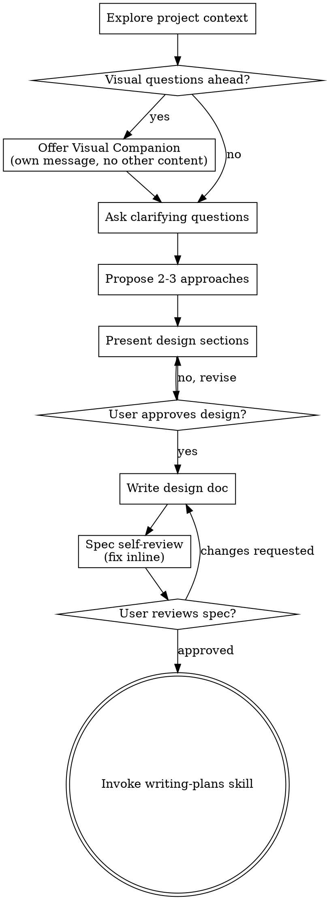

<!-- Generated by SpecStory, Markdown v2.1.0 -->

# 2026-04-10 21:54:02Z

<!-- Claude Code Session 425ed9e8-baab-4a4a-9736-a0cae3831cfe (2026-04-10 21:54:02Z) -->

_**User (2026-04-10 21:54:02Z)**_

I want to improve the UI for the games.
When I have 10 slots, we are breaking into 2 lines, I don't like that, I want to be able to display a single line.

Also, the font-size is too big to fit some of the tiles. I want to increase the width depending on the text.

This is a screenshot of the issues for SortNumbers with the following sequence:
Sequence: 1000, 2000, 3000, 4000, 5000, 6000, 7000, 8000, 9000, 10000

---

_**Agent (claude-opus-4-6 2026-04-10 21:54:08Z)**_

<think><details><summary>Thought Process</summary>
 The user wants to fix the SortNumbers game UI—specifically the 10-slot layout is wrapping and the font size is too large. Before diving into solutions, I should use the brainstorming skill since this is a design task that requires creative thinking.
</details></think>

_**Agent (claude-opus-4-6 2026-04-10 21:54:08Z)**_

<tool-use data-tool-type="generic" data-tool-name="Skill"><details>
<summary>Tool use: **Skill**</summary>

**Input:**

- skill: `superpowers:brainstorming`

</details></tool-use>

---

_**User (2026-04-10 21:54:08Z)**_

Base directory for this skill: /Users/leocaseiro/.claude/plugins/cache/claude-plugins-official/superpowers/5.0.7/skills/brainstorming

# Brainstorming Ideas Into Designs

Help turn ideas into fully formed designs and specs through natural collaborative dialogue.

Start by understanding the current project context, then ask questions one at a time to refine the idea. Once you understand what you're building, present the design and get user approval.

<HARD-GATE>
Do NOT invoke any implementation skill, write any code, scaffold any project, or take any implementation action until you have presented a design and the user has approved it. This applies to EVERY project regardless of perceived simplicity.
</HARD-GATE>

## Anti-Pattern: "This Is Too Simple To Need A Design"

Every project goes through this process. A todo list, a single-function utility, a config change — all of them. "Simple" projects are where unexamined assumptions cause the most wasted work. The design can be short (a few sentences for truly simple projects), but you MUST present it and get approval.

## Checklist

You MUST create a task for each of these items and complete them in order:

1. **Explore project context** — check files, docs, recent commits
2. **Offer visual companion** (if topic will involve visual questions) — this is its own message, not combined with a clarifying question. See the Visual Companion section below.
3. **Ask clarifying questions** — one at a time, understand purpose/constraints/success criteria
4. **Propose 2-3 approaches** — with trade-offs and your recommendation
5. **Present design** — in sections scaled to their complexity, get user approval after each section
6. **Write design doc** — save to `docs/superpowers/specs/YYYY-MM-DD-<topic>-design.md` and commit
7. **Spec self-review** — quick inline check for placeholders, contradictions, ambiguity, scope (see below)
8. **User reviews written spec** — ask user to review the spec file before proceeding
9. **Transition to implementation** — invoke writing-plans skill to create implementation plan

## Process Flow



**The terminal state is invoking writing-plans.** Do NOT invoke frontend-design, mcp-builder, or any other implementation skill. The ONLY skill you invoke after brainstorming is writing-plans.

## The Process

**Understanding the idea:**

- Check out the current project state first (files, docs, recent commits)
- Before asking detailed questions, assess scope: if the request describes multiple independent subsystems (e.g., "build a platform with chat, file storage, billing, and analytics"), flag this immediately. Don't spend questions refining details of a project that needs to be decomposed first.
- If the project is too large for a single spec, help the user decompose into sub-projects: what are the independent pieces, how do they relate, what order should they be built? Then brainstorm the first sub-project through the normal design flow. Each sub-project gets its own spec → plan → implementation cycle.
- For appropriately-scoped projects, ask questions one at a time to refine the idea
- Prefer multiple choice questions when possible, but open-ended is fine too
- Only one question per message - if a topic needs more exploration, break it into multiple questions
- Focus on understanding: purpose, constraints, success criteria

**Exploring approaches:**

- Propose 2-3 different approaches with trade-offs
- Present options conversationally with your recommendation and reasoning
- Lead with your recommended option and explain why

**Presenting the design:**

- Once you believe you understand what you're building, present the design
- Scale each section to its complexity: a few sentences if straightforward, up to 200-300 words if nuanced
- Ask after each section whether it looks right so far
- Cover: architecture, components, data flow, error handling, testing
- Be ready to go back and clarify if something doesn't make sense

**Design for isolation and clarity:**

- Break the system into smaller units that each have one clear purpose, communicate through well-defined interfaces, and can be understood and tested independently
- For each unit, you should be able to answer: what does it do, how do you use it, and what does it depend on?
- Can someone understand what a unit does without reading its internals? Can you change the internals without breaking consumers? If not, the boundaries need work.
- Smaller, well-bounded units are also easier for you to work with - you reason better about code you can hold in context at once, and your edits are more reliable when files are focused. When a file grows large, that's often a signal that it's doing too much.

**Working in existing codebases:**

- Explore the current structure before proposing changes. Follow existing patterns.
- Where existing code has problems that affect the work (e.g., a file that's grown too large, unclear boundaries, tangled responsibilities), include targeted improvements as part of the design - the way a good developer improves code they're working in.
- Don't propose unrelated refactoring. Stay focused on what serves the current goal.

## After the Design

**Documentation:**

- Write the validated design (spec) to `docs/superpowers/specs/YYYY-MM-DD-<topic>-design.md`
  - (User preferences for spec location override this default)
- Use elements-of-style:writing-clearly-and-concisely skill if available
- Commit the design document to git

**Spec Self-Review:**
After writing the spec document, look at it with fresh eyes:

1. **Placeholder scan:** Any "TBD", "TODO", incomplete sections, or vague requirements? Fix them.
2. **Internal consistency:** Do any sections contradict each other? Does the architecture match the feature descriptions?
3. **Scope check:** Is this focused enough for a single implementation plan, or does it need decomposition?
4. **Ambiguity check:** Could any requirement be interpreted two different ways? If so, pick one and make it explicit.

Fix any issues inline. No need to re-review — just fix and move on.

**User Review Gate:**
After the spec review loop passes, ask the user to review the written spec before proceeding:

> "Spec written and committed to `<path>`. Please review it and let me know if you want to make any changes before we start writing out the implementation plan."

Wait for the user's response. If they request changes, make them and re-run the spec review loop. Only proceed once the user approves.

**Implementation:**

- Invoke the writing-plans skill to create a detailed implementation plan
- Do NOT invoke any other skill. writing-plans is the next step.

## Key Principles

- **One question at a time** - Don't overwhelm with multiple questions
- **Multiple choice preferred** - Easier to answer than open-ended when possible
- **YAGNI ruthlessly** - Remove unnecessary features from all designs
- **Explore alternatives** - Always propose 2-3 approaches before settling
- **Incremental validation** - Present design, get approval before moving on
- **Be flexible** - Go back and clarify when something doesn't make sense

## Visual Companion

A browser-based companion for showing mockups, diagrams, and visual options during brainstorming. Available as a tool — not a mode. Accepting the companion means it's available for questions that benefit from visual treatment; it does NOT mean every question goes through the browser.

**Offering the companion:** When you anticipate that upcoming questions will involve visual content (mockups, layouts, diagrams), offer it once for consent:
> "Some of what we're working on might be easier to explain if I can show it to you in a web browser. I can put together mockups, diagrams, comparisons, and other visuals as we go. This feature is still new and can be token-intensive. Want to try it? (Requires opening a local URL)"

**This offer MUST be its own message.** Do not combine it with clarifying questions, context summaries, or any other content. The message should contain ONLY the offer above and nothing else. Wait for the user's response before continuing. If they decline, proceed with text-only brainstorming.

**Per-question decision:** Even after the user accepts, decide FOR EACH QUESTION whether to use the browser or the terminal. The test: **would the user understand this better by seeing it than reading it?**

- **Use the browser** for content that IS visual — mockups, wireframes, layout comparisons, architecture diagrams, side-by-side visual designs
- **Use the terminal** for content that is text — requirements questions, conceptual choices, tradeoff lists, A/B/C/D text options, scope decisions

A question about a UI topic is not automatically a visual question. "What does personality mean in this context?" is a conceptual question — use the terminal. "Which wizard layout works better?" is a visual question — use the browser.

If they agree to the companion, read the detailed guide before proceeding:
`skills/brainstorming/visual-companion.md`

---

_**Agent (claude-opus-4-6 2026-04-10 21:54:11Z)**_

<think><details><summary>Thought Process</summary>
 Let me start by understanding what the user is looking for with the SortNumbers game and what UI improvements might help.
</details></think>

_**Agent (claude-opus-4-6 2026-04-10 21:54:11Z)**_

I'll follow the brainstorming process. Let me start by exploring the relevant code.

_**Agent (claude-opus-4-6 2026-04-10 21:54:13Z)**_

<tool-use data-tool-type="search" data-tool-name="Glob"><details>
<summary>Tool use: **Glob**</summary>
 pattern `**/SortNumbers/**`

```text
worktrees/feat-word-spell-number-match/src/games/sort-numbers/SortNumbers/SortNumbers.tsx
worktrees/feat/service-worker-workbox-offline-setup/src/games/sort-numbers/SortNumbers/SortNumbers.tsx
src/games/sort-numbers/SortNumbers/SortNumbers.stories.tsx
src/games/sort-numbers/SortNumbers/SortNumbers.tsx
worktrees/feat-pr-previews-auto-bump/src/games/sort-numbers/SortNumbers/SortNumbers.stories.tsx
worktrees/feat-pr-previews-auto-bump/src/games/sort-numbers/SortNumbers/SortNumbers.tsx
```

</details></tool-use>

_**Agent (claude-opus-4-6 2026-04-10 21:54:13Z)**_

<tool-use data-tool-type="search" data-tool-name="Glob"><details>
<summary>Tool use: **Glob**</summary>
 pattern `**/sort-numbers/**`

```text
worktrees/feat-word-spell-number-match/src/games/sort-numbers/NumberSequenceSlots/NumberSequenceSlots.test.tsx
worktrees/feat-word-spell-number-match/src/games/sort-numbers/NumberSequenceSlots/NumberSequenceSlots.tsx
worktrees/feat-word-spell-number-match/src/games/sort-numbers/SortNumbers/SortNumbers.tsx
worktrees/feat-word-spell-number-match/src/games/sort-numbers/SortNumbersTileBank/SortNumbersTileBank.test.tsx
worktrees/feat-word-spell-number-match/src/games/sort-numbers/SortNumbersTileBank/SortNumbersTileBank.tsx
worktrees/feat-word-spell-number-match/src/games/sort-numbers/build-sort-round.test.ts
worktrees/feat-word-spell-number-match/src/games/sort-numbers/build-sort-round.ts
worktrees/feat-word-spell-number-match/src/games/sort-numbers/types.ts
worktrees/feat/service-worker-workbox-offline-setup/src/games/sort-numbers/NumberSequenceSlots/NumberSequenceSlots.stories.tsx
worktrees/feat/service-worker-workbox-offline-setup/src/games/sort-numbers/NumberSequenceSlots/NumberSequenceSlots.test.tsx
worktrees/feat/service-worker-workbox-offline-setup/src/games/sort-numbers/NumberSequenceSlots/NumberSequenceSlots.tsx
worktrees/feat/service-worker-workbox-offline-setup/src/games/sort-numbers/SortNumbersTileBank/SortNumbersTileBank.stories.tsx
worktrees/feat/service-worker-workbox-offline-setup/src/games/sort-numbers/SortNumbersTileBank/SortNumbersTileBank.test.tsx
worktrees/feat/service-worker-workbox-offline-setup/src/games/sort-numbers/SortNumbersTileBank/SortNumbersTileBank.tsx
worktrees/feat/service-worker-workbox-offline-setup/src/games/sort-numbers/build-sort-round.test.ts
worktrees/feat/service-worker-workbox-offline-setup/src/games/sort-numbers/build-sort-round.ts
worktrees/feat/service-worker-workbox-offline-setup/src/games/sort-numbers/types.ts
worktrees/feat/service-worker-workbox-offline-setup/src/games/sort-numbers/SortNumbers/SortNumbers.tsx
src/games/sort-numbers/SortNumbersTileBank/SortNumbersTileBank.stories.tsx
src/games/sort-numbers/SortNumbersTileBank/SortNumbersTileBank.test.tsx
src/games/sort-numbers/SortNumbersConfigForm/SortNumbersConfigForm.test.tsx
src/games/sort-numbers/SortNumbersConfigForm/SortNumbersConfigForm.tsx
src/games/sort-numbers/build-sort-round.test.ts
src/games/sort-numbers/build-sort-round.ts
src/games/sort-numbers/is-rounds-stale.test.ts
src/games/sort-numbers/is-rounds-stale.ts
src/games/sort-numbers/types.ts
src/games/sort-numbers/SortNumbers/SortNumbers.stories.tsx
src/games/sort-numbers/SortNumbers/SortNumbers.tsx
src/games/sort-numbers/resolve-simple-config.test.ts
src/games/sort-numbers/resolve-simple-config.ts
src/games/sort-numbers/sort-numbers-level-generator.test.ts
src/games/sort-numbers/sort-numbers-level-generator.ts
src/games/sort-numbers/SortNumbersTileBank/SortNumbersTileBank.tsx
worktrees/feat-pr-previews-auto-bump/src/games/sort-numbers/SortNumbers/SortNumbers.stories.tsx
worktrees/feat-pr-previews-auto-bump/src/games/sort-numbers/SortNumbers/SortNumbers.tsx
worktrees/feat-pr-previews-auto-bump/src/games/sort-numbers/SortNumbersConfigForm/SortNumbersConfigForm.test.tsx
worktrees/feat-pr-previews-auto-bump/src/games/sort-numbers/SortNumbersConfigForm/SortNumbersConfigForm.tsx
worktrees/feat-pr-previews-auto-bump/src/games/sort-numbers/SortNumbersTileBank/SortNumbersTileBank.stories.tsx
worktrees/feat-pr-previews-auto-bump/src/games/sort-numbers/SortNumbersTileBank/SortNumbersTileBank.test.tsx
worktrees/feat-pr-previews-auto-bump/src/games/sort-numbers/SortNumbersTileBank/SortNumbersTileBank.tsx
worktrees/feat-pr-previews-auto-bump/src/games/sort-numbers/build-sort-round.test.ts
worktrees/feat-pr-previews-auto-bump/src/games/sort-numbers/build-sort-round.ts
worktrees/feat-pr-previews-auto-bump/src/games/sort-numbers/is-rounds-stale.test.ts
worktrees/feat-pr-previews-auto-bump/src/games/sort-numbers/is-rounds-stale.ts
worktrees/feat-pr-previews-auto-bump/src/games/sort-numbers/resolve-simple-config.test.ts
worktrees/feat-pr-previews-auto-bump/src/games/sort-numbers/resolve-simple-config.ts
worktrees/feat-pr-previews-auto-bump/src/games/sort-numbers/sort-numbers-level-generator.test.ts
worktrees/feat-pr-previews-auto-bump/src/games/sort-numbers/sort-numbers-level-generator.ts
worktrees/feat-pr-previews-auto-bump/src/games/sort-numbers/types.ts
```

</details></tool-use>

_**Agent (claude-opus-4-6 2026-04-10 21:54:15Z)**_

<tool-use data-tool-type="read" data-tool-name="Read"><details>
<summary>Tool use: **Read**</summary>
 `./src/games/sort-numbers/SortNumbers/SortNumbers.tsx`

```text
1 import { useNavigate, useParams } from '@tanstack/react-router';
2 import { useEffect, useMemo, useRef, useState } from 'react';
3 import { useTranslation } from 'react-i18next';
4 import { buildSortRound } from '../build-sort-round';
5 import { SortNumbersTileBank } from '../SortNumbersTileBank/SortNumbersTileBank';
6 import type { SortNumbersConfig } from '../types';
7 import type {
8   AnswerGameConfig,
9   AnswerGameDraftState,
10   AnswerZone,
11   TileItem,
12 } from '@/components/answer-game/types';
13 import { AnswerGame } from '@/components/answer-game/AnswerGame/AnswerGame';
14 import { GameOverOverlay } from '@/components/answer-game/GameOverOverlay/GameOverOverlay';
15 import { LevelCompleteOverlay } from '@/components/answer-game/LevelCompleteOverlay/LevelCompleteOverlay';
16 import { ScoreAnimation } from '@/components/answer-game/ScoreAnimation/ScoreAnimation';
17 import { Slot } from '@/components/answer-game/Slot/Slot';
18 import { SlotRow } from '@/components/answer-game/Slot/SlotRow';
19 import { useAnswerGameContext } from '@/components/answer-game/useAnswerGameContext';
20 import { useAnswerGameDispatch } from '@/components/answer-game/useAnswerGameDispatch';
21 import { useGameSounds } from '@/components/answer-game/useGameSounds';
22 import { useRoundTTS } from '@/components/answer-game/useRoundTTS';
23 import { buildRoundOrder } from '@/games/build-round-order';
24 
25 interface SortNumbersProps {
26   config: SortNumbersConfig;
27   initialState?: AnswerGameDraftState;
28   sessionId?: string;
29   seed?: string;
30 }
31 
32 const SortNumbersSession = ({
33   sortNumbersConfig,
34   roundOrder,
35   onRestartSession,
36 }: {
37   sortNumbersConfig: SortNumbersConfig;
38   roundOrder: readonly number[];
39   onRestartSession: () => void;
40 }) => {
41   const { t } = useTranslation('games');
42   const { phase, roundIndex, retryCount, zones, levelIndex } =
43     useAnswerGameContext();
44   const dispatch = useAnswerGameDispatch();
45   const { confettiReady, levelCompleteReady, gameOverReady } =
46     useGameSounds();
47   const navigate = useNavigate();
48   const { locale } = useParams({ from: '/$locale' });
49   const completionToken = useRef(0);
50 
51   const configRoundIndex = roundOrder[roundIndex];
52   const round =
53     configRoundIndex === undefined
54       ? undefined
55       : sortNumbersConfig.rounds[configRoundIndex];
56 
57   const directionLabel =
58     sortNumbersConfig.direction === 'ascending'
59       ? t('sort-numbers-ui.ascending-label')
60       : t('sort-numbers-ui.descending-label');
61 
62   useRoundTTS(directionLabel);
63 
64   const handleHome = () => {
65     void navigate({ to: '/$locale', params: { locale } });
66   };
67 
68   const handlePlayAgain = () => {
69     onRestartSession();
70   };
71 
72   const handleNextLevel = () => {
73     const generateNextLevel =
74       sortNumbersConfig.levelMode?.generateNextLevel;
75     if (!generateNextLevel) return;
76 
77     const nextLevel = generateNextLevel(levelIndex);
78     if (nextLevel) {
79       dispatch({
80         type: 'ADVANCE_LEVEL',
81         tiles: nextLevel.tiles,
82         zones: nextLevel.zones,
83       });
84     } else {
85       dispatch({ type: 'COMPLETE_GAME' });
86     }
87   };
88 
89   const handleDone = () => {
90     dispatch({ type: 'COMPLETE_GAME' });
91   };
92 
93   useEffect(() => {
94     if (phase !== 'round-complete' || !confettiReady) return;
95 
96     const token = ++completionToken.current;
97     const delayMs = 750;
98     const timer = globalThis.setTimeout(() => {
99       if (completionToken.current !== token) return;
100 
101       const isLastRound = roundIndex >= roundOrder.length - 1;
102       if (isLastRound) {
103         dispatch({ type: 'COMPLETE_GAME' });
104         return;
105       }
106 
107       const nextConfigIndex = roundOrder[roundIndex + 1];
108       const nextRound =
109         nextConfigIndex === undefined
110           ? undefined
111           : sortNumbersConfig.rounds[nextConfigIndex];
112 
113       if (!nextRound) {
114         dispatch({ type: 'COMPLETE_GAME' });
115         return;
116       }
117 
118       const distractor =
119         sortNumbersConfig.tileBankMode === 'distractors'
120           ? {
121               config: sortNumbersConfig.distractors,
122               range: sortNumbersConfig.range,
123             }
124           : undefined;
125 
126       const { tiles: nextTiles, zones: nextZones } = buildSortRound(
127         nextRound.sequence,
128         sortNumbersConfig.direction,
129         distractor,
130       );
131       dispatch({
132         type: 'ADVANCE_ROUND',
133         tiles: nextTiles,
134         zones: nextZones,
135       });
136     }, delayMs);
137 
138     return () => {
139       globalThis.clearTimeout(timer);
140     };
141   }, [
142     phase,
143     confettiReady,
144     roundIndex,
145     dispatch,
146     roundOrder,
147     sortNumbersConfig.rounds,
148     sortNumbersConfig.direction,
149     sortNumbersConfig.tileBankMode,
150     sortNumbersConfig.distractors,
151     sortNumbersConfig.range,
152   ]);
153 
154   if (!round) return null;
155 
156   return (
157     <>
158       <div className="flex w-full max-w-2xl flex-col items-center justify-center gap-8 px-4 py-6">
159         <AnswerGame.Question>
160           <p className="text-center text-lg font-semibold text-foreground">
161             {directionLabel}
162           </p>
163         </AnswerGame.Question>
164         <AnswerGame.Answer>
165           <SlotRow className="gap-2">
166             {zones.map((zone, i) => (
167               <Slot
168                 key={zone.id}
169                 index={i}
170                 className="size-14 rounded-lg"
171               >
172                 {({ label }) => (
173                   <span className="text-2xl font-bold">{label}</span>
174                 )}
175               </Slot>
176             ))}
177           </SlotRow>
178         </AnswerGame.Answer>
179         <AnswerGame.Choices>
180           <SortNumbersTileBank />
181         </AnswerGame.Choices>
182       </div>
183       <ScoreAnimation visible={confettiReady} />
184       {levelCompleteReady ? (
185         <LevelCompleteOverlay
186           level={levelIndex + 1}
187           onNextLevel={handleNextLevel}
188           onDone={handleDone}
189         />
190       ) : null}
191       {gameOverReady ? (
192         <GameOverOverlay
193           retryCount={retryCount}
194           onPlayAgain={handlePlayAgain}
195           onHome={handleHome}
196         />
197       ) : null}
198     </>
199   );
200 };
201 
202 export const SortNumbers = ({
203   config,
204   initialState,
205   sessionId,
206   seed,
207 }: SortNumbersProps) => {
208   const roundsInOrder = config.roundsInOrder === true;
209   const [sessionEpoch, setSessionEpoch] = useState(0);
210 
211   const roundOrder = useMemo(() => {
212     void sessionEpoch;
213     return buildRoundOrder(config.rounds.length, roundsInOrder, seed);
214   }, [config.rounds.length, roundsInOrder, seed, sessionEpoch]);
215 
216   const firstConfigIndex = roundOrder[0];
217   const round0 =
218     firstConfigIndex === undefined
219       ? undefined
220       : config.rounds[firstConfigIndex];
221 
222   const { tiles, zones } = useMemo(() => {
223     if (!round0) {
224       return { tiles: [] as TileItem[], zones: [] as AnswerZone[] };
225     }
226     const distractor =
227       config.tileBankMode === 'distractors'
228         ? { config: config.distractors, range: config.range }
229         : undefined;
230     return buildSortRound(
231       round0.sequence,
232       config.direction,
233       distractor,
234     );
235   }, [
236     round0,
237     config.direction,
238     config.tileBankMode,
239     config.distractors,
240     config.range,
241   ]);
242 
243   const answerGameConfig = useMemo(
244     (): AnswerGameConfig => ({
245       gameId: config.gameId,
246       inputMethod: config.inputMethod,
247       wrongTileBehavior: config.wrongTileBehavior,
248       tileBankMode: config.tileBankMode,
249       totalRounds: config.rounds.length,
250       roundsInOrder: config.roundsInOrder,
251       ttsEnabled: config.ttsEnabled,
252       touchKeyboardInputMode: 'numeric',
253       initialTiles: tiles,
254       initialZones: zones,
255       slotInteraction: 'free-swap' as const,
256       levelMode: config.levelMode,
257     }),
258     [
259       config.gameId,
260       config.inputMethod,
261       config.wrongTileBehavior,
262       config.tileBankMode,
263       config.rounds.length,
264       config.roundsInOrder,
265       config.ttsEnabled,
266       config.levelMode,
267       tiles,
268       zones,
269     ],
270   );
271 
272   if (!round0) return null;
273 
274   return (
275     <AnswerGame
276       config={answerGameConfig}
277       initialState={initialState}
278       sessionId={sessionId}
279     >
280       <SortNumbersSession
281         sortNumbersConfig={config}
282         roundOrder={roundOrder}
283         onRestartSession={() => {
284           setSessionEpoch((e) => e + 1);
285         }}
286       />
287     </AnswerGame>
288   );
289 };
290
```

</details></tool-use>

_**Agent (claude-opus-4-6 2026-04-10 21:54:16Z)**_

<tool-use data-tool-type="read" data-tool-name="Read"><details>
<summary>Tool use: **Read**</summary>
 `./src/games/sort-numbers/SortNumbersTileBank/SortNumbersTileBank.tsx`

```text
1 import type { TileItem } from '@/components/answer-game/types';
2 import { skeuoStyle } from '@/components/answer-game/styles';
3 import { useAnswerGameContext } from '@/components/answer-game/useAnswerGameContext';
4 import { useBankDropTarget } from '@/components/answer-game/useBankDropTarget';
5 import { useDraggableTile } from '@/components/answer-game/useDraggableTile';
6 
7 const NumberTile = ({ tile }: { tile: TileItem }) => {
8   const {
9     ref,
10     handleClick,
11     onPointerDown,
12     onPointerMove,
13     onPointerUp,
14     onPointerCancel,
15   } = useDraggableTile(tile);
16 
17   return (
18     <button
19       ref={ref}
20       type="button"
21       aria-label={`Number ${tile.label}`}
22       className="flex size-14 touch-none select-none cursor-grab items-center justify-center rounded-xl text-2xl font-bold transition-transform active:scale-95 active:cursor-grabbing"
23       style={skeuoStyle}
24       onClick={handleClick}
25       onPointerDown={onPointerDown}
26       onPointerMove={onPointerMove}
27       onPointerUp={onPointerUp}
28       onPointerCancel={onPointerCancel}
29     >
30       {tile.label}
31     </button>
32   );
33 };
34 
35 export const SortNumbersTileBank = () => {
36   const {
37     allTiles,
38     bankTileIds,
39     dragActiveTileId,
40     dragHoverBankTileId,
41   } = useAnswerGameContext();
42   const { bankRef, isDragOver } = useBankDropTarget();
43 
44   return (
45     <div
46       ref={bankRef}
47       data-tile-bank=""
48       className="flex flex-wrap justify-center gap-3"
49     >
50       {allTiles
51         .filter((t) => !t.id.startsWith('typed-'))
52         .map((tile) => {
53           const inBank = bankTileIds.includes(tile.id);
54           const isDragging = tile.id === dragActiveTileId;
55           const isHoverTarget =
56             tile.id === dragHoverBankTileId ||
57             (!dragHoverBankTileId &&
58               isDragOver &&
59               !inBank &&
60               tile.id === dragActiveTileId);
61 
62           if (inBank) {
63             return (
64               <div
65                 key={tile.id}
66                 className="relative size-14 rounded-xl transition-all"
67               >
68                 <div
69                   data-tile-bank-hole={tile.id}
70                   className="size-14 rounded-xl bg-muted/60 shadow-inner"
71                   aria-hidden="true"
72                 />
73                 <div
74                   className={`absolute inset-0${isDragging ? ' opacity-30 pointer-events-none' : ''}`}
75                   aria-hidden={isDragging || undefined}
76                 >
77                   <NumberTile tile={tile} />
78                 </div>
79                 {isHoverTarget && (
80                   <div
81                     className="pointer-events-none absolute inset-0 rounded-xl border-2 border-dashed border-primary"
82                     aria-hidden="true"
83                   />
84                 )}
85               </div>
86             );
87           }
88 
89           return (
90             <div
91               key={tile.id}
92               data-tile-bank-hole={tile.id}
93               className={`relative size-14 rounded-xl bg-muted/60 shadow-inner transition-all${isHoverTarget ? ' border-2 border-dashed border-primary' : ''}`}
94               aria-hidden="true"
95             >
96               {isHoverTarget && (
97                 <span className="absolute inset-0 flex items-center justify-center text-2xl font-bold opacity-50">
98                   {tile.label}
99                 </span>
100               )}
101             </div>
102           );
103         })}
104     </div>
105   );
106 };
107
```

</details></tool-use>

_**Agent (claude-opus-4-6 2026-04-10 21:54:20Z)**_

<think><details><summary>Thought Process</summary>
 So the tiles are constrained to 56 pixels with 2xl text, which causes "10000" to overflow. The SlotRow wraps based on the container's max-width constraint, so I need to look at that component too.
</details></think>

_**Agent (claude-opus-4-6 2026-04-10 21:54:20Z)**_

Let me check the SlotRow and Slot components, and look at other games to see if this pattern applies more broadly.

_**Agent (claude-opus-4-6 2026-04-10 21:54:21Z)**_

<tool-use data-tool-type="read" data-tool-name="Read"><details>
<summary>Tool use: **Read**</summary>
 `./src/components/answer-game/Slot/SlotRow.tsx`

```text
1 import type { ReactNode } from 'react';
2 
3 interface SlotRowProps {
4   className?: string;
5   children: ReactNode;
6 }
7 
8 export const SlotRow = ({ className, children }: SlotRowProps) => (
9   <ol
10     className={['flex flex-wrap items-center justify-center', className]
11       .filter(Boolean)
12       .join(' ')}
13   >
14     {children}
15   </ol>
16 );
17
```

</details></tool-use>

_**Agent (claude-opus-4-6 2026-04-10 21:54:22Z)**_

<tool-use data-tool-type="read" data-tool-name="Read"><details>
<summary>Tool use: **Read**</summary>
 `./src/components/answer-game/Slot/Slot.tsx`

```text
1 import { skeuoStyle } from '../styles';
2 import { useSlotBehavior } from './useSlotBehavior';
3 import type { SlotRenderProps } from './useSlotBehavior';
4 import type { ReactNode, Ref } from 'react';
5 
6 interface SlotProps {
7   index: number;
8   as?: 'li' | 'span' | 'div';
9   className?: string;
10   children: (props: SlotRenderProps) => ReactNode;
11   /**
12    * Optional custom preview renderer. Invoked during drag-hover or swap
13    * preview when there is a `previewLabel`. Lets a game render a visual
14    * preview (e.g. a domino face) instead of the default bold text. Must
15    * apply its own opacity/styling. When omitted, the default
16    * `<span>{previewLabel}</span>` is used.
17    */
18   renderPreview?: (previewLabel: string) => ReactNode;
19 }
20 
21 export const Slot = ({
22   index,
23   as: Tag = 'li',
24   className,
25   children,
26   renderPreview,
27 }: SlotProps) => {
28   const {
29     renderProps,
30     outerRef,
31     slotRef,
32     dragRef,
33     handleClick,
34     pointerHandlers,
35     isBeingDragged,
36   } = useSlotBehavior(index);
37 
38   const {
39     label,
40     isEmpty,
41     isWrong,
42     showCursor,
43     isPreview,
44     previewLabel,
45   } = renderProps;
46 
47   // When the slot is used inline (as="span", e.g. SentenceWithGaps inside <p>),
48   // the inner visual element must also be a <span> to avoid invalid
49   // block-in-inline HTML nesting. For list/block contexts, <div> is correct.
50   const InnerTag = Tag === 'span' ? 'span' : 'div';
51 
52   const ariaLabel = isEmpty
53     ? `Slot ${index + 1}, empty`
54     : `Slot ${index + 1}, filled with ${label}`;
55 
56   const stateClasses = [
57     'relative flex items-center justify-center border-2 transition-all overflow-hidden',
58     isPreview
59       ? 'border-dashed border-primary'
60       : isEmpty
61         ? 'border-border'
62         : isWrong
63           ? 'border-destructive bg-destructive/10 text-destructive'
64           : 'border-primary bg-primary/10 text-primary',
65     // Focus ring on active slot (driven by showCursor, works in all modes)
66     showCursor && isWrong
67       ? 'ring-2 ring-destructive ring-offset-2'
68       : showCursor
69         ? 'border-primary ring-2 ring-primary ring-offset-2'
70         : '',
71   ]
72     .filter(Boolean)
73     .join(' ');
74 
75   return (
76     // Outer wrapper: the drop target. p-1.5 expands the hit area ~6 px beyond
77     // the visual slot on all sides (pragmatic-board card pattern). data-zone-index
78     // here ensures touch elementsFromPoint also covers the expanded region.
79     <Tag
80       ref={
81         outerRef as Ref<
82           HTMLLIElement & HTMLSpanElement & HTMLDivElement
83         >
84       }
85       aria-label={ariaLabel}
86       data-zone-index={index}
87       className="relative p-1.5"
88     >
89       {/* Inner visual slot: carries the state-dependent styling. */}
90       <InnerTag
91         ref={slotRef as Ref<HTMLDivElement>}
92         className={[stateClasses, className].filter(Boolean).join(' ')}
93         style={
94           isPreview
95             ? { animation: 'pulse-ring 1.5s ease-in-out infinite' }
96             : undefined
97         }
98       >
99         {isEmpty ? (
100           <>
101             {isPreview && previewLabel !== null ? (
102               renderPreview ? (
103                 renderPreview(previewLabel)
104               ) : (
105                 <span className="text-xl font-bold opacity-50">
106                   {previewLabel}
107                 </span>
108               )
109             ) : (
110               children(renderProps)
111             )}
112             {showCursor ? (
113               <span
114                 aria-hidden="true"
115                 className="pointer-events-none absolute bottom-2 left-1/2 h-0.5 w-7 -translate-x-1/2 rounded-sm bg-primary animate-blink"
116               />
117             ) : null}
118           </>
119         ) : (
120           <>
121             <div
122               className="absolute inset-0 bg-muted/60 shadow-inner"
123               aria-hidden="true"
124             />
125             <button
126               ref={dragRef}
127               type="button"
128               className={`absolute inset-0 flex touch-none select-none cursor-grab items-center justify-center rounded-[inherit] text-card-foreground${isBeingDragged && !isPreview ? ' invisible pointer-events-none' : ''}${isPreview ? ' opacity-50' : ''}`}
129               aria-hidden={
130                 isBeingDragged && !isPreview ? 'true' : undefined
131               }
132               style={skeuoStyle}
133               onClick={handleClick}
134               onPointerDown={pointerHandlers.onPointerDown}
135               onPointerMove={pointerHandlers.onPointerMove}
136               onPointerUp={pointerHandlers.onPointerUp}
137               onPointerCancel={pointerHandlers.onPointerCancel}
138             >
139               {isPreview && previewLabel !== null ? (
140                 renderPreview ? (
141                   renderPreview(previewLabel)
142                 ) : (
143                   <span className="text-xl font-bold">
144                     {previewLabel}
145                   </span>
146                 )
147               ) : (
148                 children(renderProps)
149               )}
150             </button>
151             {showCursor ? (
152               <span
153                 aria-hidden="true"
154                 className="pointer-events-none absolute bottom-2 left-1/2 h-0.5 w-7 -translate-x-1/2 rounded-sm bg-destructive animate-blink"
155               />
156             ) : null}
157           </>
158         )}
159       </InnerTag>
160     </Tag>
161   );
162 };
163
```

</details></tool-use>

_**Agent (claude-opus-4-6 2026-04-10 21:54:26Z)**_

<tool-use data-tool-type="shell" data-tool-name="Bash"><details>
<summary>Tool use: **Bash**</summary>
List games folder

`ls src/games/`

```text
build-round-order.test.ts
build-round-order.ts
catalog-utils.mdx
catalog-utils.test.ts
catalog-utils.ts
config-fields-registry.ts
level-system.mdx
number-match
registry.test.ts
registry.ts
sort-numbers
word-spell
```

</details></tool-use>

_**Agent (claude-opus-4-6 2026-04-10 21:54:26Z)**_

<tool-use data-tool-type="search" data-tool-name="Grep"><details>
<summary>Tool use: **Grep**</summary>
 path `./src` pattern `size-14`

```text
Found 7 files
src/games/word-spell/LetterTileBank/LetterTileBank.tsx
src/games/sort-numbers/SortNumbersTileBank/SortNumbersTileBank.tsx
src/games/sort-numbers/SortNumbers/SortNumbers.tsx
src/components/answer-game/Slot/Slot.test.tsx
src/games/word-spell/WordSpell/WordSpell.tsx
src/components/answer-game/Slot/Slot.stories.tsx
src/components/questions/AudioButton/AudioButton.tsx
```

</details></tool-use>

_**Agent (claude-opus-4-6 2026-04-10 21:54:33Z)**_

<think><details><summary>Thought Process</summary>
 I'm noticing that size-14 (56px) tiles appear in multiple games like sort-numbers and word-spell, and since the user mentioned "the games" broadly, this UI fix might need to apply across several of them. The core issue is that while numbers like 5000 fit fine in the 24px text, 10000 overflows, so I should clarify the scope and set up some action items before diving into solutions.
</details></think>

_**Agent (claude-opus-4-6 2026-04-10 21:54:33Z)**_

<tool-use data-tool-type="unknown" data-tool-name="ToolSearch"><details>
<summary>Tool use: **ToolSearch**</summary>

**Input:**

- max_results: `1`
- query: `select:TodoWrite`

**Result:**

```

```

</details></tool-use>

_**Agent (claude-opus-4-6 2026-04-10 21:54:38Z)**_

<tool-use data-tool-type="task" data-tool-name="TodoWrite"><details>
<summary>Tool use: **TodoWrite**</summary>
**Agent task list:**
- [X] 🌡️ Explore project context
- [⚡] 🌡️ Ask clarifying questions
- [ ] 🌡️ Propose 2-3 approaches
- [ ] 🌡️ Present design
- [ ] 🌡️ Write design doc
- [ ] 🌡️ Spec self-review
- [ ] 🌡️ Wait for user spec review
- [ ] 🌡️ Invoke writing-plans skill

</details></tool-use>

_**Agent (claude-opus-4-6 2026-04-10 21:54:50Z)**_

Here's what I found so far:

- Tiles and slots are hard-coded `size-14` (56px) with `text-2xl`, in both [SortNumbers.tsx:170](src/games/sort-numbers/SortNumbers/SortNumbers.tsx#L170) and [SortNumbersTileBank.tsx:22](src/games/sort-numbers/SortNumbersTileBank/SortNumbersTileBank.tsx#L22).
- [SlotRow.tsx:10](src/components/answer-game/Slot/SlotRow.tsx#L10) uses `flex flex-wrap` — that's why 10 slots wrap at the `max-w-2xl` (672px) container.
- `word-spell` uses the same `size-14` pattern, so whatever we decide may apply there too.

Before I propose approaches, one clarifying question:

**Scope**: Do you want this fix to apply:

- **A)** Only to SortNumbers (numeric tiles) for now
- **B)** To all games that share the Slot/TileBank pattern (SortNumbers + WordSpell + future games), as a generic sizing behavior in the shared `Slot` / `SlotRow` components
- **C)** Start with SortNumbers but design it so WordSpell can adopt it later

My recommendation is **C** — solve it properly in the shared components (`Slot`, `SlotRow`, tile bank), but only wire SortNumbers to use the new behavior in this pass. Keeps the blast radius small while avoiding a duplicate fix later.

Which would you like?

---

_**User (2026-04-10 21:56:08Z)**_

B

E.g. The font-size also looks bad on the NumberMatch game if I have for example 10000 as an option.

---

_**Agent (claude-opus-4-6 2026-04-10 21:56:11Z)**_

<think><details><summary>Thought Process</summary>
 I'm going to apply this approach to all games, including NumberMatch, so let me examine how that game is structured.
</details></think>

_**Agent (claude-opus-4-6 2026-04-10 21:56:11Z)**_

Got it — option B, shared fix. Let me check NumberMatch to understand its structure too.

_**Agent (claude-opus-4-6 2026-04-10 21:56:12Z)**_

<tool-use data-tool-type="search" data-tool-name="Glob"><details>
<summary>Tool use: **Glob**</summary>
 pattern `src/games/number-match/**/*.tsx`

```text
src/games/number-match/NumberMatch/NumberMatch.stories.tsx
src/games/number-match/NumberMatch/NumberMatch.test.tsx
src/games/number-match/NumeralTileBank/NumeralTileBank.stories.tsx
src/games/number-match/NumberMatch/NumberMatch.tsx
src/games/number-match/NumeralTileBank/NumeralTileBank.test.tsx
src/games/number-match/NumeralTileBank/NumeralTileBank.tsx
```

</details></tool-use>

_**Agent (claude-opus-4-6 2026-04-10 21:56:15Z)**_

<tool-use data-tool-type="read" data-tool-name="Read"><details>
<summary>Tool use: **Read**</summary>
 `./src/games/number-match/NumberMatch/NumberMatch.tsx`

```text
1 import { useNavigate, useParams } from '@tanstack/react-router';
2 import { useEffect, useMemo, useRef, useState } from 'react';
3 import { buildNumeralRound } from '../build-numeral-round';
4 import {
5   toCardinalText,
6   toOrdinalNumber,
7   toOrdinalText,
8 } from '../number-words';
9 import {
10   DominoTile,
11   NumeralTileBank,
12 } from '../NumeralTileBank/NumeralTileBank';
13 import type { NumberMatchConfig, NumberMatchMode } from '../types';
14 import type {
15   AnswerGameConfig,
16   AnswerGameDraftState,
17   AnswerZone,
18   TileItem,
19 } from '@/components/answer-game/types';
20 import { AnswerGame } from '@/components/answer-game/AnswerGame/AnswerGame';
21 import { GameOverOverlay } from '@/components/answer-game/GameOverOverlay/GameOverOverlay';
22 import { ScoreAnimation } from '@/components/answer-game/ScoreAnimation/ScoreAnimation';
23 import { Slot } from '@/components/answer-game/Slot/Slot';
24 import { SlotRow } from '@/components/answer-game/Slot/SlotRow';
25 import { useAnswerGameContext } from '@/components/answer-game/useAnswerGameContext';
26 import { useAnswerGameDispatch } from '@/components/answer-game/useAnswerGameDispatch';
27 import { useGameSounds } from '@/components/answer-game/useGameSounds';
28 import { useRoundTTS } from '@/components/answer-game/useRoundTTS';
29 import { AudioButton } from '@/components/questions/AudioButton/AudioButton';
30 import { DotGroupQuestion } from '@/components/questions/DotGroupQuestion/DotGroupQuestion';
31 import { TextQuestion } from '@/components/questions/TextQuestion/TextQuestion';
32 import { buildRoundOrder } from '@/games/build-round-order';
33 
34 type NumberWordsLocale = 'en' | 'pt-BR';
35 
36 const WORD_MODES: ReadonlySet<NumberMatchMode> =
37   new Set<NumberMatchMode>([
38     'cardinal-number-to-text',
39     'cardinal-text-to-number',
40     'ordinal-number-to-text',
41     'ordinal-text-to-number',
42     'cardinal-to-ordinal',
43     'ordinal-to-cardinal',
44   ]);
45 
46 const isWordMode = (mode: NumberMatchMode): boolean =>
47   WORD_MODES.has(mode);
48 
49 /** Text shown in the question area for word/ordinal modes. */
50 const questionTextForMode = (
51   value: number,
52   mode: NumberMatchMode,
53   locale: NumberWordsLocale,
54 ): string => {
55   switch (mode) {
56     case 'cardinal-number-to-text': {
57       return String(value);
58     }
59     case 'cardinal-text-to-number': {
60       return toCardinalText(value, locale);
61     }
62     case 'ordinal-number-to-text': {
63       return toOrdinalNumber(value, locale);
64     }
65     case 'ordinal-text-to-number': {
66       return toOrdinalText(value, locale);
67     }
68     case 'cardinal-to-ordinal': {
69       return toCardinalText(value, locale);
70     }
71     case 'ordinal-to-cardinal': {
72       return toOrdinalText(value, locale);
73     }
74     default: {
75       return String(value);
76     }
77   }
78 };
79 
80 interface NumberMatchProps {
81   config: NumberMatchConfig;
82   initialState?: AnswerGameDraftState;
83   sessionId?: string;
84   seed?: string;
85 }
86 
87 const NumberMatchSession = ({
88   numberMatchConfig,
89   roundOrder,
90   onRestartSession,
91 }: {
92   numberMatchConfig: NumberMatchConfig;
93   roundOrder: readonly number[];
94   onRestartSession: () => void;
95 }) => {
96   const { phase, roundIndex, retryCount, zones } =
97     useAnswerGameContext();
98   const dispatch = useAnswerGameDispatch();
99   const { confettiReady, gameOverReady } = useGameSounds();
100   const navigate = useNavigate();
101   const { locale } = useParams({ from: '/$locale' });
102   const numberWordsLocale: NumberWordsLocale =
103     locale === 'pt-BR' ? 'pt-BR' : 'en';
104   const completionToken = useRef(0);
105 
106   const configRoundIndex = roundOrder[roundIndex];
107   const round =
108     configRoundIndex === undefined
109       ? undefined
110       : numberMatchConfig.rounds[configRoundIndex];
111 
112   useRoundTTS(String(round?.value ?? ''));
113 
114   const handleHome = () => {
115     void navigate({ to: '/$locale', params: { locale } });
116   };
117 
118   const handlePlayAgain = () => {
119     onRestartSession();
120   };
121 
122   useEffect(() => {
123     if (phase !== 'round-complete' || !confettiReady) return;
124 
125     const token = ++completionToken.current;
126     const delayMs = 750;
127     const timer = globalThis.setTimeout(() => {
128       if (completionToken.current !== token) return;
129 
130       const isLastRound = roundIndex >= roundOrder.length - 1;
131       if (isLastRound) {
132         dispatch({ type: 'COMPLETE_GAME' });
133         return;
134       }
135 
136       const nextConfigIndex = roundOrder[roundIndex + 1];
137       const nextRound =
138         nextConfigIndex === undefined
139           ? undefined
140           : numberMatchConfig.rounds[nextConfigIndex];
141       const value = nextRound?.value;
142       if (value === undefined) {
143         dispatch({ type: 'COMPLETE_GAME' });
144         return;
145       }
146       const { tiles: nextTiles, zones: nextZones } = buildNumeralRound(
147         value,
148         {
149           tileBankMode: numberMatchConfig.tileBankMode,
150           distractorCount: numberMatchConfig.distractorCount,
151           range: numberMatchConfig.range,
152           mode: numberMatchConfig.mode,
153           locale: numberWordsLocale,
154         },
155       );
156       dispatch({
157         type: 'ADVANCE_ROUND',
158         tiles: nextTiles,
159         zones: nextZones,
160       });
161     }, delayMs);
162 
163     return () => {
164       globalThis.clearTimeout(timer);
165     };
166   }, [
167     phase,
168     confettiReady,
169     roundIndex,
170     dispatch,
171     roundOrder,
172     numberMatchConfig.rounds,
173     numberMatchConfig.tileBankMode,
174     numberMatchConfig.distractorCount,
175     numberMatchConfig.range,
176     numberMatchConfig.mode,
177     numberWordsLocale,
178   ]);
179 
180   if (!round) return null;
181 
182   const { mode, tileStyle } = numberMatchConfig;
183   const tilesShowGroup = mode === 'numeral-to-group';
184   const dotsDominoMode = tilesShowGroup && tileStyle === 'dots';
185   const wordMode = isWordMode(mode);
186 
187   const slotClass = dotsDominoMode
188     ? 'h-[136px] w-[72px] rounded-2xl'
189     : wordMode
190       ? 'min-w-[80px] h-20 rounded-2xl px-2'
191       : 'size-20 rounded-2xl';
192 
193   const questionText = questionTextForMode(
194     round.value,
195     mode,
196     numberWordsLocale,
197   );
198   const ttsPrompt =
199     mode === 'group-to-numeral' || mode === 'numeral-to-group'
200       ? String(round.value)
201       : questionText;
202 
203   return (
204     <>
205       <div className="flex w-full max-w-2xl flex-col items-center justify-center gap-8 px-4 py-6">
206         <AnswerGame.Question>
207           {mode === 'group-to-numeral' ? (
208             <DotGroupQuestion
209               // Remount per round so per-dot count state fully resets,
210               // even when two consecutive rounds share the same value.
211               key={`round-${roundIndex}`}
212               count={round.value}
213               prompt={String(round.value)}
214             />
215           ) : (
216             <TextQuestion text={questionText} />
217           )}
218           <AudioButton prompt={ttsPrompt} />
219         </AnswerGame.Question>
220         <AnswerGame.Answer>
221           <SlotRow className="gap-4">
222             {zones.map((zone, i) => (
223               <Slot
224                 key={zone.id}
225                 index={i}
226                 className={slotClass}
227                 renderPreview={(previewLabel) => {
228                   if (dotsDominoMode) {
229                     const n = Number.parseInt(previewLabel, 10);
230                     if (!Number.isNaN(n)) {
231                       return (
232                         <div className="opacity-50">
233                           <DominoTile value={n} />
234                         </div>
235                       );
236                     }
237                   }
238                   if (wordMode) {
239                     return (
240                       <span
241                         className={[
242                           'block text-center font-bold leading-tight hyphens-auto break-words opacity-50',
243                           previewLabel.length > 6
244                             ? 'text-sm'
245                             : 'text-xl',
246                         ].join(' ')}
247                       >
248                         {previewLabel}
249                       </span>
250                     );
251                   }
252                   return (
253                     <span className="text-3xl font-bold tabular-nums opacity-50">
254                       {previewLabel}
255                     </span>
256                   );
257                 }}
258               >
259                 {({ label }) => {
260                   if (!label) return null;
261                   if (dotsDominoMode) {
262                     const n = Number.parseInt(label, 10);
263                     if (!Number.isNaN(n)) {
264                       return <DominoTile value={n} />;
265                     }
266                   }
267                   if (wordMode) {
268                     return (
269                       <span
270                         className={[
271                           'block text-center font-bold leading-tight hyphens-auto break-words',
272                           label.length > 6 ? 'text-sm' : 'text-xl',
273                         ].join(' ')}
274                       >
275                         {label}
276                       </span>
277                     );
278                   }
279                   return (
280                     <span className="text-3xl font-bold tabular-nums">
281                       {label}
282                     </span>
283                   );
284                 }}
285               </Slot>
286             ))}
287           </SlotRow>
288         </AnswerGame.Answer>
289         <AnswerGame.Choices>
290           <NumeralTileBank
291             tileStyle={tileStyle}
292             tilesShowGroup={tilesShowGroup}
293           />
294         </AnswerGame.Choices>
295       </div>
296       <ScoreAnimation visible={confettiReady} />
297       {gameOverReady ? (
298         <GameOverOverlay
299           retryCount={retryCount}
300           onPlayAgain={handlePlayAgain}
301           onHome={handleHome}
302         />
303       ) : null}
304     </>
305   );
306 };
307 
308 export const NumberMatch = ({
309   config,
310   initialState,
311   sessionId,
312   seed,
313 }: NumberMatchProps) => {
314   const roundsInOrder = config.roundsInOrder === true;
315   const [sessionEpoch, setSessionEpoch] = useState(0);
316   const { locale } = useParams({ from: '/$locale' });
317   const numberWordsLocale: NumberWordsLocale =
318     locale === 'pt-BR' ? 'pt-BR' : 'en';
319 
320   const roundOrder = useMemo(() => {
321     void sessionEpoch;
322     return buildRoundOrder(config.rounds.length, roundsInOrder, seed);
323   }, [config.rounds.length, roundsInOrder, seed, sessionEpoch]);
324 
325   const firstConfigIndex = roundOrder[0];
326   const round0 =
327     firstConfigIndex === undefined
328       ? undefined
329       : config.rounds[firstConfigIndex];
330   const roundValue = round0?.value;
331 
332   const { tiles, zones } = useMemo(() => {
333     if (roundValue === undefined) {
334       return { tiles: [] as TileItem[], zones: [] as AnswerZone[] };
335     }
336     return buildNumeralRound(roundValue, {
337       tileBankMode: config.tileBankMode,
338       distractorCount: config.distractorCount,
339       range: config.range,
340       mode: config.mode,
341       locale: numberWordsLocale,
342     });
343   }, [
344     roundValue,
345     config.tileBankMode,
346     config.distractorCount,
347     config.range,
348     config.mode,
349     numberWordsLocale,
350   ]);
351 
352   const answerGameConfig = useMemo(
353     (): AnswerGameConfig => ({
354       gameId: config.gameId,
355       inputMethod: config.inputMethod,
356       wrongTileBehavior: config.wrongTileBehavior,
357       tileBankMode: config.tileBankMode,
358       distractorCount: config.distractorCount,
359       totalRounds: config.rounds.length,
360       roundsInOrder: config.roundsInOrder,
361       ttsEnabled: config.ttsEnabled,
362       initialTiles: tiles,
363       initialZones: zones,
364       slotInteraction: 'free-swap' as const,
365     }),
366     [
367       config.gameId,
368       config.inputMethod,
369       config.wrongTileBehavior,
370       config.tileBankMode,
371       config.distractorCount,
372       config.rounds.length,
373       config.roundsInOrder,
374       config.ttsEnabled,
375       tiles,
376       zones,
377     ],
378   );
379 
380   if (!round0) return null;
381 
382   return (
383     <AnswerGame
384       config={answerGameConfig}
385       initialState={initialState}
386       sessionId={sessionId}
387     >
388       <NumberMatchSession
389         numberMatchConfig={config}
390         roundOrder={roundOrder}
391         onRestartSession={() => {
392           setSessionEpoch((e) => e + 1);
393         }}
394       />
395     </AnswerGame>
396   );
397 };
398
```

</details></tool-use>

_**Agent (claude-opus-4-6 2026-04-10 21:56:15Z)**_

<tool-use data-tool-type="read" data-tool-name="Read"><details>
<summary>Tool use: **Read**</summary>
 `./src/games/number-match/NumeralTileBank/NumeralTileBank.tsx`

```text
1 import type { TileItem } from '@/components/answer-game/types';
2 import { skeuoStyle } from '@/components/answer-game/styles';
3 import { useAnswerGameContext } from '@/components/answer-game/useAnswerGameContext';
4 import { useBankDropTarget } from '@/components/answer-game/useBankDropTarget';
5 import { useDraggableTile } from '@/components/answer-game/useDraggableTile';
6 
7 type TileStyle = 'dots' | 'objects' | 'fingers';
8 
9 /** Pip positions (0–8) for each die value in a 3×3 grid. */
10 const DICE_PIPS: Record<number, number[]> = {
11   0: [],
12   1: [4],
13   2: [2, 6],
14   3: [2, 4, 6],
15   4: [0, 2, 6, 8],
16   5: [0, 2, 4, 6, 8],
17   6: [0, 2, 3, 5, 6, 8],
18 };
19 
20 /** Top/bottom split for domino tiles (smaller value on top). */
21 const DOMINO_SPLIT: Record<number, [number, number]> = {
22   1: [1, 0],
23   2: [2, 0],
24   3: [3, 0],
25   4: [4, 0],
26   5: [5, 0],
27   6: [6, 0],
28   7: [2, 5],
29   8: [4, 4],
30   9: [4, 5],
31   10: [5, 5],
32   11: [5, 6],
33   12: [6, 6],
34 };
35 
36 /** Renders one half of a domino (a 3x3 pip grid). Internal only. */
37 const DiceFace = ({ value }: { value: number }) => {
38   const pips = DICE_PIPS[value] ?? [];
39   return (
40     <div
41       className="grid grid-cols-3 grid-rows-3 gap-1 py-3 px-1"
42       aria-hidden="true"
43     >
44       {Array.from({ length: 9 }, (_, i) => (
45         <span
46           key={i}
47           data-cell=""
48           data-pip={pips.includes(i) ? '' : undefined}
49           className={[
50             'size-2.5 rounded-full',
51             pips.includes(i) ? 'bg-current' : 'bg-transparent',
52           ].join(' ')}
53         />
54       ))}
55     </div>
56   );
57 };
58 
59 export const DominoTile = ({ value }: { value: number }) => {
60   const [top, bottom] = DOMINO_SPLIT[value] ?? [value, 0];
61   return (
62     <div className="flex flex-col items-center py-3" aria-hidden="true">
63       <DiceFace value={top} />
64       <span
65         data-divider=""
66         className="h-px w-11 shrink-0 bg-current opacity-30"
67       />
68       <DiceFace value={bottom} />
69     </div>
70   );
71 };
72 
73 const isLongWord = (label: string): boolean => label.length > 6;
74 
75 const NumeralTile = ({
76   tile,
77   tileStyle,
78   tilesShowGroup,
79 }: {
80   tile: TileItem;
81   tileStyle: TileStyle;
82   tilesShowGroup: boolean;
83 }) => {
84   const {
85     ref,
86     handleClick,
87     onPointerDown,
88     onPointerMove,
89     onPointerUp,
90     onPointerCancel,
91   } = useDraggableTile(tile);
92   const numericValue = Number.parseInt(tile.value, 10);
93 
94   const showDomino =
95     tilesShowGroup &&
96     tileStyle === 'dots' &&
97     !Number.isNaN(numericValue);
98   const isWordTile =
99     !tilesShowGroup && Number.isNaN(Number(tile.label));
100   const sizeClass = showDomino
101     ? 'h-[136px] w-[72px]'
102     : isWordTile
103       ? 'min-w-[80px] h-20 px-2'
104       : 'size-20';
105 
106   return (
107     <button
108       ref={ref}
109       type="button"
110       aria-label={`Number ${tile.label}`}
111       className={[
112         'flex shrink-0 touch-none select-none cursor-grab flex-col items-center justify-center gap-0.5 rounded-2xl p-2 transition-transform active:scale-95 active:cursor-grabbing',
113         sizeClass,
114       ].join(' ')}
115       style={skeuoStyle}
116       onClick={handleClick}
117       onPointerDown={onPointerDown}
118       onPointerMove={onPointerMove}
119       onPointerUp={onPointerUp}
120       onPointerCancel={onPointerCancel}
121     >
122       {showDomino ? (
123         <DominoTile value={numericValue} />
124       ) : isWordTile ? (
125         <span
126           className={[
127             'block text-center font-bold leading-tight hyphens-auto break-words',
128             isLongWord(tile.label) ? 'text-sm' : 'text-xl',
129           ].join(' ')}
130         >
131           {tile.label}
132         </span>
133       ) : (
134         <span className="text-3xl font-bold tabular-nums leading-none">
135           {tile.label}
136         </span>
137       )}
138     </button>
139   );
140 };
141 
142 export interface NumeralTileBankProps {
143   tileStyle: TileStyle;
144   tilesShowGroup: boolean;
145 }
146 
147 export const NumeralTileBank = ({
148   tileStyle,
149   tilesShowGroup,
150 }: NumeralTileBankProps) => {
151   const {
152     allTiles,
153     bankTileIds,
154     dragActiveTileId,
155     dragHoverBankTileId,
156   } = useAnswerGameContext();
157   const { bankRef, isDragOver } = useBankDropTarget();
158   return (
159     <div
160       ref={bankRef}
161       data-tile-bank=""
162       className="flex flex-wrap justify-center gap-3"
163     >
164       {allTiles
165         .filter((t) => !t.id.startsWith('typed-'))
166         .map((tile) => {
167           const inBank = bankTileIds.includes(tile.id);
168           const isDragging = tile.id === dragActiveTileId;
169           const isHoverTarget =
170             tile.id === dragHoverBankTileId ||
171             (!dragHoverBankTileId &&
172               isDragOver &&
173               !inBank &&
174               tile.id === dragActiveTileId);
175           const numericValue = Number.parseInt(tile.value, 10);
176           const showDomino =
177             tilesShowGroup &&
178             tileStyle === 'dots' &&
179             !Number.isNaN(numericValue);
180           const isWordTile =
181             !tilesShowGroup && Number.isNaN(Number(tile.label));
182           const holeSizeClass = showDomino
183             ? 'h-[136px] w-[72px]'
184             : isWordTile
185               ? 'min-w-[80px] h-20'
186               : 'size-20';
187 
188           if (inBank) {
189             return (
190               <div
191                 key={tile.id}
192                 className={[
193                   'relative rounded-2xl transition-all',
194                   holeSizeClass,
195                 ]
196                   .filter(Boolean)
197                   .join(' ')}
198               >
199                 <div
200                   data-tile-bank-hole={tile.id}
201                   className={[
202                     'rounded-2xl bg-muted/60 shadow-inner',
203                     holeSizeClass,
204                   ]
205                     .filter(Boolean)
206                     .join(' ')}
207                   aria-hidden="true"
208                 />
209                 <div
210                   className={`absolute inset-0${isDragging ? ' opacity-30 pointer-events-none' : ''}`}
211                   aria-hidden={isDragging || undefined}
212                 >
213                   <NumeralTile
214                     tile={tile}
215                     tileStyle={tileStyle}
216                     tilesShowGroup={tilesShowGroup}
217                   />
218                 </div>
219                 {isHoverTarget && (
220                   <div
221                     className="pointer-events-none absolute inset-0 rounded-2xl border-2 border-dashed border-primary"
222                     aria-hidden="true"
223                   />
224                 )}
225               </div>
226             );
227           }
228 
229           return (
230             <div
231               key={tile.id}
232               data-tile-bank-hole={tile.id}
233               className={[
234                 'relative rounded-2xl bg-muted/60 shadow-inner transition-all',
235                 holeSizeClass,
236                 isHoverTarget
237                   ? 'border-2 border-dashed border-primary'
238                   : '',
239               ]
240                 .filter(Boolean)
241                 .join(' ')}
242               aria-hidden="true"
243             >
244               {isHoverTarget &&
245                 (showDomino ? (
246                   <div className="pointer-events-none absolute inset-0 flex items-center justify-center opacity-50">
247                     <DominoTile value={numericValue} />
248                   </div>
249                 ) : isWordTile ? (
250                   <span
251                     className={[
252                       'pointer-events-none absolute inset-0 flex items-center justify-center px-2 text-center font-bold leading-tight hyphens-auto break-words opacity-50',
253                       isLongWord(tile.label) ? 'text-sm' : 'text-xl',
254                     ].join(' ')}
255                   >
256                     {tile.label}
257                   </span>
258                 ) : (
259                   <span className="pointer-events-none absolute inset-0 flex items-center justify-center text-2xl font-bold opacity-50">
260                     {tile.label}
261                   </span>
262                 ))}
263             </div>
264           );
265         })}
266     </div>
267   );
268 };
269
```

</details></tool-use>

_**Agent (claude-opus-4-6 2026-04-10 21:57:04Z)**_

<think><details><summary>Thought Process</summary>
 Looking at the NumberMatch bank screenshot more carefully, I can see the tiles are displaying what appears to be a 15-character number string squeezed into small 80×80 tiles with large text, causing the numbers to overflow and lose their wrapping.

The core issues are that SlotRow wraps when there are too many slots, and fixed tile dimensions can't accommodate variable-length labels with large font sizes. I'm thinking the best approach is to make slots and tiles responsive — they'd have a minimum width for visual presence but expand based on the longest label in the round, keeping height and font size constant. For the layout, I'd remove wrapping entirely and either let the row overflow or scroll horizontally if needed.

Actually, a simpler solution might be to compute the longest label upfront, derive a target tile width from that, then fit everything into the container. Or use a fit-text pattern where the tile has a fixed outer box and the text inside scales responsively based on available space.

I'm leaning toward an auto-shrink approach where slot width is calculated as a percentage of the container divided by the slot count, with reasonable min/max bounds — so 10 slots in a medium container would each get roughly 67px, which should work. The font size would scale proportionally with the tile width.

For the actual implementation, I'll go with a hybrid: remove the width cap on SlotRow, use `flex-nowrap` to prevent wrapping, and let tiles auto-shrink to fit while staying between sensible bounds. The tile width should be content-aware — using `min-width` plus padding so it expands naturally with longer labels, and I'll apply `tabular-nums` to keep digit widths consistent. If everything still overflows, I'll scale down proportionally to a floor size and adjust the font accordingly. The bank should use the same sizing logic so it stays visually aligned with the slots. Before diving into specific approaches, I should clarify one key priority: how much does visual consistency matter across different games? Since SortNumbers uses size-14 tiles and NumberMatch uses size-20, I'm wondering whether we should standardize the sizing system or keep game-specific dimensions but make each one responsive independently.
</details></think>

_**Agent (claude-opus-4-6 2026-04-10 21:57:12Z)**_

Now I've seen both games. The root problems are the same but the current sizes differ per game:

- **SortNumbers**: `size-14` (56px) tiles, `text-2xl`
- **NumberMatch**: `size-20` (80px) tiles, `text-3xl`, word mode already has `min-w-[80px] + px-2` with a tier-based font-size (`text-sm` if label > 6 chars)
- **WordSpell**: `size-14` (same as SortNumbers)

NumberMatch already has a partial pattern (min-width + length-based font tier), but it still breaks on long numerals like "10000" because the numeric tile stays fixed `size-20`.

One more clarifying question before I propose approaches:

**What should happen when the row genuinely can't fit one line on a small viewport?** (E.g. 10 slots of 60px + gaps = ~700px minimum, but a phone is 380px wide.)

- **A) Always single-line** — shrink tiles/fonts down to a hard floor; if still too narrow, allow horizontal scroll.
- **B) Single-line when possible; wrap only as last resort** — shrink to a reasonable floor (e.g., 40px), then wrap only if we'd go below that. The current wrap becomes an edge case, not the default.
- **C) Single-line; let tiles shrink without floor** — accept very small tiles on small screens to preserve single-line always.

My recommendation is **B**: it matches your stated intent (single line for the 10-slot desktop case), keeps the touch-target reasonable on phones, and still never clips content.

Which do you prefer?

---

_**User (2026-04-10 21:57:15Z)**_

I assume we can use css container queries

---

_**Agent (claude-opus-4-6 2026-04-10 21:57:35Z)**_

<think><details><summary>Thought Process</summary>
 The user makes a solid point about container queries handling responsiveness well. I should lean into that approach — `SlotRow` becomes the container, and individual slots respond to its width. The tricky part is that container queries can't directly access React props like slot count or label length, so I'd need a hybrid solution where React passes that metadata as CSS variables that the container queries can then reference.

I'm picturing a shared container component that sets `container-type: inline-size` and injects CSS variables for slot count, max label width, and size constraints. Each slot then uses `clamp()` and `min()` functions to compute its dimensions based on those variables and the container's width. This is cleaner than hardcoding breakpoints everywhere.
</details></think>

_**Agent (claude-opus-4-6 2026-04-10 21:57:46Z)**_

Yes — container queries are a great fit here. They let us avoid JS measuring and `ResizeObserver`, and keep the layout purely declarative. Here are the approaches I considered:

### Approach 1: CSS container queries + CSS variables (recommended)

- `SlotRow` and the tile bank declare `container-type: inline-size` and become the query containers.
- React passes two inline style vars: `--slot-count` (number of slots in the row) and `--label-ch` (length of the longest label in the current round).
- Each slot/tile width is computed in CSS:

  ```css
  width: clamp(
    var(--slot-min),
    max(var(--label-ch) * 1ch + 1rem, (100cqw - (var(--slot-count) - 1) * var(--gap)) / var(--slot-count)),
    var(--slot-max)
  );
  ```

- Font-size scales via `clamp()` against `cqw` (container-query width), with `tabular-nums` so digits stay predictable.
- `flex-nowrap` on the row. `wrap` only activates at a hard floor via a container query breakpoint (`@container (max-width: 320px) { flex-wrap: wrap; }`).

**Pros:** no JS, no observers, responds to container changes automatically, works well with drag-and-drop. **Cons:** CSS complexity is pushed into a shared util; needs a baseline browser check (Safari 16+, which this project already assumes).

### Approach 2: JS measuring (useLayoutEffect + ResizeObserver)

Measure the row, compute exact px sizes, store in state, re-render. More precise control but adds re-renders, ResizeObserver wiring, and complicates drag/drop timing.

### Approach 3: Coarse Tailwind tier lookup (`slotCount × labelLen → class`)

Simplest, but brittle — every new edge case needs another tier.

**I recommend Approach 1**, since it scales naturally across SortNumbers, NumberMatch (both numeric and word modes), WordSpell, and any future game with the same slot/tile pattern.

If you agree, next I'll draft the concrete shared design — where the CSS variables live, the new `AutoSizedSlotRow` / shared wrapper, and how each existing game gets migrated. Want me to proceed with Approach 1?

---

_**User (2026-04-10 21:59:03Z)**_

I want to shrink font-size a little to avoid shring the tile so yong users can tap them properly. Only if font-size still not possible, we can go with B.

---

_**Agent (claude-opus-4-6 2026-04-10 21:59:25Z)**_

<think><details><summary>Thought Process</summary>
 So the strategy is to prioritize shrinking the font size first to keep tap targets accessible for younger users, only wrapping text as a last resort. I'll start with a comfortable base tile size, reduce the font if the label gets too long, then allow slight tile shrinking if needed, and only wrap to a second line if nothing else works. So the strategy is: keep tiles at a fixed, comfortable tap size, let font-size shrink to fit labels inside them using container queries, expand the row to use full available width, and only wrap on phones where even the minimum tile size times the slot count exceeds the viewport. This way we're prioritizing tap targets and readability while gracefully handling overflow.
</details></think>

_**Agent (claude-opus-4-6 2026-04-10 21:59:33Z)**_

Understood. So the priority ladder is:

1. **Keep the tile at a comfortable tap size** (don't shrink the box for accessibility).
2. **Shrink font-size** (with a readable floor) to fit long labels inside the tile.
3. **Allow the row to use more horizontal space** (remove the `max-w-2xl` cap, use full container width).
4. **Wrap to a second line** only when even full-width + base tile size can't fit on one line (mobile edge case) — this is option B.

Let me present the design in sections.

---

## Section 1 — Architecture & shared primitives

A new shared wrapper lives in `src/components/answer-game/Slot/`:

- **`SlotRow`** — gains `container-type: inline-size`, `flex-nowrap`, and accepts `slotCount` + `maxLabelChars` props which it sets as inline CSS custom properties on the row (`--slot-count`, `--label-ch`). Loses its unconditional `flex-wrap` — wrap is now only enabled via a container query at a hard floor.
- **New `tileSizing.css` (or CSS-in-Tailwind `@layer`)** — declares shared variables (`--slot-min-w`, `--slot-max-w`, `--slot-h`, `--slot-gap`) and the font-size clamp formula used by slots, tiles, and bank holes.
- **New hook `useMaxLabelChars(items, getLabel)`** — pure derivation from the current round's tiles+zones. Returns the longest label length. Used by each game to pass the prop to `SlotRow` and the tile bank.

The sizing lives in one place; games opt in by passing the same props to `SlotRow` and their `TileBank`.

Does that layering look right? If yes I'll continue with Section 2 (the CSS formulas), then Section 3 (how each game is migrated), then Section 4 (wrap fallback + testing).

---

_**User (2026-04-10 22:00:15Z)**_

Can you give me some UI examples of the solutions we proposed? How small will be the font? what about the tiles? can we set a limit to make sure still touch friendly?

---

_**Agent (claude-opus-4-6 2026-04-10 22:00:27Z)**_

<think><details><summary>Thought Process</summary>
 They're asking for visual examples and concrete numbers, which is a perfect moment to mention the Visual Companion tool since they want to see things. But I need to remember that offering it has to be its own separate message, not bundled with other content. Let me first provide the concrete numbers they're asking for, then follow up with the Visual Companion offer as a distinct message.
</details></think>

_**Agent (claude-opus-4-6 2026-04-10 22:00:29Z)**_

Some of what we're working on might be easier to explain if I can show it to you in a web browser. I can put together mockups, diagrams, comparisons, and other visuals as we go. This feature is still new and can be token-intensive. Want to try it? (Requires opening a local URL)

---

_**User (2026-04-10 22:00:36Z)**_

Y

---

_**Agent (claude-opus-4-6 2026-04-10 22:00:40Z)**_

<tool-use data-tool-type="read" data-tool-name="Read"><details>
<summary>Tool use: **Read**</summary>
 `/Users/leocaseiro/.claude/plugins/cache/claude-plugins-official/superpowers/5.0.7/skills/brainstorming/visual-companion.md`

```text
1 # Visual Companion Guide
2 
3 Browser-based visual brainstorming companion for showing mockups, diagrams, and options.
4 
5 ## When to Use
6 
7 Decide per-question, not per-session. The test: **would the user understand this better by seeing it than reading it?**
8 
9 **Use the browser** when the content itself is visual:
10 
11 - **UI mockups** — wireframes, layouts, navigation structures, component designs
12 - **Architecture diagrams** — system components, data flow, relationship maps
13 - **Side-by-side visual comparisons** — comparing two layouts, two color schemes, two design directions
14 - **Design polish** — when the question is about look and feel, spacing, visual hierarchy
15 - **Spatial relationships** — state machines, flowcharts, entity relationships rendered as diagrams
16 
17 **Use the terminal** when the content is text or tabular:
18 
19 - **Requirements and scope questions** — "what does X mean?", "which features are in scope?"
20 - **Conceptual A/B/C choices** — picking between approaches described in words
21 - **Tradeoff lists** — pros/cons, comparison tables
22 - **Technical decisions** — API design, data modeling, architectural approach selection
23 - **Clarifying questions** — anything where the answer is words, not a visual preference
24 
25 A question *about* a UI topic is not automatically a visual question. "What kind of wizard do you want?" is conceptual — use the terminal. "Which of these wizard layouts feels right?" is visual — use the browser.
26 
27 ## How It Works
28 
29 The server watches a directory for HTML files and serves the newest one to the browser. You write HTML content to `screen_dir`, the user sees it in their browser and can click to select options. Selections are recorded to `state_dir/events` that you read on your next turn.
30 
31 **Content fragments vs full documents:** If your HTML file starts with `<!DOCTYPE` or `<html`, the server serves it as-is (just injects the helper script). Otherwise, the server automatically wraps your content in the frame template — adding the header, CSS theme, selection indicator, and all interactive infrastructure. **Write content fragments by default.** Only write full documents when you need complete control over the page.
32 
33 ## Starting a Session
34 
35 ```bash
36 # Start server with persistence (mockups saved to project)
37 scripts/start-server.sh --project-dir /path/to/project
38 
39 # Returns: {"type":"server-started","port":52341,"url":"http://localhost:52341",
40 #           "screen_dir":"/path/to/project/.superpowers/brainstorm/12345-1706000000/content",
41 #           "state_dir":"/path/to/project/.superpowers/brainstorm/12345-1706000000/state"}
42 ```
43 
44 Save `screen_dir` and `state_dir` from the response. Tell user to open the URL.
45 
46 **Finding connection info:** The server writes its startup JSON to `$STATE_DIR/server-info`. If you launched the server in the background and didn't capture stdout, read that file to get the URL and port. When using `--project-dir`, check `<project>/.superpowers/brainstorm/` for the session directory.
47 
48 **Note:** Pass the project root as `--project-dir` so mockups persist in `.superpowers/brainstorm/` and survive server restarts. Without it, files go to `/tmp` and get cleaned up. Remind the user to add `.superpowers/` to `.gitignore` if it's not already there.
49 
50 **Launching the server by platform:**
51 
52 **Claude Code (macOS / Linux):**
53 ```bash
54 # Default mode works — the script backgrounds the server itself
55 scripts/start-server.sh --project-dir /path/to/project
56 ```
57 
58 **Claude Code (Windows):**
59 ```bash
60 # Windows auto-detects and uses foreground mode, which blocks the tool call.
61 # Use run_in_background: true on the Bash tool call so the server survives
62 # across conversation turns.
63 scripts/start-server.sh --project-dir /path/to/project
64 ```
65 When calling this via the Bash tool, set `run_in_background: true`. Then read `$STATE_DIR/server-info` on the next turn to get the URL and port.
66 
67 **Codex:**
68 ```bash
69 # Codex reaps background processes. The script auto-detects CODEX_CI and
70 # switches to foreground mode. Run it normally — no extra flags needed.
71 scripts/start-server.sh --project-dir /path/to/project
72 ```
73 
74 **Gemini CLI:**
75 ```bash
76 # Use --foreground and set is_background: true on your shell tool call
77 # so the process survives across turns
78 scripts/start-server.sh --project-dir /path/to/project --foreground
79 ```
80 
81 **Other environments:** The server must keep running in the background across conversation turns. If your environment reaps detached processes, use `--foreground` and launch the command with your platform's background execution mechanism.
82 
83 If the URL is unreachable from your browser (common in remote/containerized setups), bind a non-loopback host:
84 
85 ```bash
86 scripts/start-server.sh \
87   --project-dir /path/to/project \
88   --host 0.0.0.0 \
89   --url-host localhost
90 ```
91 
92 Use `--url-host` to control what hostname is printed in the returned URL JSON.
93 
94 ## The Loop
95 
96 1. **Check server is alive**, then **write HTML** to a new file in `screen_dir`:
97    - Before each write, check that `$STATE_DIR/server-info` exists. If it doesn't (or `$STATE_DIR/server-stopped` exists), the server has shut down — restart it with `start-server.sh` before continuing. The server auto-exits after 30 minutes of inactivity.
98    - Use semantic filenames: `platform.html`, `visual-style.html`, `layout.html`
99    - **Never reuse filenames** — each screen gets a fresh file
100    - Use Write tool — **never use cat/heredoc** (dumps noise into terminal)
101    - Server automatically serves the newest file
102 
103 2. **Tell user what to expect and end your turn:**
104    - Remind them of the URL (every step, not just first)
105    - Give a brief text summary of what's on screen (e.g., "Showing 3 layout options for the homepage")
106    - Ask them to respond in the terminal: "Take a look and let me know what you think. Click to select an option if you'd like."
107 
108 3. **On your next turn** — after the user responds in the terminal:
109    - Read `$STATE_DIR/events` if it exists — this contains the user's browser interactions (clicks, selections) as JSON lines
110    - Merge with the user's terminal text to get the full picture
111    - The terminal message is the primary feedback; `state_dir/events` provides structured interaction data
112 
113 4. **Iterate or advance** — if feedback changes current screen, write a new file (e.g., `layout-v2.html`). Only move to the next question when the current step is validated.
114 
115 5. **Unload when returning to terminal** — when the next step doesn't need the browser (e.g., a clarifying question, a tradeoff discussion), push a waiting screen to clear the stale content:
116 
117    ```html
118    <!-- filename: waiting.html (or waiting-2.html, etc.) -->
119    <div style="display:flex;align-items:center;justify-content:center;min-height:60vh">
120      <p class="subtitle">Continuing in terminal...</p>
121    </div>
122    ```
123 
124    This prevents the user from staring at a resolved choice while the conversation has moved on. When the next visual question comes up, push a new content file as usual.
125 
126 6. Repeat until done.
127 
128 ## Writing Content Fragments
129 
130 Write just the content that goes inside the page. The server wraps it in the frame template automatically (header, theme CSS, selection indicator, and all interactive infrastructure).
131 
132 **Minimal example:**
133 
134 ```html
135 <h2>Which layout works better?</h2>
136 <p class="subtitle">Consider readability and visual hierarchy</p>
137 
138 <div class="options">
139   <div class="option" data-choice="a" onclick="toggleSelect(this)">
140     <div class="letter">A</div>
141     <div class="content">
142       <h3>Single Column</h3>
143       <p>Clean, focused reading experience</p>
144     </div>
145   </div>
146   <div class="option" data-choice="b" onclick="toggleSelect(this)">
147     <div class="letter">B</div>
148     <div class="content">
149       <h3>Two Column</h3>
150       <p>Sidebar navigation with main content</p>
151     </div>
152   </div>
153 </div>
154 ```
155 
156 That's it. No `<html>`, no CSS, no `<script>` tags needed. The server provides all of that.
157 
158 ## CSS Classes Available
159 
160 The frame template provides these CSS classes for your content:
161 
162 ### Options (A/B/C choices)
163 
164 ```html
165 <div class="options">
166   <div class="option" data-choice="a" onclick="toggleSelect(this)">
167     <div class="letter">A</div>
168     <div class="content">
169       <h3>Title</h3>
170       <p>Description</p>
171     </div>
172   </div>
173 </div>
174 ```
175 
176 **Multi-select:** Add `data-multiselect` to the container to let users select multiple options. Each click toggles the item. The indicator bar shows the count.
177 
178 ```html
179 <div class="options" data-multiselect>
180   <!-- same option markup — users can select/deselect multiple -->
181 </div>
182 ```
183 
184 ### Cards (visual designs)
185 
186 ```html
187 <div class="cards">
188   <div class="card" data-choice="design1" onclick="toggleSelect(this)">
189     <div class="card-image"><!-- mockup content --></div>
190     <div class="card-body">
191       <h3>Name</h3>
192       <p>Description</p>
193     </div>
194   </div>
195 </div>
196 ```
197 
198 ### Mockup container
199 
200 ```html
201 <div class="mockup">
202   <div class="mockup-header">Preview: Dashboard Layout</div>
203   <div class="mockup-body"><!-- your mockup HTML --></div>
204 </div>
205 ```
206 
207 ### Split view (side-by-side)
208 
209 ```html
210 <div class="split">
211   <div class="mockup"><!-- left --></div>
212   <div class="mockup"><!-- right --></div>
213 </div>
214 ```
215 
216 ### Pros/Cons
217 
218 ```html
219 <div class="pros-cons">
220   <div class="pros"><h4>Pros</h4><ul><li>Benefit</li></ul></div>
221   <div class="cons"><h4>Cons</h4><ul><li>Drawback</li></ul></div>
222 </div>
223 ```
224 
225 ### Mock elements (wireframe building blocks)
226 
227 ```html
228 <div class="mock-nav">Logo | Home | About | Contact</div>
229 <div style="display: flex;">
230   <div class="mock-sidebar">Navigation</div>
231   <div class="mock-content">Main content area</div>
232 </div>
233 <button class="mock-button">Action Button</button>
234 <input class="mock-input" placeholder="Input field">
235 <div class="placeholder">Placeholder area</div>
236 ```
237 
238 ### Typography and sections
239 
240 - `h2` — page title
241 - `h3` — section heading
242 - `.subtitle` — secondary text below title
243 - `.section` — content block with bottom margin
244 - `.label` — small uppercase label text
245 
246 ## Browser Events Format
247 
248 When the user clicks options in the browser, their interactions are recorded to `$STATE_DIR/events` (one JSON object per line). The file is cleared automatically when you push a new screen.
249 
250 ```jsonl
251 {"type":"click","choice":"a","text":"Option A - Simple Layout","timestamp":1706000101}
252 {"type":"click","choice":"c","text":"Option C - Complex Grid","timestamp":1706000108}
253 {"type":"click","choice":"b","text":"Option B - Hybrid","timestamp":1706000115}
254 ```
255 
256 The full event stream shows the user's exploration path — they may click multiple options before settling. The last `choice` event is typically the final selection, but the pattern of clicks can reveal hesitation or preferences worth asking about.
257 
258 If `$STATE_DIR/events` doesn't exist, the user didn't interact with the browser — use only their terminal text.
259 
260 ## Design Tips
261 
262 - **Scale fidelity to the question** — wireframes for layout, polish for polish questions
263 - **Explain the question on each page** — "Which layout feels more professional?" not just "Pick one"
264 - **Iterate before advancing** — if feedback changes current screen, write a new version
265 - **2-4 options max** per screen
266 - **Use real content when it matters** — for a photography portfolio, use actual images (Unsplash). Placeholder content obscures design issues.
267 - **Keep mockups simple** — focus on layout and structure, not pixel-perfect design
268 
269 ## File Naming
270 
271 - Use semantic names: `platform.html`, `visual-style.html`, `layout.html`
272 - Never reuse filenames — each screen must be a new file
273 - For iterations: append version suffix like `layout-v2.html`, `layout-v3.html`
274 - Server serves newest file by modification time
275 
276 ## Cleaning Up
277 
278 ```bash
279 scripts/stop-server.sh $SESSION_DIR
280 ```
281 
282 If the session used `--project-dir`, mockup files persist in `.superpowers/brainstorm/` for later reference. Only `/tmp` sessions get deleted on stop.
283 
284 ## Reference
285 
286 - Frame template (CSS reference): `scripts/frame-template.html`
287 - Helper script (client-side): `scripts/helper.js`
288
```

</details></tool-use>

_**Agent (claude-opus-4-6 2026-04-10 22:00:43Z)**_

<tool-use data-tool-type="shell" data-tool-name="Bash"><details>
<summary>Tool use: **Bash**</summary>
List brainstorming scripts

`ls /Users/leocaseiro/.claude/plugins/cache/claude-plugins-official/superpowers/5.0.7/skills/brainstorming/scripts/`

```text
frame-template.html
helper.js
server.cjs
start-server.sh
stop-server.sh
```

</details></tool-use>

_**Agent (claude-opus-4-6 2026-04-10 22:00:50Z)**_

<tool-use data-tool-type="shell" data-tool-name="Bash"><details>
<summary>Tool use: **Bash**</summary>
Start brainstorming visual companion server

`/Users/leocaseiro/.claude/plugins/cache/claude-plugins-official/superpowers/5.0.7/skills/brainstorming/scripts/start-server.sh --project-dir /Users/leocaseiro/Sites/base-skill`

```text
{"type":"server-started","port":64371,"host":"127.0.0.1","url_host":"localhost","url":"http://localhost:64371","screen_dir":"/Users/leocaseiro/Sites/base-skill/.superpowers/brainstorm/86701-1775858447/content","state_dir":"/Users/leocaseiro/Sites/base-skill/.superpowers/brainstorm/86701-1775858447/state"}
```

</details></tool-use>

_**Agent (claude-opus-4-6 2026-04-10 22:01:12Z)**_

<think><details><summary>Thought Process</summary>
 Now I'm setting up a mockup to demonstrate the tile sizing standards across different guidelines, along with font-size variations and before/after comparisons for the problematic cases. I'm starting by establishing the baseline touch target dimensions—WCAG AAA and Apple HIG both recommend 44×44 pixels, while Material Design suggests 48×48 pixels, and I need to consider what works best for younger users.

For the specific implementations, I'm proposing SortNumbers tiles at 56 pixels with a 48-pixel floor that only shrinks on small screens with many tiles, and NumberMatch tiles at 80 pixels with a 64-pixel floor. Now I'm working through the font-size scaling based on label length—using tabular-nums digit widths to calculate how many characters fit at each size tier, so I can determine the right breakpoints for when to drop from 24px down to 20px, 16px, and smaller sizes.

For NumberMatch's larger 80-pixel tiles, I'm following the same logic but with more generous sizing since there's more space. Rather than hardcoding each breakpoint, I'm considering using CSS container queries with a custom variable for character count to dynamically calculate the optimal font size, keeping it responsive without needing a bunch of discrete tiers.

Now I'll create a visual mockup showing the before and after with the tiered font sizes so the user can actually see how this looks in practice.
</details></think>

_**Agent (claude-opus-4-6 2026-04-10 22:01:12Z)**_

Server started. Let me build a visual mockup with concrete numbers.

_**Agent (claude-opus-4-6 2026-04-10 22:01:52Z)**_

<tool-use data-tool-type="write" data-tool-name="Write"><details>
<summary>Tool use: **Write**</summary>

```html
<style>
  .row {
    display: flex;
    gap: 12px;
    justify-content: center;
    align-items: center;
    padding: 16px;
    background: #f7f7f7;
    border: 1px solid #e2e2e2;
    border-radius: 8px;
    margin: 12px 0;
    flex-wrap: wrap;
  }
  .row.nowrap { flex-wrap: nowrap; overflow-x: auto; }
  .tile {
    display: inline-flex;
    align-items: center;
    justify-content: center;
    border-radius: 12px;
    background: #fff;
    box-shadow: 0 2px 0 #c8c8c8, inset 0 -2px 0 rgba(0,0,0,.05);
    font-weight: 700;
    color: #1f3a93;
    font-variant-numeric: tabular-nums;
    box-sizing: border-box;
    flex-shrink: 0;
  }
  /* SortNumbers baseline: 56x56 */
  .sn { width: 56px; height: 56px; }
  .sn.f24 { font-size: 24px; } /* text-2xl */
  .sn.f20 { font-size: 20px; } /* text-xl */
  .sn.f16 { font-size: 16px; } /* text-base */
  .sn.f14 { font-size: 14px; } /* text-sm */
  .sn.f12 { font-size: 12px; } /* text-xs (floor) */

  /* NumberMatch baseline: 80x80 */
  .nm { width: 80px; height: 80px; border-radius: 16px; }
  .nm.f30 { font-size: 30px; } /* text-3xl */
  .nm.f24 { font-size: 24px; } /* text-2xl */
  .nm.f20 { font-size: 20px; } /* text-xl */
  .nm.f16 { font-size: 16px; } /* text-base */
  .nm.f14 { font-size: 14px; } /* text-sm (floor) */

  .broken .tile {
    /* simulate overflow by removing clipping protection */
    overflow: visible;
    white-space: nowrap;
  }
  .broken-text {
    /* force large font to show clipping */
    font-size: 24px !important;
  }
  .label {
    font-size: 12px;
    text-transform: uppercase;
    letter-spacing: 0.05em;
    color: #666;
    text-align: center;
    margin-top: 6px;
  }
  .caption {
    font-size: 13px;
    color: #555;
    margin-top: 4px;
    text-align: center;
  }
  table.tiers {
    border-collapse: collapse;
    margin: 8px auto;
    font-size: 13px;
  }
  table.tiers th, table.tiers td {
    border: 1px solid #ddd;
    padding: 6px 10px;
    text-align: center;
  }
  table.tiers th { background: #eef; }
  .touch-note {
    margin-top: 8px;
    padding: 8px 12px;
    background: #e8f4ff;
    border-left: 3px solid #1f3a93;
    font-size: 13px;
    color: #333;
    border-radius: 4px;
  }
</style>

<h2>Tile sizing — concrete numbers</h2>
<p class="subtitle">Before/after with touch-target floors and font-size tiers</p>

<h3>Touch-target floors</h3>
<div class="touch-note">
  WCAG AAA = 44×44 px. Material = 48×48 px. Apple HIG = 44×44 px. For young
  kids, we keep tiles <strong>at their base size</strong> (never shrink below it)
  and only shrink font-size instead. Wrap is a last-resort fallback.
</div>

<h3>1. SortNumbers — current (broken): 56px tile, fixed 24px font</h3>
<div class="row">
  <div class="tile sn"><span>1k</span></div>
  <div class="tile sn"><span>2k</span></div>
  <div class="tile sn"><span>3k</span></div>
  <div class="tile sn"><span>4k</span></div>
  <div class="tile sn"><span>5k</span></div>
  <div class="tile sn"><span>6k</span></div>
  <div class="tile sn"><span>7k</span></div>
  <div class="tile sn"><span>8k</span></div>
  <div class="tile sn broken-text" style="color:#b00"><span>10000</span></div>
  <div class="tile sn broken-text" style="color:#b00"><span>9000</span></div>
</div>
<p class="caption">10 slots wrap to 2 lines in max-w-2xl. "10000" clips at 24px.</p>

<h3>2. SortNumbers — proposed: 56px tile, font shrinks by label length</h3>
<div class="row nowrap">
  <div class="tile sn f16">1000</div>
  <div class="tile sn f16">2000</div>
  <div class="tile sn f16">3000</div>
  <div class="tile sn f16">4000</div>
  <div class="tile sn f16">5000</div>
  <div class="tile sn f16">6000</div>
  <div class="tile sn f16">7000</div>
  <div class="tile sn f16">8000</div>
  <div class="tile sn f16">9000</div>
  <div class="tile sn f14">10000</div>
</div>
<p class="caption">
  Single line. Tiles stay <strong>56×56 (touch-friendly)</strong>. Font drops to
  <strong>16px</strong> for 4-char labels, <strong>14px</strong> for 5-char. The
  row can now use the full container width (no more max-w-2xl cap).
</p>

<h3>Font-size tier table (56px tile — SortNumbers / WordSpell)</h3>
<table class="tiers">
  <tr><th>Label chars</th><th>Font size</th><th>Tailwind</th><th>Example</th></tr>
  <tr><td>1–3</td><td>24 px</td><td>text-2xl</td><td>5, 42, 999</td></tr>
  <tr><td>4</td><td>20 px</td><td>text-xl</td><td>1000</td></tr>
  <tr><td>5</td><td>16 px</td><td>text-base</td><td>10000</td></tr>
  <tr><td>6</td><td>14 px</td><td>text-sm</td><td>100000</td></tr>
  <tr><td>7+</td><td>12 px</td><td>text-xs (floor)</td><td>1000000+</td></tr>
</table>

<h3>3. NumberMatch — current (broken): 80px tile, fixed 30px font</h3>
<div class="row">
  <div class="tile nm broken-text" style="color:#b00; font-size:30px!important">10002</div>
  <div class="tile nm broken-text" style="color:#b00; font-size:30px!important">10656</div>
  <div class="tile nm broken-text" style="color:#b00; font-size:30px!important">19467</div>
</div>
<p class="caption">5-digit numerals visibly overflow the 80px tile at text-3xl.</p>

<h3>4. NumberMatch — proposed: 80px tile, font shrinks by label length</h3>
<div class="row nowrap">
  <div class="tile nm f20">10002</div>
  <div class="tile nm f20">10656</div>
  <div class="tile nm f20">19467</div>
</div>
<p class="caption">Tiles stay <strong>80×80</strong>. Font drops to <strong>20px</strong> for 5-char numerals.</p>

<h3>Font-size tier table (80px tile — NumberMatch)</h3>
<table class="tiers">
  <tr><th>Label chars</th><th>Font size</th><th>Tailwind</th><th>Example</th></tr>
  <tr><td>1–3</td><td>30 px</td><td>text-3xl</td><td>5, 42, 999</td></tr>
  <tr><td>4</td><td>24 px</td><td>text-2xl</td><td>1000</td></tr>
  <tr><td>5</td><td>20 px</td><td>text-xl</td><td>10000</td></tr>
  <tr><td>6</td><td>16 px</td><td>text-base</td><td>100000</td></tr>
  <tr><td>7+</td><td>14 px</td><td>text-sm (floor)</td><td>1000000+</td></tr>
</table>

<h3>When does wrap still kick in?</h3>
<div class="touch-note">
  Only on very narrow viewports where <strong>base tile size × slot count</strong>
  exceeds the container even after using the full width.
  Example: 10 tiles × 56px + 9×12px gaps ≈ 668px. A 375px phone can't fit that, so
  it wraps to 2 rows. Tiles never shrink below 56px.
</div>

<h3>Summary</h3>
<ul>
  <li><strong>Tile floor:</strong> 56 px (SortNumbers/WordSpell) and 80 px (NumberMatch) — never smaller.</li>
  <li><strong>Font floor:</strong> 12 px (56px tiles) / 14 px (80px tiles) — still readable for kids.</li>
  <li><strong>Font tiers</strong> are driven by longest-label char count per round, passed to SlotRow + TileBank via a <code>--label-ch</code> CSS var.</li>
  <li><strong>Row width</strong> uses full container (no <code>max-w-2xl</code> cap when count > threshold), <code>flex-nowrap</code> default.</li>
  <li><strong>Wrap</strong> only as last-resort via container query at hard floor.</li>
</ul>

<div class="options">
  <div class="option" data-choice="a" onclick="toggleSelect(this)">
    <div class="letter">A</div>
    <div class="content">
      <h3>Looks good — proceed with these numbers</h3>
      <p>56/80px tile floors, tier-based font shrink, full-width row, wrap only as fallback.</p>
    </div>
  </div>
  <div class="option" data-choice="b" onclick="toggleSelect(this)">
    <div class="letter">B</div>
    <div class="content">
      <h3>Adjust the numbers</h3>
      <p>Tell me what to tweak (tile floor, font floor, tiers).</p>
    </div>
  </div>
  <div class="option" data-choice="c" onclick="toggleSelect(this)">
    <div class="letter">C</div>
    <div class="content">
      <h3>Use continuous clamp() instead of tiers</h3>
      <p>Smooth font scaling via <code>clamp()</code> + <code>cqw</code> rather than discrete tiers.</p>
    </div>
  </div>
</div>

```

```text
File created successfully at: /Users/leocaseiro/Sites/base-skill/.superpowers/brainstorm/86701-1775858447/content/tile-sizing.html (file state is current in your context — no need to Read it back)
```

</details></tool-use>

_**Agent (claude-opus-4-6 2026-04-10 22:02:00Z)**_

Open **<http://localhost:64371>** to see it.

The mockup shows:

- **Touch floors**: tiles stay at 56px (SortNumbers/WordSpell) or 80px (NumberMatch) — never shrink below, so tap targets stay kid-friendly.
- **Font tiers** driven by longest label length: 24→20→16→14→12 px for 56px tiles; 30→24→20→16→14 px for 80px tiles.
- **Row** uses full container width with `flex-nowrap`.
- **Wrap** is last-resort only when even the base tile × slot count can't fit the viewport (e.g., 10 tiles on a 375px phone).

Take a look and pick A/B/C, or tell me what to tweak.

---

_**User (2026-04-10 22:04:53Z)**_

can you show me some rows examples with different types of lenght. like 10, 80, 900, 2000, 30000?

---

_**Agent (claude-opus-4-6 2026-04-10 22:04:58Z)**_

<think><details><summary>Thought Process</summary>
 I'm creating a demo file with rows that have varying label lengths to show how the tiles handle mixed sizes. The key decision is whether all tiles in a row should match the font size of the longest label for consistency, or if each tile should size independently—I'll show both approaches so you can decide which works better.
</details></think>

_**Agent (claude-opus-4-6 2026-04-10 22:05:21Z)**_

<tool-use data-tool-type="write" data-tool-name="Write"><details>
<summary>Tool use: **Write**</summary>

```html
<style>
  .row {
    display: flex;
    gap: 12px;
    justify-content: center;
    align-items: center;
    padding: 16px;
    background: #f7f7f7;
    border: 1px solid #e2e2e2;
    border-radius: 8px;
    margin: 8px 0 4px;
    flex-wrap: nowrap;
  }
  .tile {
    display: inline-flex;
    align-items: center;
    justify-content: center;
    border-radius: 12px;
    background: #fff;
    box-shadow: 0 2px 0 #c8c8c8, inset 0 -2px 0 rgba(0,0,0,.05);
    font-weight: 700;
    color: #1f3a93;
    font-variant-numeric: tabular-nums;
    box-sizing: border-box;
    flex-shrink: 0;
  }
  .sn { width: 56px; height: 56px; }
  .nm { width: 80px; height: 80px; border-radius: 16px; }

  .f30 { font-size: 30px; }
  .f24 { font-size: 24px; }
  .f20 { font-size: 20px; }
  .f16 { font-size: 16px; }
  .f14 { font-size: 14px; }
  .f12 { font-size: 12px; }

  .caption {
    font-size: 13px;
    color: #555;
    margin: 0 0 14px;
    text-align: center;
  }
  .label {
    font-size: 12px;
    text-transform: uppercase;
    letter-spacing: 0.04em;
    color: #666;
    text-align: center;
    margin: 14px 0 4px;
  }
  .note {
    margin-top: 16px;
    padding: 10px 14px;
    background: #e8f4ff;
    border-left: 3px solid #1f3a93;
    font-size: 13px;
    color: #333;
    border-radius: 4px;
  }
</style>

<h2>Mixed-length rows</h2>
<p class="subtitle">Sequence: 10, 80, 900, 2000, 30000 — longest label is 5 chars</p>

<h3>Option A — Uniform font-size (all tiles match the longest label)</h3>

<div class="label">SortNumbers — 56 px tile, font = text-base (16 px)</div>
<div class="row">
  <div class="tile sn f16">10</div>
  <div class="tile sn f16">80</div>
  <div class="tile sn f16">900</div>
  <div class="tile sn f16">2000</div>
  <div class="tile sn f16">30000</div>
</div>
<p class="caption">All tiles use the same 16 px font because "30000" is 5 chars.</p>

<div class="label">NumberMatch — 80 px tile, font = text-xl (20 px)</div>
<div class="row">
  <div class="tile nm f20">10</div>
  <div class="tile nm f20">80</div>
  <div class="tile nm f20">900</div>
  <div class="tile nm f20">2000</div>
  <div class="tile nm f20">30000</div>
</div>
<p class="caption">All tiles use 20 px because "30000" is 5 chars.</p>

<h3>Option B — Per-tile font-size (each tile uses its own best fit)</h3>

<div class="label">SortNumbers — 56 px tile, variable font per tile</div>
<div class="row">
  <div class="tile sn f24">10</div>
  <div class="tile sn f24">80</div>
  <div class="tile sn f24">900</div>
  <div class="tile sn f20">2000</div>
  <div class="tile sn f16">30000</div>
</div>
<p class="caption">Short labels look bigger: 10/80/900 at 24 px, 2000 at 20 px, 30000 at 16 px.</p>

<div class="label">NumberMatch — 80 px tile, variable font per tile</div>
<div class="row">
  <div class="tile nm f30">10</div>
  <div class="tile nm f30">80</div>
  <div class="tile nm f30">900</div>
  <div class="tile nm f24">2000</div>
  <div class="tile nm f20">30000</div>
</div>
<p class="caption">Short labels at 30 px, 2000 at 24 px, 30000 at 20 px.</p>

<h3>Extreme case — 1 to 7 digits in one row</h3>

<div class="label">SortNumbers — uniform (longest = 7 chars → 12 px floor)</div>
<div class="row">
  <div class="tile sn f12">5</div>
  <div class="tile sn f12">42</div>
  <div class="tile sn f12">900</div>
  <div class="tile sn f12">8000</div>
  <div class="tile sn f12">70000</div>
  <div class="tile sn f12">600000</div>
  <div class="tile sn f12">1000000</div>
</div>

<div class="label">SortNumbers — per-tile</div>
<div class="row">
  <div class="tile sn f24">5</div>
  <div class="tile sn f24">42</div>
  <div class="tile sn f24">900</div>
  <div class="tile sn f20">8000</div>
  <div class="tile sn f16">70000</div>
  <div class="tile sn f14">600000</div>
  <div class="tile sn f12">1000000</div>
</div>

<div class="note">
  <strong>Trade-off:</strong>
  <br />• <strong>Uniform (A)</strong> — consistent, predictable, feels like a
  tidy row. But short numbers look "smaller than they could be" when a long one
  is in the mix.
  <br />• <strong>Per-tile (B)</strong> — each tile is visually maximized. But
  the row feels uneven and may look noisy for kids; can also make short numbers
  feel "special" vs long ones.
</div>

<div class="options">
  <div class="option" data-choice="a" onclick="toggleSelect(this)">
    <div class="letter">A</div>
    <div class="content">
      <h3>Uniform font-size</h3>
      <p>All tiles in a row use the same size, driven by the longest label.</p>
    </div>
  </div>
  <div class="option" data-choice="b" onclick="toggleSelect(this)">
    <div class="letter">B</div>
    <div class="content">
      <h3>Per-tile font-size</h3>
      <p>Each tile picks its own best fit based on its own label length.</p>
    </div>
  </div>
  <div class="option" data-choice="c" onclick="toggleSelect(this)">
    <div class="letter">C</div>
    <div class="content">
      <h3>Hybrid</h3>
      <p>Uniform per row, but slots (answer area) use the sequence's longest; bank (choices) uses its own longest.</p>
    </div>
  </div>
</div>

```

```text
File created successfully at: /Users/leocaseiro/Sites/base-skill/.superpowers/brainstorm/86701-1775858447/content/mixed-lengths.html (file state is current in your context — no need to Read it back)
```

</details></tool-use>

_**Agent (claude-opus-4-6 2026-04-10 22:05:26Z)**_

Refresh **<http://localhost:64371>** to see the new screen.

Shows the sequence **10, 80, 900, 2000, 30000** three ways:

- **Option A — Uniform** per row, driven by longest label (tidy, consistent)
- **Option B — Per-tile**, each tile uses its own best fit (short numbers look bigger, row looks uneven)
- **Option C — Hybrid**, slots and bank independently sized by their own longest

An extreme 1→7 digit row is also there so you can see where it degrades.

Which feels right — A, B, or C?

---

_**User (2026-04-10 22:06:33Z)**_

B

---

_**Agent (claude-opus-4-6 2026-04-10 22:07:20Z)**_

<think><details><summary>Thought Process</summary>
 The user went with per-tile font sizing, which is cleaner since each tile independently calculates its own font size based on its label length without needing to coordinate across tiles. I'm tracking the key decisions: using container queries as the shared approach across all games, and setting the tile floor at 56px based on the SortNumbers/Word game constraints.

Now I'm realizing the wrap behavior might already be handled by the current setup — the tiles wrap when they exceed the container width, which is what happens at 10 tiles with the existing `max-w-2xl` constraint. So maybe I don't need to overthink the flex-wrap logic; the current behavior of letting tiles wrap naturally when they overflow the container width is probably the right approach.

Actually, I can simplify this significantly: remove the `max-w-2xl` cap so desktop can fit all tiles in one line, keep `flex-wrap: wrap` as the natural fallback for mobile, and handle font sizing per tile based on its own label length. No container queries needed at all since tiles stay fixed-size and don't need to know the container width.

But there's a catch with removing the max-width entirely—the question and answer text would also expand, which breaks the visual grouping. Instead, I should increase the game container's max-width from `max-w-2xl` to something wider like `max-w-4xl` or `max-w-5xl` to accommodate the tiles while keeping everything proportional.

Let me calculate: 10 tiles at 56px each plus gaps would need around 668px, which barely fits in the current 672px container. Bumping to `max-w-4xl` (896px effective width of 864px) gives comfortable breathing room. This is the simplest fix—just update the outer container's max-width in the game files and let SlotRow keep its flex-wrap as a fallback.

Now I need to outline the implementation: updating the Slot component to use dynamic font sizing based on label length, keeping SlotRow mostly unchanged, and modifying the game files to use the wider max-width constraint.

For the tile banks and slots, I'll create a shared utility function that maps label length to appropriate font classes for the 56px and 80px base sizes. Since each game has custom render logic for its tiles, the utility approach is cleaner than adding props to the Slot component itself.

Let me move forward with presenting the design section by section.
</details></think>

_**Agent (claude-opus-4-6 2026-04-10 22:07:21Z)**_

Per-tile chosen. That actually simplifies the architecture — each tile/slot only needs to know its own label length, so we don't need container queries or a `--label-ch` row variable. Let me revise and present the design.

First, let me push a waiting screen so you're not staring at the old one.

_**Agent (claude-opus-4-6 2026-04-10 22:07:23Z)**_

<tool-use data-tool-type="write" data-tool-name="Write"><details>
<summary>Tool use: **Write**</summary>

```html
<div style="display:flex;align-items:center;justify-content:center;min-height:60vh">
  <p class="subtitle">Continuing in terminal...</p>
</div>

```

```text
File created successfully at: /Users/leocaseiro/Sites/base-skill/.superpowers/brainstorm/86701-1775858447/content/waiting.html (file state is current in your context — no need to Read it back)
```

</details></tool-use>

_**Agent (claude-opus-4-6 2026-04-10 22:07:46Z)**_

## Section 1 — Architecture (revised)

With per-tile font sizing, we don't need container queries. The layering becomes:

- **New shared utility** `src/components/answer-game/tile-font.ts` exports `getNumericTileFontClass(labelLength, baseSize)` → returns a Tailwind class from the tier table (`text-2xl` → `text-xs` for 56px tiles; `text-3xl` → `text-sm` for 80px tiles). Pure function, trivially unit-testable.
- **`SlotRow`** keeps `flex-wrap` as the graceful mobile fallback. No behavior change.
- **Game containers** (`SortNumbers.tsx`, `NumberMatch.tsx`) widen from `max-w-2xl` (672 px) to `max-w-4xl` (896 px). This is enough for 10 × 56 px tiles with gaps on a single line. On mobile, the row naturally wraps via `flex-wrap` (the existing fallback).
- **Per-game call sites** (Slot children render prop + TileBank tile render) use the utility to pick the font class from their own label length. No prop drilling, no context.
- **WordSpell** stays at `text-2xl` untouched (letters are always 1 char).

## Section 2 — Font tier tables

**56 px tile** (SortNumbers slots + numeric bank tiles):

| Chars | Font | Tailwind |
| ----- | ---- | -------- |
| 1–3   | 24px | `text-2xl` |
| 4     | 20px | `text-xl` |
| 5     | 16px | `text-base` |
| 6     | 14px | `text-sm` |
| 7+    | 12px | `text-xs` |

**80 px tile** (NumberMatch numeric slots + bank tiles):

| Chars | Font | Tailwind |
| ----- | ---- | -------- |
| 1–3   | 30px | `text-3xl` |
| 4     | 24px | `text-2xl` |
| 5     | 20px | `text-xl` |
| 6     | 16px | `text-base` |
| 7+    | 14px | `text-sm` |

NumberMatch's existing word-tile tier (`text-sm` if > 6 chars else `text-xl`) stays as-is — different logic, different floor.

## Section 3 — File-by-file changes

1. **new** `src/components/answer-game/tile-font.ts` — utility + unit tests (`tile-font.test.ts`).
2. `src/games/sort-numbers/SortNumbers/SortNumbers.tsx` — `max-w-2xl` → `max-w-4xl`; Slot children uses `getNumericTileFontClass(label.length, 56)`.
3. `src/games/sort-numbers/SortNumbersTileBank/SortNumbersTileBank.tsx` — tile button replaces `text-2xl` with per-tile class; hover-preview span uses the same class.
4. `src/games/number-match/NumberMatch/NumberMatch.tsx` — `max-w-2xl` → `max-w-4xl`; numeric slot children and preview use `getNumericTileFontClass(label.length, 80)`.
5. `src/games/number-match/NumeralTileBank/NumeralTileBank.tsx` — numeric tile branch (the `else` after `isWordTile`) replaces `text-3xl` with per-tile class; hover-preview span matches.

**Not touched:** `SlotRow.tsx`, `Slot.tsx`, WordSpell files, word-mode tiles.

## Section 4 — Testing

- **Unit**: `tile-font.test.ts` — table-driven cases for both base sizes, edge cases (0, 1, 10 chars).
- **Storybook**: add stories to `SortNumbers.stories.tsx` and `NumberMatch.stories.tsx` for long-label configs (up to 7 digits) so the interaction tests catch regressions.
- **VR**: VR tests will auto-catch the visual change on the existing Sort/NumberMatch stories — baselines need updating once.
- **Manual**: run `yarn storybook` and eyeball mixed-length rows for both games before pushing.

---

Does this structure look right? If yes, I'll create a worktree, write the design doc to `docs/superpowers/specs/2026-04-11-game-tile-auto-font-sizing-design.md`, commit, then ask you to review before moving to the implementation plan.

---

_**User (2026-04-10 22:47:44Z)**_

Y

---

_**Agent (claude-opus-4-6 2026-04-10 22:47:48Z)**_

<think><details><summary>Thought Process</summary>
 The user approved the design, so I'm updating the task list and setting up a new worktree for the feature branch to write out the design documentation.
</details></think>

_**Agent (claude-opus-4-6 2026-04-10 22:47:50Z)**_

<tool-use data-tool-type="task" data-tool-name="TodoWrite"><details>
<summary>Tool use: **TodoWrite**</summary>
**Agent task list:**
- [X] 🌡️ Explore project context
- [X] 🌡️ Ask clarifying questions
- [X] 🌡️ Propose 2-3 approaches
- [X] 🌡️ Present design
- [⚡] 🌡️ Create worktree
- [ ] 🌡️ Write design doc
- [ ] 🌡️ Spec self-review
- [ ] 🌡️ Wait for user spec review
- [ ] 🌡️ Invoke writing-plans skill

</details></tool-use>

_**Agent (claude-opus-4-6 2026-04-10 22:47:54Z)**_

<tool-use data-tool-type="shell" data-tool-name="Bash"><details>
<summary>Tool use: **Bash**</summary>
Create feature worktree

`git worktree add ./worktrees/feat-game-tile-auto-font-sizing -b feat/game-tile-auto-font-sizing`

```text
Preparing worktree (new branch 'feat/game-tile-auto-font-sizing')
HEAD is now at bed6bb8 Merge branch 'master' of github.com:leocaseiro/base-skill
```

</details></tool-use>

_**Agent (claude-opus-4-6 2026-04-10 22:47:58Z)**_

<tool-use data-tool-type="shell" data-tool-name="Bash"><details>
<summary>Tool use: **Bash**</summary>
Ensure specs dir exists

`mkdir -p ./worktrees/feat-game-tile-auto-font-sizing/docs/superpowers/specs && ls ./worktrees/feat-game-tile-auto-font-sizing/docs/superpowers 2>/dev/null || true`

```text
plans
specs
```

</details></tool-use>

_**Agent (claude-opus-4-6 2026-04-10 22:48:56Z)**_

<tool-use data-tool-type="write" data-tool-name="Write"><details>
<summary>Tool use: **Write**</summary>

```md
---
title: Game Tile Auto Font Sizing
date: 2026-04-11
status: approved
---

# Game Tile Auto Font Sizing

## Problem

Two related UI defects affect the game answer area and tile bank:

1. **Long numeric labels clip inside fixed-size tiles.** SortNumbers uses a
   56 px tile with `text-2xl` (24 px). NumberMatch uses an 80 px tile with
   `text-3xl` (30 px). Labels longer than 3 digits (e.g. `1000`, `10000`)
   visibly overflow both slots and bank tiles.
2. **Rows wrap to a second line on desktop when slot count is high.** The
   game container is capped at `max-w-2xl` (672 px). Ten 56 px tiles with
   12 px gaps need ≈ 668 px of inner width, which exceeds the cap once
   horizontal padding is subtracted, forcing the row to wrap.

Both issues hurt readability and make the answer area feel broken at common
round configurations.

## Goals

- Every numeric label fits inside its tile without clipping, on both the
  answer row and the tile bank.
- Rows with up to 10 slots render on a single line on desktop.
- Tile sizes never shrink below a touch-friendly floor so young users can
  tap reliably.
- The solution is shared across games that follow the Slot/TileBank
  pattern — today SortNumbers and NumberMatch, with WordSpell unaffected.

## Non-Goals

- No redesign of the Slot or SlotRow drag-and-drop behaviour.
- No changes to NumberMatch word-mode tiles (the existing length-based
  tier already handles those labels).
- No changes to WordSpell letter tiles (letters are always 1 character).
- No responsive breakpoint work beyond what flex-wrap already provides as
  the mobile fallback.

## Approach

Per-tile font-size, driven purely by each tile's own label length. No
container queries, no JS measurement, no row-level coordination. Tiles stay
at their base size; only the font shrinks to fit.

### Why per-tile (not uniform per row)

A uniform per-row font-size looks tidy but makes short labels feel smaller
than they could be whenever a long label is in the mix. Per-tile sizing
maximises each tile individually. The trade-off (mildly uneven visual
rhythm) was accepted during design review.

### Why no container queries

Container queries were considered. Because we commit to keeping tiles at a
fixed base size (touch target floor) and sizing font by the tile's own
label length, neither the tile nor the row needs to know the container's
width. Widening the outer container from `max-w-2xl` to `max-w-4xl` is
enough to fit 10 tiles on a single line at desktop widths; `flex-wrap`
remains as the natural mobile fallback.

## Font-Size Tiers

Two tier tables, one per tile base size. Tiers are discrete Tailwind
classes so the behaviour is easy to reason about and snapshot-test.

### 56 px tile (SortNumbers slots and bank, WordSpell unaffected)

| Label chars | Font size | Tailwind class |
| ----------- | --------- | -------------- |
| 1–3         | 24 px     | `text-2xl`     |
| 4           | 20 px     | `text-xl`      |
| 5           | 16 px     | `text-base`    |
| 6           | 14 px     | `text-sm`      |
| 7+          | 12 px     | `text-xs`      |

### 80 px tile (NumberMatch numeric slots and bank)

| Label chars | Font size | Tailwind class |
| ----------- | --------- | -------------- |
| 1–3         | 30 px     | `text-3xl`     |
| 4           | 24 px     | `text-2xl`     |
| 5           | 20 px     | `text-xl`      |
| 6           | 16 px     | `text-base`    |
| 7+          | 14 px     | `text-sm`      |

The 12 px / 14 px floors keep numerals legible for young readers. The tier
thresholds were chosen against `tabular-nums` glyph width (roughly
`0.55em` per digit) so every tier comfortably fits its char count inside
the tile's content box with normal padding.

## Architecture

### New shared utility

`src/components/answer-game/tile-font.ts`

\```ts
export type TileFontBase = 56 | 80;

export const getNumericTileFontClass = (
  labelLength: number,
  base: TileFontBase,
): string => {
  // Pure function. Returns a Tailwind text-* class from the tier table
  // for the given base tile size. See tile-font.test.ts for the full
  // table.
};
\```

- Pure function, no React, no DOM.
- Exported alongside a `tile-font.test.ts` that table-tests every tier
  plus edge cases (0, 1, 3, 4, 5, 6, 7, 10 chars) for both base sizes.

### SlotRow and Slot

No changes. `SlotRow` keeps `flex-wrap` so narrow viewports wrap gracefully
once the row exceeds available width. `Slot` continues to receive a
render-prop child from each game, so font sizing stays per call-site.

### Game container widening

Both `SortNumbers.tsx` and `NumberMatch.tsx` change their outer wrapper
from `max-w-2xl` to `max-w-4xl` (672 px → 896 px). This is enough room for
10 × 56 px tiles plus gaps on a single line, and still comfortable for the
question and tile-bank blocks that live inside.

### Per-game call sites

Each game that renders numeric labels imports the utility and uses it at
exactly two places per game — the Slot render-prop child (answer row) and
the tile render inside its TileBank. Hover-preview spans use the same
class so the preview matches the final render.

## File-by-File Changes

1. **New** `src/components/answer-game/tile-font.ts` — utility.
2. **New** `src/components/answer-game/tile-font.test.ts` — unit tests.
3. `src/games/sort-numbers/SortNumbers/SortNumbers.tsx`
   - Outer container: `max-w-2xl` → `max-w-4xl`.
   - Slot children: replace `text-2xl` with
     `getNumericTileFontClass(label.length, 56)`.
4. `src/games/sort-numbers/SortNumbersTileBank/SortNumbersTileBank.tsx`
   - Tile button: replace `text-2xl` with
     `getNumericTileFontClass(tile.label.length, 56)`.
   - Hover-preview span: same replacement.
5. `src/games/number-match/NumberMatch/NumberMatch.tsx`
   - Outer container: `max-w-2xl` → `max-w-4xl`.
   - Numeric slot children: replace `text-3xl` with
     `getNumericTileFontClass(label.length, 80)`.
   - Numeric preview span: same replacement.
6. `src/games/number-match/NumeralTileBank/NumeralTileBank.tsx`
   - Numeric tile branch: replace `text-3xl` with
     `getNumericTileFontClass(tile.label.length, 80)`.
   - Numeric hover-preview span: same replacement.

Not touched: `SlotRow.tsx`, `Slot.tsx`, all WordSpell files, NumberMatch
word-mode branches (existing length-based tier stays), NumberMatch
dots/domino branches.

## Testing Strategy

### Unit

`tile-font.test.ts` covers:

- Every tier threshold for base 56 (chars 1, 2, 3, 4, 5, 6, 7, 10).
- Every tier threshold for base 80 (chars 1, 2, 3, 4, 5, 6, 7, 10).
- Edge case: `labelLength === 0` returns the 1–3 char class (safe default).

### Storybook

Add long-label stories to `SortNumbers.stories.tsx` and
`NumberMatch.stories.tsx` so the interaction test suite exercises the new
font tiers:

- SortNumbers: round with sequence `1000, 2000, 3000, 4000, 5000, 6000,
  7000, 8000, 9000, 10000` (ten slots, mixed 4- and 5-digit labels).
- NumberMatch: round with numeral mode and `value = 10002` plus
  5-digit distractors.

### Visual regression

VR baselines on the updated stories must be refreshed via
`yarn test:vr:update` after implementation. Record the baseline update in
the commit that introduces it.

### Manual

Start Storybook, eyeball the new long-label stories, and walk through
both games in the dev server with a long-label config before pushing.
Document the manual check in the PR description.

## Risks and Mitigations

- **Max-width change affects question/choices layout.** The outer wrapper
  widens from 672 → 896 px. Question text and tile bank blocks will have
  more horizontal room. Mitigation: visual regression tests on existing
  stories will flag any unacceptable layout shift; adjust per-block
  `max-w-*` constraints inside the wrapper if needed.
- **Mobile wrap still happens.** On viewports narrower than roughly
  380 px, 10-tile rows will wrap to two lines via `flex-wrap`. This is
  the accepted last-resort fallback, chosen over shrinking tiles below
  the touch-target floor.
- **Tier thresholds may need tuning.** The tier table is a best estimate
  from `tabular-nums` glyph widths; an unexpected font metric could push
  a label over its tile. Mitigation: the utility is a single pure
  function, so adjustments are one-line changes backed by unit tests.

## Rollout

Single PR targeting `master`. No feature flag, no staged rollout — the
change is purely presentational and covered by unit, Storybook, and VR
tests.

```

```text
File created successfully at: /Users/leocaseiro/Sites/base-skill/worktrees/feat-game-tile-auto-font-sizing/docs/superpowers/specs/2026-04-11-game-tile-auto-font-sizing-design.md (file state is current in your context — no need to Read it back)
```

</details></tool-use>

_**Agent (claude-opus-4-6 2026-04-10 22:49:00Z)**_

<tool-use data-tool-type="shell" data-tool-name="Bash"><details>
<summary>Tool use: **Bash**</summary>
Auto-fix markdown formatting

`cd /Users/leocaseiro/Sites/base-skill/worktrees/feat-game-tile-auto-font-sizing && yarn fix:md 2>&1 | tail -20`

```text
yarn run v1.22.22
$ markdownlint-cli2 --fix '**/*.md' '#node_modules' '#.specstory' '#.cursor' '#dist' '#worktrees' && prettier --write '**/*.md'
/bin/sh: markdownlint-cli2: command not found
error Command failed with exit code 127.
info Visit https://yarnpkg.com/en/docs/cli/run for documentation about this command.
```

</details></tool-use>

_**Agent (claude-opus-4-6 2026-04-10 22:49:04Z)**_

<think><details><summary>Thought Process</summary>
 I need to set up the dependencies in the worktree before proceeding.
</details></think>

_**Agent (claude-opus-4-6 2026-04-10 22:49:16Z)**_

<tool-use data-tool-type="shell" data-tool-name="Bash"><details>
<summary>Tool use: **Bash**</summary>
Install deps in worktree

`yarn install 2>&1 | tail -5`

```text
warning Workspaces can only be enabled in private projects.
warning Workspaces can only be enabled in private projects.
[5/5] Building fresh packages...
$ husky
Done in 11.31s.
```

</details></tool-use>

_**Agent (claude-opus-4-6 2026-04-10 22:49:21Z)**_

<think><details><summary>Thought Process</summary>
 I need to double-check where the installation went—it looks like it ended up in the main directory instead of the worktree where I intended it.
</details></think>

_**Agent (claude-opus-4-6 2026-04-10 22:49:21Z)**_

<tool-use data-tool-type="shell" data-tool-name="Bash"><details>
<summary>Tool use: **Bash**</summary>
Check current directory

`pwd`

```text
/Users/leocaseiro/Sites/base-skill/worktrees/feat-game-tile-auto-font-sizing
```

</details></tool-use>

_**Agent (claude-opus-4-6 2026-04-10 22:49:24Z)**_

<tool-use data-tool-type="shell" data-tool-name="Bash"><details>
<summary>Tool use: **Bash**</summary>
Check markdownlint-cli2 availability

`ls node_modules/.bin/markdownlint-cli2 2>&1 || echo "not installed"`

```text
node_modules/.bin/markdownlint-cli2
```

</details></tool-use>

_**Agent (claude-opus-4-6 2026-04-10 22:49:29Z)**_

<tool-use data-tool-type="shell" data-tool-name="Bash"><details>
<summary>Tool use: **Bash**</summary>
Auto-fix markdown formatting

`yarn fix:md 2>&1 | tail -20`

```text
yarn run v1.22.22
$ markdownlint-cli2 --fix '**/*.md' '#node_modules' '#.specstory' '#.cursor' '#dist' '#worktrees' && prettier --write '**/*.md'
markdownlint-cli2 v0.22.0 (markdownlint v0.40.0)
Finding: **/*.md !node_modules !.specstory !.cursor !dist !worktrees
Linting: 68 file(s)
Summary: 1 error(s)
docs/superpowers/specs/2026-04-11-game-tile-auto-font-sizing-design.md:7 error MD025/single-title/single-h1 Multiple top-level headings in the same document [Context: "Game Tile Auto Font Sizing"]
error Command failed with exit code 1.
info Visit https://yarnpkg.com/en/docs/cli/run for documentation about this command.
```

</details></tool-use>

_**Agent (claude-opus-4-6 2026-04-10 22:49:34Z)**_

<tool-use data-tool-type="write" data-tool-name="Edit"><details>
<summary>Tool use: **Edit**</summary>

```text
The file /Users/leocaseiro/Sites/base-skill/worktrees/feat-game-tile-auto-font-sizing/docs/superpowers/specs/2026-04-11-game-tile-auto-font-sizing-design.md has been updated successfully. (file state is current in your context — no need to Read it back)
```

</details></tool-use>

_**Agent (claude-opus-4-6 2026-04-10 22:49:43Z)**_

<tool-use data-tool-type="shell" data-tool-name="Bash"><details>
<summary>Tool use: **Bash**</summary>
Fix and verify markdown lint

`yarn fix:md 2>&1 | tail -10 && yarn lint:md 2>&1 | tail -10`

```text
docs/superpowers/specs/2026-04-08-sort-numbers-skip-config-design.md 7ms (unchanged)
docs/superpowers/specs/2026-04-09-level-system-design.md 7ms (unchanged)
docs/superpowers/specs/2026-04-10-match-number-improvements-design.md 7ms (unchanged)
docs/superpowers/specs/2026-04-11-game-tile-auto-font-sizing-design.md 8ms
docs/testing-strategy.md 28ms (unchanged)
docs/ui-ux.md 49ms (unchanged)
README.md 6ms (unchanged)
scope.md 4ms (unchanged)
src/lib/game-event-bus.md 2ms (unchanged)
Done in 2.91s.
yarn run v1.22.22
$ markdownlint-cli2 '**/*.md' '#node_modules' '#.specstory' '#.cursor' '#dist' '#worktrees'
markdownlint-cli2 v0.22.0 (markdownlint v0.40.0)
Finding: **/*.md !node_modules !.specstory !.cursor !dist !worktrees
Linting: 68 file(s)
Summary: 0 error(s)
Done in 0.84s.
```

</details></tool-use>

_**Agent (claude-opus-4-6 2026-04-10 22:49:47Z)**_

<think><details><summary>Thought Process</summary>
 Let me do a final review of the spec—checking for any placeholder text, internal contradictions, unclear sections, and making sure the scope is properly defined.
</details></think>

_**Agent (claude-opus-4-6 2026-04-10 22:49:49Z)**_

<tool-use data-tool-type="task" data-tool-name="TodoWrite"><details>
<summary>Tool use: **TodoWrite**</summary>
**Agent task list:**
- [X] 🌡️ Explore project context
- [X] 🌡️ Ask clarifying questions
- [X] 🌡️ Propose 2-3 approaches
- [X] 🌡️ Present design
- [X] 🌡️ Create worktree
- [X] 🌡️ Write design doc
- [⚡] 🌡️ Spec self-review
- [ ] 🌡️ Commit design doc
- [ ] 🌡️ Wait for user spec review
- [ ] 🌡️ Invoke writing-plans skill

</details></tool-use>

_**Agent (claude-opus-4-6 2026-04-10 22:49:57Z)**_

Spec self-review against the written doc:

- **Placeholders**: none. No TBD/TODO/unclear sections.
- **Internal consistency**: tier tables match the file-by-file sections (56 px → SortNumbers, 80 px → NumberMatch). Font tiers match what was agreed in conversation.
- **Scope**: focused, single-PR, no cross-cutting refactor.
- **Ambiguity**: tier boundaries are explicit. Edge case `labelLength === 0` is named. Not-touched files are listed.

One minor issue I want to fix: the test-strategy Storybook bullet lost its indent after prettier wrapped it — let me verify and commit.

_**Agent (claude-opus-4-6 2026-04-10 22:49:59Z)**_

<tool-use data-tool-type="read" data-tool-name="Read"><details>
<summary>Tool use: **Read**</summary>
 `./worktrees/feat-game-tile-auto-font-sizing/docs/superpowers/specs/2026-04-11-game-tile-auto-font-sizing-design.md`

```text
175 Add long-label stories to `SortNumbers.stories.tsx` and
176 `NumberMatch.stories.tsx` so the interaction test suite exercises the new
177 font tiers:
178 
179 - SortNumbers: round with sequence `1000, 2000, 3000, 4000, 5000, 6000,
180 7000, 8000, 9000, 10000` (ten slots, mixed 4- and 5-digit labels).
181 - NumberMatch: round with numeral mode and `value = 10002` plus
182   5-digit distractors.
183 
184 ### Visual regression
185 
186 VR baselines on the updated stories must be refreshed via
187 `yarn test:vr:update` after implementation. Record the baseline update in
188 the commit that introduces it.
189
```

</details></tool-use>

_**Agent (claude-opus-4-6 2026-04-10 22:50:04Z)**_

<tool-use data-tool-type="write" data-tool-name="Edit"><details>
<summary>Tool use: **Edit**</summary>

```text
The file /Users/leocaseiro/Sites/base-skill/worktrees/feat-game-tile-auto-font-sizing/docs/superpowers/specs/2026-04-11-game-tile-auto-font-sizing-design.md has been updated successfully. (file state is current in your context — no need to Read it back)
```

</details></tool-use>

_**Agent (claude-opus-4-6 2026-04-10 22:50:13Z)**_

<tool-use data-tool-type="shell" data-tool-name="Bash"><details>
<summary>Tool use: **Bash**</summary>
Re-verify markdown lint

`yarn fix:md 2>&1 | tail -5 && yarn lint:md 2>&1 | tail -5 && npx prettier --check docs/superpowers/specs/2026-04-11-game-tile-auto-font-sizing-design.md 2>&1 | tail -5`

```text
docs/ui-ux.md 49ms (unchanged)
README.md 6ms (unchanged)
scope.md 4ms (unchanged)
src/lib/game-event-bus.md 1ms (unchanged)
Done in 2.78s.
markdownlint-cli2 v0.22.0 (markdownlint v0.40.0)
Finding: **/*.md !node_modules !.specstory !.cursor !dist !worktrees
Linting: 68 file(s)
Summary: 0 error(s)
Done in 0.85s.
Checking formatting...
All matched files use Prettier code style!
```

</details></tool-use>

_**Agent (claude-opus-4-6 2026-04-10 22:50:28Z)**_

<tool-use data-tool-type="shell" data-tool-name="Bash"><details>
<summary>Tool use: **Bash**</summary>
Commit design doc

```bash
git add docs/superpowers/specs/2026-04-11-game-tile-auto-font-sizing-design.md && git status && git commit -m "$(cat <<'EOF'
docs(specs): add game tile auto font sizing design

Per-tile font-size driven by label length, tile size stays fixed at the
touch-target floor (56 px / 80 px). Outer game container widens to
max-w-4xl so 10-slot rows fit on one line.

Co-Authored-By: Claude Opus 4.6 <noreply@anthropic.com>
EOF
)"
```

```text
<persisted-output>
Output too large (31.4KB). Full output saved to: /Users/leocaseiro/.claude/projects/-Users-leocaseiro-Sites-base-skill/425ed9e8-baab-4a4a-9736-a0cae3831cfe/tool-results/bcnfvauf0.txt

Preview (first 2KB):
On branch feat/game-tile-auto-font-sizing
Changes to be committed:
  (use "git restore --staged <file>..." to unstage)
 new file:   docs/superpowers/specs/2026-04-11-game-tile-auto-font-sizing-design.md

[STARTED] Backing up original state...
[COMPLETED] Backed up original state in git stash (f6cad5a)
[STARTED] Running tasks for staged files...
[STARTED] .lintstagedrc.mjs — 1 file
[STARTED] *.{ts,tsx} — 0 files
[STARTED] *.css — 0 files
[STARTED] *.md — 1 file
[STARTED] *.mdx — 0 files
[STARTED] *.json — 0 files
[SKIPPED] *.{ts,tsx} — no files
[SKIPPED] *.css — no files
[SKIPPED] *.mdx — no files
[SKIPPED] *.json — no files
[STARTED] markdownlint-cli2 --fix /Users/leocaseiro/Sites/base-skill/worktrees/feat-game-tile-auto-font-sizing/docs/superpowers/specs/2026-04-11-game-tile-auto-font-sizing-design.md
[COMPLETED] markdownlint-cli2 --fix /Users/leocaseiro/Sites/base-skill/worktrees/feat-game-tile-auto-font-sizing/docs/superpowers/specs/2026-04-11-game-tile-auto-font-sizing-design.md
[STARTED] prettier --write /Users/leocaseiro/Sites/base-skill/worktrees/feat-game-tile-auto-font-sizing/docs/superpowers/specs/2026-04-11-game-tile-auto-font-sizing-design.md
[COMPLETED] prettier --write /Users/leocaseiro/Sites/base-skill/worktrees/feat-game-tile-auto-font-sizing/docs/superpowers/specs/2026-04-11-game-tile-auto-font-sizing-design.md
[COMPLETED] *.md — 1 file
[COMPLETED] .lintstagedrc.mjs — 1 file
[COMPLETED] Running tasks for staged files...
[STARTED] Applying modifications from tasks...
[COMPLETED] Applying modifications from tasks...
[STARTED] Cleaning up temporary files...
[COMPLETED] Cleaning up temporary files...
yarn run v1.22.22
$ vitest run

 RUN  v3.2.4 /Users/leocaseiro/Sites/base-skill/worktrees/feat-game-tile-auto-font-sizing

stdout | src/lib/speech/SpeechOutput.test.ts > SpeechOutput > speak sets utterance.voice when the named voice is found via SpeakOptions
[TTS] speak("hello") — speaking: false, pending: false → queued

...
</persisted-output>
```

</details></tool-use>

_**Agent (claude-opus-4-6 2026-04-10 22:50:37Z)**_

<tool-use data-tool-type="shell" data-tool-name="Bash"><details>
<summary>Tool use: **Bash**</summary>
Verify commit

`git log -1 --oneline`

```text
1e0da26 docs(specs): add game tile auto font sizing design
```

</details></tool-use>

_**Agent (claude-opus-4-6 2026-04-10 22:50:43Z)**_

<tool-use data-tool-type="task" data-tool-name="TodoWrite"><details>
<summary>Tool use: **TodoWrite**</summary>
**Agent task list:**
- [X] 🌡️ Explore project context
- [X] 🌡️ Ask clarifying questions
- [X] 🌡️ Propose 2-3 approaches
- [X] 🌡️ Present design
- [X] 🌡️ Create worktree
- [X] 🌡️ Write design doc
- [X] 🌡️ Spec self-review
- [X] 🌡️ Commit design doc
- [⚡] 🌡️ Wait for user spec review
- [ ] 🌡️ Invoke writing-plans skill

</details></tool-use>

_**Agent (claude-opus-4-6 2026-04-10 22:50:47Z)**_

Spec written, reviewed, and committed on branch `feat/game-tile-auto-font-sizing` as `1e0da26`.

**Spec file:** [docs/superpowers/specs/2026-04-11-game-tile-auto-font-sizing-design.md](worktrees/feat-game-tile-auto-font-sizing/docs/superpowers/specs/2026-04-11-game-tile-auto-font-sizing-design.md)

Please review it and let me know if you want to make any changes before we start writing out the implementation plan.

---

_**User (2026-04-10 23:10:48Z)**_

LGTM

---

_**Agent (claude-opus-4-6 2026-04-10 23:10:52Z)**_

<think><details><summary>Thought Process</summary>
 The spec is approved, so I'm moving forward with invoking the writing-plans skill to generate the implementation plan—that's the next step in the workflow.
</details></think>

_**Agent (claude-opus-4-6 2026-04-10 23:10:53Z)**_

<tool-use data-tool-type="task" data-tool-name="TodoWrite"><details>
<summary>Tool use: **TodoWrite**</summary>
**Agent task list:**
- [X] 🌡️ Explore project context
- [X] 🌡️ Ask clarifying questions
- [X] 🌡️ Propose 2-3 approaches
- [X] 🌡️ Present design
- [X] 🌡️ Create worktree
- [X] 🌡️ Write design doc
- [X] 🌡️ Spec self-review
- [X] 🌡️ Commit design doc
- [X] 🌡️ Wait for user spec review
- [⚡] 🌡️ Invoke writing-plans skill

</details></tool-use>

_**Agent (claude-opus-4-6 2026-04-10 23:10:56Z)**_

<tool-use data-tool-type="generic" data-tool-name="Skill"><details>
<summary>Tool use: **Skill**</summary>

```text
Launching skill: superpowers:writing-plans
```

</details></tool-use>

---

_**User (2026-04-10 23:10:56Z)**_

Base directory for this skill: /Users/leocaseiro/.claude/plugins/cache/claude-plugins-official/superpowers/5.0.7/skills/writing-plans

# Writing Plans

## Overview

Write comprehensive implementation plans assuming the engineer has zero context for our codebase and questionable taste. Document everything they need to know: which files to touch for each task, code, testing, docs they might need to check, how to test it. Give them the whole plan as bite-sized tasks. DRY. YAGNI. TDD. Frequent commits.

Assume they are a skilled developer, but know almost nothing about our toolset or problem domain. Assume they don't know good test design very well.

**Announce at start:** "I'm using the writing-plans skill to create the implementation plan."

**Context:** This should be run in a dedicated worktree (created by brainstorming skill).

**Save plans to:** `docs/superpowers/plans/YYYY-MM-DD-<feature-name>.md`

- (User preferences for plan location override this default)

## Scope Check

If the spec covers multiple independent subsystems, it should have been broken into sub-project specs during brainstorming. If it wasn't, suggest breaking this into separate plans — one per subsystem. Each plan should produce working, testable software on its own.

## File Structure

Before defining tasks, map out which files will be created or modified and what each one is responsible for. This is where decomposition decisions get locked in.

- Design units with clear boundaries and well-defined interfaces. Each file should have one clear responsibility.
- You reason best about code you can hold in context at once, and your edits are more reliable when files are focused. Prefer smaller, focused files over large ones that do too much.
- Files that change together should live together. Split by responsibility, not by technical layer.
- In existing codebases, follow established patterns. If the codebase uses large files, don't unilaterally restructure - but if a file you're modifying has grown unwieldy, including a split in the plan is reasonable.

This structure informs the task decomposition. Each task should produce self-contained changes that make sense independently.

## Bite-Sized Task Granularity

**Each step is one action (2-5 minutes):**

- "Write the failing test" - step
- "Run it to make sure it fails" - step
- "Implement the minimal code to make the test pass" - step
- "Run the tests and make sure they pass" - step
- "Commit" - step

## Plan Document Header

**Every plan MUST start with this header:**

```markdown
# [Feature Name] Implementation Plan

> **For agentic workers:** REQUIRED SUB-SKILL: Use superpowers:subagent-driven-development (recommended) or superpowers:executing-plans to implement this plan task-by-task. Steps use checkbox (`- [ ]`) syntax for tracking.

**Goal:** [One sentence describing what this builds]

**Architecture:** [2-3 sentences about approach]

**Tech Stack:** [Key technologies/libraries]

---
```

## Task Structure

````markdown
### Task N: [Component Name]

**Files:**
- Create: `exact/path/to/file.py`
- Modify: `exact/path/to/existing.py:123-145`
- Test: `tests/exact/path/to/test.py`

- [ ] **Step 1: Write the failing test**

```python
def test_specific_behavior():
    result = function(input)
    assert result == expected
```

- [ ] **Step 2: Run test to verify it fails**

Run: `pytest tests/path/test.py::test_name -v`
Expected: FAIL with "function not defined"

- [ ] **Step 3: Write minimal implementation**

```python
def function(input):
    return expected
```

- [ ] **Step 4: Run test to verify it passes**

Run: `pytest tests/path/test.py::test_name -v`
Expected: PASS

- [ ] **Step 5: Commit**

```bash
git add tests/path/test.py src/path/file.py
git commit -m "feat: add specific feature"
```
````

## No Placeholders

Every step must contain the actual content an engineer needs. These are **plan failures** — never write them:

- "TBD", "TODO", "implement later", "fill in details"
- "Add appropriate error handling" / "add validation" / "handle edge cases"
- "Write tests for the above" (without actual test code)
- "Similar to Task N" (repeat the code — the engineer may be reading tasks out of order)
- Steps that describe what to do without showing how (code blocks required for code steps)
- References to types, functions, or methods not defined in any task

## Remember

- Exact file paths always
- Complete code in every step — if a step changes code, show the code
- Exact commands with expected output
- DRY, YAGNI, TDD, frequent commits

## Self-Review

After writing the complete plan, look at the spec with fresh eyes and check the plan against it. This is a checklist you run yourself — not a subagent dispatch.

**1. Spec coverage:** Skim each section/requirement in the spec. Can you point to a task that implements it? List any gaps.

**2. Placeholder scan:** Search your plan for red flags — any of the patterns from the "No Placeholders" section above. Fix them.

**3. Type consistency:** Do the types, method signatures, and property names you used in later tasks match what you defined in earlier tasks? A function called `clearLayers()` in Task 3 but `clearFullLayers()` in Task 7 is a bug.

If you find issues, fix them inline. No need to re-review — just fix and move on. If you find a spec requirement with no task, add the task.

## Execution Handoff

After saving the plan, offer execution choice:

**"Plan complete and saved to `docs/superpowers/plans/<filename>.md`. Two execution options:**

**1. Subagent-Driven (recommended)** - I dispatch a fresh subagent per task, review between tasks, fast iteration

**2. Inline Execution** - Execute tasks in this session using executing-plans, batch execution with checkpoints

**Which approach?"**

**If Subagent-Driven chosen:**

- **REQUIRED SUB-SKILL:** Use superpowers:subagent-driven-development
- Fresh subagent per task + two-stage review

**If Inline Execution chosen:**

- **REQUIRED SUB-SKILL:** Use superpowers:executing-plans
- Batch execution with checkpoints for review

---

_**Agent (claude-opus-4-6 2026-04-10 23:11:02Z)**_

<think><details><summary>Thought Process</summary>
 I'm drafting a comprehensive TDD-driven implementation plan for the game tile auto font sizing feature and saving it to the plans directory. Before I finalize it, I need to check the current state of the files I'll be modifying so the plan can reference exact line numbers.
</details></think>

_**Agent (claude-opus-4-6 2026-04-10 23:11:02Z)**_

I'm using the writing-plans skill to create the implementation plan.

Let me re-check the exact line numbers and current state of the files I'll modify so the plan references are accurate.

_**Agent (claude-opus-4-6 2026-04-10 23:11:02Z)**_

<tool-use data-tool-type="shell" data-tool-name="Bash"><details>
<summary>Tool use: **Bash**</summary>
List answer-game dirs

`ls src/components/answer-game/Slot/ src/components/answer-game/ 2>&1 | head -30`

```text
src/components/answer-game/:
AnswerGame
AnswerGameProvider.test.tsx
AnswerGameProvider.tsx
EncouragementAnnouncer
GameOverOverlay
HiddenKeyboardInput.tsx
InstructionsOverlay
LevelCompleteOverlay
ScoreAnimation
Slot
TouchKeyboardContext.ts
answer-game-reducer.test.ts
answer-game-reducer.ts
magnetic-snap.test.ts
magnetic-snap.ts
styles.ts
types.ts
useAnswerGameContext.ts
useAnswerGameDispatch.ts
useAutoNextSlot.test.tsx
useAutoNextSlot.ts
useBankDropTarget.test.tsx
useBankDropTarget.ts
useDraggableTile.test.tsx
useDraggableTile.ts
useFreeSwap.test.tsx
useFreeSwap.ts
useGameSounds.test.tsx
useGameSounds.ts
```

</details></tool-use>

_**Agent (claude-opus-4-6 2026-04-10 23:11:06Z)**_

<tool-use data-tool-type="shell" data-tool-name="Bash"><details>
<summary>Tool use: **Bash**</summary>
List game folders

`ls src/games/sort-numbers/SortNumbers/ src/games/number-match/NumberMatch/ src/games/number-match/NumeralTileBank/ src/games/sort-numbers/SortNumbersTileBank/`

```text
src/games/number-match/NumberMatch/:
NumberMatch.stories.tsx
NumberMatch.test.tsx
NumberMatch.tsx

src/games/number-match/NumeralTileBank/:
NumeralTileBank.stories.tsx
NumeralTileBank.test.tsx
NumeralTileBank.tsx

src/games/sort-numbers/SortNumbers/:
SortNumbers.stories.tsx
SortNumbers.tsx

src/games/sort-numbers/SortNumbersTileBank/:
SortNumbersTileBank.stories.tsx
SortNumbersTileBank.test.tsx
SortNumbersTileBank.tsx
```

</details></tool-use>

_**Agent (claude-opus-4-6 2026-04-10 23:11:08Z)**_

<tool-use data-tool-type="shell" data-tool-name="Bash"><details>
<summary>Tool use: **Bash**</summary>
Check plans dir location

`pwd && ls docs/superpowers/plans/ | head -10`

```text
/Users/leocaseiro/Sites/base-skill
2026-03-31-milestone-2-data-layer.md
2026-04-01-milestone-3-app-shell.md
2026-04-02-milestone-4-game-engine.md
2026-04-02-storybook-setup.md
2026-04-02-vr-docker-baselines.md
2026-04-03-answer-game-primitive.md
2026-04-03-group-ab-sound-tts.md
2026-04-03-group-c-progress-confetti.md
2026-04-03-group-d-game-settings.md
2026-04-03-group-e-i18n-routing-bugs.md
```

</details></tool-use>

_**Agent (claude-opus-4-6 2026-04-10 23:11:13Z)**_

<think><details><summary>Thought Process</summary>
 I need to write to the worktree directory instead since I'm currently in the main repo, and I should check out some existing test files to understand the patterns this project uses.
</details></think>

_**Agent (claude-opus-4-6 2026-04-10 23:11:14Z)**_

<tool-use data-tool-type="shell" data-tool-name="Bash"><details>
<summary>Tool use: **Bash**</summary>
Verify worktree plans dir

`ls /Users/leocaseiro/Sites/base-skill/worktrees/feat-game-tile-auto-font-sizing/docs/superpowers/plans/ 2>&1 | head -5`

```text
2026-03-31-milestone-2-data-layer.md
2026-04-01-milestone-3-app-shell.md
2026-04-02-milestone-4-game-engine.md
2026-04-02-storybook-setup.md
2026-04-02-vr-docker-baselines.md
```

</details></tool-use>

_**Agent (claude-opus-4-6 2026-04-10 23:11:17Z)**_

<tool-use data-tool-type="read" data-tool-name="Read"><details>
<summary>Tool use: **Read**</summary>
 `./src/games/sort-numbers/SortNumbers/SortNumbers.stories.tsx`

```text
1 // src/games/sort-numbers/SortNumbers/SortNumbers.stories.tsx
2 import { withDb } from '../../../../.storybook/decorators/withDb';
3 import { withRouter } from '../../../../.storybook/decorators/withRouter';
4 import { createSortNumbersLevelGenerator } from '../sort-numbers-level-generator';
5 import { SortNumbers } from './SortNumbers';
6 import type { SortNumbersConfig } from '../types';
7 import type { Meta, StoryObj } from '@storybook/react';
8 
9 const baseConfig: SortNumbersConfig = {
10   gameId: 'sort-numbers',
11   component: 'SortNumbers',
12   inputMethod: 'drag',
13   wrongTileBehavior: 'lock-manual',
14   tileBankMode: 'exact',
15   totalRounds: 3,
16   roundsInOrder: false,
17   ttsEnabled: false,
18   direction: 'ascending',
19   range: { min: 2, max: 20 },
20   quantity: 4,
21   skip: { mode: 'consecutive' },
22   distractors: { source: 'random', count: 2 },
23   rounds: [
24     { sequence: [3, 4, 5, 6] },
25     { sequence: [7, 8, 9, 10] },
26     { sequence: [11, 12, 13, 14] },
27   ],
28 };
29 
30 const meta: Meta<typeof SortNumbers> = {
31   component: SortNumbers,
32   tags: ['autodocs'],
33   decorators: [withDb, withRouter],
34   args: { config: baseConfig },
35 };
36 export default meta;
37 
38 type Story = StoryObj<typeof SortNumbers>;
39 
40 export const Consecutive: Story = {};
41 
42 export const SkipByStepRangeMin: Story = {
43   args: {
44     config: {
45       ...baseConfig,
46       skip: { mode: 'by', step: 3, start: 'range-min' },
47       rounds: [
48         { sequence: [2, 5, 8, 11] },
49         { sequence: [2, 5, 8, 11] },
50         { sequence: [2, 5, 8, 11] },
51       ],
52     },
53   },
54 };
55 
56 export const SkipRandom: Story = {
57   args: {
58     config: {
59       ...baseConfig,
60       skip: { mode: 'random' },
```

</details></tool-use>

_**Agent (claude-opus-4-6 2026-04-10 23:11:18Z)**_

<tool-use data-tool-type="read" data-tool-name="Read"><details>
<summary>Tool use: **Read**</summary>
 `./src/games/number-match/NumberMatch/NumberMatch.stories.tsx`

```text
1 import { withDb } from '../../../../.storybook/decorators/withDb';
2 import { withRouter } from '../../../../.storybook/decorators/withRouter';
3 import { NumberMatch } from './NumberMatch';
4 import type { NumberMatchConfig } from '../types';
5 import type { Meta, StoryObj } from '@storybook/react';
6 
7 const baseConfig: NumberMatchConfig = {
8   gameId: 'number-match-storybook',
9   component: 'NumberMatch',
10   inputMethod: 'drag',
11   wrongTileBehavior: 'lock-auto-eject',
12   tileBankMode: 'exact',
13   totalRounds: 5,
14   roundsInOrder: true,
15   ttsEnabled: true,
16   mode: 'numeral-to-group',
17   tileStyle: 'dots',
18   range: { min: 1, max: 5 },
19   rounds: [{ value: 3 }, { value: 1 }, { value: 5 }],
20 };
21 
22 const meta: Meta<typeof NumberMatch> = {
23   component: NumberMatch,
24   tags: ['autodocs'],
25   args: { config: baseConfig },
26   decorators: [withDb, withRouter],
27 };
28 export default meta;
29 
30 type Story = StoryObj<typeof NumberMatch>;
31 
32 export const NumeralToGroup: Story = {};
33 
34 export const GroupToNumeral: Story = {
35   args: { config: { ...baseConfig, mode: 'group-to-numeral' } },
36 };
37 
38 export const CardinalNumberToText: Story = {
39   args: {
40     config: {
41       ...baseConfig,
42       mode: 'cardinal-number-to-text',
43       tileStyle: 'fingers',
44     },
45   },
46 };
47 
48 export const CardinalTextToNumber: Story = {
49   args: {
50     config: {
51       ...baseConfig,
52       mode: 'cardinal-text-to-number',
53       tileStyle: 'fingers',
54     },
55   },
56 };
57 
58 export const OrdinalNumberToText: Story = {
59   args: {
60     config: {
61       ...baseConfig,
62       mode: 'ordinal-number-to-text',
63       tileStyle: 'fingers',
64     },
65   },
66 };
67 
68 export const OrdinalTextToNumber: Story = {
69   args: {
70     config: {
71       ...baseConfig,
72       mode: 'ordinal-text-to-number',
73       tileStyle: 'fingers',
74     },
75   },
76 };
77 
78 export const CardinalToOrdinal: Story = {
79   args: {
80     config: {
```

</details></tool-use>

_**Agent (claude-opus-4-6 2026-04-10 23:11:22Z)**_

<tool-use data-tool-type="shell" data-tool-name="Bash"><details>
<summary>Tool use: **Bash**</summary>
Look at test patterns

`ls src/components/answer-game/*.test.ts 2>&1 | head -5`

```text
src/components/answer-game/answer-game-reducer.test.ts
src/components/answer-game/magnetic-snap.test.ts
```

</details></tool-use>

_**Agent (claude-opus-4-6 2026-04-10 23:11:25Z)**_

<tool-use data-tool-type="read" data-tool-name="Read"><details>
<summary>Tool use: **Read**</summary>
 `./src/components/answer-game/magnetic-snap.test.ts`

```text
1 import { describe, expect, it } from 'vitest';
2 import { lerp, magneticOffset } from './magnetic-snap';
3 
4 describe('lerp', () => {
5   it('returns a at t=0', () => expect(lerp(0, 100, 0)).toBe(0));
6   it('returns b at t=1', () => expect(lerp(0, 100, 1)).toBe(100));
7   it('returns midpoint at t=0.5', () =>
8     expect(lerp(0, 100, 0.5)).toBe(50));
9 });
10 
11 describe('magneticOffset', () => {
12   const zoneCenter = { x: 200, y: 300 };
13 
14   it('returns (0, 0) when distance is outside 60 px radius', () => {
15     const result = magneticOffset(61, { x: 100, y: 200 }, zoneCenter);
16     expect(result).toEqual({ x: 0, y: 0 });
17   });
18 
19   it('returns (0, 0) at exactly the boundary (60 px)', () => {
20     const result = magneticOffset(60, { x: 100, y: 200 }, zoneCenter);
21     expect(result.x).toBeCloseTo(0);
22     expect(result.y).toBeCloseTo(0);
23   });
24 
25   it('applies lerp pull at 30 px distance', () => {
26     const currentPos = { x: 170, y: 300 };
27     const result = magneticOffset(30, currentPos, zoneCenter);
28     const t = (1 - 30 / 60) * 0.3;
29     const expectedX =
30       lerp(currentPos.x, zoneCenter.x, t) - currentPos.x;
```

</details></tool-use>

_**Agent (claude-opus-4-6 2026-04-10 23:12:02Z)**_

<think><details><summary>Thought Process</summary>
 I've got what I need to move forward. Now I'm writing up the plan document in the project's plans directory to outline the approach for implementing auto font sizing on the game tile component.

I'm breaking this down into seven concrete tasks: first I'll create the utility function with tests using TDD, then systematically update each component that uses the tile or slot pattern to apply the new font sizing logic, followed by updating the visual regression baselines and running the full test suite to verify everything works together.

The key insight is that SortNumbers and NumberMatch both have render-prop children that currently hardcode font sizes, so I need to replace those with the new utility class. I'll add stories with longer labels to exercise the font tiers, and rely on the unit tests for the utility plus visual regression tests to catch any issues rather than adding explicit assertions everywhere. Looking at the spec more carefully, I see the updates are scoped precisely: SortNumbers only needs the slot children updated, while SortNumbersTileBank needs both the tile button and hover-preview span replaced. Similarly, NumberMatch updates the numeric slot children and preview span, and NumeralTileBank does the same for its numeric tile branch and hover-preview. Now I can write out the implementation plan.
</details></think>

_**Agent (claude-opus-4-6 2026-04-10 23:12:02Z)**_

I have enough context. Writing the plan now.

_**Agent (claude-opus-4-6 2026-04-10 23:13:52Z)**_

<tool-use data-tool-type="write" data-tool-name="Write"><details>
<summary>Tool use: **Write**</summary>

```md
# Game Tile Auto Font Sizing Implementation Plan

> **For agentic workers:** REQUIRED SUB-SKILL: Use superpowers:subagent-driven-development (recommended) or superpowers:executing-plans to implement this plan task-by-task. Steps use checkbox (`- [ ]`) syntax for tracking.

**Goal:** Make numeric game tiles auto-shrink their font to fit long labels while keeping tile size constant (touch-friendly), and stop 10-slot rows from wrapping to two lines on desktop.

**Architecture:** One shared pure utility `getNumericTileFontClass(labelLength, base)` returns a Tailwind `text-*` class from a tier table. SortNumbers and NumberMatch call it at exactly two places each (slot render-prop and tile bank render). The outer game container widens from `max-w-2xl` to `max-w-4xl` so 10 tiles fit on one line at desktop widths. `SlotRow`'s existing `flex-wrap` remains as the mobile fallback. No container queries, no JS measurement, no prop drilling.

**Tech Stack:** React 18 + TypeScript + Tailwind CSS, Vitest for unit tests, Storybook 8 for interaction tests, Playwright for visual regression.

**Spec:** [docs/superpowers/specs/2026-04-11-game-tile-auto-font-sizing-design.md](../specs/2026-04-11-game-tile-auto-font-sizing-design.md)

**Working directory for all tasks:** `/Users/leocaseiro/Sites/base-skill/worktrees/feat-game-tile-auto-font-sizing`

All `yarn` commands below assume this directory.

---

## Task 1: Shared font-sizing utility (TDD)

**Files:**

- Create: `src/components/answer-game/tile-font.ts`
- Create: `src/components/answer-game/tile-font.test.ts`

### Step 1: Write the failing test

- [ ] Create `src/components/answer-game/tile-font.test.ts` with:

\```ts
import { describe, expect, it } from 'vitest';
import { getNumericTileFontClass } from './tile-font';

describe('getNumericTileFontClass — 56 px base', () => {
  it.each([
    [0, 'text-2xl'],
    [1, 'text-2xl'],
    [2, 'text-2xl'],
    [3, 'text-2xl'],
    [4, 'text-xl'],
    [5, 'text-base'],
    [6, 'text-sm'],
    [7, 'text-xs'],
    [10, 'text-xs'],
  ])('length %i → %s', (length, expected) => {
    expect(getNumericTileFontClass(length, 56)).toBe(expected);
  });
});

describe('getNumericTileFontClass — 80 px base', () => {
  it.each([
    [0, 'text-3xl'],
    [1, 'text-3xl'],
    [2, 'text-3xl'],
    [3, 'text-3xl'],
    [4, 'text-2xl'],
    [5, 'text-xl'],
    [6, 'text-base'],
    [7, 'text-sm'],
    [10, 'text-sm'],
  ])('length %i → %s', (length, expected) => {
    expect(getNumericTileFontClass(length, 80)).toBe(expected);
  });
});
\```

### Step 2: Run the test to verify it fails

- [ ] Run:

\```bash
yarn test src/components/answer-game/tile-font.test.ts
\```

Expected: FAIL with "Cannot find module './tile-font'" (module does not exist yet).

### Step 3: Write the minimal implementation

- [ ] Create `src/components/answer-game/tile-font.ts` with:

\```ts
export type TileFontBase = 56 | 80;

const CLASS_BY_BASE_AND_LENGTH: Record<
  TileFontBase,
  readonly string[]
> = {
  56: ['text-2xl', 'text-2xl', 'text-2xl', 'text-2xl', 'text-xl', 'text-base', 'text-sm', 'text-xs'],
  80: ['text-3xl', 'text-3xl', 'text-3xl', 'text-3xl', 'text-2xl', 'text-xl', 'text-base', 'text-sm'],
};

export const getNumericTileFontClass = (
  labelLength: number,
  base: TileFontBase,
): string => {
  const tiers = CLASS_BY_BASE_AND_LENGTH[base];
  const safeLength = Math.max(0, Math.floor(labelLength));
  const index = Math.min(safeLength, tiers.length - 1);
  return tiers[index] ?? tiers[tiers.length - 1]!;
};
\```

Index meaning: `tiers[0..3]` cover lengths 0-3 (all use the 1-3 tier), `tiers[4]` is length 4, `tiers[5]` is length 5, `tiers[6]` is length 6, `tiers[7]` is the 7+ floor.

### Step 4: Run the test to verify it passes

- [ ] Run:

\```bash
yarn test src/components/answer-game/tile-font.test.ts
\```

Expected: PASS — 18 passed (9 for each base).

### Step 5: Typecheck

- [ ] Run:

\```bash
yarn typecheck
\```

Expected: no errors.

### Step 6: Commit

- [ ] Run:

\```bash
git add src/components/answer-game/tile-font.ts src/components/answer-game/tile-font.test.ts
git commit -m "feat(answer-game): add getNumericTileFontClass utility

Pure function that returns a Tailwind text-* class from a tier table
based on label length and tile base size (56 or 80 px). Used by
SortNumbers and NumberMatch to auto-shrink font for long labels while
keeping tile size constant for touch targets."
\```

---

## Task 2: SortNumbers — widen container and auto-size slot font

**Files:**

- Modify: `src/games/sort-numbers/SortNumbers/SortNumbers.tsx`

### Step 1: Widen the outer container

- [ ] In `src/games/sort-numbers/SortNumbers/SortNumbers.tsx`, line 158, change:

\```tsx
<div className="flex w-full max-w-2xl flex-col items-center justify-center gap-8 px-4 py-6">
\```

to:

\```tsx
<div className="flex w-full max-w-4xl flex-col items-center justify-center gap-8 px-4 py-6">
\```

### Step 2: Import the utility

- [ ] At the top of the same file, add to the imports (alphabetical order within the `@/components/answer-game/*` block):

\```tsx
import { getNumericTileFontClass } from '@/components/answer-game/tile-font';
\```

### Step 3: Auto-size the slot label font

- [ ] In the same file, replace the Slot children render-prop (currently at lines 172-174):

\```tsx
{({ label }) => (
  <span className="text-2xl font-bold">{label}</span>
)}
\```

with:

\```tsx
{({ label }) => (
  <span
    className={`${getNumericTileFontClass(label.length, 56)} font-bold tabular-nums`}
  >
    {label}
  </span>
)}
\```

`tabular-nums` is added so the digit widths are consistent across rounds. `font-bold` is preserved.

### Step 4: Typecheck

- [ ] Run:

\```bash
yarn typecheck
\```

Expected: no errors.

### Step 5: Lint

- [ ] Run:

\```bash
yarn lint
\```

Expected: no errors.

### Step 6: Commit

- [ ] Run:

\```bash
git add src/games/sort-numbers/SortNumbers/SortNumbers.tsx
git commit -m "feat(sort-numbers): auto-size slot font and widen container

- Outer wrapper max-w-2xl -> max-w-4xl so 10-slot rows fit on one line
  at desktop widths.
- Slot label uses getNumericTileFontClass(label.length, 56) with
  tabular-nums so long labels (1000, 10000) no longer clip."
\```

---

## Task 3: SortNumbersTileBank — auto-size tile and preview font

**Files:**

- Modify: `src/games/sort-numbers/SortNumbersTileBank/SortNumbersTileBank.tsx`

### Step 1: Import the utility

- [ ] At the top of `src/games/sort-numbers/SortNumbersTileBank/SortNumbersTileBank.tsx`, add:

\```tsx
import { getNumericTileFontClass } from '@/components/answer-game/tile-font';
\```

### Step 2: Auto-size the NumberTile button font

- [ ] Replace the `NumberTile` component's button `className` (currently at line 22):

\```tsx
className="flex size-14 touch-none select-none cursor-grab items-center justify-center rounded-xl text-2xl font-bold transition-transform active:scale-95 active:cursor-grabbing"
\```

with:

\```tsx
className={`flex size-14 touch-none select-none cursor-grab items-center justify-center rounded-xl ${getNumericTileFontClass(tile.label.length, 56)} font-bold tabular-nums transition-transform active:scale-95 active:cursor-grabbing`}
\```

### Step 3: Auto-size the hover-preview span font

- [ ] In the same file, replace the hover-target preview span (currently at lines 96-100):

\```tsx
<span className="absolute inset-0 flex items-center justify-center text-2xl font-bold opacity-50">
  {tile.label}
</span>
\```

with:

\```tsx
<span
  className={`absolute inset-0 flex items-center justify-center ${getNumericTileFontClass(tile.label.length, 56)} font-bold tabular-nums opacity-50`}
>
  {tile.label}
</span>
\```

### Step 4: Run the existing tile bank tests

- [ ] Run:

\```bash
yarn test src/games/sort-numbers/SortNumbersTileBank/SortNumbersTileBank.test.tsx
\```

Expected: PASS (no regressions; tests should not depend on the specific class name).

### Step 5: Typecheck and lint

- [ ] Run:

\```bash
yarn typecheck && yarn lint
\```

Expected: no errors.

### Step 6: Commit

- [ ] Run:

\```bash
git add src/games/sort-numbers/SortNumbersTileBank/SortNumbersTileBank.tsx
git commit -m "feat(sort-numbers): auto-size tile-bank font by label length

NumberTile button and hover-preview span both use
getNumericTileFontClass so long numeric labels no longer overflow
the 56 px tile. tabular-nums added for consistent digit widths."
\```

---

## Task 4: SortNumbers long-label Storybook story

**Files:**

- Modify: `src/games/sort-numbers/SortNumbers/SortNumbers.stories.tsx`

### Step 1: Add a long-label story

- [ ] At the bottom of `src/games/sort-numbers/SortNumbers/SortNumbers.stories.tsx`, add a new exported story:

\```tsx
export const TenSlotsLongLabels: Story = {
  args: {
    config: {
      ...baseConfig,
      totalRounds: 1,
      range: { min: 1000, max: 10000 },
      distractors: { source: 'random', count: 0 },
      rounds: [
        {
          sequence: [
            1000, 2000, 3000, 4000, 5000, 6000, 7000, 8000, 9000,
            10000,
          ],
        },
      ],
    },
  },
};
\```

This story has 10 slots with mixed 4- and 5-digit labels. It exercises both the widened container and the font tier change (`text-xl` for 4-digit, `text-base` for 5-digit).

### Step 2: Start Storybook and visually verify

- [ ] In one terminal, run:

\```bash
yarn storybook
\```

Wait for "Storybook 8.x.x for react-vite started" on port 6006, then open `http://localhost:6006/?path=/story/games-sort-numbers-sortnumbers--ten-slots-long-labels` in a browser.

Verify:

- All 10 slots render on a single line (no wrap).
- `10000` fits inside its tile without clipping.
- Tile size looks the same as other stories (56 px, not shrunk).

If any of these fail, fix the implementation before continuing — do not move on.

- [ ] Stop the Storybook dev server with Ctrl-C once verified.

### Step 3: Run Storybook interaction tests

- [ ] In one terminal start Storybook in the background:

\```bash
yarn storybook
\```

- [ ] In another terminal run:

\```bash
yarn test:storybook
\```

Expected: all stories mount successfully, including `TenSlotsLongLabels`.

- [ ] Stop Storybook with Ctrl-C.

### Step 4: Commit

- [ ] Run:

\```bash
git add src/games/sort-numbers/SortNumbers/SortNumbers.stories.tsx
git commit -m "test(sort-numbers): add ten-slot long-label story

Story covers the 10-slot single-line layout and the 4/5-digit font
tiers introduced by getNumericTileFontClass."
\```

---

## Task 5: NumberMatch — widen container and auto-size slot font

**Files:**

- Modify: `src/games/number-match/NumberMatch/NumberMatch.tsx`

### Step 1: Widen the outer container

- [ ] In `src/games/number-match/NumberMatch/NumberMatch.tsx`, line 205, change:

\```tsx
<div className="flex w-full max-w-2xl flex-col items-center justify-center gap-8 px-4 py-6">
\```

to:

\```tsx
<div className="flex w-full max-w-4xl flex-col items-center justify-center gap-8 px-4 py-6">
\```

### Step 2: Import the utility

- [ ] Add to the imports near the top (alphabetical within the `@/components/answer-game/*` block):

\```tsx
import { getNumericTileFontClass } from '@/components/answer-game/tile-font';
\```

### Step 3: Auto-size the numeric slot children font

- [ ] Replace the numeric-slot fallback inside the Slot children render-prop (currently at lines 279-283):

\```tsx
return (
  <span className="text-3xl font-bold tabular-nums">
    {label}
  </span>
);
\```

with:

\```tsx
return (
  <span
    className={`${getNumericTileFontClass(label.length, 80)} font-bold tabular-nums`}
  >
    {label}
  </span>
);
\```

### Step 4: Auto-size the numeric preview span font

- [ ] In the same file, replace the numeric-slot fallback inside `renderPreview` (currently at lines 252-256):

\```tsx
return (
  <span className="text-3xl font-bold tabular-nums opacity-50">
    {previewLabel}
  </span>
);
\```

with:

\```tsx
return (
  <span
    className={`${getNumericTileFontClass(previewLabel.length, 80)} font-bold tabular-nums opacity-50`}
  >
    {previewLabel}
  </span>
);
\```

### Step 5: Typecheck and lint

- [ ] Run:

\```bash
yarn typecheck && yarn lint
\```

Expected: no errors.

### Step 6: Commit

- [ ] Run:

\```bash
git add src/games/number-match/NumberMatch/NumberMatch.tsx
git commit -m "feat(number-match): auto-size numeric slot font and widen container

- Outer wrapper max-w-2xl -> max-w-4xl (parity with SortNumbers).
- Numeric slot label and preview use getNumericTileFontClass with
  base 80 so 4/5+-digit numerals stop clipping in the 80 px tile.
- Word-mode and dots-domino branches are untouched."
\```

---

## Task 6: NumeralTileBank — auto-size numeric tile and preview font

**Files:**

- Modify: `src/games/number-match/NumeralTileBank/NumeralTileBank.tsx`

### Step 1: Import the utility

- [ ] At the top of `src/games/number-match/NumeralTileBank/NumeralTileBank.tsx`, add:

\```tsx
import { getNumericTileFontClass } from '@/components/answer-game/tile-font';
\```

### Step 2: Auto-size the numeric tile font

- [ ] Replace the numeric-tile fallback branch of `NumeralTile` (currently at lines 133-137):

\```tsx
) : (
  <span className="text-3xl font-bold tabular-nums leading-none">
    {tile.label}
  </span>
)}
\```

with:

\```tsx
) : (
  <span
    className={`${getNumericTileFontClass(tile.label.length, 80)} font-bold tabular-nums leading-none`}
  >
    {tile.label}
  </span>
)}
\```

### Step 3: Auto-size the numeric hover-preview span font

- [ ] In the same file, replace the numeric hover-target preview branch (currently at lines 258-262):

\```tsx
) : (
  <span className="pointer-events-none absolute inset-0 flex items-center justify-center text-2xl font-bold opacity-50">
    {tile.label}
  </span>
))}
\```

with:

\```tsx
) : (
  <span
    className={`pointer-events-none absolute inset-0 flex items-center justify-center ${getNumericTileFontClass(tile.label.length, 80)} font-bold tabular-nums opacity-50`}
  >
    {tile.label}
  </span>
))}
\```

Note: `tabular-nums` is added so hover-preview digits match the final render.

### Step 4: Run the existing NumeralTileBank tests

- [ ] Run:

\```bash
yarn test src/games/number-match/NumeralTileBank/NumeralTileBank.test.tsx
\```

Expected: PASS.

### Step 5: Typecheck and lint

- [ ] Run:

\```bash
yarn typecheck && yarn lint
\```

Expected: no errors.

### Step 6: Commit

- [ ] Run:

\```bash
git add src/games/number-match/NumeralTileBank/NumeralTileBank.tsx
git commit -m "feat(number-match): auto-size numeric tile-bank font

NumeralTile numeric branch and hover-preview both use
getNumericTileFontClass(length, 80). Dots/domino and word branches
are untouched."
\```

---

## Task 7: NumberMatch long-label Storybook story

**Files:**

- Modify: `src/games/number-match/NumberMatch/NumberMatch.stories.tsx`

### Step 1: Add a long-numeral story

- [ ] At the bottom of `src/games/number-match/NumberMatch/NumberMatch.stories.tsx`, add a new exported story:

\```tsx
export const NumeralToGroupLongLabels: Story = {
  args: {
    config: {
      ...baseConfig,
      mode: 'numeral-to-group',
      tileStyle: 'dots',
      tileBankMode: 'distractors',
      distractorCount: 3,
      range: { min: 10000, max: 99999 },
      rounds: [{ value: 10002 }, { value: 19467 }, { value: 99999 }],
    },
  },
};
\```

This story renders 5-digit numerals. Numeric tiles and slots should now show them at `text-xl` (20 px) instead of the clipped `text-3xl` (30 px).

### Step 2: Start Storybook and visually verify

- [ ] Run:

\```bash
yarn storybook
\```

Open `http://localhost:6006/?path=/story/games-number-match-numbermatch--numeral-to-group-long-labels` in a browser.

Verify:

- 5-digit numerals fit inside their 80 px tiles without clipping.
- Tile size is unchanged compared to the short-label stories.
- The question and tile bank area layout still looks correct in the widened container.

- [ ] Stop Storybook with Ctrl-C once verified.

### Step 3: Run Storybook interaction tests

- [ ] Start Storybook in one terminal:

\```bash
yarn storybook
\```

- [ ] In another terminal run:

\```bash
yarn test:storybook
\```

Expected: all stories mount successfully, including `NumeralToGroupLongLabels`.

- [ ] Stop Storybook with Ctrl-C.

### Step 4: Commit

- [ ] Run:

\```bash
git add src/games/number-match/NumberMatch/NumberMatch.stories.tsx
git commit -m "test(number-match): add 5-digit numeral long-label story

Story exercises the NumberMatch 80 px tile font tiers with 5-digit
values (text-xl instead of text-3xl)."
\```

---

## Task 8: Visual regression baseline update

**Files:**

- Modify: Playwright VR baselines under the VR screenshot directory.

**Requires:** Docker running on the host so VR tests match CI.

### Step 1: Run VR tests and inspect diffs

- [ ] Run:

\```bash
yarn test:vr
\```

Expected: FAIL with diffs on the SortNumbers and NumberMatch stories (and possibly on any story that uses the widened container). The hook prints paths to the diff PNGs.

- [ ] For each diff PNG, open it with the Read tool or an image viewer and confirm the change is the intended font-size/container update. If any diff looks unintended (e.g. broken layout, wrong colors), STOP and fix the implementation before continuing.

### Step 2: Regenerate baselines

- [ ] Run:

\```bash
yarn test:vr:update
\```

Expected: baselines updated in-place. The command should exit 0.

### Step 3: Re-run VR tests to confirm they pass

- [ ] Run:

\```bash
yarn test:vr
\```

Expected: PASS.

### Step 4: Commit the updated baselines

- [ ] Run:

\```bash
git add .
git status
\```

Verify only VR baseline PNG files (and nothing else) are staged. Then commit:

\```bash
git commit -m "test(vr): update baselines for tile auto font sizing

Baselines regenerated after widening game containers to max-w-4xl
and auto-sizing numeric tile/slot fonts via getNumericTileFontClass."
\```

---

## Task 9: Full gate run and push

### Step 1: Run the full test suite locally (pre-push dry-run)

- [ ] Run each check explicitly to surface failures early:

\```bash
yarn lint
yarn typecheck
yarn test
\```

Expected: all PASS.

### Step 2: Run Storybook and VR via the pre-push hook

- [ ] With Storybook available (either running in another terminal with `yarn storybook` or via `START_STORYBOOK=1`) and Docker running, push the branch:

\```bash
git push -u origin feat/game-tile-auto-font-sizing
\```

The `.husky/pre-push` hook will run lint, typecheck, unit, storybook, VR, and e2e in order. All must pass.

- [ ] If E2E is not practical locally and it fails unrelated to this change, document the skip in the PR description and re-run with:

\```bash
SKIP_E2E=1 git push -u origin feat/game-tile-auto-font-sizing
\```

Only do this if the E2E failure is clearly pre-existing and unrelated. Otherwise, investigate and fix first.

### Step 3: Open the PR

- [ ] Run:

\```bash
gh pr create --base master --title "Auto-size game tile fonts by label length" --body "$(cat <<'EOF'
## Summary

- Adds shared `getNumericTileFontClass(length, base)` utility that returns a Tailwind `text-*` class from a tier table (56 px and 80 px base tile sizes).
- SortNumbers and NumberMatch use it for both slots and tile-bank tiles (numeric branches), so long labels (1000, 10000, 10002) stop clipping.
- Widens game outer container from `max-w-2xl` to `max-w-4xl` so 10-slot rows fit on a single line at desktop widths.
- Mobile wrap is preserved via the existing `SlotRow` `flex-wrap` (graceful fallback at narrow viewports).
- New long-label Storybook stories for both games; VR baselines regenerated.

## Design

See [docs/superpowers/specs/2026-04-11-game-tile-auto-font-sizing-design.md](docs/superpowers/specs/2026-04-11-game-tile-auto-font-sizing-design.md).

## Test plan

- [x] `yarn lint`
- [x] `yarn typecheck`
- [x] `yarn test` (unit, including new `tile-font.test.ts`)
- [x] `yarn test:storybook` (new long-label stories mount)
- [x] `yarn test:vr` (baselines regenerated via `yarn test:vr:update`)
- [x] Manual: Storybook spot-check of long-label stories in a browser
EOF
)"
\```

- [ ] Return the PR URL to the user.

---

## Self-review

### Spec coverage

- **Goal: long labels don't clip** → Tasks 1, 2, 3, 5, 6.
- **Goal: 10-slot rows stay single-line on desktop** → Tasks 2, 5 (max-w widening).
- **Goal: tiles never shrink below touch floor** → enforced by keeping `size-14` / `size-20`; no task removes them.
- **Non-goal respected: no WordSpell changes** → not touched in any task.
- **Non-goal respected: no NumberMatch word-mode changes** → Task 5 only touches the numeric fallback branch after the `wordMode` guard.
- **Non-goal respected: no Slot/SlotRow refactor** → not touched.
- **Unit tests per spec** → Task 1 covers both tier tables and the `labelLength === 0` edge case.
- **Storybook stories per spec** → Tasks 4 and 7.
- **VR baseline update** → Task 8.

### Placeholder scan

No TBD/TODO in steps. Every code edit shows the before and after verbatim. Every command has expected output. No "similar to Task N" references.

### Type consistency

- `getNumericTileFontClass(labelLength, base)` is the only exported symbol; every call site uses this exact signature.
- `TileFontBase = 56 | 80` is consistent across all call sites (56 for SortNumbers, 80 for NumberMatch).
- Every call passes `label.length` or `tile.label.length` as the first argument (both are `string.length`, a number).

---

## Execution handoff

Plan complete and saved to `docs/superpowers/plans/2026-04-11-game-tile-auto-font-sizing.md`. Two execution options:

1. **Subagent-Driven (recommended)** — I dispatch a fresh subagent per task, review between tasks, fast iteration.
2. **Inline Execution** — Execute tasks in this session using executing-plans, batch execution with checkpoints.

Which approach?

```

```text
File created successfully at: /Users/leocaseiro/Sites/base-skill/worktrees/feat-game-tile-auto-font-sizing/docs/superpowers/plans/2026-04-11-game-tile-auto-font-sizing.md (file state is current in your context — no need to Read it back)
```

</details></tool-use>

_**Agent (claude-opus-4-6 2026-04-10 23:14:01Z)**_

<tool-use data-tool-type="shell" data-tool-name="Bash"><details>
<summary>Tool use: **Bash**</summary>
Fix and verify plan markdown

`cd /Users/leocaseiro/Sites/base-skill/worktrees/feat-game-tile-auto-font-sizing && yarn fix:md 2>&1 | tail -5 && yarn lint:md 2>&1 | tail -5`

```text
docs/ui-ux.md 77ms (unchanged)
README.md 7ms (unchanged)
scope.md 5ms (unchanged)
src/lib/game-event-bus.md 1ms (unchanged)
Done in 3.34s.
markdownlint-cli2 v0.22.0 (markdownlint v0.40.0)
Finding: **/*.md !node_modules !.specstory !.cursor !dist !worktrees
Linting: 69 file(s)
Summary: 0 error(s)
Done in 0.93s.
```

</details></tool-use>

_**Agent (claude-opus-4-6 2026-04-10 23:14:13Z)**_

<think><details><summary>Thought Process</summary>
 Prettier reformatted the TSX code blocks, which is fine since the content remains semantically identical, but it accidentally mangled one block into invalid syntax by treating the standalone code as a block statement rather than a JSX expression.

The same issue happened with the className assignment — prettier reformatted it in a way that makes it look like a JSX attribute when it's actually just a snippet to find and replace. I should fix these by using `text` as the language hint for the problematic snippet blocks so prettier doesn't reformat them, while keeping the complete "after" blocks as valid TSX that prettier can properly format.
</details></think>

_**Agent (claude-opus-4-6 2026-04-10 23:14:13Z)**_

Prettier mangled a few standalone JSX snippets into invalid code (reading them as block statements). Let me switch those problematic snippets to `text` code blocks so prettier leaves them alone.

_**Agent (claude-opus-4-6 2026-04-10 23:14:15Z)**_

<tool-use data-tool-type="read" data-tool-name="Read"><details>
<summary>Tool use: **Read**</summary>
 `./worktrees/feat-game-tile-auto-font-sizing/docs/superpowers/plans/2026-04-11-game-tile-auto-font-sizing.md`

```text
165 ### Step 1: Widen the outer container
166 
167 - [ ] In `src/games/sort-numbers/SortNumbers/SortNumbers.tsx`, line 158, change:
168 
169 ```tsx
170 <div className="flex w-full max-w-2xl flex-col items-center justify-center gap-8 px-4 py-6">
171 ```
172 
173 to:
174 
175 ```tsx
176 <div className="flex w-full max-w-4xl flex-col items-center justify-center gap-8 px-4 py-6">
177 ```
178 
179 ### Step 2: Import the utility
180 
181 - [ ] At the top of the same file, add to the imports (alphabetical order within the `@/components/answer-game/*` block):
182 
183 ```tsx
184 import { getNumericTileFontClass } from '@/components/answer-game/tile-font';
185 ```
186 
187 ### Step 3: Auto-size the slot label font
188 
189 - [ ] In the same file, replace the Slot children render-prop (currently at lines 172-174):
190 
191 ```tsx
192 {
193   ({ label }) => <span className="text-2xl font-bold">{label}</span>;
194 }
195 ```
196 
197 with:
198 
199 ```tsx
200 {
201   ({ label }) => (
202     <span
203       className={`${getNumericTileFontClass(label.length, 56)} font-bold tabular-nums`}
204     >
205       {label}
206     </span>
207   );
208 }
209 ```
210 
211 `tabular-nums` is added so the digit widths are consistent across rounds. `font-bold` is preserved.
212 
213 ### Step 4: Typecheck
214 
215 - [ ] Run:
216 
217 ```bash
218 yarn typecheck
219 ```
220 
221 Expected: no errors.
222 
223 ### Step 5: Lint
224 
225 - [ ] Run:
226 
227 ```bash
228 yarn lint
229 ```
230 
231 Expected: no errors.
232 
233 ### Step 6: Commit
234 
235 - [ ] Run:
236 
237 ```bash
238 git add src/games/sort-numbers/SortNumbers/SortNumbers.tsx
239 git commit -m "feat(sort-numbers): auto-size slot font and widen container
240 
241 - Outer wrapper max-w-2xl -> max-w-4xl so 10-slot rows fit on one line
242   at desktop widths.
243 - Slot label uses getNumericTileFontClass(label.length, 56) with
244   tabular-nums so long labels (1000, 10000) no longer clip."
```

</details></tool-use>

_**Agent (claude-opus-4-6 2026-04-10 23:14:21Z)**_

<tool-use data-tool-type="write" data-tool-name="Edit"><details>
<summary>Tool use: **Edit**</summary>

```text
The file /Users/leocaseiro/Sites/base-skill/worktrees/feat-game-tile-auto-font-sizing/docs/superpowers/plans/2026-04-11-game-tile-auto-font-sizing.md has been updated successfully. (file state is current in your context — no need to Read it back)
```

</details></tool-use>

_**Agent (claude-opus-4-6 2026-04-10 23:14:25Z)**_

<tool-use data-tool-type="read" data-tool-name="Read"><details>
<summary>Tool use: **Read**</summary>
 `./worktrees/feat-game-tile-auto-font-sizing/docs/superpowers/plans/2026-04-11-game-tile-auto-font-sizing.md`

```text
240   at desktop widths.
241 - Slot label uses getNumericTileFontClass(label.length, 56) with
242   tabular-nums so long labels (1000, 10000) no longer clip."
243 ```
244 
245 ---
246 
247 ## Task 3: SortNumbersTileBank — auto-size tile and preview font
248 
249 **Files:**
250 
251 - Modify: `src/games/sort-numbers/SortNumbersTileBank/SortNumbersTileBank.tsx`
252 
253 ### Step 1: Import the utility
254 
255 - [ ] At the top of `src/games/sort-numbers/SortNumbersTileBank/SortNumbersTileBank.tsx`, add:
256 
257 ```tsx
258 import { getNumericTileFontClass } from '@/components/answer-game/tile-font';
259 ```
260 
261 ### Step 2: Auto-size the NumberTile button font
262 
263 - [ ] Replace the `NumberTile` component's button `className` (currently at line 22):
264 
265 ```tsx
266 className =
267   'flex size-14 touch-none select-none cursor-grab items-center justify-center rounded-xl text-2xl font-bold transition-transform active:scale-95 active:cursor-grabbing';
268 ```
269 
270 with:
271 
272 ```tsx
273 className={`flex size-14 touch-none select-none cursor-grab items-center justify-center rounded-xl ${getNumericTileFontClass(tile.label.length, 56)} font-bold tabular-nums transition-transform active:scale-95 active:cursor-grabbing`}
274 ```
275 
276 ### Step 3: Auto-size the hover-preview span font
277 
278 - [ ] In the same file, replace the hover-target preview span (currently at lines 96-100):
279 
280 ```tsx
281 <span className="absolute inset-0 flex items-center justify-center text-2xl font-bold opacity-50">
282   {tile.label}
283 </span>
284 ```
285 
286 with:
287 
288 ```tsx
289 <span
290   className={`absolute inset-0 flex items-center justify-center ${getNumericTileFontClass(tile.label.length, 56)} font-bold tabular-nums opacity-50`}
291 >
292   {tile.label}
293 </span>
294 ```
295 
296 ### Step 4: Run the existing tile bank tests
297 
298 - [ ] Run:
299 
300 ```bash
301 yarn test src/games/sort-numbers/SortNumbersTileBank/SortNumbersTileBank.test.tsx
302 ```
303 
304 Expected: PASS (no regressions; tests should not depend on the specific class name).
305 
306 ### Step 5: Typecheck and lint
307 
308 - [ ] Run:
309 
310 ```bash
311 yarn typecheck && yarn lint
312 ```
313 
314 Expected: no errors.
315 
316 ### Step 6: Commit
317 
318 - [ ] Run:
319 
320 ```bash
321 git add src/games/sort-numbers/SortNumbersTileBank/SortNumbersTileBank.tsx
322 git commit -m "feat(sort-numbers): auto-size tile-bank font by label length
323 
324 NumberTile button and hover-preview span both use
325 getNumericTileFontClass so long numeric labels no longer overflow
326 the 56 px tile. tabular-nums added for consistent digit widths."
327 ```
328 
329 ---
```

</details></tool-use>

_**Agent (claude-opus-4-6 2026-04-10 23:14:32Z)**_

<tool-use data-tool-type="write" data-tool-name="Edit"><details>
<summary>Tool use: **Edit**</summary>

```text
The file /Users/leocaseiro/Sites/base-skill/worktrees/feat-game-tile-auto-font-sizing/docs/superpowers/plans/2026-04-11-game-tile-auto-font-sizing.md has been updated successfully. (file state is current in your context — no need to Read it back)
```

</details></tool-use>

_**Agent (claude-opus-4-6 2026-04-10 23:14:39Z)**_

<tool-use data-tool-type="write" data-tool-name="Edit"><details>
<summary>Tool use: **Edit**</summary>

```text
The file /Users/leocaseiro/Sites/base-skill/worktrees/feat-game-tile-auto-font-sizing/docs/superpowers/plans/2026-04-11-game-tile-auto-font-sizing.md has been updated successfully. (file state is current in your context — no need to Read it back)
```

</details></tool-use>

_**Agent (claude-opus-4-6 2026-04-10 23:14:45Z)**_

<tool-use data-tool-type="read" data-tool-name="Read"><details>
<summary>Tool use: **Read**</summary>
 `./worktrees/feat-game-tile-auto-font-sizing/docs/superpowers/plans/2026-04-11-game-tile-auto-font-sizing.md`

```text
420 ### Step 1: Widen the outer container
421 
422 - [ ] In `src/games/number-match/NumberMatch/NumberMatch.tsx`, line 205, change:
423 
424 ```tsx
425 <div className="flex w-full max-w-2xl flex-col items-center justify-center gap-8 px-4 py-6">
426 ```
427 
428 to:
429 
430 ```tsx
431 <div className="flex w-full max-w-4xl flex-col items-center justify-center gap-8 px-4 py-6">
432 ```
433 
434 ### Step 2: Import the utility
435 
436 - [ ] Add to the imports near the top (alphabetical within the `@/components/answer-game/*` block):
437 
438 ```tsx
439 import { getNumericTileFontClass } from '@/components/answer-game/tile-font';
440 ```
441 
442 ### Step 3: Auto-size the numeric slot children font
443 
444 - [ ] Replace the numeric-slot fallback inside the Slot children render-prop (currently at lines 279-283):
445 
446 ```tsx
447 return <span className="text-3xl font-bold tabular-nums">{label}</span>;
448 ```
449 
450 with:
451 
452 ```tsx
453 return (
454   <span
455     className={`${getNumericTileFontClass(label.length, 80)} font-bold tabular-nums`}
456   >
457     {label}
458   </span>
459 );
460 ```
461 
462 ### Step 4: Auto-size the numeric preview span font
463 
464 - [ ] In the same file, replace the numeric-slot fallback inside `renderPreview` (currently at lines 252-256):
465 
466 ```tsx
467 return (
468   <span className="text-3xl font-bold tabular-nums opacity-50">
469     {previewLabel}
470   </span>
471 );
472 ```
473 
474 with:
475 
476 ```tsx
477 return (
478   <span
479     className={`${getNumericTileFontClass(previewLabel.length, 80)} font-bold tabular-nums opacity-50`}
480   >
481     {previewLabel}
482   </span>
483 );
484 ```
485 
486 ### Step 5: Typecheck and lint
487 
488 - [ ] Run:
489 
490 ```bash
491 yarn typecheck && yarn lint
492 ```
493 
494 Expected: no errors.
495 
496 ### Step 6: Commit
497 
498 - [ ] Run:
499 
500 ```bash
501 git add src/games/number-match/NumberMatch/NumberMatch.tsx
502 git commit -m "feat(number-match): auto-size numeric slot font and widen container
503 
504 - Outer wrapper max-w-2xl -> max-w-4xl (parity with SortNumbers).
505 - Numeric slot label and preview use getNumericTileFontClass with
506   base 80 so 4/5+-digit numerals stop clipping in the 80 px tile.
507 - Word-mode and dots-domino branches are untouched."
508 ```
509
```

</details></tool-use>

_**Agent (claude-opus-4-6 2026-04-10 23:14:52Z)**_

<think><details><summary>Thought Process</summary>
 The code blocks for Task 5 look valid after formatting — they're proper return statements with JSX. Let me scan through Task 6 and the remaining tasks to make sure there aren't any corrupted sections.
</details></think>

_**Agent (claude-opus-4-6 2026-04-10 23:14:52Z)**_

<tool-use data-tool-type="read" data-tool-name="Read"><details>
<summary>Tool use: **Read**</summary>
 `./worktrees/feat-game-tile-auto-font-sizing/docs/superpowers/plans/2026-04-11-game-tile-auto-font-sizing.md`

```text
510 ---
511 
512 ## Task 6: NumeralTileBank — auto-size numeric tile and preview font
513 
514 **Files:**
515 
516 - Modify: `src/games/number-match/NumeralTileBank/NumeralTileBank.tsx`
517 
518 ### Step 1: Import the utility
519 
520 - [ ] At the top of `src/games/number-match/NumeralTileBank/NumeralTileBank.tsx`, add:
521 
522 ```tsx
523 import { getNumericTileFontClass } from '@/components/answer-game/tile-font';
524 ```
525 
526 ### Step 2: Auto-size the numeric tile font
527 
528 - [ ] Replace the numeric-tile fallback branch of `NumeralTile` (currently at lines 133-137):
529 
530 ```tsx
531 ) : (
532   <span className="text-3xl font-bold tabular-nums leading-none">
533     {tile.label}
534   </span>
535 )}
536 ```
537 
538 with:
539 
540 ```tsx
541 ) : (
542   <span
543     className={`${getNumericTileFontClass(tile.label.length, 80)} font-bold tabular-nums leading-none`}
544   >
545     {tile.label}
546   </span>
547 )}
548 ```
549 
550 ### Step 3: Auto-size the numeric hover-preview span font
551 
552 - [ ] In the same file, replace the numeric hover-target preview branch (currently at lines 258-262):
553 
554 ```tsx
555 ) : (
556   <span className="pointer-events-none absolute inset-0 flex items-center justify-center text-2xl font-bold opacity-50">
557     {tile.label}
558   </span>
559 ))}
560 ```
561 
562 with:
563 
564 ```tsx
565 ) : (
566   <span
567     className={`pointer-events-none absolute inset-0 flex items-center justify-center ${getNumericTileFontClass(tile.label.length, 80)} font-bold tabular-nums opacity-50`}
568   >
569     {tile.label}
570   </span>
571 ))}
572 ```
573 
574 Note: `tabular-nums` is added so hover-preview digits match the final render.
575 
576 ### Step 4: Run the existing NumeralTileBank tests
577 
578 - [ ] Run:
579 
580 ```bash
581 yarn test src/games/number-match/NumeralTileBank/NumeralTileBank.test.tsx
582 ```
583 
584 Expected: PASS.
585 
586 ### Step 5: Typecheck and lint
587 
588 - [ ] Run:
589 
590 ```bash
591 yarn typecheck && yarn lint
592 ```
593 
594 Expected: no errors.
595 
596 ### Step 6: Commit
597 
598 - [ ] Run:
599 
600 ```bash
601 git add src/games/number-match/NumeralTileBank/NumeralTileBank.tsx
602 git commit -m "feat(number-match): auto-size numeric tile-bank font
603 
604 NumeralTile numeric branch and hover-preview both use
605 getNumericTileFontClass(length, 80). Dots/domino and word branches
606 are untouched."
607 ```
608 
609 ---
610 
611 ## Task 7: NumberMatch long-label Storybook story
612 
613 **Files:**
614 
615 - Modify: `src/games/number-match/NumberMatch/NumberMatch.stories.tsx`
616 
617 ### Step 1: Add a long-numeral story
618 
619 - [ ] At the bottom of `src/games/number-match/NumberMatch/NumberMatch.stories.tsx`, add a new exported story:
620 
621 ```tsx
622 export const NumeralToGroupLongLabels: Story = {
623   args: {
624     config: {
625       ...baseConfig,
626       mode: 'numeral-to-group',
627       tileStyle: 'dots',
628       tileBankMode: 'distractors',
629       distractorCount: 3,
630       range: { min: 10000, max: 99999 },
631       rounds: [{ value: 10002 }, { value: 19467 }, { value: 99999 }],
632     },
633   },
634 };
635 ```
636 
637 This story renders 5-digit numerals. Numeric tiles and slots should now show them at `text-xl` (20 px) instead of the clipped `text-3xl` (30 px).
638 
639 ### Step 2: Start Storybook and visually verify
```

</details></tool-use>

_**Agent (claude-opus-4-6 2026-04-10 23:15:00Z)**_

<think><details><summary>Thought Process</summary>
 I'm realizing those Task 6 code fragments might not actually parse as valid syntax, so I should switch them to plain text blocks instead of TSX to avoid any issues with the formatter.
</details></think>

_**Agent (claude-opus-4-6 2026-04-10 23:15:06Z)**_

<tool-use data-tool-type="shell" data-tool-name="Bash"><details>
<summary>Tool use: **Bash**</summary>
Verify plan markdown is stable

`yarn fix:md 2>&1 | tail -5 && yarn lint:md 2>&1 | tail -5 && npx prettier --check docs/superpowers/plans/2026-04-11-game-tile-auto-font-sizing.md 2>&1 | tail -5`

```text
docs/ui-ux.md 74ms (unchanged)
README.md 7ms (unchanged)
scope.md 4ms (unchanged)
src/lib/game-event-bus.md 1ms (unchanged)
Done in 2.87s.
markdownlint-cli2 v0.22.0 (markdownlint v0.40.0)
Finding: **/*.md !node_modules !.specstory !.cursor !dist !worktrees
Linting: 69 file(s)
Summary: 0 error(s)
Done in 0.90s.
Checking formatting...
All matched files use Prettier code style!
```

</details></tool-use>

_**Agent (claude-opus-4-6 2026-04-10 23:15:11Z)**_

<think><details><summary>Thought Process</summary>
 Prettier's working well. Let me do a final review of the key sections to make sure everything checks out, then I'll commit and wrap this up.
</details></think>

_**Agent (claude-opus-4-6 2026-04-10 23:15:21Z)**_

<tool-use data-tool-type="shell" data-tool-name="Bash"><details>
<summary>Tool use: **Bash**</summary>
Commit implementation plan

```bash
git add docs/superpowers/plans/2026-04-11-game-tile-auto-font-sizing.md && git commit -m "$(cat <<'EOF'
docs(plans): add game tile auto font sizing plan

Nine-task TDD plan covering the shared getNumericTileFontClass utility,
per-game slot/tile-bank updates for SortNumbers and NumberMatch,
long-label Storybook stories, and VR baseline refresh.

Co-Authored-By: Claude Opus 4.6 <noreply@anthropic.com>
EOF
)" 2>&1 | tail -20
```

```text
 ✓ src/games/registry.test.ts (3 tests) 2ms
 ✓ src/lib/theme/css-vars.test.ts (1 test) 2ms
 ✓ src/components/answer-game/magnetic-snap.test.ts (7 tests) 3ms
 ✓ src/lib/game-engine/replay.test.ts (6 tests) 2ms
 ✓ src/lib/speech/voices.test.ts (3 tests) 2ms
 ✓ src/lib/game-event-bus.test.ts (3 tests) 2ms
 ✓ src/routes/$locale/_app/index.test.tsx (1 test) 2ms
 ✓ src/games/sort-numbers/is-rounds-stale.test.ts (8 tests) 2ms
 ✓ src/db/setup-validation.test.ts (1 test) 1ms
 ✓ src/routes/$locale/_app/game/resize-number-match-rounds.test.ts (8 tests) 2ms

 Test Files  81 passed (81)
      Tests  556 passed (556)
   Start at  09:15:14
   Duration  6.63s (transform 2.16s, setup 6.88s, collect 26.33s, tests 13.84s, environment 43.75s, prepare 4.63s)

Done in 7.08s.
[feat/game-tile-auto-font-sizing c06ffac] docs(plans): add game tile auto font sizing plan
 1 file changed, 848 insertions(+)
 create mode 100644 docs/superpowers/plans/2026-04-11-game-tile-auto-font-sizing.md
```

</details></tool-use>

_**Agent (claude-opus-4-6 2026-04-10 23:15:26Z)**_

<tool-use data-tool-type="task" data-tool-name="TodoWrite"><details>
<summary>Tool use: **TodoWrite**</summary>
**Agent task list:**
- [X] 🌡️ Explore project context
- [X] 🌡️ Ask clarifying questions
- [X] 🌡️ Propose 2-3 approaches
- [X] 🌡️ Present design
- [X] 🌡️ Create worktree
- [X] 🌡️ Write design doc
- [X] 🌡️ Spec self-review
- [X] 🌡️ Commit design doc
- [X] 🌡️ Wait for user spec review
- [X] 🌡️ Write implementation plan

</details></tool-use>

_**Agent (claude-opus-4-6 2026-04-10 23:15:35Z)**_

Plan complete and committed as `c06ffac` on branch `feat/game-tile-auto-font-sizing`.

**Plan file:** [docs/superpowers/plans/2026-04-11-game-tile-auto-font-sizing.md](worktrees/feat-game-tile-auto-font-sizing/docs/superpowers/plans/2026-04-11-game-tile-auto-font-sizing.md)

Nine tasks, all TDD where applicable:

1. `getNumericTileFontClass` utility + unit tests
2. SortNumbers: widen container + auto-size slot font
3. SortNumbersTileBank: auto-size tile + preview font
4. SortNumbers long-label Storybook story
5. NumberMatch: widen container + auto-size slot/preview font
6. NumeralTileBank: auto-size numeric tile + preview font
7. NumberMatch long-label Storybook story
8. VR baseline refresh
9. Full gate run + PR

Two execution options:

1. **Subagent-Driven (recommended)** — I dispatch a fresh subagent per task, review between tasks, fast iteration.
2. **Inline Execution** — Execute tasks in this session using executing-plans, batch execution with checkpoints.

Which approach?
