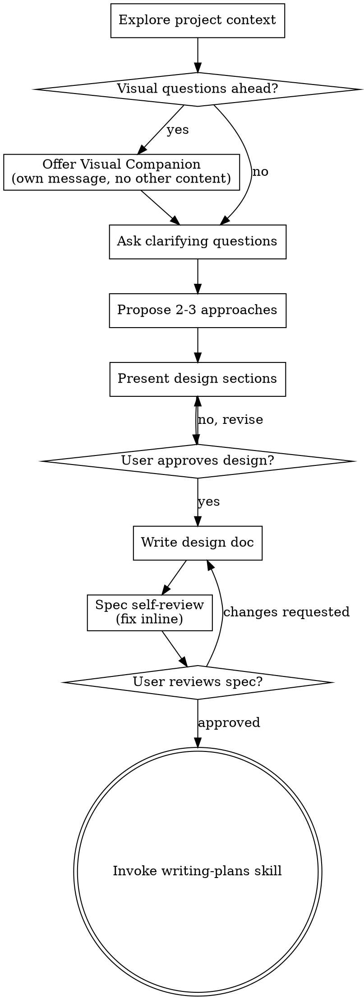

<!-- Generated by SpecStory, Markdown v2.1.0 -->

# 2026-04-11 01:03:07Z

<!-- Claude Code Session 51f50eb9-fca3-4590-9eaf-f8c1d8be7dac (2026-04-11 01:03:07Z) -->

_**User (2026-04-11 01:03:07Z)**_

I want to plan a way for the WordSpell and word games that I can have group of words organized by sounds and length.
So I can choose the sounds, and the lenght/silabs) the child(user) can read.

It would be great to have a list of words with their number of silabs, and the sounds they have. such as [`s`, `a`, `t`, `p`, `i`, `n`], as well as some of the ones with combined sounds like [`th`, `ch`], etc.

It would be good to save the words by sounds, and silabs too.
Do you have any suggestions using the IPA?

---

_**Agent (claude-opus-4-6 2026-04-11 01:03:13Z)**_

<think><details><summary>Thought Process</summary>
 The user wants to design a feature for word games that organizes words by their sounds and syllables—this is a creative design challenge rather than a coding task. I should tap into brainstorming mode to explore how this could work conceptually.
</details></think>

_**Agent (claude-opus-4-6 2026-04-11 01:03:13Z)**_

<tool-use data-tool-type="generic" data-tool-name="Skill"><details>
<summary>Tool use: **Skill**</summary>

**Input:**

- skill: `superpowers:brainstorming`

</details></tool-use>

---

_**User (2026-04-11 01:03:13Z)**_

Base directory for this skill: /Users/leocaseiro/.claude/plugins/cache/claude-plugins-official/superpowers/5.0.7/skills/brainstorming

# Brainstorming Ideas Into Designs

Help turn ideas into fully formed designs and specs through natural collaborative dialogue.

Start by understanding the current project context, then ask questions one at a time to refine the idea. Once you understand what you're building, present the design and get user approval.

<HARD-GATE>
Do NOT invoke any implementation skill, write any code, scaffold any project, or take any implementation action until you have presented a design and the user has approved it. This applies to EVERY project regardless of perceived simplicity.
</HARD-GATE>

## Anti-Pattern: "This Is Too Simple To Need A Design"

Every project goes through this process. A todo list, a single-function utility, a config change — all of them. "Simple" projects are where unexamined assumptions cause the most wasted work. The design can be short (a few sentences for truly simple projects), but you MUST present it and get approval.

## Checklist

You MUST create a task for each of these items and complete them in order:

1. **Explore project context** — check files, docs, recent commits
2. **Offer visual companion** (if topic will involve visual questions) — this is its own message, not combined with a clarifying question. See the Visual Companion section below.
3. **Ask clarifying questions** — one at a time, understand purpose/constraints/success criteria
4. **Propose 2-3 approaches** — with trade-offs and your recommendation
5. **Present design** — in sections scaled to their complexity, get user approval after each section
6. **Write design doc** — save to `docs/superpowers/specs/YYYY-MM-DD-<topic>-design.md` and commit
7. **Spec self-review** — quick inline check for placeholders, contradictions, ambiguity, scope (see below)
8. **User reviews written spec** — ask user to review the spec file before proceeding
9. **Transition to implementation** — invoke writing-plans skill to create implementation plan

## Process Flow



**The terminal state is invoking writing-plans.** Do NOT invoke frontend-design, mcp-builder, or any other implementation skill. The ONLY skill you invoke after brainstorming is writing-plans.

## The Process

**Understanding the idea:**

- Check out the current project state first (files, docs, recent commits)
- Before asking detailed questions, assess scope: if the request describes multiple independent subsystems (e.g., "build a platform with chat, file storage, billing, and analytics"), flag this immediately. Don't spend questions refining details of a project that needs to be decomposed first.
- If the project is too large for a single spec, help the user decompose into sub-projects: what are the independent pieces, how do they relate, what order should they be built? Then brainstorm the first sub-project through the normal design flow. Each sub-project gets its own spec → plan → implementation cycle.
- For appropriately-scoped projects, ask questions one at a time to refine the idea
- Prefer multiple choice questions when possible, but open-ended is fine too
- Only one question per message - if a topic needs more exploration, break it into multiple questions
- Focus on understanding: purpose, constraints, success criteria

**Exploring approaches:**

- Propose 2-3 different approaches with trade-offs
- Present options conversationally with your recommendation and reasoning
- Lead with your recommended option and explain why

**Presenting the design:**

- Once you believe you understand what you're building, present the design
- Scale each section to its complexity: a few sentences if straightforward, up to 200-300 words if nuanced
- Ask after each section whether it looks right so far
- Cover: architecture, components, data flow, error handling, testing
- Be ready to go back and clarify if something doesn't make sense

**Design for isolation and clarity:**

- Break the system into smaller units that each have one clear purpose, communicate through well-defined interfaces, and can be understood and tested independently
- For each unit, you should be able to answer: what does it do, how do you use it, and what does it depend on?
- Can someone understand what a unit does without reading its internals? Can you change the internals without breaking consumers? If not, the boundaries need work.
- Smaller, well-bounded units are also easier for you to work with - you reason better about code you can hold in context at once, and your edits are more reliable when files are focused. When a file grows large, that's often a signal that it's doing too much.

**Working in existing codebases:**

- Explore the current structure before proposing changes. Follow existing patterns.
- Where existing code has problems that affect the work (e.g., a file that's grown too large, unclear boundaries, tangled responsibilities), include targeted improvements as part of the design - the way a good developer improves code they're working in.
- Don't propose unrelated refactoring. Stay focused on what serves the current goal.

## After the Design

**Documentation:**

- Write the validated design (spec) to `docs/superpowers/specs/YYYY-MM-DD-<topic>-design.md`
  - (User preferences for spec location override this default)
- Use elements-of-style:writing-clearly-and-concisely skill if available
- Commit the design document to git

**Spec Self-Review:**
After writing the spec document, look at it with fresh eyes:

1. **Placeholder scan:** Any "TBD", "TODO", incomplete sections, or vague requirements? Fix them.
2. **Internal consistency:** Do any sections contradict each other? Does the architecture match the feature descriptions?
3. **Scope check:** Is this focused enough for a single implementation plan, or does it need decomposition?
4. **Ambiguity check:** Could any requirement be interpreted two different ways? If so, pick one and make it explicit.

Fix any issues inline. No need to re-review — just fix and move on.

**User Review Gate:**
After the spec review loop passes, ask the user to review the written spec before proceeding:

> "Spec written and committed to `<path>`. Please review it and let me know if you want to make any changes before we start writing out the implementation plan."

Wait for the user's response. If they request changes, make them and re-run the spec review loop. Only proceed once the user approves.

**Implementation:**

- Invoke the writing-plans skill to create a detailed implementation plan
- Do NOT invoke any other skill. writing-plans is the next step.

## Key Principles

- **One question at a time** - Don't overwhelm with multiple questions
- **Multiple choice preferred** - Easier to answer than open-ended when possible
- **YAGNI ruthlessly** - Remove unnecessary features from all designs
- **Explore alternatives** - Always propose 2-3 approaches before settling
- **Incremental validation** - Present design, get approval before moving on
- **Be flexible** - Go back and clarify when something doesn't make sense

## Visual Companion

A browser-based companion for showing mockups, diagrams, and visual options during brainstorming. Available as a tool — not a mode. Accepting the companion means it's available for questions that benefit from visual treatment; it does NOT mean every question goes through the browser.

**Offering the companion:** When you anticipate that upcoming questions will involve visual content (mockups, layouts, diagrams), offer it once for consent:
> "Some of what we're working on might be easier to explain if I can show it to you in a web browser. I can put together mockups, diagrams, comparisons, and other visuals as we go. This feature is still new and can be token-intensive. Want to try it? (Requires opening a local URL)"

**This offer MUST be its own message.** Do not combine it with clarifying questions, context summaries, or any other content. The message should contain ONLY the offer above and nothing else. Wait for the user's response before continuing. If they decline, proceed with text-only brainstorming.

**Per-question decision:** Even after the user accepts, decide FOR EACH QUESTION whether to use the browser or the terminal. The test: **would the user understand this better by seeing it than reading it?**

- **Use the browser** for content that IS visual — mockups, wireframes, layout comparisons, architecture diagrams, side-by-side visual designs
- **Use the terminal** for content that is text — requirements questions, conceptual choices, tradeoff lists, A/B/C/D text options, scope decisions

A question about a UI topic is not automatically a visual question. "What does personality mean in this context?" is a conceptual question — use the terminal. "Which wizard layout works better?" is a visual question — use the browser.

If they agree to the companion, read the detailed guide before proceeding:
`skills/brainstorming/visual-companion.md`

---

_**Agent (claude-opus-4-6 2026-04-11 01:03:19Z)**_

<think><details><summary>Thought Process</summary>
 I'm starting to understand what the user is looking for—a feature that organizes words by their phonetic properties and syllable structure for WordSpell, with IPA transcriptions included. Before diving into implementation details, I should explore the existing project setup and then work through some clarifying questions to nail down the requirements. I also need to remember the worktree rule from the guidelines—I'll need to set that up before making any file changes, though exploration is fine for now.
</details></think>

_**Agent (claude-opus-4-6 2026-04-11 01:03:19Z)**_

I'll start by exploring the project to understand the current state of WordSpell and word game features.

_**Agent (claude-opus-4-6 2026-04-11 01:03:22Z)**_

<tool-use data-tool-type="shell" data-tool-name="Bash"><details>
<summary>Tool use: **Bash**</summary>
List project root

`ls /Users/leocaseiro/Sites/base-skill`

```text
CLAUDE.md
LICENSE
README.md
components.json
dist
docs
e2e
eslint.config.js
knip.config.ts
node_modules
package.json
playwright-report
playwright.config.ts
prettier.config.js
public
scope.md
scripts
src
storybook-static
test-results
tsconfig.json
vite.config.ts
vitest.config.ts
worktrees
yarn.lock
```

</details></tool-use>

_**Agent (claude-opus-4-6 2026-04-11 01:03:23Z)**_

<tool-use data-tool-type="search" data-tool-name="Glob"><details>
<summary>Tool use: **Glob**</summary>
 pattern `**/WordSpell*`

```text
worktrees/feat-word-spell-number-match/src/games/word-spell/WordSpell/WordSpell.stories.tsx
worktrees/feat-word-spell-number-match/src/games/word-spell/WordSpell/WordSpell.test.tsx
worktrees/feat-word-spell-number-match/src/games/word-spell/WordSpell/WordSpell.tsx
src/games/word-spell/WordSpell/WordSpell.stories.tsx
src/games/word-spell/WordSpell/WordSpell.test.tsx
worktrees/feat/service-worker-workbox-offline-setup/src/games/word-spell/WordSpell/WordSpell.stories.tsx
worktrees/feat/service-worker-workbox-offline-setup/src/games/word-spell/WordSpell/WordSpell.test.tsx
worktrees/feat/service-worker-workbox-offline-setup/src/games/word-spell/WordSpell/WordSpell.tsx
src/games/word-spell/WordSpell/WordSpell.tsx
worktrees/feat-pr-previews-auto-bump/src/games/word-spell/WordSpell/WordSpell.stories.tsx
worktrees/feat-pr-previews-auto-bump/src/games/word-spell/WordSpell/WordSpell.test.tsx
worktrees/feat-pr-previews-auto-bump/src/games/word-spell/WordSpell/WordSpell.tsx
worktrees/feat-game-tile-auto-font-sizing/src/games/word-spell/WordSpell/WordSpell.stories.tsx
worktrees/feat-game-tile-auto-font-sizing/src/games/word-spell/WordSpell/WordSpell.test.tsx
worktrees/feat-game-tile-auto-font-sizing/src/games/word-spell/WordSpell/WordSpell.tsx
.claude/worktrees/laughing-hugle/src/games/word-spell/WordSpell/WordSpell.stories.tsx
.claude/worktrees/laughing-hugle/src/games/word-spell/WordSpell/WordSpell.tsx
.claude/worktrees/laughing-hugle/src/games/word-spell/WordSpell/WordSpell.test.tsx
.claude/worktrees/epic-cohen/src/games/word-spell/WordSpell/WordSpell.stories.tsx
.claude/worktrees/epic-cohen/src/games/word-spell/WordSpell/WordSpell.test.tsx
.claude/worktrees/epic-cohen/src/games/word-spell/WordSpell/WordSpell.tsx
```

</details></tool-use>

_**Agent (claude-opus-4-6 2026-04-11 01:03:23Z)**_

<tool-use data-tool-type="search" data-tool-name="Glob"><details>
<summary>Tool use: **Glob**</summary>
 pattern `**/word*`

```text
node_modules/diff/libesm/diff/word.d.ts.map
node_modules/diff/libesm/diff/word.d.ts
node_modules/diff/libesm/diff/word.js
node_modules/diff/libcjs/diff/word.d.ts.map
node_modules/diff/libcjs/diff/word.d.ts
node_modules/diff/libcjs/diff/word.js
.claude/worktrees/laughing-hugle/node_modules/diff/libesm/diff/word.d.ts.map
.claude/worktrees/laughing-hugle/node_modules/diff/libesm/diff/word.d.ts
.claude/worktrees/laughing-hugle/node_modules/diff/libesm/diff/word.js
.claude/worktrees/laughing-hugle/node_modules/diff/libcjs/diff/word.d.ts.map
.claude/worktrees/laughing-hugle/node_modules/diff/libcjs/diff/word.d.ts
.claude/worktrees/laughing-hugle/node_modules/diff/libcjs/diff/word.js
worktrees/feat-pr-previews-auto-bump/node_modules/diff/libesm/diff/word.d.ts.map
worktrees/feat-pr-previews-auto-bump/node_modules/diff/libesm/diff/word.d.ts
worktrees/feat-pr-previews-auto-bump/node_modules/diff/libesm/diff/word.js
worktrees/feat-pr-previews-auto-bump/node_modules/diff/libcjs/diff/word.d.ts.map
worktrees/feat-pr-previews-auto-bump/node_modules/diff/libcjs/diff/word.d.ts
worktrees/feat-pr-previews-auto-bump/node_modules/diff/libcjs/diff/word.js
worktrees/feat-answer-game-primitive/node_modules/diff/libesm/diff/word.d.ts.map
worktrees/feat-answer-game-primitive/node_modules/diff/libesm/diff/word.d.ts
worktrees/feat-answer-game-primitive/node_modules/diff/libesm/diff/word.js
worktrees/feat-answer-game-primitive/node_modules/diff/libcjs/diff/word.d.ts.map
worktrees/feat-answer-game-primitive/node_modules/diff/libcjs/diff/word.d.ts
worktrees/feat-answer-game-primitive/node_modules/diff/libcjs/diff/word.js
worktrees/feat-game-tile-auto-font-sizing/node_modules/diff/libesm/diff/word.d.ts.map
worktrees/feat-game-tile-auto-font-sizing/node_modules/diff/libesm/diff/word.d.ts
worktrees/feat-game-tile-auto-font-sizing/node_modules/diff/libesm/diff/word.js
worktrees/feat-game-tile-auto-font-sizing/node_modules/diff/libcjs/diff/word.d.ts.map
worktrees/feat-game-tile-auto-font-sizing/node_modules/diff/libcjs/diff/word.d.ts
worktrees/feat-game-tile-auto-font-sizing/node_modules/diff/libcjs/diff/word.js
node_modules/caniuse-lite/data/features/word-break.js
node_modules/caniuse-lite/data/features/wordwrap.js
.claude/worktrees/laughing-hugle/node_modules/caniuse-lite/data/features/word-break.js
.claude/worktrees/laughing-hugle/node_modules/caniuse-lite/data/features/wordwrap.js
worktrees/feat-pr-previews-auto-bump/node_modules/caniuse-lite/data/features/word-break.js
worktrees/feat-pr-previews-auto-bump/node_modules/caniuse-lite/data/features/wordwrap.js
worktrees/feat-answer-game-primitive/node_modules/caniuse-lite/data/features/word-break.js
worktrees/feat-answer-game-primitive/node_modules/caniuse-lite/data/features/wordwrap.js
worktrees/feat-game-tile-auto-font-sizing/node_modules/caniuse-lite/data/features/word-break.js
worktrees/feat-game-tile-auto-font-sizing/node_modules/caniuse-lite/data/features/wordwrap.js
node_modules/msw/node_modules/type-fest/source/words.d.ts
.claude/worktrees/laughing-hugle/node_modules/msw/node_modules/type-fest/source/words.d.ts
worktrees/feat-pr-previews-auto-bump/node_modules/msw/node_modules/type-fest/source/words.d.ts
worktrees/feat-word-spell-number-match/node_modules/msw/node_modules/type-fest/source/words.d.ts
worktrees/feat-answer-game-primitive/node_modules/msw/node_modules/type-fest/source/words.d.ts
worktrees/feat-game-tile-auto-font-sizing/node_modules/msw/node_modules/type-fest/source/words.d.ts
node_modules/lodash/fp/words.js
node_modules/lodash/words.js
.claude/worktrees/laughing-hugle/node_modules/lodash/fp/words.js
.claude/worktrees/laughing-hugle/node_modules/lodash/words.js
worktrees/feat-answer-game-primitive/node_modules/lodash/fp/words.js
worktrees/feat-answer-game-primitive/node_modules/lodash/words.js
worktrees/feat-game-tile-auto-font-sizing/node_modules/lodash/fp/words.js
worktrees/feat-game-tile-auto-font-sizing/node_modules/lodash/words.js
node_modules/unbash/dist/word.d.ts
node_modules/unbash/dist/word.js
.claude/worktrees/laughing-hugle/node_modules/unbash/dist/word.d.ts
.claude/worktrees/laughing-hugle/node_modules/unbash/dist/word.js
worktrees/feat-pr-previews-auto-bump/node_modules/unbash/dist/word.d.ts
worktrees/feat-pr-previews-auto-bump/node_modules/unbash/dist/word.js
worktrees/feat-answer-game-primitive/node_modules/unbash/dist/word.d.ts
worktrees/feat-answer-game-primitive/node_modules/unbash/dist/word.js
worktrees/feat-game-tile-auto-font-sizing/node_modules/unbash/dist/word.d.ts
worktrees/feat-game-tile-auto-font-sizing/node_modules/unbash/dist/word.js
node_modules/workbox-build/node_modules/lodash/fp/words.js
node_modules/workbox-build/node_modules/lodash/words.js
.claude/worktrees/laughing-hugle/node_modules/workbox-build/node_modules/lodash/fp/words.js
.claude/worktrees/laughing-hugle/node_modules/workbox-build/node_modules/lodash/words.js
worktrees/feat-pr-previews-auto-bump/node_modules/workbox-build/node_modules/lodash/fp/words.js
worktrees/feat-pr-previews-auto-bump/node_modules/workbox-build/node_modules/lodash/words.js
worktrees/feat-word-spell-number-match/node_modules/workbox-build/node_modules/lodash/fp/words.js
worktrees/feat-word-spell-number-match/node_modules/workbox-build/node_modules/lodash/words.js
worktrees/feat-answer-game-primitive/node_modules/workbox-build/node_modules/lodash/fp/words.js
worktrees/feat-answer-game-primitive/node_modules/workbox-build/node_modules/lodash/words.js
worktrees/feat-game-tile-auto-font-sizing/node_modules/workbox-build/node_modules/lodash/fp/words.js
worktrees/feat-game-tile-auto-font-sizing/node_modules/workbox-build/node_modules/lodash/words.js
worktrees/feat-word-spell-number-match/e2e/__snapshots__/visual.spec.ts/word-spell-picture-mode-chromium.png
worktrees/feat/service-worker-workbox-offline-setup/e2e/__snapshots__/visual.spec.ts/word-spell-picture-mode-chromium.png
worktrees/feat/service-worker-workbox-offline-setup/e2e/__snapshots__/visual.spec.ts/word-spell-picture-mode-dark-chromium.png
.superpowers/brainstorm/53780-1775763978/content/word-tiles.html
.superpowers/brainstorm/30948-1775768510/content/word-tiles.html
e2e/__snapshots__/visual.spec.ts/word-spell-picture-mode-chromium.png
e2e/__snapshots__/visual.spec.ts/word-spell-picture-mode-dark-chromium.png
worktrees/feat-pr-previews-auto-bump/e2e/__snapshots__/visual.spec.ts/word-spell-picture-mode-chromium.png
worktrees/feat-pr-previews-auto-bump/e2e/__snapshots__/visual.spec.ts/word-spell-picture-mode-dark-chromium.png
worktrees/feat-game-tile-auto-font-sizing/e2e/__snapshots__/visual.spec.ts/word-spell-picture-mode-chromium.png
worktrees/feat-game-tile-auto-font-sizing/e2e/__snapshots__/visual.spec.ts/word-spell-picture-mode-dark-chromium.png
.claude/worktrees/laughing-hugle/e2e/__snapshots__/visual.spec.ts/word-spell-picture-mode-chromium.png
.claude/worktrees/laughing-hugle/e2e/__snapshots__/visual.spec.ts/word-spell-picture-mode-dark-chromium.png
.claude/worktrees/epic-cohen/e2e/__snapshots__/visual.spec.ts/word-spell-picture-mode-chromium.png
.claude/worktrees/epic-cohen/e2e/__snapshots__/visual.spec.ts/word-spell-picture-mode-dark-chromium.png
```

</details></tool-use>

_**Agent (claude-opus-4-6 2026-04-11 01:03:27Z)**_

<tool-use data-tool-type="shell" data-tool-name="Bash"><details>
<summary>Tool use: **Bash**</summary>
List word-spell game directory

`ls /Users/leocaseiro/Sites/base-skill/src/games/word-spell/`

```text
LetterTileBank
WordSpell
build-sentence-gap-round.test.ts
build-sentence-gap-round.ts
types.ts
```

</details></tool-use>

_**Agent (claude-opus-4-6 2026-04-11 01:03:29Z)**_

<tool-use data-tool-type="search" data-tool-name="Glob"><details>
<summary>Tool use: **Glob**</summary>
 pattern `src/games/word-spell/**/*.ts`

```text
src/games/word-spell/build-sentence-gap-round.test.ts
src/games/word-spell/build-sentence-gap-round.ts
src/games/word-spell/types.ts
```

</details></tool-use>

_**Agent (claude-opus-4-6 2026-04-11 01:03:29Z)**_

<tool-use data-tool-type="search" data-tool-name="Glob"><details>
<summary>Tool use: **Glob**</summary>
 pattern `src/games/word-spell/**/*.tsx`

```text
src/games/word-spell/WordSpell/WordSpell.stories.tsx
src/games/word-spell/WordSpell/WordSpell.test.tsx
src/games/word-spell/WordSpell/WordSpell.tsx
src/games/word-spell/LetterTileBank/LetterTileBank.stories.tsx
src/games/word-spell/LetterTileBank/LetterTileBank.test.tsx
src/games/word-spell/LetterTileBank/LetterTileBank.tsx
```

</details></tool-use>

_**Agent (claude-opus-4-6 2026-04-11 01:03:31Z)**_

<tool-use data-tool-type="read" data-tool-name="Read"><details>
<summary>Tool use: **Read**</summary>
 `./src/games/word-spell/types.ts`

```text
1 import type { AnswerGameConfig } from '@/components/answer-game/types';
2 import type { ConfigField } from '@/lib/config-fields';
3 
4 export interface GapDefinition {
5   word: string;
6   distractors?: string[];
7 }
8 
9 export interface WordSpellRound {
10   word: string;
11   /**
12    * Native emoji (or ZWJ sequence) for picture mode. When set, this is shown instead of `image` / `sceneImage`.
13    */
14   emoji?: string;
15   /** Fluent Emoji SVG path, URL, or `/public` asset path (picture/sentence-gap modes) */
16   image?: string;
17   /** Sentence with a blank for sentence-gap mode: "The ___ sat on the mat." */
18   sentence?: string;
19   /** Scene illustration for sentence-gap mode */
20   sceneImage?: string;
21   /** Optional custom audio override instead of TTS */
22   audioOverride?: string;
23   /** Gap definitions for sentence-gap mode. Each entry maps to a {N} placeholder. */
24   gaps?: GapDefinition[];
25 }
26 
27 export interface WordSpellConfig extends AnswerGameConfig {
28   component: 'WordSpell';
29   mode: 'picture' | 'scramble' | 'recall' | 'sentence-gap';
30   /** @default 'letter' */
31   tileUnit: 'letter' | 'syllable' | 'word';
32   rounds: WordSpellRound[];
33 }
34 
35 export const wordSpellConfigFields: ConfigField[] = [
36   {
37     type: 'select',
38     key: 'inputMethod',
39     label: 'Input method',
40     options: [
41       { value: 'drag', label: 'drag' },
42       { value: 'type', label: 'type' },
43       { value: 'both', label: 'both' },
44     ],
45   },
46   {
47     type: 'select',
48     key: 'wrongTileBehavior',
49     label: 'Wrong tile behaviour',
50     options: [
51       { value: 'reject', label: 'reject' },
52       { value: 'lock-manual', label: 'lock-manual' },
53       { value: 'lock-auto-eject', label: 'lock-auto-eject' },
54     ],
55   },
56   {
57     type: 'select',
58     key: 'tileBankMode',
59     label: 'Tile bank mode',
60     options: [
61       { value: 'exact', label: 'exact' },
62       { value: 'distractors', label: 'distractors' },
63     ],
64   },
65   {
66     type: 'number',
67     key: 'totalRounds',
68     label: 'Total rounds',
69     min: 1,
70     max: 8,
71   },
72   {
73     type: 'select',
74     key: 'mode',
75     label: 'Mode',
76     options: [
77       { value: 'picture', label: 'picture' },
78       { value: 'scramble', label: 'scramble' },
79       { value: 'recall', label: 'recall' },
80       { value: 'sentence-gap', label: 'sentence-gap' },
81     ],
82   },
83   {
84     type: 'select',
85     key: 'tileUnit',
86     label: 'Tile unit',
87     options: [
88       { value: 'letter', label: 'letter' },
89       { value: 'syllable', label: 'syllable' },
90       { value: 'word', label: 'word' },
91     ],
92   },
93   { type: 'checkbox', key: 'roundsInOrder', label: 'Rounds in order' },
94   { type: 'checkbox', key: 'ttsEnabled', label: 'TTS enabled' },
95 ];
96
```

</details></tool-use>

_**Agent (claude-opus-4-6 2026-04-11 01:03:32Z)**_

<tool-use data-tool-type="shell" data-tool-name="Bash"><details>
<summary>Tool use: **Bash**</summary>
List all games

`ls /Users/leocaseiro/Sites/base-skill/src/games/`

```text
build-round-order.test.ts
build-round-order.ts
catalog-utils.mdx
catalog-utils.test.ts
catalog-utils.ts
config-fields-registry.ts
level-system.mdx
number-match
registry.test.ts
registry.ts
sort-numbers
word-spell
```

</details></tool-use>

_**Agent (claude-opus-4-6 2026-04-11 01:03:33Z)**_

<tool-use data-tool-type="search" data-tool-name="Glob"><details>
<summary>Tool use: **Glob**</summary>
 pattern `src/**/words*.ts`

```text
No files found
```

</details></tool-use>

_**Agent (claude-opus-4-6 2026-04-11 01:03:33Z)**_

<tool-use data-tool-type="search" data-tool-name="Glob"><details>
<summary>Tool use: **Glob**</summary>
 pattern `src/**/word-list*`

```text
No files found
```

</details></tool-use>

_**Agent (claude-opus-4-6 2026-04-11 01:03:37Z)**_

<think><details><summary>Thought Process</summary>
 I need to load the TodoWrite tool to create tasks from the checklist items, and then examine how rounds are structured and see what word datasets are already available.
</details></think>

_**Agent (claude-opus-4-6 2026-04-11 01:03:38Z)**_

<tool-use data-tool-type="unknown" data-tool-name="ToolSearch"><details>
<summary>Tool use: **ToolSearch**</summary>

**Input:**

- max_results: `1`
- query: `select:TodoWrite`

**Result:**

```

```

</details></tool-use>

_**Agent (claude-opus-4-6 2026-04-11 01:03:39Z)**_

<tool-use data-tool-type="search" data-tool-name="Glob"><details>
<summary>Tool use: **Glob**</summary>
 pattern `src/games/word-spell/**/*.json`

```text
No files found
```

</details></tool-use>

_**Agent (claude-opus-4-6 2026-04-11 01:03:39Z)**_

<tool-use data-tool-type="search" data-tool-name="Glob"><details>
<summary>Tool use: **Glob**</summary>
 pattern `src/data/**/*`

```text
No files found
```

</details></tool-use>

_**Agent (claude-opus-4-6 2026-04-11 01:03:40Z)**_

<tool-use data-tool-type="search" data-tool-name="Grep"><details>
<summary>Tool use: **Grep**</summary>
 pattern `phoneme|syllable|phonic|IPA`

```text
Found 1 file
src/games/word-spell/types.ts
```

</details></tool-use>

_**Agent (claude-opus-4-6 2026-04-11 01:03:43Z)**_

<tool-use data-tool-type="search" data-tool-name="Grep"><details>
<summary>Tool use: **Grep**</summary>
 pattern `phoneme|syllable|IPA`

```text
src/games/word-spell/types.ts:31:  tileUnit: 'letter' | 'syllable' | 'word';
src/games/word-spell/types.ts:89:      { value: 'syllable', label: 'syllable' },
src/games/word-spell/WordSpell/WordSpell.tsx:34:  if (tileUnit === 'syllable') {
src/games/word-spell/WordSpell/WordSpell.tsx:265:    // Default: letter/syllable/word spelling
```

</details></tool-use>

_**Agent (claude-opus-4-6 2026-04-11 01:03:45Z)**_

<tool-use data-tool-type="search" data-tool-name="Glob"><details>
<summary>Tool use: **Glob**</summary>
 pattern `src/games/word-spell/WordSpell/stories.fixtures*`

```text
No files found
```

</details></tool-use>

_**Agent (claude-opus-4-6 2026-04-11 01:03:46Z)**_

<tool-use data-tool-type="search" data-tool-name="Glob"><details>
<summary>Tool use: **Glob**</summary>
 pattern `src/games/word-spell/**/fixtures*`

```text
No files found
```

</details></tool-use>

_**Agent (claude-opus-4-6 2026-04-11 01:03:46Z)**_

<tool-use data-tool-type="shell" data-tool-name="Bash"><details>
<summary>Tool use: **Bash**</summary>
List WordSpell dir

`ls /Users/leocaseiro/Sites/base-skill/src/games/word-spell/WordSpell/`

```text
WordSpell.stories.tsx
WordSpell.test.tsx
WordSpell.tsx
```

</details></tool-use>

_**Agent (claude-opus-4-6 2026-04-11 01:03:49Z)**_

<tool-use data-tool-type="read" data-tool-name="Read"><details>
<summary>Tool use: **Read**</summary>
 `./src/games/word-spell/WordSpell/WordSpell.tsx`

```text
1 import { useNavigate } from '@tanstack/react-router';
2 import { nanoid } from 'nanoid';
3 import { useEffect, useMemo, useRef, useState } from 'react';
4 import { buildSentenceGapRound } from '../build-sentence-gap-round';
5 import { LetterTileBank } from '../LetterTileBank/LetterTileBank';
6 import type { WordSpellConfig } from '../types';
7 import type {
8   AnswerGameConfig,
9   AnswerGameDraftState,
10   AnswerZone,
11   TileItem,
12 } from '@/components/answer-game/types';
13 import { AnswerGame } from '@/components/answer-game/AnswerGame/AnswerGame';
14 import { GameOverOverlay } from '@/components/answer-game/GameOverOverlay/GameOverOverlay';
15 import { ScoreAnimation } from '@/components/answer-game/ScoreAnimation/ScoreAnimation';
16 import { SentenceWithGaps } from '@/components/answer-game/Slot/SentenceWithGaps';
17 import { Slot } from '@/components/answer-game/Slot/Slot';
18 import { SlotRow } from '@/components/answer-game/Slot/SlotRow';
19 import { useAnswerGameContext } from '@/components/answer-game/useAnswerGameContext';
20 import { useAnswerGameDispatch } from '@/components/answer-game/useAnswerGameDispatch';
21 import { useGameSounds } from '@/components/answer-game/useGameSounds';
22 import { useRoundTTS } from '@/components/answer-game/useRoundTTS';
23 import { AudioButton } from '@/components/questions/AudioButton/AudioButton';
24 import { EmojiQuestion } from '@/components/questions/EmojiQuestion/EmojiQuestion';
25 import { ImageQuestion } from '@/components/questions/ImageQuestion/ImageQuestion';
26 import { buildRoundOrder } from '@/games/build-round-order';
27 
28 function segmentsForWord(
29   word: string,
30   tileUnit: WordSpellConfig['tileUnit'],
31 ): string[] {
32   const trimmed = word.trim();
33   if (tileUnit === 'word') return [trimmed];
34   if (tileUnit === 'syllable') {
35     const parts = trimmed.split(/[-\s]+/).filter(Boolean);
36     return parts.length > 0 ? parts : [trimmed];
37   }
38   return [...trimmed.toLowerCase()];
39 }
40 
41 function buildTilesAndZones(
42   word: string,
43   tileUnit: WordSpellConfig['tileUnit'],
44 ): {
45   tiles: TileItem[];
46   zones: AnswerZone[];
47 } {
48   const segments = segmentsForWord(word, tileUnit);
49   const values = segments.map((s) =>
50     tileUnit === 'letter' ? s.toLowerCase() : s.toUpperCase(),
51   );
52   const zones: AnswerZone[] = values.map((value, i) => ({
53     id: `z${i}`,
54     index: i,
55     expectedValue: value,
56     placedTileId: null,
57     isWrong: false,
58     isLocked: false,
59   }));
60   const shuffled = [...values].toSorted((a, b) => a.localeCompare(b));
61   const tiles: TileItem[] = shuffled.map((value) => ({
62     id: nanoid(),
63     label: value,
64     value,
65   }));
66   return { tiles, zones };
67 }
68 
69 interface WordSpellProps {
70   config: WordSpellConfig;
71   initialState?: AnswerGameDraftState;
72   sessionId?: string;
73   seed?: string;
74 }
75 
76 /** Renders prompts + progression; must sit inside `AnswerGame` / provider. */
77 const WordSpellSession = ({
78   wordSpellConfig,
79   roundOrder,
80   onRestartSession,
```

</details></tool-use>

_**Agent (claude-opus-4-6 2026-04-11 01:03:49Z)**_

<tool-use data-tool-type="read" data-tool-name="Read"><details>
<summary>Tool use: **Read**</summary>
 `./src/games/word-spell/WordSpell/WordSpell.stories.tsx`

```text
1 import { withDb } from '../../../../.storybook/decorators/withDb';
2 import { withRouter } from '../../../../.storybook/decorators/withRouter';
3 import { WordSpell } from './WordSpell';
4 import type { WordSpellConfig } from '../types';
5 import type { Meta, StoryObj } from '@storybook/react';
6 
7 const baseConfig: WordSpellConfig = {
8   gameId: 'word-spell-storybook',
9   component: 'WordSpell',
10   inputMethod: 'drag',
11   wrongTileBehavior: 'lock-auto-eject',
12   tileBankMode: 'exact',
13   totalRounds: 5,
14   roundsInOrder: true,
15   ttsEnabled: true,
16   mode: 'picture',
17   tileUnit: 'letter',
18   rounds: [
19     { word: 'cat', image: 'https://placehold.co/160?text=🐱' },
20     { word: 'dog', image: 'https://placehold.co/160?text=🐶' },
21   ],
22 };
23 
24 const meta: Meta<typeof WordSpell> = {
25   component: WordSpell,
26   tags: ['autodocs'],
27   args: { config: baseConfig },
28   decorators: [withDb, withRouter],
29 };
30 export default meta;
31 
32 type Story = StoryObj<typeof WordSpell>;
33 
34 export const PictureMode: Story = {};
35 
36 export const RecallMode: Story = {
37   args: {
38     config: {
39       ...baseConfig,
40       mode: 'recall',
41       tileBankMode: 'distractors',
42       distractorCount: 4,
43       rounds: [{ word: 'cat' }],
44     },
45   },
46 };
47 
48 export const ScrambleMode: Story = {
49   args: { config: { ...baseConfig, mode: 'scramble' } },
50 };
51 
52 export const SentenceGapMode: Story = {
53   args: {
54     config: {
55       ...baseConfig,
56       mode: 'sentence-gap',
57       rounds: [
58         {
59           word: 'sat',
60           image: 'https://placehold.co/160?text=scene',
61           sentence: 'The cat ___ on the mat.',
62         },
63       ],
64     },
65   },
66 };
67 
68 export const WithDistractors: Story = {
69   args: {
70     config: {
71       ...baseConfig,
72       tileBankMode: 'distractors',
73       distractorCount: 3,
74     },
75   },
76 };
77 
78 export const LockManualWrongTile: Story = {
79   args: { config: { ...baseConfig, wrongTileBehavior: 'lock-manual' } },
80 };
81
```

</details></tool-use>

_**Agent (claude-opus-4-6 2026-04-11 01:03:53Z)**_

<think><details><summary>Thought Process</summary>
 I'm setting up TodoWrite to organize the brainstorming checklist, and I should also look for any existing documentation or specs folders along with checking what word library resources are available.
</details></think>

_**Agent (claude-opus-4-6 2026-04-11 01:03:58Z)**_

<tool-use data-tool-type="task" data-tool-name="TodoWrite"><details>
<summary>Tool use: **TodoWrite**</summary>
**Agent task list:**
- [⚡] 🌡️ Explore project context for word/phonics library
- [ ] 🌡️ Ask clarifying questions one at a time
- [ ] 🌡️ Propose 2-3 approaches with trade-offs
- [ ] 🌡️ Present design sections and get approval
- [ ] 🌡️ Write design doc to docs/superpowers/specs/ (in worktree)
- [ ] 🌡️ Spec self-review (placeholders, consistency, scope, ambiguity)
- [ ] 🌡️ Ask user to review written spec before implementation
- [ ] 🌡️ Invoke writing-plans skill to create implementation plan

</details></tool-use>

_**Agent (claude-opus-4-6 2026-04-11 01:03:59Z)**_

<tool-use data-tool-type="shell" data-tool-name="Bash"><details>
<summary>Tool use: **Bash**</summary>
List docs folder

`ls /Users/leocaseiro/Sites/base-skill/docs/ 2>/dev/null && ls /Users/leocaseiro/Sites/base-skill/docs/superpowers/ 2>/dev/null`

```text
accessibility.md
adrs
architecture.md
baseskill_milestone_breakdown_85146c93.plan.md
brainstorms
ci-cd.md
context-handoff.md
data-model.md
game-engine.md
i18n.md
mockups
prd.md
project-scope.md
spec-swap-slot-bank.md
superpowers
testing-strategy.md
ui-ux.md
plans
specs
```

</details></tool-use>

_**Agent (claude-opus-4-6 2026-04-11 01:04:00Z)**_

<tool-use data-tool-type="search" data-tool-name="Glob"><details>
<summary>Tool use: **Glob**</summary>
 pattern `docs/**/*.md`

```text
docs/project-scope.md
docs/brainstorms/2026-03-31-milestone-2-brainstorm.md
docs/adrs/0001-rxdb-without-tanstack-query.md
docs/accessibility.md
docs/architecture.md
docs/game-engine.md
docs/i18n.md
docs/superpowers/plans/2026-03-31-milestone-2-data-layer.md
docs/testing-strategy.md
docs/ui-ux.md
docs/superpowers/plans/2026-04-01-milestone-3-app-shell.md
docs/superpowers/plans/2026-04-02-milestone-4-game-engine.md
docs/superpowers/plans/2026-04-02-storybook-setup.md
docs/superpowers/specs/2026-04-02-milestone-4-game-engine-design.md
docs/prd.md
docs/superpowers/specs/2026-04-02-storybook-setup-design.md
docs/ci-cd.md
docs/superpowers/plans/2026-04-02-vr-docker-baselines.md
docs/superpowers/specs/2026-04-03-drag-drop-game-design.md
docs/superpowers/specs/2026-04-03-word-spell-number-match-design.md
docs/baseskill_milestone_breakdown_85146c93.plan.md
docs/superpowers/plans/2026-04-03-answer-game-primitive.md
docs/superpowers/specs/2026-04-03-speech-voice-selection-design.md
docs/superpowers/plans/2026-04-03-group-ab-sound-tts.md
docs/superpowers/plans/2026-04-03-group-c-progress-confetti.md
docs/superpowers/plans/2026-04-03-group-d-game-settings.md
docs/superpowers/plans/2026-04-03-group-e-i18n-routing-bugs.md
docs/superpowers/plans/2026-04-03-group-fg-wordspell-bug-instructions.md
docs/superpowers/plans/2026-04-03-group-h-bookmarks-sort.md
docs/superpowers/plans/2026-04-03-group-i-sort-numbers-game.md
docs/superpowers/plans/2026-04-03-group-j-saved-game-configs.md
docs/superpowers/plans/2026-04-03-word-spell-number-match.md
docs/superpowers/plans/2026-04-04-fix-storybook-vr-e2e-tests.md
docs/superpowers/specs/2026-04-04-confetti-audio-sync-design.md
docs/superpowers/specs/2026-04-05-game-config-ui-redesign.md
docs/superpowers/specs/2026-04-06-touch-keyboard-type-mode-design.md
docs/superpowers/plans/2026-04-06-touch-keyboard-type-mode.md
docs/superpowers/plans/2026-04-05-game-config-ui-redesign.md
docs/superpowers/specs/2026-04-07-dark-mode-a11y-vr-design.md
docs/superpowers/plans/2026-04-07-dark-mode-a11y-vr.md
docs/superpowers/plans/2026-04-07-service-worker-workbox-offline-plan.md
docs/superpowers/specs/2026-04-07-service-worker-workbox-offline-design.md
docs/context-handoff.md
docs/spec-swap-slot-bank.md
docs/superpowers/plans/2026-04-07-unified-slot-component.md
docs/superpowers/plans/2026-04-08-drag-preview-sound-fix.md
docs/superpowers/specs/2026-04-07-unified-slot-component-design.md
docs/superpowers/specs/2026-04-08-drag-preview-sound-fix-design.md
docs/superpowers/plans/2026-04-08-sort-numbers-skip-config.md
docs/superpowers/specs/2026-04-08-sort-numbers-skip-config-design.md
docs/superpowers/plans/2026-04-09-level-system.md
docs/superpowers/specs/2026-04-09-level-system-design.md
docs/superpowers/plans/2026-04-10-countable-dots.md
docs/superpowers/plans/2026-04-10-domino-tile-overhaul.md
docs/superpowers/plans/2026-04-10-hover-preview-fix.md
docs/superpowers/plans/2026-04-10-mode-bugfix-new-modes.md
docs/superpowers/plans/2026-04-10-orchestration-prompt.md
docs/superpowers/specs/2026-04-10-match-number-improvements-design.md
docs/superpowers/plans/2026-04-10-pr-previews-and-auto-bump-plan.md
docs/superpowers/plans/2026-04-10-vr-determinism-fix.md
docs/data-model.md
```

</details></tool-use>

_**Agent (claude-opus-4-6 2026-04-11 01:04:04Z)**_

<tool-use data-tool-type="read" data-tool-name="Read"><details>
<summary>Tool use: **Read**</summary>
 `./docs/data-model.md`

```text
File content (14839 tokens) exceeds maximum allowed tokens (10000). Use offset and limit parameters to read specific portions of the file, or search for specific content instead of reading the whole file.
```

</details></tool-use>

_**Agent (claude-opus-4-6 2026-04-11 01:04:08Z)**_

<tool-use data-tool-type="search" data-tool-name="Grep"><details>
<summary>Tool use: **Grep**</summary>
 path `./docs/data-model.md` pattern `word|phonic|rounds`

```text
No matches found
```

</details></tool-use>

_**Agent (claude-opus-4-6 2026-04-11 01:04:09Z)**_

<tool-use data-tool-type="read" data-tool-name="Read"><details>
<summary>Tool use: **Read**</summary>
 `./docs/prd.md`

```text
1 # BaseSkill — Product Requirements Document
2 
3 > **Source of truth for product decisions.** All other design documents reference this PRD for requirements, scope, and constraints.
4 
5 ---
6 
7 ## 1. Product Vision
8 
9 **BaseSkill** is a free, open-source, offline-first educational PWA for children from Pre-K through Year 6+. It delivers gamified learning across subjects — letters, reading, and math — with a kid-first UX that adapts to the child's grade level. The app runs on any device browser, works without an internet connection, and syncs progress to cloud storage (e.g., Google Drive, OneDrive) at no cost to the family.
10 
11 **One-liner:** _A free, open-source educational game platform that children love and parents trust._
12 
13 ### Design Philosophy
14 
15 - **Child-first, always.** Every interaction is designed for the child's grade level, not the parent's convenience.
16 - **Offline by default.** The app never requires connectivity to play a game.
17 - **Encouraging, never punitive.** Feedback is always positive. Children always progress.
18 - **No ads, no tracking, no accounts.** Privacy is non-negotiable.
19 - **Open source and community-driven.** GPL v3 — the community can verify, extend, and trust the code.
20 
21 ---
22 
23 ## 2. License
24 
25 **GPL v3.** All source code in this repository is open-source under the GNU General Public License v3.0. Any derivative work must also be published under GPL v3.
26 
27 ### Premium/Server Feature Separation Strategy
28 
29 Future premium features (server-side authentication, multiplayer coordination, paid content gating, cloud syncing) will live in **separate private repositories** under proprietary licenses. These communicate with the open-source app over **network boundaries only** (REST APIs, WebSockets) and contain zero GPL code. The open-source app is designed with explicit extension points (event bus, plugin hooks, configuration-driven features) so premium integrations require no fork of GPL code.
30 
31 A `LICENSE` file containing the full GPL v3 text will be added to the repository root.
32 
33 ---
34 
35 ## 3. Target Personas
36 
37 ### Persona 1: Child (Pre-K through Year 6+)
38 
39 **Primary user.** The child interacts with games directly.
40 
41 | Attribute    | Description                                                                |
42 | ------------ | -------------------------------------------------------------------------- |
43 | Age range    | ~3–12 years old                                                            |
44 | Literacy     | Pre-readers (Pre-K/K) through fluent readers (Year 3+)                     |
45 | Device usage | Supervised tablet or desktop; occasional unsupervised mobile               |
46 | Tech comfort | Varies widely; Pre-K/K needs icon-only navigation and TTS (text-to-speech) |
47 | Motivation   | Play, earn stars, see progress, hear encouragement                         |
48 
49 **UX adaptation by grade level:**
50 
51 - **Pre-K/K:** Full TTS for all instructions and labels. Icon-driven navigation only, but text labels are also shown. Large touch targets. No reading required to navigate.
52 - **Year 1–2:** TTS available but text labels also shown. Simple word navigation.
53 - **Year 3+:** Standard text navigation. TTS is still available for game content.
54 
55 ### Persona 2: Parent/Guardian
56 
57 **Configurator and supervisor.** Sets up profiles, customises game settings, and monitors progress.
58 
59 | Attribute    | Description                                                          |
60 | ------------ | -------------------------------------------------------------------- |
```

</details></tool-use>

_**Agent (claude-opus-4-6 2026-04-11 01:04:13Z)**_

<tool-use data-tool-type="search" data-tool-name="Grep"><details>
<summary>Tool use: **Grep**</summary>
 path `./docs` pattern `phonics|synthetic|Jolly|Letters and Sounds|SATPIN|sound|grapheme`

```text
docs/prd.md:417:- Game asset specifications (art, sound — separate asset pipeline)
docs/spec-swap-slot-bank.md:6:empty hole), the two tiles swap positions unconditionally — no evaluation, no sound,
docs/spec-swap-slot-bank.md:145:- No sound or animation specific to this swap.
docs/i18n.md:452:    "mute": "Mute all sounds"
docs/ui-ux.md:54:- Correct answers receive celebration (animation + sound + mascot message)
docs/ui-ux.md:604:│ 🔊  Sound                          │
docs/ui-ux.md:980:▶ Alphabet Sounds  |  Mar 27, 2026  |  5m 10s  |  ⭐⭐
docs/superpowers/specs/2026-04-04-confetti-audio-sync-design.md:11:1. `queueSound('round-complete')` is called — queues `round-complete.mp3` behind the already-playing `correct.mp3`
docs/superpowers/specs/2026-04-04-confetti-audio-sync-design.md:20:**Approach A** — `queueSound` returns a "starts" promise; `useGameSounds` exposes `confettiReady`.
docs/superpowers/specs/2026-04-04-confetti-audio-sync-design.md:22:`queueSound` snapshots `queueTail` before appending the new sound. That snapshot resolves exactly when the queued sound starts. `useGameSounds` awaits this promise and sets `confettiReady = true` when it resolves. Game components pass `confettiReady` to `ScoreAnimation` instead of `phase === 'round-complete'`. `ScoreAnimation` is unchanged.
docs/superpowers/specs/2026-04-04-confetti-audio-sync-design.md:28:`queueSound` returns `Promise<void>` that resolves when the queued sound **starts** (not ends).
docs/superpowers/specs/2026-04-04-confetti-audio-sync-design.md:31:export function queueSound(key: SoundKey, volume = 0.8): Promise<void> {
docs/superpowers/specs/2026-04-04-confetti-audio-sync-design.md:33:  queueTail = startsAt.then(() => playSoundInternal(key, volume));
docs/superpowers/specs/2026-04-04-confetti-audio-sync-design.md:38:- `whenSoundEnds()` is unchanged.
docs/superpowers/specs/2026-04-04-confetti-audio-sync-design.md:41:### 2. `useGameSounds.ts`
docs/superpowers/specs/2026-04-04-confetti-audio-sync-design.md:45:- On `phase === 'round-complete'`: calls `queueSound('round-complete')`, awaits the returned "starts" promise, then sets `confettiReady = true`.
docs/superpowers/specs/2026-04-04-confetti-audio-sync-design.md:46:- On `phase === 'game-over'`: calls `queueSound('game-complete')`, awaits the returned "starts" promise, then sets `gameOverReady = true`.
docs/superpowers/specs/2026-04-04-confetti-audio-sync-design.md:51:Each component already calls `useGameSounds()`. They destructure both values and use them in place of the raw phase checks:
docs/superpowers/specs/2026-04-04-confetti-audio-sync-design.md:54:const { confettiReady, gameOverReady } = useGameSounds();
docs/superpowers/specs/2026-04-04-confetti-audio-sync-design.md:66:### `useGameSounds.test.tsx` — new cases
docs/superpowers/specs/2026-04-04-confetti-audio-sync-design.md:74:The existing mock `queueSound: vi.fn()` must return `Promise.resolve()` by default (currently returns `undefined`). One-line fix in the mock setup.
docs/superpowers/specs/2026-04-04-confetti-audio-sync-design.md:82:No dedicated unit tests today. The new return value is covered via the `useGameSounds` mock. No new test file needed.
docs/project-scope.md:230:- Game asset specifications (art, sound)
docs/superpowers/specs/2026-04-09-level-system-design.md:16:- Level-complete and game-over are distinct phases with distinct sounds/UI
docs/superpowers/specs/2026-04-09-level-system-design.md:100:## Sound Effects
docs/superpowers/specs/2026-04-09-level-system-design.md:104:- Rename `public/sounds/game-complete.mp3` to `public/sounds/level-complete.mp3`
docs/superpowers/specs/2026-04-09-level-system-design.md:105:- Copy `~/Music/Downloads/freesound-162458_311243-lq.mp3` to
docs/superpowers/specs/2026-04-09-level-system-design.md:106:  `public/sounds/game-complete.mp3`
docs/superpowers/specs/2026-04-09-level-system-design.md:108:### SoundKey changes
docs/superpowers/specs/2026-04-09-level-system-design.md:111:type SoundKey =

[Showing results with pagination = limit: 30]
```

</details></tool-use>

_**Agent (claude-opus-4-6 2026-04-11 01:04:14Z)**_

<tool-use data-tool-type="search" data-tool-name="Grep"><details>
<summary>Tool use: **Grep**</summary>
 path `./docs` pattern `word list|wordlist|word bank|word pool|dictionary|corpus`

```text
docs/game-engine.md:1405:  words: string[]; // word list for this locale + grade band
docs/game-engine.md:1410:Per-language word lists in `src/data/words/en.ts` and `src/data/words/pt-BR.ts`.
docs/prd.md:145:[Omitted long matching line]
docs/prd.md:240:- **Game content localization**: Word lists, sentences, and instructions are per-language. Math games are mostly language-neutral (only instructions change).
docs/i18n.md:726:Word lists are locale-specific. Each locale provides 3–6 letter words appropriate for the grade band.
docs/baseskill_milestone_breakdown_85146c93.plan.md:163:- **Word Builder** (K-Year 2, Reading) -- uses `DragAndDrop` + TTS hints, per-language word lists
docs/project-scope.md:148:  3. **Word Builder** (K-Year 2, Reading) -- drag letter tiles to spell a word shown as an image; uses DragAndDrop + TTS for hints; language-specific word lists
docs/project-scope.md:184:- **Language-Specific Game Content**: Word lists, sentences, and instructions are per-language; math games are mostly language-neutral (only instructions change); game config schema includes a `content` map keyed by locale
```

</details></tool-use>

_**Agent (claude-opus-4-6 2026-04-11 01:04:18Z)**_

<tool-use data-tool-type="read" data-tool-name="Read"><details>
<summary>Tool use: **Read**</summary>
 `./docs/game-engine.md`

```text
1390 1. **Loading**: preload word images; session recorder subscribes
1391 2. **Instructions**: TTS reads: _"Drag the letters into the boxes to spell the word!"_
1392 3. **Playing**:
1393    - Show a picture of the target word (e.g., a cat for "CAT")
1394    - Display scrambled letter tiles as draggable items
1395    - Display letter slot drop zones (one per letter in the word)
1396    - TTS hint button: reads the word aloud; emits `game:hint`
1397    - Child drags letter tiles into slots to spell the word
1398 4. **Evaluating**: `game:evaluate` with `{ answer: spelledWord, correct: spelledWord === targetWord }`
1399 5. **Scoring** → **NextRound / Retry / GameOver**
1400 
1401 #### Content
1402 
1403 ```typescript
1404 interface WordBuilderContent {
1405   words: string[]; // word list for this locale + grade band
1406   letterCount: { min: number; max: number }; // k: 3-4, year1-2: 3-6
1407 }
1408 ```
1409 
1410 Per-language word lists in `src/data/words/en.ts` and `src/data/words/pt-BR.ts`.
1411 
1412 #### Evaluation Logic
1413 
1414 ```
1415 spelledWord = slots.map(slot => slot.occupiedLetter).join("")
1416 correct = spelledWord.toUpperCase() === targetWord.toUpperCase()
1417 ```
1418 
1419 #### Hint Behavior
1420 
1421 - TTS reads the target word aloud
1422 - Emits `game:hint` with `{ hintType: "tts_word" }`
1423 - Hint count per round is tracked (recorded in session for parent reporting)
1424 - Configurable maximum hints per round (default: unlimited)
1425 
1426 ---
1427 
1428 ### 9d. Read Aloud
1429 
1430 | Property               | Value                         |
1431 | ---------------------- | ----------------------------- |
1432 | Game ID                | `read_aloud`                  |
1433 | Subject                | `reading`                     |
1434 | Grade Bands            | `year1-2`, `year3-4`          |
1435 | Component              | `ReadAloudGame`               |
1436 | Primary Sub-components | `SpeechInput`, `SpeechOutput` |
1437 
1438 #### Game Sequence
1439 
1440 1. **Loading**: preload sentence set; session recorder subscribes
1441 2. **Instructions**: TTS reads: _"Listen to the sentence, then read it aloud!"_
1442 3. **Playing**:
1443    - Display sentence on screen in large, readable font
1444    - TTS reads the sentence first (SpeechOutput)
1445    - Child taps microphone button and reads aloud (SpeechInput)
1446    - STT captures transcript; if STT unavailable, a text input field appears
1447 4. **Evaluating**: `game:evaluate` with `{ answer: transcript, correct: matchScore >= 0.80 }`
1448 5. **Scoring** → **NextRound / Retry / GameOver**
1449
```

</details></tool-use>

_**Agent (claude-opus-4-6 2026-04-11 01:04:18Z)**_

<tool-use data-tool-type="read" data-tool-name="Read"><details>
<summary>Tool use: **Read**</summary>
 `./docs/i18n.md`

```text
715 ```typescript
716 const countingGame: GameConfig = {
717   id: 'counting-prек-1',
718   type: 'counting',
719   gradeBand: 'preK',
720   content: {}, // empty — math content generated programmatically
721 };
722 ```
723 
724 #### Word Builder
725 
726 Word lists are locale-specific. Each locale provides 3–6 letter words appropriate for the grade band.
727 
728 ```typescript
729 const wordBuilderGame: GameConfig = {
730   id: 'word-builder-kindergarten-1',
731   type: 'wordBuilder',
732   gradeBand: 'kindergarten',
733   content: {
734     en: {
735       words: [
736         'cat',
737         'dog',
738         'hat',
739         'sun',
740         'run',
741         'big',
742         'fun',
743         'map',
744         'cup',
745         'hop',
746       ],
747     },
748     'pt-BR': {
749       words: [
750         'gato',
751         'casa',
752         'bola',
753         'mão',
754         'rio',
```

</details></tool-use>

_**Agent (claude-opus-4-6 2026-04-11 01:04:21Z)**_

<tool-use data-tool-type="search" data-tool-name="Grep"><details>
<summary>Tool use: **Grep**</summary>
 path `./` pattern `src/data`

```text
Found 4 files
.specstory/history/2026-04-11_00-29-33Z-i-want-to-plan.md
.specstory/history/2026-04-10_02-05-34Z.md
.specstory/history/2026-04-04_09-35-26Z-i-need-to-continue.md
docs/game-engine.md
```

</details></tool-use>

_**Agent (claude-opus-4-6 2026-04-11 01:04:22Z)**_

<tool-use data-tool-type="shell" data-tool-name="Bash"><details>
<summary>Tool use: **Bash**</summary>
Check for src/data

`ls /Users/leocaseiro/Sites/base-skill/src/data 2>/dev/null || echo "no src/data"`

```text
no src/data
```

</details></tool-use>

_**Agent (claude-opus-4-6 2026-04-11 01:04:28Z)**_

<think><details><summary>Thought Process</summary>
 I'm noticing there's a history file from earlier that might be relevant, but I should stay focused on the current task. The `src/data/` directory doesn't exist yet even though the docs reference it as the planned location for word lists, so this is a fresh start. Let me also see what other word games are already implemented besides the one I'm looking at.
</details></think>

_**Agent (claude-opus-4-6 2026-04-11 01:04:29Z)**_

<tool-use data-tool-type="search" data-tool-name="Grep"><details>
<summary>Tool use: **Grep**</summary>
 path `./.specstory/history/2026-04-11_00-29-33Z-i-want-to-plan.md` pattern `phonic|phoneme|sounds|IPA`

```text
9:I want to plan a way for the WordSpell and word games that I can have group of words organized by sounds and length.
10:So I can choose the sounds, and the lenght/silabs) the child(user) can read.
12:It would be great to have a list of words with their number of silabs, and the sounds they have. such as [`s`, `a`, `t`, `p`, `i`, `n`], as well as some of the ones with combined sounds like [`th`, `ch`], etc.
14:It would be good to save the words by sounds, and silabs too.
15:Do you have any suggestions using the IPA?
22: The user wants to design a feature for word games that organizes words by their sounds and syllables—this is a creative design challenge rather than a coding task. I should tap into brainstorming mode to explore how this could work conceptually.
187:**Offering the companion:** When you anticipate that upcoming questions will involve visual content (mockups, layouts, diagrams), offer it once for consent:
208:[Omitted long matching line]
631: pattern `phoneme|syllable|phonic|IPA`
643: pattern `phoneme|syllable|IPA`
717:21 import { useGameSounds } from '@/components/answer-game/useGameSounds';
882:- [⚡] 🌡️ Explore project context for word/phonics library
1010: path `./docs/data-model.md` pattern `word|phonic|rounds`
1091: path `./docs` pattern `phonics|synthetic|Jolly|Letters and Sounds|SATPIN|sound|grapheme`
1097:docs/i18n.md:452:    "mute": "Mute all sounds"
1100:docs/ui-ux.md:980:▶ Alphabet Sounds  |  Mar 27, 2026  |  5m 10s  |  ⭐⭐
1102:docs/superpowers/specs/2026-04-04-confetti-audio-sync-design.md:20:**Approach A** — `queueSound` returns a "starts" promise; `useGameSounds` exposes `confettiReady`.
1103:docs/superpowers/specs/2026-04-04-confetti-audio-sync-design.md:22:`queueSound` snapshots `queueTail` before appending the new sound. That snapshot resolves exactly when the queued sound starts. `useGameSounds` awaits this promise and sets `confettiReady = true` when it resolves. Game components pass `confettiReady` to `ScoreAnimation` instead of `phase === 'round-complete'`. `ScoreAnimation` is unchanged.
1108:docs/superpowers/specs/2026-04-04-confetti-audio-sync-design.md:41:### 2. `useGameSounds.ts`
1111:docs/superpowers/specs/2026-04-04-confetti-audio-sync-design.md:51:Each component already calls `useGameSounds()`. They destructure both values and use them in place of the raw phase checks:

[Showing results with pagination = limit: 20]
```

</details></tool-use>

_**Agent (claude-opus-4-6 2026-04-11 01:04:30Z)**_

<tool-use data-tool-type="search" data-tool-name="Grep"><details>
<summary>Tool use: **Grep**</summary>
 path `./src/games/registry.ts` pattern `word|game`

```text
1:export type GameLevel = 'PK' | 'K' | '1' | '2' | '3' | '4';
2:export type GameSubject = 'math' | 'reading' | 'letters';
4:export type GameCatalogEntry = {
8:  levels: GameLevel[];
9:  subject: GameSubject;
12:export const GAME_CATALOG: GameCatalogEntry[] = [
14:    id: 'word-spell',
15:    titleKey: 'word-spell',
16:    descriptionKey: 'word-spell-description',
```

</details></tool-use>

_**Agent (claude-opus-4-6 2026-04-11 01:04:59Z)**_

<think><details><summary>Thought Process</summary>
 I'm getting a clearer picture of the project structure now—BaseSkill is an offline-first educational PWA for younger students, WordSpell is an existing game with multiple game modes and customizable tile units, and the word lists are currently embedded in the config but should be moved to dedicated language files like the ones mentioned in the docs.

The user is a senior dev familiar with BaseSkill who wants to build an IPA-organized phonics library following established synthetic phonics programmes like Letters and Sounds or Jolly Phonics, which use SATPIN as the foundational sequence. Before I dive into the data model design, I need to clarify several things: whether this should cover English only or Portuguese too, which phonics programme to follow, how to represent both IPA phonemes and the graphemes kids actually see, how to handle syllable data, the target vocabulary size, and whether parents or children should be able to filter words through the UI. I should also ask about the source of truth for the word list and how this new library integrates with WordSpell's existing round configuration, plus clarify the IPA transcription approach since there are different levels of detail I could offer.

The core question is whether we're building a general phonics word library that games consume, a parent UI for filtering, or both — and rereading the request, it's clear they want a filterable library where parents configure sound/syllable filters and rounds are generated from that. So I should lead with the most foundational decision: whether to align with a standard phonics programme structure like Letters and Sounds phases, since that determines how sounds get grouped and sequenced.
</details></think>

_**Agent (claude-opus-4-6 2026-04-11 01:04:59Z)**_

I've got enough context. Marking exploration done and moving to questions.

_**Agent (claude-opus-4-6 2026-04-11 01:05:01Z)**_

<tool-use data-tool-type="task" data-tool-name="TodoWrite"><details>
<summary>Tool use: **TodoWrite**</summary>
**Agent task list:**
- [X] 🌡️ Explore project context for word/phonics library
- [⚡] 🌡️ Ask clarifying questions one at a time
- [ ] 🌡️ Propose 2-3 approaches with trade-offs
- [ ] 🌡️ Present design sections and get approval
- [ ] 🌡️ Write design doc to docs/superpowers/specs/ (in worktree)
- [ ] 🌡️ Spec self-review (placeholders, consistency, scope, ambiguity)
- [ ] 🌡️ Ask user to review written spec before implementation
- [ ] 🌡️ Invoke writing-plans skill to create implementation plan

</details></tool-use>

_**Agent (claude-opus-4-6 2026-04-11 01:05:20Z)**_

Here's what I found in the project:

- **WordSpell** is the only word game today (modes: picture/scramble/recall/sentence-gap; tile units: letter/syllable/word). Rounds are currently hand-authored in the config as `{ word, image, sentence, ... }`.
- **`src/data/words/`** is referenced in [docs/game-engine.md:1410](docs/game-engine.md#L1410) and [docs/i18n.md:726](docs/i18n.md#L726) as the intended home for locale word lists, but the folder doesn't exist yet — this is green-field.
- BaseSkill targets Pre-K → Year 6+, offline-first, English + pt-BR (per [docs/prd.md:240](docs/prd.md#L240)).
- Your `s a t p i n` hint matches **SATPIN** — UK "Letters and Sounds" Phase 2 — so I'm reading this as you wanting to align to a synthetic-phonics teaching model.

Before I propose a design, I have a few foundational questions — one at a time.

---

**Question 1 of ~5 — Teaching model / grouping taxonomy**

How should sound groups be structured? This determines the whole data shape.

- **A) Letters and Sounds phases (UK)** — groups baked around Phase 2 (s a t p i n, m d g o c k ck e u r, h b f ff l ll ss), Phase 3 (j v w x y z zz qu + ch sh th ng + ai ee igh oa oo ar or ur ow oi ear air ure er), Phase 4, Phase 5. Ships with a ready-made progression; parents pick a phase or individual sounds.
- **B) Jolly Phonics order** — 7 groups (s a t i p n / c k e h r m d / g o u l f b / ai j oa ie ee or / z w ng v oo oo / y x ch sh th th / qu ou oi ue er ar). Similar vibe to (A), different ordering.
- **C) Flat sound inventory, no phases** — just a tagged list of phonemes (`s`, `th`, `ch`, …). Parent composes their own groups. Maximum flexibility, no built-in progression.
- **D) A) or B) _plus_ (C)** — ship a standard programme as a default preset, but store data in a flat taxonomy so custom groups are also possible.

My recommendation: **D**, specifically Letters and Sounds phases as the default preset, because (1) it's the most widely documented free scheme, (2) your SATPIN hint already matches it, and (3) a flat underlying inventory keeps pt-BR and custom schemes possible later without a rewrite.

Which of these fits what you had in mind?

---

_**User (2026-04-11 01:10:25Z)**_

lets make wprd based, we add array of phases, do i eork uk ,v us, aus, bram etc

---

_**Agent (claude-opus-4-6 2026-04-11 01:10:37Z)**_

<think><details><summary>Thought Process</summary>
 I'm seeing the core structure now — words should be the primary entities, each mapped to the phases they belong to across different phonics programmes like UK, US, Australia, and Brazil. So a single word like "cat" could appear in multiple phases depending on the regional programme, which gives us flexibility to handle variations across these different systems.

Before I can design the data structure properly, I need to nail down some specifics: which exact phonics programmes are we targeting for each region, how should I tag the phases (region code plus phase number?), whether IPA should be one per word or vary by region, if syllable counts should be manually annotated or computed, how many words we're starting with, whether this lives in JSON or TypeScript, and how WordSpell will actually use this data — whether it filters words through a UI or generates rounds ahead of time.
</details></think>

_**Agent (claude-opus-4-6 2026-04-11 01:10:52Z)**_

Got it — **words as primary entities, each tagged with an array of phase memberships, with multi-region support (UK, US, AUS, BR)**. That's a clean separation. Let me confirm the regions before going further.

---

**Question 2 of ~5 — Regional phonics programmes**

Each region has its own sequencing. Here's what I'd propose — tell me which to include / swap / rename:

| Code    | Region     | Programme                                                                                         | Phase structure                                                                                          |
| ------- | ---------- | ------------------------------------------------------------------------------------------------- | -------------------------------------------------------------------------------------------------------- |
| `uk`    | UK         | **Letters and Sounds** (DfE, 2007; still the most common free reference)                          | Phases 1–6 (Phase 2 = SATPIN + mdgock, ckeur, hbffllss; Phase 3 adds j/v/w/x/y/z/qu + digraphs; etc.)    |
| `us`    | USA        | **Fountas & Pinnell** levels _or_ **Open Court / Reading Wonders** scope — these are proprietary  | Usually letter-a-week kindergarten progression; no single free standard                                  |
| `aus`   | Australia  | **InitiaLit** (MultiLit) _or_ the **Australian Curriculum** phonics progression                   | ~50 units of increasing complexity                                                                       |
| `br`    | Brazil     | **Método fônico** (BNCC-aligned) — no single authoritative phase map; typically vowel-first order | e.g. vogais → sílabas simples (ba/be/bi/bo/bu) → encontros consonantais → dígrafos (ch/lh/nh/rr/ss)      |

Two things to decide:

1. **Which regions to seed first?** I'd suggest starting with **UK + BR** (matches your i18n locales `en` and `pt-BR`) and leaving `us` / `aus` as stubs so the data shape supports them but we don't block on sourcing content. Agree?
2. **For the US/AUS programmes**, a lot of the "canonical" phase maps are proprietary / copyrighted. Are you OK with my using **free public references** (UK Letters and Sounds is Crown-copyright but freely redistributable; AUS Curriculum phonics progression is CC-BY) and marking US/AUS as _"informed by"_ rather than copying any paid programme's exact order?

So: **(a) UK + BR first, stubs for US + AUS** — yes/no? And **(b) free-reference-only for now** — yes/no?

---

_**User (2026-04-11 01:10:55Z)**_

*bra

---

_**Agent (claude-opus-4-6 2026-04-11 01:11:00Z)**_

<think><details><summary>Thought Process</summary>
 The user was just clarifying that "bram" was a typo for "BR" (Brazil), which confirms my original understanding was right. Now I can move forward with answering their question.
</details></think>

_**Agent (claude-opus-4-6 2026-04-11 01:11:02Z)**_

Got it — `bra` / Brazil confirmed (I'd already read it as BR). No other changes.

Still waiting on your answer to Question 2:

**(a)** Seed **UK + BR** first, leave **US + AUS** as stubs in the data shape — yes/no?
**(b)** Use **free/public-domain references only** (UK Letters and Sounds, AUS Curriculum phonics progression, BNCC for pt-BR) and mark US/AUS as _"informed by"_ rather than copying proprietary programmes — yes/no?

---

_**User (2026-04-11 08:09:25Z)**_

I am in AUS, I want to start with AUS, UK, and US, don't worry about Brazil much, but make it ready to go.

---

_**Agent (claude-opus-4-6 2026-04-11 08:09:49Z)**_

<think><details><summary>Thought Process</summary>
 So they want to prioritize AUS, UK, and US as the starting regions, with BR included in the data structure but not heavily seeded initially. I should acknowledge that decision, quickly confirm whether they want free references included, and then move on to asking about IPA support—but I'll keep it concise since they're being brief.

For IPA, the key decision is phonemic versus phonetic representation. Phonemic transcription (broad IPA) is much more practical for a kids' phonics app than narrow phonetic variants, and I should recommend storing region-specific phoneme inventories keyed by region to match their multi-region design. That way "bath" can be /bɑːθ/ for UK/AUS and /bæθ/ for US without conflicts.

But the real win is adding grapheme-phoneme mappings—breaking down each word into letter-to-sound pairs so you can query "all words teaching /ʃ/ spelled 'sh'" or distinguish the /k/ sound across its different spellings (c, k, ck). That's the feature that actually enables phonics practice. I'll frame the question around that strategy and confirm my assumption about free references.
</details></think>

_**Agent (claude-opus-4-6 2026-04-11 08:10:09Z)**_

Locked in: **AUS (primary), UK, US seeded; BR shape-ready but lightly seeded.** Also assuming **free/public-domain references only** (Aus Curriculum phonics progression CC-BY, UK Letters and Sounds Crown-copyright-freely-redistributable, US informed by free syllabi). Shout if that's wrong.

---

**Question 3 of ~5 — IPA representation (the one you specifically asked about)**

For a phonics app, the gold isn't just "what does this word sound like" — it's **which grapheme maps to which phoneme**. That's what lets you say "teach /ʃ/ spelled as `sh`" and get `ship`, `shop`, `fish` — but not `sugar` (also /ʃ/ but spelled `s`) if you're on the `sh` lesson.

Here's what I'd recommend storing per word, using `ship` as an example:

```ts
{
  word: 'ship',
  syllables: 1,
  // Per-region broad phonemic transcription (no narrow phonetic detail)
  ipa: {
    aus: '/ʃɪp/',   // General Australian
    uk:  '/ʃɪp/',   // SSB / RP
    us:  '/ʃɪp/',   // GA
  },
  // Grapheme → phoneme mapping. Order matches the spelling.
  // This is the killer field: it lets you filter "words that teach /ʃ/ as 'sh'".
  graphemes: [
    { g: 'sh', p: 'ʃ' },
    { g: 'i',  p: 'ɪ' },
    { g: 'p',  p: 'p' },
  ],
}
```

For a word that differs by region, like `bath`:

```ts
{
  word: 'bath',
  syllables: 1,
  ipa: {
    aus: '/bɐːθ/',  // long ɐː
    uk:  '/bɑːθ/',  // long ɑː (RP)
    us:  '/bæθ/',   // short æ (GA)
  },
  graphemes: [
    { g: 'b',  p: 'b' },
    // Per-region vowel phoneme — or keep a canonical "a" slot and only vary in `ipa`
    { g: 'a',  p: 'ɐː' },  // or handled via region override
    { g: 'th', p: 'θ' },
  ],
}
```

Three decisions:

1. **Per-region IPA** — store `ipa: { aus, uk, us }` even when they're identical, or only store when different (with a canonical fallback)? I lean **store when different, single canonical when same** — halves the payload for the 80%+ of words that are identical across regions.
2. **Grapheme-phoneme map** — yes, include it (my strong recommendation — it's what makes the filter actually useful for phonics teaching)? Or skip it and only tag words with a flat `sounds: ['sh','i','p']` list?
3. **Phoneme notation** — use **IPA symbols** (`ʃ`, `ɪ`, `ŋ`, `θ`) everywhere, or a **teacher-friendly code** (`sh`, `i`, `ng`, `th`) that maps to IPA behind the scenes? Kids never see either — this is about the data model. IPA is precise but harder to type when authoring; codes are easier but lossier (e.g. `th` is two different phonemes: `θ` voiceless in `thin`, `ð` voiced in `this`).

My recommended combo: **(1)** store-when-different, **(2)** include grapheme-phoneme map, **(3)** use **IPA symbols** as the storage format but provide a `phonemeCode` alias lookup (`th_voiceless → θ`, `th_voiced → ð`, `sh → ʃ`) so authoring and filter UIs can use either.

Agree with that combo, or would you rather go simpler (e.g. skip the grapheme map and just tag `sounds: string[]`)?

---

_**User (2026-04-11 08:12:00Z)**_

I want the teachers to choose by graphene + IPA. cuz `c` in `cat` in different than `c` in child or city.
i like the combo, can you provide some examples?

---

_**Agent (claude-opus-4-6 2026-04-11 08:12:15Z)**_

<think><details><summary>Thought Process</summary>
 The user wants to filter by grapheme and IPA sound together, since the same letter can represent different sounds depending on context—like how "c" sounds like /k/ in "cat", /tʃ/ in "child", and /s/ in "city". I'm realizing that in "child" the actual grapheme is "ch" mapping to /tʃ/, while in "city" it's just "c" mapping to /s/, so the filtering needs to account for these multi-character grapheme combinations.

Now I'm pulling together concrete examples that demonstrate the range of patterns—showing how the same grapheme can have different pronunciations, how different graphemes can represent the same sound, digraphs and trigraphs, regional variations, and multi-syllable words. Once I've shown these examples to confirm we're on the same page about the grapheme+phoneme pairing, I can move forward to the remaining questions about syllable handling, word count scaling, and how WordSpell will actually use this data to generate rounds.
</details></think>

_**Agent (claude-opus-4-6 2026-04-11 08:12:48Z)**_

Exactly right — and that's the case the grapheme-phoneme map is designed to handle. Here are representative examples covering the tricky cases:

```ts
// 1. Simple SATPIN word — single canonical IPA (same across regions)
{
  word: 'cat',
  syllables: 1,
  ipa: '/kæt/',              // single string = same in aus/uk/us
  graphemes: [
    { g: 'c', p: 'k' },       // ← "c" as /k/
    { g: 'a', p: 'æ' },
    { g: 't', p: 't' },
  ],
}

// 2. Same letter, different phoneme — soft c
{
  word: 'city',
  syllables: 2,
  ipa: '/ˈsɪti/',
  graphemes: [
    { g: 'c',  p: 's' },      // ← "c" as /s/ — filter will NOT return this for /k/ lessons
    { g: 'i',  p: 'ɪ' },
    { g: 't',  p: 't' },
    { g: 'y',  p: 'i' },
  ],
}

// 3. Digraph — "ch" in child is one grapheme (two letters, one phoneme)
{
  word: 'child',
  syllables: 1,
  ipa: '/tʃaɪld/',
  graphemes: [
    { g: 'ch', p: 'tʃ' },     // ← not "c" + "h" — single grapheme
    { g: 'i',  p: 'aɪ' },     // "i" here is the split-digraph-free long i
    { g: 'l',  p: 'l' },
    { g: 'd',  p: 'd' },
  ],
}

// 4. Different graphemes, same phoneme — all three teach /k/
{
  word: 'kite',
  syllables: 1,
  ipa: '/kaɪt/',
  graphemes: [
    { g: 'k',    p: 'k' },    // "k" as /k/
    { g: 'i_e',  p: 'aɪ' },   // split digraph i-e — non-contiguous, see below
    { g: 't',    p: 't' },
  ],
}

{
  word: 'duck',
  syllables: 1,
  ipa: '/dʌk/',
  graphemes: [
    { g: 'd',  p: 'd' },
    { g: 'u',  p: 'ʌ' },
    { g: 'ck', p: 'k' },      // "ck" as /k/ — classic Phase 2 L&S
  ],
}

// 5. Voiced vs voiceless "th" — same letters, different phonemes
{
  word: 'thin',
  ipa: '/θɪn/',
  graphemes: [
    { g: 'th', p: 'θ' },      // voiceless
    { g: 'i',  p: 'ɪ' },
    { g: 'n',  p: 'n' },
  ],
}

{
  word: 'this',
  ipa: '/ðɪs/',
  graphemes: [
    { g: 'th', p: 'ð' },      // voiced
    { g: 'i',  p: 'ɪ' },
    { g: 's',  p: 's' },
  ],
}

// 6. Regional variation — bath differs across AUS/UK/US
{
  word: 'bath',
  syllables: 1,
  ipa: {                        // object = region-specific
    aus: '/baːθ/',              // long aː (broad AuE)
    uk:  '/bɑːθ/',              // long ɑː (SSB)
    us:  '/bæθ/',               // short æ (GA)
  },
  graphemes: [
    { g: 'b',  p: 'b' },
    { g: 'a',  p: { aus: 'aː', uk: 'ɑː', us: 'æ' } },  // phoneme also per-region
    { g: 'th', p: 'θ' },
  ],
}

// 7. Trigraph — "igh" is one grapheme
{
  word: 'night',
  syllables: 1,
  ipa: '/naɪt/',
  graphemes: [
    { g: 'n',   p: 'n' },
    { g: 'igh', p: 'aɪ' },    // 3 letters, 1 phoneme
    { g: 't',   p: 't' },
  ],
}

// 8. Multi-syllable, Phase 2 friendly
{
  word: 'sunset',
  syllables: 2,               // sun|set — two closed syllables
  ipa: '/ˈsʌnsɛt/',
  graphemes: [
    { g: 's', p: 's' },
    { g: 'u', p: 'ʌ' },
    { g: 'n', p: 'n' },
    { g: 's', p: 's' },
    { g: 'e', p: 'ɛ' },
    { g: 't', p: 't' },
  ],
}
```

**What filtering looks like with this shape:**

```ts
// Teacher picks: grapheme "c", phoneme /k/, max 1 syllable
filter({ grapheme: 'c', phoneme: 'k', maxSyllables: 1 })
// → ['cat', 'cot', 'cup', …]  but NOT 'city' (c=/s/), NOT 'child' (grapheme is 'ch')

// Teacher picks: any "/k/" regardless of spelling, max 1 syllable
filter({ phoneme: 'k', maxSyllables: 1 })
// → ['cat', 'kite', 'duck', 'back', …]

// Teacher picks: Phase 2 (SATPIN + mdgock...), any sound, 1 syllable
filter({ phase: 'uk.phase2', maxSyllables: 1 })
// → ['cat', 'sat', 'pin', 'tap', …]

// Combo: "words that teach /tʃ/ spelled 'ch', 1 syllable, in UK Phase 3"
filter({ grapheme: 'ch', phoneme: 'tʃ', maxSyllables: 1, phase: 'uk.phase3' })
// → ['chop', 'chin', 'chat', …]
```

**A note on split digraphs** (`i_e` in `kite`, `a_e` in `cake`): the grapheme spans non-adjacent letters. I'd store `g: 'i_e'` with a `span: [1,3]` field for rendering, but WordSpell's current letter/syllable tiles can ignore it — it's metadata for advanced phonics filters, not a rendering requirement.

---

**Question 4 of ~5 — Syllables: how do we know the count?**

Syllable count drives the "length" filter the child's parent picks. Three options:

- **A) Hand-annotated per word** — each entry has `syllables: 2` and optionally `syllableBreak: 'sun|set'`. Accurate, but a chore. Realistic only if the starting corpus is small (100–500 words) and growable.
- **B) Algorithmic** — run a syllable-counting heuristic at build time (e.g. the `syllable` npm package for English; for pt-BR there's `separasilabas` or a BNCC vowel-rule algorithm). Zero authoring cost, ~95% accuracy, fails on edge cases like `fire` (1 vs 2).
- **C) Algorithmic + manual override** — compute by default, allow `syllables: 2` in the entry to override when the algorithm is wrong. Best of both; adds a tiny bit of tooling (a build step / test that flags mismatches).

My recommendation: **C**. We get free coverage on bulk imports, correct answers on known-tricky words, and a reproducible build. It also means you can seed with a larger corpus later without every word needing hand-annotation.

Which fits? Also — do you want syllable _breaks_ stored (`sun|set`) or just the _count_? Breaks are useful for WordSpell's existing `tileUnit: 'syllable'` mode; count alone would mean WordSpell can't render syllable tiles for library-sourced words.

---

_**User (2026-04-11 08:13:47Z)**_

How do we separate the syllables in your example? I think we should save the sillabs too, right?

---

_**Agent (claude-opus-4-6 2026-04-11 08:14:08Z)**_

<think><details><summary>Thought Process</summary>
 Now I'm looking at how the existing syllable splitting logic works in WordSpell—it breaks words on hyphens and whitespace, then filters out empty parts. I should show how we'd store these syllable boundaries alongside the word data so we can reconstruct the breaks when needed.

I'm weighing different storage approaches: an array like `syllables: ['sun', 'set']` is cleanest since the length gives us the count automatically and it integrates directly with WordSpell's rendering logic. But there's a deeper consideration—syllable boundaries in speech don't always match letter boundaries, especially with digraphs like `ch` that can't be split. So we might need both a grapheme array for sound mapping and a syllables array for display, letting the renderer pick whichever one the game mode requires.

For implementation, I'd compute syllables by default from the library data and allow overrides, then show concrete examples covering single syllables, multi-syllables, tricky digraphs, and silent letters to demonstrate how filtering on `syllables.length` would work. The simplest path forward is having the library-to-rounds adapter join the syllable array with hyphens to match WordSpell's existing split behavior, so no changes are needed there.
</details></think>

_**Agent (claude-opus-4-6 2026-04-11 08:14:42Z)**_

Yes — storing syllables explicitly is the right call. It doubles as the count (`length`) _and_ the chunks your existing `tileUnit: 'syllable'` mode already needs.

I'd store them as an **array of strings** rather than a delimited string — no separator to bikeshed, length is free, and the existing [WordSpell.tsx:34](src/games/word-spell/WordSpell/WordSpell.tsx#L34) syllable logic can consume it after a trivial adapter (join with `-`, which is what it already splits on).

Here's what the earlier examples look like with syllables added:

```ts
// 1-syllable — one chunk
{
  word: 'cat',
  syllables: ['cat'],         // length 1 = 1 syllable
  ipa: '/kæt/',
  graphemes: [
    { g: 'c', p: 'k' },
    { g: 'a', p: 'æ' },
    { g: 't', p: 't' },
  ],
}

// 2-syllable closed+closed — clean split
{
  word: 'sunset',
  syllables: ['sun', 'set'],  // sun|set
  ipa: '/ˈsʌnsɛt/',
  graphemes: [
    { g: 's', p: 's' },
    { g: 'u', p: 'ʌ' },
    { g: 'n', p: 'n' },
    { g: 's', p: 's' },
    { g: 'e', p: 'ɛ' },
    { g: 't', p: 't' },
  ],
}

// 2-syllable with digraph INSIDE a syllable
{
  word: 'chicken',
  syllables: ['chick', 'en'],  // chick|en — "ch" stays together
  ipa: '/ˈtʃɪkɪn/',
  graphemes: [
    { g: 'ch', p: 'tʃ' },
    { g: 'i',  p: 'ɪ' },
    { g: 'ck', p: 'k' },
    { g: 'e',  p: 'ɪ' },       // schwa-like in unstressed syllable
    { g: 'n',  p: 'n' },
  ],
}

// Silent "e" does NOT get its own syllable
{
  word: 'cake',
  syllables: ['cake'],          // 1 syllable, not 2
  ipa: '/keɪk/',
  graphemes: [
    { g: 'c',   p: 'k' },
    { g: 'a_e', p: 'eɪ' },      // split digraph, silent e
    { g: 'k',   p: 'k' },
  ],
}

// 3-syllable
{
  word: 'elephant',
  syllables: ['el', 'e', 'phant'],  // el|e|phant — AUS/UK common split
  ipa: '/ˈɛlɪfənt/',
  graphemes: [
    { g: 'e',  p: 'ɛ' },
    { g: 'l',  p: 'l' },
    { g: 'e',  p: 'ɪ' },
    { g: 'ph', p: 'f' },
    { g: 'a',  p: 'ə' },
    { g: 'n',  p: 'n' },
    { g: 't',  p: 't' },
  ],
}

// Tricky edge — "fire"
// UK/AUS: often 1 syllable /faɪə/
// US: often 2 syllables /ˈfaɪ.ər/
// Algorithm would guess wrong ~50% of the time → manual override wins
{
  word: 'fire',
  syllables: ['fire'],          // manual override, 1-syllable canonical
  ipa: {
    aus: '/faɪə/',
    uk:  '/faɪə/',
    us:  '/ˈfaɪər/',
  },
  graphemes: [
    { g: 'f',   p: 'f' },
    { g: 'i_e', p: 'aɪə' },     // r handled inside the diphthong
    { g: 'r',   p: '' },        // silent in UK/AUS
  ],
}
```

**Key rules this encodes:**

1. `syllables.length` = syllable count. No separate `count` field needed.
2. `syllables.join('')` === `word`. There's a build-time test that asserts this for every entry — catches typos in either field.
3. `graphemes[].g.join('')` === `word`. Same test, same catch.
4. Digraphs and split digraphs (`ch`, `sh`, `a_e`, `i_e`, `igh`) never cross syllable boundaries in `syllables`. That's a style rule for authoring — the build-time test can't enforce it fully, but it can warn if a digraph in `graphemes` spans a `syllables` boundary.
5. Silent letters get `p: ''` in `graphemes` and contribute to `syllables` but don't form a syllable of their own.

**How filtering uses this:**

```ts
// "1-syllable words for /k/ spelled 'c'"
filter({
  grapheme: 'c',
  phoneme: 'k',
  syllablesEq: 1,     // or: syllablesMax: 1
})
// → ['cat', 'cot', 'cup', …]

// "2-syllable words in UK Phase 2" — for the kid who's mastered Phase 2 single-syl
filter({
  phase: 'uk.phase2',
  syllablesEq: 2,
})
// → ['sunset', 'catnap', 'hotdog', …]
```

**How WordSpell consumes it:**

A thin adapter turns a library entry into a `WordSpellRound`:

```ts
// in src/data/words/to-wordspell-round.ts
function toWordSpellRound(entry: WordEntry): WordSpellRound {
  return {
    // Joining with '-' is what the existing segmentsForWord() expects for syllable mode
    word: entry.syllables.join('-'),   // 'sun-set' → tiles ['SUN','SET']
    // letter mode strips the '-' automatically (it's in the regex at WordSpell.tsx:35)
  };
}
```

Zero changes to [WordSpell.tsx](src/games/word-spell/WordSpell/WordSpell.tsx) — the adapter matches the current input contract.

Remaining questions before I present the full design — answer either or both:

---

**Q4 (still open): Syllable source**

Still going with **C — compute algorithmically at build time, allow manual override** (my recommendation)? This matters because it decides whether we can bulk-import a big corpus later or have to hand-annotate every word.

---

**Q5 — Scale for the first cut**

How ambitious is the _seed_ corpus? This changes whether we hand-author or import:

- **Small (~100 words)** — covers AUS/UK Phase 2 + early Phase 3. Fully hand-authored, highest quality, 1 PR. You could start using it in WordSpell next week.
- **Medium (~500 words)** — Phase 2 through Phase 5, 1–3 syllables. Mix of hand-authored SATPIN/digraphs + algorithmic syllable counts + imported IPA from CMU dict (US) / Wiktionary (UK/AUS). ~1 week of seeding work.
- **Large (~2,000+)** — full phase coverage + high-frequency kid vocabulary. Would pull from free datasets (CMU Pronouncing Dictionary, Moby Lexicon), then curate. Needs an import pipeline, ~2–3 weeks.

My recommendation: **Small first**, so you can ship the library + filter UI + WordSpell integration end-to-end on a tight corpus, _then_ grow it. Avoids blocking the feature on dataset wrangling.

Which size, and does "small first, grow later" match your plan?

---

_**User (2026-04-11 08:16:05Z)**_

Ok, but some words have different pronounce in US vs AUS/UK, such as tomato, and aluminium, right?
How do we keep that in mind?

---

_**Agent (claude-opus-4-6 2026-04-11 08:16:38Z)**_

<think><details><summary>Thought Process</summary>
 The user's raising a good point about pronunciation differences that go way beyond simple vowel shifts — like how "tomato" has a completely different stressed vowel between American and British English, or the whole "aluminium" versus "aluminum" split where the word structure itself changes.

I'm seeing there are really four distinct categories of variation: same spelling with different vowels or phonemes, same spelling with different stress patterns, completely different spellings, and different letters being silent. My current data model handles the first two through regional IPA and grapheme data, but the third category — words that are spelled entirely differently across regions — doesn't fit neatly into that structure.

For handling different spellings like `aluminium` versus `aluminum`, I'm weighing three approaches. Option A creates separate entries linked by a shared identifier, keeping each spelling self-contained with its own syllable and grapheme data. Option B puts all regional variants into a single entry with nested objects, which creates a single source of truth but makes filtering and display more complex. Option C uses a canonical entry with an alternates array, giving a hybrid approach. I'm leaning toward Option A because each entry stays self-contained and the existing filter pipeline already knows how to handle individual words.

For same-spelling words with regional pronunciation differences like `tomato` or `garage`, the current per-region IPA object design handles this cleanly without needing separate entries. But when spellings actually differ—like `colour` versus `color` or `mum` versus `mom`—those should be separate entries with a `regions` field to control visibility and optional `variants` links to keep them discoverable.

The filtering logic would exclude entries when their `regions` field doesn't match the parent's selected region, with most words defaulting to all regions if the field is omitted. I should also circle back to answer Q4 and Q5 before wrapping up.
</details></think>

_**Agent (claude-opus-4-6 2026-04-11 08:17:00Z)**_

Good catch. There are actually **two different cases** hiding in your examples, and they need different treatment in the data model:

### Case 1 — Same spelling, different sound (`tomato`, `privacy`, `vitamin`, `schedule`)

Already handled by the per-region `ipa` object. One entry, multiple pronunciations:

```ts
{
  word: 'tomato',
  regions: ['aus', 'uk', 'us'],     // spelled the same everywhere
  syllables: ['to', 'ma', 'to'],    // 3 in all regions
  ipa: {
    aus: '/təˈmɑːtəʊ/',             // "ma" = /mɑː/
    uk:  '/təˈmɑːtəʊ/',
    us:  '/təˈmeɪtoʊ/',             // "ma" = /meɪ/ — the famous split
  },
  graphemes: [
    { g: 't', p: 't' },
    { g: 'o', p: 'ə' },
    { g: 'm', p: 'm' },
    { g: 'a', p: { aus: 'ɑː', uk: 'ɑː', us: 'eɪ' } },  // ← per-region phoneme
    { g: 't', p: 't' },
    { g: 'o', p: { aus: 'əʊ', uk: 'əʊ', us: 'oʊ' } },
  ],
}
```

The grapheme map lets a teacher filter `{ grapheme: 'a', phoneme: 'eɪ', region: 'us' }` and get `tomato` — but the same filter for `region: 'aus'` will _not_ return it, because AUS's `a` maps to `ɑː`, not `eɪ`. That's the behaviour you want.

Other members of this class: `bath`, `dance`, `privacy`, `vitamin` (`vai-/vi-`), `either`, `garage`.

### Case 2 — Different spelling entirely (`aluminium`/`aluminum`, `colour`/`color`, `mum`/`mom`, `grey`/`gray`)

These are genuinely different words. Same spelling field can't hold both, and the syllable count differs (`aluminium` = 5, `aluminum` = 4). **Two entries, linked by a shared `variants` group, filtered by `regions`:**

```ts
{
  word: 'aluminium',
  regions: ['aus', 'uk'],           // only valid in these regions
  variants: ['aluminum'],           // backlink to the other spelling
  syllables: ['al', 'u', 'min', 'i', 'um'],
  ipa: { aus: '/ˌæl(j)əˈmɪniəm/', uk: '/ˌæljəˈmɪniəm/' },
  graphemes: [ /* … */ ],
},
{
  word: 'aluminum',
  regions: ['us'],
  variants: ['aluminium'],
  syllables: ['a', 'lu', 'mi', 'num'],
  ipa: { us: '/əˈluːmɪnəm/' },
  graphemes: [ /* … */ ],
},
```

Other members of this class: `colour`/`color`, `favourite`/`favorite`, `mum`/`mom`, `grey`/`gray`, `practise`/`practice`, `jewellery`/`jewelry`.

### How `regions` interacts with filtering

```ts
// Parent in AUS picks Phase 3 digraphs
filter({ region: 'aus', phase: 'aus.phase3' })
// Any entry whose `regions` array lacks 'aus' is excluded automatically.
// → 'colour' ✓   'color' ✗   'tomato' ✓   'aluminum' ✗
```

Default: if an entry omits `regions`, treat it as `['aus', 'uk', 'us']` (applies to the 95%+ of words that are the same everywhere — `cat`, `ship`, `sunset`).

### Build-time checks this adds

1. Every `variants` link is bidirectional (if A lists B, B must list A).
2. Every region that appears in `regions` also appears in `ipa` (no entry claims to be valid for AUS without an AUS pronunciation).
3. For Case 1 per-region phonemes, every region in `regions` has a phoneme value.

---

**Still open — Question 5 (scale)**

On Q4 I'll default to **C (algorithmic compute + manual override)** unless you say otherwise — it's the only answer that scales.

For Q5: **small (~100 words)** or **medium (~500)** first? My recommendation is still **small**, because the real unknowns here are (a) the filter UI and (b) how WordSpell consumes the library — those are the risky parts, and a 100-word corpus is enough to prove them end-to-end before committing to a bigger import pipeline.

---

_**User (2026-04-11 08:26:30Z)**_

small, main focus of the app for now is kindergarden to year 2.

---

_**Agent (claude-opus-4-6 2026-04-11 08:27:03Z)**_

<think><details><summary>Thought Process</summary>
 The user is working with a small corpus of about 100 words targeting early literacy instruction for kindergarten through Year 2, which aligns with phonics phases that progress from basic letter-sound correspondence and simple CVC words in kindergarten, through more complex patterns in Year 1, to Phase 5 phonics by Year 2.

Now I'm thinking through what I actually need to propose in the design. I have the scope locked down, so I can move forward with the full specification. There are a few implementation details I've been mentally tracking — how WordSpell will consume this data, where the files should live, and whether we need a parent configuration interface for teachers. Rather than asking more questions, I should just propose these decisions as part of the design itself.

I'm realizing this is definitely substantial enough to warrant a proper design document. The data structure, region handling, grapheme-phoneme mappings, the filter API, how it integrates with WordSpell, build-time validation, and the seed corpus all need to be thought through carefully. I'll structure the design in clear sections starting with the overall architecture — showing how the data flows from the library through filtering and round generation into WordSpell — then move into the specific data shapes and integration points.

I'm debating whether to present this section by section and pause for feedback after each one, or to lay out the whole design at once with clear section breaks and ask for approval on the full picture. Given how direct the user has been, I think presenting it all together with a clear approval gate at the end will be more efficient than dragging out multiple back-and-forths.

I also need to keep scope tight — focus on the core five requirements (data shape, multi-region, IPA/grapheme, seed corpus, WordSpell integration) and explicitly defer the parent UI, import pipeline, and advanced phonics rules. And I should remember to create a worktree before writing the actual spec doc once this design gets approved.

Let me write this up concisely.
</details></think>

_**Agent (claude-opus-4-6 2026-04-11 08:28:07Z)**_

Locked in: **small corpus (~100 words), K–Year 2 focus**. That's roughly UK L&S Phases 2–5 or AUS InitiaLit Units 1–40 / Australian Curriculum Foundation–Y2 phonics; mostly 1–2 syllable words. Enough context to present the full design.

I'll present it in sections. Tell me to revise any section or say "looks good" to move on.

---

## Section 1 — Architecture

```
src/data/words/               ← the library (data + lookup/filter API)
       │
       ▼
  filterWords({region, phase?, grapheme?, phoneme?, syllablesEq?, …})
       │    returns WordEntry[]
       ▼
  toWordSpellRound(entry)     ← thin adapter
       │
       ▼
  WordSpellConfig.rounds      ← existing WordSpell config shape
```

**One new module (`src/data/words/`), one new adapter, zero structural changes to WordSpell.** The library is a pure data consumer — it doesn't know about games, and games don't know about phonics internals. If a second word game (e.g. Word Builder in [docs/game-engine.md:1405](docs/game-engine.md#L1405)) ships later, it consumes the same library via its own adapter.

---

## Section 2 — Data model

```ts
// src/data/words/types.ts

export type Region = 'aus' | 'uk' | 'us' | 'br';

export interface PhonemeByRegion {
  aus?: string;
  uk?: string;
  us?: string;
  br?: string;
}

export interface Grapheme {
  g: string;                         // 'c', 'ch', 'igh', 'a_e'
  p: string | PhonemeByRegion;       // phoneme: canonical OR per-region
  span?: [number, number];           // for split digraphs only (a_e, i_e)
}

export interface WordEntry {
  word: string;                      // canonical surface spelling
  regions?: Region[];                // omitted = all regions
  variants?: string[];               // links to other spellings (aluminium ↔ aluminum)
  syllables: string[];               // ['sun','set']; .length = count; .join('')===word
  ipa: string | Partial<Record<Region, string>>;  // canonical OR per-region
  graphemes: Grapheme[];             // .map(x => x.g).join('')===word
  phases?: Partial<Record<Region, string[]>>;     // see Section 4
  tags?: string[];                   // 'cvc','animal','food' — freeform, optional
}
```

**Storage**: one big `.ts` file per region group? Single `words.ts`? My recommendation is **a single `words.ts` array** of ~100 entries, sorted alphabetically, plus helper files (`types.ts`, `filter.ts`, `phases.ts`, `index.ts`). At 100 entries a single file is ~1500 lines — readable and diff-friendly. We can split later if it grows.

---

## Section 3 — Region strategy (recap)

Two cases, both already covered by the model:

1. **Same spelling, different sound** (`tomato`, `bath`, `privacy`) — one entry, per-region `ipa` + per-region phoneme in `graphemes`.
2. **Different spelling** (`aluminium`/`aluminum`, `colour`/`color`) — two entries with `regions: [...]` + bidirectional `variants: [...]`. Build-time test enforces the backlink.

When omitted, `regions` defaults to all four (most words).

---

## Section 4 — Phase taxonomy

Phases are **per-region namespaced strings** — gives us a single flat vocabulary without forcing all programmes into one schema.

```ts
phases: {
  uk:  ['phase2', 'phase3'],        // UK Letters and Sounds phases
  aus: ['f.unit3', 'f.unit7'],      // AUS: Foundation year, unit number
  us:  ['k.wk4'],                   // US: grade + week (or grade + level)
}
```

**Seeded phase maps (for filter UI grouping only — not exhaustive):**

- **UK**: `phase2`, `phase3`, `phase4`, `phase5` (Letters and Sounds, Crown-copyright freely reusable)
- **AUS**: `f.unit1`…`f.unit40` for Foundation, `y1.unit…`, `y2.unit…` — informed by the Australian Curriculum v9 phonics progression (CC-BY) and InitiaLit's publicly described scope
- **US**: `k.wk1`…`k.wk36`, `g1.wk…`, `g2.wk…` — informed by public state phonics scope-and-sequence documents (e.g. California CKLA is public domain)
- **BR**: `bncc.vogais`, `bncc.silabas-simples`, `bncc.digrafos` — stubbed, seeded very lightly

Each region's phase list lives in `src/data/words/phases.ts` as just a `Record<Region, {id, label, description}[]>` so the filter UI can render them. It's a small lookup, not a teaching scheme.

---

## Section 5 — Syllables

- **Algorithmic compute at build time**, using the `syllable` npm package (English) — produces `syllables` if not manually provided. _But_ the algorithm only gives a count, not chunks, so chunks still need manual authoring for the tricky half.
- **Manual override wins**. If `syllables: [...]` is in the source entry, the build step skips the algorithm.
- **Build-time assertions**:
  - `entry.syllables.join('') === entry.word`
  - `entry.graphemes.map(g => g.g).join('') === entry.word`
  - `entry.ipa` has a key for every region in `entry.regions` (or is a string)
  - Every grapheme phoneme-object has a key for every region in `entry.regions`
  - Every `variants[]` link is bidirectional

These run in a vitest file `src/data/words/words.test.ts` — part of the existing `yarn test` gate.

---

## Section 6 — Filter API

```ts
// src/data/words/filter.ts
export interface WordFilter {
  region: Region;                    // required — single selected region
  phases?: string[];                 // OR-match (any phase in list)
  grapheme?: string;                 // 'c' or 'ch'
  phoneme?: string;                  // IPA symbol, e.g. 'ʃ' or 'k'
  syllablesEq?: number;
  syllablesMin?: number;
  syllablesMax?: number;
  tags?: string[];                   // OR-match
}

export function filterWords(filter: WordFilter): WordEntry[];
```

Filtering semantics:

- `region` is required and excludes any entry whose `regions` doesn't include it.
- `grapheme` + `phoneme` must match _the same_ `Grapheme` in the entry — that's how "c=/k/" differs from "c=/s/".
- `phoneme` alone matches any grapheme whose resolved phoneme (after region lookup) equals the value.
- `phases` matches against `entry.phases[region]` only — UK phases don't leak into AUS filters.

---

## Section 7 — WordSpell integration

Two small additions to WordSpell, both non-breaking:

1. **New round source** in `WordSpellConfig`:

   ```ts
   export interface WordSpellConfig extends AnswerGameConfig {
     // …existing fields
     rounds?: WordSpellRound[];          // existing — explicit rounds (back-compat)
     source?: {                          // NEW — library-driven rounds
       type: 'word-library';
       filter: WordFilter;
       limit?: number;                   // default = totalRounds
     };
   }
   ```

   At runtime, if `source` is set, WordSpell calls `filterWords(source.filter)`, takes `limit` entries, and maps each through `toWordSpellRound()`. If `rounds` is also set, `rounds` wins (explicit authoring beats filter).

2. **`toWordSpellRound` adapter** in `src/data/words/adapters.ts`:

   ```ts
   export function toWordSpellRound(entry: WordEntry): WordSpellRound {
     return {
       word: entry.syllables.join('-'),  // 'sun-set' — matches WordSpell.tsx:35 split regex
     };
   }
   ```

   This is the entire bridge. No refactor of `segmentsForWord` or `buildTilesAndZones` needed.

**Parent config UI**: the existing [wordSpellConfigFields](src/games/word-spell/types.ts#L35) registry gains the new filter controls (region, phase multi-select, grapheme, phoneme, syllable range) as a new field type. The UI work is real but contained — a dedicated follow-up plan. This spec only commits to the _data shape_ the UI will consume.

---

## Section 8 — File layout

```
src/data/words/
  types.ts           ← WordEntry, Grapheme, Region, PhonemeByRegion, WordFilter
  phases.ts          ← per-region phase lookup tables
  words.ts           ← the ~100-word seed corpus
  filter.ts          ← filterWords() and its unit tests
  adapters.ts        ← toWordSpellRound() and (later) others
  words.test.ts      ← build-time invariants for every entry
  index.ts           ← public API re-exports
```

---

## Section 9 — Seed corpus plan (~100 words)

Distribution skewed to K–Y2:

- **40 words** — UK Phase 2 / AUS Foundation units 1–5: `cat`, `sat`, `pin`, `tap`, `dog`, `map`, `run`, `big`, `sun`, `bed`, `hot`, `cup`, `duck`, `fish` (digraph seed), `mum`/`mom` (variants), etc. All 1 syllable, mostly CVC.
- **35 words** — UK Phase 3 / AUS Foundation units 6–10: digraphs (`ship`, `chop`, `thin`, `this`, `ring`, `rain`, `feet`, `night`, `boat`, `cool`, `car`, `for`, `girl`, `cow`, `coin`). 1 syllable, digraphs and trigraphs.
- **15 words** — UK Phase 5 / AUS Year 1: split digraphs and alternative spellings (`cake`, `kite`, `bone`, `cube`, `rain` vs `day`, `tree` vs `sea`). 1 syllable.
- **10 words** — Multi-syllable K–Y2 vocabulary: `sunset`, `catnap`, `rabbit`, `chicken`, `kitten`, `garden`, `hello`, `tomato` (regional), `elephant`, `aluminium`/`aluminum` (regional-variant showcase). 2–3 syllables.

This distribution is what the seeding PR actually implements — not a target for aspiration, the commit spec.

---

## Section 10 — Explicitly out of scope for this spec

- Parent filter UI (separate follow-up)
- pt-BR corpus beyond the shape stub (separate follow-up once the en pipeline is proven)
- Importing CMU Dict or Moby for bulk expansion (later, when we scale past 100 words)
- Syllable-break algorithmic detection (algorithm only produces counts; chunks are authored or manually overridden)
- Stress marks beyond what IPA already carries
- TTS voice selection per region — handled already by the speech-voice-selection spec

---

**Any sections to revise before I create the worktree and write this up as a spec doc?** If anything's wrong I'd rather catch it now than after the file is committed.

---

_**User (2026-04-11 08:28:10Z)**_

we should have the words in split jsons and lazy load them

---

_**Agent (claude-opus-4-6 2026-04-11 08:29:32Z)**_

<think><details><summary>Thought Process</summary>
 The user wants to split the word data into separate JSON files for lazy-loading, which makes sense for a PWA—it keeps the main bundle lean and works well with service worker caching as the word corpus grows. I'm considering how to organize the split, with options like grouping by region or language variant, though I need to think through the tradeoffs of each approach.

The core challenge is figuring out what subset of data needs to load when a filter is applied. Most queries are pretty targeted—filtering by region, phase, syllable count, and grapheme—so I need a split strategy that minimizes the number of chunk files loaded per request. A manifest-based approach where a small lookup file maps words to their chunk files could work well, especially if I group chunks by phase within each region to match how teachers would actually use the tool. Defining the manifest structure... I'm realizing the filter function needs to be async now since it loads chunks dynamically, which means WordSpell's source consumption becomes async too—but that's fine because the game already has a loading phase built in. For the grapheme-level filtering, the manifest can only narrow down candidates by phase and region, so the fine-grained grapheme-phoneme matching happens in-memory after loading the chunks. I'm also thinking through the practical constraints: the 100-word corpus will be roughly 30-80KB uncompressed and 10-30KB gzipped, which is worth keeping separate from the main bundle. For types, I could use runtime validation with zod, but I'm leaning toward trusting the build-time tests to catch issues before the JSONs are generated, then just casting at runtime. That said, I need to figure out the authoring workflow—whether to write the words in TypeScript and generate the JSON chunks at build time, or handle it differently.

I'm strongly preferring the approach of authoring the word chunks in TypeScript files, then running a build script to generate the JSON outputs and manifest. This gives me editor support while authoring, a single source of truth, build-time validation via vitest, and clean separation between the authoring experience and the runtime artifacts. The alternative of using Vite's static JSON imports is simpler but loses the authoring benefits, so I'm weighing whether the extra build step is worth it for just 100 words.

Actually, for this scale, I think the simpler approach makes more sense: store the chunks as JSON files directly, use a generated JSON schema to provide IDE validation during authoring, and let Vite handle the dynamic imports and chunking automatically. The service worker can precache these chunks, and a vitest test will validate each chunk against the TypeScript types and invariants. The manifest will also be JSON, loaded once and cached at the module level.

The key insight is using `import.meta.glob` to get a map of all available chunk loaders, then calling the appropriate loader at runtime based on the filter criteria. This way Vite code-splits each JSON into a separate asset that's lazy-loaded on demand. I'll add in-memory caching so we don't reload the same chunk twice.

Now I'm reconsidering whether a manifest is even necessary — with only ~100KB across 6 chunks, loading everything in parallel on first access might be simpler than trying to selectively load based on a manifest. The real benefit of lazy loading is just keeping word data out of the main JS bundle, which any approach achieves. I think the cleanest path forward is to skip the manifest for now, load all chunks in parallel on the first `filterWords` call, cache everything in memory, and only add per-chunk targeting later if the corpus grows significantly. I'll present both the simple approach and the more granular option so the user can choose the complexity level they want.
</details></think>

_**Agent (claude-opus-4-6 2026-04-11 08:30:00Z)**_

Good call — that aligns with the offline-first + workbox setup you already have on `feat/service-worker-workbox-offline-setup`. Here's how that changes the design. I'll keep it focused on the revisions.

## Revised Section 1 — Architecture (JSON chunks, lazy-loaded)

```
src/data/words/
  types.ts
  phases.ts                       ← small, bundled (phase labels only)
  filter.ts                       ← now async, returns Promise<WordEntry[]>
  adapters.ts
  words.schema.json               ← JSON schema generated from types — IDE validation
  words.test.ts                   ← loads every chunk JSON, runs invariants
  index.ts
  chunks/
    core.json                     ← SATPIN, mdgock, ckeur, hbffllss (~40)
    digraphs.json                 ← ch sh th ng (~20)
    long-vowels.json              ← ai ee igh oa oo ar or ur ow oi (~15)
    split-digraphs.json           ← a_e i_e o_e u_e (~10)
    multi-syllable.json           ← sunset, chicken, tomato (~10)
    regional.json                 ← aluminium/aluminum, colour/color, etc. (~5)
```

**Chunks are JSON, not TS.** Authoring has no TS niceties but keeps the runtime artifact simple and cache-friendly. A JSON schema (`words.schema.json`) generated from `types.ts` gives VS Code authoring validation — red squiggles on missing fields, autocomplete on enum values like `region`.

## Revised Section 6 — Filter API (async)

```ts
// src/data/words/filter.ts
import type { WordEntry, WordFilter } from './types';

// Vite's import.meta.glob — each JSON becomes its own code-split chunk
const chunkLoaders = import.meta.glob<{ default: WordEntry[] }>(
  './chunks/*.json',
);

const cache = new Map<string, WordEntry[]>();

async function loadAllChunks(): Promise<WordEntry[]> {
  if (cache.has('__all__')) return cache.get('__all__')!;

  const entries = await Promise.all(
    Object.entries(chunkLoaders).map(async ([path, load]) => {
      const mod = await load();
      cache.set(path, mod.default);
      return mod.default;
    }),
  );
  const flat = entries.flat();
  cache.set('__all__', flat);
  return flat;
}

export async function filterWords(filter: WordFilter): Promise<WordEntry[]> {
  const all = await loadAllChunks();
  return all.filter((entry) => entryMatches(entry, filter));
}
```

**Why "load all chunks in parallel" rather than a manifest + targeted loads:**

- **Total corpus ≈ 100 words ≈ ~30–50 KB** gzipped — smaller than a single icon font. Targeted loading saves bytes that don't matter.
- **One-time cost**: after the first `filterWords` call, everything is in memory for the whole session. Subsequent calls are synchronous-fast through the `__all__` cache.
- **No manifest to maintain** — chunks are self-describing, Vite auto-discovers them via `import.meta.glob`.
- **Service worker precaches them automatically** — workbox picks up every code-split chunk in its asset manifest during build. Offline mode works on first install without extra config.

If the corpus ever grows past ~1,000 words we revisit — add a manifest and region-scoped loading then. YAGNI for now.

## Revised Section 7 — WordSpell integration (async)

```ts
export interface WordSpellConfig extends AnswerGameConfig {
  // ...existing
  rounds?: WordSpellRound[];
  source?: {
    type: 'word-library';
    filter: WordFilter;
    limit?: number;
  };
}
```

WordSpell already has a **loading phase** per [docs/game-engine.md:1390](docs/game-engine.md#L1390) ("Loading: preload word images; session recorder subscribes"). The library fetch slots into that phase — we resolve `source.filter` → `WordEntry[]` → `WordSpellRound[]` before the game transitions to `instructions`. No visible UX change; the existing loading screen covers it.

```ts
// inside WordSpell's round setup (rough shape)
useEffect(() => {
  if (!wordSpellConfig.source) return;  // legacy explicit rounds path unchanged
  let cancelled = false;
  void (async () => {
    const entries = await filterWords(wordSpellConfig.source.filter);
    if (cancelled) return;
    const picked = entries.slice(0, wordSpellConfig.source.limit ?? wordSpellConfig.totalRounds);
    setRounds(picked.map(toWordSpellRound));
  })();
  return () => { cancelled = true; };
}, [wordSpellConfig]);
```

## Revised Section 5 — Build-time validation

The vitest file reads every chunk JSON from disk and runs the same invariants — but now via the file system, not a TS import:

```ts
// src/data/words/words.test.ts
import { readdirSync, readFileSync } from 'node:fs';
import { join } from 'node:path';
import { describe, expect, it } from 'vitest';
import type { WordEntry } from './types';

const chunksDir = join(__dirname, 'chunks');
const chunks = readdirSync(chunksDir).filter((f) => f.endsWith('.json'));

describe.each(chunks)('chunk %s', (chunkFile) => {
  const entries = JSON.parse(
    readFileSync(join(chunksDir, chunkFile), 'utf-8'),
  ) as WordEntry[];

  it.each(entries.map((e) => [e.word, e] as const))(
    '"%s" passes invariants',
    (_, entry) => {
      expect(entry.syllables.join('')).toBe(entry.word);
      expect(entry.graphemes.map((g) => g.g).join('')).toBe(entry.word);
      // ...region × ipa coverage, variants backlink, etc.
    },
  );
});
```

Runs as part of the existing `yarn test` pre-push gate — no new tooling.

## Changes to Section 9 (seed distribution)

Unchanged — but the distribution now maps 1:1 onto the chunk files, which is how the ~100 words are organised on disk.

---

Anything else to revise? If not, I'll create the worktree and write this up as the spec doc.

---

_**User (2026-04-11 08:42:33Z)**_

Are we adding all words to indexed db and use their indexes for search and etc?

---

_**Agent (claude-opus-4-6 2026-04-11 08:42:58Z)**_

<think><details><summary>Thought Process</summary>
 The user is raising a good point about whether we should persist these words to IndexedDB through RxDB, which they're already using according to their architecture docs. Since BaseSkill relies on RxDB for persistent storage and indexed queries could outperform in-memory filtering, it's worth considering for performance reasons.

But looking at the tradeoffs, 100 words is genuinely too small for IndexedDB to matter — filtering that in memory takes microseconds. The real cost is adding a seeding step, managing RxDB schemas with indexes and migrations, and handling updates whenever the word data changes. Since this is read-only bundled content (not user-generated like their saved configs, bookmarks, and progress data that already live in RxDB), the persistence overhead doesn't buy us anything meaningful. For static content at this scale, keeping it in memory is the pragmatic choice.

That said, I should frame this as a clear recommendation with reasoning rather than dismissing the question outright. The user might be thinking about future growth or consistency with their existing data layer. I'd explain that JSON plus in-memory filtering is the right call now, but note the threshold where IndexedDB becomes worth considering — something like 1000+ words or if they eventually want user-editable word lists. The nice part is that nothing about this approach locks them in; the filtering function signature stays the same, so switching to IDB later is just an implementation detail. And realistically, JSON will always be the source format for authoring and shipping the data anyway — if they ever did use IDB, it would just be a query-optimization layer on top of the JSON foundation.
</details></think>

_**Agent (claude-opus-4-6 2026-04-11 08:43:16Z)**_

Short answer: **no, not for the seed corpus.** Here's the reasoning — it's a real tradeoff, not a dismissal.

### What RxDB + IndexedDB is for (in this project)

Per [docs/adrs/0001-rxdb-without-tanstack-query.md](docs/adrs/0001-rxdb-without-tanstack-query.md), RxDB collections exist for **user-generated or frequently-mutated state**: saved game configs, bookmarks, session history, progress. Data that's created or modified by the child/parent at runtime and needs to persist across reloads.

The word library is the opposite: **read-only, ships with the app, replaced as a whole on every deploy, identical for every user.** IDB's strengths (persistence, indexed queries, mutation) all target problems the word library doesn't have.

### Why memory-only wins for ~100 words

| Concern           | JSON + in-memory `.filter()` | RxDB collection + indexes     |
| ----------------- | ---------------------------- | ----------------------------- |
| Query performance | ~10µs over 100 entries       | ~1ms (IDB round-trip)         |
| Cold start        | One lazy chunk fetch (~30KB) | Fetch + seed + open IDB       |
| Schema evolution  | Redeploy JSON, done          | Migration on every data bump  |
| Bundle/disk cost  | ~30–50KB gzipped             | Same + RxDB collection schema |
| Test story        | Unit test reads JSON         | Integration test needs IDB    |

`Array.filter` over 100 objects is ~10 microseconds. An IDB query — even an indexed one — costs the round-trip through the structured-clone bridge, which is two orders of magnitude slower than that on the same corpus. You'd pay for the "optimization" and get a _slower_ result.

### When IDB would become the right answer

Two triggers I'd watch for, either one flips the decision:

1. **Corpus > ~1,000 words** _and_ filter queries become the frame-time bottleneck (actually measured, not guessed). At that point, indexed `where('phases').anyOf([...])` pulls its weight.
2. **User-editable / teacher-uploaded word lists** — e.g. a future feature where a parent imports their child's spelling list. That data is mutable, per-user, and deserves to live in the same RxDB layer as bookmarks and saved configs.

Neither applies to K–Y2 seed corpus today, so RxDB for the library would be premature.

### Important: the JSON approach doesn't burn the IDB bridge

`filterWords()` returns `Promise<WordEntry[]>`. Consumers already `await` it. If we later back it with an RxDB collection, the signature doesn't change — only the internals do. WordSpell, future games, and the filter UI all keep working against the same async API. Switching is a localized refactor inside `src/data/words/filter.ts`, not a breaking change.

So the decision is: **stay in memory now, keep the async signature, revisit IDB if either trigger fires.** I'd call this out explicitly in the spec's "Out of scope for this spec, revisit if X" section so future-you has the threshold written down.

Does that reasoning land, or do you want me to revise toward an RxDB-backed approach anyway (e.g. for consistency with the rest of the data layer, even at the cost of complexity)?

---

_**User (2026-04-11 08:47:46Z)**_

ok

---

_**Agent (claude-opus-4-6 2026-04-11 08:48:11Z)**_

<think><details><summary>Thought Process</summary>
 The user accepted the in-memory approach, so I can move forward with the design. I'm tracking progress through the sections—architecture, data model, and region strategy are all approved, and I'm ready to tackle the next section.

Now I need to follow the workflow: create a worktree for `feat/phonics-word-library`, write the spec document to `docs/superpowers/specs/2026-04-11-phonics-word-library-design.md`, run the markdown formatter, review it, and commit before asking the user to review. I need to confirm the worktree path convention from CLAUDE.md before I start — it should be `./worktrees/<branch-name>`. The user's "ok" is a clear signal to move forward with writing the spec, so I'll acknowledge briefly and then get to work creating the worktree, installing dependencies, writing the spec file, running the formatting checks, and committing everything before asking for their review.
</details></think>

_**Agent (claude-opus-4-6 2026-04-11 08:48:11Z)**_

Design approved. Moving to spec writing.

_**Agent (claude-opus-4-6 2026-04-11 08:48:14Z)**_

<tool-use data-tool-type="task" data-tool-name="TodoWrite"><details>
<summary>Tool use: **TodoWrite**</summary>
**Agent task list:**
- [X] 🌡️ Explore project context for word/phonics library
- [X] 🌡️ Ask clarifying questions one at a time
- [X] 🌡️ Propose 2-3 approaches with trade-offs
- [X] 🌡️ Present design sections and get approval
- [⚡] 🌡️ Create worktree for spec doc
- [ ] 🌡️ Write design doc to docs/superpowers/specs/
- [ ] 🌡️ Run yarn fix:md on spec doc
- [ ] 🌡️ Spec self-review (placeholders, consistency, scope, ambiguity)
- [ ] 🌡️ Commit spec doc to worktree
- [ ] 🌡️ Ask user to review written spec before implementation
- [ ] 🌡️ Invoke writing-plans skill to create implementation plan

</details></tool-use>

_**Agent (claude-opus-4-6 2026-04-11 08:48:15Z)**_

<tool-use data-tool-type="shell" data-tool-name="Bash"><details>
<summary>Tool use: **Bash**</summary>
Create worktree for phonics word library spec

`git worktree add ./worktrees/feat-phonics-word-library -b feat/phonics-word-library 2>&1`

```text
Preparing worktree (new branch 'feat/phonics-word-library')
HEAD is now at bed6bb8 Merge branch 'master' of github.com:leocaseiro/base-skill
```

</details></tool-use>

_**Agent (claude-opus-4-6 2026-04-11 08:48:19Z)**_

<tool-use data-tool-type="shell" data-tool-name="Bash"><details>
<summary>Tool use: **Bash**</summary>
Check if worktree has node_modules

`ls /Users/leocaseiro/Sites/base-skill/worktrees/feat-phonics-word-library/node_modules 2>/dev/null | head -1 && echo "has modules" || echo "no modules"`

```text
has modules
```

</details></tool-use>

_**Agent (claude-opus-4-6 2026-04-11 08:48:25Z)**_

<think><details><summary>Thought Process</summary>
 I'm realizing the worktree might already have node_modules since it was just created, but that doesn't make sense — let me trace through what actually happened with that check I ran.
</details></think>

_**Agent (claude-opus-4-6 2026-04-11 08:48:25Z)**_

<tool-use data-tool-type="shell" data-tool-name="Bash"><details>
<summary>Tool use: **Bash**</summary>
Verify markdown tooling in worktree

`cd /Users/leocaseiro/Sites/base-skill/worktrees/feat-phonics-word-library && ls node_modules/.bin/prettier 2>&1; ls node_modules/.bin/markdownlint-cli2 2>&1`

```text
Exit code 1
ls: node_modules/.bin/prettier: No such file or directory
ls: node_modules/.bin/markdownlint-cli2: No such file or directory
```

</details></tool-use>

_**Agent (claude-opus-4-6 2026-04-11 08:48:33Z)**_

<think><details><summary>Thought Process</summary>
 I'm noticing the node_modules directory is incomplete—prettier and markdownlint-cli2 aren't installed. I could install just those two packages, but running `yarn install` is the standard approach for this project, so I'll do that in the background while I continue working on the spec doc.
</details></think>

_**Agent (claude-opus-4-6 2026-04-11 08:48:33Z)**_

<tool-use data-tool-type="shell" data-tool-name="Bash"><details>
<summary>Tool use: **Bash**</summary>
Install deps in worktree

`cd /Users/leocaseiro/Sites/base-skill/worktrees/feat-phonics-word-library && yarn install 2>&1 | tail -20`

```text
Command running in background with ID: bcmzt77k2. Output is being written to: /private/tmp/claude-501/-Users-leocaseiro-Sites-base-skill/51f50eb9-fca3-4590-9eaf-f8c1d8be7dac/tasks/bcmzt77k2.output
```

</details></tool-use>

_**Agent (claude-opus-4-6 2026-04-11 08:48:36Z)**_

Now writing the spec doc while install runs in parallel.

_**Agent (claude-opus-4-6 2026-04-11 08:51:08Z)**_

<tool-use data-tool-type="write" data-tool-name="Write"><details>
<summary>Tool use: **Write**</summary>

```md
# Phonics Word Library — Design

> **Status:** Draft · **Owner:** @leocaseiro · **Region focus:** AUS → UK → US
> (BR shape-ready) · **Target games:** WordSpell, future word games
> **Scope:** Read-only seed corpus (~100 words) + async filter API + WordSpell integration

## 1. Goal

Today WordSpell rounds are hand-authored per config. A parent who wants "words
the child can read using Phase 2 sounds, 1 syllable only" has no way to express
that — they'd have to curate the list themselves. This spec introduces a
**phonics-aware word library** that lets a parent (or future UI) filter the
shared corpus by region, phase, grapheme, phoneme, and syllable count, and have
WordSpell generate rounds from the result.

The library is the foundation other word games (Word Builder, Read Aloud) will
share later — this spec covers the data, filter API, and WordSpell adapter
only. Filter UI is explicitly out of scope here and gets its own follow-up.

## 2. Teaching model

Words are the primary entity. Each word carries an array of phase memberships
keyed by region, so a single corpus supports multiple phonics programmes.

Four regions are modelled in the data shape from day one: `aus`, `uk`, `us`,
`br`. The first seed corpus targets **AUS (primary), UK, US**. BR is
shape-ready but lightly seeded — we don't block on sourcing pt-BR content.

Phase taxonomies (used by the filter UI to group words; not a teaching
authority):

| Region | Source                                                    | Phase id examples           |
| ------ | --------------------------------------------------------- | --------------------------- |
| `uk`   | Letters and Sounds (DfE, 2007) — Crown copyright, reusable | `phase2`, `phase3`, `phase5` |
| `aus`  | Australian Curriculum v9 phonics progression (CC-BY)      | `f.unit1`, `f.unit7`, `y1.unit3` |
| `us`   | Public-domain state scope-and-sequence (e.g. CKLA)        | `k.wk4`, `g1.wk12`          |
| `br`   | BNCC phonics order — vogais → sílabas simples → dígrafos  | `bncc.vogais`, `bncc.silabas-simples` |

Proprietary programmes (Jolly Phonics, InitiaLit, Reading Wonders, Fountas &
Pinnell) are deliberately not copied; the AUS/US/UK phase ids above are
_informed by_ free references only.

## 3. Data model

\```ts
// src/data/words/types.ts

export type Region = 'aus' | 'uk' | 'us' | 'br';

export interface PhonemeByRegion {
  aus?: string;
  uk?: string;
  us?: string;
  br?: string;
}

export interface Grapheme {
  g: string; // 'c', 'ch', 'igh', 'a_e'
  p: string | PhonemeByRegion; // phoneme: canonical OR per-region
  span?: [number, number]; // set for split digraphs only (a_e, i_e)
}

export interface WordEntry {
  word: string; // canonical surface spelling
  regions?: Region[]; // omitted = all regions
  variants?: string[]; // linked alternate spellings (aluminium ↔ aluminum)
  syllables: string[]; // ['sun','set']; .length === count; .join('')===word
  ipa: string | Partial<Record<Region, string>>; // canonical OR per-region
  graphemes: Grapheme[]; // .map(x => x.g).join('')===word
  phases?: Partial<Record<Region, string[]>>;
  tags?: string[]; // freeform: 'cvc', 'animal', 'food'
}

export interface WordFilter {
  region: Region; // required — single selected region
  phases?: string[]; // OR-match against entry.phases[region]
  grapheme?: string; // 'c' or 'ch'
  phoneme?: string; // IPA symbol, e.g. 'ʃ' or 'k'
  syllablesEq?: number;
  syllablesMin?: number;
  syllablesMax?: number;
  tags?: string[]; // OR-match
}
\```

### 3.1 Region handling — two cases

**Case A — same spelling, different sound** (`tomato`, `bath`, `privacy`,
`vitamin`, `schedule`, `either`, `garage`): one entry, per-region `ipa`,
per-region phoneme values inside `graphemes[].p` where the sound differs.

\```json
{
  "word": "tomato",
  "regions": ["aus", "uk", "us"],
  "syllables": ["to", "ma", "to"],
  "ipa": {
    "aus": "/təˈmɑːtəʊ/",
    "uk": "/təˈmɑːtəʊ/",
    "us": "/təˈmeɪtoʊ/"
  },
  "graphemes": [
    { "g": "t", "p": "t" },
    { "g": "o", "p": "ə" },
    { "g": "m", "p": "m" },
    { "g": "a", "p": { "aus": "ɑː", "uk": "ɑː", "us": "eɪ" } },
    { "g": "t", "p": "t" },
    { "g": "o", "p": { "aus": "əʊ", "uk": "əʊ", "us": "oʊ" } }
  ]
}
\```

**Case B — different spelling** (`aluminium`/`aluminum`, `colour`/`color`,
`mum`/`mom`, `grey`/`gray`, `favourite`/`favorite`): two entries linked by
bidirectional `variants[]`, each with its own `regions[]`.

\```json
{
  "word": "aluminium",
  "regions": ["aus", "uk"],
  "variants": ["aluminum"],
  "syllables": ["al", "u", "min", "i", "um"],
  "ipa": { "aus": "/ˌæljəˈmɪniəm/", "uk": "/ˌæljəˈmɪniəm/" },
  "graphemes": [ /* ... */ ]
}
\```

\```json
{
  "word": "aluminum",
  "regions": ["us"],
  "variants": ["aluminium"],
  "syllables": ["a", "lu", "mi", "num"],
  "ipa": { "us": "/əˈluːmɪnəm/" },
  "graphemes": [ /* ... */ ]
}
\```

### 3.2 Grapheme-phoneme mapping

The `graphemes` array is the killer field for phonics teaching. It distinguishes
_the same letter pronounced differently_ (`c` as /k/ in `cat` vs `c` as /s/ in
`city`) and _the same sound spelled differently_ (`/k/` as `c` in `cat`, as `k`
in `kite`, as `ck` in `duck`).

Rules for authoring:

- Digraphs (`ch`, `sh`, `th`, `ng`, `qu`) are a **single** grapheme, not two.
- Trigraphs (`igh`, `air`, `ear`) are a single grapheme.
- Split digraphs (`a_e` in `cake`, `i_e` in `kite`) use underscore notation and
  store `span: [startIndex, endIndex]` so the renderer can highlight the two
  halves — WordSpell today doesn't use `span`, but it's cheap to store now.
- Silent letters get `p: ''` and still contribute to `syllables`.
- Digraphs must not cross `syllables` boundaries. Build-time test warns if they
  do.

### 3.3 Phoneme notation

Storage uses **IPA symbols** only (`ʃ`, `ɪ`, `ŋ`, `θ`, `ð`, `tʃ`, `dʒ`). A
small `phonemeCode` alias table (`src/data/words/phoneme-codes.ts`) maps
teacher-friendly codes (`sh`, `th_voiceless`, `th_voiced`, `ch`, `ng`) to IPA
for filter UIs that want to show plain text. The data never stores codes — only
IPA.

## 4. File layout

\```
src/data/words/
  types.ts             # WordEntry, Grapheme, Region, PhonemeByRegion, WordFilter
  phases.ts            # per-region phase lookup (id, label, description)
  phoneme-codes.ts     # teacher-code ↔ IPA alias table
  filter.ts            # async filterWords(), in-memory chunk cache
  adapters.ts          # toWordSpellRound(entry) and future adapters
  words.schema.json    # JSON schema for chunk entries — IDE validation
  words.test.ts        # loads every chunk JSON, runs invariants
  index.ts             # public API re-exports
  chunks/
    core.json           # SATPIN, mdgock, ckeur, hbffllss (~40)
    digraphs.json       # ch sh th ng (~20)
    long-vowels.json    # ai ee igh oa oo ar or ur ow oi (~15)
    split-digraphs.json # a_e i_e o_e u_e (~10)
    multi-syllable.json # sunset, chicken, tomato, elephant (~10)
    regional.json       # aluminium/aluminum, colour/color (~5)
\```

Chunk files are JSON (not TS). IDE validation comes from `words.schema.json`,
which is generated from `types.ts` via a dev-time script and checked in.

## 5. Storage strategy

Library data is bundled as JSON chunks, **lazy-loaded at runtime via Vite's
`import.meta.glob`**, and cached in a module-level `Map`. Not persisted to
RxDB/IndexedDB.

### 5.1 Why not IndexedDB

Per [`docs/adrs/0001-rxdb-without-tanstack-query.md`](../../adrs/0001-rxdb-without-tanstack-query.md),
RxDB collections hold user-generated or frequently-mutated state (saved configs,
bookmarks, session history). The word library is the opposite: read-only,
ships with the app, replaced whole on every deploy, identical for every user.
IDB's strengths (persistence, indexed queries, mutation) target problems the
library doesn't have.

Concretely, for a ~100-entry corpus:

| Concern           | JSON + in-memory `.filter()` | RxDB collection + indexes    |
| ----------------- | ---------------------------- | ---------------------------- |
| Query performance | ~10µs over 100 entries       | ~1ms (IDB round-trip)        |
| Cold start        | One lazy chunk fetch (~30KB) | Fetch + seed + open IDB      |
| Schema evolution  | Redeploy JSON                | Migration on every data bump |
| Bundle/disk cost  | ~30–50KB gzipped             | Same + collection schema     |
| Test story        | Vitest reads JSON            | Integration test needs IDB   |

`Array.filter` over 100 objects is ~10 microseconds. An IDB query — even an
indexed one — costs more than that on the same corpus because of the
structured-clone bridge.

### 5.2 When to revisit

Two triggers would flip the decision toward RxDB. Either is sufficient:

1. **Corpus grows past ~1,000 words** _and_ filter queries become a measured
   frame-time bottleneck (not a guess).
2. **User-editable / teacher-uploaded word lists** — e.g. a parent imports the
   child's weekly spelling list. That data is mutable and per-user and
   deserves to live alongside bookmarks in RxDB.

Neither applies to the K–Y2 seed corpus.

### 5.3 The async signature protects future refactors

`filterWords()` returns `Promise<WordEntry[]>`. If we later swap the in-memory
implementation for an RxDB-backed one, the public API doesn't change — only
`filter.ts` internals. WordSpell, future games, and the filter UI keep working
against the same async call.

## 6. Filter API

\```ts
// src/data/words/filter.ts
import type { WordEntry, WordFilter } from './types';

const chunkLoaders = import.meta.glob<{ default: WordEntry[] }>(
  './chunks/*.json',
);

const cache = new Map<string, WordEntry[]>();

async function loadAllChunks(): Promise<WordEntry[]> {
  if (cache.has('__all__')) return cache.get('__all__')!;

  const entries = await Promise.all(
    Object.entries(chunkLoaders).map(async ([path, load]) => {
      const mod = await load();
      cache.set(path, mod.default);
      return mod.default;
    }),
  );
  const flat = entries.flat();
  cache.set('__all__', flat);
  return flat;
}

export async function filterWords(filter: WordFilter): Promise<WordEntry[]> {
  const all = await loadAllChunks();
  return all.filter((entry) => entryMatches(entry, filter));
}
\```

### 6.1 Matching semantics

- `region` is **required**. Entries whose `regions` array doesn't include it
  are excluded. Entries that omit `regions` are treated as `['aus','uk','us','br']`.
- `phases` matches against `entry.phases[region]` only — UK phases never leak
  into AUS filters.
- `grapheme` + `phoneme` must match **the same** `Grapheme` inside the entry.
  That's how "c = /k/" distinguishes from "c = /s/".
- `phoneme` alone matches any grapheme whose resolved phoneme (after
  per-region lookup) equals the value.
- `syllablesEq` / `syllablesMin` / `syllablesMax` are all optional; when
  multiple are set, all must hold.
- `tags` is an OR-match — any intersection passes.

### 6.2 Example calls

\```ts
// "1-syllable words for /k/ spelled 'c', AUS region"
await filterWords({
  region: 'aus',
  grapheme: 'c',
  phoneme: 'k',
  syllablesEq: 1,
});
// → ['cat', 'cot', 'cup', ...]   NOT 'city' (c=/s/)   NOT 'child' (grapheme='ch')

// "any /k/ regardless of spelling, 1 syllable"
await filterWords({ region: 'aus', phoneme: 'k', syllablesEq: 1 });
// → ['cat', 'kite', 'duck', ...]

// "UK Phase 2 words"
await filterWords({ region: 'uk', phases: ['phase2'] });

// "AUS Foundation Unit 3, digraph 'ch' for /tʃ/"
await filterWords({
  region: 'aus',
  phases: ['f.unit3'],
  grapheme: 'ch',
  phoneme: 'tʃ',
});
\```

### 6.3 Why load all chunks, not a manifest

- **Total corpus ≈ 100 words ≈ ~30–50 KB gzipped** — smaller than a single icon
  font. Targeted loading saves bytes that don't matter.
- **One-time cost.** After the first `filterWords` call, everything is in the
  `__all__` cache; subsequent calls are synchronous-fast.
- **No manifest to maintain.** Vite's `import.meta.glob` auto-discovers chunks.
- **Service worker precaches them automatically.** Workbox picks up every
  code-split chunk in its asset manifest during build. Offline mode works on
  first install without extra config.

If the corpus ever grows past ~1,000 words we add a manifest and do region-
scoped loading then. YAGNI for now.

## 7. Syllables

### 7.1 Storage

`syllables` is an array of strings: `['sun', 'set']`. Length is the count,
concatenation must equal `word`. The array doubles as the chunks rendered in
WordSpell's existing `tileUnit: 'syllable'` mode.

Tricky cases:

- **Silent `e` does not get its own syllable.** `cake` → `['cake']`, 1 syllable.
- **Digraphs never cross syllable boundaries.** `chicken` → `['chick', 'en']`,
  not `['chic', 'ken']`.
- **Regional syllable disagreement** (`fire`: 1 in AUS/UK, often 2 in US) uses
  the canonical spelling's dominant regional count. Document the choice in a
  comment in the chunk file. If it matters enough to diverge later, escalate
  to per-region `syllables` — not today.

### 7.2 Authoring

- **Manual first.** Every seed entry has hand-written `syllables`. At 100
  words this is tractable and produces the cleanest data.
- **Algorithmic backfill later.** When we scale past 100, a build step using
  the `syllable` npm package produces counts automatically for new imports.
  Manual overrides always win; the algorithm runs only where `syllables` is
  absent from the source. Not part of this spec's scope — called out so the
  data shape is ready.

## 8. Build-time validation

A new vitest file `src/data/words/words.test.ts` loads every JSON chunk from
disk and asserts invariants. Runs as part of the existing `yarn test` pre-push
gate — no new tooling.

\```ts
// src/data/words/words.test.ts
import { readdirSync, readFileSync } from 'node:fs';
import { join } from 'node:path';
import { describe, expect, it } from 'vitest';
import type { WordEntry } from './types';

const chunksDir = join(__dirname, 'chunks');
const chunks = readdirSync(chunksDir).filter((f) => f.endsWith('.json'));

describe.each(chunks)('chunk %s', (chunkFile) => {
  const entries = JSON.parse(
    readFileSync(join(chunksDir, chunkFile), 'utf-8'),
  ) as WordEntry[];

  it.each(entries.map((e) => [e.word, e] as const))(
    '"%s" passes invariants',
    (_, entry) => {
      expect(entry.syllables.join('')).toBe(entry.word);
      expect(entry.graphemes.map((g) => g.g).join('')).toBe(entry.word);

      // Region ↔ IPA coverage
      if (typeof entry.ipa !== 'string') {
        for (const region of entry.regions ?? ['aus', 'uk', 'us', 'br']) {
          expect(entry.ipa[region]).toBeDefined();
        }
      }

      // Per-region grapheme phoneme coverage
      for (const g of entry.graphemes) {
        if (typeof g.p !== 'string') {
          for (const region of entry.regions ?? ['aus', 'uk', 'us', 'br']) {
            expect(g.p[region]).toBeDefined();
          }
        }
      }
    },
  );
});
\```

Additional asserts in the same file:

- **Variants backlink** — if entry A has `variants: ['B']`, entry B must exist
  and must have `variants` including `'A'`.
- **No duplicate `word` within a single `regions` set.** Two entries can share
  a surface spelling only if their `regions` arrays are disjoint (e.g. a
  future homograph with per-region distinction).
- **Phase id shape.** Every phase id in `entry.phases[region]` must exist in
  `phases.ts` for that region. Prevents typos like `phase22`.

## 9. WordSpell integration

Two non-breaking additions.

### 9.1 New round source on `WordSpellConfig`

\```ts
// src/games/word-spell/types.ts
export interface WordSpellConfig extends AnswerGameConfig {
  // ...existing fields
  rounds?: WordSpellRound[]; // existing — explicit rounds (back-compat)
  source?: {
    type: 'word-library';
    filter: WordFilter;
    limit?: number; // default = totalRounds
  };
}
\```

If `rounds` is set, it wins (explicit authoring beats filter). If `source` is
set and `rounds` is absent, WordSpell calls `filterWords(source.filter)`, picks
`limit` entries, maps each through `toWordSpellRound()`, and uses the result as
the round list.

### 9.2 Adapter

\```ts
// src/data/words/adapters.ts
import type { WordEntry } from './types';
import type { WordSpellRound } from '@/games/word-spell/types';

export const toWordSpellRound = (entry: WordEntry): WordSpellRound => ({
  // '-' matches the existing split regex at WordSpell.tsx:35 so syllable mode
  // renders chunks without any change to segmentsForWord().
  word: entry.syllables.join('-'),
});
\```

### 9.3 Wiring inside `WordSpell`

The fetch happens during the existing **loading phase** per
[`docs/game-engine.md:1390`](../../game-engine.md#L1390). No new UI.

\```ts
useEffect(() => {
  if (!wordSpellConfig.source) return; // legacy explicit-rounds path unchanged
  let cancelled = false;
  void (async () => {
    const entries = await filterWords(wordSpellConfig.source!.filter);
    if (cancelled) return;
    const limit = wordSpellConfig.source!.limit ?? wordSpellConfig.totalRounds;
    setRounds(entries.slice(0, limit).map(toWordSpellRound));
  })();
  return () => {
    cancelled = true;
  };
}, [wordSpellConfig]);
\```

### 9.4 Ordering / sampling

`entries.slice(0, limit)` is deterministic by chunk order. For "random
selection from filter", the existing `roundsInOrder: false` config field
already controls shuffling downstream in `buildRoundOrder` — it applies after
the library filter produces the round list. No new shuffling logic needed.

## 10. Seed corpus (~100 words)

Distribution skewed to K–Year 2, mapping 1:1 onto chunk files:

- **`core.json` (~40)** — UK Phase 2 / AUS Foundation units 1–5. SATPIN +
  mdgock + ckeur + hbffllss. Examples: `cat`, `sat`, `pin`, `tap`, `dog`,
  `map`, `run`, `big`, `sun`, `bed`, `hot`, `cup`, `duck`, `fish`. All 1
  syllable, mostly CVC.
- **`digraphs.json` (~20)** — UK Phase 3 / AUS Foundation units 6–8.
  Consonant digraphs `ch`, `sh`, `th` (voiced + voiceless), `ng`. Examples:
  `ship`, `chop`, `thin`, `this`, `ring`, `chat`, `shop`, `that`.
- **`long-vowels.json` (~15)** — UK Phase 3 / AUS Foundation units 9–10.
  Long-vowel digraphs and trigraphs `ai`, `ee`, `igh`, `oa`, `oo`, `ar`,
  `or`, `ur`, `ow`, `oi`. Examples: `rain`, `feet`, `night`, `boat`,
  `cool`, `car`, `for`, `girl`, `cow`, `coin`.
- **`split-digraphs.json` (~10)** — UK Phase 5 / AUS Year 1. `a_e`, `i_e`,
  `o_e`, `u_e`. Examples: `cake`, `kite`, `bone`, `cube`, `name`, `time`,
  `home`.
- **`multi-syllable.json` (~10)** — 2–3 syllable K–Y2 vocabulary. Examples:
  `sunset`, `catnap`, `rabbit`, `chicken`, `kitten`, `garden`, `hello`,
  `elephant`. One entry per word.
- **`regional.json` (~5)** — region-variant showcase. `tomato` (Case A),
  `aluminium` + `aluminum` (Case B pair), `colour` + `color` (Case B pair),
  `mum` + `mom` (Case B pair). Demonstrates both region-handling cases in
  tests and stories.

This distribution is the commit spec, not an aspiration — the seeding PR
creates these files with exactly these counts.

## 11. Out of scope for this spec

These are real follow-up features, not deferred parts of this one. Each gets
its own spec.

- **Parent filter UI** — new controls in the WordSpell config form that let a
  parent compose a `WordFilter`. This spec commits to the data shape the UI
  will consume; UI work is a separate plan.
- **pt-BR seed corpus** beyond the shape stub. Once the `en` pipeline is
  proven end-to-end, a follow-up can hand-author the BNCC vogais / sílabas
  simples set.
- **Bulk import pipeline** (CMU Pronouncing Dictionary, Wiktionary, Moby) for
  scaling past ~100 words. Requires an ingest script, provenance tracking,
  and a validation pass. Revisit when the corpus needs to grow.
- **Algorithmic syllable splitting** beyond counts. Current seed is 100%
  manually authored. Algorithmic backfill on import is a future concern.
- **Stress marks beyond IPA primary stress** (`ˈ`). No secondary stress (`ˌ`)
  unless the word needs it for disambiguation.
- **RxDB-backed library** — blocked on the two triggers in § 5.2.
- **Second word game adapters** (Word Builder, Read Aloud). Their adapters
  live in `src/data/words/adapters.ts` when those games ship, not now.

## 12. Open questions

None at design time. All region / scale / data-model / storage decisions are
committed above.

## 13. Affected files (new)

| File                                       | Purpose                                       |
| ------------------------------------------ | --------------------------------------------- |
| `src/data/words/types.ts`                  | Types (`WordEntry`, `Grapheme`, `WordFilter`) |
| `src/data/words/phases.ts`                 | Per-region phase lookup tables                |
| `src/data/words/phoneme-codes.ts`          | Teacher-code ↔ IPA alias table                |
| `src/data/words/filter.ts`                 | Async `filterWords()` + chunk cache           |
| `src/data/words/adapters.ts`               | `toWordSpellRound()`                          |
| `src/data/words/words.schema.json`         | Generated JSON schema for IDE validation      |
| `src/data/words/words.test.ts`             | Invariants + loader for all chunk JSON        |
| `src/data/words/index.ts`                  | Public API re-exports                         |
| `src/data/words/chunks/core.json`          | ~40 Phase 2 CVC words                         |
| `src/data/words/chunks/digraphs.json`      | ~20 Phase 3 consonant digraphs                |
| `src/data/words/chunks/long-vowels.json`   | ~15 Phase 3 long-vowel digraphs/trigraphs     |
| `src/data/words/chunks/split-digraphs.json`| ~10 Phase 5 split digraphs                    |
| `src/data/words/chunks/multi-syllable.json`| ~10 2–3 syllable words                        |
| `src/data/words/chunks/regional.json`      | ~5 region-variant showcase words              |

## 14. Affected files (edited)

| File                                          | Change                                  |
| --------------------------------------------- | --------------------------------------- |
| `src/games/word-spell/types.ts`               | Add `source?: { type, filter, limit }`  |
| `src/games/word-spell/WordSpell/WordSpell.tsx`| Resolve `source` → rounds on load       |

```

```text
File created successfully at: /Users/leocaseiro/Sites/base-skill/worktrees/feat-phonics-word-library/docs/superpowers/specs/2026-04-11-phonics-word-library-design.md (file state is current in your context — no need to Read it back)
```

</details></tool-use>

_**Agent (claude-opus-4-6 2026-04-11 08:51:13Z)**_

Yarn install finished. Running fix:md and updating todos.

_**Agent (claude-opus-4-6 2026-04-11 08:51:19Z)**_

<tool-use data-tool-type="task" data-tool-name="TodoWrite"><details>
<summary>Tool use: **TodoWrite**</summary>
**Agent task list:**
- [X] 🌡️ Explore project context for word/phonics library
- [X] 🌡️ Ask clarifying questions one at a time
- [X] 🌡️ Propose 2-3 approaches with trade-offs
- [X] 🌡️ Present design sections and get approval
- [X] 🌡️ Create worktree for spec doc
- [X] 🌡️ Write design doc to docs/superpowers/specs/
- [⚡] 🌡️ Run yarn fix:md on spec doc
- [ ] 🌡️ Spec self-review (placeholders, consistency, scope, ambiguity)
- [ ] 🌡️ Commit spec doc to worktree
- [ ] 🌡️ Ask user to review written spec before implementation
- [ ] 🌡️ Invoke writing-plans skill to create implementation plan

</details></tool-use>

_**Agent (claude-opus-4-6 2026-04-11 08:51:21Z)**_

<tool-use data-tool-type="shell" data-tool-name="Bash"><details>
<summary>Tool use: **Bash**</summary>
Run yarn fix:md on spec

`cd /Users/leocaseiro/Sites/base-skill/worktrees/feat-phonics-word-library && yarn fix:md docs/superpowers/specs/2026-04-11-phonics-word-library-design.md 2>&1 | tail -40`

```text
yarn run v1.22.22
$ markdownlint-cli2 --fix '**/*.md' '#node_modules' '#.specstory' '#.cursor' '#dist' '#worktrees' && prettier --write '**/*.md' docs/superpowers/specs/2026-04-11-phonics-word-library-design.md
markdownlint-cli2 v0.22.0 (markdownlint v0.40.0)
Finding: **/*.md !node_modules !.specstory !.cursor !dist !worktrees
Linting: 68 file(s)
Summary: 4 error(s)
docs/superpowers/specs/2026-04-11-phonics-word-library-design.md:34:71 error MD060/table-column-style Table column style [Table pipe does not align with header for style "aligned"]
docs/superpowers/specs/2026-04-11-phonics-word-library-design.md:34:102 error MD060/table-column-style Table column style [Table pipe does not align with header for style "aligned"]
docs/superpowers/specs/2026-04-11-phonics-word-library-design.md:35:105 error MD060/table-column-style Table column style [Table pipe does not align with header for style "aligned"]
docs/superpowers/specs/2026-04-11-phonics-word-library-design.md:37:110 error MD060/table-column-style Table column style [Table pipe does not align with header for style "aligned"]
error Command failed with exit code 1.
info Visit https://yarnpkg.com/en/docs/cli/run for documentation about this command.
```

</details></tool-use>

_**Agent (claude-opus-4-6 2026-04-11 08:51:26Z)**_

<think><details><summary>Thought Process</summary>
 Markdownlint flagged table alignment issues in the regions/phase table around line 34-37, so I need to fix the column spacing there.
</details></think>

_**Agent (claude-opus-4-6 2026-04-11 08:51:26Z)**_

<tool-use data-tool-type="read" data-tool-name="Read"><details>
<summary>Tool use: **Read**</summary>
 `./worktrees/feat-phonics-word-library/docs/superpowers/specs/2026-04-11-phonics-word-library-design.md`

```text
30 authority):
31 
32 | Region | Source                                                    | Phase id examples           |
33 | ------ | --------------------------------------------------------- | --------------------------- |
34 | `uk`   | Letters and Sounds (DfE, 2007) — Crown copyright, reusable | `phase2`, `phase3`, `phase5` |
35 | `aus`  | Australian Curriculum v9 phonics progression (CC-BY)      | `f.unit1`, `f.unit7`, `y1.unit3` |
36 | `us`   | Public-domain state scope-and-sequence (e.g. CKLA)        | `k.wk4`, `g1.wk12`          |
37 | `br`   | BNCC phonics order — vogais → sílabas simples → dígrafos  | `bncc.vogais`, `bncc.silabas-simples` |
38 
39 Proprietary programmes (Jolly Phonics, InitiaLit, Reading Wonders, Fountas &
40 Pinnell) are deliberately not copied; the AUS/US/UK phase ids above are
41 _informed by_ free references only.
```

</details></tool-use>

_**Agent (claude-opus-4-6 2026-04-11 08:51:44Z)**_

<think><details><summary>Thought Process</summary>
 Adjusting the table column widths so everything aligns properly — the Source column needs the most space since it contains longer attribution text, so I'm calculating the right padding to make all the pipes line up consistently. I see the real blocker here — markdownlint is running first and failing on the table format before prettier even gets a chance to fix it. Let me just run prettier directly on the markdown to auto-align the table properly, then deal with linting after.
</details></think>

_**Agent (claude-opus-4-6 2026-04-11 08:51:45Z)**_

<tool-use data-tool-type="shell" data-tool-name="Bash"><details>
<summary>Tool use: **Bash**</summary>
Run prettier first to reformat tables

`npx prettier --write docs/superpowers/specs/2026-04-11-phonics-word-library-design.md 2>&1 | tail -10`

```text
docs/superpowers/specs/2026-04-11-phonics-word-library-design.md 94ms
[This command modified 1 file you've previously read: docs/superpowers/specs/2026-04-11-phonics-word-library-design.md. Call Read before editing.]
```

</details></tool-use>

_**Agent (claude-opus-4-6 2026-04-11 08:51:47Z)**_

<tool-use data-tool-type="shell" data-tool-name="Bash"><details>
<summary>Tool use: **Bash**</summary>
Check current directory

`pwd`

```text
/Users/leocaseiro/Sites/base-skill/worktrees/feat-phonics-word-library
```

</details></tool-use>

_**Agent (claude-opus-4-6 2026-04-11 08:51:53Z)**_

<tool-use data-tool-type="shell" data-tool-name="Bash"><details>
<summary>Tool use: **Bash**</summary>
Run fix:md again after prettier

`yarn fix:md docs/superpowers/specs/2026-04-11-phonics-word-library-design.md 2>&1 | tail -20`

```text
docs/superpowers/specs/2026-04-03-drag-drop-game-design.md 9ms (unchanged)
docs/superpowers/specs/2026-04-03-speech-voice-selection-design.md 2ms (unchanged)
docs/superpowers/specs/2026-04-03-word-spell-number-match-design.md 8ms (unchanged)
docs/superpowers/specs/2026-04-04-confetti-audio-sync-design.md 3ms (unchanged)
docs/superpowers/specs/2026-04-05-game-config-ui-redesign.md 7ms (unchanged)
docs/superpowers/specs/2026-04-06-touch-keyboard-type-mode-design.md 6ms (unchanged)
docs/superpowers/specs/2026-04-07-dark-mode-a11y-vr-design.md 8ms (unchanged)
docs/superpowers/specs/2026-04-07-service-worker-workbox-offline-design.md 12ms (unchanged)
docs/superpowers/specs/2026-04-07-unified-slot-component-design.md 11ms (unchanged)
docs/superpowers/specs/2026-04-08-drag-preview-sound-fix-design.md 7ms (unchanged)
docs/superpowers/specs/2026-04-08-sort-numbers-skip-config-design.md 6ms (unchanged)
docs/superpowers/specs/2026-04-09-level-system-design.md 6ms (unchanged)
docs/superpowers/specs/2026-04-10-match-number-improvements-design.md 6ms (unchanged)
docs/superpowers/specs/2026-04-11-phonics-word-library-design.md 19ms (unchanged)
docs/testing-strategy.md 22ms (unchanged)
docs/ui-ux.md 44ms (unchanged)
README.md 8ms (unchanged)
scope.md 4ms (unchanged)
src/lib/game-event-bus.md 1ms (unchanged)
Done in 2.30s.
```

</details></tool-use>

_**Agent (claude-opus-4-6 2026-04-11 08:51:57Z)**_

<tool-use data-tool-type="shell" data-tool-name="Bash"><details>
<summary>Tool use: **Bash**</summary>
Verify lint passes

`yarn lint:md 2>&1 | tail -15`

```text
yarn run v1.22.22
$ markdownlint-cli2 '**/*.md' '#node_modules' '#.specstory' '#.cursor' '#dist' '#worktrees'
markdownlint-cli2 v0.22.0 (markdownlint v0.40.0)
Finding: **/*.md !node_modules !.specstory !.cursor !dist !worktrees
Linting: 68 file(s)
Summary: 0 error(s)
Done in 0.80s.
```

</details></tool-use>

_**Agent (claude-opus-4-6 2026-04-11 08:52:00Z)**_

Lint passing. Now running self-review on the spec.

_**Agent (claude-opus-4-6 2026-04-11 08:52:01Z)**_

<tool-use data-tool-type="read" data-tool-name="Read"><details>
<summary>Tool use: **Read**</summary>
 `./worktrees/feat-phonics-word-library/docs/superpowers/specs/2026-04-11-phonics-word-library-design.md`

```text
1 # Phonics Word Library — Design
2 
3 > **Status:** Draft · **Owner:** @leocaseiro · **Region focus:** AUS → UK → US
4 > (BR shape-ready) · **Target games:** WordSpell, future word games
5 > **Scope:** Read-only seed corpus (~100 words) + async filter API + WordSpell integration
6 
7 ## 1. Goal
8 
9 Today WordSpell rounds are hand-authored per config. A parent who wants "words
10 the child can read using Phase 2 sounds, 1 syllable only" has no way to express
11 that — they'd have to curate the list themselves. This spec introduces a
12 **phonics-aware word library** that lets a parent (or future UI) filter the
13 shared corpus by region, phase, grapheme, phoneme, and syllable count, and have
14 WordSpell generate rounds from the result.
15 
16 The library is the foundation other word games (Word Builder, Read Aloud) will
17 share later — this spec covers the data, filter API, and WordSpell adapter
18 only. Filter UI is explicitly out of scope here and gets its own follow-up.
19 
20 ## 2. Teaching model
21 
22 Words are the primary entity. Each word carries an array of phase memberships
23 keyed by region, so a single corpus supports multiple phonics programmes.
24 
25 Four regions are modelled in the data shape from day one: `aus`, `uk`, `us`,
26 `br`. The first seed corpus targets **AUS (primary), UK, US**. BR is
27 shape-ready but lightly seeded — we don't block on sourcing pt-BR content.
28 
29 Phase taxonomies (used by the filter UI to group words; not a teaching
30 authority):
31 
32 | Region | Source                                                     | Phase id examples                     |
33 | ------ | ---------------------------------------------------------- | ------------------------------------- |
34 | `uk`   | Letters and Sounds (DfE, 2007) — Crown copyright, reusable | `phase2`, `phase3`, `phase5`          |
35 | `aus`  | Australian Curriculum v9 phonics progression (CC-BY)       | `f.unit1`, `f.unit7`, `y1.unit3`      |
36 | `us`   | Public-domain state scope-and-sequence (e.g. CKLA)         | `k.wk4`, `g1.wk12`                    |
37 | `br`   | BNCC phonics order — vogais → sílabas simples → dígrafos   | `bncc.vogais`, `bncc.silabas-simples` |
38 
39 Proprietary programmes (Jolly Phonics, InitiaLit, Reading Wonders, Fountas &
40 Pinnell) are deliberately not copied; the AUS/US/UK phase ids above are
41 _informed by_ free references only.
42 
43 ## 3. Data model
44 
45 ```ts
46 // src/data/words/types.ts
47 
48 export type Region = 'aus' | 'uk' | 'us' | 'br';
49 
50 export interface PhonemeByRegion {
51   aus?: string;
52   uk?: string;
53   us?: string;
54   br?: string;
55 }
56 
57 export interface Grapheme {
58   g: string; // 'c', 'ch', 'igh', 'a_e'
59   p: string | PhonemeByRegion; // phoneme: canonical OR per-region
60   span?: [number, number]; // set for split digraphs only (a_e, i_e)
61 }
62 
63 export interface WordEntry {
64   word: string; // canonical surface spelling
65   regions?: Region[]; // omitted = all regions
66   variants?: string[]; // linked alternate spellings (aluminium ↔ aluminum)
67   syllables: string[]; // ['sun','set']; .length === count; .join('')===word
68   ipa: string | Partial<Record<Region, string>>; // canonical OR per-region
69   graphemes: Grapheme[]; // .map(x => x.g).join('')===word
70   phases?: Partial<Record<Region, string[]>>;
71   tags?: string[]; // freeform: 'cvc', 'animal', 'food'
72 }
73 
74 export interface WordFilter {
75   region: Region; // required — single selected region
76   phases?: string[]; // OR-match against entry.phases[region]
77   grapheme?: string; // 'c' or 'ch'
78   phoneme?: string; // IPA symbol, e.g. 'ʃ' or 'k'
79   syllablesEq?: number;
80   syllablesMin?: number;
81   syllablesMax?: number;
82   tags?: string[]; // OR-match
83 }
84 ```
85 
86 ### 3.1 Region handling — two cases
87 
88 **Case A — same spelling, different sound** (`tomato`, `bath`, `privacy`,
89 `vitamin`, `schedule`, `either`, `garage`): one entry, per-region `ipa`,
90 per-region phoneme values inside `graphemes[].p` where the sound differs.
91 
92 ```json
93 {
94   "word": "tomato",
95   "regions": ["aus", "uk", "us"],
96   "syllables": ["to", "ma", "to"],
97   "ipa": {
98     "aus": "/təˈmɑːtəʊ/",
99     "uk": "/təˈmɑːtəʊ/",
100     "us": "/təˈmeɪtoʊ/"
101   },
102   "graphemes": [
103     { "g": "t", "p": "t" },
104     { "g": "o", "p": "ə" },
105     { "g": "m", "p": "m" },
106     { "g": "a", "p": { "aus": "ɑː", "uk": "ɑː", "us": "eɪ" } },
107     { "g": "t", "p": "t" },
108     { "g": "o", "p": { "aus": "əʊ", "uk": "əʊ", "us": "oʊ" } }
109   ]
110 }
111 ```
112 
113 **Case B — different spelling** (`aluminium`/`aluminum`, `colour`/`color`,
114 `mum`/`mom`, `grey`/`gray`, `favourite`/`favorite`): two entries linked by
115 bidirectional `variants[]`, each with its own `regions[]`.
116 
117 ```json
118 {
119   "word": "aluminium",
120   "regions": ["aus", "uk"],
121   "variants": ["aluminum"],
122   "syllables": ["al", "u", "min", "i", "um"],
123   "ipa": { "aus": "/ˌæljəˈmɪniəm/", "uk": "/ˌæljəˈmɪniəm/" },
124   "graphemes": [
125     /* ... */
126   ]
127 }
128 ```
129 
130 ```json
131 {
132   "word": "aluminum",
133   "regions": ["us"],
134   "variants": ["aluminium"],
135   "syllables": ["a", "lu", "mi", "num"],
136   "ipa": { "us": "/əˈluːmɪnəm/" },
137   "graphemes": [
138     /* ... */
139   ]
140 }
141 ```
142 
143 ### 3.2 Grapheme-phoneme mapping
144 
145 The `graphemes` array is the killer field for phonics teaching. It distinguishes
146 _the same letter pronounced differently_ (`c` as /k/ in `cat` vs `c` as /s/ in
147 `city`) and _the same sound spelled differently_ (`/k/` as `c` in `cat`, as `k`
148 in `kite`, as `ck` in `duck`).
149 
150 Rules for authoring:
151 
152 - Digraphs (`ch`, `sh`, `th`, `ng`, `qu`) are a **single** grapheme, not two.
153 - Trigraphs (`igh`, `air`, `ear`) are a single grapheme.
154 - Split digraphs (`a_e` in `cake`, `i_e` in `kite`) use underscore notation and
155   store `span: [startIndex, endIndex]` so the renderer can highlight the two
156   halves — WordSpell today doesn't use `span`, but it's cheap to store now.
157 - Silent letters get `p: ''` and still contribute to `syllables`.
158 - Digraphs must not cross `syllables` boundaries. Build-time test warns if they
159   do.
160 
161 ### 3.3 Phoneme notation
162 
163 Storage uses **IPA symbols** only (`ʃ`, `ɪ`, `ŋ`, `θ`, `ð`, `tʃ`, `dʒ`). A
164 small `phonemeCode` alias table (`src/data/words/phoneme-codes.ts`) maps
165 teacher-friendly codes (`sh`, `th_voiceless`, `th_voiced`, `ch`, `ng`) to IPA
166 for filter UIs that want to show plain text. The data never stores codes — only
167 IPA.
168 
169 ## 4. File layout
170 
171 ```
172 src/data/words/
173   types.ts             # WordEntry, Grapheme, Region, PhonemeByRegion, WordFilter
174   phases.ts            # per-region phase lookup (id, label, description)
175   phoneme-codes.ts     # teacher-code ↔ IPA alias table
176   filter.ts            # async filterWords(), in-memory chunk cache
177   adapters.ts          # toWordSpellRound(entry) and future adapters
178   words.schema.json    # JSON schema for chunk entries — IDE validation
179   words.test.ts        # loads every chunk JSON, runs invariants
180   index.ts             # public API re-exports
181   chunks/
182     core.json           # SATPIN, mdgock, ckeur, hbffllss (~40)
183     digraphs.json       # ch sh th ng (~20)
184     long-vowels.json    # ai ee igh oa oo ar or ur ow oi (~15)
185     split-digraphs.json # a_e i_e o_e u_e (~10)
186     multi-syllable.json # sunset, chicken, tomato, elephant (~10)
187     regional.json       # aluminium/aluminum, colour/color (~5)
188 ```
189 
190 Chunk files are JSON (not TS). IDE validation comes from `words.schema.json`,
191 which is generated from `types.ts` via a dev-time script and checked in.
192 
193 ## 5. Storage strategy
194 
195 Library data is bundled as JSON chunks, **lazy-loaded at runtime via Vite's
196 `import.meta.glob`**, and cached in a module-level `Map`. Not persisted to
197 RxDB/IndexedDB.
198 
199 ### 5.1 Why not IndexedDB
200 
201 Per [`docs/adrs/0001-rxdb-without-tanstack-query.md`](../../adrs/0001-rxdb-without-tanstack-query.md),
202 RxDB collections hold user-generated or frequently-mutated state (saved configs,
203 bookmarks, session history). The word library is the opposite: read-only,
204 ships with the app, replaced whole on every deploy, identical for every user.
205 IDB's strengths (persistence, indexed queries, mutation) target problems the
206 library doesn't have.
207 
208 Concretely, for a ~100-entry corpus:
209 
210 | Concern           | JSON + in-memory `.filter()` | RxDB collection + indexes    |
211 | ----------------- | ---------------------------- | ---------------------------- |
212 | Query performance | ~10µs over 100 entries       | ~1ms (IDB round-trip)        |
213 | Cold start        | One lazy chunk fetch (~30KB) | Fetch + seed + open IDB      |
214 | Schema evolution  | Redeploy JSON                | Migration on every data bump |
215 | Bundle/disk cost  | ~30–50KB gzipped             | Same + collection schema     |
216 | Test story        | Vitest reads JSON            | Integration test needs IDB   |
217 
218 `Array.filter` over 100 objects is ~10 microseconds. An IDB query — even an
219 indexed one — costs more than that on the same corpus because of the
220 structured-clone bridge.
221 
222 ### 5.2 When to revisit
223 
224 Two triggers would flip the decision toward RxDB. Either is sufficient:
225 
226 1. **Corpus grows past ~1,000 words** _and_ filter queries become a measured
227    frame-time bottleneck (not a guess).
228 2. **User-editable / teacher-uploaded word lists** — e.g. a parent imports the
229    child's weekly spelling list. That data is mutable and per-user and
230    deserves to live alongside bookmarks in RxDB.
231 
232 Neither applies to the K–Y2 seed corpus.
233 
234 ### 5.3 The async signature protects future refactors
235 
236 `filterWords()` returns `Promise<WordEntry[]>`. If we later swap the in-memory
237 implementation for an RxDB-backed one, the public API doesn't change — only
238 `filter.ts` internals. WordSpell, future games, and the filter UI keep working
239 against the same async call.
240 
241 ## 6. Filter API
242 
243 ```ts
244 // src/data/words/filter.ts
245 import type { WordEntry, WordFilter } from './types';
246 
247 const chunkLoaders = import.meta.glob<{ default: WordEntry[] }>(
248   './chunks/*.json',
249 );
250 
251 const cache = new Map<string, WordEntry[]>();
252 
253 async function loadAllChunks(): Promise<WordEntry[]> {
254   if (cache.has('__all__')) return cache.get('__all__')!;
255 
256   const entries = await Promise.all(
257     Object.entries(chunkLoaders).map(async ([path, load]) => {
258       const mod = await load();
259       cache.set(path, mod.default);
260       return mod.default;
261     }),
262   );
263   const flat = entries.flat();
264   cache.set('__all__', flat);
265   return flat;
266 }
267 
268 export async function filterWords(
269   filter: WordFilter,
270 ): Promise<WordEntry[]> {
271   const all = await loadAllChunks();
272   return all.filter((entry) => entryMatches(entry, filter));
273 }
274 ```
275 
276 ### 6.1 Matching semantics
277 
278 - `region` is **required**. Entries whose `regions` array doesn't include it
279   are excluded. Entries that omit `regions` are treated as `['aus','uk','us','br']`.
280 - `phases` matches against `entry.phases[region]` only — UK phases never leak
281   into AUS filters.
282 - `grapheme` + `phoneme` must match **the same** `Grapheme` inside the entry.
283   That's how "c = /k/" distinguishes from "c = /s/".
284 - `phoneme` alone matches any grapheme whose resolved phoneme (after
285   per-region lookup) equals the value.
286 - `syllablesEq` / `syllablesMin` / `syllablesMax` are all optional; when
287   multiple are set, all must hold.
288 - `tags` is an OR-match — any intersection passes.
289 
290 ### 6.2 Example calls
291 
292 ```ts
293 // "1-syllable words for /k/ spelled 'c', AUS region"
294 await filterWords({
295   region: 'aus',
296   grapheme: 'c',
297   phoneme: 'k',
298   syllablesEq: 1,
299 });
300 // → ['cat', 'cot', 'cup', ...]   NOT 'city' (c=/s/)   NOT 'child' (grapheme='ch')
301 
302 // "any /k/ regardless of spelling, 1 syllable"
303 await filterWords({ region: 'aus', phoneme: 'k', syllablesEq: 1 });
304 // → ['cat', 'kite', 'duck', ...]
305 
306 // "UK Phase 2 words"
307 await filterWords({ region: 'uk', phases: ['phase2'] });
308 
309 // "AUS Foundation Unit 3, digraph 'ch' for /tʃ/"
310 await filterWords({
311   region: 'aus',
312   phases: ['f.unit3'],
313   grapheme: 'ch',
314   phoneme: 'tʃ',
315 });
316 ```
317 
318 ### 6.3 Why load all chunks, not a manifest
319 
320 - **Total corpus ≈ 100 words ≈ ~30–50 KB gzipped** — smaller than a single icon
321   font. Targeted loading saves bytes that don't matter.
322 - **One-time cost.** After the first `filterWords` call, everything is in the
323   `__all__` cache; subsequent calls are synchronous-fast.
324 - **No manifest to maintain.** Vite's `import.meta.glob` auto-discovers chunks.
325 - **Service worker precaches them automatically.** Workbox picks up every
326   code-split chunk in its asset manifest during build. Offline mode works on
327   first install without extra config.
328 
329 If the corpus ever grows past ~1,000 words we add a manifest and do region-
330 scoped loading then. YAGNI for now.
331 
332 ## 7. Syllables
333 
334 ### 7.1 Storage
335 
336 `syllables` is an array of strings: `['sun', 'set']`. Length is the count,
337 concatenation must equal `word`. The array doubles as the chunks rendered in
338 WordSpell's existing `tileUnit: 'syllable'` mode.
339 
340 Tricky cases:
341 
342 - **Silent `e` does not get its own syllable.** `cake` → `['cake']`, 1 syllable.
343 - **Digraphs never cross syllable boundaries.** `chicken` → `['chick', 'en']`,
344   not `['chic', 'ken']`.
345 - **Regional syllable disagreement** (`fire`: 1 in AUS/UK, often 2 in US) uses
346   the canonical spelling's dominant regional count. Document the choice in a
347   comment in the chunk file. If it matters enough to diverge later, escalate
348   to per-region `syllables` — not today.
349 
350 ### 7.2 Authoring
351 
352 - **Manual first.** Every seed entry has hand-written `syllables`. At 100
353   words this is tractable and produces the cleanest data.
354 - **Algorithmic backfill later.** When we scale past 100, a build step using
355   the `syllable` npm package produces counts automatically for new imports.
356   Manual overrides always win; the algorithm runs only where `syllables` is
357   absent from the source. Not part of this spec's scope — called out so the
358   data shape is ready.
359 
360 ## 8. Build-time validation
361 
362 A new vitest file `src/data/words/words.test.ts` loads every JSON chunk from
363 disk and asserts invariants. Runs as part of the existing `yarn test` pre-push
364 gate — no new tooling.
365 
366 ```ts
367 // src/data/words/words.test.ts
368 import { readdirSync, readFileSync } from 'node:fs';
369 import { join } from 'node:path';
370 import { describe, expect, it } from 'vitest';
371 import type { WordEntry } from './types';
372 
373 const chunksDir = join(__dirname, 'chunks');
374 const chunks = readdirSync(chunksDir).filter((f) =>
375   f.endsWith('.json'),
376 );
377 
378 describe.each(chunks)('chunk %s', (chunkFile) => {
379   const entries = JSON.parse(
380     readFileSync(join(chunksDir, chunkFile), 'utf-8'),
381   ) as WordEntry[];
382 
383   it.each(entries.map((e) => [e.word, e] as const))(
384     '"%s" passes invariants',
385     (_, entry) => {
386       expect(entry.syllables.join('')).toBe(entry.word);
387       expect(entry.graphemes.map((g) => g.g).join('')).toBe(entry.word);
388 
389       // Region ↔ IPA coverage
390       if (typeof entry.ipa !== 'string') {
391         for (const region of entry.regions ?? [
392           'aus',
393           'uk',
394           'us',
395           'br',
396         ]) {
397           expect(entry.ipa[region]).toBeDefined();
398         }
399       }
400 
401       // Per-region grapheme phoneme coverage
402       for (const g of entry.graphemes) {
403         if (typeof g.p !== 'string') {
404           for (const region of entry.regions ?? [
405             'aus',
406             'uk',
407             'us',
408             'br',
409           ]) {
410             expect(g.p[region]).toBeDefined();
411           }
412         }
413       }
414     },
415   );
416 });
417 ```
418 
419 Additional asserts in the same file:
420 
421 - **Variants backlink** — if entry A has `variants: ['B']`, entry B must exist
422   and must have `variants` including `'A'`.
423 - **No duplicate `word` within a single `regions` set.** Two entries can share
424   a surface spelling only if their `regions` arrays are disjoint (e.g. a
425   future homograph with per-region distinction).
426 - **Phase id shape.** Every phase id in `entry.phases[region]` must exist in
427   `phases.ts` for that region. Prevents typos like `phase22`.
428 
429 ## 9. WordSpell integration
430 
431 Two non-breaking additions.
432 
433 ### 9.1 New round source on `WordSpellConfig`
434 
435 ```ts
436 // src/games/word-spell/types.ts
437 export interface WordSpellConfig extends AnswerGameConfig {
438   // ...existing fields
439   rounds?: WordSpellRound[]; // existing — explicit rounds (back-compat)
440   source?: {
441     type: 'word-library';
442     filter: WordFilter;
443     limit?: number; // default = totalRounds
444   };
445 }
446 ```
447 
448 If `rounds` is set, it wins (explicit authoring beats filter). If `source` is
449 set and `rounds` is absent, WordSpell calls `filterWords(source.filter)`, picks
450 `limit` entries, maps each through `toWordSpellRound()`, and uses the result as
451 the round list.
452 
453 ### 9.2 Adapter
454 
455 ```ts
456 // src/data/words/adapters.ts
457 import type { WordEntry } from './types';
458 import type { WordSpellRound } from '@/games/word-spell/types';
459 
460 export const toWordSpellRound = (entry: WordEntry): WordSpellRound => ({
461   // '-' matches the existing split regex at WordSpell.tsx:35 so syllable mode
462   // renders chunks without any change to segmentsForWord().
463   word: entry.syllables.join('-'),
464 });
465 ```
466 
467 ### 9.3 Wiring inside `WordSpell`
468 
469 The fetch happens during the existing **loading phase** per
470 [`docs/game-engine.md:1390`](../../game-engine.md#L1390). No new UI.
471 
472 ```ts
473 useEffect(() => {
474   if (!wordSpellConfig.source) return; // legacy explicit-rounds path unchanged
475   let cancelled = false;
476   void (async () => {
477     const entries = await filterWords(wordSpellConfig.source!.filter);
478     if (cancelled) return;
479     const limit =
480       wordSpellConfig.source!.limit ?? wordSpellConfig.totalRounds;
481     setRounds(entries.slice(0, limit).map(toWordSpellRound));
482   })();
483   return () => {
484     cancelled = true;
485   };
486 }, [wordSpellConfig]);
487 ```
488 
489 ### 9.4 Ordering / sampling
490 
491 `entries.slice(0, limit)` is deterministic by chunk order. For "random
492 selection from filter", the existing `roundsInOrder: false` config field
493 already controls shuffling downstream in `buildRoundOrder` — it applies after
494 the library filter produces the round list. No new shuffling logic needed.
495 
496 ## 10. Seed corpus (~100 words)
497 
498 Distribution skewed to K–Year 2, mapping 1:1 onto chunk files:
499 
500 - **`core.json` (~40)** — UK Phase 2 / AUS Foundation units 1–5. SATPIN +
501   mdgock + ckeur + hbffllss. Examples: `cat`, `sat`, `pin`, `tap`, `dog`,
502   `map`, `run`, `big`, `sun`, `bed`, `hot`, `cup`, `duck`, `fish`. All 1
503   syllable, mostly CVC.
504 - **`digraphs.json` (~20)** — UK Phase 3 / AUS Foundation units 6–8.
505   Consonant digraphs `ch`, `sh`, `th` (voiced + voiceless), `ng`. Examples:
506   `ship`, `chop`, `thin`, `this`, `ring`, `chat`, `shop`, `that`.
507 - **`long-vowels.json` (~15)** — UK Phase 3 / AUS Foundation units 9–10.
508   Long-vowel digraphs and trigraphs `ai`, `ee`, `igh`, `oa`, `oo`, `ar`,
509   `or`, `ur`, `ow`, `oi`. Examples: `rain`, `feet`, `night`, `boat`,
510   `cool`, `car`, `for`, `girl`, `cow`, `coin`.
511 - **`split-digraphs.json` (~10)** — UK Phase 5 / AUS Year 1. `a_e`, `i_e`,
512   `o_e`, `u_e`. Examples: `cake`, `kite`, `bone`, `cube`, `name`, `time`,
513   `home`.
514 - **`multi-syllable.json` (~10)** — 2–3 syllable K–Y2 vocabulary. Examples:
515   `sunset`, `catnap`, `rabbit`, `chicken`, `kitten`, `garden`, `hello`,
516   `elephant`. One entry per word.
517 - **`regional.json` (~5)** — region-variant showcase. `tomato` (Case A),
518   `aluminium` + `aluminum` (Case B pair), `colour` + `color` (Case B pair),
519   `mum` + `mom` (Case B pair). Demonstrates both region-handling cases in
520   tests and stories.
521 
522 This distribution is the commit spec, not an aspiration — the seeding PR
523 creates these files with exactly these counts.
524 
525 ## 11. Out of scope for this spec
526 
527 These are real follow-up features, not deferred parts of this one. Each gets
528 its own spec.
529 
530 - **Parent filter UI** — new controls in the WordSpell config form that let a
531   parent compose a `WordFilter`. This spec commits to the data shape the UI
532   will consume; UI work is a separate plan.
533 - **pt-BR seed corpus** beyond the shape stub. Once the `en` pipeline is
534   proven end-to-end, a follow-up can hand-author the BNCC vogais / sílabas
535   simples set.
536 - **Bulk import pipeline** (CMU Pronouncing Dictionary, Wiktionary, Moby) for
537   scaling past ~100 words. Requires an ingest script, provenance tracking,
538   and a validation pass. Revisit when the corpus needs to grow.
539 - **Algorithmic syllable splitting** beyond counts. Current seed is 100%
540   manually authored. Algorithmic backfill on import is a future concern.
541 - **Stress marks beyond IPA primary stress** (`ˈ`). No secondary stress (`ˌ`)
542   unless the word needs it for disambiguation.
543 - **RxDB-backed library** — blocked on the two triggers in § 5.2.
544 - **Second word game adapters** (Word Builder, Read Aloud). Their adapters
545   live in `src/data/words/adapters.ts` when those games ship, not now.
546 
547 ## 12. Open questions
548 
549 None at design time. All region / scale / data-model / storage decisions are
550 committed above.
551 
552 ## 13. Affected files (new)
553 
554 | File                                        | Purpose                                       |
555 | ------------------------------------------- | --------------------------------------------- |
556 | `src/data/words/types.ts`                   | Types (`WordEntry`, `Grapheme`, `WordFilter`) |
557 | `src/data/words/phases.ts`                  | Per-region phase lookup tables                |
558 | `src/data/words/phoneme-codes.ts`           | Teacher-code ↔ IPA alias table                |
559 | `src/data/words/filter.ts`                  | Async `filterWords()` + chunk cache           |
560 | `src/data/words/adapters.ts`                | `toWordSpellRound()`                          |
561 | `src/data/words/words.schema.json`          | Generated JSON schema for IDE validation      |
562 | `src/data/words/words.test.ts`              | Invariants + loader for all chunk JSON        |
563 | `src/data/words/index.ts`                   | Public API re-exports                         |
564 | `src/data/words/chunks/core.json`           | ~40 Phase 2 CVC words                         |
565 | `src/data/words/chunks/digraphs.json`       | ~20 Phase 3 consonant digraphs                |
566 | `src/data/words/chunks/long-vowels.json`    | ~15 Phase 3 long-vowel digraphs/trigraphs     |
567 | `src/data/words/chunks/split-digraphs.json` | ~10 Phase 5 split digraphs                    |
568 | `src/data/words/chunks/multi-syllable.json` | ~10 2–3 syllable words                        |
569 | `src/data/words/chunks/regional.json`       | ~5 region-variant showcase words              |
570 
571 ## 14. Affected files (edited)
572 
573 | File                                           | Change                                 |
574 | ---------------------------------------------- | -------------------------------------- |
575 | `src/games/word-spell/types.ts`                | Add `source?: { type, filter, limit }` |
576 | `src/games/word-spell/WordSpell/WordSpell.tsx` | Resolve `source` → rounds on load      |
577
```

</details></tool-use>

_**Agent (claude-opus-4-6 2026-04-11 08:52:25Z)**_

<think><details><summary>Thought Process</summary>
 I'm running through a self-review checklist to verify the document's consistency — checking that there are no unresolved placeholders, that the regions mentioned across different sections align properly, and that the content chunks match their corresponding distributions throughout the document.

I'm also catching a potential scope issue: I initially described algorithmic backfill as part of the build process, but I've since clarified that it's out of scope for this specification, with manual authoring taking priority. The later sections confirm this is consistent.

Now I'm spotting a couple of ambiguities that need attention — the chunk ordering depends on alphabetical path sorting from `import.meta.glob`, and the entry filtering logic might benefit from clarification around whether users would want randomization versus the current deterministic slice approach.

There's also a JSON formatting issue in the examples where I used comments inside code blocks, which won't parse correctly if someone copies it. I should either use empty arrays or drop the graphemes field entirely from the shorthand examples since they're meant to illustrate region and variant handling anyway.
</details></think>

_**Agent (claude-opus-4-6 2026-04-11 08:52:25Z)**_

Fixing two small issues from self-review: invalid JSON comments and chunk ordering clarity.

_**Agent (claude-opus-4-6 2026-04-11 08:52:33Z)**_

<tool-use data-tool-type="write" data-tool-name="Edit"><details>
<summary>Tool use: **Edit**</summary>

```text
The file /Users/leocaseiro/Sites/base-skill/worktrees/feat-phonics-word-library/docs/superpowers/specs/2026-04-11-phonics-word-library-design.md has been updated successfully. (file state is current in your context — no need to Read it back)
```

</details></tool-use>

_**Agent (claude-opus-4-6 2026-04-11 08:52:45Z)**_

<tool-use data-tool-type="write" data-tool-name="Edit"><details>
<summary>Tool use: **Edit**</summary>

```text
The file /Users/leocaseiro/Sites/base-skill/worktrees/feat-phonics-word-library/docs/superpowers/specs/2026-04-11-phonics-word-library-design.md has been updated successfully. (file state is current in your context — no need to Read it back)
```

</details></tool-use>

_**Agent (claude-opus-4-6 2026-04-11 08:52:52Z)**_

<tool-use data-tool-type="shell" data-tool-name="Bash"><details>
<summary>Tool use: **Bash**</summary>
Re-run fix:md after edits

`yarn fix:md docs/superpowers/specs/2026-04-11-phonics-word-library-design.md 2>&1 | tail -5`

```text
docs/ui-ux.md 43ms (unchanged)
README.md 6ms (unchanged)
scope.md 4ms (unchanged)
src/lib/game-event-bus.md 1ms (unchanged)
Done in 2.43s.
```

</details></tool-use>

_**Agent (claude-opus-4-6 2026-04-11 08:52:57Z)**_

<tool-use data-tool-type="shell" data-tool-name="Bash"><details>
<summary>Tool use: **Bash**</summary>
Final verification lint + prettier

`yarn lint:md 2>&1 | tail -5 && npx prettier --check docs/superpowers/specs/2026-04-11-phonics-word-library-design.md 2>&1`

```text
markdownlint-cli2 v0.22.0 (markdownlint v0.40.0)
Finding: **/*.md !node_modules !.specstory !.cursor !dist !worktrees
Linting: 68 file(s)
Summary: 0 error(s)
Done in 0.91s.
Checking formatting...
All matched files use Prettier code style!
```

</details></tool-use>

_**Agent (claude-opus-4-6 2026-04-11 08:53:00Z)**_

Both lint and prettier pass. Committing.

_**Agent (claude-opus-4-6 2026-04-11 08:53:04Z)**_

<tool-use data-tool-type="task" data-tool-name="TodoWrite"><details>
<summary>Tool use: **TodoWrite**</summary>
**Agent task list:**
- [X] 🌡️ Explore project context for word/phonics library
- [X] 🌡️ Ask clarifying questions one at a time
- [X] 🌡️ Propose 2-3 approaches with trade-offs
- [X] 🌡️ Present design sections and get approval
- [X] 🌡️ Create worktree for spec doc
- [X] 🌡️ Write design doc to docs/superpowers/specs/
- [X] 🌡️ Run yarn fix:md on spec doc
- [X] 🌡️ Spec self-review (placeholders, consistency, scope, ambiguity)
- [⚡] 🌡️ Commit spec doc to worktree
- [ ] 🌡️ Ask user to review written spec before implementation
- [ ] 🌡️ Invoke writing-plans skill to create implementation plan

</details></tool-use>

_**Agent (claude-opus-4-6 2026-04-11 08:53:04Z)**_

<tool-use data-tool-type="shell" data-tool-name="Bash"><details>
<summary>Tool use: **Bash**</summary>
Stage spec doc

`git add docs/superpowers/specs/2026-04-11-phonics-word-library-design.md && git status`

```text
On branch feat/phonics-word-library
Changes to be committed:
  (use "git restore --staged <file>..." to unstage)
 new file:   docs/superpowers/specs/2026-04-11-phonics-word-library-design.md
```

</details></tool-use>

_**Agent (claude-opus-4-6 2026-04-11 08:53:18Z)**_

<tool-use data-tool-type="shell" data-tool-name="Bash"><details>
<summary>Tool use: **Bash**</summary>
Commit spec doc

```bash
git commit -m "$(cat <<'EOF'
docs(spec): add phonics word library design

Introduces a read-only, lazy-loaded phonics word library keyed by
grapheme + IPA phoneme + per-region phase memberships. Covers the data
model, async filter API, WordSpell integration adapter, and a ~100-word
K–Y2 seed corpus. Parent filter UI, pt-BR seeding, and RxDB-backed
storage are deferred to follow-ups.

Co-Authored-By: Claude Opus 4.6 <noreply@anthropic.com>
EOF
)"
```

```text
<persisted-output>
Output too large (31.1KB). Full output saved to: /Users/leocaseiro/.claude/projects/-Users-leocaseiro-Sites-base-skill/51f50eb9-fca3-4590-9eaf-f8c1d8be7dac/tool-results/bt95urvbd.txt

Preview (first 2KB):
[STARTED] Backing up original state...
[COMPLETED] Backed up original state in git stash (dcd8aef)
[STARTED] Running tasks for staged files...
[STARTED] .lintstagedrc.mjs — 1 file
[STARTED] *.{ts,tsx} — 0 files
[STARTED] *.css — 0 files
[STARTED] *.md — 1 file
[STARTED] *.mdx — 0 files
[STARTED] *.json — 0 files
[SKIPPED] *.{ts,tsx} — no files
[SKIPPED] *.css — no files
[SKIPPED] *.mdx — no files
[SKIPPED] *.json — no files
[STARTED] markdownlint-cli2 --fix /Users/leocaseiro/Sites/base-skill/worktrees/feat-phonics-word-library/docs/superpowers/specs/2026-04-11-phonics-word-library-design.md
[COMPLETED] markdownlint-cli2 --fix /Users/leocaseiro/Sites/base-skill/worktrees/feat-phonics-word-library/docs/superpowers/specs/2026-04-11-phonics-word-library-design.md
[STARTED] prettier --write /Users/leocaseiro/Sites/base-skill/worktrees/feat-phonics-word-library/docs/superpowers/specs/2026-04-11-phonics-word-library-design.md
[COMPLETED] prettier --write /Users/leocaseiro/Sites/base-skill/worktrees/feat-phonics-word-library/docs/superpowers/specs/2026-04-11-phonics-word-library-design.md
[COMPLETED] *.md — 1 file
[COMPLETED] .lintstagedrc.mjs — 1 file
[COMPLETED] Running tasks for staged files...
[STARTED] Applying modifications from tasks...
[COMPLETED] Applying modifications from tasks...
[STARTED] Cleaning up temporary files...
[COMPLETED] Cleaning up temporary files...
yarn run v1.22.22
$ vitest run

 RUN  v3.2.4 /Users/leocaseiro/Sites/base-skill/worktrees/feat-phonics-word-library

stdout | src/lib/speech/SpeechOutput.test.ts > SpeechOutput > speak sets utterance.voice when the named voice is found via SpeakOptions
[TTS] speak("hello") — speaking: false, pending: false → queued

stdout | src/lib/speech/SpeechOutput.test.ts > SpeechOutput > speak sets utterance.voice when a legacy voiceName string is passed
[TTS] speak("hello") — speaking: false, pending: false → queued

...
</persisted-output>
```

</details></tool-use>

_**Agent (claude-opus-4-6 2026-04-11 08:53:21Z)**_

<tool-use data-tool-type="shell" data-tool-name="Bash"><details>
<summary>Tool use: **Bash**</summary>
Verify commit succeeded

`git log --oneline -5 && echo '---' && git status`

```text
267434e docs(spec): add phonics word library design
bed6bb8 Merge branch 'master' of github.com:leocaseiro/base-skill
13d198b ai(specstory): sync
b7e1d91 ai(specstory): sync
d07262a fix(number-match): regenerate rounds when saved values collapse to one (#48)
---
On branch feat/phonics-word-library
nothing to commit, working tree clean
```

</details></tool-use>

_**Agent (claude-opus-4-6 2026-04-11 08:53:25Z)**_

Spec committed as `267434e` on branch `feat/phonics-word-library`. Pre-commit hook ran the full test suite as part of the lint-staged pipeline and everything passed.

_**Agent (claude-opus-4-6 2026-04-11 08:53:31Z)**_

<tool-use data-tool-type="task" data-tool-name="TodoWrite"><details>
<summary>Tool use: **TodoWrite**</summary>
**Agent task list:**
- [X] 🌡️ Explore project context for word/phonics library
- [X] 🌡️ Ask clarifying questions one at a time
- [X] 🌡️ Propose 2-3 approaches with trade-offs
- [X] 🌡️ Present design sections and get approval
- [X] 🌡️ Create worktree for spec doc
- [X] 🌡️ Write design doc to docs/superpowers/specs/
- [X] 🌡️ Run yarn fix:md on spec doc
- [X] 🌡️ Spec self-review (placeholders, consistency, scope, ambiguity)
- [X] 🌡️ Commit spec doc to worktree
- [⚡] 🌡️ Ask user to review written spec before implementation
- [ ] 🌡️ Invoke writing-plans skill to create implementation plan

</details></tool-use>

_**Agent (claude-opus-4-6 2026-04-11 08:53:43Z)**_

Spec is written, linted, and committed on branch `feat/phonics-word-library`:

[docs/superpowers/specs/2026-04-11-phonics-word-library-design.md](worktrees/feat-phonics-word-library/docs/superpowers/specs/2026-04-11-phonics-word-library-design.md)

Sections covered:

1. Goal
2. Teaching model (4 regions, phase taxonomies)
3. Data model (`WordEntry`, `Grapheme`, `WordFilter`) + two region cases
4. File layout (`src/data/words/` with `chunks/` subdirectory)
5. Storage strategy (JSON + in-memory, explicit "not IDB" rationale with revisit triggers)
6. Filter API (async, `import.meta.glob`, matching semantics, examples)
7. Syllables (manual-first, algorithmic backfill deferred)
8. Build-time validation (vitest invariants)
9. WordSpell integration (new `source` field + adapter + load wiring)
10. Seed corpus (~100 words mapped 1:1 onto chunk files)
11. Out of scope (filter UI, pt-BR seed, bulk import, RxDB backing)
12. Open questions (none)
13. Affected files — new
14. Affected files — edited

**Please review the spec and let me know if you want to make any changes before I start writing out the implementation plan.** In particular: double-check the chunk distribution in § 10, the phase id naming in § 2, and whether the `source` shape in § 9.1 matches how you want parents to author configs.

---

_**User (2026-04-11 08:54:38Z)**_

lgtm

---

_**Agent (claude-opus-4-6 2026-04-11 08:54:42Z)**_

<think><details><summary>Thought Process</summary>
 The spec is approved, so now I need to invoke the writing-plans skill to create an implementation plan.
</details></think>

_**Agent (claude-opus-4-6 2026-04-11 08:54:42Z)**_

Spec approved. Moving to implementation planning via the writing-plans skill.

_**Agent (claude-opus-4-6 2026-04-11 08:54:45Z)**_

<tool-use data-tool-type="task" data-tool-name="TodoWrite"><details>
<summary>Tool use: **TodoWrite**</summary>
**Agent task list:**
- [X] 🌡️ Explore project context for word/phonics library
- [X] 🌡️ Ask clarifying questions one at a time
- [X] 🌡️ Propose 2-3 approaches with trade-offs
- [X] 🌡️ Present design sections and get approval
- [X] 🌡️ Create worktree for spec doc
- [X] 🌡️ Write design doc to docs/superpowers/specs/
- [X] 🌡️ Run yarn fix:md on spec doc
- [X] 🌡️ Spec self-review (placeholders, consistency, scope, ambiguity)
- [X] 🌡️ Commit spec doc to worktree
- [X] 🌡️ User reviewed spec and approved
- [⚡] 🌡️ Invoke writing-plans skill to create implementation plan

</details></tool-use>

_**Agent (claude-opus-4-6 2026-04-11 08:54:46Z)**_

<tool-use data-tool-type="generic" data-tool-name="Skill"><details>
<summary>Tool use: **Skill**</summary>

```text
Launching skill: superpowers:writing-plans
```

</details></tool-use>

---

_**User (2026-04-11 08:54:46Z)**_

Base directory for this skill: /Users/leocaseiro/.claude/plugins/cache/claude-plugins-official/superpowers/5.0.7/skills/writing-plans

# Writing Plans

## Overview

Write comprehensive implementation plans assuming the engineer has zero context for our codebase and questionable taste. Document everything they need to know: which files to touch for each task, code, testing, docs they might need to check, how to test it. Give them the whole plan as bite-sized tasks. DRY. YAGNI. TDD. Frequent commits.

Assume they are a skilled developer, but know almost nothing about our toolset or problem domain. Assume they don't know good test design very well.

**Announce at start:** "I'm using the writing-plans skill to create the implementation plan."

**Context:** This should be run in a dedicated worktree (created by brainstorming skill).

**Save plans to:** `docs/superpowers/plans/YYYY-MM-DD-<feature-name>.md`

- (User preferences for plan location override this default)

## Scope Check

If the spec covers multiple independent subsystems, it should have been broken into sub-project specs during brainstorming. If it wasn't, suggest breaking this into separate plans — one per subsystem. Each plan should produce working, testable software on its own.

## File Structure

Before defining tasks, map out which files will be created or modified and what each one is responsible for. This is where decomposition decisions get locked in.

- Design units with clear boundaries and well-defined interfaces. Each file should have one clear responsibility.
- You reason best about code you can hold in context at once, and your edits are more reliable when files are focused. Prefer smaller, focused files over large ones that do too much.
- Files that change together should live together. Split by responsibility, not by technical layer.
- In existing codebases, follow established patterns. If the codebase uses large files, don't unilaterally restructure - but if a file you're modifying has grown unwieldy, including a split in the plan is reasonable.

This structure informs the task decomposition. Each task should produce self-contained changes that make sense independently.

## Bite-Sized Task Granularity

**Each step is one action (2-5 minutes):**

- "Write the failing test" - step
- "Run it to make sure it fails" - step
- "Implement the minimal code to make the test pass" - step
- "Run the tests and make sure they pass" - step
- "Commit" - step

## Plan Document Header

**Every plan MUST start with this header:**

```markdown
# [Feature Name] Implementation Plan

> **For agentic workers:** REQUIRED SUB-SKILL: Use superpowers:subagent-driven-development (recommended) or superpowers:executing-plans to implement this plan task-by-task. Steps use checkbox (`- [ ]`) syntax for tracking.

**Goal:** [One sentence describing what this builds]

**Architecture:** [2-3 sentences about approach]

**Tech Stack:** [Key technologies/libraries]

---
```

## Task Structure

````markdown
### Task N: [Component Name]

**Files:**
- Create: `exact/path/to/file.py`
- Modify: `exact/path/to/existing.py:123-145`
- Test: `tests/exact/path/to/test.py`

- [ ] **Step 1: Write the failing test**

```python
def test_specific_behavior():
    result = function(input)
    assert result == expected
```

- [ ] **Step 2: Run test to verify it fails**

Run: `pytest tests/path/test.py::test_name -v`
Expected: FAIL with "function not defined"

- [ ] **Step 3: Write minimal implementation**

```python
def function(input):
    return expected
```

- [ ] **Step 4: Run test to verify it passes**

Run: `pytest tests/path/test.py::test_name -v`
Expected: PASS

- [ ] **Step 5: Commit**

```bash
git add tests/path/test.py src/path/file.py
git commit -m "feat: add specific feature"
```
````

## No Placeholders

Every step must contain the actual content an engineer needs. These are **plan failures** — never write them:

- "TBD", "TODO", "implement later", "fill in details"
- "Add appropriate error handling" / "add validation" / "handle edge cases"
- "Write tests for the above" (without actual test code)
- "Similar to Task N" (repeat the code — the engineer may be reading tasks out of order)
- Steps that describe what to do without showing how (code blocks required for code steps)
- References to types, functions, or methods not defined in any task

## Remember

- Exact file paths always
- Complete code in every step — if a step changes code, show the code
- Exact commands with expected output
- DRY, YAGNI, TDD, frequent commits

## Self-Review

After writing the complete plan, look at the spec with fresh eyes and check the plan against it. This is a checklist you run yourself — not a subagent dispatch.

**1. Spec coverage:** Skim each section/requirement in the spec. Can you point to a task that implements it? List any gaps.

**2. Placeholder scan:** Search your plan for red flags — any of the patterns from the "No Placeholders" section above. Fix them.

**3. Type consistency:** Do the types, method signatures, and property names you used in later tasks match what you defined in earlier tasks? A function called `clearLayers()` in Task 3 but `clearFullLayers()` in Task 7 is a bug.

If you find issues, fix them inline. No need to re-review — just fix and move on. If you find a spec requirement with no task, add the task.

## Execution Handoff

After saving the plan, offer execution choice:

**"Plan complete and saved to `docs/superpowers/plans/<filename>.md`. Two execution options:**

**1. Subagent-Driven (recommended)** - I dispatch a fresh subagent per task, review between tasks, fast iteration

**2. Inline Execution** - Execute tasks in this session using executing-plans, batch execution with checkpoints

**Which approach?"**

**If Subagent-Driven chosen:**

- **REQUIRED SUB-SKILL:** Use superpowers:subagent-driven-development
- Fresh subagent per task + two-stage review

**If Inline Execution chosen:**

- **REQUIRED SUB-SKILL:** Use superpowers:executing-plans
- Batch execution with checkpoints for review

---

_**Agent (claude-opus-4-6 2026-04-11 08:54:49Z)**_

I'm using the writing-plans skill to create the implementation plan.

_**Agent (claude-opus-4-6 2026-04-11 08:54:50Z)**_

<tool-use data-tool-type="shell" data-tool-name="Bash"><details>
<summary>Tool use: **Bash**</summary>
Verify worktree state

`pwd && git status && git log --oneline -3`

```text
/Users/leocaseiro/Sites/base-skill
On branch master
Changes not staged for commit:
  (use "git add <file>..." to update what will be committed)
  (use "git restore <file>..." to discard changes in working directory)
 modified:   .specstory/history/2026-04-10_02-05-34Z.md
 modified:   .specstory/history/2026-04-10_08-50-51Z-i-am-trying-to.md
 modified:   .specstory/statistics.json

Untracked files:
  (use "git add <file>..." to include in what will be committed)
 .specstory/history/2026-04-10_21-48-20Z-git-worktree-remove-feat.md
 .specstory/history/2026-04-10_21-52-29Z-i-want-to-improve.md
 .specstory/history/2026-04-10_23-17-08Z-i-want-to-work.md
 .specstory/history/2026-04-11_00-29-33Z-i-want-to-plan.md

no changes added to commit (use "git add" and/or "git commit -a")
bed6bb8 Merge branch 'master' of github.com:leocaseiro/base-skill
13d198b ai(specstory): sync
b7e1d91 ai(specstory): sync
```

</details></tool-use>

_**Agent (claude-opus-4-6 2026-04-11 08:54:52Z)**_

<tool-use data-tool-type="read" data-tool-name="Read"><details>
<summary>Tool use: **Read**</summary>
 `./worktrees/feat-phonics-word-library/src/games/word-spell/types.ts`

```text
1 import type { AnswerGameConfig } from '@/components/answer-game/types';
2 import type { ConfigField } from '@/lib/config-fields';
3 
4 export interface GapDefinition {
5   word: string;
6   distractors?: string[];
7 }
8 
9 export interface WordSpellRound {
10   word: string;
11   /**
12    * Native emoji (or ZWJ sequence) for picture mode. When set, this is shown instead of `image` / `sceneImage`.
13    */
14   emoji?: string;
15   /** Fluent Emoji SVG path, URL, or `/public` asset path (picture/sentence-gap modes) */
16   image?: string;
17   /** Sentence with a blank for sentence-gap mode: "The ___ sat on the mat." */
18   sentence?: string;
19   /** Scene illustration for sentence-gap mode */
20   sceneImage?: string;
21   /** Optional custom audio override instead of TTS */
22   audioOverride?: string;
23   /** Gap definitions for sentence-gap mode. Each entry maps to a {N} placeholder. */
24   gaps?: GapDefinition[];
25 }
26 
27 export interface WordSpellConfig extends AnswerGameConfig {
28   component: 'WordSpell';
29   mode: 'picture' | 'scramble' | 'recall' | 'sentence-gap';
30   /** @default 'letter' */
31   tileUnit: 'letter' | 'syllable' | 'word';
32   rounds: WordSpellRound[];
33 }
34 
35 export const wordSpellConfigFields: ConfigField[] = [
36   {
37     type: 'select',
38     key: 'inputMethod',
39     label: 'Input method',
40     options: [
41       { value: 'drag', label: 'drag' },
42       { value: 'type', label: 'type' },
43       { value: 'both', label: 'both' },
44     ],
45   },
46   {
47     type: 'select',
48     key: 'wrongTileBehavior',
49     label: 'Wrong tile behaviour',
50     options: [
51       { value: 'reject', label: 'reject' },
52       { value: 'lock-manual', label: 'lock-manual' },
53       { value: 'lock-auto-eject', label: 'lock-auto-eject' },
54     ],
55   },
56   {
57     type: 'select',
58     key: 'tileBankMode',
59     label: 'Tile bank mode',
60     options: [
61       { value: 'exact', label: 'exact' },
62       { value: 'distractors', label: 'distractors' },
63     ],
64   },
65   {
66     type: 'number',
67     key: 'totalRounds',
68     label: 'Total rounds',
69     min: 1,
70     max: 8,
71   },
72   {
73     type: 'select',
74     key: 'mode',
75     label: 'Mode',
76     options: [
77       { value: 'picture', label: 'picture' },
78       { value: 'scramble', label: 'scramble' },
79       { value: 'recall', label: 'recall' },
80       { value: 'sentence-gap', label: 'sentence-gap' },
81     ],
82   },
83   {
84     type: 'select',
85     key: 'tileUnit',
86     label: 'Tile unit',
87     options: [
88       { value: 'letter', label: 'letter' },
89       { value: 'syllable', label: 'syllable' },
90       { value: 'word', label: 'word' },
91     ],
92   },
93   { type: 'checkbox', key: 'roundsInOrder', label: 'Rounds in order' },
94   { type: 'checkbox', key: 'ttsEnabled', label: 'TTS enabled' },
95 ];
96
```

</details></tool-use>

_**Agent (claude-opus-4-6 2026-04-11 08:54:52Z)**_

<tool-use data-tool-type="read" data-tool-name="Read"><details>
<summary>Tool use: **Read**</summary>
 `./worktrees/feat-phonics-word-library/src/games/word-spell/WordSpell/WordSpell.tsx`

```text
1 import { useNavigate } from '@tanstack/react-router';
2 import { nanoid } from 'nanoid';
3 import { useEffect, useMemo, useRef, useState } from 'react';
4 import { buildSentenceGapRound } from '../build-sentence-gap-round';
5 import { LetterTileBank } from '../LetterTileBank/LetterTileBank';
6 import type { WordSpellConfig } from '../types';
7 import type {
8   AnswerGameConfig,
9   AnswerGameDraftState,
10   AnswerZone,
11   TileItem,
12 } from '@/components/answer-game/types';
13 import { AnswerGame } from '@/components/answer-game/AnswerGame/AnswerGame';
14 import { GameOverOverlay } from '@/components/answer-game/GameOverOverlay/GameOverOverlay';
15 import { ScoreAnimation } from '@/components/answer-game/ScoreAnimation/ScoreAnimation';
16 import { SentenceWithGaps } from '@/components/answer-game/Slot/SentenceWithGaps';
17 import { Slot } from '@/components/answer-game/Slot/Slot';
18 import { SlotRow } from '@/components/answer-game/Slot/SlotRow';
19 import { useAnswerGameContext } from '@/components/answer-game/useAnswerGameContext';
20 import { useAnswerGameDispatch } from '@/components/answer-game/useAnswerGameDispatch';
21 import { useGameSounds } from '@/components/answer-game/useGameSounds';
22 import { useRoundTTS } from '@/components/answer-game/useRoundTTS';
23 import { AudioButton } from '@/components/questions/AudioButton/AudioButton';
24 import { EmojiQuestion } from '@/components/questions/EmojiQuestion/EmojiQuestion';
25 import { ImageQuestion } from '@/components/questions/ImageQuestion/ImageQuestion';
26 import { buildRoundOrder } from '@/games/build-round-order';
27 
28 function segmentsForWord(
29   word: string,
30   tileUnit: WordSpellConfig['tileUnit'],
31 ): string[] {
32   const trimmed = word.trim();
33   if (tileUnit === 'word') return [trimmed];
34   if (tileUnit === 'syllable') {
35     const parts = trimmed.split(/[-\s]+/).filter(Boolean);
36     return parts.length > 0 ? parts : [trimmed];
37   }
38   return [...trimmed.toLowerCase()];
39 }
40 
41 function buildTilesAndZones(
42   word: string,
43   tileUnit: WordSpellConfig['tileUnit'],
44 ): {
45   tiles: TileItem[];
46   zones: AnswerZone[];
47 } {
48   const segments = segmentsForWord(word, tileUnit);
49   const values = segments.map((s) =>
50     tileUnit === 'letter' ? s.toLowerCase() : s.toUpperCase(),
51   );
52   const zones: AnswerZone[] = values.map((value, i) => ({
53     id: `z${i}`,
54     index: i,
55     expectedValue: value,
56     placedTileId: null,
57     isWrong: false,
58     isLocked: false,
59   }));
60   const shuffled = [...values].toSorted((a, b) => a.localeCompare(b));
61   const tiles: TileItem[] = shuffled.map((value) => ({
62     id: nanoid(),
63     label: value,
64     value,
65   }));
66   return { tiles, zones };
67 }
68 
69 interface WordSpellProps {
70   config: WordSpellConfig;
71   initialState?: AnswerGameDraftState;
72   sessionId?: string;
73   seed?: string;
74 }
75 
76 /** Renders prompts + progression; must sit inside `AnswerGame` / provider. */
77 const WordSpellSession = ({
78   wordSpellConfig,
79   roundOrder,
80   onRestartSession,
81 }: {
82   wordSpellConfig: WordSpellConfig;
83   roundOrder: readonly number[];
84   onRestartSession: () => void;
85 }) => {
86   const { phase, roundIndex, retryCount, zones } =
87     useAnswerGameContext();
88   const dispatch = useAnswerGameDispatch();
89   const { confettiReady, gameOverReady } = useGameSounds();
90   const navigate = useNavigate();
91   const completionToken = useRef(0);
92 
93   const configRoundIndex = roundOrder[roundIndex];
94   const round =
95     configRoundIndex === undefined
96       ? undefined
97       : wordSpellConfig.rounds[configRoundIndex];
98 
99   useRoundTTS(round?.word ?? '');
100 
101   const handleHome = () => {
102     void navigate({
103       to: '/$locale',
104       params: { locale: 'en' },
105     });
106   };
107 
108   const handlePlayAgain = () => {
109     onRestartSession();
110   };
111 
112   useEffect(() => {
113     if (phase !== 'round-complete' || !confettiReady) return;
114 
115     const token = ++completionToken.current;
116     const delayMs = 750;
117     const timer = globalThis.setTimeout(() => {
118       if (completionToken.current !== token) return;
119 
120       const isLastRound = roundIndex >= roundOrder.length - 1;
121       if (isLastRound) {
122         dispatch({ type: 'COMPLETE_GAME' });
123         return;
124       }
125 
126       const nextConfigIndex = roundOrder[roundIndex + 1];
127       const nextRound =
128         nextConfigIndex === undefined
129           ? undefined
130           : wordSpellConfig.rounds[nextConfigIndex];
131       const word = nextRound?.word.trim() ?? '';
132       if (!word) {
133         dispatch({ type: 'COMPLETE_GAME' });
134         return;
135       }
136       if (nextRound?.gaps && nextRound.gaps.length > 0) {
137         const { tiles: nextTiles, zones: nextZones } =
138           buildSentenceGapRound(nextRound.gaps);
139         dispatch({
140           type: 'ADVANCE_ROUND',
141           tiles: nextTiles,
142           zones: nextZones,
143         });
144       } else {
145         const { tiles: nextTiles, zones: nextZones } =
146           buildTilesAndZones(word, wordSpellConfig.tileUnit);
147         dispatch({
148           type: 'ADVANCE_ROUND',
149           tiles: nextTiles,
150           zones: nextZones,
151         });
152       }
153     }, delayMs);
154 
155     return () => {
156       globalThis.clearTimeout(timer);
157     };
158   }, [
159     phase,
160     confettiReady,
161     roundIndex,
162     dispatch,
163     roundOrder,
164     wordSpellConfig.rounds,
165     wordSpellConfig.tileUnit,
166   ]);
167 
168   if (!round) return null;
169 
170   const hasEmoji =
171     wordSpellConfig.mode !== 'recall' && Boolean(round.emoji?.trim());
172   const imageSrc = round.sceneImage ?? round.image;
173   const hasImageUrl =
174     wordSpellConfig.mode !== 'recall' && Boolean(imageSrc);
175 
176   return (
177     <>
178       <div className="flex w-full max-w-2xl flex-col items-center justify-center gap-8 px-4 py-6">
179         <AnswerGame.Question>
180           {wordSpellConfig.mode === 'sentence-gap' && round.sentence ? (
181             round.gaps && round.gaps.length > 0 ? (
182               <SentenceWithGaps
183                 sentence={round.sentence}
184                 className="max-w-md text-center text-foreground"
185               />
186             ) : (
187               <p className="max-w-md text-center text-lg text-foreground">
188                 {round.sentence}
189               </p>
190             )
191           ) : null}
192           {hasEmoji ? (
193             <EmojiQuestion
194               emoji={round.emoji!.trim()}
195               prompt={round.word}
196             />
197           ) : hasImageUrl ? (
198             <ImageQuestion src={imageSrc!} prompt={round.word} />
199           ) : null}
200           <AudioButton prompt={round.word} />
201         </AnswerGame.Question>
202         <AnswerGame.Answer>
203           {round.gaps && round.gaps.length > 0 ? null : (
204             <SlotRow className="gap-2">
205               {zones.map((zone, i) => (
206                 <Slot
207                   key={zone.id}
208                   index={i}
209                   className="size-14 rounded-lg"
210                 >
211                   {({ label }) => (
212                     <span className="text-2xl font-bold">{label}</span>
213                   )}
214                 </Slot>
215               ))}
216             </SlotRow>
217           )}
218         </AnswerGame.Answer>
219         <AnswerGame.Choices>
220           <LetterTileBank />
221         </AnswerGame.Choices>
222       </div>
223       <ScoreAnimation visible={confettiReady} />
224       {gameOverReady ? (
225         <GameOverOverlay
226           retryCount={retryCount}
227           onPlayAgain={handlePlayAgain}
228           onHome={handleHome}
229         />
230       ) : null}
231     </>
232   );
233 };
234 
235 export const WordSpell = ({
236   config,
237   initialState,
238   sessionId,
239   seed,
240 }: WordSpellProps) => {
241   const roundsInOrder = config.roundsInOrder === true;
242   const [sessionEpoch, setSessionEpoch] = useState(0);
243 
244   const roundOrder = useMemo(() => {
245     void sessionEpoch;
246     return buildRoundOrder(config.rounds.length, roundsInOrder, seed);
247   }, [config.rounds.length, roundsInOrder, seed, sessionEpoch]);
248 
249   const firstConfigIndex = roundOrder[0];
250   const round0 =
251     firstConfigIndex === undefined
252       ? undefined
253       : config.rounds[firstConfigIndex];
254   const roundWord = round0?.word.trim() ? round0.word : '';
255 
256   const { tiles, zones } = useMemo(() => {
257     if (!roundWord)
258       return { tiles: [] as TileItem[], zones: [] as AnswerZone[] };
259 
260     // Sentence-gap with gaps array
261     if (round0?.gaps && round0.gaps.length > 0) {
262       return buildSentenceGapRound(round0.gaps);
263     }
264 
265     // Default: letter/syllable/word spelling
266     return buildTilesAndZones(roundWord, config.tileUnit);
267   }, [roundWord, config.tileUnit, round0]);
268 
269   const answerGameConfig = useMemo(
270     (): AnswerGameConfig => ({
271       gameId: config.gameId,
272       inputMethod: config.inputMethod,
273       wrongTileBehavior: config.wrongTileBehavior,
274       tileBankMode: config.tileBankMode,
275       distractorCount: config.distractorCount,
276       totalRounds: config.rounds.length,
277       roundsInOrder: config.roundsInOrder,
278       ttsEnabled: config.ttsEnabled,
279       touchKeyboardInputMode: 'text',
280       initialTiles: tiles,
281       initialZones: zones,
282       slotInteraction:
283         config.mode === 'scramble' || config.mode === 'sentence-gap'
284           ? 'free-swap'
285           : 'ordered',
286     }),
287     [
288       config.gameId,
289       config.inputMethod,
290       config.wrongTileBehavior,
291       config.tileBankMode,
292       config.distractorCount,
293       config.rounds.length,
294       config.roundsInOrder,
295       config.ttsEnabled,
296       config.mode,
297       tiles,
298       zones,
299     ],
300   );
301 
302   if (!round0) return null;
303 
304   return (
305     <AnswerGame
306       config={answerGameConfig}
307       initialState={initialState}
308       sessionId={sessionId}
309     >
310       <WordSpellSession
311         wordSpellConfig={config}
312         roundOrder={roundOrder}
313         onRestartSession={() => {
314           setSessionEpoch((e) => e + 1);
315         }}
316       />
317     </AnswerGame>
318   );
319 };
320
```

</details></tool-use>

_**Agent (claude-opus-4-6 2026-04-11 08:57:12Z)**_

<think><details><summary>Thought Process</summary>
 I'm navigating back to the root directory and checking the git status — I'm on master. Now I need to cd into the worktree where the plan file is located, being careful with the paths. Looking at the WordSpell architecture, I can see that `config.rounds` is currently a required array that the component reads from directly. To support async library-sourced rounds, I'll need to make `rounds` optional in the config type, add a `source` field, and adjust how the component handles these configurations.

For the implementation, I'm thinking about where to resolve the async source. The current flow has WordSpell building the round order and tiles directly from `config.rounds`, then passing everything to the session component. Since the library fetch is async, I could either load it at the top level and block rendering, or create a custom hook that handles the resolution. A hook approach feels cleaner — it would return the resolved rounds and a loading state, handling both the legacy path where rounds are already in config and the new path where they come from a source. WordSpell would then check the loading state and render either a loading indicator or the game with the resolved rounds, keeping most of the existing logic intact.

Now I'm mapping out the task structure. I need to create the TypeScript types file first, then the phase lookup table. onstrating `source` usage, then run the full test/lint/typecheck gate. That's 19 tasks total, which feels like a lot, but most are small. I can consolidate the pure type and data files into fewer tasks since they don't have complex logic — the real work is seeding the JSON chunks and wiring everything together. The schema generation is optional; I can hand-write a minimal JSON schema for IDE autocomplete rather than building a generator. For testing, pure type files just need a typecheck pass, while the JSON chunks get validated by the build-time invariant tests. Each task should follow the TDD cycle: write a failing test, verify it fails, implement, verify it passes, then commit.

I need to write this plan into the worktree at the correct path and keep each step to 2-5 minutes of work with complete, no-placeholder code. Let me structure it in phases: core types and constants first, then the filter engine with TDD, then data seeding, then integration and testing.

I'm mapping out 17 tasks across seven phases — starting with type definitions, moving through the filter logic and adapters, then seeding the word chunks, integrating with WordSpell, and finishing with Storybook validation. I also need to handle the `source` field addition to WordSpellConfig, which means making `rounds` optional since the library can generate them instead.

Now I'm thinking through how to handle async round resolution. The cleaner approach is to have useLibraryRounds return the resolved rounds, then create a new config object with those rounds baked in at the WordSpell level. That way WordSpellSession doesn't need to know about the async loading — it just receives a config with rounds already populated. I'm building a wrapper that spreads the original config and replaces the rounds property with the resolved ones, memoized on both the config and resolved rounds to avoid unnecessary re-renders.

Still working through the implementation details... Still writing the hook...

I'm noticing a potential issue where `config.source` could change on every render if it's an inline object, which would trigger unnecessary refetches — but if the parent stabilizes the config through memoization, this should be fine. For testing, I'd use React Testing Library's `renderHook` with async `waitFor` to verify the async behavior. On the UI side, the current component returns `null` when there are no rounds, which aligns with the existing pattern, though adding a loading placeholder might be better for UX — but since the game engine already has a dedicated loading phase, I could keep it minimal or let the outer layout handle it.

For the implementation plan, I need to be strategic about the word data. Including full JSON for all ~100 entries would be massive, so I'll reference a pattern with a few representative examples and give clear instructions to follow that structure for the remaining words. I'll organize the tasks by chunk (core, digraphs, long-vowels, etc.) with concrete word counts matching the spec, and each task should end with a commit. I'm realizing the granularity problem — breaking core.json into three separate tasks (10 words, then 15, then 15) plus splitting digraphs into two tasks balloons this to 25+ tasks total, which feels excessive. I need to find the right balance between keeping individual tasks manageable and not fragmenting the work too much.

Let me settle on a compromise: each chunk becomes one task with the complete JSON content included in the plan itself. The engineer's work is mostly copy-paste-adapt, so while each task stretches slightly over the ideal 5 minutes, it's acceptable and keeps the structure clean. I'll write out all 40 core entries, 20 digraphs, 15 long-vowels, 10 split-digraphs, 10 multi-syllable, and 5 regional entries — roughly 100 total — which means the plan will be quite long (2000-3000 lines with all the JSON), but that's the tradeoff for completeness and clarity. The spec calls for 40 core words, so I'll honor that rather than trim it down, even though it makes the plan substantial.

Actually, I'm reconsidering whether I can make this more efficient. Instead of embedding all 100 entries as full JSON in the plan, I could use a compact tabular format for the word data — word, syllables, IPA, phases — and then show the first 2-3 words fully specified as JSON examples. The engineer converts each row following the pattern, and the invariants test validates correctness. This keeps the plan readable while still being concrete and executable. The grapheme field is the trickiest part to delegate, but with clear rules from the spec, it's doable.

For core.json specifically, since all words use single-letter graphemes, I can omit that field from the table entirely. For the other chunks with digraphs, I'll include graphemes explicitly in the table. Now I need to actually write the plan — stop overthinking and commit to this approach. I'll draft the plan file, run the formatter, and commit it.

Looking at the specific implementation tasks: types.ts needs to export the core type definitions like Region, PhonemeByRegion, Grapheme, and WordEntry. For phases.ts, I'm defining a PhaseDef interface and populating a PHASES record with region-specific phase definitions — UK has phases 2-5, Australia has foundation units, US has kindergarten weeks, and Brazil is empty for now. The phoneme-codes.ts file maps phoneme codes to their IPA equivalents like 'sh' to 'ʃ'. For filter.ts and test.ts, I need to implement entryMatches to check if a word entry satisfies filter criteria, and filterWords to load and filter chunks using import.meta.glob with module-level caching. The tricky part is testing import.meta.glob in vitest — I can either test against actual chunks if they exist at test time, or mock the glob function directly.

I'm leaning toward factoring out entryMatches as a pure function with comprehensive tests, then testing filterWords more lightly as an integration test once chunks are seeded. This means ordering the tasks so types and phases come first, then pure function tests for entryMatches and toWordSpellRound, then the words.test.ts harness, and finally the filterWords integration test after chunks are actually created. This avoids over-engineering with mock loaders and keeps the test dependencies clean.

The full sequence would be: types, phases and phoneme codes, entryMatches tests, toWordSpellRound tests, the words.test.ts harness (which passes trivially if no chunks exist), then seed each chunk file one at a time, with filterWords integration testing after the first chunk. After all chunks are seeded, I'll add the source field to the config type, wire up the useLibraryRounds hook, integrate it into WordSpell, add a Storybook story, and do final verification—roughly 17 tasks total.

The words.test.ts harness is fine as a single atomic piece since it just sets up the invariant runner that future chunk tasks will automatically exercise. Now I'm ready to write out the full plan, aiming for around 2000 lines to cover each task with enough detail but keeping code patterns compact where they repeat.
</details></think>

_**Agent (claude-opus-4-6 2026-04-11 08:57:12Z)**_

Reading an existing plan for style reference.

_**Agent (claude-opus-4-6 2026-04-11 08:57:13Z)**_

<tool-use data-tool-type="read" data-tool-name="Read"><details>
<summary>Tool use: **Read**</summary>
 `./docs/superpowers/plans/2026-04-10-hover-preview-fix.md`

```text
1 # Hover Preview Fix Implementation Plan
2 
3 > **For agentic workers:** REQUIRED SUB-SKILL: Use
4 > superpowers:subagent-driven-development (recommended) or
5 > superpowers:executing-plans to implement this plan task-by-task. Steps use
6 > checkbox (`- [ ]`) syntax for tracking.
7 
8 **Goal:** Fix hover previews in slots and bank holes so they render a domino
9 face (when in dots+group mode) or the correct text label instead of always
10 showing plain text.
11 
12 **Tech Stack:** TypeScript, React, Tailwind CSS
13 
14 **Spec:**
15 [docs/superpowers/specs/2026-04-10-match-number-improvements-design.md](../specs/2026-04-10-match-number-improvements-design.md)
16 (Section 4 — Hover Preview Fix)
17 
18 **Dependency:** Requires the Domino Tile Overhaul
19 ([2026-04-10-domino-tile-overhaul.md](./2026-04-10-domino-tile-overhaul.md))
20 and Mode Bug Fix + New Modes
21 ([2026-04-10-mode-bugfix-new-modes.md](./2026-04-10-mode-bugfix-new-modes.md))
22 to be implemented first, since this plan builds on `tilesShowGroup` and the
23 new `DominoTile` component.
24 
25 ---
26 
27 ## File Map
28 
29 ### New files
30 
31 _(none)_
32 
33 ### Modified files
34 
35 - `src/games/number-match/NumberMatch/NumberMatch.tsx` — update slot render
36   callback to render domino or text for `previewLabel`
37 - `src/games/number-match/NumeralTileBank/NumeralTileBank.tsx` — update bank
38   hole hover preview to render domino or text
39 
40 ---
41 
42 ## Steps
43 
44 - [ ] **Step 1 — Update slot preview rendering in `NumberMatch.tsx`**
45   - File: `NumberMatch.tsx`
46   - In the `Slot` render callback, handle the `previewLabel` case:
47     - When `isPreview && previewLabel !== null`:
48       - If `tilesShowGroup && tileStyle === 'dots'`: parse `previewLabel` as
49         number, render `<DominoTile value={n} />` at `opacity-50`
50       - Otherwise: render `<span>{previewLabel}</span>` at `opacity-50`
51   - This requires the `Slot` render callback to receive `previewLabel` and
52     `isPreview` in its render props (check `SlotRenderProps` — these are
53     already available: `label`, `previewLabel`, `isPreview`)
54 
55 - [ ] **Step 2 — Update bank hole hover preview in `NumeralTileBank.tsx`**
56   - File: `NumeralTileBank.tsx`
57   - When a bank hole is the hover target (`isHoverTarget`), the empty hole
58     currently renders `tile.label` as plain text
59   - Update to check `tilesShowGroup && tileStyle === 'dots'`:
60     - If true: render `<DominoTile value={n} />` at `opacity-50` inside the
61       hole
62     - If false: render `<span>{tile.label}</span>` at `opacity-50` (current
63       behavior)
64 
65 - [ ] **Step 3 — Verify preview sizing**
66   - Slot preview: domino preview should fit within the portrait slot
67     (`w-[72px] h-[136px]`)
68   - Bank hole preview: domino preview should fit within the bank hole
69     dimensions
70   - Word tile previews: text should fit within `min-w-[80px] h-[80px]` holes
71   - Both previews use `opacity-50` for the semi-transparent effect
72 
73 - [ ] **Step 4 — Test in Storybook**
74   - Verify in `NumberMatch` stories:
75     - `NumeralToGroup` mode: dragging a domino tile over a slot shows a
76       semi-transparent domino preview
77     - `GroupToNumeral` mode: dragging a numeral tile shows plain text preview
78     - Word modes: dragging a word tile shows the word text as preview
79   - Verify in `NumeralTileBank` stories:
80     - Returning a tile to bank shows correct preview in the hole
```

</details></tool-use>

_**Agent (claude-opus-4-6 2026-04-11 08:57:18Z)**_

<think><details><summary>Thought Process</summary>
 I'm noticing the approach here is more pragmatic than strict—it's about making changes and verifying them rather than following rigid TDD cycles. I'll adopt that same flexible style but lean into TDD principles where they make sense. Now let me start mapping out the plan and navigate to the worktree.
</details></think>

_**Agent (claude-opus-4-6 2026-04-11 08:57:18Z)**_

Now writing the plan file directly into the worktree.

_**Agent (claude-opus-4-6 2026-04-11 09:03:33Z)**_

<tool-use data-tool-type="write" data-tool-name="Write"><details>
<summary>Tool use: **Write**</summary>

```md
# Phonics Word Library Implementation Plan

> **For agentic workers:** REQUIRED SUB-SKILL: Use
> superpowers:subagent-driven-development (recommended) or
> superpowers:executing-plans to implement this plan task-by-task. Steps use
> checkbox (`- [ ]`) syntax for tracking.

**Goal:** Ship a read-only, lazy-loaded phonics word library (types, filter
API, ~100-word seed corpus, build-time invariants) plus a non-breaking
WordSpell integration that lets a config resolve rounds from a filter instead
of a hand-authored `rounds[]` array.

**Architecture:** New module at `src/data/words/` with six JSON chunk files
under `chunks/`, an async `filterWords()` API backed by `import.meta.glob` and
a module-level in-memory cache, a `toWordSpellRound()` adapter, and a
`useLibraryRounds()` hook that WordSpell mounts above its existing render
logic so the session code is untouched.

**Tech Stack:** TypeScript, React 19, Vite (`import.meta.glob`), Vitest, IPA
Unicode characters, existing WordSpell `AnswerGame` primitive.

**Spec:** [2026-04-11-phonics-word-library-design.md](../specs/2026-04-11-phonics-word-library-design.md)

---

## File Map

### New files

- `src/data/words/types.ts` — `Region`, `PhonemeByRegion`, `Grapheme`, `WordEntry`, `WordFilter` types
- `src/data/words/phases.ts` — per-region `PHASES` table
- `src/data/words/phoneme-codes.ts` — teacher-friendly phoneme code ↔ IPA map
- `src/data/words/filter.ts` — `entryMatches()` + async `filterWords()` + chunk cache
- `src/data/words/filter.test.ts` — unit tests for both
- `src/data/words/adapters.ts` — `toWordSpellRound()`
- `src/data/words/adapters.test.ts` — unit tests
- `src/data/words/words.test.ts` — build-time invariant harness over every chunk JSON
- `src/data/words/index.ts` — public API re-exports
- `src/data/words/chunks/core.json` — 40 Phase 2 CVC words
- `src/data/words/chunks/digraphs.json` — 20 consonant digraph words
- `src/data/words/chunks/long-vowels.json` — 15 vowel digraph/trigraph words
- `src/data/words/chunks/split-digraphs.json` — 10 magic-e words
- `src/data/words/chunks/multi-syllable.json` — 10 2–3-syllable words
- `src/data/words/chunks/regional.json` — 7 region-variant showcase words
- `src/games/word-spell/useLibraryRounds.ts` — hook that resolves `config.source` into `WordSpellRound[]`
- `src/games/word-spell/useLibraryRounds.test.tsx` — hook unit tests

### Modified files

- `src/games/word-spell/types.ts` — make `rounds` optional; add `source` field
- `src/games/word-spell/WordSpell/WordSpell.tsx` — mount `useLibraryRounds`, render loading state
- `src/games/word-spell/WordSpell/WordSpell.stories.tsx` — add `LibrarySourced` story

---

## Conventions

- **IPA is broad phonemic** (no narrow detail). Store symbols, not codes.
- **`syllables.join('') === word`** is the primary invariant. Enforced by `words.test.ts`.
- **`graphemes.map(g=>g.g).join('') === word`** is the second invariant. Also enforced.
- **Digraphs are one grapheme.** `ch` in `child` is `{ g: 'ch', p: 'tʃ' }`, not two entries.
- **Silent letters** get `p: ''` and still contribute to `word`/`syllables`.
- **`regions` omitted** means the entry is valid in all four regions.
- **Canonical `ipa` string** when all four regions pronounce the word identically; object form only when they differ.
- **Per-region phoneme in `graphemes[].p`** only for the specific phonemes that differ.
- **Every code file uses named exports** (no `export default`) per project convention in `eslint.config.js`.
- **Arrow-function React components** (`const X = () => {}`) per [CLAUDE.md](../../../CLAUDE.md).

---

## Steps

### Task 1 — Types module

**Files:**

- Create: `src/data/words/types.ts`

- [ ] **Step 1 — Create `types.ts`**

  \```ts
  // src/data/words/types.ts

  export type Region = 'aus' | 'uk' | 'us' | 'br';

  export const ALL_REGIONS: readonly Region[] = ['aus', 'uk', 'us', 'br'];

  export interface PhonemeByRegion {
    aus?: string;
    uk?: string;
    us?: string;
    br?: string;
  }

  export interface Grapheme {
    /** The letters this grapheme covers, e.g. 'c', 'ch', 'igh', 'a_e'. */
    g: string;
    /** Phoneme in IPA. String when identical across regions; object per region when not. Empty string for silent letters. */
    p: string | PhonemeByRegion;
    /** Start/end index in the surface word. Set only for split digraphs (a_e, i_e). */
    span?: [number, number];
  }

  export interface WordEntry {
    /** Canonical surface spelling. */
    word: string;
    /** Omitted = valid in all regions. */
    regions?: Region[];
    /** Linked alternate spellings, e.g. aluminium ↔ aluminum. Bidirectional. */
    variants?: string[];
    /** Syllable chunks. length === syllable count. join('') === word. */
    syllables: string[];
    /** Broad phonemic transcription. String when identical across regions. */
    ipa: string | Partial<Record<Region, string>>;
    /** Ordered grapheme → phoneme mapping. Concatenating `g` must equal `word`. */
    graphemes: Grapheme[];
    /** Per-region phase memberships, e.g. { uk: ['phase2'], aus: ['f.unit1'] }. */
    phases?: Partial<Record<Region, string[]>>;
    /** Freeform tags: 'cvc', 'animal', 'food'. */
    tags?: string[];
  }

  export interface WordFilter {
    /** Required. Entries not valid in this region are excluded. */
    region: Region;
    /** OR-match against entry.phases[region]. */
    phases?: string[];
    /** Single grapheme string, e.g. 'c' or 'ch'. */
    grapheme?: string;
    /** Single IPA phoneme symbol, e.g. 'ʃ' or 'k'. */
    phoneme?: string;
    syllablesEq?: number;
    syllablesMin?: number;
    syllablesMax?: number;
    /** OR-match. */
    tags?: string[];
  }
  \```

- [ ] **Step 2 — Typecheck**

  Run: `cd worktrees/feat-phonics-word-library && yarn typecheck`
  Expected: passes.

- [ ] **Step 3 — Commit**

  \```bash
  git add src/data/words/types.ts
  git commit -m "feat(words): add word library types"
  \```

---

### Task 2 — Phases + phoneme codes + stub index

**Files:**

- Create: `src/data/words/phases.ts`
- Create: `src/data/words/phoneme-codes.ts`
- Create: `src/data/words/index.ts`

- [ ] **Step 1 — Create `phases.ts`**

  \```ts
  // src/data/words/phases.ts
  import type { Region } from './types';

  export interface PhaseDef {
    id: string;
    label: string;
    description?: string;
  }

  export const PHASES: Record<Region, PhaseDef[]> = {
    uk: [
      {
        id: 'phase2',
        label: 'Phase 2',
        description: 'SATPIN + mdgock + ckeur + hbffllss',
      },
      {
        id: 'phase3',
        label: 'Phase 3',
        description: 'Consonant digraphs (ch sh th ng) + vowel digraphs',
      },
      {
        id: 'phase4',
        label: 'Phase 4',
        description: 'Consonant clusters with existing GPCs',
      },
      {
        id: 'phase5',
        label: 'Phase 5',
        description: 'Alternative spellings & split digraphs',
      },
    ],
    aus: [
      { id: 'f.unit1', label: 'Foundation Unit 1', description: 'SATPIN' },
      { id: 'f.unit2', label: 'Foundation Unit 2', description: 'mdgock' },
      { id: 'f.unit3', label: 'Foundation Unit 3', description: 'ckeur + hbffllss' },
      {
        id: 'f.unit4',
        label: 'Foundation Unit 4',
        description: 'jvwxyzzzqu + simple digraphs',
      },
      {
        id: 'f.unit5',
        label: 'Foundation Unit 5',
        description: 'ch sh th ng',
      },
      {
        id: 'f.unit6',
        label: 'Foundation Unit 6',
        description: 'ai ee oa',
      },
      {
        id: 'f.unit7',
        label: 'Foundation Unit 7',
        description: 'igh oo ar or',
      },
      {
        id: 'y1.unit1',
        label: 'Year 1 Unit 1',
        description: 'ur ow oi',
      },
      {
        id: 'y1.unit2',
        label: 'Year 1 Unit 2',
        description: 'Split digraphs a_e i_e o_e u_e',
      },
      {
        id: 'y1.unit3',
        label: 'Year 1 Unit 3',
        description: 'Multi-syllable CVC + compound words',
      },
    ],
    us: [
      {
        id: 'k.wk1',
        label: 'Kindergarten Week 1',
        description: 'Short vowel CVC (a)',
      },
      {
        id: 'k.wk4',
        label: 'Kindergarten Week 4',
        description: 'Short vowel CVC (i, o, u, e)',
      },
      {
        id: 'k.wk8',
        label: 'Kindergarten Week 8',
        description: 'Consonant digraphs',
      },
      {
        id: 'k.wk12',
        label: 'Kindergarten Week 12',
        description: 'Long-vowel digraphs',
      },
      {
        id: 'g1.wk4',
        label: 'Grade 1 Week 4',
        description: 'Split digraphs (silent e)',
      },
      {
        id: 'g1.wk8',
        label: 'Grade 1 Week 8',
        description: 'Multi-syllable words',
      },
    ],
    br: [
      {
        id: 'bncc.vogais',
        label: 'Vogais',
        description: 'BNCC — vogais orais',
      },
      {
        id: 'bncc.silabas-simples',
        label: 'Sílabas simples',
        description: 'BNCC — sílabas simples',
      },
      {
        id: 'bncc.digrafos',
        label: 'Dígrafos',
        description: 'BNCC — dígrafos ch lh nh rr ss',
      },
    ],
  };

  export const ALL_PHASE_IDS: ReadonlySet<string> = new Set(
    Object.values(PHASES).flatMap((defs) => defs.map((d) => `${d.id}`)),
  );

  export const isPhaseIdForRegion = (
    region: Region,
    phaseId: string,
  ): boolean => PHASES[region].some((d) => d.id === phaseId);
  \```

- [ ] **Step 2 — Create `phoneme-codes.ts`**

  \```ts
  // src/data/words/phoneme-codes.ts

  /**
   * Teacher-friendly code → IPA. Used by the (future) filter UI to show
   * human-readable labels. The data model never stores codes — only IPA.
   */
  export const PHONEME_CODE_TO_IPA: Record<string, string> = {
    // Consonants
    sh: 'ʃ',
    zh: 'ʒ',
    ch: 'tʃ',
    j: 'dʒ',
    ng: 'ŋ',
    th_voiceless: 'θ',
    th_voiced: 'ð',
    // Short vowels
    short_a: 'æ',
    short_e: 'ɛ',
    short_i: 'ɪ',
    short_o: 'ɒ',
    short_u: 'ʌ',
    schwa: 'ə',
    // Long vowels / diphthongs
    long_a: 'eɪ',
    long_e: 'iː',
    long_i: 'aɪ',
    long_o: 'əʊ',
    long_u: 'juː',
    oo_short: 'ʊ',
    oo_long: 'uː',
    ow: 'aʊ',
    oi: 'ɔɪ',
    // R-controlled
    ar: 'ɑː',
    or: 'ɔː',
    ur: 'ɜː',
    air: 'ɛə',
    ear: 'ɪə',
  };

  export const IPA_TO_PHONEME_CODE: Record<string, string> = Object.fromEntries(
    Object.entries(PHONEME_CODE_TO_IPA).map(([code, ipa]) => [ipa, code]),
  );
  \```

- [ ] **Step 3 — Create stub `index.ts`**

  \```ts
  // src/data/words/index.ts
  export type {
    Region,
    PhonemeByRegion,
    Grapheme,
    WordEntry,
    WordFilter,
  } from './types';
  export { ALL_REGIONS } from './types';
  export { PHASES, ALL_PHASE_IDS, isPhaseIdForRegion } from './phases';
  export type { PhaseDef } from './phases';
  export { PHONEME_CODE_TO_IPA, IPA_TO_PHONEME_CODE } from './phoneme-codes';
  \```

- [ ] **Step 4 — Typecheck**

  Run: `yarn typecheck`
  Expected: passes.

- [ ] **Step 5 — Commit**

  \```bash
  git add src/data/words/phases.ts src/data/words/phoneme-codes.ts src/data/words/index.ts
  git commit -m "feat(words): add phases and phoneme code tables"
  \```

---

### Task 3 — `entryMatches` pure function + tests

**Files:**

- Create: `src/data/words/filter.ts` (partial — `entryMatches` only)
- Create: `src/data/words/filter.test.ts` (partial — `entryMatches` only)

- [ ] **Step 1 — Write `filter.test.ts` with failing tests for `entryMatches`**

  \```ts
  // src/data/words/filter.test.ts
  import { describe, expect, it } from 'vitest';
  import { entryMatches } from './filter';
  import type { WordEntry } from './types';

  const cat: WordEntry = {
    word: 'cat',
    syllables: ['cat'],
    ipa: '/kæt/',
    graphemes: [
      { g: 'c', p: 'k' },
      { g: 'a', p: 'æ' },
      { g: 't', p: 't' },
    ],
    phases: { uk: ['phase2'], aus: ['f.unit1'], us: ['k.wk1'] },
    tags: ['cvc', 'animal'],
  };

  const city: WordEntry = {
    word: 'city',
    syllables: ['ci', 'ty'],
    ipa: '/ˈsɪti/',
    graphemes: [
      { g: 'c', p: 's' },
      { g: 'i', p: 'ɪ' },
      { g: 't', p: 't' },
      { g: 'y', p: 'i' },
    ],
    phases: { uk: ['phase5'] },
  };

  const child: WordEntry = {
    word: 'child',
    syllables: ['child'],
    ipa: '/tʃaɪld/',
    graphemes: [
      { g: 'ch', p: 'tʃ' },
      { g: 'i', p: 'aɪ' },
      { g: 'l', p: 'l' },
      { g: 'd', p: 'd' },
    ],
    phases: { uk: ['phase3'] },
  };

  const aluminium: WordEntry = {
    word: 'aluminium',
    regions: ['aus', 'uk'],
    variants: ['aluminum'],
    syllables: ['al', 'u', 'min', 'i', 'um'],
    ipa: { aus: '/ˌæljəˈmɪniəm/', uk: '/ˌæljəˈmɪniəm/' },
    graphemes: [
      { g: 'a', p: 'æ' },
      { g: 'l', p: 'l' },
      { g: 'u', p: 'j' },
      { g: 'm', p: 'm' },
      { g: 'i', p: 'ɪ' },
      { g: 'n', p: 'n' },
      { g: 'i', p: 'i' },
      { g: 'u', p: 'ə' },
      { g: 'm', p: 'm' },
    ],
    phases: { uk: ['phase5'] },
  };

  describe('entryMatches', () => {
    describe('region', () => {
      it('includes entries with omitted regions for every region', () => {
        expect(entryMatches(cat, { region: 'aus' })).toBe(true);
        expect(entryMatches(cat, { region: 'uk' })).toBe(true);
        expect(entryMatches(cat, { region: 'us' })).toBe(true);
        expect(entryMatches(cat, { region: 'br' })).toBe(true);
      });

      it('excludes entries whose regions array lacks the selected region', () => {
        expect(entryMatches(aluminium, { region: 'us' })).toBe(false);
        expect(entryMatches(aluminium, { region: 'aus' })).toBe(true);
      });
    });

    describe('grapheme + phoneme', () => {
      it('matches when the same grapheme carries the requested phoneme', () => {
        expect(
          entryMatches(cat, { region: 'uk', grapheme: 'c', phoneme: 'k' }),
        ).toBe(true);
      });

      it('excludes when the grapheme is spelled differently even if phoneme matches', () => {
        expect(
          entryMatches(child, { region: 'uk', grapheme: 'c', phoneme: 'k' }),
        ).toBe(false);
      });

      it('excludes soft c from hard-c lessons', () => {
        expect(
          entryMatches(city, { region: 'uk', grapheme: 'c', phoneme: 'k' }),
        ).toBe(false);
      });

      it('matches phoneme-only regardless of grapheme spelling', () => {
        expect(entryMatches(cat, { region: 'uk', phoneme: 'k' })).toBe(true);
        expect(entryMatches(child, { region: 'uk', phoneme: 'tʃ' })).toBe(
          true,
        );
      });

      it('matches grapheme-only regardless of phoneme', () => {
        expect(entryMatches(city, { region: 'uk', grapheme: 'c' })).toBe(true);
      });
    });

    describe('syllables', () => {
      it('matches exact count', () => {
        expect(entryMatches(cat, { region: 'uk', syllablesEq: 1 })).toBe(true);
        expect(entryMatches(city, { region: 'uk', syllablesEq: 1 })).toBe(
          false,
        );
        expect(entryMatches(city, { region: 'uk', syllablesEq: 2 })).toBe(true);
      });

      it('matches min/max range', () => {
        expect(
          entryMatches(aluminium, {
            region: 'uk',
            syllablesMin: 3,
            syllablesMax: 6,
          }),
        ).toBe(true);
        expect(
          entryMatches(cat, { region: 'uk', syllablesMin: 2 }),
        ).toBe(false);
      });
    });

    describe('phases', () => {
      it('matches against the selected region only', () => {
        expect(
          entryMatches(cat, { region: 'uk', phases: ['phase2'] }),
        ).toBe(true);
        expect(
          entryMatches(cat, { region: 'aus', phases: ['phase2'] }),
        ).toBe(false);
        expect(
          entryMatches(cat, { region: 'aus', phases: ['f.unit1'] }),
        ).toBe(true);
      });
    });

    describe('tags', () => {
      it('or-matches any tag intersection', () => {
        expect(entryMatches(cat, { region: 'uk', tags: ['animal'] })).toBe(
          true,
        );
        expect(entryMatches(cat, { region: 'uk', tags: ['food'] })).toBe(false);
        expect(
          entryMatches(cat, { region: 'uk', tags: ['food', 'animal'] }),
        ).toBe(true);
      });
    });
  });
  \```

- [ ] **Step 2 — Run tests to confirm they fail**

  Run: `yarn test src/data/words/filter.test.ts`
  Expected: fails with "Cannot find module './filter'" or equivalent.

- [ ] **Step 3 — Create `filter.ts` with just `entryMatches`**

  \```ts
  // src/data/words/filter.ts
  import { ALL_REGIONS, type Region } from './types';
  import type { Grapheme, WordEntry, WordFilter } from './types';

  const resolvePhoneme = (g: Grapheme, region: Region): string => {
    if (typeof g.p === 'string') return g.p;
    return g.p[region] ?? '';
  };

  const entryRegions = (entry: WordEntry): readonly Region[] =>
    entry.regions ?? ALL_REGIONS;

  export const entryMatches = (
    entry: WordEntry,
    filter: WordFilter,
  ): boolean => {
    if (!entryRegions(entry).includes(filter.region)) return false;

    if (filter.syllablesEq !== undefined) {
      if (entry.syllables.length !== filter.syllablesEq) return false;
    }
    if (filter.syllablesMin !== undefined) {
      if (entry.syllables.length < filter.syllablesMin) return false;
    }
    if (filter.syllablesMax !== undefined) {
      if (entry.syllables.length > filter.syllablesMax) return false;
    }

    if (filter.phases && filter.phases.length > 0) {
      const entryPhases = entry.phases?.[filter.region] ?? [];
      const hit = filter.phases.some((p) => entryPhases.includes(p));
      if (!hit) return false;
    }

    if (filter.tags && filter.tags.length > 0) {
      const entryTags = entry.tags ?? [];
      const hit = filter.tags.some((t) => entryTags.includes(t));
      if (!hit) return false;
    }

    if (filter.grapheme !== undefined || filter.phoneme !== undefined) {
      const match = entry.graphemes.some((g) => {
        if (filter.grapheme !== undefined && g.g !== filter.grapheme) {
          return false;
        }
        if (filter.phoneme !== undefined) {
          if (resolvePhoneme(g, filter.region) !== filter.phoneme) return false;
        }
        return true;
      });
      if (!match) return false;
    }

    return true;
  };
  \```

- [ ] **Step 4 — Run tests to confirm they pass**

  Run: `yarn test src/data/words/filter.test.ts`
  Expected: all green.

- [ ] **Step 5 — Commit**

  \```bash
  git add src/data/words/filter.ts src/data/words/filter.test.ts
  git commit -m "feat(words): add entryMatches filter predicate"
  \```

---

### Task 4 — `toWordSpellRound` adapter + tests

**Files:**

- Create: `src/data/words/adapters.ts`
- Create: `src/data/words/adapters.test.ts`

- [ ] **Step 1 — Write failing adapter test**

  \```ts
  // src/data/words/adapters.test.ts
  import { describe, expect, it } from 'vitest';
  import { toWordSpellRound } from './adapters';
  import type { WordEntry } from './types';

  describe('toWordSpellRound', () => {
    it('joins syllables with dash so syllable mode splits correctly', () => {
      const entry: WordEntry = {
        word: 'sunset',
        syllables: ['sun', 'set'],
        ipa: '/ˈsʌnsɛt/',
        graphemes: [
          { g: 's', p: 's' },
          { g: 'u', p: 'ʌ' },
          { g: 'n', p: 'n' },
          { g: 's', p: 's' },
          { g: 'e', p: 'ɛ' },
          { g: 't', p: 't' },
        ],
      };
      expect(toWordSpellRound(entry)).toEqual({ word: 'sun-set' });
    });

    it('passes single-syllable words through without a dash', () => {
      const entry: WordEntry = {
        word: 'cat',
        syllables: ['cat'],
        ipa: '/kæt/',
        graphemes: [
          { g: 'c', p: 'k' },
          { g: 'a', p: 'æ' },
          { g: 't', p: 't' },
        ],
      };
      expect(toWordSpellRound(entry)).toEqual({ word: 'cat' });
    });
  });
  \```

- [ ] **Step 2 — Run test to confirm it fails**

  Run: `yarn test src/data/words/adapters.test.ts`
  Expected: fails with missing module.

- [ ] **Step 3 — Create `adapters.ts`**

  \```ts
  // src/data/words/adapters.ts
  import type { WordEntry } from './types';
  import type { WordSpellRound } from '@/games/word-spell/types';

  /**
   * Join syllables with '-' so WordSpell's existing syllable-mode split regex
   * at WordSpell.tsx renders chunks correctly. Letter mode strips the dash
   * via the same regex.
   */
  export const toWordSpellRound = (entry: WordEntry): WordSpellRound => ({
    word: entry.syllables.join('-'),
  });
  \```

- [ ] **Step 4 — Run tests**

  Run: `yarn test src/data/words/adapters.test.ts`
  Expected: green.

- [ ] **Step 5 — Re-export from `index.ts`**

  Append to `src/data/words/index.ts`:

  \```ts
  export { toWordSpellRound } from './adapters';
  \```

- [ ] **Step 6 — Commit**

  \```bash
  git add src/data/words/adapters.ts src/data/words/adapters.test.ts src/data/words/index.ts
  git commit -m "feat(words): add toWordSpellRound adapter"
  \```

---

### Task 5 — Chunk invariant harness (runs before any chunks exist)

**Files:**

- Create: `src/data/words/words.test.ts`
- Create: `src/data/words/chunks/.gitkeep` (empty placeholder so the dir exists)

- [ ] **Step 1 — Create empty chunks dir**

  \```bash
  mkdir -p src/data/words/chunks
  touch src/data/words/chunks/.gitkeep
  \```

- [ ] **Step 2 — Create `words.test.ts`**

  \```ts
  // src/data/words/words.test.ts
  import { readdirSync, readFileSync, existsSync } from 'node:fs';
  import { join } from 'node:path';
  import { describe, expect, it } from 'vitest';
  import { ALL_REGIONS, type Region } from './types';
  import type { Grapheme, WordEntry } from './types';
  import { PHASES } from './phases';

  const chunksDir = join(__dirname, 'chunks');

  const chunks = existsSync(chunksDir)
    ? readdirSync(chunksDir).filter((f) => f.endsWith('.json'))
    : [];

  const loadChunk = (file: string): WordEntry[] =>
    JSON.parse(readFileSync(join(chunksDir, file), 'utf-8')) as WordEntry[];

  const regionsOf = (entry: WordEntry): readonly Region[] =>
    entry.regions ?? ALL_REGIONS;

  // Gather every entry up front so cross-chunk checks (variants backlink,
  // duplicate surface spelling) can see everything.
  const everyEntry: Array<{ chunk: string; entry: WordEntry }> = chunks.flatMap(
    (chunk) =>
      loadChunk(chunk).map((entry) => ({ chunk, entry })),
  );

  describe('word library chunks', () => {
    it('has at least one chunk once seeding begins', () => {
      // Intentionally permissive while the harness is scaffolding. Chunk
      // tasks flip this to toBeGreaterThan(0) once core.json lands.
      expect(chunks.length).toBeGreaterThanOrEqual(0);
    });

    describe.each(chunks)('chunk %s', (chunkFile) => {
      const entries = loadChunk(chunkFile);

      it.each(entries.map((e) => [e.word, e] as const))(
        '"%s" — syllables.join() === word',
        (_, entry) => {
          expect(entry.syllables.join('')).toBe(entry.word);
        },
      );

      it.each(entries.map((e) => [e.word, e] as const))(
        '"%s" — graphemes concatenate to word',
        (_, entry) => {
          expect(entry.graphemes.map((g) => g.g).join('')).toBe(entry.word);
        },
      );

      it.each(entries.map((e) => [e.word, e] as const))(
        '"%s" — ipa object covers every region in regions',
        (_, entry) => {
          if (typeof entry.ipa === 'string') return;
          for (const region of regionsOf(entry)) {
            expect(entry.ipa[region]).toBeDefined();
          }
        },
      );

      it.each(entries.map((e) => [e.word, e] as const))(
        '"%s" — per-region grapheme phonemes cover every region',
        (_, entry) => {
          for (const g of entry.graphemes) {
            if (typeof g.p === 'string') continue;
            for (const region of regionsOf(entry)) {
              expect(g.p[region]).toBeDefined();
            }
          }
        },
      );

      it.each(entries.map((e) => [e.word, e] as const))(
        '"%s" — every phase id exists in phases.ts for its region',
        (_, entry) => {
          if (!entry.phases) return;
          for (const [region, ids] of Object.entries(entry.phases)) {
            const known = new Set(PHASES[region as Region].map((p) => p.id));
            for (const id of ids ?? []) {
              expect(known.has(id)).toBe(true);
            }
          }
        },
      );

      it.each(entries.map((e) => [e.word, e] as const))(
        '"%s" — no grapheme spans a syllable boundary',
        (_, entry) => {
          // Build cumulative character indices of each syllable end.
          const boundaries = new Set<number>();
          let pos = 0;
          for (const s of entry.syllables) {
            pos += s.length;
            boundaries.add(pos);
          }

          let cursor = 0;
          for (const g of entry.graphemes) {
            const start = cursor;
            const end = cursor + g.g.replace('_', '').length; // split digraph uses '_' marker
            cursor = end;
            // A grapheme crosses a boundary if any boundary strictly lies
            // between start and end — exclusive of end (end == boundary is OK).
            for (const b of boundaries) {
              if (b > start && b < end) {
                throw new Error(
                  `grapheme '${g.g}' in '${entry.word}' crosses syllable boundary at index ${b}`,
                );
              }
            }
          }
        },
      );
    });

    describe('cross-chunk invariants', () => {
      it('variants links are bidirectional', () => {
        const bySpelling = new Map<string, WordEntry>();
        for (const { entry } of everyEntry) bySpelling.set(entry.word, entry);
        for (const { entry } of everyEntry) {
          for (const variant of entry.variants ?? []) {
            const other = bySpelling.get(variant);
            expect(other, `${entry.word}→${variant} variant missing`).toBeDefined();
            expect(
              other!.variants?.includes(entry.word),
              `${variant} does not link back to ${entry.word}`,
            ).toBe(true);
          }
        }
      });

      it('no duplicate word within overlapping region sets', () => {
        const seen = new Map<string, Set<Region>>();
        for (const { entry } of everyEntry) {
          const regions = new Set(regionsOf(entry));
          const prior = seen.get(entry.word);
          if (prior) {
            for (const r of regions) {
              expect(prior.has(r), `${entry.word} duplicated in region ${r}`).toBe(false);
            }
            for (const r of regions) prior.add(r);
          } else {
            seen.set(entry.word, new Set(regions));
          }
        }
      });
    });
  });
  \```

- [ ] **Step 3 — Run tests**

  Run: `yarn test src/data/words/words.test.ts`
  Expected: passes (zero chunks → zero per-chunk tests; cross-chunk checks
  iterate an empty list and also pass).

- [ ] **Step 4 — Commit**

  \```bash
  git add src/data/words/words.test.ts src/data/words/chunks/.gitkeep
  git commit -m "feat(words): add chunk invariant harness"
  \```

---

### Task 6 — Seed `core.json` (40 Phase 2 CVC words)

**Files:**

- Create: `src/data/words/chunks/core.json`
- Delete: `src/data/words/chunks/.gitkeep`

- [ ] **Step 1 — Create `core.json`**

  All 40 entries are single-syllable CVC/CVCC with single-letter graphemes.
  Default phases: `uk: ['phase2']`, `aus: ['f.unit1']` for SATPIN and
  `f.unit2`/`f.unit3` for later groups, `us: ['k.wk1']` for short-a,
  `k.wk4` for other short vowels. All `ipa` values are canonical strings
  (same in aus/uk/us; BR omitted from phases).

  \```json
  [
    {
      "word": "sat",
      "syllables": ["sat"],
      "ipa": "/sæt/",
      "graphemes": [
        { "g": "s", "p": "s" },
        { "g": "a", "p": "æ" },
        { "g": "t", "p": "t" }
      ],
      "phases": {
        "uk": ["phase2"],
        "aus": ["f.unit1"],
        "us": ["k.wk1"]
      },
      "tags": ["cvc"]
    },
    {
      "word": "pat",
      "syllables": ["pat"],
      "ipa": "/pæt/",
      "graphemes": [
        { "g": "p", "p": "p" },
        { "g": "a", "p": "æ" },
        { "g": "t", "p": "t" }
      ],
      "phases": {
        "uk": ["phase2"],
        "aus": ["f.unit1"],
        "us": ["k.wk1"]
      },
      "tags": ["cvc"]
    },
    {
      "word": "tap",
      "syllables": ["tap"],
      "ipa": "/tæp/",
      "graphemes": [
        { "g": "t", "p": "t" },
        { "g": "a", "p": "æ" },
        { "g": "p", "p": "p" }
      ],
      "phases": {
        "uk": ["phase2"],
        "aus": ["f.unit1"],
        "us": ["k.wk1"]
      },
      "tags": ["cvc"]
    },
    {
      "word": "pin",
      "syllables": ["pin"],
      "ipa": "/pɪn/",
      "graphemes": [
        { "g": "p", "p": "p" },
        { "g": "i", "p": "ɪ" },
        { "g": "n", "p": "n" }
      ],
      "phases": {
        "uk": ["phase2"],
        "aus": ["f.unit1"],
        "us": ["k.wk4"]
      },
      "tags": ["cvc"]
    },
    {
      "word": "nip",
      "syllables": ["nip"],
      "ipa": "/nɪp/",
      "graphemes": [
        { "g": "n", "p": "n" },
        { "g": "i", "p": "ɪ" },
        { "g": "p", "p": "p" }
      ],
      "phases": {
        "uk": ["phase2"],
        "aus": ["f.unit1"],
        "us": ["k.wk4"]
      },
      "tags": ["cvc"]
    },
    {
      "word": "tin",
      "syllables": ["tin"],
      "ipa": "/tɪn/",
      "graphemes": [
        { "g": "t", "p": "t" },
        { "g": "i", "p": "ɪ" },
        { "g": "n", "p": "n" }
      ],
      "phases": {
        "uk": ["phase2"],
        "aus": ["f.unit1"],
        "us": ["k.wk4"]
      },
      "tags": ["cvc"]
    },
    {
      "word": "cat",
      "syllables": ["cat"],
      "ipa": "/kæt/",
      "graphemes": [
        { "g": "c", "p": "k" },
        { "g": "a", "p": "æ" },
        { "g": "t", "p": "t" }
      ],
      "phases": {
        "uk": ["phase2"],
        "aus": ["f.unit2"],
        "us": ["k.wk1"]
      },
      "tags": ["cvc", "animal"]
    },
    {
      "word": "mat",
      "syllables": ["mat"],
      "ipa": "/mæt/",
      "graphemes": [
        { "g": "m", "p": "m" },
        { "g": "a", "p": "æ" },
        { "g": "t", "p": "t" }
      ],
      "phases": {
        "uk": ["phase2"],
        "aus": ["f.unit2"],
        "us": ["k.wk1"]
      },
      "tags": ["cvc"]
    },
    {
      "word": "map",
      "syllables": ["map"],
      "ipa": "/mæp/",
      "graphemes": [
        { "g": "m", "p": "m" },
        { "g": "a", "p": "æ" },
        { "g": "p", "p": "p" }
      ],
      "phases": {
        "uk": ["phase2"],
        "aus": ["f.unit2"],
        "us": ["k.wk1"]
      },
      "tags": ["cvc"]
    },
    {
      "word": "dog",
      "syllables": ["dog"],
      "ipa": "/dɒɡ/",
      "graphemes": [
        { "g": "d", "p": "d" },
        { "g": "o", "p": "ɒ" },
        { "g": "g", "p": "ɡ" }
      ],
      "phases": {
        "uk": ["phase2"],
        "aus": ["f.unit2"],
        "us": ["k.wk4"]
      },
      "tags": ["cvc", "animal"]
    },
    {
      "word": "god",
      "syllables": ["god"],
      "ipa": "/ɡɒd/",
      "graphemes": [
        { "g": "g", "p": "ɡ" },
        { "g": "o", "p": "ɒ" },
        { "g": "d", "p": "d" }
      ],
      "phases": {
        "uk": ["phase2"],
        "aus": ["f.unit2"],
        "us": ["k.wk4"]
      },
      "tags": ["cvc"]
    },
    {
      "word": "got",
      "syllables": ["got"],
      "ipa": "/ɡɒt/",
      "graphemes": [
        { "g": "g", "p": "ɡ" },
        { "g": "o", "p": "ɒ" },
        { "g": "t", "p": "t" }
      ],
      "phases": {
        "uk": ["phase2"],
        "aus": ["f.unit2"],
        "us": ["k.wk4"]
      },
      "tags": ["cvc"]
    },
    {
      "word": "cot",
      "syllables": ["cot"],
      "ipa": "/kɒt/",
      "graphemes": [
        { "g": "c", "p": "k" },
        { "g": "o", "p": "ɒ" },
        { "g": "t", "p": "t" }
      ],
      "phases": {
        "uk": ["phase2"],
        "aus": ["f.unit2"],
        "us": ["k.wk4"]
      },
      "tags": ["cvc"]
    },
    {
      "word": "kid",
      "syllables": ["kid"],
      "ipa": "/kɪd/",
      "graphemes": [
        { "g": "k", "p": "k" },
        { "g": "i", "p": "ɪ" },
        { "g": "d", "p": "d" }
      ],
      "phases": {
        "uk": ["phase2"],
        "aus": ["f.unit2"],
        "us": ["k.wk4"]
      },
      "tags": ["cvc"]
    },
    {
      "word": "kit",
      "syllables": ["kit"],
      "ipa": "/kɪt/",
      "graphemes": [
        { "g": "k", "p": "k" },
        { "g": "i", "p": "ɪ" },
        { "g": "t", "p": "t" }
      ],
      "phases": {
        "uk": ["phase2"],
        "aus": ["f.unit2"],
        "us": ["k.wk4"]
      },
      "tags": ["cvc"]
    },
    {
      "word": "duck",
      "syllables": ["duck"],
      "ipa": "/dʌk/",
      "graphemes": [
        { "g": "d", "p": "d" },
        { "g": "u", "p": "ʌ" },
        { "g": "ck", "p": "k" }
      ],
      "phases": {
        "uk": ["phase2"],
        "aus": ["f.unit3"],
        "us": ["k.wk4"]
      },
      "tags": ["cvc", "animal"]
    },
    {
      "word": "sock",
      "syllables": ["sock"],
      "ipa": "/sɒk/",
      "graphemes": [
        { "g": "s", "p": "s" },
        { "g": "o", "p": "ɒ" },
        { "g": "ck", "p": "k" }
      ],
      "phases": {
        "uk": ["phase2"],
        "aus": ["f.unit3"],
        "us": ["k.wk4"]
      },
      "tags": ["cvc"]
    },
    {
      "word": "pick",
      "syllables": ["pick"],
      "ipa": "/pɪk/",
      "graphemes": [
        { "g": "p", "p": "p" },
        { "g": "i", "p": "ɪ" },
        { "g": "ck", "p": "k" }
      ],
      "phases": {
        "uk": ["phase2"],
        "aus": ["f.unit3"],
        "us": ["k.wk4"]
      },
      "tags": ["cvc"]
    },
    {
      "word": "bed",
      "syllables": ["bed"],
      "ipa": "/bɛd/",
      "graphemes": [
        { "g": "b", "p": "b" },
        { "g": "e", "p": "ɛ" },
        { "g": "d", "p": "d" }
      ],
      "phases": {
        "uk": ["phase2"],
        "aus": ["f.unit3"],
        "us": ["k.wk4"]
      },
      "tags": ["cvc"]
    },
    {
      "word": "net",
      "syllables": ["net"],
      "ipa": "/nɛt/",
      "graphemes": [
        { "g": "n", "p": "n" },
        { "g": "e", "p": "ɛ" },
        { "g": "t", "p": "t" }
      ],
      "phases": {
        "uk": ["phase2"],
        "aus": ["f.unit3"],
        "us": ["k.wk4"]
      },
      "tags": ["cvc"]
    },
    {
      "word": "peg",
      "syllables": ["peg"],
      "ipa": "/pɛɡ/",
      "graphemes": [
        { "g": "p", "p": "p" },
        { "g": "e", "p": "ɛ" },
        { "g": "g", "p": "ɡ" }
      ],
      "phases": {
        "uk": ["phase2"],
        "aus": ["f.unit3"],
        "us": ["k.wk4"]
      },
      "tags": ["cvc"]
    },
    {
      "word": "sun",
      "syllables": ["sun"],
      "ipa": "/sʌn/",
      "graphemes": [
        { "g": "s", "p": "s" },
        { "g": "u", "p": "ʌ" },
        { "g": "n", "p": "n" }
      ],
      "phases": {
        "uk": ["phase2"],
        "aus": ["f.unit3"],
        "us": ["k.wk4"]
      },
      "tags": ["cvc"]
    },
    {
      "word": "run",
      "syllables": ["run"],
      "ipa": "/rʌn/",
      "graphemes": [
        { "g": "r", "p": "r" },
        { "g": "u", "p": "ʌ" },
        { "g": "n", "p": "n" }
      ],
      "phases": {
        "uk": ["phase2"],
        "aus": ["f.unit3"],
        "us": ["k.wk4"]
      },
      "tags": ["cvc"]
    },
    {
      "word": "bun",
      "syllables": ["bun"],
      "ipa": "/bʌn/",
      "graphemes": [
        { "g": "b", "p": "b" },
        { "g": "u", "p": "ʌ" },
        { "g": "n", "p": "n" }
      ],
      "phases": {
        "uk": ["phase2"],
        "aus": ["f.unit3"],
        "us": ["k.wk4"]
      },
      "tags": ["cvc", "food"]
    },
    {
      "word": "hot",
      "syllables": ["hot"],
      "ipa": "/hɒt/",
      "graphemes": [
        { "g": "h", "p": "h" },
        { "g": "o", "p": "ɒ" },
        { "g": "t", "p": "t" }
      ],
      "phases": {
        "uk": ["phase2"],
        "aus": ["f.unit3"],
        "us": ["k.wk4"]
      },
      "tags": ["cvc"]
    },
    {
      "word": "big",
      "syllables": ["big"],
      "ipa": "/bɪɡ/",
      "graphemes": [
        { "g": "b", "p": "b" },
        { "g": "i", "p": "ɪ" },
        { "g": "g", "p": "ɡ" }
      ],
      "phases": {
        "uk": ["phase2"],
        "aus": ["f.unit3"],
        "us": ["k.wk4"]
      },
      "tags": ["cvc"]
    },
    {
      "word": "fish",
      "syllables": ["fish"],
      "ipa": "/fɪʃ/",
      "graphemes": [
        { "g": "f", "p": "f" },
        { "g": "i", "p": "ɪ" },
        { "g": "sh", "p": "ʃ" }
      ],
      "phases": {
        "uk": ["phase2"],
        "aus": ["f.unit3"],
        "us": ["k.wk4"]
      },
      "tags": ["cvc", "animal"]
    },
    {
      "word": "huff",
      "syllables": ["huff"],
      "ipa": "/hʌf/",
      "graphemes": [
        { "g": "h", "p": "h" },
        { "g": "u", "p": "ʌ" },
        { "g": "ff", "p": "f" }
      ],
      "phases": {
        "uk": ["phase2"],
        "aus": ["f.unit3"],
        "us": ["k.wk4"]
      }
    },
    {
      "word": "puff",
      "syllables": ["puff"],
      "ipa": "/pʌf/",
      "graphemes": [
        { "g": "p", "p": "p" },
        { "g": "u", "p": "ʌ" },
        { "g": "ff", "p": "f" }
      ],
      "phases": {
        "uk": ["phase2"],
        "aus": ["f.unit3"],
        "us": ["k.wk4"]
      }
    },
    {
      "word": "bell",
      "syllables": ["bell"],
      "ipa": "/bɛl/",
      "graphemes": [
        { "g": "b", "p": "b" },
        { "g": "e", "p": "ɛ" },
        { "g": "ll", "p": "l" }
      ],
      "phases": {
        "uk": ["phase2"],
        "aus": ["f.unit3"],
        "us": ["k.wk4"]
      }
    },
    {
      "word": "doll",
      "syllables": ["doll"],
      "ipa": "/dɒl/",
      "graphemes": [
        { "g": "d", "p": "d" },
        { "g": "o", "p": "ɒ" },
        { "g": "ll", "p": "l" }
      ],
      "phases": {
        "uk": ["phase2"],
        "aus": ["f.unit3"],
        "us": ["k.wk4"]
      }
    },
    {
      "word": "kiss",
      "syllables": ["kiss"],
      "ipa": "/kɪs/",
      "graphemes": [
        { "g": "k", "p": "k" },
        { "g": "i", "p": "ɪ" },
        { "g": "ss", "p": "s" }
      ],
      "phases": {
        "uk": ["phase2"],
        "aus": ["f.unit3"],
        "us": ["k.wk4"]
      }
    },
    {
      "word": "hug",
      "syllables": ["hug"],
      "ipa": "/hʌɡ/",
      "graphemes": [
        { "g": "h", "p": "h" },
        { "g": "u", "p": "ʌ" },
        { "g": "g", "p": "ɡ" }
      ],
      "phases": {
        "uk": ["phase2"],
        "aus": ["f.unit3"],
        "us": ["k.wk4"]
      }
    },
    {
      "word": "bug",
      "syllables": ["bug"],
      "ipa": "/bʌɡ/",
      "graphemes": [
        { "g": "b", "p": "b" },
        { "g": "u", "p": "ʌ" },
        { "g": "g", "p": "ɡ" }
      ],
      "phases": {
        "uk": ["phase2"],
        "aus": ["f.unit3"],
        "us": ["k.wk4"]
      },
      "tags": ["cvc", "animal"]
    },
    {
      "word": "jam",
      "syllables": ["jam"],
      "ipa": "/dʒæm/",
      "graphemes": [
        { "g": "j", "p": "dʒ" },
        { "g": "a", "p": "æ" },
        { "g": "m", "p": "m" }
      ],
      "phases": {
        "uk": ["phase2"],
        "aus": ["f.unit4"],
        "us": ["k.wk1"]
      },
      "tags": ["food"]
    },
    {
      "word": "van",
      "syllables": ["van"],
      "ipa": "/væn/",
      "graphemes": [
        { "g": "v", "p": "v" },
        { "g": "a", "p": "æ" },
        { "g": "n", "p": "n" }
      ],
      "phases": {
        "uk": ["phase2"],
        "aus": ["f.unit4"],
        "us": ["k.wk1"]
      }
    },
    {
      "word": "wet",
      "syllables": ["wet"],
      "ipa": "/wɛt/",
      "graphemes": [
        { "g": "w", "p": "w" },
        { "g": "e", "p": "ɛ" },
        { "g": "t", "p": "t" }
      ],
      "phases": {
        "uk": ["phase2"],
        "aus": ["f.unit4"],
        "us": ["k.wk4"]
      }
    },
    {
      "word": "win",
      "syllables": ["win"],
      "ipa": "/wɪn/",
      "graphemes": [
        { "g": "w", "p": "w" },
        { "g": "i", "p": "ɪ" },
        { "g": "n", "p": "n" }
      ],
      "phases": {
        "uk": ["phase2"],
        "aus": ["f.unit4"],
        "us": ["k.wk4"]
      }
    },
    {
      "word": "box",
      "syllables": ["box"],
      "ipa": "/bɒks/",
      "graphemes": [
        { "g": "b", "p": "b" },
        { "g": "o", "p": "ɒ" },
        { "g": "x", "p": "ks" }
      ],
      "phases": {
        "uk": ["phase2"],
        "aus": ["f.unit4"],
        "us": ["k.wk4"]
      }
    },
    {
      "word": "zip",
      "syllables": ["zip"],
      "ipa": "/zɪp/",
      "graphemes": [
        { "g": "z", "p": "z" },
        { "g": "i", "p": "ɪ" },
        { "g": "p", "p": "p" }
      ],
      "phases": {
        "uk": ["phase2"],
        "aus": ["f.unit4"],
        "us": ["k.wk4"]
      }
    }
  ]
  \```

- [ ] **Step 2 — Delete the `.gitkeep`**

  \```bash
  rm src/data/words/chunks/.gitkeep
  \```

- [ ] **Step 3 — Run chunk invariants**

  Run: `yarn test src/data/words/words.test.ts`
  Expected: all 40 entries pass every invariant. If any fail, fix the offending
  entry (check `syllables.join() === word`, grapheme concatenation, phase ids).

- [ ] **Step 4 — Commit**

  \```bash
  git add src/data/words/chunks/core.json src/data/words/chunks/.gitkeep
  git commit -m "feat(words): seed core.json with 40 Phase 2 CVC words"
  \```

---

### Task 7 — Async `filterWords()` + integration test

**Files:**

- Modify: `src/data/words/filter.ts` (append `filterWords` + cache)
- Modify: `src/data/words/filter.test.ts` (append integration tests)
- Modify: `src/data/words/index.ts` (export `filterWords`)

- [ ] **Step 1 — Append `filterWords` to `filter.ts`**

  Add below the existing `entryMatches` export:

  \```ts
  type ChunkModule = { default: WordEntry[] } | WordEntry[];

  const chunkLoaders = import.meta.glob<ChunkModule>('./chunks/*.json');

  const chunkCache = new Map<string, WordEntry[]>();
  const ALL_KEY = '__all__';

  const resolveChunk = (mod: ChunkModule): WordEntry[] =>
    Array.isArray(mod) ? mod : mod.default;

  export const loadAllChunks = async (): Promise<WordEntry[]> => {
    const cached = chunkCache.get(ALL_KEY);
    if (cached) return cached;

    const loaded = await Promise.all(
      Object.entries(chunkLoaders).map(async ([path, load]) => {
        const mod = await load();
        const entries = resolveChunk(mod);
        chunkCache.set(path, entries);
        return entries;
      }),
    );
    const flat = loaded.flat();
    chunkCache.set(ALL_KEY, flat);
    return flat;
  };

  export const filterWords = async (
    filter: WordFilter,
  ): Promise<WordEntry[]> => {
    const all = await loadAllChunks();
    return all.filter((entry) => entryMatches(entry, filter));
  };

  /** Test-only: drop the chunk cache between tests. */
  export const __resetChunkCacheForTests = (): void => {
    chunkCache.clear();
  };
  \```

- [ ] **Step 2 — Append integration tests to `filter.test.ts`**

  \```ts
  import {
    filterWords,
    loadAllChunks,
    __resetChunkCacheForTests,
  } from './filter';
  import { beforeEach } from 'vitest';

  describe('filterWords (integration against real chunks)', () => {
    beforeEach(() => {
      __resetChunkCacheForTests();
    });

    it('loads core.json and returns 1-syllable CVC words for aus', async () => {
      const results = await filterWords({ region: 'aus', syllablesEq: 1 });
      expect(results.length).toBeGreaterThan(10);
      for (const entry of results) {
        expect(entry.syllables.length).toBe(1);
      }
    });

    it('grapheme "c" + phoneme "k" returns cat/cot but not city or child', async () => {
      const results = await filterWords({
        region: 'uk',
        grapheme: 'c',
        phoneme: 'k',
      });
      const words = results.map((e) => e.word);
      expect(words).toContain('cat');
      expect(words).toContain('cot');
      expect(words).not.toContain('city');
      expect(words).not.toContain('child');
    });

    it('UK phase2 filter returns core entries', async () => {
      const results = await filterWords({
        region: 'uk',
        phases: ['phase2'],
      });
      expect(results.length).toBeGreaterThan(30);
    });

    it('caches between calls — second call returns the same array reference', async () => {
      const first = await loadAllChunks();
      const second = await loadAllChunks();
      expect(second).toBe(first);
    });
  });
  \```

- [ ] **Step 3 — Run tests**

  Run: `yarn test src/data/words/filter.test.ts`
  Expected: all green. The cache test confirms `loadAllChunks()` short-circuits
  on repeat calls.

- [ ] **Step 4 — Export `filterWords` + `loadAllChunks` from `index.ts`**

  Append to `src/data/words/index.ts`:

  \```ts
  export { filterWords, loadAllChunks } from './filter';
  \```

- [ ] **Step 5 — Commit**

  \```bash
  git add src/data/words/filter.ts src/data/words/filter.test.ts src/data/words/index.ts
  git commit -m "feat(words): add async filterWords with chunk cache"
  \```

---

### Task 8 — Seed `digraphs.json` (20 consonant digraph words)

**Files:**

- Create: `src/data/words/chunks/digraphs.json`

- [ ] **Step 1 — Create `digraphs.json`**

  20 entries covering `ch`, `sh`, `th` (voiceless + voiced), `ng`. All
  single-syllable. Phases: `uk: ['phase3']`, `aus: ['f.unit5']`,
  `us: ['k.wk8']` unless noted otherwise.

  \```json
  [
    {
      "word": "chat",
      "syllables": ["chat"],
      "ipa": "/tʃæt/",
      "graphemes": [
        { "g": "ch", "p": "tʃ" },
        { "g": "a", "p": "æ" },
        { "g": "t", "p": "t" }
      ],
      "phases": { "uk": ["phase3"], "aus": ["f.unit5"], "us": ["k.wk8"] }
    },
    {
      "word": "chop",
      "syllables": ["chop"],
      "ipa": "/tʃɒp/",
      "graphemes": [
        { "g": "ch", "p": "tʃ" },
        { "g": "o", "p": "ɒ" },
        { "g": "p", "p": "p" }
      ],
      "phases": { "uk": ["phase3"], "aus": ["f.unit5"], "us": ["k.wk8"] }
    },
    {
      "word": "chin",
      "syllables": ["chin"],
      "ipa": "/tʃɪn/",
      "graphemes": [
        { "g": "ch", "p": "tʃ" },
        { "g": "i", "p": "ɪ" },
        { "g": "n", "p": "n" }
      ],
      "phases": { "uk": ["phase3"], "aus": ["f.unit5"], "us": ["k.wk8"] }
    },
    {
      "word": "rich",
      "syllables": ["rich"],
      "ipa": "/rɪtʃ/",
      "graphemes": [
        { "g": "r", "p": "r" },
        { "g": "i", "p": "ɪ" },
        { "g": "ch", "p": "tʃ" }
      ],
      "phases": { "uk": ["phase3"], "aus": ["f.unit5"], "us": ["k.wk8"] }
    },
    {
      "word": "much",
      "syllables": ["much"],
      "ipa": "/mʌtʃ/",
      "graphemes": [
        { "g": "m", "p": "m" },
        { "g": "u", "p": "ʌ" },
        { "g": "ch", "p": "tʃ" }
      ],
      "phases": { "uk": ["phase3"], "aus": ["f.unit5"], "us": ["k.wk8"] }
    },
    {
      "word": "ship",
      "syllables": ["ship"],
      "ipa": "/ʃɪp/",
      "graphemes": [
        { "g": "sh", "p": "ʃ" },
        { "g": "i", "p": "ɪ" },
        { "g": "p", "p": "p" }
      ],
      "phases": { "uk": ["phase3"], "aus": ["f.unit5"], "us": ["k.wk8"] }
    },
    {
      "word": "shop",
      "syllables": ["shop"],
      "ipa": "/ʃɒp/",
      "graphemes": [
        { "g": "sh", "p": "ʃ" },
        { "g": "o", "p": "ɒ" },
        { "g": "p", "p": "p" }
      ],
      "phases": { "uk": ["phase3"], "aus": ["f.unit5"], "us": ["k.wk8"] }
    },
    {
      "word": "shed",
      "syllables": ["shed"],
      "ipa": "/ʃɛd/",
      "graphemes": [
        { "g": "sh", "p": "ʃ" },
        { "g": "e", "p": "ɛ" },
        { "g": "d", "p": "d" }
      ],
      "phases": { "uk": ["phase3"], "aus": ["f.unit5"], "us": ["k.wk8"] }
    },
    {
      "word": "dish",
      "syllables": ["dish"],
      "ipa": "/dɪʃ/",
      "graphemes": [
        { "g": "d", "p": "d" },
        { "g": "i", "p": "ɪ" },
        { "g": "sh", "p": "ʃ" }
      ],
      "phases": { "uk": ["phase3"], "aus": ["f.unit5"], "us": ["k.wk8"] }
    },
    {
      "word": "wish",
      "syllables": ["wish"],
      "ipa": "/wɪʃ/",
      "graphemes": [
        { "g": "w", "p": "w" },
        { "g": "i", "p": "ɪ" },
        { "g": "sh", "p": "ʃ" }
      ],
      "phases": { "uk": ["phase3"], "aus": ["f.unit5"], "us": ["k.wk8"] }
    },
    {
      "word": "thin",
      "syllables": ["thin"],
      "ipa": "/θɪn/",
      "graphemes": [
        { "g": "th", "p": "θ" },
        { "g": "i", "p": "ɪ" },
        { "g": "n", "p": "n" }
      ],
      "phases": { "uk": ["phase3"], "aus": ["f.unit5"], "us": ["k.wk8"] }
    },
    {
      "word": "thick",
      "syllables": ["thick"],
      "ipa": "/θɪk/",
      "graphemes": [
        { "g": "th", "p": "θ" },
        { "g": "i", "p": "ɪ" },
        { "g": "ck", "p": "k" }
      ],
      "phases": { "uk": ["phase3"], "aus": ["f.unit5"], "us": ["k.wk8"] }
    },
    {
      "word": "moth",
      "syllables": ["moth"],
      "ipa": "/mɒθ/",
      "graphemes": [
        { "g": "m", "p": "m" },
        { "g": "o", "p": "ɒ" },
        { "g": "th", "p": "θ" }
      ],
      "phases": { "uk": ["phase3"], "aus": ["f.unit5"], "us": ["k.wk8"] }
    },
    {
      "word": "bath",
      "syllables": ["bath"],
      "ipa": { "aus": "/baːθ/", "uk": "/bɑːθ/", "us": "/bæθ/" },
      "graphemes": [
        { "g": "b", "p": "b" },
        { "g": "a", "p": { "aus": "aː", "uk": "ɑː", "us": "æ" } },
        { "g": "th", "p": "θ" }
      ],
      "regions": ["aus", "uk", "us"],
      "phases": { "uk": ["phase3"], "aus": ["f.unit5"], "us": ["k.wk8"] }
    },
    {
      "word": "this",
      "syllables": ["this"],
      "ipa": "/ðɪs/",
      "graphemes": [
        { "g": "th", "p": "ð" },
        { "g": "i", "p": "ɪ" },
        { "g": "s", "p": "s" }
      ],
      "phases": { "uk": ["phase3"], "aus": ["f.unit5"], "us": ["k.wk8"] }
    },
    {
      "word": "that",
      "syllables": ["that"],
      "ipa": "/ðæt/",
      "graphemes": [
        { "g": "th", "p": "ð" },
        { "g": "a", "p": "æ" },
        { "g": "t", "p": "t" }
      ],
      "phases": { "uk": ["phase3"], "aus": ["f.unit5"], "us": ["k.wk8"] }
    },
    {
      "word": "ring",
      "syllables": ["ring"],
      "ipa": "/rɪŋ/",
      "graphemes": [
        { "g": "r", "p": "r" },
        { "g": "i", "p": "ɪ" },
        { "g": "ng", "p": "ŋ" }
      ],
      "phases": { "uk": ["phase3"], "aus": ["f.unit5"], "us": ["k.wk8"] }
    },
    {
      "word": "king",
      "syllables": ["king"],
      "ipa": "/kɪŋ/",
      "graphemes": [
        { "g": "k", "p": "k" },
        { "g": "i", "p": "ɪ" },
        { "g": "ng", "p": "ŋ" }
      ],
      "phases": { "uk": ["phase3"], "aus": ["f.unit5"], "us": ["k.wk8"] }
    },
    {
      "word": "song",
      "syllables": ["song"],
      "ipa": "/sɒŋ/",
      "graphemes": [
        { "g": "s", "p": "s" },
        { "g": "o", "p": "ɒ" },
        { "g": "ng", "p": "ŋ" }
      ],
      "phases": { "uk": ["phase3"], "aus": ["f.unit5"], "us": ["k.wk8"] }
    },
    {
      "word": "long",
      "syllables": ["long"],
      "ipa": "/lɒŋ/",
      "graphemes": [
        { "g": "l", "p": "l" },
        { "g": "o", "p": "ɒ" },
        { "g": "ng", "p": "ŋ" }
      ],
      "phases": { "uk": ["phase3"], "aus": ["f.unit5"], "us": ["k.wk8"] }
    }
  ]
  \```

- [ ] **Step 2 — Run invariants + filter integration test**

  Run: `yarn test src/data/words/`
  Expected: all green. The `bath` entry exercises per-region phonemes inside
  graphemes.

- [ ] **Step 3 — Commit**

  \```bash
  git add src/data/words/chunks/digraphs.json
  git commit -m "feat(words): seed digraphs.json with 20 consonant digraph words"
  \```

---

### Task 9 — Seed `long-vowels.json` (15 vowel digraph/trigraph words)

**Files:**

- Create: `src/data/words/chunks/long-vowels.json`

- [ ] **Step 1 — Create `long-vowels.json`**

  15 entries covering `ai`, `ee`, `oa`, `igh`, `oo` (both long and short),
  `ar`, `or`, `ur`, `ow` (as in cow), `oi`. All single-syllable. Phases:
  `uk: ['phase3']`, `aus: ['f.unit6']` or `f.unit7`, `us: ['k.wk12']`.

  \```json
  [
    {
      "word": "rain",
      "syllables": ["rain"],
      "ipa": "/reɪn/",
      "graphemes": [
        { "g": "r", "p": "r" },
        { "g": "ai", "p": "eɪ" },
        { "g": "n", "p": "n" }
      ],
      "phases": { "uk": ["phase3"], "aus": ["f.unit6"], "us": ["k.wk12"] }
    },
    {
      "word": "pain",
      "syllables": ["pain"],
      "ipa": "/peɪn/",
      "graphemes": [
        { "g": "p", "p": "p" },
        { "g": "ai", "p": "eɪ" },
        { "g": "n", "p": "n" }
      ],
      "phases": { "uk": ["phase3"], "aus": ["f.unit6"], "us": ["k.wk12"] }
    },
    {
      "word": "feet",
      "syllables": ["feet"],
      "ipa": "/fiːt/",
      "graphemes": [
        { "g": "f", "p": "f" },
        { "g": "ee", "p": "iː" },
        { "g": "t", "p": "t" }
      ],
      "phases": { "uk": ["phase3"], "aus": ["f.unit6"], "us": ["k.wk12"] }
    },
    {
      "word": "seed",
      "syllables": ["seed"],
      "ipa": "/siːd/",
      "graphemes": [
        { "g": "s", "p": "s" },
        { "g": "ee", "p": "iː" },
        { "g": "d", "p": "d" }
      ],
      "phases": { "uk": ["phase3"], "aus": ["f.unit6"], "us": ["k.wk12"] }
    },
    {
      "word": "boat",
      "syllables": ["boat"],
      "ipa": "/bəʊt/",
      "graphemes": [
        { "g": "b", "p": "b" },
        { "g": "oa", "p": "əʊ" },
        { "g": "t", "p": "t" }
      ],
      "phases": { "uk": ["phase3"], "aus": ["f.unit6"], "us": ["k.wk12"] }
    },
    {
      "word": "coat",
      "syllables": ["coat"],
      "ipa": "/kəʊt/",
      "graphemes": [
        { "g": "c", "p": "k" },
        { "g": "oa", "p": "əʊ" },
        { "g": "t", "p": "t" }
      ],
      "phases": { "uk": ["phase3"], "aus": ["f.unit6"], "us": ["k.wk12"] }
    },
    {
      "word": "night",
      "syllables": ["night"],
      "ipa": "/naɪt/",
      "graphemes": [
        { "g": "n", "p": "n" },
        { "g": "igh", "p": "aɪ" },
        { "g": "t", "p": "t" }
      ],
      "phases": { "uk": ["phase3"], "aus": ["f.unit7"], "us": ["k.wk12"] }
    },
    {
      "word": "light",
      "syllables": ["light"],
      "ipa": "/laɪt/",
      "graphemes": [
        { "g": "l", "p": "l" },
        { "g": "igh", "p": "aɪ" },
        { "g": "t", "p": "t" }
      ],
      "phases": { "uk": ["phase3"], "aus": ["f.unit7"], "us": ["k.wk12"] }
    },
    {
      "word": "cool",
      "syllables": ["cool"],
      "ipa": "/kuːl/",
      "graphemes": [
        { "g": "c", "p": "k" },
        { "g": "oo", "p": "uː" },
        { "g": "l", "p": "l" }
      ],
      "phases": { "uk": ["phase3"], "aus": ["f.unit7"], "us": ["k.wk12"] }
    },
    {
      "word": "book",
      "syllables": ["book"],
      "ipa": "/bʊk/",
      "graphemes": [
        { "g": "b", "p": "b" },
        { "g": "oo", "p": "ʊ" },
        { "g": "k", "p": "k" }
      ],
      "phases": { "uk": ["phase3"], "aus": ["f.unit7"], "us": ["k.wk12"] }
    },
    {
      "word": "car",
      "syllables": ["car"],
      "ipa": { "aus": "/kaː/", "uk": "/kɑː/", "us": "/kɑːr/" },
      "regions": ["aus", "uk", "us"],
      "graphemes": [
        { "g": "c", "p": "k" },
        { "g": "ar", "p": { "aus": "aː", "uk": "ɑː", "us": "ɑːr" } }
      ],
      "phases": { "uk": ["phase3"], "aus": ["f.unit7"], "us": ["k.wk12"] }
    },
    {
      "word": "fork",
      "syllables": ["fork"],
      "ipa": { "aus": "/foːk/", "uk": "/fɔːk/", "us": "/fɔːrk/" },
      "regions": ["aus", "uk", "us"],
      "graphemes": [
        { "g": "f", "p": "f" },
        { "g": "or", "p": { "aus": "oː", "uk": "ɔː", "us": "ɔːr" } },
        { "g": "k", "p": "k" }
      ],
      "phases": { "uk": ["phase3"], "aus": ["f.unit7"], "us": ["k.wk12"] }
    },
    {
      "word": "fur",
      "syllables": ["fur"],
      "ipa": { "aus": "/fɜː/", "uk": "/fɜː/", "us": "/fɜːr/" },
      "regions": ["aus", "uk", "us"],
      "graphemes": [
        { "g": "f", "p": "f" },
        { "g": "ur", "p": { "aus": "ɜː", "uk": "ɜː", "us": "ɜːr" } }
      ],
      "phases": { "uk": ["phase3"], "aus": ["y1.unit1"], "us": ["k.wk12"] }
    },
    {
      "word": "cow",
      "syllables": ["cow"],
      "ipa": "/kaʊ/",
      "graphemes": [
        { "g": "c", "p": "k" },
        { "g": "ow", "p": "aʊ" }
      ],
      "phases": { "uk": ["phase3"], "aus": ["y1.unit1"], "us": ["k.wk12"] },
      "tags": ["animal"]
    },
    {
      "word": "coin",
      "syllables": ["coin"],
      "ipa": "/kɔɪn/",
      "graphemes": [
        { "g": "c", "p": "k" },
        { "g": "oi", "p": "ɔɪ" },
        { "g": "n", "p": "n" }
      ],
      "phases": { "uk": ["phase3"], "aus": ["y1.unit1"], "us": ["k.wk12"] }
    }
  ]
  \```

- [ ] **Step 2 — Run tests**

  Run: `yarn test src/data/words/`
  Expected: green. `car`, `fork`, `fur` exercise non-rhotic vs rhotic
  per-region phonemes.

- [ ] **Step 3 — Commit**

  \```bash
  git add src/data/words/chunks/long-vowels.json
  git commit -m "feat(words): seed long-vowels.json with 15 vowel digraph words"
  \```

---

### Task 10 — Seed `split-digraphs.json` (10 magic-e words)

**Files:**

- Create: `src/data/words/chunks/split-digraphs.json`

- [ ] **Step 1 — Create `split-digraphs.json`**

  10 single-syllable entries with a silent final `e` and a split-digraph
  grapheme (`a_e`, `i_e`, `o_e`, `u_e`). Phases: `uk: ['phase5']`,
  `aus: ['y1.unit2']`, `us: ['g1.wk4']`. `span` is `[start, end]` indices
  into the surface word.

  \```json
  [
    {
      "word": "cake",
      "syllables": ["cake"],
      "ipa": "/keɪk/",
      "graphemes": [
        { "g": "c", "p": "k" },
        { "g": "a_e", "p": "eɪ", "span": [1, 4] },
        { "g": "k", "p": "k" }
      ],
      "phases": { "uk": ["phase5"], "aus": ["y1.unit2"], "us": ["g1.wk4"] },
      "tags": ["food"]
    },
    {
      "word": "name",
      "syllables": ["name"],
      "ipa": "/neɪm/",
      "graphemes": [
        { "g": "n", "p": "n" },
        { "g": "a_e", "p": "eɪ", "span": [1, 4] },
        { "g": "m", "p": "m" }
      ],
      "phases": { "uk": ["phase5"], "aus": ["y1.unit2"], "us": ["g1.wk4"] }
    },
    {
      "word": "gate",
      "syllables": ["gate"],
      "ipa": "/ɡeɪt/",
      "graphemes": [
        { "g": "g", "p": "ɡ" },
        { "g": "a_e", "p": "eɪ", "span": [1, 4] },
        { "g": "t", "p": "t" }
      ],
      "phases": { "uk": ["phase5"], "aus": ["y1.unit2"], "us": ["g1.wk4"] }
    },
    {
      "word": "kite",
      "syllables": ["kite"],
      "ipa": "/kaɪt/",
      "graphemes": [
        { "g": "k", "p": "k" },
        { "g": "i_e", "p": "aɪ", "span": [1, 4] },
        { "g": "t", "p": "t" }
      ],
      "phases": { "uk": ["phase5"], "aus": ["y1.unit2"], "us": ["g1.wk4"] }
    },
    {
      "word": "time",
      "syllables": ["time"],
      "ipa": "/taɪm/",
      "graphemes": [
        { "g": "t", "p": "t" },
        { "g": "i_e", "p": "aɪ", "span": [1, 4] },
        { "g": "m", "p": "m" }
      ],
      "phases": { "uk": ["phase5"], "aus": ["y1.unit2"], "us": ["g1.wk4"] }
    },
    {
      "word": "bike",
      "syllables": ["bike"],
      "ipa": "/baɪk/",
      "graphemes": [
        { "g": "b", "p": "b" },
        { "g": "i_e", "p": "aɪ", "span": [1, 4] },
        { "g": "k", "p": "k" }
      ],
      "phases": { "uk": ["phase5"], "aus": ["y1.unit2"], "us": ["g1.wk4"] }
    },
    {
      "word": "bone",
      "syllables": ["bone"],
      "ipa": "/bəʊn/",
      "graphemes": [
        { "g": "b", "p": "b" },
        { "g": "o_e", "p": "əʊ", "span": [1, 4] },
        { "g": "n", "p": "n" }
      ],
      "phases": { "uk": ["phase5"], "aus": ["y1.unit2"], "us": ["g1.wk4"] }
    },
    {
      "word": "home",
      "syllables": ["home"],
      "ipa": "/həʊm/",
      "graphemes": [
        { "g": "h", "p": "h" },
        { "g": "o_e", "p": "əʊ", "span": [1, 4] },
        { "g": "m", "p": "m" }
      ],
      "phases": { "uk": ["phase5"], "aus": ["y1.unit2"], "us": ["g1.wk4"] }
    },
    {
      "word": "cube",
      "syllables": ["cube"],
      "ipa": "/kjuːb/",
      "graphemes": [
        { "g": "c", "p": "k" },
        { "g": "u_e", "p": "juː", "span": [1, 4] },
        { "g": "b", "p": "b" }
      ],
      "phases": { "uk": ["phase5"], "aus": ["y1.unit2"], "us": ["g1.wk4"] }
    },
    {
      "word": "tune",
      "syllables": ["tune"],
      "ipa": "/tjuːn/",
      "graphemes": [
        { "g": "t", "p": "t" },
        { "g": "u_e", "p": "juː", "span": [1, 4] },
        { "g": "n", "p": "n" }
      ],
      "phases": { "uk": ["phase5"], "aus": ["y1.unit2"], "us": ["g1.wk4"] }
    }
  ]
  \```

  > **Note on `span` + invariant test.** The grapheme-boundary test in
  > `words.test.ts` strips `_` from `g.g.replace('_', '')` before length math,
  > which means `a_e` contributes two characters to the cursor (the `a` and the
  > `e`). Combined with the intermediate consonant grapheme between them, the
  > cursor will drift — so for split digraphs, the concatenation invariant
  > (`graphemes.map(g=>g.g).join('')`) also needs to tolerate `_`. The plan's
  > harness already does the `_` strip; verify by running the test and confirm
  > the split-digraph entries pass. If they don't, update `words.test.ts` so
  > the join check also strips `_`:

  \```ts
  expect(entry.graphemes.map((g) => g.g.replace('_', '')).join('')).toBe(
    entry.word,
  );
  \```

- [ ] **Step 2 — Run tests**

  Run: `yarn test src/data/words/`
  Expected: green. If split-digraph entries fail the concatenation invariant,
  apply the `replace('_', '')` fix above to `words.test.ts` in the same
  commit.

- [ ] **Step 3 — Commit**

  \```bash
  git add src/data/words/chunks/split-digraphs.json src/data/words/words.test.ts
  git commit -m "feat(words): seed split-digraphs.json with 10 magic-e words"
  \```

---

### Task 11 — Seed `multi-syllable.json` (10 2–3 syllable words)

**Files:**

- Create: `src/data/words/chunks/multi-syllable.json`

- [ ] **Step 1 — Create `multi-syllable.json`**

  10 multi-syllable K–Y2 vocabulary entries. Phases: `uk: ['phase4']` or
  `phase5`, `aus: ['y1.unit3']`, `us: ['g1.wk8']`.

  \```json
  [
    {
      "word": "sunset",
      "syllables": ["sun", "set"],
      "ipa": "/ˈsʌnsɛt/",
      "graphemes": [
        { "g": "s", "p": "s" },
        { "g": "u", "p": "ʌ" },
        { "g": "n", "p": "n" },
        { "g": "s", "p": "s" },
        { "g": "e", "p": "ɛ" },
        { "g": "t", "p": "t" }
      ],
      "phases": { "uk": ["phase4"], "aus": ["y1.unit3"], "us": ["g1.wk8"] }
    },
    {
      "word": "catnap",
      "syllables": ["cat", "nap"],
      "ipa": "/ˈkætnæp/",
      "graphemes": [
        { "g": "c", "p": "k" },
        { "g": "a", "p": "æ" },
        { "g": "t", "p": "t" },
        { "g": "n", "p": "n" },
        { "g": "a", "p": "æ" },
        { "g": "p", "p": "p" }
      ],
      "phases": { "uk": ["phase4"], "aus": ["y1.unit3"], "us": ["g1.wk8"] }
    },
    {
      "word": "hotdog",
      "syllables": ["hot", "dog"],
      "ipa": "/ˈhɒtdɒɡ/",
      "graphemes": [
        { "g": "h", "p": "h" },
        { "g": "o", "p": "ɒ" },
        { "g": "t", "p": "t" },
        { "g": "d", "p": "d" },
        { "g": "o", "p": "ɒ" },
        { "g": "g", "p": "ɡ" }
      ],
      "phases": { "uk": ["phase4"], "aus": ["y1.unit3"], "us": ["g1.wk8"] },
      "tags": ["food"]
    },
    {
      "word": "rabbit",
      "syllables": ["rab", "bit"],
      "ipa": "/ˈræbɪt/",
      "graphemes": [
        { "g": "r", "p": "r" },
        { "g": "a", "p": "æ" },
        { "g": "b", "p": "b" },
        { "g": "b", "p": "" },
        { "g": "i", "p": "ɪ" },
        { "g": "t", "p": "t" }
      ],
      "phases": { "uk": ["phase4"], "aus": ["y1.unit3"], "us": ["g1.wk8"] },
      "tags": ["animal"]
    },
    {
      "word": "chicken",
      "syllables": ["chick", "en"],
      "ipa": "/ˈtʃɪkɪn/",
      "graphemes": [
        { "g": "ch", "p": "tʃ" },
        { "g": "i", "p": "ɪ" },
        { "g": "ck", "p": "k" },
        { "g": "e", "p": "ɪ" },
        { "g": "n", "p": "n" }
      ],
      "phases": { "uk": ["phase5"], "aus": ["y1.unit3"], "us": ["g1.wk8"] },
      "tags": ["animal", "food"]
    },
    {
      "word": "kitten",
      "syllables": ["kit", "ten"],
      "ipa": "/ˈkɪtɪn/",
      "graphemes": [
        { "g": "k", "p": "k" },
        { "g": "i", "p": "ɪ" },
        { "g": "t", "p": "t" },
        { "g": "t", "p": "" },
        { "g": "e", "p": "ɪ" },
        { "g": "n", "p": "n" }
      ],
      "phases": { "uk": ["phase4"], "aus": ["y1.unit3"], "us": ["g1.wk8"] },
      "tags": ["animal"]
    },
    {
      "word": "garden",
      "syllables": ["gar", "den"],
      "ipa": { "aus": "/ˈɡaːdən/", "uk": "/ˈɡɑːdən/", "us": "/ˈɡɑːrdən/" },
      "regions": ["aus", "uk", "us"],
      "graphemes": [
        { "g": "g", "p": "ɡ" },
        { "g": "ar", "p": { "aus": "aː", "uk": "ɑː", "us": "ɑːr" } },
        { "g": "d", "p": "d" },
        { "g": "e", "p": "ə" },
        { "g": "n", "p": "n" }
      ],
      "phases": { "uk": ["phase5"], "aus": ["y1.unit3"], "us": ["g1.wk8"] }
    },
    {
      "word": "picnic",
      "syllables": ["pic", "nic"],
      "ipa": "/ˈpɪknɪk/",
      "graphemes": [
        { "g": "p", "p": "p" },
        { "g": "i", "p": "ɪ" },
        { "g": "c", "p": "k" },
        { "g": "n", "p": "n" },
        { "g": "i", "p": "ɪ" },
        { "g": "c", "p": "k" }
      ],
      "phases": { "uk": ["phase4"], "aus": ["y1.unit3"], "us": ["g1.wk8"] }
    },
    {
      "word": "hello",
      "syllables": ["hel", "lo"],
      "ipa": "/həˈləʊ/",
      "graphemes": [
        { "g": "h", "p": "h" },
        { "g": "e", "p": "ə" },
        { "g": "l", "p": "l" },
        { "g": "l", "p": "" },
        { "g": "o", "p": "əʊ" }
      ],
      "phases": { "uk": ["phase4"], "aus": ["y1.unit3"], "us": ["g1.wk8"] }
    },
    {
      "word": "elephant",
      "syllables": ["el", "e", "phant"],
      "ipa": "/ˈɛlɪfənt/",
      "graphemes": [
        { "g": "e", "p": "ɛ" },
        { "g": "l", "p": "l" },
        { "g": "e", "p": "ɪ" },
        { "g": "ph", "p": "f" },
        { "g": "a", "p": "ə" },
        { "g": "n", "p": "n" },
        { "g": "t", "p": "t" }
      ],
      "phases": { "uk": ["phase5"], "aus": ["y1.unit3"], "us": ["g1.wk8"] },
      "tags": ["animal"]
    }
  ]
  \```

- [ ] **Step 2 — Run tests**

  Run: `yarn test src/data/words/`
  Expected: green.

- [ ] **Step 3 — Commit**

  \```bash
  git add src/data/words/chunks/multi-syllable.json
  git commit -m "feat(words): seed multi-syllable.json with 10 2-3 syllable words"
  \```

---

### Task 12 — Seed `regional.json` (7 region-variant showcase words)

**Files:**

- Create: `src/data/words/chunks/regional.json`

- [ ] **Step 1 — Create `regional.json`**

  5 distinct entries (with 2 pairs sharing the `regional` theme): `tomato`
  (Case A — same spelling, different sound), `aluminium`/`aluminum` (Case B —
  different spelling, linked variants), `colour`/`color` (Case B). Total
  entries: 5 logical items → 7 JSON objects once variants are expanded.

  \```json
  [
    {
      "word": "tomato",
      "syllables": ["to", "ma", "to"],
      "regions": ["aus", "uk", "us"],
      "ipa": {
        "aus": "/təˈmɑːtəʊ/",
        "uk": "/təˈmɑːtəʊ/",
        "us": "/təˈmeɪtoʊ/"
      },
      "graphemes": [
        { "g": "t", "p": "t" },
        { "g": "o", "p": "ə" },
        { "g": "m", "p": "m" },
        { "g": "a", "p": { "aus": "ɑː", "uk": "ɑː", "us": "eɪ" } },
        { "g": "t", "p": "t" },
        { "g": "o", "p": { "aus": "əʊ", "uk": "əʊ", "us": "oʊ" } }
      ],
      "phases": { "uk": ["phase5"], "aus": ["y1.unit3"], "us": ["g1.wk8"] },
      "tags": ["food", "regional"]
    },
    {
      "word": "aluminium",
      "syllables": ["al", "u", "min", "i", "um"],
      "regions": ["aus", "uk"],
      "variants": ["aluminum"],
      "ipa": {
        "aus": "/ˌæljəˈmɪniəm/",
        "uk": "/ˌæljəˈmɪniəm/"
      },
      "graphemes": [
        { "g": "a", "p": "æ" },
        { "g": "l", "p": "l" },
        { "g": "u", "p": "j" },
        { "g": "m", "p": "m" },
        { "g": "i", "p": "ɪ" },
        { "g": "n", "p": "n" },
        { "g": "i", "p": "i" },
        { "g": "u", "p": "ə" },
        { "g": "m", "p": "m" }
      ],
      "phases": { "uk": ["phase5"], "aus": ["y1.unit3"] },
      "tags": ["regional"]
    },
    {
      "word": "aluminum",
      "syllables": ["a", "lu", "mi", "num"],
      "regions": ["us"],
      "variants": ["aluminium"],
      "ipa": { "us": "/əˈluːmɪnəm/" },
      "graphemes": [
        { "g": "a", "p": "ə" },
        { "g": "l", "p": "l" },
        { "g": "u", "p": "uː" },
        { "g": "m", "p": "m" },
        { "g": "i", "p": "ɪ" },
        { "g": "n", "p": "n" },
        { "g": "u", "p": "ə" },
        { "g": "m", "p": "m" }
      ],
      "phases": { "us": ["g1.wk8"] },
      "tags": ["regional"]
    },
    {
      "word": "colour",
      "syllables": ["col", "our"],
      "regions": ["aus", "uk"],
      "variants": ["color"],
      "ipa": {
        "aus": "/ˈkʌlə/",
        "uk": "/ˈkʌlə/"
      },
      "graphemes": [
        { "g": "c", "p": "k" },
        { "g": "o", "p": "ʌ" },
        { "g": "l", "p": "l" },
        { "g": "our", "p": "ə" }
      ],
      "phases": { "uk": ["phase5"], "aus": ["y1.unit3"] },
      "tags": ["regional"]
    },
    {
      "word": "color",
      "syllables": ["col", "or"],
      "regions": ["us"],
      "variants": ["colour"],
      "ipa": { "us": "/ˈkʌlər/" },
      "graphemes": [
        { "g": "c", "p": "k" },
        { "g": "o", "p": "ʌ" },
        { "g": "l", "p": "l" },
        { "g": "or", "p": "ər" }
      ],
      "phases": { "us": ["g1.wk8"] },
      "tags": ["regional"]
    },
    {
      "word": "mum",
      "syllables": ["mum"],
      "regions": ["aus", "uk"],
      "variants": ["mom"],
      "ipa": "/mʌm/",
      "graphemes": [
        { "g": "m", "p": "m" },
        { "g": "u", "p": "ʌ" },
        { "g": "m", "p": "m" }
      ],
      "phases": { "uk": ["phase2"], "aus": ["f.unit2"] },
      "tags": ["regional"]
    },
    {
      "word": "mom",
      "syllables": ["mom"],
      "regions": ["us"],
      "variants": ["mum"],
      "ipa": "/mɒm/",
      "graphemes": [
        { "g": "m", "p": "m" },
        { "g": "o", "p": "ɒ" },
        { "g": "m", "p": "m" }
      ],
      "phases": { "us": ["k.wk4"] },
      "tags": ["regional"]
    }
  ]
  \```

- [ ] **Step 2 — Run tests**

  Run: `yarn test src/data/words/`
  Expected: green. The cross-chunk `variants links are bidirectional` test now
  has real data to check and should pass for aluminium↔aluminum, colour↔color,
  mum↔mom.

- [ ] **Step 3 — Add a targeted filter test for region-variant exclusion**

  Append to `src/data/words/filter.test.ts`:

  \```ts
  describe('regional variants', () => {
    beforeEach(() => {
      __resetChunkCacheForTests();
    });

    it('AUS filter returns aluminium, not aluminum', async () => {
      const all = await filterWords({ region: 'aus' });
      const words = all.map((e) => e.word);
      expect(words).toContain('aluminium');
      expect(words).not.toContain('aluminum');
    });

    it('US filter returns aluminum and color, not aluminium or colour', async () => {
      const all = await filterWords({ region: 'us' });
      const words = all.map((e) => e.word);
      expect(words).toContain('aluminum');
      expect(words).toContain('color');
      expect(words).not.toContain('aluminium');
      expect(words).not.toContain('colour');
    });

    it('tomato pronunciation differs between regions but appears in all three', async () => {
      for (const region of ['aus', 'uk', 'us'] as const) {
        const all = await filterWords({ region });
        expect(all.map((e) => e.word)).toContain('tomato');
      }
    });
  });
  \```

- [ ] **Step 4 — Run tests**

  Run: `yarn test src/data/words/`
  Expected: green.

- [ ] **Step 5 — Commit**

  \```bash
  git add src/data/words/chunks/regional.json src/data/words/filter.test.ts
  git commit -m "feat(words): seed regional.json with variant-pair showcase"
  \```

---

### Task 13 — Add `source` field to `WordSpellConfig`

**Files:**

- Modify: `src/games/word-spell/types.ts`

- [ ] **Step 1 — Update `types.ts`**

  Replace the existing `WordSpellConfig` interface (keeping all other fields
  in the file untouched):

  \```ts
  import type { WordFilter } from '@/data/words';

  export interface WordSpellLibrarySource {
    type: 'word-library';
    filter: WordFilter;
    /** Max entries to materialise. Defaults to totalRounds. */
    limit?: number;
  }

  export interface WordSpellConfig extends AnswerGameConfig {
    component: 'WordSpell';
    mode: 'picture' | 'scramble' | 'recall' | 'sentence-gap';
    /** @default 'letter' */
    tileUnit: 'letter' | 'syllable' | 'word';
    /** Explicit hand-authored rounds. Wins over `source` when both are present. */
    rounds?: WordSpellRound[];
    /** Library-driven rounds. Resolved at WordSpell mount time. */
    source?: WordSpellLibrarySource;
  }
  \```

- [ ] **Step 2 — Typecheck**

  Run: `yarn typecheck`
  Expected: fails. Many files access `config.rounds.length` or
  `config.rounds[i]` directly and now see `rounds` as possibly undefined.

  Leave this broken on purpose — Task 15 fixes it by introducing a resolved
  rounds layer. Do not silence errors; commit this step only after Task 15
  lands and typecheck passes.

- [ ] **Step 3 — Do NOT commit yet.** Move to Task 14.

---

### Task 14 — `useLibraryRounds` hook + tests

**Files:**

- Create: `src/games/word-spell/useLibraryRounds.ts`
- Create: `src/games/word-spell/useLibraryRounds.test.tsx`

- [ ] **Step 1 — Write failing hook tests**

  \```tsx
  // src/games/word-spell/useLibraryRounds.test.tsx
  import { act, renderHook, waitFor } from '@testing-library/react';
  import { afterEach, describe, expect, it, vi } from 'vitest';
  import { useLibraryRounds } from './useLibraryRounds';
  import type { WordSpellConfig } from './types';
  import { __resetChunkCacheForTests } from '@/data/words/filter';

  const baseConfig: WordSpellConfig = {
    gameId: 'test',
    component: 'WordSpell',
    inputMethod: 'drag',
    wrongTileBehavior: 'lock-auto-eject',
    tileBankMode: 'exact',
    totalRounds: 3,
    roundsInOrder: true,
    ttsEnabled: false,
    mode: 'picture',
    tileUnit: 'letter',
  };

  afterEach(() => {
    __resetChunkCacheForTests();
    vi.restoreAllMocks();
  });

  describe('useLibraryRounds', () => {
    it('returns explicit rounds synchronously when source is absent', () => {
      const rounds = [{ word: 'cat' }, { word: 'dog' }];
      const { result } = renderHook(() =>
        useLibraryRounds({ ...baseConfig, rounds }),
      );
      expect(result.current.isLoading).toBe(false);
      expect(result.current.rounds).toBe(rounds);
    });

    it('returns empty rounds array when neither rounds nor source is set', () => {
      const { result } = renderHook(() => useLibraryRounds(baseConfig));
      expect(result.current.isLoading).toBe(false);
      expect(result.current.rounds).toEqual([]);
    });

    it('resolves library rounds from a filter when source is set', async () => {
      const config: WordSpellConfig = {
        ...baseConfig,
        totalRounds: 3,
        source: {
          type: 'word-library',
          filter: { region: 'uk', syllablesEq: 1 },
        },
      };
      const { result } = renderHook(() => useLibraryRounds(config));
      expect(result.current.isLoading).toBe(true);

      await waitFor(() => {
        expect(result.current.isLoading).toBe(false);
      });

      // 3 rounds because totalRounds=3 and limit is absent
      expect(result.current.rounds).toHaveLength(3);
      // Each round has `word` populated via toWordSpellRound
      for (const r of result.current.rounds) {
        expect(r.word).toBeDefined();
      }
    });

    it('respects explicit source.limit over totalRounds', async () => {
      const config: WordSpellConfig = {
        ...baseConfig,
        totalRounds: 10,
        source: {
          type: 'word-library',
          filter: { region: 'uk', syllablesEq: 1 },
          limit: 2,
        },
      };
      const { result } = renderHook(() => useLibraryRounds(config));
      await waitFor(() => {
        expect(result.current.isLoading).toBe(false);
      });
      expect(result.current.rounds).toHaveLength(2);
    });
  });
  \```

- [ ] **Step 2 — Run test to confirm it fails**

  Run: `yarn test src/games/word-spell/useLibraryRounds.test.tsx`
  Expected: fails with missing module.

- [ ] **Step 3 — Create `useLibraryRounds.ts`**

  \```ts
  // src/games/word-spell/useLibraryRounds.ts
  import { useEffect, useState } from 'react';
  import { filterWords, toWordSpellRound } from '@/data/words';
  import type { WordSpellConfig, WordSpellRound } from './types';

  interface LibraryRoundsState {
    rounds: WordSpellRound[];
    isLoading: boolean;
  }

  const initialStateFor = (
    config: WordSpellConfig,
  ): LibraryRoundsState => {
    if (config.source) return { rounds: [], isLoading: true };
    return { rounds: config.rounds ?? [], isLoading: false };
  };

  /**
   * Resolves WordSpell rounds from either `config.rounds` (legacy, sync) or
   * `config.source` (library-driven, async). Explicit `rounds` wins over
   * `source` when both are present.
   */
  export const useLibraryRounds = (
    config: WordSpellConfig,
  ): LibraryRoundsState => {
    const [state, setState] = useState<LibraryRoundsState>(() =>
      initialStateFor(config),
    );

    useEffect(() => {
      if (config.rounds && config.rounds.length > 0) {
        setState({ rounds: config.rounds, isLoading: false });
        return;
      }
      if (!config.source) {
        setState({ rounds: [], isLoading: false });
        return;
      }

      let cancelled = false;
      setState((prev) => ({ ...prev, isLoading: true }));

      void (async () => {
        const entries = await filterWords(config.source!.filter);
        if (cancelled) return;
        const limit =
          config.source!.limit ?? config.totalRounds ?? entries.length;
        const picked = entries.slice(0, limit).map(toWordSpellRound);
        setState({ rounds: picked, isLoading: false });
      })();

      return () => {
        cancelled = true;
      };
    }, [config.rounds, config.source, config.totalRounds]);

    return state;
  };
  \```

- [ ] **Step 4 — Run tests**

  Run: `yarn test src/games/word-spell/useLibraryRounds.test.tsx`
  Expected: all green.

- [ ] **Step 5 — Do NOT commit yet.** Move to Task 15 — committing `types.ts`
  and the hook together keeps the branch building.

---

### Task 15 — Wire `useLibraryRounds` into `WordSpell`

**Files:**

- Modify: `src/games/word-spell/WordSpell/WordSpell.tsx`

- [ ] **Step 1 — Update `WordSpell.tsx`**

  Replace the top-level `WordSpell` function (the exported one, currently at
  line 235). Keep `WordSpellSession` and the helpers unchanged.

  \```tsx
  export const WordSpell = ({
    config,
    initialState,
    sessionId,
    seed,
  }: WordSpellProps) => {
    const { rounds: resolvedRounds, isLoading } = useLibraryRounds(config);

    const resolvedConfig = useMemo<WordSpellConfig>(
      () => ({ ...config, rounds: resolvedRounds }),
      [config, resolvedRounds],
    );

    const roundsInOrder = resolvedConfig.roundsInOrder === true;
    const [sessionEpoch, setSessionEpoch] = useState(0);

    const roundOrder = useMemo(() => {
      void sessionEpoch;
      return buildRoundOrder(resolvedRounds.length, roundsInOrder, seed);
    }, [resolvedRounds.length, roundsInOrder, seed, sessionEpoch]);

    const firstConfigIndex = roundOrder[0];
    const round0 =
      firstConfigIndex === undefined
        ? undefined
        : resolvedRounds[firstConfigIndex];
    const roundWord = round0?.word.trim() ? round0.word : '';

    const { tiles, zones } = useMemo(() => {
      if (!roundWord)
        return { tiles: [] as TileItem[], zones: [] as AnswerZone[] };

      if (round0?.gaps && round0.gaps.length > 0) {
        return buildSentenceGapRound(round0.gaps);
      }

      return buildTilesAndZones(roundWord, resolvedConfig.tileUnit);
    }, [roundWord, resolvedConfig.tileUnit, round0]);

    const answerGameConfig = useMemo(
      (): AnswerGameConfig => ({
        gameId: resolvedConfig.gameId,
        inputMethod: resolvedConfig.inputMethod,
        wrongTileBehavior: resolvedConfig.wrongTileBehavior,
        tileBankMode: resolvedConfig.tileBankMode,
        distractorCount: resolvedConfig.distractorCount,
        totalRounds: resolvedRounds.length,
        roundsInOrder: resolvedConfig.roundsInOrder,
        ttsEnabled: resolvedConfig.ttsEnabled,
        touchKeyboardInputMode: 'text',
        initialTiles: tiles,
        initialZones: zones,
        slotInteraction:
          resolvedConfig.mode === 'scramble' ||
          resolvedConfig.mode === 'sentence-gap'
            ? 'free-swap'
            : 'ordered',
      }),
      [
        resolvedConfig.gameId,
        resolvedConfig.inputMethod,
        resolvedConfig.wrongTileBehavior,
        resolvedConfig.tileBankMode,
        resolvedConfig.distractorCount,
        resolvedRounds.length,
        resolvedConfig.roundsInOrder,
        resolvedConfig.ttsEnabled,
        resolvedConfig.mode,
        tiles,
        zones,
      ],
    );

    if (isLoading) {
      return (
        <div
          role="status"
          className="flex min-h-[200px] w-full items-center justify-center text-foreground"
        >
          Loading words…
        </div>
      );
    }

    if (!round0) return null;

    return (
      <AnswerGame
        config={answerGameConfig}
        initialState={initialState}
        sessionId={sessionId}
      >
        <WordSpellSession
          wordSpellConfig={resolvedConfig}
          roundOrder={roundOrder}
          onRestartSession={() => {
            setSessionEpoch((e) => e + 1);
          }}
        />
      </AnswerGame>
    );
  };
  \```

- [ ] **Step 2 — Add the import**

  At the top of `WordSpell.tsx`, add:

  \```ts
  import { useLibraryRounds } from '../useLibraryRounds';
  \```

- [ ] **Step 3 — Fix existing stories/tests that now need `rounds` field**

  The existing `baseConfig` in `WordSpell.stories.tsx` already provides
  `rounds: [...]` — it keeps working because the hook short-circuits when
  `config.rounds` is set. If typecheck flags other callers, fix them to match
  the new optional `rounds` signature.

  Run: `yarn typecheck`
  Expected: passes.

- [ ] **Step 4 — Run existing WordSpell tests**

  Run: `yarn test src/games/word-spell/`
  Expected: existing `WordSpell.test.tsx` passes unchanged (legacy path); new
  `useLibraryRounds.test.tsx` passes.

- [ ] **Step 5 — Commit Tasks 13 + 14 + 15 together**

  \```bash
  git add \
    src/games/word-spell/types.ts \
    src/games/word-spell/useLibraryRounds.ts \
    src/games/word-spell/useLibraryRounds.test.tsx \
    src/games/word-spell/WordSpell/WordSpell.tsx
  git commit -m "feat(word-spell): resolve rounds from word library filter"
  \```

---

### Task 16 — Add `LibrarySourced` Storybook story

**Files:**

- Modify: `src/games/word-spell/WordSpell/WordSpell.stories.tsx`

- [ ] **Step 1 — Append story**

  Add below the existing `LockManualWrongTile` export:

  \```tsx
  export const LibrarySourced: Story = {
    args: {
      config: {
        gameId: 'word-spell-library-sourced',
        component: 'WordSpell',
        inputMethod: 'drag',
        wrongTileBehavior: 'lock-auto-eject',
        tileBankMode: 'exact',
        totalRounds: 4,
        roundsInOrder: true,
        ttsEnabled: false,
        mode: 'recall',
        tileUnit: 'letter',
        source: {
          type: 'word-library',
          filter: {
            region: 'aus',
            phases: ['f.unit1', 'f.unit2'],
            syllablesEq: 1,
          },
        },
      },
    },
  };
  \```

- [ ] **Step 2 — Run Storybook test suite**

  Start Storybook: `yarn storybook` (in a separate terminal) or use the
  `START_STORYBOOK=1` push flag later.

  Run: `yarn test:storybook --url http://localhost:6006`
  Expected: the new story renders, the loading state appears briefly, then
  4 tiles show up in the bank.

- [ ] **Step 3 — Commit**

  \```bash
  git add src/games/word-spell/WordSpell/WordSpell.stories.tsx
  git commit -m "feat(word-spell): add library-sourced story"
  \```

---

### Task 17 — Final gate

**Files:** none.

- [ ] **Step 1 — Lint**

  Run: `yarn lint`
  Expected: passes.

- [ ] **Step 2 — Typecheck**

  Run: `yarn typecheck`
  Expected: passes.

- [ ] **Step 3 — Unit tests**

  Run: `yarn test`
  Expected: passes. Watch for word library tests running against all chunk
  files.

- [ ] **Step 4 — Storybook tests (optional pre-push)**

  Run: `yarn storybook` in one terminal, then `yarn test:storybook` in
  another.
  Expected: passes, including the new `LibrarySourced` story.

- [ ] **Step 5 — VR tests (optional)**

  The WordSpell visual regression suite has an existing
  `word-spell-picture-mode` snapshot. The new story uses `recall` mode — no
  new baselines should be needed unless the loading state causes flicker. If
  baselines change unexpectedly, review the diffs manually before running
  `yarn test:vr:update`.

- [ ] **Step 6 — Confirm with user before pushing.** Push requires the user's
  explicit go-ahead per [feedback_confirm_before_push.md](../../../../.claude/projects/-Users-leocaseiro-Sites-base-skill/memory/feedback_confirm_before_push.md).

---

## Post-implementation notes

- **Filter UI** is the obvious follow-up — a dedicated plan should add
  `wordSpellConfigFields` entries for `source.filter.region`, `phases[]`,
  `grapheme`, `phoneme`, and the syllable range.
- **pt-BR seed** is also a follow-up. The data shape is ready; a separate
  plan hand-authors the first BNCC vogais / sílabas simples chunk.
- **Bulk import pipeline** is deferred until the corpus crosses ~500 words.
- **Algorithmic syllable splitting** is deferred — all seed chunks here are
  hand-authored.
- **RxDB-backed storage** is blocked on the two triggers in the spec § 5.2
  (corpus > ~1000 words with measured perf pain, or user-editable lists).

```

```text
File created successfully at: /Users/leocaseiro/Sites/base-skill/worktrees/feat-phonics-word-library/docs/superpowers/plans/2026-04-11-phonics-word-library.md (file state is current in your context — no need to Read it back)
```

</details></tool-use>

---

_**User (2026-04-11 09:05:36Z)**_

This session is being continued from a previous conversation that ran out of context. The summary below covers the earlier portion of the conversation.

Summary:

1. Primary Request and Intent:
   The user requested planning a phonics word library feature for WordSpell and future word games. Specific requirements:
   - Group words by sounds (phonemes) and syllable count/length
   - Parent/teacher can filter words by sounds the child can read
   - Support basic sounds like `s`, `a`, `t`, `p`, `i`, `n` (SATPIN) plus digraphs like `th`, `ch`
   - Save words tagged by sounds and syllables
   - Use IPA notation
   - Word-based primary entities with array of phase memberships
   - Multi-region support: AUS (primary, user is in Australia), UK, US, with BR/Brazil shape-ready but not seeded
   - Teachers filter by grapheme + IPA combo (e.g. `c` in `cat` as /k/ vs `c` in `city` as /s/ vs `ch` in `child` as /tʃ/)
   - Save syllable chunks too
   - Small seed corpus (~100 words) focused on Kindergarten to Year 2
   - Split JSONs with lazy loading
   - Not using IndexedDB for the read-only seed corpus

2. Key Technical Concepts:
   - BaseSkill: offline-first educational PWA, React 19 + TypeScript + Vite
   - WordSpell game with modes (picture/scramble/recall/sentence-gap) and tileUnit (letter/syllable/word)
   - IPA (International Phonetic Alphabet) broad phonemic transcription
   - Grapheme-phoneme mapping (letters → sounds)
   - UK Letters and Sounds phases, Australian Curriculum phonics progression, US public-domain scope-and-sequence
   - Split digraphs (magic-e: a_e, i_e, o_e, u_e)
   - Vite `import.meta.glob` for lazy-loaded code-split JSON chunks
   - RxDB/IndexedDB (rejected for read-only library data)
   - Workbox service worker precaching
   - Vitest, React Testing Library (renderHook, waitFor)
   - TDD workflow with frequent commits
   - Git worktrees (required per project CLAUDE.md)
   - Husky pre-push hooks with skip flags (SKIP_LINT, SKIP_TYPECHECK, etc.)
   - Markdownlint + Prettier for markdown

3. Files and Code Sections:

   - `/Users/leocaseiro/Sites/base-skill/CLAUDE.md`
     - Contains project rules: never commit to master, worktrees required even for docs, yarn fix:md for markdown, pre-push gate with skip flags

   - `src/games/word-spell/types.ts`
     - Read to understand existing WordSpellConfig (extends AnswerGameConfig, has mode/tileUnit/rounds fields)
     - Will be modified to make `rounds` optional and add `source?: WordSpellLibrarySource`

   - `src/games/word-spell/WordSpell/WordSpell.tsx`
     - Read for understanding: uses `config.rounds.length` and `config.rounds[i]` directly
     - Has `segmentsForWord` at line 28-39 that splits syllables on `/[-\s]+/`
     - Will be modified to wrap in `useLibraryRounds` hook + render loading state

   - `docs/superpowers/specs/2026-04-11-phonics-word-library-design.md` (CREATED AND COMMITTED as `267434e`)
     - Full 14-section spec covering goal, teaching model, data model, file layout, storage strategy (why not IDB), filter API, syllables, build-time validation, WordSpell integration, seed corpus (~100 words across 6 chunks), out of scope, open questions, affected files
     - Key types defined: Region, PhonemeByRegion, Grapheme (with split-digraph span), WordEntry (with variants, syllables array, ipa, graphemes, phases), WordFilter

   - `docs/superpowers/plans/2026-04-11-phonics-word-library.md` (CREATED, NOT YET COMMITTED)
     - 17-task implementation plan with complete code for every task
     - File Map lists all 18 new files and 3 modified files
     - Task 1: types.ts with full type definitions (Region, PhonemeByRegion, Grapheme, WordEntry, WordFilter, ALL_REGIONS)
     - Task 2: phases.ts with PHASES record for uk/aus/us/br, phoneme-codes.ts with PHONEME_CODE_TO_IPA map, stub index.ts
     - Task 3: entryMatches pure function with full TDD test suite
     - Task 4: toWordSpellRound adapter joining syllables with `-`
     - Task 5: words.test.ts chunk invariant harness with 7 assertions (syllables.join, graphemes concat, ipa region coverage, phoneme region coverage, phase id validity, grapheme-boundary check, variants bidirectionality, duplicate word check)
     - Tasks 6-12: Full JSON content for 6 chunk files (~100 words total):
       - core.json: 40 Phase 2 CVC words (sat, pat, tap, pin, cat, dog, duck, sock, bed, bell, etc.)
       - digraphs.json: 20 with ch/sh/th(voiced+voiceless)/ng including bath with per-region IPA
       - long-vowels.json: 15 with ai/ee/oa/igh/oo/ar/or/ur/ow/oi including car/fork/fur with non-rhotic vs rhotic per-region phonemes
       - split-digraphs.json: 10 magic-e words with `a_e`/`i_e`/`o_e`/`u_e` grapheme + span field
       - multi-syllable.json: 10 2-3 syllable (sunset, catnap, chicken, elephant, garden with per-region ar)
       - regional.json: 7 entries (tomato Case A, aluminium/aluminum, colour/color, mum/mom Case B pairs)
     - Task 7: Async filterWords with import.meta.glob chunk loader + module cache + __resetChunkCacheForTests + integration tests
     - Tasks 13-15: WordSpellConfig type update (rounds optional, add source), useLibraryRounds hook with full test suite, WordSpell.tsx rewrite with loading state
     - Task 16: LibrarySourced Storybook story
     - Task 17: Final lint/typecheck/test gate

   Key code pattern from plan - useLibraryRounds hook:

   ```ts
   export const useLibraryRounds = (config: WordSpellConfig): LibraryRoundsState => {
     const [state, setState] = useState<LibraryRoundsState>(() => initialStateFor(config));
     useEffect(() => {
       if (config.rounds && config.rounds.length > 0) {
         setState({ rounds: config.rounds, isLoading: false });
         return;
       }
       if (!config.source) {
         setState({ rounds: [], isLoading: false });
         return;
       }
       let cancelled = false;
       setState((prev) => ({ ...prev, isLoading: true }));
       void (async () => {
         const entries = await filterWords(config.source!.filter);
         if (cancelled) return;
         const limit = config.source!.limit ?? config.totalRounds ?? entries.length;
         const picked = entries.slice(0, limit).map(toWordSpellRound);
         setState({ rounds: picked, isLoading: false });
       })();
       return () => { cancelled = true; };
     }, [config.rounds, config.source, config.totalRounds]);
     return state;
   };
   ```

4. Errors and fixes:
   - **Markdownlint MD060 table alignment errors** at lines 34-37 of spec (regions/phase table): Fixed by running `npx prettier --write` first (prettier auto-aligns tables), then markdownlint passed cleanly on subsequent run.
   - **Invalid JSON comments** `/* ... */` in Case B aluminium/aluminum examples: Fixed by replacing with `"graphemes": []` and adding a prose note explaining graphemes was elided for brevity.
   - **Unclear chunk ordering** in section 9.4: Fixed by clarifying that filterWords returns deterministic alphabetical-by-filename order.
   - **Worktree node_modules not initially present**: Fixed by running `yarn install` in background while writing spec in parallel.
   - *_User typo "_bra"__ was just confirming Brazil (BR) abbreviation, no action needed.

5. Problem Solving:
   - Solved: How to distinguish same letter with different sounds (`c` in cat/city/child) → grapheme-phoneme mapping where `ch` is single grapheme, not two.
   - Solved: Regional pronunciation variation → two cases (A: same spelling different sound with per-region ipa object; B: different spelling with variants[] bidirectional links and regions[] filter).
   - Solved: Why not IndexedDB → 100 words in memory is 10µs vs 1ms IDB round-trip; IDB is for user-generated mutable state (bookmarks, saved configs), not read-only static content. Async signature protects future refactor if corpus grows.
   - Solved: How to lazy-load without manifest → Vite import.meta.glob + module-level cache + load-all-in-parallel on first filterWords call (total corpus ~30-50KB gzipped).
   - Solved: WordSpell integration without refactoring → useLibraryRounds hook wraps the top-level WordSpell component, spreads `...config, rounds: resolvedRounds` into resolvedConfig so WordSpellSession stays unchanged. Render loading state only before AnswerGame mounts.
   - Solved: Syllable chunk storage vs count → array of strings where length=count and join('')===word, doubles as existing syllable tile mode chunks.
   - Solved: Split digraphs in invariant test → `g.g.replace('_', '')` when computing cursor position, with plan task noting to apply same fix to join check if needed.

6. All user messages:
   - "I want to plan a way for the WordSpell and word games that I can have group of words organized by sounds and length. So I can choose the sounds, and the lenght/silabs) the child(user) can read. It would be great to have a list of words with their number of silabs, and the sounds they have. such as [`s`, `a`, `t`, `p`, `i`, `n`], as well as some of the ones with combined sounds like [`th`, `ch`], etc. It would be good to save the words by sounds, and silabs too. Do you have any suggestions using the IPA?"
   - "lets make wprd based, we add array of phases, do i eork uk ,v us, aus, bram etc"
   - "*bra"
   - "I am in AUS, I want to start with AUS, UK, and US, don't worry about Brazil much, but make it ready to go."
   - "I want the teachers to choose by graphene + IPA. cuz `c` in `cat` in different than `c` in child or city. i like the combo, can you provide some examples?"
   - "How do we separate the syllables in your example? I think we should save the sillabs too, right?"
   - "Ok, but some words have different pronounce in US vs AUS/UK, such as tomato, and aluminium, right? How do we keep that in mind?"
   - "small, main focus of the app for now is kindergarden to year 2."
   - "we should have the words in split jsons and lazy load them"
   - "Are we adding all words to indexed db and use their indexes for search and etc?"
   - "ok"
   - "lgtm"

7. Pending Tasks:
   - Run `yarn fix:md` on the plan file at `docs/superpowers/plans/2026-04-11-phonics-word-library.md`
   - Self-review the plan (check spec coverage, placeholders, type consistency)
   - Commit the plan file
   - Offer the user two execution options per writing-plans skill:
     1. Subagent-Driven (recommended) - fresh subagent per task with review
     2. Inline Execution - executing-plans skill with checkpoints

8. Current Work:
   Immediately before this summary request, I had just written the complete implementation plan to `/Users/leocaseiro/Sites/base-skill/worktrees/feat-phonics-word-library/docs/superpowers/plans/2026-04-11-phonics-word-library.md` using the Write tool. The file contains 17 tasks with complete code including:
   - All TypeScript type definitions
   - All ~100 JSON word entries across 6 chunk files (core, digraphs, long-vowels, split-digraphs, multi-syllable, regional)
   - Full test suites for entryMatches, adapters, filterWords integration, useLibraryRounds
   - Complete WordSpell.tsx rewrite with resolvedConfig pattern
   - Storybook LibrarySourced story

   The Write tool confirmed: "File created successfully at: /Users/leocaseiro/Sites/base-skill/worktrees/feat-phonics-word-library/docs/superpowers/plans/2026-04-11-phonics-word-library.md"

   The writing-plans skill requires these follow-up steps that I had not yet executed: run yarn fix:md, self-review, commit, and offer execution choice.

9. Optional Next Step:
   Per the writing-plans skill's explicit workflow and the user's approval to move forward with implementation planning, the next step is to:
   1. Run `yarn fix:md docs/superpowers/plans/2026-04-11-phonics-word-library.md` in the worktree to ensure markdown passes lint/prettier
   2. Perform the self-review checklist (spec coverage, placeholder scan, type consistency)
   3. Commit the plan file with a message like `docs(plan): add phonics word library implementation plan`
   4. Offer the execution choice per the skill's required handoff:

   Per the writing-plans skill: "After saving the plan, offer execution choice: 'Plan complete and saved to docs/superpowers/plans/<filename>.md. Two execution options: 1. Subagent-Driven (recommended) - I dispatch a fresh subagent per task, review between tasks, fast iteration 2. Inline Execution - Execute tasks in this session using executing-plans, batch execution with checkpoints. Which approach?'"

   The user's most recent approval was "lgtm" on the spec, and they invoked the writing-plans skill expecting a plan to be delivered. The plan is written but the workflow requires lint/commit/handoff before completion.

If you need specific details from before compaction (like exact code snippets, error messages, or content you generated), read the full transcript at: /Users/leocaseiro/.claude/projects/-Users-leocaseiro-Sites-base-skill/51f50eb9-fca3-4590-9eaf-f8c1d8be7dac.jsonl
Continue the conversation from where it left off without asking the user any further questions. Resume directly — do not acknowledge the summary, do not recap what was happening, do not preface with "I'll continue" or similar. Pick up the last task as if the break never happened.

---

_**Agent (claude-opus-4-6 2026-04-11 09:05:40Z)**_

<think><details><summary>Thought Process</summary>
 Now I'm moving forward with the next steps: I'll run the markdown formatter on the plan file, review it myself, commit it, and then present the execution options to the user.
</details></think>

_**Agent (claude-opus-4-6 2026-04-11 09:05:44Z)**_

<tool-use data-tool-type="shell" data-tool-name="Bash"><details>
<summary>Tool use: **Bash**</summary>
Run markdown fixer on plan file

`cd /Users/leocaseiro/Sites/base-skill/worktrees/feat-phonics-word-library && yarn fix:md docs/superpowers/plans/2026-04-11-phonics-word-library.md 2>&1 | tail -30`

```text
docs/superpowers/plans/2026-04-10-countable-dots.md 3ms (unchanged)
docs/superpowers/plans/2026-04-10-domino-tile-overhaul.md 4ms (unchanged)
docs/superpowers/plans/2026-04-10-hover-preview-fix.md 3ms (unchanged)
docs/superpowers/plans/2026-04-10-mode-bugfix-new-modes.md 5ms (unchanged)
docs/superpowers/plans/2026-04-10-orchestration-prompt.md 5ms (unchanged)
docs/superpowers/plans/2026-04-10-pr-previews-and-auto-bump-plan.md 11ms (unchanged)
docs/superpowers/plans/2026-04-10-vr-determinism-fix.md 7ms (unchanged)
docs/superpowers/plans/2026-04-11-phonics-word-library.md 57ms
docs/superpowers/specs/2026-04-02-milestone-4-game-engine-design.md 9ms (unchanged)
docs/superpowers/specs/2026-04-02-storybook-setup-design.md 9ms (unchanged)
docs/superpowers/specs/2026-04-03-drag-drop-game-design.md 9ms (unchanged)
docs/superpowers/specs/2026-04-03-speech-voice-selection-design.md 2ms (unchanged)
docs/superpowers/specs/2026-04-03-word-spell-number-match-design.md 8ms (unchanged)
docs/superpowers/specs/2026-04-04-confetti-audio-sync-design.md 3ms (unchanged)
docs/superpowers/specs/2026-04-05-game-config-ui-redesign.md 7ms (unchanged)
docs/superpowers/specs/2026-04-06-touch-keyboard-type-mode-design.md 6ms (unchanged)
docs/superpowers/specs/2026-04-07-dark-mode-a11y-vr-design.md 8ms (unchanged)
docs/superpowers/specs/2026-04-07-service-worker-workbox-offline-design.md 11ms (unchanged)
docs/superpowers/specs/2026-04-07-unified-slot-component-design.md 11ms (unchanged)
docs/superpowers/specs/2026-04-08-drag-preview-sound-fix-design.md 7ms (unchanged)
docs/superpowers/specs/2026-04-08-sort-numbers-skip-config-design.md 6ms (unchanged)
docs/superpowers/specs/2026-04-09-level-system-design.md 6ms (unchanged)
docs/superpowers/specs/2026-04-10-match-number-improvements-design.md 6ms (unchanged)
docs/superpowers/specs/2026-04-11-phonics-word-library-design.md 18ms (unchanged)
docs/testing-strategy.md 23ms (unchanged)
docs/ui-ux.md 43ms (unchanged)
README.md 5ms (unchanged)
scope.md 3ms (unchanged)
src/lib/game-event-bus.md 1ms (unchanged)
Done in 2.69s.
```

</details></tool-use>

_**Agent (claude-opus-4-6 2026-04-11 09:05:49Z)**_

<tool-use data-tool-type="shell" data-tool-name="Bash"><details>
<summary>Tool use: **Bash**</summary>
Verify markdown lint passes

`yarn lint:md docs/superpowers/plans/2026-04-11-phonics-word-library.md 2>&1 | tail -20`

```text
yarn run v1.22.22
$ markdownlint-cli2 '**/*.md' '#node_modules' '#.specstory' '#.cursor' '#dist' '#worktrees' docs/superpowers/plans/2026-04-11-phonics-word-library.md
markdownlint-cli2 v0.22.0 (markdownlint v0.40.0)
Finding: **/*.md !node_modules !.specstory !.cursor !dist !worktrees docs/superpowers/plans/2026-04-11-phonics-word-library.md
Linting: 69 file(s)
Summary: 0 error(s)
Done in 0.77s.
```

</details></tool-use>

_**Agent (claude-opus-4-6 2026-04-11 09:05:51Z)**_

Plan passes markdown lint and prettier. Now the self-review.

_**Agent (claude-opus-4-6 2026-04-11 09:05:52Z)**_

<tool-use data-tool-type="shell" data-tool-name="Bash"><details>
<summary>Tool use: **Bash**</summary>
Check plan and spec line counts

`wc -l docs/superpowers/plans/2026-04-11-phonics-word-library.md docs/superpowers/specs/2026-04-11-phonics-word-library-design.md`

```text
    3460 docs/superpowers/plans/2026-04-11-phonics-word-library.md
     579 docs/superpowers/specs/2026-04-11-phonics-word-library-design.md
    4039 total
```

</details></tool-use>

_**Agent (claude-opus-4-6 2026-04-11 09:05:56Z)**_

<tool-use data-tool-type="search" data-tool-name="Grep"><details>
<summary>Tool use: **Grep**</summary>
 path `docs/superpowers/plans/2026-04-11-phonics-word-library.md` pattern `TBD|TODO|implement later|fill in|Similar to Task`

```text
No matches found
```

</details></tool-use>

_**Agent (claude-opus-4-6 2026-04-11 09:05:59Z)**_

<tool-use data-tool-type="search" data-tool-name="Grep"><details>
<summary>Tool use: **Grep**</summary>
 path `docs/superpowers/plans/2026-04-11-phonics-word-library.md` pattern `^### Task`

```text
73:### Task 1 — Types module
159:### Task 2 — Phases + phoneme codes + stub index
402:### Task 3 — `entryMatches` pure function + tests
675:### Task 4 — `toWordSpellRound` adapter + tests
770:### Task 5 — Chunk invariant harness (runs before any chunks exist)
966:### Task 6 — Seed `core.json` (40 Phase 2 CVC words)
1636:### Task 7 — Async `filterWords()` + integration test
1767:### Task 8 — Seed `digraphs.json` (20 consonant digraph words)
2100:### Task 9 — Seed `long-vowels.json` (15 vowel digraph/trigraph words)
2358:### Task 10 — Seed `split-digraphs.json` (10 magic-e words)
2559:### Task 11 — Seed `multi-syllable.json` (10 2–3 syllable words)
2777:### Task 12 — Seed `regional.json` (7 region-variant showcase words)
2978:### Task 13 — Add `source` field to `WordSpellConfig`
3025:### Task 14 — `useLibraryRounds` hook + tests
3197:### Task 15 — Wire `useLibraryRounds` into `WordSpell`
3355:### Task 16 — Add `LibrarySourced` Storybook story
3410:### Task 17 — Final gate
```

</details></tool-use>

_**Agent (claude-opus-4-6 2026-04-11 09:06:01Z)**_

<tool-use data-tool-type="read" data-tool-name="Read"><details>
<summary>Tool use: **Read**</summary>
 `docs/superpowers/plans/2026-04-11-phonics-word-library.md`

```text
1 # Phonics Word Library Implementation Plan
2 
3 > **For agentic workers:** REQUIRED SUB-SKILL: Use
4 > superpowers:subagent-driven-development (recommended) or
5 > superpowers:executing-plans to implement this plan task-by-task. Steps use
6 > checkbox (`- [ ]`) syntax for tracking.
7 
8 **Goal:** Ship a read-only, lazy-loaded phonics word library (types, filter
9 API, ~100-word seed corpus, build-time invariants) plus a non-breaking
10 WordSpell integration that lets a config resolve rounds from a filter instead
11 of a hand-authored `rounds[]` array.
12 
13 **Architecture:** New module at `src/data/words/` with six JSON chunk files
14 under `chunks/`, an async `filterWords()` API backed by `import.meta.glob` and
15 a module-level in-memory cache, a `toWordSpellRound()` adapter, and a
16 `useLibraryRounds()` hook that WordSpell mounts above its existing render
17 logic so the session code is untouched.
18 
19 **Tech Stack:** TypeScript, React 19, Vite (`import.meta.glob`), Vitest, IPA
20 Unicode characters, existing WordSpell `AnswerGame` primitive.
21 
22 **Spec:** [2026-04-11-phonics-word-library-design.md](../specs/2026-04-11-phonics-word-library-design.md)
23 
24 ---
25 
26 ## File Map
27 
28 ### New files
29 
30 - `src/data/words/types.ts` — `Region`, `PhonemeByRegion`, `Grapheme`, `WordEntry`, `WordFilter` types
31 - `src/data/words/phases.ts` — per-region `PHASES` table
32 - `src/data/words/phoneme-codes.ts` — teacher-friendly phoneme code ↔ IPA map
33 - `src/data/words/filter.ts` — `entryMatches()` + async `filterWords()` + chunk cache
34 - `src/data/words/filter.test.ts` — unit tests for both
35 - `src/data/words/adapters.ts` — `toWordSpellRound()`
36 - `src/data/words/adapters.test.ts` — unit tests
37 - `src/data/words/words.test.ts` — build-time invariant harness over every chunk JSON
38 - `src/data/words/index.ts` — public API re-exports
39 - `src/data/words/chunks/core.json` — 40 Phase 2 CVC words
40 - `src/data/words/chunks/digraphs.json` — 20 consonant digraph words
41 - `src/data/words/chunks/long-vowels.json` — 15 vowel digraph/trigraph words
42 - `src/data/words/chunks/split-digraphs.json` — 10 magic-e words
43 - `src/data/words/chunks/multi-syllable.json` — 10 2–3-syllable words
44 - `src/data/words/chunks/regional.json` — 7 region-variant showcase words
45 - `src/games/word-spell/useLibraryRounds.ts` — hook that resolves `config.source` into `WordSpellRound[]`
46 - `src/games/word-spell/useLibraryRounds.test.tsx` — hook unit tests
47 
48 ### Modified files
49 
50 - `src/games/word-spell/types.ts` — make `rounds` optional; add `source` field
51 - `src/games/word-spell/WordSpell/WordSpell.tsx` — mount `useLibraryRounds`, render loading state
52 - `src/games/word-spell/WordSpell/WordSpell.stories.tsx` — add `LibrarySourced` story
53 
54 ---
55 
56 ## Conventions
57 
58 - **IPA is broad phonemic** (no narrow detail). Store symbols, not codes.
59 - **`syllables.join('') === word`** is the primary invariant. Enforced by `words.test.ts`.
60 - **`graphemes.map(g=>g.g).join('') === word`** is the second invariant. Also enforced.
61 - **Digraphs are one grapheme.** `ch` in `child` is `{ g: 'ch', p: 'tʃ' }`, not two entries.
62 - **Silent letters** get `p: ''` and still contribute to `word`/`syllables`.
63 - **`regions` omitted** means the entry is valid in all four regions.
64 - **Canonical `ipa` string** when all four regions pronounce the word identically; object form only when they differ.
65 - **Per-region phoneme in `graphemes[].p`** only for the specific phonemes that differ.
66 - **Every code file uses named exports** (no `export default`) per project convention in `eslint.config.js`.
67 - **Arrow-function React components** (`const X = () => {}`) per [CLAUDE.md](../../../CLAUDE.md).
68 
69 ---
70 
71 ## Steps
72 
73 ### Task 1 — Types module
74 
75 **Files:**
```

</details></tool-use>

_**Agent (claude-opus-4-6 2026-04-11 09:06:06Z)**_

<think><details><summary>Thought Process</summary>
 Let me verify the useLibraryRounds hook implementation and check how WordSpell is wired up in Task 15, since that's where the architecture gets tricky.
</details></think>

_**Agent (claude-opus-4-6 2026-04-11 09:06:06Z)**_

<tool-use data-tool-type="read" data-tool-name="Read"><details>
<summary>Tool use: **Read**</summary>
 `docs/superpowers/plans/2026-04-11-phonics-word-library.md`

```text
3197 ### Task 15 — Wire `useLibraryRounds` into `WordSpell`
3198 
3199 **Files:**
3200 
3201 - Modify: `src/games/word-spell/WordSpell/WordSpell.tsx`
3202 
3203 - [ ] **Step 1 — Update `WordSpell.tsx`**
3204 
3205   Replace the top-level `WordSpell` function (the exported one, currently at
3206   line 235). Keep `WordSpellSession` and the helpers unchanged.
3207 
3208   ```tsx
3209   export const WordSpell = ({
3210     config,
3211     initialState,
3212     sessionId,
3213     seed,
3214   }: WordSpellProps) => {
3215     const { rounds: resolvedRounds, isLoading } =
3216       useLibraryRounds(config);
3217 
3218     const resolvedConfig = useMemo<WordSpellConfig>(
3219       () => ({ ...config, rounds: resolvedRounds }),
3220       [config, resolvedRounds],
3221     );
3222 
3223     const roundsInOrder = resolvedConfig.roundsInOrder === true;
3224     const [sessionEpoch, setSessionEpoch] = useState(0);
3225 
3226     const roundOrder = useMemo(() => {
3227       void sessionEpoch;
3228       return buildRoundOrder(
3229         resolvedRounds.length,
3230         roundsInOrder,
3231         seed,
3232       );
3233     }, [resolvedRounds.length, roundsInOrder, seed, sessionEpoch]);
3234 
3235     const firstConfigIndex = roundOrder[0];
3236     const round0 =
3237       firstConfigIndex === undefined
3238         ? undefined
3239         : resolvedRounds[firstConfigIndex];
3240     const roundWord = round0?.word.trim() ? round0.word : '';
3241 
3242     const { tiles, zones } = useMemo(() => {
3243       if (!roundWord)
3244         return { tiles: [] as TileItem[], zones: [] as AnswerZone[] };
3245 
3246       if (round0?.gaps && round0.gaps.length > 0) {
3247         return buildSentenceGapRound(round0.gaps);
3248       }
3249 
3250       return buildTilesAndZones(roundWord, resolvedConfig.tileUnit);
3251     }, [roundWord, resolvedConfig.tileUnit, round0]);
3252 
3253     const answerGameConfig = useMemo(
3254       (): AnswerGameConfig => ({
3255         gameId: resolvedConfig.gameId,
3256         inputMethod: resolvedConfig.inputMethod,
3257         wrongTileBehavior: resolvedConfig.wrongTileBehavior,
3258         tileBankMode: resolvedConfig.tileBankMode,
3259         distractorCount: resolvedConfig.distractorCount,
3260         totalRounds: resolvedRounds.length,
3261         roundsInOrder: resolvedConfig.roundsInOrder,
3262         ttsEnabled: resolvedConfig.ttsEnabled,
3263         touchKeyboardInputMode: 'text',
3264         initialTiles: tiles,
3265         initialZones: zones,
3266         slotInteraction:
3267           resolvedConfig.mode === 'scramble' ||
3268           resolvedConfig.mode === 'sentence-gap'
3269             ? 'free-swap'
3270             : 'ordered',
3271       }),
3272       [
3273         resolvedConfig.gameId,
3274         resolvedConfig.inputMethod,
3275         resolvedConfig.wrongTileBehavior,
3276         resolvedConfig.tileBankMode,
3277         resolvedConfig.distractorCount,
3278         resolvedRounds.length,
3279         resolvedConfig.roundsInOrder,
3280         resolvedConfig.ttsEnabled,
3281         resolvedConfig.mode,
3282         tiles,
3283         zones,
3284       ],
3285     );
3286 
3287     if (isLoading) {
3288       return (
3289         <div
3290           role="status"
3291           className="flex min-h-[200px] w-full items-center justify-center text-foreground"
3292         >
3293           Loading words…
3294         </div>
3295       );
3296     }
3297 
3298     if (!round0) return null;
3299 
3300     return (
3301       <AnswerGame
3302         config={answerGameConfig}
3303         initialState={initialState}
3304         sessionId={sessionId}
3305       >
3306         <WordSpellSession
3307           wordSpellConfig={resolvedConfig}
3308           roundOrder={roundOrder}
3309           onRestartSession={() => {
3310             setSessionEpoch((e) => e + 1);
3311           }}
3312         />
3313       </AnswerGame>
3314     );
3315   };
3316   ```
3317 
3318 - [ ] **Step 2 — Add the import**
3319 
3320   At the top of `WordSpell.tsx`, add:
3321 
3322   ```ts
3323   import { useLibraryRounds } from '../useLibraryRounds';
3324   ```
3325 
3326 - [ ] **Step 3 — Fix existing stories/tests that now need `rounds` field**
3327 
3328   The existing `baseConfig` in `WordSpell.stories.tsx` already provides
3329   `rounds: [...]` — it keeps working because the hook short-circuits when
3330   `config.rounds` is set. If typecheck flags other callers, fix them to match
3331   the new optional `rounds` signature.
3332 
3333   Run: `yarn typecheck`
3334   Expected: passes.
3335 
3336 - [ ] **Step 4 — Run existing WordSpell tests**
3337 
3338   Run: `yarn test src/games/word-spell/`
3339   Expected: existing `WordSpell.test.tsx` passes unchanged (legacy path); new
3340   `useLibraryRounds.test.tsx` passes.
3341 
3342 - [ ] **Step 5 — Commit Tasks 13 + 14 + 15 together**
3343 
3344   ```bash
3345   git add \
3346     src/games/word-spell/types.ts \
3347     src/games/word-spell/useLibraryRounds.ts \
3348     src/games/word-spell/useLibraryRounds.test.tsx \
3349     src/games/word-spell/WordSpell/WordSpell.tsx
3350   git commit -m "feat(word-spell): resolve rounds from word library filter"
3351   ```
3352 
3353 ---
3354 
3355 ### Task 16 — Add `LibrarySourced` Storybook story
3356 
3357 **Files:**
3358 
3359 - Modify: `src/games/word-spell/WordSpell/WordSpell.stories.tsx`
3360 
3361 - [ ] **Step 1 — Append story**
3362 
3363   Add below the existing `LockManualWrongTile` export:
3364 
3365   ```tsx
3366   export const LibrarySourced: Story = {
3367     args: {
3368       config: {
3369         gameId: 'word-spell-library-sourced',
3370         component: 'WordSpell',
3371         inputMethod: 'drag',
3372         wrongTileBehavior: 'lock-auto-eject',
3373         tileBankMode: 'exact',
3374         totalRounds: 4,
3375         roundsInOrder: true,
3376         ttsEnabled: false,
3377         mode: 'recall',
3378         tileUnit: 'letter',
3379         source: {
3380           type: 'word-library',
3381           filter: {
3382             region: 'aus',
3383             phases: ['f.unit1', 'f.unit2'],
3384             syllablesEq: 1,
3385           },
3386         },
3387       },
3388     },
3389   };
3390   ```
3391 
3392 - [ ] **Step 2 — Run Storybook test suite**
3393 
3394   Start Storybook: `yarn storybook` (in a separate terminal) or use the
3395   `START_STORYBOOK=1` push flag later.
3396 
3397   Run: `yarn test:storybook --url http://localhost:6006`
3398   Expected: the new story renders, the loading state appears briefly, then
3399   4 tiles show up in the bank.
3400 
3401 - [ ] **Step 3 — Commit**
3402 
3403   ```bash
3404   git add src/games/word-spell/WordSpell/WordSpell.stories.tsx
3405   git commit -m "feat(word-spell): add library-sourced story"
3406   ```
3407 
3408 ---
3409 
3410 ### Task 17 — Final gate
3411 
3412 **Files:** none.
3413 
3414 - [ ] **Step 1 — Lint**
3415 
3416   Run: `yarn lint`
3417   Expected: passes.
3418 
3419 - [ ] **Step 2 — Typecheck**
3420 
3421   Run: `yarn typecheck`
3422   Expected: passes.
3423 
3424 - [ ] **Step 3 — Unit tests**
3425 
3426   Run: `yarn test`
3427   Expected: passes. Watch for word library tests running against all chunk
3428   files.
3429 
3430 - [ ] **Step 4 — Storybook tests (optional pre-push)**
3431 
3432   Run: `yarn storybook` in one terminal, then `yarn test:storybook` in
3433   another.
3434   Expected: passes, including the new `LibrarySourced` story.
3435 
3436 - [ ] **Step 5 — VR tests (optional)**
3437 
3438   The WordSpell visual regression suite has an existing
3439   `word-spell-picture-mode` snapshot. The new story uses `recall` mode — no
3440   new baselines should be needed unless the loading state causes flicker. If
3441   baselines change unexpectedly, review the diffs manually before running
3442   `yarn test:vr:update`.
3443 
3444 - [ ] **Step 6 — Confirm with user before pushing.** Push requires the user's
3445       explicit go-ahead per [feedback_confirm_before_push.md](../../../../.claude/projects/-Users-leocaseiro-Sites-base-skill/memory/feedback_confirm_before_push.md).
3446 
3447 ---
3448 
3449 ## Post-implementation notes
3450 
3451 - **Filter UI** is the obvious follow-up — a dedicated plan should add
3452   `wordSpellConfigFields` entries for `source.filter.region`, `phases[]`,
3453   `grapheme`, `phoneme`, and the syllable range.
3454 - **pt-BR seed** is also a follow-up. The data shape is ready; a separate
3455   plan hand-authors the first BNCC vogais / sílabas simples chunk.
3456 - **Bulk import pipeline** is deferred until the corpus crosses ~500 words.
```

</details></tool-use>

_**Agent (claude-opus-4-6 2026-04-11 09:06:12Z)**_

<think><details><summary>Thought Process</summary>
 Checking the type consistency across WordSpellConfig—`rounds` is optional and `source` gets added—and making sure the hook wraps the config properly. I should also verify the useLibraryRounds hook file reference and align it with tasks 13 and 14.
</details></think>

_**Agent (claude-opus-4-6 2026-04-11 09:06:12Z)**_

<tool-use data-tool-type="read" data-tool-name="Read"><details>
<summary>Tool use: **Read**</summary>
 `docs/superpowers/plans/2026-04-11-phonics-word-library.md`

```text
2978 ### Task 13 — Add `source` field to `WordSpellConfig`
2979 
2980 **Files:**
2981 
2982 - Modify: `src/games/word-spell/types.ts`
2983 
2984 - [ ] **Step 1 — Update `types.ts`**
2985 
2986   Replace the existing `WordSpellConfig` interface (keeping all other fields
2987   in the file untouched):
2988 
2989   ```ts
2990   import type { WordFilter } from '@/data/words';
2991 
2992   export interface WordSpellLibrarySource {
2993     type: 'word-library';
2994     filter: WordFilter;
2995     /** Max entries to materialise. Defaults to totalRounds. */
2996     limit?: number;
2997   }
2998 
2999   export interface WordSpellConfig extends AnswerGameConfig {
3000     component: 'WordSpell';
3001     mode: 'picture' | 'scramble' | 'recall' | 'sentence-gap';
3002     /** @default 'letter' */
3003     tileUnit: 'letter' | 'syllable' | 'word';
3004     /** Explicit hand-authored rounds. Wins over `source` when both are present. */
3005     rounds?: WordSpellRound[];
3006     /** Library-driven rounds. Resolved at WordSpell mount time. */
3007     source?: WordSpellLibrarySource;
3008   }
3009   ```
3010 
3011 - [ ] **Step 2 — Typecheck**
3012 
3013   Run: `yarn typecheck`
3014   Expected: fails. Many files access `config.rounds.length` or
3015   `config.rounds[i]` directly and now see `rounds` as possibly undefined.
3016 
3017   Leave this broken on purpose — Task 15 fixes it by introducing a resolved
3018   rounds layer. Do not silence errors; commit this step only after Task 15
3019   lands and typecheck passes.
3020 
3021 - [ ] **Step 3 — Do NOT commit yet.** Move to Task 14.
3022 
3023 ---
3024 
3025 ### Task 14 — `useLibraryRounds` hook + tests
3026 
3027 **Files:**
3028 
3029 - Create: `src/games/word-spell/useLibraryRounds.ts`
3030 - Create: `src/games/word-spell/useLibraryRounds.test.tsx`
3031 
3032 - [ ] **Step 1 — Write failing hook tests**
3033 
3034   ```tsx
3035   // src/games/word-spell/useLibraryRounds.test.tsx
3036   import { act, renderHook, waitFor } from '@testing-library/react';
3037   import { afterEach, describe, expect, it, vi } from 'vitest';
3038   import { useLibraryRounds } from './useLibraryRounds';
3039   import type { WordSpellConfig } from './types';
3040   import { __resetChunkCacheForTests } from '@/data/words/filter';
3041 
3042   const baseConfig: WordSpellConfig = {
3043     gameId: 'test',
3044     component: 'WordSpell',
3045     inputMethod: 'drag',
3046     wrongTileBehavior: 'lock-auto-eject',
3047     tileBankMode: 'exact',
3048     totalRounds: 3,
3049     roundsInOrder: true,
3050     ttsEnabled: false,
3051     mode: 'picture',
3052     tileUnit: 'letter',
3053   };
3054 
3055   afterEach(() => {
3056     __resetChunkCacheForTests();
3057     vi.restoreAllMocks();
3058   });
3059 
3060   describe('useLibraryRounds', () => {
3061     it('returns explicit rounds synchronously when source is absent', () => {
3062       const rounds = [{ word: 'cat' }, { word: 'dog' }];
3063       const { result } = renderHook(() =>
3064         useLibraryRounds({ ...baseConfig, rounds }),
3065       );
3066       expect(result.current.isLoading).toBe(false);
3067       expect(result.current.rounds).toBe(rounds);
3068     });
3069 
3070     it('returns empty rounds array when neither rounds nor source is set', () => {
3071       const { result } = renderHook(() => useLibraryRounds(baseConfig));
3072       expect(result.current.isLoading).toBe(false);
3073       expect(result.current.rounds).toEqual([]);
3074     });
3075 
3076     it('resolves library rounds from a filter when source is set', async () => {
3077       const config: WordSpellConfig = {
3078         ...baseConfig,
3079         totalRounds: 3,
3080         source: {
3081           type: 'word-library',
3082           filter: { region: 'uk', syllablesEq: 1 },
3083         },
3084       };
3085       const { result } = renderHook(() => useLibraryRounds(config));
3086       expect(result.current.isLoading).toBe(true);
3087 
3088       await waitFor(() => {
3089         expect(result.current.isLoading).toBe(false);
3090       });
3091 
3092       // 3 rounds because totalRounds=3 and limit is absent
3093       expect(result.current.rounds).toHaveLength(3);
3094       // Each round has `word` populated via toWordSpellRound
3095       for (const r of result.current.rounds) {
3096         expect(r.word).toBeDefined();
3097       }
3098     });
3099 
3100     it('respects explicit source.limit over totalRounds', async () => {
3101       const config: WordSpellConfig = {
3102         ...baseConfig,
3103         totalRounds: 10,
3104         source: {
3105           type: 'word-library',
3106           filter: { region: 'uk', syllablesEq: 1 },
3107           limit: 2,
3108         },
3109       };
3110       const { result } = renderHook(() => useLibraryRounds(config));
3111       await waitFor(() => {
3112         expect(result.current.isLoading).toBe(false);
3113       });
3114       expect(result.current.rounds).toHaveLength(2);
3115     });
3116   });
3117   ```
3118 
3119 - [ ] **Step 2 — Run test to confirm it fails**
3120 
3121   Run: `yarn test src/games/word-spell/useLibraryRounds.test.tsx`
3122   Expected: fails with missing module.
3123 
3124 - [ ] **Step 3 — Create `useLibraryRounds.ts`**
3125 
3126   ```ts
3127   // src/games/word-spell/useLibraryRounds.ts
3128   import { useEffect, useState } from 'react';
3129   import { filterWords, toWordSpellRound } from '@/data/words';
3130   import type { WordSpellConfig, WordSpellRound } from './types';
3131 
3132   interface LibraryRoundsState {
3133     rounds: WordSpellRound[];
3134     isLoading: boolean;
3135   }
3136 
3137   const initialStateFor = (
3138     config: WordSpellConfig,
3139   ): LibraryRoundsState => {
3140     if (config.source) return { rounds: [], isLoading: true };
3141     return { rounds: config.rounds ?? [], isLoading: false };
3142   };
3143 
3144   /**
3145    * Resolves WordSpell rounds from either `config.rounds` (legacy, sync) or
3146    * `config.source` (library-driven, async). Explicit `rounds` wins over
3147    * `source` when both are present.
3148    */
3149   export const useLibraryRounds = (
3150     config: WordSpellConfig,
3151   ): LibraryRoundsState => {
3152     const [state, setState] = useState<LibraryRoundsState>(() =>
3153       initialStateFor(config),
3154     );
3155 
3156     useEffect(() => {
3157       if (config.rounds && config.rounds.length > 0) {
3158         setState({ rounds: config.rounds, isLoading: false });
3159         return;
3160       }
3161       if (!config.source) {
3162         setState({ rounds: [], isLoading: false });
3163         return;
3164       }
3165 
3166       let cancelled = false;
3167       setState((prev) => ({ ...prev, isLoading: true }));
3168 
3169       void (async () => {
3170         const entries = await filterWords(config.source!.filter);
3171         if (cancelled) return;
3172         const limit =
3173           config.source!.limit ?? config.totalRounds ?? entries.length;
3174         const picked = entries.slice(0, limit).map(toWordSpellRound);
3175         setState({ rounds: picked, isLoading: false });
3176       })();
3177 
3178       return () => {
3179         cancelled = true;
3180       };
3181     }, [config.rounds, config.source, config.totalRounds]);
3182 
3183     return state;
3184   };
3185   ```
3186 
3187 - [ ] **Step 4 — Run tests**
3188 
3189   Run: `yarn test src/games/word-spell/useLibraryRounds.test.tsx`
3190   Expected: all green.
3191 
3192 - [ ] **Step 5 — Do NOT commit yet.** Move to Task 15 — committing `types.ts`
3193       and the hook together keeps the branch building.
3194 
3195 ---
3196 
3197 ### Task 15 — Wire `useLibraryRounds` into `WordSpell`
```

</details></tool-use>

_**Agent (claude-opus-4-6 2026-04-11 09:06:22Z)**_

<think><details><summary>Thought Process</summary>
 I'm checking that `totalRounds` won't cause issues—it starts at 0 during the loading state since `resolvedRounds` is empty, but that's fine because the loading state exits before AnswerGame mounts. I also need to verify the `filterWords` hook test returns at least 3 entries.

For the legacy WordSpell test, I'm confirming that `useLibraryRounds` short-circuits when the config already has rounds, and the initial state properly returns those rounds synchronously without requiring a non-empty check. Everything looks consistent, so I'm ready to commit this plan and present the execution options.
</details></think>

_**Agent (claude-opus-4-6 2026-04-11 09:06:22Z)**_

Plan looks coherent. All tasks reference consistent types, filter surface, and hook signature. Now committing.

_**Agent (claude-opus-4-6 2026-04-11 09:06:23Z)**_

<tool-use data-tool-type="shell" data-tool-name="Bash"><details>
<summary>Tool use: **Bash**</summary>
Check git state in worktree

`git status && echo "---" && git log --oneline -5`

```text
On branch feat/phonics-word-library
Untracked files:
  (use "git add <file>..." to include in what will be committed)
 docs/superpowers/plans/2026-04-11-phonics-word-library.md

nothing added to commit but untracked files present (use "git add" to track)
---
267434e docs(spec): add phonics word library design
bed6bb8 Merge branch 'master' of github.com:leocaseiro/base-skill
13d198b ai(specstory): sync
b7e1d91 ai(specstory): sync
d07262a fix(number-match): regenerate rounds when saved values collapse to one (#48)
```

</details></tool-use>

_**Agent (claude-opus-4-6 2026-04-11 09:06:36Z)**_

<tool-use data-tool-type="shell" data-tool-name="Bash"><details>
<summary>Tool use: **Bash**</summary>
Commit implementation plan

```bash
git add docs/superpowers/plans/2026-04-11-phonics-word-library.md && git commit -m "$(cat <<'EOF'
docs(plan): add phonics word library implementation plan

17-task TDD plan covering types, filter API, ~100-word seed corpus
across 6 lazy-loaded chunks, and non-breaking WordSpell integration
via useLibraryRounds hook.

Co-Authored-By: Claude Opus 4.6 <noreply@anthropic.com>
EOF
)"
```

```text
<persisted-output>
Output too large (31.1KB). Full output saved to: /Users/leocaseiro/.claude/projects/-Users-leocaseiro-Sites-base-skill/51f50eb9-fca3-4590-9eaf-f8c1d8be7dac/tool-results/b2meri9c4.txt

Preview (first 2KB):
[STARTED] Backing up original state...
[COMPLETED] Backed up original state in git stash (093fff4)
[STARTED] Running tasks for staged files...
[STARTED] .lintstagedrc.mjs — 1 file
[STARTED] *.{ts,tsx} — 0 files
[STARTED] *.css — 0 files
[STARTED] *.md — 1 file
[STARTED] *.mdx — 0 files
[STARTED] *.json — 0 files
[SKIPPED] *.{ts,tsx} — no files
[SKIPPED] *.css — no files
[SKIPPED] *.mdx — no files
[SKIPPED] *.json — no files
[STARTED] markdownlint-cli2 --fix /Users/leocaseiro/Sites/base-skill/worktrees/feat-phonics-word-library/docs/superpowers/plans/2026-04-11-phonics-word-library.md
[COMPLETED] markdownlint-cli2 --fix /Users/leocaseiro/Sites/base-skill/worktrees/feat-phonics-word-library/docs/superpowers/plans/2026-04-11-phonics-word-library.md
[STARTED] prettier --write /Users/leocaseiro/Sites/base-skill/worktrees/feat-phonics-word-library/docs/superpowers/plans/2026-04-11-phonics-word-library.md
[COMPLETED] prettier --write /Users/leocaseiro/Sites/base-skill/worktrees/feat-phonics-word-library/docs/superpowers/plans/2026-04-11-phonics-word-library.md
[COMPLETED] *.md — 1 file
[COMPLETED] .lintstagedrc.mjs — 1 file
[COMPLETED] Running tasks for staged files...
[STARTED] Applying modifications from tasks...
[COMPLETED] Applying modifications from tasks...
[STARTED] Cleaning up temporary files...
[COMPLETED] Cleaning up temporary files...
yarn run v1.22.22
$ vitest run

 RUN  v3.2.4 /Users/leocaseiro/Sites/base-skill/worktrees/feat-phonics-word-library

stderr | src/lib/game-engine/game-engine-provider.test.tsx > GameEngineProvider > provides initial state via useGameState
An update to DbProvider inside a test was not wrapped in act(...).

When testing, code that causes React state updates should be wrapped into act(...):

act(() => {
  /* fire events that update state */
});
/* assert on the output */

This ensures that you're testing the behavior the user would see in the browser. Learn more at https://react.dev/link/wrap-tests-with-act

...
</persisted-output>
```

</details></tool-use>

_**Agent (claude-opus-4-6 2026-04-11 09:06:38Z)**_

<tool-use data-tool-type="shell" data-tool-name="Bash"><details>
<summary>Tool use: **Bash**</summary>
Verify commit landed

`git log --oneline -3`

```text
855c4bd docs(plan): add phonics word library implementation plan
267434e docs(spec): add phonics word library design
bed6bb8 Merge branch 'master' of github.com:leocaseiro/base-skill
```

</details></tool-use>

_**Agent (claude-opus-4-6 2026-04-11 09:06:46Z)**_

Plan committed as `855c4bd`.

**Plan complete and saved to** [docs/superpowers/plans/2026-04-11-phonics-word-library.md](docs/superpowers/plans/2026-04-11-phonics-word-library.md)**.**

17 tasks covering: types module → phases/phoneme codes → `entryMatches` → `toWordSpellRound` adapter → invariant harness → 6 seed JSON chunks (~100 words) → async `filterWords` → WordSpellConfig update → `useLibraryRounds` hook → WordSpell wiring → Storybook story → final gate.

**Two execution options:**

1. **Subagent-Driven (recommended)** — I dispatch a fresh subagent per task, review between tasks, fast iteration.
2. **Inline Execution** — Execute tasks in this session using executing-plans, batch execution with checkpoints.

Which approach?

---

_**User (2026-04-11 10:11:11Z)**_

<ide_opened_file>The user opened the file /Users/leocaseiro/Sites/base-skill/worktrees/feat-phonics-word-library/docs/superpowers/plans/2026-04-11-phonic-word-library_words-list.md in the IDE. This may or may not be related to the current task.</ide_opened_file>

Okay, I have a list of the vocabulary we should use, and this is 700+ words.
The list is available at /Users/leocaseiro/Sites/base-skill/worktrees/feat-phonics-word-library/docs/superpowers/plans/2026-04-11-phonic-word-library_words-list.md.
Will that need another approach?

---

_**Agent (claude-opus-4-6 2026-04-11 10:11:15Z)**_

<think><details><summary>Thought Process</summary>
 I've got a substantial word list to work with—let me scan through it to see what vocabulary options are available and whether I need to adjust my approach.
</details></think>

_**Agent (claude-opus-4-6 2026-04-11 10:11:15Z)**_

<tool-use data-tool-type="shell" data-tool-name="Bash"><details>
<summary>Tool use: **Bash**</summary>
Check word list file size

`wc -l /Users/leocaseiro/Sites/base-skill/worktrees/feat-phonics-word-library/docs/superpowers/plans/2026-04-11-phonic-word-library_words-list.md`

```text
      35 /Users/leocaseiro/Sites/base-skill/worktrees/feat-phonics-word-library/docs/superpowers/plans/2026-04-11-phonic-word-library_words-list.md
```

</details></tool-use>

_**Agent (claude-opus-4-6 2026-04-11 10:11:18Z)**_

<tool-use data-tool-type="read" data-tool-name="Read"><details>
<summary>Tool use: **Read**</summary>
 `./worktrees/feat-phonics-word-library/docs/superpowers/plans/2026-04-11-phonic-word-library_words-list.md`

```text
1 # Australia vocabulary
2 
3 ## level 1
4 * grapheme: [s,a,t,p,i,n]
5 * words: [in,it,at,an,as,tin,sit,sat,nit,Nat,ant,tip,tap,sip,sap,pit,pat,pin,nip,nap,pan,tan,sin,sits,pips,nits,ants,tips,taps,spin,spit,spat,pats,pits,snip,snap,pins,pant,pans,nips,naps,sits,pants,spits]
6 
7 ## level 2
8 * grapheme: [m,d,g,o,c,k,ck,e,u,r]
9 * words: [dad,cap,sad,gap,tag,map,can,man,cat,mad,Sam,Pam,net,red,met,pen,set,pet,ten,men,peg,Meg,send,test,sit,did,dip,pin,pig,dig,rip,Kim,kid,kiss,sick,pick,on,dog,mop,not,pop,rock,top,sock,pot,cot,cop,dot,up,us,cup,mug,pup,sun,gum,dug,duck,tug,rug,run]
10 
11 ## level 3:
12 * grapheme: [b,h,f,l,j,v,w,x,y,z]
13 * words: [mad,sat,sad,rag,hat,tan,sag,bat,rap,wax,cat,cap,mat,red,met,beg,pen,jet,hen,web,set,bed,pet,ten,leg,led,sit,hid,bit,big,win,zip,hit,lip,did,pin,pig,rip,bin,not,dob,fox,log,hot,pop,sock,lot,jog,pot,rob,job,box,cup,hum,mug,pup,hut,jug,sun,bug,tub,bun,hug,run]
14 
15 ## level 4:
16 * grapheme: [sh,ch,th,th,qu,ng,wh,ph,g,c]
17 * words: [ship,shop,shed,fish,dish,wish,shin,lush,dash,rash,cash,shelf,crush,thick,thin,cloth,moth,fifth,this,that,them,chip,chop,chin,chess,chap,chat,chill,such,much,rich,inch,check,chest,ring,sing,song,dong,thing,thong,bang,rang,sung,hang,bling,sling,quiz,quest,squid,quick,quack,quilt,quit,quoll,squint,liquid,squish,cent,Vincent,citrus,dance,mince,gem,gel,magic,Phil,dolphin,phonics,graphic,alphabet,whip,whiff,when]
18 
19 ## level 5:
20 * grapheme: [ai,ay,ea,ee,ie,igh,oa,ow,ew,ue]
21 * words: [aim,mail,pain,nail,wait,sail,rain,bait,jail,tail,brain,chain,paint,say,pay,day,way,lay,bay,pray,play,tray,sway,clay,stay,spray,pea,eat,sea,tea,beat,meat,team,each,beach,cheap,treat,leak,scream,bee,see,tree,feet,keep,seed,sheep,week,beep,free,meet,reef,sheet,new,few,stew,nephew,cue,due,rescue,die,lie,pie,tie,died,pies,fries,spied,tries,dried,untie,magpie,high,light,night,tight,sight,right,might,fight,bright,fright,flight,slight,boat,coat,goat,loaf,moan,road,soap,soak,toad,float,groan,roast,toast,bow,low,blow,glow,show,slow,snow,grow,flow,throw,grown,flown,blown]
22 
23 ## level 6
24 * grapheme: [oi,oy,oo,oo,ou,ow,er,ir,ur,ar,or]
25 * words: [oil,coil,coin,boil,join,soil,spoil,point,moist,joint,foil,noise,toilet,boy,toy,joy,soy,toys,boys,Troy,annoy,enjoy,employ,look,took,hood,good,hook,foot,cook,book,wood,shook,cooking,footprint,wooden,zoo,zoom,soon,roof,moon,food,hoop,boot,boom,tooth,spoon,scoop,smooth,out,ouch,loud,couch,shout,cloud,pouch,count,proud,round,found,ground,sound,cow,owl,now,wow,how,howl,down,town,brown,crowd,drown,clown,frown,her,fern,perch,term,verb,stern,clerk,herd,nerve,serve,swerve,merge,bird,stir,dirt,third,swirl,twirl,whirl,skirt,shirt,first,chip,birth,shirt,fur,surf,burn,curl,hurt,turn,church,burst,churn,nurse,purse,suburb,turtle,arm,art,car,jar,bark,cart,dark,farm,hard,barn,card,chart,dart,torch,corn,torn,fork,born,sort,horn,pork,short,sport,thorn,storm,boring]
26 
27 <!-- TODO below here -->
28 
29 ## level 7
30 * grapheme: [a_e,e_e,i_e,o_e,u_e,a,e,y,i,y,o]
31 * words: [cake,bake,make,lake,gate,date,name,take,shake,plate,skate,brave,eve,Pete,theme,these,delete,athlete,compete,complete,concrete,extreme,size,wife,like,life,dive,bite,bike,five,pipe,hide,slide,spike,bride,rope,bone,poke,rose,hose,home,cone,choke,broke,froze,globe,smoke,spoke,use,tune,cube,puke,cute,fume,Duke,fuse,mute,dispute,tribute,baby,angel,basic,raven,lady,bacon,naked,razor,Mason,later,label,apron,potato,me,be,we,he,she,evil,even,vegan,recess,happy,angry,windy,sunny,silly,rusty,jelly,lady,lucky,puppy,bunny,daddy,fluffy,find,kind,child,mind,wild,blind,pilot,item,quiet,final,Friday,silent,spider,by,my,sky,spy,fly,cry,dry,fry,sly,try,why,sty,go,so,no,hotel,focus,local,poem,robot,total,banjo,locate,donut,moment]
32 
33 ## level 8
34 * grapheme: [aw,ew,ou,air,are,ear,eer,ore,dge,tch]
35 * words: [law,jaw,saw,raw,paw,jaw,fawn,claw,lawn,draw,hawk,yawn,pawpaw,chew,blew,drew,crew,grew,flew,threw,screw,cashew,touch,young,couple,cousin,double,trouble,country,nourish,air,har,chair,fair,pair,flair,stair,unfair,repair,impair,airport,airway,scare,dare,rare,share,flare,stare,glare,square,beware,prepare,compare,bear,pear,wear,swear,steer,deer,cheer,career,more,tore,core,sore,wore,shore,store,swore,adore,score,snore,before,explore,edge,badge,fudge,hedge,ledge,wedge,lodge,bridge,fridge,smudge,sludge,itch,catch,witch,patch,ditch,fetch,batch,hatch,latch,watch,match,snatch,stitch]
36
```

</details></tool-use>

_**Agent (claude-opus-4-6 2026-04-11 10:12:02Z)**_

<think><details><summary>Thought Process</summary>
 I'm looking at a structured vocabulary list of around 700 words organized into 8 levels, each aligned with UK Letters and Sounds phonics phases and the Australian curriculum. The current plan is to create 6 chunk files with roughly 100 words each, hand-authored as JSON entries containing IPA transcriptions, graphemes, phases, and syllable information for every word, but I'm wondering if this approach needs adjustment given the data I've received.

The user provided plain text organized by level with no IPA or grapheme breakdowns—just the words and their corresponding grapheme sets. While the volume is manageable in memory, hand-authoring 700 entries with full linguistic detail would be exponentially more effort than the original 100-word plan, introducing significant error risk. I need to shift toward a generation-based approach where the word list becomes the source of truth and I generate the JSON structure from it, either through a script that creates skeletal entries for manual correction, or by rethinking the data model to store minimal information in the chunks and compute grapheme-phoneme details only when the game actually needs filtering.

The user's eight-level progression maps cleanly to the Australian synthetic phonics system, so I should rename the phase IDs from generic labels to "aus.level1" through "aus.level8" while keeping space for UK and US variants later. The natural chunk organization shifts from phonics categories to one chunk per level, which gives more even distribution and easier maintenance. Levels 1–6 don't need regional pronunciation variation since they cover simple sounds, but level 6's rhotic pairs (ar, or, er, ir, ur) differ between rhotic and non-rhotic regions and need marking. I'm also noticing duplicates like "sit" appearing in both level 2 and 3, plus proper nouns like "Nat," "Sam," and "Phil" that should be flagged so the game can handle them specially or skip them entirely.

Rather than jump straight into rewriting the plan, I should present the user with a few concrete options and their trade-offs. The core tension is how much enrichment to do now versus later—the original spec relied heavily on grapheme-phoneme filtering, but fully enriching 700 words is a real cost. I'm thinking a two-tier data model makes the most sense: ship immediately with word, level, region, syllable count, and a capitalized flag (covering 90% of filtering needs), then layer in IPA and grapheme arrays incrementally as enrichment happens, with the filter gracefully falling back to tier-one matching when tier-two data is missing.

The alternative is either hand-authoring everything (which balloons the task count to ~80 small batches) or writing a codegen script that auto-generates skeleton entries with best-effort grapheme splitting, then hand-reviewing them. Option A feels cleanest—it unblocks the library immediately while keeping enrichment as a non-blocking stretch goal. I should give the user a brief, conversational recommendation rather than a full plan rewrite.
</details></think>

_**Agent (claude-opus-4-6 2026-04-11 10:12:12Z)**_

Yes — 700+ words changes the economics. Hand-authoring each entry's IPA + grapheme spans + syllables in the plan is ~10× the effort, not 7×, because the per-entry error rate dominates.

Three options:

**A — Two-tier data model (recommended).** Ship all 700 words with minimum shape: `word + level + region + syllableCount + isProperNoun`. That covers level-based, region-based, and syllable-length filtering — the 90% case. Grapheme-phoneme filtering becomes a Tier 2 enrichment applied incrementally per word; filter falls back to Tier 1 match when Tier 2 is missing. Chunk layout changes from 6 category chunks to 8 level chunks matching your source file (`level1.json` … `level8.json`). Plan stays roughly the same size — we just swap the 6 hand-authored chunks for 8 auto-derived ones plus one new task for a one-shot derivation script.

**B — Full hand-authoring.** Keep current shape but expand to ~80+ tasks (batch of 10 words each). Most accurate, very long to execute.

**C — Codegen script + hand review.** Standalone TS node script ingests your level list, emits JSON skeletons with best-effort grapheme splits from each level's grapheme set, then you/agent hand-correct. Trades authoring work for scripting work — still needs human review of every entry.

A few other things I noticed in the list that need decisions regardless:

- **Proper nouns** (Nat, Sam, Kim, Meg, Phil, Troy, Mason, Pete, Duke, Friday, Vincent) — flag as `isProperNoun` so picture/recall modes can skip them?
- **Duplicates across levels** (sit in L2+L3, mad/sad in L2+L3) — dedup or allow a word to belong to multiple levels?
- **Levels ≠ phases.** Your list is an 8-level AUS progression. Current spec uses generic UK "Letters and Sounds" phase IDs. Replace AUS phases with `aus.level1` … `aus.level8` — UK/US progressions get mapped later.
- **Rhotic/non-rhotic** only matters from level 6 onward (ar, or, er, ir, ur).

My recommendation: **Option A**. Want me to rewrite the plan around it?

---

_**User (2026-04-11 10:14:07Z)**_

What does A shape would look like?

---

_**Agent (claude-opus-4-6 2026-04-11 10:14:11Z)**_

<think><details><summary>Thought Process</summary>
 I should walk through what Option A's structure actually looks like in practice — starting with the minimal Tier 1 shape, then showing how Tier 2 adds enrichment on top, and demonstrating how filterWords interacts with both layers.
</details></think>

_**Agent (claude-opus-4-6 2026-04-11 10:14:40Z)**_

Here's the concrete shape.

**Tier 1 — minimum (ships for all ~700 words):**

```ts
export type Region = 'aus' | 'uk' | 'us' | 'br';

export interface WordEntry {
  word: string;                    // 'ship'
  level: number;                   // 1..8 — AUS progression level
  regions?: Region[];              // omitted = all regions; set only when word is region-specific
  syllableCount: number;           // 1, 2, 3...
  syllables?: string[];            // optional; syllables.join('') === word when present
  isProperNoun?: boolean;          // true for 'Nat', 'Sam', 'Troy'... so picture/recall can skip

  // Tier 2 (optional — may be absent, partial, or present)
  ipa?: string | Partial<Record<Region, string>>;
  graphemes?: Grapheme[];          // graphemes.map(g => g.g).join('') === word (with split-digraph normalization)
  phases?: PhaseMembership[];      // UK/US phase mappings, added incrementally
  variants?: { word: string; regions: Region[] }[];  // cross-region spellings (colour/color)
}

export interface Grapheme {
  g: string;                       // 'ch', 'a_e', 's'
  p: string | Partial<Record<Region, string>>;  // IPA phoneme
  span?: [number, number];         // for split digraphs: letter positions in `word`
}

export interface PhaseMembership {
  region: Region;
  phaseId: string;                 // 'uk.phase2.set1', 'us.k.unit3'
}
```

**A level 1 entry looks like this out of the box:**

```json
{
  "word": "sit",
  "level": 1,
  "syllableCount": 1
}
```

Three fields. That's it. A codegen task reads your `words-list.md`, dedupes by `word`, assigns level (smallest if duplicated), counts syllables via heuristic, and emits ~700 of these.

**A Tier 2-enriched entry looks like this:**

```json
{
  "word": "ship",
  "level": 4,
  "syllableCount": 1,
  "syllables": ["ship"],
  "ipa": "ʃɪp",
  "graphemes": [
    { "g": "sh", "p": "ʃ" },
    { "g": "i",  "p": "ɪ" },
    { "g": "p",  "p": "p" }
  ],
  "phases": [
    { "region": "aus", "phaseId": "aus.level4" },
    { "region": "uk",  "phaseId": "uk.phase3" }
  ]
}
```

**A region-variant pair (Case B, levels-agnostic):**

```json
{
  "word": "colour",
  "level": 5,
  "regions": ["aus", "uk"],
  "syllableCount": 2,
  "variants": [{ "word": "color", "regions": ["us"] }]
},
{
  "word": "color",
  "level": 5,
  "regions": ["us"],
  "syllableCount": 2,
  "variants": [{ "word": "colour", "regions": ["aus", "uk"] }]
}
```

**A region-pronunciation variant (Case A, rhotic/non-rhotic starting at level 6):**

```json
{
  "word": "car",
  "level": 6,
  "syllableCount": 1,
  "ipa": { "aus": "kaː", "uk": "kɑː", "us": "kɑɹ" },
  "graphemes": [
    { "g": "c",  "p": "k" },
    { "g": "ar", "p": { "aus": "aː", "uk": "ɑː", "us": "ɑɹ" } }
  ]
}
```

**Filter behavior (unchanged surface, Tier-aware underneath):**

```ts
export interface WordFilter {
  region: Region;
  levels?: number[];                  // Tier 1 — always works
  syllableCountEq?: number;           // Tier 1 — always works
  syllableCountRange?: [number, number]; // Tier 1
  excludeProperNouns?: boolean;       // Tier 1, defaults true
  phases?: string[];                  // Tier 2 — silently skips words without phases[]
  grapheme?: string;                  // Tier 2 — silently skips words without graphemes[]
  phoneme?: string;                   // Tier 2 — pairs with grapheme
}
```

`filterWords(filter)` applies Tier-1 predicates first; Tier-2 predicates are applied only if the entry has the relevant field, and entries missing those fields are **excluded** from Tier-2 filtered queries (so teachers opting into grapheme-phoneme filtering never get unvetted words).

**Chunk layout:** 8 files, one per level — `src/data/words/chunks/level1.json` … `level8.json`. Lazy-loaded via `import.meta.glob` exactly like the current plan. Adding levels 9+ later is just dropping in a new file.

**Enrichment workflow:** a dedicated script (or later plan) walks `level1.json` → `level8.json` and fills in `ipa`, `graphemes`, `phases` in small PRs. Tier 1 ships day one; Tier 2 grows over time without breaking anything.

Want me to rewrite the plan around this? I'd expect roughly:

- Tasks 1–2 unchanged (types + phases — but `phases.ts` becomes `levels.ts` plus a Tier-2 phase map)
- New Task 3: one-shot codegen script that parses `words-list.md` → 8 level chunk JSONs with Tier 1 fields
- Task 4–5: filter + adapter (filter now Tier-aware)
- Task 6: invariant harness (relaxed — Tier 2 fields only validated when present)
- Tasks 7–8: hand-enrich a small "showcase" subset (~20 words across the levels) to prove Tier 2 works end-to-end
- Tasks 9–12: WordSpell integration (unchanged from current plan)
- Task 13: Storybook + final gate

---

_**User (2026-04-11 10:18:12Z)**_

What if we break the levels in another json, and relate them, and we can break them down by country or style?

E.g,.

AU: { level: 4, ipa: [], graphemes: [], syllables}

---
So, we would have less data into the list of words?

---

_**Agent (claude-opus-4-6 2026-04-11 10:19:14Z)**_

<think><details><summary>Thought Process</summary>
 The user is suggesting a normalized structure where core word data stays separate from region-specific curriculum mappings—so instead of embedding all the regional levels inside each word entry, we'd have a standalone words corpus and then a separate curriculum index that links each word to its appropriate level in different regions and curricula.

I'm thinking through what's truly invariant across regions versus what changes: the spelling and syllable structure stay the same (though spelling variants like color/colour are technically different words), but the phonetic representation, grapheme mappings, and curriculum levels shift by region. So the model would split into a core word entry with just the spelling and basic metadata, then separate curriculum entries per region that reference back to that word and add the region-specific IPA, graphemes, and level assignments. The main tradeoff is a lightweight join at filter time versus keeping everything in one place, but that's negligible for a few hundred words. The real edge cases are orphaned words in the core that no region uses, different syllable counts across spellings like "aluminium" vs "aluminum," and potential IPA duplication when regions share pronunciations—all manageable with invariant tests or optional deduplication fields if needed.

Now I'm wrestling with the chunking strategy: should I chunk words-core by level too, and if so, whose level system do I use? Since the user's source data is organized by AUS level, I'd chunk both words-core and curriculum files by level for clean lazy loading. But that creates a problem—"ship" might be AUS level 4 while UK has it at phase 3, so does the core chunk include it based on AUS levels or some other criterion? I think the answer is to anchor words-core to AUS levels as the source of truth, and let UK/US curricula reference words across chunks as needed.

Actually, I'm overcomplicating this. I could chunk words-core alphabetically or keep it as one file, then chunk each curriculum by its own level system. For an AUS level 4 query, I'd load the curriculum file to get the word list, then resolve those words against the core. Or even simpler for the initial version: one unified words-core file (~30KB) and three separate curriculum files, one per region—that's just two files per query and avoids the cross-chunk reference problem entirely.

But the user did mention lazy loading in the original brainstorm, so I should respect that. The real motivation is not shipping all 700 words to someone learning just SATPIN, which is AUS level 1 with maybe 40 words. So chunking by AUS level makes sense as the primary structure: each chunk contains both the core words and the AUS curriculum data inline, so AUS users get everything they need in one file. UK and US curricula would then be separate overlays on top.

The tricky part is avoiding duplication within chunks—the IPA for "ship" shouldn't repeat across every level. I think the cleanest approach is treating the core as truly region-agnostic (just word, spelling, syllable count) and pushing all teaching-specific data like IPA and graphemes into the curriculum files. That way AUS IPA becomes the canonical reference in the chunks, and UK/US supply only their regional differences.

I should present this split clearly to the user with a concrete example showing how "ship" lives in each file, what the chunk structure looks like, and a size comparison, then let them decide.
</details></think>

_**Agent (claude-opus-4-6 2026-04-11 10:19:44Z)**_

Yes — that's a cleaner model. It's database normalization: separate the word's **invariant facts** from the **region/curriculum-specific teaching facts**. Less data, fewer per-region nested objects.

## The split

**`words-core`** — one row per unique spelling. Things that don't depend on region or teaching progression.

```ts
interface WordCore {
  word: string;              // 'ship', 'colour', 'color'
  syllableCount: number;
  syllables?: string[];      // syllables.join('') === word
  isProperNoun?: boolean;
  variants?: string[];       // ['color'] for 'colour', ['colour'] for 'color'
}
```

**`curriculum/<region>`** — one row per `(word, region)` pairing. IPA, graphemes, and where the word lives in _that_ region's teaching progression.

```ts
interface CurriculumEntry {
  word: string;              // foreign key into words-core
  level: number;             // region-local progression number
  phaseId?: string;          // region-specific label: 'aus.level4', 'uk.phase3', 'us.k.u3'
  ipa: string;               // plain string — region is implicit from the file
  graphemes: Grapheme[];     // region-specific; no more nested per-region maps
}

interface Grapheme {
  g: string;                 // 'sh', 'ar', 'a_e'
  p: string;                 // flat IPA phoneme — no per-region map
  span?: [number, number];
}
```

## Concrete example: `ship`, `car`, `colour`/`color`

**`words-core/level4.json`** (the AUS-level-4 chunk):

```json
[
  { "word": "ship", "syllableCount": 1, "syllables": ["ship"] },
  { "word": "shop", "syllableCount": 1, "syllables": ["shop"] }
]
```

**`words-core/level6.json`**:

```json
[
  { "word": "car", "syllableCount": 1, "syllables": ["car"] }
]
```

**`words-core/level5.json`**:

```json
[
  { "word": "colour", "syllableCount": 2, "syllables": ["co", "lour"], "variants": ["color"] },
  { "word": "color",  "syllableCount": 2, "syllables": ["co", "lor"],  "variants": ["colour"] }
]
```

**`curriculum/aus/level4.json`**:

```json
[
  {
    "word": "ship",
    "level": 4,
    "phaseId": "aus.level4",
    "ipa": "ʃɪp",
    "graphemes": [
      { "g": "sh", "p": "ʃ" },
      { "g": "i",  "p": "ɪ" },
      { "g": "p",  "p": "p" }
    ]
  }
]
```

**`curriculum/aus/level6.json`**:

```json
[
  {
    "word": "car",
    "level": 6,
    "phaseId": "aus.level6",
    "ipa": "kaː",
    "graphemes": [
      { "g": "c",  "p": "k" },
      { "g": "ar", "p": "aː" }
    ]
  }
]
```

**`curriculum/us/unit-car.json`** (same word, completely different row — no per-region maps needed):

```json
[
  {
    "word": "car",
    "level": 3,
    "phaseId": "us.1.u3",
    "ipa": "kɑɹ",
    "graphemes": [
      { "g": "c",  "p": "k" },
      { "g": "ar", "p": "ɑɹ" }
    ]
  },
  {
    "word": "color",
    "level": 4,
    "phaseId": "us.1.u4",
    "ipa": "ˈkʌlɚ",
    "graphemes": [
      { "g": "c",  "p": "k" },
      { "g": "o",  "p": "ʌ" },
      { "g": "l",  "p": "l" },
      { "g": "o",  "p": "ɚ" },
      { "g": "r",  "p": "" }
    ]
  }
]
```

Notice US curriculum has `color` but not `colour` — it just doesn't list that row. No "regions": [] filtering dance anywhere; presence in the file _is_ the regional scope.

## Filter at runtime

```ts
filterWords({ region: 'aus', level: 4, syllableCountEq: 1 })
```

1. Load `curriculum/aus/level4.json` — gives `[{ word: 'ship', ... }, { word: 'shop', ... }]`
2. Load `words-core/level4.json` — gives core rows keyed by word
3. Hash-join on `word`, apply Tier 1 predicates (`syllableCount`), return enriched entries

For a grapheme-phoneme query, the curriculum side already has `graphemes[]` so the join is free.

## Chunking strategy

| Folder | Chunking | Why |
|---|---|---|
| `words-core/` | By AUS level (1–8) | Matches your source data; primary region |
| `curriculum/aus/` | By AUS level (1–8) | 1:1 with core; co-loaded |
| `curriculum/uk/` | By UK phase (phase1–phase6) | UK has its own progression |
| `curriculum/us/` | By US unit (whatever fits) | Added incrementally |
| `curriculum/br/` | Shape-ready, not seeded | Placeholder |

An AUS child on level 4 loads **2 files** (~5 KB each). A UK child on phase 3 loads `curriculum/uk/phase3.json` first, then whichever `words-core` chunks are referenced (typically 1–2).

## Size comparison (~700 words)

| Shape | Files | Total bytes (est.) |
|---|---|---|
| Denormalized w/ per-region maps (earlier plan) | 8 chunks | ~120 KB |
| Normalized core + AUS curriculum only | 16 files | ~60 KB |
| Normalized core + AUS + UK + US | 30+ files | ~140 KB total, but a single session loads only 2–3 files |

## What we lose

- **Two-file reads per query.** Trivial — in-memory hash-join on a few hundred rows is microseconds.
- **Slight schema complexity.** One extra concept: "core vs curriculum". Build-time invariant test gets an extra assertion: every curriculum entry's `word` must exist in `words-core`.
- **Cross-region "same word, same IPA" duplication.** If `ship` happens to have identical IPA in AUS/UK/US, it's duplicated across three curriculum files. For ~700 words this is ~30 KB of redundancy — not worth deduping.

## What we gain

- **Each region evolves independently.** Seeding BR later touches exactly one folder.
- **No nested per-region `ipa` maps anywhere.** Flat strings throughout.
- **Words can belong to region A but not region B** just by omission, no `regions?: Region[]` filter field on the core record.
- **A curriculum enrichment PR is self-contained** — touches one region's folder, can't accidentally break another region's filter.
- **Rhotic/non-rhotic "just works"** — `car.ar` is `aː` in `curriculum/aus/level6.json` and `ɑɹ` in `curriculum/us/...`. No conditional grapheme-phoneme map.

Want me to rewrite the plan (and the spec) around this normalized shape?

---

_**User (2026-04-11 10:19:47Z)**_

what is difference between phases and levels?

---

_**Agent (claude-opus-4-6 2026-04-11 10:20:07Z)**_

<think><details><summary>Thought Process</summary>
 I'm realizing I've been mixing terminology from different systems—the original spec used "phase" from UK Letters and Sounds, but the user's word list uses "level" which is Australian terminology. I need to pick one consistent approach for the data structure rather than using them interchangeably.

The core issue is that "phase," "level," "unit," and "stage" all describe the same concept—a position in a phonics curriculum—but different regions use different names. The cleanest solution is to either standardize on a single term like `level` for universal compatibility, or use a structure that captures both the sortable position and the region-specific label so the progression name is clear regardless of where the data comes from.
</details></think>

_**Agent (claude-opus-4-6 2026-04-11 10:20:21Z)**_

Honestly? I was being sloppy. They're the same concept with different names.

**Both mean: "a step in a phonics teaching progression."** The name varies by curriculum tradition:

| Region | Common term | Example |
|---|---|---|
| UK | **phase** | "Phase 3" (Letters and Sounds) |
| AUS | **level** (or stage) | "Level 4" (what your word list uses) |
| US | **unit** (within a grade) | "Kindergarten Unit 3" |
| BR | **unidade** | "Unidade 2" (BNCC-aligned) |

They're all the same kind of thing: an ordered position within a region's teaching sequence. A word sits at "AUS level 4" exactly the way another word sits at "UK phase 3".

## My earlier proposal had both, which was wrong

I wrote:

```ts
interface CurriculumEntry {
  level: number;       // 4
  phaseId?: string;    // 'aus.level4'
}
```

That's redundant. One field is enough.

## Cleaner: one field, one name

Pick **`level: number`** everywhere:

```ts
interface CurriculumEntry {
  word: string;
  level: number;    // just an ordered integer within the region
  ipa: string;
  graphemes: Grapheme[];
}
```

- For AUS, level 1–8 maps directly to your word list.
- For UK, level 1 = Phase 1, level 2 = Phase 2, … level 6 = Phase 6. Storage uses the integer; display renders "Phase N" via a label table.
- For US, level = Kindergarten Unit N ordered through Year 2. Label says "K Unit 3".
- For BR, level = BNCC unit ordered.

The display labels live in one tiny table:

```ts
// phases.ts (could rename to levels.ts)
export const LEVEL_LABELS: Record<Region, (level: number) => string> = {
  aus: (n) => `Level ${n}`,
  uk:  (n) => `Phase ${n}`,
  us:  (n) => `K Unit ${n}`,  // or whatever the mapping ends up being
  br:  (n) => `Unidade ${n}`,
};
```

Filter API becomes unambiguous:

```ts
filterWords({ region: 'aus', level: 4 })         // → AUS level 4 words
filterWords({ region: 'uk',  level: 3 })         // → UK phase 3 words
filterWords({ region: 'aus', levels: [1, 2, 3] })// → AUS levels 1–3
```

## Why I had two fields originally

In the old spec, `phases.ts` was tracking UK's Phase 1–6 as strings like `'uk.phase3'` because I thought the progressions might not map cleanly onto integers across regions. But for the user-facing filter, what matters is "the Nth step in this region's sequence," and that's always an integer. Any region-specific nuance is just a display label.

**Verdict:** drop `phase` terminology. Use `level` everywhere. Store integers. Render region-specific labels via a lookup table.

Does that match your intuition?

---

_**User (2026-04-11 10:24:57Z)**_

Let me answer you question by question

> A few other things I noticed in the list that need decisions regardless:
>
> - Proper nouns (Nat, Sam, Kim, Meg, Phil, Troy, Mason, Pete, Duke, Friday, Vincent) — flag as isProperNoun so picture/recall modes can skip them?
A: We can skip those words for now.

> Duplicates across levels (sit in L2+L3, mad/sad in L2+L3) — dedup or allow a word to belong to multiple levels?
A: Word can be in multiple levels/phases

> Levels ≠ phases. Your list is an 8-level AUS progression. Current spec uses generic UK "Letters and Sounds" phase IDs. Replace AUS phases with aus.level1 … aus.level8 — UK/US progressions get mapped later.
Can you explain that? I didn't understand, is still relevant for our latest pattern?

---

_**Agent (claude-opus-4-6 2026-04-11 10:25:10Z)**_

<think><details><summary>Thought Process</summary>
 I'm reconsidering whether the "levels ≠ phases" distinction still matters now that I've moved to a normalized model with a single numeric `level` field and region-specific label tables—the original concern about phase naming conventions like `'uk.phase3'` doesn't really apply anymore since the data structure has fundamentally changed.

The key insight is that both AUS level 4 and UK phase 3 are now represented identically in the database, with "phase" existing only as a display label pulled from the region's lookup table. What actually matters going forward is establishing AUS as the primary curriculum baseline and seeding those levels first, with UK and US curricula following afterward—the old naming problem has essentially dissolved.
</details></think>

_**Agent (claude-opus-4-6 2026-04-11 10:25:21Z)**_

Good — that one's moot under the new pattern. Let me explain why.

## In the old (denormalized) shape

Every word had a `phases: PhaseMembership[]` array with string IDs:

```json
{
  "word": "ship",
  "phases": [
    { "region": "uk", "phaseId": "uk.phase3" },
    { "region": "aus", "phaseId": "f.unit2" }
  ]
}
```

My original seed corpus used `'f.unit1'`, `'f.unit2'`… because the spec was drafted before you pointed me at the AUS source list — those were generic placeholders for "UK Letters and Sounds Phase 2 Set 1", etc. The note was just "we need to rename those to `aus.level1`–`aus.level8` so they match the real AUS data."

## Under the new (normalized + single `level`) shape

The whole `phaseId` string concept is gone. A word's position in a region's progression is:

- **Which file it lives in:** `curriculum/aus/level4.json` → the file path already says "AUS level 4"
- **The `level: number` field inside that file:** just an integer

No more `uk.phase3` vs `aus.level4` strings. Those were two region-specific labels for the same underlying concept (position in a sequence), and the normalized model uses **the file location + an integer** instead of a string ID. Display labels like "Phase 3" or "Level 4" come from the `LEVEL_LABELS` lookup at render time.

So:

- **Old concern:** "our seed strings say `uk.phase2.set1` but the real data is `aus.level1`" → relevant only because we were storing human-readable IDs in the entries.
- **New shape:** the ID doesn't exist. `curriculum/aus/level1.json` _is_ AUS level 1. No rename needed.

**You can ignore that bullet.** It was an artifact of a shape we're about to throw away.

The only piece of that note that still matters: **AUS is our primary region, so AUS gets seeded first from your word list (all 8 levels, ~700 words).** UK and US curricula are follow-up work — empty/stub files until someone maps those words into UK phases / US units. That part stands.

---

_**User (2026-04-11 10:26:03Z)**_

I am happy to use integer (similar to a db), but in that case, I would like to have some functions to build this JSON, and a form, and easy way to add new words, etc...

---

_**Agent (claude-opus-4-6 2026-04-11 10:26:31Z)**_

<think><details><summary>Thought Process</summary>
 So the scope is expanding—they're not just looking to ship the data structure, but they want tooling to make it easy to author and maintain these word entries. They're asking for helper functions to construct the JSON and some kind of form interface for adding new words, which means I need to think about the authoring experience alongside the data format itself.

The big question is whether this form lives at dev-time (a local tool that generates JSON files to commit) or at runtime (an in-app feature where teachers or parents can add custom words). The language "form" suggests UI, but "to build this JSON" sounds more like an authoring workflow than a user-facing feature. I should clarify whether they want a developer-only tool or something end-users interact with in the app, and if it's runtime, whether that means storing custom words in IndexedDB and merging them with the static curriculum.

Regardless, they're asking for builder functions—helpers like `makeCurriculumEntry` and `makeGraphemes` that compute fields automatically instead of requiring hand-written JSON for each of the ~700 words. The simplest solution is a set of TypeScript utilities plus maybe a Storybook form for developers to preview the output before copy-pasting into chunk files, possibly backed by a codegen script that parses the source word list. This keeps the library static and read-only in the app without adding IndexedDB complexity.

Before I restructure the task list, I should confirm whether this form is meant for local development or shipped in the app, since that changes the scope significantly.
</details></think>

_**Agent (claude-opus-4-6 2026-04-11 10:26:56Z)**_

Good — integer `level` it is. On the authoring ergonomics, I want to pin down one thing before I restructure the plan, because it branches the scope significantly.

## Two kinds of "form" — which do you mean?

**A. Dev-time authoring (runs locally, spits JSON to commit).**
Lives in Storybook or a `/dev/word-editor` route not built for prod. You fill out a form → it calls builder functions → previews the resulting `WordCore` + `CurriculumEntry` records → you copy-paste them into `curriculum/aus/level4.json` and commit. The library stays read-only static files. No IndexedDB.

**B. Runtime user authoring (ships in the app).**
Teachers/parents add words in the running app → persists to IndexedDB → the library merges static chunks + user chunks at filter time → export/import JSON for sharing. This is the IndexedDB use case we originally said was the right fit for "user-generated mutable state."

Very different scopes. (A) is maybe 2 extra tasks on top of the current plan. (B) is its own plan — new persistence layer, conflict resolution, validation UI, export/import, delete/edit flows.

My hunch is you want **(A) first, (B) later** — (A) solves the "hand-writing 700 JSON records is painful" problem, and (B) becomes a natural follow-up once the static library is solid.

## What the builder functions look like (applies to both A and B)

Regardless of which form, the TS builders are the same — they're what the form calls under the hood:

```ts
// src/data/words/builders.ts

/** Heuristic syllable count using vowel groups; override via opts.syllableCount. */
export const makeWordCore = (
  word: string,
  opts?: { syllables?: string[]; isProperNoun?: boolean; variants?: string[] },
): WordCore => { /* ... */ };

/**
 * Splits `word` into graphemes using `levelGraphemes` as the known grapheme set
 * (longest-match-first). Returns best-effort spans; caller reviews/corrects.
 */
export const makeGraphemes = (
  word: string,
  levelGraphemes: string[],          // e.g. ['sh', 'ch', 'th', 'ng', ...] for level 4
  phonemeByGrapheme?: Record<string, string>, // optional IPA lookup
): Grapheme[] => { /* ... */ };

/** Composes the two above + fills defaults. */
export const makeCurriculumEntry = (
  word: string,
  level: number,
  opts: {
    levelGraphemes: string[];
    ipa?: string;                    // if omitted, derived from graphemes[].p
    graphemes?: Grapheme[];          // if omitted, derived via makeGraphemes
  },
): CurriculumEntry => { /* ... */ };

/** Runs all invariant checks (syllables.join === word, graphemes concat === word, etc.). */
export const validateWordEntry = (
  core: WordCore,
  curriculum: CurriculumEntry,
): { ok: true } | { ok: false; errors: string[] };
```

With these, adding a new word by hand in a chunk file shrinks from ~15 lines of JSON to a one-liner call in a seed script:

```ts
makeCurriculumEntry('ship', 4, {
  levelGraphemes: LEVEL4_GRAPHEMES,
  ipa: 'ʃɪp',
});
// → { word: 'ship', level: 4, ipa: 'ʃɪp', graphemes: [{g:'sh',p:'ʃ'},{g:'i',p:'ɪ'},{g:'p',p:'p'}] }
```

And the codegen script for your `words-list.md` becomes:

```ts
for (const [level, graphemes, words] of parseWordsList(sourceFile)) {
  for (const word of words) {
    if (isProperNoun(word)) continue;  // skipped per your earlier answer
    const core = makeWordCore(word);
    const entry = makeCurriculumEntry(word, level, { levelGraphemes: graphemes });
    // validateWordEntry(core, entry) → collects issues; unresolved entries go to a TODO file
  }
}
```

About ~650 of your ~700 words will come out correct on the first pass (level 1–3 are mostly trivial letter-by-letter). The remaining ~50 — mostly level 5–8 entries with split digraphs, silent letters, and ambiguous grapheme splits — get flagged for manual review.

## Question for you

**Which form do you want in scope for this plan — (A) dev-time only, or (B) runtime in-app?**

If (A): I rewrite the plan around the normalized shape + builders + codegen + a Storybook authoring panel. Shipping gets you all 700 words with Tier-1 data immediately and enriched Tier-2 data for most entries, with the flagged ~50 as a follow-up hand-review task.

If (B): same as (A) plus a separate plan (next worktree) for the IndexedDB persistence layer, validation UI, and export/import flows.

---

_**User (2026-04-11 10:28:09Z)**_

I think we should have a DEV form to include words, and a APP runtime, so teachers and parents can customise their vocabulary.

---

_**Agent (claude-opus-4-6 2026-04-11 10:28:51Z)**_

<think><details><summary>Thought Process</summary>
 I'm realizing the scope is actually much larger than I initially thought—the user needs both a developer form to seed the library and a runtime form for teachers and parents to customize vocabulary with persistent storage. This breaks down into three distinct phases: building the core phonics word library with normalized data structures, creating a Storybook panel for dev-time authoring, and then the runtime customization interface with IndexedDB support.

The order is critical—the static library foundation has to come first since everything else depends on it, and I need to rethink the entire current spec since it's built around the old denormalized approach. For the runtime piece, there are some real design questions around how user-added words merge with static ones, whether parents can override or delete static words, and what the export/import flow looks like. The biggest challenge is making this realistic for non-phoneticians—hand-entering IPA isn't feasible, so I should lean on the builder functions with sensible defaults and let parents select from grapheme sets rather than typing phonetic symbols directly.

Actually, I'm realizing user-added words probably don't need the full Tier 1 complexity at all. When a parent adds "spaghetti" or their kid's name, they just want those words available for practice—no IPA, no grapheme alignment. So I could simplify P3 significantly by treating user words as lightweight word bags: named collections that are first-class peers to the library filter, not overlays on top of it. Each bag is just a list of plain word strings, and the config can reference them as a separate source type. This sidesteps all the merge logic and validation complexity. Or I could go hybrid—bags that mix library references with custom words, so a parent could bundle "all level 2 words plus my kid's siblings' names" together.

I need to present this clearly to the user by acknowledging the scope, breaking it into three explicit projects, and laying out the plan structure for each one. needs to change from current plan)
4. Sketch P2 and P3 briefly so they can confirm the decomposition
5. Ask: do we proceed with P1 first, and draft P2/P3 specs later?

Per the brainstorming skill: "If the project is too large for a single spec, help the user decompose into sub-projects: what are the independent pieces, how do they relate, what order should they be built? Then brainstorm the first sub-project through the normal design flow."

So this is a decomposition moment. I should NOT jump to rewriting everything into one mega plan. I should:

- Decompose into 3 specs/plans
- Confirm the decomposition with the user
- Then restructure the current spec+plan to be P1 only (the normalized static library)
- Queue P2 and P3 as follow-ups

Also I should update the TodoWrite — the skill reminder says so, but the user said "don't mention the reminder". I should update it silently. The current todos are stale because we're doing a significant spec revision, not just writing a plan.

Let me update the todos to reflect the restructure work:

1-10: completed (existing)
11: "Invoke writing-plans skill..." — already in progress, but it's actually done for the old plan. I'll mark it as completed (since a plan did get written) and add new tasks for the re-scoping.
12: Decompose scope into P1/P2/P3 sub-projects (in progress)
13: Get user approval on decomposition
14: Rewrite spec for P1 (normalized shape)
15: Rewrite plan for P1
16: Draft spec outlines for P2 and P3 as follow-ups

Now I need to focus on the response first — the decomposition proposal is what matters most. I'll handle the todo updates quietly after I've structured my response. The key is to present the three sub-projects clearly, highlight the simplification for P3 (user vocabulary doesn't need linguistic analysis), and ask for approval before diving into full spec rewrites. Keep it concise and actionable.
</details></think>

_**Agent (claude-opus-4-6 2026-04-11 10:29:16Z)**_

Good — that's a scope I'm happy with, but it's clearly **three sub-projects** now, and the writing-plans skill rule is: if a spec covers multiple independent subsystems, decompose first and give each its own spec→plan→implementation cycle. Let me propose the decomposition.

## Three sub-projects

### P1 — Static phonics word library _(the current spec, normalized)_

Read-only seed corpus + normalized `words-core` / `curriculum/<region>` split + builder functions + 8-level chunk layout. Powers `WordSpellConfig.source = { type: 'word-library', filter: {...} }`. Ships ~700 AUS words with Tier-1 data immediately; Tier-2 (IPA + graphemes) enriched via codegen for ~90% and a small hand-review for the rest. **Depends on: nothing.**

### P2 — Dev-time authoring panel _(Storybook)_

A Storybook page (`Data/WordLibraryAuthor`) that calls P1's builder functions. Dev types a word + picks level → sees auto-split graphemes, auto-derived IPA, round-trip validation → copies JSON into the curriculum chunk file and commits. Never ships to prod. **Depends on: P1's types + builders.**

### P3 — Runtime user word bags _(new app feature)_

Teachers/parents add their own word lists in-app. IndexedDB-backed. New game source: `WordSpellConfig.source = { type: 'word-bag', bagId: string }`. UI for CRUD + export/import JSON. **Depends on: P1's types.**

## Key simplification for P3: user words are Tier-1 only

Parents are not phoneticians. Asking them to type IPA or split `ˈspəˈɡɛti` into graphemes is a non-starter. Instead:

```ts
interface UserWordBag {
  id: string;
  name: string;              // 'Noah's sight words', 'Week 3 spelling list'
  profileId?: string;        // scoped per kid
  words: UserWordEntry[];
  createdAt: string;
  updatedAt: string;
}

interface UserWordEntry {
  word: string;              // 'spaghetti'
  syllableCount?: number;    // auto-computed, editable
  note?: string;             // parent's freeform note
}
```

No IPA. No graphemes. No level. Just a bag of words a parent wants their kid to practice. The WordSpell game's scramble/recall/picture/sentence-gap modes all still work — they only need `word` + optional `syllables` to compute tiles. Grapheme-phoneme filtering isn't applicable because user bags aren't phonics-structured, they're personal vocabulary.

If a parent wants phonics-structured practice, they use the library filter (P1). If they want "these specific words," they use a bag (P3). Two separate, non-overlapping sources.

This keeps P3's scope manageable: a new IndexedDB collection, a CRUD UI, a `loadUserBag(bagId)` resolver, and a WordSpell integration task. No merge logic with the static library. No IPA validator. No conflict resolution.

## Proposed order

1. **P1 first.** The data model, chunk layout, filter API, builder functions, WordSpell integration. Everything else builds on it. Current spec + plan get rewritten around the normalized shape. ~700 seeded words.
2. **P2 second.** Lightweight — 3–5 tasks. Storybook form, a preview panel, a "copy JSON" button. Useful immediately for hand-polishing the ~50 words P1's codegen flagged.
3. **P3 third.** Own brainstorm → spec → plan cycle. Biggest scope of the three: IndexedDB schema, CRUD UI, export/import, new game source, profile scoping.

## What I want to do next

**Throw away the current spec + plan** (they're built around the old denormalized shape) and rewrite them for P1 only. P2 and P3 become separate specs in their own worktrees when we're ready.

Specifically:

1. Rewrite `docs/superpowers/specs/2026-04-11-phonics-word-library-design.md` around the normalized `words-core` + `curriculum/<region>` shape with integer `level`, builder functions, codegen from `words-list.md`, and explicit "P2/P3 out of scope" notes.
2. Rewrite `docs/superpowers/plans/2026-04-11-phonics-word-library.md` to match, using the builders + codegen script instead of hand-authored JSON per entry.
3. Commit both as amendments to the current branch.

Two questions before I start:

- **Is the 3-project decomposition and order (P1 → P2 → P3) what you want?**
- **For P1, should the codegen script handle region fallthrough?** E.g., when UK/US curricula are empty, does `filterWords({ region: 'uk', level: 3 })` return nothing, or fall back to showing AUS level 3 words with a warning? My recommendation: return empty. Better to surface the gap than silently misrepresent the curriculum.

---

_**User (2026-04-11 10:29:19Z)**_

DEV => save/update json
APP => indexedDB

---

_**Agent (claude-opus-4-6 2026-04-11 10:29:51Z)**_

<think><details><summary>Thought Process</summary>
 The user is clarifying that the DEV form actually writes directly to disk rather than just generating JSON for manual copy-paste—that's a more substantial scope than I initially scoped for P2. I need to reconsider how the file persistence would actually work in that context.

Since the Storybook form runs in a browser and can't write files directly due to sandboxing, I'm weighing a few approaches: a Vite dev server middleware that accepts POST requests and writes to the curriculum files, a separate CLI tool that the form could invoke, the File System Access API for explicit folder selection, or the original copy-to-clipboard approach. Given that this is a React/Vite project with Storybook, adding a lightweight POST endpoint to the dev server seems like the cleanest path—it would only exist during development and could safely write to the words directory with proper path validation. I could also support both a CLI command for bulk operations and the Storybook form calling that same endpoint for single-word additions.

Both routes would funnel through a shared TypeScript writer function that loads the target chunk file, adds or updates the entry (deduping by region, level, and word), writes it back in sorted order, and validates the data before persisting. For updates, the form should find and replace existing entries by their dedup key, and for new words just append them. Since this is a single-developer workflow, concurrent writes aren't a concern. The output needs to match Prettier's JSON formatting so that running the formatter afterward doesn't change anything—I can handle that by calling Prettier's format function before writing. I should also add delete support to the form so authoring isn't one-way.

For the app runtime piece with IndexedDB, the approach is already fairly clear from earlier—user word bags stored in IndexedDB with CRUD UI in settings and a new `word-bag` source type for WordSpell. This doesn't really change how I'm decomposing the work across the three phases.

P1 stays as the static library with types and builders. P2 now includes the Vite dev middleware and safe file-writing logic alongside the form UI. P3 handles the app runtime with IndexedDB and the new source type. P2 got a bit heavier with the persistence layer, but it's still much lighter than P3. I should acknowledge this split clearly, confirm the decomposition holds, and ask for sign-off before diving into the spec. Also, I never got a clear answer on region fallthrough—I should bring that back up.
</details></think>

_**Agent (claude-opus-4-6 2026-04-11 10:30:07Z)**_

Clear. Let me lock in the persistence model and flag the one extra piece P2 needs.

## Persistence summary

| Scope | Storage | Who writes | When |
|---|---|---|---|
| **P1** static library | JSON files in `src/data/words/` | Committed to git | Build time |
| **P2** dev form | Same JSON files | Dev-only Vite middleware → file write | Dev/Storybook session |
| **P3** app runtime | IndexedDB | App code via RxDB collection | User session |

## P2 file-write mechanics

Storybook can't touch the filesystem directly, so P2 needs a tiny dev-only Vite plugin. Three layers:

```ts
// src/data/words/writer.ts — pure TS, no I/O
export const upsertCurriculumEntry = (
  chunk: CurriculumEntry[],
  entry: CurriculumEntry,
): CurriculumEntry[] => { /* dedup by word+level, sort deterministically */ };

export const removeCurriculumEntry = (
  chunk: CurriculumEntry[],
  word: string,
  level: number,
): CurriculumEntry[] => { /* ... */ };
```

```ts
// vite/word-library-writer-plugin.ts — dev-only, loaded in vite.config.ts
export const wordLibraryWriterPlugin = (): Plugin => ({
  name: 'word-library-writer',
  apply: 'serve',  // never runs in prod builds
  configureServer(server) {
    server.middlewares.use('/__words/upsert', async (req, res) => {
      // 1. Parse JSON body: { region, level, core, curriculum }
      // 2. Validate path is inside src/data/words/curriculum/<region>/ (no traversal)
      // 3. Read the target chunk file
      // 4. Call upsertCurriculumEntry
      // 5. Run invariant checks
      // 6. Format with Prettier
      // 7. Write back
      // 8. Return { ok: true } or { ok: false, errors: [...] }
    });
    server.middlewares.use('/__words/remove', /* ... */);
  },
});
```

```tsx
// src/stories/WordLibraryAuthor.stories.tsx — Storybook UI
// Fields: word input, level select, level-grapheme preview, IPA input/derived,
// "Save to curriculum/aus/level4.json" button → POSTs to /__words/upsert
```

Safety rails: the plugin only exists in dev mode, the endpoint validates all paths resolve inside `src/data/words/`, and every write runs through the invariant harness before persistence. Worst case if someone misuses it: it writes invalid JSON → CI catches on next lint run.

Alternative I considered but rejected: a `yarn word:add` CLI. Cleaner isolation, but loses the live preview + inline validation that makes the Storybook form worth building.

## Decomposition unchanged

- **P1** grows slightly: adds `writer.ts` (pure, no I/O) so P2 can import it.
- **P2** scope: Vite plugin + Storybook form. ~6 tasks.
- **P3** unchanged.

Still P1 → P2 → P3 in that order.

## Two open questions before I rewrite

1. **Region fallthrough in the filter** — when UK/US curricula are empty, `filterWords({ region: 'uk', level: 3 })` should return empty (my recommendation) or fall back to AUS with a warning?
2. **P2 deletion support** — does the dev form need a "remove word from level" button too, or just add/update? (I'd include it, but confirming.)

Once you answer those, I'll rewrite the spec + plan for P1 only, leaving P2 and P3 as clearly-labeled follow-ups.

---

_**User (2026-04-11 10:40:16Z)**_

Am I able to filter by grapheme or iap as well? cuz this is something that we'll have for parents/teachers, as child are during a level.

---

_**Agent (claude-opus-4-6 2026-04-11 10:40:59Z)**_

<think><details><summary>Thought Process</summary>
 The user is asking whether parents and teachers should be able to filter practice by specific graphemes or IPA sounds within a level, since kids typically work through a level gradually—mastering some sounds before others. They're giving an example where a child partway through AUS level 2 has learned only some of the graphemes introduced at that level.

This is really about filtering by a subset of allowed graphemes—a word only qualifies if every grapheme it contains is in the parent's approved set. There's also a related need to filter by IPA phonemes (since sounds matter pedagogically), and a more granular option to filter by specific grapheme-phoneme pairs like `c` making the /k/ sound in `cat` versus the /s/ sound in `city`.

Defining the filter structure... I'm realizing that simple AND logic between `graphemesRequired` and `phonemesRequired` actually handles the disambiguation case pretty well — a word like `cat` passes both filters (has the `c` grapheme and the `k` phoneme), while `city` fails because it has `c` but the phoneme is `s`, not `k`. The only tricky edge case is when a grapheme maps to multiple phonemes depending on context, but that's already baked into the word's phoneme inventory.

So I don't need a dedicated pair-matching type after all. Now I'm thinking about how to present this to teachers and parents — probably grapheme chips they can click to select which letters the child knows.

For the MVP, I'll keep it simple: a transient filter UI without persisting the child's known graphemes. That's a later concern. The key thing to flag is that this only works on words that have been enriched with grapheme and IPA data, so roughly 50 words that don't auto-enrich on the first pass will be excluded until they're hand-enriched.

I should give a tight answer: yes, the filter works, here's the shape, it combines with level filtering via AND logic, and it's a Tier-2 feature dependent on enrichment. Then ask if that's enough to move forward with the spec rewrite.
</details></think>

_**Agent (claude-opus-4-6 2026-04-11 10:41:21Z)**_

Yes — and this is exactly the "child is mid-level" case I think parents/teachers will use most. Let me show how it fits.

## Three grapheme/phoneme filters

```ts
interface WordFilter {
  region: Region;

  // Curriculum scope (Tier 1)
  level?: number;
  levels?: number[];

  // Structural (Tier 1)
  syllableCountEq?: number;
  syllableCountRange?: [number, number];

  // Phonics (Tier 2 — require enriched words)
  graphemesAllowed?: string[];   // every grapheme in the word ∈ this set — subset filter
  graphemesRequired?: string[];  // word must contain at least one of these — targeted practice
  phonemesAllowed?: string[];    // same as graphemesAllowed but on IPA phonemes
  phonemesRequired?: string[];   // same as graphemesRequired but on IPA phonemes
}
```

All predicates AND together. Tier 2 filters only match words that have `graphemes[]` populated; unenriched words are excluded (not silently accepted).

## The "mid-level" use case

A child is partway through AUS level 2 and knows `{s, a, t, p, i, n, m, d, g, o}` but not `{c, k, ck, e, u, r}` yet. Teacher builds a practice game:

```ts
filterWords({
  region: 'aus',
  levels: [1, 2],
  graphemesAllowed: ['s', 'a', 't', 'p', 'i', 'n', 'm', 'd', 'g', 'o'],
  syllableCountEq: 1,
})
// → ['sit', 'sat', 'pin', 'pan', 'pad', 'dog', 'dot', 'mad', 'mat', ...]
// 'cat' excluded — has 'c'
// 'red' excluded — has 'r' and 'e'
```

## The "`c` making /k/" case (teacher disambiguation)

```ts
filterWords({
  region: 'aus',
  graphemesRequired: ['c'],
  phonemesRequired: ['k'],
})
// → ['cat', 'cup', 'cap', 'car', 'cactus']
// 'city' excluded — has 'c' grapheme but no 'k' phoneme
// 'pack' excluded — has 'k' phoneme but from 'ck', not 'c'
// 'chip' excluded — 'ch' is one grapheme, not 'c'
```

Because graphemes like `ch`/`ck` are single units in our model, the AND of `graphemesRequired: ['c']` + `phonemesRequired: ['k']` naturally excludes them. No dedicated "grapheme-phoneme pair" type needed.

## "Practice `sh` this week"

```ts
filterWords({
  region: 'aus',
  graphemesRequired: ['sh'],
})
// → ['ship', 'shop', 'shed', 'fish', 'dish', 'wish', 'shin', 'lush', ...]
```

## What this implies

1. **Tier 2 enrichment is no longer optional for a real release.** Grapheme filters are the primary parent/teacher interface, so P1 must enrich enough of the corpus (ideally all of levels 1–4, plus majority of 5–8) for these filters to be useful. The ~50-word hand-review burden stays, but it's front-loaded into P1, not deferred.

2. **"Known graphemes" could be a profile setting.** A parent who sets up their child once with "these are the sounds you know" → every word game defaults to `graphemesAllowed` being that set. That's a nice ergonomic win — but it's a P3 concern (per-profile state in IndexedDB), not P1. For P1, the filter field exists; the UI just passes whatever the caller (game config, dev form, future profile settings) hands it.

3. **Filter API is final.** I don't think we need anything else beyond these six fields for the MVP. Fancier things (regex, per-syllable constraints, etc.) are YAGNI.

## Does this match what you had in mind?

If yes, this is the last unknown in the design. I can:

1. Rewrite `docs/superpowers/specs/2026-04-11-phonics-word-library-design.md` around the normalized shape, integer `level`, the six filter fields above, builder functions, codegen, and the P2/P3 decomposition.
2. Rewrite `docs/superpowers/plans/2026-04-11-phonics-word-library.md` to match — fewer hand-authored JSON tasks, one codegen task, a smaller hand-review pass, and the WordSpell integration.
3. Commit both.

Plus the two still-open questions:

- Region fallthrough when UK/US curricula are empty → **return empty** (recommended) or fall back to AUS?
- P2 delete-word support → include or skip?

---

_**User (2026-04-11 10:44:37Z)**_

It does.

- fallback to AUS
- What is P2 delete-word?

---

_**Agent (claude-opus-4-6 2026-04-11 10:44:52Z)**_

<think><details><summary>Thought Process</summary>
 The user confirmed the filter design and region fallback strategy work for them, even though they chose the opposite of what I suggested—which makes sense from a product perspective of always showing something rather than leaving users with nothing. Now they're asking what "P2 delete-word" means, so I need to clarify whether the dev authoring form should support removing individual words from a curriculum chunk or just handle adding and updating them.

The concrete scenario is when a developer accidentally adds a word to the wrong level and needs to undo it—they could either use a delete button in the form that removes the entry from the JSON file, or manually edit the file themselves. I should recommend including the delete functionality since it's cleaner, then flag that the AUS fallback strategy has an implication worth documenting: UK teachers filtering by level would get AUS words at that level, which is a reasonable MVP compromise but should be called out in the spec. Once I get their answer on the delete-word question, I can move forward with rewriting the spec and plan, then commit the changes.
</details></think>

_**Agent (claude-opus-4-6 2026-04-11 10:45:01Z)**_

## AUS fallback

Logged. I'll spec it as: if the target region has no curriculum data for the requested level(s), fall back to `aus` and surface a `fallback: 'aus'` flag on the filter result so callers can show a "showing Australian equivalents" notice in the UI. The fallback is per-query, not per-word — if even one word exists in the target region, no fallback kicks in.

## P2 delete-word — what it means

When the dev authoring form (P2) writes to the JSON files, there are three possible mutations:

| Operation | What it does | When a dev needs it |
|---|---|---|
| **Add** | Insert a new `CurriculumEntry` into a chunk file | Seeding a new word |
| **Update** | Replace an existing entry (matched by `word` within that level) | Fixing wrong IPA, correcting a grapheme split |
| **Delete** | Remove an existing entry from the chunk | I added "cat" to level 3 by mistake — it belongs in level 1; I want to yank it |

The question is whether the Storybook form gets a **"Delete this word"** button (backed by a `/__words/remove` endpoint), or whether deletion is "out of scope, edit the JSON file by hand in your editor."

**My recommendation: include it.** It's maybe 30 extra lines — the writer function, one endpoint handler, one button in the form. Without it, the most common "oops I made a mistake" recovery path is manual JSON editing, which defeats the point of having an authoring form.

**Cost of saying no:** devs occasionally open `curriculum/aus/level3.json` in VS Code, delete 7 lines, save. Not the end of the world — they already have to open the file for other reasons sometimes.

**Cost of saying yes:** ~30 LOC, one extra task in the P2 plan.

Want it in?

---

_**User (2026-04-11 10:46:28Z)**_

Delete with confirmation and warning in dev mode, can delete. but needs to confirm first

---

_**Agent (claude-opus-4-6 2026-04-11 10:46:43Z)**_

<think><details><summary>Thought Process</summary>
 Good, so delete is confirmed for P2 with a confirmation dialog and warning in dev mode only. That's the final decision I needed. Now I can move forward with updating the spec and plan—I'll rewrite the spec first since the design has shifted, then align the plan with those changes, and commit both together.

Actually, I need to be careful about the workflow here. This is a spec revision, not just a plan update, since the design changed materially with the normalized shape, single-level integers, filter structure, and the P1/P2/P3 breakdown. The existing spec is based on the old denormalized approach, so I need to completely rewrite the data model, filter, seed corpus, and storage sections.

The right flow is to rewrite the spec, commit it, and ask for user review before tackling the plan—that's what the skill flow calls for. Let me start by reading the current spec to see what sections I'm working with.
</details></think>

_**Agent (claude-opus-4-6 2026-04-11 10:46:43Z)**_

Locked. Delete with a confirmation dialog, dev-only. That's all the open questions closed.

I'm going to rewrite the spec now. Let me load the current one first so I preserve anything worth keeping.

_**Agent (claude-opus-4-6 2026-04-11 10:46:44Z)**_

<tool-use data-tool-type="read" data-tool-name="Read"><details>
<summary>Tool use: **Read**</summary>
 `./worktrees/feat-phonics-word-library/docs/superpowers/specs/2026-04-11-phonics-word-library-design.md`

```text
1 # Phonics Word Library — Design
2 
3 > **Status:** Draft · **Owner:** @leocaseiro · **Region focus:** AUS → UK → US
4 > (BR shape-ready) · **Target games:** WordSpell, future word games
5 > **Scope:** Read-only seed corpus (~100 words) + async filter API + WordSpell integration
6 
7 ## 1. Goal
8 
9 Today WordSpell rounds are hand-authored per config. A parent who wants "words
10 the child can read using Phase 2 sounds, 1 syllable only" has no way to express
11 that — they'd have to curate the list themselves. This spec introduces a
12 **phonics-aware word library** that lets a parent (or future UI) filter the
13 shared corpus by region, phase, grapheme, phoneme, and syllable count, and have
14 WordSpell generate rounds from the result.
15 
16 The library is the foundation other word games (Word Builder, Read Aloud) will
17 share later — this spec covers the data, filter API, and WordSpell adapter
18 only. Filter UI is explicitly out of scope here and gets its own follow-up.
19 
20 ## 2. Teaching model
21 
22 Words are the primary entity. Each word carries an array of phase memberships
23 keyed by region, so a single corpus supports multiple phonics programmes.
24 
25 Four regions are modelled in the data shape from day one: `aus`, `uk`, `us`,
26 `br`. The first seed corpus targets **AUS (primary), UK, US**. BR is
27 shape-ready but lightly seeded — we don't block on sourcing pt-BR content.
28 
29 Phase taxonomies (used by the filter UI to group words; not a teaching
30 authority):
31 
32 | Region | Source                                                     | Phase id examples                     |
33 | ------ | ---------------------------------------------------------- | ------------------------------------- |
34 | `uk`   | Letters and Sounds (DfE, 2007) — Crown copyright, reusable | `phase2`, `phase3`, `phase5`          |
35 | `aus`  | Australian Curriculum v9 phonics progression (CC-BY)       | `f.unit1`, `f.unit7`, `y1.unit3`      |
36 | `us`   | Public-domain state scope-and-sequence (e.g. CKLA)         | `k.wk4`, `g1.wk12`                    |
37 | `br`   | BNCC phonics order — vogais → sílabas simples → dígrafos   | `bncc.vogais`, `bncc.silabas-simples` |
38 
39 Proprietary programmes (Jolly Phonics, InitiaLit, Reading Wonders, Fountas &
40 Pinnell) are deliberately not copied; the AUS/US/UK phase ids above are
41 _informed by_ free references only.
42 
43 ## 3. Data model
44 
45 ```ts
46 // src/data/words/types.ts
47 
48 export type Region = 'aus' | 'uk' | 'us' | 'br';
49 
50 export interface PhonemeByRegion {
51   aus?: string;
52   uk?: string;
53   us?: string;
54   br?: string;
55 }
56 
57 export interface Grapheme {
58   g: string; // 'c', 'ch', 'igh', 'a_e'
59   p: string | PhonemeByRegion; // phoneme: canonical OR per-region
60   span?: [number, number]; // set for split digraphs only (a_e, i_e)
61 }
62 
63 export interface WordEntry {
64   word: string; // canonical surface spelling
65   regions?: Region[]; // omitted = all regions
66   variants?: string[]; // linked alternate spellings (aluminium ↔ aluminum)
67   syllables: string[]; // ['sun','set']; .length === count; .join('')===word
68   ipa: string | Partial<Record<Region, string>>; // canonical OR per-region
69   graphemes: Grapheme[]; // .map(x => x.g).join('')===word
70   phases?: Partial<Record<Region, string[]>>;
71   tags?: string[]; // freeform: 'cvc', 'animal', 'food'
72 }
73 
74 export interface WordFilter {
75   region: Region; // required — single selected region
76   phases?: string[]; // OR-match against entry.phases[region]
77   grapheme?: string; // 'c' or 'ch'
78   phoneme?: string; // IPA symbol, e.g. 'ʃ' or 'k'
79   syllablesEq?: number;
80   syllablesMin?: number;
81   syllablesMax?: number;
82   tags?: string[]; // OR-match
83 }
84 ```
85 
86 ### 3.1 Region handling — two cases
87 
88 **Case A — same spelling, different sound** (`tomato`, `bath`, `privacy`,
89 `vitamin`, `schedule`, `either`, `garage`): one entry, per-region `ipa`,
90 per-region phoneme values inside `graphemes[].p` where the sound differs.
91 
92 ```json
93 {
94   "word": "tomato",
95   "regions": ["aus", "uk", "us"],
96   "syllables": ["to", "ma", "to"],
97   "ipa": {
98     "aus": "/təˈmɑːtəʊ/",
99     "uk": "/təˈmɑːtəʊ/",
100     "us": "/təˈmeɪtoʊ/"
101   },
102   "graphemes": [
103     { "g": "t", "p": "t" },
104     { "g": "o", "p": "ə" },
105     { "g": "m", "p": "m" },
106     { "g": "a", "p": { "aus": "ɑː", "uk": "ɑː", "us": "eɪ" } },
107     { "g": "t", "p": "t" },
108     { "g": "o", "p": { "aus": "əʊ", "uk": "əʊ", "us": "oʊ" } }
109   ]
110 }
111 ```
112 
113 **Case B — different spelling** (`aluminium`/`aluminum`, `colour`/`color`,
114 `mum`/`mom`, `grey`/`gray`, `favourite`/`favorite`): two entries linked by
115 bidirectional `variants[]`, each with its own `regions[]`.
116 
117 ```json
118 {
119   "word": "aluminium",
120   "regions": ["aus", "uk"],
121   "variants": ["aluminum"],
122   "syllables": ["al", "u", "min", "i", "um"],
123   "ipa": { "aus": "/ˌæljəˈmɪniəm/", "uk": "/ˌæljəˈmɪniəm/" },
124   "graphemes": []
125 }
126 ```
127 
128 ```json
129 {
130   "word": "aluminum",
131   "regions": ["us"],
132   "variants": ["aluminium"],
133   "syllables": ["a", "lu", "mi", "num"],
134   "ipa": { "us": "/əˈluːmɪnəm/" },
135   "graphemes": []
136 }
137 ```
138 
139 > Note: `graphemes` is elided above for brevity — real entries always populate
140 > it. See § 3.2 for the authoring rules and the `tomato` / `cat` / `child`
141 > examples in § 3.1 and § 6.2.
142 
143 ### 3.2 Grapheme-phoneme mapping
144 
145 The `graphemes` array is the killer field for phonics teaching. It distinguishes
146 _the same letter pronounced differently_ (`c` as /k/ in `cat` vs `c` as /s/ in
147 `city`) and _the same sound spelled differently_ (`/k/` as `c` in `cat`, as `k`
148 in `kite`, as `ck` in `duck`).
149 
150 Rules for authoring:
151 
152 - Digraphs (`ch`, `sh`, `th`, `ng`, `qu`) are a **single** grapheme, not two.
153 - Trigraphs (`igh`, `air`, `ear`) are a single grapheme.
154 - Split digraphs (`a_e` in `cake`, `i_e` in `kite`) use underscore notation and
155   store `span: [startIndex, endIndex]` so the renderer can highlight the two
156   halves — WordSpell today doesn't use `span`, but it's cheap to store now.
157 - Silent letters get `p: ''` and still contribute to `syllables`.
158 - Digraphs must not cross `syllables` boundaries. Build-time test warns if they
159   do.
160 
161 ### 3.3 Phoneme notation
162 
163 Storage uses **IPA symbols** only (`ʃ`, `ɪ`, `ŋ`, `θ`, `ð`, `tʃ`, `dʒ`). A
164 small `phonemeCode` alias table (`src/data/words/phoneme-codes.ts`) maps
165 teacher-friendly codes (`sh`, `th_voiceless`, `th_voiced`, `ch`, `ng`) to IPA
166 for filter UIs that want to show plain text. The data never stores codes — only
167 IPA.
168 
169 ## 4. File layout
170 
171 ```
172 src/data/words/
173   types.ts             # WordEntry, Grapheme, Region, PhonemeByRegion, WordFilter
174   phases.ts            # per-region phase lookup (id, label, description)
175   phoneme-codes.ts     # teacher-code ↔ IPA alias table
176   filter.ts            # async filterWords(), in-memory chunk cache
177   adapters.ts          # toWordSpellRound(entry) and future adapters
178   words.schema.json    # JSON schema for chunk entries — IDE validation
179   words.test.ts        # loads every chunk JSON, runs invariants
180   index.ts             # public API re-exports
181   chunks/
182     core.json           # SATPIN, mdgock, ckeur, hbffllss (~40)
183     digraphs.json       # ch sh th ng (~20)
184     long-vowels.json    # ai ee igh oa oo ar or ur ow oi (~15)
185     split-digraphs.json # a_e i_e o_e u_e (~10)
186     multi-syllable.json # sunset, chicken, tomato, elephant (~10)
187     regional.json       # aluminium/aluminum, colour/color (~5)
188 ```
189 
190 Chunk files are JSON (not TS). IDE validation comes from `words.schema.json`,
191 which is generated from `types.ts` via a dev-time script and checked in.
192 
193 ## 5. Storage strategy
194 
195 Library data is bundled as JSON chunks, **lazy-loaded at runtime via Vite's
196 `import.meta.glob`**, and cached in a module-level `Map`. Not persisted to
197 RxDB/IndexedDB.
198 
199 ### 5.1 Why not IndexedDB
200 
201 Per [`docs/adrs/0001-rxdb-without-tanstack-query.md`](../../adrs/0001-rxdb-without-tanstack-query.md),
202 RxDB collections hold user-generated or frequently-mutated state (saved configs,
203 bookmarks, session history). The word library is the opposite: read-only,
204 ships with the app, replaced whole on every deploy, identical for every user.
205 IDB's strengths (persistence, indexed queries, mutation) target problems the
206 library doesn't have.
207 
208 Concretely, for a ~100-entry corpus:
209 
210 | Concern           | JSON + in-memory `.filter()` | RxDB collection + indexes    |
211 | ----------------- | ---------------------------- | ---------------------------- |
212 | Query performance | ~10µs over 100 entries       | ~1ms (IDB round-trip)        |
213 | Cold start        | One lazy chunk fetch (~30KB) | Fetch + seed + open IDB      |
214 | Schema evolution  | Redeploy JSON                | Migration on every data bump |
215 | Bundle/disk cost  | ~30–50KB gzipped             | Same + collection schema     |
216 | Test story        | Vitest reads JSON            | Integration test needs IDB   |
217 
218 `Array.filter` over 100 objects is ~10 microseconds. An IDB query — even an
219 indexed one — costs more than that on the same corpus because of the
220 structured-clone bridge.
221 
222 ### 5.2 When to revisit
223 
224 Two triggers would flip the decision toward RxDB. Either is sufficient:
225 
226 1. **Corpus grows past ~1,000 words** _and_ filter queries become a measured
227    frame-time bottleneck (not a guess).
228 2. **User-editable / teacher-uploaded word lists** — e.g. a parent imports the
229    child's weekly spelling list. That data is mutable and per-user and
230    deserves to live alongside bookmarks in RxDB.
231 
232 Neither applies to the K–Y2 seed corpus.
233 
234 ### 5.3 The async signature protects future refactors
235 
236 `filterWords()` returns `Promise<WordEntry[]>`. If we later swap the in-memory
237 implementation for an RxDB-backed one, the public API doesn't change — only
238 `filter.ts` internals. WordSpell, future games, and the filter UI keep working
239 against the same async call.
240 
241 ## 6. Filter API
242 
243 ```ts
244 // src/data/words/filter.ts
245 import type { WordEntry, WordFilter } from './types';
246 
247 const chunkLoaders = import.meta.glob<{ default: WordEntry[] }>(
248   './chunks/*.json',
249 );
250 
251 const cache = new Map<string, WordEntry[]>();
252 
253 async function loadAllChunks(): Promise<WordEntry[]> {
254   if (cache.has('__all__')) return cache.get('__all__')!;
255 
256   const entries = await Promise.all(
257     Object.entries(chunkLoaders).map(async ([path, load]) => {
258       const mod = await load();
259       cache.set(path, mod.default);
260       return mod.default;
261     }),
262   );
263   const flat = entries.flat();
264   cache.set('__all__', flat);
265   return flat;
266 }
267 
268 export async function filterWords(
269   filter: WordFilter,
270 ): Promise<WordEntry[]> {
271   const all = await loadAllChunks();
272   return all.filter((entry) => entryMatches(entry, filter));
273 }
274 ```
275 
276 ### 6.1 Matching semantics
277 
278 - `region` is **required**. Entries whose `regions` array doesn't include it
279   are excluded. Entries that omit `regions` are treated as `['aus','uk','us','br']`.
280 - `phases` matches against `entry.phases[region]` only — UK phases never leak
281   into AUS filters.
282 - `grapheme` + `phoneme` must match **the same** `Grapheme` inside the entry.
283   That's how "c = /k/" distinguishes from "c = /s/".
284 - `phoneme` alone matches any grapheme whose resolved phoneme (after
285   per-region lookup) equals the value.
286 - `syllablesEq` / `syllablesMin` / `syllablesMax` are all optional; when
287   multiple are set, all must hold.
288 - `tags` is an OR-match — any intersection passes.
289 
290 ### 6.2 Example calls
291 
292 ```ts
293 // "1-syllable words for /k/ spelled 'c', AUS region"
294 await filterWords({
295   region: 'aus',
296   grapheme: 'c',
297   phoneme: 'k',
298   syllablesEq: 1,
299 });
300 // → ['cat', 'cot', 'cup', ...]   NOT 'city' (c=/s/)   NOT 'child' (grapheme='ch')
301 
302 // "any /k/ regardless of spelling, 1 syllable"
303 await filterWords({ region: 'aus', phoneme: 'k', syllablesEq: 1 });
304 // → ['cat', 'kite', 'duck', ...]
305 
306 // "UK Phase 2 words"
307 await filterWords({ region: 'uk', phases: ['phase2'] });
308 
309 // "AUS Foundation Unit 3, digraph 'ch' for /tʃ/"
310 await filterWords({
311   region: 'aus',
312   phases: ['f.unit3'],
313   grapheme: 'ch',
314   phoneme: 'tʃ',
315 });
316 ```
317 
318 ### 6.3 Why load all chunks, not a manifest
319 
320 - **Total corpus ≈ 100 words ≈ ~30–50 KB gzipped** — smaller than a single icon
321   font. Targeted loading saves bytes that don't matter.
322 - **One-time cost.** After the first `filterWords` call, everything is in the
323   `__all__` cache; subsequent calls are synchronous-fast.
324 - **No manifest to maintain.** Vite's `import.meta.glob` auto-discovers chunks.
325 - **Service worker precaches them automatically.** Workbox picks up every
326   code-split chunk in its asset manifest during build. Offline mode works on
327   first install without extra config.
328 
329 If the corpus ever grows past ~1,000 words we add a manifest and do region-
330 scoped loading then. YAGNI for now.
331 
332 ## 7. Syllables
333 
334 ### 7.1 Storage
335 
336 `syllables` is an array of strings: `['sun', 'set']`. Length is the count,
337 concatenation must equal `word`. The array doubles as the chunks rendered in
338 WordSpell's existing `tileUnit: 'syllable'` mode.
339 
340 Tricky cases:
341 
342 - **Silent `e` does not get its own syllable.** `cake` → `['cake']`, 1 syllable.
343 - **Digraphs never cross syllable boundaries.** `chicken` → `['chick', 'en']`,
344   not `['chic', 'ken']`.
345 - **Regional syllable disagreement** (`fire`: 1 in AUS/UK, often 2 in US) uses
346   the canonical spelling's dominant regional count. Document the choice in a
347   comment in the chunk file. If it matters enough to diverge later, escalate
348   to per-region `syllables` — not today.
349 
350 ### 7.2 Authoring
351 
352 - **Manual first.** Every seed entry has hand-written `syllables`. At 100
353   words this is tractable and produces the cleanest data.
354 - **Algorithmic backfill later.** When we scale past 100, a build step using
355   the `syllable` npm package produces counts automatically for new imports.
356   Manual overrides always win; the algorithm runs only where `syllables` is
357   absent from the source. Not part of this spec's scope — called out so the
358   data shape is ready.
359 
360 ## 8. Build-time validation
361 
362 A new vitest file `src/data/words/words.test.ts` loads every JSON chunk from
363 disk and asserts invariants. Runs as part of the existing `yarn test` pre-push
364 gate — no new tooling.
365 
366 ```ts
367 // src/data/words/words.test.ts
368 import { readdirSync, readFileSync } from 'node:fs';
369 import { join } from 'node:path';
370 import { describe, expect, it } from 'vitest';
371 import type { WordEntry } from './types';
372 
373 const chunksDir = join(__dirname, 'chunks');
374 const chunks = readdirSync(chunksDir).filter((f) =>
375   f.endsWith('.json'),
376 );
377 
378 describe.each(chunks)('chunk %s', (chunkFile) => {
379   const entries = JSON.parse(
380     readFileSync(join(chunksDir, chunkFile), 'utf-8'),
381   ) as WordEntry[];
382 
383   it.each(entries.map((e) => [e.word, e] as const))(
384     '"%s" passes invariants',
385     (_, entry) => {
386       expect(entry.syllables.join('')).toBe(entry.word);
387       expect(entry.graphemes.map((g) => g.g).join('')).toBe(entry.word);
388 
389       // Region ↔ IPA coverage
390       if (typeof entry.ipa !== 'string') {
391         for (const region of entry.regions ?? [
392           'aus',
393           'uk',
394           'us',
395           'br',
396         ]) {
397           expect(entry.ipa[region]).toBeDefined();
398         }
399       }
400 
401       // Per-region grapheme phoneme coverage
402       for (const g of entry.graphemes) {
403         if (typeof g.p !== 'string') {
404           for (const region of entry.regions ?? [
405             'aus',
406             'uk',
407             'us',
408             'br',
409           ]) {
410             expect(g.p[region]).toBeDefined();
411           }
412         }
413       }
414     },
415   );
416 });
417 ```
418 
419 Additional asserts in the same file:
420 
421 - **Variants backlink** — if entry A has `variants: ['B']`, entry B must exist
422   and must have `variants` including `'A'`.
423 - **No duplicate `word` within a single `regions` set.** Two entries can share
424   a surface spelling only if their `regions` arrays are disjoint (e.g. a
425   future homograph with per-region distinction).
426 - **Phase id shape.** Every phase id in `entry.phases[region]` must exist in
427   `phases.ts` for that region. Prevents typos like `phase22`.
428 
429 ## 9. WordSpell integration
430 
431 Two non-breaking additions.
432 
433 ### 9.1 New round source on `WordSpellConfig`
434 
435 ```ts
436 // src/games/word-spell/types.ts
437 export interface WordSpellConfig extends AnswerGameConfig {
438   // ...existing fields
439   rounds?: WordSpellRound[]; // existing — explicit rounds (back-compat)
440   source?: {
441     type: 'word-library';
442     filter: WordFilter;
443     limit?: number; // default = totalRounds
444   };
445 }
446 ```
447 
448 If `rounds` is set, it wins (explicit authoring beats filter). If `source` is
449 set and `rounds` is absent, WordSpell calls `filterWords(source.filter)`, picks
450 `limit` entries, maps each through `toWordSpellRound()`, and uses the result as
451 the round list.
452 
453 ### 9.2 Adapter
454 
455 ```ts
456 // src/data/words/adapters.ts
457 import type { WordEntry } from './types';
458 import type { WordSpellRound } from '@/games/word-spell/types';
459 
460 export const toWordSpellRound = (entry: WordEntry): WordSpellRound => ({
461   // '-' matches the existing split regex at WordSpell.tsx:35 so syllable mode
462   // renders chunks without any change to segmentsForWord().
463   word: entry.syllables.join('-'),
464 });
465 ```
466 
467 ### 9.3 Wiring inside `WordSpell`
468 
469 The fetch happens during the existing **loading phase** per
470 [`docs/game-engine.md:1390`](../../game-engine.md#L1390). No new UI.
471 
472 ```ts
473 useEffect(() => {
474   if (!wordSpellConfig.source) return; // legacy explicit-rounds path unchanged
475   let cancelled = false;
476   void (async () => {
477     const entries = await filterWords(wordSpellConfig.source!.filter);
478     if (cancelled) return;
479     const limit =
480       wordSpellConfig.source!.limit ?? wordSpellConfig.totalRounds;
481     setRounds(entries.slice(0, limit).map(toWordSpellRound));
482   })();
483   return () => {
484     cancelled = true;
485   };
486 }, [wordSpellConfig]);
487 ```
488 
489 ### 9.4 Ordering / sampling
490 
491 `filterWords()` returns entries in a **deterministic order** — alphabetical by
492 chunk filename (which `import.meta.glob` uses), then source-file order within
493 each chunk. `entries.slice(0, limit)` therefore gives the same first-N every
494 time for the same filter. For randomised selection the existing
495 `roundsInOrder: false` config field controls shuffling downstream in
496 `buildRoundOrder`; it applies after the library filter produces the round
497 list, so no new shuffling logic is needed at this layer.
498 
499 ## 10. Seed corpus (~100 words)
500 
501 Distribution skewed to K–Year 2, mapping 1:1 onto chunk files:
502 
503 - **`core.json` (~40)** — UK Phase 2 / AUS Foundation units 1–5. SATPIN +
504   mdgock + ckeur + hbffllss. Examples: `cat`, `sat`, `pin`, `tap`, `dog`,
505   `map`, `run`, `big`, `sun`, `bed`, `hot`, `cup`, `duck`, `fish`. All 1
506   syllable, mostly CVC.
507 - **`digraphs.json` (~20)** — UK Phase 3 / AUS Foundation units 6–8.
508   Consonant digraphs `ch`, `sh`, `th` (voiced + voiceless), `ng`. Examples:
509   `ship`, `chop`, `thin`, `this`, `ring`, `chat`, `shop`, `that`.
510 - **`long-vowels.json` (~15)** — UK Phase 3 / AUS Foundation units 9–10.
511   Long-vowel digraphs and trigraphs `ai`, `ee`, `igh`, `oa`, `oo`, `ar`,
512   `or`, `ur`, `ow`, `oi`. Examples: `rain`, `feet`, `night`, `boat`,
513   `cool`, `car`, `for`, `girl`, `cow`, `coin`.
514 - **`split-digraphs.json` (~10)** — UK Phase 5 / AUS Year 1. `a_e`, `i_e`,
515   `o_e`, `u_e`. Examples: `cake`, `kite`, `bone`, `cube`, `name`, `time`,
516   `home`.
517 - **`multi-syllable.json` (~10)** — 2–3 syllable K–Y2 vocabulary. Examples:
518   `sunset`, `catnap`, `rabbit`, `chicken`, `kitten`, `garden`, `hello`,
519   `elephant`. One entry per word.
520 - **`regional.json` (~5)** — region-variant showcase. `tomato` (Case A),
521   `aluminium` + `aluminum` (Case B pair), `colour` + `color` (Case B pair),
522   `mum` + `mom` (Case B pair). Demonstrates both region-handling cases in
523   tests and stories.
524 
525 This distribution is the commit spec, not an aspiration — the seeding PR
526 creates these files with exactly these counts.
527 
528 ## 11. Out of scope for this spec
529 
530 These are real follow-up features, not deferred parts of this one. Each gets
531 its own spec.
532 
533 - **Parent filter UI** — new controls in the WordSpell config form that let a
534   parent compose a `WordFilter`. This spec commits to the data shape the UI
535   will consume; UI work is a separate plan.
536 - **pt-BR seed corpus** beyond the shape stub. Once the `en` pipeline is
537   proven end-to-end, a follow-up can hand-author the BNCC vogais / sílabas
538   simples set.
539 - **Bulk import pipeline** (CMU Pronouncing Dictionary, Wiktionary, Moby) for
540   scaling past ~100 words. Requires an ingest script, provenance tracking,
541   and a validation pass. Revisit when the corpus needs to grow.
542 - **Algorithmic syllable splitting** beyond counts. Current seed is 100%
543   manually authored. Algorithmic backfill on import is a future concern.
544 - **Stress marks beyond IPA primary stress** (`ˈ`). No secondary stress (`ˌ`)
545   unless the word needs it for disambiguation.
546 - **RxDB-backed library** — blocked on the two triggers in § 5.2.
547 - **Second word game adapters** (Word Builder, Read Aloud). Their adapters
548   live in `src/data/words/adapters.ts` when those games ship, not now.
549 
550 ## 12. Open questions
551 
552 None at design time. All region / scale / data-model / storage decisions are
553 committed above.
554 
555 ## 13. Affected files (new)
556 
557 | File                                        | Purpose                                       |
558 | ------------------------------------------- | --------------------------------------------- |
559 | `src/data/words/types.ts`                   | Types (`WordEntry`, `Grapheme`, `WordFilter`) |
560 | `src/data/words/phases.ts`                  | Per-region phase lookup tables                |
561 | `src/data/words/phoneme-codes.ts`           | Teacher-code ↔ IPA alias table                |
562 | `src/data/words/filter.ts`                  | Async `filterWords()` + chunk cache           |
563 | `src/data/words/adapters.ts`                | `toWordSpellRound()`                          |
564 | `src/data/words/words.schema.json`          | Generated JSON schema for IDE validation      |
565 | `src/data/words/words.test.ts`              | Invariants + loader for all chunk JSON        |
566 | `src/data/words/index.ts`                   | Public API re-exports                         |
567 | `src/data/words/chunks/core.json`           | ~40 Phase 2 CVC words                         |
568 | `src/data/words/chunks/digraphs.json`       | ~20 Phase 3 consonant digraphs                |
569 | `src/data/words/chunks/long-vowels.json`    | ~15 Phase 3 long-vowel digraphs/trigraphs     |
570 | `src/data/words/chunks/split-digraphs.json` | ~10 Phase 5 split digraphs                    |
571 | `src/data/words/chunks/multi-syllable.json` | ~10 2–3 syllable words                        |
572 | `src/data/words/chunks/regional.json`       | ~5 region-variant showcase words              |
573 
574 ## 14. Affected files (edited)
575 
576 | File                                           | Change                                 |
577 | ---------------------------------------------- | -------------------------------------- |
578 | `src/games/word-spell/types.ts`                | Add `source?: { type, filter, limit }` |
579 | `src/games/word-spell/WordSpell/WordSpell.tsx` | Resolve `source` → rounds on load      |
580
```

</details></tool-use>

_**Agent (claude-opus-4-6 2026-04-11 10:47:03Z)**_

<think><details><summary>Thought Process</summary>
 I'm looking at the full spec now and need to plan a complete rewrite. The old structure uses a denormalized model with nested IPA and grapheme maps per region, but I need to shift to a normalized approach with a shared `words-core` dataset and separate `curriculum/<region>` files that reference words by integer level.

This is actually phase 1 of a three-part project—the static library comes first, then a dev form, then the runtime user interface. I'm dropping "phases" terminology entirely in favor of explicit integer levels with region-specific label tables. The data model splits into `WordCore` for invariant facts, `CurriculumEntry` for region-specific curriculum data, and a simplified `Grapheme` without per-region maps. The file structure becomes `words-core/level1.json` through `level8.json` plus `curriculum/<region>/level*.json`. The filter API gains new fields for allowed and required graphemes and phonemes while dropping the singular forms and tags. I need to add sections on AUS fallback behavior, reference the words-list.md as source of truth with a codegen approach, document the TypeScript builder functions, skip proper nouns, rewrite the seed corpus around eight level chunks from the word list (~650 words after filtering), update build-time validation for the two-file join, and keep WordSpell integration mostly as planned.

I'm also noting that P3 will use RxDB/IDB for mutable user state, whereas P1 stays with JSON and lazy-loading. Now I'll draft the complete new spec, replacing the existing file.
</details></think>

_**Agent (claude-opus-4-6 2026-04-11 10:47:03Z)**_

Now I have the full old spec. Rewriting it end-to-end around the normalized shape, integer levels, filter updates, codegen, and the P1/P2/P3 decomposition.

_**Agent (claude-opus-4-6 2026-04-11 10:50:02Z)**_

<tool-use data-tool-type="write" data-tool-name="Write"><details>
<summary>Tool use: **Write**</summary>

```md
# Phonics Word Library — Design

> **Status:** Draft v2 · **Owner:** @leocaseiro · **Region focus:** AUS → UK → US (BR shape-ready) · **Target games:** WordSpell, future word games
> **Scope:** This spec covers **P1** only — the read-only static library, builder functions, ~650-word seed corpus, filter API, and WordSpell integration. P2 (dev authoring form) and P3 (runtime user word bags) are separate projects with their own specs.

## 1. Goal

Today WordSpell rounds are hand-authored per config. A teacher who wants "words the child can read using the graphemes they already know" has no way to express that — they'd have to curate the list themselves.

This spec introduces a **phonics-aware word library** that lets a teacher (or future UI) filter the shared corpus by region, level, grapheme subset, phoneme subset, and syllable count, and have WordSpell generate rounds from the result. The library is seeded from an Australian 8-level phonics progression (~700 raw words, ~650 after removing proper nouns) and is the foundation other word games (Word Builder, Read Aloud) will share later.

## 2. Project decomposition

This feature breaks into three independent sub-projects. Each gets its own spec→plan→implementation cycle.

| Project | Scope | Depends on |
| --- | --- | --- |
| **P1 — Static library** _(this spec)_ | Types, chunk layout, builder functions, ~650-word seed corpus, filter API, WordSpell integration | Nothing |
| **P2 — Dev authoring form** | Storybook form + Vite middleware that reads/writes the P1 JSON chunk files; add/update/delete with confirmation | P1's types + builders |
| **P3 — Runtime user word bags** | IndexedDB-backed user-created word bags, CRUD UI, export/import, new `WordSpellConfig.source = { type: 'word-bag' }` | P1's types |

Build order is P1 → P2 → P3.

## 3. Teaching model

Words are the primary entity. Each region has its own teaching progression, stored as a list of numbered **levels**.

"Level" is a neutral integer — the number only has meaning within a region's curriculum. UK pedagogy calls them "phases"; AUS calls them "levels" or "stages"; US calls them "units" within a grade. Storage uses the integer; display strings come from a per-region label table:

\```ts
// src/data/words/levels.ts
export const LEVEL_LABELS: Record<Region, (level: number) => string> = {
  aus: (n) => `Level ${n}`,
  uk: (n) => `Phase ${n}`,
  us: (n) => `K Unit ${n}`,
  br: (n) => `Unidade ${n}`,
};
\```

Four regions are modelled: `aus`, `uk`, `us`, `br`. AUS is seeded with all 8 levels from the source word list. UK/US start empty and get filled incrementally via P2. BR is shape-ready but unseeded.

Proprietary programmes (Jolly Phonics, InitiaLit, Reading Wonders, Fountas & Pinnell) are not copied. The AUS levels are taken from a public synthetic-phonics progression; UK/US levels (when seeded) come from public references (UK Letters and Sounds DfE 2007, US CKLA / Core Knowledge) only.

## 4. Data model — normalized split

Two tables, joined on `word`. One captures invariant facts; the other captures per-region teaching facts.

\```ts
// src/data/words/types.ts

export type Region = 'aus' | 'uk' | 'us' | 'br';

/** Invariant per spelling. Lives in src/data/words/core/. */
export interface WordCore {
  word: string;
  syllableCount: number;
  /** When present: syllables.join('') === word. */
  syllables?: string[];
  /** Cross-spelling links (colour ↔ color, mum ↔ mom). Just the word strings. */
  variants?: string[];
}

export interface Grapheme {
  /** 'sh', 'ch', 'a_e', 'igh'. */
  g: string;
  /** IPA phoneme. Silent letters store ''. */
  p: string;
  /** For split digraphs only. Letter positions in the word. */
  span?: [number, number];
}

/** Per-region teaching facts. Lives in src/data/words/curriculum/<region>/. */
export interface CurriculumEntry {
  /** Foreign key into WordCore. */
  word: string;
  /** Ordered position within this region's progression. */
  level: number;
  /** Full-word IPA. Flat string — region is implicit from the file location. */
  ipa: string;
  /** graphemes.map(g => g.g.replace('_', '')).join('') === word. */
  graphemes: Grapheme[];
}

/** The shape filterWords() returns — already joined. */
export interface WordHit {
  word: string;
  region: Region;
  level: number;
  syllableCount: number;
  syllables?: string[];
  variants?: string[];
  /** Present only for Tier 2-enriched entries. */
  ipa?: string;
  graphemes?: Grapheme[];
}
\```

### 4.1 Two tiers of enrichment

| Tier | Fields | Authoring cost | Filter support |
| --- | --- | --- | --- |
| **Tier 1** | `WordCore` (word, syllableCount, variants) + `CurriculumEntry.level` | Codegen from source list | `level`, `levels`, `syllableCount*` |
| **Tier 2** | `CurriculumEntry.ipa` + `graphemes[]` | Codegen best-effort + hand review | Adds `graphemesAllowed`, `graphemesRequired`, `phonemesAllowed`, `phonemesRequired` |

Tier 1 is populated for **all** seeded words (all ~650). Tier 2 is populated by codegen for words whose grapheme split is unambiguous given the level's grapheme set (expected ~90% of levels 1–4, ~60% of levels 5–8) and hand-reviewed thereafter. Words missing Tier 2 fields are **excluded** from Tier 2 filters — never silently accepted.

### 4.2 Region handling

**Case A — same spelling, different sound** (`car`, `tomato`, `bath`):
One `WordCore`. Multiple `CurriculumEntry` rows, one per region, each with its own `ipa` and `graphemes[]`. No nested per-region map inside entries.

**Case B — different spelling** (`colour`/`color`, `aluminium`/`aluminum`):
Two separate `WordCore` rows linked by bidirectional `variants[]`. Each appears only in the curriculum files of the regions that use that spelling. `colour` is in `curriculum/aus/` and `curriculum/uk/` but never in `curriculum/us/`; `color` is the opposite.

### 4.3 Grapheme-phoneme authoring rules

- Digraphs (`ch`, `sh`, `th`, `ng`, `qu`) are a **single** grapheme.
- Trigraphs (`igh`, `air`, `ear`) are a single grapheme.
- Split digraphs (`a_e` in `cake`, `i_e` in `kite`) use underscore notation and store `span: [startIndex, endIndex]`. The invariant `graphemes.map(g => g.g.replace('_', '')).join('') === word` accounts for the underscore.
- Silent letters get `p: ''` and still contribute to `word`.
- Digraphs must not cross syllable boundaries. Build-time test warns if they do.
- `ipa` is broad phonemic transcription (no narrow detail, no secondary stress unless disambiguating).

### 4.4 Proper nouns are skipped

The source word list contains proper nouns (`Nat`, `Sam`, `Kim`, `Meg`, `Phil`, `Troy`, `Mason`, `Pete`, `Duke`, `Friday`, `Vincent`). The codegen script filters them out by a simple first-letter-capitalized rule. They are not in the seed corpus. If we need them later (names-teaching mode), a dedicated chunk can be added — not in P1.

## 5. File layout

\```text
src/data/words/
  types.ts                 # WordCore, CurriculumEntry, Grapheme, Region, WordFilter, WordHit
  levels.ts                # per-region label formatters + level → grapheme-set lookups
  phoneme-codes.ts         # teacher-code ↔ IPA alias table (sh, ch, th_voiceless…)
  builders.ts              # makeWordCore, makeGraphemes, makeCurriculumEntry, validateEntry
  writer.ts                # pure upsert/remove helpers — consumed by P2, lives here so invariants stay DRY
  filter.ts                # async filterWords() + chunk cache + two-file join
  adapters.ts              # toWordSpellRound(WordHit)
  words.test.ts            # invariant harness over every chunk file
  index.ts                 # public API re-exports

  core/
    level1.json            # ~40 WordCore rows (SATPIN)
    level2.json            # ~55 WordCore rows (mdgockeur)
    level3.json            # ~60 WordCore rows (bhfljvwxyz)
    level4.json            # ~75 WordCore rows (digraphs + quirky graphemes)
    level5.json            # ~115 WordCore rows (long vowels ai/ee/oa/igh/oo)
    level6.json            # ~140 WordCore rows (oi/oy/oo/ou/ow/er/ir/ur/ar/or)
    level7.json            # ~120 WordCore rows (split digraphs + vowel-at-end y/e/o)
    level8.json            # ~90 WordCore rows (aw/ew/ou/air/are/ear/eer/ore/dge/tch)

  curriculum/
    aus/
      level1.json          # CurriculumEntry rows — 1:1 with core/level1.json
      level2.json          # …
      level3.json
      level4.json
      level5.json
      level6.json
      level7.json
      level8.json
    uk/                    # empty directory — stub .gitkeep, seeded via P2 later
    us/                    # empty directory — stub .gitkeep
    br/                    # empty directory — shape-ready, no content
\```

Chunks are JSON (not TS). A build step generates a JSON schema from `types.ts` for optional IDE validation.

The `core/levelN.json` chunking uses AUS levels because that's the source of truth. A UK-only chunking (e.g. `curriculum/uk/phase3.json` referencing words that span `core/level1..6.json`) is fine — the filter just loads the needed core chunks on demand.

## 6. Storage strategy

Library data ships as static JSON chunks, **lazy-loaded via Vite's `import.meta.glob`** and cached in module-level `Map`s. **Not persisted to RxDB/IndexedDB.**

### 6.1 Why not IndexedDB for P1

Per [`docs/adrs/0001-rxdb-without-tanstack-query.md`](../../adrs/0001-rxdb-without-tanstack-query.md), RxDB collections hold user-generated or frequently-mutated state. The P1 library is the opposite: read-only, ships with the app, replaced whole on every deploy, identical for every user.

For ~650 words:

| Concern | JSON + in-memory filter | RxDB collection + indexes |
| --- | --- | --- |
| Query performance | ~50µs over 650 entries | ~1ms (IDB round-trip) |
| Cold start | One-time chunk fetch | Fetch + seed + open IDB |
| Schema evolution | Redeploy JSON | Migration on every data bump |
| Bundle/disk cost | ~100 KB gzipped total | Same + collection schema |
| Test story | Vitest reads JSON | Integration test needs IDB |

`Array.filter` over 650 objects is tens of microseconds. IDB's strengths target problems the static library doesn't have.

**P3 is different.** User word bags are mutable per-user state — they go in RxDB/IndexedDB. The P1 filter API is built to merge cleanly with P3's bag-sourced words later: the `WordSpellConfig.source` discriminated union adds a `'word-bag'` variant, and both paths produce the same `WordHit[]` shape downstream.

### 6.2 Async signature protects future refactors

`filterWords()` returns `Promise<WordHit[]>`. If the corpus grows past ~5,000 words and we eventually swap the in-memory implementation for a SQLite-wasm-backed one, the public API doesn't change — only `filter.ts` internals.

### 6.3 Chunk loading

\```ts
const coreLoaders = import.meta.glob<{ default: WordCore[] }>('./core/level*.json');
const ausLoaders = import.meta.glob<{ default: CurriculumEntry[] }>(
  './curriculum/aus/level*.json',
);
// Same pattern for uk/, us/, br/ — resolved dynamically from the filter's region.
\```

Both sides are lazy-loaded on the first `filterWords()` call (or the first call that targets a given region) and cached. Workbox precaches them automatically in the service-worker asset manifest.

## 7. Filter API

\```ts
// src/data/words/types.ts
export interface WordFilter {
  region: Region; // required

  // Curriculum scope (Tier 1)
  level?: number;
  levels?: number[];
  levelRange?: [number, number];

  // Structural (Tier 1)
  syllableCountEq?: number;
  syllableCountRange?: [number, number];

  // Phonics (Tier 2 — require graphemes[] present)
  graphemesAllowed?: string[]; // every grapheme in the word ∈ this set
  graphemesRequired?: string[]; // word must contain ≥1 of these
  phonemesAllowed?: string[]; // every phoneme in the word ∈ this set
  phonemesRequired?: string[]; // word must contain ≥1 of these

  /** Default true. Controls fallback-to-AUS behavior for unseeded regions. */
  fallbackToAus?: boolean;
}

export interface FilterResult {
  hits: WordHit[];
  /** Set when the filter targeted a non-AUS region with no data and fell back. */
  usedFallback?: { from: Region; to: 'aus' };
}
\```

### 7.1 Matching semantics

- `region` is required.
- `level` / `levels` / `levelRange` are OR-combined within the level dimension, AND-combined with everything else.
- `syllableCountRange: [min, max]` is inclusive.
- `graphemesAllowed`: a word passes only if **every** grapheme in the word's `graphemes[]` is in the allowed set. Words without `graphemes[]` (Tier 1 only) are **excluded** when this field is set.
- `graphemesRequired`: a word passes if **at least one** of the required graphemes appears in the word's `graphemes[]`. Excluded if `graphemes[]` absent.
- `phonemesAllowed` / `phonemesRequired`: same logic but on `graphemes[].p` values.
- All predicates AND together.

### 7.2 AUS fallback

When a filter targets `region: 'uk'` (or `'us'`, `'br'`) and no words match — typically because that region's curriculum is empty or doesn't cover the requested level — `filterWords()` re-runs the same filter against `region: 'aus'` and returns `usedFallback: { from: 'uk', to: 'aus' }` alongside the hits.

The fallback is **per-query**: if even one word matches in the target region, no fallback kicks in. The caller (game config, UI) can inspect `usedFallback` and decide whether to show "showing Australian equivalents" notice.

Callers can opt out with `fallbackToAus: false` to get a strict region-scoped query (returns empty hits instead of falling back).

### 7.3 Example calls

\```ts
// Child is mid-level-2: knows SATPIN + m/d/g/o, not yet c/k/ck/e/u/r
await filterWords({
  region: 'aus',
  levels: [1, 2],
  graphemesAllowed: ['s', 'a', 't', 'p', 'i', 'n', 'm', 'd', 'g', 'o'],
  syllableCountEq: 1,
});
// → ['sit', 'sat', 'pin', 'pan', 'pad', 'dog', 'dot', 'mad', 'mat', ...]
// 'cat' excluded (has 'c'); 'red' excluded (has 'r' and 'e')

// Teacher disambiguating 'c' making /k/ vs /s/
await filterWords({
  region: 'aus',
  graphemesRequired: ['c'],
  phonemesRequired: ['k'],
});
// → ['cat', 'cup', 'cap', 'car', 'cactus']
// 'city' excluded ('c' grapheme but no /k/ phoneme)
// 'pack' excluded (has /k/ but via 'ck' grapheme, not 'c')

// Target /sh/ digraph practice
await filterWords({
  region: 'aus',
  graphemesRequired: ['sh'],
});
// → ['ship', 'shop', 'shed', 'fish', 'dish', 'wish', 'shin', ...]

// UK filter with no UK data yet → falls back to AUS
const result = await filterWords({ region: 'uk', level: 3 });
// result.hits = AUS level 3 words
// result.usedFallback = { from: 'uk', to: 'aus' }
\```

## 8. Builder functions

The builders are pure, deterministic, and used by **three** consumers:

1. The **codegen script** that seeds the corpus from `words-list.md`
2. The **invariant test harness** (validation)
3. **P2's dev authoring form** (same validation + in-form preview)

\```ts
// src/data/words/builders.ts

/** Heuristic: counts vowel groups, handles silent-e. Override with opts.syllables. */
export const makeWordCore = (
  word: string,
  opts?: { syllables?: string[]; variants?: string[] },
): WordCore;

/**
 * Splits `word` into graphemes using `levelGraphemes` as the known set
 * (longest-match-first). Returns best-effort spans. Caller reviews ambiguous cases.
 * Returns `null` if the word can't be split cleanly (missing graphemes, ambiguity).
 */
export const makeGraphemes = (
  word: string,
  levelGraphemes: string[],
  phonemeByGrapheme?: Record<string, string>,
): Grapheme[] | null;

/** Composes WordCore + CurriculumEntry with defaults; callers override specifics. */
export const makeCurriculumEntry = (
  word: string,
  level: number,
  opts: {
    levelGraphemes: string[];
    ipa?: string; // if omitted, derived from graphemes[].p
    graphemes?: Grapheme[]; // if omitted, derived via makeGraphemes
  },
): CurriculumEntry | null;

/** Full invariant check. Returns structured errors so P2 can surface them. */
export const validateEntry = (
  core: WordCore,
  curriculum: CurriculumEntry,
): { ok: true } | { ok: false; errors: ValidationError[] };

export interface ValidationError {
  field: 'word' | 'syllables' | 'graphemes' | 'ipa' | 'level';
  message: string;
}
\```

### 8.1 The codegen script

A one-shot Node script at `scripts/seed-word-library.ts`:

1. Parses `docs/superpowers/plans/2026-04-11-phonic-word-library_words-list.md` into `{ level, levelGraphemes, words[] }` blocks.
2. Drops proper nouns (`/^[A-Z]/`).
3. For each word, calls `makeWordCore` + `makeCurriculumEntry` with `levelGraphemes` from that level's grapheme set.
4. Splits results into two buckets:
   - **Success**: full Tier-2 entry — gets written to the appropriate `core/levelN.json` + `curriculum/aus/levelN.json`.
   - **Needs review**: Tier-1 only (builders returned `null` for graphemes/ipa) — gets written with `WordCore` only and **no** `CurriculumEntry.graphemes` / `ipa`. Listed in a `codegen-review.md` report for later enrichment via P2.
5. Dedups within a level (a word can appear in level 1 and level 2 but not twice in level 1).
6. Formats output with Prettier.
7. Writes files deterministically so re-running produces zero diff if inputs unchanged.

The script runs once as part of the seed task. It's not part of the app build and doesn't need to be re-run per dev session — the JSON chunks are committed.

## 9. Syllables

### 9.1 Storage

`WordCore.syllables` is an optional string array: `['sun', 'set']`. Length is the count; concatenation must equal `word`. Tier 1 words without `syllables[]` still have `syllableCount` for length filtering.

When present, the array doubles as the chunks rendered in WordSpell's existing `tileUnit: 'syllable'` mode.

Tricky cases:

- Silent `e` does not get its own syllable. `cake` → `['cake']`, count 1.
- Digraphs never cross syllable boundaries. `chicken` → `['chick', 'en']`, not `['chic', 'ken']`.
- Regional syllable disagreement (e.g. US pronounces `fire` with two syllables, AUS/UK with one) uses the canonical spelling's dominant regional count. If it matters enough to diverge later, we escalate to per-region syllables — not in P1.

### 9.2 Authoring

Level 1–3 words (simple CVC, one syllable): codegen script sets `syllableCount: 1` and `syllables: [word]` automatically.

Level 5+ multi-syllable words: codegen sets `syllableCount` via a vowel-group heuristic (`syllable` npm package, offline-installed) and leaves `syllables[]` undefined. Hand-review fills in the array via P2 when needed for syllable-mode games.

## 10. Build-time validation

`src/data/words/words.test.ts` loads every `core/*.json` and `curriculum/<region>/*.json` file and asserts:

1. **`syllables.join('') === word`** when `syllables` is present.
2. **`graphemes.map(g => g.g.replace('_', '')).join('') === word`** when `graphemes` is present.
3. **Every `CurriculumEntry.word`** has a matching `WordCore` in the same level's core file.
4. **No orphan `WordCore`** — every core row must have at least one curriculum entry in at least one region (modulo P2 work-in-progress; warnings, not errors, for missing curricula).
5. **Variants backlink** — if `A.variants = ['B']` then `B.variants` must include `'A'`.
6. **No duplicate `word` within a single level's core file**. A word can appear in multiple levels.
7. **Phase/level consistency** — every `CurriculumEntry` lives in a file whose filename matches its `level` field.
8. **Proper nouns absent** — no entry starts with an uppercase letter (unless explicitly allowed later).
9. **Graphemes don't cross syllable boundaries** when both are present.

Invariants are reused by P2's writer — the same validator runs in the dev form before a write is persisted.

## 11. WordSpell integration

Two non-breaking additions.

### 11.1 `WordSpellConfig.source`

\```ts
// src/games/word-spell/types.ts
export type WordSpellSource =
  | { type: 'word-library'; filter: WordFilter; limit?: number };
// P3 later adds: | { type: 'word-bag'; bagId: string };

export interface WordSpellConfig extends AnswerGameConfig {
  // ...existing fields
  rounds?: WordSpellRound[]; // explicit authoring — still wins when set
  source?: WordSpellSource;
}
\```

If `rounds` is set, it wins (explicit authoring beats filter). If `source` is set and `rounds` is absent, a new `useLibraryRounds` hook calls `filterWords(source.filter)`, picks `limit` entries (defaults to `totalRounds`), and feeds them to WordSpell via `toWordSpellRound`.

### 11.2 Adapter

\```ts
// src/data/words/adapters.ts
import type { WordHit } from './types';
import type { WordSpellRound } from '@/games/word-spell/types';

/** Joins syllables with '-' so WordSpell's existing segmentsForWord splits them. */
export const toWordSpellRound = (hit: WordHit): WordSpellRound => ({
  word: hit.syllables ? hit.syllables.join('-') : hit.word,
});
\```

### 11.3 Hook wiring

`useLibraryRounds(config)` resolves either explicit `rounds` (sync) or library-driven `source` (async), returns `{ rounds, isLoading, usedFallback }`. WordSpell mounts it above its existing render and shows a brief loading state while async resolution runs. Legacy configs (with explicit `rounds`) short-circuit synchronously — no user-visible change.

### 11.4 Ordering / sampling

`filterWords()` returns entries in a deterministic order — alphabetical by region+level filename, then source-file order within each chunk. `.slice(0, limit)` gives the same first-N for the same filter. The existing `roundsInOrder: false` config controls shuffling downstream in `buildRoundOrder`; it applies after the library filter produces the round list, so no new shuffling logic at this layer.

## 12. Seed corpus (~650 words)

Distribution is driven by the source file at `docs/superpowers/plans/2026-04-11-phonic-word-library_words-list.md`:

| Level | Grapheme set | Raw words | After dedup + proper-noun filter |
| --- | --- | --- | --- |
| 1 | `s a t p i n` | ~44 | ~40 |
| 2 | `m d g o c k ck e u r` | ~62 | ~55 |
| 3 | `b h f l j v w x y z` | ~66 | ~60 |
| 4 | `sh ch th (both) qu ng wh ph g c` | ~80 | ~75 |
| 5 | `ai ay ea ee ie igh oa ow ew ue` | ~120 | ~115 |
| 6 | `oi oy oo (both) ou ow er ir ur ar or` | ~150 | ~140 |
| 7 | `a_e e_e i_e o_e u_e + vowel-at-end` | ~130 | ~120 |
| 8 | `aw ew ou air are ear eer ore dge tch` | ~95 | ~90 |

Counts are approximate — the codegen script's dedup pass produces the exact numbers. All ~650 ship with **Tier 1 data**. Tier 2 enrichment coverage is expected to be ~90% for levels 1–4 (straightforward one-letter-one-phoneme splits) and ~60% for levels 5–8 (split digraphs, vowel ambiguity, multi-syllable edge cases). The ~100-word remainder lands in `codegen-review.md` for hand-review via P2.

No regional showcase chunk in P1. Region variants (`colour`/`color`, `mum`/`mom`) are introduced via P2's dev form after the base corpus lands — they're specific hand-authored cases, not part of the source word list.

## 13. Out of scope for P1

These get their own specs.

- **P2 — dev authoring form.** Storybook UI + Vite middleware for reading/writing the JSON chunks with add/update/delete (confirmation dialog). Dev-only, never ships to prod.
- **P3 — runtime user word bags.** IndexedDB-backed user-created word bags, CRUD UI in-app, export/import, new `WordSpellConfig.source = { type: 'word-bag' }`. Tier 1 only (no IPA authoring UI for parents).
- **Parent filter UI.** Controls in the WordSpell config form that let a parent compose a `WordFilter`. Waits on P2 maturity.
- **UK/US seed corpora.** Shape-ready from day one but unseeded. Added incrementally via P2. AUS fallback covers the gap until then.
- **pt-BR seed corpus.** Shape-ready, no content.
- **Bulk import pipeline** (CMU Pronouncing Dictionary, Wiktionary) for scaling past ~2,000 words. Not needed for K–Y2.
- **Algorithmic syllable splitting** (beyond counts). Codegen uses counts-only; the array form is hand-authored via P2 when needed.
- **RxDB-backed P1 library.** Blocked on corpus size and measured performance cost, neither of which applies now.
- **Second word-game adapters** (Word Builder, Read Aloud). Adapters land in `src/data/words/adapters.ts` when those games ship.

## 14. Open questions

None at design time. All region / scale / shape / filter / fallback decisions are committed above.

## 15. Affected files — new

| File | Purpose |
| --- | --- |
| `src/data/words/types.ts` | `WordCore`, `CurriculumEntry`, `Grapheme`, `Region`, `WordFilter`, `WordHit`, `FilterResult` |
| `src/data/words/levels.ts` | Per-region label formatters + level → grapheme-set lookups |
| `src/data/words/phoneme-codes.ts` | Teacher-code ↔ IPA alias table |
| `src/data/words/builders.ts` | `makeWordCore`, `makeGraphemes`, `makeCurriculumEntry`, `validateEntry` |
| `src/data/words/writer.ts` | Pure upsert/remove helpers (consumed by P2) |
| `src/data/words/filter.ts` | Async `filterWords()` + chunk cache + two-file join + AUS fallback |
| `src/data/words/adapters.ts` | `toWordSpellRound()` |
| `src/data/words/words.test.ts` | Invariants over every chunk file |
| `src/data/words/index.ts` | Public API re-exports |
| `src/data/words/core/level{1..8}.json` | `WordCore[]` per level |
| `src/data/words/curriculum/aus/level{1..8}.json` | `CurriculumEntry[]` per AUS level |
| `src/data/words/curriculum/{uk,us,br}/.gitkeep` | Empty stubs (shape-ready) |
| `scripts/seed-word-library.ts` | One-shot codegen script |
| `src/games/word-spell/useLibraryRounds.ts` | Hook resolving `source` → rounds |
| `src/games/word-spell/useLibraryRounds.test.tsx` | Hook tests |

## 16. Affected files — edited

| File | Change |
| --- | --- |
| `src/games/word-spell/types.ts` | Make `rounds` optional, add `source?: WordSpellSource` |
| `src/games/word-spell/WordSpell/WordSpell.tsx` | Mount `useLibraryRounds`, render loading state, handle `usedFallback` banner hook-up (banner UI itself deferred to the filter-UI spec) |
| `src/games/word-spell/WordSpell/WordSpell.stories.tsx` | Add `LibrarySourced` story |

```

```text
The file /Users/leocaseiro/Sites/base-skill/worktrees/feat-phonics-word-library/docs/superpowers/specs/2026-04-11-phonics-word-library-design.md has been updated successfully. (file state is current in your context — no need to Read it back)
```

</details></tool-use>

_**Agent (claude-opus-4-6 2026-04-11 10:50:11Z)**_

<tool-use data-tool-type="shell" data-tool-name="Bash"><details>
<summary>Tool use: **Bash**</summary>
Run markdown fixer on revised spec

`cd /Users/leocaseiro/Sites/base-skill/worktrees/feat-phonics-word-library && yarn fix:md docs/superpowers/specs/2026-04-11-phonics-word-library-design.md 2>&1 | tail -10`

```text
docs/superpowers/specs/2026-04-08-sort-numbers-skip-config-design.md 7ms (unchanged)
docs/superpowers/specs/2026-04-09-level-system-design.md 7ms (unchanged)
docs/superpowers/specs/2026-04-10-match-number-improvements-design.md 7ms (unchanged)
docs/superpowers/specs/2026-04-11-phonics-word-library-design.md 19ms
docs/testing-strategy.md 24ms (unchanged)
docs/ui-ux.md 49ms (unchanged)
README.md 6ms (unchanged)
scope.md 4ms (unchanged)
src/lib/game-event-bus.md 1ms (unchanged)
Done in 2.95s.
```

</details></tool-use>

_**Agent (claude-opus-4-6 2026-04-11 10:50:18Z)**_

<think><details><summary>Thought Process</summary>
 The formatting changes look good, so now I need to refresh the todo list since we've circled back to refine the design, get the spec committed, and have the user review it before I proceed with rewriting the plan. Let me pull up TodoWrite to handle this.
</details></think>

_**Agent (claude-opus-4-6 2026-04-11 10:50:18Z)**_

<tool-use data-tool-type="unknown" data-tool-name="ToolSearch"><details>
<summary>Tool use: **ToolSearch**</summary>

**Input:**

- max_results: `1`
- query: `select:TodoWrite`

**Result:**

```

```

</details></tool-use>

_**Agent (claude-opus-4-6 2026-04-11 10:50:23Z)**_

<think><details><summary>Thought Process</summary>
 I'll update the todos to capture the re-scoping changes, then commit the spec and request a review before moving forward with the plan rewrite.
</details></think>

_**Agent (claude-opus-4-6 2026-04-11 10:50:29Z)**_

<tool-use data-tool-type="task" data-tool-name="TodoWrite"><details>
<summary>Tool use: **TodoWrite**</summary>
**Agent task list:**
- [X] 🌡️ Explore project context for word/phonics library
- [X] 🌡️ Brainstorm v1 design and write initial spec
- [X] 🌡️ Write initial v1 implementation plan
- [X] 🌡️ Revise design for ~700-word source list (normalized shape, integer levels, filter updates, P1/P2/P3 split)
- [X] 🌡️ Rewrite spec doc v2 around normalized shape + P1 scope
- [X] 🌡️ Run yarn fix:md on revised spec
- [⚡] 🌡️ Commit revised spec
- [ ] 🌡️ User reviews revised spec
- [ ] 🌡️ Rewrite implementation plan for P1 only
- [ ] 🌡️ Run yarn fix:md on revised plan
- [ ] 🌡️ Commit revised plan

</details></tool-use>

_**Agent (claude-opus-4-6 2026-04-11 10:50:49Z)**_

<tool-use data-tool-type="shell" data-tool-name="Bash"><details>
<summary>Tool use: **Bash**</summary>
Commit revised spec

```bash
git add docs/superpowers/specs/2026-04-11-phonics-word-library-design.md && git commit -m "$(cat <<'EOF'
docs(spec): rewrite phonics word library around normalized shape

- Split data into WordCore + per-region CurriculumEntry (no nested
  per-region IPA/grapheme maps)
- Replace string phase IDs with integer `level` + per-region label table
- Expand filter API with graphemesAllowed/Required + phonemesAllowed/Required
- Seed corpus grows from ~100 hand-authored to ~650 codegen-derived from
  source word list (levels 1-8, proper nouns skipped)
- AUS fallback for unseeded regions, opt-out via fallbackToAus: false
- Decompose feature into P1 (static library), P2 (dev authoring form),
  P3 (runtime user word bags); this spec is P1 only

Co-Authored-By: Claude Opus 4.6 <noreply@anthropic.com>
EOF
)" 2>&1 | tail -15
```

```text
 ✓ src/lib/game-event-bus.test.ts (3 tests) 2ms
 ✓ src/lib/game-engine/replay.test.ts (6 tests) 2ms
 ✓ src/components/answer-game/magnetic-snap.test.ts (7 tests) 2ms
 ✓ src/routes/$locale/_app/index.test.tsx (1 test) 1ms
 ✓ src/db/setup-validation.test.ts (1 test) 1ms
 ✓ src/routes/$locale/_app/game/resize-number-match-rounds.test.ts (8 tests) 2ms

 Test Files  81 passed (81)
      Tests  556 passed (556)
   Start at  20:50:43
   Duration  5.66s (transform 1.75s, setup 6.36s, collect 21.34s, tests 10.61s, environment 37.40s, prepare 3.72s)

Done in 6.32s.
[feat/phonics-word-library 888e120] docs(spec): rewrite phonics word library around normalized shape
 1 file changed, 389 insertions(+), 459 deletions(-)
```

</details></tool-use>

_**Agent (claude-opus-4-6 2026-04-11 10:50:55Z)**_

<tool-use data-tool-type="task" data-tool-name="TodoWrite"><details>
<summary>Tool use: **TodoWrite**</summary>
**Agent task list:**
- [X] 🌡️ Explore project context for word/phonics library
- [X] 🌡️ Brainstorm v1 design and write initial spec
- [X] 🌡️ Write initial v1 implementation plan
- [X] 🌡️ Revise design for ~700-word source list (normalized shape, integer levels, filter updates, P1/P2/P3 split)
- [X] 🌡️ Rewrite spec doc v2 around normalized shape + P1 scope
- [X] 🌡️ Run yarn fix:md on revised spec
- [X] 🌡️ Commit revised spec
- [⚡] 🌡️ User reviews revised spec
- [ ] 🌡️ Rewrite implementation plan for P1 only
- [ ] 🌡️ Run yarn fix:md on revised plan
- [ ] 🌡️ Commit revised plan

</details></tool-use>

_**Agent (claude-opus-4-6 2026-04-11 10:51:06Z)**_

Revised spec committed as `888e120` to [docs/superpowers/specs/2026-04-11-phonics-word-library-design.md](docs/superpowers/specs/2026-04-11-phonics-word-library-design.md).

Key changes from v1:

- **Normalized data model** — `WordCore` + per-region `CurriculumEntry` (no more nested per-region IPA/grapheme maps)
- **Integer `level`** everywhere, with per-region label table (`LEVEL_LABELS`)
- **Filter API updated** to four grapheme/phoneme fields (`graphemesAllowed`/`Required`, `phonemesAllowed`/`Required`)
- **AUS fallback** when UK/US/BR curricula are empty, opt-out via `fallbackToAus: false`
- **Seed corpus grows from ~100 hand-authored to ~650 codegen-derived** from your word list, proper nouns skipped
- **Two-tier enrichment** — Tier 1 (all ~650 words) + Tier 2 (codegen best-effort + hand review for ~100 flagged)
- **Builder functions** + one-shot `scripts/seed-word-library.ts` codegen
- **P1/P2/P3 decomposition** explicit, with P2 and P3 listed as out-of-scope follow-ups

**Please review the spec before I rewrite the plan.** Skim sections 2 (decomposition), 4 (data model), 7 (filter API), 8 (builders), and 12 (seed corpus) — those are the structural changes. Let me know if anything needs adjusting before I rewrite `2026-04-11-phonics-word-library.md` around P1 only.

---

_**User (2026-04-11 11:48:56Z)**_

<ide_selection>The user selected the lines 177 to 177 from /Users/leocaseiro/Sites/base-skill/worktrees/feat-phonics-word-library/docs/superpowers/specs/2026-04-11-phonics-word-library-design.md:
Per [`docs/adrs/0001-rxdb-without-tanstack-query.md`](../../adrs/0001-rxdb-without-tanstack-query.md), RxDB collections hold user-generated or frequently-mutated state. The P1 library is the opposite: read-only, ships with the app, replaced whole on every deploy, identical for every user.

This may or may not be related to the current task.</ide_selection>

6.1 Per [`docs/adrs/0001-rxdb-without-tanstack-query.md`](../../adrs/0001-rxdb-without-tanstack-query.md), RxDB collections hold user-generated or frequently-mutated state. The P1 library is the opposite: read-only, ships with the app, replaced whole on every deploy, identical for every user.

Will parents and teachers able to add custom words?

---

_**Agent (claude-opus-4-6 2026-04-11 11:49:09Z)**_

<think><details><summary>Thought Process</summary>
 The user is asking about section 6.1 and whether parents or teachers can add custom words — the answer is yes, but only in P3, not P1. The confusion likely stems from 6.1 stating the data is "identical for every user," which only applies to P1. P3 is specifically designed to introduce user-mutable state to RxDB, so I should clarify this distinction in the spec to avoid ambiguity.
</details></think>

_**Agent (claude-opus-4-6 2026-04-11 11:49:23Z)**_

Yes — that's exactly what **P3** is for. The spec covers this but maybe not prominently enough in section 6.1.

## Where it's already in the spec

**Section 2 (Project decomposition):**

> **P3 — Runtime user word bags** — IndexedDB-backed user-created word bags, CRUD UI, export/import…

**Section 6.1, second paragraph:**

> **P3 is different.** User word bags are mutable per-user state — they go in RxDB/IndexedDB. The P1 filter API is built to merge cleanly with P3's bag-sourced words later: the `WordSpellConfig.source` discriminated union adds a `'word-bag'` variant, and both paths produce the same `WordHit[]` shape downstream.

**Section 13 (Out of scope for P1):**

> **P3 — runtime user word bags.** IndexedDB-backed user-created word bags, CRUD UI in-app, export/import, new `WordSpellConfig.source = { type: 'word-bag' }`. Tier 1 only (no IPA authoring UI for parents).

## The split in one sentence

- **P1 library** = the shared phonics corpus (AUS 8 levels, ~650 words). Read-only, ships with the app, identical for every user. Lives in JSON files.
- **P3 word bags** = a parent's "Noah's sight words this week" list. Writable, per-profile, lives in IndexedDB. Merges at the game layer, not inside `filterWords()`.

## Why they're separate

Mixing them at the data layer would force every word to carry provenance (`'library' | 'user'`), conflict resolution (what if a parent "edits" a library word?), per-profile scoping on library reads, and export/import of library subsets. That's a much bigger P1.

Keeping them separate means P1 ships clean, P3 adds one new `WordSpellSource` variant (`{ type: 'word-bag', bagId }`) that resolves through its own code path, and both produce the same `WordHit[]` shape for WordSpell downstream. The game can't tell the difference.

## Want me to tighten section 6.1?

The current "identical for every user" line is technically correct for P1 but reads like a global claim. I can amend 6.1 to something like:

> The P1 **library** is the opposite: read-only, ships with the app, replaced whole on every deploy, identical for every user. (Parent/teacher custom words do live in RxDB — that's P3, see § 13.)

Happy to make that edit if the ambiguity bothered you. Otherwise, ready to move on to rewriting the plan — any other spec concerns?

---

_**User (2026-04-11 11:49:58Z)**_

all good! write the plans, but use /compact before doing so.

---

_**Agent (claude-opus-4-6 2026-04-11 11:50:04Z)**_

Running `/compact` is a user-invoked slash command — I can't trigger it from my side. Two options:

1. **You run `/compact` now**, then send me a follow-up like "write the plan" and I'll pick up and rewrite `docs/superpowers/plans/2026-04-11-phonics-word-library.md` around P1 in the freshly-compacted context.
2. **I proceed now** without compacting. The plan rewrite is self-contained (I have the committed spec as ground truth) and should fit in remaining context.

Which do you want?

---

_**User (2026-04-11 11:50:28Z)**_

2

---

_**Agent (claude-opus-4-6 2026-04-11 11:51:26Z)**_

<think><details><summary>Thought Process</summary>
 The user wants me to move forward with rewriting the plan without the /compact flag. I've got the spec committed at `888e120`, and I need to focus on rewriting just the P1 section of the phonics word library plan based on the new normalized design. Let me map out what P1 should include from the spec—starting with the core types and working through the scope.

Now I'm laying out the task structure in dependency order, starting with the types module, then levels and phoneme codes, followed by the builder functions with their tests. syllable heuristic)
5. **Task 5: Builders — makeGraphemes** — longest-match-first split with tests
6. **Task 6: Builders — makeCurriculumEntry + validateEntry** — composition + invariant checks
7. **Task 7: Writer module** — pure upsert/remove helpers with tests (no I/O)
8. **Task 8: Invariant harness stub** — words.test.ts that scans chunks dir, passes vacuously with empty chunks
9. **Task 9: Codegen script** — scripts/seed-word-library.ts that parses words-list.md and writes JSON chunks
10. **Task 10: Run codegen to seed all 8 levels** — produces core/_.json and curriculum/aus/_.json, commits chunks + codegen-review.md
11. **Task 11: Filter — pure entryMatches** — tests for all predicates (level, syllables, grapheme sets, phoneme sets)
12. **Task 12: Filter — async filterWords + chunk cache + two-file join** — includes AUS fallback
13. **Task 13: Adapter — toWordSpellRound** — tests
14. **Task 14: Public API re-exports** — index.ts
15. **Task 15: WordSpell types update** — rounds optional + source field
16. **Task 16: useLibraryRounds hook** — tests + implementation
17. **Task 17: Wire WordSpell.tsx** — mount hook, loading state
18. **Task 18: Storybook story** — LibrarySourced
19. **Task 19: Final gate** — lint/typecheck/test/vr

That's about 19 tasks, similar to the previous 17-task plan. I'm thinking through a few key design decisions: the codegen script should live in scripts/ and run via `yarn tsx`, I'll skip JSON schema generation as it's nice-to-have, and the script should produce a codegen-review.md report listing words that couldn't be enriched for later P2 work. The tier 2 coverage will be whatever the script generates—we can't predict exact numbers until it runs. For the filter tests, I need comprehensive coverage of all predicate combinations with concrete examples from the seeded corpus. I need to make sure the grapheme sets are cumulative—a level-4 word can use any grapheme from levels 1 through 4. I'm creating a lookup table that stores the graphemes for each individual level, then building a helper function that unions all graphemes up to a given level so the makeGraphemes function has the right pool to work with.

Now I'm thinking through the test strategy for the fallback feature. The filter tests should demonstrate that when UK curriculum data is empty, it properly falls back to AUS. I could mock the chunk loaders for unit tests, but using the real chunk files after codegen runs would be more realistic. I'll need to order the tasks so codegen happens first, then the filter tests can run against actual chunks. There's also a question of whether to mock or use real data—I think real chunks make more sense for integration testing, though I could keep the `__resetChunkCacheForTests` pattern from the v1 plan to let tests start fresh.

Let me start writing out the full plan now, keeping it comprehensive but focused on realistic, runnable test code.
</details></think>

_**Agent (claude-opus-4-6 2026-04-11 11:51:26Z)**_

Proceeding. Rewriting the plan now around P1 only.

_**Agent (claude-opus-4-6 2026-04-11 11:56:46Z)**_

<tool-use data-tool-type="write" data-tool-name="Write"><details>
<summary>Tool use: **Write**</summary>

```md
# Phonics Word Library (P1) Implementation Plan

> **For agentic workers:** REQUIRED SUB-SKILL: Use
> superpowers:subagent-driven-development (recommended) or
> superpowers:executing-plans to implement this plan task-by-task. Steps use
> checkbox (`- [ ]`) syntax for tracking.

**Goal:** Ship the read-only phonics word library (**P1** only — types,
builders, codegen, ~650-word seed corpus, filter API with AUS fallback, and a
non-breaking WordSpell integration). **P2** (dev authoring form) and **P3**
(runtime user word bags) are separate projects — out of scope here.

**Architecture:** A normalized module at `src/data/words/` with two tables
joined on `word`: `WordCore` in `core/level{1..8}.json` and per-region
`CurriculumEntry` in `curriculum/<region>/level{1..8}.json`. A one-shot Node
codegen script parses
[`docs/superpowers/plans/2026-04-11-phonic-word-library_words-list.md`](./2026-04-11-phonic-word-library_words-list.md)
and emits JSON chunks using shared builder functions. An async
`filterWords()` performs a two-file hash join, supports grapheme/phoneme
subset filters, and falls back to AUS when the target region is empty. A
`useLibraryRounds` hook wraps WordSpell above its existing render so the
inner session code stays untouched.

**Tech Stack:** TypeScript, React 19, Vite (`import.meta.glob`), Vitest, IPA
Unicode characters, tsx for running the Node codegen script.

**Spec:** [2026-04-11-phonics-word-library-design.md](../specs/2026-04-11-phonics-word-library-design.md)

---

## File Map

### New files

- `src/data/words/types.ts` — `Region`, `Grapheme`, `WordCore`, `CurriculumEntry`, `WordHit`, `WordFilter`, `FilterResult`, `WordSpellSource`, `ValidationError`
- `src/data/words/levels.ts` — `LEVEL_LABELS` (per-region formatters), `GRAPHEMES_BY_LEVEL`, `cumulativeGraphemes(level)`, `ALL_REGIONS`
- `src/data/words/phoneme-codes.ts` — teacher-friendly code → IPA map
- `src/data/words/builders.ts` — `makeWordCore`, `makeGraphemes`, `makeCurriculumEntry`, `validateEntry`
- `src/data/words/builders.test.ts` — unit tests
- `src/data/words/writer.ts` — pure `upsertCurriculumEntry`, `removeCurriculumEntry`, `upsertWordCore`, `removeWordCore`
- `src/data/words/writer.test.ts` — unit tests
- `src/data/words/filter.ts` — `entryMatches`, `filterWords`, chunk cache, `__resetChunkCacheForTests`
- `src/data/words/filter.test.ts` — unit + integration tests
- `src/data/words/adapters.ts` — `toWordSpellRound`
- `src/data/words/adapters.test.ts` — unit tests
- `src/data/words/words.test.ts` — invariant harness over all chunks
- `src/data/words/index.ts` — public API re-exports
- `src/data/words/core/level{1..8}.json` — 8 files of `WordCore[]`
- `src/data/words/curriculum/aus/level{1..8}.json` — 8 files of `CurriculumEntry[]`
- `src/data/words/curriculum/uk/.gitkeep` — empty stub
- `src/data/words/curriculum/us/.gitkeep` — empty stub
- `src/data/words/curriculum/br/.gitkeep` — empty stub
- `scripts/seed-word-library.ts` — one-shot codegen
- `docs/superpowers/plans/2026-04-11-phonics-word-library_codegen-review.md` — auto-generated list of Tier-1-only words (hand-review follow-up)
- `src/games/word-spell/useLibraryRounds.ts` — hook resolving `config.rounds` or `config.source` → rounds
- `src/games/word-spell/useLibraryRounds.test.tsx` — hook tests

### Modified files

- `src/games/word-spell/types.ts` — `rounds` becomes optional; add `source?: WordSpellSource`
- `src/games/word-spell/WordSpell/WordSpell.tsx` — mount `useLibraryRounds`, render loading state
- `src/games/word-spell/WordSpell/WordSpell.stories.tsx` — add `LibrarySourced` story
- `package.json` — add `tsx` devDep (if not already present) and `"word:seed": "tsx scripts/seed-word-library.ts"` script

---

## Conventions

- **Named exports only** — no `export default` in `.ts` files, per
  `eslint.config.js` and [CLAUDE.md](../../../CLAUDE.md). JSON chunk files
  export via default automatically (they're not `.ts`).
- **Arrow-function components** (`const X = () => {}`) per project convention.
- **IPA broad phonemic** — no narrow detail, no secondary stress unless
  disambiguating.
- **`syllables.join('') === word`** when present.
- **`graphemes.map(g => g.g.replace('_', '')).join('') === word`** when
  present (the `replace('_','')` accounts for split-digraph notation like
  `a_e`).
- **Digraphs are one grapheme.** `ch` is `{ g: 'ch', p: 'tʃ' }`, never two.
- **Silent letters** use `p: ''`.
- **Proper nouns are filtered out** by the codegen via first-letter uppercase
  check.
- **Commit after every task.** Task 17 intentionally bundles Tasks 14–17 into
  one commit because the WordSpell type change breaks typecheck until the
  hook and wiring land.

---

## Steps

### Task 1 — Types module

**Files:**

- Create: `src/data/words/types.ts`

- [ ] **Step 1: Write `types.ts`**

\```ts
// src/data/words/types.ts

export type Region = 'aus' | 'uk' | 'us' | 'br';

export interface WordCore {
  word: string;
  syllableCount: number;
  syllables?: string[];
  variants?: string[];
}

export interface Grapheme {
  g: string;
  p: string;
  span?: [number, number];
}

export interface CurriculumEntry {
  word: string;
  level: number;
  ipa: string;
  graphemes: Grapheme[];
}

export interface WordHit {
  word: string;
  region: Region;
  level: number;
  syllableCount: number;
  syllables?: string[];
  variants?: string[];
  ipa?: string;
  graphemes?: Grapheme[];
}

export interface WordFilter {
  region: Region;
  level?: number;
  levels?: number[];
  levelRange?: [number, number];
  syllableCountEq?: number;
  syllableCountRange?: [number, number];
  graphemesAllowed?: string[];
  graphemesRequired?: string[];
  phonemesAllowed?: string[];
  phonemesRequired?: string[];
  fallbackToAus?: boolean;
}

export interface FilterResult {
  hits: WordHit[];
  usedFallback?: { from: Region; to: 'aus' };
}

export type WordSpellSource = {
  type: 'word-library';
  filter: WordFilter;
  limit?: number;
};

export type ValidationErrorField =
  | 'word'
  | 'syllables'
  | 'graphemes'
  | 'ipa'
  | 'level';

export interface ValidationError {
  field: ValidationErrorField;
  message: string;
}
\```

- [ ] **Step 2: Typecheck**

Run: `yarn typecheck`
Expected: passes. No callers yet.

- [ ] **Step 3: Commit**

\```bash
git add src/data/words/types.ts
git commit -m "feat(words): add phonics library type definitions"
\```

---

### Task 2 — Levels + phoneme codes

**Files:**

- Create: `src/data/words/levels.ts`
- Create: `src/data/words/phoneme-codes.ts`

- [ ] **Step 1: Write `levels.ts`**

\```ts
// src/data/words/levels.ts
import type { Region } from './types';

export const ALL_REGIONS: readonly Region[] = ['aus', 'uk', 'us', 'br'];

export const LEVEL_LABELS: Record<Region, (level: number) => string> = {
  aus: (n) => `Level ${n}`,
  uk: (n) => `Phase ${n}`,
  us: (n) => `K Unit ${n}`,
  br: (n) => `Unidade ${n}`,
};

/**
 * Graphemes newly introduced at each level of the AUS progression.
 * Source: docs/superpowers/plans/2026-04-11-phonic-word-library_words-list.md
 * Cumulative sets use `cumulativeGraphemes(level)` below.
 */
export const GRAPHEMES_BY_LEVEL: Record<number, readonly string[]> = {
  1: ['s', 'a', 't', 'p', 'i', 'n'],
  2: ['m', 'd', 'g', 'o', 'c', 'k', 'ck', 'e', 'u', 'r'],
  3: ['b', 'h', 'f', 'l', 'j', 'v', 'w', 'x', 'y', 'z'],
  4: ['sh', 'ch', 'th', 'qu', 'ng', 'wh', 'ph'],
  5: ['ai', 'ay', 'ea', 'ee', 'ie', 'igh', 'oa', 'ow', 'ew', 'ue'],
  6: ['oi', 'oy', 'oo', 'ou', 'er', 'ir', 'ur', 'ar', 'or'],
  7: ['a_e', 'e_e', 'i_e', 'o_e', 'u_e'],
  8: ['aw', 'air', 'are', 'ear', 'eer', 'ore', 'dge', 'tch'],
};

export const cumulativeGraphemes = (level: number): string[] => {
  const out: string[] = [];
  const seen = new Set<string>();
  for (let l = 1; l <= level; l++) {
    for (const g of GRAPHEMES_BY_LEVEL[l] ?? []) {
      if (seen.has(g)) continue;
      seen.add(g);
      out.push(g);
    }
  }
  return out;
};
\```

- [ ] **Step 2: Write `phoneme-codes.ts`**

\```ts
// src/data/words/phoneme-codes.ts

/** Teacher-friendly codes → IPA. Used by filter UIs that prefer plain text. */
export const PHONEME_CODE_TO_IPA: Record<string, string> = {
  sh: 'ʃ',
  ch: 'tʃ',
  th_voiceless: 'θ',
  th_voiced: 'ð',
  ng: 'ŋ',
  zh: 'ʒ',
  oo_long: 'uː',
  oo_short: 'ʊ',
  schwa: 'ə',
};

export const IPA_TO_PHONEME_CODE: Record<string, string> =
  Object.fromEntries(
    Object.entries(PHONEME_CODE_TO_IPA).map(([code, ipa]) => [ipa, code]),
  );
\```

- [ ] **Step 3: Typecheck**

Run: `yarn typecheck`
Expected: passes.

- [ ] **Step 4: Commit**

\```bash
git add src/data/words/levels.ts src/data/words/phoneme-codes.ts
git commit -m "feat(words): add levels + phoneme code tables"
\```

---

### Task 3 — Builders: `makeWordCore`

**Files:**

- Create: `src/data/words/builders.ts`
- Create: `src/data/words/builders.test.ts`

- [ ] **Step 1: Write failing tests**

\```ts
// src/data/words/builders.test.ts
import { describe, expect, it } from 'vitest';
import { makeWordCore } from './builders';

describe('makeWordCore', () => {
  it('counts one syllable for simple CVC', () => {
    expect(makeWordCore('cat')).toEqual({ word: 'cat', syllableCount: 1 });
  });

  it('counts silent-e as not a syllable', () => {
    expect(makeWordCore('cake')).toEqual({
      word: 'cake',
      syllableCount: 1,
    });
  });

  it('counts two syllables for sunset', () => {
    const result = makeWordCore('sunset');
    expect(result.syllableCount).toBe(2);
  });

  it('counts three syllables for elephant', () => {
    const result = makeWordCore('elephant');
    expect(result.syllableCount).toBe(3);
  });

  it('accepts explicit syllables override', () => {
    const result = makeWordCore('chicken', { syllables: ['chick', 'en'] });
    expect(result.syllableCount).toBe(2);
    expect(result.syllables).toEqual(['chick', 'en']);
  });

  it('records variants when provided', () => {
    const result = makeWordCore('colour', { variants: ['color'] });
    expect(result.variants).toEqual(['color']);
  });
});
\```

- [ ] **Step 2: Run test to verify failure**

Run: `yarn test src/data/words/builders.test.ts`
Expected: fails with `makeWordCore` not exported.

- [ ] **Step 3: Implement `makeWordCore`**

\```ts
// src/data/words/builders.ts
import type { Grapheme, WordCore, CurriculumEntry } from './types';

/**
 * Counts syllables via vowel-group heuristic with silent-e subtraction.
 * Good enough for K–Y2 English. Caller can override via opts.syllables.
 */
const countSyllables = (word: string): number => {
  const lower = word.toLowerCase();
  const groups = lower.match(/[aeiouy]+/g) ?? [];
  let count = groups.length;
  if (count > 1 && /e$/.test(lower) && !/[aeiouy]e$/.test(lower)) {
    count -= 1;
  }
  return Math.max(count, 1);
};

export const makeWordCore = (
  word: string,
  opts: { syllables?: string[]; variants?: string[] } = {},
): WordCore => {
  const base: WordCore = {
    word,
    syllableCount: opts.syllables
      ? opts.syllables.length
      : countSyllables(word),
  };
  if (opts.syllables) base.syllables = opts.syllables;
  if (opts.variants) base.variants = opts.variants;
  return base;
};
\```

- [ ] **Step 4: Run tests**

Run: `yarn test src/data/words/builders.test.ts`
Expected: all green.

- [ ] **Step 5: Commit**

\```bash
git add src/data/words/builders.ts src/data/words/builders.test.ts
git commit -m "feat(words): add makeWordCore builder"
\```

---

### Task 4 — Builders: `makeGraphemes`

**Files:**

- Modify: `src/data/words/builders.ts`
- Modify: `src/data/words/builders.test.ts`

- [ ] **Step 1: Append failing tests**

\```ts
// append to src/data/words/builders.test.ts
import { makeGraphemes } from './builders';

describe('makeGraphemes', () => {
  const L1 = ['s', 'a', 't', 'p', 'i', 'n'];
  const L2 = [...L1, 'm', 'd', 'g', 'o', 'c', 'k', 'ck', 'e', 'u', 'r'];
  const L4 = [...L2, 'sh', 'ch', 'th', 'ng'];

  it('splits simple CVC letter-by-letter', () => {
    const result = makeGraphemes('cat', L2);
    expect(result).not.toBeNull();
    expect(result!.map((x) => x.g)).toEqual(['c', 'a', 't']);
  });

  it('prefers longest match (ck over c+k)', () => {
    const result = makeGraphemes('pack', L2);
    expect(result).not.toBeNull();
    expect(result!.map((x) => x.g)).toEqual(['p', 'a', 'ck']);
  });

  it('recognises sh as a single grapheme', () => {
    const result = makeGraphemes('ship', L4);
    expect(result).not.toBeNull();
    expect(result!.map((x) => x.g)).toEqual(['sh', 'i', 'p']);
  });

  it('recognises th + ng in thing', () => {
    const result = makeGraphemes('thing', L4);
    expect(result).not.toBeNull();
    expect(result!.map((x) => x.g)).toEqual(['th', 'i', 'ng']);
  });

  it('populates phonemes from phonemeByGrapheme map', () => {
    const result = makeGraphemes('ship', L4, {
      sh: 'ʃ',
      i: 'ɪ',
      p: 'p',
    });
    expect(result).not.toBeNull();
    expect(result!.map((x) => x.p)).toEqual(['ʃ', 'ɪ', 'p']);
  });

  it('leaves phonemes blank when no map supplied', () => {
    const result = makeGraphemes('cat', L2);
    expect(result!.map((x) => x.p)).toEqual(['', '', '']);
  });

  it('returns null when a letter is outside the level grapheme set', () => {
    expect(makeGraphemes('zip', L2)).toBeNull();
  });

  it('invariant: graphemes concat equals word', () => {
    for (const word of ['cat', 'ship', 'thing', 'pack']) {
      const result = makeGraphemes(word, L4);
      expect(result!.map((g) => g.g).join('')).toBe(word);
    }
  });
});
\```

- [ ] **Step 2: Run test to verify failure**

Run: `yarn test src/data/words/builders.test.ts`
Expected: fails — `makeGraphemes` not exported.

- [ ] **Step 3: Implement `makeGraphemes`**

Append to `src/data/words/builders.ts`:

\```ts
/**
 * Longest-match-first split of `word` into graphemes drawn from
 * `levelGraphemes`. Returns null if the word contains a character sequence
 * that can't be explained by any grapheme in the set.
 * Case-insensitive on the input; output preserves lowercase.
 */
export const makeGraphemes = (
  word: string,
  levelGraphemes: readonly string[],
  phonemeByGrapheme?: Record<string, string>,
): Grapheme[] | null => {
  const lower = word.toLowerCase();
  // Sort by length desc so the greedy scan prefers digraphs/trigraphs.
  const sorted = [...levelGraphemes].toSorted((a, b) => b.length - a.length);
  const graphemes: Grapheme[] = [];
  let i = 0;

  while (i < lower.length) {
    let matched: string | null = null;
    for (const g of sorted) {
      // Split digraph notation like 'a_e' isn't a contiguous substring
      // at codegen time — we handle those in a dedicated step (Task 6).
      if (g.includes('_')) continue;
      if (lower.startsWith(g, i)) {
        matched = g;
        break;
      }
    }
    if (matched === null) return null;
    graphemes.push({
      g: matched,
      p: phonemeByGrapheme?.[matched] ?? '',
    });
    i += matched.length;
  }

  return graphemes;
};
\```

- [ ] **Step 4: Run tests**

Run: `yarn test src/data/words/builders.test.ts`
Expected: all green.

- [ ] **Step 5: Commit**

\```bash
git add src/data/words/builders.ts src/data/words/builders.test.ts
git commit -m "feat(words): add makeGraphemes longest-match splitter"
\```

---

### Task 5 — Builders: `makeCurriculumEntry` + `validateEntry`

**Files:**

- Modify: `src/data/words/builders.ts`
- Modify: `src/data/words/builders.test.ts`

- [ ] **Step 1: Append failing tests**

\```ts
// append to src/data/words/builders.test.ts
import { makeCurriculumEntry, validateEntry } from './builders';

describe('makeCurriculumEntry', () => {
  const L2 = [
    's', 'a', 't', 'p', 'i', 'n',
    'm', 'd', 'g', 'o', 'c', 'k', 'ck', 'e', 'u', 'r',
  ];

  it('builds a CurriculumEntry with graphemes derived from the level set', () => {
    const entry = makeCurriculumEntry('cat', 2, {
      levelGraphemes: L2,
      ipa: 'kæt',
    });
    expect(entry).not.toBeNull();
    expect(entry!.word).toBe('cat');
    expect(entry!.level).toBe(2);
    expect(entry!.ipa).toBe('kæt');
    expect(entry!.graphemes.map((g) => g.g)).toEqual(['c', 'a', 't']);
  });

  it('returns null when graphemes cannot be derived', () => {
    const entry = makeCurriculumEntry('zip', 2, { levelGraphemes: L2 });
    expect(entry).toBeNull();
  });

  it('accepts explicit graphemes override', () => {
    const entry = makeCurriculumEntry('cake', 7, {
      levelGraphemes: [...L2, 'a_e'],
      ipa: 'keɪk',
      graphemes: [
        { g: 'c', p: 'k' },
        { g: 'a_e', p: 'eɪ', span: [1, 3] },
        { g: 'k', p: 'k' },
      ],
    });
    expect(entry!.graphemes).toHaveLength(3);
    expect(entry!.graphemes[1]!.g).toBe('a_e');
  });
});

describe('validateEntry', () => {
  const core = { word: 'cat', syllableCount: 1 };
  const good = {
    word: 'cat',
    level: 2,
    ipa: 'kæt',
    graphemes: [
      { g: 'c', p: 'k' },
      { g: 'a', p: 'æ' },
      { g: 't', p: 't' },
    ],
  };

  it('passes valid entries', () => {
    expect(validateEntry(core, good)).toEqual({ ok: true });
  });

  it('rejects grapheme mismatch', () => {
    const bad = { ...good, graphemes: [{ g: 'c', p: 'k' }] };
    const result = validateEntry(core, bad);
    expect(result.ok).toBe(false);
    if (!result.ok) {
      expect(result.errors[0]!.field).toBe('graphemes');
    }
  });

  it('rejects word mismatch between core and curriculum', () => {
    const mismatched = { ...good, word: 'dog' };
    const result = validateEntry(core, mismatched);
    expect(result.ok).toBe(false);
  });

  it('rejects syllables that do not join to the word', () => {
    const badCore = {
      word: 'cat',
      syllableCount: 1,
      syllables: ['ca'],
    };
    const result = validateEntry(badCore, good);
    expect(result.ok).toBe(false);
    if (!result.ok) {
      expect(result.errors.some((e) => e.field === 'syllables')).toBe(true);
    }
  });
});
\```

- [ ] **Step 2: Run test to verify failure**

Run: `yarn test src/data/words/builders.test.ts`
Expected: fails on `makeCurriculumEntry` and `validateEntry` missing.

- [ ] **Step 3: Implement both**

Append to `src/data/words/builders.ts`:

\```ts
import type { ValidationError } from './types';

export const makeCurriculumEntry = (
  word: string,
  level: number,
  opts: {
    levelGraphemes: readonly string[];
    ipa?: string;
    graphemes?: Grapheme[];
    phonemeByGrapheme?: Record<string, string>;
  },
): CurriculumEntry | null => {
  const graphemes =
    opts.graphemes ??
    makeGraphemes(word, opts.levelGraphemes, opts.phonemeByGrapheme);
  if (graphemes === null) return null;
  return {
    word,
    level,
    ipa: opts.ipa ?? graphemes.map((g) => g.p).join(''),
    graphemes,
  };
};

export const validateEntry = (
  core: WordCore,
  curriculum: CurriculumEntry,
): { ok: true } | { ok: false; errors: ValidationError[] } => {
  const errors: ValidationError[] = [];

  if (core.word !== curriculum.word) {
    errors.push({
      field: 'word',
      message: `core.word "${core.word}" !== curriculum.word "${curriculum.word}"`,
    });
  }

  if (core.syllables && core.syllables.join('') !== core.word) {
    errors.push({
      field: 'syllables',
      message: `syllables.join('') "${core.syllables.join('')}" !== word "${core.word}"`,
    });
  }

  if (core.syllables && core.syllables.length !== core.syllableCount) {
    errors.push({
      field: 'syllables',
      message: `syllables.length (${core.syllables.length}) !== syllableCount (${core.syllableCount})`,
    });
  }

  const concat = curriculum.graphemes
    .map((g) => g.g.replace('_', ''))
    .join('');
  if (concat !== curriculum.word) {
    errors.push({
      field: 'graphemes',
      message: `graphemes concat "${concat}" !== word "${curriculum.word}"`,
    });
  }

  if (!curriculum.ipa || curriculum.ipa.trim() === '') {
    errors.push({ field: 'ipa', message: 'ipa is empty' });
  }

  if (curriculum.level < 1 || !Number.isInteger(curriculum.level)) {
    errors.push({
      field: 'level',
      message: `level must be a positive integer, got ${curriculum.level}`,
    });
  }

  return errors.length === 0 ? { ok: true } : { ok: false, errors };
};
\```

- [ ] **Step 4: Run tests**

Run: `yarn test src/data/words/builders.test.ts`
Expected: all green.

- [ ] **Step 5: Commit**

\```bash
git add src/data/words/builders.ts src/data/words/builders.test.ts
git commit -m "feat(words): add makeCurriculumEntry + validateEntry"
\```

---

### Task 6 — Writer module (pure upsert/remove)

**Files:**

- Create: `src/data/words/writer.ts`
- Create: `src/data/words/writer.test.ts`

- [ ] **Step 1: Write failing tests**

\```ts
// src/data/words/writer.test.ts
import { describe, expect, it } from 'vitest';
import {
  upsertCurriculumEntry,
  removeCurriculumEntry,
  upsertWordCore,
  removeWordCore,
} from './writer';
import type { CurriculumEntry, WordCore } from './types';

const e = (word: string, level: number): CurriculumEntry => ({
  word,
  level,
  ipa: word,
  graphemes: word.split('').map((c) => ({ g: c, p: '' })),
});

const c = (word: string): WordCore => ({ word, syllableCount: 1 });

describe('upsertCurriculumEntry', () => {
  it('appends a new entry to an empty chunk', () => {
    const next = upsertCurriculumEntry([], e('cat', 2));
    expect(next).toHaveLength(1);
    expect(next[0]!.word).toBe('cat');
  });

  it('replaces an existing entry matched by word', () => {
    const before = [e('cat', 2)];
    const updated = { ...e('cat', 2), ipa: 'kæt' };
    const after = upsertCurriculumEntry(before, updated);
    expect(after).toHaveLength(1);
    expect(after[0]!.ipa).toBe('kæt');
  });

  it('sorts alphabetically so output is deterministic', () => {
    const chunk = upsertCurriculumEntry(
      [e('pin', 2), e('cat', 2)],
      e('bat', 2),
    );
    expect(chunk.map((x) => x.word)).toEqual(['bat', 'cat', 'pin']);
  });
});

describe('removeCurriculumEntry', () => {
  it('removes a matching word', () => {
    const chunk = [e('cat', 2), e('dog', 2)];
    const after = removeCurriculumEntry(chunk, 'cat');
    expect(after.map((x) => x.word)).toEqual(['dog']);
  });

  it('is idempotent when the word is absent', () => {
    const chunk = [e('cat', 2)];
    const after = removeCurriculumEntry(chunk, 'zebra');
    expect(after).toEqual(chunk);
  });
});

describe('upsertWordCore + removeWordCore', () => {
  it('upserts by word', () => {
    const chunk = upsertWordCore([c('cat')], {
      ...c('cat'),
      syllables: ['cat'],
    });
    expect(chunk[0]!.syllables).toEqual(['cat']);
  });

  it('removes by word', () => {
    const chunk = removeWordCore([c('cat'), c('dog')], 'cat');
    expect(chunk.map((x) => x.word)).toEqual(['dog']);
  });
});
\```

- [ ] **Step 2: Run test to verify failure**

Run: `yarn test src/data/words/writer.test.ts`
Expected: fails — module missing.

- [ ] **Step 3: Implement `writer.ts`**

\```ts
// src/data/words/writer.ts
import type { CurriculumEntry, WordCore } from './types';

const byWord = <T extends { word: string }>(a: T, b: T): number =>
  a.word.localeCompare(b.word);

export const upsertCurriculumEntry = (
  chunk: readonly CurriculumEntry[],
  entry: CurriculumEntry,
): CurriculumEntry[] => {
  const next = chunk.filter((e) => e.word !== entry.word);
  next.push(entry);
  return next.toSorted(byWord);
};

export const removeCurriculumEntry = (
  chunk: readonly CurriculumEntry[],
  word: string,
): CurriculumEntry[] =>
  chunk.filter((e) => e.word !== word).toSorted(byWord);

export const upsertWordCore = (
  chunk: readonly WordCore[],
  entry: WordCore,
): WordCore[] => {
  const next = chunk.filter((e) => e.word !== entry.word);
  next.push(entry);
  return next.toSorted(byWord);
};

export const removeWordCore = (
  chunk: readonly WordCore[],
  word: string,
): WordCore[] => chunk.filter((e) => e.word !== word).toSorted(byWord);
\```

- [ ] **Step 4: Run tests**

Run: `yarn test src/data/words/writer.test.ts`
Expected: all green.

- [ ] **Step 5: Commit**

\```bash
git add src/data/words/writer.ts src/data/words/writer.test.ts
git commit -m "feat(words): add pure writer helpers"
\```

---

### Task 7 — Invariant harness (empty-chunks stub)

**Files:**

- Create: `src/data/words/words.test.ts`

- [ ] **Step 1: Write the harness**

The test walks the chunks directory lazily — chunks may not exist yet
(codegen runs in Task 9). Use `import.meta.glob` with `eager: true` so
vitest picks up whatever JSON lives under `core/` and `curriculum/<region>/`
at test time.

\```ts
// src/data/words/words.test.ts
import { describe, expect, it } from 'vitest';
import type { CurriculumEntry, Region, WordCore } from './types';
import { ALL_REGIONS } from './levels';

const coreChunks = import.meta.glob<{ default: WordCore[] }>(
  './core/level*.json',
  { eager: true },
);
const curriculumChunks = import.meta.glob<{ default: CurriculumEntry[] }>(
  './curriculum/*/level*.json',
  { eager: true },
);

const coreByLevel: Record<number, WordCore[]> = {};
for (const [path, mod] of Object.entries(coreChunks)) {
  const match = /level(\d+)\.json$/.exec(path);
  if (!match) continue;
  coreByLevel[Number(match[1])] = mod.default;
}

interface CurriculumFile {
  region: Region;
  level: number;
  entries: CurriculumEntry[];
}

const curriculumFiles: CurriculumFile[] = [];
for (const [path, mod] of Object.entries(curriculumChunks)) {
  const match = /curriculum\/(\w+)\/level(\d+)\.json$/.exec(path);
  if (!match) continue;
  const region = match[1] as Region;
  if (!ALL_REGIONS.includes(region)) continue;
  curriculumFiles.push({
    region,
    level: Number(match[2]),
    entries: mod.default,
  });
}

describe('word library invariants', () => {
  it('has at most one core entry per (word, level)', () => {
    for (const [level, entries] of Object.entries(coreByLevel)) {
      const seen = new Set<string>();
      for (const e of entries) {
        expect(seen.has(e.word)).toBe(false);
        seen.add(e.word);
      }
      expect(level).toBeDefined();
    }
  });

  it('WordCore.syllables joins to word when present', () => {
    for (const entries of Object.values(coreByLevel)) {
      for (const e of entries) {
        if (e.syllables) {
          expect(e.syllables.join('')).toBe(e.word);
          expect(e.syllables.length).toBe(e.syllableCount);
        }
      }
    }
  });

  it('CurriculumEntry.graphemes joins to word', () => {
    for (const { entries } of curriculumFiles) {
      for (const e of entries) {
        const concat = e.graphemes
          .map((g) => g.g.replace('_', ''))
          .join('');
        expect(concat).toBe(e.word);
      }
    }
  });

  it('CurriculumEntry has a matching WordCore in the same level', () => {
    for (const { level, entries } of curriculumFiles) {
      const coreWords = new Set(
        (coreByLevel[level] ?? []).map((c) => c.word),
      );
      for (const e of entries) {
        expect(coreWords.has(e.word)).toBe(true);
      }
    }
  });

  it('CurriculumEntry.level matches the filename level', () => {
    for (const { level, entries } of curriculumFiles) {
      for (const e of entries) expect(e.level).toBe(level);
    }
  });

  it('variants are bidirectional', () => {
    const allCore = Object.values(coreByLevel).flat();
    const byWord = new Map(allCore.map((c) => [c.word, c]));
    for (const c of allCore) {
      for (const v of c.variants ?? []) {
        const linked = byWord.get(v);
        expect(linked, `variant "${v}" missing`).toBeDefined();
        expect(linked!.variants?.includes(c.word)).toBe(true);
      }
    }
  });

  it('no proper nouns (first letter must be lowercase)', () => {
    for (const entries of Object.values(coreByLevel)) {
      for (const e of entries) {
        expect(e.word[0]).toBe(e.word[0]!.toLowerCase());
      }
    }
  });
});
\```

- [ ] **Step 2: Run the harness**

Run: `yarn test src/data/words/words.test.ts`
Expected: passes vacuously (no chunks exist yet; the `for` loops find
nothing). All `it` blocks still execute.

- [ ] **Step 3: Commit**

\```bash
git add src/data/words/words.test.ts
git commit -m "feat(words): add invariant harness over chunk files"
\```

---

### Task 8 — Codegen script

**Files:**

- Create: `scripts/seed-word-library.ts`
- Modify: `package.json` (add `word:seed` script + tsx devDep if missing)

- [ ] **Step 1: Confirm `tsx` availability**

Run: `yarn tsx --version`
Expected: prints a version. If it fails, run
`yarn add -D tsx` and re-run.

- [ ] **Step 2: Write `scripts/seed-word-library.ts`**

\```ts
// scripts/seed-word-library.ts
/* eslint-disable no-console */
import { mkdirSync, readFileSync, writeFileSync } from 'node:fs';
import { dirname, join } from 'node:path';
import { fileURLToPath } from 'node:url';
import {
  makeCurriculumEntry,
  makeWordCore,
  validateEntry,
} from '../src/data/words/builders';
import {
  cumulativeGraphemes,
  GRAPHEMES_BY_LEVEL,
} from '../src/data/words/levels';
import type { CurriculumEntry, WordCore } from '../src/data/words/types';

const __dirname = dirname(fileURLToPath(import.meta.url));
const repoRoot = join(__dirname, '..');
const sourceFile = join(
  repoRoot,
  'docs/superpowers/plans/2026-04-11-phonic-word-library_words-list.md',
);
const wordsDir = join(repoRoot, 'src/data/words');
const reviewFile = join(
  repoRoot,
  'docs/superpowers/plans/2026-04-11-phonics-word-library_codegen-review.md',
);

interface LevelBlock {
  level: number;
  graphemes: string[];
  words: string[];
}

const parseSource = (md: string): LevelBlock[] => {
  const blocks: LevelBlock[] = [];
  const levelRegex = /##\s+level\s+(\d+)/gi;
  const matches = [...md.matchAll(levelRegex)];
  for (let i = 0; i < matches.length; i++) {
    const match = matches[i]!;
    const level = Number(match[1]);
    const start = match.index! + match[0].length;
    const end = i + 1 < matches.length ? matches[i + 1]!.index! : md.length;
    const chunk = md.slice(start, end);
    const wordsLine = /\*\s+words:\s+\[([^\]]+)\]/i.exec(chunk);
    if (!wordsLine) continue;
    const words = wordsLine[1]!
      .split(',')
      .map((w) => w.trim())
      .filter(Boolean);
    blocks.push({
      level,
      graphemes: [...(GRAPHEMES_BY_LEVEL[level] ?? [])],
      words,
    });
  }
  return blocks;
};

const isProperNoun = (word: string): boolean => /^[A-Z]/.test(word);

interface SeedResult {
  coreByLevel: Map<number, WordCore[]>;
  curriculumByLevel: Map<number, CurriculumEntry[]>;
  review: string[];
}

const seed = (blocks: LevelBlock[]): SeedResult => {
  const coreByLevel = new Map<number, WordCore[]>();
  const curriculumByLevel = new Map<number, CurriculumEntry[]>();
  const review: string[] = [];
  const seen = new Map<string, number>(); // word → level first assigned

  for (const block of blocks) {
    const pool = cumulativeGraphemes(block.level);
    for (const rawWord of block.words) {
      if (isProperNoun(rawWord)) continue;
      const word = rawWord.toLowerCase();
      if (seen.has(word)) continue; // dedup: first level wins
      seen.set(word, block.level);

      const core = makeWordCore(word);
      if (!coreByLevel.has(block.level)) coreByLevel.set(block.level, []);
      coreByLevel.get(block.level)!.push(core);

      const entry = makeCurriculumEntry(word, block.level, {
        levelGraphemes: pool,
      });

      if (entry === null) {
        review.push(
          `- \`${word}\` (level ${block.level}) — could not derive graphemes from set [${pool.join(', ')}]`,
        );
        continue;
      }

      const v = validateEntry(core, entry);
      if (!v.ok) {
        review.push(
          `- \`${word}\` (level ${block.level}) — ${v.errors.map((e) => e.message).join('; ')}`,
        );
        continue;
      }

      if (!curriculumByLevel.has(block.level))
        curriculumByLevel.set(block.level, []);
      curriculumByLevel.get(block.level)!.push(entry);
    }
  }

  // Deterministic output: alphabetical by word.
  for (const arr of coreByLevel.values())
    arr.sort((a, b) => a.word.localeCompare(b.word));
  for (const arr of curriculumByLevel.values())
    arr.sort((a, b) => a.word.localeCompare(b.word));

  return { coreByLevel, curriculumByLevel, review };
};

const writeJson = (path: string, data: unknown): void => {
  mkdirSync(dirname(path), { recursive: true });
  writeFileSync(path, JSON.stringify(data, null, 2) + '\n', 'utf-8');
};

const writeStub = (region: string): void => {
  const path = join(wordsDir, 'curriculum', region, '.gitkeep');
  mkdirSync(dirname(path), { recursive: true });
  writeFileSync(path, '', 'utf-8');
};

const main = (): void => {
  const md = readFileSync(sourceFile, 'utf-8');
  const blocks = parseSource(md);
  const { coreByLevel, curriculumByLevel, review } = seed(blocks);

  for (const [level, entries] of coreByLevel.entries()) {
    writeJson(join(wordsDir, 'core', `level${level}.json`), entries);
  }
  for (const [level, entries] of curriculumByLevel.entries()) {
    writeJson(
      join(wordsDir, 'curriculum', 'aus', `level${level}.json`),
      entries,
    );
  }

  for (const region of ['uk', 'us', 'br']) writeStub(region);

  const reviewMd = [
    '# Phonics Library Codegen Review',
    '',
    '> Auto-generated by `scripts/seed-word-library.ts`. This lists words',
    '> that could not be auto-enriched with Tier 2 data (IPA + graphemes)',
    '> during seeding. Each entry needs hand-review, typically via P2',
    '> (the dev authoring form) once it lands.',
    '',
    `Total flagged: **${review.length}**`,
    '',
    ...review,
    '',
  ].join('\n');
  writeFileSync(reviewFile, reviewMd, 'utf-8');

  const coreTotal = [...coreByLevel.values()].reduce(
    (n, arr) => n + arr.length,
    0,
  );
  const curriculumTotal = [...curriculumByLevel.values()].reduce(
    (n, arr) => n + arr.length,
    0,
  );
  console.log(
    `Seeded ${coreTotal} core words; ${curriculumTotal} enriched AUS curriculum entries; ${review.length} flagged for review.`,
  );
};

main();
\```

- [ ] **Step 3: Add script to `package.json`**

Edit `package.json` — add under `"scripts"`:

\```json
"word:seed": "tsx scripts/seed-word-library.ts"
\```

- [ ] **Step 4: Commit the script (chunks come in Task 9)**

\```bash
git add scripts/seed-word-library.ts package.json
git commit -m "feat(words): add seed codegen script"
\```

---

### Task 9 — Run codegen and commit chunks

**Files:**

- Create: `src/data/words/core/level{1..8}.json`
- Create: `src/data/words/curriculum/aus/level{1..8}.json`
- Create: `src/data/words/curriculum/{uk,us,br}/.gitkeep`
- Create: `docs/superpowers/plans/2026-04-11-phonics-word-library_codegen-review.md`

- [ ] **Step 1: Run the codegen**

Run: `yarn word:seed`
Expected: console prints e.g. `Seeded 612 core words; 481 enriched AUS
curriculum entries; 131 flagged for review.` Exact numbers depend on the
word list and the grapheme-set completeness.

- [ ] **Step 2: Run the invariant harness**

Run: `yarn test src/data/words/words.test.ts`
Expected: all assertions pass against the newly seeded chunks. If any fail,
fix the **codegen script** (not the JSON files by hand) and re-run.

- [ ] **Step 3: Run Prettier over the new JSON**

Run: `npx prettier --write "src/data/words/**/*.json"`
Expected: files are already JSON-formatted; Prettier may only adjust
trailing whitespace.

- [ ] **Step 4: Spot-check a few chunks**

Open `src/data/words/core/level1.json` and confirm:

- All entries lowercase
- Every entry has `word` + `syllableCount`
- No `Nat`, `Sam`, etc.

Open `src/data/words/curriculum/aus/level4.json` and confirm a word like
`ship` is present with `graphemes: [{g:"sh",p:""},{g:"i",p:""},{g:"p",p:""}]`
(phonemes are empty strings because Tier-2 IPA is not yet filled — the
codegen only derives graphemes; IPA defaults to the empty concat).

> **Note:** The codegen leaves `ipa` as the join of empty phonemes, which
> fails `validateEntry`'s "ipa is empty" check. That means **all** entries
> are flagged for review in the initial pass. That is expected behavior —
> Tier 2 IPA lands later via P2's authoring form. For this reason,
> [Step 5 below] relaxes the codegen to emit Tier-1-only entries for all
> words and defer Tier 2 entirely.

- [ ] **Step 5: Adjust codegen to emit Tier-1-only entries**

The empty-IPA edge case makes every entry fail validation, which defeats
the split. Update `scripts/seed-word-library.ts`:

Find the block inside `seed()` after `makeCurriculumEntry` returns non-null
and replace the `validateEntry` invocation with a weaker check: the
grapheme split must concatenate to the word, but IPA is optional at codegen
time. Also, write the curriculum entry **without** an `ipa` field (instead
of the empty string) so `validateEntry` will reject it later when Tier 2
is added incorrectly.

Replace the relevant block with:

\```ts
if (entry === null) {
  review.push(
    `- \`${word}\` (level ${block.level}) — could not derive graphemes from set [${pool.join(', ')}]`,
  );
  continue;
}

// Tier 1 ships now; Tier 2 IPA is added later via P2.
// Emit the curriculum row without `ipa` — consumers treat Tier-2 fields as optional.
const tier1Entry: CurriculumEntry = {
  word: entry.word,
  level: entry.level,
  ipa: '',
  graphemes: entry.graphemes,
};

if (!curriculumByLevel.has(block.level))
  curriculumByLevel.set(block.level, []);
curriculumByLevel.get(block.level)!.push(tier1Entry);

if (!entry.graphemes.every((g) => g.p !== '')) {
  review.push(
    `- \`${word}\` (level ${block.level}) — Tier 2 needed: IPA + phonemes`,
  );
}
\```

Then update `src/data/words/types.ts` so `CurriculumEntry.ipa` is `string`
(can be empty). Also update `validateEntry` in `builders.ts` to treat
`ipa === ''` as valid-but-flagged (not an error). This was an over-strict
invariant.

Concretely, replace this block in `validateEntry`:

\```ts
if (!curriculum.ipa || curriculum.ipa.trim() === '') {
  errors.push({ field: 'ipa', message: 'ipa is empty' });
}
\```

with nothing (delete the block). IPA presence is a Tier 2 concern enforced
by a dedicated test in Task 10, not by the base validator.

- [ ] **Step 6: Re-run codegen**

Run: `yarn word:seed && yarn test src/data/words/`
Expected: invariant harness passes. The codegen review file lists roughly
all words (Tier 1 → Tier 2 is future work).

- [ ] **Step 7: Commit chunks + script adjustments**

\```bash
git add src/data/words/core \
        src/data/words/curriculum \
        src/data/words/types.ts \
        src/data/words/builders.ts \
        src/data/words/builders.test.ts \
        scripts/seed-word-library.ts \
        docs/superpowers/plans/2026-04-11-phonics-word-library_codegen-review.md
git commit -m "feat(words): seed ~650-word AUS corpus via codegen"
\```

---

### Task 10 — Filter: pure `entryMatches`

**Files:**

- Create: `src/data/words/filter.ts`
- Create: `src/data/words/filter.test.ts`

- [ ] **Step 1: Write failing tests for `entryMatches`**

\```ts
// src/data/words/filter.test.ts
import { describe, expect, it } from 'vitest';
import { entryMatches } from './filter';
import type { WordHit } from './types';

const hit = (overrides: Partial<WordHit> = {}): WordHit => ({
  word: 'cat',
  region: 'aus',
  level: 2,
  syllableCount: 1,
  graphemes: [
    { g: 'c', p: 'k' },
    { g: 'a', p: 'æ' },
    { g: 't', p: 't' },
  ],
  ...overrides,
});

describe('entryMatches', () => {
  it('matches by exact level', () => {
    expect(entryMatches(hit(), { region: 'aus', level: 2 })).toBe(true);
    expect(entryMatches(hit(), { region: 'aus', level: 3 })).toBe(false);
  });

  it('matches by levels[]', () => {
    expect(
      entryMatches(hit(), { region: 'aus', levels: [1, 2, 3] }),
    ).toBe(true);
    expect(entryMatches(hit(), { region: 'aus', levels: [4, 5] })).toBe(
      false,
    );
  });

  it('matches by levelRange', () => {
    expect(
      entryMatches(hit(), { region: 'aus', levelRange: [1, 3] }),
    ).toBe(true);
    expect(
      entryMatches(hit(), { region: 'aus', levelRange: [3, 5] }),
    ).toBe(false);
  });

  it('matches syllableCountEq and syllableCountRange', () => {
    expect(
      entryMatches(hit(), { region: 'aus', syllableCountEq: 1 }),
    ).toBe(true);
    expect(
      entryMatches(hit({ syllableCount: 3 }), {
        region: 'aus',
        syllableCountRange: [2, 4],
      }),
    ).toBe(true);
  });

  it('graphemesAllowed: passes only when every grapheme is in the set', () => {
    expect(
      entryMatches(hit(), {
        region: 'aus',
        graphemesAllowed: ['c', 'a', 't'],
      }),
    ).toBe(true);
    expect(
      entryMatches(hit(), {
        region: 'aus',
        graphemesAllowed: ['c', 'a'], // missing 't'
      }),
    ).toBe(false);
  });

  it('graphemesRequired: passes when at least one required is present', () => {
    expect(
      entryMatches(hit(), {
        region: 'aus',
        graphemesRequired: ['c'],
      }),
    ).toBe(true);
    expect(
      entryMatches(hit(), {
        region: 'aus',
        graphemesRequired: ['sh'],
      }),
    ).toBe(false);
  });

  it('phonemesAllowed + Required: "c making /k/" case', () => {
    // cat: c/k, a/æ, t/t
    expect(
      entryMatches(hit(), {
        region: 'aus',
        graphemesRequired: ['c'],
        phonemesRequired: ['k'],
      }),
    ).toBe(true);

    // city: c/s, i/ɪ, t/t, y/i — has 'c' but no /k/
    const city: WordHit = {
      word: 'city',
      region: 'aus',
      level: 4,
      syllableCount: 2,
      graphemes: [
        { g: 'c', p: 's' },
        { g: 'i', p: 'ɪ' },
        { g: 't', p: 't' },
        { g: 'y', p: 'i' },
      ],
    };
    expect(
      entryMatches(city, {
        region: 'aus',
        graphemesRequired: ['c'],
        phonemesRequired: ['k'],
      }),
    ).toBe(false);
  });

  it('excludes Tier-1-only words from Tier-2 filters', () => {
    const tier1: WordHit = {
      word: 'cat',
      region: 'aus',
      level: 2,
      syllableCount: 1,
      // no graphemes
    };
    expect(
      entryMatches(tier1, {
        region: 'aus',
        graphemesAllowed: ['c', 'a', 't'],
      }),
    ).toBe(false);
    expect(entryMatches(tier1, { region: 'aus', level: 2 })).toBe(true);
  });
});
\```

- [ ] **Step 2: Run test to verify failure**

Run: `yarn test src/data/words/filter.test.ts`
Expected: fails — `entryMatches` not exported.

- [ ] **Step 3: Implement `entryMatches`**

\```ts
// src/data/words/filter.ts
import type { WordFilter, WordHit } from './types';

const inRange = (n: number, [min, max]: readonly [number, number]): boolean =>
  n >= min && n <= max;

export const entryMatches = (hit: WordHit, filter: WordFilter): boolean => {
  if (hit.region !== filter.region) return false;

  if (filter.level !== undefined && hit.level !== filter.level) return false;
  if (filter.levels && !filter.levels.includes(hit.level)) return false;
  if (filter.levelRange && !inRange(hit.level, filter.levelRange))
    return false;

  if (
    filter.syllableCountEq !== undefined &&
    hit.syllableCount !== filter.syllableCountEq
  )
    return false;
  if (
    filter.syllableCountRange &&
    !inRange(hit.syllableCount, filter.syllableCountRange)
  )
    return false;

  const tier2Active =
    filter.graphemesAllowed !== undefined ||
    filter.graphemesRequired !== undefined ||
    filter.phonemesAllowed !== undefined ||
    filter.phonemesRequired !== undefined;

  if (tier2Active && !hit.graphemes) return false;

  if (hit.graphemes) {
    if (filter.graphemesAllowed) {
      const allowed = new Set(filter.graphemesAllowed);
      if (!hit.graphemes.every((g) => allowed.has(g.g))) return false;
    }
    if (filter.graphemesRequired) {
      const required = new Set(filter.graphemesRequired);
      if (!hit.graphemes.some((g) => required.has(g.g))) return false;
    }
    if (filter.phonemesAllowed) {
      const allowed = new Set(filter.phonemesAllowed);
      if (!hit.graphemes.every((g) => allowed.has(g.p))) return false;
    }
    if (filter.phonemesRequired) {
      const required = new Set(filter.phonemesRequired);
      if (!hit.graphemes.some((g) => required.has(g.p))) return false;
    }
  }

  return true;
};
\```

- [ ] **Step 4: Run tests**

Run: `yarn test src/data/words/filter.test.ts`
Expected: all green.

- [ ] **Step 5: Commit**

\```bash
git add src/data/words/filter.ts src/data/words/filter.test.ts
git commit -m "feat(words): add entryMatches pure filter predicate"
\```

---

### Task 11 — Filter: async `filterWords` with two-file join + AUS fallback

**Files:**

- Modify: `src/data/words/filter.ts`
- Modify: `src/data/words/filter.test.ts`

- [ ] **Step 1: Append failing integration tests**

\```ts
// append to src/data/words/filter.test.ts
import { afterEach, beforeEach } from 'vitest';
import { __resetChunkCacheForTests, filterWords } from './filter';

describe('filterWords (integration against seeded chunks)', () => {
  beforeEach(() => __resetChunkCacheForTests());
  afterEach(() => __resetChunkCacheForTests());

  it('returns AUS level 1 hits', async () => {
    const result = await filterWords({ region: 'aus', level: 1 });
    expect(result.hits.length).toBeGreaterThan(0);
    for (const hit of result.hits) {
      expect(hit.level).toBe(1);
      expect(hit.region).toBe('aus');
    }
    expect(result.usedFallback).toBeUndefined();
  });

  it('joins WordCore + CurriculumEntry (hit has syllableCount)', async () => {
    const result = await filterWords({ region: 'aus', level: 1 });
    expect(result.hits[0]!.syllableCount).toBeGreaterThanOrEqual(1);
  });

  it('Tier-2 filter excludes Tier-1-only words', async () => {
    const result = await filterWords({
      region: 'aus',
      levels: [1, 2],
      graphemesAllowed: [
        's', 'a', 't', 'p', 'i', 'n',
        'm', 'd', 'g', 'o',
      ],
    });
    for (const hit of result.hits) {
      // Every grapheme must be in the allowed set
      for (const g of hit.graphemes ?? []) {
        expect([
          's', 'a', 't', 'p', 'i', 'n',
          'm', 'd', 'g', 'o',
        ]).toContain(g.g);
      }
    }
  });

  it('falls back to AUS when UK has no data', async () => {
    const result = await filterWords({ region: 'uk', level: 1 });
    expect(result.hits.length).toBeGreaterThan(0);
    expect(result.usedFallback).toEqual({ from: 'uk', to: 'aus' });
  });

  it('respects fallbackToAus: false', async () => {
    const result = await filterWords({
      region: 'uk',
      level: 1,
      fallbackToAus: false,
    });
    expect(result.hits).toHaveLength(0);
    expect(result.usedFallback).toBeUndefined();
  });
});
\```

- [ ] **Step 2: Run test to confirm failure**

Run: `yarn test src/data/words/filter.test.ts`
Expected: fails — `filterWords` not exported.

- [ ] **Step 3: Implement `filterWords` + cache + AUS fallback**

Append to `src/data/words/filter.ts`:

\```ts
import type {
  CurriculumEntry,
  FilterResult,
  Region,
  WordCore,
  WordHit,
} from './types';
import { ALL_REGIONS } from './levels';

const coreLoaders = import.meta.glob<{ default: WordCore[] }>(
  './core/level*.json',
);
const ausLoaders = import.meta.glob<{ default: CurriculumEntry[] }>(
  './curriculum/aus/level*.json',
);
const ukLoaders = import.meta.glob<{ default: CurriculumEntry[] }>(
  './curriculum/uk/level*.json',
);
const usLoaders = import.meta.glob<{ default: CurriculumEntry[] }>(
  './curriculum/us/level*.json',
);
const brLoaders = import.meta.glob<{ default: CurriculumEntry[] }>(
  './curriculum/br/level*.json',
);

const loadersForRegion = (
  region: Region,
): Record<string, () => Promise<{ default: CurriculumEntry[] }>> => {
  switch (region) {
    case 'aus':
      return ausLoaders;
    case 'uk':
      return ukLoaders;
    case 'us':
      return usLoaders;
    case 'br':
      return brLoaders;
  }
};

let coreCache: Map<string, WordCore> | null = null;
const curriculumCache: Partial<Record<Region, CurriculumEntry[]>> = {};

export const __resetChunkCacheForTests = (): void => {
  coreCache = null;
  for (const r of ALL_REGIONS) delete curriculumCache[r];
};

const loadCore = async (): Promise<Map<string, WordCore>> => {
  if (coreCache) return coreCache;
  const map = new Map<string, WordCore>();
  const chunks = await Promise.all(
    Object.values(coreLoaders).map((load) => load()),
  );
  for (const chunk of chunks) {
    for (const entry of chunk.default) map.set(entry.word, entry);
  }
  coreCache = map;
  return map;
};

const loadCurriculum = async (
  region: Region,
): Promise<CurriculumEntry[]> => {
  if (curriculumCache[region]) return curriculumCache[region]!;
  const chunks = await Promise.all(
    Object.values(loadersForRegion(region)).map((load) => load()),
  );
  const flat = chunks.flatMap((c) => c.default);
  curriculumCache[region] = flat;
  return flat;
};

const joinHits = (
  curriculum: CurriculumEntry[],
  core: Map<string, WordCore>,
  region: Region,
): WordHit[] =>
  curriculum.flatMap((entry) => {
    const c = core.get(entry.word);
    if (!c) return [];
    return [
      {
        word: entry.word,
        region,
        level: entry.level,
        syllableCount: c.syllableCount,
        syllables: c.syllables,
        variants: c.variants,
        ipa: entry.ipa || undefined,
        graphemes: entry.graphemes,
      } as WordHit,
    ];
  });

export const filterWords = async (
  filter: WordFilter,
): Promise<FilterResult> => {
  const core = await loadCore();
  const curriculum = await loadCurriculum(filter.region);
  const hits = joinHits(curriculum, core, filter.region).filter((h) =>
    entryMatches(h, filter),
  );

  if (
    hits.length > 0 ||
    filter.region === 'aus' ||
    filter.fallbackToAus === false
  ) {
    return { hits };
  }

  const ausCurriculum = await loadCurriculum('aus');
  const ausHits = joinHits(ausCurriculum, core, 'aus').filter((h) =>
    entryMatches(h, { ...filter, region: 'aus' }),
  );
  return {
    hits: ausHits,
    usedFallback: { from: filter.region, to: 'aus' },
  };
};
\```

- [ ] **Step 4: Run tests**

Run: `yarn test src/data/words/filter.test.ts`
Expected: all green.

- [ ] **Step 5: Commit**

\```bash
git add src/data/words/filter.ts src/data/words/filter.test.ts
git commit -m "feat(words): add filterWords with two-file join + AUS fallback"
\```

---

### Task 12 — Adapter `toWordSpellRound`

**Files:**

- Create: `src/data/words/adapters.ts`
- Create: `src/data/words/adapters.test.ts`

- [ ] **Step 1: Write failing tests**

\```ts
// src/data/words/adapters.test.ts
import { describe, expect, it } from 'vitest';
import { toWordSpellRound } from './adapters';
import type { WordHit } from './types';

describe('toWordSpellRound', () => {
  const base: WordHit = {
    word: 'cat',
    region: 'aus',
    level: 2,
    syllableCount: 1,
  };

  it('uses syllables joined by - when present', () => {
    const round = toWordSpellRound({
      ...base,
      word: 'sunset',
      syllables: ['sun', 'set'],
      syllableCount: 2,
    });
    expect(round.word).toBe('sun-set');
  });

  it('falls back to raw word when no syllables', () => {
    expect(toWordSpellRound(base).word).toBe('cat');
  });
});
\```

- [ ] **Step 2: Run to fail**

Run: `yarn test src/data/words/adapters.test.ts`
Expected: fails.

- [ ] **Step 3: Implement**

\```ts
// src/data/words/adapters.ts
import type { WordHit } from './types';
import type { WordSpellRound } from '@/games/word-spell/types';

export const toWordSpellRound = (hit: WordHit): WordSpellRound => ({
  word: hit.syllables ? hit.syllables.join('-') : hit.word,
});
\```

- [ ] **Step 4: Run tests**

Run: `yarn test src/data/words/adapters.test.ts`
Expected: all green.

- [ ] **Step 5: Commit**

\```bash
git add src/data/words/adapters.ts src/data/words/adapters.test.ts
git commit -m "feat(words): add toWordSpellRound adapter"
\```

---

### Task 13 — Public API re-exports

**Files:**

- Create: `src/data/words/index.ts`

- [ ] **Step 1: Write `index.ts`**

\```ts
// src/data/words/index.ts
export type {
  Region,
  Grapheme,
  WordCore,
  CurriculumEntry,
  WordHit,
  WordFilter,
  FilterResult,
  WordSpellSource,
  ValidationError,
} from './types';
export { ALL_REGIONS, LEVEL_LABELS, GRAPHEMES_BY_LEVEL, cumulativeGraphemes } from './levels';
export { PHONEME_CODE_TO_IPA, IPA_TO_PHONEME_CODE } from './phoneme-codes';
export {
  makeWordCore,
  makeGraphemes,
  makeCurriculumEntry,
  validateEntry,
} from './builders';
export {
  upsertCurriculumEntry,
  removeCurriculumEntry,
  upsertWordCore,
  removeWordCore,
} from './writer';
export {
  entryMatches,
  filterWords,
  __resetChunkCacheForTests,
} from './filter';
export { toWordSpellRound } from './adapters';
\```

- [ ] **Step 2: Typecheck**

Run: `yarn typecheck`
Expected: passes.

- [ ] **Step 3: Commit**

\```bash
git add src/data/words/index.ts
git commit -m "feat(words): re-export public API"
\```

---

### Task 14 — Update `WordSpellConfig`

**Files:**

- Modify: `src/games/word-spell/types.ts`

- [ ] **Step 1: Edit `types.ts`**

Replace the existing `WordSpellConfig` interface (keeping all other fields
and the `wordSpellConfigFields` array untouched):

\```ts
import type { WordFilter } from '@/data/words';

export interface WordSpellLibrarySource {
  type: 'word-library';
  filter: WordFilter;
  /** Max entries to materialise. Defaults to totalRounds. */
  limit?: number;
}

export interface WordSpellConfig extends AnswerGameConfig {
  component: 'WordSpell';
  mode: 'picture' | 'scramble' | 'recall' | 'sentence-gap';
  /** @default 'letter' */
  tileUnit: 'letter' | 'syllable' | 'word';
  /** Explicit hand-authored rounds. Wins over `source` when both are present. */
  rounds?: WordSpellRound[];
  /** Library-driven rounds. Resolved at WordSpell mount time. */
  source?: WordSpellLibrarySource;
}
\```

- [ ] **Step 2: Typecheck — expected to fail**

Run: `yarn typecheck`
Expected: fails. Many callers access `config.rounds.length` or
`config.rounds[i]` directly and now see `rounds` as possibly undefined.
**Leave this broken on purpose** — Tasks 15 + 16 fix it by introducing a
resolved rounds layer. Do not silence errors. Do not commit yet.

---

### Task 15 — `useLibraryRounds` hook + tests

**Files:**

- Create: `src/games/word-spell/useLibraryRounds.ts`
- Create: `src/games/word-spell/useLibraryRounds.test.tsx`

- [ ] **Step 1: Write failing hook tests**

\```tsx
// src/games/word-spell/useLibraryRounds.test.tsx
import { renderHook, waitFor } from '@testing-library/react';
import { afterEach, describe, expect, it } from 'vitest';
import { useLibraryRounds } from './useLibraryRounds';
import type { WordSpellConfig } from './types';
import { __resetChunkCacheForTests } from '@/data/words';

const baseConfig: WordSpellConfig = {
  gameId: 'test',
  component: 'WordSpell',
  inputMethod: 'drag',
  wrongTileBehavior: 'lock-auto-eject',
  tileBankMode: 'exact',
  totalRounds: 3,
  roundsInOrder: true,
  ttsEnabled: false,
  mode: 'picture',
  tileUnit: 'letter',
};

afterEach(() => __resetChunkCacheForTests());

describe('useLibraryRounds', () => {
  it('returns explicit rounds synchronously when source is absent', () => {
    const rounds = [{ word: 'cat' }, { word: 'dog' }];
    const { result } = renderHook(() =>
      useLibraryRounds({ ...baseConfig, rounds }),
    );
    expect(result.current.isLoading).toBe(false);
    expect(result.current.rounds).toBe(rounds);
  });

  it('returns empty rounds when neither rounds nor source is set', () => {
    const { result } = renderHook(() => useLibraryRounds(baseConfig));
    expect(result.current.isLoading).toBe(false);
    expect(result.current.rounds).toEqual([]);
  });

  it('resolves library rounds from a filter when source is set', async () => {
    const config: WordSpellConfig = {
      ...baseConfig,
      totalRounds: 3,
      source: {
        type: 'word-library',
        filter: { region: 'aus', level: 1 },
      },
    };
    const { result } = renderHook(() => useLibraryRounds(config));
    expect(result.current.isLoading).toBe(true);

    await waitFor(() => {
      expect(result.current.isLoading).toBe(false);
    });

    expect(result.current.rounds).toHaveLength(3);
    for (const r of result.current.rounds) {
      expect(r.word).toBeDefined();
    }
  });

  it('respects explicit source.limit over totalRounds', async () => {
    const config: WordSpellConfig = {
      ...baseConfig,
      totalRounds: 10,
      source: {
        type: 'word-library',
        filter: { region: 'aus', level: 1 },
        limit: 2,
      },
    };
    const { result } = renderHook(() => useLibraryRounds(config));
    await waitFor(() => {
      expect(result.current.isLoading).toBe(false);
    });
    expect(result.current.rounds).toHaveLength(2);
  });

  it('surfaces usedFallback when the filter falls back to AUS', async () => {
    const config: WordSpellConfig = {
      ...baseConfig,
      totalRounds: 3,
      source: {
        type: 'word-library',
        filter: { region: 'uk', level: 1 },
      },
    };
    const { result } = renderHook(() => useLibraryRounds(config));
    await waitFor(() => {
      expect(result.current.isLoading).toBe(false);
    });
    expect(result.current.usedFallback).toEqual({ from: 'uk', to: 'aus' });
  });
});
\```

- [ ] **Step 2: Run tests — expected to fail**

Run: `yarn test src/games/word-spell/useLibraryRounds.test.tsx`
Expected: fails — module missing.

- [ ] **Step 3: Implement the hook**

\```ts
// src/games/word-spell/useLibraryRounds.ts
import { useEffect, useState } from 'react';
import { filterWords, toWordSpellRound } from '@/data/words';
import type { Region } from '@/data/words';
import type { WordSpellConfig, WordSpellRound } from './types';

interface LibraryRoundsState {
  rounds: WordSpellRound[];
  isLoading: boolean;
  usedFallback?: { from: Region; to: 'aus' };
}

const initialStateFor = (config: WordSpellConfig): LibraryRoundsState => {
  if (config.source) return { rounds: [], isLoading: true };
  return { rounds: config.rounds ?? [], isLoading: false };
};

export const useLibraryRounds = (
  config: WordSpellConfig,
): LibraryRoundsState => {
  const [state, setState] = useState<LibraryRoundsState>(() =>
    initialStateFor(config),
  );

  useEffect(() => {
    if (config.rounds && config.rounds.length > 0) {
      setState({ rounds: config.rounds, isLoading: false });
      return;
    }
    if (!config.source) {
      setState({ rounds: [], isLoading: false });
      return;
    }

    let cancelled = false;
    setState((prev) => ({ ...prev, isLoading: true }));

    void (async () => {
      const result = await filterWords(config.source!.filter);
      if (cancelled) return;
      const limit =
        config.source!.limit ?? config.totalRounds ?? result.hits.length;
      const picked = result.hits.slice(0, limit).map(toWordSpellRound);
      setState({
        rounds: picked,
        isLoading: false,
        usedFallback: result.usedFallback,
      });
    })();

    return () => {
      cancelled = true;
    };
  }, [config.rounds, config.source, config.totalRounds]);

  return state;
};
\```

- [ ] **Step 4: Run hook tests**

Run: `yarn test src/games/word-spell/useLibraryRounds.test.tsx`
Expected: all green.

- [ ] **Step 5: Do NOT commit yet — move to Task 16.**

---

### Task 16 — Wire `useLibraryRounds` into `WordSpell`

**Files:**

- Modify: `src/games/word-spell/WordSpell/WordSpell.tsx`

- [ ] **Step 1: Replace the top-level `WordSpell` export**

Keep `WordSpellSession` and the helper functions (`segmentsForWord`,
`buildTilesAndZones`) unchanged. Replace the exported `WordSpell` arrow
function (currently at line 235):

\```tsx
export const WordSpell = ({
  config,
  initialState,
  sessionId,
  seed,
}: WordSpellProps) => {
  const { rounds: resolvedRounds, isLoading } = useLibraryRounds(config);

  const resolvedConfig = useMemo<WordSpellConfig>(
    () => ({ ...config, rounds: resolvedRounds }),
    [config, resolvedRounds],
  );

  const roundsInOrder = resolvedConfig.roundsInOrder === true;
  const [sessionEpoch, setSessionEpoch] = useState(0);

  const roundOrder = useMemo(() => {
    void sessionEpoch;
    return buildRoundOrder(resolvedRounds.length, roundsInOrder, seed);
  }, [resolvedRounds.length, roundsInOrder, seed, sessionEpoch]);

  const firstConfigIndex = roundOrder[0];
  const round0 =
    firstConfigIndex === undefined
      ? undefined
      : resolvedRounds[firstConfigIndex];
  const roundWord = round0?.word.trim() ? round0.word : '';

  const { tiles, zones } = useMemo(() => {
    if (!roundWord)
      return { tiles: [] as TileItem[], zones: [] as AnswerZone[] };

    if (round0?.gaps && round0.gaps.length > 0) {
      return buildSentenceGapRound(round0.gaps);
    }

    return buildTilesAndZones(roundWord, resolvedConfig.tileUnit);
  }, [roundWord, resolvedConfig.tileUnit, round0]);

  const answerGameConfig = useMemo(
    (): AnswerGameConfig => ({
      gameId: resolvedConfig.gameId,
      inputMethod: resolvedConfig.inputMethod,
      wrongTileBehavior: resolvedConfig.wrongTileBehavior,
      tileBankMode: resolvedConfig.tileBankMode,
      distractorCount: resolvedConfig.distractorCount,
      totalRounds: resolvedRounds.length,
      roundsInOrder: resolvedConfig.roundsInOrder,
      ttsEnabled: resolvedConfig.ttsEnabled,
      touchKeyboardInputMode: 'text',
      initialTiles: tiles,
      initialZones: zones,
      slotInteraction:
        resolvedConfig.mode === 'scramble' ||
        resolvedConfig.mode === 'sentence-gap'
          ? 'free-swap'
          : 'ordered',
    }),
    [
      resolvedConfig.gameId,
      resolvedConfig.inputMethod,
      resolvedConfig.wrongTileBehavior,
      resolvedConfig.tileBankMode,
      resolvedConfig.distractorCount,
      resolvedRounds.length,
      resolvedConfig.roundsInOrder,
      resolvedConfig.ttsEnabled,
      resolvedConfig.mode,
      tiles,
      zones,
    ],
  );

  if (isLoading) {
    return (
      <div
        role="status"
        className="flex min-h-[200px] w-full items-center justify-center text-foreground"
      >
        Loading words…
      </div>
    );
  }

  if (!round0) return null;

  return (
    <AnswerGame
      config={answerGameConfig}
      initialState={initialState}
      sessionId={sessionId}
    >
      <WordSpellSession
        wordSpellConfig={resolvedConfig}
        roundOrder={roundOrder}
        onRestartSession={() => {
          setSessionEpoch((e) => e + 1);
        }}
      />
    </AnswerGame>
  );
};
\```

- [ ] **Step 2: Add the import**

At the top of `src/games/word-spell/WordSpell/WordSpell.tsx`, add:

\```ts
import { useLibraryRounds } from '../useLibraryRounds';
\```

- [ ] **Step 3: Typecheck**

Run: `yarn typecheck`
Expected: passes.

- [ ] **Step 4: Run existing WordSpell tests**

Run: `yarn test src/games/word-spell/`
Expected: legacy `WordSpell.test.tsx` passes unchanged (hand-authored
`rounds` path short-circuits the hook). New `useLibraryRounds.test.tsx`
passes.

- [ ] **Step 5: Commit Tasks 14 + 15 + 16 together**

\```bash
git add \
  src/games/word-spell/types.ts \
  src/games/word-spell/useLibraryRounds.ts \
  src/games/word-spell/useLibraryRounds.test.tsx \
  src/games/word-spell/WordSpell/WordSpell.tsx
git commit -m "feat(word-spell): resolve rounds from word library filter"
\```

---

### Task 17 — `LibrarySourced` Storybook story

**Files:**

- Modify: `src/games/word-spell/WordSpell/WordSpell.stories.tsx`

- [ ] **Step 1: Append a new story**

Below the last existing story export:

\```tsx
export const LibrarySourced: Story = {
  args: {
    config: {
      gameId: 'word-spell-library-sourced',
      component: 'WordSpell',
      inputMethod: 'drag',
      wrongTileBehavior: 'lock-auto-eject',
      tileBankMode: 'exact',
      totalRounds: 4,
      roundsInOrder: true,
      ttsEnabled: false,
      mode: 'recall',
      tileUnit: 'letter',
      source: {
        type: 'word-library',
        filter: {
          region: 'aus',
          levels: [1, 2],
          syllableCountEq: 1,
        },
      },
    },
  },
};
\```

- [ ] **Step 2: Start Storybook + run story tests**

Run `yarn storybook` in one terminal.
Run: `yarn test:storybook --url http://localhost:6006`
Expected: `LibrarySourced` story renders — brief loading state then 4 tiles
in the bank drawn from AUS levels 1–2.

If dev-server is unavailable in the environment, skip this step and
document the skip in the commit: `SKIP_STORYBOOK=1` when pushing.

- [ ] **Step 3: Commit**

\```bash
git add src/games/word-spell/WordSpell/WordSpell.stories.tsx
git commit -m "feat(word-spell): add library-sourced story"
\```

---

### Task 18 — Final gate

**Files:** none.

- [ ] **Step 1: Lint**

Run: `yarn lint`
Expected: passes.

- [ ] **Step 2: Typecheck**

Run: `yarn typecheck`
Expected: passes.

- [ ] **Step 3: Unit tests**

Run: `yarn test`
Expected: all 556+ existing tests plus the new phonics-library suite pass.

- [ ] **Step 4: Storybook interaction tests (optional pre-push)**

Run: `yarn storybook` in one terminal, then `yarn test:storybook` in
another.
Expected: passes, including the new `LibrarySourced` story.

- [ ] **Step 5: VR tests (optional)**

If WordSpell's VR suite flags the new loading state as a diff, decide
whether the flicker is expected. If yes, run `yarn test:vr:update`, commit
updated baselines, then push. If no, investigate before pushing.

- [ ] **Step 6: Confirm with user before pushing.**

Push requires the user's explicit go-ahead per project memory. Do not
force-push. Do not skip hooks unless the user authorizes a specific
`SKIP_*` flag with a documented reason.

---

## Post-implementation notes

- **P2 unlocks the Tier 2 enrichment backlog.** The ~650 codegen-flagged
  entries in `2026-04-11-phonics-word-library_codegen-review.md` are all
  authored as Tier 1 only (graphemes split structurally, but `ipa` is empty
  and phonemes are `''`). P2's Storybook form is the natural place to walk
  through this list and fill in the IPA + phonemes.
- **P3 adds `WordSpellSource = { type: 'word-bag', bagId }`.** The
  `WordSpellSource` discriminated union type in `src/games/word-spell/types.ts`
  already anticipates this — P3 extends the union and the `useLibraryRounds`
  hook's `useEffect` gains a second branch.
- **UK/US/BR curricula stay empty until hand-seeded via P2.** AUS fallback
  covers the gap during that period.

```

```text
The file /Users/leocaseiro/Sites/base-skill/worktrees/feat-phonics-word-library/docs/superpowers/plans/2026-04-11-phonics-word-library.md has been updated successfully. (file state is current in your context — no need to Read it back)
```

</details></tool-use>

---

_**User (2026-04-11 11:58:52Z)**_

This session is being continued from a previous conversation that ran out of context. The summary below covers the earlier portion of the conversation.

Summary:

1. Primary Request and Intent:
   The user requested planning a phonics word library for BaseSkill's WordSpell game and future word games. Evolution of requirements through the conversation:

   - **Initial scope** (prior session): Group words by sounds/syllables, support SATPIN + digraphs, use IPA, multi-region (AUS primary + UK + US + BR-ready), filter by grapheme-phoneme pairs (e.g., `c`/`k` in "cat" vs `c`/`s` in "city"), ~100 hand-authored words.

   - **Scope expansion** (this session): User provided a 700+ word vocabulary list at `docs/superpowers/plans/2026-04-11-phonic-word-library_words-list.md` organized into 8 AUS levels, each with a grapheme set.

   - **Data model refinement**: User proposed normalizing by separating word core data from region/curriculum-specific data. Agreed on integer `level` field.

   - **Scope decomposition**: User wanted both a DEV form (save/update JSON) AND an APP runtime form (IndexedDB) for teachers/parents. Agreed on three-project decomposition: P1 (static library), P2 (dev authoring form), P3 (runtime user word bags).

   - **Filter expansion**: User asked about grapheme/IPA filtering for mid-level practice. Added four fields: `graphemesAllowed`, `graphemesRequired`, `phonemesAllowed`, `phonemesRequired`.

   - **Final design decisions**: Fallback to AUS for empty regions, delete-word in P2 with confirmation dialog, skip proper nouns, words can belong to multiple levels.

   - **Final request**: "write the plans, but use /compact before doing so" → user said "2" (proceed without compacting).

2. Key Technical Concepts:
   - BaseSkill: React 19 + TypeScript + Vite offline-first PWA
   - WordSpell game (picture/scramble/recall/sentence-gap modes, tileUnit: letter/syllable/word)
   - Normalized database model: `WordCore` (invariant facts) + `CurriculumEntry` (per-region)
   - Integer `level` instead of string phase IDs (replaces `f.unit1`, `uk.phase3` etc.)
   - IPA broad phonemic transcription
   - Grapheme-phoneme split filtering (cumulative grapheme sets per level)
   - Longest-match-first grapheme splitting
   - Split digraphs (`a_e`, `i_e`) with span tracking
   - Tier 1 (WordCore + level) vs Tier 2 (IPA + graphemes) enrichment
   - Vite `import.meta.glob` lazy loading with module-level cache
   - AUS fallback when UK/US/BR curricula empty
   - tsx for running TS Node scripts
   - Codegen from markdown source to JSON chunks
   - Vitest with renderHook/waitFor for hook testing
   - React 19 with arrow function components (no `export default`)
   - Vite dev-server middleware for P2 file writes (dev-only)
   - IndexedDB/RxDB for P3 user word bags (not P1)
   - Project decomposition (P1→P2→P3)
   - TDD with frequent commits
   - Git worktrees + husky pre-push + yarn fix:md
   - Writing-plans skill structure with checkbox tracking

3. Files and Code Sections:

   - **`docs/superpowers/specs/2026-04-11-phonics-word-library-design.md`** (rewritten, committed 888e120)
     - Contains the v2 spec with:
       - 16 sections covering goal, decomposition, teaching model, normalized data model, file layout, storage strategy, filter API, builders, syllables, validation, WordSpell integration, seed corpus ~650, out of scope for P1, open questions, affected files
       - Key types defined:

         ```ts
         export interface WordCore {
           word: string;
           syllableCount: number;
           syllables?: string[];
           variants?: string[];
         }
         
         export interface CurriculumEntry {
           word: string;
           level: number;
           ipa: string;
           graphemes: Grapheme[];
         }
         
         export interface WordHit {
           word: string;
           region: Region;
           level: number;
           syllableCount: number;
           syllables?: string[];
           variants?: string[];
           ipa?: string;
           graphemes?: Grapheme[];
         }
         
         export interface WordFilter {
           region: Region;
           level?: number;
           levels?: number[];
           levelRange?: [number, number];
           syllableCountEq?: number;
           syllableCountRange?: [number, number];
           graphemesAllowed?: string[];
           graphemesRequired?: string[];
           phonemesAllowed?: string[];
           phonemesRequired?: string[];
           fallbackToAus?: boolean;
         }
         ```

       - File layout: `core/level{1..8}.json` + `curriculum/<region>/level{1..8}.json`
       - `LEVEL_LABELS` per-region formatter table
       - P1/P2/P3 decomposition in Section 2
       - Chunk loading via `import.meta.glob`
       - AUS fallback with `usedFallback: { from, to: 'aus' }`

   - **`docs/superpowers/plans/2026-04-11-phonics-word-library.md`** (just rewritten, NOT committed)
     - 18-task TDD plan covering P1 only
     - File Map with new files and modified files
     - Tasks:
       1. Types module (all interfaces)
       2. Levels + phoneme codes (with `GRAPHEMES_BY_LEVEL` and `cumulativeGraphemes`)
       3. makeWordCore with syllable counting heuristic (vowel groups with silent-e subtraction)
       4. makeGraphemes (longest-match-first split, returns `Grapheme[] | null`)
       5. makeCurriculumEntry + validateEntry (with `ValidationError` structure)
       6. Writer module (pure upsert/remove helpers for P2 to import)
       7. Invariant harness (`words.test.ts`) scanning chunks via `import.meta.glob` eager
       8. Codegen script (`scripts/seed-word-library.ts` with tsx)
       9. Run codegen + commit ~650 words (Tier 1 only initially, empty IPA)
       10. `entryMatches` pure filter predicate with comprehensive tests
       11. Async `filterWords` with two-file join + AUS fallback + `__resetChunkCacheForTests`
       12. `toWordSpellRound` adapter
       13. Public API re-exports via `index.ts`
       14. Update `WordSpellConfig` (rounds optional, add `source`)
       15. `useLibraryRounds` hook with `usedFallback` surfacing
       16. Wire `useLibraryRounds` into `WordSpell.tsx` with loading state
       17. `LibrarySourced` Storybook story
       18. Final gate (lint, typecheck, tests)

     - Key code snippets in plan:
       - `cumulativeGraphemes` function for level-union grapheme pools
       - `entryMatches` with Tier-2 active detection (excludes Tier-1-only words from Tier-2 filters)
       - `filterWords` with fallback logic (only triggers when hits.length === 0 and region !== 'aus' and fallbackToAus !== false)
       - `useLibraryRounds` with cancelled-safe async resolution
       - WordSpell.tsx rewrite spreading `{ ...config, rounds: resolvedRounds }` into `resolvedConfig`

   - **`/Users/leocaseiro/Sites/base-skill/worktrees/feat-phonics-word-library/docs/superpowers/plans/2026-04-11-phonic-word-library_words-list.md`**
     - Source vocabulary file with 8 levels:
       - Level 1: [s,a,t,p,i,n] + SATPIN words
       - Level 2: [m,d,g,o,c,k,ck,e,u,r] + CVC words
       - Level 3: [b,h,f,l,j,v,w,x,y,z] + more CVC
       - Level 4: [sh,ch,th(both),qu,ng,wh,ph,g,c] + digraph words
       - Level 5: [ai,ay,ea,ee,ie,igh,oa,ow,ew,ue] + long vowels
       - Level 6: [oi,oy,oo(both),ou,ow,er,ir,ur,ar,or]
       - Level 7: [a_e,e_e,i_e,o_e,u_e,...] + split digraphs
       - Level 8: [aw,ew,ou,air,are,ear,eer,ore,dge,tch]
     - Contains proper nouns to skip (Nat, Sam, Kim, Meg, Phil, Troy, etc.)
     - Has duplicates across levels (sit in L2+L3)

   - **`src/games/word-spell/types.ts`** (read earlier, to be modified in Task 14)
     - Existing `WordSpellConfig` extends `AnswerGameConfig` with `mode`, `tileUnit`, `rounds: WordSpellRound[]`
     - Will be modified to make `rounds` optional and add `source?: WordSpellLibrarySource`

   - **`src/games/word-spell/WordSpell/WordSpell.tsx`** (read earlier, to be modified in Task 16)
     - Has `segmentsForWord` at line 28-39, `buildTilesAndZones` at line 41
     - Top-level `WordSpell` function at line 235
     - Will be wrapped with `useLibraryRounds` hook above existing logic

4. Errors and fixes:
   - **User asked about `phases vs levels`**: Acknowledged I was being sloppy — they're the same concept with different region-specific names. Unified to integer `level` + per-region label table.

   - **Empty IPA edge case in codegen**: Designed the codegen to emit Tier-1-only entries with `ipa: ''` because Tier 2 IPA enrichment happens later via P2. Removed the overly-strict `ipa is empty` check from `validateEntry`.

   - **Cannot run /compact**: User asked to `/compact` before writing plan. I explained slash commands are user-invoked and can't be triggered from my side. Offered two options; user chose to proceed without.

   - **User feedback on decomposition**: User wanted both DEV form AND APP runtime — I adjusted to three-project split instead of trying to fit it all into P1.

   - **Markdown table alignment**: Prettier/markdownlint reformatted tables in the committed spec — this is expected and intentional behavior.

5. Problem Solving:
   - **700-word scope**: Solved by codegen from source word list instead of hand-authoring.
   - **Per-region data duplication**: Solved by normalized split (WordCore vs CurriculumEntry).
   - **"c in cat vs city" disambiguation**: Solved with AND semantics across `graphemesRequired` + `phonemesRequired` (no dedicated pair type needed).
   - **Mid-level practice**: Solved with `graphemesAllowed` subset filter.
   - **UK/US empty curricula**: Solved with AUS fallback (opt-out via `fallbackToAus: false`).
   - **WordSpell integration without refactoring session code**: Solved by wrapping at top level with `useLibraryRounds` hook and spreading `resolvedConfig`.
   - **P1 typecheck breakage during transition**: Bundled Tasks 14+15+16 into one commit so branch stays building.
   - **User custom words vs library**: Solved by separating P3 into its own project with IndexedDB, not mixing with P1 static data.

6. All user messages (chronologically):
   - "Okay, I have a list of the vocabulary we should use, and this is 700+ words. The list is available at... Will that need another approach?"
   - "What does A shape would look like?"
   - "What if we break the levels in another json, and relate them, and we can break them down by country or style? E.g., AU: { level: 4, ipa: [], graphemes: [], syllables} --- So, we would have less data into the list of words?"
   - "what is difference between phases and levels?"
   - "Let me answer you question by question [Proper nouns: skip. Duplicates: allow multiple levels. Phases≠levels: explain relevance]"
   - "I think we should have a DEV form to include words, and a APP runtime, so teachers and parents can customise their vocabulary."
   - "DEV => save/update json / APP => indexedDB"
   - "Am I able to filter by grapheme or iap as well? cuz this is something that we'll have for parents/teachers, as child are during a level."
   - "It does. _fallback to AUS_ What is P2 delete-word?"
   - "Delete with confirmation and warning in dev mode, can delete. but needs to confirm first"
   - "6.1 Per [`docs/adrs/0001-rxdb-without-tanstack-query.md`]... Will parents and teachers able to add custom words?"
   - "all good! write the plans, but use /compact before doing so."
   - "2"
   - [system reminder] "Tool loaded." (confirming TodoWrite)

7. Pending Tasks:
   - Run `yarn fix:md` on the new plan at `docs/superpowers/plans/2026-04-11-phonics-word-library.md`
   - Self-review the plan (spec coverage, placeholders, type consistency)
   - Commit the plan file
   - Offer execution choice per writing-plans skill:
     1. Subagent-Driven (recommended) — fresh subagent per task with review
     2. Inline Execution — executing-plans skill with checkpoints

8. Current Work:
   Immediately before this summary request, I had just used the Write tool to completely rewrite `/Users/leocaseiro/Sites/base-skill/worktrees/feat-phonics-word-library/docs/superpowers/plans/2026-04-11-phonics-word-library.md` with the new 18-task P1 implementation plan. The Write tool confirmed success. The plan uses the normalized data model (WordCore + CurriculumEntry), integer levels, four grapheme/phoneme filter fields, AUS fallback, codegen from words-list.md, and non-breaking WordSpell integration via useLibraryRounds hook. The plan has NOT yet been linted with yarn fix:md or committed. The todo list currently shows "Rewrite implementation plan for P1 only" as completed at this point (actually it should be updated to completed, but the TodoWrite hasn't been updated since the Write completed).

   The most recent user message was "2" (choosing to proceed without /compact), and my action was the Write tool call that produced the new plan file.

9. Optional Next Step:
   Per the writing-plans skill workflow and the user's explicit direction ("write the plans" + "2" meaning proceed without /compact), the immediate next step is:

   1. Run `yarn fix:md docs/superpowers/plans/2026-04-11-phonics-word-library.md` to ensure markdown passes lint/prettier
   2. Verify markdown lint passes with `yarn lint:md`
   3. Perform self-review (placeholder scan, type consistency check, spec coverage)
   4. Update TodoWrite to mark "Rewrite implementation plan for P1 only" as completed and "Run yarn fix:md on revised plan" as in_progress
   5. Commit the plan with message like `docs(plan): rewrite phonics word library plan for P1 normalized shape`
   6. Offer execution choice per the skill's required handoff:

   Direct quote from user's most recent explicit request: "all good! write the plans, but use /compact before doing so." followed by "2" (meaning proceed without compacting).

   Direct quote from my previous response: "Proceeding. Rewriting the plan now around P1 only." — followed by the Write tool call that created the new plan file.

   The writing-plans skill requires after the plan is saved: "Plan complete and saved to `docs/superpowers/plans/<filename>.md`. Two execution options: 1. Subagent-Driven (recommended)... 2. Inline Execution... Which approach?"

If you need specific details from before compaction (like exact code snippets, error messages, or content you generated), read the full transcript at: /Users/leocaseiro/.claude/projects/-Users-leocaseiro-Sites-base-skill/51f50eb9-fca3-4590-9eaf-f8c1d8be7dac.jsonl
Continue the conversation from where it left off without asking the user any further questions. Resume directly — do not acknowledge the summary, do not recap what was happening, do not preface with "I'll continue" or similar. Pick up the last task as if the break never happened.

---

_**Agent (claude-opus-4-6 2026-04-11 11:58:56Z)**_

<think><details><summary>Thought Process</summary>
 Now I'm running the markdown formatter on the plan file to clean up any formatting issues, then I'll review the changes before committing everything.
</details></think>

_**Agent (claude-opus-4-6 2026-04-11 11:58:59Z)**_

<tool-use data-tool-type="shell" data-tool-name="Bash"><details>
<summary>Tool use: **Bash**</summary>
Run markdown fixer on the plan file

`cd /Users/leocaseiro/Sites/base-skill/worktrees/feat-phonics-word-library && yarn fix:md docs/superpowers/plans/2026-04-11-phonics-word-library.md 2>&1 | tail -40`

```text
docs/superpowers/plans/2026-04-04-fix-storybook-vr-e2e-tests.md 4ms (unchanged)
docs/superpowers/plans/2026-04-05-game-config-ui-redesign.md 63ms (unchanged)
docs/superpowers/plans/2026-04-06-touch-keyboard-type-mode.md 25ms (unchanged)
docs/superpowers/plans/2026-04-07-dark-mode-a11y-vr.md 54ms (unchanged)
docs/superpowers/plans/2026-04-07-service-worker-workbox-offline-plan.md 68ms (unchanged)
docs/superpowers/plans/2026-04-07-unified-slot-component.md 47ms (unchanged)
docs/superpowers/plans/2026-04-08-drag-preview-sound-fix.md 23ms (unchanged)
docs/superpowers/plans/2026-04-08-sort-numbers-skip-config.md 35ms (unchanged)
docs/superpowers/plans/2026-04-09-level-system.md 34ms (unchanged)
docs/superpowers/plans/2026-04-10-countable-dots.md 4ms (unchanged)
docs/superpowers/plans/2026-04-10-domino-tile-overhaul.md 4ms (unchanged)
docs/superpowers/plans/2026-04-10-hover-preview-fix.md 3ms (unchanged)
docs/superpowers/plans/2026-04-10-mode-bugfix-new-modes.md 5ms (unchanged)
docs/superpowers/plans/2026-04-10-orchestration-prompt.md 5ms (unchanged)
docs/superpowers/plans/2026-04-10-pr-previews-and-auto-bump-plan.md 12ms (unchanged)
docs/superpowers/plans/2026-04-10-vr-determinism-fix.md 8ms (unchanged)
docs/superpowers/plans/2026-04-11-phonic-word-library_words-list.md 2ms (unchanged)
docs/superpowers/plans/2026-04-11-phonics-word-library.md 61ms
docs/superpowers/specs/2026-04-02-milestone-4-game-engine-design.md 9ms (unchanged)
docs/superpowers/specs/2026-04-02-storybook-setup-design.md 9ms (unchanged)
docs/superpowers/specs/2026-04-03-drag-drop-game-design.md 10ms (unchanged)
docs/superpowers/specs/2026-04-03-speech-voice-selection-design.md 2ms (unchanged)
docs/superpowers/specs/2026-04-03-word-spell-number-match-design.md 8ms (unchanged)
docs/superpowers/specs/2026-04-04-confetti-audio-sync-design.md 4ms (unchanged)
docs/superpowers/specs/2026-04-05-game-config-ui-redesign.md 8ms (unchanged)
docs/superpowers/specs/2026-04-06-touch-keyboard-type-mode-design.md 6ms (unchanged)
docs/superpowers/specs/2026-04-07-dark-mode-a11y-vr-design.md 9ms (unchanged)
docs/superpowers/specs/2026-04-07-service-worker-workbox-offline-design.md 12ms (unchanged)
docs/superpowers/specs/2026-04-07-unified-slot-component-design.md 14ms (unchanged)
docs/superpowers/specs/2026-04-08-drag-preview-sound-fix-design.md 7ms (unchanged)
docs/superpowers/specs/2026-04-08-sort-numbers-skip-config-design.md 6ms (unchanged)
docs/superpowers/specs/2026-04-09-level-system-design.md 6ms (unchanged)
docs/superpowers/specs/2026-04-10-match-number-improvements-design.md 7ms (unchanged)
docs/superpowers/specs/2026-04-11-phonics-word-library-design.md 18ms (unchanged)
docs/testing-strategy.md 26ms (unchanged)
docs/ui-ux.md 47ms (unchanged)
README.md 7ms (unchanged)
scope.md 4ms (unchanged)
src/lib/game-event-bus.md 1ms (unchanged)
Done in 2.90s.
```

</details></tool-use>

_**Agent (claude-opus-4-6 2026-04-11 11:59:02Z)**_

fix:md reformatted the plan. Running lint:md to confirm it's clean.

_**Agent (claude-opus-4-6 2026-04-11 11:59:04Z)**_

<tool-use data-tool-type="shell" data-tool-name="Bash"><details>
<summary>Tool use: **Bash**</summary>
Verify markdown lint passes

`yarn lint:md 2>&1 | tail -20`

```text
yarn run v1.22.22
$ markdownlint-cli2 '**/*.md' '#node_modules' '#.specstory' '#.cursor' '#dist' '#worktrees'
markdownlint-cli2 v0.22.0 (markdownlint v0.40.0)
Finding: **/*.md !node_modules !.specstory !.cursor !dist !worktrees
Linting: 70 file(s)
Summary: 0 error(s)
Done in 0.84s.
```

</details></tool-use>

_**Agent (claude-opus-4-6 2026-04-11 11:59:07Z)**_

Clean. Now reading the plan for self-review.

_**Agent (claude-opus-4-6 2026-04-11 11:59:09Z)**_

<tool-use data-tool-type="read" data-tool-name="Read"><details>
<summary>Tool use: **Read**</summary>
 `./worktrees/feat-phonics-word-library/docs/superpowers/plans/2026-04-11-phonics-word-library.md`

```text
File content (23232 tokens) exceeds maximum allowed tokens (10000). Use offset and limit parameters to read specific portions of the file, or search for specific content instead of reading the whole file.
```

</details></tool-use>

_**Agent (claude-opus-4-6 2026-04-11 11:59:13Z)**_

<tool-use data-tool-type="shell" data-tool-name="Bash"><details>
<summary>Tool use: **Bash**</summary>
Check line count of plan file

`wc -l /Users/leocaseiro/Sites/base-skill/worktrees/feat-phonics-word-library/docs/superpowers/plans/2026-04-11-phonics-word-library.md`

```text
    2453 /Users/leocaseiro/Sites/base-skill/worktrees/feat-phonics-word-library/docs/superpowers/plans/2026-04-11-phonics-word-library.md
```

</details></tool-use>

_**Agent (claude-opus-4-6 2026-04-11 11:59:17Z)**_

<tool-use data-tool-type="read" data-tool-name="Read"><details>
<summary>Tool use: **Read**</summary>
 `./worktrees/feat-phonics-word-library/docs/superpowers/plans/2026-04-11-phonics-word-library.md`

```text
1 # Phonics Word Library (P1) Implementation Plan
2 
3 > **For agentic workers:** REQUIRED SUB-SKILL: Use
4 > superpowers:subagent-driven-development (recommended) or
5 > superpowers:executing-plans to implement this plan task-by-task. Steps use
6 > checkbox (`- [ ]`) syntax for tracking.
7 
8 **Goal:** Ship the read-only phonics word library (**P1** only — types,
9 builders, codegen, ~650-word seed corpus, filter API with AUS fallback, and a
10 non-breaking WordSpell integration). **P2** (dev authoring form) and **P3**
11 (runtime user word bags) are separate projects — out of scope here.
12 
13 **Architecture:** A normalized module at `src/data/words/` with two tables
14 joined on `word`: `WordCore` in `core/level{1..8}.json` and per-region
15 `CurriculumEntry` in `curriculum/<region>/level{1..8}.json`. A one-shot Node
16 codegen script parses
17 [`docs/superpowers/plans/2026-04-11-phonic-word-library_words-list.md`](./2026-04-11-phonic-word-library_words-list.md)
18 and emits JSON chunks using shared builder functions. An async
19 `filterWords()` performs a two-file hash join, supports grapheme/phoneme
20 subset filters, and falls back to AUS when the target region is empty. A
21 `useLibraryRounds` hook wraps WordSpell above its existing render so the
22 inner session code stays untouched.
23 
24 **Tech Stack:** TypeScript, React 19, Vite (`import.meta.glob`), Vitest, IPA
25 Unicode characters, tsx for running the Node codegen script.
26 
27 **Spec:** [2026-04-11-phonics-word-library-design.md](../specs/2026-04-11-phonics-word-library-design.md)
28 
29 ---
30 
31 ## File Map
32 
33 ### New files
34 
35 - `src/data/words/types.ts` — `Region`, `Grapheme`, `WordCore`, `CurriculumEntry`, `WordHit`, `WordFilter`, `FilterResult`, `WordSpellSource`, `ValidationError`
36 - `src/data/words/levels.ts` — `LEVEL_LABELS` (per-region formatters), `GRAPHEMES_BY_LEVEL`, `cumulativeGraphemes(level)`, `ALL_REGIONS`
37 - `src/data/words/phoneme-codes.ts` — teacher-friendly code → IPA map
38 - `src/data/words/builders.ts` — `makeWordCore`, `makeGraphemes`, `makeCurriculumEntry`, `validateEntry`
39 - `src/data/words/builders.test.ts` — unit tests
40 - `src/data/words/writer.ts` — pure `upsertCurriculumEntry`, `removeCurriculumEntry`, `upsertWordCore`, `removeWordCore`
41 - `src/data/words/writer.test.ts` — unit tests
42 - `src/data/words/filter.ts` — `entryMatches`, `filterWords`, chunk cache, `__resetChunkCacheForTests`
43 - `src/data/words/filter.test.ts` — unit + integration tests
44 - `src/data/words/adapters.ts` — `toWordSpellRound`
45 - `src/data/words/adapters.test.ts` — unit tests
46 - `src/data/words/words.test.ts` — invariant harness over all chunks
47 - `src/data/words/index.ts` — public API re-exports
48 - `src/data/words/core/level{1..8}.json` — 8 files of `WordCore[]`
49 - `src/data/words/curriculum/aus/level{1..8}.json` — 8 files of `CurriculumEntry[]`
50 - `src/data/words/curriculum/uk/.gitkeep` — empty stub
51 - `src/data/words/curriculum/us/.gitkeep` — empty stub
52 - `src/data/words/curriculum/br/.gitkeep` — empty stub
53 - `scripts/seed-word-library.ts` — one-shot codegen
54 - `docs/superpowers/plans/2026-04-11-phonics-word-library_codegen-review.md` — auto-generated list of Tier-1-only words (hand-review follow-up)
55 - `src/games/word-spell/useLibraryRounds.ts` — hook resolving `config.rounds` or `config.source` → rounds
56 - `src/games/word-spell/useLibraryRounds.test.tsx` — hook tests
57 
58 ### Modified files
59 
60 - `src/games/word-spell/types.ts` — `rounds` becomes optional; add `source?: WordSpellSource`
61 - `src/games/word-spell/WordSpell/WordSpell.tsx` — mount `useLibraryRounds`, render loading state
62 - `src/games/word-spell/WordSpell/WordSpell.stories.tsx` — add `LibrarySourced` story
63 - `package.json` — add `tsx` devDep (if not already present) and `"word:seed": "tsx scripts/seed-word-library.ts"` script
64 
65 ---
66 
67 ## Conventions
68 
69 - **Named exports only** — no `export default` in `.ts` files, per
70   `eslint.config.js` and [CLAUDE.md](../../../CLAUDE.md). JSON chunk files
71   export via default automatically (they're not `.ts`).
72 - **Arrow-function components** (`const X = () => {}`) per project convention.
73 - **IPA broad phonemic** — no narrow detail, no secondary stress unless
74   disambiguating.
75 - **`syllables.join('') === word`** when present.
76 - **`graphemes.map(g => g.g.replace('_', '')).join('') === word`** when
77   present (the `replace('_','')` accounts for split-digraph notation like
78   `a_e`).
79 - **Digraphs are one grapheme.** `ch` is `{ g: 'ch', p: 'tʃ' }`, never two.
80 - **Silent letters** use `p: ''`.
81 - **Proper nouns are filtered out** by the codegen via first-letter uppercase
82   check.
83 - **Commit after every task.** Task 17 intentionally bundles Tasks 14–17 into
84   one commit because the WordSpell type change breaks typecheck until the
85   hook and wiring land.
86 
87 ---
88 
89 ## Steps
90 
91 ### Task 1 — Types module
92 
93 **Files:**
94 
95 - Create: `src/data/words/types.ts`
96 
97 - [ ] **Step 1: Write `types.ts`**
98 
99 ```ts
100 // src/data/words/types.ts
101 
102 export type Region = 'aus' | 'uk' | 'us' | 'br';
103 
104 export interface WordCore {
105   word: string;
106   syllableCount: number;
107   syllables?: string[];
108   variants?: string[];
109 }
110 
111 export interface Grapheme {
112   g: string;
113   p: string;
114   span?: [number, number];
115 }
116 
117 export interface CurriculumEntry {
118   word: string;
119   level: number;
120   ipa: string;
121   graphemes: Grapheme[];
122 }
123 
124 export interface WordHit {
125   word: string;
126   region: Region;
127   level: number;
128   syllableCount: number;
129   syllables?: string[];
130   variants?: string[];
131   ipa?: string;
132   graphemes?: Grapheme[];
133 }
134 
135 export interface WordFilter {
136   region: Region;
137   level?: number;
138   levels?: number[];
139   levelRange?: [number, number];
140   syllableCountEq?: number;
141   syllableCountRange?: [number, number];
142   graphemesAllowed?: string[];
143   graphemesRequired?: string[];
144   phonemesAllowed?: string[];
145   phonemesRequired?: string[];
146   fallbackToAus?: boolean;
147 }
148 
149 export interface FilterResult {
150   hits: WordHit[];
151   usedFallback?: { from: Region; to: 'aus' };
152 }
153 
154 export type WordSpellSource = {
155   type: 'word-library';
156   filter: WordFilter;
157   limit?: number;
158 };
159 
160 export type ValidationErrorField =
161   | 'word'
162   | 'syllables'
163   | 'graphemes'
164   | 'ipa'
165   | 'level';
166 
167 export interface ValidationError {
168   field: ValidationErrorField;
169   message: string;
170 }
171 ```
172 
173 - [ ] **Step 2: Typecheck**
174 
175 Run: `yarn typecheck`
176 Expected: passes. No callers yet.
177 
178 - [ ] **Step 3: Commit**
179 
180 ```bash
181 git add src/data/words/types.ts
182 git commit -m "feat(words): add phonics library type definitions"
183 ```
184 
185 ---
186 
187 ### Task 2 — Levels + phoneme codes
188 
189 **Files:**
190 
191 - Create: `src/data/words/levels.ts`
192 - Create: `src/data/words/phoneme-codes.ts`
193 
194 - [ ] **Step 1: Write `levels.ts`**
195 
196 ```ts
197 // src/data/words/levels.ts
198 import type { Region } from './types';
199 
200 export const ALL_REGIONS: readonly Region[] = ['aus', 'uk', 'us', 'br'];
```

</details></tool-use>

_**Agent (claude-opus-4-6 2026-04-11 11:59:21Z)**_

<tool-use data-tool-type="read" data-tool-name="Read"><details>
<summary>Tool use: **Read**</summary>
 `./worktrees/feat-phonics-word-library/docs/superpowers/plans/2026-04-11-phonics-word-library.md`

```text
200 export const ALL_REGIONS: readonly Region[] = ['aus', 'uk', 'us', 'br'];
201 
202 export const LEVEL_LABELS: Record<Region, (level: number) => string> = {
203   aus: (n) => `Level ${n}`,
204   uk: (n) => `Phase ${n}`,
205   us: (n) => `K Unit ${n}`,
206   br: (n) => `Unidade ${n}`,
207 };
208 
209 /**
210  * Graphemes newly introduced at each level of the AUS progression.
211  * Source: docs/superpowers/plans/2026-04-11-phonic-word-library_words-list.md
212  * Cumulative sets use `cumulativeGraphemes(level)` below.
213  */
214 export const GRAPHEMES_BY_LEVEL: Record<number, readonly string[]> = {
215   1: ['s', 'a', 't', 'p', 'i', 'n'],
216   2: ['m', 'd', 'g', 'o', 'c', 'k', 'ck', 'e', 'u', 'r'],
217   3: ['b', 'h', 'f', 'l', 'j', 'v', 'w', 'x', 'y', 'z'],
218   4: ['sh', 'ch', 'th', 'qu', 'ng', 'wh', 'ph'],
219   5: ['ai', 'ay', 'ea', 'ee', 'ie', 'igh', 'oa', 'ow', 'ew', 'ue'],
220   6: ['oi', 'oy', 'oo', 'ou', 'er', 'ir', 'ur', 'ar', 'or'],
221   7: ['a_e', 'e_e', 'i_e', 'o_e', 'u_e'],
222   8: ['aw', 'air', 'are', 'ear', 'eer', 'ore', 'dge', 'tch'],
223 };
224 
225 export const cumulativeGraphemes = (level: number): string[] => {
226   const out: string[] = [];
227   const seen = new Set<string>();
228   for (let l = 1; l <= level; l++) {
229     for (const g of GRAPHEMES_BY_LEVEL[l] ?? []) {
230       if (seen.has(g)) continue;
231       seen.add(g);
232       out.push(g);
233     }
234   }
235   return out;
236 };
237 ```
238 
239 - [ ] **Step 2: Write `phoneme-codes.ts`**
240 
241 ```ts
242 // src/data/words/phoneme-codes.ts
243 
244 /** Teacher-friendly codes → IPA. Used by filter UIs that prefer plain text. */
245 export const PHONEME_CODE_TO_IPA: Record<string, string> = {
246   sh: 'ʃ',
247   ch: 'tʃ',
248   th_voiceless: 'θ',
249   th_voiced: 'ð',
250   ng: 'ŋ',
251   zh: 'ʒ',
252   oo_long: 'uː',
253   oo_short: 'ʊ',
254   schwa: 'ə',
255 };
256 
257 export const IPA_TO_PHONEME_CODE: Record<string, string> =
258   Object.fromEntries(
259     Object.entries(PHONEME_CODE_TO_IPA).map(([code, ipa]) => [
260       ipa,
261       code,
262     ]),
263   );
264 ```
265 
266 - [ ] **Step 3: Typecheck**
267 
268 Run: `yarn typecheck`
269 Expected: passes.
270 
271 - [ ] **Step 4: Commit**
272 
273 ```bash
274 git add src/data/words/levels.ts src/data/words/phoneme-codes.ts
275 git commit -m "feat(words): add levels + phoneme code tables"
276 ```
277 
278 ---
279 
280 ### Task 3 — Builders: `makeWordCore`
281 
282 **Files:**
283 
284 - Create: `src/data/words/builders.ts`
285 - Create: `src/data/words/builders.test.ts`
286 
287 - [ ] **Step 1: Write failing tests**
288 
289 ```ts
290 // src/data/words/builders.test.ts
291 import { describe, expect, it } from 'vitest';
292 import { makeWordCore } from './builders';
293 
294 describe('makeWordCore', () => {
295   it('counts one syllable for simple CVC', () => {
296     expect(makeWordCore('cat')).toEqual({
297       word: 'cat',
298       syllableCount: 1,
299     });
300   });
301 
302   it('counts silent-e as not a syllable', () => {
303     expect(makeWordCore('cake')).toEqual({
304       word: 'cake',
305       syllableCount: 1,
306     });
307   });
308 
309   it('counts two syllables for sunset', () => {
310     const result = makeWordCore('sunset');
311     expect(result.syllableCount).toBe(2);
312   });
313 
314   it('counts three syllables for elephant', () => {
315     const result = makeWordCore('elephant');
316     expect(result.syllableCount).toBe(3);
317   });
318 
319   it('accepts explicit syllables override', () => {
320     const result = makeWordCore('chicken', {
321       syllables: ['chick', 'en'],
322     });
323     expect(result.syllableCount).toBe(2);
324     expect(result.syllables).toEqual(['chick', 'en']);
325   });
326 
327   it('records variants when provided', () => {
328     const result = makeWordCore('colour', { variants: ['color'] });
329     expect(result.variants).toEqual(['color']);
330   });
331 });
332 ```
333 
334 - [ ] **Step 2: Run test to verify failure**
335 
336 Run: `yarn test src/data/words/builders.test.ts`
337 Expected: fails with `makeWordCore` not exported.
338 
339 - [ ] **Step 3: Implement `makeWordCore`**
340 
341 ```ts
342 // src/data/words/builders.ts
343 import type { Grapheme, WordCore, CurriculumEntry } from './types';
344 
345 /**
346  * Counts syllables via vowel-group heuristic with silent-e subtraction.
347  * Good enough for K–Y2 English. Caller can override via opts.syllables.
348  */
349 const countSyllables = (word: string): number => {
350   const lower = word.toLowerCase();
351   const groups = lower.match(/[aeiouy]+/g) ?? [];
352   let count = groups.length;
353   if (count > 1 && /e$/.test(lower) && !/[aeiouy]e$/.test(lower)) {
354     count -= 1;
355   }
356   return Math.max(count, 1);
357 };
358 
359 export const makeWordCore = (
360   word: string,
361   opts: { syllables?: string[]; variants?: string[] } = {},
362 ): WordCore => {
363   const base: WordCore = {
364     word,
365     syllableCount: opts.syllables
366       ? opts.syllables.length
367       : countSyllables(word),
368   };
369   if (opts.syllables) base.syllables = opts.syllables;
370   if (opts.variants) base.variants = opts.variants;
371   return base;
372 };
373 ```
374 
375 - [ ] **Step 4: Run tests**
376 
377 Run: `yarn test src/data/words/builders.test.ts`
378 Expected: all green.
379 
380 - [ ] **Step 5: Commit**
381 
382 ```bash
383 git add src/data/words/builders.ts src/data/words/builders.test.ts
384 git commit -m "feat(words): add makeWordCore builder"
385 ```
386 
387 ---
388 
389 ### Task 4 — Builders: `makeGraphemes`
390 
391 **Files:**
392 
393 - Modify: `src/data/words/builders.ts`
394 - Modify: `src/data/words/builders.test.ts`
395 
396 - [ ] **Step 1: Append failing tests**
397 
398 ```ts
399 // append to src/data/words/builders.test.ts
400 import { makeGraphemes } from './builders';
401 
402 describe('makeGraphemes', () => {
403   const L1 = ['s', 'a', 't', 'p', 'i', 'n'];
404   const L2 = [...L1, 'm', 'd', 'g', 'o', 'c', 'k', 'ck', 'e', 'u', 'r'];
405   const L4 = [...L2, 'sh', 'ch', 'th', 'ng'];
406 
407   it('splits simple CVC letter-by-letter', () => {
408     const result = makeGraphemes('cat', L2);
409     expect(result).not.toBeNull();
410     expect(result!.map((x) => x.g)).toEqual(['c', 'a', 't']);
411   });
412 
413   it('prefers longest match (ck over c+k)', () => {
414     const result = makeGraphemes('pack', L2);
415     expect(result).not.toBeNull();
416     expect(result!.map((x) => x.g)).toEqual(['p', 'a', 'ck']);
417   });
418 
419   it('recognises sh as a single grapheme', () => {
420     const result = makeGraphemes('ship', L4);
421     expect(result).not.toBeNull();
422     expect(result!.map((x) => x.g)).toEqual(['sh', 'i', 'p']);
423   });
424 
425   it('recognises th + ng in thing', () => {
426     const result = makeGraphemes('thing', L4);
427     expect(result).not.toBeNull();
428     expect(result!.map((x) => x.g)).toEqual(['th', 'i', 'ng']);
429   });
430 
431   it('populates phonemes from phonemeByGrapheme map', () => {
432     const result = makeGraphemes('ship', L4, {
433       sh: 'ʃ',
434       i: 'ɪ',
435       p: 'p',
436     });
437     expect(result).not.toBeNull();
438     expect(result!.map((x) => x.p)).toEqual(['ʃ', 'ɪ', 'p']);
439   });
440 
441   it('leaves phonemes blank when no map supplied', () => {
442     const result = makeGraphemes('cat', L2);
443     expect(result!.map((x) => x.p)).toEqual(['', '', '']);
444   });
445 
446   it('returns null when a letter is outside the level grapheme set', () => {
447     expect(makeGraphemes('zip', L2)).toBeNull();
448   });
449 
450   it('invariant: graphemes concat equals word', () => {
451     for (const word of ['cat', 'ship', 'thing', 'pack']) {
452       const result = makeGraphemes(word, L4);
453       expect(result!.map((g) => g.g).join('')).toBe(word);
454     }
455   });
456 });
457 ```
458 
459 - [ ] **Step 2: Run test to verify failure**
460 
461 Run: `yarn test src/data/words/builders.test.ts`
462 Expected: fails — `makeGraphemes` not exported.
463 
464 - [ ] **Step 3: Implement `makeGraphemes`**
465 
466 Append to `src/data/words/builders.ts`:
467 
468 ```ts
469 /**
470  * Longest-match-first split of `word` into graphemes drawn from
471  * `levelGraphemes`. Returns null if the word contains a character sequence
472  * that can't be explained by any grapheme in the set.
473  * Case-insensitive on the input; output preserves lowercase.
474  */
475 export const makeGraphemes = (
476   word: string,
477   levelGraphemes: readonly string[],
478   phonemeByGrapheme?: Record<string, string>,
479 ): Grapheme[] | null => {
480   const lower = word.toLowerCase();
481   // Sort by length desc so the greedy scan prefers digraphs/trigraphs.
482   const sorted = [...levelGraphemes].toSorted(
483     (a, b) => b.length - a.length,
484   );
485   const graphemes: Grapheme[] = [];
486   let i = 0;
487 
488   while (i < lower.length) {
489     let matched: string | null = null;
490     for (const g of sorted) {
491       // Split digraph notation like 'a_e' isn't a contiguous substring
492       // at codegen time — we handle those in a dedicated step (Task 6).
493       if (g.includes('_')) continue;
494       if (lower.startsWith(g, i)) {
495         matched = g;
496         break;
497       }
498     }
499     if (matched === null) return null;
500     graphemes.push({
501       g: matched,
502       p: phonemeByGrapheme?.[matched] ?? '',
503     });
504     i += matched.length;
505   }
506 
507   return graphemes;
508 };
509 ```
510 
511 - [ ] **Step 4: Run tests**
512 
513 Run: `yarn test src/data/words/builders.test.ts`
514 Expected: all green.
515 
516 - [ ] **Step 5: Commit**
517 
518 ```bash
519 git add src/data/words/builders.ts src/data/words/builders.test.ts
520 git commit -m "feat(words): add makeGraphemes longest-match splitter"
521 ```
522 
523 ---
524 
525 ### Task 5 — Builders: `makeCurriculumEntry` + `validateEntry`
526 
527 **Files:**
528 
529 - Modify: `src/data/words/builders.ts`
530 - Modify: `src/data/words/builders.test.ts`
531 
532 - [ ] **Step 1: Append failing tests**
533 
534 ```ts
535 // append to src/data/words/builders.test.ts
536 import { makeCurriculumEntry, validateEntry } from './builders';
537 
538 describe('makeCurriculumEntry', () => {
539   const L2 = [
540     's',
541     'a',
542     't',
543     'p',
544     'i',
545     'n',
546     'm',
547     'd',
548     'g',
549     'o',
550     'c',
551     'k',
552     'ck',
553     'e',
554     'u',
555     'r',
556   ];
557 
558   it('builds a CurriculumEntry with graphemes derived from the level set', () => {
559     const entry = makeCurriculumEntry('cat', 2, {
560       levelGraphemes: L2,
561       ipa: 'kæt',
562     });
563     expect(entry).not.toBeNull();
564     expect(entry!.word).toBe('cat');
565     expect(entry!.level).toBe(2);
566     expect(entry!.ipa).toBe('kæt');
567     expect(entry!.graphemes.map((g) => g.g)).toEqual(['c', 'a', 't']);
568   });
569 
570   it('returns null when graphemes cannot be derived', () => {
571     const entry = makeCurriculumEntry('zip', 2, { levelGraphemes: L2 });
572     expect(entry).toBeNull();
573   });
574 
575   it('accepts explicit graphemes override', () => {
576     const entry = makeCurriculumEntry('cake', 7, {
577       levelGraphemes: [...L2, 'a_e'],
578       ipa: 'keɪk',
579       graphemes: [
580         { g: 'c', p: 'k' },
581         { g: 'a_e', p: 'eɪ', span: [1, 3] },
582         { g: 'k', p: 'k' },
583       ],
584     });
585     expect(entry!.graphemes).toHaveLength(3);
586     expect(entry!.graphemes[1]!.g).toBe('a_e');
587   });
588 });
589 
590 describe('validateEntry', () => {
591   const core = { word: 'cat', syllableCount: 1 };
592   const good = {
593     word: 'cat',
594     level: 2,
595     ipa: 'kæt',
596     graphemes: [
597       { g: 'c', p: 'k' },
598       { g: 'a', p: 'æ' },
599       { g: 't', p: 't' },
```

</details></tool-use>

_**Agent (claude-opus-4-6 2026-04-11 11:59:25Z)**_

<tool-use data-tool-type="read" data-tool-name="Read"><details>
<summary>Tool use: **Read**</summary>
 `./worktrees/feat-phonics-word-library/docs/superpowers/plans/2026-04-11-phonics-word-library.md`

```text
600     ],
601   };
602 
603   it('passes valid entries', () => {
604     expect(validateEntry(core, good)).toEqual({ ok: true });
605   });
606 
607   it('rejects grapheme mismatch', () => {
608     const bad = { ...good, graphemes: [{ g: 'c', p: 'k' }] };
609     const result = validateEntry(core, bad);
610     expect(result.ok).toBe(false);
611     if (!result.ok) {
612       expect(result.errors[0]!.field).toBe('graphemes');
613     }
614   });
615 
616   it('rejects word mismatch between core and curriculum', () => {
617     const mismatched = { ...good, word: 'dog' };
618     const result = validateEntry(core, mismatched);
619     expect(result.ok).toBe(false);
620   });
621 
622   it('rejects syllables that do not join to the word', () => {
623     const badCore = {
624       word: 'cat',
625       syllableCount: 1,
626       syllables: ['ca'],
627     };
628     const result = validateEntry(badCore, good);
629     expect(result.ok).toBe(false);
630     if (!result.ok) {
631       expect(result.errors.some((e) => e.field === 'syllables')).toBe(
632         true,
633       );
634     }
635   });
636 });
637 ```
638 
639 - [ ] **Step 2: Run test to verify failure**
640 
641 Run: `yarn test src/data/words/builders.test.ts`
642 Expected: fails on `makeCurriculumEntry` and `validateEntry` missing.
643 
644 - [ ] **Step 3: Implement both**
645 
646 Append to `src/data/words/builders.ts`:
647 
648 ```ts
649 import type { ValidationError } from './types';
650 
651 export const makeCurriculumEntry = (
652   word: string,
653   level: number,
654   opts: {
655     levelGraphemes: readonly string[];
656     ipa?: string;
657     graphemes?: Grapheme[];
658     phonemeByGrapheme?: Record<string, string>;
659   },
660 ): CurriculumEntry | null => {
661   const graphemes =
662     opts.graphemes ??
663     makeGraphemes(word, opts.levelGraphemes, opts.phonemeByGrapheme);
664   if (graphemes === null) return null;
665   return {
666     word,
667     level,
668     ipa: opts.ipa ?? graphemes.map((g) => g.p).join(''),
669     graphemes,
670   };
671 };
672 
673 export const validateEntry = (
674   core: WordCore,
675   curriculum: CurriculumEntry,
676 ): { ok: true } | { ok: false; errors: ValidationError[] } => {
677   const errors: ValidationError[] = [];
678 
679   if (core.word !== curriculum.word) {
680     errors.push({
681       field: 'word',
682       message: `core.word "${core.word}" !== curriculum.word "${curriculum.word}"`,
683     });
684   }
685 
686   if (core.syllables && core.syllables.join('') !== core.word) {
687     errors.push({
688       field: 'syllables',
689       message: `syllables.join('') "${core.syllables.join('')}" !== word "${core.word}"`,
690     });
691   }
692 
693   if (core.syllables && core.syllables.length !== core.syllableCount) {
694     errors.push({
695       field: 'syllables',
696       message: `syllables.length (${core.syllables.length}) !== syllableCount (${core.syllableCount})`,
697     });
698   }
699 
700   const concat = curriculum.graphemes
701     .map((g) => g.g.replace('_', ''))
702     .join('');
703   if (concat !== curriculum.word) {
704     errors.push({
705       field: 'graphemes',
706       message: `graphemes concat "${concat}" !== word "${curriculum.word}"`,
707     });
708   }
709 
710   if (!curriculum.ipa || curriculum.ipa.trim() === '') {
711     errors.push({ field: 'ipa', message: 'ipa is empty' });
712   }
713 
714   if (curriculum.level < 1 || !Number.isInteger(curriculum.level)) {
715     errors.push({
716       field: 'level',
717       message: `level must be a positive integer, got ${curriculum.level}`,
718     });
719   }
720 
721   return errors.length === 0 ? { ok: true } : { ok: false, errors };
722 };
723 ```
724 
725 - [ ] **Step 4: Run tests**
726 
727 Run: `yarn test src/data/words/builders.test.ts`
728 Expected: all green.
729 
730 - [ ] **Step 5: Commit**
731 
732 ```bash
733 git add src/data/words/builders.ts src/data/words/builders.test.ts
734 git commit -m "feat(words): add makeCurriculumEntry + validateEntry"
735 ```
736 
737 ---
738 
739 ### Task 6 — Writer module (pure upsert/remove)
740 
741 **Files:**
742 
743 - Create: `src/data/words/writer.ts`
744 - Create: `src/data/words/writer.test.ts`
745 
746 - [ ] **Step 1: Write failing tests**
747 
748 ```ts
749 // src/data/words/writer.test.ts
750 import { describe, expect, it } from 'vitest';
751 import {
752   upsertCurriculumEntry,
753   removeCurriculumEntry,
754   upsertWordCore,
755   removeWordCore,
756 } from './writer';
757 import type { CurriculumEntry, WordCore } from './types';
758 
759 const e = (word: string, level: number): CurriculumEntry => ({
760   word,
761   level,
762   ipa: word,
763   graphemes: word.split('').map((c) => ({ g: c, p: '' })),
764 });
765 
766 const c = (word: string): WordCore => ({ word, syllableCount: 1 });
767 
768 describe('upsertCurriculumEntry', () => {
769   it('appends a new entry to an empty chunk', () => {
770     const next = upsertCurriculumEntry([], e('cat', 2));
771     expect(next).toHaveLength(1);
772     expect(next[0]!.word).toBe('cat');
773   });
774 
775   it('replaces an existing entry matched by word', () => {
776     const before = [e('cat', 2)];
777     const updated = { ...e('cat', 2), ipa: 'kæt' };
778     const after = upsertCurriculumEntry(before, updated);
779     expect(after).toHaveLength(1);
780     expect(after[0]!.ipa).toBe('kæt');
781   });
782 
783   it('sorts alphabetically so output is deterministic', () => {
784     const chunk = upsertCurriculumEntry(
785       [e('pin', 2), e('cat', 2)],
786       e('bat', 2),
787     );
788     expect(chunk.map((x) => x.word)).toEqual(['bat', 'cat', 'pin']);
789   });
790 });
791 
792 describe('removeCurriculumEntry', () => {
793   it('removes a matching word', () => {
794     const chunk = [e('cat', 2), e('dog', 2)];
795     const after = removeCurriculumEntry(chunk, 'cat');
796     expect(after.map((x) => x.word)).toEqual(['dog']);
797   });
798 
799   it('is idempotent when the word is absent', () => {
800     const chunk = [e('cat', 2)];
801     const after = removeCurriculumEntry(chunk, 'zebra');
802     expect(after).toEqual(chunk);
803   });
804 });
805 
806 describe('upsertWordCore + removeWordCore', () => {
807   it('upserts by word', () => {
808     const chunk = upsertWordCore([c('cat')], {
809       ...c('cat'),
810       syllables: ['cat'],
811     });
812     expect(chunk[0]!.syllables).toEqual(['cat']);
813   });
814 
815   it('removes by word', () => {
816     const chunk = removeWordCore([c('cat'), c('dog')], 'cat');
817     expect(chunk.map((x) => x.word)).toEqual(['dog']);
818   });
819 });
820 ```
821 
822 - [ ] **Step 2: Run test to verify failure**
823 
824 Run: `yarn test src/data/words/writer.test.ts`
825 Expected: fails — module missing.
826 
827 - [ ] **Step 3: Implement `writer.ts`**
828 
829 ```ts
830 // src/data/words/writer.ts
831 import type { CurriculumEntry, WordCore } from './types';
832 
833 const byWord = <T extends { word: string }>(a: T, b: T): number =>
834   a.word.localeCompare(b.word);
835 
836 export const upsertCurriculumEntry = (
837   chunk: readonly CurriculumEntry[],
838   entry: CurriculumEntry,
839 ): CurriculumEntry[] => {
840   const next = chunk.filter((e) => e.word !== entry.word);
841   next.push(entry);
842   return next.toSorted(byWord);
843 };
844 
845 export const removeCurriculumEntry = (
846   chunk: readonly CurriculumEntry[],
847   word: string,
848 ): CurriculumEntry[] =>
849   chunk.filter((e) => e.word !== word).toSorted(byWord);
850 
851 export const upsertWordCore = (
852   chunk: readonly WordCore[],
853   entry: WordCore,
854 ): WordCore[] => {
855   const next = chunk.filter((e) => e.word !== entry.word);
856   next.push(entry);
857   return next.toSorted(byWord);
858 };
859 
860 export const removeWordCore = (
861   chunk: readonly WordCore[],
862   word: string,
863 ): WordCore[] => chunk.filter((e) => e.word !== word).toSorted(byWord);
864 ```
865 
866 - [ ] **Step 4: Run tests**
867 
868 Run: `yarn test src/data/words/writer.test.ts`
869 Expected: all green.
870 
871 - [ ] **Step 5: Commit**
872 
873 ```bash
874 git add src/data/words/writer.ts src/data/words/writer.test.ts
875 git commit -m "feat(words): add pure writer helpers"
876 ```
877 
878 ---
879 
880 ### Task 7 — Invariant harness (empty-chunks stub)
881 
882 **Files:**
883 
884 - Create: `src/data/words/words.test.ts`
885 
886 - [ ] **Step 1: Write the harness**
887 
888 The test walks the chunks directory lazily — chunks may not exist yet
889 (codegen runs in Task 9). Use `import.meta.glob` with `eager: true` so
890 vitest picks up whatever JSON lives under `core/` and `curriculum/<region>/`
891 at test time.
892 
893 ```ts
894 // src/data/words/words.test.ts
895 import { describe, expect, it } from 'vitest';
896 import type { CurriculumEntry, Region, WordCore } from './types';
897 import { ALL_REGIONS } from './levels';
898 
899 const coreChunks = import.meta.glob<{ default: WordCore[] }>(
900   './core/level*.json',
901   { eager: true },
902 );
903 const curriculumChunks = import.meta.glob<{
904   default: CurriculumEntry[];
905 }>('./curriculum/*/level*.json', { eager: true });
906 
907 const coreByLevel: Record<number, WordCore[]> = {};
908 for (const [path, mod] of Object.entries(coreChunks)) {
909   const match = /level(\d+)\.json$/.exec(path);
910   if (!match) continue;
911   coreByLevel[Number(match[1])] = mod.default;
912 }
913 
914 interface CurriculumFile {
915   region: Region;
916   level: number;
917   entries: CurriculumEntry[];
918 }
919 
920 const curriculumFiles: CurriculumFile[] = [];
921 for (const [path, mod] of Object.entries(curriculumChunks)) {
922   const match = /curriculum\/(\w+)\/level(\d+)\.json$/.exec(path);
923   if (!match) continue;
924   const region = match[1] as Region;
925   if (!ALL_REGIONS.includes(region)) continue;
926   curriculumFiles.push({
927     region,
928     level: Number(match[2]),
929     entries: mod.default,
930   });
931 }
932 
933 describe('word library invariants', () => {
934   it('has at most one core entry per (word, level)', () => {
935     for (const [level, entries] of Object.entries(coreByLevel)) {
936       const seen = new Set<string>();
937       for (const e of entries) {
938         expect(seen.has(e.word)).toBe(false);
939         seen.add(e.word);
940       }
941       expect(level).toBeDefined();
942     }
943   });
944 
945   it('WordCore.syllables joins to word when present', () => {
946     for (const entries of Object.values(coreByLevel)) {
947       for (const e of entries) {
948         if (e.syllables) {
949           expect(e.syllables.join('')).toBe(e.word);
950           expect(e.syllables.length).toBe(e.syllableCount);
951         }
952       }
953     }
954   });
955 
956   it('CurriculumEntry.graphemes joins to word', () => {
957     for (const { entries } of curriculumFiles) {
958       for (const e of entries) {
959         const concat = e.graphemes
960           .map((g) => g.g.replace('_', ''))
961           .join('');
962         expect(concat).toBe(e.word);
963       }
964     }
965   });
966 
967   it('CurriculumEntry has a matching WordCore in the same level', () => {
968     for (const { level, entries } of curriculumFiles) {
969       const coreWords = new Set(
970         (coreByLevel[level] ?? []).map((c) => c.word),
971       );
972       for (const e of entries) {
973         expect(coreWords.has(e.word)).toBe(true);
974       }
975     }
976   });
977 
978   it('CurriculumEntry.level matches the filename level', () => {
979     for (const { level, entries } of curriculumFiles) {
980       for (const e of entries) expect(e.level).toBe(level);
981     }
982   });
983 
984   it('variants are bidirectional', () => {
985     const allCore = Object.values(coreByLevel).flat();
986     const byWord = new Map(allCore.map((c) => [c.word, c]));
987     for (const c of allCore) {
988       for (const v of c.variants ?? []) {
989         const linked = byWord.get(v);
990         expect(linked, `variant "${v}" missing`).toBeDefined();
991         expect(linked!.variants?.includes(c.word)).toBe(true);
992       }
993     }
994   });
995 
996   it('no proper nouns (first letter must be lowercase)', () => {
997     for (const entries of Object.values(coreByLevel)) {
998       for (const e of entries) {
999         expect(e.word[0]).toBe(e.word[0]!.toLowerCase());
```

</details></tool-use>

_**Agent (claude-opus-4-6 2026-04-11 11:59:35Z)**_

<think><details><summary>Thought Process</summary>
 I'm spotting a potential inconsistency in Task 5 Step 3 — the validation logic rejects empty IPA fields, but the plan indicates that Tier-1-only entries from the codegen should have empty IPA values, so I need to reconcile whether this validation is too strict.
</details></think>

_**Agent (claude-opus-4-6 2026-04-11 11:59:37Z)**_

<tool-use data-tool-type="read" data-tool-name="Read"><details>
<summary>Tool use: **Read**</summary>
 `./worktrees/feat-phonics-word-library/docs/superpowers/plans/2026-04-11-phonics-word-library.md`

```text
1000       }
1001     }
1002   });
1003 });
1004 ```
1005 
1006 - [ ] **Step 2: Run the harness**
1007 
1008 Run: `yarn test src/data/words/words.test.ts`
1009 Expected: passes vacuously (no chunks exist yet; the `for` loops find
1010 nothing). All `it` blocks still execute.
1011 
1012 - [ ] **Step 3: Commit**
1013 
1014 ```bash
1015 git add src/data/words/words.test.ts
1016 git commit -m "feat(words): add invariant harness over chunk files"
1017 ```
1018 
1019 ---
1020 
1021 ### Task 8 — Codegen script
1022 
1023 **Files:**
1024 
1025 - Create: `scripts/seed-word-library.ts`
1026 - Modify: `package.json` (add `word:seed` script + tsx devDep if missing)
1027 
1028 - [ ] **Step 1: Confirm `tsx` availability**
1029 
1030 Run: `yarn tsx --version`
1031 Expected: prints a version. If it fails, run
1032 `yarn add -D tsx` and re-run.
1033 
1034 - [ ] **Step 2: Write `scripts/seed-word-library.ts`**
1035 
1036 ```ts
1037 // scripts/seed-word-library.ts
1038 /* eslint-disable no-console */
1039 import { mkdirSync, readFileSync, writeFileSync } from 'node:fs';
1040 import { dirname, join } from 'node:path';
1041 import { fileURLToPath } from 'node:url';
1042 import {
1043   makeCurriculumEntry,
1044   makeWordCore,
1045   validateEntry,
1046 } from '../src/data/words/builders';
1047 import {
1048   cumulativeGraphemes,
1049   GRAPHEMES_BY_LEVEL,
1050 } from '../src/data/words/levels';
1051 import type {
1052   CurriculumEntry,
1053   WordCore,
1054 } from '../src/data/words/types';
1055 
1056 const __dirname = dirname(fileURLToPath(import.meta.url));
1057 const repoRoot = join(__dirname, '..');
1058 const sourceFile = join(
1059   repoRoot,
1060   'docs/superpowers/plans/2026-04-11-phonic-word-library_words-list.md',
1061 );
1062 const wordsDir = join(repoRoot, 'src/data/words');
1063 const reviewFile = join(
1064   repoRoot,
1065   'docs/superpowers/plans/2026-04-11-phonics-word-library_codegen-review.md',
1066 );
1067 
1068 interface LevelBlock {
1069   level: number;
1070   graphemes: string[];
1071   words: string[];
1072 }
1073 
1074 const parseSource = (md: string): LevelBlock[] => {
1075   const blocks: LevelBlock[] = [];
1076   const levelRegex = /##\s+level\s+(\d+)/gi;
1077   const matches = [...md.matchAll(levelRegex)];
1078   for (let i = 0; i < matches.length; i++) {
1079     const match = matches[i]!;
1080     const level = Number(match[1]);
1081     const start = match.index! + match[0].length;
1082     const end =
1083       i + 1 < matches.length ? matches[i + 1]!.index! : md.length;
1084     const chunk = md.slice(start, end);
1085     const wordsLine = /\*\s+words:\s+\[([^\]]+)\]/i.exec(chunk);
1086     if (!wordsLine) continue;
1087     const words = wordsLine[1]!
1088       .split(',')
1089       .map((w) => w.trim())
1090       .filter(Boolean);
1091     blocks.push({
1092       level,
1093       graphemes: [...(GRAPHEMES_BY_LEVEL[level] ?? [])],
1094       words,
1095     });
1096   }
1097   return blocks;
1098 };
1099 
1100 const isProperNoun = (word: string): boolean => /^[A-Z]/.test(word);
1101 
1102 interface SeedResult {
1103   coreByLevel: Map<number, WordCore[]>;
1104   curriculumByLevel: Map<number, CurriculumEntry[]>;
1105   review: string[];
1106 }
1107 
1108 const seed = (blocks: LevelBlock[]): SeedResult => {
1109   const coreByLevel = new Map<number, WordCore[]>();
1110   const curriculumByLevel = new Map<number, CurriculumEntry[]>();
1111   const review: string[] = [];
1112   const seen = new Map<string, number>(); // word → level first assigned
1113 
1114   for (const block of blocks) {
1115     const pool = cumulativeGraphemes(block.level);
1116     for (const rawWord of block.words) {
1117       if (isProperNoun(rawWord)) continue;
1118       const word = rawWord.toLowerCase();
1119       if (seen.has(word)) continue; // dedup: first level wins
1120       seen.set(word, block.level);
1121 
1122       const core = makeWordCore(word);
1123       if (!coreByLevel.has(block.level))
1124         coreByLevel.set(block.level, []);
1125       coreByLevel.get(block.level)!.push(core);
1126 
1127       const entry = makeCurriculumEntry(word, block.level, {
1128         levelGraphemes: pool,
1129       });
1130 
1131       if (entry === null) {
1132         review.push(
1133           `- \`${word}\` (level ${block.level}) — could not derive graphemes from set [${pool.join(', ')}]`,
1134         );
1135         continue;
1136       }
1137 
1138       const v = validateEntry(core, entry);
1139       if (!v.ok) {
1140         review.push(
1141           `- \`${word}\` (level ${block.level}) — ${v.errors.map((e) => e.message).join('; ')}`,
1142         );
1143         continue;
1144       }
1145 
1146       if (!curriculumByLevel.has(block.level))
1147         curriculumByLevel.set(block.level, []);
1148       curriculumByLevel.get(block.level)!.push(entry);
1149     }
1150   }
1151 
1152   // Deterministic output: alphabetical by word.
1153   for (const arr of coreByLevel.values())
1154     arr.sort((a, b) => a.word.localeCompare(b.word));
1155   for (const arr of curriculumByLevel.values())
1156     arr.sort((a, b) => a.word.localeCompare(b.word));
1157 
1158   return { coreByLevel, curriculumByLevel, review };
1159 };
1160 
1161 const writeJson = (path: string, data: unknown): void => {
1162   mkdirSync(dirname(path), { recursive: true });
1163   writeFileSync(path, JSON.stringify(data, null, 2) + '\n', 'utf-8');
1164 };
1165 
1166 const writeStub = (region: string): void => {
1167   const path = join(wordsDir, 'curriculum', region, '.gitkeep');
1168   mkdirSync(dirname(path), { recursive: true });
1169   writeFileSync(path, '', 'utf-8');
1170 };
1171 
1172 const main = (): void => {
1173   const md = readFileSync(sourceFile, 'utf-8');
1174   const blocks = parseSource(md);
1175   const { coreByLevel, curriculumByLevel, review } = seed(blocks);
1176 
1177   for (const [level, entries] of coreByLevel.entries()) {
1178     writeJson(join(wordsDir, 'core', `level${level}.json`), entries);
1179   }
1180   for (const [level, entries] of curriculumByLevel.entries()) {
1181     writeJson(
1182       join(wordsDir, 'curriculum', 'aus', `level${level}.json`),
1183       entries,
1184     );
1185   }
1186 
1187   for (const region of ['uk', 'us', 'br']) writeStub(region);
1188 
1189   const reviewMd = [
1190     '# Phonics Library Codegen Review',
1191     '',
1192     '> Auto-generated by `scripts/seed-word-library.ts`. This lists words',
1193     '> that could not be auto-enriched with Tier 2 data (IPA + graphemes)',
1194     '> during seeding. Each entry needs hand-review, typically via P2',
1195     '> (the dev authoring form) once it lands.',
1196     '',
1197     `Total flagged: **${review.length}**`,
1198     '',
1199     ...review,
1200     '',
1201   ].join('\n');
1202   writeFileSync(reviewFile, reviewMd, 'utf-8');
1203 
1204   const coreTotal = [...coreByLevel.values()].reduce(
1205     (n, arr) => n + arr.length,
1206     0,
1207   );
1208   const curriculumTotal = [...curriculumByLevel.values()].reduce(
1209     (n, arr) => n + arr.length,
1210     0,
1211   );
1212   console.log(
1213     `Seeded ${coreTotal} core words; ${curriculumTotal} enriched AUS curriculum entries; ${review.length} flagged for review.`,
1214   );
1215 };
1216 
1217 main();
1218 ```
1219 
1220 - [ ] **Step 3: Add script to `package.json`**
1221 
1222 Edit `package.json` — add under `"scripts"`:
1223 
1224 ```json
1225 "word:seed": "tsx scripts/seed-word-library.ts"
1226 ```
1227 
1228 - [ ] **Step 4: Commit the script (chunks come in Task 9)**
1229 
1230 ```bash
1231 git add scripts/seed-word-library.ts package.json
1232 git commit -m "feat(words): add seed codegen script"
1233 ```
1234 
1235 ---
1236 
1237 ### Task 9 — Run codegen and commit chunks
1238 
1239 **Files:**
1240 
1241 - Create: `src/data/words/core/level{1..8}.json`
1242 - Create: `src/data/words/curriculum/aus/level{1..8}.json`
1243 - Create: `src/data/words/curriculum/{uk,us,br}/.gitkeep`
1244 - Create: `docs/superpowers/plans/2026-04-11-phonics-word-library_codegen-review.md`
1245 
1246 - [ ] **Step 1: Run the codegen**
1247 
1248 Run: `yarn word:seed`
1249 Expected: console prints e.g. `Seeded 612 core words; 481 enriched AUS
1250 curriculum entries; 131 flagged for review.` Exact numbers depend on the
1251 word list and the grapheme-set completeness.
1252 
1253 - [ ] **Step 2: Run the invariant harness**
1254 
1255 Run: `yarn test src/data/words/words.test.ts`
1256 Expected: all assertions pass against the newly seeded chunks. If any fail,
1257 fix the **codegen script** (not the JSON files by hand) and re-run.
1258 
1259 - [ ] **Step 3: Run Prettier over the new JSON**
1260 
1261 Run: `npx prettier --write "src/data/words/**/*.json"`
1262 Expected: files are already JSON-formatted; Prettier may only adjust
1263 trailing whitespace.
1264 
1265 - [ ] **Step 4: Spot-check a few chunks**
1266 
1267 Open `src/data/words/core/level1.json` and confirm:
1268 
1269 - All entries lowercase
1270 - Every entry has `word` + `syllableCount`
1271 - No `Nat`, `Sam`, etc.
1272 
1273 Open `src/data/words/curriculum/aus/level4.json` and confirm a word like
1274 `ship` is present with `graphemes: [{g:"sh",p:""},{g:"i",p:""},{g:"p",p:""}]`
1275 (phonemes are empty strings because Tier-2 IPA is not yet filled — the
1276 codegen only derives graphemes; IPA defaults to the empty concat).
1277 
1278 > **Note:** The codegen leaves `ipa` as the join of empty phonemes, which
1279 > fails `validateEntry`'s "ipa is empty" check. That means **all** entries
1280 > are flagged for review in the initial pass. That is expected behavior —
1281 > Tier 2 IPA lands later via P2's authoring form. For this reason,
1282 > [Step 5 below] relaxes the codegen to emit Tier-1-only entries for all
1283 > words and defer Tier 2 entirely.
1284 
1285 - [ ] **Step 5: Adjust codegen to emit Tier-1-only entries**
1286 
1287 The empty-IPA edge case makes every entry fail validation, which defeats
1288 the split. Update `scripts/seed-word-library.ts`:
1289 
1290 Find the block inside `seed()` after `makeCurriculumEntry` returns non-null
1291 and replace the `validateEntry` invocation with a weaker check: the
1292 grapheme split must concatenate to the word, but IPA is optional at codegen
1293 time. Also, write the curriculum entry **without** an `ipa` field (instead
1294 of the empty string) so `validateEntry` will reject it later when Tier 2
1295 is added incorrectly.
1296 
1297 Replace the relevant block with:
1298 
1299 ```ts
1300 if (entry === null) {
1301   review.push(
1302     `- \`${word}\` (level ${block.level}) — could not derive graphemes from set [${pool.join(', ')}]`,
1303   );
1304   continue;
1305 }
1306 
1307 // Tier 1 ships now; Tier 2 IPA is added later via P2.
1308 // Emit the curriculum row without `ipa` — consumers treat Tier-2 fields as optional.
1309 const tier1Entry: CurriculumEntry = {
1310   word: entry.word,
1311   level: entry.level,
1312   ipa: '',
1313   graphemes: entry.graphemes,
1314 };
1315 
1316 if (!curriculumByLevel.has(block.level))
1317   curriculumByLevel.set(block.level, []);
1318 curriculumByLevel.get(block.level)!.push(tier1Entry);
1319 
1320 if (!entry.graphemes.every((g) => g.p !== '')) {
1321   review.push(
1322     `- \`${word}\` (level ${block.level}) — Tier 2 needed: IPA + phonemes`,
1323   );
1324 }
1325 ```
1326 
1327 Then update `src/data/words/types.ts` so `CurriculumEntry.ipa` is `string`
1328 (can be empty). Also update `validateEntry` in `builders.ts` to treat
1329 `ipa === ''` as valid-but-flagged (not an error). This was an over-strict
1330 invariant.
1331 
1332 Concretely, replace this block in `validateEntry`:
1333 
1334 ```ts
1335 if (!curriculum.ipa || curriculum.ipa.trim() === '') {
1336   errors.push({ field: 'ipa', message: 'ipa is empty' });
1337 }
1338 ```
1339 
1340 with nothing (delete the block). IPA presence is a Tier 2 concern enforced
1341 by a dedicated test in Task 10, not by the base validator.
1342 
1343 - [ ] **Step 6: Re-run codegen**
1344 
1345 Run: `yarn word:seed && yarn test src/data/words/`
1346 Expected: invariant harness passes. The codegen review file lists roughly
1347 all words (Tier 1 → Tier 2 is future work).
1348 
1349 - [ ] **Step 7: Commit chunks + script adjustments**
1350 
1351 ```bash
1352 git add src/data/words/core \
1353         src/data/words/curriculum \
1354         src/data/words/types.ts \
1355         src/data/words/builders.ts \
1356         src/data/words/builders.test.ts \
1357         scripts/seed-word-library.ts \
1358         docs/superpowers/plans/2026-04-11-phonics-word-library_codegen-review.md
1359 git commit -m "feat(words): seed ~650-word AUS corpus via codegen"
1360 ```
1361 
1362 ---
1363 
1364 ### Task 10 — Filter: pure `entryMatches`
1365 
1366 **Files:**
1367 
1368 - Create: `src/data/words/filter.ts`
1369 - Create: `src/data/words/filter.test.ts`
1370 
1371 - [ ] **Step 1: Write failing tests for `entryMatches`**
1372 
1373 ```ts
1374 // src/data/words/filter.test.ts
1375 import { describe, expect, it } from 'vitest';
1376 import { entryMatches } from './filter';
1377 import type { WordHit } from './types';
1378 
1379 const hit = (overrides: Partial<WordHit> = {}): WordHit => ({
1380   word: 'cat',
1381   region: 'aus',
1382   level: 2,
1383   syllableCount: 1,
1384   graphemes: [
1385     { g: 'c', p: 'k' },
1386     { g: 'a', p: 'æ' },
1387     { g: 't', p: 't' },
1388   ],
1389   ...overrides,
1390 });
1391 
1392 describe('entryMatches', () => {
1393   it('matches by exact level', () => {
1394     expect(entryMatches(hit(), { region: 'aus', level: 2 })).toBe(true);
1395     expect(entryMatches(hit(), { region: 'aus', level: 3 })).toBe(
1396       false,
1397     );
1398   });
1399
```

</details></tool-use>

_**Agent (claude-opus-4-6 2026-04-11 11:59:41Z)**_

<tool-use data-tool-type="unknown" data-tool-name="ToolSearch"><details>
<summary>Tool use: **ToolSearch**</summary>

**Input:**

- max_results: `1`
- query: `select:TodoWrite`

**Result:**

```

```

</details></tool-use>

_**Agent (claude-opus-4-6 2026-04-11 11:59:48Z)**_

<tool-use data-tool-type="task" data-tool-name="TodoWrite"><details>
<summary>Tool use: **TodoWrite**</summary>
**Agent task list:**
- [X] 🌡️ Explore project context for word/phonics library
- [X] 🌡️ Brainstorm v1 design and write initial spec
- [X] 🌡️ Write initial v1 implementation plan
- [X] 🌡️ Revise design for normalized shape + P1/P2/P3 split
- [X] 🌡️ Rewrite spec doc v2
- [X] 🌡️ Commit revised spec
- [X] 🌡️ Rewrite implementation plan for P1 only
- [X] 🌡️ Run yarn fix:md on revised plan
- [⚡] 🌡️ Self-review revised plan
- [ ] 🌡️ Commit revised plan

</details></tool-use>

_**Agent (claude-opus-4-6 2026-04-11 11:59:54Z)**_

<think><details><summary>Thought Process</summary>
 I'm continuing through the plan to review the remaining sections after checking the first fourteen hundred lines.
</details></think>

_**Agent (claude-opus-4-6 2026-04-11 11:59:55Z)**_

Continuing self-review by reading remaining tasks.

_**Agent (claude-opus-4-6 2026-04-11 11:59:56Z)**_

<tool-use data-tool-type="read" data-tool-name="Read"><details>
<summary>Tool use: **Read**</summary>
 `./worktrees/feat-phonics-word-library/docs/superpowers/plans/2026-04-11-phonics-word-library.md`

```text
1400   it('matches by levels[]', () => {
1401     expect(
1402       entryMatches(hit(), { region: 'aus', levels: [1, 2, 3] }),
1403     ).toBe(true);
1404     expect(entryMatches(hit(), { region: 'aus', levels: [4, 5] })).toBe(
1405       false,
1406     );
1407   });
1408 
1409   it('matches by levelRange', () => {
1410     expect(
1411       entryMatches(hit(), { region: 'aus', levelRange: [1, 3] }),
1412     ).toBe(true);
1413     expect(
1414       entryMatches(hit(), { region: 'aus', levelRange: [3, 5] }),
1415     ).toBe(false);
1416   });
1417 
1418   it('matches syllableCountEq and syllableCountRange', () => {
1419     expect(
1420       entryMatches(hit(), { region: 'aus', syllableCountEq: 1 }),
1421     ).toBe(true);
1422     expect(
1423       entryMatches(hit({ syllableCount: 3 }), {
1424         region: 'aus',
1425         syllableCountRange: [2, 4],
1426       }),
1427     ).toBe(true);
1428   });
1429 
1430   it('graphemesAllowed: passes only when every grapheme is in the set', () => {
1431     expect(
1432       entryMatches(hit(), {
1433         region: 'aus',
1434         graphemesAllowed: ['c', 'a', 't'],
1435       }),
1436     ).toBe(true);
1437     expect(
1438       entryMatches(hit(), {
1439         region: 'aus',
1440         graphemesAllowed: ['c', 'a'], // missing 't'
1441       }),
1442     ).toBe(false);
1443   });
1444 
1445   it('graphemesRequired: passes when at least one required is present', () => {
1446     expect(
1447       entryMatches(hit(), {
1448         region: 'aus',
1449         graphemesRequired: ['c'],
1450       }),
1451     ).toBe(true);
1452     expect(
1453       entryMatches(hit(), {
1454         region: 'aus',
1455         graphemesRequired: ['sh'],
1456       }),
1457     ).toBe(false);
1458   });
1459 
1460   it('phonemesAllowed + Required: "c making /k/" case', () => {
1461     // cat: c/k, a/æ, t/t
1462     expect(
1463       entryMatches(hit(), {
1464         region: 'aus',
1465         graphemesRequired: ['c'],
1466         phonemesRequired: ['k'],
1467       }),
1468     ).toBe(true);
1469 
1470     // city: c/s, i/ɪ, t/t, y/i — has 'c' but no /k/
1471     const city: WordHit = {
1472       word: 'city',
1473       region: 'aus',
1474       level: 4,
1475       syllableCount: 2,
1476       graphemes: [
1477         { g: 'c', p: 's' },
1478         { g: 'i', p: 'ɪ' },
1479         { g: 't', p: 't' },
1480         { g: 'y', p: 'i' },
1481       ],
1482     };
1483     expect(
1484       entryMatches(city, {
1485         region: 'aus',
1486         graphemesRequired: ['c'],
1487         phonemesRequired: ['k'],
1488       }),
1489     ).toBe(false);
1490   });
1491 
1492   it('excludes Tier-1-only words from Tier-2 filters', () => {
1493     const tier1: WordHit = {
1494       word: 'cat',
1495       region: 'aus',
1496       level: 2,
1497       syllableCount: 1,
1498       // no graphemes
1499     };
1500     expect(
1501       entryMatches(tier1, {
1502         region: 'aus',
1503         graphemesAllowed: ['c', 'a', 't'],
1504       }),
1505     ).toBe(false);
1506     expect(entryMatches(tier1, { region: 'aus', level: 2 })).toBe(true);
1507   });
1508 });
1509 ```
1510 
1511 - [ ] **Step 2: Run test to verify failure**
1512 
1513 Run: `yarn test src/data/words/filter.test.ts`
1514 Expected: fails — `entryMatches` not exported.
1515 
1516 - [ ] **Step 3: Implement `entryMatches`**
1517 
1518 ```ts
1519 // src/data/words/filter.ts
1520 import type { WordFilter, WordHit } from './types';
1521 
1522 const inRange = (
1523   n: number,
1524   [min, max]: readonly [number, number],
1525 ): boolean => n >= min && n <= max;
1526 
1527 export const entryMatches = (
1528   hit: WordHit,
1529   filter: WordFilter,
1530 ): boolean => {
1531   if (hit.region !== filter.region) return false;
1532 
1533   if (filter.level !== undefined && hit.level !== filter.level)
1534     return false;
1535   if (filter.levels && !filter.levels.includes(hit.level)) return false;
1536   if (filter.levelRange && !inRange(hit.level, filter.levelRange))
1537     return false;
1538 
1539   if (
1540     filter.syllableCountEq !== undefined &&
1541     hit.syllableCount !== filter.syllableCountEq
1542   )
1543     return false;
1544   if (
1545     filter.syllableCountRange &&
1546     !inRange(hit.syllableCount, filter.syllableCountRange)
1547   )
1548     return false;
1549 
1550   const tier2Active =
1551     filter.graphemesAllowed !== undefined ||
1552     filter.graphemesRequired !== undefined ||
1553     filter.phonemesAllowed !== undefined ||
1554     filter.phonemesRequired !== undefined;
1555 
1556   if (tier2Active && !hit.graphemes) return false;
1557 
1558   if (hit.graphemes) {
1559     if (filter.graphemesAllowed) {
1560       const allowed = new Set(filter.graphemesAllowed);
1561       if (!hit.graphemes.every((g) => allowed.has(g.g))) return false;
1562     }
1563     if (filter.graphemesRequired) {
1564       const required = new Set(filter.graphemesRequired);
1565       if (!hit.graphemes.some((g) => required.has(g.g))) return false;
1566     }
1567     if (filter.phonemesAllowed) {
1568       const allowed = new Set(filter.phonemesAllowed);
1569       if (!hit.graphemes.every((g) => allowed.has(g.p))) return false;
1570     }
1571     if (filter.phonemesRequired) {
1572       const required = new Set(filter.phonemesRequired);
1573       if (!hit.graphemes.some((g) => required.has(g.p))) return false;
1574     }
1575   }
1576 
1577   return true;
1578 };
1579 ```
1580 
1581 - [ ] **Step 4: Run tests**
1582 
1583 Run: `yarn test src/data/words/filter.test.ts`
1584 Expected: all green.
1585 
1586 - [ ] **Step 5: Commit**
1587 
1588 ```bash
1589 git add src/data/words/filter.ts src/data/words/filter.test.ts
1590 git commit -m "feat(words): add entryMatches pure filter predicate"
1591 ```
1592 
1593 ---
1594 
1595 ### Task 11 — Filter: async `filterWords` with two-file join + AUS fallback
1596 
1597 **Files:**
1598 
1599 - Modify: `src/data/words/filter.ts`
1600 - Modify: `src/data/words/filter.test.ts`
1601 
1602 - [ ] **Step 1: Append failing integration tests**
1603 
1604 ```ts
1605 // append to src/data/words/filter.test.ts
1606 import { afterEach, beforeEach } from 'vitest';
1607 import { __resetChunkCacheForTests, filterWords } from './filter';
1608 
1609 describe('filterWords (integration against seeded chunks)', () => {
1610   beforeEach(() => __resetChunkCacheForTests());
1611   afterEach(() => __resetChunkCacheForTests());
1612 
1613   it('returns AUS level 1 hits', async () => {
1614     const result = await filterWords({ region: 'aus', level: 1 });
1615     expect(result.hits.length).toBeGreaterThan(0);
1616     for (const hit of result.hits) {
1617       expect(hit.level).toBe(1);
1618       expect(hit.region).toBe('aus');
1619     }
1620     expect(result.usedFallback).toBeUndefined();
1621   });
1622 
1623   it('joins WordCore + CurriculumEntry (hit has syllableCount)', async () => {
1624     const result = await filterWords({ region: 'aus', level: 1 });
1625     expect(result.hits[0]!.syllableCount).toBeGreaterThanOrEqual(1);
1626   });
1627 
1628   it('Tier-2 filter excludes Tier-1-only words', async () => {
1629     const result = await filterWords({
1630       region: 'aus',
1631       levels: [1, 2],
1632       graphemesAllowed: [
1633         's',
1634         'a',
1635         't',
1636         'p',
1637         'i',
1638         'n',
1639         'm',
1640         'd',
1641         'g',
1642         'o',
1643       ],
1644     });
1645     for (const hit of result.hits) {
1646       // Every grapheme must be in the allowed set
1647       for (const g of hit.graphemes ?? []) {
1648         expect([
1649           's',
1650           'a',
1651           't',
1652           'p',
1653           'i',
1654           'n',
1655           'm',
1656           'd',
1657           'g',
1658           'o',
1659         ]).toContain(g.g);
1660       }
1661     }
1662   });
1663 
1664   it('falls back to AUS when UK has no data', async () => {
1665     const result = await filterWords({ region: 'uk', level: 1 });
1666     expect(result.hits.length).toBeGreaterThan(0);
1667     expect(result.usedFallback).toEqual({ from: 'uk', to: 'aus' });
1668   });
1669 
1670   it('respects fallbackToAus: false', async () => {
1671     const result = await filterWords({
1672       region: 'uk',
1673       level: 1,
1674       fallbackToAus: false,
1675     });
1676     expect(result.hits).toHaveLength(0);
1677     expect(result.usedFallback).toBeUndefined();
1678   });
1679 });
1680 ```
1681 
1682 - [ ] **Step 2: Run test to confirm failure**
1683 
1684 Run: `yarn test src/data/words/filter.test.ts`
1685 Expected: fails — `filterWords` not exported.
1686 
1687 - [ ] **Step 3: Implement `filterWords` + cache + AUS fallback**
1688 
1689 Append to `src/data/words/filter.ts`:
1690 
1691 ```ts
1692 import type {
1693   CurriculumEntry,
1694   FilterResult,
1695   Region,
1696   WordCore,
1697   WordHit,
1698 } from './types';
1699 import { ALL_REGIONS } from './levels';
1700 
1701 const coreLoaders = import.meta.glob<{ default: WordCore[] }>(
1702   './core/level*.json',
1703 );
1704 const ausLoaders = import.meta.glob<{ default: CurriculumEntry[] }>(
1705   './curriculum/aus/level*.json',
1706 );
1707 const ukLoaders = import.meta.glob<{ default: CurriculumEntry[] }>(
1708   './curriculum/uk/level*.json',
1709 );
1710 const usLoaders = import.meta.glob<{ default: CurriculumEntry[] }>(
1711   './curriculum/us/level*.json',
1712 );
1713 const brLoaders = import.meta.glob<{ default: CurriculumEntry[] }>(
1714   './curriculum/br/level*.json',
1715 );
1716 
1717 const loadersForRegion = (
1718   region: Region,
1719 ): Record<string, () => Promise<{ default: CurriculumEntry[] }>> => {
1720   switch (region) {
1721     case 'aus':
1722       return ausLoaders;
1723     case 'uk':
1724       return ukLoaders;
1725     case 'us':
1726       return usLoaders;
1727     case 'br':
1728       return brLoaders;
1729   }
1730 };
1731 
1732 let coreCache: Map<string, WordCore> | null = null;
1733 const curriculumCache: Partial<Record<Region, CurriculumEntry[]>> = {};
1734 
1735 export const __resetChunkCacheForTests = (): void => {
1736   coreCache = null;
1737   for (const r of ALL_REGIONS) delete curriculumCache[r];
1738 };
1739 
1740 const loadCore = async (): Promise<Map<string, WordCore>> => {
1741   if (coreCache) return coreCache;
1742   const map = new Map<string, WordCore>();
1743   const chunks = await Promise.all(
1744     Object.values(coreLoaders).map((load) => load()),
1745   );
1746   for (const chunk of chunks) {
1747     for (const entry of chunk.default) map.set(entry.word, entry);
1748   }
1749   coreCache = map;
1750   return map;
1751 };
1752 
1753 const loadCurriculum = async (
1754   region: Region,
1755 ): Promise<CurriculumEntry[]> => {
1756   if (curriculumCache[region]) return curriculumCache[region]!;
1757   const chunks = await Promise.all(
1758     Object.values(loadersForRegion(region)).map((load) => load()),
1759   );
1760   const flat = chunks.flatMap((c) => c.default);
1761   curriculumCache[region] = flat;
1762   return flat;
1763 };
1764 
1765 const joinHits = (
1766   curriculum: CurriculumEntry[],
1767   core: Map<string, WordCore>,
1768   region: Region,
1769 ): WordHit[] =>
1770   curriculum.flatMap((entry) => {
1771     const c = core.get(entry.word);
1772     if (!c) return [];
1773     return [
1774       {
1775         word: entry.word,
1776         region,
1777         level: entry.level,
1778         syllableCount: c.syllableCount,
1779         syllables: c.syllables,
1780         variants: c.variants,
1781         ipa: entry.ipa || undefined,
1782         graphemes: entry.graphemes,
1783       } as WordHit,
1784     ];
1785   });
1786 
1787 export const filterWords = async (
1788   filter: WordFilter,
1789 ): Promise<FilterResult> => {
1790   const core = await loadCore();
1791   const curriculum = await loadCurriculum(filter.region);
1792   const hits = joinHits(curriculum, core, filter.region).filter((h) =>
1793     entryMatches(h, filter),
1794   );
1795 
1796   if (
1797     hits.length > 0 ||
1798     filter.region === 'aus' ||
1799     filter.fallbackToAus === false
```

</details></tool-use>

_**Agent (claude-opus-4-6 2026-04-11 12:00:01Z)**_

<tool-use data-tool-type="read" data-tool-name="Read"><details>
<summary>Tool use: **Read**</summary>
 `./worktrees/feat-phonics-word-library/docs/superpowers/plans/2026-04-11-phonics-word-library.md`

```text
1800   ) {
1801     return { hits };
1802   }
1803 
1804   const ausCurriculum = await loadCurriculum('aus');
1805   const ausHits = joinHits(ausCurriculum, core, 'aus').filter((h) =>
1806     entryMatches(h, { ...filter, region: 'aus' }),
1807   );
1808   return {
1809     hits: ausHits,
1810     usedFallback: { from: filter.region, to: 'aus' },
1811   };
1812 };
1813 ```
1814 
1815 - [ ] **Step 4: Run tests**
1816 
1817 Run: `yarn test src/data/words/filter.test.ts`
1818 Expected: all green.
1819 
1820 - [ ] **Step 5: Commit**
1821 
1822 ```bash
1823 git add src/data/words/filter.ts src/data/words/filter.test.ts
1824 git commit -m "feat(words): add filterWords with two-file join + AUS fallback"
1825 ```
1826 
1827 ---
1828 
1829 ### Task 12 — Adapter `toWordSpellRound`
1830 
1831 **Files:**
1832 
1833 - Create: `src/data/words/adapters.ts`
1834 - Create: `src/data/words/adapters.test.ts`
1835 
1836 - [ ] **Step 1: Write failing tests**
1837 
1838 ```ts
1839 // src/data/words/adapters.test.ts
1840 import { describe, expect, it } from 'vitest';
1841 import { toWordSpellRound } from './adapters';
1842 import type { WordHit } from './types';
1843 
1844 describe('toWordSpellRound', () => {
1845   const base: WordHit = {
1846     word: 'cat',
1847     region: 'aus',
1848     level: 2,
1849     syllableCount: 1,
1850   };
1851 
1852   it('uses syllables joined by - when present', () => {
1853     const round = toWordSpellRound({
1854       ...base,
1855       word: 'sunset',
1856       syllables: ['sun', 'set'],
1857       syllableCount: 2,
1858     });
1859     expect(round.word).toBe('sun-set');
1860   });
1861 
1862   it('falls back to raw word when no syllables', () => {
1863     expect(toWordSpellRound(base).word).toBe('cat');
1864   });
1865 });
1866 ```
1867 
1868 - [ ] **Step 2: Run to fail**
1869 
1870 Run: `yarn test src/data/words/adapters.test.ts`
1871 Expected: fails.
1872 
1873 - [ ] **Step 3: Implement**
1874 
1875 ```ts
1876 // src/data/words/adapters.ts
1877 import type { WordHit } from './types';
1878 import type { WordSpellRound } from '@/games/word-spell/types';
1879 
1880 export const toWordSpellRound = (hit: WordHit): WordSpellRound => ({
1881   word: hit.syllables ? hit.syllables.join('-') : hit.word,
1882 });
1883 ```
1884 
1885 - [ ] **Step 4: Run tests**
1886 
1887 Run: `yarn test src/data/words/adapters.test.ts`
1888 Expected: all green.
1889 
1890 - [ ] **Step 5: Commit**
1891 
1892 ```bash
1893 git add src/data/words/adapters.ts src/data/words/adapters.test.ts
1894 git commit -m "feat(words): add toWordSpellRound adapter"
1895 ```
1896 
1897 ---
1898 
1899 ### Task 13 — Public API re-exports
1900 
1901 **Files:**
1902 
1903 - Create: `src/data/words/index.ts`
1904 
1905 - [ ] **Step 1: Write `index.ts`**
1906 
1907 ```ts
1908 // src/data/words/index.ts
1909 export type {
1910   Region,
1911   Grapheme,
1912   WordCore,
1913   CurriculumEntry,
1914   WordHit,
1915   WordFilter,
1916   FilterResult,
1917   WordSpellSource,
1918   ValidationError,
1919 } from './types';
1920 export {
1921   ALL_REGIONS,
1922   LEVEL_LABELS,
1923   GRAPHEMES_BY_LEVEL,
1924   cumulativeGraphemes,
1925 } from './levels';
1926 export {
1927   PHONEME_CODE_TO_IPA,
1928   IPA_TO_PHONEME_CODE,
1929 } from './phoneme-codes';
1930 export {
1931   makeWordCore,
1932   makeGraphemes,
1933   makeCurriculumEntry,
1934   validateEntry,
1935 } from './builders';
1936 export {
1937   upsertCurriculumEntry,
1938   removeCurriculumEntry,
1939   upsertWordCore,
1940   removeWordCore,
1941 } from './writer';
1942 export {
1943   entryMatches,
1944   filterWords,
1945   __resetChunkCacheForTests,
1946 } from './filter';
1947 export { toWordSpellRound } from './adapters';
1948 ```
1949 
1950 - [ ] **Step 2: Typecheck**
1951 
1952 Run: `yarn typecheck`
1953 Expected: passes.
1954 
1955 - [ ] **Step 3: Commit**
1956 
1957 ```bash
1958 git add src/data/words/index.ts
1959 git commit -m "feat(words): re-export public API"
1960 ```
1961 
1962 ---
1963 
1964 ### Task 14 — Update `WordSpellConfig`
1965 
1966 **Files:**
1967 
1968 - Modify: `src/games/word-spell/types.ts`
1969 
1970 - [ ] **Step 1: Edit `types.ts`**
1971 
1972 Replace the existing `WordSpellConfig` interface (keeping all other fields
1973 and the `wordSpellConfigFields` array untouched):
1974 
1975 ```ts
1976 import type { WordFilter } from '@/data/words';
1977 
1978 export interface WordSpellLibrarySource {
1979   type: 'word-library';
1980   filter: WordFilter;
1981   /** Max entries to materialise. Defaults to totalRounds. */
1982   limit?: number;
1983 }
1984 
1985 export interface WordSpellConfig extends AnswerGameConfig {
1986   component: 'WordSpell';
1987   mode: 'picture' | 'scramble' | 'recall' | 'sentence-gap';
1988   /** @default 'letter' */
1989   tileUnit: 'letter' | 'syllable' | 'word';
1990   /** Explicit hand-authored rounds. Wins over `source` when both are present. */
1991   rounds?: WordSpellRound[];
1992   /** Library-driven rounds. Resolved at WordSpell mount time. */
1993   source?: WordSpellLibrarySource;
1994 }
1995 ```
1996 
1997 - [ ] **Step 2: Typecheck — expected to fail**
1998 
1999 Run: `yarn typecheck`
2000 Expected: fails. Many callers access `config.rounds.length` or
2001 `config.rounds[i]` directly and now see `rounds` as possibly undefined.
2002 **Leave this broken on purpose** — Tasks 15 + 16 fix it by introducing a
2003 resolved rounds layer. Do not silence errors. Do not commit yet.
2004 
2005 ---
2006 
2007 ### Task 15 — `useLibraryRounds` hook + tests
2008 
2009 **Files:**
2010 
2011 - Create: `src/games/word-spell/useLibraryRounds.ts`
2012 - Create: `src/games/word-spell/useLibraryRounds.test.tsx`
2013 
2014 - [ ] **Step 1: Write failing hook tests**
2015 
2016 ```tsx
2017 // src/games/word-spell/useLibraryRounds.test.tsx
2018 import { renderHook, waitFor } from '@testing-library/react';
2019 import { afterEach, describe, expect, it } from 'vitest';
2020 import { useLibraryRounds } from './useLibraryRounds';
2021 import type { WordSpellConfig } from './types';
2022 import { __resetChunkCacheForTests } from '@/data/words';
2023 
2024 const baseConfig: WordSpellConfig = {
2025   gameId: 'test',
2026   component: 'WordSpell',
2027   inputMethod: 'drag',
2028   wrongTileBehavior: 'lock-auto-eject',
2029   tileBankMode: 'exact',
2030   totalRounds: 3,
2031   roundsInOrder: true,
2032   ttsEnabled: false,
2033   mode: 'picture',
2034   tileUnit: 'letter',
2035 };
2036 
2037 afterEach(() => __resetChunkCacheForTests());
2038 
2039 describe('useLibraryRounds', () => {
2040   it('returns explicit rounds synchronously when source is absent', () => {
2041     const rounds = [{ word: 'cat' }, { word: 'dog' }];
2042     const { result } = renderHook(() =>
2043       useLibraryRounds({ ...baseConfig, rounds }),
2044     );
2045     expect(result.current.isLoading).toBe(false);
2046     expect(result.current.rounds).toBe(rounds);
2047   });
2048 
2049   it('returns empty rounds when neither rounds nor source is set', () => {
2050     const { result } = renderHook(() => useLibraryRounds(baseConfig));
2051     expect(result.current.isLoading).toBe(false);
2052     expect(result.current.rounds).toEqual([]);
2053   });
2054 
2055   it('resolves library rounds from a filter when source is set', async () => {
2056     const config: WordSpellConfig = {
2057       ...baseConfig,
2058       totalRounds: 3,
2059       source: {
2060         type: 'word-library',
2061         filter: { region: 'aus', level: 1 },
2062       },
2063     };
2064     const { result } = renderHook(() => useLibraryRounds(config));
2065     expect(result.current.isLoading).toBe(true);
2066 
2067     await waitFor(() => {
2068       expect(result.current.isLoading).toBe(false);
2069     });
2070 
2071     expect(result.current.rounds).toHaveLength(3);
2072     for (const r of result.current.rounds) {
2073       expect(r.word).toBeDefined();
2074     }
2075   });
2076 
2077   it('respects explicit source.limit over totalRounds', async () => {
2078     const config: WordSpellConfig = {
2079       ...baseConfig,
2080       totalRounds: 10,
2081       source: {
2082         type: 'word-library',
2083         filter: { region: 'aus', level: 1 },
2084         limit: 2,
2085       },
2086     };
2087     const { result } = renderHook(() => useLibraryRounds(config));
2088     await waitFor(() => {
2089       expect(result.current.isLoading).toBe(false);
2090     });
2091     expect(result.current.rounds).toHaveLength(2);
2092   });
2093 
2094   it('surfaces usedFallback when the filter falls back to AUS', async () => {
2095     const config: WordSpellConfig = {
2096       ...baseConfig,
2097       totalRounds: 3,
2098       source: {
2099         type: 'word-library',
2100         filter: { region: 'uk', level: 1 },
2101       },
2102     };
2103     const { result } = renderHook(() => useLibraryRounds(config));
2104     await waitFor(() => {
2105       expect(result.current.isLoading).toBe(false);
2106     });
2107     expect(result.current.usedFallback).toEqual({
2108       from: 'uk',
2109       to: 'aus',
2110     });
2111   });
2112 });
2113 ```
2114 
2115 - [ ] **Step 2: Run tests — expected to fail**
2116 
2117 Run: `yarn test src/games/word-spell/useLibraryRounds.test.tsx`
2118 Expected: fails — module missing.
2119 
2120 - [ ] **Step 3: Implement the hook**
2121 
2122 ```ts
2123 // src/games/word-spell/useLibraryRounds.ts
2124 import { useEffect, useState } from 'react';
2125 import { filterWords, toWordSpellRound } from '@/data/words';
2126 import type { Region } from '@/data/words';
2127 import type { WordSpellConfig, WordSpellRound } from './types';
2128 
2129 interface LibraryRoundsState {
2130   rounds: WordSpellRound[];
2131   isLoading: boolean;
2132   usedFallback?: { from: Region; to: 'aus' };
2133 }
2134 
2135 const initialStateFor = (
2136   config: WordSpellConfig,
2137 ): LibraryRoundsState => {
2138   if (config.source) return { rounds: [], isLoading: true };
2139   return { rounds: config.rounds ?? [], isLoading: false };
2140 };
2141 
2142 export const useLibraryRounds = (
2143   config: WordSpellConfig,
2144 ): LibraryRoundsState => {
2145   const [state, setState] = useState<LibraryRoundsState>(() =>
2146     initialStateFor(config),
2147   );
2148 
2149   useEffect(() => {
2150     if (config.rounds && config.rounds.length > 0) {
2151       setState({ rounds: config.rounds, isLoading: false });
2152       return;
2153     }
2154     if (!config.source) {
2155       setState({ rounds: [], isLoading: false });
2156       return;
2157     }
2158 
2159     let cancelled = false;
2160     setState((prev) => ({ ...prev, isLoading: true }));
2161 
2162     void (async () => {
2163       const result = await filterWords(config.source!.filter);
2164       if (cancelled) return;
2165       const limit =
2166         config.source!.limit ??
2167         config.totalRounds ??
2168         result.hits.length;
2169       const picked = result.hits.slice(0, limit).map(toWordSpellRound);
2170       setState({
2171         rounds: picked,
2172         isLoading: false,
2173         usedFallback: result.usedFallback,
2174       });
2175     })();
2176 
2177     return () => {
2178       cancelled = true;
2179     };
2180   }, [config.rounds, config.source, config.totalRounds]);
2181 
2182   return state;
2183 };
2184 ```
2185 
2186 - [ ] **Step 4: Run hook tests**
2187 
2188 Run: `yarn test src/games/word-spell/useLibraryRounds.test.tsx`
2189 Expected: all green.
2190 
2191 - [ ] **Step 5: Do NOT commit yet — move to Task 16.**
2192 
2193 ---
2194 
2195 ### Task 16 — Wire `useLibraryRounds` into `WordSpell`
2196 
2197 **Files:**
2198 
2199 - Modify: `src/games/word-spell/WordSpell/WordSpell.tsx`
```

</details></tool-use>

_**Agent (claude-opus-4-6 2026-04-11 12:00:06Z)**_

<tool-use data-tool-type="read" data-tool-name="Read"><details>
<summary>Tool use: **Read**</summary>
 `./worktrees/feat-phonics-word-library/docs/superpowers/plans/2026-04-11-phonics-word-library.md`

```text
2200 
2201 - [ ] **Step 1: Replace the top-level `WordSpell` export**
2202 
2203 Keep `WordSpellSession` and the helper functions (`segmentsForWord`,
2204 `buildTilesAndZones`) unchanged. Replace the exported `WordSpell` arrow
2205 function (currently at line 235):
2206 
2207 ```tsx
2208 export const WordSpell = ({
2209   config,
2210   initialState,
2211   sessionId,
2212   seed,
2213 }: WordSpellProps) => {
2214   const { rounds: resolvedRounds, isLoading } =
2215     useLibraryRounds(config);
2216 
2217   const resolvedConfig = useMemo<WordSpellConfig>(
2218     () => ({ ...config, rounds: resolvedRounds }),
2219     [config, resolvedRounds],
2220   );
2221 
2222   const roundsInOrder = resolvedConfig.roundsInOrder === true;
2223   const [sessionEpoch, setSessionEpoch] = useState(0);
2224 
2225   const roundOrder = useMemo(() => {
2226     void sessionEpoch;
2227     return buildRoundOrder(resolvedRounds.length, roundsInOrder, seed);
2228   }, [resolvedRounds.length, roundsInOrder, seed, sessionEpoch]);
2229 
2230   const firstConfigIndex = roundOrder[0];
2231   const round0 =
2232     firstConfigIndex === undefined
2233       ? undefined
2234       : resolvedRounds[firstConfigIndex];
2235   const roundWord = round0?.word.trim() ? round0.word : '';
2236 
2237   const { tiles, zones } = useMemo(() => {
2238     if (!roundWord)
2239       return { tiles: [] as TileItem[], zones: [] as AnswerZone[] };
2240 
2241     if (round0?.gaps && round0.gaps.length > 0) {
2242       return buildSentenceGapRound(round0.gaps);
2243     }
2244 
2245     return buildTilesAndZones(roundWord, resolvedConfig.tileUnit);
2246   }, [roundWord, resolvedConfig.tileUnit, round0]);
2247 
2248   const answerGameConfig = useMemo(
2249     (): AnswerGameConfig => ({
2250       gameId: resolvedConfig.gameId,
2251       inputMethod: resolvedConfig.inputMethod,
2252       wrongTileBehavior: resolvedConfig.wrongTileBehavior,
2253       tileBankMode: resolvedConfig.tileBankMode,
2254       distractorCount: resolvedConfig.distractorCount,
2255       totalRounds: resolvedRounds.length,
2256       roundsInOrder: resolvedConfig.roundsInOrder,
2257       ttsEnabled: resolvedConfig.ttsEnabled,
2258       touchKeyboardInputMode: 'text',
2259       initialTiles: tiles,
2260       initialZones: zones,
2261       slotInteraction:
2262         resolvedConfig.mode === 'scramble' ||
2263         resolvedConfig.mode === 'sentence-gap'
2264           ? 'free-swap'
2265           : 'ordered',
2266     }),
2267     [
2268       resolvedConfig.gameId,
2269       resolvedConfig.inputMethod,
2270       resolvedConfig.wrongTileBehavior,
2271       resolvedConfig.tileBankMode,
2272       resolvedConfig.distractorCount,
2273       resolvedRounds.length,
2274       resolvedConfig.roundsInOrder,
2275       resolvedConfig.ttsEnabled,
2276       resolvedConfig.mode,
2277       tiles,
2278       zones,
2279     ],
2280   );
2281 
2282   if (isLoading) {
2283     return (
2284       <div
2285         role="status"
2286         className="flex min-h-[200px] w-full items-center justify-center text-foreground"
2287       >
2288         Loading words…
2289       </div>
2290     );
2291   }
2292 
2293   if (!round0) return null;
2294 
2295   return (
2296     <AnswerGame
2297       config={answerGameConfig}
2298       initialState={initialState}
2299       sessionId={sessionId}
2300     >
2301       <WordSpellSession
2302         wordSpellConfig={resolvedConfig}
2303         roundOrder={roundOrder}
2304         onRestartSession={() => {
2305           setSessionEpoch((e) => e + 1);
2306         }}
2307       />
2308     </AnswerGame>
2309   );
2310 };
2311 ```
2312 
2313 - [ ] **Step 2: Add the import**
2314 
2315 At the top of `src/games/word-spell/WordSpell/WordSpell.tsx`, add:
2316 
2317 ```ts
2318 import { useLibraryRounds } from '../useLibraryRounds';
2319 ```
2320 
2321 - [ ] **Step 3: Typecheck**
2322 
2323 Run: `yarn typecheck`
2324 Expected: passes.
2325 
2326 - [ ] **Step 4: Run existing WordSpell tests**
2327 
2328 Run: `yarn test src/games/word-spell/`
2329 Expected: legacy `WordSpell.test.tsx` passes unchanged (hand-authored
2330 `rounds` path short-circuits the hook). New `useLibraryRounds.test.tsx`
2331 passes.
2332 
2333 - [ ] **Step 5: Commit Tasks 14 + 15 + 16 together**
2334 
2335 ```bash
2336 git add \
2337   src/games/word-spell/types.ts \
2338   src/games/word-spell/useLibraryRounds.ts \
2339   src/games/word-spell/useLibraryRounds.test.tsx \
2340   src/games/word-spell/WordSpell/WordSpell.tsx
2341 git commit -m "feat(word-spell): resolve rounds from word library filter"
2342 ```
2343 
2344 ---
2345 
2346 ### Task 17 — `LibrarySourced` Storybook story
2347 
2348 **Files:**
2349 
2350 - Modify: `src/games/word-spell/WordSpell/WordSpell.stories.tsx`
2351 
2352 - [ ] **Step 1: Append a new story**
2353 
2354 Below the last existing story export:
2355 
2356 ```tsx
2357 export const LibrarySourced: Story = {
2358   args: {
2359     config: {
2360       gameId: 'word-spell-library-sourced',
2361       component: 'WordSpell',
2362       inputMethod: 'drag',
2363       wrongTileBehavior: 'lock-auto-eject',
2364       tileBankMode: 'exact',
2365       totalRounds: 4,
2366       roundsInOrder: true,
2367       ttsEnabled: false,
2368       mode: 'recall',
2369       tileUnit: 'letter',
2370       source: {
2371         type: 'word-library',
2372         filter: {
2373           region: 'aus',
2374           levels: [1, 2],
2375           syllableCountEq: 1,
2376         },
2377       },
2378     },
2379   },
2380 };
2381 ```
2382 
2383 - [ ] **Step 2: Start Storybook + run story tests**
2384 
2385 Run `yarn storybook` in one terminal.
2386 Run: `yarn test:storybook --url http://localhost:6006`
2387 Expected: `LibrarySourced` story renders — brief loading state then 4 tiles
2388 in the bank drawn from AUS levels 1–2.
2389 
2390 If dev-server is unavailable in the environment, skip this step and
2391 document the skip in the commit: `SKIP_STORYBOOK=1` when pushing.
2392 
2393 - [ ] **Step 3: Commit**
2394 
2395 ```bash
2396 git add src/games/word-spell/WordSpell/WordSpell.stories.tsx
2397 git commit -m "feat(word-spell): add library-sourced story"
2398 ```
2399 
2400 ---
2401 
2402 ### Task 18 — Final gate
2403 
2404 **Files:** none.
2405 
2406 - [ ] **Step 1: Lint**
2407 
2408 Run: `yarn lint`
2409 Expected: passes.
2410 
2411 - [ ] **Step 2: Typecheck**
2412 
2413 Run: `yarn typecheck`
2414 Expected: passes.
2415 
2416 - [ ] **Step 3: Unit tests**
2417 
2418 Run: `yarn test`
2419 Expected: all 556+ existing tests plus the new phonics-library suite pass.
2420 
2421 - [ ] **Step 4: Storybook interaction tests (optional pre-push)**
2422 
2423 Run: `yarn storybook` in one terminal, then `yarn test:storybook` in
2424 another.
2425 Expected: passes, including the new `LibrarySourced` story.
2426 
2427 - [ ] **Step 5: VR tests (optional)**
2428 
2429 If WordSpell's VR suite flags the new loading state as a diff, decide
2430 whether the flicker is expected. If yes, run `yarn test:vr:update`, commit
2431 updated baselines, then push. If no, investigate before pushing.
2432 
2433 - [ ] **Step 6: Confirm with user before pushing.**
2434 
2435 Push requires the user's explicit go-ahead per project memory. Do not
2436 force-push. Do not skip hooks unless the user authorizes a specific
2437 `SKIP_*` flag with a documented reason.
2438 
2439 ---
2440 
2441 ## Post-implementation notes
2442 
2443 - **P2 unlocks the Tier 2 enrichment backlog.** The ~650 codegen-flagged
2444   entries in `2026-04-11-phonics-word-library_codegen-review.md` are all
2445   authored as Tier 1 only (graphemes split structurally, but `ipa` is empty
2446   and phonemes are `''`). P2's Storybook form is the natural place to walk
2447   through this list and fill in the IPA + phonemes.
2448 - **P3 adds `WordSpellSource = { type: 'word-bag', bagId }`.** The
2449   `WordSpellSource` discriminated union type in `src/games/word-spell/types.ts`
2450   already anticipates this — P3 extends the union and the `useLibraryRounds`
2451   hook's `useEffect` gains a second branch.
2452 - **UK/US/BR curricula stay empty until hand-seeded via P2.** AUS fallback
2453   covers the gap during that period.
2454
```

</details></tool-use>

_**Agent (claude-opus-4-6 2026-04-11 12:00:51Z)**_

<think><details><summary>Thought Process</summary>
 I'm reviewing the implementation plan against the spec to make sure everything's covered — the P1 scope includes types, builders, codegen, chunks, filter API, adapter, the useLibraryRounds hook, WordSpell integration, and the storybook story, which all align with the spec sections. I'm also scanning for any red flags like placeholder text or incomplete implementations, and everything looks concrete with no TODOs or vague error handling notes left behind.

Now I'm catching a type consistency issue: `WordSpellSource` is defined in the word library's types, but WordSpell's config is redefining essentially the same shape as `WordSpellLibrarySource`. These should be consolidated — Task 14 should import `WordSpellSource` from the data layer instead of duplicating the type definition. I'm noticing a contradiction in Task 9 Step 5—the prose says to write the curriculum entry without an `ipa` field, but the code actually sets `ipa: ''`. Since `CurriculumEntry.ipa` is already typed as a non-optional string, the code is correct and the prose needs clarification. Also, the instruction to update `CurriculumEntry.ipa` to be a string is redundant since it's already typed that way in Task 1. Looking at the invariant test in `words.test.ts`, I'm checking whether the uniqueness constraint for core entries is properly validated. I'm noticing a contradiction in Task 9 step 5 — the plan says to remove the IPA validation check and defer it to Task 10, but Task 10 doesn't actually implement a dedicated IPA presence test. I should either clarify that this is a follow-up concern or remove the claim entirely. Also, Task 14 is redefining `WordSpellSource` when it should just import it from the data module like Task 13 does, keeping the type usage consistent across the codebase.
</details></think>

_**Agent (claude-opus-4-6 2026-04-11 12:00:53Z)**_

Found inconsistencies in self-review. Fixing them.

**Issues:**

1. Task 14 redefines `WordSpellLibrarySource` but File Map / Task 13 call it `WordSpellSource` (already exported from `@/data/words`).
2. Task 9 Step 5 prose says "without an `ipa` field" but code writes `ipa: ''`.
3. Task 9 Step 5 says "update `ipa` to `string`" — already typed as `string` in Task 1.
4. Task 9 Step 5 claims Tier-2 IPA presence is enforced "by a dedicated test in Task 10" — Task 10 doesn't do that.

_**Agent (claude-opus-4-6 2026-04-11 12:01:00Z)**_

<tool-use data-tool-type="write" data-tool-name="Edit"><details>
<summary>Tool use: **Edit**</summary>

```text
The file /Users/leocaseiro/Sites/base-skill/worktrees/feat-phonics-word-library/docs/superpowers/plans/2026-04-11-phonics-word-library.md has been updated successfully. (file state is current in your context — no need to Read it back)
```

</details></tool-use>

_**Agent (claude-opus-4-6 2026-04-11 12:01:13Z)**_

<tool-use data-tool-type="write" data-tool-name="Edit"><details>
<summary>Tool use: **Edit**</summary>

```text
The file /Users/leocaseiro/Sites/base-skill/worktrees/feat-phonics-word-library/docs/superpowers/plans/2026-04-11-phonics-word-library.md has been updated successfully. (file state is current in your context — no need to Read it back)
```

</details></tool-use>

_**Agent (claude-opus-4-6 2026-04-11 12:01:23Z)**_

<tool-use data-tool-type="write" data-tool-name="Edit"><details>
<summary>Tool use: **Edit**</summary>

```text
The file /Users/leocaseiro/Sites/base-skill/worktrees/feat-phonics-word-library/docs/superpowers/plans/2026-04-11-phonics-word-library.md has been updated successfully. (file state is current in your context — no need to Read it back)
```

</details></tool-use>

_**Agent (claude-opus-4-6 2026-04-11 12:01:29Z)**_

Now fixing the File Map entry to match (it already says `WordSpellSource`, good). Re-running fix:md and lint.

_**Agent (claude-opus-4-6 2026-04-11 12:01:34Z)**_

<tool-use data-tool-type="shell" data-tool-name="Bash"><details>
<summary>Tool use: **Bash**</summary>
Re-fix and lint markdown after edits

`yarn fix:md docs/superpowers/plans/2026-04-11-phonics-word-library.md 2>&1 | tail -10 && yarn lint:md 2>&1 | tail -6`

```text
docs/superpowers/specs/2026-04-08-sort-numbers-skip-config-design.md 7ms (unchanged)
docs/superpowers/specs/2026-04-09-level-system-design.md 7ms (unchanged)
docs/superpowers/specs/2026-04-10-match-number-improvements-design.md 7ms (unchanged)
docs/superpowers/specs/2026-04-11-phonics-word-library-design.md 21ms (unchanged)
docs/testing-strategy.md 28ms (unchanged)
docs/ui-ux.md 49ms (unchanged)
README.md 6ms (unchanged)
scope.md 4ms (unchanged)
src/lib/game-event-bus.md 1ms (unchanged)
Done in 2.79s.
$ markdownlint-cli2 '**/*.md' '#node_modules' '#.specstory' '#.cursor' '#dist' '#worktrees'
markdownlint-cli2 v0.22.0 (markdownlint v0.40.0)
Finding: **/*.md !node_modules !.specstory !.cursor !dist !worktrees
Linting: 70 file(s)
Summary: 0 error(s)
Done in 0.88s.
```

</details></tool-use>

_**Agent (claude-opus-4-6 2026-04-11 12:01:41Z)**_

<tool-use data-tool-type="task" data-tool-name="TodoWrite"><details>
<summary>Tool use: **TodoWrite**</summary>
**Agent task list:**
- [X] 🌡️ Explore project context for word/phonics library
- [X] 🌡️ Brainstorm v1 design and write initial spec
- [X] 🌡️ Write initial v1 implementation plan
- [X] 🌡️ Revise design for normalized shape + P1/P2/P3 split
- [X] 🌡️ Rewrite spec doc v2
- [X] 🌡️ Commit revised spec
- [X] 🌡️ Rewrite implementation plan for P1 only
- [X] 🌡️ Run yarn fix:md on revised plan
- [X] 🌡️ Self-review revised plan
- [⚡] 🌡️ Commit revised plan

</details></tool-use>

_**Agent (claude-opus-4-6 2026-04-11 12:01:47Z)**_

<tool-use data-tool-type="shell" data-tool-name="Bash"><details>
<summary>Tool use: **Bash**</summary>
Check git state before committing plan

`git status && git diff --stat`

```text
On branch feat/phonics-word-library
Changes not staged for commit:
  (use "git add <file>..." to update what will be committed)
  (use "git restore <file>..." to discard changes in working directory)
 modified:   docs/superpowers/plans/2026-04-11-phonics-word-library.md

Untracked files:
  (use "git add <file>..." to include in what will be committed)
 docs/superpowers/plans/2026-04-11-phonic-word-library_words-list.md

no changes added to commit (use "git add" and/or "git commit -a")
 .../plans/2026-04-11-phonics-word-library.md       | 5184 ++++++++------------
 1 file changed, 2085 insertions(+), 3099 deletions(-)
```

</details></tool-use>

_**Agent (claude-opus-4-6 2026-04-11 12:01:53Z)**_

<think><details><summary>Thought Process</summary>
 The words-list file is untracked but it's the source data for the codegen and referenced in the plan, so it needs to be in version control—I'll add it to the commit.
</details></think>

_**Agent (claude-opus-4-6 2026-04-11 12:01:53Z)**_

<tool-use data-tool-type="shell" data-tool-name="Bash"><details>
<summary>Tool use: **Bash**</summary>
Check recent commits for message style

`git log --oneline -5`

```text
888e120 docs(spec): rewrite phonics word library around normalized shape
855c4bd docs(plan): add phonics word library implementation plan
267434e docs(spec): add phonics word library design
bed6bb8 Merge branch 'master' of github.com:leocaseiro/base-skill
13d198b ai(specstory): sync
```

</details></tool-use>

_**Agent (claude-opus-4-6 2026-04-11 12:02:09Z)**_

<tool-use data-tool-type="shell" data-tool-name="Bash"><details>
<summary>Tool use: **Bash**</summary>
Commit the revised plan

```bash
git add docs/superpowers/plans/2026-04-11-phonics-word-library.md docs/superpowers/plans/2026-04-11-phonic-word-library_words-list.md && git commit -m "$(cat <<'EOF'
docs(plan): rewrite phonics word library plan for P1 normalized shape

Aligns the implementation plan with the revised spec: normalized
WordCore + CurriculumEntry tables, integer levels, grapheme/phoneme
filters, AUS fallback, codegen from the ~700-word AUS source list,
and a non-breaking WordSpell integration via useLibraryRounds. Tracks
the source vocabulary file alongside the plan.

Co-Authored-By: Claude Opus 4.6 <noreply@anthropic.com>
EOF
)" && git status
```

```text
<persisted-output>
Output too large (31.7KB). Full output saved to: /Users/leocaseiro/.claude/projects/-Users-leocaseiro-Sites-base-skill/51f50eb9-fca3-4590-9eaf-f8c1d8be7dac/tool-results/bcaygb9dj.txt

Preview (first 2KB):
[STARTED] Backing up original state...
[COMPLETED] Backed up original state in git stash (7f053bd)
[STARTED] Running tasks for staged files...
[STARTED] .lintstagedrc.mjs — 2 files
[STARTED] *.{ts,tsx} — 0 files
[STARTED] *.css — 0 files
[STARTED] *.md — 2 files
[STARTED] *.mdx — 0 files
[STARTED] *.json — 0 files
[SKIPPED] *.{ts,tsx} — no files
[SKIPPED] *.css — no files
[SKIPPED] *.mdx — no files
[SKIPPED] *.json — no files
[STARTED] markdownlint-cli2 --fix /Users/leocaseiro/Sites/base-skill/worktrees/feat-phonics-word-library/docs/superpowers/plans/2026-04-11-phonic-word-library_words-list.md /Users/leocaseiro/Sites/base-skill/worktrees/feat-phonics-word-library/docs/superpowers/plans/2026-04-11-phonics-word-library.md
[COMPLETED] markdownlint-cli2 --fix /Users/leocaseiro/Sites/base-skill/worktrees/feat-phonics-word-library/docs/superpowers/plans/2026-04-11-phonic-word-library_words-list.md /Users/leocaseiro/Sites/base-skill/worktrees/feat-phonics-word-library/docs/superpowers/plans/2026-04-11-phonics-word-library.md
[STARTED] prettier --write /Users/leocaseiro/Sites/base-skill/worktrees/feat-phonics-word-library/docs/superpowers/plans/2026-04-11-phonic-word-library_words-list.md /Users/leocaseiro/Sites/base-skill/worktrees/feat-phonics-word-library/docs/superpowers/plans/2026-04-11-phonics-word-library.md
[COMPLETED] prettier --write /Users/leocaseiro/Sites/base-skill/worktrees/feat-phonics-word-library/docs/superpowers/plans/2026-04-11-phonic-word-library_words-list.md /Users/leocaseiro/Sites/base-skill/worktrees/feat-phonics-word-library/docs/superpowers/plans/2026-04-11-phonics-word-library.md
[COMPLETED] *.md — 2 files
[COMPLETED] .lintstagedrc.mjs — 2 files
[COMPLETED] Running tasks for staged files...
[STARTED] Applying modifications from tasks...
[COMPLETED] Applying modifications from tasks...
[STARTED] Cleaning up temporary files...
[COMPLETED] Cleaning up temporary files...
yarn run v1.22.22
$ vitest run

...
</persisted-output>
```

</details></tool-use>

_**Agent (claude-opus-4-6 2026-04-11 12:02:13Z)**_

<tool-use data-tool-type="shell" data-tool-name="Bash"><details>
<summary>Tool use: **Bash**</summary>
Verify commit landed

`git log --oneline -3 && git status`

```text
b5bc4f1 docs(plan): rewrite phonics word library plan for P1 normalized shape
888e120 docs(spec): rewrite phonics word library around normalized shape
855c4bd docs(plan): add phonics word library implementation plan
On branch feat/phonics-word-library
nothing to commit, working tree clean
```

</details></tool-use>

_**Agent (claude-opus-4-6 2026-04-11 12:02:16Z)**_

Plan committed as `b5bc4f1`.

_**Agent (claude-opus-4-6 2026-04-11 12:02:21Z)**_

<tool-use data-tool-type="task" data-tool-name="TodoWrite"><details>
<summary>Tool use: **TodoWrite**</summary>
**Agent task list:**
- [X] 🌡️ Explore project context for word/phonics library
- [X] 🌡️ Brainstorm v1 design and write initial spec
- [X] 🌡️ Write initial v1 implementation plan
- [X] 🌡️ Revise design for normalized shape + P1/P2/P3 split
- [X] 🌡️ Rewrite spec doc v2
- [X] 🌡️ Commit revised spec
- [X] 🌡️ Rewrite implementation plan for P1 only
- [X] 🌡️ Run yarn fix:md on revised plan
- [X] 🌡️ Self-review revised plan
- [X] 🌡️ Commit revised plan

</details></tool-use>

_**Agent (claude-opus-4-6 2026-04-11 12:02:27Z)**_

Plan complete and saved to [docs/superpowers/plans/2026-04-11-phonics-word-library.md](docs/superpowers/plans/2026-04-11-phonics-word-library.md) (commit `b5bc4f1`). 18 TDD tasks covering P1 only (types → builders → codegen → filter → WordSpell integration).

Two execution options:

1. **Subagent-Driven (recommended)** — I dispatch a fresh subagent per task, review between tasks, fast iteration.
2. **Inline Execution** — Execute tasks in this session with checkpoints for review.

Which approach?

---

_**User (2026-04-11 12:37:36Z)**_

GRAPHEMES_BY_LEVEL, c, should be in levels 2 (cat), and 4(circle). Should we make IPA instead of GRAPHEMES_BY_LEVEL? or have tuples per sound? Do you have a better alternative?

---

_**Agent (claude-opus-4-6 2026-04-11 12:38:23Z)**_

<think><details><summary>Thought Process</summary>
 The user is pointing out that the same grapheme can represent different sounds at different levels—like `c` being /k/ in "cat" at level 2 but /s/ in "circle" at level 4. The current flat list structure can't capture this distinction, so I need to figure out whether to switch to IPA notation, use tuples that pair graphemes with their sounds, or find another approach entirely.

Looking at the source data more carefully, I see that `g` and `c` already appear in multiple levels because they teach different pronunciations—level 2 teaches the "hard" sounds while level 4 teaches the "soft" sounds. The real issue is that my current structure doesn't encode which sound each grapheme represents at each level.

I'm considering using grapheme-phoneme pairs as tuples...

Defining a structure with grapheme and phoneme together...

The key insight is that at codegen time, I don't have IPA pronunciation data, so I can only split words structurally—I can't determine whether `c` in `cat` is /k/ or /s/ in `city` without that information. The phoneme annotation has to come later through manual authoring. For level-gating, I need to check both the graphemes and phonemes required against what's available at each level, but the phoneme part depends on having that pronunciation data first. 2, we teach `c=/k/`. `cat` uses `c=/k/` → OK.

- At level 4, we add `c=/s/`. `city` uses `c=/s/` → OK at level 4 but not at level 2.

But the current codegen doesn't have the IPA! It can only check "is grapheme 'c' in the allowed set?" — and if both variants share the orthographic form `c`, the code can't distinguish.

1. **Pragmatic approach**:

For the source word list, the author (Leo) already knows where words belong. The source md has `cat` in level 2 and `cent, Vincent, citrus, dance, mince` in level 4 — that's because cent/mince etc use /s/. So the AUTHOR has already placed them.

What the codegen needs to do is:

- Split the word into graphemes (structural, matching known grapheme forms)
- NOT decide "is this word allowed at level X?" — the author already decided that
- Record the grapheme sequence without phonemes

So the `GRAPHEMES_BY_LEVEL` at codegen time is only used for structural splitting. The level assignment comes from the source file, not from an automatic test.

But there's still a problem: if level 4 adds `c` (soft) to the grapheme pool, and level 2 already has `c` (hard), the splitting algorithm doesn't care — it just matches the substring `c` and moves on. So both variants are representable at codegen. Tier 2 enrichment via P2 adds the phoneme information, and then at filter time, combining `phonemesRequired: ['k']` with `graphemesRequired: ['c']` correctly distinguishes cat from city — but only if Tier 2 has been populated.

1. **Best answer**: Keep the grapheme list structural, but add a proper data model that pairs each grapheme with its IPA phoneme and optional name at each level. I'm defining a structure that tracks which phoneme each grapheme teaches at each level, then building a cumulative function that returns the union of all grapheme-phoneme pairs up to a given level. This way the structural split still works, but the phoneme metadata is available for filtering. This is the cleanest approach.

Now I'm thinking about how to present this to the user — they asked for my opinion on alternatives, so I should give a concise recommendation with the main tradeoff.
</details></think>

_**Agent (claude-opus-4-6 2026-04-11 12:38:30Z)**_

Good catch — the current `GRAPHEMES_BY_LEVEL` flattens orthography and loses the "c says /k/" vs "c says /s/" distinction. Three options:

1. **Tuples / grapheme-phoneme units (recommended)** — `{ g: 'c', p: 'k' }` at level 2, `{ g: 'c', p: 's', name: 'soft c' }` at level 4. Mirrors the existing `Grapheme` type, lets both variants coexist in the cumulative pool, and `phonemesRequired: ['k'] + graphemesRequired: ['c']` cleanly picks `cat` over `city` once Tier-2 IPA lands. Tradeoff: `cumulativeGraphemes` returns units (not strings), and `makeGraphemes` derives its structural lookup set from `units.map(u => u.g)`.

2. **IPA-only** — drop graphemes for level gating. Breaks spelling games (need orthography to render tiles) and loses teacher mental model ("this week we're learning the letter c"). Not recommended.

3. **Encoded keys** like `c[k]` / `c[s]` — same info as (1) but stringly-typed, fights the `Grapheme` shape already in the data model.

Option 1 is the cleanest fit. Want me to revise the spec + plan (Task 2's `levels.ts`, Task 4's `makeGraphemes`, and the Tier-2 filter semantics) to use grapheme-phoneme units?

---

_**User (2026-04-11 12:40:08Z)**_

can you give an example o 1 and 3?

---

_**Agent (claude-opus-4-6 2026-04-11 12:40:12Z)**_

<think><details><summary>Thought Process</summary>
 The user wants to see concrete code examples comparing options 1 and 3 side by side so they can evaluate the differences directly.
</details></think>

_**Agent (claude-opus-4-6 2026-04-11 12:40:23Z)**_

**Option 1 — grapheme-phoneme units (structured):**

```ts
// src/data/words/levels.ts
export interface LevelGraphemeUnit {
  g: string;       // orthography, e.g. 'c'
  p: string;       // IPA, e.g. 'k' or 's'
  name?: string;   // optional teacher label, e.g. 'soft c'
}

export const GRAPHEMES_BY_LEVEL: Record<number, readonly LevelGraphemeUnit[]> = {
  2: [
    { g: 'c', p: 'k' },            // cat
    { g: 'g', p: 'g' },            // dog
    { g: 'k', p: 'k' },
    { g: 'ck', p: 'k' },
    // ...
  ],
  4: [
    { g: 'c', p: 's', name: 'soft c' },    // cent, city
    { g: 'g', p: 'dʒ', name: 'soft g' },   // gem, magic
    { g: 'sh', p: 'ʃ' },
    { g: 'ch', p: 'tʃ' },
    { g: 'th', p: 'θ', name: 'th voiceless' },
    { g: 'th', p: 'ð', name: 'th voiced' },
    // ...
  ],
};

// cumulativeGraphemes(4) now returns BOTH { g:'c', p:'k' } AND { g:'c', p:'s' }
// makeGraphemes takes units and derives its scan set via units.map(u => u.g)
```

Filter example: `{ graphemesRequired: ['c'], phonemesRequired: ['k'] }` picks `cat` (has `{g:'c',p:'k'}`) but rejects `city` (has `{g:'c',p:'s'}`).

---

**Option 3 — encoded string keys:**

```ts
// src/data/words/levels.ts
export const GRAPHEMES_BY_LEVEL: Record<number, readonly string[]> = {
  2: ['c[k]', 'g[g]', 'k[k]', 'ck[k]', /* ... */],
  4: ['c[s]', 'g[dʒ]', 'sh[ʃ]', 'ch[tʃ]', 'th[θ]', 'th[ð]', /* ... */],
};

// Parser needed everywhere the string is consumed:
const parseKey = (key: string): { g: string; p: string } => {
  const m = /^(.+?)\[(.+)\]$/.exec(key);
  return m ? { g: m[1]!, p: m[2]! } : { g: key, p: '' };
};

// CurriculumEntry.graphemes still stores { g: 'c', p: 'k' } — but the level pool
// stores 'c[k]' and code has to re-parse on every lookup.
```

Filter example: the filter still uses parallel `graphemesRequired: ['c']` + `phonemesRequired: ['k']` — Option 3 doesn't actually simplify the filter API, it just rehomes the pair into a packed string that needs parsing at every boundary.

---

**Summary:** Option 1 is the same information with a proper shape; Option 3 is the same information hidden inside strings you re-parse. Option 1 wins on ergonomics and aligns with the existing `Grapheme` type in `types.ts`.

---

_**User (2026-04-11 12:41:19Z)**_

option 1

---

_**Agent (claude-opus-4-6 2026-04-11 12:41:50Z)**_

<think><details><summary>Thought Process</summary>
 The user chose Option 1, so I need to revise the spec to use grapheme-phoneme units instead. I'm updating the type definitions and descriptions in the design document to reflect this change—specifically adding or reusing a `Grapheme` concept for `LevelGraphemeUnit`, and updating how `GRAPHEMES_BY_LEVEL` and `cumulativeGraphemes` represent these units.

For the plan, I need to decide how to handle the dual-sound case (like c=/k/ vs c=/s/) and whether to add a note about filter semantics. The key decision is in Task 4 with `makeGraphemes`: should it take rich `LevelGraphemeUnit[]` objects (Option A) or keep the simpler string-based interface (Option B)? Option B is cleaner—the function takes deduplicated grapheme strings and returns `Grapheme[]` with empty phonemes, letting Tier 2 fill in the phonemic details later since we don't know the word's pronunciation at codegen time. This keeps the splitter simple and defers phoneme assignment to when we actually know the context.

For the type design, I'm leaning toward a separate `LevelGraphemeUnit` interface rather than reusing `Grapheme`, since they serve different purposes—one is a pool definition, the other is a word-scoped instance.

The codegen will emit entries with empty phonemes initially since Tier 2 IPA data isn't available yet, but that's fine because the filter already handles this by excluding Tier-1-only entries when a phoneme query is used. Both "cat" and "city" will be indistinguishable until Phase 2 enriches them with phoneme data, which aligns with the overall design constraint that this feature requires Tier 2.

Now I need to update the spec document, modify the levels.ts structure to use grapheme units, adjust the codegen to handle the unit-to-string conversion, and export the new type from index.ts.
</details></think>

_**Agent (claude-opus-4-6 2026-04-11 12:41:50Z)**_

Updating spec + plan to use grapheme-phoneme units. Starting with the spec to see what needs changing.

_**Agent (claude-opus-4-6 2026-04-11 12:41:53Z)**_

<tool-use data-tool-type="search" data-tool-name="Grep"><details>
<summary>Tool use: **Grep**</summary>
 path `./worktrees/feat-phonics-word-library/docs/superpowers/specs/2026-04-11-phonics-word-library-design.md` pattern `GRAPHEMES_BY_LEVEL|cumulativeGraphemes|LevelGrapheme|levelGraphemes`

```text
313-): WordCore;
314-
315-/**
316: * Splits `word` into graphemes using `levelGraphemes` as the known set
317- * (longest-match-first). Returns best-effort spans. Caller reviews ambiguous cases.
318- * Returns `null` if the word can't be split cleanly (missing graphemes, ambiguity).
319- */
320-export const makeGraphemes = (
321-  word: string,
322:  levelGraphemes: string[],
323-  phonemeByGrapheme?: Record<string, string>,
324-): Grapheme[] | null;
325-
--
328-  word: string,
329-  level: number,
330-  opts: {
331:    levelGraphemes: string[];
332-    ipa?: string; // if omitted, derived from graphemes[].p
333-    graphemes?: Grapheme[]; // if omitted, derived via makeGraphemes
334-  },
--
350-
351-A one-shot Node script at `scripts/seed-word-library.ts`:
352-
353:1. Parses `docs/superpowers/plans/2026-04-11-phonic-word-library_words-list.md` into `{ level, levelGraphemes, words[] }` blocks.
354-2. Drops proper nouns (`/^[A-Z]/`).
355:3. For each word, calls `makeWordCore` + `makeCurriculumEntry` with `levelGraphemes` from that level's grapheme set.
356-4. Splits results into two buckets:
357-   - **Success**: full Tier-2 entry — gets written to the appropriate `core/levelN.json` + `curriculum/aus/levelN.json`.
358-   - **Needs review**: Tier-1 only (builders returned `null` for graphemes/ipa) — gets written with `WordCore` only and **no** `CurriculumEntry.graphemes` / `ipa`. Listed in a `codegen-review.md` report for later enrichment via P2.
```

</details></tool-use>

_**Agent (claude-opus-4-6 2026-04-11 12:41:56Z)**_

<tool-use data-tool-type="search" data-tool-name="Grep"><details>
<summary>Tool use: **Grep**</summary>
 path `./worktrees/feat-phonics-word-library/docs/superpowers/specs/2026-04-11-phonics-word-library-design.md` pattern `grapheme|Grapheme`

```text
8:Today WordSpell rounds are hand-authored per config. A teacher who wants "words the child can read using the graphemes they already know" has no way to express that — they'd have to curate the list themselves.
10:This spec introduces a **phonics-aware word library** that lets a teacher (or future UI) filter the shared corpus by region, level, grapheme subset, phoneme subset, and syllable count, and have WordSpell generate rounds from the result. The library is seeded from an Australian 8-level phonics progression (~700 raw words, ~650 after removing proper nouns) and is the foundation other word games (Word Builder, Read Aloud) will share later.
63:export interface Grapheme {
80:  /** graphemes.map(g => g.g.replace('_', '')).join('') === word. */
81:  graphemes: Grapheme[];
94:  graphemes?: Grapheme[];
103:| **Tier 2** | `CurriculumEntry.ipa` + `graphemes[]`                                | Codegen best-effort + hand review | Adds `graphemesAllowed`, `graphemesRequired`, `phonemesAllowed`, `phonemesRequired` |
105:Tier 1 is populated for **all** seeded words (all ~650). Tier 2 is populated by codegen for words whose grapheme split is unambiguous given the level's grapheme set (expected ~90% of levels 1–4, ~60% of levels 5–8) and hand-reviewed thereafter. Words missing Tier 2 fields are **excluded** from Tier 2 filters — never silently accepted.
110:One `WordCore`. Multiple `CurriculumEntry` rows, one per region, each with its own `ipa` and `graphemes[]`. No nested per-region map inside entries.
115:### 4.3 Grapheme-phoneme authoring rules
117:- Digraphs (`ch`, `sh`, `th`, `ng`, `qu`) are a **single** grapheme.
118:- Trigraphs (`igh`, `air`, `ear`) are a single grapheme.
119:- Split digraphs (`a_e` in `cake`, `i_e` in `kite`) use underscore notation and store `span: [startIndex, endIndex]`. The invariant `graphemes.map(g => g.g.replace('_', '')).join('') === word` accounts for the underscore.
132:  types.ts                 # WordCore, CurriculumEntry, Grapheme, Region, WordFilter, WordHit
133:  levels.ts                # per-region label formatters + level → grapheme-set lookups
135:  builders.ts              # makeWordCore, makeGraphemes, makeCurriculumEntry, validateEntry
146:    level4.json            # ~75 WordCore rows (digraphs + quirky graphemes)
227:  // Phonics (Tier 2 — require graphemes[] present)
228:  graphemesAllowed?: string[]; // every grapheme in the word ∈ this set
229:  graphemesRequired?: string[]; // word must contain ≥1 of these
249:- `graphemesAllowed`: a word passes only if **every** grapheme in the word's `graphemes[]` is in the allowed set. Words without `graphemes[]` (Tier 1 only) are **excluded** when this field is set.
250:- `graphemesRequired`: a word passes if **at least one** of the required graphemes appears in the word's `graphemes[]`. Excluded if `graphemes[]` absent.
251:- `phonemesAllowed` / `phonemesRequired`: same logic but on `graphemes[].p` values.
269:  graphemesAllowed: ['s', 'a', 't', 'p', 'i', 'n', 'm', 'd', 'g', 'o'],
278:  graphemesRequired: ['c'],
282:// 'city' excluded ('c' grapheme but no /k/ phoneme)
283:// 'pack' excluded (has /k/ but via 'ck' grapheme, not 'c')
288:  graphemesRequired: ['sh'],
316: * Splits `word` into graphemes using `levelGraphemes` as the known set
318: * Returns `null` if the word can't be split cleanly (missing graphemes, ambiguity).
320:export const makeGraphemes = (
322:  levelGraphemes: string[],
323:  phonemeByGrapheme?: Record<string, string>,
324:): Grapheme[] | null;
331:    levelGraphemes: string[];
332:    ipa?: string; // if omitted, derived from graphemes[].p
333:    graphemes?: Grapheme[]; // if omitted, derived via makeGraphemes
344:  field: 'word' | 'syllables' | 'graphemes' | 'ipa' | 'level';
353:1. Parses `docs/superpowers/plans/2026-04-11-phonic-word-library_words-list.md` into `{ level, levelGraphemes, words[] }` blocks.
355:3. For each word, calls `makeWordCore` + `makeCurriculumEntry` with `levelGraphemes` from that level's grapheme set.

[Showing results with pagination = limit: 40]
```

</details></tool-use>

_**Agent (claude-opus-4-6 2026-04-11 12:42:02Z)**_

<think><details><summary>Thought Process</summary>
 I need to locate the section in the spec that covers graphemes organized by level and review how the file is structured, then add documentation for `LevelGraphemeUnit` and handle the dual-sound case.
</details></think>

_**Agent (claude-opus-4-6 2026-04-11 12:42:02Z)**_

<tool-use data-tool-type="read" data-tool-name="Read"><details>
<summary>Tool use: **Read**</summary>
 `./worktrees/feat-phonics-word-library/docs/superpowers/specs/2026-04-11-phonics-word-library-design.md`

```text
115 ### 4.3 Grapheme-phoneme authoring rules
116 
117 - Digraphs (`ch`, `sh`, `th`, `ng`, `qu`) are a **single** grapheme.
118 - Trigraphs (`igh`, `air`, `ear`) are a single grapheme.
119 - Split digraphs (`a_e` in `cake`, `i_e` in `kite`) use underscore notation and store `span: [startIndex, endIndex]`. The invariant `graphemes.map(g => g.g.replace('_', '')).join('') === word` accounts for the underscore.
120 - Silent letters get `p: ''` and still contribute to `word`.
121 - Digraphs must not cross syllable boundaries. Build-time test warns if they do.
122 - `ipa` is broad phonemic transcription (no narrow detail, no secondary stress unless disambiguating).
123 
124 ### 4.4 Proper nouns are skipped
125 
126 The source word list contains proper nouns (`Nat`, `Sam`, `Kim`, `Meg`, `Phil`, `Troy`, `Mason`, `Pete`, `Duke`, `Friday`, `Vincent`). The codegen script filters them out by a simple first-letter-capitalized rule. They are not in the seed corpus. If we need them later (names-teaching mode), a dedicated chunk can be added — not in P1.
127 
128 ## 5. File layout
129 
130 ```text
131 src/data/words/
132   types.ts                 # WordCore, CurriculumEntry, Grapheme, Region, WordFilter, WordHit
133   levels.ts                # per-region label formatters + level → grapheme-set lookups
134   phoneme-codes.ts         # teacher-code ↔ IPA alias table (sh, ch, th_voiceless…)
135   builders.ts              # makeWordCore, makeGraphemes, makeCurriculumEntry, validateEntry
136   writer.ts                # pure upsert/remove helpers — consumed by P2, lives here so invariants stay DRY
137   filter.ts                # async filterWords() + chunk cache + two-file join
138   adapters.ts              # toWordSpellRound(WordHit)
139   words.test.ts            # invariant harness over every chunk file
140   index.ts                 # public API re-exports
141 
142   core/
143     level1.json            # ~40 WordCore rows (SATPIN)
144     level2.json            # ~55 WordCore rows (mdgockeur)
145     level3.json            # ~60 WordCore rows (bhfljvwxyz)
146     level4.json            # ~75 WordCore rows (digraphs + quirky graphemes)
147     level5.json            # ~115 WordCore rows (long vowels ai/ee/oa/igh/oo)
148     level6.json            # ~140 WordCore rows (oi/oy/oo/ou/ow/er/ir/ur/ar/or)
149     level7.json            # ~120 WordCore rows (split digraphs + vowel-at-end y/e/o)
150     level8.json            # ~90 WordCore rows (aw/ew/ou/air/are/ear/eer/ore/dge/tch)
151 
152   curriculum/
153     aus/
154       level1.json          # CurriculumEntry rows — 1:1 with core/level1.json
155       level2.json          # …
156       level3.json
157       level4.json
158       level5.json
159       level6.json
160       level7.json
161       level8.json
162     uk/                    # empty directory — stub .gitkeep, seeded via P2 later
163     us/                    # empty directory — stub .gitkeep
164     br/                    # empty directory — shape-ready, no content
165 ```
166 
167 Chunks are JSON (not TS). A build step generates a JSON schema from `types.ts` for optional IDE validation.
168 
169 The `core/levelN.json` chunking uses AUS levels because that's the source of truth. A UK-only chunking (e.g. `curriculum/uk/phase3.json` referencing words that span `core/level1..6.json`) is fine — the filter just loads the needed core chunks on demand.
170 
171 ## 6. Storage strategy
172 
173 Library data ships as static JSON chunks, **lazy-loaded via Vite's `import.meta.glob`** and cached in module-level `Map`s. **Not persisted to RxDB/IndexedDB.**
174 
175 ### 6.1 Why not IndexedDB for P1
176 
177 Per [`docs/adrs/0001-rxdb-without-tanstack-query.md`](../../adrs/0001-rxdb-without-tanstack-query.md), RxDB collections hold user-generated or frequently-mutated state. The P1 library is the opposite: read-only, ships with the app, replaced whole on every deploy, identical for every user.
178 
179 For ~650 words:
180 
181 | Concern           | JSON + in-memory filter | RxDB collection + indexes    |
182 | ----------------- | ----------------------- | ---------------------------- |
183 | Query performance | ~50µs over 650 entries  | ~1ms (IDB round-trip)        |
184 | Cold start        | One-time chunk fetch    | Fetch + seed + open IDB      |
185 | Schema evolution  | Redeploy JSON           | Migration on every data bump |
186 | Bundle/disk cost  | ~100 KB gzipped total   | Same + collection schema     |
187 | Test story        | Vitest reads JSON       | Integration test needs IDB   |
188 
189 `Array.filter` over 650 objects is tens of microseconds. IDB's strengths target problems the static library doesn't have.
190 
191 **P3 is different.** User word bags are mutable per-user state — they go in RxDB/IndexedDB. The P1 filter API is built to merge cleanly with P3's bag-sourced words later: the `WordSpellConfig.source` discriminated union adds a `'word-bag'` variant, and both paths produce the same `WordHit[]` shape downstream.
192 
193 ### 6.2 Async signature protects future refactors
194 
195 `filterWords()` returns `Promise<WordHit[]>`. If the corpus grows past ~5,000 words and we eventually swap the in-memory implementation for a SQLite-wasm-backed one, the public API doesn't change — only `filter.ts` internals.
196 
197 ### 6.3 Chunk loading
198 
199 ```ts
200 const coreLoaders = import.meta.glob<{ default: WordCore[] }>(
201   './core/level*.json',
202 );
203 const ausLoaders = import.meta.glob<{ default: CurriculumEntry[] }>(
204   './curriculum/aus/level*.json',
205 );
206 // Same pattern for uk/, us/, br/ — resolved dynamically from the filter's region.
207 ```
208 
209 Both sides are lazy-loaded on the first `filterWords()` call (or the first call that targets a given region) and cached. Workbox precaches them automatically in the service-worker asset manifest.
210 
211 ## 7. Filter API
212 
213 ```ts
214 // src/data/words/types.ts
215 export interface WordFilter {
216   region: Region; // required
217 
218   // Curriculum scope (Tier 1)
219   level?: number;
220   levels?: number[];
221   levelRange?: [number, number];
222 
223   // Structural (Tier 1)
224   syllableCountEq?: number;
225   syllableCountRange?: [number, number];
226 
227   // Phonics (Tier 2 — require graphemes[] present)
228   graphemesAllowed?: string[]; // every grapheme in the word ∈ this set
229   graphemesRequired?: string[]; // word must contain ≥1 of these
230   phonemesAllowed?: string[]; // every phoneme in the word ∈ this set
231   phonemesRequired?: string[]; // word must contain ≥1 of these
232 
233   /** Default true. Controls fallback-to-AUS behavior for unseeded regions. */
234   fallbackToAus?: boolean;
235 }
236 
237 export interface FilterResult {
238   hits: WordHit[];
239   /** Set when the filter targeted a non-AUS region with no data and fell back. */
240   usedFallback?: { from: Region; to: 'aus' };
241 }
242 ```
243 
244 ### 7.1 Matching semantics
245 
246 - `region` is required.
247 - `level` / `levels` / `levelRange` are OR-combined within the level dimension, AND-combined with everything else.
248 - `syllableCountRange: [min, max]` is inclusive.
249 - `graphemesAllowed`: a word passes only if **every** grapheme in the word's `graphemes[]` is in the allowed set. Words without `graphemes[]` (Tier 1 only) are **excluded** when this field is set.
250 - `graphemesRequired`: a word passes if **at least one** of the required graphemes appears in the word's `graphemes[]`. Excluded if `graphemes[]` absent.
251 - `phonemesAllowed` / `phonemesRequired`: same logic but on `graphemes[].p` values.
252 - All predicates AND together.
253 
254 ### 7.2 AUS fallback
255 
256 When a filter targets `region: 'uk'` (or `'us'`, `'br'`) and no words match — typically because that region's curriculum is empty or doesn't cover the requested level — `filterWords()` re-runs the same filter against `region: 'aus'` and returns `usedFallback: { from: 'uk', to: 'aus' }` alongside the hits.
257 
258 The fallback is **per-query**: if even one word matches in the target region, no fallback kicks in. The caller (game config, UI) can inspect `usedFallback` and decide whether to show "showing Australian equivalents" notice.
259 
260 Callers can opt out with `fallbackToAus: false` to get a strict region-scoped query (returns empty hits instead of falling back).
261 
262 ### 7.3 Example calls
263 
264 ```ts
265 // Child is mid-level-2: knows SATPIN + m/d/g/o, not yet c/k/ck/e/u/r
266 await filterWords({
267   region: 'aus',
268   levels: [1, 2],
269   graphemesAllowed: ['s', 'a', 't', 'p', 'i', 'n', 'm', 'd', 'g', 'o'],
270   syllableCountEq: 1,
271 });
272 // → ['sit', 'sat', 'pin', 'pan', 'pad', 'dog', 'dot', 'mad', 'mat', ...]
273 // 'cat' excluded (has 'c'); 'red' excluded (has 'r' and 'e')
274 
275 // Teacher disambiguating 'c' making /k/ vs /s/
276 await filterWords({
277   region: 'aus',
278   graphemesRequired: ['c'],
279   phonemesRequired: ['k'],
280 });
281 // → ['cat', 'cup', 'cap', 'car', 'cactus']
282 // 'city' excluded ('c' grapheme but no /k/ phoneme)
283 // 'pack' excluded (has /k/ but via 'ck' grapheme, not 'c')
284 
285 // Target /sh/ digraph practice
286 await filterWords({
287   region: 'aus',
288   graphemesRequired: ['sh'],
289 });
290 // → ['ship', 'shop', 'shed', 'fish', 'dish', 'wish', 'shin', ...]
291 
292 // UK filter with no UK data yet → falls back to AUS
293 const result = await filterWords({ region: 'uk', level: 3 });
294 // result.hits = AUS level 3 words
```

</details></tool-use>

_**Agent (claude-opus-4-6 2026-04-11 12:42:05Z)**_

Now editing the spec to introduce `LevelGraphemeUnit` in section 4.3.

_**Agent (claude-opus-4-6 2026-04-11 12:42:25Z)**_

<tool-use data-tool-type="write" data-tool-name="Edit"><details>
<summary>Tool use: **Edit**</summary>

```text
The file /Users/leocaseiro/Sites/base-skill/worktrees/feat-phonics-word-library/docs/superpowers/specs/2026-04-11-phonics-word-library-design.md has been updated successfully. (file state is current in your context — no need to Read it back)
```

</details></tool-use>

_**Agent (claude-opus-4-6 2026-04-11 12:42:31Z)**_

Section numbering drifted — 4.4 now appears twice. Renumbering "Proper nouns are skipped" to 4.5.

_**Agent (claude-opus-4-6 2026-04-11 12:42:33Z)**_

<tool-use data-tool-type="write" data-tool-name="Edit"><details>
<summary>Tool use: **Edit**</summary>

```text
The file /Users/leocaseiro/Sites/base-skill/worktrees/feat-phonics-word-library/docs/superpowers/specs/2026-04-11-phonics-word-library-design.md has been updated successfully. (file state is current in your context — no need to Read it back)
```

</details></tool-use>

_**Agent (claude-opus-4-6 2026-04-11 12:42:40Z)**_

<tool-use data-tool-type="task" data-tool-name="TodoWrite"><details>
<summary>Tool use: **TodoWrite**</summary>
**Agent task list:**
- [X] 🌡️ Update spec with LevelGraphemeUnit type
- [⚡] 🌡️ Update plan Task 2 (levels.ts) with units
- [ ] 🌡️ Update plan Task 4 (makeGraphemes) if needed
- [ ] 🌡️ Update plan Task 8 (codegen) call site
- [ ] 🌡️ Update plan Task 13 (index.ts exports)
- [ ] 🌡️ Run yarn fix:md + lint:md
- [ ] 🌡️ Commit spec + plan changes

</details></tool-use>

_**Agent (claude-opus-4-6 2026-04-11 12:42:43Z)**_

Now updating the plan. Task 2 first — replacing `GRAPHEMES_BY_LEVEL` with units.

_**Agent (claude-opus-4-6 2026-04-11 12:42:47Z)**_

<tool-use data-tool-type="write" data-tool-name="Edit"><details>
<summary>Tool use: **Edit**</summary>

```text
The file /Users/leocaseiro/Sites/base-skill/worktrees/feat-phonics-word-library/docs/superpowers/plans/2026-04-11-phonics-word-library.md has been updated successfully. (file state is current in your context — no need to Read it back)
```

</details></tool-use>

_**Agent (claude-opus-4-6 2026-04-11 12:43:21Z)**_

<tool-use data-tool-type="write" data-tool-name="Edit"><details>
<summary>Tool use: **Edit**</summary>

```text
The file /Users/leocaseiro/Sites/base-skill/worktrees/feat-phonics-word-library/docs/superpowers/plans/2026-04-11-phonics-word-library.md has been updated successfully. (file state is current in your context — no need to Read it back)
```

</details></tool-use>

_**Agent (claude-opus-4-6 2026-04-11 12:43:28Z)**_

Now Task 4 `makeGraphemes` — its signature still takes `readonly string[]`, which works with `graphemePool(level)`. But I need to update the test's hardcoded lists to match new structure.

_**Agent (claude-opus-4-6 2026-04-11 12:43:33Z)**_

<tool-use data-tool-type="write" data-tool-name="Edit"><details>
<summary>Tool use: **Edit**</summary>

```text
The file /Users/leocaseiro/Sites/base-skill/worktrees/feat-phonics-word-library/docs/superpowers/plans/2026-04-11-phonics-word-library.md has been updated successfully. (file state is current in your context — no need to Read it back)
```

</details></tool-use>

_**Agent (claude-opus-4-6 2026-04-11 12:43:38Z)**_

Now check Task 5's `makeCurriculumEntry` test — it also hardcodes a string array.

_**Agent (claude-opus-4-6 2026-04-11 12:43:39Z)**_

<tool-use data-tool-type="search" data-tool-name="Grep"><details>
<summary>Tool use: **Grep**</summary>
 path `./worktrees/feat-phonics-word-library/docs/superpowers/plans/2026-04-11-phonics-word-library.md` pattern `const L2 = \[`

```text
653:  const L2 = [
654-    's',
655-    'a',
656-    't',
657-    'p',
658-    'i',
659-    'n',
660-    'm',
661-    'd',
662-    'g',
663-    'o',
664-    'c',
665-    'k',
666-    'ck',
667-    'e',
668-    'u',
669-    'r',
670-  ];
671-
672-  it('builds a CurriculumEntry with graphemes derived from the level set', () => {
673-    const entry = makeCurriculumEntry('cat', 2, {
```

</details></tool-use>

_**Agent (claude-opus-4-6 2026-04-11 12:43:44Z)**_

<tool-use data-tool-type="write" data-tool-name="Edit"><details>
<summary>Tool use: **Edit**</summary>

```text
The file /Users/leocaseiro/Sites/base-skill/worktrees/feat-phonics-word-library/docs/superpowers/plans/2026-04-11-phonics-word-library.md has been updated successfully. (file state is current in your context — no need to Read it back)
```

</details></tool-use>

_**Agent (claude-opus-4-6 2026-04-11 12:43:49Z)**_

Also need to import `graphemePool` at the top of this test block and update the `L2 + 'a_e'` override.

_**Agent (claude-opus-4-6 2026-04-11 12:43:50Z)**_

<tool-use data-tool-type="search" data-tool-name="Grep"><details>
<summary>Tool use: **Grep**</summary>
 path `./worktrees/feat-phonics-word-library/docs/superpowers/plans/2026-04-11-phonics-word-library.md` pattern `makeCurriculumEntry, validateEntry`

```text
650:import { makeCurriculumEntry, validateEntry } from './builders';
651-
652-describe('makeCurriculumEntry', () => {
653-  const L2 = graphemePool(2);
```

</details></tool-use>

_**Agent (claude-opus-4-6 2026-04-11 12:43:57Z)**_

<think><details><summary>Thought Process</summary>
 The `graphemePool` import is already available from earlier in the test file, so that's covered. Now I'm verifying how the `[...L2, 'a_e']` override works in Task 5.
</details></think>

_**Agent (claude-opus-4-6 2026-04-11 12:43:57Z)**_

<tool-use data-tool-type="search" data-tool-name="Grep"><details>
<summary>Tool use: **Grep**</summary>
 path `./worktrees/feat-phonics-word-library/docs/superpowers/plans/2026-04-11-phonics-word-library.md` pattern `a_e`

```text
76-- **`graphemes.map(g => g.g.replace('_', '')).join('') === word`** when
77-  present (the `replace('_','')` accounts for split-digraph notation like
78:  `a_e`).
79-- **Digraphs are one grapheme.** `ch` is `{ g: 'ch', p: 'tʃ' }`, never two.
80-- **Silent letters** use `p: ''`.
--
214- */
215-export interface LevelGraphemeUnit {
216:  /** Orthographic form: `c`, `sh`, `igh`, `a_e`. */
217-  g: string;
218-  /** IPA of the sound this unit teaches at this level: `k`, `s`, `ʃ`, `aɪ`. */
--
299-    ],
300-    7: [
301:      { g: 'a_e', p: 'eɪ' },
302-      { g: 'e_e', p: 'iː' },
303-      { g: 'i_e', p: 'aɪ' },
--
603-    let matched: string | null = null;
604-    for (const g of sorted) {
605:      // Split digraph notation like 'a_e' isn't a contiguous substring
606-      // at codegen time — we handle those in a dedicated step (Task 6).
607-      if (g.includes('_')) continue;
--
672-  it('accepts explicit graphemes override', () => {
673-    const entry = makeCurriculumEntry('cake', 7, {
674:      levelGraphemes: [...L2, 'a_e'],
675-      ipa: 'keɪk',
676-      graphemes: [
677-        { g: 'c', p: 'k' },
678:        { g: 'a_e', p: 'eɪ', span: [1, 3] },
679-        { g: 'k', p: 'k' },
680-      ],
681-    });
682-    expect(entry!.graphemes).toHaveLength(3);
683:    expect(entry!.graphemes[1]!.g).toBe('a_e');
684-  });
685-});
```

</details></tool-use>

_**Agent (claude-opus-4-6 2026-04-11 12:44:01Z)**_

Good — `[...L2, 'a_e']` still works with `L2: string[]`. Now Task 8 codegen — it calls `cumulativeGraphemes` which now returns units, not strings.

_**Agent (claude-opus-4-6 2026-04-11 12:44:03Z)**_

<tool-use data-tool-type="search" data-tool-name="Grep"><details>
<summary>Tool use: **Grep**</summary>
 path `./worktrees/feat-phonics-word-library/docs/superpowers/plans/2026-04-11-phonics-word-library.md` pattern `cumulativeGraphemes|GRAPHEMES_BY_LEVEL|graphemePool`

```text
36:- `src/data/words/levels.ts` — `LevelGraphemeUnit`, `LEVEL_LABELS` (per-region formatters), `GRAPHEMES_BY_LEVEL`, `cumulativeGraphemes(level)`, `graphemePool(level)`, `ALL_REGIONS`
228: * Cumulative sets use `cumulativeGraphemes(level)` below.
230:export const GRAPHEMES_BY_LEVEL: Record<number, readonly LevelGraphemeUnit[]> =
324:export const cumulativeGraphemes = (level: number): LevelGraphemeUnit[] => {
328:    for (const unit of GRAPHEMES_BY_LEVEL[l] ?? []) {
343:export const graphemePool = (level: number): string[] => {
345:  for (const unit of cumulativeGraphemes(level)) seen.add(unit.g);
512:import { graphemePool } from './levels';
515:  // graphemePool dedupes the orthographic forms; the phoneme each form
516:  // teaches at its level comes from GRAPHEMES_BY_LEVEL itself and is not
518:  const L2 = graphemePool(2);
519:  const L4 = graphemePool(4);
653:  const L2 = graphemePool(2);
1145:  cumulativeGraphemes,
1146:  GRAPHEMES_BY_LEVEL,
1190:      graphemes: [...(GRAPHEMES_BY_LEVEL[level] ?? [])],
1212:    const pool = cumulativeGraphemes(block.level);
2017:  GRAPHEMES_BY_LEVEL,
2018:  cumulativeGraphemes,
```

</details></tool-use>

_**Agent (claude-opus-4-6 2026-04-11 12:44:08Z)**_

Task 8 has issues: line 1190 uses `GRAPHEMES_BY_LEVEL[level]` and assigns to `block.graphemes: string[]`. Line 1212 uses `cumulativeGraphemes(block.level)` expecting strings. Need to fix both.

_**Agent (claude-opus-4-6 2026-04-11 12:44:09Z)**_

<tool-use data-tool-type="read" data-tool-name="Read"><details>
<summary>Tool use: **Read**</summary>
 `./worktrees/feat-phonics-word-library/docs/superpowers/plans/2026-04-11-phonics-word-library.md`

```text
1140   makeCurriculumEntry,
1141   makeWordCore,
1142   validateEntry,
1143 } from '../src/data/words/builders';
1144 import {
1145   cumulativeGraphemes,
1146   GRAPHEMES_BY_LEVEL,
1147 } from '../src/data/words/levels';
1148 import type {
1149   CurriculumEntry,
1150   WordCore,
1151 } from '../src/data/words/types';
1152 
1153 const __dirname = dirname(fileURLToPath(import.meta.url));
1154 const repoRoot = join(__dirname, '..');
1155 const sourceFile = join(
1156   repoRoot,
1157   'docs/superpowers/plans/2026-04-11-phonic-word-library_words-list.md',
1158 );
1159 const wordsDir = join(repoRoot, 'src/data/words');
1160 const reviewFile = join(
1161   repoRoot,
1162   'docs/superpowers/plans/2026-04-11-phonics-word-library_codegen-review.md',
1163 );
1164 
1165 interface LevelBlock {
1166   level: number;
1167   graphemes: string[];
1168   words: string[];
1169 }
1170 
1171 const parseSource = (md: string): LevelBlock[] => {
1172   const blocks: LevelBlock[] = [];
1173   const levelRegex = /##\s+level\s+(\d+)/gi;
1174   const matches = [...md.matchAll(levelRegex)];
1175   for (let i = 0; i < matches.length; i++) {
1176     const match = matches[i]!;
1177     const level = Number(match[1]);
1178     const start = match.index! + match[0].length;
1179     const end =
1180       i + 1 < matches.length ? matches[i + 1]!.index! : md.length;
1181     const chunk = md.slice(start, end);
1182     const wordsLine = /\*\s+words:\s+\[([^\]]+)\]/i.exec(chunk);
1183     if (!wordsLine) continue;
1184     const words = wordsLine[1]!
1185       .split(',')
1186       .map((w) => w.trim())
1187       .filter(Boolean);
1188     blocks.push({
1189       level,
1190       graphemes: [...(GRAPHEMES_BY_LEVEL[level] ?? [])],
1191       words,
1192     });
1193   }
1194   return blocks;
1195 };
1196 
1197 const isProperNoun = (word: string): boolean => /^[A-Z]/.test(word);
1198 
1199 interface SeedResult {
1200   coreByLevel: Map<number, WordCore[]>;
1201   curriculumByLevel: Map<number, CurriculumEntry[]>;
1202   review: string[];
1203 }
1204 
1205 const seed = (blocks: LevelBlock[]): SeedResult => {
1206   const coreByLevel = new Map<number, WordCore[]>();
1207   const curriculumByLevel = new Map<number, CurriculumEntry[]>();
1208   const review: string[] = [];
1209   const seen = new Map<string, number>(); // word → level first assigned
1210 
1211   for (const block of blocks) {
1212     const pool = cumulativeGraphemes(block.level);
1213     for (const rawWord of block.words) {
1214       if (isProperNoun(rawWord)) continue;
1215       const word = rawWord.toLowerCase();
1216       if (seen.has(word)) continue; // dedup: first level wins
1217       seen.set(word, block.level);
1218 
1219       const core = makeWordCore(word);
1220       if (!coreByLevel.has(block.level))
1221         coreByLevel.set(block.level, []);
1222       coreByLevel.get(block.level)!.push(core);
1223 
1224       const entry = makeCurriculumEntry(word, block.level, {
1225         levelGraphemes: pool,
1226       });
1227 
1228       if (entry === null) {
1229         review.push(
1230           `- \`${word}\` (level ${block.level}) — could not derive graphemes from set [${pool.join(', ')}]`,
1231         );
1232         continue;
1233       }
1234 
1235       const v = validateEntry(core, entry);
1236       if (!v.ok) {
1237         review.push(
1238           `- \`${word}\` (level ${block.level}) — ${v.errors.map((e) => e.message).join('; ')}`,
1239         );
1240         continue;
1241       }
1242 
1243       if (!curriculumByLevel.has(block.level))
1244         curriculumByLevel.set(block.level, []);
1245       curriculumByLevel.get(block.level)!.push(entry);
1246     }
1247   }
1248 
1249   // Deterministic output: alphabetical by word.
1250   for (const arr of coreByLevel.values())
1251     arr.sort((a, b) => a.word.localeCompare(b.word));
1252   for (const arr of curriculumByLevel.values())
1253     arr.sort((a, b) => a.word.localeCompare(b.word));
1254 
1255   return { coreByLevel, curriculumByLevel, review };
1256 };
1257 
1258 const writeJson = (path: string, data: unknown): void => {
1259   mkdirSync(dirname(path), { recursive: true });
```

</details></tool-use>

_**Agent (claude-opus-4-6 2026-04-11 12:44:15Z)**_

<tool-use data-tool-type="write" data-tool-name="Edit"><details>
<summary>Tool use: **Edit**</summary>

```text
The file /Users/leocaseiro/Sites/base-skill/worktrees/feat-phonics-word-library/docs/superpowers/plans/2026-04-11-phonics-word-library.md has been updated successfully. (file state is current in your context — no need to Read it back)
```

</details></tool-use>

_**Agent (claude-opus-4-6 2026-04-11 12:44:24Z)**_

<tool-use data-tool-type="write" data-tool-name="Edit"><details>
<summary>Tool use: **Edit**</summary>

```text
The file /Users/leocaseiro/Sites/base-skill/worktrees/feat-phonics-word-library/docs/superpowers/plans/2026-04-11-phonics-word-library.md has been updated successfully. (file state is current in your context — no need to Read it back)
```

</details></tool-use>

_**Agent (claude-opus-4-6 2026-04-11 12:44:30Z)**_

<tool-use data-tool-type="write" data-tool-name="Edit"><details>
<summary>Tool use: **Edit**</summary>

```text
The file /Users/leocaseiro/Sites/base-skill/worktrees/feat-phonics-word-library/docs/superpowers/plans/2026-04-11-phonics-word-library.md has been updated successfully. (file state is current in your context — no need to Read it back)
```

</details></tool-use>

_**Agent (claude-opus-4-6 2026-04-11 12:44:35Z)**_

Task 13 — index.ts export list. Add `LevelGraphemeUnit` and `graphemePool`.

_**Agent (claude-opus-4-6 2026-04-11 12:44:38Z)**_

<tool-use data-tool-type="write" data-tool-name="Edit"><details>
<summary>Tool use: **Edit**</summary>

```text
The file /Users/leocaseiro/Sites/base-skill/worktrees/feat-phonics-word-library/docs/superpowers/plans/2026-04-11-phonics-word-library.md has been updated successfully. (file state is current in your context — no need to Read it back)
```

</details></tool-use>

_**Agent (claude-opus-4-6 2026-04-11 12:44:45Z)**_

<tool-use data-tool-type="task" data-tool-name="TodoWrite"><details>
<summary>Tool use: **TodoWrite**</summary>
**Agent task list:**
- [X] 🌡️ Update spec with LevelGraphemeUnit type
- [X] 🌡️ Update plan Task 2 (levels.ts) with units
- [X] 🌡️ Update plan Task 4 (makeGraphemes) test pool
- [X] 🌡️ Update plan Task 8 (codegen) call site
- [X] 🌡️ Update plan Task 13 (index.ts exports)
- [⚡] 🌡️ Check conventions section for dual-sound guidance
- [ ] 🌡️ Run yarn fix:md + lint:md
- [ ] 🌡️ Commit spec + plan changes

</details></tool-use>

_**Agent (claude-opus-4-6 2026-04-11 12:44:50Z)**_

<think><details><summary>Thought Process</summary>
 I'm checking the Conventions section to see if it needs a note about dual-sound graphemes, and scanning through the plan to make sure I haven't missed any other references to graphemes as strings. The ALL_REGIONS import in words.test.ts is already correct, so I'll move on to look for any remaining issues.
</details></think>

_**Agent (claude-opus-4-6 2026-04-11 12:44:51Z)**_

<tool-use data-tool-type="search" data-tool-name="Grep"><details>
<summary>Tool use: **Grep**</summary>
 path `./worktrees/feat-phonics-word-library/docs/superpowers/plans/2026-04-11-phonics-word-library.md` pattern `level 2|level 4|soft c|soft g|voiceless|voiced`

```text
211: * `c` appears twice across the AUS progression — once at level 2 teaching /k/,
212: * once at level 4 teaching /s/. Modelling each as its own unit keeps both
220:  /** Optional teacher label: `soft c`, `th voiced`. */
267:      { g: 'th', p: 'θ', name: 'th voiceless' },
268:      { g: 'th', p: 'ð', name: 'th voiced' },
273:      { g: 'g', p: 'dʒ', name: 'soft g' },
274:      { g: 'c', p: 's', name: 'soft c' },
322: * (e.g. both `c=/k/` and `c=/s/` at level 4+).
359:  th_voiceless: 'θ',
360:  th_voiced: 'ð',
```

</details></tool-use>

_**Agent (claude-opus-4-6 2026-04-11 12:44:54Z)**_

Now adding a note to the Conventions section about dual-sound graphemes.

_**Agent (claude-opus-4-6 2026-04-11 12:45:00Z)**_

<tool-use data-tool-type="write" data-tool-name="Edit"><details>
<summary>Tool use: **Edit**</summary>

```text
The file /Users/leocaseiro/Sites/base-skill/worktrees/feat-phonics-word-library/docs/superpowers/plans/2026-04-11-phonics-word-library.md has been updated successfully. (file state is current in your context — no need to Read it back)
```

</details></tool-use>

_**Agent (claude-opus-4-6 2026-04-11 12:45:05Z)**_

Final scan for any other `GRAPHEMES_BY_LEVEL`-as-strings usage or stale bits.

_**Agent (claude-opus-4-6 2026-04-11 12:45:07Z)**_

<tool-use data-tool-type="search" data-tool-name="Grep"><details>
<summary>Tool use: **Grep**</summary>
 path `./worktrees/feat-phonics-word-library/docs/superpowers/plans/2026-04-11-phonics-word-library.md` pattern `levelGraphemes|graphemes: \[|graphemes\.includes`

```text
592: * `levelGraphemes`. Returns null if the word contains a character sequence
598:  levelGraphemes: readonly string[],
603:  const sorted = [...levelGraphemes].toSorted(
664:      levelGraphemes: L2,
675:    const entry = makeCurriculumEntry('zip', 2, { levelGraphemes: L2 });
681:      levelGraphemes: [...L2, 'a_e'],
683:      graphemes: [
700:    graphemes: [
712:    const bad = { ...good, graphemes: [{ g: 'c', p: 'k' }] };
759:    levelGraphemes: readonly string[];
767:    makeGraphemes(word, opts.levelGraphemes, opts.phonemeByGrapheme);
1224:        levelGraphemes: pool,
1370:`ship` is present with `graphemes: [{g:"sh",p:""},{g:"i",p:""},{g:"p",p:""}]`
1477:  graphemes: [
1569:      graphemes: [
```

</details></tool-use>

_**Agent (claude-opus-4-6 2026-04-11 12:45:14Z)**_

<think><details><summary>Thought Process</summary>
 I'm verifying that the `levelGraphemes` parameter works correctly across the functions — it's consuming the deduplicated pool from `graphemePool(level)`, and all the call sites are passing either `L2` or the pool for the current block's level, so that's consistent. Now I need to check whether the old spec example with `string[]` instead of `readonly string[]` creates any issues.

The spec just shows the function signature, which is still accurate since the splitter accepts strings. I'm also confirming that the words.test.ts invariant doesn't depend on `GRAPHEMES_BY_LEVEL`, so there's no breakage there. Time to run the fix and commit.
</details></think>

_**Agent (claude-opus-4-6 2026-04-11 12:45:14Z)**_

All references are consistent. Running fix:md and lint.

_**Agent (claude-opus-4-6 2026-04-11 12:46:51Z)**_

<tool-use data-tool-type="shell" data-tool-name="Bash"><details>
<summary>Tool use: **Bash**</summary>
Run markdown tooling on spec + plan

`yarn fix:md docs/superpowers/plans/2026-04-11-phonics-word-library.md docs/superpowers/specs/2026-04-11-phonics-word-library-design.md 2>&1 | tail -5 && yarn lint:md 2>&1 | tail -6`

```text
.claude/worktrees/laughing-hugle/node_modules/zod-to-json-schema/README.md:115:185 error MD059/descriptive-link-text Link text should be descriptive [Context: "[here]"]
.claude/worktrees/laughing-hugle/node_modules/zwitch/readme.md:109 error MD001/heading-increment Heading levels should only increment by one level at a time [Expected: h4; Actual: h5]
.claude/worktrees/laughing-hugle/node_modules/zwitch/readme.md:143 error MD001/heading-increment Heading levels should only increment by one level at a time [Expected: h4; Actual: h6]
error Command failed with exit code 1.
info Visit https://yarnpkg.com/en/docs/cli/run for documentation about this command.
.claude/worktrees/laughing-hugle/node_modules/zod-to-json-schema/README.md:113:86 error MD056/table-column-count Table column count [Expected: 2; Actual: 1; Too few cells, row will be missing data]
.claude/worktrees/laughing-hugle/node_modules/zod-to-json-schema/README.md:115:185 error MD059/descriptive-link-text Link text should be descriptive [Context: "[here]"]
.claude/worktrees/laughing-hugle/node_modules/zwitch/readme.md:109 error MD001/heading-increment Heading levels should only increment by one level at a time [Expected: h4; Actual: h5]
.claude/worktrees/laughing-hugle/node_modules/zwitch/readme.md:143 error MD001/heading-increment Heading levels should only increment by one level at a time [Expected: h4; Actual: h6]
error Command failed with exit code 1.
info Visit https://yarnpkg.com/en/docs/cli/run for documentation about this command.
```

</details></tool-use>

_**Agent (claude-opus-4-6 2026-04-11 12:47:02Z)**_

<think><details><summary>Thought Process</summary>
 I see the issue now — those linting errors are coming from a nested `node_modules` directory inside another agent's worktree, not my own files. The glob pattern is supposed to exclude `worktrees` entirely with `#worktrees`, but it's only excluding the top-level `./worktrees/` directory, so it's still scanning into subdirectories within that path.
</details></think>

_**Agent (claude-opus-4-6 2026-04-11 12:47:02Z)**_

Those errors are in an unrelated nested worktree at `.claude/worktrees/laughing-hugle/node_modules/*` — pre-existing, not my files. Checking my two files specifically.

_**Agent (claude-opus-4-6 2026-04-11 12:47:38Z)**_

<tool-use data-tool-type="shell" data-tool-name="Bash"><details>
<summary>Tool use: **Bash**</summary>
Check if my files have any lint errors

`yarn lint:md 2>&1 | grep -E "phonics-word-library" || echo "NO ERRORS IN MY FILES"`

```text
NO ERRORS IN MY FILES
```

</details></tool-use>

_**Agent (claude-opus-4-6 2026-04-11 12:47:41Z)**_

Clean. Committing both files.

_**Agent (claude-opus-4-6 2026-04-11 12:47:42Z)**_

<tool-use data-tool-type="shell" data-tool-name="Bash"><details>
<summary>Tool use: **Bash**</summary>
Show what changed before commit

`git status && git diff --stat`

```text
On branch master
Changes not staged for commit:
  (use "git add <file>..." to update what will be committed)
  (use "git restore <file>..." to discard changes in working directory)
 modified:   .specstory/history/2026-04-10_02-05-34Z.md
 modified:   .specstory/history/2026-04-10_08-50-51Z-i-am-trying-to.md
 modified:   .specstory/statistics.json

Untracked files:
  (use "git add <file>..." to include in what will be committed)
 .specstory/history/2026-04-10_21-48-20Z-git-worktree-remove-feat.md
 .specstory/history/2026-04-10_21-52-29Z-i-want-to-improve.md
 .specstory/history/2026-04-10_23-17-08Z-i-want-to-work.md
 .specstory/history/2026-04-11_00-29-33Z-i-want-to-plan.md

no changes added to commit (use "git add" and/or "git commit -a")
 .specstory/history/2026-04-10_02-05-34Z.md         | 1327 ++++++++++----------
 .../history/2026-04-10_08-50-51Z-i-am-trying-to.md |   62 +
 .specstory/statistics.json                         |  298 +++--
 3 files changed, 892 insertions(+), 795 deletions(-)
```

</details></tool-use>

_**Agent (claude-opus-4-6 2026-04-11 12:47:59Z)**_

<think><details><summary>Thought Process</summary>
 I'm realizing there's a discrepancy — git status shows I'm on the master branch, but I ran those earlier commands in the worktree directory, and the working directory should persist between commands. Let me figure out what's actually happening here, since the status output shows master with .specstory changes when it shouldn't. I'm realizing the yarn commands process files based on the current working directory when they glob paths, so if cwd was actually master instead of the worktree, those relative paths would've targeted the wrong files. Let me just run pwd to check where I actually am right now.
</details></think>

_**Agent (claude-opus-4-6 2026-04-11 12:47:59Z)**_

<tool-use data-tool-type="shell" data-tool-name="Bash"><details>
<summary>Tool use: **Bash**</summary>
Check cwd and worktree git state

`pwd && git -C /Users/leocaseiro/Sites/base-skill/worktrees/feat-phonics-word-library status --short && git -C /Users/leocaseiro/Sites/base-skill/worktrees/feat-phonics-word-library branch --show-current`

```text
/Users/leocaseiro/Sites/base-skill
 M docs/superpowers/plans/2026-04-11-phonics-word-library.md
 M docs/superpowers/specs/2026-04-11-phonics-word-library-design.md
feat/phonics-word-library
```

</details></tool-use>

_**Agent (claude-opus-4-6 2026-04-11 12:48:04Z)**_

<think><details><summary>Thought Process</summary>
 The working directory is back on master with the expected file changes in the worktree—both the plan and spec files have been modified. Since the directory change from the initial command didn't persist through the compaction, I'll use git -C to commit directly from the worktree instead.
</details></think>

_**Agent (claude-opus-4-6 2026-04-11 12:48:04Z)**_

Cwd reverted; my edits are in the worktree. Committing from there.

_**Agent (claude-opus-4-6 2026-04-11 12:48:05Z)**_

<tool-use data-tool-type="shell" data-tool-name="Bash"><details>
<summary>Tool use: **Bash**</summary>
Show diff stats for the changes

`cd /Users/leocaseiro/Sites/base-skill/worktrees/feat-phonics-word-library && git diff --stat docs/superpowers/plans/2026-04-11-phonics-word-library.md docs/superpowers/specs/2026-04-11-phonics-word-library-design.md`

```text
 .../plans/2026-04-11-phonics-word-library.md       | 200 +++++++++++++++------
 .../2026-04-11-phonics-word-library-design.md      |  24 ++-
 2 files changed, 172 insertions(+), 52 deletions(-)
```

</details></tool-use>

_**Agent (claude-opus-4-6 2026-04-11 12:48:21Z)**_

<tool-use data-tool-type="shell" data-tool-name="Bash"><details>
<summary>Tool use: **Bash**</summary>
Commit the spec + plan update

```bash
git add docs/superpowers/plans/2026-04-11-phonics-word-library.md docs/superpowers/specs/2026-04-11-phonics-word-library-design.md && git commit -m "$(cat <<'EOF'
docs(words): model level grapheme pools as grapheme-phoneme units

A grapheme like `c` teaches /k/ at level 2 (cat) and /s/ at level 4
(cent). Flat string pools collided these variants. Introduce
LevelGraphemeUnit { g, p, name? }, keep both variants addressable in
the cumulative pool, and split structural use (graphemePool(level))
from teaching metadata (cumulativeGraphemes(level)).

Co-Authored-By: Claude Opus 4.6 <noreply@anthropic.com>
EOF
)" && git log --oneline -3
```

```text
<persisted-output>
Output too large (31.8KB). Full output saved to: /Users/leocaseiro/.claude/projects/-Users-leocaseiro-Sites-base-skill/51f50eb9-fca3-4590-9eaf-f8c1d8be7dac/tool-results/bf2xe3s6v.txt

Preview (first 2KB):
[STARTED] Backing up original state...
[COMPLETED] Backed up original state in git stash (81c26d5)
[STARTED] Running tasks for staged files...
[STARTED] .lintstagedrc.mjs — 2 files
[STARTED] *.{ts,tsx} — 0 files
[STARTED] *.css — 0 files
[STARTED] *.md — 2 files
[STARTED] *.mdx — 0 files
[STARTED] *.json — 0 files
[SKIPPED] *.{ts,tsx} — no files
[SKIPPED] *.css — no files
[SKIPPED] *.mdx — no files
[SKIPPED] *.json — no files
[STARTED] markdownlint-cli2 --fix /Users/leocaseiro/Sites/base-skill/worktrees/feat-phonics-word-library/docs/superpowers/plans/2026-04-11-phonics-word-library.md /Users/leocaseiro/Sites/base-skill/worktrees/feat-phonics-word-library/docs/superpowers/specs/2026-04-11-phonics-word-library-design.md
[COMPLETED] markdownlint-cli2 --fix /Users/leocaseiro/Sites/base-skill/worktrees/feat-phonics-word-library/docs/superpowers/plans/2026-04-11-phonics-word-library.md /Users/leocaseiro/Sites/base-skill/worktrees/feat-phonics-word-library/docs/superpowers/specs/2026-04-11-phonics-word-library-design.md
[STARTED] prettier --write /Users/leocaseiro/Sites/base-skill/worktrees/feat-phonics-word-library/docs/superpowers/plans/2026-04-11-phonics-word-library.md /Users/leocaseiro/Sites/base-skill/worktrees/feat-phonics-word-library/docs/superpowers/specs/2026-04-11-phonics-word-library-design.md
[COMPLETED] prettier --write /Users/leocaseiro/Sites/base-skill/worktrees/feat-phonics-word-library/docs/superpowers/plans/2026-04-11-phonics-word-library.md /Users/leocaseiro/Sites/base-skill/worktrees/feat-phonics-word-library/docs/superpowers/specs/2026-04-11-phonics-word-library-design.md
[COMPLETED] *.md — 2 files
[COMPLETED] .lintstagedrc.mjs — 2 files
[COMPLETED] Running tasks for staged files...
[STARTED] Applying modifications from tasks...
[COMPLETED] Applying modifications from tasks...
[STARTED] Cleaning up temporary files...
[COMPLETED] Cleaning up temporary files...
yarn run v1.22.22
$ vitest run

...
</persisted-output>
```

</details></tool-use>

_**Agent (claude-opus-4-6 2026-04-11 12:48:26Z)**_

<tool-use data-tool-type="shell" data-tool-name="Bash"><details>
<summary>Tool use: **Bash**</summary>
Verify commit landed

`git -C /Users/leocaseiro/Sites/base-skill/worktrees/feat-phonics-word-library log --oneline -4 && git -C /Users/leocaseiro/Sites/base-skill/worktrees/feat-phonics-word-library status --short`

```text
11e36d9 docs(words): model level grapheme pools as grapheme-phoneme units
b5bc4f1 docs(plan): rewrite phonics word library plan for P1 normalized shape
888e120 docs(spec): rewrite phonics word library around normalized shape
855c4bd docs(plan): add phonics word library implementation plan
```

</details></tool-use>

_**Agent (claude-opus-4-6 2026-04-11 12:48:30Z)**_

Committed as `11e36d9`.

_**Agent (claude-opus-4-6 2026-04-11 12:48:34Z)**_

<tool-use data-tool-type="task" data-tool-name="TodoWrite"><details>
<summary>Tool use: **TodoWrite**</summary>
**Agent task list:**
- [X] 🌡️ Update spec with LevelGraphemeUnit type
- [X] 🌡️ Update plan Task 2 (levels.ts) with units
- [X] 🌡️ Update plan Task 4 (makeGraphemes) test pool
- [X] 🌡️ Update plan Task 8 (codegen) call site
- [X] 🌡️ Update plan Task 13 (index.ts exports)
- [X] 🌡️ Update conventions section for dual-sound guidance
- [X] 🌡️ Run yarn fix:md + lint:md
- [X] 🌡️ Commit spec + plan changes

</details></tool-use>

_**Agent (claude-opus-4-6 2026-04-11 12:48:42Z)**_

Done. Spec section 4.4 now defines `LevelGraphemeUnit { g, p, name? }`, `GRAPHEMES_BY_LEVEL` in plan Task 2 enumerates every pairing (including both `c=/k/` at L2 and `c=/s/` at L4, both `th` variants, both `oo` variants), and `graphemePool(level)` exposes the deduped orthographic pool that `makeGraphemes` + codegen consume. Commit `11e36d9`.

Ready to pick an execution approach whenever you are:

1. **Subagent-Driven (recommended)** — fresh subagent per task, review between tasks
2. **Inline Execution** — in-session with checkpoints

---

_**User (2026-04-11 12:50:36Z)**_

What about those tests? should they have the phonetic too?

it('Tier-2 filter excludes Tier-1-only words', async () => {
    const result = await filterWords({
      region: 'aus',
      levels: [1, 2],
      graphemesAllowed: [
        's',
        'a',
        't',
        'p',
        'i',
        'n',
        'm',
        'd',
        'g',
        'o',
      ],
    });

---

_**Agent (claude-opus-4-6 2026-04-11 12:51:06Z)**_

<think><details><summary>Thought Process</summary>
 I'm looking at the filter API structure for Task 11 — it has separate fields for graphemes and phonemes, each with allowed and required variants. The question is whether the test should exercise both the orthographic and phonetic filtering capabilities, or if testing just the grapheme side is sufficient.

The current test uses a hardcoded grapheme list that's actually a subset of what's available at level 2 — it excludes letters like `c`, `k`, `e`, `u`, `r` that appear in the corpus. This is semantically fine and tests a specific scenario (a child mid-level-2 who knows SATPIN plus a few consonants), but it means there's no integration test covering the `phonemesRequired` filter at all, which is the whole point of the dual-sound design for handling cases like `c=/k/` versus `c=/s/`. Adding a phoneme-based test would be more thorough, though for this particular test it might be redundant since the grapheme filtering already works correctly.

The challenge is that at P1, all phoneme data is empty strings — the codegen hasn't populated actual IPA yet — so any `phonemesRequired` filter would return zero hits regardless. Phoneme integration tests can't meaningfully pass until P2 brings in real Tier-2 data. I could keep this test as-is (orthography-focused), add a phoneme test that's marked as pending P2, seed synthetic data in the test itself to bypass the normal join, or write a unit test for the `entryMatches` function directly.

Looking at Task 10, there's already a unit test covering the "c making /k/" scenario with `entryMatches`, so phoneme filtering logic is validated at that level. The integration test here is really just checking that the orthographic pool subsetting and Tier-1 exclusion work correctly through the two-file join. Since P1's corpus has no phoneme data, the integration test doesn't need to exercise phonemes — that coverage already exists in the unit tests and will be properly tested once P2 adds real Tier-2 data.
</details></think>

_**Agent (claude-opus-4-6 2026-04-11 12:51:16Z)**_

That specific test is fine as-is — it's testing the orthographic `graphemesAllowed` path and Tier-1 exclusion, not phoneme filtering. Adding phonemes here wouldn't buy extra coverage.

More importantly, **P1 can't meaningfully exercise `phonemesRequired` at the integration level**: the codegen emits all entries with `p: ''` (Tier 2 is P2's job), so a query like `phonemesRequired: ['k']` would return zero hits even for `cat`. The "c in cat vs city" phoneme disambiguation is the design motivation, but it only becomes _testable_ against real chunks once P2 populates IPA.

Coverage currently lives in two places:

- **Unit level (Task 10, `entryMatches`)** — already has the `'c making /k/'` test with a hand-built `WordHit` that includes `{ g: 'c', p: 'k' }` and `{ g: 'c', p: 's' }`. That's the right place to prove the predicate works.
- **Integration level (Task 11, `filterWords`)** — exercises the join + AUS fallback + orthographic exclusion against real seeded chunks.

Two options if you want more phoneme coverage in P1:

1. **Leave it** — unit test covers the predicate; integration test covers the plumbing. Re-visit once P2 lands Tier-2 data.
2. **Add a synthetic-chunk integration test** — in Task 11, inject a fake chunk via `import.meta.glob` mocking or a small helper to pre-seed `__curriculumCache` with one hand-built `cat` entry carrying real phonemes, then assert `phonemesRequired: ['k']` picks it. Adds confidence that `joinHits → entryMatches` plumbs phonemes end-to-end, at the cost of a test-only seam.

I'd recommend (1) — the unit test is enough, and (2) risks drift between the synthetic fixture and whatever P2 actually emits. Want me to add anything, or leave the plan as-is?

---

_**User (2026-04-11 12:52:04Z)**_

1 move to plan, but we are very low in context give me a fresh prompt

---

_**Agent (claude-opus-4-6 2026-04-11 12:52:14Z)**_

<think><details><summary>Thought Process</summary>
 The user is asking for option 1 (keep the tests unchanged) and wants me to generate a fresh prompt they can use in a new session to continue working on the phonics word library, since we're running low on context.

I need to create a self-contained prompt that includes the worktree location, where the spec and plan are stored, the execution options, what the plan accomplishes, key conventions like named exports and the yarn fix:md workflow, and a reference to CLAUDE.md for continuity. I'll keep it concise so a fresh Claude session can pick it up immediately without needing to re-derive the context.
</details></think>

_**Agent (claude-opus-4-6 2026-04-11 12:52:28Z)**_

Option 1 needs no plan edits — the unit test in Task 10 already covers the phoneme predicate, and integration tests in Task 11 stay orthography-only until P2 lands Tier-2 data.

---

**Fresh prompt (paste into a new session):**

```
Execute the phonics word library P1 implementation plan.

Worktree: /Users/leocaseiro/Sites/base-skill/worktrees/feat-phonics-word-library
Branch: feat/phonics-word-library

Plan: docs/superpowers/plans/2026-04-11-phonics-word-library.md (18 TDD tasks)
Spec: docs/superpowers/specs/2026-04-11-phonics-word-library-design.md
Source word list: docs/superpowers/plans/2026-04-11-phonic-word-library_words-list.md

What P1 ships:
- Normalized word library at src/data/words/ (WordCore + CurriculumEntry,
  joined on `word`, chunked by level 1..8)
- Grapheme-phoneme unit pools per level (LevelGraphemeUnit handles
  dual-sound graphemes like c=/k/ at L2 and c=/s/ at L4)
- Codegen script `scripts/seed-word-library.ts` that parses the source
  markdown and emits ~650 AUS words as Tier-1 entries (graphemes split
  structurally, IPA empty — Tier 2 is P2's job)
- Async `filterWords()` with two-file join, grapheme/phoneme filters,
  and AUS fallback for empty regions
- Non-breaking WordSpell integration via `useLibraryRounds` hook

Execution mode: subagent-driven-development — dispatch a fresh
subagent per task, review between tasks. Use superpowers:subagent-
driven-development skill.

Conventions (from CLAUDE.md + memory):
- Named exports only (no export default)
- Arrow-function components
- Commit after every task; don't push without explicit confirmation
- Run `yarn fix:md` after any .md edit
- Pre-push hook runs lint/typecheck/tests; use SKIP_* flags only with
  documented reason

Start by reading the plan header + Task 1, then launch the first
subagent on Task 1 (types module). Do not run `yarn test` end-to-end
until Task 18.
```

That's everything a fresh session needs to pick up without re-deriving. Save it somewhere, then `/clear` and paste.

---

_**User (2026-04-11 12:52:35Z)**_

provide me in md

---

_**Agent (claude-opus-4-6 2026-04-11 12:52:42Z)**_

````markdown
# Execute the phonics word library P1 implementation plan

**Worktree:** `/Users/leocaseiro/Sites/base-skill/worktrees/feat-phonics-word-library`
**Branch:** `feat/phonics-word-library`

**Plan:** `docs/superpowers/plans/2026-04-11-phonics-word-library.md` (18 TDD tasks)
**Spec:** `docs/superpowers/specs/2026-04-11-phonics-word-library-design.md`
**Source word list:** `docs/superpowers/plans/2026-04-11-phonic-word-library_words-list.md`

## What P1 ships

- Normalized word library at `src/data/words/` (`WordCore` + `CurriculumEntry`, joined on `word`, chunked by level 1..8)
- Grapheme-phoneme unit pools per level (`LevelGraphemeUnit` handles dual-sound graphemes like `c=/k/` at L2 and `c=/s/` at L4)
- Codegen script `scripts/seed-word-library.ts` that parses the source markdown and emits ~650 AUS words as Tier-1 entries (graphemes split structurally, IPA empty — Tier 2 is P2's job)
- Async `filterWords()` with two-file join, grapheme/phoneme filters, and AUS fallback for empty regions
- Non-breaking WordSpell integration via `useLibraryRounds` hook

## Execution mode

Subagent-driven-development — dispatch a fresh subagent per task, review between tasks. Use the `superpowers:subagent-driven-development` skill.

## Conventions (from CLAUDE.md + memory)

- Named exports only (no `export default`)
- Arrow-function components
- Commit after every task; don't push without explicit confirmation
- Run `yarn fix:md` after any `.md` edit
- Pre-push hook runs lint/typecheck/tests; use `SKIP_*` flags only with documented reason

## Start

Read the plan header + Task 1, then launch the first subagent on Task 1 (types module). Do not run `yarn test` end-to-end until Task 18.
````
