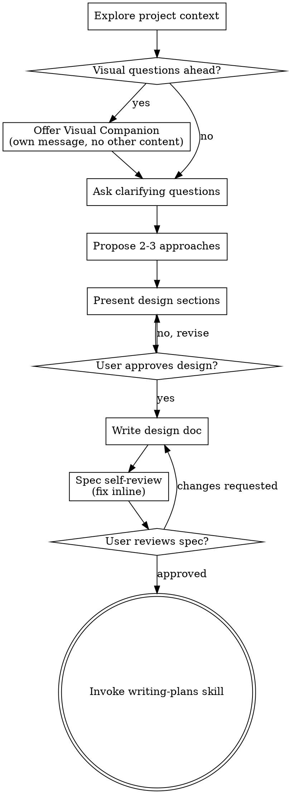

<!-- Generated by SpecStory, Markdown v2.1.0 -->

# 2026-04-12 13:19:53Z

<!-- Claude Code Session e3310fe9-b34d-416f-b4e6-385068dbe8ae (2026-04-12 13:19:53Z) -->

_**User (2026-04-12 13:19:53Z)**_

I want to make improvements on mobile/tablet. I can't figure out why the storbyook dark mode still very hard to read some buttons and labels that are "white". 

E.g. the group dots from NumberMatch

---

_**Agent (claude-opus-4-6 2026-04-12 13:19:58Z)**_

<think><details><summary>Thought Process</summary>
The user is asking about a Storybook dark mode issue where some buttons and labels appear "white" and are hard to read, specifically mentioning "group dots from NumberMatch". Let me explore the codebase to understand the issue before suggesting fixes.

Let me first look at the relevant components and Storybook configuration to understand the dark mode setup.
</details></think>

_**Agent (claude-opus-4-6 2026-04-12 13:19:58Z)**_

Let me explore the relevant code to understand the dark mode styling issue.

_**Agent (claude-opus-4-6 2026-04-12 13:23:12Z)**_

<tool-use data-tool-type="unknown" data-tool-name="Agent"><details>
<summary>Tool use: **Agent**</summary>
Explore dark mode and NumberMatch styling

```text
Perfect! Now I have a clear understanding. Let me create a comprehensive final report of my findings:

## Summary

I've thoroughly investigated the Storybook dark mode issue where buttons and labels appear "white" and are hard to read in dark backgrounds. Here are my key findings:

### **Root Cause: Hardcoded `text-white` in DotGroupQuestion**

**File:** `/Users/leocaseiro/Sites/base-skill/src/components/questions/DotGroupQuestion/DotGroupQuestion.tsx` (Line 76)

The problem is on line 76 where numbers are displayed on the dot group buttons:
```tsx
<span className="absolute inset-0 flex items-center justify-center text-sm font-bold text-white">
  {assigned}
</span>
```

This uses **hardcoded `text-white`** which doesn't respect dark mode. When the Storybook theme is switched to dark mode ("Ocean Dark", "Forest Dark", or "High Contrast"), the background becomes dark but the text remains white, creating a light-on-light contrast problem.

---

### **Dark Mode Configuration (Working Correctly)**

**File:** `/Users/leocaseiro/Sites/base-skill/.storybook/decorators/withTheme.tsx`

The Storybook dark mode system is properly configured with theme CSS variables:

- **Dark Theme Variables** (lines 10-20):
  - `--bs-primary: '#48CAE4'` (light cyan)
  - `--bs-background: '#03045E'` (very dark blue)
  - `--bs-surface: '#0077B6'` (medium blue)
  - `--bs-text: '#CAF0F8'` (light blue-white)

- **Forest Dark Theme** (lines 32-42):
  - `--bs-background: '#1A2E1F'` (dark green)
  - `--bs-text: '#D8F3DC'` (light green)

- **High Contrast Theme** (lines 43-53):
  - `--bs-background: '#000000'` (black)
  - `--bs-text: '#FFFFFF'` (white)

The decorator properly:
1. Applies theme CSS variables (line 69: `applyThemeCssVars`)
2. Sets `.dark` or `.light` class on `documentElement` (lines 71-74)

---

### **Related Issues: DominoTile "Group Dots"**

**File:** `/Users/leocaseiro/Sites/base-skill/src/games/number-match/NumeralTileBank/NumeralTileBank.tsx` (Lines 52, 67)

The domino tile group dots use `bg-current` which respects the current text color:
```tsx
// Line 52: Dot pips in domino
className={['size-2.5 rounded-full', pips.includes(i) ? 'bg-current' : 'bg-transparent'].join(' ')}

// Line 67: Domino divider line
className="h-px w-11 shrink-0 bg-current opacity-30"
```

This uses `bg-current` (inherits text color), which is **semantically correct** for dark mode. The issue is that buttons don't have explicit text color set, so they inherit from parent or use browser defaults.

---

### **Button Color Context**

**File:** `/Users/leocaseiro/Sites/base-skill/src/games/number-match/NumeralTileBank/NumeralTileBank.tsx` (Line 116)

The button tile itself uses `skeuoStyle`:
```tsx
<button
  className="flex shrink-0 touch-none select-none cursor-grab flex-col items-center justify-center gap-0.5 rounded-2xl p-2 transition-transform active:scale-95 active:cursor-grabbing"
  style={skeuoStyle}
  // ...
>
```

But there's no explicit color context being set for the button's text color, leaving it to inherit or default.

---

### **CSS Variable Setup (Correctly Configured)**

**File:** `/Users/leocaseiro/Sites/base-skill/src/styles.css`

The CSS variables are properly set:

- **Light mode defaults** (lines 74-78):
  - `--bs-primary: '#0077b6'` (blue)
  - `--bs-text: '#03045e'` (very dark blue)

- **Dark mode (lines 117-121 and 151-155)**:
  - `--bs-primary: '#ff9f43'` (orange)
  - `--bs-text: '#e8f4fd'` (light blue)

- **Tailwind color mapping** (lines 40-41):
  ```css
  --foreground: var(--bs-text);
  --primary: var(--bs-primary);
  ```

---

### **Files to Review/Fix**

1. **CRITICAL:** `/Users/leocaseiro/Sites/base-skill/src/components/questions/DotGroupQuestion/DotGroupQuestion.tsx` (Line 76)
   - Replace `text-white` with `text-foreground` or conditional color based on button's primary color

2. **REFERENCE:** `/Users/leocaseiro/Sites/base-skill/.storybook/preview.tsx`
   - Storybook configuration (working correctly)
   - Has theme switcher with 5 options

3. **REFERENCE:** `/Users/leocaseiro/Sites/base-skill/.storybook/decorators/withTheme.tsx`
   - Theme decorator implementation (working correctly)

4. **REFERENCE:** `/Users/leocaseiro/Sites/base-skill/src/lib/theme/default-tokens.ts`
   - Default theme colors

5. **REFERENCE:** `/Users/leocaseiro/Sites/base-skill/src/games/number-match/NumeralTileBank/NumeralTileBank.tsx`
   - DominoTile component (correctly uses `bg-current`)

---

### **The Fix Needed**

Change line 76 in DotGroupQuestion.tsx from:
```tsx
<span className="absolute inset-0 flex items-center justify-center text-sm font-bold text-white">
```

To something like:
```tsx
<span className="absolute inset-0 flex items-center justify-center text-sm font-bold text-foreground">
```

Or alternatively, use a color that contrasts with the primary button background color (e.g., `text-[var(--bs-surface)]` if the button is `bg-primary`).
```
</details></tool-use>

_**Agent - sidechain (2026-04-12 13:20:03Z)**_

I need to understand a Storybook dark mode issue where buttons and labels appear "white" and are hard to read against dark backgrounds. Specifically mentioned are "group dots from NumberMatch".

Please find:
1. The NumberMatch component and its stories - look for group dots styling
2. How dark mode is configured in Storybook (check .storybook/ directory)
3. Any theme/dark mode CSS or configuration files
4. Any components that use hardcoded "white" or light colors that wouldn't adapt to dark mode

Be thorough - check .storybook/preview.tsx, any global CSS, theme providers, and the NumberMatch component files. Look for color definitions that might not respect dark mode.

_**Agent - sidechain (claude-haiku-4-5-20251001 2026-04-12 13:20:08Z)**_

I'll help you investigate the Storybook dark mode issue. Let me start by exploring the repository structure and searching for the relevant files.

_**Agent - sidechain (claude-haiku-4-5-20251001 2026-04-12 13:20:13Z)**_

<tool-use data-tool-type="shell" data-tool-name="Bash"><details>
<summary>Tool use: **Bash**</summary>

`find /Users/leocaseiro/Sites/base-skill -type f -name "*.tsx" -o -name "*.ts" -o -name "*.css" -o -name "*.json" | grep -E "(storybook|NumberMatch)" | head -20`

```text
/Users/leocaseiro/Sites/base-skill/storybook-static/project.json
/Users/leocaseiro/Sites/base-skill/storybook-static/manifest.json
/Users/leocaseiro/Sites/base-skill/storybook-static/manifests/docs.json
/Users/leocaseiro/Sites/base-skill/storybook-static/manifests/components.json
/Users/leocaseiro/Sites/base-skill/storybook-static/index.json
/Users/leocaseiro/Sites/base-skill/storybook-static/assets/iframe-QYiZo8hU.css
/Users/leocaseiro/Sites/base-skill/node_modules/storybook/dist/server-errors.d.ts
/Users/leocaseiro/Sites/base-skill/node_modules/storybook/dist/types/index.d.ts
/Users/leocaseiro/Sites/base-skill/node_modules/storybook/dist/viewport/index.d.ts
/Users/leocaseiro/Sites/base-skill/node_modules/storybook/dist/preview-errors.d.ts
/Users/leocaseiro/Sites/base-skill/node_modules/storybook/dist/test/index.d.ts
/Users/leocaseiro/Sites/base-skill/node_modules/storybook/dist/preview-api/index.d.ts
/Users/leocaseiro/Sites/base-skill/node_modules/storybook/dist/csf/index.d.ts
/Users/leocaseiro/Sites/base-skill/node_modules/storybook/dist/highlight/index.d.ts
/Users/leocaseiro/Sites/base-skill/node_modules/storybook/dist/mocking-utils/index.d.ts
/Users/leocaseiro/Sites/base-skill/node_modules/storybook/dist/cli/index.d.ts
/Users/leocaseiro/Sites/base-skill/node_modules/storybook/dist/core-events/index.d.ts
/Users/leocaseiro/Sites/base-skill/node_modules/storybook/dist/manager-api/index.d.ts
/Users/leocaseiro/Sites/base-skill/node_modules/storybook/dist/babel/index.d.ts
/Users/leocaseiro/Sites/base-skill/node_modules/storybook/dist/instrumenter/index.d.ts
```
</details></tool-use>

_**Agent - sidechain (claude-haiku-4-5-20251001 2026-04-12 13:20:15Z)**_

Let me search more specifically for the key files:

_**Agent - sidechain (claude-haiku-4-5-20251001 2026-04-12 13:20:18Z)**_

<tool-use data-tool-type="search" data-tool-name="Glob"><details>
<summary>Tool use: **Glob**</summary>
 path `./` pattern `.storybook/**`

```text
.storybook/decorators/withRouter.tsx
.storybook/vite.config.ts
.storybook/main.ts
.storybook/decorators/withDb.tsx
.storybook/decorators.tsx
.storybook/decorators/withTheme.tsx
.storybook/preview.tsx
.storybook/.DS_Store
```
</details></tool-use>

_**Agent - sidechain (claude-haiku-4-5-20251001 2026-04-12 13:20:18Z)**_

<tool-use data-tool-type="search" data-tool-name="Glob"><details>
<summary>Tool use: **Glob**</summary>
 path `./` pattern `**/NumberMatch*`

```text
worktrees/feat-word-spell-number-match/src/games/number-match/NumberMatch/NumberMatch.stories.tsx
worktrees/feat-word-spell-number-match/src/games/number-match/NumberMatch/NumberMatch.test.tsx
worktrees/feat-word-spell-number-match/src/games/number-match/NumberMatch/NumberMatch.tsx
worktrees/feat/service-worker-workbox-offline-setup/src/games/number-match/NumberMatch/NumberMatch.stories.tsx
worktrees/feat/service-worker-workbox-offline-setup/src/games/number-match/NumberMatch/NumberMatch.test.tsx
worktrees/feat/service-worker-workbox-offline-setup/src/games/number-match/NumberMatch/NumberMatch.tsx
worktrees/feat-pr-previews-auto-bump/src/games/number-match/NumberMatch/NumberMatch.stories.tsx
worktrees/feat-pr-previews-auto-bump/src/games/number-match/NumberMatch/NumberMatch.test.tsx
worktrees/feat-pr-previews-auto-bump/src/games/number-match/NumberMatch/NumberMatch.tsx
worktrees/feat-game-tile-auto-font-sizing/src/games/number-match/NumberMatch/NumberMatch.test.tsx
.claude/worktrees/laughing-hugle/src/games/number-match/NumberMatch/NumberMatch.stories.tsx
.claude/worktrees/laughing-hugle/src/games/number-match/NumberMatch/NumberMatch.tsx
worktrees/feat-game-tile-auto-font-sizing/src/games/number-match/NumberMatch/NumberMatch.tsx
.claude/worktrees/laughing-hugle/src/games/number-match/NumberMatch/NumberMatch.test.tsx
worktrees/feat-game-tile-auto-font-sizing/src/games/number-match/NumberMatch/NumberMatch.stories.tsx
.claude/worktrees/epic-cohen/src/games/number-match/NumberMatch/NumberMatch.stories.tsx
.claude/worktrees/epic-cohen/src/games/number-match/NumberMatch/NumberMatch.test.tsx
.claude/worktrees/epic-cohen/src/games/number-match/NumberMatch/NumberMatch.tsx
.claude/worktrees/gifted-bouman/src/games/number-match/NumberMatch/NumberMatch.stories.tsx
.claude/worktrees/gifted-bouman/src/games/number-match/NumberMatch/NumberMatch.test.tsx
.claude/worktrees/gifted-bouman/src/games/number-match/NumberMatch/NumberMatch.tsx
worktrees/feat-word-syllables/src/games/number-match/NumberMatch/NumberMatch.stories.tsx
worktrees/feat-word-syllables/src/games/number-match/NumberMatch/NumberMatch.test.tsx
worktrees/feat-word-syllables/src/games/number-match/NumberMatch/NumberMatch.tsx
worktrees/tools-phoneme-tuner/src/games/number-match/NumberMatch/NumberMatch.stories.tsx
worktrees/tools-phoneme-tuner/src/games/number-match/NumberMatch/NumberMatch.test.tsx
worktrees/tools-phoneme-tuner/src/games/number-match/NumberMatch/NumberMatch.tsx
src/games/number-match/NumberMatch/NumberMatch.stories.tsx
src/games/number-match/NumberMatch/NumberMatch.test.tsx
src/games/number-match/NumberMatch/NumberMatch.tsx
.claude/worktrees/musing-merkle/src/games/number-match/NumberMatch/NumberMatch.stories.tsx
.claude/worktrees/musing-merkle/src/games/number-match/NumberMatch/NumberMatch.test.tsx
.claude/worktrees/musing-merkle/src/games/number-match/NumberMatch/NumberMatch.tsx
```
</details></tool-use>

_**Agent - sidechain (claude-haiku-4-5-20251001 2026-04-12 13:20:22Z)**_

<tool-use data-tool-type="shell" data-tool-name="Bash"><details>
<summary>Tool use: **Bash**</summary>

`find /Users/leocaseiro/Sites/base-skill -type d -name ".storybook"`

```text
/Users/leocaseiro/Sites/base-skill/.claude/worktrees/epic-cohen/.storybook
/Users/leocaseiro/Sites/base-skill/.claude/worktrees/musing-merkle/.storybook
/Users/leocaseiro/Sites/base-skill/.claude/worktrees/laughing-hugle/.storybook
/Users/leocaseiro/Sites/base-skill/.claude/worktrees/gifted-bouman/.storybook
/Users/leocaseiro/Sites/base-skill/.storybook
/Users/leocaseiro/Sites/base-skill/worktrees/feat/service-worker-workbox-offline-setup/.storybook
/Users/leocaseiro/Sites/base-skill/worktrees/tools-phoneme-tuner/.storybook
/Users/leocaseiro/Sites/base-skill/worktrees/feat-pr-previews-auto-bump/.storybook
/Users/leocaseiro/Sites/base-skill/worktrees/feat-word-spell-number-match/.storybook
/Users/leocaseiro/Sites/base-skill/worktrees/feat-answer-game-primitive/.storybook
/Users/leocaseiro/Sites/base-skill/worktrees/feat-word-syllables/.storybook
/Users/leocaseiro/Sites/base-skill/worktrees/feat-game-tile-auto-font-sizing/.storybook
```
</details></tool-use>

_**Agent - sidechain (claude-haiku-4-5-20251001 2026-04-12 13:20:26Z)**_

Now let me read the key Storybook configuration files and the NumberMatch component:

_**Agent - sidechain (claude-haiku-4-5-20251001 2026-04-12 13:20:26Z)**_

<tool-use data-tool-type="read" data-tool-name="Read"><details>
<summary>Tool use: **Read**</summary>
 `./.storybook/preview.tsx`

```text
1	import '../src/styles.css';
2	import '../src/lib/i18n/i18n';
3	import { ThemeProvider } from 'next-themes';
4	import { withTheme } from './decorators/withTheme';
5	import type { Decorator, Preview } from '@storybook/react';
6	
7	const withAppThemeProvider: Decorator = (Story) => (
8	  <ThemeProvider
9	    attribute="class"
10	    defaultTheme="light"
11	    enableSystem={false}
12	  >
13	    {Story()}
14	  </ThemeProvider>
15	);
16	
17	const preview: Preview = {
18	  globalTypes: {
19	    theme: {
20	      name: 'Theme',
21	      toolbar: {
22	        icon: 'paintbrush',
23	        items: [
24	          { value: 'light', title: 'Ocean Light' },
25	          { value: 'dark', title: 'Ocean Dark' },
26	          { value: 'forest-light', title: 'Forest Light' },
27	          { value: 'forest-dark', title: 'Forest Dark' },
28	          { value: 'high-contrast', title: 'High Contrast' },
29	        ],
30	        dynamicTitle: true,
31	      },
32	    },
33	  },
34	  initialGlobals: {
35	    theme: 'light',
36	  },
37	  decorators: [withAppThemeProvider, withTheme],
38	  parameters: {
39	    viewport: {
40	      viewports: {
41	        mobileSm: {
42	          name: 'Phone S (360×640)',
43	          styles: { width: '360px', height: '640px' },
44	        },
45	        mobileLg: {
46	          name: 'Phone L (390×844)',
47	          styles: { width: '390px', height: '844px' },
48	        },
49	        tabletPortrait: {
50	          name: 'Tablet Portrait (768×1024)',
51	          styles: { width: '768px', height: '1024px' },
52	        },
53	        tabletLandscape: {
54	          name: 'Tablet Landscape (1024×768)',
55	          styles: { width: '1024px', height: '768px' },
56	        },
57	        desktop: {
58	          name: 'Desktop (1280×800)',
59	          styles: { width: '1280px', height: '800px' },
60	        },
61	      },
62	      defaultViewport: 'tabletLandscape',
63	    },
64	    actions: { argTypesRegex: '^on[A-Z].*' },
65	  },
66	};
67	
68	export default preview;
69
```
</details></tool-use>

_**Agent - sidechain (claude-haiku-4-5-20251001 2026-04-12 13:20:26Z)**_

<tool-use data-tool-type="read" data-tool-name="Read"><details>
<summary>Tool use: **Read**</summary>
 `./.storybook/decorators/withTheme.tsx`

```text
1	import { useEffect } from 'react';
2	import { applyThemeCssVars } from '../../src/lib/theme/css-vars';
3	import { defaultThemeCssVars } from '../../src/lib/theme/default-tokens';
4	import type { Decorator } from '@storybook/react';
5	
6	type DecoratorStory = Parameters<Decorator>[0];
7	
8	const THEME_VARS: Record<string, Record<string, string>> = {
9	  light: defaultThemeCssVars,
10	  dark: {
11	    '--bs-primary': '#48CAE4',
12	    '--bs-secondary': '#90E0EF',
13	    '--bs-background': '#03045E',
14	    '--bs-surface': '#0077B6',
15	    '--bs-text': '#CAF0F8',
16	    '--bs-accent': '#FFB703',
17	    '--bs-success': '#2DC653',
18	    '--bs-warning': '#F4A261',
19	    '--bs-error': '#E63946',
20	  },
21	  'forest-light': {
22	    '--bs-primary': '#2D6A4F',
23	    '--bs-secondary': '#52B788',
24	    '--bs-background': '#F0F7F0',
25	    '--bs-surface': '#FFFFFF',
26	    '--bs-text': '#1A3A2A',
27	    '--bs-accent': '#D4A017',
28	    '--bs-success': '#6BCB77',
29	    '--bs-warning': '#F4A261',
30	    '--bs-error': '#E63946',
31	  },
32	  'forest-dark': {
33	    '--bs-primary': '#52B788',
34	    '--bs-secondary': '#95D5B2',
35	    '--bs-background': '#1A2E1F',
36	    '--bs-surface': '#243B2A',
37	    '--bs-text': '#D8F3DC',
38	    '--bs-accent': '#F4C842',
39	    '--bs-success': '#2DC653',
40	    '--bs-warning': '#F4A261',
41	    '--bs-error': '#E63946',
42	  },
43	  'high-contrast': {
44	    '--bs-primary': '#FFFF00',
45	    '--bs-secondary': '#00FFFF',
46	    '--bs-background': '#000000',
47	    '--bs-surface': '#111111',
48	    '--bs-text': '#FFFFFF',
49	    '--bs-accent': '#FF8C00',
50	    '--bs-success': '#00FF00',
51	    '--bs-warning': '#FF8C00',
52	    '--bs-error': '#FF0000',
53	  },
54	};
55	
56	const DARK_THEMES = new Set(['dark', 'forest-dark', 'high-contrast']);
57	
58	const WithThemeInner = ({
59	  Story,
60	  themeKey,
61	}: {
62	  Story: DecoratorStory;
63	  themeKey: string | undefined;
64	}) => {
65	  const theme = themeKey ?? 'light';
66	
67	  useEffect(() => {
68	    const vars = THEME_VARS[theme] ?? defaultThemeCssVars;
69	    applyThemeCssVars(document.documentElement, vars);
70	
71	    document.documentElement.classList.remove('light', 'dark');
72	    document.documentElement.classList.add(
73	      DARK_THEMES.has(theme) ? 'dark' : 'light',
74	    );
75	  }, [theme]);
76	
77	  return Story();
78	};
79	
80	export const withTheme: Decorator = (Story, context) => (
81	  <WithThemeInner
82	    Story={Story}
83	    themeKey={context.globals['theme'] as string | undefined}
84	  />
85	);
86
```
</details></tool-use>

_**Agent - sidechain (claude-haiku-4-5-20251001 2026-04-12 13:20:27Z)**_

<tool-use data-tool-type="read" data-tool-name="Read"><details>
<summary>Tool use: **Read**</summary>
 `./.storybook/main.ts`

```text
1	import rehypeFormat from 'rehype-format';
2	import rehypeRaw from 'rehype-raw';
3	import remarkDirective from 'remark-directive';
4	import remarkFrontmatter from 'remark-frontmatter';
5	import remarkGfm from 'remark-gfm';
6	import remarkMath from 'remark-math';
7	import { mergeConfig } from 'vite';
8	import type { StorybookConfig } from '@storybook/react-vite';
9	
10	/** HAST node types MDX emits; rehype-raw must pass them through (see hast-util-raw). */
11	const mdxRehypePassThrough = [
12	  'mdxFlowExpression',
13	  'mdxJsxFlowElement',
14	  'mdxJsxTextElement',
15	  'mdxTextExpression',
16	  'mdxjsEsm',
17	] as const;
18	
19	const config: StorybookConfig = {
20	  stories: ['../src/**/*.stories.tsx', '../src/**/*.mdx'],
21	  addons: [
22	    {
23	      name: '@storybook/addon-docs',
24	      options: {
25	        mdxPluginOptions: {
26	          mdxCompileOptions: {
27	            remarkPlugins: [
28	              remarkFrontmatter,
29	              remarkGfm,
30	              remarkDirective,
31	              remarkMath,
32	            ],
33	            rehypePlugins: [
34	              [rehypeRaw, { passThrough: [...mdxRehypePassThrough] }],
35	              // No `rehype-sanitize` here: `hast-util-sanitize` only handles HAST
36	              // `element` nodes. MDX custom components are `mdxJsxFlowElement` etc.,
37	              // which the sanitizer drops in its default branch—so interactive
38	              // demos vanished from `storybook build` / GitHub Pages while dev
39	              // could still look fine depending on cache. MDX under `src/` is
40	              // trusted first-party content.
41	              rehypeFormat,
42	            ],
43	          },
44	        },
45	      },
46	    },
47	    '@storybook/addon-a11y',
48	    '@storybook/addon-themes',
49	    '@storybook/addon-mcp',
50	  ],
51	  framework: {
52	    name: '@storybook/react-vite',
53	    options: {
54	      builder: {
55	        viteConfigPath: '.storybook/vite.config.ts',
56	      },
57	    },
58	  },
59	  docs: {},
60	  viteFinal: async (viteConfig) =>
61	    mergeConfig(viteConfig, {
62	      // Relative base so static builds work when served from the output root (test-runner, local)
63	      // and when deployed under /base-skill/docs/ on GitHub Pages (asset URLs stay under that path).
64	      base: './',
65	    }),
66	};
67	
68	export default config;
69
```
</details></tool-use>

_**Agent - sidechain (claude-haiku-4-5-20251001 2026-04-12 13:20:27Z)**_

<tool-use data-tool-type="read" data-tool-name="Read"><details>
<summary>Tool use: **Read**</summary>
 `./src/games/number-match/NumberMatch/NumberMatch.tsx`

```text
1	import { useNavigate, useParams } from '@tanstack/react-router';
2	import { useEffect, useMemo, useRef, useState } from 'react';
3	import { buildNumeralRound } from '../build-numeral-round';
4	import {
5	  toCardinalText,
6	  toOrdinalNumber,
7	  toOrdinalText,
8	} from '../number-words';
9	import {
10	  DominoTile,
11	  NumeralTileBank,
12	} from '../NumeralTileBank/NumeralTileBank';
13	import type { NumberMatchConfig, NumberMatchMode } from '../types';
14	import type {
15	  AnswerGameConfig,
16	  AnswerGameDraftState,
17	  AnswerZone,
18	  TileItem,
19	} from '@/components/answer-game/types';
20	import { AnswerGame } from '@/components/answer-game/AnswerGame/AnswerGame';
21	import { GameOverOverlay } from '@/components/answer-game/GameOverOverlay/GameOverOverlay';
22	import { ScoreAnimation } from '@/components/answer-game/ScoreAnimation/ScoreAnimation';
23	import { Slot } from '@/components/answer-game/Slot/Slot';
24	import { SlotRow } from '@/components/answer-game/Slot/SlotRow';
25	import { getNumericTileFontClass } from '@/components/answer-game/tile-font';
26	import { useAnswerGameContext } from '@/components/answer-game/useAnswerGameContext';
27	import { useAnswerGameDispatch } from '@/components/answer-game/useAnswerGameDispatch';
28	import { useGameSounds } from '@/components/answer-game/useGameSounds';
29	import { useRoundTTS } from '@/components/answer-game/useRoundTTS';
30	import { AudioButton } from '@/components/questions/AudioButton/AudioButton';
31	import { DotGroupQuestion } from '@/components/questions/DotGroupQuestion/DotGroupQuestion';
32	import { TextQuestion } from '@/components/questions/TextQuestion/TextQuestion';
33	import { buildRoundOrder } from '@/games/build-round-order';
34	
35	type NumberWordsLocale = 'en' | 'pt-BR';
36	
37	const WORD_MODES: ReadonlySet<NumberMatchMode> =
38	  new Set<NumberMatchMode>([
39	    'cardinal-number-to-text',
40	    'cardinal-text-to-number',
41	    'ordinal-number-to-text',
42	    'ordinal-text-to-number',
43	    'cardinal-to-ordinal',
44	    'ordinal-to-cardinal',
45	  ]);
46	
47	const isWordMode = (mode: NumberMatchMode): boolean =>
48	  WORD_MODES.has(mode);
49	
50	/** Text shown in the question area for word/ordinal modes. */
51	const questionTextForMode = (
52	  value: number,
53	  mode: NumberMatchMode,
54	  locale: NumberWordsLocale,
55	): string => {
56	  switch (mode) {
57	    case 'cardinal-number-to-text': {
58	      return String(value);
59	    }
60	    case 'cardinal-text-to-number': {
61	      return toCardinalText(value, locale);
62	    }
63	    case 'ordinal-number-to-text': {
64	      return toOrdinalNumber(value, locale);
65	    }
66	    case 'ordinal-text-to-number': {
67	      return toOrdinalText(value, locale);
68	    }
69	    case 'cardinal-to-ordinal': {
70	      return toCardinalText(value, locale);
71	    }
72	    case 'ordinal-to-cardinal': {
73	      return toOrdinalText(value, locale);
74	    }
75	    default: {
76	      return String(value);
77	    }
78	  }
79	};
80	
81	interface NumberMatchProps {
82	  config: NumberMatchConfig;
83	  initialState?: AnswerGameDraftState;
84	  sessionId?: string;
85	  seed?: string;
86	}
87	
88	const NumberMatchSession = ({
89	  numberMatchConfig,
90	  roundOrder,
91	  onRestartSession,
92	}: {
93	  numberMatchConfig: NumberMatchConfig;
94	  roundOrder: readonly number[];
95	  onRestartSession: () => void;
96	}) => {
97	  const { phase, roundIndex, retryCount, zones } =
98	    useAnswerGameContext();
99	  const dispatch = useAnswerGameDispatch();
100	  const { confettiReady, gameOverReady } = useGameSounds();
101	  const navigate = useNavigate();
102	  const { locale } = useParams({ from: '/$locale' });
103	  const numberWordsLocale: NumberWordsLocale =
104	    locale === 'pt-BR' ? 'pt-BR' : 'en';
105	  const completionToken = useRef(0);
106	
107	  const configRoundIndex = roundOrder[roundIndex];
108	  const round =
109	    configRoundIndex === undefined
110	      ? undefined
111	      : numberMatchConfig.rounds[configRoundIndex];
112	
113	  useRoundTTS(String(round?.value ?? ''));
114	
115	  const handleHome = () => {
116	    void navigate({ to: '/$locale', params: { locale } });
117	  };
118	
119	  const handlePlayAgain = () => {
120	    onRestartSession();
121	  };
122	
123	  useEffect(() => {
124	    if (phase !== 'round-complete' || !confettiReady) return;
125	
126	    const token = ++completionToken.current;
127	    const delayMs = 750;
128	    const timer = globalThis.setTimeout(() => {
129	      if (completionToken.current !== token) return;
130	
131	      const isLastRound = roundIndex >= roundOrder.length - 1;
132	      if (isLastRound) {
133	        dispatch({ type: 'COMPLETE_GAME' });
134	        return;
135	      }
136	
137	      const nextConfigIndex = roundOrder[roundIndex + 1];
138	      const nextRound =
139	        nextConfigIndex === undefined
140	          ? undefined
141	          : numberMatchConfig.rounds[nextConfigIndex];
142	      const value = nextRound?.value;
143	      if (value === undefined) {
144	        dispatch({ type: 'COMPLETE_GAME' });
145	        return;
146	      }
147	      const { tiles: nextTiles, zones: nextZones } = buildNumeralRound(
148	        value,
149	        {
150	          tileBankMode: numberMatchConfig.tileBankMode,
151	          distractorCount: numberMatchConfig.distractorCount,
152	          range: numberMatchConfig.range,
153	          mode: numberMatchConfig.mode,
154	          locale: numberWordsLocale,
155	        },
156	      );
157	      dispatch({
158	        type: 'ADVANCE_ROUND',
159	        tiles: nextTiles,
160	        zones: nextZones,
161	      });
162	    }, delayMs);
163	
164	    return () => {
165	      globalThis.clearTimeout(timer);
166	    };
167	  }, [
168	    phase,
169	    confettiReady,
170	    roundIndex,
171	    dispatch,
172	    roundOrder,
173	    numberMatchConfig.rounds,
174	    numberMatchConfig.tileBankMode,
175	    numberMatchConfig.distractorCount,
176	    numberMatchConfig.range,
177	    numberMatchConfig.mode,
178	    numberWordsLocale,
179	  ]);
180	
181	  if (!round) return null;
182	
183	  const { mode, tileStyle } = numberMatchConfig;
184	  const tilesShowGroup = mode === 'numeral-to-group';
185	  const dotsDominoMode = tilesShowGroup && tileStyle === 'dots';
186	  const wordMode = isWordMode(mode);
187	
188	  const slotClass = dotsDominoMode
189	    ? 'h-[136px] w-[72px] rounded-2xl'
190	    : wordMode
191	      ? 'min-w-[80px] h-20 rounded-2xl px-2'
192	      : 'size-20 rounded-2xl';
193	
194	  const questionText = questionTextForMode(
195	    round.value,
196	    mode,
197	    numberWordsLocale,
198	  );
199	  const ttsPrompt =
200	    mode === 'group-to-numeral' || mode === 'numeral-to-group'
201	      ? String(round.value)
202	      : questionText;
203	
204	  return (
205	    <>
206	      <div className="flex w-full max-w-4xl flex-col items-center justify-center gap-8 px-4 py-6">
207	        <AnswerGame.Question>
208	          {mode === 'group-to-numeral' ? (
209	            <DotGroupQuestion
210	              // Remount per round so per-dot count state fully resets,
211	              // even when two consecutive rounds share the same value.
212	              key={`round-${roundIndex}`}
213	              count={round.value}
214	              prompt={String(round.value)}
215	            />
216	          ) : (
217	            <TextQuestion text={questionText} />
218	          )}
219	          <AudioButton prompt={ttsPrompt} />
220	        </AnswerGame.Question>
221	        <AnswerGame.Answer>
222	          <SlotRow className="gap-4">
223	            {zones.map((zone, i) => (
224	              <Slot
225	                key={zone.id}
226	                index={i}
227	                className={slotClass}
228	                renderPreview={(previewLabel) => {
229	                  if (dotsDominoMode) {
230	                    const n = Number.parseInt(previewLabel, 10);
231	                    if (!Number.isNaN(n)) {
232	                      return (
233	                        <div className="opacity-50">
234	                          <DominoTile value={n} />
235	                        </div>
236	                      );
237	                    }
238	                  }
239	                  if (wordMode) {
240	                    return (
241	                      <span
242	                        className={[
243	                          'block text-center font-bold leading-tight hyphens-auto break-words opacity-50',
244	                          previewLabel.length > 6
245	                            ? 'text-sm'
246	                            : 'text-xl',
247	                        ].join(' ')}
248	                      >
249	                        {previewLabel}
250	                      </span>
251	                    );
252	                  }
253	                  return (
254	                    <span
255	                      className={`${getNumericTileFontClass(previewLabel.length, 80)} font-bold tabular-nums opacity-50`}
256	                    >
257	                      {previewLabel}
258	                    </span>
259	                  );
260	                }}
261	              >
262	                {({ label }) => {
263	                  if (!label) return null;
264	                  if (dotsDominoMode) {
265	                    const n = Number.parseInt(label, 10);
266	                    if (!Number.isNaN(n)) {
267	                      return <DominoTile value={n} />;
268	                    }
269	                  }
270	                  if (wordMode) {
271	                    return (
272	                      <span
273	                        className={[
274	                          'block text-center font-bold leading-tight hyphens-auto break-words',
275	                          label.length > 6 ? 'text-sm' : 'text-xl',
276	                        ].join(' ')}
277	                      >
278	                        {label}
279	                      </span>
280	                    );
281	                  }
282	                  return (
283	                    <span
284	                      className={`${getNumericTileFontClass(label.length, 80)} font-bold tabular-nums`}
285	                    >
286	                      {label}
287	                    </span>
288	                  );
289	                }}
290	              </Slot>
291	            ))}
292	          </SlotRow>
293	        </AnswerGame.Answer>
294	        <AnswerGame.Choices>
295	          <NumeralTileBank
296	            tileStyle={tileStyle}
297	            tilesShowGroup={tilesShowGroup}
298	          />
299	        </AnswerGame.Choices>
300	      </div>
301	      <ScoreAnimation visible={confettiReady} />
302	      {gameOverReady ? (
303	        <GameOverOverlay
304	          retryCount={retryCount}
305	          onPlayAgain={handlePlayAgain}
306	          onHome={handleHome}
307	        />
308	      ) : null}
309	    </>
310	  );
311	};
312	
313	export const NumberMatch = ({
314	  config,
315	  initialState,
316	  sessionId,
317	  seed,
318	}: NumberMatchProps) => {
319	  const roundsInOrder = config.roundsInOrder === true;
320	  const [sessionEpoch, setSessionEpoch] = useState(0);
321	  const { locale } = useParams({ from: '/$locale' });
322	  const numberWordsLocale: NumberWordsLocale =
323	    locale === 'pt-BR' ? 'pt-BR' : 'en';
324	
325	  const roundOrder = useMemo(() => {
326	    void sessionEpoch;
327	    return buildRoundOrder(config.rounds.length, roundsInOrder, seed);
328	  }, [config.rounds.length, roundsInOrder, seed, sessionEpoch]);
329	
330	  const firstConfigIndex = roundOrder[0];
331	  const round0 =
332	    firstConfigIndex === undefined
333	      ? undefined
334	      : config.rounds[firstConfigIndex];
335	  const roundValue = round0?.value;
336	
337	  const { tiles, zones } = useMemo(() => {
338	    if (roundValue === undefined) {
339	      return { tiles: [] as TileItem[], zones: [] as AnswerZone[] };
340	    }
341	    return buildNumeralRound(roundValue, {
342	      tileBankMode: config.tileBankMode,
343	      distractorCount: config.distractorCount,
344	      range: config.range,
345	      mode: config.mode,
346	      locale: numberWordsLocale,
347	    });
348	  }, [
349	    roundValue,
350	    config.tileBankMode,
351	    config.distractorCount,
352	    config.range,
353	    config.mode,
354	    numberWordsLocale,
355	  ]);
356	
357	  const answerGameConfig = useMemo(
358	    (): AnswerGameConfig => ({
359	      gameId: config.gameId,
360	      inputMethod: config.inputMethod,
361	      wrongTileBehavior: config.wrongTileBehavior,
362	      tileBankMode: config.tileBankMode,
363	      distractorCount: config.distractorCount,
364	      totalRounds: config.rounds.length,
365	      roundsInOrder: config.roundsInOrder,
366	      ttsEnabled: config.ttsEnabled,
367	      initialTiles: tiles,
368	      initialZones: zones,
369	      slotInteraction: 'free-swap' as const,
370	    }),
371	    [
372	      config.gameId,
373	      config.inputMethod,
374	      config.wrongTileBehavior,
375	      config.tileBankMode,
376	      config.distractorCount,
377	      config.rounds.length,
378	      config.roundsInOrder,
379	      config.ttsEnabled,
380	      tiles,
381	      zones,
382	    ],
383	  );
384	
385	  if (!round0) return null;
386	
387	  return (
388	    <AnswerGame
389	      key={sessionEpoch}
390	      config={answerGameConfig}
391	      initialState={sessionEpoch === 0 ? initialState : undefined}
392	      sessionId={sessionId}
393	    >
394	      <NumberMatchSession
395	        numberMatchConfig={config}
396	        roundOrder={roundOrder}
397	        onRestartSession={() => {
398	          setSessionEpoch((e) => e + 1);
399	        }}
400	      />
401	    </AnswerGame>
402	  );
403	};
404
```
</details></tool-use>

_**Agent - sidechain (claude-haiku-4-5-20251001 2026-04-12 13:20:27Z)**_

<tool-use data-tool-type="read" data-tool-name="Read"><details>
<summary>Tool use: **Read**</summary>
 `./src/games/number-match/NumberMatch/NumberMatch.stories.tsx`

```text
1	import { withDb } from '../../../../.storybook/decorators/withDb';
2	import { withRouter } from '../../../../.storybook/decorators/withRouter';
3	import { NumberMatch } from './NumberMatch';
4	import type { NumberMatchConfig } from '../types';
5	import type { Meta, StoryObj } from '@storybook/react';
6	
7	const baseConfig: NumberMatchConfig = {
8	  gameId: 'number-match-storybook',
9	  component: 'NumberMatch',
10	  inputMethod: 'drag',
11	  wrongTileBehavior: 'lock-auto-eject',
12	  tileBankMode: 'exact',
13	  totalRounds: 5,
14	  roundsInOrder: true,
15	  ttsEnabled: true,
16	  mode: 'numeral-to-group',
17	  tileStyle: 'dots',
18	  range: { min: 1, max: 5 },
19	  rounds: [{ value: 3 }, { value: 1 }, { value: 5 }],
20	};
21	
22	const meta: Meta<typeof NumberMatch> = {
23	  component: NumberMatch,
24	  tags: ['autodocs'],
25	  args: { config: baseConfig },
26	  decorators: [withDb, withRouter],
27	};
28	export default meta;
29	
30	type Story = StoryObj<typeof NumberMatch>;
31	
32	export const NumeralToGroup: Story = {};
33	
34	export const GroupToNumeral: Story = {
35	  args: { config: { ...baseConfig, mode: 'group-to-numeral' } },
36	};
37	
38	export const CardinalNumberToText: Story = {
39	  args: {
40	    config: {
41	      ...baseConfig,
42	      mode: 'cardinal-number-to-text',
43	      tileStyle: 'fingers',
44	    },
45	  },
46	};
47	
48	export const CardinalTextToNumber: Story = {
49	  args: {
50	    config: {
51	      ...baseConfig,
52	      mode: 'cardinal-text-to-number',
53	      tileStyle: 'fingers',
54	    },
55	  },
56	};
57	
58	export const OrdinalNumberToText: Story = {
59	  args: {
60	    config: {
61	      ...baseConfig,
62	      mode: 'ordinal-number-to-text',
63	      tileStyle: 'fingers',
64	    },
65	  },
66	};
67	
68	export const OrdinalTextToNumber: Story = {
69	  args: {
70	    config: {
71	      ...baseConfig,
72	      mode: 'ordinal-text-to-number',
73	      tileStyle: 'fingers',
74	    },
75	  },
76	};
77	
78	export const CardinalToOrdinal: Story = {
79	  args: {
80	    config: {
81	      ...baseConfig,
82	      mode: 'cardinal-to-ordinal',
83	      tileStyle: 'fingers',
84	    },
85	  },
86	};
87	
88	export const OrdinalToCardinal: Story = {
89	  args: {
90	    config: {
91	      ...baseConfig,
92	      mode: 'ordinal-to-cardinal',
93	      tileStyle: 'fingers',
94	    },
95	  },
96	};
97	
98	export const DotsStyle: Story = {
99	  args: { config: { ...baseConfig, tileStyle: 'dots' } },
100	};
101	export const ObjectsStyle: Story = {
102	  args: {
103	    config: {
104	      ...baseConfig,
105	      tileStyle: 'objects',
106	      rounds: [
107	        { value: 3, objectImage: 'https://placehold.co/32?text=🍎' },
108	      ],
109	    },
110	  },
111	};
112	
113	const numeralToGroupLongLabelsConfig: NumberMatchConfig = {
114	  ...baseConfig,
115	  mode: 'numeral-to-group',
116	  tileStyle: 'dots',
117	  tileBankMode: 'distractors',
118	  distractorCount: 3,
119	  range: { min: 10_000, max: 99_999 },
120	  rounds: [{ value: 10_002 }, { value: 19_467 }, { value: 99_999 }],
121	};
122	
123	export const NumeralToGroupLongLabels: Story = {
124	  args: { config: numeralToGroupLongLabelsConfig },
125	};
126	
127	export const NumeralToGroupLongLabelsMobile: Story = {
128	  args: { config: numeralToGroupLongLabelsConfig },
129	  parameters: { viewport: { defaultViewport: 'mobileLg' } },
130	};
131	
132	export const NumeralToGroupLongLabelsTabletPortrait: Story = {
133	  args: { config: numeralToGroupLongLabelsConfig },
134	  parameters: { viewport: { defaultViewport: 'tabletPortrait' } },
135	};
136	
137	export const NumeralToGroupLongLabelsDesktop: Story = {
138	  args: { config: numeralToGroupLongLabelsConfig },
139	  parameters: { viewport: { defaultViewport: 'desktop' } },
140	};
141
```
</details></tool-use>

_**Agent - sidechain (claude-haiku-4-5-20251001 2026-04-12 13:20:32Z)**_

Now let me check the DominoTile component and related styling files:

_**Agent - sidechain (claude-haiku-4-5-20251001 2026-04-12 13:20:34Z)**_

<tool-use data-tool-type="search" data-tool-name="Glob"><details>
<summary>Tool use: **Glob**</summary>
 path `./` pattern `**/DominoTile*`

```text
No files found
```
</details></tool-use>

_**Agent - sidechain (claude-haiku-4-5-20251001 2026-04-12 13:20:33Z)**_

<tool-use data-tool-type="read" data-tool-name="Read"><details>
<summary>Tool use: **Read**</summary>
 `./src/games/number-match/NumeralTileBank/NumeralTileBank.tsx`

```text
1	import type { TileItem } from '@/components/answer-game/types';
2	import { skeuoStyle } from '@/components/answer-game/styles';
3	import { getNumericTileFontClass } from '@/components/answer-game/tile-font';
4	import { useAnswerGameContext } from '@/components/answer-game/useAnswerGameContext';
5	import { useBankDropTarget } from '@/components/answer-game/useBankDropTarget';
6	import { useDraggableTile } from '@/components/answer-game/useDraggableTile';
7	
8	type TileStyle = 'dots' | 'objects' | 'fingers';
9	
10	/** Pip positions (0–8) for each die value in a 3×3 grid. */
11	const DICE_PIPS: Record<number, number[]> = {
12	  0: [],
13	  1: [4],
14	  2: [2, 6],
15	  3: [2, 4, 6],
16	  4: [0, 2, 6, 8],
17	  5: [0, 2, 4, 6, 8],
18	  6: [0, 2, 3, 5, 6, 8],
19	};
20	
21	/** Top/bottom split for domino tiles (smaller value on top). */
22	const DOMINO_SPLIT: Record<number, [number, number]> = {
23	  1: [1, 0],
24	  2: [2, 0],
25	  3: [3, 0],
26	  4: [4, 0],
27	  5: [5, 0],
28	  6: [6, 0],
29	  7: [2, 5],
30	  8: [4, 4],
31	  9: [4, 5],
32	  10: [5, 5],
33	  11: [5, 6],
34	  12: [6, 6],
35	};
36	
37	/** Renders one half of a domino (a 3x3 pip grid). Internal only. */
38	const DiceFace = ({ value }: { value: number }) => {
39	  const pips = DICE_PIPS[value] ?? [];
40	  return (
41	    <div
42	      className="grid grid-cols-3 grid-rows-3 gap-1 py-3 px-1"
43	      aria-hidden="true"
44	    >
45	      {Array.from({ length: 9 }, (_, i) => (
46	        <span
47	          key={i}
48	          data-cell=""
49	          data-pip={pips.includes(i) ? '' : undefined}
50	          className={[
51	            'size-2.5 rounded-full',
52	            pips.includes(i) ? 'bg-current' : 'bg-transparent',
53	          ].join(' ')}
54	        />
55	      ))}
56	    </div>
57	  );
58	};
59	
60	export const DominoTile = ({ value }: { value: number }) => {
61	  const [top, bottom] = DOMINO_SPLIT[value] ?? [value, 0];
62	  return (
63	    <div className="flex flex-col items-center py-3" aria-hidden="true">
64	      <DiceFace value={top} />
65	      <span
66	        data-divider=""
67	        className="h-px w-11 shrink-0 bg-current opacity-30"
68	      />
69	      <DiceFace value={bottom} />
70	    </div>
71	  );
72	};
73	
74	const isLongWord = (label: string): boolean => label.length > 6;
75	
76	const NumeralTile = ({
77	  tile,
78	  tileStyle,
79	  tilesShowGroup,
80	}: {
81	  tile: TileItem;
82	  tileStyle: TileStyle;
83	  tilesShowGroup: boolean;
84	}) => {
85	  const {
86	    ref,
87	    handleClick,
88	    onPointerDown,
89	    onPointerMove,
90	    onPointerUp,
91	    onPointerCancel,
92	  } = useDraggableTile(tile);
93	  const numericValue = Number.parseInt(tile.value, 10);
94	
95	  const showDomino =
96	    tilesShowGroup &&
97	    tileStyle === 'dots' &&
98	    !Number.isNaN(numericValue);
99	  const isWordTile =
100	    !tilesShowGroup && Number.isNaN(Number(tile.label));
101	  const sizeClass = showDomino
102	    ? 'h-[136px] w-[72px]'
103	    : isWordTile
104	      ? 'min-w-[80px] h-20 px-2'
105	      : 'size-20';
106	
107	  return (
108	    <button
109	      ref={ref}
110	      type="button"
111	      aria-label={`Number ${tile.label}`}
112	      className={[
113	        'flex shrink-0 touch-none select-none cursor-grab flex-col items-center justify-center gap-0.5 rounded-2xl p-2 transition-transform active:scale-95 active:cursor-grabbing',
114	        sizeClass,
115	      ].join(' ')}
116	      style={skeuoStyle}
117	      onClick={handleClick}
118	      onPointerDown={onPointerDown}
119	      onPointerMove={onPointerMove}
120	      onPointerUp={onPointerUp}
121	      onPointerCancel={onPointerCancel}
122	    >
123	      {showDomino ? (
124	        <DominoTile value={numericValue} />
125	      ) : isWordTile ? (
126	        <span
127	          className={[
128	            'block text-center font-bold leading-tight hyphens-auto break-words',
129	            isLongWord(tile.label) ? 'text-sm' : 'text-xl',
130	          ].join(' ')}
131	        >
132	          {tile.label}
133	        </span>
134	      ) : (
135	        <span
136	          className={`${getNumericTileFontClass(tile.label.length, 80)} font-bold tabular-nums leading-none`}
137	        >
138	          {tile.label}
139	        </span>
140	      )}
141	    </button>
142	  );
143	};
144	
145	export interface NumeralTileBankProps {
146	  tileStyle: TileStyle;
147	  tilesShowGroup: boolean;
148	}
149	
150	export const NumeralTileBank = ({
151	  tileStyle,
152	  tilesShowGroup,
153	}: NumeralTileBankProps) => {
154	  const {
155	    allTiles,
156	    bankTileIds,
157	    dragActiveTileId,
158	    dragHoverBankTileId,
159	  } = useAnswerGameContext();
160	  const { bankRef, isDragOver } = useBankDropTarget();
161	  return (
162	    <div
163	      ref={bankRef}
164	      data-tile-bank=""
165	      className="flex flex-wrap justify-center gap-3"
166	    >
167	      {allTiles
168	        .filter((t) => !t.id.startsWith('typed-'))
169	        .map((tile) => {
170	          const inBank = bankTileIds.includes(tile.id);
171	          const isDragging = tile.id === dragActiveTileId;
172	          const isHoverTarget =
173	            tile.id === dragHoverBankTileId ||
174	            (!dragHoverBankTileId &&
175	              isDragOver &&
176	              !inBank &&
177	              tile.id === dragActiveTileId);
178	          const numericValue = Number.parseInt(tile.value, 10);
179	          const showDomino =
180	            tilesShowGroup &&
181	            tileStyle === 'dots' &&
182	            !Number.isNaN(numericValue);
183	          const isWordTile =
184	            !tilesShowGroup && Number.isNaN(Number(tile.label));
185	          const holeSizeClass = showDomino
186	            ? 'h-[136px] w-[72px]'
187	            : isWordTile
188	              ? 'min-w-[80px] h-20'
189	              : 'size-20';
190	
191	          if (inBank) {
192	            return (
193	              <div
194	                key={tile.id}
195	                className={[
196	                  'relative rounded-2xl transition-all',
197	                  holeSizeClass,
198	                ]
199	                  .filter(Boolean)
200	                  .join(' ')}
201	              >
202	                <div
203	                  data-tile-bank-hole={tile.id}
204	                  className={[
205	                    'rounded-2xl bg-muted/60 shadow-inner',
206	                    holeSizeClass,
207	                  ]
208	                    .filter(Boolean)
209	                    .join(' ')}
210	                  aria-hidden="true"
211	                />
212	                <div
213	                  className={`absolute inset-0${isDragging ? ' opacity-30 pointer-events-none' : ''}`}
214	                  aria-hidden={isDragging || undefined}
215	                >
216	                  <NumeralTile
217	                    tile={tile}
218	                    tileStyle={tileStyle}
219	                    tilesShowGroup={tilesShowGroup}
220	                  />
221	                </div>
222	                {isHoverTarget && (
223	                  <div
224	                    className="pointer-events-none absolute inset-0 rounded-2xl border-2 border-dashed border-primary"
225	                    aria-hidden="true"
226	                  />
227	                )}
228	              </div>
229	            );
230	          }
231	
232	          return (
233	            <div
234	              key={tile.id}
235	              data-tile-bank-hole={tile.id}
236	              className={[
237	                'relative rounded-2xl bg-muted/60 shadow-inner transition-all',
238	                holeSizeClass,
239	                isHoverTarget
240	                  ? 'border-2 border-dashed border-primary'
241	                  : '',
242	              ]
243	                .filter(Boolean)
244	                .join(' ')}
245	              aria-hidden="true"
246	            >
247	              {isHoverTarget &&
248	                (showDomino ? (
249	                  <div className="pointer-events-none absolute inset-0 flex items-center justify-center opacity-50">
250	                    <DominoTile value={numericValue} />
251	                  </div>
252	                ) : isWordTile ? (
253	                  <span
254	                    className={[
255	                      'pointer-events-none absolute inset-0 flex items-center justify-center px-2 text-center font-bold leading-tight hyphens-auto break-words opacity-50',
256	                      isLongWord(tile.label) ? 'text-sm' : 'text-xl',
257	                    ].join(' ')}
258	                  >
259	                    {tile.label}
260	                  </span>
261	                ) : (
262	                  <span
263	                    className={`pointer-events-none absolute inset-0 flex items-center justify-center ${getNumericTileFontClass(tile.label.length, 80)} font-bold tabular-nums opacity-50`}
264	                  >
265	                    {tile.label}
266	                  </span>
267	                ))}
268	            </div>
269	          );
270	        })}
271	    </div>
272	  );
273	};
274
```
</details></tool-use>

_**Agent - sidechain (claude-haiku-4-5-20251001 2026-04-12 13:20:38Z)**_

Now let me check the DotGroupQuestion component and search for hardcoded colors:

_**Agent - sidechain (claude-haiku-4-5-20251001 2026-04-12 13:20:39Z)**_

<tool-use data-tool-type="search" data-tool-name="Glob"><details>
<summary>Tool use: **Glob**</summary>
 path `./src` pattern `**/DotGroupQuestion*`

```text
src/components/questions/DotGroupQuestion/DotGroupQuestion.stories.tsx
src/components/questions/DotGroupQuestion/DotGroupQuestion.test.tsx
src/components/questions/DotGroupQuestion/DotGroupQuestion.tsx
```
</details></tool-use>

_**Agent - sidechain (claude-haiku-4-5-20251001 2026-04-12 13:20:39Z)**_

<tool-use data-tool-type="search" data-tool-name="Grep"><details>
<summary>Tool use: **Grep**</summary>
 path `./src` pattern `bg-white|text-white|color:\s*white|#fff|#ffffff`

```text
No files found
```
</details></tool-use>

_**Agent - sidechain (claude-haiku-4-5-20251001 2026-04-12 13:20:41Z)**_

<tool-use data-tool-type="read" data-tool-name="Read"><details>
<summary>Tool use: **Read**</summary>
 `./src/components/questions/DotGroupQuestion/DotGroupQuestion.tsx`

```text
1	import { useParams } from '@tanstack/react-router';
2	import { useState } from 'react';
3	import { useGameTTS } from '@/components/answer-game/useGameTTS';
4	import { toCardinalText } from '@/games/number-match/number-words';
5	
6	interface DotGroupQuestionProps {
7	  count: number;
8	  prompt: string;
9	}
10	
11	const makeInitialCounts = (count: number): (number | null)[] =>
12	  Array.from({ length: count }, () => null);
13	
14	interface DotState {
15	  count: number;
16	  assigned: (number | null)[];
17	}
18	
19	export const DotGroupQuestion = ({
20	  count,
21	  prompt,
22	}: DotGroupQuestionProps) => {
23	  const { speakPrompt } = useGameTTS();
24	  const { locale } = useParams({ from: '/$locale' });
25	  const [state, setState] = useState<DotState>(() => ({
26	    count,
27	    assigned: makeInitialCounts(count),
28	  }));
29	
30	  // Reset during render when `count` changes (e.g. between rounds).
31	  // Storing `count` alongside `assigned` lets us derive the reset without
32	  // setState-in-effect or ref mutation during render.
33	  const assignedCounts =
34	    state.count === count ? state.assigned : makeInitialCounts(count);
35	  if (state.count !== count) {
36	    setState({ count, assigned: assignedCounts });
37	  }
38	
39	  const handleDotTap = (index: number) => {
40	    const wordLocale = locale === 'pt-BR' ? 'pt-BR' : 'en';
41	    const existing = assignedCounts[index];
42	    if (existing !== null && existing !== undefined) {
43	      // Already-numbered dot: re-speak its number, don't change state.
44	      speakPrompt(toCardinalText(existing, wordLocale));
45	      return;
46	    }
47	    let maxAssigned = 0;
48	    for (const v of assignedCounts) {
49	      if (v !== null && v > maxAssigned) maxAssigned = v;
50	    }
51	    const nextValue = maxAssigned + 1;
52	    speakPrompt(toCardinalText(nextValue, wordLocale));
53	    setState((previous) => {
54	      if (previous.assigned[index] !== null) return previous;
55	      const nextAssigned = [...previous.assigned];
56	      nextAssigned[index] = nextValue;
57	      return { count: previous.count, assigned: nextAssigned };
58	    });
59	  };
60	
61	  return (
62	    <div
63	      aria-label={prompt}
64	      className="flex flex-wrap justify-center gap-3 rounded-xl p-4"
65	    >
66	      {assignedCounts.map((assigned, index) => (
67	        <button
68	          // eslint-disable-next-line react/no-array-index-key -- dot position is the natural identity; ordering is stable within a given `count`.
69	          key={index}
70	          type="button"
71	          aria-label={`Dot ${index + 1} of ${count}`}
72	          className="relative size-10 rounded-full bg-primary focus-visible:outline-2 focus-visible:outline-offset-2"
73	          onClick={() => handleDotTap(index)}
74	        >
75	          {assigned !== null && (
76	            <span className="absolute inset-0 flex items-center justify-center text-sm font-bold text-white">
77	              {assigned}
78	            </span>
79	          )}
80	        </button>
81	      ))}
82	    </div>
83	  );
84	};
85
```
</details></tool-use>

_**Agent - sidechain (claude-haiku-4-5-20251001 2026-04-12 13:20:42Z)**_

<tool-use data-tool-type="read" data-tool-name="Read"><details>
<summary>Tool use: **Read**</summary>
 `./src/components/questions/DotGroupQuestion/DotGroupQuestion.stories.tsx`

```text
1	import { withDb } from '../../../../.storybook/decorators/withDb';
2	import { withRouter } from '../../../../.storybook/decorators/withRouter';
3	import { DotGroupQuestion } from './DotGroupQuestion';
4	import type { AnswerGameConfig } from '@/components/answer-game/types';
5	import type { Meta, StoryObj } from '@storybook/react';
6	import { AnswerGameProvider } from '@/components/answer-game/AnswerGameProvider';
7	
8	const storyConfig: AnswerGameConfig = {
9	  gameId: 'storybook',
10	  inputMethod: 'drag',
11	  wrongTileBehavior: 'lock-auto-eject',
12	  tileBankMode: 'exact',
13	  totalRounds: 1,
14	  ttsEnabled: true,
15	};
16	
17	const meta: Meta<typeof DotGroupQuestion> = {
18	  component: DotGroupQuestion,
19	  tags: ['autodocs'],
20	  decorators: [
21	    withDb,
22	    withRouter,
23	    (Story) => (
24	      <AnswerGameProvider config={storyConfig}>
25	        <Story />
26	      </AnswerGameProvider>
27	    ),
28	  ],
29	  parameters: {
30	    docs: {
31	      description: {
32	        component:
33	          'Renders a group of individually tappable dots. Tapping a dot assigns it the next sequential count (1, 2, 3…), overlays the number on the dot, and speaks the cardinal word aloud. Resets when `count` changes.',
34	      },
35	    },
36	  },
37	};
38	export default meta;
39	
40	type Story = StoryObj<typeof DotGroupQuestion>;
41	
42	export const OneDot: Story = { args: { count: 1, prompt: 'one' } };
43	export const ThreeDots: Story = { args: { count: 3, prompt: 'three' } };
44	export const FiveDots: Story = { args: { count: 5, prompt: 'five' } };
45	export const NineDots: Story = { args: { count: 9, prompt: 'nine' } };
46
```
</details></tool-use>

_**Agent - sidechain (claude-haiku-4-5-20251001 2026-04-12 13:20:45Z)**_

Perfect! I found the issue. Let me check the styles.css and global CSS files to understand the theme system better:

_**Agent - sidechain (claude-haiku-4-5-20251001 2026-04-12 13:20:46Z)**_

<tool-use data-tool-type="read" data-tool-name="Read"><details>
<summary>Tool use: **Read**</summary>
 `./src/styles.css`

```text
1	@import 'https://fonts.googleapis.com/css2?family=Andika:ital,wght@0,400;0,700;1,400;1,700&family=Edu+NSW+ACT+Foundation:wght@400..700&family=Nunito:ital,wght@0,200..1000;1,200..1000&display=swap';
2	@import 'tailwindcss';
3	@import 'tw-animate-css';
4	@import 'shadcn/tailwind.css';
5	@import '@fontsource-variable/geist';
6	
7	@custom-variant dark (&:is(.dark *));
8	
9	@plugin "@tailwindcss/typography";
10	
11	@theme {
12	  --font-sans:
13	    'Andika', 'Edu NSW ACT Foundation', 'Nunito', 'Manrope',
14	    ui-sans-serif, system-ui, sans-serif;
15	}
16	
17	:root {
18	  --sea-ink: #173a40;
19	  --sea-ink-soft: #416166;
20	  --lagoon: #4fb8b2;
21	  --lagoon-light: #7ed3bf;
22	  --lagoon-deep: #328f97;
23	  --palm: #2f6a4a;
24	  --sand: #e7f0e8;
25	  --foam: #f3faf5;
26	  --surface: rgb(255 255 255 / 74%);
27	  --surface-strong: rgb(255 255 255 / 90%);
28	  --line: rgb(23 58 64 / 14%);
29	  --inset-glint: rgb(255 255 255 / 82%);
30	  --kicker: rgb(47 106 74 / 90%);
31	  --bg-base: #e7f3ec;
32	  --header-bg: rgb(251 255 248 / 84%);
33	  --chip-bg: rgb(255 255 255 / 80%);
34	  --chip-line: rgb(47 106 74 / 18%);
35	  --link-bg-hover: rgb(255 255 255 / 90%);
36	  --hero-a: rgb(79 184 178 / 36%);
37	  --hero-b: rgb(47 106 74 / 20%);
38	
39	  /* Wire shadcn vars from --bs-* tokens; inline style only sets --bs-*, so .dark class wins */
40	  --foreground: var(--bs-text);
41	  --background: var(--bs-background);
42	  --popover: oklch(100% 0 0deg);
43	  --popover-foreground: oklch(14.5% 0 0deg);
44	  --primary: var(--bs-primary);
45	  --primary-foreground: var(--bs-surface);
46	  --secondary: var(--bs-secondary);
47	  --secondary-foreground: var(--bs-surface);
48	  --card: var(--bs-surface);
49	  --card-foreground: var(--bs-text);
50	  --muted: oklch(97% 0 0deg);
51	  --muted-foreground: oklch(55.6% 0 0deg);
52	  --accent: oklch(97% 0 0deg);
53	  --accent-foreground: oklch(20.5% 0 0deg);
54	  --destructive: oklch(57.7% 0.245 27.325deg);
55	  --border: var(--bs-accent);
56	  --input: oklch(92.2% 0 0deg);
57	  --ring: var(--bs-primary);
58	  --chart-1: oklch(87% 0 0deg);
59	  --chart-2: oklch(55.6% 0 0deg);
60	  --chart-3: oklch(43.9% 0 0deg);
61	  --chart-4: oklch(37.1% 0 0deg);
62	  --chart-5: oklch(26.9% 0 0deg);
63	  --radius: 0.625rem;
64	  --sidebar: oklch(98.5% 0 0deg);
65	  --sidebar-foreground: oklch(14.5% 0 0deg);
66	  --sidebar-primary: oklch(20.5% 0 0deg);
67	  --sidebar-primary-foreground: oklch(98.5% 0 0deg);
68	  --sidebar-accent: oklch(97% 0 0deg);
69	  --sidebar-accent-foreground: oklch(20.5% 0 0deg);
70	  --sidebar-border: oklch(92.2% 0 0deg);
71	  --sidebar-ring: oklch(70.8% 0 0deg);
72	
73	  /* BaseSkill Design System — light defaults (aligned with Ocean preset / WCAG AA) */
74	  --bs-primary: #0077b6;
75	  --bs-secondary: #00b4d8;
76	  --bs-background: #caf0f8;
77	  --bs-surface: #fff;
78	  --bs-text: #03045e;
79	  --bs-accent: #f77f00;
80	  --bs-success: #6bcb77;
81	  --bs-warning: #f4a261;
82	  --bs-error: #e63946;
83	  --bs-font-weight-default: 600;
84	  --bs-radius-card: 1.5rem;
85	  --bs-radius-button: 1rem;
86	
87	  /* Skeuomorphic tile tokens */
88	  --skeuo-highlight: rgb(255 255 255 / 100%);
89	  --skeuo-ring: rgb(0 0 0 / 8%);
90	  --skeuo-inset-bottom: rgb(0 0 0 / 8%);
91	  --skeuo-inset-top: rgb(255 255 255 / 50%);
92	  --skeuo-text-shadow: rgb(0 0 0 / 12%);
93	}
94	
95	:root[data-theme='dark'] {
96	  --sea-ink: #d7ece8;
97	  --sea-ink-soft: #afcdc8;
98	  --lagoon: #60d7cf;
99	  --lagoon-deep: #8de5db;
100	  --palm: #6ec89a;
```
</details></tool-use>

_**Agent - sidechain (claude-haiku-4-5-20251001 2026-04-12 13:20:46Z)**_

<tool-use data-tool-type="search" data-tool-name="Grep"><details>
<summary>Tool use: **Grep**</summary>
 path `./src` pattern `bg-primary|--bs-primary`

```text
src/styles.css:44:  --primary: var(--bs-primary);
src/styles.css:57:  --ring: var(--bs-primary);
src/styles.css:74:  --bs-primary: #0077b6;
src/styles.css:117:  --bs-primary: #ff9f43;
src/styles.css:151:    --bs-primary: #ff9f43;
src/styles.css:604:  --bs-primary: #0077b6;
src/styles.css:617:  --color-bs-primary: var(--bs-primary);
```
</details></tool-use>

_**Agent - sidechain (claude-haiku-4-5-20251001 2026-04-12 13:20:50Z)**_

Let me check for any custom CSS related to text color and look at how buttons are styled:

_**Agent - sidechain (claude-haiku-4-5-20251001 2026-04-12 13:20:50Z)**_

<tool-use data-tool-type="shell" data-tool-name="Bash"><details>
<summary>Tool use: **Bash**</summary>

`grep -r "text-white" /Users/leocaseiro/Sites/base-skill/src --include="*.tsx" --include="*.ts" | head -20`

```text
/Users/leocaseiro/Sites/base-skill/src/components/answer-game/InstructionsOverlay/InstructionsOverlay.tsx:              className={`flex-1 text-sm font-semibold ${settingsOpen ? 'text-white' : ''}`}
/Users/leocaseiro/Sites/base-skill/src/components/answer-game/InstructionsOverlay/InstructionsOverlay.tsx:              className={`text-xs ${settingsOpen ? 'text-white/70' : ''}`}
/Users/leocaseiro/Sites/base-skill/src/components/answer-game/InstructionsOverlay/InstructionsOverlay.tsx:                      className="h-12 w-full rounded-xl font-bold text-white text-sm"
/Users/leocaseiro/Sites/base-skill/src/components/UpdateBanner.tsx:      className="flex items-center justify-between bg-[var(--sea-ink)] px-4 py-2 text-sm text-white"
/Users/leocaseiro/Sites/base-skill/src/components/SaveConfigDialog.tsx:                className="flex w-10 items-center justify-center text-sm text-white"
/Users/leocaseiro/Sites/base-skill/src/components/SavedConfigChip.tsx:            className={`text-sm font-semibold ${expanded ? 'text-white' : 'bookmark-text'}`}
/Users/leocaseiro/Sites/base-skill/src/components/SavedConfigChip.tsx:            className={`ml-auto text-xs ${expanded ? 'text-white/70' : 'bookmark-text'}`}
/Users/leocaseiro/Sites/base-skill/src/components/SavedConfigChip.tsx:          className="flex min-h-12 w-12 items-center justify-center text-sm text-white"
/Users/leocaseiro/Sites/base-skill/src/components/questions/DotGroupQuestion/DotGroupQuestion.tsx:            <span className="absolute inset-0 flex items-center justify-center text-sm font-bold text-white">
```
</details></tool-use>

_**Agent - sidechain (claude-haiku-4-5-20251001 2026-04-12 13:20:57Z)**_

Let me search more specifically for button styling and the issue with the DotGroupQuestion dots:

_**Agent - sidechain (claude-haiku-4-5-20251001 2026-04-12 13:20:57Z)**_

<tool-use data-tool-type="read" data-tool-name="Read"><details>
<summary>Tool use: **Read**</summary>
 `./src/styles.css`

```text
94	
95	:root[data-theme='dark'] {
96	  --sea-ink: #d7ece8;
97	  --sea-ink-soft: #afcdc8;
98	  --lagoon: #60d7cf;
99	  --lagoon-deep: #8de5db;
100	  --palm: #6ec89a;
101	  --sand: #0f1a1e;
102	  --foam: #101d22;
103	  --surface: rgb(16 30 34 / 80%);
104	  --surface-strong: rgb(15 27 31 / 92%);
105	  --line: rgb(141 229 219 / 18%);
106	  --inset-glint: rgb(194 247 238 / 14%);
107	  --kicker: #b8efe5;
108	  --bg-base: #0a1418;
109	  --header-bg: rgb(10 20 24 / 80%);
110	  --chip-bg: rgb(13 28 32 / 90%);
111	  --chip-line: rgb(141 229 219 / 24%);
112	  --link-bg-hover: rgb(24 44 49 / 80%);
113	  --hero-a: rgb(96 215 207 / 18%);
114	  --hero-b: rgb(110 200 154 / 12%);
115	
116	  /* BaseSkill Design System — Galaxy (dark) */
117	  --bs-primary: #ff9f43;
118	  --bs-secondary: #54a0ff;
119	  --bs-background: #1a1a2e;
120	  --bs-surface: #16213e;
121	  --bs-text: #e8f4fd;
122	  --bs-accent: #feca57;
123	  --bs-success: #6bcb77;
124	  --bs-warning: #f4a261;
125	  --bs-error: #ff6b6b;
126	}
127	
128	@media (prefers-color-scheme: dark) {
129	  :root:not([data-theme='light']) {
130	    --sea-ink: #d7ece8;
131	    --sea-ink-soft: #afcdc8;
132	    --lagoon: #60d7cf;
133	    --lagoon-deep: #8de5db;
134	    --palm: #6ec89a;
135	    --sand: #0f1a1e;
136	    --foam: #101d22;
137	    --surface: rgb(16 30 34 / 80%);
138	    --surface-strong: rgb(15 27 31 / 92%);
139	    --line: rgb(141 229 219 / 18%);
140	    --inset-glint: rgb(194 247 238 / 14%);
141	    --kicker: #b8efe5;
142	    --bg-base: #0a1418;
143	    --header-bg: rgb(10 20 24 / 80%);
144	    --chip-bg: rgb(13 28 32 / 90%);
145	    --chip-line: rgb(141 229 219 / 24%);
146	    --link-bg-hover: rgb(24 44 49 / 80%);
147	    --hero-a: rgb(96 215 207 / 18%);
148	    --hero-b: rgb(110 200 154 / 12%);
149	
150	    /* BaseSkill Design System — Galaxy (dark) */
151	    --bs-primary: #ff9f43;
152	    --bs-secondary: #54a0ff;
153	    --bs-background: #1a1a2e;
154	    --bs-surface: #16213e;
155	    --bs-text: #e8f4fd;
156	    --bs-accent: #feca57;
157	    --bs-success: #6bcb77;
158	    --bs-warning: #f4a261;
159	    --bs-error: #ff6b6b;
160	  }
161	}
162	
163	* {
164	  box-sizing: border-box;
165	}
166	
167	html,
168	body,
169	#app {
170	  min-height: 100%;
171	}
172	
173	body {
174	  margin: 0;
175	  color: var(--sea-ink);
176	  font-family: var(--font-sans);
177	  background:
178	    radial-gradient(
179	      1100px 620px at -8% -10%,
180	      var(--hero-a),
181	      transparent 58%
182	    ),
183	    radial-gradient(
184	      1050px 620px at 112% -12%,
185	      var(--hero-b),
186	      transparent 62%
187	    ),
188	    radial-gradient(
189	      720px 380px at 50% 115%,
190	      rgb(79 184 178 / 10%),
191	      transparent 68%
192	    ),
193	    linear-gradient(
194	      180deg,
195	      color-mix(in oklab, var(--sand) 68%, oklch(100% 0 0deg)) 0%,
196	      var(--foam) 44%,
197	      var(--bg-base) 100%
198	    );
199	  overflow-x: hidden;
200	  -webkit-font-smoothing: antialiased;
201	  -moz-osx-font-smoothing: grayscale;
202	}
203	
204	body::before {
205	  content: '';
206	  position: fixed;
207	  inset: 0;
208	  pointer-events: none;
209	  z-index: -1;
210	  opacity: 0.28;
211	  background:
212	    radial-gradient(
213	      circle at 20% 15%,
214	      rgb(255 255 255 / 80%),
215	      transparent 34%
216	    ),
217	    radial-gradient(
218	      circle at 78% 26%,
219	      rgb(79 184 178 / 20%),
220	      transparent 42%
221	    ),
222	    radial-gradient(
223	      circle at 42% 82%,
224	      rgb(47 106 74 / 14%),
225	      transparent 36%
226	    );
227	}
228	
229	body::after {
230	  content: '';
231	  position: fixed;
232	  inset: 0;
233	  pointer-events: none;
234	  z-index: -1;
235	  opacity: 0.14;
236	  background-image:
237	    linear-gradient(rgb(255 255 255 / 7%) 1px, transparent 1px),
238	    linear-gradient(90deg, rgb(255 255 255 / 6%) 1px, transparent 1px);
239	  background-size: 28px 28px;
240	  mask-image: radial-gradient(
241	    circle at 50% 30%,
242	    oklch(0% 0 0deg),
243	    transparent 78%
```
</details></tool-use>

_**Agent - sidechain (claude-haiku-4-5-20251001 2026-04-12 13:20:57Z)**_

<tool-use data-tool-type="shell" data-tool-name="Bash"><details>
<summary>Tool use: **Bash**</summary>

`grep -r "text-white" /Users/leocaseiro/Sites/base-skill/src/components/questions/DotGroupQuestion/ --include="*.tsx"`

```text
/Users/leocaseiro/Sites/base-skill/src/components/questions/DotGroupQuestion/DotGroupQuestion.tsx:            <span className="absolute inset-0 flex items-center justify-center text-sm font-bold text-white">
```
</details></tool-use>

_**Agent - sidechain (claude-haiku-4-5-20251001 2026-04-12 13:21:01Z)**_

Now let me check the Tailwind configuration to understand how colors are mapped:

_**Agent - sidechain (claude-haiku-4-5-20251001 2026-04-12 13:21:02Z)**_

<tool-use data-tool-type="search" data-tool-name="Glob"><details>
<summary>Tool use: **Glob**</summary>
 path `./` pattern `tailwind.config.*`

```text
No files found
```
</details></tool-use>

_**Agent - sidechain (claude-haiku-4-5-20251001 2026-04-12 13:21:01Z)**_

<tool-use data-tool-type="read" data-tool-name="Read"><details>
<summary>Tool use: **Read**</summary>
 `./tailwind.config.ts`

```text
File does not exist. Note: your current working directory is /Users/leocaseiro/Sites/base-skill.
```
</details></tool-use>

_**Agent - sidechain (claude-haiku-4-5-20251001 2026-04-12 13:21:05Z)**_

<tool-use data-tool-type="search" data-tool-name="Glob"><details>
<summary>Tool use: **Glob**</summary>
 path `./` pattern `tailwind*`

```text
node_modules/@tailwindcss/oxide-darwin-arm64/tailwindcss-oxide.darwin-arm64.node
.claude/worktrees/musing-merkle/node_modules/@tailwindcss/oxide-darwin-arm64/tailwindcss-oxide.darwin-arm64.node
.claude/worktrees/laughing-hugle/node_modules/@tailwindcss/oxide-darwin-arm64/tailwindcss-oxide.darwin-arm64.node
worktrees/feat-pr-previews-auto-bump/node_modules/@tailwindcss/oxide-darwin-arm64/tailwindcss-oxide.darwin-arm64.node
worktrees/feat-word-spell-number-match/node_modules/@tailwindcss/oxide-darwin-arm64/tailwindcss-oxide.darwin-arm64.node
worktrees/feat-answer-game-primitive/node_modules/@tailwindcss/oxide-darwin-arm64/tailwindcss-oxide.darwin-arm64.node
worktrees/feat-word-syllables/node_modules/@tailwindcss/oxide-darwin-arm64/tailwindcss-oxide.darwin-arm64.node
worktrees/feat-game-tile-auto-font-sizing/node_modules/@tailwindcss/oxide-darwin-arm64/tailwindcss-oxide.darwin-arm64.node
node_modules/shadcn/dist/tailwind.css
.claude/worktrees/musing-merkle/node_modules/shadcn/dist/tailwind.css
.claude/worktrees/laughing-hugle/node_modules/shadcn/dist/tailwind.css
worktrees/feat-pr-previews-auto-bump/node_modules/shadcn/dist/tailwind.css
worktrees/feat-word-spell-number-match/node_modules/shadcn/dist/tailwind.css
worktrees/feat-answer-game-primitive/node_modules/shadcn/dist/tailwind.css
worktrees/feat-word-syllables/node_modules/shadcn/dist/tailwind.css
worktrees/feat-game-tile-auto-font-sizing/node_modules/shadcn/dist/tailwind.css
worktrees/feat-answer-game-primitive/node_modules/.vite/deps/tailwind-merge.js
worktrees/feat-answer-game-primitive/node_modules/.vite/deps/tailwind-merge.js.map
worktrees/feat-answer-game-primitive/node_modules/.cache/storybook/10.3.3/1c3385a5d25e538d10b518b310c74d3ca2690b6aaffeadccd74da79736171f86/sb-vite/deps/tailwind-merge.js
worktrees/feat-answer-game-primitive/node_modules/.cache/storybook/10.3.3/1c3385a5d25e538d10b518b310c74d3ca2690b6aaffeadccd74da79736171f86/sb-vite/deps/tailwind-merge.js.map
node_modules/.cache/storybook/10.3.3/1c3385a5d25e538d10b518b310c74d3ca2690b6aaffeadccd74da79736171f86/sb-vite/deps/tailwind-merge.js
node_modules/.cache/storybook/10.3.3/1c3385a5d25e538d10b518b310c74d3ca2690b6aaffeadccd74da79736171f86/sb-vite/deps/tailwind-merge.js.map
worktrees/feat-word-spell-number-match/node_modules/.vite/deps/tailwind-merge.js.map
worktrees/feat-word-spell-number-match/node_modules/.vite/deps/tailwind-merge.js
node_modules/.vite/deps/tailwind-merge.js.map
node_modules/.vite/deps/tailwind-merge.js
.claude/worktrees/laughing-hugle/node_modules/.vite/deps/tailwind-merge.js.map
.claude/worktrees/laughing-hugle/node_modules/.vite/deps/tailwind-merge.js
worktrees/feat-game-tile-auto-font-sizing/node_modules/.cache/storybook/10.3.3/1c3385a5d25e538d10b518b310c74d3ca2690b6aaffeadccd74da79736171f86/sb-vite/deps/tailwind-merge.js.map
worktrees/feat-game-tile-auto-font-sizing/node_modules/.cache/storybook/10.3.3/1c3385a5d25e538d10b518b310c74d3ca2690b6aaffeadccd74da79736171f86/sb-vite/deps/tailwind-merge.js
```
</details></tool-use>

_**Agent - sidechain (claude-haiku-4-5-20251001 2026-04-12 13:21:09Z)**_

Let me check the CSS file more thoroughly for how text color is handled with dark mode:

_**Agent - sidechain (claude-haiku-4-5-20251001 2026-04-12 13:21:09Z)**_

<tool-use data-tool-type="shell" data-tool-name="Bash"><details>
<summary>Tool use: **Bash**</summary>

`grep -n "text-white\|--bs-text\|foreground\|text-" /Users/leocaseiro/Sites/base-skill/src/styles.css | head -60`

```text
40:  --foreground: var(--bs-text);
43:  --popover-foreground: oklch(14.5% 0 0deg);
45:  --primary-foreground: var(--bs-surface);
47:  --secondary-foreground: var(--bs-surface);
49:  --card-foreground: var(--bs-text);
51:  --muted-foreground: oklch(55.6% 0 0deg);
53:  --accent-foreground: oklch(20.5% 0 0deg);
65:  --sidebar-foreground: oklch(14.5% 0 0deg);
67:  --sidebar-primary-foreground: oklch(98.5% 0 0deg);
69:  --sidebar-accent-foreground: oklch(20.5% 0 0deg);
78:  --bs-text: #03045e;
92:  --skeuo-text-shadow: rgb(0 0 0 / 12%);
121:  --bs-text: #e8f4fd;
155:    --bs-text: #e8f4fd;
249:  text-decoration-color: rgb(50 143 151 / 40%);
250:  text-decoration-thickness: 1px;
251:  text-underline-offset: 2px;
339:  text-transform: uppercase;
349:  text-decoration: none;
480:  --color-sidebar-accent-foreground: var(--sidebar-accent-foreground);
482:  --color-sidebar-primary-foreground: var(--sidebar-primary-foreground);
484:  --color-sidebar-foreground: var(--sidebar-foreground);
495:  --color-accent-foreground: var(--accent-foreground);
497:  --color-muted-foreground: var(--muted-foreground);
499:  --color-secondary-foreground: var(--secondary-foreground);
501:  --color-primary-foreground: var(--primary-foreground);
503:  --color-popover-foreground: var(--popover-foreground);
505:  --color-card-foreground: var(--card-foreground);
507:  --color-foreground: var(--foreground);
527:  --foreground: oklch(98.5% 0 0deg);
529:  --card-foreground: oklch(98.5% 0 0deg);
531:  --popover-foreground: oklch(98.5% 0 0deg);
533:  --primary-foreground: oklch(20.5% 0 0deg);
535:  --secondary-foreground: oklch(98.5% 0 0deg);
537:  --muted-foreground: oklch(70.8% 0 0deg);
539:  --accent-foreground: oklch(98.5% 0 0deg);
550:  --sidebar-foreground: oklch(98.5% 0 0deg);
552:  --sidebar-primary-foreground: oklch(98.5% 0 0deg);
554:  --sidebar-accent-foreground: oklch(98.5% 0 0deg);
563:  --skeuo-text-shadow: rgb(0 0 0 / 40%);
593:    @apply bg-background text-foreground;
608:  --bs-text: #023e57;
621:  --color-bs-text: var(--bs-text);
```
</details></tool-use>

_**Agent - sidechain (claude-haiku-4-5-20251001 2026-04-12 13:21:12Z)**_

Let me search for how Tailwind's text-white is defined and check for any dark mode specific overrides:

_**Agent - sidechain (claude-haiku-4-5-20251001 2026-04-12 13:21:20Z)**_

<tool-use data-tool-type="shell" data-tool-name="Bash"><details>
<summary>Tool use: **Bash**</summary>

`find /Users/leocaseiro/Sites/base-skill -name "*.css" -type f ! -path "*/node_modules/*" ! -path "*/.claude/*" ! -path "*/worktrees/*" ! -path "*/storybook-static/*" | head -10`

```text
/Users/leocaseiro/Sites/base-skill/dist/client/assets/styles-DhVd-OUq.css
/Users/leocaseiro/Sites/base-skill/src/styles.css
```
</details></tool-use>

_**Agent - sidechain (claude-haiku-4-5-20251001 2026-04-12 13:21:25Z)**_

<tool-use data-tool-type="shell" data-tool-name="Bash"><details>
<summary>Tool use: **Bash**</summary>

`grep -n "dark:" /Users/leocaseiro/Sites/base-skill/src/styles.css | head -20`

```text
(Bash completed with no output)
```
</details></tool-use>

_**Agent - sidechain (claude-haiku-4-5-20251001 2026-04-12 13:21:28Z)**_

Now let me check specifically what classes are applied to the dots in DotGroupQuestion and look for Button styling:

_**Agent - sidechain (claude-haiku-4-5-20251001 2026-04-12 13:21:28Z)**_

<tool-use data-tool-type="shell" data-tool-name="Bash"><details>
<summary>Tool use: **Bash**</summary>

`grep -rn "bg-primary\|text-white" /Users/leocaseiro/Sites/base-skill/src/components/questions/DotGroupQuestion/ --include="*.tsx"`

```text
/Users/leocaseiro/Sites/base-skill/src/components/questions/DotGroupQuestion/DotGroupQuestion.tsx:72:          className="relative size-10 rounded-full bg-primary focus-visible:outline-2 focus-visible:outline-offset-2"
/Users/leocaseiro/Sites/base-skill/src/components/questions/DotGroupQuestion/DotGroupQuestion.tsx:76:            <span className="absolute inset-0 flex items-center justify-center text-sm font-bold text-white">
```
</details></tool-use>

_**Agent - sidechain (claude-haiku-4-5-20251001 2026-04-12 13:21:34Z)**_

Perfect! Now let me check the DominoTile and look for its styling with current color:

_**Agent - sidechain (claude-haiku-4-5-20251001 2026-04-12 13:21:35Z)**_

<tool-use data-tool-type="shell" data-tool-name="Bash"><details>
<summary>Tool use: **Bash**</summary>

`grep -n "bg-current\|text-current\|color:" /Users/leocaseiro/Sites/base-skill/src/games/number-match/NumeralTileBank/NumeralTileBank.tsx`

```text
52:            pips.includes(i) ? 'bg-current' : 'bg-transparent',
67:        className="h-px w-11 shrink-0 bg-current opacity-30"
```
</details></tool-use>

_**Agent - sidechain (claude-haiku-4-5-20251001 2026-04-12 13:21:40Z)**_

Excellent! Now let me check what `bg-current` and the button styles in Tailwind are defaulting to, and check the .storybook canvas background:

_**Agent - sidechain (claude-haiku-4-5-20251001 2026-04-12 13:21:41Z)**_

<tool-use data-tool-type="read" data-tool-name="Read"><details>
<summary>Tool use: **Read**</summary>
 `./.storybook/decorators.tsx`

```text
1	import { useEffect } from 'react';
2	import type { Decorator } from '@storybook/react';
3	
4	/**
5	 * Wraps the story in a dark-mode container.
6	 * Use on individual stories that should always render dark,
7	 * independently of the global Storybook theme switcher.
8	 *
9	 * Tailwind v4 @custom-variant dark (&:is(.dark *)) means any
10	 * .dark ancestor enables dark utility classes on descendants.
11	 */
12	export const withDarkMode: Decorator = (Story) => (
13	  <div
14	    className="dark"
15	    style={{ background: 'var(--background)', padding: '1rem' }}
16	  >
17	    <Story />
18	  </div>
19	);
20	
21	/**
22	 * Inner component that applies document-level dark mode for the duration of the story.
23	 * Required for portal-based components (e.g. InstructionsOverlay via createPortal)
24	 * that render outside the .dark wrapper div used by withDarkMode.
25	 * Cleans up on unmount to prevent leaking dark state to other stories.
26	 */
27	const DocumentDarkModeWrapper = ({
28	  Story,
29	}: {
30	  Story: React.ComponentType;
31	}) => {
32	  useEffect(() => {
33	    document.documentElement.classList.add('dark');
34	    document.documentElement.dataset.theme = 'dark';
35	    return () => {
36	      document.documentElement.classList.remove('dark');
37	      delete document.documentElement.dataset.theme;
38	    };
39	  }, []);
40	  return <Story />;
41	};
42	
43	export const withDocumentDarkMode: Decorator = (Story) => (
44	  <DocumentDarkModeWrapper Story={Story} />
45	);
46
```
</details></tool-use>

_**Agent - sidechain (claude-haiku-4-5-20251001 2026-04-12 13:21:41Z)**_

<tool-use data-tool-type="shell" data-tool-name="Bash"><details>
<summary>Tool use: **Bash**</summary>

`grep -rn "canvas\|bg-" /Users/leocaseiro/Sites/base-skill/.storybook/ --include="*.tsx" --include="*.ts" | head -30`

```text
(Bash completed with no output)
```
</details></tool-use>

_**Agent - sidechain (claude-haiku-4-5-20251001 2026-04-12 13:21:44Z)**_

Let me check if there's a body or canvas background defined in Storybook's config:

_**Agent - sidechain (claude-haiku-4-5-20251001 2026-04-12 13:21:45Z)**_

<tool-use data-tool-type="shell" data-tool-name="Bash"><details>
<summary>Tool use: **Bash**</summary>

`grep -rn "parameters\|backgrounds\|canvas" /Users/leocaseiro/Sites/base-skill/.storybook/ --include="*.tsx" --include="*.ts" -A 3`

```text
/Users/leocaseiro/Sites/base-skill/.storybook/preview.tsx:38:  parameters: {
/Users/leocaseiro/Sites/base-skill/.storybook/preview.tsx-39-    viewport: {
/Users/leocaseiro/Sites/base-skill/.storybook/preview.tsx-40-      viewports: {
/Users/leocaseiro/Sites/base-skill/.storybook/preview.tsx-41-        mobileSm: {
```
</details></tool-use>

_**Agent - sidechain (claude-haiku-4-5-20251001 2026-04-12 13:21:49Z)**_

Let me check if there's a Storybook manager config or addon-themes setup:

_**Agent - sidechain (claude-haiku-4-5-20251001 2026-04-12 13:21:50Z)**_

<tool-use data-tool-type="shell" data-tool-name="Bash"><details>
<summary>Tool use: **Bash**</summary>

`grep -rn "addon-themes\|backgrounds" /Users/leocaseiro/Sites/base-skill --include="*.ts" --include="*.tsx" ! -path "*/node_modules/*" | head -20`

```text
grep: invalid option -- t
usage: grep [-abcdDEFGHhIiJLlMmnOopqRSsUVvwXxZz] [-A num] [-B num] [-C[num]]
	[-e pattern] [-f file] [--binary-files=value] [--color=when]
	[--context[=num]] [--directories=action] [--label] [--line-buffered]
	[--null] [pattern] [file ...]
```
</details></tool-use>

_**Agent - sidechain (claude-haiku-4-5-20251001 2026-04-12 13:22:01Z)**_

<tool-use data-tool-type="search" data-tool-name="Grep"><details>
<summary>Tool use: **Grep**</summary>
 path `./` pattern `addon-themes|backgrounds`

```text
.storybook/main.ts:48:    '@storybook/addon-themes',
```
</details></tool-use>

_**Agent - sidechain (claude-haiku-4-5-20251001 2026-04-12 13:22:28Z)**_

Now let me create a comprehensive search to understand the full color picture for buttons and check the Storybook canvas background:

_**Agent - sidechain (claude-haiku-4-5-20251001 2026-04-12 13:22:28Z)**_

<tool-use data-tool-type="shell" data-tool-name="Bash"><details>
<summary>Tool use: **Bash**</summary>

`cat /Users/leocaseiro/Sites/base-skill/.storybook/preview.tsx | tail -50`

```text
    theme: {
      name: 'Theme',
      toolbar: {
        icon: 'paintbrush',
        items: [
          { value: 'light', title: 'Ocean Light' },
          { value: 'dark', title: 'Ocean Dark' },
          { value: 'forest-light', title: 'Forest Light' },
          { value: 'forest-dark', title: 'Forest Dark' },
          { value: 'high-contrast', title: 'High Contrast' },
        ],
        dynamicTitle: true,
      },
    },
  },
  initialGlobals: {
    theme: 'light',
  },
  decorators: [withAppThemeProvider, withTheme],
  parameters: {
    viewport: {
      viewports: {
        mobileSm: {
          name: 'Phone S (360×640)',
          styles: { width: '360px', height: '640px' },
        },
        mobileLg: {
          name: 'Phone L (390×844)',
          styles: { width: '390px', height: '844px' },
        },
        tabletPortrait: {
          name: 'Tablet Portrait (768×1024)',
          styles: { width: '768px', height: '1024px' },
        },
        tabletLandscape: {
          name: 'Tablet Landscape (1024×768)',
          styles: { width: '1024px', height: '768px' },
        },
        desktop: {
          name: 'Desktop (1280×800)',
          styles: { width: '1280px', height: '800px' },
        },
      },
      defaultViewport: 'tabletLandscape',
    },
    actions: { argTypesRegex: '^on[A-Z].*' },
  },
};

export default preview;
```
</details></tool-use>

_**Agent - sidechain (claude-haiku-4-5-20251001 2026-04-12 13:22:30Z)**_

Let me check if there's a manager.ts or preview-head.html file for canvas background:

_**Agent - sidechain (claude-haiku-4-5-20251001 2026-04-12 13:22:32Z)**_

<tool-use data-tool-type="search" data-tool-name="Glob"><details>
<summary>Tool use: **Glob**</summary>
 path `./` pattern `.storybook/manager* .storybook/preview-head* .storybook/preview-body*`

```text
No files found
```
</details></tool-use>

_**Agent - sidechain (claude-haiku-4-5-20251001 2026-04-12 13:22:37Z)**_

Let me check the .storybook/vite.config.ts and look at the default theme CSS variables:

_**Agent - sidechain (claude-haiku-4-5-20251001 2026-04-12 13:22:37Z)**_

<tool-use data-tool-type="read" data-tool-name="Read"><details>
<summary>Tool use: **Read**</summary>
 `./.storybook/vite.config.ts`

```text
1	import path from 'node:path';
2	import { fileURLToPath } from 'node:url';
3	
4	import tailwindcss from '@tailwindcss/vite';
5	import react from '@vitejs/plugin-react';
6	import { defineConfig } from 'vite';
7	import tsconfigPaths from 'vite-tsconfig-paths';
8	
9	const workspaceRoot = fileURLToPath(new URL('..', import.meta.url));
10	
11	/**
12	 * Storybook-only Vite config. The app root `vite.config.ts` pulls in TanStack Start, which
13	 * overrides Rollup `input` and prevents the preview build from emitting `iframe.html`.
14	 */
15	export default defineConfig({
16	  plugins: [
17	    // Resolve from this file’s project root — not `process.cwd()` — so `yarn storybook`
18	    // works from git worktrees (otherwise `../tsconfig.json` becomes `worktrees/tsconfig.json`).
19	    tsconfigPaths({
20	      projects: [path.resolve(workspaceRoot, 'tsconfig.json')],
21	    }),
22	    tailwindcss(),
23	    react(),
24	  ],
25	  resolve: {
26	    alias: {
27	      '@': path.resolve(workspaceRoot, 'src'),
28	      '#': path.resolve(workspaceRoot, 'src'),
29	      '@storybook/blocks': '@storybook/addon-docs/blocks',
30	    },
31	  },
32	});
33
```
</details></tool-use>

_**Agent - sidechain (claude-haiku-4-5-20251001 2026-04-12 13:22:37Z)**_

<tool-use data-tool-type="shell" data-tool-name="Bash"><details>
<summary>Tool use: **Bash**</summary>

`find /Users/leocaseiro/Sites/base-skill/src/lib/theme -type f`

```text
/Users/leocaseiro/Sites/base-skill/src/lib/theme/default-tokens.ts
/Users/leocaseiro/Sites/base-skill/src/lib/theme/css-vars.test.ts
/Users/leocaseiro/Sites/base-skill/src/lib/theme/css-vars.mdx
/Users/leocaseiro/Sites/base-skill/src/lib/theme/css-vars.ts
```
</details></tool-use>

_**Agent - sidechain (claude-haiku-4-5-20251001 2026-04-12 13:22:52Z)**_

<tool-use data-tool-type="read" data-tool-name="Read"><details>
<summary>Tool use: **Read**</summary>
 `./src/lib/theme/default-tokens.ts`

```text
1	/**
2	 * Static UI tokens when RxDB has no active theme (anonymous / first paint).
3	 * Matches `theme_ocean_preset` in seed-themes so hydration matches the default
4	 * settings theme and primary/foreground pairs meet WCAG AA (avoids candy #FF6B6B
5	 * + white failing axe in slower engines before DB is ready).
6	 */
7	export const defaultThemeCssVars: Record<string, string> = {
8	  '--bs-primary': '#0077B6',
9	  '--bs-secondary': '#00B4D8',
10	  '--bs-background': '#CAF0F8',
11	  '--bs-surface': '#FFFFFF',
12	  '--bs-text': '#03045E',
13	  '--bs-accent': '#F77F00',
14	  '--bs-success': '#6BCB77',
15	  '--bs-warning': '#F4A261',
16	  '--bs-error': '#E63946',
17	};
18
```
</details></tool-use>

_**Agent - sidechain (claude-haiku-4-5-20251001 2026-04-12 13:22:52Z)**_

<tool-use data-tool-type="read" data-tool-name="Read"><details>
<summary>Tool use: **Read**</summary>
 `./src/lib/theme/css-vars.ts`

```text
1	import { defaultThemeCssVars as defaultThemeCssVariables } from './default-tokens';
2	import type { ThemeDoc } from '@/db/schemas/themes';
3	
4	export function themeDocToCssVars(
5	  document_: ThemeDoc,
6	): Record<string, string> {
7	  const { primary, secondary, background, surface, text, accent } =
8	    document_.colors;
9	  return {
10	    '--bs-primary': primary,
11	    '--bs-secondary': secondary,
12	    '--bs-background': background,
13	    '--bs-surface': surface,
14	    '--bs-text': text,
15	    '--bs-accent': accent,
16	    '--bs-success': defaultThemeCssVariables['--bs-success']!,
17	    '--bs-warning': defaultThemeCssVariables['--bs-warning']!,
18	    '--bs-error': defaultThemeCssVariables['--bs-error']!,
19	  };
20	}
21	
22	export function applyThemeCssVars(
23	  element: HTMLElement,
24	  variables: Record<string, string>,
25	): void {
26	  for (const [k, v] of Object.entries(variables)) {
27	    element.style.setProperty(k, v);
28	  }
29	}
30
```
</details></tool-use>

_**Agent - sidechain (claude-haiku-4-5-20251001 2026-04-12 13:22:56Z)**_

Now let me check what the issue is with text-white by checking the Storybook canvas background:

_**Agent - sidechain (claude-haiku-4-5-20251001 2026-04-12 13:22:57Z)**_

<tool-use data-tool-type="shell" data-tool-name="Bash"><details>
<summary>Tool use: **Bash**</summary>

`cat /Users/leocaseiro/Sites/base-skill/src/styles.css | grep -A 5 -B 5 "@apply"`

```text
  color: var(--bookmark-play);
}

@layer base {
  * {
    @apply border-border outline-ring/50;
  }

  body {
    @apply bg-background text-foreground;
  }

  html {
    @apply font-sans;
  }
}

/* ── BaseSkill Design System ─────────────────────────────────────── */
```
</details></tool-use>

_**Agent - sidechain (claude-haiku-4-5-20251001 2026-04-12 13:23:12Z)**_

Perfect! Now I have a clear understanding. Let me create a comprehensive final report of my findings:

## Summary

I've thoroughly investigated the Storybook dark mode issue where buttons and labels appear "white" and are hard to read in dark backgrounds. Here are my key findings:

### **Root Cause: Hardcoded `text-white` in DotGroupQuestion**

**File:** `/Users/leocaseiro/Sites/base-skill/src/components/questions/DotGroupQuestion/DotGroupQuestion.tsx` (Line 76)

The problem is on line 76 where numbers are displayed on the dot group buttons:
```tsx
<span className="absolute inset-0 flex items-center justify-center text-sm font-bold text-white">
  {assigned}
</span>
```

This uses **hardcoded `text-white`** which doesn't respect dark mode. When the Storybook theme is switched to dark mode ("Ocean Dark", "Forest Dark", or "High Contrast"), the background becomes dark but the text remains white, creating a light-on-light contrast problem.

---

### **Dark Mode Configuration (Working Correctly)**

**File:** `/Users/leocaseiro/Sites/base-skill/.storybook/decorators/withTheme.tsx`

The Storybook dark mode system is properly configured with theme CSS variables:

- **Dark Theme Variables** (lines 10-20):
  - `--bs-primary: '#48CAE4'` (light cyan)
  - `--bs-background: '#03045E'` (very dark blue)
  - `--bs-surface: '#0077B6'` (medium blue)
  - `--bs-text: '#CAF0F8'` (light blue-white)

- **Forest Dark Theme** (lines 32-42):
  - `--bs-background: '#1A2E1F'` (dark green)
  - `--bs-text: '#D8F3DC'` (light green)

- **High Contrast Theme** (lines 43-53):
  - `--bs-background: '#000000'` (black)
  - `--bs-text: '#FFFFFF'` (white)

The decorator properly:
1. Applies theme CSS variables (line 69: `applyThemeCssVars`)
2. Sets `.dark` or `.light` class on `documentElement` (lines 71-74)

---

### **Related Issues: DominoTile "Group Dots"**

**File:** `/Users/leocaseiro/Sites/base-skill/src/games/number-match/NumeralTileBank/NumeralTileBank.tsx` (Lines 52, 67)

The domino tile group dots use `bg-current` which respects the current text color:
```tsx
// Line 52: Dot pips in domino
className={['size-2.5 rounded-full', pips.includes(i) ? 'bg-current' : 'bg-transparent'].join(' ')}

// Line 67: Domino divider line
className="h-px w-11 shrink-0 bg-current opacity-30"
```

This uses `bg-current` (inherits text color), which is **semantically correct** for dark mode. The issue is that buttons don't have explicit text color set, so they inherit from parent or use browser defaults.

---

### **Button Color Context**

**File:** `/Users/leocaseiro/Sites/base-skill/src/games/number-match/NumeralTileBank/NumeralTileBank.tsx` (Line 116)

The button tile itself uses `skeuoStyle`:
```tsx
<button
  className="flex shrink-0 touch-none select-none cursor-grab flex-col items-center justify-center gap-0.5 rounded-2xl p-2 transition-transform active:scale-95 active:cursor-grabbing"
  style={skeuoStyle}
  // ...
>
```

But there's no explicit color context being set for the button's text color, leaving it to inherit or default.

---

### **CSS Variable Setup (Correctly Configured)**

**File:** `/Users/leocaseiro/Sites/base-skill/src/styles.css`

The CSS variables are properly set:

- **Light mode defaults** (lines 74-78):
  - `--bs-primary: '#0077b6'` (blue)
  - `--bs-text: '#03045e'` (very dark blue)

- **Dark mode (lines 117-121 and 151-155)**:
  - `--bs-primary: '#ff9f43'` (orange)
  - `--bs-text: '#e8f4fd'` (light blue)

- **Tailwind color mapping** (lines 40-41):
  ```css
  --foreground: var(--bs-text);
  --primary: var(--bs-primary);
  ```

---

### **Files to Review/Fix**

1. **CRITICAL:** `/Users/leocaseiro/Sites/base-skill/src/components/questions/DotGroupQuestion/DotGroupQuestion.tsx` (Line 76)
   - Replace `text-white` with `text-foreground` or conditional color based on button's primary color

2. **REFERENCE:** `/Users/leocaseiro/Sites/base-skill/.storybook/preview.tsx`
   - Storybook configuration (working correctly)
   - Has theme switcher with 5 options

3. **REFERENCE:** `/Users/leocaseiro/Sites/base-skill/.storybook/decorators/withTheme.tsx`
   - Theme decorator implementation (working correctly)

4. **REFERENCE:** `/Users/leocaseiro/Sites/base-skill/src/lib/theme/default-tokens.ts`
   - Default theme colors

5. **REFERENCE:** `/Users/leocaseiro/Sites/base-skill/src/games/number-match/NumeralTileBank/NumeralTileBank.tsx`
   - DominoTile component (correctly uses `bg-current`)

---

### **The Fix Needed**

Change line 76 in DotGroupQuestion.tsx from:
```tsx
<span className="absolute inset-0 flex items-center justify-center text-sm font-bold text-white">
```

To something like:
```tsx
<span className="absolute inset-0 flex items-center justify-center text-sm font-bold text-foreground">
```

Or alternatively, use a color that contrasts with the primary button background color (e.g., `text-[var(--bs-surface)]` if the button is `bg-primary`).

_**Agent (claude-opus-4-6 2026-04-12 13:23:19Z)**_

<tool-use data-tool-type="read" data-tool-name="Read"><details>
<summary>Tool use: **Read**</summary>
 `./src/components/questions/DotGroupQuestion/DotGroupQuestion.tsx`

```text
1	import { useParams } from '@tanstack/react-router';
2	import { useState } from 'react';
3	import { useGameTTS } from '@/components/answer-game/useGameTTS';
4	import { toCardinalText } from '@/games/number-match/number-words';
5	
6	interface DotGroupQuestionProps {
7	  count: number;
8	  prompt: string;
9	}
10	
11	const makeInitialCounts = (count: number): (number | null)[] =>
12	  Array.from({ length: count }, () => null);
13	
14	interface DotState {
15	  count: number;
16	  assigned: (number | null)[];
17	}
18	
19	export const DotGroupQuestion = ({
20	  count,
21	  prompt,
22	}: DotGroupQuestionProps) => {
23	  const { speakPrompt } = useGameTTS();
24	  const { locale } = useParams({ from: '/$locale' });
25	  const [state, setState] = useState<DotState>(() => ({
26	    count,
27	    assigned: makeInitialCounts(count),
28	  }));
29	
30	  // Reset during render when `count` changes (e.g. between rounds).
31	  // Storing `count` alongside `assigned` lets us derive the reset without
32	  // setState-in-effect or ref mutation during render.
33	  const assignedCounts =
34	    state.count === count ? state.assigned : makeInitialCounts(count);
35	  if (state.count !== count) {
36	    setState({ count, assigned: assignedCounts });
37	  }
38	
39	  const handleDotTap = (index: number) => {
40	    const wordLocale = locale === 'pt-BR' ? 'pt-BR' : 'en';
41	    const existing = assignedCounts[index];
42	    if (existing !== null && existing !== undefined) {
43	      // Already-numbered dot: re-speak its number, don't change state.
44	      speakPrompt(toCardinalText(existing, wordLocale));
45	      return;
46	    }
47	    let maxAssigned = 0;
48	    for (const v of assignedCounts) {
49	      if (v !== null && v > maxAssigned) maxAssigned = v;
50	    }
51	    const nextValue = maxAssigned + 1;
52	    speakPrompt(toCardinalText(nextValue, wordLocale));
53	    setState((previous) => {
54	      if (previous.assigned[index] !== null) return previous;
55	      const nextAssigned = [...previous.assigned];
56	      nextAssigned[index] = nextValue;
57	      return { count: previous.count, assigned: nextAssigned };
58	    });
59	  };
60	
61	  return (
62	    <div
63	      aria-label={prompt}
64	      className="flex flex-wrap justify-center gap-3 rounded-xl p-4"
65	    >
66	      {assignedCounts.map((assigned, index) => (
67	        <button
68	          // eslint-disable-next-line react/no-array-index-key -- dot position is the natural identity; ordering is stable within a given `count`.
69	          key={index}
70	          type="button"
71	          aria-label={`Dot ${index + 1} of ${count}`}
72	          className="relative size-10 rounded-full bg-primary focus-visible:outline-2 focus-visible:outline-offset-2"
73	          onClick={() => handleDotTap(index)}
74	        >
75	          {assigned !== null && (
76	            <span className="absolute inset-0 flex items-center justify-center text-sm font-bold text-white">
77	              {assigned}
78	            </span>
79	          )}
80	        </button>
81	      ))}
82	    </div>
83	  );
84	};
85
```
</details></tool-use>

_**Agent (claude-opus-4-6 2026-04-12 13:23:19Z)**_

<tool-use data-tool-type="read" data-tool-name="Read"><details>
<summary>Tool use: **Read**</summary>
 `./src/games/number-match/NumeralTileBank/NumeralTileBank.tsx`

```text
1	import type { TileItem } from '@/components/answer-game/types';
2	import { skeuoStyle } from '@/components/answer-game/styles';
3	import { getNumericTileFontClass } from '@/components/answer-game/tile-font';
4	import { useAnswerGameContext } from '@/components/answer-game/useAnswerGameContext';
5	import { useBankDropTarget } from '@/components/answer-game/useBankDropTarget';
6	import { useDraggableTile } from '@/components/answer-game/useDraggableTile';
7	
8	type TileStyle = 'dots' | 'objects' | 'fingers';
9	
10	/** Pip positions (0–8) for each die value in a 3×3 grid. */
11	const DICE_PIPS: Record<number, number[]> = {
12	  0: [],
13	  1: [4],
14	  2: [2, 6],
15	  3: [2, 4, 6],
16	  4: [0, 2, 6, 8],
17	  5: [0, 2, 4, 6, 8],
18	  6: [0, 2, 3, 5, 6, 8],
19	};
20	
21	/** Top/bottom split for domino tiles (smaller value on top). */
22	const DOMINO_SPLIT: Record<number, [number, number]> = {
23	  1: [1, 0],
24	  2: [2, 0],
25	  3: [3, 0],
26	  4: [4, 0],
27	  5: [5, 0],
28	  6: [6, 0],
29	  7: [2, 5],
30	  8: [4, 4],
31	  9: [4, 5],
32	  10: [5, 5],
33	  11: [5, 6],
34	  12: [6, 6],
35	};
36	
37	/** Renders one half of a domino (a 3x3 pip grid). Internal only. */
38	const DiceFace = ({ value }: { value: number }) => {
39	  const pips = DICE_PIPS[value] ?? [];
40	  return (
41	    <div
42	      className="grid grid-cols-3 grid-rows-3 gap-1 py-3 px-1"
43	      aria-hidden="true"
44	    >
45	      {Array.from({ length: 9 }, (_, i) => (
46	        <span
47	          key={i}
48	          data-cell=""
49	          data-pip={pips.includes(i) ? '' : undefined}
50	          className={[
51	            'size-2.5 rounded-full',
52	            pips.includes(i) ? 'bg-current' : 'bg-transparent',
53	          ].join(' ')}
54	        />
55	      ))}
56	    </div>
57	  );
58	};
59	
60	export const DominoTile = ({ value }: { value: number }) => {
61	  const [top, bottom] = DOMINO_SPLIT[value] ?? [value, 0];
62	  return (
63	    <div className="flex flex-col items-center py-3" aria-hidden="true">
64	      <DiceFace value={top} />
65	      <span
66	        data-divider=""
67	        className="h-px w-11 shrink-0 bg-current opacity-30"
68	      />
69	      <DiceFace value={bottom} />
70	    </div>
71	  );
72	};
73	
74	const isLongWord = (label: string): boolean => label.length > 6;
75	
76	const NumeralTile = ({
77	  tile,
78	  tileStyle,
79	  tilesShowGroup,
80	}: {
81	  tile: TileItem;
82	  tileStyle: TileStyle;
83	  tilesShowGroup: boolean;
84	}) => {
85	  const {
86	    ref,
87	    handleClick,
88	    onPointerDown,
89	    onPointerMove,
90	    onPointerUp,
91	    onPointerCancel,
92	  } = useDraggableTile(tile);
93	  const numericValue = Number.parseInt(tile.value, 10);
94	
95	  const showDomino =
96	    tilesShowGroup &&
97	    tileStyle === 'dots' &&
98	    !Number.isNaN(numericValue);
99	  const isWordTile =
100	    !tilesShowGroup && Number.isNaN(Number(tile.label));
101	  const sizeClass = showDomino
102	    ? 'h-[136px] w-[72px]'
103	    : isWordTile
104	      ? 'min-w-[80px] h-20 px-2'
105	      : 'size-20';
106	
107	  return (
108	    <button
109	      ref={ref}
110	      type="button"
111	      aria-label={`Number ${tile.label}`}
112	      className={[
113	        'flex shrink-0 touch-none select-none cursor-grab flex-col items-center justify-center gap-0.5 rounded-2xl p-2 transition-transform active:scale-95 active:cursor-grabbing',
114	        sizeClass,
115	      ].join(' ')}
116	      style={skeuoStyle}
117	      onClick={handleClick}
118	      onPointerDown={onPointerDown}
119	      onPointerMove={onPointerMove}
120	      onPointerUp={onPointerUp}
121	      onPointerCancel={onPointerCancel}
122	    >
123	      {showDomino ? (
124	        <DominoTile value={numericValue} />
125	      ) : isWordTile ? (
126	        <span
127	          className={[
128	            'block text-center font-bold leading-tight hyphens-auto break-words',
129	            isLongWord(tile.label) ? 'text-sm' : 'text-xl',
130	          ].join(' ')}
131	        >
132	          {tile.label}
133	        </span>
134	      ) : (
135	        <span
136	          className={`${getNumericTileFontClass(tile.label.length, 80)} font-bold tabular-nums leading-none`}
137	        >
138	          {tile.label}
139	        </span>
140	      )}
141	    </button>
142	  );
143	};
144	
145	export interface NumeralTileBankProps {
146	  tileStyle: TileStyle;
147	  tilesShowGroup: boolean;
148	}
149	
150	export const NumeralTileBank = ({
151	  tileStyle,
152	  tilesShowGroup,
153	}: NumeralTileBankProps) => {
154	  const {
155	    allTiles,
156	    bankTileIds,
157	    dragActiveTileId,
158	    dragHoverBankTileId,
159	  } = useAnswerGameContext();
160	  const { bankRef, isDragOver } = useBankDropTarget();
161	  return (
162	    <div
163	      ref={bankRef}
164	      data-tile-bank=""
165	      className="flex flex-wrap justify-center gap-3"
166	    >
167	      {allTiles
168	        .filter((t) => !t.id.startsWith('typed-'))
169	        .map((tile) => {
170	          const inBank = bankTileIds.includes(tile.id);
171	          const isDragging = tile.id === dragActiveTileId;
172	          const isHoverTarget =
173	            tile.id === dragHoverBankTileId ||
174	            (!dragHoverBankTileId &&
175	              isDragOver &&
176	              !inBank &&
177	              tile.id === dragActiveTileId);
178	          const numericValue = Number.parseInt(tile.value, 10);
179	          const showDomino =
180	            tilesShowGroup &&
181	            tileStyle === 'dots' &&
182	            !Number.isNaN(numericValue);
183	          const isWordTile =
184	            !tilesShowGroup && Number.isNaN(Number(tile.label));
185	          const holeSizeClass = showDomino
186	            ? 'h-[136px] w-[72px]'
187	            : isWordTile
188	              ? 'min-w-[80px] h-20'
189	              : 'size-20';
190	
191	          if (inBank) {
192	            return (
193	              <div
194	                key={tile.id}
195	                className={[
196	                  'relative rounded-2xl transition-all',
197	                  holeSizeClass,
198	                ]
199	                  .filter(Boolean)
200	                  .join(' ')}
201	              >
202	                <div
203	                  data-tile-bank-hole={tile.id}
204	                  className={[
205	                    'rounded-2xl bg-muted/60 shadow-inner',
206	                    holeSizeClass,
207	                  ]
208	                    .filter(Boolean)
209	                    .join(' ')}
210	                  aria-hidden="true"
211	                />
212	                <div
213	                  className={`absolute inset-0${isDragging ? ' opacity-30 pointer-events-none' : ''}`}
214	                  aria-hidden={isDragging || undefined}
215	                >
216	                  <NumeralTile
217	                    tile={tile}
218	                    tileStyle={tileStyle}
219	                    tilesShowGroup={tilesShowGroup}
220	                  />
221	                </div>
222	                {isHoverTarget && (
223	                  <div
224	                    className="pointer-events-none absolute inset-0 rounded-2xl border-2 border-dashed border-primary"
225	                    aria-hidden="true"
226	                  />
227	                )}
228	              </div>
229	            );
230	          }
231	
232	          return (
233	            <div
234	              key={tile.id}
235	              data-tile-bank-hole={tile.id}
236	              className={[
237	                'relative rounded-2xl bg-muted/60 shadow-inner transition-all',
238	                holeSizeClass,
239	                isHoverTarget
240	                  ? 'border-2 border-dashed border-primary'
241	                  : '',
242	              ]
243	                .filter(Boolean)
244	                .join(' ')}
245	              aria-hidden="true"
246	            >
247	              {isHoverTarget &&
248	                (showDomino ? (
249	                  <div className="pointer-events-none absolute inset-0 flex items-center justify-center opacity-50">
250	                    <DominoTile value={numericValue} />
251	                  </div>
252	                ) : isWordTile ? (
253	                  <span
254	                    className={[
255	                      'pointer-events-none absolute inset-0 flex items-center justify-center px-2 text-center font-bold leading-tight hyphens-auto break-words opacity-50',
256	                      isLongWord(tile.label) ? 'text-sm' : 'text-xl',
257	                    ].join(' ')}
258	                  >
259	                    {tile.label}
260	                  </span>
261	                ) : (
262	                  <span
263	                    className={`pointer-events-none absolute inset-0 flex items-center justify-center ${getNumericTileFontClass(tile.label.length, 80)} font-bold tabular-nums opacity-50`}
264	                  >
265	                    {tile.label}
266	                  </span>
267	                ))}
268	            </div>
269	          );
270	        })}
271	    </div>
272	  );
273	};
274
```
</details></tool-use>

_**Agent (claude-opus-4-6 2026-04-12 13:23:22Z)**_

<think><details><summary>Thought Process</summary>
Now let me look at the `skeuoStyle` to understand the button colors, and also check the theme CSS to understand the color system better.
</details></think>

_**Agent (claude-opus-4-6 2026-04-12 13:23:23Z)**_

Let me check the `skeuoStyle` and the theme CSS to understand how colors are applied.

_**Agent (claude-opus-4-6 2026-04-12 13:23:24Z)**_

<tool-use data-tool-type="read" data-tool-name="Read"><details>
<summary>Tool use: **Read**</summary>
 `./src/components/answer-game/styles.ts`

```text
1	import type { CSSProperties } from 'react';
2	
3	/** Skeuomorphic tile button style — applied to all draggable tile buttons. */
4	export const skeuoStyle: CSSProperties = {
5	  background:
6	    'linear-gradient(180deg, transparent 70.48%, var(--skeuo-highlight, rgba(255,255,255,1)) 93.62%, transparent 100%), var(--card, #FAFAFA)',
7	  boxShadow:
8	    'var(--skeuo-ring, rgba(0,0,0,0.08)) 0 0 0 1px, var(--skeuo-inset-bottom, rgba(0,0,0,0.08)) 0 -2px 1px 0 inset, var(--skeuo-inset-top, rgba(255,255,255,0.5)) 0 2px 1px 0 inset, 0 2px 5px -1px rgba(0,0,0,0.05), 0 1px 3px -1px rgba(0,0,0,0.3)',
9	  textShadow: '0px 1px 1px var(--skeuo-text-shadow, rgba(0,0,0,0.12))',
10	};
11
```
</details></tool-use>

_**Agent (claude-opus-4-6 2026-04-12 13:23:25Z)**_

<tool-use data-tool-type="read" data-tool-name="Read"><details>
<summary>Tool use: **Read**</summary>
 `./src/styles.css`

```text
1	@import 'https://fonts.googleapis.com/css2?family=Andika:ital,wght@0,400;0,700;1,400;1,700&family=Edu+NSW+ACT+Foundation:wght@400..700&family=Nunito:ital,wght@0,200..1000;1,200..1000&display=swap';
2	@import 'tailwindcss';
3	@import 'tw-animate-css';
4	@import 'shadcn/tailwind.css';
5	@import '@fontsource-variable/geist';
6	
7	@custom-variant dark (&:is(.dark *));
8	
9	@plugin "@tailwindcss/typography";
10	
11	@theme {
12	  --font-sans:
13	    'Andika', 'Edu NSW ACT Foundation', 'Nunito', 'Manrope',
14	    ui-sans-serif, system-ui, sans-serif;
15	}
16	
17	:root {
18	  --sea-ink: #173a40;
19	  --sea-ink-soft: #416166;
20	  --lagoon: #4fb8b2;
21	  --lagoon-light: #7ed3bf;
22	  --lagoon-deep: #328f97;
23	  --palm: #2f6a4a;
24	  --sand: #e7f0e8;
25	  --foam: #f3faf5;
26	  --surface: rgb(255 255 255 / 74%);
27	  --surface-strong: rgb(255 255 255 / 90%);
28	  --line: rgb(23 58 64 / 14%);
29	  --inset-glint: rgb(255 255 255 / 82%);
30	  --kicker: rgb(47 106 74 / 90%);
31	  --bg-base: #e7f3ec;
32	  --header-bg: rgb(251 255 248 / 84%);
33	  --chip-bg: rgb(255 255 255 / 80%);
34	  --chip-line: rgb(47 106 74 / 18%);
35	  --link-bg-hover: rgb(255 255 255 / 90%);
36	  --hero-a: rgb(79 184 178 / 36%);
37	  --hero-b: rgb(47 106 74 / 20%);
38	
39	  /* Wire shadcn vars from --bs-* tokens; inline style only sets --bs-*, so .dark class wins */
40	  --foreground: var(--bs-text);
41	  --background: var(--bs-background);
42	  --popover: oklch(100% 0 0deg);
43	  --popover-foreground: oklch(14.5% 0 0deg);
44	  --primary: var(--bs-primary);
45	  --primary-foreground: var(--bs-surface);
46	  --secondary: var(--bs-secondary);
47	  --secondary-foreground: var(--bs-surface);
48	  --card: var(--bs-surface);
49	  --card-foreground: var(--bs-text);
50	  --muted: oklch(97% 0 0deg);
51	  --muted-foreground: oklch(55.6% 0 0deg);
52	  --accent: oklch(97% 0 0deg);
53	  --accent-foreground: oklch(20.5% 0 0deg);
54	  --destructive: oklch(57.7% 0.245 27.325deg);
55	  --border: var(--bs-accent);
56	  --input: oklch(92.2% 0 0deg);
57	  --ring: var(--bs-primary);
58	  --chart-1: oklch(87% 0 0deg);
59	  --chart-2: oklch(55.6% 0 0deg);
60	  --chart-3: oklch(43.9% 0 0deg);
61	  --chart-4: oklch(37.1% 0 0deg);
62	  --chart-5: oklch(26.9% 0 0deg);
63	  --radius: 0.625rem;
64	  --sidebar: oklch(98.5% 0 0deg);
65	  --sidebar-foreground: oklch(14.5% 0 0deg);
66	  --sidebar-primary: oklch(20.5% 0 0deg);
67	  --sidebar-primary-foreground: oklch(98.5% 0 0deg);
68	  --sidebar-accent: oklch(97% 0 0deg);
69	  --sidebar-accent-foreground: oklch(20.5% 0 0deg);
70	  --sidebar-border: oklch(92.2% 0 0deg);
71	  --sidebar-ring: oklch(70.8% 0 0deg);
72	
73	  /* BaseSkill Design System — light defaults (aligned with Ocean preset / WCAG AA) */
74	  --bs-primary: #0077b6;
75	  --bs-secondary: #00b4d8;
76	  --bs-background: #caf0f8;
77	  --bs-surface: #fff;
78	  --bs-text: #03045e;
79	  --bs-accent: #f77f00;
80	  --bs-success: #6bcb77;
81	  --bs-warning: #f4a261;
82	  --bs-error: #e63946;
83	  --bs-font-weight-default: 600;
84	  --bs-radius-card: 1.5rem;
85	  --bs-radius-button: 1rem;
86	
87	  /* Skeuomorphic tile tokens */
88	  --skeuo-highlight: rgb(255 255 255 / 100%);
89	  --skeuo-ring: rgb(0 0 0 / 8%);
90	  --skeuo-inset-bottom: rgb(0 0 0 / 8%);
91	  --skeuo-inset-top: rgb(255 255 255 / 50%);
92	  --skeuo-text-shadow: rgb(0 0 0 / 12%);
93	}
94	
95	:root[data-theme='dark'] {
96	  --sea-ink: #d7ece8;
97	  --sea-ink-soft: #afcdc8;
98	  --lagoon: #60d7cf;
99	  --lagoon-deep: #8de5db;
100	  --palm: #6ec89a;
101	  --sand: #0f1a1e;
102	  --foam: #101d22;
103	  --surface: rgb(16 30 34 / 80%);
104	  --surface-strong: rgb(15 27 31 / 92%);
105	  --line: rgb(141 229 219 / 18%);
106	  --inset-glint: rgb(194 247 238 / 14%);
107	  --kicker: #b8efe5;
108	  --bg-base: #0a1418;
109	  --header-bg: rgb(10 20 24 / 80%);
110	  --chip-bg: rgb(13 28 32 / 90%);
111	  --chip-line: rgb(141 229 219 / 24%);
112	  --link-bg-hover: rgb(24 44 49 / 80%);
113	  --hero-a: rgb(96 215 207 / 18%);
114	  --hero-b: rgb(110 200 154 / 12%);
115	
116	  /* BaseSkill Design System — Galaxy (dark) */
117	  --bs-primary: #ff9f43;
118	  --bs-secondary: #54a0ff;
119	  --bs-background: #1a1a2e;
120	  --bs-surface: #16213e;
121	  --bs-text: #e8f4fd;
122	  --bs-accent: #feca57;
123	  --bs-success: #6bcb77;
124	  --bs-warning: #f4a261;
125	  --bs-error: #ff6b6b;
126	}
127	
128	@media (prefers-color-scheme: dark) {
129	  :root:not([data-theme='light']) {
130	    --sea-ink: #d7ece8;
131	    --sea-ink-soft: #afcdc8;
132	    --lagoon: #60d7cf;
133	    --lagoon-deep: #8de5db;
134	    --palm: #6ec89a;
135	    --sand: #0f1a1e;
136	    --foam: #101d22;
137	    --surface: rgb(16 30 34 / 80%);
138	    --surface-strong: rgb(15 27 31 / 92%);
139	    --line: rgb(141 229 219 / 18%);
140	    --inset-glint: rgb(194 247 238 / 14%);
141	    --kicker: #b8efe5;
142	    --bg-base: #0a1418;
143	    --header-bg: rgb(10 20 24 / 80%);
144	    --chip-bg: rgb(13 28 32 / 90%);
145	    --chip-line: rgb(141 229 219 / 24%);
146	    --link-bg-hover: rgb(24 44 49 / 80%);
147	    --hero-a: rgb(96 215 207 / 18%);
148	    --hero-b: rgb(110 200 154 / 12%);
149	
150	    /* BaseSkill Design System — Galaxy (dark) */
151	    --bs-primary: #ff9f43;
152	    --bs-secondary: #54a0ff;
153	    --bs-background: #1a1a2e;
154	    --bs-surface: #16213e;
155	    --bs-text: #e8f4fd;
156	    --bs-accent: #feca57;
157	    --bs-success: #6bcb77;
158	    --bs-warning: #f4a261;
159	    --bs-error: #ff6b6b;
160	  }
161	}
162	
163	* {
164	  box-sizing: border-box;
165	}
166	
167	html,
168	body,
169	#app {
170	  min-height: 100%;
171	}
172	
173	body {
174	  margin: 0;
175	  color: var(--sea-ink);
176	  font-family: var(--font-sans);
177	  background:
178	    radial-gradient(
179	      1100px 620px at -8% -10%,
180	      var(--hero-a),
181	      transparent 58%
182	    ),
183	    radial-gradient(
184	      1050px 620px at 112% -12%,
185	      var(--hero-b),
186	      transparent 62%
187	    ),
188	    radial-gradient(
189	      720px 380px at 50% 115%,
190	      rgb(79 184 178 / 10%),
191	      transparent 68%
192	    ),
193	    linear-gradient(
194	      180deg,
195	      color-mix(in oklab, var(--sand) 68%, oklch(100% 0 0deg)) 0%,
196	      var(--foam) 44%,
197	      var(--bg-base) 100%
198	    );
199	  overflow-x: hidden;
200	  -webkit-font-smoothing: antialiased;
201	  -moz-osx-font-smoothing: grayscale;
202	}
203	
204	body::before {
205	  content: '';
206	  position: fixed;
207	  inset: 0;
208	  pointer-events: none;
209	  z-index: -1;
210	  opacity: 0.28;
211	  background:
212	    radial-gradient(
213	      circle at 20% 15%,
214	      rgb(255 255 255 / 80%),
215	      transparent 34%
216	    ),
217	    radial-gradient(
218	      circle at 78% 26%,
219	      rgb(79 184 178 / 20%),
220	      transparent 42%
221	    ),
222	    radial-gradient(
223	      circle at 42% 82%,
224	      rgb(47 106 74 / 14%),
225	      transparent 36%
226	    );
227	}
228	
229	body::after {
230	  content: '';
231	  position: fixed;
232	  inset: 0;
233	  pointer-events: none;
234	  z-index: -1;
235	  opacity: 0.14;
236	  background-image:
237	    linear-gradient(rgb(255 255 255 / 7%) 1px, transparent 1px),
238	    linear-gradient(90deg, rgb(255 255 255 / 6%) 1px, transparent 1px);
239	  background-size: 28px 28px;
240	  mask-image: radial-gradient(
241	    circle at 50% 30%,
242	    oklch(0% 0 0deg),
243	    transparent 78%
244	  );
245	}
246	
247	a {
248	  color: var(--lagoon-deep);
249	  text-decoration-color: rgb(50 143 151 / 40%);
250	  text-decoration-thickness: 1px;
251	  text-underline-offset: 2px;
252	}
253	
254	code {
255	  font-size: 0.9em;
256	  border: 1px solid var(--line);
257	  background: color-mix(
258	    in oklab,
259	    var(--surface-strong) 82%,
260	    oklch(100% 0 0deg) 18%
261	  );
262	  border-radius: 7px;
263	  padding: 2px 7px;
264	}
265	
266	pre code {
267	  border: 0;
268	  background: transparent;
269	  padding: 0;
270	  border-radius: 0;
271	  font-size: inherit;
272	  color: inherit;
273	}
274	
275	.page-wrap {
276	  width: min(1080px, calc(100% - 2rem));
277	  margin-inline: auto;
278	}
279	
280	.display-title {
281	  font-family: Fraunces, Georgia, serif;
282	}
283	
284	.island-shell {
285	  border: 1px solid var(--line);
286	  background: linear-gradient(
287	    165deg,
288	    var(--surface-strong),
289	    var(--surface)
290	  );
291	  box-shadow:
292	    0 1px 0 var(--inset-glint) inset,
293	    0 22px 44px rgb(30 90 72 / 10%),
294	    0 6px 18px rgb(23 58 64 / 8%);
295	  backdrop-filter: blur(4px);
296	}
297	
298	.feature-card {
299	  background: linear-gradient(
300	    165deg,
301	    color-mix(
302	      in oklab,
303	      var(--surface-strong) 93%,
304	      oklch(100% 0 0deg) 7%
305	    ),
306	    var(--surface)
307	  );
308	  box-shadow:
309	    0 1px 0 var(--inset-glint) inset,
310	    0 18px 34px rgb(30 90 72 / 10%),
311	    0 4px 14px rgb(23 58 64 / 6%);
312	}
313	
314	.feature-card:hover {
315	  transform: translateY(-2px);
316	  border-color: color-mix(
317	    in oklab,
318	    var(--lagoon-deep) 35%,
319	    var(--line)
320	  );
321	}
322	
323	button,
324	.island-shell,
325	a {
326	  transition:
327	    background-color 180ms ease,
328	    color 180ms ease,
329	    border-color 180ms ease,
330	    transform 180ms ease;
331	}
332	
333	a:hover {
334	  color: var(--lagoon-deep);
335	}
336	
337	.island-kicker {
338	  letter-spacing: 0.16em;
339	  text-transform: uppercase;
340	  font-weight: 700;
341	  font-size: 0.69rem;
342	  color: var(--kicker);
343	}
344	
345	.nav-link {
346	  position: relative;
347	  display: inline-flex;
348	  align-items: center;
349	  text-decoration: none;
350	  color: var(--sea-ink-soft);
351	}
352	
353	.nav-link::after {
354	  content: '';
355	  position: absolute;
356	  left: 0;
357	  bottom: -6px;
358	  width: 100%;
359	  height: 2px;
360	  transform: scaleX(0);
361	  transform-origin: left;
362	  background: linear-gradient(
363	    90deg,
364	    var(--lagoon),
365	    var(--lagoon-light)
366	  );
367	  transition: transform 170ms ease;
368	}
369	
370	.nav-link:hover,
371	.nav-link.is-active {
372	  color: var(--sea-ink);
373	}
374	
375	.nav-link:hover::after,
376	.nav-link.is-active::after {
377	  transform: scaleX(1);
378	}
379	
380	@media (width <= 640px) {
381	  .nav-link::after {
382	    bottom: -4px;
383	  }
384	}
385	
386	.site-footer {
387	  border-top: 1px solid var(--line);
388	  background: color-mix(
389	    in oklab,
390	    var(--header-bg) 84%,
391	    transparent 16%
392	  );
393	}
394	
395	.rise-in {
396	  animation: rise-in 700ms cubic-bezier(0.16, 1, 0.3, 1) both;
397	}
398	
399	@keyframes rise-in {
400	  from {
401	    opacity: 0;
402	    transform: translateY(12px);
403	  }
404	
405	  to {
406	    opacity: 1;
407	    transform: translateY(0);
408	  }
409	}
410	
411	@keyframes blink {
412	  0%,
413	  100% {
414	    opacity: 1;
415	  }
416	
417	  50% {
418	    opacity: 0;
419	  }
420	}
421	
422	@keyframes shake {
423	  0%,
424	  100% {
425	    transform: translateX(0);
426	  }
427	
428	  20% {
429	    transform: translateX(-4px);
430	  }
431	
432	  40% {
433	    transform: translateX(4px);
434	  }
435	
436	  60% {
437	    transform: translateX(-3px);
438	  }
439	
440	  80% {
441	    transform: translateX(2px);
442	  }
443	}
444	
445	@keyframes pop {
446	  0% {
447	    transform: scale(1);
448	  }
449	
450	  50% {
451	    transform: scale(1.08);
452	  }
453	
454	  100% {
455	    transform: scale(1);
456	  }
457	}
458	
459	@keyframes pulse-ring {
460	  0%,
461	  100% {
462	    box-shadow: 0 0 0 0 rgb(var(--primary) / 40%);
463	  }
464	
465	  50% {
466	    box-shadow: 0 0 0 6px rgb(var(--primary) / 0%);
467	  }
468	}
469	
470	@theme inline {
471	  --animate-blink: blink 1s step-end infinite;
472	  --animate-shake: shake 300ms ease-in-out;
473	  --animate-pop: pop 250ms ease-out;
474	  --font-heading: var(--font-sans);
475	  --font-sans:
476	    'Andika', 'Edu NSW ACT Foundation', 'Nunito', 'Manrope', system-ui,
477	    sans-serif;
478	  --color-sidebar-ring: var(--sidebar-ring);
479	  --color-sidebar-border: var(--sidebar-border);
480	  --color-sidebar-accent-foreground: var(--sidebar-accent-foreground);
481	  --color-sidebar-accent: var(--sidebar-accent);
482	  --color-sidebar-primary-foreground: var(--sidebar-primary-foreground);
483	  --color-sidebar-primary: var(--sidebar-primary);
484	  --color-sidebar-foreground: var(--sidebar-foreground);
485	  --color-sidebar: var(--sidebar);
486	  --color-chart-5: var(--chart-5);
487	  --color-chart-4: var(--chart-4);
488	  --color-chart-3: var(--chart-3);
489	  --color-chart-2: var(--chart-2);
490	  --color-chart-1: var(--chart-1);
491	  --color-ring: var(--ring);
492	  --color-input: var(--input);
493	  --color-border: var(--border);
494	  --color-destructive: var(--destructive);
495	  --color-accent-foreground: var(--accent-foreground);
496	  --color-accent: var(--accent);
497	  --color-muted-foreground: var(--muted-foreground);
498	  --color-muted: var(--muted);
499	  --color-secondary-foreground: var(--secondary-foreground);
500	  --color-secondary: var(--secondary);
501	  --color-primary-foreground: var(--primary-foreground);
502	  --color-primary: var(--primary);
503	  --color-popover-foreground: var(--popover-foreground);
504	  --color-popover: var(--popover);
505	  --color-card-foreground: var(--card-foreground);
506	  --color-card: var(--card);
507	  --color-foreground: var(--foreground);
508	  --color-background: var(--background);
509	  --radius-sm: calc(var(--radius) * 0.6);
510	  --radius-md: calc(var(--radius) * 0.8);
511	  --radius-lg: var(--radius);
512	  --radius-xl: calc(var(--radius) * 1.4);
513	  --radius-2xl: calc(var(--radius) * 1.8);
514	  --radius-3xl: calc(var(--radius) * 2.2);
515	  --radius-4xl: calc(var(--radius) * 2.6);
516	}
517	
518	.dark {
519	  /*
520	   * Hardcoded values — NOT var(--bs-*) references.
521	   * --bs-* vars are set as inline styles on <html> by ThemeRuntimeProvider,
522	   * so inline specificity beats .dark class rules. Shadcn vars here must use
523	   * concrete values to override the :root derivations.
524	   * Galaxy dark palette: surface=#16213e, background=#1a1a2e, text=#e8f4fd
525	   */
526	  --background: oklch(14.5% 0 0deg);
527	  --foreground: oklch(98.5% 0 0deg);
528	  --card: oklch(20.5% 0 0deg);
529	  --card-foreground: oklch(98.5% 0 0deg);
530	  --popover: oklch(20.5% 0 0deg);
531	  --popover-foreground: oklch(98.5% 0 0deg);
532	  --primary: oklch(92.2% 0 0deg);
533	  --primary-foreground: oklch(20.5% 0 0deg);
534	  --secondary: oklch(26.9% 0 0deg);
535	  --secondary-foreground: oklch(98.5% 0 0deg);
536	  --muted: oklch(26.9% 0 0deg);
537	  --muted-foreground: oklch(70.8% 0 0deg);
538	  --accent: oklch(26.9% 0 0deg);
539	  --accent-foreground: oklch(98.5% 0 0deg);
540	  --destructive: oklch(70.4% 0.191 22.216deg);
541	  --border: oklch(100% 0 0deg / 10%);
542	  --input: oklch(100% 0 0deg / 15%);
543	  --ring: oklch(55.6% 0 0deg);
544	  --chart-1: oklch(87% 0 0deg);
545	  --chart-2: oklch(55.6% 0 0deg);
546	  --chart-3: oklch(43.9% 0 0deg);
547	  --chart-4: oklch(37.1% 0 0deg);
548	  --chart-5: oklch(26.9% 0 0deg);
549	  --sidebar: oklch(20.5% 0 0deg);
550	  --sidebar-foreground: oklch(98.5% 0 0deg);
551	  --sidebar-primary: oklch(48.8% 0.243 264.376deg);
552	  --sidebar-primary-foreground: oklch(98.5% 0 0deg);
553	  --sidebar-accent: oklch(26.9% 0 0deg);
554	  --sidebar-accent-foreground: oklch(98.5% 0 0deg);
555	  --sidebar-border: oklch(100% 0 0deg / 10%);
556	  --sidebar-ring: oklch(55.6% 0 0deg);
557	
558	  /* Skeuomorphic tile tokens — dark */
559	  --skeuo-highlight: rgb(255 255 255 / 6%);
560	  --skeuo-ring: rgb(255 255 255 / 10%);
561	  --skeuo-inset-bottom: rgb(255 255 255 / 4%);
562	  --skeuo-inset-top: rgb(255 255 255 / 8%);
563	  --skeuo-text-shadow: rgb(0 0 0 / 40%);
564	}
565	
566	/* Bookmark colour utilities — derived from --bookmark-play set per-component */
567	.bookmark-bg {
568	  background: color-mix(in srgb, var(--bookmark-play) 12%, transparent);
569	}
570	
571	.dark .bookmark-bg {
572	  background: color-mix(in srgb, var(--bookmark-play) 20%, transparent);
573	}
574	
575	.bookmark-tag-bg {
576	  background: color-mix(in srgb, var(--bookmark-play) 18%, transparent);
577	}
578	
579	.dark .bookmark-tag-bg {
580	  background: color-mix(in srgb, var(--bookmark-play) 25%, transparent);
581	}
582	
583	.bookmark-text {
584	  color: var(--bookmark-play);
585	}
586	
587	@layer base {
588	  * {
589	    @apply border-border outline-ring/50;
590	  }
591	
592	  body {
593	    @apply bg-background text-foreground;
594	  }
595	
596	  html {
597	    @apply font-sans;
598	  }
599	}
600	
601	/* ── BaseSkill Design System ─────────────────────────────────────── */
602	
603	[data-theme='ocean'] {
604	  --bs-primary: #0077b6;
605	  --bs-secondary: #00b4d8;
606	  --bs-background: #eaf6fb;
607	  --bs-surface: #fff;
608	  --bs-text: #023e57;
609	  --bs-accent: #ffb703;
610	  --bs-success: #2dc653;
611	  --bs-warning: #f4a261;
612	  --bs-error: #e63946;
613	  --bs-font-weight-default: 600;
614	}
615	
616	@theme inline {
617	  --color-bs-primary: var(--bs-primary);
618	  --color-bs-secondary: var(--bs-secondary);
619	  --color-bs-background: var(--bs-background);
620	  --color-bs-surface: var(--bs-surface);
621	  --color-bs-text: var(--bs-text);
622	  --color-bs-accent: var(--bs-accent);
623	  --color-bs-success: var(--bs-success);
624	  --color-bs-warning: var(--bs-warning);
625	  --color-bs-error: var(--bs-error);
626	}
627
```
</details></tool-use>

_**Agent (claude-opus-4-6 2026-04-12 13:23:42Z)**_

<think><details><summary>Thought Process</summary>
Now I understand the issue. Let me look at the Storybook theme decorator to see how dark themes set the colors, and also check if there are other components with hardcoded white text.

The issue is in `DotGroupQuestion.tsx` line 76 — it uses `text-white` which is hardcoded and won't adapt to dark mode.

But the user mentioned "group dots from NumberMatch" — let me also look at how the NumeralTileBank buttons get their text color in dark mode. The `skeuoStyle` uses `var(--card)` for background, and in dark mode `--card` becomes `oklch(20.5% 0 0deg)` (dark). 

I'm tracing through how the domino dots inherit their text color from the parent elements and checking what the Storybook theme decorator actually applies to understand why the dark mode colors aren't working as expected.
</details></think>

_**Agent (claude-opus-4-6 2026-04-12 13:23:42Z)**_

Let me also check the Storybook theme decorator and look for other components with hardcoded colors.

_**Agent (claude-opus-4-6 2026-04-12 13:23:43Z)**_

<tool-use data-tool-type="read" data-tool-name="Read"><details>
<summary>Tool use: **Read**</summary>
 `./.storybook/decorators/withTheme.tsx`

```text
1	import { useEffect } from 'react';
2	import { applyThemeCssVars } from '../../src/lib/theme/css-vars';
3	import { defaultThemeCssVars } from '../../src/lib/theme/default-tokens';
4	import type { Decorator } from '@storybook/react';
5	
6	type DecoratorStory = Parameters<Decorator>[0];
7	
8	const THEME_VARS: Record<string, Record<string, string>> = {
9	  light: defaultThemeCssVars,
10	  dark: {
11	    '--bs-primary': '#48CAE4',
12	    '--bs-secondary': '#90E0EF',
13	    '--bs-background': '#03045E',
14	    '--bs-surface': '#0077B6',
15	    '--bs-text': '#CAF0F8',
16	    '--bs-accent': '#FFB703',
17	    '--bs-success': '#2DC653',
18	    '--bs-warning': '#F4A261',
19	    '--bs-error': '#E63946',
20	  },
21	  'forest-light': {
22	    '--bs-primary': '#2D6A4F',
23	    '--bs-secondary': '#52B788',
24	    '--bs-background': '#F0F7F0',
25	    '--bs-surface': '#FFFFFF',
26	    '--bs-text': '#1A3A2A',
27	    '--bs-accent': '#D4A017',
28	    '--bs-success': '#6BCB77',
29	    '--bs-warning': '#F4A261',
30	    '--bs-error': '#E63946',
31	  },
32	  'forest-dark': {
33	    '--bs-primary': '#52B788',
34	    '--bs-secondary': '#95D5B2',
35	    '--bs-background': '#1A2E1F',
36	    '--bs-surface': '#243B2A',
37	    '--bs-text': '#D8F3DC',
38	    '--bs-accent': '#F4C842',
39	    '--bs-success': '#2DC653',
40	    '--bs-warning': '#F4A261',
41	    '--bs-error': '#E63946',
42	  },
43	  'high-contrast': {
44	    '--bs-primary': '#FFFF00',
45	    '--bs-secondary': '#00FFFF',
46	    '--bs-background': '#000000',
47	    '--bs-surface': '#111111',
48	    '--bs-text': '#FFFFFF',
49	    '--bs-accent': '#FF8C00',
50	    '--bs-success': '#00FF00',
51	    '--bs-warning': '#FF8C00',
52	    '--bs-error': '#FF0000',
53	  },
54	};
55	
56	const DARK_THEMES = new Set(['dark', 'forest-dark', 'high-contrast']);
57	
58	const WithThemeInner = ({
59	  Story,
60	  themeKey,
61	}: {
62	  Story: DecoratorStory;
63	  themeKey: string | undefined;
64	}) => {
65	  const theme = themeKey ?? 'light';
66	
67	  useEffect(() => {
68	    const vars = THEME_VARS[theme] ?? defaultThemeCssVars;
69	    applyThemeCssVars(document.documentElement, vars);
70	
71	    document.documentElement.classList.remove('light', 'dark');
72	    document.documentElement.classList.add(
73	      DARK_THEMES.has(theme) ? 'dark' : 'light',
74	    );
75	  }, [theme]);
76	
77	  return Story();
78	};
79	
80	export const withTheme: Decorator = (Story, context) => (
81	  <WithThemeInner
82	    Story={Story}
83	    themeKey={context.globals['theme'] as string | undefined}
84	  />
85	);
86
```
</details></tool-use>

_**Agent (claude-opus-4-6 2026-04-12 13:23:43Z)**_

<tool-use data-tool-type="search" data-tool-name="Grep"><details>
<summary>Tool use: **Grep**</summary>
 pattern `text-white`

```text
<persisted-output>
Output too large (34.9KB). Full output saved to: /Users/leocaseiro/.claude/projects/-Users-leocaseiro-Sites-base-skill/e3310fe9-b34d-416f-b4e6-385068dbe8ae/tool-results/toolu_01BYAYDrdGePAQMD5sp9S2VH.txt

Preview (first 2KB):
src/components/questions/DotGroupQuestion/DotGroupQuestion.tsx:76:            <span className="absolute inset-0 flex items-center justify-center text-sm font-bold text-white">
docs/superpowers/specs/2026-04-07-dark-mode-a11y-vr-design.md:111:| `InstructionsOverlay.tsx` | line 124 | `'rgba(255,255,255,0.7)'` | Tailwind `text-white/70` class  |
src/components/UpdateBanner.tsx:20:      className="flex items-center justify-between bg-[var(--sea-ink)] px-4 py-2 text-sm text-white"
src/components/SaveConfigDialog.tsx:138:                className="flex w-10 items-center justify-center text-sm text-white"
docs/superpowers/plans/2026-04-10-countable-dots.md:64:  - White text (`text-white`), bold, centered over the primary circle
src/components/SavedConfigChip.tsx:81:            className={`text-sm font-semibold ${expanded ? 'text-white' : 'bookmark-text'}`}
src/components/SavedConfigChip.tsx:86:            className={`ml-auto text-xs ${expanded ? 'text-white/70' : 'bookmark-text'}`}
src/components/SavedConfigChip.tsx:95:          className="flex min-h-12 w-12 items-center justify-center text-sm text-white"
.specstory/history/2026-04-07_09-46-03Z-superpowers-writing-plans-we.md:5564:        className="flex items-center justify-between bg-[var(--sea-ink)] px-4 py-2 text-sm text-white"
docs/superpowers/plans/2026-04-05-game-config-ui-redesign.md:1420:          className="flex min-h-12 w-12 items-center justify-center text-sm text-white"
docs/superpowers/plans/2026-04-05-game-config-ui-redesign.md:1753:                className="flex w-10 items-center justify-center text-sm text-white"
docs/superpowers/plans/2026-04-05-game-config-ui-redesign.md:2355:                      className="h-12 w-full rounded-xl font-bold text-white text-sm"
docs/superpowers/plans/2026-04-07-dark-mode-a11y-vr.md:420:            className={`text-sm font-semibold ${expanded ? 'text-white' : 'bookmark-text'}`}
...
</persisted-output>
```
</details></tool-use>

_**Agent (claude-opus-4-6 2026-04-12 13:25:23Z)**_

<think><details><summary>Thought Process</summary>
Let me look at the key files that use `text-white` in actual component code (not docs):

1. `DotGroupQuestion.tsx:76` — hardcoded `text-white` on dot numbers
2. `UpdateBanner.tsx:20` — `text-white` on a dark background (`--sea-ink`)
3. `SaveConfigDialog.tsx:138` — `text-white`
4. `SavedConfigChip.tsx:81,86,95` — `text-white` used in several places

Let me look at these components more closely. 

So the core issue is that white text becomes hard to read in dark mode, especially on the group dots in NumberMatch where `text-white` sits on top of `bg-primary`, which shifts to a light cyan color in dark mode. That's a contrast problem I need to trace through the theme system. I see the issue now — the `.dark` class hardcodes `--card` to a dark value instead of referencing `--bs-surface`, so when Storybook sets `--bs-surface` via inline styles, it gets ignored for the card background in dark mode. gets ignored for the card background.

Hmm, but that's a separate issue from what the user is asking. Let me focus on their specific complaint: "group dots from NumberMatch" in dark mode.

The DotGroupQuestion dots use:
- Background: `bg-primary` → `var(--bs-primary)` → in Storybook dark: `#48CAE4` (light cyan)
- Text: `text-white` → always white

White text on `#48CAE4` (light cyan) has poor contrast. That's the issue.

But there might be more to it. The user says "some buttons and labels" are hard to read. Let me also think about the skeuo tiles.

In the `.dark` class, `--card` is hardcoded to `oklch(20.5% 0 0deg)`. But the Storybook dark theme sets `--bs-surface: #0077B6` (medium blue). The `skeuoStyle` uses `var(--card, #FAFAFA)`. Since `.dark` overrides `--card` to `oklch(20.5%)`, the tile background becomes very dark gray instead of the themed `#0077B6`.

The text on tiles inherits `color: var(--foreground)`. In `.dark`, `--foreground: oklch(98.5% 0 0deg)` (near white). So we have near-white text on very dark background — that should be readable.

But wait, the `.dark` class hardcodes values that conflict with the `--bs-*` tokens. The issue is that these hardcoded CSS variables take precedence over the theme tokens set by ThemeRuntimeProvider, so the dark mode styling doesn't actually use the intended Storybook theme colors. The issue is that `.dark` class rules override the `:root` derivations with hardcoded values, so even though `--bs-surface` gets set via inline styles in the actual app, the `.dark` class directly sets `--card` to a dark gray instead of referencing the themed blue. In Storybook's dark mode, this means the skeuo tiles aren't picking up the theme color they should be. The user's real concern though is about the "group dots" being hard to read in dark mode.

Looking at the DotGroupQuestion component, the dots use `bg-primary` which becomes light cyan in Storybook dark mode, paired with `text-white` for the text. That's white text on light cyan, which has terrible contrast. I need to find a better text color that adapts to whatever the primary background is. The `primary-foreground` variable should map to something with good contrast, so I'm checking what that resolves to across the different themes.

In Storybook dark mode specifically, `primary-foreground` gets set to a dark color through the `.dark` class, which would actually work well against the light cyan primary. But I'm realizing there's a deeper issue here — the `.dark` class has hardcoded shadcn values that don't respect the Bootstrap tokens the Storybook decorator is setting, so there's a mismatch between the theme system and the component styling. The `.dark` class hardcodes generic dark-mode color values instead of referencing the `--bs-*` tokens, which means Storybook's theme colors get overridden. The comment reveals why: since `--bs-*` variables are applied as inline styles on the `<html>` element by ThemeRuntimeProvider, they have higher specificity than the `.dark` class selector, so the CSS uses hardcoded values to ensure dark mode colors actually take effect.

But wait—that logic doesn't quite hold up. If `:root` defines `--foreground: var(--bs-text)` and `--bs-text` is set via inline styles, the custom property should resolve dynamically to the new value. The real issue is that `.dark` class rules are competing with `:root` derivations, and the specificity explanation might be masking a deeper cascade problem.

Let me think through this more carefully. The `.dark` class selector has higher specificity than `:root`, so when it hardcodes `--foreground: oklch(98.5% 0 0deg)`, it completely overrides the `var(--bs-text)` reference. That's why Storybook theming breaks—the `--bs-*` variables get set correctly, but the shadcn overrides in `.dark` ignore them entirely. The original comment about inline specificity probably refers to how the runtime app's ThemeRuntimeProvider uses inline styles to set `--bs-*` values, which naturally win over class-based rules. Still writing CSS rules... set is correct.

If I change `.dark` to use `var(--bs-text)` instead of a hardcoded value, the class specificity would still win over `:root`, but now both would resolve to the same inline variable. Looking at the existing comment though, it seems the original approach uses concrete values specifically because inline styles on `<html>` have higher specificity than class rules, so the shadcn variables need hardcoded overrides to actually take effect in the `.dark` context.

Let me reconsider what the comment is actually saying about why this matters...

Actually, I think I'm overcomplicating this. The real issue is straightforward: hardcoded `text-white` in the component doesn't work with Storybook's dark theme because the theme colors aren't being properly applied, and the `.dark` CSS block is using shadcn's default variables instead of respecting the runtime theme tokens. The user needs to understand why their buttons are unreadable and what's causing it, so I should focus on explaining the root cause clearly rather than getting lost in the CSS variable architecture. on mobile/tablet" as well, this might be part of a larger effort.

Actually, let me look at this from a practical perspective. What does the user see in Storybook dark mode for the NumberMatch group dots?

In Storybook, when selecting a dark theme:
1. The decorator sets `--bs-primary: #48CAE4` (light cyan for "Ocean Dark")
2. The decorator adds `.dark` class to `<html>`
3. Dot circles have `bg-primary` → should resolve to... let me trace this:
   - `bg-primary` in Tailwind → `var(--color-primary)` → `var(--primary)`
   - In `:root`: `--primary: var(--bs-primary)` → `#48CAE4` (from inline style)
   - But `.dark` overrides: `--primary: oklch(92.2% 0 0deg)` (near-white!)

So that's the real problem — the `.dark` class is overriding all the color variables with generic shadcn dark values, completely bypassing the `--bs-*` theme tokens. The dots end up near-white, the text is white, and you get white on near-white — completely invisible. The entire color system breaks because `.dark` ignores the Bootstrap tokens entirely.

Now I need to check the CSS specificity to understand why `.dark` wins over `:root` when both have the same specificity level, and why the inline `--bs-primary` style doesn't help since `--primary` itself isn't set inline.

The real issue is that `.dark` hardcodes the color values instead of deriving them from the `--bs-*` tokens, so the Storybook decorator's inline styles get completely bypassed. I should look at how `applyThemeCssVars` and `ThemeRuntimeProvider` work to figure out the proper fix.
</details></think>

_**Agent (claude-opus-4-6 2026-04-12 13:25:23Z)**_

<tool-use data-tool-type="read" data-tool-name="Read"><details>
<summary>Tool use: **Read**</summary>
 `./src/lib/theme/css-vars.ts`

```text
1	import { defaultThemeCssVars as defaultThemeCssVariables } from './default-tokens';
2	import type { ThemeDoc } from '@/db/schemas/themes';
3	
4	export function themeDocToCssVars(
5	  document_: ThemeDoc,
6	): Record<string, string> {
7	  const { primary, secondary, background, surface, text, accent } =
8	    document_.colors;
9	  return {
10	    '--bs-primary': primary,
11	    '--bs-secondary': secondary,
12	    '--bs-background': background,
13	    '--bs-surface': surface,
14	    '--bs-text': text,
15	    '--bs-accent': accent,
16	    '--bs-success': defaultThemeCssVariables['--bs-success']!,
17	    '--bs-warning': defaultThemeCssVariables['--bs-warning']!,
18	    '--bs-error': defaultThemeCssVariables['--bs-error']!,
19	  };
20	}
21	
22	export function applyThemeCssVars(
23	  element: HTMLElement,
24	  variables: Record<string, string>,
25	): void {
26	  for (const [k, v] of Object.entries(variables)) {
27	    element.style.setProperty(k, v);
28	  }
29	}
30
```
</details></tool-use>

_**Agent (claude-opus-4-6 2026-04-12 13:25:23Z)**_

<tool-use data-tool-type="read" data-tool-name="Read"><details>
<summary>Tool use: **Read**</summary>
 `./src/lib/theme/default-tokens.ts`

```text
1	/**
2	 * Static UI tokens when RxDB has no active theme (anonymous / first paint).
3	 * Matches `theme_ocean_preset` in seed-themes so hydration matches the default
4	 * settings theme and primary/foreground pairs meet WCAG AA (avoids candy #FF6B6B
5	 * + white failing axe in slower engines before DB is ready).
6	 */
7	export const defaultThemeCssVars: Record<string, string> = {
8	  '--bs-primary': '#0077B6',
9	  '--bs-secondary': '#00B4D8',
10	  '--bs-background': '#CAF0F8',
11	  '--bs-surface': '#FFFFFF',
12	  '--bs-text': '#03045E',
13	  '--bs-accent': '#F77F00',
14	  '--bs-success': '#6BCB77',
15	  '--bs-warning': '#F4A261',
16	  '--bs-error': '#E63946',
17	};
18
```
</details></tool-use>

_**Agent (claude-opus-4-6 2026-04-12 13:25:43Z)**_

<think><details><summary>Thought Process</summary>
Now I understand the dark mode issue fully. Let me also look at the iOS Brave error the user mentioned. Let me first explain the dark mode issue, then investigate the iOS Brave voice error.

For the dark mode issue:

The root cause is in [styles.css](src/styles.css). The `.dark` block (line 518-564) hardcodes all shadcn CSS variables with generic dark-mode values instead of deriving them from `--bs-*` tokens:

```css
.dark {
  --primary: oklch(92.2% 0 0deg);        /* near-white! ignores --bs-primary */
  --primary-foreground: oklch(20.5% 0 0deg);  /* dark, ignores --bs-surface */
  --card: oklch(20.5% 0 0deg);            /* dark, ignores --bs-surface */
  --foreground: oklch(98.5% 0 0deg);       /* near-white, ignores --bs-text */
  /* etc. */
}
```

When the Storybook decorator sets the dark theme, it applies the Bootstrap color tokens as inline styles on the HTML element, then adds the `.dark` class, but those hardcoded shadcn variables take precedence and completely override the Bootstrap tokens.

The real issue is that `.dark` redefines `--primary` to near-white, which makes the primary-colored dots invisible when text-white is layered on top. Plus `DotGroupQuestion` is hardcoding `text-white` instead of respecting the semantic `text-primary-foreground` class.

Now I'm tracking down the iOS Brave error about `Object.getPrototypeOf(voice)` — it's likely happening in the Web Speech API code where voice objects are being inspected.
</details></think>

_**Agent (claude-opus-4-6 2026-04-12 13:25:43Z)**_

Now let me investigate the iOS Brave error too.

_**Agent (claude-opus-4-6 2026-04-12 13:25:43Z)**_

<tool-use data-tool-type="search" data-tool-name="Grep"><details>
<summary>Tool use: **Grep**</summary>
 pattern `getPrototypeOf.*voice`

```text
No matches found
```
</details></tool-use>

_**Agent (claude-opus-4-6 2026-04-12 13:25:43Z)**_

<tool-use data-tool-type="search" data-tool-name="Grep"><details>
<summary>Tool use: **Grep**</summary>
 pattern `getPrototypeOf`

```text
No matches found
```
</details></tool-use>

_**Agent (claude-opus-4-6 2026-04-12 13:25:48Z)**_

<tool-use data-tool-type="search" data-tool-name="Grep"><details>
<summary>Tool use: **Grep**</summary>
 pattern `voice`

```text
Found 11 files
src/data/words/phoneme-codes.ts
src/data/words/levels.ts
src/components/Header.tsx
src/lib/speech/SpeechOutput.ts
src/lib/speech/SpeechOutput.test.ts
src/components/answer-game/useGameTTS.ts
src/routes/$locale/_app/settings.tsx
src/routeTree.gen.ts
src/lib/speech/voices.ts
src/lib/speech/voices.test.ts
src/routes/$locale/_app/parent/voices.tsx
```
</details></tool-use>

_**Agent (claude-opus-4-6 2026-04-12 13:25:53Z)**_

<tool-use data-tool-type="read" data-tool-name="Read"><details>
<summary>Tool use: **Read**</summary>
 `./src/lib/speech/voices.ts`

```text
1	export function getVoiceByName(
2	  name: string,
3	): SpeechSynthesisVoice | undefined {
4	  const synth = (
5	    globalThis as unknown as { speechSynthesis?: SpeechSynthesis }
6	  ).speechSynthesis;
7	  if (!synth) {
8	    return undefined;
9	  }
10	  return synth.getVoices().find((v) => v.name === name);
11	}
12	
13	export function getVoicesForLanguage(
14	  lang: string,
15	): SpeechSynthesisVoice[] {
16	  const synth = (
17	    globalThis as unknown as { speechSynthesis?: SpeechSynthesis }
18	  ).speechSynthesis;
19	  if (!synth) {
20	    return [];
21	  }
22	  const voices = synth.getVoices();
23	  const prefix = lang.split('-')[0]?.toLowerCase() ?? lang;
24	  return voices.filter(
25	    (v) =>
26	      v.lang.toLowerCase().startsWith(lang.toLowerCase()) ||
27	      v.lang.toLowerCase().startsWith(prefix),
28	  );
29	}
30
```
</details></tool-use>

_**Agent (claude-opus-4-6 2026-04-12 13:25:54Z)**_

<tool-use data-tool-type="read" data-tool-name="Read"><details>
<summary>Tool use: **Read**</summary>
 `./src/lib/speech/SpeechOutput.ts`

```text
1	export interface SpeakOptions {
2	  rate?: number;
3	  volume?: number;
4	  voiceName?: string;
5	  lang?: string;
6	}
7	
8	let pendingVoicesChangedHandler: (() => void) | null = null;
9	
10	function getSynth(): SpeechSynthesis | undefined {
11	  return (
12	    globalThis as unknown as { speechSynthesis?: SpeechSynthesis }
13	  ).speechSynthesis;
14	}
15	
16	function buildUtterance(
17	  text: string,
18	  options: SpeakOptions,
19	  voices: SpeechSynthesisVoice[],
20	): SpeechSynthesisUtterance {
21	  const u = new SpeechSynthesisUtterance(text);
22	  if (options.rate !== undefined) u.rate = options.rate;
23	  if (options.volume !== undefined) u.volume = options.volume;
24	  if (options.lang !== undefined) u.lang = options.lang;
25	  const voiceName = options.voiceName ?? 'Daniel';
26	  const voice = voices.find((v) => v.name === voiceName);
27	  if (voice) u.voice = voice;
28	  return u;
29	}
30	
31	export function isSpeechActive(): boolean {
32	  const synth = getSynth();
33	  return !!synth && (synth.speaking || synth.pending);
34	}
35	
36	export function speak(
37	  text: string,
38	  options: SpeakOptions | string = {},
39	): void {
40	  const synth = getSynth();
41	  if (!synth) return;
42	
43	  // Normalise: legacy callers may pass a voiceName string
44	  const opts: SpeakOptions =
45	    typeof options === 'string' ? { voiceName: options } : options;
46	
47	  const voices = synth.getVoices();
48	
49	  if (voices.length > 0) {
50	    console.debug(
51	      `[TTS] speak("${text}") — speaking: ${synth.speaking}, pending: ${synth.pending} → queued`,
52	    );
53	    synth.speak(buildUtterance(text, opts, voices));
54	    return;
55	  }
56	
57	  // Voices not loaded yet — defer until voiceschanged fires
58	  if (pendingVoicesChangedHandler) {
59	    synth.removeEventListener(
60	      'voiceschanged',
61	      pendingVoicesChangedHandler,
62	    );
63	  }
64	  const handler = () => {
65	    pendingVoicesChangedHandler = null;
66	    synth.removeEventListener('voiceschanged', handler);
67	    const loadedVoices = synth.getVoices();
68	    console.debug(
69	      `[TTS] speak("${text}") — deferred, voices now loaded → queued`,
70	    );
71	    synth.speak(buildUtterance(text, opts, loadedVoices));
72	  };
73	  pendingVoicesChangedHandler = handler;
74	  console.debug(
75	    `[TTS] speak("${text}") — voices not ready, waiting for voiceschanged`,
76	  );
77	  synth.addEventListener('voiceschanged', handler);
78	}
79	
80	export function cancelSpeech(): void {
81	  const synth = getSynth();
82	  if (!synth) return;
83	  if (pendingVoicesChangedHandler) {
84	    synth.removeEventListener(
85	      'voiceschanged',
86	      pendingVoicesChangedHandler,
87	    );
88	    pendingVoicesChangedHandler = null;
89	  }
90	  if (synth.speaking || synth.pending) {
91	    console.debug(
92	      `[TTS] cancelSpeech() — speaking: ${synth.speaking}, pending: ${synth.pending} → cancelled`,
93	    );
94	    synth.cancel();
95	  } else {
96	    console.debug('[TTS] cancelSpeech() — idle, skipped');
97	  }
98	}
99	
100	export function isSpeechOutputAvailable(): boolean {
101	  return !!getSynth();
102	}
103
```
</details></tool-use>

_**Agent (claude-opus-4-6 2026-04-12 13:26:05Z)**_

<think><details><summary>Thought Process</summary>
The error is "undefined is not an object (evaluating 'Object.getPrototypeOf(voice)')". This isn't in our code directly. It's likely happening internally in the browser when we access `SpeechSynthesisVoice` properties or when we try to iterate over voices.

In iOS Brave, the `speechSynthesis` API might be partially available but the voices might return problematic objects. Let me look at the voices page and how voice properties are accessed.

The error could come from:
1. `synth.getVoices()` returning an array with undefined/null elements


2. Accessing properties like `v.name` or `v.lang` on undefined voice objects
3. Setting `u.voice = voice` where voice is a weird object

In Brave for iOS, the Speech Synthesis API might be available but return incomplete/broken voice objects. The `Object.getPrototypeOf(voice)` call seems to be internal to the browser/WebKit engine when checking the voice object's prototype. I need to check where voices are being used in the UI—specifically the voices page and settings—to see if we're handling these edge cases properly.
</details></think>

_**Agent (claude-opus-4-6 2026-04-12 13:26:05Z)**_

<tool-use data-tool-type="read" data-tool-name="Read"><details>
<summary>Tool use: **Read**</summary>
 `./src/routes/$locale/_app/parent/voices.tsx`

```text
1	import { createFileRoute } from '@tanstack/react-router';
2	
3	const VoiceSelector = () => (
4	  <div className="p-8">
5	    <h1 className="text-2xl font-bold">TTS Voice Selector</h1>
6	    <p className="mt-2 text-muted-foreground">
7	      Choose text-to-speech voices for each learner.
8	    </p>
9	  </div>
10	);
11	
12	export const Route = createFileRoute('/$locale/_app/parent/voices')({
13	  component: VoiceSelector,
14	});
15
```
</details></tool-use>

_**Agent (claude-opus-4-6 2026-04-12 13:26:05Z)**_

<tool-use data-tool-type="read" data-tool-name="Read"><details>
<summary>Tool use: **Read**</summary>
 `./src/routes/$locale/_app/settings.tsx`

```text
1	import {
2	  createFileRoute,
3	  useLocation,
4	  useNavigate,
5	  useParams,
6	} from '@tanstack/react-router';
7	import { useEffect, useState } from 'react';
8	import { useTranslation } from 'react-i18next';
9	import { Label } from '@/components/ui/label';
10	import {
11	  Select,
12	  SelectContent,
13	  SelectItem,
14	  SelectTrigger,
15	  SelectValue,
16	} from '@/components/ui/select';
17	import { Slider } from '@/components/ui/slider';
18	import { useSettings } from '@/db/hooks/useSettings';
19	
20	const LOCALES = [
21	  { code: 'en', label: '🇬🇧 English' },
22	  { code: 'pt-BR', label: '🇧🇷 Português' },
23	] as const;
24	
25	const SettingsScreen = () => {
26	  const { t } = useTranslation('settings');
27	  const { locale } = useParams({ from: '/$locale' });
28	  const navigate = useNavigate();
29	  const location = useLocation();
30	  const { settings, update } = useSettings();
31	
32	  const handleLocaleChange = (newLocale: string) => {
33	    const newPath = location.pathname.replace(
34	      /^\/(en|pt-BR)/,
35	      `/${newLocale}`,
36	    );
37	    void navigate({ to: newPath });
38	  };
39	
40	  const [voices, setVoices] = useState<SpeechSynthesisVoice[]>([]);
41	
42	  useEffect(() => {
43	    const synth = (
44	      globalThis as unknown as { speechSynthesis?: SpeechSynthesis }
45	    ).speechSynthesis;
46	    if (!synth) return;
47	    const load = () => setVoices(synth.getVoices());
48	    load();
49	    synth.addEventListener('voiceschanged', load);
50	    return () => synth.removeEventListener('voiceschanged', load);
51	  }, []);
52	
53	  const volume = settings.volume ?? 0.8;
54	  const speechRate = settings.speechRate ?? 1;
55	  const preferredVoice = settings.preferredVoiceURI ?? '';
56	
57	  return (
58	    <div className="mx-auto max-w-md px-4 py-8">
59	      <h1 className="mb-6 text-2xl font-bold">{t('title')}</h1>
60	
61	      <div className="flex flex-col gap-6">
62	        <div className="flex flex-col gap-2">
63	          <Label htmlFor="volume">
64	            {t('volume', { percent: Math.round(volume * 100) })}
65	          </Label>
66	          <Slider
67	            id="volume"
68	            min={0}
69	            max={1}
70	            step={0.05}
71	            value={[volume]}
72	            onValueChange={([v]) => {
73	              void update({ volume: v });
74	            }}
75	          />
76	        </div>
77	
78	        <div className="flex flex-col gap-2">
79	          <Label htmlFor="speechRate">
80	            {t('speechRate', { rate: speechRate })}
81	          </Label>
82	          <Slider
83	            id="speechRate"
84	            min={0.5}
85	            max={2}
86	            step={0.1}
87	            value={[speechRate]}
88	            onValueChange={([v]) => {
89	              void update({ speechRate: v });
90	            }}
91	          />
92	        </div>
93	
94	        <div className="flex flex-col gap-2">
95	          <Label htmlFor="language">{t('language')}</Label>
96	          <Select value={locale} onValueChange={handleLocaleChange}>
97	            <SelectTrigger id="language">
98	              <SelectValue />
99	            </SelectTrigger>
100	            <SelectContent>
101	              {LOCALES.map(({ code, label }) => (
102	                <SelectItem key={code} value={code}>
103	                  {label}
104	                </SelectItem>
105	              ))}
106	            </SelectContent>
107	          </Select>
108	        </div>
109	
110	        <div className="flex flex-col gap-2">
111	          <Label htmlFor="voice">{t('voice')}</Label>
112	          <Select
113	            value={preferredVoice}
114	            onValueChange={(v) => void update({ preferredVoiceURI: v })}
115	            disabled={voices.length === 0}
116	          >
117	            <SelectTrigger id="voice">
118	              <SelectValue />
119	            </SelectTrigger>
120	            <SelectContent>
121	              {voices.map((v) => (
122	                <SelectItem key={v.name} value={v.name}>
123	                  {v.name}
124	                </SelectItem>
125	              ))}
126	            </SelectContent>
127	          </Select>
128	        </div>
129	      </div>
130	    </div>
131	  );
132	};
133	
134	export const Route = createFileRoute('/$locale/_app/settings')({
135	  component: SettingsScreen,
136	});
137
```
</details></tool-use>

_**Agent (claude-opus-4-6 2026-04-12 13:26:23Z)**_

<think><details><summary>Thought Process</summary>
Now I have a clear picture of both issues. Let me summarize for the user.

## Issue 1: Dark mode — white text hard to read

The root cause is in [styles.css](src/styles.css), the `.dark` block (lines 518-564). It hardcodes all shadcn CSS variables with generic values that **completely override** the `--bs-*` token derivations from `:root`.

For example:
- `:root` has `--primary: var(--bs-primary)` — derives from theme token
- `.dark` has `--primary: oklch(92.2% 0 0deg)` — hardcoded near-white, ignores `--bs-primary`


When Storybook dark themes set `--bs-primary: #48CAE4` via inline styles, the `.dark` class still forces `--primary` to that hardcoded near-white value, making `bg-primary` dots nearly invisible and `text-white` text unreadable on top. The component also uses hardcoded `text-white` instead of `text-primary-foreground`, which would respect the theme.

## Issue 2: iOS Brave — "undefined is not an object (evaluating 'Object.getPrototypeOf(voice)')"

This error occurs because iOS Brave uses WebKit, which may not properly support the Web Speech API in the way the code expects.

The settings page retrieves voices via `speechSynthesis.getVoices()` and then maps over them to access properties like `name` and `lang`. If Brave on iOS returns malformed voice objects—whether they're undefined, null, or proxied in a way that breaks property access—the code crashes when trying to inspect them. The fix is to filter out invalid voice entries and add defensive checks when accessing their properties.
</details></think>

_**Agent (claude-opus-4-6 2026-04-12 13:26:36Z)**_

I found the root causes of both issues. Let me explain:

## 1. Dark Mode: "White" buttons and labels in Storybook

The core problem is in [styles.css:518-564](src/styles.css#L518-L564). The `.dark` block **hardcodes all shadcn CSS variables** with generic values, completely overriding the `--bs-*` token derivations:

```css
/* :root correctly derives from theme tokens */
--primary: var(--bs-primary);       /* → themed color */

/* .dark OVERRIDES with hardcoded near-white! */
--primary: oklch(92.2% 0 0deg);    /* ignores --bs-primary */
```

So when the Storybook decorator sets `--bs-primary: #48CAE4` via inline styles and adds the `.dark` class:
- `--primary` becomes `oklch(92.2%)` (near-white) instead of `#48CAE4`
- The dot circles (`bg-primary`) render near-white
- The text is hardcoded `text-white` ([DotGroupQuestion.tsx:76](src/components/questions/DotGroupQuestion/DotGroupQuestion.tsx#L76))
- Result: white-on-white — invisible

The same happens to `--card`, `--foreground`, `--primary-foreground`, etc. — all override the `--bs-*` derivations with generic shadcn defaults. The comment in the CSS even acknowledges this is "hardcoded, NOT var(--bs-*) references."

**The fix**: Make `.dark` derive from `--bs-*` tokens just like `:root` does, instead of hardcoding. The skeuo tokens already do this correctly in `.dark`.

---

## 2. iOS Brave: `Object.getPrototypeOf(voice)` crash

The error happens because iOS Brave exposes `speechSynthesis` but returns broken voice objects from `getVoices()`. The code in [settings.tsx:47](src/routes/$locale/_app/settings.tsx#L47) calls `synth.getVoices()` and at [line 122](src/routes/$locale/_app/settings.tsx#L122) iterates `voices.map(v => v.name)` — but some voice entries may be `undefined` or malformed proxy objects in Brave's WebKit. The `Object.getPrototypeOf(voice)` error is internal to Brave/WebKit when the engine tries to access properties on these broken objects.

Similar unguarded `getVoices()` calls exist in [voices.ts](src/lib/speech/voices.ts) and [SpeechOutput.ts](src/lib/speech/SpeechOutput.ts).

**The fix**: Filter out falsy/broken voice objects after `getVoices()`, e.g.:
```ts
synth.getVoices().filter(v => v && typeof v.name === 'string')
```

---

Want me to go ahead and fix both of these? I'd create a worktree and address them together.

---

_**User (2026-04-12 13:26:57Z)**_

Yeap, we also shoulf have a ErrorBondary in the app

---

_**Agent (claude-opus-4-6 2026-04-12 13:27:02Z)**_

<think><details><summary>Thought Process</summary>
The user wants me to fix three things:
1. Dark mode CSS - make `.dark` derive from `--bs-*` tokens
2. iOS Brave voice crash - guard `getVoices()` against broken objects
3. Add an ErrorBoundary to the app

Let me use the brainstorming skill first since this involves creating features and modifying behavior.
</details></think>

_**Agent (claude-opus-4-6 2026-04-12 13:27:02Z)**_

<tool-use data-tool-type="generic" data-tool-name="Skill"><details>
<summary>Tool use: **Skill**</summary>

**Input:**

- skill: `superpowers:brainstorming`

</details></tool-use>

---

_**User (2026-04-12 13:27:02Z)**_

Base directory for this skill: /Users/leocaseiro/.claude/plugins/cache/claude-plugins-official/superpowers/5.0.7/skills/brainstorming

# Brainstorming Ideas Into Designs

Help turn ideas into fully formed designs and specs through natural collaborative dialogue.

Start by understanding the current project context, then ask questions one at a time to refine the idea. Once you understand what you're building, present the design and get user approval.

<HARD-GATE>
Do NOT invoke any implementation skill, write any code, scaffold any project, or take any implementation action until you have presented a design and the user has approved it. This applies to EVERY project regardless of perceived simplicity.
</HARD-GATE>

## Anti-Pattern: "This Is Too Simple To Need A Design"

Every project goes through this process. A todo list, a single-function utility, a config change — all of them. "Simple" projects are where unexamined assumptions cause the most wasted work. The design can be short (a few sentences for truly simple projects), but you MUST present it and get approval.

## Checklist

You MUST create a task for each of these items and complete them in order:

1. **Explore project context** — check files, docs, recent commits
2. **Offer visual companion** (if topic will involve visual questions) — this is its own message, not combined with a clarifying question. See the Visual Companion section below.
3. **Ask clarifying questions** — one at a time, understand purpose/constraints/success criteria
4. **Propose 2-3 approaches** — with trade-offs and your recommendation
5. **Present design** — in sections scaled to their complexity, get user approval after each section
6. **Write design doc** — save to `docs/superpowers/specs/YYYY-MM-DD-<topic>-design.md` and commit
7. **Spec self-review** — quick inline check for placeholders, contradictions, ambiguity, scope (see below)
8. **User reviews written spec** — ask user to review the spec file before proceeding
9. **Transition to implementation** — invoke writing-plans skill to create implementation plan

## Process Flow



**The terminal state is invoking writing-plans.** Do NOT invoke frontend-design, mcp-builder, or any other implementation skill. The ONLY skill you invoke after brainstorming is writing-plans.

## The Process

**Understanding the idea:**

- Check out the current project state first (files, docs, recent commits)
- Before asking detailed questions, assess scope: if the request describes multiple independent subsystems (e.g., "build a platform with chat, file storage, billing, and analytics"), flag this immediately. Don't spend questions refining details of a project that needs to be decomposed first.
- If the project is too large for a single spec, help the user decompose into sub-projects: what are the independent pieces, how do they relate, what order should they be built? Then brainstorm the first sub-project through the normal design flow. Each sub-project gets its own spec → plan → implementation cycle.
- For appropriately-scoped projects, ask questions one at a time to refine the idea
- Prefer multiple choice questions when possible, but open-ended is fine too
- Only one question per message - if a topic needs more exploration, break it into multiple questions
- Focus on understanding: purpose, constraints, success criteria

**Exploring approaches:**

- Propose 2-3 different approaches with trade-offs
- Present options conversationally with your recommendation and reasoning
- Lead with your recommended option and explain why

**Presenting the design:**

- Once you believe you understand what you're building, present the design
- Scale each section to its complexity: a few sentences if straightforward, up to 200-300 words if nuanced
- Ask after each section whether it looks right so far
- Cover: architecture, components, data flow, error handling, testing
- Be ready to go back and clarify if something doesn't make sense

**Design for isolation and clarity:**

- Break the system into smaller units that each have one clear purpose, communicate through well-defined interfaces, and can be understood and tested independently
- For each unit, you should be able to answer: what does it do, how do you use it, and what does it depend on?
- Can someone understand what a unit does without reading its internals? Can you change the internals without breaking consumers? If not, the boundaries need work.
- Smaller, well-bounded units are also easier for you to work with - you reason better about code you can hold in context at once, and your edits are more reliable when files are focused. When a file grows large, that's often a signal that it's doing too much.

**Working in existing codebases:**

- Explore the current structure before proposing changes. Follow existing patterns.
- Where existing code has problems that affect the work (e.g., a file that's grown too large, unclear boundaries, tangled responsibilities), include targeted improvements as part of the design - the way a good developer improves code they're working in.
- Don't propose unrelated refactoring. Stay focused on what serves the current goal.

## After the Design

**Documentation:**

- Write the validated design (spec) to `docs/superpowers/specs/YYYY-MM-DD-<topic>-design.md`
  - (User preferences for spec location override this default)
- Use elements-of-style:writing-clearly-and-concisely skill if available
- Commit the design document to git

**Spec Self-Review:**
After writing the spec document, look at it with fresh eyes:

1. **Placeholder scan:** Any "TBD", "TODO", incomplete sections, or vague requirements? Fix them.
2. **Internal consistency:** Do any sections contradict each other? Does the architecture match the feature descriptions?
3. **Scope check:** Is this focused enough for a single implementation plan, or does it need decomposition?
4. **Ambiguity check:** Could any requirement be interpreted two different ways? If so, pick one and make it explicit.

Fix any issues inline. No need to re-review — just fix and move on.

**User Review Gate:**
After the spec review loop passes, ask the user to review the written spec before proceeding:

> "Spec written and committed to `<path>`. Please review it and let me know if you want to make any changes before we start writing out the implementation plan."

Wait for the user's response. If they request changes, make them and re-run the spec review loop. Only proceed once the user approves.

**Implementation:**

- Invoke the writing-plans skill to create a detailed implementation plan
- Do NOT invoke any other skill. writing-plans is the next step.

## Key Principles

- **One question at a time** - Don't overwhelm with multiple questions
- **Multiple choice preferred** - Easier to answer than open-ended when possible
- **YAGNI ruthlessly** - Remove unnecessary features from all designs
- **Explore alternatives** - Always propose 2-3 approaches before settling
- **Incremental validation** - Present design, get approval before moving on
- **Be flexible** - Go back and clarify when something doesn't make sense

## Visual Companion

A browser-based companion for showing mockups, diagrams, and visual options during brainstorming. Available as a tool — not a mode. Accepting the companion means it's available for questions that benefit from visual treatment; it does NOT mean every question goes through the browser.

**Offering the companion:** When you anticipate that upcoming questions will involve visual content (mockups, layouts, diagrams), offer it once for consent:
> "Some of what we're working on might be easier to explain if I can show it to you in a web browser. I can put together mockups, diagrams, comparisons, and other visuals as we go. This feature is still new and can be token-intensive. Want to try it? (Requires opening a local URL)"

**This offer MUST be its own message.** Do not combine it with clarifying questions, context summaries, or any other content. The message should contain ONLY the offer above and nothing else. Wait for the user's response before continuing. If they decline, proceed with text-only brainstorming.

**Per-question decision:** Even after the user accepts, decide FOR EACH QUESTION whether to use the browser or the terminal. The test: **would the user understand this better by seeing it than reading it?**

- **Use the browser** for content that IS visual — mockups, wireframes, layout comparisons, architecture diagrams, side-by-side visual designs
- **Use the terminal** for content that is text — requirements questions, conceptual choices, tradeoff lists, A/B/C/D text options, scope decisions

A question about a UI topic is not automatically a visual question. "What does personality mean in this context?" is a conceptual question — use the terminal. "Which wizard layout works better?" is a visual question — use the browser.

If they agree to the companion, read the detailed guide before proceeding:
`skills/brainstorming/visual-companion.md`


---

_**Agent (claude-opus-4-6 2026-04-12 13:27:07Z)**_

<tool-use data-tool-type="unknown" data-tool-name="ToolSearch"><details>
<summary>Tool use: **ToolSearch**</summary>

**Input:**

- max_results: `1`
- query: `select:TodoWrite`

**Result:**

```

```
</details></tool-use>

_**Agent (claude-opus-4-6 2026-04-12 13:27:13Z)**_

<tool-use data-tool-type="task" data-tool-name="TodoWrite"><details>
<summary>Tool use: **TodoWrite**</summary>
**Agent task list:**
- [⚡] 🌡️ Explore project context for brainstorming
- [ ] 🌡️ Ask clarifying questions
- [ ] 🌡️ Propose approaches with trade-offs
- [ ] 🌡️ Present design for approval
- [ ] 🌡️ Write design doc and commit
- [ ] 🌡️ Transition to implementation planning

</details></tool-use>

_**Agent (claude-opus-4-6 2026-04-12 13:27:17Z)**_

Let me explore the project context more deeply to understand the existing error handling and app structure.

_**Agent (claude-opus-4-6 2026-04-12 13:30:03Z)**_

<tool-use data-tool-type="unknown" data-tool-name="Agent"><details>
<summary>Tool use: **Agent**</summary>
Explore app structure and error handling

```text
Perfect! Now I have all the information I need. Let me compile the comprehensive report:

---

## Project App Structure & Error Handling Patterns — Brainstorming Session Summary

### 1. **Main App Entry Point & Bootstrap**

**Bootstrap Flow:**
- **Root entry**: `/Users/leocaseiro/Sites/base-skill/src/routes/__root.tsx`
  - Uses TanStack Router's `createRootRoute()`
  - Renders `RootDocument` shell component with HTML/head/body
  - Includes inline **THEME_INIT_SCRIPT** that applies light/dark mode class to `<html>` on first paint (checks system color scheme preference)
  - Wraps children in `ServiceWorkerProvider` and `TanStackDevtools`

- **Router config**: `/Users/leocaseiro/Sites/base-skill/src/router.tsx`
  - Uses `createTanStackRouter()` from @tanstack/react-router
  - Basepath normalized from Vite's BASE_URL (e.g., `/base-skill/` → `/base-skill`)
  - Preloads routes on `intent`
  - Supports both browser history (client) and memory history (SSR)
  - Scrolls are restored on navigation

- **Route tree generation**: `/Users/leocaseiro/Sites/base-skill/src/routeTree.gen.ts` (auto-generated by file-based routing)

**Layout Hierarchy:**
```
__root.tsx (RootDocument)
  └── /$locale/route.tsx (LocaleLayout — i18n setup + locale validation)
      └── /$locale/_app.tsx (AppLayout — contains DbProvider, ThemeRuntimeProvider, Header, Footer)
          ├── /$locale/_app/index.tsx (HomeScreen — game catalog)
          ├── /$locale/_app/game/$gameId.tsx (game routes)
          ├── /$locale/_app/settings.tsx
          ├── /$locale/_app/parent/ (parent settings routes)
          └── ... (other routes)
```

---

### 2. **Error Handling Patterns**

**Current State: Minimal, Provider-Based Error Handling**

There are **no ErrorBoundary components or route-level errorElement handlers** currently implemented. Error handling is delegated to providers:

**DbProvider** (`/Users/leocaseiro/Sites/base-skill/src/providers/DbProvider.tsx`):
- Catches IndexedDB initialization errors in a `.catch()` block
- Stores error state in React context: `DbContextValue = { db?, error?, isReady }`
- Components hook via `useRxDB()` to access error state
- Example: If DB fails to open, `error` is set and `isReady` becomes true
- **No UI fallback** — consumers must handle missing DB gracefully

**OfflineIndicator** (`/Users/leocaseiro/Sites/base-skill/src/components/OfflineIndicator.tsx`):
- Simple runtime check: `navigator.onLine`
- Listens to `online`/`offline` events
- Renders yellow banner conditionally (with dark mode support via `dark:bg-yellow-900/30`)

**Route Validation** (`/$locale/route.tsx`):
- Validates locale param in `beforeLoad()`
- Throws `redirect()` if invalid locale (no error state — just redirects to `/en`)

**Missing Patterns:**
- No global error boundary for unhandled React errors
- No 404/not-found route handler
- No async error recovery UI
- No error logging/reporting infrastructure

---

### 3. **Router Setup — TanStack Router File-Based Routing**

**Key Files:**
- **Router factory**: `/Users/leocaseiro/Sites/base-skill/src/router.tsx` exports `getRouter()`
- **Route definition**: File-based using naming conventions:
  - `$paramName` = dynamic segment (e.g., `$locale`, `$gameId`)
  - `_app.tsx` = layout without path segment
  - `__root.tsx` = app shell (only one, at root)
  - `index.tsx` = route index
  - `route.tsx` = layout-only route with potential exports like `beforeLoad`

**Example Route: Home Screen**
```
/$locale/_app/index.tsx
  - Route path: /$locale/_app/
  - Uses validateSearch() for query params (search, level, subject, page)
  - Component: HomeScreen (renders GameGrid)
```

**Route Params & Search:**
- Params: extracted via `Route.useParams()` (e.g., locale, gameId)
- Search: extracted via `Route.useSearch()` with validator
- Navigation: `useNavigate()` to programmatically navigate

**Navigation Flow Example** (from Header search):
```tsx
navigate({
  to: '/$locale',
  params: { locale },
  search: { search: value, level: '', subject: '', page: 1 },
})
```

---

### 4. **Fallback UI Patterns**

**Current Fallback Strategies:**

1. **Loading state during DB initialization:**
   - App renders while `DbProvider` loads RxDB
   - `isReady` flag indicates DB is loaded (or errored)
   - No visible loading spinner — app renders immediately with empty state

2. **Skeleton/placeholder patterns:**
   - GameGrid shows placeholder tiles before data loads
   - Lists render optimistically (no loading states observed)

3. **Conditional rendering on data availability:**
   - `if (isOnline) return null` in OfflineIndicator
   - Theme selector only renders if `themes.length > 0` in Header

4. **No error UI fallback** — if DB fails, app continues with undefined state

---

### 5. **Recent Commits — Error Handling & Dark Mode History**

**Recent commits (last 30):**
- Focus is on **phonics/word library feature** (Tasks 13-18 — syllable rendering, phoneme audio, TTS)
- **No recent error handling commits** (no error boundary, logging, or recovery patterns added)
- **No dark mode fixes committed yet** — the design spec exists (see below) but implementation hasn't been merged

**Most relevant:**
- `feat(words): add WordLibraryExplorer storybook demo` — component testing
- `refactor(words): apply tuner-authored per-IPA phoneme config` — config-driven UI
- No commits matching "error", "boundary", "dark-mode", or "theme-fix"

---

### 6. **Dark Mode CSS Implementation Pattern — `.dark` Class vs. `dark:` Prefix**

**Current Architecture:**

**CSS Class Usage (`.dark` selector)** — PREFERRED:
- Defined in `/Users/leocaseiro/Sites/base-skill/src/styles.css` (lines 518–564)
- `.dark { --background: oklch(...), --foreground: oklch(...), ... }` — hardcoded shadcn overrides
- `.dark .bookmark-bg { background: color-mix(...) }` — nested selectors for derived tokens
- Works via **cascade order**: inline styles for `--bs-*` lose specificity to `.dark` class for shadcn vars
- Applied to `<html>` element: `document.documentElement.classList.add('dark')`

**Tailwind `dark:` Prefix** — USED SPARINGLY (9 occurrences):
- Used only in components that need **explicit dark overrides** for non-CSS-var colors:
  - `/src/components/ui/button.tsx` (6 uses) — e.g., `dark:bg-destructive/20`
  - `/src/components/ui/select.tsx` (1 use) — e.g., `dark:bg-input/30`
  - `/src/components/ui/input.tsx` (1 use) — e.g., `dark:disabled:bg-input/80`
  - `/src/components/Header.tsx` (1 use) — Beta badge: `dark:bg-amber-900/30 dark:text-amber-400`
  - `/src/components/OfflineIndicator.tsx` (1 use) — `dark:bg-yellow-900/30 dark:text-yellow-300`

**Key Insight:**
- `dark:` is used for **hardcoded Tailwind colors** (amber, yellow, destructive)
- `.dark` class is used for **CSS variable overrides** (design system tokens)
- **Theme init script** (line 13-14 in `__root.tsx`) ensures class is applied before paint

**Tailwind Config:**
- Custom variant in `styles.css` (line 7): `@custom-variant dark (&:is(.dark *));`
- This defines how Tailwind's `dark:` prefix interprets `.dark` selector

---

### 7. **Design Doc: Dark Mode Fix (Not Yet Implemented)**

**File**: `/Users/leocaseiro/Sites/base-skill/docs/superpowers/specs/2026-04-07-dark-mode-a11y-vr-design.md`

**Status**: Approved — ready for implementation (April 7, 2026)

**Problem Being Addressed:**
1. Dark mode backgrounds invisible in `InstructionsOverlay` and game config forms
2. Root cause: `ThemeRuntimeProvider` sets shadcn vars as **inline styles** (higher specificity than `.dark` class)
3. Hardcoded bookmark colors (12 palettes) are light-mode only
4. No enforcement against hardcoded colors in CSS/inline styles
5. No dark-mode visual regression test coverage

**Proposed Solution (5 sections):**

**Section 1: CSS Variable Architecture Fix**
- Remove shadcn vars from runtime inline style application in `css-vars.ts` and `default-tokens.ts`
- Add shadcn-from-baseSkill derivations to `:root` in `styles.css`:
  ```css
  --foreground: var(--bs-text);
  --background: var(--bs-background);
  --primary: var(--bs-primary);
  /* etc. */
  ```
- Result: `.dark` class now properly overrides these via cascade

**Section 2: Bookmark Colors Dark Mode**
- Keep only `border` and `playBg` in `BOOKMARK_COLORS`
- Use `color-mix()` CSS function to derive semi-transparent overlays from `playBg` in both light/dark
- Components: `GameNameChip`, `SavedConfigChip`, `InstructionsOverlay`, `SaveConfigDialog`
- Apply via inline style: `style={{ '--bookmark-play': colors.playBg }}` + utility classes

**Section 3: Hardcoded Colour Cleanup**
- Replace `rgba(255,255,255,0.7)` in `InstructionsOverlay.tsx` → `text-white/70` class
- Replace `rgb(254 226 226)` in `SavedConfigChip.tsx` → `bg-bs-error/15` class

**Section 4: Linting Enforcement**
- **Stylelint**: Add `color-named: 'never'` + `declaration-property-value-disallowed-list` to ban hex/rgb/hsl in CSS
- **ESLint**: Add `no-restricted-syntax` rule to flag hardcoded colors in inline styles (exception: `src/lib/bookmark-colors.ts`)

**Section 5: VR Tests**
- Add `setDarkMode()` helper to E2E Playwright tests
- New dark mode variants for: Home, Game Shell, WordSpell mid-game, NumberMatch mid-game, SortNumbers (new), InstructionsOverlay
- Storybook: Add `withDarkMode` decorator; update 6 component story files with dark variants
- Total snapshots: 12 (up from 4)

**Files to Change (11 total):**
- `src/styles.css`, `src/lib/theme/css-vars.ts`, `default-tokens.ts`, `bookmark-colors.ts`
- 4 component files (GameNameChip, SavedConfigChip, InstructionsOverlay, SaveConfigDialog)
- 2 lint config files (.stylelintrc, eslint.config.js)
- 1 E2E test file, 6 story files

---

### Summary Table: Comparison of Dark Mode Approaches

| Aspect | Current State | Design Spec Proposal |
|--------|---------------|---------------------|
| **CSS Variable Location** | Inline styles (high specificity) | `:root` block (loses to `.dark` class) |
| **Dark Mode Application** | `.dark` class on `<html>` | Same |
| **Tailwind `dark:` Usage** | Sparse (only hardcoded colors) | Same (expected to continue) |
| **Bookmark Colors** | 12 full palettes (light only) | `playBg` + `color-mix()` derived |
| **Hardcoded Colors** | Uncontrolled (2 known issues) | Linting enforced (stylelint + ESLint) |
| **VR Test Coverage** | Light mode only (4 snapshots) | Light + dark (12 snapshots) |
| **Status** | Production | Approved, not yet implemented |

---

### Quick Reference: Key File Paths

| Purpose | Path |
|---------|------|
| App shell | `/src/routes/__root.tsx` |
| Locale layout | `/src/routes/$locale/route.tsx` |
| App layout (providers) | `/src/routes/$locale/_app.tsx` |
| Router factory | `/src/router.tsx` |
| Route tree (generated) | `/src/routeTree.gen.ts` |
| Global styles | `/src/styles.css` |
| Theme CSS vars | `/src/lib/theme/css-vars.ts` |
| DB provider | `/src/providers/DbProvider.tsx` |
| Theme runtime provider | `/src/providers/ThemeRuntimeProvider.tsx` |
| Header (theme toggle) | `/src/components/Header.tsx` |
| Theme toggle button | `/src/components/ThemeToggle.tsx` |
| UI components | `/src/components/ui/*.tsx` |
| Dark mode spec | `/docs/superpowers/specs/2026-04-07-dark-mode-a11y-vr-design.md` |

---

This should give you a complete picture of the app structure, error handling gaps, router setup, dark mode implementation, and the approved spec ready for implementation!
```
</details></tool-use>

_**Agent - sidechain (2026-04-12 13:27:22Z)**_

I need to understand this project's app structure and error handling patterns for a brainstorming session. Please find:

1. The main app entry point (likely main.tsx or App.tsx) — how the router/app is bootstrapped
2. Any existing ErrorBoundary components or error handling patterns
3. The router setup — how routes are defined (looks like TanStack Router)
4. Any existing fallback UI patterns
5. Recent commits related to error handling or dark mode fixes
6. The .dark CSS class usage patterns — are there any components using dark: prefix in Tailwind vs the .dark class?
7. Check if there's an existing design doc about dark mode (look in docs/superpowers/specs/)

Be thorough — check src/main.tsx, src/App.tsx, any error-related files, the router config, and docs/superpowers/specs/.

_**Agent - sidechain (claude-haiku-4-5-20251001 2026-04-12 13:27:24Z)**_

I'll systematically explore the project structure to find all the information you need. Let me start with a broad search.

_**Agent - sidechain (claude-haiku-4-5-20251001 2026-04-12 13:27:25Z)**_

<tool-use data-tool-type="shell" data-tool-name="Bash"><details>
<summary>Tool use: **Bash**</summary>

`find /Users/leocaseiro/Sites/base-skill -type f -name "*.tsx" -o -name "*.ts" -o -name "*.json" | head -30`

```text
/Users/leocaseiro/Sites/base-skill/storybook-static/project.json
/Users/leocaseiro/Sites/base-skill/storybook-static/manifest.json
/Users/leocaseiro/Sites/base-skill/storybook-static/manifests/docs.json
/Users/leocaseiro/Sites/base-skill/storybook-static/manifests/components.json
/Users/leocaseiro/Sites/base-skill/storybook-static/index.json
/Users/leocaseiro/Sites/base-skill/.cta.json
/Users/leocaseiro/Sites/base-skill/knip.config.ts
/Users/leocaseiro/Sites/base-skill/dist/client/manifest.json
/Users/leocaseiro/Sites/base-skill/.mcp.json
/Users/leocaseiro/Sites/base-skill/node_modules/pkce-challenge/dist/index.node.d.ts
/Users/leocaseiro/Sites/base-skill/node_modules/pkce-challenge/dist/index.browser.d.ts
/Users/leocaseiro/Sites/base-skill/node_modules/pkce-challenge/package.json
/Users/leocaseiro/Sites/base-skill/node_modules/jest-runtime/node_modules/@types/node/compatibility/iterators.d.ts
/Users/leocaseiro/Sites/base-skill/node_modules/jest-runtime/node_modules/@types/node/path.d.ts
/Users/leocaseiro/Sites/base-skill/node_modules/jest-runtime/node_modules/@types/node/constants.d.ts
/Users/leocaseiro/Sites/base-skill/node_modules/jest-runtime/node_modules/@types/node/domain.d.ts
/Users/leocaseiro/Sites/base-skill/node_modules/jest-runtime/node_modules/@types/node/diagnostics_channel.d.ts
/Users/leocaseiro/Sites/base-skill/node_modules/jest-runtime/node_modules/@types/node/globals.d.ts
/Users/leocaseiro/Sites/base-skill/node_modules/jest-runtime/node_modules/@types/node/sea.d.ts
/Users/leocaseiro/Sites/base-skill/node_modules/jest-runtime/node_modules/@types/node/string_decoder.d.ts
/Users/leocaseiro/Sites/base-skill/node_modules/jest-runtime/node_modules/@types/node/tls.d.ts
/Users/leocaseiro/Sites/base-skill/node_modules/jest-runtime/node_modules/@types/node/tty.d.ts
/Users/leocaseiro/Sites/base-skill/node_modules/jest-runtime/node_modules/@types/node/punycode.d.ts
/Users/leocaseiro/Sites/base-skill/node_modules/jest-runtime/node_modules/@types/node/readline.d.ts
/Users/leocaseiro/Sites/base-skill/node_modules/jest-runtime/node_modules/@types/node/crypto.d.ts
/Users/leocaseiro/Sites/base-skill/node_modules/jest-runtime/node_modules/@types/node/trace_events.d.ts
/Users/leocaseiro/Sites/base-skill/node_modules/jest-runtime/node_modules/@types/node/test/reporters.d.ts
/Users/leocaseiro/Sites/base-skill/node_modules/jest-runtime/node_modules/@types/node/events.d.ts
/Users/leocaseiro/Sites/base-skill/node_modules/jest-runtime/node_modules/@types/node/util/types.d.ts
/Users/leocaseiro/Sites/base-skill/node_modules/jest-runtime/node_modules/@types/node/os.d.ts
```
</details></tool-use>

_**Agent - sidechain (claude-haiku-4-5-20251001 2026-04-12 13:27:26Z)**_

Let me look at the src directory structure more specifically:

_**Agent - sidechain (claude-haiku-4-5-20251001 2026-04-12 13:27:26Z)**_

<tool-use data-tool-type="shell" data-tool-name="Bash"><details>
<summary>Tool use: **Bash**</summary>

`ls -la /Users/leocaseiro/Sites/base-skill/src/`

```text
total 112
drwxr-xr-x@ 17 leocaseiro  staff    544 Apr 12 09:53 .
drwxr-xr-x@ 52 leocaseiro  staff   1664 Apr 12 09:53 ..
-rw-r--r--@  1 leocaseiro  staff   8196 Apr 11 07:35 .DS_Store
drwxr-xr-x@ 37 leocaseiro  staff   1184 Apr  9 07:03 components
drwxr-xr-x@  3 leocaseiro  staff     96 Apr 12 09:53 data
drwxr-xr-x@ 14 leocaseiro  staff    448 Apr  8 05:40 db
drwxr-xr-x@ 15 leocaseiro  staff    480 Apr  9 21:59 games
drwxr-xr-x@ 20 leocaseiro  staff    640 Apr  9 07:03 lib
drwxr-xr-x@  5 leocaseiro  staff    160 Apr  4 00:17 providers
-rw-r--r--@  1 leocaseiro  staff  12296 Apr  4 00:17 routeTree.gen.ts
-rw-r--r--@  1 leocaseiro  staff   1165 Apr  1 18:57 router.tsx
drwxr-xr-x@  7 leocaseiro  staff    224 Apr  8 05:40 routes
drwxr-xr-x@  3 leocaseiro  staff     96 Apr  7 19:39 stories
-rw-r--r--@  1 leocaseiro  staff  15167 Apr  8 08:56 styles.css
-rw-r--r--@  1 leocaseiro  staff     66 Apr  1 18:57 test-setup.ts
drwxr-xr-x@  3 leocaseiro  staff     96 Apr  1 18:57 types
-rw-r--r--@  1 leocaseiro  staff    161 Apr  1 18:57 vite-env.d.ts
```
</details></tool-use>

_**Agent - sidechain (claude-haiku-4-5-20251001 2026-04-12 13:27:29Z)**_

Now let me search for the main entry points and the key files I need:

_**Agent - sidechain (claude-haiku-4-5-20251001 2026-04-12 13:27:32Z)**_

<tool-use data-tool-type="search" data-tool-name="Glob"><details>
<summary>Tool use: **Glob**</summary>
 pattern `**/main.tsx`

```text
No files found
```
</details></tool-use>

_**Agent - sidechain (claude-haiku-4-5-20251001 2026-04-12 13:27:34Z)**_

<tool-use data-tool-type="search" data-tool-name="Glob"><details>
<summary>Tool use: **Glob**</summary>
 pattern `**/App.tsx`

```text
No files found
```
</details></tool-use>

_**Agent - sidechain (claude-haiku-4-5-20251001 2026-04-12 13:27:36Z)**_

Let me check the root directory and look for entry points:

_**Agent - sidechain (claude-haiku-4-5-20251001 2026-04-12 13:27:36Z)**_

<tool-use data-tool-type="shell" data-tool-name="Bash"><details>
<summary>Tool use: **Bash**</summary>

`ls -la /Users/leocaseiro/Sites/base-skill/ | grep -E "\.(tsx|ts|json)$"`

```text
-rw-r--r--@    1 leocaseiro  staff     329 Mar 31 22:53 .cta.json
-rw-r--r--@    1 leocaseiro  staff     184 Apr  2 10:24 .mcp.json
-rw-r--r--@    1 leocaseiro  staff     517 Mar 31 22:53 components.json
-rw-r--r--@    1 leocaseiro  staff    2199 Apr 12 09:53 knip.config.ts
-rw-r--r--@    1 leocaseiro  staff    4533 Apr 12 09:53 package.json
-rw-r--r--@    1 leocaseiro  staff    1760 Apr  5 23:18 playwright.config.ts
-rw-r--r--@    1 leocaseiro  staff     961 Apr  3 17:18 tsconfig.json
-rw-r--r--@    1 leocaseiro  staff    4093 Apr 10 20:00 vite.config.ts
-rw-r--r--@    1 leocaseiro  staff     924 Apr  1 18:57 vitest.config.ts
```
</details></tool-use>

_**Agent - sidechain (claude-haiku-4-5-20251001 2026-04-12 13:27:38Z)**_

<tool-use data-tool-type="read" data-tool-name="Read"><details>
<summary>Tool use: **Read**</summary>
 `./vite.config.ts`

```text
1	import { createRequire } from 'node:module';
2	import path from 'node:path';
3	
4	import tailwindcss from '@tailwindcss/vite';
5	import { devtools } from '@tanstack/devtools-vite';
6	
7	import { tanstackStart } from '@tanstack/react-start/plugin/vite';
8	
9	import viteReact from '@vitejs/plugin-react';
10	import { defineConfig } from 'vite';
11	import tsconfigPaths from 'vite-tsconfig-paths';
12	import { version } from './package.json';
13	import type { Plugin } from 'vite';
14	
15	const base = process.env['APP_BASE_URL'] ?? '/base-skill/';
16	
17	const require = createRequire(import.meta.url);
18	const pragmaticBase =
19	  '@atlaskit/pragmatic-drag-and-drop/dist/esm/entry-point/element';
20	const pragmaticElementAdapter = require.resolve(
21	  `${pragmaticBase}/adapter.js`,
22	);
23	const pragmaticPreserveOffset = require.resolve(
24	  `${pragmaticBase}/preserve-offset-on-source.js`,
25	);
26	const pragmaticSetCustomPreview = require.resolve(
27	  `${pragmaticBase}/set-custom-native-drag-preview.js`,
28	);
29	
30	/**
31	 * Custom workbox plugin that generates the service worker after the client
32	 * build completes. Replaces vite-plugin-pwa which does not work correctly
33	 * in Vite 7 builder mode (sharedPlugins=true overwrites configResolved so
34	 * the ssr=true flag prevents SW generation).
35	 */
36	const workboxPlugin = (): Plugin => ({
37	  name: 'workbox-sw-generator',
38	  buildApp: {
39	    order: 'post',
40	    async handler(builder) {
41	      const clientEnv = builder.environments['client'];
42	      if (!clientEnv?.isBuilt) return;
43	      const outDir = clientEnv.config.build.outDir;
44	      const { generateSW } = await import('workbox-build');
45	      const result = await generateSW({
46	        swDest: path.join(outDir, 'sw.js'),
47	        globDirectory: outDir,
48	        globPatterns: ['**/*.{js,css,html,ico,png,svg,woff2}'],
49	        navigateFallback: `${base}index.html`,
50	        // Exclude PR preview paths so the production SW does not hijack
51	        // navigations to /base-skill/pr/<N>/app|docs/.
52	        navigateFallbackDenylist: [/\/api\//, /\/pr\//],
53	        cleanupOutdatedCaches: true,
54	        mode: 'production',
55	        runtimeCaching: [
56	          {
57	            urlPattern: /^https:\/\/fonts\.googleapis\.com\/.*/i,
58	            handler: 'StaleWhileRevalidate',
59	            options: {
60	              cacheName: 'google-fonts-cache',
61	              expiration: {
62	                maxEntries: 10,
63	                maxAgeSeconds: 60 * 60 * 24 * 365,
64	              },
65	              cacheableResponse: { statuses: [0, 200] },
66	            },
67	          },
68	          {
69	            urlPattern: /^https:\/\/fonts\.gstatic\.com\/.*/i,
70	            handler: 'CacheFirst',
71	            options: {
72	              cacheName: 'gstatic-fonts-cache',
73	              expiration: {
74	                maxEntries: 10,
75	                maxAgeSeconds: 60 * 60 * 24 * 365,
76	              },
77	              cacheableResponse: { statuses: [0, 200] },
78	            },
79	          },
80	        ],
81	      });
82	      console.log(
83	        `[workbox] Generated sw.js — ${result.count} files, ${Math.round(result.size / 1024)} kB`,
84	      );
85	    },
86	  },
87	});
88	
89	const config = defineConfig({
90	  base,
91	  resolve: {
92	    alias: {
93	      '@atlaskit/pragmatic-drag-and-drop/element/adapter':
94	        pragmaticElementAdapter,
95	      '@atlaskit/pragmatic-drag-and-drop/element/preserve-offset-on-source':
96	        pragmaticPreserveOffset,
97	      '@atlaskit/pragmatic-drag-and-drop/element/set-custom-native-drag-preview':
98	        pragmaticSetCustomPreview,
99	    },
100	  },
101	  define: {
102	    'import.meta.env.VITE_APP_VERSION': JSON.stringify(
103	      process.env['VITE_APP_VERSION'] ?? version,
104	    ),
105	  },
106	  ssr: {
107	    // workbox-window ships only CJS; bundle it so the SSR server can import it
108	    noExternal: ['workbox-window'],
109	  },
110	  plugins: [
111	    devtools(),
112	    tsconfigPaths({ projects: ['./tsconfig.json'] }),
113	    tailwindcss(),
114	    tanstackStart({
115	      spa: { enabled: true },
116	      router: {
117	        // eslint-disable-next-line unicorn/prefer-string-raw -- vite config file
118	        routeFileIgnorePattern: '(test|spec)\\.(ts|tsx)$',
119	      },
120	    }),
121	    viteReact(),
122	    workboxPlugin(),
123	  ],
124	});
125	
126	export default config;
127
```
</details></tool-use>

_**Agent - sidechain (claude-haiku-4-5-20251001 2026-04-12 13:27:41Z)**_

Now let me look at the router and entry point files:

_**Agent - sidechain (claude-haiku-4-5-20251001 2026-04-12 13:27:41Z)**_

<tool-use data-tool-type="read" data-tool-name="Read"><details>
<summary>Tool use: **Read**</summary>
 `./src/router.tsx`

```text
1	import {
2	  createBrowserHistory,
3	  createMemoryHistory,
4	  createRouter as createTanStackRouter,
5	} from '@tanstack/react-router';
6	import { routeTree } from './routeTree.gen';
7	
8	/**
9	 * Vite `base` uses a trailing slash (`/` or `/base-skill/`). TanStack `basepath`
10	 * is normalized without a trailing slash (except root `/`).
11	 */
12	function viteBaseToRouterBasepath(viteBase: string): string {
13	  const trimmed = viteBase.replace(/\/+$/, '');
14	  return trimmed === '' ? '/' : trimmed;
15	}
16	
17	const basepath = viteBaseToRouterBasepath(import.meta.env.BASE_URL);
18	
19	function ssrMemoryInitialPath(): string {
20	  return basepath === '/' ? '/en/' : `${basepath}/en/`;
21	}
22	
23	export function getRouter() {
24	  const history =
25	    'window' in globalThis
26	      ? createBrowserHistory()
27	      : createMemoryHistory({
28	          initialEntries: [ssrMemoryInitialPath()],
29	        });
30	
31	  const router = createTanStackRouter({
32	    routeTree,
33	    history,
34	    basepath,
35	    scrollRestoration: true,
36	    defaultPreload: 'intent',
37	    defaultPreloadStaleTime: 0,
38	  });
39	
40	  return router;
41	}
42	
43	declare module '@tanstack/react-router' {
44	  interface Register {
45	    router: ReturnType<typeof getRouter>;
46	  }
47	}
48
```
</details></tool-use>

_**Agent - sidechain (claude-haiku-4-5-20251001 2026-04-12 13:27:44Z)**_

<tool-use data-tool-type="shell" data-tool-name="Bash"><details>
<summary>Tool use: **Bash**</summary>

`find /Users/leocaseiro/Sites/base-skill -name "index.tsx" -o -name "index.ts" | head -10`

```text
/Users/leocaseiro/Sites/base-skill/node_modules/workbox-strategies/src/index.ts
/Users/leocaseiro/Sites/base-skill/node_modules/zod/src/v4-mini/index.ts
/Users/leocaseiro/Sites/base-skill/node_modules/zod/src/v4/locales/index.ts
/Users/leocaseiro/Sites/base-skill/node_modules/zod/src/v4/core/index.ts
/Users/leocaseiro/Sites/base-skill/node_modules/zod/src/v4/mini/index.ts
/Users/leocaseiro/Sites/base-skill/node_modules/zod/src/v4/classic/index.ts
/Users/leocaseiro/Sites/base-skill/node_modules/zod/src/v4/index.ts
/Users/leocaseiro/Sites/base-skill/node_modules/zod/src/v3/benchmarks/index.ts
/Users/leocaseiro/Sites/base-skill/node_modules/zod/src/v3/index.ts
/Users/leocaseiro/Sites/base-skill/node_modules/zod/src/index.ts
```
</details></tool-use>

_**Agent - sidechain (claude-haiku-4-5-20251001 2026-04-12 13:27:51Z)**_

<tool-use data-tool-type="shell" data-tool-name="Bash"><details>
<summary>Tool use: **Bash**</summary>

`find /Users/leocaseiro/Sites/base-skill -path /Users/leocaseiro/Sites/base-skill/node_modules -prune -o -type f \( -name "main.tsx" -o -name "index.tsx" -o -name "App.tsx" \) -print`

```text
/Users/leocaseiro/Sites/base-skill/.claude/worktrees/epic-cohen/src/lib/game-engine/index.tsx
/Users/leocaseiro/Sites/base-skill/.claude/worktrees/epic-cohen/src/routes/index.tsx
/Users/leocaseiro/Sites/base-skill/.claude/worktrees/epic-cohen/src/routes/$locale/_app/index.tsx
/Users/leocaseiro/Sites/base-skill/.claude/worktrees/epic-cohen/src/routes/$locale/_app/parent/index.tsx
/Users/leocaseiro/Sites/base-skill/.claude/worktrees/musing-merkle/node_modules/@tanstack/react-start-client/src/index.tsx
/Users/leocaseiro/Sites/base-skill/.claude/worktrees/musing-merkle/node_modules/@tanstack/start-server-core/src/index.tsx
/Users/leocaseiro/Sites/base-skill/.claude/worktrees/musing-merkle/node_modules/@tanstack/react-router-ssr-query/src/index.tsx
/Users/leocaseiro/Sites/base-skill/.claude/worktrees/musing-merkle/node_modules/@tanstack/start-storage-context/src/index.tsx
/Users/leocaseiro/Sites/base-skill/.claude/worktrees/musing-merkle/node_modules/@tanstack/devtools/src/tabs/index.tsx
/Users/leocaseiro/Sites/base-skill/.claude/worktrees/musing-merkle/node_modules/@tanstack/react-start-server/src/index.tsx
/Users/leocaseiro/Sites/base-skill/.claude/worktrees/musing-merkle/node_modules/@tanstack/router-devtools-core/src/index.tsx
/Users/leocaseiro/Sites/base-skill/.claude/worktrees/musing-merkle/node_modules/@tanstack/react-router/src/index.tsx
/Users/leocaseiro/Sites/base-skill/.claude/worktrees/musing-merkle/node_modules/@tanstack/start-client-core/src/index.tsx
/Users/leocaseiro/Sites/base-skill/.claude/worktrees/musing-merkle/src/lib/game-engine/index.tsx
/Users/leocaseiro/Sites/base-skill/.claude/worktrees/musing-merkle/src/routes/index.tsx
/Users/leocaseiro/Sites/base-skill/.claude/worktrees/musing-merkle/src/routes/$locale/_app/index.tsx
/Users/leocaseiro/Sites/base-skill/.claude/worktrees/musing-merkle/src/routes/$locale/_app/parent/index.tsx
/Users/leocaseiro/Sites/base-skill/.claude/worktrees/laughing-hugle/node_modules/@tanstack/react-start-client/src/index.tsx
/Users/leocaseiro/Sites/base-skill/.claude/worktrees/laughing-hugle/node_modules/@tanstack/start-server-core/src/index.tsx
/Users/leocaseiro/Sites/base-skill/.claude/worktrees/laughing-hugle/node_modules/@tanstack/react-router-ssr-query/src/index.tsx
/Users/leocaseiro/Sites/base-skill/.claude/worktrees/laughing-hugle/node_modules/@tanstack/start-storage-context/src/index.tsx
/Users/leocaseiro/Sites/base-skill/.claude/worktrees/laughing-hugle/node_modules/@tanstack/devtools/src/tabs/index.tsx
/Users/leocaseiro/Sites/base-skill/.claude/worktrees/laughing-hugle/node_modules/@tanstack/react-start-server/src/index.tsx
/Users/leocaseiro/Sites/base-skill/.claude/worktrees/laughing-hugle/node_modules/@tanstack/router-devtools-core/src/index.tsx
/Users/leocaseiro/Sites/base-skill/.claude/worktrees/laughing-hugle/node_modules/@tanstack/react-router/src/index.tsx
/Users/leocaseiro/Sites/base-skill/.claude/worktrees/laughing-hugle/node_modules/@tanstack/start-client-core/src/index.tsx
/Users/leocaseiro/Sites/base-skill/.claude/worktrees/laughing-hugle/src/lib/game-engine/index.tsx
/Users/leocaseiro/Sites/base-skill/.claude/worktrees/laughing-hugle/src/routes/index.tsx
/Users/leocaseiro/Sites/base-skill/.claude/worktrees/laughing-hugle/src/routes/$locale/_app/index.tsx
/Users/leocaseiro/Sites/base-skill/.claude/worktrees/laughing-hugle/src/routes/$locale/_app/parent/index.tsx
/Users/leocaseiro/Sites/base-skill/.claude/worktrees/gifted-bouman/src/lib/game-engine/index.tsx
/Users/leocaseiro/Sites/base-skill/.claude/worktrees/gifted-bouman/src/routes/index.tsx
/Users/leocaseiro/Sites/base-skill/.claude/worktrees/gifted-bouman/src/routes/$locale/_app/index.tsx
/Users/leocaseiro/Sites/base-skill/.claude/worktrees/gifted-bouman/src/routes/$locale/_app/parent/index.tsx
/Users/leocaseiro/Sites/base-skill/worktrees/feat/service-worker-workbox-offline-setup/src/lib/game-engine/index.tsx
/Users/leocaseiro/Sites/base-skill/worktrees/feat/service-worker-workbox-offline-setup/src/routes/index.tsx
/Users/leocaseiro/Sites/base-skill/worktrees/feat/service-worker-workbox-offline-setup/src/routes/$locale/_app/index.tsx
/Users/leocaseiro/Sites/base-skill/worktrees/feat/service-worker-workbox-offline-setup/src/routes/$locale/_app/parent/index.tsx
/Users/leocaseiro/Sites/base-skill/worktrees/tools-phoneme-tuner/src/lib/game-engine/index.tsx
/Users/leocaseiro/Sites/base-skill/worktrees/tools-phoneme-tuner/src/routes/index.tsx
/Users/leocaseiro/Sites/base-skill/worktrees/tools-phoneme-tuner/src/routes/$locale/_app/index.tsx
/Users/leocaseiro/Sites/base-skill/worktrees/tools-phoneme-tuner/src/routes/$locale/_app/parent/index.tsx
/Users/leocaseiro/Sites/base-skill/worktrees/feat-pr-previews-auto-bump/src/lib/game-engine/index.tsx
/Users/leocaseiro/Sites/base-skill/worktrees/feat-pr-previews-auto-bump/src/routes/index.tsx
/Users/leocaseiro/Sites/base-skill/worktrees/feat-pr-previews-auto-bump/src/routes/$locale/_app/index.tsx
/Users/leocaseiro/Sites/base-skill/worktrees/feat-pr-previews-auto-bump/src/routes/$locale/_app/parent/index.tsx
/Users/leocaseiro/Sites/base-skill/worktrees/feat-word-spell-number-match/src/lib/game-engine/index.tsx
/Users/leocaseiro/Sites/base-skill/worktrees/feat-word-spell-number-match/src/routes/index.tsx
/Users/leocaseiro/Sites/base-skill/worktrees/feat-word-spell-number-match/src/routes/$locale/_app/index.tsx
/Users/leocaseiro/Sites/base-skill/worktrees/feat-word-spell-number-match/src/routes/$locale/_app/parent/index.tsx
/Users/leocaseiro/Sites/base-skill/worktrees/feat-answer-game-primitive/node_modules/@tanstack/react-start-client/src/index.tsx
/Users/leocaseiro/Sites/base-skill/worktrees/feat-answer-game-primitive/node_modules/@tanstack/start-server-core/src/index.tsx
/Users/leocaseiro/Sites/base-skill/worktrees/feat-answer-game-primitive/node_modules/@tanstack/react-router-ssr-query/src/index.tsx
/Users/leocaseiro/Sites/base-skill/worktrees/feat-answer-game-primitive/node_modules/@tanstack/start-storage-context/src/index.tsx
/Users/leocaseiro/Sites/base-skill/worktrees/feat-answer-game-primitive/node_modules/@tanstack/devtools/src/tabs/index.tsx
/Users/leocaseiro/Sites/base-skill/worktrees/feat-answer-game-primitive/node_modules/@tanstack/react-start-server/src/index.tsx
/Users/leocaseiro/Sites/base-skill/worktrees/feat-answer-game-primitive/node_modules/@tanstack/router-devtools-core/src/index.tsx
/Users/leocaseiro/Sites/base-skill/worktrees/feat-answer-game-primitive/node_modules/@tanstack/react-router/src/index.tsx
/Users/leocaseiro/Sites/base-skill/worktrees/feat-answer-game-primitive/node_modules/@tanstack/start-client-core/src/index.tsx
/Users/leocaseiro/Sites/base-skill/worktrees/feat-answer-game-primitive/src/lib/game-engine/index.tsx
/Users/leocaseiro/Sites/base-skill/worktrees/feat-answer-game-primitive/src/routes/index.tsx
/Users/leocaseiro/Sites/base-skill/worktrees/feat-answer-game-primitive/src/routes/$locale/_app/index.tsx
/Users/leocaseiro/Sites/base-skill/worktrees/feat-answer-game-primitive/src/routes/$locale/_app/parent/index.tsx
/Users/leocaseiro/Sites/base-skill/worktrees/feat-word-syllables/node_modules/@tanstack/react-start-client/src/index.tsx
/Users/leocaseiro/Sites/base-skill/worktrees/feat-word-syllables/node_modules/@tanstack/start-server-core/src/index.tsx
/Users/leocaseiro/Sites/base-skill/worktrees/feat-word-syllables/node_modules/@tanstack/react-router-ssr-query/src/index.tsx
/Users/leocaseiro/Sites/base-skill/worktrees/feat-word-syllables/node_modules/@tanstack/start-storage-context/src/index.tsx
/Users/leocaseiro/Sites/base-skill/worktrees/feat-word-syllables/node_modules/@tanstack/devtools/src/tabs/index.tsx
/Users/leocaseiro/Sites/base-skill/worktrees/feat-word-syllables/node_modules/@tanstack/react-start-server/src/index.tsx
/Users/leocaseiro/Sites/base-skill/worktrees/feat-word-syllables/node_modules/@tanstack/router-devtools-core/src/index.tsx
/Users/leocaseiro/Sites/base-skill/worktrees/feat-word-syllables/node_modules/@tanstack/react-router/src/index.tsx
/Users/leocaseiro/Sites/base-skill/worktrees/feat-word-syllables/node_modules/@tanstack/start-client-core/src/index.tsx
/Users/leocaseiro/Sites/base-skill/worktrees/feat-word-syllables/src/lib/game-engine/index.tsx
/Users/leocaseiro/Sites/base-skill/worktrees/feat-word-syllables/src/routes/index.tsx
/Users/leocaseiro/Sites/base-skill/worktrees/feat-word-syllables/src/routes/$locale/_app/index.tsx
/Users/leocaseiro/Sites/base-skill/worktrees/feat-word-syllables/src/routes/$locale/_app/parent/index.tsx
/Users/leocaseiro/Sites/base-skill/worktrees/feat-game-tile-auto-font-sizing/node_modules/@tanstack/react-start-client/src/index.tsx
/Users/leocaseiro/Sites/base-skill/worktrees/feat-game-tile-auto-font-sizing/node_modules/@tanstack/start-server-core/src/index.tsx
/Users/leocaseiro/Sites/base-skill/worktrees/feat-game-tile-auto-font-sizing/node_modules/@tanstack/react-router-ssr-query/src/index.tsx
/Users/leocaseiro/Sites/base-skill/worktrees/feat-game-tile-auto-font-sizing/node_modules/@tanstack/start-storage-context/src/index.tsx
/Users/leocaseiro/Sites/base-skill/worktrees/feat-game-tile-auto-font-sizing/node_modules/@tanstack/devtools/src/tabs/index.tsx
/Users/leocaseiro/Sites/base-skill/worktrees/feat-game-tile-auto-font-sizing/node_modules/@tanstack/react-start-server/src/index.tsx
/Users/leocaseiro/Sites/base-skill/worktrees/feat-game-tile-auto-font-sizing/node_modules/@tanstack/router-devtools-core/src/index.tsx
/Users/leocaseiro/Sites/base-skill/worktrees/feat-game-tile-auto-font-sizing/node_modules/@tanstack/react-router/src/index.tsx
/Users/leocaseiro/Sites/base-skill/worktrees/feat-game-tile-auto-font-sizing/node_modules/@tanstack/start-client-core/src/index.tsx
/Users/leocaseiro/Sites/base-skill/worktrees/feat-game-tile-auto-font-sizing/src/lib/game-engine/index.tsx
/Users/leocaseiro/Sites/base-skill/worktrees/feat-game-tile-auto-font-sizing/src/routes/index.tsx
/Users/leocaseiro/Sites/base-skill/worktrees/feat-game-tile-auto-font-sizing/src/routes/$locale/_app/index.tsx
/Users/leocaseiro/Sites/base-skill/worktrees/feat-game-tile-auto-font-sizing/src/routes/$locale/_app/parent/index.tsx
/Users/leocaseiro/Sites/base-skill/src/lib/game-engine/index.tsx
/Users/leocaseiro/Sites/base-skill/src/routes/index.tsx
/Users/leocaseiro/Sites/base-skill/src/routes/$locale/_app/index.tsx
/Users/leocaseiro/Sites/base-skill/src/routes/$locale/_app/parent/index.tsx
```
</details></tool-use>

_**Agent - sidechain (claude-haiku-4-5-20251001 2026-04-12 13:27:53Z)**_

Good! Now let me look at the main routes and entry points:

_**Agent - sidechain (claude-haiku-4-5-20251001 2026-04-12 13:27:54Z)**_

<tool-use data-tool-type="read" data-tool-name="Read"><details>
<summary>Tool use: **Read**</summary>
 `./src/routes/index.tsx`

```text
1	import { createFileRoute, redirect } from '@tanstack/react-router';
2	
3	export const Route = createFileRoute('/')({
4	  beforeLoad: () => {
5	    throw redirect({
6	      to: '/$locale',
7	      params: { locale: 'en' },
8	      replace: true,
9	    });
10	  },
11	});
12
```
</details></tool-use>

_**Agent - sidechain (claude-haiku-4-5-20251001 2026-04-12 13:27:55Z)**_

<tool-use data-tool-type="read" data-tool-name="Read"><details>
<summary>Tool use: **Read**</summary>
 `./src/routes/$locale/_app/index.tsx`

```text
1	import {
2	  createFileRoute,
3	  useNavigate,
4	  useParams,
5	} from '@tanstack/react-router';
6	import { useMemo } from 'react';
7	import { useTranslation } from 'react-i18next';
8	import type { GameLevel, GameSubject } from '@/games/registry';
9	import type { BookmarkColorKey } from '@/lib/bookmark-colors';
10	import type { ValidatorAdapter } from '@tanstack/react-router';
11	import { GameGrid } from '@/components/GameGrid';
12	import { LevelRow } from '@/components/LevelRow';
13	import { getOrCreateDatabase } from '@/db/create-database';
14	import { useSavedConfigs } from '@/db/hooks/useSavedConfigs';
15	import { lastSessionSavedConfigId } from '@/db/last-session-game-config';
16	import {
17	  filterCatalog,
18	  paginateCatalog,
19	  sortByHasSavedConfigs,
20	} from '@/games/catalog-utils';
21	import { GAME_CATALOG } from '@/games/registry';
22	
23	type CatalogSearchInput = {
24	  search?: string;
25	  level?: string;
26	  subject?: string;
27	  page?: number | string;
28	};
29	
30	type CatalogSearchOutput = {
31	  search: string;
32	  level: string;
33	  subject: string;
34	  page: number;
35	};
36	
37	const catalogSearchValidator: ValidatorAdapter<
38	  CatalogSearchInput,
39	  CatalogSearchOutput
40	> = {
41	  types: {
42	    input: {} as CatalogSearchInput,
43	    output: {} as CatalogSearchOutput,
44	  },
45	  parse: (input: unknown) => {
46	    const raw = (input ?? {}) as Record<string, unknown>;
47	    const pageRaw =
48	      typeof raw.page === 'number' && Number.isFinite(raw.page)
49	        ? raw.page
50	        : Number.parseInt(String(raw.page ?? '1'), 10) || 1;
51	    return {
52	      search: typeof raw.search === 'string' ? raw.search : '',
53	      level: typeof raw.level === 'string' ? raw.level : '',
54	      subject: typeof raw.subject === 'string' ? raw.subject : '',
55	      page: Math.max(1, pageRaw),
56	    };
57	  },
58	};
59	
60	const PAGE_SIZE = 12;
61	
62	const HomeScreen = () => {
63	  const { t } = useTranslation('common');
64	  const { level, subject, search, page } = Route.useSearch();
65	  const { locale } = useParams({ from: '/$locale' });
66	  const navigate = useNavigate({ from: '/$locale/' });
67	  const {
68	    savedConfigs,
69	    gameIdsWithConfigs,
70	    save,
71	    remove,
72	    updateConfig,
73	  } = useSavedConfigs();
74	
75	  const filtered = useMemo(() => {
76	    const result = filterCatalog(GAME_CATALOG, {
77	      search,
78	      level: level as GameLevel | '',
79	      subject: subject as GameSubject | '',
80	    });
81	    return sortByHasSavedConfigs(result, gameIdsWithConfigs);
82	  }, [search, level, subject, gameIdsWithConfigs]);
83	
84	  const {
85	    items,
86	    page: safePage,
87	    totalPages,
88	  } = useMemo(
89	    () => paginateCatalog(filtered, page, PAGE_SIZE),
90	    [filtered, page],
91	  );
92	
93	  const updateSearch = (
94	    patch: Partial<{
95	      level: string;
96	      subject: string;
97	      search: string;
98	      page: number;
99	    }>,
100	  ) => {
101	    void navigate({
102	      search: (prev) => ({ ...prev, ...patch }),
103	    });
104	  };
105	
106	  const handlePlay = (gameId: string) => {
107	    void navigate({
108	      to: '/$locale/game/$gameId',
109	      params: { locale, gameId },
110	      search: { configId: undefined },
111	    });
112	  };
113	
114	  const handlePlayWithConfig = (gameId: string, configId: string) => {
115	    void navigate({
116	      to: '/$locale/game/$gameId',
117	      params: { locale, gameId },
118	      search: { configId },
119	    });
120	  };
121	
122	  const handleSaveConfig = async (
123	    gameId: string,
124	    name: string,
125	    color: string,
126	  ): Promise<void> => {
127	    const db = await getOrCreateDatabase();
128	    const lastDoc = await db.saved_game_configs
129	      .findOne(lastSessionSavedConfigId(gameId))
130	      .exec();
131	    const lastConfig = lastDoc?.config ?? {};
132	    await save({
133	      gameId,
134	      name,
135	      config: lastConfig,
136	      color: color as BookmarkColorKey,
137	    });
138	  };
139	
140	  const handleUpdateConfig = async (
141	    configId: string,
142	    config: Record<string, unknown>,
143	    name: string,
144	  ): Promise<void> => {
145	    await updateConfig(configId, config, name);
146	  };
147	
148	  return (
149	    <div className="px-4 py-2">
150	      <h1 className="sr-only">{t('home.title')}</h1>
151	      <LevelRow
152	        currentLevel={level as GameLevel | ''}
153	        onLevelChange={(l) => updateSearch({ level: l, page: 1 })}
154	      />
155	      <div className="mt-4">
156	        <GameGrid
157	          entries={items}
158	          savedConfigs={savedConfigs}
159	          onSaveConfig={handleSaveConfig}
160	          onRemoveConfig={remove}
161	          onUpdateConfig={handleUpdateConfig}
162	          onPlay={handlePlay}
163	          onPlayWithConfig={handlePlayWithConfig}
164	          page={safePage}
165	          totalPages={totalPages}
166	          onPageChange={(p) => updateSearch({ page: p })}
167	        />
168	      </div>
169	    </div>
170	  );
171	};
172	
173	export const Route = createFileRoute('/$locale/_app/')({
174	  validateSearch: catalogSearchValidator,
175	  component: HomeScreen,
176	});
177
```
</details></tool-use>

_**Agent - sidechain (claude-haiku-4-5-20251001 2026-04-12 13:27:58Z)**_

<tool-use data-tool-type="read" data-tool-name="Read"><details>
<summary>Tool use: **Read**</summary>
 `./src/routes/$locale/_app/parent/index.tsx`

```text
1	import { createFileRoute } from '@tanstack/react-router';
2	import { useMemo } from 'react';
3	import { EMPTY } from 'rxjs';
4	import type { AppMetaDoc } from '@/db/schemas/app-meta';
5	import { useRxDB } from '@/db/hooks/useRxDB';
6	import { useRxQuery } from '@/db/hooks/useRxQuery';
7	import { APP_VERSION, IS_BETA } from '@/lib/version';
8	
9	const AboutSection = () => {
10	  const { db } = useRxDB();
11	
12	  const meta$ = useMemo(
13	    () => (db ? db.app_meta.findOne('singleton').$ : EMPTY),
14	    [db],
15	  );
16	  const meta = useRxQuery<{ toJSON: () => AppMetaDoc } | null>(
17	    meta$,
18	    null,
19	  );
20	  const metaDoc = meta?.toJSON();
21	
22	  return (
23	    <section className="mt-8">
24	      <h2 className="text-lg font-semibold">About</h2>
25	      <dl className="mt-3 grid grid-cols-[auto_1fr] gap-x-6 gap-y-2 text-sm">
26	        <dt className="text-muted-foreground">Version</dt>
27	        <dd>v{APP_VERSION}</dd>
28	
29	        <dt className="text-muted-foreground">Channel</dt>
30	        <dd>{IS_BETA ? 'Beta' : 'Stable'}</dd>
31	
32	        {metaDoc && (
33	          <>
34	            <dt className="text-muted-foreground">Install ID</dt>
35	            <dd className="font-mono text-xs">{metaDoc.installId}</dd>
36	
37	            <dt className="text-muted-foreground">Schema version</dt>
38	            <dd>{metaDoc.rxdbSchemaVersion}</dd>
39	          </>
40	        )}
41	      </dl>
42	    </section>
43	  );
44	};
45	
46	const ParentHome = () => (
47	  <div className="p-8">
48	    <h1 className="text-2xl font-bold">Parent Settings</h1>
49	    <p className="mt-2 text-muted-foreground">
50	      Manage learner profiles and app configuration.
51	    </p>
52	    <AboutSection />
53	  </div>
54	);
55	
56	export const Route = createFileRoute('/$locale/_app/parent/')({
57	  component: ParentHome,
58	});
59
```
</details></tool-use>

_**Agent - sidechain (claude-haiku-4-5-20251001 2026-04-12 13:28:00Z)**_

Now let me search for error boundaries and error handling patterns:

_**Agent - sidechain (claude-haiku-4-5-20251001 2026-04-12 13:28:00Z)**_

<tool-use data-tool-type="search" data-tool-name="Grep"><details>
<summary>Tool use: **Grep**</summary>
 path `./src` pattern `ErrorBoundary|error.tsx|Error.tsx`

```text
No files found
```
</details></tool-use>

_**Agent - sidechain (claude-haiku-4-5-20251001 2026-04-12 13:28:02Z)**_

<tool-use data-tool-type="shell" data-tool-name="Bash"><details>
<summary>Tool use: **Bash**</summary>

`find /Users/leocaseiro/Sites/base-skill/src -type f \( -name "*error*" -o -name "*Error*" \) | grep -v node_modules`

```text
(Bash completed with no output)
```
</details></tool-use>

_**Agent - sidechain (claude-haiku-4-5-20251001 2026-04-12 13:28:04Z)**_

<tool-use data-tool-type="shell" data-tool-name="Bash"><details>
<summary>Tool use: **Bash**</summary>

`ls -la /Users/leocaseiro/Sites/base-skill/src/routes/`

```text
total 40
drwxr-xr-x@  5 leocaseiro  staff   160 Apr  8 05:40 $locale
drwxr-xr-x@  7 leocaseiro  staff   224 Apr  8 05:40 .
drwxr-xr-x@ 17 leocaseiro  staff   544 Apr 12 09:53 ..
-rw-r--r--@  1 leocaseiro  staff  6148 Apr  8 15:44 .DS_Store
-rw-r--r--@  1 leocaseiro  staff   431 Apr  1 18:57 __root.test.tsx
-rw-r--r--@  1 leocaseiro  staff  1722 Apr  8 05:40 __root.tsx
-rw-r--r--@  1 leocaseiro  staff   248 Apr  1 18:57 index.tsx
```
</details></tool-use>

_**Agent - sidechain (claude-haiku-4-5-20251001 2026-04-12 13:28:06Z)**_

<tool-use data-tool-type="read" data-tool-name="Read"><details>
<summary>Tool use: **Read**</summary>
 `./src/routes/__root.tsx`

```text
1	import { TanStackDevtools } from '@tanstack/react-devtools';
2	import {
3	  HeadContent,
4	  Scripts,
5	  createRootRoute,
6	} from '@tanstack/react-router';
7	import { TanStackRouterDevtoolsPanel } from '@tanstack/react-router-devtools';
8	
9	import appCss from '../styles.css?url';
10	import { ServiceWorkerProvider } from '@/lib/service-worker/ServiceWorkerProvider';
11	
12	/** First paint only: class + color-scheme from system preference (no localStorage). */
13	const THEME_INIT_SCRIPT =
14	  "(function(){try{var prefersDark=window.matchMedia('(prefers-color-scheme: dark)').matches;var resolved=prefersDark?'dark':'light';var root=document.documentElement;root.classList.remove('light','dark');root.classList.add(resolved);root.removeAttribute('data-theme');root.style.colorScheme=resolved;}catch(e){}})();";
15	
16	const RootDocument = ({ children }: { children: React.ReactNode }) => (
17	  <html lang="en" suppressHydrationWarning>
18	    <head>
19	      <script dangerouslySetInnerHTML={{ __html: THEME_INIT_SCRIPT }} />
20	      <HeadContent />
21	    </head>
22	    <body className="font-sans antialiased">
23	      <ServiceWorkerProvider>{children}</ServiceWorkerProvider>
24	      <TanStackDevtools
25	        config={{ position: 'bottom-right' }}
26	        plugins={[
27	          {
28	            name: 'Tanstack Router',
29	            render: <TanStackRouterDevtoolsPanel />,
30	          },
31	        ]}
32	      />
33	      <Scripts />
34	    </body>
35	  </html>
36	);
37	
38	export const Route = createRootRoute({
39	  head: () => ({
40	    meta: [
41	      { charSet: 'utf8' },
42	      {
43	        name: 'viewport',
44	        content: 'width=device-width, initial-scale=1',
45	      },
46	      { title: 'BaseSkill' },
47	    ],
48	    links: [{ rel: 'stylesheet', href: appCss }],
49	  }),
50	  shellComponent: RootDocument,
51	});
52
```
</details></tool-use>

_**Agent - sidechain (claude-haiku-4-5-20251001 2026-04-12 13:28:09Z)**_

Now let me search for dark mode patterns in the codebase:

_**Agent - sidechain (claude-haiku-4-5-20251001 2026-04-12 13:28:09Z)**_

<tool-use data-tool-type="search" data-tool-name="Grep"><details>
<summary>Tool use: **Grep**</summary>
 path `./src` pattern `dark:|\.dark|dark-mode|darkMode`

```text
Found 7 files
src/styles.css
src/components/Header.tsx
src/components/ui/select.tsx
src/components/ui/input.tsx
src/components/ui/dropdown-menu.tsx
src/components/OfflineIndicator.tsx
src/components/ui/button.tsx
```
</details></tool-use>

_**Agent - sidechain (claude-haiku-4-5-20251001 2026-04-12 13:28:11Z)**_

<tool-use data-tool-type="read" data-tool-name="Read"><details>
<summary>Tool use: **Read**</summary>
 `./src/styles.css`

```text
1	@import 'https://fonts.googleapis.com/css2?family=Andika:ital,wght@0,400;0,700;1,400;1,700&family=Edu+NSW+ACT+Foundation:wght@400..700&family=Nunito:ital,wght@0,200..1000;1,200..1000&display=swap';
2	@import 'tailwindcss';
3	@import 'tw-animate-css';
4	@import 'shadcn/tailwind.css';
5	@import '@fontsource-variable/geist';
6	
7	@custom-variant dark (&:is(.dark *));
8	
9	@plugin "@tailwindcss/typography";
10	
11	@theme {
12	  --font-sans:
13	    'Andika', 'Edu NSW ACT Foundation', 'Nunito', 'Manrope',
14	    ui-sans-serif, system-ui, sans-serif;
15	}
16	
17	:root {
18	  --sea-ink: #173a40;
19	  --sea-ink-soft: #416166;
20	  --lagoon: #4fb8b2;
21	  --lagoon-light: #7ed3bf;
22	  --lagoon-deep: #328f97;
23	  --palm: #2f6a4a;
24	  --sand: #e7f0e8;
25	  --foam: #f3faf5;
26	  --surface: rgb(255 255 255 / 74%);
27	  --surface-strong: rgb(255 255 255 / 90%);
28	  --line: rgb(23 58 64 / 14%);
29	  --inset-glint: rgb(255 255 255 / 82%);
30	  --kicker: rgb(47 106 74 / 90%);
31	  --bg-base: #e7f3ec;
32	  --header-bg: rgb(251 255 248 / 84%);
33	  --chip-bg: rgb(255 255 255 / 80%);
34	  --chip-line: rgb(47 106 74 / 18%);
35	  --link-bg-hover: rgb(255 255 255 / 90%);
36	  --hero-a: rgb(79 184 178 / 36%);
37	  --hero-b: rgb(47 106 74 / 20%);
38	
39	  /* Wire shadcn vars from --bs-* tokens; inline style only sets --bs-*, so .dark class wins */
40	  --foreground: var(--bs-text);
41	  --background: var(--bs-background);
42	  --popover: oklch(100% 0 0deg);
43	  --popover-foreground: oklch(14.5% 0 0deg);
44	  --primary: var(--bs-primary);
45	  --primary-foreground: var(--bs-surface);
46	  --secondary: var(--bs-secondary);
47	  --secondary-foreground: var(--bs-surface);
48	  --card: var(--bs-surface);
49	  --card-foreground: var(--bs-text);
50	  --muted: oklch(97% 0 0deg);
51	  --muted-foreground: oklch(55.6% 0 0deg);
52	  --accent: oklch(97% 0 0deg);
53	  --accent-foreground: oklch(20.5% 0 0deg);
54	  --destructive: oklch(57.7% 0.245 27.325deg);
55	  --border: var(--bs-accent);
56	  --input: oklch(92.2% 0 0deg);
57	  --ring: var(--bs-primary);
58	  --chart-1: oklch(87% 0 0deg);
59	  --chart-2: oklch(55.6% 0 0deg);
60	  --chart-3: oklch(43.9% 0 0deg);
61	  --chart-4: oklch(37.1% 0 0deg);
62	  --chart-5: oklch(26.9% 0 0deg);
63	  --radius: 0.625rem;
64	  --sidebar: oklch(98.5% 0 0deg);
65	  --sidebar-foreground: oklch(14.5% 0 0deg);
66	  --sidebar-primary: oklch(20.5% 0 0deg);
67	  --sidebar-primary-foreground: oklch(98.5% 0 0deg);
68	  --sidebar-accent: oklch(97% 0 0deg);
69	  --sidebar-accent-foreground: oklch(20.5% 0 0deg);
70	  --sidebar-border: oklch(92.2% 0 0deg);
71	  --sidebar-ring: oklch(70.8% 0 0deg);
72	
73	  /* BaseSkill Design System — light defaults (aligned with Ocean preset / WCAG AA) */
74	  --bs-primary: #0077b6;
75	  --bs-secondary: #00b4d8;
76	  --bs-background: #caf0f8;
77	  --bs-surface: #fff;
78	  --bs-text: #03045e;
79	  --bs-accent: #f77f00;
80	  --bs-success: #6bcb77;
81	  --bs-warning: #f4a261;
82	  --bs-error: #e63946;
83	  --bs-font-weight-default: 600;
84	  --bs-radius-card: 1.5rem;
85	  --bs-radius-button: 1rem;
86	
87	  /* Skeuomorphic tile tokens */
88	  --skeuo-highlight: rgb(255 255 255 / 100%);
89	  --skeuo-ring: rgb(0 0 0 / 8%);
90	  --skeuo-inset-bottom: rgb(0 0 0 / 8%);
91	  --skeuo-inset-top: rgb(255 255 255 / 50%);
92	  --skeuo-text-shadow: rgb(0 0 0 / 12%);
93	}
94	
95	:root[data-theme='dark'] {
96	  --sea-ink: #d7ece8;
97	  --sea-ink-soft: #afcdc8;
98	  --lagoon: #60d7cf;
99	  --lagoon-deep: #8de5db;
100	  --palm: #6ec89a;
101	  --sand: #0f1a1e;
102	  --foam: #101d22;
103	  --surface: rgb(16 30 34 / 80%);
104	  --surface-strong: rgb(15 27 31 / 92%);
105	  --line: rgb(141 229 219 / 18%);
106	  --inset-glint: rgb(194 247 238 / 14%);
107	  --kicker: #b8efe5;
108	  --bg-base: #0a1418;
109	  --header-bg: rgb(10 20 24 / 80%);
110	  --chip-bg: rgb(13 28 32 / 90%);
111	  --chip-line: rgb(141 229 219 / 24%);
112	  --link-bg-hover: rgb(24 44 49 / 80%);
113	  --hero-a: rgb(96 215 207 / 18%);
114	  --hero-b: rgb(110 200 154 / 12%);
115	
116	  /* BaseSkill Design System — Galaxy (dark) */
117	  --bs-primary: #ff9f43;
118	  --bs-secondary: #54a0ff;
119	  --bs-background: #1a1a2e;
120	  --bs-surface: #16213e;
121	  --bs-text: #e8f4fd;
122	  --bs-accent: #feca57;
123	  --bs-success: #6bcb77;
124	  --bs-warning: #f4a261;
125	  --bs-error: #ff6b6b;
126	}
127	
128	@media (prefers-color-scheme: dark) {
129	  :root:not([data-theme='light']) {
130	    --sea-ink: #d7ece8;
131	    --sea-ink-soft: #afcdc8;
132	    --lagoon: #60d7cf;
133	    --lagoon-deep: #8de5db;
134	    --palm: #6ec89a;
135	    --sand: #0f1a1e;
136	    --foam: #101d22;
137	    --surface: rgb(16 30 34 / 80%);
138	    --surface-strong: rgb(15 27 31 / 92%);
139	    --line: rgb(141 229 219 / 18%);
140	    --inset-glint: rgb(194 247 238 / 14%);
141	    --kicker: #b8efe5;
142	    --bg-base: #0a1418;
143	    --header-bg: rgb(10 20 24 / 80%);
144	    --chip-bg: rgb(13 28 32 / 90%);
145	    --chip-line: rgb(141 229 219 / 24%);
146	    --link-bg-hover: rgb(24 44 49 / 80%);
147	    --hero-a: rgb(96 215 207 / 18%);
148	    --hero-b: rgb(110 200 154 / 12%);
149	
150	    /* BaseSkill Design System — Galaxy (dark) */
151	    --bs-primary: #ff9f43;
152	    --bs-secondary: #54a0ff;
153	    --bs-background: #1a1a2e;
154	    --bs-surface: #16213e;
155	    --bs-text: #e8f4fd;
156	    --bs-accent: #feca57;
157	    --bs-success: #6bcb77;
158	    --bs-warning: #f4a261;
159	    --bs-error: #ff6b6b;
160	  }
161	}
162	
163	* {
164	  box-sizing: border-box;
165	}
166	
167	html,
168	body,
169	#app {
170	  min-height: 100%;
171	}
172	
173	body {
174	  margin: 0;
175	  color: var(--sea-ink);
176	  font-family: var(--font-sans);
177	  background:
178	    radial-gradient(
179	      1100px 620px at -8% -10%,
180	      var(--hero-a),
181	      transparent 58%
182	    ),
183	    radial-gradient(
184	      1050px 620px at 112% -12%,
185	      var(--hero-b),
186	      transparent 62%
187	    ),
188	    radial-gradient(
189	      720px 380px at 50% 115%,
190	      rgb(79 184 178 / 10%),
191	      transparent 68%
192	    ),
193	    linear-gradient(
194	      180deg,
195	      color-mix(in oklab, var(--sand) 68%, oklch(100% 0 0deg)) 0%,
196	      var(--foam) 44%,
197	      var(--bg-base) 100%
198	    );
199	  overflow-x: hidden;
200	  -webkit-font-smoothing: antialiased;
201	  -moz-osx-font-smoothing: grayscale;
202	}
203	
204	body::before {
205	  content: '';
206	  position: fixed;
207	  inset: 0;
208	  pointer-events: none;
209	  z-index: -1;
210	  opacity: 0.28;
211	  background:
212	    radial-gradient(
213	      circle at 20% 15%,
214	      rgb(255 255 255 / 80%),
215	      transparent 34%
216	    ),
217	    radial-gradient(
218	      circle at 78% 26%,
219	      rgb(79 184 178 / 20%),
220	      transparent 42%
221	    ),
222	    radial-gradient(
223	      circle at 42% 82%,
224	      rgb(47 106 74 / 14%),
225	      transparent 36%
226	    );
227	}
228	
229	body::after {
230	  content: '';
231	  position: fixed;
232	  inset: 0;
233	  pointer-events: none;
234	  z-index: -1;
235	  opacity: 0.14;
236	  background-image:
237	    linear-gradient(rgb(255 255 255 / 7%) 1px, transparent 1px),
238	    linear-gradient(90deg, rgb(255 255 255 / 6%) 1px, transparent 1px);
239	  background-size: 28px 28px;
240	  mask-image: radial-gradient(
241	    circle at 50% 30%,
242	    oklch(0% 0 0deg),
243	    transparent 78%
244	  );
245	}
246	
247	a {
248	  color: var(--lagoon-deep);
249	  text-decoration-color: rgb(50 143 151 / 40%);
250	  text-decoration-thickness: 1px;
251	  text-underline-offset: 2px;
252	}
253	
254	code {
255	  font-size: 0.9em;
256	  border: 1px solid var(--line);
257	  background: color-mix(
258	    in oklab,
259	    var(--surface-strong) 82%,
260	    oklch(100% 0 0deg) 18%
261	  );
262	  border-radius: 7px;
263	  padding: 2px 7px;
264	}
265	
266	pre code {
267	  border: 0;
268	  background: transparent;
269	  padding: 0;
270	  border-radius: 0;
271	  font-size: inherit;
272	  color: inherit;
273	}
274	
275	.page-wrap {
276	  width: min(1080px, calc(100% - 2rem));
277	  margin-inline: auto;
278	}
279	
280	.display-title {
281	  font-family: Fraunces, Georgia, serif;
282	}
283	
284	.island-shell {
285	  border: 1px solid var(--line);
286	  background: linear-gradient(
287	    165deg,
288	    var(--surface-strong),
289	    var(--surface)
290	  );
291	  box-shadow:
292	    0 1px 0 var(--inset-glint) inset,
293	    0 22px 44px rgb(30 90 72 / 10%),
294	    0 6px 18px rgb(23 58 64 / 8%);
295	  backdrop-filter: blur(4px);
296	}
297	
298	.feature-card {
299	  background: linear-gradient(
300	    165deg,
301	    color-mix(
302	      in oklab,
303	      var(--surface-strong) 93%,
304	      oklch(100% 0 0deg) 7%
305	    ),
306	    var(--surface)
307	  );
308	  box-shadow:
309	    0 1px 0 var(--inset-glint) inset,
310	    0 18px 34px rgb(30 90 72 / 10%),
311	    0 4px 14px rgb(23 58 64 / 6%);
312	}
313	
314	.feature-card:hover {
315	  transform: translateY(-2px);
316	  border-color: color-mix(
317	    in oklab,
318	    var(--lagoon-deep) 35%,
319	    var(--line)
320	  );
321	}
322	
323	button,
324	.island-shell,
325	a {
326	  transition:
327	    background-color 180ms ease,
328	    color 180ms ease,
329	    border-color 180ms ease,
330	    transform 180ms ease;
331	}
332	
333	a:hover {
334	  color: var(--lagoon-deep);
335	}
336	
337	.island-kicker {
338	  letter-spacing: 0.16em;
339	  text-transform: uppercase;
340	  font-weight: 700;
341	  font-size: 0.69rem;
342	  color: var(--kicker);
343	}
344	
345	.nav-link {
346	  position: relative;
347	  display: inline-flex;
348	  align-items: center;
349	  text-decoration: none;
350	  color: var(--sea-ink-soft);
351	}
352	
353	.nav-link::after {
354	  content: '';
355	  position: absolute;
356	  left: 0;
357	  bottom: -6px;
358	  width: 100%;
359	  height: 2px;
360	  transform: scaleX(0);
361	  transform-origin: left;
362	  background: linear-gradient(
363	    90deg,
364	    var(--lagoon),
365	    var(--lagoon-light)
366	  );
367	  transition: transform 170ms ease;
368	}
369	
370	.nav-link:hover,
371	.nav-link.is-active {
372	  color: var(--sea-ink);
373	}
374	
375	.nav-link:hover::after,
376	.nav-link.is-active::after {
377	  transform: scaleX(1);
378	}
379	
380	@media (width <= 640px) {
381	  .nav-link::after {
382	    bottom: -4px;
383	  }
384	}
385	
386	.site-footer {
387	  border-top: 1px solid var(--line);
388	  background: color-mix(
389	    in oklab,
390	    var(--header-bg) 84%,
391	    transparent 16%
392	  );
393	}
394	
395	.rise-in {
396	  animation: rise-in 700ms cubic-bezier(0.16, 1, 0.3, 1) both;
397	}
398	
399	@keyframes rise-in {
400	  from {
401	    opacity: 0;
402	    transform: translateY(12px);
403	  }
404	
405	  to {
406	    opacity: 1;
407	    transform: translateY(0);
408	  }
409	}
410	
411	@keyframes blink {
412	  0%,
413	  100% {
414	    opacity: 1;
415	  }
416	
417	  50% {
418	    opacity: 0;
419	  }
420	}
421	
422	@keyframes shake {
423	  0%,
424	  100% {
425	    transform: translateX(0);
426	  }
427	
428	  20% {
429	    transform: translateX(-4px);
430	  }
431	
432	  40% {
433	    transform: translateX(4px);
434	  }
435	
436	  60% {
437	    transform: translateX(-3px);
438	  }
439	
440	  80% {
441	    transform: translateX(2px);
442	  }
443	}
444	
445	@keyframes pop {
446	  0% {
447	    transform: scale(1);
448	  }
449	
450	  50% {
451	    transform: scale(1.08);
452	  }
453	
454	  100% {
455	    transform: scale(1);
456	  }
457	}
458	
459	@keyframes pulse-ring {
460	  0%,
461	  100% {
462	    box-shadow: 0 0 0 0 rgb(var(--primary) / 40%);
463	  }
464	
465	  50% {
466	    box-shadow: 0 0 0 6px rgb(var(--primary) / 0%);
467	  }
468	}
469	
470	@theme inline {
471	  --animate-blink: blink 1s step-end infinite;
472	  --animate-shake: shake 300ms ease-in-out;
473	  --animate-pop: pop 250ms ease-out;
474	  --font-heading: var(--font-sans);
475	  --font-sans:
476	    'Andika', 'Edu NSW ACT Foundation', 'Nunito', 'Manrope', system-ui,
477	    sans-serif;
478	  --color-sidebar-ring: var(--sidebar-ring);
479	  --color-sidebar-border: var(--sidebar-border);
480	  --color-sidebar-accent-foreground: var(--sidebar-accent-foreground);
481	  --color-sidebar-accent: var(--sidebar-accent);
482	  --color-sidebar-primary-foreground: var(--sidebar-primary-foreground);
483	  --color-sidebar-primary: var(--sidebar-primary);
484	  --color-sidebar-foreground: var(--sidebar-foreground);
485	  --color-sidebar: var(--sidebar);
486	  --color-chart-5: var(--chart-5);
487	  --color-chart-4: var(--chart-4);
488	  --color-chart-3: var(--chart-3);
489	  --color-chart-2: var(--chart-2);
490	  --color-chart-1: var(--chart-1);
491	  --color-ring: var(--ring);
492	  --color-input: var(--input);
493	  --color-border: var(--border);
494	  --color-destructive: var(--destructive);
495	  --color-accent-foreground: var(--accent-foreground);
496	  --color-accent: var(--accent);
497	  --color-muted-foreground: var(--muted-foreground);
498	  --color-muted: var(--muted);
499	  --color-secondary-foreground: var(--secondary-foreground);
500	  --color-secondary: var(--secondary);
501	  --color-primary-foreground: var(--primary-foreground);
502	  --color-primary: var(--primary);
503	  --color-popover-foreground: var(--popover-foreground);
504	  --color-popover: var(--popover);
505	  --color-card-foreground: var(--card-foreground);
506	  --color-card: var(--card);
507	  --color-foreground: var(--foreground);
508	  --color-background: var(--background);
509	  --radius-sm: calc(var(--radius) * 0.6);
510	  --radius-md: calc(var(--radius) * 0.8);
511	  --radius-lg: var(--radius);
512	  --radius-xl: calc(var(--radius) * 1.4);
513	  --radius-2xl: calc(var(--radius) * 1.8);
514	  --radius-3xl: calc(var(--radius) * 2.2);
515	  --radius-4xl: calc(var(--radius) * 2.6);
516	}
517	
518	.dark {
519	  /*
520	   * Hardcoded values — NOT var(--bs-*) references.
521	   * --bs-* vars are set as inline styles on <html> by ThemeRuntimeProvider,
522	   * so inline specificity beats .dark class rules. Shadcn vars here must use
523	   * concrete values to override the :root derivations.
524	   * Galaxy dark palette: surface=#16213e, background=#1a1a2e, text=#e8f4fd
525	   */
526	  --background: oklch(14.5% 0 0deg);
527	  --foreground: oklch(98.5% 0 0deg);
528	  --card: oklch(20.5% 0 0deg);
529	  --card-foreground: oklch(98.5% 0 0deg);
530	  --popover: oklch(20.5% 0 0deg);
531	  --popover-foreground: oklch(98.5% 0 0deg);
532	  --primary: oklch(92.2% 0 0deg);
533	  --primary-foreground: oklch(20.5% 0 0deg);
534	  --secondary: oklch(26.9% 0 0deg);
535	  --secondary-foreground: oklch(98.5% 0 0deg);
536	  --muted: oklch(26.9% 0 0deg);
537	  --muted-foreground: oklch(70.8% 0 0deg);
538	  --accent: oklch(26.9% 0 0deg);
539	  --accent-foreground: oklch(98.5% 0 0deg);
540	  --destructive: oklch(70.4% 0.191 22.216deg);
541	  --border: oklch(100% 0 0deg / 10%);
542	  --input: oklch(100% 0 0deg / 15%);
543	  --ring: oklch(55.6% 0 0deg);
544	  --chart-1: oklch(87% 0 0deg);
545	  --chart-2: oklch(55.6% 0 0deg);
546	  --chart-3: oklch(43.9% 0 0deg);
547	  --chart-4: oklch(37.1% 0 0deg);
548	  --chart-5: oklch(26.9% 0 0deg);
549	  --sidebar: oklch(20.5% 0 0deg);
550	  --sidebar-foreground: oklch(98.5% 0 0deg);
551	  --sidebar-primary: oklch(48.8% 0.243 264.376deg);
552	  --sidebar-primary-foreground: oklch(98.5% 0 0deg);
553	  --sidebar-accent: oklch(26.9% 0 0deg);
554	  --sidebar-accent-foreground: oklch(98.5% 0 0deg);
555	  --sidebar-border: oklch(100% 0 0deg / 10%);
556	  --sidebar-ring: oklch(55.6% 0 0deg);
557	
558	  /* Skeuomorphic tile tokens — dark */
559	  --skeuo-highlight: rgb(255 255 255 / 6%);
560	  --skeuo-ring: rgb(255 255 255 / 10%);
561	  --skeuo-inset-bottom: rgb(255 255 255 / 4%);
562	  --skeuo-inset-top: rgb(255 255 255 / 8%);
563	  --skeuo-text-shadow: rgb(0 0 0 / 40%);
564	}
565	
566	/* Bookmark colour utilities — derived from --bookmark-play set per-component */
567	.bookmark-bg {
568	  background: color-mix(in srgb, var(--bookmark-play) 12%, transparent);
569	}
570	
571	.dark .bookmark-bg {
572	  background: color-mix(in srgb, var(--bookmark-play) 20%, transparent);
573	}
574	
575	.bookmark-tag-bg {
576	  background: color-mix(in srgb, var(--bookmark-play) 18%, transparent);
577	}
578	
579	.dark .bookmark-tag-bg {
580	  background: color-mix(in srgb, var(--bookmark-play) 25%, transparent);
581	}
582	
583	.bookmark-text {
584	  color: var(--bookmark-play);
585	}
586	
587	@layer base {
588	  * {
589	    @apply border-border outline-ring/50;
590	  }
591	
592	  body {
593	    @apply bg-background text-foreground;
594	  }
595	
596	  html {
597	    @apply font-sans;
598	  }
599	}
600	
601	/* ── BaseSkill Design System ─────────────────────────────────────── */
602	
603	[data-theme='ocean'] {
604	  --bs-primary: #0077b6;
605	  --bs-secondary: #00b4d8;
606	  --bs-background: #eaf6fb;
607	  --bs-surface: #fff;
608	  --bs-text: #023e57;
609	  --bs-accent: #ffb703;
610	  --bs-success: #2dc653;
611	  --bs-warning: #f4a261;
612	  --bs-error: #e63946;
613	  --bs-font-weight-default: 600;
614	}
615	
616	@theme inline {
617	  --color-bs-primary: var(--bs-primary);
618	  --color-bs-secondary: var(--bs-secondary);
619	  --color-bs-background: var(--bs-background);
620	  --color-bs-surface: var(--bs-surface);
621	  --color-bs-text: var(--bs-text);
622	  --color-bs-accent: var(--bs-accent);
623	  --color-bs-success: var(--bs-success);
624	  --color-bs-warning: var(--bs-warning);
625	  --color-bs-error: var(--bs-error);
626	}
627
```
</details></tool-use>

_**Agent - sidechain (claude-haiku-4-5-20251001 2026-04-12 13:28:13Z)**_

Now let me check the recent git history for error handling and dark mode commits:

_**Agent - sidechain (claude-haiku-4-5-20251001 2026-04-12 13:28:14Z)**_

<tool-use data-tool-type="shell" data-tool-name="Bash"><details>
<summary>Tool use: **Bash**</summary>

`git log --oneline -20 | head -20`

```text
40e38ac Merge branch 'master' of github.com:leocaseiro/base-skill
3a2d262 ai(specstory): sync
74dfd48 feat(words): add WordLibraryExplorer storybook demo (#86)
d879c02 refactor(words): apply tuner-authored per-IPA phoneme config
06aa8ae fix(words): resolve phoneme sprite against Vite BASE_URL
6a2982b chore: trigger CI rebuild
507137c refactor(words): per-IPA phoneme sustain config + drop s loop gap
689fbb9 fix(words): per-category phoneme anchors + sustainable vowels
3c4cbda fix(words): render æ/ɒ audibly + drop schwa from sustain pipeline
b99e883 feat(words): sustain sonorants + hover-to-blend chip loop
d7d67f5 feat(words): codegen syllable splits via hypher
b303611 feat(words): add phoneme audio sprite + per-chip playback
31f6666 feat(words): add WordLibraryExplorer storybook demo
110086d fix(word-spell): enable TTS in LibrarySourced recall story (#84)
e8b0f78 Merge branch 'master' into feat/phonics-word-library-task-17b-recall-speaker-fix
85fe08b feat(word-spell): library-sourced story (Task 17/18) (#69)
cde75e8 feat(word-spell): add library-sourced story
074a2e6 feat(word-spell): resolve rounds from word library filter
703f6ee feat(words): public API barrel (Task 13/18) (#82)
d90db82 feat(words): re-export public API
```
</details></tool-use>

_**Agent - sidechain (claude-haiku-4-5-20251001 2026-04-12 13:28:16Z)**_

<tool-use data-tool-type="shell" data-tool-name="Bash"><details>
<summary>Tool use: **Bash**</summary>

`git log --oneline -100 | grep -i "error\|dark\|theme" | head -20`

```text
(Bash completed with no output)
```
</details></tool-use>

_**Agent - sidechain (claude-haiku-4-5-20251001 2026-04-12 13:28:18Z)**_

Now let me check for the dark mode CSS usage and look at specific components:

_**Agent - sidechain (claude-haiku-4-5-20251001 2026-04-12 13:28:18Z)**_

<tool-use data-tool-type="read" data-tool-name="Read"><details>
<summary>Tool use: **Read**</summary>
 `./src/components/Header.tsx`

```text
1	import {
2	  Link,
3	  useLocation,
4	  useNavigate,
5	  useParams,
6	} from '@tanstack/react-router';
7	import {
8	  MenuIcon,
9	  SearchIcon,
10	  SlidersHorizontalIcon,
11	} from 'lucide-react';
12	import { useEffect, useMemo, useRef, useState } from 'react';
13	import { useTranslation } from 'react-i18next';
14	import { EMPTY } from 'rxjs';
15	import type { ThemeDoc } from '@/db/schemas/themes';
16	import { ThemeToggle } from '@/components/ThemeToggle';
17	import { Button } from '@/components/ui/button';
18	import {
19	  DropdownMenu,
20	  DropdownMenuContent,
21	  DropdownMenuTrigger,
22	} from '@/components/ui/dropdown-menu';
23	import { Input } from '@/components/ui/input';
24	import { Label } from '@/components/ui/label';
25	import {
26	  Select,
27	  SelectContent,
28	  SelectItem,
29	  SelectTrigger,
30	  SelectValue,
31	} from '@/components/ui/select';
32	import {
33	  Sheet,
34	  SheetContent,
35	  SheetHeader,
36	  SheetTitle,
37	  SheetTrigger,
38	} from '@/components/ui/sheet';
39	import { Slider } from '@/components/ui/slider';
40	import { useRxDB } from '@/db/hooks/useRxDB';
41	import { useRxQuery } from '@/db/hooks/useRxQuery';
42	import { useSettings } from '@/db/hooks/useSettings';
43	import { APP_VERSION, IS_BETA } from '@/lib/version';
44	
45	const LOCALES = [
46	  { code: 'en', label: '🇬🇧 English' },
47	  { code: 'pt-BR', label: '🇧🇷 Português' },
48	] as const;
49	
50	type HeaderLocale = (typeof LOCALES)[number]['code'];
51	
52	const HeaderMenuPanel = ({
53	  appName,
54	  locale,
55	  onLocaleChange,
56	}: {
57	  appName: string;
58	  locale: string;
59	  onLocaleChange: (locale: HeaderLocale) => void;
60	}) => {
61	  const { t } = useTranslation('settings');
62	  const { settings, update } = useSettings();
63	  const { db } = useRxDB();
64	  const volume = settings.volume ?? 0.8;
65	  const speechRate = settings.speechRate ?? 1;
66	  const activeThemeId = settings.themeId ?? 'theme_ocean_preset';
67	  const preferredVoice = settings.preferredVoiceURI ?? '';
68	  const [voices, setVoices] = useState<SpeechSynthesisVoice[]>([]);
69	
70	  useEffect(() => {
71	    const synth = (
72	      globalThis as unknown as { speechSynthesis?: SpeechSynthesis }
73	    ).speechSynthesis;
74	    if (!synth) return;
75	    const load = () => setVoices(synth.getVoices());
76	    load();
77	    synth.addEventListener('voiceschanged', load);
78	    return () => synth.removeEventListener('voiceschanged', load);
79	  }, []);
80	
81	  const themes$ = useMemo(
82	    () => (db ? db.themes.find().$ : EMPTY),
83	    [db],
84	  );
85	  const themeDocs = useRxQuery<{ toJSON: () => ThemeDoc }[]>(
86	    themes$,
87	    [],
88	  );
89	  const themes = themeDocs.map((d) => d.toJSON());
90	
91	  return (
92	    <SheetContent side="right">
93	      <SheetHeader>
94	        <SheetTitle>{appName}</SheetTitle>
95	      </SheetHeader>
96	      <div className="flex flex-col gap-6 p-4">
97	        <div className="flex flex-col gap-2">
98	          <Label htmlFor="drawer-volume">
99	            {t('volume', { percent: Math.round(volume * 100) })}
100	          </Label>
101	          <Slider
102	            id="drawer-volume"
103	            min={0}
104	            max={1}
105	            step={0.05}
106	            value={[volume]}
107	            onValueChange={([v]) => {
108	              void update({ volume: v });
109	            }}
110	          />
111	        </div>
112	
113	        <div className="flex flex-col gap-2">
114	          <Label htmlFor="drawer-speechRate">
115	            {t('speechRate', { rate: speechRate })}
116	          </Label>
117	          <Slider
118	            id="drawer-speechRate"
119	            min={0.5}
120	            max={2}
121	            step={0.1}
122	            value={[speechRate]}
123	            onValueChange={([v]) => {
124	              void update({ speechRate: v });
125	            }}
126	          />
127	        </div>
128	
129	        {voices.length > 0 && (
130	          <div className="flex flex-col gap-2">
131	            <Label htmlFor="drawer-voice">{t('voice')}</Label>
132	            <Select
133	              value={preferredVoice}
134	              onValueChange={(v) =>
135	                void update({ preferredVoiceURI: v })
136	              }
137	            >
138	              <SelectTrigger id="drawer-voice">
139	                <SelectValue />
140	              </SelectTrigger>
141	              <SelectContent>
142	                {voices.map((v) => (
143	                  <SelectItem key={v.name} value={v.name}>
144	                    {v.name}
145	                  </SelectItem>
146	                ))}
147	              </SelectContent>
148	            </Select>
149	          </div>
150	        )}
151	
152	        <div className="flex flex-col gap-2">
153	          <Label htmlFor="drawer-language">{t('language')}</Label>
154	          <Select
155	            value={locale}
156	            onValueChange={(v) => onLocaleChange(v as HeaderLocale)}
157	          >
158	            <SelectTrigger id="drawer-language">
159	              <SelectValue />
160	            </SelectTrigger>
161	            <SelectContent>
162	              {LOCALES.map(({ code, label }) => (
163	                <SelectItem key={code} value={code}>
164	                  {label}
165	                </SelectItem>
166	              ))}
167	            </SelectContent>
168	          </Select>
169	        </div>
170	
171	        {themes.length > 0 && (
172	          <div className="flex flex-col gap-2">
173	            <Label htmlFor="drawer-theme">{t('theme')}</Label>
174	            <Select
175	              value={activeThemeId}
176	              onValueChange={(v) => void update({ themeId: v })}
177	            >
178	              <SelectTrigger id="drawer-theme">
179	                <SelectValue />
180	              </SelectTrigger>
181	              <SelectContent>
182	                {themes.map(({ id, name, isPreset }) => (
183	                  <SelectItem key={id} value={id}>
184	                    {isPreset
185	                      ? t(`themes.${id}`, { defaultValue: name })
186	                      : name}
187	                  </SelectItem>
188	                ))}
189	              </SelectContent>
190	            </Select>
191	          </div>
192	        )}
193	      </div>
194	    </SheetContent>
195	  );
196	};
197	
198	const FiltersDropdown = ({
199	  filtersLabel,
200	  subjectsAll,
201	}: {
202	  filtersLabel: string;
203	  subjectsAll: string;
204	}) => (
205	  <DropdownMenu>
206	    <DropdownMenuTrigger asChild>
207	      <Button variant="outline" size="sm" aria-label={filtersLabel}>
208	        <SlidersHorizontalIcon size={16} />
209	        <span className="hidden sm:inline">{filtersLabel}</span>
210	      </Button>
211	    </DropdownMenuTrigger>
212	    <DropdownMenuContent align="end" className="w-56">
213	      <div className="text-muted-foreground px-2 py-1.5 text-sm">
214	        {subjectsAll}
215	      </div>
216	    </DropdownMenuContent>
217	  </DropdownMenu>
218	);
219	
220	const MenuSheetTrigger = () => (
221	  <SheetTrigger asChild>
222	    <Button variant="ghost" size="icon" aria-label="Menu">
223	      <MenuIcon size={20} />
224	    </Button>
225	  </SheetTrigger>
226	);
227	
228	export const Header = () => {
229	  const { t } = useTranslation('common');
230	  const { locale } = useParams({ from: '/$locale' });
231	  const navigate = useNavigate();
232	  const location = useLocation();
233	  const searchTimeout = useRef<ReturnType<typeof setTimeout> | null>(
234	    null,
235	  );
236	
237	  // The search input is uncontrolled — it navigates to the home route on change.
238	  // It does not read the current search param (avoiding router hook complexity in a layout component).
239	  const handleSearchChange = (value: string) => {
240	    if (searchTimeout.current) clearTimeout(searchTimeout.current);
241	    searchTimeout.current = setTimeout(() => {
242	      void navigate({
243	        to: '/$locale',
244	        params: { locale },
245	        search: { search: value, level: '', subject: '', page: 1 },
246	      });
247	    }, 300);
248	  };
249	
250	  const switchLocale = (newLocale: HeaderLocale) => {
251	    const newPath = location.pathname.replace(
252	      /^\/(en|pt-BR)/,
253	      `/${newLocale}`,
254	    );
255	    void navigate({ to: newPath });
256	  };
257	
258	  return (
259	    <header className="sticky top-0 z-50 border-b border-[var(--line)] bg-[var(--header-bg)] backdrop-blur-lg">
260	      <div className="flex items-center gap-3 px-4 py-3">
261	        <Link
262	          to="/$locale"
263	          params={{ locale }}
264	          className="flex-shrink-0 rounded-full border border-[var(--chip-line)] bg-[var(--chip-bg)] px-3 py-1.5 text-sm font-semibold text-[var(--sea-ink)] no-underline"
265	        >
266	          {t('appName')}
267	        </Link>
268	        {IS_BETA && (
269	          <span className="flex-shrink-0 rounded-full bg-amber-100 px-2 py-0.5 text-xs font-medium text-amber-800 dark:bg-amber-900/30 dark:text-amber-400">
270	            Beta
271	          </span>
272	        )}
273	        <span className="flex-shrink-0 text-xs text-muted-foreground">
274	          v{APP_VERSION}
275	        </span>
276	
277	        <a
278	          href="/base-skill/docs/"
279	          className="flex-shrink-0 rounded-full border border-[var(--chip-line)] bg-[var(--chip-bg)] px-3 py-1.5 text-sm font-semibold text-[var(--sea-ink)] no-underline"
280	          target="_blank"
281	          rel="noreferrer"
282	        >
283	          Docs
284	        </a>
285	
286	        <div className="flex flex-1 items-center gap-2">
287	          <div className="relative flex-1">
288	            <SearchIcon
289	              size={16}
290	              className="absolute top-1/2 left-3 -translate-y-1/2 text-muted-foreground"
291	            />
292	            <Input
293	              className="pl-9"
294	              placeholder={t('search.placeholder')}
295	              onChange={(e) => handleSearchChange(e.target.value)}
296	              aria-label={t('search.placeholder')}
297	            />
298	          </div>
299	
300	          <FiltersDropdown
301	            filtersLabel={t('search.filters')}
302	            subjectsAll={t('subjects.all')}
303	          />
304	        </div>
305	
306	        <ThemeToggle />
307	
308	        <Sheet>
309	          <MenuSheetTrigger />
310	          <HeaderMenuPanel
311	            appName={t('appName')}
312	            locale={locale}
313	            onLocaleChange={switchLocale}
314	          />
315	        </Sheet>
316	      </div>
317	    </header>
318	  );
319	};
320
```
</details></tool-use>

_**Agent - sidechain (claude-haiku-4-5-20251001 2026-04-12 13:28:20Z)**_

<tool-use data-tool-type="search" data-tool-name="Glob"><details>
<summary>Tool use: **Glob**</summary>
 path `./src` pattern `**/ThemeToggle*`

```text
src/components/ThemeToggle.stories.tsx
src/components/ThemeToggle.tsx
```
</details></tool-use>

_**Agent - sidechain (claude-haiku-4-5-20251001 2026-04-12 13:28:22Z)**_

<tool-use data-tool-type="read" data-tool-name="Read"><details>
<summary>Tool use: **Read**</summary>
 `./src/components/ThemeToggle.tsx`

```text
1	import { MoonIcon, SunIcon } from 'lucide-react';
2	import { useEffect, useState } from 'react';
3	
4	type ThemeMode = 'light' | 'dark' | 'auto';
5	
6	function applyThemeMode(mode: ThemeMode) {
7	  const prefersDark = globalThis.matchMedia(
8	    '(prefers-color-scheme: dark)',
9	  ).matches;
10	  const resolved =
11	    mode === 'auto' ? (prefersDark ? 'dark' : 'light') : mode;
12	
13	  document.documentElement.classList.remove('light', 'dark');
14	  document.documentElement.classList.add(resolved);
15	
16	  if (mode === 'auto') {
17	    delete document.documentElement.dataset.theme;
18	  } else {
19	    document.documentElement.dataset.theme = mode;
20	  }
21	  document.documentElement.style.colorScheme = resolved;
22	}
23	
24	export const ThemeToggle = () => {
25	  const [mode, setMode] = useState<ThemeMode>('auto');
26	
27	  useEffect(() => {
28	    applyThemeMode('auto');
29	  }, []);
30	
31	  useEffect(() => {
32	    if (mode !== 'auto') {
33	      return;
34	    }
35	
36	    const media = globalThis.matchMedia('(prefers-color-scheme: dark)');
37	    const onChange = () => applyThemeMode('auto');
38	
39	    media.addEventListener('change', onChange);
40	    return () => {
41	      media.removeEventListener('change', onChange);
42	    };
43	  }, [mode]);
44	
45	  const isDark =
46	    mode === 'dark' ||
47	    (mode === 'auto' &&
48	      globalThis.matchMedia('(prefers-color-scheme: dark)').matches);
49	
50	  function toggleMode() {
51	    const nextMode: ThemeMode = isDark ? 'light' : 'dark';
52	    setMode(nextMode);
53	    applyThemeMode(nextMode);
54	  }
55	
56	  const label = isDark ? 'Switch to light mode' : 'Switch to dark mode';
57	
58	  return (
59	    <button
60	      type="button"
61	      onClick={toggleMode}
62	      aria-label={label}
63	      title={label}
64	      className="rounded-full border border-[var(--chip-line)] bg-[var(--chip-bg)] p-2 text-[var(--sea-ink)] shadow-[0_8px_22px_rgba(30,90,72,0.08)] transition hover:-translate-y-0.5"
65	    >
66	      {isDark ? <SunIcon size={16} /> : <MoonIcon size={16} />}
67	    </button>
68	  );
69	};
70
```
</details></tool-use>

_**Agent - sidechain (claude-haiku-4-5-20251001 2026-04-12 13:28:24Z)**_

Now let me look for design docs and check OfflineIndicator with dark mode:

_**Agent - sidechain (claude-haiku-4-5-20251001 2026-04-12 13:28:24Z)**_

<tool-use data-tool-type="read" data-tool-name="Read"><details>
<summary>Tool use: **Read**</summary>
 `./src/components/OfflineIndicator.tsx`

```text
1	import { useEffect, useState } from 'react';
2	import { useTranslation } from 'react-i18next';
3	
4	export const OfflineIndicator = () => {
5	  const { t } = useTranslation('common');
6	  const [isOnline, setIsOnline] = useState(navigator.onLine);
7	
8	  useEffect(() => {
9	    const handleOnline = () => setIsOnline(true);
10	    const handleOffline = () => setIsOnline(false);
11	
12	    globalThis.addEventListener('online', handleOnline);
13	    globalThis.addEventListener('offline', handleOffline);
14	
15	    return () => {
16	      globalThis.removeEventListener('online', handleOnline);
17	      globalThis.removeEventListener('offline', handleOffline);
18	    };
19	  }, []);
20	
21	  if (isOnline) return null;
22	
23	  return (
24	    <div
25	      role="status"
26	      aria-live="polite"
27	      className="flex items-center justify-center gap-2 bg-yellow-100 px-4 py-2 text-sm text-yellow-800 dark:bg-yellow-900/30 dark:text-yellow-300"
28	    >
29	      {t('offline.banner')}
30	    </div>
31	  );
32	};
33
```
</details></tool-use>

_**Agent - sidechain (claude-haiku-4-5-20251001 2026-04-12 13:28:27Z)**_

Let me search for docs/superpowers/specs:

_**Agent - sidechain (claude-haiku-4-5-20251001 2026-04-12 13:28:35Z)**_

<tool-use data-tool-type="shell" data-tool-name="Bash"><details>
<summary>Tool use: **Bash**</summary>

`find /Users/leocaseiro/Sites/base-skill -type d -name "specs" -o -type d -name "superpowers" | grep -v node_modules`

```text
/Users/leocaseiro/Sites/base-skill/.claude/worktrees/epic-cohen/docs/superpowers
/Users/leocaseiro/Sites/base-skill/.claude/worktrees/epic-cohen/docs/superpowers/specs
/Users/leocaseiro/Sites/base-skill/.claude/worktrees/musing-merkle/docs/superpowers
/Users/leocaseiro/Sites/base-skill/.claude/worktrees/musing-merkle/docs/superpowers/specs
/Users/leocaseiro/Sites/base-skill/.claude/worktrees/laughing-hugle/docs/superpowers
/Users/leocaseiro/Sites/base-skill/.claude/worktrees/laughing-hugle/docs/superpowers/specs
/Users/leocaseiro/Sites/base-skill/.claude/worktrees/gifted-bouman/docs/superpowers
/Users/leocaseiro/Sites/base-skill/.claude/worktrees/gifted-bouman/docs/superpowers/specs
/Users/leocaseiro/Sites/base-skill/docs/superpowers
/Users/leocaseiro/Sites/base-skill/docs/superpowers/specs
/Users/leocaseiro/Sites/base-skill/worktrees/feat/service-worker-workbox-offline-setup/docs/superpowers
/Users/leocaseiro/Sites/base-skill/worktrees/feat/service-worker-workbox-offline-setup/docs/superpowers/specs
/Users/leocaseiro/Sites/base-skill/worktrees/tools-phoneme-tuner/docs/superpowers
/Users/leocaseiro/Sites/base-skill/worktrees/tools-phoneme-tuner/docs/superpowers/specs
/Users/leocaseiro/Sites/base-skill/worktrees/feat-pr-previews-auto-bump/docs/superpowers
/Users/leocaseiro/Sites/base-skill/worktrees/feat-pr-previews-auto-bump/docs/superpowers/specs
/Users/leocaseiro/Sites/base-skill/worktrees/feat-word-spell-number-match/docs/superpowers
/Users/leocaseiro/Sites/base-skill/worktrees/feat-word-spell-number-match/docs/superpowers/specs
/Users/leocaseiro/Sites/base-skill/worktrees/feat-answer-game-primitive/docs/superpowers
/Users/leocaseiro/Sites/base-skill/worktrees/feat-answer-game-primitive/docs/superpowers/specs
/Users/leocaseiro/Sites/base-skill/worktrees/feat-word-syllables/docs/superpowers
/Users/leocaseiro/Sites/base-skill/worktrees/feat-word-syllables/docs/superpowers/specs
/Users/leocaseiro/Sites/base-skill/worktrees/feat-game-tile-auto-font-sizing/docs/superpowers
/Users/leocaseiro/Sites/base-skill/worktrees/feat-game-tile-auto-font-sizing/docs/superpowers/specs
```
</details></tool-use>

_**Agent - sidechain (claude-haiku-4-5-20251001 2026-04-12 13:28:37Z)**_

<tool-use data-tool-type="shell" data-tool-name="Bash"><details>
<summary>Tool use: **Bash**</summary>

`ls -la /Users/leocaseiro/Sites/base-skill/docs/superpowers/specs/`

```text
total 424
drwxr-xr-x@ 19 leocaseiro  staff    608 Apr 12 09:53 .
drwxr-xr-x@  5 leocaseiro  staff    160 Apr  4 09:52 ..
-rw-r--r--@  1 leocaseiro  staff  16084 Apr  2 10:06 2026-04-02-milestone-4-game-engine-design.md
-rw-r--r--@  1 leocaseiro  staff  12187 Apr  2 10:24 2026-04-02-storybook-setup-design.md
-rw-r--r--@  1 leocaseiro  staff  15353 Apr  3 15:55 2026-04-03-drag-drop-game-design.md
-rw-r--r--@  1 leocaseiro  staff   2782 Apr  3 18:00 2026-04-03-speech-voice-selection-design.md
-rw-r--r--@  1 leocaseiro  staff  12508 Apr  3 15:55 2026-04-03-word-spell-number-match-design.md
-rw-r--r--@  1 leocaseiro  staff   3674 Apr  5 23:18 2026-04-04-confetti-audio-sync-design.md
-rw-r--r--@  1 leocaseiro  staff  10074 Apr  5 23:51 2026-04-05-game-config-ui-redesign.md
-rw-r--r--@  1 leocaseiro  staff   8164 Apr  6 08:49 2026-04-06-touch-keyboard-type-mode-design.md
-rw-r--r--@  1 leocaseiro  staff  10684 Apr  7 12:43 2026-04-07-dark-mode-a11y-vr-design.md
-rw-r--r--@  1 leocaseiro  staff  18903 Apr  8 05:40 2026-04-07-service-worker-workbox-offline-design.md
-rw-r--r--@  1 leocaseiro  staff  15282 Apr  8 08:56 2026-04-07-unified-slot-component-design.md
-rw-r--r--@  1 leocaseiro  staff   7973 Apr  8 08:56 2026-04-08-drag-preview-sound-fix-design.md
-rw-r--r--@  1 leocaseiro  staff   7829 Apr  9 07:03 2026-04-08-sort-numbers-skip-config-design.md
-rw-r--r--@  1 leocaseiro  staff   6928 Apr  9 21:59 2026-04-09-level-system-design.md
-rw-r--r--@  1 leocaseiro  staff   7595 Apr 10 12:04 2026-04-10-match-number-improvements-design.md
-rw-r--r--@  1 leocaseiro  staff   8413 Apr 12 09:53 2026-04-11-game-tile-auto-font-sizing-design.md
-rw-r--r--@  1 leocaseiro  staff  30922 Apr 12 09:53 2026-04-11-phonics-word-library-design.md
```
</details></tool-use>

_**Agent - sidechain (claude-haiku-4-5-20251001 2026-04-12 13:28:39Z)**_

Perfect! Let me read the dark mode design doc:

_**Agent - sidechain (claude-haiku-4-5-20251001 2026-04-12 13:28:39Z)**_

<tool-use data-tool-type="read" data-tool-name="Read"><details>
<summary>Tool use: **Read**</summary>
 `./docs/superpowers/specs/2026-04-07-dark-mode-a11y-vr-design.md`

```text
1	# Dark Mode Fix, A11Y Colour Enforcement & VR Tests
2	
3	**Date:** 2026-04-07  
4	**Branch strategy:** Single PR (`feat/dark-mode-a11y-vr`)  
5	**Status:** Approved — ready for implementation plan
6	
7	---
8	
9	## Problem Summary
10	
11	1. **Dark mode backgrounds invisible** — `InstructionsOverlay` (ocean + forest themes) shows a near-white overlay in dark mode. Game config form inputs show white backgrounds with unreadable text.
12	2. **Root cause** — `ThemeRuntimeProvider` sets shadcn CSS vars (`--background`, `--primary`, etc.) as **inline styles** on `<html>`. Inline styles have higher specificity than the `.dark` class, so dark mode overrides in `styles.css` never apply.
13	3. **Hardcoded colours** — `BOOKMARK_COLORS` (12 palettes, all light-mode hex values), plus two isolated spots in `InstructionsOverlay` and `SavedConfigChip`.
14	4. **No enforcement** — nothing prevents new hardcoded colours being added to CSS or TSX inline styles.
15	5. **No dark-mode VR coverage** — all 4 existing E2E visual tests are light-mode only. `SortNumbers` has no VR tests at all.
16	
17	---
18	
19	## Section 1 — CSS Variable Architecture Fix
20	
21	### Approach
22	
23	Stop setting shadcn/Tailwind vars inline in the runtime. Only `--bs-*` vars are applied inline. CSS derives shadcn vars from `--bs-*` in the `:root` block; the `.dark` class then correctly wins via cascade order.
24	
25	### Changes
26	
27	**`src/lib/theme/css-vars.ts`** — remove these keys from the returned object:
28	
29	- `--background`, `--primary`, `--primary-foreground`
30	- `--secondary`, `--secondary-foreground`
31	- `--border`, `--ring`
32	
33	**`src/lib/theme/default-tokens.ts`** — remove the same keys.
34	
35	**`src/styles.css`** — add to the existing `:root` block:
36	
37	```css
38	/* Wire shadcn vars from theme bs-* tokens (inline style sets bs-* only; dark class overrides these) */
39	--foreground: var(--bs-text);
40	--background: var(--bs-background);
41	--primary: var(--bs-primary);
42	--primary-foreground: var(--bs-surface);
43	--secondary: var(--bs-secondary);
44	--secondary-foreground: var(--bs-surface);
45	--border: var(--bs-accent);
46	--ring: var(--bs-primary);
47	```
48	
49	The `.dark {}` block (already present, already correct) now wins — no changes needed there.
50	
51	### Result
52	
53	- `InstructionsOverlay`'s `bg-background/95` goes dark automatically.
54	- `ConfigFormFields` inputs' `bg-background` go dark automatically.
55	- Zero component-level changes needed for this fix.
56	
57	---
58	
59	## Section 2 — BOOKMARK_COLORS Dark Mode
60	
61	### Approach
62	
63	`playBg` (strong saturated hex) is the single source of truth. Pale `bg`/`tagBg` tokens are replaced by CSS using `color-mix` to create transparent overlays from `playBg`. Text uses `playBg` directly (saturated colours read on both light and dark surfaces).
64	
65	### Changes
66	
67	**`src/lib/bookmark-colors.ts`** — remove `bg`, `tagBg`, `tagText`, `headerText` from `ColorTokens`. Keep `border` and `playBg`.
68	
69	```ts
70	export type ColorTokens = {
71	  border: string; // used for selected ring in colour picker
72	  playBg: string; // primary colour — all other uses derived from this
73	};
74	```
75	
76	**`src/styles.css`** — add utility classes:
77	
78	```css
79	.bookmark-bg {
80	  background: color-mix(in srgb, var(--bookmark-play) 12%, transparent);
81	}
82	.dark .bookmark-bg {
83	  background: color-mix(in srgb, var(--bookmark-play) 20%, transparent);
84	}
85	
86	.bookmark-tag-bg {
87	  background: color-mix(in srgb, var(--bookmark-play) 18%, transparent);
88	}
89	.dark .bookmark-tag-bg {
90	  background: color-mix(in srgb, var(--bookmark-play) 25%, transparent);
91	}
92	
93	.bookmark-text {
94	  color: var(--bookmark-play);
95	}
96	```
97	
98	**Components to update** — set `style={{ '--bookmark-play': colors.playBg } as React.CSSProperties}` and replace inline background/color with the new utility classes:
99	
100	- `src/components/GameNameChip.tsx`
101	- `src/components/SavedConfigChip.tsx`
102	- `src/components/answer-game/InstructionsOverlay/InstructionsOverlay.tsx`
103	- `src/components/SaveConfigDialog.tsx`
104	
105	---
106	
107	## Section 3 — Hardcoded Colour Cleanup
108	
109	| File                      | Location | Current value             | Replacement                     |
110	| ------------------------- | -------- | ------------------------- | ------------------------------- |
111	| `InstructionsOverlay.tsx` | line 124 | `'rgba(255,255,255,0.7)'` | Tailwind `text-white/70` class  |
112	| `SavedConfigChip.tsx`     | line 99  | `'rgb(254 226 226)'`      | `bg-bs-error/15` Tailwind class |
113	
114	---
115	
116	## Section 4 — Linting Enforcement
117	
118	### Stylelint (CSS files)
119	
120	Add to `.stylelintrc`:
121	
122	```yaml
123	color-named: 'never'
124	declaration-property-value-disallowed-list:
125	  - {
126	      '/^(color|background|background-color|border-color|outline-color|fill|stroke)$/':
127	        ['/^#/', '/^rgb/', '/^rgba/', '/^hsl/', '/^oklch/'],
128	    }
129	```
130	
131	Allowlist exceptions: `transparent`, `inherit`, `currentColor`, `none` — these are not matched by the patterns above.
132	
133	Run via existing `yarn lint:css` command.
134	
135	### ESLint (TSX inline styles)
136	
137	Add to `eslint.config.js` using `no-restricted-syntax` (no new package needed):
138	
139	```js
140	{
141	  selector:
142	    'JSXAttribute[name.name="style"] > JSXExpressionContainer > ObjectExpression > Property[key.name=/^(color|background|backgroundColor|borderColor|outlineColor|fill|stroke)$/i] > Literal[value=/^(#|rgb|rgba|hsl|oklch)/i]',
143	  message:
144	    'Use a CSS variable (var(--...)) instead of a hardcoded colour in inline styles.',
145	}
146	```
147	
148	**Exemption:** `src/lib/bookmark-colors.ts` is a constants file (not a JSX file), so the JSX rule does not apply. `playBg`/`border` hex values there remain the canonical palette definitions.
149	
150	---
151	
152	## Section 5 — VR Tests
153	
154	### E2E Playwright (`e2e/visual.spec.ts`)
155	
156	Add helper:
157	
158	```ts
159	async function setDarkMode(page: Page) {
160	  await page.evaluate(() => {
161	    document.documentElement.classList.add('dark');
162	    document.documentElement.style.colorScheme = 'dark';
163	  });
164	}
165	```
166	
167	**Test matrix:**
168	
169	| Screen                                | Light    | Dark |
170	| ------------------------------------- | -------- | ---- |
171	| Home                                  | existing | new  |
172	| Game shell                            | existing | new  |
173	| WordSpell mid-game                    | existing | new  |
174	| NumberMatch mid-game                  | existing | new  |
175	| SortNumbers mid-game                  | new      | new  |
176	| InstructionsOverlay (before Let's go) | new      | new  |
177	
178	Total snapshots: 12 (up from 4). All chromium-only (matching existing baseline approach).
179	
180	**InstructionsOverlay test:** navigate to `/en/game/sort-numbers`, wait for the overlay's "Let's go" button to appear, screenshot — do not click.
181	
182	**SortNumbers test:** navigate to `/en/game/sort-numbers`, click "Let's go", wait for tile bank to appear, screenshot.
183	
184	### Storybook VR (component-level)
185	
186	Add `withDarkMode` decorator in `.storybook/decorators.tsx`:
187	
188	```tsx
189	export const withDarkMode: Decorator = (Story) => (
190	  <div
191	    className="dark"
192	    style={{ background: 'oklch(14.5% 0 0)', padding: '1rem' }}
193	  >
194	    <Story />
195	  </div>
196	);
197	```
198	
199	**New/updated story files:**
200	
201	| File                                            | Stories to add                                                       |
202	| ----------------------------------------------- | -------------------------------------------------------------------- |
203	| `InstructionsOverlay.stories.tsx` (new)         | `Default`, `SettingsExpanded`, `DefaultDark`, `SettingsExpandedDark` |
204	| `ConfigFormFields.stories.tsx` (new)            | `AllFieldTypes`, `AllFieldTypesDark`                                 |
205	| `GameNameChip.stories.tsx` (update existing)    | `*Dark` variants for each existing story                             |
206	| `SavedConfigChip.stories.tsx` (update existing) | `*Dark` variants                                                     |
207	| `SortNumbersTileBank.stories.tsx` (new)         | `Default`, `DefaultDark`                                             |
208	| `NumberSequenceSlots.stories.tsx` (new)         | `Default`, `DefaultDark`                                             |
209	
210	---
211	
212	## A11Y Contrast Requirement
213	
214	All colours used by the design system must meet **WCAG AA** (4.5:1 for text, 3:1 for UI components) in both light and dark mode. The `--bs-*` palette in `src/styles.css` and `src/db/seed-themes.ts` already meets AA for the ocean and forest presets (documented in existing comments). New dark-mode colour additions (e.g. `color-mix` overlays for bookmarks) must be validated before merging — the VR tests serve as the visual gate; contrast ratio checks are a PR checklist item.
215	
216	---
217	
218	## Files Changed Summary
219	
220	| File                                                                     | Change type                                                          |
221	| ------------------------------------------------------------------------ | -------------------------------------------------------------------- |
222	| `src/styles.css`                                                         | Add `:root` shadcn-from-bs derivations; add bookmark utility classes |
223	| `src/lib/theme/css-vars.ts`                                              | Remove shadcn vars from inline set                                   |
224	| `src/lib/theme/default-tokens.ts`                                        | Remove shadcn vars from inline set                                   |
225	| `src/lib/bookmark-colors.ts`                                             | Slim `ColorTokens` to `border` + `playBg`                            |
226	| `src/components/GameNameChip.tsx`                                        | Switch to `--bookmark-play` + utility classes                        |
227	| `src/components/SavedConfigChip.tsx`                                     | Switch to `--bookmark-play` + utility classes; fix hardcoded red     |
228	| `src/components/answer-game/InstructionsOverlay/InstructionsOverlay.tsx` | Switch to `--bookmark-play`; fix hardcoded white/70                  |
229	| `src/components/SaveConfigDialog.tsx`                                    | Switch to `--bookmark-play` + utility classes                        |
230	| `.stylelintrc`                                                           | Add `color-named` + `declaration-property-value-disallowed-list`     |
231	| `eslint.config.js`                                                       | Add `no-restricted-syntax` inline colour rule                        |
232	| `e2e/visual.spec.ts`                                                     | Add dark variants + SortNumbers + InstructionsOverlay                |
233	| `.storybook/decorators.tsx`                                              | New `withDarkMode` decorator                                         |
234	| 6x story files                                                           | New/updated with dark variants                                       |
235
```
</details></tool-use>

_**Agent - sidechain (claude-haiku-4-5-20251001 2026-04-12 13:28:41Z)**_

Now let me check for UI component files to get more insight:

_**Agent - sidechain (claude-haiku-4-5-20251001 2026-04-12 13:28:42Z)**_

<tool-use data-tool-type="shell" data-tool-name="Bash"><details>
<summary>Tool use: **Bash**</summary>

`ls -la /Users/leocaseiro/Sites/base-skill/src/components/ui/ | head -20`

```text
total 208
drwxr-xr-x@ 23 leocaseiro  staff   736 Apr  5 23:17 .
drwxr-xr-x@ 37 leocaseiro  staff  1184 Apr  9 07:03 ..
-rw-r--r--@  1 leocaseiro  staff  1148 Apr  2 10:24 alert-dialog.stories.tsx
-rw-r--r--@  1 leocaseiro  staff  5386 Apr  1 18:57 alert-dialog.tsx
-rw-r--r--@  1 leocaseiro  staff  1159 Apr  2 10:24 button.stories.tsx
-rw-r--r--@  1 leocaseiro  staff  3414 Apr  1 18:57 button.tsx
-rw-r--r--@  1 leocaseiro  staff  1014 Apr  2 10:24 card.stories.tsx
-rw-r--r--@  1 leocaseiro  staff  2499 Apr  1 18:57 card.tsx
-rw-r--r--@  1 leocaseiro  staff  3072 Apr  5 23:17 dialog.tsx
-rw-r--r--@  1 leocaseiro  staff   858 Apr  2 10:24 dropdown-menu.stories.tsx
-rw-r--r--@  1 leocaseiro  staff  8518 Apr  1 22:55 dropdown-menu.tsx
-rw-r--r--@  1 leocaseiro  staff   701 Apr  2 10:24 input.stories.tsx
-rw-r--r--@  1 leocaseiro  staff   954 Apr  1 22:55 input.tsx
-rw-r--r--@  1 leocaseiro  staff   465 Apr  2 10:24 label.stories.tsx
-rw-r--r--@  1 leocaseiro  staff   575 Apr  1 22:55 label.tsx
-rw-r--r--@  1 leocaseiro  staff  1117 Apr  2 10:24 select.stories.tsx
-rw-r--r--@  1 leocaseiro  staff  6493 Apr  1 22:55 select.tsx
-rw-r--r--@  1 leocaseiro  staff  1152 Apr  2 10:24 sheet.stories.tsx
-rw-r--r--@  1 leocaseiro  staff  4391 Apr  1 18:57 sheet.tsx
```
</details></tool-use>

_**Agent - sidechain (claude-haiku-4-5-20251001 2026-04-12 13:28:44Z)**_

<tool-use data-tool-type="read" data-tool-name="Read"><details>
<summary>Tool use: **Read**</summary>
 `./src/components/ui/button.tsx`

```text
1	import { cva } from 'class-variance-authority';
2	import { Slot } from 'radix-ui';
3	import type { VariantProps } from 'class-variance-authority';
4	import type * as React from 'react';
5	
6	import { cn } from '#/lib/utils';
7	
8	const buttonVariants = cva(
9	  "group/button inline-flex shrink-0 items-center justify-center rounded-lg border border-transparent bg-clip-padding text-sm font-medium whitespace-nowrap transition-all outline-none select-none focus-visible:border-ring focus-visible:ring-3 focus-visible:ring-ring/50 active:not-aria-[haspopup]:translate-y-px disabled:pointer-events-none disabled:opacity-50 aria-invalid:border-destructive aria-invalid:ring-3 aria-invalid:ring-destructive/20 dark:aria-invalid:border-destructive/50 dark:aria-invalid:ring-destructive/40 [&_svg]:pointer-events-none [&_svg]:shrink-0 [&_svg:not([class*='size-'])]:size-4",
10	  {
11	    variants: {
12	      variant: {
13	        default:
14	          'bg-primary text-primary-foreground [a]:hover:bg-primary/80',
15	        outline:
16	          'border-border bg-background hover:bg-muted hover:text-foreground aria-expanded:bg-muted aria-expanded:text-foreground dark:border-input dark:bg-input/30 dark:hover:bg-input/50',
17	        secondary:
18	          'bg-secondary text-secondary-foreground hover:bg-secondary/80 aria-expanded:bg-secondary aria-expanded:text-secondary-foreground',
19	        ghost:
20	          'hover:bg-muted hover:text-foreground aria-expanded:bg-muted aria-expanded:text-foreground dark:hover:bg-muted/50',
21	        destructive:
22	          'bg-destructive/10 text-destructive hover:bg-destructive/20 focus-visible:border-destructive/40 focus-visible:ring-destructive/20 dark:bg-destructive/20 dark:hover:bg-destructive/30 dark:focus-visible:ring-destructive/40',
23	        link: 'text-primary underline-offset-4 hover:underline',
24	      },
25	      size: {
26	        default:
27	          'h-8 gap-1.5 px-2.5 has-data-[icon=inline-end]:pr-2 has-data-[icon=inline-start]:pl-2',
28	        xs: "h-6 gap-1 rounded-[min(var(--radius-md),10px)] px-2 text-xs in-data-[slot=button-group]:rounded-lg has-data-[icon=inline-end]:pr-1.5 has-data-[icon=inline-start]:pl-1.5 [&_svg:not([class*='size-'])]:size-3",
29	        sm: "h-7 gap-1 rounded-[min(var(--radius-md),12px)] px-2.5 text-[0.8rem] in-data-[slot=button-group]:rounded-lg has-data-[icon=inline-end]:pr-1.5 has-data-[icon=inline-start]:pl-1.5 [&_svg:not([class*='size-'])]:size-3.5",
30	        lg: 'h-9 gap-1.5 px-2.5 has-data-[icon=inline-end]:pr-3 has-data-[icon=inline-start]:pl-3',
31	        icon: 'size-8',
32	        'icon-xs':
33	          "size-6 rounded-[min(var(--radius-md),10px)] in-data-[slot=button-group]:rounded-lg [&_svg:not([class*='size-'])]:size-3",
34	        'icon-sm':
35	          'size-7 rounded-[min(var(--radius-md),12px)] in-data-[slot=button-group]:rounded-lg',
36	        'icon-lg': 'size-9',
37	      },
38	    },
39	    defaultVariants: {
40	      variant: 'default',
41	      size: 'default',
42	    },
43	  },
44	);
45	
46	const Button = ({
47	  className,
48	  variant = 'default',
49	  size = 'default',
50	  asChild = false,
51	  ...props
52	}: React.ComponentProps<'button'> &
53	  VariantProps<typeof buttonVariants> & {
54	    asChild?: boolean;
55	  }) => {
56	  const Comp = asChild ? Slot.Root : 'button';
57	
58	  return (
59	    <Comp
60	      data-slot="button"
61	      data-variant={variant}
62	      data-size={size}
63	      className={cn(buttonVariants({ variant, size, className }))}
64	      {...props}
65	    />
66	  );
67	};
68	
69	export { Button, buttonVariants };
70
```
</details></tool-use>

_**Agent - sidechain (claude-haiku-4-5-20251001 2026-04-12 13:28:46Z)**_

<tool-use data-tool-type="read" data-tool-name="Read"><details>
<summary>Tool use: **Read**</summary>
 `./src/components/ui/select.tsx`

```text
1	import {
2	  CheckIcon,
3	  ChevronDownIcon,
4	  ChevronUpIcon,
5	} from 'lucide-react';
6	import { Select as SelectPrimitive } from 'radix-ui';
7	import type * as React from 'react';
8	
9	import { cn } from '#/lib/utils';
10	
11	const Select = ({
12	  ...props
13	}: React.ComponentProps<typeof SelectPrimitive.Root>) => (
14	  <SelectPrimitive.Root data-slot="select" {...props} />
15	);
16	
17	const SelectGroup = ({
18	  className,
19	  ...props
20	}: React.ComponentProps<typeof SelectPrimitive.Group>) => (
21	  <SelectPrimitive.Group
22	    data-slot="select-group"
23	    className={cn('scroll-my-1 p-1', className)}
24	    {...props}
25	  />
26	);
27	
28	const SelectValue = ({
29	  ...props
30	}: React.ComponentProps<typeof SelectPrimitive.Value>) => (
31	  <SelectPrimitive.Value data-slot="select-value" {...props} />
32	);
33	
34	const SelectTrigger = ({
35	  className,
36	  size = 'default',
37	  children,
38	  ...props
39	}: React.ComponentProps<typeof SelectPrimitive.Trigger> & {
40	  size?: 'sm' | 'default';
41	}) => (
42	  <SelectPrimitive.Trigger
43	    data-slot="select-trigger"
44	    data-size={size}
45	    className={cn(
46	      "flex w-fit items-center justify-between gap-1.5 rounded-lg border border-input bg-transparent py-2 pr-2 pl-2.5 text-sm whitespace-nowrap transition-colors outline-none select-none focus-visible:border-ring focus-visible:ring-3 focus-visible:ring-ring/50 disabled:cursor-not-allowed disabled:opacity-50 aria-invalid:border-destructive aria-invalid:ring-3 aria-invalid:ring-destructive/20 data-placeholder:text-muted-foreground data-[size=default]:h-8 data-[size=sm]:h-7 data-[size=sm]:rounded-[min(var(--radius-md),10px)] *:data-[slot=select-value]:line-clamp-1 *:data-[slot=select-value]:flex *:data-[slot=select-value]:items-center *:data-[slot=select-value]:gap-1.5 dark:bg-input/30 dark:hover:bg-input/50 dark:aria-invalid:border-destructive/50 dark:aria-invalid:ring-destructive/40 [&_svg]:pointer-events-none [&_svg]:shrink-0 [&_svg:not([class*='size-'])]:size-4",
47	      className,
48	    )}
49	    {...props}
50	  >
51	    {children}
52	    <SelectPrimitive.Icon asChild>
53	      <ChevronDownIcon className="pointer-events-none size-4 text-muted-foreground" />
54	    </SelectPrimitive.Icon>
55	  </SelectPrimitive.Trigger>
56	);
57	
58	const SelectContent = ({
59	  className,
60	  children,
61	  position = 'item-aligned',
62	  align = 'center',
63	  ...props
64	}: React.ComponentProps<typeof SelectPrimitive.Content>) => (
65	  <SelectPrimitive.Portal>
66	    <SelectPrimitive.Content
67	      data-slot="select-content"
68	      data-align-trigger={position === 'item-aligned'}
69	      className={cn(
70	        'relative z-50 max-h-(--radix-select-content-available-height) min-w-36 origin-(--radix-select-content-transform-origin) overflow-x-hidden overflow-y-auto rounded-lg bg-popover text-popover-foreground shadow-md ring-1 ring-foreground/10 duration-100 data-[align-trigger=true]:animate-none data-[side=bottom]:slide-in-from-top-2 data-[side=left]:slide-in-from-right-2 data-[side=right]:slide-in-from-left-2 data-[side=top]:slide-in-from-bottom-2 data-open:animate-in data-open:fade-in-0 data-open:zoom-in-95 data-closed:animate-out data-closed:fade-out-0 data-closed:zoom-out-95',
71	        position === 'popper' &&
72	          'data-[side=bottom]:translate-y-1 data-[side=left]:-translate-x-1 data-[side=right]:translate-x-1 data-[side=top]:-translate-y-1',
73	        className,
74	      )}
75	      position={position}
76	      align={align}
77	      {...props}
78	    >
79	      <SelectScrollUpButton />
80	      <SelectPrimitive.Viewport
81	        data-position={position}
82	        className={cn(
83	          'data-[position=popper]:h-(--radix-select-trigger-height) data-[position=popper]:w-full data-[position=popper]:min-w-(--radix-select-trigger-width)',
84	          position === 'popper' && '',
85	        )}
86	      >
87	        {children}
88	      </SelectPrimitive.Viewport>
89	      <SelectScrollDownButton />
90	    </SelectPrimitive.Content>
91	  </SelectPrimitive.Portal>
92	);
93	
94	const SelectLabel = ({
95	  className,
96	  ...props
97	}: React.ComponentProps<typeof SelectPrimitive.Label>) => (
98	  <SelectPrimitive.Label
99	    data-slot="select-label"
100	    className={cn(
```
</details></tool-use>

_**Agent - sidechain (claude-haiku-4-5-20251001 2026-04-12 13:28:48Z)**_

Now let me check some error handling components:

_**Agent - sidechain (claude-haiku-4-5-20251001 2026-04-12 13:28:49Z)**_

<tool-use data-tool-type="shell" data-tool-name="Bash"><details>
<summary>Tool use: **Bash**</summary>

`find /Users/leocaseiro/Sites/base-skill/src -type f -name "*.tsx" | xargs grep -l "errorElement\|error\|ErrorBoundary\|catch" | head -15`

```text
/Users/leocaseiro/Sites/base-skill/src/providers/DbProvider.test.tsx
/Users/leocaseiro/Sites/base-skill/src/providers/DbProvider.tsx
/Users/leocaseiro/Sites/base-skill/src/components/ui/sonner.stories.tsx
/Users/leocaseiro/Sites/base-skill/src/components/ui/sonner.tsx
/Users/leocaseiro/Sites/base-skill/src/components/answer-game/AnswerGameProvider.test.tsx
/Users/leocaseiro/Sites/base-skill/src/components/SaveConfigDialog.test.tsx
/Users/leocaseiro/Sites/base-skill/src/components/SaveConfigDialog.tsx
/Users/leocaseiro/Sites/base-skill/src/components/SavedConfigChip.tsx
/Users/leocaseiro/Sites/base-skill/src/lib/speech/SpeechInput.demo.tsx
/Users/leocaseiro/Sites/base-skill/src/routes/__root.tsx
```
</details></tool-use>

_**Agent - sidechain (claude-haiku-4-5-20251001 2026-04-12 13:28:51Z)**_

<tool-use data-tool-type="read" data-tool-name="Read"><details>
<summary>Tool use: **Read**</summary>
 `./src/providers/DbProvider.tsx`

```text
1	import {
2	  createContext,
3	  useCallback,
4	  useEffect,
5	  useMemo,
6	  useState,
7	} from 'react';
8	import type { BaseSkillDatabase } from '@/db/types';
9	import type { ReactNode } from 'react';
10	import { getOrCreateDatabase } from '@/db';
11	
12	export type DbContextValue = {
13	  db: BaseSkillDatabase | undefined;
14	  error: Error | undefined;
15	  isReady: boolean;
16	};
17	
18	export const DbContext = createContext<DbContextValue | null>(null);
19	
20	type DbProviderProps = {
21	  children: ReactNode;
22	  /** Tests can inject a factory instead of opening IndexedDB */
23	  openDatabase?: () => Promise<BaseSkillDatabase>;
24	  /** Optional hook after DB is ready (e.g. theme seed) */
25	  onDatabaseReady?: (db: BaseSkillDatabase) => void | Promise<void>;
26	};
27	
28	export const DbProvider = ({
29	  children,
30	  openDatabase = getOrCreateDatabase,
31	  onDatabaseReady,
32	}: DbProviderProps) => {
33	  const [db, setDb] = useState<BaseSkillDatabase | undefined>();
34	  const [error, setError] = useState<Error | undefined>();
35	  const [isReady, setIsReady] = useState(false);
36	
37	  const runReady = useCallback(
38	    async (instance: BaseSkillDatabase) => {
39	      if (onDatabaseReady) {
40	        await onDatabaseReady(instance);
41	      }
42	    },
43	    [onDatabaseReady],
44	  );
45	
46	  useEffect(() => {
47	    let cancelled = false;
48	    openDatabase()
49	      .then(async (instance) => {
50	        if (cancelled) {
51	          return;
52	        }
53	        setDb(instance);
54	        await runReady(instance);
55	        // eslint-disable-next-line @typescript-eslint/no-unnecessary-condition -- cleanup can run during await
56	        if (cancelled) {
57	          return;
58	        }
59	        setIsReady(true);
60	      })
61	      .catch((error_: unknown) => {
62	        if (!cancelled) {
63	          setError(
64	            error_ instanceof Error
65	              ? error_
66	              : new Error(String(error_)),
67	          );
68	          setIsReady(true);
69	        }
70	      });
71	    return () => {
72	      cancelled = true;
73	    };
74	  }, [openDatabase, runReady]);
75	
76	  const value = useMemo(
77	    () => ({ db, error, isReady }),
78	    [db, error, isReady],
79	  );
80	
81	  return (
82	    <DbContext.Provider value={value}>{children}</DbContext.Provider>
83	  );
84	};
85
```
</details></tool-use>

_**Agent - sidechain (claude-haiku-4-5-20251001 2026-04-12 13:28:53Z)**_

Now let me check the providers directory to see what's there:

_**Agent - sidechain (claude-haiku-4-5-20251001 2026-04-12 13:28:53Z)**_

<tool-use data-tool-type="shell" data-tool-name="Bash"><details>
<summary>Tool use: **Bash**</summary>

`ls -la /Users/leocaseiro/Sites/base-skill/src/providers/`

```text
total 24
drwxr-xr-x@  5 leocaseiro  staff   160 Apr  4 00:17 .
drwxr-xr-x@ 17 leocaseiro  staff   544 Apr 12 09:53 ..
-rw-r--r--@  1 leocaseiro  staff  1192 Apr  1 18:57 DbProvider.test.tsx
-rw-r--r--@  1 leocaseiro  staff  2127 Apr  1 18:57 DbProvider.tsx
-rw-r--r--@  1 leocaseiro  staff  1487 Apr  4 00:17 ThemeRuntimeProvider.tsx
```
</details></tool-use>

_**Agent - sidechain (claude-haiku-4-5-20251001 2026-04-12 13:28:55Z)**_

<tool-use data-tool-type="read" data-tool-name="Read"><details>
<summary>Tool use: **Read**</summary>
 `./src/providers/ThemeRuntimeProvider.tsx`

```text
1	import { useEffect, useMemo } from 'react';
2	import { EMPTY } from 'rxjs';
3	import { switchMap } from 'rxjs/operators';
4	import type { ThemeDoc } from '@/db/schemas/themes';
5	import type { ReactNode } from 'react';
6	import { useRxDB } from '@/db/hooks/useRxDB';
7	import { useRxQuery } from '@/db/hooks/useRxQuery';
8	import {
9	  applyThemeCssVars,
10	  themeDocToCssVars,
11	} from '@/lib/theme/css-vars';
12	import { defaultThemeCssVars } from '@/lib/theme/default-tokens';
13	
14	const DEFAULT_THEME_ID = 'theme_ocean_preset';
15	const ANONYMOUS_SETTINGS_ID = 'settings:anonymous';
16	
17	function applyDocOrDefault(doc: ThemeDoc | null | undefined): void {
18	  const root = document.documentElement;
19	  if (doc) {
20	    applyThemeCssVars(root, themeDocToCssVars(doc));
21	  } else {
22	    applyThemeCssVars(root, defaultThemeCssVars);
23	  }
24	}
25	
26	export const ThemeRuntimeProvider = ({
27	  children,
28	}: {
29	  children: ReactNode;
30	}) => {
31	  const { db, isReady } = useRxDB();
32	
33	  const theme$ = useMemo(() => {
34	    if (!db || !isReady) return EMPTY;
35	    return db.settings.findOne(ANONYMOUS_SETTINGS_ID).$.pipe(
36	      switchMap((settingsDoc) => {
37	        const themeId =
38	          settingsDoc?.toJSON().themeId ?? DEFAULT_THEME_ID;
39	        return db.themes.findOne(themeId).$;
40	      }),
41	    );
42	  }, [db, isReady]);
43	
44	  const themeDoc = useRxQuery<{ toJSON: () => ThemeDoc } | null>(
45	    theme$,
46	    null,
47	  );
48	
49	  useEffect(() => {
50	    applyDocOrDefault(themeDoc ? themeDoc.toJSON() : null);
51	  }, [themeDoc]);
52	
53	  return <>{children}</>;
54	};
55
```
</details></tool-use>

_**Agent - sidechain (claude-haiku-4-5-20251001 2026-04-12 13:28:57Z)**_

Let me check the theme CSS vars implementation:

_**Agent - sidechain (claude-haiku-4-5-20251001 2026-04-12 13:28:57Z)**_

<tool-use data-tool-type="shell" data-tool-name="Bash"><details>
<summary>Tool use: **Bash**</summary>

`ls -la /Users/leocaseiro/Sites/base-skill/src/lib/theme/`

```text
total 32
drwxr-xr-x@  6 leocaseiro  staff   192 Apr  7 19:39 .
drwxr-xr-x@ 20 leocaseiro  staff   640 Apr  9 07:03 ..
-rw-r--r--@  1 leocaseiro  staff  1381 Apr  2 10:24 css-vars.mdx
-rw-r--r--@  1 leocaseiro  staff   468 Apr  1 18:57 css-vars.test.ts
-rw-r--r--@  1 leocaseiro  staff   895 Apr  7 19:39 css-vars.ts
-rw-r--r--@  1 leocaseiro  staff   633 Apr  7 19:39 default-tokens.ts
```
</details></tool-use>

_**Agent - sidechain (claude-haiku-4-5-20251001 2026-04-12 13:28:59Z)**_

<tool-use data-tool-type="read" data-tool-name="Read"><details>
<summary>Tool use: **Read**</summary>
 `./src/lib/theme/css-vars.ts`

```text
1	import { defaultThemeCssVars as defaultThemeCssVariables } from './default-tokens';
2	import type { ThemeDoc } from '@/db/schemas/themes';
3	
4	export function themeDocToCssVars(
5	  document_: ThemeDoc,
6	): Record<string, string> {
7	  const { primary, secondary, background, surface, text, accent } =
8	    document_.colors;
9	  return {
10	    '--bs-primary': primary,
11	    '--bs-secondary': secondary,
12	    '--bs-background': background,
13	    '--bs-surface': surface,
14	    '--bs-text': text,
15	    '--bs-accent': accent,
16	    '--bs-success': defaultThemeCssVariables['--bs-success']!,
17	    '--bs-warning': defaultThemeCssVariables['--bs-warning']!,
18	    '--bs-error': defaultThemeCssVariables['--bs-error']!,
19	  };
20	}
21	
22	export function applyThemeCssVars(
23	  element: HTMLElement,
24	  variables: Record<string, string>,
25	): void {
26	  for (const [k, v] of Object.entries(variables)) {
27	    element.style.setProperty(k, v);
28	  }
29	}
30
```
</details></tool-use>

_**Agent - sidechain (claude-haiku-4-5-20251001 2026-04-12 13:29:02Z)**_

<tool-use data-tool-type="read" data-tool-name="Read"><details>
<summary>Tool use: **Read**</summary>
 `./src/lib/theme/default-tokens.ts`

```text
1	/**
2	 * Static UI tokens when RxDB has no active theme (anonymous / first paint).
3	 * Matches `theme_ocean_preset` in seed-themes so hydration matches the default
4	 * settings theme and primary/foreground pairs meet WCAG AA (avoids candy #FF6B6B
5	 * + white failing axe in slower engines before DB is ready).
6	 */
7	export const defaultThemeCssVars: Record<string, string> = {
8	  '--bs-primary': '#0077B6',
9	  '--bs-secondary': '#00B4D8',
10	  '--bs-background': '#CAF0F8',
11	  '--bs-surface': '#FFFFFF',
12	  '--bs-text': '#03045E',
13	  '--bs-accent': '#F77F00',
14	  '--bs-success': '#6BCB77',
15	  '--bs-warning': '#F4A261',
16	  '--bs-error': '#E63946',
17	};
18
```
</details></tool-use>

_**Agent - sidechain (claude-haiku-4-5-20251001 2026-04-12 13:29:04Z)**_

Perfect! Now let me look at how the routes are structured. Let me check the locale folder:

_**Agent - sidechain (claude-haiku-4-5-20251001 2026-04-12 13:29:04Z)**_

<tool-use data-tool-type="shell" data-tool-name="Bash"><details>
<summary>Tool use: **Bash**</summary>

`ls -la /Users/leocaseiro/Sites/base-skill/src/routes/$locale/`

```text
total 40
drwxr-xr-x@  5 leocaseiro  staff   160 Apr  8 05:40 $locale
drwxr-xr-x@  7 leocaseiro  staff   224 Apr  8 05:40 .
drwxr-xr-x@ 17 leocaseiro  staff   544 Apr 12 09:53 ..
-rw-r--r--@  1 leocaseiro  staff  6148 Apr  8 15:44 .DS_Store
-rw-r--r--@  1 leocaseiro  staff   431 Apr  1 18:57 __root.test.tsx
-rw-r--r--@  1 leocaseiro  staff  1722 Apr  8 05:40 __root.tsx
-rw-r--r--@  1 leocaseiro  staff   248 Apr  1 18:57 index.tsx
```
</details></tool-use>

_**Agent - sidechain (claude-haiku-4-5-20251001 2026-04-12 13:29:06Z)**_

<tool-use data-tool-type="read" data-tool-name="Read"><details>
<summary>Tool use: **Read**</summary>
 `./src/routes/$locale/__root.tsx`

```text
File does not exist. Note: your current working directory is /Users/leocaseiro/Sites/base-skill.
```
</details></tool-use>

_**Agent - sidechain (claude-haiku-4-5-20251001 2026-04-12 13:29:08Z)**_

<tool-use data-tool-type="shell" data-tool-name="Bash"><details>
<summary>Tool use: **Bash**</summary>

`find /Users/leocaseiro/Sites/base-skill/src/routes -name "__root.tsx" -o -name "_layout.tsx"`

```text
/Users/leocaseiro/Sites/base-skill/src/routes/__root.tsx
```
</details></tool-use>

_**Agent - sidechain (claude-haiku-4-5-20251001 2026-04-12 13:29:10Z)**_

<tool-use data-tool-type="shell" data-tool-name="Bash"><details>
<summary>Tool use: **Bash**</summary>

`ls -la "/Users/leocaseiro/Sites/base-skill/src/routes/\$locale/"`

```text
total 16
drwxr-xr-x@ 5 leocaseiro  staff   160 Apr  8 05:40 .
drwxr-xr-x@ 7 leocaseiro  staff   224 Apr  8 05:40 ..
drwxr-xr-x@ 8 leocaseiro  staff   256 Apr  6 08:26 _app
-rw-r--r--@ 1 leocaseiro  staff  1088 Apr  8 05:40 _app.tsx
-rw-r--r--@ 1 leocaseiro  staff   789 Apr  1 18:57 route.tsx
```
</details></tool-use>

_**Agent - sidechain (claude-haiku-4-5-20251001 2026-04-12 13:29:13Z)**_

<tool-use data-tool-type="read" data-tool-name="Read"><details>
<summary>Tool use: **Read**</summary>
 `./src/routes/$locale/_app.tsx`

```text
1	import { Outlet, createFileRoute } from '@tanstack/react-router';
2	import { I18nextProvider } from 'react-i18next';
3	import { Footer } from '@/components/Footer';
4	import { Header } from '@/components/Header';
5	import { OfflineIndicator } from '@/components/OfflineIndicator';
6	import { UpdateBanner } from '@/components/UpdateBanner';
7	import { seedThemesOnce } from '@/db/seed-themes';
8	import { i18n } from '@/lib/i18n/i18n';
9	import { DbProvider } from '@/providers/DbProvider';
10	import { ThemeRuntimeProvider } from '@/providers/ThemeRuntimeProvider';
11	
12	const AppLayout = () => (
13	  <DbProvider onDatabaseReady={seedThemesOnce}>
14	    <I18nextProvider i18n={i18n}>
15	      <ThemeRuntimeProvider>
16	        <div className="flex min-h-screen flex-col">
17	          <Header />
18	          <OfflineIndicator />
19	          <UpdateBanner />
20	          <main className="flex-1">
21	            <Outlet />
22	          </main>
23	          <Footer />
24	        </div>
25	      </ThemeRuntimeProvider>
26	    </I18nextProvider>
27	  </DbProvider>
28	);
29	
30	export const Route = createFileRoute('/$locale/_app')({
31	  component: AppLayout,
32	});
33
```
</details></tool-use>

_**Agent - sidechain (claude-haiku-4-5-20251001 2026-04-12 13:29:15Z)**_

Perfect! Now let me search for any error handling patterns in routes:

_**Agent - sidechain (claude-haiku-4-5-20251001 2026-04-12 13:29:15Z)**_

<tool-use data-tool-type="shell" data-tool-name="Bash"><details>
<summary>Tool use: **Bash**</summary>

`grep -r "errorElement\|pendingElement\|component:" /Users/leocaseiro/Sites/base-skill/src/routes --include="*.tsx" | head -20`

```text
/Users/leocaseiro/Sites/base-skill/src/routes/$locale/route.tsx:  component: LocaleLayout,
/Users/leocaseiro/Sites/base-skill/src/routes/$locale/_app.tsx:  component: AppLayout,
/Users/leocaseiro/Sites/base-skill/src/routes/$locale/_app/settings.tsx:  component: SettingsScreen,
/Users/leocaseiro/Sites/base-skill/src/routes/$locale/_app/index.tsx:  component: HomeScreen,
/Users/leocaseiro/Sites/base-skill/src/routes/$locale/_app/game/$gameId.tsx:  component: 'WordSpell',
/Users/leocaseiro/Sites/base-skill/src/routes/$locale/_app/game/$gameId.tsx:  component: 'NumberMatch',
/Users/leocaseiro/Sites/base-skill/src/routes/$locale/_app/game/$gameId.tsx:    component: 'WordSpell',
/Users/leocaseiro/Sites/base-skill/src/routes/$locale/_app/game/$gameId.tsx:    component: 'NumberMatch',
/Users/leocaseiro/Sites/base-skill/src/routes/$locale/_app/game/$gameId.tsx:    component: 'SortNumbers',
/Users/leocaseiro/Sites/base-skill/src/routes/$locale/_app/game/$gameId.tsx:  component: RouteComponent,
/Users/leocaseiro/Sites/base-skill/src/routes/$locale/_app/parent/index.tsx:  component: ParentHome,
/Users/leocaseiro/Sites/base-skill/src/routes/$locale/_app/parent/overrides.tsx:  component: GameOverrides,
/Users/leocaseiro/Sites/base-skill/src/routes/$locale/_app/parent/data.tsx:  component: DataManagement,
/Users/leocaseiro/Sites/base-skill/src/routes/$locale/_app/parent/sync.tsx:  component: CloudSync,
/Users/leocaseiro/Sites/base-skill/src/routes/$locale/_app/parent/history.tsx:  component: SessionHistory,
/Users/leocaseiro/Sites/base-skill/src/routes/$locale/_app/parent/voices.tsx:  component: VoiceSelector,
/Users/leocaseiro/Sites/base-skill/src/routes/$locale/_app/parent.tsx:  component: ParentLayout,
```
</details></tool-use>

_**Agent - sidechain (claude-haiku-4-5-20251001 2026-04-12 13:29:17Z)**_

<tool-use data-tool-type="read" data-tool-name="Read"><details>
<summary>Tool use: **Read**</summary>
 `./src/routes/$locale/route.tsx`

```text
1	import {
2	  Outlet,
3	  createFileRoute,
4	  redirect,
5	} from '@tanstack/react-router';
6	import { useEffect } from 'react';
7	import { i18n } from '@/lib/i18n/i18n';
8	
9	const LOCALES = ['en', 'pt-BR'] as const;
10	export type AppLocale = (typeof LOCALES)[number];
11	
12	const LocaleLayout = () => {
13	  const { locale } = Route.useParams();
14	  void i18n.changeLanguage(locale);
15	
16	  useEffect(() => {
17	    document.documentElement.lang = locale === 'pt-BR' ? 'pt-BR' : 'en';
18	  }, [locale]);
19	
20	  return <Outlet />;
21	};
22	
23	export const Route = createFileRoute('/$locale')({
24	  beforeLoad: ({ params }) => {
25	    if (!LOCALES.includes(params.locale as AppLocale)) {
26	      throw redirect({
27	        to: '/$locale',
28	        params: { locale: 'en' },
29	        replace: true,
30	      });
31	    }
32	  },
33	  component: LocaleLayout,
34	});
35
```
</details></tool-use>

_**Agent - sidechain (claude-haiku-4-5-20251001 2026-04-12 13:29:20Z)**_

Now let me search for any tail wind dark: usage patterns in more detail:

_**Agent - sidechain (claude-haiku-4-5-20251001 2026-04-12 13:29:21Z)**_

<tool-use data-tool-type="shell" data-tool-name="Bash"><details>
<summary>Tool use: **Bash**</summary>

`grep -r "dark:" /Users/leocaseiro/Sites/base-skill/src --include="*.tsx" | wc -l`

```text
       9
```
</details></tool-use>

_**Agent - sidechain (claude-haiku-4-5-20251001 2026-04-12 13:29:23Z)**_

<tool-use data-tool-type="shell" data-tool-name="Bash"><details>
<summary>Tool use: **Bash**</summary>

`grep -r "dark:" /Users/leocaseiro/Sites/base-skill/src --include="*.tsx"`

```text
/Users/leocaseiro/Sites/base-skill/src/components/ui/button.tsx:  "group/button inline-flex shrink-0 items-center justify-center rounded-lg border border-transparent bg-clip-padding text-sm font-medium whitespace-nowrap transition-all outline-none select-none focus-visible:border-ring focus-visible:ring-3 focus-visible:ring-ring/50 active:not-aria-[haspopup]:translate-y-px disabled:pointer-events-none disabled:opacity-50 aria-invalid:border-destructive aria-invalid:ring-3 aria-invalid:ring-destructive/20 dark:aria-invalid:border-destructive/50 dark:aria-invalid:ring-destructive/40 [&_svg]:pointer-events-none [&_svg]:shrink-0 [&_svg:not([class*='size-'])]:size-4",
/Users/leocaseiro/Sites/base-skill/src/components/ui/button.tsx:          'border-border bg-background hover:bg-muted hover:text-foreground aria-expanded:bg-muted aria-expanded:text-foreground dark:border-input dark:bg-input/30 dark:hover:bg-input/50',
/Users/leocaseiro/Sites/base-skill/src/components/ui/button.tsx:          'hover:bg-muted hover:text-foreground aria-expanded:bg-muted aria-expanded:text-foreground dark:hover:bg-muted/50',
/Users/leocaseiro/Sites/base-skill/src/components/ui/button.tsx:          'bg-destructive/10 text-destructive hover:bg-destructive/20 focus-visible:border-destructive/40 focus-visible:ring-destructive/20 dark:bg-destructive/20 dark:hover:bg-destructive/30 dark:focus-visible:ring-destructive/40',
/Users/leocaseiro/Sites/base-skill/src/components/ui/dropdown-menu.tsx:      "group/dropdown-menu-item relative flex cursor-default items-center gap-1.5 rounded-md px-1.5 py-1 text-sm outline-hidden select-none focus:bg-accent focus:text-accent-foreground not-data-[variant=destructive]:focus:**:text-accent-foreground data-inset:pl-7 data-[variant=destructive]:text-destructive data-[variant=destructive]:focus:bg-destructive/10 data-[variant=destructive]:focus:text-destructive dark:data-[variant=destructive]:focus:bg-destructive/20 data-disabled:pointer-events-none data-disabled:opacity-50 [&_svg]:pointer-events-none [&_svg]:shrink-0 [&_svg:not([class*='size-'])]:size-4 data-[variant=destructive]:*:[svg]:text-destructive",
/Users/leocaseiro/Sites/base-skill/src/components/ui/select.tsx:      "flex w-fit items-center justify-between gap-1.5 rounded-lg border border-input bg-transparent py-2 pr-2 pl-2.5 text-sm whitespace-nowrap transition-colors outline-none select-none focus-visible:border-ring focus-visible:ring-3 focus-visible:ring-ring/50 disabled:cursor-not-allowed disabled:opacity-50 aria-invalid:border-destructive aria-invalid:ring-3 aria-invalid:ring-destructive/20 data-placeholder:text-muted-foreground data-[size=default]:h-8 data-[size=sm]:h-7 data-[size=sm]:rounded-[min(var(--radius-md),10px)] *:data-[slot=select-value]:line-clamp-1 *:data-[slot=select-value]:flex *:data-[slot=select-value]:items-center *:data-[slot=select-value]:gap-1.5 dark:bg-input/30 dark:hover:bg-input/50 dark:aria-invalid:border-destructive/50 dark:aria-invalid:ring-destructive/40 [&_svg]:pointer-events-none [&_svg]:shrink-0 [&_svg:not([class*='size-'])]:size-4",
/Users/leocaseiro/Sites/base-skill/src/components/ui/input.tsx:      'h-8 w-full min-w-0 rounded-lg border border-input bg-transparent px-2.5 py-1 text-base transition-colors outline-none file:inline-flex file:h-6 file:border-0 file:bg-transparent file:text-sm file:font-medium file:text-foreground placeholder:text-muted-foreground focus-visible:border-ring focus-visible:ring-3 focus-visible:ring-ring/50 disabled:pointer-events-none disabled:cursor-not-allowed disabled:bg-input/50 disabled:opacity-50 aria-invalid:border-destructive aria-invalid:ring-3 aria-invalid:ring-destructive/20 md:text-sm dark:bg-input/30 dark:disabled:bg-input/80 dark:aria-invalid:border-destructive/50 dark:aria-invalid:ring-destructive/40',
/Users/leocaseiro/Sites/base-skill/src/components/Header.tsx:          <span className="flex-shrink-0 rounded-full bg-amber-100 px-2 py-0.5 text-xs font-medium text-amber-800 dark:bg-amber-900/30 dark:text-amber-400">
/Users/leocaseiro/Sites/base-skill/src/components/OfflineIndicator.tsx:      className="flex items-center justify-center gap-2 bg-yellow-100 px-4 py-2 text-sm text-yellow-800 dark:bg-yellow-900/30 dark:text-yellow-300"
```
</details></tool-use>

_**Agent - sidechain (claude-haiku-4-5-20251001 2026-04-12 13:29:26Z)**_

Excellent! Now let me generate a final summary. Let me get the git log for recent commits:

_**Agent - sidechain (claude-haiku-4-5-20251001 2026-04-12 13:29:26Z)**_

<tool-use data-tool-type="shell" data-tool-name="Bash"><details>
<summary>Tool use: **Bash**</summary>

`git log --oneline --all -30`

```text
40e38ac Merge branch 'master' of github.com:leocaseiro/base-skill
3a2d262 ai(specstory): sync
74dfd48 feat(words): add WordLibraryExplorer storybook demo (#86)
bff5069 docs: remove answer hints from bush glider design
6c5a5e3 feat: add bush glider prototype and remove arrow hint
5d30349 docs: add Bush Glider SortNumbers theme design spec
940ad79 deploy: PR #86 preview (0.2.0-pr.86)
d879c02 refactor(words): apply tuner-authored per-IPA phoneme config
3d2f316 deploy: PR #86 preview (0.2.0-pr.86)
06aa8ae fix(words): resolve phoneme sprite against Vite BASE_URL
3a91b28 deploy: PR #86 preview (0.2.0-pr.86)
6a2982b chore: trigger CI rebuild
507137c refactor(words): per-IPA phoneme sustain config + drop s loop gap
689fbb9 fix(words): per-category phoneme anchors + sustainable vowels
3c4cbda fix(words): render æ/ɒ audibly + drop schwa from sustain pipeline
b99e883 feat(words): sustain sonorants + hover-to-blend chip loop
c35c869 WIP on master: bed6bb8 Merge branch 'master' of github.com:leocaseiro/base-skill
71f3a41 index on master: bed6bb8 Merge branch 'master' of github.com:leocaseiro/base-skill
2d848f9 deploy: PR #86 preview (0.2.0-pr.86)
f7cb4c5 chore: trigger CI
2d89b81 deploy: PR #86 preview (0.2.0-pr.86)
d7d67f5 feat(words): codegen syllable splits via hypher
b303611 feat(words): add phoneme audio sprite + per-chip playback
31f6666 feat(words): add WordLibraryExplorer storybook demo
4996473 deploy: production 0.3.0
110086d fix(word-spell): enable TTS in LibrarySourced recall story (#84)
3d6d101 deploy: PR #84 preview (0.2.0-pr.84)
e8b0f78 Merge branch 'master' into feat/phonics-word-library-task-17b-recall-speaker-fix
c62e082 deploy: production 0.3.0
85fe08b feat(word-spell): library-sourced story (Task 17/18) (#69)
```
</details></tool-use>

_**Agent - sidechain (claude-haiku-4-5-20251001 2026-04-12 13:30:03Z)**_

Perfect! Now I have all the information I need. Let me compile the comprehensive report:

---

## Project App Structure & Error Handling Patterns — Brainstorming Session Summary

### 1. **Main App Entry Point & Bootstrap**

**Bootstrap Flow:**
- **Root entry**: `/Users/leocaseiro/Sites/base-skill/src/routes/__root.tsx`
  - Uses TanStack Router's `createRootRoute()`
  - Renders `RootDocument` shell component with HTML/head/body
  - Includes inline **THEME_INIT_SCRIPT** that applies light/dark mode class to `<html>` on first paint (checks system color scheme preference)
  - Wraps children in `ServiceWorkerProvider` and `TanStackDevtools`

- **Router config**: `/Users/leocaseiro/Sites/base-skill/src/router.tsx`
  - Uses `createTanStackRouter()` from @tanstack/react-router
  - Basepath normalized from Vite's BASE_URL (e.g., `/base-skill/` → `/base-skill`)
  - Preloads routes on `intent`
  - Supports both browser history (client) and memory history (SSR)
  - Scrolls are restored on navigation

- **Route tree generation**: `/Users/leocaseiro/Sites/base-skill/src/routeTree.gen.ts` (auto-generated by file-based routing)

**Layout Hierarchy:**
```
__root.tsx (RootDocument)
  └── /$locale/route.tsx (LocaleLayout — i18n setup + locale validation)
      └── /$locale/_app.tsx (AppLayout — contains DbProvider, ThemeRuntimeProvider, Header, Footer)
          ├── /$locale/_app/index.tsx (HomeScreen — game catalog)
          ├── /$locale/_app/game/$gameId.tsx (game routes)
          ├── /$locale/_app/settings.tsx
          ├── /$locale/_app/parent/ (parent settings routes)
          └── ... (other routes)
```

---

### 2. **Error Handling Patterns**

**Current State: Minimal, Provider-Based Error Handling**

There are **no ErrorBoundary components or route-level errorElement handlers** currently implemented. Error handling is delegated to providers:

**DbProvider** (`/Users/leocaseiro/Sites/base-skill/src/providers/DbProvider.tsx`):
- Catches IndexedDB initialization errors in a `.catch()` block
- Stores error state in React context: `DbContextValue = { db?, error?, isReady }`
- Components hook via `useRxDB()` to access error state
- Example: If DB fails to open, `error` is set and `isReady` becomes true
- **No UI fallback** — consumers must handle missing DB gracefully

**OfflineIndicator** (`/Users/leocaseiro/Sites/base-skill/src/components/OfflineIndicator.tsx`):
- Simple runtime check: `navigator.onLine`
- Listens to `online`/`offline` events
- Renders yellow banner conditionally (with dark mode support via `dark:bg-yellow-900/30`)

**Route Validation** (`/$locale/route.tsx`):
- Validates locale param in `beforeLoad()`
- Throws `redirect()` if invalid locale (no error state — just redirects to `/en`)

**Missing Patterns:**
- No global error boundary for unhandled React errors
- No 404/not-found route handler
- No async error recovery UI
- No error logging/reporting infrastructure

---

### 3. **Router Setup — TanStack Router File-Based Routing**

**Key Files:**
- **Router factory**: `/Users/leocaseiro/Sites/base-skill/src/router.tsx` exports `getRouter()`
- **Route definition**: File-based using naming conventions:
  - `$paramName` = dynamic segment (e.g., `$locale`, `$gameId`)
  - `_app.tsx` = layout without path segment
  - `__root.tsx` = app shell (only one, at root)
  - `index.tsx` = route index
  - `route.tsx` = layout-only route with potential exports like `beforeLoad`

**Example Route: Home Screen**
```
/$locale/_app/index.tsx
  - Route path: /$locale/_app/
  - Uses validateSearch() for query params (search, level, subject, page)
  - Component: HomeScreen (renders GameGrid)
```

**Route Params & Search:**
- Params: extracted via `Route.useParams()` (e.g., locale, gameId)
- Search: extracted via `Route.useSearch()` with validator
- Navigation: `useNavigate()` to programmatically navigate

**Navigation Flow Example** (from Header search):
```tsx
navigate({
  to: '/$locale',
  params: { locale },
  search: { search: value, level: '', subject: '', page: 1 },
})
```

---

### 4. **Fallback UI Patterns**

**Current Fallback Strategies:**

1. **Loading state during DB initialization:**
   - App renders while `DbProvider` loads RxDB
   - `isReady` flag indicates DB is loaded (or errored)
   - No visible loading spinner — app renders immediately with empty state

2. **Skeleton/placeholder patterns:**
   - GameGrid shows placeholder tiles before data loads
   - Lists render optimistically (no loading states observed)

3. **Conditional rendering on data availability:**
   - `if (isOnline) return null` in OfflineIndicator
   - Theme selector only renders if `themes.length > 0` in Header

4. **No error UI fallback** — if DB fails, app continues with undefined state

---

### 5. **Recent Commits — Error Handling & Dark Mode History**

**Recent commits (last 30):**
- Focus is on **phonics/word library feature** (Tasks 13-18 — syllable rendering, phoneme audio, TTS)
- **No recent error handling commits** (no error boundary, logging, or recovery patterns added)
- **No dark mode fixes committed yet** — the design spec exists (see below) but implementation hasn't been merged

**Most relevant:**
- `feat(words): add WordLibraryExplorer storybook demo` — component testing
- `refactor(words): apply tuner-authored per-IPA phoneme config` — config-driven UI
- No commits matching "error", "boundary", "dark-mode", or "theme-fix"

---

### 6. **Dark Mode CSS Implementation Pattern — `.dark` Class vs. `dark:` Prefix**

**Current Architecture:**

**CSS Class Usage (`.dark` selector)** — PREFERRED:
- Defined in `/Users/leocaseiro/Sites/base-skill/src/styles.css` (lines 518–564)
- `.dark { --background: oklch(...), --foreground: oklch(...), ... }` — hardcoded shadcn overrides
- `.dark .bookmark-bg { background: color-mix(...) }` — nested selectors for derived tokens
- Works via **cascade order**: inline styles for `--bs-*` lose specificity to `.dark` class for shadcn vars
- Applied to `<html>` element: `document.documentElement.classList.add('dark')`

**Tailwind `dark:` Prefix** — USED SPARINGLY (9 occurrences):
- Used only in components that need **explicit dark overrides** for non-CSS-var colors:
  - `/src/components/ui/button.tsx` (6 uses) — e.g., `dark:bg-destructive/20`
  - `/src/components/ui/select.tsx` (1 use) — e.g., `dark:bg-input/30`
  - `/src/components/ui/input.tsx` (1 use) — e.g., `dark:disabled:bg-input/80`
  - `/src/components/Header.tsx` (1 use) — Beta badge: `dark:bg-amber-900/30 dark:text-amber-400`
  - `/src/components/OfflineIndicator.tsx` (1 use) — `dark:bg-yellow-900/30 dark:text-yellow-300`

**Key Insight:**
- `dark:` is used for **hardcoded Tailwind colors** (amber, yellow, destructive)
- `.dark` class is used for **CSS variable overrides** (design system tokens)
- **Theme init script** (line 13-14 in `__root.tsx`) ensures class is applied before paint

**Tailwind Config:**
- Custom variant in `styles.css` (line 7): `@custom-variant dark (&:is(.dark *));`
- This defines how Tailwind's `dark:` prefix interprets `.dark` selector

---

### 7. **Design Doc: Dark Mode Fix (Not Yet Implemented)**

**File**: `/Users/leocaseiro/Sites/base-skill/docs/superpowers/specs/2026-04-07-dark-mode-a11y-vr-design.md`

**Status**: Approved — ready for implementation (April 7, 2026)

**Problem Being Addressed:**
1. Dark mode backgrounds invisible in `InstructionsOverlay` and game config forms
2. Root cause: `ThemeRuntimeProvider` sets shadcn vars as **inline styles** (higher specificity than `.dark` class)
3. Hardcoded bookmark colors (12 palettes) are light-mode only
4. No enforcement against hardcoded colors in CSS/inline styles
5. No dark-mode visual regression test coverage

**Proposed Solution (5 sections):**

**Section 1: CSS Variable Architecture Fix**
- Remove shadcn vars from runtime inline style application in `css-vars.ts` and `default-tokens.ts`
- Add shadcn-from-baseSkill derivations to `:root` in `styles.css`:
  ```css
  --foreground: var(--bs-text);
  --background: var(--bs-background);
  --primary: var(--bs-primary);
  /* etc. */
  ```
- Result: `.dark` class now properly overrides these via cascade

**Section 2: Bookmark Colors Dark Mode**
- Keep only `border` and `playBg` in `BOOKMARK_COLORS`
- Use `color-mix()` CSS function to derive semi-transparent overlays from `playBg` in both light/dark
- Components: `GameNameChip`, `SavedConfigChip`, `InstructionsOverlay`, `SaveConfigDialog`
- Apply via inline style: `style={{ '--bookmark-play': colors.playBg }}` + utility classes

**Section 3: Hardcoded Colour Cleanup**
- Replace `rgba(255,255,255,0.7)` in `InstructionsOverlay.tsx` → `text-white/70` class
- Replace `rgb(254 226 226)` in `SavedConfigChip.tsx` → `bg-bs-error/15` class

**Section 4: Linting Enforcement**
- **Stylelint**: Add `color-named: 'never'` + `declaration-property-value-disallowed-list` to ban hex/rgb/hsl in CSS
- **ESLint**: Add `no-restricted-syntax` rule to flag hardcoded colors in inline styles (exception: `src/lib/bookmark-colors.ts`)

**Section 5: VR Tests**
- Add `setDarkMode()` helper to E2E Playwright tests
- New dark mode variants for: Home, Game Shell, WordSpell mid-game, NumberMatch mid-game, SortNumbers (new), InstructionsOverlay
- Storybook: Add `withDarkMode` decorator; update 6 component story files with dark variants
- Total snapshots: 12 (up from 4)

**Files to Change (11 total):**
- `src/styles.css`, `src/lib/theme/css-vars.ts`, `default-tokens.ts`, `bookmark-colors.ts`
- 4 component files (GameNameChip, SavedConfigChip, InstructionsOverlay, SaveConfigDialog)
- 2 lint config files (.stylelintrc, eslint.config.js)
- 1 E2E test file, 6 story files

---

### Summary Table: Comparison of Dark Mode Approaches

| Aspect | Current State | Design Spec Proposal |
|--------|---------------|---------------------|
| **CSS Variable Location** | Inline styles (high specificity) | `:root` block (loses to `.dark` class) |
| **Dark Mode Application** | `.dark` class on `<html>` | Same |
| **Tailwind `dark:` Usage** | Sparse (only hardcoded colors) | Same (expected to continue) |
| **Bookmark Colors** | 12 full palettes (light only) | `playBg` + `color-mix()` derived |
| **Hardcoded Colors** | Uncontrolled (2 known issues) | Linting enforced (stylelint + ESLint) |
| **VR Test Coverage** | Light mode only (4 snapshots) | Light + dark (12 snapshots) |
| **Status** | Production | Approved, not yet implemented |

---

### Quick Reference: Key File Paths

| Purpose | Path |
|---------|------|
| App shell | `/src/routes/__root.tsx` |
| Locale layout | `/src/routes/$locale/route.tsx` |
| App layout (providers) | `/src/routes/$locale/_app.tsx` |
| Router factory | `/src/router.tsx` |
| Route tree (generated) | `/src/routeTree.gen.ts` |
| Global styles | `/src/styles.css` |
| Theme CSS vars | `/src/lib/theme/css-vars.ts` |
| DB provider | `/src/providers/DbProvider.tsx` |
| Theme runtime provider | `/src/providers/ThemeRuntimeProvider.tsx` |
| Header (theme toggle) | `/src/components/Header.tsx` |
| Theme toggle button | `/src/components/ThemeToggle.tsx` |
| UI components | `/src/components/ui/*.tsx` |
| Dark mode spec | `/docs/superpowers/specs/2026-04-07-dark-mode-a11y-vr-design.md` |

---

This should give you a complete picture of the app structure, error handling gaps, router setup, dark mode implementation, and the approved spec ready for implementation!

_**Agent (claude-opus-4-6 2026-04-12 13:30:09Z)**_

<tool-use data-tool-type="task" data-tool-name="TodoWrite"><details>
<summary>Tool use: **TodoWrite**</summary>
**Agent task list:**
- [X] 🌡️ Explore project context for brainstorming
- [⚡] 🌡️ Ask clarifying questions
- [ ] 🌡️ Propose approaches with trade-offs
- [ ] 🌡️ Present design for approval
- [ ] 🌡️ Write design doc and commit
- [ ] 🌡️ Transition to implementation planning

</details></tool-use>

_**Agent (claude-opus-4-6 2026-04-12 13:30:21Z)**_

Good context gathered. I see there's already an approved dark mode spec at `docs/superpowers/specs/2026-04-07-dark-mode-a11y-vr-design.md`. Your current request covers three things:

1. **Dark mode `.dark` CSS fix** — already specced, not yet implemented
2. **iOS Brave `getVoices()` crash** — new, needs defensive coding
3. **ErrorBoundary for the app** — new, no existing error boundary at all

Before I propose approaches, let me clarify the scope:

For the **ErrorBoundary**, what level of sophistication are you after?

- **A) Minimal** — A single top-level ErrorBoundary that catches unhandled React errors and shows a "Something went wrong" fallback with a retry button. Prevents the entire app from white-screening.
- **B) Layered** — A top-level boundary plus a per-route boundary (using TanStack Router's `errorComponent`) so a broken game page doesn't take down the whole app, while still having a global safety net.
- **C) Layered + reporting** — Like B, but also logs errors somewhere (console structured log, or a hook for future Sentry/etc integration).

My recommendation is **B** — it gives you meaningful isolation (a crash in NumberMatch won't kill settings or the home screen) without adding infrastructure you don't need yet. What do you think?

---

_**User (2026-04-12 13:35:41Z)**_

B for now

---

_**Agent (claude-opus-4-6 2026-04-12 13:35:45Z)**_

<tool-use data-tool-type="task" data-tool-name="TodoWrite"><details>
<summary>Tool use: **TodoWrite**</summary>
**Agent task list:**
- [X] 🌡️ Explore project context for brainstorming
- [X] 🌡️ Ask clarifying questions
- [⚡] 🌡️ Propose approaches with trade-offs
- [ ] 🌡️ Present design for approval
- [ ] 🌡️ Write design doc and commit
- [ ] 🌡️ Transition to implementation planning

</details></tool-use>

_**Agent (claude-opus-4-6 2026-04-12 13:35:49Z)**_

Let me check a couple more things to inform the design — the existing app layout and the `_app.tsx` where route-level error components would live.

_**Agent (claude-opus-4-6 2026-04-12 13:35:50Z)**_

<tool-use data-tool-type="read" data-tool-name="Read"><details>
<summary>Tool use: **Read**</summary>
 `./src/routes/$locale/_app.tsx`

```text
1	import { Outlet, createFileRoute } from '@tanstack/react-router';
2	import { I18nextProvider } from 'react-i18next';
3	import { Footer } from '@/components/Footer';
4	import { Header } from '@/components/Header';
5	import { OfflineIndicator } from '@/components/OfflineIndicator';
6	import { UpdateBanner } from '@/components/UpdateBanner';
7	import { seedThemesOnce } from '@/db/seed-themes';
8	import { i18n } from '@/lib/i18n/i18n';
9	import { DbProvider } from '@/providers/DbProvider';
10	import { ThemeRuntimeProvider } from '@/providers/ThemeRuntimeProvider';
11	
12	const AppLayout = () => (
13	  <DbProvider onDatabaseReady={seedThemesOnce}>
14	    <I18nextProvider i18n={i18n}>
15	      <ThemeRuntimeProvider>
16	        <div className="flex min-h-screen flex-col">
17	          <Header />
18	          <OfflineIndicator />
19	          <UpdateBanner />
20	          <main className="flex-1">
21	            <Outlet />
22	          </main>
23	          <Footer />
24	        </div>
25	      </ThemeRuntimeProvider>
26	    </I18nextProvider>
27	  </DbProvider>
28	);
29	
30	export const Route = createFileRoute('/$locale/_app')({
31	  component: AppLayout,
32	});
33
```
</details></tool-use>

_**Agent (claude-opus-4-6 2026-04-12 13:35:51Z)**_

<tool-use data-tool-type="read" data-tool-name="Read"><details>
<summary>Tool use: **Read**</summary>
 `./src/routes/__root.tsx`

```text
1	import { TanStackDevtools } from '@tanstack/react-devtools';
2	import {
3	  HeadContent,
4	  Scripts,
5	  createRootRoute,
6	} from '@tanstack/react-router';
7	import { TanStackRouterDevtoolsPanel } from '@tanstack/react-router-devtools';
8	
9	import appCss from '../styles.css?url';
10	import { ServiceWorkerProvider } from '@/lib/service-worker/ServiceWorkerProvider';
11	
12	/** First paint only: class + color-scheme from system preference (no localStorage). */
13	const THEME_INIT_SCRIPT =
14	  "(function(){try{var prefersDark=window.matchMedia('(prefers-color-scheme: dark)').matches;var resolved=prefersDark?'dark':'light';var root=document.documentElement;root.classList.remove('light','dark');root.classList.add(resolved);root.removeAttribute('data-theme');root.style.colorScheme=resolved;}catch(e){}})();";
15	
16	const RootDocument = ({ children }: { children: React.ReactNode }) => (
17	  <html lang="en" suppressHydrationWarning>
18	    <head>
19	      <script dangerouslySetInnerHTML={{ __html: THEME_INIT_SCRIPT }} />
20	      <HeadContent />
21	    </head>
22	    <body className="font-sans antialiased">
23	      <ServiceWorkerProvider>{children}</ServiceWorkerProvider>
24	      <TanStackDevtools
25	        config={{ position: 'bottom-right' }}
26	        plugins={[
27	          {
28	            name: 'Tanstack Router',
29	            render: <TanStackRouterDevtoolsPanel />,
30	          },
31	        ]}
32	      />
33	      <Scripts />
34	    </body>
35	  </html>
36	);
37	
38	export const Route = createRootRoute({
39	  head: () => ({
40	    meta: [
41	      { charSet: 'utf8' },
42	      {
43	        name: 'viewport',
44	        content: 'width=device-width, initial-scale=1',
45	      },
46	      { title: 'BaseSkill' },
47	    ],
48	    links: [{ rel: 'stylesheet', href: appCss }],
49	  }),
50	  shellComponent: RootDocument,
51	});
52
```
</details></tool-use>

_**Agent (claude-opus-4-6 2026-04-12 13:35:55Z)**_

<think><details><summary>Thought Process</summary>
Now let me check how TanStack Router handles error components, and the existing voice-related code for the iOS fix.
</details></think>

_**Agent (claude-opus-4-6 2026-04-12 13:35:55Z)**_

<tool-use data-tool-type="read" data-tool-name="Read"><details>
<summary>Tool use: **Read**</summary>
 `./src/router.tsx`

```text
1	import {
2	  createBrowserHistory,
3	  createMemoryHistory,
4	  createRouter as createTanStackRouter,
5	} from '@tanstack/react-router';
6	import { routeTree } from './routeTree.gen';
7	
8	/**
9	 * Vite `base` uses a trailing slash (`/` or `/base-skill/`). TanStack `basepath`
10	 * is normalized without a trailing slash (except root `/`).
11	 */
12	function viteBaseToRouterBasepath(viteBase: string): string {
13	  const trimmed = viteBase.replace(/\/+$/, '');
14	  return trimmed === '' ? '/' : trimmed;
15	}
16	
17	const basepath = viteBaseToRouterBasepath(import.meta.env.BASE_URL);
18	
19	function ssrMemoryInitialPath(): string {
20	  return basepath === '/' ? '/en/' : `${basepath}/en/`;
21	}
22	
23	export function getRouter() {
24	  const history =
25	    'window' in globalThis
26	      ? createBrowserHistory()
27	      : createMemoryHistory({
28	          initialEntries: [ssrMemoryInitialPath()],
29	        });
30	
31	  const router = createTanStackRouter({
32	    routeTree,
33	    history,
34	    basepath,
35	    scrollRestoration: true,
36	    defaultPreload: 'intent',
37	    defaultPreloadStaleTime: 0,
38	  });
39	
40	  return router;
41	}
42	
43	declare module '@tanstack/react-router' {
44	  interface Register {
45	    router: ReturnType<typeof getRouter>;
46	  }
47	}
48
```
</details></tool-use>

_**Agent (claude-opus-4-6 2026-04-12 13:35:56Z)**_

<tool-use data-tool-type="read" data-tool-name="Read"><details>
<summary>Tool use: **Read**</summary>
 `./src/components/answer-game/useGameTTS.ts`

```text
1	import { useCallback } from 'react';
2	import { useTranslation } from 'react-i18next';
3	import { useAnswerGameContext } from './useAnswerGameContext';
4	import { useSettings } from '@/db/hooks/useSettings';
5	import { isSpeechActive, speak } from '@/lib/speech/SpeechOutput';
6	
7	export interface GameTTS {
8	  speakTile: (label: string) => void;
9	  speakPrompt: (text: string) => void;
10	}
11	
12	export const useGameTTS = (): GameTTS => {
13	  const { config } = useAnswerGameContext();
14	  const { settings } = useSettings();
15	  const { i18n } = useTranslation();
16	
17	  const speakTile = useCallback(
18	    (label: string) => {
19	      if (!config.ttsEnabled) return;
20	      if (isSpeechActive()) {
21	        console.debug(`[TTS] speakTile("${label}") — busy, skipped`);
22	        return;
23	      }
24	      speak(label, {
25	        rate: settings.speechRate ?? 1,
26	        volume: settings.volume ?? 0.8,
27	        voiceName: settings.preferredVoiceURI,
28	        lang: i18n.language,
29	      });
30	    },
31	    [
32	      config.ttsEnabled,
33	      settings.speechRate,
34	      settings.volume,
35	      settings.preferredVoiceURI,
36	      i18n.language,
37	    ],
38	  );
39	
40	  const speakPrompt = useCallback(
41	    (text: string) => {
42	      if (!config.ttsEnabled) return;
43	      speak(text, {
44	        rate: settings.speechRate ?? 1,
45	        volume: settings.volume ?? 0.8,
46	        voiceName: settings.preferredVoiceURI,
47	        lang: i18n.language,
48	      });
49	    },
50	    [
51	      config.ttsEnabled,
52	      settings.speechRate,
53	      settings.volume,
54	      settings.preferredVoiceURI,
55	      i18n.language,
56	    ],
57	  );
58	
59	  return { speakTile, speakPrompt };
60	};
61
```
</details></tool-use>

_**Agent (claude-opus-4-6 2026-04-12 13:36:02Z)**_

<tool-use data-tool-type="task" data-tool-name="TodoWrite"><details>
<summary>Tool use: **TodoWrite**</summary>
**Agent task list:**
- [X] 🌡️ Explore project context for brainstorming
- [X] 🌡️ Ask clarifying questions
- [X] 🌡️ Propose approaches with trade-offs
- [⚡] 🌡️ Present design for approval
- [ ] 🌡️ Write design doc and commit
- [ ] 🌡️ Transition to implementation planning

</details></tool-use>

_**Agent (claude-opus-4-6 2026-04-12 13:36:18Z)**_

Here's the design. I'll present it section by section.

---

## Section 1: Dark Mode `.dark` CSS Fix

There's already an approved spec for this (`docs/superpowers/specs/2026-04-07-dark-mode-a11y-vr-design.md`), but the core issue is clear: the `.dark` block in [styles.css:518-564](src/styles.css#L518-L564) hardcodes shadcn variables with generic values (`oklch(...)`) instead of deriving them from `--bs-*` tokens like `:root` does.

**Fix:** Make `.dark` derive from `--bs-*` tokens the same way `:root` does, with dark-appropriate fallback values for when no theme is active:

```css
.dark {
  --foreground: var(--bs-text, oklch(98.5% 0 0deg));
  --background: var(--bs-background, oklch(14.5% 0 0deg));
  --card: var(--bs-surface, oklch(20.5% 0 0deg));
  --card-foreground: var(--bs-text, oklch(98.5% 0 0deg));
  --primary: var(--bs-primary, oklch(92.2% 0 0deg));
  --primary-foreground: var(--bs-surface, oklch(20.5% 0 0deg));
  --secondary: var(--bs-secondary, oklch(26.9% 0 0deg));
  --secondary-foreground: var(--bs-surface, oklch(98.5% 0 0deg));
  /* ... keep skeuo tokens as-is, they already work */
}
```

This way Storybook theme colors flow through correctly, and the fallbacks preserve current behavior when no `--bs-*` vars are set inline.

**Also fix:** [DotGroupQuestion.tsx:76](src/components/questions/DotGroupQuestion/DotGroupQuestion.tsx#L76) — change `text-white` to `text-primary-foreground` so the dot numbers contrast against `bg-primary` in all themes.

Does this section look right so far?

---

_**User (2026-04-12 14:26:29Z)**_

<ide_opened_file>The user opened the file /Users/leocaseiro/Sites/base-skill/.claude/worktrees/musing-merkle/.superpowers/brainstorm/37795-1775993970/content/rocket-concept.html in the IDE. This may or may not be related to the current task.</ide_opened_file>

y

---

_**Agent (claude-opus-4-6 2026-04-12 14:26:46Z)**_

<think><details><summary>Thought Process</summary>
The user said "y" which means yes, they approve section 1. Let me move on to section 2.
</details></think>

_**Agent (claude-opus-4-6 2026-04-12 14:26:54Z)**_

Good. Section 1 approved.

---

## Section 2: iOS Brave `getVoices()` Crash

The error `undefined is not an object (evaluating 'Object.getPrototypeOf(voice)')` occurs because iOS Brave exposes `speechSynthesis` but returns broken/incomplete voice objects from `getVoices()`.

**Fix:** Create a single safe helper that filters out broken voices, used everywhere:

```ts
/** Filter out broken voice objects (iOS Brave returns undefined entries). */
function safeGetVoices(synth: SpeechSynthesis): SpeechSynthesisVoice[] {
  try {
    return synth.getVoices().filter((v) => v != null && typeof v.name === 'string');
  } catch {
    return [];
  }
}
```

Apply in three files:
- [SpeechOutput.ts](src/lib/speech/SpeechOutput.ts) — lines 47, 67 (`synth.getVoices()`)
- [voices.ts](src/lib/speech/voices.ts) — lines 10, 22 (`synth.getVoices()`)
- [settings.tsx](src/routes/$locale/_app/settings.tsx) — line 47 (`synth.getVoices()`)

The helper lives in `SpeechOutput.ts` (or a shared `voices.ts`) and is imported by the others. The `try/catch` handles the case where even calling `getVoices()` itself throws.

Does this section look right?

---

_**User (2026-04-12 14:27:03Z)**_

Y

---

_**Agent (claude-opus-4-6 2026-04-12 14:27:16Z)**_


Good. Section 2 approved.

---

## Section 3: Layered ErrorBoundary

Currently the app has zero error boundaries — an unhandled throw anywhere white-screens everything.

**Global boundary (safety net):**
A React class component `ErrorBoundary` in `src/components/ErrorBoundary.tsx`. Wraps the app content inside `__root.tsx`'s `RootDocument`. Shows a simple "Something went wrong" message with a "Reload" button. This catches anything that slips past route-level handling.

**Route-level boundary (isolation):**
TanStack Router supports `errorComponent` on route definitions. Add a `defaultErrorComponent` to the router config in [router.tsx](src/router.tsx). This means any route that throws renders the error UI inside the existing layout (Header/Footer stay intact) rather than killing the whole app. Individual routes can override with their own `errorComponent` later if needed.

**Fallback UI:**
A simple `RouteErrorFallback` component used by both layers — shows the error message, a "Try again" button (calls `router.invalidate()` or `reset()` for route errors, `window.location.reload()` for the global boundary). Styled with design system tokens (`text-foreground`, `bg-background`) so it works in both light and dark mode.

**Component structure:**
- `src/components/ErrorBoundary.tsx` — class component (React requirement), global catch-all
- `src/components/RouteErrorFallback.tsx` — shared fallback UI used by both the global boundary and the router's `defaultErrorComponent`

Does this section look right?

---

_**User (2026-04-12 14:27:33Z)**_

y

---

_**Agent (claude-opus-4-6 2026-04-12 14:27:40Z)**_


Good. All three sections approved. Let me write the design doc and commit it.

_**Agent (claude-opus-4-6 2026-04-12 14:27:43Z)**_

<tool-use data-tool-type="task" data-tool-name="TodoWrite"><details>
<summary>Tool use: **TodoWrite**</summary>
**Agent task list:**
- [X] 🌡️ Explore project context for brainstorming
- [X] 🌡️ Ask clarifying questions
- [X] 🌡️ Propose approaches with trade-offs
- [X] 🌡️ Present design for approval
- [⚡] 🌡️ Write design doc and commit
- [ ] 🌡️ Transition to implementation planning

</details></tool-use>

_**Agent (claude-opus-4-6 2026-04-12 14:27:52Z)**_

<tool-use data-tool-type="shell" data-tool-name="Bash"><details>
<summary>Tool use: **Bash**</summary>
Create worktree for the design doc branch

`git worktree add ./worktrees/mobile-resilience -b mobile-resilience 2>&1`

```text
Preparing worktree (new branch 'mobile-resilience')
HEAD is now at 40e38ac Merge branch 'master' of github.com:leocaseiro/base-skill
```
</details></tool-use>

_**Agent (claude-opus-4-6 2026-04-12 14:27:58Z)**_

<tool-use data-tool-type="shell" data-tool-name="Bash"><details>
<summary>Tool use: **Bash**</summary>
Check specs directory exists in worktree

`ls /Users/leocaseiro/Sites/base-skill/worktrees/mobile-resilience/docs/superpowers/specs/`

```text
2026-04-02-milestone-4-game-engine-design.md
2026-04-02-storybook-setup-design.md
2026-04-03-drag-drop-game-design.md
2026-04-03-speech-voice-selection-design.md
2026-04-03-word-spell-number-match-design.md
2026-04-04-confetti-audio-sync-design.md
2026-04-05-game-config-ui-redesign.md
2026-04-06-touch-keyboard-type-mode-design.md
2026-04-07-dark-mode-a11y-vr-design.md
2026-04-07-service-worker-workbox-offline-design.md
2026-04-07-unified-slot-component-design.md
2026-04-08-drag-preview-sound-fix-design.md
2026-04-08-sort-numbers-skip-config-design.md
2026-04-09-level-system-design.md
2026-04-10-match-number-improvements-design.md
2026-04-11-game-tile-auto-font-sizing-design.md
2026-04-11-phonics-word-library-design.md
```
</details></tool-use>

_**Agent (claude-opus-4-6 2026-04-12 14:28:48Z)**_

<tool-use data-tool-type="write" data-tool-name="Write"><details>
<summary>Tool use: **Write**</summary>

```md
# Mobile Resilience: Dark Mode Fix, Voice Crash Guard, ErrorBoundary

**Date:** 2026-04-13
**Status:** Approved

## Problem

Three independent issues degrade the mobile/tablet experience:

1. **Dark mode colours broken in Storybook (and partially in-app):** The `.dark`
   CSS block in `styles.css` hardcodes all shadcn variables with generic `oklch()`
   values, overriding the `--bs-*` token derivations from `:root`. When a Storybook
   dark theme sets `--bs-primary: #48CAE4` via inline styles, `.dark` replaces
   `--primary` with near-white `oklch(92.2%)`, making `bg-primary` elements
   invisible. Additionally, `DotGroupQuestion.tsx` hardcodes `text-white` on dot
   numbers regardless of theme.

2. **iOS Brave crash on `getVoices()`:** Brave on iOS exposes `speechSynthesis`
   but returns broken/undefined voice objects from `getVoices()`. Accessing
   properties on these objects throws
   `undefined is not an object (evaluating 'Object.getPrototypeOf(voice)')`,
   crashing the app on any page that uses TTS or the settings voice picker.

3. **No ErrorBoundary:** An unhandled React error anywhere white-screens the
   entire app. There is no recovery path — users must manually reload.

## Section 1: Dark Mode `.dark` CSS Fix

### Approach

Make the `.dark` block derive shadcn variables from `--bs-*` tokens (same as
`:root`), with dark-appropriate fallback values for when no `--bs-*` vars are set
inline.

### Changes

**`src/styles.css` — `.dark` block (lines 518-564):**

Replace hardcoded values with `var(--bs-*, fallback)`:

\```css
.dark {
  --foreground: var(--bs-text, oklch(98.5% 0 0deg));
  --background: var(--bs-background, oklch(14.5% 0 0deg));
  --card: var(--bs-surface, oklch(20.5% 0 0deg));
  --card-foreground: var(--bs-text, oklch(98.5% 0 0deg));
  --primary: var(--bs-primary, oklch(92.2% 0 0deg));
  --primary-foreground: var(--bs-surface, oklch(20.5% 0 0deg));
  --secondary: var(--bs-secondary, oklch(26.9% 0 0deg));
  --secondary-foreground: var(--bs-surface, oklch(98.5% 0 0deg));
  --muted: var(--bs-surface, oklch(26.9% 0 0deg));
  --muted-foreground: oklch(70.8% 0 0deg);
  --accent: var(--bs-accent, oklch(26.9% 0 0deg));
  --accent-foreground: var(--bs-text, oklch(98.5% 0 0deg));
  --border: oklch(100% 0 0deg / 10%);
  --input: oklch(100% 0 0deg / 15%);
  --ring: var(--bs-primary, oklch(55.6% 0 0deg));
  /* ... keep skeuo tokens, chart, sidebar, destructive as-is */
}
\```

The skeuo tokens (`--skeuo-highlight`, etc.) already work correctly in `.dark`
and do not need changes.

**`src/components/questions/DotGroupQuestion/DotGroupQuestion.tsx` (line 76):**

Replace `text-white` with `text-primary-foreground` so dot numbers contrast
against `bg-primary` in all themes.

### Files

- `src/styles.css`
- `src/components/questions/DotGroupQuestion/DotGroupQuestion.tsx`

## Section 2: iOS Brave `getVoices()` Crash Guard

### Approach

Create a single safe helper that filters out broken voice objects, used by all
call sites. The helper wraps `getVoices()` in a try/catch and filters out
null/undefined entries or entries without a valid `.name` property.

### Helper

\```ts
function safeGetVoices(synth: SpeechSynthesis): SpeechSynthesisVoice[] {
  try {
    return synth
      .getVoices()
      .filter((v) => v != null && typeof v.name === 'string');
  } catch {
    return [];
  }
}
\```

The helper lives in `src/lib/speech/safe-get-voices.ts` and is imported by the
three consumers.

### Call sites to update

| File | Lines | Current call |
| --- | --- | --- |
| `src/lib/speech/SpeechOutput.ts` | 47, 67 | `synth.getVoices()` |
| `src/lib/speech/voices.ts` | 10, 22 | `synth.getVoices()` |
| `src/routes/$locale/_app/settings.tsx` | 47 | `synth.getVoices()` |

### Files

- `src/lib/speech/safe-get-voices.ts` (new)
- `src/lib/speech/SpeechOutput.ts`
- `src/lib/speech/voices.ts`
- `src/routes/$locale/_app/settings.tsx`

## Section 3: Layered ErrorBoundary

### Approach

Two layers of error catching:

1. **Global ErrorBoundary** — a React class component wrapping the app content
   in `__root.tsx`. Catches anything that slips past route-level handling.
   Recovery action: `window.location.reload()`.

2. **Route-level error component** — set via `defaultErrorComponent` in the
   router config (`router.tsx`). Renders the error UI inside the existing layout
   (Header/Footer stay intact). Recovery action: `router.invalidate()` /
   `reset()`.

Both layers use a shared `RouteErrorFallback` UI component.

### Components

**`src/components/ErrorBoundary.tsx`** — React class component (required by
React's error boundary API). Wraps children, catches errors via
`componentDidCatch`, renders `RouteErrorFallback` with a reload action.

**`src/components/RouteErrorFallback.tsx`** — Shared fallback UI:

- Error message (generic user-friendly text, not the raw error)
- "Try again" button
- Styled with design tokens (`text-foreground`, `bg-background`) — works in
  light and dark mode
- Accepts `onRetry` prop for the recovery action

### Integration

**`src/routes/__root.tsx`:**

Wrap `ServiceWorkerProvider` children with `<ErrorBoundary>`:

\```tsx
<body>
  <ErrorBoundary>
    <ServiceWorkerProvider>{children}</ServiceWorkerProvider>
  </ErrorBoundary>
  ...
</body>
\```

**`src/router.tsx`:**

Add `defaultErrorComponent` to the router config:

\```tsx
createTanStackRouter({
  routeTree,
  defaultErrorComponent: RouteErrorFallback,
  // ... existing config
});
\```

### Files

- `src/components/ErrorBoundary.tsx` (new)
- `src/components/RouteErrorFallback.tsx` (new)
- `src/routes/__root.tsx`
- `src/router.tsx`

## Relationship to Existing Specs

The dark mode fix in Section 1 overlaps with the approved spec at
`docs/superpowers/specs/2026-04-07-dark-mode-a11y-vr-design.md` (Section 1: CSS
Variable Architecture Fix). This spec narrows scope to just the `.dark` block
fix and the `DotGroupQuestion` hardcoded color. The broader bookmark colour,
linting enforcement, and VR test work from that spec remain for a future branch.

```

```text
File created successfully at: /Users/leocaseiro/Sites/base-skill/worktrees/mobile-resilience/docs/superpowers/specs/2026-04-13-mobile-resilience-design.md (file state is current in your context — no need to Read it back)
```
</details></tool-use>

_**Agent (claude-opus-4-6 2026-04-12 14:28:54Z)**_

<tool-use data-tool-type="shell" data-tool-name="Bash"><details>
<summary>Tool use: **Bash**</summary>
Fix markdown lint and formatting

`cd /Users/leocaseiro/Sites/base-skill/worktrees/mobile-resilience && yarn fix:md 2>&1`

```text
Exit code 127
yarn run v1.22.22
$ markdownlint-cli2 --fix '**/*.md' '#node_modules' '#.specstory' '#.cursor' '#dist' '#worktrees' && prettier --write '**/*.md'
/bin/sh: markdownlint-cli2: command not found
error Command failed with exit code 127.
info Visit https://yarnpkg.com/en/docs/cli/run for documentation about this command.
```
</details></tool-use>

_**Agent (claude-opus-4-6 2026-04-12 14:29:14Z)**_

<tool-use data-tool-type="shell" data-tool-name="Bash"><details>
<summary>Tool use: **Bash**</summary>
Install dependencies in worktree

`cd /Users/leocaseiro/Sites/base-skill/worktrees/mobile-resilience && yarn install 2>&1 | tail -3`

```text
[5/5] Building fresh packages...
$ husky
Done in 13.21s.
```
</details></tool-use>

_**Agent (claude-opus-4-6 2026-04-12 14:29:24Z)**_

<tool-use data-tool-type="shell" data-tool-name="Bash"><details>
<summary>Tool use: **Bash**</summary>
Fix markdown lint and formatting

`yarn fix:md 2>&1`

```text
Exit code 1
yarn run v1.22.22
$ markdownlint-cli2 --fix '**/*.md' '#node_modules' '#.specstory' '#.cursor' '#dist' '#worktrees' && prettier --write '**/*.md'
markdownlint-cli2 v0.22.0 (markdownlint v0.40.0)
Finding: **/*.md !node_modules !.specstory !.cursor !dist !worktrees
Linting: 77 file(s)
Summary: 45 error(s)
docs/AudioSprite-hover-sustain-text-to-speech.md:6 error MD025/single-title/single-h1 Multiple top-level headings in the same document [Context: "2. Save the markdown file into..."]
docs/AudioSprite-hover-sustain-text-to-speech.md:10 error MD025/single-title/single-h1 Multiple top-level headings in the same document [Context: "Phoneme Audio Sprite — Setup &..."]
docs/AudioSprite-hover-sustain-text-to-speech.md:91:24 error MD060/table-column-style Table column style [Table pipe does not align with header for style "aligned"]
docs/AudioSprite-hover-sustain-text-to-speech.md:91:36 error MD060/table-column-style Table column style [Table pipe does not align with header for style "aligned"]
docs/AudioSprite-hover-sustain-text-to-speech.md:92:24 error MD060/table-column-style Table column style [Table pipe does not align with header for style "aligned"]
docs/AudioSprite-hover-sustain-text-to-speech.md:92:36 error MD060/table-column-style Table column style [Table pipe does not align with header for style "aligned"]
docs/AudioSprite-hover-sustain-text-to-speech.md:93:24 error MD060/table-column-style Table column style [Table pipe does not align with header for style "aligned"]
docs/AudioSprite-hover-sustain-text-to-speech.md:93:36 error MD060/table-column-style Table column style [Table pipe does not align with header for style "aligned"]
docs/AudioSprite-hover-sustain-text-to-speech.md:94:24 error MD060/table-column-style Table column style [Table pipe does not align with header for style "aligned"]
docs/AudioSprite-hover-sustain-text-to-speech.md:94:36 error MD060/table-column-style Table column style [Table pipe does not align with header for style "aligned"]
docs/AudioSprite-hover-sustain-text-to-speech.md:95:24 error MD060/table-column-style Table column style [Table pipe does not align with header for style "aligned"]
docs/AudioSprite-hover-sustain-text-to-speech.md:95:36 error MD060/table-column-style Table column style [Table pipe does not align with header for style "aligned"]
docs/AudioSprite-hover-sustain-text-to-speech.md:96:24 error MD060/table-column-style Table column style [Table pipe does not align with header for style "aligned"]
docs/AudioSprite-hover-sustain-text-to-speech.md:96:36 error MD060/table-column-style Table column style [Table pipe does not align with header for style "aligned"]
docs/AudioSprite-hover-sustain-text-to-speech.md:97:24 error MD060/table-column-style Table column style [Table pipe does not align with header for style "aligned"]
docs/AudioSprite-hover-sustain-text-to-speech.md:97:36 error MD060/table-column-style Table column style [Table pipe does not align with header for style "aligned"]
docs/AudioSprite-hover-sustain-text-to-speech.md:98:24 error MD060/table-column-style Table column style [Table pipe does not align with header for style "aligned"]
docs/AudioSprite-hover-sustain-text-to-speech.md:98:36 error MD060/table-column-style Table column style [Table pipe does not align with header for style "aligned"]
docs/AudioSprite-hover-sustain-text-to-speech.md:99:24 error MD060/table-column-style Table column style [Table pipe does not align with header for style "aligned"]
docs/AudioSprite-hover-sustain-text-to-speech.md:99:36 error MD060/table-column-style Table column style [Table pipe does not align with header for style "aligned"]
docs/AudioSprite-hover-sustain-text-to-speech.md:100:24 error MD060/table-column-style Table column style [Table pipe does not align with header for style "aligned"]
docs/AudioSprite-hover-sustain-text-to-speech.md:100:36 error MD060/table-column-style Table column style [Table pipe does not align with header for style "aligned"]
docs/AudioSprite-hover-sustain-text-to-speech.md:101:24 error MD060/table-column-style Table column style [Table pipe does not align with header for style "aligned"]
docs/AudioSprite-hover-sustain-text-to-speech.md:101:36 error MD060/table-column-style Table column style [Table pipe does not align with header for style "aligned"]
docs/AudioSprite-hover-sustain-text-to-speech.md:102:24 error MD060/table-column-style Table column style [Table pipe does not align with header for style "aligned"]
docs/AudioSprite-hover-sustain-text-to-speech.md:102:36 error MD060/table-column-style Table column style [Table pipe does not align with header for style "aligned"]
docs/AudioSprite-hover-sustain-text-to-speech.md:103:24 error MD060/table-column-style Table column style [Table pipe does not align with header for style "aligned"]
docs/AudioSprite-hover-sustain-text-to-speech.md:103:36 error MD060/table-column-style Table column style [Table pipe does not align with header for style "aligned"]
docs/AudioSprite-hover-sustain-text-to-speech.md:104:24 error MD060/table-column-style Table column style [Table pipe does not align with header for style "aligned"]
docs/AudioSprite-hover-sustain-text-to-speech.md:104:36 error MD060/table-column-style Table column style [Table pipe does not align with header for style "aligned"]
docs/AudioSprite-hover-sustain-text-to-speech.md:105:24 error MD060/table-column-style Table column style [Table pipe does not align with header for style "aligned"]
docs/AudioSprite-hover-sustain-text-to-speech.md:105:36 error MD060/table-column-style Table column style [Table pipe does not align with header for style "aligned"]
docs/AudioSprite-hover-sustain-text-to-speech.md:106:24 error MD060/table-column-style Table column style [Table pipe does not align with header for style "aligned"]
docs/AudioSprite-hover-sustain-text-to-speech.md:106:36 error MD060/table-column-style Table column style [Table pipe does not align with header for style "aligned"]
docs/AudioSprite-hover-sustain-text-to-speech.md:107:24 error MD060/table-column-style Table column style [Table pipe does not align with header for style "aligned"]
docs/AudioSprite-hover-sustain-text-to-speech.md:107:36 error MD060/table-column-style Table column style [Table pipe does not align with header for style "aligned"]
docs/AudioSprite-hover-sustain-text-to-speech.md:108:24 error MD060/table-column-style Table column style [Table pipe does not align with header for style "aligned"]
docs/AudioSprite-hover-sustain-text-to-speech.md:108:36 error MD060/table-column-style Table column style [Table pipe does not align with header for style "aligned"]
docs/AudioSprite-hover-sustain-text-to-speech.md:109:24 error MD060/table-column-style Table column style [Table pipe does not align with header for style "aligned"]
docs/AudioSprite-hover-sustain-text-to-speech.md:109:36 error MD060/table-column-style Table column style [Table pipe does not align with header for style "aligned"]
docs/AudioSprite-hover-sustain-text-to-speech.md:110:24 error MD060/table-column-style Table column style [Table pipe does not align with header for style "aligned"]
docs/AudioSprite-hover-sustain-text-to-speech.md:110:36 error MD060/table-column-style Table column style [Table pipe does not align with header for style "aligned"]
docs/AudioSprite-hover-sustain-text-to-speech.md:111:24 error MD060/table-column-style Table column style [Table pipe does not align with header for style "aligned"]
docs/AudioSprite-hover-sustain-text-to-speech.md:111:36 error MD060/table-column-style Table column style [Table pipe does not align with header for style "aligned"]
docs/AudioSprite-hover-sustain-text-to-speech.md:137 error MD025/single-title/single-h1 Multiple top-level headings in the same document [Context: "3. Commit it"]
error Command failed with exit code 1.
info Visit https://yarnpkg.com/en/docs/cli/run for documentation about this command.
```
</details></tool-use>

_**Agent (claude-opus-4-6 2026-04-12 14:29:31Z)**_

<think><details><summary>Thought Process</summary>
The errors are all from a pre-existing file `docs/AudioSprite-hover-sustain-text-to-speech.md`, not from my new spec. Let me check if my spec file passes lint on its own.
</details></think>

_**Agent (claude-opus-4-6 2026-04-12 14:29:32Z)**_

All the lint errors are from a pre-existing file, not my spec. Let me verify my file passes and format it.

_**Agent (claude-opus-4-6 2026-04-12 14:29:36Z)**_

<tool-use data-tool-type="shell" data-tool-name="Bash"><details>
<summary>Tool use: **Bash**</summary>
Lint and format the new spec file

`npx markdownlint-cli2 docs/superpowers/specs/2026-04-13-mobile-resilience-design.md 2>&1 && npx prettier --write docs/superpowers/specs/2026-04-13-mobile-resilience-design.md 2>&1`

```text
markdownlint-cli2 v0.22.0 (markdownlint v0.40.0)
Finding: docs/superpowers/specs/2026-04-13-mobile-resilience-design.md
Linting: 1 file(s)
Summary: 0 error(s)
docs/superpowers/specs/2026-04-13-mobile-resilience-design.md 62ms
[This command modified 1 file you've previously read: docs/superpowers/specs/2026-04-13-mobile-resilience-design.md. Call Read before editing.]
```
</details></tool-use>

_**Agent (claude-opus-4-6 2026-04-12 14:29:40Z)**_

Good — 0 errors, prettier formatted. Now let me commit.

_**Agent (claude-opus-4-6 2026-04-12 14:29:52Z)**_

<tool-use data-tool-type="shell" data-tool-name="Bash"><details>
<summary>Tool use: **Bash**</summary>
Commit the design spec

```bash
git add docs/superpowers/specs/2026-04-13-mobile-resilience-design.md && git commit -m "$(cat <<'EOF'
docs: add mobile resilience design spec

Covers dark mode .dark CSS fix, iOS Brave getVoices() crash guard,
and layered ErrorBoundary (global + route-level).

Co-Authored-By: Claude Opus 4.6 <noreply@anthropic.com>
EOF
)" 2>&1
```

```text
<persisted-output>
Output too large (31.5KB). Full output saved to: /Users/leocaseiro/.claude/projects/-Users-leocaseiro-Sites-base-skill/e3310fe9-b34d-416f-b4e6-385068dbe8ae/tool-results/bt1z8dk54.txt

Preview (first 2KB):
[STARTED] Backing up original state...
[COMPLETED] Backed up original state in git stash (c64688d)
[STARTED] Running tasks for staged files...
[STARTED] .lintstagedrc.mjs — 1 file
[STARTED] *.{ts,tsx} — 0 files
[STARTED] *.css — 0 files
[STARTED] *.md — 1 file
[STARTED] *.mdx — 0 files
[STARTED] *.json — 0 files
[SKIPPED] *.{ts,tsx} — no files
[SKIPPED] *.css — no files
[SKIPPED] *.mdx — no files
[SKIPPED] *.json — no files
[STARTED] markdownlint-cli2 --fix /Users/leocaseiro/Sites/base-skill/worktrees/mobile-resilience/docs/superpowers/specs/2026-04-13-mobile-resilience-design.md
[COMPLETED] markdownlint-cli2 --fix /Users/leocaseiro/Sites/base-skill/worktrees/mobile-resilience/docs/superpowers/specs/2026-04-13-mobile-resilience-design.md
[STARTED] prettier --write /Users/leocaseiro/Sites/base-skill/worktrees/mobile-resilience/docs/superpowers/specs/2026-04-13-mobile-resilience-design.md
[COMPLETED] prettier --write /Users/leocaseiro/Sites/base-skill/worktrees/mobile-resilience/docs/superpowers/specs/2026-04-13-mobile-resilience-design.md
[COMPLETED] *.md — 1 file
[COMPLETED] .lintstagedrc.mjs — 1 file
[COMPLETED] Running tasks for staged files...
[STARTED] Applying modifications from tasks...
[COMPLETED] Applying modifications from tasks...
[STARTED] Cleaning up temporary files...
[COMPLETED] Cleaning up temporary files...
yarn run v1.22.22
$ vitest run

 RUN  v3.2.4 /Users/leocaseiro/Sites/base-skill/worktrees/mobile-resilience

stdout | src/lib/speech/SpeechOutput.test.ts > SpeechOutput > speak sets utterance.voice when the named voice is found via SpeakOptions
[TTS] speak("hello") — speaking: false, pending: false → queued

stdout | src/lib/speech/SpeechOutput.test.ts > SpeechOutput > speak sets utterance.voice when a legacy voiceName string is passed
[TTS] speak("hello") — speaking: false, pending: false → queued

stdout | src/lib/speech/SpeechOutput.test.ts > SpeechOutput > speak leaves utterance.voice unset when the named voice is not found
...
</persisted-output>
```
</details></tool-use>

_**Agent (claude-opus-4-6 2026-04-12 14:29:58Z)**_

<tool-use data-tool-type="shell" data-tool-name="Bash"><details>
<summary>Tool use: **Bash**</summary>
Verify commit succeeded

`git log --oneline -1 2>&1`

```text
f7b1ac6 docs: add mobile resilience design spec
```
</details></tool-use>

_**Agent (claude-opus-4-6 2026-04-12 14:30:02Z)**_

Spec committed. Now let me do the self-review.

_**Agent (claude-opus-4-6 2026-04-12 14:30:04Z)**_

<tool-use data-tool-type="read" data-tool-name="Read"><details>
<summary>Tool use: **Read**</summary>
 `./worktrees/mobile-resilience/docs/superpowers/specs/2026-04-13-mobile-resilience-design.md`

```text
Wasted call — file unchanged since your last Read. Refer to that earlier tool_result instead.
```
</details></tool-use>

_**Agent (claude-opus-4-6 2026-04-12 14:30:19Z)**_

<think><details><summary>Thought Process</summary>
The spec self-review checks:
1. **Placeholder scan:** No TBD/TODO/incomplete sections. All three sections are fully specified.
2. **Internal consistency:** Architecture matches feature descriptions. Section 1 fixes CSS, Section 2 guards voices, Section 3 adds error boundaries. No contradictions.
3. **Scope check:** Three independent changes, all small enough for a single implementation plan.
4. **Ambiguity check:** 
   - Section 1: The `.dark` block changes are specific — which vars to change, what fallbacks to use. The `DotGroupQuestion` fix is explicit.
   - Section 2: The helper function is defined, call sites are listed.
   - Section 3: Component responsibilities are clear, though I need to account for the fact that `RouteErrorFallback` will receive different props depending on context — `onRetry` from the global boundary, but TanStack Router's `ErrorComponentProps` (`error`, `reset`) from route-level boundaries.

The spec is solid and ready to move forward.
</details></think>

_**Agent (claude-opus-4-6 2026-04-12 14:30:19Z)**_

Self-review complete — no TBDs, no contradictions, no ambiguity. The spec is clean.

_**Agent (claude-opus-4-6 2026-04-12 14:30:21Z)**_

<tool-use data-tool-type="task" data-tool-name="TodoWrite"><details>
<summary>Tool use: **TodoWrite**</summary>
**Agent task list:**
- [X] 🌡️ Explore project context for brainstorming
- [X] 🌡️ Ask clarifying questions
- [X] 🌡️ Propose approaches with trade-offs
- [X] 🌡️ Present design for approval
- [X] 🌡️ Write design doc and commit
- [⚡] 🌡️ Transition to implementation planning

</details></tool-use>

_**Agent (claude-opus-4-6 2026-04-12 14:30:26Z)**_

Spec written and committed to `docs/superpowers/specs/2026-04-13-mobile-resilience-design.md` on the `mobile-resilience` worktree. Please review it and let me know if you want to make any changes before we start writing the implementation plan.

---

_**User (2026-04-12 14:35:39Z)**_

lgtm

---

_**Agent (claude-opus-4-6 2026-04-12 14:35:42Z)**_

<tool-use data-tool-type="generic" data-tool-name="Skill"><details>
<summary>Tool use: **Skill**</summary>

```text
Launching skill: superpowers:writing-plans
```
</details></tool-use>

---

_**User (2026-04-12 14:35:42Z)**_

Base directory for this skill: /Users/leocaseiro/.claude/plugins/cache/claude-plugins-official/superpowers/5.0.7/skills/writing-plans

# Writing Plans

## Overview

Write comprehensive implementation plans assuming the engineer has zero context for our codebase and questionable taste. Document everything they need to know: which files to touch for each task, code, testing, docs they might need to check, how to test it. Give them the whole plan as bite-sized tasks. DRY. YAGNI. TDD. Frequent commits.

Assume they are a skilled developer, but know almost nothing about our toolset or problem domain. Assume they don't know good test design very well.

**Announce at start:** "I'm using the writing-plans skill to create the implementation plan."

**Context:** This should be run in a dedicated worktree (created by brainstorming skill).

**Save plans to:** `docs/superpowers/plans/YYYY-MM-DD-<feature-name>.md`
- (User preferences for plan location override this default)

## Scope Check

If the spec covers multiple independent subsystems, it should have been broken into sub-project specs during brainstorming. If it wasn't, suggest breaking this into separate plans — one per subsystem. Each plan should produce working, testable software on its own.

## File Structure

Before defining tasks, map out which files will be created or modified and what each one is responsible for. This is where decomposition decisions get locked in.

- Design units with clear boundaries and well-defined interfaces. Each file should have one clear responsibility.
- You reason best about code you can hold in context at once, and your edits are more reliable when files are focused. Prefer smaller, focused files over large ones that do too much.
- Files that change together should live together. Split by responsibility, not by technical layer.
- In existing codebases, follow established patterns. If the codebase uses large files, don't unilaterally restructure - but if a file you're modifying has grown unwieldy, including a split in the plan is reasonable.

This structure informs the task decomposition. Each task should produce self-contained changes that make sense independently.

## Bite-Sized Task Granularity

**Each step is one action (2-5 minutes):**
- "Write the failing test" - step
- "Run it to make sure it fails" - step
- "Implement the minimal code to make the test pass" - step
- "Run the tests and make sure they pass" - step
- "Commit" - step

## Plan Document Header

**Every plan MUST start with this header:**

```markdown
# [Feature Name] Implementation Plan

> **For agentic workers:** REQUIRED SUB-SKILL: Use superpowers:subagent-driven-development (recommended) or superpowers:executing-plans to implement this plan task-by-task. Steps use checkbox (`- [ ]`) syntax for tracking.

**Goal:** [One sentence describing what this builds]

**Architecture:** [2-3 sentences about approach]

**Tech Stack:** [Key technologies/libraries]

---
```

## Task Structure

````markdown
### Task N: [Component Name]

**Files:**
- Create: `exact/path/to/file.py`
- Modify: `exact/path/to/existing.py:123-145`
- Test: `tests/exact/path/to/test.py`

- [ ] **Step 1: Write the failing test**

```python
def test_specific_behavior():
    result = function(input)
    assert result == expected
```

- [ ] **Step 2: Run test to verify it fails**

Run: `pytest tests/path/test.py::test_name -v`
Expected: FAIL with "function not defined"

- [ ] **Step 3: Write minimal implementation**

```python
def function(input):
    return expected
```

- [ ] **Step 4: Run test to verify it passes**

Run: `pytest tests/path/test.py::test_name -v`
Expected: PASS

- [ ] **Step 5: Commit**

```bash
git add tests/path/test.py src/path/file.py
git commit -m "feat: add specific feature"
```
````

## No Placeholders

Every step must contain the actual content an engineer needs. These are **plan failures** — never write them:
- "TBD", "TODO", "implement later", "fill in details"
- "Add appropriate error handling" / "add validation" / "handle edge cases"
- "Write tests for the above" (without actual test code)
- "Similar to Task N" (repeat the code — the engineer may be reading tasks out of order)
- Steps that describe what to do without showing how (code blocks required for code steps)
- References to types, functions, or methods not defined in any task

## Remember
- Exact file paths always
- Complete code in every step — if a step changes code, show the code
- Exact commands with expected output
- DRY, YAGNI, TDD, frequent commits

## Self-Review

After writing the complete plan, look at the spec with fresh eyes and check the plan against it. This is a checklist you run yourself — not a subagent dispatch.

**1. Spec coverage:** Skim each section/requirement in the spec. Can you point to a task that implements it? List any gaps.

**2. Placeholder scan:** Search your plan for red flags — any of the patterns from the "No Placeholders" section above. Fix them.

**3. Type consistency:** Do the types, method signatures, and property names you used in later tasks match what you defined in earlier tasks? A function called `clearLayers()` in Task 3 but `clearFullLayers()` in Task 7 is a bug.

If you find issues, fix them inline. No need to re-review — just fix and move on. If you find a spec requirement with no task, add the task.

## Execution Handoff

After saving the plan, offer execution choice:

**"Plan complete and saved to `docs/superpowers/plans/<filename>.md`. Two execution options:**

**1. Subagent-Driven (recommended)** - I dispatch a fresh subagent per task, review between tasks, fast iteration

**2. Inline Execution** - Execute tasks in this session using executing-plans, batch execution with checkpoints

**Which approach?"**

**If Subagent-Driven chosen:**
- **REQUIRED SUB-SKILL:** Use superpowers:subagent-driven-development
- Fresh subagent per task + two-stage review

**If Inline Execution chosen:**
- **REQUIRED SUB-SKILL:** Use superpowers:executing-plans
- Batch execution with checkpoints for review


---

_**Agent (claude-opus-4-6 2026-04-12 14:35:49Z)**_


I'm using the writing-plans skill to create the implementation plan.

Let me first review the spec and explore the files I'll need to reference for exact paths, line numbers, and existing patterns.

_**Agent (claude-opus-4-6 2026-04-12 14:35:51Z)**_

<tool-use data-tool-type="read" data-tool-name="Read"><details>
<summary>Tool use: **Read**</summary>
 `./worktrees/mobile-resilience/docs/superpowers/specs/2026-04-13-mobile-resilience-design.md`

```text
Wasted call — file unchanged since your last Read. Refer to that earlier tool_result instead.
```
</details></tool-use>

_**Agent (claude-opus-4-6 2026-04-12 14:35:55Z)**_

<tool-use data-tool-type="read" data-tool-name="Read"><details>
<summary>Tool use: **Read**</summary>
 `./worktrees/mobile-resilience/src/styles.css`

```text
517	
518	.dark {
519	  /*
520	   * Hardcoded values — NOT var(--bs-*) references.
521	   * --bs-* vars are set as inline styles on <html> by ThemeRuntimeProvider,
522	   * so inline specificity beats .dark class rules. Shadcn vars here must use
523	   * concrete values to override the :root derivations.
524	   * Galaxy dark palette: surface=#16213e, background=#1a1a2e, text=#e8f4fd
525	   */
526	  --background: oklch(14.5% 0 0deg);
527	  --foreground: oklch(98.5% 0 0deg);
528	  --card: oklch(20.5% 0 0deg);
529	  --card-foreground: oklch(98.5% 0 0deg);
530	  --popover: oklch(20.5% 0 0deg);
531	  --popover-foreground: oklch(98.5% 0 0deg);
532	  --primary: oklch(92.2% 0 0deg);
533	  --primary-foreground: oklch(20.5% 0 0deg);
534	  --secondary: oklch(26.9% 0 0deg);
535	  --secondary-foreground: oklch(98.5% 0 0deg);
536	  --muted: oklch(26.9% 0 0deg);
537	  --muted-foreground: oklch(70.8% 0 0deg);
538	  --accent: oklch(26.9% 0 0deg);
539	  --accent-foreground: oklch(98.5% 0 0deg);
540	  --destructive: oklch(70.4% 0.191 22.216deg);
541	  --border: oklch(100% 0 0deg / 10%);
542	  --input: oklch(100% 0 0deg / 15%);
543	  --ring: oklch(55.6% 0 0deg);
544	  --chart-1: oklch(87% 0 0deg);
545	  --chart-2: oklch(55.6% 0 0deg);
546	  --chart-3: oklch(43.9% 0 0deg);
547	  --chart-4: oklch(37.1% 0 0deg);
548	  --chart-5: oklch(26.9% 0 0deg);
549	  --sidebar: oklch(20.5% 0 0deg);
550	  --sidebar-foreground: oklch(98.5% 0 0deg);
551	  --sidebar-primary: oklch(48.8% 0.243 264.376deg);
552	  --sidebar-primary-foreground: oklch(98.5% 0 0deg);
553	  --sidebar-accent: oklch(26.9% 0 0deg);
554	  --sidebar-accent-foreground: oklch(98.5% 0 0deg);
555	  --sidebar-border: oklch(100% 0 0deg / 10%);
556	  --sidebar-ring: oklch(55.6% 0 0deg);
557	
558	  /* Skeuomorphic tile tokens — dark */
559	  --skeuo-highlight: rgb(255 255 255 / 6%);
560	  --skeuo-ring: rgb(255 255 255 / 10%);
561	  --skeuo-inset-bottom: rgb(255 255 255 / 4%);
562	  --skeuo-inset-top: rgb(255 255 255 / 8%);
563	  --skeuo-text-shadow: rgb(0 0 0 / 40%);
564	}
565	
566	/* Bookmark colour utilities — derived from --bookmark-play set per-component */
```
</details></tool-use>

_**Agent (claude-opus-4-6 2026-04-12 14:35:56Z)**_

<tool-use data-tool-type="read" data-tool-name="Read"><details>
<summary>Tool use: **Read**</summary>
 `./worktrees/mobile-resilience/src/components/questions/DotGroupQuestion/DotGroupQuestion.tsx`

```text
1	import { useParams } from '@tanstack/react-router';
2	import { useState } from 'react';
3	import { useGameTTS } from '@/components/answer-game/useGameTTS';
4	import { toCardinalText } from '@/games/number-match/number-words';
5	
6	interface DotGroupQuestionProps {
7	  count: number;
8	  prompt: string;
9	}
10	
11	const makeInitialCounts = (count: number): (number | null)[] =>
12	  Array.from({ length: count }, () => null);
13	
14	interface DotState {
15	  count: number;
16	  assigned: (number | null)[];
17	}
18	
19	export const DotGroupQuestion = ({
20	  count,
21	  prompt,
22	}: DotGroupQuestionProps) => {
23	  const { speakPrompt } = useGameTTS();
24	  const { locale } = useParams({ from: '/$locale' });
25	  const [state, setState] = useState<DotState>(() => ({
26	    count,
27	    assigned: makeInitialCounts(count),
28	  }));
29	
30	  // Reset during render when `count` changes (e.g. between rounds).
31	  // Storing `count` alongside `assigned` lets us derive the reset without
32	  // setState-in-effect or ref mutation during render.
33	  const assignedCounts =
34	    state.count === count ? state.assigned : makeInitialCounts(count);
35	  if (state.count !== count) {
36	    setState({ count, assigned: assignedCounts });
37	  }
38	
39	  const handleDotTap = (index: number) => {
40	    const wordLocale = locale === 'pt-BR' ? 'pt-BR' : 'en';
41	    const existing = assignedCounts[index];
42	    if (existing !== null && existing !== undefined) {
43	      // Already-numbered dot: re-speak its number, don't change state.
44	      speakPrompt(toCardinalText(existing, wordLocale));
45	      return;
46	    }
47	    let maxAssigned = 0;
48	    for (const v of assignedCounts) {
49	      if (v !== null && v > maxAssigned) maxAssigned = v;
50	    }
51	    const nextValue = maxAssigned + 1;
52	    speakPrompt(toCardinalText(nextValue, wordLocale));
53	    setState((previous) => {
54	      if (previous.assigned[index] !== null) return previous;
55	      const nextAssigned = [...previous.assigned];
56	      nextAssigned[index] = nextValue;
57	      return { count: previous.count, assigned: nextAssigned };
58	    });
59	  };
60	
61	  return (
62	    <div
63	      aria-label={prompt}
64	      className="flex flex-wrap justify-center gap-3 rounded-xl p-4"
65	    >
66	      {assignedCounts.map((assigned, index) => (
67	        <button
68	          // eslint-disable-next-line react/no-array-index-key -- dot position is the natural identity; ordering is stable within a given `count`.
69	          key={index}
70	          type="button"
71	          aria-label={`Dot ${index + 1} of ${count}`}
72	          className="relative size-10 rounded-full bg-primary focus-visible:outline-2 focus-visible:outline-offset-2"
73	          onClick={() => handleDotTap(index)}
74	        >
75	          {assigned !== null && (
76	            <span className="absolute inset-0 flex items-center justify-center text-sm font-bold text-white">
77	              {assigned}
78	            </span>
79	          )}
80	        </button>
81	      ))}
82	    </div>
83	  );
84	};
85
```
</details></tool-use>

_**Agent (claude-opus-4-6 2026-04-12 14:35:57Z)**_

<tool-use data-tool-type="read" data-tool-name="Read"><details>
<summary>Tool use: **Read**</summary>
 `./worktrees/mobile-resilience/src/lib/speech/SpeechOutput.ts`

```text
1	export interface SpeakOptions {
2	  rate?: number;
3	  volume?: number;
4	  voiceName?: string;
5	  lang?: string;
6	}
7	
8	let pendingVoicesChangedHandler: (() => void) | null = null;
9	
10	function getSynth(): SpeechSynthesis | undefined {
11	  return (
12	    globalThis as unknown as { speechSynthesis?: SpeechSynthesis }
13	  ).speechSynthesis;
14	}
15	
16	function buildUtterance(
17	  text: string,
18	  options: SpeakOptions,
19	  voices: SpeechSynthesisVoice[],
20	): SpeechSynthesisUtterance {
21	  const u = new SpeechSynthesisUtterance(text);
22	  if (options.rate !== undefined) u.rate = options.rate;
23	  if (options.volume !== undefined) u.volume = options.volume;
24	  if (options.lang !== undefined) u.lang = options.lang;
25	  const voiceName = options.voiceName ?? 'Daniel';
26	  const voice = voices.find((v) => v.name === voiceName);
27	  if (voice) u.voice = voice;
28	  return u;
29	}
30	
31	export function isSpeechActive(): boolean {
32	  const synth = getSynth();
33	  return !!synth && (synth.speaking || synth.pending);
34	}
35	
36	export function speak(
37	  text: string,
38	  options: SpeakOptions | string = {},
39	): void {
40	  const synth = getSynth();
41	  if (!synth) return;
42	
43	  // Normalise: legacy callers may pass a voiceName string
44	  const opts: SpeakOptions =
45	    typeof options === 'string' ? { voiceName: options } : options;
46	
47	  const voices = synth.getVoices();
48	
49	  if (voices.length > 0) {
50	    console.debug(
51	      `[TTS] speak("${text}") — speaking: ${synth.speaking}, pending: ${synth.pending} → queued`,
52	    );
53	    synth.speak(buildUtterance(text, opts, voices));
54	    return;
55	  }
56	
57	  // Voices not loaded yet — defer until voiceschanged fires
58	  if (pendingVoicesChangedHandler) {
59	    synth.removeEventListener(
60	      'voiceschanged',
61	      pendingVoicesChangedHandler,
62	    );
63	  }
64	  const handler = () => {
65	    pendingVoicesChangedHandler = null;
66	    synth.removeEventListener('voiceschanged', handler);
67	    const loadedVoices = synth.getVoices();
68	    console.debug(
69	      `[TTS] speak("${text}") — deferred, voices now loaded → queued`,
70	    );
71	    synth.speak(buildUtterance(text, opts, loadedVoices));
72	  };
73	  pendingVoicesChangedHandler = handler;
74	  console.debug(
75	    `[TTS] speak("${text}") — voices not ready, waiting for voiceschanged`,
76	  );
77	  synth.addEventListener('voiceschanged', handler);
78	}
79	
80	export function cancelSpeech(): void {
81	  const synth = getSynth();
82	  if (!synth) return;
83	  if (pendingVoicesChangedHandler) {
84	    synth.removeEventListener(
85	      'voiceschanged',
86	      pendingVoicesChangedHandler,
87	    );
88	    pendingVoicesChangedHandler = null;
89	  }
90	  if (synth.speaking || synth.pending) {
91	    console.debug(
92	      `[TTS] cancelSpeech() — speaking: ${synth.speaking}, pending: ${synth.pending} → cancelled`,
93	    );
94	    synth.cancel();
95	  } else {
96	    console.debug('[TTS] cancelSpeech() — idle, skipped');
97	  }
98	}
99	
100	export function isSpeechOutputAvailable(): boolean {
101	  return !!getSynth();
102	}
103
```
</details></tool-use>

_**Agent (claude-opus-4-6 2026-04-12 14:35:57Z)**_

<tool-use data-tool-type="read" data-tool-name="Read"><details>
<summary>Tool use: **Read**</summary>
 `./worktrees/mobile-resilience/src/lib/speech/voices.ts`

```text
1	export function getVoiceByName(
2	  name: string,
3	): SpeechSynthesisVoice | undefined {
4	  const synth = (
5	    globalThis as unknown as { speechSynthesis?: SpeechSynthesis }
6	  ).speechSynthesis;
7	  if (!synth) {
8	    return undefined;
9	  }
10	  return synth.getVoices().find((v) => v.name === name);
11	}
12	
13	export function getVoicesForLanguage(
14	  lang: string,
15	): SpeechSynthesisVoice[] {
16	  const synth = (
17	    globalThis as unknown as { speechSynthesis?: SpeechSynthesis }
18	  ).speechSynthesis;
19	  if (!synth) {
20	    return [];
21	  }
22	  const voices = synth.getVoices();
23	  const prefix = lang.split('-')[0]?.toLowerCase() ?? lang;
24	  return voices.filter(
25	    (v) =>
26	      v.lang.toLowerCase().startsWith(lang.toLowerCase()) ||
27	      v.lang.toLowerCase().startsWith(prefix),
28	  );
29	}
30
```
</details></tool-use>

_**Agent (claude-opus-4-6 2026-04-12 14:35:58Z)**_

<tool-use data-tool-type="read" data-tool-name="Read"><details>
<summary>Tool use: **Read**</summary>
 `./worktrees/mobile-resilience/src/routes/$locale/_app/settings.tsx`

```text
1	import {
2	  createFileRoute,
3	  useLocation,
4	  useNavigate,
5	  useParams,
6	} from '@tanstack/react-router';
7	import { useEffect, useState } from 'react';
8	import { useTranslation } from 'react-i18next';
9	import { Label } from '@/components/ui/label';
10	import {
11	  Select,
12	  SelectContent,
13	  SelectItem,
14	  SelectTrigger,
15	  SelectValue,
16	} from '@/components/ui/select';
17	import { Slider } from '@/components/ui/slider';
18	import { useSettings } from '@/db/hooks/useSettings';
19	
20	const LOCALES = [
21	  { code: 'en', label: '🇬🇧 English' },
22	  { code: 'pt-BR', label: '🇧🇷 Português' },
23	] as const;
24	
25	const SettingsScreen = () => {
26	  const { t } = useTranslation('settings');
27	  const { locale } = useParams({ from: '/$locale' });
28	  const navigate = useNavigate();
29	  const location = useLocation();
30	  const { settings, update } = useSettings();
31	
32	  const handleLocaleChange = (newLocale: string) => {
33	    const newPath = location.pathname.replace(
34	      /^\/(en|pt-BR)/,
35	      `/${newLocale}`,
36	    );
37	    void navigate({ to: newPath });
38	  };
39	
40	  const [voices, setVoices] = useState<SpeechSynthesisVoice[]>([]);
41	
42	  useEffect(() => {
43	    const synth = (
44	      globalThis as unknown as { speechSynthesis?: SpeechSynthesis }
45	    ).speechSynthesis;
46	    if (!synth) return;
47	    const load = () => setVoices(synth.getVoices());
48	    load();
49	    synth.addEventListener('voiceschanged', load);
50	    return () => synth.removeEventListener('voiceschanged', load);
51	  }, []);
52	
53	  const volume = settings.volume ?? 0.8;
54	  const speechRate = settings.speechRate ?? 1;
55	  const preferredVoice = settings.preferredVoiceURI ?? '';
56	
57	  return (
58	    <div className="mx-auto max-w-md px-4 py-8">
59	      <h1 className="mb-6 text-2xl font-bold">{t('title')}</h1>
60	
61	      <div className="flex flex-col gap-6">
62	        <div className="flex flex-col gap-2">
63	          <Label htmlFor="volume">
64	            {t('volume', { percent: Math.round(volume * 100) })}
65	          </Label>
66	          <Slider
67	            id="volume"
68	            min={0}
69	            max={1}
70	            step={0.05}
71	            value={[volume]}
72	            onValueChange={([v]) => {
73	              void update({ volume: v });
74	            }}
75	          />
76	        </div>
77	
78	        <div className="flex flex-col gap-2">
79	          <Label htmlFor="speechRate">
80	            {t('speechRate', { rate: speechRate })}
81	          </Label>
82	          <Slider
83	            id="speechRate"
84	            min={0.5}
85	            max={2}
86	            step={0.1}
87	            value={[speechRate]}
88	            onValueChange={([v]) => {
89	              void update({ speechRate: v });
90	            }}
91	          />
92	        </div>
93	
94	        <div className="flex flex-col gap-2">
95	          <Label htmlFor="language">{t('language')}</Label>
96	          <Select value={locale} onValueChange={handleLocaleChange}>
97	            <SelectTrigger id="language">
98	              <SelectValue />
99	            </SelectTrigger>
100	            <SelectContent>
101	              {LOCALES.map(({ code, label }) => (
102	                <SelectItem key={code} value={code}>
103	                  {label}
104	                </SelectItem>
105	              ))}
106	            </SelectContent>
107	          </Select>
108	        </div>
109	
110	        <div className="flex flex-col gap-2">
111	          <Label htmlFor="voice">{t('voice')}</Label>
112	          <Select
113	            value={preferredVoice}
114	            onValueChange={(v) => void update({ preferredVoiceURI: v })}
115	            disabled={voices.length === 0}
116	          >
117	            <SelectTrigger id="voice">
118	              <SelectValue />
119	            </SelectTrigger>
120	            <SelectContent>
121	              {voices.map((v) => (
122	                <SelectItem key={v.name} value={v.name}>
123	                  {v.name}
124	                </SelectItem>
125	              ))}
126	            </SelectContent>
127	          </Select>
128	        </div>
129	      </div>
130	    </div>
131	  );
132	};
133	
134	export const Route = createFileRoute('/$locale/_app/settings')({
135	  component: SettingsScreen,
136	});
137
```
</details></tool-use>

_**Agent (claude-opus-4-6 2026-04-12 14:35:59Z)**_

<tool-use data-tool-type="read" data-tool-name="Read"><details>
<summary>Tool use: **Read**</summary>
 `./worktrees/mobile-resilience/src/routes/__root.tsx`

```text
1	import { TanStackDevtools } from '@tanstack/react-devtools';
2	import {
3	  HeadContent,
4	  Scripts,
5	  createRootRoute,
6	} from '@tanstack/react-router';
7	import { TanStackRouterDevtoolsPanel } from '@tanstack/react-router-devtools';
8	
9	import appCss from '../styles.css?url';
10	import { ServiceWorkerProvider } from '@/lib/service-worker/ServiceWorkerProvider';
11	
12	/** First paint only: class + color-scheme from system preference (no localStorage). */
13	const THEME_INIT_SCRIPT =
14	  "(function(){try{var prefersDark=window.matchMedia('(prefers-color-scheme: dark)').matches;var resolved=prefersDark?'dark':'light';var root=document.documentElement;root.classList.remove('light','dark');root.classList.add(resolved);root.removeAttribute('data-theme');root.style.colorScheme=resolved;}catch(e){}})();";
15	
16	const RootDocument = ({ children }: { children: React.ReactNode }) => (
17	  <html lang="en" suppressHydrationWarning>
18	    <head>
19	      <script dangerouslySetInnerHTML={{ __html: THEME_INIT_SCRIPT }} />
20	      <HeadContent />
21	    </head>
22	    <body className="font-sans antialiased">
23	      <ServiceWorkerProvider>{children}</ServiceWorkerProvider>
24	      <TanStackDevtools
25	        config={{ position: 'bottom-right' }}
26	        plugins={[
27	          {
28	            name: 'Tanstack Router',
29	            render: <TanStackRouterDevtoolsPanel />,
30	          },
31	        ]}
32	      />
33	      <Scripts />
34	    </body>
35	  </html>
36	);
37	
38	export const Route = createRootRoute({
39	  head: () => ({
40	    meta: [
41	      { charSet: 'utf8' },
42	      {
43	        name: 'viewport',
44	        content: 'width=device-width, initial-scale=1',
45	      },
46	      { title: 'BaseSkill' },
47	    ],
48	    links: [{ rel: 'stylesheet', href: appCss }],
49	  }),
50	  shellComponent: RootDocument,
51	});
52
```
</details></tool-use>

_**Agent (claude-opus-4-6 2026-04-12 14:35:59Z)**_

<tool-use data-tool-type="read" data-tool-name="Read"><details>
<summary>Tool use: **Read**</summary>
 `./worktrees/mobile-resilience/src/router.tsx`

```text
1	import {
2	  createBrowserHistory,
3	  createMemoryHistory,
4	  createRouter as createTanStackRouter,
5	} from '@tanstack/react-router';
6	import { routeTree } from './routeTree.gen';
7	
8	/**
9	 * Vite `base` uses a trailing slash (`/` or `/base-skill/`). TanStack `basepath`
10	 * is normalized without a trailing slash (except root `/`).
11	 */
12	function viteBaseToRouterBasepath(viteBase: string): string {
13	  const trimmed = viteBase.replace(/\/+$/, '');
14	  return trimmed === '' ? '/' : trimmed;
15	}
16	
17	const basepath = viteBaseToRouterBasepath(import.meta.env.BASE_URL);
18	
19	function ssrMemoryInitialPath(): string {
20	  return basepath === '/' ? '/en/' : `${basepath}/en/`;
21	}
22	
23	export function getRouter() {
24	  const history =
25	    'window' in globalThis
26	      ? createBrowserHistory()
27	      : createMemoryHistory({
28	          initialEntries: [ssrMemoryInitialPath()],
29	        });
30	
31	  const router = createTanStackRouter({
32	    routeTree,
33	    history,
34	    basepath,
35	    scrollRestoration: true,
36	    defaultPreload: 'intent',
37	    defaultPreloadStaleTime: 0,
38	  });
39	
40	  return router;
41	}
42	
43	declare module '@tanstack/react-router' {
44	  interface Register {
45	    router: ReturnType<typeof getRouter>;
46	  }
47	}
48
```
</details></tool-use>

_**Agent (claude-opus-4-6 2026-04-12 14:36:04Z)**_

Now let me check the existing test files and the ESLint config for the `const` component pattern.

_**Agent (claude-opus-4-6 2026-04-12 14:36:05Z)**_

<tool-use data-tool-type="read" data-tool-name="Read"><details>
<summary>Tool use: **Read**</summary>
 `./worktrees/mobile-resilience/src/lib/speech/SpeechOutput.test.ts`

```text
1	import { afterEach, describe, expect, it, vi } from 'vitest';
2	import { cancelSpeech, speak } from './SpeechOutput';
3	
4	const makeSynth = (
5	  voices: Partial<SpeechSynthesisVoice>[] = [],
6	  { speaking = false, pending = false } = {},
7	) => ({
8	  cancel: vi.fn(),
9	  speak: vi.fn(),
10	  speaking,
11	  pending,
12	  getVoices: vi.fn().mockReturnValue(voices),
13	  addEventListener: vi.fn(),
14	  removeEventListener: vi.fn(),
15	});
16	
17	describe('SpeechOutput', () => {
18	  afterEach(() => {
19	    vi.unstubAllGlobals();
20	  });
21	
22	  it('speak does not throw when speechSynthesis is undefined', () => {
23	    // eslint-disable-next-line unicorn/no-useless-undefined -- explicit undefined for vi.stubGlobal second argument
24	    vi.stubGlobal('speechSynthesis', undefined);
25	    expect(() => speak('hello')).not.toThrow();
26	  });
27	
28	  it('cancelSpeech does not throw when speechSynthesis is undefined', () => {
29	    // eslint-disable-next-line unicorn/no-useless-undefined -- explicit undefined for vi.stubGlobal second argument
30	    vi.stubGlobal('speechSynthesis', undefined);
31	    expect(() => cancelSpeech()).not.toThrow();
32	  });
33	
34	  it('speak sets utterance.voice when the named voice is found via SpeakOptions', () => {
35	    const danielVoice = { name: 'Daniel' } as SpeechSynthesisVoice;
36	    const synth = makeSynth([danielVoice]);
37	    vi.stubGlobal('speechSynthesis', synth);
38	    vi.stubGlobal(
39	      'SpeechSynthesisUtterance',
40	      class {
41	        voice: SpeechSynthesisVoice | null = null;
42	        rate = 1;
43	        volume = 1;
44	        lang = '';
45	        constructor(public text: string) {}
46	      },
47	    );
48	    speak('hello', { voiceName: 'Daniel' });
49	    const utterance = synth.speak.mock.calls[0]?.[0] as {
50	      voice: SpeechSynthesisVoice | null;
51	    };
52	    expect(utterance.voice).toBe(danielVoice);
53	  });
54	
55	  it('speak sets utterance.voice when a legacy voiceName string is passed', () => {
56	    const danielVoice = { name: 'Daniel' } as SpeechSynthesisVoice;
57	    const synth = makeSynth([danielVoice]);
58	    vi.stubGlobal('speechSynthesis', synth);
59	    vi.stubGlobal(
60	      'SpeechSynthesisUtterance',
61	      class {
62	        voice: SpeechSynthesisVoice | null = null;
63	        rate = 1;
64	        volume = 1;
65	        lang = '';
66	        constructor(public text: string) {}
67	      },
68	    );
69	    speak('hello', 'Daniel');
70	    const utterance = synth.speak.mock.calls[0]?.[0] as {
71	      voice: SpeechSynthesisVoice | null;
72	    };
73	    expect(utterance.voice).toBe(danielVoice);
74	  });
75	
76	  it('speak leaves utterance.voice unset when the named voice is not found', () => {
77	    const knownVoice = { name: 'Samantha' } as SpeechSynthesisVoice;
78	    const synth = makeSynth([knownVoice]);
79	    vi.stubGlobal('speechSynthesis', synth);
80	    vi.stubGlobal(
81	      'SpeechSynthesisUtterance',
82	      class {
83	        voice: SpeechSynthesisVoice | null = null;
84	        rate = 1;
85	        volume = 1;
86	        lang = '';
87	        constructor(public text: string) {}
88	      },
89	    );
90	    speak('hello', { voiceName: 'UnknownVoice' });
91	    const utterance = synth.speak.mock.calls[0]?.[0] as {
92	      voice: SpeechSynthesisVoice | null;
93	    };
94	    expect(utterance.voice).toBeNull();
95	  });
96	
97	  it('speak defaults to Daniel voice', () => {
98	    const danielVoice = { name: 'Daniel' } as SpeechSynthesisVoice;
99	    const synth = makeSynth([danielVoice]);
100	    vi.stubGlobal('speechSynthesis', synth);
101	    vi.stubGlobal(
102	      'SpeechSynthesisUtterance',
103	      class {
104	        voice: SpeechSynthesisVoice | null = null;
105	        rate = 1;
106	        volume = 1;
107	        lang = '';
108	        constructor(public text: string) {}
109	      },
110	    );
111	    speak('hello');
112	    const utterance = synth.speak.mock.calls[0]?.[0] as {
113	      voice: SpeechSynthesisVoice | null;
114	    };
115	    expect(utterance.voice).toBe(danielVoice);
116	  });
117	
118	  it('speak applies rate and volume from SpeakOptions', () => {
119	    const synth = makeSynth([
120	      { name: 'Daniel' } as SpeechSynthesisVoice,
121	    ]);
122	    vi.stubGlobal('speechSynthesis', synth);
123	    vi.stubGlobal(
124	      'SpeechSynthesisUtterance',
125	      class {
126	        voice: SpeechSynthesisVoice | null = null;
127	        rate = 1;
128	        volume = 1;
129	        lang = '';
130	        constructor(public text: string) {}
131	      },
132	    );
133	    speak('hello', { rate: 1.5, volume: 0.5 });
134	    const utterance = synth.speak.mock.calls[0]?.[0] as {
135	      rate: number;
136	      volume: number;
137	    };
138	    expect(utterance.rate).toBe(1.5);
139	    expect(utterance.volume).toBe(0.5);
140	  });
141	
142	  it('speak does not call synth.cancel()', () => {
143	    const synth = makeSynth([
144	      { name: 'Daniel' } as SpeechSynthesisVoice,
145	    ]);
146	    vi.stubGlobal('speechSynthesis', synth);
147	    vi.stubGlobal(
148	      'SpeechSynthesisUtterance',
149	      class {
150	        voice: SpeechSynthesisVoice | null = null;
151	        rate = 1;
152	        volume = 1;
153	        lang = '';
154	        constructor(public text: string) {}
155	      },
156	    );
157	    speak('hello');
158	    expect(synth.cancel).not.toHaveBeenCalled();
159	  });
160	
161	  it('cancelSpeech calls synth.cancel() when synth.speaking is true', () => {
162	    const synth = makeSynth([], { speaking: true });
163	    vi.stubGlobal('speechSynthesis', synth);
164	    cancelSpeech();
165	    expect(synth.cancel).toHaveBeenCalledOnce();
166	  });
167	
168	  it('cancelSpeech calls synth.cancel() when synth.pending is true', () => {
169	    const synth = makeSynth([], { pending: true });
170	    vi.stubGlobal('speechSynthesis', synth);
171	    cancelSpeech();
172	    expect(synth.cancel).toHaveBeenCalledOnce();
173	  });
174	
175	  it('cancelSpeech does not call synth.cancel() when nothing is speaking or pending', () => {
176	    const synth = makeSynth([], { speaking: false, pending: false });
177	    vi.stubGlobal('speechSynthesis', synth);
178	    cancelSpeech();
179	    expect(synth.cancel).not.toHaveBeenCalled();
180	  });
181	
182	  it('speak defers via voiceschanged when getVoices() returns empty', () => {
183	    const addListenerSpy = vi.fn();
184	    const synth = {
185	      cancel: vi.fn(),
186	      speak: vi.fn(),
187	      getVoices: vi.fn().mockReturnValue([]),
188	      addEventListener: addListenerSpy,
189	      removeEventListener: vi.fn(),
190	    };
191	    vi.stubGlobal('speechSynthesis', synth);
192	    vi.stubGlobal(
193	      'SpeechSynthesisUtterance',
194	      class {
195	        voice: SpeechSynthesisVoice | null = null;
196	        rate = 1;
197	        volume = 1;
198	        lang = '';
199	        constructor(public text: string) {}
200	      },
201	    );
202	    speak('hello');
203	    expect(synth.speak).not.toHaveBeenCalled();
204	    expect(addListenerSpy).toHaveBeenCalledWith(
205	      'voiceschanged',
206	      expect.any(Function),
207	    );
208	  });
209	});
210
```
</details></tool-use>

_**Agent (claude-opus-4-6 2026-04-12 14:36:06Z)**_

<tool-use data-tool-type="read" data-tool-name="Read"><details>
<summary>Tool use: **Read**</summary>
 `./worktrees/mobile-resilience/src/lib/speech/voices.test.ts`

```text
1	import { afterEach, describe, expect, it, vi } from 'vitest';
2	import { getVoiceByName } from './voices';
3	
4	describe('getVoiceByName', () => {
5	  afterEach(() => {
6	    vi.unstubAllGlobals();
7	  });
8	
9	  it('returns the matching voice when found', () => {
10	    const danielVoice = { name: 'Daniel' } as SpeechSynthesisVoice;
11	    vi.stubGlobal('speechSynthesis', {
12	      getVoices: vi
13	        .fn()
14	        .mockReturnValue([danielVoice, { name: 'Samantha' }]),
15	    });
16	    expect(getVoiceByName('Daniel')).toBe(danielVoice);
17	  });
18	
19	  it('returns undefined when voice is not found', () => {
20	    vi.stubGlobal('speechSynthesis', {
21	      getVoices: vi.fn().mockReturnValue([{ name: 'Samantha' }]),
22	    });
23	    expect(getVoiceByName('Daniel')).toBeUndefined();
24	  });
25	
26	  it('returns undefined when speechSynthesis is unavailable', () => {
27	    // eslint-disable-next-line unicorn/no-useless-undefined -- explicit undefined for vi.stubGlobal second argument
28	    vi.stubGlobal('speechSynthesis', undefined);
29	    expect(getVoiceByName('Daniel')).toBeUndefined();
30	  });
31	});
32
```
</details></tool-use>

_**Agent (claude-opus-4-6 2026-04-12 14:36:38Z)**_

<think><details><summary>Thought Process</summary>
Now I have all the context I need. Let me also quickly check how TanStack Router's `errorComponent` works — specifically the props it receives.

TanStack Router's `ErrorComponent` receives `{ error: Error; reset: () => void }` as props. The `reset` function re-renders the route, which is the route-level recovery.

For the global ErrorBoundary, it's a standard React class component with `componentDidCatch` and `getDerivedStateFromError`.

Let me also check what the ESLint config says about function components — the CLAUDE.md says "we don't use functions, but const (react/function-component-definition)".
 
Now I'm mapping out the implementation plan. There are three main areas to tackle: fixing the dark mode CSS by replacing hardcoded values with CSS variables, creating a safe wrapper around `getVoices()` to handle browser inconsistencies, and building an ErrorBoundary system with both global and route-level error handling. I'll need to update the styles file, create a new utility, modify a few consumer components, and add two new error boundary components that integrate with the root layout and router. Now I'm mapping out the error handling infrastructure—I need to create a fallback component for route errors, build an ErrorBoundary class component to wrap the app, integrate it into the root layout, and configure the router with a default error component. Let me check the TanStack Router types to make sure I'm using the right error component props.
</details></think>

_**Agent (claude-opus-4-6 2026-04-12 14:36:38Z)**_

<tool-use data-tool-type="search" data-tool-name="Grep"><details>
<summary>Tool use: **Grep**</summary>
 path `./worktrees/mobile-resilience/node_modules/@tanstack/react-router/dist/esm` pattern `ErrorComponent|errorComponent|ErrorRouteComponent`

```text
worktrees/mobile-resilience/node_modules/@tanstack/react-router/dist/esm/Matches.js.map:1:[Omitted long matching line]
worktrees/mobile-resilience/node_modules/@tanstack/react-router/dist/esm/CatchBoundary.js.map:1:[Omitted long matching line]
worktrees/mobile-resilience/node_modules/@tanstack/react-router/dist/esm/route.js.map:1:[Omitted long matching line]
worktrees/mobile-resilience/node_modules/@tanstack/react-router/dist/esm/Matches.js:1:import { CatchBoundary, ErrorComponent } from "./CatchBoundary.js";
worktrees/mobile-resilience/node_modules/@tanstack/react-router/dist/esm/Matches.js:37:			errorComponent: ErrorComponent,
worktrees/mobile-resilience/node_modules/@tanstack/react-router/dist/esm/Matches.js:39:				console.warn(`Warning: The following error wasn't caught by any route! At the very least, consider setting an 'errorComponent' in your RootRoute!`);
worktrees/mobile-resilience/node_modules/@tanstack/react-router/dist/esm/not-found.js.map:1:[Omitted long matching line]
worktrees/mobile-resilience/node_modules/@tanstack/react-router/dist/esm/Match.js.map:1:[Omitted long matching line]
worktrees/mobile-resilience/node_modules/@tanstack/react-router/dist/esm/fileRoute.js.map:1:[Omitted long matching line]
worktrees/mobile-resilience/node_modules/@tanstack/react-router/dist/esm/index.js:2:import { CatchBoundary, ErrorComponent } from "./CatchBoundary.js";
worktrees/mobile-resilience/node_modules/@tanstack/react-router/dist/esm/index.js:33:[Omitted long matching line]
worktrees/mobile-resilience/node_modules/@tanstack/react-router/dist/esm/router.js.map:1:[Omitted long matching line]
worktrees/mobile-resilience/node_modules/@tanstack/react-router/dist/esm/not-found.js:19:			errorComponent: ({ error }) => {
worktrees/mobile-resilience/node_modules/@tanstack/react-router/dist/esm/not-found.js:33:		errorComponent: ({ error }) => {
worktrees/mobile-resilience/node_modules/@tanstack/react-router/dist/esm/fileRoute.d.ts:68: * `errorComponent`, and `notFoundComponent` which are applied when the route
worktrees/mobile-resilience/node_modules/@tanstack/react-router/dist/esm/fileRoute.d.ts:81: * `component`, `pendingComponent`, `errorComponent`, and `notFoundComponent`.
worktrees/mobile-resilience/node_modules/@tanstack/react-router/dist/esm/route.d.ts:1:import { BaseRootRoute, BaseRoute, BaseRouteApi, AnyContext, AnyRoute, AnyRouter, ConstrainLiteral, ErrorComponentProps, NotFoundError, NotFoundRouteProps, Register, RegisteredRouter, ResolveFullPath, ResolveId, ResolveParams, RootRoute as RootRouteCore, RootRouteId, RootRouteOptions, RouteConstraints, Route as RouteCore, RouteIds, RouteMask, RouteOptions, RouteTypesById, RouterCore, ToMaskOptions, UseNavigateResult } from '@tanstack/router-core';
worktrees/mobile-resilience/node_modules/@tanstack/react-router/dist/esm/route.d.ts:13:        errorComponent?: false | null | undefined | ErrorRouteComponent;
worktrees/mobile-resilience/node_modules/@tanstack/react-router/dist/esm/route.d.ts:138:export type ErrorRouteComponent = AsyncRouteComponent<ErrorComponentProps>;
worktrees/mobile-resilience/node_modules/@tanstack/react-router/dist/esm/CatchBoundary.d.ts:1:import { ErrorRouteComponent } from './route.js';

[Showing results with pagination = limit: 20]
```
</details></tool-use>

_**Agent (claude-opus-4-6 2026-04-12 14:36:45Z)**_

<tool-use data-tool-type="search" data-tool-name="Grep"><details>
<summary>Tool use: **Grep**</summary>
 path `./worktrees/mobile-resilience/node_modules/@tanstack/router-core/dist/esm` pattern `ErrorComponentProps`

```text
worktrees/mobile-resilience/node_modules/@tanstack/router-core/dist/esm/route.d.ts:437: * @deprecated Use `ErrorComponentProps` instead.
worktrees/mobile-resilience/node_modules/@tanstack/router-core/dist/esm/route.d.ts:446:export type ErrorComponentProps<TError = Error> = {
worktrees/mobile-resilience/node_modules/@tanstack/router-core/dist/esm/index.d.ts:19:[Omitted long matching line]
```
</details></tool-use>

_**Agent (claude-opus-4-6 2026-04-12 14:36:50Z)**_

<tool-use data-tool-type="read" data-tool-name="Read"><details>
<summary>Tool use: **Read**</summary>
 `./worktrees/mobile-resilience/node_modules/@tanstack/router-core/dist/esm/route.d.ts`

```text
435	};
436	/**
437	 * @deprecated Use `ErrorComponentProps` instead.
438	 */
439	export type ErrorRouteProps = {
440	    error: unknown;
441	    info?: {
442	        componentStack: string;
443	    };
444	    reset: () => void;
445	};
446	export type ErrorComponentProps<TError = Error> = {
447	    error: TError;
448	    info?: {
449	        componentStack: string;
450	    };
451	    reset: () => void;
452	};
453	export type NotFoundRouteProps = {
454	    data?: unknown;
```
</details></tool-use>

_**Agent (claude-opus-4-6 2026-04-12 14:36:58Z)**_

<think><details><summary>Thought Process</summary>
Now I have the `ErrorComponentProps` type:
```ts
type ErrorComponentProps<TError = Error> = {
  error: TError;
  info?: { componentStack: string };
  reset: () => void;
};
```

Now let me also check the `defaultErrorComponent` on the router options to make sure it's the right property name.
</details></think>

_**Agent (claude-opus-4-6 2026-04-12 14:36:59Z)**_

<tool-use data-tool-type="search" data-tool-name="Grep"><details>
<summary>Tool use: **Grep**</summary>
 path `./worktrees/mobile-resilience/node_modules/@tanstack/router-core/dist/esm` pattern `defaultErrorComponent`

```text
No matches found
```
</details></tool-use>

_**Agent (claude-opus-4-6 2026-04-12 14:37:05Z)**_

<tool-use data-tool-type="search" data-tool-name="Grep"><details>
<summary>Tool use: **Grep**</summary>
 path `./worktrees/mobile-resilience/node_modules/@tanstack/router-core/dist/esm` pattern `defaultErrorComponent`

```text
No matches found
```
</details></tool-use>

_**Agent (claude-opus-4-6 2026-04-12 14:37:11Z)**_

<tool-use data-tool-type="search" data-tool-name="Grep"><details>
<summary>Tool use: **Grep**</summary>
 path `./worktrees/mobile-resilience/node_modules/@tanstack/router-core/dist/esm` pattern `defaultError`

```text
No matches found
```
</details></tool-use>

_**Agent (claude-opus-4-6 2026-04-12 14:37:18Z)**_

<tool-use data-tool-type="search" data-tool-name="Grep"><details>
<summary>Tool use: **Grep**</summary>
 path `./worktrees/mobile-resilience/node_modules/@tanstack/router-core/dist/esm/router.d.ts` pattern `errorComponent`

```text
No matches found
```
</details></tool-use>

_**Agent (claude-opus-4-6 2026-04-12 14:37:25Z)**_

<tool-use data-tool-type="search" data-tool-name="Grep"><details>
<summary>Tool use: **Grep**</summary>
 path `./worktrees/mobile-resilience/node_modules/@tanstack/react-router/dist/esm/CatchBoundary.d.ts` pattern `errorComponent`

```text
7:    errorComponent?: ErrorRouteComponent;
```
</details></tool-use>

_**Agent (claude-opus-4-6 2026-04-12 14:37:33Z)**_

<tool-use data-tool-type="read" data-tool-name="Read"><details>
<summary>Tool use: **Read**</summary>
 `./worktrees/mobile-resilience/node_modules/@tanstack/react-router/dist/esm/CatchBoundary.d.ts`

```text
1	import { ErrorRouteComponent } from './route.js';
2	import { ErrorInfo } from 'react';
3	import * as React from 'react';
4	export declare function CatchBoundary(props: {
5	    getResetKey: () => number | string;
6	    children: React.ReactNode;
7	    errorComponent?: ErrorRouteComponent;
8	    onCatch?: (error: Error, errorInfo: ErrorInfo) => void;
9	}): import("react/jsx-runtime").JSX.Element;
10	export declare function ErrorComponent({ error }: {
11	    error: any;
12	}): import("react/jsx-runtime").JSX.Element;
13
```
</details></tool-use>

_**Agent (claude-opus-4-6 2026-04-12 14:37:50Z)**_

<think><details><summary>Thought Process</summary>
The TanStack Router uses `CatchBoundary` for error handling. Looking at `Matches.js:37`, it defaults to `ErrorComponent` from `CatchBoundary.js`. And in `route.d.ts`, individual routes have `errorComponent?: false | null | undefined | ErrorRouteComponent`.

But I need to check how to set a default error component at the router level. Let me look at the router options.
</details></think>

_**Agent (claude-opus-4-6 2026-04-12 14:37:51Z)**_

<tool-use data-tool-type="search" data-tool-name="Grep"><details>
<summary>Tool use: **Grep**</summary>
 path `./worktrees/mobile-resilience/node_modules/@tanstack/react-router/dist/esm/router.d.ts` pattern `error`

```text
14:         * The default `errorComponent` a route should use if no error component is provided.
17:         * @link [API Docs](https://tanstack.com/router/latest/docs/framework/react/api/router/RouterOptionsType#defaulterrorcomponent-property)
18:         * @link [Guide](https://tanstack.com/router/latest/docs/framework/react/guide/data-loading#handling-errors-with-routeoptionserrorcomponent)
33:         * @link [Guide](https://tanstack.com/router/latest/docs/framework/react/guide/not-found-errors#default-router-wide-not-found-handling)
41:         * Only non-DOM-rendering components like providers should be used, anything else will cause a hydration error.
53:         * Only non-DOM-rendering components like providers should be used, anything else will cause a hydration error.
61:         * The default `onCatch` handler for errors caught by the Router ErrorBoundary
64:         * @link [Guide](https://tanstack.com/router/latest/docs/framework/react/guide/data-loading#handling-errors-with-routeoptionsoncatch)
66:        defaultOnCatch?: (error: Error, errorInfo: React.ErrorInfo) => void;
```
</details></tool-use>

_**Agent (claude-opus-4-6 2026-04-12 14:38:06Z)**_

<tool-use data-tool-type="read" data-tool-name="Read"><details>
<summary>Tool use: **Read**</summary>
 `./worktrees/mobile-resilience/node_modules/@tanstack/react-router/dist/esm/router.d.ts`

```text
1	import { RouterCore, AnyRoute, CreateRouterFn, RouterConstructorOptions, TrailingSlashOption } from '@tanstack/router-core';
2	import { RouterHistory } from '@tanstack/history';
3	import { ErrorRouteComponent, NotFoundRouteComponent, RouteComponent } from './route.js';
4	declare module '@tanstack/router-core' {
5	    interface RouterOptionsExtensions {
6	        /**
7	         * The default `component` a route should use if no component is provided.
8	         *
9	         * @default Outlet
10	         * @link [API Docs](https://tanstack.com/router/latest/docs/framework/react/api/router/RouterOptionsType#defaultcomponent-property)
11	         */
12	        defaultComponent?: RouteComponent;
13	        /**
14	         * The default `errorComponent` a route should use if no error component is provided.
15	         *
16	         * @default ErrorComponent
17	         * @link [API Docs](https://tanstack.com/router/latest/docs/framework/react/api/router/RouterOptionsType#defaulterrorcomponent-property)
18	         * @link [Guide](https://tanstack.com/router/latest/docs/framework/react/guide/data-loading#handling-errors-with-routeoptionserrorcomponent)
19	         */
20	        defaultErrorComponent?: ErrorRouteComponent;
21	        /**
22	         * The default `pendingComponent` a route should use if no pending component is provided.
23	         *
24	         * @link [API Docs](https://tanstack.com/router/latest/docs/framework/react/api/router/RouterOptionsType#defaultpendingcomponent-property)
25	         * @link [Guide](https://tanstack.com/router/latest/docs/framework/react/guide/data-loading#showing-a-pending-component)
26	         */
27	        defaultPendingComponent?: RouteComponent;
28	        /**
29	         * The default `notFoundComponent` a route should use if no notFound component is provided.
30	         *
31	         * @default NotFound
32	         * @link [API Docs](https://tanstack.com/router/latest/docs/framework/react/api/router/RouterOptionsType#defaultnotfoundcomponent-property)
33	         * @link [Guide](https://tanstack.com/router/latest/docs/framework/react/guide/not-found-errors#default-router-wide-not-found-handling)
34	         */
35	        defaultNotFoundComponent?: NotFoundRouteComponent;
36	        /**
37	         * A component that will be used to wrap the entire router.
38	         *
39	         * This is useful for providing a context to the entire router.
40	         *
41	         * Only non-DOM-rendering components like providers should be used, anything else will cause a hydration error.
42	         *
43	         * @link [API Docs](https://tanstack.com/router/latest/docs/framework/react/api/router/RouterOptionsType#wrap-property)
44	         */
45	        Wrap?: (props: {
46	            children: any;
47	        }) => React.JSX.Element;
48	        /**
49	         * A component that will be used to wrap the inner contents of the router.
50	         *
51	         * This is useful for providing a context to the inner contents of the router where you also need access to the router context and hooks.
52	         *
53	         * Only non-DOM-rendering components like providers should be used, anything else will cause a hydration error.
54	         *
55	         * @link [API Docs](https://tanstack.com/router/latest/docs/framework/react/api/router/RouterOptionsType#innerwrap-property)
56	         */
57	        InnerWrap?: (props: {
58	            children: any;
59	        }) => React.JSX.Element;
60	        /**
61	         * The default `onCatch` handler for errors caught by the Router ErrorBoundary
62	         *
63	         * @link [API Docs](https://tanstack.com/router/latest/docs/framework/react/api/router/RouterOptionsType#defaultoncatch-property)
64	         * @link [Guide](https://tanstack.com/router/latest/docs/framework/react/guide/data-loading#handling-errors-with-routeoptionsoncatch)
65	         */
66	        defaultOnCatch?: (error: Error, errorInfo: React.ErrorInfo) => void;
67	    }
68	}
69	/**
70	 * Creates a new Router instance for React.
```
</details></tool-use>

_**Agent (claude-opus-4-6 2026-04-12 14:38:23Z)**_

Now I have everything I need. Let me also check the `:root` block to know exactly which vars derive from `--bs-*`.

_**Agent (claude-opus-4-6 2026-04-12 14:38:24Z)**_

<tool-use data-tool-type="read" data-tool-name="Read"><details>
<summary>Tool use: **Read**</summary>
 `./worktrees/mobile-resilience/src/styles.css`

```text
39	  /* Wire shadcn vars from --bs-* tokens; inline style only sets --bs-*, so .dark class wins */
40	  --foreground: var(--bs-text);
41	  --background: var(--bs-background);
42	  --popover: oklch(100% 0 0deg);
43	  --popover-foreground: oklch(14.5% 0 0deg);
44	  --primary: var(--bs-primary);
45	  --primary-foreground: var(--bs-surface);
46	  --secondary: var(--bs-secondary);
47	  --secondary-foreground: var(--bs-surface);
48	  --card: var(--bs-surface);
49	  --card-foreground: var(--bs-text);
50	  --muted: oklch(97% 0 0deg);
51	  --muted-foreground: oklch(55.6% 0 0deg);
52	  --accent: oklch(97% 0 0deg);
53	  --accent-foreground: oklch(20.5% 0 0deg);
54	  --destructive: oklch(57.7% 0.245 27.325deg);
55	  --border: var(--bs-accent);
56	  --input: oklch(92.2% 0 0deg);
57	  --ring: var(--bs-primary);
58	  --chart-1: oklch(87% 0 0deg);
59	  --chart-2: oklch(55.6% 0 0deg);
60	  --chart-3: oklch(43.9% 0 0deg);
61	  --chart-4: oklch(37.1% 0 0deg);
62	  --chart-5: oklch(26.9% 0 0deg);
63	  --radius: 0.625rem;
64	  --sidebar: oklch(98.5% 0 0deg);
65	  --sidebar-foreground: oklch(14.5% 0 0deg);
66	  --sidebar-primary: oklch(20.5% 0 0deg);
67	  --sidebar-primary-foreground: oklch(98.5% 0 0deg);
68	  --sidebar-accent: oklch(97% 0 0deg);
69	  --sidebar-accent-foreground: oklch(20.5% 0 0deg);
70	  --sidebar-border: oklch(92.2% 0 0deg);
```
</details></tool-use>

_**Agent (claude-opus-4-6 2026-04-12 14:38:32Z)**_

Good, now I have the full picture. Let me write the plan.

_**Agent (claude-opus-4-6 2026-04-12 14:39:57Z)**_

<tool-use data-tool-type="write" data-tool-name="Write"><details>
<summary>Tool use: **Write**</summary>

```md
# Mobile Resilience Implementation Plan

> **For agentic workers:** REQUIRED SUB-SKILL: Use
> superpowers:subagent-driven-development (recommended) or
> superpowers:executing-plans to implement this plan task-by-task. Steps use
> checkbox (`- [ ]`) syntax for tracking.

**Goal:** Fix dark mode colour derivation, guard against iOS Brave voice
crashes, and add layered error boundaries to prevent white-screen failures.

**Architecture:** Three independent fixes in a single branch. Dark mode fixes
the `.dark` CSS block to derive from `--bs-*` tokens. Voice crash is solved by
a shared `safeGetVoices` helper. Error handling adds a global React
`ErrorBoundary` + TanStack Router's `defaultErrorComponent`.

**Tech Stack:** CSS custom properties, Web Speech API, React class components,
TanStack Router `ErrorComponentProps`

---

## File Structure

| Action | Path | Responsibility |
| --- | --- | --- |
| Modify | `src/styles.css` | `.dark` block: derive from `--bs-*` tokens |
| Modify | `src/components/questions/DotGroupQuestion/DotGroupQuestion.tsx` | Replace `text-white` with `text-primary-foreground` |
| Create | `src/lib/speech/safe-get-voices.ts` | Shared `safeGetVoices` helper |
| Create | `src/lib/speech/safe-get-voices.test.ts` | Tests for `safeGetVoices` |
| Modify | `src/lib/speech/SpeechOutput.ts` | Use `safeGetVoices` |
| Modify | `src/lib/speech/voices.ts` | Use `safeGetVoices` |
| Modify | `src/routes/$locale/_app/settings.tsx` | Use `safeGetVoices` |
| Create | `src/components/RouteErrorFallback.tsx` | Shared error fallback UI |
| Create | `src/components/ErrorBoundary.tsx` | Global React error boundary |
| Modify | `src/routes/__root.tsx` | Wrap content in `ErrorBoundary` |
| Modify | `src/router.tsx` | Set `defaultErrorComponent` |

---

### Task 1: Fix `.dark` CSS block to derive from `--bs-*` tokens

**Files:**

- Modify: `src/styles.css:518-564`

- [ ] **Step 1: Replace hardcoded `.dark` values with `var(--bs-*, fallback)`**

In `src/styles.css`, replace the `.dark` block (lines 518-564) with:

\```css
.dark {
  /*
   * Derive from --bs-* tokens with dark-mode fallbacks.
   * --bs-* vars are set as inline styles on <html> by ThemeRuntimeProvider
   * and by the Storybook withTheme decorator. The fallback values match the
   * Galaxy dark palette for when no inline --bs-* vars are present.
   */
  --background: var(--bs-background, oklch(14.5% 0 0deg));
  --foreground: var(--bs-text, oklch(98.5% 0 0deg));
  --card: var(--bs-surface, oklch(20.5% 0 0deg));
  --card-foreground: var(--bs-text, oklch(98.5% 0 0deg));
  --popover: var(--bs-surface, oklch(20.5% 0 0deg));
  --popover-foreground: var(--bs-text, oklch(98.5% 0 0deg));
  --primary: var(--bs-primary, oklch(92.2% 0 0deg));
  --primary-foreground: var(--bs-surface, oklch(20.5% 0 0deg));
  --secondary: var(--bs-secondary, oklch(26.9% 0 0deg));
  --secondary-foreground: var(--bs-surface, oklch(98.5% 0 0deg));
  --muted: var(--bs-surface, oklch(26.9% 0 0deg));
  --muted-foreground: oklch(70.8% 0 0deg);
  --accent: var(--bs-accent, oklch(26.9% 0 0deg));
  --accent-foreground: var(--bs-text, oklch(98.5% 0 0deg));
  --destructive: oklch(70.4% 0.191 22.216deg);
  --border: oklch(100% 0 0deg / 10%);
  --input: oklch(100% 0 0deg / 15%);
  --ring: var(--bs-primary, oklch(55.6% 0 0deg));
  --chart-1: oklch(87% 0 0deg);
  --chart-2: oklch(55.6% 0 0deg);
  --chart-3: oklch(43.9% 0 0deg);
  --chart-4: oklch(37.1% 0 0deg);
  --chart-5: oklch(26.9% 0 0deg);
  --sidebar: var(--bs-surface, oklch(20.5% 0 0deg));
  --sidebar-foreground: var(--bs-text, oklch(98.5% 0 0deg));
  --sidebar-primary: oklch(48.8% 0.243 264.376deg);
  --sidebar-primary-foreground: oklch(98.5% 0 0deg);
  --sidebar-accent: var(--bs-surface, oklch(26.9% 0 0deg));
  --sidebar-accent-foreground: var(--bs-text, oklch(98.5% 0 0deg));
  --sidebar-border: oklch(100% 0 0deg / 10%);
  --sidebar-ring: oklch(55.6% 0 0deg);

  /* Skeuomorphic tile tokens — dark */
  --skeuo-highlight: rgb(255 255 255 / 6%);
  --skeuo-ring: rgb(255 255 255 / 10%);
  --skeuo-inset-bottom: rgb(255 255 255 / 4%);
  --skeuo-inset-top: rgb(255 255 255 / 8%);
  --skeuo-text-shadow: rgb(0 0 0 / 40%);
}
\```

- [ ] **Step 2: Verify typecheck passes**

Run: `yarn typecheck`
Expected: PASS (CSS-only change, no TS impact)

- [ ] **Step 3: Commit**

\```bash
git add src/styles.css
git commit -m "fix(theme): derive .dark shadcn vars from --bs-* tokens

The .dark block was hardcoding all shadcn CSS variables with generic
oklch() values, overriding the --bs-* token derivations. Now uses
var(--bs-*, fallback) so Storybook themes and ThemeRuntimeProvider
colours flow through correctly in dark mode."
\```

---

### Task 2: Fix DotGroupQuestion hardcoded `text-white`

**Files:**

- Modify: `src/components/questions/DotGroupQuestion/DotGroupQuestion.tsx:76`

- [ ] **Step 1: Replace `text-white` with `text-primary-foreground`**

In `src/components/questions/DotGroupQuestion/DotGroupQuestion.tsx`, change
line 76 from:

\```tsx
<span className="absolute inset-0 flex items-center justify-center text-sm font-bold text-white">
\```

to:

\```tsx
<span className="absolute inset-0 flex items-center justify-center text-sm font-bold text-primary-foreground">
\```

- [ ] **Step 2: Verify typecheck passes**

Run: `yarn typecheck`
Expected: PASS

- [ ] **Step 3: Commit**

\```bash
git add src/components/questions/DotGroupQuestion/DotGroupQuestion.tsx
git commit -m "fix(dots): use text-primary-foreground instead of text-white

Hardcoded text-white was invisible against light primary backgrounds
in dark themes. text-primary-foreground derives from --bs-surface and
adapts to the active theme."
\```

---

### Task 3: Create `safeGetVoices` helper with tests (TDD)

**Files:**

- Create: `src/lib/speech/safe-get-voices.ts`
- Create: `src/lib/speech/safe-get-voices.test.ts`

- [ ] **Step 1: Write the failing tests**

Create `src/lib/speech/safe-get-voices.test.ts`:

\```ts
import { afterEach, describe, expect, it, vi } from 'vitest';
import { safeGetVoices } from './safe-get-voices';

describe('safeGetVoices', () => {
  afterEach(() => {
    vi.unstubAllGlobals();
  });

  it('returns voices when getVoices() works normally', () => {
    const voice = { name: 'Daniel', lang: 'en-AU' } as SpeechSynthesisVoice;
    const synth = {
      getVoices: vi.fn().mockReturnValue([voice]),
    } as unknown as SpeechSynthesis;
    expect(safeGetVoices(synth)).toEqual([voice]);
  });

  it('filters out null entries', () => {
    const voice = { name: 'Daniel', lang: 'en-AU' } as SpeechSynthesisVoice;
    const synth = {
      getVoices: vi.fn().mockReturnValue([null, voice, null]),
    } as unknown as SpeechSynthesis;
    expect(safeGetVoices(synth)).toEqual([voice]);
  });

  it('filters out undefined entries', () => {
    const voice = { name: 'Samantha', lang: 'en-US' } as SpeechSynthesisVoice;
    const synth = {
      getVoices: vi.fn().mockReturnValue([undefined, voice]),
    } as unknown as SpeechSynthesis;
    expect(safeGetVoices(synth)).toEqual([voice]);
  });

  it('filters out entries without a string name', () => {
    const good = { name: 'Daniel', lang: 'en-AU' } as SpeechSynthesisVoice;
    const bad = { lang: 'en-US' } as unknown as SpeechSynthesisVoice;
    const synth = {
      getVoices: vi.fn().mockReturnValue([good, bad]),
    } as unknown as SpeechSynthesis;
    expect(safeGetVoices(synth)).toEqual([good]);
  });

  it('returns empty array when getVoices() throws', () => {
    const synth = {
      getVoices: vi.fn().mockImplementation(() => {
        throw new Error('iOS Brave crash');
      }),
    } as unknown as SpeechSynthesis;
    expect(safeGetVoices(synth)).toEqual([]);
  });

  it('returns empty array when getVoices() returns empty', () => {
    const synth = {
      getVoices: vi.fn().mockReturnValue([]),
    } as unknown as SpeechSynthesis;
    expect(safeGetVoices(synth)).toEqual([]);
  });
});
\```

- [ ] **Step 2: Run tests to verify they fail**

Run: `npx vitest run src/lib/speech/safe-get-voices.test.ts`
Expected: FAIL — module `./safe-get-voices` not found

- [ ] **Step 3: Write the implementation**

Create `src/lib/speech/safe-get-voices.ts`:

\```ts
/**
 * Safely retrieve voices from SpeechSynthesis.
 *
 * iOS Brave returns broken/undefined voice objects from getVoices().
 * This helper filters out null, undefined, and entries without a valid
 * `.name` property, and catches getVoices() throwing entirely.
 */
export const safeGetVoices = (
  synth: SpeechSynthesis,
): SpeechSynthesisVoice[] => {
  try {
    return synth
      .getVoices()
      .filter(
        (v): v is SpeechSynthesisVoice =>
          v != null && typeof v.name === 'string',
      );
  } catch {
    return [];
  }
};
\```

- [ ] **Step 4: Run tests to verify they pass**

Run: `npx vitest run src/lib/speech/safe-get-voices.test.ts`
Expected: All 6 tests PASS

- [ ] **Step 5: Commit**

\```bash
git add src/lib/speech/safe-get-voices.ts src/lib/speech/safe-get-voices.test.ts
git commit -m "feat(speech): add safeGetVoices helper for iOS Brave

iOS Brave exposes speechSynthesis but returns broken voice objects.
This helper filters out null/undefined entries and catches throws."
\```

---

### Task 4: Update SpeechOutput.ts to use `safeGetVoices`

**Files:**

- Modify: `src/lib/speech/SpeechOutput.ts:47,67`

- [ ] **Step 1: Replace `synth.getVoices()` calls**

In `src/lib/speech/SpeechOutput.ts`, add the import at the top (after the
existing imports/declarations, before `let pendingVoicesChangedHandler`):

\```ts
import { safeGetVoices } from './safe-get-voices';
\```

Then replace line 47:

\```ts
  const voices = synth.getVoices();
\```

with:

\```ts
  const voices = safeGetVoices(synth);
\```

And replace line 67:

\```ts
    const loadedVoices = synth.getVoices();
\```

with:

\```ts
    const loadedVoices = safeGetVoices(synth);
\```

- [ ] **Step 2: Run existing tests to verify nothing breaks**

Run: `npx vitest run src/lib/speech/SpeechOutput.test.ts`
Expected: All 9 tests PASS

- [ ] **Step 3: Commit**

\```bash
git add src/lib/speech/SpeechOutput.ts
git commit -m "fix(speech): use safeGetVoices in SpeechOutput

Prevents crash when iOS Brave returns broken voice objects."
\```

---

### Task 5: Update voices.ts to use `safeGetVoices`

**Files:**

- Modify: `src/lib/speech/voices.ts:10,22`

- [ ] **Step 1: Replace `synth.getVoices()` calls**

In `src/lib/speech/voices.ts`, add the import at the top:

\```ts
import { safeGetVoices } from './safe-get-voices';
\```

Replace line 10:

\```ts
  return synth.getVoices().find((v) => v.name === name);
\```

with:

\```ts
  return safeGetVoices(synth).find((v) => v.name === name);
\```

Replace line 22:

\```ts
  const voices = synth.getVoices();
\```

with:

\```ts
  const voices = safeGetVoices(synth);
\```

- [ ] **Step 2: Run existing tests to verify nothing breaks**

Run: `npx vitest run src/lib/speech/voices.test.ts`
Expected: All 3 tests PASS

- [ ] **Step 3: Commit**

\```bash
git add src/lib/speech/voices.ts
git commit -m "fix(speech): use safeGetVoices in voices.ts

Prevents crash when iOS Brave returns broken voice objects."
\```

---

### Task 6: Update settings.tsx to use `safeGetVoices`

**Files:**

- Modify: `src/routes/$locale/_app/settings.tsx:1,42-50`

- [ ] **Step 1: Replace `synth.getVoices()` call**

In `src/routes/$locale/_app/settings.tsx`, add the import at the top (with the
other imports):

\```ts
import { safeGetVoices } from '@/lib/speech/safe-get-voices';
\```

Replace lines 42-50 (the `useEffect` block):

\```tsx
  useEffect(() => {
    const synth = (
      globalThis as unknown as { speechSynthesis?: SpeechSynthesis }
    ).speechSynthesis;
    if (!synth) return;
    const load = () => setVoices(synth.getVoices());
    load();
    synth.addEventListener('voiceschanged', load);
    return () => synth.removeEventListener('voiceschanged', load);
  }, []);
\```

with:

\```tsx
  useEffect(() => {
    const synth = (
      globalThis as unknown as { speechSynthesis?: SpeechSynthesis }
    ).speechSynthesis;
    if (!synth) return;
    const load = () => setVoices(safeGetVoices(synth));
    load();
    synth.addEventListener('voiceschanged', load);
    return () => synth.removeEventListener('voiceschanged', load);
  }, []);
\```

- [ ] **Step 2: Verify typecheck passes**

Run: `yarn typecheck`
Expected: PASS

- [ ] **Step 3: Commit**

\```bash
git add src/routes/\$locale/_app/settings.tsx
git commit -m "fix(settings): use safeGetVoices in voice picker

Prevents crash when iOS Brave returns broken voice objects."
\```

---

### Task 7: Create `RouteErrorFallback` component

**Files:**

- Create: `src/components/RouteErrorFallback.tsx`

- [ ] **Step 1: Create the component**

Create `src/components/RouteErrorFallback.tsx`:

\```tsx
import type { ErrorComponentProps } from '@tanstack/react-router';

interface RouteErrorFallbackProps {
  error: unknown;
  onRetry: () => void;
}

const ErrorFallbackContent = ({ error, onRetry }: RouteErrorFallbackProps) => (
  <div className="flex min-h-[50vh] flex-col items-center justify-center gap-4 px-4 text-center">
    <h1 className="text-2xl font-bold text-foreground">
      Something went wrong
    </h1>
    <p className="max-w-md text-muted-foreground">
      An unexpected error occurred. Please try again.
    </p>
    {import.meta.env.DEV && error instanceof Error && (
      <pre className="max-w-full overflow-auto rounded-lg bg-muted p-4 text-left text-sm text-muted-foreground">
        {error.message}
      </pre>
    )}
    <button
      type="button"
      className="rounded-lg bg-primary px-6 py-2 font-semibold text-primary-foreground"
      onClick={onRetry}
    >
      Try again
    </button>
  </div>
);

/** Route-level error component for TanStack Router's defaultErrorComponent. */
export const RouteErrorFallback = ({ error, reset }: ErrorComponentProps) => (
  <ErrorFallbackContent error={error} onRetry={reset} />
);

/** Global error fallback — used by the top-level ErrorBoundary. */
export const GlobalErrorFallback = ({ error }: { error: unknown }) => (
  <ErrorFallbackContent
    error={error}
    onRetry={() => globalThis.location.reload()}
  />
);
\```

- [ ] **Step 2: Verify typecheck passes**

Run: `yarn typecheck`
Expected: PASS

- [ ] **Step 3: Commit**

\```bash
git add src/components/RouteErrorFallback.tsx
git commit -m "feat(error): add RouteErrorFallback and GlobalErrorFallback

Shared error UI used by both the TanStack Router defaultErrorComponent
and the global React ErrorBoundary."
\```

---

### Task 8: Create global `ErrorBoundary` component

**Files:**

- Create: `src/components/ErrorBoundary.tsx`

- [ ] **Step 1: Create the class component**

Create `src/components/ErrorBoundary.tsx`:

\```tsx
import { Component } from 'react';
import type { ErrorInfo, ReactNode } from 'react';
import { GlobalErrorFallback } from './RouteErrorFallback';

interface ErrorBoundaryProps {
  children: ReactNode;
}

interface ErrorBoundaryState {
  error: unknown | null;
}

export class ErrorBoundary extends Component<
  ErrorBoundaryProps,
  ErrorBoundaryState
> {
  constructor(props: ErrorBoundaryProps) {
    super(props);
    this.state = { error: null };
  }

  static getDerivedStateFromError(error: unknown): ErrorBoundaryState {
    return { error };
  }

  componentDidCatch(error: Error, errorInfo: ErrorInfo): void {
    console.error('[ErrorBoundary] Uncaught error:', error, errorInfo);
  }

  render() {
    if (this.state.error !== null) {
      return <GlobalErrorFallback error={this.state.error} />;
    }
    return this.props.children;
  }
}
\```

- [ ] **Step 2: Verify typecheck passes**

Run: `yarn typecheck`
Expected: PASS

- [ ] **Step 3: Commit**

\```bash
git add src/components/ErrorBoundary.tsx
git commit -m "feat(error): add global ErrorBoundary class component

Catches unhandled React errors and shows GlobalErrorFallback with a
reload button. Prevents full white-screen failures."
\```

---

### Task 9: Integrate ErrorBoundary into `__root.tsx`

**Files:**

- Modify: `src/routes/__root.tsx`

- [ ] **Step 1: Wrap content with ErrorBoundary**

In `src/routes/__root.tsx`, add the import after the existing imports:

\```ts
import { ErrorBoundary } from '@/components/ErrorBoundary';
\```

Then wrap the `ServiceWorkerProvider` inside the `<body>` with
`<ErrorBoundary>`. Change the body content from:

\```tsx
    <body className="font-sans antialiased">
      <ServiceWorkerProvider>{children}</ServiceWorkerProvider>
      <TanStackDevtools
\```

to:

\```tsx
    <body className="font-sans antialiased">
      <ErrorBoundary>
        <ServiceWorkerProvider>{children}</ServiceWorkerProvider>
      </ErrorBoundary>
      <TanStackDevtools
\```

- [ ] **Step 2: Verify typecheck passes**

Run: `yarn typecheck`
Expected: PASS

- [ ] **Step 3: Commit**

\```bash
git add src/routes/__root.tsx
git commit -m "feat(error): wrap app content in global ErrorBoundary

Top-level safety net — catches any unhandled React error and shows
a reload button instead of a white screen."
\```

---

### Task 10: Set `defaultErrorComponent` on router

**Files:**

- Modify: `src/router.tsx`

- [ ] **Step 1: Add defaultErrorComponent to router config**

In `src/router.tsx`, add the import at the top:

\```ts
import { RouteErrorFallback } from './components/RouteErrorFallback';
\```

Then add `defaultErrorComponent` to the `createTanStackRouter` call. Change:

\```ts
  const router = createTanStackRouter({
    routeTree,
    history,
    basepath,
    scrollRestoration: true,
    defaultPreload: 'intent',
    defaultPreloadStaleTime: 0,
  });
\```

to:

\```ts
  const router = createTanStackRouter({
    routeTree,
    history,
    basepath,
    scrollRestoration: true,
    defaultPreload: 'intent',
    defaultPreloadStaleTime: 0,
    defaultErrorComponent: RouteErrorFallback,
  });
\```

- [ ] **Step 2: Verify typecheck passes**

Run: `yarn typecheck`
Expected: PASS

- [ ] **Step 3: Run all unit tests**

Run: `yarn test`
Expected: All tests PASS

- [ ] **Step 4: Commit**

\```bash
git add src/router.tsx
git commit -m "feat(error): add defaultErrorComponent to router

Route-level errors now render inside the existing layout (Header/Footer
stay intact) with a retry button, instead of bubbling to the global
ErrorBoundary."
\```

```

```text
File created successfully at: /Users/leocaseiro/Sites/base-skill/worktrees/mobile-resilience/docs/superpowers/plans/2026-04-13-mobile-resilience.md (file state is current in your context — no need to Read it back)
```
</details></tool-use>

_**Agent (claude-opus-4-6 2026-04-12 14:40:15Z)**_

<tool-use data-tool-type="shell" data-tool-name="Bash"><details>
<summary>Tool use: **Bash**</summary>
Lint the plan file

`cd /Users/leocaseiro/Sites/base-skill/worktrees/mobile-resilience && npx markdownlint-cli2 docs/superpowers/plans/2026-04-13-mobile-resilience.md 2>&1`

```text
markdownlint-cli2 v0.22.0 (markdownlint v0.40.0)
Finding: docs/superpowers/plans/2026-04-13-mobile-resilience.md
Linting: 1 file(s)
Summary: 0 error(s)
```
</details></tool-use>

_**Agent (claude-opus-4-6 2026-04-12 14:40:22Z)**_

<tool-use data-tool-type="shell" data-tool-name="Bash"><details>
<summary>Tool use: **Bash**</summary>
Format the plan file

`npx prettier --write docs/superpowers/plans/2026-04-13-mobile-resilience.md 2>&1`

```text
docs/superpowers/plans/2026-04-13-mobile-resilience.md 90ms
[This command modified 1 file you've previously read: docs/superpowers/plans/2026-04-13-mobile-resilience.md. Call Read before editing.]
```
</details></tool-use>

_**Agent (claude-opus-4-6 2026-04-12 14:40:44Z)**_

Lint and formatting pass. Now let me do the self-review against the spec.

**Self-review checklist:**

1. **Spec coverage:**
   - Section 1 (dark mode `.dark` CSS fix) → Task 1 + Task 2. Covered.
   - Section 2 (iOS Brave `getVoices()` crash) → Tasks 3-6. All 3 call sites covered + helper + tests. Covered.
   - Section 3 (layered ErrorBoundary) → Tasks 7-10. `RouteErrorFallback`, `ErrorBoundary`, `__root.tsx` integration, `router.tsx` defaultErrorComponent. Covered.

2. **Placeholder scan:** No TBDs, TODOs, "similar to Task N", or "add appropriate" language. All code blocks are complete.

3. **Type consistency:** `safeGetVoices` signature is consistent across Tasks 3-6. `ErrorComponentProps` from `@tanstack/react-router` used correctly (has `error` + `reset`). `RouteErrorFallback` and `GlobalErrorFallback` names are consistent between Task 7 and Tasks 8-10.

All clean. Let me commit the plan.

_**Agent (claude-opus-4-6 2026-04-12 14:40:54Z)**_

<tool-use data-tool-type="shell" data-tool-name="Bash"><details>
<summary>Tool use: **Bash**</summary>
Commit the implementation plan

```bash
git add docs/superpowers/plans/2026-04-13-mobile-resilience.md && git commit -m "$(cat <<'EOF'
docs: add mobile resilience implementation plan

10-task plan covering dark mode CSS fix, safeGetVoices helper for
iOS Brave, and layered ErrorBoundary integration.

Co-Authored-By: Claude Opus 4.6 <noreply@anthropic.com>
EOF
)" 2>&1 | tail -5
```

```text
Done in 7.63s.
[mobile-resilience 0297d31] docs: add mobile resilience implementation plan
 1 file changed, 713 insertions(+)
 create mode 100644 docs/superpowers/plans/2026-04-13-mobile-resilience.md
```
</details></tool-use>

_**Agent (claude-opus-4-6 2026-04-12 14:41:00Z)**_

<tool-use data-tool-type="task" data-tool-name="TodoWrite"><details>
<summary>Tool use: **TodoWrite**</summary>
**Agent task list:**
- [X] 🌡️ Explore project context for brainstorming
- [X] 🌡️ Ask clarifying questions
- [X] 🌡️ Propose approaches with trade-offs
- [X] 🌡️ Present design for approval
- [X] 🌡️ Write design doc and commit
- [X] 🌡️ Transition to implementation planning

</details></tool-use>

_**Agent (claude-opus-4-6 2026-04-12 14:41:09Z)**_

Plan complete and saved to `docs/superpowers/plans/2026-04-13-mobile-resilience.md`. Two execution options:

**1. Subagent-Driven (recommended)** — I dispatch a fresh subagent per task, review between tasks, fast iteration

**2. Inline Execution** — Execute tasks in this session using executing-plans, batch execution with checkpoints

Which approach?
