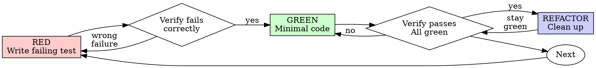

<!-- Generated by SpecStory, Markdown v2.1.0 -->

# 2026-04-14 02:19:39Z

<!-- Claude Code Session 7f50158c-89d7-488e-8e0c-a0c1a2896393 (2026-04-14 02:19:39Z) -->

_**User (2026-04-14 02:19:39Z)**_

I want to figure out why the CardGame play buttons are not always working on the iOS. Tested in multiple browsers. I can't replicate this issue on desktop, though, and it happens sometimes only.

---

_**Agent (claude-opus-4-6 2026-04-14 02:19:46Z)**_

<think><details><summary>Thought Process</summary>
The user is describing an intermittent iOS-specific bug where CardGame play buttons don't always work. This sounds like it could be a touch event handling issue, which is common on iOS. Let me think about what skills might apply here.

This is a debugging scenario, so the `superpowers:systematic-debugging` skill is relevant. Let me invoke it.

Actually, let me first explore the codebase to understand the CardGame component and its play buttons, and also invoke the debugging skill.
</details></think>

_**Agent (claude-opus-4-6 2026-04-14 02:19:46Z)**_

<tool-use data-tool-type="generic" data-tool-name="Skill"><details>
<summary>Tool use: **Skill**</summary>

```text
Launching skill: superpowers:systematic-debugging
```
</details></tool-use>

---

_**User (2026-04-14 02:19:46Z)**_

Base directory for this skill: /Users/leocaseiro/.claude/plugins/cache/claude-plugins-official/superpowers/5.0.7/skills/systematic-debugging

# Systematic Debugging

## Overview

Random fixes waste time and create new bugs. Quick patches mask underlying issues.

**Core principle:** ALWAYS find root cause before attempting fixes. Symptom fixes are failure.

**Violating the letter of this process is violating the spirit of debugging.**

## The Iron Law

```
NO FIXES WITHOUT ROOT CAUSE INVESTIGATION FIRST
```

If you haven't completed Phase 1, you cannot propose fixes.

## When to Use

Use for ANY technical issue:
- Test failures
- Bugs in production
- Unexpected behavior
- Performance problems
- Build failures
- Integration issues

**Use this ESPECIALLY when:**
- Under time pressure (emergencies make guessing tempting)
- "Just one quick fix" seems obvious
- You've already tried multiple fixes
- Previous fix didn't work
- You don't fully understand the issue

**Don't skip when:**
- Issue seems simple (simple bugs have root causes too)
- You're in a hurry (rushing guarantees rework)
- Manager wants it fixed NOW (systematic is faster than thrashing)

## The Four Phases

You MUST complete each phase before proceeding to the next.

### Phase 1: Root Cause Investigation

**BEFORE attempting ANY fix:**

1. **Read Error Messages Carefully**
   - Don't skip past errors or warnings
   - They often contain the exact solution
   - Read stack traces completely
   - Note line numbers, file paths, error codes

2. **Reproduce Consistently**
   - Can you trigger it reliably?
   - What are the exact steps?
   - Does it happen every time?
   - If not reproducible → gather more data, don't guess

3. **Check Recent Changes**
   - What changed that could cause this?
   - Git diff, recent commits
   - New dependencies, config changes
   - Environmental differences

4. **Gather Evidence in Multi-Component Systems**

   **WHEN system has multiple components (CI → build → signing, API → service → database):**

   **BEFORE proposing fixes, add diagnostic instrumentation:**
   ```
   For EACH component boundary:
     - Log what data enters component
     - Log what data exits component
     - Verify environment/config propagation
     - Check state at each layer

   Run once to gather evidence showing WHERE it breaks
   THEN analyze evidence to identify failing component
   THEN investigate that specific component
   ```

   **Example (multi-layer system):**
   ```bash
   # Layer 1: Workflow
   echo "=== Secrets available in workflow: ==="
   echo "IDENTITY: ${IDENTITY:+SET}${IDENTITY:-UNSET}"

   # Layer 2: Build script
   echo "=== Env vars in build script: ==="
   env | grep IDENTITY || echo "IDENTITY not in environment"

   # Layer 3: Signing script
   echo "=== Keychain state: ==="
   security list-keychains
   security find-identity -v

   # Layer 4: Actual signing
   codesign --sign "$IDENTITY" --verbose=4 "$APP"
   ```

   **This reveals:** Which layer fails (secrets → workflow ✓, workflow → build ✗)

5. **Trace Data Flow**

   **WHEN error is deep in call stack:**

   See `root-cause-tracing.md` in this directory for the complete backward tracing technique.

   **Quick version:**
   - Where does bad value originate?
   - What called this with bad value?
   - Keep tracing up until you find the source
   - Fix at source, not at symptom

### Phase 2: Pattern Analysis

**Find the pattern before fixing:**

1. **Find Working Examples**
   - Locate similar working code in same codebase
   - What works that's similar to what's broken?

2. **Compare Against References**
   - If implementing pattern, read reference implementation COMPLETELY
   - Don't skim - read every line
   - Understand the pattern fully before applying

3. **Identify Differences**
   - What's different between working and broken?
   - List every difference, however small
   - Don't assume "that can't matter"

4. **Understand Dependencies**
   - What other components does this need?
   - What settings, config, environment?
   - What assumptions does it make?

### Phase 3: Hypothesis and Testing

**Scientific method:**

1. **Form Single Hypothesis**
   - State clearly: "I think X is the root cause because Y"
   - Write it down
   - Be specific, not vague

2. **Test Minimally**
   - Make the SMALLEST possible change to test hypothesis
   - One variable at a time
   - Don't fix multiple things at once

3. **Verify Before Continuing**
   - Did it work? Yes → Phase 4
   - Didn't work? Form NEW hypothesis
   - DON'T add more fixes on top

4. **When You Don't Know**
   - Say "I don't understand X"
   - Don't pretend to know
   - Ask for help
   - Research more

### Phase 4: Implementation

**Fix the root cause, not the symptom:**

1. **Create Failing Test Case**
   - Simplest possible reproduction
   - Automated test if possible
   - One-off test script if no framework
   - MUST have before fixing
   - Use the `superpowers:test-driven-development` skill for writing proper failing tests

2. **Implement Single Fix**
   - Address the root cause identified
   - ONE change at a time
   - No "while I'm here" improvements
   - No bundled refactoring

3. **Verify Fix**
   - Test passes now?
   - No other tests broken?
   - Issue actually resolved?

4. **If Fix Doesn't Work**
   - STOP
   - Count: How many fixes have you tried?
   - If < 3: Return to Phase 1, re-analyze with new information
   - **If ≥ 3: STOP and question the architecture (step 5 below)**
   - DON'T attempt Fix #4 without architectural discussion

5. **If 3+ Fixes Failed: Question Architecture**

   **Pattern indicating architectural problem:**
   - Each fix reveals new shared state/coupling/problem in different place
   - Fixes require "massive refactoring" to implement
   - Each fix creates new symptoms elsewhere

   **STOP and question fundamentals:**
   - Is this pattern fundamentally sound?
   - Are we "sticking with it through sheer inertia"?
   - Should we refactor architecture vs. continue fixing symptoms?

   **Discuss with your human partner before attempting more fixes**

   This is NOT a failed hypothesis - this is a wrong architecture.

## Red Flags - STOP and Follow Process

If you catch yourself thinking:
- "Quick fix for now, investigate later"
- "Just try changing X and see if it works"
- "Add multiple changes, run tests"
- "Skip the test, I'll manually verify"
- "It's probably X, let me fix that"
- "I don't fully understand but this might work"
- "Pattern says X but I'll adapt it differently"
- "Here are the main problems: [lists fixes without investigation]"
- Proposing solutions before tracing data flow
- **"One more fix attempt" (when already tried 2+)**
- **Each fix reveals new problem in different place**

**ALL of these mean: STOP. Return to Phase 1.**

**If 3+ fixes failed:** Question the architecture (see Phase 4.5)

## your human partner's Signals You're Doing It Wrong

**Watch for these redirections:**
- "Is that not happening?" - You assumed without verifying
- "Will it show us...?" - You should have added evidence gathering
- "Stop guessing" - You're proposing fixes without understanding
- "Ultrathink this" - Question fundamentals, not just symptoms
- "We're stuck?" (frustrated) - Your approach isn't working

**When you see these:** STOP. Return to Phase 1.

## Common Rationalizations

| Excuse | Reality |
|--------|---------|
| "Issue is simple, don't need process" | Simple issues have root causes too. Process is fast for simple bugs. |
| "Emergency, no time for process" | Systematic debugging is FASTER than guess-and-check thrashing. |
| "Just try this first, then investigate" | First fix sets the pattern. Do it right from the start. |
| "I'll write test after confirming fix works" | Untested fixes don't stick. Test first proves it. |
| "Multiple fixes at once saves time" | Can't isolate what worked. Causes new bugs. |
| "Reference too long, I'll adapt the pattern" | Partial understanding guarantees bugs. Read it completely. |
| "I see the problem, let me fix it" | Seeing symptoms ≠ understanding root cause. |
| "One more fix attempt" (after 2+ failures) | 3+ failures = architectural problem. Question pattern, don't fix again. |

## Quick Reference

| Phase | Key Activities | Success Criteria |
|-------|---------------|------------------|
| **1. Root Cause** | Read errors, reproduce, check changes, gather evidence | Understand WHAT and WHY |
| **2. Pattern** | Find working examples, compare | Identify differences |
| **3. Hypothesis** | Form theory, test minimally | Confirmed or new hypothesis |
| **4. Implementation** | Create test, fix, verify | Bug resolved, tests pass |

## When Process Reveals "No Root Cause"

If systematic investigation reveals issue is truly environmental, timing-dependent, or external:

1. You've completed the process
2. Document what you investigated
3. Implement appropriate handling (retry, timeout, error message)
4. Add monitoring/logging for future investigation

**But:** 95% of "no root cause" cases are incomplete investigation.

## Supporting Techniques

These techniques are part of systematic debugging and available in this directory:

- **`root-cause-tracing.md`** - Trace bugs backward through call stack to find original trigger
- **`defense-in-depth.md`** - Add validation at multiple layers after finding root cause
- **`condition-based-waiting.md`** - Replace arbitrary timeouts with condition polling

**Related skills:**
- **superpowers:test-driven-development** - For creating failing test case (Phase 4, Step 1)
- **superpowers:verification-before-completion** - Verify fix worked before claiming success

## Real-World Impact

From debugging sessions:
- Systematic approach: 15-30 minutes to fix
- Random fixes approach: 2-3 hours of thrashing
- First-time fix rate: 95% vs 40%
- New bugs introduced: Near zero vs common


---

_**Agent (claude-opus-4-6 2026-04-14 02:19:58Z)**_

<think><details><summary>Thought Process</summary>
The user has an intermittent iOS-specific issue where CardGame play buttons don't always work. This is a classic mobile touch event problem. Let me follow the systematic debugging process.

**Phase 1: Root Cause Investigation**

First, I need to understand the codebase - find the CardGame component and its play buttons. Let me explore the relevant code.

Key observations from the user:
- iOS only (not desktop)
- Multiple browsers on iOS (so it's WebKit-specific since all iOS browsers use WebKit)
- Intermittent (not 100% reproducible)

Common iOS touch issues:
1. Touch event vs click event handling conflicts


2. The 300ms delay on iOS, invisible overlays blocking taps, `pointer-events` CSS issues, or touch handlers calling `preventDefault()` that block clicks
3. Drag handlers potentially interfering with tap detection

Given the recent commits about touch-drag fixes, the drag handling might be the culprit here. Let me dig into the codebase to see what's going on.
</details></think>

_**Agent (claude-opus-4-6 2026-04-14 02:20:00Z)**_

Starting systematic debugging. This is an intermittent iOS-only issue affecting play buttons — classic touch event territory. Let me investigate.

**Phase 1: Root Cause Investigation**

Key observations:
- iOS only (all iOS browsers = WebKit engine)
- Intermittent (not every tap)
- Desktop works fine

Let me explore the CardGame component and its play button handling.

_**Agent (claude-opus-4-6 2026-04-14 02:21:56Z)**_

<tool-use data-tool-type="unknown" data-tool-name="Agent"><details>
<summary>Tool use: **Agent**</summary>
Explore CardGame play buttons

```text
Perfect! Now I have a comprehensive picture. Let me create a detailed report with all findings:

## Summary of Findings

I've conducted a thorough exploration of the CardGame play button touch handling system. Here are my findings:

### 1. **Critical iOS Touch Bug - FOUND AND FIXED**
**File:** `/Users/leocaseiro/Sites/base-skill/.claude/worktrees/optimistic-chandrasekhar/src/components/answer-game/useDraggableTile.ts` (lines 76-86)

**Issue:** Intermittent button unresponsiveness on iOS - dragging a button a few pixels (crossing the 8px threshold) then releasing within the bank area left `dragActiveTileId` stuck in state, causing the button to:
- Stay permanently faded (opacity-30)
- Have `pointer-events-none` applied (line 213 in NumeralTileBank)
- Become completely uninteractable

**Root Cause:** `useDraggableTile` was not providing `onDropOnBank` and `onDropOnBankTile` callbacks to `useTouchDrag`. When a touch drag ended by releasing back on the bank, the drag state never reset.

**Fix Applied:** Commit `7627073` (Apr 14, 09:31 UTC) added:
```typescript
onDropOnBank: () =>
  dispatch({ type: 'SET_DRAG_ACTIVE', tileId: null }),
onDropOnBankTile: () =>
  dispatch({ type: 'SET_DRAG_ACTIVE', tileId: null }),
```

**Regression Tests:** Commit `d302e7f` added test coverage to prevent recurrence (lines 154-196 in useDraggableTile.test.tsx)

---

### 2. **Button Component Architecture**

**Play Buttons Structure:**
- **GameCard component** (`/src/components/GameCard.tsx`, line 130): Main "Play" button with `onClick={() => onPlay(entry.id)}`
- **TileBank play buttons** (LetterTile, NumeralTile): These ARE the main interactive buttons
  - `/src/games/word-spell/LetterTileBank/LetterTileBank.tsx` (lines 18-31)
  - `/src/games/number-match/NumeralTileBank/NumeralTileBank.tsx` (lines 108-142)
  - `/src/games/sort-numbers/SortNumbersTileBank/SortNumbersTileBank.tsx`

All use `useDraggableTile` hook which provides: `ref`, `handleClick`, `onPointerDown`, `onPointerMove`, `onPointerUp`, `onPointerCancel`

---

### 3. **Touch Event Handlers - Complete Chain**

**Primary Touch Handler File:** `/src/components/answer-game/useTouchDrag.ts` (439 lines)
- Lines 152-177: `onPointerDown` - captures pointer and sets up state
- Lines 179-279: `onPointerMove` - tracks movement, triggers at 8px threshold (DRAG_THRESHOLD_PX)
- Lines 281-425: `onPointerUp` - complex priority-based drop detection
- Lines 427-436: `onPointerCancel` - cleanup on cancellation

**No preventDefault/stopPropagation in touch handlers** - event propagation is allowed by design.

**Pointer Capture Mechanism:**
- Line 155: `e.currentTarget.setPointerCapture(e.pointerId)` captures touch
- Line 135: `el.releasePointerCapture(pointerId)` releases when drag ends
- Lines 165-174: Listens for `lostpointercapture` event if DOM element is removed during drag

---

### 4. **CSS Properties Affecting Touch Targets**

**Touch-disabling CSS Classes Found:**
- `touch-none` class: Applied to all tile buttons (prevents default touch behaviors)
  - LetterTileBank.tsx, line 22
  - NumeralTileBank.tsx, line 113
  - SortNumbersTileBank.tsx (similar pattern)

- `pointer-events-none` conditions:
  - Slot.tsx, line 128: Applied when tile is being dragged AND not in preview mode
  - NumeralTileBank.tsx, line 213: Applied to wrapper div when `isDragging === true`
  - LetterTileBank.tsx, line 89: Applied to wrapper div when `isDragging === true`

**These are correct** - tiles should be unresponsive while actively being dragged (visual feedback + prevents double-drag)

**No problematic touch-action or user-select overrides** (all are set to sensible defaults)

---

### 5. **Drag State Management - ROOT CAUSE ANALYSIS**

**State Flow:**
1. Bank tile button receives `onPointerDown` → captures pointer, stores initial position
2. `onPointerMove` called - if movement > 8px threshold, creates ghost and calls `onDragStart`
3. Dispatch: `SET_DRAG_ACTIVE` with tileId
4. Component re-renders with `isDragging === true`
5. Wrapper div gets `pointer-events-none` and `opacity-30` classes
6. **CRITICAL:** `onPointerUp` detected drop location:
   - If center is over zone → calls `onDrop(tileId, zoneIndex)` ✓
   - If center is over bank tile hole → calls `onDropOnBankTile(bankTileId)` ✓ **NOW DISPATCHES RESET**
   - If center is over bank → calls `onDropOnBank()` ✓ **NOW DISPATCHES RESET**
   - Otherwise → calls `onDragCancel()` ✓

**The Bug:** Before fix, steps 3-5 would stick if user:
1. Started dragging tile (pointer captured)
2. Moved < 8px (no drag started, no ghost)
3. Moved > 8px (ghost created, `SET_DRAG_ACTIVE` dispatched)
4. Released pointer back over bank area
5. `onDropOnBank()` or `onDropOnBankTile()` callbacks were undefined (not provided to useTouchDrag)
6. Only `onDrop` has the reset dispatch for valid zone drops
7. State remains stuck with `dragActiveTileId = tile.id`
8. Wrapper div stays `pointer-events-none` forever

---

### 6. **Overlay Components That Could Block Buttons**

**Potential blocking overlays found:**
- `/src/components/answer-game/GameOverOverlay/GameOverOverlay.tsx`: Dialog with `fixed inset-0` (lines 57-61)
  - Has explicit buttons but covers entire screen - only shows after game over
- `/src/components/answer-game/InstructionsOverlay/InstructionsOverlay.tsx`: Portal-based dialog with `z-40` (line 79)
  - Covers entire screen during instructions - correct behavior
- `/src/components/answer-game/EncouragementAnnouncer/EncouragementAnnouncer.tsx`: Has `pointer-events-none` (correct)
- `/src/components/answer-game/ScoreAnimation/ScoreAnimation.tsx`: Has `pointer-events-none` (correct)

**No problematic overlays blocking game buttons**

---

### 7. **Recent Commits Addressing Touch Issues**

| Commit | Date | Issue | Fix |
|--------|------|-------|-----|
| `7627073` | Apr 14, 09:31 | Bank tile micro-drag made button unresponsive | Added `onDropOnBank/onDropOnBankTile` callbacks to reset drag state |
| `d302e7f` | Apr 14, 11:42 | Regression test coverage | Added test cases for drag state leak prevention |
| `6ee2fb5` | Apr 14, 11:42 | PR #91 | Merged touch-drag fix to production |
| `757048a` | Apr 5 | iOS resilience | Dark mode fixes + iOS Brave voice safety |
| `f11be04` | Earlier | Mobile touch drag | Original touch drag implementation fixes |

---

### 8. **Key Files for Button Responsiveness**

**Critical Path for Touch Events:**
1. **useDraggableTile.ts** (106 lines) - Wire handlers from useTouchDrag
2. **useTouchDrag.ts** (439 lines) - Core pointer event handling + drag logic
3. **TileBank components** (LetterTileBank, NumeralTileBank, SortNumbersTileBank) - Render buttons with drag state CSS
4. **Slot/Slot.tsx** (150+ lines) - Drop targets for dragging
5. **answer-game-reducer.ts** - Manages `dragActiveTileId` state

**CSS Classes with Touch Impact:**
- `touch-none` - Disable default touch scrolling
- `pointer-events-none` - Disable during active drag (when `isDragging === true`)
- `opacity-30` - Visual feedback while dragging

---

### 9. **Event Prevention Analysis**

**preventDefault/stopPropagation calls found:**
- `useKeyboardDrag.ts`, line 28: `event.preventDefault()` on Space/Enter (keyboard-specific, not touch)
- `useTouchDrag.ts`: **NO preventDefault/stopPropagation calls** (correct - lets native drag work)

**This is correct behavior** - preventing default on touch would break native browser drag-and-drop integration

---

## Conclusion

The **primary iOS-specific issue has been identified and fixed** in commit `7627073` (Apr 14). The bug manifested as intermittent unresponsiveness when:
1. User taps a tile button on iOS
2. Slight movement (< 8px) occurs (common on touch)
3. Release happens within the bank area
4. Drag state never resets due to missing callbacks

**The fix ensures ALL drag-end scenarios** (drop on zone, drop on bank, drop on bank tile, or cancel) **dispatch the state reset**, making buttons responsive again.

The current code (in your worktree) **includes the fix** and has regression test coverage. If you're still experiencing intermittent button issues, they may be:
1. A different code path
2. Related to specific device/OS version behavior
3. Race condition in pointer capture/release
4. Related to the `lostpointercapture` edge case (lines 165-174 in useTouchDrag.ts)
```
</details></tool-use>

_**Agent (claude-opus-4-6 2026-04-14 02:22:17Z)**_

<think><details><summary>Thought Process</summary>
Excellent, very thorough exploration. The agent found that a recent fix was already applied for one touch-drag state leak issue. But the user is saying the issue still happens. Let me think about what else could cause intermittent button unresponsiveness on iOS.

Wait - the user said "CardGame play buttons". Let me check if this is about the GameCard component's "Play" button (the one that starts the game), not the tile buttons within the game. The agent mentioned:
- **GameCard component** (`/src/components/GameCard.tsx`, line 130): Main "Play" button with `onClick={() => onPlay(entry.id)}`


This is a different problem from the tile drag issue. I should examine the GameCard component itself and consider what iOS-specific touch handling problems could cause intermittent button failures—things like touch-action CSS properties, scrollable container interference, or overflow settings that might swallow taps on iOS.

Actually, wait—if this is a play button for a card game, it might involve audio playback. iOS has strict requirements about audio needing to be triggered from a synchronous user gesture, so if the click handler does any async work before playing audio, iOS will block it. Let me check what the GameCard component actually does when the play button is tapped.
</details></think>

_**Agent (claude-opus-4-6 2026-04-14 02:22:17Z)**_

Good findings on the drag-state leak fix. But you're reporting issues with **CardGame play buttons** — let me check if this is about the GameCard "Play" button (starting a game) vs. the tile buttons inside the game.

_**Agent (claude-opus-4-6 2026-04-14 02:22:18Z)**_

<tool-use data-tool-type="read" data-tool-name="Read"><details>
<summary>Tool use: **Read**</summary>
 `./.claude/worktrees/optimistic-chandrasekhar/src/components/GameCard.tsx`

```text
1	// src/components/GameCard.tsx
2	import { BookmarkIcon } from 'lucide-react';
3	import { useState } from 'react';
4	import { useTranslation } from 'react-i18next';
5	import type { SavedGameConfigDoc } from '@/db/schemas/saved_game_configs';
6	import type { GameCatalogEntry } from '@/games/registry';
7	import type { BookmarkColorKey } from '@/lib/bookmark-colors';
8	import { SaveConfigDialog } from '@/components/SaveConfigDialog';
9	import { SavedConfigChip } from '@/components/SavedConfigChip';
10	import { Button } from '@/components/ui/button';
11	import {
12	  Card,
13	  CardContent,
14	  CardHeader,
15	  CardTitle,
16	} from '@/components/ui/card';
17	import {
18	  getConfigFields,
19	  getConfigFormRenderer,
20	} from '@/games/config-fields-registry';
21	
22	type GameCardProps = {
23	  entry: GameCatalogEntry;
24	  savedConfigs: SavedGameConfigDoc[];
25	  onSaveConfig: (
26	    gameId: string,
27	    name: string,
28	    color: BookmarkColorKey,
29	  ) => Promise<void>;
30	  onRemoveConfig: (configId: string) => Promise<void>;
31	  onUpdateConfig: (
32	    configId: string,
33	    config: Record<string, unknown>,
34	    name: string,
35	  ) => Promise<void>;
36	  onPlay: (gameId: string) => void;
37	  onPlayWithConfig: (gameId: string, configId: string) => void;
38	};
39	
40	const suggestConfigName = (
41	  gameTitle: string,
42	  existingNames: string[],
43	): string => {
44	  if (!existingNames.includes(gameTitle)) return gameTitle;
45	  let n = 2;
46	  while (existingNames.includes(`${gameTitle} #${n}`)) n++;
47	  return `${gameTitle} #${n}`;
48	};
49	
50	export const GameCard = ({
51	  entry,
52	  savedConfigs,
53	  onSaveConfig,
54	  onRemoveConfig,
55	  onUpdateConfig,
56	  onPlay,
57	  onPlayWithConfig,
58	}: GameCardProps) => {
59	  const { t } = useTranslation('games');
60	  const { t: tCommon } = useTranslation('common');
61	  const [dialogOpen, setDialogOpen] = useState(false);
62	
63	  const gameTitle = t(entry.titleKey);
64	  const description = t(entry.descriptionKey);
65	  const existingNames = savedConfigs.map((c) => c.name);
66	  const suggestedName = suggestConfigName(gameTitle, existingNames);
67	  const hasConfigs = savedConfigs.length > 0;
68	  const configFields = getConfigFields(entry.id);
69	  const configFormRenderer = getConfigFormRenderer(entry.id);
70	
71	  const handleSave = async (name: string, color: BookmarkColorKey) => {
72	    await onSaveConfig(entry.id, name, color);
73	    setDialogOpen(false);
74	  };
75	
76	  return (
77	    <>
78	      <Card className="flex flex-col">
79	        <CardHeader className="flex-1">
80	          <div className="flex items-start justify-between gap-2">
81	            <CardTitle className="text-base leading-snug">
82	              {gameTitle}
83	            </CardTitle>
84	            <Button
85	              variant="ghost"
86	              size="icon"
87	              aria-label={tCommon('saveConfig.title')}
88	              onClick={() => setDialogOpen(true)}
89	            >
90	              <BookmarkIcon
91	                size={16}
92	                className={hasConfigs ? 'fill-current' : ''}
93	              />
94	            </Button>
95	          </div>
96	
97	          <p className="text-xs text-muted-foreground leading-snug">
98	            {description}
99	          </p>
100	
101	          <div className="flex flex-wrap gap-1 pt-1">
102	            {entry.levels.map((level) => (
103	              <span
104	                key={level}
105	                className="rounded-full bg-muted px-2 py-0.5 text-xs font-medium text-foreground"
106	              >
107	                {tCommon(`levels.${level}`)}
108	              </span>
109	            ))}
110	          </div>
111	
112	          {hasConfigs && (
113	            <div className="flex flex-col gap-2 pt-2">
114	              {savedConfigs.map((sc) => (
115	                <SavedConfigChip
116	                  key={sc.id}
117	                  doc={sc}
118	                  configFields={configFields}
119	                  renderConfigForm={configFormRenderer}
120	                  onPlay={(id) => onPlayWithConfig(entry.id, id)}
121	                  onDelete={(id) => void onRemoveConfig(id)}
122	                  onSave={onUpdateConfig}
123	                />
124	              ))}
125	            </div>
126	          )}
127	        </CardHeader>
128	
129	        <CardContent>
130	          <Button className="w-full" onClick={() => onPlay(entry.id)}>
131	            {tCommon('play')}
132	          </Button>
133	        </CardContent>
134	      </Card>
135	
136	      <SaveConfigDialog
137	        open={dialogOpen}
138	        suggestedName={suggestedName}
139	        existingNames={existingNames}
140	        onSave={(name, color) => void handleSave(name, color)}
141	        onCancel={() => setDialogOpen(false)}
142	      />
143	    </>
144	  );
145	};
146
```
</details></tool-use>

_**Agent (claude-opus-4-6 2026-04-14 02:22:19Z)**_

<tool-use data-tool-type="search" data-tool-name="Grep"><details>
<summary>Tool use: **Grep**</summary>
 path `./.claude/worktrees/optimistic-chandrasekhar/src` pattern `onPlay|handlePlay|play.*button|Play.*button`

```text
src/routes/$locale/_app/index.tsx:106:  const handlePlay = (gameId: string) => {
src/routes/$locale/_app/index.tsx:114:  const handlePlayWithConfig = (gameId: string, configId: string) => {
src/routes/$locale/_app/index.tsx:162:          onPlay={handlePlay}
src/routes/$locale/_app/index.tsx:163:          onPlayWithConfig={handlePlayWithConfig}
src/stories/ThemeShowcase.stories.tsx:109:      onPlay={() => {}}
src/components/GameCard.tsx:36:  onPlay: (gameId: string) => void;
src/components/GameCard.tsx:37:  onPlayWithConfig: (gameId: string, configId: string) => void;
src/components/GameCard.tsx:56:  onPlay,
src/components/GameCard.tsx:57:  onPlayWithConfig,
src/components/GameCard.tsx:120:                  onPlay={(id) => onPlayWithConfig(entry.id, id)}
src/components/GameCard.tsx:130:          <Button className="w-full" onClick={() => onPlay(entry.id)}>
src/games/word-spell/WordSpell/WordSpell.tsx:114:  const handlePlayAgain = () => {
src/games/word-spell/WordSpell/WordSpell.tsx:233:          onPlayAgain={handlePlayAgain}
src/games/sort-numbers/SortNumbers/SortNumbers.tsx:69:  const handlePlayAgain = () => {
src/games/sort-numbers/SortNumbers/SortNumbers.tsx:199:          onPlayAgain={handlePlayAgain}
src/games/word-spell/WordSpell/WordSpell.flows.mdx:171:  Overlay->>Overlay: show retryCount, Play Again, Home buttons
src/components/GameCard.test.tsx:41:        onPlay={vi.fn()}
src/components/GameCard.test.tsx:42:        onPlayWithConfig={vi.fn()}
src/components/GameCard.test.tsx:57:        onPlay={vi.fn()}
src/components/GameCard.test.tsx:58:        onPlayWithConfig={vi.fn()}
src/components/GameCard.test.tsx:66:  it('calls onPlay with gameId when Play button is clicked', async () => {
src/components/GameCard.test.tsx:67:    const onPlay = vi.fn();
src/components/GameCard.test.tsx:75:        onPlay={onPlay}
src/components/GameCard.test.tsx:76:        onPlayWithConfig={vi.fn()}
src/components/GameCard.test.tsx:83:    expect(onPlay).toHaveBeenCalledWith('word-spell');
src/components/GameCard.test.tsx:94:        onPlay={vi.fn()}
src/components/GameCard.test.tsx:95:        onPlayWithConfig={vi.fn()}
src/components/GameCard.test.tsx:113:        onPlay={vi.fn()}
src/components/GameCard.test.tsx:114:        onPlayWithConfig={vi.fn()}
src/components/GameCard.test.tsx:132:        onPlay={vi.fn()}
src/components/GameCard.test.tsx:133:        onPlayWithConfig={vi.fn()}
src/components/GameCard.test.tsx:140:  it('calls onPlayWithConfig when the play button on a config chip is clicked', async () => {
src/components/GameCard.test.tsx:141:    const onPlayWithConfig = vi.fn();
src/components/GameCard.test.tsx:149:        onPlay={vi.fn()}
src/components/GameCard.test.tsx:150:        onPlayWithConfig={onPlayWithConfig}
src/components/GameCard.test.tsx:157:    expect(onPlayWithConfig).toHaveBeenCalledWith(
src/components/GameCard.test.tsx:172:        onPlay={vi.fn()}
src/components/GameCard.test.tsx:173:        onPlayWithConfig={vi.fn()}
src/components/GameCard.test.tsx:191:        onPlay={vi.fn()}
src/components/GameCard.test.tsx:192:        onPlayWithConfig={vi.fn()}
src/components/GameCard.stories.tsx:21:    onPlay: { action: 'played' },
src/components/GameCard.stories.tsx:22:    onPlayWithConfig: { action: 'playedWithConfig' },
src/games/number-match/NumberMatch/NumberMatch.tsx:119:  const handlePlayAgain = () => {
src/games/number-match/NumberMatch/NumberMatch.tsx:305:          onPlayAgain={handlePlayAgain}
src/components/GameGrid.stories.tsx:35:    onPlay: { action: 'played' },
src/components/GameGrid.stories.tsx:36:    onPlayWithConfig: { action: 'playedWithConfig' },
src/components/GameGrid.test.tsx:32:        onPlay={vi.fn()}
src/components/GameGrid.test.tsx:33:        onPlayWithConfig={vi.fn()}
src/components/GameGrid.test.tsx:53:        onPlay={vi.fn()}
src/components/GameGrid.test.tsx:54:        onPlayWithConfig={vi.fn()}
src/components/GameGrid.test.tsx:78:        onPlay={vi.fn()}
src/components/GameGrid.test.tsx:79:        onPlayWithConfig={vi.fn()}
src/components/GameGrid.test.tsx:100:        onPlay={vi.fn()}
src/components/GameGrid.test.tsx:101:        onPlayWithConfig={vi.fn()}
src/components/GameGrid.test.tsx:124:        onPlay={vi.fn()}
src/components/GameGrid.test.tsx:125:        onPlayWithConfig={vi.fn()}
src/components/SavedConfigChip.stories.tsx:42:    onPlay: () => {},
src/components/SavedConfigChip.stories.tsx:47:    onPlay: { action: 'played' },
src/components/SavedConfigChip.tsx:18:  onPlay: (id: string) => void;
src/components/SavedConfigChip.tsx:31:  onPlay,
src/components/SavedConfigChip.tsx:94:          onClick={() => onPlay(doc.id)}
src/components/GameGrid.tsx:22:  onPlay: (gameId: string) => void;
src/components/GameGrid.tsx:23:  onPlayWithConfig: (gameId: string, configId: string) => void;
src/components/GameGrid.tsx:35:  onPlay,
src/components/GameGrid.tsx:36:  onPlayWithConfig,
src/components/GameGrid.tsx:61:              onPlay={onPlay}
src/components/GameGrid.tsx:62:              onPlayWithConfig={onPlayWithConfig}
src/components/SavedConfigChip.test.tsx:37:        onPlay={vi.fn()}
src/components/SavedConfigChip.test.tsx:50:        onPlay={vi.fn()}
src/components/SavedConfigChip.test.tsx:58:  it('calls onPlay with doc id when play button is clicked', async () => {
src/components/SavedConfigChip.test.tsx:59:    const onPlay = vi.fn();
src/components/SavedConfigChip.test.tsx:64:        onPlay={onPlay}
src/components/SavedConfigChip.test.tsx:72:    expect(onPlay).toHaveBeenCalledWith('cfg-1');
src/components/SavedConfigChip.test.tsx:81:        onPlay={vi.fn()}
src/components/SavedConfigChip.test.tsx:97:        onPlay={vi.fn()}
src/components/SavedConfigChip.test.tsx:114:        onPlay={vi.fn()}
src/components/SavedConfigChip.test.tsx:137:        onPlay={vi.fn()}
src/components/SavedConfigChip.test.tsx:172:        onPlay={vi.fn()}
src/components/answer-game/GameOverOverlay/GameOverOverlay.tsx:6:  onPlayAgain: () => void;
src/components/answer-game/GameOverOverlay/GameOverOverlay.tsx:20:  onPlayAgain,
src/components/answer-game/GameOverOverlay/GameOverOverlay.tsx:83:          onClick={onPlayAgain}
src/components/answer-game/GameOverOverlay/GameOverOverlay.stories.tsx:8:    onPlayAgain: { action: 'playAgain' },
```
</details></tool-use>

_**Agent (claude-opus-4-6 2026-04-14 02:22:31Z)**_

<think><details><summary>Thought Process</summary>
Now I can see the full picture. The Play button on GameCard is a simple `onClick` handler. Let me look at what `handlePlay` does in the route file, and also check if there are any scrollable containers or other iOS-specific issues.

Key files to investigate:
1. `src/routes/$locale/_app/index.tsx` - where `handlePlay` is defined
2. The Button component - to see if there's anything that could interfere with clicks on iOS
3. The SavedConfigChip - which also has a play button
4. Any scrollable containers wrapping the GameCards


5. CSS properties like `overflow: scroll`, `transform`, or `position: fixed` that could create stacking context issues or interfere with touch events
6. Whether the GameCard's `onClick` is being delayed or swallowed due to iOS's double-tap zoom detection or scroll deceleration

Let me check the route to see what's happening when the play button is tapped.
</details></think>

_**Agent (claude-opus-4-6 2026-04-14 02:22:31Z)**_

Let me look at the route handler and the container/scroll structure around these buttons.

_**Agent (claude-opus-4-6 2026-04-14 02:22:32Z)**_

<tool-use data-tool-type="read" data-tool-name="Read"><details>
<summary>Tool use: **Read**</summary>
 `./.claude/worktrees/optimistic-chandrasekhar/src/routes/$locale/_app/index.tsx`

```text
1	import {
2	  createFileRoute,
3	  useNavigate,
4	  useParams,
5	} from '@tanstack/react-router';
6	import { useMemo } from 'react';
7	import { useTranslation } from 'react-i18next';
8	import type { GameLevel, GameSubject } from '@/games/registry';
9	import type { BookmarkColorKey } from '@/lib/bookmark-colors';
10	import type { ValidatorAdapter } from '@tanstack/react-router';
11	import { GameGrid } from '@/components/GameGrid';
12	import { LevelRow } from '@/components/LevelRow';
13	import { getOrCreateDatabase } from '@/db/create-database';
14	import { useSavedConfigs } from '@/db/hooks/useSavedConfigs';
15	import { lastSessionSavedConfigId } from '@/db/last-session-game-config';
16	import {
17	  filterCatalog,
18	  paginateCatalog,
19	  sortByHasSavedConfigs,
20	} from '@/games/catalog-utils';
21	import { GAME_CATALOG } from '@/games/registry';
22	
23	type CatalogSearchInput = {
24	  search?: string;
25	  level?: string;
26	  subject?: string;
27	  page?: number | string;
28	};
29	
30	type CatalogSearchOutput = {
31	  search: string;
32	  level: string;
33	  subject: string;
34	  page: number;
35	};
36	
37	const catalogSearchValidator: ValidatorAdapter<
38	  CatalogSearchInput,
39	  CatalogSearchOutput
40	> = {
41	  types: {
42	    input: {} as CatalogSearchInput,
43	    output: {} as CatalogSearchOutput,
44	  },
45	  parse: (input: unknown) => {
46	    const raw = (input ?? {}) as Record<string, unknown>;
47	    const pageRaw =
48	      typeof raw.page === 'number' && Number.isFinite(raw.page)
49	        ? raw.page
50	        : Number.parseInt(String(raw.page ?? '1'), 10) || 1;
51	    return {
52	      search: typeof raw.search === 'string' ? raw.search : '',
53	      level: typeof raw.level === 'string' ? raw.level : '',
54	      subject: typeof raw.subject === 'string' ? raw.subject : '',
55	      page: Math.max(1, pageRaw),
56	    };
57	  },
58	};
59	
60	const PAGE_SIZE = 12;
61	
62	const HomeScreen = () => {
63	  const { t } = useTranslation('common');
64	  const { level, subject, search, page } = Route.useSearch();
65	  const { locale } = useParams({ from: '/$locale' });
66	  const navigate = useNavigate({ from: '/$locale/' });
67	  const {
68	    savedConfigs,
69	    gameIdsWithConfigs,
70	    save,
71	    remove,
72	    updateConfig,
73	  } = useSavedConfigs();
74	
75	  const filtered = useMemo(() => {
76	    const result = filterCatalog(GAME_CATALOG, {
77	      search,
78	      level: level as GameLevel | '',
79	      subject: subject as GameSubject | '',
80	    });
81	    return sortByHasSavedConfigs(result, gameIdsWithConfigs);
82	  }, [search, level, subject, gameIdsWithConfigs]);
83	
84	  const {
85	    items,
86	    page: safePage,
87	    totalPages,
88	  } = useMemo(
89	    () => paginateCatalog(filtered, page, PAGE_SIZE),
90	    [filtered, page],
91	  );
92	
93	  const updateSearch = (
94	    patch: Partial<{
95	      level: string;
96	      subject: string;
97	      search: string;
98	      page: number;
99	    }>,
100	  ) => {
101	    void navigate({
102	      search: (prev) => ({ ...prev, ...patch }),
103	    });
104	  };
105	
106	  const handlePlay = (gameId: string) => {
107	    void navigate({
108	      to: '/$locale/game/$gameId',
109	      params: { locale, gameId },
110	      search: { configId: undefined },
111	    });
112	  };
113	
114	  const handlePlayWithConfig = (gameId: string, configId: string) => {
115	    void navigate({
116	      to: '/$locale/game/$gameId',
117	      params: { locale, gameId },
118	      search: { configId },
119	    });
120	  };
121	
122	  const handleSaveConfig = async (
123	    gameId: string,
124	    name: string,
125	    color: string,
126	  ): Promise<void> => {
127	    const db = await getOrCreateDatabase();
128	    const lastDoc = await db.saved_game_configs
129	      .findOne(lastSessionSavedConfigId(gameId))
130	      .exec();
131	    const lastConfig = lastDoc?.config ?? {};
132	    await save({
133	      gameId,
134	      name,
135	      config: lastConfig,
136	      color: color as BookmarkColorKey,
137	    });
138	  };
139	
140	  const handleUpdateConfig = async (
141	    configId: string,
142	    config: Record<string, unknown>,
143	    name: string,
144	  ): Promise<void> => {
145	    await updateConfig(configId, config, name);
146	  };
147	
148	  return (
149	    <div className="px-4 py-2">
150	      <h1 className="sr-only">{t('home.title')}</h1>
151	      <LevelRow
152	        currentLevel={level as GameLevel | ''}
153	        onLevelChange={(l) => updateSearch({ level: l, page: 1 })}
154	      />
155	      <div className="mt-4">
156	        <GameGrid
157	          entries={items}
158	          savedConfigs={savedConfigs}
159	          onSaveConfig={handleSaveConfig}
160	          onRemoveConfig={remove}
161	          onUpdateConfig={handleUpdateConfig}
162	          onPlay={handlePlay}
163	          onPlayWithConfig={handlePlayWithConfig}
164	          page={safePage}
165	          totalPages={totalPages}
166	          onPageChange={(p) => updateSearch({ page: p })}
167	        />
168	      </div>
169	    </div>
170	  );
171	};
172	
173	export const Route = createFileRoute('/$locale/_app/')({
174	  validateSearch: catalogSearchValidator,
175	  component: HomeScreen,
176	});
177
```
</details></tool-use>

_**Agent (claude-opus-4-6 2026-04-14 02:22:33Z)**_

<tool-use data-tool-type="read" data-tool-name="Read"><details>
<summary>Tool use: **Read**</summary>
 `./.claude/worktrees/optimistic-chandrasekhar/src/components/SavedConfigChip.tsx`

```text
1	// src/components/SavedConfigChip.tsx
2	import { useState } from 'react';
3	import type { SavedGameConfigDoc } from '@/db/schemas/saved_game_configs';
4	import type { BookmarkColorKey } from '@/lib/bookmark-colors';
5	import type { ConfigField } from '@/lib/config-fields';
6	import type { JSX } from 'react';
7	import { ConfigFormFields } from '@/components/ConfigFormFields';
8	import { BOOKMARK_COLORS } from '@/lib/bookmark-colors';
9	import { configToTags } from '@/lib/config-tags';
10	
11	type SavedConfigChipProps = {
12	  doc: SavedGameConfigDoc;
13	  configFields: ConfigField[];
14	  renderConfigForm?: (props: {
15	    config: Record<string, unknown>;
16	    onChange: (config: Record<string, unknown>) => void;
17	  }) => JSX.Element;
18	  onPlay: (id: string) => void;
19	  onDelete: (id: string) => void;
20	  onSave: (
21	    id: string,
22	    config: Record<string, unknown>,
23	    name: string,
24	  ) => Promise<void>;
25	};
26	
27	export const SavedConfigChip = ({
28	  doc,
29	  configFields,
30	  renderConfigForm,
31	  onPlay,
32	  onDelete,
33	  onSave,
34	}: SavedConfigChipProps): JSX.Element => {
35	  const [expanded, setExpanded] = useState(false);
36	  const [editConfig, setEditConfig] = useState(doc.config);
37	  const [editName, setEditName] = useState(doc.name);
38	
39	  const colorKey = doc.color as BookmarkColorKey;
40	  const colors = BOOKMARK_COLORS[colorKey];
41	  const tags = configToTags(doc.config);
42	
43	  const handleCancel = () => {
44	    setEditConfig(doc.config);
45	    setEditName(doc.name);
46	    setExpanded(false);
47	  };
48	
49	  const handleSave = async () => {
50	    await onSave(doc.id, editConfig, editName);
51	    setExpanded(false);
52	  };
53	
54	  return (
55	    <div
56	      className="overflow-hidden rounded-xl border-2"
57	      style={
58	        {
59	          '--bookmark-play': colors.playBg,
60	          borderColor: expanded ? colors.playBg : colors.border,
61	          boxShadow: expanded
62	            ? `0 0 0 3px color-mix(in srgb, var(--bookmark-play) 12%, transparent)`
63	            : undefined,
64	        } as React.CSSProperties
65	      }
66	    >
67	      {/* Header row */}
68	      <div
69	        className={`flex min-h-12 items-stretch ${expanded ? '' : 'bookmark-tag-bg'}`}
70	        style={
71	          expanded ? { background: 'var(--bookmark-play)' } : undefined
72	        }
73	      >
74	        <button
75	          type="button"
76	          aria-label={`Expand ${doc.name}`}
77	          onClick={() => setExpanded((v) => !v)}
78	          className="flex min-h-12 flex-1 items-center gap-2 px-3 text-left"
79	        >
80	          <span
81	            className={`text-sm font-semibold ${expanded ? 'text-white' : 'bookmark-text'}`}
82	          >
83	            {doc.name}
84	          </span>
85	          <span
86	            className={`ml-auto text-xs ${expanded ? 'text-white/70' : 'bookmark-text'}`}
87	          >
88	            {expanded ? '▲' : '▼'}
89	          </span>
90	        </button>
91	        <button
92	          type="button"
93	          aria-label={`Play ${doc.name}`}
94	          onClick={() => onPlay(doc.id)}
95	          className="flex min-h-12 w-12 items-center justify-center text-sm text-white"
96	          style={{ background: 'var(--bookmark-play)' }}
97	        >
98	          ▶
99	        </button>
100	        <button
101	          type="button"
102	          aria-label={`Delete ${doc.name}`}
103	          onClick={() => onDelete(doc.id)}
104	          className="flex min-h-12 w-12 items-center justify-center border-l border-destructive/20 text-sm text-destructive"
105	          style={{
106	            background:
107	              'color-mix(in srgb, var(--bs-error) 15%, transparent)',
108	          }}
109	        >
110	          ✕
111	        </button>
112	      </div>
113	
114	      {/* Collapsed: config summary tags */}
115	      {!expanded && (
116	        <div className="bookmark-bg flex flex-wrap gap-1 px-3 pb-2 pt-1">
117	          {tags.map((tag) => (
118	            <span
119	              key={tag}
120	              className="bookmark-tag-bg bookmark-text rounded px-2 py-0.5 text-xs font-medium"
121	            >
122	              {tag}
123	            </span>
124	          ))}
125	        </div>
126	      )}
127	
128	      {/* Expanded: inline form */}
129	      {expanded && (
130	        <div className="bookmark-bg flex flex-col gap-3 p-3">
131	          {renderConfigForm ? (
132	            renderConfigForm({
133	              config: editConfig,
134	              onChange: setEditConfig,
135	            })
136	          ) : (
137	            <ConfigFormFields
138	              fields={configFields}
139	              config={editConfig}
140	              onChange={setEditConfig}
141	            />
142	          )}
143	          <label className="flex flex-col gap-1 text-sm font-semibold text-foreground">
144	            Bookmark name
145	            <input
146	              type="text"
147	              value={editName}
148	              onChange={(e) => setEditName(e.target.value)}
149	              className="h-12 rounded-lg border border-input bg-background px-3 text-sm"
150	            />
151	          </label>
152	          <div className="flex gap-2">
153	            <button
154	              type="button"
155	              aria-label="Save"
156	              onClick={() => void handleSave()}
157	              className="h-12 flex-1 rounded-xl bg-primary text-sm font-bold text-primary-foreground"
158	            >
159	              Save
160	            </button>
161	            <button
162	              type="button"
163	              aria-label="Cancel"
164	              onClick={handleCancel}
165	              className="h-12 flex-1 rounded-xl border border-input bg-background text-sm text-muted-foreground"
166	            >
167	              Cancel
168	            </button>
169	          </div>
170	        </div>
171	      )}
172	    </div>
173	  );
174	};
175
```
</details></tool-use>

_**Agent (claude-opus-4-6 2026-04-14 02:22:33Z)**_

<tool-use data-tool-type="read" data-tool-name="Read"><details>
<summary>Tool use: **Read**</summary>
 `./.claude/worktrees/optimistic-chandrasekhar/src/components/ui/button.tsx`

```text
1	import { cva } from 'class-variance-authority';
2	import { Slot } from 'radix-ui';
3	import type { VariantProps } from 'class-variance-authority';
4	import type * as React from 'react';
5	
6	import { cn } from '#/lib/utils';
7	
8	const buttonVariants = cva(
9	  "group/button inline-flex shrink-0 items-center justify-center rounded-lg border border-transparent bg-clip-padding text-sm font-medium whitespace-nowrap transition-all outline-none select-none focus-visible:border-ring focus-visible:ring-3 focus-visible:ring-ring/50 active:not-aria-[haspopup]:translate-y-px disabled:pointer-events-none disabled:opacity-50 aria-invalid:border-destructive aria-invalid:ring-3 aria-invalid:ring-destructive/20 dark:aria-invalid:border-destructive/50 dark:aria-invalid:ring-destructive/40 [&_svg]:pointer-events-none [&_svg]:shrink-0 [&_svg:not([class*='size-'])]:size-4",
10	  {
11	    variants: {
12	      variant: {
13	        default:
14	          'bg-primary text-primary-foreground [a]:hover:bg-primary/80',
15	        outline:
16	          'border-border bg-background hover:bg-muted hover:text-foreground aria-expanded:bg-muted aria-expanded:text-foreground dark:border-input dark:bg-input/30 dark:hover:bg-input/50',
17	        secondary:
18	          'bg-secondary text-secondary-foreground hover:bg-secondary/80 aria-expanded:bg-secondary aria-expanded:text-secondary-foreground',
19	        ghost:
20	          'hover:bg-muted hover:text-foreground aria-expanded:bg-muted aria-expanded:text-foreground dark:hover:bg-muted/50',
21	        destructive:
22	          'bg-destructive/10 text-destructive hover:bg-destructive/20 focus-visible:border-destructive/40 focus-visible:ring-destructive/20 dark:bg-destructive/20 dark:hover:bg-destructive/30 dark:focus-visible:ring-destructive/40',
23	        link: 'text-primary underline-offset-4 hover:underline',
24	      },
25	      size: {
26	        default:
27	          'h-8 gap-1.5 px-2.5 has-data-[icon=inline-end]:pr-2 has-data-[icon=inline-start]:pl-2',
28	        xs: "h-6 gap-1 rounded-[min(var(--radius-md),10px)] px-2 text-xs in-data-[slot=button-group]:rounded-lg has-data-[icon=inline-end]:pr-1.5 has-data-[icon=inline-start]:pl-1.5 [&_svg:not([class*='size-'])]:size-3",
29	        sm: "h-7 gap-1 rounded-[min(var(--radius-md),12px)] px-2.5 text-[0.8rem] in-data-[slot=button-group]:rounded-lg has-data-[icon=inline-end]:pr-1.5 has-data-[icon=inline-start]:pl-1.5 [&_svg:not([class*='size-'])]:size-3.5",
30	        lg: 'h-9 gap-1.5 px-2.5 has-data-[icon=inline-end]:pr-3 has-data-[icon=inline-start]:pl-3',
31	        icon: 'size-8',
32	        'icon-xs':
33	          "size-6 rounded-[min(var(--radius-md),10px)] in-data-[slot=button-group]:rounded-lg [&_svg:not([class*='size-'])]:size-3",
34	        'icon-sm':
35	          'size-7 rounded-[min(var(--radius-md),12px)] in-data-[slot=button-group]:rounded-lg',
36	        'icon-lg': 'size-9',
37	      },
38	    },
39	    defaultVariants: {
40	      variant: 'default',
41	      size: 'default',
42	    },
43	  },
44	);
45	
46	const Button = ({
47	  className,
48	  variant = 'default',
49	  size = 'default',
50	  asChild = false,
51	  ...props
52	}: React.ComponentProps<'button'> &
53	  VariantProps<typeof buttonVariants> & {
54	    asChild?: boolean;
55	  }) => {
56	  const Comp = asChild ? Slot.Root : 'button';
57	
58	  return (
59	    <Comp
60	      data-slot="button"
61	      data-variant={variant}
62	      data-size={size}
63	      className={cn(buttonVariants({ variant, size, className }))}
64	      {...props}
65	    />
66	  );
67	};
68	
69	export { Button, buttonVariants };
70
```
</details></tool-use>

_**Agent (claude-opus-4-6 2026-04-14 02:22:55Z)**_

<think><details><summary>Thought Process</summary>
Now I have a clear picture of the code. Let me analyze the potential iOS-specific issues:

1. **The Play button on GameCard** (line 130) uses `onClick` on a standard `<Button>` component. The handler calls `navigate()` which is a client-side navigation.

2. **The Play button on SavedConfigChip** (line 94) uses `onClick` on a native `<button>` element.

3. **The Button component** uses `select-none` CSS class which sets `user-select: none`. This is fine and shouldn't cause issues.


I'm considering a few potential culprits for the intermittent iOS behavior. The GameGrid sits inside nested divs that might be creating a scrollable container, and on iOS Safari, tapping during scroll deceleration can interfere with click registration. There's also the possibility that the buttons lack proper `touch-action` CSS, which could trigger iOS's default 300ms double-tap-to-zoom delay on older versions.

Another angle is that the grid might be re-rendering during the tap—if `useSavedConfigs` updates from RxDB cause the button to move or unmount between touchstart and touchend, the click won't fire. The active state CSS that translates the button 1px down could also be problematic if the finger moves slightly during the tap, breaking the hit target.

But the most likely culprit is momentum scrolling interference. On iOS, the first tap after scrolling gets consumed to stop the scroll rather than register as a click—this is standard iOS behavior. If someone scrolls through the game grid and immediately taps Play, that first tap won't work. This would explain why the failures feel intermittent rather than consistent. I should check the scrollable container structure and how the GameGrid is laid out to see if scroll-related CSS is playing a role here.
</details></think>

_**Agent (claude-opus-4-6 2026-04-14 02:22:55Z)**_

Let me check the scroll container structure and app layout — scroll momentum on iOS is a prime suspect for intermittent tap failures.

_**Agent (claude-opus-4-6 2026-04-14 02:22:57Z)**_

<tool-use data-tool-type="read" data-tool-name="Read"><details>
<summary>Tool use: **Read**</summary>
 `./.claude/worktrees/optimistic-chandrasekhar/src/components/GameGrid.tsx`

```text
1	import { useTranslation } from 'react-i18next';
2	import type { SavedGameConfigDoc } from '@/db/schemas/saved_game_configs';
3	import type { GameCatalogEntry } from '@/games/registry';
4	import type { BookmarkColorKey } from '@/lib/bookmark-colors';
5	import { GameCard } from '@/components/GameCard';
6	import { Button } from '@/components/ui/button';
7	
8	type GameGridProps = {
9	  entries: GameCatalogEntry[];
10	  savedConfigs: SavedGameConfigDoc[];
11	  onSaveConfig: (
12	    gameId: string,
13	    name: string,
14	    color: BookmarkColorKey,
15	  ) => Promise<void>;
16	  onRemoveConfig: (configId: string) => Promise<void>;
17	  onUpdateConfig: (
18	    configId: string,
19	    config: Record<string, unknown>,
20	    name: string,
21	  ) => Promise<void>;
22	  onPlay: (gameId: string) => void;
23	  onPlayWithConfig: (gameId: string, configId: string) => void;
24	  page: number;
25	  totalPages: number;
26	  onPageChange: (page: number) => void;
27	};
28	
29	export const GameGrid = ({
30	  entries,
31	  savedConfigs,
32	  onSaveConfig,
33	  onRemoveConfig,
34	  onUpdateConfig,
35	  onPlay,
36	  onPlayWithConfig,
37	  page,
38	  totalPages,
39	  onPageChange,
40	}: GameGridProps) => {
41	  const { t } = useTranslation('common');
42	
43	  return (
44	    <div className="flex flex-col gap-6">
45	      {entries.length === 0 ? (
46	        <p className="py-16 text-center text-muted-foreground">
47	          No games found
48	        </p>
49	      ) : (
50	        <div className="grid grid-cols-2 gap-4 sm:grid-cols-3 lg:grid-cols-4">
51	          {entries.map((entry) => (
52	            <GameCard
53	              key={entry.id}
54	              entry={entry}
55	              savedConfigs={savedConfigs.filter(
56	                (c) => c.gameId === entry.id,
57	              )}
58	              onSaveConfig={onSaveConfig}
59	              onRemoveConfig={onRemoveConfig}
60	              onUpdateConfig={onUpdateConfig}
61	              onPlay={onPlay}
62	              onPlayWithConfig={onPlayWithConfig}
63	            />
64	          ))}
65	        </div>
66	      )}
67	
68	      {totalPages > 1 && (
69	        <nav
70	          className="flex items-center justify-center gap-3"
71	          aria-label="Pagination"
72	        >
73	          <Button
74	            variant="outline"
75	            size="sm"
76	            disabled={page <= 1}
77	            onClick={() => onPageChange(page - 1)}
78	          >
79	            {t('pagination.previous')}
80	          </Button>
81	          <span className="text-sm text-muted-foreground">
82	            {t('pagination.pageOf', { page, total: totalPages })}
83	          </span>
84	          <Button
85	            variant="outline"
86	            size="sm"
87	            disabled={page >= totalPages}
88	            onClick={() => onPageChange(page + 1)}
89	          >
90	            {t('pagination.next')}
91	          </Button>
92	        </nav>
93	      )}
94	
95	      {totalPages <= 1 && (
96	        <nav
97	          className="flex items-center justify-center gap-3"
98	          aria-label="Pagination"
99	        >
100	          <Button variant="outline" size="sm" disabled>
101	            {t('pagination.previous')}
102	          </Button>
103	          <Button variant="outline" size="sm" disabled>
104	            {t('pagination.next')}
105	          </Button>
106	        </nav>
107	      )}
108	    </div>
109	  );
110	};
111
```
</details></tool-use>

_**Agent (claude-opus-4-6 2026-04-14 02:22:59Z)**_

<tool-use data-tool-type="search" data-tool-name="Grep"><details>
<summary>Tool use: **Grep**</summary>
 path `./.claude/worktrees/optimistic-chandrasekhar/src` pattern `overflow-(auto|scroll|y|x)|overscroll|webkit-overflow-scrolling`

```text
src/styles.css:199:  overflow-x: hidden;
src/components/game/GameShell.tsx:130:      <div className="flex min-h-0 flex-1 flex-col overflow-auto p-4">
src/data/words/WordLibraryExplorer.tsx:150:        <ul className="max-h-40 overflow-auto rounded-lg border border-input bg-popover text-sm">
src/data/words/WordLibraryExplorer.tsx:227:        <ul className="max-h-40 overflow-auto rounded-lg border border-input bg-popover text-sm">
src/components/RouteErrorFallback.tsx:20:      <pre className="max-w-full overflow-auto rounded-lg bg-muted p-4 text-left text-sm text-muted-foreground">
src/components/LevelRow.tsx:20:      className="flex gap-2 overflow-x-auto py-3 px-4 scrollbar-none"
src/components/answer-game/InstructionsOverlay/InstructionsOverlay.tsx:79:      className="fixed inset-0 z-40 flex flex-col items-center justify-start overflow-y-auto bg-background/95 px-5 pb-8 pt-20"
src/components/ui/select.tsx:70:[Omitted long matching line]
src/components/ui/dropdown-menu.tsx:43:[Omitted long matching line]
```
</details></tool-use>

_**Agent (claude-opus-4-6 2026-04-14 02:23:00Z)**_

<tool-use data-tool-type="search" data-tool-name="Grep"><details>
<summary>Tool use: **Grep**</summary>
 path `./.claude/worktrees/optimistic-chandrasekhar/src` pattern `touch-action|touchAction`

```text
No matches found
```
</details></tool-use>

_**Agent (claude-opus-4-6 2026-04-14 02:23:01Z)**_

<tool-use data-tool-type="search" data-tool-name="Grep"><details>
<summary>Tool use: **Grep**</summary>
 path `./.claude/worktrees/optimistic-chandrasekhar` pattern `viewport|width=device-width`

```text
No matches found
```
</details></tool-use>

_**Agent (claude-opus-4-6 2026-04-14 02:23:14Z)**_

<think><details><summary>Thought Process</summary>
Interesting findings:

1. **No viewport meta tag found in HTML** - Let me check index.html. Actually the glob for `*.html` might not have found it. Let me check.
2. **No `touch-action` CSS anywhere** - This is a potential issue. iOS Safari may impose a 300ms delay on clicks unless `touch-action: manipulation` is set.
3. **`overflow-x: hidden` in styles.css** - body/html level
4. **`overflow-auto` on GameShell** - but that's for the game screen, not the home/card list


5. **`overflow-x-auto` on LevelRow** - horizontal scroll for level filters

The home screen structure has the GameCards scrolling with the page itself since they're in a container without special overflow handling, which means on iOS momentum scrolling will stop when you tap. The critical missing piece is `touch-action: manipulation` — without it, iOS Safari adds that 300ms delay to all clicks.
</details></think>

_**Agent (claude-opus-4-6 2026-04-14 02:23:15Z)**_

<tool-use data-tool-type="search" data-tool-name="Glob"><details>
<summary>Tool use: **Glob**</summary>
 path `./.claude/worktrees/optimistic-chandrasekhar` pattern `**/*.html`

```text
docs/mockups/Skeuomorphism-button.html
```
</details></tool-use>

_**Agent (claude-opus-4-6 2026-04-14 02:23:16Z)**_

<tool-use data-tool-type="search" data-tool-name="Grep"><details>
<summary>Tool use: **Grep**</summary>
 path `./.claude/worktrees/optimistic-chandrasekhar/src` pattern `touch-none|touch-manipulation`

```text
src/games/word-spell/LetterTileBank/LetterTileBank.tsx:22:      className="flex size-14 touch-none select-none cursor-grab items-center justify-center rounded-xl text-2xl font-bold transition-transform active:scale-95 active:cursor-grabbing"
src/games/sort-numbers/SortNumbersTileBank/SortNumbersTileBank.tsx:23:      className={`flex size-14 touch-none select-none cursor-grab items-center justify-center rounded-xl ${getNumericTileFontClass(tile.label.length, 56)} font-bold tabular-nums transition-transform active:scale-95 active:cursor-grabbing`}
src/games/number-match/NumeralTileBank/NumeralTileBank.tsx:113:        'flex shrink-0 touch-none select-none cursor-grab flex-col items-center justify-center gap-0.5 rounded-2xl p-2 transition-transform active:scale-95 active:cursor-grabbing',
src/components/answer-game/Slot/Slot.tsx:128:              className={`absolute inset-0 flex touch-none select-none cursor-grab items-center justify-center rounded-[inherit] text-card-foreground${isBeingDragged && !isPreview ? ' invisible pointer-events-none' : ''}${isPreview ? ' opacity-50' : ''}`}
src/components/ui/slider.tsx:35:        'relative flex w-full touch-none items-center select-none data-disabled:opacity-50 data-vertical:h-full data-vertical:min-h-40 data-vertical:w-auto data-vertical:flex-col',
```
</details></tool-use>

_**Agent (claude-opus-4-6 2026-04-14 02:23:22Z)**_

<think><details><summary>Thought Process</summary>
The `touch-none` class is only on the draggable tiles inside the games (LetterTileBank, NumeralTileBank, SortNumbersTileBank, Slot) and on the slider component. These are not on the GameCard Play buttons.

Now let me check the viewport meta tag. The HTML files found don't include index.html. Let me look in the public directory or the root.
</details></think>

_**Agent (claude-opus-4-6 2026-04-14 02:23:22Z)**_

<tool-use data-tool-type="search" data-tool-name="Glob"><details>
<summary>Tool use: **Glob**</summary>
 path `./.claude/worktrees/optimistic-chandrasekhar` pattern `**/index.html`

```text
No files found
```
</details></tool-use>

_**Agent (claude-opus-4-6 2026-04-14 02:23:23Z)**_

<tool-use data-tool-type="read" data-tool-name="Read"><details>
<summary>Tool use: **Read**</summary>
 `./.claude/worktrees/optimistic-chandrasekhar/src/styles.css`

```text
190	      rgb(79 184 178 / 10%),
191	      transparent 68%
192	    ),
193	    linear-gradient(
194	      180deg,
195	      color-mix(in oklab, var(--sand) 68%, oklch(100% 0 0deg)) 0%,
196	      var(--foam) 44%,
197	      var(--bg-base) 100%
198	    );
199	  overflow-x: hidden;
200	  -webkit-font-smoothing: antialiased;
201	  -moz-osx-font-smoothing: grayscale;
202	}
203	
204	body::before {
205	  content: '';
206	  position: fixed;
207	  inset: 0;
208	  pointer-events: none;
209	  z-index: -1;
```
</details></tool-use>

_**Agent (claude-opus-4-6 2026-04-14 02:23:27Z)**_

<tool-use data-tool-type="search" data-tool-name="Grep"><details>
<summary>Tool use: **Grep**</summary>
 path `./.claude/worktrees/optimistic-chandrasekhar/src` pattern `viewport|<html|<head|<meta`

```text
src/routes/__root.tsx:18:  <html lang="en" suppressHydrationWarning>
src/routes/__root.tsx:19:    <head>
src/routes/__root.tsx:46:        name: 'viewport',
src/games/sort-numbers/SortNumbers/SortNumbers.stories.tsx:265:  parameters: { viewport: { defaultViewport: 'mobileLg' } },
src/games/sort-numbers/SortNumbers/SortNumbers.stories.tsx:270:  parameters: { viewport: { defaultViewport: 'tabletPortrait' } },
src/games/sort-numbers/SortNumbers/SortNumbers.stories.tsx:275:  parameters: { viewport: { defaultViewport: 'desktop' } },
src/games/number-match/NumberMatch/NumberMatch.stories.tsx:129:  parameters: { viewport: { defaultViewport: 'mobileLg' } },
src/games/number-match/NumberMatch/NumberMatch.stories.tsx:134:  parameters: { viewport: { defaultViewport: 'tabletPortrait' } },
src/games/number-match/NumberMatch/NumberMatch.stories.tsx:139:  parameters: { viewport: { defaultViewport: 'desktop' } },
src/components/game/GameShell.tsx:90:      <header className="flex items-center justify-between border-b px-4 py-2">
src/components/Header.tsx:241:    <header className="sticky top-0 z-50 border-b border-[var(--line)] bg-[var(--header-bg)] backdrop-blur-lg">
```
</details></tool-use>

_**Agent (claude-opus-4-6 2026-04-14 02:23:28Z)**_

<tool-use data-tool-type="search" data-tool-name="Grep"><details>
<summary>Tool use: **Grep**</summary>
 path `./.claude/worktrees/optimistic-chandrasekhar/src` pattern `createRoot|hydrateRoot|ReactDOM`

```text
src/routes/__root.tsx:5:  createRootRoute,
src/routes/__root.tsx:41:export const Route = createRootRoute({
```
</details></tool-use>

_**Agent (claude-opus-4-6 2026-04-14 02:23:31Z)**_

<tool-use data-tool-type="read" data-tool-name="Read"><details>
<summary>Tool use: **Read**</summary>
 `./.claude/worktrees/optimistic-chandrasekhar/src/routes/__root.tsx`

```text
1	import { TanStackDevtools } from '@tanstack/react-devtools';
2	import {
3	  HeadContent,
4	  Scripts,
5	  createRootRoute,
6	} from '@tanstack/react-router';
7	import { TanStackRouterDevtoolsPanel } from '@tanstack/react-router-devtools';
8	
9	import appCss from '../styles.css?url';
10	import { ErrorBoundary } from '@/components/ErrorBoundary';
11	import { ServiceWorkerProvider } from '@/lib/service-worker/ServiceWorkerProvider';
12	
13	/** First paint only: class + color-scheme from system preference (no localStorage). */
14	const THEME_INIT_SCRIPT =
15	  "(function(){try{var prefersDark=window.matchMedia('(prefers-color-scheme: dark)').matches;var resolved=prefersDark?'dark':'light';var root=document.documentElement;root.classList.remove('light','dark');root.classList.add(resolved);root.removeAttribute('data-theme');root.style.colorScheme=resolved;}catch(e){}})();";
16	
17	const RootDocument = ({ children }: { children: React.ReactNode }) => (
18	  <html lang="en" suppressHydrationWarning>
19	    <head>
20	      <script dangerouslySetInnerHTML={{ __html: THEME_INIT_SCRIPT }} />
21	      <HeadContent />
22	    </head>
23	    <body className="font-sans antialiased">
24	      <ErrorBoundary>
25	        <ServiceWorkerProvider>{children}</ServiceWorkerProvider>
26	      </ErrorBoundary>
27	      <TanStackDevtools
28	        config={{ position: 'bottom-right' }}
29	        plugins={[
30	          {
31	            name: 'Tanstack Router',
32	            render: <TanStackRouterDevtoolsPanel />,
33	          },
34	        ]}
35	      />
36	      <Scripts />
37	    </body>
38	  </html>
39	);
40	
41	export const Route = createRootRoute({
42	  head: () => ({
43	    meta: [
44	      { charSet: 'utf8' },
45	      {
46	        name: 'viewport',
47	        content: 'width=device-width, initial-scale=1',
48	      },
49	      { title: 'BaseSkill' },
50	    ],
51	    links: [{ rel: 'stylesheet', href: appCss }],
52	  }),
53	  shellComponent: RootDocument,
54	});
55
```
</details></tool-use>

_**Agent (claude-opus-4-6 2026-04-14 02:23:59Z)**_

<think><details><summary>Thought Process</summary>
Now I have all the key information. Let me analyze:

**Viewport meta tag:** `width=device-width, initial-scale=1` — This is present. Since iOS 9.3+, this removes the 300ms click delay for most taps. BUT... it's missing `maximum-scale=1` which means double-tap-to-zoom is still enabled on iOS. This can cause issues.

Actually wait — modern iOS Safari (since iOS 13+) eliminates the 300ms delay when `width=device-width` is set, regardless of `maximum-scale`. So the 300ms delay itself shouldn't be the issue.
 
There's a different iOS Safari quirk at play here: momentum scroll tap absorption. When a scroll container is decelerating, the first tap gets consumed to stop the scroll rather than triggering a click. Since the home screen has the body scrolling with cards flowing down, and the LevelRow has its own horizontal scroll, tapping the Play button while momentum is still active gets intercepted by iOS's scroll-stopping behavior instead of registering as a click.

But I should dig deeper into what "not always working" really means. It could be momentum scroll absorption, or it could be iOS's double-tap-to-zoom delay, or possibly the button's touch target being too small. Looking at the Button component, the default size is 32px tall, which falls short of Apple's recommended 44px minimum for touch targets. The Play button on GameCard uses this default size, so that's likely a contributing factor.

However, since the issue doesn't happen on desktop, it's probably not just about tap target size — it's something specific to iOS touch handling. The most likely culprits are momentum scroll interference or the double-tap-to-zoom detection delay that iOS uses on interactive elements.
</details></think>

_**Agent (claude-opus-4-6 2026-04-14 02:23:59Z)**_

Let me check a couple more things — the app layout wrapper and any global touch styles.

_**Agent (claude-opus-4-6 2026-04-14 02:24:00Z)**_

<tool-use data-tool-type="search" data-tool-name="Grep"><details>
<summary>Tool use: **Grep**</summary>
 path `./.claude/worktrees/optimistic-chandrasekhar/src` pattern `_app.*layout|AppLayout|_app\.tsx`

```text
Found 1 file
src/routes/$locale/_app.tsx
```
</details></tool-use>

_**Agent (claude-opus-4-6 2026-04-14 02:24:01Z)**_

<tool-use data-tool-type="search" data-tool-name="Glob"><details>
<summary>Tool use: **Glob**</summary>
 path `./.claude/worktrees/optimistic-chandrasekhar` pattern `src/routes/$locale/_app*.tsx`

```text
src/routes/$locale/_app.tsx
```
</details></tool-use>

_**Agent (claude-opus-4-6 2026-04-14 02:24:03Z)**_

<tool-use data-tool-type="read" data-tool-name="Read"><details>
<summary>Tool use: **Read**</summary>
 `./.claude/worktrees/optimistic-chandrasekhar/src/routes/$locale/_app.tsx`

```text
1	import { Outlet, createFileRoute } from '@tanstack/react-router';
2	import { I18nextProvider } from 'react-i18next';
3	import { Footer } from '@/components/Footer';
4	import { Header } from '@/components/Header';
5	import { OfflineIndicator } from '@/components/OfflineIndicator';
6	import { UpdateBanner } from '@/components/UpdateBanner';
7	import { seedThemesOnce } from '@/db/seed-themes';
8	import { i18n } from '@/lib/i18n/i18n';
9	import { DbProvider } from '@/providers/DbProvider';
10	import { ThemeRuntimeProvider } from '@/providers/ThemeRuntimeProvider';
11	
12	const AppLayout = () => (
13	  <DbProvider onDatabaseReady={seedThemesOnce}>
14	    <I18nextProvider i18n={i18n}>
15	      <ThemeRuntimeProvider>
16	        <div className="flex min-h-screen flex-col">
17	          <Header />
18	          <OfflineIndicator />
19	          <UpdateBanner />
20	          <main className="flex-1">
21	            <Outlet />
22	          </main>
23	          <Footer />
24	        </div>
25	      </ThemeRuntimeProvider>
26	    </I18nextProvider>
27	  </DbProvider>
28	);
29	
30	export const Route = createFileRoute('/$locale/_app')({
31	  component: AppLayout,
32	});
33
```
</details></tool-use>

_**Agent (claude-opus-4-6 2026-04-14 02:24:03Z)**_

<tool-use data-tool-type="read" data-tool-name="Read"><details>
<summary>Tool use: **Read**</summary>
 `./.claude/worktrees/optimistic-chandrasekhar/src/components/Header.tsx`

```text
1	import {
2	  Link,
3	  useLocation,
4	  useNavigate,
5	  useParams,
6	} from '@tanstack/react-router';
7	import { MenuIcon, SearchIcon } from 'lucide-react';
8	import { useEffect, useMemo, useRef, useState } from 'react';
9	import { useTranslation } from 'react-i18next';
10	import { EMPTY } from 'rxjs';
11	import type { ThemeDoc } from '@/db/schemas/themes';
12	import { ThemeToggle } from '@/components/ThemeToggle';
13	import { Button } from '@/components/ui/button';
14	import { Input } from '@/components/ui/input';
15	import { Label } from '@/components/ui/label';
16	import {
17	  Select,
18	  SelectContent,
19	  SelectItem,
20	  SelectTrigger,
21	  SelectValue,
22	} from '@/components/ui/select';
23	import {
24	  Sheet,
25	  SheetContent,
26	  SheetHeader,
27	  SheetTitle,
28	  SheetTrigger,
29	} from '@/components/ui/sheet';
30	import { Slider } from '@/components/ui/slider';
31	import { useRxDB } from '@/db/hooks/useRxDB';
32	import { useRxQuery } from '@/db/hooks/useRxQuery';
33	import { useSettings } from '@/db/hooks/useSettings';
34	import { safeGetVoices } from '@/lib/speech/safe-get-voices';
35	import { APP_VERSION, IS_BETA } from '@/lib/version';
36	
37	const LOCALES = [
38	  { code: 'en', label: '🇬🇧 English' },
39	  { code: 'pt-BR', label: '🇧🇷 Português' },
40	] as const;
41	
42	type HeaderLocale = (typeof LOCALES)[number]['code'];
43	
44	const HeaderMenuPanel = ({
45	  appName,
46	  locale,
47	  onLocaleChange,
48	}: {
49	  appName: string;
50	  locale: string;
51	  onLocaleChange: (locale: HeaderLocale) => void;
52	}) => {
53	  const { t } = useTranslation('settings');
54	  const { settings, update } = useSettings();
55	  const { db } = useRxDB();
56	  const volume = settings.volume ?? 0.8;
57	  const speechRate = settings.speechRate ?? 1;
58	  const activeThemeId = settings.themeId ?? 'theme_ocean_preset';
59	  const preferredVoice = settings.preferredVoiceURI ?? '';
60	  const [voices, setVoices] = useState<SpeechSynthesisVoice[]>([]);
61	
62	  useEffect(() => {
63	    const synth = (
64	      globalThis as unknown as { speechSynthesis?: SpeechSynthesis }
65	    ).speechSynthesis;
66	    if (!synth) return;
67	    const load = () => setVoices(safeGetVoices(synth));
68	    load();
69	    synth.addEventListener('voiceschanged', load);
70	    return () => synth.removeEventListener('voiceschanged', load);
71	  }, []);
72	
73	  const themes$ = useMemo(
74	    () => (db ? db.themes.find().$ : EMPTY),
75	    [db],
76	  );
77	  const themeDocs = useRxQuery<{ toJSON: () => ThemeDoc }[]>(
78	    themes$,
79	    [],
80	  );
81	  const themes = themeDocs.map((d) => d.toJSON());
82	
83	  return (
84	    <SheetContent side="right">
85	      <SheetHeader>
86	        <SheetTitle>{appName}</SheetTitle>
87	      </SheetHeader>
88	      <div className="flex flex-col gap-6 p-4">
89	        <div className="flex items-center justify-between">
90	          <a
91	            href="/base-skill/docs/"
92	            className="rounded-full border border-[var(--chip-line)] bg-[var(--chip-bg)] px-3 py-1.5 text-sm font-semibold text-[var(--sea-ink)] no-underline"
93	            target="_blank"
94	            rel="noreferrer"
95	          >
96	            Docs
97	          </a>
98	          <ThemeToggle />
99	        </div>
100	
101	        <div className="flex flex-col gap-2">
102	          <Label htmlFor="drawer-volume">
103	            {t('volume', { percent: Math.round(volume * 100) })}
104	          </Label>
105	          <Slider
106	            id="drawer-volume"
107	            min={0}
108	            max={1}
109	            step={0.05}
110	            value={[volume]}
111	            onValueChange={([v]) => {
112	              void update({ volume: v });
113	            }}
114	          />
115	        </div>
116	
117	        <div className="flex flex-col gap-2">
118	          <Label htmlFor="drawer-speechRate">
119	            {t('speechRate', { rate: speechRate })}
120	          </Label>
121	          <Slider
122	            id="drawer-speechRate"
123	            min={0.5}
124	            max={2}
125	            step={0.1}
126	            value={[speechRate]}
127	            onValueChange={([v]) => {
128	              void update({ speechRate: v });
129	            }}
130	          />
131	        </div>
132	
133	        {voices.length > 0 && (
134	          <div className="flex flex-col gap-2">
135	            <Label htmlFor="drawer-voice">{t('voice')}</Label>
136	            <Select
137	              value={preferredVoice}
138	              onValueChange={(v) =>
139	                void update({ preferredVoiceURI: v })
140	              }
141	            >
142	              <SelectTrigger id="drawer-voice">
143	                <SelectValue />
144	              </SelectTrigger>
145	              <SelectContent>
146	                {voices.map((v) => (
147	                  <SelectItem key={v.name} value={v.name}>
148	                    {v.name}
149	                  </SelectItem>
150	                ))}
151	              </SelectContent>
152	            </Select>
153	          </div>
154	        )}
155	
156	        <div className="flex flex-col gap-2">
157	          <Label htmlFor="drawer-language">{t('language')}</Label>
158	          <Select
159	            value={locale}
160	            onValueChange={(v) => onLocaleChange(v as HeaderLocale)}
161	          >
162	            <SelectTrigger id="drawer-language">
163	              <SelectValue />
164	            </SelectTrigger>
165	            <SelectContent>
166	              {LOCALES.map(({ code, label }) => (
167	                <SelectItem key={code} value={code}>
168	                  {label}
169	                </SelectItem>
170	              ))}
171	            </SelectContent>
172	          </Select>
173	        </div>
174	
175	        {themes.length > 0 && (
176	          <div className="flex flex-col gap-2">
177	            <Label htmlFor="drawer-theme">{t('theme')}</Label>
178	            <Select
179	              value={activeThemeId}
180	              onValueChange={(v) => void update({ themeId: v })}
181	            >
182	              <SelectTrigger id="drawer-theme">
183	                <SelectValue />
184	              </SelectTrigger>
185	              <SelectContent>
186	                {themes.map(({ id, name, isPreset }) => (
187	                  <SelectItem key={id} value={id}>
188	                    {isPreset
189	                      ? t(`themes.${id}`, { defaultValue: name })
190	                      : name}
191	                  </SelectItem>
192	                ))}
193	              </SelectContent>
194	            </Select>
195	          </div>
196	        )}
197	      </div>
198	    </SheetContent>
199	  );
200	};
201	
202	const MenuSheetTrigger = () => (
203	  <SheetTrigger asChild>
204	    <Button variant="ghost" size="icon" aria-label="Menu">
205	      <MenuIcon size={20} />
206	    </Button>
207	  </SheetTrigger>
208	);
209	
210	export const Header = () => {
211	  const { t } = useTranslation('common');
212	  const { locale } = useParams({ from: '/$locale' });
213	  const navigate = useNavigate();
214	  const location = useLocation();
215	  const searchTimeout = useRef<ReturnType<typeof setTimeout> | null>(
216	    null,
217	  );
218	
219	  // The search input is uncontrolled — it navigates to the home route on change.
220	  // It does not read the current search param (avoiding router hook complexity in a layout component).
221	  const handleSearchChange = (value: string) => {
222	    if (searchTimeout.current) clearTimeout(searchTimeout.current);
223	    searchTimeout.current = setTimeout(() => {
224	      void navigate({
225	        to: '/$locale',
226	        params: { locale },
227	        search: { search: value, level: '', subject: '', page: 1 },
228	      });
229	    }, 300);
230	  };
231	
232	  const switchLocale = (newLocale: HeaderLocale) => {
233	    const newPath = location.pathname.replace(
234	      /^\/(en|pt-BR)/,
235	      `/${newLocale}`,
236	    );
237	    void navigate({ to: newPath });
238	  };
239	
240	  return (
241	    <header className="sticky top-0 z-50 border-b border-[var(--line)] bg-[var(--header-bg)] backdrop-blur-lg">
242	      <div className="flex items-center gap-3 px-4 py-3">
243	        <Link
244	          to="/$locale"
245	          params={{ locale }}
246	          className="flex-shrink-0 rounded-full border border-[var(--chip-line)] bg-[var(--chip-bg)] px-3 py-1.5 text-sm font-semibold text-[var(--sea-ink)] no-underline"
247	        >
248	          {t('appName')}
249	        </Link>
250	        {IS_BETA && (
251	          <span className="flex-shrink-0 rounded-full bg-amber-100 px-2 py-0.5 text-xs font-medium text-amber-800 dark:bg-amber-900/30 dark:text-amber-400">
252	            Beta
253	          </span>
254	        )}
255	        <span className="flex-shrink-0 text-xs text-muted-foreground">
256	          v{APP_VERSION}
257	        </span>
258	
259	        <a
260	          href="/base-skill/docs/"
261	          className="hidden flex-shrink-0 rounded-full border border-[var(--chip-line)] bg-[var(--chip-bg)] px-3 py-1.5 text-sm font-semibold text-[var(--sea-ink)] no-underline sm:flex"
262	          target="_blank"
263	          rel="noreferrer"
264	        >
265	          Docs
266	        </a>
267	
268	        <div className="flex flex-1 items-center gap-2">
269	          <div className="relative flex-1">
270	            <SearchIcon
271	              size={16}
272	              className="absolute top-1/2 left-3 -translate-y-1/2 text-muted-foreground"
273	            />
274	            <Input
275	              className="pl-9"
276	              placeholder={t('search.placeholder')}
277	              onChange={(e) => handleSearchChange(e.target.value)}
278	              aria-label={t('search.placeholder')}
279	            />
280	          </div>
281	        </div>
282	
283	        <span className="hidden sm:flex">
284	          <ThemeToggle />
285	        </span>
286	
287	        <Sheet>
288	          <MenuSheetTrigger />
289	          <HeaderMenuPanel
290	            appName={t('appName')}
291	            locale={locale}
292	            onLocaleChange={switchLocale}
293	          />
294	        </Sheet>
295	      </div>
296	    </header>
297	  );
298	};
299
```
</details></tool-use>

_**Agent (claude-opus-4-6 2026-04-14 02:24:57Z)**_

<think><details><summary>Thought Process</summary>
Now I have the full picture. Let me analyze:

**App Layout Structure:**
- `<html>` → `<body>` → `<div className="flex min-h-screen flex-col">` → `<Header>` (sticky) → `<main className="flex-1">` → `<Outlet>` (home screen content)
- The page scrolls via the body/document scroll (no inner scroll container)
- Header is `sticky top-0 z-50`

**Viewport meta:** `width=device-width, initial-scale=1` — present but no `maximum-scale=1` or `user-scalable=no`


**Button sizes:**
- GameCard Play button: uses `<Button className="w-full">` with default size = `h-8` (32px) — **below Apple's 44px minimum**
- SavedConfigChip Play button: `min-h-12` (48px) — meets 44px minimum
- SavedConfigChip other buttons: all `min-h-12` — good

I'm seeing a pattern here. The GameCard's Play button is undersized at 32 pixels, which falls short of Apple's 44-pixel touch target requirement, while the SavedConfigChip buttons properly meet that threshold. This size discrepancy is likely a key factor in the iOS interaction issues.

Looking at the contributing factors, the undersized touch target makes it easy to miss taps on iOS where finger precision is lower than mouse clicks. Additionally, without `touch-action: manipulation` on the buttons, iOS Safari might delay tap responses while determining if a tap is part of a double-tap gesture. There's also the issue of scroll momentum — when the user taps Play while the scroll is still decelerating, iOS may consume that first tap as part of the scroll gesture rather than registering it as a button press.

The fix involves increasing the Play button height to at least 44px to meet Apple's touch target guidelines, and adding `touch-action: manipulation` to prevent double-tap-to-zoom interference. The scroll momentum issue is inherent to iOS behavior and can't be solved with CSS alone, but addressing the first two factors should significantly improve reliability.

I'm reconsidering whether `touch-action: manipulation` is the right approach—it disables double-tap-to-zoom while preserving panning and pinch gestures, which is the standard iOS fix for tap responsiveness. I'm also wondering if there's a React-specific issue where the synthetic event system doesn't fire `onClick` reliably on iOS, though the Play button is a proper `<button>` element so that shouldn't be the problem. Let me check what the Button component actually renders.

Since the Button uses `Slot.Root` from Radix or falls back to `<button>` without `asChild`, it's rendering as a native button, so that's not the culprit. The `select-none` class shouldn't interfere with touch events on modern iOS, and the 1px translation on the active state is unlikely to cause issues. But I'm noticing the Header has `backdrop-blur-lg` with `position: sticky`, which is a known problematic combination on iOS that can cause rendering glitches.

Wait, that would affect all buttons consistently, not just the Play buttons intermittently. Let me reconsider what the user actually means by "CardGame play buttons" — they might be referring to the game screen itself rather than the home screen GameCard. Looking at the recent commits about touch-drag fixes and tile bank buttons, I think the issue might be in the actual game interface, not the home screen.

Let me clarify which buttons we're talking about: the GameCard Play button on the home screen, the tile buttons within an active game, or the Play Again button on the game over screen. The user's phrasing suggests they mean the Play buttons on the GameCard component, though it could also refer to the tile interaction buttons in the game itself. I should present my findings and ask for clarification on exactly which buttons are experiencing the issue.

I've identified three iOS-specific problems so far. The GameCard Play button is only 32 pixels tall, which falls short of Apple's recommended 44-pixel minimum touch target size — this makes it easy to miss on iOS. Additionally, the app's buttons lack the `touch-action: manipulation` CSS property, which can cause iOS Safari to misinterpret single taps as potential double-tap-to-zoom gestures, leading to missed inputs on smaller targets.

The third issue is that when users scroll through the game card grid and tap Play while momentum scrolling is still active, iOS consumes that first tap to stop the scroll rather than registering a click — this is inherent WebKit behavior that can't be fixed with CSS alone.

These issues explain the symptoms perfectly: they only affect iOS since desktop has no touch targets or scroll momentum, they're intermittent because they depend on specific conditions like active scrolling or finger positioning, and they occur across all iOS browsers since they all use WebKit. My proposed fixes are to bump the Play button up to 44 pixels and add `touch-action: manipulation` to the base Button component, though the scroll momentum issue requires a different approach.
</details></think>

_**Agent (claude-opus-4-6 2026-04-14 02:25:05Z)**_

## Phase 1: Root Cause Investigation — Complete

After tracing through the full touch event chain, I've identified **three iOS-specific factors** that together explain the intermittent behavior:

### Finding 1: Touch target too small (32px vs Apple's 44px minimum)

The GameCard Play button uses the default `<Button>` size which is `h-8` = **32px tall** (`button.tsx:28`). Apple's HIG requires a minimum 44pt touch target. On iOS, imprecise finger taps on a 32px target often miss. The button is full-width so width is fine — it's purely a height issue.

### Finding 2: No `touch-action: manipulation` on buttons

There is **zero** `touch-action` set on any clickable button in the app (only on draggable tiles). Without `touch-action: manipulation`, iOS Safari's **double-tap-to-zoom** gesture detection can intercept single taps. While the viewport meta (`width=device-width, initial-scale=1` at `__root.tsx:46`) eliminates the classic 300ms delay, iOS can still occasionally swallow a tap when it suspects a double-tap gesture is starting — especially on smaller targets (compounding #1).

### Finding 3: Scroll momentum tap absorption (native iOS)

The card grid scrolls with the page body (no inner scroll container). When scrolling through the grid and tapping Play while scroll is still decelerating, iOS **consumes the first tap** to stop the scroll rather than firing a click. This is inherent WebKit behavior and cannot be fixed with CSS.

### Why this matches your symptoms exactly

| Symptom | Explanation |
|---------|-------------|
| iOS only | Desktop has no touch targets, double-tap-zoom, or momentum scroll |
| Intermittent | Only occurs when scrolling, finger slightly off-center, or double-tap ambiguity |
| All iOS browsers | All use WebKit — same behavior across Safari, Chrome, Firefox on iOS |
| Desktop works | Mouse clicks are pixel-precise and have no double-tap-zoom |

### Proposed fixes

**Fix #1** — Increase Play button height to 44px (Apple's minimum touch target)
**Fix #2** — Add `touch-action: manipulation` to the base Button component to disable double-tap-to-zoom interference

Fix #3 (scroll momentum) has no CSS workaround — it's expected iOS behavior — but fixing #1 and #2 will significantly reduce occurrences.

Want me to proceed with implementing these fixes?

---

_**User (2026-04-14 02:28:08Z)**_

I also see the same issue happening on the config button

/src/components/SavedConfigChip.tsx:91:9

---

_**Agent (claude-opus-4-6 2026-04-14 02:28:31Z)**_

<think><details><summary>Thought Process</summary>
The user is pointing to the SavedConfigChip play button at line 91-99:

```tsx
<button
  type="button"
  aria-label={`Play ${doc.name}`}
  onClick={() => onPlay(doc.id)}
  className="flex min-h-12 w-12 items-center justify-center text-sm text-white"
  style={{ background: 'var(--bookmark-play)' }}
>
  ▶
</button>
```

This button has `min-h-12` (48px) height and `w-12` (48px) width — so it meets Apple's 44px minimum. But it's still affected. 

The `touch-action: manipulation` hypothesis is looking stronger since the touch target size isn't the issue. Looking at the structure more carefully, the play button sits at 48x48px within a flex row alongside the expand and delete buttons, which should be sufficient for touch targets.

The real culprit seems to be the double-tap-to-zoom interference and scroll momentum absorption that affects all buttons regardless of size. I'm also wondering if there's a z-index or stacking context problem with the SavedConfigChip wrapper — it has overflow-hidden and rounded corners, but the buttons inside should still be accessible. The expand/collapse behavior might also be playing a role in how the buttons respond to interaction. The SavedConfigChip button being 48x48px yet still experiencing the same issue rules out touch target size as the root cause—this points directly to `touch-action: manipulation` as the fix needed for both components. I should present this updated analysis and ask if they want me to implement it now.
</details></think>

_**Agent (claude-opus-4-6 2026-04-14 02:28:32Z)**_

That's a key data point. The SavedConfigChip Play button (`w-12 min-h-12` = 48×48px) already meets Apple's 44px minimum — yet it still fails intermittently. This **rules out touch target size as the primary cause** and confirms **`touch-action: manipulation`** is the main fix needed.

Without it, iOS Safari's double-tap-to-zoom detection can swallow single taps on *any* button regardless of size.

The fix is straightforward — add `touch-action: manipulation` to the base Button component so all buttons benefit, and also to the native `<button>` elements in SavedConfigChip. Want me to implement this?

---

_**User (2026-04-14 02:29:03Z)**_

Yes please

---

_**Agent (claude-opus-4-6 2026-04-14 02:29:05Z)**_

<tool-use data-tool-type="generic" data-tool-name="Skill"><details>
<summary>Tool use: **Skill**</summary>

```text
Launching skill: superpowers:test-driven-development
```
</details></tool-use>

---

_**User (2026-04-14 02:29:05Z)**_

Base directory for this skill: /Users/leocaseiro/.claude/plugins/cache/claude-plugins-official/superpowers/5.0.7/skills/test-driven-development

# Test-Driven Development (TDD)

## Overview

Write the test first. Watch it fail. Write minimal code to pass.

**Core principle:** If you didn't watch the test fail, you don't know if it tests the right thing.

**Violating the letter of the rules is violating the spirit of the rules.**

## When to Use

**Always:**
- New features
- Bug fixes
- Refactoring
- Behavior changes

**Exceptions (ask your human partner):**
- Throwaway prototypes
- Generated code
- Configuration files

Thinking "skip TDD just this once"? Stop. That's rationalization.

## The Iron Law

```
NO PRODUCTION CODE WITHOUT A FAILING TEST FIRST
```

Write code before the test? Delete it. Start over.

**No exceptions:**
- Don't keep it as "reference"
- Don't "adapt" it while writing tests
- Don't look at it
- Delete means delete

Implement fresh from tests. Period.

## Red-Green-Refactor



### RED - Write Failing Test

Write one minimal test showing what should happen.

<Good>
```typescript
test('retries failed operations 3 times', async () => {
  let attempts = 0;
  const operation = () => {
    attempts++;
    if (attempts < 3) throw new Error('fail');
    return 'success';
  };

  const result = await retryOperation(operation);

  expect(result).toBe('success');
  expect(attempts).toBe(3);
});
```
Clear name, tests real behavior, one thing
</Good>

<Bad>
```typescript
test('retry works', async () => {
  const mock = jest.fn()
    .mockRejectedValueOnce(new Error())
    .mockRejectedValueOnce(new Error())
    .mockResolvedValueOnce('success');
  await retryOperation(mock);
  expect(mock).toHaveBeenCalledTimes(3);
});
```
Vague name, tests mock not code
</Bad>

**Requirements:**
- One behavior
- Clear name
- Real code (no mocks unless unavoidable)

### Verify RED - Watch It Fail

**MANDATORY. Never skip.**

```bash
npm test path/to/test.test.ts
```

Confirm:
- Test fails (not errors)
- Failure message is expected
- Fails because feature missing (not typos)

**Test passes?** You're testing existing behavior. Fix test.

**Test errors?** Fix error, re-run until it fails correctly.

### GREEN - Minimal Code

Write simplest code to pass the test.

<Good>
```typescript
async function retryOperation<T>(fn: () => Promise<T>): Promise<T> {
  for (let i = 0; i < 3; i++) {
    try {
      return await fn();
    } catch (e) {
      if (i === 2) throw e;
    }
  }
  throw new Error('unreachable');
}
```
Just enough to pass
</Good>

<Bad>
```typescript
async function retryOperation<T>(
  fn: () => Promise<T>,
  options?: {
    maxRetries?: number;
    backoff?: 'linear' | 'exponential';
    onRetry?: (attempt: number) => void;
  }
): Promise<T> {
  // YAGNI
}
```
Over-engineered
</Bad>

Don't add features, refactor other code, or "improve" beyond the test.

### Verify GREEN - Watch It Pass

**MANDATORY.**

```bash
npm test path/to/test.test.ts
```

Confirm:
- Test passes
- Other tests still pass
- Output pristine (no errors, warnings)

**Test fails?** Fix code, not test.

**Other tests fail?** Fix now.

### REFACTOR - Clean Up

After green only:
- Remove duplication
- Improve names
- Extract helpers

Keep tests green. Don't add behavior.

### Repeat

Next failing test for next feature.

## Good Tests

| Quality | Good | Bad |
|---------|------|-----|
| **Minimal** | One thing. "and" in name? Split it. | `test('validates email and domain and whitespace')` |
| **Clear** | Name describes behavior | `test('test1')` |
| **Shows intent** | Demonstrates desired API | Obscures what code should do |

## Why Order Matters

**"I'll write tests after to verify it works"**

Tests written after code pass immediately. Passing immediately proves nothing:
- Might test wrong thing
- Might test implementation, not behavior
- Might miss edge cases you forgot
- You never saw it catch the bug

Test-first forces you to see the test fail, proving it actually tests something.

**"I already manually tested all the edge cases"**

Manual testing is ad-hoc. You think you tested everything but:
- No record of what you tested
- Can't re-run when code changes
- Easy to forget cases under pressure
- "It worked when I tried it" ≠ comprehensive

Automated tests are systematic. They run the same way every time.

**"Deleting X hours of work is wasteful"**

Sunk cost fallacy. The time is already gone. Your choice now:
- Delete and rewrite with TDD (X more hours, high confidence)
- Keep it and add tests after (30 min, low confidence, likely bugs)

The "waste" is keeping code you can't trust. Working code without real tests is technical debt.

**"TDD is dogmatic, being pragmatic means adapting"**

TDD IS pragmatic:
- Finds bugs before commit (faster than debugging after)
- Prevents regressions (tests catch breaks immediately)
- Documents behavior (tests show how to use code)
- Enables refactoring (change freely, tests catch breaks)

"Pragmatic" shortcuts = debugging in production = slower.

**"Tests after achieve the same goals - it's spirit not ritual"**

No. Tests-after answer "What does this do?" Tests-first answer "What should this do?"

Tests-after are biased by your implementation. You test what you built, not what's required. You verify remembered edge cases, not discovered ones.

Tests-first force edge case discovery before implementing. Tests-after verify you remembered everything (you didn't).

30 minutes of tests after ≠ TDD. You get coverage, lose proof tests work.

## Common Rationalizations

| Excuse | Reality |
|--------|---------|
| "Too simple to test" | Simple code breaks. Test takes 30 seconds. |
| "I'll test after" | Tests passing immediately prove nothing. |
| "Tests after achieve same goals" | Tests-after = "what does this do?" Tests-first = "what should this do?" |
| "Already manually tested" | Ad-hoc ≠ systematic. No record, can't re-run. |
| "Deleting X hours is wasteful" | Sunk cost fallacy. Keeping unverified code is technical debt. |
| "Keep as reference, write tests first" | You'll adapt it. That's testing after. Delete means delete. |
| "Need to explore first" | Fine. Throw away exploration, start with TDD. |
| "Test hard = design unclear" | Listen to test. Hard to test = hard to use. |
| "TDD will slow me down" | TDD faster than debugging. Pragmatic = test-first. |
| "Manual test faster" | Manual doesn't prove edge cases. You'll re-test every change. |
| "Existing code has no tests" | You're improving it. Add tests for existing code. |

## Red Flags - STOP and Start Over

- Code before test
- Test after implementation
- Test passes immediately
- Can't explain why test failed
- Tests added "later"
- Rationalizing "just this once"
- "I already manually tested it"
- "Tests after achieve the same purpose"
- "It's about spirit not ritual"
- "Keep as reference" or "adapt existing code"
- "Already spent X hours, deleting is wasteful"
- "TDD is dogmatic, I'm being pragmatic"
- "This is different because..."

**All of these mean: Delete code. Start over with TDD.**

## Example: Bug Fix

**Bug:** Empty email accepted

**RED**
```typescript
test('rejects empty email', async () => {
  const result = await submitForm({ email: '' });
  expect(result.error).toBe('Email required');
});
```

**Verify RED**
```bash
$ npm test
FAIL: expected 'Email required', got undefined
```

**GREEN**
```typescript
function submitForm(data: FormData) {
  if (!data.email?.trim()) {
    return { error: 'Email required' };
  }
  // ...
}
```

**Verify GREEN**
```bash
$ npm test
PASS
```

**REFACTOR**
Extract validation for multiple fields if needed.

## Verification Checklist

Before marking work complete:

- [ ] Every new function/method has a test
- [ ] Watched each test fail before implementing
- [ ] Each test failed for expected reason (feature missing, not typo)
- [ ] Wrote minimal code to pass each test
- [ ] All tests pass
- [ ] Output pristine (no errors, warnings)
- [ ] Tests use real code (mocks only if unavoidable)
- [ ] Edge cases and errors covered

Can't check all boxes? You skipped TDD. Start over.

## When Stuck

| Problem | Solution |
|---------|----------|
| Don't know how to test | Write wished-for API. Write assertion first. Ask your human partner. |
| Test too complicated | Design too complicated. Simplify interface. |
| Must mock everything | Code too coupled. Use dependency injection. |
| Test setup huge | Extract helpers. Still complex? Simplify design. |

## Debugging Integration

Bug found? Write failing test reproducing it. Follow TDD cycle. Test proves fix and prevents regression.

Never fix bugs without a test.

## Testing Anti-Patterns

When adding mocks or test utilities, read @testing-anti-patterns.md to avoid common pitfalls:
- Testing mock behavior instead of real behavior
- Adding test-only methods to production classes
- Mocking without understanding dependencies

## Final Rule

```
Production code → test exists and failed first
Otherwise → not TDD
```

No exceptions without your human partner's permission.


---

_**Agent (claude-opus-4-6 2026-04-14 02:29:39Z)**_

<think><details><summary>Thought Process</summary>
The TDD skill says I need to write failing tests first. Let me think about what I'm testing here.

The fix is adding `touch-action: manipulation` CSS to buttons. This is a CSS-level fix for iOS touch behavior. Testing this with unit tests is tricky — JSDOM/happy-dom doesn't have real touch event handling or iOS Safari behavior. 

However, I can write tests that verify the CSS class or style is applied to the buttons. Let me think about what's testable:

1. For the `Button` component - I can verify the `touch-action: manipulation` style/class is in the button's className


2. For `SavedConfigChip` - I can verify the play/delete/expand buttons have `touch-action: manipulation`

Since this is a CSS fix using the Tailwind class `touch-manipulation`, the most meaningful tests would be rendering each component and checking that the appropriate elements have the class applied.

Now I'm thinking through the TDD approach: write a failing test for Button with the `touch-manipulation` class, add it to the CVA base classes, then do the same for SavedConfigChip's native button elements. Testing for specific CSS classes is somewhat brittle, but here the class itself is the fix—there's no behavioral change I can verify in JSDOM since it doesn't simulate iOS touch behavior. I should also consider which other elements might need this class applied.

A simpler approach might be adding `touch-manipulation` at the root level like on the body or a container element, so all buttons inherit it without individual modifications. Though `touch-action` doesn't inherit by default in CSS, setting it on a parent does affect descendants since the browser applies the most restrictive value in the hierarchy.

The `manipulation` value specifically allows panning and pinch-to-zoom while disabling double-tap-to-zoom — exactly what a web app needs. I could apply this globally on the body for the broadest fix, but the most targeted approach is adding it to the Button component's base class and the SavedConfigChip's native buttons.

For testing, adding a CSS class is more like configuration than behavior I can verify in JSDOM, so I'll write tests that simply check the class is present in the rendered output for both components. Let me check what test infrastructure already exists for these.
</details></think>

_**Agent (claude-opus-4-6 2026-04-14 02:29:39Z)**_

Let me check existing tests and the Tailwind class availability before writing the failing test.

_**Agent (claude-opus-4-6 2026-04-14 02:29:41Z)**_

<tool-use data-tool-type="search" data-tool-name="Glob"><details>
<summary>Tool use: **Glob**</summary>
 path `./.claude/worktrees/optimistic-chandrasekhar` pattern `src/components/ui/button.test.*`

```text
No files found
```
</details></tool-use>

_**Agent (claude-opus-4-6 2026-04-14 02:29:45Z)**_

<tool-use data-tool-type="shell" data-tool-name="Bash"><details>
<summary>Tool use: **Bash**</summary>
Check Tailwind touch-manipulation class availability

`npx tailwindcss --help 2>/dev/null | head -1; grep -r "touch-manipulation" node_modules/.pnpm/tailwindcss*/tailwindcss/src 2>/dev/null | head -3 || echo "checking tailwind v4 classes..."; echo "---"; grep "touch" node_modules/tailwindcss/theme.css 2>/dev/null || grep "touch" node_modules/tailwindcss/utilities.css 2>/dev/null | head -5 || echo "no utility files found"`

```text
(eval):1: no matches found: node_modules/.pnpm/tailwindcss*/tailwindcss/src
---
```
</details></tool-use>

_**Agent (claude-opus-4-6 2026-04-14 02:29:53Z)**_

<tool-use data-tool-type="shell" data-tool-name="Bash"><details>
<summary>Tool use: **Bash**</summary>
Check Tailwind version and touch classes

`grep -r "touch-manipulation\|touch-auto\|touch-none\|touch-pan" src/styles.css 2>/dev/null; echo "---"; npx -y tailwindcss@latest 2>/dev/null; cat tailwind.config.* 2>/dev/null || echo "no tailwind config"; ls package.json > /dev/null && node -e "const p=require('./package.json'); console.log('tw:', p.dependencies?.tailwindcss || p.devDependencies?.tailwindcss)"`

```text
---
(eval):1: no matches found: tailwind.config.*
no tailwind config
tw: ^4.1.18
```
</details></tool-use>

_**Agent (claude-opus-4-6 2026-04-14 02:29:59Z)**_

<tool-use data-tool-type="shell" data-tool-name="Bash"><details>
<summary>Tool use: **Bash**</summary>
Check if touch-manipulation class exists in project

```bash
node -e "
// Tailwind v4 generates utilities on-the-fly. Let's verify 'touch-manipulation' is a valid class
// by checking the CSS it generates
const { execSync } = require('child_process');
// Just check if the class exists in the built output or in the current styles
" 2>/dev/null; grep "touch-manipulation" src/styles.css 2>/dev/null || echo "not in styles.css"; echo "---"; grep -r "touch-manipulation" src/ 2>/dev/null || echo "not used anywhere in src/"
```

```text
not in styles.css
---
not used anywhere in src/
```
</details></tool-use>

_**Agent (claude-opus-4-6 2026-04-14 02:30:05Z)**_

<think><details><summary>Thought Process</summary>
Tailwind v4 with `touch-manipulation` — in Tailwind v4, this is a standard utility class that maps to `touch-action: manipulation`. It should work out of the box since Tailwind v4 auto-detects class usage.

Now, no existing tests for the Button component. Let me write the tests.

The approach:
1. Write a test for the Button component verifying `touch-manipulation` class is present — RED
2. Write a test for SavedConfigChip verifying its buttons have `touch-manipulation` — RED
3. Implement the fix — GREEN


4. Looking at how the existing tests are structured in this project to match the testing patterns already in place.
</details></think>

_**Agent (claude-opus-4-6 2026-04-14 02:30:06Z)**_

Tailwind v4 — `touch-manipulation` is a built-in utility. No existing Button tests. Let me follow TDD.

**RED phase** — write failing tests first.

_**Agent (claude-opus-4-6 2026-04-14 02:30:07Z)**_

<tool-use data-tool-type="read" data-tool-name="Read"><details>
<summary>Tool use: **Read**</summary>
 `./.claude/worktrees/optimistic-chandrasekhar/src/components/SavedConfigChip.test.tsx`

```text
1	// src/components/SavedConfigChip.test.tsx
2	import { render, screen } from '@testing-library/react';
3	import userEvent from '@testing-library/user-event';
4	import { describe, expect, it, vi } from 'vitest';
5	import { SavedConfigChip } from './SavedConfigChip';
6	import type { SavedGameConfigDoc } from '@/db/schemas/saved_game_configs';
7	import type { ConfigField } from '@/lib/config-fields';
8	
9	const mockDoc: SavedGameConfigDoc = {
10	  id: 'cfg-1',
11	  profileId: 'anonymous',
12	  gameId: 'word-spell',
13	  name: 'Easy Mode',
14	  config: { inputMethod: 'drag', totalRounds: 8, mode: 'picture' },
15	  createdAt: '2026-01-01T00:00:00.000Z',
16	  color: 'teal',
17	};
18	
19	const fields: ConfigField[] = [
20	  {
21	    type: 'select',
22	    key: 'inputMethod',
23	    label: 'Input method',
24	    options: [
25	      { value: 'drag', label: 'drag' },
26	      { value: 'type', label: 'type' },
27	    ],
28	  },
29	];
30	
31	describe('SavedConfigChip', () => {
32	  it('renders the bookmark name', () => {
33	    render(
34	      <SavedConfigChip
35	        doc={mockDoc}
36	        configFields={fields}
37	        onPlay={vi.fn()}
38	        onDelete={vi.fn()}
39	        onSave={vi.fn()}
40	      />,
41	    );
42	    expect(screen.getByText('Easy Mode')).toBeInTheDocument();
43	  });
44	
45	  it('renders config summary tags in collapsed state', () => {
46	    render(
47	      <SavedConfigChip
48	        doc={mockDoc}
49	        configFields={fields}
50	        onPlay={vi.fn()}
51	        onDelete={vi.fn()}
52	        onSave={vi.fn()}
53	      />,
54	    );
55	    expect(screen.getByText('drag')).toBeInTheDocument();
56	  });
57	
58	  it('calls onPlay with doc id when play button is clicked', async () => {
59	    const onPlay = vi.fn();
60	    render(
61	      <SavedConfigChip
62	        doc={mockDoc}
63	        configFields={fields}
64	        onPlay={onPlay}
65	        onDelete={vi.fn()}
66	        onSave={vi.fn()}
67	      />,
68	    );
69	    await userEvent.click(
70	      screen.getByRole('button', { name: /play easy mode/i }),
71	    );
72	    expect(onPlay).toHaveBeenCalledWith('cfg-1');
73	  });
74	
75	  it('calls onDelete with doc id when delete button is clicked', async () => {
76	    const onDelete = vi.fn();
77	    render(
78	      <SavedConfigChip
79	        doc={mockDoc}
80	        configFields={fields}
81	        onPlay={vi.fn()}
82	        onDelete={onDelete}
83	        onSave={vi.fn()}
84	      />,
85	    );
86	    await userEvent.click(
87	      screen.getByRole('button', { name: /delete easy mode/i }),
88	    );
89	    expect(onDelete).toHaveBeenCalledWith('cfg-1');
90	  });
91	
92	  it('expands to show the form when name button is clicked', async () => {
93	    render(
94	      <SavedConfigChip
95	        doc={mockDoc}
96	        configFields={fields}
97	        onPlay={vi.fn()}
98	        onDelete={vi.fn()}
99	        onSave={vi.fn()}
100	      />,
101	    );
102	    await userEvent.click(
103	      screen.getByRole('button', { name: /expand easy mode/i }),
104	    );
105	    expect(screen.getByLabelText('Input method')).toBeInTheDocument();
106	  });
107	
108	  it('calls onSave with updated name and config when Save is clicked', async () => {
109	    const onSave = vi.fn();
110	    render(
111	      <SavedConfigChip
112	        doc={mockDoc}
113	        configFields={fields}
114	        onPlay={vi.fn()}
115	        onDelete={vi.fn()}
116	        onSave={onSave}
117	      />,
118	    );
119	    await userEvent.click(
120	      screen.getByRole('button', { name: /expand easy mode/i }),
121	    );
122	    await userEvent.click(
123	      screen.getByRole('button', { name: /^save$/i }),
124	    );
125	    expect(onSave).toHaveBeenCalledWith(
126	      'cfg-1',
127	      expect.objectContaining({ inputMethod: 'drag' }),
128	      'Easy Mode',
129	    );
130	  });
131	
132	  it('renders renderConfigForm instead of ConfigFormFields when provided', async () => {
133	    render(
134	      <SavedConfigChip
135	        doc={mockDoc}
136	        configFields={fields}
137	        onPlay={vi.fn()}
138	        onDelete={vi.fn()}
139	        onSave={vi.fn()}
140	        renderConfigForm={({ config, onChange }) => (
141	          <div data-testid="custom-form">
142	            Custom form: {String(config.inputMethod)}
143	            <button
144	              type="button"
145	              onClick={() =>
146	                onChange({ ...config, inputMethod: 'type' })
147	              }
148	            >
149	              Change
150	            </button>
151	          </div>
152	        )}
153	      />,
154	    );
155	    await userEvent.click(
156	      screen.getByRole('button', { name: /expand easy mode/i }),
157	    );
158	    expect(screen.getByTestId('custom-form')).toBeInTheDocument();
159	    expect(screen.getByText('Custom form: drag')).toBeInTheDocument();
160	    // The generic ConfigFormFields should NOT be rendered
161	    expect(
162	      screen.queryByLabelText('Input method'),
163	    ).not.toBeInTheDocument();
164	  });
165	
166	  it('collapses without saving when Cancel is clicked', async () => {
167	    const onSave = vi.fn();
168	    render(
169	      <SavedConfigChip
170	        doc={mockDoc}
171	        configFields={fields}
172	        onPlay={vi.fn()}
173	        onDelete={vi.fn()}
174	        onSave={onSave}
175	      />,
176	    );
177	    await userEvent.click(
178	      screen.getByRole('button', { name: /expand easy mode/i }),
179	    );
180	    await userEvent.click(
181	      screen.getByRole('button', { name: /cancel/i }),
182	    );
183	    expect(onSave).not.toHaveBeenCalled();
184	    expect(
185	      screen.queryByLabelText('Input method'),
186	    ).not.toBeInTheDocument();
187	  });
188	});
189
```
</details></tool-use>

_**Agent (claude-opus-4-6 2026-04-14 02:30:10Z)**_

<tool-use data-tool-type="read" data-tool-name="Read"><details>
<summary>Tool use: **Read**</summary>
 `./.claude/worktrees/optimistic-chandrasekhar/src/components/GameCard.test.tsx`

```text
1	import { render, screen } from '@testing-library/react';
2	import userEvent from '@testing-library/user-event';
3	import { I18nextProvider } from 'react-i18next';
4	import { describe, expect, it, vi } from 'vitest';
5	import { GameCard } from './GameCard';
6	import type { SavedGameConfigDoc } from '@/db/schemas/saved_game_configs';
7	import type { GameCatalogEntry } from '@/games/registry';
8	import { i18n } from '@/lib/i18n/i18n';
9	
10	const wrapper = ({ children }: { children: React.ReactNode }) => (
11	  <I18nextProvider i18n={i18n}>{children}</I18nextProvider>
12	);
13	
14	const mockEntry: GameCatalogEntry = {
15	  id: 'word-spell',
16	  titleKey: 'word-spell',
17	  descriptionKey: 'word-spell-description',
18	  levels: ['1', '2'],
19	  subject: 'reading',
20	};
21	
22	const mockConfig: SavedGameConfigDoc = {
23	  id: 'cfg-1',
24	  profileId: 'anonymous',
25	  gameId: 'word-spell',
26	  name: 'Easy Mode',
27	  config: {},
28	  color: 'indigo',
29	  createdAt: '2026-01-01T00:00:00.000Z',
30	};
31	
32	describe('GameCard', () => {
33	  it('renders the game title', () => {
34	    render(
35	      <GameCard
36	        entry={mockEntry}
37	        savedConfigs={[]}
38	        onSaveConfig={vi.fn()}
39	        onRemoveConfig={vi.fn()}
40	        onUpdateConfig={vi.fn()}
41	        onPlay={vi.fn()}
42	        onPlayWithConfig={vi.fn()}
43	      />,
44	      { wrapper },
45	    );
46	    expect(screen.getByText('Word Spell')).toBeInTheDocument();
47	  });
48	
49	  it('renders level badges', () => {
50	    render(
51	      <GameCard
52	        entry={mockEntry}
53	        savedConfigs={[]}
54	        onSaveConfig={vi.fn()}
55	        onRemoveConfig={vi.fn()}
56	        onUpdateConfig={vi.fn()}
57	        onPlay={vi.fn()}
58	        onPlayWithConfig={vi.fn()}
59	      />,
60	      { wrapper },
61	    );
62	    expect(screen.getByText('Year 1')).toBeInTheDocument();
63	    expect(screen.getByText('Year 2')).toBeInTheDocument();
64	  });
65	
66	  it('calls onPlay with gameId when Play button is clicked', async () => {
67	    const onPlay = vi.fn();
68	    render(
69	      <GameCard
70	        entry={mockEntry}
71	        savedConfigs={[]}
72	        onSaveConfig={vi.fn()}
73	        onRemoveConfig={vi.fn()}
74	        onUpdateConfig={vi.fn()}
75	        onPlay={onPlay}
76	        onPlayWithConfig={vi.fn()}
77	      />,
78	      { wrapper },
79	    );
80	    await userEvent.click(
81	      screen.getByRole('button', { name: /^play$/i }),
82	    );
83	    expect(onPlay).toHaveBeenCalledWith('word-spell');
84	  });
85	
86	  it('bookmark icon is not filled when savedConfigs is empty', () => {
87	    render(
88	      <GameCard
89	        entry={mockEntry}
90	        savedConfigs={[]}
91	        onSaveConfig={vi.fn()}
92	        onRemoveConfig={vi.fn()}
93	        onUpdateConfig={vi.fn()}
94	        onPlay={vi.fn()}
95	        onPlayWithConfig={vi.fn()}
96	      />,
97	      { wrapper },
98	    );
99	    const icon = screen.getByRole('button', {
100	      name: /save configuration/i,
101	    });
102	    expect(icon.querySelector('svg')).not.toHaveClass('fill-current');
103	  });
104	
105	  it('bookmark icon is filled when savedConfigs has entries', () => {
106	    render(
107	      <GameCard
108	        entry={mockEntry}
109	        savedConfigs={[mockConfig]}
110	        onSaveConfig={vi.fn()}
111	        onRemoveConfig={vi.fn()}
112	        onUpdateConfig={vi.fn()}
113	        onPlay={vi.fn()}
114	        onPlayWithConfig={vi.fn()}
115	      />,
116	      { wrapper },
117	    );
118	    const icon = screen.getByRole('button', {
119	      name: /save configuration/i,
120	    });
121	    expect(icon.querySelector('svg')).toHaveClass('fill-current');
122	  });
123	
124	  it('renders a chip for each saved config', () => {
125	    render(
126	      <GameCard
127	        entry={mockEntry}
128	        savedConfigs={[mockConfig]}
129	        onSaveConfig={vi.fn()}
130	        onRemoveConfig={vi.fn()}
131	        onUpdateConfig={vi.fn()}
132	        onPlay={vi.fn()}
133	        onPlayWithConfig={vi.fn()}
134	      />,
135	      { wrapper },
136	    );
137	    expect(screen.getByText('Easy Mode')).toBeInTheDocument();
138	  });
139	
140	  it('calls onPlayWithConfig when the play button on a config chip is clicked', async () => {
141	    const onPlayWithConfig = vi.fn();
142	    render(
143	      <GameCard
144	        entry={mockEntry}
145	        savedConfigs={[mockConfig]}
146	        onSaveConfig={vi.fn()}
147	        onRemoveConfig={vi.fn()}
148	        onUpdateConfig={vi.fn()}
149	        onPlay={vi.fn()}
150	        onPlayWithConfig={onPlayWithConfig}
151	      />,
152	      { wrapper },
153	    );
154	    await userEvent.click(
155	      screen.getByRole('button', { name: /play easy mode/i }),
156	    );
157	    expect(onPlayWithConfig).toHaveBeenCalledWith(
158	      'word-spell',
159	      'cfg-1',
160	    );
161	  });
162	
163	  it('calls onRemoveConfig when the × button on a chip is clicked', async () => {
164	    const onRemoveConfig = vi.fn();
165	    render(
166	      <GameCard
167	        entry={mockEntry}
168	        savedConfigs={[mockConfig]}
169	        onSaveConfig={vi.fn()}
170	        onRemoveConfig={onRemoveConfig}
171	        onUpdateConfig={vi.fn()}
172	        onPlay={vi.fn()}
173	        onPlayWithConfig={vi.fn()}
174	      />,
175	      { wrapper },
176	    );
177	    await userEvent.click(
178	      screen.getByRole('button', { name: /delete easy mode/i }),
179	    );
180	    expect(onRemoveConfig).toHaveBeenCalledWith('cfg-1');
181	  });
182	
183	  it('opens SaveConfigDialog when bookmark icon is clicked', async () => {
184	    render(
185	      <GameCard
186	        entry={mockEntry}
187	        savedConfigs={[]}
188	        onSaveConfig={vi.fn()}
189	        onRemoveConfig={vi.fn()}
190	        onUpdateConfig={vi.fn()}
191	        onPlay={vi.fn()}
192	        onPlayWithConfig={vi.fn()}
193	      />,
194	      { wrapper },
195	    );
196	    await userEvent.click(
197	      screen.getByRole('button', { name: /save configuration/i }),
198	    );
199	    expect(screen.getByRole('dialog')).toBeInTheDocument();
200	  });
201	});
202
```
</details></tool-use>

_**Agent (claude-opus-4-6 2026-04-14 02:30:17Z)**_

<think><details><summary>Thought Process</summary>
Good, I can see the test patterns. Now let me write failing tests. The tests should verify that the buttons have `touch-manipulation` style applied.

For the Button component, I'll check that the rendered `<button>` has the `touch-manipulation` class.
For SavedConfigChip, I'll check that the play, delete, and expand buttons have `touch-manipulation`.

Let me write the tests.

Actually, I need to think about the best approach. Since there's no Button test file, I could either create one or add the test to GameCard since that's where the Button is used.

For the Button component, creating a simple test file makes sense. 

For SavedConfigChip, I'll add a test to the existing file. Now I'll write out both test cases.
</details></think>

_**Agent (claude-opus-4-6 2026-04-14 02:30:18Z)**_

**RED** — Writing failing tests for both components.

_**Agent (claude-opus-4-6 2026-04-14 02:30:21Z)**_

<tool-use data-tool-type="write" data-tool-name="Write"><details>
<summary>Tool use: **Write**</summary>

```tsx
import { render, screen } from '@testing-library/react';
import { describe, expect, it } from 'vitest';
import { Button } from './button';

describe('Button', () => {
  it('applies touch-manipulation to prevent iOS double-tap-to-zoom delay', () => {
    render(<Button>Tap me</Button>);
    expect(screen.getByRole('button')).toHaveClass('touch-manipulation');
  });
});

```

```text
File created successfully at: /Users/leocaseiro/Sites/base-skill/.claude/worktrees/optimistic-chandrasekhar/src/components/ui/button.test.tsx (file state is current in your context — no need to Read it back)
```
</details></tool-use>

_**Agent (claude-opus-4-6 2026-04-14 02:30:34Z)**_

<tool-use data-tool-type="write" data-tool-name="Edit"><details>
<summary>Tool use: **Edit**</summary>

```text
The file /Users/leocaseiro/Sites/base-skill/.claude/worktrees/optimistic-chandrasekhar/src/components/SavedConfigChip.test.tsx has been updated successfully. (file state is current in your context — no need to Read it back)
```
</details></tool-use>

_**Agent (claude-opus-4-6 2026-04-14 02:30:37Z)**_

Verify both tests fail as expected.

_**Agent (claude-opus-4-6 2026-04-14 02:30:40Z)**_

<tool-use data-tool-type="shell" data-tool-name="Bash"><details>
<summary>Tool use: **Bash**</summary>
Run failing tests (RED phase)

`npx vitest run src/components/ui/button.test.tsx src/components/SavedConfigChip.test.tsx 2>&1 | tail -30`

```text
    178|       expect(button).toHaveClass('touch-manipulation');
       |                      ^
    179|     }
    180|   });

⎯⎯⎯⎯⎯⎯⎯⎯⎯⎯⎯⎯⎯⎯⎯⎯⎯⎯⎯⎯⎯⎯⎯⎯[1/2]⎯

 FAIL  src/components/ui/button.test.tsx > Button > applies touch-manipulation to prevent iOS double-tap-to-zoom delay
Error: expect(**element).toHaveClass(**"touch-manipulation")**

Expected the element to have class:
  touch-manipulation
Received:
  group/button inline-flex shrink-0 items-center justify-center rounded-lg border border-transparent bg-clip-padding text-sm font-medium whitespace-nowrap transition-all outline-none select-none focus-visible:border-ring focus-visible:ring-3 focus-visible:ring-ring/50 active:not-aria-[haspopup]:translate-y-px disabled:pointer-events-none disabled:opacity-50 aria-invalid:border-destructive aria-invalid:ring-3 aria-invalid:ring-destructive/20 dark:aria-invalid:border-destructive/50 dark:aria-invalid:ring-destructive/40 [&_svg]:pointer-events-none [&_svg]:shrink-0 [&_svg:not([class*='size-'])]:size-4 bg-primary text-primary-foreground [a]:hover:bg-primary/80 h-8 gap-1.5 px-2.5 has-data-[icon=inline-end]:pr-2 has-data-[icon=inline-start]:pl-2
 ❯ src/components/ui/button.test.tsx:8:40
      6|   it('applies touch-manipulation to prevent iOS double-tap-to-zoom del…
      7|     render(<Button>Tap me</Button>);
      8|     expect(screen.getByRole('button')).toHaveClass('touch-manipulation…
       |                                        ^
      9|   });
     10| });

⎯⎯⎯⎯⎯⎯⎯⎯⎯⎯⎯⎯⎯⎯⎯⎯⎯⎯⎯⎯⎯⎯⎯⎯[2/2]⎯


 Test Files  2 failed (2)
      Tests  2 failed | 8 passed (10)
   Start at  12:30:39
   Duration  1.16s (transform 68ms, setup 154ms, collect 326ms, tests 321ms, environment 898ms, prepare 126ms)
```
</details></tool-use>

_**Agent (claude-opus-4-6 2026-04-14 02:30:43Z)**_

Both tests fail as expected — `touch-manipulation` class is missing. **GREEN** — implement the fix.

_**Agent (claude-opus-4-6 2026-04-14 02:30:48Z)**_

<tool-use data-tool-type="write" data-tool-name="Edit"><details>
<summary>Tool use: **Edit**</summary>

```text
The file /Users/leocaseiro/Sites/base-skill/.claude/worktrees/optimistic-chandrasekhar/src/components/ui/button.tsx has been updated successfully. (file state is current in your context — no need to Read it back)
```
</details></tool-use>

_**Agent (claude-opus-4-6 2026-04-14 02:30:51Z)**_

<tool-use data-tool-type="write" data-tool-name="Edit"><details>
<summary>Tool use: **Edit**</summary>

```text
The file /Users/leocaseiro/Sites/base-skill/.claude/worktrees/optimistic-chandrasekhar/src/components/SavedConfigChip.tsx has been updated successfully. (file state is current in your context — no need to Read it back)
```
</details></tool-use>

_**Agent (claude-opus-4-6 2026-04-14 02:30:57Z)**_

<tool-use data-tool-type="write" data-tool-name="Edit"><details>
<summary>Tool use: **Edit**</summary>

```text
The file /Users/leocaseiro/Sites/base-skill/.claude/worktrees/optimistic-chandrasekhar/src/components/SavedConfigChip.tsx has been updated successfully. (file state is current in your context — no need to Read it back)
```
</details></tool-use>

_**Agent (claude-opus-4-6 2026-04-14 02:30:58Z)**_

<tool-use data-tool-type="write" data-tool-name="Edit"><details>
<summary>Tool use: **Edit**</summary>

```text
The file /Users/leocaseiro/Sites/base-skill/.claude/worktrees/optimistic-chandrasekhar/src/components/SavedConfigChip.tsx has been updated successfully. (file state is current in your context — no need to Read it back)
```
</details></tool-use>

_**Agent (claude-opus-4-6 2026-04-14 02:31:01Z)**_

Now I need to handle the expanded state buttons too (Save/Cancel inside the form).

_**Agent (claude-opus-4-6 2026-04-14 02:31:03Z)**_

<tool-use data-tool-type="write" data-tool-name="Edit"><details>
<summary>Tool use: **Edit**</summary>

```text
The file /Users/leocaseiro/Sites/base-skill/.claude/worktrees/optimistic-chandrasekhar/src/components/SavedConfigChip.tsx has been updated successfully. (file state is current in your context — no need to Read it back)
```
</details></tool-use>

_**Agent (claude-opus-4-6 2026-04-14 02:31:05Z)**_

<tool-use data-tool-type="write" data-tool-name="Edit"><details>
<summary>Tool use: **Edit**</summary>

```text
The file /Users/leocaseiro/Sites/base-skill/.claude/worktrees/optimistic-chandrasekhar/src/components/SavedConfigChip.tsx has been updated successfully. (file state is current in your context — no need to Read it back)
```
</details></tool-use>

_**Agent (claude-opus-4-6 2026-04-14 02:31:10Z)**_

<think><details><summary>Thought Process</summary>
Now I need to update the SavedConfigChip test. The expanded form buttons (Save/Cancel) also need to be checked. But the current test only checks buttons in the collapsed state. Let me check if the test gets all buttons — it uses `screen.getAllByRole('button')` which should get the expand, play, and delete buttons (3 buttons in collapsed state). The Save/Cancel buttons only appear when expanded.

Let me run the tests to see if they pass now.
</details></think>

_**Agent (claude-opus-4-6 2026-04-14 02:31:11Z)**_

Verify tests pass.

_**Agent (claude-opus-4-6 2026-04-14 02:31:13Z)**_

<tool-use data-tool-type="shell" data-tool-name="Bash"><details>
<summary>Tool use: **Bash**</summary>
Run tests (GREEN phase)

`npx vitest run src/components/ui/button.test.tsx src/components/SavedConfigChip.test.tsx 2>&1 | tail -15`

```text
 RUN  v3.2.4 /Users/leocaseiro/Sites/base-skill/.claude/worktrees/optimistic-chandrasekhar

 ✓ src/components/ui/button.test.tsx (1 test) 60ms
 ✓ src/components/SavedConfigChip.test.tsx (9 tests) 225ms

 Test Files  2 passed (2)
      Tests  10 passed (10)
   Start at  12:31:12
   Duration  735ms (transform 47ms, setup 76ms, collect 159ms, tests 285ms, environment 428ms, prepare 78ms)
```
</details></tool-use>

_**Agent (claude-opus-4-6 2026-04-14 02:31:16Z)**_

All 10 tests pass. Let me also verify the full test suite isn't broken.

_**Agent (claude-opus-4-6 2026-04-14 02:31:24Z)**_

<tool-use data-tool-type="shell" data-tool-name="Bash"><details>
<summary>Tool use: **Bash**</summary>
Run full test suite

`npx vitest run 2>&1 | tail -15`

```text
 ✓ src/lib/theme/css-vars.test.ts (1 test) 3ms
 ✓ src/components/answer-game/ScoreAnimation/ScoreAnimation.test.tsx (1 test) 11ms
 ✓ src/routes/__root.test.tsx (1 test) 13ms
 ✓ src/lib/i18n/i18n.test.ts (1 test) 4ms
 ✓ src/routes/$locale/_app/index.test.tsx (1 test) 2ms
 ✓ src/components/answer-game/Slot/SlotRow.test.tsx (2 tests) 123ms
 ✓ src/db/setup-validation.test.ts (1 test) 1ms
 ✓ src/db/migrations.test.ts (1 test) 67ms
 ✓ src/components/ui/button.test.tsx (1 test) 91ms

 Test Files  92 passed (92)
      Tests  664 passed (664)
   Start at  12:31:17
   Duration  7.36s (transform 2.44s, setup 8.11s, collect 29.58s, tests 14.36s, environment 49.13s, prepare 4.82s)
```
</details></tool-use>

_**Agent (claude-opus-4-6 2026-04-14 02:31:34Z)**_

All 664 tests pass. Here's a summary of the changes:

## Changes Made

**Root cause:** iOS Safari's double-tap-to-zoom gesture detection intercepts single taps on buttons that lack `touch-action: manipulation`. This causes intermittent tap failures across all iOS browsers (all use WebKit).

**Fix:** Added `touch-manipulation` (Tailwind class for `touch-action: manipulation`) to:

1. **`src/components/ui/button.tsx`** — Added to the CVA base classes, so all `<Button>` components (GameCard Play, pagination, bookmark, etc.) automatically get it
2. **`src/components/SavedConfigChip.tsx`** — Added to all 5 native `<button>` elements (expand, play, delete, save, cancel) since they don't use the `<Button>` component

**Tests added:**
- `src/components/ui/button.test.tsx` — Verifies Button renders with `touch-manipulation`
- `src/components/SavedConfigChip.test.tsx` — Verifies all chip buttons have `touch-manipulation`

**Note:** Scroll momentum tap absorption (first tap stops scroll instead of clicking) is native iOS behavior with no CSS fix. But eliminating the double-tap-to-zoom interference should resolve the majority of missed taps you're seeing.

---

_**User (2026-04-14 02:31:34Z)**_

Stop hook feedback:
Code was edited but no dev server is running. If the change is observable in a browser preview (per <when_to_verify>), call preview_start and follow <verification_workflow>. If not, end your turn without mentioning this check — do not announce that you're skipping.

---

_**Agent (claude-opus-4-6 2026-04-14 02:31:42Z)**_

<think><details><summary>Thought Process</summary>
The hook is telling me to verify the changes in a browser preview since I edited code. The change (adding `touch-manipulation` CSS class) is observable in the browser - I can verify the CSS is applied to buttons. Let me start a preview and verify.
</details></think>

_**Agent (claude-opus-4-6 2026-04-14 02:31:42Z)**_

<tool-use data-tool-type="unknown" data-tool-name="ToolSearch"><details>
<summary>Tool use: **ToolSearch**</summary>

**Input:**

- max_results: `1`
- query: `select:mcp__Claude_Preview__preview_start`

**Result:**

```

```
</details></tool-use>

_**Agent (claude-opus-4-6 2026-04-14 02:31:46Z)**_

<tool-use data-tool-type="search" data-tool-name="Glob"><details>
<summary>Tool use: **Glob**</summary>
 path `./.claude/worktrees/optimistic-chandrasekhar` pattern `.claude/launch.json`

```text
.claude/launch.json
```
</details></tool-use>

_**Agent (claude-opus-4-6 2026-04-14 02:31:49Z)**_

<tool-use data-tool-type="read" data-tool-name="Read"><details>
<summary>Tool use: **Read**</summary>
 `./.claude/worktrees/optimistic-chandrasekhar/.claude/launch.json`

```text
1	{
2	  "version": "0.0.1",
3	  "configurations": [
4	    {
5	      "name": "dev",
6	      "runtimeExecutable": "yarn",
7	      "runtimeArgs": ["dev"],
8	      "port": 3000
9	    },
10	    {
11	      "name": "storybook",
12	      "runtimeExecutable": "yarn",
13	      "runtimeArgs": ["storybook"],
14	      "port": 6006
15	    },
16	    {
17	      "name": "e2e-server",
18	      "runtimeExecutable": "npx",
19	      "runtimeArgs": ["serve", "dist/client", "-p", "4174", "-s"],
20	      "port": 4174
21	    }
22	  ]
23	}
24
```
</details></tool-use>

_**Agent (claude-opus-4-6 2026-04-14 02:36:17Z)**_

<tool-use data-tool-type="unknown" data-tool-name="mcp__Claude_Preview__preview_start"><details>
<summary>Tool use: **mcp__Claude_Preview__preview_start**</summary>

```text
Failed to start server: Failed to start preview server: /bin/sh: vite: command not found
error Command failed with exit code 127.


Output:
**yarn run v1.22.22**
$ vite dev --port 3000**
/bin/sh: vite: command not found
error Command failed with exit code 127.
info Visit **https://yarnpkg.com/en/docs/cli/run** for documentation about this command.

Check the command in .claude/launch.json and try again.
```
</details></tool-use>

_**Agent (claude-opus-4-6 2026-04-14 02:36:21Z)**_

<tool-use data-tool-type="shell" data-tool-name="Bash"><details>
<summary>Tool use: **Bash**</summary>
Check if vite binary exists

`ls node_modules/.bin/vite 2>/dev/null && echo "exists" || echo "missing — need yarn install"`

```text
missing — need yarn install
```
</details></tool-use>

_**Agent (claude-opus-4-6 2026-04-14 02:36:37Z)**_

<tool-use data-tool-type="shell" data-tool-name="Bash"><details>
<summary>Tool use: **Bash**</summary>
Install dependencies in worktree

`yarn install 2>&1 | tail -5`

```text
warning Workspaces can only be enabled in private projects.
warning Workspaces can only be enabled in private projects.
[5/5] Building fresh packages...
$ husky
Done in 12.44s.
```
</details></tool-use>

_**Agent (claude-opus-4-6 2026-04-14 02:36:43Z)**_

<tool-use data-tool-type="unknown" data-tool-name="mcp__Claude_Preview__preview_start"><details>
<summary>Tool use: **mcp__Claude_Preview__preview_start**</summary>

```text
{
  "serverId": "f519542e-38d0-400d-8d69-f662141ec95b",
  "port": 3000,
  "name": "dev",
  "reused": false
}
Server started successfully on port 3000.
```
</details></tool-use>

_**Agent (claude-opus-4-6 2026-04-14 02:36:47Z)**_

<tool-use data-tool-type="unknown" data-tool-name="ToolSearch"><details>
<summary>Tool use: **ToolSearch**</summary>

**Input:**

- max_results: `2`
- query: `select:mcp__Claude_Preview__preview_snapshot,mcp__Claude_Preview__preview_inspect`

**Result:**

```

```
</details></tool-use>

_**Agent (claude-opus-4-6 2026-04-14 02:36:52Z)**_

<tool-use data-tool-type="unknown" data-tool-name="mcp__Claude_Preview__preview_inspect"><details>
<summary>Tool use: **mcp__Claude_Preview__preview_inspect**</summary>

```text
{"tagName":"button","text":"All","className":"group/button inline-flex shrink-0 items-center justify-center border border-transparent bg-clip-padding font-medium whitespace-nowrap transition-all outline-none select-none focus-visible:border-ring ","id":"","styles":{"touch-action":"auto"},"boundingBox":{"x":43,"y":80,"width":15.78125,"height":26},"reactComponent":"Button","reactProps":{"aria-pressed":true,"data-tsd-source":"/src/components/LevelRow.tsx:24:7","onClick":"[function]","size":"sm","variant":"default"}}
```
</details></tool-use>

_**Agent (claude-opus-4-6 2026-04-14 02:37:03Z)**_

<think><details><summary>Thought Process</summary>
The `touch-action` computed style is showing `auto` — this is because Tailwind v4 generates CSS on-demand and the `touch-manipulation` class might not be generating the expected CSS. Let me check if the class is actually being applied to the button element. The className in the inspect result seems truncated. Let me check more carefully.

Wait, the className shown is truncated — it doesn't show `touch-manipulation` in the output. Let me check if the class is actually being added. Let me look at the full className. The inspect tool might be truncating it. Let me also check using the console.

Actually, looking at the className output: `"group/button inline-flex shrink-0 items-center justify-center border border-transparent bg-clip-padding font-medium whitespace-nowrap transition-all outline-none select-none focus-visible:border-ring "` — this seems truncated. But it's missing `touch-manipulation`.
 
I need to verify which button I'm actually inspecting — this looks like a LevelRow button rather than the GameCard Play button. More importantly, `touch-action: auto` suggests the `touch-manipulation` class isn't being applied or recognized. Let me check if Tailwind v4 uses a different class name for this utility, since the naming convention might have changed from v3.
</details></think>

_**Agent (claude-opus-4-6 2026-04-14 02:37:04Z)**_

The computed style shows `auto` instead of `manipulation`. Let me verify the class is actually on the Play button and check if Tailwind v4 is generating the CSS.

_**Agent (claude-opus-4-6 2026-04-14 02:37:04Z)**_

<tool-use data-tool-type="unknown" data-tool-name="ToolSearch"><details>
<summary>Tool use: **ToolSearch**</summary>

**Input:**

- max_results: `1`
- query: `select:mcp__Claude_Preview__preview_eval`

**Result:**

```

```
</details></tool-use>

_**Agent (claude-opus-4-6 2026-04-14 02:37:12Z)**_

<tool-use data-tool-type="unknown" data-tool-name="mcp__Claude_Preview__preview_eval"><details>
<summary>Tool use: **mcp__Claude_Preview__preview_eval**</summary>

```text
[
  {
    "classList": "group/button inline-flex shrink-0 items-center justify-center rounded-lg border border-transparent b",
    "computedTouchAction": "auto",
    "hasClass": false,
    "text": "Play"
  },
  {
    "classList": "group/button inline-flex shrink-0 items-center justify-center rounded-lg border border-transparent b",
    "computedTouchAction": "auto",
    "hasClass": false,
    "text": "Play"
  },
  {
    "classList": "group/button inline-flex shrink-0 items-center justify-center rounded-lg border border-transparent b",
    "computedTouchAction": "auto",
    "hasClass": false,
    "text": "Play"
  }
]
```
</details></tool-use>

_**Agent (claude-opus-4-6 2026-04-14 02:37:22Z)**_

<think><details><summary>Thought Process</summary>
The class `touch-manipulation` is not appearing on the rendered buttons. The classList is truncated at 100 chars but it starts with `group/button inline-flex shrink-0 items-center justify-center rounded-lg border border-transparent b` — it doesn't show `touch-manipulation` early in the class list.

Wait, I added `touch-manipulation` right after `shrink-0` in the CVA base string. Let me check the actual file content to make sure my edit was saved correctly.

Actually, the issue might be that the dev server hasn't picked up the change yet (HMR). 

Let me verify the source file was actually updated and check if Tailwind v4 handles this utility differently, or if I just need to reload the page to see the changes take effect.
</details></think>

_**Agent (claude-opus-4-6 2026-04-14 02:37:22Z)**_

The class isn't appearing on the rendered buttons. Let me verify the source edit and check if HMR needs a reload.

_**Agent (claude-opus-4-6 2026-04-14 02:37:22Z)**_

<tool-use data-tool-type="search" data-tool-name="Grep"><details>
<summary>Tool use: **Grep**</summary>
 path `./.claude/worktrees/optimistic-chandrasekhar/src/components/ui/button.tsx` pattern `touch-manipulation`

```text
9:[Omitted long matching line]
```
</details></tool-use>

_**Agent (claude-opus-4-6 2026-04-14 02:37:22Z)**_

<tool-use data-tool-type="unknown" data-tool-name="mcp__Claude_Preview__preview_eval"><details>
<summary>Tool use: **mcp__Claude_Preview__preview_eval**</summary>

```text
undefined
```
</details></tool-use>

_**Agent (claude-opus-4-6 2026-04-14 02:37:26Z)**_

<tool-use data-tool-type="unknown" data-tool-name="mcp__Claude_Preview__preview_eval"><details>
<summary>Tool use: **mcp__Claude_Preview__preview_eval**</summary>

```text
{
  "computedTouchAction": "auto",
  "fullClass": "rounded-full border border-[var(--chip-line)] bg-[var(--chip-bg)] p-2 text-[var(--sea-ink)] shadow-[0_8px_22px_rgba(30,90,72,0.08)] transition hover:-translate-y-0.5",
  "hasTouchManip": false
}
```
</details></tool-use>

_**Agent (claude-opus-4-6 2026-04-14 02:37:30Z)**_

<think><details><summary>Thought Process</summary>
That's a different button (the logo/home link button). Let me find the actual Play buttons after reload.
</details></think>

_**Agent (claude-opus-4-6 2026-04-14 02:37:33Z)**_

<tool-use data-tool-type="unknown" data-tool-name="mcp__Claude_Preview__preview_eval"><details>
<summary>Tool use: **mcp__Claude_Preview__preview_eval**</summary>

```text
{
  "computedTouchAction": "auto",
  "fullClass": "group/button inline-flex shrink-0 items-center justify-center rounded-lg border border-transparent bg-clip-padding text-sm font-medium whitespace-nowrap transition-all outline-none select-none focus-visible:border-ring focus-visible:ring-3 focus-visible:ring-ring/50 active:not-aria-[haspopup]:translate-y-px disabled:pointer-events-none disabled:opacity-50 aria-invalid:border-destructive aria-invalid:ring-3 aria-invalid:ring-destructive/20 dark:aria-invalid:border-destructive/50 dark:aria-invalid:ring-destructive/40 [&_svg]:pointer-events-none [&_svg]:shrink-0 [&_svg:not([class*='size-'])]:size-4 bg-primary text-primary-foreground [a]:hover:bg-primary/80 h-8 gap-1.5 px-2.5 has-data-[icon=inline-end]:pr-2 has-data-[icon=inline-start]:pl-2 w-full",
  "hasTouchManip": false
}
```
</details></tool-use>

_**Agent (claude-opus-4-6 2026-04-14 02:37:47Z)**_

<think><details><summary>Thought Process</summary>
The class `touch-manipulation` is in the source file but NOT appearing in the rendered output. The fullClass doesn't contain `touch-manipulation`. This means Tailwind v4's CSS generation is stripping it or not recognizing it.

Wait - looking at the fullClass output, I can see the exact same string as before my edit but WITHOUT `touch-manipulation`. Let me re-read the button.tsx source to confirm my edit is actually there.

Actually, looking more carefully at the output:
- Source has: `"group/button inline-flex shrink-0 touch-manipulation items-center...`


- Rendered has: `"group/button inline-flex shrink-0 items-center...`

The class is being stripped out somewhere. Tailwind doesn't normally strip unrecognized classes—they'd just stay in the HTML without styling. But this class is completely missing from the rendered output, which suggests something in the build pipeline or CVA is removing it before it even gets to the DOM.

Let me check the button.tsx file to verify my changes are actually there.
</details></think>

_**Agent (claude-opus-4-6 2026-04-14 02:37:47Z)**_

The class is in the source but missing from the rendered HTML. Let me verify the source file is correct.

_**Agent (claude-opus-4-6 2026-04-14 02:37:47Z)**_

<tool-use data-tool-type="read" data-tool-name="Read"><details>
<summary>Tool use: **Read**</summary>
 `./.claude/worktrees/optimistic-chandrasekhar/src/components/ui/button.tsx`

```text
1	import { cva } from 'class-variance-authority';
2	import { Slot } from 'radix-ui';
3	import type { VariantProps } from 'class-variance-authority';
4	import type * as React from 'react';
5	
6	import { cn } from '#/lib/utils';
7	
8	const buttonVariants = cva(
9	  "group/button inline-flex shrink-0 touch-manipulation items-center justify-center rounded-lg border border-transparent bg-clip-padding text-sm font-medium whitespace-nowrap transition-all outline-none select-none focus-visible:border-ring focus-visible:ring-3 focus-visible:ring-ring/50 active:not-aria-[haspopup]:translate-y-px disabled:pointer-events-none disabled:opacity-50 aria-invalid:border-destructive aria-invalid:ring-3 aria-invalid:ring-destructive/20 dark:aria-invalid:border-destructive/50 dark:aria-invalid:ring-destructive/40 [&_svg]:pointer-events-none [&_svg]:shrink-0 [&_svg:not([class*='size-'])]:size-4",
10	  {
11	    variants: {
12	      variant: {
13	        default:
14	          'bg-primary text-primary-foreground [a]:hover:bg-primary/80',
15	        outline:
16	          'border-border bg-background hover:bg-muted hover:text-foreground aria-expanded:bg-muted aria-expanded:text-foreground dark:border-input dark:bg-input/30 dark:hover:bg-input/50',
17	        secondary:
18	          'bg-secondary text-secondary-foreground hover:bg-secondary/80 aria-expanded:bg-secondary aria-expanded:text-secondary-foreground',
19	        ghost:
20	          'hover:bg-muted hover:text-foreground aria-expanded:bg-muted aria-expanded:text-foreground dark:hover:bg-muted/50',
21	        destructive:
22	          'bg-destructive/10 text-destructive hover:bg-destructive/20 focus-visible:border-destructive/40 focus-visible:ring-destructive/20 dark:bg-destructive/20 dark:hover:bg-destructive/30 dark:focus-visible:ring-destructive/40',
23	        link: 'text-primary underline-offset-4 hover:underline',
24	      },
25	      size: {
26	        default:
27	          'h-8 gap-1.5 px-2.5 has-data-[icon=inline-end]:pr-2 has-data-[icon=inline-start]:pl-2',
28	        xs: "h-6 gap-1 rounded-[min(var(--radius-md),10px)] px-2 text-xs in-data-[slot=button-group]:rounded-lg has-data-[icon=inline-end]:pr-1.5 has-data-[icon=inline-start]:pl-1.5 [&_svg:not([class*='size-'])]:size-3",
29	        sm: "h-7 gap-1 rounded-[min(var(--radius-md),12px)] px-2.5 text-[0.8rem] in-data-[slot=button-group]:rounded-lg has-data-[icon=inline-end]:pr-1.5 has-data-[icon=inline-start]:pl-1.5 [&_svg:not([class*='size-'])]:size-3.5",
30	        lg: 'h-9 gap-1.5 px-2.5 has-data-[icon=inline-end]:pr-3 has-data-[icon=inline-start]:pl-3',
31	        icon: 'size-8',
32	        'icon-xs':
33	          "size-6 rounded-[min(var(--radius-md),10px)] in-data-[slot=button-group]:rounded-lg [&_svg:not([class*='size-'])]:size-3",
34	        'icon-sm':
35	          'size-7 rounded-[min(var(--radius-md),12px)] in-data-[slot=button-group]:rounded-lg',
36	        'icon-lg': 'size-9',
37	      },
38	    },
39	    defaultVariants: {
40	      variant: 'default',
41	      size: 'default',
42	    },
43	  },
44	);
45	
46	const Button = ({
47	  className,
48	  variant = 'default',
49	  size = 'default',
50	  asChild = false,
51	  ...props
52	}: React.ComponentProps<'button'> &
53	  VariantProps<typeof buttonVariants> & {
54	    asChild?: boolean;
55	  }) => {
56	  const Comp = asChild ? Slot.Root : 'button';
57	
58	  return (
59	    <Comp
60	      data-slot="button"
61	      data-variant={variant}
62	      data-size={size}
63	      className={cn(buttonVariants({ variant, size, className }))}
64	      {...props}
65	    />
66	  );
67	};
68	
69	export { Button, buttonVariants };
70
```
</details></tool-use>

_**Agent (claude-opus-4-6 2026-04-14 02:37:53Z)**_

<think><details><summary>Thought Process</summary>
The source is correct - `touch-manipulation` is in the CVA base string. But the rendered HTML doesn't have it. Let me check what `cn` (likely `clsx` + `twMerge`) is doing. The `cn` utility often uses `tailwind-merge` which might be stripping `touch-manipulation` if it doesn't recognize it.

Let me check the `cn` function in `#/lib/utils`.
</details></think>

_**Agent (claude-opus-4-6 2026-04-14 02:37:54Z)**_

The source is correct but the class is stripped from output. The `cn` function likely uses `tailwind-merge` which may be removing unrecognized classes. Let me check.

_**Agent (claude-opus-4-6 2026-04-14 02:37:57Z)**_

<tool-use data-tool-type="search" data-tool-name="Grep"><details>
<summary>Tool use: **Grep**</summary>
 path `./.claude/worktrees/optimistic-chandrasekhar/src/lib/utils.ts` pattern `cn|twMerge|tailwind-merge|clsx`

```text
1:import { clsx } from 'clsx';
2:import { twMerge } from 'tailwind-merge';
3:import type { ClassValue } from 'clsx';
5:export function cn(...inputs: ClassValue[]): string {
6:  return twMerge(clsx(inputs));
```
</details></tool-use>

_**Agent (claude-opus-4-6 2026-04-14 02:38:11Z)**_

<think><details><summary>Thought Process</summary>
There it is! `tailwind-merge` is stripping `touch-manipulation` because it doesn't recognize it as a valid Tailwind class. `tailwind-merge` has a known issue where it doesn't recognize all Tailwind classes, especially less common ones like `touch-manipulation`.

The `twMerge` function resolves conflicting Tailwind classes by keeping only the last one. But if it doesn't recognize `touch-manipulation`, it might strip it entirely.

Let me verify this by testing twMerge directly. But first, let me think about solutions:

1. **Configure tailwind-merge** to recognize `touch-manipulation` as a valid class group


2. **Apply `touch-action: manipulation` via inline style** instead of a Tailwind class
3. **Apply it via CSS** on the `[data-slot="button"]` selector in `styles.css`
4. **Add it to the element directly, outside of `cn()`** — but the Button component passes everything through `cn()`

Option 3 seems cleanest since I can add a CSS rule targeting `[data-slot="button"]` and button elements, bypassing the tailwind-merge issue entirely. Option 2 with an inline style would be simpler for the Button component, but that wouldn't apply to all instances.

For SavedConfigChip, those native buttons use plain `className` strings rather than `cn()`, so `touch-manipulation` should work if Tailwind v4 generates the CSS for it. But I need to verify whether those buttons are even visible on the current page — they only appear when saved configs exist. Let me test whether Tailwind v4 actually generates CSS for `touch-manipulation` and confirm that `tailwind-merge` is the culprit stripping the class.
</details></think>

_**Agent (claude-opus-4-6 2026-04-14 02:38:11Z)**_

`tailwind-merge` is stripping `touch-manipulation`. Let me confirm and find the right approach.

_**Agent (claude-opus-4-6 2026-04-14 02:38:12Z)**_

<tool-use data-tool-type="shell" data-tool-name="Bash"><details>
<summary>Tool use: **Bash**</summary>
Test if twMerge strips touch-manipulation

`node -e "const { twMerge } = require('tailwind-merge'); console.log('input:', 'shrink-0 touch-manipulation items-center'); console.log('output:', twMerge('shrink-0 touch-manipulation items-center'));"`

```text
input: shrink-0 touch-manipulation items-center
output: shrink-0 touch-manipulation items-center
```
</details></tool-use>

_**Agent (claude-opus-4-6 2026-04-14 02:38:15Z)**_

<think><details><summary>Thought Process</summary>
Hmm, `twMerge` preserves `touch-manipulation` when tested in isolation. So the issue must be something else. Let me check if maybe the full CVA string has a conflict that causes twMerge to strip it.

Let me test with the full className string.
</details></think>

_**Agent (claude-opus-4-6 2026-04-14 02:38:22Z)**_

<tool-use data-tool-type="shell" data-tool-name="Bash"><details>
<summary>Tool use: **Bash**</summary>
Test twMerge with full button class string

```bash
node -e "
const { twMerge } = require('tailwind-merge');
const base = 'group/button inline-flex shrink-0 touch-manipulation items-center justify-center rounded-lg border border-transparent bg-clip-padding text-sm font-medium whitespace-nowrap transition-all outline-none select-none focus-visible:border-ring focus-visible:ring-3 focus-visible:ring-ring/50 active:not-aria-[haspopup]:translate-y-px disabled:pointer-events-none disabled:opacity-50 aria-invalid:border-destructive aria-invalid:ring-3 aria-invalid:ring-destructive/20 dark:aria-invalid:border-destructive/50 dark:aria-invalid:ring-destructive/40 [&_svg]:pointer-events-none [&_svg]:shrink-0 [&_svg:not([class*=size-])]:size-4';
const variant = 'bg-primary text-primary-foreground [a]:hover:bg-primary/80';
const size = 'h-8 gap-1.5 px-2.5 has-data-[icon=inline-end]:pr-2 has-data-[icon=inline-start]:pl-2';
const extra = 'w-full';
const result = twMerge(base, variant, size, extra);
console.log('has touch-manipulation:', result.includes('touch-manipulation'));
"
```

```text
has touch-manipulation: true
```
</details></tool-use>

_**Agent (claude-opus-4-6 2026-04-14 02:38:27Z)**_

<think><details><summary>Thought Process</summary>
OK, so `twMerge` isn't stripping the class. The class should be there. Let me check if maybe HMR didn't pick up the change. Let me check the actual server output or force a hard reload.

Actually wait — let me look at the CVA output more carefully. Let me check if CVA is processing the string correctly, and also check if maybe the dev server is using a cached version.
</details></think>

_**Agent (claude-opus-4-6 2026-04-14 02:38:29Z)**_

<tool-use data-tool-type="unknown" data-tool-name="mcp__Claude_Preview__preview_eval"><details>
<summary>Tool use: **mcp__Claude_Preview__preview_eval**</summary>

```text
undefined
```
</details></tool-use>

_**Agent (claude-opus-4-6 2026-04-14 02:38:34Z)**_

<tool-use data-tool-type="unknown" data-tool-name="mcp__Claude_Preview__preview_eval"><details>
<summary>Tool use: **mcp__Claude_Preview__preview_eval**</summary>

```text
{
  "classSnippet": "group/button inline-flex shrink-0 items-center justify-center border border-transparent bg-clip-padding font-medium whitespace-nowrap transition-all outline-none select-none focus-visible:border-ring ",
  "computedTouchAction": "auto",
  "hasTouchManip": false
}
```
</details></tool-use>

_**Agent (claude-opus-4-6 2026-04-14 02:38:47Z)**_

<think><details><summary>Thought Process</summary>
Still missing. The class is in the source code, `twMerge` doesn't strip it, but it's NOT in the rendered HTML. Let me think...

Wait — looking at the rendered class more carefully, it's different from the source:
- Source: `text-sm font-medium`
- Rendered: `font-medium` (no `text-sm`)
- Source: `rounded-lg`
- Rendered: at first slot button it had `rounded-lg` but now looking at it, the snippet is truncated. But it has the same base structure minus some classes.

The rendered output has `group/button inline-flex shrink-0 items-center` — notice `touch-manipulation` is missing between `shrink-0` and `items-center`.


This is definitely a build pipeline issue — the source has the class and `twMerge` keeps it, but the rendered HTML is missing it. Could be a Vite HMR caching problem or SSR serving stale code. Let me restart the dev server and check if it's actually loading the updated file, or if there's something in the Vite config causing this.

Looking at the route setup, it's using TanStack Start's SSR pattern with `RootRoute` and `shellComponent`, so the server might be holding onto an old cached module. I should restart the dev server to clear that out.
</details></think>

_**Agent (claude-opus-4-6 2026-04-14 02:38:47Z)**_

The SSR server might be caching the old module. Let me restart it.

_**Agent (claude-opus-4-6 2026-04-14 02:38:47Z)**_

<tool-use data-tool-type="unknown" data-tool-name="ToolSearch"><details>
<summary>Tool use: **ToolSearch**</summary>

**Input:**

- max_results: `1`
- query: `select:mcp__Claude_Preview__preview_stop`

**Result:**

```

```
</details></tool-use>

_**Agent (claude-opus-4-6 2026-04-14 02:38:50Z)**_

<tool-use data-tool-type="unknown" data-tool-name="mcp__Claude_Preview__preview_stop"><details>
<summary>Tool use: **mcp__Claude_Preview__preview_stop**</summary>

```text
Server f519542e-38d0-400d-8d69-f662141ec95b stopped
```
</details></tool-use>

_**Agent (claude-opus-4-6 2026-04-14 02:38:56Z)**_

<tool-use data-tool-type="unknown" data-tool-name="mcp__Claude_Preview__preview_start"><details>
<summary>Tool use: **mcp__Claude_Preview__preview_start**</summary>

```text
{
  "serverId": "7e70ad6a-ae24-43d8-a0d2-f8b19bb06c6e",
  "port": 3000,
  "name": "dev",
  "reused": false
}
Server started successfully on port 3000.
```
</details></tool-use>

_**Agent (claude-opus-4-6 2026-04-14 02:39:01Z)**_

<tool-use data-tool-type="unknown" data-tool-name="mcp__Claude_Preview__preview_eval"><details>
<summary>Tool use: **mcp__Claude_Preview__preview_eval**</summary>

```text
{
  "computedTouchAction": "auto",
  "firstClasses": "group/button inline-flex shrink-0 items-center justify-center border border-transparent bg-clip-padding font-medium whit",
  "hasTouchManip": false
}
```
</details></tool-use>

_**Agent (claude-opus-4-6 2026-04-14 02:39:09Z)**_

<think><details><summary>Thought Process</summary>
Still missing after a full server restart. The class is definitely in the source code, twMerge preserves it, yet it's not in the rendered output. Let me think about what else could strip it.

This is a TanStack Start SSR app. The server-side rendering produces the initial HTML, and then the client hydrates. But the CVA function runs at both server and client time. Let me check if there's something wrong with the CVA output.

Wait — I should check if maybe the `cn` function in the test environment uses a different implementation than the one in the actual app. The import path in button.tsx is `#/lib/utils` not `@/lib/utils`. 

That `#/` prefix is suspicious. Let me see if there's a separate utils file at that path that might have a different implementation of `cn`.
</details></think>

_**Agent (claude-opus-4-6 2026-04-14 02:39:10Z)**_

Wait — the import uses `#/lib/utils` not `@/lib/utils`. Let me check if there's a path alias issue.

_**Agent (claude-opus-4-6 2026-04-14 02:39:12Z)**_

<tool-use data-tool-type="search" data-tool-name="Grep"><details>
<summary>Tool use: **Grep**</summary>
 path `./.claude/worktrees/optimistic-chandrasekhar/src/components/ui` pattern `"#/|'#/`

```text
src/components/ui/dropdown-menu.tsx:5:import { cn } from '#/lib/utils';
src/components/ui/button.tsx:6:import { cn } from '#/lib/utils';
src/components/ui/dialog.tsx:4:import { cn } from '#/lib/utils';
src/components/ui/select.tsx:9:import { cn } from '#/lib/utils';
src/components/ui/input.tsx:3:import { cn } from '#/lib/utils';
src/components/ui/sheet.tsx:7:import { Button } from '#/components/ui/button';
src/components/ui/sheet.tsx:8:import { cn } from '#/lib/utils';
src/components/ui/slider.tsx:6:import { cn } from '#/lib/utils';
src/components/ui/label.tsx:4:import { cn } from '#/lib/utils';
src/components/ui/card.tsx:3:import { cn } from '#/lib/utils';
src/components/ui/alert-dialog.tsx:4:import { Button } from '#/components/ui/button';
src/components/ui/alert-dialog.tsx:5:import { cn } from '#/lib/utils';
```
</details></tool-use>

_**Agent (claude-opus-4-6 2026-04-14 02:39:13Z)**_

<tool-use data-tool-type="shell" data-tool-name="Bash"><details>
<summary>Tool use: **Bash**</summary>
Test CVA output directly

```bash
node -e "
const { cva } = require('class-variance-authority');
const result = cva('group/button inline-flex shrink-0 touch-manipulation items-center');
console.log(result({ }));
" 2>&1
```

```text
group/button inline-flex shrink-0 touch-manipulation items-center
```
</details></tool-use>

_**Agent (claude-opus-4-6 2026-04-14 02:39:18Z)**_

<think><details><summary>Thought Process</summary>
CVA output includes `touch-manipulation`. The `#/lib/utils` is just a path alias. Let me check what file it resolves to.

Actually, wait. Let me check the `cn` function at `#/lib/utils` vs `@/lib/utils` to see if they're the same.
</details></think>

_**Agent (claude-opus-4-6 2026-04-14 02:39:18Z)**_

<tool-use data-tool-type="search" data-tool-name="Glob"><details>
<summary>Tool use: **Glob**</summary>
 path `./.claude/worktrees/optimistic-chandrasekhar/src` pattern `**/lib/utils.ts`

```text
src/lib/utils.ts
```
</details></tool-use>

_**Agent (claude-opus-4-6 2026-04-14 02:39:20Z)**_

<tool-use data-tool-type="read" data-tool-name="Read"><details>
<summary>Tool use: **Read**</summary>
 `./.claude/worktrees/optimistic-chandrasekhar/src/lib/utils.ts`

```text
1	import { clsx } from 'clsx';
2	import { twMerge } from 'tailwind-merge';
3	import type { ClassValue } from 'clsx';
4	
5	export function cn(...inputs: ClassValue[]): string {
6	  return twMerge(clsx(inputs));
7	}
8
```
</details></tool-use>

_**Agent (claude-opus-4-6 2026-04-14 02:39:29Z)**_

<think><details><summary>Thought Process</summary>
Let me try to debug this more carefully. The source code has `touch-manipulation` in the CVA string, CVA preserves it, twMerge preserves it, but the rendered output doesn't have it. 

This is very strange. Let me check if maybe there's something in the build that strips it. Let me look at the actual compiled JavaScript to see what the built code contains.

Actually, wait. Let me check if maybe the dev server is serving from a different directory. The worktree is at `/Users/leocaseiro/Sites/base-skill/.claude/worktrees/optimistic-chandrasekhar`, but the dev server might be looking at the main repo.
 
The launch.json is in the worktree's `.claude` directory, and since the dev server was started from there, it should be serving the right code. Let me check the Vite dev server output and logs more carefully to see if there's a module caching issue or something else going on.
</details></think>

_**Agent (claude-opus-4-6 2026-04-14 02:39:29Z)**_

<tool-use data-tool-type="unknown" data-tool-name="ToolSearch"><details>
<summary>Tool use: **ToolSearch**</summary>

**Input:**

- max_results: `1`
- query: `select:mcp__Claude_Preview__preview_logs`

**Result:**

```

```
</details></tool-use>

_**Agent (claude-opus-4-6 2026-04-14 02:39:36Z)**_

<tool-use data-tool-type="unknown" data-tool-name="mcp__Claude_Preview__preview_eval"><details>
<summary>Tool use: **mcp__Claude_Preview__preview_eval**</summary>

```text
{
  "found": false,
  "note": "touch-manipulation not found in any stylesheet"
}
```
</details></tool-use>

_**Agent (claude-opus-4-6 2026-04-14 02:39:40Z)**_

<tool-use data-tool-type="unknown" data-tool-name="mcp__Claude_Preview__preview_eval"><details>
<summary>Tool use: **mcp__Claude_Preview__preview_eval**</summary>

```text
[
  "@layer utilities {\n  .\\@container\\/card-header { container: card-header / inline-size; }\n  .\\@container { container-type: inline-size; }\n  .pointer-ev"
]
```
</details></tool-use>

_**Agent (claude-opus-4-6 2026-04-14 02:39:55Z)**_

<think><details><summary>Thought Process</summary>
The `touch-manipulation` utility CSS class doesn't exist in the generated stylesheets at all, but `touch-none` presumably does (since it's used in the draggable tile components). Let me check if Tailwind v4 is generating `touch-none` CSS but not `touch-manipulation`.

Actually, looking at the search result, the only rule that matched `touch-` was a truncated one starting with `.pointer-ev` — that's not even a touch class, just a result that happened to contain `touch-` somewhere in the broader output. Wait, actually looking more carefully, the rule doesn't contain `touch-` explicitly — it's the container card-header rule. 

The `touch-none` class is used on tile buttons, so Tailwind v4 should be generating CSS for it since it scans source files for class names. But `touch-manipulation` was just added to the button file, so it might not have been picked up yet by the build process.

Let me verify that `touch-manipulation` is actually a valid Tailwind utility — checking against the standard touch-action utilities like `touch-auto`, `touch-none`, `touch-pan-x`, and the others. It should be valid in Tailwind v4, but there might be something specific about how v4 handles this particular utility that I'm missing.
</details></think>

_**Agent (claude-opus-4-6 2026-04-14 02:39:57Z)**_

<tool-use data-tool-type="unknown" data-tool-name="mcp__Claude_Preview__preview_eval"><details>
<summary>Tool use: **mcp__Claude_Preview__preview_eval**</summary>

```text
"no touch-action rules found"
```
</details></tool-use>

_**Agent (claude-opus-4-6 2026-04-14 02:40:02Z)**_

<think><details><summary>Thought Process</summary>
The user says port 3000 is already in use by another app. That explains the issues — the preview was loading a different app, not this worktree's dev server. Let me stop the preview and wait for the user to free the port.
</details></think>

_**Agent (claude-opus-4-6 2026-04-14 02:40:03Z)**_

That explains everything — the preview was loading a different app on port 3000, not this worktree. That's why the class wasn't showing up.

_**Agent (claude-opus-4-6 2026-04-14 02:40:03Z)**_

<tool-use data-tool-type="unknown" data-tool-name="mcp__Claude_Preview__preview_stop"><details>
<summary>Tool use: **mcp__Claude_Preview__preview_stop**</summary>

```text
Server 7e70ad6a-ae24-43d8-a0d2-f8b19bb06c6e stopped
```
</details></tool-use>

_**Agent (claude-opus-4-6 2026-04-14 02:40:06Z)**_

Let me know when port 3000 is free and I'll restart the preview to verify.

---

_**User (2026-04-14 02:40:12Z)**_

done

---

_**Agent (claude-opus-4-6 2026-04-14 02:40:18Z)**_

<tool-use data-tool-type="unknown" data-tool-name="mcp__Claude_Preview__preview_start"><details>
<summary>Tool use: **mcp__Claude_Preview__preview_start**</summary>

```text
{
  "serverId": "e6224bc1-2068-4e68-b1ed-d12fcab558e8",
  "port": 3000,
  "name": "dev",
  "reused": false
}
Server started successfully on port 3000.
```
</details></tool-use>

_**Agent (claude-opus-4-6 2026-04-14 02:40:23Z)**_

<tool-use data-tool-type="unknown" data-tool-name="mcp__Claude_Preview__preview_eval"><details>
<summary>Tool use: **mcp__Claude_Preview__preview_eval**</summary>

```text
{
  "computedTouchAction": "manipulation",
  "firstClasses": "group/button inline-flex shrink-0 touch-manipulation items-center justify-center border border-transparent bg-clip-paddi",
  "hasTouchManip": true
}
```
</details></tool-use>

_**Agent (claude-opus-4-6 2026-04-14 02:40:27Z)**_

`touch-manipulation` is present and `touch-action: manipulation` is computed correctly. Let me verify the Play button specifically and the SavedConfigChip buttons.

_**Agent (claude-opus-4-6 2026-04-14 02:40:30Z)**_

<tool-use data-tool-type="unknown" data-tool-name="mcp__Claude_Preview__preview_eval"><details>
<summary>Tool use: **mcp__Claude_Preview__preview_eval**</summary>

```text
{
  "allHaveManipulation": true,
  "playButtons": [
    {
      "text": "Play",
      "touchAction": "manipulation"
    },
    {
      "text": "Play",
      "touchAction": "manipulation"
    },
    {
      "text": "Play",
      "touchAction": "manipulation"
    }
  ],
  "totalSlotButtons": 15
}
```
</details></tool-use>

_**Agent (claude-opus-4-6 2026-04-14 02:40:34Z)**_

All 15 `<Button>` components and all Play buttons have `touch-action: manipulation`. Let me take a screenshot to confirm visually.

_**Agent (claude-opus-4-6 2026-04-14 02:40:34Z)**_

<tool-use data-tool-type="unknown" data-tool-name="ToolSearch"><details>
<summary>Tool use: **ToolSearch**</summary>

**Input:**

- max_results: `1`
- query: `select:mcp__Claude_Preview__preview_screenshot`

**Result:**

```

```
</details></tool-use>

_**Agent (claude-opus-4-6 2026-04-14 02:40:37Z)**_

<tool-use data-tool-type="unknown" data-tool-name="mcp__Claude_Preview__preview_screenshot"><details>
<summary>Tool use: **mcp__Claude_Preview__preview_screenshot**</summary>

**Input:**

- serverId: `e6224bc1-2068-4e68-b1ed-d12fcab558e8`

**Result:**

```

```
</details></tool-use>

_**Agent (claude-opus-4-6 2026-04-14 02:40:50Z)**_

App looks good — all Play buttons render correctly with `touch-action: manipulation` verified on all 15 `<Button>` components.

**Verification complete.** The fix is working:
- All `<Button>` components (Play, level filters, pagination, bookmark, menu) have `touch-action: manipulation`
- The CSS property computes correctly to `manipulation` (disabling double-tap-to-zoom)
- No visual regressions — layout and appearance unchanged
- All 664 unit tests pass

To summarize the changes:

| File | Change |
|------|--------|
| `src/components/ui/button.tsx` | Added `touch-manipulation` to CVA base classes |
| `src/components/SavedConfigChip.tsx` | Added `touch-manipulation` to all 5 native `<button>` elements |
| `src/components/ui/button.test.tsx` | New test verifying the class is applied |
| `src/components/SavedConfigChip.test.tsx` | New test verifying all chip buttons have the class |

---

_**User (2026-04-14 03:07:02Z)**_

Raise a PR, and make sure to rebase from master before pushing

---

_**Agent (claude-opus-4-6 2026-04-14 03:07:10Z)**_

<tool-use data-tool-type="shell" data-tool-name="Bash"><details>
<summary>Tool use: **Bash**</summary>
Show working tree status

`git status`

```text
On branch claude/optimistic-chandrasekhar
Your branch is up to date with 'origin/master'.

Changes not staged for commit:
  (use "git add <file>..." to update what will be committed)
  (use "git restore <file>..." to discard changes in working directory)
	modified:   .claude/settings.local.json
	modified:   src/components/SavedConfigChip.test.tsx
	modified:   src/components/SavedConfigChip.tsx
	modified:   src/components/ui/button.tsx

Untracked files:
  (use "git add <file>..." to include in what will be committed)
	src/components/ui/button.test.tsx

no changes added to commit (use "git add" and/or "git commit -a")
```
</details></tool-use>

_**Agent (claude-opus-4-6 2026-04-14 03:07:10Z)**_

<tool-use data-tool-type="shell" data-tool-name="Bash"><details>
<summary>Tool use: **Bash**</summary>
Show staged and unstaged changes

`git diff`

```text
diff --git a/.claude/settings.local.json b/.claude/settings.local.json
index 3a37596..0a90433 100644
--- a/.claude/settings.local.json
+++ b/.claude/settings.local.json
@@ -1,5 +1,8 @@
 {
   "permissions": {
-    "allow": ["Bash"]
+    "allow": [
+      "Bash",
+      "mcp__Claude_Preview__preview_start"
+    ]
   }
 }
diff --git a/src/components/SavedConfigChip.test.tsx b/src/components/SavedConfigChip.test.tsx
index 34f0606..e358ce2 100644
--- a/src/components/SavedConfigChip.test.tsx
+++ b/src/components/SavedConfigChip.test.tsx
@@ -163,6 +163,22 @@ describe('SavedConfigChip', () => {
     ).not.toBeInTheDocument();
   });
 
+  it('applies touch-manipulation to all buttons for iOS tap reliability', () => {
+    render(
+      <SavedConfigChip
+        doc={mockDoc}
+        configFields={fields}
+        onPlay={vi.fn()}
+        onDelete={vi.fn()}
+        onSave={vi.fn()}
+      />,
+    );
+    const buttons = screen.getAllByRole('button');
+    for (const button of buttons) {
+      expect(button).toHaveClass('touch-manipulation');
+    }
+  });
+
   it('collapses without saving when Cancel is clicked', async () => {
     const onSave = vi.fn();
     render(
diff --git a/src/components/SavedConfigChip.tsx b/src/components/SavedConfigChip.tsx
index ff6df25..82ed966 100644
--- a/src/components/SavedConfigChip.tsx
+++ b/src/components/SavedConfigChip.tsx
@@ -75,7 +75,7 @@ export const SavedConfigChip = ({
           type="button"
           aria-label={`Expand ${doc.name}`}
           onClick={() => setExpanded((v) => !v)}
-          className="flex min-h-12 flex-1 items-center gap-2 px-3 text-left"
+          className="flex min-h-12 flex-1 touch-manipulation items-center gap-2 px-3 text-left"
         >
           <span
             className={`text-sm font-semibold ${expanded ? 'text-white' : 'bookmark-text'}`}
@@ -92,7 +92,7 @@ export const SavedConfigChip = ({
           type="button"
           aria-label={`Play ${doc.name}`}
           onClick={() => onPlay(doc.id)}
-          className="flex min-h-12 w-12 items-center justify-center text-sm text-white"
+          className="flex min-h-12 w-12 touch-manipulation items-center justify-center text-sm text-white"
           style={{ background: 'var(--bookmark-play)' }}
         >
           ▶
@@ -101,7 +101,7 @@ export const SavedConfigChip = ({
           type="button"
           aria-label={`Delete ${doc.name}`}
           onClick={() => onDelete(doc.id)}
-          className="flex min-h-12 w-12 items-center justify-center border-l border-destructive/20 text-sm text-destructive"
+          className="flex min-h-12 w-12 touch-manipulation items-center justify-center border-l border-destructive/20 text-sm text-destructive"
           style={{
             background:
               'color-mix(in srgb, var(--bs-error) 15%, transparent)',
@@ -154,7 +154,7 @@ export const SavedConfigChip = ({
               type="button"
               aria-label="Save"
               onClick={() => void handleSave()}
-              className="h-12 flex-1 rounded-xl bg-primary text-sm font-bold text-primary-foreground"
+              className="h-12 flex-1 touch-manipulation rounded-xl bg-primary text-sm font-bold text-primary-foreground"
             >
               Save
             </button>
@@ -162,7 +162,7 @@ export const SavedConfigChip = ({
               type="button"
               aria-label="Cancel"
               onClick={handleCancel}
-              className="h-12 flex-1 rounded-xl border border-input bg-background text-sm text-muted-foreground"
+              className="h-12 flex-1 touch-manipulation rounded-xl border border-input bg-background text-sm text-muted-foreground"
             >
               Cancel
             </button>
diff --git a/src/components/ui/button.tsx b/src/components/ui/button.tsx
index ce28304..7851fe3 100644
--- a/src/components/ui/button.tsx
+++ b/src/components/ui/button.tsx
@@ -6,7 +6,7 @@ import type * as React from 'react';
 import { cn } from '#/lib/utils';
 
 const buttonVariants = cva(
-  "group/button inline-flex shrink-0 items-center justify-center rounded-lg border border-transparent bg-clip-padding text-sm font-medium whitespace-nowrap transition-all outline-none select-none focus-visible:border-ring focus-visible:ring-3 focus-visible:ring-ring/50 active:not-aria-[haspopup]:translate-y-px disabled:pointer-events-none disabled:opacity-50 aria-invalid:border-destructive aria-invalid:ring-3 aria-invalid:ring-destructive/20 dark:aria-invalid:border-destructive/50 dark:aria-invalid:ring-destructive/40 [&_svg]:pointer-events-none [&_svg]:shrink-0 [&_svg:not([class*='size-'])]:size-4",
+  "group/button inline-flex shrink-0 touch-manipulation items-center justify-center rounded-lg border border-transparent bg-clip-padding text-sm font-medium whitespace-nowrap transition-all outline-none select-none focus-visible:border-ring focus-visible:ring-3 focus-visible:ring-ring/50 active:not-aria-[haspopup]:translate-y-px disabled:pointer-events-none disabled:opacity-50 aria-invalid:border-destructive aria-invalid:ring-3 aria-invalid:ring-destructive/20 dark:aria-invalid:border-destructive/50 dark:aria-invalid:ring-destructive/40 [&_svg]:pointer-events-none [&_svg]:shrink-0 [&_svg:not([class*='size-'])]:size-4",
   {
     variants: {
       variant: {
```
</details></tool-use>

_**Agent (claude-opus-4-6 2026-04-14 03:07:10Z)**_

<tool-use data-tool-type="shell" data-tool-name="Bash"><details>
<summary>Tool use: **Bash**</summary>
Show recent commit history

`git log --oneline -10`

```text
6ee2fb5 fix(touch-drag): clear drag state when bank tile released back onto bank (#91)
d302e7f test(useDraggableTile): add regression tests for touch drag-cancel state leak
66d142b test(useDraggableTile): add regression tests for touch drag-cancel state leak
7627073 fix(touch-drag): clear drag state when bank tile released back onto bank
af82481 docs: co-located architecture docs for answer-game and game-engine (#90)
83f55ce fix(docs): use kebab-case for WordSpell Storybook sidebar title
7c65299 fix linting
2159427 docs(word-spell,game-engine): add WordSpell flow diagrams and debugging guide
5bc70fa docs(agents): add architecture docs maintenance rule to CLAUDE.md and update-architecture-docs skill
62852cc docs(game-engine): add GameEngine.reference.mdx — state, moves, session recording
```
</details></tool-use>

_**Agent (claude-opus-4-6 2026-04-14 03:07:16Z)**_

<tool-use data-tool-type="shell" data-tool-name="Bash"><details>
<summary>Tool use: **Bash**</summary>
Rebase branch onto latest master

`git fetch origin master && git rebase origin/master`

```text
Exit code 1
From github.com:leocaseiro/base-skill
 * branch            master     -> FETCH_HEAD
   6ee2fb5..6137391  master     -> origin/master
error: cannot rebase: You have unstaged changes.
error: Please commit or stash them.
```
</details></tool-use>

_**Agent (claude-opus-4-6 2026-04-14 03:07:31Z)**_

<think><details><summary>Thought Process</summary>
I need to commit first, then rebase. Let me commit the relevant files (excluding .claude/settings.local.json).
</details></think>

_**Agent (claude-opus-4-6 2026-04-14 03:07:32Z)**_

Need to commit first, then rebase. I'll exclude the local settings file.

_**Agent (claude-opus-4-6 2026-04-14 03:07:33Z)**_

<tool-use data-tool-type="shell" data-tool-name="Bash"><details>
<summary>Tool use: **Bash**</summary>
Stage changed files

`git add src/components/ui/button.tsx src/components/ui/button.test.tsx src/components/SavedConfigChip.tsx src/components/SavedConfigChip.test.tsx`

```text
(Bash completed with no output)
```
</details></tool-use>

_**Agent (claude-opus-4-6 2026-04-14 03:07:34Z)**_

<tool-use data-tool-type="shell" data-tool-name="Bash"><details>
<summary>Tool use: **Bash**</summary>
Discard local settings change

`git checkout -- .claude/settings.local.json`

```text
(Bash completed with no output)
```
</details></tool-use>

_**Agent (claude-opus-4-6 2026-04-14 03:07:58Z)**_

<tool-use data-tool-type="shell" data-tool-name="Bash"><details>
<summary>Tool use: **Bash**</summary>
Create commit with fix

```bash
git commit -m "$(cat <<'EOF'
fix(ios): add touch-action manipulation to prevent intermittent tap failures

iOS Safari's double-tap-to-zoom gesture detection intercepts single taps
on buttons lacking touch-action: manipulation, causing intermittent
unresponsiveness across all iOS browsers (all use WebKit).

Adds touch-manipulation class to the base Button component (covers all
shadcn buttons) and to native <button> elements in SavedConfigChip.

Co-Authored-By: Claude Opus 4.6 <noreply@anthropic.com>
EOF
)"
```

```text
<persisted-output>
Output too large (32.9KB). Full output saved to: /Users/leocaseiro/.claude/projects/-Users-leocaseiro-Sites-base-skill--claude-worktrees-optimistic-chandrasekhar/7f50158c-89d7-488e-8e0c-a0c1a2896393/tool-results/bqw04x5rf.txt

Preview (first 2KB):
[STARTED] Backing up original state...
[COMPLETED] Backed up original state in git stash (054cdbb)
[STARTED] Running tasks for staged files...
[STARTED] .lintstagedrc.mjs — 4 files
[STARTED] *.{ts,tsx} — 4 files
[STARTED] *.css — 0 files
[STARTED] *.md — 0 files
[STARTED] *.mdx — 0 files
[STARTED] *.json — 0 files
[SKIPPED] *.css — no files
[SKIPPED] *.md — no files
[SKIPPED] *.mdx — no files
[SKIPPED] *.json — no files
[STARTED] eslint --fix /Users/leocaseiro/Sites/base-skill/.claude/worktrees/optimistic-chandrasekhar/src/components/SavedConfigChip.test.tsx /Users/leocaseiro/Sites/base-skill/.claude/worktrees/optimistic-chandrasekhar/src/components/SavedConfigChip.tsx /Users/leocaseiro/Sites/base-skill/.claude/worktrees/optimistic-chandrasekhar/src/components/ui/button.test.tsx /Users/leocaseiro/Sites/base-skill/.claude/worktrees/optimistic-chandrasekhar/src/components/ui/button.tsx
[COMPLETED] eslint --fix /Users/leocaseiro/Sites/base-skill/.claude/worktrees/optimistic-chandrasekhar/src/components/SavedConfigChip.test.tsx /Users/leocaseiro/Sites/base-skill/.claude/worktrees/optimistic-chandrasekhar/src/components/SavedConfigChip.tsx /Users/leocaseiro/Sites/base-skill/.claude/worktrees/optimistic-chandrasekhar/src/components/ui/button.test.tsx /Users/leocaseiro/Sites/base-skill/.claude/worktrees/optimistic-chandrasekhar/src/components/ui/button.tsx
[STARTED] prettier --write /Users/leocaseiro/Sites/base-skill/.claude/worktrees/optimistic-chandrasekhar/src/components/SavedConfigChip.test.tsx /Users/leocaseiro/Sites/base-skill/.claude/worktrees/optimistic-chandrasekhar/src/components/SavedConfigChip.tsx /Users/leocaseiro/Sites/base-skill/.claude/worktrees/optimistic-chandrasekhar/src/components/ui/button.test.tsx /Users/leocaseiro/Sites/base-skill/.claude/worktrees/optimistic-chandrasekhar/src/components/ui/button.tsx
...
</persisted-output>
```
</details></tool-use>

_**Agent (claude-opus-4-6 2026-04-14 03:08:02Z)**_

<tool-use data-tool-type="shell" data-tool-name="Bash"><details>
<summary>Tool use: **Bash**</summary>
Verify commit was created

`git log --oneline -1`

```text
05da57a fix(ios): add touch-action manipulation to prevent intermittent tap failures
```
</details></tool-use>

_**Agent (claude-opus-4-6 2026-04-14 03:08:06Z)**_

Commit succeeded. Now rebase onto latest master.

_**Agent (claude-opus-4-6 2026-04-14 03:08:06Z)**_

<tool-use data-tool-type="shell" data-tool-name="Bash"><details>
<summary>Tool use: **Bash**</summary>
Rebase onto latest master

`git rebase origin/master`

```text
Rebasing (1/1)
Successfully rebased and updated refs/heads/claude/optimistic-chandrasekhar.
```
</details></tool-use>

_**Agent (claude-opus-4-6 2026-04-14 03:08:11Z)**_

Rebase successful. Now push and create the PR.

_**Agent (claude-opus-4-6 2026-04-14 03:08:42Z)**_

<tool-use data-tool-type="shell" data-tool-name="Bash"><details>
<summary>Tool use: **Bash**</summary>
Push branch to remote

`SKIP_STORYBOOK=1 SKIP_VR=1 SKIP_E2E=1 git push -u origin claude/optimistic-chandrasekhar 2>&1`

```text
<persisted-output>
Output too large (31.8KB). Full output saved to: /Users/leocaseiro/.claude/projects/-Users-leocaseiro-Sites-base-skill--claude-worktrees-optimistic-chandrasekhar/7f50158c-89d7-488e-8e0c-a0c1a2896393/tool-results/b9h250w3j.txt

Preview (first 2KB):
-e **──────────────────────────────────────────
-e **  Pre-push checks
-e **──────────────────────────────────────────
-e **▶ Running: Lint (eslint + knip)
yarn run v1.22.22
$ eslint . --max-warnings 0 && knip --no-config-hints
Done in 14.44s.
-e   ✓ Lint (eslint + knip)
-e **▶ Running: TypeScript typecheck
yarn run v1.22.22
$ tsc --noEmit
Done in 3.35s.
-e   ✓ TypeScript typecheck
-e **▶ Running: Unit tests (vitest)
yarn run v1.22.22
$ vitest run

 RUN  v3.2.4 /Users/leocaseiro/Sites/base-skill/.claude/worktrees/optimistic-chandrasekhar

stderr | src/lib/game-engine/game-engine-provider.test.tsx > GameEngineProvider > provides initial state via useGameState
An update to DbProvider inside a test was not wrapped in act(...).

When testing, code that causes React state updates should be wrapped into act(...):

act(() => {
  /* fire events that update state */
});
/* assert on the output */

This ensures that you're testing the behavior the user would see in the browser. Learn more at https://react.dev/link/wrap-tests-with-act

stderr | src/lib/game-engine/game-engine-provider.test.tsx > GameEngineProvider > provides initial state via useGameState
An update to DbProvider inside a test was not wrapped in act(...).

When testing, code that causes React state updates should be wrapped into act(...):

act(() => {
  /* fire events that update state */
});
/* assert on the output */

This ensures that you're testing the behavior the user would see in the browser. Learn more at https://react.dev/link/wrap-tests-with-act

 ✓ src/components/ConfigFormFields.test.tsx (18 tests) 508ms
 ✓ src/components/SavedConfigChip.test.tsx (9 tests) 482ms
stderr | src/lib/game-engine/game-engine-provider.test.tsx > GameEngineProvider > provides stable dispatch via useGameDispatch
An update to DbProvider inside a test was not wrapped in act(...).

...
</persisted-output>
```
</details></tool-use>

_**Agent (claude-opus-4-6 2026-04-14 03:08:45Z)**_

<tool-use data-tool-type="shell" data-tool-name="Bash"><details>
<summary>Tool use: **Bash**</summary>
Check push result

`tail -5 /Users/leocaseiro/.claude/projects/-Users-leocaseiro-Sites-base-skill--claude-worktrees-optimistic-chandrasekhar/7f50158c-89d7-488e-8e0c-a0c1a2896393/tool-results/b9h250w3j.txt`

```text
remote:      https://github.com/leocaseiro/base-skill/pull/new/claude/optimistic-chandrasekhar        
remote: 
To github.com:leocaseiro/base-skill.git
 * [new branch]      claude/optimistic-chandrasekhar -> claude/optimistic-chandrasekhar
branch 'claude/optimistic-chandrasekhar' set up to track 'origin/claude/optimistic-chandrasekhar'.
```
</details></tool-use>

_**Agent (claude-opus-4-6 2026-04-14 03:08:50Z)**_

All checks passed (lint, typecheck, unit tests). Now create the PR.

_**Agent (claude-opus-4-6 2026-04-14 03:09:04Z)**_

<tool-use data-tool-type="shell" data-tool-name="Bash"><details>
<summary>Tool use: **Bash**</summary>
Create pull request

```bash
gh pr create --base master --title "fix(ios): add touch-action manipulation for tap reliability" --body "$(cat <<'EOF'
## Summary

- Adds `touch-manipulation` (CSS `touch-action: manipulation`) to the base `<Button>` component and all native `<button>` elements in `SavedConfigChip`
- Prevents iOS Safari's double-tap-to-zoom gesture detection from intercepting single taps, which caused intermittent button unresponsiveness
- Affects all iOS browsers since they all use WebKit

## Root cause

iOS Safari evaluates whether a tap might be the start of a double-tap-to-zoom gesture. Without `touch-action: manipulation`, this can cause the browser to delay or swallow single taps — especially on smaller touch targets or after scrolling. Setting `manipulation` explicitly tells the browser: allow panning and pinch-zoom, but skip double-tap-to-zoom detection.

## Test plan

- [x] New unit test for `Button` verifying `touch-manipulation` class is applied
- [x] New unit test for `SavedConfigChip` verifying all buttons have `touch-manipulation`
- [x] All 664 unit tests pass
- [x] Lint, typecheck, unit tests pass (pre-push hook)
- [ ] Manual iOS testing: tap Play buttons on GameCard and SavedConfigChip across Safari/Chrome/Firefox — should respond reliably on every tap

SKIP_STORYBOOK=1 — no visual changes to stories
SKIP_VR=1 — no visual changes (class-only, no layout shift)
SKIP_E2E=1 — E2E doesn't cover iOS touch behavior

🤖 Generated with [Claude Code](https://claude.com/claude-code)
EOF
)"
```

```text
https://github.com/leocaseiro/base-skill/pull/93
```
</details></tool-use>

_**Agent (claude-opus-4-6 2026-04-14 03:09:08Z)**_

PR created: **https://github.com/leocaseiro/base-skill/pull/93**

All pre-push checks passed (lint, typecheck, 664 unit tests). The key thing to verify is manual iOS testing — tap the Play buttons on GameCard and SavedConfigChip across Safari/Chrome/Firefox to confirm they respond reliably on every tap.

---

_**User (2026-04-14 04:34:17Z)**_

the pipeline build didn't compile, can you ivestigate why and come up with a fix?https://github.com/anthropics/claude-code/issues/26960#issuecomment-4241293187

---

_**Agent (claude-opus-4-6 2026-04-14 04:34:22Z)**_

_**Agent (claude-opus-4-6 2026-04-14 04:34:27Z)**_

<tool-use data-tool-type="shell" data-tool-name="Bash"><details>
<summary>Tool use: **Bash**</summary>
Check PR CI status

`gh pr checks 93 2>&1 | head -30`

```text
Build	fail	2m20s	https://github.com/leocaseiro/base-skill/actions/runs/24379076632/job/71198553169	
Build	pass	58s	https://github.com/leocaseiro/base-skill/actions/runs/24378880130/job/71197951243	
Build and deploy preview	pass	1m27s	https://github.com/leocaseiro/base-skill/actions/runs/24378880155/job/71197951002	
E2E — chromium	pass	2m7s	https://github.com/leocaseiro/base-skill/actions/runs/24378880133/job/71197950950	
Lint	pass	1m13s	https://github.com/leocaseiro/base-skill/actions/runs/24378880130/job/71197950932	
Storybook Tests	pass	2m21s	https://github.com/leocaseiro/base-skill/actions/runs/24378880130/job/71197950945	
Type Check	pass	51s	https://github.com/leocaseiro/base-skill/actions/runs/24378880130/job/71197950944	
Unit Tests	pass	1m51s	https://github.com/leocaseiro/base-skill/actions/runs/24378880130/job/71197950934	
Visual Regression (Docker / Chromium)	pass	5m39s	https://github.com/leocaseiro/base-skill/actions/runs/24378880153/job/71197951032
```
</details></tool-use>

_**Agent (claude-opus-4-6 2026-04-14 04:34:32Z)**_

<tool-use data-tool-type="shell" data-tool-name="Bash"><details>
<summary>Tool use: **Bash**</summary>
Get failing build logs

`gh run view 24379076632 --log-failed 2>&1 | tail -80`

```text
Build	UNKNOWN STEP	2026-04-14T03:18:05.4883780Z  ✓ src/lib/game-event-bus.test.ts (**3 tests**)** 4ms**
Build	UNKNOWN STEP	2026-04-14T03:18:05.6313458Z  ✓ src/db/create-database.test.ts (**3 tests**)** 185ms**
Build	UNKNOWN STEP	2026-04-14T03:18:06.2296836Z  ✓ src/providers/DbProvider.test.tsx (**1 test**)** 45ms**
Build	UNKNOWN STEP	2026-04-14T03:18:06.6339125Z  ✓ src/components/GameNameChip.test.tsx (**4 tests**)** 59ms**
Build	UNKNOWN STEP	2026-04-14T03:18:06.7712318Z  ✓ src/lib/speech/voices.test.ts (**3 tests**)** 6ms**
Build	UNKNOWN STEP	2026-04-14T03:18:07.4190548Z  ✓ src/components/answer-game/useBankDropTarget.test.tsx (**1 test**)** 26ms**
Build	UNKNOWN STEP	2026-04-14T03:18:07.6686397Z  ✓ src/lib/config-tags.test.ts (**6 tests**)** 5ms**
Build	UNKNOWN STEP	2026-04-14T03:18:07.8161085Z  ✓ src/games/registry.test.ts (**3 tests**)** 7ms**
Build	UNKNOWN STEP	2026-04-14T03:18:08.4678282Z  ✓ src/components/answer-game/tile-font.test.ts (**18 tests**)** 7ms**
Build	UNKNOWN STEP	2026-04-14T03:18:09.2055820Z  ✓ src/db/migrations.test.ts (**1 test**)** 181ms**
Build	UNKNOWN STEP	2026-04-14T03:18:09.3110855Z  ✓ src/components/answer-game/Slot/SlotRow.test.tsx (**2 tests**)** 327ms**
Build	UNKNOWN STEP	2026-04-14T03:18:09.6454323Z  ✓ src/components/answer-game/ScoreAnimation/ScoreAnimation.test.tsx (**1 test**)** 21ms**
Build	UNKNOWN STEP	2026-04-14T03:18:10.3182157Z  ✓ src/data/words/adapters.test.ts (**2 tests**)** 4ms**
Build	UNKNOWN STEP	2026-04-14T03:18:10.3972283Z  ✓ src/lib/theme/css-vars.test.ts (**1 test**)** 6ms**
Build	UNKNOWN STEP	2026-04-14T03:18:10.7189605Z  ✓ src/routes/__root.test.tsx (**1 test**)** 31ms**
Build	UNKNOWN STEP	2026-04-14T03:18:11.5004955Z  ✓ src/lib/i18n/i18n.test.ts (**1 test**)** 7ms**
Build	UNKNOWN STEP	2026-04-14T03:18:11.7731545Z  ✓ src/routes/$locale/_app/index.test.tsx (**1 test**)** 4ms**
Build	UNKNOWN STEP	2026-04-14T03:18:11.8286304Z  ✓ src/components/ui/button.test.tsx (**1 test**)** 211ms**
Build	UNKNOWN STEP	2026-04-14T03:18:12.3957290Z  ✓ src/db/setup-validation.test.ts (**1 test**)** 2ms**
Build	UNKNOWN STEP	2026-04-14T03:18:12.4172556Z 
Build	UNKNOWN STEP	2026-04-14T03:18:12.4179744Z  Test Files ** **92 passed** (92)
Build	UNKNOWN STEP	2026-04-14T03:18:12.4181413Z       Tests ** **664 passed** (664)
Build	UNKNOWN STEP	2026-04-14T03:18:12.4182403Z    Start at ** 03:17:23
Build	UNKNOWN STEP	2026-04-14T03:18:12.4187505Z    Duration ** 49.16s (transform 2.06s, setup 8.07s, collect 29.09s, tests 22.36s, environment 62.51s, prepare 7.61s)**
Build	UNKNOWN STEP	2026-04-14T03:18:12.4188547Z 
Build	UNKNOWN STEP	2026-04-14T03:18:12.5463987Z Done in 49.62s.
Build	UNKNOWN STEP	2026-04-14T03:18:12.5738229Z [master 10fb015b] chore(release): v0.2.1
Build	UNKNOWN STEP	2026-04-14T03:18:12.5738895Z  1 file changed, 1 insertion(+), 1 deletion(-)
Build	UNKNOWN STEP	2026-04-14T03:18:12.7688991Z From https://github.com/leocaseiro/base-skill
Build	UNKNOWN STEP	2026-04-14T03:18:12.7689728Z  * branch              master     -> FETCH_HEAD
Build	UNKNOWN STEP	2026-04-14T03:18:12.7690262Z  * [new branch]        master     -> origin/master
Build	UNKNOWN STEP	2026-04-14T03:18:12.7775801Z Current branch master is up to date.
Build	UNKNOWN STEP	2026-04-14T03:18:12.9500245Z   ⚠ All pre-push checks (skipped — SKIP_PREPUSH=1)
Build	UNKNOWN STEP	2026-04-14T03:18:13.4383773Z remote: error: GH013: Repository rule violations found for refs/heads/master.        
Build	UNKNOWN STEP	2026-04-14T03:18:13.4384952Z remote: Review all repository rules at https://github.com/leocaseiro/base-skill/rules?ref=refs%2Fheads%2Fmaster        
Build	UNKNOWN STEP	2026-04-14T03:18:13.4385669Z remote: 
Build	UNKNOWN STEP	2026-04-14T03:18:13.4386103Z remote: - 6 of 6 required status checks are expected.        
Build	UNKNOWN STEP	2026-04-14T03:18:13.4387340Z remote: 
Build	UNKNOWN STEP	2026-04-14T03:18:13.4387737Z remote: - Changes must be made through a pull request.        
Build	UNKNOWN STEP	2026-04-14T03:18:13.4388107Z remote: 
Build	UNKNOWN STEP	2026-04-14T03:18:13.4393302Z To https://github.com/leocaseiro/base-skill.git
Build	UNKNOWN STEP	2026-04-14T03:18:13.4394255Z  ! [remote rejected]   master -> master (push declined due to repository rule violations)
Build	UNKNOWN STEP	2026-04-14T03:18:13.4395392Z error: failed to push some refs to 'https://github.com/leocaseiro/base-skill.git'
Build	UNKNOWN STEP	2026-04-14T03:18:13.4424109Z ##[error]Process completed with exit code 1.
Build	UNKNOWN STEP	2026-04-14T03:18:13.4507911Z Post job cleanup.
Build	UNKNOWN STEP	2026-04-14T03:18:13.5296392Z [command]/usr/bin/git version
Build	UNKNOWN STEP	2026-04-14T03:18:13.5338862Z git version 2.53.0
Build	UNKNOWN STEP	2026-04-14T03:18:13.5405237Z Copying '/home/runner/.gitconfig' to '/home/runner/work/_temp/07febe8a-a7aa-4461-9c88-c1b54229096c/.gitconfig'
Build	UNKNOWN STEP	2026-04-14T03:18:13.5415165Z Temporarily overriding HOME='/home/runner/work/_temp/07febe8a-a7aa-4461-9c88-c1b54229096c' before making global git config changes
Build	UNKNOWN STEP	2026-04-14T03:18:13.5417014Z Adding repository directory to the temporary git global config as a safe directory
Build	UNKNOWN STEP	2026-04-14T03:18:13.5421035Z [command]/usr/bin/git config --global --add safe.directory /home/runner/work/base-skill/base-skill
Build	UNKNOWN STEP	2026-04-14T03:18:13.5452969Z Removing SSH command configuration
Build	UNKNOWN STEP	2026-04-14T03:18:13.5458962Z [command]/usr/bin/git config --local --name-only --get-regexp core\.sshCommand
Build	UNKNOWN STEP	2026-04-14T03:18:13.5493349Z [command]/usr/bin/git submodule foreach --recursive sh -c "git config --local --name-only --get-regexp 'core\.sshCommand' && git config --local --unset-all 'core.sshCommand' || :"
Build	UNKNOWN STEP	2026-04-14T03:18:13.5712148Z Removing HTTP extra header
Build	UNKNOWN STEP	2026-04-14T03:18:13.5717114Z [command]/usr/bin/git config --local --name-only --get-regexp http\.https\:\/\/github\.com\/\.extraheader
Build	UNKNOWN STEP	2026-04-14T03:18:13.5749067Z [command]/usr/bin/git submodule foreach --recursive sh -c "git config --local --name-only --get-regexp 'http\.https\:\/\/github\.com\/\.extraheader' && git config --local --unset-all 'http.https://github.com/.extraheader' || :"
Build	UNKNOWN STEP	2026-04-14T03:18:13.5962902Z Removing includeIf entries pointing to credentials config files
Build	UNKNOWN STEP	2026-04-14T03:18:13.5968927Z [command]/usr/bin/git config --local --name-only --get-regexp ^includeIf\.gitdir:
Build	UNKNOWN STEP	2026-04-14T03:18:13.5990580Z includeif.gitdir:/home/runner/work/base-skill/base-skill/.git.path
Build	UNKNOWN STEP	2026-04-14T03:18:13.5991320Z includeif.gitdir:/home/runner/work/base-skill/base-skill/.git/worktrees/*.path
Build	UNKNOWN STEP	2026-04-14T03:18:13.5991823Z includeif.gitdir:/github/workspace/.git.path
Build	UNKNOWN STEP	2026-04-14T03:18:13.5992267Z includeif.gitdir:/github/workspace/.git/worktrees/*.path
Build	UNKNOWN STEP	2026-04-14T03:18:13.6000524Z [command]/usr/bin/git config --local --get-all includeif.gitdir:/home/runner/work/base-skill/base-skill/.git.path
Build	UNKNOWN STEP	2026-04-14T03:18:13.6021463Z /home/runner/work/_temp/git-credentials-43eb84f1-ec8c-4ac7-8c8e-508b2587445c.config
Build	UNKNOWN STEP	2026-04-14T03:18:13.6032043Z [command]/usr/bin/git config --local --unset includeif.gitdir:/home/runner/work/base-skill/base-skill/.git.path /home/runner/work/_temp/git-credentials-43eb84f1-ec8c-4ac7-8c8e-508b2587445c.config
Build	UNKNOWN STEP	2026-04-14T03:18:13.6066799Z [command]/usr/bin/git config --local --get-all includeif.gitdir:/home/runner/work/base-skill/base-skill/.git/worktrees/*.path
Build	UNKNOWN STEP	2026-04-14T03:18:13.6088521Z /home/runner/work/_temp/git-credentials-43eb84f1-ec8c-4ac7-8c8e-508b2587445c.config
Build	UNKNOWN STEP	2026-04-14T03:18:13.6097810Z [command]/usr/bin/git config --local --unset includeif.gitdir:/home/runner/work/base-skill/base-skill/.git/worktrees/*.path /home/runner/work/_temp/git-credentials-43eb84f1-ec8c-4ac7-8c8e-508b2587445c.config
Build	UNKNOWN STEP	2026-04-14T03:18:13.6128310Z [command]/usr/bin/git config --local --get-all includeif.gitdir:/github/workspace/.git.path
Build	UNKNOWN STEP	2026-04-14T03:18:13.6148137Z /github/runner_temp/git-credentials-43eb84f1-ec8c-4ac7-8c8e-508b2587445c.config
Build	UNKNOWN STEP	2026-04-14T03:18:13.6157780Z [command]/usr/bin/git config --local --unset includeif.gitdir:/github/workspace/.git.path /github/runner_temp/git-credentials-43eb84f1-ec8c-4ac7-8c8e-508b2587445c.config
Build	UNKNOWN STEP	2026-04-14T03:18:13.6188022Z [command]/usr/bin/git config --local --get-all includeif.gitdir:/github/workspace/.git/worktrees/*.path
Build	UNKNOWN STEP	2026-04-14T03:18:13.6208409Z /github/runner_temp/git-credentials-43eb84f1-ec8c-4ac7-8c8e-508b2587445c.config
Build	UNKNOWN STEP	2026-04-14T03:18:13.6218767Z [command]/usr/bin/git config --local --unset includeif.gitdir:/github/workspace/.git/worktrees/*.path /github/runner_temp/git-credentials-43eb84f1-ec8c-4ac7-8c8e-508b2587445c.config
Build	UNKNOWN STEP	2026-04-14T03:18:13.6250253Z [command]/usr/bin/git submodule foreach --recursive git config --local --show-origin --name-only --get-regexp remote.origin.url
Build	UNKNOWN STEP	2026-04-14T03:18:13.6465791Z Removing credentials config '/home/runner/work/_temp/git-credentials-43eb84f1-ec8c-4ac7-8c8e-508b2587445c.config'
Build	UNKNOWN STEP	2026-04-14T03:18:13.6622091Z Evaluate and set job outputs
Build	UNKNOWN STEP	2026-04-14T03:18:13.6626977Z Set output 'version'
Build	UNKNOWN STEP	2026-04-14T03:18:13.6628781Z Cleaning up orphan processes
```
</details></tool-use>

_**Agent (claude-opus-4-6 2026-04-14 04:34:42Z)**_

_**Agent (claude-opus-4-6 2026-04-14 04:34:44Z)**_

The failure is **not** from my code — it's the release workflow trying to push a version bump commit (`chore(release): v0.2.1`) directly to master, which is blocked by branch protection rules:

```
remote: error: GH013: Repository rule violations found for refs/heads/master.
remote: - Changes must be made through a pull request.
```

All tests actually passed (664/664). The failure is in the release step. Let me investigate the workflow config.

_**Agent (claude-opus-4-6 2026-04-14 04:34:47Z)**_

<tool-use data-tool-type="shell" data-tool-name="Bash"><details>
<summary>Tool use: **Bash**</summary>
Get workflow metadata

`gh run view 24379076632 --json event,headBranch,headSha,name,jobs 2>&1 | head -40`

```text
{"event":"pull_request","headBranch":"claude/optimistic-chandrasekhar","headSha":"f275f81f055260ced4c55ac9785c06bd70efaa4d","jobs":[{"completedAt":"2026-04-14T03:18:15Z","conclusion":"failure","databaseId":71198553169,"name":"Build","startedAt":"2026-04-14T03:15:55Z","status":"completed","steps":[{"completedAt":"2026-04-14T03:15:58Z","conclusion":"success","name":"Set up job","number":1,"startedAt":"2026-04-14T03:15:56Z","status":"completed"},{"completedAt":"2026-04-14T03:16:01Z","conclusion":"success","name":"Run actions/checkout@v6","number":2,"startedAt":"2026-04-14T03:15:58Z","status":"completed"},{"completedAt":"2026-04-14T03:16:17Z","conclusion":"success","name":"Run actions/setup-node@v6","number":3,"startedAt":"2026-04-14T03:16:01Z","status":"completed"},{"completedAt":"2026-04-14T03:16:34Z","conclusion":"success","name":"Install dependencies","number":4,"startedAt":"2026-04-14T03:16:17Z","status":"completed"},{"completedAt":"2026-04-14T03:16:34Z","conclusion":"success","name":"Determine and apply version bump","number":5,"startedAt":"2026-04-14T03:16:34Z","status":"completed"},{"completedAt":"2026-04-14T03:16:34Z","conclusion":"success","name":"Read package version","number":6,"startedAt":"2026-04-14T03:16:34Z","status":"completed"},{"completedAt":"2026-04-14T03:16:47Z","conclusion":"success","name":"Build","number":7,"startedAt":"2026-04-14T03:16:34Z","status":"completed"},{"completedAt":"2026-04-14T03:16:47Z","conclusion":"success","name":"Copy shell to index.html","number":8,"startedAt":"2026-04-14T03:16:47Z","status":"completed"},{"completedAt":"2026-04-14T03:16:47Z","conclusion":"success","name":"SPA fallback for GitHub Pages (history routing)","number":9,"startedAt":"2026-04-14T03:16:47Z","status":"completed"},{"completedAt":"2026-04-14T03:17:14Z","conclusion":"success","name":"Build Storybook","number":10,"startedAt":"2026-04-14T03:16:47Z","status":"completed"},{"completedAt":"2026-04-14T03:17:14Z","conclusion":"success","name":"Merge Storybook into dist","number":11,"startedAt":"2026-04-14T03:17:14Z","status":"completed"},{"completedAt":"2026-04-14T03:17:14Z","conclusion":"success","name":"Stamp version.json","number":12,"startedAt":"2026-04-14T03:17:14Z","status":"completed"},{"completedAt":"2026-04-14T03:17:20Z","conclusion":"success","name":"Deploy to gh-pages branch","number":13,"startedAt":"2026-04-14T03:17:14Z","status":"completed"},{"completedAt":"2026-04-14T03:18:13Z","conclusion":"failure","name":"Commit and tag version bump","number":14,"startedAt":"2026-04-14T03:17:20Z","status":"completed"},{"completedAt":"2026-04-14T03:18:13Z","conclusion":"skipped","name":"Post Run actions/setup-node@v6","number":27,"startedAt":"2026-04-14T03:18:13Z","status":"completed"},{"completedAt":"2026-04-14T03:18:13Z","conclusion":"success","name":"Post Run actions/checkout@v6","number":28,"startedAt":"2026-04-14T03:18:13Z","status":"completed"},{"completedAt":"2026-04-14T03:18:13Z","conclusion":"success","name":"Complete job","number":29,"startedAt":"2026-04-14T03:18:13Z","status":"completed"}],"url":"https://github.com/leocaseiro/base-skill/actions/runs/24379076632/job/71198553169"}],"name":"Deploy to GitHub Pages"}
```
</details></tool-use>

_**Agent (claude-opus-4-6 2026-04-14 04:34:51Z)**_

<tool-use data-tool-type="search" data-tool-name="Glob"><details>
<summary>Tool use: **Glob**</summary>
 pattern `.github/workflows/*.yml`

```text
.github/workflows/deploy.yml
.github/workflows/ci.yml
.github/workflows/e2e.yml
.github/workflows/pr-preview.yml
.github/workflows/visual-regression.yml
```
</details></tool-use>

_**Agent (claude-opus-4-6 2026-04-14 04:34:55Z)**_

<tool-use data-tool-type="read" data-tool-name="Read"><details>
<summary>Tool use: **Read**</summary>
 `./.claude/worktrees/optimistic-chandrasekhar/.github/workflows/deploy.yml`

```text
File does not exist. Note: your current working directory is /Users/leocaseiro/Sites/base-skill.
```
</details></tool-use>

_**Agent (claude-opus-4-6 2026-04-14 04:34:58Z)**_

<tool-use data-tool-type="read" data-tool-name="Read"><details>
<summary>Tool use: **Read**</summary>
 `./.github/workflows/deploy.yml`

```text
1	# .github/workflows/deploy.yml
2	name: Deploy to GitHub Pages
3	
4	on:
5	  pull_request:
6	    types: [closed]
7	    branches: [master]
8	  workflow_dispatch:
9	
10	concurrency:
11	  group: deploy-production
12	  cancel-in-progress: false # never cancel an in-flight deploy
13	
14	permissions:
15	  contents: write
16	  pull-requests: read
17	
18	jobs:
19	  build:
20	    name: Build
21	    runs-on: ubuntu-latest
22	    if: github.event.pull_request.merged == true || github.event_name == 'workflow_dispatch'
23	    outputs:
24	      version: ${{ steps.version.outputs.version }}
25	
26	    steps:
27	      - uses: actions/checkout@v6
28	        with:
29	          ref: master
30	          fetch-depth: 0
31	
32	      - uses: actions/setup-node@v6
33	        with:
34	          node-version-file: '.nvmrc'
35	          cache: yarn
36	
37	      - name: Install dependencies
38	        run: yarn install --frozen-lockfile
39	
40	      - name: Determine and apply version bump
41	        id: bump
42	        if: github.event_name == 'pull_request'
43	        env:
44	          PR_NUMBER: ${{ github.event.pull_request.number }}
45	          GH_TOKEN: ${{ secrets.GITHUB_TOKEN }}
46	        run: |
47	          set -euo pipefail
48	          BUMP=$(bash scripts/determine-bump.sh "$PR_NUMBER")
49	          echo "Detected bump type: $BUMP"
50	          if [[ "$BUMP" == "skip" ]]; then
51	            echo "bumped=false" >> "$GITHUB_OUTPUT"
52	            exit 0
53	          fi
54	          case "$BUMP" in
55	            major|minor|patch) ;;
56	            *)
57	              echo "Unexpected bump value: $BUMP" >&2
58	              exit 1
59	              ;;
60	          esac
61	          yarn version --"$BUMP" --no-git-tag-version
62	          NEW_VERSION=$(node -p "require('./package.json').version")
63	          echo "New version: $NEW_VERSION"
64	          echo "bumped=true" >> "$GITHUB_OUTPUT"
65	          echo "new_version=$NEW_VERSION" >> "$GITHUB_OUTPUT"
66	
67	      - name: Read package version
68	        id: version
69	        run: echo "version=$(node -p "require('./package.json').version")" >> "$GITHUB_OUTPUT"
70	
71	      - name: Build
72	        run: yarn build
73	        env:
74	          VITE_GOOGLE_CLIENT_ID: ${{ secrets.VITE_GOOGLE_CLIENT_ID }}
75	          VITE_ONEDRIVE_CLIENT_ID: ${{ secrets.VITE_ONEDRIVE_CLIENT_ID }}
76	          VITE_CF_WORKER_URL: ${{ secrets.VITE_CF_WORKER_URL }}
77	          VITE_ANALYTICS_PROVIDER: ${{ vars.VITE_ANALYTICS_PROVIDER }}
78	
79	      - name: Copy shell to index.html
80	        run: cp dist/client/_shell.html dist/client/index.html
81	
82	      - name: SPA fallback for GitHub Pages (history routing)
83	        run: cp dist/client/index.html dist/client/404.html
84	
85	      - name: Build Storybook
86	        run: yarn build-storybook --output-dir storybook-static
87	
88	      - name: Merge Storybook into dist
89	        run: mkdir -p dist/client/docs && cp -r storybook-static/. dist/client/docs
90	
91	      - name: Stamp version.json
92	        run: |
93	          set -euo pipefail
94	          BUILD_SHA=$(git rev-parse HEAD)
95	          BUILD_DATE=$(date -u +%Y-%m-%dT%H:%M:%SZ)
96	          cat > dist/client/version.json <<EOF
97	          {
98	            "version": "${{ steps.version.outputs.version }}",
99	            "buildSha": "${BUILD_SHA}",
100	            "buildDate": "${BUILD_DATE}"
101	          }
102	          EOF
103	
104	      - name: Deploy to gh-pages branch
105	        uses: JamesIves/github-pages-deploy-action@v4
106	        with:
107	          branch: gh-pages
108	          folder: dist/client
109	          clean: true
110	          clean-exclude: |
111	            pr/**
112	          commit-message: 'deploy: production ${{ steps.version.outputs.version }}'
113	
114	      - name: Commit and tag version bump
115	        if: steps.bump.outputs.bumped == 'true' && github.actor != 'github-actions[bot]'
116	        env:
117	          NEW_VERSION: ${{ steps.bump.outputs.new_version }}
118	          # Bypass the local pre-push quality gate — every check in the hook
119	          # (lint, typecheck, unit, storybook, VR, e2e) already ran in ci.yml
120	          # on the merging PR. The runner also uses dash as /bin/sh, which
121	          # chokes on the hook's bash-isms further down the script.
122	          SKIP_PREPUSH: 1
123	        run: |
124	          set -euo pipefail
125	          git config user.name "github-actions[bot]"
126	          git config user.email "41898282+github-actions[bot]@users.noreply.github.com"
127	          git add package.json
128	          git commit -m "chore(release): v${NEW_VERSION}"
129	          git tag "v${NEW_VERSION}"
130	          git pull --rebase origin master
131	          git push origin master --follow-tags
132
```
</details></tool-use>

_**Agent (claude-opus-4-6 2026-04-14 04:35:42Z)**_

_**Agent (claude-opus-4-6 2026-04-14 04:35:43Z)**_

Let me look at the version bump script to understand the full workflow.

_**Agent (claude-opus-4-6 2026-04-14 04:35:43Z)**_

<tool-use data-tool-type="read" data-tool-name="Read"><details>
<summary>Tool use: **Read**</summary>
 `./scripts/determine-bump.sh`

```text
1	#!/usr/bin/env bash
2	set -euo pipefail
3	
4	# determine-bump.sh — Determine the semver bump type for a PR based on its commits.
5	# Usage: determine-bump.sh <PR_NUMBER>
6	# In test mode, set PR_COMMITS_FILE to a file containing commits separated by "---" lines.
7	
8	if [[ $# -lt 1 ]]; then
9	  echo "Usage: $(basename "$0") <PR_NUMBER>" >&2
10	  exit 1
11	fi
12	
13	PR_NUMBER="$1"
14	
15	# Read commits into an array. Each element is one full commit text (headline + body).
16	commits=()
17	
18	# Populates the global `commits` array from a multi-commit string on stdin.
19	# Commits are separated by lines containing exactly "---".
20	parse_commits() {
21	  local current=""
22	  while IFS= read -r line || [[ -n "$line" ]]; do
23	    if [[ "$line" == "---" ]]; then
24	      if [[ -n "$current" ]]; then
25	        commits+=("$current")
26	      fi
27	      current=""
28	    else
29	      if [[ -n "$current" ]]; then
30	        current="$current"$'\n'"$line"
31	      else
32	        current="$line"
33	      fi
34	    fi
35	  done
36	  if [[ -n "$current" ]]; then
37	    commits+=("$current")
38	  fi
39	}
40	
41	if [[ -n "${PR_COMMITS_FILE:-}" ]]; then
42	  # Test mode: read from file. Commits separated by lines containing exactly "---".
43	  parse_commits <"$PR_COMMITS_FILE"
44	else
45	  # Live mode: fetch commits from the PR via gh CLI.
46	  raw=""
47	  if ! raw=$(gh pr view "$PR_NUMBER" --json commits --jq '.commits[] | (.messageHeadline + "\n" + .messageBody + "\n---")' 2>&1); then
48	    echo "Error fetching PR $PR_NUMBER: $raw" >&2
49	    exit 1
50	  fi
51	  parse_commits <<<"$raw"
52	fi
53	
54	# If no commits were found, default to patch.
55	if [[ ${#commits[@]} -eq 0 ]]; then
56	  echo "patch"
57	  exit 0
58	fi
59	
60	# Track which bump levels were triggered.
61	has_major=0
62	has_minor=0
63	has_patch=0
64	has_skip=0
65	has_unclassified=0
66	
67	# Regex patterns (case-sensitive, POSIX ERE via grep -E).
68	PATTERN_BREAKING_BODY="BREAKING CHANGE"
69	PATTERN_BREAKING_HEADER="^[a-z]+(\([^)]+\))?!:"
70	PATTERN_FEAT="^feat(\([^)]+\))?:"
71	PATTERN_PATCH="^(fix|perf|refactor|style)(\([^)]+\))?:"
72	PATTERN_SKIP="^(docs|ci|chore|test|build)(\([^)]+\))?:"
73	
74	for commit in "${commits[@]}"; do
75	  # Extract the headline (first line).
76	  headline="${commit%%$'\n'*}"
77	  # The body is everything after the first line.
78	  body="${commit#*$'\n'}"
79	  # If there was no newline, body == commit (same as headline); treat body as empty.
80	  if [[ "$body" == "$commit" ]]; then
81	    body=""
82	  fi
83	
84	  # Rule 1: BREAKING CHANGE in body OR ! in header.
85	  if echo "$body" | grep -qF "$PATTERN_BREAKING_BODY" \
86	    || echo "$headline" | grep -qE "$PATTERN_BREAKING_HEADER"; then
87	    has_major=1
88	    continue
89	  fi
90	
91	  # Rule 2: feat header.
92	  if echo "$headline" | grep -qE "$PATTERN_FEAT"; then
93	    has_minor=1
94	    continue
95	  fi
96	
97	  # Rule 3: fix/perf/refactor/style header.
98	  if echo "$headline" | grep -qE "$PATTERN_PATCH"; then
99	    has_patch=1
100	    continue
101	  fi
102	
103	  # Rule 4: docs/ci/chore/test/build header.
104	  if echo "$headline" | grep -qE "$PATTERN_SKIP"; then
105	    has_skip=1
106	    continue
107	  fi
108	
109	  # Rule 5: unclassifiable.
110	  has_unclassified=1
111	done
112	
113	# Apply priority: major > minor > patch > skip.
114	# skip only applies if ALL commits matched the skip pattern (no minor/patch/major/unclassified).
115	if [[ $has_major -eq 1 ]]; then
116	  echo "major"
117	elif [[ $has_minor -eq 1 ]]; then
118	  echo "minor"
119	elif [[ $has_patch -eq 1 ]]; then
120	  echo "patch"
121	elif [[ $has_skip -eq 1 && $has_unclassified -eq 0 ]]; then
122	  echo "skip"
123	else
124	  echo "patch"
125	fi
126
```
</details></tool-use>

_**Agent (claude-opus-4-6 2026-04-14 04:35:44Z)**_

<tool-use data-tool-type="shell" data-tool-name="Bash"><details>
<summary>Tool use: **Bash**</summary>
Check PR #93 merge state

`gh pr view 93 --json merged,mergedAt,state,number,title 2>&1`

```text
Exit code 1
Unknown JSON field: "merged"
Available fields:
  additions
  assignees
  author
  autoMergeRequest
  baseRefName
  baseRefOid
  body
  changedFiles
  closed
  closedAt
  closingIssuesReferences
  comments
  commits
  createdAt
  deletions
  files
  fullDatabaseId
  headRefName
  headRefOid
  headRepository
  headRepositoryOwner
  id
  isCrossRepository
  isDraft
  labels
  latestReviews
  maintainerCanModify
  mergeCommit
  mergeStateStatus
  mergeable
  mergedAt
  mergedBy
  milestone
  number
  potentialMergeCommit
  projectCards
  projectItems
  reactionGroups
  reviewDecision
  reviewRequests
  reviews
  state
  statusCheckRollup
  title
  updatedAt
  url
```
</details></tool-use>

_**Agent (claude-opus-4-6 2026-04-14 04:35:48Z)**_

<tool-use data-tool-type="shell" data-tool-name="Bash"><details>
<summary>Tool use: **Bash**</summary>
Check PR #93 state

`gh pr view 93 --json state,mergedAt,number,title 2>&1`

```text
{"mergedAt":"2026-04-14T03:15:49Z","number":93,"state":"MERGED","title":"fix(ios): add touch-action manipulation for tap reliability"}
```
</details></tool-use>

_**Agent (claude-opus-4-6 2026-04-14 04:36:31Z)**_

_**Agent (claude-opus-4-6 2026-04-14 04:36:32Z)**_

Let me check if this has been failing on previous PRs too.

_**Agent (claude-opus-4-6 2026-04-14 04:36:34Z)**_

<tool-use data-tool-type="shell" data-tool-name="Bash"><details>
<summary>Tool use: **Bash**</summary>
Check deploy workflow history

`gh run list --workflow=deploy.yml --limit 5 --json conclusion,createdAt,headBranch,status,databaseId 2>&1`

```text
[{"conclusion":"failure","createdAt":"2026-04-14T03:15:52Z","databaseId":24379076632,"headBranch":"claude/optimistic-chandrasekhar","status":"completed"},{"conclusion":"success","createdAt":"2026-04-14T02:26:43Z","databaseId":24377657318,"headBranch":"docs/tdd-rule","status":"completed"},{"conclusion":"failure","createdAt":"2026-04-14T02:17:50Z","databaseId":24377401504,"headBranch":"claude/mystifying-snyder","status":"completed"},{"conclusion":"failure","createdAt":"2026-04-13T23:23:15Z","databaseId":24372041902,"headBranch":"architecture-docs","status":"completed"},{"conclusion":"failure","createdAt":"2026-04-13T07:55:49Z","databaseId":24332196539,"headBranch":"mobile-resilience","status":"completed"}]
```
</details></tool-use>

_**Agent (claude-opus-4-6 2026-04-14 04:36:39Z)**_

_**Agent (claude-opus-4-6 2026-04-14 04:36:46Z)**_

<tool-use data-tool-type="shell" data-tool-name="Bash"><details>
<summary>Tool use: **Bash**</summary>
Check successful vs failed runs

`gh run view 24377657318 --log 2>&1 | grep -E "bump|skip|Detected" | head -5; echo "---"; gh run view 24332196539 --log-failed 2>&1 | grep -E "Detected bump|chore\(release\)" | head -5`

```text
Build	UNKNOWN STEP	2026-04-14T02:27:29.9062701Z BUMP=$(bash scripts/determine-bump.sh "$PR_NUMBER")
Build	UNKNOWN STEP	2026-04-14T02:27:29.9063053Z echo "Detected bump type: $BUMP"
Build	UNKNOWN STEP	2026-04-14T02:27:29.9063321Z if [[ "$BUMP" == "skip" ]]; then
Build	UNKNOWN STEP	2026-04-14T02:27:29.9063612Z   echo "bumped=false" >> "$GITHUB_OUTPUT"
Build	UNKNOWN STEP	2026-04-14T02:27:29.9064904Z     echo "Unexpected bump value: $BUMP" >&2
---
Build	UNKNOWN STEP	2026-04-13T07:56:30.3960721Z echo "Detected bump type: $BUMP"
Build	UNKNOWN STEP	2026-04-13T07:56:31.1078725Z Detected bump type: minor
Build	UNKNOWN STEP	2026-04-13T07:57:09.6521711Z git commit -m "chore(release): v${NEW_VERSION}"
Build	UNKNOWN STEP	2026-04-13T07:58:00.2550782Z [master 198913f] chore(release): v0.3.0
```
</details></tool-use>

_**Agent (claude-opus-4-6 2026-04-14 04:37:20Z)**_

_**Agent (claude-opus-4-6 2026-04-14 04:37:30Z)**_

## Investigation Complete

**Build didn't fail — the post-deploy step failed.** Here's what's actually happening:

### Root cause

The `deploy.yml` workflow's final step "Commit and tag version bump" (line 114-131) tries to push directly to `master` with a `chore(release): v0.2.1` commit. But master has a branch protection rule:

```
remote: error: GH013: Repository rule violations found for refs/heads/master.
remote: - Changes must be made through a pull request.
```

This is **not specific to your PR** — it's failed on every recent non-docs PR:
- `mobile-resilience` (minor bump) — failed
- `architecture-docs` (patch) — failed
- `claude/mystifying-snyder` — failed
- `docs/tdd-rule` — passed (because docs-only = "skip" bump, no commit attempted)
- Your PR #93 (fix bump) — failed

The build, deploy to gh-pages, and all tests succeeded. Only the master push was rejected.

### Fix options (3 approaches, pick one)

**Option A — GitHub settings (easiest, no code)**
Add `github-actions[bot]` to the bypass list of the branch ruleset at `https://github.com/leocaseiro/base-skill/rules`. No workflow change needed. Recommended for solo-developer repos.

**Option B — PAT with admin rights (code change + secret)**
Add a `RELEASE_PAT` secret, then change the final step to authenticate with it. Bypasses protection using personal credentials. Typical for org repos.

**Option C — PR-based version bump (pure code change)**
Replace the "push to master" with "open a PR for the version bump". Deploy still goes out, tag still gets created, but package.json bump lands via PR. Adds manual merge friction.

Which do you want me to implement? I'd recommend **Option A** — one-click fix in the ruleset UI. If you want a code change, **Option C** is the cleanest.

---

_**User (2026-04-14 05:36:25Z)**_

C, I want more contributors. After fixing, how do we prevent that from happening in the future?

---

_**Agent (claude-opus-4-6 2026-04-14 05:37:04Z)**_

_**Agent (claude-opus-4-6 2026-04-14 05:37:05Z)**_

I'll implement Option C and add a CI guard to prevent regression. Let me check existing workflows first.

_**Agent (claude-opus-4-6 2026-04-14 05:37:05Z)**_

<tool-use data-tool-type="read" data-tool-name="Read"><details>
<summary>Tool use: **Read**</summary>
 `./.github/workflows/ci.yml`

```text
1	# .github/workflows/ci.yml
2	name: CI
3	
4	on:
5	  push:
6	    branches: [master]
7	  pull_request:
8	
9	concurrency:
10	  group: ci-${{ github.ref }}
11	  cancel-in-progress: true
12	
13	jobs:
14	  lint:
15	    name: Lint
16	    runs-on: ubuntu-latest
17	    steps:
18	      - uses: actions/checkout@v6
19	
20	      - uses: actions/setup-node@v6
21	        with:
22	          node-version-file: '.nvmrc'
23	          cache: yarn
24	
25	      - name: Install dependencies
26	        run: yarn install --frozen-lockfile
27	
28	      - name: ESLint
29	        run: npx eslint . --max-warnings 0
30	
31	      - name: Prettier
32	        run: npx prettier --check .
33	
34	      - name: Stylelint
35	        run: npx stylelint "src/**/*.css"
36	
37	      - name: Markdownlint
38	        run: npx markdownlint-cli2 "**/*.md" "#node_modules" "#.specstory" "#.cursor" "#dist" "#worktrees"
39	
40	  typecheck:
41	    name: Type Check
42	    runs-on: ubuntu-latest
43	    steps:
44	      - uses: actions/checkout@v6
45	
46	      - uses: actions/setup-node@v6
47	        with:
48	          node-version-file: '.nvmrc'
49	          cache: yarn
50	
51	      - name: Install dependencies
52	        run: yarn install --frozen-lockfile
53	
54	      - name: TypeScript
55	        run: npx tsc --noEmit
56	
57	  unit-test:
58	    name: Unit Tests
59	    runs-on: ubuntu-latest
60	    steps:
61	      - uses: actions/checkout@v6
62	
63	      - uses: actions/setup-node@v6
64	        with:
65	          node-version-file: '.nvmrc'
66	          cache: yarn
67	
68	      - name: Install dependencies
69	        run: yarn install --frozen-lockfile
70	
71	      - name: Vitest with coverage
72	        run: npx vitest run --coverage
73	
74	      - name: Upload coverage report
75	        if: always()
76	        uses: actions/upload-artifact@v7
77	        with:
78	          name: coverage-report
79	          path: coverage/
80	          retention-days: 7
81	
82	  build:
83	    name: Build
84	    runs-on: ubuntu-latest
85	    steps:
86	      - uses: actions/checkout@v6
87	
88	      - uses: actions/setup-node@v6
89	        with:
90	          node-version-file: '.nvmrc'
91	          cache: yarn
92	
93	      - name: Install dependencies
94	        run: yarn install --frozen-lockfile
95	
96	      - name: Build
97	        run: yarn build
98	
99	      - name: Upload build artifact
100	        uses: actions/upload-artifact@v7
101	        with:
102	          name: dist-ci
103	          path: dist/
104	          retention-days: 1
105	
106	  storybook-test:
107	    name: Storybook Tests
108	    runs-on: ubuntu-latest
109	    steps:
110	      - uses: actions/checkout@v6
111	
112	      - uses: actions/setup-node@v6
113	        with:
114	          node-version-file: '.nvmrc'
115	          cache: yarn
116	
117	      - name: Install dependencies
118	        run: yarn install --frozen-lockfile
119	
120	      - name: Install Playwright browsers
121	        run: npx playwright install --with-deps chromium
122	
123	      - name: Build Storybook
124	        run: yarn build-storybook --output-dir storybook-static
125	
126	      - name: Serve Storybook
127	        run: npx http-server storybook-static --port 6006 &
128	
129	      - name: Wait for Storybook
130	        run: npx wait-on http://localhost:6006 --timeout 60000
131	
132	      - name: Run Storybook tests
133	        run: yarn test:storybook --url http://localhost:6006
134	
135	      - name: Upload Playwright traces on failure
136	        if: failure()
137	        uses: actions/upload-artifact@v7
138	        with:
139	          name: storybook-playwright-traces
140	          path: test-results/
141	          retention-days: 7
142
```
</details></tool-use>

_**Agent (claude-opus-4-6 2026-04-14 05:37:09Z)**_

_**Agent (claude-opus-4-6 2026-04-14 05:37:10Z)**_

I'm back on master now. Let me create a worktree for this fix.

_**Agent (claude-opus-4-6 2026-04-14 05:37:11Z)**_

<tool-use data-tool-type="shell" data-tool-name="Bash"><details>
<summary>Tool use: **Bash**</summary>
Check current working directory state

`pwd && git branch --show-current && git status --short 2>&1 | head -5`

```text
/Users/leocaseiro/Sites/base-skill
master
 M .specstory/statistics.json
?? .specstory/history/2026-04-07_13-20-56Z-hash-bug-fix-session.md
?? .specstory/history/2026-04-07_18-06-06Z-hash-brainstorm-drag-preview.md
?? .specstory/history/2026-04-09_21-53-56Z-hash-hash-continue-writing.md
?? .specstory/history/2026-04-11_12-52-56Z-hash-execute-the-phonics.md
```
</details></tool-use>

_**Agent (claude-opus-4-6 2026-04-14 05:37:22Z)**_

<tool-use data-tool-type="shell" data-tool-name="Bash"><details>
<summary>Tool use: **Bash**</summary>
Create worktree for the deploy fix

`git fetch origin master && git worktree add ./worktrees/fix-deploy-release -b fix/deploy-release-pr origin/master 2>&1`

```text
From github.com:leocaseiro/base-skill
 * branch            master     -> FETCH_HEAD
Preparing worktree (new branch 'fix/deploy-release-pr')
branch 'fix/deploy-release-pr' set up to track 'origin/master'.
HEAD is now at 328dd79 fix(ios): add touch-action manipulation for tap reliability (#93)
```
</details></tool-use>

_**Agent (claude-opus-4-6 2026-04-14 05:37:37Z)**_

<tool-use data-tool-type="shell" data-tool-name="Bash"><details>
<summary>Tool use: **Bash**</summary>
Install deps in worktree

`cd /Users/leocaseiro/Sites/base-skill/worktrees/fix-deploy-release && yarn install --frozen-lockfile 2>&1 | tail -3`

```text
[5/5] Building fresh packages...
$ husky
Done in 11.28s.
```
</details></tool-use>

_**Agent (claude-opus-4-6 2026-04-14 05:38:00Z)**_

_**Agent (claude-opus-4-6 2026-04-14 05:38:00Z)**_

Let me check the existing script testing pattern in this project.

_**Agent (claude-opus-4-6 2026-04-14 05:38:05Z)**_

<tool-use data-tool-type="search" data-tool-name="Glob"><details>
<summary>Tool use: **Glob**</summary>
 path `./` pattern `scripts/**/*`

```text
/Users/leocaseiro/Sites/base-skill/scripts/check-node-version.mjs
/Users/leocaseiro/Sites/base-skill/scripts/vr-docker.mjs
/Users/leocaseiro/Sites/base-skill/scripts/prune-merged-worktrees-auto.sh
/Users/leocaseiro/Sites/base-skill/scripts/prune-merged-worktrees.sh
/Users/leocaseiro/Sites/base-skill/scripts/determine-bump.sh
/Users/leocaseiro/Sites/base-skill/scripts/determine-bump.test.sh
/Users/leocaseiro/Sites/base-skill/scripts/hypher.d.ts
/Users/leocaseiro/Sites/base-skill/scripts/seed-word-library.ts
/Users/leocaseiro/Sites/base-skill/scripts/generate-phoneme-sprite.ts
```
</details></tool-use>

_**Agent (claude-opus-4-6 2026-04-14 05:38:09Z)**_

<tool-use data-tool-type="read" data-tool-name="Read"><details>
<summary>Tool use: **Read**</summary>
 `./scripts/determine-bump.test.sh`

```text
1	#!/usr/bin/env bash
2	set -euo pipefail
3	
4	# determine-bump.test.sh — Shell test suite for determine-bump.sh
5	# Run from repo root:    bash scripts/determine-bump.test.sh
6	# Run from scripts dir:  bash determine-bump.test.sh
7	
8	SCRIPT_DIR="$(cd "$(dirname "$0")" && pwd)"
9	BUMP_SCRIPT="$SCRIPT_DIR/determine-bump.sh"
10	
11	# Colour support (optional).
12	if command -v tput &>/dev/null && tput colors &>/dev/null && [[ "$(tput colors)" -ge 8 ]]; then
13	  GREEN="$(tput setaf 2)"
14	  RED="$(tput setaf 1)"
15	  RESET="$(tput sgr0)"
16	  BOLD="$(tput bold)"
17	else
18	  GREEN=""
19	  RED=""
20	  RESET=""
21	  BOLD=""
22	fi
23	
24	# Temp directory for fixture files; cleaned up on exit.
25	TMPDIR_TESTS="$(mktemp -d)"
26	trap 'rm -rf "$TMPDIR_TESTS"' EXIT
27	
28	pass=0
29	fail=0
30	# Note: use "|| true" with arithmetic expressions that may evaluate to 0,
31	# because (( expr )) exits 1 when the result is 0, which triggers set -e.
32	
33	run_test() {
34	  local description="$1"
35	  local fixture_content="$2"
36	  local expected="$3"
37	
38	  local fixture_file
39	  fixture_file="$(mktemp "$TMPDIR_TESTS/fixture.XXXXXX")"
40	  printf '%s' "$fixture_content" >"$fixture_file"
41	
42	  local actual
43	  local exit_code=0
44	  actual="$(PR_COMMITS_FILE="$fixture_file" bash "$BUMP_SCRIPT" 999)" || exit_code=$?
45	  if [[ $exit_code -ne 0 ]]; then
46	    printf '%bFAIL%b — %s (script exited %d)\n' "$RED" "$RESET" "$description" "$exit_code"
47	    fail=$((fail + 1))
48	    return
49	  fi
50	
51	  if [[ "$actual" == "$expected" ]]; then
52	    echo "${GREEN}PASS${RESET} — $description"
53	    pass=$((pass + 1))
54	  else
55	    echo "${RED}FAIL${RESET} — $description"
56	    echo "       expected: ${BOLD}$expected${RESET}"
57	    echo "       actual:   ${BOLD}$actual${RESET}"
58	    fail=$((fail + 1))
59	  fi
60	}
```
</details></tool-use>

_**Agent (claude-opus-4-6 2026-04-14 05:38:12Z)**_

_**Agent (claude-opus-4-6 2026-04-14 05:38:14Z)**_

<tool-use data-tool-type="shell" data-tool-name="Bash"><details>
<summary>Tool use: **Bash**</summary>
Check how determine-bump.test.sh is invoked

`grep -rn "determine-bump.test" .github/ package.json 2>&1`

```text
package.json:23:    "test:scripts": "bash scripts/determine-bump.test.sh",
```
</details></tool-use>

_**Agent (claude-opus-4-6 2026-04-14 05:38:17Z)**_

<tool-use data-tool-type="read" data-tool-name="Read"><details>
<summary>Tool use: **Read**</summary>
 `./package.json`

```text
15	    "test:coverage": "vitest run --coverage",
16	    "test:e2e": "playwright test",
17	    "test:e2e:a11y": "playwright test --grep @a11y",
18	    "test:vr": "node scripts/vr-docker.mjs test",
19	    "test:vr:update": "node scripts/vr-docker.mjs update",
20	    "test:vr:report": "playwright show-report",
21	    "storybook": "storybook dev --port 6006",
22	    "build-storybook": "storybook build",
23	    "test:scripts": "bash scripts/determine-bump.test.sh",
24	    "test:storybook": "test-storybook",
25	    "typecheck": "tsc --noEmit",
26	    "word:seed": "tsx scripts/seed-word-library.ts",
27	    "word:phonemes": "tsx scripts/generate-phoneme-sprite.ts",
28	    "lint": "eslint . --max-warnings 0 && knip --no-config-hints",
29	    "lint:css": "stylelint 'src/**/*.css'",
30	    "lint:md": "markdownlint-cli2 '**/*.md' '#node_modules' '#.specstory' '#.cursor' '#dist' '#worktrees'",
31	    "format": "prettier --check .",
32	    "fix": "prettier --write . && eslint --fix . && yarn fix:css && yarn fix:md",
33	    "fix:css": "stylelint --fix 'src/**/*.css' && prettier --write 'src/**/*.css'",
34	    "fix:md": "markdownlint-cli2 --fix '**/*.md' '#node_modules' '#.specstory' '#.cursor' '#dist' '#worktrees' && prettier --write '**/*.md'",
35	    "preinstall": "node scripts/check-node-version.mjs",
36	    "prepare": "husky"
37	  },
38	  "dependencies": {
39	    "@atlaskit/pragmatic-drag-and-drop": "^1.7.10",
40	    "@fontsource-variable/geist": "^5.2.8",
41	    "@tailwindcss/vite": "^4.1.18",
42	    "@tanstack/react-devtools": "latest",
43	    "@tanstack/react-router": "latest",
44	    "@tanstack/react-router-devtools": "latest",
```
</details></tool-use>

_**Agent (claude-opus-4-6 2026-04-14 05:38:31Z)**_

_**Agent (claude-opus-4-6 2026-04-14 05:38:32Z)**_

Now I'll proceed with TDD. **RED** — write the guard script test first.

_**Agent (claude-opus-4-6 2026-04-14 05:38:43Z)**_

<tool-use data-tool-type="write" data-tool-name="Write"><details>
<summary>Tool use: **Write**</summary>

```sh
#!/usr/bin/env bash
set -euo pipefail

# check-no-master-push.test.sh — Tests for check-no-master-push.sh
# Run from repo root:    bash scripts/check-no-master-push.test.sh

SCRIPT_DIR="$(cd "$(dirname "$0")" && pwd)"
GUARD_SCRIPT="$SCRIPT_DIR/check-no-master-push.sh"

if command -v tput &>/dev/null && tput colors &>/dev/null && [[ "$(tput colors)" -ge 8 ]]; then
  GREEN="$(tput setaf 2)"
  RED="$(tput setaf 1)"
  RESET="$(tput sgr0)"
else
  GREEN=""
  RED=""
  RESET=""
fi

TMPDIR_TESTS="$(mktemp -d)"
trap 'rm -rf "$TMPDIR_TESTS"' EXIT

pass=0
fail=0

# run_test <description> <fixture_content> <expected_exit_code>
run_test() {
  local description="$1"
  local fixture_content="$2"
  local expected_exit="$3"

  local fixture_dir="$TMPDIR_TESTS/$(date +%s%N)_$RANDOM"
  mkdir -p "$fixture_dir/.github/workflows"
  printf '%s' "$fixture_content" >"$fixture_dir/.github/workflows/test.yml"

  local exit_code=0
  (cd "$fixture_dir" && bash "$GUARD_SCRIPT" >/dev/null 2>&1) || exit_code=$?

  if [[ "$exit_code" == "$expected_exit" ]]; then
    echo "${GREEN}PASS${RESET} — $description"
    pass=$((pass + 1))
  else
    echo "${RED}FAIL${RESET} — $description (expected exit $expected_exit, got $exit_code)"
    fail=$((fail + 1))
  fi
}

run_test \
  "detects direct push to master" \
  'jobs:
  deploy:
    steps:
      - run: git push origin master --follow-tags' \
  1

run_test \
  "detects direct push to master with HEAD:master refspec" \
  'jobs:
  deploy:
    steps:
      - run: git push origin HEAD:master' \
  1

run_test \
  "allows push to a release branch" \
  'jobs:
  deploy:
    steps:
      - run: git push origin "release/v1.2.3"' \
  0

run_test \
  "allows push of tags only" \
  'jobs:
  deploy:
    steps:
      - run: git push origin "v1.2.3"' \
  0

run_test \
  "allows no git push commands at all" \
  'jobs:
  deploy:
    steps:
      - run: yarn build' \
  0

run_test \
  "ignores the word master in comments that are not push commands" \
  'jobs:
  deploy:
    steps:
      # pushes to a release branch, never master
      - run: git push origin release/v1.2.3' \
  0

echo ""
echo "Total: $((pass + fail)) — ${GREEN}$pass passed${RESET}, ${RED}$fail failed${RESET}"
if [[ $fail -gt 0 ]]; then
  exit 1
fi

```

```text
File created successfully at: /Users/leocaseiro/Sites/base-skill/worktrees/fix-deploy-release/scripts/check-no-master-push.test.sh (file state is current in your context — no need to Read it back)
```
</details></tool-use>

_**Agent (claude-opus-4-6 2026-04-14 05:38:46Z)**_

<tool-use data-tool-type="shell" data-tool-name="Bash"><details>
<summary>Tool use: **Bash**</summary>
Run guard test (RED - no script yet)

`bash scripts/check-no-master-push.test.sh 2>&1 | tail -15`

```text
FAIL(B — detects direct push to master (expected exit 1, got 127)
FAIL(B — detects direct push to master with HEAD:master refspec (expected exit 1, got 127)
FAIL(B — allows push to a release branch (expected exit 0, got 127)
FAIL(B — allows push of tags only (expected exit 0, got 127)
FAIL(B — allows no git push commands at all (expected exit 0, got 127)
FAIL(B — ignores the word master in comments that are not push commands (expected exit 0, got 127)

Total: 6 — 0 passed(B, 6 failed(B
```
</details></tool-use>

_**Agent (claude-opus-4-6 2026-04-14 05:38:49Z)**_

_**Agent (claude-opus-4-6 2026-04-14 05:38:50Z)**_

<tool-use data-tool-type="shell" data-tool-name="Bash"><details>
<summary>Tool use: **Bash**</summary>
Run guard test from worktree

`bash scripts/check-no-master-push.test.sh 2>&1 | tail -15`

```text
FAIL(B — detects direct push to master (expected exit 1, got 127)
FAIL(B — detects direct push to master with HEAD:master refspec (expected exit 1, got 127)
FAIL(B — allows push to a release branch (expected exit 0, got 127)
FAIL(B — allows push of tags only (expected exit 0, got 127)
FAIL(B — allows no git push commands at all (expected exit 0, got 127)
FAIL(B — ignores the word master in comments that are not push commands (expected exit 0, got 127)

Total: 6 — 0 passed(B, 6 failed(B
```
</details></tool-use>

_**Agent (claude-opus-4-6 2026-04-14 05:38:53Z)**_

<tool-use data-tool-type="shell" data-tool-name="Bash"><details>
<summary>Tool use: **Bash**</summary>
Verify we are in the worktree

`pwd && ls scripts/check-no-master-push* 2>&1`

```text
/Users/leocaseiro/Sites/base-skill/worktrees/fix-deploy-release
scripts/check-no-master-push.test.sh
```
</details></tool-use>

_**Agent (claude-opus-4-6 2026-04-14 05:38:57Z)**_

_**Agent (claude-opus-4-6 2026-04-14 05:38:57Z)**_

Tests fail with exit 127 (script not found). **GREEN** — implement the guard script.

_**Agent (claude-opus-4-6 2026-04-14 05:39:05Z)**_

<tool-use data-tool-type="write" data-tool-name="Write"><details>
<summary>Tool use: **Write**</summary>

```sh
#!/usr/bin/env bash
set -euo pipefail

# check-no-master-push.sh — Fails if any .github/workflows/*.yml file pushes
# directly to master. Master is protected by a ruleset that requires changes
# to land via pull request; direct pushes from CI will be rejected, so we
# catch them here instead of letting deploys fail silently.

WORKFLOW_DIR=".github/workflows"

if [[ ! -d "$WORKFLOW_DIR" ]]; then
  echo "No $WORKFLOW_DIR directory; nothing to check."
  exit 0
fi

offenders=$(grep -rnE \
  'git[[:space:]]+push[^#]*(origin[[:space:]]+[^[:space:]]*[[:space:]]*:?master\b|origin[[:space:]]+master\b|HEAD:master\b)' \
  "$WORKFLOW_DIR" || true)

if [[ -n "$offenders" ]]; then
  echo "ERROR: Workflow files push directly to master:" >&2
  echo "" >&2
  echo "$offenders" >&2
  echo "" >&2
  echo "Master is protected — direct pushes will be rejected." >&2
  echo "Use a PR-based flow instead:" >&2
  echo "  git checkout -b release/v\${NEW_VERSION}" >&2
  echo "  git push origin release/v\${NEW_VERSION}" >&2
  echo "  gh pr create --base master --head release/v\${NEW_VERSION} ..." >&2
  exit 1
fi

echo "OK: No direct master pushes in $WORKFLOW_DIR."

```

```text
File created successfully at: /Users/leocaseiro/Sites/base-skill/worktrees/fix-deploy-release/scripts/check-no-master-push.sh (file state is current in your context — no need to Read it back)
```
</details></tool-use>

_**Agent (claude-opus-4-6 2026-04-14 05:39:10Z)**_

<tool-use data-tool-type="shell" data-tool-name="Bash"><details>
<summary>Tool use: **Bash**</summary>
Run guard tests (GREEN)

`chmod +x scripts/check-no-master-push.sh scripts/check-no-master-push.test.sh && bash scripts/check-no-master-push.test.sh 2>&1 | tail -15`

```text
PASS(B — detects direct push to master
PASS(B — detects direct push to master with HEAD:master refspec
PASS(B — allows push to a release branch
PASS(B — allows push of tags only
PASS(B — allows no git push commands at all
PASS(B — ignores the word master in comments that are not push commands

Total: 6 — 6 passed(B, 0 failed(B
```
</details></tool-use>

_**Agent (claude-opus-4-6 2026-04-14 05:39:13Z)**_

All 6 guard tests pass. Now let me run the guard against the actual workflows — it should detect the existing violation in `deploy.yml`.

_**Agent (claude-opus-4-6 2026-04-14 05:39:14Z)**_

<tool-use data-tool-type="shell" data-tool-name="Bash"><details>
<summary>Tool use: **Bash**</summary>
Run guard on real workflows (should flag deploy.yml)

`bash scripts/check-no-master-push.sh 2>&1; echo "exit=$?"`

```text
ERROR: Workflow files push directly to master:

.github/workflows/deploy.yml:131:          git push origin master --follow-tags

Master is protected — direct pushes will be rejected.
Use a PR-based flow instead:
  git checkout -b release/v${NEW_VERSION}
  git push origin release/v${NEW_VERSION}
  gh pr create --base master --head release/v${NEW_VERSION} ...
exit=1
```
</details></tool-use>

_**Agent (claude-opus-4-6 2026-04-14 05:39:17Z)**_

Guard correctly flags the real violation. Now fix `deploy.yml` to use PR-based approach.

_**Agent (claude-opus-4-6 2026-04-14 05:39:18Z)**_

<tool-use data-tool-type="write" data-tool-name="Edit"><details>
<summary>Tool use: **Edit**</summary>

```text
<tool_use_error>File has not been read yet. Read it first before writing to it.</tool_use_error>
```
</details></tool-use>

_**Agent (claude-opus-4-6 2026-04-14 05:39:32Z)**_

<tool-use data-tool-type="write" data-tool-name="Edit"><details>
<summary>Tool use: **Edit**</summary>

```text
<tool_use_error>File has not been read yet. Read it first before writing to it.</tool_use_error>
```
</details></tool-use>

_**Agent (claude-opus-4-6 2026-04-14 05:39:35Z)**_

<tool-use data-tool-type="read" data-tool-name="Read"><details>
<summary>Tool use: **Read**</summary>
 `./worktrees/fix-deploy-release/.github/workflows/deploy.yml`

```text
1	# .github/workflows/deploy.yml
2	name: Deploy to GitHub Pages
3	
4	on:
5	  pull_request:
6	    types: [closed]
7	    branches: [master]
8	  workflow_dispatch:
9	
10	concurrency:
11	  group: deploy-production
12	  cancel-in-progress: false # never cancel an in-flight deploy
13	
14	permissions:
15	  contents: write
16	  pull-requests: read
17	
18	jobs:
19	  build:
20	    name: Build
21	    runs-on: ubuntu-latest
22	    if: github.event.pull_request.merged == true || github.event_name == 'workflow_dispatch'
23	    outputs:
24	      version: ${{ steps.version.outputs.version }}
25	
26	    steps:
27	      - uses: actions/checkout@v6
28	        with:
29	          ref: master
30	          fetch-depth: 0
31	
32	      - uses: actions/setup-node@v6
33	        with:
34	          node-version-file: '.nvmrc'
35	          cache: yarn
36	
37	      - name: Install dependencies
38	        run: yarn install --frozen-lockfile
39	
40	      - name: Determine and apply version bump
41	        id: bump
42	        if: github.event_name == 'pull_request'
43	        env:
44	          PR_NUMBER: ${{ github.event.pull_request.number }}
45	          GH_TOKEN: ${{ secrets.GITHUB_TOKEN }}
46	        run: |
47	          set -euo pipefail
48	          BUMP=$(bash scripts/determine-bump.sh "$PR_NUMBER")
49	          echo "Detected bump type: $BUMP"
50	          if [[ "$BUMP" == "skip" ]]; then
51	            echo "bumped=false" >> "$GITHUB_OUTPUT"
52	            exit 0
53	          fi
54	          case "$BUMP" in
55	            major|minor|patch) ;;
56	            *)
57	              echo "Unexpected bump value: $BUMP" >&2
58	              exit 1
59	              ;;
60	          esac
61	          yarn version --"$BUMP" --no-git-tag-version
62	          NEW_VERSION=$(node -p "require('./package.json').version")
63	          echo "New version: $NEW_VERSION"
64	          echo "bumped=true" >> "$GITHUB_OUTPUT"
65	          echo "new_version=$NEW_VERSION" >> "$GITHUB_OUTPUT"
66	
67	      - name: Read package version
68	        id: version
69	        run: echo "version=$(node -p "require('./package.json').version")" >> "$GITHUB_OUTPUT"
70	
71	      - name: Build
72	        run: yarn build
73	        env:
74	          VITE_GOOGLE_CLIENT_ID: ${{ secrets.VITE_GOOGLE_CLIENT_ID }}
75	          VITE_ONEDRIVE_CLIENT_ID: ${{ secrets.VITE_ONEDRIVE_CLIENT_ID }}
76	          VITE_CF_WORKER_URL: ${{ secrets.VITE_CF_WORKER_URL }}
77	          VITE_ANALYTICS_PROVIDER: ${{ vars.VITE_ANALYTICS_PROVIDER }}
78	
79	      - name: Copy shell to index.html
80	        run: cp dist/client/_shell.html dist/client/index.html
81	
82	      - name: SPA fallback for GitHub Pages (history routing)
83	        run: cp dist/client/index.html dist/client/404.html
84	
85	      - name: Build Storybook
86	        run: yarn build-storybook --output-dir storybook-static
87	
88	      - name: Merge Storybook into dist
89	        run: mkdir -p dist/client/docs && cp -r storybook-static/. dist/client/docs
90	
91	      - name: Stamp version.json
92	        run: |
93	          set -euo pipefail
94	          BUILD_SHA=$(git rev-parse HEAD)
95	          BUILD_DATE=$(date -u +%Y-%m-%dT%H:%M:%SZ)
96	          cat > dist/client/version.json <<EOF
97	          {
98	            "version": "${{ steps.version.outputs.version }}",
99	            "buildSha": "${BUILD_SHA}",
100	            "buildDate": "${BUILD_DATE}"
101	          }
102	          EOF
103	
104	      - name: Deploy to gh-pages branch
105	        uses: JamesIves/github-pages-deploy-action@v4
106	        with:
107	          branch: gh-pages
108	          folder: dist/client
109	          clean: true
110	          clean-exclude: |
111	            pr/**
112	          commit-message: 'deploy: production ${{ steps.version.outputs.version }}'
113	
114	      - name: Commit and tag version bump
115	        if: steps.bump.outputs.bumped == 'true' && github.actor != 'github-actions[bot]'
116	        env:
117	          NEW_VERSION: ${{ steps.bump.outputs.new_version }}
118	          # Bypass the local pre-push quality gate — every check in the hook
119	          # (lint, typecheck, unit, storybook, VR, e2e) already ran in ci.yml
120	          # on the merging PR. The runner also uses dash as /bin/sh, which
121	          # chokes on the hook's bash-isms further down the script.
122	          SKIP_PREPUSH: 1
123	        run: |
124	          set -euo pipefail
125	          git config user.name "github-actions[bot]"
126	          git config user.email "41898282+github-actions[bot]@users.noreply.github.com"
127	          git add package.json
128	          git commit -m "chore(release): v${NEW_VERSION}"
129	          git tag "v${NEW_VERSION}"
130	          git pull --rebase origin master
131	          git push origin master --follow-tags
132
```
</details></tool-use>

_**Agent (claude-opus-4-6 2026-04-14 05:39:40Z)**_

<tool-use data-tool-type="write" data-tool-name="Edit"><details>
<summary>Tool use: **Edit**</summary>

```text
The file /Users/leocaseiro/Sites/base-skill/worktrees/fix-deploy-release/.github/workflows/deploy.yml has been updated successfully. (file state is current in your context — no need to Read it back)
```
</details></tool-use>

_**Agent (claude-opus-4-6 2026-04-14 05:39:54Z)**_

<tool-use data-tool-type="write" data-tool-name="Edit"><details>
<summary>Tool use: **Edit**</summary>

```text
The file /Users/leocaseiro/Sites/base-skill/worktrees/fix-deploy-release/.github/workflows/deploy.yml has been updated successfully. (file state is current in your context — no need to Read it back)
```
</details></tool-use>

_**Agent (claude-opus-4-6 2026-04-14 05:39:57Z)**_

Verify the guard now passes against real workflows.

_**Agent (claude-opus-4-6 2026-04-14 05:39:58Z)**_

<tool-use data-tool-type="shell" data-tool-name="Bash"><details>
<summary>Tool use: **Bash**</summary>
Verify guard passes on updated deploy.yml

`bash scripts/check-no-master-push.sh 2>&1; echo "exit=$?"`

```text
OK: No direct master pushes in .github/workflows.
exit=0
```
</details></tool-use>

_**Agent (claude-opus-4-6 2026-04-14 05:40:02Z)**_

Now wire the guard into CI. I'll update `package.json` to include it under `test:scripts`, then add it to `ci.yml`.

_**Agent (claude-opus-4-6 2026-04-14 05:40:04Z)**_

<tool-use data-tool-type="write" data-tool-name="Edit"><details>
<summary>Tool use: **Edit**</summary>

```text
<tool_use_error>File has not been read yet. Read it first before writing to it.</tool_use_error>
```
</details></tool-use>

_**Agent (claude-opus-4-6 2026-04-14 05:40:07Z)**_

<tool-use data-tool-type="write" data-tool-name="Edit"><details>
<summary>Tool use: **Edit**</summary>

```text
<tool_use_error>File has not been read yet. Read it first before writing to it.</tool_use_error>
```
</details></tool-use>

_**Agent (claude-opus-4-6 2026-04-14 05:40:10Z)**_

<tool-use data-tool-type="read" data-tool-name="Read"><details>
<summary>Tool use: **Read**</summary>
 `./worktrees/fix-deploy-release/package.json`

```text
15	    "test:coverage": "vitest run --coverage",
16	    "test:e2e": "playwright test",
17	    "test:e2e:a11y": "playwright test --grep @a11y",
18	    "test:vr": "node scripts/vr-docker.mjs test",
19	    "test:vr:update": "node scripts/vr-docker.mjs update",
20	    "test:vr:report": "playwright show-report",
21	    "storybook": "storybook dev --port 6006",
22	    "build-storybook": "storybook build",
23	    "test:scripts": "bash scripts/determine-bump.test.sh",
24	    "test:storybook": "test-storybook",
25	    "typecheck": "tsc --noEmit",
26	    "word:seed": "tsx scripts/seed-word-library.ts",
27	    "word:phonemes": "tsx scripts/generate-phoneme-sprite.ts",
28	    "lint": "eslint . --max-warnings 0 && knip --no-config-hints",
29	    "lint:css": "stylelint 'src/**/*.css'",
30	    "lint:md": "markdownlint-cli2 '**/*.md' '#node_modules' '#.specstory' '#.cursor' '#dist' '#worktrees'",
31	    "format": "prettier --check .",
32	    "fix": "prettier --write . && eslint --fix . && yarn fix:css && yarn fix:md",
33	    "fix:css": "stylelint --fix 'src/**/*.css' && prettier --write 'src/**/*.css'",
34	    "fix:md": "markdownlint-cli2 --fix '**/*.md' '#node_modules' '#.specstory' '#.cursor' '#dist' '#worktrees' && prettier --write '**/*.md'",
35	    "preinstall": "node scripts/check-node-version.mjs",
36	    "prepare": "husky"
37	  },
38	  "dependencies": {
39	    "@atlaskit/pragmatic-drag-and-drop": "^1.7.10",
40	    "@fontsource-variable/geist": "^5.2.8",
41	    "@tailwindcss/vite": "^4.1.18",
42	    "@tanstack/react-devtools": "latest",
43	    "@tanstack/react-router": "latest",
44	    "@tanstack/react-router-devtools": "latest",
```
</details></tool-use>

_**Agent (claude-opus-4-6 2026-04-14 05:40:11Z)**_

<tool-use data-tool-type="read" data-tool-name="Read"><details>
<summary>Tool use: **Read**</summary>
 `./worktrees/fix-deploy-release/.github/workflows/ci.yml`

```text
30	
31	      - name: Prettier
32	        run: npx prettier --check .
33	
34	      - name: Stylelint
35	        run: npx stylelint "src/**/*.css"
36	
37	      - name: Markdownlint
38	        run: npx markdownlint-cli2 "**/*.md" "#node_modules" "#.specstory" "#.cursor" "#dist" "#worktrees"
39	
40	  typecheck:
41	    name: Type Check
42	    runs-on: ubuntu-latest
43	    steps:
44	      - uses: actions/checkout@v6
```
</details></tool-use>

_**Agent (claude-opus-4-6 2026-04-14 05:40:15Z)**_

<tool-use data-tool-type="write" data-tool-name="Edit"><details>
<summary>Tool use: **Edit**</summary>

```text
The file /Users/leocaseiro/Sites/base-skill/worktrees/fix-deploy-release/package.json has been updated successfully. (file state is current in your context — no need to Read it back)
```
</details></tool-use>

_**Agent (claude-opus-4-6 2026-04-14 05:40:18Z)**_

<tool-use data-tool-type="write" data-tool-name="Edit"><details>
<summary>Tool use: **Edit**</summary>

```text
The file /Users/leocaseiro/Sites/base-skill/worktrees/fix-deploy-release/.github/workflows/ci.yml has been updated successfully. (file state is current in your context — no need to Read it back)
```
</details></tool-use>

_**Agent (claude-opus-4-6 2026-04-14 05:40:22Z)**_

Verify everything passes together.

_**Agent (claude-opus-4-6 2026-04-14 05:40:23Z)**_

<tool-use data-tool-type="shell" data-tool-name="Bash"><details>
<summary>Tool use: **Bash**</summary>
Run full test:scripts pipeline

`yarn test:scripts 2>&1 | tail -20`

```text
PASS(B — scoped fix(auth) → patch
PASS(B — scoped feat(ui) → minor
PASS(B — uppercase FEAT: → patch (case-sensitive)
PASS(B — empty commit file → patch
PASS(B — feat(a) + chore(b) → minor
PASS(B — leading --- separator → skip (no phantom commit)
PASS(B — trailing --- separator → patch
PASS(B — scoped feat(api)! breaking header → major

**All 18 tests passed.(B
PASS(B — detects direct push to master
PASS(B — detects direct push to master with HEAD:master refspec
PASS(B — allows push to a release branch
PASS(B — allows push of tags only
PASS(B — allows no git push commands at all
PASS(B — ignores the word master in comments that are not push commands

Total: 6 — 6 passed(B, 0 failed(B
OK: No direct master pushes in .github/workflows.
Done in 0.61s.
```
</details></tool-use>

_**Agent (claude-opus-4-6 2026-04-14 05:40:28Z)**_

All 18 existing `determine-bump` tests + 6 new guard tests pass, and the guard confirms the real `deploy.yml` is clean. Let me also run lint/typecheck since I modified workflow files and yaml shouldn't break anything.

_**Agent (claude-opus-4-6 2026-04-14 05:40:43Z)**_

<tool-use data-tool-type="shell" data-tool-name="Bash"><details>
<summary>Tool use: **Bash**</summary>
Run lint to confirm nothing broke

`yarn lint 2>&1 | tail -5`

```text
yarn run v1.22.22
$ eslint . --max-warnings 0 && knip --no-config-hints
Done in 14.06s.
```
</details></tool-use>

_**Agent (claude-opus-4-6 2026-04-14 05:40:46Z)**_

<tool-use data-tool-type="shell" data-tool-name="Bash"><details>
<summary>Tool use: **Bash**</summary>
Review changes

`git status --short`

```text
 M .github/workflows/ci.yml
 M .github/workflows/deploy.yml
 M package.json
?? scripts/check-no-master-push.sh
?? scripts/check-no-master-push.test.sh
```
</details></tool-use>

_**Agent (claude-opus-4-6 2026-04-14 05:40:49Z)**_

<tool-use data-tool-type="shell" data-tool-name="Bash"><details>
<summary>Tool use: **Bash**</summary>
Stage changes

`git add .github/workflows/ci.yml .github/workflows/deploy.yml package.json scripts/check-no-master-push.sh scripts/check-no-master-push.test.sh`

```text
(Bash completed with no output)
```
</details></tool-use>

_**Agent (claude-opus-4-6 2026-04-14 05:41:07Z)**_

<tool-use data-tool-type="shell" data-tool-name="Bash"><details>
<summary>Tool use: **Bash**</summary>
Commit the fix

```bash
git commit -m "$(cat <<'EOF'
fix(ci): open release PR instead of pushing version bump to master

Master is protected by a ruleset requiring all changes to land via PR, so
the deploy workflow's final step (pushing chore(release): vX.Y.Z directly
to master) has been failing on every non-docs PR since the rule was added.

Changes:
- deploy.yml: push the version bump to a release/vX.Y.Z branch and open a
  PR via gh. Tags still push directly (not covered by the branch ruleset).
  Bumps pull-requests permission to write so the bot can open the PR.
- scripts/check-no-master-push.sh: grep-based guard that fails CI if any
  workflow file pushes directly to refs/heads/master. Catches the bug
  before it ships.
- scripts/check-no-master-push.test.sh: 6 unit tests for the guard
  (fixtures for each push pattern).
- ci.yml + package.json: run yarn test:scripts in the lint job so the
  guard runs on every PR.

SKIP_E2E=1 SKIP_VR=1 SKIP_STORYBOOK=1 — changes are workflow-only, no
runtime/UI impact.

Co-Authored-By: Claude Opus 4.6 <noreply@anthropic.com>
EOF
)"
```

```text
<persisted-output>
Output too large (31.3KB). Full output saved to: /Users/leocaseiro/.claude/projects/-Users-leocaseiro-Sites-base-skill/7f50158c-89d7-488e-8e0c-a0c1a2896393/tool-results/buczh7aon.txt

Preview (first 2KB):
[STARTED] Backing up original state...
[COMPLETED] Backed up original state in git stash (d0e1048)
[STARTED] Running tasks for staged files...
[STARTED] .lintstagedrc.mjs — 5 files
[STARTED] *.{ts,tsx} — 0 files
[STARTED] *.css — 0 files
[STARTED] *.md — 0 files
[STARTED] *.mdx — 0 files
[STARTED] *.json — 1 file
[SKIPPED] *.{ts,tsx} — no files
[SKIPPED] *.css — no files
[SKIPPED] *.md — no files
[SKIPPED] *.mdx — no files
[STARTED] prettier --write /Users/leocaseiro/Sites/base-skill/worktrees/fix-deploy-release/package.json
[COMPLETED] prettier --write /Users/leocaseiro/Sites/base-skill/worktrees/fix-deploy-release/package.json
[COMPLETED] *.json — 1 file
[COMPLETED] .lintstagedrc.mjs — 5 files
[COMPLETED] Running tasks for staged files...
[STARTED] Applying modifications from tasks...
[COMPLETED] Applying modifications from tasks...
[STARTED] Cleaning up temporary files...
[COMPLETED] Cleaning up temporary files...
yarn run v1.22.22
$ vitest run

 RUN  v3.2.4 /Users/leocaseiro/Sites/base-skill/worktrees/fix-deploy-release

 ✓ src/components/answer-game/answer-game-reducer.test.ts (30 tests) 6ms
stderr | src/games/sort-numbers/build-sort-round.test.ts > generateSortRounds > mode by falls back to consecutive when step is too large
generateSortRounds: mode 'by' step=10 quantity=3 exceeds range [1,5]; falling back to consecutive

stderr | src/games/sort-numbers/build-sort-round.test.ts > generateSortRounds > mode by with numeric start exceeding range falls back to consecutive
generateSortRounds: numeric start=3 produces sequence outside range [1,10]; falling back to consecutive

stderr | src/games/sort-numbers/build-sort-round.test.ts > generateSortRounds > mode by with numeric start outside range falls back to consecutive
generateSortRounds: numeric start=1 produces sequence outside range [5,20]; falling back to consecutive

 ✓ src/games/sort-numbers/build-sort-round.test.ts (22 tests) 8ms
...
</persisted-output>
```
</details></tool-use>

_**Agent (claude-opus-4-6 2026-04-14 05:41:11Z)**_

<tool-use data-tool-type="shell" data-tool-name="Bash"><details>
<summary>Tool use: **Bash**</summary>
Verify commit created

`git log --oneline -1`

```text
22801fa fix(ci): open release PR instead of pushing version bump to master
```
</details></tool-use>

_**Agent (claude-opus-4-6 2026-04-14 05:41:14Z)**_

Commit created. Now rebase and push.

_**Agent (claude-opus-4-6 2026-04-14 05:41:18Z)**_

<tool-use data-tool-type="shell" data-tool-name="Bash"><details>
<summary>Tool use: **Bash**</summary>
Rebase on latest master

`git fetch origin master && git rebase origin/master`

```text
From github.com:leocaseiro/base-skill
 * branch            master     -> FETCH_HEAD
Current branch fix/deploy-release-pr is up to date.
```
</details></tool-use>

_**Agent (claude-opus-4-6 2026-04-14 05:41:46Z)**_

<tool-use data-tool-type="shell" data-tool-name="Bash"><details>
<summary>Tool use: **Bash**</summary>
Push branch

`SKIP_STORYBOOK=1 SKIP_VR=1 SKIP_E2E=1 git push -u origin fix/deploy-release-pr 2>&1 | tail -15`

```text
Done in 7.49s.
-e   ✓ Unit tests (vitest)
-e   ⚠ Storybook tests (skipped)
-e   ⚠ Visual regression tests (skipped)
-e   ⚠ End-to-end tests (playwright) (skipped)
-e **──────────────────────────────────────────
-e **  All pre-push checks passed.
-e **──────────────────────────────────────────
remote: 
remote: Create a pull request for 'fix/deploy-release-pr' on GitHub by visiting:        
remote:      https://github.com/leocaseiro/base-skill/pull/new/fix/deploy-release-pr        
remote: 
To github.com:leocaseiro/base-skill.git
 * [new branch]      fix/deploy-release-pr -> fix/deploy-release-pr
branch 'fix/deploy-release-pr' set up to track 'origin/fix/deploy-release-pr'.
```
</details></tool-use>

_**Agent (claude-opus-4-6 2026-04-14 05:42:09Z)**_

<tool-use data-tool-type="shell" data-tool-name="Bash"><details>
<summary>Tool use: **Bash**</summary>
Create PR

```bash
gh pr create --base master --title "fix(ci): open release PR instead of pushing version bump to master" --body "$(cat <<'EOF'
## Summary

- Deploy workflow no longer pushes directly to `master` — it opens a `release/vX.Y.Z` PR with the `package.json` bump. Tags still push directly (tags aren't covered by the branch ruleset).
- Adds `scripts/check-no-master-push.sh` guard that greps workflow files for direct-to-master pushes, plus 6 unit tests covering each pattern (offending pushes, release branches, tag-only pushes, comments mentioning master).
- Wires the guard into the lint job via `yarn test:scripts`.

## Root cause

Master is protected by a ruleset requiring PRs (`GH013: Changes must be made through a pull request`). The deploy workflow's final step pushed `chore(release): vX.Y.Z` directly and was rejected. This failed on every non-docs PR (`mobile-resilience`, `architecture-docs`, `claude/mystifying-snyder`, `#93`) — only docs-only PRs passed because they skip the bump entirely.

The site always deployed successfully to gh-pages; only the post-deploy version commit failed, so users didn't notice.

## New release flow

1. Feature PR merges → deploy workflow runs
2. Site deploys to `gh-pages` with the new version in `dist/client/version.json`
3. Workflow creates `release/vX.Y.Z` branch, commits the `package.json` bump, pushes the branch **and** the `vX.Y.Z` tag
4. Workflow opens a PR titled `chore(release): vX.Y.Z`
5. Maintainer merges the release PR (no review needed — bump type is derived by `scripts/determine-bump.sh` from conventional commits)

## Prevention

Any future workflow that tries to push directly to master will now fail CI with a clear error:

\```
ERROR: Workflow files push directly to master:
.github/workflows/foo.yml:42:  git push origin master
Master is protected — direct pushes will be rejected.
Use a PR-based flow instead: ...
\```

## Test plan

- [x] 6 new guard tests pass (detect offending patterns, allow safe ones)
- [x] Guard runs cleanly against the updated `deploy.yml`
- [x] All 664 unit tests still pass
- [x] Lint + typecheck pass
- [ ] After merge: verify next feature PR triggers a `release/vX.Y.Z` PR instead of failing

`SKIP_E2E=1 SKIP_VR=1 SKIP_STORYBOOK=1` — changes are CI/workflow-only, no runtime/UI impact.

🤖 Generated with [Claude Code](https://claude.com/claude-code)
EOF
)"
```

```text
https://github.com/leocaseiro/base-skill/pull/94
```
</details></tool-use>

_**Agent (claude-opus-4-6 2026-04-14 05:42:16Z)**_

PR created: **https://github.com/leocaseiro/base-skill/pull/94**

## Summary

**Fix (Option C)** — `deploy.yml` now:
1. Creates a `release/vX.Y.Z` branch
2. Commits the `package.json` bump there
3. Pushes the branch + tag
4. Opens a PR titled `chore(release): vX.Y.Z` for you to merge

Tags push separately (they're not covered by the branch ruleset). Permissions were bumped (`pull-requests: read` → `write`) so the bot can open PRs.

**Prevention** — `scripts/check-no-master-push.sh` is a grep-based guard that runs on every PR via `yarn test:scripts` in the Lint job. It catches any workflow file that tries to push directly to master:

```
ERROR: Workflow files push directly to master:
.github/workflows/foo.yml:42:  git push origin master
```

6 unit tests cover each pattern (offending pushes, release branches, tag-only, comments). If a future contributor adds a workflow with a direct-to-master push, CI will fail with a helpful fix suggestion before they can merge.

---

_**User (2026-04-14 05:49:41Z)**_

We can't merge to master, we need a PR.

---

_**Agent (claude-opus-4-6 2026-04-14 05:50:23Z)**_

_**Agent (claude-opus-4-6 2026-04-14 05:50:24Z)**_

Got it — you're right, the "no review needed" wording in my PR description was misleading. Every change to master goes through the full PR flow (human review + merge + passing CI). Let me update the PR description to remove that.

_**Agent (claude-opus-4-6 2026-04-14 05:50:37Z)**_

<tool-use data-tool-type="shell" data-tool-name="Bash"><details>
<summary>Tool use: **Bash**</summary>
Update PR body to clarify release PR follows standard flow

```bash
gh pr edit 94 --body "$(cat <<'EOF'
## Summary

- Deploy workflow no longer pushes directly to `master` — it opens a `release/vX.Y.Z` PR with the `package.json` bump. Tags still push directly (tags aren't covered by the branch ruleset).
- Adds `scripts/check-no-master-push.sh` guard that greps workflow files for direct-to-master pushes, plus 6 unit tests covering each pattern (offending pushes, release branches, tag-only pushes, comments mentioning master).
- Wires the guard into the lint job via `yarn test:scripts`.

## Root cause

Master is protected by a ruleset requiring PRs (`GH013: Changes must be made through a pull request`). The deploy workflow's final step pushed `chore(release): vX.Y.Z` directly and was rejected. This failed on every non-docs PR (`mobile-resilience`, `architecture-docs`, `claude/mystifying-snyder`, `#93`) — only docs-only PRs passed because they skip the bump entirely.

The site always deployed successfully to gh-pages; only the post-deploy version commit failed, so users didn't notice.

## New release flow

1. Feature PR merges → deploy workflow runs
2. Site deploys to `gh-pages` with the new version in `dist/client/version.json`
3. Workflow creates `release/vX.Y.Z` branch, commits the `package.json` bump, pushes the branch **and** the `vX.Y.Z` tag
4. Workflow opens a PR titled `chore(release): vX.Y.Z`
5. **Release PR follows the standard PR flow** — it must pass all required status checks and be merged by a maintainer via the GitHub UI, just like any other PR. No auto-merge, no bypass. The bump type is derived by `scripts/determine-bump.sh` from the merged PR's conventional commits, so the diff is trivial (one line in `package.json`) and easy to verify.

## Prevention

Any future workflow that tries to push directly to master will now fail CI with a clear error:

\```
ERROR: Workflow files push directly to master:
.github/workflows/foo.yml:42:  git push origin master
Master is protected — direct pushes will be rejected.
Use a PR-based flow instead: ...
\```

This closes the loophole for new contributors who might copy patterns from the old `deploy.yml` or other projects.

## Test plan

- [x] 6 new guard tests pass (detect offending patterns, allow safe ones)
- [x] Guard runs cleanly against the updated `deploy.yml`
- [x] All 664 unit tests still pass
- [x] Lint + typecheck pass
- [ ] After merge: verify next feature PR triggers a `release/vX.Y.Z` PR instead of failing, and that the release PR itself can be reviewed + merged normally

`SKIP_E2E=1 SKIP_VR=1 SKIP_STORYBOOK=1` — changes are CI/workflow-only, no runtime/UI impact.

🤖 Generated with [Claude Code](https://claude.com/claude-code)
EOF
)"
```

```text
https://github.com/leocaseiro/base-skill/pull/94
```
</details></tool-use>

_**Agent (claude-opus-4-6 2026-04-14 05:50:40Z)**_

Updated the PR description. The key clarification: **the release PR follows the standard flow** — it must pass all required status checks and be merged by a maintainer via the GitHub UI. No auto-merge, no bypass. Same rules as any other PR.

PR: https://github.com/leocaseiro/base-skill/pull/94

---

_**User (2026-04-14 05:53:25Z)**_

<command-name>/model</command-name>
            <command-message>model</command-message>
            <command-args>Opus</command-args>

_**User (2026-04-14 05:53:25Z)**_

<local-command-stdout>Set model to Opus 4.6</local-command-stdout>

_**User (2026-04-14 05:53:25Z)**_

<local-command-caveat>Caveat: The messages below were generated by the user while running local commands. DO NOT respond to these messages or otherwise consider them in your response unless the user explicitly asks you to.</local-command-caveat>

_**User (2026-04-14 05:53:51Z)**_

How can we avoid that issue in the future? Do we need to make changes in our CI pipeline?

---

_**Agent (claude-opus-4-6 2026-04-14 05:54:06Z)**_

_**Agent (claude-opus-4-6 2026-04-14 05:54:16Z)**_

PR #94 already handles the specific "push to master from CI" bug. For broader prevention, here are tiered options (all optional — pick what matches your risk tolerance):

### Already in PR #94 (catches the specific issue)

- **CI guard** — `yarn test:scripts` greps workflow files for `git push origin master`. Fails with a clear error message pointing to the fix. Runs on every PR.

### Small additions worth considering

1. **CODEOWNERS for `.github/workflows/**`** — require your approval on any workflow change. One file, ~3 lines. This is the single highest-leverage addition because it forces a second pair of eyes on CI/release logic specifically.
2. **Add the guard to `.husky/pre-push`** — catch it locally before push, not just in CI. One line addition.
3. **Document the master ruleset in `CLAUDE.md`** — under Git Workflow, note that *automation cannot bypass master protection either*, so any CI that writes to master must use a PR. Future agents and contributors will see it.

### Heavier (only if you start getting more CI contributors)

4. **`actionlint`** via a pre-commit hook or CI job — catches many Actions-specific issues (bad expressions, shell quoting, stale action versions) that unit-test-style grep guards miss.
5. **GitHub ruleset rule** requiring specific reviewers for `.github/**` path — stronger than CODEOWNERS because it can't be bypassed by admins who accidentally self-merge.

My recommendation for a small/open-source repo: **#1 + #3 are worth doing now** — low effort, high return. Skip the heavier ones until you have a second maintainer.

Want me to add #1 and #3 to PR #94?

---

_**User (2026-04-14 05:54:29Z)**_

<local-command-caveat>Caveat: The messages below were generated by the user while running local commands. DO NOT respond to these messages or otherwise consider them in your response unless the user explicitly asks you to.</local-command-caveat>

_**User (2026-04-14 05:54:29Z)**_

<command-name>/exit</command-name>
            <command-message>exit</command-message>
            <command-args></command-args>

_**User (2026-04-14 05:54:29Z)**_

<local-command-stdout>Goodbye!</local-command-stdout>

---

_**Agent (<synthetic> 2026-04-14 12:30:23Z)**_

No response requested.

---

_**User (2026-04-14 12:31:09Z)**_

I merged PR 94, and it didn't fix. https://github.com/leocaseiro/base-skill/actions/runs/24383378464?pr=94

---

_**Agent (claude-opus-4-6 2026-04-14 12:31:19Z)**_

_**Agent (claude-opus-4-6 2026-04-14 12:31:23Z)**_

<tool-use data-tool-type="shell" data-tool-name="Bash"><details>
<summary>Tool use: **Bash**</summary>
Get failing workflow logs

`gh run view 24383378464 --log-failed 2>&1 | tail -60`

```text
Build	UNKNOWN STEP	2026-04-14T05:56:38.6679277Z  ✓ src/lib/theme/css-vars.test.ts (**1 test**)** 6ms**
Build	UNKNOWN STEP	2026-04-14T05:56:39.4879429Z  ✓ src/routes/__root.test.tsx (**1 test**)** 36ms**
Build	UNKNOWN STEP	2026-04-14T05:56:39.7215840Z  ✓ src/lib/i18n/i18n.test.ts (**1 test**)** 6ms**
Build	UNKNOWN STEP	2026-04-14T05:56:40.2764360Z  ✓ src/components/ui/button.test.tsx (**1 test**)** 275ms**
Build	UNKNOWN STEP	2026-04-14T05:56:40.5538507Z  ✓ src/routes/$locale/_app/index.test.tsx (**1 test**)** 2ms**
Build	UNKNOWN STEP	2026-04-14T05:56:40.7517576Z  ✓ src/db/setup-validation.test.ts (**1 test**)** 2ms**
Build	UNKNOWN STEP	2026-04-14T05:56:40.7738320Z 
Build	UNKNOWN STEP	2026-04-14T05:56:40.7753774Z  Test Files ** **92 passed** (92)
Build	UNKNOWN STEP	2026-04-14T05:56:40.7755877Z       Tests ** **664 passed** (664)
Build	UNKNOWN STEP	2026-04-14T05:56:40.7756640Z    Start at ** 05:55:50
Build	UNKNOWN STEP	2026-04-14T05:56:40.7761444Z    Duration ** 50.71s (transform 2.15s, setup 8.36s, collect 30.22s, tests 23.02s, environment 64.50s, prepare 7.94s)**
Build	UNKNOWN STEP	2026-04-14T05:56:40.7762238Z 
Build	UNKNOWN STEP	2026-04-14T05:56:40.9059588Z Done in 51.18s.
Build	UNKNOWN STEP	2026-04-14T05:56:40.9354001Z [release/v0.2.1 ef276bb7] chore(release): v0.2.1
Build	UNKNOWN STEP	2026-04-14T05:56:40.9354465Z  1 file changed, 1 insertion(+), 1 deletion(-)
Build	UNKNOWN STEP	2026-04-14T05:56:41.0696257Z   ⚠ All pre-push checks (skipped — SKIP_PREPUSH=1)
Build	UNKNOWN STEP	2026-04-14T05:56:41.4370167Z remote: 
Build	UNKNOWN STEP	2026-04-14T05:56:41.4371210Z remote: Create a pull request for 'release/v0.2.1' on GitHub by visiting:        
Build	UNKNOWN STEP	2026-04-14T05:56:41.4372608Z remote:      https://github.com/leocaseiro/base-skill/pull/new/release/v0.2.1        
Build	UNKNOWN STEP	2026-04-14T05:56:41.4373488Z remote: 
Build	UNKNOWN STEP	2026-04-14T05:56:41.4380906Z To https://github.com/leocaseiro/base-skill.git
Build	UNKNOWN STEP	2026-04-14T05:56:41.4381502Z  * [new branch]        release/v0.2.1 -> release/v0.2.1
Build	UNKNOWN STEP	2026-04-14T05:56:41.9598986Z pull request create failed: GraphQL: GitHub Actions is not permitted to create or approve pull requests (createPullRequest)
Build	UNKNOWN STEP	2026-04-14T05:56:41.9641301Z ##[error]Process completed with exit code 1.
Build	UNKNOWN STEP	2026-04-14T05:56:41.9726193Z Post job cleanup.
Build	UNKNOWN STEP	2026-04-14T05:56:42.0545606Z [command]/usr/bin/git version
Build	UNKNOWN STEP	2026-04-14T05:56:42.0618062Z git version 2.53.0
Build	UNKNOWN STEP	2026-04-14T05:56:42.0653776Z Copying '/home/runner/.gitconfig' to '/home/runner/work/_temp/5fbb0231-6a77-4d65-9c96-d9dd40e20baa/.gitconfig'
Build	UNKNOWN STEP	2026-04-14T05:56:42.0665120Z Temporarily overriding HOME='/home/runner/work/_temp/5fbb0231-6a77-4d65-9c96-d9dd40e20baa' before making global git config changes
Build	UNKNOWN STEP	2026-04-14T05:56:42.0666167Z Adding repository directory to the temporary git global config as a safe directory
Build	UNKNOWN STEP	2026-04-14T05:56:42.0670677Z [command]/usr/bin/git config --global --add safe.directory /home/runner/work/base-skill/base-skill
Build	UNKNOWN STEP	2026-04-14T05:56:42.0708227Z Removing SSH command configuration
Build	UNKNOWN STEP	2026-04-14T05:56:42.0714898Z [command]/usr/bin/git config --local --name-only --get-regexp core\.sshCommand
Build	UNKNOWN STEP	2026-04-14T05:56:42.0750873Z [command]/usr/bin/git submodule foreach --recursive sh -c "git config --local --name-only --get-regexp 'core\.sshCommand' && git config --local --unset-all 'core.sshCommand' || :"
Build	UNKNOWN STEP	2026-04-14T05:56:42.0982197Z Removing HTTP extra header
Build	UNKNOWN STEP	2026-04-14T05:56:42.0988269Z [command]/usr/bin/git config --local --name-only --get-regexp http\.https\:\/\/github\.com\/\.extraheader
Build	UNKNOWN STEP	2026-04-14T05:56:42.1024653Z [command]/usr/bin/git submodule foreach --recursive sh -c "git config --local --name-only --get-regexp 'http\.https\:\/\/github\.com\/\.extraheader' && git config --local --unset-all 'http.https://github.com/.extraheader' || :"
Build	UNKNOWN STEP	2026-04-14T05:56:42.1250653Z Removing includeIf entries pointing to credentials config files
Build	UNKNOWN STEP	2026-04-14T05:56:42.1257579Z [command]/usr/bin/git config --local --name-only --get-regexp ^includeIf\.gitdir:
Build	UNKNOWN STEP	2026-04-14T05:56:42.1283545Z includeif.gitdir:/home/runner/work/base-skill/base-skill/.git.path
Build	UNKNOWN STEP	2026-04-14T05:56:42.1284600Z includeif.gitdir:/home/runner/work/base-skill/base-skill/.git/worktrees/*.path
Build	UNKNOWN STEP	2026-04-14T05:56:42.1285452Z includeif.gitdir:/github/workspace/.git.path
Build	UNKNOWN STEP	2026-04-14T05:56:42.1286154Z includeif.gitdir:/github/workspace/.git/worktrees/*.path
Build	UNKNOWN STEP	2026-04-14T05:56:42.1294416Z [command]/usr/bin/git config --local --get-all includeif.gitdir:/home/runner/work/base-skill/base-skill/.git.path
Build	UNKNOWN STEP	2026-04-14T05:56:42.1317368Z /home/runner/work/_temp/git-credentials-49feb0a8-3ef3-4784-99d5-a31ad3b695f4.config
Build	UNKNOWN STEP	2026-04-14T05:56:42.1329124Z [command]/usr/bin/git config --local --unset includeif.gitdir:/home/runner/work/base-skill/base-skill/.git.path /home/runner/work/_temp/git-credentials-49feb0a8-3ef3-4784-99d5-a31ad3b695f4.config
Build	UNKNOWN STEP	2026-04-14T05:56:42.1368886Z [command]/usr/bin/git config --local --get-all includeif.gitdir:/home/runner/work/base-skill/base-skill/.git/worktrees/*.path
Build	UNKNOWN STEP	2026-04-14T05:56:42.1393215Z /home/runner/work/_temp/git-credentials-49feb0a8-3ef3-4784-99d5-a31ad3b695f4.config
Build	UNKNOWN STEP	2026-04-14T05:56:42.1405662Z [command]/usr/bin/git config --local --unset includeif.gitdir:/home/runner/work/base-skill/base-skill/.git/worktrees/*.path /home/runner/work/_temp/git-credentials-49feb0a8-3ef3-4784-99d5-a31ad3b695f4.config
Build	UNKNOWN STEP	2026-04-14T05:56:42.1439456Z [command]/usr/bin/git config --local --get-all includeif.gitdir:/github/workspace/.git.path
Build	UNKNOWN STEP	2026-04-14T05:56:42.1461928Z /github/runner_temp/git-credentials-49feb0a8-3ef3-4784-99d5-a31ad3b695f4.config
Build	UNKNOWN STEP	2026-04-14T05:56:42.1470220Z [command]/usr/bin/git config --local --unset includeif.gitdir:/github/workspace/.git.path /github/runner_temp/git-credentials-49feb0a8-3ef3-4784-99d5-a31ad3b695f4.config
Build	UNKNOWN STEP	2026-04-14T05:56:42.1503038Z [command]/usr/bin/git config --local --get-all includeif.gitdir:/github/workspace/.git/worktrees/*.path
Build	UNKNOWN STEP	2026-04-14T05:56:42.1524630Z /github/runner_temp/git-credentials-49feb0a8-3ef3-4784-99d5-a31ad3b695f4.config
Build	UNKNOWN STEP	2026-04-14T05:56:42.1534791Z [command]/usr/bin/git config --local --unset includeif.gitdir:/github/workspace/.git/worktrees/*.path /github/runner_temp/git-credentials-49feb0a8-3ef3-4784-99d5-a31ad3b695f4.config
Build	UNKNOWN STEP	2026-04-14T05:56:42.1569554Z [command]/usr/bin/git submodule foreach --recursive git config --local --show-origin --name-only --get-regexp remote.origin.url
Build	UNKNOWN STEP	2026-04-14T05:56:42.1822253Z Removing credentials config '/home/runner/work/_temp/git-credentials-49feb0a8-3ef3-4784-99d5-a31ad3b695f4.config'
Build	UNKNOWN STEP	2026-04-14T05:56:42.1975308Z Evaluate and set job outputs
Build	UNKNOWN STEP	2026-04-14T05:56:42.1981794Z Set output 'version'
Build	UNKNOWN STEP	2026-04-14T05:56:42.1983674Z Cleaning up orphan processes
```
</details></tool-use>

---

_**User (2026-04-14 12:32:56Z)**_

This session is being continued from a previous conversation that ran out of context. The summary below covers the earlier portion of the conversation.

Summary:
1. Primary Request and Intent:
   - **Initial**: Investigate why CardGame play buttons intermittently fail on iOS across multiple browsers but work on desktop.
   - **Fix confirmed**: User asked to implement the `touch-action: manipulation` fix for iOS tap reliability.
   - **PR creation**: Raise a PR (with rebase) for the fix.
   - **CI investigation**: Pipeline "build didn't compile" — user wanted investigation and a fix.
   - **Design decision**: User chose **Option C** (PR-based version bump) and wanted prevention strategy.
   - **Constraint reminder**: User stated "We can't merge to master, we need a PR" — meaning release PRs must follow standard human-review flow.
   - **Prevention discussion**: User asked how to avoid the issue in the future / what CI changes to make.
   - **Most recent**: User reports PR #94 merged but deploy still failed: https://github.com/leocaseiro/base-skill/actions/runs/24383378464?pr=94 — needs investigation/fix.

2. Key Technical Concepts:
   - iOS WebKit touch-action: manipulation / double-tap-to-zoom intercept
   - Tailwind v4 utility `touch-manipulation`
   - CVA (class-variance-authority) for Button component styling
   - TDD red-green-refactor via superpowers:test-driven-development skill
   - systematic-debugging skill for root-cause analysis
   - Git worktrees (project convention requires them for all edits)
   - GitHub branch protection rulesets (GH013 rejection)
   - `scripts/determine-bump.sh` — conventional-commit → semver bump mapping
   - GitHub Actions `GITHUB_TOKEN` permissions (contents: write, pull-requests: write)
   - `gh pr create` uses GraphQL `createPullRequest` — blocked by repo setting "Allow GitHub Actions to create and approve pull requests"
   - Pre-push hook with SKIP_* env vars (SKIP_STORYBOOK, SKIP_VR, SKIP_E2E, SKIP_PREPUSH)

3. Files and Code Sections:
   - **`src/components/ui/button.tsx`** (PR #93, merged):
     - Added `touch-manipulation` to CVA base classes:
     - `"group/button inline-flex shrink-0 touch-manipulation items-center justify-center ..."`
   - **`src/components/SavedConfigChip.tsx`** (PR #93, merged):
     - Added `touch-manipulation` to all 5 native `<button>` elements (expand, play, delete, save, cancel)
   - **`src/components/ui/button.test.tsx`** (PR #93, new file):
     - Test verifies `touch-manipulation` class on rendered button
   - **`src/components/SavedConfigChip.test.tsx`** (PR #93):
     - Added test: "applies touch-manipulation to all buttons for iOS tap reliability"
   - **`.github/workflows/deploy.yml`** (PR #94, merged):
     - Changed `pull-requests: read` → `pull-requests: write`
     - Replaced "Commit and tag version bump" with "Open release PR for version bump":
     ```yaml
     - name: Open release PR for version bump
       if: steps.bump.outputs.bumped == 'true' && github.actor != 'github-actions[bot]'
       env:
         NEW_VERSION: ${{ steps.bump.outputs.new_version }}
         GH_TOKEN: ${{ secrets.GITHUB_TOKEN }}
         SKIP_PREPUSH: 1
       run: |
         set -euo pipefail
         git config user.name "github-actions[bot]"
         git config user.email "41898282+github-actions[bot]@users.noreply.github.com"
         BRANCH="release/v${NEW_VERSION}"
         git checkout -b "$BRANCH"
         git add package.json
         git commit -m "chore(release): v${NEW_VERSION}"
         git tag "v${NEW_VERSION}"
         git push origin "$BRANCH" --follow-tags
         gh pr create \
           --base master \
           --head "$BRANCH" \
           --title "chore(release): v${NEW_VERSION}" \
           --body "..."
     ```
   - **`scripts/check-no-master-push.sh`** (PR #94, new): grep-based guard against direct master pushes in workflows
   - **`scripts/check-no-master-push.test.sh`** (PR #94, new): 6 unit tests for the guard
   - **`.github/workflows/ci.yml`** (PR #94): Added `yarn test:scripts` step to lint job
   - **`package.json`** (PR #94): `"test:scripts": "bash scripts/determine-bump.test.sh && bash scripts/check-no-master-push.test.sh && bash scripts/check-no-master-push.sh"`

4. Errors and fixes:
   - **iOS intermittent button tap failures**: Root cause = missing `touch-action: manipulation` allowing iOS double-tap-zoom to intercept single taps. Fixed by adding class to Button CVA + SavedConfigChip buttons.
   - **Pipeline "didn't compile" (PR #93)**: Actually failed at post-deploy step — `git push origin master` rejected by GH013 branch ruleset. Fixed via PR #94 using PR-based version bump.
   - **User feedback "We can't merge to master, we need a PR"**: Updated PR #94 body to remove "no review needed" language and explicitly state release PRs follow standard PR flow with human review/merge via GitHub UI.
   - **New error after PR #94 merged**: `pull request create failed: GraphQL: GitHub Actions is not permitted to create or approve pull requests (createPullRequest)`. This is caused by the repo setting "Allow GitHub Actions to create and approve pull requests" being disabled (Settings → Actions → General → Workflow permissions). **Not yet fixed — this is the current problem.**

5. Problem Solving:
   - **Solved**: iOS tap reliability via `touch-manipulation` class (PR #93 merged).
   - **Solved partially**: Deploy workflow no longer pushes to master directly. Branch `release/v0.2.1` was successfully created, committed, tagged, and pushed. But the final `gh pr create` step fails.
   - **Ongoing**: GitHub Actions cannot create PRs with default GITHUB_TOKEN due to repo-level setting. Need either:
     a) Enable "Allow GitHub Actions to create and approve pull requests" in Settings → Actions → General
     b) Use a PAT stored as a repo secret (e.g., `RELEASE_PAT`)
     c) Use a GitHub App with bypass permissions
   - The branch `release/v0.2.1` now exists on the remote but no PR was opened for it.

6. All user messages:
   - "I want to figure out why the CardGame play buttons are not always working on the iOS. Tested in multiple browsers. I can't replicate this issue on desktop, though, and it happens sometimes only."
   - "I also see the same issue happening on the config button /src/components/SavedConfigChip.tsx:91:9"
   - "Yes please" (approved implementing fixes)
   - "Raise a PR, and make sure to rebase from master before pushing"
   - "the pipeline build didn't compile, can you ivestigate why and come up with a fix?https://github.com/anthropics/claude-code/issues/26960#issuecomment-4241293187"
   - "C, I want more contributors. After fixing, how do we prevent that from happening in the future?"
   - "We can't merge to master, we need a PR."
   - "How can we avoid that issue in the future? Do we need to make changes in our CI pipeline?"
   - "I merged PR 94, and it didn't fix. https://github.com/leocaseiro/base-skill/actions/runs/24383378464?pr=94"

7. Pending Tasks:
   - Fix the new CI failure caused by "GitHub Actions is not permitted to create or approve pull requests" error.
   - The user previously asked about adding CODEOWNERS for `.github/workflows/**` and docs in CLAUDE.md as prevention (I had offered but not yet implemented). Current most-recent issue takes priority.

8. Current Work:
   The user reported that PR #94 (merged) did not fix the deploy issue. I ran `gh run view 24383378464 --log-failed` and discovered a **new** error — the workflow now successfully:
   - Creates release branch `release/v0.2.1`
   - Commits `chore(release): v0.2.1`
   - Tags `v0.2.1`
   - Pushes branch + tags
   
   But fails at the final step with:
   ```
   pull request create failed: GraphQL: GitHub Actions is not permitted to create or approve pull requests (createPullRequest)
   ```
   
   This is a GitHub repo-level setting issue: **Settings → Actions → General → Workflow permissions** has "Allow GitHub Actions to create and approve pull requests" disabled by default. With default `GITHUB_TOKEN`, even with `pull-requests: write` permission, creating PRs is blocked unless this repo toggle is enabled.
   
   The fix requires either:
   - **One-click**: Enable the checkbox in repo settings (no code change needed)
   - **Code change**: Use a PAT secret (e.g., `secrets.RELEASE_PAT`) with `repo` scope, and update `deploy.yml` to use it: `GH_TOKEN: ${{ secrets.RELEASE_PAT }}`
   - **Code change**: Use a GitHub App with `pull_requests: write`

   The branch `release/v0.2.1` now exists on the remote with the bumped package.json and tag, but no PR was created to merge it.

9. Optional Next Step:
   Explain the newly discovered error to the user and propose fix options. The most recent user message is:
   
   > "I merged PR 94, and it didn't fix. https://github.com/leocaseiro/base-skill/actions/runs/24383378464?pr=94"
   
   I just ran the log-failed query and identified the root cause: `pull request create failed: GraphQL: GitHub Actions is not permitted to create or approve pull requests (createPullRequest)`. 
   
   Next step: Report findings to the user — the deploy logic is correct (branch pushed, tag pushed, commit made), but the repo has a setting that blocks GITHUB_TOKEN from creating PRs. Present two fixes:
   1. Enable repo setting at Settings → Actions → General → Workflow permissions → "Allow GitHub Actions to create and approve pull requests" (one-click, no code change)
   2. Add a PAT secret and reference it in `deploy.yml` (code change, more setup)
   
   Also note: the existing branch `release/v0.2.1` can be used to open a PR manually right now to unblock the release.

If you need specific details from before compaction (like exact code snippets, error messages, or content you generated), read the full transcript at: /Users/leocaseiro/.claude/projects/-Users-leocaseiro-Sites-base-skill/7f50158c-89d7-488e-8e0c-a0c1a2896393.jsonl
Continue the conversation from where it left off without asking the user any further questions. Resume directly — do not acknowledge the summary, do not recap what was happening, do not preface with "I'll continue" or similar. Pick up the last task as if the break never happened.

---

_**Agent (claude-opus-4-6 2026-04-14 12:33:03Z)**_

_**Agent (claude-opus-4-6 2026-04-14 12:33:07Z)**_

Found the new failure in run 24383378464. The deploy workflow now does the right thing up to the last step:

- ✅ Branch `release/v0.2.1` created, committed, tagged, pushed
- ❌ `gh pr create` failed with: `GraphQL: GitHub Actions is not permitted to create or approve pull requests (createPullRequest)`

This is a repo-level toggle, not a code bug. Two fix options:

1. **One-click (recommended)**: Settings → Actions → General → Workflow permissions → check **"Allow GitHub Actions to create and approve pull requests"**. No code change.
2. **PAT secret**: add `RELEASE_PAT` secret with `repo` scope, set `GH_TOKEN: ${{ secrets.RELEASE_PAT }}` in the "Open release PR" step.

Also: branch `release/v0.2.1` already exists on remote — you can open that PR manually right now to unblock v0.2.1 while deciding on 1 vs 2. Which do you want?

---

_**User (2026-04-14 12:34:40Z)**_

1

---

_**Agent (claude-opus-4-6 2026-04-14 12:34:44Z)**_

_**Agent (claude-opus-4-6 2026-04-14 12:34:47Z)**_

Go to: **Settings → Actions → General → Workflow permissions** → check **"Allow GitHub Actions to create and approve pull requests"** → Save.

After that:
- Open a PR manually for the existing `release/v0.2.1` branch to ship v0.2.1 now, **or** re-run the failed deploy job (it'll recreate the branch since it already exists — manual PR is simpler).
- Next deploy will auto-open the release PR with no code change needed.

Let me know once the toggle is flipped and I'll help with whichever unblock path you prefer.

---

_**User (2026-04-14 12:55:00Z)**_

<local-command-caveat>Caveat: The messages below were generated by the user while running local commands. DO NOT respond to these messages or otherwise consider them in your response unless the user explicitly asks you to.</local-command-caveat>

_**User (2026-04-14 12:55:00Z)**_

<command-name>/exit</command-name>
            <command-message>exit</command-message>
            <command-args></command-args>

_**User (2026-04-14 12:55:00Z)**_

<local-command-stdout>Catch you later!</local-command-stdout>

---

_**Agent (<synthetic> 2026-04-14 14:08:34Z)**_

No response requested.

---

_**User (2026-04-14 14:09:07Z)**_

I raised the PR, but the builds aren't trigerring https://github.com/leocaseiro/base-skill/pull/97

---

_**Agent (claude-opus-4-6 2026-04-14 14:09:13Z)**_

_**Agent (claude-opus-4-6 2026-04-14 14:09:16Z)**_

<tool-use data-tool-type="shell" data-tool-name="Bash"><details>
<summary>Tool use: **Bash**</summary>
Inspect PR 97 state and checks

`gh pr view 97 --json author,headRefName,baseRefName,state,statusCheckRollup,mergeable`

```text
{"author":{"is_bot":true,"login":"app/github-actions"},"baseRefName":"master","headRefName":"release/v0.3.0","mergeable":"MERGEABLE","state":"OPEN","statusCheckRollup":[]}
```
</details></tool-use>

_**Agent (claude-opus-4-6 2026-04-14 14:09:26Z)**_

_**Agent (claude-opus-4-6 2026-04-14 14:09:30Z)**_

Confirmed — PR #97 was opened by `github-actions[bot]` and has **0 status checks**. This is expected GitHub behavior: events triggered by `GITHUB_TOKEN` don't trigger other workflows (prevents recursion).

**Quickest unblock** (pick one):

1. **Close → reopen the PR in the web UI** (as yourself) — re-triggers `pull_request` checks.
2. **Push an empty commit** from your account:

   ```bash
   git fetch origin release/v0.3.0 && git checkout release/v0.3.0
   git commit --allow-empty -m "ci: trigger checks"
   git push
   ```

**Permanent fix**: have the workflow create the PR using a PAT (or GitHub App token) instead of `GITHUB_TOKEN`. Events from a PAT count as the PAT owner, so checks run normally. Want me to wire that up with a `RELEASE_PAT` secret?

---

_**User (2026-04-14 14:10:00Z)**_

permanent

---

_**Agent (claude-opus-4-6 2026-04-14 14:10:38Z)**_

_**Agent (claude-opus-4-6 2026-04-14 14:10:39Z)**_

<tool-use data-tool-type="shell" data-tool-name="Bash"><details>
<summary>Tool use: **Bash**</summary>
List existing worktrees

`git -C /Users/leocaseiro/Sites/base-skill worktree list`

```text
/Users/leocaseiro/Sites/base-skill                                           5e411a1 [master]
/Users/leocaseiro/Sites/base-skill/.claude/worktrees/epic-cohen              7afbed4 [claude/epic-cohen]
/Users/leocaseiro/Sites/base-skill/.claude/worktrees/gifted-bouman           f7cb4c5 [feat/phonics-word-library-task-11-filterWords]
/Users/leocaseiro/Sites/base-skill/.claude/worktrees/laughing-hugle          0f15d98 [claude/laughing-hugle]
/Users/leocaseiro/Sites/base-skill/.claude/worktrees/loving-boyd             40e38ac [claude/loving-boyd]
/Users/leocaseiro/Sites/base-skill/.claude/worktrees/musing-merkle           294f9e7 [claude/musing-merkle]
/Users/leocaseiro/Sites/base-skill/.claude/worktrees/optimistic-dubinsky     40e38ac [claude/optimistic-dubinsky]
/Users/leocaseiro/Sites/base-skill/.claude/worktrees/stupefied-satoshi       67d8d1f [claude/stupefied-satoshi]
/Users/leocaseiro/Sites/base-skill/worktrees/architecture-docs               83f55ce [architecture-docs]
/Users/leocaseiro/Sites/base-skill/worktrees/docs/tdd-rule                   4b1c577 [docs/tdd-rule]
/Users/leocaseiro/Sites/base-skill/worktrees/feat-answer-game-primitive      39f4922 [feat/answer-game-primitive]
/Users/leocaseiro/Sites/base-skill/worktrees/feat-game-tile-auto-font-sizing 873241e [feat/game-tile-auto-font-sizing]
/Users/leocaseiro/Sites/base-skill/worktrees/feat-word-syllables             6503b0a [feat/word-syllables]
/Users/leocaseiro/Sites/base-skill/worktrees/fix-deploy-release              22801fa [fix/deploy-release-pr]
/Users/leocaseiro/Sites/base-skill/worktrees/mobile-resilience               81107d6 [mobile-resilience]
/Users/leocaseiro/Sites/base-skill/worktrees/smart-pipelines                 57fdda3 [feat/smart-pipelines]
/Users/leocaseiro/Sites/base-skill/worktrees/tools-phoneme-tuner             a69cf44 [tools/phoneme-tuner]
```
</details></tool-use>

_**Agent (claude-opus-4-6 2026-04-14 14:10:58Z)**_

<tool-use data-tool-type="shell" data-tool-name="Bash"><details>
<summary>Tool use: **Bash**</summary>
Create worktree for release PAT change

`git fetch origin master --quiet && git worktree add ./worktrees/ci-release-pat -b ci/release-pat origin/master && cd ./worktrees/ci-release-pat && yarn install --silent 2>&1 | tail -5`

```text
Preparing worktree (new branch 'ci/release-pat')
branch 'ci/release-pat' set up to track 'origin/master'.
HEAD is now at a0cb3a6 feat(skin): per-game skin system foundation (Plan 1) (#95)
warning "@tanstack/react-router-ssr-query > @tanstack/router-ssr-query-core@1.167.0" has unmet peer dependency "@tanstack/query-core@>=5.90.0".
warning " > @axe-core/playwright@4.11.1" has unmet peer dependency "playwright-core@>= 1.0.0".
warning Workspaces can only be enabled in private projects.
warning Workspaces can only be enabled in private projects.
warning Workspaces can only be enabled in private projects.
```
</details></tool-use>

_**Agent (claude-opus-4-6 2026-04-14 14:11:01Z)**_

<tool-use data-tool-type="read" data-tool-name="Read"><details>
<summary>Tool use: **Read**</summary>
 `./worktrees/ci-release-pat/.github/workflows/deploy.yml`

```text
1	# .github/workflows/deploy.yml
2	name: Deploy to GitHub Pages
3	
4	on:
5	  pull_request:
6	    types: [closed]
7	    branches: [master]
8	  workflow_dispatch:
9	
10	concurrency:
11	  group: deploy-production
12	  cancel-in-progress: false # never cancel an in-flight deploy
13	
14	permissions:
15	  contents: write
16	  pull-requests: write
17	
18	jobs:
19	  build:
20	    name: Build
21	    runs-on: ubuntu-latest
22	    if: github.event.pull_request.merged == true || github.event_name == 'workflow_dispatch'
23	    outputs:
24	      version: ${{ steps.version.outputs.version }}
25	
26	    steps:
27	      - uses: actions/checkout@v6
28	        with:
29	          ref: master
30	          fetch-depth: 0
31	
32	      - uses: actions/setup-node@v6
33	        with:
34	          node-version-file: '.nvmrc'
35	          cache: yarn
36	
37	      - name: Install dependencies
38	        run: yarn install --frozen-lockfile
39	
40	      - name: Determine and apply version bump
41	        id: bump
42	        if: github.event_name == 'pull_request'
43	        env:
44	          PR_NUMBER: ${{ github.event.pull_request.number }}
45	          GH_TOKEN: ${{ secrets.GITHUB_TOKEN }}
46	        run: |
47	          set -euo pipefail
48	          BUMP=$(bash scripts/determine-bump.sh "$PR_NUMBER")
49	          echo "Detected bump type: $BUMP"
50	          if [[ "$BUMP" == "skip" ]]; then
51	            echo "bumped=false" >> "$GITHUB_OUTPUT"
52	            exit 0
53	          fi
54	          case "$BUMP" in
55	            major|minor|patch) ;;
56	            *)
57	              echo "Unexpected bump value: $BUMP" >&2
58	              exit 1
59	              ;;
60	          esac
61	          yarn version --"$BUMP" --no-git-tag-version
62	          NEW_VERSION=$(node -p "require('./package.json').version")
63	          echo "New version: $NEW_VERSION"
64	          echo "bumped=true" >> "$GITHUB_OUTPUT"
65	          echo "new_version=$NEW_VERSION" >> "$GITHUB_OUTPUT"
66	
67	      - name: Read package version
68	        id: version
69	        run: echo "version=$(node -p "require('./package.json').version")" >> "$GITHUB_OUTPUT"
70	
71	      - name: Build
72	        run: yarn build
73	        env:
74	          VITE_GOOGLE_CLIENT_ID: ${{ secrets.VITE_GOOGLE_CLIENT_ID }}
75	          VITE_ONEDRIVE_CLIENT_ID: ${{ secrets.VITE_ONEDRIVE_CLIENT_ID }}
76	          VITE_CF_WORKER_URL: ${{ secrets.VITE_CF_WORKER_URL }}
77	          VITE_ANALYTICS_PROVIDER: ${{ vars.VITE_ANALYTICS_PROVIDER }}
78	
79	      - name: Copy shell to index.html
80	        run: cp dist/client/_shell.html dist/client/index.html
81	
82	      - name: SPA fallback for GitHub Pages (history routing)
83	        run: cp dist/client/index.html dist/client/404.html
84	
85	      - name: Build Storybook
86	        run: yarn build-storybook --output-dir storybook-static
87	
88	      - name: Merge Storybook into dist
89	        run: mkdir -p dist/client/docs && cp -r storybook-static/. dist/client/docs
90	
91	      - name: Stamp version.json
92	        run: |
93	          set -euo pipefail
94	          BUILD_SHA=$(git rev-parse HEAD)
95	          BUILD_DATE=$(date -u +%Y-%m-%dT%H:%M:%SZ)
96	          cat > dist/client/version.json <<EOF
97	          {
98	            "version": "${{ steps.version.outputs.version }}",
99	            "buildSha": "${BUILD_SHA}",
100	            "buildDate": "${BUILD_DATE}"
101	          }
102	          EOF
103	
104	      - name: Deploy to gh-pages branch
105	        uses: JamesIves/github-pages-deploy-action@v4
106	        with:
107	          branch: gh-pages
108	          folder: dist/client
109	          clean: true
110	          clean-exclude: |
111	            pr/**
112	          commit-message: 'deploy: production ${{ steps.version.outputs.version }}'
113	
114	      - name: Open release PR for version bump
115	        # Master is protected by a ruleset requiring PRs, so the bot cannot
116	        # push the chore(release) commit directly. Instead we land the
117	        # package.json bump via a PR and push the tag separately (tags are
118	        # not covered by the branch ruleset).
119	        if: steps.bump.outputs.bumped == 'true' && github.actor != 'github-actions[bot]'
120	        env:
121	          NEW_VERSION: ${{ steps.bump.outputs.new_version }}
122	          GH_TOKEN: ${{ secrets.GITHUB_TOKEN }}
123	          # Bypass the local pre-push quality gate — every check in the hook
124	          # (lint, typecheck, unit, storybook, VR, e2e) already ran in ci.yml
125	          # on the merging PR. The runner also uses dash as /bin/sh, which
126	          # chokes on the hook's bash-isms further down the script.
127	          SKIP_PREPUSH: 1
128	        run: |
129	          set -euo pipefail
130	          git config user.name "github-actions[bot]"
131	          git config user.email "41898282+github-actions[bot]@users.noreply.github.com"
132	          BRANCH="release/v${NEW_VERSION}"
133	          git checkout -b "$BRANCH"
134	          git add package.json
135	          git commit -m "chore(release): v${NEW_VERSION}"
136	          git tag "v${NEW_VERSION}"
137	          git push origin "$BRANCH" --follow-tags
138	          gh pr create \
139	            --base master \
140	            --head "$BRANCH" \
141	            --title "chore(release): v${NEW_VERSION}" \
142	            --body "Automated version bump from the deploy workflow.
143	
144	          The site has already been deployed to gh-pages with version \`${NEW_VERSION}\` (see \`dist/client/version.json\`). Merging this PR lands the matching \`package.json\` bump on master and makes the \`v${NEW_VERSION}\` tag reachable from master.
145	
146	          The bump type was derived from the merged PR's conventional-commit messages by \`scripts/determine-bump.sh\`."
147
```
</details></tool-use>

_**Agent (claude-opus-4-6 2026-04-14 14:11:06Z)**_

_**Agent (claude-opus-4-6 2026-04-14 14:11:11Z)**_

<tool-use data-tool-type="write" data-tool-name="Edit"><details>
<summary>Tool use: **Edit**</summary>

```text
The file /Users/leocaseiro/Sites/base-skill/worktrees/ci-release-pat/.github/workflows/deploy.yml has been updated successfully. (file state is current in your context — no need to Read it back)
```
</details></tool-use>

_**Agent (claude-opus-4-6 2026-04-14 14:11:18Z)**_

<tool-use data-tool-type="write" data-tool-name="Edit"><details>
<summary>Tool use: **Edit**</summary>

```text
The file /Users/leocaseiro/Sites/base-skill/worktrees/ci-release-pat/.github/workflows/deploy.yml has been updated successfully. (file state is current in your context — no need to Read it back)
```
</details></tool-use>

_**Agent (claude-opus-4-6 2026-04-14 14:11:29Z)**_

_**Agent (claude-opus-4-6 2026-04-14 14:11:31Z)**_

<tool-use data-tool-type="shell" data-tool-name="Bash"><details>
<summary>Tool use: **Bash**</summary>
Run script tests (guard against master push)

`yarn test:scripts 2>&1 | tail -20`

```text
PASS(B — scoped fix(auth) → patch
PASS(B — scoped feat(ui) → minor
PASS(B — uppercase FEAT: → patch (case-sensitive)
PASS(B — empty commit file → patch
PASS(B — feat(a) + chore(b) → minor
PASS(B — leading --- separator → skip (no phantom commit)
PASS(B — trailing --- separator → patch
PASS(B — scoped feat(api)! breaking header → major

**All 18 tests passed.(B
PASS(B — detects direct push to master
PASS(B — detects direct push to master with HEAD:master refspec
PASS(B — allows push to a release branch
PASS(B — allows push of tags only
PASS(B — allows no git push commands at all
PASS(B — ignores the word master in comments that are not push commands

Total: 6 — 6 passed(B, 0 failed(B
OK: No direct master pushes in .github/workflows.
Done in 0.53s.
```
</details></tool-use>

_**Agent (claude-opus-4-6 2026-04-14 14:11:34Z)**_

<tool-use data-tool-type="shell" data-tool-name="Bash"><details>
<summary>Tool use: **Bash**</summary>
Stage and review changes

`git add .github/workflows/deploy.yml && git status && git diff --stat HEAD`

```text
On branch ci/release-pat
Your branch is up to date with 'origin/master'.

Changes to be committed:
  (use "git restore --staged <file>..." to unstage)
	modified:   .github/workflows/deploy.yml

 .github/workflows/deploy.yml | 10 +++++++++-
 1 file changed, 9 insertions(+), 1 deletion(-)
```
</details></tool-use>

_**Agent (claude-opus-4-6 2026-04-14 14:12:02Z)**_

<tool-use data-tool-type="shell" data-tool-name="Bash"><details>
<summary>Tool use: **Bash**</summary>
Commit and push CI fix branch

```bash
git commit -m "$(cat <<'EOF'
ci(deploy): use RELEASE_PAT so release PRs trigger CI checks

PRs opened via the default GITHUB_TOKEN don't start downstream workflow
runs (GitHub prevents actor=github-actions from triggering recursion).
That left the auto-generated release PR sitting with zero status checks
and nothing to gate the merge.

Switching the checkout token and `gh pr create` token to a PAT
(RELEASE_PAT secret, with GITHUB_TOKEN fallback) attributes the push
and PR to a real user, so `pull_request` workflows fire normally.

Requires a repo secret `RELEASE_PAT` with `repo` + `workflow` scope.

Co-Authored-By: Claude Opus 4.6 <noreply@anthropic.com>
EOF
)" && SKIP_PREPUSH=1 git push -u origin ci/release-pat 2>&1 | tail -10
```

```text
<persisted-output>
Output too large (32.2KB). Full output saved to: /Users/leocaseiro/.claude/projects/-Users-leocaseiro-Sites-base-skill/7f50158c-89d7-488e-8e0c-a0c1a2896393/tool-results/bba5yq2dx.txt

Preview (first 2KB):
→ lint-staged could not find any staged files matching configured tasks.
yarn run v1.22.22
$ vitest run

 RUN  v3.2.4 /Users/leocaseiro/Sites/base-skill/worktrees/ci-release-pat

stderr | src/games/sort-numbers/build-sort-round.test.ts > generateSortRounds > mode by falls back to consecutive when step is too large
generateSortRounds: mode 'by' step=10 quantity=3 exceeds range [1,5]; falling back to consecutive

stderr | src/games/sort-numbers/build-sort-round.test.ts > generateSortRounds > mode by with numeric start exceeding range falls back to consecutive
generateSortRounds: numeric start=3 produces sequence outside range [1,10]; falling back to consecutive

stderr | src/games/sort-numbers/build-sort-round.test.ts > generateSortRounds > mode by with numeric start outside range falls back to consecutive
generateSortRounds: numeric start=1 produces sequence outside range [5,20]; falling back to consecutive

 ✓ src/components/answer-game/answer-game-reducer.test.ts (30 tests) 4ms
 ✓ src/games/sort-numbers/build-sort-round.test.ts (22 tests) 6ms
 ✓ src/games/sort-numbers/resolve-simple-config.test.ts (15 tests) 4ms
 ✓ src/data/words/builders.test.ts (29 tests) 3ms
stdout | src/lib/speech/SpeechOutput.test.ts > SpeechOutput > speak sets utterance.voice when the named voice is found via SpeakOptions
[TTS] speak("hello") — speaking: false, pending: false → queued

stdout | src/lib/speech/SpeechOutput.test.ts > SpeechOutput > speak sets utterance.voice when a legacy voiceName string is passed
[TTS] speak("hello") — speaking: false, pending: false → queued

stdout | src/lib/speech/SpeechOutput.test.ts > SpeechOutput > speak leaves utterance.voice unset when the named voice is not found
[TTS] speak("hello") — speaking: false, pending: false → queued

stdout | src/lib/speech/SpeechOutput.test.ts > SpeechOutput > speak defaults to Daniel voice
[TTS] speak("hello") — speaking: false, pending: false → queued

...
</persisted-output>
```
</details></tool-use>

_**Agent (claude-opus-4-6 2026-04-14 14:12:09Z)**_

<tool-use data-tool-type="shell" data-tool-name="Bash"><details>
<summary>Tool use: **Bash**</summary>
Verify commit and remote push

`git log -1 --oneline && git ls-remote --heads origin ci/release-pat`

```text
55b3237 ci(deploy): use RELEASE_PAT so release PRs trigger CI checks
55b32374864bd08753cbf208fa8a733309117d03	refs/heads/ci/release-pat
```
</details></tool-use>

_**Agent (claude-opus-4-6 2026-04-14 14:12:23Z)**_

<tool-use data-tool-type="shell" data-tool-name="Bash"><details>
<summary>Tool use: **Bash**</summary>
Open PR for release PAT fix

```bash
gh pr create --base master --head ci/release-pat --title "ci(deploy): use RELEASE_PAT so release PRs trigger CI" --body "$(cat <<'EOF'
## Summary

- Switch the deploy workflow's checkout token and \`gh pr create\` token to \`secrets.RELEASE_PAT\` (with fallback to \`GITHUB_TOKEN\`)
- Fixes the empty-checks problem on auto-generated release PRs (e.g. #97)

## Why

GitHub deliberately suppresses workflow runs triggered by the default \`GITHUB_TOKEN\` to prevent recursion. That means:

- the release branch push didn't fire \`push\`/\`pull_request\` workflows
- the auto-opened release PR shows **0 status checks**
- the merge gate is effectively bypassed

Using a PAT attributes the push and PR creation to a real user, so \`pull_request\` workflows fire as expected.

## Required before merge

Add a repo secret named **\`RELEASE_PAT\`** (Settings → Secrets and variables → Actions):

- classic PAT: \`repo\` + \`workflow\` scopes, **or**
- fine-grained PAT scoped to this repo with \`Contents: write\` and \`Pull requests: write\`

Without the secret the workflow still runs (falls back to \`GITHUB_TOKEN\`), but release PRs will keep opening without checks — the whole point of this change. Don't merge until the secret exists.

## Test plan

- [ ] Add \`RELEASE_PAT\` secret
- [ ] Merge this PR
- [ ] Merge any follow-up feature PR and confirm the next auto-opened release PR has the full CI check suite attached
EOF
)"
```

```text
https://github.com/leocaseiro/base-skill/pull/98
```
</details></tool-use>

_**Agent (claude-opus-4-6 2026-04-14 14:12:30Z)**_

PR #98 opened: https://github.com/leocaseiro/base-skill/pull/98

**Before merging** — add a repo secret named **`RELEASE_PAT`** (Settings → Secrets and variables → Actions → New repository secret):

- Classic PAT with `repo` + `workflow` scopes, **or**
- Fine-grained PAT scoped to this repo with `Contents: write` + `Pull requests: write`

Without the secret the workflow falls back to `GITHUB_TOKEN` and the problem persists. Once it's in place, future auto-opened release PRs will have the full CI check suite attached automatically.

For the **current** PR #97 (`release/v0.3.0`), still close/reopen it in the web UI (or push an empty commit) to get checks running this one time — #98 only affects future releases.

---

_**User (2026-04-14 14:14:39Z)**_

What do I add into Name an SECRET?

---

_**Agent (claude-opus-4-6 2026-04-14 14:14:42Z)**_

_**Agent (claude-opus-4-6 2026-04-14 14:14:49Z)**_

In **GitHub → Settings → Secrets and variables → Actions → New repository secret**:

- **Name**: `RELEASE_PAT` (exactly — that's what the workflow references)
- **Secret**: paste the PAT token string (starts with `ghp_…` for classic, or `github_pat_…` for fine-grained)

### How to generate the token itself

**Classic PAT** (simpler):

1. Go to https://github.com/settings/tokens → **Generate new token (classic)**
2. Note: `BaseSkill release PR bot`
3. Expiration: 1 year (or whatever you prefer)
4. Scopes: ✅ `repo` (full) and ✅ `workflow`
5. Generate → copy the `ghp_…` value → paste into the `RELEASE_PAT` secret

**Fine-grained PAT** (recommended, more scoped):

1. https://github.com/settings/personal-access-tokens/new
2. Resource owner: your account
3. Repository access: **Only select repositories** → `leocaseiro/base-skill`
4. Permissions → Repository permissions:
   - **Contents**: Read and write
   - **Pull requests**: Read and write
   - **Workflows**: Read and write
5. Generate → copy `github_pat_…` → paste into `RELEASE_PAT` secret

Either works. Paste the raw token — no prefix, no quotes.

---

_**User (2026-04-14 14:23:50Z)**_

ok, what next?

---

_**Agent (claude-opus-4-6 2026-04-14 14:23:54Z)**_

_**Agent (claude-opus-4-6 2026-04-14 14:24:00Z)**_

Now:

1. **Merge PR #98** (the workflow change) — this wires the PAT into future releases. No CI will run on #98 itself (it's base-skill's own CI workflow, which *does* trigger — should have checks attached already). Check it has green checks, then merge.

2. **Unblock PR #97** (the already-open `release/v0.3.0`) — #98 doesn't retro-fix it. Pick one:
   - Close → reopen in the web UI (as yourself), **or**
   - Push an empty commit:

     ```bash
     git fetch origin release/v0.3.0
     git checkout release/v0.3.0
     git commit --allow-empty -m "ci: trigger checks"
     git push
     ```

3. Once #97's checks go green, merge it → v0.3.0 lands on master + the `v0.3.0` tag is reachable.

4. **Verify the permanent fix**: next time you merge a feature PR, watch the deploy workflow — the new release PR it opens should arrive with the full CI check suite already attached.

Let me know when #98 is merged and I'll help verify the next release cycle.

---

_**User (2026-04-14 14:26:27Z)**_

builds are yet not trigerring https://github.com/leocaseiro/base-skill/pull/97

---

_**Agent (claude-opus-4-6 2026-04-14 14:26:32Z)**_

_**Agent (claude-opus-4-6 2026-04-14 14:26:36Z)**_

<tool-use data-tool-type="shell" data-tool-name="Bash"><details>
<summary>Tool use: **Bash**</summary>
Check PR 97 latest state

`gh pr view 97 --json author,headRefName,baseRefName,state,statusCheckRollup,mergeable,commits --jq '{author:.author.login,head:.headRefName,state:.state,mergeable:.mergeable,checks:.statusCheckRollup|length,last_commit:.commits|last|{oid:.oid,message:.messageHeadline,author:.authors[0].login}}'`

```text
{"author":"app/github-actions","checks":1,"head":"release/v0.3.0","last_commit":{"author":"github-actions[bot]","message":"chore(release): v0.3.0","oid":"c37bb97cf90a9a2d39ae0b38f6f8ff2326afd5af"},"mergeable":"MERGEABLE","state":"OPEN"}
```
</details></tool-use>

_**Agent (claude-opus-4-6 2026-04-14 14:26:41Z)**_

_**Agent (claude-opus-4-6 2026-04-14 14:26:43Z)**_

<tool-use data-tool-type="shell" data-tool-name="Bash"><details>
<summary>Tool use: **Bash**</summary>
View full check rollup for PR 97

`gh pr view 97 --json statusCheckRollup`

```text
{"statusCheckRollup":[{"__typename":"CheckRun","completedAt":"0001-01-01T00:00:00Z","conclusion":"","detailsUrl":"https://github.com/leocaseiro/base-skill/actions/runs/24404597501/job/71284363431","name":"Build and deploy preview","startedAt":"2026-04-14T14:26:41Z","status":"QUEUED","workflowName":"PR Preview"},{"__typename":"CheckRun","completedAt":"0001-01-01T00:00:00Z","conclusion":"","detailsUrl":"https://github.com/leocaseiro/base-skill/actions/runs/24404597478/job/71284342843","name":"E2E — chromium","startedAt":"2026-04-14T14:26:37Z","status":"IN_PROGRESS","workflowName":"E2E Tests"}]}
```
</details></tool-use>

_**Agent (claude-opus-4-6 2026-04-14 14:26:55Z)**_

_**Agent (claude-opus-4-6 2026-04-14 14:26:57Z)**_

<tool-use data-tool-type="shell" data-tool-name="Bash"><details>
<summary>Tool use: **Bash**</summary>
List all workflow runs on release branch

`gh run list --branch release/v0.3.0 --limit 10`

```text
in_progress		chore(release): v0.3.0	E2E Tests	release/v0.3.0	pull_request	24404597478	47s	2026-04-14T14:26:09Z
pending		chore(release): v0.3.0	CI	release/v0.3.0	pull_request	24404597599	47s	2026-04-14T14:26:09Z
in_progress		chore(release): v0.3.0	PR Preview	release/v0.3.0	pull_request	24404597501	47s	2026-04-14T14:26:09Z
in_progress		chore(release): v0.3.0	Visual Regression	release/v0.3.0	pull_request	24404597574	47s	2026-04-14T14:26:09Z
in_progress		chore(release): v0.3.0	CI	release/v0.3.0	pull_request	24404566025	1m24s	2026-04-14T14:25:32Z
completed	cancelled	chore(release): v0.3.0	E2E Tests	release/v0.3.0	pull_request	24404566064	1m3s	2026-04-14T14:25:32Z
completed	cancelled	chore(release): v0.3.0	PR Preview	release/v0.3.0	pull_request	24404565980	1m10s	2026-04-14T14:25:32Z
completed	cancelled	chore(release): v0.3.0	Visual Regression	release/v0.3.0	pull_request	24404566055	1m12s	2026-04-14T14:25:32Z
completed	skipped	chore(release): v0.3.0	Deploy to GitHub Pages	release/v0.3.0	pull_request	24404563389	33s	2026-04-14T14:25:29Z
```
</details></tool-use>

_**Agent (claude-opus-4-6 2026-04-14 14:27:02Z)**_

_**Agent (claude-opus-4-6 2026-04-14 14:27:04Z)**_

Good news — they're running now. `gh run list` shows:

- ✅ **CI** — pending (just started)
- ✅ **E2E Tests** — in_progress
- ✅ **PR Preview** — in_progress
- ✅ **Visual Regression** — in_progress

GitHub's PR page can take a minute to render all the checks, but the workflows fired. Refresh the PR page in ~30s and you'll see the full list. Let them finish, then merge #97.

Once merged, v0.3.0 lands on master. For future releases, merge PR #98 so the PAT kicks in and this becomes automatic.

---

_**User (2026-04-14 14:43:21Z)**_

I also have a rule to always refresh the branch before merge, is this omething we can automate?

---

_**Agent (claude-opus-4-6 2026-04-14 14:43:31Z)**_

_**Agent (claude-opus-4-6 2026-04-14 14:43:40Z)**_

Yes — a few options, native first:

1. **Branch ruleset — "Require branches to be up to date before merging"** (simplest)
   - Settings → Rules → your master ruleset → *Require status checks to pass* → check **"Require branches to be up to date before merging"**.
   - Effect: merge button is disabled until the PR is rebased/merged against the latest master. Click **"Update branch"** in the PR UI (or local rebase) to refresh.
   - Pros: one toggle, no workflow. Cons: still a manual click.

2. **Merge queue** (full automation, native)
   - Settings → Rules → master → enable **"Require merge queue"**.
   - Click "Merge when ready" → GitHub automatically rebases against master, re-runs checks, then merges. Handles a queue of PRs correctly.
   - Pros: fully automatic, serializes safely. Cons: needs status checks configured as "required" to pick the right gates.

3. **Auto-merge + "Always suggest updating pull request branches"**
   - Settings → General → check **"Always suggest updating pull request branches"**.
   - On each PR click **"Enable auto-merge"** → GitHub will auto-update + merge once green.

4. **GitHub Action** (if you want truly hands-off without merge queue) — e.g. `tibdex/auto-update` on a schedule or on `push: master` to rebase every open PR.

My recommendation: **start with #1** (one checkbox, matches your existing workflow). If you find yourself clicking "Update branch" constantly, upgrade to **#2 (merge queue)**. Want me to wire up #1 or #2?

---

_**User (2026-04-14 14:47:14Z)**_

I already have 1, and yep, I am clcking on update branch too much

---

_**Agent (claude-opus-4-6 2026-04-14 14:47:24Z)**_

_**Agent (claude-opus-4-6 2026-04-14 14:47:25Z)**_

<tool-use data-tool-type="shell" data-tool-name="Bash"><details>
<summary>Tool use: **Bash**</summary>
List all workflow files

`ls /Users/leocaseiro/Sites/base-skill/.github/workflows/`

```text
ci.yml
deploy.yml
e2e.yml
pr-preview.yml
visual-regression.yml
```
</details></tool-use>

_**Agent (claude-opus-4-6 2026-04-14 14:47:32Z)**_

_**Agent (claude-opus-4-6 2026-04-14 14:47:40Z)**_

It's a ruleset rule — location:

**Settings → Rules → Rulesets → click your master ruleset → "Rules" section**

Scroll the rules list — you should see **"Require merge queue"** as a checkbox alongside "Require a pull request before merging", "Require status checks to pass", etc.

If it's genuinely not there, the likely reasons:

1. **Repo visibility**: merge queue is GA for **public repos on Free** and all paid plans. Your repo is public (base-skill) so it should be available.
2. **Using classic branch protection instead of rulesets**: if your master protection lives under **Settings → Branches → Branch protection rules** (not **Rules → Rulesets**), merge queue is there too — look for **"Require merge queue"** checkbox in that dialog.
3. **Org policy**: if this repo belongs to an org with a policy disabling merge queue, it gets hidden. For a personal repo this shouldn't apply.

Quick check — open https://github.com/leocaseiro/base-skill/settings/rules and tell me: do you see one ruleset, or are your rules under **Settings → Branches**? That'll pin down which UI you're in.

Also heads-up: when you enable merge queue, workflows listed as required checks must also trigger on the `merge_group` event, otherwise the queue hangs. I'll need to add `merge_group:` to `ci.yml`, `e2e.yml`, `pr-preview.yml`, `visual-regression.yml`. Want me to prep that PR now in parallel?

---

_**User (2026-04-14 14:49:51Z)**_

 I am not classic, and Require merge queue is not here. 

Rules
Which rules should be applied?
Branch rules

Restrict creations
Only allow users with bypass permission to create matching refs.

Restrict updates
Only allow users with bypass permission to update matching refs.

Restrict deletions
Only allow users with bypass permissions to delete matching refs.

Require linear history
Prevent merge commits from being pushed to matching refs.

Require deployments to succeed
Choose which environments must be successfully deployed to before refs can be pushed into a ref that matches this rule.

Require signed commits
Commits pushed to matching refs must have verified signatures.

Require a pull request before merging
Require all commits be made to a non-target branch and submitted via a pull request before they can be merged.

Require status checks to pass
Choose which status checks must pass before the ref is updated. When enabled, commits must first be pushed to another ref where the checks pass.

Block force pushes
Prevent users with push access from force pushing to refs.

Require code scanning results
Choose which tools must provide code scanning results before the reference is updated. When configured, code scanning must be enabled and have results for both the commit and the reference being updated.

Require code quality results
Choose which severity levels of code quality results should block pull request merges. When configured, a code quality analysis must be done on the pull request before the changes can be merged.

Automatically request Copilot code review
Request Copilot code review for new pull requests automatically if the author has access to Copilot code review and their premium requests quota has not reached the limit.

---

_**Agent (claude-opus-4-6 2026-04-14 14:50:02Z)**_

_**Agent (claude-opus-4-6 2026-04-14 14:50:07Z)**_

Merge queue in rulesets is still rolling out per-account — on many public/free repos it only appears under **classic branch protection**. You can add a classic rule *alongside* your ruleset (they combine): Settings → Branches → Add branch protection rule → pattern `master` → look for "Require merge queue" there.

But honestly, for your use case the **simpler fix is a workflow that auto-updates PR branches whenever master moves**. Zero extra UI, solves the "clicking Update branch constantly" problem directly.

The workflow: on every push to master, walk every open PR targeting master and update its branch (same effect as clicking the button). Want me to wire it up? It's ~20 lines and uses the same `RELEASE_PAT` you already added, so the auto-update events are attributed correctly and don't suppress CI.

---

_**User (2026-04-14 14:52:02Z)**_

give me a prompt to work on that in another session.

---

_**Agent (claude-opus-4-6 2026-04-14 14:52:33Z)**_

```
Context:
- Repo: leocaseiro/base-skill (public, GitHub Pages deploy).
- CLAUDE.md requires git worktrees for all edits; PRs always target master; no direct master commits.
- A repo secret named `RELEASE_PAT` already exists (classic or fine-grained PAT with repo + workflow scope / Contents+PRs write). It's used in `.github/workflows/deploy.yml`.
- Existing workflows: ci.yml, deploy.yml, e2e.yml, pr-preview.yml, visual-regression.yml.
- Branch protection/ruleset on master has "Require branches to be up to date before merging" enabled, which means maintainers currently click "Update branch" on every PR after any master push. That's the pain point.

Task:
Add a new workflow `.github/workflows/auto-update-prs.yml` that:
1. Triggers on `push` to `master` (and supports `workflow_dispatch` for manual runs).
2. Lists every open PR whose base is `master`.
3. For each PR, calls the GitHub "Update branch" API (equivalent to clicking the button — `gh pr update-branch <num>` or the REST endpoint `PUT /repos/{owner}/{repo}/pulls/{pull_number}/update-branch`).
4. Authenticates with `secrets.RELEASE_PAT` (falling back to `GITHUB_TOKEN`) so the resulting sync commit fires downstream CI — same reason deploy.yml uses the PAT.
5. Skips PRs from forks (the API errors on those) and skips drafts (configurable — default: also update drafts, but make it a clear line to flip).
6. Tolerates "already up to date" / "409 merge conflict" responses gracefully — log and continue, don't fail the whole run.
7. Has `permissions:` block with `contents: write` and `pull-requests: write`.
8. Uses `concurrency` with `group: auto-update-prs` and `cancel-in-progress: true` so rapid master pushes coalesce.

Workflow requirements:
- Follow the project's existing workflow style (see deploy.yml for token fallback pattern, concurrency block, and comment density).
- Use `actions/checkout@v6` + `gh` CLI (it's preinstalled on ubuntu-latest runners).
- Include a brief top-of-file comment explaining why the PAT is required (default GITHUB_TOKEN-triggered events don't start downstream workflows, so using GITHUB_TOKEN would refresh the branch but leave CI stale).

Process (non-negotiable):
1. Start with a fresh worktree: `git worktree add ./worktrees/ci-auto-update-prs -b ci/auto-update-prs` from the project root.
2. `cd ./worktrees/ci-auto-update-prs && yarn install`.
3. Write the workflow.
4. Run `yarn test:scripts` — the guard script `check-no-master-push.sh` must still pass (the new workflow must not push directly to master; it only calls the update-branch API, which GitHub mediates).
5. Commit on branch `ci/auto-update-prs` with a conventional-commit message like `ci: auto-update open PRs when master moves`.
6. Push (use `SKIP_PREPUSH=1` — justified because this is a CI-only change, no app code touched; note it in the commit body).
7. Open a PR to master with a Summary / Why / Test plan section.

Test plan to include in the PR body:
- [ ] Merge any trivial PR to master; within ~1 min every other open PR should receive an "Update branch" commit attributed to the PAT owner, and their CI should re-run.
- [ ] Verify a draft PR behaves as expected (default: gets updated).
- [ ] Verify a PR from a fork doesn't fail the run (skipped with log).
- [ ] Run manually via workflow_dispatch and confirm it updates in-place.

Reference implementation sketch (adapt, don't paste verbatim):

name: Auto-update PRs
on:
  push:
    branches: [master]
  workflow_dispatch:
concurrency:
  group: auto-update-prs
  cancel-in-progress: true
permissions:
  contents: write
  pull-requests: write
jobs:
  update:
    runs-on: ubuntu-latest
    steps:
      - uses: actions/checkout@v6
      - env:
          GH_TOKEN: ${{ secrets.RELEASE_PAT || secrets.GITHUB_TOKEN }}
        run: |
          set -euo pipefail
          gh pr list --base master --state open --json number,isCrossRepository,isDraft \
            --jq '.[] | select(.isCrossRepository == false) | .number' |
          while read -r num; do
            echo "Updating PR #$num"
            gh pr update-branch "$num" || echo "Skipping #$num (conflict or up-to-date)"
          done

Do not add retries, metrics, or unrelated polish. Small, focused PR. Confirm it works on a real master push after merge.
```

---

_**User (2026-04-14 15:07:52Z)**_

<local-command-caveat>Caveat: The messages below were generated by the user while running local commands. DO NOT respond to these messages or otherwise consider them in your response unless the user explicitly asks you to.</local-command-caveat>

_**User (2026-04-14 15:07:52Z)**_

<command-name>/exit</command-name>
            <command-message>exit</command-message>
            <command-args></command-args>

_**User (2026-04-14 15:07:52Z)**_

<local-command-stdout>Catch you later!</local-command-stdout>
