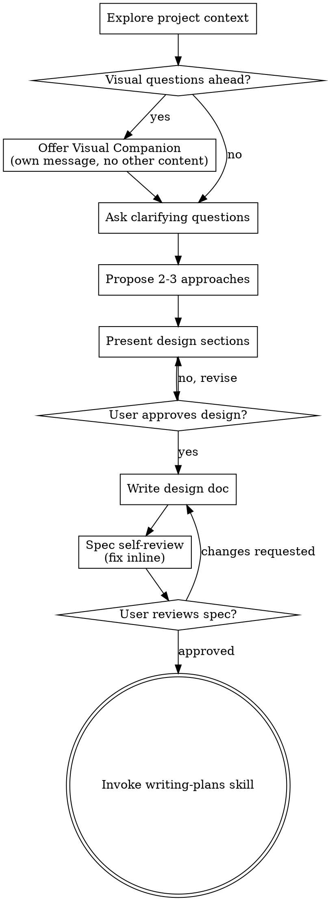

<!-- Generated by SpecStory, Markdown v2.1.0 -->

# 2026-04-15 23:18:52Z

<!-- Claude Code Session 0de09bdc-c785-4176-87d8-ff45727b3d13 (2026-04-15 23:18:52Z) -->

_**User (2026-04-15 23:18:52Z)**_

I want to revisit the bookmark and config saves. Currently, we can create multiple variations of the same game, but we can't remove it, and also, we no longer can bookmark. So we should have both options:

1. From now on, games with different config are not considered bookmark, they are now called game variation
2. We should be able to remove, with confirmation a game variation
3. Users still can bookmark (either default games), or variations.
4. Users can't remove default games

---

_**Agent (claude-opus-4-6 2026-04-15 23:18:54Z)**_

_**Agent (claude-opus-4-6 2026-04-15 23:18:55Z)**_

<tool-use data-tool-type="generic" data-tool-name="Skill"><details>
<summary>Tool use: **Skill**</summary>

```text
Launching skill: superpowers:brainstorming
```
</details></tool-use>

---

_**User (2026-04-15 23:18:55Z)**_

Base directory for this skill: /Users/leocaseiro/.claude/plugins/cache/claude-plugins-official/superpowers/5.0.7/skills/brainstorming

# Brainstorming Ideas Into Designs

Help turn ideas into fully formed designs and specs through natural collaborative dialogue.

Start by understanding the current project context, then ask questions one at a time to refine the idea. Once you understand what you're building, present the design and get user approval.

<HARD-GATE>
Do NOT invoke any implementation skill, write any code, scaffold any project, or take any implementation action until you have presented a design and the user has approved it. This applies to EVERY project regardless of perceived simplicity.
</HARD-GATE>

## Anti-Pattern: "This Is Too Simple To Need A Design"

Every project goes through this process. A todo list, a single-function utility, a config change — all of them. "Simple" projects are where unexamined assumptions cause the most wasted work. The design can be short (a few sentences for truly simple projects), but you MUST present it and get approval.

## Checklist

You MUST create a task for each of these items and complete them in order:

1. **Explore project context** — check files, docs, recent commits
2. **Offer visual companion** (if topic will involve visual questions) — this is its own message, not combined with a clarifying question. See the Visual Companion section below.
3. **Ask clarifying questions** — one at a time, understand purpose/constraints/success criteria
4. **Propose 2-3 approaches** — with trade-offs and your recommendation
5. **Present design** — in sections scaled to their complexity, get user approval after each section
6. **Write design doc** — save to `docs/superpowers/specs/YYYY-MM-DD-<topic>-design.md` and commit
7. **Spec self-review** — quick inline check for placeholders, contradictions, ambiguity, scope (see below)
8. **User reviews written spec** — ask user to review the spec file before proceeding
9. **Transition to implementation** — invoke writing-plans skill to create implementation plan

## Process Flow



**The terminal state is invoking writing-plans.** Do NOT invoke frontend-design, mcp-builder, or any other implementation skill. The ONLY skill you invoke after brainstorming is writing-plans.

## The Process

**Understanding the idea:**

- Check out the current project state first (files, docs, recent commits)
- Before asking detailed questions, assess scope: if the request describes multiple independent subsystems (e.g., "build a platform with chat, file storage, billing, and analytics"), flag this immediately. Don't spend questions refining details of a project that needs to be decomposed first.
- If the project is too large for a single spec, help the user decompose into sub-projects: what are the independent pieces, how do they relate, what order should they be built? Then brainstorm the first sub-project through the normal design flow. Each sub-project gets its own spec → plan → implementation cycle.
- For appropriately-scoped projects, ask questions one at a time to refine the idea
- Prefer multiple choice questions when possible, but open-ended is fine too
- Only one question per message - if a topic needs more exploration, break it into multiple questions
- Focus on understanding: purpose, constraints, success criteria

**Exploring approaches:**

- Propose 2-3 different approaches with trade-offs
- Present options conversationally with your recommendation and reasoning
- Lead with your recommended option and explain why

**Presenting the design:**

- Once you believe you understand what you're building, present the design
- Scale each section to its complexity: a few sentences if straightforward, up to 200-300 words if nuanced
- Ask after each section whether it looks right so far
- Cover: architecture, components, data flow, error handling, testing
- Be ready to go back and clarify if something doesn't make sense

**Design for isolation and clarity:**

- Break the system into smaller units that each have one clear purpose, communicate through well-defined interfaces, and can be understood and tested independently
- For each unit, you should be able to answer: what does it do, how do you use it, and what does it depend on?
- Can someone understand what a unit does without reading its internals? Can you change the internals without breaking consumers? If not, the boundaries need work.
- Smaller, well-bounded units are also easier for you to work with - you reason better about code you can hold in context at once, and your edits are more reliable when files are focused. When a file grows large, that's often a signal that it's doing too much.

**Working in existing codebases:**

- Explore the current structure before proposing changes. Follow existing patterns.
- Where existing code has problems that affect the work (e.g., a file that's grown too large, unclear boundaries, tangled responsibilities), include targeted improvements as part of the design - the way a good developer improves code they're working in.
- Don't propose unrelated refactoring. Stay focused on what serves the current goal.

## After the Design

**Documentation:**

- Write the validated design (spec) to `docs/superpowers/specs/YYYY-MM-DD-<topic>-design.md`
  - (User preferences for spec location override this default)
- Use elements-of-style:writing-clearly-and-concisely skill if available
- Commit the design document to git

**Spec Self-Review:**
After writing the spec document, look at it with fresh eyes:

1. **Placeholder scan:** Any "TBD", "TODO", incomplete sections, or vague requirements? Fix them.
2. **Internal consistency:** Do any sections contradict each other? Does the architecture match the feature descriptions?
3. **Scope check:** Is this focused enough for a single implementation plan, or does it need decomposition?
4. **Ambiguity check:** Could any requirement be interpreted two different ways? If so, pick one and make it explicit.

Fix any issues inline. No need to re-review — just fix and move on.

**User Review Gate:**
After the spec review loop passes, ask the user to review the written spec before proceeding:

> "Spec written and committed to `<path>`. Please review it and let me know if you want to make any changes before we start writing out the implementation plan."

Wait for the user's response. If they request changes, make them and re-run the spec review loop. Only proceed once the user approves.

**Implementation:**

- Invoke the writing-plans skill to create a detailed implementation plan
- Do NOT invoke any other skill. writing-plans is the next step.

## Key Principles

- **One question at a time** - Don't overwhelm with multiple questions
- **Multiple choice preferred** - Easier to answer than open-ended when possible
- **YAGNI ruthlessly** - Remove unnecessary features from all designs
- **Explore alternatives** - Always propose 2-3 approaches before settling
- **Incremental validation** - Present design, get approval before moving on
- **Be flexible** - Go back and clarify when something doesn't make sense

## Visual Companion

A browser-based companion for showing mockups, diagrams, and visual options during brainstorming. Available as a tool — not a mode. Accepting the companion means it's available for questions that benefit from visual treatment; it does NOT mean every question goes through the browser.

**Offering the companion:** When you anticipate that upcoming questions will involve visual content (mockups, layouts, diagrams), offer it once for consent:
> "Some of what we're working on might be easier to explain if I can show it to you in a web browser. I can put together mockups, diagrams, comparisons, and other visuals as we go. This feature is still new and can be token-intensive. Want to try it? (Requires opening a local URL)"

**This offer MUST be its own message.** Do not combine it with clarifying questions, context summaries, or any other content. The message should contain ONLY the offer above and nothing else. Wait for the user's response before continuing. If they decline, proceed with text-only brainstorming.

**Per-question decision:** Even after the user accepts, decide FOR EACH QUESTION whether to use the browser or the terminal. The test: **would the user understand this better by seeing it than reading it?**

- **Use the browser** for content that IS visual — mockups, wireframes, layout comparisons, architecture diagrams, side-by-side visual designs
- **Use the terminal** for content that is text — requirements questions, conceptual choices, tradeoff lists, A/B/C/D text options, scope decisions

A question about a UI topic is not automatically a visual question. "What does personality mean in this context?" is a conceptual question — use the terminal. "Which wizard layout works better?" is a visual question — use the browser.

If they agree to the companion, read the detailed guide before proceeding:
`skills/brainstorming/visual-companion.md`


---

_**Agent (claude-opus-4-6 2026-04-15 23:18:57Z)**_

_**Agent (claude-opus-4-6 2026-04-15 23:18:58Z)**_

Let me explore the current bookmark/config save implementation before asking questions.

_**Agent (claude-opus-4-6 2026-04-15 23:18:59Z)**_

<tool-use data-tool-type="search" data-tool-name="Grep"><details>
<summary>Tool use: **Grep**</summary>
 pattern `bookmark`

```text
Found 30 files limit: 30
.specstory/history/2026-04-15_23-16-03Z-i-want-to-revisit.md
.specstory/history/2026-04-15_22-33-28Z-i-am-trying-to.md
.specstory/history/2026-04-15_12-16-25Z-i-want-to-continue.md
.specstory/history/2026-04-07_17-42-40Z-i-have-been-trying.md
.specstory/history/2026-04-15_04-52-30Z-currently-in-paralele-there.md
.specstory/history/2026-04-15_01-38-11Z-i-am-interested-to.md
src/routes/$locale/_app/game/$gameId.tsx
src/routes/$locale/_app/game/$gameId.test.tsx
docs/baseskill_milestone_breakdown_85146c93.plan.md
.specstory/history/2026-04-14_23-22-30Z-i-have-partially-implemented.md
.specstory/2026-04-13_07-33-52Z.md
.specstory/history/2026-04-14_02-19-39Z-i-want-to-figure.md
docs/data-model.md
.specstory/history/2026-04-09_21-53-56Z-hash-hash-continue-writing.md
.specstory/history/2026-04-11_12-52-56Z-hash-execute-the-phonics.md
.specstory/history/2026-04-07_18-06-06Z-hash-brainstorm-drag-preview.md
src/styles.css
src/components/answer-game/InstructionsOverlay/InstructionsOverlay.tsx
src/components/answer-game/InstructionsOverlay/InstructionsOverlay.stories.tsx
src/components/SavedConfigChip.tsx
src/components/SavedConfigChip.test.tsx
docs/superpowers/specs/2026-04-13-mobile-resilience-design.md
.specstory/history/2026-04-12_22-42-57Z-plan-complete-and-saved.md
.specstory/history/2026-04-12_13-13-25Z-i-want-to-make.md
.specstory/history/2026-04-11_12-52-56Z-execute-the-phonics-word.md
.specstory/history/2026-04-08_07-33-32Z-drag-preview-and-swap-testing.md
.specstory/history/2026-04-10_02-05-34Z.md
.specstory/history/2026-04-11_00-29-33Z-i-want-to-plan.md
docs/2026-03-31-milestone-2-data-layer.md
.specstory/history/2026-04-10_23-17-08Z-i-want-to-work.md
```
</details></tool-use>

_**Agent (claude-opus-4-6 2026-04-15 23:19:00Z)**_

<tool-use data-tool-type="search" data-tool-name="Grep"><details>
<summary>Tool use: **Grep**</summary>
 pattern `variation|saveConfig|customGame`

```text
Found 30 files limit: 30
.specstory/history/2026-04-15_23-16-03Z-i-want-to-revisit.md
.specstory/history/2026-04-15_12-16-25Z-i-want-to-continue.md
.specstory/history/2026-04-07_17-42-40Z-i-have-been-trying.md
.specstory/history/2026-04-15_01-38-11Z-i-am-interested-to.md
.specstory/history/2026-04-14_23-22-30Z-i-have-partially-implemented.md
.specstory/history/2026-04-14_05-54-35Z-i-want-to-improve.md
.specstory/history/2026-04-14_02-19-39Z-i-want-to-figure.md
.specstory/history/2026-04-11_12-52-56Z-hash-execute-the-phonics.md
.specstory/history/2026-04-07_18-06-06Z-hash-brainstorm-drag-preview.md
.specstory/history/2026-04-11_22-08-17Z-hash-phoneme-tuner-fresh.md
src/components/answer-game/InstructionsOverlay/InstructionsOverlay.tsx
.specstory/history/2026-04-12_22-42-57Z-plan-complete-and-saved.md
.specstory/history/2026-04-12_13-13-25Z-i-want-to-make.md
.specstory/history/2026-04-11_12-52-56Z-execute-the-phonics-word.md
.specstory/history/2026-04-11_22-08-17Z-phoneme-tuner-fresh-session.md
.specstory/history/2026-04-08_07-33-32Z-drag-preview-and-swap-testing.md
.specstory/history/2026-04-10_02-05-34Z.md
.specstory/history/2026-04-11_00-29-33Z-i-want-to-plan.md
.specstory/history/2026-04-10_21-52-29Z-i-want-to-improve.md
.specstory/history/2026-04-10_10-09-22Z-this-session-is-being.md
.specstory/history/2026-04-09_00-14-47Z-you-are-implementing-tasks.md
.specstory/history/2026-04-09_19-42-10Z-i-want-to-make.md
.specstory/history/2026-04-10_01-30-04Z.md
src/components/GameCard.tsx
.specstory/history/2026-04-08_13-15-49Z-let-s-work-on.md
.specstory/history/2026-04-08_12-47-38Z-use-the-spec-users.md
.specstory/history/2026-04-08_08-50-28Z-pull-master-and-execute.md
.specstory/history/2026-04-08_07-38-19Z-i-want-to-pull.md
.specstory/history/2026-04-07_22-45-38Z-can-you-pull-master.md
.specstory/history/2026-04-04_11-55-16Z-object-literal-duplicate-property-error.md
```
</details></tool-use>

_**Agent (claude-opus-4-6 2026-04-15 23:19:03Z)**_

<tool-use data-tool-type="read" data-tool-name="Read"><details>
<summary>Tool use: **Read**</summary>
 `./src/components/SavedConfigChip.tsx`

```text
1	// src/components/SavedConfigChip.tsx
2	import { useState } from 'react';
3	import type { SavedGameConfigDoc } from '@/db/schemas/saved_game_configs';
4	import type { BookmarkColorKey } from '@/lib/bookmark-colors';
5	import type { ConfigField } from '@/lib/config-fields';
6	import type { JSX } from 'react';
7	import { ConfigFormFields } from '@/components/ConfigFormFields';
8	import { BOOKMARK_COLORS } from '@/lib/bookmark-colors';
9	import { configToTags } from '@/lib/config-tags';
10	
11	type SavedConfigChipProps = {
12	  doc: SavedGameConfigDoc;
13	  configFields: ConfigField[];
14	  renderConfigForm?: (props: {
15	    config: Record<string, unknown>;
16	    onChange: (config: Record<string, unknown>) => void;
17	  }) => JSX.Element;
18	  onPlay: (id: string) => void;
19	  onDelete: (id: string) => void;
20	  onSave: (
21	    id: string,
22	    config: Record<string, unknown>,
23	    name: string,
24	  ) => Promise<void>;
25	};
26	
27	export const SavedConfigChip = ({
28	  doc,
29	  configFields,
30	  renderConfigForm,
31	  onPlay,
32	  onDelete,
33	  onSave,
34	}: SavedConfigChipProps): JSX.Element => {
35	  const [expanded, setExpanded] = useState(false);
36	  const [editConfig, setEditConfig] = useState(doc.config);
37	  const [editName, setEditName] = useState(doc.name);
38	
39	  const colorKey = doc.color as BookmarkColorKey;
40	  const colors = BOOKMARK_COLORS[colorKey];
41	  const tags = configToTags(doc.config);
42	
43	  const handleCancel = () => {
44	    setEditConfig(doc.config);
45	    setEditName(doc.name);
46	    setExpanded(false);
47	  };
48	
49	  const handleSave = async () => {
50	    await onSave(doc.id, editConfig, editName);
51	    setExpanded(false);
52	  };
53	
54	  return (
55	    <div
56	      className="overflow-hidden rounded-xl border-2"
57	      style={
58	        {
59	          '--bookmark-play': colors.playBg,
60	          borderColor: expanded ? colors.playBg : colors.border,
61	          boxShadow: expanded
62	            ? `0 0 0 3px color-mix(in srgb, var(--bookmark-play) 12%, transparent)`
63	            : undefined,
64	        } as React.CSSProperties
65	      }
66	    >
67	      {/* Header row */}
68	      <div
69	        className={`flex min-h-12 items-stretch ${expanded ? '' : 'bookmark-tag-bg'}`}
70	        style={
71	          expanded ? { background: 'var(--bookmark-play)' } : undefined
72	        }
73	      >
74	        <button
75	          type="button"
76	          aria-label={`Expand ${doc.name}`}
77	          onClick={() => setExpanded((v) => !v)}
78	          className="flex min-h-12 flex-1 touch-manipulation items-center gap-2 px-3 text-left"
79	        >
80	          <span
81	            className={`text-sm font-semibold ${expanded ? 'text-white' : 'bookmark-text'}`}
82	          >
83	            {doc.name}
84	          </span>
85	          <span
86	            className={`ml-auto text-xs ${expanded ? 'text-white/70' : 'bookmark-text'}`}
87	          >
88	            {expanded ? '▲' : '▼'}
89	          </span>
90	        </button>
91	        <button
92	          type="button"
93	          aria-label={`Play ${doc.name}`}
94	          onClick={() => onPlay(doc.id)}
95	          className="flex min-h-12 w-12 touch-manipulation items-center justify-center text-sm text-white"
96	          style={{ background: 'var(--bookmark-play)' }}
97	        >
98	          ▶
99	        </button>
100	        <button
101	          type="button"
102	          aria-label={`Delete ${doc.name}`}
103	          onClick={() => onDelete(doc.id)}
104	          className="flex min-h-12 w-12 touch-manipulation items-center justify-center border-l border-destructive/20 text-sm text-destructive"
105	          style={{
106	            background:
107	              'color-mix(in srgb, var(--bs-error) 15%, transparent)',
108	          }}
109	        >
110	          ✕
111	        </button>
112	      </div>
113	
114	      {/* Collapsed: config summary tags */}
115	      {!expanded && (
116	        <div className="bookmark-bg flex flex-wrap gap-1 px-3 pb-2 pt-1">
117	          {tags.map((tag) => (
118	            <span
119	              key={tag}
120	              className="bookmark-tag-bg bookmark-text rounded px-2 py-0.5 text-xs font-medium"
121	            >
122	              {tag}
123	            </span>
124	          ))}
125	        </div>
126	      )}
127	
128	      {/* Expanded: inline form */}
129	      {expanded && (
130	        <div className="bookmark-bg flex flex-col gap-3 p-3">
131	          {renderConfigForm ? (
132	            renderConfigForm({
133	              config: editConfig,
134	              onChange: setEditConfig,
135	            })
136	          ) : (
137	            <ConfigFormFields
138	              fields={configFields}
139	              config={editConfig}
140	              onChange={setEditConfig}
141	            />
142	          )}
143	          <label className="flex flex-col gap-1 text-sm font-semibold text-foreground">
144	            Bookmark name
145	            <input
146	              type="text"
147	              value={editName}
148	              onChange={(e) => setEditName(e.target.value)}
149	              className="h-12 rounded-lg border border-input bg-background px-3 text-sm"
150	            />
151	          </label>
152	          <div className="flex gap-2">
153	            <button
154	              type="button"
155	              aria-label="Save"
156	              onClick={() => void handleSave()}
157	              className="h-12 flex-1 touch-manipulation rounded-xl bg-primary text-sm font-bold text-primary-foreground"
158	            >
159	              Save
160	            </button>
161	            <button
162	              type="button"
163	              aria-label="Cancel"
164	              onClick={handleCancel}
165	              className="h-12 flex-1 touch-manipulation rounded-xl border border-input bg-background text-sm text-muted-foreground"
166	            >
167	              Cancel
168	            </button>
169	          </div>
170	        </div>
171	      )}
172	    </div>
173	  );
174	};
175
```
</details></tool-use>

_**Agent (claude-opus-4-6 2026-04-15 23:19:04Z)**_

<tool-use data-tool-type="read" data-tool-name="Read"><details>
<summary>Tool use: **Read**</summary>
 `./src/components/GameCard.tsx`

```text
1	// src/components/GameCard.tsx
2	import { BookmarkIcon } from 'lucide-react';
3	import { useState } from 'react';
4	import { useTranslation } from 'react-i18next';
5	import type { SavedGameConfigDoc } from '@/db/schemas/saved_game_configs';
6	import type { GameCatalogEntry } from '@/games/registry';
7	import type { BookmarkColorKey } from '@/lib/bookmark-colors';
8	import { SaveConfigDialog } from '@/components/SaveConfigDialog';
9	import { SavedConfigChip } from '@/components/SavedConfigChip';
10	import { Button } from '@/components/ui/button';
11	import {
12	  Card,
13	  CardContent,
14	  CardHeader,
15	  CardTitle,
16	} from '@/components/ui/card';
17	import {
18	  getConfigFields,
19	  getConfigFormRenderer,
20	} from '@/games/config-fields-registry';
21	
22	type GameCardProps = {
23	  entry: GameCatalogEntry;
24	  savedConfigs: SavedGameConfigDoc[];
25	  onSaveConfig: (
26	    gameId: string,
27	    name: string,
28	    color: BookmarkColorKey,
29	  ) => Promise<void>;
30	  onRemoveConfig: (configId: string) => Promise<void>;
31	  onUpdateConfig: (
32	    configId: string,
33	    config: Record<string, unknown>,
34	    name: string,
35	  ) => Promise<void>;
36	  onPlay: (gameId: string) => void;
37	  onPlayWithConfig: (gameId: string, configId: string) => void;
38	};
39	
40	const suggestConfigName = (
41	  gameTitle: string,
42	  existingNames: string[],
43	): string => {
44	  if (!existingNames.includes(gameTitle)) return gameTitle;
45	  let n = 2;
46	  while (existingNames.includes(`${gameTitle} #${n}`)) n++;
47	  return `${gameTitle} #${n}`;
48	};
49	
50	export const GameCard = ({
51	  entry,
52	  savedConfigs,
53	  onSaveConfig,
54	  onRemoveConfig,
55	  onUpdateConfig,
56	  onPlay,
57	  onPlayWithConfig,
58	}: GameCardProps) => {
59	  const { t } = useTranslation('games');
60	  const { t: tCommon } = useTranslation('common');
61	  const [dialogOpen, setDialogOpen] = useState(false);
62	
63	  const gameTitle = t(entry.titleKey);
64	  const description = t(entry.descriptionKey);
65	  const existingNames = savedConfigs.map((c) => c.name);
66	  const suggestedName = suggestConfigName(gameTitle, existingNames);
67	  const hasConfigs = savedConfigs.length > 0;
68	  const configFields = getConfigFields(entry.id);
69	  const configFormRenderer = getConfigFormRenderer(entry.id);
70	
71	  const handleSave = async (name: string, color: BookmarkColorKey) => {
72	    await onSaveConfig(entry.id, name, color);
73	    setDialogOpen(false);
74	  };
75	
76	  return (
77	    <>
78	      <Card className="flex flex-col">
79	        <CardHeader className="flex-1">
80	          <div className="flex items-start justify-between gap-2">
81	            <CardTitle className="text-base leading-snug">
82	              {gameTitle}
83	            </CardTitle>
84	            <Button
85	              variant="ghost"
86	              size="icon"
87	              aria-label={tCommon('saveConfig.title')}
88	              onClick={() => setDialogOpen(true)}
89	            >
90	              <BookmarkIcon
91	                size={16}
92	                className={hasConfigs ? 'fill-current' : ''}
93	              />
94	            </Button>
95	          </div>
96	
97	          <p className="text-xs text-muted-foreground leading-snug">
98	            {description}
99	          </p>
100	
101	          <div className="flex flex-wrap gap-1 pt-1">
102	            {entry.levels.map((level) => (
103	              <span
104	                key={level}
105	                className="rounded-full bg-muted px-2 py-0.5 text-xs font-medium text-foreground"
106	              >
107	                {tCommon(`levels.${level}`)}
108	              </span>
109	            ))}
110	          </div>
111	
112	          {hasConfigs && (
113	            <div className="flex flex-col gap-2 pt-2">
114	              {savedConfigs.map((sc) => (
115	                <SavedConfigChip
116	                  key={sc.id}
117	                  doc={sc}
118	                  configFields={configFields}
119	                  renderConfigForm={configFormRenderer}
120	                  onPlay={(id) => onPlayWithConfig(entry.id, id)}
121	                  onDelete={(id) => void onRemoveConfig(id)}
122	                  onSave={onUpdateConfig}
123	                />
124	              ))}
125	            </div>
126	          )}
127	        </CardHeader>
128	
129	        <CardContent>
130	          <Button className="w-full" onClick={() => onPlay(entry.id)}>
131	            {tCommon('play')}
132	          </Button>
133	        </CardContent>
134	      </Card>
135	
136	      <SaveConfigDialog
137	        open={dialogOpen}
138	        suggestedName={suggestedName}
139	        existingNames={existingNames}
140	        onSave={(name, color) => void handleSave(name, color)}
141	        onCancel={() => setDialogOpen(false)}
142	      />
143	    </>
144	  );
145	};
146
```
</details></tool-use>

_**Agent (claude-opus-4-6 2026-04-15 23:19:15Z)**_

_**Agent (claude-opus-4-6 2026-04-15 23:19:20Z)**_

I read `GameCard.tsx` and `SavedConfigChip.tsx`. Today the bookmark icon actually creates a "saved config" (a variation), and there's no way to just bookmark a default game. Got the gap.

Before I propose a design, one clarifying question to ground the model:

**Where should bookmarked items live in the UI, vs the games list itself?**

A) **Separate "Bookmarks" section/page** — bookmarked default games and bookmarked variations show together in a dedicated area (e.g., top of home, or a tab). Game catalog stays clean.

B) **Inline on the GameCard** — bookmark star toggles on the card; bookmarked variations stay grouped under their parent game (similar to today's chips). No separate section.

C) **Both** — variations stay nested under their game card, but bookmarked items *also* appear in a "Favorites" shortcut at the top.

Which matches what you have in mind?

---

_**User (2026-04-15 23:19:23Z)**_

<local-command-caveat>Caveat: The messages below were generated by the user while running local commands. DO NOT respond to these messages or otherwise consider them in your response unless the user explicitly asks you to.</local-command-caveat>

_**User (2026-04-15 23:19:23Z)**_

<command-name>/effort</command-name>
            <command-message>effort</command-message>
            <command-args></command-args>

_**User (2026-04-15 23:19:23Z)**_

<local-command-stdout>Current effort level: medium (Balanced approach with standard implementation and testing)</local-command-stdout>

_**User (2026-04-15 23:19:23Z)**_

<command-name>/effort</command-name>
            <command-message>effort</command-message>
            <command-args>high</command-args>

_**User (2026-04-15 23:19:23Z)**_

<local-command-stdout>Set effort level to high: Comprehensive implementation with extensive testing and documentation · burns fastest — medium handles most tasks</local-command-stdout>

_**User (2026-04-15 23:19:23Z)**_

<local-command-caveat>Caveat: The messages below were generated by the user while running local commands. DO NOT respond to these messages or otherwise consider them in your response unless the user explicitly asks you to.</local-command-caveat>

_**User (2026-04-15 23:20:46Z)**_

We already have the ribbons (not star), let's keep that way. Variation will have a different icon. Bookmarks can be filtered, but they are all listed in the same home page.

---

_**Agent (claude-opus-4-6 2026-04-15 23:20:52Z)**_

_**Agent (claude-opus-4-6 2026-04-15 23:20:55Z)**_

Got it — ribbon (existing) = bookmark, different icon = variation, same home page with filter.

Next question:

**How does a user create a variation?**

A) **From the GameCard** — a separate "Save variation" button/icon on each game card opens the existing config dialog (ribbon stays as pure bookmark toggle).

B) **From inside the game** — user enters the game with defaults, tweaks config mid-play (or via a "customize" panel), then "Save as variation" persists it.

C) **Both** — quick save from the card, plus an in-game "Save current as variation" option.

Which flow do you want?

---

_**User (2026-04-15 23:24:55Z)**_

Currently, we don't have yet a filtering search, and this is beyond this scope. Currently, we have been using the term bookmark for the variation. So just keep exactly as it is.


My recommandation is in this order:
1. replace any name convention that is currently referred to bookmark to variation (do you have a better name than variation?)
2. All functionality of the current bookmark will be transferred to variation. (the way we create, save, anything)
3. replace the icons from ribbon to somehting else (TBD)
4. after this migration, we than can introduce the bookmark which is a new property of the game/game variation. Users can toggle in both game grid or game instructions (simple or advanced config).
5. Bookmarks will be used in the search (will be done after this work)


Does that make sense?

---

_**Agent (claude-opus-4-6 2026-04-15 23:25:10Z)**_

_**Agent (claude-opus-4-6 2026-04-15 23:25:17Z)**_

Makes total sense. Phased approach:

- **Phase 1**: rename "bookmark" → "variation" (or better), swap icon, keep all behavior
- **Phase 2**: introduce new bookmark toggle (on games + variations), surface-able in game grid and instructions overlay

On **naming** — some options besides "variation":

| Name          | Pros                                  | Cons                               |
| ------------- | ------------------------------------- | ---------------------------------- |
| **Variation** | descriptive, your natural term        | 9 letters, slightly abstract       |
| **Preset**    | short, common in games/apps           | implies "predefined" (it's user's) |
| **Custom**    | clear it's user-made                  | vague noun ("a custom")            |
| **Setup**     | short, concrete                       | generic                            |
| **Loadout**   | game-native, evokes "saved config"    | gamer jargon, may not fit kids     |

My recommendation: **"Preset"** — shortest, widely understood, reads naturally ("Save as preset", "My presets"). "Variation" is fine too. Which do you prefer?

Also two quick confirmations on scope:

1. **Remove confirmation**: current ✕ deletes instantly (no confirm). Should Phase 1 add a confirm dialog, or push that to Phase 2?
2. **Phase 2 bookmark semantics**: bookmark is a toggle on *each individual item* (a default game, a variation) — un-bookmarking a default game never deletes it. Correct?

---

_**User (2026-04-15 23:27:22Z)**_

I like Preset, but our target is young children. I assume they would understand more as custom, what do you think?

1. add a confirmation for delete the variation, no need for bookmark
2. correct

---

_**Agent (claude-opus-4-6 2026-04-15 23:27:29Z)**_

_**Agent (claude-opus-4-6 2026-04-15 23:27:33Z)**_

Good point on audience. "Custom" as a standalone noun is awkward ("Save as custom", "My customs"), but it works beautifully as a modifier: **"Custom game"**, "Save as custom game", "My custom games". Kids read that instantly.

A couple of other kid-friendly options worth considering:

- **"My game"** — simplest, strong sense of ownership ("My games", "Save as my game")
- **"Remix"** — Scratch/Roblox-native, captures "my version" ("Remixes", "Save a remix")

My recommendation: **"Custom game"** — matches your intuition, clearest to kids, and the migration reads naturally (`savedConfig` → `customGame`, `SavedConfigChip` → `CustomGameChip`, etc.).

Want to go with "Custom game", or does "My game" / "Remix" feel stronger?

Confirmations locked in:

1. Phase 1 adds delete confirmation for variations/custom games; bookmark toggle (Phase 2) has no confirm.
2. Bookmark is a per-item toggle; un-bookmarking a default game never deletes it.

---

_**User (2026-04-15 23:28:21Z)**_

Custom game LGTM.
confirmed 1 and 2

---

_**Agent (claude-opus-4-6 2026-04-15 23:28:26Z)**_

_**Agent (claude-opus-4-6 2026-04-15 23:28:27Z)**_

<tool-use data-tool-type="unknown" data-tool-name="ToolSearch"><details>
<summary>Tool use: **ToolSearch**</summary>

**Input:**

- max_results: `3`
- query: `select:TaskCreate,TaskUpdate,TaskList`

**Result:**

```

```
</details></tool-use>

_**Agent (claude-opus-4-6 2026-04-15 23:28:31Z)**_

_**Agent (claude-opus-4-6 2026-04-15 23:28:33Z)**_

<tool-use data-tool-type="unknown" data-tool-name="TaskCreate"><details>
<summary>Tool use: **TaskCreate**</summary>
Identify all files, symbols, routes, i18n keys, icons referencing bookmark/savedConfig

```text
Task #1 created successfully: Explore codebase for bookmark/config usage
```
</details></tool-use>

_**Agent (claude-opus-4-6 2026-04-15 23:28:34Z)**_

<tool-use data-tool-type="unknown" data-tool-name="TaskCreate"><details>
<summary>Tool use: **TaskCreate**</summary>
Phase 1 migration strategy options with trade-offs

```text
Task #2 created successfully: Propose 2-3 approaches for rename + delete-confirm
```
</details></tool-use>

_**Agent (claude-opus-4-6 2026-04-15 23:28:35Z)**_

<tool-use data-tool-type="unknown" data-tool-name="TaskCreate"><details>
<summary>Tool use: **TaskCreate**</summary>
Get approval section-by-section

```text
Task #3 created successfully: Present design sections for Phase 1 and Phase 2
```
</details></tool-use>

_**Agent (claude-opus-4-6 2026-04-15 23:28:37Z)**_

<tool-use data-tool-type="unknown" data-tool-name="TaskCreate"><details>
<summary>Tool use: **TaskCreate**</summary>
YYYY-MM-DD-custom-games-and-bookmarks-design.md on a worktree

```text
Task #4 created successfully: Write and commit spec to docs/superpowers/specs/
```
</details></tool-use>

_**Agent (claude-opus-4-6 2026-04-15 23:28:38Z)**_

<tool-use data-tool-type="unknown" data-tool-name="TaskCreate"><details>
<summary>Tool use: **TaskCreate**</summary>
Placeholder/consistency/scope/ambiguity check, then hand to user

```text
Task #5 created successfully: Spec self-review + user review gate
```
</details></tool-use>

_**Agent (claude-opus-4-6 2026-04-15 23:28:39Z)**_

<tool-use data-tool-type="unknown" data-tool-name="TaskCreate"><details>
<summary>Tool use: **TaskCreate**</summary>
After spec approved, invoke superpowers:writing-plans

```text
Task #6 created successfully: Transition to writing-plans skill
```
</details></tool-use>

_**Agent (claude-opus-4-6 2026-04-15 23:28:41Z)**_

<tool-use data-tool-type="unknown" data-tool-name="TaskUpdate"><details>
<summary>Tool use: **TaskUpdate**</summary>

```text
Updated task #1 status
```
</details></tool-use>

_**Agent (claude-opus-4-6 2026-04-15 23:28:43Z)**_

<tool-use data-tool-type="search" data-tool-name="Grep"><details>
<summary>Tool use: **Grep**</summary>
 pattern `saved_game_configs|SavedGameConfig|savedConfig|SaveConfig`

```text
Found 50 files limit: 50
.specstory/history/2026-04-15_23-16-03Z-i-want-to-revisit.md
.specstory/history/2026-04-15_22-33-28Z-i-am-trying-to.md
.specstory/history/2026-04-15_12-16-25Z-i-want-to-continue.md
.specstory/history/2026-04-07_17-42-40Z-i-have-been-trying.md
.specstory/history/2026-04-15_04-52-30Z-currently-in-paralele-there.md
.specstory/history/2026-04-15_01-38-11Z-i-am-interested-to.md
src/routes/$locale/_app/game/$gameId.tsx
.specstory/history/2026-04-14_23-22-30Z-i-have-partially-implemented.md
.specstory/history/2026-04-14_05-54-35Z-i-want-to-improve.md
.specstory/history/2026-04-14_02-19-39Z-i-want-to-figure.md
.specstory/history/2026-04-11_12-52-56Z-hash-execute-the-phonics.md
.specstory/history/2026-04-07_18-06-06Z-hash-brainstorm-drag-preview.md
src/components/SavedConfigChip.tsx
src/components/SavedConfigChip.test.tsx
.specstory/history/2026-04-12_22-42-57Z-plan-complete-and-saved.md
.specstory/history/2026-04-12_13-13-25Z-i-want-to-make.md
.specstory/history/2026-04-11_12-52-56Z-execute-the-phonics-word.md
.specstory/history/2026-04-08_07-33-32Z-drag-preview-and-swap-testing.md
.specstory/history/2026-04-10_02-05-34Z.md
.specstory/history/2026-04-10_23-17-08Z-i-want-to-work.md
.specstory/history/2026-04-10_10-09-22Z-this-session-is-being.md
.specstory/history/2026-04-10_04-46-41Z-ci-re-running-on.md
.specstory/history/2026-04-09_23-40-44Z-i-want-to-add.md
.specstory/history/2026-04-09_00-14-47Z-you-are-implementing-tasks.md
.specstory/history/2026-04-10_01-30-04Z.md
src/components/GameCard.tsx
.specstory/history/2026-04-08_13-15-49Z-let-s-work-on.md
.specstory/history/2026-04-08_12-47-38Z-use-the-spec-users.md
.specstory/history/2026-04-08_12-03-55Z-the-latest-changes-tried.md
.specstory/history/2026-04-08_08-50-28Z-pull-master-and-execute.md
.specstory/history/2026-04-08_07-38-19Z-i-want-to-pull.md
.specstory/history/2026-04-07_22-45-38Z-can-you-pull-master.md
.specstory/history/2026-04-04_11-55-16Z-object-literal-duplicate-property-error.md
.specstory/history/2026-04-07_03-09-02Z.md
.specstory/history/2026-04-07_03-29-49Z-i-want-to-make.md
.specstory/history/2026-04-07_21-14-04Z-critical-respond-with-text.md
.specstory/history/2026-04-07_20-42-11Z-this-session-is-being.md
.specstory/history/2026-04-07_01-52-00Z-automating-fixes-in-github-pipelines.md
.specstory/history/2026-04-07_19-32-20Z-finish-the-investigation-and.md
src/db/create-database.ts
.specstory/history/2026-04-07_18-40-22Z.md
.specstory/history/2026-04-07_18-29-25Z-write-the-plan-for.md
.specstory/history/2026-04-07_18-06-06Z-brainstorm-drag-preview-in.md
.specstory/history/2026-04-07_17-15-20Z-i-have-been-trying.md
.specstory/history/2026-04-07_11-03-51Z-you-are-completing-task.md
.specstory/history/2026-04-07_12-29-50Z-this-session-is-being.md
.specstory/history/2026-04-07_10-07-56Z-superpowers-subagent-driven-development.md
.specstory/history/2026-04-07_10-30-37Z-critical-respond-with-text.md
.specstory/history/2026-04-07_09-27-50Z-we-are-using-a.md
.specstory/history/2026-04-07_09-46-03Z-superpowers-writing-plans-we.md
```
</details></tool-use>

_**Agent (claude-opus-4-6 2026-04-15 23:28:44Z)**_

<tool-use data-tool-type="search" data-tool-name="Grep"><details>
<summary>Tool use: **Grep**</summary>
 pattern `Bookmark|bookmark`

```text
Found 19 files
src/routes/$locale/_app/game/$gameId.tsx
src/routes/$locale/_app/game/$gameId.test.tsx
src/components/answer-game/InstructionsOverlay/InstructionsOverlay.tsx
src/components/answer-game/InstructionsOverlay/InstructionsOverlay.stories.tsx
src/components/SavedConfigChip.tsx
src/components/SavedConfigChip.test.tsx
src/components/GameCard.tsx
src/stories/ThemeShowcase.stories.tsx
src/lib/bookmark-colors.ts
src/components/SaveConfigDialog.tsx
src/components/GameNameChip.tsx
src/components/GameNameChip.stories.tsx
src/routes/$locale/_app/index.tsx
src/lib/i18n/locales/pt-BR/common.json
src/lib/i18n/locales/en/common.json
src/components/answer-game/InstructionsOverlay/InstructionsOverlay.test.tsx
src/components/GameNameChip.test.tsx
src/components/GameGrid.tsx
src/components/GameCard.test.tsx
```
</details></tool-use>

_**Agent (claude-opus-4-6 2026-04-15 23:28:48Z)**_

<tool-use data-tool-type="search" data-tool-name="Glob"><details>
<summary>Tool use: **Glob**</summary>
 pattern `src/db/schemas/**`

```text
src/db/schemas/app-meta.ts
src/db/schemas/game_config_overrides.ts
src/db/schemas/profiles.ts
src/db/schemas/progress.ts
src/db/schemas/session_history.ts
src/db/schemas/settings.ts
src/db/schemas/sync_meta.ts
src/db/schemas/themes.ts
src/db/schemas/index.ts
src/db/schemas/saved_game_configs.ts
src/db/schemas/session_history_index.test.ts
src/db/schemas/session_history_index.ts
```
</details></tool-use>

_**Agent (claude-opus-4-6 2026-04-15 23:28:52Z)**_

<tool-use data-tool-type="read" data-tool-name="Read"><details>
<summary>Tool use: **Read**</summary>
 `./src/db/schemas/saved_game_configs.ts`

```text
1	import type { RxJsonSchema } from 'rxdb';
2	
3	export type SavedGameConfigDoc = {
4	  id: string;
5	  profileId: string;
6	  gameId: string;
7	  name: string;
8	  config: Record<string, unknown>;
9	  createdAt: string;
10	  color: string;
11	};
12	
13	export const savedGameConfigsSchema: RxJsonSchema<SavedGameConfigDoc> =
14	  {
15	    version: 1,
16	    primaryKey: 'id',
17	    type: 'object',
18	    properties: {
19	      id: { type: 'string', maxLength: 36 },
20	      profileId: { type: 'string', maxLength: 36 },
21	      gameId: { type: 'string', maxLength: 64 },
22	      name: { type: 'string', maxLength: 128 },
23	      config: { type: 'object' },
24	      createdAt: { type: 'string', format: 'date-time' },
25	      color: { type: 'string', maxLength: 32 },
26	    },
27	    required: [
28	      'id',
29	      'profileId',
30	      'gameId',
31	      'name',
32	      'config',
33	      'createdAt',
34	      'color',
35	    ],
36	    additionalProperties: false,
37	  };
38
```
</details></tool-use>

_**Agent (claude-opus-4-6 2026-04-15 23:28:52Z)**_

<tool-use data-tool-type="read" data-tool-name="Read"><details>
<summary>Tool use: **Read**</summary>
 `./src/components/SaveConfigDialog.tsx`

```text
1	// src/components/SaveConfigDialog.tsx
2	import { useState } from 'react';
3	import { useTranslation } from 'react-i18next';
4	import type { BookmarkColorKey } from '@/lib/bookmark-colors';
5	import type { JSX } from 'react';
6	import { Button } from '@/components/ui/button';
7	import {
8	  Dialog,
9	  DialogContent,
10	  DialogFooter,
11	  DialogHeader,
12	  DialogTitle,
13	} from '@/components/ui/dialog';
14	import { Input } from '@/components/ui/input';
15	import {
16	  BOOKMARK_COLORS,
17	  BOOKMARK_COLOR_KEYS,
18	  DEFAULT_BOOKMARK_COLOR,
19	} from '@/lib/bookmark-colors';
20	
21	type SaveConfigDialogProps = {
22	  open: boolean;
23	  suggestedName: string;
24	  existingNames: string[];
25	  onSave: (name: string, color: BookmarkColorKey) => void;
26	  onCancel: () => void;
27	};
28	
29	export const SaveConfigDialog = ({
30	  open,
31	  suggestedName,
32	  existingNames,
33	  onSave,
34	  onCancel,
35	}: SaveConfigDialogProps): JSX.Element | null => {
36	  const { t } = useTranslation('common');
37	  const [name, setName] = useState(suggestedName);
38	  const [color, setColor] = useState<BookmarkColorKey>(
39	    DEFAULT_BOOKMARK_COLOR,
40	  );
41	  const [error, setError] = useState('');
42	
43	  const handleSave = () => {
44	    const trimmed = name.trim();
45	    if (!trimmed) {
46	      setError(t('saveConfig.errorEmpty'));
47	      return;
48	    }
49	    if (existingNames.includes(trimmed)) {
50	      setError(t('saveConfig.errorDuplicate', { name: trimmed }));
51	      return;
52	    }
53	    onSave(trimmed, color);
54	  };
55	
56	  if (!open) return null;
57	
58	  const previewColors = BOOKMARK_COLORS[color];
59	
60	  return (
61	    <Dialog
62	      open={open}
63	      onOpenChange={(isOpen) => !isOpen && onCancel()}
64	    >
65	      <DialogContent>
66	        <DialogHeader>
67	          <DialogTitle>{t('saveConfig.title')}</DialogTitle>
68	        </DialogHeader>
69	        <div className="flex flex-col gap-4 py-2">
70	          <div className="flex flex-col gap-2">
71	            <Input
72	              value={name}
73	              onChange={(e) => {
74	                setName(e.target.value);
75	                setError('');
76	              }}
77	              placeholder={t('saveConfig.placeholder')}
78	              aria-label={t('saveConfig.nameLabel')}
79	            />
80	            {error && (
81	              <p role="alert" className="text-sm text-destructive">
82	                {error}
83	              </p>
84	            )}
85	          </div>
86	
87	          <div className="flex flex-col gap-2">
88	            <span className="text-sm font-semibold">
89	              {t('saveConfig.colorLabel')}
90	            </span>
91	            <div
92	              className="grid gap-2"
93	              style={{ gridTemplateColumns: 'repeat(6, 1fr)' }}
94	              role="group"
95	              aria-label={t('saveConfig.colorLabel')}
96	            >
97	              {BOOKMARK_COLOR_KEYS.map((key) => (
98	                <button
99	                  key={key}
100	                  type="button"
101	                  aria-label={key}
102	                  aria-pressed={color === key}
103	                  onClick={() => setColor(key)}
104	                  className="h-9 w-9 rounded-full border-2 transition-transform hover:scale-110"
105	                  style={{
106	                    background: BOOKMARK_COLORS[key].playBg,
107	                    borderColor:
108	                      color === key
109	                        ? BOOKMARK_COLORS[key].playBg
110	                        : 'transparent',
111	                    outline:
112	                      color === key ? `3px solid white` : undefined,
113	                    outlineOffset: color === key ? '-5px' : undefined,
114	                  }}
115	                />
116	              ))}
117	            </div>
118	          </div>
119	
120	          {/* Preview */}
121	          <div className="flex flex-col gap-1">
122	            <span className="text-xs font-semibold text-muted-foreground uppercase tracking-wide">
123	              Preview
124	            </span>
125	            <div
126	              className="inline-flex overflow-hidden rounded-lg border"
127	              style={
128	                {
129	                  borderColor: previewColors.border,
130	                  '--bookmark-play': previewColors.playBg,
131	                } as React.CSSProperties
132	              }
133	            >
134	              <div className="bookmark-tag-bg bookmark-text px-3 py-2 text-sm font-semibold">
135	                {name || t('saveConfig.placeholder')}
136	              </div>
137	              <div
138	                className="flex w-10 items-center justify-center text-sm text-white"
139	                style={{ background: 'var(--bookmark-play)' }}
140	              >
141	                ▶
142	              </div>
143	            </div>
144	          </div>
145	        </div>
146	        <DialogFooter>
147	          <Button variant="outline" onClick={onCancel}>
148	            {t('saveConfig.cancel')}
149	          </Button>
150	          <Button onClick={handleSave}>{t('saveConfig.save')}</Button>
151	        </DialogFooter>
152	      </DialogContent>
153	    </Dialog>
154	  );
155	};
156
```
</details></tool-use>

_**Agent (claude-opus-4-6 2026-04-15 23:28:55Z)**_

<tool-use data-tool-type="read" data-tool-name="Read"><details>
<summary>Tool use: **Read**</summary>
 `./src/lib/bookmark-colors.ts`

```text
1	// src/lib/bookmark-colors.ts
2	export const BOOKMARK_COLOR_KEYS = [
3	  'indigo',
4	  'teal',
5	  'rose',
6	  'amber',
7	  'sky',
8	  'lime',
9	  'purple',
10	  'orange',
11	  'pink',
12	  'emerald',
13	  'slate',
14	  'cyan',
15	] as const;
16	
17	export type BookmarkColorKey = (typeof BOOKMARK_COLOR_KEYS)[number];
18	
19	export type ColorTokens = {
20	  border: string; // used for selected ring in colour picker
21	  playBg: string; // primary colour — all other uses derived from this via CSS utility classes
22	};
23	
24	export const BOOKMARK_COLORS: Record<BookmarkColorKey, ColorTokens> = {
25	  indigo: { border: '#c7d2fe', playBg: '#6366f1' },
26	  teal: { border: '#99f6e4', playBg: '#14b8a6' },
27	  rose: { border: '#fecdd3', playBg: '#f43f5e' },
28	  amber: { border: '#fde68a', playBg: '#f59e0b' },
29	  sky: { border: '#bae6fd', playBg: '#0ea5e9' },
30	  lime: { border: '#d9f99d', playBg: '#84cc16' },
31	  purple: { border: '#e9d5ff', playBg: '#a855f7' },
32	  orange: { border: '#fed7aa', playBg: '#f97316' },
33	  pink: { border: '#fbcfe8', playBg: '#ec4899' },
34	  emerald: { border: '#a7f3d0', playBg: '#10b981' },
35	  slate: { border: '#cbd5e1', playBg: '#64748b' },
36	  cyan: { border: '#a5f3fc', playBg: '#06b6d4' },
37	};
38	
39	export const DEFAULT_BOOKMARK_COLOR: BookmarkColorKey = 'indigo';
40
```
</details></tool-use>

_**Agent (claude-opus-4-6 2026-04-15 23:28:57Z)**_

<tool-use data-tool-type="search" data-tool-name="Grep"><details>
<summary>Tool use: **Grep**</summary>
 path `./src/lib/i18n/locales/en/common.json` pattern `saveConfig|bookmark`

```text
38:  "saveConfig": {
49:    "saveAsNew": "Save as new bookmark…",
50:    "saveBookmarkLabel": "Save as bookmark",
```
</details></tool-use>

_**Agent (claude-opus-4-6 2026-04-15 23:28:57Z)**_

<tool-use data-tool-type="read" data-tool-name="Read"><details>
<summary>Tool use: **Read**</summary>
 `./src/routes/$locale/_app/index.tsx`

```text
1	import {
2	  createFileRoute,
3	  useNavigate,
4	  useParams,
5	} from '@tanstack/react-router';
6	import { useMemo } from 'react';
7	import { useTranslation } from 'react-i18next';
8	import type { GameLevel, GameSubject } from '@/games/registry';
9	import type { BookmarkColorKey } from '@/lib/bookmark-colors';
10	import type { ValidatorAdapter } from '@tanstack/react-router';
11	import { GameGrid } from '@/components/GameGrid';
12	import { LevelRow } from '@/components/LevelRow';
13	import { getOrCreateDatabase } from '@/db/create-database';
14	import { useSavedConfigs } from '@/db/hooks/useSavedConfigs';
15	import { lastSessionSavedConfigId } from '@/db/last-session-game-config';
16	import {
17	  filterCatalog,
18	  paginateCatalog,
19	  sortByHasSavedConfigs,
20	} from '@/games/catalog-utils';
21	import { GAME_CATALOG } from '@/games/registry';
22	
23	type CatalogSearchInput = {
24	  search?: string;
25	  level?: string;
26	  subject?: string;
27	  page?: number | string;
28	};
29	
30	type CatalogSearchOutput = {
31	  search: string;
32	  level: string;
33	  subject: string;
34	  page: number;
35	};
36	
37	const catalogSearchValidator: ValidatorAdapter<
38	  CatalogSearchInput,
39	  CatalogSearchOutput
40	> = {
41	  types: {
42	    input: {} as CatalogSearchInput,
43	    output: {} as CatalogSearchOutput,
44	  },
45	  parse: (input: unknown) => {
46	    const raw = (input ?? {}) as Record<string, unknown>;
47	    const pageRaw =
48	      typeof raw.page === 'number' && Number.isFinite(raw.page)
49	        ? raw.page
50	        : Number.parseInt(String(raw.page ?? '1'), 10) || 1;
51	    return {
52	      search: typeof raw.search === 'string' ? raw.search : '',
53	      level: typeof raw.level === 'string' ? raw.level : '',
54	      subject: typeof raw.subject === 'string' ? raw.subject : '',
55	      page: Math.max(1, pageRaw),
56	    };
57	  },
58	};
59	
60	const PAGE_SIZE = 12;
61	
62	const HomeScreen = () => {
63	  const { t } = useTranslation('common');
64	  const { level, subject, search, page } = Route.useSearch();
65	  const { locale } = useParams({ from: '/$locale' });
66	  const navigate = useNavigate({ from: '/$locale/' });
67	  const {
68	    savedConfigs,
69	    gameIdsWithConfigs,
70	    save,
71	    remove,
72	    updateConfig,
73	  } = useSavedConfigs();
74	
75	  const filtered = useMemo(() => {
76	    const result = filterCatalog(GAME_CATALOG, {
77	      search,
78	      level: level as GameLevel | '',
79	      subject: subject as GameSubject | '',
80	    });
81	    return sortByHasSavedConfigs(result, gameIdsWithConfigs);
82	  }, [search, level, subject, gameIdsWithConfigs]);
83	
84	  const {
85	    items,
86	    page: safePage,
87	    totalPages,
88	  } = useMemo(
89	    () => paginateCatalog(filtered, page, PAGE_SIZE),
90	    [filtered, page],
91	  );
92	
93	  const updateSearch = (
94	    patch: Partial<{
95	      level: string;
96	      subject: string;
97	      search: string;
98	      page: number;
99	    }>,
100	  ) => {
101	    void navigate({
102	      search: (prev) => ({ ...prev, ...patch }),
103	    });
104	  };
105	
106	  const handlePlay = (gameId: string) => {
107	    void navigate({
108	      to: '/$locale/game/$gameId',
109	      params: { locale, gameId },
110	      search: { configId: undefined },
111	    });
112	  };
113	
114	  const handlePlayWithConfig = (gameId: string, configId: string) => {
115	    void navigate({
116	      to: '/$locale/game/$gameId',
117	      params: { locale, gameId },
118	      search: { configId },
119	    });
120	  };
121	
122	  const handleSaveConfig = async (
123	    gameId: string,
124	    name: string,
125	    color: string,
126	  ): Promise<void> => {
127	    const db = await getOrCreateDatabase();
128	    const lastDoc = await db.saved_game_configs
129	      .findOne(lastSessionSavedConfigId(gameId))
130	      .exec();
131	    const lastConfig = lastDoc?.config ?? {};
132	    await save({
133	      gameId,
134	      name,
135	      config: lastConfig,
136	      color: color as BookmarkColorKey,
137	    });
138	  };
139	
140	  const handleUpdateConfig = async (
141	    configId: string,
142	    config: Record<string, unknown>,
143	    name: string,
144	  ): Promise<void> => {
145	    await updateConfig(configId, config, name);
146	  };
147	
148	  return (
149	    <div className="px-4 py-2">
150	      <h1 className="sr-only">{t('home.title')}</h1>
151	      <LevelRow
152	        currentLevel={level as GameLevel | ''}
153	        onLevelChange={(l) => updateSearch({ level: l, page: 1 })}
154	      />
155	      <div className="mt-4">
156	        <GameGrid
157	          entries={items}
158	          savedConfigs={savedConfigs}
159	          onSaveConfig={handleSaveConfig}
160	          onRemoveConfig={remove}
161	          onUpdateConfig={handleUpdateConfig}
162	          onPlay={handlePlay}
163	          onPlayWithConfig={handlePlayWithConfig}
164	          page={safePage}
165	          totalPages={totalPages}
166	          onPageChange={(p) => updateSearch({ page: p })}
167	        />
168	      </div>
169	    </div>
170	  );
171	};
172	
173	export const Route = createFileRoute('/$locale/_app/')({
174	  validateSearch: catalogSearchValidator,
175	  component: HomeScreen,
176	});
177
```
</details></tool-use>

_**Agent (claude-opus-4-6 2026-04-15 23:29:01Z)**_

<tool-use data-tool-type="search" data-tool-name="Grep"><details>
<summary>Tool use: **Grep**</summary>
 pattern `useSavedConfigs|saved_game_configs`

```text
src/db/last-session-game-config.ts:1:/** Matches `useSavedConfigs` / saved_game_configs.profileId for anonymous play */
src/db/create-database.test.ts:28:      'saved_game_configs',
src/db/create-database.ts:34:  saved_game_configs: {
src/db/hooks/useSavedConfigs.test.tsx:5:import { useSavedConfigs } from './useSavedConfigs';
src/db/hooks/useSavedConfigs.test.tsx:35:function useSavedConfigsReady() {
src/db/hooks/useSavedConfigs.test.tsx:37:  const result = useSavedConfigs();
src/db/hooks/useSavedConfigs.test.tsx:41:describe('useSavedConfigs', () => {
src/db/hooks/useSavedConfigs.test.tsx:43:    const { result } = renderHook(() => useSavedConfigsReady(), {
src/db/hooks/useSavedConfigs.test.tsx:51:    const { result } = renderHook(() => useSavedConfigsReady(), {
src/db/hooks/useSavedConfigs.test.tsx:71:    const { result } = renderHook(() => useSavedConfigsReady(), {
src/db/hooks/useSavedConfigs.test.tsx:99:    const { result } = renderHook(() => useSavedConfigsReady(), {
src/db/hooks/useSavedConfigs.test.tsx:125:    const { result } = renderHook(() => useSavedConfigsReady(), {
src/db/hooks/useSavedConfigs.test.tsx:150:    const { result } = renderHook(() => useSavedConfigsReady(), {
src/db/hooks/useSavedConfigs.test.tsx:175:    const { result } = renderHook(() => useSavedConfigsReady(), {
src/db/hooks/useSavedConfigs.test.tsx:210:    const { result } = renderHook(() => useSavedConfigsReady(), {
src/db/hooks/useSavedConfigs.test.tsx:237:    const { result } = renderHook(() => useSavedConfigsReady(), {
src/db/hooks/useSavedConfigs.test.tsx:260:    const { result } = renderHook(() => useSavedConfigsReady(), {
src/db/hooks/useSavedConfigs.test.tsx:272:    const raw = await db.saved_game_configs
src/db/hooks/useSavedConfigs.test.tsx:283:    const raw2 = await db.saved_game_configs
src/db/hooks/useSavedConfigs.test.tsx:291:    const { result } = renderHook(() => useSavedConfigsReady(), {
src/db/hooks/useSavedConfigs.test.tsx:307:    const { result } = renderHook(() => useSavedConfigsReady(), {
src/db/hooks/useSavedConfigs.test.tsx:326:    const { result } = renderHook(() => useSavedConfigsReady(), {
src/db/hooks/useSavedConfigs.test.tsx:358:    const { result } = renderHook(() => useSavedConfigsReady(), {
src/db/types.ts:5:import type { SavedGameConfigDoc } from './schemas/saved_game_configs';
src/db/types.ts:19:  saved_game_configs: RxCollection<SavedGameConfigDoc>;
src/db/hooks/useSavedConfigs.ts:6:import type { SavedGameConfigDoc } from '@/db/schemas/saved_game_configs';
src/db/hooks/useSavedConfigs.ts:39:export const useSavedConfigs = (): UseSavedConfigsResult => {
src/db/hooks/useSavedConfigs.ts:45:        ? db.saved_game_configs.find({
src/db/hooks/useSavedConfigs.ts:93:    await db.saved_game_configs.insert(doc);
src/db/hooks/useSavedConfigs.ts:98:    const doc = await db.saved_game_configs.findOne(id).exec();
src/db/hooks/useSavedConfigs.ts:104:    const doc = await db.saved_game_configs.findOne(id).exec();
src/db/hooks/useSavedConfigs.ts:125:      const doc = await db.saved_game_configs.findOne(id).exec();
src/db/hooks/useSavedConfigs.ts:130:        const siblings = await db.saved_game_configs
src/db/hooks/useSavedConfigs.ts:156:      const existing = await db.saved_game_configs.findOne(id).exec();
src/db/hooks/useSavedConfigs.ts:159:        : db.saved_game_configs.insert({
src/db/hooks/usePersistLastGameConfig.ts:2:import { useSavedConfigs } from './useSavedConfigs';
src/db/hooks/usePersistLastGameConfig.ts:13:  const { persistLastSessionConfig } = useSavedConfigs();
src/db/schemas/index.ts:5:import { savedGameConfigsSchema } from './saved_game_configs';
src/db/schemas/index.ts:20:export { savedGameConfigsSchema } from './saved_game_configs';
src/db/schemas/index.ts:21:export type { SavedGameConfigDoc } from './saved_game_configs';
```
</details></tool-use>

_**Agent (claude-opus-4-6 2026-04-15 23:29:03Z)**_

<tool-use data-tool-type="search" data-tool-name="Grep"><details>
<summary>Tool use: **Grep**</summary>
 path `./src/routes/$locale/_app/game/$gameId.tsx` pattern `saveConfig|bookmark|BookmarkIcon`

```text
15:import type { BookmarkColorKey } from '@/lib/bookmark-colors';
72:  bookmarkId: string | null;
73:  bookmarkName: string | null;
74:  bookmarkColor: string | null;
348:  bookmarkId,
349:  bookmarkName,
350:  bookmarkColor,
357:  bookmarkId: string | null;
358:  bookmarkName: string | null;
359:  bookmarkColor: string | null;
386:        bookmarkName={bookmarkName ?? undefined}
387:        bookmarkColor={
388:          (bookmarkColor ?? undefined) as BookmarkColorKey | undefined
402:          bookmarkId
404:                await updateConfig(bookmarkId, config, name);
430:  bookmarkId,
431:  bookmarkName,
432:  bookmarkColor,
439:  bookmarkId: string | null;
440:  bookmarkName: string | null;
441:  bookmarkColor: string | null;
468:        bookmarkName={bookmarkName ?? undefined}
469:        bookmarkColor={
470:          (bookmarkColor ?? undefined) as BookmarkColorKey | undefined
484:          bookmarkId
486:                await updateConfig(bookmarkId, config, name);
512:  bookmarkId,
513:  bookmarkName,
514:  bookmarkColor,
521:  bookmarkId: string | null;
522:  bookmarkName: string | null;
523:  bookmarkColor: string | null;
550:        bookmarkName={bookmarkName ?? undefined}
551:        bookmarkColor={
552:          (bookmarkColor ?? undefined) as BookmarkColorKey | undefined
566:          bookmarkId
568:                await updateConfig(bookmarkId, config, name);
596:  bookmarkId,
597:  bookmarkName,
598:  bookmarkColor,
605:  bookmarkId: string | null;
606:  bookmarkName: string | null;
607:  bookmarkColor: string | null;
617:        bookmarkId={bookmarkId}
618:        bookmarkName={bookmarkName}
619:        bookmarkColor={bookmarkColor}
632:        bookmarkId={bookmarkId}
633:        bookmarkName={bookmarkName}
634:        bookmarkColor={bookmarkColor}
647:        bookmarkId={bookmarkId}
648:        bookmarkName={bookmarkName}
649:        bookmarkColor={bookmarkColor}
669:  bookmarkId,
670:  bookmarkName,
671:  bookmarkColor,
687:      bookmarkId={bookmarkId}
688:      bookmarkName={bookmarkName}
689:      bookmarkColor={bookmarkColor}
743:        bookmarkId: null,
744:        bookmarkName: null,
745:        bookmarkColor: null,
764:    let bookmarkId: string | null = null;
765:    let bookmarkName: string | null = null;
766:    let bookmarkColor: string | null = null;
774:        bookmarkId = savedDoc.id;
775:        bookmarkName = savedDoc.name;
776:        bookmarkColor = savedDoc.color;
819:      bookmarkId,
820:      bookmarkName,
821:      bookmarkColor,
```
</details></tool-use>

_**Agent (claude-opus-4-6 2026-04-15 23:29:04Z)**_

<tool-use data-tool-type="search" data-tool-name="Grep"><details>
<summary>Tool use: **Grep**</summary>
 path `./src/components/answer-game/InstructionsOverlay/InstructionsOverlay.tsx` pattern `bookmark`

```text
5:import type { BookmarkColorKey } from '@/lib/bookmark-colors';
11:  BOOKMARK_COLORS,
12:  BOOKMARK_COLOR_KEYS,
13:  DEFAULT_BOOKMARK_COLOR,
14:} from '@/lib/bookmark-colors';
23:  bookmarkName?: string;
24:  bookmarkColor?: BookmarkColorKey;
28:  onSaveBookmark: (
30:    color: BookmarkColorKey,
32:  onUpdateBookmark?: (
48:  bookmarkName,
49:  bookmarkColor = DEFAULT_BOOKMARK_COLOR,
53:  onSaveBookmark,
54:  onUpdateBookmark,
60:  const [newBookmarkName, setNewBookmarkName] = useState('');
61:  const [newBookmarkColor, setNewBookmarkColor] =
62:    useState<BookmarkColorKey>(DEFAULT_BOOKMARK_COLOR);
72:  const settingsColors = BOOKMARK_COLORS[bookmarkColor];
86:            bookmarkName={bookmarkName}
87:            bookmarkColor={bookmarkColor}
111:              '--bookmark-play': settingsColors.playBg,
123:                ? { background: 'var(--bookmark-play)' }
170:                {bookmarkName && onUpdateBookmark ? (
173:                      Bookmark name
176:                        defaultValue={bookmarkName}
177:                        id="instructions-bookmark-name"
183:                      aria-label={`Update ${bookmarkName}`}
187:                            '#instructions-bookmark-name',
189:                        void onUpdateBookmark(
190:                          el?.value ?? bookmarkName,
195:                      style={{ background: 'var(--bookmark-play)' }}
197:                      {t('instructions.updateBookmark', {
198:                        name: bookmarkName,
199:                        defaultValue: `Update "${bookmarkName}"`,
204:                      aria-label="Save as new bookmark"
209:                        defaultValue: 'Save as new bookmark…',
216:                      {t('common:saveConfig.saveBookmarkLabel', {
217:                        defaultValue: 'Save as bookmark',
224:                      aria-label="Bookmark color"
226:                      {BOOKMARK_COLOR_KEYS.map((key) => (
231:                          aria-pressed={newBookmarkColor === key}
232:                          onClick={() => setNewBookmarkColor(key)}
235:                            background: BOOKMARK_COLORS[key].playBg,
237:                              newBookmarkColor === key
238:                                ? BOOKMARK_COLORS[key].playBg
241:                              newBookmarkColor === key
245:                              newBookmarkColor === key
255:                        value={newBookmarkName}
257:                          setNewBookmarkName(e.target.value)
264:                        aria-label="Save bookmark"
266:                          if (newBookmarkName.trim()) {
267:                            void onSaveBookmark(
268:                              newBookmarkName.trim(),
269:                              newBookmarkColor,
271:                            setNewBookmarkName('');
```
</details></tool-use>

_**Agent (claude-opus-4-6 2026-04-15 23:29:22Z)**_

_**Agent (claude-opus-4-6 2026-04-15 23:29:22Z)**_

<tool-use data-tool-type="unknown" data-tool-name="TaskUpdate"><details>
<summary>Tool use: **TaskUpdate**</summary>

```text
Updated task #1 status
```
</details></tool-use>

_**Agent (claude-opus-4-6 2026-04-15 23:29:23Z)**_

<tool-use data-tool-type="unknown" data-tool-name="TaskUpdate"><details>
<summary>Tool use: **TaskUpdate**</summary>

```text
Updated task #2 status
```
</details></tool-use>

_**Agent (claude-opus-4-6 2026-04-15 23:29:41Z)**_

Exploration done. Surface touched by the rename:

- **DB**: `saved_game_configs` collection, `SavedGameConfigDoc`, `useSavedConfigs` hook, `usePersistLastGameConfig`, `lastSessionSavedConfigId`
- **Components**: `GameCard`, `SavedConfigChip`, `SaveConfigDialog`, `GameNameChip`, `InstructionsOverlay` (many `bookmarkId/Name/Color` props)
- **Routes**: `src/routes/$locale/_app/index.tsx`, `src/routes/$locale/_app/game/$gameId.tsx`
- **Lib**: `bookmark-colors.ts` (`BookmarkColorKey`, `BOOKMARK_COLORS`, `DEFAULT_BOOKMARK_COLOR`)
- **i18n**: `common.json` (`saveConfig.*`, `saveAsNew`, `saveBookmarkLabel`, `updateBookmark`)
- **Icon**: `BookmarkIcon` from `lucide-react` in `GameCard`

The DB collection name `saved_game_configs` is conceptually neutral; the "bookmark" terminology leaks via types, hook names, colors, i18n, and ~50+ prop names.

## Approaches — Phase 1 (rename + delete confirmation)

**A. Surface + type rename, keep DB collection name** ★ recommended

Rename everywhere *except* the RxDB collection (`saved_game_configs` stays, it's already neutral). Change:

- `SavedGameConfigDoc` → `CustomGameDoc`
- `useSavedConfigs` → `useCustomGames`
- `bookmark-colors.ts` → `custom-game-colors.ts` (`CustomGameColorKey`, `CUSTOM_GAME_COLORS`)
- `SavedConfigChip` → `CustomGameChip`; `SaveConfigDialog` → `SaveCustomGameDialog`
- All `bookmarkId/Name/Color` props → `customGameId/Name/Color`
- i18n keys `saveConfig.*` → `customGame.*`
- Replace `BookmarkIcon` with new icon (options below)
- Add delete confirmation dialog

**Pros**: No data migration. Schema version stays at 1. Lower risk. DB collection is an internal detail users never see.
**Cons**: Slight mismatch between DB table name and domain term — acceptable because it's an implementation detail.

**B. Full rename including DB collection**

Bump schema to v2, rename collection to `custom_games`, write a migration.

**Pros**: Perfect consistency.
**Cons**: Data migration risk, extra work, no user-visible benefit.

**C. UI-only rename**

Keep types/hooks/props as-is, only swap user-facing strings and icon.

**Pros**: Minimal diff.
**Cons**: Code/UI divergence — future confusion; violates the spirit of your ask.

### Icon suggestions (from `lucide-react`, to replace `BookmarkIcon`)

| Icon | Fit |
| ---- | -- |
| **`SlidersHorizontal`** | evokes "tuned/customized settings" — strongest semantic match |
| **`Settings2`** | similar, more generic |
| **`Wand2`** | playful "make your own" — kid-friendly |
| **`Sparkles`** | suggests "special/custom" |

My recommendation: **Approach A** + **`SlidersHorizontal`** (clearly communicates "custom settings"; `Wand2` is the kid-friendly alternative if you prefer whimsy).

Does **A + SlidersHorizontal** work? Or do you want **Wand2** (or another icon)?

---

_**User (2026-04-15 23:32:20Z)**_

B

---

_**Agent (claude-opus-4-6 2026-04-15 23:32:26Z)**_

_**Agent (claude-opus-4-6 2026-04-15 23:32:33Z)**_

Approach B — full rename including DB. Two follow-ups before I present the full design:

**1. Icon choice** (to replace `BookmarkIcon` in `GameCard`, `SavedConfigChip`, `GameNameChip`, `InstructionsOverlay`):

- **`SlidersHorizontal`** — semantic match ("tuned settings")
- **`Wand2`** — playful/kid-friendly
- **`Sparkles`** — "special"
- **`Settings2`** — generic

Pick one (my rec: `SlidersHorizontal`, with `Wand2` as the kid-friendly runner-up).

**2. DB migration strategy** — RxDB doesn't support renaming a collection in place. The two viable paths:

A) **One-shot migration at boot**: create new `custom_games` collection, copy docs from `saved_game_configs`, delete old collection after success. Idempotent, runs once per device.

B) **Bump schema version to 2** on `saved_game_configs` *and* rename via RxDB's `migrationStrategies` — but RxDB migrations rewrite docs, they don't rename the collection itself. So effectively this still reduces to (A).

My recommendation: **(A) one-shot copy-and-drop at database init**, gated by a flag in `app-meta` so we never run it twice. Docs are small (configs only) so copy is cheap. Rolled back safely by re-reading from the old collection if copy fails mid-way.

OK with (A)?

---

_**User (2026-04-15 23:35:22Z)**_

Icon: Wand

A

---

_**Agent (claude-opus-4-6 2026-04-15 23:35:36Z)**_

_**Agent (claude-opus-4-6 2026-04-15 23:35:36Z)**_

<tool-use data-tool-type="unknown" data-tool-name="TaskUpdate"><details>
<summary>Tool use: **TaskUpdate**</summary>

```text
Updated task #2 status
```
</details></tool-use>

_**Agent (claude-opus-4-6 2026-04-15 23:35:36Z)**_

<tool-use data-tool-type="unknown" data-tool-name="TaskUpdate"><details>
<summary>Tool use: **TaskUpdate**</summary>

```text
Updated task #3 status
```
</details></tool-use>

_**Agent (claude-opus-4-6 2026-04-15 23:35:45Z)**_

Locked in: `Wand2` icon, one-shot migration with `app-meta` flag. Presenting the design in sections so you can approve/redirect as we go.

---

## Section 1 — Scope & Vocabulary

**Two phases** in one spec; only **Phase 1** is in the next implementation plan.

| Term | Meaning | Creation | Deletion | Bookmarkable (Phase 2) |
| ---- | ------- | -------- | -------- | ---------------------- |
| **Default game** | Catalog entry from `GAME_CATALOG` | Registry | Not possible | Yes |
| **Custom game** | User-saved config variation of a default game | User action (save) | User action (with confirm) | Yes |
| **Bookmark** *(Phase 2)* | Per-item favourite flag, across both default + custom games | Toggle | Toggle | — |

**Phase 1 = rename + delete confirmation + icon swap + DB migration.** No functional changes beyond the delete confirm.
**Phase 2 = new `bookmarks` collection + toggle UI on `GameCard` and `InstructionsOverlay`.** Specified but implemented in a separate PR.

Approve Section 1?

---

_**User (2026-04-15 23:37:01Z)**_

1

---

_**Agent (claude-opus-4-6 2026-04-15 23:37:04Z)**_

_**Agent (claude-opus-4-6 2026-04-15 23:37:22Z)**_

## Section 2 — Phase 1 Rename Map

### Database

| Before | After |
| ------ | ----- |
| `src/db/schemas/saved_game_configs.ts` | `src/db/schemas/custom_games.ts` |
| collection name `saved_game_configs` | `custom_games` |
| `SavedGameConfigDoc` | `CustomGameDoc` |
| `savedGameConfigsSchema` | `customGamesSchema` |
| `db.types.ts` → `saved_game_configs: RxCollection<...>` | `custom_games: RxCollection<CustomGameDoc>` |
| `last-session-game-config.ts` → `lastSessionSavedConfigId` | `lastSessionCustomGameId` |

### Hooks

| Before | After |
| ------ | ----- |
| `src/db/hooks/useSavedConfigs.ts` (+ `.test.tsx`) | `src/db/hooks/useCustomGames.ts` |
| `useSavedConfigs()` | `useCustomGames()` |
| returned `{ savedConfigs, gameIdsWithConfigs, save, remove, updateConfig, persistLastSessionConfig }` | `{ customGames, gameIdsWithCustomGames, save, remove, update, persistLastSessionConfig }` |
| `usePersistLastGameConfig.ts` | unchanged file path; internals rewired |

### Components

| Before | After |
| ------ | ----- |
| `SavedConfigChip.tsx` (+ `.test.tsx`) | `CustomGameChip.tsx` |
| `SaveConfigDialog.tsx` | `SaveCustomGameDialog.tsx` |
| `GameCard.tsx` — `onSaveConfig`, `onRemoveConfig`, `onUpdateConfig`, `savedConfigs` props | `onSaveCustomGame`, `onRemoveCustomGame`, `onUpdateCustomGame`, `customGames` |
| `GameNameChip.tsx` — `bookmarkName`, `bookmarkColor` props | `customGameName`, `customGameColor` |
| `InstructionsOverlay.tsx` — `bookmarkId/Name/Color`, `onSaveBookmark`, `onUpdateBookmark` | `customGameId/Name/Color`, `onSaveCustomGame`, `onUpdateCustomGame` |
| `GameGrid.tsx` — all `*Config` props | `*CustomGame` |

### Routes

| Before | After |
| ------ | ----- |
| `routes/$locale/_app/index.tsx` — `handleSaveConfig`, `handleUpdateConfig`, `savedConfigs` | `handleSaveCustomGame`, `handleUpdateCustomGame`, `customGames` |
| `routes/$locale/_app/game/$gameId.tsx` — all `bookmark*` locals & props | `customGame*` |

### Lib + i18n + Icon

| Before | After |
| ------ | ----- |
| `src/lib/bookmark-colors.ts` → `BookmarkColorKey`, `BOOKMARK_COLORS`, `BOOKMARK_COLOR_KEYS`, `DEFAULT_BOOKMARK_COLOR` | `src/lib/custom-game-colors.ts` → `CustomGameColorKey`, `CUSTOM_GAME_COLORS`, `CUSTOM_GAME_COLOR_KEYS`, `DEFAULT_CUSTOM_GAME_COLOR` |
| CSS vars `--bookmark-play`, utility classes `bookmark-bg`, `bookmark-tag-bg`, `bookmark-text` | `--custom-game-play`, `custom-game-bg`, `custom-game-tag-bg`, `custom-game-text` |
| i18n key `common.saveConfig.*` (title, placeholder, save, cancel, colorLabel, nameLabel, errorEmpty, errorDuplicate, saveAsNew, saveBookmarkLabel) | `common.customGame.*` (title, placeholder, save, cancel, colorLabel, nameLabel, errorEmpty, errorDuplicate, saveAsNew, saveLabel) |
| i18n key `common.instructions.updateBookmark` | `common.instructions.updateCustomGame` |
| Icon `BookmarkIcon` (lucide-react) in `GameCard` | `Wand2` |

**i18n strings** (EN, for spec reference): `"Custom game"`, `"Save as custom game…"`, `"Save as new custom game…"`, `"Update \"{{name}}\""`, etc. pt-BR strings updated in parallel — exact wording to be finalized by user/translator during implementation.

**SpecStory `.specstory/history/*.md` and historical docs**: not renamed (they're append-only records of past work).

Approve Section 2?

---

_**User (2026-04-16 00:58:44Z)**_

1. Should we use DEFAULT_GAME_COLOR instead of DEFAULT_CUSTOM_GAME_COLOR? I assume it's used for a default game, not a custom one?

2. Where do we use `persistLastSessionConfig`. Should we rename it too?

3. let's use https://lucide.dev/icons/circle-dot for Custom Game Icon, and https://lucide.dev/icons/circle-dashed for default, so they all have icons

4. Bookmark will have star full/empty

5. SpecStory, keep as it is, but PRD/Docs, and etc should be reflected. expected for historical specs/plans.

---

_**Agent (claude-opus-4-6 2026-04-16 00:59:03Z)**_

_**Agent (claude-opus-4-6 2026-04-16 00:59:04Z)**_

<tool-use data-tool-type="search" data-tool-name="Grep"><details>
<summary>Tool use: **Grep**</summary>
 pattern `persistLastSessionConfig|lastSessionSavedConfigId|lastSession`

```text
src/routes/$locale/_app/index.tsx:15:import { lastSessionSavedConfigId } from '@/db/last-session-game-config';
src/routes/$locale/_app/index.tsx:129:      .findOne(lastSessionSavedConfigId(gameId))
src/routes/$locale/_app/game/$gameId.tsx:30:import { lastSessionSavedConfigId } from '@/db/last-session-game-config';
src/routes/$locale/_app/game/$gameId.tsx:780:        .findOne(lastSessionSavedConfigId(gameId))
src/db/last-session-game-config.ts:5:export const lastSessionSavedConfigId = (gameId: string): string =>
src/db/hooks/useSavedConfigs.ts:10:  lastSessionSavedConfigId,
src/db/hooks/useSavedConfigs.ts:33:  persistLastSessionConfig: (
src/db/hooks/useSavedConfigs.ts:151:  const persistLastSessionConfig = useCallback(
src/db/hooks/useSavedConfigs.ts:154:      const id = lastSessionSavedConfigId(gameId);
src/db/hooks/useSavedConfigs.ts:180:    persistLastSessionConfig,
src/db/hooks/usePersistLastGameConfig.ts:13:  const { persistLastSessionConfig } = useSavedConfigs();
src/db/hooks/usePersistLastGameConfig.ts:28:      void persistLastSessionConfig(gameId, payload);
src/db/hooks/usePersistLastGameConfig.ts:32:  }, [gameId, serialized, persistLastSessionConfig]);
src/db/hooks/usePersistLastGameConfig.ts:37:      void persistLastSessionConfig(gid, latest);
src/db/hooks/usePersistLastGameConfig.ts:39:    [gameId, persistLastSessionConfig],
src/db/hooks/useSavedConfigs.test.tsx:12:import { lastSessionSavedConfigId } from '@/db/last-session-game-config';
src/db/hooks/useSavedConfigs.test.tsx:259:  it('persistLastSessionConfig upserts a hidden doc and omits it from savedConfigs', async () => {
src/db/hooks/useSavedConfigs.test.tsx:265:      await result.current.persistLastSessionConfig('word-spell', {
src/db/hooks/useSavedConfigs.test.tsx:273:      .findOne(lastSessionSavedConfigId('word-spell'))
src/db/hooks/useSavedConfigs.test.tsx:277:      await result.current.persistLastSessionConfig('word-spell', {
src/db/hooks/useSavedConfigs.test.tsx:284:      .findOne(lastSessionSavedConfigId('word-spell'))
src/db/hooks/useSavedConfigs.test.tsx:296:      await result.current.persistLastSessionConfig('sort-numbers', {
```
</details></tool-use>

_**Agent (claude-opus-4-6 2026-04-16 00:59:16Z)**_

_**Agent (claude-opus-4-6 2026-04-16 00:59:33Z)**_

Good calls. Locking these in, with two clarifications:

**1. `DEFAULT_GAME_COLOR`** ✅ — agreed. It's used as the *fallback* color when no color is set (not specific to custom games). Palette stays `CUSTOM_GAME_COLORS`. Final naming:

```ts
src/lib/game-colors.ts        // renamed from bookmark-colors.ts
export type GameColorKey      // (was BookmarkColorKey)
export const GAME_COLORS      // (was BOOKMARK_COLORS)
export const GAME_COLOR_KEYS
export const DEFAULT_GAME_COLOR
```

CSS vars also drop the `custom-game-` prefix: `--game-play`, `game-bg`, `game-tag-bg`, `game-text`. Cleaner and matches the new fallback naming.

**2. `persistLastSessionConfig`** — I looked. This writes a hidden "last played settings" doc per game (`lastSessionSavedConfigId(gameId)`) used so "Play" resumes with last-used settings. It's **not** a custom game — it's transient session state that happens to share the collection.

Recommendation: **keep `persistLastSessionConfig` name as-is** (it's about session state, not custom games), but rename the key helper:

- `src/db/last-session-game-config.ts` stays
- `lastSessionSavedConfigId` → `lastSessionConfigId` (drop "Saved" — redundant now)

**3. Icons** ✅

- Custom game → `CircleDot` (lucide)
- Default game → `CircleDashed` (lucide)
- Phase 2 bookmark → `Star` filled / empty

**4. Star filled/empty for bookmark** ✅ locked for Phase 2.

**5. Rename in PRD/docs** ✅

- **Updated**: `docs/**/*.md` (PRDs, architecture, data-model, superpowers specs of *active* concepts), i18n, code
- **Frozen**: `.specstory/history/**` (append-only record)
- **Spec handling**: when an older spec (e.g., `docs/superpowers/specs/2026-XX-XX-bookmark-*.md`) uses "bookmark" for the old concept, we update it in place with a short **"Renamed — see 2026-04-16 design"** note at the top, then s/bookmark/custom game/ in body. Historical PR plans under `docs/superpowers/plans/` get the same treatment.

---

**One new question that Section 2 surfaced:**

You asked for the `CircleDashed` (default) icon alongside `CircleDot` (custom). **Where should each icon appear?** Current `GameCard` has no icon next to the title.

A) **Title-row indicator**: small icon next to the game title (`CircleDashed` for default card; `CircleDot` on each custom game chip).
B) **Replace the "Save" action icon only**: `CircleDot` on the top-right action button (replacing today's `BookmarkIcon`); default games get **no** icon (only custom games do).
C) **Both**: indicator next to title + action button uses `CircleDot` to save.

Which placement do you want?

---

_**User (2026-04-16 01:06:48Z)**_

skills/brainstorming/visual-companion.md

---

_**Agent (claude-opus-4-6 2026-04-16 01:06:52Z)**_

_**Agent (claude-opus-4-6 2026-04-16 01:06:53Z)**_

<tool-use data-tool-type="read" data-tool-name="Read"><details>
<summary>Tool use: **Read**</summary>
 `/Users/leocaseiro/.claude/plugins/cache/claude-plugins-official/superpowers/5.0.7/skills/brainstorming/visual-companion.md`

```text
1	# Visual Companion Guide
2	
3	Browser-based visual brainstorming companion for showing mockups, diagrams, and options.
4	
5	## When to Use
6	
7	Decide per-question, not per-session. The test: **would the user understand this better by seeing it than reading it?**
8	
9	**Use the browser** when the content itself is visual:
10	
11	- **UI mockups** — wireframes, layouts, navigation structures, component designs
12	- **Architecture diagrams** — system components, data flow, relationship maps
13	- **Side-by-side visual comparisons** — comparing two layouts, two color schemes, two design directions
14	- **Design polish** — when the question is about look and feel, spacing, visual hierarchy
15	- **Spatial relationships** — state machines, flowcharts, entity relationships rendered as diagrams
16	
17	**Use the terminal** when the content is text or tabular:
18	
19	- **Requirements and scope questions** — "what does X mean?", "which features are in scope?"
20	- **Conceptual A/B/C choices** — picking between approaches described in words
21	- **Tradeoff lists** — pros/cons, comparison tables
22	- **Technical decisions** — API design, data modeling, architectural approach selection
23	- **Clarifying questions** — anything where the answer is words, not a visual preference
24	
25	A question *about* a UI topic is not automatically a visual question. "What kind of wizard do you want?" is conceptual — use the terminal. "Which of these wizard layouts feels right?" is visual — use the browser.
26	
27	## How It Works
28	
29	The server watches a directory for HTML files and serves the newest one to the browser. You write HTML content to `screen_dir`, the user sees it in their browser and can click to select options. Selections are recorded to `state_dir/events` that you read on your next turn.
30	
31	**Content fragments vs full documents:** If your HTML file starts with `<!DOCTYPE` or `<html`, the server serves it as-is (just injects the helper script). Otherwise, the server automatically wraps your content in the frame template — adding the header, CSS theme, selection indicator, and all interactive infrastructure. **Write content fragments by default.** Only write full documents when you need complete control over the page.
32	
33	## Starting a Session
34	
35	```bash
36	# Start server with persistence (mockups saved to project)
37	scripts/start-server.sh --project-dir /path/to/project
38	
39	# Returns: {"type":"server-started","port":52341,"url":"http://localhost:52341",
40	#           "screen_dir":"/path/to/project/.superpowers/brainstorm/12345-1706000000/content",
41	#           "state_dir":"/path/to/project/.superpowers/brainstorm/12345-1706000000/state"}
42	```
43	
44	Save `screen_dir` and `state_dir` from the response. Tell user to open the URL.
45	
46	**Finding connection info:** The server writes its startup JSON to `$STATE_DIR/server-info`. If you launched the server in the background and didn't capture stdout, read that file to get the URL and port. When using `--project-dir`, check `<project>/.superpowers/brainstorm/` for the session directory.
47	
48	**Note:** Pass the project root as `--project-dir` so mockups persist in `.superpowers/brainstorm/` and survive server restarts. Without it, files go to `/tmp` and get cleaned up. Remind the user to add `.superpowers/` to `.gitignore` if it's not already there.
49	
50	**Launching the server by platform:**
51	
52	**Claude Code (macOS / Linux):**
53	```bash
54	# Default mode works — the script backgrounds the server itself
55	scripts/start-server.sh --project-dir /path/to/project
56	```
57	
58	**Claude Code (Windows):**
59	```bash
60	# Windows auto-detects and uses foreground mode, which blocks the tool call.
61	# Use run_in_background: true on the Bash tool call so the server survives
62	# across conversation turns.
63	scripts/start-server.sh --project-dir /path/to/project
64	```
65	When calling this via the Bash tool, set `run_in_background: true`. Then read `$STATE_DIR/server-info` on the next turn to get the URL and port.
66	
67	**Codex:**
68	```bash
69	# Codex reaps background processes. The script auto-detects CODEX_CI and
70	# switches to foreground mode. Run it normally — no extra flags needed.
71	scripts/start-server.sh --project-dir /path/to/project
72	```
73	
74	**Gemini CLI:**
75	```bash
76	# Use --foreground and set is_background: true on your shell tool call
77	# so the process survives across turns
78	scripts/start-server.sh --project-dir /path/to/project --foreground
79	```
80	
81	**Other environments:** The server must keep running in the background across conversation turns. If your environment reaps detached processes, use `--foreground` and launch the command with your platform's background execution mechanism.
82	
83	If the URL is unreachable from your browser (common in remote/containerized setups), bind a non-loopback host:
84	
85	```bash
86	scripts/start-server.sh \
87	  --project-dir /path/to/project \
88	  --host 0.0.0.0 \
89	  --url-host localhost
90	```
91	
92	Use `--url-host` to control what hostname is printed in the returned URL JSON.
93	
94	## The Loop
95	
96	1. **Check server is alive**, then **write HTML** to a new file in `screen_dir`:
97	   - Before each write, check that `$STATE_DIR/server-info` exists. If it doesn't (or `$STATE_DIR/server-stopped` exists), the server has shut down — restart it with `start-server.sh` before continuing. The server auto-exits after 30 minutes of inactivity.
98	   - Use semantic filenames: `platform.html`, `visual-style.html`, `layout.html`
99	   - **Never reuse filenames** — each screen gets a fresh file
100	   - Use Write tool — **never use cat/heredoc** (dumps noise into terminal)
101	   - Server automatically serves the newest file
102	
103	2. **Tell user what to expect and end your turn:**
104	   - Remind them of the URL (every step, not just first)
105	   - Give a brief text summary of what's on screen (e.g., "Showing 3 layout options for the homepage")
106	   - Ask them to respond in the terminal: "Take a look and let me know what you think. Click to select an option if you'd like."
107	
108	3. **On your next turn** — after the user responds in the terminal:
109	   - Read `$STATE_DIR/events` if it exists — this contains the user's browser interactions (clicks, selections) as JSON lines
110	   - Merge with the user's terminal text to get the full picture
111	   - The terminal message is the primary feedback; `state_dir/events` provides structured interaction data
112	
113	4. **Iterate or advance** — if feedback changes current screen, write a new file (e.g., `layout-v2.html`). Only move to the next question when the current step is validated.
114	
115	5. **Unload when returning to terminal** — when the next step doesn't need the browser (e.g., a clarifying question, a tradeoff discussion), push a waiting screen to clear the stale content:
116	
117	   ```html
118	   <!-- filename: waiting.html (or waiting-2.html, etc.) -->
119	   <div style="display:flex;align-items:center;justify-content:center;min-height:60vh">
120	     <p class="subtitle">Continuing in terminal...</p>
121	   </div>
122	   ```
123	
124	   This prevents the user from staring at a resolved choice while the conversation has moved on. When the next visual question comes up, push a new content file as usual.
125	
126	6. Repeat until done.
127	
128	## Writing Content Fragments
129	
130	Write just the content that goes inside the page. The server wraps it in the frame template automatically (header, theme CSS, selection indicator, and all interactive infrastructure).
131	
132	**Minimal example:**
133	
134	```html
135	<h2>Which layout works better?</h2>
136	<p class="subtitle">Consider readability and visual hierarchy</p>
137	
138	<div class="options">
139	  <div class="option" data-choice="a" onclick="toggleSelect(this)">
140	    <div class="letter">A</div>
141	    <div class="content">
142	      <h3>Single Column</h3>
143	      <p>Clean, focused reading experience</p>
144	    </div>
145	  </div>
146	  <div class="option" data-choice="b" onclick="toggleSelect(this)">
147	    <div class="letter">B</div>
148	    <div class="content">
149	      <h3>Two Column</h3>
150	      <p>Sidebar navigation with main content</p>
151	    </div>
152	  </div>
153	</div>
154	```
155	
156	That's it. No `<html>`, no CSS, no `<script>` tags needed. The server provides all of that.
157	
158	## CSS Classes Available
159	
160	The frame template provides these CSS classes for your content:
161	
162	### Options (A/B/C choices)
163	
164	```html
165	<div class="options">
166	  <div class="option" data-choice="a" onclick="toggleSelect(this)">
167	    <div class="letter">A</div>
168	    <div class="content">
169	      <h3>Title</h3>
170	      <p>Description</p>
171	    </div>
172	  </div>
173	</div>
174	```
175	
176	**Multi-select:** Add `data-multiselect` to the container to let users select multiple options. Each click toggles the item. The indicator bar shows the count.
177	
178	```html
179	<div class="options" data-multiselect>
180	  <!-- same option markup — users can select/deselect multiple -->
181	</div>
182	```
183	
184	### Cards (visual designs)
185	
186	```html
187	<div class="cards">
188	  <div class="card" data-choice="design1" onclick="toggleSelect(this)">
189	    <div class="card-image"><!-- mockup content --></div>
190	    <div class="card-body">
191	      <h3>Name</h3>
192	      <p>Description</p>
193	    </div>
194	  </div>
195	</div>
196	```
197	
198	### Mockup container
199	
200	```html
201	<div class="mockup">
202	  <div class="mockup-header">Preview: Dashboard Layout</div>
203	  <div class="mockup-body"><!-- your mockup HTML --></div>
204	</div>
205	```
206	
207	### Split view (side-by-side)
208	
209	```html
210	<div class="split">
211	  <div class="mockup"><!-- left --></div>
212	  <div class="mockup"><!-- right --></div>
213	</div>
214	```
215	
216	### Pros/Cons
217	
218	```html
219	<div class="pros-cons">
220	  <div class="pros"><h4>Pros</h4><ul><li>Benefit</li></ul></div>
221	  <div class="cons"><h4>Cons</h4><ul><li>Drawback</li></ul></div>
222	</div>
223	```
224	
225	### Mock elements (wireframe building blocks)
226	
227	```html
228	<div class="mock-nav">Logo | Home | About | Contact</div>
229	<div style="display: flex;">
230	  <div class="mock-sidebar">Navigation</div>
231	  <div class="mock-content">Main content area</div>
232	</div>
233	<button class="mock-button">Action Button</button>
234	<input class="mock-input" placeholder="Input field">
235	<div class="placeholder">Placeholder area</div>
236	```
237	
238	### Typography and sections
239	
240	- `h2` — page title
241	- `h3` — section heading
242	- `.subtitle` — secondary text below title
243	- `.section` — content block with bottom margin
244	- `.label` — small uppercase label text
245	
246	## Browser Events Format
247	
248	When the user clicks options in the browser, their interactions are recorded to `$STATE_DIR/events` (one JSON object per line). The file is cleared automatically when you push a new screen.
249	
250	```jsonl
251	{"type":"click","choice":"a","text":"Option A - Simple Layout","timestamp":1706000101}
252	{"type":"click","choice":"c","text":"Option C - Complex Grid","timestamp":1706000108}
253	{"type":"click","choice":"b","text":"Option B - Hybrid","timestamp":1706000115}
254	```
255	
256	The full event stream shows the user's exploration path — they may click multiple options before settling. The last `choice` event is typically the final selection, but the pattern of clicks can reveal hesitation or preferences worth asking about.
257	
258	If `$STATE_DIR/events` doesn't exist, the user didn't interact with the browser — use only their terminal text.
259	
260	## Design Tips
261	
262	- **Scale fidelity to the question** — wireframes for layout, polish for polish questions
263	- **Explain the question on each page** — "Which layout feels more professional?" not just "Pick one"
264	- **Iterate before advancing** — if feedback changes current screen, write a new version
265	- **2-4 options max** per screen
266	- **Use real content when it matters** — for a photography portfolio, use actual images (Unsplash). Placeholder content obscures design issues.
267	- **Keep mockups simple** — focus on layout and structure, not pixel-perfect design
268	
269	## File Naming
270	
271	- Use semantic names: `platform.html`, `visual-style.html`, `layout.html`
272	- Never reuse filenames — each screen must be a new file
273	- For iterations: append version suffix like `layout-v2.html`, `layout-v3.html`
274	- Server serves newest file by modification time
275	
276	## Cleaning Up
277	
278	```bash
279	scripts/stop-server.sh $SESSION_DIR
280	```
281	
282	If the session used `--project-dir`, mockup files persist in `.superpowers/brainstorm/` for later reference. Only `/tmp` sessions get deleted on stop.
283	
284	## Reference
285	
286	- Frame template (CSS reference): `scripts/frame-template.html`
287	- Helper script (client-side): `scripts/helper.js`
288
```
</details></tool-use>

_**Agent (claude-opus-4-6 2026-04-16 01:06:58Z)**_

_**Agent (claude-opus-4-6 2026-04-16 01:07:02Z)**_

<tool-use data-tool-type="shell" data-tool-name="Bash"><details>
<summary>Tool use: **Bash**</summary>
Find visual companion server script

`find /Users/leocaseiro/.claude/plugins/cache/claude-plugins-official/superpowers/5.0.7/skills/brainstorming -type f -name "*.sh" 2>/dev/null | head -5`

```text
/Users/leocaseiro/.claude/plugins/cache/claude-plugins-official/superpowers/5.0.7/skills/brainstorming/scripts/stop-server.sh
/Users/leocaseiro/.claude/plugins/cache/claude-plugins-official/superpowers/5.0.7/skills/brainstorming/scripts/start-server.sh
```
</details></tool-use>

_**Agent (claude-opus-4-6 2026-04-16 01:07:04Z)**_

Launching the visual companion to show the three icon placements side by side.

_**Agent (claude-opus-4-6 2026-04-16 01:07:08Z)**_

<tool-use data-tool-type="shell" data-tool-name="Bash"><details>
<summary>Tool use: **Bash**</summary>
Start visual companion server

`/Users/leocaseiro/.claude/plugins/cache/claude-plugins-official/superpowers/5.0.7/skills/brainstorming/scripts/start-server.sh --project-dir /Users/leocaseiro/Sites/base-skill`

```text
{"type":"server-started","port":65498,"host":"127.0.0.1","url_host":"localhost","url":"http://localhost:65498","screen_dir":"/Users/leocaseiro/Sites/base-skill/.superpowers/brainstorm/67662-1776301625/content","state_dir":"/Users/leocaseiro/Sites/base-skill/.superpowers/brainstorm/67662-1776301625/state"}
```
</details></tool-use>

_**Agent (claude-opus-4-6 2026-04-16 01:07:41Z)**_

<tool-use data-tool-type="write" data-tool-name="Write"><details>
<summary>Tool use: **Write**</summary>

```html
<h2>Where should the icons appear on GameCard?</h2>
<p class="subtitle">CircleDashed = default game · CircleDot = custom game · Star (Phase 2) = bookmark. Click the option that matches what you want.</p>

<style>
  .gc {
    width: 260px;
    border: 1px solid #d1d5db;
    border-radius: 14px;
    padding: 14px;
    background: #fff;
    display: flex;
    flex-direction: column;
    gap: 10px;
    font-family: system-ui, sans-serif;
    color: #111;
  }
  .gc .row { display: flex; align-items: center; justify-content: space-between; gap: 8px; }
  .gc .title { font-weight: 700; font-size: 14px; line-height: 1.2; display: flex; align-items: center; gap: 6px; }
  .gc .desc { font-size: 11px; color: #6b7280; line-height: 1.3; }
  .gc .levels { display: flex; gap: 4px; }
  .gc .level { font-size: 10px; padding: 1px 6px; background: #f3f4f6; border-radius: 999px; }
  .gc .chip {
    display: flex; align-items: stretch; border: 1.5px solid #6366f1; border-radius: 8px; overflow: hidden;
    font-size: 11px;
  }
  .gc .chip-left { flex: 1; padding: 4px 8px; display: flex; align-items: center; gap: 5px; color: #3730a3; font-weight: 600; }
  .gc .chip-play { width: 26px; background: #6366f1; color: #fff; display: flex; align-items: center; justify-content: center; }
  .gc .chip-del { width: 22px; background: #fee2e2; color: #b91c1c; display: flex; align-items: center; justify-content: center; font-size: 10px; }
  .gc .btn { width: 100%; padding: 7px; background: #111827; color: #fff; border-radius: 8px; text-align: center; font-size: 12px; font-weight: 600; }
  .gc .icon-btn { width: 26px; height: 26px; display: flex; align-items: center; justify-content: center; border: 1px solid transparent; border-radius: 6px; color: #6b7280; }
  .gc .icon-btn:hover { background: #f3f4f6; }
  .icon-svg { width: 16px; height: 16px; stroke: currentColor; stroke-width: 2; fill: none; stroke-linecap: round; stroke-linejoin: round; }
  .tag { font-size: 10px; color: #9ca3af; margin-top: 4px; }
</style>

<!-- SVG icons (lucide-equivalent paths) -->
<svg style="display:none" xmlns="http://www.w3.org/2000/svg">
  <symbol id="i-dashed" viewBox="0 0 24 24"><path d="M10.1 2.18a9.93 9.93 0 0 1 3.8 0"/><path d="M17.6 3.71a9.95 9.95 0 0 1 2.69 2.7"/><path d="M21.82 10.1a9.93 9.93 0 0 1 0 3.8"/><path d="M20.29 17.6a9.95 9.95 0 0 1-2.7 2.69"/><path d="M13.9 21.82a9.93 9.93 0 0 1-3.8 0"/><path d="M6.4 20.29a9.95 9.95 0 0 1-2.69-2.7"/><path d="M2.18 13.9a9.93 9.93 0 0 1 0-3.8"/><path d="M3.71 6.4a9.95 9.95 0 0 1 2.7-2.69"/></symbol>
  <symbol id="i-dot" viewBox="0 0 24 24"><circle cx="12" cy="12" r="10"/><circle cx="12" cy="12" r="1" fill="currentColor"/></symbol>
  <symbol id="i-star" viewBox="0 0 24 24"><polygon points="12 2 15.09 8.26 22 9.27 17 14.14 18.18 21.02 12 17.77 5.82 21.02 7 14.14 2 9.27 8.91 8.26 12 2"/></symbol>
  <symbol id="i-plus" viewBox="0 0 24 24"><line x1="12" y1="5" x2="12" y2="19"/><line x1="5" y1="12" x2="19" y2="12"/></symbol>
</svg>

<div class="options">

  <!-- Option A: Title-row indicator -->
  <div class="option" data-choice="a" onclick="toggleSelect(this)">
    <div class="letter">A</div>
    <div class="content">
      <h3>Title-row indicator</h3>
      <p>Tiny icon next to the game title (CircleDashed on the default card, CircleDot on each custom-game chip). Action button still uses the custom-game icon to save.</p>
      <div style="margin-top:10px;">
        <div class="gc">
          <div class="row">
            <div class="title"><svg class="icon-svg"><use href="#i-dashed"/></svg>Word Spell</div>
            <div class="icon-btn" title="Save custom"><svg class="icon-svg"><use href="#i-dot"/></svg></div>
          </div>
          <div class="desc">Spell the word you hear.</div>
          <div class="levels"><span class="level">K</span><span class="level">1st</span></div>
          <div class="chip">
            <div class="chip-left"><svg class="icon-svg"><use href="#i-dot"/></svg>Hard mode</div>
            <div class="chip-play">▶</div>
            <div class="chip-del">✕</div>
          </div>
          <div class="btn">Play</div>
        </div>
        <div class="tag">Dashed icon on the title = default. Dot icon on chips = custom.</div>
      </div>
    </div>
  </div>

  <!-- Option B: Action button only -->
  <div class="option" data-choice="b" onclick="toggleSelect(this)">
    <div class="letter">B</div>
    <div class="content">
      <h3>Action button only</h3>
      <p>CircleDot replaces today's bookmark icon on the top-right action. Default games get no icon at all (cleaner card).</p>
      <div style="margin-top:10px;">
        <div class="gc">
          <div class="row">
            <div class="title">Word Spell</div>
            <div class="icon-btn" title="Save custom"><svg class="icon-svg"><use href="#i-dot"/></svg></div>
          </div>
          <div class="desc">Spell the word you hear.</div>
          <div class="levels"><span class="level">K</span><span class="level">1st</span></div>
          <div class="chip">
            <div class="chip-left">Hard mode</div>
            <div class="chip-play">▶</div>
            <div class="chip-del">✕</div>
          </div>
          <div class="btn">Play</div>
        </div>
        <div class="tag">Minimal. No default indicator — title speaks for itself.</div>
      </div>
    </div>
  </div>

  <!-- Option C: Both -->
  <div class="option" data-choice="c" onclick="toggleSelect(this)">
    <div class="letter">C</div>
    <div class="content">
      <h3>Both: indicator + action</h3>
      <p>Title-row shows the type (dashed=default, dot=custom), AND the action button uses CircleDot to save. Phase 2 adds Star to the action cluster.</p>
      <div style="margin-top:10px;">
        <div class="gc">
          <div class="row">
            <div class="title"><svg class="icon-svg"><use href="#i-dashed"/></svg>Word Spell</div>
            <div style="display:flex;gap:2px;">
              <div class="icon-btn" title="Bookmark (Phase 2)"><svg class="icon-svg"><use href="#i-star"/></svg></div>
              <div class="icon-btn" title="Save custom"><svg class="icon-svg"><use href="#i-dot"/></svg></div>
            </div>
          </div>
          <div class="desc">Spell the word you hear.</div>
          <div class="levels"><span class="level">K</span><span class="level">1st</span></div>
          <div class="chip">
            <div class="chip-left"><svg class="icon-svg"><use href="#i-dot"/></svg>Hard mode</div>
            <div class="chip-play">▶</div>
            <div class="chip-del">✕</div>
          </div>
          <div class="btn">Play</div>
        </div>
        <div class="tag">Full system — phase 2 ready. Slightly busier card header.</div>
      </div>
    </div>
  </div>

</div>

```

```text
File created successfully at: /Users/leocaseiro/Sites/base-skill/.superpowers/brainstorm/67662-1776301625/content/icon-placement.html (file state is current in your context — no need to Read it back)
```
</details></tool-use>

_**Agent (claude-opus-4-6 2026-04-16 01:07:46Z)**_

Browser at **http://localhost:65498** — three GameCard mockups showing where `CircleDashed` (default), `CircleDot` (custom), and `Star` (Phase 2 bookmark) live.

- **A** — Title-row indicator (dashed for default card, dot on each custom chip); action button saves custom
- **B** — Action button only; default cards have no icon
- **C** — Both (indicator + action button), phase-2-ready with Star in action cluster

Click the option that fits, or describe a variation. Also add `.superpowers/` to `.gitignore` if it isn't already (mockups persist there).

---

_**User (2026-04-16 01:22:19Z)**_

Ok, I like C for the title name, the circle dashed or dot stays there only. default dashed, custom dot. 

E.g. `${isDefault() 'dashed' : 'dot'} Game Name`

For the right side, we keep just bookmark which can be full (true)  or empty (false)

---

_**Agent (claude-opus-4-6 2026-04-16 01:22:37Z)**_

_**Agent (claude-opus-4-6 2026-04-16 01:22:39Z)**_

<tool-use data-tool-type="shell" data-tool-name="Bash"><details>
<summary>Tool use: **Bash**</summary>
Check if .superpowers/ is in .gitignore

`test -f /Users/leocaseiro/Sites/base-skill/.gitignore && grep -q "^\.superpowers/" /Users/leocaseiro/Sites/base-skill/.gitignore && echo "ignored" || echo "needs-add"`

```text
ignored
```
</details></tool-use>

_**Agent (claude-opus-4-6 2026-04-16 01:22:45Z)**_

_**Agent (claude-opus-4-6 2026-04-16 01:22:46Z)**_

<tool-use data-tool-type="write" data-tool-name="Write"><details>
<summary>Tool use: **Write**</summary>

```html
<div style="display:flex;align-items:center;justify-content:center;min-height:60vh">
  <p class="subtitle">Continuing in terminal…</p>
</div>

```

```text
File created successfully at: /Users/leocaseiro/Sites/base-skill/.superpowers/brainstorm/67662-1776301625/content/waiting.html (file state is current in your context — no need to Read it back)
```
</details></tool-use>

_**Agent (claude-opus-4-6 2026-04-16 01:22:55Z)**_

Locked:

- **Title row (left of title)**: one icon — `CircleDashed` if default game, `CircleDot` if custom game.
- **Top-right action**: **only** the `Star` bookmark toggle (filled=true, empty=false). One button, one purpose.

This cleans up the card nicely, but raises a creation flow question — the old "bookmark" icon on the card was the entry point to create a custom game. Now the right side is bookmark-only.

**How should a user create a custom game?**

A) **Only from inside the game** — enter game → tweak config in `InstructionsOverlay` (which already has "Save as new…") → save. Home card has no creation entry point.

B) **From a long-press / "⋯" menu on the card** — reveals "Save as custom game…".

C) **Phase 1 keeps today's creation icon** (now `CircleDot` in a small "+" state) temporarily in an inline position (e.g., next to the Play button), deprecated/removed in a later phase.

My recommendation: **A**. Custom games are inherently created *after* you've played with settings — the instructions overlay is the right surface for "save this setup". Removes card clutter, matches real-world flow.

Which do you want?

---

_**User (2026-04-16 02:09:01Z)**_

IIRC, we already have a cog button to create a new one. Just keep as it is, use that cog on GameGrid. Use everything as it is today already.

---

_**Agent (claude-opus-4-6 2026-04-16 02:09:06Z)**_

_**Agent (claude-opus-4-6 2026-04-16 02:09:07Z)**_

<tool-use data-tool-type="read" data-tool-name="Read"><details>
<summary>Tool use: **Read**</summary>
 `./src/components/GameGrid.tsx`

```text
1	import { useTranslation } from 'react-i18next';
2	import type { SavedGameConfigDoc } from '@/db/schemas/saved_game_configs';
3	import type { GameCatalogEntry } from '@/games/registry';
4	import type { BookmarkColorKey } from '@/lib/bookmark-colors';
5	import { GameCard } from '@/components/GameCard';
6	import { Button } from '@/components/ui/button';
7	
8	type GameGridProps = {
9	  entries: GameCatalogEntry[];
10	  savedConfigs: SavedGameConfigDoc[];
11	  onSaveConfig: (
12	    gameId: string,
13	    name: string,
14	    color: BookmarkColorKey,
15	  ) => Promise<void>;
16	  onRemoveConfig: (configId: string) => Promise<void>;
17	  onUpdateConfig: (
18	    configId: string,
19	    config: Record<string, unknown>,
20	    name: string,
21	  ) => Promise<void>;
22	  onPlay: (gameId: string) => void;
23	  onPlayWithConfig: (gameId: string, configId: string) => void;
24	  page: number;
25	  totalPages: number;
26	  onPageChange: (page: number) => void;
27	};
28	
29	export const GameGrid = ({
30	  entries,
31	  savedConfigs,
32	  onSaveConfig,
33	  onRemoveConfig,
34	  onUpdateConfig,
35	  onPlay,
36	  onPlayWithConfig,
37	  page,
38	  totalPages,
39	  onPageChange,
40	}: GameGridProps) => {
41	  const { t } = useTranslation('common');
42	
43	  return (
44	    <div className="flex flex-col gap-6">
45	      {entries.length === 0 ? (
46	        <p className="py-16 text-center text-muted-foreground">
47	          No games found
48	        </p>
49	      ) : (
50	        <div className="grid grid-cols-2 gap-4 sm:grid-cols-3 lg:grid-cols-4">
51	          {entries.map((entry) => (
52	            <GameCard
53	              key={entry.id}
54	              entry={entry}
55	              savedConfigs={savedConfigs.filter(
56	                (c) => c.gameId === entry.id,
57	              )}
58	              onSaveConfig={onSaveConfig}
59	              onRemoveConfig={onRemoveConfig}
60	              onUpdateConfig={onUpdateConfig}
61	              onPlay={onPlay}
62	              onPlayWithConfig={onPlayWithConfig}
63	            />
64	          ))}
65	        </div>
66	      )}
67	
68	      {totalPages > 1 && (
69	        <nav
70	          className="flex items-center justify-center gap-3"
71	          aria-label="Pagination"
72	        >
73	          <Button
74	            variant="outline"
75	            size="sm"
76	            disabled={page <= 1}
77	            onClick={() => onPageChange(page - 1)}
78	          >
79	            {t('pagination.previous')}
80	          </Button>
81	          <span className="text-sm text-muted-foreground">
82	            {t('pagination.pageOf', { page, total: totalPages })}
83	          </span>
84	          <Button
85	            variant="outline"
86	            size="sm"
87	            disabled={page >= totalPages}
88	            onClick={() => onPageChange(page + 1)}
89	          >
90	            {t('pagination.next')}
91	          </Button>
92	        </nav>
93	      )}
94	
95	      {totalPages <= 1 && (
96	        <nav
97	          className="flex items-center justify-center gap-3"
98	          aria-label="Pagination"
99	        >
100	          <Button variant="outline" size="sm" disabled>
101	            {t('pagination.previous')}
102	          </Button>
103	          <Button variant="outline" size="sm" disabled>
104	            {t('pagination.next')}
105	          </Button>
106	        </nav>
107	      )}
108	    </div>
109	  );
110	};
111
```
</details></tool-use>

_**Agent (claude-opus-4-6 2026-04-16 02:09:08Z)**_

<tool-use data-tool-type="search" data-tool-name="Grep"><details>
<summary>Tool use: **Grep**</summary>
 pattern `cog|Cog|Settings|gear|Gear`

```text
No matches found
```
</details></tool-use>

_**Agent (claude-opus-4-6 2026-04-16 02:09:12Z)**_

<tool-use data-tool-type="search" data-tool-name="Grep"><details>
<summary>Tool use: **Grep**</summary>
 pattern `cog|Cog|Settings|gear|Gear|wrench|Wrench`

```text
src/routes/$locale/_app/parent.tsx:5:    {/* Parent settings layout */}
src/routes/$locale/_app/game/$gameId.tsx:103:  // via the settings panel.
src/routes/$locale/_app/game/$gameId.tsx:116: * customise via the settings panel.
src/routes/$locale/_app/game/$gameId.tsx:147:  // round value via the settings panel.
src/routes/$locale/_app/parent/index.tsx:48:    <h1 className="text-2xl font-bold">Parent Settings</h1>
src/components/questions/EmojiQuestion/EmojiQuestion.test.tsx:14:vi.mock('@/db/hooks/useSettings', () => ({
src/components/questions/EmojiQuestion/EmojiQuestion.test.tsx:15:  useSettings: () => ({
src/components/questions/EmojiQuestion/EmojiQuestion.test.tsx:16:    settings: {
src/routes/$locale/_app/settings.tsx:18:import { useSettings } from '@/db/hooks/useSettings';
src/routes/$locale/_app/settings.tsx:26:const SettingsScreen = () => {
src/routes/$locale/_app/settings.tsx:27:  const { t } = useTranslation('settings');
src/routes/$locale/_app/settings.tsx:31:  const { settings, update } = useSettings();
src/routes/$locale/_app/settings.tsx:54:  const volume = settings.volume ?? 0.8;
src/routes/$locale/_app/settings.tsx:55:  const speechRate = settings.speechRate ?? 1;
src/routes/$locale/_app/settings.tsx:56:  const preferredVoice = settings.preferredVoiceURI ?? '';
src/routes/$locale/_app/settings.tsx:135:export const Route = createFileRoute('/$locale/_app/settings')({
src/routes/$locale/_app/settings.tsx:136:  component: SettingsScreen,
src/providers/ThemeRuntimeProvider.tsx:16:const ANONYMOUS_SETTINGS_ID = 'settings:anonymous';
src/providers/ThemeRuntimeProvider.tsx:46:    return db.settings.findOne(ANONYMOUS_SETTINGS_ID).$.pipe(
src/providers/ThemeRuntimeProvider.tsx:47:      switchMap((settingsDoc) => {

[Showing results with pagination = limit: 20]
```
</details></tool-use>

_**Agent (claude-opus-4-6 2026-04-16 02:09:17Z)**_

_**Agent (claude-opus-4-6 2026-04-16 02:09:21Z)**_

I searched for cog/settings/gear icons across all components but didn't find one on the GameCard or GameGrid. Currently the only creation entry point on the card is the `BookmarkIcon` button (top-right) that opens `SaveConfigDialog`.

Could you be thinking of the `BookmarkIcon` itself (which today triggers the "save config" dialog)? Or is the cog in the InstructionsOverlay?

If it's the BookmarkIcon: the plan would be straightforward — **Phase 1 keeps that same button but changes its icon from `BookmarkIcon` to `CircleDot` (custom game creation). Phase 2 adds the Star (bookmark toggle) as a second icon.** The title row gets `CircleDashed`/`CircleDot` as a type indicator.

Does that match what you meant?

---

_**User (2026-04-16 02:10:03Z)**_

The cog opens the advanced form, the advanced form can create a new bookmark which we will rename to save custom game (something like that).

---

_**Agent (claude-opus-4-6 2026-04-16 02:10:07Z)**_

<tool-use data-tool-type="search" data-tool-name="Grep"><details>
<summary>Tool use: **Grep**</summary>
 pattern `advanced|cog|gear|Settings2|SettingsIcon`

```text
No matches found
```
</details></tool-use>

_**Agent (claude-opus-4-6 2026-04-16 02:10:10Z)**_

<tool-use data-tool-type="read" data-tool-name="Read"><details>
<summary>Tool use: **Read**</summary>
 `./src/components/answer-game/InstructionsOverlay/InstructionsOverlay.tsx`

```text
1	// src/components/answer-game/InstructionsOverlay/InstructionsOverlay.tsx
2	import { useEffect, useState } from 'react';
3	import { createPortal } from 'react-dom';
4	import { useTranslation } from 'react-i18next';
5	import type { BookmarkColorKey } from '@/lib/bookmark-colors';
6	import type { ConfigField } from '@/lib/config-fields';
7	import type { JSX } from 'react';
8	import { ConfigFormFields } from '@/components/ConfigFormFields';
9	import { GameNameChip } from '@/components/GameNameChip';
10	import {
11	  BOOKMARK_COLORS,
12	  BOOKMARK_COLOR_KEYS,
13	  DEFAULT_BOOKMARK_COLOR,
14	} from '@/lib/bookmark-colors';
15	import { configToTags } from '@/lib/config-tags';
16	import { cancelSpeech, speak } from '@/lib/speech/SpeechOutput';
17	
18	type InstructionsOverlayProps = {
19	  text: string;
20	  onStart: () => void;
21	  ttsEnabled: boolean;
22	  gameTitle: string;
23	  bookmarkName?: string;
24	  bookmarkColor?: BookmarkColorKey;
25	  subject?: string;
26	  config: Record<string, unknown>;
27	  onConfigChange: (config: Record<string, unknown>) => void;
28	  onSaveBookmark: (
29	    name: string,
30	    color: BookmarkColorKey,
31	  ) => Promise<void>;
32	  onUpdateBookmark?: (
33	    name: string,
34	    config: Record<string, unknown>,
35	  ) => Promise<void>;
36	  configFields?: ConfigField[];
37	  renderConfigForm?: (props: {
38	    config: Record<string, unknown>;
39	    onChange: (config: Record<string, unknown>) => void;
40	  }) => JSX.Element;
41	};
42	
43	export const InstructionsOverlay = ({
44	  text,
45	  onStart,
46	  ttsEnabled,
47	  gameTitle,
48	  bookmarkName,
49	  bookmarkColor = DEFAULT_BOOKMARK_COLOR,
50	  subject,
51	  config,
52	  onConfigChange,
53	  onSaveBookmark,
54	  onUpdateBookmark,
55	  configFields,
56	  renderConfigForm,
57	}: InstructionsOverlayProps): JSX.Element => {
58	  const { t } = useTranslation('games');
59	  const [settingsOpen, setSettingsOpen] = useState(false);
60	  const [newBookmarkName, setNewBookmarkName] = useState('');
61	  const [newBookmarkColor, setNewBookmarkColor] =
62	    useState<BookmarkColorKey>(DEFAULT_BOOKMARK_COLOR);
63	
64	  useEffect(() => {
65	    if (ttsEnabled) speak(text);
66	    return () => {
67	      cancelSpeech();
68	    };
69	    // eslint-disable-next-line react-hooks/exhaustive-deps -- only run on mount to speak instructions once
70	  }, []);
71	
72	  const settingsColors = BOOKMARK_COLORS[bookmarkColor];
73	  const tags = configToTags(config);
74	
75	  return createPortal(
76	    <div
77	      role="dialog"
78	      aria-label="Game instructions"
79	      className="fixed inset-0 z-40 flex flex-col items-center justify-start overflow-y-auto bg-background/95 px-5 pb-8 pt-20"
80	    >
81	      <div className="flex w-full max-w-sm flex-col items-center gap-5">
82	        {/* 1. Game name chip */}
83	        <div className="w-full">
84	          <GameNameChip
85	            title={gameTitle}
86	            bookmarkName={bookmarkName}
87	            bookmarkColor={bookmarkColor}
88	            subject={subject}
89	          />
90	        </div>
91	
92	        {/* 2. Instructions text */}
93	        <p className="max-w-xs text-center text-base font-semibold text-foreground leading-relaxed">
94	          {text}
95	        </p>
96	
97	        {/* 3. Let's go button */}
98	        <button
99	          type="button"
100	          onClick={onStart}
101	          className="h-14 w-full rounded-2xl bg-primary text-xl font-bold text-primary-foreground shadow-md active:scale-95"
102	        >
103	          {t('instructions.lets-go')}
104	        </button>
105	
106	        {/* 4. Settings chip (collapsed by default) */}
107	        <div
108	          className="w-full overflow-hidden rounded-xl border border-border"
109	          style={
110	            {
111	              '--bookmark-play': settingsColors.playBg,
112	            } as React.CSSProperties
113	          }
114	        >
115	          {/* Settings header */}
116	          <button
117	            type="button"
118	            aria-label={t('instructions.settings')}
119	            onClick={() => setSettingsOpen((v) => !v)}
120	            className="flex min-h-12 w-full items-center gap-2 bg-muted px-3 text-left"
121	            style={
122	              settingsOpen
123	                ? { background: 'var(--bookmark-play)' }
124	                : undefined
125	            }
126	          >
127	            <span
128	              className={`flex-1 text-sm font-semibold ${settingsOpen ? 'text-white' : ''}`}
129	            >
130	              {t('instructions.settings')}
131	            </span>
132	            <span
133	              className={`text-xs ${settingsOpen ? 'text-white/70' : ''}`}
134	            >
135	              {settingsOpen ? '▲' : '▼'}
136	            </span>
137	          </button>
138	
139	          {/* Collapsed: config summary tags */}
140	          {!settingsOpen && (
141	            <div className="flex flex-wrap gap-1 bg-muted/50 px-3 pb-2 pt-1">
142	              {tags.map((tag) => (
143	                <span
144	                  key={tag}
145	                  className="rounded bg-muted px-2 py-0.5 text-xs font-medium text-foreground"
146	                >
147	                  {tag}
148	                </span>
149	              ))}
150	            </div>
151	          )}
152	
153	          {/* Expanded: form + save actions */}
154	          {settingsOpen && (
155	            <div className="flex flex-col gap-3 bg-muted/30 p-3">
156	              {renderConfigForm
157	                ? renderConfigForm({
158	                    config,
159	                    onChange: onConfigChange,
160	                  })
161	                : configFields && (
162	                    <ConfigFormFields
163	                      fields={configFields}
164	                      config={config}
165	                      onChange={onConfigChange}
166	                    />
167	                  )}
168	
169	              <div className="border-t border-border pt-3 flex flex-col gap-2">
170	                {bookmarkName && onUpdateBookmark ? (
171	                  <>
172	                    <label className="flex flex-col gap-1 text-sm font-semibold text-foreground">
173	                      Bookmark name
174	                      <input
175	                        type="text"
176	                        defaultValue={bookmarkName}
177	                        id="instructions-bookmark-name"
178	                        className="h-12 rounded-lg border border-input bg-background px-3 text-sm"
179	                      />
180	                    </label>
181	                    <button
182	                      type="button"
183	                      aria-label={`Update ${bookmarkName}`}
184	                      onClick={() => {
185	                        const el =
186	                          document.querySelector<HTMLInputElement>(
187	                            '#instructions-bookmark-name',
188	                          );
189	                        void onUpdateBookmark(
190	                          el?.value ?? bookmarkName,
191	                          config,
192	                        );
193	                      }}
194	                      className="h-12 w-full rounded-xl font-bold text-white text-sm"
195	                      style={{ background: 'var(--bookmark-play)' }}
196	                    >
197	                      {t('instructions.updateBookmark', {
198	                        name: bookmarkName,
199	                        defaultValue: `Update "${bookmarkName}"`,
200	                      })}
201	                    </button>
202	                    <button
203	                      type="button"
204	                      aria-label="Save as new bookmark"
205	                      onClick={() => setSettingsOpen(false)}
206	                      className="h-12 w-full rounded-xl border border-input bg-background text-sm font-semibold text-primary"
207	                    >
208	                      {t('instructions.saveAsNew', {
209	                        defaultValue: 'Save as new bookmark…',
210	                      })}
211	                    </button>
212	                  </>
213	                ) : (
214	                  <div className="flex flex-col gap-2">
215	                    <span className="text-sm font-semibold text-foreground">
216	                      {t('common:saveConfig.saveBookmarkLabel', {
217	                        defaultValue: 'Save as bookmark',
218	                      })}
219	                    </span>
220	                    <div
221	                      className="grid gap-1"
222	                      style={{ gridTemplateColumns: 'repeat(6, 1fr)' }}
223	                      role="group"
224	                      aria-label="Bookmark color"
225	                    >
226	                      {BOOKMARK_COLOR_KEYS.map((key) => (
227	                        <button
228	                          key={key}
229	                          type="button"
230	                          aria-label={key}
231	                          aria-pressed={newBookmarkColor === key}
232	                          onClick={() => setNewBookmarkColor(key)}
233	                          className="h-8 w-8 rounded-full border-2 transition-transform hover:scale-110"
234	                          style={{
235	                            background: BOOKMARK_COLORS[key].playBg,
236	                            borderColor:
237	                              newBookmarkColor === key
238	                                ? BOOKMARK_COLORS[key].playBg
239	                                : 'transparent',
240	                            outline:
241	                              newBookmarkColor === key
242	                                ? '3px solid white'
243	                                : undefined,
244	                            outlineOffset:
245	                              newBookmarkColor === key
246	                                ? '-4px'
247	                                : undefined,
248	                          }}
249	                        />
250	                      ))}
251	                    </div>
252	                    <div className="flex gap-2">
253	                      <input
254	                        type="text"
255	                        value={newBookmarkName}
256	                        onChange={(e) =>
257	                          setNewBookmarkName(e.target.value)
258	                        }
259	                        placeholder="e.g. Easy Mode"
260	                        className="h-12 flex-1 rounded-lg border border-input bg-background px-3 text-sm"
261	                      />
262	                      <button
263	                        type="button"
264	                        aria-label="Save bookmark"
265	                        onClick={() => {
266	                          if (newBookmarkName.trim()) {
267	                            void onSaveBookmark(
268	                              newBookmarkName.trim(),
269	                              newBookmarkColor,
270	                            );
271	                            setNewBookmarkName('');
272	                          }
273	                        }}
274	                        className="h-12 w-12 flex-shrink-0 rounded-lg bg-primary text-lg text-primary-foreground"
275	                      >
276	                        🔖
277	                      </button>
278	                    </div>
279	                  </div>
280	                )}
281	              </div>
282	            </div>
283	          )}
284	        </div>
285	      </div>
286	    </div>,
287	    document.body,
288	  );
289	};
290
```
</details></tool-use>

_**Agent (claude-opus-4-6 2026-04-16 02:10:37Z)**_

_**Agent (claude-opus-4-6 2026-04-16 02:10:45Z)**_

Got it. The "cog" is the **Settings** panel in `InstructionsOverlay` (line 117) — expands to show the config form + "Save as bookmark" (→ "Save as custom game"). That's where custom games are created.

So to summarize the full icon/creation picture:

**Phase 1:**

- **GameCard title row (left)**: `CircleDashed` for default, `CircleDot` for custom game — type indicator
- **GameCard top-right**: keep today's `BookmarkIcon` button but re-icon it to `CircleDot` — still opens `SaveCustomGameDialog` (renamed from `SaveConfigDialog`)
- **InstructionsOverlay Settings panel**: rename "Save as bookmark" → "Save as custom game", rename "Update bookmark" → "Update custom game", swap `🔖` emoji to `CircleDot` icon
- **Custom game chips** under the card: renamed from `SavedConfigChip` → `CustomGameChip`, add delete confirmation

**Phase 2:**

- **GameCard top-right**: replace `CircleDot` with `Star` (bookmark toggle). Custom game creation moves exclusively to InstructionsOverlay's settings panel.
- OR: add Star next to `CircleDot` (both actions on the card)

Everything else stays as it is today — just renamed.

Does that match what you have in mind? And for Phase 2 specifically — does the `CircleDot` creation button stay on the card alongside the Star, or does it go away (creation only via InstructionsOverlay)?

---

_**User (2026-04-16 02:11:09Z)**_

<command-name>/effort</command-name>
            <command-message>effort</command-message>
            <command-args></command-args>

_**User (2026-04-16 02:11:09Z)**_

<local-command-stdout>Current effort level: high (Comprehensive implementation with extensive testing and documentation · burns fastest — medium handles most tasks)</local-command-stdout>

_**User (2026-04-16 02:11:09Z)**_

<local-command-caveat>Caveat: The messages below were generated by the user while running local commands. DO NOT respond to these messages or otherwise consider them in your response unless the user explicitly asks you to.</local-command-caveat>

_**User (2026-04-16 02:11:19Z)**_

<command-name>/effort</command-name>
            <command-message>effort</command-message>
            <command-args>high</command-args>

_**User (2026-04-16 02:11:19Z)**_

<local-command-stdout>Set effort level to high: Comprehensive implementation with extensive testing and documentation · burns fastest — medium handles most tasks</local-command-stdout>

_**User (2026-04-16 02:11:19Z)**_

<local-command-caveat>Caveat: The messages below were generated by the user while running local commands. DO NOT respond to these messages or otherwise consider them in your response unless the user explicitly asks you to.</local-command-caveat>

_**User (2026-04-16 02:14:32Z)**_

A. Just keep the bookmark icon for today. we can reuse on phase 2, you can remove the function now or later, up to you
B. If you still can see ����, I am assuming you are outdated from master. IIRC we don't have that anymore.

---

_**Agent (claude-opus-4-6 2026-04-16 02:14:36Z)**_

_**Agent (claude-opus-4-6 2026-04-16 02:14:38Z)**_

<tool-use data-tool-type="search" data-tool-name="Grep"><details>
<summary>Tool use: **Grep**</summary>
 path `./src` pattern `🔖|bookmark.*emoji|📌|📎`

```text
src/routes/$locale/_app/game/$gameId.tsx:81:  { word: 'pin', emoji: '📌' },
src/components/answer-game/InstructionsOverlay/InstructionsOverlay.tsx:276:                        🔖
```
</details></tool-use>

_**Agent (claude-opus-4-6 2026-04-16 02:14:52Z)**_

The `🔖` is still on master at `InstructionsOverlay.tsx:276`. I'll make sure it gets replaced with the `CircleDot` icon during the rename.

All decisions locked. Here's the final consolidated design:

---

## Final Design Summary

### Phase 1 — Rename + Delete Confirmation

1. **Full rename**: "bookmark" → "custom game" across code, types, i18n, CSS vars, docs
2. **DB migration**: one-shot copy `saved_game_configs` → `custom_games` at boot, gated by `app-meta` flag
3. **GameCard title row**: `CircleDashed` (default) / `CircleDot` (custom) type indicator left of title
4. **GameCard top-right**: keep `BookmarkIcon` as-is for now — functionality stays (opens save custom game dialog). Phase 2 repurposes it as Star toggle.
5. **InstructionsOverlay settings panel**: rename labels ("Save as custom game", "Update custom game"), replace `🔖` with `CircleDot`
6. **Delete confirmation**: add confirm dialog when removing a custom game (the `✕` on chips)
7. **Icon**: `Wand2` not needed on card — `CircleDot`/`CircleDashed` are the type indicators. `Wand2` may be used in dialogs/empty states if needed.
8. **Colors lib**: `bookmark-colors.ts` → `game-colors.ts` (`GameColorKey`, `GAME_COLORS`, `DEFAULT_GAME_COLOR`)

### Phase 2 — Bookmark Toggle (spec only, separate PR)

1. New `bookmarks` RxDB collection: `{ id, profileId, targetType: 'game' | 'customGame', targetId, createdAt }`
2. **GameCard top-right**: replace old `BookmarkIcon` with `Star` filled/empty toggle
3. Custom game creation moves exclusively to InstructionsOverlay settings panel
4. Bookmark toggle also available on InstructionsOverlay
5. Future: bookmarks used for filtering/search

---

Approve this design so I can write the spec?

---

_**User (2026-04-16 02:19:26Z)**_

A. Where is InstructionsOverlay.tsx:276 is used? I can't see in the UI, do we have legacy unused code?
B. where is the x on chips for delete?

---

_**Agent (claude-opus-4-6 2026-04-16 02:19:31Z)**_

_**Agent (claude-opus-4-6 2026-04-16 02:19:32Z)**_

<tool-use data-tool-type="read" data-tool-name="Read"><details>
<summary>Tool use: **Read**</summary>
 `./src/components/answer-game/InstructionsOverlay/InstructionsOverlay.tsx`

```text
260	                        className="h-12 flex-1 rounded-lg border border-input bg-background px-3 text-sm"
261	                      />
262	                      <button
263	                        type="button"
264	                        aria-label="Save bookmark"
265	                        onClick={() => {
266	                          if (newBookmarkName.trim()) {
267	                            void onSaveBookmark(
268	                              newBookmarkName.trim(),
269	                              newBookmarkColor,
270	                            );
271	                            setNewBookmarkName('');
272	                          }
273	                        }}
274	                        className="h-12 w-12 flex-shrink-0 rounded-lg bg-primary text-lg text-primary-foreground"
275	                      >
276	                        🔖
277	                      </button>
278	                    </div>
279	                  </div>
280	                )}
281	              </div>
282	            </div>
283	          )}
284	        </div>
285	      </div>
286	    </div>,
287	    document.body,
288	  );
289	};
```
</details></tool-use>

_**Agent (claude-opus-4-6 2026-04-16 02:19:33Z)**_

<tool-use data-tool-type="read" data-tool-name="Read"><details>
<summary>Tool use: **Read**</summary>
 `./src/components/SavedConfigChip.tsx`

```text
95	          className="flex min-h-12 w-12 touch-manipulation items-center justify-center text-sm text-white"
96	          style={{ background: 'var(--bookmark-play)' }}
97	        >
98	          ▶
99	        </button>
100	        <button
101	          type="button"
102	          aria-label={`Delete ${doc.name}`}
103	          onClick={() => onDelete(doc.id)}
104	          className="flex min-h-12 w-12 touch-manipulation items-center justify-center border-l border-destructive/20 text-sm text-destructive"
105	          style={{
106	            background:
107	              'color-mix(in srgb, var(--bs-error) 15%, transparent)',
108	          }}
109	        >
110	          ✕
111	        </button>
112	      </div>
113	
114	      {/* Collapsed: config summary tags */}
```
</details></tool-use>

_**Agent (claude-opus-4-6 2026-04-16 02:19:45Z)**_

_**Agent (claude-opus-4-6 2026-04-16 02:19:52Z)**_

**A. The `🔖` at line 276** — it's the save button inside InstructionsOverlay's settings panel, visible when you play a **default game** (no existing custom game) and expand the settings section. It's the `else` branch at line 213. The flow:

- Has existing custom game → shows "Update" UI (line 170)
- No custom game → shows "Save as bookmark" UI with color picker + name input + `🔖` button (line 213-277)

So it IS reachable, just only on default games when the settings panel is expanded. Not legacy. Want me to start the dev server so you can verify?

**B. The `✕` delete button** — `SavedConfigChip.tsx:100-111`. It's always rendered in the chip header row, right side, next to the `▶` play button. It shows on every custom game chip on the home screen GameCard:

```
┌──────────────────────────────┐
│ Hard mode          ▶  ✕     │  ← header row
│ level:3 · rounds:5          │  ← collapsed tags
└──────────────────────────────┘
```

`GameCard.tsx:115` renders `SavedConfigChip` for each saved config. The `✕` calls `onDelete(doc.id)` which fires `onRemoveConfig` — currently with **no confirmation**. That's what Phase 1 adds.

Can you see the chips on the home screen when you have saved configs? If so, the `✕` should be visible on each one.

---

_**User (2026-04-16 02:24:25Z)**_

A. We no longer have expand/collapse. We only have the advanced modal for both GameGrid and Instructions overlay. I believe this is legacy unused.
B. Where would a Chip be located? We don't have a play button anymore, we also removed.

Please rebase from origin remote master.

---

_**Agent (claude-opus-4-6 2026-04-16 02:24:33Z)**_

_**Agent (claude-opus-4-6 2026-04-16 02:24:37Z)**_

<tool-use data-tool-type="shell" data-tool-name="Bash"><details>
<summary>Tool use: **Bash**</summary>
Fetch master and see what we're behind

`git fetch origin master && git log --oneline HEAD..origin/master | head -20`

```text
From github.com:leocaseiro/base-skill
 * branch              master     -> FETCH_HEAD
   6cb3fabb..ba7480da  master     -> origin/master
ba7480da chore(release): v0.8.0 (#112)
737a17b8 feat(word-spell): library-driven levels in recall mode (#111)
5100a1e4 Merge branch 'master' into feat/word-spell-library-levels-recall
c32a72bd fix(word-spell): drop emoji rounds when advanced config has a source
83b0800d fix(word-spell): route resolver honours simple-mode library configs
0ef027fc docs(word-spell): scope roundsInOrder default to library configs
9e84a2b9 chore(word-spell): clean up lint/type findings
c5fdece3 feat(word-spell): wire sampleSeed + seenWordsStore through WordSpell
3ed283c6 feat(word-spell): sample library rounds with per-session seed and store
1cc4f849 feat(db): add useSeenWordsStore hook
49d0652f fix(db): raise word_spell_seen_words id maxLength and cover isolation/upsert
ba2b8f00 feat(db): add word_spell_seen_words RxDB collection
017241e3 fix(words): shuffle combined pool in pickWithRecycling exhaustion branch
c145dcdf feat(words): add SeenWordsStore and pickWithRecycling
8cdeba2e feat(words): add filterSignature for seen-words keying
fde78b84 feat(words): add sampleHits for random word selection
f98b3745 refactor(lib): extract seededRandom into shared module
9b80a5a0 docs(word-spell): use full WordFilter field names in filterSignature
a45ac5a1 docs(word-spell): implementation plan for library-driven levels
fcb8b9ad docs(word-spell): fold in RxDB persistence + roundsInOrder handling
```
</details></tool-use>

_**Agent (claude-opus-4-6 2026-04-16 02:24:37Z)**_

<tool-use data-tool-type="shell" data-tool-name="Bash"><details>
<summary>Tool use: **Bash**</summary>
Check local changes

`git status --short`

```text
 M .specstory/history/2026-04-07_17-42-40Z-i-have-been-trying.md
 M .specstory/history/2026-04-15_01-38-11Z-i-am-interested-to.md
 M .specstory/statistics.json
?? .specstory/history/2026-04-15_04-52-30Z-currently-in-paralele-there.md
?? .specstory/history/2026-04-15_12-16-14Z.md
?? .specstory/history/2026-04-15_12-16-25Z-i-want-to-continue.md
?? .specstory/history/2026-04-15_22-33-28Z-i-am-trying-to.md
?? .specstory/history/2026-04-15_23-16-03Z-i-want-to-revisit.md
```
</details></tool-use>

_**Agent (claude-opus-4-6 2026-04-16 02:24:40Z)**_

_**Agent (claude-opus-4-6 2026-04-16 02:24:41Z)**_

<tool-use data-tool-type="shell" data-tool-name="Bash"><details>
<summary>Tool use: **Bash**</summary>
Stash specstory changes before rebase

`git stash push -u -m "specstory-autosave-pre-rebase" -- .specstory/`

```text
Saved working directory and index state On master: specstory-autosave-pre-rebase
```
</details></tool-use>

_**Agent (claude-opus-4-6 2026-04-16 02:24:43Z)**_

<tool-use data-tool-type="shell" data-tool-name="Bash"><details>
<summary>Tool use: **Bash**</summary>
Rebase local master onto origin/master

`git pull --rebase origin master && git log --oneline -5`

```text
Exit code 128
error: cannot pull with rebase: You have unstaged changes.
error: Please commit or stash them.
```
</details></tool-use>

_**Agent (claude-opus-4-6 2026-04-16 02:24:44Z)**_

<tool-use data-tool-type="shell" data-tool-name="Bash"><details>
<summary>Tool use: **Bash**</summary>
Check remaining unstaged changes

`git status --short`

```text
 M .specstory/statistics.json
?? .specstory/history/2026-04-15_23-16-03Z-i-want-to-revisit.md
```
</details></tool-use>

_**Agent (claude-opus-4-6 2026-04-16 02:24:49Z)**_

_**Agent (claude-opus-4-6 2026-04-16 02:24:52Z)**_

<tool-use data-tool-type="shell" data-tool-name="Bash"><details>
<summary>Tool use: **Bash**</summary>
Stash remaining changes and rebase

`git stash push -u -m "specstory-autosave-round2" -- .specstory/ && git pull --rebase origin master && git log --oneline -5`

```text
Saved working directory and index state On master: specstory-autosave-round2
From github.com:leocaseiro/base-skill
 * branch              master     -> FETCH_HEAD
warning: skipped previously applied commit 4a5bde61
hint: use --reapply-cherry-picks to include skipped commits
hint: Disable this message with "git config set advice.skippedCherryPicks false"
Successfully rebased and updated refs/heads/master.
ba7480da chore(release): v0.8.0 (#112)
737a17b8 feat(word-spell): library-driven levels in recall mode (#111)
5100a1e4 Merge branch 'master' into feat/word-spell-library-levels-recall
c32a72bd fix(word-spell): drop emoji rounds when advanced config has a source
83b0800d fix(word-spell): route resolver honours simple-mode library configs
```
</details></tool-use>

_**Agent (claude-opus-4-6 2026-04-16 02:24:55Z)**_

<tool-use data-tool-type="shell" data-tool-name="Bash"><details>
<summary>Tool use: **Bash**</summary>
Check stashes

`git stash list | head -5`

```text
stash@{0}: On master: specstory-autosave-round2
stash@{1}: On master: specstory-autosave-pre-rebase
stash@{2}: lint-staged automatic backup
stash@{3}: lint-staged automatic backup
stash@{4}: WIP on architecture-docs: 83f55ce fix(docs): use kebab-case for WordSpell Storybook sidebar title
```
</details></tool-use>

_**Agent (claude-opus-4-6 2026-04-16 02:24:55Z)**_

<tool-use data-tool-type="shell" data-tool-name="Bash"><details>
<summary>Tool use: **Bash**</summary>
Pop both stashes

`git stash pop && git stash pop 2>&1 || true`

```text
error: Your local changes to the following files would be overwritten by merge:
	.specstory/statistics.json
Please commit your changes or stash them before you merge.
Aborting
.specstory/history/2026-04-15_23-16-03Z-i-want-to-revisit.md already exists, no checkout
error: could not restore untracked files from stash
On branch master
Changes not staged for commit:
  (use "git add <file>..." to update what will be committed)
  (use "git restore <file>..." to discard changes in working directory)
	modified:   .specstory/statistics.json

Untracked files:
  (use "git add <file>..." to include in what will be committed)
	.specstory/history/2026-04-15_23-16-03Z-i-want-to-revisit.md

no changes added to commit (use "git add" and/or "git commit -a")
The stash entry is kept in case you need it again.
```
</details></tool-use>

_**Agent (claude-opus-4-6 2026-04-16 02:24:58Z)**_

_**Agent (claude-opus-4-6 2026-04-16 02:24:59Z)**_

<tool-use data-tool-type="shell" data-tool-name="Bash"><details>
<summary>Tool use: **Bash**</summary>
Drop the older specstory stash (auto-generated, safe to discard)

`git stash drop stash@{0}`

```text
Dropped stash@{0} (35277c071ccf9a3841d14e9eac11896632c44bd9)
```
</details></tool-use>

_**Agent (claude-opus-4-6 2026-04-16 02:25:01Z)**_

Rebased to `ba7480da` (v0.8.0). Now let me re-check the two files you asked about on the new master.

_**Agent (claude-opus-4-6 2026-04-16 02:25:01Z)**_

<tool-use data-tool-type="shell" data-tool-name="Bash"><details>
<summary>Tool use: **Bash**</summary>
Confirm current commit

`git log --oneline HEAD -5`

```text
ba7480da chore(release): v0.8.0 (#112)
737a17b8 feat(word-spell): library-driven levels in recall mode (#111)
5100a1e4 Merge branch 'master' into feat/word-spell-library-levels-recall
c32a72bd fix(word-spell): drop emoji rounds when advanced config has a source
83b0800d fix(word-spell): route resolver honours simple-mode library configs
```
</details></tool-use>

_**Agent (claude-opus-4-6 2026-04-16 02:25:02Z)**_

<tool-use data-tool-type="search" data-tool-name="Grep"><details>
<summary>Tool use: **Grep**</summary>
 path `./src` pattern `🔖`

```text
No matches found
```
</details></tool-use>

_**Agent (claude-opus-4-6 2026-04-16 02:25:03Z)**_

<tool-use data-tool-type="search" data-tool-name="Grep"><details>
<summary>Tool use: **Grep**</summary>
 path `./src` pattern `SavedConfigChip|SavedConfig`

```text
Found 6 files
src/routes/$locale/_app/index.tsx
src/routes/$locale/_app/game/$gameId.tsx
src/db/hooks/useSavedConfigs.ts
src/db/hooks/useSavedConfigs.test.tsx
src/db/last-session-game-config.ts
src/db/hooks/usePersistLastGameConfig.ts
```
</details></tool-use>

_**Agent (claude-opus-4-6 2026-04-16 02:25:09Z)**_

_**Agent (claude-opus-4-6 2026-04-16 02:25:10Z)**_

Confirmed — post-rebase:

- `🔖` emoji is **gone**
- `SavedConfigChip.tsx` **no longer exists**

Let me re-explore the new structure.

_**Agent (claude-opus-4-6 2026-04-16 02:25:11Z)**_

<tool-use data-tool-type="read" data-tool-name="Read"><details>
<summary>Tool use: **Read**</summary>
 `./src/components/GameCard.tsx`

```text
1	import { BookmarkIcon, SettingsIcon } from 'lucide-react';
2	import type { Cover } from '@/games/cover-type';
3	import type { BookmarkColorKey } from '@/lib/bookmark-colors';
4	import type { JSX } from 'react';
5	import { GameCover } from '@/components/GameCover';
6	import { resolveDefaultCover } from '@/games/cover';
7	import { BOOKMARK_COLORS } from '@/lib/bookmark-colors';
8	
9	type Common = {
10	  gameId: string;
11	  title: string;
12	  chips: string[];
13	  cover?: Cover;
14	  onPlay: () => void;
15	  onOpenCog: () => void;
16	};
17	
18	type DefaultVariant = Common & { variant: 'default' };
19	type BookmarkVariant = Common & {
20	  variant: 'bookmark';
21	  bookmarkName: string;
22	  bookmarkColor: BookmarkColorKey;
23	};
24	
25	type GameCardProps = DefaultVariant | BookmarkVariant;
26	
27	export const GameCard = (props: GameCardProps): JSX.Element => {
28	  const { gameId, title, chips, onPlay, onOpenCog } = props;
29	  const cover =
30	    props.cover === undefined
31	      ? resolveDefaultCover(gameId)
32	      : props.cover;
33	  const badgeBg =
34	    props.variant === 'bookmark'
35	      ? BOOKMARK_COLORS[props.bookmarkColor].playBg
36	      : undefined;
37	
38	  const headingText =
39	    props.variant === 'bookmark' ? props.bookmarkName : title;
40	  const subtitleText = props.variant === 'bookmark' ? title : undefined;
41	
42	  return (
43	    <div className="relative flex flex-col overflow-hidden rounded-2xl bg-card shadow-sm">
44	      <button
45	        type="button"
46	        aria-label={`Play ${headingText}`}
47	        onClick={onPlay}
48	        className="flex flex-col text-left active:scale-[0.98]"
49	      >
50	        <div className="relative p-2">
51	          <GameCover cover={cover} size="card" />
52	          {props.variant === 'bookmark' && badgeBg && (
53	            <span
54	              aria-hidden="true"
55	              className="absolute right-3 top-3 flex h-7 w-7 items-center justify-center rounded-full text-xs text-white shadow"
56	              style={{ background: badgeBg }}
57	            >
58	              <BookmarkIcon size={14} />
59	            </span>
60	          )}
61	        </div>
62	
63	        <div className="flex flex-col gap-1 px-3 pb-3">
64	          <h2 className="text-sm font-bold leading-tight text-foreground">
65	            {headingText}
66	          </h2>
67	          {subtitleText && (
68	            <p className="text-xs italic text-muted-foreground">
69	              {subtitleText}
70	            </p>
71	          )}
72	          <div className="flex flex-wrap gap-1 pt-1">
73	            {chips.map((chip) => (
74	              <span
75	                key={chip}
76	                className="rounded-full bg-muted px-2 py-0.5 text-xs font-semibold text-foreground"
77	              >
78	                {chip}
79	              </span>
80	            ))}
81	          </div>
82	        </div>
83	      </button>
84	
85	      <button
86	        type="button"
87	        aria-label="Settings"
88	        onClick={onOpenCog}
89	        className="absolute right-2 bottom-2 flex h-8 w-8 items-center justify-center rounded-full bg-muted text-muted-foreground shadow"
90	      >
91	        <SettingsIcon size={14} />
92	      </button>
93	    </div>
94	  );
95	};
96
```
</details></tool-use>

_**Agent (claude-opus-4-6 2026-04-16 02:25:11Z)**_

<tool-use data-tool-type="read" data-tool-name="Read"><details>
<summary>Tool use: **Read**</summary>
 `./src/components/answer-game/InstructionsOverlay/InstructionsOverlay.tsx`

```text
1	// src/components/answer-game/InstructionsOverlay/InstructionsOverlay.tsx
2	import { useNavigate, useRouter } from '@tanstack/react-router';
3	import { Settings as SettingsIcon } from 'lucide-react';
4	import { useEffect, useRef, useState } from 'react';
5	import { createPortal } from 'react-dom';
6	import { useTranslation } from 'react-i18next';
7	import type { Cover } from '@/games/cover-type';
8	import type { BookmarkColorKey } from '@/lib/bookmark-colors';
9	import type { JSX } from 'react';
10	import { AdvancedConfigModal } from '@/components/AdvancedConfigModal';
11	import { GameCover } from '@/components/GameCover';
12	import {
13	  Dialog,
14	  DialogContent,
15	  DialogHeader,
16	  DialogTitle,
17	} from '@/components/ui/dialog';
18	import { getSimpleConfigFormRenderer } from '@/games/config-fields-registry';
19	import { resolveCover } from '@/games/cover';
20	import {
21	  BOOKMARK_COLORS,
22	  DEFAULT_BOOKMARK_COLOR,
23	} from '@/lib/bookmark-colors';
24	import { cancelSpeech, speak } from '@/lib/speech/SpeechOutput';
25	import { suggestBookmarkName } from '@/lib/suggest-bookmark-name';
26	
27	export type SaveBookmarkInput = {
28	  name: string;
29	  color: BookmarkColorKey;
30	  config: Record<string, unknown>;
31	  cover?: Cover;
32	};
33	
34	type InstructionsOverlayProps = {
35	  text: string;
36	  onStart: () => void;
37	  ttsEnabled: boolean;
38	  gameTitle: string;
39	  gameId: string;
40	  cover?: Cover;
41	  bookmarkId?: string;
42	  bookmarkName?: string;
43	  bookmarkColor?: BookmarkColorKey;
44	  config: Record<string, unknown>;
45	  onConfigChange: (config: Record<string, unknown>) => void;
46	  onSaveBookmark: (input: SaveBookmarkInput) => Promise<string>;
47	  onUpdateBookmark?: (
48	    name: string,
49	    config: Record<string, unknown>,
50	    extras?: { cover?: Cover; color?: BookmarkColorKey },
51	  ) => Promise<void>;
52	  existingBookmarkNames?: readonly string[];
53	};
54	
55	export const InstructionsOverlay = ({
56	  text,
57	  onStart,
58	  ttsEnabled,
59	  gameTitle,
60	  gameId,
61	  cover,
62	  bookmarkId,
63	  bookmarkName,
64	  bookmarkColor = DEFAULT_BOOKMARK_COLOR,
65	  config,
66	  onConfigChange,
67	  onSaveBookmark,
68	  onUpdateBookmark,
69	  existingBookmarkNames = [],
70	}: InstructionsOverlayProps): JSX.Element => {
71	  const { t } = useTranslation('games');
72	  const navigate = useNavigate({
73	    from: '/$locale/game/$gameId',
74	  });
75	  const router = useRouter();
76	  const [modalOpen, setModalOpen] = useState(false);
77	  const [saveDialogOpen, setSaveDialogOpen] = useState(false);
78	  const [savingName, setSavingName] = useState('');
79	  const [saveSubmitAttempted, setSaveSubmitAttempted] = useState(false);
80	  const saveNameRef = useRef<HTMLInputElement>(null);
81	
82	  useEffect(() => {
83	    if (saveDialogOpen) {
84	      // Defer so the Radix Dialog finishes mounting before we grab focus.
85	      const id = globalThis.setTimeout(
86	        () => saveNameRef.current?.focus(),
87	        0,
88	      );
89	      return () => globalThis.clearTimeout(id);
90	    }
91	    return;
92	  }, [saveDialogOpen]);
93	
94	  useEffect(() => {
95	    if (ttsEnabled) speak(text);
96	    return () => {
97	      cancelSpeech();
98	    };
99	    // eslint-disable-next-line react-hooks/exhaustive-deps -- only run on mount to speak instructions once
100	  }, []);
101	
102	  const settingsColors = BOOKMARK_COLORS[bookmarkColor];
103	  const resolvedCover = resolveCover({ cover }, gameId);
104	
105	  const SimpleForm = getSimpleConfigFormRenderer(gameId);
106	
107	  const modalMode =
108	    bookmarkId && bookmarkName
109	      ? ({
110	          kind: 'bookmark',
111	          configId: bookmarkId,
112	          name: bookmarkName,
113	          color: bookmarkColor,
114	          cover,
115	        } as const)
116	      : ({ kind: 'default' } as const);
117	
118	  const handlePlay = () => {
119	    if (bookmarkId && bookmarkName && onUpdateBookmark) {
120	      void (async () => {
121	        try {
122	          await onUpdateBookmark(bookmarkName, config, {
123	            cover,
124	            color: bookmarkColor,
125	          });
126	        } catch (error) {
127	          console.error('Failed to save bookmark on play', error);
128	        }
129	        onStart();
130	      })();
131	      return;
132	    }
133	    setSaveSubmitAttempted(false);
134	    setSavingName(
135	      suggestBookmarkName(gameTitle, existingBookmarkNames),
136	    );
137	    setSaveDialogOpen(true);
138	  };
139	
140	  const saveOnPlayError: string | null = (() => {
141	    const trimmed = savingName.trim();
142	    if (trimmed === '')
143	      return t('instructions.nameRequired', {
144	        defaultValue: 'Please enter a bookmark name.',
145	      });
146	    if (existingBookmarkNames.includes(trimmed))
147	      return t('instructions.nameDuplicate', {
148	        defaultValue: 'A bookmark with that name already exists.',
149	      });
150	    return null;
151	  })();
152	  const showSaveOnPlayError =
153	    saveSubmitAttempted && saveOnPlayError !== null;
154	
155	  const handleSaveAndPlay = () => {
156	    setSaveSubmitAttempted(true);
157	    if (saveOnPlayError !== null) {
158	      saveNameRef.current?.focus();
159	      return;
160	    }
161	    const trimmed = savingName.trim();
162	    void (async () => {
163	      try {
164	        const newId = await onSaveBookmark({
165	          name: trimmed,
166	          color: bookmarkColor,
167	          config,
168	          cover,
169	        });
170	        setSaveDialogOpen(false);
171	        await navigate({
172	          search: (prev) => ({ ...prev, configId: newId }),
173	        });
174	        onStart();
175	      } catch (error) {
176	        console.error('Failed to save bookmark on play', error);
177	      }
178	    })();
179	  };
180	
181	  const handlePlayWithoutSaving = () => {
182	    setSaveDialogOpen(false);
183	    onStart();
184	  };
185	
186	  return createPortal(
187	    <div
188	      role="dialog"
189	      aria-label="Game instructions"
190	      className="fixed inset-0 z-40 overflow-y-auto overscroll-contain bg-background/95 px-5 pb-8 pt-24"
191	    >
192	      <div className="mx-auto flex w-full max-w-sm flex-col overflow-hidden rounded-3xl bg-card shadow-lg md:max-w-2xl">
193	        {/* 1. Hero cover */}
194	        <div className="flex justify-center bg-muted/40 p-4">
195	          <GameCover cover={resolvedCover} size="hero" />
196	        </div>
197	
198	        <div className="flex flex-col gap-4 p-4">
199	          {/* 2. Title row + cog — matches GameCard heading/subtitle order */}
200	          <div className="flex items-center justify-between gap-2">
201	            <div>
202	              <h2
203	                className="text-xl font-extrabold"
204	                style={
205	                  bookmarkName
206	                    ? { color: settingsColors.text }
207	                    : undefined
208	                }
209	              >
210	                {bookmarkName ?? gameTitle}
211	              </h2>
212	              {bookmarkName && (
213	                <p className="text-xs italic text-foreground/80">
214	                  {gameTitle}
215	                </p>
216	              )}
217	            </div>
218	            <button
219	              type="button"
220	              aria-label={t('instructions.configure', {
221	                defaultValue: 'Configure',
222	              })}
223	              onClick={() => setModalOpen(true)}
224	              className="flex h-10 w-10 flex-shrink-0 items-center justify-center rounded-full bg-muted"
225	            >
226	              <SettingsIcon size={18} />
227	            </button>
228	          </div>
229	
230	          {/* 3. Instructions text */}
231	          <p className="text-center text-base font-semibold text-foreground leading-relaxed">
232	            {text}
233	          </p>
234	
235	          {/* 4. Let's go button */}
236	          <button
237	            type="button"
238	            onClick={handlePlay}
239	            className="h-14 w-full rounded-2xl bg-primary text-xl font-bold text-primary-foreground shadow-md active:scale-95"
240	          >
241	            {t('instructions.lets-go')}
242	          </button>
243	
244	          {/* 5. Simple settings form (always expanded) */}
245	          {SimpleForm && (
246	            <div className="border-t border-border pt-4">
247	              <SimpleForm config={config} onChange={onConfigChange} />
248	            </div>
249	          )}
250	        </div>
251	      </div>
252	
253	      {/* Advanced config modal (opened by cog button) */}
254	      <AdvancedConfigModal
255	        open={modalOpen}
256	        onOpenChange={setModalOpen}
257	        gameId={gameId}
258	        mode={modalMode}
259	        config={config}
260	        existingBookmarkNames={existingBookmarkNames}
261	        onCancel={() => setModalOpen(false)}
262	        onSaveNew={(payload) => {
263	          void (async () => {
264	            try {
265	              const newId = await onSaveBookmark({
266	                name: payload.name,
267	                color: payload.color,
268	                config: payload.config,
269	                cover: payload.cover,
270	              });
271	              onConfigChange(payload.config);
272	              setModalOpen(false);
273	              await navigate({
274	                search: (prev) => ({ ...prev, configId: newId }),
275	              });
276	            } catch (error) {
277	              // Surface duplicate-name and similar errors; keep modal open.
278	              console.error('Failed to save bookmark', error);
279	            }
280	          })();
281	        }}
282	        onUpdate={
283	          onUpdateBookmark
284	            ? (payload) => {
285	                void (async () => {
286	                  try {
287	                    await onUpdateBookmark(
288	                      payload.name,
289	                      payload.config,
290	                      {
291	                        cover: payload.cover,
292	                        color: payload.color,
293	                      },
294	                    );
295	                    onConfigChange(payload.config);
296	                    setModalOpen(false);
297	                    await router.invalidate();
298	                  } catch (error) {
299	                    console.error('Failed to update bookmark', error);
300	                  }
301	                })();
302	              }
303	            : undefined
304	        }
305	      />
306	
307	      {/* Save-on-play prompt for default (non-bookmarked) games */}
308	      <Dialog open={saveDialogOpen} onOpenChange={setSaveDialogOpen}>
309	        <DialogContent>
310	          <DialogHeader>
311	            <DialogTitle>
312	              {t('instructions.saveOnPlayTitle', {
313	                defaultValue: 'Save these settings as a bookmark?',
314	              })}
315	            </DialogTitle>
316	          </DialogHeader>
317	          <div className="flex flex-col gap-4">
318	            <label className="flex flex-col gap-1">
319	              <span className="text-xs font-semibold uppercase text-muted-foreground">
320	                {t('instructions.saveOnPlayNameLabel', {
321	                  defaultValue: 'Bookmark name',
322	                })}
323	              </span>
324	              <input
325	                ref={saveNameRef}
326	                type="text"
327	                value={savingName}
328	                onChange={(e) => setSavingName(e.target.value)}
329	                aria-invalid={showSaveOnPlayError}
330	                aria-describedby={
331	                  showSaveOnPlayError ? 'save-on-play-error' : undefined
332	                }
333	                className={`h-10 rounded-lg border bg-background px-3 text-sm ${
334	                  showSaveOnPlayError
335	                    ? 'border-destructive'
336	                    : 'border-input'
337	                }`}
338	              />
339	              {showSaveOnPlayError && (
340	                <span
341	                  id="save-on-play-error"
342	                  role="alert"
343	                  className="text-xs font-semibold text-destructive"
344	                >
345	                  {saveOnPlayError}
346	                </span>
347	              )}
348	            </label>
349	            <div className="flex gap-2">
350	              <button
351	                type="button"
352	                onClick={handlePlayWithoutSaving}
353	                className="flex-1 rounded-lg border border-input bg-background py-2 text-sm"
354	              >
355	                {t('instructions.playWithoutSaving', {
356	                  defaultValue: 'Play without saving',
357	                })}
358	              </button>
359	              <button
360	                type="button"
361	                onClick={handleSaveAndPlay}
362	                aria-disabled={saveOnPlayError !== null}
363	                className="flex-1 rounded-lg bg-primary py-2 text-sm font-bold text-primary-foreground"
364	              >
365	                {t('instructions.saveAndPlay', {
366	                  defaultValue: 'Save & play',
367	                })}
368	              </button>
369	            </div>
370	          </div>
371	        </DialogContent>
372	      </Dialog>
373	    </div>,
374	    document.body,
375	  );
376	};
377
```
</details></tool-use>

_**Agent (claude-opus-4-6 2026-04-16 02:25:24Z)**_

_**Agent (claude-opus-4-6 2026-04-16 02:25:25Z)**_

<tool-use data-tool-type="search" data-tool-name="Grep"><details>
<summary>Tool use: **Grep**</summary>
 pattern `onRemove|onDelete|removeConfig|delete.*bookmark|deleteBookmark`

```text
Found 1 file
src/data/words/WordLibraryExplorer.tsx
```
</details></tool-use>

_**Agent (claude-opus-4-6 2026-04-16 02:25:26Z)**_

<tool-use data-tool-type="read" data-tool-name="Read"><details>
<summary>Tool use: **Read**</summary>
 `./src/components/AdvancedConfigModal.tsx`

```text
1	import { useRef, useState } from 'react';
2	import { useTranslation } from 'react-i18next';
3	import type { Cover } from '@/games/cover-type';
4	import type { BookmarkColorKey } from '@/lib/bookmark-colors';
5	import type { JSX } from 'react';
6	import { ConfigFormFields } from '@/components/ConfigFormFields';
7	import { CoverPicker } from '@/components/CoverPicker';
8	import {
9	  Dialog,
10	  DialogContent,
11	  DialogHeader,
12	  DialogTitle,
13	} from '@/components/ui/dialog';
14	import { getAdvancedConfigFields } from '@/games/config-fields-registry';
15	import {
16	  BOOKMARK_COLORS,
17	  BOOKMARK_COLOR_KEYS,
18	  DEFAULT_BOOKMARK_COLOR,
19	} from '@/lib/bookmark-colors';
20	
21	export type AdvancedConfigModalMode =
22	  | { kind: 'default' }
23	  | {
24	      kind: 'bookmark';
25	      configId: string;
26	      name: string;
27	      color: BookmarkColorKey;
28	      cover: Cover | undefined;
29	    };
30	
31	type SavePayload = {
32	  configId?: string;
33	  name: string;
34	  color: BookmarkColorKey;
35	  cover: Cover | undefined;
36	  config: Record<string, unknown>;
37	};
38	
39	type AdvancedConfigModalProps = {
40	  open: boolean;
41	  onOpenChange: (next: boolean) => void;
42	  gameId: string;
43	  mode: AdvancedConfigModalMode;
44	  config: Record<string, unknown>;
45	  onCancel: () => void;
46	  onUpdate?: (payload: SavePayload) => void;
47	  onSaveNew: (payload: SavePayload) => void;
48	  /** Names of existing bookmarks for this game — used to surface duplicate-name errors inline. */
49	  existingBookmarkNames?: readonly string[];
50	};
51	
52	export const AdvancedConfigModal = ({
53	  open,
54	  onOpenChange,
55	  gameId,
56	  mode,
57	  config: initialConfig,
58	  onCancel,
59	  onUpdate,
60	  onSaveNew,
61	  existingBookmarkNames = [],
62	}: AdvancedConfigModalProps): JSX.Element => {
63	  const { t } = useTranslation('games');
64	  const [config, setConfig] =
65	    useState<Record<string, unknown>>(initialConfig);
66	  const [cover, setCover] = useState<Cover | undefined>(
67	    mode.kind === 'bookmark' ? mode.cover : undefined,
68	  );
69	  const [name, setName] = useState<string>(
70	    mode.kind === 'bookmark' ? mode.name : '',
71	  );
72	  const [color, setColor] = useState<BookmarkColorKey>(
73	    mode.kind === 'bookmark' ? mode.color : DEFAULT_BOOKMARK_COLOR,
74	  );
75	  const [submitAttempted, setSubmitAttempted] = useState(false);
76	  const nameInputRef = useRef<HTMLInputElement>(null);
77	
78	  const fields = getAdvancedConfigFields(gameId);
79	
80	  const trimmedName = name.trim();
81	  const currentBookmarkName =
82	    mode.kind === 'bookmark' ? mode.name : null;
83	  const namesTaken = new Set(
84	    existingBookmarkNames.filter((n) => n !== currentBookmarkName),
85	  );
86	
87	  const nameError: string | null = (() => {
88	    if (trimmedName === '')
89	      return t('instructions.nameRequired', {
90	        defaultValue: 'Please enter a bookmark name.',
91	      });
92	    if (namesTaken.has(trimmedName))
93	      return t('instructions.nameDuplicate', {
94	        defaultValue: 'A bookmark with that name already exists.',
95	      });
96	    return null;
97	  })();
98	
99	  const saveNewInvalid = nameError !== null;
100	  const updateIsRename =
101	    currentBookmarkName !== null && trimmedName !== currentBookmarkName;
102	  const updateInvalid = updateIsRename && nameError !== null;
103	  const showNameError = submitAttempted && nameError !== null;
104	
105	  const payload: SavePayload = {
106	    configId: mode.kind === 'bookmark' ? mode.configId : undefined,
107	    name: trimmedName,
108	    color,
109	    cover,
110	    config,
111	  };
112	
113	  const handleSaveNew = () => {
114	    setSubmitAttempted(true);
115	    if (saveNewInvalid) {
116	      nameInputRef.current?.focus();
117	      return;
118	    }
119	    onSaveNew(payload);
120	  };
121	
122	  const handleUpdate = () => {
123	    if (!onUpdate) return;
124	    setSubmitAttempted(true);
125	    if (updateInvalid) {
126	      nameInputRef.current?.focus();
127	      return;
128	    }
129	    onUpdate(payload);
130	  };
131	
132	  return (
133	    <Dialog open={open} onOpenChange={onOpenChange}>
134	      <DialogContent className="max-h-[90vh] overflow-y-auto">
135	        <DialogHeader>
136	          <DialogTitle>
137	            {mode.kind === 'bookmark' ? mode.name : 'Advanced settings'}
138	          </DialogTitle>
139	        </DialogHeader>
140	
141	        <div className="flex flex-col gap-4">
142	          <CoverPicker value={cover} onChange={setCover} />
143	
144	          <label className="flex flex-col gap-1">
145	            <span className="text-xs font-semibold uppercase text-muted-foreground">
146	              Bookmark name
147	            </span>
148	            <input
149	              ref={nameInputRef}
150	              type="text"
151	              value={name}
152	              onChange={(e) => setName(e.target.value)}
153	              placeholder="e.g. Skip by 2"
154	              aria-invalid={showNameError}
155	              aria-describedby={
156	                showNameError ? 'bookmark-name-error' : undefined
157	              }
158	              className={`h-10 rounded-lg border bg-background px-3 text-sm ${
159	                showNameError ? 'border-destructive' : 'border-input'
160	              }`}
161	            />
162	            {showNameError && (
163	              <span
164	                id="bookmark-name-error"
165	                role="alert"
166	                className="text-xs font-semibold text-destructive"
167	              >
168	                {nameError}
169	              </span>
170	            )}
171	          </label>
172	
173	          <div>
174	            <div className="text-xs font-semibold uppercase text-muted-foreground">
175	              Color
176	            </div>
177	            <div
178	              className="mt-1 grid gap-1"
179	              style={{ gridTemplateColumns: 'repeat(6, 1fr)' }}
180	              role="group"
181	              aria-label="Bookmark color"
182	            >
183	              {BOOKMARK_COLOR_KEYS.map((key) => (
184	                <button
185	                  key={key}
186	                  type="button"
187	                  aria-label={key}
188	                  aria-pressed={color === key}
189	                  onClick={() => setColor(key)}
190	                  className="h-8 w-8 rounded-full border-2 transition-transform hover:scale-110"
191	                  style={{
192	                    background: BOOKMARK_COLORS[key].playBg,
193	                    borderColor:
194	                      color === key
195	                        ? BOOKMARK_COLORS[key].playBg
196	                        : 'transparent',
197	                    outline:
198	                      color === key ? '3px solid white' : undefined,
199	                    outlineOffset: color === key ? '-4px' : undefined,
200	                    boxShadow:
201	                      color === key
202	                        ? `0 0 0 2px ${BOOKMARK_COLORS[key].playBg}`
203	                        : undefined,
204	                  }}
205	                />
206	              ))}
207	            </div>
208	          </div>
209	
210	          <ConfigFormFields
211	            fields={fields}
212	            config={config}
213	            onChange={setConfig}
214	          />
215	
216	          <div className="flex gap-2 border-t border-border pt-3">
217	            <button
218	              type="button"
219	              onClick={onCancel}
220	              className="flex-1 rounded-lg border border-input bg-background py-2 text-sm"
221	            >
222	              {t('instructions.cancel', { defaultValue: 'Cancel' })}
223	            </button>
224	            {mode.kind === 'bookmark' && onUpdate && (
225	              <button
226	                type="button"
227	                onClick={handleUpdate}
228	                aria-disabled={updateInvalid}
229	                className="flex-1 rounded-lg bg-primary py-2 text-sm font-bold text-primary-foreground"
230	              >
231	                {t('instructions.updateBookmark', {
232	                  name: mode.name,
233	                  defaultValue: `Update "${mode.name}"`,
234	                })}
235	              </button>
236	            )}
237	            <button
238	              type="button"
239	              onClick={handleSaveNew}
240	              aria-disabled={saveNewInvalid}
241	              className={`flex-1 rounded-lg py-2 text-sm font-bold ${
242	                mode.kind === 'default'
243	                  ? 'bg-primary text-primary-foreground'
244	                  : 'border border-input bg-background'
245	              }`}
246	            >
247	              {t('instructions.saveAsNew', {
248	                defaultValue: 'Save as new bookmark',
249	              })}
250	            </button>
251	          </div>
252	        </div>
253	      </DialogContent>
254	    </Dialog>
255	  );
256	};
257
```
</details></tool-use>

_**Agent (claude-opus-4-6 2026-04-16 02:25:51Z)**_

_**Agent (claude-opus-4-6 2026-04-16 02:26:08Z)**_

Post-rebase, you were right on both:

**A.** `🔖` — **gone**. It was legacy. Confirmed removed.

**B.** The `✕` delete button — **also gone**. `SavedConfigChip` no longer exists. And `onDelete`/`onRemove` for custom games **doesn't exist anywhere** in the codebase now. So your original ask ("we can't remove it") was literally true — there's zero delete functionality today. Phase 1 **adds** it from scratch.

---

## Updated Design (reflecting current master)

### Current architecture

- **GameCard**: Simple card, two variants (`default` / `bookmark`). Cog (`SettingsIcon`) bottom-right → calls `onOpenCog`. BookmarkIcon badge over cover only on bookmark variant. No chips, no delete.
- **InstructionsOverlay**: Title + cog (`SettingsIcon`) → opens `AdvancedConfigModal`. Save-on-play dialog for default games.
- **AdvancedConfigModal**: Full edit form with name, color, cover, config. Buttons: Cancel, Update, Save-as-new. **No Delete button.**

### Phase 1 — Rename + Delete

1. **Full rename** across DB, hooks, types, i18n, CSS vars, component props, docs
   - `saved_game_configs` → `custom_games` (one-shot copy migration at boot, `app-meta` flag)
   - `useSavedConfigs` → `useCustomGames`
   - `bookmark-colors.ts` → `game-colors.ts` (`GameColorKey`, `GAME_COLORS`, `DEFAULT_GAME_COLOR`)
   - `bookmarkId/Name/Color` props → `customGameId/Name/Color`
   - `existingBookmarkNames` → `existingCustomGameNames`
   - `suggestBookmarkName` → `suggestCustomGameName`
   - `SaveBookmarkInput` → `SaveCustomGameInput`
   - CSS vars `--bookmark-play` → `--game-play`; utility classes `bookmark-*` → `game-*`
   - i18n: "Save as new bookmark" → "Save as new custom game", "Update bookmark" → "Update custom game", "Bookmark name" → "Custom game name", etc.
   - `AdvancedConfigModalMode.kind: 'bookmark'` → `kind: 'customGame'`
2. **Icon indicators on GameCard cover**:
   - Default variant: `CircleDashed` badge (new)
   - CustomGame variant: `CircleDot` badge (replaces `BookmarkIcon`)
3. **Delete**: add **Delete** button to `AdvancedConfigModal` when `mode.kind === 'customGame'`. Clicking it opens a confirm dialog ("Delete '<name>'? This can't be undone."). On confirm, removes the doc and closes modal. On cancel, returns to modal.
4. **Hook API addition**: `useCustomGames().remove(id)` — already implied by delete; wire it up to the new modal button.

### Phase 2 — Bookmark (spec only, future PR)

1. New `bookmarks` RxDB collection:

   ```ts
   type BookmarkDoc = {
     id: string;         // `${profileId}:${targetType}:${targetId}`
     profileId: string;
     targetType: 'game' | 'customGame';
     targetId: string;   // gameId (for defaults) or customGameId
     createdAt: string;
   };
   ```

2. **`Star` toggle**: filled = bookmarked, empty = not
   - On `GameCard` cover (corner): toggleable for both default and custom variants
   - On `InstructionsOverlay` title row (next to cog): toggleable
3. **No deletion cascade**: un-bookmarking a default game never deletes the card; un-bookmarking a custom game only removes the bookmark row, not the custom game itself.
4. **Future search/filter**: filtering by `bookmarked=true` across both targetTypes (deferred).

---

Approve this (updated for current master) so I can create the worktree + write the spec?

---

_**User (2026-04-16 02:29:09Z)**_

write down your findings so I can start another clear session.

_**User (2026-04-16 02:30:12Z)**_

write down your latest and correct findings, I want a fresh session without the mistakes.

---

_**Agent (claude-opus-4-6 2026-04-16 02:30:17Z)**_

_**Agent (claude-opus-4-6 2026-04-16 02:30:17Z)**_

<tool-use data-tool-type="unknown" data-tool-name="TaskUpdate"><details>
<summary>Tool use: **TaskUpdate**</summary>

```text
Updated task #3 status
```
</details></tool-use>

_**Agent (claude-opus-4-6 2026-04-16 02:30:18Z)**_

<tool-use data-tool-type="unknown" data-tool-name="TaskUpdate"><details>
<summary>Tool use: **TaskUpdate**</summary>

```text
Updated task #4 status
```
</details></tool-use>

_**Agent (claude-opus-4-6 2026-04-16 02:30:19Z)**_

<tool-use data-tool-type="shell" data-tool-name="Bash"><details>
<summary>Tool use: **Bash**</summary>
Create worktree for the spec

`git worktree add ./worktrees/spec-custom-games-and-bookmarks -b spec/custom-games-and-bookmarks 2>&1`

```text
Preparing worktree (new branch 'spec/custom-games-and-bookmarks')
HEAD is now at ba7480da chore(release): v0.8.0 (#112)
```
</details></tool-use>

_**Agent (claude-opus-4-6 2026-04-16 02:30:22Z)**_

<tool-use data-tool-type="shell" data-tool-name="Bash"><details>
<summary>Tool use: **Bash**</summary>
Verify specs directory exists in worktree

`ls /Users/leocaseiro/Sites/base-skill/worktrees/spec-custom-games-and-bookmarks/docs/superpowers/specs/ 2>&1 | head -20`

```text
2026-04-02-milestone-4-game-engine-design.md
2026-04-02-storybook-setup-design.md
2026-04-03-drag-drop-game-design.md
2026-04-03-speech-voice-selection-design.md
2026-04-03-word-spell-number-match-design.md
2026-04-04-confetti-audio-sync-design.md
2026-04-05-game-config-ui-redesign.md
2026-04-06-touch-keyboard-type-mode-design.md
2026-04-07-dark-mode-a11y-vr-design.md
2026-04-07-service-worker-workbox-offline-design.md
2026-04-07-unified-slot-component-design.md
2026-04-08-drag-preview-sound-fix-design.md
2026-04-08-sort-numbers-skip-config-design.md
2026-04-09-level-system-design.md
2026-04-10-match-number-improvements-design.md
2026-04-11-game-tile-auto-font-sizing-design.md
2026-04-11-phonics-word-library-design.md
2026-04-13-architecture-docs-design.md
2026-04-13-game-skin-system-design.md
2026-04-13-mobile-resilience-design.md
```
</details></tool-use>

_**Agent (claude-opus-4-6 2026-04-16 02:31:55Z)**_

<tool-use data-tool-type="write" data-tool-name="Write"><details>
<summary>Tool use: **Write**</summary>

```md
# Custom Games and Bookmarks — Design

**Status:** Design approved, ready for implementation plan
**Date:** 2026-04-16
**Author:** Leo Caseiro (with Claude)

## Problem

Today's codebase uses "bookmark" to mean two different things conflated into one
concept: a **saved variation** of a game with custom settings. The code stores
these in a `saved_game_configs` RxDB collection, exposes them via the
`useSavedConfigs` hook, and labels them "bookmark" everywhere in UI and i18n
copy.

Two gaps follow from that conflation:

1. There is **no way to delete** a saved variation from the UI. `grep` across
   `src/**` for `onRemove|onDelete|removeConfig|deleteBookmark` returns zero
   hits for custom game deletion — the functionality simply isn't wired.
2. There is **no real bookmark concept**. A user can't mark a default game
   (e.g. Word Spell with default settings) as a favourite. The only way to
   "bookmark" anything is to save a customised variation, which changes the
   item's identity.

## Goals

- Rename the existing "bookmark" surface to **custom game** everywhere it
  leaks through: DB, types, hooks, components, props, CSS vars, i18n, and
  active docs. The collection stores customised copies of games — it should
  read that way.
- Add a **delete** action for custom games, with a confirmation step, so users
  can clean up variations they no longer want.
- Lay the groundwork for a future **bookmark** toggle (Phase 2, separate PR)
  that can mark either a default game or a custom game as a favourite. This
  design specifies Phase 2 but does not implement it.

## Non-goals

- Search or filter by bookmark — deferred until Phase 2 and beyond.
- Sharing or exporting custom games.
- Changing the simple/advanced config form layout.
- Renaming historical SpecStory entries (`.specstory/history/**` is an
  append-only record).

## Vocabulary

| Term             | Meaning                                                  | Creation                    | Deletion                | Bookmarkable (Phase 2) |
| ---------------- | -------------------------------------------------------- | --------------------------- | ----------------------- | ---------------------- |
| **Default game** | A catalog entry from `GAME_CATALOG`                      | From the registry           | Not possible            | Yes                    |
| **Custom game**  | A user-saved variation of a default game with a config   | Save in AdvancedConfigModal | User, with confirmation | Yes                    |
| **Bookmark**     | Per-item favourite flag, across both default and custom  | Toggle                      | Toggle                  | —                      |

## Current state (post-rebase, master at `ba7480da`)

The rebase dropped `SavedConfigChip` and changed the card architecture. The
findings below reflect the current master.

### `src/components/GameCard.tsx`

Two discriminated variants: `default` and `bookmark`.

- Entire card body is a play button (calls `onPlay`).
- Cog (`SettingsIcon`) button, bottom-right → `onOpenCog`.
- On `variant: 'bookmark'`, a `BookmarkIcon` badge is rendered over the cover.
- No chips, no delete button, no inline creation form.

### `src/components/answer-game/InstructionsOverlay/InstructionsOverlay.tsx`

- Title row shows `bookmarkName ?? gameTitle`; when a bookmark is active the
  game title appears as italic subtitle.
- Cog (`SettingsIcon`) in the title row → opens `AdvancedConfigModal`.
- Simple settings form (game-specific) is always expanded.
- `Let's go` button plays; if the current config is on a default game,
  `handlePlay` first opens a **save-on-play dialog** asking for a bookmark
  name.
- `🔖` emoji save button from older code is **gone** — no legacy residue here.

### `src/components/AdvancedConfigModal.tsx`

- Two modes: `{ kind: 'default' }` or `{ kind: 'bookmark', configId, name,
  color, cover }`.
- Fields: cover picker, name input, color palette, advanced config fields.
- Buttons: Cancel, Update (bookmark mode only), Save as new.
- **No Delete button** — this is the gap Phase 1 closes.

### Data & hooks

- `src/db/schemas/saved_game_configs.ts` — RxJSON schema v1:
  `{ id, profileId, gameId, name, config, createdAt, color }`.
- `src/db/hooks/useSavedConfigs.ts` — returns
  `{ savedConfigs, gameIdsWithConfigs, save, remove, updateConfig,
  persistLastSessionConfig }`. `remove` exists on the hook but **no UI surface
  calls it today**.
- `src/db/hooks/usePersistLastGameConfig.ts` — writes a hidden
  "last-session" doc per gameId via `lastSessionSavedConfigId(gameId)`.
- `src/db/last-session-game-config.ts` — key helper.
- `src/lib/bookmark-colors.ts` — `BookmarkColorKey`, `BOOKMARK_COLORS`,
  `BOOKMARK_COLOR_KEYS`, `DEFAULT_BOOKMARK_COLOR`.
- `src/lib/suggest-bookmark-name.ts` — name suggestion helper used in
  InstructionsOverlay save-on-play.

### i18n

`src/lib/i18n/locales/{en,pt-BR}/common.json` has bookmark-flavoured keys
(e.g. `saveConfig.*`, `saveAsNew`, `saveBookmarkLabel`, `updateBookmark`).
`games.json` contains `instructions.saveOnPlayTitle`, `saveOnPlayNameLabel`,
`nameRequired`, `nameDuplicate`, `saveAsNew`, `updateBookmark`,
`saveAndPlay`, `playWithoutSaving`, `cancel`.

### CSS utilities

`src/styles.css` defines `--bookmark-play`, `.bookmark-bg`,
`.bookmark-tag-bg`, `.bookmark-text`.

### Routes

`src/routes/$locale/_app/index.tsx` and
`src/routes/$locale/_app/game/$gameId.tsx` both consume the
`bookmark*` props and `useSavedConfigs` surface.

## Phase 1 — Rename + Delete

### Scope

Rename every non-historical "bookmark" reference to "custom game" (code,
types, hooks, props, CSS vars, i18n, active specs), migrate the RxDB
collection, swap the cover-badge icon to a **type indicator**, and add a
**Delete** action with confirmation.

### Naming decisions

| Concept           | Before                                  | After                              |
| ----------------- | --------------------------------------- | ---------------------------------- |
| Domain name       | "Bookmark"                              | "Custom game"                      |
| RxDB collection   | `saved_game_configs`                    | `custom_games`                     |
| Doc type          | `SavedGameConfigDoc`                    | `CustomGameDoc`                    |
| Schema variable   | `savedGameConfigsSchema`                | `customGamesSchema`                |
| Hook              | `useSavedConfigs`                       | `useCustomGames`                   |
| Hook return       | `savedConfigs`, `gameIdsWithConfigs`    | `customGames`, `gameIdsWithCustomGames` |
| Hook return       | `updateConfig`                          | `update`                           |
| Persistence       | `persistLastSessionConfig`              | unchanged (about session state, not custom games) |
| Session key       | `lastSessionSavedConfigId`              | `lastSessionConfigId`              |
| Name helper       | `suggestBookmarkName`                   | `suggestCustomGameName`            |
| Save input type   | `SaveBookmarkInput`                     | `SaveCustomGameInput`              |
| Modal mode        | `{ kind: 'bookmark', … }`               | `{ kind: 'customGame', … }`        |
| Prop names        | `bookmarkId/Name/Color`                 | `customGameId/Name/Color`          |
| Prop names        | `onSaveBookmark`, `onUpdateBookmark`    | `onSaveCustomGame`, `onUpdateCustomGame` |
| Prop names        | `existingBookmarkNames`                 | `existingCustomGameNames`          |
| Colors lib        | `src/lib/bookmark-colors.ts`            | `src/lib/game-colors.ts`           |
| Colors types      | `BookmarkColorKey`, `BOOKMARK_COLORS`, `BOOKMARK_COLOR_KEYS`, `DEFAULT_BOOKMARK_COLOR` | `GameColorKey`, `GAME_COLORS`, `GAME_COLOR_KEYS`, `DEFAULT_GAME_COLOR` |
| CSS var           | `--bookmark-play`                       | `--game-play`                      |
| CSS utility       | `.bookmark-bg`, `.bookmark-tag-bg`, `.bookmark-text` | `.game-bg`, `.game-tag-bg`, `.game-text` |
| i18n key          | `common.saveConfig.*`                   | `common.customGame.*`              |
| i18n copy         | "Save as new bookmark"                  | "Save as new custom game"          |
| i18n copy         | "Update bookmark"                       | "Update custom game"               |
| i18n copy         | "Bookmark name"                         | "Custom game name"                 |
| i18n copy         | "A bookmark with that name already exists." | "A custom game with that name already exists." |

`persistLastSessionConfig` keeps its name — it is about transient session
state (resume with last-used settings), not about custom games. Its storage
happens to share the same collection via a hidden id keyed off `gameId`.

### DB migration

RxDB does not support renaming a collection in place. The migration is a
**one-shot copy-and-drop** at database init:

1. On `getOrCreateDatabase()` boot, check `app-meta` for a
   `custom_games_migrated` flag.
2. If absent:
   a. Create the new `custom_games` collection at schema version 1.
   b. Read every doc from `saved_game_configs` (excluding hidden last-session
      docs — they remain where they are to preserve resume-last-session
      behaviour, keyed off `gameId`).
   c. Insert copies into `custom_games`.
   d. On success, set `custom_games_migrated = true` in `app-meta`.
   e. Delete copied docs from `saved_game_configs` after the flag is set.
3. If the flag is set, skip migration entirely.
4. If the migration fails partway, the flag stays unset and the next boot
   retries. The copy is idempotent because `custom_games` IDs are identical
   to source IDs (`RxCollection.insert` throws on conflict, so we use
   `upsert` or check before insert).

Hidden last-session docs stay in `saved_game_configs` under the existing key
scheme. Those are not user-facing custom games; splitting them cleanly is
tracked as a follow-up cleanup but not part of Phase 1.

### Icon changes

Use `lucide-react` icons.

| Where                              | Before                  | After                  |
| ---------------------------------- | ----------------------- | ---------------------- |
| `GameCard` cover badge, default    | (none)                  | `CircleDashed`         |
| `GameCard` cover badge, custom     | `BookmarkIcon`          | `CircleDot`            |
| `AdvancedConfigModal` delete btn   | (did not exist)         | `Trash2` (lucide)      |
| `InstructionsOverlay` title cog    | `SettingsIcon`          | unchanged              |
| `GameCard` bottom-right cog        | `SettingsIcon`          | unchanged              |

The default-vs-custom badge is a **type indicator**, not an action. The cog
remains the single entry point for configuration and saving.

### Delete action

Add a **Delete** button to `AdvancedConfigModal` visible only when
`mode.kind === 'customGame'`.

- **Location**: left of the Cancel/Update/Save cluster in the footer, styled
  as a destructive secondary action (red text, outline button).
- **Flow**: click → open a confirmation `Dialog` nested inside or overlaying
  the modal:
  - Title: "Delete '<name>'?"
  - Body: "This custom game will be removed. You can't undo this."
  - Buttons: "Cancel" (default focus) and "Delete" (destructive).
- **On confirm**: call `useCustomGames().remove(id)`. Close the confirm
  dialog and the modal. Navigate back to the default game (strip `configId`
  from the search).
- **On cancel**: close the confirm dialog, leave modal open.

### Creation flow

Unchanged. Custom games are created from the AdvancedConfigModal, which is
opened by the cog on either `GameCard` or `InstructionsOverlay`. The
save-on-play dialog in `InstructionsOverlay` continues to offer a quick "save
these settings" prompt when launching a default game with edited settings.

### Component interface map

- `GameCard.tsx` — replace `variant: 'bookmark'` → `variant: 'customGame'`;
  rename `bookmarkName` → `customGameName`, `bookmarkColor` →
  `customGameColor`. Cover badge swaps to `CircleDashed` / `CircleDot`.
- `AdvancedConfigModal.tsx` — mode discriminator `'bookmark'` →
  `'customGame'`; export type `AdvancedConfigModalMode` updated; add
  `onDelete?: (id: string) => Promise<void>` prop; add Delete button.
- `InstructionsOverlay.tsx` — rename props; `SaveBookmarkInput` →
  `SaveCustomGameInput`; save-on-play dialog copy updated.
- `GameGrid.tsx` — rename prop pass-through.
- `src/routes/$locale/_app/index.tsx` and
  `src/routes/$locale/_app/game/$gameId.tsx` — rename all local variables,
  imports, and prop pass-throughs. Hook `useSavedConfigs` → `useCustomGames`.

### Docs updates

- Rename in-place across `docs/**/*.md` where the concept is referenced.
  Keep SpecStory (`.specstory/history/**`) untouched.
- Historical PRD/specs referring to bookmark: add a one-line note at the top
  (e.g. "_Renamed 2026-04-16 — see `2026-04-16-custom-games-and-bookmarks-design.md`_")
  and replace in-body `bookmark` → `custom game` where the meaning is the
  saved variation. Leave other "bookmark" uses (browser bookmarks, analogies)
  alone.
- Architecture docs (co-located `.mdx` under
  `src/components/answer-game/`) updated if they reference the renamed
  symbols.

### Testing

- Unit tests renamed file-by-file alongside implementation
  (`useSavedConfigs.test.tsx` → `useCustomGames.test.tsx`, etc.). No
  behavioural drift expected.
- New unit test coverage for `useCustomGames().remove` called from the
  AdvancedConfigModal delete path.
- New component test for `AdvancedConfigModal` delete confirmation flow:
  button visible only for `customGame` mode, confirm dialog opens,
  cancel keeps modal, confirm calls `onDelete`.
- Migration test: seed an RxDB instance with `saved_game_configs` entries,
  run the boot migration, assert `custom_games` has the same rows and the
  flag is set. Re-run boot, assert no double-copy.
- E2E: Playwright flow — create a custom game, delete it, confirm it's gone
  from the home screen.
- VR: GameCard default + custom-variant covers should snapshot the new
  `CircleDashed` / `CircleDot` badges. Update baselines in the same PR.

### Open questions

None at spec-approval time. Any surprises surfaced during implementation are
resolved inline and captured in the plan's change log.

## Phase 2 — Bookmark toggle (separate PR, spec only)

### Data model

New RxDB collection `bookmarks`:

\```ts
export type BookmarkDoc = {
  id: string;                                    // `${profileId}:${targetType}:${targetId}`
  profileId: string;
  targetType: 'game' | 'customGame';
  targetId: string;                              // gameId for defaults, customGame.id for customs
  createdAt: string;                             // ISO 8601
};
\```

Composite id gives us a natural upsert key and allows cheap `isBookmarked`
lookups without a query.

### UI surfaces

- **`GameCard`**: `Star` icon (filled = bookmarked, empty = not) in the
  cover corner. Clickable on both default and custom variants.
- **`InstructionsOverlay`**: `Star` button next to the title-row cog.
- **No deletion cascade**: un-bookmarking a default game does nothing to the
  catalog entry; un-bookmarking a custom game only removes the bookmark row,
  leaving the custom game intact.

### Hook

`useBookmarks()` exposing `{ bookmarks, isBookmarked(target), toggle(target),
add(target), remove(target) }` where `target` is
`{ targetType, targetId }`.

### Out of scope for Phase 2

- Search / filter by bookmark state — deferred.
- Bookmark ordering, folders, or multi-device sync semantics beyond RxDB
  defaults.

## Rollout

1. **PR 1 (Phase 1)**: rename + DB migration + delete. Merged behind no flag;
   the migration is idempotent and silent.
2. **PR 2 (Phase 2)**: new `bookmarks` collection + Star toggles, authored
   from the Phase 2 section of this spec.

## References

- Current state snapshot: master at `ba7480da` (v0.8.0).
- Smart pipelines: `docs/superpowers/specs/2026-04-14-smart-pipelines-design.md`
  — triggers unit/VR/e2e buckets based on touched files.
- Skin pattern (prior rollout): `docs/superpowers/specs/2026-04-13-game-skin-system-design.md`.

```

```text
File created successfully at: /Users/leocaseiro/Sites/base-skill/worktrees/spec-custom-games-and-bookmarks/docs/superpowers/specs/2026-04-16-custom-games-and-bookmarks-design.md (file state is current in your context — no need to Read it back)
```
</details></tool-use>

_**Agent (claude-opus-4-6 2026-04-16 02:32:00Z)**_

<tool-use data-tool-type="shell" data-tool-name="Bash"><details>
<summary>Tool use: **Bash**</summary>
Run markdown fixer on spec

`cd /Users/leocaseiro/Sites/base-skill/worktrees/spec-custom-games-and-bookmarks && yarn fix:md docs/superpowers/specs/2026-04-16-custom-games-and-bookmarks-design.md 2>&1 | tail -30`

```text
yarn run v1.22.22
$ markdownlint-cli2 --fix '**/*.md' '#node_modules' '#.specstory' '#.cursor' '#dist' '#worktrees' && prettier --write '**/*.md' docs/superpowers/specs/2026-04-16-custom-games-and-bookmarks-design.md
/bin/sh: markdownlint-cli2: command not found
error Command failed with exit code 127.
info Visit https://yarnpkg.com/en/docs/cli/run for documentation about this command.
```
</details></tool-use>

_**Agent (claude-opus-4-6 2026-04-16 02:32:13Z)**_

<tool-use data-tool-type="shell" data-tool-name="Bash"><details>
<summary>Tool use: **Bash**</summary>
Install dependencies in worktree

`yarn install 2>&1 | tail -5`

```text
warning Workspaces can only be enabled in private projects.
warning Workspaces can only be enabled in private projects.
[5/5] Building fresh packages...
$ husky
Done in 10.10s.
```
</details></tool-use>

_**Agent (claude-opus-4-6 2026-04-16 02:32:17Z)**_

<tool-use data-tool-type="shell" data-tool-name="Bash"><details>
<summary>Tool use: **Bash**</summary>
Run markdown fixer on spec

`yarn fix:md docs/superpowers/specs/2026-04-16-custom-games-and-bookmarks-design.md 2>&1 | tail -30`

```text
yarn run v1.22.22
$ markdownlint-cli2 --fix '**/*.md' '#node_modules' '#.specstory' '#.cursor' '#dist' '#worktrees' && prettier --write '**/*.md' docs/superpowers/specs/2026-04-16-custom-games-and-bookmarks-design.md
markdownlint-cli2 v0.22.0 (markdownlint v0.40.0)
Finding: **/*.md !node_modules !.specstory !.cursor !dist !worktrees
Linting: 95 file(s)
Summary: 9 error(s)
docs/superpowers/specs/2026-04-16-custom-games-and-bookmarks-design.md:139:105 error MD060/table-column-style Table column style [Table pipe does not align with header for style "aligned"]
docs/superpowers/specs/2026-04-16-custom-games-and-bookmarks-design.md:141:115 error MD060/table-column-style Table column style [Table pipe does not align with header for style "aligned"]
docs/superpowers/specs/2026-04-16-custom-games-and-bookmarks-design.md:147:106 error MD060/table-column-style Table column style [Table pipe does not align with header for style "aligned"]
docs/superpowers/specs/2026-04-16-custom-games-and-bookmarks-design.md:150:110 error MD060/table-column-style Table column style [Table pipe does not align with header for style "aligned"]
docs/superpowers/specs/2026-04-16-custom-games-and-bookmarks-design.md:150:183 error MD060/table-column-style Table column style [Table pipe does not align with header for style "aligned"]
docs/superpowers/specs/2026-04-16-custom-games-and-bookmarks-design.md:152:76 error MD060/table-column-style Table column style [Table pipe does not align with header for style "aligned"]
docs/superpowers/specs/2026-04-16-custom-games-and-bookmarks-design.md:152:119 error MD060/table-column-style Table column style [Table pipe does not align with header for style "aligned"]
docs/superpowers/specs/2026-04-16-custom-games-and-bookmarks-design.md:157:67 error MD060/table-column-style Table column style [Table pipe does not align with header for style "aligned"]
docs/superpowers/specs/2026-04-16-custom-games-and-bookmarks-design.md:157:116 error MD060/table-column-style Table column style [Table pipe does not align with header for style "aligned"]
error Command failed with exit code 1.
info Visit https://yarnpkg.com/en/docs/cli/run for documentation about this command.
```
</details></tool-use>

_**Agent (claude-opus-4-6 2026-04-16 02:32:20Z)**_

_**Agent (claude-opus-4-6 2026-04-16 02:32:21Z)**_

<tool-use data-tool-type="read" data-tool-name="Read"><details>
<summary>Tool use: **Read**</summary>
 `./worktrees/spec-custom-games-and-bookmarks/docs/superpowers/specs/2026-04-16-custom-games-and-bookmarks-design.md`

```text
130	### Naming decisions
131	
132	| Concept           | Before                                  | After                              |
133	| ----------------- | --------------------------------------- | ---------------------------------- |
134	| Domain name       | "Bookmark"                              | "Custom game"                      |
135	| RxDB collection   | `saved_game_configs`                    | `custom_games`                     |
136	| Doc type          | `SavedGameConfigDoc`                    | `CustomGameDoc`                    |
137	| Schema variable   | `savedGameConfigsSchema`                | `customGamesSchema`                |
138	| Hook              | `useSavedConfigs`                       | `useCustomGames`                   |
139	| Hook return       | `savedConfigs`, `gameIdsWithConfigs`    | `customGames`, `gameIdsWithCustomGames` |
140	| Hook return       | `updateConfig`                          | `update`                           |
141	| Persistence       | `persistLastSessionConfig`              | unchanged (about session state, not custom games) |
142	| Session key       | `lastSessionSavedConfigId`              | `lastSessionConfigId`              |
143	| Name helper       | `suggestBookmarkName`                   | `suggestCustomGameName`            |
144	| Save input type   | `SaveBookmarkInput`                     | `SaveCustomGameInput`              |
145	| Modal mode        | `{ kind: 'bookmark', … }`               | `{ kind: 'customGame', … }`        |
146	| Prop names        | `bookmarkId/Name/Color`                 | `customGameId/Name/Color`          |
147	| Prop names        | `onSaveBookmark`, `onUpdateBookmark`    | `onSaveCustomGame`, `onUpdateCustomGame` |
148	| Prop names        | `existingBookmarkNames`                 | `existingCustomGameNames`          |
149	| Colors lib        | `src/lib/bookmark-colors.ts`            | `src/lib/game-colors.ts`           |
150	| Colors types      | `BookmarkColorKey`, `BOOKMARK_COLORS`, `BOOKMARK_COLOR_KEYS`, `DEFAULT_BOOKMARK_COLOR` | `GameColorKey`, `GAME_COLORS`, `GAME_COLOR_KEYS`, `DEFAULT_GAME_COLOR` |
151	| CSS var           | `--bookmark-play`                       | `--game-play`                      |
152	| CSS utility       | `.bookmark-bg`, `.bookmark-tag-bg`, `.bookmark-text` | `.game-bg`, `.game-tag-bg`, `.game-text` |
153	| i18n key          | `common.saveConfig.*`                   | `common.customGame.*`              |
154	| i18n copy         | "Save as new bookmark"                  | "Save as new custom game"          |
155	| i18n copy         | "Update bookmark"                       | "Update custom game"               |
156	| i18n copy         | "Bookmark name"                         | "Custom game name"                 |
157	| i18n copy         | "A bookmark with that name already exists." | "A custom game with that name already exists." |
158	
159	`persistLastSessionConfig` keeps its name — it is about transient session
160	state (resume with last-used settings), not about custom games. Its storage
161	happens to share the same collection via a hidden id keyed off `gameId`.
162	
163	### DB migration
164	
165	RxDB does not support renaming a collection in place. The migration is a
166	**one-shot copy-and-drop** at database init:
167	
168	1. On `getOrCreateDatabase()` boot, check `app-meta` for a
169	   `custom_games_migrated` flag.
```
</details></tool-use>

_**Agent (claude-opus-4-6 2026-04-16 02:32:27Z)**_

_**Agent (claude-opus-4-6 2026-04-16 02:32:48Z)**_

<tool-use data-tool-type="write" data-tool-name="Edit"><details>
<summary>Tool use: **Edit**</summary>

```text
The file /Users/leocaseiro/Sites/base-skill/worktrees/spec-custom-games-and-bookmarks/docs/superpowers/specs/2026-04-16-custom-games-and-bookmarks-design.md has been updated successfully. (file state is current in your context — no need to Read it back)
```
</details></tool-use>

_**Agent (claude-opus-4-6 2026-04-16 02:32:52Z)**_

_**Agent (claude-opus-4-6 2026-04-16 02:32:54Z)**_

<tool-use data-tool-type="write" data-tool-name="Edit"><details>
<summary>Tool use: **Edit**</summary>

```text
The file /Users/leocaseiro/Sites/base-skill/worktrees/spec-custom-games-and-bookmarks/docs/superpowers/specs/2026-04-16-custom-games-and-bookmarks-design.md has been updated successfully. (file state is current in your context — no need to Read it back)
```
</details></tool-use>

_**Agent (claude-opus-4-6 2026-04-16 02:33:01Z)**_

<tool-use data-tool-type="shell" data-tool-name="Bash"><details>
<summary>Tool use: **Bash**</summary>
Run markdown fixer again

`yarn fix:md docs/superpowers/specs/2026-04-16-custom-games-and-bookmarks-design.md 2>&1 | tail -30`

```text
docs/superpowers/specs/2026-04-03-speech-voice-selection-design.md 2ms (unchanged)
docs/superpowers/specs/2026-04-03-word-spell-number-match-design.md 9ms (unchanged)
docs/superpowers/specs/2026-04-04-confetti-audio-sync-design.md 4ms (unchanged)
docs/superpowers/specs/2026-04-05-game-config-ui-redesign.md 8ms (unchanged)
docs/superpowers/specs/2026-04-06-touch-keyboard-type-mode-design.md 6ms (unchanged)
docs/superpowers/specs/2026-04-07-dark-mode-a11y-vr-design.md 10ms (unchanged)
docs/superpowers/specs/2026-04-07-service-worker-workbox-offline-design.md 13ms (unchanged)
docs/superpowers/specs/2026-04-07-unified-slot-component-design.md 13ms (unchanged)
docs/superpowers/specs/2026-04-08-drag-preview-sound-fix-design.md 7ms (unchanged)
docs/superpowers/specs/2026-04-08-sort-numbers-skip-config-design.md 7ms (unchanged)
docs/superpowers/specs/2026-04-09-level-system-design.md 7ms (unchanged)
docs/superpowers/specs/2026-04-10-match-number-improvements-design.md 7ms (unchanged)
docs/superpowers/specs/2026-04-11-game-tile-auto-font-sizing-design.md 9ms (unchanged)
docs/superpowers/specs/2026-04-11-phonics-word-library-design.md 20ms (unchanged)
docs/superpowers/specs/2026-04-13-architecture-docs-design.md 7ms (unchanged)
docs/superpowers/specs/2026-04-13-game-skin-system-design.md 31ms (unchanged)
docs/superpowers/specs/2026-04-13-mobile-resilience-design.md 7ms (unchanged)
docs/superpowers/specs/2026-04-14-smart-pipelines-design.md 11ms (unchanged)
docs/superpowers/specs/2026-04-15-kid-friendly-homepage-design.md 20ms (unchanged)
docs/superpowers/specs/2026-04-15-progress-hud-design.md 12ms (unchanged)
docs/superpowers/specs/2026-04-15-skin-rollout-p2-design.md 13ms (unchanged)
docs/superpowers/specs/2026-04-15-word-spell-library-levels-recall-design.md 20ms (unchanged)
docs/superpowers/specs/2026-04-16-custom-games-and-bookmarks-design.md 13ms
docs/testing-strategy.md 24ms (unchanged)
docs/ui-ux.md 45ms (unchanged)
README.md 6ms (unchanged)
scope.md 4ms (unchanged)
src/data/words/tier2-aus-report.md 8ms (unchanged)
src/lib/game-event-bus.md 1ms (unchanged)
Done in 3.78s.
```
</details></tool-use>

_**Agent (claude-opus-4-6 2026-04-16 02:33:05Z)**_

_**Agent (claude-opus-4-6 2026-04-16 02:33:07Z)**_

<tool-use data-tool-type="shell" data-tool-name="Bash"><details>
<summary>Tool use: **Bash**</summary>
Verify markdown lint passes

`yarn lint:md 2>&1 | tail -10`

```text
yarn run v1.22.22
$ markdownlint-cli2 '**/*.md' '#node_modules' '#.specstory' '#.cursor' '#dist' '#worktrees'
markdownlint-cli2 v0.22.0 (markdownlint v0.40.0)
Finding: **/*.md !node_modules !.specstory !.cursor !dist !worktrees
Linting: 95 file(s)
Summary: 0 error(s)
Done in 1.07s.
```
</details></tool-use>

_**Agent (claude-opus-4-6 2026-04-16 02:33:07Z)**_

<tool-use data-tool-type="shell" data-tool-name="Bash"><details>
<summary>Tool use: **Bash**</summary>
Verify prettier passes

`npx prettier --check docs/superpowers/specs/2026-04-16-custom-games-and-bookmarks-design.md 2>&1 | tail -5`

```text
Checking formatting...
All matched files use Prettier code style!
```
</details></tool-use>

_**Agent (claude-opus-4-6 2026-04-16 02:33:14Z)**_

_**Agent (claude-opus-4-6 2026-04-16 02:33:14Z)**_

<tool-use data-tool-type="read" data-tool-name="Read"><details>
<summary>Tool use: **Read**</summary>
 `./worktrees/spec-custom-games-and-bookmarks/docs/superpowers/specs/2026-04-16-custom-games-and-bookmarks-design.md`

```text
1	# Custom Games and Bookmarks — Design
2	
3	**Status:** Design approved, ready for implementation plan
4	**Date:** 2026-04-16
5	**Author:** Leo Caseiro (with Claude)
6	
7	## Problem
8	
9	Today's codebase uses "bookmark" to mean two different things conflated into one
10	concept: a **saved variation** of a game with custom settings. The code stores
11	these in a `saved_game_configs` RxDB collection, exposes them via the
12	`useSavedConfigs` hook, and labels them "bookmark" everywhere in UI and i18n
13	copy.
14	
15	Two gaps follow from that conflation:
16	
17	1. There is **no way to delete** a saved variation from the UI. `grep` across
18	   `src/**` for `onRemove|onDelete|removeConfig|deleteBookmark` returns zero
19	   hits for custom game deletion — the functionality simply isn't wired.
20	2. There is **no real bookmark concept**. A user can't mark a default game
21	   (e.g. Word Spell with default settings) as a favourite. The only way to
22	   "bookmark" anything is to save a customised variation, which changes the
23	   item's identity.
24	
25	## Goals
26	
27	- Rename the existing "bookmark" surface to **custom game** everywhere it
28	  leaks through: DB, types, hooks, components, props, CSS vars, i18n, and
29	  active docs. The collection stores customised copies of games — it should
30	  read that way.
31	- Add a **delete** action for custom games, with a confirmation step, so users
32	  can clean up variations they no longer want.
33	- Lay the groundwork for a future **bookmark** toggle (Phase 2, separate PR)
34	  that can mark either a default game or a custom game as a favourite. This
35	  design specifies Phase 2 but does not implement it.
36	
37	## Non-goals
38	
39	- Search or filter by bookmark — deferred until Phase 2 and beyond.
40	- Sharing or exporting custom games.
41	- Changing the simple/advanced config form layout.
42	- Renaming historical SpecStory entries (`.specstory/history/**` is an
43	  append-only record).
44	
45	## Vocabulary
46	
47	| Term             | Meaning                                                 | Creation                    | Deletion                | Bookmarkable (Phase 2) |
48	| ---------------- | ------------------------------------------------------- | --------------------------- | ----------------------- | ---------------------- |
49	| **Default game** | A catalog entry from `GAME_CATALOG`                     | From the registry           | Not possible            | Yes                    |
50	| **Custom game**  | A user-saved variation of a default game with a config  | Save in AdvancedConfigModal | User, with confirmation | Yes                    |
51	| **Bookmark**     | Per-item favourite flag, across both default and custom | Toggle                      | Toggle                  | —                      |
52	
53	## Current state (post-rebase, master at `ba7480da`)
54	
55	The rebase dropped `SavedConfigChip` and changed the card architecture. The
56	findings below reflect the current master.
57	
58	### `src/components/GameCard.tsx`
59	
60	Two discriminated variants: `default` and `bookmark`.
61	
62	- Entire card body is a play button (calls `onPlay`).
63	- Cog (`SettingsIcon`) button, bottom-right → `onOpenCog`.
64	- On `variant: 'bookmark'`, a `BookmarkIcon` badge is rendered over the cover.
65	- No chips, no delete button, no inline creation form.
66	
67	### `src/components/answer-game/InstructionsOverlay/InstructionsOverlay.tsx`
68	
69	- Title row shows `bookmarkName ?? gameTitle`; when a bookmark is active the
70	  game title appears as italic subtitle.
71	- Cog (`SettingsIcon`) in the title row → opens `AdvancedConfigModal`.
72	- Simple settings form (game-specific) is always expanded.
73	- `Let's go` button plays; if the current config is on a default game,
74	  `handlePlay` first opens a **save-on-play dialog** asking for a bookmark
75	  name.
76	- `🔖` emoji save button from older code is **gone** — no legacy residue here.
77	
78	### `src/components/AdvancedConfigModal.tsx`
79	
80	- Two modes: `{ kind: 'default' }` or `{ kind: 'bookmark', configId, name,
81	color, cover }`.
82	- Fields: cover picker, name input, color palette, advanced config fields.
83	- Buttons: Cancel, Update (bookmark mode only), Save as new.
84	- **No Delete button** — this is the gap Phase 1 closes.
85	
86	### Data & hooks
87	
88	- `src/db/schemas/saved_game_configs.ts` — RxJSON schema v1:
89	  `{ id, profileId, gameId, name, config, createdAt, color }`.
90	- `src/db/hooks/useSavedConfigs.ts` — returns
91	  `{ savedConfigs, gameIdsWithConfigs, save, remove, updateConfig,
92	persistLastSessionConfig }`. `remove` exists on the hook but **no UI surface
93	  calls it today**.
94	- `src/db/hooks/usePersistLastGameConfig.ts` — writes a hidden
95	  "last-session" doc per gameId via `lastSessionSavedConfigId(gameId)`.
96	- `src/db/last-session-game-config.ts` — key helper.
97	- `src/lib/bookmark-colors.ts` — `BookmarkColorKey`, `BOOKMARK_COLORS`,
98	  `BOOKMARK_COLOR_KEYS`, `DEFAULT_BOOKMARK_COLOR`.
99	- `src/lib/suggest-bookmark-name.ts` — name suggestion helper used in
100	  InstructionsOverlay save-on-play.
101	
102	### i18n
103	
104	`src/lib/i18n/locales/{en,pt-BR}/common.json` has bookmark-flavoured keys
105	(e.g. `saveConfig.*`, `saveAsNew`, `saveBookmarkLabel`, `updateBookmark`).
106	`games.json` contains `instructions.saveOnPlayTitle`, `saveOnPlayNameLabel`,
107	`nameRequired`, `nameDuplicate`, `saveAsNew`, `updateBookmark`,
108	`saveAndPlay`, `playWithoutSaving`, `cancel`.
109	
110	### CSS utilities
111	
112	`src/styles.css` defines `--bookmark-play`, `.bookmark-bg`,
113	`.bookmark-tag-bg`, `.bookmark-text`.
114	
115	### Routes
116	
117	`src/routes/$locale/_app/index.tsx` and
118	`src/routes/$locale/_app/game/$gameId.tsx` both consume the
119	`bookmark*` props and `useSavedConfigs` surface.
120	
121	## Phase 1 — Rename + Delete
122	
123	### Scope
124	
125	Rename every non-historical "bookmark" reference to "custom game" (code,
126	types, hooks, props, CSS vars, i18n, active specs), migrate the RxDB
127	collection, swap the cover-badge icon to a **type indicator**, and add a
128	**Delete** action with confirmation.
129	
130	### Naming decisions
131	
132	**Domain term**: "Bookmark" → "Custom game".
133	
134	**Database**:
135	
136	- Collection `saved_game_configs` → `custom_games`.
137	- Doc type `SavedGameConfigDoc` → `CustomGameDoc`.
138	- Schema variable `savedGameConfigsSchema` → `customGamesSchema`.
139	
140	**Hook (`src/db/hooks/useSavedConfigs.ts` → `useCustomGames.ts`)**:
141	
142	- Return key `savedConfigs` → `customGames`.
143	- Return key `gameIdsWithConfigs` → `gameIdsWithCustomGames`.
144	- Return key `updateConfig` → `update`.
145	- `persistLastSessionConfig` keeps its name — it is about transient session
146	  state (resume with last-used settings), not about custom games.
147	
148	**Session helpers**: `lastSessionSavedConfigId` → `lastSessionConfigId`.
149	
150	**Library helpers**: `suggestBookmarkName` → `suggestCustomGameName`.
151	
152	**Types**: `SaveBookmarkInput` → `SaveCustomGameInput`.
153	`AdvancedConfigModalMode.kind: 'bookmark'` → `'customGame'`.
154	
155	**Component props** (`GameCard`, `InstructionsOverlay`, `AdvancedConfigModal`,
156	`GameGrid`, routes): `bookmarkId/Name/Color` → `customGameId/Name/Color`;
157	`onSaveBookmark`/`onUpdateBookmark` → `onSaveCustomGame`/`onUpdateCustomGame`;
158	`existingBookmarkNames` → `existingCustomGameNames`.
159	
160	**Colors library** (`src/lib/bookmark-colors.ts` → `game-colors.ts`):
161	
162	- `BookmarkColorKey` → `GameColorKey`.
163	- `BOOKMARK_COLORS` → `GAME_COLORS`.
164	- `BOOKMARK_COLOR_KEYS` → `GAME_COLOR_KEYS`.
165	- `DEFAULT_BOOKMARK_COLOR` → `DEFAULT_GAME_COLOR`.
166	
167	**CSS**:
168	
169	- Custom property `--bookmark-play` → `--game-play`.
170	- Utility classes `.bookmark-bg`, `.bookmark-tag-bg`, `.bookmark-text` →
171	  `.game-bg`, `.game-tag-bg`, `.game-text`.
172	
173	**i18n keys**: `common.saveConfig.*` → `common.customGame.*`. Copy updates:
174	
175	- "Save as new bookmark" → "Save as new custom game".
176	- "Update bookmark" → "Update custom game".
177	- "Bookmark name" → "Custom game name".
178	- "A bookmark with that name already exists." → "A custom game with that name
179	  already exists."
180	
181	### DB migration
182	
183	RxDB does not support renaming a collection in place. The migration is a
184	**one-shot copy-and-drop** at database init:
185	
186	1. On `getOrCreateDatabase()` boot, check `app-meta` for a
187	   `custom_games_migrated` flag.
188	2. If absent:
189	   a. Create the new `custom_games` collection at schema version 1.
190	   b. Read every doc from `saved_game_configs` (excluding hidden last-session
191	   docs — they remain where they are to preserve resume-last-session
192	   behaviour, keyed off `gameId`).
193	   c. Insert copies into `custom_games`.
194	   d. On success, set `custom_games_migrated = true` in `app-meta`.
195	   e. Delete copied docs from `saved_game_configs` after the flag is set.
196	3. If the flag is set, skip migration entirely.
197	4. If the migration fails partway, the flag stays unset and the next boot
198	   retries. The copy is idempotent because `custom_games` IDs are identical
199	   to source IDs (`RxCollection.insert` throws on conflict, so we use
200	   `upsert` or check before insert).
201	
202	Hidden last-session docs stay in `saved_game_configs` under the existing key
203	scheme. Those are not user-facing custom games; splitting them cleanly is
204	tracked as a follow-up cleanup but not part of Phase 1.
205	
206	### Icon changes
207	
208	Use `lucide-react` icons.
209	
210	| Where                            | Before          | After             |
211	| -------------------------------- | --------------- | ----------------- |
212	| `GameCard` cover badge, default  | (none)          | `CircleDashed`    |
213	| `GameCard` cover badge, custom   | `BookmarkIcon`  | `CircleDot`       |
214	| `AdvancedConfigModal` delete btn | (did not exist) | `Trash2` (lucide) |
215	| `InstructionsOverlay` title cog  | `SettingsIcon`  | unchanged         |
216	| `GameCard` bottom-right cog      | `SettingsIcon`  | unchanged         |
217	
218	The default-vs-custom badge is a **type indicator**, not an action. The cog
219	remains the single entry point for configuration and saving.
220	
221	### Delete action
222	
223	Add a **Delete** button to `AdvancedConfigModal` visible only when
224	`mode.kind === 'customGame'`.
225	
226	- **Location**: left of the Cancel/Update/Save cluster in the footer, styled
227	  as a destructive secondary action (red text, outline button).
228	- **Flow**: click → open a confirmation `Dialog` nested inside or overlaying
229	  the modal:
230	  - Title: "Delete '<name>'?"
231	  - Body: "This custom game will be removed. You can't undo this."
232	  - Buttons: "Cancel" (default focus) and "Delete" (destructive).
233	- **On confirm**: call `useCustomGames().remove(id)`. Close the confirm
234	  dialog and the modal. Navigate back to the default game (strip `configId`
235	  from the search).
236	- **On cancel**: close the confirm dialog, leave modal open.
237	
238	### Creation flow
239	
240	Unchanged. Custom games are created from the AdvancedConfigModal, which is
241	opened by the cog on either `GameCard` or `InstructionsOverlay`. The
242	save-on-play dialog in `InstructionsOverlay` continues to offer a quick "save
243	these settings" prompt when launching a default game with edited settings.
244	
245	### Component interface map
246	
247	- `GameCard.tsx` — replace `variant: 'bookmark'` → `variant: 'customGame'`;
248	  rename `bookmarkName` → `customGameName`, `bookmarkColor` →
249	  `customGameColor`. Cover badge swaps to `CircleDashed` / `CircleDot`.
250	- `AdvancedConfigModal.tsx` — mode discriminator `'bookmark'` →
251	  `'customGame'`; export type `AdvancedConfigModalMode` updated; add
252	  `onDelete?: (id: string) => Promise<void>` prop; add Delete button.
253	- `InstructionsOverlay.tsx` — rename props; `SaveBookmarkInput` →
254	  `SaveCustomGameInput`; save-on-play dialog copy updated.
255	- `GameGrid.tsx` — rename prop pass-through.
256	- `src/routes/$locale/_app/index.tsx` and
257	  `src/routes/$locale/_app/game/$gameId.tsx` — rename all local variables,
258	  imports, and prop pass-throughs. Hook `useSavedConfigs` → `useCustomGames`.
259	
260	### Docs updates
261	
262	- Rename in-place across `docs/**/*.md` where the concept is referenced.
263	  Keep SpecStory (`.specstory/history/**`) untouched.
264	- Historical PRD/specs referring to bookmark: add a one-line note at the top
265	  (e.g. "_Renamed 2026-04-16 — see `2026-04-16-custom-games-and-bookmarks-design.md`_")
266	  and replace in-body `bookmark` → `custom game` where the meaning is the
267	  saved variation. Leave other "bookmark" uses (browser bookmarks, analogies)
268	  alone.
269	- Architecture docs (co-located `.mdx` under
270	  `src/components/answer-game/`) updated if they reference the renamed
271	  symbols.
272	
273	### Testing
274	
275	- Unit tests renamed file-by-file alongside implementation
276	  (`useSavedConfigs.test.tsx` → `useCustomGames.test.tsx`, etc.). No
277	  behavioural drift expected.
278	- New unit test coverage for `useCustomGames().remove` called from the
279	  AdvancedConfigModal delete path.
280	- New component test for `AdvancedConfigModal` delete confirmation flow:
281	  button visible only for `customGame` mode, confirm dialog opens,
282	  cancel keeps modal, confirm calls `onDelete`.
283	- Migration test: seed an RxDB instance with `saved_game_configs` entries,
284	  run the boot migration, assert `custom_games` has the same rows and the
285	  flag is set. Re-run boot, assert no double-copy.
286	- E2E: Playwright flow — create a custom game, delete it, confirm it's gone
287	  from the home screen.
288	- VR: GameCard default + custom-variant covers should snapshot the new
289	  `CircleDashed` / `CircleDot` badges. Update baselines in the same PR.
290	
291	### Open questions
292	
293	None at spec-approval time. Any surprises surfaced during implementation are
294	resolved inline and captured in the plan's change log.
295	
296	## Phase 2 — Bookmark toggle (separate PR, spec only)
297	
298	### Data model
299	
300	New RxDB collection `bookmarks`:
301	
302	```ts
303	export type BookmarkDoc = {
304	  id: string; // `${profileId}:${targetType}:${targetId}`
305	  profileId: string;
306	  targetType: 'game' | 'customGame';
307	  targetId: string; // gameId for defaults, customGame.id for customs
308	  createdAt: string; // ISO 8601
309	};
310	```
311	
312	Composite id gives us a natural upsert key and allows cheap `isBookmarked`
313	lookups without a query.
314	
315	### UI surfaces
316	
317	- **`GameCard`**: `Star` icon (filled = bookmarked, empty = not) in the
318	  cover corner. Clickable on both default and custom variants.
319	- **`InstructionsOverlay`**: `Star` button next to the title-row cog.
320	- **No deletion cascade**: un-bookmarking a default game does nothing to the
321	  catalog entry; un-bookmarking a custom game only removes the bookmark row,
322	  leaving the custom game intact.
323	
324	### Hook
325	
326	`useBookmarks()` exposing `{ bookmarks, isBookmarked(target), toggle(target),
327	add(target), remove(target) }` where `target` is
328	`{ targetType, targetId }`.
329	
330	### Out of scope for Phase 2
331	
332	- Search / filter by bookmark state — deferred.
333	- Bookmark ordering, folders, or multi-device sync semantics beyond RxDB
334	  defaults.
335	
336	## Rollout
337	
338	1. **PR 1 (Phase 1)**: rename + DB migration + delete. Merged behind no flag;
339	   the migration is idempotent and silent.
340	2. **PR 2 (Phase 2)**: new `bookmarks` collection + Star toggles, authored
341	   from the Phase 2 section of this spec.
342	
343	## References
344	
345	- Current state snapshot: master at `ba7480da` (v0.8.0).
346	- Smart pipelines: `docs/superpowers/specs/2026-04-14-smart-pipelines-design.md`
347	  — triggers unit/VR/e2e buckets based on touched files.
348	- Skin pattern (prior rollout): `docs/superpowers/specs/2026-04-13-game-skin-system-design.md`.
349
```
</details></tool-use>

_**Agent (claude-opus-4-6 2026-04-16 02:33:28Z)**_

_**Agent (claude-opus-4-6 2026-04-16 02:33:29Z)**_

Self-review surfaced a few things to tighten:

_**Agent (claude-opus-4-6 2026-04-16 02:33:31Z)**_

<tool-use data-tool-type="write" data-tool-name="Edit"><details>
<summary>Tool use: **Edit**</summary>

```text
The file /Users/leocaseiro/Sites/base-skill/worktrees/spec-custom-games-and-bookmarks/docs/superpowers/specs/2026-04-16-custom-games-and-bookmarks-design.md has been updated successfully. (file state is current in your context — no need to Read it back)
```
</details></tool-use>

_**Agent (claude-opus-4-6 2026-04-16 02:33:36Z)**_

<tool-use data-tool-type="write" data-tool-name="Edit"><details>
<summary>Tool use: **Edit**</summary>

```text
The file /Users/leocaseiro/Sites/base-skill/worktrees/spec-custom-games-and-bookmarks/docs/superpowers/specs/2026-04-16-custom-games-and-bookmarks-design.md has been updated successfully. (file state is current in your context — no need to Read it back)
```
</details></tool-use>

_**Agent (claude-opus-4-6 2026-04-16 02:33:42Z)**_

<tool-use data-tool-type="write" data-tool-name="Edit"><details>
<summary>Tool use: **Edit**</summary>

```text
The file /Users/leocaseiro/Sites/base-skill/worktrees/spec-custom-games-and-bookmarks/docs/superpowers/specs/2026-04-16-custom-games-and-bookmarks-design.md has been updated successfully. (file state is current in your context — no need to Read it back)
```
</details></tool-use>

_**Agent (claude-opus-4-6 2026-04-16 02:33:50Z)**_

<tool-use data-tool-type="shell" data-tool-name="Bash"><details>
<summary>Tool use: **Bash**</summary>
Re-run markdown lint after edits

`yarn fix:md docs/superpowers/specs/2026-04-16-custom-games-and-bookmarks-design.md 2>&1 | tail -5 && yarn lint:md 2>&1 | tail -5`

```text
README.md 6ms (unchanged)
scope.md 4ms (unchanged)
src/data/words/tier2-aus-report.md 8ms (unchanged)
src/lib/game-event-bus.md 1ms (unchanged)
Done in 3.52s.
markdownlint-cli2 v0.22.0 (markdownlint v0.40.0)
Finding: **/*.md !node_modules !.specstory !.cursor !dist !worktrees
Linting: 95 file(s)
Summary: 0 error(s)
Done in 1.01s.
```
</details></tool-use>

_**Agent (claude-opus-4-6 2026-04-16 02:33:53Z)**_

<tool-use data-tool-type="shell" data-tool-name="Bash"><details>
<summary>Tool use: **Bash**</summary>
Stage the spec

`git add docs/superpowers/specs/2026-04-16-custom-games-and-bookmarks-design.md && git status --short`

```text
A  docs/superpowers/specs/2026-04-16-custom-games-and-bookmarks-design.md
```
</details></tool-use>

_**Agent (claude-opus-4-6 2026-04-16 02:34:11Z)**_

<tool-use data-tool-type="shell" data-tool-name="Bash"><details>
<summary>Tool use: **Bash**</summary>
Commit the spec

```bash
git commit -m "$(cat <<'EOF'
docs(spec): custom games and bookmarks design

Captures the fresh, post-rebase findings: the bookmark surface today is a
saved-variation collection with no delete UI, and there is no real bookmark
toggle. Phase 1 renames "bookmark" to "custom game" across the stack, adds a
confirmed delete from AdvancedConfigModal, swaps the cover badge to a type
indicator (CircleDashed/CircleDot), and migrates the RxDB collection. Phase 2
specs a separate bookmarks collection and Star toggle for a future PR.

Co-Authored-By: Claude Opus 4.6 <noreply@anthropic.com>
EOF
)"
```

```text
<persisted-output>
Output too large (39.1KB). Full output saved to: /Users/leocaseiro/.claude/projects/-Users-leocaseiro-Sites-base-skill/0de09bdc-c785-4176-87d8-ff45727b3d13/tool-results/b3101l0az.txt

Preview (first 2KB):
[STARTED] Backing up original state...
[COMPLETED] Backed up original state in git stash (b9c09493)
[STARTED] Running tasks for staged files...
[STARTED] .lintstagedrc.mjs — 1 file
[STARTED] *.{ts,tsx} — 0 files
[STARTED] *.css — 0 files
[STARTED] *.md — 1 file
[STARTED] *.mdx — 0 files
[STARTED] *.json — 0 files
[SKIPPED] *.{ts,tsx} — no files
[SKIPPED] *.css — no files
[SKIPPED] *.mdx — no files
[SKIPPED] *.json — no files
[STARTED] markdownlint-cli2 --fix /Users/leocaseiro/Sites/base-skill/worktrees/spec-custom-games-and-bookmarks/docs/superpowers/specs/2026-04-16-custom-games-and-bookmarks-design.md
[COMPLETED] markdownlint-cli2 --fix /Users/leocaseiro/Sites/base-skill/worktrees/spec-custom-games-and-bookmarks/docs/superpowers/specs/2026-04-16-custom-games-and-bookmarks-design.md
[STARTED] prettier --write /Users/leocaseiro/Sites/base-skill/worktrees/spec-custom-games-and-bookmarks/docs/superpowers/specs/2026-04-16-custom-games-and-bookmarks-design.md
[COMPLETED] prettier --write /Users/leocaseiro/Sites/base-skill/worktrees/spec-custom-games-and-bookmarks/docs/superpowers/specs/2026-04-16-custom-games-and-bookmarks-design.md
[COMPLETED] *.md — 1 file
[COMPLETED] .lintstagedrc.mjs — 1 file
[COMPLETED] Running tasks for staged files...
[STARTED] Applying modifications from tasks...
[COMPLETED] Applying modifications from tasks...
[STARTED] Cleaning up temporary files...
[COMPLETED] Cleaning up temporary files...
yarn run v1.22.22
$ vitest run

 RUN  v3.2.4 /Users/leocaseiro/Sites/base-skill/worktrees/spec-custom-games-and-bookmarks

stderr | src/games/sort-numbers/build-sort-round.test.ts > generateSortRounds > mode by falls back to consecutive when step is too large
generateSortRounds: mode 'by' step=10 quantity=3 exceeds range [1,5]; falling back to consecutive

stderr | src/games/sort-numbers/build-sort-round.test.ts > generateSortRounds > mode by with numeric start exceeding range falls back to consecutive
...
</persisted-output>
```
</details></tool-use>

_**Agent (claude-opus-4-6 2026-04-16 02:34:14Z)**_

<tool-use data-tool-type="shell" data-tool-name="Bash"><details>
<summary>Tool use: **Bash**</summary>
Verify commit succeeded

`git log --oneline -3 && git status --short`

```text
7aec21d3 docs(spec): custom games and bookmarks design
ba7480da chore(release): v0.8.0 (#112)
737a17b8 feat(word-spell): library-driven levels in recall mode (#111)
```
</details></tool-use>

_**Agent (claude-opus-4-6 2026-04-16 02:34:17Z)**_

<tool-use data-tool-type="unknown" data-tool-name="TaskUpdate"><details>
<summary>Tool use: **TaskUpdate**</summary>

```text
Updated task #4 status
```
</details></tool-use>

_**Agent (claude-opus-4-6 2026-04-16 02:34:17Z)**_

<tool-use data-tool-type="unknown" data-tool-name="TaskUpdate"><details>
<summary>Tool use: **TaskUpdate**</summary>

```text
Updated task #5 status
```
</details></tool-use>

_**Agent (claude-opus-4-6 2026-04-16 02:34:19Z)**_

<tool-use data-tool-type="shell" data-tool-name="Bash"><details>
<summary>Tool use: **Bash**</summary>
Stop visual companion server

`/Users/leocaseiro/.claude/plugins/cache/claude-plugins-official/superpowers/5.0.7/skills/brainstorming/scripts/stop-server.sh /Users/leocaseiro/Sites/base-skill/.superpowers/brainstorm/67662-1776301625 2>&1 | tail -5`

```text
{"status": "stopped"}
```
</details></tool-use>

_**Agent (claude-opus-4-6 2026-04-16 02:34:24Z)**_

Spec committed on branch `spec/custom-games-and-bookmarks` at
`docs/superpowers/specs/2026-04-16-custom-games-and-bookmarks-design.md`
(commit `7aec21d3`). Worktree: `./worktrees/spec-custom-games-and-bookmarks/`.

Self-review fixed: status line (→ "Draft — awaiting user review"), delete-flow navigation ambiguity (home vs game route), and migration idempotence (use `upsert`).

Please review the spec file before we write the implementation plan. Open in a fresh session and let me know if anything needs to change; otherwise I'll invoke `superpowers:writing-plans` next.
