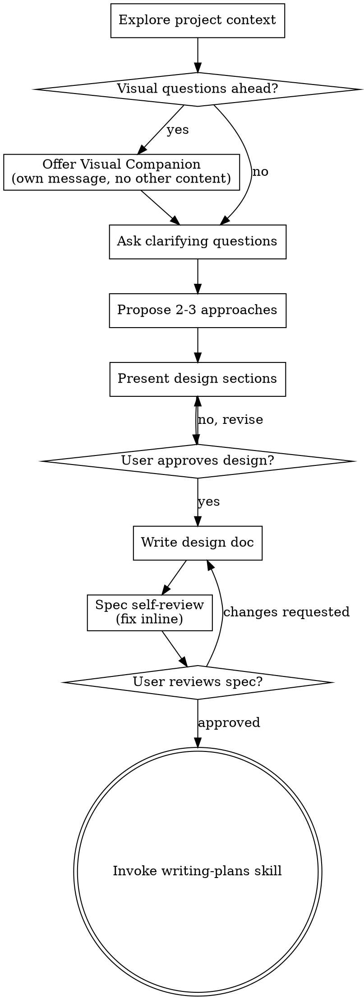

<!-- Generated by SpecStory, Markdown v2.1.0 -->

# 2026-04-21 03:45:54Z

<!-- Claude Code Session bc5323af-9282-4988-bbfe-73c842214a36 (2026-04-21 03:45:54Z) -->

_**User (2026-04-21 03:45:54Z)**_

/tmp/audit-rollout-prompts/batch-2-answer-game.md. Copy-paste to open the next session:                             
                                                                                                                      
  Continue the Storybook controls audit rollout. The pilot (PR #124)                                                
  retrofitted `src/components/ui/*` and proved the pattern. Now I want                                                
  to tackle Batch 2: `src/components/answer-game/*` (8 story files).                                                
                                                                                                                    
  Tracking issue: https://github.com/leocaseiro/base-skill/issues/125                                               
                                              
  [... full prompt in /tmp/audit-rollout-prompts/batch-2-answer-game.md]
                                              
  The prompt briefs a fresh session on: the tracking issue, which docs to read (corrected SKILL.md + pilot spec/plan),
   the 8-file scope, the waterfall (resync ��� worktree ��� brainstorm ��� plan ��� subagent-driven), and all carried-forward
  gotchas (fn() wiring, waitFor for animations, Radix portals, StoryArgs threading, import order).                    
                                                                                   
  Memory updated with project_storybook_audit_rollout.md so future sessions pick up the tracker automatically. 

---

_**Agent (claude-opus-4-7 2026-04-21 03:46:02Z)**_

_**Agent (claude-opus-4-7 2026-04-21 03:46:05Z)**_

Looks like you're picking up from a prior session that prepped Batch 2 of the Storybook controls audit (`src/components/answer-game/*`, 8 files) with a saved prompt at `/tmp/audit-rollout-prompts/batch-2-answer-game.md` and tracker issue #125.

Before I start, two quick checks per your standing prefs:

1. Want me to run `/resync` first to make sure this session is aligned with master and any open PRs?
2. Do you want me to kick off Batch 2 now (read the saved prompt → worktree → brainstorm → plan → execute), or are you just confirming the handoff is in place for a later session?

---

_**User (2026-04-21 03:47:23Z)**_

<command-message>resync</command-message>
<command-name>/resync</command-name>

_**User (2026-04-21 03:47:23Z)**_

# Resync

Invoke when you suspect the agent is working against stale state — e.g. it's reading files that look outdated, referencing code that's already been changed upstream, or you want to confirm the current branch is current with `origin/master` before continuing.

## Workflow

Run these steps in order. Be concise — one-line summaries per step.

### 1. Fetch and report branch state

Run in parallel:

```bash
git fetch origin --prune
git rev-parse --abbrev-ref HEAD
git status -sb
git log --oneline HEAD..origin/master
git log --oneline origin/master..HEAD
```

Report in this shape:

- **Branch**: `<current branch>` (or `(HEAD detached at …)`)
- **Behind origin/master by**: N commits
- **Ahead of origin/master by**: N commits
- **Working tree**: clean / M modified, U untracked

If behind > 0 and not on `master`, explicitly ask whether to rebase onto `origin/master`. Do **not** rebase without confirmation. If the working tree is dirty, recommend stashing or committing first.

If on `master`, warn — the project rule is no direct work on `master`; a worktree/branch should be in use.

### 2. List open PRs

```bash
gh pr list --state open --limit 30 --json number,title,headRefName,baseRefName,author,updatedAt,isDraft
```

Summarize in a compact table (number, title, author, branch → base, draft flag, last updated). Keep titles short.

### 3. Flag potentially impacting PRs

Given the conversation's current focus (files being edited, features under discussion), scan the PR list for overlap:

- PRs that touch the same files or directories
- PRs that modify shared infrastructure the current work depends on (reducers, game engine, skin system, config, CI)
- PRs the user has mentioned earlier in the session

For each flagged PR, write one sentence: _"PR #N `<title>` — may impact `<area>` because `<reason>`."_ If nothing obviously overlaps, say so explicitly rather than hedging.

### 4. Confirm before continuing

Ask the user to confirm one of:

- Proceed as-is (current state is fine).
- Rebase onto `origin/master` first.
- Pause this session and review a specific PR first.

Wait for the user's decision. Do not resume prior work until they respond.

## Notes

- Use `gh` for GitHub interactions; don't scrape URLs.
- Don't run `git rebase` or `git pull --rebase` without explicit confirmation — rebases can conflict with uncommitted changes or in-progress worktrees.
- If `gh` is unauthenticated, surface the error and stop at step 2 rather than guessing.
- Keep the whole report under ~25 lines. The user invokes this to re-ground quickly, not to read a novel.


---

_**Agent (claude-opus-4-7 2026-04-21 03:47:26Z)**_

_**Agent (claude-opus-4-7 2026-04-21 03:47:33Z)**_

<tool-use data-tool-type="shell" data-tool-name="Bash"><details>
<summary>Tool use: **Bash**</summary>
Fetch origin with prune

`git fetch origin --prune`

```text
From github.com:leocaseiro/base-skill
 - [deleted]           (none)          -> origin/fix/advanced-config-persists
 + 9b5a9353...502fe5aa audit/storybook-controls -> origin/audit/storybook-controls  (forced update)
   36f3c595..1200f38e  gh-pages        -> origin/gh-pages
   959d5c93..b281f310  master          -> origin/master
 * [new branch]        release/v0.10.3 -> origin/release/v0.10.3
 * [new branch]        release/v0.10.4 -> origin/release/v0.10.4
```
</details></tool-use>

_**Agent (claude-opus-4-7 2026-04-21 03:47:33Z)**_

<tool-use data-tool-type="shell" data-tool-name="Bash"><details>
<summary>Tool use: **Bash**</summary>
Show current branch

`git rev-parse --abbrev-ref HEAD`

```text
master
```
</details></tool-use>

_**Agent (claude-opus-4-7 2026-04-21 03:47:33Z)**_

<tool-use data-tool-type="shell" data-tool-name="Bash"><details>
<summary>Tool use: **Bash**</summary>
Show short branch status

`git status -sb`

```text
## master
 M .specstory/history/2026-04-16_12-26-54Z-your-goal-is-to.md
 M .specstory/statistics.json
?? .specstory/history/2026-04-21_01-39-29Z-since-i-started-the.md
?? .specstory/history/2026-04-21_03-45-52Z-tmp-audit-rollout-prompts.md
```
</details></tool-use>

_**Agent (claude-opus-4-7 2026-04-21 03:47:33Z)**_

<tool-use data-tool-type="shell" data-tool-name="Bash"><details>
<summary>Tool use: **Bash**</summary>
Commits behind origin/master

`git log --oneline HEAD..origin/master`

```text
b281f310 chore(release): v0.10.4 (#126)
5b5d5fcd stories(ui): audit retrofit per new controls policy (#124)
502fe5aa stories(ui): wire fn() spies for action handlers + correct SKILL.md
35b4196e stories(ui): wait for Radix + Sonner animation before asserting visibility
1e9dca09 stories(ui/sonner): retrofit per controls policy
aa262aa7 stories(ui/sheet): retrofit per controls policy
cf6fea40 stories(ui/select): retrofit per controls policy
9a05fa7b stories(ui/dropdown-menu): retrofit per controls policy
24da4bdb stories(ui/alert-dialog): retrofit per controls policy
5ab4ebd4 stories(ui/label): retrofit per controls policy
833ae7be stories(ui/card): retrofit per controls policy
732c76af stories(ui/slider): retrofit per controls policy
4009c075 stories(ui/input): retrofit per controls policy
d3959e79 stories(ui/button): retrofit per controls policy
48c23a68 docs(plan): implementation plan for audit pilot
ac610cf9 chore(settings): expand permission allowlist for common dev commands
29b2dbbe docs(spec): audit pilot for src/components/ui/* stories
```
</details></tool-use>

_**Agent (claude-opus-4-7 2026-04-21 03:47:33Z)**_

<tool-use data-tool-type="shell" data-tool-name="Bash"><details>
<summary>Tool use: **Bash**</summary>
Commits ahead of origin/master

`git log --oneline origin/master..HEAD`

```text
(Bash completed with no output)
```
</details></tool-use>

_**Agent (claude-opus-4-7 2026-04-21 03:47:34Z)**_

<tool-use data-tool-type="shell" data-tool-name="Bash"><details>
<summary>Tool use: **Bash**</summary>
List open PRs

`gh pr list --state open --limit 30 --json number,title,headRefName,baseRefName,author,updatedAt,isDraft`

```text
[{"author":{"id":"MDQ6VXNlcjk0MDA3MA==","is_bot":false,"login":"leocaseiro","name":"Leo Caseiro"},"baseRefName":"master","headRefName":"fix/bookmarks-dm4-old-users","isDraft":false,"number":127,"title":"fix(db): recover from broken DM4 migrations on boot","updatedAt":"2026-04-21T03:47:22Z"},{"author":{"id":"MDQ6VXNlcjk0MDA3MA==","is_bot":false,"login":"leocaseiro","name":"Leo Caseiro"},"baseRefName":"master","headRefName":"chore/specstory-sync-2026-04-17","isDraft":false,"number":121,"title":"chore: specstory history sync (2026-04-17)","updatedAt":"2026-04-17T07:39:03Z"}]
```
</details></tool-use>

_**Agent (claude-opus-4-7 2026-04-21 03:47:47Z)**_

### Resync report

- **Branch**: `master` ⚠️ (project rule: no direct work on master — create a worktree before any edits)
- **Behind origin/master by**: 17 commits (pilot PR #124 + release v0.10.4 landed since you last pulled)
- **Ahead of origin/master by**: 0
- **Working tree**: dirty — 2 modified + 2 untracked, all `.specstory/*` (session history noise, not hand-edited)

### Open PRs

| #   | Title                                              | Branch                            | Draft | Updated    |
| --- | -------------------------------------------------- | --------------------------------- | ----- | ---------- |
| 127 | fix(db): recover from broken DM4 migrations on boot | `fix/bookmarks-dm4-old-users`     | no    | 2026-04-21 |
| 121 | chore: specstory history sync (2026-04-17)         | `chore/specstory-sync-2026-04-17` | no    | 2026-04-17 |

### Impact on Batch 2 (`src/components/answer-game/*` stories)

- **PR #127** — bug fix in DB migration recovery, orthogonal to stories. **No impact.**
- **PR #121** — specstory history sync, unrelated. **No impact.**
- Pilot PR #124 already merged; its guidance (fn() spies, waitFor for Radix animations, corrected SKILL.md) is in master. Batch 2 inherits it cleanly.

**Nothing flagged as overlapping with answer-game stories.**

### Next step — please confirm one

1. Pull `origin/master` into local master, then create worktree `worktrees/storybook-audit-batch-2-answer-game` off fresh master and start Batch 2.
2. Pause — you want to review PR #127 or #121 first.
3. Something else.

(Won't touch the dirty `.specstory/*` files — those are session history churn. They'll stay on master untouched when I branch off.)

---

_**User (2026-04-21 03:48:07Z)**_

1

---

_**Agent (claude-opus-4-7 2026-04-21 03:48:22Z)**_

_**Agent (claude-opus-4-7 2026-04-21 03:48:23Z)**_

<tool-use data-tool-type="shell" data-tool-name="Bash"><details>
<summary>Tool use: **Bash**</summary>
Create worktree branched from origin/master

`git worktree add ./worktrees/storybook-audit-batch-2-answer-game -b audit/storybook-batch-2-answer-game origin/master`

```text
Preparing worktree (new branch 'audit/storybook-batch-2-answer-game')
branch 'audit/storybook-batch-2-answer-game' set up to track 'origin/master'.
HEAD is now at b281f310 chore(release): v0.10.4 (#126)
```
</details></tool-use>

_**Agent (claude-opus-4-7 2026-04-21 03:48:23Z)**_

<tool-use data-tool-type="read" data-tool-name="Read"><details>
<summary>Tool use: **Read**</summary>
 `/tmp/audit-rollout-prompts/batch-2-answer-game.md`

```text
1	Continue the Storybook controls audit rollout. The pilot (PR #124) retrofitted `src/components/ui/*` and proved the pattern. Now I want to tackle **Batch 2: `src/components/answer-game/*`** (8 story files).
2	
3	Tracking issue: https://github.com/leocaseiro/base-skill/issues/125
4	
5	Context you need to read first:
6	
7	- `.claude/skills/write-storybook/SKILL.md` — the corrected Controls Policy (fn() in args, NOT global argTypesRegex). Pay attention to the "Why fn() and not action string" callout and the react-docgen note.
8	- `docs/superpowers/specs/2026-04-17-audit-storybook-ui-controls-design.md` — pilot spec. Mirror its structure: per-file audit table is authoritative.
9	- `docs/superpowers/plans/2026-04-19-audit-storybook-ui-controls-plan.md` — pilot plan. Reuse the Shared Conventions block (storybook/test import, Radix portal gotcha, waitFor pattern for animation races, fn() wiring).
10	- PR #124 commits, especially `9b5a9353` (fn() wiring corrective) — the pattern for StoryArgs-wrapper components threading fn() handlers through render with `table: { disable: true }`.
11	
12	Scope — 8 files:
13	
14	- `AnswerGame/AnswerGame.stories.tsx`
15	- `EncouragementAnnouncer/EncouragementAnnouncer.stories.tsx`
16	- `GameOverOverlay/GameOverOverlay.stories.tsx`
17	- `InstructionsOverlay/InstructionsOverlay.stories.tsx`
18	- `LevelCompleteOverlay/LevelCompleteOverlay.stories.tsx`
19	- `ProgressHUD/ProgressHUD.stories.tsx`
20	- `ScoreAnimation/ScoreAnimation.stories.tsx`
21	- `Slot/Slot.stories.tsx`
22	
23	These components are more complex than `ui/*` — state-driven, many use `withDb`/`AnswerGameProvider` decorators, some have animation timers. Expect per-file complexity ~2-3× the pilot.
24	
25	Workflow (per CLAUDE.md and prior sessions):
26	
27	1. Run `/resync` first — catch any merged PRs since #124.
28	2. Create a fresh worktree: `git worktree add ./worktrees/audit-answer-game-stories -b audit/storybook-answer-game` + `yarn install`.
29	3. Use `superpowers:brainstorming` to produce a batch-2 spec. Reuse the pilot spec's pattern; focus the brainstorm on components with non-obvious argTypes (e.g., ProgressHUD's union types, Slot's drag/drop props) and whether `play()` is feasible given animation/timer complexity.
30	4. After spec approval → `superpowers:writing-plans` → `superpowers:subagent-driven-development` (Sonnet implementer, Haiku reviewers, two-stage review per file).
31	5. End-of-PR: typecheck, lint, lint:md, `yarn test:storybook --url http://127.0.0.1:$PORT` all green. Open PR against master. Update issue #125 checkboxes.
32	
33	Known gotchas carried from the pilot (don't re-discover):
34	
35	- `storybook/test` (subpath), NOT `@storybook/test`.
36	- Radix portals render into `document.body` — use `within(document.body)` or `findByRole` in play().
37	- Wrap `toBeVisible()` and `queryByRole(...).toBeNull()` in `waitFor()` to tolerate animation races.
38	- For StoryArgs-wrapper components, extend the StoryArgs interface with handler fields, thread through render, and hide from Controls with `argTypes: { onFoo: { table: { disable: true } } }`.
39	- ESLint `import/order` in this repo: value imports (alphabetical) → relative imports → `storybook/test` → `@storybook/react` type import last → `react` type import.
40	- `export default meta` is the ONE allowed default export (framework config exception).
41	
42	Confirm plan before touching code.
43
```
</details></tool-use>

_**Agent (claude-opus-4-7 2026-04-21 03:48:34Z)**_

_**Agent (claude-opus-4-7 2026-04-21 03:48:35Z)**_

Worktree created at `worktrees/storybook-audit-batch-2-answer-game` on branch `audit/storybook-batch-2-answer-game` (note: branch name encodes the batch number for rollout tracking; let me know if you'd rather rename it to match the prompt's suggested `audit/storybook-answer-game`).

Kicking off `yarn install` in the background, then invoking the brainstorming skill per the prompt's step 3.

_**Agent (claude-opus-4-7 2026-04-21 03:48:36Z)**_

<tool-use data-tool-type="shell" data-tool-name="Bash"><details>
<summary>Tool use: **Bash**</summary>
Install deps in new worktree

`cd /Users/leocaseiro/Sites/base-skill/worktrees/storybook-audit-batch-2-answer-game && yarn install`

```text
Command running in background with ID: b13h003hv. Output is being written to: /private/tmp/claude-501/-Users-leocaseiro-Sites-base-skill/bc5323af-9282-4988-bbfe-73c842214a36/tasks/b13h003hv.output
```
</details></tool-use>

_**Agent (claude-opus-4-7 2026-04-21 03:48:37Z)**_

<tool-use data-tool-type="generic" data-tool-name="Skill"><details>
<summary>Tool use: **Skill**</summary>

```text
Launching skill: superpowers:brainstorming
```
</details></tool-use>

---

_**User (2026-04-21 03:48:37Z)**_

Base directory for this skill: /Users/leocaseiro/.claude/plugins/cache/claude-plugins-official/superpowers/5.0.7/skills/brainstorming

# Brainstorming Ideas Into Designs

Help turn ideas into fully formed designs and specs through natural collaborative dialogue.

Start by understanding the current project context, then ask questions one at a time to refine the idea. Once you understand what you're building, present the design and get user approval.

<HARD-GATE>
Do NOT invoke any implementation skill, write any code, scaffold any project, or take any implementation action until you have presented a design and the user has approved it. This applies to EVERY project regardless of perceived simplicity.
</HARD-GATE>

## Anti-Pattern: "This Is Too Simple To Need A Design"

Every project goes through this process. A todo list, a single-function utility, a config change — all of them. "Simple" projects are where unexamined assumptions cause the most wasted work. The design can be short (a few sentences for truly simple projects), but you MUST present it and get approval.

## Checklist

You MUST create a task for each of these items and complete them in order:

1. **Explore project context** — check files, docs, recent commits
2. **Offer visual companion** (if topic will involve visual questions) — this is its own message, not combined with a clarifying question. See the Visual Companion section below.
3. **Ask clarifying questions** — one at a time, understand purpose/constraints/success criteria
4. **Propose 2-3 approaches** — with trade-offs and your recommendation
5. **Present design** — in sections scaled to their complexity, get user approval after each section
6. **Write design doc** — save to `docs/superpowers/specs/YYYY-MM-DD-<topic>-design.md` and commit
7. **Spec self-review** — quick inline check for placeholders, contradictions, ambiguity, scope (see below)
8. **User reviews written spec** — ask user to review the spec file before proceeding
9. **Transition to implementation** — invoke writing-plans skill to create implementation plan

## Process Flow



**The terminal state is invoking writing-plans.** Do NOT invoke frontend-design, mcp-builder, or any other implementation skill. The ONLY skill you invoke after brainstorming is writing-plans.

## The Process

**Understanding the idea:**

- Check out the current project state first (files, docs, recent commits)
- Before asking detailed questions, assess scope: if the request describes multiple independent subsystems (e.g., "build a platform with chat, file storage, billing, and analytics"), flag this immediately. Don't spend questions refining details of a project that needs to be decomposed first.
- If the project is too large for a single spec, help the user decompose into sub-projects: what are the independent pieces, how do they relate, what order should they be built? Then brainstorm the first sub-project through the normal design flow. Each sub-project gets its own spec → plan → implementation cycle.
- For appropriately-scoped projects, ask questions one at a time to refine the idea
- Prefer multiple choice questions when possible, but open-ended is fine too
- Only one question per message - if a topic needs more exploration, break it into multiple questions
- Focus on understanding: purpose, constraints, success criteria

**Exploring approaches:**

- Propose 2-3 different approaches with trade-offs
- Present options conversationally with your recommendation and reasoning
- Lead with your recommended option and explain why

**Presenting the design:**

- Once you believe you understand what you're building, present the design
- Scale each section to its complexity: a few sentences if straightforward, up to 200-300 words if nuanced
- Ask after each section whether it looks right so far
- Cover: architecture, components, data flow, error handling, testing
- Be ready to go back and clarify if something doesn't make sense

**Design for isolation and clarity:**

- Break the system into smaller units that each have one clear purpose, communicate through well-defined interfaces, and can be understood and tested independently
- For each unit, you should be able to answer: what does it do, how do you use it, and what does it depend on?
- Can someone understand what a unit does without reading its internals? Can you change the internals without breaking consumers? If not, the boundaries need work.
- Smaller, well-bounded units are also easier for you to work with - you reason better about code you can hold in context at once, and your edits are more reliable when files are focused. When a file grows large, that's often a signal that it's doing too much.

**Working in existing codebases:**

- Explore the current structure before proposing changes. Follow existing patterns.
- Where existing code has problems that affect the work (e.g., a file that's grown too large, unclear boundaries, tangled responsibilities), include targeted improvements as part of the design - the way a good developer improves code they're working in.
- Don't propose unrelated refactoring. Stay focused on what serves the current goal.

## After the Design

**Documentation:**

- Write the validated design (spec) to `docs/superpowers/specs/YYYY-MM-DD-<topic>-design.md`
  - (User preferences for spec location override this default)
- Use elements-of-style:writing-clearly-and-concisely skill if available
- Commit the design document to git

**Spec Self-Review:**
After writing the spec document, look at it with fresh eyes:

1. **Placeholder scan:** Any "TBD", "TODO", incomplete sections, or vague requirements? Fix them.
2. **Internal consistency:** Do any sections contradict each other? Does the architecture match the feature descriptions?
3. **Scope check:** Is this focused enough for a single implementation plan, or does it need decomposition?
4. **Ambiguity check:** Could any requirement be interpreted two different ways? If so, pick one and make it explicit.

Fix any issues inline. No need to re-review — just fix and move on.

**User Review Gate:**
After the spec review loop passes, ask the user to review the written spec before proceeding:

> "Spec written and committed to `<path>`. Please review it and let me know if you want to make any changes before we start writing out the implementation plan."

Wait for the user's response. If they request changes, make them and re-run the spec review loop. Only proceed once the user approves.

**Implementation:**

- Invoke the writing-plans skill to create a detailed implementation plan
- Do NOT invoke any other skill. writing-plans is the next step.

## Key Principles

- **One question at a time** - Don't overwhelm with multiple questions
- **Multiple choice preferred** - Easier to answer than open-ended when possible
- **YAGNI ruthlessly** - Remove unnecessary features from all designs
- **Explore alternatives** - Always propose 2-3 approaches before settling
- **Incremental validation** - Present design, get approval before moving on
- **Be flexible** - Go back and clarify when something doesn't make sense

## Visual Companion

A browser-based companion for showing mockups, diagrams, and visual options during brainstorming. Available as a tool — not a mode. Accepting the companion means it's available for questions that benefit from visual treatment; it does NOT mean every question goes through the browser.

**Offering the companion:** When you anticipate that upcoming questions will involve visual content (mockups, layouts, diagrams), offer it once for consent:
> "Some of what we're working on might be easier to explain if I can show it to you in a web browser. I can put together mockups, diagrams, comparisons, and other visuals as we go. This feature is still new and can be token-intensive. Want to try it? (Requires opening a local URL)"

**This offer MUST be its own message.** Do not combine it with clarifying questions, context summaries, or any other content. The message should contain ONLY the offer above and nothing else. Wait for the user's response before continuing. If they decline, proceed with text-only brainstorming.

**Per-question decision:** Even after the user accepts, decide FOR EACH QUESTION whether to use the browser or the terminal. The test: **would the user understand this better by seeing it than reading it?**

- **Use the browser** for content that IS visual — mockups, wireframes, layout comparisons, architecture diagrams, side-by-side visual designs
- **Use the terminal** for content that is text — requirements questions, conceptual choices, tradeoff lists, A/B/C/D text options, scope decisions

A question about a UI topic is not automatically a visual question. "What does personality mean in this context?" is a conceptual question — use the terminal. "Which wizard layout works better?" is a visual question — use the browser.

If they agree to the companion, read the detailed guide before proceeding:
`skills/brainstorming/visual-companion.md`


---

_**Agent (claude-opus-4-7 2026-04-21 03:48:45Z)**_

_**Agent (claude-opus-4-7 2026-04-21 03:48:45Z)**_

<tool-use data-tool-type="unknown" data-tool-name="ToolSearch"><details>
<summary>Tool use: **ToolSearch**</summary>

**Input:**

- max_results: `3`
- query: `select:TaskCreate,TaskUpdate,TaskList`

**Result:**

```

```
</details></tool-use>

_**Agent (claude-opus-4-7 2026-04-21 03:48:48Z)**_

_**Agent (claude-opus-4-7 2026-04-21 03:48:50Z)**_

<tool-use data-tool-type="unknown" data-tool-name="TaskCreate"><details>
<summary>Tool use: **TaskCreate**</summary>
Read SKILL.md, pilot spec, pilot plan, and sample the 8 answer-game story files and their components to understand scope.

```text
Task #1 created successfully: Explore project context for Batch 2
```
</details></tool-use>

_**Agent (claude-opus-4-7 2026-04-21 03:48:52Z)**_

<tool-use data-tool-type="unknown" data-tool-name="TaskCreate"><details>
<summary>Tool use: **TaskCreate**</summary>
One-at-a-time questions covering ProgressHUD unions, Slot drag/drop props, timer/animation interactions, and whether play() should be attempted per-story.

```text
Task #2 created successfully: Ask clarifying questions about non-obvious argTypes and play() feasibility
```
</details></tool-use>

_**Agent (claude-opus-4-7 2026-04-21 03:48:54Z)**_

<tool-use data-tool-type="unknown" data-tool-name="TaskCreate"><details>
<summary>Tool use: **TaskCreate**</summary>
Likely: (a) mirror pilot spec exactly, per-file audit table; (b) stratify by complexity (simple vs state-driven); (c) something else. Recommend one with tradeoffs.

```text
Task #3 created successfully: Propose 2-3 approaches for batch structure
```
</details></tool-use>

_**Agent (claude-opus-4-7 2026-04-21 03:48:56Z)**_

<tool-use data-tool-type="unknown" data-tool-name="TaskCreate"><details>
<summary>Tool use: **TaskCreate**</summary>
Architecture, per-file audit structure, play() policy, verification gate. Section-by-section.

```text
Task #4 created successfully: Present design sections with incremental approval
```
</details></tool-use>

_**Agent (claude-opus-4-7 2026-04-21 03:48:58Z)**_

<tool-use data-tool-type="unknown" data-tool-name="TaskCreate"><details>
<summary>Tool use: **TaskCreate**</summary>
Save to docs/superpowers/specs/2026-04-21-audit-storybook-answer-game-design.md in the worktree, commit, then self-review for placeholders/consistency/scope/ambiguity.

```text
Task #5 created successfully: Write design doc and self-review
```
</details></tool-use>

_**Agent (claude-opus-4-7 2026-04-21 03:48:59Z)**_

<tool-use data-tool-type="unknown" data-tool-name="TaskCreate"><details>
<summary>Tool use: **TaskCreate**</summary>
Wait for user approval on committed spec, then invoke superpowers:writing-plans.

```text
Task #6 created successfully: User review of spec, then invoke writing-plans
```
</details></tool-use>

_**Agent (claude-opus-4-7 2026-04-21 03:49:03Z)**_

_**Agent (claude-opus-4-7 2026-04-21 03:49:04Z)**_

`yarn install` completed. Starting Task 1 — exploring the pilot docs and the 8 target stories.

_**Agent (claude-opus-4-7 2026-04-21 03:49:05Z)**_

<tool-use data-tool-type="unknown" data-tool-name="TaskUpdate"><details>
<summary>Tool use: **TaskUpdate**</summary>

```text
Updated task #1 status
```
</details></tool-use>

_**Agent (claude-opus-4-7 2026-04-21 03:49:06Z)**_

<tool-use data-tool-type="read" data-tool-name="Read"><details>
<summary>Tool use: **Read**</summary>
 `./worktrees/storybook-audit-batch-2-answer-game/.claude/skills/write-storybook/SKILL.md`

```text
1	---
2	name: write-storybook
3	description: Use when adding or writing Storybook stories for React components in this project — covers file structure, meta config, named exports, decorators, and required variants
4	---
5	
6	# Write Storybook
7	
8	## Overview
9	
10	Stories live co-located with their component (`ComponentName.stories.tsx`). Each story file exports a `default` meta object and named `Story` exports for each variant. This project uses `@storybook/react` with TanStack Router and `next-themes`.
11	
12	## Rules
13	
14	- **Always use `export default meta`** for the meta object (framework config file — the one exception to the named-export rule)
15	- **All story variants use named exports**: `export const Default: Story = {}`
16	- Every story file **must include a `Default` story**
17	- Use `tags: ['autodocs']` in meta unless there's a reason not to
18	- Do NOT import `React` — JSX transform handles it
19	
20	## File Structure
21	
22	```
23	src/components/MyComponent.stories.tsx
24	```
25	
26	## Minimal Template
27	
28	```tsx
29	import { MyComponent } from './MyComponent';
30	import type { Meta, StoryObj } from '@storybook/react';
31	
32	const meta: Meta<typeof MyComponent> = {
33	  component: MyComponent,
34	  tags: ['autodocs'],
35	  args: {
36	    // shared default props
37	  },
38	  argTypes: {
39	    // Add a control for every non-callback, non-JSX prop. See "Controls Policy" below.
40	  },
41	};
42	export default meta;
43	
44	type Story = StoryObj<typeof MyComponent>;
45	
46	export const Default: Story = {};
47	
48	export const SomeVariant: Story = {
49	  args: { propName: value },
50	};
51	```
52	
53	## Decorators
54	
55	Use decorators when the component depends on context providers:
56	
57	| Needs                                                   | Decorator                                                  |
58	| ------------------------------------------------------- | ---------------------------------------------------------- |
59	| TanStack Router (`useNavigate`, `Link`, params)         | `withRouter` from `../../.storybook/decorators/withRouter` |
60	| Database / RxDB (`useSettings`, `useRxDB`, any DB hook) | `withDb` from `../../.storybook/decorators/withDb`         |
61	| Theme toggle                                            | `withTheme` — already applied globally via `preview.tsx`   |
62	| ThemeProvider                                           | Already applied globally — do NOT add again                |
63	
64	When both are needed, put `withDb` first (outermost), then `withRouter`:
65	
66	```tsx
67	import { withDb } from '../../.storybook/decorators/withDb';
68	import { withRouter } from '../../.storybook/decorators/withRouter';
69	
70	const meta: Meta<typeof MyComponent> = {
71	  component: MyComponent,
72	  tags: ['autodocs'],
73	  decorators: [withDb, withRouter],
74	};
75	```
76	
77	When a story wraps in `AnswerGameProvider`, `withDb` must come **before** the provider wrapper:
78	
79	```tsx
80	decorators: [
81	  withDb,
82	  (Story) => (
83	    <AnswerGameProvider config={storyConfig}>
84	      <Story />
85	    </AnswerGameProvider>
86	  ),
87	],
88	```
89	
90	## Controls Policy
91	
92	Every prop that isn't a callback, JSX node, or complex object MUST have an explicit `argTypes` entry with a proper interactive control. **Raw JSON object inputs in the Controls panel are not acceptable** — they make stories useless as a playground for designers and QA.
93	
94	### Mapping
95	
96	| Prop type                    | Control                                                                                         |
97	| ---------------------------- | ----------------------------------------------------------------------------------------------- |
98	| String union / enum          | `control: { type: 'select' }` with `options: [...]` (or `'radio'` for ≤4 options)               |
99	| Boolean                      | `control: 'boolean'`                                                                            |
100	| Bounded number               | `control: { type: 'range', min, max, step }`                                                    |
101	| Free-text                    | `control: 'text'`                                                                               |
102	| Color                        | `control: 'color'`                                                                              |
103	| Multi-select array of unions | `control: 'multi-select'` with `options`                                                        |
104	| Callback (`onFoo`)           | `args: { onFoo: fn() }` from `storybook/test` (spy shows in Actions panel + usable in `play()`) |
105	| JSX / ReactNode              | `control: false`                                                                                |
106	
107	### Example
108	
109	```tsx
110	const meta: Meta<typeof MyButton> = {
111	  component: MyButton,
112	  tags: ['autodocs'],
113	  argTypes: {
114	    variant: {
115	      control: { type: 'select' },
116	      options: ['primary', 'secondary', 'ghost'],
117	    },
118	    size: {
119	      control: { type: 'radio' },
120	      options: ['sm', 'md', 'lg'],
121	    },
122	    disabled: { control: 'boolean' },
123	    rounds: {
124	      control: { type: 'range', min: 1, max: 20, step: 1 },
125	    },
126	    icon: { control: false }, // ReactNode
127	  },
128	  args: {
129	    onClick: fn(), // from 'storybook/test' — spy shows in Actions panel + usable in play()
130	  },
131	};
132	```
133	
134	> **Why `fn()` and not `argTypes: { onClick: { action: 'clicked' } }`?** Both log to the Actions panel, but `fn()` doubles as a spy you can assert on from `play()` (`await expect(args.onClick).toHaveBeenCalled()`). Prefer `fn()` for consistency.
135	>
136	> **Note:** `.storybook/preview.tsx` sets `actions.argTypesRegex: '^on[A-Z].*'` globally, but it only wires props already in `argTypes`. Since this repo uses the default react-docgen (which does not expand `React.ComponentProps<'button'>` and similar DOM-extended types), most handler props never appear in inferred `argTypes` — so the regex matches nothing for them. Always wire `fn()` explicitly.
137	
138	## Complex Object Props
139	
140	When a component takes a config-shaped object (e.g., a game `config` with mode + difficulty + counts), do NOT expose the whole object as a single JSON control. Break each meaningful field into a top-level arg and assemble the object in a custom `render` function.
141	
142	```tsx
143	import { type ComponentType } from 'react';
144	import type { Meta, StoryObj } from '@storybook/react';
145	import { GameConfigForm } from './GameConfigForm';
146	
147	type GameMode = 'easy' | 'hard';
148	
149	interface GameConfig {
150	  mode: GameMode;
151	  rounds: number;
152	}
153	
154	interface GameConfigFormProps {
155	  config: GameConfig;
156	  onSubmit: (config: GameConfig) => void;
157	}
158	
159	interface StoryArgs {
160	  mode: GameMode;
161	  rounds: number;
162	  onSubmit: (config: GameConfig) => void;
163	}
164	
165	// Double cast required: StoryArgs is a flat subset of GameConfigFormProps,
166	// so TypeScript requires `as unknown as ComponentType<StoryArgs>` to bridge
167	// the incompatible shapes. This is safe because the render function fully
168	// controls how StoryArgs maps to props — component is only used for autodocs.
169	const meta: Meta<StoryArgs> = {
170	  component: GameConfigForm as unknown as ComponentType<StoryArgs>,
171	  args: {
172	    mode: 'easy',
173	    rounds: 5,
174	  },
175	  argTypes: {
176	    mode: {
177	      control: { type: 'select' },
178	      options: ['easy', 'hard'] satisfies GameMode[],
179	    },
180	    rounds: {
181	      control: { type: 'range', min: 1, max: 20, step: 1 },
182	    },
183	  },
184	  render: ({ mode, rounds, onSubmit }) => (
185	    <GameConfigForm config={{ mode, rounds }} onSubmit={onSubmit} />
186	  ),
187	};
188	```
189	
190	The Controls panel now shows individual `mode` and `rounds` inputs, and the rendered story reflects them. Reuse this pattern for any nested object — never let a JSON blob appear in Controls.
191	
192	## Required Variants
193	
194	Every story file MUST cover the following, treating each as a gate. If you decide to skip one, comment why in the story file.
195	
196	- **`Default`** — happy path, all required props supplied.
197	- **One story per enum value** of any string-union prop, _if_ the visual differs by value. Identical pixels across values? Skip and document.
198	- **State variants** — one story per distinct visible state the component can render: `Loading`, `Error`, `Empty`, `Disabled`, `Submitted`, `ReadOnly`, etc.
199	- **Edge cases** — at least one for components that take user-controllable text or list props: `LongText`, `ManyItems`, `OneItem`, `MaxLength`. These catch overflow, truncation, and layout regressions.
200	- **Interaction** — at least one `play()` story exercising the primary user flow (see "Rich Interaction with `play()`" below). Pure-display components (icons, labels) are exempt.
201	
202	Story names use PascalCase and describe the _state_, not the prop combination: prefer `LoadingWithItems` over `LoadingTrueAndItemsArray`.
203	
204	## Rich Interaction with `play()`
205	
206	Every interactive component (forms, dialogs, anything with click or keyboard handlers) MUST have at least one `play()` story exercising the primary flow. Pure-display components are exempt.
207	
208	Import helpers from `storybook/test`:
209	
210	```tsx
211	import { userEvent, within, expect } from 'storybook/test';
212	```
213	
214	### Patterns
215	
216	**Form submit happy path:**
217	
218	```tsx
219	export const SubmitsValidName: Story = {
220	  args: { mode: 'create' },
221	  play: async ({ canvasElement }) => {
222	    const canvas = within(canvasElement);
223	    await userEvent.type(canvas.getByLabelText('Name'), 'My Game');
224	    await userEvent.click(
225	      canvas.getByRole('button', { name: /save/i }),
226	    );
227	    await expect(canvas.getByText(/saved/i)).toBeVisible();
228	  },
229	};
230	```
231	
232	**Form validation:**
233	
234	```tsx
235	export const ShowsErrorOnEmptyName: Story = {
236	  args: { mode: 'create' },
237	  play: async ({ canvasElement }) => {
238	    const canvas = within(canvasElement);
239	    await userEvent.click(
240	      canvas.getByRole('button', { name: /save/i }),
241	    );
242	    await expect(canvas.getByText(/name is required/i)).toBeVisible();
243	    await expect(canvas.getByLabelText('Name')).toHaveFocus();
244	  },
245	};
246	```
247	
248	**Disabled-state assertion:**
249	
250	```tsx
251	export const SubmitDisabledWhenInvalid: Story = {
252	  args: { mode: 'create' },
253	  play: async ({ canvasElement }) => {
254	    const canvas = within(canvasElement);
255	    await expect(
256	      canvas.getByRole('button', { name: /save/i }),
257	    ).toBeDisabled();
258	  },
259	};
260	```
261	
262	**Keyboard-only flow:**
263	
264	```tsx
265	export const ClosesOnEscape: Story = {
266	  play: async ({ canvasElement }) => {
267	    const canvas = within(canvasElement);
268	    await userEvent.keyboard('{Escape}');
269	    await expect(canvas.queryByRole('dialog')).toBeNull();
270	  },
271	};
272	```
273	
274	### Naming Convention
275	
276	Name interaction stories after the flow, not the input: `SubmitsValidForm`, `ShowsErrorOnEmptyName`, `ClosesOnEscape`. Keep them small and single-purpose — one assertion path per story makes failures self-explanatory.
277	
278	## A11y Is Enforced
279	
280	`.storybook/preview.tsx` sets `parameters.a11y.test: 'error'` globally. Every story is axe-checked, and any violation (including color-contrast) **fails `yarn test:storybook` and CI**. You cannot opt out for a new story.
281	
282	To tune a story that legitimately needs a violation (e.g., demonstrating fallback rendering of broken markup), override at the story level — sparingly, with a comment explaining why:
283	
284	```tsx
285	export const LegacyMarkup: Story = {
286	  args: {
287	    /* ... */
288	  },
289	  // Demonstrates the deprecated <table> layout we still support for
290	  // in-flight content; axe correctly flags the missing <th>.
291	  parameters: { a11y: { test: 'todo' } },
292	};
293	```
294	
295	The default behavior is the right one — fix the violation in the component or in the story args before reaching for `test: 'todo'`.
296	
297	## Themes per Story
298	
299	Five themes are registered as global toolbar items in `.storybook/preview.tsx`: `light` (default), `dark`, `forest-light`, `forest-dark`, `high-contrast`. The toolbar lets users switch interactively.
300	
301	Pin a story to a specific theme when a variant is meaningfully different in that theme (e.g., a high-contrast-only edge case):
302	
303	```tsx
304	export const HighContrast: Story = {
305	  globals: { theme: 'high-contrast' },
306	};
307	```
308	
309	Don't add a `Dark` story for every component — the toolbar already covers that. Add per-story theme pins only when the variant exercises something theme-specific.
310	
311	## Viewport per Story
312	
313	Five viewports are registered globally in `.storybook/preview.tsx`:
314	
315	| Name              | Size                 |
316	| ----------------- | -------------------- |
317	| `mobileSm`        | 360×640              |
318	| `mobileLg`        | 390×844              |
319	| `tabletPortrait`  | 768×1024             |
320	| `tabletLandscape` | 1024×768 _(default)_ |
321	| `desktop`         | 1280×800             |
322	
323	Pin a story when a layout meaningfully differs at a breakpoint:
324	
325	```tsx
326	export const Mobile: Story = {
327	  parameters: { viewport: { defaultViewport: 'mobileSm' } },
328	};
329	```
330	
331	The toolbar lets users switch interactively, so add per-story viewport pins only when the variant is breakpoint-specific.
332	
333	## Mocking & Fixtures
334	
335	### Fixtures
336	
337	Don't inline large data blobs (word lists, configs, sample sentences) in stories. Move them to a co-located file and import:
338	
339	```tsx
340	// MyComponent.fixtures.ts
341	export const longWordList = ['antidisestablishmentarianism' /* ... */];
342	
343	// MyComponent.stories.tsx
344	import { longWordList } from './MyComponent.fixtures';
345	
346	export const ManyItems: Story = {
347	  args: { items: longWordList },
348	};
349	```
350	
351	There is no top-level `src/test/fixtures/` directory in the project; co-locate by default. If a fixture is reused across components, lift it to a sibling shared file when the second consumer appears, not before.
352	
353	### Randomness in `play()`
354	
355	For reproducible interaction tests, stub `Math.random` inside `play()`:
356	
357	```tsx
358	export const PicksTheFirstOption: Story = {
359	  play: async ({ canvasElement }) => {
360	    globalThis.Math.random = () => 0.42;
361	    // ... drive the interaction
362	  },
363	};
364	```
365	
366	This mirrors the pattern in `e2e/visual.spec.ts` and `e2e/seed-math-random.ts`.
367	
368	### Timers
369	
370	Use `vi.useFakeTimers()` from Vitest if a story needs to advance time (the Storybook test-runner shares the Vitest runtime).
371	
372	### Network
373	
374	There is no MSW addon installed. If a story needs network mocking, install `msw-storybook-addon` first and document the addition; until then, prefer prop-injecting the data the component would have fetched.
375	
376	## Visual Regression Boundary
377	
378	**Stories are NOT a VR mechanism in this project.** Visual regression is hand-curated Playwright tests in `e2e/visual.spec.ts` that drive the live app routes through Docker (`yarn test:vr`). Adding a new story does not add a VR snapshot.
379	
380	What this means for authors:
381	
382	- Do **not** add `parameters: { chromatic: ... }` to stories — chromatic is not configured.
383	- If a new component or visual state needs regression coverage, add a `test('@visual …', …)` block in `e2e/visual.spec.ts` that loads the relevant route (`/en/game/...`, etc.) and calls `expect(page).toHaveScreenshot(...)`.
384	- Storybook covers development, manual review, a11y, and `play()` interaction tests. VR covers pixel guards on user-facing routes. The two layers don't overlap.
385	
386	Mounting components directly in Playwright (component testing) is not currently set up; if a future story needs an isolated VR shot, add Playwright Component Testing to the project first.
387	
388	## Running Storybook Tests
389	
390	Multiple agents may be running Storybook simultaneously (e.g. parallel worktrees). **Never assume an existing Storybook instance is yours.** Always start a fresh one.
391	
392	### Workflow
393	
394	```bash
395	# 1. Find a free port (start at 6006, scan upward)
396	PORT=6006
397	while lsof -i :$PORT > /dev/null 2>&1; do PORT=$((PORT + 1)); done
398	
399	# 2. Start Storybook on that port
400	yarn storybook --port $PORT --ci &
401	STORYBOOK_PID=$!
402	
403	# 3. Wait until it responds
404	until curl -s http://127.0.0.1:$PORT > /dev/null 2>&1; do sleep 2; done
405	
406	# 4. Run tests against that port
407	yarn test:storybook --url http://127.0.0.1:$PORT
408	TEST_EXIT=$?
409	
410	# 5. Kill only on success — leave running on failure so you can debug
411	if [ $TEST_EXIT -eq 0 ]; then
412	  kill $STORYBOOK_PID
413	fi
414	
415	exit $TEST_EXIT
416	```
417	
418	### Rules
419	
420	- **Always start your own instance** — never use a Storybook you didn't start
421	- **Always pass `--url`** when running `yarn test:storybook` so it targets your port
422	- **Kill on green, leave on red** — a running Storybook lets you inspect failures in the browser
423	- **Never use `SKIP_STORYBOOK=1` to work around a port conflict** — that skips the tests entirely; find a free port instead
424	
425	## Audit / Upgrade Checklist
426	
427	When you edit an existing story file for any reason, run this checklist before opening the PR. Each item is a yes/no gate — if any answer is "no," either fix or justify in the PR description.
428	
429	- [ ] All non-callback, non-JSX props have proper `argTypes` controls (no raw JSON for enums/booleans/numbers/colors)
430	- [ ] Every `onFoo` handler wired to a `fn()` spy in `args` (shows in Actions panel + usable in `play()`) — do NOT rely on the global `argTypesRegex` alone; it only covers props already in `argTypes`, which react-docgen doesn't produce for DOM-extended props
431	- [ ] Required variants are present (Default, enum-per-value where the visual differs, state variants, edge cases — see "Required Variants")
432	- [ ] At least one `play()` interaction story if the component is interactive
433	- [ ] Decorators match current component dependencies (e.g., if the component started using `useSettings`, `withDb` is now required)
434	- [ ] No `parameters.chromatic` (we don't use it)
435	- [ ] Story file passes `yarn test:storybook --url <port>` locally
436	
437	If you're touching the file, leave it better than you found it.
438	
439	## Common Mistakes
440	
441	| Mistake                                               | Fix                                                                                                                                                                              |
442	| ----------------------------------------------------- | -------------------------------------------------------------------------------------------------------------------------------------------------------------------------------- |
443	| `import React from 'react'` at top                    | Remove — not needed                                                                                                                                                              |
444	| Named export for meta (`export const meta`)           | Use `export default meta`                                                                                                                                                        |
445	| Default export for stories (`export default Default`) | Use `export const Default: Story = {}`                                                                                                                                           |
446	| Missing `Default` story                               | Always add one                                                                                                                                                                   |
447	| Forgetting `withRouter` for routing components        | Check if component calls `useNavigate`, `Link`, or reads route params                                                                                                            |
448	| Forgetting `withDb` for DB/settings hooks             | Check if component (or any provider it uses) calls `useRxDB`, `useSettings`, or any DB hook — includes `AnswerGameProvider` which calls `useGameTTS` → `useSettings` → `useRxDB` |
449	| Adding `ThemeProvider` decorator                      | Already global — skip                                                                                                                                                            |
450	| `SKIP_STORYBOOK=1` because port 6006 is in use        | Find a free port and start your own instance — never skip to avoid a conflict                                                                                                    |
451	| Running `yarn test:storybook` without `--url`         | Without `--url` it defaults to 6006 and may hit the wrong agent's Storybook                                                                                                      |
452	| Raw JSON control for an enum/union prop               | Add `argTypes` with `select`/`radio` and explicit `options`                                                                                                                      |
453	| Whole-config JSON blob as a single control            | Break into individual args + custom `render` (see "Complex Object Props")                                                                                                        |
454	| Relying on global `argTypesRegex` for Actions panel   | Doesn't work for DOM-extended props under react-docgen — wire `args: { onFoo: fn() }` from `storybook/test` explicitly                                                           |
455	| Adding `parameters.chromatic`                         | Remove — VR is in `e2e/visual.spec.ts`, not Storybook                                                                                                                            |
456	| Trying to opt out of a11y on a new story              | Don't — it's enforced. Fix the violation, or use `test: 'todo'` only with documented justification                                                                               |
457	| Inlining `Math.random()` results in story args        | Pin via `globalThis.Math.random = () => N` inside `play()` for reproducibility                                                                                                   |
458
```
</details></tool-use>

_**Agent (claude-opus-4-7 2026-04-21 03:49:06Z)**_

<tool-use data-tool-type="read" data-tool-name="Read"><details>
<summary>Tool use: **Read**</summary>
 `./worktrees/storybook-audit-batch-2-answer-game/docs/superpowers/specs/2026-04-17-audit-storybook-ui-controls-design.md`

```text
1	# Audit pilot — retrofit `src/components/ui/*` stories to the new Controls Policy
2	
3	## Goal
4	
5	Bring the 10 `src/components/ui/*.stories.tsx` files into compliance with the
6	Controls Policy and Required Variants gates added to
7	`.claude/skills/write-storybook/SKILL.md` (PR #119). This is a pilot — small,
8	contained, easy to review — meant to prove the skill end-to-end on a realistic
9	set before scaling the audit to the remaining 34 story files.
10	
11	## Background
12	
13	PR #119 updated the `write-storybook` skill to require:
14	
15	- Proper `argTypes` controls (`select` / `radio` / `boolean` / `range`) for any
16	  enum / union / boolean / number prop — no raw JSON fallbacks.
17	- Removal of per-story `{ action: 'xxx' }` wiring on `on[A-Z]*` handlers,
18	  since `.storybook/preview.tsx` sets `actions.argTypesRegex: '^on[A-Z].*'`
19	  globally (every matching prop is auto-wired to the Actions panel).
20	- At least one `play()` interaction story on every interactive component.
21	- Presence of the `Required Variants` gates (Default, enum-per-value where
22	  visuals differ, state variants, edge cases).
23	
24	A fast survey of the existing 44 stories showed:
25	
26	- 36 files have no `argTypes` at all — they rely on Storybook's auto-inference,
27	  which renders raw text inputs for union types.
28	- 9 files manually wire `{ action: '...' }` on handler props.
29	- Many interactive components lack a `play()` interaction story.
30	
31	The audit is large enough that we split it into stages; this spec covers stage
32	one: `src/components/ui/*`.
33	
34	## In scope
35	
36	Ten story files:
37	
38	```text
39	src/components/ui/alert-dialog.stories.tsx
40	src/components/ui/button.stories.tsx
41	src/components/ui/card.stories.tsx
42	src/components/ui/dropdown-menu.stories.tsx
43	src/components/ui/input.stories.tsx
44	src/components/ui/label.stories.tsx
45	src/components/ui/select.stories.tsx
46	src/components/ui/sheet.stories.tsx
47	src/components/ui/slider.stories.tsx
48	src/components/ui/sonner.stories.tsx
49	```
50	
51	Each file is audited against the seven gates in the `Audit / Upgrade Checklist`
52	section of `.claude/skills/write-storybook/SKILL.md`. Per-file work is
53	summarised in the _Per-file Audit_ section below.
54	
55	## Out of scope
56	
57	- **Design-token contrast fix.** `button.stories.tsx` and `input.stories.tsx`
58	  currently opt out of the `color-contrast` axe rule via
59	  `parameters.a11y.config.rules` because `text-secondary-foreground` on
60	  `bg-secondary` (Secondary button variant) and `muted-foreground` helper text
61	  on `bg-background` (Invalid input variant) both score 4.34:1 — just below
62	  4.5:1. The opt-outs carry `TODO` comments explaining the problem. This audit
63	  leaves them unchanged. A separate token-fix PR will raise the contrast to
64	  WCAG AA across all five themes and remove the opt-outs; that PR also needs
65	  VR baseline regeneration.
66	
67	- **The other 34 story files.** `answer-game/*`, `questions/*`, `games/*`,
68	  plus the component-root stories (`GameCard`, `GameGrid`, `Footer`, etc.).
69	  Follow-up PRs after this pilot lands and the pattern is proven.
70	
71	- **Fixture extraction, theme pins, viewport pins.** Touch a story with one of
72	  these only if the file obviously calls for it while we're in there (e.g., a
73	  test fixture that's clearly too large to inline). Don't retrofit speculatively.
74	
75	## Non-goals
76	
77	- No new components. No refactors to the underlying `ui/*` components
78	  themselves. The audit is story-only.
79	- No changes to `.storybook/preview.tsx` or global config.
80	- No changes to the SKILL.md — if a gap is discovered mid-audit, the fix goes
81	  into a separate skill-update PR so the audit doesn't widen.
82	
83	## Per-file Audit
84	
85	Per-file summary of planned work. Columns correspond to the SKILL.md checklist
86	gates. A dash (`—`) means the file already passes that gate (or the gate is
87	N/A for a pure-display component).
88	
89	| #   | File            | Controls retrofit                                              | Action cleanup                          | `play()`                                | State variants added      |
90	| --- | --------------- | -------------------------------------------------------------- | --------------------------------------- | --------------------------------------- | ------------------------- |
91	| 1   | `button`        | `variant` select, `size` select, `disabled` boolean            | remove `onClick: { action: 'clicked' }` | `ClicksButton`                          | —                         |
92	| 2   | `input`         | `type` select, `disabled` boolean, `aria-invalid` boolean      | —                                       | `TypesAndReflectsValue`                 | `Required`, `ReadOnly`    |
93	| 3   | `slider`        | `min` / `max` / `step` range, `disabled` boolean               | —                                       | `KeyboardIncrement` (ArrowRight)        | `Disabled`                |
94	| 4   | `card`          | text args for title / description                              | —                                       | — (pure display)                        | —                         |
95	| 5   | `label`         | `htmlFor`, `children` text                                     | —                                       | — (pure display)                        | —                         |
96	| 6   | `alert-dialog`  | text args for trigger / title / description / confirm / cancel | —                                       | `OpensAndConfirms`, `CancelsWithEscape` | `Cancelled`               |
97	| 7   | `dropdown-menu` | text args for trigger + items                                  | —                                       | `OpensAndSelects`                       | `WithDestructiveItem`     |
98	| 8   | `select`        | text args for trigger label, options                           | —                                       | `SelectsOption`                         | `Disabled`, `Preselected` |
99	| 9   | `sheet`         | `side` select (right / left / top / bottom), text args         | —                                       | `OpensAndClosesOnEscape`                | `FromTop`, `FromBottom`   |
100	| 10  | `sonner`        | `variant` select (default / success / error), `message` text   | —                                       | `ShowsToast`                            | —                         |
101	
102	### Radix portal gotcha (implementer note)
103	
104	`alert-dialog`, `dropdown-menu`, `select`, and `sheet` render their open
105	content through a portal onto `document.body`. Queries scoped to
106	`within(canvasElement)` from `storybook/test` will not find that content. Use
107	`within(document.body)` for assertions that follow an open-trigger action. If
108	a `play()` still proves brittle (focus flicker, animation races, Radix API
109	surfaces not compatible), the implementer is allowed to drop that specific
110	`play()` story, but must document the reason in the commit body.
111	
112	### "Pure display" rationale
113	
114	`card` and `label` take no interactive props (no `on*` handlers beyond
115	standard DOM, no user-settable state). A single `Default` render is
116	sufficient; no `play()` story is required by the Required Variants gate. The
117	minor controls retrofit is limited to exposing the child text as args so the
118	controls panel has something meaningful to drive.
119	
120	### Naming
121	
122	All new stories follow PascalCase and describe state, per the SKILL.md
123	convention: `TypesAndReflectsValue`, `KeyboardIncrement`, `OpensAndConfirms`,
124	`CancelsWithEscape`, `SelectsOption`, `OpensAndClosesOnEscape`. No
125	`ButtonWithClickAndLabel`-style combinatorial names.
126	
127	## Workflow
128	
129	**Branch:** `audit/storybook-controls` (worktree
130	`worktrees/audit-storybook-controls`). The branch already carries one
131	unrelated commit — the `.claude/settings.json` permission allowlist added
132	during a previous session's `/less-permission-prompts` sweep. That commit
133	lands as the first commit on this branch.
134	
135	**Execution:** `superpowers:subagent-driven-development`, one task per story
136	file (10 tasks), commits as `stories(ui/<name>): retrofit per controls
137	policy`. Task flow:
138	
139	1. **Implementer subagent (Sonnet)** reads the story + component source,
140	   applies the audit checklist, commits.
141	2. **Spec-compliance reviewer (Haiku)** — confirms the commit matches the
142	   per-file row in the _Per-file Audit_ table.
143	3. **Code-quality reviewer (Haiku)** — confirms `argTypes` align with the
144	   component's TypeScript prop types, `play()` assertions are meaningful
145	   (not tautologies), names follow convention.
146	4. Review loop: if either reviewer flags issues, the same implementer
147	   subagent fixes in a new commit, both reviewers re-review. Repeat until
148	   both approve. Never skip the re-review.
149	
150	**Per-commit verification** (implementer runs before reporting done):
151	
152	- `yarn typecheck` — exit 0.
153	- `yarn lint` — exit 0.
154	- `yarn test:storybook` is **not** run per-file (too slow); one end-of-PR
155	  run covers it.
156	
157	**End-of-PR verification** (before pushing):
158	
159	- Launch Storybook on a free port, run `yarn test:storybook --url
160	http://127.0.0.1:$PORT`. All stories (not just `ui/*`) must pass the
161	  test-runner (a11y + `play()`).
162	- `yarn typecheck`, `yarn lint`, `yarn lint:md` — all exit 0.
163	- `git log --oneline origin/master..HEAD` — 10 story-audit commits plus the
164	  settings commit, plus any fix-ups the review loop required.
165	
166	## Acceptance Criteria
167	
168	1. Every in-scope story file passes every applicable gate in the SKILL.md
169	   Audit Checklist.
170	2. No regression: `yarn test:storybook` passes against all stories in the
171	   project (not just `ui/*`).
172	3. No regression in typecheck, lint, or markdown lint.
173	4. PR body links to `.claude/skills/write-storybook/SKILL.md` and includes
174	   the _Per-file Audit_ table for reviewer orientation.
175	5. Radix-portal `play()` stories that were dropped (if any) are documented
176	   in their task's commit message with a specific reason.
177	
178	## Review Checkpoints
179	
180	- After Task 5 (`label`, the halfway trivia point): pause and sanity-check
181	  the review cadence. If the implementer-reviewer loop is churning (e.g.,
182	  the same kind of fix keeps being flagged), update the SKILL.md in a
183	  separate small PR before continuing.
184	- Before opening the PR: self-verify by running through the _Per-file
185	  Audit_ table and ticking every row.
186	
187	## Risks and Mitigations
188	
189	| Risk                                                                        | Likelihood | Mitigation                                                                                                                                                                         |
190	| --------------------------------------------------------------------------- | ---------- | ---------------------------------------------------------------------------------------------------------------------------------------------------------------------------------- |
191	| Radix-portal `play()` stories are brittle                                   | Medium     | Drop the `play()` with a documented reason; the audit checklist allows this if justified.                                                                                          |
192	| `argTypes` drift from component TS types after a future component refactor  | Low        | Code-quality reviewer spot-checks type alignment; typecheck catches the rest.                                                                                                      |
193	| End-of-PR test-runner surfaces a pre-existing failure in a non-`ui/*` story | Medium     | Treat as out-of-scope — log it, leave the fix for a separate PR, proceed. Do not fix unrelated failures inside this audit.                                                         |
194	| VR snapshots shift from cosmetic-only story edits                           | Low        | Stories are not a VR mechanism in this project; VR lives in `e2e/visual.spec.ts`. Story-only edits should not change VR output. If they do, investigate before updating baselines. |
195	
196	## Deliverables
197	
198	- 10 retrofitted story files — compliance confirmed by the two-stage review.
199	- PR against `master`, title `stories(ui): audit retrofit per new controls
200	policy`.
201	- This spec checked in at
202	  `docs/superpowers/specs/2026-04-17-audit-storybook-ui-controls-design.md`.
203	- A companion implementation plan written by the `superpowers:writing-plans`
204	  skill after this spec is approved.
205
```
</details></tool-use>

_**Agent (claude-opus-4-7 2026-04-21 03:49:08Z)**_

<tool-use data-tool-type="read" data-tool-name="Read"><details>
<summary>Tool use: **Read**</summary>
 `./worktrees/storybook-audit-batch-2-answer-game/docs/superpowers/plans/2026-04-19-audit-storybook-ui-controls-plan.md`

```text
1	# Audit `src/components/ui/*` Stories — Implementation Plan
2	
3	> **For agentic workers:** REQUIRED SUB-SKILL: Use superpowers:subagent-driven-development (recommended) or superpowers:executing-plans to implement this plan task-by-task. Steps use checkbox (`- [ ]`) syntax for tracking.
4	
5	**Goal:** Retrofit the 10 `src/components/ui/*.stories.tsx` files to the Controls Policy and Required Variants gates introduced in PR #119.
6	
7	**Architecture:** One commit per story file. Each task reads the component source, applies the seven audit-checklist gates from `.claude/skills/write-storybook/SKILL.md`, runs `yarn typecheck` and `yarn lint`, then commits. After all 10 tasks land, a single end-of-PR Storybook test-runner pass verifies the aggregate.
8	
9	**Tech Stack:** Storybook 10.3.3 (`@storybook/react-vite`), `storybook/test` (exposes `userEvent`, `within`, `expect`, `fn`), `@storybook/addon-a11y` (global `a11y.test: 'error'`), `@storybook/addon-themes`, Radix primitives (portals to `document.body` for `alert-dialog`, `dropdown-menu`, `select`, `sheet`).
10	
11	**Spec:** `docs/superpowers/specs/2026-04-17-audit-storybook-ui-controls-design.md` — read this first; the per-file audit table is authoritative.
12	
13	---
14	
15	## Shared Conventions (applies to every task)
16	
17	- **Worktree:** all work happens in `worktrees/audit-storybook-controls/` on branch `audit/storybook-controls`. Never touch `master`.
18	- **Imports in `play()`:** `import { userEvent, within, expect } from 'storybook/test';` — the package is `storybook/test`, NOT `@storybook/test`.
19	- **Radix portal gotcha:** for `alert-dialog`, `dropdown-menu`, `select`, `sheet`, Radix renders open content into `document.body` via a portal. Queries scoped to `within(canvasElement)` will miss that content. Use `within(document.body)` (or `document.body.querySelector`) after opening the trigger. If a `play()` proves brittle (animation race, focus flicker, Radix API incompatibility), drop that specific `play()` story and document the reason in the commit body — the spec allows this.
20	- **No manual action wiring:** `.storybook/preview.tsx` sets `parameters.actions.argTypesRegex: '^on[A-Z].*'` globally. Remove any `onFoo: { action: '...' }` entries; never add them.
21	- **Controls map:** enum/union → `control: { type: 'select' }` + `options`; boolean → `control: 'boolean'`; bounded number → `control: { type: 'range', min, max, step }`; free text → `control: 'text'`. Callbacks and JSX get `control: false`.
22	- **Story names:** PascalCase, describe state: `TypesAndReflectsValue`, `OpensAndConfirms`, `CancelsWithEscape`. No `ButtonWithClickAndLabel`-style combinatorial names.
23	- **Don't touch** `parameters.a11y.config.rules` color-contrast opt-outs in `button.stories.tsx` (Secondary) or `input.stories.tsx` (Invalid). A future token-fix PR handles them.
24	- **Per-task verification (always run before committing):**
25	  - `yarn typecheck` → exit 0
26	  - `yarn lint` → exit 0
27	  - Do NOT run `yarn test:storybook` per task — too slow. End-of-PR task covers it.
28	- **Commit message shape:** `stories(ui/<name>): retrofit per controls policy` with a body listing which gates were applied (controls, action cleanup, `play()`, state variants). If a `play()` was dropped, explain why.
29	
30	---
31	
32	## Task 1: Retrofit `button.stories.tsx`
33	
34	**Files:**
35	
36	- Modify: `src/components/ui/button.stories.tsx`
37	- Read (for prop types): `src/components/ui/button.tsx`
38	
39	**Gates to apply (from spec Per-file Audit row 1):**
40	
41	- Controls: `variant` select, `size` select, `disabled` boolean.
42	- Action cleanup: remove the existing `onClick: { action: 'clicked' }` from meta.argTypes.
43	- `play()`: add `ClicksButton` exercising the primary flow.
44	- State variants: already covered (`Disabled` exists; all variants + sizes exist).
45	
46	**Steps:**
47	
48	- [ ] **Step 1: Read `button.tsx`** to confirm the exact `variant` and `size` union values.
49	
50	Run: `cat src/components/ui/button.tsx`
51	
52	- [ ] **Step 2: Replace `meta.argTypes`**
53	
54	```tsx
55	const meta: Meta<typeof Button> = {
56	  component: Button,
57	  tags: ['autodocs'],
58	  argTypes: {
59	    variant: {
60	      control: { type: 'select' },
61	      options: [
62	        'default',
63	        'outline',
64	        'secondary',
65	        'ghost',
66	        'destructive',
67	        'link',
68	      ],
69	    },
70	    size: {
71	      control: { type: 'select' },
72	      options: ['default', 'sm', 'lg', 'icon'],
73	    },
74	    disabled: { control: 'boolean' },
75	  },
76	};
77	```
78	
79	Adjust `options` arrays to match the actual union in `button.tsx` if they differ. Delete the `onClick: { action: 'clicked' }` entry entirely.
80	
81	- [ ] **Step 3: Add `ClicksButton` interaction story at the end of the file**
82	
83	```tsx
84	import { fn, userEvent, within, expect } from 'storybook/test';
85	
86	export const ClicksButton: Story = {
87	  args: {
88	    children: 'Click me',
89	    variant: 'default',
90	    onClick: fn(),
91	  },
92	  play: async ({ args, canvasElement }) => {
93	    const canvas = within(canvasElement);
94	    await userEvent.click(
95	      canvas.getByRole('button', { name: /click me/i }),
96	    );
97	    await expect(args.onClick).toHaveBeenCalledTimes(1);
98	  },
99	};
100	```
101	
102	- [ ] **Step 4: Run `yarn typecheck` — expect exit 0.**
103	
104	- [ ] **Step 5: Run `yarn lint` — expect exit 0.**
105	
106	- [ ] **Step 6: Commit**
107	
108	```bash
109	git add src/components/ui/button.stories.tsx
110	git commit -m "stories(ui/button): retrofit per controls policy"
111	```
112	
113	---
114	
115	## Task 2: Retrofit `input.stories.tsx`
116	
117	**Files:**
118	
119	- Modify: `src/components/ui/input.stories.tsx`
120	- Read: `src/components/ui/input.tsx`
121	
122	**Gates:**
123	
124	- Controls: `type` select, `disabled` boolean, `aria-invalid` boolean.
125	- `play()`: `TypesAndReflectsValue` (types into input, asserts value).
126	- State variants: add `Required`, `ReadOnly`.
127	- Leave the `Invalid` story's `a11y.config.rules` opt-out untouched.
128	
129	**Steps:**
130	
131	- [ ] **Step 1: Replace `meta` with proper `argTypes`**
132	
133	```tsx
134	const meta: Meta<typeof Input> = {
135	  component: Input,
136	  tags: ['autodocs'],
137	  argTypes: {
138	    type: {
139	      control: { type: 'select' },
140	      options: [
141	        'text',
142	        'email',
143	        'password',
144	        'number',
145	        'search',
146	        'tel',
147	        'url',
148	      ],
149	    },
150	    disabled: { control: 'boolean' },
151	    'aria-invalid': { control: 'boolean' },
152	  },
153	};
154	```
155	
156	- [ ] **Step 2: Add `TypesAndReflectsValue` interaction story**
157	
158	```tsx
159	import { userEvent, within, expect } from 'storybook/test';
160	
161	export const TypesAndReflectsValue: Story = {
162	  args: { placeholder: 'Enter text…', 'aria-label': 'Example input' },
163	  play: async ({ canvasElement }) => {
164	    const canvas = within(canvasElement);
165	    const input = canvas.getByLabelText('Example input');
166	    await userEvent.type(input, 'hello');
167	    await expect(input).toHaveValue('hello');
168	  },
169	};
170	```
171	
172	- [ ] **Step 3: Add `Required` and `ReadOnly` state stories**
173	
174	```tsx
175	export const Required: Story = {
176	  args: {
177	    required: true,
178	    placeholder: 'Required field',
179	    'aria-label': 'Required example',
180	  },
181	};
182	
183	export const ReadOnly: Story = {
184	  args: {
185	    readOnly: true,
186	    defaultValue: 'Read-only value',
187	    'aria-label': 'Read-only example',
188	  },
189	};
190	```
191	
192	- [ ] **Step 4: `yarn typecheck` — exit 0.**
193	
194	- [ ] **Step 5: `yarn lint` — exit 0.**
195	
196	- [ ] **Step 6: Commit**
197	
198	```bash
199	git add src/components/ui/input.stories.tsx
200	git commit -m "stories(ui/input): retrofit per controls policy"
201	```
202	
203	---
204	
205	## Task 3: Retrofit `slider.stories.tsx`
206	
207	**Files:**
208	
209	- Modify: `src/components/ui/slider.stories.tsx`
210	- Read: `src/components/ui/slider.tsx`
211	
212	**Gates:**
213	
214	- Controls: `min` / `max` / `step` range, `disabled` boolean.
215	- `play()`: `KeyboardIncrement` — focus slider, press ArrowRight, assert value increments.
216	- State variants: add `Disabled`.
217	
218	**Steps:**
219	
220	- [ ] **Step 1: Replace `meta` with proper `argTypes`**
221	
222	```tsx
223	const meta: Meta<typeof Slider> = {
224	  component: Slider,
225	  tags: ['autodocs'],
226	  argTypes: {
227	    min: { control: { type: 'range', min: 0, max: 100, step: 1 } },
228	    max: { control: { type: 'range', min: 1, max: 200, step: 1 } },
229	    step: { control: { type: 'range', min: 1, max: 20, step: 1 } },
230	    disabled: { control: 'boolean' },
231	  },
232	};
233	```
234	
235	- [ ] **Step 2: Add `KeyboardIncrement` interaction story**
236	
237	```tsx
238	import { userEvent, within, expect } from 'storybook/test';
239	
240	export const KeyboardIncrement: Story = {
241	  args: {
242	    defaultValue: [50],
243	    min: 0,
244	    max: 100,
245	    step: 1,
246	    className: 'w-64',
247	    'aria-label': 'Keyboard-driven slider',
248	  },
249	  play: async ({ canvasElement }) => {
250	    const canvas = within(canvasElement);
251	    const thumb = canvas.getByRole('slider');
252	    thumb.focus();
253	    await userEvent.keyboard('{ArrowRight}');
254	    await expect(thumb).toHaveAttribute('aria-valuenow', '51');
255	  },
256	};
257	```
258	
259	Note: Radix Slider sets `aria-valuenow` on the thumb. If the attribute proves flaky (e.g., Radix version differs), fall back to asserting focus + pressing the key, and note the limitation.
260	
261	- [ ] **Step 3: Add `Disabled` story**
262	
263	```tsx
264	export const Disabled: Story = {
265	  args: {
266	    defaultValue: [50],
267	    min: 0,
268	    max: 100,
269	    step: 1,
270	    className: 'w-64',
271	    'aria-label': 'Disabled slider',
272	    disabled: true,
273	  },
274	};
275	```
276	
277	- [ ] **Step 4: `yarn typecheck` — exit 0.**
278	
279	- [ ] **Step 5: `yarn lint` — exit 0.**
280	
281	- [ ] **Step 6: Commit**
282	
283	```bash
284	git add src/components/ui/slider.stories.tsx
285	git commit -m "stories(ui/slider): retrofit per controls policy"
286	```
287	
288	---
289	
290	## Task 4: Retrofit `card.stories.tsx`
291	
292	**Files:**
293	
294	- Modify: `src/components/ui/card.stories.tsx`
295	
296	**Gates:**
297	
298	- Pure display — no interactive props, no `play()` required (spec Per-file row 4).
299	- Controls: expose text args for title / description so the Controls panel is useful.
300	- No state variants required.
301	
302	**Steps:**
303	
304	- [ ] **Step 1: Introduce a `StoryArgs` wrapper + render function** so title/description/body become individual controls.
305	
306	Use the Complex Object Props pattern from SKILL.md lines 134–184. Example shape:
307	
308	```tsx
309	import { type ComponentType } from 'react';
310	import { Button } from './button';
311	import {
312	  Card,
313	  CardContent,
314	  CardDescription,
315	  CardFooter,
316	  CardHeader,
317	  CardTitle,
318	} from './card';
319	import type { Meta, StoryObj } from '@storybook/react';
320	
321	interface StoryArgs {
322	  title: string;
323	  description: string;
324	  body: string;
325	  actionLabel: string;
326	}
327	
328	const meta: Meta<StoryArgs> = {
329	  title: 'UI/Card',
330	  component: Card as unknown as ComponentType<StoryArgs>,
331	  tags: ['autodocs'],
332	  args: {
333	    title: 'Card Title',
334	    description: 'Card description goes here.',
335	    body: 'Card body content.',
336	    actionLabel: 'Action',
337	  },
338	  argTypes: {
339	    title: { control: 'text' },
340	    description: { control: 'text' },
341	    body: { control: 'text' },
342	    actionLabel: { control: 'text' },
343	  },
344	  render: ({ title, description, body, actionLabel }) => (
345	    <Card className="w-72">
346	      <CardHeader>
347	        <CardTitle>{title}</CardTitle>
348	        <CardDescription>{description}</CardDescription>
349	      </CardHeader>
350	      <CardContent>
351	        <p>{body}</p>
352	      </CardContent>
353	      <CardFooter>
354	        <Button className="w-full">{actionLabel}</Button>
355	      </CardFooter>
356	    </Card>
357	  ),
358	};
359	export default meta;
360	
361	type Story = StoryObj<StoryArgs>;
362	
363	export const Default: Story = {};
364	
365	export const Small: Story = {
366	  render: ({ title, body }) => (
367	    <Card className="w-72" size="sm">
368	      <CardHeader>
369	        <CardTitle>{title}</CardTitle>
370	      </CardHeader>
371	      <CardContent>
372	        <p>{body}</p>
373	      </CardContent>
374	    </Card>
375	  ),
376	  args: { title: 'Small Card', body: 'Compact variant.' },
377	};
378	```
379	
380	Adjust Card's `size` prop options if the component supports more than `sm`; add a `size` argType if so.
381	
382	- [ ] **Step 2: `yarn typecheck` — exit 0.**
383	
384	- [ ] **Step 3: `yarn lint` — exit 0.**
385	
386	- [ ] **Step 4: Commit**
387	
388	```bash
389	git add src/components/ui/card.stories.tsx
390	git commit -m "stories(ui/card): retrofit per controls policy"
391	```
392	
393	---
394	
395	## Task 5: Retrofit `label.stories.tsx`
396	
397	**Files:**
398	
399	- Modify: `src/components/ui/label.stories.tsx`
400	
401	**Gates:**
402	
403	- Pure display — no `play()`, no state variants.
404	- Controls: `htmlFor`, `children` text.
405	
406	**Steps:**
407	
408	- [ ] **Step 1: Wrap in Complex Object Props pattern** — same double-cast approach as Card.
409	
410	```tsx
411	import { type ComponentType } from 'react';
412	import { Input } from './input';
413	import { Label } from './label';
414	import type { Meta, StoryObj } from '@storybook/react';
415	
416	interface StoryArgs {
417	  htmlFor: string;
418	  children: string;
419	  placeholder: string;
420	}
421	
422	const meta: Meta<StoryArgs> = {
423	  title: 'UI/Label',
424	  component: Label as unknown as ComponentType<StoryArgs>,
425	  tags: ['autodocs'],
426	  args: {
427	    htmlFor: 'name',
428	    children: 'Name',
429	    placeholder: 'Your name',
430	  },
431	  argTypes: {
432	    htmlFor: { control: 'text' },
433	    children: { control: 'text' },
434	    placeholder: { control: 'text' },
435	  },
436	  render: ({ htmlFor, children, placeholder }) => (
437	    <div className="flex flex-col gap-2">
438	      <Label htmlFor={htmlFor}>{children}</Label>
439	      <Input id={htmlFor} placeholder={placeholder} />
440	    </div>
441	  ),
442	};
443	export default meta;
444	
445	type Story = StoryObj<StoryArgs>;
446	
447	export const Default: Story = {};
448	```
449	
450	- [ ] **Step 2: `yarn typecheck` — exit 0.**
451	
452	- [ ] **Step 3: `yarn lint` — exit 0.**
453	
454	- [ ] **Step 4: Commit**
455	
456	```bash
457	git add src/components/ui/label.stories.tsx
458	git commit -m "stories(ui/label): retrofit per controls policy"
459	```
460	
461	**Review checkpoint after Task 5** — halfway trivia point per spec. If the implementer/reviewer loop is churning on repeat issues, pause and land a small SKILL.md patch before continuing.
462	
463	---
464	
465	## Task 6: Retrofit `alert-dialog.stories.tsx`
466	
467	**Files:**
468	
469	- Modify: `src/components/ui/alert-dialog.stories.tsx`
470	- Read: `src/components/ui/alert-dialog.tsx`
471	
472	**Gates:**
473	
474	- Controls: text args for trigger / title / description / confirm / cancel (Complex Object Props pattern).
475	- `play()`: `OpensAndConfirms`, `CancelsWithEscape`.
476	- State variants: add `Cancelled`.
477	- Portal: Radix renders content into `document.body` — use `within(document.body)` after opening.
478	
479	**Steps:**
480	
481	- [ ] **Step 1: Restructure meta with StoryArgs**
482	
483	```tsx
484	interface StoryArgs {
485	  triggerLabel: string;
486	  title: string;
487	  description: string;
488	  confirmLabel: string;
489	  cancelLabel: string;
490	}
491	
492	const meta: Meta<StoryArgs> = {
493	  title: 'UI/AlertDialog',
494	  component: AlertDialog as unknown as ComponentType<StoryArgs>,
495	  tags: ['autodocs'],
496	  args: {
497	    triggerLabel: 'Delete account',
498	    title: 'Are you sure?',
499	    description: 'This action cannot be undone.',
500	    confirmLabel: 'Delete',
501	    cancelLabel: 'Cancel',
502	  },
503	  argTypes: {
504	    triggerLabel: { control: 'text' },
505	    title: { control: 'text' },
506	    description: { control: 'text' },
507	    confirmLabel: { control: 'text' },
508	    cancelLabel: { control: 'text' },
509	  },
510	  render: ({
511	    triggerLabel,
512	    title,
513	    description,
514	    confirmLabel,
515	    cancelLabel,
516	  }) => (
517	    <AlertDialog>
518	      <AlertDialogTrigger asChild>
519	        <Button variant="destructive">{triggerLabel}</Button>
520	      </AlertDialogTrigger>
521	      <AlertDialogContent>
522	        <AlertDialogHeader>
523	          <AlertDialogTitle>{title}</AlertDialogTitle>
524	          <AlertDialogDescription>{description}</AlertDialogDescription>
525	        </AlertDialogHeader>
526	        <AlertDialogFooter>
527	          <AlertDialogCancel>{cancelLabel}</AlertDialogCancel>
528	          <AlertDialogAction>{confirmLabel}</AlertDialogAction>
529	        </AlertDialogFooter>
530	      </AlertDialogContent>
531	    </AlertDialog>
532	  ),
533	};
534	```
535	
536	- [ ] **Step 2: Add `OpensAndConfirms` play story**
537	
538	```tsx
539	import { userEvent, within, expect } from 'storybook/test';
540	
541	export const OpensAndConfirms: Story = {
542	  play: async ({ canvasElement }) => {
543	    const canvas = within(canvasElement);
544	    await userEvent.click(
545	      canvas.getByRole('button', { name: /delete account/i }),
546	    );
547	    const portal = within(document.body);
548	    await expect(portal.getByRole('alertdialog')).toBeVisible();
549	    await userEvent.click(
550	      portal.getByRole('button', { name: /^delete$/i }),
551	    );
552	    await expect(portal.queryByRole('alertdialog')).toBeNull();
553	  },
554	};
555	```
556	
557	- [ ] **Step 3: Add `CancelsWithEscape` play story**
558	
559	```tsx
560	export const CancelsWithEscape: Story = {
561	  play: async ({ canvasElement }) => {
562	    const canvas = within(canvasElement);
563	    await userEvent.click(
564	      canvas.getByRole('button', { name: /delete account/i }),
565	    );
566	    const portal = within(document.body);
567	    await expect(portal.getByRole('alertdialog')).toBeVisible();
568	    await userEvent.keyboard('{Escape}');
569	    await expect(portal.queryByRole('alertdialog')).toBeNull();
570	  },
571	};
572	```
573	
574	- [ ] **Step 4: Add `Cancelled` state story** — one that clicks Cancel via `play()`.
575	
576	```tsx
577	export const Cancelled: Story = {
578	  play: async ({ canvasElement }) => {
579	    const canvas = within(canvasElement);
580	    await userEvent.click(
581	      canvas.getByRole('button', { name: /delete account/i }),
582	    );
583	    const portal = within(document.body);
584	    await userEvent.click(
585	      portal.getByRole('button', { name: /cancel/i }),
586	    );
587	    await expect(portal.queryByRole('alertdialog')).toBeNull();
588	  },
589	};
590	```
591	
592	- [ ] **Step 5: `yarn typecheck` — exit 0.**
593	
594	- [ ] **Step 6: `yarn lint` — exit 0.**
595	
596	- [ ] **Step 7: Commit**
597	
598	```bash
599	git add src/components/ui/alert-dialog.stories.tsx
600	git commit -m "stories(ui/alert-dialog): retrofit per controls policy"
601	```
602	
603	---
604	
605	## Task 7: Retrofit `dropdown-menu.stories.tsx`
606	
607	**Files:**
608	
609	- Modify: `src/components/ui/dropdown-menu.stories.tsx`
610	
611	**Gates:**
612	
613	- Controls: text args for trigger + items.
614	- `play()`: `OpensAndSelects`.
615	- State variants: add `WithDestructiveItem`.
616	- Portal: `within(document.body)` after open.
617	
618	**Steps:**
619	
620	- [ ] **Step 1: Restructure meta with StoryArgs** exposing `triggerLabel`, `item1`, `item2`, `item3`.
621	
622	```tsx
623	interface StoryArgs {
624	  triggerLabel: string;
625	  item1: string;
626	  item2: string;
627	  item3: string;
628	}
629	
630	const meta: Meta<StoryArgs> = {
631	  title: 'UI/DropdownMenu',
632	  component: DropdownMenu as unknown as ComponentType<StoryArgs>,
633	  tags: ['autodocs'],
634	  args: {
635	    triggerLabel: 'Options',
636	    item1: 'Profile',
637	    item2: 'Settings',
638	    item3: 'Logout',
639	  },
640	  argTypes: {
641	    triggerLabel: { control: 'text' },
642	    item1: { control: 'text' },
643	    item2: { control: 'text' },
644	    item3: { control: 'text' },
645	  },
646	  render: ({ triggerLabel, item1, item2, item3 }) => (
647	    <DropdownMenu>
648	      <DropdownMenuTrigger asChild>
649	        <Button variant="outline">{triggerLabel}</Button>
650	      </DropdownMenuTrigger>
651	      <DropdownMenuContent>
652	        <DropdownMenuItem>{item1}</DropdownMenuItem>
653	        <DropdownMenuItem>{item2}</DropdownMenuItem>
654	        <DropdownMenuSeparator />
655	        <DropdownMenuItem>{item3}</DropdownMenuItem>
656	      </DropdownMenuContent>
657	    </DropdownMenu>
658	  ),
659	};
660	```
661	
662	- [ ] **Step 2: Add `OpensAndSelects` play story**
663	
664	```tsx
665	import { userEvent, within, expect } from 'storybook/test';
666	
667	export const OpensAndSelects: Story = {
668	  play: async ({ canvasElement }) => {
669	    const canvas = within(canvasElement);
670	    await userEvent.click(
671	      canvas.getByRole('button', { name: /options/i }),
672	    );
673	    const portal = within(document.body);
674	    await expect(portal.getByRole('menu')).toBeVisible();
675	    await userEvent.click(
676	      portal.getByRole('menuitem', { name: /profile/i }),
677	    );
678	    await expect(portal.queryByRole('menu')).toBeNull();
679	  },
680	};
681	```
682	
683	- [ ] **Step 3: Add `WithDestructiveItem` story** — renders a destructive item.
684	
685	```tsx
686	export const WithDestructiveItem: Story = {
687	  render: ({ triggerLabel, item1, item2 }) => (
688	    <DropdownMenu>
689	      <DropdownMenuTrigger asChild>
690	        <Button variant="outline">{triggerLabel}</Button>
691	      </DropdownMenuTrigger>
692	      <DropdownMenuContent>
693	        <DropdownMenuItem>{item1}</DropdownMenuItem>
694	        <DropdownMenuItem>{item2}</DropdownMenuItem>
695	        <DropdownMenuSeparator />
696	        <DropdownMenuItem className="text-destructive focus:text-destructive">
697	          Delete account
698	        </DropdownMenuItem>
699	      </DropdownMenuContent>
700	    </DropdownMenu>
701	  ),
702	  args: {
703	    triggerLabel: 'Account',
704	    item1: 'Profile',
705	    item2: 'Settings',
706	    item3: '',
707	  },
708	};
709	```
710	
711	If `DropdownMenuItem` supports a `variant` or `destructive` prop, prefer that over a className hack — read `dropdown-menu.tsx` first.
712	
713	- [ ] **Step 4: `yarn typecheck` — exit 0.**
714	
715	- [ ] **Step 5: `yarn lint` — exit 0.**
716	
717	- [ ] **Step 6: Commit**
718	
719	```bash
720	git add src/components/ui/dropdown-menu.stories.tsx
721	git commit -m "stories(ui/dropdown-menu): retrofit per controls policy"
722	```
723	
724	---
725	
726	## Task 8: Retrofit `select.stories.tsx`
727	
728	**Files:**
729	
730	- Modify: `src/components/ui/select.stories.tsx`
731	
732	**Gates:**
733	
734	- Controls: text args for trigger label, options (via multi-line `options` text or individual `optionN` args).
735	- `play()`: `SelectsOption`.
736	- State variants: keep the existing `WithPreselected` (rename to `Preselected` for convention) and add `Disabled`.
737	- Portal: `within(document.body)` for the open list.
738	
739	**Steps:**
740	
741	- [ ] **Step 1: Restructure meta**
742	
743	```tsx
744	interface StoryArgs {
745	  triggerLabel: string;
746	  option1: string;
747	  option2: string;
748	  option3: string;
749	}
750	
751	const meta: Meta<StoryArgs> = {
752	  title: 'UI/Select',
753	  component: Select as unknown as ComponentType<StoryArgs>,
754	  tags: ['autodocs'],
755	  args: {
756	    triggerLabel: 'Select a fruit',
757	    option1: 'Apple',
758	    option2: 'Banana',
759	    option3: 'Orange',
760	  },
761	  argTypes: {
762	    triggerLabel: { control: 'text' },
763	    option1: { control: 'text' },
764	    option2: { control: 'text' },
765	    option3: { control: 'text' },
766	  },
767	  render: ({ triggerLabel, option1, option2, option3 }) => (
768	    <Select>
769	      <SelectTrigger className="w-48" aria-label={triggerLabel}>
770	        <SelectValue placeholder="Pick a fruit" />
771	      </SelectTrigger>
772	      <SelectContent>
773	        <SelectItem value="apple">{option1}</SelectItem>
774	        <SelectItem value="banana">{option2}</SelectItem>
775	        <SelectItem value="orange">{option3}</SelectItem>
776	      </SelectContent>
777	    </Select>
778	  ),
779	};
780	```
781	
782	- [ ] **Step 2: Rename `WithPreselected` → `Preselected`** and keep its body (update `render` to use new shape).
783	
784	- [ ] **Step 3: Add `Disabled` story** — wrap the Select with `disabled` on the trigger per the component's API.
785	
786	- [ ] **Step 4: Add `SelectsOption` play story**
787	
788	```tsx
789	import { userEvent, within, expect } from 'storybook/test';
790	
791	export const SelectsOption: Story = {
792	  play: async ({ canvasElement }) => {
793	    const canvas = within(canvasElement);
794	    await userEvent.click(
795	      canvas.getByRole('combobox', { name: /select a fruit/i }),
796	    );
797	    const portal = within(document.body);
798	    await userEvent.click(
799	      portal.getByRole('option', { name: /banana/i }),
800	    );
801	    await expect(canvas.getByRole('combobox')).toHaveTextContent(
802	      /banana/i,
803	    );
804	  },
805	};
806	```
807	
808	- [ ] **Step 5: `yarn typecheck` — exit 0.**
809	
810	- [ ] **Step 6: `yarn lint` — exit 0.**
811	
812	- [ ] **Step 7: Commit**
813	
814	```bash
815	git add src/components/ui/select.stories.tsx
816	git commit -m "stories(ui/select): retrofit per controls policy"
817	```
818	
819	---
820	
821	## Task 9: Retrofit `sheet.stories.tsx`
822	
823	**Files:**
824	
825	- Modify: `src/components/ui/sheet.stories.tsx`
826	
827	**Gates:**
828	
829	- Controls: `side` select (right / left / top / bottom), text args for title / description / body.
830	- `play()`: `OpensAndClosesOnEscape`.
831	- State variants: keep + expand to `FromTop`, `FromBottom` (in addition to existing `FromRight`, `FromLeft`).
832	- Portal: `within(document.body)`.
833	
834	**Steps:**
835	
836	- [ ] **Step 1: Restructure meta** — `side` goes into argTypes as a select.
837	
838	```tsx
839	interface StoryArgs {
840	  side: 'right' | 'left' | 'top' | 'bottom';
841	  triggerLabel: string;
842	  title: string;
843	  description: string;
844	  body: string;
845	}
846	
847	const meta: Meta<StoryArgs> = {
848	  title: 'UI/Sheet',
849	  component: Sheet as unknown as ComponentType<StoryArgs>,
850	  tags: ['autodocs'],
851	  args: {
852	    side: 'right',
853	    triggerLabel: 'Open sheet',
854	    title: 'Sheet Title',
855	    description: 'Sheet description here.',
856	    body: 'Sheet body content.',
857	  },
858	  argTypes: {
859	    side: {
860	      control: { type: 'select' },
861	      options: ['right', 'left', 'top', 'bottom'],
862	    },
863	    triggerLabel: { control: 'text' },
864	    title: { control: 'text' },
865	    description: { control: 'text' },
866	    body: { control: 'text' },
867	  },
868	  render: ({ side, triggerLabel, title, description, body }) => (
869	    <Sheet>
870	      <SheetTrigger asChild>
871	        <Button variant="outline">{triggerLabel}</Button>
872	      </SheetTrigger>
873	      <SheetContent side={side}>
874	        <SheetHeader>
875	          <SheetTitle>{title}</SheetTitle>
876	          <SheetDescription>{description}</SheetDescription>
877	        </SheetHeader>
878	        <p className="p-4 text-sm">{body}</p>
879	      </SheetContent>
880	    </Sheet>
881	  ),
882	};
883	
884	export const Default: Story = {};
885	export const FromRight: Story = { args: { side: 'right' } };
886	export const FromLeft: Story = { args: { side: 'left' } };
887	export const FromTop: Story = { args: { side: 'top' } };
888	export const FromBottom: Story = { args: { side: 'bottom' } };
889	```
890	
891	Remove old render-based `FromRight`/`FromLeft` stories.
892	
893	- [ ] **Step 2: Add `OpensAndClosesOnEscape` play story**
894	
895	```tsx
896	import { userEvent, within, expect } from 'storybook/test';
897	
898	export const OpensAndClosesOnEscape: Story = {
899	  play: async ({ canvasElement }) => {
900	    const canvas = within(canvasElement);
901	    await userEvent.click(
902	      canvas.getByRole('button', { name: /open sheet/i }),
903	    );
904	    const portal = within(document.body);
905	    await expect(portal.getByRole('dialog')).toBeVisible();
906	    await userEvent.keyboard('{Escape}');
907	    await expect(portal.queryByRole('dialog')).toBeNull();
908	  },
909	};
910	```
911	
912	- [ ] **Step 3: `yarn typecheck` — exit 0.**
913	
914	- [ ] **Step 4: `yarn lint` — exit 0.**
915	
916	- [ ] **Step 5: Commit**
917	
918	```bash
919	git add src/components/ui/sheet.stories.tsx
920	git commit -m "stories(ui/sheet): retrofit per controls policy"
921	```
922	
923	---
924	
925	## Task 10: Retrofit `sonner.stories.tsx`
926	
927	**Files:**
928	
929	- Modify: `src/components/ui/sonner.stories.tsx`
930	
931	**Gates:**
932	
933	- Controls: `variant` select (default / success / error), `message` text.
934	- `play()`: `ShowsToast` — click trigger, assert toast appears in portal.
935	- No additional state variants beyond the three variants.
936	
937	**Steps:**
938	
939	- [ ] **Step 1: Restructure meta**
940	
941	```tsx
942	type ToastVariant = 'default' | 'success' | 'error';
943	
944	interface StoryArgs {
945	  variant: ToastVariant;
946	  message: string;
947	  triggerLabel: string;
948	}
949	
950	const meta: Meta<StoryArgs> = {
951	  title: 'UI/Sonner',
952	  component: Button as unknown as ComponentType<StoryArgs>,
953	  tags: ['autodocs'],
954	  decorators: withToastUi,
955	  args: {
956	    variant: 'default',
957	    message: 'Event registered!',
958	    triggerLabel: 'Show toast',
959	  },
960	  argTypes: {
961	    variant: {
962	      control: { type: 'select' },
963	      options: ['default', 'success', 'error'] satisfies ToastVariant[],
964	    },
965	    message: { control: 'text' },
966	    triggerLabel: { control: 'text' },
967	  },
968	  render: ({ variant, message, triggerLabel }) => {
969	    const fire = () => {
970	      if (variant === 'success') return toast.success(message);
971	      if (variant === 'error') return toast.error(message);
972	      return toast(message);
973	    };
974	    return <Button onClick={fire}>{triggerLabel}</Button>;
975	  },
976	};
977	
978	export const Default: Story = { args: { variant: 'default' } };
979	export const Success: Story = {
980	  args: { variant: 'success', message: 'Saved successfully' },
981	};
982	export const Error: Story = {
983	  args: { variant: 'error', message: 'Something went wrong' },
984	};
985	```
986	
987	- [ ] **Step 2: Add `ShowsToast` play story**
988	
989	```tsx
990	import { userEvent, within, expect } from 'storybook/test';
991	
992	export const ShowsToast: Story = {
993	  args: {
994	    variant: 'default',
995	    message: 'Event registered!',
996	    triggerLabel: 'Show toast',
997	  },
998	  play: async ({ canvasElement }) => {
999	    const canvas = within(canvasElement);
1000	    await userEvent.click(
1001	      canvas.getByRole('button', { name: /show toast/i }),
1002	    );
1003	    const portal = within(document.body);
1004	    await expect(
1005	      await portal.findByText(/event registered/i),
1006	    ).toBeVisible();
1007	  },
1008	};
1009	```
1010	
1011	Sonner renders into `#_rht_toaster` (or similar) on `document.body`; `findByText` waits for it.
1012	
1013	- [ ] **Step 3: `yarn typecheck` — exit 0.**
1014	
1015	- [ ] **Step 4: `yarn lint` — exit 0.**
1016	
1017	- [ ] **Step 5: Commit**
1018	
1019	```bash
1020	git add src/components/ui/sonner.stories.tsx
1021	git commit -m "stories(ui/sonner): retrofit per controls policy"
1022	```
1023	
1024	---
1025	
1026	## Task 11: End-of-PR verification
1027	
1028	**Goal:** Prove nothing regressed across the whole Storybook.
1029	
1030	- [ ] **Step 1: Run full verification suite**
1031	
1032	```bash
1033	yarn typecheck
1034	yarn lint
1035	yarn lint:md
1036	```
1037	
1038	All three must exit 0.
1039	
1040	- [ ] **Step 2: Start Storybook on a free port**
1041	
1042	```bash
1043	PORT=6006
1044	while lsof -i :$PORT > /dev/null 2>&1; do PORT=$((PORT + 1)); done
1045	yarn storybook --port $PORT --ci &
1046	STORYBOOK_PID=$!
1047	until curl -s http://127.0.0.1:$PORT > /dev/null 2>&1; do sleep 2; done
1048	```
1049	
1050	- [ ] **Step 3: Run the Storybook test-runner against that port**
1051	
1052	```bash
1053	yarn test:storybook --url http://127.0.0.1:$PORT
1054	TEST_EXIT=$?
1055	[ $TEST_EXIT -eq 0 ] && kill $STORYBOOK_PID
1056	exit $TEST_EXIT
1057	```
1058	
1059	Expected: all stories (not just `ui/*`) pass a11y + `play()`. If a non-`ui/*` story fails, treat it as pre-existing and out of scope — log it in the PR description, don't fix it here (spec Risks row 3).
1060	
1061	- [ ] **Step 4: Verify branch log**
1062	
1063	```bash
1064	git log --oneline origin/master..HEAD
1065	```
1066	
1067	Expected: 10 `stories(ui/*): ...` commits, plus the two pre-existing commits (`docs(spec)` and `chore(settings)`), plus any fix-up commits the review loop required.
1068	
1069	- [ ] **Step 5: Open the PR** — title `stories(ui): audit retrofit per new controls policy`. Body must include:
1070	  - Link to `.claude/skills/write-storybook/SKILL.md`
1071	  - The _Per-file Audit_ table from the spec (reviewer orientation)
1072	  - List of any `play()` stories that were dropped with reasons
1073	  - List of any non-`ui/*` pre-existing failures surfaced by the test-runner
1074	
1075	---
1076	
1077	## Post-plan
1078	
1079	After the PR merges:
1080	
1081	- Remove the worktree: `git worktree remove worktrees/audit-storybook-controls`
1082	- Track follow-ups:
1083	  - Token-fix PR (contrast opt-outs in `button` Secondary and `input` Invalid)
1084	  - Audit remaining 34 story files in `answer-game/`, `questions/`, `games/`, and component roots
1085
```
</details></tool-use>

_**Agent (claude-opus-4-7 2026-04-21 03:49:17Z)**_

<tool-use data-tool-type="search" data-tool-name="Glob"><details>
<summary>Tool use: **Glob**</summary>
 pattern `worktrees/storybook-audit-batch-2-answer-game/src/components/answer-game/**/*.stories.tsx`

```text
worktrees/storybook-audit-batch-2-answer-game/src/components/answer-game/AnswerGame/AnswerGame.stories.tsx
worktrees/storybook-audit-batch-2-answer-game/src/components/answer-game/EncouragementAnnouncer/EncouragementAnnouncer.stories.tsx
worktrees/storybook-audit-batch-2-answer-game/src/components/answer-game/GameOverOverlay/GameOverOverlay.stories.tsx
worktrees/storybook-audit-batch-2-answer-game/src/components/answer-game/InstructionsOverlay/InstructionsOverlay.stories.tsx
worktrees/storybook-audit-batch-2-answer-game/src/components/answer-game/LevelCompleteOverlay/LevelCompleteOverlay.stories.tsx
worktrees/storybook-audit-batch-2-answer-game/src/components/answer-game/ProgressHUD/ProgressHUD.stories.tsx
worktrees/storybook-audit-batch-2-answer-game/src/components/answer-game/ScoreAnimation/ScoreAnimation.stories.tsx
worktrees/storybook-audit-batch-2-answer-game/src/components/answer-game/Slot/Slot.stories.tsx
```
</details></tool-use>

_**Agent (claude-opus-4-7 2026-04-21 03:49:24Z)**_

_**Agent (claude-opus-4-7 2026-04-21 03:49:25Z)**_

Good — full pilot context loaded. Now reading the 8 batch-2 stories and their components so I can draft a meaningful spec. Batching reads.

_**Agent (claude-opus-4-7 2026-04-21 03:49:26Z)**_

<tool-use data-tool-type="read" data-tool-name="Read"><details>
<summary>Tool use: **Read**</summary>
 `./worktrees/storybook-audit-batch-2-answer-game/src/components/answer-game/AnswerGame/AnswerGame.stories.tsx`

```text
1	import { withDb } from '../../../../.storybook/decorators/withDb';
2	import { AnswerGame } from './AnswerGame';
3	import type { AnswerGameConfig } from '../types';
4	import type { Meta, StoryObj } from '@storybook/react';
5	import { AudioButton } from '@/components/questions/AudioButton/AudioButton';
6	import { ImageQuestion } from '@/components/questions/ImageQuestion/ImageQuestion';
7	import { TextQuestion } from '@/components/questions/TextQuestion/TextQuestion';
8	
9	const baseConfig: AnswerGameConfig = {
10	  gameId: 'storybook',
11	  inputMethod: 'drag',
12	  wrongTileBehavior: 'lock-auto-eject',
13	  tileBankMode: 'exact',
14	  totalRounds: 3,
15	  ttsEnabled: true,
16	};
17	
18	const meta: Meta<typeof AnswerGame> = {
19	  component: AnswerGame,
20	  tags: ['autodocs'],
21	  args: { config: baseConfig },
22	  decorators: [withDb],
23	};
24	export default meta;
25	
26	type Story = StoryObj<typeof AnswerGame>;
27	
28	export const Default: Story = {
29	  render: (args) => (
30	    <AnswerGame {...args}>
31	      <AnswerGame.Question>
32	        <ImageQuestion src="https://placehold.co/160" prompt="cat" />
33	        <AudioButton prompt="cat" />
34	      </AnswerGame.Question>
35	      <AnswerGame.Answer>
36	        <div className="flex gap-2 rounded-lg border-2 border-dashed p-4 text-muted-foreground">
37	          Answer slots here
38	        </div>
39	      </AnswerGame.Answer>
40	      <AnswerGame.Choices>
41	        <div className="flex gap-2 rounded-lg border-2 border-dashed p-4 text-muted-foreground">
42	          Tile bank here
43	        </div>
44	      </AnswerGame.Choices>
45	    </AnswerGame>
46	  ),
47	};
48	
49	export const TextQuestionMode: Story = {
50	  args: { config: { ...baseConfig, inputMethod: 'type' } },
51	  render: (args) => (
52	    <AnswerGame {...args}>
53	      <AnswerGame.Question>
54	        <TextQuestion text="three" />
55	        <AudioButton prompt="three" />
56	      </AnswerGame.Question>
57	      <AnswerGame.Answer>
58	        <div className="flex gap-2 rounded-lg border-2 border-dashed p-4 text-muted-foreground">
59	          Typed slots here
60	        </div>
61	      </AnswerGame.Answer>
62	    </AnswerGame>
63	  ),
64	};
65	
66	export const RejectMode: Story = {
67	  args: { config: { ...baseConfig, wrongTileBehavior: 'reject' } },
68	  render: Default.render,
69	};
70	
71	export const LockManualMode: Story = {
72	  args: { config: { ...baseConfig, wrongTileBehavior: 'lock-manual' } },
73	  render: Default.render,
74	};
75
```
</details></tool-use>

_**Agent (claude-opus-4-7 2026-04-21 03:49:27Z)**_

<tool-use data-tool-type="read" data-tool-name="Read"><details>
<summary>Tool use: **Read**</summary>
 `./worktrees/storybook-audit-batch-2-answer-game/src/components/answer-game/EncouragementAnnouncer/EncouragementAnnouncer.stories.tsx`

```text
1	import { EncouragementAnnouncer } from './EncouragementAnnouncer';
2	import type { Meta, StoryObj } from '@storybook/react';
3	
4	const meta: Meta<typeof EncouragementAnnouncer> = {
5	  component: EncouragementAnnouncer,
6	  tags: ['autodocs'],
7	  argTypes: { onDismiss: { action: 'dismissed' } },
8	};
9	export default meta;
10	
11	type Story = StoryObj<typeof EncouragementAnnouncer>;
12	
13	export const Hidden: Story = {
14	  args: { visible: false, message: 'Keep trying!' },
15	};
16	export const Visible: Story = {
17	  args: { visible: true, message: 'Almost! Try again.' },
18	};
19
```
</details></tool-use>

_**Agent (claude-opus-4-7 2026-04-21 03:49:28Z)**_

<tool-use data-tool-type="read" data-tool-name="Read"><details>
<summary>Tool use: **Read**</summary>
 `./worktrees/storybook-audit-batch-2-answer-game/src/components/answer-game/GameOverOverlay/GameOverOverlay.stories.tsx`

```text
1	import { GameOverOverlay } from './GameOverOverlay';
2	import type { Meta, StoryObj } from '@storybook/react';
3	
4	const meta: Meta<typeof GameOverOverlay> = {
5	  component: GameOverOverlay,
6	  tags: ['autodocs'],
7	  argTypes: {
8	    onPlayAgain: { action: 'playAgain' },
9	    onHome: { action: 'home' },
10	  },
11	};
12	export default meta;
13	
14	type Story = StoryObj<typeof GameOverOverlay>;
15	
16	export const FiveStars: Story = { args: { retryCount: 0 } };
17	export const ThreeStars: Story = { args: { retryCount: 3 } };
18	export const OneStar: Story = { args: { retryCount: 10 } };
19
```
</details></tool-use>

_**Agent (claude-opus-4-7 2026-04-21 03:49:29Z)**_

<tool-use data-tool-type="read" data-tool-name="Read"><details>
<summary>Tool use: **Read**</summary>
 `./worktrees/storybook-audit-batch-2-answer-game/src/components/answer-game/InstructionsOverlay/InstructionsOverlay.stories.tsx`

```text
1	import { InstructionsOverlay } from './InstructionsOverlay';
2	import type { Meta, StoryObj } from '@storybook/react';
3	
4	const baseArgs = {
5	  text: 'Listen to each number and drag it into the correct slot to sort from smallest to biggest.',
6	  onStart: () => {},
7	  ttsEnabled: false,
8	  gameTitle: 'Sort Numbers',
9	  gameId: 'sort-numbers',
10	  customGameColor: 'indigo' as const,
11	  config: { totalRounds: 5 },
12	  onConfigChange: () => {},
13	  onSaveCustomGame: async () => 'stub-id',
14	};
15	
16	const meta: Meta<typeof InstructionsOverlay> = {
17	  component: InstructionsOverlay,
18	  tags: ['autodocs'],
19	  args: baseArgs,
20	  argTypes: {
21	    onStart: { action: 'started' },
22	    onSaveCustomGame: { action: 'customGameSaved' },
23	    onUpdateCustomGame: { action: 'customGameUpdated' },
24	    onToggleBookmark: { action: 'bookmarkToggled' },
25	  },
26	  parameters: {
27	    layout: 'fullscreen',
28	  },
29	};
30	export default meta;
31	
32	type Story = StoryObj<typeof InstructionsOverlay>;
33	
34	export const Default: Story = {};
35	
36	export const WithCustomGame: Story = {
37	  args: {
38	    ...baseArgs,
39	    customGameId: 'abc123',
40	    customGameName: 'Easy Mode',
41	    customGameColor: 'teal',
42	  },
43	};
44	
45	export const WordSpellDefault: Story = {
46	  args: {
47	    ...baseArgs,
48	    text: 'Drag the letters to spell the word.',
49	    gameTitle: 'Word Spell',
50	    gameId: 'word-spell',
51	    config: { inputMethod: 'drag', totalRounds: 8, ttsEnabled: true },
52	  },
53	};
54	
55	export const NotBookmarked: Story = {
56	  args: {
57	    ...baseArgs,
58	    isBookmarked: false,
59	    onToggleBookmark: () => {},
60	  },
61	};
62	
63	export const Bookmarked: Story = {
64	  args: {
65	    ...baseArgs,
66	    isBookmarked: true,
67	    onToggleBookmark: () => {},
68	  },
69	};
70	
71	export const NotBookmarkedCustomGame: Story = {
72	  args: {
73	    ...baseArgs,
74	    customGameId: 'abc123',
75	    customGameName: 'Easy Mode',
76	    customGameColor: 'teal',
77	    isBookmarked: false,
78	    onToggleBookmark: () => {},
79	  },
80	};
81	
82	export const BookmarkedCustomGame: Story = {
83	  args: {
84	    ...baseArgs,
85	    customGameId: 'abc123',
86	    customGameName: 'Easy Mode',
87	    customGameColor: 'teal',
88	    isBookmarked: true,
89	    onToggleBookmark: () => {},
90	  },
91	};
92
```
</details></tool-use>

_**Agent (claude-opus-4-7 2026-04-21 03:49:29Z)**_

<tool-use data-tool-type="read" data-tool-name="Read"><details>
<summary>Tool use: **Read**</summary>
 `./worktrees/storybook-audit-batch-2-answer-game/src/components/answer-game/LevelCompleteOverlay/LevelCompleteOverlay.stories.tsx`

```text
1	import { LevelCompleteOverlay } from './LevelCompleteOverlay';
2	import type { Meta, StoryObj } from '@storybook/react';
3	
4	const meta: Meta<typeof LevelCompleteOverlay> = {
5	  component: LevelCompleteOverlay,
6	  tags: ['autodocs'],
7	  argTypes: {
8	    onNextLevel: { action: 'nextLevel' },
9	    onDone: { action: 'done' },
10	  },
11	};
12	export default meta;
13	
14	type Story = StoryObj<typeof LevelCompleteOverlay>;
15	
16	export const Level1: Story = { args: { level: 1 } };
17	export const Level3: Story = { args: { level: 3 } };
18	export const Level10: Story = { args: { level: 10 } };
19
```
</details></tool-use>

_**Agent (claude-opus-4-7 2026-04-21 03:49:31Z)**_

<tool-use data-tool-type="read" data-tool-name="Read"><details>
<summary>Tool use: **Read**</summary>
 `./worktrees/storybook-audit-batch-2-answer-game/src/components/answer-game/ProgressHUD/ProgressHUD.stories.tsx`

```text
1	import { ProgressHUD } from './ProgressHUD';
2	import type { Meta, StoryObj } from '@storybook/react-vite';
3	
4	const meta: Meta<typeof ProgressHUD> = {
5	  component: ProgressHUD,
6	  title: 'answer-game/ProgressHUD',
7	  parameters: { layout: 'centered' },
8	  args: {
9	    roundIndex: 2,
10	    totalRounds: 5,
11	    levelIndex: 0,
12	    isLevelMode: false,
13	    phase: 'playing',
14	    showDots: true,
15	    showFraction: true,
16	    showLevel: false,
17	  },
18	};
19	
20	export default meta;
21	type Story = StoryObj<typeof ProgressHUD>;
22	
23	export const Classic_Round3Of5: Story = {};
24	
25	export const Classic_LastRound: Story = {
26	  args: { roundIndex: 4, totalRounds: 5 },
27	};
28	
29	export const DotsOnly: Story = {
30	  args: { showFraction: false, showLevel: false },
31	};
32	
33	export const FractionOnly: Story = {
34	  args: { showDots: false, showLevel: false },
35	};
36	
37	export const LevelMode_Level3: Story = {
38	  args: {
39	    isLevelMode: true,
40	    totalRounds: null,
41	    levelIndex: 2,
42	    showFraction: false,
43	    showLevel: true,
44	  },
45	};
46	
47	export const LevelMode_Level10: Story = {
48	  args: {
49	    isLevelMode: true,
50	    totalRounds: null,
51	    levelIndex: 9,
52	    showFraction: false,
53	    showLevel: true,
54	  },
55	};
56	
57	export const Mixed_LevelPlusFraction: Story = {
58	  args: {
59	    isLevelMode: true,
60	    totalRounds: 5,
61	    levelIndex: 2,
62	    showFraction: true,
63	    showLevel: true,
64	  },
65	};
66	
67	export const RoundCompletePhase: Story = {
68	  args: { phase: 'round-complete' },
69	};
70	
71	export const AllFlagsOff: Story = {
72	  args: { showDots: false, showFraction: false, showLevel: false },
73	};
74
```
</details></tool-use>

_**Agent (claude-opus-4-7 2026-04-21 03:49:32Z)**_

<tool-use data-tool-type="read" data-tool-name="Read"><details>
<summary>Tool use: **Read**</summary>
 `./worktrees/storybook-audit-batch-2-answer-game/src/components/answer-game/ScoreAnimation/ScoreAnimation.stories.tsx`

```text
1	import { ScoreAnimation } from './ScoreAnimation';
2	import type { Meta, StoryObj } from '@storybook/react';
3	
4	const meta: Meta<typeof ScoreAnimation> = {
5	  component: ScoreAnimation,
6	  tags: ['autodocs'],
7	};
8	export default meta;
9	
10	type Story = StoryObj<typeof ScoreAnimation>;
11	
12	export const Playing: Story = { args: { visible: false } };
13	export const Complete: Story = { args: { visible: true } };
14
```
</details></tool-use>

_**Agent (claude-opus-4-7 2026-04-21 03:49:32Z)**_

<tool-use data-tool-type="read" data-tool-name="Read"><details>
<summary>Tool use: **Read**</summary>
 `./worktrees/storybook-audit-batch-2-answer-game/src/components/answer-game/Slot/Slot.stories.tsx`

```text
1	import React from 'react';
2	import { withDb } from '../../../../.storybook/decorators/withDb';
3	import { AnswerGameProvider } from '../AnswerGameProvider';
4	import { useAnswerGameDispatch } from '../useAnswerGameDispatch';
5	import { SentenceWithGaps } from './SentenceWithGaps';
6	import { Slot } from './Slot';
7	import { SlotRow } from './SlotRow';
8	import type { AnswerGameConfig, AnswerZone, TileItem } from '../types';
9	import type { SlotRenderProps } from './useSlotBehavior';
10	import type { Meta, StoryObj } from '@storybook/react';
11	
12	// ---------------------------------------------------------------------------
13	// Shared config & data helpers
14	// ---------------------------------------------------------------------------
15	
16	const baseConfig: AnswerGameConfig = {
17	  gameId: 'slot-storybook',
18	  inputMethod: 'drag',
19	  wrongTileBehavior: 'lock-auto-eject',
20	  tileBankMode: 'exact',
21	  totalRounds: 1,
22	  ttsEnabled: false,
23	};
24	
25	const makeZone = (
26	  index: number,
27	  placedTileId: string | null = null,
28	  isWrong = false,
29	): AnswerZone => ({
30	  id: `z${String(index)}`,
31	  index,
32	  expectedValue: String(index),
33	  placedTileId,
34	  isWrong,
35	  isLocked: false,
36	});
37	
38	const makeTile = (id: string, label: string): TileItem => ({
39	  id,
40	  label,
41	  value: label,
42	});
43	
44	// ---------------------------------------------------------------------------
45	// Letter-slot render child
46	// ---------------------------------------------------------------------------
47	
48	const LetterContent = ({ label }: SlotRenderProps) => (
49	  <span className="text-xl font-bold">{label ?? ''}</span>
50	);
51	
52	// ---------------------------------------------------------------------------
53	// Meta — using SlotRow as the component so Storybook shows a useful name.
54	// Each story provides its own render that sets up AnswerGameProvider.
55	// ---------------------------------------------------------------------------
56	
57	const meta: Meta<typeof SlotRow> = {
58	  component: SlotRow,
59	  title: 'answer-game/Slot',
60	  tags: ['autodocs'],
61	  decorators: [withDb],
62	};
63	export default meta;
64	
65	type Story = StoryObj<typeof SlotRow>;
66	
67	// ---------------------------------------------------------------------------
68	// 1. EmptyLetterSlots — 3 empty letter-sized (size-14) slots in a SlotRow
69	// ---------------------------------------------------------------------------
70	
71	export const EmptyLetterSlots: Story = {
72	  render: () => (
73	    <AnswerGameProvider
74	      config={{
75	        ...baseConfig,
76	        gameId: 'slot-empty',
77	        initialTiles: [
78	          makeTile('t0', 'C'),
79	          makeTile('t1', 'A'),
80	          makeTile('t2', 'T'),
81	        ],
82	        initialZones: [makeZone(0), makeZone(1), makeZone(2)],
83	      }}
84	    >
85	      <SlotRow className="gap-2">
86	        <Slot index={0} className="size-14 rounded-lg">
87	          {(props) => <LetterContent {...props} />}
88	        </Slot>
89	        <Slot index={1} className="size-14 rounded-lg">
90	          {(props) => <LetterContent {...props} />}
91	        </Slot>
92	        <Slot index={2} className="size-14 rounded-lg">
93	          {(props) => <LetterContent {...props} />}
94	        </Slot>
95	      </SlotRow>
96	    </AnswerGameProvider>
97	  ),
98	};
99	
100	// ---------------------------------------------------------------------------
101	// 2. FilledLetterSlots — 3 slots with letters C, A, T placed
102	// ---------------------------------------------------------------------------
103	
104	export const FilledLetterSlots: Story = {
105	  render: () => (
106	    <AnswerGameProvider
107	      config={{
108	        ...baseConfig,
109	        gameId: 'slot-filled',
110	        initialTiles: [
111	          makeTile('t0', 'C'),
112	          makeTile('t1', 'A'),
113	          makeTile('t2', 'T'),
114	        ],
115	        initialZones: [
116	          makeZone(0, 't0'),
117	          makeZone(1, 't1'),
118	          makeZone(2, 't2'),
119	        ],
120	      }}
121	    >
122	      <SlotRow className="gap-2">
123	        <Slot index={0} className="size-14 rounded-lg">
124	          {(props) => <LetterContent {...props} />}
125	        </Slot>
126	        <Slot index={1} className="size-14 rounded-lg">
127	          {(props) => <LetterContent {...props} />}
128	        </Slot>
129	        <Slot index={2} className="size-14 rounded-lg">
130	          {(props) => <LetterContent {...props} />}
131	        </Slot>
132	      </SlotRow>
133	    </AnswerGameProvider>
134	  ),
135	};
136	
137	// ---------------------------------------------------------------------------
138	// 3. WrongPlacement — slot with a wrong tile (isWrong = true → red/shake)
139	// ---------------------------------------------------------------------------
140	
141	export const WrongPlacement: Story = {
142	  render: () => (
143	    <AnswerGameProvider
144	      config={{
145	        ...baseConfig,
146	        gameId: 'slot-wrong',
147	        initialTiles: [makeTile('t0', 'X')],
148	        initialZones: [makeZone(0, 't0', true)],
149	      }}
150	    >
151	      <SlotRow className="gap-2">
152	        <Slot index={0} className="size-14 rounded-lg">
153	          {(props) => <LetterContent {...props} />}
154	        </Slot>
155	      </SlotRow>
156	    </AnswerGameProvider>
157	  ),
158	};
159	
160	// ---------------------------------------------------------------------------
161	// 4. DiceSlots — NumberMatch-style 80px square slots (size-20)
162	// ---------------------------------------------------------------------------
163	
164	const DotContent = ({ label }: SlotRenderProps) => (
165	  <span className="text-2xl font-bold">{label ?? ''}</span>
166	);
167	
168	export const DiceSlots: Story = {
169	  render: () => (
170	    <AnswerGameProvider
171	      config={{
172	        ...baseConfig,
173	        gameId: 'slot-dice',
174	        initialTiles: [
175	          makeTile('d0', '3'),
176	          makeTile('d1', '5'),
177	          makeTile('d2', '1'),
178	        ],
179	        initialZones: [
180	          makeZone(0, 'd0'),
181	          makeZone(1, 'd1'),
182	          makeZone(2, 'd2'),
183	        ],
184	      }}
185	    >
186	      <SlotRow className="gap-3">
187	        <Slot index={0} className="size-20 rounded-xl">
188	          {(props) => <DotContent {...props} />}
189	        </Slot>
190	        <Slot index={1} className="size-20 rounded-xl">
191	          {(props) => <DotContent {...props} />}
192	        </Slot>
193	        <Slot index={2} className="size-20 rounded-xl">
194	          {(props) => <DotContent {...props} />}
195	        </Slot>
196	      </SlotRow>
197	    </AnswerGameProvider>
198	  ),
199	};
200	
201	// ---------------------------------------------------------------------------
202	// 5. DominoSlots — NumberMatch-style rectangle slots (h-[72px] w-32)
203	// ---------------------------------------------------------------------------
204	
205	const DominoContent = ({ label }: SlotRenderProps) => (
206	  <span className="text-3xl font-bold">{label ?? ''}</span>
207	);
208	
209	export const DominoSlots: Story = {
210	  render: () => (
211	    <AnswerGameProvider
212	      config={{
213	        ...baseConfig,
214	        gameId: 'slot-domino',
215	        initialTiles: [makeTile('dom0', '4'), makeTile('dom1', '2')],
216	        initialZones: [makeZone(0, 'dom0'), makeZone(1, 'dom1')],
217	      }}
218	    >
219	      <SlotRow className="gap-3">
220	        <Slot index={0} className="h-[72px] w-32 rounded-xl">
221	          {(props) => <DominoContent {...props} />}
222	        </Slot>
223	        <Slot index={1} className="h-[72px] w-32 rounded-xl">
224	          {(props) => <DominoContent {...props} />}
225	        </Slot>
226	      </SlotRow>
227	    </AnswerGameProvider>
228	  ),
229	};
230	
231	// ---------------------------------------------------------------------------
232	// 6. InlineSentenceGap — inline gap slot using SentenceWithGaps
233	// ---------------------------------------------------------------------------
234	
235	export const InlineSentenceGap: Story = {
236	  render: () => (
237	    <AnswerGameProvider
238	      config={{
239	        ...baseConfig,
240	        gameId: 'slot-sentence',
241	        initialTiles: [makeTile('s0', 'cat')],
242	        initialZones: [makeZone(0, 's0')],
243	      }}
244	    >
245	      <div className="p-4">
246	        <SentenceWithGaps sentence="The {0} sat on the mat." />
247	      </div>
248	    </AnswerGameProvider>
249	  ),
250	};
251	
252	// ---------------------------------------------------------------------------
253	// 7. PreviewTarget — slot showing drag preview (dashed border, faded label)
254	// ---------------------------------------------------------------------------
255	
256	export const PreviewTarget: Story = {
257	  render: () => (
258	    <AnswerGameProvider
259	      config={{
260	        ...baseConfig,
261	        gameId: 'slot-preview-target',
262	        initialTiles: [
263	          makeTile('t0', 'C'),
264	          makeTile('t1', 'A'),
265	          makeTile('t2', 'T'),
266	        ],
267	        initialZones: [makeZone(0), makeZone(1), makeZone(2)],
268	      }}
269	    >
270	      <PreviewTargetInner />
271	    </AnswerGameProvider>
272	  ),
273	};
274	
275	const PreviewTargetInner = () => {
276	  const dispatch = useAnswerGameDispatch();
277	  React.useEffect(() => {
278	    // Simulate: tile t0 is being dragged over slot 1
279	    dispatch({ type: 'SET_DRAG_ACTIVE', tileId: 't0' });
280	    dispatch({ type: 'SET_DRAG_HOVER', zoneIndex: 1 });
281	  }, [dispatch]);
282	
283	  return (
284	    <SlotRow className="gap-2">
285	      <Slot index={0} className="size-14 rounded-lg">
286	        {(props) => <LetterContent {...props} />}
287	      </Slot>
288	      <Slot index={1} className="size-14 rounded-lg">
289	        {(props) => <LetterContent {...props} />}
290	      </Slot>
291	      <Slot index={2} className="size-14 rounded-lg">
292	        {(props) => <LetterContent {...props} />}
293	      </Slot>
294	    </SlotRow>
295	  );
296	};
297	
298	// ---------------------------------------------------------------------------
299	// 8. PreviewSwap — slot-to-slot swap preview (source shows target's tile)
300	// ---------------------------------------------------------------------------
301	
302	export const PreviewSwap: Story = {
303	  render: () => (
304	    <AnswerGameProvider
305	      config={{
306	        ...baseConfig,
307	        gameId: 'slot-preview-swap',
308	        initialTiles: [
309	          makeTile('t0', 'C'),
310	          makeTile('t1', 'A'),
311	          makeTile('t2', 'T'),
312	        ],
313	        initialZones: [
314	          makeZone(0, 't0'),
315	          makeZone(1, 't1'),
316	          makeZone(2, 't2'),
317	        ],
318	      }}
319	    >
320	      <PreviewSwapInner />
321	    </AnswerGameProvider>
322	  ),
323	};
324	
325	const PreviewSwapInner = () => {
326	  const dispatch = useAnswerGameDispatch();
327	  React.useEffect(() => {
328	    // Simulate: tile t0 (in slot 0) is being dragged over slot 1 (has t1)
329	    dispatch({ type: 'SET_DRAG_ACTIVE', tileId: 't0' });
330	    dispatch({ type: 'SET_DRAG_HOVER', zoneIndex: 1 });
331	  }, [dispatch]);
332	
333	  return (
334	    <SlotRow className="gap-2">
335	      <Slot index={0} className="size-14 rounded-lg">
336	        {(props) => <LetterContent {...props} />}
337	      </Slot>
338	      <Slot index={1} className="size-14 rounded-lg">
339	        {(props) => <LetterContent {...props} />}
340	      </Slot>
341	      <Slot index={2} className="size-14 rounded-lg">
342	        {(props) => <LetterContent {...props} />}
343	      </Slot>
344	    </SlotRow>
345	  );
346	};
347
```
</details></tool-use>

_**Agent (claude-opus-4-7 2026-04-21 03:50:19Z)**_

_**Agent (claude-opus-4-7 2026-04-21 03:50:20Z)**_

<tool-use data-tool-type="read" data-tool-name="Read"><details>
<summary>Tool use: **Read**</summary>
 `./worktrees/storybook-audit-batch-2-answer-game/src/components/answer-game/InstructionsOverlay/InstructionsOverlay.tsx`

```text
1	// src/components/answer-game/InstructionsOverlay/InstructionsOverlay.tsx
2	import { useNavigate, useRouter } from '@tanstack/react-router';
3	import { Settings as SettingsIcon, Star } from 'lucide-react';
4	import { useEffect, useRef, useState } from 'react';
5	import { createPortal } from 'react-dom';
6	import { useTranslation } from 'react-i18next';
7	import type { Cover } from '@/games/cover-type';
8	import type { GameColorKey } from '@/lib/game-colors';
9	import type { JSX } from 'react';
10	import { AdvancedConfigModal } from '@/components/AdvancedConfigModal';
11	import { GameCover } from '@/components/GameCover';
12	import {
13	  Dialog,
14	  DialogContent,
15	  DialogHeader,
16	  DialogTitle,
17	} from '@/components/ui/dialog';
18	import { getSimpleConfigFormRenderer } from '@/games/config-fields-registry';
19	import { resolveCover } from '@/games/cover';
20	import { DEFAULT_GAME_COLOR, GAME_COLORS } from '@/lib/game-colors';
21	import { cancelSpeech, speak } from '@/lib/speech/SpeechOutput';
22	import { suggestCustomGameName } from '@/lib/suggest-custom-game-name';
23	
24	type HeaderActionsProps = {
25	  isBookmarked?: boolean;
26	  onToggleBookmark?: () => void;
27	  onOpenSettings: () => void;
28	};
29	
30	const HeaderActions = ({
31	  isBookmarked,
32	  onToggleBookmark,
33	  onOpenSettings,
34	}: HeaderActionsProps): JSX.Element => {
35	  const { t } = useTranslation(['games', 'common']);
36	  return (
37	    <div className="flex items-center gap-2">
38	      {onToggleBookmark && (
39	        <button
40	          type="button"
41	          aria-label={
42	            isBookmarked
43	              ? t('common:bookmark.remove', {
44	                  defaultValue: 'Remove bookmark',
45	                })
46	              : t('common:bookmark.add', {
47	                  defaultValue: 'Add bookmark',
48	                })
49	          }
50	          aria-pressed={isBookmarked ?? false}
51	          onClick={onToggleBookmark}
52	          className="flex h-10 w-10 flex-shrink-0 items-center justify-center rounded-full bg-muted"
53	        >
54	          <Star
55	            size={18}
56	            aria-hidden="true"
57	            fill={isBookmarked ? 'currentColor' : 'none'}
58	          />
59	        </button>
60	      )}
```
</details></tool-use>

_**Agent (claude-opus-4-7 2026-04-21 03:50:21Z)**_

<tool-use data-tool-type="read" data-tool-name="Read"><details>
<summary>Tool use: **Read**</summary>
 `./worktrees/storybook-audit-batch-2-answer-game/src/components/answer-game/ProgressHUD/ProgressHUD.tsx`

```text
1	import type { ProgressHUDProps } from '../types';
2	
3	export const ProgressHUD = ({
4	  roundIndex,
5	  totalRounds,
6	  levelIndex,
7	  isLevelMode,
8	  phase,
9	  showDots,
10	  showFraction,
11	  showLevel,
12	}: ProgressHUDProps) => {
13	  if (!showDots && !showFraction && !showLevel) return null;
14	
15	  const dotCount = isLevelMode ? levelIndex + 1 : (totalRounds ?? 0);
16	  const filledIndex = isLevelMode ? levelIndex : roundIndex;
17	  const canShowFraction = showFraction && totalRounds !== null;
18	
19	  return (
20	    <div
21	      className="skin-hud group flex items-center gap-[var(--skin-hud-gap)] rounded-[var(--skin-hud-radius)] bg-[var(--skin-hud-bg)] px-[0.75rem] py-[0.25rem]"
22	      data-phase={phase}
23	    >
24	      {showLevel ? (
25	        <span
26	          className="skin-hud__level font-extrabold tracking-widest text-[color:var(--skin-hud-level-color)]"
27	          aria-live="polite"
28	        >
29	          LEVEL {levelIndex + 1}
30	        </span>
31	      ) : null}
32	      {showDots ? (
33	        <ol
34	          className="skin-hud__dots flex items-center gap-[var(--skin-hud-gap)]"
35	          aria-label="round progress"
36	        >
37	          {Array.from({ length: dotCount }).map((_, i) => (
38	            <li
39	              // eslint-disable-next-line react/no-array-index-key -- dots are positional and never reordered; index is the stable key
40	              key={`dot-${i}`}
```
</details></tool-use>

_**Agent (claude-opus-4-7 2026-04-21 03:50:22Z)**_

<tool-use data-tool-type="read" data-tool-name="Read"><details>
<summary>Tool use: **Read**</summary>
 `./worktrees/storybook-audit-batch-2-answer-game/src/components/answer-game/EncouragementAnnouncer/EncouragementAnnouncer.tsx`

```text
1	import { useEffect } from 'react';
2	
3	interface EncouragementAnnouncerProps {
4	  visible: boolean;
5	  message: string;
6	  onDismiss: () => void;
7	}
8	
9	export const EncouragementAnnouncer = ({
10	  visible,
11	  message,
12	  onDismiss,
13	}: EncouragementAnnouncerProps) => {
14	  useEffect(() => {
15	    if (!visible) return;
16	    const timer = setTimeout(onDismiss, 2000);
17	    return () => clearTimeout(timer);
18	  }, [visible, onDismiss]);
19	
20	  if (!visible) return null;
21	
22	  return (
23	    <div
24	      role="status"
25	      aria-live="polite"
26	      className="pointer-events-none fixed bottom-24 left-1/2 flex -translate-x-1/2 flex-col items-center gap-2 rounded-2xl bg-background/95 px-6 py-4 shadow-xl"
27	    >
28	      <span className="text-5xl" aria-hidden="true">
29	        🐨
30	      </span>
31	      <p className="text-center text-lg font-semibold">{message}</p>
32	    </div>
33	  );
34	};
35
```
</details></tool-use>

_**Agent (claude-opus-4-7 2026-04-21 03:50:23Z)**_

<tool-use data-tool-type="read" data-tool-name="Read"><details>
<summary>Tool use: **Read**</summary>
 `./worktrees/storybook-audit-batch-2-answer-game/src/components/answer-game/ScoreAnimation/ScoreAnimation.tsx`

```text
1	import confetti from 'canvas-confetti';
2	import { useEffect, useRef } from 'react';
3	
4	interface ScoreAnimationProps {
5	  visible: boolean;
6	}
7	
8	export const ScoreAnimation = ({ visible }: ScoreAnimationProps) => {
9	  const prevRef = useRef(false);
10	
11	  useEffect(() => {
12	    if (visible && !prevRef.current) {
13	      void confetti({
14	        particleCount: 80,
15	        spread: 70,
16	        origin: { y: 0.5 },
17	        ticks: 310,
18	      });
19	    }
20	    prevRef.current = visible;
21	  }, [visible]);
22	
23	  if (!visible) return null;
24	
25	  return (
26	    <div
27	      role="status"
28	      aria-label="Round complete!"
29	      className="pointer-events-none fixed inset-0"
30	    />
31	  );
32	};
33
```
</details></tool-use>

_**Agent (claude-opus-4-7 2026-04-21 03:50:23Z)**_

<tool-use data-tool-type="read" data-tool-name="Read"><details>
<summary>Tool use: **Read**</summary>
 `./worktrees/storybook-audit-batch-2-answer-game/src/components/answer-game/AnswerGame/types.ts`

```text
File does not exist. Note: your current working directory is /Users/leocaseiro/Sites/base-skill.
```
</details></tool-use>

_**Agent (claude-opus-4-7 2026-04-21 03:50:33Z)**_

<tool-use data-tool-type="search" data-tool-name="Glob"><details>
<summary>Tool use: **Glob**</summary>
 pattern `worktrees/storybook-audit-batch-2-answer-game/src/components/answer-game/types.ts`

```text
worktrees/storybook-audit-batch-2-answer-game/src/components/answer-game/types.ts
```
</details></tool-use>

_**Agent (claude-opus-4-7 2026-04-21 03:50:28Z)**_

<tool-use data-tool-type="read" data-tool-name="Read"><details>
<summary>Tool use: **Read**</summary>
 `./worktrees/storybook-audit-batch-2-answer-game/src/components/answer-game/GameOverOverlay/GameOverOverlay.tsx`

```text
1	import confetti from 'canvas-confetti';
2	import { useEffect } from 'react';
3	
4	interface GameOverOverlayProps {
5	  retryCount: number;
6	  onPlayAgain: () => void;
7	  onHome: () => void;
8	}
9	
10	const starsFromRetries = (retryCount: number): number => {
11	  if (retryCount === 0) return 5;
12	  if (retryCount <= 2) return 4;
13	  if (retryCount <= 4) return 3;
14	  if (retryCount <= 6) return 2;
15	  return 1;
16	};
17	
18	export const GameOverOverlay = ({
19	  retryCount,
20	  onPlayAgain,
21	  onHome,
22	}: GameOverOverlayProps) => {
23	  const stars = starsFromRetries(retryCount);
24	
25	  useEffect(() => {
26	    const duration = 2700;
27	    const end = Date.now() + duration;
28	    let rafId: number;
29	
30	    const frame = () => {
31	      void confetti({
32	        particleCount: 3,
33	        angle: 60,
34	        spread: 55,
35	        origin: { x: 0 },
36	      });
37	      void confetti({
38	        particleCount: 3,
39	        angle: 120,
40	        spread: 55,
```
</details></tool-use>

_**Agent (claude-opus-4-7 2026-04-21 03:50:28Z)**_

<tool-use data-tool-type="read" data-tool-name="Read"><details>
<summary>Tool use: **Read**</summary>
 `./worktrees/storybook-audit-batch-2-answer-game/src/components/answer-game/LevelCompleteOverlay/LevelCompleteOverlay.tsx`

```text
1	import confetti from 'canvas-confetti';
2	import { useEffect } from 'react';
3	
4	interface LevelCompleteOverlayProps {
5	  level: number;
6	  onNextLevel: () => void;
7	  onDone: () => void;
8	}
9	
10	export const LevelCompleteOverlay = ({
11	  level,
12	  onNextLevel,
13	  onDone,
14	}: LevelCompleteOverlayProps) => {
15	  useEffect(() => {
16	    void confetti({
17	      particleCount: 80,
18	      spread: 70,
19	      origin: { y: 0.5 },
20	      ticks: 310,
21	    });
22	
23	    return () => {
24	      confetti.reset();
25	    };
26	  }, []);
27	
28	  return (
29	    <div
30	      role="dialog"
31	      aria-label={`Level ${level} complete`}
32	      className="fixed inset-0 flex flex-col items-center justify-center gap-8 bg-background/95"
33	    >
34	      <span className="animate-bounce text-8xl" aria-hidden="true">
35	        🐨
36	      </span>
37	
38	      <p className="text-4xl font-bold text-foreground">
39	        Level {level} Complete!
40	      </p>
```
</details></tool-use>

_**Agent (claude-opus-4-7 2026-04-21 03:51:09Z)**_

_**Agent (claude-opus-4-7 2026-04-21 03:51:10Z)**_

<tool-use data-tool-type="unknown" data-tool-name="TaskUpdate"><details>
<summary>Tool use: **TaskUpdate**</summary>

```text
Updated task #1 status
```
</details></tool-use>

_**Agent (claude-opus-4-7 2026-04-21 03:51:10Z)**_

<tool-use data-tool-type="unknown" data-tool-name="TaskUpdate"><details>
<summary>Tool use: **TaskUpdate**</summary>

```text
Updated task #2 status
```
</details></tool-use>

_**Agent (claude-opus-4-7 2026-04-21 03:51:27Z)**_

### Exploration summary

8 files surveyed. They split into three tiers:

| Tier               | Files                                                          | Character                                                                                |
| ------------------ | -------------------------------------------------------------- | ---------------------------------------------------------------------------------------- |
| **Simple overlays** | `EncouragementAnnouncer`, `GameOverOverlay`, `LevelCompleteOverlay` | Few props, obvious enums/numbers, `onFoo` handlers using legacy `{ action: '...' }` wiring |
| **Pure display**    | `ProgressHUD`, `ScoreAnimation`                                | No handlers, union/boolean/number props; `ProgressHUD` also uses the wrong `@storybook/react-vite` import |
| **Complex**         | `AnswerGame`, `InstructionsOverlay`, `Slot`                     | Config-object props, providers, routing, TTS, drag-state scene stories                    |

Three judgment calls I want to align on before proposing approaches — I'll ask one at a time.

---

**Question 1 of ~3** — `Slot.stories.tsx` is eight fully-bespoke "scene" stories (each builds its own `AnswerGameProvider` config and renders its own `SlotRow` + `Slot` children with specific drag-state simulations). There's no one prop shape that applies across all of them — the meta uses `SlotRow` nominally but every story is a render function. How should the audit treat it?

- **A. Exempt from Controls gate.** Document in the spec and in a comment at the top of the file that Slot stories are curated scenes; no argTypes make sense. Still do the surrounding cleanup (remove the bare `import React from 'react'`, add a `Default` story if the Controls panel needs any entry point, and keep the scenes as they are). No `play()` attempt — drag simulation is already dispatched manually via `React.useEffect`, asserting outcomes would duplicate the existing demo.
- **B. Add one "Playground" story** with `StoryArgs` exposing `slotSize` (select: `size-14` | `size-20` | `h-[72px] w-32`), `label` (text), `isWrong` (boolean). Keep the eight existing scenes untouched. Adds some controls without mangling the scenes.
- **C. Full retrofit** — refactor all 8 stories onto a shared `StoryArgs` shape. Likely loses scene clarity; not worth it.

My recommendation is **B** — it satisfies the letter of the Controls gate (the Controls panel has something meaningful) while preserving the scenes that make Slot legible. But A is defensible if you'd rather explicitly call out scene-stories as an allowed exemption in the SKILL.md audit checklist for future batches. Which do you want?

---

_**User (2026-04-21 04:08:03Z)**_

I like each scene of the Slot, but they are broken atm. They have different tokens I think. I would prefer a single story with all the props as toggles and controls.

---

_**Agent (claude-opus-4-7 2026-04-21 04:08:20Z)**_

_**Agent (claude-opus-4-7 2026-04-21 04:08:34Z)**_

Got it — single playground story replaces the 8 scenes. I'll carry that forward as the Slot approach. The "broken tokens" issue gets implicitly resolved by replacing the scenes with a parametrized story; if any token-level fix is needed in the Slot component itself (not the story), I'll flag it as out-of-scope / follow-up unless you tell me otherwise.

---

**Question 2 of ~3** — Three components have animation/timer behaviour that complicates `play()`:

- **`EncouragementAnnouncer`** — uses `setTimeout(onDismiss, 2000)` when `visible=true`. A meaningful `play()` would need `vi.useFakeTimers()` + `vi.advanceTimersByTime(2000)` then assert `args.onDismiss` was called.
- **`GameOverOverlay`** and **`LevelCompleteOverlay`** — both fire `canvas-confetti` on mount. Confetti draws to an off-canvas element; it shouldn't crash the test-runner, but a `play()` can safely just click the `Play Again` / `Next Level` / `Home` button and assert the `fn()` spy fired. No timer manipulation needed.
- **`ScoreAnimation`** — pure display-with-confetti, no handlers, no primary flow to exercise.
- **`InstructionsOverlay`** — has a **Start** button (safe to click when `ttsEnabled: false`), a **bookmark toggle** button, and a Settings modal opener. Speech is guarded by `ttsEnabled`; with it false in baseArgs, `speak()` should not fire.

Proposed `play()` policy for Batch 2:

| File                    | `play()`                                                                                |
| ----------------------- | --------------------------------------------------------------------------------------- |
| EncouragementAnnouncer  | **`AutoDismissesAfter2s`** — fake timers, advance 2000ms, assert `onDismiss` called     |
| GameOverOverlay         | **`ClicksPlayAgain`**, **`ClicksHome`** — simple button clicks, assert spies            |
| LevelCompleteOverlay    | **`ClicksNextLevel`**, **`ClicksDone`** — same                                          |
| InstructionsOverlay     | **`StartsGame`**, **`TogglesBookmark`** — simple button clicks (no speech with ttsEnabled: false) |
| ProgressHUD             | none — pure display                                                                     |
| ScoreAnimation          | none — pure display                                                                     |
| AnswerGame              | none — layout container; interactive children come from game engine, not this component |
| Slot                    | none — playground story only; drag state is simulated via dispatch, not user events     |

Does this allocation look right, or do you want to add/drop any? In particular:

1. **`EncouragementAnnouncer` fake-timers play()** — worth the fragility, or skip and document?
2. **`InstructionsOverlay` bookmark play()** — OK as-is, or do you want a Settings-modal-opens play() too (more moving parts, portal queries)?

---

_**User (2026-04-21 04:11:23Z)**_

Current EncouragamentAnnouncer does nothing, jusr display a card, and InstructionsOverlay doesn't let me clikc in anything. The current stories are useless. make a nice one instead.

---

_**Agent (claude-opus-4-7 2026-04-21 04:11:54Z)**_

_**Agent (claude-opus-4-7 2026-04-21 04:12:06Z)**_

Got it — "nice" = actually interactive, not static render dumps. Updating my plan for those two:

- **EncouragementAnnouncer** — wrap in a small `<ShowTrigger>` inside the story render so there's a button to fire the card, controls for `message` text. `play()` clicks the trigger → asserts card visible → `vi.advanceTimersByTime(2000)` → asserts card gone + `onDismiss` spy fired.
- **InstructionsOverlay** — real controls panel (`gameTitle`, `customGameColor` select, `isBookmarked` toggle, `ttsEnabled`, `config.totalRounds` range, etc. via `StoryArgs`), plus `play()` stories for **ClickStart**, **ToggleBookmark**, and **OpensSettings** (portal-scoped, `within(document.body)`).

---

**Question 3 of 3** — `AnswerGame` is a layout shell with a compound API (`AnswerGame.Question/Answer/Choices`) and no direct interactive handlers — all actual interaction lives inside the children (real tile bank / slots). Current stories pass dashed-border placeholders into the slots, so there's nothing to click.

Given your "make nice ones" directive, three options:

- **A. Config-panel playground.** Break `config` into individual `StoryArgs` controls (`inputMethod` select, `wrongTileBehavior` select, `tileBankMode` select, `totalRounds` range, `ttsEnabled` boolean). Keep the placeholder scaffolding children. Useful as a "what does the layout look like under different configs" playground, but still not clickable.
- **B. Full interactive playground.** Config controls **plus** wire a real minimal `AnswerGameProvider` + real tile bank + real slots so the story is a playable mini-game. Significantly more code per story, but a genuine playground (matches your EncouragementAnnouncer / InstructionsOverlay standard).
- **C. Defer to a future PR.** Keep AnswerGame stories as a simple retrofit (A, no `play()`) and tackle "make it a real playground" as a separate batch item. Reason: AnswerGame's real interactivity is already covered end-to-end by the game-specific stories (NumberMatch, WordSpell, etc.) elsewhere.

My recommendation is **C** — AnswerGame is the shell, and the game-specific compositions are where interactive playgrounds naturally live. Pushing real drag-and-drop into the shell's own story duplicates what the game-level stories already do. But **A** is a reasonable middle ground if you want richer controls right now.

Which direction for AnswerGame?

---

_**User (2026-04-21 04:14:51Z)**_

B

---

_**Agent (claude-opus-4-7 2026-04-21 04:15:07Z)**_

_**Agent (claude-opus-4-7 2026-04-21 04:15:07Z)**_

<tool-use data-tool-type="unknown" data-tool-name="TaskUpdate"><details>
<summary>Tool use: **TaskUpdate**</summary>

```text
Updated task #2 status
```
</details></tool-use>

_**Agent (claude-opus-4-7 2026-04-21 04:15:08Z)**_

<tool-use data-tool-type="unknown" data-tool-name="TaskUpdate"><details>
<summary>Tool use: **TaskUpdate**</summary>

```text
Updated task #3 status
```
</details></tool-use>

_**Agent (claude-opus-4-7 2026-04-21 04:15:17Z)**_

Good — AnswerGame gets the full playground treatment. All three judgment calls locked in.

Before I sketch the full design, one last meta-level choice — **execution approach**:

- **A. Mirror pilot exactly.** `superpowers:subagent-driven-development`, one task per file (8), two-stage review per task (Haiku spec-compliance + Haiku code-quality), commits as `stories(answer-game/<name>): retrofit per controls policy`. Predictable, reviewed-every-step.
- **B. Tiered execution.** Subagent-driven for the complex tier (AnswerGame, InstructionsOverlay, Slot) where the user-facing story shape changes meaningfully. Consolidated single-agent for the five simpler files. Saves review cycles on the trivial ones.
- **C. Single consolidated implementer** for all 8, with one end-of-batch review pass.

I recommend **A** — the pilot proved the cadence is good; the complex-tier files in this batch (real-Provider AnswerGame playground, fake-timers encouragement play(), `InstructionsOverlay` portal dance) have enough surface area that per-file review pays for itself, and the three simple overlays are trivial enough to glide through the same machinery without cost.

Reply "A" / "B" / "C" (or something else) and I'll present the design sections.

---

_**User (2026-04-21 04:15:45Z)**_

B

---

_**Agent (claude-opus-4-7 2026-04-21 04:15:51Z)**_

_**Agent (claude-opus-4-7 2026-04-21 04:15:51Z)**_

<tool-use data-tool-type="unknown" data-tool-name="TaskUpdate"><details>
<summary>Tool use: **TaskUpdate**</summary>

```text
Updated task #3 status
```
</details></tool-use>

_**Agent (claude-opus-4-7 2026-04-21 04:15:51Z)**_

<tool-use data-tool-type="unknown" data-tool-name="TaskUpdate"><details>
<summary>Tool use: **TaskUpdate**</summary>

```text
Updated task #4 status
```
</details></tool-use>

_**Agent (claude-opus-4-7 2026-04-21 04:16:04Z)**_

### Design — Section 1 of 4: Scope & goals

Same shape as the pilot spec (`2026-04-17-audit-storybook-ui-controls-design.md`), adapted for Batch 2.

**In scope — 8 files:**

```text
src/components/answer-game/AnswerGame/AnswerGame.stories.tsx
src/components/answer-game/EncouragementAnnouncer/EncouragementAnnouncer.stories.tsx
src/components/answer-game/GameOverOverlay/GameOverOverlay.stories.tsx
src/components/answer-game/InstructionsOverlay/InstructionsOverlay.stories.tsx
src/components/answer-game/LevelCompleteOverlay/LevelCompleteOverlay.stories.tsx
src/components/answer-game/ProgressHUD/ProgressHUD.stories.tsx
src/components/answer-game/ScoreAnimation/ScoreAnimation.stories.tsx
src/components/answer-game/Slot/Slot.stories.tsx
```

**Goals:**

1. Every in-scope file passes the SKILL.md Audit Checklist (controls, fn() wiring, variants, play() where applicable).
2. Three files get an upgrade beyond minimal compliance, per your directive: `AnswerGame` becomes a real interactive playground, `InstructionsOverlay` and `EncouragementAnnouncer` get actually-clickable stories, `Slot` collapses 8 scenes into one full-control playground.
3. No regression: `yarn typecheck`, `yarn lint`, `yarn lint:md`, and the Storybook test-runner all pass across the whole project.

**Out of scope:**

- The other 26 story files (remaining on the Issue #125 tracker).
- Any fix to the Slot component itself (tokens, skin pattern) — the audit is story-only. If the playground surfaces that broken tokens need a fix, it gets logged as a follow-up, not fixed in this PR.
- `InstructionsOverlay` TTS crash — still tracked separately; `play()` keeps `ttsEnabled: false` to avoid the code path.

Look right, or do you want to adjust scope? (Next section: per-file audit table.)

---

_**User (2026-04-21 04:17:04Z)**_

LGTM, lets dod it

---

_**Agent (claude-opus-4-7 2026-04-21 04:17:07Z)**_

_**Agent (claude-opus-4-7 2026-04-21 04:17:47Z)**_

### Design — Section 2 of 4: Per-file audit plan

Dash (`—`) means the gate is already satisfied or N/A. **Upgrade** = goes beyond minimal compliance per your "make nice ones" directive.

| #   | File                    | Controls retrofit                                                                                                                                                 | `fn()` cleanup (replace `{ action: '…' }`)          | `play()` stories                                                                              | State variants added / kept                                                 | Notes                                                                                                                                           |
| --- | ----------------------- | ----------------------------------------------------------------------------------------------------------------------------------------------------------------- | --------------------------------------------------- | --------------------------------------------------------------------------------------------- | --------------------------------------------------------------------------- | ----------------------------------------------------------------------------------------------------------------------------------------------- |
| 1   | `EncouragementAnnouncer` **(upgrade)**  | `StoryArgs`: `message` text, `visible` boolean                                                                                             | `onDismiss: fn()`                                   | **`AutoDismissesAfter2s`** — use `vi.useFakeTimers()`, wrap trigger component, advance 2000ms, assert `onDismiss` spy + card gone | `Hidden`, `Visible`, new **`ReplayTrigger`** (button re-fires card)         | Render wraps the component in a small `ShowTrigger` so the story is interactive; `vi.useRealTimers()` in teardown                                |
| 2   | `GameOverOverlay`       | `StoryArgs`: `retryCount` range (0–10, step 1)                                                                                                                    | `onPlayAgain: fn()`, `onHome: fn()`                 | **`ClicksPlayAgain`**, **`ClicksHome`**                                                       | `FiveStars`, `FourStars`, `ThreeStars`, `TwoStars`, `OneStar`               | Stars derive from `retryCount` — one story per visible star count                                                                              |
| 3   | `LevelCompleteOverlay`  | `StoryArgs`: `level` range (1–20)                                                                                                                                 | `onNextLevel: fn()`, `onDone: fn()`                 | **`ClicksNextLevel`**, **`ClicksDone`**                                                       | `Level1`, `Level3`, `Level10` (kept)                                        | Confetti fires on mount — side effect only, no timer work needed                                                                                |
| 4   | `ProgressHUD`           | `StoryArgs`: `roundIndex` range, `totalRounds` range (+ null toggle), `levelIndex` range, `isLevelMode` boolean, `phase` select (`playing`/`round-complete`), `showDots`/`showFraction`/`showLevel` booleans | — (no handlers)                                     | — (pure display)                                                                              | Existing 9 stories kept and re-typed against `StoryArgs`                    | Fix `@storybook/react-vite` → `@storybook/react` import to match project convention                                                             |
| 5   | `ScoreAnimation`        | `StoryArgs`: `visible` boolean                                                                                                                                    | — (no handlers)                                     | — (pure display; confetti is a side effect, not a flow)                                       | `Playing`, `Complete` (kept)                                                | Smallest file — one-pass touch                                                                                                                  |
| 6   | `InstructionsOverlay` **(upgrade)**     | `StoryArgs` exposing: `text`, `gameTitle`, `gameId`, `customGameColor` select (against `GAME_COLORS`), `ttsEnabled` boolean, `isBookmarked` boolean, `config.totalRounds` range, `customGameName` text | `onStart: fn()`, `onSaveCustomGame: fn()`, `onUpdateCustomGame: fn()`, `onToggleBookmark: fn()` | **`StartsGame`**, **`TogglesBookmark`**, **`OpensSettings`** (portal-scoped via `within(document.body)`, then Escape-close) | `Default`, `WithCustomGame`, `WordSpellDefault`, `NotBookmarked`, `Bookmarked`, `NotBookmarkedCustomGame`, `BookmarkedCustomGame` (all kept, re-typed) | Decorators: `withDb` + `withRouter` (uses `useNavigate`). `ttsEnabled: false` throughout to avoid the TTS crash path.     |
| 7   | `AnswerGame` **(upgrade — real playground)** | `StoryArgs` exposes `config` fields individually: `inputMethod` select (`drag`/`type`), `wrongTileBehavior` select (`reject`/`lock-manual`/`lock-auto-eject`), `tileBankMode` select (`exact`/`extra`), `totalRounds` range, `ttsEnabled` boolean | No handlers on the shell itself — children carry them | **`DragsTileIntoSlot`** — one `play()` that drags a tile to a slot and asserts the zone filled | `Default` (drag + lock-auto-eject), `TextQuestionMode` (type), `RejectMode`, `LockManualMode` | Render wires a real `AnswerGameProvider` + minimal real `Slot`s + minimal `TileBank` (same primitives used by NumberMatch). Decorators: `withDb`. Controls drive `config`, story is playable in Storybook. |
| 8   | `Slot` **(upgrade — collapse 8 scenes)** | `StoryArgs`: `variant` select (`letter`/`dice`/`domino`/`inline-gap`), `label` text, `filled` boolean, `isWrong` boolean, `dragPreview` select (`none`/`target-empty`/`target-swap`) | No handlers                                         | — (scene manipulation via dispatch, not user events)                                          | Single **`Playground`** story replaces all 8 existing scenes                | Render wraps in `AnswerGameProvider` + `withDb`, builds zones/tiles from args, dispatches drag state if `dragPreview !== 'none'`. Remove `import React from 'react'`. Old scenes preserved as commented anchor list in a comment block for reviewer orientation — or dropped; preference? |

**Two open micro-decisions** inside this table I'd like to confirm before writing the spec doc:

1. **Slot — preserve old scene names as comments** (as an inventory for reviewers who knew the old stories), or drop them entirely? I lean toward **drop** — the git history is the inventory.
2. **AnswerGame `DragsTileIntoSlot` play()** — drag-and-drop in jsdom-land is notoriously flaky (HTML5 DnD events aren't fully synthesised by `userEvent`). Do you want me to (a) attempt it and fall back to pointer events / manual `dispatch`, or (b) skip the `play()` for `AnswerGame` and let interactivity remain a visual-only demo? The "nice playground" is met either way because the controls drive a real provider.

Let me know on both, and I'll assemble sections 3 (execution) and 4 (verification + risks).

---

_**User (2026-04-21 04:21:01Z)**_

1. drop
2. skip

---

_**Agent (claude-opus-4-7 2026-04-21 04:21:04Z)**_

_**Agent (claude-opus-4-7 2026-04-21 04:21:23Z)**_

### Design — Section 3 of 4: Execution approach

**Branch & worktree** (already in place):

- Worktree: `worktrees/storybook-audit-batch-2-answer-game/`
- Branch: `audit/storybook-batch-2-answer-game` (branched from `origin/master`, pre-install done)

**Tiered execution** (your choice B):

**Tier 1 — Complex (subagent-driven, Sonnet implementer + 2-stage Haiku review per file):**

1. `Slot` — collapse 8 scenes to single `Playground` story with args-driven zone/tile/drag-hover assembly
2. `AnswerGame` — real-Provider playground with drivable `config` controls
3. `InstructionsOverlay` — interactive stories + `play()` for Start / Bookmark / Settings

Each runs the pilot cadence: implementer → spec-compliance reviewer (Haiku) → code-quality reviewer (Haiku) → loop until both approve → commit. Commit shape: `stories(answer-game/<name>): retrofit per controls policy`.

**Tier 2 — Simple (consolidated single implementer, one pass, end-of-tier review):**

4. `EncouragementAnnouncer` — interactive `ShowTrigger` render + fake-timers `play()`
5. `GameOverOverlay` — controls + `fn()` + 2 `play()` stories + stars variants
6. `LevelCompleteOverlay` — controls + `fn()` + 2 `play()` stories
7. `ProgressHUD` — controls retrofit + import fix
8. `ScoreAnimation` — minimal control retrofit

One commit per file, same commit shape. A single Haiku code-quality reviewer pass covers the whole tier at the end. If the reviewer flags anything, fix and re-review the whole tier (the files are small enough that this is cheaper than per-file review).

**Per-commit verification** (every commit in both tiers, before reporting done):

- `yarn typecheck` → exit 0
- `yarn lint` → exit 0
- **Do not** run `yarn test:storybook` per file — covered once at end of PR.

**Shared conventions carried from pilot** (repeated in the spec's "Shared Conventions" block — no brainstorm needed, just listing for completeness):

- `storybook/test` subpath, NOT `@storybook/test`.
- Radix portal: `within(document.body)` after open (relevant for `InstructionsOverlay.OpensSettings`).
- Wrap `toBeVisible()` / `queryByRole(...).toBeNull()` in `waitFor()` to tolerate animation races.
- ESLint `import/order`: value imports alphabetical → relative imports → `storybook/test` → `@storybook/react` type import last → `react` type import.
- `export default meta` is the only allowed default export.
- StoryArgs-wrapper components: extend interface with handler fields, thread through render, hide from Controls with `argTypes: { onFoo: { table: { disable: true } } }`.

Look good, or do you want to reshape the tiering?

---

_**User (2026-04-21 04:21:47Z)**_

LGTM

---

_**Agent (claude-opus-4-7 2026-04-21 04:22:11Z)**_

### Design — Section 4 of 4: Verification, risks, deliverables

**End-of-PR verification** (before pushing):

```bash
yarn typecheck           # exit 0
yarn lint                # exit 0
yarn lint:md             # exit 0

# Storybook test-runner against a free port
PORT=6006
while lsof -i :$PORT > /dev/null 2>&1; do PORT=$((PORT + 1)); done
yarn storybook --port $PORT --ci &
STORYBOOK_PID=$!
until curl -s http://127.0.0.1:$PORT > /dev/null 2>&1; do sleep 2; done
yarn test:storybook --url http://127.0.0.1:$PORT
```

All stories — not just `answer-game/*` — must pass a11y + `play()`. Pre-existing failures in other directories get logged in the PR body and kicked to a separate PR (same policy as the pilot).

**Acceptance criteria:**

1. Every in-scope file passes every applicable SKILL.md Audit Checklist gate.
2. The three upgraded stories (`AnswerGame`, `InstructionsOverlay`, `Slot`) are demonstrably interactive in the Storybook UI — not just static renders.
3. `EncouragementAnnouncer.AutoDismissesAfter2s`, the GameOver / LevelComplete / InstructionsOverlay `play()` stories all pass in the test-runner.
4. No regression: typecheck, lint, lint:md, test:storybook all green.
5. PR body includes the per-file audit table (reviewer orientation) and links to `.claude/skills/write-storybook/SKILL.md`.
6. Issue #125 checkboxes for Batch 2 files ticked.

**Risks and mitigations:**

| Risk                                                                             | Likelihood | Mitigation                                                                                                                                |
| -------------------------------------------------------------------------------- | ---------- | ----------------------------------------------------------------------------------------------------------------------------------------- |
| `InstructionsOverlay.OpensSettings` portal flaky (`AdvancedConfigModal` → Radix) | Medium     | `within(document.body)` + `waitFor()`. If still brittle, drop that specific `play()` with a commit-body reason (pilot precedent allows).  |
| `EncouragementAnnouncer` fake-timers leak into neighbouring stories              | Low        | `vi.useRealTimers()` in a local cleanup; scope `vi.useFakeTimers()` inside `play()` only.                                                 |
| `AnswerGame` real-Provider playground surfaces an existing component bug         | Medium     | Log as follow-up, don't fix in this PR. Scope creep prevention.                                                                           |
| Slot playground reveals broken tokens you flagged                                | Medium     | Out of scope for story audit; log as follow-up issue referenced in the PR body.                                                           |
| `InstructionsOverlay` TTS crash triggered                                        | Low        | `ttsEnabled: false` in all args; never call a play-flow that would invoke `speak()`.                                                      |
| Test-runner surfaces pre-existing a11y failure in an out-of-scope file           | Medium     | Log in PR body, proceed — same policy as pilot.                                                                                           |

**Deliverables:**

- 8 retrofitted story files (3 upgrades + 5 minimal retrofits).
- Spec at `docs/superpowers/specs/2026-04-21-audit-storybook-answer-game-design.md`.
- Companion implementation plan at `docs/superpowers/plans/2026-04-21-audit-storybook-answer-game-plan.md` (written by `superpowers:writing-plans` after spec approval).
- PR against `master`, title `stories(answer-game): audit retrofit per new controls policy`.
- Issue #125 updated.

---

That closes the four design sections. If this looks right, I'll write the spec to `docs/superpowers/specs/2026-04-21-audit-storybook-answer-game-design.md`, run the self-review + `yarn fix:md`, commit it to the worktree, and hand you the file for your review before invoking `superpowers:writing-plans`. Green light?

---

_**User (2026-04-21 04:23:25Z)**_

Y

---

_**Agent (claude-opus-4-7 2026-04-21 04:23:33Z)**_

_**Agent (claude-opus-4-7 2026-04-21 04:23:34Z)**_

<tool-use data-tool-type="unknown" data-tool-name="TaskUpdate"><details>
<summary>Tool use: **TaskUpdate**</summary>

```text
Updated task #4 status
```
</details></tool-use>

_**Agent (claude-opus-4-7 2026-04-21 04:23:34Z)**_

<tool-use data-tool-type="unknown" data-tool-name="TaskUpdate"><details>
<summary>Tool use: **TaskUpdate**</summary>

```text
Updated task #5 status
```
</details></tool-use>

_**Agent (claude-opus-4-7 2026-04-21 04:25:42Z)**_

<tool-use data-tool-type="write" data-tool-name="Write"><details>
<summary>Tool use: **Write**</summary>

```md
# Audit Batch 2 — retrofit `src/components/answer-game/*` stories to the new Controls Policy

## Goal

Bring the 8 `src/components/answer-game/*.stories.tsx` files into compliance with
the Controls Policy and Required Variants gates in
`.claude/skills/write-storybook/SKILL.md`. This is Batch 2 of the audit rollout
tracked in issue #125 — following the pilot (`src/components/ui/*`, PR #124)
which proved the pattern end-to-end.

Three of the eight files are upgraded beyond minimal compliance: their current
stories are static render dumps with no meaningful controls or interaction.
Those get rebuilt as genuine interactive playgrounds so designers and QA can
actually drive state from the Controls panel and `play()` assertions prove the
primary flows still work.

## Background

PR #124 merged the pilot audit for `src/components/ui/*`, and PR #119 had
established the Controls Policy itself. Key rules carried forward:

- Every non-callback, non-JSX prop has a proper `argTypes` control
  (`select` / `radio` / `boolean` / `range` / `text`) — no raw JSON fallbacks.
- Every `onFoo` handler is wired to `args: { onFoo: fn() }` from
  `storybook/test`, NOT to `{ action: 'xxx' }`. (`.storybook/preview.tsx` sets a
  global `argTypesRegex`, but react-docgen does not expand DOM-extended prop
  types, so handler wiring must be explicit.)
- At least one `play()` interaction story on every interactive component.
- Required Variants gates are present (Default, enum-per-value where visuals
  differ, state variants, edge cases).

The answer-game batch is materially different from the pilot in three ways:

1. **Config-object props.** `AnswerGame` and `InstructionsOverlay` both accept
   a `config` object. The Complex Object Props pattern from SKILL.md applies —
   each meaningful field becomes a top-level `StoryArgs` entry.
2. **Compound / scene components.** `AnswerGame` uses a compound API
   (`AnswerGame.Question/Answer/Choices`). `Slot` is currently 8 fully-bespoke
   scene stories that build their own `AnswerGameProvider` config. These
   require rendering strategies that don't appear in the pilot.
3. **Timer / animation side effects.** `EncouragementAnnouncer` auto-dismisses
   after 2s. `GameOverOverlay`, `LevelCompleteOverlay`, and `ScoreAnimation`
   fire `canvas-confetti` on mount. `InstructionsOverlay` calls `speak()` when
   `ttsEnabled` is true. These shape which `play()` flows are feasible.

## In scope

Eight story files:

\```text
src/components/answer-game/AnswerGame/AnswerGame.stories.tsx
src/components/answer-game/EncouragementAnnouncer/EncouragementAnnouncer.stories.tsx
src/components/answer-game/GameOverOverlay/GameOverOverlay.stories.tsx
src/components/answer-game/InstructionsOverlay/InstructionsOverlay.stories.tsx
src/components/answer-game/LevelCompleteOverlay/LevelCompleteOverlay.stories.tsx
src/components/answer-game/ProgressHUD/ProgressHUD.stories.tsx
src/components/answer-game/ScoreAnimation/ScoreAnimation.stories.tsx
src/components/answer-game/Slot/Slot.stories.tsx
\```

Each file is audited against the seven gates in the `Audit / Upgrade Checklist`
section of `.claude/skills/write-storybook/SKILL.md`. Three files are upgraded
beyond minimal compliance per the "make nice ones" directive:

- `AnswerGame` becomes a real interactive playground (live `AnswerGameProvider`
  + real tile bank + real slots driven by Controls).
- `InstructionsOverlay` becomes actually clickable (real `StoryArgs` controls
  and `play()` flows for Start / Bookmark / Settings).
- `Slot`'s 8 scene stories collapse into a single `Playground` story whose
  controls reproduce every prior scene through arg toggles.

## Out of scope

- **Remaining 26 story files.** `questions/*`, `games/*`, component roots
  (`GameCard`, `GameGrid`, `Footer`, etc.) stay on issue #125 for later
  batches.
- **Component fixes.** If the `Slot` playground reveals broken tokens (you
  flagged these; they may stem from the skin pattern rollout), log as a
  follow-up issue. This audit is story-only.
- **`AnswerGame.play()` drag-and-drop.** HTML5 DnD events aren't reliably
  synthesised by `userEvent` in jsdom; skip the `play()` rather than fight
  it. The controls-driven playground is sufficient to meet "nice playground"
  without a brittle drag assertion.
- **InstructionsOverlay TTS crash.** Tracked separately. Every story keeps
  `ttsEnabled: false` so no `play()` triggers the `speak()` path.
- **Design-token contrast.** Same posture as the pilot — don't touch axe
  opt-outs if any show up; raise a separate token-fix PR if needed.
- **Fixture extraction, theme pins, viewport pins.** Only retrofit
  speculatively if a file obviously calls for it while we're already in
  there.

## Non-goals

- No refactors of the underlying answer-game components (reducers,
  `AnswerGameProvider`, `Slot`, `SlotRow`, overlays).
- No changes to `.storybook/preview.tsx` or global config.
- No changes to `.claude/skills/write-storybook/SKILL.md`. If a gap surfaces
  mid-audit, it lands as a separate SKILL-update PR.

## Per-file audit

Per-file planned work. A dash (`—`) means the gate is already satisfied or the
gate is N/A.

| #   | File                                    | Controls retrofit                                                                                                                                                                                         | `fn()` cleanup                                                                                  | `play()` stories                                                                                                                                  | State variants                                                                                                                             | Notes                                                                                                                                                                   |
| --- | --------------------------------------- | --------------------------------------------------------------------------------------------------------------------------------------------------------------------------------------------------------- | ----------------------------------------------------------------------------------------------- | ------------------------------------------------------------------------------------------------------------------------------------------------- | ------------------------------------------------------------------------------------------------------------------------------------------ | ----------------------------------------------------------------------------------------------------------------------------------------------------------------------- |
| 1   | `EncouragementAnnouncer` **(upgrade)**  | `StoryArgs`: `message` text, `visible` boolean                                                                                                                                                            | `onDismiss: fn()`                                                                               | **`AutoDismissesAfter2s`** — `vi.useFakeTimers()`, wrap trigger, advance 2000 ms, assert `onDismiss` spy called + card gone                        | `Hidden`, `Visible`, **`ReplayTrigger`** (button re-fires card)                                                                            | Render wraps in a `ShowTrigger` so the story is interactive; `vi.useRealTimers()` in cleanup                                                                            |
| 2   | `GameOverOverlay`                       | `StoryArgs`: `retryCount` range (0–10, step 1)                                                                                                                                                            | `onPlayAgain: fn()`, `onHome: fn()`                                                             | **`ClicksPlayAgain`**, **`ClicksHome`** — click button, assert spy called                                                                         | `FiveStars`, `FourStars`, `ThreeStars`, `TwoStars`, `OneStar`                                                                              | Stars derive from `retryCount`; one story per visible star count                                                                                                        |
| 3   | `LevelCompleteOverlay`                  | `StoryArgs`: `level` range (1–20)                                                                                                                                                                         | `onNextLevel: fn()`, `onDone: fn()`                                                             | **`ClicksNextLevel`**, **`ClicksDone`** — click button, assert spy called                                                                         | `Level1`, `Level3`, `Level10` (kept)                                                                                                       | Confetti fires on mount; no timer work needed                                                                                                                           |
| 4   | `ProgressHUD`                           | `StoryArgs`: `roundIndex` range, `totalRounds` range (+ null toggle), `levelIndex` range, `isLevelMode` boolean, `phase` select (`playing` / `round-complete`), `showDots` / `showFraction` / `showLevel` booleans | — (no handlers)                                                                                 | — (pure display)                                                                                                                                  | Existing 9 stories kept and re-typed against `StoryArgs`                                                                                   | Fix `@storybook/react-vite` → `@storybook/react` import to match project convention                                                                                     |
| 5   | `ScoreAnimation`                        | `StoryArgs`: `visible` boolean                                                                                                                                                                            | — (no handlers)                                                                                 | — (pure display; confetti is a side effect, not a flow)                                                                                           | `Playing`, `Complete` (kept)                                                                                                               | Smallest file — one-pass touch                                                                                                                                          |
| 6   | `InstructionsOverlay` **(upgrade)**     | `StoryArgs`: `text`, `gameTitle`, `gameId`, `customGameColor` select (against `GAME_COLORS`), `ttsEnabled` boolean, `isBookmarked` boolean, `config.totalRounds` range, `customGameName` text             | `onStart: fn()`, `onSaveCustomGame: fn()`, `onUpdateCustomGame: fn()`, `onToggleBookmark: fn()` | **`StartsGame`**, **`TogglesBookmark`**, **`OpensSettings`** (portal-scoped via `within(document.body)`, then Escape-close)                        | `Default`, `WithCustomGame`, `WordSpellDefault`, `NotBookmarked`, `Bookmarked`, `NotBookmarkedCustomGame`, `BookmarkedCustomGame` (re-typed) | Decorators: `withDb` + `withRouter` (uses `useNavigate`). `ttsEnabled: false` throughout to avoid the TTS crash path                                                   |
| 7   | `AnswerGame` **(upgrade — playground)** | `StoryArgs` breaks `config` into: `inputMethod` select (`drag` / `type`), `wrongTileBehavior` select (`reject` / `lock-manual` / `lock-auto-eject`), `tileBankMode` select (`exact` / `extra`), `totalRounds` range, `ttsEnabled` boolean | No handlers on the shell itself                                                                 | — (skipped — HTML5 DnD unreliable in jsdom)                                                                                                       | `Default` (drag + lock-auto-eject), `TextQuestionMode` (type), `RejectMode`, `LockManualMode`                                              | Render wires a real `AnswerGameProvider` + minimal real `Slot`s + minimal `TileBank` (same primitives used by NumberMatch). Decorators: `withDb`                       |
| 8   | `Slot` **(upgrade — single playground)** | `StoryArgs`: `variant` select (`letter` / `dice` / `domino` / `inline-gap`), `label` text, `filled` boolean, `isWrong` boolean, `dragPreview` select (`none` / `target-empty` / `target-swap`)              | No handlers                                                                                     | — (scene manipulation via dispatch, not user events)                                                                                              | Single **`Playground`** story replaces all 8 existing scenes                                                                                | Render wraps in `AnswerGameProvider` + `withDb`, assembles zones/tiles from args, dispatches drag state when `dragPreview !== 'none'`. Remove `import React from 'react'` |

### Rationale for upgrades

**`AnswerGame` as real playground.** The shell renders nothing interactive by
itself — its children carry all user input. A placeholder-child story shows a
layout but isn't drivable. Wiring a minimal real `AnswerGameProvider` + real
`Slot`s + real `TileBank` turns the story into a working mini-game whose
`config` is drivable from the Controls panel. Cost: one render function is
longer; benefit: the story does what a designer/QA would expect.

**`InstructionsOverlay` as interactive story.** The existing stories pass
`onStart: () => {}` so clicking Start does nothing visible. Replacing with
`fn()` spies + three `play()` stories covering Start / Bookmark / Settings
turns the story into a proof-of-behaviour, and the Controls panel surfaces the
props that actually matter (`gameTitle`, `customGameColor`, `isBookmarked`,
`config.totalRounds`).

**`Slot` single playground.** The 8 existing scenes duplicate the same
`AnswerGameProvider` boilerplate and are each a one-off demo. Collapsing them
into one parametrised playground where `variant` + `filled` + `isWrong` +
`dragPreview` reproduce every scene trims ~250 lines of duplication, gives the
Controls panel real power, and surfaces the broken-token concern you flagged
because the playground exercises every variant in one place.

### `play()` feasibility notes

- **Radix portal gotcha.** `InstructionsOverlay.OpensSettings` opens
  `AdvancedConfigModal`, which is Radix-based and portals into `document.body`.
  Use `within(document.body)` for the post-open assertions. Wrap visibility
  assertions in `waitFor()` to tolerate animation races. If the flow remains
  brittle after reasonable attempts, drop that specific `play()` with a
  commit-body reason — the pilot precedent allows this.
- **Fake timers scoping.** `EncouragementAnnouncer.AutoDismissesAfter2s` uses
  `vi.useFakeTimers()` inside `play()` and calls `vi.useRealTimers()` before
  returning so neighbouring stories aren't affected.
- **AnswerGame DnD skipped.** Acknowledged limitation: `userEvent` doesn't
  reliably synthesise HTML5 drag-and-drop events in jsdom. The playground
  remains visually demonstrable; interactive correctness of DnD is covered at
  the e2e layer, not here.

## Workflow

**Branch & worktree:**

- Worktree: `worktrees/storybook-audit-batch-2-answer-game/`
- Branch: `audit/storybook-batch-2-answer-game` (branched from `origin/master`)

**Tiered execution:**

**Tier 1 — Complex (subagent-driven, Sonnet implementer + two-stage Haiku
review per file):**

1. `Slot` — collapse 8 scenes to a single `Playground` story with args-driven
   zone/tile/drag-hover assembly
2. `AnswerGame` — real-Provider playground with drivable `config` controls
3. `InstructionsOverlay` — interactive stories + `play()` for Start / Bookmark
   / Settings

Each task flow:

- Implementer subagent reads the story + component source, applies the per-file
  row, commits.
- Spec-compliance reviewer (Haiku) — confirms the commit matches the per-file
  row in the audit table.
- Code-quality reviewer (Haiku) — confirms `argTypes` align with TS prop
  types, `play()` assertions are meaningful (not tautologies), names follow
  convention.
- Loop: if either reviewer flags issues, the same implementer subagent fixes
  in a new commit, both reviewers re-review. Never skip re-review.

**Tier 2 — Simple (consolidated single implementer, one pass, end-of-tier
review):**

4. `EncouragementAnnouncer`
5. `GameOverOverlay`
6. `LevelCompleteOverlay`
7. `ProgressHUD`
8. `ScoreAnimation`

One commit per file, same commit shape. A single Haiku code-quality reviewer
pass covers the entire tier at the end. If the reviewer flags anything, fix
and re-review the whole tier.

**Commit shape (both tiers):** `stories(answer-game/<name>): retrofit per
controls policy`. Commit body lists which gates were applied and why any
`play()` was dropped (if applicable).

**Per-commit verification** (every commit, before reporting done):

- `yarn typecheck` → exit 0
- `yarn lint` → exit 0
- Do NOT run `yarn test:storybook` per file — too slow; end-of-PR task covers
  it.

**Shared conventions** (same as pilot — carried into the plan's Shared
Conventions block):

- `import { userEvent, within, expect, fn } from 'storybook/test';` — the
  subpath, NOT `@storybook/test`.
- Radix portal: `within(document.body)` after opening a trigger.
- Wrap `toBeVisible()` / `queryByRole(...).toBeNull()` in `waitFor()` for
  animation races.
- ESLint `import/order`: value imports alphabetical → relative imports →
  `storybook/test` → `@storybook/react` type import last → `react` type import.
- `export default meta` is the one allowed default export (framework config
  exception).
- StoryArgs-wrapper components: extend the interface with handler fields,
  thread through `render`, hide from Controls with
  `argTypes: { onFoo: { table: { disable: true } } }`.

**End-of-PR verification:**

- `yarn typecheck`, `yarn lint`, `yarn lint:md` — all exit 0.
- Storybook test-runner against a free port:

  \```bash
  PORT=6006
  while lsof -i :$PORT > /dev/null 2>&1; do PORT=$((PORT + 1)); done
  yarn storybook --port $PORT --ci &
  STORYBOOK_PID=$!
  until curl -s http://127.0.0.1:$PORT > /dev/null 2>&1; do sleep 2; done
  yarn test:storybook --url http://127.0.0.1:$PORT
  TEST_EXIT=$?
  [ $TEST_EXIT -eq 0 ] && kill $STORYBOOK_PID
  \```

  All stories (not just `answer-game/*`) must pass a11y + `play()`. Treat
  pre-existing failures in out-of-scope files as out-of-scope — log in PR body.

- `git log --oneline origin/master..HEAD` — 8 story-audit commits plus any
  review-loop fix-up commits.

## Acceptance Criteria

1. Every in-scope file passes every applicable SKILL.md Audit Checklist gate.
2. The three upgraded stories (`AnswerGame`, `InstructionsOverlay`, `Slot`)
   are demonstrably interactive in the Storybook UI — driven from the Controls
   panel, not static render dumps.
3. `EncouragementAnnouncer.AutoDismissesAfter2s` and the GameOver /
   LevelComplete / InstructionsOverlay `play()` stories all pass in the
   test-runner.
4. No regression: typecheck, lint, lint:md, test:storybook all green.
5. PR body includes the per-file audit table and links to
   `.claude/skills/write-storybook/SKILL.md`.
6. Issue #125 checkboxes for Batch 2 files ticked.
7. Any `play()` stories dropped (e.g., `InstructionsOverlay.OpensSettings` if
   it proves brittle) are documented in their commit body with a specific
   reason.

## Review Checkpoints

- After Tier 1 completes (Slot, AnswerGame, InstructionsOverlay all merged
  into the branch): sanity-check whether the Tier 2 files can go consolidated
  as planned, or whether one of them needs to be promoted to subagent-driven
  (unlikely — they're all small).
- Before opening the PR: self-verify by running through the per-file audit
  table and ticking every row.

## Risks and Mitigations

| Risk                                                                                | Likelihood | Mitigation                                                                                                                                |
| ----------------------------------------------------------------------------------- | ---------- | ----------------------------------------------------------------------------------------------------------------------------------------- |
| `InstructionsOverlay.OpensSettings` portal flaky (`AdvancedConfigModal` → Radix)    | Medium     | `within(document.body)` + `waitFor()`. If still brittle, drop the `play()` with a documented reason — pilot precedent allows.             |
| `EncouragementAnnouncer` fake timers leak into neighbouring stories                 | Low        | Scope `vi.useFakeTimers()` inside `play()`, call `vi.useRealTimers()` in cleanup.                                                         |
| `AnswerGame` real-Provider playground surfaces an existing component bug            | Medium     | Log as follow-up issue, don't fix in this PR — scope-creep prevention.                                                                    |
| `Slot` playground reveals broken tokens                                             | Medium     | Out of scope; log follow-up issue referenced in the PR body.                                                                              |
| `InstructionsOverlay` TTS crash triggered                                           | Low        | `ttsEnabled: false` in all args; never drive a `play()` flow that would invoke `speak()`.                                                 |
| Test-runner surfaces pre-existing a11y failure in an out-of-scope file              | Medium     | Log in PR body; proceed — same policy as pilot.                                                                                           |
| `argTypes` drift from component TS types after a future component refactor          | Low        | Code-quality reviewer spot-checks type alignment; `yarn typecheck` catches the rest.                                                      |

## Deliverables

- 8 retrofitted story files (3 upgrades, 5 minimal retrofits), review-loop
  compliance confirmed.
- This spec at
  `docs/superpowers/specs/2026-04-21-audit-storybook-answer-game-design.md`.
- Companion implementation plan at
  `docs/superpowers/plans/2026-04-21-audit-storybook-answer-game-plan.md`
  (written by the `superpowers:writing-plans` skill after this spec is
  approved).
- PR against `master`, title
  `stories(answer-game): audit retrofit per new controls policy`.
- PR body: per-file audit table, link to SKILL.md, list of any `play()` drops
  with reasons, list of any out-of-scope pre-existing failures surfaced by the
  test-runner.
- Issue #125 checkboxes ticked for Batch 2 files.

```

```text
File created successfully at: /Users/leocaseiro/Sites/base-skill/worktrees/storybook-audit-batch-2-answer-game/docs/superpowers/specs/2026-04-21-audit-storybook-answer-game-design.md (file state is current in your context — no need to Read it back)
```
</details></tool-use>

_**Agent (claude-opus-4-7 2026-04-21 04:25:45Z)**_

Running `yarn fix:md` in the worktree, then committing.

_**Agent (claude-opus-4-7 2026-04-21 04:25:47Z)**_

<tool-use data-tool-type="shell" data-tool-name="Bash"><details>
<summary>Tool use: **Bash**</summary>
Run markdown fix in worktree

`cd /Users/leocaseiro/Sites/base-skill/worktrees/storybook-audit-batch-2-answer-game && yarn fix:md 2>&1 | tail -40`

```text
yarn run v1.22.22
$ markdownlint-cli2 --fix '**/*.md' '#node_modules' '#.specstory' '#.cursor' '#dist' '#worktrees' && prettier --write '**/*.md'
markdownlint-cli2 v0.22.0 (markdownlint v0.40.0)
Finding: **/*.md !node_modules !.specstory !.cursor !dist !worktrees
Linting: 102 file(s)
Summary: 22 error(s)
docs/superpowers/specs/2026-04-21-audit-storybook-answer-game-design.md:107:500 error MD060/table-column-style Table column style [Table pipe does not align with header for style "aligned"]
docs/superpowers/specs/2026-04-21-audit-storybook-answer-game-design.md:107:641 error MD060/table-column-style Table column style [Table pipe does not align with header for style "aligned"]
docs/superpowers/specs/2026-04-21-audit-storybook-answer-game-design.md:107:811 error MD060/table-column-style Table column style [Table pipe does not align with header for style "aligned"]
docs/superpowers/specs/2026-04-21-audit-storybook-answer-game-design.md:110:262 error MD060/table-column-style Table column style [Table pipe does not align with header for style "aligned"]
docs/superpowers/specs/2026-04-21-audit-storybook-answer-game-design.md:110:360 error MD060/table-column-style Table column style [Table pipe does not align with header for style "aligned"]
docs/superpowers/specs/2026-04-21-audit-storybook-answer-game-design.md:110:508 error MD060/table-column-style Table column style [Table pipe does not align with header for style "aligned"]
docs/superpowers/specs/2026-04-21-audit-storybook-answer-game-design.md:110:649 error MD060/table-column-style Table column style [Table pipe does not align with header for style "aligned"]
docs/superpowers/specs/2026-04-21-audit-storybook-answer-game-design.md:110:819 error MD060/table-column-style Table column style [Table pipe does not align with header for style "aligned"]
docs/superpowers/specs/2026-04-21-audit-storybook-answer-game-design.md:112:500 error MD060/table-column-style Table column style [Table pipe does not align with header for style "aligned"]
docs/superpowers/specs/2026-04-21-audit-storybook-answer-game-design.md:112:643 error MD060/table-column-style Table column style [Table pipe does not align with header for style "aligned"]
docs/superpowers/specs/2026-04-21-audit-storybook-answer-game-design.md:112:812 error MD060/table-column-style Table column style [Table pipe does not align with header for style "aligned"]
docs/superpowers/specs/2026-04-21-audit-storybook-answer-game-design.md:113:285 error MD060/table-column-style Table column style [Table pipe does not align with header for style "aligned"]
docs/superpowers/specs/2026-04-21-audit-storybook-answer-game-design.md:113:383 error MD060/table-column-style Table column style [Table pipe does not align with header for style "aligned"]
docs/superpowers/specs/2026-04-21-audit-storybook-answer-game-design.md:113:531 error MD060/table-column-style Table column style [Table pipe does not align with header for style "aligned"]
docs/superpowers/specs/2026-04-21-audit-storybook-answer-game-design.md:113:672 error MD060/table-column-style Table column style [Table pipe does not align with header for style "aligned"]
docs/superpowers/specs/2026-04-21-audit-storybook-answer-game-design.md:113:841 error MD060/table-column-style Table column style [Table pipe does not align with header for style "aligned"]
docs/superpowers/specs/2026-04-21-audit-storybook-answer-game-design.md:114:50 error MD060/table-column-style Table column style [Table pipe does not align with header for style "aligned"]
docs/superpowers/specs/2026-04-21-audit-storybook-answer-game-design.md:114:256 error MD060/table-column-style Table column style [Table pipe does not align with header for style "aligned"]
docs/superpowers/specs/2026-04-21-audit-storybook-answer-game-design.md:114:354 error MD060/table-column-style Table column style [Table pipe does not align with header for style "aligned"]
docs/superpowers/specs/2026-04-21-audit-storybook-answer-game-design.md:114:502 error MD060/table-column-style Table column style [Table pipe does not align with header for style "aligned"]
docs/superpowers/specs/2026-04-21-audit-storybook-answer-game-design.md:114:644 error MD060/table-column-style Table column style [Table pipe does not align with header for style "aligned"]
docs/superpowers/specs/2026-04-21-audit-storybook-answer-game-design.md:114:816 error MD060/table-column-style Table column style [Table pipe does not align with header for style "aligned"]
error Command failed with exit code 1.
info Visit https://yarnpkg.com/en/docs/cli/run for documentation about this command.
```
</details></tool-use>

_**Agent (claude-opus-4-7 2026-04-21 04:26:05Z)**_

_**Agent (claude-opus-4-7 2026-04-21 04:26:06Z)**_

<tool-use data-tool-type="read" data-tool-name="Read"><details>
<summary>Tool use: **Read**</summary>
 `./worktrees/storybook-audit-batch-2-answer-game/.markdownlint.yaml`

```text
1	default: true
2	MD013: false
3	MD024: false
4	MD033: false
5	MD036: false
6	MD040: false
7	MD041: false
8	MD051: false
9
```
</details></tool-use>

_**Agent (claude-opus-4-7 2026-04-21 04:26:07Z)**_

<tool-use data-tool-type="read" data-tool-name="Read"><details>
<summary>Tool use: **Read**</summary>
 `./worktrees/storybook-audit-batch-2-answer-game/docs/superpowers/specs/2026-04-21-audit-storybook-answer-game-design.md`

```text
60	
61	Each file is audited against the seven gates in the `Audit / Upgrade Checklist`
62	section of `.claude/skills/write-storybook/SKILL.md`. Three files are upgraded
63	beyond minimal compliance per the "make nice ones" directive:
64	
65	- `AnswerGame` becomes a real interactive playground (live `AnswerGameProvider`
66	  - real tile bank + real slots driven by Controls).
67	- `InstructionsOverlay` becomes actually clickable (real `StoryArgs` controls
68	  and `play()` flows for Start / Bookmark / Settings).
69	- `Slot`'s 8 scene stories collapse into a single `Playground` story whose
70	  controls reproduce every prior scene through arg toggles.
71	
72	## Out of scope
73	
74	- **Remaining 26 story files.** `questions/*`, `games/*`, component roots
75	  (`GameCard`, `GameGrid`, `Footer`, etc.) stay on issue #125 for later
76	  batches.
77	- **Component fixes.** If the `Slot` playground reveals broken tokens (you
78	  flagged these; they may stem from the skin pattern rollout), log as a
79	  follow-up issue. This audit is story-only.
80	- **`AnswerGame.play()` drag-and-drop.** HTML5 DnD events aren't reliably
81	  synthesised by `userEvent` in jsdom; skip the `play()` rather than fight
82	  it. The controls-driven playground is sufficient to meet "nice playground"
83	  without a brittle drag assertion.
84	- **InstructionsOverlay TTS crash.** Tracked separately. Every story keeps
85	  `ttsEnabled: false` so no `play()` triggers the `speak()` path.
86	- **Design-token contrast.** Same posture as the pilot — don't touch axe
87	  opt-outs if any show up; raise a separate token-fix PR if needed.
88	- **Fixture extraction, theme pins, viewport pins.** Only retrofit
89	  speculatively if a file obviously calls for it while we're already in
```
</details></tool-use>

_**Agent (claude-opus-4-7 2026-04-21 04:26:17Z)**_

_**Agent (claude-opus-4-7 2026-04-21 04:26:18Z)**_

<tool-use data-tool-type="write" data-tool-name="Edit"><details>
<summary>Tool use: **Edit**</summary>

```text
The file /Users/leocaseiro/Sites/base-skill/worktrees/storybook-audit-batch-2-answer-game/docs/superpowers/specs/2026-04-21-audit-storybook-answer-game-design.md has been updated successfully. (file state is current in your context — no need to Read it back)
```
</details></tool-use>

_**Agent (claude-opus-4-7 2026-04-21 04:26:21Z)**_

Now replacing the mega-table with a compact summary + per-file detail sections.

_**Agent (claude-opus-4-7 2026-04-21 04:27:26Z)**_

<tool-use data-tool-type="write" data-tool-name="Edit"><details>
<summary>Tool use: **Edit**</summary>

```text
The file /Users/leocaseiro/Sites/base-skill/worktrees/storybook-audit-batch-2-answer-game/docs/superpowers/specs/2026-04-21-audit-storybook-answer-game-design.md has been updated successfully. (file state is current in your context — no need to Read it back)
```
</details></tool-use>

_**Agent (claude-opus-4-7 2026-04-21 04:27:30Z)**_

<tool-use data-tool-type="shell" data-tool-name="Bash"><details>
<summary>Tool use: **Bash**</summary>
Re-run markdown fix

`yarn fix:md 2>&1 | tail -20`

```text
yarn run v1.22.22
$ markdownlint-cli2 --fix '**/*.md' '#node_modules' '#.specstory' '#.cursor' '#dist' '#worktrees' && prettier --write '**/*.md'
markdownlint-cli2 v0.22.0 (markdownlint v0.40.0)
Finding: **/*.md !node_modules !.specstory !.cursor !dist !worktrees
Linting: 102 file(s)
Summary: 9 error(s)
docs/superpowers/specs/2026-04-21-audit-storybook-answer-game-design.md:111:44 error MD060/table-column-style Table column style [Table pipe does not align with header for style "aligned"]
docs/superpowers/specs/2026-04-21-audit-storybook-answer-game-design.md:111:98 error MD060/table-column-style Table column style [Table pipe does not align with header for style "aligned"]
docs/superpowers/specs/2026-04-21-audit-storybook-answer-game-design.md:111:110 error MD060/table-column-style Table column style [Table pipe does not align with header for style "aligned"]
docs/superpowers/specs/2026-04-21-audit-storybook-answer-game-design.md:112:44 error MD060/table-column-style Table column style [Table pipe does not align with header for style "aligned"]
docs/superpowers/specs/2026-04-21-audit-storybook-answer-game-design.md:112:98 error MD060/table-column-style Table column style [Table pipe does not align with header for style "aligned"]
docs/superpowers/specs/2026-04-21-audit-storybook-answer-game-design.md:112:110 error MD060/table-column-style Table column style [Table pipe does not align with header for style "aligned"]
docs/superpowers/specs/2026-04-21-audit-storybook-answer-game-design.md:113:44 error MD060/table-column-style Table column style [Table pipe does not align with header for style "aligned"]
docs/superpowers/specs/2026-04-21-audit-storybook-answer-game-design.md:113:99 error MD060/table-column-style Table column style [Table pipe does not align with header for style "aligned"]
docs/superpowers/specs/2026-04-21-audit-storybook-answer-game-design.md:113:111 error MD060/table-column-style Table column style [Table pipe does not align with header for style "aligned"]
error Command failed with exit code 1.
info Visit https://yarnpkg.com/en/docs/cli/run for documentation about this command.
```
</details></tool-use>

_**Agent (claude-opus-4-7 2026-04-21 04:27:34Z)**_

_**Agent (claude-opus-4-7 2026-04-21 04:27:35Z)**_

<tool-use data-tool-type="read" data-tool-name="Read"><details>
<summary>Tool use: **Read**</summary>
 `./worktrees/storybook-audit-batch-2-answer-game/docs/superpowers/specs/2026-04-21-audit-storybook-answer-game-design.md`

```text
100	## Per-file audit
101	
102	Summary. Full detail per file below.
103	
104	| #   | File                     | Tier   | `play()`                                            | Tag       |
105	| --- | ------------------------ | ------ | --------------------------------------------------- | --------- |
106	| 1   | `EncouragementAnnouncer` | Simple | `AutoDismissesAfter2s` (fake timers)                | upgrade   |
107	| 2   | `GameOverOverlay`        | Simple | `ClicksPlayAgain`, `ClicksHome`                     | retrofit  |
108	| 3   | `LevelCompleteOverlay`   | Simple | `ClicksNextLevel`, `ClicksDone`                     | retrofit  |
109	| 4   | `ProgressHUD`            | Simple | — (pure display)                                    | retrofit  |
110	| 5   | `ScoreAnimation`         | Simple | — (pure display)                                    | retrofit  |
111	| 6   | `InstructionsOverlay`    | Complex | `StartsGame`, `TogglesBookmark`, `OpensSettings`    | upgrade   |
112	| 7   | `AnswerGame`             | Complex | — (DnD unreliable in jsdom)                         | upgrade   |
113	| 8   | `Slot`                   | Complex | — (scene manipulation via dispatch, not user events) | upgrade   |
114	
115	### 1. `EncouragementAnnouncer` (upgrade)
116	
117	- **Controls retrofit.** `StoryArgs`: `message` (text), `visible` (boolean).
118	- **`fn()` cleanup.** Replace `onDismiss: { action: 'dismissed' }` with
119	  `args: { onDismiss: fn() }`.
120	- **State variants.** Keep `Hidden`, `Visible`; add **`ReplayTrigger`** — a
121	  render-wrapped `ShowTrigger` button that re-fires the card so the story is
122	  interactive rather than a static card.
123	- **`play()`.** **`AutoDismissesAfter2s`** — `vi.useFakeTimers()` inside
124	  `play()`, click the trigger, `vi.advanceTimersByTime(2000)`, assert the
```
</details></tool-use>

_**Agent (claude-opus-4-7 2026-04-21 04:27:49Z)**_

_**Agent (claude-opus-4-7 2026-04-21 04:27:55Z)**_

<tool-use data-tool-type="write" data-tool-name="Edit"><details>
<summary>Tool use: **Edit**</summary>

```text
The file /Users/leocaseiro/Sites/base-skill/worktrees/storybook-audit-batch-2-answer-game/docs/superpowers/specs/2026-04-21-audit-storybook-answer-game-design.md has been updated successfully. (file state is current in your context — no need to Read it back)
```
</details></tool-use>

_**Agent (claude-opus-4-7 2026-04-21 04:28:02Z)**_

<tool-use data-tool-type="shell" data-tool-name="Bash"><details>
<summary>Tool use: **Bash**</summary>
Re-run markdown fix

`yarn fix:md 2>&1 | tail -10`

```text
docs/superpowers/specs/2026-04-16-write-storybook-skill-comprehensive-design.md 15ms (unchanged)
docs/superpowers/specs/2026-04-17-audit-storybook-ui-controls-design.md 9ms (unchanged)
docs/superpowers/specs/2026-04-21-audit-storybook-answer-game-design.md 18ms
docs/testing-strategy.md 28ms (unchanged)
docs/ui-ux.md 50ms (unchanged)
README.md 7ms (unchanged)
scope.md 4ms (unchanged)
src/data/words/tier2-aus-report.md 8ms (unchanged)
src/lib/game-event-bus.md 1ms (unchanged)
Done in 4.21s.
```
</details></tool-use>

_**Agent (claude-opus-4-7 2026-04-21 04:28:12Z)**_

_**Agent (claude-opus-4-7 2026-04-21 04:28:12Z)**_

Quick self-review — one ambiguity to nail down before committing.

_**Agent (claude-opus-4-7 2026-04-21 04:28:19Z)**_

<tool-use data-tool-type="write" data-tool-name="Edit"><details>
<summary>Tool use: **Edit**</summary>

```text
The file /Users/leocaseiro/Sites/base-skill/worktrees/storybook-audit-batch-2-answer-game/docs/superpowers/specs/2026-04-21-audit-storybook-answer-game-design.md has been updated successfully. (file state is current in your context — no need to Read it back)
```
</details></tool-use>

_**Agent (claude-opus-4-7 2026-04-21 04:28:23Z)**_

<tool-use data-tool-type="shell" data-tool-name="Bash"><details>
<summary>Tool use: **Bash**</summary>
Verify markdown still passes

`yarn lint:md 2>&1 | tail -5`

```text
markdownlint-cli2 v0.22.0 (markdownlint v0.40.0)
Finding: **/*.md !node_modules !.specstory !.cursor !dist !worktrees
Linting: 102 file(s)
Summary: 0 error(s)
Done in 1.18s.
```
</details></tool-use>

_**Agent (claude-opus-4-7 2026-04-21 04:28:25Z)**_

Clean. Committing the spec now.

_**Agent (claude-opus-4-7 2026-04-21 04:28:44Z)**_

<tool-use data-tool-type="shell" data-tool-name="Bash"><details>
<summary>Tool use: **Bash**</summary>
Commit spec doc to worktree

```bash
git add docs/superpowers/specs/2026-04-21-audit-storybook-answer-game-design.md && git commit -m "$(cat <<'EOF'
docs(spec): audit batch 2 for src/components/answer-game/* stories

Design spec for Batch 2 of the Storybook controls audit rollout
(issue #125). Mirrors the pilot spec structure
(2026-04-17-audit-storybook-ui-controls-design.md), adapted for the
8 answer-game story files.

Three files are tagged as upgrades beyond minimal compliance:
AnswerGame (real-Provider playground), InstructionsOverlay
(interactive controls + play flows), Slot (collapse 8 scenes into a
single args-driven Playground).

Tiered execution: subagent-driven for Tier 1 complex files, single
consolidated implementer for Tier 2 simple files.

Co-Authored-By: Claude Opus 4.7 <noreply@anthropic.com>
EOF
)"
```

```text
<persisted-output>
Output too large (44.6KB). Full output saved to: /Users/leocaseiro/.claude/projects/-Users-leocaseiro-Sites-base-skill/bc5323af-9282-4988-bbfe-73c842214a36/tool-results/bzkak2cbx.txt

Preview (first 2KB):
[STARTED] Backing up original state...
[COMPLETED] Backed up original state in git stash (337efce9)
[STARTED] Running tasks for staged files...
[STARTED] .lintstagedrc.mjs — 1 file
[STARTED] *.{ts,tsx} — 0 files
[STARTED] *.css — 0 files
[STARTED] *.md — 1 file
[STARTED] *.mdx — 0 files
[STARTED] *.json — 0 files
[SKIPPED] *.{ts,tsx} — no files
[SKIPPED] *.css — no files
[SKIPPED] *.mdx — no files
[SKIPPED] *.json — no files
[STARTED] markdownlint-cli2 --fix /Users/leocaseiro/Sites/base-skill/worktrees/storybook-audit-batch-2-answer-game/docs/superpowers/specs/2026-04-21-audit-storybook-answer-game-design.md
[COMPLETED] markdownlint-cli2 --fix /Users/leocaseiro/Sites/base-skill/worktrees/storybook-audit-batch-2-answer-game/docs/superpowers/specs/2026-04-21-audit-storybook-answer-game-design.md
[STARTED] prettier --write /Users/leocaseiro/Sites/base-skill/worktrees/storybook-audit-batch-2-answer-game/docs/superpowers/specs/2026-04-21-audit-storybook-answer-game-design.md
[COMPLETED] prettier --write /Users/leocaseiro/Sites/base-skill/worktrees/storybook-audit-batch-2-answer-game/docs/superpowers/specs/2026-04-21-audit-storybook-answer-game-design.md
[COMPLETED] *.md — 1 file
[COMPLETED] .lintstagedrc.mjs — 1 file
[COMPLETED] Running tasks for staged files...
[STARTED] Applying modifications from tasks...
[COMPLETED] Applying modifications from tasks...
[STARTED] Cleaning up temporary files...
[COMPLETED] Cleaning up temporary files...
yarn run v1.22.22
$ vitest run

 RUN  v3.2.4 /Users/leocaseiro/Sites/base-skill/worktrees/storybook-audit-batch-2-answer-game

 ✓ src/components/answer-game/answer-game-reducer.test.ts (30 tests) 6ms
stderr | src/games/sort-numbers/build-sort-round.test.ts > generateSortRounds > mode by falls back to consecutive when step is too large
generateSortRounds: mode 'by' step=10 quantity=3 exceeds range [1,5]; falling back to consecutive

...
</persisted-output>
```
</details></tool-use>

_**Agent (claude-opus-4-7 2026-04-21 04:28:46Z)**_

<tool-use data-tool-type="shell" data-tool-name="Bash"><details>
<summary>Tool use: **Bash**</summary>
Verify commit landed

`git log --oneline -1 && git status -s`

```text
e4222463 docs(spec): audit batch 2 for src/components/answer-game/* stories
```
</details></tool-use>

_**Agent (claude-opus-4-7 2026-04-21 04:28:49Z)**_

<tool-use data-tool-type="unknown" data-tool-name="TaskUpdate"><details>
<summary>Tool use: **TaskUpdate**</summary>

```text
Updated task #5 status
```
</details></tool-use>

_**Agent (claude-opus-4-7 2026-04-21 04:28:49Z)**_

<tool-use data-tool-type="unknown" data-tool-name="TaskUpdate"><details>
<summary>Tool use: **TaskUpdate**</summary>

```text
Updated task #6 status
```
</details></tool-use>

_**Agent (claude-opus-4-7 2026-04-21 04:28:54Z)**_

Spec committed to the worktree as `e4222463`, hooks green (markdownlint, prettier, and the full unit-test suite triggered by lint-staged all passed).

File:  
`worktrees/storybook-audit-batch-2-answer-game/docs/superpowers/specs/2026-04-21-audit-storybook-answer-game-design.md`

Please review it and let me know if you want any changes before I invoke `superpowers:writing-plans` to draft the implementation plan. Reply **LGTM** (or similar) to proceed, or point at what you want reshaped.

---

_**User (2026-04-21 05:30:01Z)**_

LGTM
