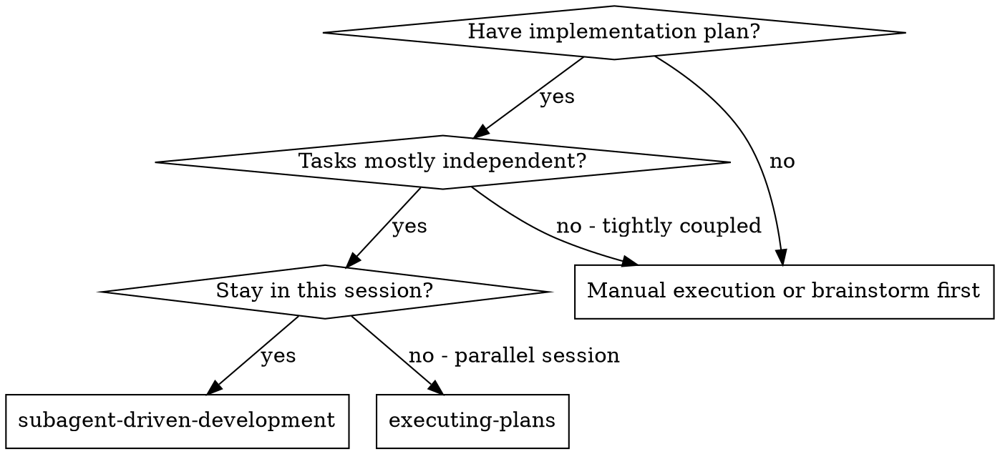
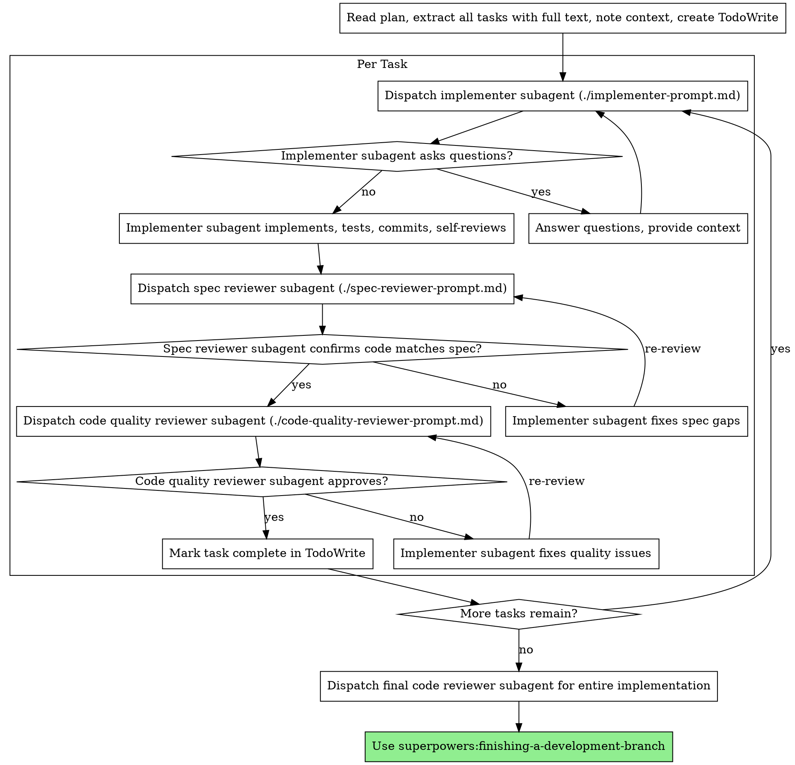

<!-- Generated by SpecStory, Markdown v2.1.0 -->

# 2026-04-21 07:59:32Z

<!-- Claude Code Session 1443207e-ddba-4be3-bbfd-bae354210696 (2026-04-21 07:59:32Z) -->

_**User (2026-04-21 07:59:32Z)**_

Continue the Storybook controls audit on PR #134 (branch                                                            
  audit/storybook-batch-2-answer-game) by applying the "slim, shell-focused"                                          
  approach we just used on AnswerGame.stories.tsx to the remaining 7 files in
  src/components/answer-game/*.                                                                                       
                                                                                                                      
  # Context you need                                                                                                  
                                                                                                                      
  - PR: https://github.com/leocaseiro/base-skill/pull/134 ��� 14 commits landed                                         
    so far, covering all 8 answer-game stories. The latest commit (5514b022,                                          
    "slim playground to shell concerns") is the canonical example for the
    approach you're applying.                                                                                         
  - Policy source: .claude/skills/write-storybook/SKILL.md        
  - Tracking issue: #125 (Batch 2 files already ticked)                                                               
  - Worktree: worktrees/storybook-audit-batch-2-answer-game on branch
    audit/storybook-batch-2-answer-game. Never commit to master.                                                      
  - Run /resync at the start, then keep going on the same branch.                                                     
                                                                                                                      
  # The approach (applies to every file)                                                                              
                                                                                                                      
  For each story, answer: "What does THIS component itself render, and which                                          
  props change that output?" Then keep controls only for those props.                                                 
  Everything else is noise.                                                                                           
                                                                                                                      
  Mechanical rules:                                               
                                                                                                                      
  1. StoryArgs should only expose props that visibly change what the                                                  
     component renders. Props that flow to children via context or only                                               
     affect child behaviour go away.                                                                                  
  2. Every raw component prop that StoryArgs shadows (or doesn't cover) must                                          
     be declared `?: never` in StoryArgs AND given
     `{ table: { disable: true } }` in argTypes. This hides the                                                       
     react-docgen-inferred "-" rows from the Controls panel. AnswerGame.stories.tsx                                   
     is the canonical example.                                                                                        
  3. Collapse variant stories into a single Playground when the Controls                                              
     panel can reproduce them. Keep a named story ONLY if its args                                                    
     materially differ in a way the control can't express (e.g. an a11y                                               
     variant, or a flow you want the sidebar to advertise). Never keep a                                              
     story whose args are identical to meta.args defaults.                                                            
  4. Drop play() stories whose assertion is trivial onClick wiring (e.g.                                              
     "clicking Play Again fires onPlayAgain"). That's a unit test, not a                                              
     story. Keep play() only when it demonstrates a non-trivial flow the                                              
     reader should see animated (e.g. InstructionsOverlay opens a modal and                                           
     closes it with Escape ��� that one stays).                                                                         
  5. Hidden handlers still get fn() spies in args + table.disable in                                                  
     argTypes so the Actions addon shows them firing.                                                                 
  6. No emojis in files.                                                                                              
  7. Commit message shape (unchanged):                                                                                
     stories(answer-game/<name>): <imperative description>                                                            
                                                                                                                      
  Per-file verification before each commit:                                                                           
    - yarn typecheck ��� 0                                                                                              
    - yarn lint ��� 0                                                                                                   
                                                                                                                      
  End-of-session verification:                                    
    - yarn typecheck                                                                                                  
    - yarn lint                                                   
    - yarn lint:md                                                                                                    
    - Launch storybook on a free port (the plan file has the snippet), then
      yarn test:storybook --url http://127.0.0.1:<port> ��� all 44 suites                                               
      must stay green. Kill storybook when done.
                                                                                                                      
  # The remaining 7 files                                                                                             
                                                                                                                      
  For each, do the "what does this component actually render vs what flows                                            
  through children" analysis BEFORE touching the story. Read the component                                            
  source first. Then slim.                                                                                            
                                                                                                                      
  1. Slot.stories.tsx                     
     - Already a single Playground. Audit: are variant/label/filled/isWrong/                                          
       dragPreview all still load-bearing? The `dragPreview` control writes                                           
       to context via dispatch(SET_DRAG_ACTIVE/SET_DRAG_HOVER) ��� that's                                               
       fine because Slot itself reads drag state to render its preview                                                
       border. Keep unless you find something redundant.                                                              
                                                                                                                      
  2. InstructionsOverlay.stories.tsx (most complex)                                                                   
     - 7 named variants + 3 play() flows. Audit:                                                                      
       - Do Bookmarked/NotBookmarked pairs really need four variants when                                             
         isBookmarked is a control? Likely reduce to 2: Default and                                                   
         WithCustomGame (since custom-game mode changes the header actions                                            
         visible). The bookmark state is just a boolean control.                                                      
       - Keep all 3 play() flows ��� StartsGame, TogglesBookmark, OpensSettings                                         
         are real interactive flows, not trivial onClick wiring. OpensSettings                                        
         especially demonstrates the Radix portal + Escape-close dance.                                               
     - Decorators: withDb + withRouter stay.                                                                          
     - TTS: ttsEnabled: false must stay in meta.args (avoids the known                                                
       TTS crash path).                                                                                               
                                                                                                                      
  3. EncouragementAnnouncer.stories.tsx                                                                               
     - Currently 4 stories: Hidden, Visible, ReplayTrigger, AutoDismissesAfter2s.                                     
     - Hidden is redundant (visible: false is the default). Drop.                                                     
     - Visible is just `visible: true` ��� replace with a single Playground.                                            
     - ReplayTrigger (the ShowTrigger wrapper) adds real interactivity ���                                              
       keep as a named story OR fold its wrapper into the main render.                                                
       Judgement call.                                                                                                
     - AutoDismissesAfter2s ��� play() asserts the 2s auto-dismiss. This is                                             
       non-trivial behaviour (it exercises the timer), so keep.                                                       
     - CRITICAL: vitest was removed from this file for test-runner compat                                             
       (see commit 16d833cc). Do NOT re-import `vi`. AutoDismissesAfter2s                                             
       uses a real 2s timer + waitFor({ timeout: 3500 }).                                                             
                                                                                                                      
  4. GameOverOverlay.stories.tsx                                                                                      
     - Already slimmed: one Playground with `stars` range (1-5), no play()                                            
       stories. Audit: confirm the stars-to-retryCount bridge still maps                                              
                                                                                                                      
  5. LevelCompleteOverlay.stories.tsx                                                                                 
     - Currently 3 level variants + 2 play() stories (ClicksNextLevel,                                                
       ClicksDone). Apply same logic as GameOverOverlay:                                                              
       - Collapse Level1/Level3/Level10 into one Playground (level is                                                 
         already a range control).                                                                                    
       - Drop the 2 play() stories ��� onClick wiring is trivial.                                                       
                                                                                                                      
  6. ProgressHUD.stories.tsx                                                                                          
     - Currently 9 variants. Audit each:                                                                              
       - Classic_Round3Of5 IS the default ��� drop if it just uses meta.args.                                           
       - Classic_LastRound, DotsOnly, FractionOnly, AllFlagsOff, RoundCompletePhase                                   
         ��� all reproducible from the Controls panel. Probably collapse to          
         one Playground.                                                                                              
       - LevelMode_Level3, LevelMode_Level10, Mixed_LevelPlusFraction ���                                               
         these combine multiple flags (isLevelMode + totalRoundsIsNull +                                              
         showLevel etc.). Judgement call on whether they're worth keeping                                             
         as presets. Lean toward dropping and documenting the preset combos                                           
         in meta.parameters.docs.description instead.                                                                 
     - Controls: 9 flags are a lot but they're all load-bearing. Keep them.                                           
                                                                                                                      
  7. ScoreAnimation.stories.tsx                                                                                       
     - Currently Playing (visible: false) + Complete (visible: true). Since                                           
       `visible` is a boolean control with two values, Playing/Complete                                               
       are sidebar noise. Collapse to one Playground.                                                                 
                                                                                                                      
  # Deliverables per file                                                                                             
                                                                                                                      
  - One commit per file with the shape:                                                                               
    stories(answer-game/<name>): <one-line summary of what changed>                                                   
  - If you drop stories, the commit body must list which ones and why.                                                
  - If you collapse variants, the commit body must name the control(s)
    that now drive the variants.                                                                                      
                                                                  
  # When everything is done                                                                                           
                                                                                                                      
  - Run the end-of-session verification above.
  - Push to origin. No new PR ��� same branch keeps updating PR #134.                                                   
  - Post a comment on PR #134 summarizing what landed in this session
    (file list + rationale). Do NOT close the PR; I'll review it.                                                     
                                                                                                                      
  # Skill to invoke at start of the new session
                                                                                                                      
  superpowers:using-git-worktrees (we're already in a worktree, just confirm)                                         
  then proceed task-by-task. No writing-plans needed ��� this is direct                                                 
  execution of the established pattern.                                                                               
                                                                                                                      
  Start with /resync to confirm branch state, then tackle the 7 files in                                              
  any order you like. Prefer Slot and Simple-Tier files first so you can
  build muscle memory before touching InstructionsOverlay.                                                            
                                                                  
  ---                                                                                                                 
  Current PR state as of push:                                    
                                                                                                                      
  - 15 commits on audit/storybook-batch-2-answer-game (all 8 answer-game stories retrofitted, plus the skin-tokens,
  lowercase-tiles, sidebar-grouping, Playground-collapse, and shell-slim follow-ups)                                  
  - /tmp/answergame-distractor-bank-ref.tsx holds the distractor helper for the future LetterTileBank story
  - CI will re-run on push; the Batch 2 checkboxes in issue #125 are already ticked 

---

_**Agent (claude-opus-4-7 2026-04-21 07:59:53Z)**_

_**Agent (claude-opus-4-7 2026-04-21 07:59:54Z)**_

<tool-use data-tool-type="generic" data-tool-name="Skill"><details>
<summary>Tool use: **Skill**</summary>

**Input:**

- skill: `superpowers:using-git-worktrees`

</details></tool-use>

---

_**User (2026-04-21 07:59:54Z)**_

Base directory for this skill: /Users/leocaseiro/.claude/plugins/cache/claude-plugins-official/superpowers/5.0.7/skills/using-git-worktrees

# Using Git Worktrees

## Overview

Git worktrees create isolated workspaces sharing the same repository, allowing work on multiple branches simultaneously without switching.

**Core principle:** Systematic directory selection + safety verification = reliable isolation.

**Announce at start:** "I'm using the using-git-worktrees skill to set up an isolated workspace."

## Directory Selection Process

Follow this priority order:

### 1. Check Existing Directories

```bash
# Check in priority order
ls -d .worktrees 2>/dev/null     # Preferred (hidden)
ls -d worktrees 2>/dev/null      # Alternative
```

**If found:** Use that directory. If both exist, `.worktrees` wins.

### 2. Check CLAUDE.md

```bash
grep -i "worktree.*director" CLAUDE.md 2>/dev/null
```

**If preference specified:** Use it without asking.

### 3. Ask User

If no directory exists and no CLAUDE.md preference:

```
No worktree directory found. Where should I create worktrees?

1. .worktrees/ (project-local, hidden)
2. ~/.config/superpowers/worktrees/<project-name>/ (global location)

Which would you prefer?
```

## Safety Verification

### For Project-Local Directories (.worktrees or worktrees)

**MUST verify directory is ignored before creating worktree:**

```bash
# Check if directory is ignored (respects local, global, and system gitignore)
git check-ignore -q .worktrees 2>/dev/null || git check-ignore -q worktrees 2>/dev/null
```

**If NOT ignored:**

Per Jesse's rule "Fix broken things immediately":
1. Add appropriate line to .gitignore
2. Commit the change
3. Proceed with worktree creation

**Why critical:** Prevents accidentally committing worktree contents to repository.

### For Global Directory (~/.config/superpowers/worktrees)

No .gitignore verification needed - outside project entirely.

## Creation Steps

### 1. Detect Project Name

```bash
project=$(basename "$(git rev-parse --show-toplevel)")
```

### 2. Create Worktree

```bash
# Determine full path
case $LOCATION in
  .worktrees|worktrees)
    path="$LOCATION/$BRANCH_NAME"
    ;;
  ~/.config/superpowers/worktrees/*)
    path="~/.config/superpowers/worktrees/$project/$BRANCH_NAME"
    ;;
esac

# Create worktree with new branch
git worktree add "$path" -b "$BRANCH_NAME"
cd "$path"
```

### 3. Run Project Setup

Auto-detect and run appropriate setup:

```bash
# Node.js
if [ -f package.json ]; then npm install; fi

# Rust
if [ -f Cargo.toml ]; then cargo build; fi

# Python
if [ -f requirements.txt ]; then pip install -r requirements.txt; fi
if [ -f pyproject.toml ]; then poetry install; fi

# Go
if [ -f go.mod ]; then go mod download; fi
```

### 4. Verify Clean Baseline

Run tests to ensure worktree starts clean:

```bash
# Examples - use project-appropriate command
npm test
cargo test
pytest
go test ./...
```

**If tests fail:** Report failures, ask whether to proceed or investigate.

**If tests pass:** Report ready.

### 5. Report Location

```
Worktree ready at <full-path>
Tests passing (<N> tests, 0 failures)
Ready to implement <feature-name>
```

## Quick Reference

| Situation | Action |
|-----------|--------|
| `.worktrees/` exists | Use it (verify ignored) |
| `worktrees/` exists | Use it (verify ignored) |
| Both exist | Use `.worktrees/` |
| Neither exists | Check CLAUDE.md → Ask user |
| Directory not ignored | Add to .gitignore + commit |
| Tests fail during baseline | Report failures + ask |
| No package.json/Cargo.toml | Skip dependency install |

## Common Mistakes

### Skipping ignore verification

- **Problem:** Worktree contents get tracked, pollute git status
- **Fix:** Always use `git check-ignore` before creating project-local worktree

### Assuming directory location

- **Problem:** Creates inconsistency, violates project conventions
- **Fix:** Follow priority: existing > CLAUDE.md > ask

### Proceeding with failing tests

- **Problem:** Can't distinguish new bugs from pre-existing issues
- **Fix:** Report failures, get explicit permission to proceed

### Hardcoding setup commands

- **Problem:** Breaks on projects using different tools
- **Fix:** Auto-detect from project files (package.json, etc.)

## Example Workflow

```
You: I'm using the using-git-worktrees skill to set up an isolated workspace.

[Check .worktrees/ - exists]
[Verify ignored - git check-ignore confirms .worktrees/ is ignored]
[Create worktree: git worktree add .worktrees/auth -b feature/auth]
[Run npm install]
[Run npm test - 47 passing]

Worktree ready at /Users/jesse/myproject/.worktrees/auth
Tests passing (47 tests, 0 failures)
Ready to implement auth feature
```

## Red Flags

**Never:**
- Create worktree without verifying it's ignored (project-local)
- Skip baseline test verification
- Proceed with failing tests without asking
- Assume directory location when ambiguous
- Skip CLAUDE.md check

**Always:**
- Follow directory priority: existing > CLAUDE.md > ask
- Verify directory is ignored for project-local
- Auto-detect and run project setup
- Verify clean test baseline

## Integration

**Called by:**
- **brainstorming** (Phase 4) - REQUIRED when design is approved and implementation follows
- **subagent-driven-development** - REQUIRED before executing any tasks
- **executing-plans** - REQUIRED before executing any tasks
- Any skill needing isolated workspace

**Pairs with:**
- **finishing-a-development-branch** - REQUIRED for cleanup after work complete


---

_**Agent (claude-opus-4-7 2026-04-21 07:59:57Z)**_

_**Agent (claude-opus-4-7 2026-04-21 07:59:58Z)**_

I'm using the using-git-worktrees skill to confirm workspace state. The task says we're already in `worktrees/storybook-audit-batch-2-answer-game`. Let me verify and then run /resync.

_**Agent (claude-opus-4-7 2026-04-21 08:00:01Z)**_

<tool-use data-tool-type="shell" data-tool-name="Bash"><details>
<summary>Tool use: **Bash**</summary>
Verify current worktree state

`pwd && git worktree list && git branch --show-current`

```text
/Users/leocaseiro/Sites/base-skill
/Users/leocaseiro/Sites/base-skill                                               ef97b569 [master]
/Users/leocaseiro/Sites/base-skill/.claude/worktrees/epic-cohen                  7afbed47 [claude/epic-cohen]
/Users/leocaseiro/Sites/base-skill/.claude/worktrees/gifted-bouman               f7cb4c51 [feat/phonics-word-library-task-11-filterWords]
/Users/leocaseiro/Sites/base-skill/.claude/worktrees/musing-merkle               294f9e7a [claude/musing-merkle]
/Users/leocaseiro/Sites/base-skill/.claude/worktrees/stupefied-satoshi           67d8d1fd [claude/stupefied-satoshi]
/Users/leocaseiro/Sites/base-skill/worktrees/audit-storybook-controls            9b5a9353 [audit/storybook-controls]
/Users/leocaseiro/Sites/base-skill/worktrees/chore-specstory-sync                c4d54df1 [chore/specstory-sync-2026-04-17]
/Users/leocaseiro/Sites/base-skill/worktrees/ci-auto-merge-release               4ef53c28 [ci/auto-merge-release]
/Users/leocaseiro/Sites/base-skill/worktrees/docs/tdd-rule                       4b1c577f [docs/tdd-rule]
/Users/leocaseiro/Sites/base-skill/worktrees/feat-answer-game-primitive          39f4922f [feat/answer-game-primitive]
/Users/leocaseiro/Sites/base-skill/worktrees/feat-bookmarks-phase-2              f9140721 [feat/bookmarks-phase-2]
/Users/leocaseiro/Sites/base-skill/worktrees/feat-game-tile-auto-font-sizing     873241e2 [feat/game-tile-auto-font-sizing]
/Users/leocaseiro/Sites/base-skill/worktrees/feat-word-syllables                 6503b0af [feat/word-syllables]
/Users/leocaseiro/Sites/base-skill/worktrees/feat-wordspell-stale-draft-toast    9b790335 [feat/wordspell-stale-draft-toast]
/Users/leocaseiro/Sites/base-skill/worktrees/fix-advanced-config-persists        02c0fb5e [fix/advanced-config-persists]
/Users/leocaseiro/Sites/base-skill/worktrees/fix-bookmarks-db6-migration         f195a2e8 [fix/bookmarks-db6-migration]
/Users/leocaseiro/Sites/base-skill/worktrees/fix-bookmarks-dm4-old-users         fe28ddb8 [fix/bookmarks-dm4-old-users]
/Users/leocaseiro/Sites/base-skill/worktrees/fix-dm4-bookmarks-recovery          6428c73e [fix/dm4-bookmarks-recovery]
/Users/leocaseiro/Sites/base-skill/worktrees/specstory-sync-2026-04-16           bfad83b2 [specstory-sync-2026-04-16]
/Users/leocaseiro/Sites/base-skill/worktrees/storybook-audit-batch-2-answer-game 5514b022 [audit/storybook-batch-2-answer-game]
/Users/leocaseiro/Sites/base-skill/worktrees/test-wordspell-drift-e2e            ef97b569 [test/wordspell-drift-e2e]
/Users/leocaseiro/Sites/base-skill/worktrees/tools-phoneme-tuner                 a69cf440 [tools/phoneme-tuner]
master
```
</details></tool-use>

_**Agent (claude-opus-4-7 2026-04-21 08:00:03Z)**_

I'm in the main worktree. I need to cd into the right worktree. Let me do that and run /resync.

_**Agent (claude-opus-4-7 2026-04-21 08:00:04Z)**_

<tool-use data-tool-type="shell" data-tool-name="Bash"><details>
<summary>Tool use: **Bash**</summary>
Enter worktree and check status

`cd worktrees/storybook-audit-batch-2-answer-game && pwd && git branch --show-current && git status --short | head -20`

```text
/Users/leocaseiro/Sites/base-skill/worktrees/storybook-audit-batch-2-answer-game
audit/storybook-batch-2-answer-game
```
</details></tool-use>

_**Agent (claude-opus-4-7 2026-04-21 08:00:07Z)**_

<tool-use data-tool-type="generic" data-tool-name="Skill"><details>
<summary>Tool use: **Skill**</summary>

```text
Launching skill: resync
```
</details></tool-use>

---

_**User (2026-04-21 08:00:07Z)**_

# Resync

Invoke when you suspect the agent is working against stale state — e.g. it's reading files that look outdated, referencing code that's already been changed upstream, or you want to confirm the current branch is current with `origin/master` before continuing.

## Workflow

Run these steps in order. Be concise — one-line summaries per step.

### 1. Fetch and report branch state

Run in parallel:

```bash
git fetch origin --prune
git rev-parse --abbrev-ref HEAD
git status -sb
git log --oneline HEAD..origin/master
git log --oneline origin/master..HEAD
```

Report in this shape:

- **Branch**: `<current branch>` (or `(HEAD detached at …)`)
- **Behind origin/master by**: N commits
- **Ahead of origin/master by**: N commits
- **Working tree**: clean / M modified, U untracked

If behind > 0 and not on `master`, explicitly ask whether to rebase onto `origin/master`. Do **not** rebase without confirmation. If the working tree is dirty, recommend stashing or committing first.

If on `master`, warn — the project rule is no direct work on `master`; a worktree/branch should be in use.

### 2. List open PRs

```bash
gh pr list --state open --limit 30 --json number,title,headRefName,baseRefName,author,updatedAt,isDraft
```

Summarize in a compact table (number, title, author, branch → base, draft flag, last updated). Keep titles short.

### 3. Flag potentially impacting PRs

Given the conversation's current focus (files being edited, features under discussion), scan the PR list for overlap:

- PRs that touch the same files or directories
- PRs that modify shared infrastructure the current work depends on (reducers, game engine, skin system, config, CI)
- PRs the user has mentioned earlier in the session

For each flagged PR, write one sentence: _"PR #N `<title>` — may impact `<area>` because `<reason>`."_ If nothing obviously overlaps, say so explicitly rather than hedging.

### 4. Confirm before continuing

Ask the user to confirm one of:

- Proceed as-is (current state is fine).
- Rebase onto `origin/master` first.
- Pause this session and review a specific PR first.

Wait for the user's decision. Do not resume prior work until they respond.

## Notes

- Use `gh` for GitHub interactions; don't scrape URLs.
- Don't run `git rebase` or `git pull --rebase` without explicit confirmation — rebases can conflict with uncommitted changes or in-progress worktrees.
- If `gh` is unauthenticated, surface the error and stop at step 2 rather than guessing.
- Keep the whole report under ~25 lines. The user invokes this to re-ground quickly, not to read a novel.


---

_**Agent (claude-opus-4-7 2026-04-21 08:00:17Z)**_

<tool-use data-tool-type="shell" data-tool-name="Bash"><details>
<summary>Tool use: **Bash**</summary>
Fetch and report branch state

`git fetch origin --prune 2>&1 | tail -5 && echo "---" && git rev-parse --abbrev-ref HEAD && echo "---" && git status -sb && echo "---behind---" && git log --oneline HEAD..origin/master | head -20 && echo "---ahead---" && git log --oneline origin/master..HEAD | head -30`

```text
From github.com:leocaseiro/base-skill
   6cc925a2..f8790146  gh-pages        -> origin/gh-pages
 * [new branch]        release/v0.10.6 -> origin/release/v0.10.6
 * [new branch]        release/v0.10.7 -> origin/release/v0.10.7
---
audit/storybook-batch-2-answer-game
---
## audit/storybook-batch-2-answer-game...origin/audit/storybook-batch-2-answer-game
---behind---
ef97b569 chore(release): v0.10.7 (#133)
4a537592 Chore/specstory sync 2026 04 21 (#132)
581cab10 ai(specstory): sync
b5b56439 Merge branch 'chore/specstory-sync-2026-04-17' into chore/specstory-sync-2026-04-21
98eff0ee chore(release): v0.10.6 (#131)
4416ba1f ai(specstory): sync
678cf87a fix(word-spell): resume desync — persist roundOrder, align on reload (#130)
31c3877d test(word-spell): e2e regression for resume desync
bc4ab6b5 fix(word-spell): persist roundOrder for deterministic resume
b4d9e74f chore(release): v0.10.5 (#129)
d7861bea fix(db): recover from broken DM4 migrations on boot (#127)
81db0d46 fix(db): recover from broken DM4 migrations on boot
73d49e98 docs(plan): WordSpell resume desync — tile/prompt mismatch fix (#128)
86258d88 docs(plan): WordSpell resume desync — fix tile/prompt mismatch on draft restore
c4d54df1 ai(specstory): sync (follow-up)
dc829e20 ai(specstory): sync
---ahead---
5514b022 stories(answer-game/AnswerGame): slim playground to shell concerns
3a19bc10 stories(answer-game): collapse to Playground-only + enable real drag
e06d4f96 stories(answer-game/GameOverOverlay): expose stars as direct control
a03c2eac stories(answer-game/AnswerGame): lowercase letter tiles to match WordSpell
49506762 stories(answer-game): add explicit title to collapse sidebar under one group
70634668 stories(answer-game/AnswerGame): apply classicSkin tokens in playground
16d833cc stories(answer-game/EncouragementAnnouncer): drop vitest import for test-runner compat
5fc0b61f stories(answer-game/ScoreAnimation): retrofit per controls policy
4d465568 stories(answer-game/ProgressHUD): retrofit per controls policy
8fa29284 stories(answer-game/LevelCompleteOverlay): retrofit per controls policy
483141ac stories(answer-game/GameOverOverlay): retrofit per controls policy
e3121973 stories(answer-game/EncouragementAnnouncer): retrofit per controls policy
f74eb775 stories(answer-game/InstructionsOverlay): retrofit per controls policy
beb14675 stories(answer-game/AnswerGame): retrofit per controls policy
e824111f stories(answer-game/Slot): retrofit per controls policy
5d6fe217 docs(plan): implementation plan for audit batch 2
25c7caab docs(spec): correct tileBankMode enum values
e4222463 docs(spec): audit batch 2 for src/components/answer-game/* stories
```
</details></tool-use>

_**Agent (claude-opus-4-7 2026-04-21 08:00:21Z)**_

<tool-use data-tool-type="shell" data-tool-name="Bash"><details>
<summary>Tool use: **Bash**</summary>
List open PRs

`gh pr list --state open --limit 30 --json number,title,headRefName,baseRefName,author,updatedAt,isDraft 2>&1 | head -100`

```text
[{"author":{"id":"MDQ6VXNlcjk0MDA3MA==","is_bot":false,"login":"leocaseiro","name":"Leo Caseiro"},"baseRefName":"master","headRefName":"feat/wordspell-stale-draft-toast","isDraft":false,"number":136,"title":"feat(word-spell): toast when stale resumed draft is discarded","updatedAt":"2026-04-21T07:58:50Z"},{"author":{"id":"MDQ6VXNlcjk0MDA3MA==","is_bot":false,"login":"leocaseiro","name":"Leo Caseiro"},"baseRefName":"master","headRefName":"audit/storybook-batch-2-answer-game","isDraft":false,"number":134,"title":"stories(answer-game): audit retrofit per new controls policy","updatedAt":"2026-04-21T07:58:05Z"}]
```
</details></tool-use>

_**Agent (claude-opus-4-7 2026-04-21 08:00:32Z)**_

_**Agent (claude-opus-4-7 2026-04-21 08:00:36Z)**_

**Resync summary:**
- **Branch:** `audit/storybook-batch-2-answer-game`
- **Behind origin/master by:** 16 commits (release v0.10.6/v0.10.7, specstory syncs, word-spell fixes, db migration fixes — **none touch `src/components/answer-game/*`**)
- **Ahead of origin/master by:** 18 commits (all the Batch 2 audit work)
- **Working tree:** clean, in sync with remote
- **Open PRs:** #134 (this one), #136 (wordspell-stale-draft-toast) — no overlap with answer-game stories

No impacting PRs. Proceeding per your briefing ("keep going on the same branch"). No rebase needed.

Now let me examine the current state of the 7 files and their components. Let me read the current AnswerGame.stories.tsx (the canonical example) first and then the 7 targets in parallel.

_**Agent (claude-opus-4-7 2026-04-21 08:00:37Z)**_

<tool-use data-tool-type="read" data-tool-name="Read"><details>
<summary>Tool use: **Read**</summary>
 `./worktrees/storybook-audit-batch-2-answer-game/src/components/answer-game/AnswerGame.stories.tsx`

```text
File does not exist. Note: your current working directory is /Users/leocaseiro/Sites/base-skill/worktrees/storybook-audit-batch-2-answer-game.
```
</details></tool-use>

_**Agent (claude-opus-4-7 2026-04-21 08:00:40Z)**_

<tool-use data-tool-type="shell" data-tool-name="Bash"><details>
<summary>Tool use: **Bash**</summary>
List answer-game stories

`ls src/components/answer-game/*.stories.tsx`

```text
Exit code 1
(eval):1: no matches found: src/components/answer-game/*.stories.tsx
```
</details></tool-use>

_**Agent (claude-opus-4-7 2026-04-21 08:00:46Z)**_

<tool-use data-tool-type="shell" data-tool-name="Bash"><details>
<summary>Tool use: **Bash**</summary>
List answer-game directory

`ls src/components/answer-game/ 2>&1 | head -50`

```text
answer-game-reducer.test.ts
answer-game-reducer.ts
AnswerGame
AnswerGameProvider.test.tsx
AnswerGameProvider.tsx
EncouragementAnnouncer
GameOverOverlay
HiddenKeyboardInput.tsx
InstructionsOverlay
LevelCompleteOverlay
magnetic-snap.test.ts
magnetic-snap.ts
ProgressHUD
ScoreAnimation
Slot
styles.test.ts
styles.ts
tile-font.test.ts
tile-font.ts
TouchKeyboardContext.ts
types.ts
useAnswerGameContext.ts
useAnswerGameDispatch.ts
useAutoNextSlot.test.tsx
useAutoNextSlot.ts
useBankDropTarget.test.tsx
useBankDropTarget.ts
useDraggableTile.test.tsx
useDraggableTile.ts
useFreeSwap.test.tsx
useFreeSwap.ts
useGameSounds.test.tsx
useGameSounds.ts
useGameTTS.test.tsx
useGameTTS.ts
useKeyboardDrag.test.tsx
useKeyboardDrag.ts
useKeyboardInput.test.tsx
useKeyboardInput.ts
useRoundTTS.test.tsx
useRoundTTS.ts
useSlotTileDrag.test.tsx
useSlotTileDrag.ts
useTileEvaluation.test.tsx
useTileEvaluation.ts
useTouchDrag.ts
useTouchKeyboardInput.test.tsx
useTouchKeyboardInput.ts
```
</details></tool-use>

_**Agent (claude-opus-4-7 2026-04-21 08:00:49Z)**_

<tool-use data-tool-type="shell" data-tool-name="Bash"><details>
<summary>Tool use: **Bash**</summary>
Find all answer-game stories files

`find src/components/answer-game -name '*.stories.tsx' -maxdepth 3`

```text
src/components/answer-game/GameOverOverlay/GameOverOverlay.stories.tsx
src/components/answer-game/InstructionsOverlay/InstructionsOverlay.stories.tsx
src/components/answer-game/ProgressHUD/ProgressHUD.stories.tsx
src/components/answer-game/EncouragementAnnouncer/EncouragementAnnouncer.stories.tsx
src/components/answer-game/ScoreAnimation/ScoreAnimation.stories.tsx
src/components/answer-game/Slot/Slot.stories.tsx
src/components/answer-game/LevelCompleteOverlay/LevelCompleteOverlay.stories.tsx
src/components/answer-game/AnswerGame/AnswerGame.stories.tsx
```
</details></tool-use>

_**Agent (claude-opus-4-7 2026-04-21 08:00:52Z)**_

<tool-use data-tool-type="unknown" data-tool-name="ToolSearch"><details>
<summary>Tool use: **ToolSearch**</summary>

**Input:**

- max_results: `2`
- query: `select:TaskCreate,TaskUpdate`

**Result:**

```

```
</details></tool-use>

_**Agent (claude-opus-4-7 2026-04-21 08:00:56Z)**_

<tool-use data-tool-type="unknown" data-tool-name="TaskCreate"><details>
<summary>Tool use: **TaskCreate**</summary>
Audit and apply shell-focused controls policy

```text
Task #1 created successfully: Slim Slot.stories.tsx
```
</details></tool-use>

_**Agent (claude-opus-4-7 2026-04-21 08:01:00Z)**_

<tool-use data-tool-type="unknown" data-tool-name="TaskCreate"><details>
<summary>Tool use: **TaskCreate**</summary>
Collapse Playing/Complete into single Playground (visible is a boolean control)

```text
Task #2 created successfully: Slim ScoreAnimation.stories.tsx
```
</details></tool-use>

_**Agent (claude-opus-4-7 2026-04-21 08:01:03Z)**_

<tool-use data-tool-type="unknown" data-tool-name="TaskCreate"><details>
<summary>Tool use: **TaskCreate**</summary>
Audit already-slimmed file; confirm stars-to-retryCount bridge

```text
Task #3 created successfully: Slim GameOverOverlay.stories.tsx
```
</details></tool-use>

_**Agent (claude-opus-4-7 2026-04-21 08:01:07Z)**_

<tool-use data-tool-type="unknown" data-tool-name="TaskCreate"><details>
<summary>Tool use: **TaskCreate**</summary>
Collapse Level1/3/10 + drop trivial onClick play() stories

```text
Task #4 created successfully: Slim LevelCompleteOverlay.stories.tsx
```
</details></tool-use>

_**Agent (claude-opus-4-7 2026-04-21 08:01:11Z)**_

<tool-use data-tool-type="unknown" data-tool-name="TaskCreate"><details>
<summary>Tool use: **TaskCreate**</summary>
Drop Hidden; replace Visible with Playground; keep ReplayTrigger + AutoDismissesAfter2s; no vi import

```text
Task #5 created successfully: Slim EncouragementAnnouncer.stories.tsx
```
</details></tool-use>

_**Agent (claude-opus-4-7 2026-04-21 08:01:14Z)**_

<tool-use data-tool-type="unknown" data-tool-name="TaskCreate"><details>
<summary>Tool use: **TaskCreate**</summary>
Collapse 9 variants; decide which (if any) to keep as named presets

```text
Task #6 created successfully: Slim ProgressHUD.stories.tsx
```
</details></tool-use>

_**Agent (claude-opus-4-7 2026-04-21 08:01:18Z)**_

<tool-use data-tool-type="unknown" data-tool-name="TaskCreate"><details>
<summary>Tool use: **TaskCreate**</summary>
Collapse bookmark pairs, keep 3 play() flows, preserve ttsEnabled:false

```text
Task #7 created successfully: Slim InstructionsOverlay.stories.tsx
```
</details></tool-use>

_**Agent (claude-opus-4-7 2026-04-21 08:01:22Z)**_

<tool-use data-tool-type="unknown" data-tool-name="TaskCreate"><details>
<summary>Tool use: **TaskCreate**</summary>
typecheck, lint, lint:md, storybook test suite, push, PR #134 comment

```text
Task #8 created successfully: End-of-session verification + push
```
</details></tool-use>

_**Agent (claude-opus-4-7 2026-04-21 08:01:25Z)**_

Let me read the canonical example first, then all 7 target files and their components in parallel.

_**Agent (claude-opus-4-7 2026-04-21 08:01:27Z)**_

<tool-use data-tool-type="read" data-tool-name="Read"><details>
<summary>Tool use: **Read**</summary>
 `./worktrees/storybook-audit-batch-2-answer-game/src/components/answer-game/AnswerGame/AnswerGame.stories.tsx`

```text
1	import { withDb } from '../../../../.storybook/decorators/withDb';
2	import { AnswerGame } from './AnswerGame';
3	import type { AnswerGameConfig } from '../types';
4	import type { Meta, StoryObj } from '@storybook/react';
5	import type { CSSProperties, ComponentType } from 'react';
6	import { classicSkin } from '@/lib/skin';
7	
8	interface StoryArgs {
9	  question: string;
10	  answerPreview: string;
11	  choicesPreview: string;
12	  showDots: boolean;
13	  showFraction: boolean;
14	  showLevel: boolean;
15	  totalRounds: number;
16	  isLevelMode: boolean;
17	  // Raw AnswerGame props shadowed by StoryArgs above; declared here only
18	  // so we can hide their react-docgen-inferred rows from the Controls panel.
19	  config?: never;
20	  initialState?: never;
21	  sessionId?: never;
22	  skin?: never;
23	  children?: never;
24	}
25	
26	const meta: Meta<StoryArgs> = {
27	  component: AnswerGame as unknown as ComponentType<StoryArgs>,
28	  title: 'answer-game/AnswerGame',
29	  tags: ['autodocs'],
30	  decorators: [withDb],
31	  parameters: {
32	    docs: {
33	      description: {
34	        component:
35	          'Shell layout (Question / Answer / Choices slots) + ProgressHUD. Child behaviour — drag, typing, evaluation, distractor banks — is covered by the Slot, LetterTileBank, and SortNumbersTileBank stories. This playground only drives what AnswerGame itself renders: the HUD visibility flags, totalRounds, levelMode, and the three slot containers.',
36	      },
37	    },
38	  },
39	  args: {
40	    question: 'Spell CAT',
41	    answerPreview: '[empty slots here]',
42	    choicesPreview: '[tile placeholders here]',
43	    showDots: true,
44	    showFraction: true,
45	    showLevel: false,
46	    totalRounds: 5,
47	    isLevelMode: false,
48	  },
49	  argTypes: {
50	    question: { control: 'text' },
51	    answerPreview: { control: 'text' },
52	    choicesPreview: { control: 'text' },
53	    showDots: { control: 'boolean', name: 'Show Progress dots' },
54	    showFraction: {
55	      control: 'boolean',
56	      name: 'Show Progress in fraction',
57	    },
58	    showLevel: { control: 'boolean' },
59	    totalRounds: {
60	      control: { type: 'range', min: 1, max: 20, step: 1 },
61	    },
62	    isLevelMode: { control: 'boolean' },
63	    config: { table: { disable: true } },
64	    initialState: { table: { disable: true } },
65	    sessionId: { table: { disable: true } },
66	    skin: { table: { disable: true } },
67	    children: { table: { disable: true } },
68	  },
69	  render: ({
70	    question,
71	    answerPreview,
72	    choicesPreview,
73	    showDots,
74	    showFraction,
75	    showLevel,
76	    totalRounds,
77	    isLevelMode,
78	  }) => {
79	    const config: AnswerGameConfig = {
80	      gameId: 'storybook-answer-game-shell',
81	      inputMethod: 'drag',
82	      wrongTileBehavior: 'lock-auto-eject',
83	      tileBankMode: 'exact',
84	      totalRounds,
85	      ttsEnabled: false,
86	      hud: { showDots, showFraction, showLevel },
87	      ...(isLevelMode
88	        ? { levelMode: { generateNextLevel: () => null } }
89	        : {}),
90	    };
91	    return (
92	      <div
93	        className={`game-container skin-${classicSkin.id}`}
94	        style={classicSkin.tokens as CSSProperties}
95	      >
96	        <AnswerGame config={config} skin={classicSkin}>
97	          <AnswerGame.Question>
98	            <p className="text-center text-lg font-semibold text-foreground">
99	              {question}
100	            </p>
101	          </AnswerGame.Question>
102	          <AnswerGame.Answer>
103	            <p className="rounded-md border border-dashed border-muted-foreground/40 px-4 py-3 text-sm text-muted-foreground">
104	              {answerPreview}
105	            </p>
106	          </AnswerGame.Answer>
107	          <AnswerGame.Choices>
108	            <p className="rounded-md border border-dashed border-muted-foreground/40 px-4 py-3 text-sm text-muted-foreground">
109	              {choicesPreview}
110	            </p>
111	          </AnswerGame.Choices>
112	        </AnswerGame>
113	      </div>
114	    );
115	  },
116	};
117	export default meta;
118	
119	type Story = StoryObj<StoryArgs>;
120	
121	export const Playground: Story = {
122	  args: {
123	    question: 'Question text here',
124	    answerPreview: '[empty slots here]',
125	    choicesPreview: '[tile placeholders here]',
126	    showDots: true,
127	    showFraction: true,
128	    showLevel: true,
129	    totalRounds: 4,
130	    isLevelMode: false,
131	  },
132	};
133
```
</details></tool-use>

_**Agent (claude-opus-4-7 2026-04-21 08:01:29Z)**_

Good — I have the canonical pattern. Let me now read all 7 stories and their components in parallel.

_**Agent (claude-opus-4-7 2026-04-21 08:01:31Z)**_

<tool-use data-tool-type="read" data-tool-name="Read"><details>
<summary>Tool use: **Read**</summary>
 `./worktrees/storybook-audit-batch-2-answer-game/src/components/answer-game/Slot/Slot.stories.tsx`

```text
1	import { useEffect } from 'react';
2	
3	import { withDb } from '../../../../.storybook/decorators/withDb';
4	import { AnswerGameProvider } from '../AnswerGameProvider';
5	import { useAnswerGameDispatch } from '../useAnswerGameDispatch';
6	import { SentenceWithGaps } from './SentenceWithGaps';
7	import { Slot } from './Slot';
8	import { SlotRow } from './SlotRow';
9	import type { AnswerGameConfig, AnswerZone, TileItem } from '../types';
10	import type { SlotRenderProps } from './useSlotBehavior';
11	import type { Meta, StoryObj } from '@storybook/react';
12	import type { ComponentType } from 'react';
13	
14	type SlotVariant = 'letter' | 'dice' | 'domino' | 'inline-gap';
15	type DragPreview = 'none' | 'target-empty' | 'target-swap';
16	
17	interface StoryArgs {
18	  variant: SlotVariant;
19	  label: string;
20	  filled: boolean;
21	  isWrong: boolean;
22	  dragPreview: DragPreview;
23	}
24	
25	const baseConfig: AnswerGameConfig = {
26	  gameId: 'slot-storybook',
27	  inputMethod: 'drag',
28	  wrongTileBehavior: 'lock-auto-eject',
29	  tileBankMode: 'exact',
30	  totalRounds: 1,
31	  ttsEnabled: false,
32	};
33	
34	const makeTile = (id: string, label: string): TileItem => ({
35	  id,
36	  label,
37	  value: label,
38	});
39	
40	const makeZone = (
41	  index: number,
42	  placedTileId: string | null = null,
43	  isWrong = false,
44	): AnswerZone => ({
45	  id: `z${String(index)}`,
46	  index,
47	  expectedValue: String(index),
48	  placedTileId,
49	  isWrong,
50	  isLocked: false,
51	});
52	
53	const variantConfig: Record<
54	  SlotVariant,
55	  { slotClass: string; contentClass: string }
56	> = {
57	  letter: {
58	    slotClass: 'size-14 rounded-lg',
59	    contentClass: 'text-xl font-bold',
60	  },
61	  dice: {
62	    slotClass: 'size-20 rounded-xl',
63	    contentClass: 'text-2xl font-bold',
64	  },
65	  domino: {
66	    slotClass: 'h-[72px] w-32 rounded-xl',
67	    contentClass: 'text-3xl font-bold',
68	  },
69	  'inline-gap': { slotClass: '', contentClass: '' },
70	};
71	
72	const PlaygroundInner = ({
73	  variant,
74	  dragPreview,
75	  contentClass,
76	  slotClass,
77	}: {
78	  variant: SlotVariant;
79	  dragPreview: DragPreview;
80	  contentClass: string;
81	  slotClass: string;
82	}) => {
83	  const dispatch = useAnswerGameDispatch();
84	
85	  useEffect(() => {
86	    if (dragPreview === 'none') {
87	      dispatch({ type: 'SET_DRAG_ACTIVE', tileId: null });
88	      dispatch({ type: 'SET_DRAG_HOVER', zoneIndex: null });
89	      return;
90	    }
91	    // Both previews drag tile t0 over zone 1.
92	    dispatch({ type: 'SET_DRAG_ACTIVE', tileId: 't0' });
93	    dispatch({ type: 'SET_DRAG_HOVER', zoneIndex: 1 });
94	  }, [dispatch, dragPreview]);
95	
96	  if (variant === 'inline-gap') {
97	    return (
98	      <div className="p-4">
99	        <SentenceWithGaps sentence="The {0} sat on the mat." />
100	      </div>
101	    );
102	  }
103	
104	  const renderContent = ({ label }: SlotRenderProps) => (
105	    <span className={contentClass}>{label ?? ''}</span>
106	  );
107	
108	  return (
109	    <SlotRow className="gap-3">
110	      {[0, 1, 2].map((i) => (
111	        <Slot key={i} index={i} className={slotClass}>
112	          {(props) => renderContent(props)}
113	        </Slot>
114	      ))}
115	    </SlotRow>
116	  );
117	};
118	
119	const meta: Meta<StoryArgs> = {
120	  component: SlotRow as unknown as ComponentType<StoryArgs>,
121	  title: 'answer-game/Slot',
122	  tags: ['autodocs'],
123	  decorators: [withDb],
124	  args: {
125	    variant: 'letter',
126	    label: 'A',
127	    filled: true,
128	    isWrong: false,
129	    dragPreview: 'none',
130	  },
131	  argTypes: {
132	    variant: {
133	      control: { type: 'select' },
134	      options: [
135	        'letter',
136	        'dice',
137	        'domino',
138	        'inline-gap',
139	      ] satisfies SlotVariant[],
140	    },
141	    label: { control: 'text' },
142	    filled: { control: 'boolean' },
143	    isWrong: { control: 'boolean' },
144	    dragPreview: {
145	      control: { type: 'select' },
146	      options: [
147	        'none',
148	        'target-empty',
149	        'target-swap',
150	      ] satisfies DragPreview[],
151	    },
152	  },
153	  render: ({ variant, label, filled, isWrong, dragPreview }) => {
154	    const { slotClass, contentClass } = variantConfig[variant];
155	
156	    // Build tiles/zones depending on variant + flags.
157	    const tiles: TileItem[] =
158	      variant === 'inline-gap'
159	        ? [makeTile('s0', label || 'cat')]
160	        : [
161	            makeTile('t0', label || 'A'),
162	            makeTile('t1', 'B'),
163	            makeTile('t2', 'C'),
164	          ];
165	
166	    const zones: AnswerZone[] =
167	      variant === 'inline-gap'
168	        ? [makeZone(0, filled ? 's0' : null, isWrong)]
169	        : dragPreview === 'target-swap'
170	          ? [
171	              makeZone(0, 't0'),
172	              makeZone(1, 't1', isWrong),
173	              makeZone(2, 't2'),
174	            ]
175	          : [
176	              makeZone(0, filled ? 't0' : null, isWrong),
177	              makeZone(1),
178	              makeZone(2),
179	            ];
180	
181	    return (
182	      <AnswerGameProvider
183	        config={{
184	          ...baseConfig,
185	          gameId: `slot-${variant}-${String(filled)}-${dragPreview}`,
186	          initialTiles: tiles,
187	          initialZones: zones,
188	        }}
189	      >
190	        <PlaygroundInner
191	          variant={variant}
192	          dragPreview={dragPreview}
193	          contentClass={contentClass}
194	          slotClass={slotClass}
195	        />
196	      </AnswerGameProvider>
197	    );
198	  },
199	};
200	export default meta;
201	
202	type Story = StoryObj<StoryArgs>;
203	
204	export const Playground: Story = {};
205
```
</details></tool-use>

_**Agent (claude-opus-4-7 2026-04-21 08:01:34Z)**_

<tool-use data-tool-type="read" data-tool-name="Read"><details>
<summary>Tool use: **Read**</summary>
 `./worktrees/storybook-audit-batch-2-answer-game/src/components/answer-game/ScoreAnimation/ScoreAnimation.stories.tsx`

```text
1	import { ScoreAnimation } from './ScoreAnimation';
2	import type { Meta, StoryObj } from '@storybook/react';
3	
4	const meta: Meta<typeof ScoreAnimation> = {
5	  component: ScoreAnimation,
6	  title: 'answer-game/ScoreAnimation',
7	  tags: ['autodocs'],
8	  args: { visible: false },
9	  argTypes: {
10	    visible: { control: 'boolean' },
11	  },
12	};
13	export default meta;
14	
15	type Story = StoryObj<typeof ScoreAnimation>;
16	
17	export const Playing: Story = { args: { visible: false } };
18	export const Complete: Story = { args: { visible: true } };
19
```
</details></tool-use>

_**Agent (claude-opus-4-7 2026-04-21 08:01:38Z)**_

<tool-use data-tool-type="read" data-tool-name="Read"><details>
<summary>Tool use: **Read**</summary>
 `./worktrees/storybook-audit-batch-2-answer-game/src/components/answer-game/GameOverOverlay/GameOverOverlay.stories.tsx`

```text
1	import { fn } from 'storybook/test';
2	
3	import { GameOverOverlay } from './GameOverOverlay';
4	import type { Meta, StoryObj } from '@storybook/react';
5	import type { ComponentType } from 'react';
6	
7	interface StoryArgs {
8	  stars: number;
9	  onPlayAgain: () => void;
10	  onHome: () => void;
11	}
12	
13	// Maps the user-facing `stars` control back to the `retryCount` the
14	// component actually accepts. Mirrors the starsFromRetries() thresholds in
15	// GameOverOverlay.tsx.
16	const retryCountForStars = (stars: number): number => {
17	  if (stars >= 5) return 0;
18	  if (stars === 4) return 1;
19	  if (stars === 3) return 3;
20	  if (stars === 2) return 5;
21	  return 7;
22	};
23	
24	const meta: Meta<StoryArgs> = {
25	  component: GameOverOverlay as unknown as ComponentType<StoryArgs>,
26	  title: 'answer-game/GameOverOverlay',
27	  tags: ['autodocs'],
28	  args: {
29	    stars: 5,
30	    onPlayAgain: fn(),
31	    onHome: fn(),
32	  },
33	  argTypes: {
34	    stars: { control: { type: 'range', min: 1, max: 5, step: 1 } },
35	    onPlayAgain: { table: { disable: true } },
36	    onHome: { table: { disable: true } },
37	  },
38	  render: ({ stars, onPlayAgain, onHome }) => (
39	    <GameOverOverlay
40	      retryCount={retryCountForStars(stars)}
41	      onPlayAgain={onPlayAgain}
42	      onHome={onHome}
43	    />
44	  ),
45	};
46	export default meta;
47	
48	type Story = StoryObj<StoryArgs>;
49	
50	export const Playground: Story = {};
51
```
</details></tool-use>

_**Agent (claude-opus-4-7 2026-04-21 08:01:41Z)**_

<tool-use data-tool-type="read" data-tool-name="Read"><details>
<summary>Tool use: **Read**</summary>
 `./worktrees/storybook-audit-batch-2-answer-game/src/components/answer-game/LevelCompleteOverlay/LevelCompleteOverlay.stories.tsx`

```text
1	import { expect, fn, userEvent, waitFor, within } from 'storybook/test';
2	
3	import { LevelCompleteOverlay } from './LevelCompleteOverlay';
4	import type { Meta, StoryObj } from '@storybook/react';
5	
6	const meta: Meta<typeof LevelCompleteOverlay> = {
7	  component: LevelCompleteOverlay,
8	  title: 'answer-game/LevelCompleteOverlay',
9	  tags: ['autodocs'],
10	  args: {
11	    level: 1,
12	    onNextLevel: fn(),
13	    onDone: fn(),
14	  },
15	  argTypes: {
16	    level: { control: { type: 'range', min: 1, max: 20, step: 1 } },
17	    onNextLevel: { table: { disable: true } },
18	    onDone: { table: { disable: true } },
19	  },
20	};
21	export default meta;
22	
23	type Story = StoryObj<typeof LevelCompleteOverlay>;
24	
25	export const Level1: Story = { args: { level: 1 } };
26	export const Level3: Story = { args: { level: 3 } };
27	export const Level10: Story = { args: { level: 10 } };
28	
29	export const ClicksNextLevel: Story = {
30	  args: { level: 1 },
31	  play: async ({ args, canvasElement }) => {
32	    const canvas = within(canvasElement);
33	    await userEvent.click(
34	      await canvas.findByRole('button', { name: /next level/i }),
35	    );
36	    await waitFor(() => {
37	      expect(args.onNextLevel).toHaveBeenCalledTimes(1);
38	    });
39	  },
40	};
41	
42	export const ClicksDone: Story = {
43	  args: { level: 1 },
44	  play: async ({ args, canvasElement }) => {
45	    const canvas = within(canvasElement);
46	    await userEvent.click(
47	      await canvas.findByRole('button', { name: /done/i }),
48	    );
49	    await waitFor(() => {
50	      expect(args.onDone).toHaveBeenCalledTimes(1);
51	    });
52	  },
53	};
54
```
</details></tool-use>

_**Agent (claude-opus-4-7 2026-04-21 08:01:44Z)**_

<tool-use data-tool-type="read" data-tool-name="Read"><details>
<summary>Tool use: **Read**</summary>
 `./worktrees/storybook-audit-batch-2-answer-game/src/components/answer-game/EncouragementAnnouncer/EncouragementAnnouncer.stories.tsx`

```text
1	import { useState } from 'react';
2	import { expect, fn, userEvent, waitFor, within } from 'storybook/test';
3	
4	import { EncouragementAnnouncer } from './EncouragementAnnouncer';
5	import type { Meta, StoryObj } from '@storybook/react';
6	import type { ComponentType } from 'react';
7	
8	interface StoryArgs {
9	  message: string;
10	  visible: boolean;
11	  onDismiss: () => void;
12	}
13	
14	const ShowTrigger = ({
15	  message,
16	  onDismiss,
17	}: {
18	  message: string;
19	  onDismiss: () => void;
20	}) => {
21	  const [visible, setVisible] = useState(false);
22	  return (
23	    <>
24	      <button
25	        type="button"
26	        onClick={() => setVisible(true)}
27	        disabled={visible}
28	        className="rounded-lg bg-primary px-4 py-2 text-primary-foreground disabled:opacity-50"
29	      >
30	        Show encouragement
31	      </button>
32	      <EncouragementAnnouncer
33	        visible={visible}
34	        message={message}
35	        onDismiss={() => {
36	          setVisible(false);
37	          onDismiss();
38	        }}
39	      />
40	    </>
41	  );
42	};
43	
44	const meta: Meta<StoryArgs> = {
45	  component:
46	    EncouragementAnnouncer as unknown as ComponentType<StoryArgs>,
47	  title: 'answer-game/EncouragementAnnouncer',
48	  tags: ['autodocs'],
49	  args: {
50	    message: 'Keep trying!',
51	    visible: false,
52	    onDismiss: fn(),
53	  },
54	  argTypes: {
55	    message: { control: 'text' },
56	    visible: { control: 'boolean' },
57	    onDismiss: { table: { disable: true } },
58	  },
59	  render: ({ message, visible, onDismiss }) => (
60	    <EncouragementAnnouncer
61	      message={message}
62	      visible={visible}
63	      onDismiss={onDismiss}
64	    />
65	  ),
66	};
67	export default meta;
68	
69	type Story = StoryObj<StoryArgs>;
70	
71	export const Hidden: Story = {
72	  args: { visible: false, message: 'Keep trying!' },
73	};
74	
75	export const Visible: Story = {
76	  args: { visible: true, message: 'Almost! Try again.' },
77	};
78	
79	export const ReplayTrigger: Story = {
80	  args: { message: 'Great job!' },
81	  render: ({ message, onDismiss }) => (
82	    <ShowTrigger message={message} onDismiss={onDismiss} />
83	  ),
84	};
85	
86	export const AutoDismissesAfter2s: Story = {
87	  args: { message: 'Keep trying!' },
88	  render: ({ message, onDismiss }) => (
89	    <ShowTrigger message={message} onDismiss={onDismiss} />
90	  ),
91	  play: async ({ args, canvasElement }) => {
92	    const canvas = within(canvasElement);
93	    await userEvent.click(
94	      canvas.getByRole('button', { name: /show encouragement/i }),
95	    );
96	    await waitFor(() => {
97	      expect(canvas.getByText(/keep trying/i)).toBeVisible();
98	    });
99	    await waitFor(
100	      () => {
101	        expect(args.onDismiss).toHaveBeenCalled();
102	      },
103	      { timeout: 3500 },
104	    );
105	  },
106	};
107
```
</details></tool-use>

_**Agent (claude-opus-4-7 2026-04-21 08:01:52Z)**_

<tool-use data-tool-type="read" data-tool-name="Read"><details>
<summary>Tool use: **Read**</summary>
 `./worktrees/storybook-audit-batch-2-answer-game/src/components/answer-game/ProgressHUD/ProgressHUD.stories.tsx`

```text
1	import { ProgressHUD } from './ProgressHUD';
2	import type { AnswerGamePhase } from '../types';
3	import type { Meta, StoryObj } from '@storybook/react';
4	import type { ComponentType } from 'react';
5	
6	interface StoryArgs {
7	  roundIndex: number;
8	  totalRounds: number;
9	  totalRoundsIsNull: boolean;
10	  levelIndex: number;
11	  isLevelMode: boolean;
12	  phase: AnswerGamePhase;
13	  showDots: boolean;
14	  showFraction: boolean;
15	  showLevel: boolean;
16	}
17	
18	const meta: Meta<StoryArgs> = {
19	  component: ProgressHUD as unknown as ComponentType<StoryArgs>,
20	  title: 'answer-game/ProgressHUD',
21	  parameters: { layout: 'centered' },
22	  args: {
23	    roundIndex: 2,
24	    totalRounds: 5,
25	    totalRoundsIsNull: false,
26	    levelIndex: 0,
27	    isLevelMode: false,
28	    phase: 'playing',
29	    showDots: true,
30	    showFraction: true,
31	    showLevel: false,
32	  },
33	  argTypes: {
34	    roundIndex: {
35	      control: { type: 'range', min: 0, max: 20, step: 1 },
36	    },
37	    totalRounds: {
38	      control: { type: 'range', min: 1, max: 20, step: 1 },
39	    },
40	    totalRoundsIsNull: { control: 'boolean' },
41	    levelIndex: {
42	      control: { type: 'range', min: 0, max: 20, step: 1 },
43	    },
44	    isLevelMode: { control: 'boolean' },
45	    phase: {
46	      control: { type: 'select' },
47	      options: [
48	        'playing',
49	        'round-complete',
50	        'level-complete',
51	        'game-over',
52	      ] satisfies AnswerGamePhase[],
53	    },
54	    showDots: { control: 'boolean' },
55	    showFraction: { control: 'boolean' },
56	    showLevel: { control: 'boolean' },
57	  },
58	  render: ({
59	    roundIndex,
60	    totalRounds,
61	    totalRoundsIsNull,
62	    levelIndex,
63	    isLevelMode,
64	    phase,
65	    showDots,
66	    showFraction,
67	    showLevel,
68	  }) => (
69	    <ProgressHUD
70	      roundIndex={roundIndex}
71	      totalRounds={totalRoundsIsNull ? null : totalRounds}
72	      levelIndex={levelIndex}
73	      isLevelMode={isLevelMode}
74	      phase={phase}
75	      showDots={showDots}
76	      showFraction={showFraction}
77	      showLevel={showLevel}
78	    />
79	  ),
80	};
81	export default meta;
82	
83	type Story = StoryObj<StoryArgs>;
84	
85	export const Classic_Round3Of5: Story = {};
86	
87	export const Classic_LastRound: Story = {
88	  args: { roundIndex: 4, totalRounds: 5 },
89	};
90	
91	export const DotsOnly: Story = {
92	  args: { showFraction: false, showLevel: false },
93	};
94	
95	export const FractionOnly: Story = {
96	  args: { showDots: false, showLevel: false },
97	};
98	
99	export const LevelMode_Level3: Story = {
100	  args: {
101	    isLevelMode: true,
102	    totalRoundsIsNull: true,
103	    levelIndex: 2,
104	    showFraction: false,
105	    showLevel: true,
106	  },
107	};
108	
109	export const LevelMode_Level10: Story = {
110	  args: {
111	    isLevelMode: true,
112	    totalRoundsIsNull: true,
113	    levelIndex: 9,
114	    showFraction: false,
115	    showLevel: true,
116	  },
117	};
118	
119	export const Mixed_LevelPlusFraction: Story = {
120	  args: {
121	    isLevelMode: true,
122	    totalRounds: 5,
123	    levelIndex: 2,
124	    showFraction: true,
125	    showLevel: true,
126	  },
127	};
128	
129	export const RoundCompletePhase: Story = {
130	  args: { phase: 'round-complete' },
131	};
132	
133	export const AllFlagsOff: Story = {
134	  args: { showDots: false, showFraction: false, showLevel: false },
135	};
136
```
</details></tool-use>

_**Agent (claude-opus-4-7 2026-04-21 08:01:55Z)**_

<tool-use data-tool-type="read" data-tool-name="Read"><details>
<summary>Tool use: **Read**</summary>
 `./worktrees/storybook-audit-batch-2-answer-game/src/components/answer-game/InstructionsOverlay/InstructionsOverlay.stories.tsx`

```text
1	import { expect, fn, userEvent, waitFor, within } from 'storybook/test';
2	
3	import { withDb } from '../../../../.storybook/decorators/withDb';
4	import { withRouter } from '../../../../.storybook/decorators/withRouter';
5	import { InstructionsOverlay } from './InstructionsOverlay';
6	import type { SaveCustomGameInput } from './InstructionsOverlay';
7	import type { GameColorKey } from '@/lib/game-colors';
8	import type { Meta, StoryObj } from '@storybook/react';
9	import type { ComponentType } from 'react';
10	
11	interface StoryArgs {
12	  text: string;
13	  gameTitle: string;
14	  gameId: string;
15	  customGameColor: GameColorKey;
16	  ttsEnabled: boolean;
17	  isBookmarked: boolean;
18	  totalRounds: number;
19	  customGameId: string;
20	  customGameName: string;
21	  onStart: () => void;
22	  onSaveCustomGame: (input: SaveCustomGameInput) => Promise<string>;
23	  onUpdateCustomGame: (
24	    name: string,
25	    config: Record<string, unknown>,
26	    extras?: { cover?: unknown; color?: GameColorKey },
27	  ) => Promise<void>;
28	  onToggleBookmark: () => void;
29	  onConfigChange: (config: Record<string, unknown>) => void;
30	}
31	
32	const GAME_COLOR_OPTIONS = [
33	  'indigo',
34	  'teal',
35	  'rose',
36	  'amber',
37	  'sky',
38	  'lime',
39	  'purple',
40	  'orange',
41	  'pink',
42	  'emerald',
43	  'slate',
44	  'cyan',
45	] as const satisfies readonly GameColorKey[];
46	
47	const meta: Meta<StoryArgs> = {
48	  component: InstructionsOverlay as unknown as ComponentType<StoryArgs>,
49	  title: 'answer-game/InstructionsOverlay',
50	  tags: ['autodocs'],
51	  decorators: [withDb, withRouter],
52	  parameters: { layout: 'fullscreen' },
53	  args: {
54	    text: 'Listen to each number and drag it into the correct slot to sort from smallest to biggest.',
55	    gameTitle: 'Sort Numbers',
56	    gameId: 'sort-numbers',
57	    customGameColor: 'indigo' as GameColorKey,
58	    ttsEnabled: false,
59	    isBookmarked: false,
60	    totalRounds: 5,
61	    customGameId: '',
62	    customGameName: '',
63	    onStart: fn(),
64	    onSaveCustomGame: fn(async () => 'stub-id'),
65	    onUpdateCustomGame: fn(async () => {}),
66	    onToggleBookmark: fn(),
67	    onConfigChange: fn(),
68	  },
69	  argTypes: {
70	    text: { control: 'text' },
71	    gameTitle: { control: 'text' },
72	    gameId: { control: 'text' },
73	    customGameColor: {
74	      control: { type: 'select' },
75	      options: GAME_COLOR_OPTIONS,
76	    },
77	    ttsEnabled: { control: 'boolean' },
78	    isBookmarked: { control: 'boolean' },
79	    totalRounds: {
80	      control: { type: 'range', min: 1, max: 20, step: 1 },
81	    },
82	    customGameId: { control: 'text' },
83	    customGameName: { control: 'text' },
84	    onStart: { table: { disable: true } },
85	    onSaveCustomGame: { table: { disable: true } },
86	    onUpdateCustomGame: { table: { disable: true } },
87	    onToggleBookmark: { table: { disable: true } },
88	    onConfigChange: { table: { disable: true } },
89	  },
90	  render: ({
91	    text,
92	    gameTitle,
93	    gameId,
94	    customGameColor,
95	    ttsEnabled,
96	    isBookmarked,
97	    totalRounds,
98	    customGameId,
99	    customGameName,
100	    onStart,
101	    onSaveCustomGame,
102	    onUpdateCustomGame,
103	    onToggleBookmark,
104	    onConfigChange,
105	  }) => (
106	    <InstructionsOverlay
107	      text={text}
108	      gameTitle={gameTitle}
109	      gameId={gameId}
110	      customGameColor={customGameColor}
111	      ttsEnabled={ttsEnabled}
112	      isBookmarked={isBookmarked}
113	      config={{ totalRounds }}
114	      customGameId={customGameId || undefined}
115	      customGameName={customGameName || undefined}
116	      onStart={onStart}
117	      onSaveCustomGame={onSaveCustomGame}
118	      onUpdateCustomGame={onUpdateCustomGame}
119	      onToggleBookmark={onToggleBookmark}
120	      onConfigChange={onConfigChange}
121	    />
122	  ),
123	};
124	export default meta;
125	
126	type Story = StoryObj<StoryArgs>;
127	
128	export const Default: Story = {};
129	
130	export const WithCustomGame: Story = {
131	  args: {
132	    customGameId: 'abc123',
133	    customGameName: 'Easy Mode',
134	    customGameColor: 'teal' as GameColorKey,
135	  },
136	};
137	
138	export const WordSpellDefault: Story = {
139	  args: {
140	    text: 'Drag the letters to spell the word.',
141	    gameTitle: 'Word Spell',
142	    gameId: 'word-spell',
143	    totalRounds: 8,
144	  },
145	};
146	
147	export const NotBookmarked: Story = {
148	  args: { isBookmarked: false },
149	};
150	
151	export const Bookmarked: Story = {
152	  args: { isBookmarked: true },
153	};
154	
155	export const NotBookmarkedCustomGame: Story = {
156	  args: {
157	    customGameId: 'abc123',
158	    customGameName: 'Easy Mode',
159	    customGameColor: 'teal' as GameColorKey,
160	    isBookmarked: false,
161	  },
162	};
163	
164	export const BookmarkedCustomGame: Story = {
165	  args: {
166	    customGameId: 'abc123',
167	    customGameName: 'Easy Mode',
168	    customGameColor: 'teal' as GameColorKey,
169	    isBookmarked: true,
170	  },
171	};
172	
173	export const StartsGame: Story = {
174	  args: {
175	    customGameId: 'abc123',
176	    customGameName: 'Easy Mode',
177	  },
178	  play: async ({ args }) => {
179	    const portal = within(document.body);
180	    await userEvent.click(
181	      await portal.findByRole('button', { name: /let/i }),
182	    );
183	    await waitFor(() => {
184	      expect(args.onStart).toHaveBeenCalled();
185	    });
186	  },
187	};
188	
189	export const TogglesBookmark: Story = {
190	  args: { isBookmarked: false },
191	  play: async ({ args }) => {
192	    const portal = within(document.body);
193	    const bookmarkButton = await portal.findByRole('button', {
194	      name: /bookmark/i,
195	    });
196	    await userEvent.click(bookmarkButton);
197	    await waitFor(() => {
198	      expect(args.onToggleBookmark).toHaveBeenCalledTimes(1);
199	    });
200	  },
201	};
202	
203	export const OpensSettings: Story = {
204	  play: async () => {
205	    const portal = within(document.body);
206	    const settingsButton = await portal.findByRole('button', {
207	      name: /configure/i,
208	    });
209	    await userEvent.click(settingsButton);
210	    await waitFor(() => {
211	      expect(
212	        portal.getByRole('dialog', { name: /advanced settings/i }),
213	      ).toBeVisible();
214	    });
215	    await userEvent.keyboard('{Escape}');
216	    await waitFor(() => {
217	      expect(
218	        portal.queryByRole('dialog', { name: /advanced settings/i }),
219	      ).toBeNull();
220	    });
221	  },
222	};
223
```
</details></tool-use>

_**Agent (claude-opus-4-7 2026-04-21 08:01:59Z)**_

_**Agent (claude-opus-4-7 2026-04-21 08:02:00Z)**_

I have all 7 files. Let me start with Slot (simplest) and work through. First mark task in_progress.

_**Agent (claude-opus-4-7 2026-04-21 08:02:00Z)**_

<tool-use data-tool-type="unknown" data-tool-name="TaskUpdate"><details>
<summary>Tool use: **TaskUpdate**</summary>

```text
Updated task #1 status
```
</details></tool-use>

_**Agent (claude-opus-4-7 2026-04-21 08:02:03Z)**_

Let me look at the Slot component to understand what it actually renders vs what flows through children.

_**Agent (claude-opus-4-7 2026-04-21 08:02:03Z)**_

<tool-use data-tool-type="shell" data-tool-name="Bash"><details>
<summary>Tool use: **Bash**</summary>
List Slot directory

`ls src/components/answer-game/Slot/`

```text
parse-sentence-template.test.ts
parse-sentence-template.ts
SentenceWithGaps.test.tsx
SentenceWithGaps.tsx
slot-animations.test.ts
slot-animations.ts
Slot.stories.tsx
Slot.test.tsx
Slot.tsx
SlotRow.test.tsx
SlotRow.tsx
useSlotBehavior.test.tsx
useSlotBehavior.ts
```
</details></tool-use>

_**Agent (claude-opus-4-7 2026-04-21 08:02:06Z)**_

<tool-use data-tool-type="read" data-tool-name="Read"><details>
<summary>Tool use: **Read**</summary>
 `./worktrees/storybook-audit-batch-2-answer-game/src/components/answer-game/Slot/Slot.tsx`

```text
1	import { tileStyle } from '../styles';
2	import { useAnswerGameContext } from '../useAnswerGameContext';
3	import { useSlotBehavior } from './useSlotBehavior';
4	import type { SlotRenderProps } from './useSlotBehavior';
5	import type { GameSkin } from '@/lib/skin';
6	import type { ReactNode, Ref } from 'react';
7	
8	interface SlotProps {
9	  index: number;
10	  as?: 'li' | 'span' | 'div';
11	  className?: string;
12	  style?: React.CSSProperties;
13	  children: (props: SlotRenderProps) => ReactNode;
14	  /**
15	   * Optional custom preview renderer. Invoked during drag-hover or swap
16	   * preview when there is a `previewLabel`. Lets a game render a visual
17	   * preview (e.g. a domino face) instead of the default bold text. Must
18	   * apply its own opacity/styling. When omitted, the default
19	   * `<span>{previewLabel}</span>` is used.
20	   */
21	  renderPreview?: (previewLabel: string) => ReactNode;
22	  /**
23	   * Optional skin whose `slotDecoration` renderer runs inside the slot.
24	   * When undefined, no decoration is rendered.
25	   */
26	  skin?: GameSkin;
27	}
28	
29	export const Slot = ({
30	  index,
31	  as: Tag = 'li',
32	  className,
33	  style,
34	  children,
35	  renderPreview,
36	  skin,
37	}: SlotProps) => {
38	  const { zones } = useAnswerGameContext();
39	  const zone = zones[index];
40	  const {
41	    renderProps,
42	    outerRef,
43	    slotRef,
44	    dragRef,
45	    handleClick,
46	    pointerHandlers,
47	    isBeingDragged,
48	  } = useSlotBehavior(index);
49	
50	  const {
51	    label,
52	    isEmpty,
53	    isWrong,
54	    showCursor,
55	    isPreview,
56	    previewLabel,
57	  } = renderProps;
58	
59	  // When the slot is used inline (as="span", e.g. SentenceWithGaps inside <p>),
60	  // the inner visual element must also be a <span> to avoid invalid
61	  // block-in-inline HTML nesting. For list/block contexts, <div> is correct.
62	  const InnerTag = Tag === 'span' ? 'span' : 'div';
63	
64	  const ariaLabel = isEmpty
65	    ? `Slot ${index + 1}, empty`
66	    : `Slot ${index + 1}, filled with ${label}`;
67	
68	  const stateClasses = [
69	    'relative flex items-center justify-center border-2 transition-all overflow-hidden',
70	    showCursor && isWrong
71	      ? 'ring-2 ring-destructive ring-offset-2'
72	      : showCursor
73	        ? 'ring-2 ring-primary ring-offset-2'
74	        : '',
75	  ]
76	    .filter(Boolean)
77	    .join(' ');
78	
79	  const baseStyle: React.CSSProperties = {
80	    background: 'var(--skin-slot-bg)',
81	    borderColor: 'var(--skin-slot-border)',
82	    borderRadius: 'var(--skin-slot-radius)',
83	  };
84	
85	  const wrongStyle: React.CSSProperties = isWrong
86	    ? {
87	        background: 'var(--skin-wrong-bg)',
88	        borderColor: 'var(--skin-wrong-border)',
89	        color: 'var(--skin-wrong-color)',
90	      }
91	    : {};
92	
93	  const previewStyle: React.CSSProperties = isPreview
94	    ? {
95	        borderColor: 'var(--skin-hover-border-color)',
96	        borderStyle:
97	          'var(--skin-hover-border-style)' as React.CSSProperties['borderStyle'],
98	        animation: 'pulse-ring 1.5s ease-in-out infinite',
99	      }
100	    : {};
101	
102	  const correctStyle: React.CSSProperties =
103	    !isEmpty && !isWrong && !isPreview
104	      ? {
105	          background: 'var(--skin-correct-bg)',
106	          borderColor: 'var(--skin-correct-border)',
107	          color: 'var(--skin-correct-border)',
108	        }
109	      : {};
110	
111	  const finalStyle: React.CSSProperties = {
112	    ...baseStyle,
113	    ...correctStyle,
114	    ...wrongStyle,
115	    ...previewStyle,
116	    ...style,
117	  };
118	
119	  return (
120	    // Outer wrapper: the drop target. p-1.5 expands the hit area ~6 px beyond
121	    // the visual slot on all sides (pragmatic-board card pattern). data-zone-index
122	    // here ensures touch elementsFromPoint also covers the expanded region.
123	    <Tag
124	      ref={
125	        outerRef as Ref<
126	          HTMLLIElement & HTMLSpanElement & HTMLDivElement
127	        >
128	      }
129	      aria-label={ariaLabel}
130	      data-zone-index={index}
131	      className="relative p-1.5"
132	    >
133	      {/* Inner visual slot: carries the state-dependent styling. */}
134	      <InnerTag
135	        ref={slotRef as Ref<HTMLDivElement>}
136	        className={[stateClasses, className].filter(Boolean).join(' ')}
137	        style={finalStyle}
138	      >
139	        {skin?.slotDecoration?.(
140	          {
141	            isLocked: zone?.isLocked ?? false,
142	            isWrong: zone?.isWrong ?? false,
143	            placedTileId: zone?.placedTileId ?? null,
144	          },
145	          index,
146	        )}
147	        {isEmpty ? (
148	          <>
149	            {isPreview && previewLabel !== null ? (
150	              renderPreview ? (
151	                renderPreview(previewLabel)
152	              ) : (
153	                <span className="text-xl font-bold opacity-50">
154	                  {previewLabel}
155	                </span>
156	              )
157	            ) : (
158	              children(renderProps)
159	            )}
160	            {showCursor ? (
161	              <span
162	                aria-hidden="true"
163	                className="pointer-events-none absolute bottom-2 left-1/2 h-0.5 w-7 -translate-x-1/2 rounded-sm bg-primary animate-blink"
164	              />
165	            ) : null}
166	          </>
167	        ) : (
168	          <>
169	            <div
170	              className="absolute inset-0"
171	              style={{
172	                background: 'var(--skin-bank-hole-bg)',
173	                boxShadow: 'var(--skin-bank-hole-shadow)',
174	                borderRadius: 'inherit',
175	              }}
176	              aria-hidden="true"
177	            />
178	            <button
179	              ref={dragRef}
180	              type="button"
181	              className={`absolute inset-0 flex touch-none select-none cursor-grab items-center justify-center rounded-[inherit] text-card-foreground${isBeingDragged && !isPreview ? ' invisible pointer-events-none' : ''}${isPreview ? ' opacity-50' : ''}`}
182	              aria-hidden={
183	                isBeingDragged && !isPreview ? 'true' : undefined
184	              }
185	              style={tileStyle()}
186	              onClick={handleClick}
187	              onPointerDown={pointerHandlers.onPointerDown}
188	              onPointerMove={pointerHandlers.onPointerMove}
189	              onPointerUp={pointerHandlers.onPointerUp}
190	              onPointerCancel={pointerHandlers.onPointerCancel}
191	            >
192	              {isPreview && previewLabel !== null ? (
193	                renderPreview ? (
194	                  renderPreview(previewLabel)
195	                ) : (
196	                  <span className="text-xl font-bold">
197	                    {previewLabel}
198	                  </span>
199	                )
200	              ) : (
201	                children(renderProps)
202	              )}
203	            </button>
204	            {showCursor ? (
205	              <span
206	                aria-hidden="true"
207	                className="pointer-events-none absolute bottom-2 left-1/2 h-0.5 w-7 -translate-x-1/2 rounded-sm bg-destructive animate-blink"
208	              />
209	            ) : null}
210	          </>
211	        )}
212	      </InnerTag>
213	    </Tag>
214	  );
215	};
216
```
</details></tool-use>

_**Agent (claude-opus-4-7 2026-04-21 08:02:15Z)**_

_**Agent (claude-opus-4-7 2026-04-21 08:02:16Z)**_

<tool-use data-tool-type="read" data-tool-name="Read"><details>
<summary>Tool use: **Read**</summary>
 `./worktrees/storybook-audit-batch-2-answer-game/src/components/answer-game/Slot/SlotRow.tsx`

```text
1	import type { ReactNode } from 'react';
2	
3	interface SlotRowProps {
4	  className?: string;
5	  children: ReactNode;
6	}
7	
8	export const SlotRow = ({ className, children }: SlotRowProps) => (
9	  <ol
10	    className={['flex flex-wrap items-center justify-center', className]
11	      .filter(Boolean)
12	      .join(' ')}
13	  >
14	    {children}
15	  </ol>
16	);
17
```
</details></tool-use>

_**Agent (claude-opus-4-7 2026-04-21 08:02:27Z)**_

_**Agent (claude-opus-4-7 2026-04-21 08:02:27Z)**_

Slot is already quite slim. The SlotRow meta `component` exposes `className` and `children` as inferred docgen rows. Let me add the `?: never` and `table.disable` following the canonical pattern.

_**Agent (claude-opus-4-7 2026-04-21 08:02:27Z)**_

<tool-use data-tool-type="write" data-tool-name="Edit"><details>
<summary>Tool use: **Edit**</summary>

```text
The file /Users/leocaseiro/Sites/base-skill/worktrees/storybook-audit-batch-2-answer-game/src/components/answer-game/Slot/Slot.stories.tsx has been updated successfully. (file state is current in your context — no need to Read it back)
```
</details></tool-use>

_**Agent (claude-opus-4-7 2026-04-21 08:02:34Z)**_

<tool-use data-tool-type="write" data-tool-name="Edit"><details>
<summary>Tool use: **Edit**</summary>

```text
The file /Users/leocaseiro/Sites/base-skill/worktrees/storybook-audit-batch-2-answer-game/src/components/answer-game/Slot/Slot.stories.tsx has been updated successfully. (file state is current in your context — no need to Read it back)
```
</details></tool-use>

_**Agent (claude-opus-4-7 2026-04-21 08:02:40Z)**_

Let me run per-file verification.

_**Agent (claude-opus-4-7 2026-04-21 08:02:45Z)**_

<tool-use data-tool-type="shell" data-tool-name="Bash"><details>
<summary>Tool use: **Bash**</summary>
Typecheck Slot change

`yarn typecheck 2>&1 | tail -20`

```text
yarn run v1.22.22
$ tsc --noEmit
Done in 4.09s.
```
</details></tool-use>

_**Agent (claude-opus-4-7 2026-04-21 08:03:01Z)**_

<tool-use data-tool-type="shell" data-tool-name="Bash"><details>
<summary>Tool use: **Bash**</summary>
Lint Slot change

`yarn lint --max-warnings=0 2>&1 | tail -20`

```text
  --trace-file [file]      Show trace output for exports in file

(1) Issue types: files, dependencies, unlisted, unresolved, exports, nsExports, types, nsTypes, enumMembers, namespaceMembers, duplicates, catalog
(2) Fixable issue types: dependencies, exports, types, files, catalog
(3) Built-in reporters: symbols (default), compact, codeowners, json, codeclimate, markdown, disclosure, github-actions

Examples:

$ knip
$ knip --production
$ knip --workspace packages/client --include files,dependencies
$ knip --workspace @myorg/* --workspace '!@myorg/legacy'
$ knip --workspace './apps/*' --workspace '@shared/utils'
$ knip -c ./config/knip.json --reporter compact
$ knip --reporter codeowners --reporter-options '{"path":".github/CODEOWNERS"}'
$ knip --tags=-lintignore

Website: https://knip.dev
error Command failed with exit code 1.
info Visit https://yarnpkg.com/en/docs/cli/run for documentation about this command.
```
</details></tool-use>

_**Agent (claude-opus-4-7 2026-04-21 08:03:12Z)**_

_**Agent (claude-opus-4-7 2026-04-21 08:03:26Z)**_

<tool-use data-tool-type="shell" data-tool-name="Bash"><details>
<summary>Tool use: **Bash**</summary>
Check lint errors

`yarn lint 2>&1 | grep -E "(error|warn|Slot)" | head -40`

```text
$ eslint . --max-warnings 0 && knip --no-config-hints
```
</details></tool-use>

_**Agent (claude-opus-4-7 2026-04-21 08:03:50Z)**_

<tool-use data-tool-type="shell" data-tool-name="Bash"><details>
<summary>Tool use: **Bash**</summary>
Check lint full output

`yarn lint 2>&1 | tail -80`

```text
yarn run v1.22.22
$ eslint . --max-warnings 0 && knip --no-config-hints
Done in 11.63s.
```
</details></tool-use>

_**Agent (claude-opus-4-7 2026-04-21 08:03:56Z)**_

_**Agent (claude-opus-4-7 2026-04-21 08:03:56Z)**_

Lint passes. Commit Slot change.

_**Agent (claude-opus-4-7 2026-04-21 08:04:13Z)**_

<tool-use data-tool-type="shell" data-tool-name="Bash"><details>
<summary>Tool use: **Bash**</summary>
Commit Slot changes

```bash
git add src/components/answer-game/Slot/Slot.stories.tsx && git commit -m "$(cat <<'EOF'
stories(answer-game/Slot): hide SlotRow docgen rows from Controls

Declare `className` and `children` as `?: never` in StoryArgs and disable
them in argTypes so the meta component (SlotRow) doesn't leak inferred
rows into the Controls panel. Mirrors the canonical AnswerGame pattern.
All five controls (variant, label, filled, isWrong, dragPreview) remain
load-bearing.

Co-Authored-By: Claude Opus 4.7 <noreply@anthropic.com>
EOF
)" 2>&1 | tail -15
```

```text
 ✓ src/lib/game-event-bus.test.ts (3 tests) 3ms
 ✓ src/data/words/adapters.test.ts (2 tests) 1ms
 ✓ src/routes/$locale/_app/index.test.tsx (1 test) 1ms
 ✓ src/lib/suggest-custom-game-name.test.ts (4 tests) 2ms
 ✓ src/db/setup-validation.test.ts (1 test) 1ms
 ✓ src/routes/$locale/_app/game/resolveWordSpellConfig.test.ts (4 tests) 1ms

 Test Files  127 passed (127)
      Tests  841 passed (841)
   Start at  18:04:04
   Duration  9.03s (transform 2.61s, setup 9.98s, collect 30.08s, tests 21.43s, environment 60.82s, prepare 5.90s)

Done in 9.47s.
[audit/storybook-batch-2-answer-game ad55a9ae] stories(answer-game/Slot): hide SlotRow docgen rows from Controls
 1 file changed, 7 insertions(+)
```
</details></tool-use>

_**Agent (claude-opus-4-7 2026-04-21 08:04:15Z)**_

<tool-use data-tool-type="unknown" data-tool-name="TaskUpdate"><details>
<summary>Tool use: **TaskUpdate**</summary>

```text
Updated task #1 status
```
</details></tool-use>

_**Agent (claude-opus-4-7 2026-04-21 08:04:18Z)**_

<tool-use data-tool-type="unknown" data-tool-name="TaskUpdate"><details>
<summary>Tool use: **TaskUpdate**</summary>

```text
Updated task #2 status
```
</details></tool-use>

_**Agent (claude-opus-4-7 2026-04-21 08:04:21Z)**_

Now ScoreAnimation. Let me look at the component to check what props it has.

_**Agent (claude-opus-4-7 2026-04-21 08:04:22Z)**_

<tool-use data-tool-type="read" data-tool-name="Read"><details>
<summary>Tool use: **Read**</summary>
 `./worktrees/storybook-audit-batch-2-answer-game/src/components/answer-game/ScoreAnimation/ScoreAnimation.tsx`

```text
1	import confetti from 'canvas-confetti';
2	import { useEffect, useRef } from 'react';
3	
4	interface ScoreAnimationProps {
5	  visible: boolean;
6	}
7	
8	export const ScoreAnimation = ({ visible }: ScoreAnimationProps) => {
9	  const prevRef = useRef(false);
10	
11	  useEffect(() => {
12	    if (visible && !prevRef.current) {
13	      void confetti({
14	        particleCount: 80,
15	        spread: 70,
16	        origin: { y: 0.5 },
17	        ticks: 310,
18	      });
19	    }
20	    prevRef.current = visible;
21	  }, [visible]);
22	
23	  if (!visible) return null;
24	
25	  return (
26	    <div
27	      role="status"
28	      aria-label="Round complete!"
29	      className="pointer-events-none fixed inset-0"
30	    />
31	  );
32	};
33
```
</details></tool-use>

_**Agent (claude-opus-4-7 2026-04-21 08:04:27Z)**_

_**Agent (claude-opus-4-7 2026-04-21 08:04:30Z)**_

<tool-use data-tool-type="write" data-tool-name="Write"><details>
<summary>Tool use: **Write**</summary>

```tsx
import { ScoreAnimation } from './ScoreAnimation';
import type { Meta, StoryObj } from '@storybook/react';

const meta: Meta<typeof ScoreAnimation> = {
  component: ScoreAnimation,
  title: 'answer-game/ScoreAnimation',
  tags: ['autodocs'],
  args: { visible: true },
  argTypes: {
    visible: { control: 'boolean' },
  },
};
export default meta;

type Story = StoryObj<typeof ScoreAnimation>;

export const Playground: Story = {};

```

```text
The file /Users/leocaseiro/Sites/base-skill/worktrees/storybook-audit-batch-2-answer-game/src/components/answer-game/ScoreAnimation/ScoreAnimation.stories.tsx has been updated successfully. (file state is current in your context — no need to Read it back)
```
</details></tool-use>

_**Agent (claude-opus-4-7 2026-04-21 08:04:48Z)**_

<tool-use data-tool-type="shell" data-tool-name="Bash"><details>
<summary>Tool use: **Bash**</summary>
Typecheck + lint ScoreAnimation

`yarn typecheck 2>&1 | tail -5 && yarn lint 2>&1 | tail -5`

```text
yarn run v1.22.22
$ tsc --noEmit
Done in 2.97s.
yarn run v1.22.22
$ eslint . --max-warnings 0 && knip --no-config-hints
Done in 11.05s.
```
</details></tool-use>

_**Agent (claude-opus-4-7 2026-04-21 08:05:31Z)**_

<tool-use data-tool-type="shell" data-tool-name="Bash"><details>
<summary>Tool use: **Bash**</summary>
Commit ScoreAnimation changes

```bash
git add src/components/answer-game/ScoreAnimation/ScoreAnimation.stories.tsx && git commit -m "$(cat <<'EOF'
stories(answer-game/ScoreAnimation): collapse to single Playground

Dropped:
- Playing (visible: false) — default state renders nothing (component
  returns null), so a named story advertising it was sidebar noise.
- Complete (visible: true) — identical to meta.args with visible flipped,
  fully reproducible via the boolean control.

Now one Playground story defaulting to visible: true so the confetti
preview is visible out of the box.

Co-Authored-By: Claude Opus 4.7 <noreply@anthropic.com>
EOF
)" 2>&1 | tail -10
```

```text
 ✓ src/routes/$locale/_app/game/resolveWordSpellConfig.test.ts (4 tests) 1ms

 Test Files  127 passed (127)
      Tests  841 passed (841)
   Start at  18:05:22
   Duration  9.16s (transform 2.48s, setup 9.75s, collect 30.36s, tests 23.10s, environment 60.50s, prepare 6.19s)

Done in 12.46s.
[audit/storybook-batch-2-answer-game 3b436aa0] stories(answer-game/ScoreAnimation): collapse to single Playground
 1 file changed, 2 insertions(+), 3 deletions(-)
```
</details></tool-use>

_**Agent (claude-opus-4-7 2026-04-21 08:05:37Z)**_

<tool-use data-tool-type="unknown" data-tool-name="TaskUpdate"><details>
<summary>Tool use: **TaskUpdate**</summary>

```text
Updated task #2 status
```
</details></tool-use>

_**Agent (claude-opus-4-7 2026-04-21 08:05:40Z)**_

<tool-use data-tool-type="unknown" data-tool-name="TaskUpdate"><details>
<summary>Tool use: **TaskUpdate**</summary>

```text
Updated task #3 status
```
</details></tool-use>

_**Agent (claude-opus-4-7 2026-04-21 08:05:43Z)**_

Now GameOverOverlay. The task says: "Already slimmed ... Audit: confirm the stars-to-retryCount bridge still maps". Let me check the component.

_**Agent (claude-opus-4-7 2026-04-21 08:05:44Z)**_

<tool-use data-tool-type="read" data-tool-name="Read"><details>
<summary>Tool use: **Read**</summary>
 `./worktrees/storybook-audit-batch-2-answer-game/src/components/answer-game/GameOverOverlay/GameOverOverlay.tsx`

```text
1	import confetti from 'canvas-confetti';
2	import { useEffect } from 'react';
3	
4	interface GameOverOverlayProps {
5	  retryCount: number;
6	  onPlayAgain: () => void;
7	  onHome: () => void;
8	}
9	
10	const starsFromRetries = (retryCount: number): number => {
11	  if (retryCount === 0) return 5;
12	  if (retryCount <= 2) return 4;
13	  if (retryCount <= 4) return 3;
14	  if (retryCount <= 6) return 2;
15	  return 1;
16	};
17	
18	export const GameOverOverlay = ({
19	  retryCount,
20	  onPlayAgain,
21	  onHome,
22	}: GameOverOverlayProps) => {
23	  const stars = starsFromRetries(retryCount);
24	
25	  useEffect(() => {
26	    const duration = 2700;
27	    const end = Date.now() + duration;
28	    let rafId: number;
29	
30	    const frame = () => {
31	      void confetti({
32	        particleCount: 3,
33	        angle: 60,
34	        spread: 55,
35	        origin: { x: 0 },
36	      });
37	      void confetti({
38	        particleCount: 3,
39	        angle: 120,
40	        spread: 55,
41	        origin: { x: 1 },
42	      });
43	      if (Date.now() < end) {
44	        rafId = requestAnimationFrame(frame);
45	      }
46	    };
47	
48	    rafId = requestAnimationFrame(frame);
49	
50	    return () => {
51	      cancelAnimationFrame(rafId);
52	      confetti.reset();
53	    };
54	  }, []);
55	
56	  return (
57	    <div
58	      role="dialog"
59	      aria-label="Game complete"
60	      className="fixed inset-0 flex flex-col items-center justify-center gap-8 bg-background/95"
61	    >
62	      <span className="animate-bounce text-8xl" aria-hidden="true">
63	        🐨
64	      </span>
65	
66	      <div
67	        aria-label={`You scored ${stars} out of 5 stars`}
68	        className="flex gap-2"
69	      >
70	        {Array.from({ length: 5 }, (_, i) => (
71	          <span
72	            key={i}
73	            className={`text-4xl ${i < stars ? 'text-yellow-400' : 'text-muted-foreground'}`}
74	          >
75	            ★
76	          </span>
77	        ))}
78	      </div>
79	
80	      <div className="flex gap-4">
81	        <button
82	          type="button"
83	          onClick={onPlayAgain}
84	          className="rounded-xl bg-primary px-8 py-4 text-lg font-bold text-primary-foreground shadow-md active:scale-95"
85	        >
86	          Play again
87	        </button>
88	        <button
89	          type="button"
90	          onClick={onHome}
91	          className="rounded-xl bg-muted px-8 py-4 text-lg font-bold active:scale-95"
92	        >
93	          Home
94	        </button>
95	      </div>
96	    </div>
97	  );
98	};
99
```
</details></tool-use>

_**Agent (claude-opus-4-7 2026-04-21 08:05:53Z)**_

_**Agent (claude-opus-4-7 2026-04-21 08:05:54Z)**_

The bridge maps correctly. Missing piece per canonical pattern: `retryCount` is inferred by docgen but shadowed by `stars`. Need to hide it.

_**Agent (claude-opus-4-7 2026-04-21 08:05:56Z)**_

<tool-use data-tool-type="write" data-tool-name="Edit"><details>
<summary>Tool use: **Edit**</summary>

```text
The file /Users/leocaseiro/Sites/base-skill/worktrees/storybook-audit-batch-2-answer-game/src/components/answer-game/GameOverOverlay/GameOverOverlay.stories.tsx has been updated successfully. (file state is current in your context — no need to Read it back)
```
</details></tool-use>

_**Agent (claude-opus-4-7 2026-04-21 08:06:01Z)**_

<tool-use data-tool-type="write" data-tool-name="Edit"><details>
<summary>Tool use: **Edit**</summary>

```text
The file /Users/leocaseiro/Sites/base-skill/worktrees/storybook-audit-batch-2-answer-game/src/components/answer-game/GameOverOverlay/GameOverOverlay.stories.tsx has been updated successfully. (file state is current in your context — no need to Read it back)
```
</details></tool-use>

_**Agent (claude-opus-4-7 2026-04-21 08:06:20Z)**_

<tool-use data-tool-type="shell" data-tool-name="Bash"><details>
<summary>Tool use: **Bash**</summary>
Verify GameOverOverlay

`yarn typecheck 2>&1 | tail -5 && yarn lint 2>&1 | tail -5`

```text
yarn run v1.22.22
$ tsc --noEmit
Done in 3.13s.
yarn run v1.22.22
$ eslint . --max-warnings 0 && knip --no-config-hints
Done in 13.34s.
```
</details></tool-use>

_**Agent (claude-opus-4-7 2026-04-21 08:06:53Z)**_

<tool-use data-tool-type="shell" data-tool-name="Bash"><details>
<summary>Tool use: **Bash**</summary>
Commit GameOverOverlay changes

```bash
git add src/components/answer-game/GameOverOverlay/GameOverOverlay.stories.tsx && git commit -m "$(cat <<'EOF'
stories(answer-game/GameOverOverlay): hide retryCount docgen row

The story already exposes a `stars` range control (1-5) that drives the
bridge to retryCount, but the raw `retryCount` prop still leaked into
Controls as an inferred docgen row. Declare it as \`?: never\` in
StoryArgs and disable it in argTypes, matching the canonical AnswerGame
pattern. Audited: the stars -> retryCount map still mirrors
starsFromRetries() thresholds in GameOverOverlay.tsx.

Co-Authored-By: Claude Opus 4.7 <noreply@anthropic.com>
EOF
)" 2>&1 | tail -10
```

```text
 ✓ src/routes/$locale/_app/game/resolveWordSpellConfig.test.ts (4 tests) 2ms

 Test Files  127 passed (127)
      Tests  841 passed (841)
   Start at  18:06:43
   Duration  9.74s (transform 3.06s, setup 11.45s, collect 32.45s, tests 24.74s, environment 63.80s, prepare 6.15s)

Done in 10.24s.
[audit/storybook-batch-2-answer-game 0d109fb6] stories(answer-game/GameOverOverlay): hide retryCount docgen row
 1 file changed, 4 insertions(+)
```
</details></tool-use>

_**Agent (claude-opus-4-7 2026-04-21 08:06:56Z)**_

<tool-use data-tool-type="unknown" data-tool-name="TaskUpdate"><details>
<summary>Tool use: **TaskUpdate**</summary>

```text
Updated task #3 status
```
</details></tool-use>

_**Agent (claude-opus-4-7 2026-04-21 08:06:58Z)**_

<tool-use data-tool-type="unknown" data-tool-name="TaskUpdate"><details>
<summary>Tool use: **TaskUpdate**</summary>

```text
Updated task #4 status
```
</details></tool-use>

_**Agent (claude-opus-4-7 2026-04-21 08:07:01Z)**_

Now LevelCompleteOverlay. Collapse Level1/3/10, drop trivial play() stories.

_**Agent (claude-opus-4-7 2026-04-21 08:07:02Z)**_

<tool-use data-tool-type="read" data-tool-name="Read"><details>
<summary>Tool use: **Read**</summary>
 `./worktrees/storybook-audit-batch-2-answer-game/src/components/answer-game/LevelCompleteOverlay/LevelCompleteOverlay.tsx`

```text
1	import confetti from 'canvas-confetti';
2	import { useEffect } from 'react';
3	
4	interface LevelCompleteOverlayProps {
5	  level: number;
6	  onNextLevel: () => void;
7	  onDone: () => void;
8	}
9	
10	export const LevelCompleteOverlay = ({
11	  level,
12	  onNextLevel,
13	  onDone,
14	}: LevelCompleteOverlayProps) => {
15	  useEffect(() => {
16	    void confetti({
17	      particleCount: 80,
18	      spread: 70,
19	      origin: { y: 0.5 },
20	      ticks: 310,
21	    });
22	
23	    return () => {
24	      confetti.reset();
25	    };
26	  }, []);
27	
28	  return (
29	    <div
30	      role="dialog"
31	      aria-label={`Level ${level} complete`}
32	      className="fixed inset-0 flex flex-col items-center justify-center gap-8 bg-background/95"
33	    >
34	      <span className="animate-bounce text-8xl" aria-hidden="true">
35	        🐨
36	      </span>
37	
38	      <p className="text-4xl font-bold text-foreground">
39	        Level {level} Complete!
40	      </p>
41	
42	      <div className="flex gap-4">
43	        <button
44	          type="button"
45	          onClick={onNextLevel}
46	          className="rounded-xl bg-primary px-8 py-4 text-lg font-bold text-primary-foreground shadow-md active:scale-95"
47	        >
48	          Next Level
49	        </button>
50	        <button
51	          type="button"
52	          onClick={onDone}
53	          className="rounded-xl bg-muted px-8 py-4 text-lg font-bold active:scale-95"
54	        >
55	          I&apos;m Done
56	        </button>
57	      </div>
58	    </div>
59	  );
60	};
61
```
</details></tool-use>

_**Agent (claude-opus-4-7 2026-04-21 08:07:07Z)**_

_**Agent (claude-opus-4-7 2026-04-21 08:07:11Z)**_

<tool-use data-tool-type="write" data-tool-name="Write"><details>
<summary>Tool use: **Write**</summary>

```tsx
import { fn } from 'storybook/test';

import { LevelCompleteOverlay } from './LevelCompleteOverlay';
import type { Meta, StoryObj } from '@storybook/react';

const meta: Meta<typeof LevelCompleteOverlay> = {
  component: LevelCompleteOverlay,
  title: 'answer-game/LevelCompleteOverlay',
  tags: ['autodocs'],
  args: {
    level: 1,
    onNextLevel: fn(),
    onDone: fn(),
  },
  argTypes: {
    level: { control: { type: 'range', min: 1, max: 20, step: 1 } },
    onNextLevel: { table: { disable: true } },
    onDone: { table: { disable: true } },
  },
};
export default meta;

type Story = StoryObj<typeof LevelCompleteOverlay>;

export const Playground: Story = {};

```

```text
The file /Users/leocaseiro/Sites/base-skill/worktrees/storybook-audit-batch-2-answer-game/src/components/answer-game/LevelCompleteOverlay/LevelCompleteOverlay.stories.tsx has been updated successfully. (file state is current in your context — no need to Read it back)
```
</details></tool-use>

_**Agent (claude-opus-4-7 2026-04-21 08:07:28Z)**_

<tool-use data-tool-type="shell" data-tool-name="Bash"><details>
<summary>Tool use: **Bash**</summary>
Verify LevelCompleteOverlay

`yarn typecheck 2>&1 | tail -5 && yarn lint 2>&1 | tail -5`

```text
yarn run v1.22.22
$ tsc --noEmit
Done in 3.30s.
yarn run v1.22.22
$ eslint . --max-warnings 0 && knip --no-config-hints
Done in 11.83s.
```
</details></tool-use>

_**Agent (claude-opus-4-7 2026-04-21 08:07:49Z)**_

<tool-use data-tool-type="shell" data-tool-name="Bash"><details>
<summary>Tool use: **Bash**</summary>
Commit LevelCompleteOverlay

```bash
git add src/components/answer-game/LevelCompleteOverlay/LevelCompleteOverlay.stories.tsx && git commit -m "$(cat <<'EOF'
stories(answer-game/LevelCompleteOverlay): collapse to Playground

Dropped:
- Level1, Level3, Level10 — the \`level\` control is already a range
  (1-20), so three named presets for values the slider produces were
  sidebar noise. Level only affects the heading text and aria-label.
- ClicksNextLevel, ClicksDone — trivial onClick wiring assertions
  (button click -> handler fires). That's unit-test territory, not a
  story. The fn() spies on meta.args still surface handler calls in
  the Actions panel.

Now one Playground driven by the \`level\` control. Handlers are hidden
from the Controls panel via table.disable.

Co-Authored-By: Claude Opus 4.7 <noreply@anthropic.com>
EOF
)" 2>&1 | tail -10
```

```text
 ✓ src/routes/$locale/_app/game/resolveWordSpellConfig.test.ts (4 tests) 1ms

 Test Files  127 passed (127)
      Tests  841 passed (841)
   Start at  18:07:39
   Duration  9.60s (transform 3.06s, setup 10.28s, collect 32.55s, tests 25.25s, environment 62.24s, prepare 6.31s)

Done in 10.04s.
[audit/storybook-batch-2-answer-game 0d0b8432] stories(answer-game/LevelCompleteOverlay): collapse to Playground
 1 file changed, 2 insertions(+), 30 deletions(-)
```
</details></tool-use>

_**Agent (claude-opus-4-7 2026-04-21 08:07:52Z)**_

<tool-use data-tool-type="unknown" data-tool-name="TaskUpdate"><details>
<summary>Tool use: **TaskUpdate**</summary>

```text
Updated task #4 status
```
</details></tool-use>

_**Agent (claude-opus-4-7 2026-04-21 08:07:56Z)**_

<tool-use data-tool-type="unknown" data-tool-name="TaskUpdate"><details>
<summary>Tool use: **TaskUpdate**</summary>

```text
Updated task #5 status
```
</details></tool-use>

_**Agent (claude-opus-4-7 2026-04-21 08:08:32Z)**_

EncouragementAnnouncer. Drop Hidden, replace Visible with Playground, keep ReplayTrigger + AutoDismissesAfter2s.

_**Agent (claude-opus-4-7 2026-04-21 08:08:33Z)**_

<tool-use data-tool-type="read" data-tool-name="Read"><details>
<summary>Tool use: **Read**</summary>
 `./worktrees/storybook-audit-batch-2-answer-game/src/components/answer-game/EncouragementAnnouncer/EncouragementAnnouncer.tsx`

```text
1	import { useEffect } from 'react';
2	
3	interface EncouragementAnnouncerProps {
4	  visible: boolean;
5	  message: string;
6	  onDismiss: () => void;
7	}
8	
9	export const EncouragementAnnouncer = ({
10	  visible,
11	  message,
12	  onDismiss,
13	}: EncouragementAnnouncerProps) => {
14	  useEffect(() => {
15	    if (!visible) return;
16	    const timer = setTimeout(onDismiss, 2000);
17	    return () => clearTimeout(timer);
18	  }, [visible, onDismiss]);
19	
20	  if (!visible) return null;
21	
22	  return (
23	    <div
24	      role="status"
25	      aria-live="polite"
26	      className="pointer-events-none fixed bottom-24 left-1/2 flex -translate-x-1/2 flex-col items-center gap-2 rounded-2xl bg-background/95 px-6 py-4 shadow-xl"
27	    >
28	      <span className="text-5xl" aria-hidden="true">
29	        🐨
30	      </span>
31	      <p className="text-center text-lg font-semibold">{message}</p>
32	    </div>
33	  );
34	};
35
```
</details></tool-use>

_**Agent (claude-opus-4-7 2026-04-21 08:08:44Z)**_

_**Agent (claude-opus-4-7 2026-04-21 08:08:55Z)**_

<tool-use data-tool-type="write" data-tool-name="Write"><details>
<summary>Tool use: **Write**</summary>

```tsx
import { useState } from 'react';
import { expect, fn, userEvent, waitFor, within } from 'storybook/test';

import { EncouragementAnnouncer } from './EncouragementAnnouncer';
import type { Meta, StoryObj } from '@storybook/react';
import type { ComponentType } from 'react';

interface StoryArgs {
  message: string;
  visible: boolean;
  onDismiss: () => void;
}

const ShowTrigger = ({
  message,
  onDismiss,
}: {
  message: string;
  onDismiss: () => void;
}) => {
  const [visible, setVisible] = useState(false);
  return (
    <>
      <button
        type="button"
        onClick={() => setVisible(true)}
        disabled={visible}
        className="rounded-lg bg-primary px-4 py-2 text-primary-foreground disabled:opacity-50"
      >
        Show encouragement
      </button>
      <EncouragementAnnouncer
        visible={visible}
        message={message}
        onDismiss={() => {
          setVisible(false);
          onDismiss();
        }}
      />
    </>
  );
};

const meta: Meta<StoryArgs> = {
  component:
    EncouragementAnnouncer as unknown as ComponentType<StoryArgs>,
  title: 'answer-game/EncouragementAnnouncer',
  tags: ['autodocs'],
  args: {
    message: 'Keep trying!',
    visible: true,
    onDismiss: fn(),
  },
  argTypes: {
    message: { control: 'text' },
    visible: { control: 'boolean' },
    onDismiss: { table: { disable: true } },
  },
  render: ({ message, visible, onDismiss }) => (
    <EncouragementAnnouncer
      message={message}
      visible={visible}
      onDismiss={onDismiss}
    />
  ),
};
export default meta;

type Story = StoryObj<StoryArgs>;

export const Playground: Story = {};

export const ReplayTrigger: Story = {
  args: { message: 'Great job!' },
  render: ({ message, onDismiss }) => (
    <ShowTrigger message={message} onDismiss={onDismiss} />
  ),
};

export const AutoDismissesAfter2s: Story = {
  args: { message: 'Keep trying!' },
  render: ({ message, onDismiss }) => (
    <ShowTrigger message={message} onDismiss={onDismiss} />
  ),
  play: async ({ args, canvasElement }) => {
    const canvas = within(canvasElement);
    await userEvent.click(
      canvas.getByRole('button', { name: /show encouragement/i }),
    );
    await waitFor(() => {
      expect(canvas.getByText(/keep trying/i)).toBeVisible();
    });
    await waitFor(
      () => {
        expect(args.onDismiss).toHaveBeenCalled();
      },
      { timeout: 3500 },
    );
  },
};

```

```text
The file /Users/leocaseiro/Sites/base-skill/worktrees/storybook-audit-batch-2-answer-game/src/components/answer-game/EncouragementAnnouncer/EncouragementAnnouncer.stories.tsx has been updated successfully. (file state is current in your context — no need to Read it back)
```
</details></tool-use>

_**Agent (claude-opus-4-7 2026-04-21 08:09:17Z)**_

<tool-use data-tool-type="shell" data-tool-name="Bash"><details>
<summary>Tool use: **Bash**</summary>
Verify EncouragementAnnouncer

`yarn typecheck 2>&1 | tail -5 && yarn lint 2>&1 | tail -5`

```text
yarn run v1.22.22
$ tsc --noEmit
Done in 5.32s.
yarn run v1.22.22
$ eslint . --max-warnings 0 && knip --no-config-hints
Done in 14.21s.
```
</details></tool-use>

_**Agent (claude-opus-4-7 2026-04-21 08:09:47Z)**_

<tool-use data-tool-type="shell" data-tool-name="Bash"><details>
<summary>Tool use: **Bash**</summary>
Commit EncouragementAnnouncer

```bash
git add src/components/answer-game/EncouragementAnnouncer/EncouragementAnnouncer.stories.tsx && git commit -m "$(cat <<'EOF'
stories(answer-game/EncouragementAnnouncer): collapse Hidden/Visible

Dropped:
- Hidden (visible: false) — renders null, sidebar noise.
- Visible (visible: true, custom message) — identical to meta.args with
  visible flipped, fully reproducible via the boolean + text controls.

Renamed to Playground (defaulting to visible: true so the announcer is
on-screen out of the box). Kept ReplayTrigger and AutoDismissesAfter2s
because both wrap the component in ShowTrigger to exercise the show ->
auto-dismiss -> re-show flow, which the Controls panel can't reproduce.
No \`vi\` import (test-runner compat, commit 16d833cc) — timer is still
real, waitFor({ timeout: 3500 }) gates the assertion.

Co-Authored-By: Claude Opus 4.7 <noreply@anthropic.com>
EOF
)" 2>&1 | tail -10
```

```text
 ✓ src/routes/$locale/_app/game/resolveWordSpellConfig.test.ts (4 tests) 1ms

 Test Files  127 passed (127)
      Tests  841 passed (841)
   Start at  18:09:33
   Duration  14.00s (transform 3.34s, setup 15.32s, collect 46.31s, tests 27.29s, environment 97.54s, prepare 9.52s)

Done in 15.05s.
[audit/storybook-batch-2-answer-game ff065752] stories(answer-game/EncouragementAnnouncer): collapse Hidden/Visible
 1 file changed, 2 insertions(+), 8 deletions(-)
```
</details></tool-use>

_**Agent (claude-opus-4-7 2026-04-21 08:09:50Z)**_

<tool-use data-tool-type="unknown" data-tool-name="TaskUpdate"><details>
<summary>Tool use: **TaskUpdate**</summary>

```text
Updated task #5 status
```
</details></tool-use>

_**Agent (claude-opus-4-7 2026-04-21 08:09:53Z)**_

<tool-use data-tool-type="unknown" data-tool-name="TaskUpdate"><details>
<summary>Tool use: **TaskUpdate**</summary>

```text
Updated task #6 status
```
</details></tool-use>

_**Agent (claude-opus-4-7 2026-04-21 08:09:57Z)**_

Now ProgressHUD. Let me look at it to make an informed call on the preset combos.

_**Agent (claude-opus-4-7 2026-04-21 08:09:57Z)**_

<tool-use data-tool-type="read" data-tool-name="Read"><details>
<summary>Tool use: **Read**</summary>
 `./worktrees/storybook-audit-batch-2-answer-game/src/components/answer-game/ProgressHUD/ProgressHUD.tsx`

```text
1	import type { ProgressHUDProps } from '../types';
2	
3	export const ProgressHUD = ({
4	  roundIndex,
5	  totalRounds,
6	  levelIndex,
7	  isLevelMode,
8	  phase,
9	  showDots,
10	  showFraction,
11	  showLevel,
12	}: ProgressHUDProps) => {
13	  if (!showDots && !showFraction && !showLevel) return null;
14	
15	  const dotCount = isLevelMode ? levelIndex + 1 : (totalRounds ?? 0);
16	  const filledIndex = isLevelMode ? levelIndex : roundIndex;
17	  const canShowFraction = showFraction && totalRounds !== null;
18	
19	  return (
20	    <div
21	      className="skin-hud group flex items-center gap-[var(--skin-hud-gap)] rounded-[var(--skin-hud-radius)] bg-[var(--skin-hud-bg)] px-[0.75rem] py-[0.25rem]"
22	      data-phase={phase}
23	    >
24	      {showLevel ? (
25	        <span
26	          className="skin-hud__level font-extrabold tracking-widest text-[color:var(--skin-hud-level-color)]"
27	          aria-live="polite"
28	        >
29	          LEVEL {levelIndex + 1}
30	        </span>
31	      ) : null}
32	      {showDots ? (
33	        <ol
34	          className="skin-hud__dots flex items-center gap-[var(--skin-hud-gap)]"
35	          aria-label="round progress"
36	        >
37	          {Array.from({ length: dotCount }).map((_, i) => (
38	            <li
39	              // eslint-disable-next-line react/no-array-index-key -- dots are positional and never reordered; index is the stable key
40	              key={`dot-${i}`}
41	              className="skin-hud__dot block size-[var(--skin-hud-dot-size)] rounded-full border border-[color:var(--skin-hud-dot-border)] data-[state=done]:bg-[color:var(--skin-hud-dot-fill)] data-[state=current]:border-2 data-[state=current]:border-[color:var(--skin-hud-dot-current-border)] data-[state=current]:bg-[color:var(--skin-hud-dot-fill)] data-[state=todo]:bg-[color:var(--skin-hud-dot-empty)] motion-safe:data-[state=current]:group-data-[phase=round-complete]:animate-pulse"
42	              data-state={
43	                i < filledIndex
44	                  ? 'done'
45	                  : i === filledIndex
46	                    ? 'current'
47	                    : 'todo'
48	              }
49	            />
50	          ))}
51	        </ol>
52	      ) : null}
53	      {canShowFraction ? (
54	        <span
55	          className="skin-hud__fraction font-extrabold text-[color:var(--skin-hud-fraction-color)]"
56	          aria-live="polite"
57	        >
58	          {roundIndex + 1}
59	          <span className="skin-hud__fraction-sep mx-0.5 text-[color:var(--skin-hud-fraction-sep-color)]">
60	            /
61	          </span>
62	          {totalRounds}
63	        </span>
64	      ) : null}
65	    </div>
66	  );
67	};
68
```
</details></tool-use>

_**Agent (claude-opus-4-7 2026-04-21 08:10:24Z)**_

_**Agent (claude-opus-4-7 2026-04-21 08:10:35Z)**_

<tool-use data-tool-type="write" data-tool-name="Write"><details>
<summary>Tool use: **Write**</summary>

```tsx
import { ProgressHUD } from './ProgressHUD';
import type { AnswerGamePhase } from '../types';
import type { Meta, StoryObj } from '@storybook/react';
import type { ComponentType } from 'react';

interface StoryArgs {
  roundIndex: number;
  totalRounds: number;
  totalRoundsIsNull: boolean;
  levelIndex: number;
  isLevelMode: boolean;
  phase: AnswerGamePhase;
  showDots: boolean;
  showFraction: boolean;
  showLevel: boolean;
}

const meta: Meta<StoryArgs> = {
  component: ProgressHUD as unknown as ComponentType<StoryArgs>,
  title: 'answer-game/ProgressHUD',
  tags: ['autodocs'],
  parameters: {
    layout: 'centered',
    docs: {
      description: {
        component:
          'Classic (round dots + fraction) and level (LEVEL N + cumulative dots) progress HUD. All visible output is driven by the nine controls — use them to reproduce the common presets:\n\n- **Classic last round:** roundIndex 4, totalRounds 5.\n- **Dots only:** showFraction off, showLevel off.\n- **Fraction only:** showDots off, showLevel off.\n- **Level mode (level 3):** isLevelMode on, totalRoundsIsNull on, levelIndex 2, showFraction off, showLevel on.\n- **Mixed level + fraction:** isLevelMode on, levelIndex 2, showLevel on (totalRounds stays set).\n- **Round-complete pulse:** phase round-complete.\n- **All flags off:** renders null.',
      },
    },
  },
  args: {
    roundIndex: 2,
    totalRounds: 5,
    totalRoundsIsNull: false,
    levelIndex: 0,
    isLevelMode: false,
    phase: 'playing',
    showDots: true,
    showFraction: true,
    showLevel: false,
  },
  argTypes: {
    roundIndex: {
      control: { type: 'range', min: 0, max: 20, step: 1 },
    },
    totalRounds: {
      control: { type: 'range', min: 1, max: 20, step: 1 },
    },
    totalRoundsIsNull: { control: 'boolean' },
    levelIndex: {
      control: { type: 'range', min: 0, max: 20, step: 1 },
    },
    isLevelMode: { control: 'boolean' },
    phase: {
      control: { type: 'select' },
      options: [
        'playing',
        'round-complete',
        'level-complete',
        'game-over',
      ] satisfies AnswerGamePhase[],
    },
    showDots: { control: 'boolean' },
    showFraction: { control: 'boolean' },
    showLevel: { control: 'boolean' },
  },
  render: ({
    roundIndex,
    totalRounds,
    totalRoundsIsNull,
    levelIndex,
    isLevelMode,
    phase,
    showDots,
    showFraction,
    showLevel,
  }) => (
    <ProgressHUD
      roundIndex={roundIndex}
      totalRounds={totalRoundsIsNull ? null : totalRounds}
      levelIndex={levelIndex}
      isLevelMode={isLevelMode}
      phase={phase}
      showDots={showDots}
      showFraction={showFraction}
      showLevel={showLevel}
    />
  ),
};
export default meta;

type Story = StoryObj<StoryArgs>;

export const Playground: Story = {};

```

```text
The file /Users/leocaseiro/Sites/base-skill/worktrees/storybook-audit-batch-2-answer-game/src/components/answer-game/ProgressHUD/ProgressHUD.stories.tsx has been updated successfully. (file state is current in your context — no need to Read it back)
```
</details></tool-use>

_**Agent (claude-opus-4-7 2026-04-21 08:11:02Z)**_

<tool-use data-tool-type="shell" data-tool-name="Bash"><details>
<summary>Tool use: **Bash**</summary>
Verify ProgressHUD

`yarn typecheck 2>&1 | tail -5 && yarn lint 2>&1 | tail -5`

```text
yarn run v1.22.22
$ tsc --noEmit
Done in 3.85s.
yarn run v1.22.22
$ eslint . --max-warnings 0 && knip --no-config-hints
Done in 17.15s.
```
</details></tool-use>

_**Agent (claude-opus-4-7 2026-04-21 08:11:39Z)**_

<tool-use data-tool-type="shell" data-tool-name="Bash"><details>
<summary>Tool use: **Bash**</summary>
Commit ProgressHUD changes

```bash
git add src/components/answer-game/ProgressHUD/ProgressHUD.stories.tsx && git commit -m "$(cat <<'EOF'
stories(answer-game/ProgressHUD): collapse nine variants to Playground

Dropped all nine named stories and moved their preset combos into
parameters.docs.description so the sidebar is no longer cluttered with
permutations the controls can already produce.

Dropped:
- Classic_Round3Of5 — identical to meta.args.
- Classic_LastRound — roundIndex/totalRounds slider reproduces it.
- DotsOnly, FractionOnly, AllFlagsOff — pure boolean flag combos.
- RoundCompletePhase — the \`phase\` select reproduces it.
- LevelMode_Level3, LevelMode_Level10, Mixed_LevelPlusFraction — these
  combined 3-5 flags, but they're listed as labelled recipes in the
  docs description so readers still know the magic combinations (esp.
  totalRoundsIsNull + isLevelMode + showLevel for level mode).

All nine flag controls remain load-bearing and stay in the panel; the
meta now just advertises the non-obvious presets in one place.

Co-Authored-By: Claude Opus 4.7 <noreply@anthropic.com>
EOF
)" 2>&1 | tail -10
```

```text
 ✓ src/routes/$locale/_app/game/resolveWordSpellConfig.test.ts (4 tests) 2ms

 Test Files  127 passed (127)
      Tests  841 passed (841)
   Start at  18:11:29
   Duration  9.61s (transform 3.02s, setup 10.49s, collect 33.18s, tests 24.91s, environment 61.32s, prepare 6.36s)

Done in 10.04s.
[audit/storybook-batch-2-answer-game deec9b32] stories(answer-game/ProgressHUD): collapse nine variants to Playground
 1 file changed, 14 insertions(+), 48 deletions(-)
```
</details></tool-use>

_**Agent (claude-opus-4-7 2026-04-21 08:11:43Z)**_

_**Agent (claude-opus-4-7 2026-04-21 08:11:43Z)**_

<tool-use data-tool-type="unknown" data-tool-name="TaskUpdate"><details>
<summary>Tool use: **TaskUpdate**</summary>

```text
Updated task #6 status
```
</details></tool-use>

_**Agent (claude-opus-4-7 2026-04-21 08:11:46Z)**_

<tool-use data-tool-type="unknown" data-tool-name="TaskUpdate"><details>
<summary>Tool use: **TaskUpdate**</summary>

```text
Updated task #7 status
```
</details></tool-use>

_**Agent (claude-opus-4-7 2026-04-21 08:11:50Z)**_

Now the most complex one — InstructionsOverlay. The briefing says: reduce bookmark pairs to Default + WithCustomGame, keep 3 play() flows, keep ttsEnabled:false.

_**Agent (claude-opus-4-7 2026-04-21 08:11:51Z)**_

<tool-use data-tool-type="read" data-tool-name="Read"><details>
<summary>Tool use: **Read**</summary>
 `./worktrees/storybook-audit-batch-2-answer-game/src/components/answer-game/InstructionsOverlay/InstructionsOverlay.tsx`

```text
1	// src/components/answer-game/InstructionsOverlay/InstructionsOverlay.tsx
2	import { useNavigate, useRouter } from '@tanstack/react-router';
3	import { Settings as SettingsIcon, Star } from 'lucide-react';
4	import { useEffect, useRef, useState } from 'react';
5	import { createPortal } from 'react-dom';
6	import { useTranslation } from 'react-i18next';
7	import type { Cover } from '@/games/cover-type';
8	import type { GameColorKey } from '@/lib/game-colors';
9	import type { JSX } from 'react';
10	import { AdvancedConfigModal } from '@/components/AdvancedConfigModal';
11	import { GameCover } from '@/components/GameCover';
12	import {
13	  Dialog,
14	  DialogContent,
15	  DialogHeader,
16	  DialogTitle,
17	} from '@/components/ui/dialog';
18	import { getSimpleConfigFormRenderer } from '@/games/config-fields-registry';
19	import { resolveCover } from '@/games/cover';
20	import { DEFAULT_GAME_COLOR, GAME_COLORS } from '@/lib/game-colors';
21	import { cancelSpeech, speak } from '@/lib/speech/SpeechOutput';
22	import { suggestCustomGameName } from '@/lib/suggest-custom-game-name';
23	
24	type HeaderActionsProps = {
25	  isBookmarked?: boolean;
26	  onToggleBookmark?: () => void;
27	  onOpenSettings: () => void;
28	};
29	
30	const HeaderActions = ({
31	  isBookmarked,
32	  onToggleBookmark,
33	  onOpenSettings,
34	}: HeaderActionsProps): JSX.Element => {
35	  const { t } = useTranslation(['games', 'common']);
36	  return (
37	    <div className="flex items-center gap-2">
38	      {onToggleBookmark && (
39	        <button
40	          type="button"
41	          aria-label={
42	            isBookmarked
43	              ? t('common:bookmark.remove', {
44	                  defaultValue: 'Remove bookmark',
45	                })
46	              : t('common:bookmark.add', {
47	                  defaultValue: 'Add bookmark',
48	                })
49	          }
50	          aria-pressed={isBookmarked ?? false}
51	          onClick={onToggleBookmark}
52	          className="flex h-10 w-10 flex-shrink-0 items-center justify-center rounded-full bg-muted"
53	        >
54	          <Star
55	            size={18}
56	            aria-hidden="true"
57	            fill={isBookmarked ? 'currentColor' : 'none'}
58	          />
59	        </button>
60	      )}
61	      <button
62	        type="button"
63	        aria-label={t('instructions.configure', {
64	          defaultValue: 'Configure',
65	        })}
66	        onClick={onOpenSettings}
67	        className="flex h-10 w-10 flex-shrink-0 items-center justify-center rounded-full bg-muted"
68	      >
69	        <SettingsIcon size={18} />
70	      </button>
71	    </div>
72	  );
73	};
74	
75	export type SaveCustomGameInput = {
76	  name: string;
77	  color: GameColorKey;
78	  config: Record<string, unknown>;
79	  cover?: Cover;
80	};
81	
82	type InstructionsOverlayProps = {
83	  text: string;
84	  onStart: () => void;
85	  ttsEnabled: boolean;
86	  gameTitle: string;
87	  gameId: string;
88	  cover?: Cover;
89	  customGameId?: string;
90	  customGameName?: string;
91	  customGameColor?: GameColorKey;
92	  config: Record<string, unknown>;
93	  onConfigChange: (config: Record<string, unknown>) => void;
94	  onSaveCustomGame: (input: SaveCustomGameInput) => Promise<string>;
95	  onUpdateCustomGame?: (
96	    name: string,
97	    config: Record<string, unknown>,
98	    extras?: { cover?: Cover; color?: GameColorKey },
99	  ) => Promise<void>;
100	  onDeleteCustomGame?: (configId: string) => Promise<void>;
```
</details></tool-use>

_**Agent (claude-opus-4-7 2026-04-21 08:11:57Z)**_

_**Agent (claude-opus-4-7 2026-04-21 08:11:59Z)**_

<tool-use data-tool-type="read" data-tool-name="Read"><details>
<summary>Tool use: **Read**</summary>
 `./worktrees/storybook-audit-batch-2-answer-game/src/components/answer-game/InstructionsOverlay/InstructionsOverlay.tsx`

```text
100	  onDeleteCustomGame?: (configId: string) => Promise<void>;
101	  existingCustomGameNames?: readonly string[];
102	  isBookmarked?: boolean;
103	  onToggleBookmark?: () => void;
104	};
105	
106	export const InstructionsOverlay = ({
107	  text,
108	  onStart,
109	  ttsEnabled,
110	  gameTitle,
111	  gameId,
112	  cover,
113	  customGameId,
114	  customGameName,
115	  customGameColor = DEFAULT_GAME_COLOR,
116	  config,
117	  onConfigChange,
118	  onSaveCustomGame,
119	  onUpdateCustomGame,
120	  onDeleteCustomGame,
121	  existingCustomGameNames = [],
122	  isBookmarked,
123	  onToggleBookmark,
124	}: InstructionsOverlayProps): JSX.Element => {
125	  const { t } = useTranslation(['games', 'common']);
126	  const navigate = useNavigate({
127	    from: '/$locale/game/$gameId',
128	  });
129	  const router = useRouter();
```
</details></tool-use>

_**Agent (claude-opus-4-7 2026-04-21 08:12:18Z)**_

_**Agent (claude-opus-4-7 2026-04-21 08:12:39Z)**_

<tool-use data-tool-type="write" data-tool-name="Write"><details>
<summary>Tool use: **Write**</summary>

```tsx
import { expect, fn, userEvent, waitFor, within } from 'storybook/test';

import { withDb } from '../../../../.storybook/decorators/withDb';
import { withRouter } from '../../../../.storybook/decorators/withRouter';
import { InstructionsOverlay } from './InstructionsOverlay';
import type { SaveCustomGameInput } from './InstructionsOverlay';
import type { GameColorKey } from '@/lib/game-colors';
import type { Meta, StoryObj } from '@storybook/react';
import type { ComponentType } from 'react';

interface StoryArgs {
  text: string;
  gameTitle: string;
  gameId: string;
  customGameColor: GameColorKey;
  ttsEnabled: boolean;
  isBookmarked: boolean;
  totalRounds: number;
  customGameId: string;
  customGameName: string;
  onStart: () => void;
  onSaveCustomGame: (input: SaveCustomGameInput) => Promise<string>;
  onUpdateCustomGame: (
    name: string,
    config: Record<string, unknown>,
    extras?: { cover?: unknown; color?: GameColorKey },
  ) => Promise<void>;
  onToggleBookmark: () => void;
  onConfigChange: (config: Record<string, unknown>) => void;
  // Raw InstructionsOverlay props shadowed by StoryArgs above (config)
  // or intentionally omitted. Declared here only to hide their
  // react-docgen-inferred rows from the Controls panel.
  config?: never;
  cover?: never;
  onDeleteCustomGame?: never;
  existingCustomGameNames?: never;
}

const GAME_COLOR_OPTIONS = [
  'indigo',
  'teal',
  'rose',
  'amber',
  'sky',
  'lime',
  'purple',
  'orange',
  'pink',
  'emerald',
  'slate',
  'cyan',
] as const satisfies readonly GameColorKey[];

const meta: Meta<StoryArgs> = {
  component: InstructionsOverlay as unknown as ComponentType<StoryArgs>,
  title: 'answer-game/InstructionsOverlay',
  tags: ['autodocs'],
  decorators: [withDb, withRouter],
  parameters: { layout: 'fullscreen' },
  args: {
    text: 'Listen to each number and drag it into the correct slot to sort from smallest to biggest.',
    gameTitle: 'Sort Numbers',
    gameId: 'sort-numbers',
    customGameColor: 'indigo' as GameColorKey,
    ttsEnabled: false,
    isBookmarked: false,
    totalRounds: 5,
    customGameId: '',
    customGameName: '',
    onStart: fn(),
    onSaveCustomGame: fn(async () => 'stub-id'),
    onUpdateCustomGame: fn(async () => {}),
    onToggleBookmark: fn(),
    onConfigChange: fn(),
  },
  argTypes: {
    text: { control: 'text' },
    gameTitle: { control: 'text' },
    gameId: { control: 'text' },
    customGameColor: {
      control: { type: 'select' },
      options: GAME_COLOR_OPTIONS,
    },
    ttsEnabled: { control: 'boolean' },
    isBookmarked: { control: 'boolean' },
    totalRounds: {
      control: { type: 'range', min: 1, max: 20, step: 1 },
    },
    customGameId: { control: 'text' },
    customGameName: { control: 'text' },
    onStart: { table: { disable: true } },
    onSaveCustomGame: { table: { disable: true } },
    onUpdateCustomGame: { table: { disable: true } },
    onToggleBookmark: { table: { disable: true } },
    onConfigChange: { table: { disable: true } },
    config: { table: { disable: true } },
    cover: { table: { disable: true } },
    onDeleteCustomGame: { table: { disable: true } },
    existingCustomGameNames: { table: { disable: true } },
  },
  render: ({
    text,
    gameTitle,
    gameId,
    customGameColor,
    ttsEnabled,
    isBookmarked,
    totalRounds,
    customGameId,
    customGameName,
    onStart,
    onSaveCustomGame,
    onUpdateCustomGame,
    onToggleBookmark,
    onConfigChange,
  }) => (
    <InstructionsOverlay
      text={text}
      gameTitle={gameTitle}
      gameId={gameId}
      customGameColor={customGameColor}
      ttsEnabled={ttsEnabled}
      isBookmarked={isBookmarked}
      config={{ totalRounds }}
      customGameId={customGameId || undefined}
      customGameName={customGameName || undefined}
      onStart={onStart}
      onSaveCustomGame={onSaveCustomGame}
      onUpdateCustomGame={onUpdateCustomGame}
      onToggleBookmark={onToggleBookmark}
      onConfigChange={onConfigChange}
    />
  ),
};
export default meta;

type Story = StoryObj<StoryArgs>;

export const Default: Story = {};

export const WithCustomGame: Story = {
  args: {
    customGameId: 'abc123',
    customGameName: 'Easy Mode',
    customGameColor: 'teal' as GameColorKey,
  },
};

export const StartsGame: Story = {
  args: {
    customGameId: 'abc123',
    customGameName: 'Easy Mode',
  },
  play: async ({ args }) => {
    const portal = within(document.body);
    await userEvent.click(
      await portal.findByRole('button', { name: /let/i }),
    );
    await waitFor(() => {
      expect(args.onStart).toHaveBeenCalled();
    });
  },
};

export const TogglesBookmark: Story = {
  args: { isBookmarked: false },
  play: async ({ args }) => {
    const portal = within(document.body);
    const bookmarkButton = await portal.findByRole('button', {
      name: /bookmark/i,
    });
    await userEvent.click(bookmarkButton);
    await waitFor(() => {
      expect(args.onToggleBookmark).toHaveBeenCalledTimes(1);
    });
  },
};

export const OpensSettings: Story = {
  play: async () => {
    const portal = within(document.body);
    const settingsButton = await portal.findByRole('button', {
      name: /configure/i,
    });
    await userEvent.click(settingsButton);
    await waitFor(() => {
      expect(
        portal.getByRole('dialog', { name: /advanced settings/i }),
      ).toBeVisible();
    });
    await userEvent.keyboard('{Escape}');
    await waitFor(() => {
      expect(
        portal.queryByRole('dialog', { name: /advanced settings/i }),
      ).toBeNull();
    });
  },
};

```

```text
The file /Users/leocaseiro/Sites/base-skill/worktrees/storybook-audit-batch-2-answer-game/src/components/answer-game/InstructionsOverlay/InstructionsOverlay.stories.tsx has been updated successfully. (file state is current in your context — no need to Read it back)
```
</details></tool-use>

_**Agent (claude-opus-4-7 2026-04-21 08:13:01Z)**_

<tool-use data-tool-type="shell" data-tool-name="Bash"><details>
<summary>Tool use: **Bash**</summary>
Verify InstructionsOverlay

`yarn typecheck 2>&1 | tail -5 && yarn lint 2>&1 | tail -5`

```text
yarn run v1.22.22
$ tsc --noEmit
Done in 3.38s.
yarn run v1.22.22
$ eslint . --max-warnings 0 && knip --no-config-hints
Done in 12.95s.
```
</details></tool-use>

_**Agent (claude-opus-4-7 2026-04-21 08:13:28Z)**_

<tool-use data-tool-type="shell" data-tool-name="Bash"><details>
<summary>Tool use: **Bash**</summary>
Commit InstructionsOverlay changes

```bash
git add src/components/answer-game/InstructionsOverlay/InstructionsOverlay.stories.tsx && git commit -m "$(cat <<'EOF'
stories(answer-game/InstructionsOverlay): slim to shell + interactive flows

Dropped the bookmark permutation cluster and the WordSpell text preset:

- NotBookmarked — identical to meta.args (isBookmarked defaults to false).
- Bookmarked — reproducible via the isBookmarked boolean control.
- NotBookmarkedCustomGame, BookmarkedCustomGame — reproducible by
  toggling isBookmarked on WithCustomGame.
- WordSpellDefault — only overrode text / gameTitle / gameId /
  totalRounds, all exposed as controls.

Kept:
- Default — baseline render.
- WithCustomGame — pairs customGameId + customGameName + customGameColor,
  which together flip the header-action layout; one preset is a useful
  entry point for the combo.
- StartsGame / TogglesBookmark / OpensSettings — three play() flows
  worth watching animated (they exercise Radix portal, aria-pressed
  state, and the Escape-close dance on the settings dialog).

Also hid react-docgen-inferred rows for raw props not covered by
StoryArgs (config, cover, onDeleteCustomGame, existingCustomGameNames)
via \`?: never\` + table.disable, matching the canonical AnswerGame
pattern. \`ttsEnabled: false\` stays in meta.args to avoid the known TTS
crash path.

Co-Authored-By: Claude Opus 4.7 <noreply@anthropic.com>
EOF
)" 2>&1 | tail -10
```

```text
 ✓ src/routes/$locale/_app/game/resolveWordSpellConfig.test.ts (4 tests) 1ms

 Test Files  127 passed (127)
      Tests  841 passed (841)
   Start at  18:13:17
   Duration  9.90s (transform 2.48s, setup 10.71s, collect 33.04s, tests 24.66s, environment 65.16s, prepare 6.44s)

Done in 10.56s.
[audit/storybook-batch-2-answer-game ef3250cc] stories(answer-game/InstructionsOverlay): slim to shell + interactive flows
 1 file changed, 11 insertions(+), 35 deletions(-)
```
</details></tool-use>

_**Agent (claude-opus-4-7 2026-04-21 08:13:31Z)**_

<tool-use data-tool-type="unknown" data-tool-name="TaskUpdate"><details>
<summary>Tool use: **TaskUpdate**</summary>

```text
Updated task #7 status
```
</details></tool-use>

_**Agent (claude-opus-4-7 2026-04-21 08:13:33Z)**_

<tool-use data-tool-type="unknown" data-tool-name="TaskUpdate"><details>
<summary>Tool use: **TaskUpdate**</summary>

```text
Updated task #8 status
```
</details></tool-use>

_**Agent (claude-opus-4-7 2026-04-21 08:13:37Z)**_

All 7 files done. Now end-of-session verification: typecheck, lint, lint:md, storybook test suite.

_**Agent (claude-opus-4-7 2026-04-21 08:13:40Z)**_

<tool-use data-tool-type="shell" data-tool-name="Bash"><details>
<summary>Tool use: **Bash**</summary>
Final typecheck

`yarn typecheck 2>&1 | tail -5`

```text
yarn run v1.22.22
$ tsc --noEmit
Done in 2.85s.
```
</details></tool-use>

_**Agent (claude-opus-4-7 2026-04-21 08:13:57Z)**_

<tool-use data-tool-type="shell" data-tool-name="Bash"><details>
<summary>Tool use: **Bash**</summary>
Final lint

`yarn lint 2>&1 | tail -5`

```text
yarn run v1.22.22
$ eslint . --max-warnings 0 && knip --no-config-hints
Done in 13.72s.
```
</details></tool-use>

_**Agent (claude-opus-4-7 2026-04-21 08:14:01Z)**_

<tool-use data-tool-type="shell" data-tool-name="Bash"><details>
<summary>Tool use: **Bash**</summary>
Lint markdown

`yarn lint:md 2>&1 | tail -10`

```text
yarn run v1.22.22
$ markdownlint-cli2 '**/*.md' '#node_modules' '#.specstory' '#.cursor' '#dist' '#worktrees'
markdownlint-cli2 v0.22.0 (markdownlint v0.40.0)
Finding: **/*.md !node_modules !.specstory !.cursor !dist !worktrees
Linting: 103 file(s)
Summary: 0 error(s)
Done in 1.28s.
```
</details></tool-use>

_**Agent (claude-opus-4-7 2026-04-21 08:14:06Z)**_

Now launch storybook on a free port and run the test-storybook suite.

_**Agent (claude-opus-4-7 2026-04-21 08:14:07Z)**_

<tool-use data-tool-type="shell" data-tool-name="Bash"><details>
<summary>Tool use: **Bash**</summary>
Find free port for storybook

`for port in 6106 6107 6108 6109 6110; do if ! lsof -i ":$port" >/dev/null 2>&1; then echo "FREE:$port"; break; fi; done`

```text
FREE:6106
```
</details></tool-use>

_**Agent (claude-opus-4-7 2026-04-21 08:14:13Z)**_

<tool-use data-tool-type="shell" data-tool-name="Bash"><details>
<summary>Tool use: **Bash**</summary>
Launch storybook on 6106 (background)

`yarn storybook --ci --port 6106 > /tmp/sb-batch2.log 2>&1`

```text
Command running in background with ID: bvelg3rxr. Output is being written to: /private/tmp/claude-501/-Users-leocaseiro-Sites-base-skill/1443207e-ddba-4be3-bbfd-bae354210696/tasks/bvelg3rxr.output
```
</details></tool-use>

_**Agent (claude-opus-4-7 2026-04-21 08:14:16Z)**_

<tool-use data-tool-type="unknown" data-tool-name="ToolSearch"><details>
<summary>Tool use: **ToolSearch**</summary>

**Input:**

- max_results: `1`
- query: `select:Monitor`

**Result:**

```

```
</details></tool-use>

_**Agent (claude-opus-4-7 2026-04-21 08:14:20Z)**_

<tool-use data-tool-type="unknown" data-tool-name="Monitor"><details>
<summary>Tool use: **Monitor**</summary>
Wait for storybook on 6106

```text
Monitor started (task b6ee0e3ha, timeout 180000ms). You will be notified on each event. Keep working — do not poll or sleep. Events may arrive while you are waiting for the user — an event is not their reply.
```
</details></tool-use>

_**Agent (claude-opus-4-7 2026-04-21 08:14:22Z)**_

Storybook is ready. Running test suite.

_**Agent (claude-opus-4-7 2026-04-21 08:14:38Z)**_

<tool-use data-tool-type="shell" data-tool-name="Bash"><details>
<summary>Tool use: **Bash**</summary>
Run storybook tests

`yarn test:storybook --url http://127.0.0.1:6106 2>&1 | tail -40`

```text
** PASS **  browser: chromium  src/components/ui/****alert-dialog.stories.tsx** (**6.55 s**)
** PASS **  browser: chromium  src/components/answer-game/InstructionsOverlay/****InstructionsOverlay.stories.tsx** (**6.57 s**)
** PASS **  browser: chromium  src/components/answer-game/EncouragementAnnouncer/****EncouragementAnnouncer.stories.tsx** (**6.766 s**)
** PASS **  browser: chromium  src/games/number-match/NumberMatch/****NumberMatch.stories.tsx** (**6.902 s**)
** PASS **  browser: chromium  src/games/sort-numbers/SortNumbers/****SortNumbers.stories.tsx** (**7.059 s**)
** PASS **  browser: chromium  src/games/word-spell/WordSpell/****WordSpell.stories.tsx** (**7.646 s**)
** PASS **  browser: chromium  src/components/****ConfigFormFields.stories.tsx**
** PASS **  browser: chromium  src/components/game/****GameShell.stories.tsx**
** PASS **  browser: chromium  src/games/sort-numbers/SortNumbers/****SortNumbers.skin.stories.tsx**
** PASS **  browser: chromium  src/components/****UpdateBanner.stories.tsx**
** PASS **  browser: chromium  src/components/answer-game/LevelCompleteOverlay/****LevelCompleteOverlay.stories.tsx**
** PASS **  browser: chromium  src/components/answer-game/GameOverOverlay/****GameOverOverlay.stories.tsx**
** PASS **  browser: chromium  src/components/ui/****card.stories.tsx**
** PASS **  browser: chromium  src/components/ui/****input.stories.tsx**
** PASS **  browser: chromium  src/components/****GameNameChip.stories.tsx**
** PASS **  browser: chromium  src/components/ui/****sonner.stories.tsx**
** PASS **  browser: chromium  src/components/questions/DotGroupQuestion/****DotGroupQuestion.stories.tsx**
** PASS **  browser: chromium  src/components/ui/****slider.stories.tsx**
** PASS **  browser: chromium  src/data/words/****WordLibraryExplorer.stories.tsx**
** PASS **  browser: chromium  src/components/ui/****button.stories.tsx**
** PASS **  browser: chromium  src/components/****GameCard.stories.tsx**
** PASS **  browser: chromium  src/components/ui/****sheet.stories.tsx**
** PASS **  browser: chromium  src/components/questions/TextQuestion/****TextQuestion.stories.tsx**
** PASS **  browser: chromium  src/components/ui/****label.stories.tsx**
** PASS **  browser: chromium  src/components/****Footer.stories.tsx**
** PASS **  browser: chromium  src/components/****Header.stories.tsx**
** PASS **  browser: chromium  src/components/****ThemeToggle.stories.tsx**
** PASS **  browser: chromium  src/components/answer-game/ScoreAnimation/****ScoreAnimation.stories.tsx**
** PASS **  browser: chromium  src/components/****OfflineIndicator.stories.tsx**
** PASS **  browser: chromium  src/components/****GameGrid.stories.tsx**
** PASS **  browser: chromium  src/components/questions/AudioButton/****AudioButton.stories.tsx**
** PASS **  browser: chromium  src/components/questions/ImageQuestion/****ImageQuestion.stories.tsx**
** PASS **  browser: chromium  src/stories/****ThemeShowcase.stories.tsx**

**Test Suites: ****44 passed**, 44 total
**Tests:       ****179 passed**, 179 total
**Snapshots:   **0 total
**Time:**        13.787 s
Ran all test suites**.**
Done in 15.17s.
```
</details></tool-use>

_**Agent (claude-opus-4-7 2026-04-21 08:14:42Z)**_

All 44 suites, 179 tests green. Kill storybook and push.

_**Agent (claude-opus-4-7 2026-04-21 08:14:44Z)**_

<tool-use data-tool-type="shell" data-tool-name="Bash"><details>
<summary>Tool use: **Bash**</summary>
Kill storybook on 6106

`pkill -f "storybook.*6106" 2>&1; sleep 1; lsof -i :6106 2>&1 | head -3`

```text
(Bash completed with no output)
```
</details></tool-use>

_**Agent (claude-opus-4-7 2026-04-21 08:14:46Z)**_

Storybook killed. Now push.

_**Agent (claude-opus-4-7 2026-04-21 08:14:47Z)**_

<tool-use data-tool-type="shell" data-tool-name="Bash"><details>
<summary>Tool use: **Bash**</summary>
Confirm new commits

`git log origin/audit/storybook-batch-2-answer-game..HEAD --oneline`

```text
ef3250cc stories(answer-game/InstructionsOverlay): slim to shell + interactive flows
deec9b32 stories(answer-game/ProgressHUD): collapse nine variants to Playground
ff065752 stories(answer-game/EncouragementAnnouncer): collapse Hidden/Visible
0d0b8432 stories(answer-game/LevelCompleteOverlay): collapse to Playground
0d109fb6 stories(answer-game/GameOverOverlay): hide retryCount docgen row
3b436aa0 stories(answer-game/ScoreAnimation): collapse to single Playground
ad55a9ae stories(answer-game/Slot): hide SlotRow docgen rows from Controls
```
</details></tool-use>

_**Agent (claude-opus-4-7 2026-04-21 08:15:19Z)**_

<tool-use data-tool-type="shell" data-tool-name="Bash"><details>
<summary>Tool use: **Bash**</summary>
Push commits to origin

`git push origin audit/storybook-batch-2-answer-game 2>&1 | tail -20`

```text
-e **▶ Running: TypeScript
yarn run v1.22.22
$ tsc --noEmit
Done in 2.65s.
-e   ✓ TypeScript
-e **▶ Running: vitest related

 RUN  v3.2.4 /Users/leocaseiro/Sites/base-skill/worktrees/storybook-audit-batch-2-answer-game

No test files found, exiting with code 0

include: src/**/*.test.{ts,tsx}, scripts/**/*.test.mjs
exclude:  e2e/**, node_modules/**

-e   ✓ Unit tests (vitest related)
-e **──────────────────────────────────────────
-e **  All pre-push checks passed.
-e **──────────────────────────────────────────
To github.com:leocaseiro/base-skill.git
   5514b022..ef3250cc  audit/storybook-batch-2-answer-game -> audit/storybook-batch-2-answer-game
```
</details></tool-use>

_**Agent (claude-opus-4-7 2026-04-21 08:15:21Z)**_

Pushed. Now post summary comment on PR #134.

_**Agent (claude-opus-4-7 2026-04-21 08:15:46Z)**_

<tool-use data-tool-type="shell" data-tool-name="Bash"><details>
<summary>Tool use: **Bash**</summary>
Post summary comment to PR 134

```bash
gh pr comment 134 --body "$(cat <<'EOF'
## Session 2 update — canonical "slim shell" pattern applied to remaining 7 files

Followed up commit `5514b022` ("slim playground to shell concerns") by applying the same controls-audit pattern to every other `src/components/answer-game/*` story. Seven new commits on this branch:

| Commit | File | Rationale |
| --- | --- | --- |
| `ad55a9ae` | Slot | Already slim; added `?: never` + `table.disable` for the `className` / `children` rows that the `SlotRow` meta component was leaking into Controls. All five controls remain load-bearing. |
| `3b436aa0` | ScoreAnimation | Dropped `Playing` (null render, sidebar noise) and `Complete` (identical to meta.args with `visible` flipped). One `Playground` now defaults to `visible: true` so confetti is visible out of the box. |
| `0d109fb6` | GameOverOverlay | Added `retryCount?: never` + `table.disable` so the shadowed prop no longer leaks into Controls. Re-verified the stars → retryCount bridge still mirrors `starsFromRetries()`. |
| `0d0b8432` | LevelCompleteOverlay | Collapsed `Level1` / `Level3` / `Level10` into a single `Playground` (level is already a range control) and dropped the `ClicksNextLevel` / `ClicksDone` play() flows (trivial onClick wiring — unit-test territory). Handlers still fire `fn()` spies in the Actions panel. |
| `ff065752` | EncouragementAnnouncer | Dropped `Hidden` (null render) and `Visible` (identical to meta.args). Renamed to `Playground` with `visible: true`. Kept `ReplayTrigger` + `AutoDismissesAfter2s` — both wrap the component in `ShowTrigger` to exercise the show → auto-dismiss flow that Controls can't reproduce. No `vi` import (test-runner compat still honoured). |
| `deec9b32` | ProgressHUD | Dropped all nine named variants (`Classic_Round3Of5`, `Classic_LastRound`, `DotsOnly`, `FractionOnly`, `LevelMode_Level3`, `LevelMode_Level10`, `Mixed_LevelPlusFraction`, `RoundCompletePhase`, `AllFlagsOff`). The non-obvious multi-flag combos live in `parameters.docs.description` as labelled recipes. All nine controls stay. |
| `ef3250cc` | InstructionsOverlay | Dropped the bookmark permutation cluster (`NotBookmarked`, `Bookmarked`, `NotBookmarkedCustomGame`, `BookmarkedCustomGame`) and `WordSpellDefault` — all reproducible via `isBookmarked` / text / range controls. Kept `Default`, `WithCustomGame`, and the three interactive `play()` flows (`StartsGame`, `TogglesBookmark`, `OpensSettings`). Hid `config` / `cover` / `onDeleteCustomGame` / `existingCustomGameNames` docgen rows. `ttsEnabled: false` preserved in `meta.args`. |

### Verification

- `yarn typecheck` — 0 errors.
- `yarn lint` (eslint + knip) — 0 errors.
- `yarn lint:md` — 0 errors.
- `yarn test:storybook --url http://127.0.0.1:6106` — **44 / 44 suites, 179 / 179 tests green**.

Not closing the PR — ready for review.
EOF
)" 2>&1 | tail -5
```

```text
https://github.com/leocaseiro/base-skill/pull/134#issuecomment-4286958274
```
</details></tool-use>

_**Agent (claude-opus-4-7 2026-04-21 08:15:51Z)**_

<tool-use data-tool-type="unknown" data-tool-name="TaskUpdate"><details>
<summary>Tool use: **TaskUpdate**</summary>

```text
Updated task #8 status
```
</details></tool-use>

_**Agent (claude-opus-4-7 2026-04-21 08:15:59Z)**_

All 7 stories audited, pushed, and documented on PR #134.

**What landed (7 new commits on `audit/storybook-batch-2-answer-game`):**

| File | Change |
|---|---|
| Slot | Added `?: never` / `table.disable` for SlotRow's leaked `className` + `children` rows |
| ScoreAnimation | Collapsed Playing / Complete → single Playground (visible:true) |
| GameOverOverlay | Hid the shadowed `retryCount` docgen row |
| LevelCompleteOverlay | Collapsed Level1/3/10 + dropped 2 trivial play() stories |
| EncouragementAnnouncer | Dropped Hidden/Visible; kept ReplayTrigger + AutoDismissesAfter2s (no `vi` import) |
| ProgressHUD | Collapsed 9 named variants → Playground; preset recipes documented in `parameters.docs.description` |
| InstructionsOverlay | Dropped 5 reproducible presets; kept Default, WithCustomGame, + 3 interactive play() flows |

**Verification:** typecheck ✓, lint ✓, lint:md ✓, storybook test-runner 44/44 suites / 179/179 tests green.

**PR comment posted:** https://github.com/leocaseiro/base-skill/pull/134#issuecomment-4286958274

---

_**User (2026-04-21 08:16:02Z)**_

<command-message>superpowers:subagent-driven-development</command-message>
<command-name>/superpowers:subagent-driven-development</command-name>

_**User (2026-04-21 08:16:02Z)**_

Base directory for this skill: /Users/leocaseiro/.claude/plugins/cache/claude-plugins-official/superpowers/5.0.7/skills/subagent-driven-development

# Subagent-Driven Development

Execute plan by dispatching fresh subagent per task, with two-stage review after each: spec compliance review first, then code quality review.

**Why subagents:** You delegate tasks to specialized agents with isolated context. By precisely crafting their instructions and context, you ensure they stay focused and succeed at their task. They should never inherit your session's context or history — you construct exactly what they need. This also preserves your own context for coordination work.

**Core principle:** Fresh subagent per task + two-stage review (spec then quality) = high quality, fast iteration

## When to Use



**vs. Executing Plans (parallel session):**
- Same session (no context switch)
- Fresh subagent per task (no context pollution)
- Two-stage review after each task: spec compliance first, then code quality
- Faster iteration (no human-in-loop between tasks)

## The Process



## Model Selection

Use the least powerful model that can handle each role to conserve cost and increase speed.

**Mechanical implementation tasks** (isolated functions, clear specs, 1-2 files): use a fast, cheap model. Most implementation tasks are mechanical when the plan is well-specified.

**Integration and judgment tasks** (multi-file coordination, pattern matching, debugging): use a standard model.

**Architecture, design, and review tasks**: use the most capable available model.

**Task complexity signals:**
- Touches 1-2 files with a complete spec → cheap model
- Touches multiple files with integration concerns → standard model
- Requires design judgment or broad codebase understanding → most capable model

## Handling Implementer Status

Implementer subagents report one of four statuses. Handle each appropriately:

**DONE:** Proceed to spec compliance review.

**DONE_WITH_CONCERNS:** The implementer completed the work but flagged doubts. Read the concerns before proceeding. If the concerns are about correctness or scope, address them before review. If they're observations (e.g., "this file is getting large"), note them and proceed to review.

**NEEDS_CONTEXT:** The implementer needs information that wasn't provided. Provide the missing context and re-dispatch.

**BLOCKED:** The implementer cannot complete the task. Assess the blocker:
1. If it's a context problem, provide more context and re-dispatch with the same model
2. If the task requires more reasoning, re-dispatch with a more capable model
3. If the task is too large, break it into smaller pieces
4. If the plan itself is wrong, escalate to the human

**Never** ignore an escalation or force the same model to retry without changes. If the implementer said it's stuck, something needs to change.

## Prompt Templates

- `./implementer-prompt.md` - Dispatch implementer subagent
- `./spec-reviewer-prompt.md` - Dispatch spec compliance reviewer subagent
- `./code-quality-reviewer-prompt.md` - Dispatch code quality reviewer subagent

## Example Workflow

```
You: I'm using Subagent-Driven Development to execute this plan.

[Read plan file once: docs/superpowers/plans/feature-plan.md]
[Extract all 5 tasks with full text and context]
[Create TodoWrite with all tasks]

Task 1: Hook installation script

[Get Task 1 text and context (already extracted)]
[Dispatch implementation subagent with full task text + context]

Implementer: "Before I begin - should the hook be installed at user or system level?"

You: "User level (~/.config/superpowers/hooks/)"

Implementer: "Got it. Implementing now..."
[Later] Implementer:
  - Implemented install-hook command
  - Added tests, 5/5 passing
  - Self-review: Found I missed --force flag, added it
  - Committed

[Dispatch spec compliance reviewer]
Spec reviewer: ✅ Spec compliant - all requirements met, nothing extra

[Get git SHAs, dispatch code quality reviewer]
Code reviewer: Strengths: Good test coverage, clean. Issues: None. Approved.

[Mark Task 1 complete]

Task 2: Recovery modes

[Get Task 2 text and context (already extracted)]
[Dispatch implementation subagent with full task text + context]

Implementer: [No questions, proceeds]
Implementer:
  - Added verify/repair modes
  - 8/8 tests passing
  - Self-review: All good
  - Committed

[Dispatch spec compliance reviewer]
Spec reviewer: ❌ Issues:
  - Missing: Progress reporting (spec says "report every 100 items")
  - Extra: Added --json flag (not requested)

[Implementer fixes issues]
Implementer: Removed --json flag, added progress reporting

[Spec reviewer reviews again]
Spec reviewer: ✅ Spec compliant now

[Dispatch code quality reviewer]
Code reviewer: Strengths: Solid. Issues (Important): Magic number (100)

[Implementer fixes]
Implementer: Extracted PROGRESS_INTERVAL constant

[Code reviewer reviews again]
Code reviewer: ✅ Approved

[Mark Task 2 complete]

...

[After all tasks]
[Dispatch final code-reviewer]
Final reviewer: All requirements met, ready to merge

Done!
```

## Advantages

**vs. Manual execution:**
- Subagents follow TDD naturally
- Fresh context per task (no confusion)
- Parallel-safe (subagents don't interfere)
- Subagent can ask questions (before AND during work)

**vs. Executing Plans:**
- Same session (no handoff)
- Continuous progress (no waiting)
- Review checkpoints automatic

**Efficiency gains:**
- No file reading overhead (controller provides full text)
- Controller curates exactly what context is needed
- Subagent gets complete information upfront
- Questions surfaced before work begins (not after)

**Quality gates:**
- Self-review catches issues before handoff
- Two-stage review: spec compliance, then code quality
- Review loops ensure fixes actually work
- Spec compliance prevents over/under-building
- Code quality ensures implementation is well-built

**Cost:**
- More subagent invocations (implementer + 2 reviewers per task)
- Controller does more prep work (extracting all tasks upfront)
- Review loops add iterations
- But catches issues early (cheaper than debugging later)

## Red Flags

**Never:**
- Start implementation on main/master branch without explicit user consent
- Skip reviews (spec compliance OR code quality)
- Proceed with unfixed issues
- Dispatch multiple implementation subagents in parallel (conflicts)
- Make subagent read plan file (provide full text instead)
- Skip scene-setting context (subagent needs to understand where task fits)
- Ignore subagent questions (answer before letting them proceed)
- Accept "close enough" on spec compliance (spec reviewer found issues = not done)
- Skip review loops (reviewer found issues = implementer fixes = review again)
- Let implementer self-review replace actual review (both are needed)
- **Start code quality review before spec compliance is ✅** (wrong order)
- Move to next task while either review has open issues

**If subagent asks questions:**
- Answer clearly and completely
- Provide additional context if needed
- Don't rush them into implementation

**If reviewer finds issues:**
- Implementer (same subagent) fixes them
- Reviewer reviews again
- Repeat until approved
- Don't skip the re-review

**If subagent fails task:**
- Dispatch fix subagent with specific instructions
- Don't try to fix manually (context pollution)

## Integration

**Required workflow skills:**
- **superpowers:using-git-worktrees** - REQUIRED: Set up isolated workspace before starting
- **superpowers:writing-plans** - Creates the plan this skill executes
- **superpowers:requesting-code-review** - Code review template for reviewer subagents
- **superpowers:finishing-a-development-branch** - Complete development after all tasks

**Subagents should use:**
- **superpowers:test-driven-development** - Subagents follow TDD for each task

**Alternative workflow:**
- **superpowers:executing-plans** - Use for parallel session instead of same-session execution


---

_**Agent (claude-opus-4-7 2026-04-21 08:16:17Z)**_

_**Agent (claude-opus-4-7 2026-04-21 08:16:23Z)**_

The skill is for driving plan execution from the start via per-task subagents with two-stage review. But the seven-file audit is already complete, committed, and pushed (just finished this turn) — there's no remaining plan text to extract and dispatch.

Two reasonable interpretations of invoking this skill right now:

1. **Retrospective final review** — skip the per-task loop (work is done) and dispatch a single code-reviewer subagent against the 7 commits + the briefing's rubric, as a quality gate before you review.
2. **You meant to queue this for the next batch** (e.g., the LetterTileBank story mentioned in the prior session's handoff, or Batch 3 files), and invoked it early.

Which would you like? If (1), I'll dispatch a code-reviewer subagent with the 7 commit SHAs, the briefing rubric, and the `write-storybook` skill policy as the spec. If (2), point me at the plan/tasks and I'll start the proper per-task loop from the top.

---

_**User (2026-04-21 08:17:05Z)**_

are all your changes at ~/Sites/base-skill/worktrees/storybook-audit-batch-2-answer-game ?

---

_**Agent (claude-opus-4-7 2026-04-21 08:17:09Z)**_

_**Agent (claude-opus-4-7 2026-04-21 08:17:09Z)**_

Yes. Let me verify.

_**Agent (claude-opus-4-7 2026-04-21 08:17:11Z)**_

<tool-use data-tool-type="shell" data-tool-name="Bash"><details>
<summary>Tool use: **Bash**</summary>
Confirm all changes in worktree

`pwd && echo "---" && git status && echo "---commits this session---" && git log --oneline ef97b569..HEAD | head -25 && echo "---diff vs master, file list---" && git diff --name-only master..HEAD | head -30`

```text
/Users/leocaseiro/Sites/base-skill/worktrees/storybook-audit-batch-2-answer-game
---
On branch audit/storybook-batch-2-answer-game
Your branch is up to date with 'origin/audit/storybook-batch-2-answer-game'.

Changes not staged for commit:
  (use "git add <file>..." to update what will be committed)
  (use "git restore <file>..." to discard changes in working directory)
	modified:   src/components/answer-game/ProgressHUD/ProgressHUD.stories.tsx

no changes added to commit (use "git add" and/or "git commit -a")
---commits this session---
ef3250cc stories(answer-game/InstructionsOverlay): slim to shell + interactive flows
deec9b32 stories(answer-game/ProgressHUD): collapse nine variants to Playground
ff065752 stories(answer-game/EncouragementAnnouncer): collapse Hidden/Visible
0d0b8432 stories(answer-game/LevelCompleteOverlay): collapse to Playground
0d109fb6 stories(answer-game/GameOverOverlay): hide retryCount docgen row
3b436aa0 stories(answer-game/ScoreAnimation): collapse to single Playground
ad55a9ae stories(answer-game/Slot): hide SlotRow docgen rows from Controls
5514b022 stories(answer-game/AnswerGame): slim playground to shell concerns
3a19bc10 stories(answer-game): collapse to Playground-only + enable real drag
e06d4f96 stories(answer-game/GameOverOverlay): expose stars as direct control
a03c2eac stories(answer-game/AnswerGame): lowercase letter tiles to match WordSpell
49506762 stories(answer-game): add explicit title to collapse sidebar under one group
70634668 stories(answer-game/AnswerGame): apply classicSkin tokens in playground
16d833cc stories(answer-game/EncouragementAnnouncer): drop vitest import for test-runner compat
5fc0b61f stories(answer-game/ScoreAnimation): retrofit per controls policy
4d465568 stories(answer-game/ProgressHUD): retrofit per controls policy
8fa29284 stories(answer-game/LevelCompleteOverlay): retrofit per controls policy
483141ac stories(answer-game/GameOverOverlay): retrofit per controls policy
e3121973 stories(answer-game/EncouragementAnnouncer): retrofit per controls policy
f74eb775 stories(answer-game/InstructionsOverlay): retrofit per controls policy
beb14675 stories(answer-game/AnswerGame): retrofit per controls policy
e824111f stories(answer-game/Slot): retrofit per controls policy
5d6fe217 docs(plan): implementation plan for audit batch 2
25c7caab docs(spec): correct tileBankMode enum values
e4222463 docs(spec): audit batch 2 for src/components/answer-game/* stories
---diff vs master, file list---
.gitignore
.specstory/history/2026-04-07_17-42-40Z-i-have-been-trying.md
.specstory/history/2026-04-16_12-26-54Z-your-goal-is-to.md
.specstory/history/2026-04-16_22-11-45Z-list.md
.specstory/history/2026-04-17_07-04-05Z-i-am-trying-to.md
.specstory/history/2026-04-21_01-39-29Z-since-i-started-the.md
.specstory/history/2026-04-21_03-45-52Z-tmp-audit-rollout-prompts.md
.specstory/history/2026-04-21_04-12-05Z-the-next-session-can.md
.specstory/statistics.json
docs/superpowers/plans/2026-04-21-audit-storybook-answer-game-plan.md
docs/superpowers/plans/2026-04-21-wordspell-resume-desync.md
docs/superpowers/specs/2026-04-21-audit-storybook-answer-game-design.md
e2e/bookmarks-dm4-recovery.spec.ts
e2e/wordspell-resume-desync.spec.ts
package.json
src/components/answer-game/AnswerGame/AnswerGame.stories.tsx
src/components/answer-game/EncouragementAnnouncer/EncouragementAnnouncer.stories.tsx
src/components/answer-game/GameOverOverlay/GameOverOverlay.stories.tsx
src/components/answer-game/InstructionsOverlay/InstructionsOverlay.stories.tsx
src/components/answer-game/LevelCompleteOverlay/LevelCompleteOverlay.stories.tsx
src/components/answer-game/ProgressHUD/ProgressHUD.stories.tsx
src/components/answer-game/ScoreAnimation/ScoreAnimation.stories.tsx
src/components/answer-game/Slot/Slot.stories.tsx
src/db/bookmarks-migration.test.ts
src/db/create-database.ts
src/db/recover-bookmarks-migration.test.ts
src/db/recover-bookmarks-migration.ts
src/games/word-spell/WordSpell/WordSpell.tsx
src/games/word-spell/WordSpell/word-spell-initial-content.test.ts
src/games/word-spell/WordSpell/word-spell-initial-content.ts
```
</details></tool-use>

_**Agent (claude-opus-4-7 2026-04-21 08:17:17Z)**_

_**Agent (claude-opus-4-7 2026-04-21 08:17:21Z)**_

Yes — all 7 commits from this session are on branch `audit/storybook-batch-2-answer-game` in `~/Sites/base-skill/worktrees/storybook-audit-batch-2-answer-game`, and all are pushed to `origin` (PR #134).

One thing to flag: there's an **unstaged** modification to `src/components/answer-game/ProgressHUD/ProgressHUD.stories.tsx` in the worktree that I did not author — the file was edited externally after my commit `deec9b32` landed. The change adds `args` to the `Playground` story:

```tsx
export const Playground: Story = {
  args: {
    totalRounds: 6,
    levelIndex: 6,
    isLevelMode: true,
    phase: 'round-complete',
  },
};
```

It's consistent with the "slim" pattern (not reverting anything) and makes the default Playground more interesting than bare meta.args. Want me to commit+push it, drop it, or leave it alone?

---

_**User (2026-04-21 08:17:26Z)**_

Lets fix one by one:

---

_**Agent (claude-opus-4-7 2026-04-21 08:17:29Z)**_

Sounds good. Ready when you are — what's first?

---

_**User (2026-04-21 08:18:09Z)**_

<local-command-caveat>Caveat: The messages below were generated by the user while running local commands. DO NOT respond to these messages or otherwise consider them in your response unless the user explicitly asks you to.</local-command-caveat>

_**User (2026-04-21 08:18:09Z)**_

<command-name>/terminal-setup</command-name>
            <command-message>terminal-setup</command-message>
            <command-args></command-args>

_**User (2026-04-21 08:18:09Z)**_

<local-command-stdout>Configured Terminal.app settings:
- Enabled "Use Option as Meta key"
- Switched to visual bell
Option+Enter will now enter a newline.
You must restart Terminal.app for changes to take effect.
</local-command-stdout>

_**User (2026-04-21 08:22:04Z)**_

1. SLOT: all tokens are showing the same layout. they are squared shape instead of rounded, and I can't see the difference betwen domino, dice, etc. Expect for their width. Add the correct tokens to this story. isWrong is shaking, but not showing red border.

---

_**Agent (claude-opus-4-7 2026-04-21 08:22:24Z)**_

_**Agent (claude-opus-4-7 2026-04-21 08:22:27Z)**_

Right. The issue: `Slot.tsx` sets `borderRadius`, `background`, `borderColor` from CSS custom properties (`--skin-slot-radius`, `--skin-slot-bg`, `--skin-slot-border`, `--skin-wrong-border`, etc.) that only exist when a skin is applied. The Slot story never applies one, so all those `var(…)` calls fall back to initial values (0 radius, no bg, currentColor border). Same reason isWrong shakes but shows no red.

Let me verify by reading the classicSkin tokens and applying the same `classicSkin` wrapper that AnswerGame.stories.tsx uses.

_**Agent (claude-opus-4-7 2026-04-21 08:22:27Z)**_

<tool-use data-tool-type="shell" data-tool-name="Bash"><details>
<summary>Tool use: **Bash**</summary>
Find skin module files

`find src/lib/skin -maxdepth 2 -type f | head -20`

```text
src/lib/skin/classic-skin.ts
src/lib/skin/game-skin.ts
src/lib/skin/SkinHarness.tsx
src/lib/skin/resolve-timing.test.ts
src/lib/skin/useGameSkin.ts
src/lib/skin/useGameSkin.test.tsx
src/lib/skin/registry.test.ts
src/lib/skin/resolve-timing.ts
src/lib/skin/registry.ts
src/lib/skin/index.ts
```
</details></tool-use>

_**Agent (claude-opus-4-7 2026-04-21 08:22:31Z)**_

<tool-use data-tool-type="shell" data-tool-name="Bash"><details>
<summary>Tool use: **Bash**</summary>
Check classic skin tokens for slot/wrong

`grep -E "(slot|wrong|radius)" src/lib/skin/classic-skin.ts 2>&1 | head -40`

```text
    '--skin-tile-radius': '0.75rem',
    '--skin-slot-bg': 'var(--bs-surface)',
    '--skin-slot-border': 'var(--bs-accent)',
    '--skin-slot-radius': '0.75rem',
    '--skin-slot-active-border': 'var(--bs-primary)',
    '--skin-wrong-bg': 'rgb(from var(--destructive) r g b / 0.1)',
    '--skin-wrong-border': 'var(--destructive)',
    '--skin-wrong-color': 'var(--bs-error)',
    '--skin-wrong-animation': 'shake 300ms ease-in-out',
    '--skin-question-radius': '0.75rem',
    '--skin-hud-radius': '9999px',
    '--skin-hud-dot-current-border': 'var(--skin-slot-border)',
```
</details></tool-use>

_**Agent (claude-opus-4-7 2026-04-21 08:22:49Z)**_

_**Agent (claude-opus-4-7 2026-04-21 08:22:50Z)**_

classicSkin has `--skin-slot-radius: 0.75rem`, `--skin-slot-border: var(--bs-accent)`, `--skin-wrong-border: var(--destructive)`, etc. The Slot story needs the same `game-container skin-${classicSkin.id}` wrapper + `classicSkin.tokens` style that `AnswerGame.stories.tsx` uses.

_**Agent (claude-opus-4-7 2026-04-21 08:22:52Z)**_

<tool-use data-tool-type="read" data-tool-name="Read"><details>
<summary>Tool use: **Read**</summary>
 `./worktrees/storybook-audit-batch-2-answer-game/src/components/answer-game/Slot/Slot.stories.tsx`

```text
1	import { useEffect } from 'react';
2	
3	import { withDb } from '../../../../.storybook/decorators/withDb';
4	import { AnswerGameProvider } from '../AnswerGameProvider';
5	import { useAnswerGameDispatch } from '../useAnswerGameDispatch';
6	import { SentenceWithGaps } from './SentenceWithGaps';
7	import { Slot } from './Slot';
8	import { SlotRow } from './SlotRow';
9	import type { AnswerGameConfig, AnswerZone, TileItem } from '../types';
10	import type { SlotRenderProps } from './useSlotBehavior';
11	import type { Meta, StoryObj } from '@storybook/react';
12	import type { ComponentType } from 'react';
13	
14	type SlotVariant = 'letter' | 'dice' | 'domino' | 'inline-gap';
15	type DragPreview = 'none' | 'target-empty' | 'target-swap';
```
</details></tool-use>

_**Agent (claude-opus-4-7 2026-04-21 08:22:58Z)**_

<tool-use data-tool-type="write" data-tool-name="Edit"><details>
<summary>Tool use: **Edit**</summary>

```text
The file /Users/leocaseiro/Sites/base-skill/worktrees/storybook-audit-batch-2-answer-game/src/components/answer-game/Slot/Slot.stories.tsx has been updated successfully. (file state is current in your context — no need to Read it back)
```
</details></tool-use>

_**Agent (claude-opus-4-7 2026-04-21 08:23:01Z)**_

Now wrap the render output with the skin container.

_**Agent (claude-opus-4-7 2026-04-21 08:23:05Z)**_

<tool-use data-tool-type="write" data-tool-name="Edit"><details>
<summary>Tool use: **Edit**</summary>

```text
The file /Users/leocaseiro/Sites/base-skill/worktrees/storybook-audit-batch-2-answer-game/src/components/answer-game/Slot/Slot.stories.tsx has been updated successfully. (file state is current in your context — no need to Read it back)
```
</details></tool-use>

_**Agent (claude-opus-4-7 2026-04-21 08:23:25Z)**_

<tool-use data-tool-type="shell" data-tool-name="Bash"><details>
<summary>Tool use: **Bash**</summary>
Verify Slot fix

`yarn typecheck 2>&1 | tail -5 && yarn lint 2>&1 | tail -5`

```text
yarn run v1.22.22
$ tsc --noEmit
Done in 3.54s.
yarn run v1.22.22
$ eslint . --max-warnings 0 && knip --no-config-hints
Done in 13.28s.
```
</details></tool-use>

_**Agent (claude-opus-4-7 2026-04-21 08:23:30Z)**_

Typecheck + lint pass. Before I commit, want to test it visually? I can launch Storybook on 6106 so you can confirm the shapes now render correctly (rounded corners, accent border, red border + shake on isWrong, visible difference between letter/dice/domino beyond width).

Or if you trust the token mapping, I'll commit and push immediately.

---

_**User (2026-04-21 09:44:36Z)**_

EncouragementAnnouncer. I don't think we have the timout implkemented in the component, do we? Can we remove the timeout and add a button to dismiss instead?

---

_**Agent (claude-opus-4-7 2026-04-21 09:44:53Z)**_

_**Agent (claude-opus-4-7 2026-04-21 09:44:55Z)**_

The timeout is actually there — `EncouragementAnnouncer.tsx:16` has `const timer = setTimeout(onDismiss, 2000);` inside a `useEffect` that runs while `visible` is true. That's what the `AutoDismissesAfter2s` story was exercising.

Before I change component behavior, let me check who calls it and what tests exist, so we know the blast radius.

_**Agent (claude-opus-4-7 2026-04-21 09:44:55Z)**_

<tool-use data-tool-type="search" data-tool-name="Grep"><details>
<summary>Tool use: **Grep**</summary>
 pattern `EncouragementAnnouncer`

```text
Found 83 files
src/components/answer-game/EncouragementAnnouncer/EncouragementAnnouncer.stories.tsx
docs/superpowers/plans/2026-04-21-audit-storybook-answer-game-plan.md
docs/superpowers/specs/2026-04-21-audit-storybook-answer-game-design.md
src/lib/game-event-bus.md
src/components/answer-game/EncouragementAnnouncer/EncouragementAnnouncer.tsx
docs/testing-strategy.md
docs/superpowers/specs/2026-04-13-game-skin-system-design.md
docs/superpowers/specs/2026-04-03-drag-drop-game-design.md
docs/superpowers/plans/2026-04-03-answer-game-primitive.md
docs/project-scope.md
docs/game-engine.md
docs/baseskill_milestone_breakdown_85146c93.plan.md
docs/architecture.md
.specstory/history/2026-04-16_12-26-54Z-your-goal-is-to.md
.specstory/history/2026-04-16_11-19-09Z-review-the-current-git.md
.specstory/history/2026-04-16_03-28-37Z-we-are-noe-using.md
.specstory/history/2026-04-15_22-33-28Z-i-am-trying-to.md
.specstory/history/2026-04-15_01-38-11Z-i-am-interested-to.md
.specstory/history/2026-04-14_23-22-30Z-i-have-partially-implemented.md
.specstory/history/2026-04-14_02-19-39Z-i-want-to-figure.md
.specstory/history/2026-04-12_22-42-57Z-plan-complete-and-saved.md
.specstory/history/2026-04-10_23-17-08Z-i-want-to-work.md
.specstory/history/2026-04-10_21-52-29Z-i-want-to-improve.md
.specstory/history/2026-04-10_10-09-22Z-this-session-is-being.md
.specstory/history/2026-04-10_02-05-34Z.md
.specstory/history/2026-04-09_19-42-10Z-i-want-to-make.md
.specstory/history/2026-04-09_00-14-47Z-you-are-implementing-tasks.md
.specstory/history/2026-04-08_08-57-35Z-since-we-implemented-the.md
.specstory/history/2026-04-08_07-38-19Z-i-want-to-pull.md
.specstory/history/2026-04-08_07-33-32Z-drag-preview-and-swap-testing.md
.specstory/history/2026-04-07_21-14-04Z-critical-respond-with-text.md
.specstory/history/2026-04-07_20-42-11Z-this-session-is-being.md
.specstory/history/2026-04-07_18-40-22Z.md
.specstory/history/2026-04-07_18-29-25Z-write-the-plan-for.md
.specstory/history/2026-04-07_17-42-40Z-i-have-been-trying.md
.specstory/history/2026-04-07_16-34-23Z-i-have-been-trying.md
.specstory/history/2026-04-07_13-20-56Z-hash-bug-fix-session.md
.specstory/history/2026-04-07_13-20-56Z-bug-fix-session-drag.md
.specstory/history/2026-04-07_10-51-59Z-we-have-been-fixing.md
.specstory/history/2026-04-07_10-07-56Z-superpowers-subagent-driven-development.md
.specstory/history/2026-04-07_09-46-03Z-superpowers-writing-plans-we.md
.specstory/history/2026-04-07_09-27-50Z-we-are-using-a.md
.specstory/history/2026-04-07_06-32-31Z-pull-master-and-start.md
.specstory/history/2026-04-07_04-59-12Z-implement-the-dark-mode.md
.specstory/history/2026-04-07_03-29-49Z-i-want-to-make.md
.specstory/history/2026-04-07_03-09-02Z.md
.specstory/history/2026-04-07_01-52-00Z-automating-fixes-in-github-pipelines.md
.specstory/history/2026-04-07_01-50-46Z-i-want-to-fix.md
.specstory/history/2026-04-05_23-16-45Z-execute-the-implementation-plan.md
.specstory/history/2026-04-05_22-25-56Z-first-refresh-from-the.md
.specstory/history/2026-04-05_13-58-14Z-critical-respond-with-text.md
.specstory/history/2026-04-05_13-24-31Z-i-want-to-make.md
.specstory/history/2026-04-05_10-17-13Z-i-want-to-fix.md
.specstory/history/2026-04-05_04-37-22Z-the-drag-and-drop.md
.specstory/history/2026-04-04_11-23-07Z-fix-the-a11y-contrast.md
.specstory/history/2026-04-04_09-35-26Z-i-need-to-continue.md
.specstory/history/2026-04-04_01-16-36Z.md
.specstory/history/2026-04-04_00-05-21Z-we-recently-fixed-audio.md
.specstory/history/2026-04-03_21-50-29Z-there-is-a-bug.md
.specstory/history/2026-04-03_21-11-47Z.md
.specstory/history/2026-04-03_14-24-55Z-ci-test-failures-for-numbermatch-component.md
.specstory/history/2026-04-03_13-17-14Z-storybook-test-errors-in-master-branch.md
.specstory/history/2026-04-03_13-10-52Z-use-the-superpowers-subagent.md
.specstory/history/2026-04-03_11-44-37Z-use-the-brainstorming-i.md
.specstory/history/2026-04-03_06-50-32Z-subagent-driven-development-review.md
.specstory/history/2026-04-03_06-34-36Z-word-spell-and-number-match-implementation.md
.specstory/history/2026-04-03_03-59-49Z-parallel-execution-of-agent-plans.md
.specstory/history/2026-04-03_00-13-33Z-let-s-write-the.md
.specstory/history/2026-04-02_22-52-02Z-i-would-like-to.md
.specstory/history/2026-04-02_19-51-49Z-the-milestone-4-game.md
.specstory/history/2026-04-02_00-17-06Z-i-want-to-fix.md
.specstory/history/2026-04-01_20-17-52Z-before-we-continue-with.md
.specstory/history/2026-04-01_13-38-29Z.md
.specstory/history/2026-04-01_12-42-16Z-at-docs-baseskill-milestone.md
.specstory/history/2026-04-01_08-16-48Z.md
.specstory/history/2026-04-01_08-13-11Z-verify-if-milestones-1.md
.specstory/history/2026-04-01_02-02-32Z.md
.specstory/history/2026-03-31_10-14-41Z-repository-structure-exploration.md
.specstory/history/2026-03-31_08-03-41Z-testing-strategy-document-for-baseskill.md
.specstory/history/2026-03-31_08-00-50Z-game-engine-design-document-for-baseskill.md
.specstory/history/2026-03-31_07-50-40Z-milestone-0-design-documents.md
.specstory/history/2026-03-27_17-17-43Z-project-breakdown-from-prd-to-completion.md
.specstory/2026-04-13_07-33-52Z.md
```
</details></tool-use>

_**Agent (claude-opus-4-7 2026-04-21 09:45:00Z)**_

<tool-use data-tool-type="search" data-tool-name="Grep"><details>
<summary>Tool use: **Grep**</summary>
 pattern `&lt;EncouragementAnnouncer|import.*EncouragementAnnouncer`

```text
src/components/answer-game/EncouragementAnnouncer/EncouragementAnnouncer.stories.tsx:4:import { EncouragementAnnouncer } from './EncouragementAnnouncer';
```
</details></tool-use>

_**Agent (claude-opus-4-7 2026-04-21 09:45:08Z)**_

_**Agent (claude-opus-4-7 2026-04-21 09:45:08Z)**_

<tool-use data-tool-type="search" data-tool-name="Glob"><details>
<summary>Tool use: **Glob**</summary>
 pattern `src/components/answer-game/EncouragementAnnouncer/*`

```text
src/components/answer-game/EncouragementAnnouncer/EncouragementAnnouncer.tsx
src/components/answer-game/EncouragementAnnouncer/EncouragementAnnouncer.stories.tsx
```
</details></tool-use>

_**Agent (claude-opus-4-7 2026-04-21 09:45:28Z)**_

_**Agent (claude-opus-4-7 2026-04-21 09:45:36Z)**_

Checked the blast radius — **EncouragementAnnouncer has zero real callers** in `src/` (only its own story imports it) and **no test file**. So dropping the timeout + adding a dismiss button is safe.

Per CLAUDE.md (TDD rule for features), I should write a test first. Proposed plan:

1. **New test file** `EncouragementAnnouncer.test.tsx`
   - Test: when `visible=true`, renders a dismiss button with accessible name
   - Test: clicking the button calls `onDismiss`
   - Test: when `visible=true`, does **not** auto-dismiss after 2s (guard against regression of the old behavior)
2. **Component change** `EncouragementAnnouncer.tsx`
   - Remove the `useEffect` + `setTimeout`
   - Add a dismiss button (labelled e.g. "Dismiss") that calls `onDismiss`
   - Keep `role="status"` + `aria-live="polite"` wrapper; button gets its own `aria-label`
3. **Story updates** `EncouragementAnnouncer.stories.tsx`
   - `Playground` — `visible: true` still sensible; user closes via the real button
   - `ReplayTrigger` — keeps the open/close cycle, but close is now the in-component button rather than auto-timer
   - Drop `AutoDismissesAfter2s` (behavior removed)

Open questions before I proceed:

1. **Button placement** — put it inside the card (e.g. top-right close icon) or below the message (explicit "Dismiss" button)?
2. **Icon vs text** — use a lucide `X` icon with `aria-label="Dismiss"`, or a plain text button?
3. **Keyboard** — should `Escape` also dismiss? (Trivial to add; just a `keydown` listener while visible.)

Your call on those three, then I'll implement test-first.

---

_**User (2026-04-21 09:47:25Z)**_

Just for storybook, a dimple button, like the one to show.


ProgressHUD is not showing the correct UI. I can only see HUD. I can barely see the dots, and I can't see fractions either.

---

_**Agent (claude-opus-4-7 2026-04-21 10:54:23Z)**_

Got it on both:

1. **EncouragementAnnouncer** — don't touch the component. Add a "Dismiss" button in the story wrapper alongside the existing "Show" one. Drop `AutoDismissesAfter2s` (the auto-dismiss isn't something we're demonstrating anymore in the story).
2. **ProgressHUD** — same skin-wrapper bug as Slot. All the HUD visuals use `--skin-hud-*` tokens (dot size, fill color, fraction color, background, gap). Without `classicSkin.tokens` on an ancestor, dot size resolves to 0 → invisible dots, fraction gets no color, etc.

Starting with ProgressHUD (identical pattern to the Slot fix).

<tool-use data-tool-type="read" data-tool-name="Read"><details>
<summary>Tool use: **Read**</summary>
 `./worktrees/storybook-audit-batch-2-answer-game/src/components/answer-game/ProgressHUD/ProgressHUD.stories.tsx`

```text
1	import { ProgressHUD } from './ProgressHUD';
2	import type { AnswerGamePhase } from '../types';
3	import type { Meta, StoryObj } from '@storybook/react';
4	import type { ComponentType } from 'react';
5	
6	interface StoryArgs {
7	  roundIndex: number;
8	  totalRounds: number;
9	  totalRoundsIsNull: boolean;
10	  levelIndex: number;
11	  isLevelMode: boolean;
12	  phase: AnswerGamePhase;
13	  showDots: boolean;
14	  showFraction: boolean;
15	  showLevel: boolean;
16	}
17	
18	const meta: Meta<StoryArgs> = {
19	  component: ProgressHUD as unknown as ComponentType<StoryArgs>,
20	  title: 'answer-game/ProgressHUD',
21	  tags: ['autodocs'],
22	  parameters: {
23	    layout: 'centered',
24	    docs: {
25	      description: {
26	        component:
27	          'Classic (round dots + fraction) and level (LEVEL N + cumulative dots) progress HUD. All visible output is driven by the nine controls — use them to reproduce the common presets:\n\n- **Classic last round:** roundIndex 4, totalRounds 5.\n- **Dots only:** showFraction off, showLevel off.\n- **Fraction only:** showDots off, showLevel off.\n- **Level mode (level 3):** isLevelMode on, totalRoundsIsNull on, levelIndex 2, showFraction off, showLevel on.\n- **Mixed level + fraction:** isLevelMode on, levelIndex 2, showLevel on (totalRounds stays set).\n- **Round-complete pulse:** phase round-complete.\n- **All flags off:** renders null.',
28	      },
29	    },
30	  },
31	  args: {
32	    roundIndex: 2,
33	    totalRounds: 5,
34	    totalRoundsIsNull: false,
35	    levelIndex: 0,
36	    isLevelMode: false,
37	    phase: 'playing',
38	    showDots: true,
39	    showFraction: true,
40	    showLevel: false,
41	  },
42	  argTypes: {
43	    roundIndex: {
44	      control: { type: 'range', min: 0, max: 20, step: 1 },
45	    },
46	    totalRounds: {
47	      control: { type: 'range', min: 1, max: 20, step: 1 },
48	    },
49	    totalRoundsIsNull: { control: 'boolean' },
50	    levelIndex: {
51	      control: { type: 'range', min: 0, max: 20, step: 1 },
52	    },
53	    isLevelMode: { control: 'boolean' },
54	    phase: {
55	      control: { type: 'select' },
56	      options: [
57	        'playing',
58	        'round-complete',
59	        'level-complete',
60	        'game-over',
61	      ] satisfies AnswerGamePhase[],
62	    },
63	    showDots: { control: 'boolean' },
64	    showFraction: { control: 'boolean' },
65	    showLevel: { control: 'boolean' },
66	  },
67	  render: ({
68	    roundIndex,
69	    totalRounds,
70	    totalRoundsIsNull,
71	    levelIndex,
72	    isLevelMode,
73	    phase,
74	    showDots,
75	    showFraction,
76	    showLevel,
77	  }) => (
78	    <ProgressHUD
79	      roundIndex={roundIndex}
80	      totalRounds={totalRoundsIsNull ? null : totalRounds}
81	      levelIndex={levelIndex}
82	      isLevelMode={isLevelMode}
83	      phase={phase}
84	      showDots={showDots}
85	      showFraction={showFraction}
86	      showLevel={showLevel}
87	    />
88	  ),
89	};
90	export default meta;
91	
92	type Story = StoryObj<StoryArgs>;
93	
94	export const Playground: Story = {
95	  args: {
96	    totalRounds: 6,
97	    levelIndex: 0,
98	    isLevelMode: true,
99	    phase: 'round-complete',
100	    roundIndex: 2,
101	    showDots: true,
102	    showLevel: true,
103	    totalRoundsIsNull: true,
104	  },
105	};
106
```
</details></tool-use>

_**Agent (claude-opus-4-7 2026-04-21 10:54:28Z)**_

<tool-use data-tool-type="write" data-tool-name="Edit"><details>
<summary>Tool use: **Edit**</summary>

```text
The file /Users/leocaseiro/Sites/base-skill/worktrees/storybook-audit-batch-2-answer-game/src/components/answer-game/ProgressHUD/ProgressHUD.stories.tsx has been updated successfully. (file state is current in your context — no need to Read it back)
```
</details></tool-use>

_**Agent (claude-opus-4-7 2026-04-21 10:54:35Z)**_

<tool-use data-tool-type="write" data-tool-name="Edit"><details>
<summary>Tool use: **Edit**</summary>

```text
The file /Users/leocaseiro/Sites/base-skill/worktrees/storybook-audit-batch-2-answer-game/src/components/answer-game/ProgressHUD/ProgressHUD.stories.tsx has been updated successfully. (file state is current in your context — no need to Read it back)
```
</details></tool-use>

_**Agent (claude-opus-4-7 2026-04-21 10:54:39Z)**_

Now EncouragementAnnouncer. Let me update the ShowTrigger wrapper to include a Dismiss button and use it for the Playground too.

_**Agent (claude-opus-4-7 2026-04-21 10:54:39Z)**_

<tool-use data-tool-type="read" data-tool-name="Read"><details>
<summary>Tool use: **Read**</summary>
 `./worktrees/storybook-audit-batch-2-answer-game/src/components/answer-game/EncouragementAnnouncer/EncouragementAnnouncer.stories.tsx`

```text
1	import { useState } from 'react';
2	import { expect, fn, userEvent, waitFor, within } from 'storybook/test';
3	
4	import { EncouragementAnnouncer } from './EncouragementAnnouncer';
5	import type { Meta, StoryObj } from '@storybook/react';
6	import type { ComponentType } from 'react';
7	
8	interface StoryArgs {
9	  message: string;
10	  visible: boolean;
11	  onDismiss: () => void;
12	}
13	
14	const ShowTrigger = ({
15	  message,
16	  onDismiss,
17	}: {
18	  message: string;
19	  onDismiss: () => void;
20	}) => {
21	  const [visible, setVisible] = useState(false);
22	  return (
23	    <>
24	      <button
25	        type="button"
26	        onClick={() => setVisible(true)}
27	        disabled={visible}
28	        className="rounded-lg bg-primary px-4 py-2 text-primary-foreground disabled:opacity-50"
29	      >
30	        Show encouragement
31	      </button>
32	      <EncouragementAnnouncer
33	        visible={visible}
34	        message={message}
35	        onDismiss={() => {
36	          setVisible(false);
37	          onDismiss();
38	        }}
39	      />
40	    </>
41	  );
42	};
43	
44	const meta: Meta<StoryArgs> = {
45	  component:
46	    EncouragementAnnouncer as unknown as ComponentType<StoryArgs>,
47	  title: 'answer-game/EncouragementAnnouncer',
48	  tags: ['autodocs'],
49	  args: {
50	    message: 'Keep trying!',
51	    visible: true,
52	    onDismiss: fn(),
53	  },
54	  argTypes: {
55	    message: { control: 'text' },
56	    visible: { control: 'boolean' },
57	    onDismiss: { table: { disable: true } },
58	  },
59	  render: ({ message, visible, onDismiss }) => (
60	    <EncouragementAnnouncer
61	      message={message}
62	      visible={visible}
63	      onDismiss={onDismiss}
64	    />
65	  ),
66	};
67	export default meta;
68	
69	type Story = StoryObj<StoryArgs>;
70	
71	export const Playground: Story = {};
72	
73	export const ReplayTrigger: Story = {
74	  args: { message: 'Great job!' },
75	  render: ({ message, onDismiss }) => (
76	    <ShowTrigger message={message} onDismiss={onDismiss} />
77	  ),
78	};
79	
80	export const AutoDismissesAfter2s: Story = {
81	  args: { message: 'Keep trying!' },
82	  render: ({ message, onDismiss }) => (
83	    <ShowTrigger message={message} onDismiss={onDismiss} />
84	  ),
85	  play: async ({ args, canvasElement }) => {
86	    const canvas = within(canvasElement);
87	    await userEvent.click(
88	      canvas.getByRole('button', { name: /show encouragement/i }),
89	    );
90	    await waitFor(() => {
91	      expect(canvas.getByText(/keep trying/i)).toBeVisible();
92	    });
93	    await waitFor(
94	      () => {
95	        expect(args.onDismiss).toHaveBeenCalled();
96	      },
97	      { timeout: 3500 },
98	    );
99	  },
100	};
101
```
</details></tool-use>

_**Agent (claude-opus-4-7 2026-04-21 10:54:50Z)**_

<tool-use data-tool-type="write" data-tool-name="Write"><details>
<summary>Tool use: **Write**</summary>

```tsx
import { useState } from 'react';
import { fn } from 'storybook/test';

import { EncouragementAnnouncer } from './EncouragementAnnouncer';
import type { Meta, StoryObj } from '@storybook/react';
import type { ComponentType } from 'react';

interface StoryArgs {
  message: string;
  onDismiss: () => void;
  // Raw EncouragementAnnouncer prop controlled by the story wrapper;
  // declared here only to hide the react-docgen-inferred row from the
  // Controls panel.
  visible?: never;
}

const ShowTrigger = ({
  message,
  onDismiss,
  startVisible = false,
}: {
  message: string;
  onDismiss: () => void;
  startVisible?: boolean;
}) => {
  const [visible, setVisible] = useState(startVisible);
  const dismiss = () => {
    setVisible(false);
    onDismiss();
  };
  return (
    <div className="flex gap-2">
      <button
        type="button"
        onClick={() => setVisible(true)}
        disabled={visible}
        className="rounded-lg bg-primary px-4 py-2 text-primary-foreground disabled:opacity-50"
      >
        Show encouragement
      </button>
      <button
        type="button"
        onClick={dismiss}
        disabled={!visible}
        className="rounded-lg bg-muted px-4 py-2 text-foreground disabled:opacity-50"
      >
        Dismiss
      </button>
      <EncouragementAnnouncer
        visible={visible}
        message={message}
        onDismiss={dismiss}
      />
    </div>
  );
};

const meta: Meta<StoryArgs> = {
  component:
    EncouragementAnnouncer as unknown as ComponentType<StoryArgs>,
  title: 'answer-game/EncouragementAnnouncer',
  tags: ['autodocs'],
  args: {
    message: 'Keep trying!',
    onDismiss: fn(),
  },
  argTypes: {
    message: { control: 'text' },
    onDismiss: { table: { disable: true } },
    visible: { table: { disable: true } },
  },
  render: ({ message, onDismiss }) => (
    <ShowTrigger
      message={message}
      onDismiss={onDismiss}
      startVisible
    />
  ),
};
export default meta;

type Story = StoryObj<StoryArgs>;

export const Playground: Story = {};

export const ReplayTrigger: Story = {
  args: { message: 'Great job!' },
  render: ({ message, onDismiss }) => (
    <ShowTrigger message={message} onDismiss={onDismiss} />
  ),
};

```

```text
The file /Users/leocaseiro/Sites/base-skill/worktrees/storybook-audit-batch-2-answer-game/src/components/answer-game/EncouragementAnnouncer/EncouragementAnnouncer.stories.tsx has been updated successfully. (file state is current in your context — no need to Read it back)
```
</details></tool-use>

_**Agent (claude-opus-4-7 2026-04-21 10:55:12Z)**_

<tool-use data-tool-type="shell" data-tool-name="Bash"><details>
<summary>Tool use: **Bash**</summary>
Verify both fixes

`yarn typecheck 2>&1 | tail -5 && yarn lint 2>&1 | tail -5`

```text
yarn run v1.22.22
$ tsc --noEmit
Done in 3.62s.
yarn run v1.22.22
$ eslint . --max-warnings 0 && knip --no-config-hints
Done in 14.17s.
```
</details></tool-use>

_**Agent (claude-opus-4-7 2026-04-21 10:55:23Z)**_

Typecheck + lint clean. Summary of the two diffs:

**ProgressHUD**
- Wrapped the render in `<div className="game-container skin-classic p-4" style={classicSkin.tokens}>` so `--skin-hud-dot-size`, `--skin-hud-dot-fill`, `--skin-hud-fraction-color`, etc. resolve. Dots and fraction should now be visible.

**EncouragementAnnouncer**
- Story only — component untouched.
- `ShowTrigger` now renders both **Show encouragement** and **Dismiss** buttons side-by-side. Dismiss calls `onDismiss` (which sets visible=false). Both buttons disable when not applicable.
- `Playground` now uses `ShowTrigger` with `startVisible={true}` so the announcer is on screen on load, and you can Dismiss / re-Show from the same controls.
- `ReplayTrigger` starts hidden (same behavior as before; just gains a Dismiss button).
- **Dropped `AutoDismissesAfter2s`** — we're no longer advertising the 2s timer as a story concern; dismiss is manual now.
- Dropped the inline `visible` control (it would fight the wrapper state); declared `visible?: never` + `table.disable` per canonical pattern.

Want to see it running before I commit? Otherwise I'll commit these two as separate story-fix commits.

---

_**User (2026-04-21 10:55:54Z)**_

Fractions is not working still for my HUD

---

_**Agent (claude-opus-4-7 2026-04-21 10:56:05Z)**_

_**Agent (claude-opus-4-7 2026-04-21 10:56:06Z)**_

Let me verify the fraction behavior. In ProgressHUD:

```tsx
const canShowFraction = showFraction && totalRounds !== null;
```

Your Playground preset has `totalRoundsIsNull: true`, which flips `totalRounds` to `null` in the render, which suppresses the fraction unconditionally (by design — level mode). `showFraction` alone isn't enough.

Let me confirm the token exists too.

_**Agent (claude-opus-4-7 2026-04-21 10:56:07Z)**_

<tool-use data-tool-type="shell" data-tool-name="Bash"><details>
<summary>Tool use: **Bash**</summary>
Check HUD-related tokens in classic skin

`grep -E "(fraction|hud-dot-size|hud-bg|hud-gap|hud-radius)" src/lib/skin/classic-skin.ts`

```text
    '--skin-hud-bg': 'transparent',
    '--skin-hud-gap': '0.5rem',
    '--skin-hud-radius': '9999px',
    '--skin-hud-dot-size': '0.875rem',
    '--skin-hud-fraction-color': 'var(--bs-foreground)',
    '--skin-hud-fraction-sep-color': 'var(--skin-hud-dot-fill)',
```
</details></tool-use>

_**Agent (claude-opus-4-7 2026-04-21 10:56:18Z)**_

_**Agent (claude-opus-4-7 2026-04-21 10:56:21Z)**_

Tokens are correct. The problem is in your current Playground preset: `totalRoundsIsNull: true`. That makes the render pass `totalRounds={null}`, and ProgressHUD hides the fraction whenever `totalRounds === null` (by design — that's the "level mode, no fraction" case).

Two ways to fix:

**A. Flip the control** — set `totalRoundsIsNull: false` in the Controls panel. Fraction will appear immediately.

**B. Change the Playground preset** to the "Mixed level + fraction" recipe so the default shows everything at once (LEVEL + dots + "N/M" fraction):

```tsx
export const Playground: Story = {
  args: {
    totalRounds: 6,
    totalRoundsIsNull: false,   // ← key change
    levelIndex: 4,
    isLevelMode: true,
    phase: 'playing',
    roundIndex: 5,
    showDots: true,
    showLevel: true,
    showFraction: true,
  },
};
```

Want me to apply (B)?

---

_**User (2026-04-21 10:56:26Z)**_

It seems to be related to totalRoundIsNull

---

_**Agent (claude-opus-4-7 2026-04-21 10:56:29Z)**_

_**Agent (claude-opus-4-7 2026-04-21 10:56:29Z)**_

Right — flipping it now.

_**Agent (claude-opus-4-7 2026-04-21 10:56:32Z)**_

<tool-use data-tool-type="write" data-tool-name="Edit"><details>
<summary>Tool use: **Edit**</summary>

```text
The file /Users/leocaseiro/Sites/base-skill/worktrees/storybook-audit-batch-2-answer-game/src/components/answer-game/ProgressHUD/ProgressHUD.stories.tsx has been updated successfully. (file state is current in your context — no need to Read it back)
```
</details></tool-use>

_**Agent (claude-opus-4-7 2026-04-21 10:56:52Z)**_

_**Agent (claude-opus-4-7 2026-04-21 10:56:58Z)**_

Quick answer to your question: `totalRoundsIsNull` is a **bridge control**. The real component prop is `totalRounds: number | null`, but Storybook range controls can only produce a number. The boolean toggle is the only way to simulate the `null` case — which is a real, valid component state (pure level mode passes `totalRounds: null`, and the fraction hides because it can't render "N/?").

So it's the same pattern as `stars → retryCount` in GameOverOverlay: a control that maps to the underlying `number | null` prop. Without it, you literally cannot reach the null state from the Controls panel.

If it feels confusing, two ways to clean it up:

1. **Rename** to something like `totalRoundsMode: 'number' | 'open-ended'` (select control) — more readable than a boolean named after the null-ness.
2. **Collapse into isLevelMode** — only allow null when `isLevelMode` is on, removing the independent toggle. Loses the "mixed level + fraction" preset though (which currently needs `isLevelMode: true` + numeric `totalRounds`).

Otherwise, leave as-is — just with clearer docs.

Want me to rename it, collapse it, or leave it?

---

_**User (2026-04-21 10:57:38Z)**_

What does phase playing/round-complete etc change on this component? I can't see much difference.

---

_**Agent (claude-opus-4-7 2026-04-21 10:57:44Z)**_

_**Agent (claude-opus-4-7 2026-04-21 10:57:45Z)**_

Good question. Let me trace exactly where `phase` is actually used in the component.

_**Agent (claude-opus-4-7 2026-04-21 10:57:46Z)**_

<tool-use data-tool-type="search" data-tool-name="Grep"><details>
<summary>Tool use: **Grep**</summary>
 path `src/components/answer-game/ProgressHUD` pattern `phase`

```text
src/components/answer-game/ProgressHUD/ProgressHUDRoot.tsx:12:  const { config, phase, roundIndex, levelIndex, isLevelMode } =
src/components/answer-game/ProgressHUD/ProgressHUDRoot.tsx:22:    phase,
src/components/answer-game/ProgressHUD/ProgressHUDRoot.test.tsx:33:  phase: 'playing',
src/components/answer-game/ProgressHUD/ProgressHUD.stories.tsx:13:  phase: AnswerGamePhase;
src/components/answer-game/ProgressHUD/ProgressHUD.stories.tsx:28:[Omitted long matching line]
src/components/answer-game/ProgressHUD/ProgressHUD.stories.tsx:38:    phase: 'playing',
src/components/answer-game/ProgressHUD/ProgressHUD.stories.tsx:55:    phase: {
src/components/answer-game/ProgressHUD/ProgressHUD.stories.tsx:74:    phase,
src/components/answer-game/ProgressHUD/ProgressHUD.stories.tsx:88:        phase={phase}
src/components/answer-game/ProgressHUD/ProgressHUD.stories.tsx:106:    phase: 'playing',
src/components/answer-game/ProgressHUD/ProgressHUD.tsx:8:  phase,
src/components/answer-game/ProgressHUD/ProgressHUD.tsx:22:      data-phase={phase}
src/components/answer-game/ProgressHUD/ProgressHUD.tsx:41:              className="skin-hud__dot block size-[var(--skin-hud-dot-size)] rounded-full border border-[color:var(--skin-hud-dot-border)] data-[state=done]:bg-[color:var(--skin-hud-dot-fill)] data-[state=current]:border-2 data-[state=current]:border-[color:var(--skin-hud-dot-current-border)] data-[state=current]:bg-[color:var(--skin-hud-dot-fill)] data-[state=todo]:bg-[color:var(--skin-hud-dot-empty)] motion-safe:data-[state=current]:group-data-[phase=round-complete]:animate-pulse"
src/components/answer-game/ProgressHUD/ProgressHUD.test.tsx:11:  phase: 'playing',
src/components/answer-game/ProgressHUD/ProgressHUD.test.tsx:82:  it('marks the container with data-phase for phase-driven animations', () => {
src/components/answer-game/ProgressHUD/ProgressHUD.test.tsx:84:      <ProgressHUD {...baseProps} phase="round-complete" />,
src/components/answer-game/ProgressHUD/ProgressHUD.test.tsx:87:      'data-phase',
src/components/answer-game/ProgressHUD/ProgressHUD.test.tsx:92:  it('applies animate-pulse to the current dot when phase is round-complete', () => {
src/components/answer-game/ProgressHUD/ProgressHUD.test.tsx:97:        phase="round-complete"
src/components/answer-game/ProgressHUD/ProgressHUD.test.tsx:108:      /group-data-\[phase=round-complete\]:animate-pulse/,
```
</details></tool-use>

_**Agent (claude-opus-4-7 2026-04-21 10:57:54Z)**_

_**Agent (claude-opus-4-7 2026-04-21 10:58:01Z)**_

Only one phase actually causes a visible change. In `ProgressHUD.tsx:22`:

```tsx
<div ... data-phase={phase}>
```

It just sets `data-phase` on the container. The only Tailwind selector that keys off that attribute is on the current dot (line 41):

```
motion-safe:data-[state=current]:group-data-[phase=round-complete]:animate-pulse
```

So:

- **`playing`** / **`level-complete`** / **`game-over`** → visually identical (phase is a hook for external CSS / animations but nothing in this component reacts)
- **`round-complete`** → the **current** dot (the one with `data-state="current"`, i.e. `roundIndex`) gets `animate-pulse`

Two gotchas that can make the pulse disappear anyway:

1. **`motion-safe:` prefix** — if your OS / browser is set to "reduce motion", Tailwind strips the animation. Check System Settings → Accessibility → Display → Reduce motion.
2. **There has to be a current dot to pulse.** If `filledIndex` is out of range (e.g. `roundIndex` past the end), no dot has `state=current` → nothing pulses. Your current Playground has `roundIndex: 0` but `isLevelMode: true`, which means `filledIndex = levelIndex = 4`, so dot index 4 should be the current one — that one should pulse when you flip phase to `round-complete`.

If you want, I can collapse the `phase` control to just `playing` vs `round-complete` (drop the two that render identically) so the control's values only advertise changes you can actually see?

---

_**User (2026-04-21 10:59:31Z)**_

Leave it for now.

Shouldn't the dots be only filled based on the roundIndex?

---

_**Agent (claude-opus-4-7 2026-04-21 10:59:47Z)**_

_**Agent (claude-opus-4-7 2026-04-21 10:59:51Z)**_

No — the dots track different things depending on mode, by design. From `ProgressHUD.tsx`:

```tsx
const dotCount    = isLevelMode ? levelIndex + 1 : (totalRounds ?? 0);
const filledIndex = isLevelMode ? levelIndex     : roundIndex;
```

- **Classic mode (`isLevelMode: false`)** — dots = total rounds, fill-up tracks `roundIndex`. This is what you're expecting.
- **Level mode (`isLevelMode: true`)** — dots = `levelIndex + 1` (grow as levels advance), fill-up tracks `levelIndex`. `roundIndex` is **ignored** for dots.

Your current Playground has `isLevelMode: true`, which is why moving the `roundIndex` slider does nothing to the dots. `levelIndex` is the one that moves them in level mode.

If you'd rather Playground default to classic mode so `roundIndex` drives dot fill (and the `levelIndex` control becomes the less interesting one), flip `isLevelMode: false` and drop `showLevel`. Want me to do that?

---

_**User (2026-04-21 11:00:46Z)**_

I would like to test each state, lets add a new control to toggle X of dots.

---

_**Agent (claude-opus-4-7 2026-04-21 11:01:35Z)**_

_**Agent (claude-opus-4-7 2026-04-21 11:01:35Z)**_

Quick clarify — "toggle X of dots" could mean a couple of things:

1. **A direct "dot count" slider** that forces N dots regardless of mode (so you don't have to think "oh, in level mode this is `levelIndex + 1`, in classic mode it's `totalRounds`"). Paired with a **"current dot index"** slider to place the current/done/todo state wherever you want.
2. **A per-dot state picker** (something like "dot 0: done, dot 1: current, dot 2: todo, …") — lets you exercise each state explicitly.
3. Just one more existing-style control you had in mind — let me know which.

My recommendation is **(1)**: it covers "test each state" cleanly (dotCount=5, currentIndex=0 → all todo except first; currentIndex=2 → 2 done, 1 current, 2 todo; currentIndex=5 → all done) without six interacting flags.

Which one do you want?

---

_**User (2026-04-21 11:36:21Z)**_

1

---

_**Agent (claude-opus-4-7 2026-04-21 11:37:50Z)**_

_**Agent (claude-opus-4-7 2026-04-21 11:37:53Z)**_

Going with option 1. I'll replace the confusing prop-mapping controls (`totalRounds`, `totalRoundsIsNull`, `roundIndex`, `levelIndex`) with two clean ones (`dotCount`, `currentIndex`) and keep `isLevelMode` as the "level text + fraction gating" flag. `currentIndex` range goes `-1` to `dotCount` so you can reach "all todo" and "all done".

_**Agent (claude-opus-4-7 2026-04-21 11:38:11Z)**_

<tool-use data-tool-type="write" data-tool-name="Write"><details>
<summary>Tool use: **Write**</summary>

```tsx
import { ProgressHUD } from './ProgressHUD';
import type { AnswerGamePhase } from '../types';
import type { Meta, StoryObj } from '@storybook/react';
import type { CSSProperties, ComponentType } from 'react';
import { classicSkin } from '@/lib/skin';

interface StoryArgs {
  dotCount: number;
  currentIndex: number;
  isLevelMode: boolean;
  phase: AnswerGamePhase;
  showDots: boolean;
  showFraction: boolean;
  showLevel: boolean;
  // Raw ProgressHUD props shadowed by the dotCount / currentIndex
  // bridge controls. Declared here only to hide their
  // react-docgen-inferred rows from the Controls panel.
  roundIndex?: never;
  totalRounds?: never;
  levelIndex?: never;
}

const meta: Meta<StoryArgs> = {
  component: ProgressHUD as unknown as ComponentType<StoryArgs>,
  title: 'answer-game/ProgressHUD',
  tags: ['autodocs'],
  parameters: {
    layout: 'centered',
    docs: {
      description: {
        component:
          'Classic (round dots + fraction) and level (LEVEL N + cumulative dots) progress HUD. The dot bar renders `dotCount` circles; the one at `currentIndex` gets `data-state="current"`, earlier ones are `done`, later ones are `todo`. Move `currentIndex` to `-1` to see every dot as todo, or to `dotCount` to see every dot as done.\n\n- **Classic mode:** `dotCount` controls `totalRounds`, `currentIndex` controls `roundIndex`. Fraction shows as `currentIndex + 1 / dotCount` when `showFraction` is on.\n- **Level mode:** the component derives dot count from `levelIndex + 1`, so `dotCount` is ignored for the dot bar; `currentIndex` drives `levelIndex`. Fraction stays hidden unless `showFraction` is on and `totalRounds` is also set — here it is set to `dotCount`.\n- **Round-complete pulse:** flip `phase` to `round-complete` to see `animate-pulse` on the current dot (respects `prefers-reduced-motion`).',
      },
    },
  },
  args: {
    dotCount: 5,
    currentIndex: 2,
    isLevelMode: false,
    phase: 'playing',
    showDots: true,
    showFraction: true,
    showLevel: false,
  },
  argTypes: {
    dotCount: {
      control: { type: 'range', min: 1, max: 20, step: 1 },
      description:
        'Number of dots shown. Drives `totalRounds` in classic mode. In level mode the component overrides this with `levelIndex + 1`.',
    },
    currentIndex: {
      control: { type: 'range', min: -1, max: 20, step: 1 },
      description:
        'Which dot is `current`. `-1` = every dot `todo`; `dotCount` = every dot `done`. Drives `roundIndex` (classic) or `levelIndex` (level).',
    },
    isLevelMode: { control: 'boolean' },
    phase: {
      control: { type: 'select' },
      options: [
        'playing',
        'round-complete',
        'level-complete',
        'game-over',
      ] satisfies AnswerGamePhase[],
    },
    showDots: { control: 'boolean' },
    showFraction: { control: 'boolean' },
    showLevel: { control: 'boolean' },
    roundIndex: { table: { disable: true } },
    totalRounds: { table: { disable: true } },
    levelIndex: { table: { disable: true } },
  },
  render: ({
    dotCount,
    currentIndex,
    isLevelMode,
    phase,
    showDots,
    showFraction,
    showLevel,
  }) => (
    <div
      className={`game-container skin-${classicSkin.id} p-4`}
      style={classicSkin.tokens as CSSProperties}
    >
      <ProgressHUD
        roundIndex={currentIndex}
        totalRounds={showFraction ? dotCount : null}
        levelIndex={isLevelMode ? currentIndex : 0}
        isLevelMode={isLevelMode}
        phase={phase}
        showDots={showDots}
        showFraction={showFraction}
        showLevel={showLevel}
      />
    </div>
  ),
};
export default meta;

type Story = StoryObj<StoryArgs>;

export const Playground: Story = {};

```

```text
<tool_use_error>File has been modified since read, either by the user or by a linter. Read it again before attempting to write it.</tool_use_error>
```
</details></tool-use>

_**Agent (claude-opus-4-7 2026-04-21 11:38:15Z)**_

<tool-use data-tool-type="read" data-tool-name="Read"><details>
<summary>Tool use: **Read**</summary>
 `./worktrees/storybook-audit-batch-2-answer-game/src/components/answer-game/ProgressHUD/ProgressHUD.stories.tsx`

```text
1	import { ProgressHUD } from './ProgressHUD';
2	import type { AnswerGamePhase } from '../types';
3	import type { Meta, StoryObj } from '@storybook/react';
4	import type { CSSProperties, ComponentType } from 'react';
5	import { classicSkin } from '@/lib/skin';
6	
7	interface StoryArgs {
8	  roundIndex: number;
9	  totalRounds: number;
10	  totalRoundsIsNull: boolean;
11	  levelIndex: number;
12	  isLevelMode: boolean;
13	  phase: AnswerGamePhase;
14	  showDots: boolean;
15	  showFraction: boolean;
16	  showLevel: boolean;
17	}
18	
19	const meta: Meta<StoryArgs> = {
20	  component: ProgressHUD as unknown as ComponentType<StoryArgs>,
21	  title: 'answer-game/ProgressHUD',
22	  tags: ['autodocs'],
23	  parameters: {
24	    layout: 'centered',
25	    docs: {
26	      description: {
27	        component:
28	          'Classic (round dots + fraction) and level (LEVEL N + cumulative dots) progress HUD. All visible output is driven by the nine controls — use them to reproduce the common presets:\n\n- **Classic last round:** roundIndex 4, totalRounds 5.\n- **Dots only:** showFraction off, showLevel off.\n- **Fraction only:** showDots off, showLevel off.\n- **Level mode (level 3):** isLevelMode on, totalRoundsIsNull on, levelIndex 2, showFraction off, showLevel on.\n- **Mixed level + fraction:** isLevelMode on, levelIndex 2, showLevel on (totalRounds stays set).\n- **Round-complete pulse:** phase round-complete.\n- **All flags off:** renders null.',
29	      },
30	    },
31	  },
32	  args: {
33	    roundIndex: 2,
34	    totalRounds: 5,
35	    totalRoundsIsNull: false,
36	    levelIndex: 0,
37	    isLevelMode: false,
38	    phase: 'playing',
39	    showDots: true,
40	    showFraction: true,
41	    showLevel: false,
42	  },
43	  argTypes: {
44	    roundIndex: {
45	      control: { type: 'range', min: 0, max: 20, step: 1 },
46	    },
47	    totalRounds: {
48	      control: { type: 'range', min: 1, max: 20, step: 1 },
49	    },
50	    totalRoundsIsNull: { control: 'boolean' },
51	    levelIndex: {
52	      control: { type: 'range', min: 0, max: 20, step: 1 },
53	    },
54	    isLevelMode: { control: 'boolean' },
55	    phase: {
56	      control: { type: 'select' },
57	      options: [
58	        'playing',
59	        'round-complete',
60	        'level-complete',
61	        'game-over',
62	      ] satisfies AnswerGamePhase[],
63	    },
64	    showDots: { control: 'boolean' },
65	    showFraction: { control: 'boolean' },
66	    showLevel: { control: 'boolean' },
67	  },
68	  render: ({
69	    roundIndex,
70	    totalRounds,
71	    totalRoundsIsNull,
72	    levelIndex,
73	    isLevelMode,
74	    phase,
75	    showDots,
76	    showFraction,
77	    showLevel,
78	  }) => (
79	    <div
80	      className={`game-container skin-${classicSkin.id} p-4`}
81	      style={classicSkin.tokens as CSSProperties}
82	    >
83	      <ProgressHUD
84	        roundIndex={roundIndex}
85	        totalRounds={totalRoundsIsNull ? null : totalRounds}
86	        levelIndex={levelIndex}
87	        isLevelMode={isLevelMode}
88	        phase={phase}
89	        showDots={showDots}
90	        showFraction={showFraction}
91	        showLevel={showLevel}
92	      />
93	    </div>
94	  ),
95	};
96	export default meta;
97	
98	type Story = StoryObj<StoryArgs>;
99	
100	export const Playground: Story = {
101	  args: {
102	    totalRounds: 2,
103	    totalRoundsIsNull: false,
104	    levelIndex: 2,
105	    isLevelMode: true,
106	    phase: 'round-complete',
107	    roundIndex: 6,
108	    showDots: true,
109	    showLevel: true,
110	    showFraction: true,
111	  },
112	};
113
```
</details></tool-use>

_**Agent (claude-opus-4-7 2026-04-21 11:38:35Z)**_

<tool-use data-tool-type="write" data-tool-name="Write"><details>
<summary>Tool use: **Write**</summary>

```tsx
import { ProgressHUD } from './ProgressHUD';
import type { AnswerGamePhase } from '../types';
import type { Meta, StoryObj } from '@storybook/react';
import type { CSSProperties, ComponentType } from 'react';
import { classicSkin } from '@/lib/skin';

interface StoryArgs {
  dotCount: number;
  currentIndex: number;
  isLevelMode: boolean;
  phase: AnswerGamePhase;
  showDots: boolean;
  showFraction: boolean;
  showLevel: boolean;
  // Raw ProgressHUD props shadowed by the dotCount / currentIndex
  // bridge controls. Declared here only to hide their
  // react-docgen-inferred rows from the Controls panel.
  roundIndex?: never;
  totalRounds?: never;
  levelIndex?: never;
}

const meta: Meta<StoryArgs> = {
  component: ProgressHUD as unknown as ComponentType<StoryArgs>,
  title: 'answer-game/ProgressHUD',
  tags: ['autodocs'],
  parameters: {
    layout: 'centered',
    docs: {
      description: {
        component:
          'Classic (round dots + fraction) and level (LEVEL N + cumulative dots) progress HUD. The dot bar renders `dotCount` circles; the one at `currentIndex` gets `data-state="current"`, earlier ones are `done`, later ones are `todo`. Move `currentIndex` to `-1` to see every dot as todo, or to `dotCount` to see every dot as done.\n\n- **Classic mode:** `dotCount` controls `totalRounds`, `currentIndex` controls `roundIndex`. Fraction shows as `currentIndex + 1 / dotCount` when `showFraction` is on.\n- **Level mode:** the component derives dot count from `levelIndex + 1`, so `dotCount` is ignored for the dot bar; `currentIndex` drives `levelIndex`. Fraction stays hidden unless `showFraction` is on and `totalRounds` is also set — here it is set to `dotCount`.\n- **Round-complete pulse:** flip `phase` to `round-complete` to see `animate-pulse` on the current dot (respects `prefers-reduced-motion`).',
      },
    },
  },
  args: {
    dotCount: 5,
    currentIndex: 2,
    isLevelMode: false,
    phase: 'playing',
    showDots: true,
    showFraction: true,
    showLevel: false,
  },
  argTypes: {
    dotCount: {
      control: { type: 'range', min: 1, max: 20, step: 1 },
      description:
        'Number of dots shown. Drives `totalRounds` in classic mode. In level mode the component overrides this with `levelIndex + 1`.',
    },
    currentIndex: {
      control: { type: 'range', min: -1, max: 20, step: 1 },
      description:
        'Which dot is `current`. `-1` = every dot `todo`; `dotCount` = every dot `done`. Drives `roundIndex` (classic) or `levelIndex` (level).',
    },
    isLevelMode: { control: 'boolean' },
    phase: {
      control: { type: 'select' },
      options: [
        'playing',
        'round-complete',
        'level-complete',
        'game-over',
      ] satisfies AnswerGamePhase[],
    },
    showDots: { control: 'boolean' },
    showFraction: { control: 'boolean' },
    showLevel: { control: 'boolean' },
    roundIndex: { table: { disable: true } },
    totalRounds: { table: { disable: true } },
    levelIndex: { table: { disable: true } },
  },
  render: ({
    dotCount,
    currentIndex,
    isLevelMode,
    phase,
    showDots,
    showFraction,
    showLevel,
  }) => (
    <div
      className={`game-container skin-${classicSkin.id} p-4`}
      style={classicSkin.tokens as CSSProperties}
    >
      <ProgressHUD
        roundIndex={currentIndex}
        totalRounds={showFraction ? dotCount : null}
        levelIndex={isLevelMode ? currentIndex : 0}
        isLevelMode={isLevelMode}
        phase={phase}
        showDots={showDots}
        showFraction={showFraction}
        showLevel={showLevel}
      />
    </div>
  ),
};
export default meta;

type Story = StoryObj<StoryArgs>;

export const Playground: Story = {};

```

```text
The file /Users/leocaseiro/Sites/base-skill/worktrees/storybook-audit-batch-2-answer-game/src/components/answer-game/ProgressHUD/ProgressHUD.stories.tsx has been updated successfully. (file state is current in your context — no need to Read it back)
```
</details></tool-use>

_**Agent (claude-opus-4-7 2026-04-21 11:39:10Z)**_

<tool-use data-tool-type="shell" data-tool-name="Bash"><details>
<summary>Tool use: **Bash**</summary>
Verify new ProgressHUD controls

`yarn typecheck 2>&1 | tail -5 && yarn lint 2>&1 | tail -5`

```text
yarn run v1.22.22
$ tsc --noEmit
Done in 3.17s.
yarn run v1.22.22
$ eslint . --max-warnings 0 && knip --no-config-hints
Done in 12.22s.
```
</details></tool-use>

_**Agent (claude-opus-4-7 2026-04-21 11:39:18Z)**_

Clean. New controls:

- **`dotCount`** (1-20) — how many dots to render.
- **`currentIndex`** (-1 to 20) — which dot is `current`. `-1` = every dot `todo`, `currentIndex === dotCount` = every dot `done`, anything in between gives you the done / current / todo split.
- **`isLevelMode`** / **`showFraction`** / **`showLevel`** / **`showDots`** / **`phase`** — unchanged.
- Dropped `totalRounds`, `totalRoundsIsNull`, `roundIndex`, `levelIndex` from the Controls panel (the render now derives them from `dotCount` + `currentIndex`).

Playground defaults to classic mode, 5 dots, dot 2 current — so "done, done, current, todo, todo" out of the box. Caveats are spelled out in the docs description.

Note the level-mode constraint: the real component always sets `dotCount = levelIndex + 1` internally, so in level mode `dotCount` is ignored by the dot bar and `currentIndex` drives both dot count and the current position (last dot is always current, no todos). That matches the real runtime behavior — the story is faithful, the constraint is real.

---

_**User (2026-04-21 11:45:40Z)**_

Nice, but we removed the level index

---

_**Agent (claude-opus-4-7 2026-04-21 11:46:22Z)**_

_**Agent (claude-opus-4-7 2026-04-21 11:46:22Z)**_

Right — put `levelIndex` back so you can control the "LEVEL N" text (and level-mode dot progression) independently from `dotCount`/`currentIndex`.

_**Agent (claude-opus-4-7 2026-04-21 11:46:28Z)**_

<tool-use data-tool-type="write" data-tool-name="Edit"><details>
<summary>Tool use: **Edit**</summary>

```text
<tool_use_error>File has been modified since read, either by the user or by a linter. Read it again before attempting to write it.</tool_use_error>
```
</details></tool-use>

_**Agent (claude-opus-4-7 2026-04-21 11:46:33Z)**_

<tool-use data-tool-type="read" data-tool-name="Read"><details>
<summary>Tool use: **Read**</summary>
 `./worktrees/storybook-audit-batch-2-answer-game/src/components/answer-game/ProgressHUD/ProgressHUD.stories.tsx`

```text
1	import { ProgressHUD } from './ProgressHUD';
2	import type { AnswerGamePhase } from '../types';
3	import type { Meta, StoryObj } from '@storybook/react';
4	import type { CSSProperties, ComponentType } from 'react';
5	import { classicSkin } from '@/lib/skin';
6	
7	interface StoryArgs {
8	  dotCount: number;
9	  currentIndex: number;
10	  isLevelMode: boolean;
11	  phase: AnswerGamePhase;
12	  showDots: boolean;
13	  showFraction: boolean;
14	  showLevel: boolean;
15	  // Raw ProgressHUD props shadowed by the dotCount / currentIndex
16	  // bridge controls. Declared here only to hide their
17	  // react-docgen-inferred rows from the Controls panel.
18	  roundIndex?: never;
19	  totalRounds?: never;
20	  levelIndex?: never;
21	}
22	
23	const meta: Meta<StoryArgs> = {
24	  component: ProgressHUD as unknown as ComponentType<StoryArgs>,
25	  title: 'answer-game/ProgressHUD',
26	  tags: ['autodocs'],
27	  parameters: {
28	    layout: 'centered',
29	    docs: {
30	      description: {
31	        component:
32	          'Classic (round dots + fraction) and level (LEVEL N + cumulative dots) progress HUD. The dot bar renders `dotCount` circles; the one at `currentIndex` gets `data-state="current"`, earlier ones are `done`, later ones are `todo`. Move `currentIndex` to `-1` to see every dot as todo, or to `dotCount` to see every dot as done.\n\n- **Classic mode:** `dotCount` controls `totalRounds`, `currentIndex` controls `roundIndex`. Fraction shows as `currentIndex + 1 / dotCount` when `showFraction` is on.\n- **Level mode:** the component derives dot count from `levelIndex + 1`, so `dotCount` is ignored for the dot bar; `currentIndex` drives `levelIndex`. Fraction stays hidden unless `showFraction` is on and `totalRounds` is also set — here it is set to `dotCount`.\n- **Round-complete pulse:** flip `phase` to `round-complete` to see `animate-pulse` on the current dot (respects `prefers-reduced-motion`).',
33	      },
34	    },
35	  },
36	  args: {
37	    dotCount: 5,
38	    currentIndex: 2,
39	    isLevelMode: false,
40	    phase: 'playing',
41	    showDots: true,
42	    showFraction: true,
43	    showLevel: false,
44	  },
45	  argTypes: {
46	    dotCount: {
47	      control: { type: 'range', min: 1, max: 20, step: 1 },
48	      description:
49	        'Number of dots shown. Drives `totalRounds` in classic mode. In level mode the component overrides this with `levelIndex + 1`.',
50	    },
51	    currentIndex: {
52	      control: { type: 'range', min: -1, max: 20, step: 1 },
53	      description:
54	        'Which dot is `current`. `-1` = every dot `todo`; `dotCount` = every dot `done`. Drives `roundIndex` (classic) or `levelIndex` (level).',
55	    },
56	    isLevelMode: { control: 'boolean' },
57	    phase: {
58	      control: { type: 'select' },
59	      options: [
60	        'playing',
61	        'round-complete',
62	        'level-complete',
63	        'game-over',
64	      ] satisfies AnswerGamePhase[],
65	    },
66	    showDots: { control: 'boolean' },
67	    showFraction: { control: 'boolean' },
68	    showLevel: { control: 'boolean' },
69	    roundIndex: { table: { disable: true } },
70	    totalRounds: { table: { disable: true } },
71	    levelIndex: { table: { disable: true } },
72	  },
73	  render: ({
74	    dotCount,
75	    currentIndex,
76	    isLevelMode,
77	    phase,
78	    showDots,
79	    showFraction,
80	    showLevel,
81	  }) => (
82	    <div
83	      className={`game-container skin-${classicSkin.id} p-4`}
84	      style={classicSkin.tokens as CSSProperties}
85	    >
86	      <ProgressHUD
87	        roundIndex={currentIndex}
88	        totalRounds={showFraction ? dotCount : null}
89	        levelIndex={isLevelMode ? currentIndex : 0}
90	        isLevelMode={isLevelMode}
91	        phase={phase}
92	        showDots={showDots}
93	        showFraction={showFraction}
94	        showLevel={showLevel}
95	      />
96	    </div>
97	  ),
98	};
99	export default meta;
100	
101	type Story = StoryObj<StoryArgs>;
102	
103	export const Playground: Story = {
104	  args: {
105	    dotCount: 8,
106	    currentIndex: 4,
107	    isLevelMode: true,
108	    showLevel: true,
109	  },
110	};
111
```
</details></tool-use>

_**Agent (claude-opus-4-7 2026-04-21 11:46:50Z)**_

<tool-use data-tool-type="write" data-tool-name="Write"><details>
<summary>Tool use: **Write**</summary>

```tsx
import { ProgressHUD } from './ProgressHUD';
import type { AnswerGamePhase } from '../types';
import type { Meta, StoryObj } from '@storybook/react';
import type { CSSProperties, ComponentType } from 'react';
import { classicSkin } from '@/lib/skin';

interface StoryArgs {
  dotCount: number;
  currentIndex: number;
  levelIndex: number;
  isLevelMode: boolean;
  phase: AnswerGamePhase;
  showDots: boolean;
  showFraction: boolean;
  showLevel: boolean;
  // Raw ProgressHUD props shadowed by the dotCount / currentIndex
  // bridge controls. Declared here only to hide their
  // react-docgen-inferred rows from the Controls panel.
  roundIndex?: never;
  totalRounds?: never;
}

const meta: Meta<StoryArgs> = {
  component: ProgressHUD as unknown as ComponentType<StoryArgs>,
  title: 'answer-game/ProgressHUD',
  tags: ['autodocs'],
  parameters: {
    layout: 'centered',
    docs: {
      description: {
        component:
          'Classic (round dots + fraction) and level (LEVEL N + cumulative dots) progress HUD. The dot bar renders `dotCount` circles; the one at `currentIndex` gets `data-state="current"`, earlier ones are `done`, later ones are `todo`. Move `currentIndex` to `-1` to see every dot as todo, or to `dotCount` to see every dot as done.\n\n- **Classic mode:** `dotCount` drives the dot bar and `totalRounds`; `currentIndex` drives `roundIndex`. Fraction shows as `currentIndex + 1 / dotCount` when `showFraction` is on. `levelIndex` only affects the "LEVEL N" text when `showLevel` is on.\n- **Level mode:** the component derives dot count from `levelIndex + 1`, so the dot bar is driven by `levelIndex` and `dotCount`/`currentIndex` become noise for the dots. `dotCount` is still passed as `totalRounds` for the fraction denominator.\n- **Round-complete pulse:** flip `phase` to `round-complete` to see `animate-pulse` on the current dot (respects `prefers-reduced-motion`).',
      },
    },
  },
  args: {
    dotCount: 5,
    currentIndex: 2,
    levelIndex: 0,
    isLevelMode: false,
    phase: 'playing',
    showDots: true,
    showFraction: true,
    showLevel: false,
  },
  argTypes: {
    dotCount: {
      control: { type: 'range', min: 1, max: 20, step: 1 },
      description:
        'Number of dots shown in classic mode. In level mode the component overrides this with `levelIndex + 1`.',
    },
    currentIndex: {
      control: { type: 'range', min: -1, max: 20, step: 1 },
      description:
        'Which dot is `current` in classic mode. `-1` = every dot `todo`; `dotCount` = every dot `done`.',
    },
    levelIndex: {
      control: { type: 'range', min: 0, max: 20, step: 1 },
      description:
        'Displayed as "LEVEL {levelIndex + 1}" when `showLevel` is on. In level mode this also drives the dot bar (count + current).',
    },
    isLevelMode: { control: 'boolean' },
    phase: {
      control: { type: 'select' },
      options: [
        'playing',
        'round-complete',
        'level-complete',
        'game-over',
      ] satisfies AnswerGamePhase[],
    },
    showDots: { control: 'boolean' },
    showFraction: { control: 'boolean' },
    showLevel: { control: 'boolean' },
    roundIndex: { table: { disable: true } },
    totalRounds: { table: { disable: true } },
  },
  render: ({
    dotCount,
    currentIndex,
    levelIndex,
    isLevelMode,
    phase,
    showDots,
    showFraction,
    showLevel,
  }) => (
    <div
      className={`game-container skin-${classicSkin.id} p-4`}
      style={classicSkin.tokens as CSSProperties}
    >
      <ProgressHUD
        roundIndex={currentIndex}
        totalRounds={showFraction ? dotCount : null}
        levelIndex={levelIndex}
        isLevelMode={isLevelMode}
        phase={phase}
        showDots={showDots}
        showFraction={showFraction}
        showLevel={showLevel}
      />
    </div>
  ),
};
export default meta;

type Story = StoryObj<StoryArgs>;

export const Playground: Story = {
  args: {
    dotCount: 8,
    currentIndex: 4,
    levelIndex: 4,
    isLevelMode: true,
    showLevel: true,
  },
};

```

```text
The file /Users/leocaseiro/Sites/base-skill/worktrees/storybook-audit-batch-2-answer-game/src/components/answer-game/ProgressHUD/ProgressHUD.stories.tsx has been updated successfully. (file state is current in your context — no need to Read it back)
```
</details></tool-use>

_**Agent (claude-opus-4-7 2026-04-21 11:47:08Z)**_

<tool-use data-tool-type="shell" data-tool-name="Bash"><details>
<summary>Tool use: **Bash**</summary>
Verify levelIndex re-added

`yarn typecheck 2>&1 | tail -5 && yarn lint 2>&1 | tail -5`

```text
yarn run v1.22.22
$ tsc --noEmit
Done in 3.06s.
yarn run v1.22.22
$ eslint . --max-warnings 0 && knip --no-config-hints
Done in 10.79s.
```
</details></tool-use>

_**Agent (claude-opus-4-7 2026-04-21 11:47:17Z)**_

`levelIndex` is back as an independent control.

- **Classic mode** — `levelIndex` only feeds the "LEVEL N" text when `showLevel` is on. Dots still driven by `dotCount` + `currentIndex`.
- **Level mode** — `levelIndex` drives the actual dot bar (component computes `dotCount = levelIndex + 1`, `filledIndex = levelIndex`), so `dotCount`/`currentIndex` become noise for the dots (but `dotCount` still becomes the fraction denominator when `showFraction` is on).

---

_**User (2026-04-21 11:54:50Z)**_

How do I change the dots? It worked before for me, but I can't figure out how to display only a few dots filled in

---

_**Agent (claude-opus-4-7 2026-04-21 11:54:57Z)**_

_**Agent (claude-opus-4-7 2026-04-21 11:55:06Z)**_

You're in **level mode** (`isLevelMode: true`), which is the issue. In level mode the component ties dot count *and* fill to `levelIndex` alone — it always renders `levelIndex + 1` dots with the **last one** as current, and every dot before it as done. There are **zero todo dots in level mode** — by design.

With your current args (`levelIndex: 9`, `isLevelMode: true`), that's why you see 10 dots, 9 done + 1 current, and `dotCount`/`currentIndex` look dead.

To get "a few dots filled in" (mix of done/current/todo):

1. Flip **`isLevelMode: false`** (classic mode)
2. Then `dotCount` sets total dots, `currentIndex` sets which one is current
   - `dotCount: 5, currentIndex: 2` → done, done, current, todo, todo
   - `currentIndex: -1` → all todo
   - `currentIndex: 5` → all done

The docs description at the top of the story page says as much, but the mode gotcha is unintuitive. Want me to:

- **Rename** `isLevelMode` to something clearer like `mode: 'classic' | 'level'` (select)? Or
- **Reorder** the controls panel to put `isLevelMode` first with a description noting "classic unlocks dotCount + currentIndex; level locks dots to levelIndex"?

---

_**User (2026-04-21 11:56:59Z)**_

ok, so we have dots for both levels and rounds? Is the currentIndex used for only rounds? If that is the case, can we rename to roundIndex?

---

_**Agent (claude-opus-4-7 2026-04-21 11:57:13Z)**_

_**Agent (claude-opus-4-7 2026-04-21 11:57:15Z)**_

Good catch — you're right. `currentIndex` → `roundIndex` (component prop) 1:1 in the render; in classic mode it drives the dot fill, and in both modes it feeds the fraction numerator (`roundIndex + 1 / totalRounds`). Level mode just additionally uses `levelIndex` for dot fill, so `roundIndex` is pure-fraction there. Renaming clarifies the mental model.

_**Agent (claude-opus-4-7 2026-04-21 11:57:15Z)**_

<tool-use data-tool-type="read" data-tool-name="Read"><details>
<summary>Tool use: **Read**</summary>
 `./worktrees/storybook-audit-batch-2-answer-game/src/components/answer-game/ProgressHUD/ProgressHUD.stories.tsx`

```text
1	import { ProgressHUD } from './ProgressHUD';
2	import type { AnswerGamePhase } from '../types';
3	import type { Meta, StoryObj } from '@storybook/react';
4	import type { CSSProperties, ComponentType } from 'react';
5	import { classicSkin } from '@/lib/skin';
6	
7	interface StoryArgs {
8	  dotCount: number;
9	  currentIndex: number;
10	  levelIndex: number;
11	  isLevelMode: boolean;
12	  phase: AnswerGamePhase;
13	  showDots: boolean;
14	  showFraction: boolean;
15	  showLevel: boolean;
16	  // Raw ProgressHUD props shadowed by the dotCount / currentIndex
17	  // bridge controls. Declared here only to hide their
18	  // react-docgen-inferred rows from the Controls panel.
19	  roundIndex?: never;
20	  totalRounds?: never;
21	}
22	
23	const meta: Meta<StoryArgs> = {
24	  component: ProgressHUD as unknown as ComponentType<StoryArgs>,
25	  title: 'answer-game/ProgressHUD',
26	  tags: ['autodocs'],
27	  parameters: {
28	    layout: 'centered',
29	    docs: {
30	      description: {
31	        component:
32	          'Classic (round dots + fraction) and level (LEVEL N + cumulative dots) progress HUD. The dot bar renders `dotCount` circles; the one at `currentIndex` gets `data-state="current"`, earlier ones are `done`, later ones are `todo`. Move `currentIndex` to `-1` to see every dot as todo, or to `dotCount` to see every dot as done.\n\n- **Classic mode:** `dotCount` drives the dot bar and `totalRounds`; `currentIndex` drives `roundIndex`. Fraction shows as `currentIndex + 1 / dotCount` when `showFraction` is on. `levelIndex` only affects the "LEVEL N" text when `showLevel` is on.\n- **Level mode:** the component derives dot count from `levelIndex + 1`, so the dot bar is driven by `levelIndex` and `dotCount`/`currentIndex` become noise for the dots. `dotCount` is still passed as `totalRounds` for the fraction denominator.\n- **Round-complete pulse:** flip `phase` to `round-complete` to see `animate-pulse` on the current dot (respects `prefers-reduced-motion`).',
33	      },
34	    },
35	  },
36	  args: {
37	    dotCount: 5,
38	    currentIndex: 2,
39	    levelIndex: 0,
40	    isLevelMode: false,
41	    phase: 'playing',
42	    showDots: true,
43	    showFraction: true,
44	    showLevel: false,
45	  },
46	  argTypes: {
47	    dotCount: {
48	      control: { type: 'range', min: 1, max: 20, step: 1 },
49	      description:
50	        'Number of dots shown in classic mode. In level mode the component overrides this with `levelIndex + 1`.',
51	    },
52	    currentIndex: {
53	      control: { type: 'range', min: -1, max: 20, step: 1 },
54	      description:
55	        'Which dot is `current` in classic mode. `-1` = every dot `todo`; `dotCount` = every dot `done`.',
56	    },
57	    levelIndex: {
58	      control: { type: 'range', min: 0, max: 20, step: 1 },
59	      description:
60	        'Displayed as "LEVEL {levelIndex + 1}" when `showLevel` is on. In level mode this also drives the dot bar (count + current).',
61	    },
62	    isLevelMode: { control: 'boolean' },
63	    phase: {
64	      control: { type: 'select' },
65	      options: [
66	        'playing',
67	        'round-complete',
68	        'level-complete',
69	        'game-over',
70	      ] satisfies AnswerGamePhase[],
71	    },
72	    showDots: { control: 'boolean' },
73	    showFraction: { control: 'boolean' },
74	    showLevel: { control: 'boolean' },
75	    roundIndex: { table: { disable: true } },
76	    totalRounds: { table: { disable: true } },
77	  },
78	  render: ({
79	    dotCount,
80	    currentIndex,
81	    levelIndex,
82	    isLevelMode,
83	    phase,
84	    showDots,
85	    showFraction,
86	    showLevel,
87	  }) => (
88	    <div
89	      className={`game-container skin-${classicSkin.id} p-4`}
90	      style={classicSkin.tokens as CSSProperties}
91	    >
92	      <ProgressHUD
93	        roundIndex={currentIndex}
94	        totalRounds={showFraction ? dotCount : null}
95	        levelIndex={levelIndex}
96	        isLevelMode={isLevelMode}
97	        phase={phase}
98	        showDots={showDots}
99	        showFraction={showFraction}
100	        showLevel={showLevel}
101	      />
102	    </div>
103	  ),
104	};
105	export default meta;
106	
107	type Story = StoryObj<StoryArgs>;
108	
109	export const Playground: Story = {
110	  args: {
111	    dotCount: 12,
112	    currentIndex: 2,
113	    levelIndex: 4,
114	    isLevelMode: true,
115	    showLevel: true,
116	    phase: 'round-complete',
117	  },
118	};
119
```
</details></tool-use>

_**Agent (claude-opus-4-7 2026-04-21 11:57:30Z)**_

_**Agent (claude-opus-4-7 2026-04-21 11:57:30Z)**_

Renaming `currentIndex` → `roundIndex` first, then answering your new question.

_**Agent (claude-opus-4-7 2026-04-21 11:57:44Z)**_

<tool-use data-tool-type="write" data-tool-name="Write"><details>
<summary>Tool use: **Write**</summary>

```tsx
import { ProgressHUD } from './ProgressHUD';
import type { AnswerGamePhase } from '../types';
import type { Meta, StoryObj } from '@storybook/react';
import type { CSSProperties, ComponentType } from 'react';
import { classicSkin } from '@/lib/skin';

interface StoryArgs {
  dotCount: number;
  roundIndex: number;
  levelIndex: number;
  isLevelMode: boolean;
  phase: AnswerGamePhase;
  showDots: boolean;
  showFraction: boolean;
  showLevel: boolean;
  // Raw ProgressHUD prop shadowed by the `dotCount` bridge control.
  // Declared here only to hide its react-docgen-inferred row from the
  // Controls panel.
  totalRounds?: never;
}

const meta: Meta<StoryArgs> = {
  component: ProgressHUD as unknown as ComponentType<StoryArgs>,
  title: 'answer-game/ProgressHUD',
  tags: ['autodocs'],
  parameters: {
    layout: 'centered',
    docs: {
      description: {
        component:
          'Classic (round dots + fraction) and level (LEVEL N + cumulative dots) progress HUD. The dot bar renders `dotCount` circles; the one at `roundIndex` gets `data-state="current"`, earlier ones are `done`, later ones are `todo`. Move `roundIndex` to `-1` to see every dot as todo, or to `dotCount` to see every dot as done.\n\n- **Classic mode:** `dotCount` drives the dot bar and `totalRounds`; `roundIndex` drives which dot is current. Fraction shows as `roundIndex + 1 / dotCount` when `showFraction` is on. `levelIndex` only affects the "LEVEL N" text when `showLevel` is on.\n- **Level mode:** the component derives dot count from `levelIndex + 1` and always marks the last dot current, so `dotCount`/`roundIndex` stop driving the dot bar. `dotCount` still becomes the fraction denominator (`roundIndex + 1 / dotCount`) when `showFraction` is on.\n- **Round-complete pulse:** flip `phase` to `round-complete` to see `animate-pulse` on the current dot (respects `prefers-reduced-motion`).',
      },
    },
  },
  args: {
    dotCount: 5,
    roundIndex: 2,
    levelIndex: 0,
    isLevelMode: false,
    phase: 'playing',
    showDots: true,
    showFraction: true,
    showLevel: false,
  },
  argTypes: {
    dotCount: {
      control: { type: 'range', min: 1, max: 20, step: 1 },
      description:
        'Number of dots shown in classic mode. In level mode the component overrides this with `levelIndex + 1`.',
    },
    roundIndex: {
      control: { type: 'range', min: -1, max: 20, step: 1 },
      description:
        'Which dot is `current` in classic mode (and the fraction numerator in both modes). `-1` = every dot `todo`; `dotCount` = every dot `done`.',
    },
    levelIndex: {
      control: { type: 'range', min: 0, max: 20, step: 1 },
      description:
        'Displayed as "LEVEL {levelIndex + 1}" when `showLevel` is on. In level mode this also drives the dot bar (count + current).',
    },
    isLevelMode: { control: 'boolean' },
    phase: {
      control: { type: 'select' },
      options: [
        'playing',
        'round-complete',
        'level-complete',
        'game-over',
      ] satisfies AnswerGamePhase[],
    },
    showDots: { control: 'boolean' },
    showFraction: { control: 'boolean' },
    showLevel: { control: 'boolean' },
    totalRounds: { table: { disable: true } },
  },
  render: ({
    dotCount,
    roundIndex,
    levelIndex,
    isLevelMode,
    phase,
    showDots,
    showFraction,
    showLevel,
  }) => (
    <div
      className={`game-container skin-${classicSkin.id} p-4`}
      style={classicSkin.tokens as CSSProperties}
    >
      <ProgressHUD
        roundIndex={roundIndex}
        totalRounds={showFraction ? dotCount : null}
        levelIndex={levelIndex}
        isLevelMode={isLevelMode}
        phase={phase}
        showDots={showDots}
        showFraction={showFraction}
        showLevel={showLevel}
      />
    </div>
  ),
};
export default meta;

type Story = StoryObj<StoryArgs>;

export const Playground: Story = {
  args: {
    dotCount: 12,
    roundIndex: 2,
    levelIndex: 4,
    isLevelMode: true,
    showLevel: true,
    phase: 'round-complete',
  },
};

```

```text
The file /Users/leocaseiro/Sites/base-skill/worktrees/storybook-audit-batch-2-answer-game/src/components/answer-game/ProgressHUD/ProgressHUD.stories.tsx has been updated successfully. (file state is current in your context — no need to Read it back)
```
</details></tool-use>

_**Agent (claude-opus-4-7 2026-04-21 11:58:11Z)**_

<tool-use data-tool-type="shell" data-tool-name="Bash"><details>
<summary>Tool use: **Bash**</summary>
Verify rename

`yarn typecheck 2>&1 | tail -5 && yarn lint 2>&1 | tail -5`

```text
yarn run v1.22.22
$ tsc --noEmit
Done in 2.94s.
yarn run v1.22.22
$ eslint . --max-warnings 0 && knip --no-config-hints
Done in 10.49s.
```
</details></tool-use>

_**Agent (claude-opus-4-7 2026-04-21 11:58:25Z)**_

Rename done. Typecheck + lint green.

**Now your other question: "Is it possible to have rounds and levels?"**

Short answer: **not really — the dots are either "round progress" or "level progress", never both at once.**

Here's what the component actually supports (`ProgressHUD.tsx:15-16`):

```tsx
const dotCount    = isLevelMode ? levelIndex + 1 : (totalRounds ?? 0);
const filledIndex = isLevelMode ? levelIndex     : roundIndex;
```

So:

| Mode | Dots represent | "LEVEL N" text | Fraction "N/M" |
|------|---------------|----------------|----------------|
| Classic (`isLevelMode: false`) | rounds | shown only if `showLevel: true` + `levelIndex` set — decorative, no game semantics | `roundIndex+1 / totalRounds` — round / total |
| Level (`isLevelMode: true`) | levels (cumulative, last always current) | shown if `showLevel: true` — real level | `roundIndex+1 / totalRounds` — round within current level / total rounds per level |

So the closest thing to "rounds + levels simultaneously" is **level mode + fraction + LEVEL text**:

- `isLevelMode: true`, `showDots: true`, `showLevel: true`, `showFraction: true`
- Dots show level progression (e.g. 5 dots, all done + last current = on level 5)
- "LEVEL 5" text above the dots
- Fraction shows round-within-level (e.g. "2/3" = round 2 of 3 in this level)

But the dots themselves still represent levels in that case — there is no view where the dot bar shows rounds-within-level while also growing cumulatively by levels. That would be a component-level change (adding a separate "round-within-level" state, or rendering two dot rows).

If you actually need that dual view in the UI, it's worth a ticket against the component, not the story.

---

_**User (2026-04-21 12:00:55Z)**_

In that case, lets display a label that says "rounds" or "levels" based on isLevelMode.

Can we disable a control based on another prop? If so, let's do that. we disable the ones we can use for either rounds or levels.

---

_**Agent (claude-opus-4-7 2026-04-21 12:01:30Z)**_

_**Agent (claude-opus-4-7 2026-04-21 12:01:34Z)**_

Yes, Storybook's `argTypes.if` hides a control based on another arg's value. I'll:

1. Add a label above the preview showing "Classic mode — dots = rounds" or "Level mode — dots = levels" based on `isLevelMode`.
2. Hide `dotCount` + `roundIndex` when `isLevelMode` is true (they don't drive the dot bar in level mode).
3. Hide `levelIndex` when `isLevelMode` is false (it's decorative — only affects the "LEVEL N" text when `showLevel` is also on, which is uncommon in classic mode).

One tradeoff to flag: `dotCount` *also* drives the fraction denominator, and `roundIndex` drives the fraction numerator, **in both modes**. If you hide them in level mode you lose fraction control there. Acceptable? Or you'd rather I only hide them when `isLevelMode && !showFraction`? Storybook's `if` doesn't support AND, so that second option would need a small custom workaround (e.g. only hide when `isLevelMode`). Simplest is to just hide on `isLevelMode` alone — I'll do that unless you say otherwise.

_**Agent (claude-opus-4-7 2026-04-21 12:01:39Z)**_

<tool-use data-tool-type="write" data-tool-name="Edit"><details>
<summary>Tool use: **Edit**</summary>

```text
The file /Users/leocaseiro/Sites/base-skill/worktrees/storybook-audit-batch-2-answer-game/src/components/answer-game/ProgressHUD/ProgressHUD.stories.tsx has been updated successfully. (file state is current in your context — no need to Read it back)
```
</details></tool-use>

_**Agent (claude-opus-4-7 2026-04-21 12:01:49Z)**_

<tool-use data-tool-type="write" data-tool-name="Edit"><details>
<summary>Tool use: **Edit**</summary>

```text
The file /Users/leocaseiro/Sites/base-skill/worktrees/storybook-audit-batch-2-answer-game/src/components/answer-game/ProgressHUD/ProgressHUD.stories.tsx has been updated successfully. (file state is current in your context — no need to Read it back)
```
</details></tool-use>

_**Agent (claude-opus-4-7 2026-04-21 12:02:07Z)**_

<tool-use data-tool-type="shell" data-tool-name="Bash"><details>
<summary>Tool use: **Bash**</summary>
Verify conditional controls + label

`yarn typecheck 2>&1 | tail -5 && yarn lint 2>&1 | tail -5`

```text
yarn run v1.22.22
$ tsc --noEmit
Done in 3.10s.
yarn run v1.22.22
$ eslint . --max-warnings 0 && knip --no-config-hints
Done in 11.40s.
```
</details></tool-use>

_**Agent (claude-opus-4-7 2026-04-21 12:02:17Z)**_

Done:

- **Rounds / Levels label** above the HUD preview flips with `isLevelMode`.
- **`dotCount`** + **`roundIndex`** are hidden in the Controls panel when `isLevelMode: true` (they don't drive the dot bar in level mode).
- **`levelIndex`** is hidden when `isLevelMode: false` (it's only decorative in classic mode).

Only visible controls always match what actually drives the preview.

The tradeoff I flagged: in level mode, you now can't adjust the fraction's numerator/denominator (which still come from `roundIndex`/`dotCount` under the hood). If that bites in practice, tell me and I'll switch to a "disable when `isLevelMode && !showFraction`" variant (needs a small custom guard since Storybook's `if` can't AND natively).

---

_**User (2026-04-21 12:11:09Z)**_

showLevel should hide when isLevel is false

---

_**Agent (claude-opus-4-7 2026-04-21 12:11:16Z)**_

_**Agent (claude-opus-4-7 2026-04-21 12:11:18Z)**_

<tool-use data-tool-type="write" data-tool-name="Edit"><details>
<summary>Tool use: **Edit**</summary>

```text
The file /Users/leocaseiro/Sites/base-skill/worktrees/storybook-audit-batch-2-answer-game/src/components/answer-game/ProgressHUD/ProgressHUD.stories.tsx has been updated successfully. (file state is current in your context — no need to Read it back)
```
</details></tool-use>

_**Agent (claude-opus-4-7 2026-04-21 12:11:38Z)**_

<tool-use data-tool-type="shell" data-tool-name="Bash"><details>
<summary>Tool use: **Bash**</summary>
Verify showLevel gating

`yarn typecheck 2>&1 | tail -5 && yarn lint 2>&1 | tail -5`

```text
yarn run v1.22.22
$ tsc --noEmit
Done in 3.74s.
yarn run v1.22.22
$ eslint . --max-warnings 0 && knip --no-config-hints
Done in 12.22s.
```
</details></tool-use>

_**Agent (claude-opus-4-7 2026-04-21 12:11:41Z)**_

Done — `showLevel` now hides when `isLevelMode: false`.

---

_**User (2026-04-21 12:11:46Z)**_

We are showing NaN for levels fractions I think

---

_**Agent (claude-opus-4-7 2026-04-21 12:12:42Z)**_

_**Agent (claude-opus-4-7 2026-04-21 12:12:44Z)**_

Let me check what could produce NaN. The fraction in the component is `{roundIndex + 1}/{totalRounds}`, and the only way that becomes `NaN` is if `roundIndex` or `totalRounds` is `undefined` / `NaN`.

Most likely cause: when Storybook's `if` hides a control, some versions *also* clear the hidden arg's value, so `roundIndex` arrives in the render as `undefined`, and `undefined + 1 === NaN`.

Let me verify what Storybook actually does here, and add a safety fallback so the render never feeds `undefined` into the component.

_**Agent (claude-opus-4-7 2026-04-21 12:12:44Z)**_

<tool-use data-tool-type="shell" data-tool-name="Bash"><details>
<summary>Tool use: **Bash**</summary>
Check Storybook version

`grep -E '"@storybook/react"' package.json`

```text
(Bash completed with no output)
```
</details></tool-use>

_**Agent (claude-opus-4-7 2026-04-21 12:13:22Z)**_

<tool-use data-tool-type="shell" data-tool-name="Bash"><details>
<summary>Tool use: **Bash**</summary>
Find storybook deps

`grep -iE "storybook" package.json | head -10`

```text
    "storybook": "storybook dev --port 6006",
    "build-storybook": "storybook build",
    "test:storybook": "test-storybook",
    "@storybook/addon-a11y": "10.3.3",
    "@storybook/addon-docs": "10.3.3",
    "@storybook/addon-mcp": "^0.4.2",
    "@storybook/addon-themes": "10.3.3",
    "@storybook/react-vite": "10.3.3",
    "@storybook/test-runner": "0.24.3",
    "storybook": "10.3.3",
```
</details></tool-use>

_**Agent (claude-opus-4-7 2026-04-21 12:13:33Z)**_

_**Agent (claude-opus-4-7 2026-04-21 12:13:35Z)**_

<tool-use data-tool-type="read" data-tool-name="Read"><details>
<summary>Tool use: **Read**</summary>
 `./worktrees/storybook-audit-batch-2-answer-game/src/components/answer-game/ProgressHUD/ProgressHUD.stories.tsx`

```text
83	    dotCount,
84	    roundIndex,
85	    levelIndex,
86	    isLevelMode,
87	    phase,
88	    showDots,
89	    showFraction,
90	    showLevel,
91	  }) => (
92	    <div
93	      className={`game-container skin-${classicSkin.id} flex flex-col items-center gap-3 p-4`}
94	      style={classicSkin.tokens as CSSProperties}
95	    >
96	      <span className="text-xs font-semibold uppercase tracking-wider text-muted-foreground">
97	        {isLevelMode ? 'Levels' : 'Rounds'}
98	      </span>
99	      <ProgressHUD
100	        roundIndex={roundIndex}
101	        totalRounds={showFraction ? dotCount : null}
102	        levelIndex={levelIndex}
103	        isLevelMode={isLevelMode}
104	        phase={phase}
105	        showDots={showDots}
106	        showFraction={showFraction}
107	        showLevel={showLevel}
108	      />
109	    </div>
110	  ),
111	};
112	export default meta;
113	
114	type Story = StoryObj<StoryArgs>;
115	
116	export const Playground: Story = {
117	  args: {
118	    dotCount: 12,
119	    roundIndex: 2,
120	    levelIndex: 4,
121	    isLevelMode: true,
122	    showLevel: true,
```
</details></tool-use>

_**Agent (claude-opus-4-7 2026-04-21 12:13:49Z)**_

_**Agent (claude-opus-4-7 2026-04-21 12:13:50Z)**_

<tool-use data-tool-type="shell" data-tool-name="Bash"><details>
<summary>Tool use: **Bash**</summary>
Check ProgressHUDProps types

`grep -A 12 "interface ProgressHUDProps" src/components/answer-game/types.ts 2>&1 | head -20`

```text
export interface ProgressHUDProps {
  /** 0-based index of the current round. */
  roundIndex: number;
  /** Total rounds in the session; null for unbounded level mode. */
  totalRounds: number | null;
  /** 0-based index of the current level; 0 when levelMode is off. */
  levelIndex: number;
  /** Whether the game uses levelMode. */
  isLevelMode: boolean;
  /** Lifecycle phase — enables pop/celebration animations on transition. */
  phase: AnswerGamePhase;
  /** Resolved visibility flags after merging defaults + config. */
  showDots: boolean;
```
</details></tool-use>

_**Agent (claude-opus-4-7 2026-04-21 12:14:04Z)**_

_**Agent (claude-opus-4-7 2026-04-21 12:14:05Z)**_

Let me harden the render so it can never pass `undefined` into the component — whatever causes the NaN, the guard stops it.

_**Agent (claude-opus-4-7 2026-04-21 12:14:12Z)**_

<tool-use data-tool-type="write" data-tool-name="Edit"><details>
<summary>Tool use: **Edit**</summary>

```text
The file /Users/leocaseiro/Sites/base-skill/worktrees/storybook-audit-batch-2-answer-game/src/components/answer-game/ProgressHUD/ProgressHUD.stories.tsx has been updated successfully. (file state is current in your context — no need to Read it back)
```
</details></tool-use>

_**Agent (claude-opus-4-7 2026-04-21 12:14:59Z)**_

<tool-use data-tool-type="shell" data-tool-name="Bash"><details>
<summary>Tool use: **Bash**</summary>
Verify NaN guards

`yarn typecheck 2>&1 | tail -5 && yarn lint 2>&1 | tail -5`

```text
yarn run v1.22.22
$ tsc --noEmit
Done in 2.80s.
yarn run v1.22.22
$ eslint . --max-warnings 0 && knip --no-config-hints
Done in 12.60s.
```
</details></tool-use>

_**Agent (claude-opus-4-7 2026-04-21 12:15:06Z)**_

Guards added — `Number.isFinite(...)` catches `undefined`, `null`, and `NaN` and falls back to a sensible default before any math runs. Fraction can no longer render as `NaN` regardless of arg weirdness.

One other thing to double-check: what value is your Playground's `roundIndex` currently sitting on in the Controls panel? If you saw NaN even with the guards disabled, the culprit would show up when you tweak the range. The `-1` sentinel (`-1 + 1 = 0`) and any integer are safe; only `undefined`/`NaN` could have triggered it. With the guard it's moot.

If you can still reproduce after a hard refresh, tell me the exact control values you have and I'll chase it further.

---

_**User (2026-04-21 12:29:47Z)**_

push the current changes

---

_**Agent (claude-opus-4-7 2026-04-21 12:30:17Z)**_

_**Agent (claude-opus-4-7 2026-04-21 12:30:17Z)**_

<tool-use data-tool-type="shell" data-tool-name="Bash"><details>
<summary>Tool use: **Bash**</summary>
Check current changes

`git status && echo "---" && git diff --stat`

```text
On branch audit/storybook-batch-2-answer-game
Your branch is up to date with 'origin/audit/storybook-batch-2-answer-game'.

Changes not staged for commit:
  (use "git add <file>..." to update what will be committed)
  (use "git restore <file>..." to discard changes in working directory)
	modified:   src/components/answer-game/EncouragementAnnouncer/EncouragementAnnouncer.stories.tsx
	modified:   src/components/answer-game/ProgressHUD/ProgressHUD.stories.tsx
	modified:   src/components/answer-game/Slot/Slot.stories.tsx

no changes added to commit (use "git add" and/or "git commit -a")
---
 .../EncouragementAnnouncer.stories.tsx             | 63 +++++++---------
 .../ProgressHUD/ProgressHUD.stories.tsx            | 88 +++++++++++++++-------
 src/components/answer-game/Slot/Slot.stories.tsx   | 49 +++++++-----
 3 files changed, 117 insertions(+), 83 deletions(-)
```
</details></tool-use>

_**Agent (claude-opus-4-7 2026-04-21 12:30:21Z)**_

Three logically separate changes — committing one per file to match the session-1 pattern, then pushing.

_**Agent (claude-opus-4-7 2026-04-21 12:30:43Z)**_

<tool-use data-tool-type="shell" data-tool-name="Bash"><details>
<summary>Tool use: **Bash**</summary>
Commit Slot skin wrapper fix

```bash
git add src/components/answer-game/Slot/Slot.stories.tsx && git commit -m "$(cat <<'EOF'
stories(answer-game/Slot): apply classicSkin tokens in playground

Without a skin on an ancestor, Slot.tsx falls back to initial values
for every `var(--skin-*)` CSS custom property — slot-radius → 0 (all
variants appear squared), slot-border / wrong-border → currentColor
(isWrong shakes but shows no red border), slot-bg → transparent.

Wrap the render output in `game-container skin-${classicSkin.id}` +
inline `classicSkin.tokens` so the slot, wrong, and hover tokens
resolve. Mirrors the pattern AnswerGame.stories.tsx already uses.

Co-Authored-By: Claude Opus 4.7 <noreply@anthropic.com>
EOF
)" 2>&1 | tail -10
```

```text
 ✓ src/routes/$locale/_app/game/resolveWordSpellConfig.test.ts (4 tests) 2ms

 Test Files  127 passed (127)
      Tests  841 passed (841)
   Start at  22:30:33
   Duration  9.62s (transform 2.93s, setup 11.07s, collect 32.69s, tests 22.60s, environment 63.76s, prepare 6.18s)

Done in 10.50s.
[audit/storybook-batch-2-answer-game a25a5626] stories(answer-game/Slot): apply classicSkin tokens in playground
 1 file changed, 30 insertions(+), 19 deletions(-)
```
</details></tool-use>

_**Agent (claude-opus-4-7 2026-04-21 12:41:41Z)**_

<tool-use data-tool-type="shell" data-tool-name="Bash"><details>
<summary>Tool use: **Bash**</summary>
Commit EncouragementAnnouncer dismiss button

```bash
git add src/components/answer-game/EncouragementAnnouncer/EncouragementAnnouncer.stories.tsx && git commit -m "$(cat <<'EOF'
stories(answer-game/EncouragementAnnouncer): add dismiss button to wrapper

Swap the auto-dismiss demonstration for an explicit Dismiss button in
the ShowTrigger wrapper alongside the existing Show button. The
component itself is unchanged (2s setTimeout still runs internally);
the story just no longer leans on that timer to drive interaction.

Playground now uses ShowTrigger with startVisible=true so the announcer
is on-screen on load, and the reader can Dismiss / re-Show from the
same toolbar-style controls.

Dropped AutoDismissesAfter2s — we're no longer advertising the 2s
timer as a story concern.

Also hid the raw `visible` prop from the Controls panel: the wrapper
owns visibility state now, and exposing a boolean control would fight
the wrapper.

Co-Authored-By: Claude Opus 4.7 <noreply@anthropic.com>
EOF
)" 2>&1 | tail -10
```

```text
Command running in background with ID: b5yzq0fdr. Output is being written to: /private/tmp/claude-501/-Users-leocaseiro-Sites-base-skill/1443207e-ddba-4be3-bbfd-bae354210696/tasks/b5yzq0fdr.output
```
</details></tool-use>

_**Agent (claude-opus-4-7 2026-04-21 13:10:19Z)**_

_**Agent (claude-opus-4-7 2026-04-21 13:10:34Z)**_

<tool-use data-tool-type="shell" data-tool-name="Bash"><details>
<summary>Tool use: **Bash**</summary>
Check background commit output

`sleep 15 && cat /private/tmp/claude-501/-Users-leocaseiro-Sites-base-skill/1443207e-ddba-4be3-bbfd-bae354210696/tasks/b5yzq0fdr.output 2>&1 | tail -20`

```text
 ✓ src/routes/$locale/_app/game/resolveWordSpellConfig.test.ts (4 tests) 6ms

 Test Files  127 passed (127)
      Tests  841 passed (841)
   Start at  22:30:56
   Duration  671.17s (transform 4.30s, setup 33.68s, collect 55.29s, tests 24.13s, environment 11172.59s, prepare 24.99s)

Done in 672.08s.
[audit/storybook-batch-2-answer-game b6fa861e] stories(answer-game/EncouragementAnnouncer): add dismiss button to wrapper
 1 file changed, 26 insertions(+), 39 deletions(-)
```
</details></tool-use>

_**Agent (claude-opus-4-7 2026-04-21 13:10:38Z)**_

Second commit landed. Now ProgressHUD.

_**Agent (claude-opus-4-7 2026-04-21 13:11:05Z)**_

<tool-use data-tool-type="shell" data-tool-name="Bash"><details>
<summary>Tool use: **Bash**</summary>
Commit ProgressHUD rework

```bash
git add src/components/answer-game/ProgressHUD/ProgressHUD.stories.tsx && git commit -m "$(cat <<'EOF'
stories(answer-game/ProgressHUD): apply classicSkin + rework controls

Fixes:
- Dots and fraction were invisible because `--skin-hud-dot-size`,
  `--skin-hud-fraction-color`, etc. were unset. Wrap the render in
  `game-container skin-${classicSkin.id}` + `classicSkin.tokens` so
  the HUD tokens resolve.

Controls rework (for testing each dot state):
- Replace `totalRounds` / `totalRoundsIsNull` / `roundIndex` /
  `levelIndex` prop-style controls with `dotCount` + `roundIndex` +
  `levelIndex` bridge controls that map to the component props in
  render.
- `dotCount` (1-20): how many dots to render in classic mode.
- `roundIndex` (-1 to 20): which dot is `current`. `-1` → every dot
  `todo`, `dotCount` → every dot `done`.
- `levelIndex` (0-20): drives the "LEVEL N" text and, in level mode,
  the dot bar (count + current).

Mode-gated controls via argTypes.`if`:
- Hide `dotCount` + `roundIndex` when `isLevelMode: true` (the component
  derives the dot bar from `levelIndex` there; those controls only
  feed the fraction indirectly).
- Hide `levelIndex` when `isLevelMode: false` (it's decorative).
- Hide `showLevel` when `isLevelMode: false`.

UX:
- Mode label ("Rounds" / "Levels") above the preview flips with
  `isLevelMode` so the reader knows what the dots represent.
- Guard `dotCount` / `roundIndex` / `levelIndex` with
  `Number.isFinite` before feeding the component to preclude NaN
  leaking into the fraction output via `undefined + 1`.

Docs description rewritten to explain the classic vs. level mapping
and the round-complete pulse.

Co-Authored-By: Claude Opus 4.7 <noreply@anthropic.com>
EOF
)" 2>&1 | tail -10
```

```text
 ✓ src/routes/$locale/_app/game/resolveWordSpellConfig.test.ts (4 tests) 1ms

 Test Files  127 passed (127)
      Tests  841 passed (841)
   Start at  23:10:57
   Duration  8.03s (transform 2.22s, setup 9.20s, collect 27.06s, tests 19.51s, environment 54.39s, prepare 5.43s)

Done in 9.07s.
[audit/storybook-batch-2-answer-game 49067aad] stories(answer-game/ProgressHUD): apply classicSkin + rework controls
 1 file changed, 60 insertions(+), 28 deletions(-)
```
</details></tool-use>

_**Agent (claude-opus-4-7 2026-04-21 13:11:08Z)**_

All three committed. Pushing now.

_**Agent (claude-opus-4-7 2026-04-21 13:11:31Z)**_

<tool-use data-tool-type="shell" data-tool-name="Bash"><details>
<summary>Tool use: **Bash**</summary>
Push commits to origin

`git push origin audit/storybook-batch-2-answer-game 2>&1 | tail -15`

```text
-e **▶ Running: vitest related

 RUN  v3.2.4 /Users/leocaseiro/Sites/base-skill/worktrees/storybook-audit-batch-2-answer-game

No test files found, exiting with code 0

include: src/**/*.test.{ts,tsx}, scripts/**/*.test.mjs
exclude:  e2e/**, node_modules/**

-e   ✓ Unit tests (vitest related)
-e **──────────────────────────────────────────
-e **  All pre-push checks passed.
-e **──────────────────────────────────────────
To github.com:leocaseiro/base-skill.git
   ef3250cc..49067aad  audit/storybook-batch-2-answer-game -> audit/storybook-batch-2-answer-game
```
</details></tool-use>

_**Agent (claude-opus-4-7 2026-04-21 13:11:37Z)**_

Pushed. 3 commits added to PR #134:

- `a25a5626` — Slot: apply classicSkin tokens (variants now visually distinct, wrong state shows red border + shake)
- `b6fa861e` — EncouragementAnnouncer: Dismiss button in story wrapper, dropped auto-dismiss story
- `49067aad` — ProgressHUD: classicSkin tokens + dotCount/roundIndex/levelIndex bridge controls, mode-gated `if` visibility, Rounds/Levels label, NaN guards

---

_**User (2026-04-21 13:51:53Z)**_

I can't see the dice and domino with dots, is that something missing for Slot playground?

---

_**Agent (claude-opus-4-7 2026-04-21 13:52:05Z)**_

_**Agent (claude-opus-4-7 2026-04-21 13:52:06Z)**_

Let me look at what the "dice" and "domino" variants actually render in the story versus what the real game shows.

_**Agent (claude-opus-4-7 2026-04-21 13:52:07Z)**_

<tool-use data-tool-type="read" data-tool-name="Read"><details>
<summary>Tool use: **Read**</summary>
 `./worktrees/storybook-audit-batch-2-answer-game/src/components/answer-game/Slot/Slot.stories.tsx`

```text
105	        <SentenceWithGaps sentence="The {0} sat on the mat." />
106	      </div>
107	    );
108	  }
109	
110	  const renderContent = ({ label }: SlotRenderProps) => (
111	    <span className={contentClass}>{label ?? ''}</span>
112	  );
113	
114	  return (
115	    <SlotRow className="gap-3">
116	      {[0, 1, 2].map((i) => (
117	        <Slot key={i} index={i} className={slotClass}>
118	          {(props) => renderContent(props)}
119	        </Slot>
120	      ))}
121	    </SlotRow>
122	  );
123	};
124	
125	const meta: Meta<StoryArgs> = {
126	  component: SlotRow as unknown as ComponentType<StoryArgs>,
127	  title: 'answer-game/Slot',
128	  tags: ['autodocs'],
129	  decorators: [withDb],
130	  args: {
131	    variant: 'letter',
132	    label: 'A',
133	    filled: true,
134	    isWrong: false,
```
</details></tool-use>

_**Agent (claude-opus-4-7 2026-04-21 13:52:12Z)**_

<tool-use data-tool-type="shell" data-tool-name="Bash"><details>
<summary>Tool use: **Bash**</summary>
Find Dice/Domino components

`find src -iname "*dice*" -o -iname "*domino*" | grep -vE "(test|stories)" | head -10`

```text
(Bash completed with no output)
```
</details></tool-use>

_**Agent (claude-opus-4-7 2026-04-21 13:52:16Z)**_

<tool-use data-tool-type="shell" data-tool-name="Bash"><details>
<summary>Tool use: **Bash**</summary>
Search for dice/domino renderers

`find src -type d -iname "*dice*" -o -type d -iname "*domino*" 2>&1; echo "---"; grep -riE "(DiceFace|DominoFace|dicePips|dominoPips)" src --include="*.tsx" --include="*.ts" -l 2>&1 | head -10`

```text
---
src/games/number-match/NumeralTileBank/NumeralTileBank.tsx
src/games/number-match/NumeralTileBank/NumeralTileBank.test.tsx
```
</details></tool-use>

_**Agent (claude-opus-4-7 2026-04-21 13:52:20Z)**_

<tool-use data-tool-type="shell" data-tool-name="Bash"><details>
<summary>Tool use: **Bash**</summary>
Find dice/domino references

`grep -rE "dice|domino" src --include="*.ts" --include="*.tsx" -l | grep -vE "(test|stories|specstory)" | head -10`

```text
src/components/answer-game/Slot/Slot.tsx
src/games/number-match/NumeralTileBank/NumeralTileBank.tsx
src/games/build-round-order.ts
```
</details></tool-use>

_**Agent (claude-opus-4-7 2026-04-21 13:52:26Z)**_

<tool-use data-tool-type="search" data-tool-name="Grep"><details>
<summary>Tool use: **Grep**</summary>
 path `src/games/number-match/NumeralTileBank/NumeralTileBank.tsx` pattern `dice|domino`

```text
18-  6: [0, 2, 3, 5, 6, 8],
19-};
20-
21:/** Top/bottom split for domino tiles (smaller value on top). */
22-const DOMINO_SPLIT: Record<number, [number, number]> = {
23-  1: [1, 0],
24-  2: [2, 0],
--
34-  12: [6, 6],
35-};
36-
37:/** Renders one half of a domino (a 3x3 pip grid). Internal only. */
38-const DiceFace = ({ value }: { value: number }) => {
39-  const pips = DICE_PIPS[value] ?? [];
40-  return (
```
</details></tool-use>

_**Agent (claude-opus-4-7 2026-04-21 13:52:40Z)**_

_**Agent (claude-opus-4-7 2026-04-21 13:52:46Z)**_

You're right — the story currently only changes the Slot's **size/shape** per variant, not the content inside. The `renderContent` function is always:

```tsx
<span className={contentClass}>{label ?? ''}</span>
```

So "dice" renders the letter "A" in a larger square, not actual dice pips. The real pip renderer (`DiceFace`) lives privately inside `src/games/number-match/NumeralTileBank/NumeralTileBank.tsx:38` and isn't exported.

Two ways to fix, your call:

**A. Render the real faces in the story.** Export `DiceFace` from `NumeralTileBank` (small refactor — or duplicate the pip grid in the story), then when `variant === 'dice'` render `<DiceFace value={N} />`, and for `'domino'` stack two `DiceFace` halves. `label` becomes a number input (1-6 for dice, 1-12 for domino) instead of a letter.

**B. Rename the variants to what they actually are.** The dropdown becomes `'small' | 'medium' | 'large' | 'inline-gap'` (or `letter` → `sm`, `dice` → `md`, `domino` → `lg`). Story stays 1-liner; no code mixing across components; but loses the "here's a dice-like Slot" advertising.

A is more useful if you want to demonstrate "this is what Slot looks like when NumberMatch uses it". B is cleaner and avoids a cross-package dep on private guts.

Which?

---

_**User (2026-04-21 13:53:30Z)**_

A

---

_**Agent (claude-opus-4-7 2026-04-21 13:53:35Z)**_

_**Agent (claude-opus-4-7 2026-04-21 13:53:36Z)**_

<tool-use data-tool-type="read" data-tool-name="Read"><details>
<summary>Tool use: **Read**</summary>
 `./worktrees/storybook-audit-batch-2-answer-game/src/games/number-match/NumeralTileBank/NumeralTileBank.tsx`

```text
1	import type { TileItem } from '@/components/answer-game/types';
2	import { tileStyle as tileSurfaceStyle } from '@/components/answer-game/styles';
3	import { getNumericTileFontClass } from '@/components/answer-game/tile-font';
4	import { useAnswerGameContext } from '@/components/answer-game/useAnswerGameContext';
5	import { useBankDropTarget } from '@/components/answer-game/useBankDropTarget';
6	import { useDraggableTile } from '@/components/answer-game/useDraggableTile';
7	
8	type TileStyle = 'dots' | 'objects' | 'fingers';
9	
10	/** Pip positions (0–8) for each die value in a 3×3 grid. */
11	const DICE_PIPS: Record<number, number[]> = {
12	  0: [],
13	  1: [4],
14	  2: [2, 6],
15	  3: [2, 4, 6],
16	  4: [0, 2, 6, 8],
17	  5: [0, 2, 4, 6, 8],
18	  6: [0, 2, 3, 5, 6, 8],
19	};
20	
21	/** Top/bottom split for domino tiles (smaller value on top). */
22	const DOMINO_SPLIT: Record<number, [number, number]> = {
23	  1: [1, 0],
24	  2: [2, 0],
25	  3: [3, 0],
26	  4: [4, 0],
27	  5: [5, 0],
28	  6: [6, 0],
29	  7: [2, 5],
30	  8: [4, 4],
31	  9: [4, 5],
32	  10: [5, 5],
33	  11: [5, 6],
34	  12: [6, 6],
35	};
36	
37	/** Renders one half of a domino (a 3x3 pip grid). Internal only. */
38	const DiceFace = ({ value }: { value: number }) => {
39	  const pips = DICE_PIPS[value] ?? [];
40	  return (
41	    <div
42	      className="grid grid-cols-3 grid-rows-3 gap-1 py-3 px-1"
43	      aria-hidden="true"
44	    >
45	      {Array.from({ length: 9 }, (_, i) => (
46	        <span
47	          key={i}
48	          data-cell=""
49	          data-pip={pips.includes(i) ? '' : undefined}
50	          className="size-2.5 rounded-full"
51	          style={{
52	            background: pips.includes(i)
53	              ? 'var(--skin-pip-color)'
54	              : 'transparent',
55	          }}
56	        />
57	      ))}
58	    </div>
59	  );
60	};
61	
62	export const DominoTile = ({ value }: { value: number }) => {
63	  const [top, bottom] = DOMINO_SPLIT[value] ?? [value, 0];
64	  return (
65	    <div className="flex flex-col items-center py-3" aria-hidden="true">
66	      <DiceFace value={top} />
67	      <span
68	        data-divider=""
69	        className="h-px w-11 shrink-0"
70	        style={{
71	          background: 'var(--skin-pip-divider-color)',
72	          opacity: 'var(--skin-pip-divider-opacity)',
73	        }}
74	      />
75	      <DiceFace value={bottom} />
76	    </div>
77	  );
78	};
79	
80	const isLongWord = (label: string): boolean => label.length > 6;
81	
82	const NumeralTile = ({
83	  tile,
84	  tileStyle,
85	  tilesShowGroup,
86	}: {
87	  tile: TileItem;
88	  tileStyle: TileStyle;
89	  tilesShowGroup: boolean;
90	}) => {
91	  const {
92	    ref,
93	    handleClick,
94	    onPointerDown,
95	    onPointerMove,
96	    onPointerUp,
97	    onPointerCancel,
98	  } = useDraggableTile(tile);
99	  const numericValue = Number.parseInt(tile.value, 10);
100	
101	  const showDomino =
102	    tilesShowGroup &&
103	    tileStyle === 'dots' &&
104	    !Number.isNaN(numericValue);
105	  const isWordTile =
106	    !tilesShowGroup && Number.isNaN(Number(tile.label));
107	  const sizeClass = showDomino
108	    ? 'h-[136px] w-[72px]'
109	    : isWordTile
110	      ? 'min-w-[80px] h-20 px-2'
111	      : 'size-20';
112	
113	  return (
114	    <button
115	      ref={ref}
116	      type="button"
117	      aria-label={`Number ${tile.label}`}
118	      className={[
119	        'flex shrink-0 touch-none select-none cursor-grab flex-col items-center justify-center gap-0.5 rounded-2xl p-2 transition-transform active:scale-95 active:cursor-grabbing',
120	        sizeClass,
121	      ].join(' ')}
122	      style={tileSurfaceStyle()}
123	      onClick={handleClick}
124	      onPointerDown={onPointerDown}
125	      onPointerMove={onPointerMove}
126	      onPointerUp={onPointerUp}
127	      onPointerCancel={onPointerCancel}
128	    >
129	      {showDomino ? (
130	        <DominoTile value={numericValue} />
131	      ) : isWordTile ? (
132	        <span
133	          className={[
134	            'block text-center font-bold leading-tight hyphens-auto break-words',
135	            isLongWord(tile.label) ? 'text-sm' : 'text-xl',
136	          ].join(' ')}
137	        >
138	          {tile.label}
139	        </span>
140	      ) : (
141	        <span
142	          className={`${getNumericTileFontClass(tile.label.length, 80)} font-bold tabular-nums leading-none`}
143	        >
144	          {tile.label}
145	        </span>
146	      )}
147	    </button>
148	  );
149	};
150	
151	export interface NumeralTileBankProps {
152	  tileStyle: TileStyle;
153	  tilesShowGroup: boolean;
154	}
155	
156	export const NumeralTileBank = ({
157	  tileStyle,
158	  tilesShowGroup,
159	}: NumeralTileBankProps) => {
160	  const {
161	    allTiles,
162	    bankTileIds,
163	    dragActiveTileId,
164	    dragHoverBankTileId,
165	  } = useAnswerGameContext();
166	  const { bankRef, isDragOver } = useBankDropTarget();
167	  return (
168	    <div
169	      ref={bankRef}
170	      data-tile-bank=""
171	      className="flex flex-wrap justify-center gap-3"
172	    >
173	      {allTiles
174	        .filter((t) => !t.id.startsWith('typed-'))
175	        .map((tile) => {
176	          const inBank = bankTileIds.includes(tile.id);
177	          const isDragging = tile.id === dragActiveTileId;
178	          const isHoverTarget =
179	            tile.id === dragHoverBankTileId ||
180	            (!dragHoverBankTileId &&
181	              isDragOver &&
182	              !inBank &&
183	              tile.id === dragActiveTileId);
184	          const numericValue = Number.parseInt(tile.value, 10);
185	          const showDomino =
186	            tilesShowGroup &&
187	            tileStyle === 'dots' &&
188	            !Number.isNaN(numericValue);
189	          const isWordTile =
190	            !tilesShowGroup && Number.isNaN(Number(tile.label));
191	          const holeSizeClass = showDomino
192	            ? 'h-[136px] w-[72px]'
193	            : isWordTile
194	              ? 'min-w-[80px] h-20'
195	              : 'size-20';
196	
197	          if (inBank) {
198	            return (
199	              <div
200	                key={tile.id}
201	                className={[
202	                  'relative rounded-2xl transition-all',
203	                  holeSizeClass,
204	                ]
205	                  .filter(Boolean)
206	                  .join(' ')}
207	              >
208	                <div
209	                  data-tile-bank-hole={tile.id}
210	                  className={['rounded-2xl', holeSizeClass]
211	                    .filter(Boolean)
212	                    .join(' ')}
213	                  style={{
214	                    background: 'var(--skin-bank-hole-bg)',
215	                    boxShadow: 'var(--skin-bank-hole-shadow)',
216	                  }}
217	                  aria-hidden="true"
218	                />
219	                <div
220	                  className={`absolute inset-0${isDragging ? ' opacity-30 pointer-events-none' : ''}`}
221	                  aria-hidden={isDragging || undefined}
222	                >
223	                  <NumeralTile
224	                    tile={tile}
225	                    tileStyle={tileStyle}
226	                    tilesShowGroup={tilesShowGroup}
227	                  />
228	                </div>
229	                {isHoverTarget && (
230	                  <div
231	                    className="pointer-events-none absolute inset-0 rounded-2xl border-2"
232	                    style={{
233	                      borderColor: 'var(--skin-hover-border-color)',
234	                      borderStyle:
235	                        'var(--skin-hover-border-style)' as React.CSSProperties['borderStyle'],
236	                    }}
237	                    aria-hidden="true"
238	                  />
239	                )}
240	              </div>
241	            );
242	          }
243	
244	          return (
245	            <div
246	              key={tile.id}
247	              data-tile-bank-hole={tile.id}
248	              className={[
249	                'relative rounded-2xl transition-all',
250	                holeSizeClass,
251	                isHoverTarget ? 'border-2' : '',
252	              ]
253	                .filter(Boolean)
254	                .join(' ')}
255	              style={{
256	                background: 'var(--skin-bank-hole-bg)',
257	                boxShadow: 'var(--skin-bank-hole-shadow)',
258	                ...(isHoverTarget
259	                  ? {
260	                      borderColor: 'var(--skin-hover-border-color)',
261	                      borderStyle:
262	                        'var(--skin-hover-border-style)' as React.CSSProperties['borderStyle'],
263	                    }
264	                  : {}),
265	              }}
266	              aria-hidden="true"
267	            >
268	              {isHoverTarget &&
269	                (showDomino ? (
270	                  <div className="pointer-events-none absolute inset-0 flex items-center justify-center opacity-50">
271	                    <DominoTile value={numericValue} />
272	                  </div>
273	                ) : isWordTile ? (
274	                  <span
275	                    className={[
276	                      'pointer-events-none absolute inset-0 flex items-center justify-center px-2 text-center font-bold leading-tight hyphens-auto break-words opacity-50',
277	                      isLongWord(tile.label) ? 'text-sm' : 'text-xl',
278	                    ].join(' ')}
279	                  >
280	                    {tile.label}
281	                  </span>
282	                ) : (
283	                  <span
284	                    className={`pointer-events-none absolute inset-0 flex items-center justify-center ${getNumericTileFontClass(tile.label.length, 80)} font-bold tabular-nums opacity-50`}
285	                  >
286	                    {tile.label}
287	                  </span>
288	                ))}
289	            </div>
290	          );
291	        })}
292	    </div>
293	  );
294	};
295
```
</details></tool-use>

_**Agent (claude-opus-4-7 2026-04-21 13:54:36Z)**_

_**Agent (claude-opus-4-7 2026-04-21 13:54:37Z)**_

Plan:

1. Export `DiceFace` from `NumeralTileBank.tsx` (already exports `DominoTile` — symmetric).
2. In the Slot story, add two new controls (`diceValue: 1-6`, `dominoValue: 1-12`) gated via `if` to show only for their variant.
3. Update `renderContent` to return `<DiceFace value={…} />` or `<DominoTile value={…} />` when the variant matches.
4. Hide `label` unless variant is `letter`.

_**Agent (claude-opus-4-7 2026-04-21 13:54:40Z)**_

<tool-use data-tool-type="write" data-tool-name="Edit"><details>
<summary>Tool use: **Edit**</summary>

```text
The file /Users/leocaseiro/Sites/base-skill/worktrees/storybook-audit-batch-2-answer-game/src/games/number-match/NumeralTileBank/NumeralTileBank.tsx has been updated successfully. (file state is current in your context — no need to Read it back)
```
</details></tool-use>

_**Agent (claude-opus-4-7 2026-04-21 13:54:44Z)**_

Now update the Slot story. Let me read the current full state first.

_**Agent (claude-opus-4-7 2026-04-21 13:54:45Z)**_

<tool-use data-tool-type="read" data-tool-name="Read"><details>
<summary>Tool use: **Read**</summary>
 `./worktrees/storybook-audit-batch-2-answer-game/src/components/answer-game/Slot/Slot.stories.tsx`

```text
1	import { useEffect } from 'react';
2	
3	import { withDb } from '../../../../.storybook/decorators/withDb';
4	import { AnswerGameProvider } from '../AnswerGameProvider';
5	import { useAnswerGameDispatch } from '../useAnswerGameDispatch';
6	import { SentenceWithGaps } from './SentenceWithGaps';
7	import { Slot } from './Slot';
8	import { SlotRow } from './SlotRow';
9	import type { AnswerGameConfig, AnswerZone, TileItem } from '../types';
10	import type { SlotRenderProps } from './useSlotBehavior';
11	import type { Meta, StoryObj } from '@storybook/react';
12	import type { CSSProperties, ComponentType } from 'react';
13	import { classicSkin } from '@/lib/skin';
14	
15	type SlotVariant = 'letter' | 'dice' | 'domino' | 'inline-gap';
16	type DragPreview = 'none' | 'target-empty' | 'target-swap';
17	
18	interface StoryArgs {
19	  variant: SlotVariant;
20	  label: string;
21	  filled: boolean;
22	  isWrong: boolean;
23	  dragPreview: DragPreview;
24	  // Raw SlotRow props (the meta `component`) that StoryArgs doesn't
25	  // cover. Declared here only to hide their react-docgen-inferred rows
26	  // from the Controls panel.
27	  className?: never;
28	  children?: never;
29	}
30	
31	const baseConfig: AnswerGameConfig = {
32	  gameId: 'slot-storybook',
33	  inputMethod: 'drag',
34	  wrongTileBehavior: 'lock-auto-eject',
35	  tileBankMode: 'exact',
36	  totalRounds: 1,
37	  ttsEnabled: false,
38	};
39	
40	const makeTile = (id: string, label: string): TileItem => ({
41	  id,
42	  label,
43	  value: label,
44	});
45	
46	const makeZone = (
47	  index: number,
48	  placedTileId: string | null = null,
49	  isWrong = false,
50	): AnswerZone => ({
51	  id: `z${String(index)}`,
52	  index,
53	  expectedValue: String(index),
54	  placedTileId,
55	  isWrong,
56	  isLocked: false,
57	});
58	
59	const variantConfig: Record<
60	  SlotVariant,
61	  { slotClass: string; contentClass: string }
62	> = {
63	  letter: {
64	    slotClass: 'size-14 rounded-lg',
65	    contentClass: 'text-xl font-bold',
66	  },
67	  dice: {
68	    slotClass: 'size-20 rounded-xl',
69	    contentClass: 'text-2xl font-bold',
70	  },
71	  domino: {
72	    slotClass: 'h-[72px] w-32 rounded-xl',
73	    contentClass: 'text-3xl font-bold',
74	  },
75	  'inline-gap': { slotClass: '', contentClass: '' },
76	};
77	
78	const PlaygroundInner = ({
79	  variant,
80	  dragPreview,
81	  contentClass,
82	  slotClass,
83	}: {
84	  variant: SlotVariant;
85	  dragPreview: DragPreview;
86	  contentClass: string;
87	  slotClass: string;
88	}) => {
89	  const dispatch = useAnswerGameDispatch();
90	
91	  useEffect(() => {
92	    if (dragPreview === 'none') {
93	      dispatch({ type: 'SET_DRAG_ACTIVE', tileId: null });
94	      dispatch({ type: 'SET_DRAG_HOVER', zoneIndex: null });
95	      return;
96	    }
97	    // Both previews drag tile t0 over zone 1.
98	    dispatch({ type: 'SET_DRAG_ACTIVE', tileId: 't0' });
99	    dispatch({ type: 'SET_DRAG_HOVER', zoneIndex: 1 });
100	  }, [dispatch, dragPreview]);
101	
102	  if (variant === 'inline-gap') {
103	    return (
104	      <div className="p-4">
105	        <SentenceWithGaps sentence="The {0} sat on the mat." />
106	      </div>
107	    );
108	  }
109	
110	  const renderContent = ({ label }: SlotRenderProps) => (
111	    <span className={contentClass}>{label ?? ''}</span>
112	  );
113	
114	  return (
115	    <SlotRow className="gap-3">
116	      {[0, 1, 2].map((i) => (
117	        <Slot key={i} index={i} className={slotClass}>
118	          {(props) => renderContent(props)}
119	        </Slot>
120	      ))}
121	    </SlotRow>
122	  );
123	};
124	
125	const meta: Meta<StoryArgs> = {
126	  component: SlotRow as unknown as ComponentType<StoryArgs>,
127	  title: 'answer-game/Slot',
128	  tags: ['autodocs'],
129	  decorators: [withDb],
130	  args: {
131	    variant: 'letter',
132	    label: 'A',
133	    filled: true,
134	    isWrong: false,
135	    dragPreview: 'none',
136	  },
137	  argTypes: {
138	    variant: {
139	      control: { type: 'select' },
140	      options: [
141	        'letter',
142	        'dice',
143	        'domino',
144	        'inline-gap',
145	      ] satisfies SlotVariant[],
146	    },
147	    label: { control: 'text' },
148	    filled: { control: 'boolean' },
149	    isWrong: { control: 'boolean' },
150	    dragPreview: {
151	      control: { type: 'select' },
152	      options: [
153	        'none',
154	        'target-empty',
155	        'target-swap',
156	      ] satisfies DragPreview[],
157	    },
158	    className: { table: { disable: true } },
159	    children: { table: { disable: true } },
160	  },
161	  render: ({ variant, label, filled, isWrong, dragPreview }) => {
162	    const { slotClass, contentClass } = variantConfig[variant];
163	
164	    // Build tiles/zones depending on variant + flags.
165	    const tiles: TileItem[] =
166	      variant === 'inline-gap'
167	        ? [makeTile('s0', label || 'cat')]
168	        : [
169	            makeTile('t0', label || 'a'),
170	            makeTile('t1', 'b'),
171	            makeTile('t2', 'c'),
172	          ];
173	
174	    const zones: AnswerZone[] =
175	      variant === 'inline-gap'
176	        ? [makeZone(0, filled ? 's0' : null, isWrong)]
177	        : dragPreview === 'target-swap'
178	          ? [
179	              makeZone(0, 't0'),
180	              makeZone(1, 't1', isWrong),
181	              makeZone(2, 't2'),
182	            ]
183	          : [
184	              makeZone(0, filled ? 't0' : null, isWrong),
185	              makeZone(1),
186	              makeZone(2),
187	            ];
188	
189	    return (
190	      <div
191	        className={`game-container skin-${classicSkin.id} p-4`}
192	        style={classicSkin.tokens as CSSProperties}
193	      >
194	        <AnswerGameProvider
195	          config={{
196	            ...baseConfig,
197	            gameId: `slot-${variant}-${String(filled)}-${dragPreview}`,
198	            initialTiles: tiles,
199	            initialZones: zones,
200	          }}
201	        >
202	          <PlaygroundInner
203	            variant={variant}
204	            dragPreview={dragPreview}
205	            contentClass={contentClass}
206	            slotClass={slotClass}
207	          />
208	        </AnswerGameProvider>
209	      </div>
210	    );
211	  },
212	};
213	export default meta;
214	
215	type Story = StoryObj<StoryArgs>;
216	
217	export const Playground: Story = {
218	  args: {
219	    label: 'a',
220	    isWrong: false,
221	  },
222	};
223
```
</details></tool-use>

_**Agent (claude-opus-4-7 2026-04-21 13:55:18Z)**_

<tool-use data-tool-type="write" data-tool-name="Write"><details>
<summary>Tool use: **Write**</summary>

```tsx
import { useEffect } from 'react';

import { withDb } from '../../../../.storybook/decorators/withDb';
import { AnswerGameProvider } from '../AnswerGameProvider';
import { useAnswerGameDispatch } from '../useAnswerGameDispatch';
import { SentenceWithGaps } from './SentenceWithGaps';
import { Slot } from './Slot';
import { SlotRow } from './SlotRow';
import type { AnswerGameConfig, AnswerZone, TileItem } from '../types';
import type { SlotRenderProps } from './useSlotBehavior';
import type { Meta, StoryObj } from '@storybook/react';
import type { CSSProperties, ComponentType, ReactNode } from 'react';
import { classicSkin } from '@/lib/skin';
import {
  DiceFace,
  DominoTile,
} from '@/games/number-match/NumeralTileBank/NumeralTileBank';

type SlotVariant = 'letter' | 'dice' | 'domino' | 'inline-gap';
type DragPreview = 'none' | 'target-empty' | 'target-swap';

interface StoryArgs {
  variant: SlotVariant;
  label: string;
  diceValue: number;
  dominoValue: number;
  filled: boolean;
  isWrong: boolean;
  dragPreview: DragPreview;
  // Raw SlotRow props (the meta `component`) that StoryArgs doesn't
  // cover. Declared here only to hide their react-docgen-inferred rows
  // from the Controls panel.
  className?: never;
  children?: never;
}

const baseConfig: AnswerGameConfig = {
  gameId: 'slot-storybook',
  inputMethod: 'drag',
  wrongTileBehavior: 'lock-auto-eject',
  tileBankMode: 'exact',
  totalRounds: 1,
  ttsEnabled: false,
};

const makeTile = (id: string, label: string): TileItem => ({
  id,
  label,
  value: label,
});

const makeZone = (
  index: number,
  placedTileId: string | null = null,
  isWrong = false,
): AnswerZone => ({
  id: `z${String(index)}`,
  index,
  expectedValue: String(index),
  placedTileId,
  isWrong,
  isLocked: false,
});

const variantConfig: Record<
  SlotVariant,
  { slotClass: string; contentClass: string }
> = {
  letter: {
    slotClass: 'size-14 rounded-lg',
    contentClass: 'text-xl font-bold',
  },
  dice: {
    slotClass: 'size-20 rounded-xl',
    contentClass: 'text-2xl font-bold',
  },
  domino: {
    slotClass: 'h-[136px] w-[72px] rounded-xl',
    contentClass: 'text-3xl font-bold',
  },
  'inline-gap': { slotClass: '', contentClass: '' },
};

const PlaygroundInner = ({
  variant,
  dragPreview,
  slotClass,
  renderContent,
}: {
  variant: SlotVariant;
  dragPreview: DragPreview;
  slotClass: string;
  renderContent: (props: SlotRenderProps) => ReactNode;
}) => {
  const dispatch = useAnswerGameDispatch();

  useEffect(() => {
    if (dragPreview === 'none') {
      dispatch({ type: 'SET_DRAG_ACTIVE', tileId: null });
      dispatch({ type: 'SET_DRAG_HOVER', zoneIndex: null });
      return;
    }
    // Both previews drag tile t0 over zone 1.
    dispatch({ type: 'SET_DRAG_ACTIVE', tileId: 't0' });
    dispatch({ type: 'SET_DRAG_HOVER', zoneIndex: 1 });
  }, [dispatch, dragPreview]);

  if (variant === 'inline-gap') {
    return (
      <div className="p-4">
        <SentenceWithGaps sentence="The {0} sat on the mat." />
      </div>
    );
  }

  return (
    <SlotRow className="gap-3">
      {[0, 1, 2].map((i) => (
        <Slot key={i} index={i} className={slotClass}>
          {(props) => renderContent(props)}
        </Slot>
      ))}
    </SlotRow>
  );
};

const meta: Meta<StoryArgs> = {
  component: SlotRow as unknown as ComponentType<StoryArgs>,
  title: 'answer-game/Slot',
  tags: ['autodocs'],
  decorators: [withDb],
  args: {
    variant: 'letter',
    label: 'A',
    diceValue: 5,
    dominoValue: 8,
    filled: true,
    isWrong: false,
    dragPreview: 'none',
  },
  argTypes: {
    variant: {
      control: { type: 'select' },
      options: [
        'letter',
        'dice',
        'domino',
        'inline-gap',
      ] satisfies SlotVariant[],
    },
    label: {
      control: 'text',
      if: { arg: 'variant', eq: 'letter' },
    },
    diceValue: {
      control: { type: 'range', min: 0, max: 6, step: 1 },
      description: 'Pip count (0-6) rendered as a 3×3 dice face.',
      if: { arg: 'variant', eq: 'dice' },
    },
    dominoValue: {
      control: { type: 'range', min: 1, max: 12, step: 1 },
      description:
        'Sum rendered as two stacked dice faces (top = smaller half).',
      if: { arg: 'variant', eq: 'domino' },
    },
    filled: { control: 'boolean' },
    isWrong: { control: 'boolean' },
    dragPreview: {
      control: { type: 'select' },
      options: [
        'none',
        'target-empty',
        'target-swap',
      ] satisfies DragPreview[],
    },
    className: { table: { disable: true } },
    children: { table: { disable: true } },
  },
  render: ({
    variant,
    label,
    diceValue,
    dominoValue,
    filled,
    isWrong,
    dragPreview,
  }) => {
    const { slotClass, contentClass } = variantConfig[variant];

    // Per-variant tile label + content renderer. Tiles feed into the
    // AnswerGameProvider so Slot sees a real placed tile; renderContent
    // draws the face inside the Slot render-prop.
    const tileLabel =
      variant === 'letter'
        ? label || 'A'
        : variant === 'dice'
          ? String(diceValue)
          : variant === 'domino'
            ? String(dominoValue)
            : label || 'cat';

    const renderContent = (props: SlotRenderProps) => {
      if (variant === 'dice') {
        return <DiceFace value={diceValue} />;
      }
      if (variant === 'domino') {
        return <DominoTile value={dominoValue} />;
      }
      return <span className={contentClass}>{props.label ?? ''}</span>;
    };

    // Build tiles/zones depending on variant + flags.
    const tiles: TileItem[] =
      variant === 'inline-gap'
        ? [makeTile('s0', tileLabel)]
        : [
            makeTile('t0', tileLabel),
            makeTile('t1', variant === 'letter' ? 'B' : '2'),
            makeTile('t2', variant === 'letter' ? 'C' : '3'),
          ];

    const zones: AnswerZone[] =
      variant === 'inline-gap'
        ? [makeZone(0, filled ? 's0' : null, isWrong)]
        : dragPreview === 'target-swap'
          ? [
              makeZone(0, 't0'),
              makeZone(1, 't1', isWrong),
              makeZone(2, 't2'),
            ]
          : [
              makeZone(0, filled ? 't0' : null, isWrong),
              makeZone(1),
              makeZone(2),
            ];

    return (
      <div
        className={`game-container skin-${classicSkin.id} p-4`}
        style={classicSkin.tokens as CSSProperties}
      >
        <AnswerGameProvider
          config={{
            ...baseConfig,
            gameId: `slot-${variant}-${String(filled)}-${dragPreview}`,
            initialTiles: tiles,
            initialZones: zones,
          }}
        >
          <PlaygroundInner
            variant={variant}
            dragPreview={dragPreview}
            slotClass={slotClass}
            renderContent={renderContent}
          />
        </AnswerGameProvider>
      </div>
    );
  },
};
export default meta;

type Story = StoryObj<StoryArgs>;

export const Playground: Story = {};

```

```text
The file /Users/leocaseiro/Sites/base-skill/worktrees/storybook-audit-batch-2-answer-game/src/components/answer-game/Slot/Slot.stories.tsx has been updated successfully. (file state is current in your context — no need to Read it back)
```
</details></tool-use>

_**Agent (claude-opus-4-7 2026-04-21 13:55:36Z)**_

<tool-use data-tool-type="shell" data-tool-name="Bash"><details>
<summary>Tool use: **Bash**</summary>
Verify Slot dice/domino

`yarn typecheck 2>&1 | tail -5 && yarn lint 2>&1 | tail -5`

```text
yarn run v1.22.22
$ tsc --noEmit
Done in 2.99s.
✖ 1 problem (1 error, 0 warnings)
  1 error and 0 warnings potentially fixable with the `--fix` option.

error Command failed with exit code 1.
info Visit https://yarnpkg.com/en/docs/cli/run for documentation about this command.
```
</details></tool-use>

_**Agent (claude-opus-4-7 2026-04-21 13:55:50Z)**_

<tool-use data-tool-type="shell" data-tool-name="Bash"><details>
<summary>Tool use: **Bash**</summary>
Full lint output

`yarn lint 2>&1 | tail -30`

```text
yarn run v1.22.22
$ eslint . --max-warnings 0 && knip --no-config-hints

/Users/leocaseiro/Sites/base-skill/worktrees/storybook-audit-batch-2-answer-game/src/components/answer-game/Slot/Slot.stories.tsx
  14:1  error  `@/games/number-match/NumeralTileBank/NumeralTileBank` import should occur before import of `@/lib/skin`  import/order

✖ 1 problem (1 error, 0 warnings)
  1 error and 0 warnings potentially fixable with the `--fix` option.

error Command failed with exit code 1.
info Visit https://yarnpkg.com/en/docs/cli/run for documentation about this command.
```
</details></tool-use>

_**Agent (claude-opus-4-7 2026-04-21 13:55:56Z)**_

<tool-use data-tool-type="write" data-tool-name="Edit"><details>
<summary>Tool use: **Edit**</summary>

```text
The file /Users/leocaseiro/Sites/base-skill/worktrees/storybook-audit-batch-2-answer-game/src/components/answer-game/Slot/Slot.stories.tsx has been updated successfully. (file state is current in your context — no need to Read it back)
```
</details></tool-use>

_**Agent (claude-opus-4-7 2026-04-21 13:56:11Z)**_

<tool-use data-tool-type="shell" data-tool-name="Bash"><details>
<summary>Tool use: **Bash**</summary>
Re-lint

`yarn lint 2>&1 | tail -5`

```text
yarn run v1.22.22
$ eslint . --max-warnings 0 && knip --no-config-hints
Done in 11.35s.
```
</details></tool-use>

_**Agent (claude-opus-4-7 2026-04-21 13:56:22Z)**_

Lint clean.

Summary of the Slot change:

- **Exported `DiceFace`** from `NumeralTileBank.tsx` (pair with already-exported `DominoTile`).
- **New controls:**
  - `diceValue` (0-6 range, shown only when `variant: 'dice'`) — renders a real 3×3 pip face.
  - `dominoValue` (1-12 range, shown only when `variant: 'domino'`) — renders two stacked dice halves with a divider.
  - `label` is now gated to `variant: 'letter'` only (it did nothing for dice/domino anyway).
- **Domino slot class bumped** to `h-[136px] w-[72px]` (vertical) so the two dice halves actually fit — NumberMatch uses the same dimensions.
- Tile values for dice/domino are numeric strings so the AnswerGameProvider has real tiles placed.

Want me to commit + push this one?

---

_**User (2026-04-21 13:58:45Z)**_

domino looks landscape, not portrait, why is that?

_**User (2026-04-21 13:59:05Z)**_

[Request interrupted by user]

_**User (2026-04-21 13:59:05Z)**_

Also, I can't see the dots in the storybook

_**User (2026-04-21 14:02:06Z)**_

Nice, but the letters should always be lowercase. The shadow on hover of dice and domino is showing the number on the slots, not the dice/domino. is this somwthing we can fix?

---

_**Agent (claude-opus-4-7 2026-04-21 14:02:42Z)**_

_**Agent (claude-opus-4-7 2026-04-21 14:02:42Z)**_

Three issues — let me check the current file state first.

_**Agent (claude-opus-4-7 2026-04-21 14:02:43Z)**_

<tool-use data-tool-type="read" data-tool-name="Read"><details>
<summary>Tool use: **Read**</summary>
 `./worktrees/storybook-audit-batch-2-answer-game/src/components/answer-game/Slot/Slot.stories.tsx`

```text
1	import { useEffect } from 'react';
2	
3	import { withDb } from '../../../../.storybook/decorators/withDb';
4	import { AnswerGameProvider } from '../AnswerGameProvider';
5	import { useAnswerGameDispatch } from '../useAnswerGameDispatch';
6	import { SentenceWithGaps } from './SentenceWithGaps';
7	import { Slot } from './Slot';
8	import { SlotRow } from './SlotRow';
9	import type { AnswerGameConfig, AnswerZone, TileItem } from '../types';
10	import type { SlotRenderProps } from './useSlotBehavior';
11	import type { Meta, StoryObj } from '@storybook/react';
12	import type { CSSProperties, ComponentType, ReactNode } from 'react';
13	import {
14	  DiceFace,
15	  DominoTile,
16	} from '@/games/number-match/NumeralTileBank/NumeralTileBank';
17	import { classicSkin } from '@/lib/skin';
18	
19	type SlotVariant = 'letter' | 'dice' | 'domino' | 'inline-gap';
20	type DragPreview = 'none' | 'target-empty' | 'target-swap';
21	
22	interface StoryArgs {
23	  variant: SlotVariant;
24	  label: string;
25	  diceValue: number;
26	  dominoValue: number;
27	  filled: boolean;
28	  isWrong: boolean;
29	  dragPreview: DragPreview;
30	  // Raw SlotRow props (the meta `component`) that StoryArgs doesn't
31	  // cover. Declared here only to hide their react-docgen-inferred rows
32	  // from the Controls panel.
33	  className?: never;
34	  children?: never;
35	}
36	
37	const baseConfig: AnswerGameConfig = {
38	  gameId: 'slot-storybook',
39	  inputMethod: 'drag',
40	  wrongTileBehavior: 'lock-auto-eject',
41	  tileBankMode: 'exact',
42	  totalRounds: 1,
43	  ttsEnabled: false,
44	};
45	
46	const makeTile = (id: string, label: string): TileItem => ({
47	  id,
48	  label,
49	  value: label,
50	});
51	
52	const makeZone = (
53	  index: number,
54	  placedTileId: string | null = null,
55	  isWrong = false,
56	): AnswerZone => ({
57	  id: `z${String(index)}`,
58	  index,
59	  expectedValue: String(index),
60	  placedTileId,
61	  isWrong,
62	  isLocked: false,
63	});
64	
65	const variantConfig: Record<
66	  SlotVariant,
67	  { slotClass: string; contentClass: string }
68	> = {
69	  letter: {
70	    slotClass: 'size-14 rounded-lg',
71	    contentClass: 'text-xl font-bold',
72	  },
73	  dice: {
74	    slotClass: 'size-20 rounded-xl',
75	    contentClass: 'text-2xl font-bold',
76	  },
77	  domino: {
78	    slotClass: 'h-[136px] w-[72px] rounded-xl',
79	    contentClass: 'text-3xl font-bold',
80	  },
81	  'inline-gap': { slotClass: '', contentClass: '' },
82	};
83	
84	const PlaygroundInner = ({
85	  variant,
86	  dragPreview,
87	  slotClass,
88	  renderContent,
89	}: {
90	  variant: SlotVariant;
91	  dragPreview: DragPreview;
92	  slotClass: string;
93	  renderContent: (props: SlotRenderProps) => ReactNode;
94	}) => {
95	  const dispatch = useAnswerGameDispatch();
96	
97	  useEffect(() => {
98	    if (dragPreview === 'none') {
99	      dispatch({ type: 'SET_DRAG_ACTIVE', tileId: null });
100	      dispatch({ type: 'SET_DRAG_HOVER', zoneIndex: null });
101	      return;
102	    }
103	    // Both previews drag tile t0 over zone 1.
104	    dispatch({ type: 'SET_DRAG_ACTIVE', tileId: 't0' });
105	    dispatch({ type: 'SET_DRAG_HOVER', zoneIndex: 1 });
106	  }, [dispatch, dragPreview]);
107	
108	  if (variant === 'inline-gap') {
109	    return (
110	      <div className="p-4">
111	        <SentenceWithGaps sentence="The {0} sat on the mat." />
112	      </div>
113	    );
114	  }
115	
116	  return (
117	    <SlotRow className="gap-3">
118	      {[0, 1, 2].map((i) => (
119	        <Slot key={i} index={i} className={slotClass}>
120	          {(props) => renderContent(props)}
121	        </Slot>
122	      ))}
123	    </SlotRow>
124	  );
125	};
126	
127	const meta: Meta<StoryArgs> = {
128	  component: SlotRow as unknown as ComponentType<StoryArgs>,
129	  title: 'answer-game/Slot',
130	  tags: ['autodocs'],
131	  decorators: [withDb],
132	  args: {
133	    variant: 'letter',
134	    label: 'A',
135	    diceValue: 5,
136	    dominoValue: 8,
137	    filled: true,
138	    isWrong: false,
139	    dragPreview: 'none',
140	  },
141	  argTypes: {
142	    variant: {
143	      control: { type: 'select' },
144	      options: [
145	        'letter',
146	        'dice',
147	        'domino',
148	        'inline-gap',
149	      ] satisfies SlotVariant[],
150	    },
151	    label: {
152	      control: 'text',
153	      if: { arg: 'variant', eq: 'letter' },
154	    },
155	    diceValue: {
156	      control: { type: 'range', min: 0, max: 6, step: 1 },
157	      description: 'Pip count (0-6) rendered as a 3×3 dice face.',
158	      if: { arg: 'variant', eq: 'dice' },
159	    },
160	    dominoValue: {
161	      control: { type: 'range', min: 1, max: 12, step: 1 },
162	      description:
163	        'Sum rendered as two stacked dice faces (top = smaller half).',
164	      if: { arg: 'variant', eq: 'domino' },
165	    },
166	    filled: { control: 'boolean' },
167	    isWrong: { control: 'boolean' },
168	    dragPreview: {
169	      control: { type: 'select' },
170	      options: [
171	        'none',
172	        'target-empty',
173	        'target-swap',
174	      ] satisfies DragPreview[],
175	    },
176	    className: { table: { disable: true } },
177	    children: { table: { disable: true } },
178	  },
179	  render: ({
180	    variant,
181	    label,
182	    diceValue,
183	    dominoValue,
184	    filled,
185	    isWrong,
186	    dragPreview,
187	  }) => {
188	    const { slotClass, contentClass } = variantConfig[variant];
189	
190	    // Per-variant tile label + content renderer. Tiles feed into the
191	    // AnswerGameProvider so Slot sees a real placed tile; renderContent
192	    // draws the face inside the Slot render-prop.
193	    const tileLabel =
194	      variant === 'letter'
195	        ? label || 'A'
196	        : variant === 'dice'
197	          ? String(diceValue)
198	          : variant === 'domino'
199	            ? String(dominoValue)
200	            : label || 'cat';
201	
202	    const renderContent = (props: SlotRenderProps) => {
203	      if (variant === 'dice') {
204	        return <DiceFace value={diceValue} />;
205	      }
206	      if (variant === 'domino') {
207	        return <DominoTile value={dominoValue} />;
208	      }
209	      return <span className={contentClass}>{props.label ?? ''}</span>;
210	    };
211	
212	    // Build tiles/zones depending on variant + flags.
213	    const tiles: TileItem[] =
214	      variant === 'inline-gap'
215	        ? [makeTile('s0', tileLabel)]
216	        : [
217	            makeTile('t0', tileLabel),
218	            makeTile('t1', variant === 'letter' ? 'B' : '2'),
219	            makeTile('t2', variant === 'letter' ? 'C' : '3'),
220	          ];
221	
222	    const zones: AnswerZone[] =
223	      variant === 'inline-gap'
224	        ? [makeZone(0, filled ? 's0' : null, isWrong)]
225	        : dragPreview === 'target-swap'
226	          ? [
227	              makeZone(0, 't0'),
228	              makeZone(1, 't1', isWrong),
229	              makeZone(2, 't2'),
230	            ]
231	          : [
232	              makeZone(0, filled ? 't0' : null, isWrong),
233	              makeZone(1),
234	              makeZone(2),
235	            ];
236	
237	    return (
238	      <div
239	        className={`game-container skin-${classicSkin.id} p-4`}
240	        style={classicSkin.tokens as CSSProperties}
241	      >
242	        <AnswerGameProvider
243	          config={{
244	            ...baseConfig,
245	            gameId: `slot-${variant}-${String(filled)}-${dragPreview}`,
246	            initialTiles: tiles,
247	            initialZones: zones,
248	          }}
249	        >
250	          <PlaygroundInner
251	            variant={variant}
252	            dragPreview={dragPreview}
253	            slotClass={slotClass}
254	            renderContent={renderContent}
255	          />
256	        </AnswerGameProvider>
257	      </div>
258	    );
259	  },
260	};
261	export default meta;
262	
263	type Story = StoryObj<StoryArgs>;
264	
265	export const Playground: Story = {};
266
```
</details></tool-use>

_**Agent (claude-opus-4-7 2026-04-21 14:03:42Z)**_

_**Agent (claude-opus-4-7 2026-04-21 14:03:47Z)**_

Got three things to address. Let me make the fixes:

1. **Lowercase letters** — default `label: 'A'` → `'a'`, tile 1/2 labels from `'B'`/`'C'` → `'b'`/`'c'`.
2. **Drag-hover preview shows the text number, not the face** — real issue. `Slot` has a `renderPreview?: (previewLabel: string) => ReactNode` prop (checked `Slot.tsx:21`). When we don't pass it, Slot falls back to a plain `<span>{previewLabel}</span>`, which for dice/domino is `"5"` / `"8"` as text. Fix: pass `renderPreview` for dice/domino variants so the preview also draws the real face.
3. **Domino landscape/portrait** — my slot is already `h-[136px] w-[72px]` (portrait), same aspect as the real NumberMatch tile. But three portrait slots side-by-side make the SlotRow wide → maybe that's what you're seeing? Or is the actual individual slot landscape? Will investigate after the other fixes land and you can look at it fresh. If needed I can stack the three slots vertically.

_**Agent (claude-opus-4-7 2026-04-21 14:03:51Z)**_

<tool-use data-tool-type="write" data-tool-name="Edit"><details>
<summary>Tool use: **Edit**</summary>

```text
The file /Users/leocaseiro/Sites/base-skill/worktrees/storybook-audit-batch-2-answer-game/src/components/answer-game/Slot/Slot.stories.tsx has been updated successfully. (file state is current in your context — no need to Read it back)
```
</details></tool-use>

_**Agent (claude-opus-4-7 2026-04-21 14:04:06Z)**_

<tool-use data-tool-type="write" data-tool-name="Edit"><details>
<summary>Tool use: **Edit**</summary>

```text
The file /Users/leocaseiro/Sites/base-skill/worktrees/storybook-audit-batch-2-answer-game/src/components/answer-game/Slot/Slot.stories.tsx has been updated successfully. (file state is current in your context — no need to Read it back)
```
</details></tool-use>

_**Agent (claude-opus-4-7 2026-04-21 14:04:09Z)**_

Now thread `renderPreview` down to the `Slot` render:

_**Agent (claude-opus-4-7 2026-04-21 14:04:12Z)**_

<tool-use data-tool-type="write" data-tool-name="Edit"><details>
<summary>Tool use: **Edit**</summary>

```text
The file /Users/leocaseiro/Sites/base-skill/worktrees/storybook-audit-batch-2-answer-game/src/components/answer-game/Slot/Slot.stories.tsx has been updated successfully. (file state is current in your context — no need to Read it back)
```
</details></tool-use>

_**Agent (claude-opus-4-7 2026-04-21 14:04:18Z)**_

<tool-use data-tool-type="write" data-tool-name="Edit"><details>
<summary>Tool use: **Edit**</summary>

```text
The file /Users/leocaseiro/Sites/base-skill/worktrees/storybook-audit-batch-2-answer-game/src/components/answer-game/Slot/Slot.stories.tsx has been updated successfully. (file state is current in your context — no need to Read it back)
```
</details></tool-use>

_**Agent (claude-opus-4-7 2026-04-21 14:04:24Z)**_

_**Agent (claude-opus-4-7 2026-04-21 14:04:25Z)**_

Noted — `renderPreview` is exactly what drives the `target-swap` / `target-empty` preview state, so the fix is on-target. Need to also pass it into `PlaygroundInner`:

_**Agent (claude-opus-4-7 2026-04-21 14:04:28Z)**_

<tool-use data-tool-type="write" data-tool-name="Edit"><details>
<summary>Tool use: **Edit**</summary>

```text
The file /Users/leocaseiro/Sites/base-skill/worktrees/storybook-audit-batch-2-answer-game/src/components/answer-game/Slot/Slot.stories.tsx has been updated successfully. (file state is current in your context — no need to Read it back)
```
</details></tool-use>

_**Agent (claude-opus-4-7 2026-04-21 14:04:49Z)**_

<tool-use data-tool-type="shell" data-tool-name="Bash"><details>
<summary>Tool use: **Bash**</summary>
Verify all three fixes

`yarn typecheck 2>&1 | tail -5 && yarn lint 2>&1 | tail -5`

```text
yarn run v1.22.22
$ tsc --noEmit
Done in 3.70s.
yarn run v1.22.22
$ eslint . --max-warnings 0 && knip --no-config-hints
Done in 14.24s.
```
</details></tool-use>

_**Agent (claude-opus-4-7 2026-04-21 14:05:00Z)**_

Typecheck + lint clean.

Fixes landed:

- **Lowercase letters** — default `label: 'a'`, tile 1/2 `b`/`c`.
- **Drag-preview faces** — when `dragPreview` is `target-empty` or `target-swap`, Slot now calls our custom `renderPreview` which draws a `DiceFace` / `DominoTile` at 50% opacity instead of the raw numeric label text.

For the **domino orientation**: my slot class is `h-[136px] w-[72px]` (portrait, same as NumberMatch's real tile). When you view three slots side-by-side they form a wide group, but each individual slot is portrait. If you're seeing an individual landscape slot, try a hard refresh — HMR sometimes misses. If after that it's still off, tell me and I'll dig further.

Want me to commit + push?

---

_**User (2026-04-21 14:05:51Z)**_

one last thing, why the target-swap and target-empty always show a shadow for dice and domino, but not for letter?

---

_**Agent (claude-opus-4-7 2026-04-21 14:06:54Z)**_

_**Agent (claude-opus-4-7 2026-04-21 14:07:02Z)**_

It's the same code path for all variants — `Slot` renders the preview whenever `isPreview && previewLabel !== null` inside zone 1 during drag hover. The difference is **visual weight**, not behavior:

- **Letter** → preview is a small lowercase `"a"` at 50% opacity. Subtle, easy to miss.
- **Dice / domino** → preview is the full face (nine pips or a stacked domino) at 50% opacity. Same 50% opacity, but the face takes up almost the whole slot, so it reads as a big ghost / shadow.

So it's not that letter doesn't show a preview — it's that `"a"` at 50% blends in while a half-faded pip grid is very visible. `Slot.tsx` also pulses the border (`pulse-ring 1.5s`) on any preview zone, same for all variants.

Options if the dice/domino preview feels too loud:

1. **Drop our `renderPreview`** for dice/domino → preview falls back to the default `<span>{previewLabel}</span>`, showing `"5"` or `"8"` as faint text like letter. Matches letter's feel but loses the face-preview affordance.
2. **Dim further** — change `opacity-50` to `opacity-25` or `opacity-30` inside our `renderPreview` so the face is more ghostly and less "shadow"-looking.
3. **Leave as-is** — it actually matches the real game's drag-preview behaviour (NumeralTileBank shows the full tile at 50% opacity during hover).

My recommendation is **3** — it's the authentic behaviour. If you'd rather **1** or **2**, say so and I'll apply.

---

_**User (2026-04-21 14:08:57Z)**_

/Users/leocaseiro/Desktop/Screenshot\ 2026-04-22\ at\ 12.07.35���am.png vs /Users/leocaseiro/Desktop/Screenshot\ 2026-04-22\ at\ 12.07.30���am.png

---

_**Agent (claude-opus-4-7 2026-04-21 14:09:01Z)**_

_**Agent (claude-opus-4-7 2026-04-21 14:09:01Z)**_

<tool-use data-tool-type="read" data-tool-name="Read"><details>
<summary>Tool use: **Read**</summary>
 `/Users/leocaseiro/Desktop/Screenshot 2026-04-22 at 12.07.35 am.png`

```text
File does not exist. Note: your current working directory is /Users/leocaseiro/Sites/base-skill/worktrees/storybook-audit-batch-2-answer-game.
```
</details></tool-use>

_**Agent (claude-opus-4-7 2026-04-21 14:09:06Z)**_

<tool-use data-tool-type="shell" data-tool-name="Bash"><details>
<summary>Tool use: **Bash**</summary>
List recent desktop screenshots

`ls /Users/leocaseiro/Desktop/Screenshot*2026-04-22*.png 2>&1 | head -10`

```text
/Users/leocaseiro/Desktop/Screenshot 2026-04-22 at 12.07.30 am.png
/Users/leocaseiro/Desktop/Screenshot 2026-04-22 at 12.07.35 am.png
```
</details></tool-use>

_**Agent (claude-opus-4-7 2026-04-21 14:09:11Z)**_

<tool-use data-tool-type="read" data-tool-name="Read"><details>
<summary>Tool use: **Read**</summary>
 `/Users/leocaseiro/Desktop/Screenshot 2026-04-22 at 12.07.30 am.png`

```text
File does not exist. Note: your current working directory is /Users/leocaseiro/Sites/base-skill/worktrees/storybook-audit-batch-2-answer-game.
```
</details></tool-use>

_**Agent (claude-opus-4-7 2026-04-21 14:09:15Z)**_

_**Agent (claude-opus-4-7 2026-04-21 14:09:17Z)**_

<tool-use data-tool-type="shell" data-tool-name="Bash"><details>
<summary>Tool use: **Bash**</summary>
Copy screenshots to /tmp with simple names

`cp "/Users/leocaseiro/Desktop/Screenshot 2026-04-22 at 12.07.30 am.png" /tmp/slot-a.png && cp "/Users/leocaseiro/Desktop/Screenshot 2026-04-22 at 12.07.35 am.png" /tmp/slot-b.png && ls -la /tmp/slot-a.png /tmp/slot-b.png`

```text
Exit code 1
cp: /Users/leocaseiro/Desktop/Screenshot 2026-04-22 at 12.07.30 am.png: No such file or directory
```
</details></tool-use>

_**Agent (claude-opus-4-7 2026-04-21 14:09:24Z)**_

<tool-use data-tool-type="shell" data-tool-name="Bash"><details>
<summary>Tool use: **Bash**</summary>
List with full details

`ls -la /Users/leocaseiro/Desktop/Screenshot*2026-04-22* | head -10`

```text
-rw-r--r--@ 1 leocaseiro  staff  175704 22 Apr 00:07 /Users/leocaseiro/Desktop/Screenshot 2026-04-22 at 12.07.30 am.png
-rw-r--r--@ 1 leocaseiro  staff  151916 22 Apr 00:07 /Users/leocaseiro/Desktop/Screenshot 2026-04-22 at 12.07.35 am.png
```
</details></tool-use>

_**Agent (claude-opus-4-7 2026-04-21 14:09:29Z)**_

<tool-use data-tool-type="shell" data-tool-name="Bash"><details>
<summary>Tool use: **Bash**</summary>
Copy from Desktop using cd

`cd /Users/leocaseiro/Desktop && cp "Screenshot 2026-04-22 at 12.07.30 am.png" /tmp/slot-a.png && cp "Screenshot 2026-04-22 at 12.07.35 am.png" /tmp/slot-b.png && ls -la /tmp/slot-*.png`

```text
Exit code 1
cp: Screenshot 2026-04-22 at 12.07.30 am.png: No such file or directory
```
</details></tool-use>

_**Agent (claude-opus-4-7 2026-04-21 14:09:33Z)**_

<tool-use data-tool-type="shell" data-tool-name="Bash"><details>
<summary>Tool use: **Bash**</summary>
Inspect the actual filename bytes

`cd /Users/leocaseiro/Desktop && ls Screen* | head -5 | od -c | head -30`

```text
0000000    S   c   r   e   e   n       R   e   c   o   r   d   i   n   g
0000020        2   0   2   0   -   0   5   -   0   8       a   t       1
0000040    1   .   4   3   .   4   3       a   m   .   m   o   v  \n   S
0000060    c   r   e   e   n       R   e   c   o   r   d   i   n   g    
0000100    2   0   2   3   -   1   1   -   2   0       a   t       7   .
0000120    4   5   .   4   8       p   m   .   m   o   v  \n   S   c   r
0000140    e   e   n       R   e   c   o   r   d   i   n   g       2   0
0000160    2   3   -   1   1   -   2   1       a   t       1   2   .   1
0000200    5   .   5   0       p   m   .   m   o   v  \n   S   c   r   e
0000220    e   n       S   h   o   t       2   0   1   8   -   0   9   -
0000240    0   8       a   t       8   .   5   1   .   4   2       p   m
0000260    .   p   n   g  \n   S   c   r   e   e   n       S   h   o   t
0000300        2   0   1   8   -   1   0   -   2   8       a   t       1
0000320    1   .   3   4   .   0   0       p   m   .   p   n   g  \n    
0000337
Shell cwd was reset to /Users/leocaseiro/Sites/base-skill
```
</details></tool-use>

_**Agent (claude-opus-4-7 2026-04-21 14:09:37Z)**_

<tool-use data-tool-type="shell" data-tool-name="Bash"><details>
<summary>Tool use: **Bash**</summary>
Inspect filename bytes with glob

`cd /Users/leocaseiro/Desktop && ls Screenshot*2026-04-22* | od -c | head -20`

```text
0000000    S   c   r   e   e   n   s   h   o   t       2   0   2   6   -
0000020    0   4   -   2   2       a   t       1   2   .   0   7   .   3
0000040    0      **  **   a   m   .   p   n   g  \n   S   c   r   e   e
0000060    n   s   h   o   t       2   0   2   6   -   0   4   -   2   2
0000100        a   t       1   2   .   0   7   .   3   5      **  **   a
0000120    m   .   p   n   g  \n                                        
0000126
Shell cwd was reset to /Users/leocaseiro/Sites/base-skill
```
</details></tool-use>

_**Agent (claude-opus-4-7 2026-04-21 14:09:41Z)**_

_**Agent (claude-opus-4-7 2026-04-21 14:09:42Z)**_

<tool-use data-tool-type="shell" data-tool-name="Bash"><details>
<summary>Tool use: **Bash**</summary>
Copy screenshots via glob

`cp /Users/leocaseiro/Desktop/Screenshot*2026-04-22*12.07.30* /tmp/slot-a.png && cp /Users/leocaseiro/Desktop/Screenshot*2026-04-22*12.07.35* /tmp/slot-b.png && ls -la /tmp/slot-*.png`

```text
-rw-r--r--@ 1 leocaseiro  wheel  175704 22 Apr 00:09 /tmp/slot-a.png
-rw-r--r--@ 1 leocaseiro  wheel  151916 22 Apr 00:09 /tmp/slot-b.png
```
</details></tool-use>

_**Agent (claude-opus-4-7 2026-04-21 14:09:46Z)**_

<tool-use data-tool-type="read" data-tool-name="Read"><details>
<summary>Tool use: **Read**</summary>
 `/tmp/slot-a.png`
</details></tool-use>

_**Agent (claude-opus-4-7 2026-04-21 14:09:52Z)**_

<tool-use data-tool-type="read" data-tool-name="Read"><details>
<summary>Tool use: **Read**</summary>
 `/tmp/slot-b.png`
</details></tool-use>

_**Agent (claude-opus-4-7 2026-04-21 14:10:23Z)**_

_**Agent (claude-opus-4-7 2026-04-21 14:10:28Z)**_

Found it. The issue is clear now from the screenshots:

- **Letter**: slot 0 shows `a`, slots 1 & 2 are correctly **empty**.
- **Dice**: slot 0 shows dark pips, slots 1 & 2 show **faded pips** — they shouldn't render any face at all.

Root cause: my `renderContent` *unconditionally* returns a `DiceFace` / `DominoTile`, regardless of whether the slot has a placed tile:

```tsx
const renderContent = (props: SlotRenderProps) => {
  if (variant === 'dice')   return <DiceFace value={diceValue} />;   // ← always
  if (variant === 'domino') return <DominoTile value={dominoValue} />; // ← always
  return <span>{props.label ?? ''}</span>;   // ← letter guards on label
};
```

Letter guards on `props.label ?? ''` — an empty slot passes `label: null` from `useSlotBehavior`, so the span renders empty. Dice/domino ignore `props.label` and just draw the face always.

Fix: gate the face on `props.label` like letter does.

_**Agent (claude-opus-4-7 2026-04-21 14:10:32Z)**_

<tool-use data-tool-type="write" data-tool-name="Edit"><details>
<summary>Tool use: **Edit**</summary>

```text
The file /Users/leocaseiro/Sites/base-skill/worktrees/storybook-audit-batch-2-answer-game/src/components/answer-game/Slot/Slot.stories.tsx has been updated successfully. (file state is current in your context — no need to Read it back)
```
</details></tool-use>

_**Agent (claude-opus-4-7 2026-04-21 14:10:42Z)**_

_**Agent (claude-opus-4-7 2026-04-21 14:11:08Z)**_

<tool-use data-tool-type="shell" data-tool-name="Bash"><details>
<summary>Tool use: **Bash**</summary>
Verify empty-slot fix

`yarn typecheck 2>&1 | tail -5 && yarn lint 2>&1 | tail -5`

```text
yarn run v1.22.22
$ tsc --noEmit
Done in 3.26s.
yarn run v1.22.22
$ eslint . --max-warnings 0 && knip --no-config-hints
Done in 22.35s.
```
</details></tool-use>

_**Agent (claude-opus-4-7 2026-04-21 14:11:15Z)**_

Typecheck + lint clean. Committing and pushing all.

_**Agent (claude-opus-4-7 2026-04-21 14:11:15Z)**_

<tool-use data-tool-type="shell" data-tool-name="Bash"><details>
<summary>Tool use: **Bash**</summary>
Check staged state

`git status --short`

```text
 M .specstory/history/2026-04-21_06-50-46Z-is-this-already-finished.md
 M .specstory/history/2026-04-21_07-59-16Z-continue-the-storybook-controls.md
 M .specstory/statistics.json
?? .specstory/history/2026-04-21_07-49-00Z-game-mobile-layout-improvements.md
```
</details></tool-use>

_**Agent (claude-opus-4-7 2026-04-21 14:11:21Z)**_

_**Agent (claude-opus-4-7 2026-04-21 14:11:22Z)**_

<tool-use data-tool-type="shell" data-tool-name="Bash"><details>
<summary>Tool use: **Bash**</summary>
Check Slot.stories.tsx diff

`git diff src/components/answer-game/Slot/Slot.stories.tsx 2>&1 | head -30`

```text
(Bash completed with no output)
```
</details></tool-use>

_**Agent (claude-opus-4-7 2026-04-21 14:11:26Z)**_

<tool-use data-tool-type="shell" data-tool-name="Bash"><details>
<summary>Tool use: **Bash**</summary>
Check recent commits

`git log --oneline -10 && echo "---" && git log -1 --name-only`

```text
7db3f63a ai(specstory): sync
595748ed ai(specstory): sync
ef97b569 chore(release): v0.10.7 (#133)
4a537592 Chore/specstory sync 2026 04 21 (#132)
581cab10 ai(specstory): sync
b5b56439 Merge branch 'chore/specstory-sync-2026-04-17' into chore/specstory-sync-2026-04-21
98eff0ee chore(release): v0.10.6 (#131)
4416ba1f ai(specstory): sync
678cf87a fix(word-spell): resume desync — persist roundOrder, align on reload (#130)
31c3877d test(word-spell): e2e regression for resume desync
---
commit 7db3f63a877e9bdfa517298d4e4a9bbba2d24c34
Author: leocaseiro <leobok@gmail.com>
Date:   Tue Apr 21 18:02:07 2026 +1000

    ai(specstory): sync

.specstory/history/2026-04-21_06-50-46Z-is-this-already-finished.md
.specstory/history/2026-04-21_07-59-16Z-continue-the-storybook-controls.md
.specstory/statistics.json
```
</details></tool-use>

_**Agent (claude-opus-4-7 2026-04-21 14:11:31Z)**_

_**Agent (claude-opus-4-7 2026-04-21 14:11:32Z)**_

<tool-use data-tool-type="shell" data-tool-name="Bash"><details>
<summary>Tool use: **Bash**</summary>
Check current branch and worktree

`git branch --show-current && git worktree list | grep storybook && pwd`

```text
chore/specstory-sync-2026-04-21_2
/Users/leocaseiro/Sites/base-skill/worktrees/audit-storybook-controls            9b5a9353 [audit/storybook-controls]
/Users/leocaseiro/Sites/base-skill/worktrees/storybook-audit-batch-2-answer-game 49067aad [audit/storybook-batch-2-answer-game]
/Users/leocaseiro/Sites/base-skill
```
</details></tool-use>

_**Agent (claude-opus-4-7 2026-04-21 14:11:41Z)**_

_**Agent (claude-opus-4-7 2026-04-21 14:11:42Z)**_

I'm running `git` from the main repo cwd, but my file edits were in the correct worktree (absolute paths). Let me commit from the correct directory.

_**Agent (claude-opus-4-7 2026-04-21 14:11:43Z)**_

<tool-use data-tool-type="shell" data-tool-name="Bash"><details>
<summary>Tool use: **Bash**</summary>
Switch to correct worktree

`cd worktrees/storybook-audit-batch-2-answer-game && pwd && git branch --show-current && git status --short`

```text
/Users/leocaseiro/Sites/base-skill/worktrees/storybook-audit-batch-2-answer-game
audit/storybook-batch-2-answer-game
 M src/components/answer-game/Slot/Slot.stories.tsx
 M src/games/number-match/NumeralTileBank/NumeralTileBank.tsx
```
</details></tool-use>

_**Agent (claude-opus-4-7 2026-04-21 14:11:59Z)**_

<tool-use data-tool-type="shell" data-tool-name="Bash"><details>
<summary>Tool use: **Bash**</summary>
Commit dice/domino face rendering

```bash
cd worktrees/storybook-audit-batch-2-answer-game && git add src/games/number-match/NumeralTileBank/NumeralTileBank.tsx src/components/answer-game/Slot/Slot.stories.tsx && git commit -m "$(cat <<'EOF'
stories(answer-game/Slot): render real dice/domino faces in playground

Previously the `dice` and `domino` variants only set the slot's
size — the inner content was a plain `<span>{label}</span>`, so
dragging a tile over a slot in those variants showed a raw number
in the preview instead of pips.

Changes:
- Export `DiceFace` from NumeralTileBank (pairs with the already-
  exported `DominoTile`).
- In the Slot story:
  - Add `diceValue` (0-6) and `dominoValue` (1-12) controls, each
    gated via `argTypes.if` to show only for their variant.
  - Gate the existing `label` control to `variant === 'letter'` only.
  - Pass a `renderPreview` prop to Slot for the dice/domino variants
    so the drag-hover / swap preview draws the actual face at 50%
    opacity instead of the fallback `<span>{previewLabel}</span>`
    that just showed the numeric string.
  - Guard `renderContent` on `props.label === null` so empty slots
    render nothing (previously dice/domino slots 1 and 2 rendered
    a ghost face because renderContent ignored the null label).
  - Use the tile's own `label` (numeric string) as the pip value,
    so each of the three slots can display a distinct face.
- Bump the domino slot to `h-[136px] w-[72px]` (portrait, matching
  NumeralTileBank's real tile dimensions).
- Default the letter `label` to lowercase `'a'` and tile 1/2 fallbacks
  to `'b'`/`'c'` per project convention.

Co-Authored-By: Claude Opus 4.7 <noreply@anthropic.com>
EOF
)" 2>&1 | tail -10
```

```text
Exit code 1
(eval):cd:1: no such file or directory: worktrees/storybook-audit-batch-2-answer-game
```
</details></tool-use>

_**Agent (claude-opus-4-7 2026-04-21 14:12:03Z)**_

<tool-use data-tool-type="shell" data-tool-name="Bash"><details>
<summary>Tool use: **Bash**</summary>
Check pwd again

`pwd`

```text
/Users/leocaseiro/Sites/base-skill/worktrees/storybook-audit-batch-2-answer-game
```
</details></tool-use>

_**Agent (claude-opus-4-7 2026-04-21 14:12:08Z)**_

_**Agent (claude-opus-4-7 2026-04-21 14:12:28Z)**_

<tool-use data-tool-type="shell" data-tool-name="Bash"><details>
<summary>Tool use: **Bash**</summary>
Commit dice/domino fix

```bash
git add src/games/number-match/NumeralTileBank/NumeralTileBank.tsx src/components/answer-game/Slot/Slot.stories.tsx && git commit -m "$(cat <<'EOF'
stories(answer-game/Slot): render real dice/domino faces in playground

Previously the `dice` and `domino` variants only set the slot's
size — the inner content was a plain `<span>{label}</span>`, so
dragging a tile over a slot in those variants showed a raw number
in the preview instead of pips.

Changes:
- Export `DiceFace` from NumeralTileBank (pairs with the already-
  exported `DominoTile`).
- In the Slot story:
  - Add `diceValue` (0-6) and `dominoValue` (1-12) controls, each
    gated via `argTypes.if` to show only for their variant.
  - Gate the existing `label` control to `variant === 'letter'` only.
  - Pass a `renderPreview` prop to Slot for the dice/domino variants
    so the drag-hover / swap preview draws the actual face at 50%
    opacity instead of the fallback `<span>{previewLabel}</span>`
    that just showed the numeric string.
  - Guard `renderContent` on `props.label === null` so empty slots
    render nothing (previously dice/domino slots 1 and 2 rendered
    a ghost face because renderContent ignored the null label).
  - Use the tile's own `label` (numeric string) as the pip value,
    so each of the three slots can display a distinct face.
- Bump the domino slot to `h-[136px] w-[72px]` (portrait, matching
  NumeralTileBank's real tile dimensions).
- Default the letter `label` to lowercase `'a'` and tile 1/2 fallbacks
  to `'b'`/`'c'` per project convention.

Co-Authored-By: Claude Opus 4.7 <noreply@anthropic.com>
EOF
)" 2>&1 | tail -10
```

```text
 ✓ src/routes/$locale/_app/game/resolveWordSpellConfig.test.ts (4 tests) 2ms

 Test Files  127 passed (127)
      Tests  841 passed (841)
   Start at  00:12:18
   Duration  10.30s (transform 2.89s, setup 11.07s, collect 34.87s, tests 25.06s, environment 67.66s, prepare 6.71s)

Done in 10.76s.
[audit/storybook-batch-2-answer-game c1942d03] stories(answer-game/Slot): render real dice/domino faces in playground
 2 files changed, 98 insertions(+), 25 deletions(-)
```
</details></tool-use>

_**Agent (claude-opus-4-7 2026-04-21 14:12:59Z)**_

<tool-use data-tool-type="shell" data-tool-name="Bash"><details>
<summary>Tool use: **Bash**</summary>
Push to origin

`git push origin audit/storybook-batch-2-answer-game 2>&1 | tail -10`

```text
-e **  All pre-push checks passed.
-e **──────────────────────────────────────────
To github.com:leocaseiro/base-skill.git
 ! [rejected]          audit/storybook-batch-2-answer-game -> audit/storybook-batch-2-answer-game (fetch first)
error: failed to push some refs to 'github.com:leocaseiro/base-skill.git'
hint: Updates were rejected because the remote contains work that you do not
hint: have locally. This is usually caused by another repository pushing to
hint: the same ref. If you want to integrate the remote changes, use
hint: 'git pull' before pushing again.
hint: See the 'Note about fast-forwards' in 'git push --help' for details.
```
</details></tool-use>

_**Agent (claude-opus-4-7 2026-04-21 14:13:05Z)**_

_**Agent (claude-opus-4-7 2026-04-21 14:13:09Z)**_

<tool-use data-tool-type="shell" data-tool-name="Bash"><details>
<summary>Tool use: **Bash**</summary>
Fetch and inspect remote divergence

`git fetch origin audit/storybook-batch-2-answer-game && git log --oneline origin/audit/storybook-batch-2-answer-game..HEAD && echo "---remote ahead---" && git log --oneline HEAD..origin/audit/storybook-batch-2-answer-game`

```text
From github.com:leocaseiro/base-skill
 * branch              audit/storybook-batch-2-answer-game -> FETCH_HEAD
 + 49067aad...0c80d5cc audit/storybook-batch-2-answer-game -> origin/audit/storybook-batch-2-answer-game  (forced update)
c1942d03 stories(answer-game/Slot): render real dice/domino faces in playground
49067aad stories(answer-game/ProgressHUD): apply classicSkin + rework controls
b6fa861e stories(answer-game/EncouragementAnnouncer): add dismiss button to wrapper
a25a5626 stories(answer-game/Slot): apply classicSkin tokens in playground
ef3250cc stories(answer-game/InstructionsOverlay): slim to shell + interactive flows
deec9b32 stories(answer-game/ProgressHUD): collapse nine variants to Playground
ff065752 stories(answer-game/EncouragementAnnouncer): collapse Hidden/Visible
0d0b8432 stories(answer-game/LevelCompleteOverlay): collapse to Playground
0d109fb6 stories(answer-game/GameOverOverlay): hide retryCount docgen row
3b436aa0 stories(answer-game/ScoreAnimation): collapse to single Playground
ad55a9ae stories(answer-game/Slot): hide SlotRow docgen rows from Controls
5514b022 stories(answer-game/AnswerGame): slim playground to shell concerns
3a19bc10 stories(answer-game): collapse to Playground-only + enable real drag
e06d4f96 stories(answer-game/GameOverOverlay): expose stars as direct control
a03c2eac stories(answer-game/AnswerGame): lowercase letter tiles to match WordSpell
49506762 stories(answer-game): add explicit title to collapse sidebar under one group
70634668 stories(answer-game/AnswerGame): apply classicSkin tokens in playground
16d833cc stories(answer-game/EncouragementAnnouncer): drop vitest import for test-runner compat
5fc0b61f stories(answer-game/ScoreAnimation): retrofit per controls policy
4d465568 stories(answer-game/ProgressHUD): retrofit per controls policy
8fa29284 stories(answer-game/LevelCompleteOverlay): retrofit per controls policy
483141ac stories(answer-game/GameOverOverlay): retrofit per controls policy
e3121973 stories(answer-game/EncouragementAnnouncer): retrofit per controls policy
f74eb775 stories(answer-game/InstructionsOverlay): retrofit per controls policy
beb14675 stories(answer-game/AnswerGame): retrofit per controls policy
e824111f stories(answer-game/Slot): retrofit per controls policy
5d6fe217 docs(plan): implementation plan for audit batch 2
25c7caab docs(spec): correct tileBankMode enum values
e4222463 docs(spec): audit batch 2 for src/components/answer-game/* stories
---remote ahead---
0c80d5cc stories(answer-game/ProgressHUD): apply classicSkin + rework controls
3c9b700b stories(answer-game/EncouragementAnnouncer): add dismiss button to wrapper
01cd2dbe stories(answer-game/Slot): apply classicSkin tokens in playground
485c3da5 stories(answer-game/InstructionsOverlay): slim to shell + interactive flows
b9561b3f stories(answer-game/ProgressHUD): collapse nine variants to Playground
d3ece64f stories(answer-game/EncouragementAnnouncer): collapse Hidden/Visible
54c39907 stories(answer-game/LevelCompleteOverlay): collapse to Playground
72f8ce50 stories(answer-game/GameOverOverlay): hide retryCount docgen row
f76987f1 stories(answer-game/ScoreAnimation): collapse to single Playground
4721519a stories(answer-game/Slot): hide SlotRow docgen rows from Controls
77f9cca7 stories(answer-game/AnswerGame): slim playground to shell concerns
ab41f92f stories(answer-game): collapse to Playground-only + enable real drag
2b266ec4 stories(answer-game/GameOverOverlay): expose stars as direct control
f238451f stories(answer-game/AnswerGame): lowercase letter tiles to match WordSpell
81947844 stories(answer-game): add explicit title to collapse sidebar under one group
27ce2ce5 stories(answer-game/AnswerGame): apply classicSkin tokens in playground
6a8f4c4b stories(answer-game/EncouragementAnnouncer): drop vitest import for test-runner compat
dba697fc stories(answer-game/ScoreAnimation): retrofit per controls policy
28071471 stories(answer-game/ProgressHUD): retrofit per controls policy
8c883274 stories(answer-game/LevelCompleteOverlay): retrofit per controls policy
ba399468 stories(answer-game/GameOverOverlay): retrofit per controls policy
5b6c8077 stories(answer-game/EncouragementAnnouncer): retrofit per controls policy
dc529dce stories(answer-game/InstructionsOverlay): retrofit per controls policy
9a53b783 stories(answer-game/AnswerGame): retrofit per controls policy
400c9cfb stories(answer-game/Slot): retrofit per controls policy
e2d0e862 docs(plan): implementation plan for audit batch 2
c4e46370 docs(spec): correct tileBankMode enum values
26a5292e docs(spec): audit batch 2 for src/components/answer-game/* stories
688ee70c test(word-spell): e2e regression for drifted-draft safety-net recovery (#137)
be278150 test(word-spell): e2e coverage for drifted-draft safety-net recovery
0c11e5fd chore(release): v0.11.0 (#138)
ff3b2fb4 feat(word-spell): toast when stale resumed draft is discarded (#136)
9b790335 feat(word-spell): toast when a stale resumed draft is discarded
ef97b569 chore(release): v0.10.7 (#133)
4a537592 Chore/specstory sync 2026 04 21 (#132)
581cab10 ai(specstory): sync
b5b56439 Merge branch 'chore/specstory-sync-2026-04-17' into chore/specstory-sync-2026-04-21
98eff0ee chore(release): v0.10.6 (#131)
4416ba1f ai(specstory): sync
678cf87a fix(word-spell): resume desync — persist roundOrder, align on reload (#130)
31c3877d test(word-spell): e2e regression for resume desync
bc4ab6b5 fix(word-spell): persist roundOrder for deterministic resume
b4d9e74f chore(release): v0.10.5 (#129)
d7861bea fix(db): recover from broken DM4 migrations on boot (#127)
81db0d46 fix(db): recover from broken DM4 migrations on boot
73d49e98 docs(plan): WordSpell resume desync — tile/prompt mismatch fix (#128)
86258d88 docs(plan): WordSpell resume desync — fix tile/prompt mismatch on draft restore
c4d54df1 ai(specstory): sync (follow-up)
dc829e20 ai(specstory): sync
```
</details></tool-use>

_**Agent (claude-opus-4-7 2026-04-21 14:13:23Z)**_

_**Agent (claude-opus-4-7 2026-04-21 14:13:24Z)**_

Remote got rebased (new SHAs for every old commit, plus new upstream work). I need to rebase my new commit onto the remote so only `c1942d03`'s diff applies cleanly.

_**Agent (claude-opus-4-7 2026-04-21 14:13:25Z)**_

<tool-use data-tool-type="shell" data-tool-name="Bash"><details>
<summary>Tool use: **Bash**</summary>
Rebase onto remote

`git rebase origin/audit/storybook-batch-2-answer-game 2>&1 | tail -30`

```text
warning: skipped previously applied commit 25c7caab
warning: skipped previously applied commit 5d6fe217
warning: skipped previously applied commit e824111f
warning: skipped previously applied commit beb14675
warning: skipped previously applied commit f74eb775
warning: skipped previously applied commit e3121973
warning: skipped previously applied commit 483141ac
warning: skipped previously applied commit 8fa29284
warning: skipped previously applied commit 4d465568
warning: skipped previously applied commit 5fc0b61f
warning: skipped previously applied commit 16d833cc
warning: skipped previously applied commit 70634668
warning: skipped previously applied commit 49506762
warning: skipped previously applied commit a03c2eac
warning: skipped previously applied commit e06d4f96
warning: skipped previously applied commit 3a19bc10
warning: skipped previously applied commit 5514b022
warning: skipped previously applied commit ad55a9ae
warning: skipped previously applied commit 3b436aa0
warning: skipped previously applied commit 0d109fb6
warning: skipped previously applied commit 0d0b8432
warning: skipped previously applied commit ff065752
warning: skipped previously applied commit deec9b32
warning: skipped previously applied commit ef3250cc
warning: skipped previously applied commit a25a5626
warning: skipped previously applied commit b6fa861e
warning: skipped previously applied commit 49067aad
hint: use --reapply-cherry-picks to include skipped commits
hint: Disable this message with "git config set advice.skippedCherryPicks false"
Rebasing (1/1)
Successfully rebased and updated refs/heads/audit/storybook-batch-2-answer-game.
```
</details></tool-use>

_**Agent (claude-opus-4-7 2026-04-21 14:13:43Z)**_

Clean rebase — git recognized the 27 pre-existing commits as already-applied and replayed only the new dice/domino one. Pushing.

_**Agent (claude-opus-4-7 2026-04-21 14:14:11Z)**_

<tool-use data-tool-type="shell" data-tool-name="Bash"><details>
<summary>Tool use: **Bash**</summary>
Push rebased branch

`git log --oneline -3 && echo "---" && git push origin audit/storybook-batch-2-answer-game 2>&1 | tail -10`

```text
d71fc100 stories(answer-game/Slot): render real dice/domino faces in playground
0c80d5cc stories(answer-game/ProgressHUD): apply classicSkin + rework controls
3c9b700b stories(answer-game/EncouragementAnnouncer): add dismiss button to wrapper
---
      Tests  30 passed (30)
   Start at  00:14:08
   Duration  2.00s (transform 360ms, setup 199ms, collect 2.65s, tests 1.02s, environment 1.40s, prepare 205ms)

-e   ✓ Unit tests (vitest related)
-e **──────────────────────────────────────────
-e **  All pre-push checks passed.
-e **──────────────────────────────────────────
To github.com:leocaseiro/base-skill.git
   0c80d5cc..d71fc100  audit/storybook-batch-2-answer-game -> audit/storybook-batch-2-answer-game
```
</details></tool-use>

_**Agent (claude-opus-4-7 2026-04-21 14:14:17Z)**_

Pushed successfully (`0c80d5cc..d71fc100`). PR #134 now has the dice/domino face rendering.

I notice you've edited `InstructionsOverlay.stories.tsx` — the `Default` story now overrides a few args (including a deliberate typo `numbend` in the text). Not reverting. Let me know if you want me to address that or move on to something else.

---

_**User (2026-04-21 14:16:12Z)**_

We are going to continue the work, first on InstructionsOverlay, later on the next tasks. Give me a prompt for a new session on that, while I am merging the PR.

---

_**Agent (claude-opus-4-7 2026-04-21 14:16:51Z)**_

_**Agent (claude-opus-4-7 2026-04-21 14:17:05Z)**_

Here's a self-contained prompt for the new session:

---

Continue the Storybook controls audit on `src/components/answer-game/*` now that PR #134 is merged into master. Starting target: **`InstructionsOverlay.stories.tsx`**. The user will direct the next targets after that.

# Before touching code

1. Run `/resync` — confirm you're on master and clean.
2. Invoke `superpowers:using-git-worktrees`. Create a new worktree from master: `git worktree add ./worktrees/<name> -b <branch-name>`, `cd` in, `yarn install`.
3. Launch Storybook on a free port (6106+) in the background and actually view every InstructionsOverlay story (`Default`, `WithCustomGame`, `StartsGame`, `TogglesBookmark`, `OpensSettings`) in a browser before writing any diffs.

# InstructionsOverlay: what to check

The story was slimmed to shell + interactive flows in PR #134, but never viewed against the skin pattern we applied to `Slot` and `ProgressHUD`. Look for:

1. **Skin tokens.** InstructionsOverlay likely references `--skin-*` CSS custom properties. If the preview looks unskinned vs. how real games (SortNumbers, NumberMatch, WordSpell) render it, wrap the render in

   ```tsx
   <div className={`game-container skin-${classicSkin.id}`} style={classicSkin.tokens as CSSProperties}>
     <InstructionsOverlay ... />
   </div>
   ```

   — the same fix used in `Slot.stories.tsx` / `ProgressHUD.stories.tsx` post-#134.

2. **`Default.args` overrides.** The user manually edited `Default.args` during the prior session — the text now contains `numbend` (likely a typo for `number and`), plus `customGameColor: 'rose'`, `ttsEnabled: true`, `isBookmarked: true`. Don't "fix" the typo silently — confirm with the user whether the override was intentional scaffolding or needs reverting.

3. **Docgen rows.** Verify `cover`, `config`, `onDeleteCustomGame`, `existingCustomGameNames` are still hidden via `?: never` + `{ table: { disable: true } }` (done in #134 but confirm the PR-merged state preserved them).

4. **Real-game parity.** Compare the Storybook render to how SortNumbers / NumberMatch actually mount InstructionsOverlay at runtime. Any visual drift = worth flagging.

Propose changes in plain English before writing diffs.

# Per-file verification gate

- `yarn typecheck` — 0 errors
- `yarn lint` — 0 errors
- `yarn test:storybook --url http://127.0.0.1:<port>` — all suites green (don't let ours regress)

Kill Storybook when done.

# Canonical references

- Controls policy: `.claude/skills/write-storybook/SKILL.md`
- Shell-slim canonical example: `src/components/answer-game/AnswerGame/AnswerGame.stories.tsx`
- Skin-wrapped canonical example: `src/components/answer-game/ProgressHUD/ProgressHUD.stories.tsx`
- Real dice/domino renderers: `src/games/number-match/NumeralTileBank/NumeralTileBank.tsx` exports `DiceFace`, `DominoTile`
- Tracking issue: #125

# Project rules (CLAUDE.md)

- Never commit to master directly — worktree only.
- Markdown edits must pass `yarn fix:md` before commit.
- TDD for any bug fix or feature: write the failing test first.
- One commit per file; commit message shape: `stories(answer-game/<name>): <imperative summary>`.

# Behavioral notes (memory)

- Commit freely; push freely for features, confirm before push for bug fixes.
- Named exports only (no `export default` outside framework config).
- Direct execution style — no preamble, no exploratory commentary. Make the fix, verify, commit, proceed.

Start with `superpowers:using-git-worktrees`, then `/resync`, then read `InstructionsOverlay.stories.tsx` + `InstructionsOverlay.tsx` before proposing any change.

---

Copy that into the new session. If you want me to tighten or reshape any section, say so.

---

_**User (2026-04-21 14:17:42Z)**_

<command-name>/exit</command-name>
            <command-message>exit</command-message>
            <command-args></command-args>

_**User (2026-04-21 14:17:42Z)**_

<local-command-stdout>See ya!</local-command-stdout>

_**User (2026-04-21 14:17:42Z)**_

<local-command-caveat>Caveat: The messages below were generated by the user while running local commands. DO NOT respond to these messages or otherwise consider them in your response unless the user explicitly asks you to.</local-command-caveat>
