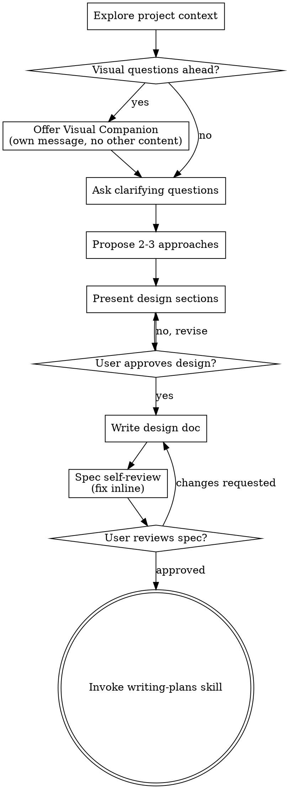

<!-- Generated by SpecStory, Markdown v2.1.0 -->

# 2026-04-21 20:43:23Z

<!-- Claude Code Session a3a06cce-4c32-4393-9a78-0f21996feabe (2026-04-21 20:43:23Z) -->

_**User (2026-04-21 20:43:23Z)**_

Continue the Storybook controls audit on src/components/answer-game/* (or the broader audit scope ��� you can direct).
                                                                                                                                                                                    
  Next target: <TARGET_FILE>.stories.tsx (I'll name it)                                                                                                                           
                                                                                                                                                                                    
  Before touching code                                                                                                                                                              
                                                                                                                                                                                    
  1. Run /resync ��� confirm you're on master and clean.                                                                                                                              
  2. Invoke superpowers:using-git-worktrees. Create a new worktree from master:                                                                                                   
                                                                                                                                                                                    
  git worktree add ./worktrees/stories-<target> -b stories/<target>-audit master                                                                                                    
  cd ./worktrees/stories-<target> && yarn install                                                                                                                                   
  3. Launch Storybook on a free port (6106+) in the background and actually view every story for the target in a browser before writing any diffs. Use Playwright for screenshots if
   needed (script can live in /tmp, run from inside the worktree so node_modules resolves).                                                                                         
  
  Per-file audit checklist                                                                                                                                                          
                                                                                                                                                                                  
  1. Controls policy. Each control must map to something visible. Drop text controls for invisible values (ids, etc.) ��� derive them from a visible control if they toggle behaviour 
  (e.g. InstructionsOverlay's customGameId is now derived from non-empty customGameName). Prefer select / radio / boolean / range over raw text where the domain is enumerable.   
  2. Skin tokens. Grep the component for --skin-* / skin.tokens. If it consumes them, wrap the render in:                                                                           
                                                                                                                                                                                    
  <div className={`game-container skin-${classicSkin.id}`} style={classicSkin.tokens as CSSProperties}>                                                                             
    <Component ... />                                                                                                                                                               
  </div>                                                                                                                                                                            
                                                                                                                                                                                  
  2. If it uses only theme tokens (bg-background, etc.), do NOT add the wrapper ��� flag it in the PR body.                                                                           
  3. Docgen rows. Hide raw component props that are either shadowed by your StoryArgs, derived, or not meaningful in a playground: declare as ?: never on the StoryArgs interface
  AND { table: { disable: true } } in argTypes.                                                                                                                                     
  4. Collapse redundant stories. If play-flow interaction stories duplicate Vitest coverage (<Target>.test.tsx), collapse to a single Playground. Keep scenario stories only when 
  they add per-game or per-mode visual coverage not otherwise captured.                                                                                                             
  5. Real-game parity. Compare the Storybook render to how the feature actually mounts at runtime (src/routes/��� or src/games/���). Any visual drift = flag in PR body.              
  6. Propose changes in plain English before writing diffs. Wait for LGTM.                                                                                                          
                                                                                                                                                                                    
  Per-file verification gate                                                                                                                                                        
                                                                                                                                                                                    
  - yarn typecheck ��� 0 errors                                                                                                                                                       
  - yarn lint ��� 0 errors                                                                                                                                                          
  - yarn test:storybook --url http://127.0.0.1:<port> ��� all suites green (don't let ours regress)                                                                                   
  - Kill Storybook when done.                                                                                                                                                       
                                                                                                                                                                                    
  Canonical references                                                                                                                                                              
                                                                                                                                                                                    
  - Controls policy: .claude/skills/write-storybook/SKILL.md                                                                                                                        
  - Shell-slim canonical example: src/components/answer-game/AnswerGame/AnswerGame.stories.tsx
  - Skin-wrapped canonical example: src/components/answer-game/ProgressHUD/ProgressHUD.stories.tsx                                                                                  
  - Real dice/domino renderers: src/games/number-match/NumeralTileBank/NumeralTileBank.tsx exports DiceFace, DominoTile                                                             
  - Tracking issue: #125 (audit rollout)                                                                                                                                            
  - Recent precedent: #134 (retrofit batch), #141 (InstructionsOverlay Playground collapse), #143 (per-game wrapper refactor ��� follow-up, do NOT tackle in the audit)               
                                                                                                                                                                                    
  Project rules (CLAUDE.md)                                                                                                                                                         
                                                                                                                                                                                    
  - Never commit to master directly ��� worktree only.                                                                                                                                
  - Markdown edits must pass yarn fix:md before commit.                                                                                                                           
  - TDD for any bug fix or feature: write the failing test first.                                                                                                                   
  - One commit per file; commit message shape: stories(answer-game/<name>): <imperative summary>.                                                                                   
  - PRs always target master.                                                                                                                                                       
                                                                                                                                                                                    
  Behavioral notes (memory)                                                                                                                                                         
                                                                                                                                                                                    
  - Commit freely; push freely for features, confirm before push for bug fixes.                                                                                                     
  - Named exports only (no export default outside framework config).
  - Direct execution style ��� no preamble. Make the fix, verify, commit, proceed.                                                                                                    
  - If a GitHub action auto-opens the PR on push, edit its body/title rather than trying to create a new one.                                                                       
  - Run Playwright scripts from inside the worktree (has node_modules), not /tmp.                                                                                                   
                                                                                                                                                                                    
  Start with superpowers:using-git-worktrees, then /resync, then read the target's .stories.tsx + the component before proposing any change.

---

_**Agent (claude-opus-4-7 2026-04-21 20:43:27Z)**_

_**Agent (claude-opus-4-7 2026-04-21 20:43:29Z)**_

You left the target as `<TARGET_FILE>` — which component's `.stories.tsx` should I audit next?

Before I spin up a worktree and Storybook, name the file (e.g. `GameBoard.stories.tsx`, `ScoreBoard.stories.tsx`, etc.) so I create the branch with the right name and avoid churning the worktree.

---

_**User (2026-04-21 20:44:23Z)**_

what is missing from here? https://github.com/leocaseiro/base-skill/issues/125

---

_**Agent (claude-opus-4-7 2026-04-21 20:44:25Z)**_

_**Agent (claude-opus-4-7 2026-04-21 20:44:28Z)**_

<tool-use data-tool-type="shell" data-tool-name="Bash"><details>
<summary>Tool use: **Bash**</summary>
View issue #125 details

`gh issue view 125 --repo leocaseiro/base-skill`

```text
title:	Storybook controls audit — rollout tracker (remaining 34 story files)
state:	OPEN
author:	leocaseiro (Leo Caseiro)
labels:	
comments:	0
assignees:	
projects:	
milestone:	
number:	125
--
## Purpose

Track rollout of the Storybook Controls Policy + Required Variants gates (see [`.claude/skills/write-storybook/SKILL.md`](../blob/master/.claude/skills/write-storybook/SKILL.md)) across the remaining story files. Pilot covered `src/components/ui/*` — shipped in #124. The pattern is now proven (and corrected: `fn()` in `args`, not global `argTypesRegex`).

## Per-file checklist

### Root components (`src/components/*`)

- [ ] `ConfigFormFields.stories.tsx`
- [ ] `Footer.stories.tsx`
- [ ] `GameCard.stories.tsx`
- [ ] `GameGrid.stories.tsx`
- [ ] `GameNameChip.stories.tsx`
- [ ] `Header.stories.tsx`
- [ ] `OfflineIndicator.stories.tsx`
- [ ] `ThemeToggle.stories.tsx`
- [ ] `UpdateBanner.stories.tsx`

### `answer-game/*`

- [x] `AnswerGame/AnswerGame.stories.tsx`
- [x] `EncouragementAnnouncer/EncouragementAnnouncer.stories.tsx`
- [x] `GameOverOverlay/GameOverOverlay.stories.tsx`
- [x] `InstructionsOverlay/InstructionsOverlay.stories.tsx`
- [x] `LevelCompleteOverlay/LevelCompleteOverlay.stories.tsx`
- [x] `ProgressHUD/ProgressHUD.stories.tsx`
- [x] `ScoreAnimation/ScoreAnimation.stories.tsx`
- [x] `Slot/Slot.stories.tsx`

### `questions/*`

- [ ] `AudioButton/AudioButton.stories.tsx`
- [ ] `DotGroupQuestion/DotGroupQuestion.stories.tsx`
- [ ] `ImageQuestion/ImageQuestion.stories.tsx`
- [ ] `TextQuestion/TextQuestion.stories.tsx`

### `game/*`

- [ ] `game/GameShell.stories.tsx`

### `games/*`

- [ ] `number-match/NumberMatch/NumberMatch.stories.tsx`
- [ ] `number-match/NumberMatch/NumberMatch.skin.stories.tsx`
- [ ] `number-match/NumeralTileBank/NumeralTileBank.stories.tsx`
- [ ] `sort-numbers/SortNumbers/SortNumbers.stories.tsx`
- [ ] `sort-numbers/SortNumbers/SortNumbers.skin.stories.tsx`
- [ ] `sort-numbers/SortNumbersTileBank/SortNumbersTileBank.stories.tsx`
- [ ] `word-spell/WordSpell/WordSpell.stories.tsx`
- [ ] `word-spell/WordSpell/WordSpell.skin.stories.tsx`
- [ ] `word-spell/LetterTileBank/LetterTileBank.stories.tsx`

### Misc

- [ ] `data/words/WordLibraryExplorer.stories.tsx`
- [ ] `lib/audio/AudioFeedback.stories.tsx`
- [ ] `stories/ThemeShowcase.stories.tsx`

## Gates per file (from SKILL.md)

1. All non-callback, non-JSX props have proper `argTypes` controls — no raw JSON fallbacks.
2. Every `on*` handler wired to `fn()` from `storybook/test` in `args` (do NOT rely on `argTypesRegex` alone — it misses DOM-extended props under react-docgen).
3. At least one `play()` interaction story on interactive components.
4. Required Variants present (Default, enum-per-value where visuals differ, state variants, edge cases).
5. Decorators match current dependencies (`withDb`, `withRouter`).
6. Typecheck, lint, lint:md, test:storybook all green.

## Batching suggestion

Group by directory to keep PRs reviewable. Estimated 3-5 batches:

- Batch 2: `answer-game/*` (8 files) — highest complexity, lots of game state
- Batch 3: `questions/*` + `game/*` (5 files)
- Batch 4: `games/*` (9 files) — skin + default stories
- Batch 5: root `components/*` (9 files)
- Batch 6: Misc (3 files)

Each batch spawns its own spec → plan → subagent-driven execution cycle.

## Out of scope

- Design-token contrast fix for `button`/`input` secondary variants (separate PR — requires VR baseline regen).
- Any change to `.storybook/preview.tsx` or global config.

## Related

- Pilot PR: #124
- Policy source: `.claude/skills/write-storybook/SKILL.md`
- Pilot spec: `docs/superpowers/specs/2026-04-17-audit-storybook-ui-controls-design.md`
```
</details></tool-use>

_**Agent (claude-opus-4-7 2026-04-21 20:44:44Z)**_

_**Agent (claude-opus-4-7 2026-04-21 20:45:00Z)**_

Looking at issue #125 against what's actually shipped and the policies you've been enforcing in recent PRs, these are the gaps:

**Progress not reflected**
- Title still says "remaining 34 story files" but `answer-game/*` (8 files) is fully checked — remaining is 26. Update the title.
- Batching section calls `answer-game/*` "Batch 2" with no status. Mark Batch 1 (#124) and Batch 2 (answer-game) shipped.

**Precedent PRs missing from "Related"**
- #134 retrofit batch
- #141 InstructionsOverlay Playground collapse
- #143 per-game wrapper refactor (even though you said not to tackle it in the audit — it's still the canonical for skin wrappers)
- Only #124 is linked today.

**Gates section is stale vs. the policy you're now enforcing**
The six gates don't mention several rules you apply per-file:
1. Drop text controls for invisible values (ids) — derive from a visible control (the InstructionsOverlay `customGameId`-from-`customGameName` precedent).
2. Prefer `select` / `radio` / `boolean` / `range` over raw text when the domain is enumerable.
3. Skin-token wrapper pattern — `<div className={`game-container skin-${classicSkin.id}`} style={classicSkin.tokens}>` when the component reads `--skin-*`; **do not** wrap if it only uses theme tokens (flag in PR body).
4. Hide shadowed/derived docgen rows via `?: never` on `StoryArgs` **and** `{ table: { disable: true } }` in `argTypes`.
5. Collapse play-flow interaction stories that duplicate `*.test.tsx` Vitest coverage into a single Playground; keep scenario stories only for per-game/per-mode visual coverage.
6. Real-game parity check against `src/routes/…` or `src/games/…` — flag any visual drift in the PR body.

**Per-file verification gate not listed**
Your workflow requires `yarn typecheck` + `yarn lint` + `yarn test:storybook --url …` green on a locally-running Storybook (free port 6106+) before commit. Issue just says "test:storybook green" with no port/local-server guidance.

**Canonical references missing**
- Shell-slim canonical: `src/components/answer-game/AnswerGame/AnswerGame.stories.tsx`
- Skin-wrapped canonical: `src/components/answer-game/ProgressHUD/ProgressHUD.stories.tsx`
- Real renderers for games: `NumeralTileBank` exports `DiceFace`/`DominoTile`

**Conventions not stated**
- One commit per file, message `stories(<area>/<name>): <imperative>`.
- PR base always `master`.
- Worktree required even for the audit (per CLAUDE.md).

Want me to open a worktree and edit the issue body to patch these in?

---

_**User (2026-04-21 20:45:02Z)**_

Let's go from simple to complex. give a list of the simple components to audit

---

_**Agent (claude-opus-4-7 2026-04-21 20:45:13Z)**_

_**Agent (claude-opus-4-7 2026-04-21 20:45:15Z)**_

<tool-use data-tool-type="shell" data-tool-name="Bash"><details>
<summary>Tool use: **Bash**</summary>
Line counts for root component stories

`wc -l src/components/Footer.stories.tsx src/components/OfflineIndicator.stories.tsx src/components/ThemeToggle.stories.tsx src/components/UpdateBanner.stories.tsx src/components/GameNameChip.stories.tsx src/components/Header.stories.tsx src/components/GameCard.stories.tsx src/components/GameGrid.stories.tsx src/components/ConfigFormFields.stories.tsx 2>/dev/null`

```text
      14 src/components/Footer.stories.tsx
      24 src/components/OfflineIndicator.stories.tsx
      12 src/components/ThemeToggle.stories.tsx
      40 src/components/UpdateBanner.stories.tsx
      79 src/components/GameNameChip.stories.tsx
      14 src/components/Header.stories.tsx
      79 src/components/GameCard.stories.tsx
      52 src/components/GameGrid.stories.tsx
     147 src/components/ConfigFormFields.stories.tsx
     461 total
```
</details></tool-use>

_**Agent (claude-opus-4-7 2026-04-21 20:45:16Z)**_

<tool-use data-tool-type="shell" data-tool-name="Bash"><details>
<summary>Tool use: **Bash**</summary>
Line counts for question stories

`wc -l src/components/questions/AudioButton/AudioButton.stories.tsx src/components/questions/TextQuestion/TextQuestion.stories.tsx src/components/questions/DotGroupQuestion/DotGroupQuestion.stories.tsx src/components/questions/ImageQuestion/ImageQuestion.stories.tsx 2>/dev/null`

```text
      32 src/components/questions/AudioButton/AudioButton.stories.tsx
      36 src/components/questions/TextQuestion/TextQuestion.stories.tsx
      45 src/components/questions/DotGroupQuestion/DotGroupQuestion.stories.tsx
      34 src/components/questions/ImageQuestion/ImageQuestion.stories.tsx
     147 total
```
</details></tool-use>

_**Agent (claude-opus-4-7 2026-04-21 20:45:17Z)**_

<tool-use data-tool-type="shell" data-tool-name="Bash"><details>
<summary>Tool use: **Bash**</summary>
Line counts for misc/game stories

`wc -l src/stories/ThemeShowcase.stories.tsx src/lib/audio/AudioFeedback.stories.tsx src/data/words/WordLibraryExplorer.stories.tsx src/components/game/GameShell.stories.tsx 2>/dev/null`

```text
     141 src/stories/ThemeShowcase.stories.tsx
     248 src/lib/audio/AudioFeedback.stories.tsx
      36 src/data/words/WordLibraryExplorer.stories.tsx
     140 src/components/game/GameShell.stories.tsx
     565 total
```
</details></tool-use>

_**Agent (claude-opus-4-7 2026-04-21 20:45:20Z)**_

<tool-use data-tool-type="shell" data-tool-name="Bash"><details>
<summary>Tool use: **Bash**</summary>
Line counts for games stories

`wc -l src/games/number-match/NumberMatch/NumberMatch.stories.tsx src/games/number-match/NumberMatch/NumberMatch.skin.stories.tsx src/games/number-match/NumeralTileBank/NumeralTileBank.stories.tsx src/games/sort-numbers/SortNumbers/SortNumbers.stories.tsx src/games/sort-numbers/SortNumbers/SortNumbers.skin.stories.tsx src/games/sort-numbers/SortNumbersTileBank/SortNumbersTileBank.stories.tsx src/games/word-spell/WordSpell/WordSpell.stories.tsx src/games/word-spell/WordSpell/WordSpell.skin.stories.tsx src/games/word-spell/LetterTileBank/LetterTileBank.stories.tsx 2>/dev/null`

```text
     140 src/games/number-match/NumberMatch/NumberMatch.stories.tsx
      71 src/games/number-match/NumberMatch/NumberMatch.skin.stories.tsx
     129 src/games/number-match/NumeralTileBank/NumeralTileBank.stories.tsx
     318 src/games/sort-numbers/SortNumbers/SortNumbers.stories.tsx
     163 src/games/sort-numbers/SortNumbers/SortNumbers.skin.stories.tsx
     122 src/games/sort-numbers/SortNumbersTileBank/SortNumbersTileBank.stories.tsx
     105 src/games/word-spell/WordSpell/WordSpell.stories.tsx
     154 src/games/word-spell/WordSpell/WordSpell.skin.stories.tsx
     124 src/games/word-spell/LetterTileBank/LetterTileBank.stories.tsx
    1326 total
```
</details></tool-use>

_**Agent (claude-opus-4-7 2026-04-21 20:45:32Z)**_

Here's the remaining 26 files ordered **simple → complex** (line counts as a rough proxy, plus knowledge of what each component does):

## Tier 1 — Trivial (stub-sized, few props)

1. `ThemeToggle.stories.tsx` (12)
2. `Footer.stories.tsx` (14)
3. `Header.stories.tsx` (14)
4. `OfflineIndicator.stories.tsx` (24)
5. `UpdateBanner.stories.tsx` (40)

## Tier 2 — Small / single-purpose

6. `questions/AudioButton.stories.tsx` (32)
7. `questions/ImageQuestion.stories.tsx` (34)
8. `questions/TextQuestion.stories.tsx` (36)
9. `data/words/WordLibraryExplorer.stories.tsx` (36)
10. `questions/DotGroupQuestion.stories.tsx` (45)

## Tier 3 — Medium (enumerable props, multiple variants)

11. `GameGrid.stories.tsx` (52)
12. `GameCard.stories.tsx` (79)
13. `GameNameChip.stories.tsx` (79)
14. `ConfigFormFields.stories.tsx` (147)
15. `stories/ThemeShowcase.stories.tsx` (141) — token-heavy but no game state

## Tier 4 — Game-adjacent (skin wrappers, tile renderers)

16. `games/word-spell/LetterTileBank.stories.tsx` (124)
17. `games/sort-numbers/SortNumbersTileBank.stories.tsx` (122)
18. `games/number-match/NumeralTileBank.stories.tsx` (129) — hosts `DiceFace`/`DominoTile`
19. `components/game/GameShell.stories.tsx` (140)

## Tier 5 — Complex (full game state, skin + default pair)

20. `games/number-match/NumberMatch.skin.stories.tsx` (71)
21. `games/number-match/NumberMatch.stories.tsx` (140)
22. `games/word-spell/WordSpell.stories.tsx` (105)
23. `games/word-spell/WordSpell.skin.stories.tsx` (154)
24. `games/sort-numbers/SortNumbers.skin.stories.tsx` (163)
25. `games/sort-numbers/SortNumbers.stories.tsx` (318)
26. `lib/audio/AudioFeedback.stories.tsx` (248) — large but self-contained; could slot into Tier 3 if mostly button variants

**Suggested first target:** `ThemeToggle.stories.tsx` — smallest blast radius, fastest to prove the workflow on a pure root component, and likely just needs `fn()` wiring + a boolean/select control audit.

Want me to start the worktree on `ThemeToggle`?

---

_**User (2026-04-21 20:45:35Z)**_

I also want to keep the issue up to date, lets do it.

---

_**Agent (claude-opus-4-7 2026-04-21 20:45:48Z)**_

_**Agent (claude-opus-4-7 2026-04-21 20:45:50Z)**_

<tool-use data-tool-type="shell" data-tool-name="Bash"><details>
<summary>Tool use: **Bash**</summary>
Backup original issue body

`gh issue view 125 --repo leocaseiro/base-skill --json title,body -q '.body' > /tmp/issue-125-original.md && wc -l /tmp/issue-125-original.md`

```text
      90 /tmp/issue-125-original.md
```
</details></tool-use>

_**Agent (claude-opus-4-7 2026-04-21 20:45:54Z)**_

Here's the draft I'll push. Confirm or redline before I apply.

**New title:**
`Storybook controls audit — rollout tracker (26 remaining story files)`

**New body:**

_**Agent (claude-opus-4-7 2026-04-21 20:46:35Z)**_

<tool-use data-tool-type="write" data-tool-name="Write"><details>
<summary>Tool use: **Write**</summary>

```md
## Purpose

Track rollout of the Storybook Controls Policy + Required Variants gates (see [`.claude/skills/write-storybook/SKILL.md`](../blob/master/.claude/skills/write-storybook/SKILL.md)) across the remaining story files. Pilot covered `src/components/ui/*` — shipped in #124. Batch 2 covered `src/components/answer-game/*` — shipped across #134, #141, #143. The pattern is now proven: `fn()` in `args` (not global `argTypesRegex`), skin-token wrappers only when the component consumes `--skin-*`, and docgen rows hidden for shadowed/derived props.

## Per-file checklist

### Root components (`src/components/*`)

- [ ] `ConfigFormFields.stories.tsx`
- [ ] `Footer.stories.tsx`
- [ ] `GameCard.stories.tsx`
- [ ] `GameGrid.stories.tsx`
- [ ] `GameNameChip.stories.tsx`
- [ ] `Header.stories.tsx`
- [ ] `OfflineIndicator.stories.tsx`
- [ ] `ThemeToggle.stories.tsx`
- [ ] `UpdateBanner.stories.tsx`

### `answer-game/*` ✅ shipped (#134, #141, #143)

- [x] `AnswerGame/AnswerGame.stories.tsx`
- [x] `EncouragementAnnouncer/EncouragementAnnouncer.stories.tsx`
- [x] `GameOverOverlay/GameOverOverlay.stories.tsx`
- [x] `InstructionsOverlay/InstructionsOverlay.stories.tsx`
- [x] `LevelCompleteOverlay/LevelCompleteOverlay.stories.tsx`
- [x] `ProgressHUD/ProgressHUD.stories.tsx`
- [x] `ScoreAnimation/ScoreAnimation.stories.tsx`
- [x] `Slot/Slot.stories.tsx`

### `questions/*`

- [ ] `AudioButton/AudioButton.stories.tsx`
- [ ] `DotGroupQuestion/DotGroupQuestion.stories.tsx`
- [ ] `ImageQuestion/ImageQuestion.stories.tsx`
- [ ] `TextQuestion/TextQuestion.stories.tsx`

### `game/*`

- [ ] `game/GameShell.stories.tsx`

### `games/*`

- [ ] `number-match/NumberMatch/NumberMatch.stories.tsx`
- [ ] `number-match/NumberMatch/NumberMatch.skin.stories.tsx`
- [ ] `number-match/NumeralTileBank/NumeralTileBank.stories.tsx`
- [ ] `sort-numbers/SortNumbers/SortNumbers.stories.tsx`
- [ ] `sort-numbers/SortNumbers/SortNumbers.skin.stories.tsx`
- [ ] `sort-numbers/SortNumbersTileBank/SortNumbersTileBank.stories.tsx`
- [ ] `word-spell/WordSpell/WordSpell.stories.tsx`
- [ ] `word-spell/WordSpell/WordSpell.skin.stories.tsx`
- [ ] `word-spell/LetterTileBank/LetterTileBank.stories.tsx`

### Misc

- [ ] `data/words/WordLibraryExplorer.stories.tsx`
- [ ] `lib/audio/AudioFeedback.stories.tsx`
- [ ] `stories/ThemeShowcase.stories.tsx`

## Gates per file

From [`.claude/skills/write-storybook/SKILL.md`](../blob/master/.claude/skills/write-storybook/SKILL.md) plus enforcement rules proven during Batch 2:

1. **Controls map to something visible.** Drop text controls for invisible values (ids, internal keys). If a value toggles behaviour, derive it from a visible control (precedent: `InstructionsOverlay` — `customGameId` derived from non-empty `customGameName`).
2. **Prefer structured inputs.** `select` / `radio` / `boolean` / `range` over raw text whenever the domain is enumerable. No raw JSON fallbacks.
3. **Handler wiring.** Every `on*` prop wired to `fn()` from `storybook/test` in `args` — do NOT rely on `argTypesRegex` alone (misses DOM-extended props under react-docgen).
4. **Skin-token wrapper (conditional).** If the component reads `--skin-*` or `skin.tokens`, wrap the render in:

    \```tsx
    <div className={`game-container skin-${classicSkin.id}`} style={classicSkin.tokens as CSSProperties}>
      <Component ... />
    </div>
    \```

    If it uses only theme tokens (`bg-background`, etc.), do **not** add the wrapper — flag the decision in the PR body.

5. **Hide shadowed/derived docgen rows.** Declare `?: never` on the `StoryArgs` interface **and** `{ table: { disable: true } }` in `argTypes` for props that are shadowed, derived, or not meaningful in a playground.
6. **Collapse redundant stories.** If play-flow interaction stories duplicate `*.test.tsx` Vitest coverage, collapse to a single Playground. Keep scenario stories only when they add per-game or per-mode visual coverage not otherwise captured.
7. **Real-game parity.** Compare Storybook render to how the feature mounts at runtime (`src/routes/…` or `src/games/…`). Any visual drift → flag in PR body.
8. **Required Variants present** — Default, enum-per-value where visuals differ, state variants, edge cases.
9. **Decorators match current dependencies** — `withDb`, `withRouter`.
10. **At least one `play()` interaction story** on interactive components.

## Per-file verification gate

Run locally from inside the worktree, against a Storybook instance on a free port (6106+):

- `yarn typecheck` — 0 errors
- `yarn lint` — 0 errors
- `yarn test:storybook --url http://127.0.0.1:<port>` — all suites green
- Kill the Storybook process when done

## Canonical references

- **Controls policy:** [`.claude/skills/write-storybook/SKILL.md`](../blob/master/.claude/skills/write-storybook/SKILL.md)
- **Shell-slim canonical:** `src/components/answer-game/AnswerGame/AnswerGame.stories.tsx`
- **Skin-wrapped canonical:** `src/components/answer-game/ProgressHUD/ProgressHUD.stories.tsx`
- **Real dice/domino renderers:** `src/games/number-match/NumeralTileBank/NumeralTileBank.tsx` exports `DiceFace`, `DominoTile`

## Conventions

- **Worktree required** — no direct commits to `master`, even for docs (see `CLAUDE.md`).
- **One commit per file.** Commit message shape: `stories(<area>/<name>): <imperative summary>`.
- **PRs always target `master`.**
- **Markdown edits** must pass `yarn fix:md` before commit.

## Batching

| Batch | Scope | Status |
| --- | --- | --- |
| 1 | `src/components/ui/*` (pilot) | ✅ #124 |
| 2 | `answer-game/*` (8 files) | ✅ #134, #141, #143 |
| 3 | `questions/*` + `game/*` (5 files) | ⏳ |
| 4 | `games/*` (9 files) — skin + default | ⏳ |
| 5 | root `components/*` (9 files) | ⏳ |
| 6 | Misc (3 files) | ⏳ |

Each batch spawns its own spec → plan → subagent-driven execution cycle.

## Out of scope

- Design-token contrast fix for `button`/`input` secondary variants (separate PR — requires VR baseline regen).
- Any change to `.storybook/preview.tsx` or global config.
- Per-game wrapper refactor follow-ups beyond what #143 shipped.

## Related

- Pilot PR: #124
- Batch 2 PRs: #134 (retrofit batch), #141 (InstructionsOverlay Playground collapse), #143 (per-game wrapper refactor)
- Policy source: [`.claude/skills/write-storybook/SKILL.md`](../blob/master/.claude/skills/write-storybook/SKILL.md)
- Pilot spec: `docs/superpowers/specs/2026-04-17-audit-storybook-ui-controls-design.md`

```

```text
File created successfully at: /tmp/issue-125-new.md (file state is current in your context — no need to Read it back)
```
</details></tool-use>

_**Agent (claude-opus-4-7 2026-04-21 20:46:40Z)**_

_**Agent (claude-opus-4-7 2026-04-21 20:46:40Z)**_

Applying now.

_**Agent (claude-opus-4-7 2026-04-21 20:46:43Z)**_

<tool-use data-tool-type="shell" data-tool-name="Bash"><details>
<summary>Tool use: **Bash**</summary>
Update issue #125 title and body

`gh issue edit 125 --repo leocaseiro/base-skill --title "Storybook controls audit — rollout tracker (26 remaining story files)" --body-file /tmp/issue-125-new.md`

```text
https://github.com/leocaseiro/base-skill/issues/125
```
</details></tool-use>

_**Agent (claude-opus-4-7 2026-04-21 20:46:51Z)**_

Updated. Key changes:

- **Title** → `(26 remaining story files)` (was 34).
- **Batch 2 marked shipped** with links to #134, #141, #143.
- **Gates expanded** from 6 generic items to 10 concrete rules — controls-map-to-visible, structured inputs, `fn()` wiring (not regex), conditional skin-token wrapper with code snippet, `?: never` + `table.disable` for shadowed rows, collapse-vs-Vitest, real-game parity, variants, decorators, `play()`.
- **Per-file verification gate** section added — local Storybook on free port, `typecheck`/`lint`/`test:storybook`.
- **Canonical references** listed: SKILL.md, shell-slim (`AnswerGame`), skin-wrapped (`ProgressHUD`), `DiceFace`/`DominoTile` location.
- **Conventions** section: worktree required, one-commit-per-file shape, PR base master, `yarn fix:md`.
- **Batching** reformatted as a status table with ✅/⏳.
- **Related** now includes #134/#141/#143.

Next: want me to open the worktree on `ThemeToggle.stories.tsx` (Tier 1, smallest)?

---

_**User (2026-04-21 20:47:05Z)**_

Now, let's plan the Tier 1 and 2, I think we can plan all togheter and have subagents to raise multiple PRs at once.

---

_**Agent (claude-opus-4-7 2026-04-21 20:47:19Z)**_

_**Agent (claude-opus-4-7 2026-04-21 20:47:19Z)**_

<tool-use data-tool-type="generic" data-tool-name="Skill"><details>
<summary>Tool use: **Skill**</summary>

**Input:**

- skill: `superpowers:brainstorming`

</details></tool-use>

---

_**User (2026-04-21 20:47:19Z)**_

Base directory for this skill: /Users/leocaseiro/.claude/plugins/cache/claude-plugins-official/superpowers/5.0.7/skills/brainstorming

# Brainstorming Ideas Into Designs

Help turn ideas into fully formed designs and specs through natural collaborative dialogue.

Start by understanding the current project context, then ask questions one at a time to refine the idea. Once you understand what you're building, present the design and get user approval.

<HARD-GATE>
Do NOT invoke any implementation skill, write any code, scaffold any project, or take any implementation action until you have presented a design and the user has approved it. This applies to EVERY project regardless of perceived simplicity.
</HARD-GATE>

## Anti-Pattern: "This Is Too Simple To Need A Design"

Every project goes through this process. A todo list, a single-function utility, a config change — all of them. "Simple" projects are where unexamined assumptions cause the most wasted work. The design can be short (a few sentences for truly simple projects), but you MUST present it and get approval.

## Checklist

You MUST create a task for each of these items and complete them in order:

1. **Explore project context** — check files, docs, recent commits
2. **Offer visual companion** (if topic will involve visual questions) — this is its own message, not combined with a clarifying question. See the Visual Companion section below.
3. **Ask clarifying questions** — one at a time, understand purpose/constraints/success criteria
4. **Propose 2-3 approaches** — with trade-offs and your recommendation
5. **Present design** — in sections scaled to their complexity, get user approval after each section
6. **Write design doc** — save to `docs/superpowers/specs/YYYY-MM-DD-<topic>-design.md` and commit
7. **Spec self-review** — quick inline check for placeholders, contradictions, ambiguity, scope (see below)
8. **User reviews written spec** — ask user to review the spec file before proceeding
9. **Transition to implementation** — invoke writing-plans skill to create implementation plan

## Process Flow



**The terminal state is invoking writing-plans.** Do NOT invoke frontend-design, mcp-builder, or any other implementation skill. The ONLY skill you invoke after brainstorming is writing-plans.

## The Process

**Understanding the idea:**

- Check out the current project state first (files, docs, recent commits)
- Before asking detailed questions, assess scope: if the request describes multiple independent subsystems (e.g., "build a platform with chat, file storage, billing, and analytics"), flag this immediately. Don't spend questions refining details of a project that needs to be decomposed first.
- If the project is too large for a single spec, help the user decompose into sub-projects: what are the independent pieces, how do they relate, what order should they be built? Then brainstorm the first sub-project through the normal design flow. Each sub-project gets its own spec → plan → implementation cycle.
- For appropriately-scoped projects, ask questions one at a time to refine the idea
- Prefer multiple choice questions when possible, but open-ended is fine too
- Only one question per message - if a topic needs more exploration, break it into multiple questions
- Focus on understanding: purpose, constraints, success criteria

**Exploring approaches:**

- Propose 2-3 different approaches with trade-offs
- Present options conversationally with your recommendation and reasoning
- Lead with your recommended option and explain why

**Presenting the design:**

- Once you believe you understand what you're building, present the design
- Scale each section to its complexity: a few sentences if straightforward, up to 200-300 words if nuanced
- Ask after each section whether it looks right so far
- Cover: architecture, components, data flow, error handling, testing
- Be ready to go back and clarify if something doesn't make sense

**Design for isolation and clarity:**

- Break the system into smaller units that each have one clear purpose, communicate through well-defined interfaces, and can be understood and tested independently
- For each unit, you should be able to answer: what does it do, how do you use it, and what does it depend on?
- Can someone understand what a unit does without reading its internals? Can you change the internals without breaking consumers? If not, the boundaries need work.
- Smaller, well-bounded units are also easier for you to work with - you reason better about code you can hold in context at once, and your edits are more reliable when files are focused. When a file grows large, that's often a signal that it's doing too much.

**Working in existing codebases:**

- Explore the current structure before proposing changes. Follow existing patterns.
- Where existing code has problems that affect the work (e.g., a file that's grown too large, unclear boundaries, tangled responsibilities), include targeted improvements as part of the design - the way a good developer improves code they're working in.
- Don't propose unrelated refactoring. Stay focused on what serves the current goal.

## After the Design

**Documentation:**

- Write the validated design (spec) to `docs/superpowers/specs/YYYY-MM-DD-<topic>-design.md`
  - (User preferences for spec location override this default)
- Use elements-of-style:writing-clearly-and-concisely skill if available
- Commit the design document to git

**Spec Self-Review:**
After writing the spec document, look at it with fresh eyes:

1. **Placeholder scan:** Any "TBD", "TODO", incomplete sections, or vague requirements? Fix them.
2. **Internal consistency:** Do any sections contradict each other? Does the architecture match the feature descriptions?
3. **Scope check:** Is this focused enough for a single implementation plan, or does it need decomposition?
4. **Ambiguity check:** Could any requirement be interpreted two different ways? If so, pick one and make it explicit.

Fix any issues inline. No need to re-review — just fix and move on.

**User Review Gate:**
After the spec review loop passes, ask the user to review the written spec before proceeding:

> "Spec written and committed to `<path>`. Please review it and let me know if you want to make any changes before we start writing out the implementation plan."

Wait for the user's response. If they request changes, make them and re-run the spec review loop. Only proceed once the user approves.

**Implementation:**

- Invoke the writing-plans skill to create a detailed implementation plan
- Do NOT invoke any other skill. writing-plans is the next step.

## Key Principles

- **One question at a time** - Don't overwhelm with multiple questions
- **Multiple choice preferred** - Easier to answer than open-ended when possible
- **YAGNI ruthlessly** - Remove unnecessary features from all designs
- **Explore alternatives** - Always propose 2-3 approaches before settling
- **Incremental validation** - Present design, get approval before moving on
- **Be flexible** - Go back and clarify when something doesn't make sense

## Visual Companion

A browser-based companion for showing mockups, diagrams, and visual options during brainstorming. Available as a tool — not a mode. Accepting the companion means it's available for questions that benefit from visual treatment; it does NOT mean every question goes through the browser.

**Offering the companion:** When you anticipate that upcoming questions will involve visual content (mockups, layouts, diagrams), offer it once for consent:
> "Some of what we're working on might be easier to explain if I can show it to you in a web browser. I can put together mockups, diagrams, comparisons, and other visuals as we go. This feature is still new and can be token-intensive. Want to try it? (Requires opening a local URL)"

**This offer MUST be its own message.** Do not combine it with clarifying questions, context summaries, or any other content. The message should contain ONLY the offer above and nothing else. Wait for the user's response before continuing. If they decline, proceed with text-only brainstorming.

**Per-question decision:** Even after the user accepts, decide FOR EACH QUESTION whether to use the browser or the terminal. The test: **would the user understand this better by seeing it than reading it?**

- **Use the browser** for content that IS visual — mockups, wireframes, layout comparisons, architecture diagrams, side-by-side visual designs
- **Use the terminal** for content that is text — requirements questions, conceptual choices, tradeoff lists, A/B/C/D text options, scope decisions

A question about a UI topic is not automatically a visual question. "What does personality mean in this context?" is a conceptual question — use the terminal. "Which wizard layout works better?" is a visual question — use the browser.

If they agree to the companion, read the detailed guide before proceeding:
`skills/brainstorming/visual-companion.md`


---

_**Agent (claude-opus-4-7 2026-04-21 20:47:30Z)**_

_**Agent (claude-opus-4-7 2026-04-21 20:47:36Z)**_

Before I draft a plan, one high-leverage question first.

**PR granularity — which shape do you want?**

- **A) One PR per file (10 PRs).** Maximum review granularity, each lands/reverts independently. Matches #141's pattern. Cost: 10 review cycles.
- **B) One PR per tier (2 PRs).** Tier 1 batch (5 trivial root components) + Tier 2 batch (5 small single-purpose). Matches #134's retrofit-batch precedent. One review per tier.
- **C) Hybrid.** Tier 1 as one batch PR (they're all nearly identical root-component shape), Tier 2 as per-file PRs (questions/* and WordLibraryExplorer each have distinct domain concerns worth isolating).

My recommendation: **C (hybrid)**. Tier 1 is 5 files × ~20 lines each of near-identical audit work — a batch PR keeps signal high and is what #134 did. Tier 2 has more variance (audio button vs. image vs. text vs. word library) and benefits from separate PRs so reviewer context is scoped.

Which way do you want to go?

---

_**User (2026-04-21 20:47:42Z)**_

<local-command-caveat>Caveat: The messages below were generated by the user while running local commands. DO NOT respond to these messages or otherwise consider them in your response unless the user explicitly asks you to.</local-command-caveat>

_**User (2026-04-21 20:47:42Z)**_

<command-name>/effort</command-name>
            <command-message>effort</command-message>
            <command-args></command-args>

_**User (2026-04-21 20:47:42Z)**_

<local-command-stdout>Set effort level to max (this session only): Maximum capability with deepest reasoning</local-command-stdout>

_**User (2026-04-21 20:48:12Z)**_

C

---

_**Agent (claude-opus-4-7 2026-04-21 20:48:24Z)**_

_**Agent (claude-opus-4-7 2026-04-21 20:48:34Z)**_

Got it — hybrid.

Next decision: **review gate for subagents.**

Your original per-file checklist said "Propose changes in plain English before writing diffs. Wait for LGTM." That's a human-in-the-loop model — great for single-threaded work, but with 5 parallel Tier 2 agents it means you review 5 proposals simultaneously before anyone writes a diff, then 5 diffs, then 5 PR bodies.

**Which model do you want for this batch?**

- **A) Strict LGTM per file.** Agent drafts proposal → pauses → you approve → agent writes diff + PR. Sequential choke point on your attention; parallelism limited to 2-3 max.
- **B) Pre-approved rules, autonomous execute.** The spec + issue #125 gates now fully specify the audit (controls policy, skin wrapper conditional, `?: never` + `table.disable`, collapse-vs-Vitest, real-game parity). Subagents execute end-to-end, open PRs, and you review at PR time. Parallelism up to 5 safely.
- **C) Pre-approved rules + "flag only on surprise."** Autonomous by default, but agent pauses if it encounters something outside the gates (e.g., a prop it can't classify, a skin decision that isn't clear-cut, a visual drift from real-game). You get pinged only for exceptions.

My recommendation: **C**. The gates are tight enough that ~80% of these files are mechanical. A "surprise → pause" rule keeps you in the loop for judgment calls without making you the bottleneck on the easy ones. Tier 1 especially (ThemeToggle, Footer, Header — all tiny) is probably zero-surprise.

Which do you want?

---

_**User (2026-04-21 20:49:53Z)**_

C, agents can raise multiple PRs, as much as they don't conflict with each other, and I can review the PRs

---

_**Agent (claude-opus-4-7 2026-04-21 20:50:23Z)**_

_**Agent (claude-opus-4-7 2026-04-21 20:50:34Z)**_

Good — conflict-free parallelism it is.

**Conflict analysis for these 10 files:**

- **File-level:** zero overlap — each story file is distinct.
- **Global config:** SKILL.md says `.storybook/*` and `preview.tsx` are out of scope → no shared-file edits.
- **yarn.lock:** story audit shouldn't touch deps → no contention.
- **Storybook ports:** each worktree runs its own server → must allocate distinct ports (6106, 6107, 6108, 6109, 6110, 6111).
- **Master drift:** if a PR merges while others are in flight, later agents rebase on push.
- **Test coupling:** need to verify no `*.test.*` file imports from a story file before collapsing play-flow stories (auto-check per agent).

So 6 parallel agents (1 Tier-1 batch + 5 Tier-2 solo) are genuinely independent.

**Next decision: parallelism ceiling.** The real constraint is your laptop — each Storybook dev server is ~1-2 GB RAM, and each worktree gets its own `node_modules` (~500 MB disk × 6).

- **A) All 6 at once.** Fastest. Needs ~9 GB RAM headroom + ~3 GB disk for worktrees. One big dispatch.
- **B) Waves of 3.** Tier 1 solo (it's a batch of 5 files through one agent) + 2 Tier-2 agents in wave 1. Once any finishes, next Tier-2 dispatches. Gentler on the machine.
- **C) Tier 1 first, then Tier 2 parallel.** Serial gate between tiers. Tier 1 (one agent, ~10 min) lands → then dispatch 5 Tier-2 agents at once. Safer ordering if you want Tier 1 to set the precedent PR pattern first.

My recommendation: **C**. Tier 1 ships a batch PR that becomes the "canonical batch shape" for root components. If any pattern emerges from Tier 1 (e.g., a decorator choice), Tier 2 agents inherit it. Also means only 5 concurrent Storybooks max, not 6, and Tier 1's PR is already up for your review by the time Tier 2 agents are chewing.

Which pacing do you want?

---

_**User (2026-04-21 20:52:42Z)**_

C

---

_**Agent (claude-opus-4-7 2026-04-21 20:53:23Z)**_

_**Agent (claude-opus-4-7 2026-04-21 20:53:43Z)**_

Here's the full design. Flag anything you want to revise.

## Scope

10 files in two waves:

- **Wave 1 — Tier 1 batch (1 PR, 1 agent):** `ThemeToggle`, `Footer`, `Header`, `OfflineIndicator`, `UpdateBanner`
- **Wave 2 — Tier 2 solo (5 PRs, 5 agents parallel):** `AudioButton`, `ImageQuestion`, `TextQuestion`, `DotGroupQuestion`, `WordLibraryExplorer`

## Execution shape

I'm the orchestrator. Each subagent owns a worktree + its own Storybook port.

- Wave 2 dispatches the moment Wave 1's PR is open (not merged) — they touch disjoint directories, so no conflict risk.
- Branches from `master` at HEAD-at-dispatch-time; each rebases before pushing.

## Worktree + branch layout

| Wave | Path | Branch | Port |
| --- | --- | --- | --- |
| 1 | `./worktrees/stories-tier1-root` | `stories/tier1-root-audit` | 6106 |
| 2a | `./worktrees/stories-audio-button` | `stories/audio-button-audit` | 6107 |
| 2b | `./worktrees/stories-image-question` | `stories/image-question-audit` | 6108 |
| 2c | `./worktrees/stories-text-question` | `stories/text-question-audit` | 6109 |
| 2d | `./worktrees/stories-dot-group-question` | `stories/dot-group-question-audit` | 6110 |
| 2e | `./worktrees/stories-word-library-explorer` | `stories/word-library-explorer-audit` | 6111 |

## Per-agent contract

Each subagent receives:

1. Target file path(s) + component path.
2. Canonical refs (SKILL.md, `AnswerGame` shell-slim, `ProgressHUD` skin-wrapped).
3. The 10 gates from issue #125.
4. Verification gate: `yarn typecheck` → `yarn lint` → `yarn test:storybook --url http://127.0.0.1:<port>` → kill Storybook.
5. Commit shape: one commit per file, `stories(<area>/<name>): <imperative>`.
6. PR template with **skin-decision flag** (wrapped / theme-only / flagged-to-user) and **real-game parity flag**.
7. Flag-on-surprise rule.

## Flag-on-surprise triggers

Agent pauses and reports back to me if any of:

- Prop type is opaque (function-returning-JSX, complex branded type, render-prop).
- Component reads `--skin-*` **and** theme tokens — ambiguous wrap decision.
- Real-game mount uses Providers beyond `withDb`/`withRouter`.
- A `*.test.*` file imports from the story file (can't safely collapse interaction stories).
- Verification gate fails and the fix isn't obvious.
- Visual drift between Storybook and real-game mount.

## Conflict safety

- Disjoint file edits across all 6 branches (verified by file-list inspection above).
- No `preview.tsx` / `.storybook/*` / `yarn.lock` edits allowed — out of scope per SKILL.md.
- Each agent rebases on `origin/master` before `git push -u`.
- Ports stable per agent so logs are scannable.

## Review model

- Wave 1 PR opens → you review asynchronously.
- Wave 2's 5 PRs open roughly together → you review on your schedule.
- Agents do **not** block on merges — they open PRs and exit.

## Failure modes

| Scenario | Behavior |
| --- | --- |
| Surprise triggered | Agent pauses, reports findings, waits for orchestrator |
| Storybook fails to start | Retry once on same port; if still failing, report |
| `typecheck`/`lint`/`test:storybook` fails | Diagnose + fix; if root cause is outside the audit scope, report |
| `git push` fails | Report branch state, don't force |
| PR creation fails (auto-opened by workflow) | Edit the auto-opened PR title/body instead |

## Deliverables

- 6 branches, 6 PRs against `master`.
- Issue #125 checkboxes updated (append PR refs in commit bodies).
- No commits to `master` directly.

---

LGTM? If yes, I'll write the spec to `docs/superpowers/specs/2026-04-22-stories-tier1-2-audit-design.md` (inside a planning worktree, per CLAUDE.md), commit it, and then invoke `writing-plans`.

---

_**User (2026-04-21 20:55:06Z)**_

LGTM, each PR in a different worktree, if related work, we can have dependency PRs in order. commit and go ahead

---

_**Agent (claude-opus-4-7 2026-04-21 20:55:23Z)**_

_**Agent (claude-opus-4-7 2026-04-21 20:55:27Z)**_

<tool-use data-tool-type="shell" data-tool-name="Bash"><details>
<summary>Tool use: **Bash**</summary>
Verify master is clean and up-to-date

`git status --short && git branch --show-current && git fetch origin master --quiet && git rev-list --left-right --count master...origin/master`

```text
 M .specstory/statistics.json
?? .specstory/history/2026-04-21_20-42-44Z-continue-the-storybook-controls.md
?? .specstory/history/2026-04-21_20-50-04Z-continue-the-storybook-controls.md
master
0	0
```
</details></tool-use>

_**Agent (claude-opus-4-7 2026-04-21 20:55:30Z)**_

_**Agent (claude-opus-4-7 2026-04-21 20:55:30Z)**_

<tool-use data-tool-type="shell" data-tool-name="Bash"><details>
<summary>Tool use: **Bash**</summary>
Check worktrees directory exists

`ls ./worktrees/ 2>/dev/null || echo "no worktrees dir"`

```text
audit-storybook-controls
ci-auto-merge-release
design
docs
feat
feat-answer-game-primitive
feat-bookmarks-phase-2
feat-game-tile-auto-font-sizing
feat-pr-previews-auto-bump
feat-word-spell-number-match
feat-word-syllables
fix
fix-bookmarks-dm4-old-users
game-no-menu
plan-tier3-storybook-audit
specstory-sync-2026-04-16
stories-instructions-overlay
tools-phoneme-tuner
```
</details></tool-use>

_**Agent (claude-opus-4-7 2026-04-21 20:55:35Z)**_

_**Agent (claude-opus-4-7 2026-04-21 20:55:36Z)**_

<tool-use data-tool-type="unknown" data-tool-name="ToolSearch"><details>
<summary>Tool use: **ToolSearch**</summary>

**Input:**

- max_results: `5`
- query: `select:TaskCreate,TaskUpdate,TaskList`

**Result:**

```

```
</details></tool-use>

_**Agent (claude-opus-4-7 2026-04-21 20:55:44Z)**_

_**Agent (claude-opus-4-7 2026-04-21 20:55:46Z)**_

<tool-use data-tool-type="unknown" data-tool-name="TaskCreate"><details>
<summary>Tool use: **TaskCreate**</summary>
git worktree add ./worktrees/stories-tier1-2-audit-spec -b stories/tier1-2-audit-spec master; yarn install inside it

```text
Task #1 created successfully: Create planning worktree for spec
```
</details></tool-use>

_**Agent (claude-opus-4-7 2026-04-21 20:55:47Z)**_

<tool-use data-tool-type="unknown" data-tool-name="TaskCreate"><details>
<summary>Tool use: **TaskCreate**</summary>
Write docs/superpowers/specs/2026-04-22-stories-tier1-2-audit-design.md covering scope, execution shape, per-agent contract, gates, conflict safety, failure modes, deliverables

```text
Task #2 created successfully: Write design spec
```
</details></tool-use>

_**Agent (claude-opus-4-7 2026-04-21 20:55:49Z)**_

<tool-use data-tool-type="unknown" data-tool-name="TaskCreate"><details>
<summary>Tool use: **TaskCreate**</summary>
Run yarn fix:md inside worktree; re-read spec for placeholders/contradictions/scope/ambiguity; fix inline

```text
Task #3 created successfully: Markdown fix + self-review
```
</details></tool-use>

_**Agent (claude-opus-4-7 2026-04-21 20:55:50Z)**_

<tool-use data-tool-type="unknown" data-tool-name="TaskCreate"><details>
<summary>Tool use: **TaskCreate**</summary>
Commit to stories/tier1-2-audit-spec, push -u, open PR targeting master

```text
Task #4 created successfully: Commit + push spec, open PR
```
</details></tool-use>

_**Agent (claude-opus-4-7 2026-04-21 20:55:51Z)**_

<tool-use data-tool-type="unknown" data-tool-name="TaskCreate"><details>
<summary>Tool use: **TaskCreate**</summary>
Pause for user to review the spec file / PR before invoking writing-plans

```text
Task #5 created successfully: User review gate
```
</details></tool-use>

_**Agent (claude-opus-4-7 2026-04-21 20:55:53Z)**_

<tool-use data-tool-type="unknown" data-tool-name="TaskCreate"><details>
<summary>Tool use: **TaskCreate**</summary>
After spec approval, invoke writing-plans to produce the implementation plan

```text
Task #6 created successfully: Invoke superpowers:writing-plans
```
</details></tool-use>

_**Agent (claude-opus-4-7 2026-04-21 20:55:53Z)**_

<tool-use data-tool-type="shell" data-tool-name="Bash"><details>
<summary>Tool use: **Bash**</summary>
Create planning worktree from master

`git worktree add ./worktrees/stories-tier1-2-audit-spec -b stories/tier1-2-audit-spec master`

```text
Preparing worktree (new branch 'stories/tier1-2-audit-spec')
HEAD is now at c35aaf37 chore(release): v0.12.2 (#147)
```
</details></tool-use>

_**Agent (claude-opus-4-7 2026-04-21 20:56:00Z)**_

_**Agent (claude-opus-4-7 2026-04-21 20:56:01Z)**_

Noted — I'll make the Playground pattern the first-class shape in the spec (single interactive Playground story + minimal scenario variants only when visuals add coverage beyond Vitest). Continuing.

_**Agent (claude-opus-4-7 2026-04-21 20:56:02Z)**_

<tool-use data-tool-type="unknown" data-tool-name="TaskUpdate"><details>
<summary>Tool use: **TaskUpdate**</summary>

```text
Updated task #1 status
```
</details></tool-use>

_**Agent (claude-opus-4-7 2026-04-21 20:56:10Z)**_

<tool-use data-tool-type="shell" data-tool-name="Bash"><details>
<summary>Tool use: **Bash**</summary>
yarn install in planning worktree

`cd ./worktrees/stories-tier1-2-audit-spec && yarn install 2>&1 | tail -20`

```text
[3/5] Fetching packages...
warning eciesjs@0.4.18: The engine "bun" appears to be invalid.
warning eciesjs@0.4.18: The engine "deno" appears to be invalid.
warning @ecies/ciphers@0.2.5: The engine "bun" appears to be invalid.
warning @ecies/ciphers@0.2.5: The engine "deno" appears to be invalid.
[4/5] Linking dependencies...
warning "@tanstack/react-devtools > @tanstack/devtools@0.11.0" has unmet peer dependency "solid-js@>=1.9.7".
warning "@tanstack/react-devtools > @tanstack/devtools > goober@2.1.18" has unmet peer dependency "csstype@^3.0.10".
warning "@tanstack/react-router-devtools > @tanstack/router-devtools-core@1.167.1" has unmet peer dependency "@tanstack/router-core@^1.168.2".
warning " > @tanstack/react-router-ssr-query@1.166.10" has unmet peer dependency "@tanstack/query-core@>=5.90.0".
warning " > @tanstack/react-router-ssr-query@1.166.10" has unmet peer dependency "@tanstack/react-query@>=5.90.0".
warning "@tanstack/react-router-ssr-query > @tanstack/router-ssr-query-core@1.167.0" has unmet peer dependency "@tanstack/router-core@>=1.127.0".
warning "@tanstack/react-router-ssr-query > @tanstack/router-ssr-query-core@1.167.0" has unmet peer dependency "@tanstack/query-core@>=5.90.0".
warning " > @axe-core/playwright@4.11.1" has unmet peer dependency "playwright-core@>= 1.0.0".
warning Workspaces can only be enabled in private projects.
warning Workspaces can only be enabled in private projects.
warning Workspaces can only be enabled in private projects.
[5/5] Building fresh packages...
$ husky
Done in 7.87s.
```
</details></tool-use>

_**Agent (claude-opus-4-7 2026-04-21 20:56:14Z)**_

_**Agent (claude-opus-4-7 2026-04-21 20:56:14Z)**_

<tool-use data-tool-type="unknown" data-tool-name="TaskUpdate"><details>
<summary>Tool use: **TaskUpdate**</summary>

```text
Updated task #1 status
```
</details></tool-use>

_**Agent (claude-opus-4-7 2026-04-21 20:56:15Z)**_

<tool-use data-tool-type="unknown" data-tool-name="TaskUpdate"><details>
<summary>Tool use: **TaskUpdate**</summary>

```text
Updated task #2 status
```
</details></tool-use>

_**Agent (claude-opus-4-7 2026-04-21 20:56:16Z)**_

<tool-use data-tool-type="read" data-tool-name="Read"><details>
<summary>Tool use: **Read**</summary>
 `./src/components/answer-game/AnswerGame/AnswerGame.stories.tsx`

```text
1	import { withDb } from '../../../../.storybook/decorators/withDb';
2	import { AnswerGame } from './AnswerGame';
3	import type { AnswerGameConfig } from '../types';
4	import type { Meta, StoryObj } from '@storybook/react';
5	import type { CSSProperties, ComponentType } from 'react';
6	import { classicSkin } from '@/lib/skin';
7	
8	interface StoryArgs {
9	  question: string;
10	  answerPreview: string;
11	  choicesPreview: string;
12	  showDots: boolean;
13	  showFraction: boolean;
14	  showLevel: boolean;
15	  totalRounds: number;
16	  isLevelMode: boolean;
17	  // Raw AnswerGame props shadowed by StoryArgs above; declared here only
18	  // so we can hide their react-docgen-inferred rows from the Controls panel.
19	  config?: never;
20	  initialState?: never;
21	  sessionId?: never;
22	  skin?: never;
23	  children?: never;
24	}
25	
26	const meta: Meta<StoryArgs> = {
27	  component: AnswerGame as unknown as ComponentType<StoryArgs>,
28	  title: 'answer-game/AnswerGame',
29	  tags: ['autodocs'],
30	  decorators: [withDb],
31	  parameters: {
32	    docs: {
33	      description: {
34	        component:
35	          'Shell layout (Question / Answer / Choices slots) + ProgressHUD. Child behaviour — drag, typing, evaluation, distractor banks — is covered by the Slot, LetterTileBank, and SortNumbersTileBank stories. This playground only drives what AnswerGame itself renders: the HUD visibility flags, totalRounds, levelMode, and the three slot containers.',
36	      },
37	    },
38	  },
39	  args: {
40	    question: 'Spell CAT',
41	    answerPreview: '[empty slots here]',
42	    choicesPreview: '[tile placeholders here]',
43	    showDots: true,
44	    showFraction: true,
45	    showLevel: false,
46	    totalRounds: 5,
47	    isLevelMode: false,
48	  },
49	  argTypes: {
50	    question: { control: 'text' },
51	    answerPreview: { control: 'text' },
52	    choicesPreview: { control: 'text' },
53	    showDots: { control: 'boolean', name: 'Show Progress dots' },
54	    showFraction: {
55	      control: 'boolean',
56	      name: 'Show Progress in fraction',
57	    },
58	    showLevel: { control: 'boolean' },
59	    totalRounds: {
60	      control: { type: 'range', min: 1, max: 20, step: 1 },
61	    },
62	    isLevelMode: { control: 'boolean' },
63	    config: { table: { disable: true } },
64	    initialState: { table: { disable: true } },
65	    sessionId: { table: { disable: true } },
66	    skin: { table: { disable: true } },
67	    children: { table: { disable: true } },
68	  },
69	  render: ({
70	    question,
71	    answerPreview,
72	    choicesPreview,
73	    showDots,
74	    showFraction,
75	    showLevel,
76	    totalRounds,
77	    isLevelMode,
78	  }) => {
79	    const config: AnswerGameConfig = {
80	      gameId: 'storybook-answer-game-shell',
81	      inputMethod: 'drag',
82	      wrongTileBehavior: 'lock-auto-eject',
83	      tileBankMode: 'exact',
84	      totalRounds,
85	      ttsEnabled: false,
86	      hud: { showDots, showFraction, showLevel },
87	      ...(isLevelMode
88	        ? { levelMode: { generateNextLevel: () => null } }
89	        : {}),
90	    };
91	    return (
92	      <div
93	        className={`game-container skin-${classicSkin.id}`}
94	        style={classicSkin.tokens as CSSProperties}
95	      >
96	        <AnswerGame config={config} skin={classicSkin}>
97	          <AnswerGame.Question>
98	            <p className="text-center text-lg font-semibold text-foreground">
99	              {question}
100	            </p>
101	          </AnswerGame.Question>
102	          <AnswerGame.Answer>
103	            <p className="rounded-md border border-dashed border-muted-foreground/40 px-4 py-3 text-sm text-muted-foreground">
104	              {answerPreview}
105	            </p>
106	          </AnswerGame.Answer>
107	          <AnswerGame.Choices>
108	            <p className="rounded-md border border-dashed border-muted-foreground/40 px-4 py-3 text-sm text-muted-foreground">
109	              {choicesPreview}
110	            </p>
111	          </AnswerGame.Choices>
112	        </AnswerGame>
113	      </div>
114	    );
115	  },
116	};
117	export default meta;
118	
119	type Story = StoryObj<StoryArgs>;
120	
121	export const Playground: Story = {
122	  args: {
123	    question: 'Question text here',
124	    answerPreview: '[empty slots here]',
125	    choicesPreview: '[tile placeholders here]',
126	    showDots: true,
127	    showFraction: true,
128	    showLevel: true,
129	    totalRounds: 4,
130	    isLevelMode: false,
131	  },
132	};
133
```
</details></tool-use>

_**Agent (claude-opus-4-7 2026-04-21 20:56:16Z)**_

<tool-use data-tool-type="read" data-tool-name="Read"><details>
<summary>Tool use: **Read**</summary>
 `./src/components/answer-game/InstructionsOverlay/InstructionsOverlay.stories.tsx`

```text
1	import { fn } from 'storybook/test';
2	
3	import { withDb } from '../../../../.storybook/decorators/withDb';
4	import { withRouter } from '../../../../.storybook/decorators/withRouter';
5	import { InstructionsOverlay } from './InstructionsOverlay';
6	import type { SaveCustomGameInput } from './InstructionsOverlay';
7	import type { GameColorKey } from '@/lib/game-colors';
8	import type { Meta, StoryObj } from '@storybook/react';
9	import type { ComponentType } from 'react';
10	
11	type PlaygroundGameId = 'sort-numbers' | 'word-spell' | 'number-match';
12	
13	interface StoryArgs {
14	  text: string;
15	  gameTitle: string;
16	  gameId: PlaygroundGameId;
17	  customGameName: string;
18	  customGameColor: GameColorKey;
19	  ttsEnabled: boolean;
20	  isBookmarked: boolean;
21	  totalRounds: number;
22	  onStart: () => void;
23	  onSaveCustomGame: (input: SaveCustomGameInput) => Promise<string>;
24	  onUpdateCustomGame: (
25	    name: string,
26	    config: Record<string, unknown>,
27	    extras?: { cover?: unknown; color?: GameColorKey },
28	  ) => Promise<void>;
29	  onToggleBookmark: () => void;
30	  onConfigChange: (config: Record<string, unknown>) => void;
31	  // Raw InstructionsOverlay props intentionally hidden from the Controls
32	  // panel — either shadowed above (config), derived from other controls
33	  // (customGameId), or not meaningful in the playground (cover,
34	  // onDeleteCustomGame, existingCustomGameNames).
35	  config?: never;
36	  cover?: never;
37	  customGameId?: never;
38	  onDeleteCustomGame?: never;
39	  existingCustomGameNames?: never;
40	}
41	
42	const GAME_COLOR_OPTIONS = [
43	  'indigo',
44	  'teal',
45	  'rose',
46	  'amber',
47	  'sky',
48	  'lime',
49	  'purple',
50	  'orange',
51	  'pink',
52	  'emerald',
53	  'slate',
54	  'cyan',
55	] as const satisfies readonly GameColorKey[];
56	
57	const GAME_ID_OPTIONS = [
58	  'sort-numbers',
59	  'word-spell',
60	  'number-match',
61	] as const satisfies readonly PlaygroundGameId[];
62	
63	const meta: Meta<StoryArgs> = {
64	  component: InstructionsOverlay as unknown as ComponentType<StoryArgs>,
65	  title: 'answer-game/InstructionsOverlay',
66	  tags: ['autodocs'],
67	  decorators: [withDb, withRouter],
68	  parameters: {
69	    layout: 'fullscreen',
70	    docs: {
71	      description: {
72	        component:
73	          'Pre-game shell: cover, title, instructions, "Let\'s go!" button, inline simple-config form, bookmark + cog affordances. The three real gameIds (`sort-numbers`, `word-spell`, `number-match`) drive the cover art and the inline SimpleConfigForm — pick one to see the actual renderer a game loads at runtime.\n\n**Custom-game mode:** type a non-empty `customGameName` to flip the shell into custom-game mode — the custom name becomes the primary heading, the original gameTitle moves to a coloured subtitle, and the save-on-play dialog is skipped on "Let\'s go!". Leave `customGameName` blank to preview the default game flow (save-on-play dialog prompts for a name).\n\nPlay-flow assertions (save prompt, custom start, cog opens AdvancedConfigModal, bookmark toggle) live in `InstructionsOverlay.test.tsx`; this story is visual-only.',
74	      },
75	    },
76	  },
77	  args: {
78	    text: 'Listen to each number and drag it into the correct slot to sort from smallest to biggest.',
79	    gameTitle: 'Sort Numbers',
80	    gameId: 'sort-numbers',
81	    customGameName: '',
82	    customGameColor: 'indigo' as GameColorKey,
83	    ttsEnabled: false,
84	    isBookmarked: false,
85	    totalRounds: 5,
86	    onStart: fn(),
87	    onSaveCustomGame: fn(async () => 'stub-id'),
88	    onUpdateCustomGame: fn(async () => {}),
89	    onToggleBookmark: fn(),
90	    onConfigChange: fn(),
91	  },
92	  argTypes: {
93	    text: { control: 'text' },
94	    gameTitle: { control: 'text' },
95	    gameId: {
96	      control: { type: 'select' },
97	      options: GAME_ID_OPTIONS,
98	      description:
99	        'Drives the GameCover art and the inline SimpleConfigForm renderer.',
100	    },
101	    customGameName: {
102	      control: 'text',
103	      description:
104	        'Leave empty for default game flow. Non-empty value flips the shell into custom-game mode (custom name heading, gameTitle as coloured subtitle, save-on-play dialog skipped).',
105	    },
106	    customGameColor: {
107	      control: { type: 'select' },
108	      options: GAME_COLOR_OPTIONS,
109	      description:
110	        'Colour applied to the custom-game heading + subtitle. Only visible when customGameName is non-empty.',
111	    },
112	    ttsEnabled: { control: 'boolean' },
113	    isBookmarked: { control: 'boolean' },
114	    totalRounds: {
115	      control: { type: 'range', min: 1, max: 20, step: 1 },
116	    },
117	    onStart: { table: { disable: true } },
118	    onSaveCustomGame: { table: { disable: true } },
119	    onUpdateCustomGame: { table: { disable: true } },
120	    onToggleBookmark: { table: { disable: true } },
121	    onConfigChange: { table: { disable: true } },
122	    config: { table: { disable: true } },
123	    cover: { table: { disable: true } },
124	    customGameId: { table: { disable: true } },
125	    onDeleteCustomGame: { table: { disable: true } },
126	    existingCustomGameNames: { table: { disable: true } },
127	  },
128	  render: ({
129	    text,
130	    gameTitle,
131	    gameId,
132	    customGameName,
133	    customGameColor,
134	    ttsEnabled,
135	    isBookmarked,
136	    totalRounds,
137	    onStart,
138	    onSaveCustomGame,
139	    onUpdateCustomGame,
140	    onToggleBookmark,
141	    onConfigChange,
142	  }) => {
143	    const trimmedCustomName = customGameName.trim();
144	    const derivedCustomGameId = trimmedCustomName
145	      ? 'story-custom-id'
146	      : undefined;
147	    return (
148	      <InstructionsOverlay
149	        text={text}
150	        gameTitle={gameTitle}
151	        gameId={gameId}
152	        customGameColor={customGameColor}
153	        ttsEnabled={ttsEnabled}
154	        isBookmarked={isBookmarked}
155	        config={{ totalRounds }}
156	        customGameId={derivedCustomGameId}
157	        customGameName={trimmedCustomName || undefined}
158	        onStart={onStart}
159	        onSaveCustomGame={onSaveCustomGame}
160	        onUpdateCustomGame={onUpdateCustomGame}
161	        onToggleBookmark={onToggleBookmark}
162	        onConfigChange={onConfigChange}
163	      />
164	    );
165	  },
166	};
167	export default meta;
168	
169	type Story = StoryObj<StoryArgs>;
170	
171	export const Playground: Story = {};
172
```
</details></tool-use>

_**Agent (claude-opus-4-7 2026-04-21 20:56:24Z)**_

_**Agent (claude-opus-4-7 2026-04-21 20:57:27Z)**_

<tool-use data-tool-type="write" data-tool-name="Write"><details>
<summary>Tool use: **Write**</summary>

```md
---
date: 2026-04-22
status: draft
tracking: '#125'
---

# Storybook Controls Audit — Tier 1 + Tier 2 Batch Design

## Purpose

Audit the ten simplest story files flagged in [#125](https://github.com/leocaseiro/base-skill/issues/125) against the Storybook controls policy (`.claude/skills/write-storybook/SKILL.md`) and the enforcement rules proven in Batch 2 (`answer-game/*`, shipped via #134, #141, #143).

Scope is strictly the ten files below. Any refactor outside these files (e.g., `.storybook/preview.tsx`, global config, real-game components) is out of scope and must be flagged back to the orchestrator.

## Files in scope

### Tier 1 — root component stubs (single batch PR)

1. `src/components/ThemeToggle.stories.tsx`
2. `src/components/Footer.stories.tsx`
3. `src/components/Header.stories.tsx`
4. `src/components/OfflineIndicator.stories.tsx`
5. `src/components/UpdateBanner.stories.tsx`

### Tier 2 — small single-purpose components (one PR each)

1. `src/components/questions/AudioButton/AudioButton.stories.tsx`
2. `src/components/questions/ImageQuestion/ImageQuestion.stories.tsx`
3. `src/components/questions/TextQuestion/TextQuestion.stories.tsx`
4. `src/components/questions/DotGroupQuestion/DotGroupQuestion.stories.tsx`
5. `src/data/words/WordLibraryExplorer.stories.tsx`

## Execution shape

The orchestrator (main session) dispatches subagents. Each subagent runs in its own git worktree with its own `node_modules` and a dedicated Storybook port.

| Wave | Agents | Dispatch trigger |
| --- | --- | --- |
| Wave 1 | 1 agent auditing all 5 Tier 1 files into a single batch PR | Spec merged (or approved-in-flight) |
| Wave 2 | 5 parallel agents, one Tier 2 file each | Wave 1's PR opened (not merged) — disjoint directories, no conflict |

Wave 2 agents do **not** block on Wave 1 merge. They branch from `master` at dispatch time and rebase before `git push`.

## Worktree + branch + port allocation

| Wave | Path | Branch | Port |
| --- | --- | --- | --- |
| 1 | `./worktrees/stories-tier1-root` | `stories/tier1-root-audit` | 6106 |
| 2a | `./worktrees/stories-audio-button` | `stories/audio-button-audit` | 6107 |
| 2b | `./worktrees/stories-image-question` | `stories/image-question-audit` | 6108 |
| 2c | `./worktrees/stories-text-question` | `stories/text-question-audit` | 6109 |
| 2d | `./worktrees/stories-dot-group-question` | `stories/dot-group-question-audit` | 6110 |
| 2e | `./worktrees/stories-word-library-explorer` | `stories/word-library-explorer-audit` | 6111 |

## Canonical Playground pattern

**Every audited story file converges on the Playground shape.** Precedent:
`src/components/answer-game/AnswerGame/AnswerGame.stories.tsx` (shell-slim)
and `src/components/answer-game/InstructionsOverlay/InstructionsOverlay.stories.tsx`
(Playground collapse, #141).

### Required structure

1. **`StoryArgs` interface** declares only the props the Controls panel should expose, plus `?: never` shadows for raw component props that must stay hidden.
2. **`meta.args`** sets default values for every `StoryArgs` field, including `fn()` wiring for every `on*` handler (imported from `storybook/test`).
3. **`meta.argTypes`** declares a structured `control` for each visible arg (`boolean`, `text`, `select` + `options`, `radio` + `options`, `range` + `min`/`max`/`step`) and `{ table: { disable: true } }` for every hidden row.
4. **`meta.render`** destructures `StoryArgs`, derives any internal values (e.g., an id derived from a non-empty name), and renders the component. If the component consumes `--skin-*` / `skin.tokens`, wrap in `<div className={\`game-container skin-${classicSkin.id}\`} style={classicSkin.tokens as CSSProperties}>`.
5. **`parameters.docs.description.component`** documents what the Playground drives and points at `<Component>.test.tsx` for play-flow coverage.
6. **Single `export const Playground: Story = {}`** (or with minimal arg overrides when a non-default seed aids first-load visuals). Additional named exports only when they add per-game / per-mode visual coverage not otherwise captured.

### Collapse rule

If existing named stories replicate `*.test.tsx` interaction coverage, **collapse them into `Playground`**. Keep a scenario story only when it captures a visual state (variant, skin, edge case) that the Controls panel can't express from the Playground seed.

### Controls policy enforcement

- **Drop text controls for invisible values** (ids, opaque keys). If the value toggles behaviour, derive it inside `render` from a visible control (precedent: `InstructionsOverlay` — `customGameId` derived from non-empty `customGameName`).
- **Prefer structured inputs** — `select` / `radio` / `boolean` / `range` over raw text when the domain is enumerable.
- **No raw JSON fallbacks.**
- **Every `on*` prop wired to `fn()`** from `storybook/test` in `args`. Do not rely on `argTypesRegex` alone — it misses DOM-extended props under react-docgen.
- **Decorators match current dependencies** — include `withDb` and/or `withRouter` as the component requires.

### Skin wrapper decision

- Grep the component source for `--skin-*` or `skin.tokens`.
- If present → wrap the render in the `classicSkin` div above.
- If absent (component uses only theme tokens such as `bg-background`) → do **not** wrap. Flag the decision in the PR body under a `Skin decision` heading.

## Per-agent contract

Each subagent receives:

- **Target file(s)** and the component source path.
- **Canonical refs:** the SKILL.md path, shell-slim canonical, Playground-collapse canonical.
- **The full policy above** (Playground pattern + controls enforcement + skin wrapper rule).
- **Verification gate** (see below).
- **Commit shape:** one commit per story file, message `stories(<area>/<name>): <imperative summary>`.
- **PR template:** title `stories(<area>/<name>): audit controls + Playground` (batch: `stories(root): audit controls + Playground for 5 files`); body sections Summary, Skin decision, Real-game parity, Verification.
- **Flag-on-surprise triggers** (see below).

## Verification gate (per agent, before pushing)

Run locally inside the worktree, against a Storybook dev server on the allocated port:

1. `yarn typecheck` — 0 errors.
2. `yarn lint` — 0 errors.
3. `yarn storybook --port <allocated-port> --ci` in the background.
4. `yarn test:storybook --url http://127.0.0.1:<allocated-port>` — all suites green.
5. Real-game parity visual check — compare Storybook render against the component's runtime mount (`src/routes/…` or `src/games/…`). Use Playwright screenshots from inside the worktree if helpful. Any drift → flag.
6. Kill the Storybook process.
7. `yarn fix:md` if any markdown touched (not expected in this batch).

## Flag-on-surprise triggers

Agent pauses and reports back to the orchestrator if:

- Prop type is opaque (function-returning-JSX, complex branded type, render-prop that can't be demoed via a primitive control).
- Component reads `--skin-*` **and** theme tokens — ambiguous wrap decision.
- Real-game mount uses Providers beyond `withDb` / `withRouter`.
- A `*.test.*` file imports from the story file — collapse into Playground would break tests.
- Verification gate fails with a root cause outside the audit scope.
- Visual drift between Storybook Playground and real-game mount.

On flag: agent does **not** push. It reports the finding, proposed fix (if any), and stops. Other agents continue.

## Conflict safety

- Ten story files are disjoint — no shared-file edits between branches.
- `.storybook/preview.tsx`, `.storybook/main.ts`, `yarn.lock`, decorators, and all non-story source files are **out of scope**. Any need to touch them is a flag-on-surprise trigger.
- Each agent runs `git fetch origin master && git rebase origin/master` before `git push -u`.
- Ports are stable per agent so background-process logs are scannable.
- Dependency PRs are allowed if an agent discovers a prerequisite (e.g., a missing decorator export), in which case the agent opens the dependency PR first and pauses; the story-file PR lists the dependency in its body.

## Review model

- Wave 1 batch PR opens → orchestrator relays to user for review.
- Wave 2's 5 PRs open roughly together → reviewed asynchronously.
- Agents do not block on merges. They push, open the PR (or edit the auto-opened PR if a workflow creates one), update issue #125's checkbox for their target file(s) via the PR body referencing `Closes part of #125`, and exit.

## Failure modes

| Scenario | Agent behavior |
| --- | --- |
| Surprise triggered | Stop before push; report findings to orchestrator. |
| Storybook fails to start | Retry once on same port. If still failing, report port + error log. |
| Verification gate fails with in-scope cause | Fix, re-run gate, continue. |
| Verification gate fails with out-of-scope cause | Stop; report. |
| `git push` rejected | Report branch state. Do not force-push. |
| PR auto-opened by workflow on push | Edit title/body in place rather than opening a second PR. |
| Rebase conflict | Stop; report conflicting files. Orchestrator resolves or reassigns. |

## Deliverables

- 6 branches, 6 PRs against `master` (1 batch + 5 solo).
- Issue #125 checkboxes updated for all 10 files (via PR bodies referencing `#125`).
- Zero direct commits to `master`.
- Zero edits outside the 10 target story files.

## Out of scope

- Design-token contrast work (separate VR-baseline PR).
- `.storybook/*` changes.
- Real-game component refactors beyond what #143 shipped.
- Tier 3 / Tier 4 / Tier 5 files — future batches.

```

```text
File created successfully at: /Users/leocaseiro/Sites/base-skill/worktrees/stories-tier1-2-audit-spec/docs/superpowers/specs/2026-04-22-stories-tier1-2-audit-design.md (file state is current in your context — no need to Read it back)
```
</details></tool-use>

_**Agent (claude-opus-4-7 2026-04-21 20:57:29Z)**_

<tool-use data-tool-type="unknown" data-tool-name="TaskUpdate"><details>
<summary>Tool use: **TaskUpdate**</summary>

```text
Updated task #2 status
```
</details></tool-use>

_**Agent (claude-opus-4-7 2026-04-21 20:57:30Z)**_

<tool-use data-tool-type="unknown" data-tool-name="TaskUpdate"><details>
<summary>Tool use: **TaskUpdate**</summary>

```text
Updated task #3 status
```
</details></tool-use>

_**Agent (claude-opus-4-7 2026-04-21 20:57:31Z)**_

<tool-use data-tool-type="shell" data-tool-name="Bash"><details>
<summary>Tool use: **Bash**</summary>
Run yarn fix:md on spec

`cd ./worktrees/stories-tier1-2-audit-spec && yarn fix:md 2>&1 | tail -25`

```text
Exit code 1
(eval):cd:1: no such file or directory: ./worktrees/stories-tier1-2-audit-spec
```
</details></tool-use>

_**Agent (claude-opus-4-7 2026-04-21 20:57:33Z)**_

_**Agent (claude-opus-4-7 2026-04-21 20:57:38Z)**_

<tool-use data-tool-type="shell" data-tool-name="Bash"><details>
<summary>Tool use: **Bash**</summary>
Run yarn fix:md with absolute path

`yarn fix:md 2>&1 | tail -25`

```text
docs/superpowers/specs/2026-04-08-sort-numbers-skip-config-design.md 6ms (unchanged)
docs/superpowers/specs/2026-04-09-level-system-design.md 6ms (unchanged)
docs/superpowers/specs/2026-04-10-match-number-improvements-design.md 7ms (unchanged)
docs/superpowers/specs/2026-04-11-game-tile-auto-font-sizing-design.md 8ms (unchanged)
docs/superpowers/specs/2026-04-11-phonics-word-library-design.md 20ms (unchanged)
docs/superpowers/specs/2026-04-13-architecture-docs-design.md 7ms (unchanged)
docs/superpowers/specs/2026-04-13-game-skin-system-design.md 30ms (unchanged)
docs/superpowers/specs/2026-04-13-mobile-resilience-design.md 7ms (unchanged)
docs/superpowers/specs/2026-04-14-smart-pipelines-design.md 10ms (unchanged)
docs/superpowers/specs/2026-04-15-kid-friendly-homepage-design.md 20ms (unchanged)
docs/superpowers/specs/2026-04-15-progress-hud-design.md 12ms (unchanged)
docs/superpowers/specs/2026-04-15-skin-rollout-p2-design.md 13ms (unchanged)
docs/superpowers/specs/2026-04-15-word-spell-library-levels-recall-design.md 18ms (unchanged)
docs/superpowers/specs/2026-04-16-custom-games-and-bookmarks-design.md 13ms (unchanged)
docs/superpowers/specs/2026-04-16-write-storybook-skill-comprehensive-design.md 12ms (unchanged)
docs/superpowers/specs/2026-04-17-audit-storybook-ui-controls-design.md 8ms (unchanged)
docs/superpowers/specs/2026-04-21-audit-storybook-answer-game-design.md 16ms (unchanged)
docs/superpowers/specs/2026-04-22-stories-tier1-2-audit-design.md 8ms
docs/testing-strategy.md 24ms (unchanged)
docs/ui-ux.md 46ms (unchanged)
README.md 6ms (unchanged)
scope.md 4ms (unchanged)
src/data/words/tier2-aus-report.md 8ms (unchanged)
src/lib/game-event-bus.md 1ms (unchanged)
Done in 3.68s.
```
</details></tool-use>

_**Agent (claude-opus-4-7 2026-04-21 20:57:56Z)**_

_**Agent (claude-opus-4-7 2026-04-21 20:58:00Z)**_

<tool-use data-tool-type="write" data-tool-name="Edit"><details>
<summary>Tool use: **Edit**</summary>

```text
The file /Users/leocaseiro/Sites/base-skill/worktrees/stories-tier1-2-audit-spec/docs/superpowers/specs/2026-04-22-stories-tier1-2-audit-design.md has been updated successfully. (file state is current in your context — no need to Read it back)
```
</details></tool-use>

_**Agent (claude-opus-4-7 2026-04-21 20:58:03Z)**_

_**Agent (claude-opus-4-7 2026-04-21 20:58:03Z)**_

<tool-use data-tool-type="unknown" data-tool-name="TaskUpdate"><details>
<summary>Tool use: **TaskUpdate**</summary>

```text
Updated task #3 status
```
</details></tool-use>

_**Agent (claude-opus-4-7 2026-04-21 20:58:04Z)**_

<tool-use data-tool-type="unknown" data-tool-name="TaskUpdate"><details>
<summary>Tool use: **TaskUpdate**</summary>

```text
Updated task #4 status
```
</details></tool-use>

_**Agent (claude-opus-4-7 2026-04-21 20:58:05Z)**_

<tool-use data-tool-type="shell" data-tool-name="Bash"><details>
<summary>Tool use: **Bash**</summary>
Check worktree status before commit

`git -C /Users/leocaseiro/Sites/base-skill/worktrees/stories-tier1-2-audit-spec status --short`

```text
?? docs/superpowers/specs/2026-04-22-stories-tier1-2-audit-design.md
```
</details></tool-use>

_**Agent (claude-opus-4-7 2026-04-21 20:58:23Z)**_

<tool-use data-tool-type="shell" data-tool-name="Bash"><details>
<summary>Tool use: **Bash**</summary>
Commit spec

```bash
git -C /Users/leocaseiro/Sites/base-skill/worktrees/stories-tier1-2-audit-spec add docs/superpowers/specs/2026-04-22-stories-tier1-2-audit-design.md && git -C /Users/leocaseiro/Sites/base-skill/worktrees/stories-tier1-2-audit-spec commit -m "$(cat <<'EOF'
docs(spec): tier 1 + tier 2 storybook audit batch design

Spec covers the ten simplest files from #125: a 5-file Tier 1 batch PR
and 5 solo Tier 2 PRs dispatched as parallel subagents. Codifies the
Playground pattern (single interactive story, StoryArgs shadows with
?: never, fn()-wired handlers, skin wrapper only when component reads
--skin-* tokens) and a per-agent verification gate on a dedicated port.

Refs #125.

Co-Authored-By: Claude Opus 4.7 <noreply@anthropic.com>
EOF
)"
```

```text
<persisted-output>
Output too large (45.1KB). Full output saved to: /Users/leocaseiro/.claude/projects/-Users-leocaseiro-Sites-base-skill/a3a06cce-4c32-4393-9a78-0f21996feabe/tool-results/b48ivlbgt.txt

Preview (first 2KB):
[STARTED] Backing up original state...
[COMPLETED] Backed up original state in git stash (b71a239e)
[STARTED] Running tasks for staged files...
[STARTED] .lintstagedrc.mjs — 1 file
[STARTED] *.{ts,tsx} — 0 files
[STARTED] *.css — 0 files
[STARTED] *.md — 1 file
[STARTED] *.mdx — 0 files
[STARTED] *.json — 0 files
[SKIPPED] *.{ts,tsx} — no files
[SKIPPED] *.css — no files
[SKIPPED] *.mdx — no files
[SKIPPED] *.json — no files
[STARTED] markdownlint-cli2 --fix /Users/leocaseiro/Sites/base-skill/worktrees/stories-tier1-2-audit-spec/docs/superpowers/specs/2026-04-22-stories-tier1-2-audit-design.md
[COMPLETED] markdownlint-cli2 --fix /Users/leocaseiro/Sites/base-skill/worktrees/stories-tier1-2-audit-spec/docs/superpowers/specs/2026-04-22-stories-tier1-2-audit-design.md
[STARTED] prettier --write /Users/leocaseiro/Sites/base-skill/worktrees/stories-tier1-2-audit-spec/docs/superpowers/specs/2026-04-22-stories-tier1-2-audit-design.md
[COMPLETED] prettier --write /Users/leocaseiro/Sites/base-skill/worktrees/stories-tier1-2-audit-spec/docs/superpowers/specs/2026-04-22-stories-tier1-2-audit-design.md
[COMPLETED] *.md — 1 file
[COMPLETED] .lintstagedrc.mjs — 1 file
[COMPLETED] Running tasks for staged files...
[STARTED] Applying modifications from tasks...
[COMPLETED] Applying modifications from tasks...
[STARTED] Cleaning up temporary files...
[COMPLETED] Cleaning up temporary files...
yarn run v1.22.22
$ vitest run

 RUN  v3.2.4 /Users/leocaseiro/Sites/base-skill/worktrees/stories-tier1-2-audit-spec

stderr | src/games/sort-numbers/build-sort-round.test.ts > generateSortRounds > mode by falls back to consecutive when step is too large
generateSortRounds: mode 'by' step=10 quantity=3 exceeds range [1,5]; falling back to consecutive

stderr | src/games/sort-numbers/build-sort-round.test.ts > generateSortRounds > mode by with numeric start exceeding range falls back to consecutive
...
</persisted-output>
```
</details></tool-use>

_**Agent (claude-opus-4-7 2026-04-21 20:58:25Z)**_

_**Agent (claude-opus-4-7 2026-04-21 20:58:27Z)**_

<tool-use data-tool-type="shell" data-tool-name="Bash"><details>
<summary>Tool use: **Bash**</summary>
Verify commit succeeded

`git -C /Users/leocaseiro/Sites/base-skill/worktrees/stories-tier1-2-audit-spec log --oneline -3 && git -C /Users/leocaseiro/Sites/base-skill/worktrees/stories-tier1-2-audit-spec status --short`

```text
90f0f0bd docs(spec): tier 1 + tier 2 storybook audit batch design
c35aaf37 chore(release): v0.12.2 (#147)
fad8a324 chore(prune-merged-worktrees): continue trying to remove worktrees after a failure, and log all at the end (#146)
```
</details></tool-use>

_**Agent (claude-opus-4-7 2026-04-21 20:58:29Z)**_

_**Agent (claude-opus-4-7 2026-04-21 20:58:39Z)**_

<tool-use data-tool-type="shell" data-tool-name="Bash"><details>
<summary>Tool use: **Bash**</summary>
Push spec branch

`git -C /Users/leocaseiro/Sites/base-skill/worktrees/stories-tier1-2-audit-spec push -u origin stories/tier1-2-audit-spec 2>&1 | tail -20`

```text
-e   ✓ Prettier
-e **▶ Running: Markdownlint
yarn run v1.22.22
$ markdownlint-cli2 '**/*.md' '#node_modules' '#.specstory' '#.cursor' '#dist' '#worktrees'
markdownlint-cli2 v0.22.0 (markdownlint v0.40.0)
Finding: **/*.md !node_modules !.specstory !.cursor !dist !worktrees
Linting: 105 file(s)
Summary: 0 error(s)
Done in 1.07s.
-e   ✓ Markdownlint
-e **──────────────────────────────────────────
-e **  All pre-push checks passed.
-e **──────────────────────────────────────────
remote: 
remote: Create a pull request for 'stories/tier1-2-audit-spec' on GitHub by visiting:        
remote:      https://github.com/leocaseiro/base-skill/pull/new/stories/tier1-2-audit-spec        
remote: 
To github.com:leocaseiro/base-skill.git
 * [new branch]        stories/tier1-2-audit-spec -> stories/tier1-2-audit-spec
branch 'stories/tier1-2-audit-spec' set up to track 'origin/stories/tier1-2-audit-spec'.
```
</details></tool-use>

_**Agent (claude-opus-4-7 2026-04-21 20:58:44Z)**_

<tool-use data-tool-type="shell" data-tool-name="Bash"><details>
<summary>Tool use: **Bash**</summary>
Check if PR was auto-opened

`sleep 2 && gh pr list --repo leocaseiro/base-skill --head stories/tier1-2-audit-spec --json number,url,title --jq '.[]'`

```text
(Bash completed with no output)
```
</details></tool-use>

_**Agent (claude-opus-4-7 2026-04-21 20:59:00Z)**_

_**Agent (claude-opus-4-7 2026-04-21 20:59:04Z)**_

<tool-use data-tool-type="shell" data-tool-name="Bash"><details>
<summary>Tool use: **Bash**</summary>
Open spec PR

```bash
gh pr create --repo leocaseiro/base-skill --base master --head stories/tier1-2-audit-spec --title "docs(spec): tier 1 + tier 2 storybook audit batch design" --body "$(cat <<'EOF'
## Summary

Spec for the next batch of the Storybook controls audit — the ten simplest files from #125.

- **Wave 1:** single batch PR auditing 5 root component stubs (`ThemeToggle`, `Footer`, `Header`, `OfflineIndicator`, `UpdateBanner`).
- **Wave 2:** 5 parallel subagent PRs, one Tier 2 file each (`AudioButton`, `ImageQuestion`, `TextQuestion`, `DotGroupQuestion`, `WordLibraryExplorer`).

Each wave runs in its own worktree + port. Disjoint file edits, conflict-free parallelism.

## What the spec codifies

- **Playground pattern** as the canonical shape: single interactive `export const Playground: Story = {}`, `StoryArgs` interface with `?: never` shadows for hidden docgen rows, `fn()`-wired handlers in `args`, structured controls (`select`/`radio`/`boolean`/`range`) over raw text.
- **Skin wrapper decision**: grep component for `--skin-*`; wrap in `classicSkin` div if present, theme-only otherwise. Flag decision in PR body.
- **Verification gate** per agent: `yarn typecheck` + `yarn lint` + `yarn test:storybook --url http://127.0.0.1:<port>` on a dedicated Storybook instance.
- **Flag-on-surprise** triggers so subagents pause rather than push out-of-scope changes.

## Test plan

- [x] Spec self-review (placeholders, consistency, scope, ambiguity) — pass
- [x] `yarn fix:md` — clean
- [ ] User review of spec
- [ ] Invoke `superpowers:writing-plans` for the implementation plan

Refs #125.

🤖 Generated with [Claude Code](https://claude.com/claude-code)
EOF
)"
```

```text
https://github.com/leocaseiro/base-skill/pull/149
```
</details></tool-use>

_**Agent (claude-opus-4-7 2026-04-21 20:59:06Z)**_

<tool-use data-tool-type="unknown" data-tool-name="TaskUpdate"><details>
<summary>Tool use: **TaskUpdate**</summary>

```text
Updated task #4 status
```
</details></tool-use>

_**Agent (claude-opus-4-7 2026-04-21 20:59:07Z)**_

<tool-use data-tool-type="unknown" data-tool-name="TaskUpdate"><details>
<summary>Tool use: **TaskUpdate**</summary>

```text
Updated task #5 status
```
</details></tool-use>

_**Agent (claude-opus-4-7 2026-04-21 20:59:15Z)**_

Spec shipped:

- **Worktree:** `./worktrees/stories-tier1-2-audit-spec`
- **Branch:** `stories/tier1-2-audit-spec`
- **Commit:** `90f0f0bd docs(spec): tier 1 + tier 2 storybook audit batch design`
- **PR:** https://github.com/leocaseiro/base-skill/pull/149

Per the brainstorming flow, this is the spec-review gate before I invoke `writing-plans`.

**Please review the spec** (PR #149 or `docs/superpowers/specs/2026-04-22-stories-tier1-2-audit-design.md`). Flag anything you want changed before I produce the implementation plan.

If you want me to merge the spec first (so the plan can land on top of merged master) vs. approve-in-flight and let me start the plan right away, say which.

---

_**User (2026-04-21 23:08:51Z)**_

LGTM, merged, let's start a new window with the following steps. provide me a simple prompt to start that.

---

_**Agent (claude-opus-4-7 2026-04-21 23:09:04Z)**_

_**Agent (claude-opus-4-7 2026-04-21 23:09:05Z)**_

<tool-use data-tool-type="read" data-tool-name="Read"><details>
<summary>Tool use: **Read**</summary>
 `/Users/leocaseiro/.claude/projects/-Users-leocaseiro-Sites-base-skill/memory/project_storybook_audit_rollout.md`

```text
1	---
2	name: Storybook controls audit rollout tracker
3	description: GitHub issue #125 tracks the multi-batch rollout of the Controls Policy across remaining 34 story files after pilot PR #124 landed
4	type: project
5	originSessionId: b53cb463-4e8a-4a18-8a63-3ad8c5f00b37
6	---
7	The Storybook Controls Policy audit is rolling out in batches. Pilot (`src/components/ui/*`, 10 files) shipped in PR #124 on 2026-04-21. Remaining 34 files tracked in issue #125 with per-file checkboxes grouped by directory.
8	
9	**Why:** Full audit is too large for one PR; batching keeps reviews tractable and lets the pattern evolve between batches.
10	
11	**How to apply:** When the user asks to continue the audit, check issue #125 for the next unchecked batch. Each batch gets its own spec → plan → subagent-driven execution cycle in a dedicated worktree. Mark boxes on #125 as each batch PR merges.
12	
13	**Key correction learned in PR #124:** The SKILL.md originally claimed `.storybook/preview.tsx`'s global `actions.argTypesRegex: '^on[A-Z].*'` auto-wires handler spies. It doesn't — the regex only matches props already in `argTypes`, and this repo's default react-docgen does NOT expand DOM-extended types like `React.ComponentProps<'button'>`. Always wire `fn()` from `storybook/test` explicitly in `args` for handler props. Commit `9b5a9353` on PR #124 is the canonical reference.
14	
15	Suggested batching (from issue #125):
16	
17	- Batch 2: `answer-game/*` (8 files)
18	- Batch 3: `questions/*` + `game/*` (5 files)
19	- Batch 4: `games/*` (9 files, includes `.skin.stories.tsx`)
20	- Batch 5: root `components/*` (9 files)
21	- Batch 6: Misc — `WordLibraryExplorer`, `AudioFeedback`, `ThemeShowcase` (3 files)
22
```
</details></tool-use>

_**Agent (claude-opus-4-7 2026-04-21 23:09:27Z)**_

<tool-use data-tool-type="write" data-tool-name="Edit"><details>
<summary>Tool use: **Edit**</summary>

```text
The file /Users/leocaseiro/.claude/projects/-Users-leocaseiro-Sites-base-skill/memory/project_storybook_audit_rollout.md has been updated successfully. (file state is current in your context — no need to Read it back)
```
</details></tool-use>

_**Agent (claude-opus-4-7 2026-04-21 23:09:30Z)**_

<tool-use data-tool-type="unknown" data-tool-name="TaskUpdate"><details>
<summary>Tool use: **TaskUpdate**</summary>

```text
Updated task #5 status
```
</details></tool-use>

_**Agent (claude-opus-4-7 2026-04-21 23:09:31Z)**_

<tool-use data-tool-type="unknown" data-tool-name="TaskUpdate"><details>
<summary>Tool use: **TaskUpdate**</summary>
Handoff to new session — prompt provided; new session will invoke writing-plans

```text
Updated task #6 description, status
```
</details></tool-use>

_**Agent (claude-opus-4-7 2026-04-21 23:09:54Z)**_

Memory updated. Here's the prompt for the new session — paste this verbatim:

---

Continue the Storybook controls audit. Spec #149 just merged.

1. `/resync` — master should include `docs/superpowers/specs/2026-04-22-stories-tier1-2-audit-design.md` and commit `90f0f0bd`.
2. Read that spec end-to-end. It's the source of truth for scope, waves, worktree/branch/port allocation, per-agent contract, verification gate, flag-on-surprise triggers, and conflict safety. Do **not** restate the design — just produce a plan that executes it.
3. Invoke `superpowers:writing-plans` to generate the implementation plan. The plan must map 1:1 onto the spec's two waves:
    - Wave 1 — 1 subagent, batch PR for 5 root stubs (`ThemeToggle`, `Footer`, `Header`, `OfflineIndicator`, `UpdateBanner`), branch `stories/tier1-root-audit`, port 6106.
    - Wave 2 — 5 subagents in parallel (one PR each), Tier 2 files (`AudioButton`, `ImageQuestion`, `TextQuestion`, `DotGroupQuestion`, `WordLibraryExplorer`), ports 6107-6111, branch names per the spec table.
4. The plan lives on its own worktree: `git worktree add ./worktrees/stories-tier1-2-audit-plan -b stories/tier1-2-audit-plan master && cd ./worktrees/stories-tier1-2-audit-plan && yarn install`. Write the plan to `docs/superpowers/plans/2026-04-22-stories-tier1-2-audit-plan.md`. Run `yarn fix:md`, commit, push, open PR against master.
5. After plan PR opens, pause for my review before dispatching any subagent.

Constraints from CLAUDE.md and the spec (do not violate):

- Worktree required for every change, including the plan doc — no direct master edits.
- Named exports only (no `export default` outside framework config).
- Playground pattern is the canonical shape — single `export const Playground: Story = {}`, `StoryArgs` shadows with `?: never`, `fn()`-wired handlers in `args`, structured controls over raw text.
- Each subagent prompt must be self-contained: target file, canonical refs (`AnswerGame` shell-slim, `InstructionsOverlay` Playground-collapse, SKILL.md), the 10 gates from issue #125, verification gate, flag-on-surprise triggers.
- Agents do not block on merges — they push, open PRs (or edit the auto-opened one), and exit. Orchestrator ticks #125 checkboxes as PRs open.
- If a workflow auto-opens a PR on push, edit its title/body rather than opening a second.

References:

- Spec: `docs/superpowers/specs/2026-04-22-stories-tier1-2-audit-design.md`
- Spec PR (merged): #149
- Tracker issue: #125
- Policy: `.claude/skills/write-storybook/SKILL.md`
- Precedent PRs: #124 (pilot), #134, #141 (Playground collapse), #143

Start with `/resync`, then read the spec, then invoke `superpowers:writing-plans`.

---

End of this session — tasks closed. Spec PR #149 merged, memory updated with the handoff state. The new session has everything it needs to produce the plan.

---

_**User (2026-04-21 23:15:42Z)**_

<local-command-caveat>Caveat: The messages below were generated by the user while running local commands. DO NOT respond to these messages or otherwise consider them in your response unless the user explicitly asks you to.</local-command-caveat>

_**User (2026-04-21 23:15:42Z)**_

<command-name>/exit</command-name>
            <command-message>exit</command-message>
            <command-args></command-args>

_**User (2026-04-21 23:15:42Z)**_

<local-command-stdout>See ya!</local-command-stdout>
