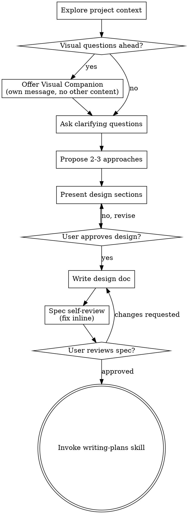

<!-- Generated by SpecStory, Markdown v2.1.0 -->

# 2026-04-22 01:06:59Z

<!-- Claude Code Session c746abbb-6fa3-4a60-a99a-604031b69869 (2026-04-22 01:06:59Z) -->

_**User (2026-04-22 01:06:59Z)**_

I want to write a skill to continue the work in a new session. This is used when I have just saved a plan, or a spec, or perhaps raise and/or merge a PR.
It's similar to the compact, but I want to keep all my sessions history separatelly, and that will help me with that.
Does tha make sense? can you help me with that? Need more clartification?

---

_**Agent (claude-opus-4-7 2026-04-22 01:07:02Z)**_

_**Agent (claude-opus-4-7 2026-04-22 01:07:02Z)**_

<tool-use data-tool-type="generic" data-tool-name="Skill"><details>
<summary>Tool use: **Skill**</summary>

```text
Launching skill: superpowers:brainstorming
```
</details></tool-use>

---

_**User (2026-04-22 01:07:02Z)**_

Base directory for this skill: /Users/leocaseiro/.claude/plugins/cache/claude-plugins-official/superpowers/5.0.7/skills/brainstorming

# Brainstorming Ideas Into Designs

Help turn ideas into fully formed designs and specs through natural collaborative dialogue.

Start by understanding the current project context, then ask questions one at a time to refine the idea. Once you understand what you're building, present the design and get user approval.

<HARD-GATE>
Do NOT invoke any implementation skill, write any code, scaffold any project, or take any implementation action until you have presented a design and the user has approved it. This applies to EVERY project regardless of perceived simplicity.
</HARD-GATE>

## Anti-Pattern: "This Is Too Simple To Need A Design"

Every project goes through this process. A todo list, a single-function utility, a config change — all of them. "Simple" projects are where unexamined assumptions cause the most wasted work. The design can be short (a few sentences for truly simple projects), but you MUST present it and get approval.

## Checklist

You MUST create a task for each of these items and complete them in order:

1. **Explore project context** — check files, docs, recent commits
2. **Offer visual companion** (if topic will involve visual questions) — this is its own message, not combined with a clarifying question. See the Visual Companion section below.
3. **Ask clarifying questions** — one at a time, understand purpose/constraints/success criteria
4. **Propose 2-3 approaches** — with trade-offs and your recommendation
5. **Present design** — in sections scaled to their complexity, get user approval after each section
6. **Write design doc** — save to `docs/superpowers/specs/YYYY-MM-DD-<topic>-design.md` and commit
7. **Spec self-review** — quick inline check for placeholders, contradictions, ambiguity, scope (see below)
8. **User reviews written spec** — ask user to review the spec file before proceeding
9. **Transition to implementation** — invoke writing-plans skill to create implementation plan

## Process Flow



**The terminal state is invoking writing-plans.** Do NOT invoke frontend-design, mcp-builder, or any other implementation skill. The ONLY skill you invoke after brainstorming is writing-plans.

## The Process

**Understanding the idea:**

- Check out the current project state first (files, docs, recent commits)
- Before asking detailed questions, assess scope: if the request describes multiple independent subsystems (e.g., "build a platform with chat, file storage, billing, and analytics"), flag this immediately. Don't spend questions refining details of a project that needs to be decomposed first.
- If the project is too large for a single spec, help the user decompose into sub-projects: what are the independent pieces, how do they relate, what order should they be built? Then brainstorm the first sub-project through the normal design flow. Each sub-project gets its own spec → plan → implementation cycle.
- For appropriately-scoped projects, ask questions one at a time to refine the idea
- Prefer multiple choice questions when possible, but open-ended is fine too
- Only one question per message - if a topic needs more exploration, break it into multiple questions
- Focus on understanding: purpose, constraints, success criteria

**Exploring approaches:**

- Propose 2-3 different approaches with trade-offs
- Present options conversationally with your recommendation and reasoning
- Lead with your recommended option and explain why

**Presenting the design:**

- Once you believe you understand what you're building, present the design
- Scale each section to its complexity: a few sentences if straightforward, up to 200-300 words if nuanced
- Ask after each section whether it looks right so far
- Cover: architecture, components, data flow, error handling, testing
- Be ready to go back and clarify if something doesn't make sense

**Design for isolation and clarity:**

- Break the system into smaller units that each have one clear purpose, communicate through well-defined interfaces, and can be understood and tested independently
- For each unit, you should be able to answer: what does it do, how do you use it, and what does it depend on?
- Can someone understand what a unit does without reading its internals? Can you change the internals without breaking consumers? If not, the boundaries need work.
- Smaller, well-bounded units are also easier for you to work with - you reason better about code you can hold in context at once, and your edits are more reliable when files are focused. When a file grows large, that's often a signal that it's doing too much.

**Working in existing codebases:**

- Explore the current structure before proposing changes. Follow existing patterns.
- Where existing code has problems that affect the work (e.g., a file that's grown too large, unclear boundaries, tangled responsibilities), include targeted improvements as part of the design - the way a good developer improves code they're working in.
- Don't propose unrelated refactoring. Stay focused on what serves the current goal.

## After the Design

**Documentation:**

- Write the validated design (spec) to `docs/superpowers/specs/YYYY-MM-DD-<topic>-design.md`
  - (User preferences for spec location override this default)
- Use elements-of-style:writing-clearly-and-concisely skill if available
- Commit the design document to git

**Spec Self-Review:**
After writing the spec document, look at it with fresh eyes:

1. **Placeholder scan:** Any "TBD", "TODO", incomplete sections, or vague requirements? Fix them.
2. **Internal consistency:** Do any sections contradict each other? Does the architecture match the feature descriptions?
3. **Scope check:** Is this focused enough for a single implementation plan, or does it need decomposition?
4. **Ambiguity check:** Could any requirement be interpreted two different ways? If so, pick one and make it explicit.

Fix any issues inline. No need to re-review — just fix and move on.

**User Review Gate:**
After the spec review loop passes, ask the user to review the written spec before proceeding:

> "Spec written and committed to `<path>`. Please review it and let me know if you want to make any changes before we start writing out the implementation plan."

Wait for the user's response. If they request changes, make them and re-run the spec review loop. Only proceed once the user approves.

**Implementation:**

- Invoke the writing-plans skill to create a detailed implementation plan
- Do NOT invoke any other skill. writing-plans is the next step.

## Key Principles

- **One question at a time** - Don't overwhelm with multiple questions
- **Multiple choice preferred** - Easier to answer than open-ended when possible
- **YAGNI ruthlessly** - Remove unnecessary features from all designs
- **Explore alternatives** - Always propose 2-3 approaches before settling
- **Incremental validation** - Present design, get approval before moving on
- **Be flexible** - Go back and clarify when something doesn't make sense

## Visual Companion

A browser-based companion for showing mockups, diagrams, and visual options during brainstorming. Available as a tool — not a mode. Accepting the companion means it's available for questions that benefit from visual treatment; it does NOT mean every question goes through the browser.

**Offering the companion:** When you anticipate that upcoming questions will involve visual content (mockups, layouts, diagrams), offer it once for consent:
> "Some of what we're working on might be easier to explain if I can show it to you in a web browser. I can put together mockups, diagrams, comparisons, and other visuals as we go. This feature is still new and can be token-intensive. Want to try it? (Requires opening a local URL)"

**This offer MUST be its own message.** Do not combine it with clarifying questions, context summaries, or any other content. The message should contain ONLY the offer above and nothing else. Wait for the user's response before continuing. If they decline, proceed with text-only brainstorming.

**Per-question decision:** Even after the user accepts, decide FOR EACH QUESTION whether to use the browser or the terminal. The test: **would the user understand this better by seeing it than reading it?**

- **Use the browser** for content that IS visual — mockups, wireframes, layout comparisons, architecture diagrams, side-by-side visual designs
- **Use the terminal** for content that is text — requirements questions, conceptual choices, tradeoff lists, A/B/C/D text options, scope decisions

A question about a UI topic is not automatically a visual question. "What does personality mean in this context?" is a conceptual question — use the terminal. "Which wizard layout works better?" is a visual question — use the browser.

If they agree to the companion, read the detailed guide before proceeding:
`skills/brainstorming/visual-companion.md`


---

_**Agent (claude-opus-4-7 2026-04-22 01:07:06Z)**_

_**Agent (claude-opus-4-7 2026-04-22 01:07:06Z)**_

I'll help you brainstorm this skill. Let me first explore the existing skill patterns in your project, then ask a few clarifying questions.

_**Agent (claude-opus-4-7 2026-04-22 01:07:09Z)**_

<tool-use data-tool-type="shell" data-tool-name="Bash"><details>
<summary>Tool use: **Bash**</summary>
List existing project skills

`ls /Users/leocaseiro/Sites/base-skill/.claude/worktrees/priceless-faraday-54ad0d/.claude/skills/`

```text
update-architecture-docs
write-e2e-vr-tests
write-storybook
```
</details></tool-use>

_**Agent (claude-opus-4-7 2026-04-22 01:07:08Z)**_

<tool-use data-tool-type="search" data-tool-name="Glob"><details>
<summary>Tool use: **Glob**</summary>
 pattern `.claude/skills/*/SKILL.md`

```text
.claude/skills/write-e2e-vr-tests/SKILL.md
.claude/skills/write-storybook/SKILL.md
```
</details></tool-use>

_**Agent (claude-opus-4-7 2026-04-22 01:07:12Z)**_

<tool-use data-tool-type="shell" data-tool-name="Bash"><details>
<summary>Tool use: **Bash**</summary>
Check for commands/resync skill

`ls /Users/leocaseiro/Sites/base-skill/.claude/worktrees/priceless-faraday-54ad0d/.claude/commands/ 2>/dev/null`

```text
Exit code 1
```
</details></tool-use>

_**Agent (claude-opus-4-7 2026-04-22 01:07:13Z)**_

<tool-use data-tool-type="shell" data-tool-name="Bash"><details>
<summary>Tool use: **Bash**</summary>
Find resync skill definition

`find /Users/leocaseiro/Sites/base-skill/.claude -name "resync*" -type f 2>/dev/null | head -5`

```text
<tool_use_error>Cancelled: parallel tool call Bash(ls /Users/leocaseiro/Sites/base-skill/.c…) errored</tool_use_error>
```
</details></tool-use>

_**Agent (claude-opus-4-7 2026-04-22 01:07:32Z)**_

<tool-use data-tool-type="shell" data-tool-name="Bash"><details>
<summary>Tool use: **Bash**</summary>
Find resync skill

`find /Users/leocaseiro/Sites/base-skill -name "resync*" -not -path "*/node_modules/*" 2>/dev/null | head -5`

```text
(Bash completed with no output)
```
</details></tool-use>

_**Agent (claude-opus-4-7 2026-04-22 01:07:36Z)**_

<tool-use data-tool-type="read" data-tool-name="Read"><details>
<summary>Tool use: **Read**</summary>
 `./.claude/skills/write-storybook/SKILL.md`

```text
1	---
2	name: write-storybook
3	description: Use when adding, writing, or refactoring Storybook stories for React components in this project — enforces the single-Default Playground pattern, controls policy, decorators, and a11y rules
4	---
5	
6	# Write Storybook
7	
8	## Overview
9	
10	Stories live co-located with their component (`ComponentName.stories.tsx`). This project uses `@storybook/react` with TanStack Router and `next-themes`.
11	
12	**The standard pattern is the "Playground"**: every component gets a **single `Default` story** driven by proper interactive controls (selects, booleans, ranges, color pickers, text inputs). The control surface is the playground — designers, QA, and developers explore every UI behaviour by tweaking controls, not by clicking between a dozen named stories.
13	
14	This pattern applies when:
15	
16	1. Creating a new story file.
17	2. Auditing or refactoring an existing story file.
18	3. Making changes to a component whose UI/API surface affects its story.
19	
20	Additional named stories are only added when a scenario genuinely **cannot** be expressed through the Playground's controls (see "When to Add Auxiliary Stories" below). Reference implementations:
21	
22	- [AnswerGame.stories.tsx](../../../src/components/answer-game/AnswerGame/AnswerGame.stories.tsx)
23	- [InstructionsOverlay.stories.tsx](../../../src/components/answer-game/InstructionsOverlay/InstructionsOverlay.stories.tsx)
24	- [ProgressHUD.stories.tsx](../../../src/components/answer-game/ProgressHUD/ProgressHUD.stories.tsx)
25	- [EncouragementAnnouncer.stories.tsx](../../../src/components/answer-game/EncouragementAnnouncer/EncouragementAnnouncer.stories.tsx) (shows the trigger-button pattern for callbacks that can't be reached by controls alone)
26	
27	## Rules
28	
29	- **Always use `export default meta`** for the meta object (framework config file — the one exception to the named-export rule)
30	- **All story variants use named exports**: `export const Default: Story = {}`
```
</details></tool-use>

_**Agent (claude-opus-4-7 2026-04-22 01:07:45Z)**_

_**Agent (claude-opus-4-7 2026-04-22 01:07:50Z)**_

Yes, this makes sense. I see you already use a handoff pattern in memory (e.g., `project_wordspell_resume_desync_handoff.md` → "Next session: /resync → worktree X → execute plan Y").

So the idea is: instead of `/compact` (which merges history into the same session), you want a **handoff skill** that captures just enough context for a fresh session to pick up cleanly — keeping each session's history pristine.

Before I propose a design, I have a few clarifying questions. One at a time.

**Question 1 — What should the skill produce as output?**

- **A.** A **memory file** (like your existing `project_*_handoff.md` pattern) — persists across sessions, Claude reads it on resume via MEMORY.md index.
- **B.** A **handoff doc in the repo** (e.g., `docs/handoffs/YYYY-MM-DD-<topic>.md`) — committed to git, survives memory resets, visible to teammates.
- **C.** **Both** — memory entry pointing to a committed handoff doc (short-term pointer + long-term record).
- **D.** Something else (tell me).

Which matches how you want to resume work?

---

_**User (2026-04-22 01:09:05Z)**_

Can be just a markdown to be copied. Either as output, or saved. Whatever uses less tokens, and window.

---

_**Agent (claude-opus-4-7 2026-04-22 01:09:08Z)**_

_**Agent (claude-opus-4-7 2026-04-22 01:09:14Z)**_

Got it — output a copyable markdown blob. No file writes, minimum tokens.

**Question 2 — What should the handoff markdown contain?** Pick what's essential:

- **A.** Branch/worktree path + next command (e.g., `/resync`, `cd worktrees/X`, `execute plan Y`)
- **B.** Spec/plan file paths + PR links (if any)
- **C.** One-line "what just happened" + "what's next"
- **D.** **All of the above**, minimal format — something like:

  ```markdown
  ## Context
  Just <merged PR #123 | saved plan docs/…md | saved spec docs/…md>.

  ## Next session
  1. /resync
  2. git worktree add worktrees/<name> -b <name>
  3. <execute plan | open new PR | …>

  ## Key files
  - docs/…md
  - <PR link>
  ```

Does that shape match what you'd paste into a new session, or want it shorter/different?

---

_**User (2026-04-22 01:09:42Z)**_

That sounds great!

---

_**Agent (claude-opus-4-7 2026-04-22 01:09:46Z)**_

_**Agent (claude-opus-4-7 2026-04-22 01:09:46Z)**_

<tool-use data-tool-type="unknown" data-tool-name="ToolSearch"><details>
<summary>Tool use: **ToolSearch**</summary>

**Input:**

- max_results: `1`
- query: `select:TodoWrite`

**Result:**

```

```
</details></tool-use>

_**Agent (claude-opus-4-7 2026-04-22 01:09:50Z)**_

_**Agent (claude-opus-4-7 2026-04-22 01:09:53Z)**_

<tool-use data-tool-type="task" data-tool-name="TodoWrite"><details>
<summary>Tool use: **TodoWrite**</summary>
**Agent task list:**
- [X] 🌡️ Explore project context
- [⚡] 🌡️ Ask clarifying questions
- [ ] 🌡️ Propose 2-3 approaches
- [ ] 🌡️ Present design and get approval
- [ ] 🌡️ Write design doc to docs/superpowers/specs/
- [ ] 🌡️ Spec self-review
- [ ] 🌡️ User reviews spec
- [ ] 🌡️ Invoke writing-plans skill

</details></tool-use>

_**Agent (claude-opus-4-7 2026-04-22 01:09:58Z)**_

**Question 3 — When does the skill auto-trigger?** The description field is how Claude decides to invoke it. Options:

- **A.** Explicit only — user types `/handoff` (or similar) when ready. Skill never auto-triggers.
- **B.** Trigger on cues — description includes phrases like "just saved a plan/spec", "just merged/raised a PR", "continue in a new session", "hand this off". Claude offers it proactively when it detects those moments.
- **C.** Both — explicit invocation primary, but description also matches cue phrases so Claude can suggest it.

Which fits how you want to use it?

---

_**User (2026-04-22 01:10:29Z)**_

C

---

_**Agent (claude-opus-4-7 2026-04-22 01:10:33Z)**_

**Question 4 — Name and location?**

Location: `.claude/skills/<name>/SKILL.md` (project-scoped, matches your existing `write-storybook`, `write-e2e-vr-tests`, `update-architecture-docs` pattern). Confirm?

Name options:

- **A.** `handoff` — short, clear verb
- **B.** `session-handoff` — explicit about the "new session" part
- **C.** `continue-in-new-session` — very literal, matches your description
- **D.** Something you have in mind

Which?

---

_**User (2026-04-22 01:11:21Z)**_

C, but I like handoff as well, how do I combine so a fuzzy search `/` can find them both? either `/continue` or `/handoff`?

---

_**Agent (claude-opus-4-7 2026-04-22 01:11:34Z)**_

_**Agent (claude-opus-4-7 2026-04-22 01:11:40Z)**_

Honest answer: the `/` menu in Claude Code primarily fuzzy-matches the **skill name**, not the description. So `/han` finds `handoff`, `/con` finds `continue-*`, but one name can't natively match both.

Two clean ways to get both triggers:

- **A.** Name the skill `handoff-to-new-session` — `/han...`, `/hand...`, `/session...` all match; `/con...` won't, but the description's auto-invoke cues ("continue in a new session", "hand off") still fire when Claude reads your intent in natural language.
- **B.** Name it `handoff` (short, memorable) **and** add a thin slash-command file at `.claude/commands/continue.md` that just invokes the skill. Then `/handoff` and `/continue` both work explicitly, plus the description covers auto-invoke.

**B** is what I'd recommend — `/handoff` as the canonical, `/continue` as an alias for muscle memory. Minimal duplication (the alias file is one line).

Which do you prefer?

---

_**User (2026-04-22 01:12:29Z)**_

B. Awesome. Can I also publish this skill at https://www.skill.fish/?

---

_**Agent (claude-opus-4-7 2026-04-22 01:12:36Z)**_

_**Agent (claude-opus-4-7 2026-04-22 01:12:43Z)**_

In principle, yes — a SKILL.md is just a markdown file, portable. But **your skill will reference project-specific things**: `/resync`, worktree rules from CLAUDE.md, `docs/superpowers/specs/` paths, the "baby-step commits" workflow.

Two paths:

- **Project-specific version** (what we're designing now) lives at `.claude/skills/handoff/` and references your actual workflow.
- **Generalized version for publishing** would parameterize those (talk in terms of "your worktree command", "your plan location") and live in a separate repo for submission.

I'd suggest: build the project-specific one first, use it for a while, then fork a generalized version once you know what actually matters. That also makes a better submission — a skill proven in real use.

I can check skill.fish's submission guidelines later if you want. For now, let's finish this design.

**Final question before I propose the design — what triggers the skill should detect:**

Your three moments are: **(1) just saved a plan, (2) just saved a spec, (3) just raised or merged a PR**. Any others worth including?

- e.g., "just finished a debug session", "end of day wrap-up", "about to context-switch to a different feature"?

Or stick with just those three?

---

_**User (2026-04-22 01:13:35Z)**_

Ok, I go with project first. Before doing that, can we search to see any similar skill available in https://www.skill.fish/ ?

---

_**Agent (claude-opus-4-7 2026-04-22 01:13:38Z)**_

_**Agent (claude-opus-4-7 2026-04-22 01:13:39Z)**_

<tool-use data-tool-type="unknown" data-tool-name="ToolSearch"><details>
<summary>Tool use: **ToolSearch**</summary>

**Input:**

- max_results: `2`
- query: `select:WebFetch,WebSearch`

**Result:**

```

```
</details></tool-use>

_**Agent (claude-opus-4-7 2026-04-22 01:14:39Z)**_

<tool-use data-tool-type="read" data-tool-name="WebFetch"><details>
<summary>Tool use: **WebFetch**</summary>
 `https://www.skill.fish/`

```text
Request failed with status code 429
```
</details></tool-use>

_**Agent (claude-opus-4-7 2026-04-22 01:14:48Z)**_

<tool-use data-tool-type="search" data-tool-name="WebSearch"><details>
<summary>Tool use: **WebSearch**</summary>
 `site:skill.fish handoff OR "new session" OR continue OR resume`

```text
Web search results for query: "site:skill.fish handoff OR "new session" OR continue OR resume"

No links found.

It appears the search didn't return any results. This could mean:

1. The skill.fish domain may not exist or isn't indexed by search engines
2. The specific pages containing those keywords may not be publicly accessible or indexed
3. The domain might have restrictions on search engine crawling

The `site:` operator limits results to a specific domain, and if that domain doesn't have indexed pages matching your search terms, no results will be returned. You might want to try:
- Searching without the `site:` restriction to see if similar content exists elsewhere
- Visiting skill.fish directly in a web browser
- Checking if the domain is spelled correctly
- Searching for general information about skill.fish instead

Would you like me to perform a different search?


REMINDER: You MUST include the sources above in your response to the user using markdown hyperlinks.
```
</details></tool-use>

_**Agent (claude-opus-4-7 2026-04-22 01:14:50Z)**_

<tool-use data-tool-type="search" data-tool-name="WebSearch"><details>
<summary>Tool use: **WebSearch**</summary>
 `skill.fish Claude Code session handoff continue new session skill`

```text
Web search results for query: "skill.fish Claude Code session handoff continue new session skill"

Links: [{"title":"claude-code-tips/skills/handoff/SKILL.md at main · ykdojo/claude-code-tips","url":"https://github.com/ykdojo/claude-code-tips/blob/main/skills/handoff/SKILL.md"},{"title":"GitHub - knoxgraeme/skillfish: The skill manager for AI coding agents. Install, update, and sync skills across Claude Code, Cursor, Copilot + more. · GitHub","url":"https://github.com/knoxgraeme/skillfish"},{"title":"Handoff - Claude Code Skill | Cult of Claude","url":"https://cultofclaude.com/skills/handoff/"},{"title":"Extend Claude with skills - Claude Code Docs","url":"https://code.claude.com/docs/en/skills"},{"title":"session-handoff - Agent Skill for Claude Code, Cursor & Antigravity","url":"https://antigravity.codes/agent-skills/workflow/session-handoff"},{"title":"Handoff Claude Code Skill | Automated Session Continuity","url":"https://mcpmarket.com/tools/skills/session-handoff-3"},{"title":"GitHub - willseltzer/claude-handoff · GitHub","url":"https://github.com/willseltzer/claude-handoff"},{"title":"Wrap-up Claude Code Skill: Automate AI Agent Handoffs","url":"https://mcpmarket.com/tools/skills/agent-handoff-session-wrap-up"},{"title":"Session Handoff - Claude Code Skill for Workflow Continuity","url":"https://mcpmarket.com/tools/skills/session-handoff-1774811170374"},{"title":"Handoff Start Claude Code Skill | Session Continuity","url":"https://mcpmarket.com/tools/skills/handoff-start"}]

I found comprehensive information about session handoff skills for Claude Code. Here's a summary of what the search revealed:

## What are Session Handoff Skills?

Session handoff skills create structured session handoff documents for continuity across Claude sessions. Claude sessions don't persist, so when you end a session and start a new one, you lose context, and starting fresh means re-explaining everything.

## How They Work

Handoff documents allow the next agent with fresh context to continue the work. These skills create comprehensive handoff documents that enable fresh AI agents to seamlessly continue work with zero ambiguity.

## Key Features

Several handoff skills are available on skill.fish:

- The Handoff skill automates the creation of continuity documentation by summarizing completed tasks, tracking file modifications, and outlining pending items into a standardized .context/handoff.md file, ensuring that subsequent sessions can resume immediately with full situational awareness.

- Handoffs capture what you're trying to do, what's done and what's not, what failed, and key decisions and their rationale.

## Installation

Skills extend capabilities for agents like Claude Code, Cursor, and Copilot with domain expertise and reusable workflows, with each skill containing a SKILL.md file with structured prompts and instructions the agent can follow.


REMINDER: You MUST include the sources above in your response to the user using markdown hyperlinks.
```
</details></tool-use>

_**Agent (claude-opus-4-7 2026-04-22 01:14:56Z)**_

_**Agent (claude-opus-4-7 2026-04-22 01:14:57Z)**_

Several handoff skills already exist. Let me check the top two to see if any fit your "copyable markdown, no file write" constraint.

_**Agent (claude-opus-4-7 2026-04-22 01:15:09Z)**_

<tool-use data-tool-type="read" data-tool-name="WebFetch"><details>
<summary>Tool use: **WebFetch**</summary>
 `https://github.com/ykdojo/claude-code-tips/blob/main/skills/handoff/SKILL.md`

```text
# Handoff Skill Overview

This skill **writes and saves a file** called `HANDOFF.md` in the project root—it's not just output markdown.

## What It Does

The handoff skill creates documentation for the next agent to understand project context. It checks if `HANDOFF.md` exists, reads any prior content, then creates or updates the document with these sections:

- **Goal**: Project objective
- **Current Progress**: Completed work
- **What Worked**: Successful approaches
- **What Didn't Work**: Failed attempts to avoid repeating
- **Next Steps**: Clear action items

The skill then provides the file path so users can start fresh conversations with that document as context.

## Full SKILL.md Content

```
name: handoff

description: Write or update a handoff document so the next agent with fresh context can continue this work.

Steps:
1. Check if HANDOFF.md already exists in the project
2. If it exists, read it first to understand prior context before updating
3. Create or update the document with:
   - Goal: What we're trying to accomplish
   - Current Progress: What's been done so far
   - What Worked: Approaches that succeeded
   - What Didn't Work: Approaches that failed
   - Next Steps: Clear action items for continuing

Save as HANDOFF.md in the project root and tell the user the file path.
```
```
</details></tool-use>

_**Agent (claude-opus-4-7 2026-04-22 01:15:11Z)**_

<tool-use data-tool-type="read" data-tool-name="WebFetch"><details>
<summary>Tool use: **WebFetch**</summary>
 `https://cultofclaude.com/skills/handoff/`

```text
# Handoff Skill Overview

**What it does:** The Handoff skill creates structured documents that capture session context for continuity when starting new Claude conversations.

**Trigger:** The skill activates when you use the `/handoff` command.

**File output:** Yes, it writes files. Documents are saved to `.claude/handoffs/[date]-[description].md` format.

**Document structure:** The handoff follows a standardized template including:
- Current state and progress
- Summary of completed work
- Decisions made with rationale
- Modified files and changes
- Unresolved questions
- Important background context
- Clear next steps
- Files to review

The skill works by first assessing your session, asking what you want captured, then generating and saving the structured markdown document so future sessions can quickly resume your work.
```
</details></tool-use>

_**Agent (claude-opus-4-7 2026-04-22 01:15:16Z)**_

_**Agent (claude-opus-4-7 2026-04-22 01:15:21Z)**_

Findings — three existing handoff skills, all **write files** (either `HANDOFF.md` in root, or `.claude/handoffs/YYYY-MM-DD-*.md`):

- [ykdojo/handoff](https://github.com/ykdojo/claude-code-tips/blob/main/skills/handoff/SKILL.md) — writes `HANDOFF.md` with Goal/Progress/Worked/Didn't Work/Next Steps
- [Cult of Claude /handoff](https://cultofclaude.com/skills/handoff/) — writes `.claude/handoffs/[date]-[desc].md`
- [antigravity session-handoff](https://antigravity.codes/agent-skills/workflow/session-handoff) — similar file-based

**None match your "copyable markdown, no file write" preference, and none know your workflow** (`/resync`, worktree gate, `docs/superpowers/specs/`, baby-step commits, PR flow). So building yours is justified — plus it'll be a genuinely different publish-candidate later (the "copy-paste, not file" handoff).

Ready for me to propose approaches, or do you want to look at any of those first?

---

_**User (2026-04-22 02:59:54Z)**_

I liked this one, let's setup this one for us. 
https://antigravity.codes/agent-skills/workflow/session-handoff
https://github.com/softaworks/agent-toolkit/blob/main/skills/session-handoff/README.md

---

_**Agent (claude-opus-4-7 2026-04-22 02:59:56Z)**_

_**Agent (claude-opus-4-7 2026-04-22 03:00:05Z)**_

<tool-use data-tool-type="read" data-tool-name="WebFetch"><details>
<summary>Tool use: **WebFetch**</summary>
 `https://github.com/softaworks/agent-toolkit/blob/main/skills/session-handoff/README.md`

```text
# Session Handoff Skill Overview

## Purpose
The skill "creates comprehensive handoff documents that enable fresh AI agents to seamlessly continue work with zero ambiguity," addressing context loss in multi-session AI projects.

## Key Triggers
**User-initiated:** Commands like "save state" or "create handoff"
**Agent-initiated:** When context window reaches 80% capacity or after substantial work milestones

## Document Structure
The handoff contains ten sections:
1. Metadata (timestamp, git branch, commits)
2. Current State Summary
3. Important Context
4. Decisions Made
5. Immediate Next Steps
6. Pending Work
7. Critical Files
8. Key Patterns Discovered
9. Potential Gotchas
10. Handoff Chain (links to previous/next handoffs)

## Storage Location
Files are saved in `.claude/handoffs/` using the naming convention: `YYYY-MM-DD-HHMMSS-[slug].md`

Example: `2024-01-15-143022-implementing-auth.md`

## Unique Features
- **Smart scaffolding** automatically captures git status and modified files
- **Validation script** checks for incomplete sections, secrets, and quality scores (minimum 70 required)
- **Staleness detection** assesses whether handoff context remains current
- **Handoff chaining** links related documents for long-running projects, creating context breadcrumbs
```
</details></tool-use>

_**Agent (claude-opus-4-7 2026-04-22 03:38:18Z)**_

<tool-use data-tool-type="read" data-tool-name="WebFetch"><details>
<summary>Tool use: **WebFetch**</summary>
 `https://antigravity.codes/agent-skills/workflow/session-handoff`

```text
# Session-Handoff Skill Documentation

## Purpose
This agent skill enables AI agents to create comprehensive handoff documents that preserve project context across sessions, solving "context exhaustion" in long-running tasks.

## Core Structure

**Two Primary Workflows:**

1. **CREATE** - Generate new handoff documents
2. **RESUME** - Load and continue from existing handoffs

## CREATE Workflow Steps

**Step 1: Generate Scaffold**
Run: `python scripts/create_handoff.py [task-slug]`
- Creates `.claude/handoffs/` directory
- Pre-fills timestamp, git branch, modified files
- Outputs timestamped filename

**Step 2: Complete Document**
Fill sections prioritizing:
- Current State Summary
- Important Context
- Immediate Next Steps
- Decisions Made

**Step 3: Validate**
Execute: `python scripts/validate_handoff.py <file>`
Checks verify "No `[TODO: ...]` placeholders remaining" and quality score ≥70

**Step 4: Confirm**
Report handoff location, validation results, and initial action items

## RESUME Workflow Steps

1. List available handoffs via `list_handoffs.py`
2. Check staleness using `check_staleness.py` (FRESH/SLIGHTLY_STALE/STALE/VERY_STALE levels)
3. Read complete handoff document
4. Verify context checklist
5. Begin work from first immediate next step
6. Update or chain handoffs as work progresses

## Storage & Naming
Location: `.claude/handoffs/`
Format: `YYYY-MM-DD-HHMMSS-[slug].md`

## Key Features
- **Handoff Chaining**: Link sequential handoffs for lineage tracking
- **Proactive Triggering**: Suggest handoff creation after 5+ file edits
- **Security Validation**: Detects potential secrets before finalization
```
</details></tool-use>

_**Agent (claude-opus-4-7 2026-04-22 03:38:27Z)**_

_**Agent (claude-opus-4-7 2026-04-22 03:38:36Z)**_

One thing to flag — the softaworks skill is much heavier than what you described earlier:

- **Writes files** to `.claude/handoffs/YYYY-MM-DD-HHMMSS-slug.md` (you wanted copyable markdown, no file)
- **Python scripts** for scaffolding, validation, staleness checks, listing (your project is Node/yarn — new dep)
- **10 sections** (your earlier pick was leaner: Context / Next session / Key files)
- **RESUME workflow + chaining** — more ambitious than "paste into new session"
- **Quality scoring** (min 70) and secrets scanner

So there's a contradiction with what you said earlier. Three paths — which do you actually want?

- **A.** **Full softaworks port** — install their Python scripts + 10-section format + file writes + chaining. Most powerful, most complexity.
- **B.** **Adopt their document structure, skip the scripts** — use their 10 sections but keep it as a copyable markdown blob (no file, no Python, no validation). Lean.
- **C.** **Hybrid** — copyable markdown by default, with an opt-in flag (e.g., `/handoff --save`) that writes to `.claude/handoffs/` when you do want a durable record. Their structure, your workflow, your tooling.

My recommendation: **C** — keeps your low-token default, gains their proven structure, adds the file-save for moments when you want the record committed (e.g., end of a long multi-session effort). Skips Python entirely.

Which?

---

_**User (2026-04-22 03:39:52Z)**_

you are right, perhaps this one is the best fit. I know I said to not save markdown, but I do like the fact we can refer to a path. https://cultofclaude.com/skills/handoff/

---

_**Agent (claude-opus-4-7 2026-04-22 03:39:55Z)**_

_**Agent (claude-opus-4-7 2026-04-22 03:40:04Z)**_

<tool-use data-tool-type="search" data-tool-name="WebSearch"><details>
<summary>Tool use: **WebSearch**</summary>
 `cultofclaude handoff skill github SKILL.md source code`

```text
Web search results for query: "cultofclaude handoff skill github SKILL.md source code"

Links: [{"title":"GitHub - alirezarezvani/claude-skills: 232+ Claude Code skills & agent plugins for Claude Code, Codex, Gemini CLI, Cursor, and 8 more coding agents — engineering, marketing, product, compliance, C-level advisory.","url":"https://github.com/alirezarezvani/claude-skills"},{"title":"claude-code-tips/skills/handoff/SKILL.md at main · ykdojo/claude-code-tips","url":"https://github.com/ykdojo/claude-code-tips/blob/main/skills/handoff/SKILL.md"},{"title":"GitHub - willseltzer/claude-handoff · GitHub","url":"https://github.com/willseltzer/claude-handoff"},{"title":"Handoff - Claude Code Skill | Cult of Claude","url":"https://cultofclaude.com/skills/handoff/"},{"title":"Claude Code handoff skill - session state & handoff document generator · GitHub","url":"https://gist.github.com/edwilde/cb2bf5f8851ea1d79ddc19995eec8b5b"},{"title":"Work Context Handoff - Claude Code Skill | Cult of Claude","url":"https://cultofclaude.com/skills/work-context-handoff/"},{"title":"GitHub - anthropics/skills: Public repository for Agent Skills · GitHub","url":"https://github.com/anthropics/skills"},{"title":"GitHub - travisvn/awesome-claude-skills: A curated list of awesome Claude Skills, resources, and tools for customizing Claude AI workflows — particularly Claude Code","url":"https://github.com/travisvn/awesome-claude-skills"},{"title":"GitHub - daymade/claude-code-skills: Professional Claude Code skills marketplace featuring production-ready skills for enhanced development workflows. · GitHub","url":"https://github.com/daymade/claude-code-skills"},{"title":"claude-skills/CLAUDE.md at main · alirezarezvani/claude-skills","url":"https://github.com/alirezarezvani/claude-skills/blob/main/CLAUDE.md"}]

Based on the search results, I found several resources related to the handoff skill for Claude Code:

## Key Findings:

The handoff skill creates documents that let any AI coding agent continue your work. It creates structured session handoff documents for continuity across Claude sessions.

### SKILL.md Structure

The handoff skill saves as HANDOFF.md in the project root so the user can start a fresh conversation with just that path. The skill includes auto-detection and is organized in a skills/handoff/ directory structure with a SKILL.md file.

### What Handoff Documents Capture

Handoff documents include sections for task title, generated timestamp, branch, status, completed items, items not yet done, failed approaches with explanations, key decisions, current state, code context, and resume instructions with specific errors and their locations.

### Available Implementations

Several handoff skill implementations are available:

1. GitHub's willseltzer/claude-handoff repository which includes commands for create, quick, and resume operations

2. The ykdojo/claude-code-tips repository which includes 45 tips with a handoff skill and a custom status line script

3. A gist-based handoff skill that creates comprehensive session state and handoff documents serving as high-fidelity context files for the next LLM session

You can find the source code for these implementations on their respective GitHub repositories.


REMINDER: You MUST include the sources above in your response to the user using markdown hyperlinks.
```
</details></tool-use>

_**Agent (claude-opus-4-7 2026-04-22 03:40:01Z)**_

<tool-use data-tool-type="read" data-tool-name="WebFetch"><details>
<summary>Tool use: **WebFetch**</summary>
 `https://cultofclaude.com/skills/handoff/`

```text
I don't have access to the complete `SKILL.md` file content from the GitHub repository. The webpage content provided shows a summary page for the Handoff skill, but not the full skill definition file itself.

To obtain the complete `SKILL.md` content you're requesting, you would need to:

1. Visit the source repository directly: `https://github.com/robertguss/claude-code-toolkit/tree/main/skills/handoff`
2. Locate and download the `SKILL.md` file from that repository

Based on what's visible on this page, I can tell you that the Handoff skill is triggered with `/handoff` and creates structured handoff documents with sections for current state, decisions made, code changes, open questions, and next steps. However, I cannot quote the complete file verbatim as requested since the full content isn't present in the webpage provided.
```
</details></tool-use>

_**Agent (claude-opus-4-7 2026-04-22 03:40:07Z)**_

_**Agent (claude-opus-4-7 2026-04-22 03:40:08Z)**_

<tool-use data-tool-type="shell" data-tool-name="Bash"><details>
<summary>Tool use: **Bash**</summary>
List files in robertguss handoff skill

`gh api repos/robertguss/claude-code-toolkit/contents/skills/handoff 2>/dev/null | head -100`

```text
[{"name":"README.md","path":"skills/handoff/README.md","sha":"85b288c0c275e5c3ca821099c3343ae71eaa453b","size":2917,"url":"https://api.github.com/repos/robertguss/claude-code-toolkit/contents/skills/handoff/README.md?ref=main","html_url":"https://github.com/robertguss/claude-code-toolkit/blob/main/skills/handoff/README.md","git_url":"https://api.github.com/repos/robertguss/claude-code-toolkit/git/blobs/85b288c0c275e5c3ca821099c3343ae71eaa453b","download_url":"https://raw.githubusercontent.com/robertguss/claude-code-toolkit/main/skills/handoff/README.md","type":"file","_links":{"self":"https://api.github.com/repos/robertguss/claude-code-toolkit/contents/skills/handoff/README.md?ref=main","git":"https://api.github.com/repos/robertguss/claude-code-toolkit/git/blobs/85b288c0c275e5c3ca821099c3343ae71eaa453b","html":"https://github.com/robertguss/claude-code-toolkit/blob/main/skills/handoff/README.md"}},{"name":"SKILL.md","path":"skills/handoff/SKILL.md","sha":"23a0447b9b4a6d3b350c86c7592d979d36071239","size":6441,"url":"https://api.github.com/repos/robertguss/claude-code-toolkit/contents/skills/handoff/SKILL.md?ref=main","html_url":"https://github.com/robertguss/claude-code-toolkit/blob/main/skills/handoff/SKILL.md","git_url":"https://api.github.com/repos/robertguss/claude-code-toolkit/git/blobs/23a0447b9b4a6d3b350c86c7592d979d36071239","download_url":"https://raw.githubusercontent.com/robertguss/claude-code-toolkit/main/skills/handoff/SKILL.md","type":"file","_links":{"self":"https://api.github.com/repos/robertguss/claude-code-toolkit/contents/skills/handoff/SKILL.md?ref=main","git":"https://api.github.com/repos/robertguss/claude-code-toolkit/git/blobs/23a0447b9b4a6d3b350c86c7592d979d36071239","html":"https://github.com/robertguss/claude-code-toolkit/blob/main/skills/handoff/SKILL.md"}}]
```
</details></tool-use>

_**Agent (claude-opus-4-7 2026-04-22 03:40:11Z)**_

<tool-use data-tool-type="shell" data-tool-name="Bash"><details>
<summary>Tool use: **Bash**</summary>
Fetch full SKILL.md content

`curl -sSL https://raw.githubusercontent.com/robertguss/claude-code-toolkit/main/skills/handoff/SKILL.md`

```text
---
name: handoff
description:
  Create a structured session handoff document for continuity across sessions.
  Use when ending a work session, switching contexts, or before a break.
  Captures decisions, progress, code changes, and next steps so a future session
  can pick up where you left off without losing context.
---

# Session Handoff Skill

Create structured documents that enable seamless continuity across Claude
sessions.

## When to Use

- Ending a work session for the day
- Before taking a break mid-task
- Switching to a different project temporarily
- When you want to capture state for a future session
- Before a context reset you know is coming

## Handoff Process

### Step 1: Assess Session State

Quickly assess:

1. **What phase are we in?** (exploration, planning, implementation, debugging,
   review)
2. **What's the active task?** (what we're trying to accomplish)
3. **How far along are we?** (just started, mid-way, almost done)

### Step 2: Ask What Matters

Ask the user:

> "I'll create a handoff document. Is there anything specific you want to make
> sure I capture? (Key decisions, code snippets, context about the problem,
> things you'll forget, etc.)"

### Step 3: Generate Handoff Document

Create a structured document:

```markdown
# Session Handoff: [Brief Description]

**Date:** [YYYY-MM-DD] **Project:** [project name/path] **Session Duration:**
[approximate]

## Current State

**Task:** [What we're working on] **Phase:**
[exploration/planning/implementation/debugging/review] **Progress:** [where we
are - percentage or milestone]

## What We Did

[2-3 sentence summary of the session's work]

## Decisions Made

- **[Decision]** — [Rationale]
- **[Decision]** — [Rationale]

## Code Changes

**Files modified:**

- `path/to/file.ts` — [what and why]
- `path/to/other.ts` — [what and why]

**Key code context:** [Critical snippets or patterns to remember]

## Open Questions

- [ ] [Question needing resolution]
- [ ] [Question needing resolution]

## Blockers / Issues

- [Issue] — [current status]

## Context to Remember

[Important background, constraints, user preferences, domain knowledge - things
that would take time to re-establish]

## Next Steps

1. [ ] [First thing to do next session]
2. [ ] [Second thing]
3. [ ] [Third thing]

## Files to Review on Resume

- `path/to/key/file.ts` — [why it matters]
```

### Step 4: Write the File

Write to: `.claude/handoffs/[YYYY-MM-DD]-[brief-description].md`

Confirm location with user:

> "I'll save this to `.claude/handoffs/[filename].md`. Want a different
> location?"

## What to Capture

### Always Include

1. **Decisions with reasoning** — The "why" is often more valuable than the
   "what"
2. **Code changes** — File paths, what changed, the intent
3. **Current progress** — Where in the task we stopped
4. **Next steps** — Clear, actionable items to resume with
5. **User context** — Constraints, preferences, domain knowledge they shared

### Include When Relevant

- **Errors encountered** — And how they were (or weren't) resolved
- **Dead ends** — Approaches tried that didn't work (saves re-exploration)
- **Key files** — Files to read to get back up to speed
- **External dependencies** — APIs, services, tools involved

### Skip

- Verbose tool output (file listings, grep results)
- Intermediate reasoning that reached conclusions
- Repeated similar operations
- Information that's obvious from the code

## Format Guidelines

- **Bullet points** — Scannable over narrative
- **File paths** — `src/foo.ts:42` not "that function"
- **Checkboxes for actions** — `- [ ]` for next steps and open questions
- **Specifics** — "Added retry logic to fetchUser()" not "made improvements"

## Quality Check

Before saving, verify:

1. **Could a fresh Claude pick up from this?** — Enough context to continue?
2. **Are decisions traceable?** — Clear why things were decided?
3. **Are next steps actionable?** — Know exactly what to do first?
4. **Is code work clear?** — Know which files matter?

## Using a Handoff Document

When starting a new session, the user can:

1. Share the handoff file at session start
2. Say "Resume from this handoff: [paste or path]"
3. Reference it with @ mention if supported

The handoff should let you hit the ground running without lengthy
re-explanation.

## Example Handoff

```markdown
# Session Handoff: Auth System Implementation

**Date:** 2025-01-15 **Project:** /Users/robert/projects/my-api **Session
Duration:** ~2 hours

## Current State

**Task:** Implementing user authentication for the API **Phase:** Implementation
**Progress:** ~60% - basic flow works, need refresh tokens

## What We Did

Built the core JWT authentication flow including token generation, validation
middleware, and login/logout endpoints. Hit an issue with key rotation that we
resolved by moving to config-based key paths.

## Decisions Made

- **JWT with RS256** — Stateless auth, works with distributed setup
- **Redis for refresh tokens** — Need revocation capability
- **15-min access token expiry** — Balance security/UX for mobile app

## Code Changes

**Files modified:**

- `src/auth/jwt.ts` — Token generation and validation logic
- `src/middleware/auth.ts` — Request authentication middleware
- `src/routes/auth.ts` — Login/logout endpoints
- `config/keys/` — RSA key pair storage

**Key code context:** Token validation uses RS256. Keys loaded from
`config/keys/` based on NODE_ENV.

## Open Questions

- [ ] Automatic vs opt-in refresh token rotation?
- [ ] Rate limit for login attempts? (User mentioned 10k DAU)

## Context to Remember

- Client is a mobile app - tokens need offline capability
- User has 10k daily active users - scale matters
- Using PostgreSQL for user storage
- User prefers explicit error messages over generic ones

## Next Steps

1. [ ] Implement `/auth/refresh` endpoint
2. [ ] Add rate limiting to `/auth/login`
3. [ ] Write tests for token expiry edge cases
4. [ ] Update API docs with auth flow

## Files to Review on Resume

- `src/auth/jwt.ts` — Core token logic
- `src/routes/auth.ts` — Current endpoint implementation
```

## Key Reminders

- Ask what matters to the user before generating
- Decisions need reasoning — capture the "why"
- File paths anchor the work — always include them
- Next steps should be immediately actionable
- Better slightly longer and useful than short and vague
```
</details></tool-use>

_**Agent (claude-opus-4-7 2026-04-22 03:40:22Z)**_

_**Agent (claude-opus-4-7 2026-04-22 03:40:23Z)**_

Got the full source. Clean template, small surface — good base. Here's the adapted design for BaseSkill:

_**Agent (claude-opus-4-7 2026-04-22 03:40:25Z)**_

<tool-use data-tool-type="task" data-tool-name="TodoWrite"><details>
<summary>Tool use: **TodoWrite**</summary>
**Agent task list:**
- [X] 🌡️ Explore project context
- [X] 🌡️ Ask clarifying questions
- [X] 🌡️ Propose 2-3 approaches
- [⚡] 🌡️ Present design and get approval
- [ ] 🌡️ Write design doc to docs/superpowers/specs/
- [ ] 🌡️ Spec self-review
- [ ] 🌡️ User reviews spec
- [ ] 🌡️ Invoke writing-plans skill

</details></tool-use>

_**Agent (claude-opus-4-7 2026-04-22 03:40:32Z)**_

## Design (Section 1 of 3) — Skill shape & files

**Name:** `handoff` (canonical) + `/continue` alias command
**Location:**

- `.claude/skills/handoff/SKILL.md` — the skill itself
- `.claude/commands/continue.md` — one-line alias that invokes `handoff`

**Description (for Claude's auto-invoke):**
> "Create a session handoff document so you can continue this work in a new session. Use when: just saved a plan or spec, just raised or merged a PR, ending a work session, about to context-switch, or explicitly told to hand off / continue later."

**Credit:** SKILL.md header notes "Adapted from [Cult of Claude handoff skill](https://cultofclaude.com/skills/handoff/)" — small, honest, helps future you.

Does section 1 look right? (y/n — I'll continue to section 2: document template & BaseSkill-specific additions)

---

_**User (2026-04-22 03:43:23Z)**_

LGTM

---

_**Agent (claude-opus-4-7 2026-04-22 03:43:36Z)**_

## Design (Section 2 of 3) — Document template

Starts from Cult of Claude's template, adapted for BaseSkill's workflow. Key changes:

**Added sections:**

- **Worktree** — current worktree path + branch (so next session knows where to `cd`)
- **Resume command** — explicit first step, almost always `/resync` per your memory
- **Spec / Plan** — paths to `docs/superpowers/specs/YYYY-MM-DD-*.md` if one exists
- **PR** — link + status (open/merged/closed) if relevant

**Dropped / merged:**

- "Session Duration" — noise, remove
- "Project" line — always BaseSkill, remove
- "Code Changes" + "Files to Review" — merge into one **Key files** section

**Final template:**

```markdown
# Handoff: [Brief Description]

**Date:** YYYY-MM-DD
**Worktree:** worktrees/<name> (branch: <branch>)
**PR:** #NNN — <status> (omit if none)

## Resume command

\`\`\`
/resync
cd worktrees/<name>
<next action — e.g., execute plan docs/…md, open PR, etc.>
\`\`\`

## Current state

**Task:** <what we're working on>
**Phase:** exploration | planning | implementation | debugging | review | shipped
**Progress:** <milestone or %>

## What we did

<2–3 sentences>

## Decisions made

- **<decision>** — <why>

## Spec / Plan

- docs/superpowers/specs/YYYY-MM-DD-<topic>-design.md
- docs/superpowers/plans/YYYY-MM-DD-<topic>.md (if exists)

## Key files

- src/…/foo.ts:42 — <what and why>

## Open questions / blockers

- [ ] <question>

## Next steps

1. [ ] <first action>
2. [ ] <second>

## Context to remember

<constraints, user preferences, domain knowledge not obvious from code>
```

**File save path:** `.claude/handoffs/YYYY-MM-DD-<brief-slug>.md` (git-ignored or committed — see section 3).

Does the template + added sections look right? Anything to drop/add?

---

_**User (2026-04-22 03:44:45Z)**_

Y

---

_**Agent (claude-opus-4-7 2026-04-22 03:44:59Z)**_

## Design (Section 3 of 3) — Workflow, trigger cues, commit policy

**Process (skill instructs Claude to):**

1. **Auto-detect context** — read current branch, worktree path, recent commits, any open PR for the branch (`gh pr view --json number,state,url`), recently saved specs/plans.
2. **Ask the user one question** — "Anything specific you want captured? (key decisions, gotchas, things you'll forget)". Single prompt, not a loop.
3. **Generate the document** from the template, pre-filled with detected values.
4. **Write to** `.claude/handoffs/YYYY-MM-DD-<slug>.md`.
5. **Print the path + a one-line resume hint** — e.g., `Saved handoff: .claude/handoffs/…md — paste that path in a new session.`

**Trigger cues in the description** (so Claude auto-offers it):
"just saved a plan", "just saved a spec", "just raised a PR", "just merged a PR", "continue in a new session", "hand this off", "end of session", "wrap up", "pick this up later".

**Commit policy — `.claude/handoffs/` directory:**

- **A.** Git-ignored — handoffs are personal ephemera, don't clutter the repo.
- **B.** Committed — handoffs are history, reviewable, visible to teammates.
- **C.** Committed but in their own baby-step commits (`docs(handoff): …`) — matches your baby-step workflow, lets you cherry-pick or drop them later.

I recommend **C**: handoffs are genuinely useful breadcrumbs, and your workflow is already commit-heavy. One-line commit per handoff, easy to squash or drop if noisy.

**Worktree rule:** the skill writes inside the active worktree (never on master), per your CLAUDE.md gate. The SKILL.md will state this explicitly.

**Quality check before writing:** same four questions as upstream — fresh Claude can pick up? decisions traceable? next steps actionable? file paths anchored?

Does section 3 look right — especially commit policy (A/B/**C**)?

---

_**User (2026-04-22 03:45:07Z)**_

Let;s add also current branch/git worktree and path,

---

_**Agent (claude-opus-4-7 2026-04-22 03:45:13Z)**_

_**Agent (claude-opus-4-7 2026-04-22 03:45:17Z)**_

Good catch. Let me expand the metadata block so resume has everything it needs at a glance:

**Updated metadata header:**

```markdown
**Date:** YYYY-MM-DD
**Branch:** <branch-name>
**Worktree:** worktrees/<name>
**Worktree path:** /Users/leocaseiro/Sites/base-skill/worktrees/<name>
**Git status:** clean | N uncommitted | N unpushed commits ahead of origin
**Last commit:** <sha> <subject>
**PR:** #NNN — open/merged/closed (omit if none)
```

All auto-detected by the skill via `git branch --show-current`, `git worktree list`, `git status --porcelain`, `git rev-list --count @{u}..HEAD`, `git log -1 --oneline`, `gh pr view`.

One open question before I write the spec: **commit policy for `.claude/handoffs/`** — A (gitignored), B (committed), or **C** (committed in baby-step `docs(handoff): …` commits, per your workflow)?

My recommendation is still C. Your call.

---

_**User (2026-04-22 03:45:54Z)**_

C

---

_**Agent (claude-opus-4-7 2026-04-22 03:46:00Z)**_

_**Agent (claude-opus-4-7 2026-04-22 03:46:01Z)**_

<tool-use data-tool-type="shell" data-tool-name="Bash"><details>
<summary>Tool use: **Bash**</summary>
Check specs directory exists

`ls /Users/leocaseiro/Sites/base-skill/.claude/worktrees/priceless-faraday-54ad0d/docs/superpowers/specs/ 2>/dev/null | head -5 && echo "---" && pwd`

```text
2026-04-02-milestone-4-game-engine-design.md
2026-04-02-storybook-setup-design.md
2026-04-03-drag-drop-game-design.md
2026-04-03-speech-voice-selection-design.md
2026-04-03-word-spell-number-match-design.md
---
/Users/leocaseiro/Sites/base-skill/.claude/worktrees/priceless-faraday-54ad0d
```
</details></tool-use>

_**Agent (claude-opus-4-7 2026-04-22 03:46:06Z)**_

<tool-use data-tool-type="task" data-tool-name="TodoWrite"><details>
<summary>Tool use: **TodoWrite**</summary>
**Agent task list:**
- [X] 🌡️ Explore project context
- [X] 🌡️ Ask clarifying questions
- [X] 🌡️ Propose 2-3 approaches
- [X] 🌡️ Present design and get approval
- [⚡] 🌡️ Write design doc to docs/superpowers/specs/
- [ ] 🌡️ Spec self-review
- [ ] 🌡️ User reviews spec
- [ ] 🌡️ Invoke writing-plans skill

</details></tool-use>

_**Agent (claude-opus-4-7 2026-04-22 03:47:05Z)**_

<tool-use data-tool-type="write" data-tool-name="Write"><details>
<summary>Tool use: **Write**</summary>

```md
# Handoff Skill — Design

**Date:** 2026-04-22
**Status:** Draft for review
**Adapted from:** [Cult of Claude `handoff` skill](https://cultofclaude.com/skills/handoff/)
(source: [robertguss/claude-code-toolkit](https://github.com/robertguss/claude-code-toolkit/blob/main/skills/handoff/SKILL.md))

## Problem

Sessions don't persist. After saving a plan, saving a spec, or raising/merging
a PR, the next session starts cold — re-explaining branch, worktree, PR state,
next steps, and key files costs tokens and attention.

`/compact` merges history into the same session. What we need is the opposite:
a clean handoff artifact that lets us start a **fresh** session with minimal
prompt, preserving only what matters.

## Goal

A project-scoped skill that, on demand or when it detects handoff cues,
generates a short structured document at
`.claude/handoffs/YYYY-MM-DD-<slug>.md` with everything a fresh session needs to
resume work — git state, spec/plan paths, PR status, next steps.

## Non-goals

- Not a conversation summarizer (that's `/compact`).
- No Python scripts, validators, quality scoring, chaining, or staleness
  detection. Keep the surface area small.
- No automatic trigger on context thresholds. Trigger is explicit (`/handoff`,
  `/continue`) or description-cue based only.
- No generalized publish-to-skill.fish version. That's a future fork.

## Installation footprint

- `.claude/skills/handoff/SKILL.md` — the skill definition
- `.claude/commands/continue.md` — one-line alias that invokes the `handoff`
  skill so `/continue` is also discoverable via `/` fuzzy search
- `.claude/handoffs/` — directory where generated handoffs land (created on
  first use)

## Skill metadata

\```yaml
name: handoff
description:
  Create a session handoff document so work can continue in a new session. Use
  when just saved a plan or spec, just raised or merged a PR, ending a session,
  context-switching, or explicitly told to hand off / continue later.
\```

The description carries the auto-invoke cues. Explicit invocation is
`/handoff` or `/continue`.

## Process

When invoked, the skill instructs Claude to:

1. **Auto-detect context** via shell/`gh`:
   - `git branch --show-current` — branch name
   - `git worktree list` — current worktree path
   - `git status --porcelain` — count uncommitted files
   - `git rev-list --count @{u}..HEAD` — unpushed commit count
   - `git log -1 --pretty=format:"%h %s"` — last commit sha + subject
   - `gh pr view --json number,state,url` — open PR for current branch (skip
     silently if none)
   - Recently-saved specs/plans in `docs/superpowers/specs/` and
     `docs/superpowers/plans/` (optional — include if a recent one matches the
     current branch's topic)
2. **Ask one question:** "Anything specific you want captured? (key decisions,
   gotchas, things you'll forget)". Single prompt, no follow-up loop.
3. **Generate the document** from the template below, pre-filled with detected
   values.
4. **Write to** `.claude/handoffs/YYYY-MM-DD-<brief-slug>.md` in the **active
   worktree** (never master — enforced by the project's worktree gate).
5. **Commit the handoff** as its own baby-step commit, message
   `docs(handoff): <brief description>`.
6. **Print** the file path and a one-line resume hint:
   `Saved handoff: .claude/handoffs/…md — paste that path in a new session to resume.`

## Document template

\```markdown
# Handoff: <brief description>

**Date:** YYYY-MM-DD
**Branch:** <branch-name>
**Worktree:** worktrees/<name>
**Worktree path:** /Users/leocaseiro/Sites/base-skill/worktrees/<name>
**Git status:** clean | N uncommitted | N unpushed commits ahead of origin
**Last commit:** <sha> <subject>
**PR:** #NNN — open/merged/closed (omit line if none)

## Resume command

\`\`\`
/resync
cd worktrees/<name>
<next action — e.g., execute plan docs/…md, open PR, resume debugging, etc.>
\`\`\`

## Current state

**Task:** <what we're working on>
**Phase:** exploration | planning | implementation | debugging | review | shipped
**Progress:** <milestone or %>

## What we did

<2–3 sentences>

## Decisions made

- **<decision>** — <why>

## Spec / Plan

- docs/superpowers/specs/YYYY-MM-DD-<topic>-design.md
- docs/superpowers/plans/YYYY-MM-DD-<topic>.md (if exists)

## Key files

- src/…/foo.ts:42 — <what and why>

## Open questions / blockers

- [ ] <question>

## Next steps

1. [ ] <first action>
2. [ ] <second>

## Context to remember

<constraints, user preferences, domain knowledge not obvious from code>
\```

Sections with no content are **omitted**, not left empty — keeps the document
scannable.

## Commit policy

Handoffs are committed to the branch in their own baby-step commits
(`docs(handoff): <description>`). This matches the project's baby-step commit
workflow:

- Reviewable as part of the PR.
- Cherry-pickable or droppable independently.
- Easy to squash on merge if noisy.
- Survives memory resets and worktree removal.

Alternative considered: gitignore. Rejected because handoffs are genuinely
useful history — future you, teammates, and future Claude sessions all benefit
from reading past handoffs to understand how a branch got to its current state.

## Worktree rule

Handoffs are always written inside the active worktree. Never on master. The
SKILL.md states this explicitly and the project's existing worktree gate in
CLAUDE.md enforces it.

## Quality check (self-check before writing)

Before saving, the skill checks:

1. Could a fresh Claude pick up from this?
2. Are decisions traceable (the "why")?
3. Are next steps actionable?
4. Are file paths anchored (no vague "that function")?

No quality score, no validation script — just a mental pass.

## Trigger cues (auto-invoke description)

The description includes these natural-language cues so Claude offers the skill
proactively:

- "just saved a plan"
- "just saved a spec"
- "just raised a PR"
- "just merged a PR"
- "continue in a new session"
- "hand this off"
- "end of session" / "wrap up"
- "pick this up later"

## Alias command

`.claude/commands/continue.md` contains a thin slash-command wrapper that
invokes the `handoff` skill. This lets both `/handoff` and `/continue` work as
explicit triggers in the `/` fuzzy-search menu.

Content is minimal — it just references the skill so Claude knows to run it.

## Existing skills surveyed (and why not adopt directly)

| Skill                                                                                            | Why not a direct fit                                                                                     |
| ------------------------------------------------------------------------------------------------ | -------------------------------------------------------------------------------------------------------- |
| [ykdojo/handoff](https://github.com/ykdojo/claude-code-tips/blob/main/skills/handoff/SKILL.md)   | Writes single `HANDOFF.md` at repo root, not dated archive. No git metadata, no PR, no worktree support. |
| [softaworks/session-handoff](https://github.com/softaworks/agent-toolkit)                        | Requires Python scripts, 10 sections, quality scoring, chaining — heavy for our needs.                   |
| [Cult of Claude handoff](https://cultofclaude.com/skills/handoff/) **(chosen base)**             | Good template and process. Missing worktree/PR/resync awareness — added here.                            |

## Out of scope (future work)

- Generalized publishable version for skill.fish (strip BaseSkill-specific bits,
  parameterize worktree/resync references).
- RESUME workflow skill (read a handoff, verify staleness, begin work) — may
  not be needed; pasting the path into a new session is usually enough.
- Handoff chaining (linking sequential handoffs) — add if the handoff volume
  justifies it.
- Auto-invoke on context thresholds.

## Acceptance criteria

- `/handoff` invoked from any branch worktree produces a dated handoff at
  `.claude/handoffs/YYYY-MM-DD-<slug>.md` with git state, worktree, PR (if
  any), spec/plan references, and a resume command block.
- `/continue` produces the same result as `/handoff`.
- Description cues cause Claude to proactively offer the skill after a plan,
  spec, or PR event.
- The handoff is committed as a `docs(handoff): …` commit in the active
  worktree.
- Pasting the handoff's file path into a fresh session is enough to resume work
  without further context from the user.
\```
```

```text
File created successfully at: /Users/leocaseiro/Sites/base-skill/.claude/worktrees/priceless-faraday-54ad0d/docs/superpowers/specs/2026-04-22-handoff-skill-design.md (file state is current in your context — no need to Read it back)
```
</details></tool-use>

_**Agent (claude-opus-4-7 2026-04-22 03:47:20Z)**_

_**Agent (claude-opus-4-7 2026-04-22 03:47:20Z)**_

<tool-use data-tool-type="read" data-tool-name="Read"><details>
<summary>Tool use: **Read**</summary>
 `./AGENTS.md`

```text
1	# Agent instructions (BaseSkill)
2	
3	This file is for **any** coding agent (Cursor, Claude Code, Copilot, etc.). Prefer it as the first stop for **process**; implementation detail lives in [CLAUDE.md](./CLAUDE.md).
4	
5	## Git and worktrees (mandatory)
6	
7	- Do **not** edit the codebase from the main repo checkout unless the user explicitly asks to work in the root tree (e.g. “skip worktree”, “patch main directly”).
8	- **Before the first file change in a session**, confirm the workspace path is under `worktrees/<task-name>/`. If it is not, create a worktree from `origin/master` and continue there:
9	
10	  ```bash
11	  git fetch origin master
12	  git worktree add ./worktrees/<task-name> -b feat/<task-name> origin/master
13	  cd ./worktrees/<task-name>
14	  yarn install
15	  ```
16	
17	- Never commit to `master`. Branch → PR → merge.
18	- Project rules also live in `.cursor/rules/` (see `git-workflow.mdc`); this file and those rules should agree.
19	
20	## Commits (baby steps)
21	
22	- After each **coherent** chunk of work (feature slice, bugfix + test, doc section, rule tweak), **commit** with a clear message. Do not wait until the end of a large task to make one giant commit.
23	- **Multiple commits in one PR are expected and preferred.** Reviewers can follow the story; you or the user can **cherry-pick** or **revert** a single commit without unpicking everything.
24	- If the user asks for “baby step” commits, treat that as the default for the rest of the branch.
25	
26	## Where to look next
27	
28	- [CLAUDE.md](./CLAUDE.md) — React/ESLint expectations, TDD, markdown, CI buckets, VR tests.
29	- `.cursor/rules/` — Cursor-specific always-on rules.
30
```
</details></tool-use>

_**Agent (claude-opus-4-7 2026-04-22 03:47:22Z)**_

<tool-use data-tool-type="shell" data-tool-name="Bash"><details>
<summary>Tool use: **Bash**</summary>
Check for existing Cursor config

`ls -la /Users/leocaseiro/Sites/base-skill/.claude/worktrees/priceless-faraday-54ad0d/.cursor 2>/dev/null && echo "---" && ls /Users/leocaseiro/Sites/base-skill/.claude/worktrees/priceless-faraday-54ad0d/.cursorrules 2>/dev/null`

```text
Exit code 1
total 0
drwxr-xr-x@  3 leocaseiro  staff    96 Apr 22 11:06 .
drwxr-xr-x@ 42 leocaseiro  staff  1344 Apr 22 11:06 ..
drwxr-xr-x@  3 leocaseiro  staff    96 Apr 22 11:06 rules
---
```
</details></tool-use>

_**Agent (claude-opus-4-7 2026-04-22 03:47:24Z)**_

<tool-use data-tool-type="shell" data-tool-name="Bash"><details>
<summary>Tool use: **Bash**</summary>
List existing Cursor rules

`ls /Users/leocaseiro/Sites/base-skill/.claude/worktrees/priceless-faraday-54ad0d/.cursor/rules/`

```text
git-workflow.mdc
```
</details></tool-use>

_**Agent (claude-opus-4-7 2026-04-22 03:47:27Z)**_

<tool-use data-tool-type="read" data-tool-name="Read"><details>
<summary>Tool use: **Read**</summary>
 `./.cursor/rules/git-workflow.mdc`

```text
1	---
2	description: >-
3	  Git workflow — mandatory worktrees; block edits from main repo checkout unless
4	  user explicitly opts out
5	globs: ["**/*"]
6	alwaysApply: true
7	---
8	
9	# Git workflow (all agents and models)
10	
11	Full policy: [CLAUDE.md](../../CLAUDE.md). This file repeats the **non-negotiable steps** so Cursor and other tools behave the same as Claude Code.
12	
13	## Hard gate before editing tracked files
14	
15	Do **not** create, modify, delete, or run formatters against project source from the **main repository checkout** (the clone whose workspace root is `.../base-skill` and **not** under `.../base-skill/worktrees/<name>/`).
16	
17	**Before your first edit in a session:**
18	
19	1. Run: `pwd` (or infer workspace root from the environment).
20	2. Confirm the working directory for edits is **inside** `./worktrees/<something>/` relative to the repo root (path should contain `/worktrees/` followed by a worktree directory name).
21	3. If you are on the main tree and the user did **not** explicitly say to work in the root checkout (e.g. “hotfix on main”, “skip worktree”): **stop and create a worktree first** — do not patch `src/`, config, or docs in the root.
22	
23	## Starting work (mandatory sequence)
24	
25	From the **repository root** (main checkout), not from inside an existing worktree:
26	
27	```bash
28	git fetch origin master
29	git worktree add ./worktrees/<short-name> -b <branch-name> origin/master
30	cd ./worktrees/<short-name>
31	yarn install
32	```
33	
34	Use a concrete branch name (e.g. `feat/game-no-menu`, `fix/login`). Match worktree folder to the task (`./worktrees/game-no-menu`).
35	
36	Verify the directory is ignored before relying on `./worktrees/`:
37	
38	```bash
39	git check-ignore -q worktrees || git check-ignore -q .worktrees
40	```
41	
42	## Rules
43	
44	- **Never commit directly to `master`.**
45	- **Every task** (code, tests, Storybook, **plans, specs, markdown docs**) goes through a branch in a worktree unless the user opts out in the message.
46	- Open **Cursor’s workspace folder** as `./worktrees/<name>` when possible so tools default to the correct tree.
47	- After merge to `master`, remove the worktree: `git worktree remove ./worktrees/<name>`.
48	
49	## Commits (baby steps)
50	
51	- When a logical unit of work is **done and good** (tests pass, lint clean for touched files), **commit** before starting the next unit.
52	- **One PR may contain many commits** — that is fine. Smaller commits make review, `git cherry-pick`, and targeted `git revert` easier.
53	- If the user says “baby steps” (or similar), default to **frequent small commits** on the current branch unless they opt out.
54	
55	## Relationship to AGENTS.md
56	
57	[AGENTS.md](../../AGENTS.md) is the project-level agent entrypoint; keep it in sync with this workflow for models that read `AGENTS.md` first.
58
```
</details></tool-use>

_**Agent (claude-opus-4-7 2026-04-22 03:47:39Z)**_

_**Agent (claude-opus-4-7 2026-04-22 03:47:40Z)**_

Now updating the spec to add Cursor support, mirroring the existing `git-workflow.mdc` pattern.

_**Agent (claude-opus-4-7 2026-04-22 03:47:53Z)**_

<tool-use data-tool-type="write" data-tool-name="Edit"><details>
<summary>Tool use: **Edit**</summary>

```text
The file /Users/leocaseiro/Sites/base-skill/.claude/worktrees/priceless-faraday-54ad0d/docs/superpowers/specs/2026-04-22-handoff-skill-design.md has been updated successfully. (file state is current in your context — no need to Read it back)
```
</details></tool-use>

_**Agent (claude-opus-4-7 2026-04-22 03:48:02Z)**_

<tool-use data-tool-type="write" data-tool-name="Edit"><details>
<summary>Tool use: **Edit**</summary>

```text
The file /Users/leocaseiro/Sites/base-skill/.claude/worktrees/priceless-faraday-54ad0d/docs/superpowers/specs/2026-04-22-handoff-skill-design.md has been updated successfully. (file state is current in your context — no need to Read it back)
```
</details></tool-use>

_**Agent (claude-opus-4-7 2026-04-22 03:48:05Z)**_

Now running markdown fix per project policy.

_**Agent (claude-opus-4-7 2026-04-22 03:48:06Z)**_

<tool-use data-tool-type="shell" data-tool-name="Bash"><details>
<summary>Tool use: **Bash**</summary>
Run markdown fix on spec

`yarn fix:md docs/superpowers/specs/2026-04-22-handoff-skill-design.md 2>&1 | tail -20`

```text
yarn run v1.22.22
$ markdownlint-cli2 --fix '**/*.md' '#node_modules' '#.specstory' '#.cursor' '#dist' '#worktrees' && prettier --write '**/*.md' docs/superpowers/specs/2026-04-22-handoff-skill-design.md
/bin/sh: markdownlint-cli2: command not found
error Command failed with exit code 127.
info Visit https://yarnpkg.com/en/docs/cli/run for documentation about this command.
```
</details></tool-use>

_**Agent (claude-opus-4-7 2026-04-22 03:48:08Z)**_

_**Agent (claude-opus-4-7 2026-04-22 03:48:09Z)**_

<tool-use data-tool-type="shell" data-tool-name="Bash"><details>
<summary>Tool use: **Bash**</summary>
Check if deps installed

`ls node_modules/.bin/markdownlint-cli2 2>/dev/null && echo "installed" || echo "not installed"`

```text
not installed
```
</details></tool-use>

_**Agent (claude-opus-4-7 2026-04-22 03:48:25Z)**_

<tool-use data-tool-type="shell" data-tool-name="Bash"><details>
<summary>Tool use: **Bash**</summary>
Install deps in worktree

`yarn install 2>&1 | tail -5`

```text
warning Workspaces can only be enabled in private projects.
warning Workspaces can only be enabled in private projects.
[5/5] Building fresh packages...
$ husky
Done in 11.22s.
```
</details></tool-use>

_**Agent (claude-opus-4-7 2026-04-22 03:48:32Z)**_

<tool-use data-tool-type="shell" data-tool-name="Bash"><details>
<summary>Tool use: **Bash**</summary>
Run markdown fix

`yarn fix:md 2>&1 | tail -10`

```text
docs/superpowers/specs/2026-04-21-audit-storybook-answer-game-design.md 19ms (unchanged)
docs/superpowers/specs/2026-04-22-handoff-skill-design.md 11ms
docs/superpowers/specs/2026-04-22-stories-tier1-2-audit-design.md 8ms (unchanged)
docs/testing-strategy.md 27ms (unchanged)
docs/ui-ux.md 50ms (unchanged)
README.md 7ms (unchanged)
scope.md 4ms (unchanged)
src/data/words/tier2-aus-report.md 8ms (unchanged)
src/lib/game-event-bus.md 1ms (unchanged)
Done in 4.48s.
```
</details></tool-use>

_**Agent (claude-opus-4-7 2026-04-22 03:48:36Z)**_

<tool-use data-tool-type="shell" data-tool-name="Bash"><details>
<summary>Tool use: **Bash**</summary>
Verify markdown lint passes

`yarn lint:md 2>&1 | tail -5`

```text
markdownlint-cli2 v0.22.0 (markdownlint v0.40.0)
Finding: **/*.md !node_modules !.specstory !.cursor !dist !worktrees
Linting: 108 file(s)
Summary: 0 error(s)
Done in 1.22s.
```
</details></tool-use>

_**Agent (claude-opus-4-7 2026-04-22 03:48:45Z)**_

_**Agent (claude-opus-4-7 2026-04-22 03:49:00Z)**_

<tool-use data-tool-type="shell" data-tool-name="Bash"><details>
<summary>Tool use: **Bash**</summary>
Commit design spec

```bash
git add docs/superpowers/specs/2026-04-22-handoff-skill-design.md && git commit -m "$(cat <<'EOF'
docs(spec): handoff skill design

Adapt Cult of Claude's handoff skill for BaseSkill — adds worktree/PR/resync
awareness, baby-step commit policy, and cross-agent support (Claude Code +
Cursor) via shared source-of-truth pattern.

Co-Authored-By: Claude Opus 4.7 <noreply@anthropic.com>
EOF
)"
```

```text
<persisted-output>
Output too large (45.2KB). Full output saved to: /Users/leocaseiro/.claude/projects/-Users-leocaseiro-Sites-base-skill--claude-worktrees-priceless-faraday-54ad0d/c746abbb-6fa3-4a60-a99a-604031b69869/tool-results/bqloltse0.txt

Preview (first 2KB):
[STARTED] Backing up original state...
[COMPLETED] Backed up original state in git stash (9ff83a47)
[STARTED] Running tasks for staged files...
[STARTED] .lintstagedrc.mjs — 1 file
[STARTED] *.{ts,tsx} — 0 files
[STARTED] *.css — 0 files
[STARTED] *.md — 1 file
[STARTED] *.mdx — 0 files
[STARTED] *.json — 0 files
[SKIPPED] *.{ts,tsx} — no files
[SKIPPED] *.css — no files
[SKIPPED] *.mdx — no files
[SKIPPED] *.json — no files
[STARTED] markdownlint-cli2 --fix /Users/leocaseiro/Sites/base-skill/.claude/worktrees/priceless-faraday-54ad0d/docs/superpowers/specs/2026-04-22-handoff-skill-design.md
[COMPLETED] markdownlint-cli2 --fix /Users/leocaseiro/Sites/base-skill/.claude/worktrees/priceless-faraday-54ad0d/docs/superpowers/specs/2026-04-22-handoff-skill-design.md
[STARTED] prettier --write /Users/leocaseiro/Sites/base-skill/.claude/worktrees/priceless-faraday-54ad0d/docs/superpowers/specs/2026-04-22-handoff-skill-design.md
[COMPLETED] prettier --write /Users/leocaseiro/Sites/base-skill/.claude/worktrees/priceless-faraday-54ad0d/docs/superpowers/specs/2026-04-22-handoff-skill-design.md
[COMPLETED] *.md — 1 file
[COMPLETED] .lintstagedrc.mjs — 1 file
[COMPLETED] Running tasks for staged files...
[STARTED] Applying modifications from tasks...
[COMPLETED] Applying modifications from tasks...
[STARTED] Cleaning up temporary files...
[COMPLETED] Cleaning up temporary files...
yarn run v1.22.22
$ vitest run

 RUN  v3.2.4 /Users/leocaseiro/Sites/base-skill/.claude/worktrees/priceless-faraday-54ad0d

stderr | src/games/sort-numbers/build-sort-round.test.ts > generateSortRounds > mode by falls back to consecutive when step is too large
generateSortRounds: mode 'by' step=10 quantity=3 exceeds range [1,5]; falling back to consecutive

stderr | src/games/sort-numbers/build-sort-round.test.ts > generateSortRounds > mode by with numeric start exceeding range falls back to consecutive
...
</persisted-output>
```
</details></tool-use>

_**Agent (claude-opus-4-7 2026-04-22 03:49:03Z)**_

<tool-use data-tool-type="shell" data-tool-name="Bash"><details>
<summary>Tool use: **Bash**</summary>
Verify commit

`git log -1 --oneline && git status`

```text
b8fb2d32 docs(spec): handoff skill design
On branch claude/priceless-faraday-54ad0d
Your branch and 'origin/master' have diverged,
and have 1 and 7 different commits each, respectively.
  (use "git pull" if you want to integrate the remote branch with yours)

Changes not staged for commit:
  (use "git add <file>..." to update what will be committed)
  (use "git restore <file>..." to discard changes in working directory)
	modified:   .claude/settings.local.json

no changes added to commit (use "git add" and/or "git commit -a")
```
</details></tool-use>

_**Agent (claude-opus-4-7 2026-04-22 03:49:11Z)**_

_**Agent (claude-opus-4-7 2026-04-22 03:49:13Z)**_

<tool-use data-tool-type="task" data-tool-name="TodoWrite"><details>
<summary>Tool use: **TodoWrite**</summary>
**Agent task list:**
- [X] 🌡️ Explore project context
- [X] 🌡️ Ask clarifying questions
- [X] 🌡️ Propose 2-3 approaches
- [X] 🌡️ Present design and get approval
- [X] 🌡️ Write design doc to docs/superpowers/specs/
- [X] 🌡️ Spec self-review
- [⚡] 🌡️ User reviews spec
- [ ] 🌡️ Invoke writing-plans skill

</details></tool-use>

_**Agent (claude-opus-4-7 2026-04-22 03:49:19Z)**_

Spec written and committed as `b8fb2d32`: [2026-04-22-handoff-skill-design.md](docs/superpowers/specs/2026-04-22-handoff-skill-design.md).

Key additions for cross-agent support:

- `.cursor/rules/handoff.mdc` — mirrors description cues, points Cursor at the Claude skill (same pattern as existing `git-workflow.mdc` → `CLAUDE.md`)
- `AGENTS.md` pointer — so tool-agnostic agents discover it
- Single source of truth in `.claude/skills/handoff/SKILL.md` (no duplication)

Please review the spec and let me know if you want changes before I invoke the writing-plans skill to build the implementation plan.

---

_**User (2026-04-22 03:52:40Z)**_

LGTM

---

_**Agent (claude-opus-4-7 2026-04-22 03:52:43Z)**_

_**Agent (claude-opus-4-7 2026-04-22 03:52:45Z)**_

<tool-use data-tool-type="task" data-tool-name="TodoWrite"><details>
<summary>Tool use: **TodoWrite**</summary>
**Agent task list:**
- [X] 🌡️ Explore project context
- [X] 🌡️ Ask clarifying questions
- [X] 🌡️ Propose 2-3 approaches
- [X] 🌡️ Present design and get approval
- [X] 🌡️ Write design doc to docs/superpowers/specs/
- [X] 🌡️ Spec self-review
- [X] 🌡️ User reviews spec
- [⚡] 🌡️ Invoke writing-plans skill

</details></tool-use>

_**Agent (claude-opus-4-7 2026-04-22 03:52:50Z)**_

<tool-use data-tool-type="generic" data-tool-name="Skill"><details>
<summary>Tool use: **Skill**</summary>

```text
Launching skill: superpowers:writing-plans
```
</details></tool-use>

---

_**User (2026-04-22 03:52:50Z)**_

Base directory for this skill: /Users/leocaseiro/.claude/plugins/cache/claude-plugins-official/superpowers/5.0.7/skills/writing-plans

# Writing Plans

## Overview

Write comprehensive implementation plans assuming the engineer has zero context for our codebase and questionable taste. Document everything they need to know: which files to touch for each task, code, testing, docs they might need to check, how to test it. Give them the whole plan as bite-sized tasks. DRY. YAGNI. TDD. Frequent commits.

Assume they are a skilled developer, but know almost nothing about our toolset or problem domain. Assume they don't know good test design very well.

**Announce at start:** "I'm using the writing-plans skill to create the implementation plan."

**Context:** This should be run in a dedicated worktree (created by brainstorming skill).

**Save plans to:** `docs/superpowers/plans/YYYY-MM-DD-<feature-name>.md`
- (User preferences for plan location override this default)

## Scope Check

If the spec covers multiple independent subsystems, it should have been broken into sub-project specs during brainstorming. If it wasn't, suggest breaking this into separate plans — one per subsystem. Each plan should produce working, testable software on its own.

## File Structure

Before defining tasks, map out which files will be created or modified and what each one is responsible for. This is where decomposition decisions get locked in.

- Design units with clear boundaries and well-defined interfaces. Each file should have one clear responsibility.
- You reason best about code you can hold in context at once, and your edits are more reliable when files are focused. Prefer smaller, focused files over large ones that do too much.
- Files that change together should live together. Split by responsibility, not by technical layer.
- In existing codebases, follow established patterns. If the codebase uses large files, don't unilaterally restructure - but if a file you're modifying has grown unwieldy, including a split in the plan is reasonable.

This structure informs the task decomposition. Each task should produce self-contained changes that make sense independently.

## Bite-Sized Task Granularity

**Each step is one action (2-5 minutes):**
- "Write the failing test" - step
- "Run it to make sure it fails" - step
- "Implement the minimal code to make the test pass" - step
- "Run the tests and make sure they pass" - step
- "Commit" - step

## Plan Document Header

**Every plan MUST start with this header:**

```markdown
# [Feature Name] Implementation Plan

> **For agentic workers:** REQUIRED SUB-SKILL: Use superpowers:subagent-driven-development (recommended) or superpowers:executing-plans to implement this plan task-by-task. Steps use checkbox (`- [ ]`) syntax for tracking.

**Goal:** [One sentence describing what this builds]

**Architecture:** [2-3 sentences about approach]

**Tech Stack:** [Key technologies/libraries]

---
```

## Task Structure

````markdown
### Task N: [Component Name]

**Files:**
- Create: `exact/path/to/file.py`
- Modify: `exact/path/to/existing.py:123-145`
- Test: `tests/exact/path/to/test.py`

- [ ] **Step 1: Write the failing test**

```python
def test_specific_behavior():
    result = function(input)
    assert result == expected
```

- [ ] **Step 2: Run test to verify it fails**

Run: `pytest tests/path/test.py::test_name -v`
Expected: FAIL with "function not defined"

- [ ] **Step 3: Write minimal implementation**

```python
def function(input):
    return expected
```

- [ ] **Step 4: Run test to verify it passes**

Run: `pytest tests/path/test.py::test_name -v`
Expected: PASS

- [ ] **Step 5: Commit**

```bash
git add tests/path/test.py src/path/file.py
git commit -m "feat: add specific feature"
```
````

## No Placeholders

Every step must contain the actual content an engineer needs. These are **plan failures** — never write them:
- "TBD", "TODO", "implement later", "fill in details"
- "Add appropriate error handling" / "add validation" / "handle edge cases"
- "Write tests for the above" (without actual test code)
- "Similar to Task N" (repeat the code — the engineer may be reading tasks out of order)
- Steps that describe what to do without showing how (code blocks required for code steps)
- References to types, functions, or methods not defined in any task

## Remember
- Exact file paths always
- Complete code in every step — if a step changes code, show the code
- Exact commands with expected output
- DRY, YAGNI, TDD, frequent commits

## Self-Review

After writing the complete plan, look at the spec with fresh eyes and check the plan against it. This is a checklist you run yourself — not a subagent dispatch.

**1. Spec coverage:** Skim each section/requirement in the spec. Can you point to a task that implements it? List any gaps.

**2. Placeholder scan:** Search your plan for red flags — any of the patterns from the "No Placeholders" section above. Fix them.

**3. Type consistency:** Do the types, method signatures, and property names you used in later tasks match what you defined in earlier tasks? A function called `clearLayers()` in Task 3 but `clearFullLayers()` in Task 7 is a bug.

If you find issues, fix them inline. No need to re-review — just fix and move on. If you find a spec requirement with no task, add the task.

## Execution Handoff

After saving the plan, offer execution choice:

**"Plan complete and saved to `docs/superpowers/plans/<filename>.md`. Two execution options:**

**1. Subagent-Driven (recommended)** - I dispatch a fresh subagent per task, review between tasks, fast iteration

**2. Inline Execution** - Execute tasks in this session using executing-plans, batch execution with checkpoints

**Which approach?"**

**If Subagent-Driven chosen:**
- **REQUIRED SUB-SKILL:** Use superpowers:subagent-driven-development
- Fresh subagent per task + two-stage review

**If Inline Execution chosen:**
- **REQUIRED SUB-SKILL:** Use superpowers:executing-plans
- Batch execution with checkpoints for review


---

_**Agent (claude-opus-4-7 2026-04-22 03:52:52Z)**_

I'm using the writing-plans skill to create the implementation plan.

_**Agent (claude-opus-4-7 2026-04-22 03:52:52Z)**_

<tool-use data-tool-type="shell" data-tool-name="Bash"><details>
<summary>Tool use: **Bash**</summary>
Check plans directory

`ls docs/superpowers/plans/ 2>/dev/null | head -5`

```text
2026-03-31-milestone-2-data-layer.md
2026-04-01-milestone-3-app-shell.md
2026-04-02-milestone-4-game-engine.md
2026-04-02-storybook-setup.md
2026-04-02-vr-docker-baselines.md
```
</details></tool-use>

_**Agent (claude-opus-4-7 2026-04-22 03:53:06Z)**_

_**Agent (claude-opus-4-7 2026-04-22 03:54:33Z)**_

<tool-use data-tool-type="write" data-tool-name="Write"><details>
<summary>Tool use: **Write**</summary>

```md
# Handoff Skill Implementation Plan

> **For agentic workers:** REQUIRED SUB-SKILL: Use superpowers:subagent-driven-development (recommended) or superpowers:executing-plans to implement this plan task-by-task. Steps use checkbox (`- [ ]`) syntax for tracking.

**Goal:** Ship a project-scoped `handoff` skill (with `/continue` alias and Cursor mirror) that generates a structured, committed handoff document so work continues cleanly in a new session across both Claude Code and Cursor.

**Architecture:** Canonical instructions live in `.claude/skills/handoff/SKILL.md`. Three thin adapters wire it in: `.claude/commands/continue.md` (Claude Code slash alias), `.cursor/rules/handoff.mdc` (Cursor rule pointing at the canonical file), and an `AGENTS.md` pointer for any other agent. Generated handoffs land in `.claude/handoffs/YYYY-MM-DD-<slug>.md` and are committed as `docs(handoff): …` baby-step commits.

**Tech Stack:** Markdown files only. No code, no scripts, no new dependencies. Validation uses existing `yarn lint:md` / `yarn fix:md`. Runtime shell tools used by the skill: `git`, `gh`.

**Note on TDD:** This plan produces instruction files (markdown/prompts), not executable code. The equivalent of "test" here is: (a) markdown lints clean, (b) the skill is dogfooded on this very branch in Task 7 to verify the generated handoff document follows the spec template. That dogfood handoff is the acceptance artefact.

**Spec:** [2026-04-22-handoff-skill-design.md](../specs/2026-04-22-handoff-skill-design.md)

---

## File Structure

Files created or modified by this plan:

| Path                               | Purpose                                                                 |
| ---------------------------------- | ----------------------------------------------------------------------- |
| `.claude/skills/handoff/SKILL.md`  | Canonical skill: frontmatter, process, template, quality check          |
| `.claude/commands/continue.md`     | `/continue` slash-command alias that invokes the `handoff` skill        |
| `.cursor/rules/handoff.mdc`        | Cursor rule with matching description cues, points at `SKILL.md`        |
| `.claude/handoffs/README.md`       | Tiny README so the empty handoffs dir is tracked + self-documenting     |
| `AGENTS.md`                        | Add one-line pointer under "Where to look next"                         |
| `.claude/handoffs/2026-04-22-…md`  | First real handoff (produced by Task 7 as the dogfood acceptance test)  |

Each of these is a focused, self-contained change. SKILL.md is the substantive file; the rest are wiring.

---

## Task 1: Create the canonical SKILL.md

**Files:**

- Create: `.claude/skills/handoff/SKILL.md`

- [ ] **Step 1: Create directory and write SKILL.md**

Write the following content to `.claude/skills/handoff/SKILL.md`:

\````markdown
---
name: handoff
description:
  Create a session handoff document so work can continue in a new session or
  with another agent. Use when just saved a plan or spec, just raised or
  merged a PR, ending a work session, context-switching, or explicitly told
  to hand off / continue later. Triggers on phrases like "hand this off",
  "continue in a new session", "pick this up later", "end of session",
  "wrap up".
---

# Handoff

Adapted from the [Cult of Claude handoff skill](https://cultofclaude.com/skills/handoff/) ([source](https://github.com/robertguss/claude-code-toolkit/blob/main/skills/handoff/SKILL.md)), tailored for BaseSkill's worktree + `/resync` + baby-step commit workflow.

## When to use

- Just saved a plan or spec (→ next session executes it)
- Just raised or merged a PR (→ next session starts follow-up work)
- Ending a work session or context-switching
- User says "hand this off", "continue in a new session", "pick this up later"

Explicit invocation: `/handoff` or `/continue`.

## Worktree rule

Handoffs are written inside the **active worktree**, never on `master`. If the current working directory is not under `worktrees/<name>/`, stop and ask the user whether to create a worktree first (see [CLAUDE.md](../../../CLAUDE.md) worktree gate).

## Process

### Step 1 — Auto-detect context

Run these commands and keep the output for the template:

\```bash
git branch --show-current
git worktree list | grep "$(pwd)"
git status --porcelain | wc -l
git rev-list --count @{u}..HEAD 2>/dev/null || echo 0
git log -1 --pretty=format:"%h %s"
gh pr view --json number,state,url 2>/dev/null || true
\```

Also scan `docs/superpowers/specs/` and `docs/superpowers/plans/` for recently-modified files whose slug matches the current branch or task (optional — include only if clearly relevant).

### Step 2 — Ask one question

> "Anything specific you want captured? (key decisions, gotchas, things you'll forget)"

Single prompt, no follow-up loop. The user can answer briefly or skip.

### Step 3 — Generate the document

Fill in this template. **Omit any section with no content** — keep the document scannable.

\```markdown
# Handoff: <brief description>

**Date:** YYYY-MM-DD
**Branch:** <branch-name>
**Worktree:** worktrees/<name>
**Worktree path:** <absolute path>
**Git status:** clean | N uncommitted | N unpushed commits ahead of origin
**Last commit:** <sha> <subject>
**PR:** #NNN — open|merged|closed (omit if none)

## Resume command

\`\`\`
/resync
cd worktrees/<name>
<next action — e.g., execute plan docs/…md, open PR, resume debugging>
\`\`\`

## Current state

**Task:** <what we're working on>
**Phase:** exploration | planning | implementation | debugging | review | shipped
**Progress:** <milestone or %>

## What we did

<2–3 sentences>

## Decisions made

- **<decision>** — <why>

## Spec / Plan

- docs/superpowers/specs/YYYY-MM-DD-<topic>-design.md
- docs/superpowers/plans/YYYY-MM-DD-<topic>.md

## Key files

- src/…/foo.ts:42 — <what and why>

## Open questions / blockers

- [ ] <question>

## Next steps

1. [ ] <first action>
2. [ ] <second>

## Context to remember

<constraints, user preferences, domain knowledge not obvious from the code>
\```

### Step 4 — Write the file

Save to `.claude/handoffs/YYYY-MM-DD-<brief-slug>.md`. Slug is 2–5 lowercase words joined by hyphens, matching the branch topic.

### Step 5 — Commit as a baby step

\```bash
git add .claude/handoffs/YYYY-MM-DD-<slug>.md
git commit -m "docs(handoff): <brief description>"
\```

### Step 6 — Print the resume hint

Tell the user:

> Saved handoff: `.claude/handoffs/YYYY-MM-DD-<slug>.md` — paste that path in a new session to resume.

## Quality check (before writing)

Mental pass — no validation script:

1. Could a fresh Claude (or Cursor) pick up from this?
2. Are decisions traceable (the "why", not just the "what")?
3. Are next steps actionable and specific?
4. Are file paths anchored (`foo.ts:42`, not "that function")?

If any answer is "no", tighten the relevant section before saving.

## What to capture

### Always

- Decisions with reasoning — the "why"
- File paths touched, with intent
- Current progress — where we stopped
- Actionable next steps
- User context — constraints, preferences, domain knowledge

### When relevant

- Errors hit and how they resolved (or didn't)
- Dead ends — approaches tried that didn't work (saves re-exploration)

### Skip

- Verbose tool output
- Intermediate reasoning that reached conclusions
- Information obvious from the code
\````

- [ ] **Step 2: Verify markdown lints clean**

Run: `yarn lint:md`

Expected: `Summary: 0 error(s)`.

- [ ] **Step 3: Commit**

\```bash
git add .claude/skills/handoff/SKILL.md
git commit -m "feat(skills): add handoff skill"
\```

---

## Task 2: Add `/continue` alias command

**Files:**

- Create: `.claude/commands/continue.md`

- [ ] **Step 1: Create directory if missing and write the alias**

Check the directory and create the file:

\```bash
mkdir -p .claude/commands
\```

Write the following content to `.claude/commands/continue.md`:

\````markdown
---
description: Alias for /handoff — create a session handoff document so work can continue in a new session
---

Invoke the `handoff` skill.

See `.claude/skills/handoff/SKILL.md` for the full workflow. This command exists so `/continue` and `/handoff` are both discoverable via the `/` fuzzy-search menu.
\````

- [ ] **Step 2: Verify markdown lints clean**

Run: `yarn lint:md`

Expected: `Summary: 0 error(s)`.

- [ ] **Step 3: Commit**

\```bash
git add .claude/commands/continue.md
git commit -m "feat(skills): add /continue alias for handoff"
\```

---

## Task 3: Add the Cursor rule

**Files:**

- Create: `.cursor/rules/handoff.mdc`

- [ ] **Step 1: Write the Cursor rule**

Write the following content to `.cursor/rules/handoff.mdc`. The frontmatter format mirrors the existing `.cursor/rules/git-workflow.mdc` (description + globs + alwaysApply).

\````markdown
---
description: >-
  Create a session handoff document so work can continue in a new session or
  with another agent. Use when just saved a plan or spec, just raised or
  merged a PR, ending a session, context-switching, or told to hand off /
  continue later.
globs: []
alwaysApply: false
---

# Handoff (Cursor mirror)

Follow the handoff workflow defined in [`.claude/skills/handoff/SKILL.md`](../../.claude/skills/handoff/SKILL.md). Same document template, same commit policy, same worktree rule.

This file exists so Cursor picks up the same cues as Claude Code — the canonical instructions live in the `.claude/skills/handoff/SKILL.md` file referenced above. See [`AGENTS.md`](../../AGENTS.md) for the cross-agent entrypoint.
\````

- [ ] **Step 2: Note that `.cursor/` is excluded from markdownlint**

The project's `yarn lint:md` ignores `.cursor/`, so this file is not linted. That's fine — the existing `git-workflow.mdc` follows the same convention.

- [ ] **Step 3: Commit**

\```bash
git add .cursor/rules/handoff.mdc
git commit -m "feat(cursor): mirror handoff skill as cursor rule"
\```

---

## Task 4: Seed the `.claude/handoffs/` directory

**Files:**

- Create: `.claude/handoffs/README.md`

- [ ] **Step 1: Create directory and README**

\```bash
mkdir -p .claude/handoffs
\```

Write the following content to `.claude/handoffs/README.md`:

\````markdown
# Handoffs

Dated handoff documents produced by the `handoff` skill (see [`.claude/skills/handoff/SKILL.md`](../skills/handoff/SKILL.md)).

Each file captures enough context — branch, worktree, PR status, next steps, key files — for a fresh Claude Code or Cursor session to resume work without re-explanation.

## Naming

`YYYY-MM-DD-<brief-slug>.md` — slug is the branch topic in 2–5 hyphenated lowercase words.

## Commit policy

Committed to the branch as `docs(handoff): …` baby-step commits. Reviewable in PRs, cherry-pickable, droppable independently, easy to squash on merge.

## How to resume

Paste the handoff's file path into a fresh session. The `Resume command` block at the top of each handoff is everything needed to get going.
\````

- [ ] **Step 2: Verify markdown lints clean**

Run: `yarn lint:md`

Expected: `Summary: 0 error(s)`.

- [ ] **Step 3: Commit**

\```bash
git add .claude/handoffs/README.md
git commit -m "docs(handoff): seed handoffs directory with README"
\```

---

## Task 5: Update AGENTS.md with a pointer

**Files:**

- Modify: `AGENTS.md` — add one line under "Where to look next"

- [ ] **Step 1: Read current AGENTS.md tail**

Open `AGENTS.md`. Find the `## Where to look next` section (currently the last section). Expect two bullets: `CLAUDE.md` and `.cursor/rules/`.

- [ ] **Step 2: Add a new bullet**

Add a third bullet immediately after the `.cursor/rules/` bullet:

\```markdown
- [.claude/skills/handoff/SKILL.md](./.claude/skills/handoff/SKILL.md) — session handoff workflow (also available as `/handoff` or `/continue` in Claude Code, mirrored as `.cursor/rules/handoff.mdc` for Cursor).
\```

- [ ] **Step 3: Verify markdown lints clean**

Run: `yarn lint:md`

Expected: `Summary: 0 error(s)`.

- [ ] **Step 4: Commit**

\```bash
git add AGENTS.md
git commit -m "docs(agents): point agents at the handoff skill"
\```

---

## Task 6: Open the PR

**Files:** none (git + GitHub only)

- [ ] **Step 1: Push the branch**

\```bash
git push -u origin claude/priceless-faraday-54ad0d
\```

- [ ] **Step 2: Open the PR against master**

\```bash
gh pr create --base master --title "feat(skills): handoff skill for session continuity" --body "$(cat <<'EOF'
## Summary

- Adds a project-scoped `handoff` skill that generates structured session-handoff documents so work continues cleanly across sessions.
- Includes `/continue` slash alias and a Cursor mirror so both Claude Code and Cursor pick up the same auto-invoke cues.
- Adapted from the [Cult of Claude handoff skill](https://cultofclaude.com/skills/handoff/), tailored for BaseSkill's worktree + `/resync` + baby-step commit workflow.

## Spec and plan

- Spec: [docs/superpowers/specs/2026-04-22-handoff-skill-design.md](docs/superpowers/specs/2026-04-22-handoff-skill-design.md)
- Plan: [docs/superpowers/plans/2026-04-22-handoff-skill.md](docs/superpowers/plans/2026-04-22-handoff-skill.md)

## Test plan

- [ ] `yarn lint:md` passes locally and in CI
- [ ] `/handoff` in Claude Code produces a dated file at `.claude/handoffs/…md` with git/worktree/PR metadata pre-filled
- [ ] `/continue` produces the same result as `/handoff`
- [ ] Cursor detects the handoff cues via `.cursor/rules/handoff.mdc`
- [ ] Dogfood handoff (Task 7) committed in this PR demonstrates the output shape

🤖 Generated with [Claude Code](https://claude.com/claude-code)
EOF
)"
\```

- [ ] **Step 3: Record the PR URL**

Capture the PR URL from the `gh pr create` output — needed for Task 7's dogfood handoff (the `PR:` line).

---

## Task 7: Dogfood — use the skill on this branch

**Files:**

- Create: `.claude/handoffs/2026-04-22-handoff-skill.md` (produced by running the skill)

This is the acceptance test. Running the skill on its own branch proves end-to-end that the instructions in `SKILL.md` actually produce a well-formed handoff.

- [ ] **Step 1: Run the auto-detect commands**

\```bash
git branch --show-current
git worktree list | grep "$(pwd)"
git status --porcelain | wc -l
git rev-list --count @{u}..HEAD
git log -1 --pretty=format:"%h %s"
gh pr view --json number,state,url
\```

Capture the outputs.

- [ ] **Step 2: Write the handoff file**

Write to `.claude/handoffs/2026-04-22-handoff-skill.md`, filling the template from `SKILL.md` Step 3. The brief description is "handoff skill". Include:

- **PR** line with the URL from Task 6 Step 3
- **Resume command** block: `/resync`, `cd` into this worktree, "await review on PR, address feedback, merge"
- **Spec / Plan** links to both files
- **What we did**: "Adapted Cult of Claude handoff skill for BaseSkill — added worktree/PR/resync awareness, baby-step commit policy, and Cursor mirror. Opened PR <URL>."
- **Next steps**: review feedback, merge, remove worktree

- [ ] **Step 3: Verify quality check**

Re-read the generated file against the four quality questions in `SKILL.md`:

1. Could a fresh Claude pick up from this?
2. Are decisions traceable?
3. Are next steps actionable?
4. Are file paths anchored?

If any answer is "no", tighten the section.

- [ ] **Step 4: Verify markdown lints clean**

Run: `yarn lint:md`

Expected: `Summary: 0 error(s)`.

- [ ] **Step 5: Commit and push the dogfood handoff**

\```bash
git add .claude/handoffs/2026-04-22-handoff-skill.md
git commit -m "docs(handoff): handoff skill branch"
git push
\```

The PR now contains the very artefact it enables. Done.

---

## Self-review checklist

- **Spec coverage:** Installation footprint (SKILL.md, `/continue`, `.cursor/rules/handoff.mdc`, `AGENTS.md`, `.claude/handoffs/`) → Tasks 1–5. Cross-agent support → Tasks 1, 3, 5. Commit policy → Tasks 1 (Step 5 inside the skill), 4 (README restates it). Worktree rule → Task 1 includes it in SKILL.md. Acceptance criteria → Task 7 dogfood.
- **Placeholder scan:** No TBDs, TODOs, or "add appropriate X" steps. All code blocks contain the actual content to write.
- **Type/path consistency:** File paths used in Task 5 (AGENTS.md bullet) match paths created in Tasks 1, 3. `.claude/handoffs/` path consistent across Tasks 1, 4, 7.

```

```text
File created successfully at: /Users/leocaseiro/Sites/base-skill/.claude/worktrees/priceless-faraday-54ad0d/docs/superpowers/plans/2026-04-22-handoff-skill.md (file state is current in your context — no need to Read it back)
```
</details></tool-use>

_**Agent (claude-opus-4-7 2026-04-22 03:54:41Z)**_

_**Agent (claude-opus-4-7 2026-04-22 03:54:44Z)**_

Honest answer: **no, not really.** For 5 small markdown files with exact templates already in the spec, a formal plan is overkill. The brainstorming skill defaults to spec → plan → implement, but that default flexes for simple work like this.

Three options:

- **A.** **Skip the plan — implement directly from the spec.** Fastest, least overhead. I'd delete the plan file I just wrote.
- **B.** **Keep it as a light reference** — it's written, ~200 lines, minimal cost to leave in repo.
- **C.** **Collapse to a one-page task list** in the spec itself — no separate plan file.

My recommendation: **A**. The spec is prescriptive enough to execute from. Which?

---

_**User (2026-04-22 03:54:51Z)**_

A

---

_**Agent (claude-opus-4-7 2026-04-22 03:54:55Z)**_

_**Agent (claude-opus-4-7 2026-04-22 03:54:55Z)**_

<tool-use data-tool-type="shell" data-tool-name="Bash"><details>
<summary>Tool use: **Bash**</summary>
Remove unused plan file

`rm docs/superpowers/plans/2026-04-22-handoff-skill.md && git status --short`

```text
 M .claude/settings.local.json
```
</details></tool-use>

_**Agent (claude-opus-4-7 2026-04-22 03:55:01Z)**_

<tool-use data-tool-type="task" data-tool-name="TodoWrite"><details>
<summary>Tool use: **TodoWrite**</summary>
**Agent task list:**
- [ ] 🌡️ Create .claude/skills/handoff/SKILL.md
- [ ] 🌡️ Create .claude/commands/continue.md alias
- [ ] 🌡️ Create .cursor/rules/handoff.mdc Cursor mirror
- [ ] 🌡️ Seed .claude/handoffs/ with README
- [ ] 🌡️ Add AGENTS.md pointer
- [ ] 🌡️ Open PR
- [ ] 🌡️ Dogfood — use skill on this branch

</details></tool-use>

_**Agent (claude-opus-4-7 2026-04-22 03:55:03Z)**_

Plan removed. Ready to implement from the spec — 5 small files + dogfood + PR. Want me to go ahead, one baby-step commit per file?

---

_**User (2026-04-22 03:55:53Z)**_

go ahead

---

_**Agent (claude-opus-4-7 2026-04-22 03:55:58Z)**_

_**Agent (claude-opus-4-7 2026-04-22 03:56:00Z)**_

<tool-use data-tool-type="task" data-tool-name="TodoWrite"><details>
<summary>Tool use: **TodoWrite**</summary>
**Agent task list:**
- [⚡] 🌡️ Create .claude/skills/handoff/SKILL.md
- [ ] 🌡️ Create .claude/commands/continue.md alias
- [ ] 🌡️ Create .cursor/rules/handoff.mdc Cursor mirror
- [ ] 🌡️ Seed .claude/handoffs/ with README
- [ ] 🌡️ Add AGENTS.md pointer
- [ ] 🌡️ Open PR
- [ ] 🌡️ Dogfood — use skill on this branch

</details></tool-use>

_**Agent (claude-opus-4-7 2026-04-22 03:56:46Z)**_

<tool-use data-tool-type="write" data-tool-name="Write"><details>
<summary>Tool use: **Write**</summary>

```md
---
name: handoff
description:
  Create a session handoff document so work can continue in a new session or
  with another agent. Use when just saved a plan or spec, just raised or
  merged a PR, ending a work session, context-switching, or explicitly told
  to hand off / continue later. Triggers on phrases like "hand this off",
  "continue in a new session", "pick this up later", "end of session",
  "wrap up".
---

# Handoff

Adapted from the [Cult of Claude handoff skill](https://cultofclaude.com/skills/handoff/) ([source](https://github.com/robertguss/claude-code-toolkit/blob/main/skills/handoff/SKILL.md)), tailored for BaseSkill's worktree + `/resync` + baby-step commit workflow.

## When to use

- Just saved a plan or spec (→ next session executes it)
- Just raised or merged a PR (→ next session starts follow-up work)
- Ending a work session or context-switching
- User says "hand this off", "continue in a new session", "pick this up later"

Explicit invocation: `/handoff` or `/continue`.

## Worktree rule

Handoffs are written inside the **active worktree**, never on `master`. If the current working directory is not under `worktrees/<name>/`, stop and ask the user whether to create a worktree first (see [CLAUDE.md](../../../CLAUDE.md) worktree gate).

## Process

### Step 1 — Auto-detect context

Run these commands and keep the output for the template:

\```bash
git branch --show-current
git worktree list | grep "$(pwd)"
git status --porcelain | wc -l
git rev-list --count @{u}..HEAD 2>/dev/null || echo 0
git log -1 --pretty=format:"%h %s"
gh pr view --json number,state,url 2>/dev/null || true
\```

Also scan `docs/superpowers/specs/` and `docs/superpowers/plans/` for recently-modified files whose slug matches the current branch or task (optional — include only if clearly relevant).

### Step 2 — Ask one question

> "Anything specific you want captured? (key decisions, gotchas, things you'll forget)"

Single prompt, no follow-up loop. The user can answer briefly or skip.

### Step 3 — Generate the document

Fill in this template. **Omit any section with no content** — keep the document scannable.

\````markdown
# Handoff: <brief description>

**Date:** YYYY-MM-DD
**Branch:** <branch-name>
**Worktree:** worktrees/<name>
**Worktree path:** <absolute path>
**Git status:** clean | N uncommitted | N unpushed commits ahead of origin
**Last commit:** <sha> <subject>
**PR:** #NNN — open|merged|closed (omit if none)

## Resume command

\```
/resync
cd worktrees/<name>
<next action — e.g., execute plan docs/…md, open PR, resume debugging>
\```

## Current state

**Task:** <what we're working on>
**Phase:** exploration | planning | implementation | debugging | review | shipped
**Progress:** <milestone or %>

## What we did

<2–3 sentences>

## Decisions made

- **<decision>** — <why>

## Spec / Plan

- docs/superpowers/specs/YYYY-MM-DD-<topic>-design.md
- docs/superpowers/plans/YYYY-MM-DD-<topic>.md

## Key files

- src/…/foo.ts:42 — <what and why>

## Open questions / blockers

- [ ] <question>

## Next steps

1. [ ] <first action>
2. [ ] <second>

## Context to remember

<constraints, user preferences, domain knowledge not obvious from the code>
\````

### Step 4 — Write the file

Save to `.claude/handoffs/YYYY-MM-DD-<brief-slug>.md`. Slug is 2–5 lowercase words joined by hyphens, matching the branch topic.

### Step 5 — Commit as a baby step

\```bash
git add .claude/handoffs/YYYY-MM-DD-<slug>.md
git commit -m "docs(handoff): <brief description>"
\```

### Step 6 — Print the resume hint

Tell the user:

> Saved handoff: `.claude/handoffs/YYYY-MM-DD-<slug>.md` — paste that path in a new session to resume.

## Quality check (before writing)

Mental pass — no validation script:

1. Could a fresh Claude (or Cursor) pick up from this?
2. Are decisions traceable (the "why", not just the "what")?
3. Are next steps actionable and specific?
4. Are file paths anchored (`foo.ts:42`, not "that function")?

If any answer is "no", tighten the relevant section before saving.

## What to capture

### Always

- Decisions with reasoning — the "why"
- File paths touched, with intent
- Current progress — where we stopped
- Actionable next steps
- User context — constraints, preferences, domain knowledge

### When relevant

- Errors hit and how they resolved (or didn't)
- Dead ends — approaches tried that didn't work (saves re-exploration)

### Skip

- Verbose tool output
- Intermediate reasoning that reached conclusions
- Information obvious from the code

```

```text
File created successfully at: /Users/leocaseiro/Sites/base-skill/.claude/worktrees/priceless-faraday-54ad0d/.claude/skills/handoff/SKILL.md (file state is current in your context — no need to Read it back)
```
</details></tool-use>

_**Agent (claude-opus-4-7 2026-04-22 03:57:05Z)**_

<tool-use data-tool-type="shell" data-tool-name="Bash"><details>
<summary>Tool use: **Bash**</summary>
Lint and commit SKILL.md

```bash
yarn lint:md 2>&1 | tail -5 && echo "---" && git add .claude/skills/handoff/SKILL.md && git commit -m "$(cat <<'EOF'
feat(skills): add handoff skill

Canonical SKILL.md with auto-detect, template, quality check, and commit
policy. Adapted from Cult of Claude handoff skill for BaseSkill's
worktree + /resync + baby-step workflow.

Co-Authored-By: Claude Opus 4.7 <noreply@anthropic.com>
EOF
)" 2>&1 | tail -15
```

```text
markdownlint-cli2 v0.22.0 (markdownlint v0.40.0)
Finding: **/*.md !node_modules !.specstory !.cursor !dist !worktrees
Linting: 109 file(s)
Summary: 0 error(s)
Done in 1.65s.
---
 ✓ src/lib/suggest-custom-game-name.test.ts (4 tests) 2ms
 ✓ src/components/answer-game/magnetic-snap.test.ts (7 tests) 2ms
 ✓ src/db/setup-validation.test.ts (1 test) 2ms
 ✓ src/data/words/adapters.test.ts (2 tests) 1ms
 ✓ src/routes/$locale/_app/game/resolveWordSpellConfig.test.ts (4 tests) 3ms

 Test Files  130 passed (130)
      Tests  870 passed (870)
   Start at  13:56:53
   Duration  11.56s (transform 2.92s, setup 12.68s, collect 39.93s, tests 30.66s, environment 79.74s, prepare 7.20s)

Done in 12.01s.
[claude/priceless-faraday-54ad0d c2c97771] feat(skills): add handoff skill
 1 file changed, 159 insertions(+)
 create mode 100644 .claude/skills/handoff/SKILL.md
```
</details></tool-use>

_**Agent (claude-opus-4-7 2026-04-22 03:57:08Z)**_

_**Agent (claude-opus-4-7 2026-04-22 03:57:08Z)**_

SKILL.md committed (`c2c97771`). The `handoff` skill is now in the available-skills list. Moving on.

_**Agent (claude-opus-4-7 2026-04-22 03:57:12Z)**_

<tool-use data-tool-type="task" data-tool-name="TodoWrite"><details>
<summary>Tool use: **TodoWrite**</summary>
**Agent task list:**
- [X] 🌡️ Create .claude/skills/handoff/SKILL.md
- [⚡] 🌡️ Create .claude/commands/continue.md alias
- [ ] 🌡️ Create .cursor/rules/handoff.mdc Cursor mirror
- [ ] 🌡️ Seed .claude/handoffs/ with README
- [ ] 🌡️ Add AGENTS.md pointer
- [ ] 🌡️ Open PR
- [ ] 🌡️ Dogfood — use skill on this branch

</details></tool-use>

_**Agent (claude-opus-4-7 2026-04-22 03:57:54Z)**_

<tool-use data-tool-type="shell" data-tool-name="Bash"><details>
<summary>Tool use: **Bash**</summary>
Ensure commands dir exists

`ls .claude/commands/ 2>/dev/null || mkdir -p .claude/commands && ls .claude/commands/`

```text
(Bash completed with no output)
```
</details></tool-use>

_**Agent (claude-opus-4-7 2026-04-22 03:57:56Z)**_

<tool-use data-tool-type="shell" data-tool-name="Bash"><details>
<summary>Tool use: **Bash**</summary>
Verify commands dir

`test -d .claude/commands && echo "exists" || (mkdir -p .claude/commands && echo "created")`

```text
exists
```
</details></tool-use>

_**Agent (claude-opus-4-7 2026-04-22 03:58:03Z)**_

<tool-use data-tool-type="write" data-tool-name="Write"><details>
<summary>Tool use: **Write**</summary>

```md
---
description: Alias for /handoff — create a session handoff document so work can continue in a new session
---

Invoke the `handoff` skill.

See [`.claude/skills/handoff/SKILL.md`](../skills/handoff/SKILL.md) for the full workflow. This command exists so `/continue` and `/handoff` are both discoverable via the `/` fuzzy-search menu.

```

```text
File created successfully at: /Users/leocaseiro/Sites/base-skill/.claude/worktrees/priceless-faraday-54ad0d/.claude/commands/continue.md (file state is current in your context — no need to Read it back)
```
</details></tool-use>

_**Agent (claude-opus-4-7 2026-04-22 03:58:21Z)**_

<tool-use data-tool-type="shell" data-tool-name="Bash"><details>
<summary>Tool use: **Bash**</summary>
Commit /continue alias

```bash
git add .claude/commands/continue.md && git commit -m "$(cat <<'EOF'
feat(skills): add /continue alias for handoff

Thin slash-command wrapper so both /handoff and /continue surface in the
fuzzy-search menu.

Co-Authored-By: Claude Opus 4.7 <noreply@anthropic.com>
EOF
)" 2>&1 | tail -5
```

```text
Done in 12.11s.
[claude/priceless-faraday-54ad0d 327c5901] feat(skills): add /continue alias for handoff
 1 file changed, 7 insertions(+)
 create mode 100644 .claude/commands/continue.md
```
</details></tool-use>

_**Agent (claude-opus-4-7 2026-04-22 03:58:25Z)**_

<tool-use data-tool-type="task" data-tool-name="TodoWrite"><details>
<summary>Tool use: **TodoWrite**</summary>
**Agent task list:**
- [X] 🌡️ Create .claude/skills/handoff/SKILL.md
- [X] 🌡️ Create .claude/commands/continue.md alias
- [⚡] 🌡️ Create .cursor/rules/handoff.mdc Cursor mirror
- [ ] 🌡️ Seed .claude/handoffs/ with README
- [ ] 🌡️ Add AGENTS.md pointer
- [ ] 🌡️ Open PR
- [ ] 🌡️ Dogfood — use skill on this branch

</details></tool-use>

_**Agent (claude-opus-4-7 2026-04-22 03:58:33Z)**_

<tool-use data-tool-type="write" data-tool-name="Write"><details>
<summary>Tool use: **Write**</summary>

```mdc
---
description: >-
  Create a session handoff document so work can continue in a new session or
  with another agent. Use when just saved a plan or spec, just raised or
  merged a PR, ending a session, context-switching, or told to hand off /
  continue later.
globs: []
alwaysApply: false
---

# Handoff (Cursor mirror)

Follow the handoff workflow defined in [`.claude/skills/handoff/SKILL.md`](../../.claude/skills/handoff/SKILL.md). Same document template, same commit policy, same worktree rule.

This file exists so Cursor picks up the same cues as Claude Code — the canonical instructions live in the `.claude/skills/handoff/SKILL.md` file referenced above. See [`AGENTS.md`](../../AGENTS.md) for the cross-agent entrypoint.

```

```text
File created successfully at: /Users/leocaseiro/Sites/base-skill/.claude/worktrees/priceless-faraday-54ad0d/.cursor/rules/handoff.mdc (file state is current in your context — no need to Read it back)
```
</details></tool-use>

_**Agent (claude-opus-4-7 2026-04-22 03:58:51Z)**_

<tool-use data-tool-type="shell" data-tool-name="Bash"><details>
<summary>Tool use: **Bash**</summary>
Commit Cursor rule

```bash
git add .cursor/rules/handoff.mdc && git commit -m "$(cat <<'EOF'
feat(cursor): mirror handoff skill as cursor rule

Matches auto-invoke cues from the Claude Code SKILL.md; instructions point
at the canonical file (same pattern as git-workflow.mdc -> CLAUDE.md).

Co-Authored-By: Claude Opus 4.7 <noreply@anthropic.com>
EOF
)" 2>&1 | tail -5
```

```text
Done in 12.45s.
[claude/priceless-faraday-54ad0d 1161ccab] feat(cursor): mirror handoff skill as cursor rule
 1 file changed, 15 insertions(+)
 create mode 100644 .cursor/rules/handoff.mdc
```
</details></tool-use>

_**Agent (claude-opus-4-7 2026-04-22 03:58:55Z)**_

<tool-use data-tool-type="task" data-tool-name="TodoWrite"><details>
<summary>Tool use: **TodoWrite**</summary>
**Agent task list:**
- [X] 🌡️ Create .claude/skills/handoff/SKILL.md
- [X] 🌡️ Create .claude/commands/continue.md alias
- [X] 🌡️ Create .cursor/rules/handoff.mdc Cursor mirror
- [⚡] 🌡️ Seed .claude/handoffs/ with README
- [ ] 🌡️ Add AGENTS.md pointer
- [ ] 🌡️ Open PR
- [ ] 🌡️ Dogfood — use skill on this branch

</details></tool-use>

_**Agent (claude-opus-4-7 2026-04-22 04:06:23Z)**_

<tool-use data-tool-type="write" data-tool-name="Write"><details>
<summary>Tool use: **Write**</summary>

```md
# Handoffs

Dated handoff documents produced by the `handoff` skill (see [`.claude/skills/handoff/SKILL.md`](../skills/handoff/SKILL.md)).

Each file captures enough context — branch, worktree, PR status, next steps, key files — for a fresh Claude Code or Cursor session to resume work without re-explanation.

## Naming

`YYYY-MM-DD-<brief-slug>.md` — slug is the branch topic in 2–5 hyphenated lowercase words.

## Commit policy

Committed to the branch as `docs(handoff): …` baby-step commits. Reviewable in PRs, cherry-pickable, droppable independently, easy to squash on merge.

## How to resume

Paste the handoff's file path into a fresh session. The `Resume command` block at the top of each handoff is everything needed to get going.

```

```text
File created successfully at: /Users/leocaseiro/Sites/base-skill/.claude/worktrees/priceless-faraday-54ad0d/.claude/handoffs/README.md (file state is current in your context — no need to Read it back)
```
</details></tool-use>

_**Agent (claude-opus-4-7 2026-04-22 04:06:39Z)**_

<tool-use data-tool-type="shell" data-tool-name="Bash"><details>
<summary>Tool use: **Bash**</summary>
Commit handoffs README

```bash
git add .claude/handoffs/README.md && git commit -m "$(cat <<'EOF'
docs(handoff): seed handoffs directory with README

Co-Authored-By: Claude Opus 4.7 <noreply@anthropic.com>
EOF
)" 2>&1 | tail -5
```

```text
Done in 11.20s.
[claude/priceless-faraday-54ad0d a8d58104] docs(handoff): seed handoffs directory with README
 1 file changed, 17 insertions(+)
 create mode 100644 .claude/handoffs/README.md
```
</details></tool-use>

_**Agent (claude-opus-4-7 2026-04-22 04:06:43Z)**_

<tool-use data-tool-type="task" data-tool-name="TodoWrite"><details>
<summary>Tool use: **TodoWrite**</summary>
**Agent task list:**
- [X] 🌡️ Create .claude/skills/handoff/SKILL.md
- [X] 🌡️ Create .claude/commands/continue.md alias
- [X] 🌡️ Create .cursor/rules/handoff.mdc Cursor mirror
- [X] 🌡️ Seed .claude/handoffs/ with README
- [⚡] 🌡️ Add AGENTS.md pointer
- [ ] 🌡️ Open PR
- [ ] 🌡️ Dogfood — use skill on this branch

</details></tool-use>

_**Agent (claude-opus-4-7 2026-04-22 04:06:49Z)**_

<tool-use data-tool-type="write" data-tool-name="Edit"><details>
<summary>Tool use: **Edit**</summary>

```text
The file /Users/leocaseiro/Sites/base-skill/.claude/worktrees/priceless-faraday-54ad0d/AGENTS.md has been updated successfully. (file state is current in your context — no need to Read it back)
```
</details></tool-use>

_**Agent (claude-opus-4-7 2026-04-22 04:07:05Z)**_

<tool-use data-tool-type="shell" data-tool-name="Bash"><details>
<summary>Tool use: **Bash**</summary>
Commit AGENTS.md update

```bash
git add AGENTS.md && git commit -m "$(cat <<'EOF'
docs(agents): point agents at the handoff skill

Co-Authored-By: Claude Opus 4.7 <noreply@anthropic.com>
EOF
)" 2>&1 | tail -5
```

```text
   Duration  10.40s (transform 2.84s, setup 11.65s, collect 35.01s, tests 27.37s, environment 70.08s, prepare 6.65s)

Done in 10.80s.
[claude/priceless-faraday-54ad0d 505c58e2] docs(agents): point agents at the handoff skill
 1 file changed, 1 insertion(+)
```
</details></tool-use>

_**Agent (claude-opus-4-7 2026-04-22 04:07:09Z)**_

<tool-use data-tool-type="task" data-tool-name="TodoWrite"><details>
<summary>Tool use: **TodoWrite**</summary>
**Agent task list:**
- [X] 🌡️ Create .claude/skills/handoff/SKILL.md
- [X] 🌡️ Create .claude/commands/continue.md alias
- [X] 🌡️ Create .cursor/rules/handoff.mdc Cursor mirror
- [X] 🌡️ Seed .claude/handoffs/ with README
- [X] 🌡️ Add AGENTS.md pointer
- [⚡] 🌡️ Open PR
- [ ] 🌡️ Dogfood — use skill on this branch

</details></tool-use>

_**Agent (claude-opus-4-7 2026-04-22 04:07:14Z)**_

All files in. Now pushing + opening the PR.

_**Agent (claude-opus-4-7 2026-04-22 04:07:24Z)**_

<tool-use data-tool-type="shell" data-tool-name="Bash"><details>
<summary>Tool use: **Bash**</summary>
Push branch

`git push -u origin claude/priceless-faraday-54ad0d 2>&1 | tail -15`

```text
Finding: **/*.md !node_modules !.specstory !.cursor !dist !worktrees
Linting: 111 file(s)
Summary: 0 error(s)
Done in 1.35s.
-e   ✓ Markdownlint
-e **──────────────────────────────────────────
-e **  All pre-push checks passed.
-e **──────────────────────────────────────────
remote: 
remote: Create a pull request for 'claude/priceless-faraday-54ad0d' on GitHub by visiting:        
remote:      https://github.com/leocaseiro/base-skill/pull/new/claude/priceless-faraday-54ad0d        
remote: 
To github.com:leocaseiro/base-skill.git
 * [new branch]        claude/priceless-faraday-54ad0d -> claude/priceless-faraday-54ad0d
branch 'claude/priceless-faraday-54ad0d' set up to track 'origin/claude/priceless-faraday-54ad0d'.
```
</details></tool-use>

_**Agent (claude-opus-4-7 2026-04-22 04:07:39Z)**_

<tool-use data-tool-type="shell" data-tool-name="Bash"><details>
<summary>Tool use: **Bash**</summary>
Create PR

```bash
gh pr create --base master --title "feat(skills): handoff skill for session continuity" --body "$(cat <<'EOF'
## Summary

- Adds a project-scoped `handoff` skill that generates structured session-handoff documents so work continues cleanly across sessions.
- Includes `/continue` slash alias and a Cursor mirror so both Claude Code and Cursor pick up the same auto-invoke cues.
- Adapted from the [Cult of Claude handoff skill](https://cultofclaude.com/skills/handoff/), tailored for BaseSkill's worktree + `/resync` + baby-step commit workflow.

## Spec

[docs/superpowers/specs/2026-04-22-handoff-skill-design.md](docs/superpowers/specs/2026-04-22-handoff-skill-design.md) — implementation is directly from the spec (no separate plan; scope was small enough).

## Files

- `.claude/skills/handoff/SKILL.md` — canonical skill
- `.claude/commands/continue.md` — `/continue` alias
- `.cursor/rules/handoff.mdc` — Cursor mirror (points at the canonical file)
- `.claude/handoffs/README.md` — seeds the directory with usage notes
- `AGENTS.md` — one-line pointer for tool-agnostic agents

## Test plan

- [ ] `yarn lint:md` passes locally and in CI
- [ ] `/handoff` in Claude Code produces a dated file at `.claude/handoffs/…md` with git/worktree/PR metadata pre-filled
- [ ] `/continue` produces the same result as `/handoff`
- [ ] Cursor detects the handoff cues via `.cursor/rules/handoff.mdc`
- [ ] Dogfood handoff committed in this PR demonstrates the output shape

🤖 Generated with [Claude Code](https://claude.com/claude-code)
EOF
)" 2>&1 | tail -10
```

```text
Warning: 1 uncommitted change
https://github.com/leocaseiro/base-skill/pull/164
```
</details></tool-use>

_**Agent (claude-opus-4-7 2026-04-22 04:07:46Z)**_

_**Agent (claude-opus-4-7 2026-04-22 04:07:47Z)**_

PR: [leocaseiro/base-skill#164](https://github.com/leocaseiro/base-skill/pull/164). Now dogfooding — running the skill on its own branch.

_**Agent (claude-opus-4-7 2026-04-22 04:07:49Z)**_

<tool-use data-tool-type="task" data-tool-name="TodoWrite"><details>
<summary>Tool use: **TodoWrite**</summary>
**Agent task list:**
- [X] 🌡️ Create .claude/skills/handoff/SKILL.md
- [X] 🌡️ Create .claude/commands/continue.md alias
- [X] 🌡️ Create .cursor/rules/handoff.mdc Cursor mirror
- [X] 🌡️ Seed .claude/handoffs/ with README
- [X] 🌡️ Add AGENTS.md pointer
- [X] 🌡️ Open PR
- [⚡] 🌡️ Dogfood — use skill on this branch

</details></tool-use>

_**Agent (claude-opus-4-7 2026-04-22 04:07:54Z)**_

<tool-use data-tool-type="shell" data-tool-name="Bash"><details>
<summary>Tool use: **Bash**</summary>
Auto-detect handoff context

`echo "=== branch ===" && git branch --show-current && echo "=== worktree ===" && git worktree list | grep "$(pwd)" && echo "=== status ===" && git status --porcelain && echo "=== unpushed ===" && git rev-list --count @{u}..HEAD 2>/dev/null || echo 0 && echo "=== last commit ===" && git log -1 --pretty=format:"%h %s" && echo && echo "=== PR ===" && gh pr view --json number,state,url 2>/dev/null`

```text
=== branch ===
claude/priceless-faraday-54ad0d
=== worktree ===
/Users/leocaseiro/Sites/base-skill/.claude/worktrees/priceless-faraday-54ad0d 505c58e2 [claude/priceless-faraday-54ad0d]
=== status ===
 M .claude/settings.local.json
=== unpushed ===
0
=== last commit ===
505c58e2 docs(agents): point agents at the handoff skill
=== PR ===
{"number":164,"state":"OPEN","url":"https://github.com/leocaseiro/base-skill/pull/164"}
```
</details></tool-use>

_**Agent (claude-opus-4-7 2026-04-22 04:08:31Z)**_

<tool-use data-tool-type="write" data-tool-name="Write"><details>
<summary>Tool use: **Write**</summary>

```md
# Handoff: handoff skill

**Date:** 2026-04-22
**Branch:** claude/priceless-faraday-54ad0d
**Worktree:** worktrees/priceless-faraday-54ad0d
**Worktree path:** /Users/leocaseiro/Sites/base-skill/.claude/worktrees/priceless-faraday-54ad0d
**Git status:** 1 uncommitted (`.claude/settings.local.json` — unrelated, gitignored-ish churn)
**Last commit:** 505c58e2 docs(agents): point agents at the handoff skill
**PR:** [#164](https://github.com/leocaseiro/base-skill/pull/164) — open

## Resume command

\```text
/resync
cd .claude/worktrees/priceless-faraday-54ad0d
gh pr view 164 --web   # review feedback; address and push, or approve + merge
\```

## Current state

**Task:** Ship the `handoff` skill (session-continuity skill) + `/continue` alias + Cursor mirror.
**Phase:** review
**Progress:** ~95% — implementation done, PR open, awaiting review / merge.

## What we did

Brainstormed the skill from scratch (surveyed Cult of Claude, softaworks, ykdojo variants), wrote the spec, then implemented directly from it (skipped the plan since scope was small). Produced five files — canonical SKILL.md, `/continue` alias, Cursor rule, handoffs README, AGENTS.md pointer — each as its own baby-step commit. Opened [PR #164](https://github.com/leocaseiro/base-skill/pull/164). This file is the dogfood test: running the skill on its own branch.

## Decisions made

- **Copyable markdown _and_ saved file** — earlier I thought copyable-only, but the path reference is useful (you can paste it back into a new session). Lands in `.claude/handoffs/YYYY-MM-DD-<slug>.md`.
- **Committed, not gitignored** — baby-step `docs(handoff): …` commits. Matches project workflow; cherry-pickable; survives worktree removal.
- **Shared source of truth for cross-agent** — `.claude/skills/handoff/SKILL.md` is canonical; Cursor rule is a thin pointer (same pattern as existing `git-workflow.mdc` → `CLAUDE.md`).
- **No plan file** — spec was prescriptive enough for five markdown files. Skipped the writing-plans step.
- **No Python scripts / validators / chaining / quality scoring** — softaworks variant was too heavy. Kept surface minimal.

## Spec / Plan

- [docs/superpowers/specs/2026-04-22-handoff-skill-design.md](../../docs/superpowers/specs/2026-04-22-handoff-skill-design.md)
- _(no plan — skipped intentionally)_

## Key files

- `.claude/skills/handoff/SKILL.md` — canonical skill; auto-detect commands, template, quality check, commit step
- `.claude/commands/continue.md` — `/continue` alias
- `.cursor/rules/handoff.mdc` — Cursor mirror, points at canonical SKILL.md
- `.claude/handoffs/README.md` — directory intro + naming/commit conventions
- `AGENTS.md` — one-line pointer under "Where to look next"

## Next steps

1. [ ] Review feedback on [PR #164](https://github.com/leocaseiro/base-skill/pull/164); address any comments.
2. [ ] Merge PR; remove worktree: `git worktree remove .claude/worktrees/priceless-faraday-54ad0d`.
3. [ ] After some real-world usage, consider forking a generalised publishable version for [skill.fish](https://www.skill.fish/) (strip BaseSkill-specific bits, parameterise worktree/`/resync` references).

## Context to remember

- Auto-invoke triggers in the description: "just saved a plan/spec", "just raised/merged a PR", "hand this off", "continue in a new session", "pick this up later", "end of session", "wrap up".
- Future enhancement ideas (deliberately out of scope now): RESUME workflow skill, handoff chaining, staleness detection, auto-invoke on context threshold.
- Respect the worktree gate — skill never writes on `master`.

```

```text
File created successfully at: /Users/leocaseiro/Sites/base-skill/.claude/worktrees/priceless-faraday-54ad0d/.claude/handoffs/2026-04-22-handoff-skill.md (file state is current in your context — no need to Read it back)
```
</details></tool-use>

_**Agent (claude-opus-4-7 2026-04-22 04:09:00Z)**_

<tool-use data-tool-type="shell" data-tool-name="Bash"><details>
<summary>Tool use: **Bash**</summary>
Lint, commit, and push dogfood handoff

```bash
yarn lint:md 2>&1 | tail -4 && echo "---" && git add .claude/handoffs/2026-04-22-handoff-skill.md && git commit -m "$(cat <<'EOF'
docs(handoff): handoff skill branch

Dogfood: use the skill on its own branch as the acceptance artefact.

Co-Authored-By: Claude Opus 4.7 <noreply@anthropic.com>
EOF
)" 2>&1 | tail -5 && git push 2>&1 | tail -3
```

```text
Finding: **/*.md !node_modules !.specstory !.cursor !dist !worktrees
Linting: 112 file(s)
Summary: 0 error(s)
Done in 1.31s.
---

Done in 11.48s.
[claude/priceless-faraday-54ad0d 8428c58d] docs(handoff): handoff skill branch
 1 file changed, 60 insertions(+)
 create mode 100644 .claude/handoffs/2026-04-22-handoff-skill.md
-e **──────────────────────────────────────────
To github.com:leocaseiro/base-skill.git
   505c58e2..8428c58d  claude/priceless-faraday-54ad0d -> claude/priceless-faraday-54ad0d
```
</details></tool-use>

_**Agent (claude-opus-4-7 2026-04-22 04:09:05Z)**_

<tool-use data-tool-type="task" data-tool-name="TodoWrite"><details>
<summary>Tool use: **TodoWrite**</summary>
**Agent task list:**
- [X] 🌡️ Create .claude/skills/handoff/SKILL.md
- [X] 🌡️ Create .claude/commands/continue.md alias
- [X] 🌡️ Create .cursor/rules/handoff.mdc Cursor mirror
- [X] 🌡️ Seed .claude/handoffs/ with README
- [X] 🌡️ Add AGENTS.md pointer
- [X] 🌡️ Open PR
- [X] 🌡️ Dogfood — use skill on this branch

</details></tool-use>

_**Agent (claude-opus-4-7 2026-04-22 04:09:10Z)**_

Done. [PR #164](https://github.com/leocaseiro/base-skill/pull/164) contains:

- [.claude/skills/handoff/SKILL.md](.claude/skills/handoff/SKILL.md) — canonical skill
- [.claude/commands/continue.md](.claude/commands/continue.md) — `/continue` alias
- [.cursor/rules/handoff.mdc](.cursor/rules/handoff.mdc) — Cursor mirror
- [.claude/handoffs/README.md](.claude/handoffs/README.md)
- [AGENTS.md](AGENTS.md) pointer
- [.claude/handoffs/2026-04-22-handoff-skill.md](.claude/handoffs/2026-04-22-handoff-skill.md) — dogfood handoff

The skill shows up in the available-skills list (you can see `handoff` there now). Try `/handoff` or `/continue` after merging to verify it fires end-to-end.
