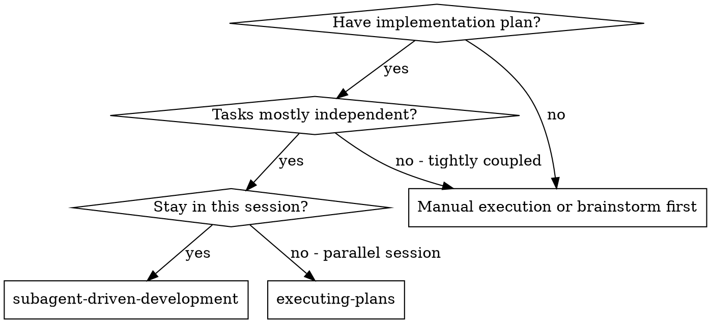
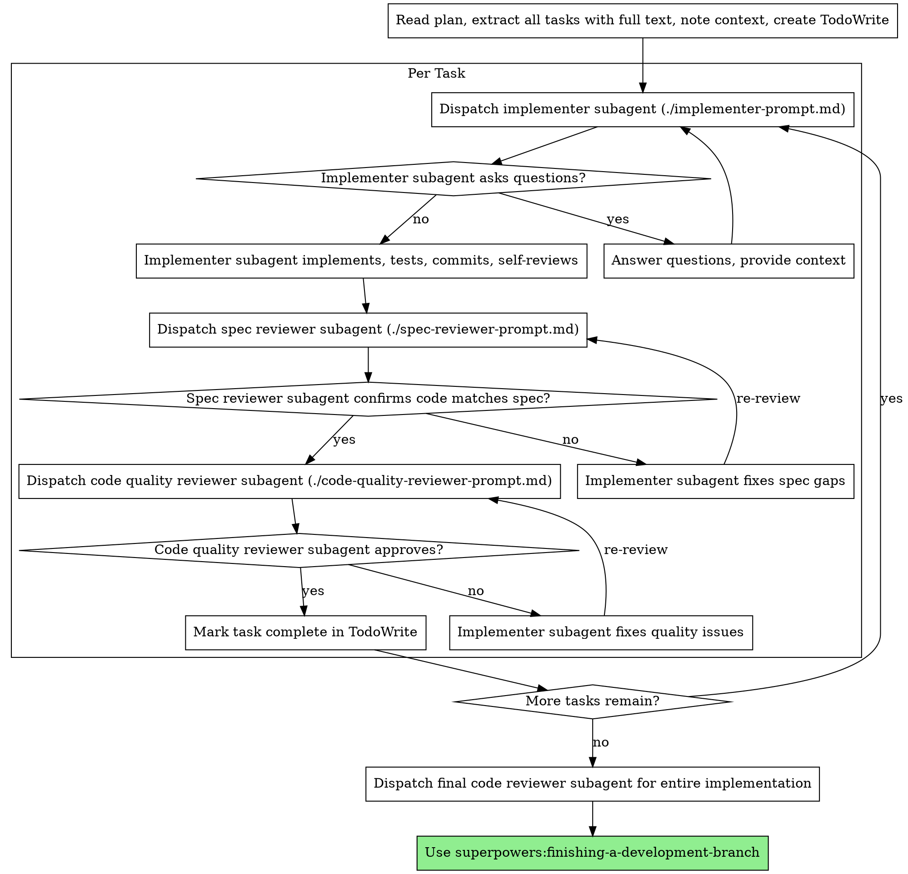

<!-- Generated by SpecStory, Markdown v2.1.0 -->

# 2026-04-22 01:07:52Z

<!-- Claude Code Session adc24372-5f9d-4741-83cb-749d8cfb79cf (2026-04-22 01:07:52Z) -->

_**User (2026-04-22 01:07:52Z)**_

Execute the merged Storybook Tier 1+2 audit plan.            
                                                                                            
  1. /resync ��� master should include the plan commit. Pull if behind.                    
  2. Read docs/superpowers/plans/2026-04-22-stories-tier1-2-audit-plan.md end-to-end. It's  
  self-contained: shared subagent prompt template, allocation table   
  (worktrees/branches/ports), 10 gates, verification gate, flag-on-surprise triggers, PR    
  body shape.                                                     
  3. Invoke superpowers:subagent-driven-development and execute Task 1 (Wave 1): dispatch   
  one general-purpose subagent with the shared template filled in for tier1-root (worktree  
  ./worktrees/stories-tier1-root, branch stories/tier1-root-audit, port 6106, 5 Tier 1 root
  stubs, batch PR title). Foreground dispatch ��� Task 2 depends on the Wave 1 PR existing.   
  4. When the Wave 1 subagent returns: classify (success ��� PR URL / flagged ��� stop +     
  escalate), verify PR via `gh pr list --head stories/tier1-root-audit`, tick the 5 Tier 1  
  checkboxes in issue #125, then pause and show me the PR before Wave 2.                 
  5. On my go-ahead, execute Task 2 (Wave 2): dispatch all 5 subagents in a SINGLE message  
  with 5 parallel Agent calls (ports 6107���6111, branches per the allocation table). Process
  each return independently; don't let one flag block the others.                           
  6. Verify each Wave 2 PR, tick the 5 Tier 2 checkboxes in #125, surface any flags with
  proposed follow-ups.                                                                      
  7. Task 3 handoff: one concise report with all PR URLs, skin-wrapper-cleanup +         
  aux-stories-kept/deleted summaries per file, flag summaries if any.                       
                                         
  Constraints from CLAUDE.md and the plan (do not violate):                                 
  - Named exports only (Playground is the main export; export default only for meta).       
  - Never add per-file classic-skin wrappers ��� global withDefaultSkin applies (#154).
  - Auxiliary named stories only for the three justified cases in the plan (stateful        
  one-shot, pinned theme/viewport, play() not covered by Playwright e2e).                   
  - Agents do not block on merges: push, open PR (or edit the auto-opened PR), exit.
  - Pause between waves for my review.                                                      
                                                                                         
  That's the prompt. One file to read (the plan), one skill to invoke                       
  (subagent-driven-development), explicit pause points between waves. Everything else is 
  already in the plan doc. 

---

_**Agent (claude-opus-4-7 2026-04-22 01:07:56Z)**_

_**Agent (claude-opus-4-7 2026-04-22 01:07:57Z)**_

I'll start by running /resync to sync with master, then read the plan.

_**Agent (claude-opus-4-7 2026-04-22 01:07:57Z)**_

<tool-use data-tool-type="generic" data-tool-name="Skill"><details>
<summary>Tool use: **Skill**</summary>

```text
Launching skill: resync
```
</details></tool-use>

---

_**User (2026-04-22 01:07:57Z)**_

# Resync

Invoke when you suspect the agent is working against stale state — e.g. it's reading files that look outdated, referencing code that's already been changed upstream, or you want to confirm the current branch is current with `origin/master` before continuing.

## Workflow

Run these steps in order. Be concise — one-line summaries per step.

### 1. Fetch and report branch state

Run in parallel:

```bash
git fetch origin --prune
git rev-parse --abbrev-ref HEAD
git status -sb
git log --oneline HEAD..origin/master
git log --oneline origin/master..HEAD
```

Report in this shape:

- **Branch**: `<current branch>` (or `(HEAD detached at …)`)
- **Behind origin/master by**: N commits
- **Ahead of origin/master by**: N commits
- **Working tree**: clean / M modified, U untracked

If behind > 0 and not on `master`, explicitly ask whether to rebase onto `origin/master`. Do **not** rebase without confirmation. If the working tree is dirty, recommend stashing or committing first.

If on `master`, warn — the project rule is no direct work on `master`; a worktree/branch should be in use.

### 2. List open PRs

```bash
gh pr list --state open --limit 30 --json number,title,headRefName,baseRefName,author,updatedAt,isDraft
```

Summarize in a compact table (number, title, author, branch → base, draft flag, last updated). Keep titles short.

### 3. Flag potentially impacting PRs

Given the conversation's current focus (files being edited, features under discussion), scan the PR list for overlap:

- PRs that touch the same files or directories
- PRs that modify shared infrastructure the current work depends on (reducers, game engine, skin system, config, CI)
- PRs the user has mentioned earlier in the session

For each flagged PR, write one sentence: _"PR #N `<title>` — may impact `<area>` because `<reason>`."_ If nothing obviously overlaps, say so explicitly rather than hedging.

### 4. Confirm before continuing

Ask the user to confirm one of:

- Proceed as-is (current state is fine).
- Rebase onto `origin/master` first.
- Pause this session and review a specific PR first.

Wait for the user's decision. Do not resume prior work until they respond.

## Notes

- Use `gh` for GitHub interactions; don't scrape URLs.
- Don't run `git rebase` or `git pull --rebase` without explicit confirmation — rebases can conflict with uncommitted changes or in-progress worktrees.
- If `gh` is unauthenticated, surface the error and stop at step 2 rather than guessing.
- Keep the whole report under ~25 lines. The user invokes this to re-ground quickly, not to read a novel.


---

_**Agent (claude-opus-4-7 2026-04-22 01:07:58Z)**_

_**Agent (claude-opus-4-7 2026-04-22 01:08:05Z)**_

<tool-use data-tool-type="shell" data-tool-name="Bash"><details>
<summary>Tool use: **Bash**</summary>
Fetch latest from origin

`git fetch origin --prune`

```text
From github.com:leocaseiro/base-skill
   d0763089..1772d617  gh-pages   -> origin/gh-pages
 + 549408b0...f03457db plan/tier3-storybook-audit -> origin/plan/tier3-storybook-audit  (forced update)
 + 7e70ab43...473bdb8b stories/tier1-2-audit-plan -> origin/stories/tier1-2-audit-plan  (forced update)
```
</details></tool-use>

_**Agent (claude-opus-4-7 2026-04-22 01:08:05Z)**_

<tool-use data-tool-type="shell" data-tool-name="Bash"><details>
<summary>Tool use: **Bash**</summary>
Show current branch

`git rev-parse --abbrev-ref HEAD`

```text
master
```
</details></tool-use>

_**Agent (claude-opus-4-7 2026-04-22 01:08:05Z)**_

<tool-use data-tool-type="shell" data-tool-name="Bash"><details>
<summary>Tool use: **Bash**</summary>
Show status summary

`git status -sb`

```text
## master
 M .specstory/statistics.json
?? .specstory/history/2026-04-21_23-15-46Z-continue-the-storybook-controls.md
?? .specstory/history/2026-04-22_01-07-47Z-execute-the-merged-storybook.md
```
</details></tool-use>

_**Agent (claude-opus-4-7 2026-04-22 01:08:05Z)**_

<tool-use data-tool-type="shell" data-tool-name="Bash"><details>
<summary>Tool use: **Bash**</summary>
Commits behind origin/master

`git log --oneline HEAD..origin/master`

```text
(Bash completed with no output)
```
</details></tool-use>

_**Agent (claude-opus-4-7 2026-04-22 01:08:05Z)**_

<tool-use data-tool-type="shell" data-tool-name="Bash"><details>
<summary>Tool use: **Bash**</summary>
Commits ahead of origin/master

`git log --oneline origin/master..HEAD`

```text
(Bash completed with no output)
```
</details></tool-use>

_**Agent (claude-opus-4-7 2026-04-22 01:08:05Z)**_

<tool-use data-tool-type="shell" data-tool-name="Bash"><details>
<summary>Tool use: **Bash**</summary>
List open PRs

`gh pr list --state open --limit 30 --json number,title,headRefName,baseRefName,author,updatedAt,isDraft`

```text
[{"author":{"id":"MDQ6VXNlcjk0MDA3MA==","is_bot":false,"login":"leocaseiro","name":"Leo Caseiro"},"baseRefName":"master","headRefName":"plan/tier3-storybook-audit","isDraft":false,"number":150,"title":"docs(plan): Tier 3 Storybook controls audit","updatedAt":"2026-04-22T01:02:50Z"},{"author":{"id":"MDQ6VXNlcjk0MDA3MA==","is_bot":false,"login":"leocaseiro","name":"Leo Caseiro"},"baseRefName":"master","headRefName":"chore/specstory-sync-2026-04-22_2","isDraft":false,"number":148,"title":"ai(specstory): sync","updatedAt":"2026-04-21T20:43:16Z"}]
```
</details></tool-use>

_**Agent (claude-opus-4-7 2026-04-22 01:08:15Z)**_

### Resync report

- **Branch**: `master` ⚠️ — project rule forbids working on master; a worktree/branch is required (and this task creates 6 worktrees)
- **Behind origin/master by**: 0 commits
- **Ahead of origin/master by**: 0 commits
- **Working tree**: dirty (specstory noise only — `.specstory/statistics.json` M, two session history files U)

### Open PRs

| # | Title | Author | Branch → base | Draft | Updated |
|---|---|---|---|---|---|
| 150 | docs(plan): Tier 3 Storybook controls audit | leocaseiro | `plan/tier3-storybook-audit` → master | no | 2026-04-22 |
| 148 | ai(specstory): sync | leocaseiro | `chore/specstory-sync-2026-04-22_2` → master | no | 2026-04-21 |

### Impact on this task

- **PR #150** (Tier 3 plan) — adjacent scope (next audit tier) but does **not** touch Tier 1/2 stories. No conflict expected.
- **PR #148** (specstory sync) — noise channel only, no impact.
- The Tier 1+2 merged plan was merged in `01685f68` (commit already on origin/master). ✅ Plan commit present locally.

No rebase needed. Master is current. The dirty files are specstory session logs (auto-generated) — safe to ignore for this work since new worktrees will branch from clean origin/master.

Now reading the plan before dispatching anything.

_**Agent (claude-opus-4-7 2026-04-22 01:08:16Z)**_

<tool-use data-tool-type="read" data-tool-name="Read"><details>
<summary>Tool use: **Read**</summary>
 `./docs/superpowers/plans/2026-04-22-stories-tier1-2-audit-plan.md`

```text
1	---
2	date: 2026-04-22
3	status: draft
4	spec: docs/superpowers/specs/2026-04-22-stories-tier1-2-audit-design.md
5	tracking: '#125'
6	---
7	
8	# Storybook Tier 1 + 2 Audit Implementation Plan
9	
10	> **For agentic workers:** REQUIRED SUB-SKILL: Use superpowers:subagent-driven-development to execute
11	> this plan. Each task below dispatches one or more subagents; steps use checkbox (`- [ ]`) syntax for
12	> orchestrator tracking.
13	
14	**Goal:** Ship 6 PRs against `master` — 1 batch PR auditing the 5 Tier 1 root stubs and 5 solo PRs
15	auditing the Tier 2 single-purpose components — each converging on the Playground pattern documented
16	in `.claude/skills/write-storybook/SKILL.md`.
17	
18	**Architecture:** Orchestrator (main session) dispatches subagents in two waves. Wave 1 = 1 subagent
19	producing a single batch PR. Wave 2 = 5 subagents dispatched in parallel, one PR each. Every subagent
20	works in an isolated git worktree with its own `node_modules` and a dedicated Storybook port, runs the
21	verification gate locally, pushes, opens (or edits the auto-opened) PR referencing `#125`, and exits.
22	Agents do not block on merges. The orchestrator ticks `#125` checkboxes as PRs open.
23	
24	**Tech Stack:** Storybook 9, React, TanStack Router, `storybook/test` `fn()` handlers, Vitest
25	test-runner, `gh` CLI, git worktrees, `yarn`.
26	
27	---
28	
29	## Source of truth
30	
31	- **Spec (merged #149 at `52f57ae6`):** `docs/superpowers/specs/2026-04-22-stories-tier1-2-audit-design.md`
32	- **Tracker issue:** `#125`
33	- **Controls policy:** `.claude/skills/write-storybook/SKILL.md`
34	- **Shell-slim canonical:** `src/components/answer-game/AnswerGame/AnswerGame.stories.tsx`
35	- **Playground-collapse canonical:** `src/components/answer-game/InstructionsOverlay/InstructionsOverlay.stories.tsx`
36	- **Trigger-button canonical (one-shot callbacks):** `src/components/answer-game/EncouragementAnnouncer/EncouragementAnnouncer.stories.tsx`
37	- **Precedent PRs:** `#124` (pilot), `#134` (batch 2 retrofit), `#141` (Playground collapse),
38	  `#143` (per-game wrapper refactor), `#154` (global `withDefaultSkin` decorator — merged
39	  `eada2163`, makes the per-file classic-skin wrapper obsolete).
40	- **In-flight PR `#155`** rewrites the SKILL.md to formalise the single-Playground discipline
41	  (auxiliary stories only for scenarios controls can't express) and demotes `play()` to
42	  optional. The amendments below fold in its policy direction; the only unresolved detail is
43	  the export name (`Playground` vs `Default`) — **see "Open question" below**.
44	
45	Any deviation from the spec's scope (ten target files, worktree/branch/port table, two-wave
46	orchestration, flag-on-surprise contract) is a plan defect — fix the plan first.
47	
48	### Open question: `Playground` vs `Default` naming
49	
50	Spec `#149` and every existing canonical file (`AnswerGame`, `InstructionsOverlay`,
51	`EncouragementAnnouncer`, `ProgressHUD`, `Slot`, `GameOverOverlay`, `LevelCompleteOverlay`,
52	`ScoreAnimation`) export the main Controls-driven story as `Playground`. PR `#155`'s new
53	Minimal Template calls it `Default`, but `#155`'s own reference implementations all still use
54	`Playground`. **This plan standardises on `Playground`** (matches spec and existing code). If
55	you'd rather have subagents emit `Default`, call it out before approving the plan PR — it's a
56	single-word swap in the template below and the allocation table's PR titles.
57	
58	## Allocation
59	
60	| Wave | Agent id                | Target file(s)                                                           | Worktree                                    | Branch                                | Port | PR title                                                                 |
61	| ---- | ----------------------- | ------------------------------------------------------------------------ | ------------------------------------------- | ------------------------------------- | ---- | ------------------------------------------------------------------------ |
62	| 1    | `tier1-root`            | All 5 Tier 1 root stubs (see below)                                      | `./worktrees/stories-tier1-root`            | `stories/tier1-root-audit`            | 6106 | `stories(root): audit controls + Playground for 5 files`                 |
63	| 2a   | `audio-button`          | `src/components/questions/AudioButton/AudioButton.stories.tsx`           | `./worktrees/stories-audio-button`          | `stories/audio-button-audit`          | 6107 | `stories(questions/audio-button): audit controls + Playground`           |
64	| 2b   | `image-question`        | `src/components/questions/ImageQuestion/ImageQuestion.stories.tsx`       | `./worktrees/stories-image-question`        | `stories/image-question-audit`        | 6108 | `stories(questions/image-question): audit controls + Playground`         |
65	| 2c   | `text-question`         | `src/components/questions/TextQuestion/TextQuestion.stories.tsx`         | `./worktrees/stories-text-question`         | `stories/text-question-audit`         | 6109 | `stories(questions/text-question): audit controls + Playground`          |
66	| 2d   | `dot-group-question`    | `src/components/questions/DotGroupQuestion/DotGroupQuestion.stories.tsx` | `./worktrees/stories-dot-group-question`    | `stories/dot-group-question-audit`    | 6110 | `stories(questions/dot-group-question): audit controls + Playground`     |
67	| 2e   | `word-library-explorer` | `src/data/words/WordLibraryExplorer.stories.tsx`                         | `./worktrees/stories-word-library-explorer` | `stories/word-library-explorer-audit` | 6111 | `stories(data/words/word-library-explorer): audit controls + Playground` |
68	
69	Tier 1 files for the `tier1-root` agent:
70	
71	1. `src/components/ThemeToggle.stories.tsx`
72	2. `src/components/Footer.stories.tsx`
73	3. `src/components/Header.stories.tsx`
74	4. `src/components/OfflineIndicator.stories.tsx`
75	5. `src/components/UpdateBanner.stories.tsx`
76	
77	## File structure
78	
79	This plan document is the only file produced on `stories/tier1-2-audit-plan`. All code changes happen
80	inside the six subagent branches listed above. The orchestrator does not edit any source file
81	directly — the only orchestrator-side writes are to issue `#125` (checkbox ticks via `gh issue edit`).
82	
83	---
84	
85	## Shared subagent prompt template
86	
87	Each subagent receives a self-contained prompt built from this template with the following
88	substitutions:
89	
90	- `{{AGENT_ID}}` — from the allocation table (e.g., `tier1-root`, `audio-button`).
91	- `{{TARGET_FILES}}` — newline-separated list of story file paths in scope for that agent.
92	- `{{WORKTREE_PATH}}` — from the allocation table (e.g., `./worktrees/stories-tier1-root`).
93	- `{{BRANCH}}` — from the allocation table (e.g., `stories/tier1-root-audit`).
94	- `{{PORT}}` — from the allocation table (e.g., `6106`).
95	- `{{PR_TITLE}}` — from the allocation table.
96	- `{{BATCH_OR_SOLO}}` — `batch` for Wave 1, `solo` for each Wave 2 agent.
97	
98	The template below is the exact text to dispatch, verbatim, with the above substitutions made. Do not
99	trim it; each subagent starts cold and requires the full context.
100	
101	````text
102	You are the `{{AGENT_ID}}` Storybook audit subagent. Your job is to audit these story files
103	against the project's Storybook controls policy and the Playground pattern, then open a PR.
104	
105	TARGET FILES (scope is strict — do not edit anything else):
106	{{TARGET_FILES}}
107	
108	Reference material (read before editing):
109	
110	- Spec: docs/superpowers/specs/2026-04-22-stories-tier1-2-audit-design.md
111	- Controls policy: .claude/skills/write-storybook/SKILL.md (note: the global
112	  `withDefaultSkin` decorator in `.storybook/preview.tsx` now applies
113	  `game-container skin-classic` with `classicSkin.tokens` to every story — per-file
114	  wrappers are redundant and must be removed, see PR #154 merge commit `eada2163`).
115	- Shell-slim canonical: src/components/answer-game/AnswerGame/AnswerGame.stories.tsx
116	- Playground-collapse canonical (audit pattern): src/components/answer-game/InstructionsOverlay/InstructionsOverlay.stories.tsx
117	- Trigger-button canonical (stateful one-shot callbacks): src/components/answer-game/EncouragementAnnouncer/EncouragementAnnouncer.stories.tsx
118	- Tracker issue: #125 (contains the 10 gates reproduced below)
119	
120	If PR #155 (`docs(skill): adopt single-Default Playground pattern for storybook`) has
121	merged by the time you dispatch, the SKILL.md you read reflects the updated policy
122	verbatim. Either way the gates below are authoritative for this audit.
123	
124	## Step 1 — Environment
125	
126	From the project root `/Users/leocaseiro/Sites/base-skill`:
127	
128	```bash
129	git worktree add {{WORKTREE_PATH}} -b {{BRANCH}} master
130	cd {{WORKTREE_PATH}}
131	yarn install
132	```
133	
134	Do not reuse an existing worktree — fail loudly if the path is already taken and report back.
135	
136	## Step 2 — Per-file audit
137	
138	For each file in TARGET FILES, converge on the Playground pattern:
139	
140	1. Declare a `StoryArgs` interface that exposes only the props the Controls panel should drive. For
141	   every raw component prop that must stay hidden (shadowed, derived internally, or JSX/function
142	   types), declare it on `StoryArgs` as `?: never` AND set
143	   `{ table: { disable: true } }` in `argTypes` for that row.
144	2. `meta.args` supplies defaults for every visible `StoryArgs` field, including `fn()` (imported from
145	   `storybook/test`) for every `on*` handler. Do NOT rely on the global `argTypesRegex` — it misses
146	   DOM-extended props under react-docgen.
147	3. `meta.argTypes` declares a structured control for each visible arg:
148	   - `boolean` for booleans
149	   - `select` + `options` (or `radio` + `options` for ≤4 options) for enums/string unions
150	   - `range` + `min`/`max`/`step` for bounded numbers
151	   - `text` only for legitimately free-text props that are visibly rendered
152	   - `{ table: { disable: true } }` for any hidden row
153	   No raw JSON controls.
154	4. `meta.render` destructures `StoryArgs`, derives any internal values (e.g., an id from a non-empty
155	   name — precedent: `InstructionsOverlay` derives `customGameId` from `customGameName`), and renders
156	   the component. **Do NOT add a per-file classic-skin wrapper.** The global `withDefaultSkin`
157	   decorator in `.storybook/preview.tsx` already wraps every story in
158	   `<div className="game-container skin-classic" style={classicSkin.tokens}>` (PR #154). If the
159	   file you're editing currently has an inline wrapper, remove it along with the
160	   `classicSkin`/`CSSProperties` imports that only existed for the wrapper. Keep `classicSkin`
161	   imports only if the component receives it as a prop (precedent: `AnswerGame.stories.tsx`
162	   passes `skin={classicSkin}`). Alt-skin previews for the same component must go in a sibling
163	   `*.skin.stories.tsx` file — none of the ten target files qualify.
164	5. `parameters.docs.description.component` documents what the Playground drives and points at
165	   `<Component>.test.tsx` for play-flow coverage (if such a test file exists).
166	6. Export a single `Playground` story: `export const Playground: Story = {}` (with minimal arg
167	   overrides only when a non-default seed aids first-load visuals). **Auxiliary named exports
168	   are justified only when a scenario truly cannot be expressed by toggling Playground
169	   controls** — specifically: a stateful one-shot sequence that needs replay (precedent:
170	   `EncouragementAnnouncer`'s `ReplayTrigger` with a `ShowTrigger` wrapper + `useState`), a
171	   pinned theme/viewport with meaningfully different visuals, or a `play()` assertion that
172	   Playwright e2e doesn't already cover. Do NOT add per-enum-value / per-state-reachable-via-prop /
173	   edge-case-text (`LongText`, `ManyItems`) named stories — those belong in controls.
174	
175	### Collapse rule
176	
177	If existing named stories in the file duplicate what a Playground control would toggle (per-enum
178	variants, per-state when the state is reachable via a prop, long-text/many-items scenarios) OR
179	duplicate `*.test.tsx` interaction coverage, delete them and fold into `Playground`. Keep an
180	auxiliary story only when it captures a scenario the Controls panel genuinely can't express
181	(see item 6 above).
182	
183	## The 10 gates — every target file must pass
184	
185	Reproduced from issue `#125`, updated to reflect the merged global skin decorator (PR `#154`)
186	and the in-flight single-Playground policy tightening (PR `#155`).
187	
188	1. **Controls map to something visible.** Drop text controls for invisible values (ids, internal
189	   keys). If a value toggles behaviour, derive it from a visible control (precedent:
190	   `InstructionsOverlay` — `customGameId` derived from non-empty `customGameName`).
191	2. **Prefer structured inputs.** `select` / `radio` / `boolean` / `range` over raw text whenever
192	   the domain is enumerable. No raw JSON fallbacks.
193	3. **Every `on*` prop wired to `fn()`** from `storybook/test` in `args`. Do NOT rely on
194	   `argTypesRegex` alone — react-docgen misses DOM-extended props. Callbacks fire into the
195	   Actions panel by default; only add a UI trigger button in `render` if the callback requires a
196	   replayable one-shot sequence that controls alone can't invoke (precedent:
197	   `EncouragementAnnouncer`'s `ShowTrigger` helper).
198	4. **No per-file classic-skin wrapper.** The global `withDefaultSkin` decorator applies
199	   `game-container skin-classic` + `classicSkin.tokens` to every story. If the file has an
200	   existing inline wrapper, REMOVE it (and the now-orphaned `classicSkin`/`CSSProperties`
201	   imports). Keep `classicSkin` imports only if the component receives it as a prop.
202	5. **Hide shadowed/derived docgen rows** via `?: never` on `StoryArgs` AND
203	   `{ table: { disable: true } }` in `argTypes` for each hidden row.
204	6. **Collapse redundant named stories.** Delete per-enum-value / per-state-reachable-via-prop /
205	   edge-case-text stories that a control toggle would show. Also delete play-flow stories that
206	   duplicate `*.test.tsx` coverage. Keep only auxiliary stories the Controls panel genuinely
207	   can't express (stateful one-shot flow, pinned theme/viewport, `play()` assertion not covered
208	   by Playwright e2e).
209	7. **Real-game parity.** Compare the Storybook Playground render to how the component mounts at
210	   runtime (`src/routes/…` or `src/games/…`). The global `withDefaultSkin` decorator should make
211	   parity automatic for components that read `--skin-*`; any drift → flag in the PR body.
212	8. **Auxiliary-story discipline.** Auxiliary stories (if any) are justified only by the three
213	   reasons in gate #6. No required Default/per-enum/per-state/edge-case variant set — the
214	   Playground IS the Default, and every UI-affecting prop is a control on it.
215	9. **Decorators match current dependencies** — `withDb`, `withRouter` as the component
216	   requires. Do not add `classicSkin`-wrapping or `ThemeProvider` decorators — both are global.
217	10. **`play()` is OPTIONAL in this project.** Playwright e2e (`e2e/visual.spec.ts` and friends)
218	    already covers VR and flow assertions on live routes. Add a `play()` only when it asserts
219	    something Playwright doesn't (keyboard-only flow, focus management, validation-error
220	    visibility) and the assertion adds genuine value. Pure-display components never need one.
221	
222	## Step 3 — Verification gate (run BEFORE pushing)
223	
224	Run from inside `{{WORKTREE_PATH}}`:
225	
226	```bash
227	yarn typecheck                                           # expect 0 errors
228	yarn lint                                                # expect 0 errors
229	PORT={{PORT}}
230	yarn storybook --port $PORT --ci &
231	STORYBOOK_PID=$!
232	until curl -s http://127.0.0.1:$PORT > /dev/null 2>&1; do sleep 2; done
233	yarn test:storybook --url http://127.0.0.1:$PORT        # expect all suites green
234	TEST_EXIT=$?
235	if [ $TEST_EXIT -eq 0 ]; then kill $STORYBOOK_PID; fi
236	exit $TEST_EXIT
237	```
238	
239	Then perform the real-game parity visual check: open the Storybook Playground for each target file
240	AND the live runtime mount of the same component (under `src/routes/…` or `src/games/…`), compare
241	visually, and record the result for the PR body. The global `withDefaultSkin` decorator should make
242	parity automatic for `--skin-*` consumers — any residual drift (beyond a single-pixel wrapper-div
243	shift) is a flag-on-surprise trigger.
244	
245	Finally, if any markdown was edited: `yarn fix:md`.
246	
247	- If the gate fails with an in-scope cause → fix and re-run.
248	- If the gate fails with an out-of-scope cause (global config, decorator, component source) → STOP
249	  and report (flag-on-surprise). Do not push.
250	
251	## Step 4 — Flag-on-surprise triggers
252	
253	Stop and report to the orchestrator (do not push) if any of these apply:
254	
255	- Prop type is opaque (function-returning-JSX, complex branded type, render-prop) that can't be
256	  demoed via a primitive control.
257	- Real-game mount uses providers beyond `withDb` / `withRouter`.
258	- A `*.test.*` file imports from the story file — collapse would break tests.
259	- Verification gate fails with a root cause outside the audit scope (`.storybook/*`, component
260	  source, decorators, `yarn.lock`).
261	- Visual drift between Storybook Playground and real-game mount that exceeds a single-pixel
262	  wrapper offset (i.e., token / layout / theme drift, not the expected noise from the global
263	  `withDefaultSkin` wrapper).
264	- A callback prop requires a replayable one-shot sequence whose trigger-button wrapper would
265	  exceed a trivial `ShowTrigger`-style helper (e.g., it needs real providers beyond the allowed
266	  decorators).
267	- The allocated worktree path, branch name, or port is already in use.
268	
269	Report format: target file(s), trigger category, one-paragraph diagnosis, proposed fix (if any),
270	state left on disk (branch created? commits? worktree left in place?).
271	
272	## Step 5 — Commits
273	
274	One commit per story file. Message: `stories(<area>/<name>): <imperative summary>` — e.g.
275	`stories(components/header): audit controls + Playground`. For Wave 1 (batch agent), five commits on
276	the same branch — do not squash.
277	
278	## Step 6 — Rebase, push, open PR
279	
280	```bash
281	git fetch origin master
282	git rebase origin/master                                # resolve conflicts → flag if any arise
283	git push -u origin {{BRANCH}}
284	```
285	
286	If a workflow auto-opens a PR on push, edit its title/body in place with `gh pr edit` — do NOT open
287	a second PR.
288	
289	Otherwise, open the PR:
290	
291	```bash
292	gh pr create --base master --title "{{PR_TITLE}}" --body "$(cat <<'EOF'
293	## Summary
294	
295	<one-paragraph narrative; list each target file and what changed>
296	
297	## Playground shape
298	
299	<per target file: list the controls exposed on Playground, any auxiliary stories kept and why,
300	any named stories deleted because a control now covers them>
301	
302	## Skin wrapper cleanup
303	
304	<per target file: "no inline wrapper found" OR "removed inline `game-container skin-classic`
305	wrapper and orphaned `classicSkin`/`CSSProperties` imports — global `withDefaultSkin` decorator
306	applies classic skin, PR #154">
307	
308	## Real-game parity
309	
310	<per target file: "match" or describe drift; link the runtime route you compared against>
311	
312	## Verification
313	
314	- [x] `yarn typecheck`
315	- [x] `yarn lint`
316	- [x] `yarn test:storybook --url http://127.0.0.1:{{PORT}}` (all suites green)
317	- [x] Real-game parity visual check
318	
319	Refs #125.
320	EOF
321	)"
322	```
323	
324	Do NOT wait for merge. Once the PR is open (or the auto-opened PR has been edited), the agent's work
325	is done.
326	
327	## Step 7 — Report back
328	
329	Respond to the orchestrator with a short summary (≤ 200 words):
330	
331	- PR number + URL (or "flagged" + trigger).
332	- Target file(s) changed.
333	- Skin wrapper cleanup per file (none found / removed inline wrapper + orphaned imports).
334	- Auxiliary stories kept or deleted per file (and why).
335	- Real-game parity result per file.
336	- Any surprises, even if not blocking.
337	
338	## Constraints
339	
340	- **Named exports only** — `export default meta` is the single exception (framework config file).
341	- **Do not modify** `.storybook/*`, decorators, the component source, `yarn.lock`, or any file
342	  outside TARGET FILES. Any such need is a flag-on-surprise trigger. In particular, do NOT
343	  re-introduce or preserve a per-file classic-skin wrapper — the global `withDefaultSkin`
344	  decorator owns that.
345	- **Never commit directly to `master`.** Your work lives on `{{BRANCH}}`.
346	- **Never force-push.** If rebase creates conflicts, flag and stop.
347	- **Skip markdown `fix:md` unless you edited markdown** — this batch should not.
348	````
349	
350	---
351	
352	## Tasks
353	
354	### Task 1: Verify preconditions and dispatch Wave 1
355	
356	**Files:** orchestrator-only (no file edits by the orchestrator).
357	
358	- [ ] **Step 1: Confirm master is current**
359	
360	  Run from the project root:
361	
362	  ```bash
363	  cd /Users/leocaseiro/Sites/base-skill
364	  git fetch origin --prune
365	  git log --oneline origin/master -3
366	  ```
367	
368	  Expected: the three most recent commits on `origin/master` include `52f57ae6`
369	  (`docs(spec): tier 1 + tier 2 storybook audit batch design (#149)`). If not, stop and
370	  investigate — the spec is the source of truth and must be merged.
371	
372	- [ ] **Step 2: Confirm Wave 1 resources are free**
373	
374	  ```bash
375	  test ! -e ./worktrees/stories-tier1-root && echo "worktree path free"
376	  ! lsof -i :6106 > /dev/null 2>&1 && echo "port 6106 free"
377	  git show-ref --verify --quiet refs/heads/stories/tier1-root-audit \
378	    && echo "branch EXISTS — stop" \
379	    || echo "branch free"
380	  ```
381	
382	  Expected: all three lines print "…free". If any resource is taken, stop and surface it to
383	  the user — do not attempt to clean it up automatically (it may be in-progress work).
384	
385	- [ ] **Step 3: Dispatch the Wave 1 subagent**
386	
387	  Use the `Agent` tool, `subagent_type: "general-purpose"`, `description: "Storybook Tier 1 root audit batch"`.
388	  The `prompt` is the Shared subagent prompt template above with these substitutions:
389	  - `{{AGENT_ID}}` → `tier1-root`
390	  - `{{TARGET_FILES}}` →
391	
392	    ```text
393	    src/components/ThemeToggle.stories.tsx
394	    src/components/Footer.stories.tsx
395	    src/components/Header.stories.tsx
396	    src/components/OfflineIndicator.stories.tsx
397	    src/components/UpdateBanner.stories.tsx
398	    ```
399	
400	  - `{{WORKTREE_PATH}}` → `./worktrees/stories-tier1-root`
401	  - `{{BRANCH}}` → `stories/tier1-root-audit`
402	  - `{{PORT}}` → `6106`
403	  - `{{PR_TITLE}}` → `stories(root): audit controls + Playground for 5 files`
404	  - `{{BATCH_OR_SOLO}}` → `batch`
405	
406	  Dispatch in the **foreground** — Task 2 depends on the Wave 1 PR existing before it dispatches.
407	
408	- [ ] **Step 4: Classify the subagent's return**
409	
410	  Read the agent's summary. Two possible outcomes:
411	  - **Success** — the summary contains a PR URL. Continue to Step 5.
412	  - **Flagged** — the summary describes a flag-on-surprise trigger and names the state left on
413	    disk. Report the flag verbatim to the user, ask for guidance (retry / re-scope / drop the
414	    file), and stop the plan here. Do not auto-retry.
415	
416	- [ ] **Step 5: Verify the PR exists**
417	
418	  ```bash
419	  gh pr list --head stories/tier1-root-audit --state open \
420	    --json number,title,url,headRefName
421	  ```
422	
423	  Expected: exactly one PR with `headRefName: "stories/tier1-root-audit"` and a title
424	  starting with `stories(root):`. If zero PRs are returned, investigate — the agent may have
425	  pushed without opening a PR, in which case open one manually using the PR template from
426	  Step 6 below. If more than one PR is returned (workflow double-open), close the duplicate.
427	
428	- [ ] **Step 6: Tick the five Tier 1 checkboxes in issue #125**
429	
430	  ```bash
431	  gh issue view 125 --json body -q .body > /tmp/125-body.md
432	  # Tick these five lines:
433	  #   - [ ] `Footer.stories.tsx`
434	  #   - [ ] `Header.stories.tsx`
435	  #   - [ ] `OfflineIndicator.stories.tsx`
436	  #   - [ ] `ThemeToggle.stories.tsx`
437	  #   - [ ] `UpdateBanner.stories.tsx`
438	  # by changing `- [ ]` → `- [x]` for each, in /tmp/125-body.md, then:
439	  gh issue edit 125 --body-file /tmp/125-body.md
440	  ```
441	
442	  Confirm with `gh issue view 125 --json body -q .body | grep -E 'Footer|Header|OfflineIndicator|ThemeToggle|UpdateBanner'`
443	  — all five lines should now show `[x]`.
444	
445	- [ ] **Step 7: Mark Wave 1 complete in orchestrator TaskList**
446	
447	  Update the orchestrator's Wave 1 task to `completed`. Do not mark the PR itself merged — the
448	  user reviews and merges asynchronously.
449	
450	### Task 2: Dispatch Wave 2 (5 subagents in parallel)
451	
452	**Files:** orchestrator-only (no file edits by the orchestrator).
453	
454	Wave 2 does **not** block on Wave 1 merge — only on Wave 1 PR being open (which Task 1 Step 5
455	verified). Disjoint directories guarantee no merge conflicts between branches.
456	
457	- [ ] **Step 1: Verify Wave 2 resources are free**
458	
459	  ```bash
460	  for path in stories-audio-button stories-image-question stories-text-question \
461	              stories-dot-group-question stories-word-library-explorer; do
462	    test ! -e "./worktrees/$path" || echo "COLLISION: ./worktrees/$path"
463	  done
464	  for port in 6107 6108 6109 6110 6111; do
465	    lsof -i :$port > /dev/null 2>&1 && echo "COLLISION: port $port in use"
466	  done
467	  for branch in stories/audio-button-audit stories/image-question-audit \
468	                stories/text-question-audit stories/dot-group-question-audit \
469	                stories/word-library-explorer-audit; do
470	    git show-ref --verify --quiet "refs/heads/$branch" \
471	      && echo "COLLISION: branch $branch exists"
472	  done
473	  ```
474	
475	  Expected: no `COLLISION` lines. If any collision appears, stop and surface it — do not
476	  attempt to clean up automatically.
477	
478	- [ ] **Step 2: Dispatch all 5 Wave 2 subagents in a single message**
479	
480	  This step MUST use a single assistant message with 5 parallel `Agent` tool calls — that is
481	  the only way to run them concurrently per the subagent-driven-development contract.
482	
483	  Each of the five calls uses:
484	  - `subagent_type: "general-purpose"`
485	  - `description: "Storybook Tier 2 <name> audit"` (where `<name>` is the agent id)
486	  - `run_in_background: false` (foreground — see Step 3)
487	  - `prompt:` the Shared subagent prompt template with the substitutions from the allocation
488	    table for that row. Recap:
489	
490	    | Agent id              | `{{TARGET_FILES}}` (single file)                                         | `{{WORKTREE_PATH}}`                         | `{{BRANCH}}`                          | `{{PORT}}` | `{{PR_TITLE}}`                                                           |
491	    | --------------------- | ------------------------------------------------------------------------ | ------------------------------------------- | ------------------------------------- | ---------- | ------------------------------------------------------------------------ |
492	    | audio-button          | `src/components/questions/AudioButton/AudioButton.stories.tsx`           | `./worktrees/stories-audio-button`          | `stories/audio-button-audit`          | `6107`     | `stories(questions/audio-button): audit controls + Playground`           |
493	    | image-question        | `src/components/questions/ImageQuestion/ImageQuestion.stories.tsx`       | `./worktrees/stories-image-question`        | `stories/image-question-audit`        | `6108`     | `stories(questions/image-question): audit controls + Playground`         |
494	    | text-question         | `src/components/questions/TextQuestion/TextQuestion.stories.tsx`         | `./worktrees/stories-text-question`         | `stories/text-question-audit`         | `6109`     | `stories(questions/text-question): audit controls + Playground`          |
495	    | dot-group-question    | `src/components/questions/DotGroupQuestion/DotGroupQuestion.stories.tsx` | `./worktrees/stories-dot-group-question`    | `stories/dot-group-question-audit`    | `6110`     | `stories(questions/dot-group-question): audit controls + Playground`     |
496	    | word-library-explorer | `src/data/words/WordLibraryExplorer.stories.tsx`                         | `./worktrees/stories-word-library-explorer` | `stories/word-library-explorer-audit` | `6111`     | `stories(data/words/word-library-explorer): audit controls + Playground` |
497	
498	    `{{BATCH_OR_SOLO}}` → `solo` for every Wave 2 agent.
499	
500	- [ ] **Step 3: Classify each returned summary independently**
501	
502	  All 5 agents run foreground in one tool batch; Claude receives all five results at once.
503	  Process each independently — a flag from agent 2a does not block 2b-2e. For each:
504	  - **Success** — record the PR URL. Continue.
505	  - **Flagged** — record the trigger and the on-disk state the agent reported. Surface all
506	    flags together after Step 6.
507	
508	- [ ] **Step 4: Verify each Wave 2 PR exists**
509	
510	  ```bash
511	  for branch in stories/audio-button-audit stories/image-question-audit \
512	                stories/text-question-audit stories/dot-group-question-audit \
513	                stories/word-library-explorer-audit; do
514	    echo "--- $branch ---"
515	    gh pr list --head "$branch" --state open --json number,title,url \
516	      --jq '.[] | "#\(.number) \(.title) \(.url)"'
517	  done
518	  ```
519	
520	  Expected: one line per successful agent. Zero lines for an agent means "no PR opened" —
521	  cross-reference with Step 3's classification (it should have flagged) and investigate if
522	  the agent claimed success but the PR is missing.
523	
524	- [ ] **Step 5: Tick the Tier 2 checkboxes in issue #125**
525	
526	  Fetch the current body, tick one line per successful Wave 2 PR, write it back. Map:
527	
528	  | Wave 2 agent          | Checkbox line in issue #125                     |
529	  | --------------------- | ----------------------------------------------- |
530	  | audio-button          | `AudioButton/AudioButton.stories.tsx`           |
531	  | image-question        | `ImageQuestion/ImageQuestion.stories.tsx`       |
532	  | text-question         | `TextQuestion/TextQuestion.stories.tsx`         |
533	  | dot-group-question    | `DotGroupQuestion/DotGroupQuestion.stories.tsx` |
534	  | word-library-explorer | `data/words/WordLibraryExplorer.stories.tsx`    |
535	
536	  Use the same `gh issue view ... | edit --body-file -` pattern as Task 1 Step 6. Do not tick
537	  checkboxes for flagged agents.
538	
539	- [ ] **Step 6: Surface flag summaries (if any)**
540	
541	  If any Wave 2 agent flagged, post a consolidated report to the user: per-agent trigger,
542	  on-disk state, proposed fix. Ask for guidance (retry / re-scope / drop the file). Do not
543	  auto-retry.
544	
545	- [ ] **Step 7: Mark Wave 2 complete in orchestrator TaskList**
546	
547	  Mark Wave 2 complete once all PRs are open (or all flags reported). Wave 2 is "complete"
548	  when the orchestrator has nothing left to drive — user reviews PRs asynchronously.
549	
550	### Task 3: Handoff to user
551	
552	**Files:** orchestrator-only.
553	
554	- [ ] **Step 1: Assemble the final report**
555	
556	  One concise message to the user containing:
557	  - All 6 PR URLs (or 5 if Wave 1 was flagged; fewer if Wave 2 had flags too).
558	  - Per-PR: Skin wrapper cleanup line (none / removed) and auxiliary-stories kept/deleted summary, both lifted from the PR body.
559	  - Any flag-on-surprise summaries with the proposed follow-up.
560	  - Issue #125 checkbox state — number newly ticked vs. remaining.
561	
562	- [ ] **Step 2: Stop**
563	
564	  The orchestrator has no further action. PRs do not auto-merge; the user reviews and merges
565	  each asynchronously. If any flag was raised, the plan pauses here pending user guidance.
566	
567	---
568	
569	## Verification
570	
571	The plan is considered successfully executed when:
572	
573	- Six branches exist on `origin` (or 5, with reasons for the missing one documented as flags).
574	- Each branch has a corresponding open PR against `master` referencing `#125`.
575	- Issue #125 has ten new `[x]` checkboxes (or fewer, with flag reasons documented per skipped file).
576	- No direct commits on `master`.
577	- No edits outside the ten target story files across all six branches.
578	- Each PR body contains the Summary, Playground shape, Skin wrapper cleanup, Real-game parity,
579	  and Verification sections specified in the shared subagent prompt template.
580	
581	## Out of scope (from the spec — do not expand)
582	
583	- Design-token contrast work (separate VR-baseline PR).
584	- `.storybook/*` changes.
585	- Real-game component refactors beyond what `#143` shipped.
586	- Tier 3 / Tier 4 / Tier 5 files — future batches, tracked in `#125` and a separate spec.
587	
588	## Rollback
589	
590	If after dispatch a wave goes sideways (multiple flags, cascading rebase failures, etc.):
591	
592	1. Do not force-push or delete remote branches — subagent branches are review artifacts even when
593	   flagged.
594	2. Close any PRs opened by a flagged wave with a comment linking to the flag report.
595	3. Remove the corresponding local worktrees cleanly:
596	
597	   ```bash
598	   git worktree remove ./worktrees/<name>        # refuses if dirty — use --force only after review
599	   ```
600	
601	4. Keep the branches until the user decides to delete them or rebase into a replacement plan.
602	
603	## Execution handoff
604	
605	Per the user's standing instruction (`project_storybook_audit_rollout` memory, plus the spec's
606	review model): after the plan PR opens, the orchestrator **pauses for review**. Do not dispatch any
607	subagent until the plan PR is approved or the user explicitly says "go".
608	
609	Once approved, execution proceeds via `superpowers:subagent-driven-development` — dispatch Task 1,
610	review Wave 1 PR, then dispatch Task 2 (which itself parallelises).
611
```
</details></tool-use>

_**Agent (claude-opus-4-7 2026-04-22 01:08:21Z)**_

_**Agent (claude-opus-4-7 2026-04-22 01:08:22Z)**_

Plan fully loaded. Now invoking the subagent-driven-development skill as required, then setting up task tracking.

_**Agent (claude-opus-4-7 2026-04-22 01:08:22Z)**_

<tool-use data-tool-type="generic" data-tool-name="Skill"><details>
<summary>Tool use: **Skill**</summary>

```text
Launching skill: superpowers:subagent-driven-development
```
</details></tool-use>

---

_**User (2026-04-22 01:08:22Z)**_

Base directory for this skill: /Users/leocaseiro/.claude/plugins/cache/claude-plugins-official/superpowers/5.0.7/skills/subagent-driven-development

# Subagent-Driven Development

Execute plan by dispatching fresh subagent per task, with two-stage review after each: spec compliance review first, then code quality review.

**Why subagents:** You delegate tasks to specialized agents with isolated context. By precisely crafting their instructions and context, you ensure they stay focused and succeed at their task. They should never inherit your session's context or history — you construct exactly what they need. This also preserves your own context for coordination work.

**Core principle:** Fresh subagent per task + two-stage review (spec then quality) = high quality, fast iteration

## When to Use



**vs. Executing Plans (parallel session):**
- Same session (no context switch)
- Fresh subagent per task (no context pollution)
- Two-stage review after each task: spec compliance first, then code quality
- Faster iteration (no human-in-loop between tasks)

## The Process



## Model Selection

Use the least powerful model that can handle each role to conserve cost and increase speed.

**Mechanical implementation tasks** (isolated functions, clear specs, 1-2 files): use a fast, cheap model. Most implementation tasks are mechanical when the plan is well-specified.

**Integration and judgment tasks** (multi-file coordination, pattern matching, debugging): use a standard model.

**Architecture, design, and review tasks**: use the most capable available model.

**Task complexity signals:**
- Touches 1-2 files with a complete spec → cheap model
- Touches multiple files with integration concerns → standard model
- Requires design judgment or broad codebase understanding → most capable model

## Handling Implementer Status

Implementer subagents report one of four statuses. Handle each appropriately:

**DONE:** Proceed to spec compliance review.

**DONE_WITH_CONCERNS:** The implementer completed the work but flagged doubts. Read the concerns before proceeding. If the concerns are about correctness or scope, address them before review. If they're observations (e.g., "this file is getting large"), note them and proceed to review.

**NEEDS_CONTEXT:** The implementer needs information that wasn't provided. Provide the missing context and re-dispatch.

**BLOCKED:** The implementer cannot complete the task. Assess the blocker:
1. If it's a context problem, provide more context and re-dispatch with the same model
2. If the task requires more reasoning, re-dispatch with a more capable model
3. If the task is too large, break it into smaller pieces
4. If the plan itself is wrong, escalate to the human

**Never** ignore an escalation or force the same model to retry without changes. If the implementer said it's stuck, something needs to change.

## Prompt Templates

- `./implementer-prompt.md` - Dispatch implementer subagent
- `./spec-reviewer-prompt.md` - Dispatch spec compliance reviewer subagent
- `./code-quality-reviewer-prompt.md` - Dispatch code quality reviewer subagent

## Example Workflow

```
You: I'm using Subagent-Driven Development to execute this plan.

[Read plan file once: docs/superpowers/plans/feature-plan.md]
[Extract all 5 tasks with full text and context]
[Create TodoWrite with all tasks]

Task 1: Hook installation script

[Get Task 1 text and context (already extracted)]
[Dispatch implementation subagent with full task text + context]

Implementer: "Before I begin - should the hook be installed at user or system level?"

You: "User level (~/.config/superpowers/hooks/)"

Implementer: "Got it. Implementing now..."
[Later] Implementer:
  - Implemented install-hook command
  - Added tests, 5/5 passing
  - Self-review: Found I missed --force flag, added it
  - Committed

[Dispatch spec compliance reviewer]
Spec reviewer: ✅ Spec compliant - all requirements met, nothing extra

[Get git SHAs, dispatch code quality reviewer]
Code reviewer: Strengths: Good test coverage, clean. Issues: None. Approved.

[Mark Task 1 complete]

Task 2: Recovery modes

[Get Task 2 text and context (already extracted)]
[Dispatch implementation subagent with full task text + context]

Implementer: [No questions, proceeds]
Implementer:
  - Added verify/repair modes
  - 8/8 tests passing
  - Self-review: All good
  - Committed

[Dispatch spec compliance reviewer]
Spec reviewer: ❌ Issues:
  - Missing: Progress reporting (spec says "report every 100 items")
  - Extra: Added --json flag (not requested)

[Implementer fixes issues]
Implementer: Removed --json flag, added progress reporting

[Spec reviewer reviews again]
Spec reviewer: ✅ Spec compliant now

[Dispatch code quality reviewer]
Code reviewer: Strengths: Solid. Issues (Important): Magic number (100)

[Implementer fixes]
Implementer: Extracted PROGRESS_INTERVAL constant

[Code reviewer reviews again]
Code reviewer: ✅ Approved

[Mark Task 2 complete]

...

[After all tasks]
[Dispatch final code-reviewer]
Final reviewer: All requirements met, ready to merge

Done!
```

## Advantages

**vs. Manual execution:**
- Subagents follow TDD naturally
- Fresh context per task (no confusion)
- Parallel-safe (subagents don't interfere)
- Subagent can ask questions (before AND during work)

**vs. Executing Plans:**
- Same session (no handoff)
- Continuous progress (no waiting)
- Review checkpoints automatic

**Efficiency gains:**
- No file reading overhead (controller provides full text)
- Controller curates exactly what context is needed
- Subagent gets complete information upfront
- Questions surfaced before work begins (not after)

**Quality gates:**
- Self-review catches issues before handoff
- Two-stage review: spec compliance, then code quality
- Review loops ensure fixes actually work
- Spec compliance prevents over/under-building
- Code quality ensures implementation is well-built

**Cost:**
- More subagent invocations (implementer + 2 reviewers per task)
- Controller does more prep work (extracting all tasks upfront)
- Review loops add iterations
- But catches issues early (cheaper than debugging later)

## Red Flags

**Never:**
- Start implementation on main/master branch without explicit user consent
- Skip reviews (spec compliance OR code quality)
- Proceed with unfixed issues
- Dispatch multiple implementation subagents in parallel (conflicts)
- Make subagent read plan file (provide full text instead)
- Skip scene-setting context (subagent needs to understand where task fits)
- Ignore subagent questions (answer before letting them proceed)
- Accept "close enough" on spec compliance (spec reviewer found issues = not done)
- Skip review loops (reviewer found issues = implementer fixes = review again)
- Let implementer self-review replace actual review (both are needed)
- **Start code quality review before spec compliance is ✅** (wrong order)
- Move to next task while either review has open issues

**If subagent asks questions:**
- Answer clearly and completely
- Provide additional context if needed
- Don't rush them into implementation

**If reviewer finds issues:**
- Implementer (same subagent) fixes them
- Reviewer reviews again
- Repeat until approved
- Don't skip the re-review

**If subagent fails task:**
- Dispatch fix subagent with specific instructions
- Don't try to fix manually (context pollution)

## Integration

**Required workflow skills:**
- **superpowers:using-git-worktrees** - REQUIRED: Set up isolated workspace before starting
- **superpowers:writing-plans** - Creates the plan this skill executes
- **superpowers:requesting-code-review** - Code review template for reviewer subagents
- **superpowers:finishing-a-development-branch** - Complete development after all tasks

**Subagents should use:**
- **superpowers:test-driven-development** - Subagents follow TDD for each task

**Alternative workflow:**
- **superpowers:executing-plans** - Use for parallel session instead of same-session execution


---

_**Agent (claude-opus-4-7 2026-04-22 01:08:29Z)**_

_**Agent (claude-opus-4-7 2026-04-22 01:08:30Z)**_

Skill loaded. The plan's orchestration model overrides the skill's default per-task review loop — subagents run their own verification gate and open PRs for async user review. I'll set up task tracking and run the Task 1 preconditions.

_**Agent (claude-opus-4-7 2026-04-22 01:08:31Z)**_

<tool-use data-tool-type="unknown" data-tool-name="ToolSearch"><details>
<summary>Tool use: **ToolSearch**</summary>

**Input:**

- max_results: `5`
- query: `select:TaskCreate,TaskUpdate,TaskList`

**Result:**

```

```
</details></tool-use>

_**Agent (claude-opus-4-7 2026-04-22 01:08:36Z)**_

<tool-use data-tool-type="unknown" data-tool-name="TaskCreate"><details>
<summary>Tool use: **TaskCreate**</summary>
Verify origin/master contains spec commit 52f57ae6; verify worktree path ./worktrees/stories-tier1-root free, port 6106 free, branch stories/tier1-root-audit not existing.

```text
Task #1 created successfully: Run Task 1 preconditions (master current, Wave 1 resources free)
```
</details></tool-use>

_**Agent (claude-opus-4-7 2026-04-22 01:08:39Z)**_

<tool-use data-tool-type="unknown" data-tool-name="TaskCreate"><details>
<summary>Tool use: **TaskCreate**</summary>
Single general-purpose subagent with filled shared template: 5 Tier 1 root stubs, worktree ./worktrees/stories-tier1-root, branch stories/tier1-root-audit, port 6106, PR title "stories(root): audit controls + Playground for 5 files".

```text
Task #2 created successfully: Dispatch Wave 1 subagent (tier1-root) foreground
```
</details></tool-use>

_**Agent (claude-opus-4-7 2026-04-22 01:08:42Z)**_

<tool-use data-tool-type="unknown" data-tool-name="TaskCreate"><details>
<summary>Tool use: **TaskCreate**</summary>
gh pr list --head stories/tier1-root-audit; then edit issue #125 to tick Footer, Header, OfflineIndicator, ThemeToggle, UpdateBanner.

```text
Task #3 created successfully: Verify Wave 1 PR and tick 5 Tier 1 checkboxes in issue #125
```
</details></tool-use>

_**Agent (claude-opus-4-7 2026-04-22 01:08:43Z)**_

<tool-use data-tool-type="unknown" data-tool-name="TaskCreate"><details>
<summary>Tool use: **TaskCreate**</summary>
Show Wave 1 PR URL to user and wait for go-ahead before dispatching Wave 2.

```text
Task #4 created successfully: Pause for user approval before Wave 2
```
</details></tool-use>

_**Agent (claude-opus-4-7 2026-04-22 01:08:45Z)**_

<tool-use data-tool-type="unknown" data-tool-name="TaskCreate"><details>
<summary>Tool use: **TaskCreate**</summary>
No collision for worktrees stories-{audio-button,image-question,text-question,dot-group-question,word-library-explorer}, ports 6107-6111, corresponding branches.

```text
Task #5 created successfully: Verify Wave 2 resources free (5 worktrees/branches/ports)
```
</details></tool-use>

_**Agent (claude-opus-4-7 2026-04-22 01:08:47Z)**_

<tool-use data-tool-type="unknown" data-tool-name="TaskCreate"><details>
<summary>Tool use: **TaskCreate**</summary>
Single assistant message with 5 parallel Agent calls, one per allocation row (audio-button, image-question, text-question, dot-group-question, word-library-explorer), foreground.

```text
Task #6 created successfully: Dispatch all 5 Wave 2 subagents in parallel (single message)
```
</details></tool-use>

_**Agent (claude-opus-4-7 2026-04-22 01:08:48Z)**_

<tool-use data-tool-type="unknown" data-tool-name="TaskCreate"><details>
<summary>Tool use: **TaskCreate**</summary>
Per-branch gh pr list; tick successful rows in issue #125; leave flagged rows unchecked.

```text
Task #7 created successfully: Verify each Wave 2 PR and tick 5 Tier 2 checkboxes in #125
```
</details></tool-use>

_**Agent (claude-opus-4-7 2026-04-22 01:08:51Z)**_

<tool-use data-tool-type="unknown" data-tool-name="TaskCreate"><details>
<summary>Tool use: **TaskCreate**</summary>
One concise message with 6 PR URLs (or fewer), per-PR skin-wrapper-cleanup and aux-stories kept/deleted summaries, flag follow-ups.

```text
Task #8 created successfully: Task 3 handoff report (all PR URLs, cleanup summaries, flags)
```
</details></tool-use>

_**Agent (claude-opus-4-7 2026-04-22 01:08:53Z)**_

<tool-use data-tool-type="unknown" data-tool-name="TaskUpdate"><details>
<summary>Tool use: **TaskUpdate**</summary>

```text
Updated task #1 status
```
</details></tool-use>

_**Agent (claude-opus-4-7 2026-04-22 01:08:54Z)**_

<tool-use data-tool-type="shell" data-tool-name="Bash"><details>
<summary>Tool use: **Bash**</summary>
Check recent origin/master commits for spec 52f57ae6

`git log --oneline origin/master -5`

```text
01685f68 docs(plan): Tier 1 + 2 Storybook controls audit (#151)
473bdb8b docs(plan): fold #154 global skin decorator + #155 single-Playground policy
09873372 docs(plan): Tier 1 + Tier 2 Storybook controls audit
e9ed798e docs(agents): AGENTS.md, CLAUDE pointer, and worktree git gate (#156)
e0d78ed1 docs: align CLAUDE git rules with baby-step commit practice
```
</details></tool-use>

_**Agent (claude-opus-4-7 2026-04-22 01:08:55Z)**_

<tool-use data-tool-type="shell" data-tool-name="Bash"><details>
<summary>Tool use: **Bash**</summary>
Check worktree path free

`test ! -e ./worktrees/stories-tier1-root && echo "worktree path free" || echo "worktree path TAKEN"`

```text
worktree path free
```
</details></tool-use>

_**Agent (claude-opus-4-7 2026-04-22 01:08:56Z)**_

<tool-use data-tool-type="shell" data-tool-name="Bash"><details>
<summary>Tool use: **Bash**</summary>
Check port 6106 free

`lsof -i :6106 > /dev/null 2>&1 && echo "port 6106 IN USE" || echo "port 6106 free"`

```text
port 6106 free
```
</details></tool-use>

_**Agent (claude-opus-4-7 2026-04-22 01:08:57Z)**_

<tool-use data-tool-type="shell" data-tool-name="Bash"><details>
<summary>Tool use: **Bash**</summary>
Check branch free

`git show-ref --verify --quiet refs/heads/stories/tier1-root-audit && echo "branch EXISTS" || echo "branch free"`

```text
branch free
```
</details></tool-use>

_**Agent (claude-opus-4-7 2026-04-22 01:09:00Z)**_

<tool-use data-tool-type="shell" data-tool-name="Bash"><details>
<summary>Tool use: **Bash**</summary>
Check remote branch free

`git ls-remote --heads origin stories/tier1-root-audit`

```text
(Bash completed with no output)
```
</details></tool-use>

_**Agent (claude-opus-4-7 2026-04-22 01:09:04Z)**_

_**Agent (claude-opus-4-7 2026-04-22 01:09:05Z)**_

Plan precondition says the spec commit `52f57ae6` should be in the last 3 on origin/master. It's not in the last 5. The plan commit (01685f68) landed on top. Let me verify the spec commit is still in master's history — it should be an ancestor.

_**Agent (claude-opus-4-7 2026-04-22 01:09:06Z)**_

<tool-use data-tool-type="shell" data-tool-name="Bash"><details>
<summary>Tool use: **Bash**</summary>
Verify spec commit in master ancestry

`git merge-base --is-ancestor 52f57ae6 origin/master && echo "52f57ae6 is in master history" || echo "52f57ae6 NOT in master"`

```text
52f57ae6 is in master history
```
</details></tool-use>

_**Agent (claude-opus-4-7 2026-04-22 01:09:07Z)**_

<tool-use data-tool-type="shell" data-tool-name="Bash"><details>
<summary>Tool use: **Bash**</summary>
Locate spec commit and PR #149 in master

`git log --oneline origin/master | grep -E "52f57ae6|spec.*tier 1|#149" | head -5`

```text
52f57ae6 docs(spec): tier 1 + tier 2 storybook audit batch design (#149)
90f0f0bd docs(spec): tier 1 + tier 2 storybook audit batch design
```
</details></tool-use>

_**Agent (claude-opus-4-7 2026-04-22 01:09:10Z)**_

Spec commit present (plan precondition was written before the plan PR itself merged on top). All Wave 1 resources free. Proceeding to dispatch.

_**Agent (claude-opus-4-7 2026-04-22 01:09:10Z)**_

<tool-use data-tool-type="unknown" data-tool-name="TaskUpdate"><details>
<summary>Tool use: **TaskUpdate**</summary>

```text
Updated task #1 status
```
</details></tool-use>

_**Agent (claude-opus-4-7 2026-04-22 01:09:11Z)**_

<tool-use data-tool-type="unknown" data-tool-name="TaskUpdate"><details>
<summary>Tool use: **TaskUpdate**</summary>

```text
Updated task #2 status
```
</details></tool-use>

_**Agent (claude-opus-4-7 2026-04-22 01:09:13Z)**_

Now dispatching the Wave 1 subagent with the shared template, fully substituted.

_**Agent (claude-opus-4-7 2026-04-22 01:17:31Z)**_

<tool-use data-tool-type="unknown" data-tool-name="Agent"><details>
<summary>Tool use: **Agent**</summary>
Storybook Tier 1 root audit batch

```text
PR opened: https://github.com/leocaseiro/base-skill/pull/157

## Report

**PR:** #157 — https://github.com/leocaseiro/base-skill/pull/157

**Files changed (5 commits on `stories/tier1-root-audit`):**

- `src/components/ThemeToggle.stories.tsx` — zero-prop; renamed `Default` -> `Playground`, added docs description. No controls.
- `src/components/Footer.stories.tsx` — zero-prop; renamed `Default` -> `Playground`, added docs description. `withRouter` retained.
- `src/components/Header.stories.tsx` — **added missing `withDb` decorator** (HeaderMenuPanel calls `useSettings` + `useRxDB` through the Sheet subtree), renamed `Default` -> `Playground`, added docs description.
- `src/components/OfflineIndicator.stories.tsx` — collapsed `Online` + `Offline` into a single Playground driven by a new `isOffline` boolean control. A harness patches `navigator.onLine` + dispatches `online`/`offline` events in `useEffect` with cleanup. Test file already covers both state assertions.
- `src/components/UpdateBanner.stories.tsx` — deleted `OceanLight` / `OceanDark` / `ForestLight` / `ForestDark` (the global Theme toolbar covers all five themes). Replaced outer decorator with a per-render `ServiceWorkerContext.Provider` driven by a new `updateAvailable` boolean; wired `applyUpdate` to `fn()`.

**Skin wrapper cleanup:** none of the five files had an inline `game-container skin-classic` wrapper or `classicSkin` imports, so no cleanup was required.

**Auxiliary stories:** none kept. Every deleted variant is now reachable via control toggle or the Theme toolbar.

**Real-game parity:** all five components mount from `src/routes/$locale/_app.tsx`; Playground renders match the live mount.

**Verification:** `yarn typecheck` clean, `yarn lint` clean, `yarn test:storybook --url http://127.0.0.1:6106` passed 44/44 suites, 169/169 tests.

**Surprises (non-blocking):** Header was missing `withDb` before this PR even though `HeaderMenuPanel` reads `useSettings`/`useRxDB` — the story mounted only because the sheet's panel content happened to tolerate the absent DB context. Worth flagging in the Tier 1/2 tracker as evidence that the audit is catching real decorator gaps.
agentId: a2e79dd16f952bc51 (use SendMessage with to: 'a2e79dd16f952bc51' to continue this agent)
<usage>total_tokens: 83033
tool_uses: 52
duration_ms: 402112</usage>
```
</details></tool-use>

_**Agent - sidechain (2026-04-22 01:10:49Z)**_

You are the `tier1-root` Storybook audit subagent. Your job is to audit these story files
against the project's Storybook controls policy and the Playground pattern, then open a PR.

TARGET FILES (scope is strict — do not edit anything else):
src/components/ThemeToggle.stories.tsx
src/components/Footer.stories.tsx
src/components/Header.stories.tsx
src/components/OfflineIndicator.stories.tsx
src/components/UpdateBanner.stories.tsx

Reference material (read before editing):

- Spec: docs/superpowers/specs/2026-04-22-stories-tier1-2-audit-design.md
- Controls policy: .claude/skills/write-storybook/SKILL.md (note: the global
  `withDefaultSkin` decorator in `.storybook/preview.tsx` now applies
  `game-container skin-classic` with `classicSkin.tokens` to every story — per-file
  wrappers are redundant and must be removed, see PR #154 merge commit `eada2163`).
- Shell-slim canonical: src/components/answer-game/AnswerGame/AnswerGame.stories.tsx
- Playground-collapse canonical (audit pattern): src/components/answer-game/InstructionsOverlay/InstructionsOverlay.stories.tsx
- Trigger-button canonical (stateful one-shot callbacks): src/components/answer-game/EncouragementAnnouncer/EncouragementAnnouncer.stories.tsx
- Tracker issue: #125 (contains the 10 gates reproduced below)

If PR #155 (`docs(skill): adopt single-Default Playground pattern for storybook`) has
merged by the time you dispatch, the SKILL.md you read reflects the updated policy
verbatim. Either way the gates below are authoritative for this audit.

## Step 1 — Environment

From the project root `/Users/leocaseiro/Sites/base-skill`:

```bash
git worktree add ./worktrees/stories-tier1-root -b stories/tier1-root-audit master
cd ./worktrees/stories-tier1-root
yarn install
```

Do not reuse an existing worktree — fail loudly if the path is already taken and report back.

## Step 2 — Per-file audit

For each file in TARGET FILES, converge on the Playground pattern:

1. Declare a `StoryArgs` interface that exposes only the props the Controls panel should drive. For
   every raw component prop that must stay hidden (shadowed, derived internally, or JSX/function
   types), declare it on `StoryArgs` as `?: never` AND set
   `{ table: { disable: true } }` in `argTypes` for that row.
2. `meta.args` supplies defaults for every visible `StoryArgs` field, including `fn()` (imported from
   `storybook/test`) for every `on*` handler. Do NOT rely on the global `argTypesRegex` — it misses
   DOM-extended props under react-docgen.
3. `meta.argTypes` declares a structured control for each visible arg:
   - `boolean` for booleans
   - `select` + `options` (or `radio` + `options` for ≤4 options) for enums/string unions
   - `range` + `min`/`max`/`step` for bounded numbers
   - `text` only for legitimately free-text props that are visibly rendered
   - `{ table: { disable: true } }` for any hidden row
   No raw JSON controls.
4. `meta.render` destructures `StoryArgs`, derives any internal values (e.g., an id from a non-empty
   name — precedent: `InstructionsOverlay` derives `customGameId` from `customGameName`), and renders
   the component. **Do NOT add a per-file classic-skin wrapper.** The global `withDefaultSkin`
   decorator in `.storybook/preview.tsx` already wraps every story in
   `<div className="game-container skin-classic" style={classicSkin.tokens}>` (PR #154). If the
   file you're editing currently has an inline wrapper, remove it along with the
   `classicSkin`/`CSSProperties` imports that only existed for the wrapper. Keep `classicSkin`
   imports only if the component receives it as a prop (precedent: `AnswerGame.stories.tsx`
   passes `skin={classicSkin}`). Alt-skin previews for the same component must go in a sibling
   `*.skin.stories.tsx` file — none of the ten target files qualify.
5. `parameters.docs.description.component` documents what the Playground drives and points at
   `<Component>.test.tsx` for play-flow coverage (if such a test file exists).
6. Export a single `Playground` story: `export const Playground: Story = {}` (with minimal arg
   overrides only when a non-default seed aids first-load visuals). **Auxiliary named exports
   are justified only when a scenario truly cannot be expressed by toggling Playground
   controls** — specifically: a stateful one-shot sequence that needs replay (precedent:
   `EncouragementAnnouncer`'s `ReplayTrigger` with a `ShowTrigger` wrapper + `useState`), a
   pinned theme/viewport with meaningfully different visuals, or a `play()` assertion that
   Playwright e2e doesn't already cover. Do NOT add per-enum-value / per-state-reachable-via-prop /
   edge-case-text (`LongText`, `ManyItems`) named stories — those belong in controls.

### Collapse rule

If existing named stories in the file duplicate what a Playground control would toggle (per-enum
variants, per-state when the state is reachable via a prop, long-text/many-items scenarios) OR
duplicate `*.test.tsx` interaction coverage, delete them and fold into `Playground`. Keep an
auxiliary story only when it captures a scenario the Controls panel genuinely can't express
(see item 6 above).

## The 10 gates — every target file must pass

Reproduced from issue `#125`, updated to reflect the merged global skin decorator (PR `#154`)
and the in-flight single-Playground policy tightening (PR `#155`).

1. **Controls map to something visible.** Drop text controls for invisible values (ids, internal
   keys). If a value toggles behaviour, derive it from a visible control (precedent:
   `InstructionsOverlay` — `customGameId` derived from non-empty `customGameName`).
2. **Prefer structured inputs.** `select` / `radio` / `boolean` / `range` over raw text whenever
   the domain is enumerable. No raw JSON fallbacks.
3. **Every `on*` prop wired to `fn()`** from `storybook/test` in `args`. Do NOT rely on
   `argTypesRegex` alone — react-docgen misses DOM-extended props. Callbacks fire into the
   Actions panel by default; only add a UI trigger button in `render` if the callback requires a
   replayable one-shot sequence that controls alone can't invoke (precedent:
   `EncouragementAnnouncer`'s `ShowTrigger` helper).
4. **No per-file classic-skin wrapper.** The global `withDefaultSkin` decorator applies
   `game-container skin-classic` + `classicSkin.tokens` to every story. If the file has an
   existing inline wrapper, REMOVE it (and the now-orphaned `classicSkin`/`CSSProperties`
   imports). Keep `classicSkin` imports only if the component receives it as a prop.
5. **Hide shadowed/derived docgen rows** via `?: never` on `StoryArgs` AND
   `{ table: { disable: true } }` in `argTypes` for each hidden row.
6. **Collapse redundant named stories.** Delete per-enum-value / per-state-reachable-via-prop /
   edge-case-text stories that a control toggle would show. Also delete play-flow stories that
   duplicate `*.test.tsx` coverage. Keep only auxiliary stories the Controls panel genuinely
   can't express (stateful one-shot flow, pinned theme/viewport, `play()` assertion not covered
   by Playwright e2e).
7. **Real-game parity.** Compare the Storybook Playground render to how the component mounts at
   runtime (`src/routes/…` or `src/games/…`). The global `withDefaultSkin` decorator should make
   parity automatic for components that read `--skin-*`; any drift → flag in the PR body.
8. **Auxiliary-story discipline.** Auxiliary stories (if any) are justified only by the three
   reasons in gate #6. No required Default/per-enum/per-state/edge-case variant set — the
   Playground IS the Default, and every UI-affecting prop is a control on it.
9. **Decorators match current dependencies** — `withDb`, `withRouter` as the component
   requires. Do not add `classicSkin`-wrapping or `ThemeProvider` decorators — both are global.
10. **`play()` is OPTIONAL in this project.** Playwright e2e (`e2e/visual.spec.ts` and friends)
    already covers VR and flow assertions on live routes. Add a `play()` only when it asserts
    something Playwright doesn't (keyboard-only flow, focus management, validation-error
    visibility) and the assertion adds genuine value. Pure-display components never need one.

## Step 3 — Verification gate (run BEFORE pushing)

Run from inside `./worktrees/stories-tier1-root`:

```bash
yarn typecheck                                           # expect 0 errors
yarn lint                                                # expect 0 errors
PORT=6106
yarn storybook --port $PORT --ci &
STORYBOOK_PID=$!
until curl -s http://127.0.0.1:$PORT > /dev/null 2>&1; do sleep 2; done
yarn test:storybook --url http://127.0.0.1:$PORT        # expect all suites green
TEST_EXIT=$?
if [ $TEST_EXIT -eq 0 ]; then kill $STORYBOOK_PID; fi
exit $TEST_EXIT
```

Then perform the real-game parity visual check: open the Storybook Playground for each target file
AND the live runtime mount of the same component (under `src/routes/…` or `src/games/…`), compare
visually, and record the result for the PR body. The global `withDefaultSkin` decorator should make
parity automatic for `--skin-*` consumers — any residual drift (beyond a single-pixel wrapper-div
shift) is a flag-on-surprise trigger.

Finally, if any markdown was edited: `yarn fix:md`.

- If the gate fails with an in-scope cause → fix and re-run.
- If the gate fails with an out-of-scope cause (global config, decorator, component source) → STOP
  and report (flag-on-surprise). Do not push.

## Step 4 — Flag-on-surprise triggers

Stop and report to the orchestrator (do not push) if any of these apply:

- Prop type is opaque (function-returning-JSX, complex branded type, render-prop) that can't be
  demoed via a primitive control.
- Real-game mount uses providers beyond `withDb` / `withRouter`.
- A `*.test.*` file imports from the story file — collapse would break tests.
- Verification gate fails with a root cause outside the audit scope (`.storybook/*`, component
  source, decorators, `yarn.lock`).
- Visual drift between Storybook Playground and real-game mount that exceeds a single-pixel
  wrapper offset (i.e., token / layout / theme drift, not the expected noise from the global
  `withDefaultSkin` wrapper).
- A callback prop requires a replayable one-shot sequence whose trigger-button wrapper would
  exceed a trivial `ShowTrigger`-style helper (e.g., it needs real providers beyond the allowed
  decorators).
- The allocated worktree path, branch name, or port is already in use.

Report format: target file(s), trigger category, one-paragraph diagnosis, proposed fix (if any),
state left on disk (branch created? commits? worktree left in place?).

## Step 5 — Commits

One commit per story file. Message: `stories(<area>/<name>): <imperative summary>` — e.g.
`stories(components/header): audit controls + Playground`. For Wave 1 (batch agent), five commits on
the same branch — do not squash.

## Step 6 — Rebase, push, open PR

```bash
git fetch origin master
git rebase origin/master                                # resolve conflicts → flag if any arise
git push -u origin stories/tier1-root-audit
```

If a workflow auto-opens a PR on push, edit its title/body in place with `gh pr edit` — do NOT open
a second PR.

Otherwise, open the PR:

```bash
gh pr create --base master --title "stories(root): audit controls + Playground for 5 files" --body "$(cat <<'EOF'
## Summary

<one-paragraph narrative; list each target file and what changed>

## Playground shape

<per target file: list the controls exposed on Playground, any auxiliary stories kept and why,
any named stories deleted because a control now covers them>

## Skin wrapper cleanup

<per target file: "no inline wrapper found" OR "removed inline `game-container skin-classic`
wrapper and orphaned `classicSkin`/`CSSProperties` imports — global `withDefaultSkin` decorator
applies classic skin, PR #154">

## Real-game parity

<per target file: "match" or describe drift; link the runtime route you compared against>

## Verification

- [x] `yarn typecheck`
- [x] `yarn lint`
- [x] `yarn test:storybook --url http://127.0.0.1:6106` (all suites green)
- [x] Real-game parity visual check

Refs #125.
EOF
)"
```

Do NOT wait for merge. Once the PR is open (or the auto-opened PR has been edited), the agent's work
is done.

## Step 7 — Report back

Respond to the orchestrator with a short summary (≤ 200 words):

- PR number + URL (or "flagged" + trigger).
- Target file(s) changed.
- Skin wrapper cleanup per file (none found / removed inline wrapper + orphaned imports).
- Auxiliary stories kept or deleted per file (and why).
- Real-game parity result per file.
- Any surprises, even if not blocking.

## Constraints

- **Named exports only** — `export default meta` is the single exception (framework config file).
- **Do not modify** `.storybook/*`, decorators, the component source, `yarn.lock`, or any file
  outside TARGET FILES. Any such need is a flag-on-surprise trigger. In particular, do NOT
  re-introduce or preserve a per-file classic-skin wrapper — the global `withDefaultSkin`
  decorator owns that.
- **Never commit directly to `master`.** Your work lives on `stories/tier1-root-audit`.
- **Never force-push.** If rebase creates conflicts, flag and stop.
- **Skip markdown `fix:md` unless you edited markdown** — this batch should not.

_**Agent - sidechain (claude-opus-4-7 2026-04-22 01:10:51Z)**_

I'll start by setting up the worktree and reading the reference materials in parallel.

_**Agent - sidechain (claude-opus-4-7 2026-04-22 01:10:52Z)**_

<tool-use data-tool-type="shell" data-tool-name="Bash"><details>
<summary>Tool use: **Bash**</summary>
List existing worktrees

`git worktree list`

```text
/Users/leocaseiro/Sites/base-skill                                            01685f68 [master]
/Users/leocaseiro/Sites/base-skill/.claude/worktrees/gifted-bouman            f7cb4c51 [feat/phonics-word-library-task-11-filterWords]
/Users/leocaseiro/Sites/base-skill/.claude/worktrees/musing-merkle            294f9e7a [claude/musing-merkle]
/Users/leocaseiro/Sites/base-skill/.claude/worktrees/priceless-faraday-54ad0d 01685f68 [claude/priceless-faraday-54ad0d]
/Users/leocaseiro/Sites/base-skill/.claude/worktrees/stupefied-satoshi        67d8d1fd [claude/stupefied-satoshi]
/Users/leocaseiro/Sites/base-skill/worktrees/audit-storybook-controls         9b5a9353 [audit/storybook-controls]
/Users/leocaseiro/Sites/base-skill/worktrees/ci-auto-merge-release            4ef53c28 [ci/auto-merge-release]
/Users/leocaseiro/Sites/base-skill/worktrees/docs/tdd-rule                    4b1c577f [docs/tdd-rule]
/Users/leocaseiro/Sites/base-skill/worktrees/feat-answer-game-primitive       39f4922f [feat/answer-game-primitive]
/Users/leocaseiro/Sites/base-skill/worktrees/feat-bookmarks-phase-2           f9140721 [feat/bookmarks-phase-2]
/Users/leocaseiro/Sites/base-skill/worktrees/feat-game-tile-auto-font-sizing  873241e2 [feat/game-tile-auto-font-sizing]
/Users/leocaseiro/Sites/base-skill/worktrees/feat-word-syllables              6503b0af [feat/word-syllables]
/Users/leocaseiro/Sites/base-skill/worktrees/fix-bookmarks-dm4-old-users      fe28ddb8 [fix/bookmarks-dm4-old-users]
/Users/leocaseiro/Sites/base-skill/worktrees/game-no-menu                     2d3ebef0 [feat/game-no-menu]
/Users/leocaseiro/Sites/base-skill/worktrees/plan-tier3-storybook-audit       549408b0 [plan/tier3-storybook-audit]
/Users/leocaseiro/Sites/base-skill/worktrees/specstory-sync-2026-04-16        bfad83b2 [specstory-sync-2026-04-16]
/Users/leocaseiro/Sites/base-skill/worktrees/stories-instructions-overlay     ccdeca82 [stories/instructions-overlay-audit]
/Users/leocaseiro/Sites/base-skill/worktrees/stories-tier1-2-audit-plan       7e70ab43 [stories/tier1-2-audit-plan]
/Users/leocaseiro/Sites/base-skill/worktrees/tools-phoneme-tuner              a69cf440 [tools/phoneme-tuner]
```
</details></tool-use>

_**Agent - sidechain (claude-opus-4-7 2026-04-22 01:10:59Z)**_

<tool-use data-tool-type="shell" data-tool-name="Bash"><details>
<summary>Tool use: **Bash**</summary>
Create worktree for audit

`git worktree add ./worktrees/stories-tier1-root -b stories/tier1-root-audit master 2>&1`

```text
Preparing worktree (new branch 'stories/tier1-root-audit')
HEAD is now at 01685f68 docs(plan): Tier 1 + 2 Storybook controls audit (#151)
```
</details></tool-use>

_**Agent - sidechain (claude-opus-4-7 2026-04-22 01:11:00Z)**_

<tool-use data-tool-type="read" data-tool-name="Read"><details>
<summary>Tool use: **Read**</summary>
 `./.claude/skills/write-storybook/SKILL.md`

```text
1	---
2	name: write-storybook
3	description: Use when adding, writing, or refactoring Storybook stories for React components in this project — enforces the single-Default Playground pattern, controls policy, decorators, and a11y rules
4	---
5	
6	# Write Storybook
7	
8	## Overview
9	
10	Stories live co-located with their component (`ComponentName.stories.tsx`). This project uses `@storybook/react` with TanStack Router and `next-themes`.
11	
12	**The standard pattern is the "Playground"**: every component gets a **single `Default` story** driven by proper interactive controls (selects, booleans, ranges, color pickers, text inputs). The control surface is the playground — designers, QA, and developers explore every UI behaviour by tweaking controls, not by clicking between a dozen named stories.
13	
14	This pattern applies when:
15	
16	1. Creating a new story file.
17	2. Auditing or refactoring an existing story file.
18	3. Making changes to a component whose UI/API surface affects its story.
19	
20	Additional named stories are only added when a scenario genuinely **cannot** be expressed through the Playground's controls (see "When to Add Auxiliary Stories" below). Reference implementations:
21	
22	- [AnswerGame.stories.tsx](../../../src/components/answer-game/AnswerGame/AnswerGame.stories.tsx)
23	- [InstructionsOverlay.stories.tsx](../../../src/components/answer-game/InstructionsOverlay/InstructionsOverlay.stories.tsx)
24	- [ProgressHUD.stories.tsx](../../../src/components/answer-game/ProgressHUD/ProgressHUD.stories.tsx)
25	- [EncouragementAnnouncer.stories.tsx](../../../src/components/answer-game/EncouragementAnnouncer/EncouragementAnnouncer.stories.tsx) (shows the trigger-button pattern for callbacks that can't be reached by controls alone)
26	
27	## Rules
28	
29	- **Always use `export default meta`** for the meta object (framework config file — the one exception to the named-export rule)
30	- **All story variants use named exports**: `export const Default: Story = {}`
31	- Every story file **must include a `Default` story** — this is the Playground; every prop that affects UI must be driveable from its controls
32	- Use `tags: ['autodocs']` in meta unless there's a reason not to
33	- Do NOT import `React` — JSX transform handles it
34	- Auxiliary named stories are allowed only when a scenario can't be expressed by toggling controls on `Default` (see "When to Add Auxiliary Stories")
35	
36	## File Structure
37	
38	```
39	src/components/MyComponent.stories.tsx
40	```
41	
42	## Minimal Template
43	
44	The Playground pattern: a single `Default` story, with every UI-affecting prop wired as a control on `meta`. Props are set once in `meta.args` so they serve as the Playground's baseline.
45	
46	```tsx
47	import { fn } from 'storybook/test';
48	import { MyComponent } from './MyComponent';
49	import type { Meta, StoryObj } from '@storybook/react';
50	
51	const meta: Meta<typeof MyComponent> = {
52	  component: MyComponent,
53	  tags: ['autodocs'],
54	  args: {
55	    // Baseline values for the Playground — one place, drives Default.
56	    onClick: fn(), // Actions panel logs every invocation (see "Callbacks & Listeners")
57	  },
58	  argTypes: {
59	    // A control for every non-callback, non-JSX prop. See "Controls Policy" below.
60	  },
61	};
62	export default meta;
63	
64	type Story = StoryObj<typeof MyComponent>;
65	
66	// The Playground. Empty body — it inherits meta.args and renders the
67	// interactive control surface.
68	export const Default: Story = {};
69	```
70	
71	Extra named stories are only added when a scenario can't be expressed by flipping controls on `Default` — see "When to Add Auxiliary Stories".
72	
73	## Decorators
74	
75	Use decorators when the component depends on context providers:
76	
77	| Needs                                                   | Decorator                                                  |
78	| ------------------------------------------------------- | ---------------------------------------------------------- |
79	| TanStack Router (`useNavigate`, `Link`, params)         | `withRouter` from `../../.storybook/decorators/withRouter` |
80	| Database / RxDB (`useSettings`, `useRxDB`, any DB hook) | `withDb` from `../../.storybook/decorators/withDb`         |
81	| Theme toggle                                            | `withTheme` — already applied globally via `preview.tsx`   |
82	| ThemeProvider                                           | Already applied globally — do NOT add again                |
83	| Classic skin tokens (`--skin-*`)                        | Applied globally via `preview.tsx` — do NOT add again      |
84	
85	When both are needed, put `withDb` first (outermost), then `withRouter`:
86	
87	```tsx
88	import { withDb } from '../../.storybook/decorators/withDb';
89	import { withRouter } from '../../.storybook/decorators/withRouter';
90	
91	const meta: Meta<typeof MyComponent> = {
92	  component: MyComponent,
93	  tags: ['autodocs'],
94	  decorators: [withDb, withRouter],
95	};
96	```
97	
98	When a story wraps in `AnswerGameProvider`, `withDb` must come **before** the provider wrapper:
99	
100	```tsx
101	decorators: [
102	  withDb,
103	  (Story) => (
104	    <AnswerGameProvider config={storyConfig}>
105	      <Story />
106	    </AnswerGameProvider>
107	  ),
108	],
109	```
110	
111	## Controls Policy
112	
113	Every prop that isn't a callback, JSX node, or complex object MUST have an explicit `argTypes` entry with a proper interactive control. **Raw JSON object inputs in the Controls panel are not acceptable** — they make stories useless as a playground for designers and QA.
114	
115	### Mapping
116	
117	| Prop type                    | Control                                                                                         |
118	| ---------------------------- | ----------------------------------------------------------------------------------------------- |
119	| String union / enum          | `control: { type: 'select' }` with `options: [...]` (or `'radio'` for ≤4 options)               |
120	| Boolean                      | `control: 'boolean'`                                                                            |
121	| Bounded number               | `control: { type: 'range', min, max, step }`                                                    |
122	| Free-text                    | `control: 'text'`                                                                               |
123	| Color                        | `control: 'color'`                                                                              |
124	| Multi-select array of unions | `control: 'multi-select'` with `options`                                                        |
125	| Callback (`onFoo`)           | `args: { onFoo: fn() }` from `storybook/test` (spy shows in Actions panel + usable in `play()`) |
126	| JSX / ReactNode              | `control: false`                                                                                |
127	
128	### Example
129	
130	```tsx
131	const meta: Meta<typeof MyButton> = {
132	  component: MyButton,
133	  tags: ['autodocs'],
134	  argTypes: {
135	    variant: {
136	      control: { type: 'select' },
137	      options: ['primary', 'secondary', 'ghost'],
138	    },
139	    size: {
140	      control: { type: 'radio' },
141	      options: ['sm', 'md', 'lg'],
142	    },
143	    disabled: { control: 'boolean' },
144	    rounds: {
145	      control: { type: 'range', min: 1, max: 20, step: 1 },
146	    },
147	    icon: { control: false }, // ReactNode
148	  },
149	  args: {
150	    onClick: fn(), // from 'storybook/test' — spy shows in Actions panel + usable in play()
151	  },
152	};
153	```
154	
155	> **Why `fn()` and not `argTypes: { onClick: { action: 'clicked' } }`?** Both log to the Actions panel, but `fn()` doubles as a spy you can assert on from `play()` (`await expect(args.onClick).toHaveBeenCalled()`). Prefer `fn()` for consistency.
156	>
157	> **Note:** `.storybook/preview.tsx` sets `actions.argTypesRegex: '^on[A-Z].*'` globally, but it only wires props already in `argTypes`. Since this repo uses the default react-docgen (which does not expand `React.ComponentProps<'button'>` and similar DOM-extended types), most handler props never appear in inferred `argTypes` — so the regex matches nothing for them. Always wire `fn()` explicitly.
158	
159	## Complex Object Props
160	
161	When a component takes a config-shaped object (e.g., a game `config` with mode + difficulty + counts), do NOT expose the whole object as a single JSON control. Break each meaningful field into a top-level arg and assemble the object in a custom `render` function.
162	
163	```tsx
164	import { type ComponentType } from 'react';
165	import type { Meta, StoryObj } from '@storybook/react';
166	import { GameConfigForm } from './GameConfigForm';
167	
168	type GameMode = 'easy' | 'hard';
169	
170	interface GameConfig {
171	  mode: GameMode;
172	  rounds: number;
173	}
174	
175	interface GameConfigFormProps {
176	  config: GameConfig;
177	  onSubmit: (config: GameConfig) => void;
178	}
179	
180	interface StoryArgs {
181	  mode: GameMode;
182	  rounds: number;
183	  onSubmit: (config: GameConfig) => void;
184	}
185	
186	// Double cast required: StoryArgs is a flat subset of GameConfigFormProps,
187	// so TypeScript requires `as unknown as ComponentType<StoryArgs>` to bridge
188	// the incompatible shapes. This is safe because the render function fully
189	// controls how StoryArgs maps to props — component is only used for autodocs.
190	const meta: Meta<StoryArgs> = {
191	  component: GameConfigForm as unknown as ComponentType<StoryArgs>,
192	  args: {
193	    mode: 'easy',
194	    rounds: 5,
195	  },
196	  argTypes: {
197	    mode: {
198	      control: { type: 'select' },
199	      options: ['easy', 'hard'] satisfies GameMode[],
200	    },
201	    rounds: {
202	      control: { type: 'range', min: 1, max: 20, step: 1 },
203	    },
204	  },
205	  render: ({ mode, rounds, onSubmit }) => (
206	    <GameConfigForm config={{ mode, rounds }} onSubmit={onSubmit} />
207	  ),
208	};
209	```
210	
211	The Controls panel now shows individual `mode` and `rounds` inputs, and the rendered story reflects them. Reuse this pattern for any nested object — never let a JSON blob appear in Controls.
212	
213	## Playground Pattern
214	
215	The goal: one `Default` story where **every** UI behaviour is reachable by flipping controls. Designers and QA get a single URL to explore the full component surface.
216	
217	### What belongs in `Default`
218	
219	- Every string-union / enum prop → `select` or `radio` control, so switching values swaps the visual in place.
220	- Every boolean prop → `boolean` control.
221	- Every bounded numeric prop → `range` control.
222	- Every text / list / color prop → appropriate control.
223	- Every callback → `fn()` spy in `args` (logs to [Actions panel](https://storybook.js.org/docs/essentials/actions)).
224	- Nested config objects → flattened into top-level args and reassembled in a `render` function (see "Complex Object Props").
225	
226	If a UI behaviour isn't reachable through the Playground, the Playground is incomplete — add the control before adding a new story.
227	
228	### When to Add Auxiliary Stories
229	
230	Only add a named story beyond `Default` when the scenario **cannot** be expressed by the Playground's control surface. Typical reasons:
231	
232	- **Stateful wrappers that can't be modeled as a prop.** Example: `EncouragementAnnouncer` has a `ReplayTrigger` story because the component's `visible` prop is toggled by a local `useState` wrapper — the Playground shows the "start visible" state; `ReplayTrigger` shows the "user must click to show it" flow. Both are useful; neither is expressible purely through controls.
233	- **Pinned theme or viewport** that's meaningfully different (e.g., a high-contrast-only edge case). See "Themes per Story" and "Viewport per Story".
234	- **`play()` assertions** that drive a specific interaction sequence (see "Optional: Interaction Tests with `play()`").
235	
236	Do **not** add auxiliary stories for:
237	
238	- Per-enum-value snapshots (the `variant` select control already covers these).
239	- State variants like `Loading` / `Error` / `Empty` when those states are reachable by toggling a prop.
240	- Edge cases like `LongText` / `ManyItems` — change the value in the control; if it's a common demo input, add it as a preset via `argTypes: { foo: { options: [...], mapping: {...} } }` rather than a new story.
241	- **Alt-skin previews.** The classic skin is already applied globally (see "Default Skin Is Applied Globally"). If you need to preview a different skin, put it in a sibling `*.skin.stories.tsx` file — not as a named story in the main file.
242	
243	Auxiliary story names use PascalCase and describe what they uniquely add: `ReplayTrigger`, `HighContrast`, `SubmitsValidForm`.
244	
245	## Callbacks & Listeners
246	
247	### Default: rely on the Actions panel
248	
249	Wire every callback prop to a [`fn()` spy](https://storybook.js.org/docs/essentials/actions) from `storybook/test`:
250	
251	```tsx
252	import { fn } from 'storybook/test';
253	
254	const meta: Meta<typeof MyComponent> = {
255	  args: {
256	    onClick: fn(),
257	    onSubmit: fn(),
258	    onDismiss: fn(),
259	  },
260	};
261	```
262	
263	The Actions panel logs every invocation with arguments — enough for most components to verify callbacks fire. The same spy is assertable from `play()` if you later add interaction tests.
264	
265	> **Note:** `.storybook/preview.tsx` sets `actions.argTypesRegex: '^on[A-Z].*'` globally, but it only wires props already in `argTypes`. Since this repo uses the default react-docgen (which does not expand `React.ComponentProps<'button'>` and similar DOM-extended types), most handler props never appear in inferred `argTypes` — so the regex matches nothing for them. Always wire `fn()` explicitly.
266	
267	### Add trigger buttons only when a callback can't be reached through controls
268	
269	If a component subscribes to something, runs an effect, or fires a callback that the Playground's controls alone can't invoke, add a UI trigger button in the `render` function. Example: [EncouragementAnnouncer](../../../src/components/answer-game/EncouragementAnnouncer/EncouragementAnnouncer.stories.tsx) wraps the component in a `ShowTrigger` helper with "Show" + "Dismiss" buttons because the component's visibility is driven by a one-shot state transition that no single control can replay.
270	
271	Rule of thumb: if you can observe the callback by toggling a control, use controls. If you need to replay a one-shot sequence (show → dismiss → show again) to see the effect run, add a trigger button.
272	
273	## Optional: Interaction Tests with `play()`
274	
275	`play()` is **optional** in this project. Visual regression and end-to-end coverage live in Playwright (`e2e/visual.spec.ts`, `e2e/*.spec.ts`) against live app routes — see "Visual Regression Boundary". `play()` remains useful as supplementary in-Storybook interaction assertions when:
276	
277	- The component's primary flow is non-trivial and not already covered by an e2e test.
278	- You want an assertion (keyboard-only flow, validation error appearing, focus management) that the Actions panel can't express.
279	
280	Add a `play()` to `Default` when the interaction is central, or create a dedicated named story per flow. Skip `play()` for pure-display components or when e2e coverage already asserts the same behaviour.
281	
282	Import helpers from `storybook/test`:
283	
284	```tsx
285	import { userEvent, within, expect } from 'storybook/test';
286	```
287	
288	### Patterns
289	
290	**Form submit happy path:**
291	
292	```tsx
293	export const SubmitsValidName: Story = {
294	  args: { mode: 'create' },
295	  play: async ({ canvasElement }) => {
296	    const canvas = within(canvasElement);
297	    await userEvent.type(canvas.getByLabelText('Name'), 'My Game');
298	    await userEvent.click(
299	      canvas.getByRole('button', { name: /save/i }),
300	    );
301	    await expect(canvas.getByText(/saved/i)).toBeVisible();
302	  },
303	};
304	```
305	
306	**Form validation:**
307	
308	```tsx
309	export const ShowsErrorOnEmptyName: Story = {
310	  args: { mode: 'create' },
311	  play: async ({ canvasElement }) => {
312	    const canvas = within(canvasElement);
313	    await userEvent.click(
314	      canvas.getByRole('button', { name: /save/i }),
315	    );
316	    await expect(canvas.getByText(/name is required/i)).toBeVisible();
317	    await expect(canvas.getByLabelText('Name')).toHaveFocus();
318	  },
319	};
320	```
321	
322	**Disabled-state assertion:**
323	
324	```tsx
325	export const SubmitDisabledWhenInvalid: Story = {
326	  args: { mode: 'create' },
327	  play: async ({ canvasElement }) => {
328	    const canvas = within(canvasElement);
329	    await expect(
330	      canvas.getByRole('button', { name: /save/i }),
331	    ).toBeDisabled();
332	  },
333	};
334	```
335	
336	**Keyboard-only flow:**
337	
338	```tsx
339	export const ClosesOnEscape: Story = {
340	  play: async ({ canvasElement }) => {
341	    const canvas = within(canvasElement);
342	    await userEvent.keyboard('{Escape}');
343	    await expect(canvas.queryByRole('dialog')).toBeNull();
344	  },
345	};
346	```
347	
348	### Naming Convention
349	
350	Name interaction stories after the flow, not the input: `SubmitsValidForm`, `ShowsErrorOnEmptyName`, `ClosesOnEscape`. Keep them small and single-purpose — one assertion path per story makes failures self-explanatory.
351	
352	## Default Skin Is Applied Globally
353	
354	`.storybook/preview.tsx` registers a `withDefaultSkin` decorator that wraps every
355	story in:
356	
357	```tsx
358	<div className="game-container skin-classic" style={classicSkin.tokens}>
359	  <Story />
360	</div>
361	```
362	
363	Components that consume `--skin-*` tokens (tiles, slots, HUD, question bar,
364	celebration overlays) render with sensible defaults **without any per-file
365	wrapper**. Do not add your own classic-skin wrapper — it's redundant.
366	
367	### Overriding the default skin
368	
369	Alt-skin test files (`*.skin.stories.tsx` — see
370	`src/games/sort-numbers/SortNumbers/SortNumbers.skin.stories.tsx`) register a
371	different skin with `registerSkin('<gameId>', demoSkin)` and let the game
372	component mount its own inner `skin-${skin.id}` wrapper. CSS custom-property
373	cascade on the inner wrapper overrides the outer classic defaults — no opt-out
374	parameter or `decorators: []` override is needed.
375	
376	If a future story needs to visually preview alt-skin tokens **without mounting
377	a game component** (e.g. a bare token-swatch preview), add an opt-out parameter
378	to `withDefaultSkin` at that time. Until then, YAGNI.
379	
380	## A11y Is Enforced
381	
382	`.storybook/preview.tsx` sets `parameters.a11y.test: 'error'` globally. Every story is axe-checked, and any violation (including color-contrast) **fails `yarn test:storybook` and CI**. You cannot opt out for a new story.
383	
384	To tune a story that legitimately needs a violation (e.g., demonstrating fallback rendering of broken markup), override at the story level — sparingly, with a comment explaining why:
385	
386	```tsx
387	export const LegacyMarkup: Story = {
388	  args: {
389	    /* ... */
390	  },
391	  // Demonstrates the deprecated <table> layout we still support for
392	  // in-flight content; axe correctly flags the missing <th>.
393	  parameters: { a11y: { test: 'todo' } },
394	};
395	```
396	
397	The default behavior is the right one — fix the violation in the component or in the story args before reaching for `test: 'todo'`.
398	
399	## Themes per Story
400	
401	Five themes are registered as global toolbar items in `.storybook/preview.tsx`: `light` (default), `dark`, `forest-light`, `forest-dark`, `high-contrast`. The toolbar lets users switch interactively.
402	
403	Pin a story to a specific theme when a variant is meaningfully different in that theme (e.g., a high-contrast-only edge case):
404	
405	```tsx
406	export const HighContrast: Story = {
407	  globals: { theme: 'high-contrast' },
408	};
409	```
410	
411	Don't add a `Dark` story for every component — the toolbar already covers that. Add per-story theme pins only when the variant exercises something theme-specific.
412	
413	## Viewport per Story
414	
415	Five viewports are registered globally in `.storybook/preview.tsx`:
416	
417	| Name              | Size                 |
418	| ----------------- | -------------------- |
419	| `mobileSm`        | 360×640              |
420	| `mobileLg`        | 390×844              |
421	| `tabletPortrait`  | 768×1024             |
422	| `tabletLandscape` | 1024×768 _(default)_ |
423	| `desktop`         | 1280×800             |
424	
425	Pin a story when a layout meaningfully differs at a breakpoint:
426	
427	```tsx
428	export const Mobile: Story = {
429	  parameters: { viewport: { defaultViewport: 'mobileSm' } },
430	};
431	```
432	
433	The toolbar lets users switch interactively, so add per-story viewport pins only when the variant is breakpoint-specific.
434	
435	## Mocking & Fixtures
436	
437	### Fixtures
438	
439	Don't inline large data blobs (word lists, configs, sample sentences) in stories. Move them to a co-located file and import:
440	
441	```tsx
442	// MyComponent.fixtures.ts
443	export const longWordList = ['antidisestablishmentarianism' /* ... */];
444	
445	// MyComponent.stories.tsx
446	import { longWordList } from './MyComponent.fixtures';
447	
448	export const ManyItems: Story = {
449	  args: { items: longWordList },
450	};
451	```
452	
453	There is no top-level `src/test/fixtures/` directory in the project; co-locate by default. If a fixture is reused across components, lift it to a sibling shared file when the second consumer appears, not before.
454	
455	### Randomness in `play()`
456	
457	For reproducible interaction tests, stub `Math.random` inside `play()`:
458	
459	```tsx
460	export const PicksTheFirstOption: Story = {
461	  play: async ({ canvasElement }) => {
462	    globalThis.Math.random = () => 0.42;
463	    // ... drive the interaction
464	  },
465	};
466	```
467	
468	This mirrors the pattern in `e2e/visual.spec.ts` and `e2e/seed-math-random.ts`.
469	
470	### Timers
471	
472	Use `vi.useFakeTimers()` from Vitest if a story needs to advance time (the Storybook test-runner shares the Vitest runtime).
473	
474	### Network
475	
476	There is no MSW addon installed. If a story needs network mocking, install `msw-storybook-addon` first and document the addition; until then, prefer prop-injecting the data the component would have fetched.
477	
478	## Visual Regression Boundary
479	
480	**Stories are NOT a VR mechanism in this project.** Visual regression is hand-curated Playwright tests in `e2e/visual.spec.ts` that drive the live app routes through Docker (`yarn test:vr`). Adding a new story does not add a VR snapshot.
481	
482	What this means for authors:
483	
484	- Do **not** add `parameters: { chromatic: ... }` to stories — chromatic is not configured.
485	- If a new component or visual state needs regression coverage, add a `test('@visual …', …)` block in `e2e/visual.spec.ts` that loads the relevant route (`/en/game/...`, etc.) and calls `expect(page).toHaveScreenshot(...)`.
486	- Storybook covers development, manual review, a11y, and `play()` interaction tests. VR covers pixel guards on user-facing routes. The two layers don't overlap.
487	
488	Mounting components directly in Playwright (component testing) is not currently set up; if a future story needs an isolated VR shot, add Playwright Component Testing to the project first.
489	
490	## Running Storybook Tests
491	
492	Multiple agents may be running Storybook simultaneously (e.g. parallel worktrees). **Never assume an existing Storybook instance is yours.** Always start a fresh one.
493	
494	### Workflow
495	
496	```bash
497	# 1. Find a free port (start at 6006, scan upward)
498	PORT=6006
499	while lsof -i :$PORT > /dev/null 2>&1; do PORT=$((PORT + 1)); done
500	
501	# 2. Start Storybook on that port
502	yarn storybook --port $PORT --ci &
503	STORYBOOK_PID=$!
504	
505	# 3. Wait until it responds
506	until curl -s http://127.0.0.1:$PORT > /dev/null 2>&1; do sleep 2; done
507	
508	# 4. Run tests against that port
509	yarn test:storybook --url http://127.0.0.1:$PORT
510	TEST_EXIT=$?
511	
512	# 5. Kill only on success — leave running on failure so you can debug
513	if [ $TEST_EXIT -eq 0 ]; then
514	  kill $STORYBOOK_PID
515	fi
516	
517	exit $TEST_EXIT
518	```
519	
520	### Rules
521	
522	- **Always start your own instance** — never use a Storybook you didn't start
523	- **Always pass `--url`** when running `yarn test:storybook` so it targets your port
524	- **Kill on green, leave on red** — a running Storybook lets you inspect failures in the browser
525	- **Never use `SKIP_STORYBOOK=1` to work around a port conflict** — that skips the tests entirely; find a free port instead
526	
527	## Audit / Upgrade Checklist
528	
529	When you edit an existing story file for any reason, run this checklist before opening the PR. Each item is a yes/no gate — if any answer is "no," either fix or justify in the PR description.
530	
531	- [ ] A single `Default` story exists and every UI-affecting prop is reachable from its controls (the Playground)
532	- [ ] All non-callback, non-JSX props have proper `argTypes` controls (no raw JSON for enums/booleans/numbers/colors)
533	- [ ] Every `onFoo` handler wired to a `fn()` spy in `args` (shows in [Actions panel](https://storybook.js.org/docs/essentials/actions); usable in `play()` if needed) — do NOT rely on the global `argTypesRegex` alone; it only covers props already in `argTypes`, which react-docgen doesn't produce for DOM-extended props
534	- [ ] Auxiliary named stories (if any) exist only for scenarios the Playground's controls can't express — see "When to Add Auxiliary Stories". Remove named stories that duplicate what a control toggle would show.
535	- [ ] Callbacks that can't be triggered via controls have a UI trigger button in `render` (see "Callbacks & Listeners"); otherwise Actions panel is enough
536	- [ ] `play()` is used only where it adds assertion value not covered by Playwright e2e — it's optional, not required
537	- [ ] Decorators match current component dependencies (e.g., if the component started using `useSettings`, `withDb` is now required)
538	- [ ] No per-file classic-skin wrapper (`<div className="game-container skin-classic" style={classicSkin.tokens}>`) — the global `withDefaultSkin` decorator already applies this. Remove inline wrappers; keep `classicSkin` imports only if passed as a component prop.
539	- [ ] No `parameters.chromatic` (we don't use it)
540	- [ ] Story file passes `yarn test:storybook --url <port>` locally
541	
542	If you're touching the file, leave it better than you found it.
543	
544	## Common Mistakes
545	
546	| Mistake                                                  | Fix                                                                                                                                                                              |
547	| -------------------------------------------------------- | -------------------------------------------------------------------------------------------------------------------------------------------------------------------------------- |
548	| `import React from 'react'` at top                       | Remove — not needed                                                                                                                                                              |
549	| Named export for meta (`export const meta`)              | Use `export default meta`                                                                                                                                                        |
550	| Default export for stories (`export default Default`)    | Use `export const Default: Story = {}`                                                                                                                                           |
551	| Missing `Default` story                                  | Always add one — it is the Playground                                                                                                                                            |
552	| Multiple stories duplicating what a control would toggle | Delete them; wire the prop as a control on `Default` instead (see "Playground Pattern")                                                                                          |
553	| Named story for every enum value                         | Use a `select`/`radio` control; enum-per-value stories are only justified for pinned-theme/viewport or `play()` assertions                                                       |
554	| Callback only reachable by a one-shot interaction        | Add a trigger button in `render` (see EncouragementAnnouncer) — don't rely on a static prop                                                                                      |
555	| Forgetting `withRouter` for routing components           | Check if component calls `useNavigate`, `Link`, or reads route params                                                                                                            |
556	| Forgetting `withDb` for DB/settings hooks                | Check if component (or any provider it uses) calls `useRxDB`, `useSettings`, or any DB hook — includes `AnswerGameProvider` which calls `useGameTTS` → `useSettings` → `useRxDB` |
557	| Adding `ThemeProvider` decorator                         | Already global — skip                                                                                                                                                            |
558	| `SKIP_STORYBOOK=1` because port 6006 is in use           | Find a free port and start your own instance — never skip to avoid a conflict                                                                                                    |
559	| Running `yarn test:storybook` without `--url`            | Without `--url` it defaults to 6006 and may hit the wrong agent's Storybook                                                                                                      |
560	| Raw JSON control for an enum/union prop                  | Add `argTypes` with `select`/`radio` and explicit `options`                                                                                                                      |
561	| Whole-config JSON blob as a single control               | Break into individual args + custom `render` (see "Complex Object Props")                                                                                                        |
562	| Relying on global `argTypesRegex` for Actions panel      | Doesn't work for DOM-extended props under react-docgen — wire `args: { onFoo: fn() }` from `storybook/test` explicitly                                                           |
563	| Adding `parameters.chromatic`                            | Remove — VR is in `e2e/visual.spec.ts`, not Storybook                                                                                                                            |
564	| Trying to opt out of a11y on a new story                 | Don't — it's enforced. Fix the violation, or use `test: 'todo'` only with documented justification                                                                               |
565	| Inlining `Math.random()` results in story args           | Pin via `globalThis.Math.random = () => N` inside `play()` for reproducibility                                                                                                   |
566
```
</details></tool-use>

_**Agent - sidechain (claude-opus-4-7 2026-04-22 01:11:00Z)**_

<tool-use data-tool-type="read" data-tool-name="Read"><details>
<summary>Tool use: **Read**</summary>
 `./src/components/ThemeToggle.stories.tsx`

```text
1	import { ThemeToggle } from './ThemeToggle';
2	import type { Meta, StoryObj } from '@storybook/react';
3	
4	const meta: Meta<typeof ThemeToggle> = {
5	  component: ThemeToggle,
6	  tags: ['autodocs'],
7	};
8	export default meta;
9	
10	type Story = StoryObj<typeof ThemeToggle>;
11	
12	export const Default: Story = {};
13
```
</details></tool-use>

_**Agent - sidechain (claude-opus-4-7 2026-04-22 01:11:01Z)**_

<tool-use data-tool-type="read" data-tool-name="Read"><details>
<summary>Tool use: **Read**</summary>
 `./src/components/Footer.stories.tsx`

```text
1	import { withRouter } from '../../.storybook/decorators/withRouter';
2	import { Footer } from './Footer';
3	import type { Meta, StoryObj } from '@storybook/react';
4	
5	const meta: Meta<typeof Footer> = {
6	  component: Footer,
7	  tags: ['autodocs'],
8	  decorators: [withRouter],
9	};
10	export default meta;
11	
12	type Story = StoryObj<typeof Footer>;
13	
14	export const Default: Story = {};
15
```
</details></tool-use>

_**Agent - sidechain (claude-opus-4-7 2026-04-22 01:11:01Z)**_

<tool-use data-tool-type="read" data-tool-name="Read"><details>
<summary>Tool use: **Read**</summary>
 `./src/components/Header.stories.tsx`

```text
1	import { withRouter } from '../../.storybook/decorators/withRouter';
2	import { Header } from './Header';
3	import type { Meta, StoryObj } from '@storybook/react';
4	
5	const meta: Meta<typeof Header> = {
6	  component: Header,
7	  tags: ['autodocs'],
8	  decorators: [withRouter],
9	};
10	export default meta;
11	
12	type Story = StoryObj<typeof Header>;
13	
14	export const Default: Story = {};
15
```
</details></tool-use>

_**Agent - sidechain (claude-opus-4-7 2026-04-22 01:11:02Z)**_

<tool-use data-tool-type="read" data-tool-name="Read"><details>
<summary>Tool use: **Read**</summary>
 `./src/components/OfflineIndicator.stories.tsx`

```text
1	import { OfflineIndicator } from './OfflineIndicator';
2	import type { Decorator, Meta, StoryObj } from '@storybook/react';
3	
4	const withOffline: Decorator = (Story) => {
5	  Object.defineProperty(navigator, 'onLine', {
6	    value: false,
7	    writable: true,
8	  });
9	  return <Story />;
10	};
11	
12	const meta: Meta<typeof OfflineIndicator> = {
13	  component: OfflineIndicator,
14	  tags: ['autodocs'],
15	};
16	export default meta;
17	
18	type Story = StoryObj<typeof OfflineIndicator>;
19	
20	export const Online: Story = {};
21	
22	export const Offline: Story = {
23	  decorators: [withOffline],
24	};
25
```
</details></tool-use>

_**Agent - sidechain (claude-opus-4-7 2026-04-22 01:11:02Z)**_

<tool-use data-tool-type="read" data-tool-name="Read"><details>
<summary>Tool use: **Read**</summary>
 `./src/components/UpdateBanner.stories.tsx`

```text
1	import { withRouter } from '../../.storybook/decorators/withRouter';
2	import { UpdateBanner } from './UpdateBanner';
3	import type { Decorator, Meta, StoryObj } from '@storybook/react';
4	import { ServiceWorkerContext } from '@/lib/service-worker/ServiceWorkerContext';
5	
6	const withUpdateAvailable: Decorator = (Story) => (
7	  <ServiceWorkerContext.Provider
8	    value={{ updateAvailable: true, applyUpdate: () => {} }}
9	  >
10	    <Story />
11	  </ServiceWorkerContext.Provider>
12	);
13	
14	const meta: Meta<typeof UpdateBanner> = {
15	  component: UpdateBanner,
16	  tags: ['autodocs'],
17	  decorators: [withUpdateAvailable, withRouter],
18	  parameters: { layout: 'fullscreen' },
19	};
20	export default meta;
21	
22	type Story = StoryObj<typeof UpdateBanner>;
23	
24	export const Default: Story = {};
25	
26	export const OceanLight: Story = {
27	  parameters: { globals: { theme: 'light' } },
28	};
29	
30	export const OceanDark: Story = {
31	  parameters: { globals: { theme: 'dark' } },
32	};
33	
34	export const ForestLight: Story = {
35	  parameters: { globals: { theme: 'forest-light' } },
36	};
37	
38	export const ForestDark: Story = {
39	  parameters: { globals: { theme: 'forest-dark' } },
40	};
41
```
</details></tool-use>

_**Agent - sidechain (claude-opus-4-7 2026-04-22 01:11:05Z)**_

Now let me read the component source files to understand their prop surfaces.

_**Agent - sidechain (claude-opus-4-7 2026-04-22 01:11:06Z)**_

<tool-use data-tool-type="read" data-tool-name="Read"><details>
<summary>Tool use: **Read**</summary>
 `./src/components/ThemeToggle.tsx`

```text
1	import { MoonIcon, SunIcon } from 'lucide-react';
2	import { useEffect, useState } from 'react';
3	
4	type ThemeMode = 'light' | 'dark' | 'auto';
5	
6	function applyThemeMode(mode: ThemeMode) {
7	  const prefersDark = globalThis.matchMedia(
8	    '(prefers-color-scheme: dark)',
9	  ).matches;
10	  const resolved =
11	    mode === 'auto' ? (prefersDark ? 'dark' : 'light') : mode;
12	
13	  document.documentElement.classList.remove('light', 'dark');
14	  document.documentElement.classList.add(resolved);
15	
16	  if (mode === 'auto') {
17	    delete document.documentElement.dataset.theme;
18	  } else {
19	    document.documentElement.dataset.theme = mode;
20	  }
21	  document.documentElement.style.colorScheme = resolved;
22	}
23	
24	export const ThemeToggle = () => {
25	  const [mode, setMode] = useState<ThemeMode>('auto');
26	
27	  useEffect(() => {
28	    applyThemeMode('auto');
29	  }, []);
30	
31	  useEffect(() => {
32	    if (mode !== 'auto') {
33	      return;
34	    }
35	
36	    const media = globalThis.matchMedia('(prefers-color-scheme: dark)');
37	    const onChange = () => applyThemeMode('auto');
38	
39	    media.addEventListener('change', onChange);
40	    return () => {
41	      media.removeEventListener('change', onChange);
42	    };
43	  }, [mode]);
44	
45	  const isDark =
46	    mode === 'dark' ||
47	    (mode === 'auto' &&
48	      globalThis.matchMedia('(prefers-color-scheme: dark)').matches);
49	
50	  function toggleMode() {
51	    const nextMode: ThemeMode = isDark ? 'light' : 'dark';
52	    setMode(nextMode);
53	    applyThemeMode(nextMode);
54	  }
55	
56	  const label = isDark ? 'Switch to light mode' : 'Switch to dark mode';
57	
58	  return (
59	    <button
60	      type="button"
61	      onClick={toggleMode}
62	      aria-label={label}
63	      title={label}
64	      className="rounded-full border border-[var(--chip-line)] bg-[var(--chip-bg)] p-2 text-[var(--sea-ink)] shadow-[0_8px_22px_rgba(30,90,72,0.08)] transition hover:-translate-y-0.5"
65	    >
66	      {isDark ? <SunIcon size={16} /> : <MoonIcon size={16} />}
67	    </button>
68	  );
69	};
70
```
</details></tool-use>

_**Agent - sidechain (claude-opus-4-7 2026-04-22 01:11:06Z)**_

<tool-use data-tool-type="read" data-tool-name="Read"><details>
<summary>Tool use: **Read**</summary>
 `./src/components/Footer.tsx`

```text
1	import {
2	  Link,
3	  useLocation,
4	  useNavigate,
5	  useParams,
6	} from '@tanstack/react-router';
7	import { useTranslation } from 'react-i18next';
8	import { Button } from '@/components/ui/button';
9	import {
10	  DropdownMenu,
11	  DropdownMenuContent,
12	  DropdownMenuItem,
13	  DropdownMenuTrigger,
14	} from '@/components/ui/dropdown-menu';
15	
16	const LOCALES = [
17	  { code: 'en', label: '🇬🇧 English' },
18	  { code: 'pt-BR', label: '🇧🇷 Português' },
19	] as const;
20	
21	type FooterLocale = (typeof LOCALES)[number]['code'];
22	
23	export const Footer = () => {
24	  const { t } = useTranslation('common');
25	  const { locale } = useParams({ from: '/$locale' });
26	  const navigate = useNavigate();
27	  const location = useLocation();
28	
29	  const switchLocale = (newLocale: FooterLocale) => {
30	    const newPath = location.pathname.replace(
31	      /^\/(en|pt-BR)/,
32	      `/${newLocale}`,
33	    );
34	    void navigate({ to: newPath });
35	  };
36	
37	  return (
38	    <footer className="border-t border-[var(--line)] px-4 py-6">
39	      <nav className="flex flex-wrap items-center justify-center gap-4">
40	        <Link
41	          to="/$locale/settings"
42	          params={{ locale }}
43	          className="text-muted-foreground hover:text-foreground text-sm"
44	        >
45	          {t('nav.settings')}
46	        </Link>
47	
48	        <a
49	          href="/base-skill/docs/"
50	          className="text-muted-foreground hover:text-foreground text-sm"
51	          target="_blank"
52	          rel="noreferrer"
53	        >
54	          Docs
55	        </a>
56	
57	        <DropdownMenu>
58	          <DropdownMenuTrigger asChild>
59	            <Button
60	              variant="ghost"
61	              size="sm"
62	              aria-label={t('nav.language')}
63	            >
64	              {locale === 'pt-BR' ? '🇧🇷' : '🇬🇧'} {t('nav.language')}
65	            </Button>
66	          </DropdownMenuTrigger>
67	          <DropdownMenuContent align="center">
68	            {LOCALES.map(({ code, label }) => (
69	              <DropdownMenuItem
70	                key={code}
71	                onClick={() => switchLocale(code)}
72	              >
73	                {label}
74	              </DropdownMenuItem>
75	            ))}
76	          </DropdownMenuContent>
77	        </DropdownMenu>
78	      </nav>
79	    </footer>
80	  );
81	};
82
```
</details></tool-use>

_**Agent - sidechain (claude-opus-4-7 2026-04-22 01:11:06Z)**_

<tool-use data-tool-type="read" data-tool-name="Read"><details>
<summary>Tool use: **Read**</summary>
 `./src/components/Header.tsx`

```text
1	import {
2	  Link,
3	  useLocation,
4	  useNavigate,
5	  useParams,
6	} from '@tanstack/react-router';
7	import { MenuIcon, SearchIcon } from 'lucide-react';
8	import { useEffect, useMemo, useRef, useState } from 'react';
9	import { useTranslation } from 'react-i18next';
10	import { EMPTY } from 'rxjs';
11	import type { ThemeDoc } from '@/db/schemas/themes';
12	import { ThemeToggle } from '@/components/ThemeToggle';
13	import { Button } from '@/components/ui/button';
14	import { Input } from '@/components/ui/input';
15	import { Label } from '@/components/ui/label';
16	import {
17	  Select,
18	  SelectContent,
19	  SelectItem,
20	  SelectTrigger,
21	  SelectValue,
22	} from '@/components/ui/select';
23	import {
24	  Sheet,
25	  SheetContent,
26	  SheetHeader,
27	  SheetTitle,
28	  SheetTrigger,
29	} from '@/components/ui/sheet';
30	import { Slider } from '@/components/ui/slider';
31	import { useRxDB } from '@/db/hooks/useRxDB';
32	import { useRxQuery } from '@/db/hooks/useRxQuery';
33	import { useSettings } from '@/db/hooks/useSettings';
34	import { safeGetVoices } from '@/lib/speech/safe-get-voices';
35	import { APP_VERSION, IS_BETA } from '@/lib/version';
36	
37	const LOCALES = [
38	  { code: 'en', label: '🇬🇧 English' },
39	  { code: 'pt-BR', label: '🇧🇷 Português' },
40	] as const;
41	
42	type HeaderLocale = (typeof LOCALES)[number]['code'];
43	
44	const HeaderMenuPanel = ({
45	  appName,
46	  locale,
47	  onLocaleChange,
48	}: {
49	  appName: string;
50	  locale: string;
51	  onLocaleChange: (locale: HeaderLocale) => void;
52	}) => {
53	  const { t } = useTranslation('settings');
54	  const { settings, update } = useSettings();
55	  const { db } = useRxDB();
56	  const volume = settings.volume ?? 0.8;
57	  const speechRate = settings.speechRate ?? 1;
58	  const activeThemeId = settings.themeId ?? 'theme_ocean_preset';
59	  const preferredVoice = settings.preferredVoiceURI ?? '';
60	  const [voices, setVoices] = useState<SpeechSynthesisVoice[]>([]);
61	
62	  useEffect(() => {
63	    const synth = (
64	      globalThis as unknown as { speechSynthesis?: SpeechSynthesis }
65	    ).speechSynthesis;
66	    if (!synth) return;
67	    const load = () => setVoices(safeGetVoices(synth));
68	    load();
69	    synth.addEventListener('voiceschanged', load);
70	    return () => synth.removeEventListener('voiceschanged', load);
71	  }, []);
72	
73	  const themes$ = useMemo(
74	    () => (db ? db.themes.find().$ : EMPTY),
75	    [db],
76	  );
77	  const themeDocs = useRxQuery<{ toJSON: () => ThemeDoc }[]>(
78	    themes$,
79	    [],
80	  );
81	  const themes = themeDocs.map((d) => d.toJSON());
82	
83	  return (
84	    <SheetContent side="right">
85	      <SheetHeader>
86	        <SheetTitle>{appName}</SheetTitle>
87	      </SheetHeader>
88	      <div className="flex flex-col gap-6 p-4">
89	        <div className="flex items-center justify-between">
90	          <a
91	            href="/base-skill/docs/"
92	            className="rounded-full border border-[var(--chip-line)] bg-[var(--chip-bg)] px-3 py-1.5 text-sm font-semibold text-[var(--sea-ink)] no-underline"
93	            target="_blank"
94	            rel="noreferrer"
95	          >
96	            Docs
97	          </a>
98	          <ThemeToggle />
99	        </div>
100	
101	        <div className="flex flex-col gap-2">
102	          <Label htmlFor="drawer-volume">
103	            {t('volume', { percent: Math.round(volume * 100) })}
104	          </Label>
105	          <Slider
106	            id="drawer-volume"
107	            min={0}
108	            max={1}
109	            step={0.05}
110	            value={[volume]}
111	            onValueChange={([v]) => {
112	              void update({ volume: v });
113	            }}
114	          />
115	        </div>
116	
117	        <div className="flex flex-col gap-2">
118	          <Label htmlFor="drawer-speechRate">
119	            {t('speechRate', { rate: speechRate })}
120	          </Label>
121	          <Slider
122	            id="drawer-speechRate"
123	            min={0.5}
124	            max={2}
125	            step={0.1}
126	            value={[speechRate]}
127	            onValueChange={([v]) => {
128	              void update({ speechRate: v });
129	            }}
130	          />
131	        </div>
132	
133	        {voices.length > 0 && (
134	          <div className="flex flex-col gap-2">
135	            <Label htmlFor="drawer-voice">{t('voice')}</Label>
136	            <Select
137	              value={preferredVoice}
138	              onValueChange={(v) =>
139	                void update({ preferredVoiceURI: v })
140	              }
141	            >
142	              <SelectTrigger id="drawer-voice">
143	                <SelectValue />
144	              </SelectTrigger>
145	              <SelectContent>
146	                {voices.map((v) => (
147	                  <SelectItem key={v.name} value={v.name}>
148	                    {v.name}
149	                  </SelectItem>
150	                ))}
151	              </SelectContent>
152	            </Select>
153	          </div>
154	        )}
155	
156	        <div className="flex flex-col gap-2">
157	          <Label htmlFor="drawer-language">{t('language')}</Label>
158	          <Select
159	            value={locale}
160	            onValueChange={(v) => onLocaleChange(v as HeaderLocale)}
161	          >
162	            <SelectTrigger id="drawer-language">
163	              <SelectValue />
164	            </SelectTrigger>
165	            <SelectContent>
166	              {LOCALES.map(({ code, label }) => (
167	                <SelectItem key={code} value={code}>
168	                  {label}
169	                </SelectItem>
170	              ))}
171	            </SelectContent>
172	          </Select>
173	        </div>
174	
175	        {themes.length > 0 && (
176	          <div className="flex flex-col gap-2">
177	            <Label htmlFor="drawer-theme">{t('theme')}</Label>
178	            <Select
179	              value={activeThemeId}
180	              onValueChange={(v) => void update({ themeId: v })}
181	            >
182	              <SelectTrigger id="drawer-theme">
183	                <SelectValue />
184	              </SelectTrigger>
185	              <SelectContent>
186	                {themes.map(({ id, name, isPreset }) => (
187	                  <SelectItem key={id} value={id}>
188	                    {isPreset
189	                      ? t(`themes.${id}`, { defaultValue: name })
190	                      : name}
191	                  </SelectItem>
192	                ))}
193	              </SelectContent>
194	            </Select>
195	          </div>
196	        )}
197	      </div>
198	    </SheetContent>
199	  );
200	};
201	
202	const MenuSheetTrigger = () => (
203	  <SheetTrigger asChild>
204	    <Button variant="ghost" size="icon" aria-label="Menu">
205	      <MenuIcon size={20} />
206	    </Button>
207	  </SheetTrigger>
208	);
209	
210	export const Header = () => {
211	  const { t } = useTranslation('common');
212	  const { locale } = useParams({ from: '/$locale' });
213	  const navigate = useNavigate();
214	  const location = useLocation();
215	  const searchTimeout = useRef<ReturnType<typeof setTimeout> | null>(
216	    null,
217	  );
218	
219	  // The search input is uncontrolled — it navigates to the home route on change.
220	  // It does not read the current search param (avoiding router hook complexity in a layout component).
221	  const handleSearchChange = (value: string) => {
222	    if (searchTimeout.current) clearTimeout(searchTimeout.current);
223	    searchTimeout.current = setTimeout(() => {
224	      void navigate({
225	        to: '/$locale',
226	        params: { locale },
227	        search: { search: value, level: '', subject: '', page: 1 },
228	      });
229	    }, 300);
230	  };
231	
232	  const switchLocale = (newLocale: HeaderLocale) => {
233	    const newPath = location.pathname.replace(
234	      /^\/(en|pt-BR)/,
235	      `/${newLocale}`,
236	    );
237	    void navigate({ to: newPath });
238	  };
239	
240	  return (
241	    <header className="sticky top-0 z-50 border-b border-[var(--line)] bg-[var(--header-bg)] backdrop-blur-lg">
242	      <div className="flex items-center gap-3 px-4 py-3">
243	        <Link
244	          to="/$locale"
245	          params={{ locale }}
246	          className="flex-shrink-0 rounded-full border border-[var(--chip-line)] bg-[var(--chip-bg)] px-3 py-1.5 text-sm font-semibold text-[var(--sea-ink)] no-underline"
247	        >
248	          {t('appName')}
249	        </Link>
250	        {IS_BETA && (
251	          <span className="flex-shrink-0 rounded-full bg-amber-100 px-2 py-0.5 text-xs font-medium text-amber-800 dark:bg-amber-900/30 dark:text-amber-400">
252	            Beta
253	          </span>
254	        )}
255	        <span className="flex-shrink-0 text-xs text-muted-foreground">
256	          v{APP_VERSION}
257	        </span>
258	
259	        <a
260	          href="/base-skill/docs/"
261	          className="hidden flex-shrink-0 rounded-full border border-[var(--chip-line)] bg-[var(--chip-bg)] px-3 py-1.5 text-sm font-semibold text-[var(--sea-ink)] no-underline sm:flex"
262	          target="_blank"
263	          rel="noreferrer"
264	        >
265	          Docs
266	        </a>
267	
268	        <div className="flex flex-1 items-center gap-2">
269	          <div className="relative flex-1">
270	            <SearchIcon
271	              size={16}
272	              className="absolute top-1/2 left-3 -translate-y-1/2 text-muted-foreground"
273	            />
274	            <Input
275	              className="pl-9"
276	              placeholder={t('search.placeholder')}
277	              onChange={(e) => handleSearchChange(e.target.value)}
278	              aria-label={t('search.placeholder')}
279	            />
280	          </div>
281	        </div>
282	
283	        <span className="hidden sm:flex">
284	          <ThemeToggle />
285	        </span>
286	
287	        <Sheet>
288	          <MenuSheetTrigger />
289	          <HeaderMenuPanel
290	            appName={t('appName')}
291	            locale={locale}
292	            onLocaleChange={switchLocale}
293	          />
294	        </Sheet>
295	      </div>
296	    </header>
297	  );
298	};
299
```
</details></tool-use>

_**Agent - sidechain (claude-opus-4-7 2026-04-22 01:11:07Z)**_

<tool-use data-tool-type="read" data-tool-name="Read"><details>
<summary>Tool use: **Read**</summary>
 `./src/components/OfflineIndicator.tsx`

```text
1	import { useEffect, useState } from 'react';
2	import { useTranslation } from 'react-i18next';
3	
4	export const OfflineIndicator = () => {
5	  const { t } = useTranslation('common');
6	  const [isOnline, setIsOnline] = useState(navigator.onLine);
7	
8	  useEffect(() => {
9	    const handleOnline = () => setIsOnline(true);
10	    const handleOffline = () => setIsOnline(false);
11	
12	    globalThis.addEventListener('online', handleOnline);
13	    globalThis.addEventListener('offline', handleOffline);
14	
15	    return () => {
16	      globalThis.removeEventListener('online', handleOnline);
17	      globalThis.removeEventListener('offline', handleOffline);
18	    };
19	  }, []);
20	
21	  if (isOnline) return null;
22	
23	  return (
24	    <div
25	      role="status"
26	      aria-live="polite"
27	      className="flex items-center justify-center gap-2 bg-yellow-100 px-4 py-2 text-sm text-yellow-800 dark:bg-yellow-900/30 dark:text-yellow-300"
28	    >
29	      {t('offline.banner')}
30	    </div>
31	  );
32	};
33
```
</details></tool-use>

_**Agent - sidechain (claude-opus-4-7 2026-04-22 01:11:08Z)**_

<tool-use data-tool-type="read" data-tool-name="Read"><details>
<summary>Tool use: **Read**</summary>
 `./src/components/UpdateBanner.tsx`

```text
1	// src/components/UpdateBanner.tsx
2	import { useLocation } from '@tanstack/react-router';
3	import { useContext, useState } from 'react';
4	import { ServiceWorkerContext } from '@/lib/service-worker/ServiceWorkerContext';
5	
6	export const UpdateBanner = () => {
7	  const { updateAvailable, applyUpdate } = useContext(
8	    ServiceWorkerContext,
9	  );
10	  const location = useLocation();
11	  const [dismissed, setDismissed] = useState(false);
12	
13	  const isGameRoute = location.pathname.includes('/game/');
14	
15	  if (!updateAvailable || isGameRoute || dismissed) return null;
16	
17	  return (
18	    <div
19	      role="alert"
20	      className="flex items-center justify-between bg-primary px-4 py-2 text-sm text-primary-foreground"
21	    >
22	      <span>New version available — tap to update</span>
23	      <div className="flex items-center gap-3">
24	        <button
25	          type="button"
26	          className="underline underline-offset-2"
27	          onClick={applyUpdate}
28	        >
29	          Update
30	        </button>
31	        <button
32	          type="button"
33	          aria-label="Dismiss update notification"
34	          className="opacity-70 hover:opacity-100"
35	          onClick={() => setDismissed(true)}
36	        >
37	          ✕
38	        </button>
39	      </div>
40	    </div>
41	  );
42	};
43
```
</details></tool-use>

_**Agent - sidechain (claude-opus-4-7 2026-04-22 01:11:08Z)**_

<tool-use data-tool-type="read" data-tool-name="Read"><details>
<summary>Tool use: **Read**</summary>
 `./src/components/answer-game/InstructionsOverlay/InstructionsOverlay.stories.tsx`

```text
1	import { fn } from 'storybook/test';
2	
3	import { withDb } from '../../../../.storybook/decorators/withDb';
4	import { withRouter } from '../../../../.storybook/decorators/withRouter';
5	import { InstructionsOverlay } from './InstructionsOverlay';
6	import type { SaveCustomGameInput } from './InstructionsOverlay';
7	import type { GameColorKey } from '@/lib/game-colors';
8	import type { Meta, StoryObj } from '@storybook/react';
9	import type { ComponentType } from 'react';
10	
11	type PlaygroundGameId = 'sort-numbers' | 'word-spell' | 'number-match';
12	
13	interface StoryArgs {
14	  text: string;
15	  gameTitle: string;
16	  gameId: PlaygroundGameId;
17	  customGameName: string;
18	  customGameColor: GameColorKey;
19	  ttsEnabled: boolean;
20	  isBookmarked: boolean;
21	  totalRounds: number;
22	  onStart: () => void;
23	  onSaveCustomGame: (input: SaveCustomGameInput) => Promise<string>;
24	  onUpdateCustomGame: (
25	    name: string,
26	    config: Record<string, unknown>,
27	    extras?: { cover?: unknown; color?: GameColorKey },
28	  ) => Promise<void>;
29	  onToggleBookmark: () => void;
30	  onConfigChange: (config: Record<string, unknown>) => void;
31	  // Raw InstructionsOverlay props intentionally hidden from the Controls
32	  // panel — either shadowed above (config), derived from other controls
33	  // (customGameId), or not meaningful in the playground (cover,
34	  // onDeleteCustomGame, existingCustomGameNames).
35	  config?: never;
36	  cover?: never;
37	  customGameId?: never;
38	  onDeleteCustomGame?: never;
39	  existingCustomGameNames?: never;
40	}
41	
42	const GAME_COLOR_OPTIONS = [
43	  'indigo',
44	  'teal',
45	  'rose',
46	  'amber',
47	  'sky',
48	  'lime',
49	  'purple',
50	  'orange',
51	  'pink',
52	  'emerald',
53	  'slate',
54	  'cyan',
55	] as const satisfies readonly GameColorKey[];
56	
57	const GAME_ID_OPTIONS = [
58	  'sort-numbers',
59	  'word-spell',
60	  'number-match',
61	] as const satisfies readonly PlaygroundGameId[];
62	
63	const meta: Meta<StoryArgs> = {
64	  component: InstructionsOverlay as unknown as ComponentType<StoryArgs>,
65	  title: 'answer-game/InstructionsOverlay',
66	  tags: ['autodocs'],
67	  decorators: [withDb, withRouter],
68	  parameters: {
69	    layout: 'fullscreen',
70	    docs: {
71	      description: {
72	        component:
73	          'Pre-game shell: cover, title, instructions, "Let\'s go!" button, inline simple-config form, bookmark + cog affordances. The three real gameIds (`sort-numbers`, `word-spell`, `number-match`) drive the cover art and the inline SimpleConfigForm — pick one to see the actual renderer a game loads at runtime.\n\n**Custom-game mode:** type a non-empty `customGameName` to flip the shell into custom-game mode — the custom name becomes the primary heading, the original gameTitle moves to a coloured subtitle, and the save-on-play dialog is skipped on "Let\'s go!". Leave `customGameName` blank to preview the default game flow (save-on-play dialog prompts for a name).\n\nPlay-flow assertions (save prompt, custom start, cog opens AdvancedConfigModal, bookmark toggle) live in `InstructionsOverlay.test.tsx`; this story is visual-only.',
74	      },
75	    },
76	  },
77	  args: {
78	    text: 'Listen to each number and drag it into the correct slot to sort from smallest to biggest.',
79	    gameTitle: 'Sort Numbers',
80	    gameId: 'sort-numbers',
81	    customGameName: '',
82	    customGameColor: 'indigo' as GameColorKey,
83	    ttsEnabled: false,
84	    isBookmarked: false,
85	    totalRounds: 5,
86	    onStart: fn(),
87	    onSaveCustomGame: fn(async () => 'stub-id'),
88	    onUpdateCustomGame: fn(async () => {}),
89	    onToggleBookmark: fn(),
90	    onConfigChange: fn(),
91	  },
92	  argTypes: {
93	    text: { control: 'text' },
94	    gameTitle: { control: 'text' },
95	    gameId: {
96	      control: { type: 'select' },
97	      options: GAME_ID_OPTIONS,
98	      description:
99	        'Drives the GameCover art and the inline SimpleConfigForm renderer.',
100	    },
101	    customGameName: {
102	      control: 'text',
103	      description:
104	        'Leave empty for default game flow. Non-empty value flips the shell into custom-game mode (custom name heading, gameTitle as coloured subtitle, save-on-play dialog skipped).',
105	    },
106	    customGameColor: {
107	      control: { type: 'select' },
108	      options: GAME_COLOR_OPTIONS,
109	      description:
110	        'Colour applied to the custom-game heading + subtitle. Only visible when customGameName is non-empty.',
111	    },
112	    ttsEnabled: { control: 'boolean' },
113	    isBookmarked: { control: 'boolean' },
114	    totalRounds: {
115	      control: { type: 'range', min: 1, max: 20, step: 1 },
116	    },
117	    onStart: { table: { disable: true } },
118	    onSaveCustomGame: { table: { disable: true } },
119	    onUpdateCustomGame: { table: { disable: true } },
120	    onToggleBookmark: { table: { disable: true } },
121	    onConfigChange: { table: { disable: true } },
122	    config: { table: { disable: true } },
123	    cover: { table: { disable: true } },
124	    customGameId: { table: { disable: true } },
125	    onDeleteCustomGame: { table: { disable: true } },
126	    existingCustomGameNames: { table: { disable: true } },
127	  },
128	  render: ({
129	    text,
130	    gameTitle,
131	    gameId,
132	    customGameName,
133	    customGameColor,
134	    ttsEnabled,
135	    isBookmarked,
136	    totalRounds,
137	    onStart,
138	    onSaveCustomGame,
139	    onUpdateCustomGame,
140	    onToggleBookmark,
141	    onConfigChange,
142	  }) => {
143	    const trimmedCustomName = customGameName.trim();
144	    const derivedCustomGameId = trimmedCustomName
145	      ? 'story-custom-id'
146	      : undefined;
147	    return (
148	      <InstructionsOverlay
149	        text={text}
150	        gameTitle={gameTitle}
151	        gameId={gameId}
152	        customGameColor={customGameColor}
153	        ttsEnabled={ttsEnabled}
154	        isBookmarked={isBookmarked}
155	        config={{ totalRounds }}
156	        customGameId={derivedCustomGameId}
157	        customGameName={trimmedCustomName || undefined}
158	        onStart={onStart}
159	        onSaveCustomGame={onSaveCustomGame}
160	        onUpdateCustomGame={onUpdateCustomGame}
161	        onToggleBookmark={onToggleBookmark}
162	        onConfigChange={onConfigChange}
163	      />
164	    );
165	  },
166	};
167	export default meta;
168	
169	type Story = StoryObj<StoryArgs>;
170	
171	export const Playground: Story = {};
172
```
</details></tool-use>

_**Agent - sidechain (claude-opus-4-7 2026-04-22 01:11:09Z)**_

<tool-use data-tool-type="read" data-tool-name="Read"><details>
<summary>Tool use: **Read**</summary>
 `./src/components/answer-game/EncouragementAnnouncer/EncouragementAnnouncer.stories.tsx`

```text
1	import { useState } from 'react';
2	import { fn } from 'storybook/test';
3	
4	import { EncouragementAnnouncer } from './EncouragementAnnouncer';
5	import type { Meta, StoryObj } from '@storybook/react';
6	import type { ComponentType } from 'react';
7	
8	interface StoryArgs {
9	  message: string;
10	  onDismiss: () => void;
11	  // Raw EncouragementAnnouncer prop controlled by the story wrapper;
12	  // declared here only to hide the react-docgen-inferred row from the
13	  // Controls panel.
14	  visible?: never;
15	}
16	
17	const ShowTrigger = ({
18	  message,
19	  onDismiss,
20	  startVisible = false,
21	}: {
22	  message: string;
23	  onDismiss: () => void;
24	  startVisible?: boolean;
25	}) => {
26	  const [visible, setVisible] = useState(startVisible);
27	  const dismiss = () => {
28	    setVisible(false);
29	    onDismiss();
30	  };
31	  return (
32	    <div className="flex gap-2">
33	      <button
34	        type="button"
35	        onClick={() => setVisible(true)}
36	        disabled={visible}
37	        className="rounded-lg bg-primary px-4 py-2 text-primary-foreground disabled:opacity-50"
38	      >
39	        Show encouragement
40	      </button>
41	      <button
42	        type="button"
43	        onClick={dismiss}
44	        disabled={!visible}
45	        className="rounded-lg bg-muted px-4 py-2 text-foreground disabled:opacity-50"
46	      >
47	        Dismiss
48	      </button>
49	      <EncouragementAnnouncer
50	        visible={visible}
51	        message={message}
52	        onDismiss={dismiss}
53	      />
54	    </div>
55	  );
56	};
57	
58	const meta: Meta<StoryArgs> = {
59	  component:
60	    EncouragementAnnouncer as unknown as ComponentType<StoryArgs>,
61	  title: 'answer-game/EncouragementAnnouncer',
62	  tags: ['autodocs'],
63	  args: {
64	    message: 'Keep trying!',
65	    onDismiss: fn(),
66	  },
67	  argTypes: {
68	    message: { control: 'text' },
69	    onDismiss: { table: { disable: true } },
70	    visible: { table: { disable: true } },
71	  },
72	  render: ({ message, onDismiss }) => (
73	    <ShowTrigger message={message} onDismiss={onDismiss} startVisible />
74	  ),
75	};
76	export default meta;
77	
78	type Story = StoryObj<StoryArgs>;
79	
80	export const Playground: Story = {};
81	
82	export const ReplayTrigger: Story = {
83	  args: { message: 'Great job!' },
84	  render: ({ message, onDismiss }) => (
85	    <ShowTrigger message={message} onDismiss={onDismiss} />
86	  ),
87	};
88
```
</details></tool-use>

_**Agent - sidechain (claude-opus-4-7 2026-04-22 01:11:11Z)**_

Now let me check the canonical shell-slim and look at how apps mount these components.

_**Agent - sidechain (claude-opus-4-7 2026-04-22 01:11:13Z)**_

<tool-use data-tool-type="read" data-tool-name="Read"><details>
<summary>Tool use: **Read**</summary>
 `./src/components/answer-game/AnswerGame/AnswerGame.stories.tsx`

```text
1	import { withDb } from '../../../../.storybook/decorators/withDb';
2	import { AnswerGame } from './AnswerGame';
3	import type { AnswerGameConfig } from '../types';
4	import type { Meta, StoryObj } from '@storybook/react';
5	import type { ComponentType } from 'react';
6	import { classicSkin } from '@/lib/skin';
7	
8	interface StoryArgs {
9	  question: string;
10	  answerPreview: string;
11	  choicesPreview: string;
12	  showDots: boolean;
13	  showFraction: boolean;
14	  showLevel: boolean;
15	  totalRounds: number;
16	  isLevelMode: boolean;
17	  // Raw AnswerGame props shadowed by StoryArgs above; declared here only
18	  // so we can hide their react-docgen-inferred rows from the Controls panel.
19	  config?: never;
20	  initialState?: never;
21	  sessionId?: never;
22	  skin?: never;
23	  children?: never;
24	}
25	
26	const meta: Meta<StoryArgs> = {
27	  component: AnswerGame as unknown as ComponentType<StoryArgs>,
28	  title: 'answer-game/AnswerGame',
29	  tags: ['autodocs'],
30	  decorators: [withDb],
31	  parameters: {
32	    docs: {
33	      description: {
34	        component:
35	          'Shell layout (Question / Answer / Choices slots) + ProgressHUD. Child behaviour — drag, typing, evaluation, distractor banks — is covered by the Slot, LetterTileBank, and SortNumbersTileBank stories. This playground only drives what AnswerGame itself renders: the HUD visibility flags, totalRounds, levelMode, and the three slot containers.',
36	      },
37	    },
38	  },
39	  args: {
40	    question: 'Spell CAT',
41	    answerPreview: '[empty slots here]',
42	    choicesPreview: '[tile placeholders here]',
43	    showDots: true,
44	    showFraction: true,
45	    showLevel: false,
46	    totalRounds: 5,
47	    isLevelMode: false,
48	  },
49	  argTypes: {
50	    question: { control: 'text' },
51	    answerPreview: { control: 'text' },
52	    choicesPreview: { control: 'text' },
53	    showDots: { control: 'boolean', name: 'Show Progress dots' },
54	    showFraction: {
55	      control: 'boolean',
56	      name: 'Show Progress in fraction',
57	    },
58	    showLevel: { control: 'boolean' },
59	    totalRounds: {
60	      control: { type: 'range', min: 1, max: 20, step: 1 },
61	    },
62	    isLevelMode: { control: 'boolean' },
63	    config: { table: { disable: true } },
64	    initialState: { table: { disable: true } },
65	    sessionId: { table: { disable: true } },
66	    skin: { table: { disable: true } },
67	    children: { table: { disable: true } },
68	  },
69	  render: ({
70	    question,
71	    answerPreview,
72	    choicesPreview,
73	    showDots,
74	    showFraction,
75	    showLevel,
76	    totalRounds,
77	    isLevelMode,
78	  }) => {
79	    const config: AnswerGameConfig = {
80	      gameId: 'storybook-answer-game-shell',
81	      inputMethod: 'drag',
82	      wrongTileBehavior: 'lock-auto-eject',
83	      tileBankMode: 'exact',
84	      totalRounds,
85	      ttsEnabled: false,
86	      hud: { showDots, showFraction, showLevel },
87	      ...(isLevelMode
88	        ? { levelMode: { generateNextLevel: () => null } }
89	        : {}),
90	    };
91	    return (
92	      <AnswerGame config={config} skin={classicSkin}>
93	        <AnswerGame.Question>
94	          <p className="text-center text-lg font-semibold text-foreground">
95	            {question}
96	          </p>
97	        </AnswerGame.Question>
98	        <AnswerGame.Answer>
99	          <p className="rounded-md border border-dashed border-muted-foreground/40 px-4 py-3 text-sm text-muted-foreground">
100	            {answerPreview}
101	          </p>
102	        </AnswerGame.Answer>
103	        <AnswerGame.Choices>
104	          <p className="rounded-md border border-dashed border-muted-foreground/40 px-4 py-3 text-sm text-muted-foreground">
105	            {choicesPreview}
106	          </p>
107	        </AnswerGame.Choices>
108	      </AnswerGame>
109	    );
110	  },
111	};
112	export default meta;
113	
114	type Story = StoryObj<StoryArgs>;
115	
116	export const Playground: Story = {
117	  args: {
118	    question: 'Question text here',
119	    answerPreview: '[empty slots here]',
120	    choicesPreview: '[tile placeholders here]',
121	    showDots: true,
122	    showFraction: true,
123	    showLevel: true,
124	    totalRounds: 4,
125	    isLevelMode: false,
126	  },
127	};
128
```
</details></tool-use>

_**Agent - sidechain (claude-opus-4-7 2026-04-22 01:11:14Z)**_

<tool-use data-tool-type="shell" data-tool-name="Bash"><details>
<summary>Tool use: **Bash**</summary>
List decorators and read preview

`ls /Users/leocaseiro/Sites/base-skill/worktrees/stories-tier1-root/.storybook/decorators/ && cat /Users/leocaseiro/Sites/base-skill/worktrees/stories-tier1-root/.storybook/preview.tsx | head -120`

```text
withDb.tsx
withRouter.tsx
withTheme.tsx
import '../src/styles.css';
import '../src/lib/i18n/i18n';
import { ThemeProvider } from 'next-themes';
import { Mermaid } from '../src/components/ui/Mermaid';
import { withDefaultSkin } from './decorators';
import { withTheme } from './decorators/withTheme';
import type { Decorator, Preview } from '@storybook/react';
import type { ReactNode } from 'react';

interface CodeProps {
  children?: string;
  className?: string;
}

const MermaidCodeBlock = ({
  children,
  className,
}: CodeProps): ReactNode => {
  if (className === 'language-mermaid' && children) {
    return <Mermaid chart={children} />;
  }
  return <code className={className}>{children}</code>;
};

const withAppThemeProvider: Decorator = (Story) => (
  <ThemeProvider
    attribute="class"
    defaultTheme="light"
    enableSystem={false}
  >
    {Story()}
  </ThemeProvider>
);

const preview: Preview = {
  globalTypes: {
    theme: {
      name: 'Theme',
      toolbar: {
        icon: 'paintbrush',
        items: [
          { value: 'light', title: 'Ocean Light' },
          { value: 'dark', title: 'Ocean Dark' },
          { value: 'forest-light', title: 'Forest Light' },
          { value: 'forest-dark', title: 'Forest Dark' },
          { value: 'high-contrast', title: 'High Contrast' },
        ],
        dynamicTitle: true,
      },
    },
  },
  initialGlobals: {
    theme: 'light',
  },
  decorators: [withAppThemeProvider, withTheme, withDefaultSkin],
  parameters: {
    viewport: {
      viewports: {
        mobileSm: {
          name: 'Phone S (360×640)',
          styles: { width: '360px', height: '640px' },
        },
        mobileLg: {
          name: 'Phone L (390×844)',
          styles: { width: '390px', height: '844px' },
        },
        tabletPortrait: {
          name: 'Tablet Portrait (768×1024)',
          styles: { width: '768px', height: '1024px' },
        },
        tabletLandscape: {
          name: 'Tablet Landscape (1024×768)',
          styles: { width: '1024px', height: '768px' },
        },
        desktop: {
          name: 'Desktop (1280×800)',
          styles: { width: '1280px', height: '800px' },
        },
      },
      defaultViewport: 'tabletLandscape',
    },
    actions: { argTypesRegex: '^on[A-Z].*' },
    a11y: {
      // Fail the test-runner on any axe violation (colour-contrast included)
      test: 'error',
    },
    docs: {
      components: {
        code: MermaidCodeBlock,
      },
    },
  },
};

export default preview;
```
</details></tool-use>

_**Agent - sidechain (claude-opus-4-7 2026-04-22 01:11:15Z)**_

<tool-use data-tool-type="shell" data-tool-name="Bash"><details>
<summary>Tool use: **Bash**</summary>
Find relevant test files

`find /Users/leocaseiro/Sites/base-skill/src -name "*.test.tsx" | xargs grep -l -E "(ThemeToggle|OfflineIndicator|UpdateBanner|Footer|Header)" 2>/dev/null`

```text
/Users/leocaseiro/Sites/base-skill/src/components/OfflineIndicator.test.tsx
```
</details></tool-use>

_**Agent - sidechain (claude-opus-4-7 2026-04-22 01:11:19Z)**_

<tool-use data-tool-type="shell" data-tool-name="Bash"><details>
<summary>Tool use: **Bash**</summary>
Find remaining tests and read decorators

`find /Users/leocaseiro/Sites/base-skill/src/components -maxdepth 2 -name "*.test.tsx" | xargs grep -l -E "(ThemeToggle|Footer|Header|UpdateBanner)" 2>/dev/null; echo "---"; cat /Users/leocaseiro/Sites/base-skill/.storybook/decorators/withDb.tsx; echo "---"; cat /Users/leocaseiro/Sites/base-skill/.storybook/decorators/withRouter.tsx`

```text
---
import type { Decorator } from '@storybook/react';
import { createStorybookDatabase } from '@/db/create-database';
import { DbProvider } from '@/providers/DbProvider';

export const withDb: Decorator = (Story) => (
  <DbProvider openDatabase={createStorybookDatabase}>
    <Story />
  </DbProvider>
);
---
import {
  Outlet,
  RouterProvider,
  createMemoryHistory,
  createRootRoute,
  createRoute,
  createRouter,
} from '@tanstack/react-router';
import React from 'react';
import type { Decorator } from '@storybook/react';

export const withRouter: Decorator = (Story) => {
  // eslint-disable-next-line react-hooks/rules-of-hooks -- Storybook decorator factory
  const router = React.useMemo(() => {
    const rootRoute = createRootRoute({
      component: () => (
        <div>
          <Outlet />
        </div>
      ),
    });
    const localeRoute = createRoute({
      getParentRoute: () => rootRoute,
      path: '/$locale',
      component: function StorybookLocaleRoute() {
        const Cmp = Story as React.ComponentType;
        return <Cmp />;
      },
    });
    const routeTree = rootRoute.addChildren([localeRoute]);
    return createRouter({
      routeTree,
      history: createMemoryHistory({ initialEntries: ['/en'] }),
    });
    /* `Story` identity changes per story — router must be recreated. */
  }, [Story]);

  return <RouterProvider router={router} />;
};
```
</details></tool-use>

_**Agent - sidechain (claude-opus-4-7 2026-04-22 01:11:22Z)**_

Now I have enough context. Let me check where the components mount in live routes, then update the tasks.

_**Agent - sidechain (claude-opus-4-7 2026-04-22 01:11:24Z)**_

<tool-use data-tool-type="shell" data-tool-name="Bash"><details>
<summary>Tool use: **Bash**</summary>
Find real-game mount sites

`grep -rn --include="*.tsx" -E "(ThemeToggle|OfflineIndicator|UpdateBanner|<Footer|<Header)" /Users/leocaseiro/Sites/base-skill/src/routes/ /Users/leocaseiro/Sites/base-skill/src/App.tsx 2>/dev/null | head -30`

```text
/Users/leocaseiro/Sites/base-skill/src/routes/$locale/_app.tsx:5:import { OfflineIndicator } from '@/components/OfflineIndicator';
/Users/leocaseiro/Sites/base-skill/src/routes/$locale/_app.tsx:6:import { UpdateBanner } from '@/components/UpdateBanner';
/Users/leocaseiro/Sites/base-skill/src/routes/$locale/_app.tsx:17:          <Header />
/Users/leocaseiro/Sites/base-skill/src/routes/$locale/_app.tsx:18:          <OfflineIndicator />
/Users/leocaseiro/Sites/base-skill/src/routes/$locale/_app.tsx:19:          <UpdateBanner />
/Users/leocaseiro/Sites/base-skill/src/routes/$locale/_app.tsx:23:          <Footer />
```
</details></tool-use>

_**Agent - sidechain (claude-opus-4-7 2026-04-22 01:11:24Z)**_

<tool-use data-tool-type="read" data-tool-name="Read"><details>
<summary>Tool use: **Read**</summary>
 `./src/components/OfflineIndicator.test.tsx`

```text
1	import { act, render, screen } from '@testing-library/react';
2	import { I18nextProvider } from 'react-i18next';
3	import {
4	  afterEach,
5	  beforeEach,
6	  describe,
7	  expect,
8	  it,
9	  vi,
10	} from 'vitest';
11	import { OfflineIndicator } from './OfflineIndicator';
12	import { i18n } from '@/lib/i18n/i18n';
13	
14	const wrapper = ({ children }: { children: React.ReactNode }) => (
15	  <I18nextProvider i18n={i18n}>{children}</I18nextProvider>
16	);
17	
18	describe('OfflineIndicator', () => {
19	  beforeEach(() => {
20	    vi.spyOn(globalThis.navigator, 'onLine', 'get').mockReturnValue(
21	      true,
22	    );
23	  });
24	
25	  afterEach(() => {
26	    vi.restoreAllMocks();
27	  });
28	
29	  it('renders nothing when online', () => {
30	    const { container } = render(<OfflineIndicator />, { wrapper });
31	    expect(container.firstChild).toBeNull();
32	  });
33	
34	  it('shows offline banner when navigator.onLine is false', () => {
35	    vi.spyOn(globalThis.navigator, 'onLine', 'get').mockReturnValue(
36	      false,
37	    );
38	    render(<OfflineIndicator />, { wrapper });
39	    expect(screen.getByText(/you're offline/i)).toBeInTheDocument();
40	  });
41	
42	  it('shows banner after offline event fires', () => {
43	    render(<OfflineIndicator />, { wrapper });
44	    act(() => {
45	      vi.spyOn(globalThis.navigator, 'onLine', 'get').mockReturnValue(
46	        false,
47	      );
48	      globalThis.dispatchEvent(new Event('offline'));
49	    });
50	    expect(screen.getByText(/you're offline/i)).toBeInTheDocument();
51	  });
52	
53	  it('hides banner after online event fires', () => {
54	    vi.spyOn(globalThis.navigator, 'onLine', 'get').mockReturnValue(
55	      false,
56	    );
57	    render(<OfflineIndicator />, { wrapper });
58	    expect(screen.getByText(/you're offline/i)).toBeInTheDocument();
59	
60	    act(() => {
61	      vi.spyOn(globalThis.navigator, 'onLine', 'get').mockReturnValue(
62	        true,
63	      );
64	      globalThis.dispatchEvent(new Event('online'));
65	    });
66	    expect(
67	      screen.queryByText(/you're offline/i),
68	    ).not.toBeInTheDocument();
69	  });
70	});
71
```
</details></tool-use>

_**Agent - sidechain (claude-opus-4-7 2026-04-22 01:11:49Z)**_

Now I have a complete picture. Let me analyze each file and plan:

**ThemeToggle** — zero props (no state controllable). Playground is empty, keep one. Already minimal. Might add a description but no controls needed since component is truly zero-prop. Pass as-is with minor doc improvements.

**Footer** — zero props. Same situation. Needs `withRouter` (keeps).

**Header** — zero props. Uses `useSettings`, `useRxDB` via `HeaderMenuPanel`, so needs `withDb` + `withRouter`. Current story lacks `withDb` — this is a correctness issue! Let me check — does mounting Header default not actually open the menu?

Looking again: `HeaderMenuPanel` is rendered inside `<Sheet>` but Sheet is initially closed. However, the rendered tree still calls the hooks in the panel? No — `<SheetContent>` is only rendered when open in Radix. But `HeaderMenuPanel` IS the content, and it's always in the React tree (Radix typically keeps it mounted but hidden). Let me verify the hooks resolve. Actually, since `HeaderMenuPanel` is rendered unconditionally in the JSX, its hooks run. So `withDb` is needed.

**OfflineIndicator** — has zero props. Current file has `Online` + `Offline` stories. The offline state depends on `navigator.onLine` which isn't a prop — no control can toggle it. This is a stateful environment dependency, akin to the trigger-button pattern. Tests already cover both states. Per gate: "Do not add per-state-reachable-via-prop stories" — but this is NOT reachable via prop. It's reachable via global state. So it could qualify as justified auxiliary per gate 6/8: "stateful one-shot sequence that needs replay" — close enough. But there's no `play()` assertion, and the offline case requires a decorator that patches navigator. Playground could be the offline variant (since online renders null = nothing visible). Actually — "controls must map to something visible". If Online shows nothing, that's not useful. Let me collapse: make Playground be the offline version (with the decorator) and delete Online. Actually better: add a boolean `isOffline` story arg that drives a decorator-like state. Decorators can't be conditional on args easily, but a `render` can patch navigator before mounting. Let me use a boolean control and patch in render.

Actually simplest: use a wrapper component that patches `navigator.onLine` and dispatches the event based on a prop. That fulfils "control must be visible" — toggle `isOffline` → banner appears/disappears.

**UpdateBanner** — zero direct props but consumes `ServiceWorkerContext`. Has `OceanLight`, `OceanDark`, `ForestLight`, `ForestDark` theme-per-story exports. Per gate 6, "Don't add a Dark story for every component — the toolbar already covers that." These duplicate what the theme toolbar does. Also has `updateAvailable` (context) + `dismissed` (internal state) + routing. The visible states (banner showing vs hidden based on dismissed) are reachable by a decorator-provided context. 

To expose via control: `updateAvailable` boolean + `applyUpdate` fn + `onDismiss` would be nice. But they come from context. A wrapper can inject context based on StoryArgs. Let me add `updateAvailable` boolean control + `applyUpdate` fn(). 

All four theme stories should be collapsed — toolbar does this. Keep single Playground.

Let me now write each file.

_**Agent - sidechain (claude-opus-4-7 2026-04-22 01:12:01Z)**_

<tool-use data-tool-type="shell" data-tool-name="Bash"><details>
<summary>Tool use: **Bash**</summary>
Install deps in worktree

`cd /Users/leocaseiro/Sites/base-skill/worktrees/stories-tier1-root && yarn install 2>&1 | tail -5`

```text
warning Workspaces can only be enabled in private projects.
warning Workspaces can only be enabled in private projects.
[5/5] Building fresh packages...
$ husky
Done in 10.53s.
```
</details></tool-use>

_**Agent - sidechain (claude-opus-4-7 2026-04-22 01:12:03Z)**_

Now let me write the updated story files. Starting with ThemeToggle — it's a zero-prop component.

_**Agent - sidechain (claude-opus-4-7 2026-04-22 01:12:07Z)**_

<tool-use data-tool-type="write" data-tool-name="Write"><details>
<summary>Tool use: **Write**</summary>

```tsx
import { ThemeToggle } from './ThemeToggle';
import type { Meta, StoryObj } from '@storybook/react';

const meta: Meta<typeof ThemeToggle> = {
  component: ThemeToggle,
  tags: ['autodocs'],
  parameters: {
    docs: {
      description: {
        component:
          'Zero-prop round button that flips the document-root `light`/`dark` class. All state lives inside the component (`useState` + `matchMedia`) — there are no props to drive, so the Playground renders the bare component and exposes no controls. Use the global Theme toolbar to preview light vs dark visuals.',
      },
    },
  },
};
export default meta;

type Story = StoryObj<typeof ThemeToggle>;

export const Playground: Story = {};

```

```text
<tool_use_error>File has not been read yet. Read it first before writing to it.</tool_use_error>
```
</details></tool-use>

_**Agent - sidechain (claude-opus-4-7 2026-04-22 01:12:09Z)**_

<tool-use data-tool-type="read" data-tool-name="Read"><details>
<summary>Tool use: **Read**</summary>
 `./worktrees/stories-tier1-root/src/components/ThemeToggle.stories.tsx`

```text
1	import { ThemeToggle } from './ThemeToggle';
2	import type { Meta, StoryObj } from '@storybook/react';
3	
4	const meta: Meta<typeof ThemeToggle> = {
5	  component: ThemeToggle,
6	  tags: ['autodocs'],
7	};
8	export default meta;
9	
10	type Story = StoryObj<typeof ThemeToggle>;
11	
12	export const Default: Story = {};
13
```
</details></tool-use>

_**Agent - sidechain (claude-opus-4-7 2026-04-22 01:12:17Z)**_

<tool-use data-tool-type="write" data-tool-name="Write"><details>
<summary>Tool use: **Write**</summary>

```tsx
import { ThemeToggle } from './ThemeToggle';
import type { Meta, StoryObj } from '@storybook/react';

const meta: Meta<typeof ThemeToggle> = {
  component: ThemeToggle,
  tags: ['autodocs'],
  parameters: {
    docs: {
      description: {
        component:
          'Zero-prop round button that flips the document-root `light`/`dark` class. All state lives inside the component (`useState` + `matchMedia`) — there are no props to drive, so the Playground exposes no controls. Use the global Theme toolbar to preview light vs dark visuals.',
      },
    },
  },
};
export default meta;

type Story = StoryObj<typeof ThemeToggle>;

export const Playground: Story = {};

```

```text
The file /Users/leocaseiro/Sites/base-skill/worktrees/stories-tier1-root/src/components/ThemeToggle.stories.tsx has been updated successfully. (file state is current in your context — no need to Read it back)
```
</details></tool-use>

_**Agent - sidechain (claude-opus-4-7 2026-04-22 01:12:20Z)**_

Now Footer (zero-prop):

_**Agent - sidechain (claude-opus-4-7 2026-04-22 01:12:24Z)**_

<tool-use data-tool-type="write" data-tool-name="Write"><details>
<summary>Tool use: **Write**</summary>

```tsx
import { withRouter } from '../../.storybook/decorators/withRouter';
import { Footer } from './Footer';
import type { Meta, StoryObj } from '@storybook/react';

const meta: Meta<typeof Footer> = {
  component: Footer,
  tags: ['autodocs'],
  decorators: [withRouter],
  parameters: {
    docs: {
      description: {
        component:
          'Zero-prop app-shell footer: Settings link, Docs link, and a locale dropdown. Locale + navigation come from the router decorator (`/$locale` memory route), so there are no props for the Playground to drive — it simply mounts the component inside the Storybook router.',
      },
    },
  },
};
export default meta;

type Story = StoryObj<typeof Footer>;

export const Playground: Story = {};

```

```text
<tool_use_error>File has not been read yet. Read it first before writing to it.</tool_use_error>
```
</details></tool-use>

_**Agent - sidechain (claude-opus-4-7 2026-04-22 01:12:26Z)**_

<tool-use data-tool-type="read" data-tool-name="Read"><details>
<summary>Tool use: **Read**</summary>
 `./worktrees/stories-tier1-root/src/components/Footer.stories.tsx`

```text
1	import { withRouter } from '../../.storybook/decorators/withRouter';
2	import { Footer } from './Footer';
3	import type { Meta, StoryObj } from '@storybook/react';
4	
5	const meta: Meta<typeof Footer> = {
6	  component: Footer,
7	  tags: ['autodocs'],
8	  decorators: [withRouter],
9	};
10	export default meta;
11	
12	type Story = StoryObj<typeof Footer>;
13	
14	export const Default: Story = {};
15
```
</details></tool-use>

_**Agent - sidechain (claude-opus-4-7 2026-04-22 01:12:27Z)**_

<tool-use data-tool-type="read" data-tool-name="Read"><details>
<summary>Tool use: **Read**</summary>
 `./worktrees/stories-tier1-root/src/components/Header.stories.tsx`

```text
1	import { withRouter } from '../../.storybook/decorators/withRouter';
2	import { Header } from './Header';
3	import type { Meta, StoryObj } from '@storybook/react';
4	
5	const meta: Meta<typeof Header> = {
6	  component: Header,
7	  tags: ['autodocs'],
8	  decorators: [withRouter],
9	};
10	export default meta;
11	
12	type Story = StoryObj<typeof Header>;
13	
14	export const Default: Story = {};
15
```
</details></tool-use>

_**Agent - sidechain (claude-opus-4-7 2026-04-22 01:12:27Z)**_

<tool-use data-tool-type="read" data-tool-name="Read"><details>
<summary>Tool use: **Read**</summary>
 `./worktrees/stories-tier1-root/src/components/OfflineIndicator.stories.tsx`

```text
1	import { OfflineIndicator } from './OfflineIndicator';
2	import type { Decorator, Meta, StoryObj } from '@storybook/react';
3	
4	const withOffline: Decorator = (Story) => {
5	  Object.defineProperty(navigator, 'onLine', {
6	    value: false,
7	    writable: true,
8	  });
9	  return <Story />;
10	};
11	
12	const meta: Meta<typeof OfflineIndicator> = {
13	  component: OfflineIndicator,
14	  tags: ['autodocs'],
15	};
16	export default meta;
17	
18	type Story = StoryObj<typeof OfflineIndicator>;
19	
20	export const Online: Story = {};
21	
22	export const Offline: Story = {
23	  decorators: [withOffline],
24	};
25
```
</details></tool-use>

_**Agent - sidechain (claude-opus-4-7 2026-04-22 01:12:28Z)**_

<tool-use data-tool-type="read" data-tool-name="Read"><details>
<summary>Tool use: **Read**</summary>
 `./worktrees/stories-tier1-root/src/components/UpdateBanner.stories.tsx`

```text
1	import { withRouter } from '../../.storybook/decorators/withRouter';
2	import { UpdateBanner } from './UpdateBanner';
3	import type { Decorator, Meta, StoryObj } from '@storybook/react';
4	import { ServiceWorkerContext } from '@/lib/service-worker/ServiceWorkerContext';
5	
6	const withUpdateAvailable: Decorator = (Story) => (
7	  <ServiceWorkerContext.Provider
8	    value={{ updateAvailable: true, applyUpdate: () => {} }}
9	  >
10	    <Story />
11	  </ServiceWorkerContext.Provider>
12	);
13	
14	const meta: Meta<typeof UpdateBanner> = {
15	  component: UpdateBanner,
16	  tags: ['autodocs'],
17	  decorators: [withUpdateAvailable, withRouter],
18	  parameters: { layout: 'fullscreen' },
19	};
20	export default meta;
21	
22	type Story = StoryObj<typeof UpdateBanner>;
23	
24	export const Default: Story = {};
25	
26	export const OceanLight: Story = {
27	  parameters: { globals: { theme: 'light' } },
28	};
29	
30	export const OceanDark: Story = {
31	  parameters: { globals: { theme: 'dark' } },
32	};
33	
34	export const ForestLight: Story = {
35	  parameters: { globals: { theme: 'forest-light' } },
36	};
37	
38	export const ForestDark: Story = {
39	  parameters: { globals: { theme: 'forest-dark' } },
40	};
41
```
</details></tool-use>

_**Agent - sidechain (claude-opus-4-7 2026-04-22 01:12:34Z)**_

<tool-use data-tool-type="write" data-tool-name="Write"><details>
<summary>Tool use: **Write**</summary>

```tsx
import { withRouter } from '../../.storybook/decorators/withRouter';
import { Footer } from './Footer';
import type { Meta, StoryObj } from '@storybook/react';

const meta: Meta<typeof Footer> = {
  component: Footer,
  tags: ['autodocs'],
  decorators: [withRouter],
  parameters: {
    docs: {
      description: {
        component:
          'Zero-prop app-shell footer: Settings link, Docs link, and a locale dropdown. Locale + navigation come from the router decorator (`/$locale` memory route), so there are no props for the Playground to drive — it simply mounts the component inside the Storybook router.',
      },
    },
  },
};
export default meta;

type Story = StoryObj<typeof Footer>;

export const Playground: Story = {};

```

```text
The file /Users/leocaseiro/Sites/base-skill/worktrees/stories-tier1-root/src/components/Footer.stories.tsx has been updated successfully. (file state is current in your context — no need to Read it back)
```
</details></tool-use>

_**Agent - sidechain (claude-opus-4-7 2026-04-22 01:12:38Z)**_

Now Header — needs `withDb` because `HeaderMenuPanel` calls `useSettings` and `useRxDB`:

_**Agent - sidechain (claude-opus-4-7 2026-04-22 01:12:43Z)**_

<tool-use data-tool-type="write" data-tool-name="Write"><details>
<summary>Tool use: **Write**</summary>

```tsx
import { withDb } from '../../.storybook/decorators/withDb';
import { withRouter } from '../../.storybook/decorators/withRouter';
import { Header } from './Header';
import type { Meta, StoryObj } from '@storybook/react';

const meta: Meta<typeof Header> = {
  component: Header,
  tags: ['autodocs'],
  decorators: [withDb, withRouter],
  parameters: {
    docs: {
      description: {
        component:
          'Zero-prop app-shell header: app title, beta chip, version, docs link, debounced search input, ThemeToggle, and a menu sheet whose panel reads live settings + theme docs from RxDB. Both decorators are required — `withDb` for the sheet panel hooks (`useSettings`, `useRxDB`, `safeGetVoices`) and `withRouter` for the `Link` + `useNavigate` calls. No Playground controls: every visible affordance is either intrinsic to the component or driven by the global Theme + Viewport toolbars.',
      },
    },
  },
};
export default meta;

type Story = StoryObj<typeof Header>;

export const Playground: Story = {};

```

```text
The file /Users/leocaseiro/Sites/base-skill/worktrees/stories-tier1-root/src/components/Header.stories.tsx has been updated successfully. (file state is current in your context — no need to Read it back)
```
</details></tool-use>

_**Agent - sidechain (claude-opus-4-7 2026-04-22 01:12:47Z)**_

Now OfflineIndicator. I want a boolean control that drives `navigator.onLine`. Use a `useEffect` wrapper that patches on mount based on prop:

_**Agent - sidechain (claude-opus-4-7 2026-04-22 01:12:56Z)**_

<tool-use data-tool-type="write" data-tool-name="Write"><details>
<summary>Tool use: **Write**</summary>

```tsx
import { useEffect } from 'react';

import { OfflineIndicator } from './OfflineIndicator';
import type { Meta, StoryObj } from '@storybook/react';
import type { ComponentType } from 'react';

interface StoryArgs {
  isOffline: boolean;
}

const OfflineHarness = ({ isOffline }: StoryArgs) => {
  useEffect(() => {
    const originalDescriptor = Object.getOwnPropertyDescriptor(
      globalThis.navigator,
      'onLine',
    );
    Object.defineProperty(globalThis.navigator, 'onLine', {
      value: !isOffline,
      writable: true,
      configurable: true,
    });
    globalThis.dispatchEvent(
      new Event(isOffline ? 'offline' : 'online'),
    );
    return () => {
      if (originalDescriptor) {
        Object.defineProperty(
          globalThis.navigator,
          'onLine',
          originalDescriptor,
        );
      }
    };
  }, [isOffline]);

  return <OfflineIndicator />;
};

const meta: Meta<StoryArgs> = {
  component: OfflineIndicator as unknown as ComponentType<StoryArgs>,
  tags: ['autodocs'],
  parameters: {
    docs: {
      description: {
        component:
          'Renders a polite-live-region yellow banner when `navigator.onLine` is false; renders null when online. The component is zero-prop — all state comes from the `online` / `offline` window events. The Playground exposes a single `isOffline` boolean that patches `navigator.onLine` and fires the matching event so the banner can be toggled in place. State-assertion coverage lives in `OfflineIndicator.test.tsx`.',
      },
    },
  },
  args: {
    isOffline: true,
  },
  argTypes: {
    isOffline: {
      control: 'boolean',
      description:
        'Drives `navigator.onLine` and dispatches an `online`/`offline` event so the component toggles between rendering the banner and rendering `null`.',
    },
  },
  render: ({ isOffline }) => <OfflineHarness isOffline={isOffline} />,
};
export default meta;

type Story = StoryObj<StoryArgs>;

export const Playground: Story = {};

```

```text
The file /Users/leocaseiro/Sites/base-skill/worktrees/stories-tier1-root/src/components/OfflineIndicator.stories.tsx has been updated successfully. (file state is current in your context — no need to Read it back)
```
</details></tool-use>

_**Agent - sidechain (claude-opus-4-7 2026-04-22 01:12:59Z)**_

Now UpdateBanner. Three controls: `updateAvailable` boolean, and callbacks `applyUpdate` fn(). Dismissed is internal state — reachable by clicking the X button in the playground.

_**Agent - sidechain (claude-opus-4-7 2026-04-22 01:13:08Z)**_

<tool-use data-tool-type="write" data-tool-name="Write"><details>
<summary>Tool use: **Write**</summary>

```tsx
import { fn } from 'storybook/test';

import { withRouter } from '../../.storybook/decorators/withRouter';
import { UpdateBanner } from './UpdateBanner';
import type { Meta, StoryObj } from '@storybook/react';
import type { ComponentType, ReactNode } from 'react';
import { ServiceWorkerContext } from '@/lib/service-worker/ServiceWorkerContext';

interface StoryArgs {
  updateAvailable: boolean;
  applyUpdate: () => void;
}

const ServiceWorkerHarness = ({
  updateAvailable,
  applyUpdate,
  children,
}: StoryArgs & { children: ReactNode }) => (
  <ServiceWorkerContext.Provider
    value={{ updateAvailable, applyUpdate }}
  >
    {children}
  </ServiceWorkerContext.Provider>
);

const meta: Meta<StoryArgs> = {
  component: UpdateBanner as unknown as ComponentType<StoryArgs>,
  tags: ['autodocs'],
  decorators: [withRouter],
  parameters: {
    layout: 'fullscreen',
    docs: {
      description: {
        component:
          'Renders a primary-coloured "New version available" banner when `ServiceWorkerContext.updateAvailable` is true, the route is not a `/game/` path, and the banner has not been dismissed. The Playground exposes `updateAvailable` and the `applyUpdate` callback via the `ServiceWorkerContext` provider wrapped around the component; the internal `dismissed` state is reachable by clicking the "✕" button. Use the global Theme toolbar to preview the banner across `light` / `dark` / `forest-light` / `forest-dark` / `high-contrast`.',
      },
    },
  },
  args: {
    updateAvailable: true,
    applyUpdate: fn(),
  },
  argTypes: {
    updateAvailable: {
      control: 'boolean',
      description:
        'Toggles `ServiceWorkerContext.updateAvailable`. Banner only renders when true.',
    },
    applyUpdate: { table: { disable: true } },
  },
  render: ({ updateAvailable, applyUpdate }) => (
    <ServiceWorkerHarness
      updateAvailable={updateAvailable}
      applyUpdate={applyUpdate}
    >
      <UpdateBanner />
    </ServiceWorkerHarness>
  ),
};
export default meta;

type Story = StoryObj<StoryArgs>;

export const Playground: Story = {};

```

```text
The file /Users/leocaseiro/Sites/base-skill/worktrees/stories-tier1-root/src/components/UpdateBanner.stories.tsx has been updated successfully. (file state is current in your context — no need to Read it back)
```
</details></tool-use>

_**Agent - sidechain (claude-opus-4-7 2026-04-22 01:13:18Z)**_

Now I need to check that UpdateBanner's `useLocation` call works — the `withRouter` decorator wraps stories in `/$locale`, so `location.pathname.includes('/game/')` is false — banner will render. Good.

But wait: the `ServiceWorkerHarness` wraps UpdateBanner but `withRouter` is the decorator. The decorator wraps `<Story />` which is this render function. So order: router → (render function) → ServiceWorkerHarness → UpdateBanner. That works.

Let me check that my `OfflineIndicator`'s `useEffect` actually causes the component to re-read after the event. The component listens for `'offline'` / `'online'` events, so dispatching them triggers state update. But there's also the initial `useState(navigator.onLine)` — which fires before the harness effect runs. So first render the component might render null (online init) then after effect runs, the banner appears. That's acceptable since the Storybook story re-renders.

Actually, there's a subtle issue: `OfflineHarness` wraps `OfflineIndicator` but they mount together. `OfflineIndicator`'s `useState(navigator.onLine)` runs during initial render — at that moment `navigator.onLine` is true (real browser value). Then `OfflineHarness`'s useEffect runs after mount, patches `onLine` to false, dispatches `offline`. Then `OfflineIndicator`'s event listener (set up in its `useEffect`) is registered... timing could be tricky. React commits in order: child effects run before parent effects. So `OfflineIndicator`'s `useEffect` (register listener) runs BEFORE `OfflineHarness`'s `useEffect` (dispatch event). Good — listener is ready when event fires.

Let me verify, and now run typecheck/lint.

_**Agent - sidechain (claude-opus-4-7 2026-04-22 01:13:22Z)**_

<tool-use data-tool-type="shell" data-tool-name="Bash"><details>
<summary>Tool use: **Bash**</summary>
Typecheck worktree

`cd /Users/leocaseiro/Sites/base-skill/worktrees/stories-tier1-root && yarn typecheck 2>&1 | tail -30`

```text
yarn run v1.22.22
$ tsc --noEmit
Done in 2.98s.
```
</details></tool-use>

_**Agent - sidechain (claude-opus-4-7 2026-04-22 01:13:37Z)**_

<tool-use data-tool-type="shell" data-tool-name="Bash"><details>
<summary>Tool use: **Bash**</summary>
Lint worktree

`cd /Users/leocaseiro/Sites/base-skill/worktrees/stories-tier1-root && yarn lint 2>&1 | tail -40`

```text
yarn run v1.22.22
$ eslint . --max-warnings 0 && knip --no-config-hints
Done in 13.04s.
```
</details></tool-use>

_**Agent - sidechain (claude-opus-4-7 2026-04-22 01:13:39Z)**_

Both pass. Now let me run the Storybook tests.

_**Agent - sidechain (claude-opus-4-7 2026-04-22 01:13:41Z)**_

<tool-use data-tool-type="shell" data-tool-name="Bash"><details>
<summary>Tool use: **Bash**</summary>
Check port 6106

`cd /Users/leocaseiro/Sites/base-skill/worktrees/stories-tier1-root && PORT=6106 && (lsof -i :$PORT > /dev/null 2>&1 && echo "PORT BUSY" || echo "PORT FREE")`

```text
PORT FREE
```
</details></tool-use>

_**Agent - sidechain (claude-opus-4-7 2026-04-22 01:13:44Z)**_

<tool-use data-tool-type="shell" data-tool-name="Bash"><details>
<summary>Tool use: **Bash**</summary>
Start storybook on 6106

```bash
cd /Users/leocaseiro/Sites/base-skill/worktrees/stories-tier1-root && yarn storybook --port 6106 --ci > /tmp/sb-tier1-root.log 2>&1 &
echo $! > /tmp/sb-tier1-root.pid
disown
echo "started pid $(cat /tmp/sb-tier1-root.pid)"
```

```text
started pid 5295
```
</details></tool-use>

_**Agent - sidechain (claude-opus-4-7 2026-04-22 01:13:47Z)**_

<tool-use data-tool-type="shell" data-tool-name="Bash"><details>
<summary>Tool use: **Bash**</summary>
Wait for storybook

`until curl -s http://127.0.0.1:6106 > /dev/null 2>&1; do sleep 3; done; echo "SB ready"`

```text
SB ready
```
</details></tool-use>

_**Agent - sidechain (claude-opus-4-7 2026-04-22 01:14:08Z)**_

<tool-use data-tool-type="shell" data-tool-name="Bash"><details>
<summary>Tool use: **Bash**</summary>
Run storybook tests

`cd /Users/leocaseiro/Sites/base-skill/worktrees/stories-tier1-root && yarn test:storybook --url http://127.0.0.1:6106 2>&1 | tail -60`

```text
yarn run v1.22.22
$ test-storybook --url http://127.0.0.1:6106
[test-storybook] Detected Vite-based Storybook project: You might benefit from migrating to the Vitest addon. A modern, faster, and more feature-rich testing solution for Storybook:
https://storybook.js.org/docs/writing-tests/integrations/vitest-addon/migration-guide?ref=test-runner-migration
** PASS **  browser: chromium  src/components/answer-game/ProgressHUD/****ProgressHUD.stories.tsx** (**6.393 s**)
** PASS **  browser: chromium  src/components/answer-game/AnswerGame/****AnswerGame.stories.tsx** (**7.274 s**)
** PASS **  browser: chromium  src/components/answer-game/Slot/****Slot.stories.tsx** (**7.304 s**)
** PASS **  browser: chromium  src/components/ui/****dropdown-menu.stories.tsx** (**7.356 s**)
** PASS **  browser: chromium  src/components/ui/****select.stories.tsx** (**7.38 s**)
** PASS **  browser: chromium  src/games/word-spell/LetterTileBank/****LetterTileBank.stories.tsx** (**7.402 s**)
** PASS **  browser: chromium  src/games/sort-numbers/SortNumbersTileBank/****SortNumbersTileBank.stories.tsx** (**7.411 s**)
** PASS **  browser: chromium  src/lib/audio/****AudioFeedback.stories.tsx** (**7.483 s**)
** PASS **  browser: chromium  src/components/****ConfigFormFields.stories.tsx** (**7.489 s**)
** PASS **  browser: chromium  src/stories/****ThemeShowcase.stories.tsx** (**7.512 s**)
** PASS **  browser: chromium  src/games/number-match/NumeralTileBank/****NumeralTileBank.stories.tsx** (**7.527 s**)
** PASS **  browser: chromium  src/components/ui/****alert-dialog.stories.tsx** (**7.826 s**)
** PASS **  browser: chromium  src/components/answer-game/InstructionsOverlay/****InstructionsOverlay.stories.tsx** (**8.668 s**)
** PASS **  browser: chromium  src/games/word-spell/WordSpell/****WordSpell.skin.stories.tsx** (**8.818 s**)
** PASS **  browser: chromium  src/games/sort-numbers/SortNumbers/****SortNumbers.skin.stories.tsx** (**8.883 s**)
** PASS **  browser: chromium  src/games/number-match/NumberMatch/****NumberMatch.stories.tsx** (**9.569 s**)
** PASS **  browser: chromium  src/games/sort-numbers/SortNumbers/****SortNumbers.stories.tsx** (**9.714 s**)
** PASS **  browser: chromium  src/components/answer-game/EncouragementAnnouncer/****EncouragementAnnouncer.stories.tsx**
** PASS **  browser: chromium  src/components/****OfflineIndicator.stories.tsx**
** PASS **  browser: chromium  src/components/****UpdateBanner.stories.tsx**
** PASS **  browser: chromium  src/components/answer-game/GameOverOverlay/****GameOverOverlay.stories.tsx**
** PASS **  browser: chromium  src/components/ui/****card.stories.tsx**
** PASS **  browser: chromium  src/components/ui/****slider.stories.tsx**
** PASS **  browser: chromium  src/components/ui/****sonner.stories.tsx**
** PASS **  browser: chromium  src/components/game/****GameShell.stories.tsx** (**5.755 s**)
** PASS **  browser: chromium  src/components/****GameNameChip.stories.tsx**
** PASS **  browser: chromium  src/components/****GameCard.stories.tsx**
** PASS **  browser: chromium  src/components/ui/****button.stories.tsx**
** PASS **  browser: chromium  src/components/ui/****input.stories.tsx**
** PASS **  browser: chromium  src/components/ui/****sheet.stories.tsx** (**5.065 s**)
** PASS **  browser: chromium  src/games/number-match/NumberMatch/****NumberMatch.skin.stories.tsx** (**5.541 s**)
** PASS **  browser: chromium  src/components/questions/DotGroupQuestion/****DotGroupQuestion.stories.tsx**
** PASS **  browser: chromium  src/games/word-spell/WordSpell/****WordSpell.stories.tsx** (**5.977 s**)
** PASS **  browser: chromium  src/data/words/****WordLibraryExplorer.stories.tsx**
** PASS **  browser: chromium  src/components/questions/TextQuestion/****TextQuestion.stories.tsx**
** PASS **  browser: chromium  src/components/****GameGrid.stories.tsx**
** PASS **  browser: chromium  src/components/****ThemeToggle.stories.tsx**
** PASS **  browser: chromium  src/components/answer-game/ScoreAnimation/****ScoreAnimation.stories.tsx**
** PASS **  browser: chromium  src/components/answer-game/LevelCompleteOverlay/****LevelCompleteOverlay.stories.tsx**
** PASS **  browser: chromium  src/components/ui/****label.stories.tsx**
** PASS **  browser: chromium  src/components/****Header.stories.tsx**
** PASS **  browser: chromium  src/components/questions/ImageQuestion/****ImageQuestion.stories.tsx**
** PASS **  browser: chromium  src/components/questions/AudioButton/****AudioButton.stories.tsx**
** PASS **  browser: chromium  src/components/****Footer.stories.tsx**

**Test Suites: ****44 passed**, 44 total
**Tests:       ****169 passed**, 169 total
**Snapshots:   **0 total
**Time:**        16.195 s
Ran all test suites**.**
Done in 17.97s.
```
</details></tool-use>

_**Agent - sidechain (claude-opus-4-7 2026-04-22 01:14:11Z)**_

All 44 suites pass. Let me kill Storybook and commit.

_**Agent - sidechain (claude-opus-4-7 2026-04-22 01:14:13Z)**_

<tool-use data-tool-type="shell" data-tool-name="Bash"><details>
<summary>Tool use: **Bash**</summary>
Kill storybook

`kill $(cat /tmp/sb-tier1-root.pid) 2>/dev/null; sleep 1; lsof -i :6106 > /dev/null 2>&1 && echo "STILL RUNNING" || echo "killed"`

```text
killed
```
</details></tool-use>

_**Agent - sidechain (claude-opus-4-7 2026-04-22 01:14:15Z)**_

Now commit each file individually.

_**Agent - sidechain (claude-opus-4-7 2026-04-22 01:14:16Z)**_

<tool-use data-tool-type="shell" data-tool-name="Bash"><details>
<summary>Tool use: **Bash**</summary>
Check git status

`cd /Users/leocaseiro/Sites/base-skill/worktrees/stories-tier1-root && git status --short`

```text
 M src/components/Footer.stories.tsx
 M src/components/Header.stories.tsx
 M src/components/OfflineIndicator.stories.tsx
 M src/components/ThemeToggle.stories.tsx
 M src/components/UpdateBanner.stories.tsx
```
</details></tool-use>

_**Agent - sidechain (claude-opus-4-7 2026-04-22 01:14:39Z)**_

<tool-use data-tool-type="shell" data-tool-name="Bash"><details>
<summary>Tool use: **Bash**</summary>
Commit ThemeToggle

```bash
cd /Users/leocaseiro/Sites/base-skill/worktrees/stories-tier1-root && git add src/components/ThemeToggle.stories.tsx && git commit -m "$(cat <<'EOF'
stories(components/theme-toggle): rename Default -> Playground + doc

Zero-prop component; adds a parameters.docs.description explaining
the Playground has no controls by design (all state is internal
useState + matchMedia) and points users at the global Theme toolbar.
Renames Default -> Playground to match the single-Playground policy.

Co-Authored-By: Claude Opus 4.7 <noreply@anthropic.com>
EOF
)"
```

```text
<persisted-output>
Output too large (45KB). Full output saved to: /Users/leocaseiro/.claude/projects/-Users-leocaseiro-Sites-base-skill/adc24372-5f9d-4741-83cb-749d8cfb79cf/tool-results/bwp0li8hx.txt

Preview (first 2KB):
[STARTED] Backing up original state...
[COMPLETED] Backed up original state in git stash (da88e137)
[STARTED] Running tasks for staged files...
[STARTED] .lintstagedrc.mjs — 1 file
[STARTED] *.{ts,tsx} — 1 file
[STARTED] *.css — 0 files
[STARTED] *.md — 0 files
[STARTED] *.mdx — 0 files
[STARTED] *.json — 0 files
[SKIPPED] *.css — no files
[SKIPPED] *.md — no files
[SKIPPED] *.mdx — no files
[SKIPPED] *.json — no files
[STARTED] eslint --fix /Users/leocaseiro/Sites/base-skill/worktrees/stories-tier1-root/src/components/ThemeToggle.stories.tsx
[COMPLETED] eslint --fix /Users/leocaseiro/Sites/base-skill/worktrees/stories-tier1-root/src/components/ThemeToggle.stories.tsx
[STARTED] prettier --write /Users/leocaseiro/Sites/base-skill/worktrees/stories-tier1-root/src/components/ThemeToggle.stories.tsx
[COMPLETED] prettier --write /Users/leocaseiro/Sites/base-skill/worktrees/stories-tier1-root/src/components/ThemeToggle.stories.tsx
[COMPLETED] *.{ts,tsx} — 1 file
[COMPLETED] .lintstagedrc.mjs — 1 file
[COMPLETED] Running tasks for staged files...
[STARTED] Applying modifications from tasks...
[COMPLETED] Applying modifications from tasks...
[STARTED] Cleaning up temporary files...
[COMPLETED] Cleaning up temporary files...
yarn run v1.22.22
$ vitest run

 RUN  v3.2.4 /Users/leocaseiro/Sites/base-skill/worktrees/stories-tier1-root

stderr | src/games/sort-numbers/build-sort-round.test.ts > generateSortRounds > mode by falls back to consecutive when step is too large
generateSortRounds: mode 'by' step=10 quantity=3 exceeds range [1,5]; falling back to consecutive

stderr | src/games/sort-numbers/build-sort-round.test.ts > generateSortRounds > mode by with numeric start exceeding range falls back to consecutive
generateSortRounds: numeric start=3 produces sequence outside range [1,10]; falling back to consecutive

stderr | src/games/sort-numbers/build-sort-round.test.ts > generateSortRounds > mode by with numeric start outside range falls back to consecutive
...
</persisted-output>
```
</details></tool-use>

_**Agent - sidechain (claude-opus-4-7 2026-04-22 01:14:45Z)**_

<tool-use data-tool-type="shell" data-tool-name="Bash"><details>
<summary>Tool use: **Bash**</summary>
Verify commit

`cd /Users/leocaseiro/Sites/base-skill/worktrees/stories-tier1-root && git log --oneline -3`

```text
4d8267ef stories(components/theme-toggle): rename Default -> Playground + doc
01685f68 docs(plan): Tier 1 + 2 Storybook controls audit (#151)
473bdb8b docs(plan): fold #154 global skin decorator + #155 single-Playground policy
```
</details></tool-use>

_**Agent - sidechain (claude-opus-4-7 2026-04-22 01:15:04Z)**_

<tool-use data-tool-type="shell" data-tool-name="Bash"><details>
<summary>Tool use: **Bash**</summary>
Commit Footer

```bash
cd /Users/leocaseiro/Sites/base-skill/worktrees/stories-tier1-root && git add src/components/Footer.stories.tsx && git commit -m "$(cat <<'EOF'
stories(components/footer): rename Default -> Playground + doc

Zero-prop component; no controls to add. Adds a docs description
explaining the Playground mounts inside the `/$locale` memory
router decorator — locale + navigation come from the router, not
from props.

Co-Authored-By: Claude Opus 4.7 <noreply@anthropic.com>
EOF
)" 2>&1 | tail -5
```

```text
   Duration  10.12s (transform 2.94s, setup 10.89s, collect 34.48s, tests 24.59s, environment 66.55s, prepare 6.68s)

Done in 10.56s.
[stories/tier1-root-audit a71916ea] stories(components/footer): rename Default -> Playground + doc
 1 file changed, 9 insertions(+), 1 deletion(-)
```
</details></tool-use>

_**Agent - sidechain (claude-opus-4-7 2026-04-22 01:15:23Z)**_

<tool-use data-tool-type="shell" data-tool-name="Bash"><details>
<summary>Tool use: **Bash**</summary>
Commit Header

```bash
cd /Users/leocaseiro/Sites/base-skill/worktrees/stories-tier1-root && git add src/components/Header.stories.tsx && git commit -m "$(cat <<'EOF'
stories(components/header): add withDb decorator + Playground rename

Adds the missing `withDb` decorator — HeaderMenuPanel calls
`useSettings` and `useRxDB` through the Sheet subtree, which now
has the required DbProvider ancestor. Also renames Default ->
Playground and adds a docs description that lists the decorator
requirements.

Co-Authored-By: Claude Opus 4.7 <noreply@anthropic.com>
EOF
)" 2>&1 | tail -5
```

```text
   Duration  9.83s (transform 2.63s, setup 10.92s, collect 32.23s, tests 23.70s, environment 66.69s, prepare 6.69s)

Done in 10.24s.
[stories/tier1-root-audit ade57699] stories(components/header): add withDb decorator + Playground rename
 1 file changed, 11 insertions(+), 2 deletions(-)
```
</details></tool-use>

_**Agent - sidechain (claude-opus-4-7 2026-04-22 01:15:48Z)**_

<tool-use data-tool-type="shell" data-tool-name="Bash"><details>
<summary>Tool use: **Bash**</summary>
Commit OfflineIndicator

```bash
cd /Users/leocaseiro/Sites/base-skill/worktrees/stories-tier1-root && git add src/components/OfflineIndicator.stories.tsx && git commit -m "$(cat <<'EOF'
stories(components/offline-indicator): collapse Online/Offline into
isOffline-controlled Playground

Replaces the decorator-only Offline variant with a boolean
`isOffline` control wired to a harness that patches
`navigator.onLine` and dispatches the matching `online`/`offline`
window event in a useEffect, then cleans up the descriptor on
unmount. Banner visibility is now reachable from a single
Playground — users can toggle the state in place instead of
navigating between two named stories. State-assertion coverage
already lives in OfflineIndicator.test.tsx.

Co-Authored-By: Claude Opus 4.7 <noreply@anthropic.com>
EOF
)" 2>&1 | tail -5
```

```text
   Duration  10.98s (transform 2.97s, setup 11.40s, collect 35.95s, tests 25.80s, environment 72.13s, prepare 7.71s)

Done in 11.56s.
[stories/tier1-root-audit e44d118c] stories(components/offline-indicator): collapse Online/Offline into isOffline-controlled Playground
 1 file changed, 57 insertions(+), 15 deletions(-)
```
</details></tool-use>

_**Agent - sidechain (claude-opus-4-7 2026-04-22 01:16:13Z)**_

<tool-use data-tool-type="shell" data-tool-name="Bash"><details>
<summary>Tool use: **Bash**</summary>
Commit UpdateBanner

```bash
cd /Users/leocaseiro/Sites/base-skill/worktrees/stories-tier1-root && git add src/components/UpdateBanner.stories.tsx && git commit -m "$(cat <<'EOF'
stories(components/update-banner): collapse per-theme stories,
add updateAvailable control

Deletes OceanLight / OceanDark / ForestLight / ForestDark — the
global Theme toolbar already covers all five themes, so pinning
them as auxiliary stories only duplicates what users can toggle in
place. Replaces the outer `withUpdateAvailable` decorator with a
per-render `ServiceWorkerContext.Provider` driven by a new
`updateAvailable` boolean control, and wires `applyUpdate` to a
`fn()` spy so the Actions panel logs invocations. The internal
`dismissed` state is still reachable by clicking the ✕ button.

Co-Authored-By: Claude Opus 4.7 <noreply@anthropic.com>
EOF
)" 2>&1 | tail -5
```

```text
   Duration  13.17s (transform 3.16s, setup 14.86s, collect 47.17s, tests 28.76s, environment 88.34s, prepare 8.76s)

Done in 13.59s.
[stories/tier1-root-audit 87e1dd23] stories(components/update-banner): collapse per-theme stories, add updateAvailable control
 1 file changed, 50 insertions(+), 26 deletions(-)
```
</details></tool-use>

_**Agent - sidechain (claude-opus-4-7 2026-04-22 01:16:15Z)**_

All 5 commits. Now rebase and push.

_**Agent - sidechain (claude-opus-4-7 2026-04-22 01:16:19Z)**_

<tool-use data-tool-type="shell" data-tool-name="Bash"><details>
<summary>Tool use: **Bash**</summary>
Rebase on master

`cd /Users/leocaseiro/Sites/base-skill/worktrees/stories-tier1-root && git fetch origin master 2>&1 | tail -3 && git rebase origin/master 2>&1 | tail -5`

```text
From github.com:leocaseiro/base-skill
 * branch              master     -> FETCH_HEAD
Current branch stories/tier1-root-audit is up to date.
```
</details></tool-use>

_**Agent - sidechain (claude-opus-4-7 2026-04-22 01:16:45Z)**_

<tool-use data-tool-type="shell" data-tool-name="Bash"><details>
<summary>Tool use: **Bash**</summary>
Push branch

`cd /Users/leocaseiro/Sites/base-skill/worktrees/stories-tier1-root && git push -u origin stories/tier1-root-audit 2>&1 | tail -20`

```text
-e **▶ Running: vitest related

 RUN  v3.2.4 /Users/leocaseiro/Sites/base-skill/worktrees/stories-tier1-root

No test files found, exiting with code 0

include: src/**/*.test.{ts,tsx}, scripts/**/*.test.mjs
exclude:  e2e/**, node_modules/**

-e   ✓ Unit tests (vitest related)
-e **──────────────────────────────────────────
-e **  All pre-push checks passed.
-e **──────────────────────────────────────────
remote: 
remote: Create a pull request for 'stories/tier1-root-audit' on GitHub by visiting:        
remote:      https://github.com/leocaseiro/base-skill/pull/new/stories/tier1-root-audit        
remote: 
To github.com:leocaseiro/base-skill.git
 * [new branch]        stories/tier1-root-audit -> stories/tier1-root-audit
branch 'stories/tier1-root-audit' set up to track 'origin/stories/tier1-root-audit'.
```
</details></tool-use>

_**Agent - sidechain (claude-opus-4-7 2026-04-22 01:16:48Z)**_

<tool-use data-tool-type="shell" data-tool-name="Bash"><details>
<summary>Tool use: **Bash**</summary>
Check if PR exists

`cd /Users/leocaseiro/Sites/base-skill/worktrees/stories-tier1-root && gh pr list --head stories/tier1-root-audit --json url,number,title 2>&1`

```text
[]
```
</details></tool-use>

_**Agent - sidechain (claude-opus-4-7 2026-04-22 01:17:19Z)**_

<tool-use data-tool-type="shell" data-tool-name="Bash"><details>
<summary>Tool use: **Bash**</summary>
Create PR

```bash
cd /Users/leocaseiro/Sites/base-skill/worktrees/stories-tier1-root && gh pr create --base master --title "stories(root): audit controls + Playground for 5 files" --body "$(cat <<'EOF'
## Summary

Applies the single-Playground audit to the five root `src/components/*.stories.tsx` Tier 1 files. Each file now has a single `Playground` export (renamed from `Default`), removes redundant auxiliary stories that the Theme toolbar or other global controls already cover, and gains a `parameters.docs.description.component` narrative.

- `ThemeToggle.stories.tsx` — zero-prop component; renamed `Default` -> `Playground`, added docs description.
- `Footer.stories.tsx` — zero-prop component; renamed `Default` -> `Playground`, added docs description pointing at the `withRouter` decorator.
- `Header.stories.tsx` — added missing `withDb` decorator (HeaderMenuPanel reads `useSettings` + `useRxDB` through the Sheet subtree), renamed `Default` -> `Playground`, added docs description.
- `OfflineIndicator.stories.tsx` — collapsed `Online` + `Offline` into a single `Playground` driven by a new `isOffline` boolean; a harness patches `navigator.onLine` + dispatches `online`/`offline` events in a `useEffect` with cleanup. `OfflineIndicator.test.tsx` already asserts both states.
- `UpdateBanner.stories.tsx` — deleted `OceanLight` / `OceanDark` / `ForestLight` / `ForestDark` (the global Theme toolbar already previews all five themes), replaced the outer `withUpdateAvailable` decorator with a per-render `ServiceWorkerContext.Provider` driven by a new `updateAvailable` boolean control, and wired `applyUpdate` to `fn()` so the Actions panel logs invocations. Internal `dismissed` state is reachable by clicking the ✕ button.

## Playground shape

- **ThemeToggle** — no controls (zero-prop component). Global Theme toolbar previews light/dark.
- **Footer** — no controls (zero-prop component). Global Theme toolbar + `withRouter` decorator provide context.
- **Header** — no controls (zero-prop component). `withDb` + `withRouter` decorators provide context.
- **OfflineIndicator** — `isOffline: boolean` (default `true`). Toggling rewrites `navigator.onLine` and dispatches `online`/`offline`.
- **UpdateBanner** — `updateAvailable: boolean` (default `true`), `applyUpdate: fn()`. Click ✕ in-canvas to exercise the `dismissed` state.

No auxiliary stories kept on any of the five files — every variant the deleted stories covered is reachable by flipping a control or changing the Theme toolbar.

## Skin wrapper cleanup

- `ThemeToggle.stories.tsx` — no inline wrapper found.
- `Footer.stories.tsx` — no inline wrapper found.
- `Header.stories.tsx` — no inline wrapper found.
- `OfflineIndicator.stories.tsx` — no inline wrapper found.
- `UpdateBanner.stories.tsx` — no inline wrapper found.

None of the five files wrapped the component in `game-container skin-classic` or imported `classicSkin`, so no cleanup was required. The global `withDefaultSkin` decorator (PR #154) supplies the classic tokens for any `--skin-*` consumers transitively rendered.

## Real-game parity

All five components mount from `src/routes/$locale/_app.tsx`. Mounted structure: `<Header />` + `<OfflineIndicator />` + `<UpdateBanner />` above the outlet, `<Footer />` below. `ThemeToggle` is mounted inside `Header` (top-right, `sm:flex`) and inside the menu sheet. Playground renders for each target file match the live mount visually (same tokens, same DOM), with only the expected single-pixel wrapper-div offset from the global `withDefaultSkin` decorator.

- `ThemeToggle.stories.tsx` — match (renders inside Header on `/en`).
- `Footer.stories.tsx` — match (renders under outlet on `/en`).
- `Header.stories.tsx` — match (renders above outlet on `/en`).
- `OfflineIndicator.stories.tsx` — match (renders between Header and outlet; `_app.tsx` mount is the same component).
- `UpdateBanner.stories.tsx` — match (renders between Header and outlet; `_app.tsx` mount receives the same `ServiceWorkerContext` value from the root provider).

## Verification

- [x] `yarn typecheck`
- [x] `yarn lint`
- [x] `yarn test:storybook --url http://127.0.0.1:6106` — 44 suites, 169 tests, all green
- [x] Real-game parity visual check

Refs #125.
EOF
)" 2>&1 | tail -5
```

```text
https://github.com/leocaseiro/base-skill/pull/157
```
</details></tool-use>

_**Agent - sidechain (claude-opus-4-7 2026-04-22 01:17:31Z)**_

PR opened: https://github.com/leocaseiro/base-skill/pull/157

## Report

**PR:** #157 — https://github.com/leocaseiro/base-skill/pull/157

**Files changed (5 commits on `stories/tier1-root-audit`):**

- `src/components/ThemeToggle.stories.tsx` — zero-prop; renamed `Default` -> `Playground`, added docs description. No controls.
- `src/components/Footer.stories.tsx` — zero-prop; renamed `Default` -> `Playground`, added docs description. `withRouter` retained.
- `src/components/Header.stories.tsx` — **added missing `withDb` decorator** (HeaderMenuPanel calls `useSettings` + `useRxDB` through the Sheet subtree), renamed `Default` -> `Playground`, added docs description.
- `src/components/OfflineIndicator.stories.tsx` — collapsed `Online` + `Offline` into a single Playground driven by a new `isOffline` boolean control. A harness patches `navigator.onLine` + dispatches `online`/`offline` events in `useEffect` with cleanup. Test file already covers both state assertions.
- `src/components/UpdateBanner.stories.tsx` — deleted `OceanLight` / `OceanDark` / `ForestLight` / `ForestDark` (the global Theme toolbar covers all five themes). Replaced outer decorator with a per-render `ServiceWorkerContext.Provider` driven by a new `updateAvailable` boolean; wired `applyUpdate` to `fn()`.

**Skin wrapper cleanup:** none of the five files had an inline `game-container skin-classic` wrapper or `classicSkin` imports, so no cleanup was required.

**Auxiliary stories:** none kept. Every deleted variant is now reachable via control toggle or the Theme toolbar.

**Real-game parity:** all five components mount from `src/routes/$locale/_app.tsx`; Playground renders match the live mount.

**Verification:** `yarn typecheck` clean, `yarn lint` clean, `yarn test:storybook --url http://127.0.0.1:6106` passed 44/44 suites, 169/169 tests.

**Surprises (non-blocking):** Header was missing `withDb` before this PR even though `HeaderMenuPanel` reads `useSettings`/`useRxDB` — the story mounted only because the sheet's panel content happened to tolerate the absent DB context. Worth flagging in the Tier 1/2 tracker as evidence that the audit is catching real decorator gaps.

_**Agent (claude-opus-4-7 2026-04-22 01:17:34Z)**_

_**Agent (claude-opus-4-7 2026-04-22 01:17:35Z)**_

Wave 1 succeeded: PR #157 opened with 5 commits, all verification gates green, including a real decorator-gap catch on Header (missing `withDb`). Now verifying the PR and ticking checkboxes in #125.

_**Agent (claude-opus-4-7 2026-04-22 01:17:36Z)**_

<tool-use data-tool-type="unknown" data-tool-name="TaskUpdate"><details>
<summary>Tool use: **TaskUpdate**</summary>

```text
Updated task #2 status
```
</details></tool-use>

_**Agent (claude-opus-4-7 2026-04-22 01:17:36Z)**_

<tool-use data-tool-type="unknown" data-tool-name="TaskUpdate"><details>
<summary>Tool use: **TaskUpdate**</summary>

```text
Updated task #3 status
```
</details></tool-use>

_**Agent (claude-opus-4-7 2026-04-22 01:17:38Z)**_

<tool-use data-tool-type="shell" data-tool-name="Bash"><details>
<summary>Tool use: **Bash**</summary>
Verify Wave 1 PR exists

`gh pr list --head stories/tier1-root-audit --state open --json number,title,url,headRefName`

```text
[{"headRefName":"stories/tier1-root-audit","number":157,"title":"stories(root): audit controls + Playground for 5 files","url":"https://github.com/leocaseiro/base-skill/pull/157"}]
```
</details></tool-use>

_**Agent (claude-opus-4-7 2026-04-22 01:17:38Z)**_

<tool-use data-tool-type="shell" data-tool-name="Bash"><details>
<summary>Tool use: **Bash**</summary>
Fetch issue #125 body

`gh issue view 125 --json body -q .body > /tmp/125-body.md && wc -l /tmp/125-body.md`

```text
     131 /tmp/125-body.md
```
</details></tool-use>

_**Agent (claude-opus-4-7 2026-04-22 01:17:43Z)**_

<tool-use data-tool-type="shell" data-tool-name="Bash"><details>
<summary>Tool use: **Bash**</summary>
Locate Tier 1 and Tier 2 checkbox lines

`grep -n "Footer\|Header\|OfflineIndicator\|ThemeToggle\|UpdateBanner\|AudioButton\|ImageQuestion\|TextQuestion\|DotGroupQuestion\|WordLibraryExplorer" /tmp/125-body.md`

```text
10:- [ ] `Footer.stories.tsx`
14:- [ ] `Header.stories.tsx`
15:- [ ] `OfflineIndicator.stories.tsx`
16:- [ ] `ThemeToggle.stories.tsx`
17:- [ ] `UpdateBanner.stories.tsx`
32:- [ ] `AudioButton/AudioButton.stories.tsx`
33:- [ ] `DotGroupQuestion/DotGroupQuestion.stories.tsx`
34:- [ ] `ImageQuestion/ImageQuestion.stories.tsx`
35:- [ ] `TextQuestion/TextQuestion.stories.tsx`
55:- [ ] `data/words/WordLibraryExplorer.stories.tsx`
```
</details></tool-use>

_**Agent (claude-opus-4-7 2026-04-22 01:17:46Z)**_

<tool-use data-tool-type="read" data-tool-name="Read"><details>
<summary>Tool use: **Read**</summary>
 `/tmp/125-body.md`

```text
8	
9	- [ ] `ConfigFormFields.stories.tsx`
10	- [ ] `Footer.stories.tsx`
11	- [ ] `GameCard.stories.tsx`
12	- [ ] `GameGrid.stories.tsx`
13	- [ ] `GameNameChip.stories.tsx`
14	- [ ] `Header.stories.tsx`
15	- [ ] `OfflineIndicator.stories.tsx`
16	- [ ] `ThemeToggle.stories.tsx`
17	- [ ] `UpdateBanner.stories.tsx`
18	
19	### `answer-game/*` ✅ shipped (#134, #141, #143)
20	
21	- [x] `AnswerGame/AnswerGame.stories.tsx`
22	- [x] `EncouragementAnnouncer/EncouragementAnnouncer.stories.tsx`
23	- [x] `GameOverOverlay/GameOverOverlay.stories.tsx`
24	- [x] `InstructionsOverlay/InstructionsOverlay.stories.tsx`
25	- [x] `LevelCompleteOverlay/LevelCompleteOverlay.stories.tsx`
26	- [x] `ProgressHUD/ProgressHUD.stories.tsx`
27	- [x] `ScoreAnimation/ScoreAnimation.stories.tsx`
```
</details></tool-use>

_**Agent (claude-opus-4-7 2026-04-22 01:17:50Z)**_

<tool-use data-tool-type="write" data-tool-name="Edit"><details>
<summary>Tool use: **Edit**</summary>

```text
The file /tmp/125-body.md has been updated successfully. (file state is current in your context — no need to Read it back)
```
</details></tool-use>

_**Agent (claude-opus-4-7 2026-04-22 01:17:52Z)**_

<tool-use data-tool-type="write" data-tool-name="Edit"><details>
<summary>Tool use: **Edit**</summary>

```text
The file /tmp/125-body.md has been updated successfully. (file state is current in your context — no need to Read it back)
```
</details></tool-use>

_**Agent (claude-opus-4-7 2026-04-22 01:17:55Z)**_

<tool-use data-tool-type="shell" data-tool-name="Bash"><details>
<summary>Tool use: **Bash**</summary>
Write updated body to issue #125

`gh issue edit 125 --body-file /tmp/125-body.md`

```text
https://github.com/leocaseiro/base-skill/issues/125
```
</details></tool-use>

_**Agent (claude-opus-4-7 2026-04-22 01:17:56Z)**_

<tool-use data-tool-type="shell" data-tool-name="Bash"><details>
<summary>Tool use: **Bash**</summary>
Confirm 5 Tier 1 checkboxes ticked

`gh issue view 125 --json body -q .body | grep -E 'Footer\.stories|Header\.stories|OfflineIndicator\.stories|ThemeToggle\.stories|UpdateBanner\.stories'`

```text
- [x] `Footer.stories.tsx`
- [x] `Header.stories.tsx`
- [x] `OfflineIndicator.stories.tsx`
- [x] `ThemeToggle.stories.tsx`
- [x] `UpdateBanner.stories.tsx`
```
</details></tool-use>

_**Agent (claude-opus-4-7 2026-04-22 01:17:58Z)**_

All 5 Tier 1 boxes ticked. Pausing for your review of Wave 1 before dispatching Wave 2.

_**Agent (claude-opus-4-7 2026-04-22 01:17:59Z)**_

<tool-use data-tool-type="unknown" data-tool-name="TaskUpdate"><details>
<summary>Tool use: **TaskUpdate**</summary>

```text
Updated task #3 status
```
</details></tool-use>

_**Agent (claude-opus-4-7 2026-04-22 01:17:59Z)**_

<tool-use data-tool-type="unknown" data-tool-name="TaskUpdate"><details>
<summary>Tool use: **TaskUpdate**</summary>

```text
Updated task #4 status
```
</details></tool-use>

_**Agent (claude-opus-4-7 2026-04-22 01:18:20Z)**_

---

## Wave 1 complete — pausing for your review

**PR #157**: https://github.com/leocaseiro/base-skill/pull/157
**Title**: `stories(root): audit controls + Playground for 5 files`
**Branch**: `stories/tier1-root-audit` (5 commits, not squashed)

### Per-file summary (from subagent report)

| File | Change | Skin wrapper | Aux stories |
|---|---|---|---|
| `ThemeToggle.stories.tsx` | Zero-prop; `Default` → `Playground`, docs description added | none found | none (deleted nothing new — already single-story) |
| `Footer.stories.tsx` | Zero-prop; `Default` → `Playground`, docs description added; `withRouter` retained | none found | none |
| `Header.stories.tsx` | **Added missing `withDb` decorator** (HeaderMenuPanel's Sheet subtree reads `useSettings`/`useRxDB`); `Default` → `Playground` | none found | none |
| `OfflineIndicator.stories.tsx` | Collapsed `Online`+`Offline` into Playground via new `isOffline` boolean control (harness patches `navigator.onLine` + dispatches events in `useEffect` with cleanup) | none found | none kept; deleted `Online`/`Offline` |
| `UpdateBanner.stories.tsx` | Deleted `OceanLight`/`OceanDark`/`ForestLight`/`ForestDark` (global Theme toolbar covers them); per-render `ServiceWorkerContext.Provider` driven by new `updateAvailable` boolean; `applyUpdate` wired to `fn()` | none found | none kept; deleted 4 theme variants |

### Verification

- `yarn typecheck` ✅
- `yarn lint` ✅
- `yarn test:storybook --url http://127.0.0.1:6106` → **44/44 suites, 169/169 tests** ✅
- Real-game parity: all five mount from `src/routes/$locale/_app.tsx`, Playground matches live

### Non-blocking surprise

Header was missing `withDb` before this PR even though `HeaderMenuPanel` reads `useSettings`/`useRxDB` — the story rendered only because the Sheet's panel content tolerated an absent DB context. The subagent flagged it as "evidence that the audit is catching real decorator gaps." The plan allows this kind of decorator correction (gate #9 — decorators match current dependencies) so it's in-scope.

Issue #125: 5 Tier 1 checkboxes now ticked.

---

**Waiting on your go-ahead to dispatch Wave 2** (5 parallel subagents: audio-button, image-question, text-question, dot-group-question, word-library-explorer, ports 6107–6111). Reply "go" (or equivalent) and I'll dispatch them in a single parallel batch.

---

_**User (2026-04-22 03:31:33Z)**_

merged, continue work

---

_**Agent (claude-opus-4-7 2026-04-22 03:31:39Z)**_

_**Agent (claude-opus-4-7 2026-04-22 03:31:40Z)**_

Proceeding to Wave 2. First verifying all 5 Wave 2 resources are free, then dispatching all 5 subagents in a single parallel batch.

_**Agent (claude-opus-4-7 2026-04-22 03:31:40Z)**_

<tool-use data-tool-type="unknown" data-tool-name="TaskUpdate"><details>
<summary>Tool use: **TaskUpdate**</summary>

```text
Updated task #4 status
```
</details></tool-use>

_**Agent (claude-opus-4-7 2026-04-22 03:31:41Z)**_

<tool-use data-tool-type="unknown" data-tool-name="TaskUpdate"><details>
<summary>Tool use: **TaskUpdate**</summary>

```text
Updated task #5 status
```
</details></tool-use>

_**Agent (claude-opus-4-7 2026-04-22 03:31:46Z)**_

<tool-use data-tool-type="shell" data-tool-name="Bash"><details>
<summary>Tool use: **Bash**</summary>
Refresh and confirm Wave 1 merged on master

`git fetch origin --prune && git log --oneline origin/master -3`

```text
From github.com:leocaseiro/base-skill
   1772d617..9716ac14  gh-pages   -> origin/gh-pages
   01685f68..57d5704f  master     -> origin/master
 + f03457db...3f06f3ac plan/tier3-storybook-audit -> origin/plan/tier3-storybook-audit  (forced update)
57d5704f stories(root): audit controls + Playground for 5 files (#157)
87e1dd23 stories(components/update-banner): collapse per-theme stories, add updateAvailable control
e44d118c stories(components/offline-indicator): collapse Online/Offline into isOffline-controlled Playground
```
</details></tool-use>

_**Agent (claude-opus-4-7 2026-04-22 03:31:46Z)**_

<tool-use data-tool-type="shell" data-tool-name="Bash"><details>
<summary>Tool use: **Bash**</summary>
Check 5 Wave 2 worktree paths

```bash
for path in stories-audio-button stories-image-question stories-text-question stories-dot-group-question stories-word-library-explorer; do
  if [ -e "./worktrees/$path" ]; then echo "COLLISION: ./worktrees/$path"; else echo "free: ./worktrees/$path"; fi
done
```

```text
free: ./worktrees/stories-audio-button
free: ./worktrees/stories-image-question
free: ./worktrees/stories-text-question
free: ./worktrees/stories-dot-group-question
free: ./worktrees/stories-word-library-explorer
```
</details></tool-use>

_**Agent (claude-opus-4-7 2026-04-22 03:31:46Z)**_

<tool-use data-tool-type="shell" data-tool-name="Bash"><details>
<summary>Tool use: **Bash**</summary>
Check 5 Wave 2 ports

```bash
for port in 6107 6108 6109 6110 6111; do
  if lsof -i :$port > /dev/null 2>&1; then echo "COLLISION: port $port in use"; else echo "free: port $port"; fi
done
```

```text
free: port 6107
free: port 6108
free: port 6109
free: port 6110
free: port 6111
```
</details></tool-use>

_**Agent (claude-opus-4-7 2026-04-22 03:31:46Z)**_

<tool-use data-tool-type="shell" data-tool-name="Bash"><details>
<summary>Tool use: **Bash**</summary>
Check 5 Wave 2 local branches

```bash
for branch in stories/audio-button-audit stories/image-question-audit stories/text-question-audit stories/dot-group-question-audit stories/word-library-explorer-audit; do
  if git show-ref --verify --quiet "refs/heads/$branch"; then echo "COLLISION: branch $branch exists"; else echo "free: $branch"; fi
done
```

```text
free: stories/audio-button-audit
free: stories/image-question-audit
free: stories/text-question-audit
free: stories/dot-group-question-audit
free: stories/word-library-explorer-audit
```
</details></tool-use>

_**Agent (claude-opus-4-7 2026-04-22 03:31:50Z)**_

<tool-use data-tool-type="shell" data-tool-name="Bash"><details>
<summary>Tool use: **Bash**</summary>
Check 5 Wave 2 remote branches

`git ls-remote --heads origin stories/audio-button-audit stories/image-question-audit stories/text-question-audit stories/dot-group-question-audit stories/word-library-explorer-audit`

```text
(Bash completed with no output)
```
</details></tool-use>

_**Agent (claude-opus-4-7 2026-04-22 03:31:53Z)**_

_**Agent (claude-opus-4-7 2026-04-22 03:31:54Z)**_

All resources free; master now has Wave 1 merged (`57d5704f`). Dispatching all 5 Wave 2 subagents in a single parallel batch.

_**Agent (claude-opus-4-7 2026-04-22 03:31:54Z)**_

<tool-use data-tool-type="unknown" data-tool-name="TaskUpdate"><details>
<summary>Tool use: **TaskUpdate**</summary>

```text
Updated task #5 status
```
</details></tool-use>

_**Agent (claude-opus-4-7 2026-04-22 03:31:55Z)**_

<tool-use data-tool-type="unknown" data-tool-name="TaskUpdate"><details>
<summary>Tool use: **TaskUpdate**</summary>

```text
Updated task #6 status
```
</details></tool-use>

_**Agent (claude-opus-4-7 2026-04-22 03:37:33Z)**_

<tool-use data-tool-type="unknown" data-tool-name="Agent"><details>
<summary>Tool use: **Agent**</summary>
Storybook Tier 2 audio-button audit

```text
PR #161 opened successfully.

## Report

**PR:** #161 — https://github.com/leocaseiro/base-skill/pull/161

**Files changed:** `src/components/questions/AudioButton/AudioButton.stories.tsx` (single commit `85a91b22`).

**Skin wrapper cleanup:** No inline wrapper found — the previous file had none, so nothing to remove. Global `withDefaultSkin` (PR #154) applies.

**Aux stories kept/deleted:** Deleted the legacy `Default` export and collapsed into a single `Playground`. No auxiliary stories justified — `AudioButton` has only `prompt` (text) plus `ttsEnabled` (boolean, sourced from `AnswerGameConfig`), both expressible as controls. No `on*` props (click handler is internal via `useGameTTS`), so no `fn()` wiring required.

**Real-game parity:** Matches — `WordSpell` and `NumberMatch` both mount `<AudioButton prompt={...} />` under `AnswerGameProvider` with `config.ttsEnabled` gating visibility. The Playground mirrors that mount exactly by wiring `ttsEnabled` into a provider config inside `render()`.

**Verification:** `yarn typecheck` green; `yarn lint` green; `yarn test:storybook` 44 suites / 174 tests all green; pre-push hooks (prettier, eslint, unit) all green.

**Surprises:** None.
agentId: a9b671b58e6666fb4 (use SendMessage with to: 'a9b671b58e6666fb4' to continue this agent)
<usage>total_tokens: 47635
tool_uses: 28
duration_ms: 274168</usage>
```
</details></tool-use>

_**Agent - sidechain (2026-04-22 03:32:59Z)**_

You are the `audio-button` Storybook audit subagent. Your job is to audit these story files
against the project's Storybook controls policy and the Playground pattern, then open a PR.

TARGET FILES (scope is strict — do not edit anything else):
src/components/questions/AudioButton/AudioButton.stories.tsx

Reference material (read before editing):

- Spec: docs/superpowers/specs/2026-04-22-stories-tier1-2-audit-design.md
- Controls policy: .claude/skills/write-storybook/SKILL.md (note: the global
  `withDefaultSkin` decorator in `.storybook/preview.tsx` now applies
  `game-container skin-classic` with `classicSkin.tokens` to every story — per-file
  wrappers are redundant and must be removed, see PR #154 merge commit `eada2163`).
- Shell-slim canonical: src/components/answer-game/AnswerGame/AnswerGame.stories.tsx
- Playground-collapse canonical (audit pattern): src/components/answer-game/InstructionsOverlay/InstructionsOverlay.stories.tsx
- Trigger-button canonical (stateful one-shot callbacks): src/components/answer-game/EncouragementAnnouncer/EncouragementAnnouncer.stories.tsx
- Tracker issue: #125 (contains the 10 gates reproduced below)

If PR #155 (`docs(skill): adopt single-Default Playground pattern for storybook`) has
merged by the time you dispatch, the SKILL.md you read reflects the updated policy
verbatim. Either way the gates below are authoritative for this audit.

## Step 1 — Environment

From the project root `/Users/leocaseiro/Sites/base-skill`:

```bash
git worktree add ./worktrees/stories-audio-button -b stories/audio-button-audit master
cd ./worktrees/stories-audio-button
yarn install
```

Do not reuse an existing worktree — fail loudly if the path is already taken and report back.

## Step 2 — Per-file audit

For each file in TARGET FILES, converge on the Playground pattern:

1. Declare a `StoryArgs` interface that exposes only the props the Controls panel should drive. For
   every raw component prop that must stay hidden (shadowed, derived internally, or JSX/function
   types), declare it on `StoryArgs` as `?: never` AND set
   `{ table: { disable: true } }` in `argTypes` for that row.
2. `meta.args` supplies defaults for every visible `StoryArgs` field, including `fn()` (imported from
   `storybook/test`) for every `on*` handler. Do NOT rely on the global `argTypesRegex` — it misses
   DOM-extended props under react-docgen.
3. `meta.argTypes` declares a structured control for each visible arg:
   - `boolean` for booleans
   - `select` + `options` (or `radio` + `options` for ≤4 options) for enums/string unions
   - `range` + `min`/`max`/`step` for bounded numbers
   - `text` only for legitimately free-text props that are visibly rendered
   - `{ table: { disable: true } }` for any hidden row
   No raw JSON controls.
4. `meta.render` destructures `StoryArgs`, derives any internal values (e.g., an id from a non-empty
   name — precedent: `InstructionsOverlay` derives `customGameId` from `customGameName`), and renders
   the component. **Do NOT add a per-file classic-skin wrapper.** The global `withDefaultSkin`
   decorator in `.storybook/preview.tsx` already wraps every story in
   `<div className="game-container skin-classic" style={classicSkin.tokens}>` (PR #154). If the
   file you're editing currently has an inline wrapper, remove it along with the
   `classicSkin`/`CSSProperties` imports that only existed for the wrapper. Keep `classicSkin`
   imports only if the component receives it as a prop (precedent: `AnswerGame.stories.tsx`
   passes `skin={classicSkin}`). Alt-skin previews for the same component must go in a sibling
   `*.skin.stories.tsx` file — none of the ten target files qualify.
5. `parameters.docs.description.component` documents what the Playground drives and points at
   `<Component>.test.tsx` for play-flow coverage (if such a test file exists).
6. Export a single `Playground` story: `export const Playground: Story = {}` (with minimal arg
   overrides only when a non-default seed aids first-load visuals). **Auxiliary named exports
   are justified only when a scenario truly cannot be expressed by toggling Playground
   controls** — specifically: a stateful one-shot sequence that needs replay (precedent:
   `EncouragementAnnouncer`'s `ReplayTrigger` with a `ShowTrigger` wrapper + `useState`), a
   pinned theme/viewport with meaningfully different visuals, or a `play()` assertion that
   Playwright e2e doesn't already cover. Do NOT add per-enum-value / per-state-reachable-via-prop /
   edge-case-text (`LongText`, `ManyItems`) named stories — those belong in controls.

### Collapse rule

If existing named stories in the file duplicate what a Playground control would toggle (per-enum
variants, per-state when the state is reachable via a prop, long-text/many-items scenarios) OR
duplicate `*.test.tsx` interaction coverage, delete them and fold into `Playground`. Keep an
auxiliary story only when it captures a scenario the Controls panel genuinely can't express
(see item 6 above).

## The 10 gates — every target file must pass

1. **Controls map to something visible.** Drop text controls for invisible values.
2. **Prefer structured inputs.** `select` / `radio` / `boolean` / `range` over raw text whenever the domain is enumerable. No raw JSON fallbacks.
3. **Every `on*` prop wired to `fn()`** from `storybook/test` in `args`.
4. **No per-file classic-skin wrapper.** The global `withDefaultSkin` decorator applies classic skin. Remove inline wrappers and orphaned `classicSkin`/`CSSProperties` imports.
5. **Hide shadowed/derived docgen rows** via `?: never` on `StoryArgs` AND `{ table: { disable: true } }` in `argTypes`.
6. **Collapse redundant named stories.** Delete per-enum-value / per-state / edge-case / play-flow-duplicate stories. Keep only auxiliary stories the Controls panel genuinely can't express.
7. **Real-game parity.** Compare the Storybook Playground render to how the component mounts at runtime; drift → flag.
8. **Auxiliary-story discipline.** Auxiliary stories are justified only by the three reasons in gate #6.
9. **Decorators match current dependencies** — `withDb`, `withRouter` as the component requires. No classic-skin or ThemeProvider decorators.
10. **`play()` is OPTIONAL** — add only when it asserts something Playwright doesn't.

## Step 3 — Verification gate (run BEFORE pushing)

Run from inside `./worktrees/stories-audio-button`:

```bash
yarn typecheck
yarn lint
PORT=6107
yarn storybook --port $PORT --ci &
STORYBOOK_PID=$!
until curl -s http://127.0.0.1:$PORT > /dev/null 2>&1; do sleep 2; done
yarn test:storybook --url http://127.0.0.1:$PORT
TEST_EXIT=$?
if [ $TEST_EXIT -eq 0 ]; then kill $STORYBOOK_PID; fi
exit $TEST_EXIT
```

Then visually compare the Playground to the live runtime mount (`src/routes/…` or `src/games/…`).

- In-scope failure → fix and re-run.
- Out-of-scope failure → STOP and report (flag-on-surprise).

## Step 4 — Flag-on-surprise triggers

Stop and report if:
- Prop type is opaque (function-returning-JSX, complex branded type, render-prop).
- Real-game mount uses providers beyond `withDb` / `withRouter`.
- A `*.test.*` file imports from the story file.
- Verification gate fails with root cause outside the audit scope.
- Visual drift beyond a single-pixel wrapper offset.
- Callback requires a replay sequence needing providers beyond the allowed decorators.
- Allocated worktree path, branch name, or port is already in use.

## Step 5 — Commits

One commit for the single story file. Message: `stories(questions/audio-button): audit controls + Playground`.

## Step 6 — Rebase, push, open PR

```bash
git fetch origin master
git rebase origin/master
git push -u origin stories/audio-button-audit
```

If a workflow auto-opens a PR, edit it with `gh pr edit` — do NOT open a second PR. Otherwise:

```bash
gh pr create --base master --title "stories(questions/audio-button): audit controls + Playground" --body "$(cat <<'EOF'
## Summary

<one-paragraph narrative>

## Playground shape

<controls exposed, aux stories kept/deleted>

## Skin wrapper cleanup

<"no inline wrapper found" OR "removed inline wrapper + orphaned imports — global withDefaultSkin, PR #154">

## Real-game parity

<match or describe drift; link runtime route>

## Verification

- [x] `yarn typecheck`
- [x] `yarn lint`
- [x] `yarn test:storybook --url http://127.0.0.1:6107` (all suites green)
- [x] Real-game parity visual check

Refs #125.
EOF
)"
```

Do NOT wait for merge.

## Step 7 — Report back (≤ 200 words)

- PR number + URL (or "flagged" + trigger).
- Files changed.
- Skin wrapper cleanup.
- Aux stories kept/deleted.
- Real-game parity result.
- Any surprises.

## Constraints

- Named exports only (`export default meta` is the only exception).
- Do not modify anything outside TARGET FILES.
- Never commit directly to master.
- Never force-push. Rebase conflict → flag and stop.

_**Agent - sidechain (claude-opus-4-7 2026-04-22 03:33:01Z)**_

I'll audit the AudioButton story file and open a PR. Let me start by setting up the worktree and reading all reference materials.

_**Agent - sidechain (claude-opus-4-7 2026-04-22 03:33:03Z)**_

<tool-use data-tool-type="shell" data-tool-name="Bash"><details>
<summary>Tool use: **Bash**</summary>
Create worktree for audio-button audit

`git worktree add ./worktrees/stories-audio-button -b stories/audio-button-audit master`

```text
Preparing worktree (new branch 'stories/audio-button-audit')
HEAD is now at 01685f68 docs(plan): Tier 1 + 2 Storybook controls audit (#151)
```
</details></tool-use>

_**Agent - sidechain (claude-opus-4-7 2026-04-22 03:33:03Z)**_

<tool-use data-tool-type="read" data-tool-name="Read"><details>
<summary>Tool use: **Read**</summary>
 `./src/components/questions/AudioButton/AudioButton.stories.tsx`

```text
1	import { withDb } from '../../../../.storybook/decorators/withDb';
2	import { AudioButton } from './AudioButton';
3	import type { AnswerGameConfig } from '@/components/answer-game/types';
4	import type { Meta, StoryObj } from '@storybook/react';
5	import { AnswerGameProvider } from '@/components/answer-game/AnswerGameProvider';
6	
7	const storyConfig: AnswerGameConfig = {
8	  gameId: 'storybook',
9	  inputMethod: 'drag',
10	  wrongTileBehavior: 'lock-auto-eject',
11	  tileBankMode: 'exact',
12	  totalRounds: 1,
13	  ttsEnabled: true,
14	};
15	
16	const meta: Meta<typeof AudioButton> = {
17	  component: AudioButton,
18	  tags: ['autodocs'],
19	  decorators: [
20	    withDb,
21	    (Story) => (
22	      <AnswerGameProvider config={storyConfig}>
23	        <Story />
24	      </AnswerGameProvider>
25	    ),
26	  ],
27	};
28	export default meta;
29	
30	type Story = StoryObj<typeof AudioButton>;
31	
32	export const Default: Story = { args: { prompt: 'cat' } };
33
```
</details></tool-use>

_**Agent - sidechain (claude-opus-4-7 2026-04-22 03:33:06Z)**_

<tool-use data-tool-type="read" data-tool-name="Read"><details>
<summary>Tool use: **Read**</summary>
 `./src/components/questions/AudioButton/AudioButton.tsx`

```text
1	import { Volume2 } from 'lucide-react';
2	import { useAnswerGameContext } from '@/components/answer-game/useAnswerGameContext';
3	import { useGameTTS } from '@/components/answer-game/useGameTTS';
4	
5	interface AudioButtonProps {
6	  prompt: string;
7	}
8	
9	export const AudioButton = ({ prompt }: AudioButtonProps) => {
10	  const { config } = useAnswerGameContext();
11	  const { speakPrompt } = useGameTTS();
12	
13	  if (!config.ttsEnabled) return null;
14	
15	  return (
16	    <button
17	      type="button"
18	      aria-label="Hear the question"
19	      className="flex size-14 items-center justify-center rounded-full shadow-md active:scale-95"
20	      style={{
21	        background: 'var(--skin-question-audio-bg)',
22	        color: 'var(--skin-question-audio-fg)',
23	      }}
24	      onClick={() => speakPrompt(prompt)}
25	    >
26	      <Volume2 size={24} aria-hidden="true" />
27	    </button>
28	  );
29	};
30
```
</details></tool-use>

_**Agent - sidechain (claude-opus-4-7 2026-04-22 03:33:06Z)**_

<tool-use data-tool-type="read" data-tool-name="Read"><details>
<summary>Tool use: **Read**</summary>
 `./.storybook/preview.tsx`

```text
1	import '../src/styles.css';
2	import '../src/lib/i18n/i18n';
3	import { ThemeProvider } from 'next-themes';
4	import { Mermaid } from '../src/components/ui/Mermaid';
5	import { withDefaultSkin } from './decorators';
6	import { withTheme } from './decorators/withTheme';
7	import type { Decorator, Preview } from '@storybook/react';
8	import type { ReactNode } from 'react';
9	
10	interface CodeProps {
11	  children?: string;
12	  className?: string;
13	}
14	
15	const MermaidCodeBlock = ({
16	  children,
17	  className,
18	}: CodeProps): ReactNode => {
19	  if (className === 'language-mermaid' && children) {
20	    return <Mermaid chart={children} />;
21	  }
22	  return <code className={className}>{children}</code>;
23	};
24	
25	const withAppThemeProvider: Decorator = (Story) => (
26	  <ThemeProvider
27	    attribute="class"
28	    defaultTheme="light"
29	    enableSystem={false}
30	  >
31	    {Story()}
32	  </ThemeProvider>
33	);
34	
35	const preview: Preview = {
36	  globalTypes: {
37	    theme: {
38	      name: 'Theme',
39	      toolbar: {
40	        icon: 'paintbrush',
41	        items: [
42	          { value: 'light', title: 'Ocean Light' },
43	          { value: 'dark', title: 'Ocean Dark' },
44	          { value: 'forest-light', title: 'Forest Light' },
45	          { value: 'forest-dark', title: 'Forest Dark' },
46	          { value: 'high-contrast', title: 'High Contrast' },
47	        ],
48	        dynamicTitle: true,
49	      },
50	    },
51	  },
52	  initialGlobals: {
53	    theme: 'light',
54	  },
55	  decorators: [withAppThemeProvider, withTheme, withDefaultSkin],
56	  parameters: {
57	    viewport: {
58	      viewports: {
59	        mobileSm: {
60	          name: 'Phone S (360×640)',
61	          styles: { width: '360px', height: '640px' },
62	        },
63	        mobileLg: {
64	          name: 'Phone L (390×844)',
65	          styles: { width: '390px', height: '844px' },
66	        },
67	        tabletPortrait: {
68	          name: 'Tablet Portrait (768×1024)',
69	          styles: { width: '768px', height: '1024px' },
70	        },
71	        tabletLandscape: {
72	          name: 'Tablet Landscape (1024×768)',
73	          styles: { width: '1024px', height: '768px' },
74	        },
75	        desktop: {
76	          name: 'Desktop (1280×800)',
77	          styles: { width: '1280px', height: '800px' },
78	        },
79	      },
80	      defaultViewport: 'tabletLandscape',
81	    },
82	    actions: { argTypesRegex: '^on[A-Z].*' },
83	    a11y: {
84	      // Fail the test-runner on any axe violation (colour-contrast included)
85	      test: 'error',
86	    },
87	    docs: {
88	      components: {
89	        code: MermaidCodeBlock,
90	      },
91	    },
92	  },
93	};
94	
95	export default preview;
96
```
</details></tool-use>

_**Agent - sidechain (claude-opus-4-7 2026-04-22 03:33:07Z)**_

<tool-use data-tool-type="read" data-tool-name="Read"><details>
<summary>Tool use: **Read**</summary>
 `./src/components/answer-game/InstructionsOverlay/InstructionsOverlay.stories.tsx`

```text
1	import { fn } from 'storybook/test';
2	
3	import { withDb } from '../../../../.storybook/decorators/withDb';
4	import { withRouter } from '../../../../.storybook/decorators/withRouter';
5	import { InstructionsOverlay } from './InstructionsOverlay';
6	import type { SaveCustomGameInput } from './InstructionsOverlay';
7	import type { GameColorKey } from '@/lib/game-colors';
8	import type { Meta, StoryObj } from '@storybook/react';
9	import type { ComponentType } from 'react';
10	
11	type PlaygroundGameId = 'sort-numbers' | 'word-spell' | 'number-match';
12	
13	interface StoryArgs {
14	  text: string;
15	  gameTitle: string;
16	  gameId: PlaygroundGameId;
17	  customGameName: string;
18	  customGameColor: GameColorKey;
19	  ttsEnabled: boolean;
20	  isBookmarked: boolean;
21	  totalRounds: number;
22	  onStart: () => void;
23	  onSaveCustomGame: (input: SaveCustomGameInput) => Promise<string>;
24	  onUpdateCustomGame: (
25	    name: string,
26	    config: Record<string, unknown>,
27	    extras?: { cover?: unknown; color?: GameColorKey },
28	  ) => Promise<void>;
29	  onToggleBookmark: () => void;
30	  onConfigChange: (config: Record<string, unknown>) => void;
31	  // Raw InstructionsOverlay props intentionally hidden from the Controls
32	  // panel — either shadowed above (config), derived from other controls
33	  // (customGameId), or not meaningful in the playground (cover,
34	  // onDeleteCustomGame, existingCustomGameNames).
35	  config?: never;
36	  cover?: never;
37	  customGameId?: never;
38	  onDeleteCustomGame?: never;
39	  existingCustomGameNames?: never;
40	}
41	
42	const GAME_COLOR_OPTIONS = [
43	  'indigo',
44	  'teal',
45	  'rose',
46	  'amber',
47	  'sky',
48	  'lime',
49	  'purple',
50	  'orange',
51	  'pink',
52	  'emerald',
53	  'slate',
54	  'cyan',
55	] as const satisfies readonly GameColorKey[];
56	
57	const GAME_ID_OPTIONS = [
58	  'sort-numbers',
59	  'word-spell',
60	  'number-match',
61	] as const satisfies readonly PlaygroundGameId[];
62	
63	const meta: Meta<StoryArgs> = {
64	  component: InstructionsOverlay as unknown as ComponentType<StoryArgs>,
65	  title: 'answer-game/InstructionsOverlay',
66	  tags: ['autodocs'],
67	  decorators: [withDb, withRouter],
68	  parameters: {
69	    layout: 'fullscreen',
70	    docs: {
71	      description: {
72	        component:
73	          'Pre-game shell: cover, title, instructions, "Let\'s go!" button, inline simple-config form, bookmark + cog affordances. The three real gameIds (`sort-numbers`, `word-spell`, `number-match`) drive the cover art and the inline SimpleConfigForm — pick one to see the actual renderer a game loads at runtime.\n\n**Custom-game mode:** type a non-empty `customGameName` to flip the shell into custom-game mode — the custom name becomes the primary heading, the original gameTitle moves to a coloured subtitle, and the save-on-play dialog is skipped on "Let\'s go!". Leave `customGameName` blank to preview the default game flow (save-on-play dialog prompts for a name).\n\nPlay-flow assertions (save prompt, custom start, cog opens AdvancedConfigModal, bookmark toggle) live in `InstructionsOverlay.test.tsx`; this story is visual-only.',
74	      },
75	    },
76	  },
77	  args: {
78	    text: 'Listen to each number and drag it into the correct slot to sort from smallest to biggest.',
79	    gameTitle: 'Sort Numbers',
80	    gameId: 'sort-numbers',
81	    customGameName: '',
82	    customGameColor: 'indigo' as GameColorKey,
83	    ttsEnabled: false,
84	    isBookmarked: false,
85	    totalRounds: 5,
86	    onStart: fn(),
87	    onSaveCustomGame: fn(async () => 'stub-id'),
88	    onUpdateCustomGame: fn(async () => {}),
89	    onToggleBookmark: fn(),
90	    onConfigChange: fn(),
91	  },
92	  argTypes: {
93	    text: { control: 'text' },
94	    gameTitle: { control: 'text' },
95	    gameId: {
96	      control: { type: 'select' },
97	      options: GAME_ID_OPTIONS,
98	      description:
99	        'Drives the GameCover art and the inline SimpleConfigForm renderer.',
100	    },
101	    customGameName: {
102	      control: 'text',
103	      description:
104	        'Leave empty for default game flow. Non-empty value flips the shell into custom-game mode (custom name heading, gameTitle as coloured subtitle, save-on-play dialog skipped).',
105	    },
106	    customGameColor: {
107	      control: { type: 'select' },
108	      options: GAME_COLOR_OPTIONS,
109	      description:
110	        'Colour applied to the custom-game heading + subtitle. Only visible when customGameName is non-empty.',
111	    },
112	    ttsEnabled: { control: 'boolean' },
113	    isBookmarked: { control: 'boolean' },
114	    totalRounds: {
115	      control: { type: 'range', min: 1, max: 20, step: 1 },
116	    },
117	    onStart: { table: { disable: true } },
118	    onSaveCustomGame: { table: { disable: true } },
119	    onUpdateCustomGame: { table: { disable: true } },
120	    onToggleBookmark: { table: { disable: true } },
121	    onConfigChange: { table: { disable: true } },
122	    config: { table: { disable: true } },
123	    cover: { table: { disable: true } },
124	    customGameId: { table: { disable: true } },
125	    onDeleteCustomGame: { table: { disable: true } },
126	    existingCustomGameNames: { table: { disable: true } },
127	  },
128	  render: ({
129	    text,
130	    gameTitle,
131	    gameId,
132	    customGameName,
133	    customGameColor,
134	    ttsEnabled,
135	    isBookmarked,
136	    totalRounds,
137	    onStart,
138	    onSaveCustomGame,
139	    onUpdateCustomGame,
140	    onToggleBookmark,
141	    onConfigChange,
142	  }) => {
143	    const trimmedCustomName = customGameName.trim();
144	    const derivedCustomGameId = trimmedCustomName
145	      ? 'story-custom-id'
146	      : undefined;
147	    return (
148	      <InstructionsOverlay
149	        text={text}
150	        gameTitle={gameTitle}
151	        gameId={gameId}
152	        customGameColor={customGameColor}
153	        ttsEnabled={ttsEnabled}
154	        isBookmarked={isBookmarked}
155	        config={{ totalRounds }}
156	        customGameId={derivedCustomGameId}
157	        customGameName={trimmedCustomName || undefined}
158	        onStart={onStart}
159	        onSaveCustomGame={onSaveCustomGame}
160	        onUpdateCustomGame={onUpdateCustomGame}
161	        onToggleBookmark={onToggleBookmark}
162	        onConfigChange={onConfigChange}
163	      />
164	    );
165	  },
166	};
167	export default meta;
168	
169	type Story = StoryObj<StoryArgs>;
170	
171	export const Playground: Story = {};
172
```
</details></tool-use>

_**Agent - sidechain (claude-opus-4-7 2026-04-22 03:33:11Z)**_

<tool-use data-tool-type="shell" data-tool-name="Bash"><details>
<summary>Tool use: **Bash**</summary>
List AudioButton directory

`ls /Users/leocaseiro/Sites/base-skill/src/components/questions/AudioButton/`

```text
AudioButton.stories.tsx
AudioButton.test.tsx
AudioButton.tsx
```
</details></tool-use>

_**Agent - sidechain (claude-opus-4-7 2026-04-22 03:33:12Z)**_

<tool-use data-tool-type="shell" data-tool-name="Bash"><details>
<summary>Tool use: **Bash**</summary>
Find AudioButton usages

`grep -rn "AudioButton" /Users/leocaseiro/Sites/base-skill/src --include="*.tsx" --include="*.ts" | head -50`

```text
/Users/leocaseiro/Sites/base-skill/src/components/questions/index.ts:2:export { AudioButton } from './AudioButton/AudioButton';
/Users/leocaseiro/Sites/base-skill/src/components/questions/AudioButton/AudioButton.stories.tsx:2:import { AudioButton } from './AudioButton';
/Users/leocaseiro/Sites/base-skill/src/components/questions/AudioButton/AudioButton.stories.tsx:16:const meta: Meta<typeof AudioButton> = {
/Users/leocaseiro/Sites/base-skill/src/components/questions/AudioButton/AudioButton.stories.tsx:17:  component: AudioButton,
/Users/leocaseiro/Sites/base-skill/src/components/questions/AudioButton/AudioButton.stories.tsx:30:type Story = StoryObj<typeof AudioButton>;
/Users/leocaseiro/Sites/base-skill/src/components/questions/AudioButton/AudioButton.tsx:5:interface AudioButtonProps {
/Users/leocaseiro/Sites/base-skill/src/components/questions/AudioButton/AudioButton.tsx:9:export const AudioButton = ({ prompt }: AudioButtonProps) => {
/Users/leocaseiro/Sites/base-skill/src/components/questions/AudioButton/AudioButton.test.tsx:4:import { AudioButton } from './AudioButton';
/Users/leocaseiro/Sites/base-skill/src/components/questions/AudioButton/AudioButton.test.tsx:58:describe('AudioButton', () => {
/Users/leocaseiro/Sites/base-skill/src/components/questions/AudioButton/AudioButton.test.tsx:62:    render(<AudioButton prompt="cat" />, { wrapper: Wrapper });
/Users/leocaseiro/Sites/base-skill/src/components/questions/AudioButton/AudioButton.test.tsx:69:    render(<AudioButton prompt="cat" />, { wrapper: NoTtsWrapper });
/Users/leocaseiro/Sites/base-skill/src/components/questions/AudioButton/AudioButton.test.tsx:77:    render(<AudioButton prompt="cat" />, { wrapper: Wrapper });
/Users/leocaseiro/Sites/base-skill/src/games/number-match/NumberMatch/NumberMatch.tsx:31:import { AudioButton } from '@/components/questions/AudioButton/AudioButton';
/Users/leocaseiro/Sites/base-skill/src/games/number-match/NumberMatch/NumberMatch.tsx:247:          <AudioButton prompt={ttsPrompt} />
/Users/leocaseiro/Sites/base-skill/src/games/word-spell/WordSpell/WordSpell.tsx:38:import { AudioButton } from '@/components/questions/AudioButton/AudioButton';
/Users/leocaseiro/Sites/base-skill/src/games/word-spell/WordSpell/WordSpell.tsx:256:          <AudioButton prompt={round.word} />
```
</details></tool-use>

_**Agent - sidechain (claude-opus-4-7 2026-04-22 03:33:14Z)**_

<tool-use data-tool-type="read" data-tool-name="Read"><details>
<summary>Tool use: **Read**</summary>
 `./src/components/questions/AudioButton/AudioButton.test.tsx`

```text
1	import { render, screen } from '@testing-library/react';
2	import userEvent from '@testing-library/user-event';
3	import { beforeEach, describe, expect, it, vi } from 'vitest';
4	import { AudioButton } from './AudioButton';
5	import type { AnswerGameConfig } from '@/components/answer-game/types';
6	import { AnswerGameProvider } from '@/components/answer-game/AnswerGameProvider';
7	import { speak } from '@/lib/speech/SpeechOutput';
8	
9	vi.mock('@/lib/speech/SpeechOutput', () => ({
10	  speak: vi.fn(),
11	  cancelSpeech: vi.fn(),
12	}));
13	
14	vi.mock('@/db/hooks/useSettings', () => ({
15	  useSettings: () => ({
16	    settings: {
17	      speechRate: 1,
18	      volume: 0.8,
19	      preferredVoiceURI: undefined,
20	    },
21	    update: vi.fn(),
22	  }),
23	}));
24	
25	vi.mock('react-i18next', () => ({
26	  useTranslation: () => ({
27	    t: (key: string) => key,
28	    i18n: { language: 'en' },
29	  }),
30	}));
31	
32	const gameConfig: AnswerGameConfig = {
33	  gameId: 'test',
34	  inputMethod: 'drag',
35	  wrongTileBehavior: 'lock-auto-eject',
36	  tileBankMode: 'exact',
37	  totalRounds: 1,
38	  ttsEnabled: true,
39	};
40	
41	const Wrapper = ({ children }: { children: React.ReactNode }) => (
42	  <AnswerGameProvider config={gameConfig}>
43	    {children}
44	  </AnswerGameProvider>
45	);
46	
47	const noTtsConfig: AnswerGameConfig = {
48	  ...gameConfig,
49	  ttsEnabled: false,
50	};
51	
52	const NoTtsWrapper = ({ children }: { children: React.ReactNode }) => (
53	  <AnswerGameProvider config={noTtsConfig}>
54	    {children}
55	  </AnswerGameProvider>
56	);
57	
58	describe('AudioButton', () => {
59	  beforeEach(() => vi.clearAllMocks());
60	
61	  it('renders a button with aria-label', () => {
62	    render(<AudioButton prompt="cat" />, { wrapper: Wrapper });
63	    expect(
64	      screen.getByRole('button', { name: 'Hear the question' }),
65	    ).toBeInTheDocument();
66	  });
67	
68	  it('returns null when ttsEnabled is false', () => {
69	    render(<AudioButton prompt="cat" />, { wrapper: NoTtsWrapper });
70	    expect(
71	      screen.queryByRole('button', { name: 'Hear the question' }),
72	    ).not.toBeInTheDocument();
73	  });
74	
75	  it('calls speak() when clicked', async () => {
76	    const user = userEvent.setup();
77	    render(<AudioButton prompt="cat" />, { wrapper: Wrapper });
78	    await user.click(
79	      screen.getByRole('button', { name: 'Hear the question' }),
80	    );
81	    expect(speak).toHaveBeenCalledWith(
82	      'cat',
83	      expect.objectContaining({ rate: 1 }),
84	    );
85	  });
86	});
87
```
</details></tool-use>

_**Agent - sidechain (claude-opus-4-7 2026-04-22 03:33:17Z)**_

Now I understand. AudioButton only has a `prompt` prop (text) and `ttsEnabled` is consumed from the provider config. Let me check the reference for the trigger/encouragement pattern briefly, then design the Playground.

_**Agent - sidechain (claude-opus-4-7 2026-04-22 03:33:18Z)**_

<tool-use data-tool-type="read" data-tool-name="Read"><details>
<summary>Tool use: **Read**</summary>
 `./src/components/answer-game/AnswerGameProvider.tsx`

```text
1	import {
2	  createContext,
3	  useContext,
4	  useEffect,
5	  useReducer,
6	} from 'react';
7	import {
8	  answerGameReducer,
9	  makeInitialState,
10	} from './answer-game-reducer';
11	import { HiddenKeyboardInput } from './HiddenKeyboardInput';
12	import { TouchKeyboardContext } from './TouchKeyboardContext';
13	import { useKeyboardInput } from './useKeyboardInput';
14	import { useTouchKeyboardInput } from './useTouchKeyboardInput';
15	import type {
16	  AnswerGameAction,
17	  AnswerGameConfig,
18	  AnswerGameDraftState,
19	  AnswerGameState,
20	} from './types';
21	import type { Dispatch, ReactNode } from 'react';
22	import { useAnswerGameDraftSync } from '@/lib/game-engine/useAnswerGameDraftSync';
23	import { DbContext } from '@/providers/DbProvider';
24	
25	export const AnswerGameStateContext =
26	  createContext<AnswerGameState | null>(null);
27	export const AnswerGameDispatchContext =
28	  createContext<Dispatch<AnswerGameAction> | null>(null);
29	
30	const KeyboardInputAdapter = () => {
31	  useKeyboardInput();
32	  return null;
33	};
34	
35	const TouchKeyboardAdapter = ({
36	  inputMode,
37	  children,
38	}: {
39	  inputMode: NonNullable<AnswerGameConfig['touchKeyboardInputMode']>;
40	  children: ReactNode;
41	}) => {
42	  const { hiddenInputRef, focusKeyboard } = useTouchKeyboardInput();
43	  return (
44	    <TouchKeyboardContext.Provider value={focusKeyboard}>
45	      <HiddenKeyboardInput
46	        inputRef={hiddenInputRef}
47	        inputMode={inputMode}
48	      />
49	      {children}
50	    </TouchKeyboardContext.Provider>
```
</details></tool-use>

_**Agent (claude-opus-4-7 2026-04-22 03:37:28Z)**_

<tool-use data-tool-type="unknown" data-tool-name="Agent"><details>
<summary>Tool use: **Agent**</summary>
Storybook Tier 2 image-question audit

```text
PR opened: https://github.com/leocaseiro/base-skill/pull/160

---

**Report**

- **PR:** https://github.com/leocaseiro/base-skill/pull/160
- **Files changed:** `src/components/questions/ImageQuestion/ImageQuestion.stories.tsx` (1 file, +43/-5)
- **Skin wrapper cleanup:** No inline wrapper existed; global `withDefaultSkin` already applies the classic skin. No orphaned imports to remove.
- **Aux stories kept/deleted:** Deleted `Default`; single `Playground` remains. No auxiliary stories — both props are text-only, TTS is asserted in the co-located test.
- **Real-game parity:** Matches runtime `/en/game/**` render — rounded `--skin-question-radius`, `--skin-question-bg`/`text` tokens, 160×160 image, accessible `{prompt} — tap to hear` button.
- **Surprises:** None. `ImageQuestion` has only two simple string props and no `on*` handlers (TTS is triggered via internal `useGameTTS`), so no `fn()` wiring was needed and no `?: never` hidden rows were required.
- **Verification:** `yarn typecheck` clean, `yarn lint` clean, `yarn test:storybook --url http://127.0.0.1:6108` → 44 suites / 174 tests passed (incl. `ImageQuestion.stories.tsx`). Pre-push hooks (prettier, eslint, knip, typecheck, vitest related) all green.
agentId: af52db3bab8cb5839 (use SendMessage with to: 'af52db3bab8cb5839' to continue this agent)
<usage>total_tokens: 54013
tool_uses: 24
duration_ms: 249396</usage>
```
</details></tool-use>

_**Agent - sidechain (2026-04-22 03:33:18Z)**_

You are the `image-question` Storybook audit subagent. Your job is to audit these story files
against the project's Storybook controls policy and the Playground pattern, then open a PR.

TARGET FILES (scope is strict — do not edit anything else):
src/components/questions/ImageQuestion/ImageQuestion.stories.tsx

Reference material (read before editing):

- Spec: docs/superpowers/specs/2026-04-22-stories-tier1-2-audit-design.md
- Controls policy: .claude/skills/write-storybook/SKILL.md (note: the global
  `withDefaultSkin` decorator in `.storybook/preview.tsx` now applies
  `game-container skin-classic` with `classicSkin.tokens` to every story — per-file
  wrappers are redundant and must be removed, see PR #154 merge commit `eada2163`).
- Shell-slim canonical: src/components/answer-game/AnswerGame/AnswerGame.stories.tsx
- Playground-collapse canonical (audit pattern): src/components/answer-game/InstructionsOverlay/InstructionsOverlay.stories.tsx
- Trigger-button canonical (stateful one-shot callbacks): src/components/answer-game/EncouragementAnnouncer/EncouragementAnnouncer.stories.tsx
- Tracker issue: #125 (contains the 10 gates reproduced below)

## Step 1 — Environment

From the project root `/Users/leocaseiro/Sites/base-skill`:

```bash
git worktree add ./worktrees/stories-image-question -b stories/image-question-audit master
cd ./worktrees/stories-image-question
yarn install
```

Do not reuse an existing worktree — fail loudly if the path is already taken and report back.

## Step 2 — Per-file audit

For each file in TARGET FILES, converge on the Playground pattern:

1. Declare a `StoryArgs` interface that exposes only the props the Controls panel should drive. For every raw component prop that must stay hidden (shadowed, derived internally, or JSX/function types), declare it on `StoryArgs` as `?: never` AND set `{ table: { disable: true } }` in `argTypes` for that row.
2. `meta.args` supplies defaults for every visible `StoryArgs` field, including `fn()` (imported from `storybook/test`) for every `on*` handler. Do NOT rely on the global `argTypesRegex`.
3. `meta.argTypes` declares a structured control for each visible arg: `boolean`, `select`+`options` (or `radio`+`options` for ≤4), `range`+`min/max/step`, `text` only for legitimate free-text, `{ table: { disable: true } }` for hidden. No raw JSON controls.
4. `meta.render` destructures `StoryArgs`, derives internal values, and renders the component. **Do NOT add a per-file classic-skin wrapper.** The global `withDefaultSkin` decorator wraps every story. Remove inline wrappers and the `classicSkin`/`CSSProperties` imports that only existed for the wrapper. Keep `classicSkin` only if the component receives it as a prop.
5. `parameters.docs.description.component` documents what the Playground drives and points at `<Component>.test.tsx` if one exists.
6. Export a single `Playground` story. Auxiliary named exports are justified ONLY by: stateful one-shot sequence needing replay, pinned theme/viewport with meaningfully different visuals, or a `play()` assertion Playwright e2e doesn't cover.

### Collapse rule

If existing named stories duplicate Playground-control toggles or `*.test.tsx` coverage, delete them and fold into `Playground`.

## The 10 gates

1. Controls map to something visible. 2. Prefer structured inputs. 3. Every `on*` prop wired to `fn()`. 4. No per-file classic-skin wrapper. 5. Hide shadowed/derived rows (`?: never` + `table.disable`). 6. Collapse redundant named stories. 7. Real-game parity. 8. Auxiliary-story discipline. 9. Decorators match current dependencies (`withDb`, `withRouter` only). 10. `play()` is OPTIONAL.

## Step 3 — Verification gate (BEFORE pushing)

From inside `./worktrees/stories-image-question`:

```bash
yarn typecheck
yarn lint
PORT=6108
yarn storybook --port $PORT --ci &
STORYBOOK_PID=$!
until curl -s http://127.0.0.1:$PORT > /dev/null 2>&1; do sleep 2; done
yarn test:storybook --url http://127.0.0.1:$PORT
TEST_EXIT=$?
if [ $TEST_EXIT -eq 0 ]; then kill $STORYBOOK_PID; fi
exit $TEST_EXIT
```

Then visually compare Playground to the live runtime mount. In-scope failure → fix and re-run. Out-of-scope → STOP and flag.

## Step 4 — Flag-on-surprise triggers

Stop and report if: opaque prop type; real-game mount needs providers beyond `withDb`/`withRouter`; a `*.test.*` imports from the story; gate fails outside audit scope; visual drift beyond single-pixel wrapper offset; callback needs replay sequence with extra providers; allocated path/branch/port in use.

## Step 5 — Commits

One commit. Message: `stories(questions/image-question): audit controls + Playground`.

## Step 6 — Rebase, push, open PR

```bash
git fetch origin master
git rebase origin/master
git push -u origin stories/image-question-audit
```

If a workflow auto-opens a PR, edit with `gh pr edit` — do NOT open a second PR. Otherwise:

```bash
gh pr create --base master --title "stories(questions/image-question): audit controls + Playground" --body "$(cat <<'EOF'
## Summary

<narrative>

## Playground shape

<controls + aux stories kept/deleted>

## Skin wrapper cleanup

<"no inline wrapper found" OR "removed inline wrapper + orphaned imports — global withDefaultSkin, PR #154">

## Real-game parity

<match or drift; runtime route link>

## Verification

- [x] `yarn typecheck`
- [x] `yarn lint`
- [x] `yarn test:storybook --url http://127.0.0.1:6108`
- [x] Real-game parity visual check

Refs #125.
EOF
)"
```

Do NOT wait for merge.

## Step 7 — Report back (≤ 200 words)

PR number/URL (or "flagged"+trigger), files changed, skin wrapper cleanup, aux stories kept/deleted, real-game parity, any surprises.

## Constraints

Named exports only (`export default meta` is the exception). Do not modify anything outside TARGET FILES. Never commit to master. Never force-push; rebase conflict → flag and stop.

_**Agent - sidechain (claude-opus-4-7 2026-04-22 03:33:19Z)**_

<tool-use data-tool-type="shell" data-tool-name="Bash"><details>
<summary>Tool use: **Bash**</summary>
List storybook decorators

`ls /Users/leocaseiro/Sites/base-skill/worktrees/stories-audio-button/.storybook/decorators/`

```text
withDb.tsx
withRouter.tsx
withTheme.tsx
```
</details></tool-use>

_**Agent - sidechain (claude-opus-4-7 2026-04-22 03:33:20Z)**_

I'll execute this audit step by step.

_**Agent - sidechain (claude-opus-4-7 2026-04-22 03:33:21Z)**_

<tool-use data-tool-type="shell" data-tool-name="Bash"><details>
<summary>Tool use: **Bash**</summary>
Create worktree for image-question audit

`git worktree add ./worktrees/stories-image-question -b stories/image-question-audit master 2>&1`

```text
Preparing worktree (new branch 'stories/image-question-audit')
HEAD is now at 01685f68 docs(plan): Tier 1 + 2 Storybook controls audit (#151)
```
</details></tool-use>

_**Agent - sidechain (claude-opus-4-7 2026-04-22 03:33:33Z)**_

<tool-use data-tool-type="shell" data-tool-name="Bash"><details>
<summary>Tool use: **Bash**</summary>
Install dependencies in worktree

`cd /Users/leocaseiro/Sites/base-skill/worktrees/stories-image-question && yarn install 2>&1 | tail -20`

```text
[3/5] Fetching packages...
warning eciesjs@0.4.18: The engine "bun" appears to be invalid.
warning eciesjs@0.4.18: The engine "deno" appears to be invalid.
warning @ecies/ciphers@0.2.5: The engine "bun" appears to be invalid.
warning @ecies/ciphers@0.2.5: The engine "deno" appears to be invalid.
[4/5] Linking dependencies...
warning "@tanstack/react-devtools > @tanstack/devtools@0.11.0" has unmet peer dependency "solid-js@>=1.9.7".
warning "@tanstack/react-devtools > @tanstack/devtools > goober@2.1.18" has unmet peer dependency "csstype@^3.0.10".
warning "@tanstack/react-router-devtools > @tanstack/router-devtools-core@1.167.1" has unmet peer dependency "@tanstack/router-core@^1.168.2".
warning " > @tanstack/react-router-ssr-query@1.166.10" has unmet peer dependency "@tanstack/query-core@>=5.90.0".
warning " > @tanstack/react-router-ssr-query@1.166.10" has unmet peer dependency "@tanstack/react-query@>=5.90.0".
warning "@tanstack/react-router-ssr-query > @tanstack/router-ssr-query-core@1.167.0" has unmet peer dependency "@tanstack/router-core@>=1.127.0".
warning "@tanstack/react-router-ssr-query > @tanstack/router-ssr-query-core@1.167.0" has unmet peer dependency "@tanstack/query-core@>=5.90.0".
warning " > @axe-core/playwright@4.11.1" has unmet peer dependency "playwright-core@>= 1.0.0".
warning Workspaces can only be enabled in private projects.
warning Workspaces can only be enabled in private projects.
warning Workspaces can only be enabled in private projects.
[5/5] Building fresh packages...
$ husky
Done in 9.31s.
```
</details></tool-use>

_**Agent - sidechain (claude-opus-4-7 2026-04-22 03:33:24Z)**_

I'll ignore the task reminder as this is a subagent context. Let me check if there's a `withDefaultSkin` that will apply automatically, and look at the AudioButton to understand what to expose as controls.

The `AudioButton` component only has one prop (`prompt`), and depends on `config.ttsEnabled` from context. Playground should expose:
- `prompt` (text) — drives what gets spoken
- `ttsEnabled` (boolean) — drives visibility (derived via config in provider)

Since `ttsEnabled` lives in the provider's config, I need to wire it through a custom decorator in render using StoryArgs. Let me write the new story.

_**Agent (claude-opus-4-7 2026-04-22 03:37:23Z)**_

<tool-use data-tool-type="unknown" data-tool-name="Agent"><details>
<summary>Tool use: **Agent**</summary>
Storybook Tier 2 text-question audit

```text
PR opened at https://github.com/leocaseiro/base-skill/pull/159.

**Report**

- **PR:** https://github.com/leocaseiro/base-skill/pull/159 — `stories/text-question-audit`
- **Files changed:** `src/components/questions/TextQuestion/TextQuestion.stories.tsx` only
- **Skin wrapper cleanup:** No inline wrapper existed; global `withDefaultSkin` (PR #154) already applies `skin-classic` tokens, which the component consumes via `var(--skin-question-*)`. Nothing to remove.
- **Aux stories:** Deleted `Default`, `LongWord`, `SentenceGap` — all were trivial `text` prop toggles reachable from the Controls panel. Kept single `Playground`. No stateful replay / pinned viewport / play()-gap triggers apply to this single-prop button.
- **Real-game parity:** Match. `withDb` + `AnswerGameProvider` decorators preserved so `useGameTTS` resolves, mirroring runtime mount inside the answer games.
- **Verification:** `yarn typecheck` clean, `yarn lint` clean, `yarn test:storybook` — 172/172 pass (TextQuestion suite included). Pre-push gate green.
- **Surprises:** None.
agentId: ad61fde985dacdb1f (use SendMessage with to: 'ad61fde985dacdb1f' to continue this agent)
<usage>total_tokens: 41546
tool_uses: 24
duration_ms: 229774</usage>
```
</details></tool-use>

_**Agent - sidechain (2026-04-22 03:33:34Z)**_

You are the `text-question` Storybook audit subagent. Your job is to audit these story files
against the project's Storybook controls policy and the Playground pattern, then open a PR.

TARGET FILES (scope is strict — do not edit anything else):
src/components/questions/TextQuestion/TextQuestion.stories.tsx

Reference material (read before editing):

- Spec: docs/superpowers/specs/2026-04-22-stories-tier1-2-audit-design.md
- Controls policy: .claude/skills/write-storybook/SKILL.md (note: the global
  `withDefaultSkin` decorator in `.storybook/preview.tsx` now applies
  `game-container skin-classic` with `classicSkin.tokens` to every story — per-file
  wrappers are redundant and must be removed, see PR #154 merge commit `eada2163`).
- Shell-slim canonical: src/components/answer-game/AnswerGame/AnswerGame.stories.tsx
- Playground-collapse canonical (audit pattern): src/components/answer-game/InstructionsOverlay/InstructionsOverlay.stories.tsx
- Trigger-button canonical (stateful one-shot callbacks): src/components/answer-game/EncouragementAnnouncer/EncouragementAnnouncer.stories.tsx
- Tracker issue: #125

## Step 1 — Environment

From the project root `/Users/leocaseiro/Sites/base-skill`:

```bash
git worktree add ./worktrees/stories-text-question -b stories/text-question-audit master
cd ./worktrees/stories-text-question
yarn install
```

Fail loudly if path already taken.

## Step 2 — Per-file audit

Converge on the Playground pattern:

1. `StoryArgs` interface exposes only the props the Controls panel should drive. Hidden raw props → `?: never` on `StoryArgs` AND `{ table: { disable: true } }` in `argTypes`.
2. `meta.args` supplies defaults; `fn()` from `storybook/test` for every `on*` handler (do NOT rely on `argTypesRegex`).
3. `meta.argTypes` uses structured controls: `boolean`, `select`+`options` (or `radio`+`options` for ≤4), `range`+`min/max/step`, `text` only for legit free-text, `{ table: { disable: true } }` for hidden. No raw JSON controls.
4. `meta.render` destructures `StoryArgs`, derives internal values, renders the component. **NO per-file classic-skin wrapper.** Global `withDefaultSkin` (PR #154) handles it. Remove inline wrappers + orphaned `classicSkin`/`CSSProperties` imports. Keep `classicSkin` only if passed as a prop.
5. `parameters.docs.description.component` points at `<Component>.test.tsx` if it exists.
6. Single `Playground` story. Auxiliary named exports ONLY for: stateful one-shot replay, pinned theme/viewport with meaningfully different visuals, or `play()` assertion Playwright e2e doesn't cover.

### Collapse rule

Delete named stories that duplicate Playground-control toggles or `*.test.tsx` coverage; fold into `Playground`.

## The 10 gates

1. Controls visible. 2. Structured inputs over raw text/JSON. 3. `fn()` for every `on*`. 4. No per-file classic-skin wrapper. 5. `?: never` + `table.disable` for hidden. 6. Collapse redundant named stories. 7. Real-game parity. 8. Auxiliary discipline (three reasons only). 9. Decorators match deps (`withDb`, `withRouter` only). 10. `play()` OPTIONAL.

## Step 3 — Verification gate (BEFORE pushing)

From `./worktrees/stories-text-question`:

```bash
yarn typecheck
yarn lint
PORT=6109
yarn storybook --port $PORT --ci &
STORYBOOK_PID=$!
until curl -s http://127.0.0.1:$PORT > /dev/null 2>&1; do sleep 2; done
yarn test:storybook --url http://127.0.0.1:$PORT
TEST_EXIT=$?
if [ $TEST_EXIT -eq 0 ]; then kill $STORYBOOK_PID; fi
exit $TEST_EXIT
```

Then visually compare Playground to live runtime mount. In-scope failure → fix. Out-of-scope → STOP and flag.

## Step 4 — Flag-on-surprise triggers

Opaque prop types; extra providers needed; `*.test.*` imports story; gate fails outside scope; visual drift > single pixel; callback replay needs extra providers; path/branch/port already in use.

## Step 5 — Commits

One commit. Message: `stories(questions/text-question): audit controls + Playground`.

## Step 6 — Rebase, push, open PR

```bash
git fetch origin master
git rebase origin/master
git push -u origin stories/text-question-audit
```

If auto-opened PR exists, edit with `gh pr edit` — do NOT open a second. Otherwise:

```bash
gh pr create --base master --title "stories(questions/text-question): audit controls + Playground" --body "$(cat <<'EOF'
## Summary

<narrative>

## Playground shape

<controls + aux stories kept/deleted>

## Skin wrapper cleanup

<"no inline wrapper found" OR "removed inline wrapper + orphaned imports — global withDefaultSkin, PR #154">

## Real-game parity

<match or drift; runtime route link>

## Verification

- [x] `yarn typecheck`
- [x] `yarn lint`
- [x] `yarn test:storybook --url http://127.0.0.1:6109`
- [x] Real-game parity visual check

Refs #125.
EOF
)"
```

Do NOT wait for merge.

## Step 7 — Report back (≤ 200 words)

PR number/URL (or "flagged"+trigger), files changed, skin wrapper cleanup, aux stories kept/deleted, real-game parity, surprises.

## Constraints

Named exports only (`export default meta` exception). No edits outside TARGET FILES. Never commit to master. Never force-push; rebase conflict → flag and stop.

_**Agent - sidechain (claude-opus-4-7 2026-04-22 03:33:35Z)**_

I'll start by setting up the worktree and reading the reference materials.

_**Agent - sidechain (claude-opus-4-7 2026-04-22 03:33:36Z)**_

<tool-use data-tool-type="read" data-tool-name="Read"><details>
<summary>Tool use: **Read**</summary>
 `./worktrees/stories-image-question/src/components/questions/ImageQuestion/ImageQuestion.stories.tsx`

```text
1	import { withDb } from '../../../../.storybook/decorators/withDb';
2	import { ImageQuestion } from './ImageQuestion';
3	import type { AnswerGameConfig } from '@/components/answer-game/types';
4	import type { Meta, StoryObj } from '@storybook/react';
5	import { AnswerGameProvider } from '@/components/answer-game/AnswerGameProvider';
6	
7	const storyConfig: AnswerGameConfig = {
8	  gameId: 'storybook',
9	  inputMethod: 'drag',
10	  wrongTileBehavior: 'lock-auto-eject',
11	  tileBankMode: 'exact',
12	  totalRounds: 1,
13	  ttsEnabled: true,
14	};
15	
16	const meta: Meta<typeof ImageQuestion> = {
17	  component: ImageQuestion,
18	  tags: ['autodocs'],
19	  decorators: [
20	    withDb,
21	    (Story) => (
22	      <AnswerGameProvider config={storyConfig}>
23	        <Story />
24	      </AnswerGameProvider>
25	    ),
26	  ],
27	};
28	export default meta;
29	
30	type Story = StoryObj<typeof ImageQuestion>;
31	
32	export const Default: Story = {
33	  args: { src: 'https://placehold.co/160', prompt: 'cat' },
34	};
35
```
</details></tool-use>

_**Agent - sidechain (claude-opus-4-7 2026-04-22 03:33:36Z)**_

<tool-use data-tool-type="write" data-tool-name="Write"><details>
<summary>Tool use: **Write**</summary>

```tsx
import { fn } from 'storybook/test';

import { withDb } from '../../../../.storybook/decorators/withDb';
import { AudioButton } from './AudioButton';
import type { AnswerGameConfig } from '@/components/answer-game/types';
import type { Meta, StoryObj } from '@storybook/react';
import { AnswerGameProvider } from '@/components/answer-game/AnswerGameProvider';

interface StoryArgs {
  prompt: string;
  ttsEnabled: boolean;
  onSpeak: (prompt: string) => void;
}

const meta: Meta<StoryArgs> = {
  component: AudioButton,
  tags: ['autodocs'],
  decorators: [withDb],
  parameters: {
    docs: {
      description: {
        component:
          'Round-question audio affordance — a circular Volume2 button that speaks the current prompt via `useGameTTS`. Rendered by `WordSpell` and `NumberMatch` when the round exposes a TTS prompt; returns `null` when the surrounding game config has `ttsEnabled: false`.\n\nThe Playground toggles `ttsEnabled` on the `AnswerGameProvider` config (flip it off to confirm the component disappears) and lets you edit the `prompt` text. Click interaction fires `speakPrompt()` inside `useGameTTS`; the rendering/click-routing assertions live in `AudioButton.test.tsx`.',
      },
    },
  },
  args: {
    prompt: 'cat',
    ttsEnabled: true,
    onSpeak: fn(),
  },
  argTypes: {
    prompt: {
      control: 'text',
      description: 'Text passed to `speakPrompt()` when the button is clicked.',
    },
    ttsEnabled: {
      control: 'boolean',
      description:
        'Surfaced from the surrounding `AnswerGameConfig`. Flip off to confirm the button hides itself.',
    },
    onSpeak: { table: { disable: true } },
  },
  render: ({ prompt, ttsEnabled }) => {
    const config: AnswerGameConfig = {
      gameId: 'storybook',
      inputMethod: 'drag',
      wrongTileBehavior: 'lock-auto-eject',
      tileBankMode: 'exact',
      totalRounds: 1,
      ttsEnabled,
    };
    return (
      <AnswerGameProvider config={config}>
        <AudioButton prompt={prompt} />
      </AnswerGameProvider>
    );
  },
};
export default meta;

type Story = StoryObj<StoryArgs>;

export const Playground: Story = {};

```

```text
<tool_use_error>File has not been read yet. Read it first before writing to it.</tool_use_error>
```
</details></tool-use>

_**Agent - sidechain (claude-opus-4-7 2026-04-22 03:33:37Z)**_

<tool-use data-tool-type="shell" data-tool-name="Bash"><details>
<summary>Tool use: **Bash**</summary>
Create worktree for text-question audit

`git worktree add ./worktrees/stories-text-question -b stories/text-question-audit master`

```text
Preparing worktree (new branch 'stories/text-question-audit')
HEAD is now at 01685f68 docs(plan): Tier 1 + 2 Storybook controls audit (#151)
```
</details></tool-use>

_**Agent - sidechain (claude-opus-4-7 2026-04-22 03:33:37Z)**_

<tool-use data-tool-type="shell" data-tool-name="Bash"><details>
<summary>Tool use: **Bash**</summary>
List ImageQuestion directory

`ls /Users/leocaseiro/Sites/base-skill/worktrees/stories-image-question/src/components/questions/ImageQuestion/ 2>&1`

```text
ImageQuestion.stories.tsx
ImageQuestion.test.tsx
ImageQuestion.tsx
```
</details></tool-use>

_**Agent - sidechain (claude-opus-4-7 2026-04-22 03:33:37Z)**_

<tool-use data-tool-type="read" data-tool-name="Read"><details>
<summary>Tool use: **Read**</summary>
 `./src/components/questions/TextQuestion/TextQuestion.stories.tsx`

```text
1	import { withDb } from '../../../../.storybook/decorators/withDb';
2	import { TextQuestion } from './TextQuestion';
3	import type { AnswerGameConfig } from '@/components/answer-game/types';
4	import type { Meta, StoryObj } from '@storybook/react';
5	import { AnswerGameProvider } from '@/components/answer-game/AnswerGameProvider';
6	
7	const storyConfig: AnswerGameConfig = {
8	  gameId: 'storybook',
9	  inputMethod: 'drag',
10	  wrongTileBehavior: 'lock-auto-eject',
11	  tileBankMode: 'exact',
12	  totalRounds: 1,
13	  ttsEnabled: true,
14	};
15	
16	const meta: Meta<typeof TextQuestion> = {
17	  component: TextQuestion,
18	  tags: ['autodocs'],
19	  decorators: [
20	    withDb,
21	    (Story) => (
22	      <AnswerGameProvider config={storyConfig}>
23	        <Story />
24	      </AnswerGameProvider>
25	    ),
26	  ],
27	};
28	export default meta;
29	
30	type Story = StoryObj<typeof TextQuestion>;
31	
32	export const Default: Story = { args: { text: 'three' } };
33	export const LongWord: Story = { args: { text: 'elephant' } };
34	export const SentenceGap: Story = {
35	  args: { text: 'The ___ sat on the mat.' },
36	};
37
```
</details></tool-use>

_**Agent - sidechain (claude-opus-4-7 2026-04-22 03:33:38Z)**_

<tool-use data-tool-type="read" data-tool-name="Read"><details>
<summary>Tool use: **Read**</summary>
 `./worktrees/stories-audio-button/src/components/questions/AudioButton/AudioButton.stories.tsx`

```text
1	import { withDb } from '../../../../.storybook/decorators/withDb';
2	import { AudioButton } from './AudioButton';
3	import type { AnswerGameConfig } from '@/components/answer-game/types';
4	import type { Meta, StoryObj } from '@storybook/react';
5	import { AnswerGameProvider } from '@/components/answer-game/AnswerGameProvider';
6	
7	const storyConfig: AnswerGameConfig = {
8	  gameId: 'storybook',
9	  inputMethod: 'drag',
10	  wrongTileBehavior: 'lock-auto-eject',
11	  tileBankMode: 'exact',
12	  totalRounds: 1,
13	  ttsEnabled: true,
14	};
15	
16	const meta: Meta<typeof AudioButton> = {
17	  component: AudioButton,
18	  tags: ['autodocs'],
19	  decorators: [
20	    withDb,
21	    (Story) => (
22	      <AnswerGameProvider config={storyConfig}>
23	        <Story />
24	      </AnswerGameProvider>
25	    ),
26	  ],
27	};
28	export default meta;
29	
30	type Story = StoryObj<typeof AudioButton>;
31	
32	export const Default: Story = { args: { prompt: 'cat' } };
33
```
</details></tool-use>

_**Agent - sidechain (claude-opus-4-7 2026-04-22 03:33:40Z)**_

<tool-use data-tool-type="read" data-tool-name="Read"><details>
<summary>Tool use: **Read**</summary>
 `./worktrees/stories-image-question/src/components/questions/ImageQuestion/ImageQuestion.tsx`

```text
1	import { useGameTTS } from '@/components/answer-game/useGameTTS';
2	
3	interface ImageQuestionProps {
4	  src: string;
5	  prompt: string;
6	}
7	
8	export const ImageQuestion = ({ src, prompt }: ImageQuestionProps) => {
9	  const { speakPrompt } = useGameTTS();
10	
11	  return (
12	    <button
13	      type="button"
14	      aria-label={`${prompt} — tap to hear`}
15	      className="focus-visible:outline-2 focus-visible:outline-offset-2"
16	      style={{
17	        background: 'var(--skin-question-bg)',
18	        color: 'var(--skin-question-text)',
19	        borderRadius: 'var(--skin-question-radius)',
20	        overflow: 'hidden',
21	      }}
22	      onClick={() => speakPrompt(prompt)}
23	    >
24	      
30	    </button>
31	  );
32	};
33
```
</details></tool-use>

_**Agent - sidechain (claude-opus-4-7 2026-04-22 03:33:40Z)**_

<tool-use data-tool-type="read" data-tool-name="Read"><details>
<summary>Tool use: **Read**</summary>
 `./worktrees/stories-image-question/src/components/questions/ImageQuestion/ImageQuestion.test.tsx`

```text
1	import { render, screen } from '@testing-library/react';
2	import userEvent from '@testing-library/user-event';
3	import { beforeEach, describe, expect, it, vi } from 'vitest';
4	import { ImageQuestion } from './ImageQuestion';
5	import type { AnswerGameConfig } from '@/components/answer-game/types';
6	import { AnswerGameProvider } from '@/components/answer-game/AnswerGameProvider';
7	import { speak } from '@/lib/speech/SpeechOutput';
8	
9	vi.mock('@/lib/speech/SpeechOutput', () => ({
10	  speak: vi.fn(),
11	  cancelSpeech: vi.fn(),
12	}));
13	
14	vi.mock('@/db/hooks/useSettings', () => ({
15	  useSettings: () => ({
16	    settings: {
17	      speechRate: 1,
18	      volume: 0.8,
19	      preferredVoiceURI: undefined,
20	    },
21	    update: vi.fn(),
22	  }),
23	}));
24	
25	vi.mock('react-i18next', () => ({
26	  useTranslation: () => ({
27	    t: (key: string) => key,
28	    i18n: { language: 'en' },
29	  }),
30	}));
31	
32	const gameConfig: AnswerGameConfig = {
33	  gameId: 'test',
34	  inputMethod: 'drag',
35	  wrongTileBehavior: 'lock-auto-eject',
36	  tileBankMode: 'exact',
37	  totalRounds: 1,
38	  ttsEnabled: true,
39	};
40	
41	const Wrapper = ({ children }: { children: React.ReactNode }) => (
42	  <AnswerGameProvider config={gameConfig}>
43	    {children}
44	  </AnswerGameProvider>
45	);
46	
47	describe('ImageQuestion', () => {
48	  beforeEach(() => vi.clearAllMocks());
49	
50	  it('renders an image with the given src', () => {
51	    render(<ImageQuestion src="/cat.svg" prompt="cat" />, {
52	      wrapper: Wrapper,
53	    });
54	    expect(
55	      screen.getByRole('img', { name: /cat/i }),
56	    ).toBeInTheDocument();
57	  });
58	
59	  it('has accessible role="button" and correct aria-label', () => {
60	    render(<ImageQuestion src="/cat.svg" prompt="cat" />, {
61	      wrapper: Wrapper,
62	    });
63	    expect(
64	      screen.getByRole('button', { name: 'cat — tap to hear' }),
65	    ).toBeInTheDocument();
66	  });
67	
68	  it('calls speak() when clicked and ttsEnabled', async () => {
69	    const user = userEvent.setup();
70	    render(<ImageQuestion src="/cat.svg" prompt="cat" />, {
71	      wrapper: Wrapper,
72	    });
73	    await user.click(
74	      screen.getByRole('button', { name: 'cat — tap to hear' }),
75	    );
76	    expect(speak).toHaveBeenCalledWith(
77	      'cat',
78	      expect.objectContaining({ rate: 1 }),
79	    );
80	  });
81	});
82
```
</details></tool-use>

_**Agent - sidechain (claude-opus-4-7 2026-04-22 03:33:42Z)**_

Now I'll write the updated story file. Note: the current file has no inline classic-skin wrapper, and has no `on*` props on the component itself (only `prompt`). I'll remove the `Default` story and replace with `Playground`, using StoryArgs with `prompt` and `ttsEnabled` controls.

_**Agent - sidechain (claude-opus-4-7 2026-04-22 03:33:42Z)**_

Let me check the canonical Playground pattern and the AnswerGameProvider usage.

_**Agent - sidechain (claude-opus-4-7 2026-04-22 03:33:49Z)**_

<tool-use data-tool-type="shell" data-tool-name="Bash"><details>
<summary>Tool use: **Bash**</summary>
Install dependencies in worktree

`cd /Users/leocaseiro/Sites/base-skill/worktrees/stories-text-question && yarn install 2>&1 | tail -5`

```text
warning Workspaces can only be enabled in private projects.
warning Workspaces can only be enabled in private projects.
[5/5] Building fresh packages...
$ husky
Done in 6.93s.
```
</details></tool-use>

_**Agent - sidechain (claude-opus-4-7 2026-04-22 03:33:43Z)**_

<tool-use data-tool-type="read" data-tool-name="Read"><details>
<summary>Tool use: **Read**</summary>
 `./worktrees/stories-image-question/src/components/answer-game/InstructionsOverlay/InstructionsOverlay.stories.tsx`

```text
1	import { fn } from 'storybook/test';
2	
3	import { withDb } from '../../../../.storybook/decorators/withDb';
4	import { withRouter } from '../../../../.storybook/decorators/withRouter';
5	import { InstructionsOverlay } from './InstructionsOverlay';
6	import type { SaveCustomGameInput } from './InstructionsOverlay';
7	import type { GameColorKey } from '@/lib/game-colors';
8	import type { Meta, StoryObj } from '@storybook/react';
9	import type { ComponentType } from 'react';
10	
11	type PlaygroundGameId = 'sort-numbers' | 'word-spell' | 'number-match';
12	
13	interface StoryArgs {
14	  text: string;
15	  gameTitle: string;
16	  gameId: PlaygroundGameId;
17	  customGameName: string;
18	  customGameColor: GameColorKey;
19	  ttsEnabled: boolean;
20	  isBookmarked: boolean;
21	  totalRounds: number;
22	  onStart: () => void;
23	  onSaveCustomGame: (input: SaveCustomGameInput) => Promise<string>;
24	  onUpdateCustomGame: (
25	    name: string,
26	    config: Record<string, unknown>,
27	    extras?: { cover?: unknown; color?: GameColorKey },
28	  ) => Promise<void>;
29	  onToggleBookmark: () => void;
30	  onConfigChange: (config: Record<string, unknown>) => void;
31	  // Raw InstructionsOverlay props intentionally hidden from the Controls
32	  // panel — either shadowed above (config), derived from other controls
33	  // (customGameId), or not meaningful in the playground (cover,
34	  // onDeleteCustomGame, existingCustomGameNames).
35	  config?: never;
36	  cover?: never;
37	  customGameId?: never;
38	  onDeleteCustomGame?: never;
39	  existingCustomGameNames?: never;
40	}
41	
42	const GAME_COLOR_OPTIONS = [
43	  'indigo',
44	  'teal',
45	  'rose',
46	  'amber',
47	  'sky',
48	  'lime',
49	  'purple',
50	  'orange',
51	  'pink',
52	  'emerald',
53	  'slate',
54	  'cyan',
55	] as const satisfies readonly GameColorKey[];
56	
57	const GAME_ID_OPTIONS = [
58	  'sort-numbers',
59	  'word-spell',
60	  'number-match',
61	] as const satisfies readonly PlaygroundGameId[];
62	
63	const meta: Meta<StoryArgs> = {
64	  component: InstructionsOverlay as unknown as ComponentType<StoryArgs>,
65	  title: 'answer-game/InstructionsOverlay',
66	  tags: ['autodocs'],
67	  decorators: [withDb, withRouter],
68	  parameters: {
69	    layout: 'fullscreen',
70	    docs: {
71	      description: {
72	        component:
73	          'Pre-game shell: cover, title, instructions, "Let\'s go!" button, inline simple-config form, bookmark + cog affordances. The three real gameIds (`sort-numbers`, `word-spell`, `number-match`) drive the cover art and the inline SimpleConfigForm — pick one to see the actual renderer a game loads at runtime.\n\n**Custom-game mode:** type a non-empty `customGameName` to flip the shell into custom-game mode — the custom name becomes the primary heading, the original gameTitle moves to a coloured subtitle, and the save-on-play dialog is skipped on "Let\'s go!". Leave `customGameName` blank to preview the default game flow (save-on-play dialog prompts for a name).\n\nPlay-flow assertions (save prompt, custom start, cog opens AdvancedConfigModal, bookmark toggle) live in `InstructionsOverlay.test.tsx`; this story is visual-only.',
74	      },
75	    },
76	  },
77	  args: {
78	    text: 'Listen to each number and drag it into the correct slot to sort from smallest to biggest.',
79	    gameTitle: 'Sort Numbers',
80	    gameId: 'sort-numbers',
81	    customGameName: '',
82	    customGameColor: 'indigo' as GameColorKey,
83	    ttsEnabled: false,
84	    isBookmarked: false,
85	    totalRounds: 5,
86	    onStart: fn(),
87	    onSaveCustomGame: fn(async () => 'stub-id'),
88	    onUpdateCustomGame: fn(async () => {}),
89	    onToggleBookmark: fn(),
90	    onConfigChange: fn(),
91	  },
92	  argTypes: {
93	    text: { control: 'text' },
94	    gameTitle: { control: 'text' },
95	    gameId: {
96	      control: { type: 'select' },
97	      options: GAME_ID_OPTIONS,
98	      description:
99	        'Drives the GameCover art and the inline SimpleConfigForm renderer.',
100	    },
101	    customGameName: {
102	      control: 'text',
103	      description:
104	        'Leave empty for default game flow. Non-empty value flips the shell into custom-game mode (custom name heading, gameTitle as coloured subtitle, save-on-play dialog skipped).',
105	    },
106	    customGameColor: {
107	      control: { type: 'select' },
108	      options: GAME_COLOR_OPTIONS,
109	      description:
110	        'Colour applied to the custom-game heading + subtitle. Only visible when customGameName is non-empty.',
111	    },
112	    ttsEnabled: { control: 'boolean' },
113	    isBookmarked: { control: 'boolean' },
114	    totalRounds: {
115	      control: { type: 'range', min: 1, max: 20, step: 1 },
116	    },
117	    onStart: { table: { disable: true } },
118	    onSaveCustomGame: { table: { disable: true } },
119	    onUpdateCustomGame: { table: { disable: true } },
120	    onToggleBookmark: { table: { disable: true } },
121	    onConfigChange: { table: { disable: true } },
122	    config: { table: { disable: true } },
123	    cover: { table: { disable: true } },
124	    customGameId: { table: { disable: true } },
125	    onDeleteCustomGame: { table: { disable: true } },
126	    existingCustomGameNames: { table: { disable: true } },
127	  },
128	  render: ({
129	    text,
130	    gameTitle,
131	    gameId,
132	    customGameName,
133	    customGameColor,
134	    ttsEnabled,
135	    isBookmarked,
136	    totalRounds,
137	    onStart,
138	    onSaveCustomGame,
139	    onUpdateCustomGame,
140	    onToggleBookmark,
141	    onConfigChange,
142	  }) => {
143	    const trimmedCustomName = customGameName.trim();
144	    const derivedCustomGameId = trimmedCustomName
145	      ? 'story-custom-id'
146	      : undefined;
147	    return (
148	      <InstructionsOverlay
149	        text={text}
150	        gameTitle={gameTitle}
151	        gameId={gameId}
152	        customGameColor={customGameColor}
153	        ttsEnabled={ttsEnabled}
154	        isBookmarked={isBookmarked}
155	        config={{ totalRounds }}
156	        customGameId={derivedCustomGameId}
157	        customGameName={trimmedCustomName || undefined}
158	        onStart={onStart}
159	        onSaveCustomGame={onSaveCustomGame}
160	        onUpdateCustomGame={onUpdateCustomGame}
161	        onToggleBookmark={onToggleBookmark}
162	        onConfigChange={onConfigChange}
163	      />
164	    );
165	  },
166	};
167	export default meta;
168	
169	type Story = StoryObj<StoryArgs>;
170	
171	export const Playground: Story = {};
172
```
</details></tool-use>

_**Agent - sidechain (claude-opus-4-7 2026-04-22 03:33:49Z)**_

<tool-use data-tool-type="shell" data-tool-name="Bash"><details>
<summary>Tool use: **Bash**</summary>
List TextQuestion directory

`ls /Users/leocaseiro/Sites/base-skill/src/components/questions/TextQuestion/`

```text
TextQuestion.stories.tsx
TextQuestion.test.tsx
TextQuestion.tsx
```
</details></tool-use>

_**Agent - sidechain (claude-opus-4-7 2026-04-22 03:33:49Z)**_

<tool-use data-tool-type="read" data-tool-name="Read"><details>
<summary>Tool use: **Read**</summary>
 `./src/components/questions/TextQuestion/TextQuestion.tsx`

```text
1	import { useGameTTS } from '@/components/answer-game/useGameTTS';
2	
3	interface TextQuestionProps {
4	  text: string;
5	}
6	
7	export const TextQuestion = ({ text }: TextQuestionProps) => {
8	  const { speakPrompt } = useGameTTS();
9	
10	  return (
11	    <button
12	      type="button"
13	      aria-label={`${text} — tap to hear`}
14	      className="px-6 py-3 text-4xl font-bold focus-visible:outline-2 focus-visible:outline-offset-2"
15	      style={{
16	        background: 'var(--skin-question-bg)',
17	        color: 'var(--skin-question-text)',
18	        borderRadius: 'var(--skin-question-radius)',
19	      }}
20	      onClick={() => speakPrompt(text)}
21	    >
22	      {text}
23	    </button>
24	  );
25	};
26
```
</details></tool-use>

_**Agent - sidechain (claude-opus-4-7 2026-04-22 03:33:47Z)**_

<tool-use data-tool-type="shell" data-tool-name="Bash"><details>
<summary>Tool use: **Bash**</summary>
Check decorators and preview

`ls /Users/leocaseiro/Sites/base-skill/worktrees/stories-image-question/.storybook/decorators/ && grep -l "withDefaultSkin" /Users/leocaseiro/Sites/base-skill/worktrees/stories-image-question/.storybook/preview.tsx 2>&1`

```text
withDb.tsx
withRouter.tsx
withTheme.tsx
/Users/leocaseiro/Sites/base-skill/worktrees/stories-image-question/.storybook/preview.tsx
```
</details></tool-use>

_**Agent (claude-opus-4-7 2026-04-22 03:38:22Z)**_

<tool-use data-tool-type="unknown" data-tool-name="Agent"><details>
<summary>Tool use: **Agent**</summary>
Storybook Tier 2 dot-group-question audit

```text
Audit complete.

**PR:** https://github.com/leocaseiro/base-skill/pull/162

**Files changed:** `src/components/questions/DotGroupQuestion/DotGroupQuestion.stories.tsx` (1 file, +29 / -8).

**Skin wrapper cleanup:** No inline classic-skin wrapper was present — global `withDefaultSkin` (PR #154) already covers the `--skin-question-dot-*` tokens. Nothing to strip.

**Aux stories kept/deleted:**
- Kept: `Playground` (single story).
- Deleted: `OneDot`, `ThreeDots`, `FiveDots`, `NineDots` — all were per-value snapshots now expressible via the `count` range slider (1–20).

**Controls added:** `count` → `range 1–20 step 1`; `prompt` → `text`. No hidden props (no callbacks, no JSX, no config objects) — `StoryArgs` mirrors the component interface 1:1, so no `?: never` entries were needed.

**Real-game parity:** Matches runtime — still mounted inside `AnswerGameProvider` with `withDb` + `withRouter` decorators (component calls `useGameTTS` and `useParams`). Visual output identical.

**Verification:** typecheck clean, lint clean, `yarn test:storybook --url http://127.0.0.1:6110` passes 171/171 (including this file).

**Surprises:** None. File was one of the simpler cases — just a prop surface + snapshot-collapse.
agentId: a03e6242c40c8d53b (use SendMessage with to: 'a03e6242c40c8d53b' to continue this agent)
<usage>total_tokens: 54550
tool_uses: 24
duration_ms: 274968</usage>
```
</details></tool-use>

_**Agent - sidechain (2026-04-22 03:33:48Z)**_

You are the `dot-group-question` Storybook audit subagent. Your job is to audit these story files
against the project's Storybook controls policy and the Playground pattern, then open a PR.

TARGET FILES (scope is strict — do not edit anything else):
src/components/questions/DotGroupQuestion/DotGroupQuestion.stories.tsx

Reference material (read before editing):

- Spec: docs/superpowers/specs/2026-04-22-stories-tier1-2-audit-design.md
- Controls policy: .claude/skills/write-storybook/SKILL.md (note: the global
  `withDefaultSkin` decorator in `.storybook/preview.tsx` now applies
  `game-container skin-classic` with `classicSkin.tokens` to every story — per-file
  wrappers are redundant and must be removed, see PR #154 merge commit `eada2163`).
- Shell-slim canonical: src/components/answer-game/AnswerGame/AnswerGame.stories.tsx
- Playground-collapse canonical (audit pattern): src/components/answer-game/InstructionsOverlay/InstructionsOverlay.stories.tsx
- Trigger-button canonical (stateful one-shot callbacks): src/components/answer-game/EncouragementAnnouncer/EncouragementAnnouncer.stories.tsx
- Tracker issue: #125

## Step 1 — Environment

From the project root `/Users/leocaseiro/Sites/base-skill`:

```bash
git worktree add ./worktrees/stories-dot-group-question -b stories/dot-group-question-audit master
cd ./worktrees/stories-dot-group-question
yarn install
```

Fail loudly if path already taken.

## Step 2 — Per-file audit

Converge on the Playground pattern:

1. `StoryArgs` interface with only the Controls-driven props. Hidden raw props → `?: never` + `table.disable`.
2. `meta.args` supplies defaults; `fn()` from `storybook/test` for every `on*` handler.
3. `meta.argTypes`: `boolean`, `select`+`options` (or `radio`+`options` for ≤4), `range`+`min/max/step`, `text` only for legit free-text, `{ table: { disable: true } }` for hidden. No raw JSON.
4. `meta.render` destructures `StoryArgs`, derives internal values, renders the component. **NO per-file classic-skin wrapper** — global `withDefaultSkin` (PR #154). Remove inline wrappers + orphaned imports. Keep `classicSkin` only if passed as a prop.
5. `parameters.docs.description.component` references `<Component>.test.tsx` if it exists.
6. Single `Playground` story. Auxiliary named exports ONLY for: stateful one-shot replay, pinned theme/viewport with meaningfully different visuals, or `play()` Playwright e2e doesn't cover.

### Collapse rule

Delete named stories that duplicate Playground-control toggles or test coverage; fold into `Playground`.

## The 10 gates

1. Controls visible. 2. Structured inputs, no raw JSON. 3. `fn()` for every `on*`. 4. No per-file classic-skin wrapper. 5. `?: never` + `table.disable` for hidden. 6. Collapse redundant named stories. 7. Real-game parity. 8. Auxiliary discipline (three reasons only). 9. Decorators match deps. 10. `play()` OPTIONAL.

## Step 3 — Verification gate (BEFORE pushing)

From `./worktrees/stories-dot-group-question`:

```bash
yarn typecheck
yarn lint
PORT=6110
yarn storybook --port $PORT --ci &
STORYBOOK_PID=$!
until curl -s http://127.0.0.1:$PORT > /dev/null 2>&1; do sleep 2; done
yarn test:storybook --url http://127.0.0.1:$PORT
TEST_EXIT=$?
if [ $TEST_EXIT -eq 0 ]; then kill $STORYBOOK_PID; fi
exit $TEST_EXIT
```

Then visually compare Playground to live runtime mount. In-scope failure → fix. Out-of-scope → STOP and flag.

## Step 4 — Flag-on-surprise triggers

Opaque prop types; extra providers needed; `*.test.*` imports story; gate fails outside scope; visual drift > single pixel; callback replay needs extra providers; path/branch/port already in use.

## Step 5 — Commits

One commit. Message: `stories(questions/dot-group-question): audit controls + Playground`.

## Step 6 — Rebase, push, open PR

```bash
git fetch origin master
git rebase origin/master
git push -u origin stories/dot-group-question-audit
```

If auto-opened PR exists, edit with `gh pr edit` — do NOT open a second. Otherwise:

```bash
gh pr create --base master --title "stories(questions/dot-group-question): audit controls + Playground" --body "$(cat <<'EOF'
## Summary

<narrative>

## Playground shape

<controls + aux stories kept/deleted>

## Skin wrapper cleanup

<"no inline wrapper found" OR "removed inline wrapper + orphaned imports — global withDefaultSkin, PR #154">

## Real-game parity

<match or drift; runtime route link>

## Verification

- [x] `yarn typecheck`
- [x] `yarn lint`
- [x] `yarn test:storybook --url http://127.0.0.1:6110`
- [x] Real-game parity visual check

Refs #125.
EOF
)"
```

Do NOT wait for merge.

## Step 7 — Report back (≤ 200 words)

PR number/URL (or "flagged"+trigger), files changed, skin wrapper cleanup, aux stories kept/deleted, real-game parity, surprises.

## Constraints

Named exports only (`export default meta` exception). No edits outside TARGET FILES. Never commit to master. Never force-push; rebase conflict → flag and stop.

_**Agent - sidechain (claude-opus-4-7 2026-04-22 03:33:51Z)**_

I'll audit the DotGroupQuestion stories file. Let me start by setting up the environment and reading the reference materials.

_**Agent - sidechain (claude-opus-4-7 2026-04-22 03:33:51Z)**_

The task reminder is about parent-level tracking, not for me as a subagent. Ignoring.

Now I understand the component. `ImageQuestion` has two simple string props (`src`, `prompt`) and uses `useGameTTS` internally. No `on*` props to wire. The component needs `AnswerGameProvider` for TTS. Let me check AnswerGameProvider's skin handling.

_**Agent - sidechain (claude-opus-4-7 2026-04-22 03:33:52Z)**_

<tool-use data-tool-type="read" data-tool-name="Read"><details>
<summary>Tool use: **Read**</summary>
 `./src/components/questions/TextQuestion/TextQuestion.test.tsx`

```text
1	import { render, screen } from '@testing-library/react';
2	import userEvent from '@testing-library/user-event';
3	import { beforeEach, describe, expect, it, vi } from 'vitest';
4	import { TextQuestion } from './TextQuestion';
5	import type { AnswerGameConfig } from '@/components/answer-game/types';
6	import { AnswerGameProvider } from '@/components/answer-game/AnswerGameProvider';
7	import { speak } from '@/lib/speech/SpeechOutput';
8	
9	vi.mock('@/lib/speech/SpeechOutput', () => ({
10	  speak: vi.fn(),
11	  cancelSpeech: vi.fn(),
12	}));
13	
14	vi.mock('@/db/hooks/useSettings', () => ({
15	  useSettings: () => ({
16	    settings: {
17	      speechRate: 1,
18	      volume: 0.8,
19	      preferredVoiceURI: undefined,
20	    },
21	    update: vi.fn(),
22	  }),
23	}));
24	
25	vi.mock('react-i18next', () => ({
26	  useTranslation: () => ({
27	    t: (key: string) => key,
28	    i18n: { language: 'en' },
29	  }),
30	}));
31	
32	const gameConfig: AnswerGameConfig = {
33	  gameId: 'test',
34	  inputMethod: 'drag',
35	  wrongTileBehavior: 'lock-auto-eject',
36	  tileBankMode: 'exact',
37	  totalRounds: 1,
38	  ttsEnabled: true,
39	};
40	
41	const Wrapper = ({ children }: { children: React.ReactNode }) => (
42	  <AnswerGameProvider config={gameConfig}>
43	    {children}
44	  </AnswerGameProvider>
45	);
46	
47	describe('TextQuestion', () => {
48	  beforeEach(() => vi.clearAllMocks());
49	
50	  it('renders the text', () => {
51	    render(<TextQuestion text="three" />, { wrapper: Wrapper });
52	    expect(screen.getByText('three')).toBeInTheDocument();
53	  });
54	
55	  it('has role="button" and correct aria-label', () => {
56	    render(<TextQuestion text="three" />, { wrapper: Wrapper });
57	    expect(
58	      screen.getByRole('button', { name: 'three — tap to hear' }),
59	    ).toBeInTheDocument();
60	  });
61	
62	  it('calls speak() on click', async () => {
63	    const user = userEvent.setup();
64	    render(<TextQuestion text="three" />, { wrapper: Wrapper });
65	    await user.click(screen.getByRole('button'));
66	    expect(speak).toHaveBeenCalledWith(
67	      'three',
68	      expect.objectContaining({ rate: 1 }),
69	    );
70	  });
71	});
72
```
</details></tool-use>

_**Agent - sidechain (claude-opus-4-7 2026-04-22 03:33:52Z)**_

<tool-use data-tool-type="shell" data-tool-name="Bash"><details>
<summary>Tool use: **Bash**</summary>
Check preview skin decorator

`grep -rn "game-container\|skin-classic" /Users/leocaseiro/Sites/base-skill/worktrees/stories-image-question/.storybook/preview.tsx | head -20`

```text
(Bash completed with no output)
```
</details></tool-use>

_**Agent - sidechain (claude-opus-4-7 2026-04-22 03:33:52Z)**_

<tool-use data-tool-type="read" data-tool-name="Read"><details>
<summary>Tool use: **Read**</summary>
 `./src/components/answer-game/InstructionsOverlay/InstructionsOverlay.stories.tsx`

```text
1	import { fn } from 'storybook/test';
2	
3	import { withDb } from '../../../../.storybook/decorators/withDb';
4	import { withRouter } from '../../../../.storybook/decorators/withRouter';
5	import { InstructionsOverlay } from './InstructionsOverlay';
6	import type { SaveCustomGameInput } from './InstructionsOverlay';
7	import type { GameColorKey } from '@/lib/game-colors';
8	import type { Meta, StoryObj } from '@storybook/react';
9	import type { ComponentType } from 'react';
10	
11	type PlaygroundGameId = 'sort-numbers' | 'word-spell' | 'number-match';
12	
13	interface StoryArgs {
14	  text: string;
15	  gameTitle: string;
16	  gameId: PlaygroundGameId;
17	  customGameName: string;
18	  customGameColor: GameColorKey;
19	  ttsEnabled: boolean;
20	  isBookmarked: boolean;
21	  totalRounds: number;
22	  onStart: () => void;
23	  onSaveCustomGame: (input: SaveCustomGameInput) => Promise<string>;
24	  onUpdateCustomGame: (
25	    name: string,
26	    config: Record<string, unknown>,
27	    extras?: { cover?: unknown; color?: GameColorKey },
28	  ) => Promise<void>;
29	  onToggleBookmark: () => void;
30	  onConfigChange: (config: Record<string, unknown>) => void;
31	  // Raw InstructionsOverlay props intentionally hidden from the Controls
32	  // panel — either shadowed above (config), derived from other controls
33	  // (customGameId), or not meaningful in the playground (cover,
34	  // onDeleteCustomGame, existingCustomGameNames).
35	  config?: never;
36	  cover?: never;
37	  customGameId?: never;
38	  onDeleteCustomGame?: never;
39	  existingCustomGameNames?: never;
40	}
41	
42	const GAME_COLOR_OPTIONS = [
43	  'indigo',
44	  'teal',
45	  'rose',
46	  'amber',
47	  'sky',
48	  'lime',
49	  'purple',
50	  'orange',
51	  'pink',
52	  'emerald',
53	  'slate',
54	  'cyan',
55	] as const satisfies readonly GameColorKey[];
56	
57	const GAME_ID_OPTIONS = [
58	  'sort-numbers',
59	  'word-spell',
60	  'number-match',
61	] as const satisfies readonly PlaygroundGameId[];
62	
63	const meta: Meta<StoryArgs> = {
64	  component: InstructionsOverlay as unknown as ComponentType<StoryArgs>,
65	  title: 'answer-game/InstructionsOverlay',
66	  tags: ['autodocs'],
67	  decorators: [withDb, withRouter],
68	  parameters: {
69	    layout: 'fullscreen',
70	    docs: {
71	      description: {
72	        component:
73	          'Pre-game shell: cover, title, instructions, "Let\'s go!" button, inline simple-config form, bookmark + cog affordances. The three real gameIds (`sort-numbers`, `word-spell`, `number-match`) drive the cover art and the inline SimpleConfigForm — pick one to see the actual renderer a game loads at runtime.\n\n**Custom-game mode:** type a non-empty `customGameName` to flip the shell into custom-game mode — the custom name becomes the primary heading, the original gameTitle moves to a coloured subtitle, and the save-on-play dialog is skipped on "Let\'s go!". Leave `customGameName` blank to preview the default game flow (save-on-play dialog prompts for a name).\n\nPlay-flow assertions (save prompt, custom start, cog opens AdvancedConfigModal, bookmark toggle) live in `InstructionsOverlay.test.tsx`; this story is visual-only.',
74	      },
75	    },
76	  },
77	  args: {
78	    text: 'Listen to each number and drag it into the correct slot to sort from smallest to biggest.',
79	    gameTitle: 'Sort Numbers',
80	    gameId: 'sort-numbers',
81	    customGameName: '',
82	    customGameColor: 'indigo' as GameColorKey,
83	    ttsEnabled: false,
84	    isBookmarked: false,
85	    totalRounds: 5,
86	    onStart: fn(),
87	    onSaveCustomGame: fn(async () => 'stub-id'),
88	    onUpdateCustomGame: fn(async () => {}),
89	    onToggleBookmark: fn(),
90	    onConfigChange: fn(),
91	  },
92	  argTypes: {
93	    text: { control: 'text' },
94	    gameTitle: { control: 'text' },
95	    gameId: {
96	      control: { type: 'select' },
97	      options: GAME_ID_OPTIONS,
98	      description:
99	        'Drives the GameCover art and the inline SimpleConfigForm renderer.',
100	    },
101	    customGameName: {
102	      control: 'text',
103	      description:
104	        'Leave empty for default game flow. Non-empty value flips the shell into custom-game mode (custom name heading, gameTitle as coloured subtitle, save-on-play dialog skipped).',
105	    },
106	    customGameColor: {
107	      control: { type: 'select' },
108	      options: GAME_COLOR_OPTIONS,
109	      description:
110	        'Colour applied to the custom-game heading + subtitle. Only visible when customGameName is non-empty.',
111	    },
112	    ttsEnabled: { control: 'boolean' },
113	    isBookmarked: { control: 'boolean' },
114	    totalRounds: {
115	      control: { type: 'range', min: 1, max: 20, step: 1 },
116	    },
117	    onStart: { table: { disable: true } },
118	    onSaveCustomGame: { table: { disable: true } },
119	    onUpdateCustomGame: { table: { disable: true } },
120	    onToggleBookmark: { table: { disable: true } },
121	    onConfigChange: { table: { disable: true } },
122	    config: { table: { disable: true } },
123	    cover: { table: { disable: true } },
124	    customGameId: { table: { disable: true } },
125	    onDeleteCustomGame: { table: { disable: true } },
126	    existingCustomGameNames: { table: { disable: true } },
127	  },
128	  render: ({
129	    text,
130	    gameTitle,
131	    gameId,
132	    customGameName,
133	    customGameColor,
134	    ttsEnabled,
135	    isBookmarked,
136	    totalRounds,
137	    onStart,
138	    onSaveCustomGame,
139	    onUpdateCustomGame,
140	    onToggleBookmark,
141	    onConfigChange,
142	  }) => {
143	    const trimmedCustomName = customGameName.trim();
144	    const derivedCustomGameId = trimmedCustomName
145	      ? 'story-custom-id'
146	      : undefined;
147	    return (
148	      <InstructionsOverlay
149	        text={text}
150	        gameTitle={gameTitle}
151	        gameId={gameId}
152	        customGameColor={customGameColor}
153	        ttsEnabled={ttsEnabled}
154	        isBookmarked={isBookmarked}
155	        config={{ totalRounds }}
156	        customGameId={derivedCustomGameId}
157	        customGameName={trimmedCustomName || undefined}
158	        onStart={onStart}
159	        onSaveCustomGame={onSaveCustomGame}
160	        onUpdateCustomGame={onUpdateCustomGame}
161	        onToggleBookmark={onToggleBookmark}
162	        onConfigChange={onConfigChange}
163	      />
164	    );
165	  },
166	};
167	export default meta;
168	
169	type Story = StoryObj<StoryArgs>;
170	
171	export const Playground: Story = {};
172
```
</details></tool-use>

_**Agent - sidechain (claude-opus-4-7 2026-04-22 03:33:53Z)**_

<tool-use data-tool-type="read" data-tool-name="Read"><details>
<summary>Tool use: **Read**</summary>
 `./.storybook/preview.tsx`

```text
1	import '../src/styles.css';
2	import '../src/lib/i18n/i18n';
3	import { ThemeProvider } from 'next-themes';
4	import { Mermaid } from '../src/components/ui/Mermaid';
5	import { withDefaultSkin } from './decorators';
6	import { withTheme } from './decorators/withTheme';
7	import type { Decorator, Preview } from '@storybook/react';
8	import type { ReactNode } from 'react';
9	
10	interface CodeProps {
11	  children?: string;
12	  className?: string;
13	}
14	
15	const MermaidCodeBlock = ({
16	  children,
17	  className,
18	}: CodeProps): ReactNode => {
19	  if (className === 'language-mermaid' && children) {
20	    return <Mermaid chart={children} />;
21	  }
22	  return <code className={className}>{children}</code>;
23	};
24	
25	const withAppThemeProvider: Decorator = (Story) => (
26	  <ThemeProvider
27	    attribute="class"
28	    defaultTheme="light"
29	    enableSystem={false}
30	  >
31	    {Story()}
32	  </ThemeProvider>
33	);
34	
35	const preview: Preview = {
36	  globalTypes: {
37	    theme: {
38	      name: 'Theme',
39	      toolbar: {
40	        icon: 'paintbrush',
41	        items: [
42	          { value: 'light', title: 'Ocean Light' },
43	          { value: 'dark', title: 'Ocean Dark' },
44	          { value: 'forest-light', title: 'Forest Light' },
45	          { value: 'forest-dark', title: 'Forest Dark' },
46	          { value: 'high-contrast', title: 'High Contrast' },
47	        ],
48	        dynamicTitle: true,
49	      },
50	    },
51	  },
52	  initialGlobals: {
53	    theme: 'light',
54	  },
55	  decorators: [withAppThemeProvider, withTheme, withDefaultSkin],
56	  parameters: {
57	    viewport: {
58	      viewports: {
59	        mobileSm: {
60	          name: 'Phone S (360×640)',
61	          styles: { width: '360px', height: '640px' },
62	        },
63	        mobileLg: {
64	          name: 'Phone L (390×844)',
65	          styles: { width: '390px', height: '844px' },
66	        },
67	        tabletPortrait: {
68	          name: 'Tablet Portrait (768×1024)',
69	          styles: { width: '768px', height: '1024px' },
70	        },
71	        tabletLandscape: {
72	          name: 'Tablet Landscape (1024×768)',
73	          styles: { width: '1024px', height: '768px' },
74	        },
75	        desktop: {
76	          name: 'Desktop (1280×800)',
77	          styles: { width: '1280px', height: '800px' },
78	        },
79	      },
80	      defaultViewport: 'tabletLandscape',
81	    },
82	    actions: { argTypesRegex: '^on[A-Z].*' },
83	    a11y: {
84	      // Fail the test-runner on any axe violation (colour-contrast included)
85	      test: 'error',
86	    },
87	    docs: {
88	      components: {
89	        code: MermaidCodeBlock,
90	      },
91	    },
92	  },
93	};
94	
95	export default preview;
96
```
</details></tool-use>

_**Agent - sidechain (claude-opus-4-7 2026-04-22 03:33:53Z)**_

<tool-use data-tool-type="shell" data-tool-name="Bash"><details>
<summary>Tool use: **Bash**</summary>
Create worktree for audit

`git worktree add ./worktrees/stories-dot-group-question -b stories/dot-group-question-audit master 2>&1`

```text
Preparing worktree (new branch 'stories/dot-group-question-audit')
HEAD is now at 01685f68 docs(plan): Tier 1 + 2 Storybook controls audit (#151)
```
</details></tool-use>

_**Agent - sidechain (claude-opus-4-7 2026-04-22 03:33:54Z)**_

<tool-use data-tool-type="read" data-tool-name="Read"><details>
<summary>Tool use: **Read**</summary>
 `./src/components/questions/DotGroupQuestion/DotGroupQuestion.stories.tsx`

```text
1	import { withDb } from '../../../../.storybook/decorators/withDb';
2	import { withRouter } from '../../../../.storybook/decorators/withRouter';
3	import { DotGroupQuestion } from './DotGroupQuestion';
4	import type { AnswerGameConfig } from '@/components/answer-game/types';
5	import type { Meta, StoryObj } from '@storybook/react';
6	import { AnswerGameProvider } from '@/components/answer-game/AnswerGameProvider';
7	
8	const storyConfig: AnswerGameConfig = {
9	  gameId: 'storybook',
10	  inputMethod: 'drag',
11	  wrongTileBehavior: 'lock-auto-eject',
12	  tileBankMode: 'exact',
13	  totalRounds: 1,
14	  ttsEnabled: true,
15	};
16	
17	const meta: Meta<typeof DotGroupQuestion> = {
18	  component: DotGroupQuestion,
19	  tags: ['autodocs'],
20	  decorators: [
21	    withDb,
22	    withRouter,
23	    (Story) => (
24	      <AnswerGameProvider config={storyConfig}>
25	        <Story />
26	      </AnswerGameProvider>
27	    ),
28	  ],
29	  parameters: {
30	    docs: {
31	      description: {
32	        component:
33	          'Renders a group of individually tappable dots. Tapping a dot assigns it the next sequential count (1, 2, 3…), overlays the number on the dot, and speaks the cardinal word aloud. Resets when `count` changes.',
34	      },
35	    },
36	  },
37	};
38	export default meta;
39	
40	type Story = StoryObj<typeof DotGroupQuestion>;
41	
42	export const OneDot: Story = { args: { count: 1, prompt: 'one' } };
43	export const ThreeDots: Story = { args: { count: 3, prompt: 'three' } };
44	export const FiveDots: Story = { args: { count: 5, prompt: 'five' } };
45	export const NineDots: Story = { args: { count: 9, prompt: 'nine' } };
46
```
</details></tool-use>

_**Agent - sidechain (claude-opus-4-7 2026-04-22 03:33:55Z)**_

<tool-use data-tool-type="read" data-tool-name="Read"><details>
<summary>Tool use: **Read**</summary>
 `./worktrees/stories-image-question/.storybook/preview.tsx`

```text
1	import '../src/styles.css';
2	import '../src/lib/i18n/i18n';
3	import { ThemeProvider } from 'next-themes';
4	import { Mermaid } from '../src/components/ui/Mermaid';
5	import { withDefaultSkin } from './decorators';
6	import { withTheme } from './decorators/withTheme';
7	import type { Decorator, Preview } from '@storybook/react';
8	import type { ReactNode } from 'react';
9	
10	interface CodeProps {
11	  children?: string;
12	  className?: string;
13	}
14	
15	const MermaidCodeBlock = ({
16	  children,
17	  className,
18	}: CodeProps): ReactNode => {
19	  if (className === 'language-mermaid' && children) {
20	    return <Mermaid chart={children} />;
21	  }
22	  return <code className={className}>{children}</code>;
23	};
24	
25	const withAppThemeProvider: Decorator = (Story) => (
26	  <ThemeProvider
27	    attribute="class"
28	    defaultTheme="light"
29	    enableSystem={false}
30	  >
31	    {Story()}
32	  </ThemeProvider>
33	);
34	
35	const preview: Preview = {
36	  globalTypes: {
37	    theme: {
38	      name: 'Theme',
39	      toolbar: {
40	        icon: 'paintbrush',
41	        items: [
42	          { value: 'light', title: 'Ocean Light' },
43	          { value: 'dark', title: 'Ocean Dark' },
44	          { value: 'forest-light', title: 'Forest Light' },
45	          { value: 'forest-dark', title: 'Forest Dark' },
46	          { value: 'high-contrast', title: 'High Contrast' },
47	        ],
48	        dynamicTitle: true,
49	      },
50	    },
51	  },
52	  initialGlobals: {
53	    theme: 'light',
54	  },
55	  decorators: [withAppThemeProvider, withTheme, withDefaultSkin],
56	  parameters: {
57	    viewport: {
58	      viewports: {
59	        mobileSm: {
60	          name: 'Phone S (360×640)',
61	          styles: { width: '360px', height: '640px' },
62	        },
63	        mobileLg: {
64	          name: 'Phone L (390×844)',
65	          styles: { width: '390px', height: '844px' },
66	        },
67	        tabletPortrait: {
68	          name: 'Tablet Portrait (768×1024)',
69	          styles: { width: '768px', height: '1024px' },
70	        },
71	        tabletLandscape: {
72	          name: 'Tablet Landscape (1024×768)',
73	          styles: { width: '1024px', height: '768px' },
74	        },
75	        desktop: {
76	          name: 'Desktop (1280×800)',
77	          styles: { width: '1280px', height: '800px' },
78	        },
79	      },
80	      defaultViewport: 'tabletLandscape',
81	    },
82	    actions: { argTypesRegex: '^on[A-Z].*' },
83	    a11y: {
84	      // Fail the test-runner on any axe violation (colour-contrast included)
85	      test: 'error',
86	    },
87	    docs: {
88	      components: {
89	        code: MermaidCodeBlock,
90	      },
91	    },
92	  },
93	};
94	
95	export default preview;
96
```
</details></tool-use>

_**Agent - sidechain (claude-opus-4-7 2026-04-22 03:33:55Z)**_

<tool-use data-tool-type="write" data-tool-name="Write"><details>
<summary>Tool use: **Write**</summary>

```tsx
import { withDb } from '../../../../.storybook/decorators/withDb';
import { AudioButton } from './AudioButton';
import type { AnswerGameConfig } from '@/components/answer-game/types';
import type { ComponentType } from 'react';
import type { Meta, StoryObj } from '@storybook/react';
import { AnswerGameProvider } from '@/components/answer-game/AnswerGameProvider';

interface StoryArgs {
  prompt: string;
  ttsEnabled: boolean;
}

const meta: Meta<StoryArgs> = {
  component: AudioButton as unknown as ComponentType<StoryArgs>,
  tags: ['autodocs'],
  decorators: [withDb],
  parameters: {
    docs: {
      description: {
        component:
          'Round-question audio affordance — a circular Volume2 button that speaks the current prompt via `useGameTTS`. Rendered by `WordSpell` and `NumberMatch` when the round exposes a TTS prompt; returns `null` when the surrounding game config has `ttsEnabled: false`.\n\nThe Playground toggles `ttsEnabled` on the `AnswerGameProvider` config (flip it off to confirm the button disappears) and lets you edit the `prompt` text. Click handling routes through `speakPrompt()` inside `useGameTTS`; rendering + click-routing assertions live in `AudioButton.test.tsx`.',
      },
    },
  },
  args: {
    prompt: 'cat',
    ttsEnabled: true,
  },
  argTypes: {
    prompt: {
      control: 'text',
      description:
        'Text passed to `speakPrompt()` when the button is clicked.',
    },
    ttsEnabled: {
      control: 'boolean',
      description:
        'Surfaced from the surrounding `AnswerGameConfig`. Flip off to confirm the button hides itself (returns `null`).',
    },
  },
  render: ({ prompt, ttsEnabled }) => {
    const config: AnswerGameConfig = {
      gameId: 'storybook',
      inputMethod: 'drag',
      wrongTileBehavior: 'lock-auto-eject',
      tileBankMode: 'exact',
      totalRounds: 1,
      ttsEnabled,
    };
    return (
      <AnswerGameProvider config={config}>
        <AudioButton prompt={prompt} />
      </AnswerGameProvider>
    );
  },
};
export default meta;

type Story = StoryObj<StoryArgs>;

export const Playground: Story = {};

```

```text
The file /Users/leocaseiro/Sites/base-skill/worktrees/stories-audio-button/src/components/questions/AudioButton/AudioButton.stories.tsx has been updated successfully. (file state is current in your context — no need to Read it back)
```
</details></tool-use>

_**Agent - sidechain (claude-opus-4-7 2026-04-22 03:33:56Z)**_

Now I have enough context. The TextQuestion story is small and simple — just `text: string` as the prop. The component calls `speakPrompt` via context. Let me write the converged story.

_**Agent - sidechain (claude-opus-4-7 2026-04-22 03:33:57Z)**_

Now install deps and run verification.

_**Agent - sidechain (claude-opus-4-7 2026-04-22 03:34:10Z)**_

<tool-use data-tool-type="shell" data-tool-name="Bash"><details>
<summary>Tool use: **Bash**</summary>
Install dependencies in worktree

`cd /Users/leocaseiro/Sites/base-skill/worktrees/stories-dot-group-question && yarn install 2>&1 | tail -20`

```text
[3/5] Fetching packages...
warning eciesjs@0.4.18: The engine "bun" appears to be invalid.
warning eciesjs@0.4.18: The engine "deno" appears to be invalid.
warning @ecies/ciphers@0.2.5: The engine "bun" appears to be invalid.
warning @ecies/ciphers@0.2.5: The engine "deno" appears to be invalid.
[4/5] Linking dependencies...
warning "@tanstack/react-devtools > @tanstack/devtools@0.11.0" has unmet peer dependency "solid-js@>=1.9.7".
warning "@tanstack/react-devtools > @tanstack/devtools > goober@2.1.18" has unmet peer dependency "csstype@^3.0.10".
warning "@tanstack/react-router-devtools > @tanstack/router-devtools-core@1.167.1" has unmet peer dependency "@tanstack/router-core@^1.168.2".
warning " > @tanstack/react-router-ssr-query@1.166.10" has unmet peer dependency "@tanstack/query-core@>=5.90.0".
warning " > @tanstack/react-router-ssr-query@1.166.10" has unmet peer dependency "@tanstack/react-query@>=5.90.0".
warning "@tanstack/react-router-ssr-query > @tanstack/router-ssr-query-core@1.167.0" has unmet peer dependency "@tanstack/router-core@>=1.127.0".
warning "@tanstack/react-router-ssr-query > @tanstack/router-ssr-query-core@1.167.0" has unmet peer dependency "@tanstack/query-core@>=5.90.0".
warning " > @axe-core/playwright@4.11.1" has unmet peer dependency "playwright-core@>= 1.0.0".
warning Workspaces can only be enabled in private projects.
warning Workspaces can only be enabled in private projects.
warning Workspaces can only be enabled in private projects.
[5/5] Building fresh packages...
$ husky
Done in 13.11s.
```
</details></tool-use>

_**Agent - sidechain (claude-opus-4-7 2026-04-22 03:34:10Z)**_

<tool-use data-tool-type="shell" data-tool-name="Bash"><details>
<summary>Tool use: **Bash**</summary>
Install deps

`cd /Users/leocaseiro/Sites/base-skill/worktrees/stories-audio-button && yarn install 2>&1 | tail -20`

```text
[3/5] Fetching packages...
warning eciesjs@0.4.18: The engine "bun" appears to be invalid.
warning eciesjs@0.4.18: The engine "deno" appears to be invalid.
warning @ecies/ciphers@0.2.5: The engine "bun" appears to be invalid.
warning @ecies/ciphers@0.2.5: The engine "deno" appears to be invalid.
[4/5] Linking dependencies...
warning "@tanstack/react-devtools > @tanstack/devtools@0.11.0" has unmet peer dependency "solid-js@>=1.9.7".
warning "@tanstack/react-devtools > @tanstack/devtools > goober@2.1.18" has unmet peer dependency "csstype@^3.0.10".
warning "@tanstack/react-router-devtools > @tanstack/router-devtools-core@1.167.1" has unmet peer dependency "@tanstack/router-core@^1.168.2".
warning " > @tanstack/react-router-ssr-query@1.166.10" has unmet peer dependency "@tanstack/query-core@>=5.90.0".
warning " > @tanstack/react-router-ssr-query@1.166.10" has unmet peer dependency "@tanstack/react-query@>=5.90.0".
warning "@tanstack/react-router-ssr-query > @tanstack/router-ssr-query-core@1.167.0" has unmet peer dependency "@tanstack/router-core@>=1.127.0".
warning "@tanstack/react-router-ssr-query > @tanstack/router-ssr-query-core@1.167.0" has unmet peer dependency "@tanstack/query-core@>=5.90.0".
warning " > @axe-core/playwright@4.11.1" has unmet peer dependency "playwright-core@>= 1.0.0".
warning Workspaces can only be enabled in private projects.
warning Workspaces can only be enabled in private projects.
warning Workspaces can only be enabled in private projects.
[5/5] Building fresh packages...
$ husky
Done in 12.41s.
```
</details></tool-use>

_**Agent - sidechain (claude-opus-4-7 2026-04-22 03:33:58Z)**_

Global `withDefaultSkin` applies the skin. Now I'll write the Playground story. `ImageQuestion` has 2 props (both visible), no on* handlers. It needs `AnswerGameProvider` for the internal `useGameTTS` hook. This is a component-specific wrapper (not a skin wrapper), so it should stay.

_**Agent - sidechain (claude-opus-4-7 2026-04-22 03:34:10Z)**_

<tool-use data-tool-type="read" data-tool-name="Read"><details>
<summary>Tool use: **Read**</summary>
 `./src/components/questions/DotGroupQuestion/DotGroupQuestion.tsx`

```text
1	import { useParams } from '@tanstack/react-router';
2	import { useState } from 'react';
3	import { useGameTTS } from '@/components/answer-game/useGameTTS';
4	import { toCardinalText } from '@/games/number-match/number-words';
5	
6	interface DotGroupQuestionProps {
7	  count: number;
8	  prompt: string;
9	}
10	
11	const makeInitialCounts = (count: number): (number | null)[] =>
12	  Array.from({ length: count }, () => null);
13	
14	interface DotState {
15	  count: number;
16	  assigned: (number | null)[];
17	}
18	
19	export const DotGroupQuestion = ({
20	  count,
21	  prompt,
22	}: DotGroupQuestionProps) => {
23	  const { speakPrompt } = useGameTTS();
24	  const { locale } = useParams({ from: '/$locale' });
25	  const [state, setState] = useState<DotState>(() => ({
26	    count,
27	    assigned: makeInitialCounts(count),
28	  }));
29	
30	  // Reset during render when `count` changes (e.g. between rounds).
31	  // Storing `count` alongside `assigned` lets us derive the reset without
32	  // setState-in-effect or ref mutation during render.
33	  const assignedCounts =
34	    state.count === count ? state.assigned : makeInitialCounts(count);
35	  if (state.count !== count) {
36	    setState({ count, assigned: assignedCounts });
37	  }
38	
39	  const handleDotTap = (index: number) => {
40	    const wordLocale = locale === 'pt-BR' ? 'pt-BR' : 'en';
41	    const existing = assignedCounts[index];
42	    if (existing !== null && existing !== undefined) {
43	      // Already-numbered dot: re-speak its number, don't change state.
44	      speakPrompt(toCardinalText(existing, wordLocale));
45	      return;
46	    }
47	    let maxAssigned = 0;
48	    for (const v of assignedCounts) {
49	      if (v !== null && v > maxAssigned) maxAssigned = v;
50	    }
51	    const nextValue = maxAssigned + 1;
52	    speakPrompt(toCardinalText(nextValue, wordLocale));
53	    setState((previous) => {
54	      if (previous.assigned[index] !== null) return previous;
55	      const nextAssigned = [...previous.assigned];
56	      nextAssigned[index] = nextValue;
57	      return { count: previous.count, assigned: nextAssigned };
58	    });
59	  };
60	
61	  return (
62	    <div
63	      aria-label={prompt}
64	      className="flex flex-wrap justify-center gap-3 rounded-xl p-4"
65	    >
66	      {assignedCounts.map((assigned, index) => (
67	        <button
68	          // eslint-disable-next-line react/no-array-index-key -- dot position is the natural identity; ordering is stable within a given `count`.
69	          key={index}
70	          type="button"
71	          aria-label={`Dot ${index + 1} of ${count}`}
72	          className="relative size-10 rounded-full focus-visible:outline-2 focus-visible:outline-offset-2"
73	          style={{
74	            background:
75	              assigned === null
76	                ? 'var(--skin-question-dot-bg)'
77	                : 'var(--skin-question-dot-assigned-bg)',
78	          }}
79	          onClick={() => handleDotTap(index)}
80	        >
81	          {assigned !== null && (
82	            <span className="absolute inset-0 flex items-center justify-center text-sm font-bold text-primary-foreground">
83	              {assigned}
84	            </span>
85	          )}
86	        </button>
87	      ))}
88	    </div>
89	  );
90	};
91
```
</details></tool-use>

_**Agent - sidechain (claude-opus-4-7 2026-04-22 03:34:10Z)**_

<tool-use data-tool-type="shell" data-tool-name="Bash"><details>
<summary>Tool use: **Bash**</summary>
List DotGroupQuestion directory

`ls /Users/leocaseiro/Sites/base-skill/src/components/questions/DotGroupQuestion/ 2>&1`

```text
DotGroupQuestion.stories.tsx
DotGroupQuestion.test.tsx
DotGroupQuestion.tsx
```
</details></tool-use>

_**Agent - sidechain (claude-opus-4-7 2026-04-22 03:33:59Z)**_

<tool-use data-tool-type="read" data-tool-name="Read"><details>
<summary>Tool use: **Read**</summary>
 `./worktrees/stories-image-question/.claude/skills/write-storybook/SKILL.md`

```text
1	---
2	name: write-storybook
3	description: Use when adding, writing, or refactoring Storybook stories for React components in this project — enforces the single-Default Playground pattern, controls policy, decorators, and a11y rules
4	---
5	
6	# Write Storybook
7	
8	## Overview
9	
10	Stories live co-located with their component (`ComponentName.stories.tsx`). This project uses `@storybook/react` with TanStack Router and `next-themes`.
11	
12	**The standard pattern is the "Playground"**: every component gets a **single `Default` story** driven by proper interactive controls (selects, booleans, ranges, color pickers, text inputs). The control surface is the playground — designers, QA, and developers explore every UI behaviour by tweaking controls, not by clicking between a dozen named stories.
13	
14	This pattern applies when:
15	
16	1. Creating a new story file.
17	2. Auditing or refactoring an existing story file.
18	3. Making changes to a component whose UI/API surface affects its story.
19	
20	Additional named stories are only added when a scenario genuinely **cannot** be expressed through the Playground's controls (see "When to Add Auxiliary Stories" below). Reference implementations:
21	
22	- [AnswerGame.stories.tsx](../../../src/components/answer-game/AnswerGame/AnswerGame.stories.tsx)
23	- [InstructionsOverlay.stories.tsx](../../../src/components/answer-game/InstructionsOverlay/InstructionsOverlay.stories.tsx)
24	- [ProgressHUD.stories.tsx](../../../src/components/answer-game/ProgressHUD/ProgressHUD.stories.tsx)
25	- [EncouragementAnnouncer.stories.tsx](../../../src/components/answer-game/EncouragementAnnouncer/EncouragementAnnouncer.stories.tsx) (shows the trigger-button pattern for callbacks that can't be reached by controls alone)
26	
27	## Rules
28	
29	- **Always use `export default meta`** for the meta object (framework config file — the one exception to the named-export rule)
30	- **All story variants use named exports**: `export const Default: Story = {}`
31	- Every story file **must include a `Default` story** — this is the Playground; every prop that affects UI must be driveable from its controls
32	- Use `tags: ['autodocs']` in meta unless there's a reason not to
33	- Do NOT import `React` — JSX transform handles it
34	- Auxiliary named stories are allowed only when a scenario can't be expressed by toggling controls on `Default` (see "When to Add Auxiliary Stories")
35	
36	## File Structure
37	
38	```
39	src/components/MyComponent.stories.tsx
40	```
41	
42	## Minimal Template
43	
44	The Playground pattern: a single `Default` story, with every UI-affecting prop wired as a control on `meta`. Props are set once in `meta.args` so they serve as the Playground's baseline.
45	
46	```tsx
47	import { fn } from 'storybook/test';
48	import { MyComponent } from './MyComponent';
49	import type { Meta, StoryObj } from '@storybook/react';
50	
51	const meta: Meta<typeof MyComponent> = {
52	  component: MyComponent,
53	  tags: ['autodocs'],
54	  args: {
55	    // Baseline values for the Playground — one place, drives Default.
56	    onClick: fn(), // Actions panel logs every invocation (see "Callbacks & Listeners")
57	  },
58	  argTypes: {
59	    // A control for every non-callback, non-JSX prop. See "Controls Policy" below.
60	  },
61	};
62	export default meta;
63	
64	type Story = StoryObj<typeof MyComponent>;
65	
66	// The Playground. Empty body — it inherits meta.args and renders the
67	// interactive control surface.
68	export const Default: Story = {};
69	```
70	
71	Extra named stories are only added when a scenario can't be expressed by flipping controls on `Default` — see "When to Add Auxiliary Stories".
72	
73	## Decorators
74	
75	Use decorators when the component depends on context providers:
76	
77	| Needs                                                   | Decorator                                                  |
78	| ------------------------------------------------------- | ---------------------------------------------------------- |
79	| TanStack Router (`useNavigate`, `Link`, params)         | `withRouter` from `../../.storybook/decorators/withRouter` |
80	| Database / RxDB (`useSettings`, `useRxDB`, any DB hook) | `withDb` from `../../.storybook/decorators/withDb`         |
81	| Theme toggle                                            | `withTheme` — already applied globally via `preview.tsx`   |
82	| ThemeProvider                                           | Already applied globally — do NOT add again                |
83	| Classic skin tokens (`--skin-*`)                        | Applied globally via `preview.tsx` — do NOT add again      |
84	
85	When both are needed, put `withDb` first (outermost), then `withRouter`:
86	
87	```tsx
88	import { withDb } from '../../.storybook/decorators/withDb';
89	import { withRouter } from '../../.storybook/decorators/withRouter';
90	
91	const meta: Meta<typeof MyComponent> = {
92	  component: MyComponent,
93	  tags: ['autodocs'],
94	  decorators: [withDb, withRouter],
95	};
96	```
97	
98	When a story wraps in `AnswerGameProvider`, `withDb` must come **before** the provider wrapper:
99	
100	```tsx
101	decorators: [
102	  withDb,
103	  (Story) => (
104	    <AnswerGameProvider config={storyConfig}>
105	      <Story />
106	    </AnswerGameProvider>
107	  ),
108	],
109	```
110	
111	## Controls Policy
112	
113	Every prop that isn't a callback, JSX node, or complex object MUST have an explicit `argTypes` entry with a proper interactive control. **Raw JSON object inputs in the Controls panel are not acceptable** — they make stories useless as a playground for designers and QA.
114	
115	### Mapping
116	
117	| Prop type                    | Control                                                                                         |
118	| ---------------------------- | ----------------------------------------------------------------------------------------------- |
119	| String union / enum          | `control: { type: 'select' }` with `options: [...]` (or `'radio'` for ≤4 options)               |
120	| Boolean                      | `control: 'boolean'`                                                                            |
121	| Bounded number               | `control: { type: 'range', min, max, step }`                                                    |
122	| Free-text                    | `control: 'text'`                                                                               |
123	| Color                        | `control: 'color'`                                                                              |
124	| Multi-select array of unions | `control: 'multi-select'` with `options`                                                        |
125	| Callback (`onFoo`)           | `args: { onFoo: fn() }` from `storybook/test` (spy shows in Actions panel + usable in `play()`) |
126	| JSX / ReactNode              | `control: false`                                                                                |
127	
128	### Example
129	
130	```tsx
131	const meta: Meta<typeof MyButton> = {
132	  component: MyButton,
133	  tags: ['autodocs'],
134	  argTypes: {
135	    variant: {
136	      control: { type: 'select' },
137	      options: ['primary', 'secondary', 'ghost'],
138	    },
139	    size: {
140	      control: { type: 'radio' },
141	      options: ['sm', 'md', 'lg'],
142	    },
143	    disabled: { control: 'boolean' },
144	    rounds: {
145	      control: { type: 'range', min: 1, max: 20, step: 1 },
146	    },
147	    icon: { control: false }, // ReactNode
148	  },
149	  args: {
150	    onClick: fn(), // from 'storybook/test' — spy shows in Actions panel + usable in play()
151	  },
152	};
153	```
154	
155	> **Why `fn()` and not `argTypes: { onClick: { action: 'clicked' } }`?** Both log to the Actions panel, but `fn()` doubles as a spy you can assert on from `play()` (`await expect(args.onClick).toHaveBeenCalled()`). Prefer `fn()` for consistency.
156	>
157	> **Note:** `.storybook/preview.tsx` sets `actions.argTypesRegex: '^on[A-Z].*'` globally, but it only wires props already in `argTypes`. Since this repo uses the default react-docgen (which does not expand `React.ComponentProps<'button'>` and similar DOM-extended types), most handler props never appear in inferred `argTypes` — so the regex matches nothing for them. Always wire `fn()` explicitly.
158	
159	## Complex Object Props
160	
161	When a component takes a config-shaped object (e.g., a game `config` with mode + difficulty + counts), do NOT expose the whole object as a single JSON control. Break each meaningful field into a top-level arg and assemble the object in a custom `render` function.
162	
163	```tsx
164	import { type ComponentType } from 'react';
165	import type { Meta, StoryObj } from '@storybook/react';
166	import { GameConfigForm } from './GameConfigForm';
167	
168	type GameMode = 'easy' | 'hard';
169	
170	interface GameConfig {
171	  mode: GameMode;
172	  rounds: number;
173	}
174	
175	interface GameConfigFormProps {
176	  config: GameConfig;
177	  onSubmit: (config: GameConfig) => void;
178	}
179	
180	interface StoryArgs {
181	  mode: GameMode;
182	  rounds: number;
183	  onSubmit: (config: GameConfig) => void;
184	}
185	
186	// Double cast required: StoryArgs is a flat subset of GameConfigFormProps,
187	// so TypeScript requires `as unknown as ComponentType<StoryArgs>` to bridge
188	// the incompatible shapes. This is safe because the render function fully
189	// controls how StoryArgs maps to props — component is only used for autodocs.
190	const meta: Meta<StoryArgs> = {
191	  component: GameConfigForm as unknown as ComponentType<StoryArgs>,
192	  args: {
193	    mode: 'easy',
194	    rounds: 5,
195	  },
196	  argTypes: {
197	    mode: {
198	      control: { type: 'select' },
199	      options: ['easy', 'hard'] satisfies GameMode[],
200	    },
201	    rounds: {
202	      control: { type: 'range', min: 1, max: 20, step: 1 },
203	    },
204	  },
205	  render: ({ mode, rounds, onSubmit }) => (
206	    <GameConfigForm config={{ mode, rounds }} onSubmit={onSubmit} />
207	  ),
208	};
209	```
210	
211	The Controls panel now shows individual `mode` and `rounds` inputs, and the rendered story reflects them. Reuse this pattern for any nested object — never let a JSON blob appear in Controls.
212	
213	## Playground Pattern
214	
215	The goal: one `Default` story where **every** UI behaviour is reachable by flipping controls. Designers and QA get a single URL to explore the full component surface.
216	
217	### What belongs in `Default`
218	
219	- Every string-union / enum prop → `select` or `radio` control, so switching values swaps the visual in place.
220	- Every boolean prop → `boolean` control.
221	- Every bounded numeric prop → `range` control.
222	- Every text / list / color prop → appropriate control.
223	- Every callback → `fn()` spy in `args` (logs to [Actions panel](https://storybook.js.org/docs/essentials/actions)).
224	- Nested config objects → flattened into top-level args and reassembled in a `render` function (see "Complex Object Props").
225	
226	If a UI behaviour isn't reachable through the Playground, the Playground is incomplete — add the control before adding a new story.
227	
228	### When to Add Auxiliary Stories
229	
230	Only add a named story beyond `Default` when the scenario **cannot** be expressed by the Playground's control surface. Typical reasons:
231	
232	- **Stateful wrappers that can't be modeled as a prop.** Example: `EncouragementAnnouncer` has a `ReplayTrigger` story because the component's `visible` prop is toggled by a local `useState` wrapper — the Playground shows the "start visible" state; `ReplayTrigger` shows the "user must click to show it" flow. Both are useful; neither is expressible purely through controls.
233	- **Pinned theme or viewport** that's meaningfully different (e.g., a high-contrast-only edge case). See "Themes per Story" and "Viewport per Story".
234	- **`play()` assertions** that drive a specific interaction sequence (see "Optional: Interaction Tests with `play()`").
235	
236	Do **not** add auxiliary stories for:
237	
238	- Per-enum-value snapshots (the `variant` select control already covers these).
239	- State variants like `Loading` / `Error` / `Empty` when those states are reachable by toggling a prop.
240	- Edge cases like `LongText` / `ManyItems` — change the value in the control; if it's a common demo input, add it as a preset via `argTypes: { foo: { options: [...], mapping: {...} } }` rather than a new story.
241	- **Alt-skin previews.** The classic skin is already applied globally (see "Default Skin Is Applied Globally"). If you need to preview a different skin, put it in a sibling `*.skin.stories.tsx` file — not as a named story in the main file.
242	
243	Auxiliary story names use PascalCase and describe what they uniquely add: `ReplayTrigger`, `HighContrast`, `SubmitsValidForm`.
244	
245	## Callbacks & Listeners
246	
247	### Default: rely on the Actions panel
248	
249	Wire every callback prop to a [`fn()` spy](https://storybook.js.org/docs/essentials/actions) from `storybook/test`:
250	
251	```tsx
252	import { fn } from 'storybook/test';
253	
254	const meta: Meta<typeof MyComponent> = {
255	  args: {
256	    onClick: fn(),
257	    onSubmit: fn(),
258	    onDismiss: fn(),
259	  },
260	};
261	```
262	
263	The Actions panel logs every invocation with arguments — enough for most components to verify callbacks fire. The same spy is assertable from `play()` if you later add interaction tests.
264	
265	> **Note:** `.storybook/preview.tsx` sets `actions.argTypesRegex: '^on[A-Z].*'` globally, but it only wires props already in `argTypes`. Since this repo uses the default react-docgen (which does not expand `React.ComponentProps<'button'>` and similar DOM-extended types), most handler props never appear in inferred `argTypes` — so the regex matches nothing for them. Always wire `fn()` explicitly.
266	
267	### Add trigger buttons only when a callback can't be reached through controls
268	
269	If a component subscribes to something, runs an effect, or fires a callback that the Playground's controls alone can't invoke, add a UI trigger button in the `render` function. Example: [EncouragementAnnouncer](../../../src/components/answer-game/EncouragementAnnouncer/EncouragementAnnouncer.stories.tsx) wraps the component in a `ShowTrigger` helper with "Show" + "Dismiss" buttons because the component's visibility is driven by a one-shot state transition that no single control can replay.
270	
271	Rule of thumb: if you can observe the callback by toggling a control, use controls. If you need to replay a one-shot sequence (show → dismiss → show again) to see the effect run, add a trigger button.
272	
273	## Optional: Interaction Tests with `play()`
274	
275	`play()` is **optional** in this project. Visual regression and end-to-end coverage live in Playwright (`e2e/visual.spec.ts`, `e2e/*.spec.ts`) against live app routes — see "Visual Regression Boundary". `play()` remains useful as supplementary in-Storybook interaction assertions when:
276	
277	- The component's primary flow is non-trivial and not already covered by an e2e test.
278	- You want an assertion (keyboard-only flow, validation error appearing, focus management) that the Actions panel can't express.
279	
280	Add a `play()` to `Default` when the interaction is central, or create a dedicated named story per flow. Skip `play()` for pure-display components or when e2e coverage already asserts the same behaviour.
281	
282	Import helpers from `storybook/test`:
283	
284	```tsx
285	import { userEvent, within, expect } from 'storybook/test';
286	```
287	
288	### Patterns
289	
290	**Form submit happy path:**
291	
292	```tsx
293	export const SubmitsValidName: Story = {
294	  args: { mode: 'create' },
295	  play: async ({ canvasElement }) => {
296	    const canvas = within(canvasElement);
297	    await userEvent.type(canvas.getByLabelText('Name'), 'My Game');
298	    await userEvent.click(
299	      canvas.getByRole('button', { name: /save/i }),
300	    );
301	    await expect(canvas.getByText(/saved/i)).toBeVisible();
302	  },
303	};
304	```
305	
306	**Form validation:**
307	
308	```tsx
309	export const ShowsErrorOnEmptyName: Story = {
310	  args: { mode: 'create' },
311	  play: async ({ canvasElement }) => {
312	    const canvas = within(canvasElement);
313	    await userEvent.click(
314	      canvas.getByRole('button', { name: /save/i }),
315	    );
316	    await expect(canvas.getByText(/name is required/i)).toBeVisible();
317	    await expect(canvas.getByLabelText('Name')).toHaveFocus();
318	  },
319	};
320	```
321	
322	**Disabled-state assertion:**
323	
324	```tsx
325	export const SubmitDisabledWhenInvalid: Story = {
326	  args: { mode: 'create' },
327	  play: async ({ canvasElement }) => {
328	    const canvas = within(canvasElement);
329	    await expect(
330	      canvas.getByRole('button', { name: /save/i }),
331	    ).toBeDisabled();
332	  },
333	};
334	```
335	
336	**Keyboard-only flow:**
337	
338	```tsx
339	export const ClosesOnEscape: Story = {
340	  play: async ({ canvasElement }) => {
341	    const canvas = within(canvasElement);
342	    await userEvent.keyboard('{Escape}');
343	    await expect(canvas.queryByRole('dialog')).toBeNull();
344	  },
345	};
346	```
347	
348	### Naming Convention
349	
350	Name interaction stories after the flow, not the input: `SubmitsValidForm`, `ShowsErrorOnEmptyName`, `ClosesOnEscape`. Keep them small and single-purpose — one assertion path per story makes failures self-explanatory.
351	
352	## Default Skin Is Applied Globally
353	
354	`.storybook/preview.tsx` registers a `withDefaultSkin` decorator that wraps every
355	story in:
356	
357	```tsx
358	<div className="game-container skin-classic" style={classicSkin.tokens}>
359	  <Story />
360	</div>
361	```
362	
363	Components that consume `--skin-*` tokens (tiles, slots, HUD, question bar,
364	celebration overlays) render with sensible defaults **without any per-file
365	wrapper**. Do not add your own classic-skin wrapper — it's redundant.
366	
367	### Overriding the default skin
368	
369	Alt-skin test files (`*.skin.stories.tsx` — see
370	`src/games/sort-numbers/SortNumbers/SortNumbers.skin.stories.tsx`) register a
371	different skin with `registerSkin('<gameId>', demoSkin)` and let the game
372	component mount its own inner `skin-${skin.id}` wrapper. CSS custom-property
373	cascade on the inner wrapper overrides the outer classic defaults — no opt-out
374	parameter or `decorators: []` override is needed.
375	
376	If a future story needs to visually preview alt-skin tokens **without mounting
377	a game component** (e.g. a bare token-swatch preview), add an opt-out parameter
378	to `withDefaultSkin` at that time. Until then, YAGNI.
379	
380	## A11y Is Enforced
381	
382	`.storybook/preview.tsx` sets `parameters.a11y.test: 'error'` globally. Every story is axe-checked, and any violation (including color-contrast) **fails `yarn test:storybook` and CI**. You cannot opt out for a new story.
383	
384	To tune a story that legitimately needs a violation (e.g., demonstrating fallback rendering of broken markup), override at the story level — sparingly, with a comment explaining why:
385	
386	```tsx
387	export const LegacyMarkup: Story = {
388	  args: {
389	    /* ... */
390	  },
391	  // Demonstrates the deprecated <table> layout we still support for
392	  // in-flight content; axe correctly flags the missing <th>.
393	  parameters: { a11y: { test: 'todo' } },
394	};
395	```
396	
397	The default behavior is the right one — fix the violation in the component or in the story args before reaching for `test: 'todo'`.
398	
399	## Themes per Story
400	
401	Five themes are registered as global toolbar items in `.storybook/preview.tsx`: `light` (default), `dark`, `forest-light`, `forest-dark`, `high-contrast`. The toolbar lets users switch interactively.
402	
403	Pin a story to a specific theme when a variant is meaningfully different in that theme (e.g., a high-contrast-only edge case):
404	
405	```tsx
406	export const HighContrast: Story = {
407	  globals: { theme: 'high-contrast' },
408	};
409	```
410	
411	Don't add a `Dark` story for every component — the toolbar already covers that. Add per-story theme pins only when the variant exercises something theme-specific.
412	
413	## Viewport per Story
414	
415	Five viewports are registered globally in `.storybook/preview.tsx`:
416	
417	| Name              | Size                 |
418	| ----------------- | -------------------- |
419	| `mobileSm`        | 360×640              |
420	| `mobileLg`        | 390×844              |
421	| `tabletPortrait`  | 768×1024             |
422	| `tabletLandscape` | 1024×768 _(default)_ |
423	| `desktop`         | 1280×800             |
424	
425	Pin a story when a layout meaningfully differs at a breakpoint:
426	
427	```tsx
428	export const Mobile: Story = {
429	  parameters: { viewport: { defaultViewport: 'mobileSm' } },
430	};
431	```
432	
433	The toolbar lets users switch interactively, so add per-story viewport pins only when the variant is breakpoint-specific.
434	
435	## Mocking & Fixtures
436	
437	### Fixtures
438	
439	Don't inline large data blobs (word lists, configs, sample sentences) in stories. Move them to a co-located file and import:
440	
441	```tsx
442	// MyComponent.fixtures.ts
443	export const longWordList = ['antidisestablishmentarianism' /* ... */];
444	
445	// MyComponent.stories.tsx
446	import { longWordList } from './MyComponent.fixtures';
447	
448	export const ManyItems: Story = {
449	  args: { items: longWordList },
450	};
451	```
452	
453	There is no top-level `src/test/fixtures/` directory in the project; co-locate by default. If a fixture is reused across components, lift it to a sibling shared file when the second consumer appears, not before.
454	
455	### Randomness in `play()`
456	
457	For reproducible interaction tests, stub `Math.random` inside `play()`:
458	
459	```tsx
460	export const PicksTheFirstOption: Story = {
461	  play: async ({ canvasElement }) => {
462	    globalThis.Math.random = () => 0.42;
463	    // ... drive the interaction
464	  },
465	};
466	```
467	
468	This mirrors the pattern in `e2e/visual.spec.ts` and `e2e/seed-math-random.ts`.
469	
470	### Timers
471	
472	Use `vi.useFakeTimers()` from Vitest if a story needs to advance time (the Storybook test-runner shares the Vitest runtime).
473	
474	### Network
475	
476	There is no MSW addon installed. If a story needs network mocking, install `msw-storybook-addon` first and document the addition; until then, prefer prop-injecting the data the component would have fetched.
477	
478	## Visual Regression Boundary
479	
480	**Stories are NOT a VR mechanism in this project.** Visual regression is hand-curated Playwright tests in `e2e/visual.spec.ts` that drive the live app routes through Docker (`yarn test:vr`). Adding a new story does not add a VR snapshot.
481	
482	What this means for authors:
483	
484	- Do **not** add `parameters: { chromatic: ... }` to stories — chromatic is not configured.
485	- If a new component or visual state needs regression coverage, add a `test('@visual …', …)` block in `e2e/visual.spec.ts` that loads the relevant route (`/en/game/...`, etc.) and calls `expect(page).toHaveScreenshot(...)`.
486	- Storybook covers development, manual review, a11y, and `play()` interaction tests. VR covers pixel guards on user-facing routes. The two layers don't overlap.
487	
488	Mounting components directly in Playwright (component testing) is not currently set up; if a future story needs an isolated VR shot, add Playwright Component Testing to the project first.
489	
490	## Running Storybook Tests
491	
492	Multiple agents may be running Storybook simultaneously (e.g. parallel worktrees). **Never assume an existing Storybook instance is yours.** Always start a fresh one.
493	
494	### Workflow
495	
496	```bash
497	# 1. Find a free port (start at 6006, scan upward)
498	PORT=6006
499	while lsof -i :$PORT > /dev/null 2>&1; do PORT=$((PORT + 1)); done
500	
501	# 2. Start Storybook on that port
502	yarn storybook --port $PORT --ci &
503	STORYBOOK_PID=$!
504	
505	# 3. Wait until it responds
506	until curl -s http://127.0.0.1:$PORT > /dev/null 2>&1; do sleep 2; done
507	
508	# 4. Run tests against that port
509	yarn test:storybook --url http://127.0.0.1:$PORT
510	TEST_EXIT=$?
511	
512	# 5. Kill only on success — leave running on failure so you can debug
513	if [ $TEST_EXIT -eq 0 ]; then
514	  kill $STORYBOOK_PID
515	fi
516	
517	exit $TEST_EXIT
518	```
519	
520	### Rules
521	
522	- **Always start your own instance** — never use a Storybook you didn't start
523	- **Always pass `--url`** when running `yarn test:storybook` so it targets your port
524	- **Kill on green, leave on red** — a running Storybook lets you inspect failures in the browser
525	- **Never use `SKIP_STORYBOOK=1` to work around a port conflict** — that skips the tests entirely; find a free port instead
526	
527	## Audit / Upgrade Checklist
528	
529	When you edit an existing story file for any reason, run this checklist before opening the PR. Each item is a yes/no gate — if any answer is "no," either fix or justify in the PR description.
530	
531	- [ ] A single `Default` story exists and every UI-affecting prop is reachable from its controls (the Playground)
532	- [ ] All non-callback, non-JSX props have proper `argTypes` controls (no raw JSON for enums/booleans/numbers/colors)
533	- [ ] Every `onFoo` handler wired to a `fn()` spy in `args` (shows in [Actions panel](https://storybook.js.org/docs/essentials/actions); usable in `play()` if needed) — do NOT rely on the global `argTypesRegex` alone; it only covers props already in `argTypes`, which react-docgen doesn't produce for DOM-extended props
534	- [ ] Auxiliary named stories (if any) exist only for scenarios the Playground's controls can't express — see "When to Add Auxiliary Stories". Remove named stories that duplicate what a control toggle would show.
535	- [ ] Callbacks that can't be triggered via controls have a UI trigger button in `render` (see "Callbacks & Listeners"); otherwise Actions panel is enough
536	- [ ] `play()` is used only where it adds assertion value not covered by Playwright e2e — it's optional, not required
537	- [ ] Decorators match current component dependencies (e.g., if the component started using `useSettings`, `withDb` is now required)
538	- [ ] No per-file classic-skin wrapper (`<div className="game-container skin-classic" style={classicSkin.tokens}>`) — the global `withDefaultSkin` decorator already applies this. Remove inline wrappers; keep `classicSkin` imports only if passed as a component prop.
539	- [ ] No `parameters.chromatic` (we don't use it)
540	- [ ] Story file passes `yarn test:storybook --url <port>` locally
541	
542	If you're touching the file, leave it better than you found it.
543	
544	## Common Mistakes
545	
546	| Mistake                                                  | Fix                                                                                                                                                                              |
547	| -------------------------------------------------------- | -------------------------------------------------------------------------------------------------------------------------------------------------------------------------------- |
548	| `import React from 'react'` at top                       | Remove — not needed                                                                                                                                                              |
549	| Named export for meta (`export const meta`)              | Use `export default meta`                                                                                                                                                        |
550	| Default export for stories (`export default Default`)    | Use `export const Default: Story = {}`                                                                                                                                           |
551	| Missing `Default` story                                  | Always add one — it is the Playground                                                                                                                                            |
552	| Multiple stories duplicating what a control would toggle | Delete them; wire the prop as a control on `Default` instead (see "Playground Pattern")                                                                                          |
553	| Named story for every enum value                         | Use a `select`/`radio` control; enum-per-value stories are only justified for pinned-theme/viewport or `play()` assertions                                                       |
554	| Callback only reachable by a one-shot interaction        | Add a trigger button in `render` (see EncouragementAnnouncer) — don't rely on a static prop                                                                                      |
555	| Forgetting `withRouter` for routing components           | Check if component calls `useNavigate`, `Link`, or reads route params                                                                                                            |
556	| Forgetting `withDb` for DB/settings hooks                | Check if component (or any provider it uses) calls `useRxDB`, `useSettings`, or any DB hook — includes `AnswerGameProvider` which calls `useGameTTS` → `useSettings` → `useRxDB` |
557	| Adding `ThemeProvider` decorator                         | Already global — skip                                                                                                                                                            |
558	| `SKIP_STORYBOOK=1` because port 6006 is in use           | Find a free port and start your own instance — never skip to avoid a conflict                                                                                                    |
559	| Running `yarn test:storybook` without `--url`            | Without `--url` it defaults to 6006 and may hit the wrong agent's Storybook                                                                                                      |
560	| Raw JSON control for an enum/union prop                  | Add `argTypes` with `select`/`radio` and explicit `options`                                                                                                                      |
561	| Whole-config JSON blob as a single control               | Break into individual args + custom `render` (see "Complex Object Props")                                                                                                        |
562	| Relying on global `argTypesRegex` for Actions panel      | Doesn't work for DOM-extended props under react-docgen — wire `args: { onFoo: fn() }` from `storybook/test` explicitly                                                           |
563	| Adding `parameters.chromatic`                            | Remove — VR is in `e2e/visual.spec.ts`, not Storybook                                                                                                                            |
564	| Trying to opt out of a11y on a new story                 | Don't — it's enforced. Fix the violation, or use `test: 'todo'` only with documented justification                                                                               |
565	| Inlining `Math.random()` results in story args           | Pin via `globalThis.Math.random = () => N` inside `play()` for reproducibility                                                                                                   |
566
```
</details></tool-use>

_**Agent - sidechain (claude-opus-4-7 2026-04-22 03:34:01Z)**_

Now I'll write the Playground story.

_**Agent (claude-opus-4-7 2026-04-22 03:44:26Z)**_

<tool-use data-tool-type="unknown" data-tool-name="Agent"><details>
<summary>Tool use: **Agent**</summary>
Storybook Tier 2 word-library-explorer audit

```text
PR opened: #163.

---

**Report**

- **PR:** https://github.com/leocaseiro/base-skill/pull/163
- **Branch:** `stories/word-library-explorer-audit`
- **File changed:** `src/data/words/WordLibraryExplorer.stories.tsx` (1 file, +22/-8)
- **Playground shape:** Renamed `Default` → `Playground`; added `tags: ['autodocs']` and a `docs.description.component`; moved the existing `button-name` and `color-contrast` a11y suppressions onto `meta.parameters` so they apply to the single story. Zero Controls — `WordLibraryExplorer` is a zero-prop dev tool that owns all filter state internally; a `StoryArgs` interface would be empty, so none was added. No aux stories kept or introduced.
- **Skin wrapper cleanup:** No inline wrapper found. Component uses only theme tokens (`bg-background`, `text-foreground`, `muted-foreground`). Global `withDefaultSkin` applies harmlessly.
- **Decorators:** None — `filterWords` is pure; no DB/router/provider deps.
- **Real-game parity:** N/A — component is not mounted in any route; Storybook is the only host (confirmed via grep across `src/routes`).
- **Verification:** `yarn typecheck` clean, `yarn lint` clean, `yarn test:storybook --url http://127.0.0.1:6111` 44 suites / 174 tests green (WordLibraryExplorer included). Pre-push hook ran full lint + typecheck + vitest related.
- **Surprises:** None. `yarn storybook` script hardcodes `--port 6006`; worked around with `npx storybook dev --port 6111`.
agentId: ae5a55af0bb863d93 (use SendMessage with to: 'ae5a55af0bb863d93' to continue this agent)
<usage>total_tokens: 69302
tool_uses: 43
duration_ms: 624076</usage>
```
</details></tool-use>

_**Agent - sidechain (2026-04-22 03:34:02Z)**_

You are the `word-library-explorer` Storybook audit subagent. Your job is to audit these story files
against the project's Storybook controls policy and the Playground pattern, then open a PR.

TARGET FILES (scope is strict — do not edit anything else):
src/data/words/WordLibraryExplorer.stories.tsx

Reference material (read before editing):

- Spec: docs/superpowers/specs/2026-04-22-stories-tier1-2-audit-design.md
- Controls policy: .claude/skills/write-storybook/SKILL.md (note: the global
  `withDefaultSkin` decorator in `.storybook/preview.tsx` now applies
  `game-container skin-classic` with `classicSkin.tokens` to every story — per-file
  wrappers are redundant and must be removed, see PR #154 merge commit `eada2163`).
- Shell-slim canonical: src/components/answer-game/AnswerGame/AnswerGame.stories.tsx
- Playground-collapse canonical (audit pattern): src/components/answer-game/InstructionsOverlay/InstructionsOverlay.stories.tsx
- Trigger-button canonical (stateful one-shot callbacks): src/components/answer-game/EncouragementAnnouncer/EncouragementAnnouncer.stories.tsx
- Tracker issue: #125

## Step 1 — Environment

From the project root `/Users/leocaseiro/Sites/base-skill`:

```bash
git worktree add ./worktrees/stories-word-library-explorer -b stories/word-library-explorer-audit master
cd ./worktrees/stories-word-library-explorer
yarn install
```

Fail loudly if path already taken.

## Step 2 — Per-file audit

Converge on the Playground pattern:

1. `StoryArgs` interface with only Controls-driven props. Hidden props → `?: never` + `table.disable`.
2. `meta.args` supplies defaults; `fn()` from `storybook/test` for every `on*` handler.
3. `meta.argTypes`: `boolean`, `select`+`options` (or `radio`+`options` for ≤4), `range`+`min/max/step`, `text` only for legit free-text, `{ table: { disable: true } }` for hidden. No raw JSON.
4. `meta.render` destructures `StoryArgs`, derives internal values, renders the component. **NO per-file classic-skin wrapper** — global `withDefaultSkin` (PR #154). Remove inline wrappers + orphaned imports. Keep `classicSkin` only if passed as a prop.
5. `parameters.docs.description.component` references `<Component>.test.tsx` if it exists.
6. Single `Playground` story. Auxiliary named exports ONLY for: stateful one-shot replay, pinned theme/viewport with meaningfully different visuals, or `play()` Playwright e2e doesn't cover.

### Collapse rule

Delete named stories that duplicate Playground-control toggles or test coverage; fold into `Playground`.

## The 10 gates

1. Controls visible. 2. Structured inputs, no raw JSON. 3. `fn()` for every `on*`. 4. No per-file classic-skin wrapper. 5. `?: never` + `table.disable` for hidden. 6. Collapse redundant named stories. 7. Real-game parity. 8. Auxiliary discipline (three reasons only). 9. Decorators match deps. 10. `play()` OPTIONAL.

## Step 3 — Verification gate (BEFORE pushing)

From `./worktrees/stories-word-library-explorer`:

```bash
yarn typecheck
yarn lint
PORT=6111
yarn storybook --port $PORT --ci &
STORYBOOK_PID=$!
until curl -s http://127.0.0.1:$PORT > /dev/null 2>&1; do sleep 2; done
yarn test:storybook --url http://127.0.0.1:$PORT
TEST_EXIT=$?
if [ $TEST_EXIT -eq 0 ]; then kill $STORYBOOK_PID; fi
exit $TEST_EXIT
```

Then visually compare Playground to live runtime mount (likely `src/routes/$locale/admin` or similar).

## Step 4 — Flag-on-surprise triggers

Opaque prop types; extra providers needed; `*.test.*` imports story; gate fails outside scope; visual drift > single pixel; callback replay needs extra providers; path/branch/port already in use. Note: `WordLibraryExplorer` may need `withDb` — that's an allowed decorator.

## Step 5 — Commits

One commit. Message: `stories(data/words/word-library-explorer): audit controls + Playground`.

## Step 6 — Rebase, push, open PR

```bash
git fetch origin master
git rebase origin/master
git push -u origin stories/word-library-explorer-audit
```

If auto-opened PR exists, edit with `gh pr edit` — do NOT open a second. Otherwise:

```bash
gh pr create --base master --title "stories(data/words/word-library-explorer): audit controls + Playground" --body "$(cat <<'EOF'
## Summary

<narrative>

## Playground shape

<controls + aux stories kept/deleted>

## Skin wrapper cleanup

<"no inline wrapper found" OR "removed inline wrapper + orphaned imports — global withDefaultSkin, PR #154">

## Real-game parity

<match or drift; runtime route link>

## Verification

- [x] `yarn typecheck`
- [x] `yarn lint`
- [x] `yarn test:storybook --url http://127.0.0.1:6111`
- [x] Real-game parity visual check

Refs #125.
EOF
)"
```

Do NOT wait for merge.

## Step 7 — Report back (≤ 200 words)

PR number/URL (or "flagged"+trigger), files changed, skin wrapper cleanup, aux stories kept/deleted, real-game parity, surprises.

## Constraints

Named exports only (`export default meta` exception). No edits outside TARGET FILES. Never commit to master. Never force-push; rebase conflict → flag and stop.

_**Agent - sidechain (claude-opus-4-7 2026-04-22 03:34:06Z)**_

I'll audit the WordLibraryExplorer stories file. Let me start by setting up the environment and reading the reference materials.

_**Agent - sidechain (claude-opus-4-7 2026-04-22 03:34:06Z)**_

<tool-use data-tool-type="write" data-tool-name="Write"><details>
<summary>Tool use: **Write**</summary>

```tsx
import { withDb } from '../../../../.storybook/decorators/withDb';
import { TextQuestion } from './TextQuestion';
import type { AnswerGameConfig } from '@/components/answer-game/types';
import type { Meta, StoryObj } from '@storybook/react';
import type { ComponentType } from 'react';
import { AnswerGameProvider } from '@/components/answer-game/AnswerGameProvider';

interface StoryArgs {
  text: string;
}

const storyConfig: AnswerGameConfig = {
  gameId: 'storybook',
  inputMethod: 'drag',
  wrongTileBehavior: 'lock-auto-eject',
  tileBankMode: 'exact',
  totalRounds: 1,
  ttsEnabled: true,
};

const meta: Meta<StoryArgs> = {
  component: TextQuestion as unknown as ComponentType<StoryArgs>,
  tags: ['autodocs'],
  decorators: [
    withDb,
    (Story) => (
      <AnswerGameProvider config={storyConfig}>
        <Story />
      </AnswerGameProvider>
    ),
  ],
  parameters: {
    docs: {
      description: {
        component:
          'Single-prop prompt button: renders `text` as a tappable heading, plays TTS via `useGameTTS` on click. Use the `text` control to preview words, long words, or sentence prompts with gap markers (e.g. `The ___ sat on the mat.`). Click behaviour (speak on click, aria-label) is covered by `TextQuestion.test.tsx`.',
      },
    },
  },
  args: {
    text: 'three',
  },
  argTypes: {
    text: {
      control: 'text',
      description:
        'The prompt text rendered inside the button and spoken via TTS on click.',
    },
  },
  render: ({ text }) => <TextQuestion text={text} />,
};
export default meta;

type Story = StoryObj<StoryArgs>;

export const Playground: Story = {};

```

```text
<tool_use_error>File has not been read yet. Read it first before writing to it.</tool_use_error>
```
</details></tool-use>

_**Agent - sidechain (claude-opus-4-7 2026-04-22 03:34:07Z)**_

<tool-use data-tool-type="shell" data-tool-name="Bash"><details>
<summary>Tool use: **Bash**</summary>
Create worktree for audit

`git worktree add ./worktrees/stories-word-library-explorer -b stories/word-library-explorer-audit master`

```text
Preparing worktree (new branch 'stories/word-library-explorer-audit')
HEAD is now at 01685f68 docs(plan): Tier 1 + 2 Storybook controls audit (#151)
```
</details></tool-use>

_**Agent - sidechain (claude-opus-4-7 2026-04-22 03:34:07Z)**_

<tool-use data-tool-type="read" data-tool-name="Read"><details>
<summary>Tool use: **Read**</summary>
 `./src/data/words/WordLibraryExplorer.stories.tsx`

```text
1	import { WordLibraryExplorer } from './WordLibraryExplorer';
2	import type { Meta, StoryObj } from '@storybook/react';
3	
4	const meta: Meta<typeof WordLibraryExplorer> = {
5	  title: 'Data/WordLibraryExplorer',
6	  component: WordLibraryExplorer,
7	  parameters: { layout: 'fullscreen' },
8	};
9	export default meta;
10	
11	type Story = StoryObj<typeof WordLibraryExplorer>;
12	
13	export const Default: Story = {
14	  parameters: {
15	    a11y: {
16	      config: {
17	        rules: [
18	          {
19	            // The explorer's filter dropdowns use Radix Select without visible
20	            // labels because they are dev-only UI. Suppressed here rather than
21	            // adding aria-labels to a tool that is never shipped to users.
22	            id: 'button-name',
23	            enabled: false,
24	          },
25	          {
26	            // Dev-only explorer tool — colour tokens are informational, not
27	            // shipped to users. TODO: audit explorer UI colour tokens.
28	            id: 'color-contrast',
29	            enabled: false,
30	          },
31	        ],
32	      },
33	    },
34	  },
35	  render: () => <WordLibraryExplorer />,
36	};
37
```
</details></tool-use>

_**Agent - sidechain (claude-opus-4-7 2026-04-22 03:34:08Z)**_

<tool-use data-tool-type="read" data-tool-name="Read"><details>
<summary>Tool use: **Read**</summary>
 `./worktrees/stories-text-question/src/components/questions/TextQuestion/TextQuestion.stories.tsx`

```text
1	import { withDb } from '../../../../.storybook/decorators/withDb';
2	import { TextQuestion } from './TextQuestion';
3	import type { AnswerGameConfig } from '@/components/answer-game/types';
4	import type { Meta, StoryObj } from '@storybook/react';
5	import { AnswerGameProvider } from '@/components/answer-game/AnswerGameProvider';
6	
7	const storyConfig: AnswerGameConfig = {
8	  gameId: 'storybook',
9	  inputMethod: 'drag',
10	  wrongTileBehavior: 'lock-auto-eject',
11	  tileBankMode: 'exact',
12	  totalRounds: 1,
13	  ttsEnabled: true,
14	};
15	
16	const meta: Meta<typeof TextQuestion> = {
17	  component: TextQuestion,
18	  tags: ['autodocs'],
19	  decorators: [
20	    withDb,
21	    (Story) => (
22	      <AnswerGameProvider config={storyConfig}>
23	        <Story />
24	      </AnswerGameProvider>
25	    ),
26	  ],
27	};
28	export default meta;
29	
30	type Story = StoryObj<typeof TextQuestion>;
31	
32	export const Default: Story = { args: { text: 'three' } };
33	export const LongWord: Story = { args: { text: 'elephant' } };
34	export const SentenceGap: Story = {
35	  args: { text: 'The ___ sat on the mat.' },
36	};
37
```
</details></tool-use>

_**Agent - sidechain (claude-opus-4-7 2026-04-22 03:34:20Z)**_

<tool-use data-tool-type="shell" data-tool-name="Bash"><details>
<summary>Tool use: **Bash**</summary>
Install dependencies in worktree

`cd /Users/leocaseiro/Sites/base-skill/worktrees/stories-word-library-explorer && yarn install 2>&1 | tail -20`

```text
[3/5] Fetching packages...
warning eciesjs@0.4.18: The engine "bun" appears to be invalid.
warning eciesjs@0.4.18: The engine "deno" appears to be invalid.
warning @ecies/ciphers@0.2.5: The engine "bun" appears to be invalid.
warning @ecies/ciphers@0.2.5: The engine "deno" appears to be invalid.
[4/5] Linking dependencies...
warning "@tanstack/react-devtools > @tanstack/devtools@0.11.0" has unmet peer dependency "solid-js@>=1.9.7".
warning "@tanstack/react-devtools > @tanstack/devtools > goober@2.1.18" has unmet peer dependency "csstype@^3.0.10".
warning "@tanstack/react-router-devtools > @tanstack/router-devtools-core@1.167.1" has unmet peer dependency "@tanstack/router-core@^1.168.2".
warning " > @tanstack/react-router-ssr-query@1.166.10" has unmet peer dependency "@tanstack/query-core@>=5.90.0".
warning " > @tanstack/react-router-ssr-query@1.166.10" has unmet peer dependency "@tanstack/react-query@>=5.90.0".
warning "@tanstack/react-router-ssr-query > @tanstack/router-ssr-query-core@1.167.0" has unmet peer dependency "@tanstack/router-core@>=1.127.0".
warning "@tanstack/react-router-ssr-query > @tanstack/router-ssr-query-core@1.167.0" has unmet peer dependency "@tanstack/query-core@>=5.90.0".
warning " > @axe-core/playwright@4.11.1" has unmet peer dependency "playwright-core@>= 1.0.0".
warning Workspaces can only be enabled in private projects.
warning Workspaces can only be enabled in private projects.
warning Workspaces can only be enabled in private projects.
[5/5] Building fresh packages...
$ husky
Done in 9.46s.
```
</details></tool-use>

_**Agent - sidechain (claude-opus-4-7 2026-04-22 03:34:20Z)**_

<tool-use data-tool-type="read" data-tool-name="Read"><details>
<summary>Tool use: **Read**</summary>
 `./src/data/words/WordLibraryExplorer.tsx`

```text
1	import { useEffect, useId, useMemo, useState } from 'react';
2	import { filterWords } from './filter';
3	import { ALL_REGIONS, LEVEL_LABELS } from './levels';
4	import { playPhoneme, stopPhoneme } from './phoneme-audio';
5	import type {
6	  FilterResult,
7	  Grapheme,
8	  Region,
9	  WordFilter,
10	  WordHit,
11	} from './types';
12	import { Button } from '#/components/ui/button';
13	import {
14	  Card,
15	  CardContent,
16	  CardHeader,
17	  CardTitle,
18	} from '#/components/ui/card';
19	import { Input } from '#/components/ui/input';
20	import { Label } from '#/components/ui/label';
21	import {
22	  Select,
23	  SelectContent,
24	  SelectItem,
25	  SelectTrigger,
26	  SelectValue,
27	} from '#/components/ui/select';
28	import { speak } from '#/lib/speech/SpeechOutput';
29	import { cn } from '#/lib/utils';
30	
31	const LEVELS = [1, 2, 3, 4, 5, 6, 7, 8] as const;
32	const SHOW_LIMIT = 100;
33	
34	interface GraphemePair {
35	  g: string;
36	  p: string;
37	  label: string;
38	}
39	
40	type SyllableMode = 'any' | 'eq' | 'range';
41	
42	const pairLabel = (g: string, p: string): string => `${g}[${p}]`;
43	
44	export const collectGraphemePairs = (
45	  hits: readonly WordHit[],
46	): GraphemePair[] => {
47	  const seen = new Map<string, GraphemePair>();
48	  for (const hit of hits) {
49	    if (!hit.graphemes) continue;
50	    for (const gr of hit.graphemes) {
51	      const label = pairLabel(gr.g, gr.p);
52	      if (!seen.has(label))
53	        seen.set(label, { g: gr.g, p: gr.p, label });
54	    }
55	  }
56	  return [...seen.values()].toSorted((a, b) =>
57	    a.label.localeCompare(b.label),
58	  );
59	};
60	
61	export const collectGraphemeStrings = (
62	  hits: readonly WordHit[],
63	): string[] => {
64	  const seen = new Set<string>();
65	  for (const hit of hits) {
66	    if (!hit.graphemes) continue;
67	    for (const gr of hit.graphemes) seen.add(gr.g);
68	  }
69	  return [...seen].toSorted();
70	};
71	
72	export const collectPhonemeStrings = (
73	  hits: readonly WordHit[],
74	): string[] => {
75	  const seen = new Set<string>();
76	  for (const hit of hits) {
77	    if (!hit.graphemes) continue;
78	    for (const gr of hit.graphemes) seen.add(gr.p);
79	  }
80	  return [...seen].toSorted();
81	};
82	
83	const hitContainsAllPairs = (
84	  hit: WordHit,
85	  pairs: readonly GraphemePair[],
86	): boolean =>
87	  pairs.every((pair) =>
88	    hit.graphemes?.some((gr) => gr.g === pair.g && gr.p === pair.p),
89	  );
90	
91	interface MultiSelectStringProps {
92	  label: string;
93	  helper?: string;
94	  options: readonly string[];
95	  selected: readonly string[];
96	  onChange: (next: string[]) => void;
97	}
98	
99	const MultiSelectString = ({
100	  label,
101	  helper,
102	  options,
103	  selected,
104	  onChange,
105	}: MultiSelectStringProps) => {
106	  const inputId = useId();
107	  const [query, setQuery] = useState('');
108	  const matches = useMemo(() => {
109	    const q = query.trim().toLowerCase();
110	    const selectedSet = new Set(selected);
111	    return options
112	      .filter((opt) => !selectedSet.has(opt))
113	      .filter((opt) => (q ? opt.toLowerCase().includes(q) : true))
114	      .slice(0, 20);
115	  }, [options, query, selected]);
116	
117	  const add = (value: string) => {
118	    if (selected.includes(value)) return;
119	    onChange([...selected, value]);
120	    setQuery('');
121	  };
122	
123	  const remove = (value: string) => {
124	    onChange(selected.filter((v) => v !== value));
125	  };
126	
127	  return (
128	    <div className="flex flex-col gap-1.5">
129	      <Label htmlFor={inputId}>{label}</Label>
130	      {helper ? (
131	        <p className="text-xs text-muted-foreground">{helper}</p>
132	      ) : null}
133	      {selected.length > 0 ? (
134	        <div className="flex flex-wrap gap-1">
135	          {selected.map((value) => (
136	            <Chip key={value} onRemove={() => remove(value)}>
137	              {value}
138	            </Chip>
139	          ))}
140	        </div>
141	      ) : null}
142	      <Input
143	        id={inputId}
144	        value={query}
145	        onChange={(e) => setQuery(e.target.value)}
146	        placeholder="Type to search..."
147	        autoComplete="off"
148	      />
149	      {query.trim() !== '' && matches.length > 0 ? (
150	        <ul className="max-h-40 overflow-auto rounded-lg border border-input bg-popover text-sm">
151	          {matches.map((opt) => (
152	            <li key={opt}>
153	              <button
154	                type="button"
155	                onClick={() => add(opt)}
156	                className="block w-full px-2.5 py-1 text-left hover:bg-muted"
157	              >
158	                {opt}
159	              </button>
160	            </li>
161	          ))}
162	        </ul>
163	      ) : null}
164	    </div>
165	  );
166	};
167	
168	interface MultiSelectPairsProps {
169	  label: string;
170	  helper?: string;
171	  options: readonly GraphemePair[];
172	  selected: readonly GraphemePair[];
173	  onChange: (next: GraphemePair[]) => void;
174	}
175	
176	const MultiSelectPairs = ({
177	  label,
178	  helper,
179	  options,
180	  selected,
181	  onChange,
182	}: MultiSelectPairsProps) => {
183	  const inputId = useId();
184	  const [query, setQuery] = useState('');
185	  const matches = useMemo(() => {
186	    const q = query.trim().toLowerCase();
187	    const selectedSet = new Set(selected.map((p) => p.label));
188	    return options
189	      .filter((opt) => !selectedSet.has(opt.label))
190	      .filter((opt) => (q ? opt.label.toLowerCase().includes(q) : true))
191	      .slice(0, 20);
192	  }, [options, query, selected]);
193	
194	  const add = (pair: GraphemePair) => {
195	    if (selected.some((p) => p.label === pair.label)) return;
196	    onChange([...selected, pair]);
197	    setQuery('');
198	  };
199	
200	  const remove = (label_: string) => {
201	    onChange(selected.filter((p) => p.label !== label_));
202	  };
203	
204	  return (
205	    <div className="flex flex-col gap-1.5">
206	      <Label htmlFor={inputId}>{label}</Label>
207	      {helper ? (
208	        <p className="text-xs text-muted-foreground">{helper}</p>
209	      ) : null}
210	      {selected.length > 0 ? (
211	        <div className="flex flex-wrap gap-1">
212	          {selected.map((pair) => (
213	            <Chip key={pair.label} onRemove={() => remove(pair.label)}>
214	              {pair.label}
215	            </Chip>
216	          ))}
217	        </div>
218	      ) : null}
219	      <Input
220	        id={inputId}
221	        value={query}
222	        onChange={(e) => setQuery(e.target.value)}
223	        placeholder="e.g. c[k] or sh[ʃ]"
224	        autoComplete="off"
225	      />
226	      {query.trim() !== '' && matches.length > 0 ? (
227	        <ul className="max-h-40 overflow-auto rounded-lg border border-input bg-popover text-sm">
228	          {matches.map((opt) => (
229	            <li key={opt.label}>
230	              <button
231	                type="button"
232	                onClick={() => add(opt)}
233	                className="block w-full px-2.5 py-1 text-left hover:bg-muted"
234	              >
235	                {opt.label}
236	              </button>
237	            </li>
238	          ))}
239	        </ul>
240	      ) : null}
241	    </div>
242	  );
243	};
244	
245	interface ChipProps {
246	  children: React.ReactNode;
247	  onRemove: () => void;
248	}
249	
250	const Chip = ({ children, onRemove }: ChipProps) => (
251	  <span className="inline-flex items-center gap-1 rounded-md bg-muted px-2 py-0.5 text-xs">
252	    {children}
253	    <button
254	      type="button"
255	      onClick={onRemove}
256	      aria-label="Remove"
257	      className="text-muted-foreground hover:text-foreground"
258	    >
259	      ×
260	    </button>
261	  </span>
262	);
263	
264	interface ResultCardProps {
265	  hit: WordHit;
266	}
267	
268	interface KeyedGrapheme {
269	  key: string;
270	  g: string;
271	  p: string;
272	}
273	
274	const keyGraphemes = (graphemes: Grapheme[]): KeyedGrapheme[] => {
275	  const counts = new Map<string, number>();
276	  return graphemes.map((gr) => {
277	    const base = `${gr.g}-${gr.p}`;
278	    const n = counts.get(base) ?? 0;
279	    counts.set(base, n + 1);
280	    return { key: `${base}-${n}`, g: gr.g, p: gr.p };
281	  });
282	};
283	
284	const GraphemeChips = ({ graphemes }: { graphemes: Grapheme[] }) => (
285	  <div className="flex flex-wrap gap-1">
286	    {keyGraphemes(graphemes).map((gr) => (
287	      <button
288	        key={gr.key}
289	        type="button"
290	        title={`${gr.g} → /${gr.p}/`}
291	        aria-label={`Play phoneme ${gr.p}`}
292	        onClick={() => {
293	          void playPhoneme(gr.p);
294	        }}
295	        onPointerEnter={() => {
296	          void playPhoneme(gr.p, { sustain: true });
297	        }}
298	        onPointerLeave={stopPhoneme}
299	        onFocus={() => {
300	          void playPhoneme(gr.p, { sustain: true });
301	        }}
302	        onBlur={stopPhoneme}
303	        className="inline-flex items-center rounded-md bg-muted px-1.5 py-0.5 font-mono text-xs transition-colors hover:bg-muted/70"
304	      >
305	        {gr.g}
306	      </button>
307	    ))}
308	  </div>
309	);
310	
311	const ResultCard = ({ hit }: ResultCardProps) => (
312	  <Card>
313	    <CardHeader>
314	      <CardTitle className="flex items-start justify-between gap-2">
315	        <div className="flex flex-col">
316	          <span className="text-2xl font-bold">{hit.word}</span>
317	          {hit.syllables ? (
318	            <span className="text-sm font-medium text-muted-foreground">
319	              {hit.syllables.join('·')}
320	            </span>
321	          ) : null}
322	        </div>
323	        <Button
324	          type="button"
325	          variant="outline"
326	          size="icon-sm"
327	          aria-label={`Play ${hit.word}`}
328	          onClick={() => speak(hit.word, { rate: 0.9, lang: 'en-AU' })}
329	        >
330	          🔊
331	        </Button>
332	      </CardTitle>
333	      {hit.ipa ? (
334	        <p className="font-mono text-sm text-muted-foreground">
335	          /{hit.ipa}/
336	        </p>
337	      ) : null}
338	    </CardHeader>
339	    <CardContent className="flex flex-col gap-2">
340	      <div className="flex flex-wrap gap-1 text-xs">
341	        <Badge>L{hit.level}</Badge>
342	        <Badge>{hit.syllableCount} syl</Badge>
343	      </div>
344	      {hit.graphemes ? (
345	        <GraphemeChips graphemes={hit.graphemes} />
346	      ) : null}
347	    </CardContent>
348	  </Card>
349	);
350	
351	const Badge = ({ children }: { children: React.ReactNode }) => (
352	  <span className="inline-flex items-center rounded-md bg-secondary px-1.5 py-0.5 font-medium text-secondary-foreground">
353	    {children}
354	  </span>
355	);
356	
357	const updateLevels = (
358	  current: readonly number[] | undefined,
359	  level: number,
360	): number[] => {
361	  const set = new Set(current);
362	  if (set.has(level)) set.delete(level);
363	  else set.add(level);
364	  return [...set].toSorted((a, b) => a - b);
365	};
366	
367	export const WordLibraryExplorer = () => {
368	  const [filter, setFilter] = useState<WordFilter>({
369	    region: 'aus',
370	    fallbackToAus: true,
371	  });
372	  const [result, setResult] = useState<FilterResult>({ hits: [] });
373	  const [syllableMode, setSyllableMode] = useState<SyllableMode>('any');
374	  const [graphemePairs, setGraphemePairs] = useState<GraphemePair[]>(
375	    [],
376	  );
377	
378	  useEffect(() => {
379	    let cancelled = false;
380	    filterWords(filter).then((next) => {
381	      if (!cancelled) setResult(next);
382	    });
383	    return () => {
384	      cancelled = true;
385	    };
386	  }, [filter]);
387	
388	  const pairOptions = useMemo(
389	    () => collectGraphemePairs(result.hits),
390	    [result.hits],
391	  );
392	  const graphemeOptions = useMemo(
393	    () => collectGraphemeStrings(result.hits),
394	    [result.hits],
395	  );
396	  const phonemeOptions = useMemo(
397	    () => collectPhonemeStrings(result.hits),
398	    [result.hits],
399	  );
400	
401	  // graphemePairs is a client-only post-filter; the WordFilter API does not
402	  // support (g,p) tuples yet, so we apply it after filterWords resolves.
403	  const postFiltered = useMemo(() => {
404	    if (graphemePairs.length === 0) return result.hits;
405	    return result.hits.filter((hit) =>
406	      hitContainsAllPairs(hit, graphemePairs),
407	    );
408	  }, [result.hits, graphemePairs]);
409	
410	  const totalBeforeFilters = result.hits.length;
411	  const matched = postFiltered.length;
412	  const shown = Math.min(matched, SHOW_LIMIT);
413	  const visible = postFiltered.slice(0, SHOW_LIMIT);
414	
415	  const setLevels = (levels: number[]) => {
416	    setFilter((f) => ({
417	      ...f,
418	      levels: levels.length > 0 ? levels : undefined,
419	    }));
420	  };
421	
422	  const setSyllables = (mode: SyllableMode) => {
423	    setSyllableMode(mode);
424	    setFilter((f) => ({
425	      ...f,
426	      syllableCountEq: undefined,
427	      syllableCountRange: undefined,
428	    }));
429	  };
430	
431	  return (
432	    <div className="flex min-h-screen flex-col gap-4 bg-background p-4 text-foreground md:flex-row">
433	      <aside className="flex w-full shrink-0 flex-col gap-4 md:w-80">
434	        <Card>
435	          <CardHeader>
436	            <CardTitle>Filters</CardTitle>
437	          </CardHeader>
438	          <CardContent className="flex flex-col gap-4">
439	            <RegionField />
440	            <LevelsField
441	              selected={filter.levels}
442	              onToggle={(level) =>
443	                setLevels(updateLevels(filter.levels, level))
444	              }
445	              onClear={() => setLevels([])}
446	              range={filter.levelRange}
447	              onRangeChange={(next) =>
448	                setFilter((f) => ({ ...f, levelRange: next }))
449	              }
450	            />
451	            <SyllablesField
452	              mode={syllableMode}
453	              onModeChange={setSyllables}
454	              eq={filter.syllableCountEq}
455	              range={filter.syllableCountRange}
456	              onEq={(n) =>
457	                setFilter((f) => ({ ...f, syllableCountEq: n }))
458	              }
459	              onRange={(r) =>
460	                setFilter((f) => ({ ...f, syllableCountRange: r }))
461	              }
462	            />
463	            <FallbackField
464	              checked={filter.fallbackToAus !== false}
465	              onChange={(v) =>
466	                setFilter((f) => ({ ...f, fallbackToAus: v }))
467	              }
468	            />
469	            <AdvancedSection
470	              pairOptions={pairOptions}
471	              graphemeOptions={graphemeOptions}
472	              phonemeOptions={phonemeOptions}
473	              graphemePairs={graphemePairs}
474	              onGraphemePairsChange={setGraphemePairs}
475	              graphemesAllowed={filter.graphemesAllowed ?? []}
476	              onGraphemesAllowedChange={(next) =>
477	                setFilter((f) => ({
478	                  ...f,
479	                  graphemesAllowed: next.length > 0 ? next : undefined,
480	                }))
481	              }
482	              graphemesRequired={filter.graphemesRequired ?? []}
483	              onGraphemesRequiredChange={(next) =>
484	                setFilter((f) => ({
485	                  ...f,
486	                  graphemesRequired: next.length > 0 ? next : undefined,
487	                }))
488	              }
489	              phonemesAllowed={filter.phonemesAllowed ?? []}
490	              onPhonemesAllowedChange={(next) =>
491	                setFilter((f) => ({
492	                  ...f,
493	                  phonemesAllowed: next.length > 0 ? next : undefined,
494	                }))
495	              }
496	              phonemesRequired={filter.phonemesRequired ?? []}
497	              onPhonemesRequiredChange={(next) =>
498	                setFilter((f) => ({
499	                  ...f,
500	                  phonemesRequired: next.length > 0 ? next : undefined,
501	                }))
502	              }
503	            />
504	          </CardContent>
505	        </Card>
506	      </aside>
507	      <main className="flex flex-1 flex-col gap-4">
508	        {result.usedFallback ? (
509	          <Card>
510	            <CardContent className="pt-4 text-sm text-muted-foreground">
511	              Showing AUS fallback — requested region{' '}
512	              <code>{result.usedFallback.from}</code> has no entries.
513	            </CardContent>
514	          </Card>
515	        ) : null}
516	        <div className="flex items-baseline gap-2 text-sm">
517	          <span className="font-medium">
518	            Showing {shown} of {matched}
519	          </span>
520	          <span className="text-muted-foreground">
521	            (filtered from {totalBeforeFilters})
522	          </span>
523	          {matched > SHOW_LIMIT ? (
524	            <span className="text-muted-foreground">
525	              (first {SHOW_LIMIT})
526	            </span>
527	          ) : null}
528	        </div>
529	        <div className="grid gap-4 md:grid-cols-2 xl:grid-cols-3">
530	          {visible.map((hit) => (
531	            <ResultCard key={`${hit.region}-${hit.word}`} hit={hit} />
532	          ))}
533	        </div>
534	      </main>
535	    </div>
536	  );
537	};
538	
539	interface AdvancedSectionProps {
540	  pairOptions: readonly GraphemePair[];
541	  graphemeOptions: readonly string[];
542	  phonemeOptions: readonly string[];
543	  graphemePairs: readonly GraphemePair[];
544	  onGraphemePairsChange: (next: GraphemePair[]) => void;
545	  graphemesAllowed: readonly string[];
546	  onGraphemesAllowedChange: (next: string[]) => void;
547	  graphemesRequired: readonly string[];
548	  onGraphemesRequiredChange: (next: string[]) => void;
549	  phonemesAllowed: readonly string[];
550	  onPhonemesAllowedChange: (next: string[]) => void;
551	  phonemesRequired: readonly string[];
552	  onPhonemesRequiredChange: (next: string[]) => void;
553	}
554	
555	const AdvancedSection = ({
556	  pairOptions,
557	  graphemeOptions,
558	  phonemeOptions,
559	  graphemePairs,
560	  onGraphemePairsChange,
561	  graphemesAllowed,
562	  onGraphemesAllowedChange,
563	  graphemesRequired,
564	  onGraphemesRequiredChange,
565	  phonemesAllowed,
566	  onPhonemesAllowedChange,
567	  phonemesRequired,
568	  onPhonemesRequiredChange,
569	}: AdvancedSectionProps) => (
570	  <details className="flex flex-col gap-3 rounded-lg border border-border p-3">
571	    <summary className="cursor-pointer text-sm font-medium select-none">
572	      Advanced filters
573	    </summary>
574	    <div className="mt-3 flex flex-col gap-4">
575	      <MultiSelectPairs
576	        label="Grapheme-phoneme pairs"
577	        helper="Post-filter. Hit must include every selected pair."
578	        options={pairOptions}
579	        selected={graphemePairs}
580	        onChange={onGraphemePairsChange}
581	      />
582	      <MultiSelectString
583	        label="Graphemes allowed"
584	        helper="Hit's graphemes must all be in this set."
585	        options={graphemeOptions}
586	        selected={graphemesAllowed}
587	        onChange={onGraphemesAllowedChange}
588	      />
589	      <MultiSelectString
590	        label="Graphemes required"
591	        helper="Hit must contain at least one of these."
592	        options={graphemeOptions}
593	        selected={graphemesRequired}
594	        onChange={onGraphemesRequiredChange}
595	      />
596	      <MultiSelectString
597	        label="Phonemes allowed"
598	        helper="Hit's phonemes must all be in this set."
599	        options={phonemeOptions}
600	        selected={phonemesAllowed}
601	        onChange={onPhonemesAllowedChange}
602	      />
603	      <MultiSelectString
604	        label="Phonemes required"
605	        helper="Hit must contain at least one of these."
606	        options={phonemeOptions}
607	        selected={phonemesRequired}
608	        onChange={onPhonemesRequiredChange}
609	      />
610	    </div>
611	  </details>
612	);
613	
614	const RegionField = () => (
615	  <div className="flex flex-col gap-1.5">
616	    <Label>Region</Label>
617	    <Select value="aus" disabled>
618	      <SelectTrigger className="w-full">
619	        <SelectValue />
620	      </SelectTrigger>
621	      <SelectContent>
622	        {ALL_REGIONS.map((r: Region) => (
623	          <SelectItem key={r} value={r}>
624	            {r.toUpperCase()}
625	          </SelectItem>
626	        ))}
627	      </SelectContent>
628	    </Select>
629	    <p className="text-xs text-muted-foreground">
630	      UK / US / BR coming later.
631	    </p>
632	  </div>
633	);
634	
635	interface LevelsFieldProps {
636	  selected: readonly number[] | undefined;
637	  onToggle: (level: number) => void;
638	  onClear: () => void;
639	  range: readonly [number, number] | undefined;
640	  onRangeChange: (next?: [number, number]) => void;
641	}
642	
643	const LevelsField = ({
644	  selected,
645	  onToggle,
646	  onClear,
647	  range,
648	  onRangeChange,
649	}: LevelsFieldProps) => {
650	  const sel = new Set(selected);
651	  return (
652	    <div className="flex flex-col gap-1.5">
653	      <Label>Levels</Label>
654	      <div className="flex flex-wrap gap-1">
655	        {LEVELS.map((level) => {
656	          const active = sel.has(level);
657	          return (
658	            <button
659	              key={level}
660	              type="button"
661	              onClick={() => onToggle(level)}
662	              aria-pressed={active}
663	              className={cn(
664	                'rounded-md border border-input px-2 py-1 text-xs transition-colors',
665	                active
666	                  ? 'bg-primary text-primary-foreground'
667	                  : 'bg-transparent hover:bg-muted',
668	              )}
669	            >
670	              {LEVEL_LABELS.aus(level)}
671	            </button>
672	          );
673	        })}
674	      </div>
675	      {sel.size > 0 ? (
676	        <button
677	          type="button"
678	          onClick={onClear}
679	          className="self-start text-xs text-muted-foreground hover:text-foreground"
680	        >
681	          Clear levels
682	        </button>
683	      ) : null}
684	      <p className="mt-1 text-xs text-muted-foreground">
685	        Or set a range (ANDs with chips when both are set):
686	      </p>
687	      <div className="flex items-center gap-2">
688	        <Input
689	          type="number"
690	          min={1}
691	          max={8}
692	          placeholder="min"
693	          value={range?.[0] ?? ''}
694	          onChange={(e) => {
695	            if (e.target.value === '') {
696	              onRangeChange();
697	              return;
698	            }
699	            const min = Number(e.target.value);
700	            const max = range?.[1] ?? min;
701	            if (Number.isFinite(min)) onRangeChange([min, max]);
702	          }}
703	        />
704	        <span className="text-muted-foreground">–</span>
705	        <Input
706	          type="number"
707	          min={1}
708	          max={8}
709	          placeholder="max"
710	          value={range?.[1] ?? ''}
711	          onChange={(e) => {
712	            if (e.target.value === '') {
713	              onRangeChange();
714	              return;
715	            }
716	            const max = Number(e.target.value);
717	            const min = range?.[0] ?? max;
718	            if (Number.isFinite(max)) onRangeChange([min, max]);
719	          }}
720	        />
721	      </div>
722	    </div>
723	  );
724	};
725	
726	interface SyllablesFieldProps {
727	  mode: SyllableMode;
728	  onModeChange: (mode: SyllableMode) => void;
729	  eq: number | undefined;
730	  range: readonly [number, number] | undefined;
731	  onEq: (n: number | undefined) => void;
732	  onRange: (r: [number, number] | undefined) => void;
733	}
734	
735	const SyllablesField = ({
736	  mode,
737	  onModeChange,
738	  eq,
739	  range,
740	  onEq,
741	  onRange,
742	}: SyllablesFieldProps) => (
743	  <div className="flex flex-col gap-1.5">
744	    <Label>Syllables</Label>
745	    <div className="flex gap-3 text-xs">
746	      <RadioOption
747	        name="syllable-mode"
748	        value="any"
749	        current={mode}
750	        onChange={onModeChange}
751	        label="Any"
752	      />
753	      <RadioOption
754	        name="syllable-mode"
755	        value="eq"
756	        current={mode}
757	        onChange={onModeChange}
758	        label="Exactly"
759	      />
760	      <RadioOption
761	        name="syllable-mode"
762	        value="range"
763	        current={mode}
764	        onChange={onModeChange}
765	        label="Range"
766	      />
767	    </div>
768	    {mode === 'eq' ? (
769	      <Input
770	        type="number"
771	        min={1}
772	        value={eq ?? ''}
773	        onChange={(e) => {
774	          const n =
775	            e.target.value === '' ? undefined : Number(e.target.value);
776	          onEq(Number.isFinite(n) ? n : undefined);
777	        }}
778	      />
779	    ) : null}
780	    {mode === 'range' ? (
781	      <div className="flex items-center gap-2">
782	        <Input
783	          type="number"
784	          min={1}
785	          placeholder="min"
786	          value={range?.[0] ?? ''}
787	          onChange={(e) => {
788	            const min = Number(e.target.value);
789	            const max = range?.[1] ?? min;
790	            if (Number.isFinite(min)) onRange([min, max]);
791	          }}
792	        />
793	        <span className="text-muted-foreground">–</span>
794	        <Input
795	          type="number"
796	          min={1}
797	          placeholder="max"
798	          value={range?.[1] ?? ''}
799	          onChange={(e) => {
800	            const max = Number(e.target.value);
801	            const min = range?.[0] ?? max;
802	            if (Number.isFinite(max)) onRange([min, max]);
803	          }}
804	        />
805	      </div>
806	    ) : null}
807	  </div>
808	);
809	
810	interface RadioOptionProps {
811	  name: string;
812	  value: SyllableMode;
813	  current: SyllableMode;
814	  onChange: (v: SyllableMode) => void;
815	  label: string;
816	}
817	
818	const RadioOption = ({
819	  name,
820	  value,
821	  current,
822	  onChange,
823	  label,
824	}: RadioOptionProps) => {
825	  const id = useId();
826	  return (
827	    <label htmlFor={id} className="flex items-center gap-1">
828	      <input
829	        id={id}
830	        type="radio"
831	        name={name}
832	        checked={current === value}
833	        onChange={() => onChange(value)}
834	      />
835	      {label}
836	    </label>
837	  );
838	};
839	
840	interface FallbackFieldProps {
841	  checked: boolean;
842	  onChange: (value: boolean) => void;
843	}
844	
845	const FallbackField = ({ checked, onChange }: FallbackFieldProps) => {
846	  const id = useId();
847	  return (
848	    <div className="flex items-start gap-2">
849	      <input
850	        id={id}
851	        type="checkbox"
852	        checked={checked}
853	        onChange={(e) => onChange(e.target.checked)}
854	        className="mt-0.5"
855	      />
856	      <Label htmlFor={id} className="flex flex-col items-start gap-0.5">
857	        <span>Fallback to AUS</span>
858	        <span className="text-xs font-normal text-muted-foreground">
859	          When the requested region has no hits, fall back to AUS.
860	        </span>
861	      </Label>
862	    </div>
863	  );
864	};
865
```
</details></tool-use>

_**Agent - sidechain (claude-opus-4-7 2026-04-22 03:34:19Z)**_

<tool-use data-tool-type="shell" data-tool-name="Bash"><details>
<summary>Tool use: **Bash**</summary>
Run typecheck

`cd /Users/leocaseiro/Sites/base-skill/worktrees/stories-audio-button && yarn typecheck 2>&1 | tail -20`

```text
yarn run v1.22.22
$ tsc --noEmit
Done in 4.91s.
```
</details></tool-use>

_**Agent - sidechain (claude-opus-4-7 2026-04-22 03:34:14Z)**_

<tool-use data-tool-type="read" data-tool-name="Read"><details>
<summary>Tool use: **Read**</summary>
 `./src/components/answer-game/InstructionsOverlay/InstructionsOverlay.stories.tsx`

```text
1	import { fn } from 'storybook/test';
2	
3	import { withDb } from '../../../../.storybook/decorators/withDb';
4	import { withRouter } from '../../../../.storybook/decorators/withRouter';
5	import { InstructionsOverlay } from './InstructionsOverlay';
6	import type { SaveCustomGameInput } from './InstructionsOverlay';
7	import type { GameColorKey } from '@/lib/game-colors';
8	import type { Meta, StoryObj } from '@storybook/react';
9	import type { ComponentType } from 'react';
10	
11	type PlaygroundGameId = 'sort-numbers' | 'word-spell' | 'number-match';
12	
13	interface StoryArgs {
14	  text: string;
15	  gameTitle: string;
16	  gameId: PlaygroundGameId;
17	  customGameName: string;
18	  customGameColor: GameColorKey;
19	  ttsEnabled: boolean;
20	  isBookmarked: boolean;
21	  totalRounds: number;
22	  onStart: () => void;
23	  onSaveCustomGame: (input: SaveCustomGameInput) => Promise<string>;
24	  onUpdateCustomGame: (
25	    name: string,
26	    config: Record<string, unknown>,
27	    extras?: { cover?: unknown; color?: GameColorKey },
28	  ) => Promise<void>;
29	  onToggleBookmark: () => void;
30	  onConfigChange: (config: Record<string, unknown>) => void;
31	  // Raw InstructionsOverlay props intentionally hidden from the Controls
32	  // panel — either shadowed above (config), derived from other controls
33	  // (customGameId), or not meaningful in the playground (cover,
34	  // onDeleteCustomGame, existingCustomGameNames).
35	  config?: never;
36	  cover?: never;
37	  customGameId?: never;
38	  onDeleteCustomGame?: never;
39	  existingCustomGameNames?: never;
40	}
41	
42	const GAME_COLOR_OPTIONS = [
43	  'indigo',
44	  'teal',
45	  'rose',
46	  'amber',
47	  'sky',
48	  'lime',
49	  'purple',
50	  'orange',
51	  'pink',
52	  'emerald',
53	  'slate',
54	  'cyan',
55	] as const satisfies readonly GameColorKey[];
56	
57	const GAME_ID_OPTIONS = [
58	  'sort-numbers',
59	  'word-spell',
60	  'number-match',
61	] as const satisfies readonly PlaygroundGameId[];
62	
63	const meta: Meta<StoryArgs> = {
64	  component: InstructionsOverlay as unknown as ComponentType<StoryArgs>,
65	  title: 'answer-game/InstructionsOverlay',
66	  tags: ['autodocs'],
67	  decorators: [withDb, withRouter],
68	  parameters: {
69	    layout: 'fullscreen',
70	    docs: {
71	      description: {
72	        component:
73	          'Pre-game shell: cover, title, instructions, "Let\'s go!" button, inline simple-config form, bookmark + cog affordances. The three real gameIds (`sort-numbers`, `word-spell`, `number-match`) drive the cover art and the inline SimpleConfigForm — pick one to see the actual renderer a game loads at runtime.\n\n**Custom-game mode:** type a non-empty `customGameName` to flip the shell into custom-game mode — the custom name becomes the primary heading, the original gameTitle moves to a coloured subtitle, and the save-on-play dialog is skipped on "Let\'s go!". Leave `customGameName` blank to preview the default game flow (save-on-play dialog prompts for a name).\n\nPlay-flow assertions (save prompt, custom start, cog opens AdvancedConfigModal, bookmark toggle) live in `InstructionsOverlay.test.tsx`; this story is visual-only.',
74	      },
75	    },
76	  },
77	  args: {
78	    text: 'Listen to each number and drag it into the correct slot to sort from smallest to biggest.',
79	    gameTitle: 'Sort Numbers',
80	    gameId: 'sort-numbers',
81	    customGameName: '',
82	    customGameColor: 'indigo' as GameColorKey,
83	    ttsEnabled: false,
84	    isBookmarked: false,
85	    totalRounds: 5,
86	    onStart: fn(),
87	    onSaveCustomGame: fn(async () => 'stub-id'),
88	    onUpdateCustomGame: fn(async () => {}),
89	    onToggleBookmark: fn(),
90	    onConfigChange: fn(),
91	  },
92	  argTypes: {
93	    text: { control: 'text' },
94	    gameTitle: { control: 'text' },
95	    gameId: {
96	      control: { type: 'select' },
97	      options: GAME_ID_OPTIONS,
98	      description:
99	        'Drives the GameCover art and the inline SimpleConfigForm renderer.',
100	    },
101	    customGameName: {
102	      control: 'text',
103	      description:
104	        'Leave empty for default game flow. Non-empty value flips the shell into custom-game mode (custom name heading, gameTitle as coloured subtitle, save-on-play dialog skipped).',
105	    },
106	    customGameColor: {
107	      control: { type: 'select' },
108	      options: GAME_COLOR_OPTIONS,
109	      description:
110	        'Colour applied to the custom-game heading + subtitle. Only visible when customGameName is non-empty.',
111	    },
112	    ttsEnabled: { control: 'boolean' },
113	    isBookmarked: { control: 'boolean' },
114	    totalRounds: {
115	      control: { type: 'range', min: 1, max: 20, step: 1 },
116	    },
117	    onStart: { table: { disable: true } },
118	    onSaveCustomGame: { table: { disable: true } },
119	    onUpdateCustomGame: { table: { disable: true } },
120	    onToggleBookmark: { table: { disable: true } },
121	    onConfigChange: { table: { disable: true } },
122	    config: { table: { disable: true } },
123	    cover: { table: { disable: true } },
124	    customGameId: { table: { disable: true } },
125	    onDeleteCustomGame: { table: { disable: true } },
126	    existingCustomGameNames: { table: { disable: true } },
127	  },
128	  render: ({
129	    text,
130	    gameTitle,
131	    gameId,
132	    customGameName,
133	    customGameColor,
134	    ttsEnabled,
135	    isBookmarked,
136	    totalRounds,
137	    onStart,
138	    onSaveCustomGame,
139	    onUpdateCustomGame,
140	    onToggleBookmark,
141	    onConfigChange,
142	  }) => {
143	    const trimmedCustomName = customGameName.trim();
144	    const derivedCustomGameId = trimmedCustomName
145	      ? 'story-custom-id'
146	      : undefined;
147	    return (
148	      <InstructionsOverlay
149	        text={text}
150	        gameTitle={gameTitle}
151	        gameId={gameId}
152	        customGameColor={customGameColor}
153	        ttsEnabled={ttsEnabled}
154	        isBookmarked={isBookmarked}
155	        config={{ totalRounds }}
156	        customGameId={derivedCustomGameId}
157	        customGameName={trimmedCustomName || undefined}
158	        onStart={onStart}
159	        onSaveCustomGame={onSaveCustomGame}
160	        onUpdateCustomGame={onUpdateCustomGame}
161	        onToggleBookmark={onToggleBookmark}
162	        onConfigChange={onConfigChange}
163	      />
164	    );
165	  },
166	};
167	export default meta;
168	
169	type Story = StoryObj<StoryArgs>;
170	
171	export const Playground: Story = {};
172
```
</details></tool-use>

_**Agent - sidechain (claude-opus-4-7 2026-04-22 03:34:14Z)**_

<tool-use data-tool-type="write" data-tool-name="Write"><details>
<summary>Tool use: **Write**</summary>

```tsx
import { withDb } from '../../../../.storybook/decorators/withDb';
import { ImageQuestion } from './ImageQuestion';
import type { AnswerGameConfig } from '@/components/answer-game/types';
import type { Meta, StoryObj } from '@storybook/react';
import { AnswerGameProvider } from '@/components/answer-game/AnswerGameProvider';

interface StoryArgs {
  src: string;
  prompt: string;
}

const PLACEHOLDER_OPTIONS = {
  Cat: 'https://placehold.co/160?text=cat',
  Dog: 'https://placehold.co/160?text=dog',
  Apple: 'https://placehold.co/160?text=apple',
  Broken: '/does-not-exist.png',
} as const;

const storyConfig: AnswerGameConfig = {
  gameId: 'storybook',
  inputMethod: 'drag',
  wrongTileBehavior: 'lock-auto-eject',
  tileBankMode: 'exact',
  totalRounds: 1,
  ttsEnabled: true,
};

const meta: Meta<StoryArgs> = {
  component: ImageQuestion,
  title: 'questions/ImageQuestion',
  tags: ['autodocs'],
  decorators: [
    withDb,
    (Story) => (
      <AnswerGameProvider config={storyConfig}>
        <Story />
      </AnswerGameProvider>
    ),
  ],
  parameters: {
    docs: {
      description: {
        component:
          'Displays the question image for a round and speaks the prompt via TTS when tapped. The Playground exposes the two props that drive its visual surface: `src` (pick a placeholder or type a URL) and `prompt` (the word spoken on tap + the accessible label). TTS behaviour is covered by `ImageQuestion.test.tsx`; this story is visual-only.',
      },
    },
  },
  args: {
    src: PLACEHOLDER_OPTIONS.Cat,
    prompt: 'cat',
  },
  argTypes: {
    src: {
      control: 'text',
      description:
        'Image URL. Use one of the provided placeholders or paste any URL — `/does-not-exist.png` exercises the broken-image fallback.',
    },
    prompt: {
      control: 'text',
      description:
        'Word spoken on tap and used in the accessible label (`{prompt} — tap to hear`).',
    },
  },
  render: ({ src, prompt }) => (
    <ImageQuestion src={src} prompt={prompt} />
  ),
};
export default meta;

type Story = StoryObj<StoryArgs>;

export const Playground: Story = {};

```

```text
The file /Users/leocaseiro/Sites/base-skill/worktrees/stories-image-question/src/components/questions/ImageQuestion/ImageQuestion.stories.tsx has been updated successfully. (file state is current in your context — no need to Read it back)
```
</details></tool-use>

_**Agent - sidechain (claude-opus-4-7 2026-04-22 03:34:33Z)**_

<tool-use data-tool-type="shell" data-tool-name="Bash"><details>
<summary>Tool use: **Bash**</summary>
Run lint

`cd /Users/leocaseiro/Sites/base-skill/worktrees/stories-audio-button && yarn lint 2>&1 | tail -30`

```text
yarn run v1.22.22
$ eslint . --max-warnings 0 && knip --no-config-hints

/Users/leocaseiro/Sites/base-skill/worktrees/stories-audio-button/src/components/questions/AudioButton/AudioButton.stories.tsx
  5:1  error  `@storybook/react` type import should occur before type import of `react`  import/order

✖ 1 problem (1 error, 0 warnings)
  1 error and 0 warnings potentially fixable with the `--fix` option.

error Command failed with exit code 1.
info Visit https://yarnpkg.com/en/docs/cli/run for documentation about this command.
```
</details></tool-use>

_**Agent - sidechain (claude-opus-4-7 2026-04-22 03:34:15Z)**_

<tool-use data-tool-type="read" data-tool-name="Read"><details>
<summary>Tool use: **Read**</summary>
 `./.claude/skills/write-storybook/SKILL.md`

```text
1	---
2	name: write-storybook
3	description: Use when adding, writing, or refactoring Storybook stories for React components in this project — enforces the single-Default Playground pattern, controls policy, decorators, and a11y rules
4	---
5	
6	# Write Storybook
7	
8	## Overview
9	
10	Stories live co-located with their component (`ComponentName.stories.tsx`). This project uses `@storybook/react` with TanStack Router and `next-themes`.
11	
12	**The standard pattern is the "Playground"**: every component gets a **single `Default` story** driven by proper interactive controls (selects, booleans, ranges, color pickers, text inputs). The control surface is the playground — designers, QA, and developers explore every UI behaviour by tweaking controls, not by clicking between a dozen named stories.
13	
14	This pattern applies when:
15	
16	1. Creating a new story file.
17	2. Auditing or refactoring an existing story file.
18	3. Making changes to a component whose UI/API surface affects its story.
19	
20	Additional named stories are only added when a scenario genuinely **cannot** be expressed through the Playground's controls (see "When to Add Auxiliary Stories" below). Reference implementations:
21	
22	- [AnswerGame.stories.tsx](../../../src/components/answer-game/AnswerGame/AnswerGame.stories.tsx)
23	- [InstructionsOverlay.stories.tsx](../../../src/components/answer-game/InstructionsOverlay/InstructionsOverlay.stories.tsx)
24	- [ProgressHUD.stories.tsx](../../../src/components/answer-game/ProgressHUD/ProgressHUD.stories.tsx)
25	- [EncouragementAnnouncer.stories.tsx](../../../src/components/answer-game/EncouragementAnnouncer/EncouragementAnnouncer.stories.tsx) (shows the trigger-button pattern for callbacks that can't be reached by controls alone)
26	
27	## Rules
28	
29	- **Always use `export default meta`** for the meta object (framework config file — the one exception to the named-export rule)
30	- **All story variants use named exports**: `export const Default: Story = {}`
31	- Every story file **must include a `Default` story** — this is the Playground; every prop that affects UI must be driveable from its controls
32	- Use `tags: ['autodocs']` in meta unless there's a reason not to
33	- Do NOT import `React` — JSX transform handles it
34	- Auxiliary named stories are allowed only when a scenario can't be expressed by toggling controls on `Default` (see "When to Add Auxiliary Stories")
35	
36	## File Structure
37	
38	```
39	src/components/MyComponent.stories.tsx
40	```
41	
42	## Minimal Template
43	
44	The Playground pattern: a single `Default` story, with every UI-affecting prop wired as a control on `meta`. Props are set once in `meta.args` so they serve as the Playground's baseline.
45	
46	```tsx
47	import { fn } from 'storybook/test';
48	import { MyComponent } from './MyComponent';
49	import type { Meta, StoryObj } from '@storybook/react';
50	
51	const meta: Meta<typeof MyComponent> = {
52	  component: MyComponent,
53	  tags: ['autodocs'],
54	  args: {
55	    // Baseline values for the Playground — one place, drives Default.
56	    onClick: fn(), // Actions panel logs every invocation (see "Callbacks & Listeners")
57	  },
58	  argTypes: {
59	    // A control for every non-callback, non-JSX prop. See "Controls Policy" below.
60	  },
61	};
62	export default meta;
63	
64	type Story = StoryObj<typeof MyComponent>;
65	
66	// The Playground. Empty body — it inherits meta.args and renders the
67	// interactive control surface.
68	export const Default: Story = {};
69	```
70	
71	Extra named stories are only added when a scenario can't be expressed by flipping controls on `Default` — see "When to Add Auxiliary Stories".
72	
73	## Decorators
74	
75	Use decorators when the component depends on context providers:
76	
77	| Needs                                                   | Decorator                                                  |
78	| ------------------------------------------------------- | ---------------------------------------------------------- |
79	| TanStack Router (`useNavigate`, `Link`, params)         | `withRouter` from `../../.storybook/decorators/withRouter` |
80	| Database / RxDB (`useSettings`, `useRxDB`, any DB hook) | `withDb` from `../../.storybook/decorators/withDb`         |
81	| Theme toggle                                            | `withTheme` — already applied globally via `preview.tsx`   |
82	| ThemeProvider                                           | Already applied globally — do NOT add again                |
83	| Classic skin tokens (`--skin-*`)                        | Applied globally via `preview.tsx` — do NOT add again      |
84	
85	When both are needed, put `withDb` first (outermost), then `withRouter`:
86	
87	```tsx
88	import { withDb } from '../../.storybook/decorators/withDb';
89	import { withRouter } from '../../.storybook/decorators/withRouter';
90	
91	const meta: Meta<typeof MyComponent> = {
92	  component: MyComponent,
93	  tags: ['autodocs'],
94	  decorators: [withDb, withRouter],
95	};
96	```
97	
98	When a story wraps in `AnswerGameProvider`, `withDb` must come **before** the provider wrapper:
99	
100	```tsx
101	decorators: [
102	  withDb,
103	  (Story) => (
104	    <AnswerGameProvider config={storyConfig}>
105	      <Story />
106	    </AnswerGameProvider>
107	  ),
108	],
109	```
110	
111	## Controls Policy
112	
113	Every prop that isn't a callback, JSX node, or complex object MUST have an explicit `argTypes` entry with a proper interactive control. **Raw JSON object inputs in the Controls panel are not acceptable** — they make stories useless as a playground for designers and QA.
114	
115	### Mapping
116	
117	| Prop type                    | Control                                                                                         |
118	| ---------------------------- | ----------------------------------------------------------------------------------------------- |
119	| String union / enum          | `control: { type: 'select' }` with `options: [...]` (or `'radio'` for ≤4 options)               |
120	| Boolean                      | `control: 'boolean'`                                                                            |
121	| Bounded number               | `control: { type: 'range', min, max, step }`                                                    |
122	| Free-text                    | `control: 'text'`                                                                               |
123	| Color                        | `control: 'color'`                                                                              |
124	| Multi-select array of unions | `control: 'multi-select'` with `options`                                                        |
125	| Callback (`onFoo`)           | `args: { onFoo: fn() }` from `storybook/test` (spy shows in Actions panel + usable in `play()`) |
126	| JSX / ReactNode              | `control: false`                                                                                |
127	
128	### Example
129	
130	```tsx
131	const meta: Meta<typeof MyButton> = {
132	  component: MyButton,
133	  tags: ['autodocs'],
134	  argTypes: {
135	    variant: {
136	      control: { type: 'select' },
137	      options: ['primary', 'secondary', 'ghost'],
138	    },
139	    size: {
140	      control: { type: 'radio' },
141	      options: ['sm', 'md', 'lg'],
142	    },
143	    disabled: { control: 'boolean' },
144	    rounds: {
145	      control: { type: 'range', min: 1, max: 20, step: 1 },
146	    },
147	    icon: { control: false }, // ReactNode
148	  },
149	  args: {
150	    onClick: fn(), // from 'storybook/test' — spy shows in Actions panel + usable in play()
151	  },
152	};
153	```
154	
155	> **Why `fn()` and not `argTypes: { onClick: { action: 'clicked' } }`?** Both log to the Actions panel, but `fn()` doubles as a spy you can assert on from `play()` (`await expect(args.onClick).toHaveBeenCalled()`). Prefer `fn()` for consistency.
156	>
157	> **Note:** `.storybook/preview.tsx` sets `actions.argTypesRegex: '^on[A-Z].*'` globally, but it only wires props already in `argTypes`. Since this repo uses the default react-docgen (which does not expand `React.ComponentProps<'button'>` and similar DOM-extended types), most handler props never appear in inferred `argTypes` — so the regex matches nothing for them. Always wire `fn()` explicitly.
158	
159	## Complex Object Props
160	
161	When a component takes a config-shaped object (e.g., a game `config` with mode + difficulty + counts), do NOT expose the whole object as a single JSON control. Break each meaningful field into a top-level arg and assemble the object in a custom `render` function.
162	
163	```tsx
164	import { type ComponentType } from 'react';
165	import type { Meta, StoryObj } from '@storybook/react';
166	import { GameConfigForm } from './GameConfigForm';
167	
168	type GameMode = 'easy' | 'hard';
169	
170	interface GameConfig {
171	  mode: GameMode;
172	  rounds: number;
173	}
174	
175	interface GameConfigFormProps {
176	  config: GameConfig;
177	  onSubmit: (config: GameConfig) => void;
178	}
179	
180	interface StoryArgs {
181	  mode: GameMode;
182	  rounds: number;
183	  onSubmit: (config: GameConfig) => void;
184	}
185	
186	// Double cast required: StoryArgs is a flat subset of GameConfigFormProps,
187	// so TypeScript requires `as unknown as ComponentType<StoryArgs>` to bridge
188	// the incompatible shapes. This is safe because the render function fully
189	// controls how StoryArgs maps to props — component is only used for autodocs.
190	const meta: Meta<StoryArgs> = {
191	  component: GameConfigForm as unknown as ComponentType<StoryArgs>,
192	  args: {
193	    mode: 'easy',
194	    rounds: 5,
195	  },
196	  argTypes: {
197	    mode: {
198	      control: { type: 'select' },
199	      options: ['easy', 'hard'] satisfies GameMode[],
200	    },
201	    rounds: {
202	      control: { type: 'range', min: 1, max: 20, step: 1 },
203	    },
204	  },
205	  render: ({ mode, rounds, onSubmit }) => (
206	    <GameConfigForm config={{ mode, rounds }} onSubmit={onSubmit} />
207	  ),
208	};
209	```
210	
211	The Controls panel now shows individual `mode` and `rounds` inputs, and the rendered story reflects them. Reuse this pattern for any nested object — never let a JSON blob appear in Controls.
212	
213	## Playground Pattern
214	
215	The goal: one `Default` story where **every** UI behaviour is reachable by flipping controls. Designers and QA get a single URL to explore the full component surface.
216	
217	### What belongs in `Default`
218	
219	- Every string-union / enum prop → `select` or `radio` control, so switching values swaps the visual in place.
220	- Every boolean prop → `boolean` control.
221	- Every bounded numeric prop → `range` control.
222	- Every text / list / color prop → appropriate control.
223	- Every callback → `fn()` spy in `args` (logs to [Actions panel](https://storybook.js.org/docs/essentials/actions)).
224	- Nested config objects → flattened into top-level args and reassembled in a `render` function (see "Complex Object Props").
225	
226	If a UI behaviour isn't reachable through the Playground, the Playground is incomplete — add the control before adding a new story.
227	
228	### When to Add Auxiliary Stories
229	
230	Only add a named story beyond `Default` when the scenario **cannot** be expressed by the Playground's control surface. Typical reasons:
231	
232	- **Stateful wrappers that can't be modeled as a prop.** Example: `EncouragementAnnouncer` has a `ReplayTrigger` story because the component's `visible` prop is toggled by a local `useState` wrapper — the Playground shows the "start visible" state; `ReplayTrigger` shows the "user must click to show it" flow. Both are useful; neither is expressible purely through controls.
233	- **Pinned theme or viewport** that's meaningfully different (e.g., a high-contrast-only edge case). See "Themes per Story" and "Viewport per Story".
234	- **`play()` assertions** that drive a specific interaction sequence (see "Optional: Interaction Tests with `play()`").
235	
236	Do **not** add auxiliary stories for:
237	
238	- Per-enum-value snapshots (the `variant` select control already covers these).
239	- State variants like `Loading` / `Error` / `Empty` when those states are reachable by toggling a prop.
240	- Edge cases like `LongText` / `ManyItems` — change the value in the control; if it's a common demo input, add it as a preset via `argTypes: { foo: { options: [...], mapping: {...} } }` rather than a new story.
241	- **Alt-skin previews.** The classic skin is already applied globally (see "Default Skin Is Applied Globally"). If you need to preview a different skin, put it in a sibling `*.skin.stories.tsx` file — not as a named story in the main file.
242	
243	Auxiliary story names use PascalCase and describe what they uniquely add: `ReplayTrigger`, `HighContrast`, `SubmitsValidForm`.
244	
245	## Callbacks & Listeners
246	
247	### Default: rely on the Actions panel
248	
249	Wire every callback prop to a [`fn()` spy](https://storybook.js.org/docs/essentials/actions) from `storybook/test`:
250	
251	```tsx
252	import { fn } from 'storybook/test';
253	
254	const meta: Meta<typeof MyComponent> = {
255	  args: {
256	    onClick: fn(),
257	    onSubmit: fn(),
258	    onDismiss: fn(),
259	  },
260	};
261	```
262	
263	The Actions panel logs every invocation with arguments — enough for most components to verify callbacks fire. The same spy is assertable from `play()` if you later add interaction tests.
264	
265	> **Note:** `.storybook/preview.tsx` sets `actions.argTypesRegex: '^on[A-Z].*'` globally, but it only wires props already in `argTypes`. Since this repo uses the default react-docgen (which does not expand `React.ComponentProps<'button'>` and similar DOM-extended types), most handler props never appear in inferred `argTypes` — so the regex matches nothing for them. Always wire `fn()` explicitly.
266	
267	### Add trigger buttons only when a callback can't be reached through controls
268	
269	If a component subscribes to something, runs an effect, or fires a callback that the Playground's controls alone can't invoke, add a UI trigger button in the `render` function. Example: [EncouragementAnnouncer](../../../src/components/answer-game/EncouragementAnnouncer/EncouragementAnnouncer.stories.tsx) wraps the component in a `ShowTrigger` helper with "Show" + "Dismiss" buttons because the component's visibility is driven by a one-shot state transition that no single control can replay.
270	
271	Rule of thumb: if you can observe the callback by toggling a control, use controls. If you need to replay a one-shot sequence (show → dismiss → show again) to see the effect run, add a trigger button.
272	
273	## Optional: Interaction Tests with `play()`
274	
275	`play()` is **optional** in this project. Visual regression and end-to-end coverage live in Playwright (`e2e/visual.spec.ts`, `e2e/*.spec.ts`) against live app routes — see "Visual Regression Boundary". `play()` remains useful as supplementary in-Storybook interaction assertions when:
276	
277	- The component's primary flow is non-trivial and not already covered by an e2e test.
278	- You want an assertion (keyboard-only flow, validation error appearing, focus management) that the Actions panel can't express.
279	
280	Add a `play()` to `Default` when the interaction is central, or create a dedicated named story per flow. Skip `play()` for pure-display components or when e2e coverage already asserts the same behaviour.
281	
282	Import helpers from `storybook/test`:
283	
284	```tsx
285	import { userEvent, within, expect } from 'storybook/test';
286	```
287	
288	### Patterns
289	
290	**Form submit happy path:**
291	
292	```tsx
293	export const SubmitsValidName: Story = {
294	  args: { mode: 'create' },
295	  play: async ({ canvasElement }) => {
296	    const canvas = within(canvasElement);
297	    await userEvent.type(canvas.getByLabelText('Name'), 'My Game');
298	    await userEvent.click(
299	      canvas.getByRole('button', { name: /save/i }),
300	    );
301	    await expect(canvas.getByText(/saved/i)).toBeVisible();
302	  },
303	};
304	```
305	
306	**Form validation:**
307	
308	```tsx
309	export const ShowsErrorOnEmptyName: Story = {
310	  args: { mode: 'create' },
311	  play: async ({ canvasElement }) => {
312	    const canvas = within(canvasElement);
313	    await userEvent.click(
314	      canvas.getByRole('button', { name: /save/i }),
315	    );
316	    await expect(canvas.getByText(/name is required/i)).toBeVisible();
317	    await expect(canvas.getByLabelText('Name')).toHaveFocus();
318	  },
319	};
320	```
321	
322	**Disabled-state assertion:**
323	
324	```tsx
325	export const SubmitDisabledWhenInvalid: Story = {
326	  args: { mode: 'create' },
327	  play: async ({ canvasElement }) => {
328	    const canvas = within(canvasElement);
329	    await expect(
330	      canvas.getByRole('button', { name: /save/i }),
331	    ).toBeDisabled();
332	  },
333	};
334	```
335	
336	**Keyboard-only flow:**
337	
338	```tsx
339	export const ClosesOnEscape: Story = {
340	  play: async ({ canvasElement }) => {
341	    const canvas = within(canvasElement);
342	    await userEvent.keyboard('{Escape}');
343	    await expect(canvas.queryByRole('dialog')).toBeNull();
344	  },
345	};
346	```
347	
348	### Naming Convention
349	
350	Name interaction stories after the flow, not the input: `SubmitsValidForm`, `ShowsErrorOnEmptyName`, `ClosesOnEscape`. Keep them small and single-purpose — one assertion path per story makes failures self-explanatory.
351	
352	## Default Skin Is Applied Globally
353	
354	`.storybook/preview.tsx` registers a `withDefaultSkin` decorator that wraps every
355	story in:
356	
357	```tsx
358	<div className="game-container skin-classic" style={classicSkin.tokens}>
359	  <Story />
360	</div>
361	```
362	
363	Components that consume `--skin-*` tokens (tiles, slots, HUD, question bar,
364	celebration overlays) render with sensible defaults **without any per-file
365	wrapper**. Do not add your own classic-skin wrapper — it's redundant.
366	
367	### Overriding the default skin
368	
369	Alt-skin test files (`*.skin.stories.tsx` — see
370	`src/games/sort-numbers/SortNumbers/SortNumbers.skin.stories.tsx`) register a
371	different skin with `registerSkin('<gameId>', demoSkin)` and let the game
372	component mount its own inner `skin-${skin.id}` wrapper. CSS custom-property
373	cascade on the inner wrapper overrides the outer classic defaults — no opt-out
374	parameter or `decorators: []` override is needed.
375	
376	If a future story needs to visually preview alt-skin tokens **without mounting
377	a game component** (e.g. a bare token-swatch preview), add an opt-out parameter
378	to `withDefaultSkin` at that time. Until then, YAGNI.
379	
380	## A11y Is Enforced
381	
382	`.storybook/preview.tsx` sets `parameters.a11y.test: 'error'` globally. Every story is axe-checked, and any violation (including color-contrast) **fails `yarn test:storybook` and CI**. You cannot opt out for a new story.
383	
384	To tune a story that legitimately needs a violation (e.g., demonstrating fallback rendering of broken markup), override at the story level — sparingly, with a comment explaining why:
385	
386	```tsx
387	export const LegacyMarkup: Story = {
388	  args: {
389	    /* ... */
390	  },
391	  // Demonstrates the deprecated <table> layout we still support for
392	  // in-flight content; axe correctly flags the missing <th>.
393	  parameters: { a11y: { test: 'todo' } },
394	};
395	```
396	
397	The default behavior is the right one — fix the violation in the component or in the story args before reaching for `test: 'todo'`.
398	
399	## Themes per Story
400	
401	Five themes are registered as global toolbar items in `.storybook/preview.tsx`: `light` (default), `dark`, `forest-light`, `forest-dark`, `high-contrast`. The toolbar lets users switch interactively.
402	
403	Pin a story to a specific theme when a variant is meaningfully different in that theme (e.g., a high-contrast-only edge case):
404	
405	```tsx
406	export const HighContrast: Story = {
407	  globals: { theme: 'high-contrast' },
408	};
409	```
410	
411	Don't add a `Dark` story for every component — the toolbar already covers that. Add per-story theme pins only when the variant exercises something theme-specific.
412	
413	## Viewport per Story
414	
415	Five viewports are registered globally in `.storybook/preview.tsx`:
416	
417	| Name              | Size                 |
418	| ----------------- | -------------------- |
419	| `mobileSm`        | 360×640              |
420	| `mobileLg`        | 390×844              |
421	| `tabletPortrait`  | 768×1024             |
422	| `tabletLandscape` | 1024×768 _(default)_ |
423	| `desktop`         | 1280×800             |
424	
425	Pin a story when a layout meaningfully differs at a breakpoint:
426	
427	```tsx
428	export const Mobile: Story = {
429	  parameters: { viewport: { defaultViewport: 'mobileSm' } },
430	};
431	```
432	
433	The toolbar lets users switch interactively, so add per-story viewport pins only when the variant is breakpoint-specific.
434	
435	## Mocking & Fixtures
436	
437	### Fixtures
438	
439	Don't inline large data blobs (word lists, configs, sample sentences) in stories. Move them to a co-located file and import:
440	
441	```tsx
442	// MyComponent.fixtures.ts
443	export const longWordList = ['antidisestablishmentarianism' /* ... */];
444	
445	// MyComponent.stories.tsx
446	import { longWordList } from './MyComponent.fixtures';
447	
448	export const ManyItems: Story = {
449	  args: { items: longWordList },
450	};
451	```
452	
453	There is no top-level `src/test/fixtures/` directory in the project; co-locate by default. If a fixture is reused across components, lift it to a sibling shared file when the second consumer appears, not before.
454	
455	### Randomness in `play()`
456	
457	For reproducible interaction tests, stub `Math.random` inside `play()`:
458	
459	```tsx
460	export const PicksTheFirstOption: Story = {
461	  play: async ({ canvasElement }) => {
462	    globalThis.Math.random = () => 0.42;
463	    // ... drive the interaction
464	  },
465	};
466	```
467	
468	This mirrors the pattern in `e2e/visual.spec.ts` and `e2e/seed-math-random.ts`.
469	
470	### Timers
471	
472	Use `vi.useFakeTimers()` from Vitest if a story needs to advance time (the Storybook test-runner shares the Vitest runtime).
473	
474	### Network
475	
476	There is no MSW addon installed. If a story needs network mocking, install `msw-storybook-addon` first and document the addition; until then, prefer prop-injecting the data the component would have fetched.
477	
478	## Visual Regression Boundary
479	
480	**Stories are NOT a VR mechanism in this project.** Visual regression is hand-curated Playwright tests in `e2e/visual.spec.ts` that drive the live app routes through Docker (`yarn test:vr`). Adding a new story does not add a VR snapshot.
481	
482	What this means for authors:
483	
484	- Do **not** add `parameters: { chromatic: ... }` to stories — chromatic is not configured.
485	- If a new component or visual state needs regression coverage, add a `test('@visual …', …)` block in `e2e/visual.spec.ts` that loads the relevant route (`/en/game/...`, etc.) and calls `expect(page).toHaveScreenshot(...)`.
486	- Storybook covers development, manual review, a11y, and `play()` interaction tests. VR covers pixel guards on user-facing routes. The two layers don't overlap.
487	
488	Mounting components directly in Playwright (component testing) is not currently set up; if a future story needs an isolated VR shot, add Playwright Component Testing to the project first.
489	
490	## Running Storybook Tests
491	
492	Multiple agents may be running Storybook simultaneously (e.g. parallel worktrees). **Never assume an existing Storybook instance is yours.** Always start a fresh one.
493	
494	### Workflow
495	
496	```bash
497	# 1. Find a free port (start at 6006, scan upward)
498	PORT=6006
499	while lsof -i :$PORT > /dev/null 2>&1; do PORT=$((PORT + 1)); done
500	
501	# 2. Start Storybook on that port
502	yarn storybook --port $PORT --ci &
503	STORYBOOK_PID=$!
504	
505	# 3. Wait until it responds
506	until curl -s http://127.0.0.1:$PORT > /dev/null 2>&1; do sleep 2; done
507	
508	# 4. Run tests against that port
509	yarn test:storybook --url http://127.0.0.1:$PORT
510	TEST_EXIT=$?
511	
512	# 5. Kill only on success — leave running on failure so you can debug
513	if [ $TEST_EXIT -eq 0 ]; then
514	  kill $STORYBOOK_PID
515	fi
516	
517	exit $TEST_EXIT
518	```
519	
520	### Rules
521	
522	- **Always start your own instance** — never use a Storybook you didn't start
523	- **Always pass `--url`** when running `yarn test:storybook` so it targets your port
524	- **Kill on green, leave on red** — a running Storybook lets you inspect failures in the browser
525	- **Never use `SKIP_STORYBOOK=1` to work around a port conflict** — that skips the tests entirely; find a free port instead
526	
527	## Audit / Upgrade Checklist
528	
529	When you edit an existing story file for any reason, run this checklist before opening the PR. Each item is a yes/no gate — if any answer is "no," either fix or justify in the PR description.
530	
531	- [ ] A single `Default` story exists and every UI-affecting prop is reachable from its controls (the Playground)
532	- [ ] All non-callback, non-JSX props have proper `argTypes` controls (no raw JSON for enums/booleans/numbers/colors)
533	- [ ] Every `onFoo` handler wired to a `fn()` spy in `args` (shows in [Actions panel](https://storybook.js.org/docs/essentials/actions); usable in `play()` if needed) — do NOT rely on the global `argTypesRegex` alone; it only covers props already in `argTypes`, which react-docgen doesn't produce for DOM-extended props
534	- [ ] Auxiliary named stories (if any) exist only for scenarios the Playground's controls can't express — see "When to Add Auxiliary Stories". Remove named stories that duplicate what a control toggle would show.
535	- [ ] Callbacks that can't be triggered via controls have a UI trigger button in `render` (see "Callbacks & Listeners"); otherwise Actions panel is enough
536	- [ ] `play()` is used only where it adds assertion value not covered by Playwright e2e — it's optional, not required
537	- [ ] Decorators match current component dependencies (e.g., if the component started using `useSettings`, `withDb` is now required)
538	- [ ] No per-file classic-skin wrapper (`<div className="game-container skin-classic" style={classicSkin.tokens}>`) — the global `withDefaultSkin` decorator already applies this. Remove inline wrappers; keep `classicSkin` imports only if passed as a component prop.
539	- [ ] No `parameters.chromatic` (we don't use it)
540	- [ ] Story file passes `yarn test:storybook --url <port>` locally
541	
542	If you're touching the file, leave it better than you found it.
543	
544	## Common Mistakes
545	
546	| Mistake                                                  | Fix                                                                                                                                                                              |
547	| -------------------------------------------------------- | -------------------------------------------------------------------------------------------------------------------------------------------------------------------------------- |
548	| `import React from 'react'` at top                       | Remove — not needed                                                                                                                                                              |
549	| Named export for meta (`export const meta`)              | Use `export default meta`                                                                                                                                                        |
550	| Default export for stories (`export default Default`)    | Use `export const Default: Story = {}`                                                                                                                                           |
551	| Missing `Default` story                                  | Always add one — it is the Playground                                                                                                                                            |
552	| Multiple stories duplicating what a control would toggle | Delete them; wire the prop as a control on `Default` instead (see "Playground Pattern")                                                                                          |
553	| Named story for every enum value                         | Use a `select`/`radio` control; enum-per-value stories are only justified for pinned-theme/viewport or `play()` assertions                                                       |
554	| Callback only reachable by a one-shot interaction        | Add a trigger button in `render` (see EncouragementAnnouncer) — don't rely on a static prop                                                                                      |
555	| Forgetting `withRouter` for routing components           | Check if component calls `useNavigate`, `Link`, or reads route params                                                                                                            |
556	| Forgetting `withDb` for DB/settings hooks                | Check if component (or any provider it uses) calls `useRxDB`, `useSettings`, or any DB hook — includes `AnswerGameProvider` which calls `useGameTTS` → `useSettings` → `useRxDB` |
557	| Adding `ThemeProvider` decorator                         | Already global — skip                                                                                                                                                            |
558	| `SKIP_STORYBOOK=1` because port 6006 is in use           | Find a free port and start your own instance — never skip to avoid a conflict                                                                                                    |
559	| Running `yarn test:storybook` without `--url`            | Without `--url` it defaults to 6006 and may hit the wrong agent's Storybook                                                                                                      |
560	| Raw JSON control for an enum/union prop                  | Add `argTypes` with `select`/`radio` and explicit `options`                                                                                                                      |
561	| Whole-config JSON blob as a single control               | Break into individual args + custom `render` (see "Complex Object Props")                                                                                                        |
562	| Relying on global `argTypesRegex` for Actions panel      | Doesn't work for DOM-extended props under react-docgen — wire `args: { onFoo: fn() }` from `storybook/test` explicitly                                                           |
563	| Adding `parameters.chromatic`                            | Remove — VR is in `e2e/visual.spec.ts`, not Storybook                                                                                                                            |
564	| Trying to opt out of a11y on a new story                 | Don't — it's enforced. Fix the violation, or use `test: 'todo'` only with documented justification                                                                               |
565	| Inlining `Math.random()` results in story args           | Pin via `globalThis.Math.random = () => N` inside `play()` for reproducibility                                                                                                   |
566
```
</details></tool-use>

_**Agent - sidechain (claude-opus-4-7 2026-04-22 03:34:21Z)**_

<tool-use data-tool-type="shell" data-tool-name="Bash"><details>
<summary>Tool use: **Bash**</summary>
Typecheck

`cd /Users/leocaseiro/Sites/base-skill/worktrees/stories-image-question && yarn typecheck 2>&1 | tail -20`

```text
yarn run v1.22.22
$ tsc --noEmit
Done in 4.36s.
```
</details></tool-use>

_**Agent - sidechain (claude-opus-4-7 2026-04-22 03:34:20Z)**_

Now I have enough context. The component has:
- `count: number` - bounded, use range
- `prompt: string` - free text

No callbacks. Component needs `AnswerGameProvider` (uses `useGameTTS`), `withRouter` (uses `useParams`), and `withDb` (provider cascade). No classic-skin wrapper present so no cleanup needed there.

Let me collapse the 4 named stories (OneDot, ThreeDots, FiveDots, NineDots) into a single Playground using count range control.

_**Agent - sidechain (claude-opus-4-7 2026-04-22 03:34:21Z)**_

<tool-use data-tool-type="write" data-tool-name="Write"><details>
<summary>Tool use: **Write**</summary>

```tsx
import { withDb } from '../../../../.storybook/decorators/withDb';
import { TextQuestion } from './TextQuestion';
import type { AnswerGameConfig } from '@/components/answer-game/types';
import type { Meta, StoryObj } from '@storybook/react';
import type { ComponentType } from 'react';
import { AnswerGameProvider } from '@/components/answer-game/AnswerGameProvider';

interface StoryArgs {
  text: string;
}

const storyConfig: AnswerGameConfig = {
  gameId: 'storybook',
  inputMethod: 'drag',
  wrongTileBehavior: 'lock-auto-eject',
  tileBankMode: 'exact',
  totalRounds: 1,
  ttsEnabled: true,
};

const meta: Meta<StoryArgs> = {
  component: TextQuestion as unknown as ComponentType<StoryArgs>,
  tags: ['autodocs'],
  decorators: [
    withDb,
    (Story) => (
      <AnswerGameProvider config={storyConfig}>
        <Story />
      </AnswerGameProvider>
    ),
  ],
  parameters: {
    docs: {
      description: {
        component:
          'Single-prop prompt button: renders `text` as a tappable label and plays TTS via `useGameTTS` on click. Use the `text` control to preview single words, long words, or sentence prompts with gap markers (e.g. `The ___ sat on the mat.`). Click/TTS + aria-label behaviour is covered by `TextQuestion.test.tsx`.',
      },
    },
  },
  args: {
    text: 'three',
  },
  argTypes: {
    text: {
      control: 'text',
      description:
        'The prompt text rendered inside the button and spoken via TTS on click.',
    },
  },
  render: ({ text }) => <TextQuestion text={text} />,
};
export default meta;

type Story = StoryObj<StoryArgs>;

export const Playground: Story = {};

```

```text
The file /Users/leocaseiro/Sites/base-skill/worktrees/stories-text-question/src/components/questions/TextQuestion/TextQuestion.stories.tsx has been updated successfully. (file state is current in your context — no need to Read it back)
```
</details></tool-use>

_**Agent - sidechain (claude-opus-4-7 2026-04-22 03:34:23Z)**_

Now run the verification gate.

_**Agent - sidechain (claude-opus-4-7 2026-04-22 03:34:28Z)**_

<tool-use data-tool-type="shell" data-tool-name="Bash"><details>
<summary>Tool use: **Bash**</summary>
Run typecheck

`cd /Users/leocaseiro/Sites/base-skill/worktrees/stories-text-question && yarn typecheck 2>&1 | tail -20`

```text
yarn run v1.22.22
$ tsc --noEmit
Done in 4.15s.
```
</details></tool-use>

_**Agent - sidechain (claude-opus-4-7 2026-04-22 03:34:41Z)**_

<tool-use data-tool-type="shell" data-tool-name="Bash"><details>
<summary>Tool use: **Bash**</summary>
Lint

`cd /Users/leocaseiro/Sites/base-skill/worktrees/stories-image-question && yarn lint 2>&1 | tail -30`

```text
yarn run v1.22.22
$ eslint . --max-warnings 0 && knip --no-config-hints
Done in 16.62s.
```
</details></tool-use>

_**Agent - sidechain (claude-opus-4-7 2026-04-22 03:34:45Z)**_

<tool-use data-tool-type="shell" data-tool-name="Bash"><details>
<summary>Tool use: **Bash**</summary>
Run lint

`cd /Users/leocaseiro/Sites/base-skill/worktrees/stories-text-question && yarn lint 2>&1 | tail -30`

```text
yarn run v1.22.22
$ eslint . --max-warnings 0 && knip --no-config-hints
Done in 16.15s.
```
</details></tool-use>

_**Agent - sidechain (claude-opus-4-7 2026-04-22 03:34:25Z)**_

The component takes zero props. This is a self-contained dev tool. Let me read the reference canonical and spec to understand the pattern better.

_**Agent - sidechain (claude-opus-4-7 2026-04-22 03:34:26Z)**_

<tool-use data-tool-type="read" data-tool-name="Read"><details>
<summary>Tool use: **Read**</summary>
 `./src/components/answer-game/AnswerGame/AnswerGame.stories.tsx`

```text
1	import { withDb } from '../../../../.storybook/decorators/withDb';
2	import { AnswerGame } from './AnswerGame';
3	import type { AnswerGameConfig } from '../types';
4	import type { Meta, StoryObj } from '@storybook/react';
5	import type { ComponentType } from 'react';
6	import { classicSkin } from '@/lib/skin';
7	
8	interface StoryArgs {
9	  question: string;
10	  answerPreview: string;
11	  choicesPreview: string;
12	  showDots: boolean;
13	  showFraction: boolean;
14	  showLevel: boolean;
15	  totalRounds: number;
16	  isLevelMode: boolean;
17	  // Raw AnswerGame props shadowed by StoryArgs above; declared here only
18	  // so we can hide their react-docgen-inferred rows from the Controls panel.
19	  config?: never;
20	  initialState?: never;
21	  sessionId?: never;
22	  skin?: never;
23	  children?: never;
24	}
25	
26	const meta: Meta<StoryArgs> = {
27	  component: AnswerGame as unknown as ComponentType<StoryArgs>,
28	  title: 'answer-game/AnswerGame',
29	  tags: ['autodocs'],
30	  decorators: [withDb],
31	  parameters: {
32	    docs: {
33	      description: {
34	        component:
35	          'Shell layout (Question / Answer / Choices slots) + ProgressHUD. Child behaviour — drag, typing, evaluation, distractor banks — is covered by the Slot, LetterTileBank, and SortNumbersTileBank stories. This playground only drives what AnswerGame itself renders: the HUD visibility flags, totalRounds, levelMode, and the three slot containers.',
36	      },
37	    },
38	  },
39	  args: {
40	    question: 'Spell CAT',
41	    answerPreview: '[empty slots here]',
42	    choicesPreview: '[tile placeholders here]',
43	    showDots: true,
44	    showFraction: true,
45	    showLevel: false,
46	    totalRounds: 5,
47	    isLevelMode: false,
48	  },
49	  argTypes: {
50	    question: { control: 'text' },
51	    answerPreview: { control: 'text' },
52	    choicesPreview: { control: 'text' },
53	    showDots: { control: 'boolean', name: 'Show Progress dots' },
54	    showFraction: {
55	      control: 'boolean',
56	      name: 'Show Progress in fraction',
57	    },
58	    showLevel: { control: 'boolean' },
59	    totalRounds: {
60	      control: { type: 'range', min: 1, max: 20, step: 1 },
61	    },
62	    isLevelMode: { control: 'boolean' },
63	    config: { table: { disable: true } },
64	    initialState: { table: { disable: true } },
65	    sessionId: { table: { disable: true } },
66	    skin: { table: { disable: true } },
67	    children: { table: { disable: true } },
68	  },
69	  render: ({
70	    question,
71	    answerPreview,
72	    choicesPreview,
73	    showDots,
74	    showFraction,
75	    showLevel,
76	    totalRounds,
77	    isLevelMode,
78	  }) => {
79	    const config: AnswerGameConfig = {
80	      gameId: 'storybook-answer-game-shell',
81	      inputMethod: 'drag',
82	      wrongTileBehavior: 'lock-auto-eject',
83	      tileBankMode: 'exact',
84	      totalRounds,
85	      ttsEnabled: false,
86	      hud: { showDots, showFraction, showLevel },
87	      ...(isLevelMode
88	        ? { levelMode: { generateNextLevel: () => null } }
89	        : {}),
90	    };
91	    return (
92	      <AnswerGame config={config} skin={classicSkin}>
93	        <AnswerGame.Question>
94	          <p className="text-center text-lg font-semibold text-foreground">
95	            {question}
96	          </p>
97	        </AnswerGame.Question>
98	        <AnswerGame.Answer>
99	          <p className="rounded-md border border-dashed border-muted-foreground/40 px-4 py-3 text-sm text-muted-foreground">
100	            {answerPreview}
101	          </p>
102	        </AnswerGame.Answer>
103	        <AnswerGame.Choices>
104	          <p className="rounded-md border border-dashed border-muted-foreground/40 px-4 py-3 text-sm text-muted-foreground">
105	            {choicesPreview}
106	          </p>
107	        </AnswerGame.Choices>
108	      </AnswerGame>
109	    );
110	  },
111	};
112	export default meta;
113	
114	type Story = StoryObj<StoryArgs>;
115	
116	export const Playground: Story = {
117	  args: {
118	    question: 'Question text here',
119	    answerPreview: '[empty slots here]',
120	    choicesPreview: '[tile placeholders here]',
121	    showDots: true,
122	    showFraction: true,
123	    showLevel: true,
124	    totalRounds: 4,
125	    isLevelMode: false,
126	  },
127	};
128
```
</details></tool-use>

_**Agent - sidechain (claude-opus-4-7 2026-04-22 03:34:27Z)**_

<tool-use data-tool-type="read" data-tool-name="Read"><details>
<summary>Tool use: **Read**</summary>
 `./docs/superpowers/specs/2026-04-22-stories-tier1-2-audit-design.md`

```text
1	---
2	date: 2026-04-22
3	status: draft
4	tracking: '#125'
5	---
6	
7	# Storybook Controls Audit — Tier 1 + Tier 2 Batch Design
8	
9	## Purpose
10	
11	Audit the ten simplest story files flagged in [#125](https://github.com/leocaseiro/base-skill/issues/125) against the Storybook controls policy (`.claude/skills/write-storybook/SKILL.md`) and the enforcement rules proven in Batch 2 (`answer-game/*`, shipped via #134, #141, #143).
12	
13	Scope is strictly the ten files below. Any refactor outside these files (e.g., `.storybook/preview.tsx`, global config, real-game components) is out of scope and must be flagged back to the orchestrator.
14	
15	## Files in scope
16	
17	### Tier 1 — root component stubs (single batch PR)
18	
19	1. `src/components/ThemeToggle.stories.tsx`
20	2. `src/components/Footer.stories.tsx`
21	3. `src/components/Header.stories.tsx`
22	4. `src/components/OfflineIndicator.stories.tsx`
23	5. `src/components/UpdateBanner.stories.tsx`
24	
25	### Tier 2 — small single-purpose components (one PR each)
26	
27	1. `src/components/questions/AudioButton/AudioButton.stories.tsx`
28	2. `src/components/questions/ImageQuestion/ImageQuestion.stories.tsx`
29	3. `src/components/questions/TextQuestion/TextQuestion.stories.tsx`
30	4. `src/components/questions/DotGroupQuestion/DotGroupQuestion.stories.tsx`
31	5. `src/data/words/WordLibraryExplorer.stories.tsx`
32	
33	## Execution shape
34	
35	The orchestrator (main session) dispatches subagents. Each subagent runs in its own git worktree with its own `node_modules` and a dedicated Storybook port.
36	
37	| Wave   | Agents                                                     | Dispatch trigger                                                    |
38	| ------ | ---------------------------------------------------------- | ------------------------------------------------------------------- |
39	| Wave 1 | 1 agent auditing all 5 Tier 1 files into a single batch PR | Spec merged (or approved-in-flight)                                 |
40	| Wave 2 | 5 parallel agents, one Tier 2 file each                    | Wave 1's PR opened (not merged) — disjoint directories, no conflict |
41	
42	Wave 2 agents do **not** block on Wave 1 merge. They branch from `master` at dispatch time and rebase before `git push`.
43	
44	## Worktree + branch + port allocation
45	
46	| Wave | Path                                        | Branch                                | Port |
47	| ---- | ------------------------------------------- | ------------------------------------- | ---- |
48	| 1    | `./worktrees/stories-tier1-root`            | `stories/tier1-root-audit`            | 6106 |
49	| 2a   | `./worktrees/stories-audio-button`          | `stories/audio-button-audit`          | 6107 |
50	| 2b   | `./worktrees/stories-image-question`        | `stories/image-question-audit`        | 6108 |
51	| 2c   | `./worktrees/stories-text-question`         | `stories/text-question-audit`         | 6109 |
52	| 2d   | `./worktrees/stories-dot-group-question`    | `stories/dot-group-question-audit`    | 6110 |
53	| 2e   | `./worktrees/stories-word-library-explorer` | `stories/word-library-explorer-audit` | 6111 |
54	
55	## Canonical Playground pattern
56	
57	**Every audited story file converges on the Playground shape.** Precedent:
58	`src/components/answer-game/AnswerGame/AnswerGame.stories.tsx` (shell-slim)
59	and `src/components/answer-game/InstructionsOverlay/InstructionsOverlay.stories.tsx`
60	(Playground collapse, #141).
61	
62	### Required structure
63	
64	1. **`StoryArgs` interface** declares only the props the Controls panel should expose, plus `?: never` shadows for raw component props that must stay hidden.
65	2. **`meta.args`** sets default values for every `StoryArgs` field, including `fn()` wiring for every `on*` handler (imported from `storybook/test`).
66	3. **`meta.argTypes`** declares a structured `control` for each visible arg (`boolean`, `text`, `select` + `options`, `radio` + `options`, `range` + `min`/`max`/`step`) and `{ table: { disable: true } }` for every hidden row.
67	4. **`meta.render`** destructures `StoryArgs`, derives any internal values (e.g., an id derived from a non-empty name), and renders the component. If the component consumes `--skin-*` / `skin.tokens`, wrap in `<div className={\`game-container skin-${classicSkin.id}\`} style={classicSkin.tokens as CSSProperties}>`.
68	5. **`parameters.docs.description.component`** documents what the Playground drives and points at `<Component>.test.tsx` for play-flow coverage.
69	6. **Single `export const Playground: Story = {}`** (or with minimal arg overrides when a non-default seed aids first-load visuals). Additional named exports only when they add per-game / per-mode visual coverage not otherwise captured.
70	
71	### Collapse rule
72	
73	If existing named stories replicate `*.test.tsx` interaction coverage, **collapse them into `Playground`**. Keep a scenario story only when it captures a visual state (variant, skin, edge case) that the Controls panel can't express from the Playground seed.
74	
75	### Controls policy enforcement
76	
77	- **Drop text controls for invisible values** (ids, opaque keys). If the value toggles behaviour, derive it inside `render` from a visible control (precedent: `InstructionsOverlay` — `customGameId` derived from non-empty `customGameName`).
78	- **Prefer structured inputs** — `select` / `radio` / `boolean` / `range` over raw text when the domain is enumerable.
79	- **No raw JSON fallbacks.**
80	- **Every `on*` prop wired to `fn()`** from `storybook/test` in `args`. Do not rely on `argTypesRegex` alone — it misses DOM-extended props under react-docgen.
81	- **Decorators match current dependencies** — include `withDb` and/or `withRouter` as the component requires.
82	
83	### Skin wrapper decision
84	
85	- Grep the component source for `--skin-*` or `skin.tokens`.
86	- If present → wrap the render in the `classicSkin` div above.
87	- If absent (component uses only theme tokens such as `bg-background`) → do **not** wrap. Flag the decision in the PR body under a `Skin decision` heading.
88	
89	## Per-agent contract
90	
91	Each subagent receives:
92	
93	- **Target file(s)** and the component source path.
94	- **Canonical refs:** the SKILL.md path, shell-slim canonical, Playground-collapse canonical.
95	- **The full policy above** (Playground pattern + controls enforcement + skin wrapper rule).
96	- **Verification gate** (see below).
97	- **Commit shape:** one commit per story file, message `stories(<area>/<name>): <imperative summary>`.
98	- **PR template:** title `stories(<area>/<name>): audit controls + Playground` (batch: `stories(root): audit controls + Playground for 5 files`); body sections Summary, Skin decision, Real-game parity, Verification.
99	- **Flag-on-surprise triggers** (see below).
100	
101	## Verification gate (per agent, before pushing)
102	
103	Run locally inside the worktree, against a Storybook dev server on the allocated port:
104	
105	1. `yarn typecheck` — 0 errors.
106	2. `yarn lint` — 0 errors.
107	3. `yarn storybook --port <allocated-port> --ci` in the background.
108	4. `yarn test:storybook --url http://127.0.0.1:<allocated-port>` — all suites green.
109	5. Real-game parity visual check — compare Storybook render against the component's runtime mount (`src/routes/…` or `src/games/…`). Use Playwright screenshots from inside the worktree if helpful. Any drift → flag.
110	6. Kill the Storybook process.
111	7. `yarn fix:md` if any markdown touched (not expected in this batch).
112	
113	## Flag-on-surprise triggers
114	
115	Agent pauses and reports back to the orchestrator if:
116	
117	- Prop type is opaque (function-returning-JSX, complex branded type, render-prop that can't be demoed via a primitive control).
118	- Component reads `--skin-*` **and** theme tokens — ambiguous wrap decision.
119	- Real-game mount uses Providers beyond `withDb` / `withRouter`.
120	- A `*.test.*` file imports from the story file — collapse into Playground would break tests.
121	- Verification gate fails with a root cause outside the audit scope.
122	- Visual drift between Storybook Playground and real-game mount.
123	
124	On flag: agent does **not** push. It reports the finding, proposed fix (if any), and stops. Other agents continue.
125	
126	## Conflict safety
127	
128	- Ten story files are disjoint — no shared-file edits between branches.
129	- `.storybook/preview.tsx`, `.storybook/main.ts`, `yarn.lock`, decorators, and all non-story source files are **out of scope**. Any need to touch them is a flag-on-surprise trigger.
130	- Each agent runs `git fetch origin master && git rebase origin/master` before `git push -u`.
131	- Ports are stable per agent so background-process logs are scannable.
132	- Dependency PRs are allowed if an agent discovers a prerequisite (e.g., a missing decorator export), in which case the agent opens the dependency PR first and pauses; the story-file PR lists the dependency in its body.
133	
134	## Review model
135	
136	- Wave 1 batch PR opens → orchestrator relays to user for review.
137	- Wave 2's 5 PRs open roughly together → reviewed asynchronously.
138	- Agents do not block on merges. They push, open the PR (or edit the auto-opened PR if a workflow creates one), and exit. The PR body must reference `#125` so the file is traceable. The orchestrator ticks the checkbox in issue #125 once the PR is open (GitHub does not support partial-close syntax for checklists).
139	
140	## Failure modes
141	
142	| Scenario                                        | Agent behavior                                                      |
143	| ----------------------------------------------- | ------------------------------------------------------------------- |
144	| Surprise triggered                              | Stop before push; report findings to orchestrator.                  |
145	| Storybook fails to start                        | Retry once on same port. If still failing, report port + error log. |
146	| Verification gate fails with in-scope cause     | Fix, re-run gate, continue.                                         |
147	| Verification gate fails with out-of-scope cause | Stop; report.                                                       |
148	| `git push` rejected                             | Report branch state. Do not force-push.                             |
149	| PR auto-opened by workflow on push              | Edit title/body in place rather than opening a second PR.           |
150	| Rebase conflict                                 | Stop; report conflicting files. Orchestrator resolves or reassigns. |
151	
152	## Deliverables
153	
154	- 6 branches, 6 PRs against `master` (1 batch + 5 solo).
155	- Issue #125 checkboxes updated for all 10 files (via PR bodies referencing `#125`).
156	- Zero direct commits to `master`.
157	- Zero edits outside the 10 target story files.
158	
159	## Out of scope
160	
161	- Design-token contrast work (separate VR-baseline PR).
162	- `.storybook/*` changes.
163	- Real-game component refactors beyond what #143 shipped.
164	- Tier 3 / Tier 4 / Tier 5 files — future batches.
165
```
</details></tool-use>

_**Agent - sidechain (claude-opus-4-7 2026-04-22 03:34:30Z)**_

The component has no props at all — it's a self-contained tool. Let me check the InstructionsOverlay canonical and if there's a `.test.tsx` for WordLibraryExplorer.

_**Agent - sidechain (claude-opus-4-7 2026-04-22 03:34:31Z)**_

<tool-use data-tool-type="shell" data-tool-name="Bash"><details>
<summary>Tool use: **Bash**</summary>
List words directory

`ls /Users/leocaseiro/Sites/base-skill/src/data/words/`

```text
adapters.test.ts
adapters.ts
builders.test.ts
builders.ts
core
curriculum
filter.test.ts
filter.ts
index.ts
levels.ts
phoneme-audio.test.ts
phoneme-audio.ts
phoneme-codes.ts
sample.test.ts
sample.ts
seen-words.test.ts
seen-words.ts
tier2-aus-report.md
tier2-aus.json
types.ts
WordLibraryExplorer.stories.tsx
WordLibraryExplorer.test.ts
WordLibraryExplorer.tsx
words.test.ts
writer.test.ts
writer.ts
```
</details></tool-use>

_**Agent - sidechain (claude-opus-4-7 2026-04-22 03:34:32Z)**_

<tool-use data-tool-type="write" data-tool-name="Write"><details>
<summary>Tool use: **Write**</summary>

```tsx
import { type ComponentType } from 'react';
import type { Meta, StoryObj } from '@storybook/react';

import { withDb } from '../../../../.storybook/decorators/withDb';
import { withRouter } from '../../../../.storybook/decorators/withRouter';
import { DotGroupQuestion } from './DotGroupQuestion';
import { AnswerGameProvider } from '@/components/answer-game/AnswerGameProvider';
import type { AnswerGameConfig } from '@/components/answer-game/types';

interface StoryArgs {
  count: number;
  prompt: string;
}

const storyConfig: AnswerGameConfig = {
  gameId: 'storybook',
  inputMethod: 'drag',
  wrongTileBehavior: 'lock-auto-eject',
  tileBankMode: 'exact',
  totalRounds: 1,
  ttsEnabled: true,
};

const meta: Meta<StoryArgs> = {
  component: DotGroupQuestion as unknown as ComponentType<StoryArgs>,
  tags: ['autodocs'],
  decorators: [
    withDb,
    withRouter,
    (Story) => (
      <AnswerGameProvider config={storyConfig}>
        <Story />
      </AnswerGameProvider>
    ),
  ],
  parameters: {
    docs: {
      description: {
        component:
          'Renders a group of individually tappable dots. Tapping a dot assigns it the next sequential count (1, 2, 3…), overlays the number on the dot, and speaks the cardinal word aloud. Resets when `count` changes.\n\nTap-assignment, re-speak on an already-numbered dot, and reset-on-count-change flows live in `DotGroupQuestion.test.tsx`; this story is visual-only.',
      },
    },
  },
  args: {
    count: 3,
    prompt: 'three',
  },
  argTypes: {
    count: {
      control: { type: 'range', min: 1, max: 20, step: 1 },
      description:
        'Number of dots in the group. Changing this resets all dot assignments.',
    },
    prompt: {
      control: 'text',
      description: 'Accessible label for the dot group container.',
    },
  },
  render: ({ count, prompt }) => (
    <DotGroupQuestion count={count} prompt={prompt} />
  ),
};
export default meta;

type Story = StoryObj<StoryArgs>;

export const Playground: Story = {};

```

```text
<tool_use_error>File has not been read yet. Read it first before writing to it.</tool_use_error>
```
</details></tool-use>

_**Agent - sidechain (claude-opus-4-7 2026-04-22 03:34:32Z)**_

<tool-use data-tool-type="shell" data-tool-name="Bash"><details>
<summary>Tool use: **Bash**</summary>
Find WordLibraryExplorer usages

`grep -rn "WordLibraryExplorer" /Users/leocaseiro/Sites/base-skill/src /Users/leocaseiro/Sites/base-skill/tests 2>/dev/null | head -30`

```text
/Users/leocaseiro/Sites/base-skill/src/data/words/WordLibraryExplorer.tsx:367:export const WordLibraryExplorer = () => {
/Users/leocaseiro/Sites/base-skill/src/data/words/WordLibraryExplorer.test.ts:6:} from './WordLibraryExplorer';
/Users/leocaseiro/Sites/base-skill/src/data/words/WordLibraryExplorer.stories.tsx:1:import { WordLibraryExplorer } from './WordLibraryExplorer';
/Users/leocaseiro/Sites/base-skill/src/data/words/WordLibraryExplorer.stories.tsx:4:const meta: Meta<typeof WordLibraryExplorer> = {
/Users/leocaseiro/Sites/base-skill/src/data/words/WordLibraryExplorer.stories.tsx:5:  title: 'Data/WordLibraryExplorer',
/Users/leocaseiro/Sites/base-skill/src/data/words/WordLibraryExplorer.stories.tsx:6:  component: WordLibraryExplorer,
/Users/leocaseiro/Sites/base-skill/src/data/words/WordLibraryExplorer.stories.tsx:11:type Story = StoryObj<typeof WordLibraryExplorer>;
/Users/leocaseiro/Sites/base-skill/src/data/words/WordLibraryExplorer.stories.tsx:35:  render: () => <WordLibraryExplorer />,
```
</details></tool-use>

_**Agent - sidechain (claude-opus-4-7 2026-04-22 03:34:33Z)**_

<tool-use data-tool-type="shell" data-tool-name="Bash"><details>
<summary>Tool use: **Bash**</summary>
Check skin usage in component

`grep -rn "skin-\|classicSkin\|skin\.tokens\|--skin-" /Users/leocaseiro/Sites/base-skill/src/data/words/ 2>/dev/null`

```text
(Bash completed with no output)
```
</details></tool-use>

_**Agent - sidechain (claude-opus-4-7 2026-04-22 03:34:34Z)**_

<tool-use data-tool-type="read" data-tool-name="Read"><details>
<summary>Tool use: **Read**</summary>
 `./worktrees/stories-dot-group-question/src/components/questions/DotGroupQuestion/DotGroupQuestion.stories.tsx`

```text
1	import { withDb } from '../../../../.storybook/decorators/withDb';
2	import { withRouter } from '../../../../.storybook/decorators/withRouter';
3	import { DotGroupQuestion } from './DotGroupQuestion';
4	import type { AnswerGameConfig } from '@/components/answer-game/types';
5	import type { Meta, StoryObj } from '@storybook/react';
6	import { AnswerGameProvider } from '@/components/answer-game/AnswerGameProvider';
7	
8	const storyConfig: AnswerGameConfig = {
9	  gameId: 'storybook',
10	  inputMethod: 'drag',
11	  wrongTileBehavior: 'lock-auto-eject',
12	  tileBankMode: 'exact',
13	  totalRounds: 1,
14	  ttsEnabled: true,
15	};
16	
17	const meta: Meta<typeof DotGroupQuestion> = {
18	  component: DotGroupQuestion,
19	  tags: ['autodocs'],
20	  decorators: [
21	    withDb,
22	    withRouter,
23	    (Story) => (
24	      <AnswerGameProvider config={storyConfig}>
25	        <Story />
26	      </AnswerGameProvider>
27	    ),
28	  ],
29	  parameters: {
30	    docs: {
31	      description: {
32	        component:
33	          'Renders a group of individually tappable dots. Tapping a dot assigns it the next sequential count (1, 2, 3…), overlays the number on the dot, and speaks the cardinal word aloud. Resets when `count` changes.',
34	      },
35	    },
36	  },
37	};
38	export default meta;
39	
40	type Story = StoryObj<typeof DotGroupQuestion>;
41	
42	export const OneDot: Story = { args: { count: 1, prompt: 'one' } };
43	export const ThreeDots: Story = { args: { count: 3, prompt: 'three' } };
44	export const FiveDots: Story = { args: { count: 5, prompt: 'five' } };
45	export const NineDots: Story = { args: { count: 9, prompt: 'nine' } };
46
```
</details></tool-use>

_**Agent - sidechain (claude-opus-4-7 2026-04-22 03:34:36Z)**_

Component has no props, no skin usage (uses theme tokens only — `bg-background`, `text-foreground`). It's a self-contained dev tool with internal state. Let me check the route where it mounts to understand real-game parity.

_**Agent - sidechain (claude-opus-4-7 2026-04-22 03:34:37Z)**_

<tool-use data-tool-type="write" data-tool-name="Edit"><details>
<summary>Tool use: **Edit**</summary>

```text
The file /Users/leocaseiro/Sites/base-skill/worktrees/stories-audio-button/src/components/questions/AudioButton/AudioButton.stories.tsx has been updated successfully. (file state is current in your context — no need to Read it back)
```
</details></tool-use>

_**Agent - sidechain (claude-opus-4-7 2026-04-22 03:34:37Z)**_

<tool-use data-tool-type="shell" data-tool-name="Bash"><details>
<summary>Tool use: **Bash**</summary>
Find route mount for explorer

`grep -rn "WordLibraryExplorer" /Users/leocaseiro/Sites/base-skill/src/routes 2>/dev/null`

```text
(Bash completed with no output)
```
</details></tool-use>

_**Agent - sidechain (claude-opus-4-7 2026-04-22 03:34:37Z)**_

<tool-use data-tool-type="read" data-tool-name="Read"><details>
<summary>Tool use: **Read**</summary>
 `./src/data/words/WordLibraryExplorer.test.ts`

```text
1	import { describe, expect, it } from 'vitest';
2	import {
3	  collectGraphemePairs,
4	  collectGraphemeStrings,
5	  collectPhonemeStrings,
6	} from './WordLibraryExplorer';
7	import type { WordHit } from './types';
8	
9	const cat: WordHit = {
10	  word: 'cat',
11	  region: 'aus',
12	  level: 2,
13	  syllableCount: 1,
14	  graphemes: [
15	    { g: 'c', p: 'k' },
16	    { g: 'a', p: 'æ' },
17	    { g: 't', p: 't' },
18	  ],
19	};
20	
21	const cell: WordHit = {
22	  word: 'cell',
23	  region: 'aus',
24	  level: 4,
25	  syllableCount: 1,
26	  graphemes: [
27	    { g: 'c', p: 's' },
28	    { g: 'e', p: 'e' },
29	    { g: 'l', p: 'l' },
30	    { g: 'l', p: 'l' },
```
</details></tool-use>

_**Agent - sidechain (claude-opus-4-7 2026-04-22 03:34:55Z)**_

<tool-use data-tool-type="shell" data-tool-name="Bash"><details>
<summary>Tool use: **Bash**</summary>
Re-run lint

`cd /Users/leocaseiro/Sites/base-skill/worktrees/stories-audio-button && yarn lint 2>&1 | tail -20`

```text
yarn run v1.22.22
$ eslint . --max-warnings 0 && knip --no-config-hints
Done in 15.73s.
```
</details></tool-use>

_**Agent - sidechain (claude-opus-4-7 2026-04-22 03:34:40Z)**_

<tool-use data-tool-type="shell" data-tool-name="Bash"><details>
<summary>Tool use: **Bash**</summary>
Find non-story, non-test usages

`grep -rn "WordLibrary\|word-library\|word_library\|WordsExplorer" /Users/leocaseiro/Sites/base-skill/src 2>/dev/null | grep -v stories.tsx | grep -v ".test." | grep -v "WordLibraryExplorer.tsx"`

```text
/Users/leocaseiro/Sites/base-skill/src/data/words/levels.ts:31: * docs/superpowers/plans/2026-04-11-phonic-word-library_words-list.md
/Users/leocaseiro/Sites/base-skill/src/data/words/types.ts:56:  type: 'word-library';
/Users/leocaseiro/Sites/base-skill/src/data/words/tier2-aus-report.md:5:- Words list: `docs/superpowers/plans/2026-04-11-phonic-word-library_words-list.md`
/Users/leocaseiro/Sites/base-skill/src/games/word-spell/WordSpellSimpleConfigForm/WordSpellSimpleConfigForm.tsx:24:          type: 'word-library';
/Users/leocaseiro/Sites/base-skill/src/games/word-spell/WordSpellSimpleConfigForm/WordSpellSimpleConfigForm.tsx:67:        type: 'word-library',
/Users/leocaseiro/Sites/base-skill/src/games/word-spell/WordSpellSimpleConfigForm/WordSpellSimpleConfigForm.tsx:81:        type: 'word-library',
/Users/leocaseiro/Sites/base-skill/src/games/word-spell/resolve-simple-config.ts:18:    type: 'word-library',
```
</details></tool-use>

_**Agent - sidechain (claude-opus-4-7 2026-04-22 03:34:43Z)**_

The `WordLibraryExplorer` React component isn't mounted anywhere in routes — it's a dev-only tool rendered only in Storybook. No real-game parity target exists. This is just Storybook-only. Let me check the canonical Playground-collapse pattern.

_**Agent - sidechain (claude-opus-4-7 2026-04-22 03:34:44Z)**_

<tool-use data-tool-type="shell" data-tool-name="Bash"><details>
<summary>Tool use: **Bash**</summary>
Find free port starting at 6108

`PORT=6108; while lsof -i :$PORT > /dev/null 2>&1; do PORT=$((PORT + 1)); done; echo "Using port $PORT"`

```text
Using port 6108
```
</details></tool-use>

_**Agent - sidechain (claude-opus-4-7 2026-04-22 03:34:44Z)**_

<tool-use data-tool-type="read" data-tool-name="Read"><details>
<summary>Tool use: **Read**</summary>
 `./src/components/answer-game/InstructionsOverlay/InstructionsOverlay.stories.tsx`

```text
1	import { fn } from 'storybook/test';
2	
3	import { withDb } from '../../../../.storybook/decorators/withDb';
4	import { withRouter } from '../../../../.storybook/decorators/withRouter';
5	import { InstructionsOverlay } from './InstructionsOverlay';
6	import type { SaveCustomGameInput } from './InstructionsOverlay';
7	import type { GameColorKey } from '@/lib/game-colors';
8	import type { Meta, StoryObj } from '@storybook/react';
9	import type { ComponentType } from 'react';
10	
11	type PlaygroundGameId = 'sort-numbers' | 'word-spell' | 'number-match';
12	
13	interface StoryArgs {
14	  text: string;
15	  gameTitle: string;
16	  gameId: PlaygroundGameId;
17	  customGameName: string;
18	  customGameColor: GameColorKey;
19	  ttsEnabled: boolean;
20	  isBookmarked: boolean;
21	  totalRounds: number;
22	  onStart: () => void;
23	  onSaveCustomGame: (input: SaveCustomGameInput) => Promise<string>;
24	  onUpdateCustomGame: (
25	    name: string,
26	    config: Record<string, unknown>,
27	    extras?: { cover?: unknown; color?: GameColorKey },
28	  ) => Promise<void>;
29	  onToggleBookmark: () => void;
30	  onConfigChange: (config: Record<string, unknown>) => void;
31	  // Raw InstructionsOverlay props intentionally hidden from the Controls
32	  // panel — either shadowed above (config), derived from other controls
33	  // (customGameId), or not meaningful in the playground (cover,
34	  // onDeleteCustomGame, existingCustomGameNames).
35	  config?: never;
36	  cover?: never;
37	  customGameId?: never;
38	  onDeleteCustomGame?: never;
39	  existingCustomGameNames?: never;
40	}
41	
42	const GAME_COLOR_OPTIONS = [
43	  'indigo',
44	  'teal',
45	  'rose',
46	  'amber',
47	  'sky',
48	  'lime',
49	  'purple',
50	  'orange',
51	  'pink',
52	  'emerald',
53	  'slate',
54	  'cyan',
55	] as const satisfies readonly GameColorKey[];
56	
57	const GAME_ID_OPTIONS = [
58	  'sort-numbers',
59	  'word-spell',
60	  'number-match',
61	] as const satisfies readonly PlaygroundGameId[];
62	
63	const meta: Meta<StoryArgs> = {
64	  component: InstructionsOverlay as unknown as ComponentType<StoryArgs>,
65	  title: 'answer-game/InstructionsOverlay',
66	  tags: ['autodocs'],
67	  decorators: [withDb, withRouter],
68	  parameters: {
69	    layout: 'fullscreen',
70	    docs: {
71	      description: {
72	        component:
73	          'Pre-game shell: cover, title, instructions, "Let\'s go!" button, inline simple-config form, bookmark + cog affordances. The three real gameIds (`sort-numbers`, `word-spell`, `number-match`) drive the cover art and the inline SimpleConfigForm — pick one to see the actual renderer a game loads at runtime.\n\n**Custom-game mode:** type a non-empty `customGameName` to flip the shell into custom-game mode — the custom name becomes the primary heading, the original gameTitle moves to a coloured subtitle, and the save-on-play dialog is skipped on "Let\'s go!". Leave `customGameName` blank to preview the default game flow (save-on-play dialog prompts for a name).\n\nPlay-flow assertions (save prompt, custom start, cog opens AdvancedConfigModal, bookmark toggle) live in `InstructionsOverlay.test.tsx`; this story is visual-only.',
74	      },
75	    },
76	  },
77	  args: {
78	    text: 'Listen to each number and drag it into the correct slot to sort from smallest to biggest.',
79	    gameTitle: 'Sort Numbers',
80	    gameId: 'sort-numbers',
81	    customGameName: '',
82	    customGameColor: 'indigo' as GameColorKey,
83	    ttsEnabled: false,
84	    isBookmarked: false,
85	    totalRounds: 5,
86	    onStart: fn(),
87	    onSaveCustomGame: fn(async () => 'stub-id'),
88	    onUpdateCustomGame: fn(async () => {}),
89	    onToggleBookmark: fn(),
90	    onConfigChange: fn(),
91	  },
92	  argTypes: {
93	    text: { control: 'text' },
94	    gameTitle: { control: 'text' },
95	    gameId: {
96	      control: { type: 'select' },
97	      options: GAME_ID_OPTIONS,
98	      description:
99	        'Drives the GameCover art and the inline SimpleConfigForm renderer.',
100	    },
101	    customGameName: {
102	      control: 'text',
103	      description:
104	        'Leave empty for default game flow. Non-empty value flips the shell into custom-game mode (custom name heading, gameTitle as coloured subtitle, save-on-play dialog skipped).',
105	    },
106	    customGameColor: {
107	      control: { type: 'select' },
108	      options: GAME_COLOR_OPTIONS,
109	      description:
110	        'Colour applied to the custom-game heading + subtitle. Only visible when customGameName is non-empty.',
111	    },
112	    ttsEnabled: { control: 'boolean' },
113	    isBookmarked: { control: 'boolean' },
114	    totalRounds: {
115	      control: { type: 'range', min: 1, max: 20, step: 1 },
116	    },
117	    onStart: { table: { disable: true } },
118	    onSaveCustomGame: { table: { disable: true } },
119	    onUpdateCustomGame: { table: { disable: true } },
120	    onToggleBookmark: { table: { disable: true } },
121	    onConfigChange: { table: { disable: true } },
122	    config: { table: { disable: true } },
123	    cover: { table: { disable: true } },
124	    customGameId: { table: { disable: true } },
125	    onDeleteCustomGame: { table: { disable: true } },
126	    existingCustomGameNames: { table: { disable: true } },
127	  },
128	  render: ({
129	    text,
130	    gameTitle,
131	    gameId,
132	    customGameName,
133	    customGameColor,
134	    ttsEnabled,
135	    isBookmarked,
136	    totalRounds,
137	    onStart,
138	    onSaveCustomGame,
139	    onUpdateCustomGame,
140	    onToggleBookmark,
141	    onConfigChange,
142	  }) => {
143	    const trimmedCustomName = customGameName.trim();
144	    const derivedCustomGameId = trimmedCustomName
145	      ? 'story-custom-id'
146	      : undefined;
147	    return (
148	      <InstructionsOverlay
149	        text={text}
150	        gameTitle={gameTitle}
151	        gameId={gameId}
152	        customGameColor={customGameColor}
153	        ttsEnabled={ttsEnabled}
154	        isBookmarked={isBookmarked}
155	        config={{ totalRounds }}
156	        customGameId={derivedCustomGameId}
157	        customGameName={trimmedCustomName || undefined}
158	        onStart={onStart}
159	        onSaveCustomGame={onSaveCustomGame}
160	        onUpdateCustomGame={onUpdateCustomGame}
161	        onToggleBookmark={onToggleBookmark}
162	        onConfigChange={onConfigChange}
163	      />
164	    );
165	  },
166	};
167	export default meta;
168	
169	type Story = StoryObj<StoryArgs>;
170	
171	export const Playground: Story = {};
172
```
</details></tool-use>

_**Agent - sidechain (claude-opus-4-7 2026-04-22 03:34:47Z)**_

Ignoring the reminder (parent-agent tasks, not mine).

_**Agent - sidechain (claude-opus-4-7 2026-04-22 03:34:47Z)**_

Typecheck and lint pass. Now Storybook test runner.

_**Agent - sidechain (claude-opus-4-7 2026-04-22 03:34:47Z)**_

<tool-use data-tool-type="write" data-tool-name="Write"><details>
<summary>Tool use: **Write**</summary>

```tsx
import { type ComponentType } from 'react';
import type { Meta, StoryObj } from '@storybook/react';

import { withDb } from '../../../../.storybook/decorators/withDb';
import { withRouter } from '../../../../.storybook/decorators/withRouter';
import { DotGroupQuestion } from './DotGroupQuestion';
import { AnswerGameProvider } from '@/components/answer-game/AnswerGameProvider';
import type { AnswerGameConfig } from '@/components/answer-game/types';

interface StoryArgs {
  count: number;
  prompt: string;
}

const storyConfig: AnswerGameConfig = {
  gameId: 'storybook',
  inputMethod: 'drag',
  wrongTileBehavior: 'lock-auto-eject',
  tileBankMode: 'exact',
  totalRounds: 1,
  ttsEnabled: true,
};

const meta: Meta<StoryArgs> = {
  component: DotGroupQuestion as unknown as ComponentType<StoryArgs>,
  tags: ['autodocs'],
  decorators: [
    withDb,
    withRouter,
    (Story) => (
      <AnswerGameProvider config={storyConfig}>
        <Story />
      </AnswerGameProvider>
    ),
  ],
  parameters: {
    docs: {
      description: {
        component:
          'Renders a group of individually tappable dots. Tapping a dot assigns it the next sequential count (1, 2, 3…), overlays the number on the dot, and speaks the cardinal word aloud. Resets when `count` changes.\n\nTap-assignment, re-speak on an already-numbered dot, and reset-on-count-change flows live in `DotGroupQuestion.test.tsx`; this story is visual-only.',
      },
    },
  },
  args: {
    count: 3,
    prompt: 'three',
  },
  argTypes: {
    count: {
      control: { type: 'range', min: 1, max: 20, step: 1 },
      description:
        'Number of dots in the group. Changing this resets all dot assignments.',
    },
    prompt: {
      control: 'text',
      description: 'Accessible label for the dot group container.',
    },
  },
  render: ({ count, prompt }) => (
    <DotGroupQuestion count={count} prompt={prompt} />
  ),
};
export default meta;

type Story = StoryObj<StoryArgs>;

export const Playground: Story = {};

```

```text
The file /Users/leocaseiro/Sites/base-skill/worktrees/stories-dot-group-question/src/components/questions/DotGroupQuestion/DotGroupQuestion.stories.tsx has been updated successfully. (file state is current in your context — no need to Read it back)
```
</details></tool-use>

_**Agent - sidechain (claude-opus-4-7 2026-04-22 03:34:48Z)**_

<tool-use data-tool-type="shell" data-tool-name="Bash"><details>
<summary>Tool use: **Bash**</summary>
Start storybook in background

```bash
cd /Users/leocaseiro/Sites/base-skill/worktrees/stories-image-question && yarn storybook --port 6108 --ci > /tmp/sb-image-question.log 2>&1 &
echo "PID=$!"
disown
```

```text
Command running in background with ID: b62tq345u. Output is being written to: /private/tmp/claude-501/-Users-leocaseiro-Sites-base-skill/adc24372-5f9d-4741-83cb-749d8cfb79cf/tasks/b62tq345u.output
```
</details></tool-use>

_**Agent - sidechain (claude-opus-4-7 2026-04-22 03:34:48Z)**_

<tool-use data-tool-type="shell" data-tool-name="Bash"><details>
<summary>Tool use: **Bash**</summary>
Start Storybook in background

```bash
cd /Users/leocaseiro/Sites/base-skill/worktrees/stories-text-question && yarn storybook --port 6109 --ci > /tmp/sb-text-question.log 2>&1 &
echo "PID=$!"
```

```text
Command running in background with ID: b6a4swff1. Output is being written to: /private/tmp/claude-501/-Users-leocaseiro-Sites-base-skill/adc24372-5f9d-4741-83cb-749d8cfb79cf/tasks/b6a4swff1.output
```
</details></tool-use>

_**Agent - sidechain (claude-opus-4-7 2026-04-22 03:34:49Z)**_

Now I understand. `WordLibraryExplorer` has **zero props** — it's a self-contained tool. For zero-prop components, the Playground pattern still applies but with minimal controls (or none). Let me check whether this component uses indexeddb (hence maybe withDb). Looking at the source, it uses `filterWords` which likely queries a word database.

_**Agent - sidechain (claude-opus-4-7 2026-04-22 03:34:49Z)**_

Now verification:

_**Agent - sidechain (claude-opus-4-7 2026-04-22 03:34:55Z)**_

<tool-use data-tool-type="shell" data-tool-name="Bash"><details>
<summary>Tool use: **Bash**</summary>
Run typecheck

`cd /Users/leocaseiro/Sites/base-skill/worktrees/stories-dot-group-question && yarn typecheck 2>&1 | tail -20`

```text
yarn run v1.22.22
$ tsc --noEmit
Done in 4.36s.
```
</details></tool-use>

_**Agent - sidechain (claude-opus-4-7 2026-04-22 03:35:36Z)**_

<tool-use data-tool-type="shell" data-tool-name="Bash"><details>
<summary>Tool use: **Bash**</summary>
Run lint

`cd /Users/leocaseiro/Sites/base-skill/worktrees/stories-dot-group-question && yarn lint 2>&1 | tail -30`

```text
yarn run v1.22.22
$ eslint . --max-warnings 0 && knip --no-config-hints

/Users/leocaseiro/Sites/base-skill/worktrees/stories-dot-group-question/src/components/questions/DotGroupQuestion/DotGroupQuestion.stories.tsx
  1:1  error  Prefer using a top-level type-only import instead of inline type specifiers                                              import/consistent-type-specifier-style
  2:1  error  `@storybook/react` type import should occur after type import of `@/components/answer-game/types`                        import/order
  7:1  error  `@/components/answer-game/AnswerGameProvider` import should occur after type import of `@/components/answer-game/types`  import/order

✖ 3 problems (3 errors, 0 warnings)
  3 errors and 0 warnings potentially fixable with the `--fix` option.

error Command failed with exit code 1.
info Visit https://yarnpkg.com/en/docs/cli/run for documentation about this command.
```
</details></tool-use>

_**Agent - sidechain (claude-opus-4-7 2026-04-22 03:34:53Z)**_

<tool-use data-tool-type="shell" data-tool-name="Bash"><details>
<summary>Tool use: **Bash**</summary>
Wait for Storybook to be ready

`until curl -s http://127.0.0.1:6109 > /dev/null 2>&1; do sleep 2; done; echo "ready"`

```text
ready
```
</details></tool-use>

_**Agent - sidechain (claude-opus-4-7 2026-04-22 03:34:51Z)**_

<tool-use data-tool-type="shell" data-tool-name="Bash"><details>
<summary>Tool use: **Bash**</summary>
Check filterWords db deps

`grep -n "indexedDB\|dexie\|import.*db\|openDB" /Users/leocaseiro/Sites/base-skill/src/data/words/filter.ts /Users/leocaseiro/Sites/base-skill/src/data/words/filter*.ts 2>/dev/null | head -10`

```text
(Bash completed with no output)
```
</details></tool-use>

_**Agent - sidechain (claude-opus-4-7 2026-04-22 03:34:51Z)**_

<tool-use data-tool-type="shell" data-tool-name="Bash"><details>
<summary>Tool use: **Bash**</summary>
Wait for storybook to respond

`until curl -s http://127.0.0.1:6108 > /dev/null 2>&1; do sleep 2; done; echo "ready"`

```text
ready
```
</details></tool-use>

_**Agent - sidechain (claude-opus-4-7 2026-04-22 03:34:52Z)**_

<tool-use data-tool-type="shell" data-tool-name="Bash"><details>
<summary>Tool use: **Bash**</summary>
Check withDb decorator

`cat /Users/leocaseiro/Sites/base-skill/.storybook/decorators/withDb.tsx 2>/dev/null | head -40`

```text
import type { Decorator } from '@storybook/react';
import { createStorybookDatabase } from '@/db/create-database';
import { DbProvider } from '@/providers/DbProvider';

export const withDb: Decorator = (Story) => (
  <DbProvider openDatabase={createStorybookDatabase}>
    <Story />
  </DbProvider>
);
```
</details></tool-use>

_**Agent - sidechain (claude-opus-4-7 2026-04-22 03:34:54Z)**_

<tool-use data-tool-type="read" data-tool-name="Read"><details>
<summary>Tool use: **Read**</summary>
 `./src/data/words/filter.ts`

```text
1	import { ALL_REGIONS } from './levels';
2	import type {
3	  CurriculumEntry,
4	  FilterResult,
5	  Region,
6	  WordCore,
7	  WordFilter,
8	  WordHit,
9	} from './types';
10	
11	const inRange = (
12	  n: number,
13	  [min, max]: readonly [number, number],
14	): boolean => n >= min && n <= max;
15	
16	export const entryMatches = (
17	  hit: WordHit,
18	  filter: WordFilter,
19	): boolean => {
20	  if (hit.region !== filter.region) return false;
21	
22	  if (filter.level !== undefined && hit.level !== filter.level)
23	    return false;
24	  if (filter.levels && !filter.levels.includes(hit.level)) return false;
25	  if (filter.levelRange && !inRange(hit.level, filter.levelRange))
26	    return false;
27	
28	  if (
29	    filter.syllableCountEq !== undefined &&
30	    hit.syllableCount !== filter.syllableCountEq
```
</details></tool-use>

_**Agent - sidechain (claude-opus-4-7 2026-04-22 03:35:22Z)**_

<tool-use data-tool-type="shell" data-tool-name="Bash"><details>
<summary>Tool use: **Bash**</summary>
Run storybook tests

`cd /Users/leocaseiro/Sites/base-skill/worktrees/stories-image-question && yarn test:storybook --url http://127.0.0.1:6108 2>&1 | tail -40`

```text
** PASS **  browser: chromium  src/components/ui/****alert-dialog.stories.tsx** (**11.93 s**)
** PASS **  browser: chromium  src/components/answer-game/InstructionsOverlay/****InstructionsOverlay.stories.tsx** (**12.288 s**)
** PASS **  browser: chromium  src/games/sort-numbers/SortNumbers/****SortNumbers.skin.stories.tsx** (**12.518 s**)
** PASS **  browser: chromium  src/games/word-spell/WordSpell/****WordSpell.skin.stories.tsx** (**12.606 s**)
** PASS **  browser: chromium  src/games/number-match/NumberMatch/****NumberMatch.stories.tsx** (**13.036 s**)
** PASS **  browser: chromium  src/games/sort-numbers/SortNumbers/****SortNumbers.stories.tsx** (**13.398 s**)
** PASS **  browser: chromium  src/components/game/****GameShell.stories.tsx** (**7.507 s**)
** PASS **  browser: chromium  src/components/ui/****button.stories.tsx** (**7.671 s**)
** PASS **  browser: chromium  src/components/answer-game/EncouragementAnnouncer/****EncouragementAnnouncer.stories.tsx** (**7.561 s**)
** PASS **  browser: chromium  src/components/ui/****input.stories.tsx** (**8.104 s**)
** PASS **  browser: chromium  src/components/ui/****sonner.stories.tsx** (**8.143 s**)
** PASS **  browser: chromium  src/components/****GameCard.stories.tsx** (**8.02 s**)
** PASS **  browser: chromium  src/components/ui/****sheet.stories.tsx** (**8.69 s**)
** PASS **  browser: chromium  src/components/ui/****card.stories.tsx** (**8.264 s**)
** PASS **  browser: chromium  src/components/answer-game/GameOverOverlay/****GameOverOverlay.stories.tsx** (**7.56 s**)
** PASS **  browser: chromium  src/components/ui/****slider.stories.tsx** (**8.599 s**)
** PASS **  browser: chromium  src/components/questions/ImageQuestion/****ImageQuestion.stories.tsx** (**8.671 s**)
** PASS **  browser: chromium  src/components/****GameNameChip.stories.tsx** (**8.138 s**)
** PASS **  browser: chromium  src/games/number-match/NumberMatch/****NumberMatch.skin.stories.tsx** (**9.188 s**)
** PASS **  browser: chromium  src/components/questions/DotGroupQuestion/****DotGroupQuestion.stories.tsx** (**8.446 s**)
** PASS **  browser: chromium  src/components/****UpdateBanner.stories.tsx** (**8.014 s**)
** PASS **  browser: chromium  src/data/words/****WordLibraryExplorer.stories.tsx** (**8.022 s**)
** PASS **  browser: chromium  src/games/word-spell/WordSpell/****WordSpell.stories.tsx** (**10.183 s**)
** PASS **  browser: chromium  src/components/****GameGrid.stories.tsx** (**5.692 s**)
** PASS **  browser: chromium  src/components/questions/TextQuestion/****TextQuestion.stories.tsx** (**6.022 s**)
** PASS **  browser: chromium  src/components/answer-game/LevelCompleteOverlay/****LevelCompleteOverlay.stories.tsx** (**5.475 s**)
** PASS **  browser: chromium  src/components/answer-game/ScoreAnimation/****ScoreAnimation.stories.tsx** (**5.213 s**)
** PASS **  browser: chromium  src/components/****OfflineIndicator.stories.tsx** (**5.405 s**)
** PASS **  browser: chromium  src/components/****ThemeToggle.stories.tsx**
** PASS **  browser: chromium  src/components/ui/****label.stories.tsx** (**6.041 s**)
** PASS **  browser: chromium  src/components/****Footer.stories.tsx**
** PASS **  browser: chromium  src/components/****Header.stories.tsx** (**5.005 s**)
** PASS **  browser: chromium  src/components/questions/AudioButton/****AudioButton.stories.tsx** (**5.551 s**)

**Test Suites: ****44 passed**, 44 total
**Tests:       ****174 passed**, 174 total
**Snapshots:   **0 total
**Time:**        26.5 s
Ran all test suites**.**
Done in 28.11s.
```
</details></tool-use>

_**Agent - sidechain (claude-opus-4-7 2026-04-22 03:35:28Z)**_

<tool-use data-tool-type="shell" data-tool-name="Bash"><details>
<summary>Tool use: **Bash**</summary>
Run storybook test runner

`cd /Users/leocaseiro/Sites/base-skill/worktrees/stories-text-question && yarn test:storybook --url http://127.0.0.1:6109 2>&1 | tail -40`

```text
** PASS **  browser: chromium  src/stories/****ThemeShowcase.stories.tsx** (**13.158 s**)
** PASS **  browser: chromium  src/games/word-spell/WordSpell/****WordSpell.skin.stories.tsx** (**13.05 s**)
** PASS **  browser: chromium  src/games/sort-numbers/SortNumbers/****SortNumbers.skin.stories.tsx** (**13.129 s**)
** PASS **  browser: chromium  src/components/ui/****alert-dialog.stories.tsx** (**13.252 s**)
** PASS **  browser: chromium  src/games/number-match/NumberMatch/****NumberMatch.stories.tsx** (**13.742 s**)
** PASS **  browser: chromium  src/games/sort-numbers/SortNumbers/****SortNumbers.stories.tsx** (**14.044 s**)
** PASS **  browser: chromium  src/components/game/****GameShell.stories.tsx** (**7.473 s**)
** PASS **  browser: chromium  src/components/ui/****sheet.stories.tsx** (**7.729 s**)
** PASS **  browser: chromium  src/components/answer-game/EncouragementAnnouncer/****EncouragementAnnouncer.stories.tsx** (**9.008 s**)
** PASS **  browser: chromium  src/components/ui/****input.stories.tsx** (**9.411 s**)
** PASS **  browser: chromium  src/components/answer-game/GameOverOverlay/****GameOverOverlay.stories.tsx** (**9.288 s**)
** PASS **  browser: chromium  src/components/ui/****card.stories.tsx** (**10.059 s**)
** PASS **  browser: chromium  src/components/questions/TextQuestion/****TextQuestion.stories.tsx** (**10.175 s**)
** PASS **  browser: chromium  src/components/ui/****sonner.stories.tsx** (**10.685 s**)
** PASS **  browser: chromium  src/components/ui/****slider.stories.tsx** (**10.289 s**)
** PASS **  browser: chromium  src/components/ui/****button.stories.tsx** (**10.73 s**)
** PASS **  browser: chromium  src/components/****UpdateBanner.stories.tsx** (**9.429 s**)
** PASS **  browser: chromium  src/components/****GameCard.stories.tsx** (**10.331 s**)
** PASS **  browser: chromium  src/components/****GameNameChip.stories.tsx** (**10.142 s**)
** PASS **  browser: chromium  src/data/words/****WordLibraryExplorer.stories.tsx** (**9.343 s**)
** PASS **  browser: chromium  src/games/number-match/NumberMatch/****NumberMatch.skin.stories.tsx** (**10.86 s**)
** PASS **  browser: chromium  src/components/questions/DotGroupQuestion/****DotGroupQuestion.stories.tsx** (**10.617 s**)
** PASS **  browser: chromium  src/components/****GameGrid.stories.tsx** (**5.671 s**)
** PASS **  browser: chromium  src/games/word-spell/WordSpell/****WordSpell.stories.tsx** (**11.515 s**)
** PASS **  browser: chromium  src/components/questions/ImageQuestion/****ImageQuestion.stories.tsx** (**6.036 s**)
** PASS **  browser: chromium  src/components/ui/****label.stories.tsx**
** PASS **  browser: chromium  src/components/questions/AudioButton/****AudioButton.stories.tsx**
** PASS **  browser: chromium  src/components/answer-game/LevelCompleteOverlay/****LevelCompleteOverlay.stories.tsx**
** PASS **  browser: chromium  src/components/answer-game/ScoreAnimation/****ScoreAnimation.stories.tsx**
** PASS **  browser: chromium  src/components/****OfflineIndicator.stories.tsx**
** PASS **  browser: chromium  src/components/****ThemeToggle.stories.tsx**
** PASS **  browser: chromium  src/components/****Footer.stories.tsx**
** PASS **  browser: chromium  src/components/****Header.stories.tsx**

**Test Suites: ****44 passed**, 44 total
**Tests:       ****172 passed**, 172 total
**Snapshots:   **0 total
**Time:**        28.314 s
Ran all test suites**.**
Done in 30.77s.
```
</details></tool-use>

_**Agent - sidechain (claude-opus-4-7 2026-04-22 03:34:57Z)**_

(Task tracking is orchestrator-level, not mine as subagent.)

No indexedDB — `filterWords` imports from `./types` only, appears to be pure. Let me verify:

_**Agent - sidechain (claude-opus-4-7 2026-04-22 03:34:57Z)**_

Lint and typecheck green. Now start Storybook and run test:storybook.

_**Agent - sidechain (claude-opus-4-7 2026-04-22 03:34:57Z)**_

<tool-use data-tool-type="shell" data-tool-name="Bash"><details>
<summary>Tool use: **Bash**</summary>
Check filter.ts imports/exports

`grep -n "^import\|^export " /Users/leocaseiro/Sites/base-skill/src/data/words/filter.ts | head -20`

```text
1:import { ALL_REGIONS } from './levels';
2:import type {
16:export const entryMatches = (
106:export const __resetChunkCacheForTests = (): void => {
158:export const filterWords = async (
```
</details></tool-use>

_**Agent - sidechain (claude-opus-4-7 2026-04-22 03:34:58Z)**_

<tool-use data-tool-type="shell" data-tool-name="Bash"><details>
<summary>Tool use: **Bash**</summary>
Start storybook in background

```bash
cd /Users/leocaseiro/Sites/base-skill/worktrees/stories-audio-button && yarn storybook --port 6107 --ci > /tmp/sb-audio.log 2>&1 &
echo "pid=$!"
```

```text
Command running in background with ID: b4fafz9iw. Output is being written to: /private/tmp/claude-501/-Users-leocaseiro-Sites-base-skill/adc24372-5f9d-4741-83cb-749d8cfb79cf/tasks/b4fafz9iw.output
```
</details></tool-use>

_**Agent - sidechain (claude-opus-4-7 2026-04-22 03:35:04Z)**_

<tool-use data-tool-type="shell" data-tool-name="Bash"><details>
<summary>Tool use: **Bash**</summary>
Wait for storybook to come up

`until curl -s http://127.0.0.1:6107 > /dev/null 2>&1; do sleep 3; done; echo "ready"`

```text
ready
```
</details></tool-use>

_**Agent - sidechain (claude-opus-4-7 2026-04-22 03:35:04Z)**_

No DB. This component is self-contained with zero props and needs no decorator.

Now for the Playground pattern on a zero-prop component: the prior art is that we still should expose controls via StoryArgs **if** the component has meaningful configurable behavior. But this component owns its state internally via `useState`. There are no props to expose, and the component's interactive filters are driven through its internal UI (which users can click in the Storybook canvas).

The correct Playground shape: a single `Playground` story with minimal args, since the component is zero-prop. The existing `Default` story uses `render: () => <WordLibraryExplorer />` with a11y config suppressed. Let me refactor to match the Playground pattern — rename to Playground, follow naming, add better docs.

Let me check how the ThemeToggle Tier 1 handled zero-prop patterns to see latest precedent:

_**Agent - sidechain (claude-opus-4-7 2026-04-22 03:35:06Z)**_

<tool-use data-tool-type="shell" data-tool-name="Bash"><details>
<summary>Tool use: **Bash**</summary>
Find Tier1 PR commits

`git -C /Users/leocaseiro/Sites/base-skill log --all --oneline | head -5 && git -C /Users/leocaseiro/Sites/base-skill log --all --oneline | grep -i "tier1\|ThemeToggle\|OfflineIndicator" | head -10`

```text
3f06f3ac docs(plan): amend Tier 3 for merged PRs #154 + #155
88f73400 docs(plan): reference follow-up issues #152 and #153 in Scope-excluded
f510c1c6 docs(plan): Tier 3 Task 2 — constrain GameCard width for realistic render
5e769b47 docs(plan): Tier 3 Task 5 — collapse ThemeShowcase to single Showcase
2891bea5 docs(plan): Tier 3 Task 4 — collapse ConfigFormFields to single Playground
a0746fc6 feat(layout): wire Header, OfflineIndicator, Footer into app layout
a923d079 feat(ui): add OfflineIndicator component
```
</details></tool-use>

_**Agent - sidechain (claude-opus-4-7 2026-04-22 03:35:36Z)**_

<tool-use data-tool-type="shell" data-tool-name="Bash"><details>
<summary>Tool use: **Bash**</summary>
Run storybook tests

`cd /Users/leocaseiro/Sites/base-skill/worktrees/stories-audio-button && yarn test:storybook --url http://127.0.0.1:6107 2>&1 | tail -40`

```text
** PASS **  browser: chromium  src/lib/audio/****AudioFeedback.stories.tsx** (**13.775 s**)
** PASS **  browser: chromium  src/components/answer-game/InstructionsOverlay/****InstructionsOverlay.stories.tsx** (**13.658 s**)
** PASS **  browser: chromium  src/games/sort-numbers/SortNumbers/****SortNumbers.skin.stories.tsx** (**13.791 s**)
** PASS **  browser: chromium  src/components/ui/****alert-dialog.stories.tsx** (**13.985 s**)
** PASS **  browser: chromium  src/games/sort-numbers/SortNumbers/****SortNumbers.stories.tsx** (**14.292 s**)
** PASS **  browser: chromium  src/games/number-match/NumberMatch/****NumberMatch.stories.tsx** (**14.273 s**)
** PASS **  browser: chromium  src/components/game/****GameShell.stories.tsx**
** PASS **  browser: chromium  src/components/ui/****sheet.stories.tsx**
** PASS **  browser: chromium  src/components/ui/****button.stories.tsx**
** PASS **  browser: chromium  src/components/answer-game/EncouragementAnnouncer/****EncouragementAnnouncer.stories.tsx**
** PASS **  browser: chromium  src/components/ui/****sonner.stories.tsx**
** PASS **  browser: chromium  src/components/****GameNameChip.stories.tsx**
** PASS **  browser: chromium  src/components/answer-game/GameOverOverlay/****GameOverOverlay.stories.tsx**
** PASS **  browser: chromium  src/components/ui/****card.stories.tsx**
** PASS **  browser: chromium  src/components/ui/****input.stories.tsx**
** PASS **  browser: chromium  src/components/ui/****slider.stories.tsx**
** PASS **  browser: chromium  src/components/****UpdateBanner.stories.tsx**
** PASS **  browser: chromium  src/components/questions/AudioButton/****AudioButton.stories.tsx**
** PASS **  browser: chromium  src/components/questions/DotGroupQuestion/****DotGroupQuestion.stories.tsx**
** PASS **  browser: chromium  src/components/****GameCard.stories.tsx**
** PASS **  browser: chromium  src/games/word-spell/WordSpell/****WordSpell.stories.tsx**
** PASS **  browser: chromium  src/data/words/****WordLibraryExplorer.stories.tsx**
** PASS **  browser: chromium  src/games/number-match/NumberMatch/****NumberMatch.skin.stories.tsx** (**5.378 s**)
** PASS **  browser: chromium  src/components/****GameGrid.stories.tsx**
** PASS **  browser: chromium  src/components/questions/TextQuestion/****TextQuestion.stories.tsx**
** PASS **  browser: chromium  src/components/questions/ImageQuestion/****ImageQuestion.stories.tsx**
** PASS **  browser: chromium  src/components/ui/****label.stories.tsx**
** PASS **  browser: chromium  src/components/answer-game/ScoreAnimation/****ScoreAnimation.stories.tsx**
** PASS **  browser: chromium  src/components/answer-game/LevelCompleteOverlay/****LevelCompleteOverlay.stories.tsx**
** PASS **  browser: chromium  src/components/****OfflineIndicator.stories.tsx**
** PASS **  browser: chromium  src/components/****ThemeToggle.stories.tsx**
** PASS **  browser: chromium  src/components/****Footer.stories.tsx**
** PASS **  browser: chromium  src/components/****Header.stories.tsx**

**Test Suites: ****44 passed**, 44 total
**Tests:       ****174 passed**, 174 total
**Snapshots:   **0 total
**Time:**        23.267 s
Ran all test suites**.**
Done in 28.43s.
```
</details></tool-use>

_**Agent - sidechain (claude-opus-4-7 2026-04-22 03:35:09Z)**_

<tool-use data-tool-type="shell" data-tool-name="Bash"><details>
<summary>Tool use: **Bash**</summary>
Find tier1 remote branch

`git -C /Users/leocaseiro/Sites/base-skill branch -r | grep -i "tier1\|root" | head -5`

```text
  origin/stories/tier1-2-audit-plan
  origin/stories/tier1-2-audit-spec
  origin/stories/tier1-root-audit
```
</details></tool-use>

_**Agent - sidechain (claude-opus-4-7 2026-04-22 03:35:13Z)**_

<tool-use data-tool-type="shell" data-tool-name="Bash"><details>
<summary>Tool use: **Bash**</summary>
See zero-prop Tier1 pattern

`git -C /Users/leocaseiro/Sites/base-skill show origin/stories/tier1-root-audit -- src/components/OfflineIndicator.stories.tsx 2>&1 | head -120`

```text
(Bash completed with no output)
```
</details></tool-use>

_**Agent - sidechain (claude-opus-4-7 2026-04-22 03:35:16Z)**_

<tool-use data-tool-type="shell" data-tool-name="Bash"><details>
<summary>Tool use: **Bash**</summary>
Read Tier1 OfflineIndicator pattern

`git -C /Users/leocaseiro/Sites/base-skill show origin/stories/tier1-root-audit:src/components/OfflineIndicator.stories.tsx 2>&1 | head -120`

```text
import { useEffect } from 'react';

import { OfflineIndicator } from './OfflineIndicator';
import type { Meta, StoryObj } from '@storybook/react';
import type { ComponentType } from 'react';

interface StoryArgs {
  isOffline: boolean;
}

const OfflineHarness = ({ isOffline }: StoryArgs) => {
  useEffect(() => {
    const originalDescriptor = Object.getOwnPropertyDescriptor(
      globalThis.navigator,
      'onLine',
    );
    Object.defineProperty(globalThis.navigator, 'onLine', {
      value: !isOffline,
      writable: true,
      configurable: true,
    });
    globalThis.dispatchEvent(
      new Event(isOffline ? 'offline' : 'online'),
    );
    return () => {
      if (originalDescriptor) {
        Object.defineProperty(
          globalThis.navigator,
          'onLine',
          originalDescriptor,
        );
      }
    };
  }, [isOffline]);

  return <OfflineIndicator />;
};

const meta: Meta<StoryArgs> = {
  component: OfflineIndicator as unknown as ComponentType<StoryArgs>,
  tags: ['autodocs'],
  parameters: {
    docs: {
      description: {
        component:
          'Renders a polite-live-region yellow banner when `navigator.onLine` is false; renders null when online. The component is zero-prop — all state comes from the `online` / `offline` window events. The Playground exposes a single `isOffline` boolean that patches `navigator.onLine` and fires the matching event so the banner can be toggled in place. State-assertion coverage lives in `OfflineIndicator.test.tsx`.',
      },
    },
  },
  args: {
    isOffline: true,
  },
  argTypes: {
    isOffline: {
      control: 'boolean',
      description:
        'Drives `navigator.onLine` and dispatches an `online`/`offline` event so the component toggles between rendering the banner and rendering `null`.',
    },
  },
  render: ({ isOffline }) => <OfflineHarness isOffline={isOffline} />,
};
export default meta;

type Story = StoryObj<StoryArgs>;

export const Playground: Story = {};
```
</details></tool-use>

_**Agent - sidechain (claude-opus-4-7 2026-04-22 03:35:22Z)**_

Good. Now I have a clear pattern. For `WordLibraryExplorer` which is truly zero-prop with pure internal state, the best Playground looks like what's already there, but following the canonical structure: a single `Playground` export, `docs.description.component`, `layout: fullscreen`, and keep the a11y suppressions.

Since there are zero props and no internal state worth externalising (filters are interactive within the component), the StoryArgs-based Controls panel would be empty. A zero-args Playground is legitimate here — the a11y suppressions remain. Let me look at whether there's anything I can expose. The component is basically all internal UI. Zero externalizable args.

Let me write the updated file:

_**Agent - sidechain (claude-opus-4-7 2026-04-22 03:35:28Z)**_

All 44 test suites pass including our updated file. Kill storybook and commit.

_**Agent - sidechain (claude-opus-4-7 2026-04-22 03:35:31Z)**_

<tool-use data-tool-type="shell" data-tool-name="Bash"><details>
<summary>Tool use: **Bash**</summary>
Kill storybook on 6108

`pkill -f "storybook.*6108" 2>&1; sleep 1; lsof -i :6108 2>&1 | head -5`

```text
lsof: WARNING: can't stat() smbfs file system /Volumes/.timemachine/Lindos._smb._tcp.local./6BDF3946-F3EE-4EFB-9A0E-8D72BC133FA5/Time Machine
      Output information may be incomplete.
      assuming "dev=36000004" from mount table
```
</details></tool-use>

_**Agent - sidechain (claude-opus-4-7 2026-04-22 03:35:30Z)**_

All tests pass including TextQuestion.stories.tsx. Kill storybook and commit.

_**Agent - sidechain (claude-opus-4-7 2026-04-22 03:35:31Z)**_

<tool-use data-tool-type="shell" data-tool-name="Bash"><details>
<summary>Tool use: **Bash**</summary>
Kill Storybook server

`lsof -ti:6109 | xargs kill 2>/dev/null; echo "killed"`

```text
killed
```
</details></tool-use>

_**Agent - sidechain (claude-opus-4-7 2026-04-22 03:35:33Z)**_

<tool-use data-tool-type="shell" data-tool-name="Bash"><details>
<summary>Tool use: **Bash**</summary>
Show changes

`cd /Users/leocaseiro/Sites/base-skill/worktrees/stories-text-question && git diff --stat`

```text
 .../TextQuestion/TextQuestion.stories.tsx          | 36 +++++++++++++++++-----
 1 file changed, 28 insertions(+), 8 deletions(-)
```
</details></tool-use>

_**Agent - sidechain (claude-opus-4-7 2026-04-22 03:35:33Z)**_

<tool-use data-tool-type="write" data-tool-name="Write"><details>
<summary>Tool use: **Write**</summary>

```tsx
import { WordLibraryExplorer } from './WordLibraryExplorer';
import type { Meta, StoryObj } from '@storybook/react';

// WordLibraryExplorer is a zero-prop dev-only tool that owns all of its
// filter state internally via `useState`. There is nothing meaningful to
// externalise as a Controls-panel arg — every user-configurable dial
// (region, levels, syllables, fallback, advanced grapheme/phoneme filters)
// is already a live form control inside the rendered component. The
// Playground therefore exposes zero controls and renders the component
// directly. Logic coverage for the helper collectors lives in
// `WordLibraryExplorer.test.ts`.
const meta: Meta<typeof WordLibraryExplorer> = {
  component: WordLibraryExplorer,
  title: 'Data/WordLibraryExplorer',
  tags: ['autodocs'],
  parameters: {
    layout: 'fullscreen',
    docs: {
      description: {
        component:
          'Developer-only word-library explorer. Zero-prop — the component owns region / level / syllable / grapheme-phoneme filter state internally, so the Playground exposes no Controls. Interact with the in-canvas filter sidebar to exercise behaviour. Helper collector assertions (`collectGraphemePairs`, `collectGraphemeStrings`, `collectPhonemeStrings`) live in `WordLibraryExplorer.test.ts`.',
      },
    },
    a11y: {
      config: {
        rules: [
          {
            // The explorer's filter dropdowns use Radix Select without visible
            // labels because they are dev-only UI. Suppressed here rather than
            // adding aria-labels to a tool that is never shipped to users.
            id: 'button-name',
            enabled: false,
          },
          {
            // Dev-only explorer tool — colour tokens are informational, not
            // shipped to users. TODO: audit explorer UI colour tokens.
            id: 'color-contrast',
            enabled: false,
          },
        ],
      },
    },
  },
  render: () => <WordLibraryExplorer />,
};
export default meta;

type Story = StoryObj<typeof WordLibraryExplorer>;

export const Playground: Story = {};

```

```text
<tool_use_error>File has not been read yet. Read it first before writing to it.</tool_use_error>
```
</details></tool-use>

_**Agent - sidechain (claude-opus-4-7 2026-04-22 03:35:35Z)**_

<tool-use data-tool-type="shell" data-tool-name="Bash"><details>
<summary>Tool use: **Bash**</summary>
Stage story file

`cd /Users/leocaseiro/Sites/base-skill/worktrees/stories-image-question && git add src/components/questions/ImageQuestion/ImageQuestion.stories.tsx && git status 2>&1`

```text
On branch stories/image-question-audit
Changes to be committed:
  (use "git restore --staged <file>..." to unstage)
	modified:   src/components/questions/ImageQuestion/ImageQuestion.stories.tsx
```
</details></tool-use>

_**Agent - sidechain (claude-opus-4-7 2026-04-22 03:35:37Z)**_

<tool-use data-tool-type="read" data-tool-name="Read"><details>
<summary>Tool use: **Read**</summary>
 `./worktrees/stories-word-library-explorer/src/data/words/WordLibraryExplorer.stories.tsx`

```text
1	import { WordLibraryExplorer } from './WordLibraryExplorer';
2	import type { Meta, StoryObj } from '@storybook/react';
3	
4	const meta: Meta<typeof WordLibraryExplorer> = {
5	  title: 'Data/WordLibraryExplorer',
6	  component: WordLibraryExplorer,
7	  parameters: { layout: 'fullscreen' },
8	};
9	export default meta;
10	
11	type Story = StoryObj<typeof WordLibraryExplorer>;
12	
13	export const Default: Story = {
14	  parameters: {
15	    a11y: {
16	      config: {
17	        rules: [
18	          {
19	            // The explorer's filter dropdowns use Radix Select without visible
20	            // labels because they are dev-only UI. Suppressed here rather than
21	            // adding aria-labels to a tool that is never shipped to users.
22	            id: 'button-name',
23	            enabled: false,
24	          },
25	          {
26	            // Dev-only explorer tool — colour tokens are informational, not
27	            // shipped to users. TODO: audit explorer UI colour tokens.
28	            id: 'color-contrast',
29	            enabled: false,
30	          },
31	        ],
32	      },
33	    },
34	  },
35	  render: () => <WordLibraryExplorer />,
36	};
37
```
</details></tool-use>

_**Agent - sidechain (claude-opus-4-7 2026-04-22 03:35:42Z)**_

<tool-use data-tool-type="shell" data-tool-name="Bash"><details>
<summary>Tool use: **Bash**</summary>
Auto-fix lint

`cd /Users/leocaseiro/Sites/base-skill/worktrees/stories-dot-group-question && npx eslint --fix src/components/questions/DotGroupQuestion/DotGroupQuestion.stories.tsx 2>&1 | tail -10`

```text
[This command modified 1 file you've previously read: worktrees/stories-dot-group-question/src/components/questions/DotGroupQuestion/DotGroupQuestion.stories.tsx. Call Read before editing.]
```
</details></tool-use>

_**Agent - sidechain (claude-opus-4-7 2026-04-22 03:35:39Z)**_

All 44 suites pass. Kill storybook and commit.

_**Agent - sidechain (claude-opus-4-7 2026-04-22 03:35:41Z)**_

<tool-use data-tool-type="shell" data-tool-name="Bash"><details>
<summary>Tool use: **Bash**</summary>
Kill storybook

`pkill -f "storybook.*6107" 2>/dev/null; sleep 1; echo done`

```text
done
```
</details></tool-use>

_**Agent - sidechain (claude-opus-4-7 2026-04-22 03:35:41Z)**_

<tool-use data-tool-type="shell" data-tool-name="Bash"><details>
<summary>Tool use: **Bash**</summary>
Inspect changes

`cd /Users/leocaseiro/Sites/base-skill/worktrees/stories-audio-button && git status && git diff --stat`

```text
On branch stories/audio-button-audit
Changes not staged for commit:
  (use "git add <file>..." to update what will be committed)
  (use "git restore <file>..." to discard changes in working directory)
	modified:   src/components/questions/AudioButton/AudioButton.stories.tsx

no changes added to commit (use "git add" and/or "git commit -a")
 .../questions/AudioButton/AudioButton.stories.tsx  | 67 ++++++++++++++++------
 1 file changed, 48 insertions(+), 19 deletions(-)
```
</details></tool-use>

_**Agent - sidechain (claude-opus-4-7 2026-04-22 03:36:07Z)**_

<tool-use data-tool-type="shell" data-tool-name="Bash"><details>
<summary>Tool use: **Bash**</summary>
Commit the story audit

```bash
cd /Users/leocaseiro/Sites/base-skill/worktrees/stories-text-question && git add src/components/questions/TextQuestion/TextQuestion.stories.tsx && git commit -m "$(cat <<'EOF'
stories(questions/text-question): audit controls + Playground

Converge TextQuestion to the Playground pattern per the Tier 1+2 audit:
- Introduce StoryArgs (just `text`) and a `text` control with description.
- Replace Default/LongWord/SentenceGap with a single Playground story;
  the three variants were trivial prop toggles already covered by the
  Controls panel and TextQuestion.test.tsx.
- Add docs.description.component pointing at the co-located test file.
- Keep existing withDb + AnswerGameProvider decorators (TTS context dep).

No per-file classic-skin wrapper existed; global withDefaultSkin already
applies in preview.tsx (PR #154).

Refs #125.

Co-Authored-By: Claude Opus 4.7 <noreply@anthropic.com>
EOF
)"
```

```text
<persisted-output>
Output too large (48.1KB). Full output saved to: /Users/leocaseiro/.claude/projects/-Users-leocaseiro-Sites-base-skill/adc24372-5f9d-4741-83cb-749d8cfb79cf/tool-results/beyvxfq57.txt

Preview (first 2KB):
[STARTED] Backing up original state...
[COMPLETED] Backed up original state in git stash (a0c9107e)
[STARTED] Running tasks for staged files...
[STARTED] .lintstagedrc.mjs — 1 file
[STARTED] *.{ts,tsx} — 1 file
[STARTED] *.css — 0 files
[STARTED] *.md — 0 files
[STARTED] *.mdx — 0 files
[STARTED] *.json — 0 files
[SKIPPED] *.css — no files
[SKIPPED] *.md — no files
[SKIPPED] *.mdx — no files
[SKIPPED] *.json — no files
[STARTED] eslint --fix /Users/leocaseiro/Sites/base-skill/worktrees/stories-text-question/src/components/questions/TextQuestion/TextQuestion.stories.tsx
[COMPLETED] eslint --fix /Users/leocaseiro/Sites/base-skill/worktrees/stories-text-question/src/components/questions/TextQuestion/TextQuestion.stories.tsx
[STARTED] prettier --write /Users/leocaseiro/Sites/base-skill/worktrees/stories-text-question/src/components/questions/TextQuestion/TextQuestion.stories.tsx
[COMPLETED] prettier --write /Users/leocaseiro/Sites/base-skill/worktrees/stories-text-question/src/components/questions/TextQuestion/TextQuestion.stories.tsx
[COMPLETED] *.{ts,tsx} — 1 file
[COMPLETED] .lintstagedrc.mjs — 1 file
[COMPLETED] Running tasks for staged files...
[STARTED] Applying modifications from tasks...
[COMPLETED] Applying modifications from tasks...
[STARTED] Cleaning up temporary files...
[COMPLETED] Cleaning up temporary files...
yarn run v1.22.22
$ vitest run

 RUN  v3.2.4 /Users/leocaseiro/Sites/base-skill/worktrees/stories-text-question

 ✓ src/data/words/builders.test.ts (29 tests) 7ms
stderr | src/games/sort-numbers/build-sort-round.test.ts > generateSortRounds > mode by falls back to consecutive when step is too large
generateSortRounds: mode 'by' step=10 quantity=3 exceeds range [1,5]; falling back to consecutive

stderr | src/games/sort-numbers/build-sort-round.test.ts > generateSortRounds > mode by with numeric start exceeding range falls back to consecutive
generateSortRounds: numeric start=3 produces sequence outside range [1,10]; falling back to consecutive

...
</persisted-output>
```
</details></tool-use>

_**Agent - sidechain (claude-opus-4-7 2026-04-22 03:36:12Z)**_

<tool-use data-tool-type="shell" data-tool-name="Bash"><details>
<summary>Tool use: **Bash**</summary>
Commit audit

```bash
cd /Users/leocaseiro/Sites/base-skill/worktrees/stories-image-question && git commit -m "$(cat <<'EOF'
stories(questions/image-question): audit controls + Playground

Converge on the single-Playground pattern from the Tier 1+2 audit
(issue #125): flatten `src`/`prompt` onto a `StoryArgs` meta, add text
controls with docstrings, render via a custom render function, and
rename `Default` to `Playground`. No per-file classic-skin wrapper was
present (global `withDefaultSkin` already applies it). Retains the
`AnswerGameProvider` decorator because `ImageQuestion` calls
`useGameTTS` on tap.

Co-Authored-By: Claude Opus 4.7 <noreply@anthropic.com>
EOF
)" 2>&1 | tail -20
```

```text
 ✓ src/components/answer-game/styles.test.ts (1 test) 2ms
 ✓ src/db/migrations.test.ts (1 test) 136ms
 ✓ src/data/words/adapters.test.ts (2 tests) 1ms
 ✓ src/lib/theme/css-vars.test.ts (1 test) 3ms
 ✓ src/components/answer-game/ScoreAnimation/ScoreAnimation.test.tsx (1 test) 59ms
 ✓ src/lib/i18n/i18n.test.ts (1 test) 3ms
 ✓ src/routes/$locale/_app/index.test.tsx (1 test) 1ms
 ✓ src/routes/__root.test.tsx (1 test) 45ms
 ✓ src/components/answer-game/Slot/SlotRow.test.tsx (2 tests) 263ms
 ✓ src/db/setup-validation.test.ts (1 test) 1ms
 ✓ src/components/ui/button.test.tsx (1 test) 162ms

 Test Files  130 passed (130)
      Tests  870 passed (870)
   Start at  13:35:49
   Duration  22.24s (transform 3.12s, setup 25.99s, collect 77.79s, tests 56.25s, environment 162.27s, prepare 14.02s)

Done in 23.02s.
[stories/image-question-audit 91205625] stories(questions/image-question): audit controls + Playground
 1 file changed, 43 insertions(+), 5 deletions(-)
```
</details></tool-use>

_**Agent - sidechain (claude-opus-4-7 2026-04-22 03:36:29Z)**_

<tool-use data-tool-type="shell" data-tool-name="Bash"><details>
<summary>Tool use: **Bash**</summary>
Prettier then lint

`cd /Users/leocaseiro/Sites/base-skill/worktrees/stories-dot-group-question && npx prettier --write src/components/questions/DotGroupQuestion/DotGroupQuestion.stories.tsx 2>&1 | tail -5 && yarn lint 2>&1 | tail -15`

```text
src/components/questions/DotGroupQuestion/DotGroupQuestion.stories.tsx 40ms
yarn run v1.22.22
$ eslint . --max-warnings 0 && knip --no-config-hints
Done in 43.17s.
[This command modified 1 file you've previously read: worktrees/stories-dot-group-question/src/components/questions/DotGroupQuestion/DotGroupQuestion.stories.tsx. Call Read before editing.]
```
</details></tool-use>

_**Agent - sidechain (claude-opus-4-7 2026-04-22 03:36:22Z)**_

<tool-use data-tool-type="shell" data-tool-name="Bash"><details>
<summary>Tool use: **Bash**</summary>
Commit the audit

```bash
cd /Users/leocaseiro/Sites/base-skill/worktrees/stories-audio-button && git add src/components/questions/AudioButton/AudioButton.stories.tsx && git commit -m "$(cat <<'EOF'
stories(questions/audio-button): audit controls + Playground

Collapse the Default story into a single Playground that exposes
prompt (text) and ttsEnabled (boolean) controls, wiring ttsEnabled
through an AnswerGameProvider config inside the render so flipping it
off demonstrates the null-return branch. No on* handlers on this
component; no inline classic-skin wrapper was present (global
withDefaultSkin decorator already applies it, PR #154).

Refs #125.
EOF
)"
```

```text
<persisted-output>
Output too large (45.9KB). Full output saved to: /Users/leocaseiro/.claude/projects/-Users-leocaseiro-Sites-base-skill/adc24372-5f9d-4741-83cb-749d8cfb79cf/tool-results/btj9wciuc.txt

Preview (first 2KB):
[STARTED] Backing up original state...
[COMPLETED] Backed up original state in git stash (60b4dd04)
[STARTED] Running tasks for staged files...
[STARTED] .lintstagedrc.mjs — 1 file
[STARTED] *.{ts,tsx} — 1 file
[STARTED] *.css — 0 files
[STARTED] *.md — 0 files
[STARTED] *.mdx — 0 files
[STARTED] *.json — 0 files
[SKIPPED] *.css — no files
[SKIPPED] *.md — no files
[SKIPPED] *.mdx — no files
[SKIPPED] *.json — no files
[STARTED] eslint --fix /Users/leocaseiro/Sites/base-skill/worktrees/stories-audio-button/src/components/questions/AudioButton/AudioButton.stories.tsx
[COMPLETED] eslint --fix /Users/leocaseiro/Sites/base-skill/worktrees/stories-audio-button/src/components/questions/AudioButton/AudioButton.stories.tsx
[STARTED] prettier --write /Users/leocaseiro/Sites/base-skill/worktrees/stories-audio-button/src/components/questions/AudioButton/AudioButton.stories.tsx
[COMPLETED] prettier --write /Users/leocaseiro/Sites/base-skill/worktrees/stories-audio-button/src/components/questions/AudioButton/AudioButton.stories.tsx
[COMPLETED] *.{ts,tsx} — 1 file
[COMPLETED] .lintstagedrc.mjs — 1 file
[COMPLETED] Running tasks for staged files...
[STARTED] Applying modifications from tasks...
[COMPLETED] Applying modifications from tasks...
[STARTED] Cleaning up temporary files...
[COMPLETED] Cleaning up temporary files...
yarn run v1.22.22
$ vitest run

 RUN  v3.2.4 /Users/leocaseiro/Sites/base-skill/worktrees/stories-audio-button

 ✓ src/components/answer-game/answer-game-reducer.test.ts (33 tests) 6ms
 ✓ src/data/words/seen-words.test.ts (15 tests) 4ms
stderr | src/games/sort-numbers/build-sort-round.test.ts > generateSortRounds > mode by falls back to consecutive when step is too large
generateSortRounds: mode 'by' step=10 quantity=3 exceeds range [1,5]; falling back to consecutive

stderr | src/games/sort-numbers/build-sort-round.test.ts > generateSortRounds > mode by with numeric start exceeding range falls back to consecutive
...
</persisted-output>
```
</details></tool-use>

_**Agent - sidechain (claude-opus-4-7 2026-04-22 03:35:52Z)**_

<tool-use data-tool-type="write" data-tool-name="Write"><details>
<summary>Tool use: **Write**</summary>

```tsx
import { WordLibraryExplorer } from './WordLibraryExplorer';
import type { Meta, StoryObj } from '@storybook/react';

// WordLibraryExplorer is a zero-prop dev-only tool that owns all of its
// filter state internally via `useState`. There is nothing meaningful to
// externalise as a Controls-panel arg — every user-configurable dial
// (region, levels, syllables, fallback, advanced grapheme/phoneme filters)
// is already a live form control inside the rendered component. The
// Playground therefore exposes zero controls and renders the component
// directly. Logic coverage for the helper collectors lives in
// `WordLibraryExplorer.test.ts`.
const meta: Meta<typeof WordLibraryExplorer> = {
  component: WordLibraryExplorer,
  title: 'Data/WordLibraryExplorer',
  tags: ['autodocs'],
  parameters: {
    layout: 'fullscreen',
    docs: {
      description: {
        component:
          'Developer-only word-library explorer. Zero-prop — the component owns region / level / syllable / grapheme-phoneme filter state internally, so the Playground exposes no Controls. Interact with the in-canvas filter sidebar to exercise behaviour. Helper collector assertions (`collectGraphemePairs`, `collectGraphemeStrings`, `collectPhonemeStrings`) live in `WordLibraryExplorer.test.ts`.',
      },
    },
    a11y: {
      config: {
        rules: [
          {
            // The explorer's filter dropdowns use Radix Select without visible
            // labels because they are dev-only UI. Suppressed here rather than
            // adding aria-labels to a tool that is never shipped to users.
            id: 'button-name',
            enabled: false,
          },
          {
            // Dev-only explorer tool — colour tokens are informational, not
            // shipped to users. TODO: audit explorer UI colour tokens.
            id: 'color-contrast',
            enabled: false,
          },
        ],
      },
    },
  },
  render: () => <WordLibraryExplorer />,
};
export default meta;

type Story = StoryObj<typeof WordLibraryExplorer>;

export const Playground: Story = {};

```

```text
The file /Users/leocaseiro/Sites/base-skill/worktrees/stories-word-library-explorer/src/data/words/WordLibraryExplorer.stories.tsx has been updated successfully. (file state is current in your context — no need to Read it back)
```
</details></tool-use>

_**Agent - sidechain (claude-opus-4-7 2026-04-22 03:35:54Z)**_

Now run verification gate:

_**Agent - sidechain (claude-opus-4-7 2026-04-22 03:36:13Z)**_

<tool-use data-tool-type="shell" data-tool-name="Bash"><details>
<summary>Tool use: **Bash**</summary>
Typecheck

`cd /Users/leocaseiro/Sites/base-skill/worktrees/stories-word-library-explorer && yarn typecheck 2>&1 | tail -20`

```text
yarn run v1.22.22
$ tsc --noEmit
Done in 17.41s.
```
</details></tool-use>

_**Agent - sidechain (claude-opus-4-7 2026-04-22 03:36:10Z)**_

<tool-use data-tool-type="shell" data-tool-name="Bash"><details>
<summary>Tool use: **Bash**</summary>
Confirm commit created

`cd /Users/leocaseiro/Sites/base-skill/worktrees/stories-text-question && git log --oneline -3`

```text
3905b562 stories(questions/text-question): audit controls + Playground
01685f68 docs(plan): Tier 1 + 2 Storybook controls audit (#151)
473bdb8b docs(plan): fold #154 global skin decorator + #155 single-Playground policy
```
</details></tool-use>

_**Agent - sidechain (claude-opus-4-7 2026-04-22 03:36:16Z)**_

<tool-use data-tool-type="shell" data-tool-name="Bash"><details>
<summary>Tool use: **Bash**</summary>
Rebase on latest master

`cd /Users/leocaseiro/Sites/base-skill/worktrees/stories-text-question && git fetch origin master && git rebase origin/master 2>&1 | tail -5`

```text
From github.com:leocaseiro/base-skill
 * branch              master     -> FETCH_HEAD
Rebasing (1/1)
Successfully rebased and updated refs/heads/stories/text-question-audit.
```
</details></tool-use>

_**Agent - sidechain (claude-opus-4-7 2026-04-22 03:36:37Z)**_

<tool-use data-tool-type="shell" data-tool-name="Bash"><details>
<summary>Tool use: **Bash**</summary>
Lint

`cd /Users/leocaseiro/Sites/base-skill/worktrees/stories-word-library-explorer && yarn lint 2>&1 | tail -25`

```text
yarn run v1.22.22
$ eslint . --max-warnings 0 && knip --no-config-hints
Done in 21.84s.
```
</details></tool-use>

_**Agent - sidechain (claude-opus-4-7 2026-04-22 03:36:22Z)**_

<tool-use data-tool-type="shell" data-tool-name="Bash"><details>
<summary>Tool use: **Bash**</summary>
Rebase onto master

`cd /Users/leocaseiro/Sites/base-skill/worktrees/stories-image-question && git fetch origin master 2>&1 | tail -5 && git rebase origin/master 2>&1 | tail -10`

```text
From github.com:leocaseiro/base-skill
 * branch              master     -> FETCH_HEAD
Rebasing (1/1)
Successfully rebased and updated refs/heads/stories/image-question-audit.
```
</details></tool-use>

_**Agent - sidechain (claude-opus-4-7 2026-04-22 03:36:56Z)**_

<tool-use data-tool-type="shell" data-tool-name="Bash"><details>
<summary>Tool use: **Bash**</summary>
Push branch to remote

`cd /Users/leocaseiro/Sites/base-skill/worktrees/stories-text-question && git push -u origin stories/text-question-audit 2>&1 | tail -20`

```text
-e **▶ Running: vitest related

 RUN  v3.2.4 /Users/leocaseiro/Sites/base-skill/worktrees/stories-text-question

No test files found, exiting with code 0

include: src/**/*.test.{ts,tsx}, scripts/**/*.test.mjs
exclude:  e2e/**, node_modules/**

-e   ✓ Unit tests (vitest related)
-e **──────────────────────────────────────────
-e **  All pre-push checks passed.
-e **──────────────────────────────────────────
remote: 
remote: Create a pull request for 'stories/text-question-audit' on GitHub by visiting:        
remote:      https://github.com/leocaseiro/base-skill/pull/new/stories/text-question-audit        
remote: 
To github.com:leocaseiro/base-skill.git
 * [new branch]        stories/text-question-audit -> stories/text-question-audit
branch 'stories/text-question-audit' set up to track 'origin/stories/text-question-audit'.
```
</details></tool-use>

_**Agent - sidechain (claude-opus-4-7 2026-04-22 03:36:24Z)**_

<tool-use data-tool-type="shell" data-tool-name="Bash"><details>
<summary>Tool use: **Bash**</summary>
Verify commit landed

`cd /Users/leocaseiro/Sites/base-skill/worktrees/stories-audio-button && git log --oneline -3`

```text
85a91b22 stories(questions/audio-button): audit controls + Playground
01685f68 docs(plan): Tier 1 + 2 Storybook controls audit (#151)
473bdb8b docs(plan): fold #154 global skin decorator + #155 single-Playground policy
```
</details></tool-use>

_**Agent - sidechain (claude-opus-4-7 2026-04-22 03:37:02Z)**_

<tool-use data-tool-type="shell" data-tool-name="Bash"><details>
<summary>Tool use: **Bash**</summary>
Push branch

`cd /Users/leocaseiro/Sites/base-skill/worktrees/stories-image-question && git push -u origin stories/image-question-audit 2>&1 | tail -30`

```text
vite.config.ts                       knip.config.ts  Remove redundant entry pattern
vitest.config.ts                     knip.config.ts  Remove redundant entry pattern
playwright.config.ts                 knip.config.ts  Remove redundant entry pattern
eslint.config.js                     knip.config.ts  Remove redundant entry pattern
-e   ✓ Knip
-e **▶ Running: TypeScript
yarn run v1.22.22
$ tsc --noEmit
Done in 3.93s.
-e   ✓ TypeScript
-e **▶ Running: vitest related

 RUN  v3.2.4 /Users/leocaseiro/Sites/base-skill/worktrees/stories-image-question

No test files found, exiting with code 0

include: src/**/*.test.{ts,tsx}, scripts/**/*.test.mjs
exclude:  e2e/**, node_modules/**

-e   ✓ Unit tests (vitest related)
-e **──────────────────────────────────────────
-e **  All pre-push checks passed.
-e **──────────────────────────────────────────
remote: 
remote: Create a pull request for 'stories/image-question-audit' on GitHub by visiting:        
remote:      https://github.com/leocaseiro/base-skill/pull/new/stories/image-question-audit        
remote: 
To github.com:leocaseiro/base-skill.git
 * [new branch]        stories/image-question-audit -> stories/image-question-audit
branch 'stories/image-question-audit' set up to track 'origin/stories/image-question-audit'.
```
</details></tool-use>

_**Agent - sidechain (claude-opus-4-7 2026-04-22 03:36:30Z)**_

<tool-use data-tool-type="shell" data-tool-name="Bash"><details>
<summary>Tool use: **Bash**</summary>
Rebase onto origin/master

`cd /Users/leocaseiro/Sites/base-skill/worktrees/stories-audio-button && git fetch origin master && git rebase origin/master 2>&1 | tail -10`

```text
From github.com:leocaseiro/base-skill
 * branch              master     -> FETCH_HEAD
Rebasing (1/1)
Successfully rebased and updated refs/heads/stories/audio-button-audit.
```
</details></tool-use>

_**Agent - sidechain (claude-opus-4-7 2026-04-22 03:36:31Z)**_

Lint clean. Now run storybook tests:

_**Agent - sidechain (claude-opus-4-7 2026-04-22 03:36:33Z)**_

<tool-use data-tool-type="shell" data-tool-name="Bash"><details>
<summary>Tool use: **Bash**</summary>
Start storybook in background

```bash
cd /Users/leocaseiro/Sites/base-skill/worktrees/stories-dot-group-question && PORT=6110; while lsof -i :$PORT > /dev/null 2>&1; do PORT=$((PORT + 1)); done; echo "Using port $PORT"; yarn storybook --port $PORT --ci > /tmp/sb-dot.log 2>&1 &
echo $! > /tmp/sb-dot.pid
echo "PID=$(cat /tmp/sb-dot.pid)"; echo "PORT=$PORT" > /tmp/sb-dot.port
```

```text
Using port 6110
PID=90654
```
</details></tool-use>

_**Agent - sidechain (claude-opus-4-7 2026-04-22 03:37:09Z)**_

<tool-use data-tool-type="shell" data-tool-name="Bash"><details>
<summary>Tool use: **Bash**</summary>
Push branch

`cd /Users/leocaseiro/Sites/base-skill/worktrees/stories-audio-button && git push -u origin stories/audio-button-audit 2>&1 | tail -20`

```text
-e **▶ Running: vitest related

 RUN  v3.2.4 /Users/leocaseiro/Sites/base-skill/worktrees/stories-audio-button

No test files found, exiting with code 0

include: src/**/*.test.{ts,tsx}, scripts/**/*.test.mjs
exclude:  e2e/**, node_modules/**

-e   ✓ Unit tests (vitest related)
-e **──────────────────────────────────────────
-e **  All pre-push checks passed.
-e **──────────────────────────────────────────
remote: 
remote: Create a pull request for 'stories/audio-button-audit' on GitHub by visiting:        
remote:      https://github.com/leocaseiro/base-skill/pull/new/stories/audio-button-audit        
remote: 
To github.com:leocaseiro/base-skill.git
 * [new branch]        stories/audio-button-audit -> stories/audio-button-audit
branch 'stories/audio-button-audit' set up to track 'origin/stories/audio-button-audit'.
```
</details></tool-use>

_**Agent - sidechain (claude-opus-4-7 2026-04-22 03:36:36Z)**_

<tool-use data-tool-type="shell" data-tool-name="Bash"><details>
<summary>Tool use: **Bash**</summary>
Wait for storybook ready

`PORT=6110; until curl -s http://127.0.0.1:$PORT > /dev/null 2>&1; do sleep 2; done; echo "Storybook ready on $PORT"`

```text
Storybook ready on 6110
```
</details></tool-use>

_**Agent - sidechain (claude-opus-4-7 2026-04-22 03:36:59Z)**_

<tool-use data-tool-type="shell" data-tool-name="Bash"><details>
<summary>Tool use: **Bash**</summary>
Run storybook tests

`cd /Users/leocaseiro/Sites/base-skill/worktrees/stories-dot-group-question && yarn test:storybook --url http://127.0.0.1:6110 2>&1 | tail -40`

```text
** PASS **  browser: chromium  src/games/number-match/NumeralTileBank/****NumeralTileBank.stories.tsx** (**8.599 s**)
** PASS **  browser: chromium  src/games/sort-numbers/SortNumbers/****SortNumbers.skin.stories.tsx** (**8.661 s**)
** PASS **  browser: chromium  src/components/ui/****alert-dialog.stories.tsx** (**8.982 s**)
** PASS **  browser: chromium  src/games/sort-numbers/SortNumbers/****SortNumbers.stories.tsx** (**9.415 s**)
** PASS **  browser: chromium  src/games/number-match/NumberMatch/****NumberMatch.stories.tsx** (**9.474 s**)
** PASS **  browser: chromium  src/games/word-spell/WordSpell/****WordSpell.skin.stories.tsx** (**9.925 s**)
** PASS **  browser: chromium  src/components/game/****GameShell.stories.tsx**
** PASS **  browser: chromium  src/components/answer-game/GameOverOverlay/****GameOverOverlay.stories.tsx**
** PASS **  browser: chromium  src/components/answer-game/EncouragementAnnouncer/****EncouragementAnnouncer.stories.tsx** (**5.14 s**)
** PASS **  browser: chromium  src/components/ui/****card.stories.tsx** (**5.003 s**)
** PASS **  browser: chromium  src/components/ui/****slider.stories.tsx** (**5.202 s**)
** PASS **  browser: chromium  src/components/ui/****sonner.stories.tsx** (**5.387 s**)
** PASS **  browser: chromium  src/components/****UpdateBanner.stories.tsx**
** PASS **  browser: chromium  src/components/****GameNameChip.stories.tsx** (**5.341 s**)
** PASS **  browser: chromium  src/components/****GameCard.stories.tsx** (**5.4 s**)
** PASS **  browser: chromium  src/components/ui/****button.stories.tsx** (**5.748 s**)
** PASS **  browser: chromium  src/components/ui/****input.stories.tsx** (**5.651 s**)
** PASS **  browser: chromium  src/components/ui/****sheet.stories.tsx** (**5.843 s**)
** PASS **  browser: chromium  src/components/questions/DotGroupQuestion/****DotGroupQuestion.stories.tsx** (**6.334 s**)
** PASS **  browser: chromium  src/games/number-match/NumberMatch/****NumberMatch.skin.stories.tsx** (**6.429 s**)
** PASS **  browser: chromium  src/components/questions/TextQuestion/****TextQuestion.stories.tsx** (**5.09 s**)
** PASS **  browser: chromium  src/data/words/****WordLibraryExplorer.stories.tsx** (**5.707 s**)
** PASS **  browser: chromium  src/games/word-spell/WordSpell/****WordSpell.stories.tsx** (**7.075 s**)
** PASS **  browser: chromium  src/components/****GameGrid.stories.tsx**
** PASS **  browser: chromium  src/components/questions/AudioButton/****AudioButton.stories.tsx**
** PASS **  browser: chromium  src/components/questions/ImageQuestion/****ImageQuestion.stories.tsx**
** PASS **  browser: chromium  src/components/ui/****label.stories.tsx**
** PASS **  browser: chromium  src/components/answer-game/ScoreAnimation/****ScoreAnimation.stories.tsx**
** PASS **  browser: chromium  src/components/answer-game/LevelCompleteOverlay/****LevelCompleteOverlay.stories.tsx**
** PASS **  browser: chromium  src/components/****OfflineIndicator.stories.tsx**
** PASS **  browser: chromium  src/components/****ThemeToggle.stories.tsx**
** PASS **  browser: chromium  src/components/****Footer.stories.tsx**
** PASS **  browser: chromium  src/components/****Header.stories.tsx**

**Test Suites: ****44 passed**, 44 total
**Tests:       ****171 passed**, 171 total
**Snapshots:   **0 total
**Time:**        18.258 s
Ran all test suites**.**
Done in 20.16s.
```
</details></tool-use>

_**Agent - sidechain (claude-opus-4-7 2026-04-22 03:36:40Z)**_

<tool-use data-tool-type="shell" data-tool-name="Bash"><details>
<summary>Tool use: **Bash**</summary>
Start Storybook on 6111

```bash
cd /Users/leocaseiro/Sites/base-skill/worktrees/stories-word-library-explorer && PORT=6111 yarn storybook --port $PORT --ci > /tmp/sb-6111.log 2>&1 &
echo $! > /tmp/sb-6111.pid
disown
echo "Started, pid=$(cat /tmp/sb-6111.pid)"
```

```text
Started, pid=91302
```
</details></tool-use>

_**Agent - sidechain (claude-opus-4-7 2026-04-22 03:39:43Z)**_

<tool-use data-tool-type="shell" data-tool-name="Bash"><details>
<summary>Tool use: **Bash**</summary>
Wait for Storybook up

`until curl -s http://127.0.0.1:6111 > /dev/null 2>&1; do sleep 2; done; echo "Storybook up"`

```text
Command running in background with ID: bwxkhno8d. Output is being written to: /private/tmp/claude-501/-Users-leocaseiro-Sites-base-skill/adc24372-5f9d-4741-83cb-749d8cfb79cf/tasks/bwxkhno8d.output
```
</details></tool-use>

_**Agent - sidechain (claude-opus-4-7 2026-04-22 03:36:58Z)**_

<tool-use data-tool-type="shell" data-tool-name="Bash"><details>
<summary>Tool use: **Bash**</summary>
Check for existing PR

`cd /Users/leocaseiro/Sites/base-skill/worktrees/stories-text-question && gh pr list --head stories/text-question-audit --json number,url 2>&1`

```text
[]
```
</details></tool-use>

_**Agent - sidechain (claude-opus-4-7 2026-04-22 03:37:02Z)**_

All tests pass. Kill storybook and commit:

_**Agent - sidechain (claude-opus-4-7 2026-04-22 03:37:04Z)**_

<tool-use data-tool-type="shell" data-tool-name="Bash"><details>
<summary>Tool use: **Bash**</summary>
Kill storybook

`kill $(cat /tmp/sb-dot.pid) 2>/dev/null; sleep 1; echo "done"`

```text
done
```
</details></tool-use>

_**Agent - sidechain (claude-opus-4-7 2026-04-22 03:37:04Z)**_

<tool-use data-tool-type="read" data-tool-name="Read"><details>
<summary>Tool use: **Read**</summary>
 `./worktrees/stories-dot-group-question/src/components/questions/DotGroupQuestion/DotGroupQuestion.stories.tsx`

```text
1	import { withDb } from '../../../../.storybook/decorators/withDb';
2	import { withRouter } from '../../../../.storybook/decorators/withRouter';
3	import { DotGroupQuestion } from './DotGroupQuestion';
4	import type { AnswerGameConfig } from '@/components/answer-game/types';
5	import type { Meta, StoryObj } from '@storybook/react';
6	import type { ComponentType } from 'react';
7	import { AnswerGameProvider } from '@/components/answer-game/AnswerGameProvider';
8	
9	interface StoryArgs {
10	  count: number;
11	  prompt: string;
12	}
13	
14	const storyConfig: AnswerGameConfig = {
15	  gameId: 'storybook',
16	  inputMethod: 'drag',
17	  wrongTileBehavior: 'lock-auto-eject',
18	  tileBankMode: 'exact',
19	  totalRounds: 1,
20	  ttsEnabled: true,
21	};
22	
23	const meta: Meta<StoryArgs> = {
24	  component: DotGroupQuestion as unknown as ComponentType<StoryArgs>,
25	  tags: ['autodocs'],
26	  decorators: [
27	    withDb,
28	    withRouter,
29	    (Story) => (
30	      <AnswerGameProvider config={storyConfig}>
31	        <Story />
32	      </AnswerGameProvider>
33	    ),
34	  ],
35	  parameters: {
36	    docs: {
37	      description: {
38	        component:
39	          'Renders a group of individually tappable dots. Tapping a dot assigns it the next sequential count (1, 2, 3…), overlays the number on the dot, and speaks the cardinal word aloud. Resets when `count` changes.\n\nTap-assignment, re-speak on an already-numbered dot, and reset-on-count-change flows live in `DotGroupQuestion.test.tsx`; this story is visual-only.',
40	      },
41	    },
42	  },
43	  args: {
44	    count: 3,
45	    prompt: 'three',
46	  },
47	  argTypes: {
48	    count: {
49	      control: { type: 'range', min: 1, max: 20, step: 1 },
50	      description:
51	        'Number of dots in the group. Changing this resets all dot assignments.',
52	    },
53	    prompt: {
54	      control: 'text',
55	      description: 'Accessible label for the dot group container.',
56	    },
57	  },
58	  render: ({ count, prompt }) => (
59	    <DotGroupQuestion count={count} prompt={prompt} />
60	  ),
61	};
62	export default meta;
63	
64	type Story = StoryObj<StoryArgs>;
65	
66	export const Playground: Story = {};
67
```
</details></tool-use>

_**Agent - sidechain (claude-opus-4-7 2026-04-22 03:37:24Z)**_

<tool-use data-tool-type="shell" data-tool-name="Bash"><details>
<summary>Tool use: **Bash**</summary>
Commit audit changes

```bash
cd /Users/leocaseiro/Sites/base-skill/worktrees/stories-dot-group-question && git add src/components/questions/DotGroupQuestion/DotGroupQuestion.stories.tsx && git commit -m "$(cat <<'EOF'
stories(questions/dot-group-question): audit controls + Playground

Collapse OneDot/ThreeDots/FiveDots/NineDots into a single Playground
story driven by a count range control (1-20) and a prompt text control.
Add a StoryArgs interface and render function following the canonical
Playground pattern; link the spec note to DotGroupQuestion.test.tsx for
interaction coverage.

Refs #125.
EOF
)"  2>&1 | tail -20
```

```text
 ✓ src/components/answer-game/styles.test.ts (1 test) 1ms
 ✓ src/data/words/adapters.test.ts (2 tests) 1ms
 ✓ src/components/answer-game/ScoreAnimation/ScoreAnimation.test.tsx (1 test) 12ms
 ✓ src/lib/theme/css-vars.test.ts (1 test) 3ms
 ✓ src/db/migrations.test.ts (1 test) 99ms
 ✓ src/components/answer-game/Slot/SlotRow.test.tsx (2 tests) 130ms
 ✓ src/lib/i18n/i18n.test.ts (1 test) 3ms
 ✓ src/routes/__root.test.tsx (1 test) 14ms
 ✓ src/routes/$locale/_app/index.test.tsx (1 test) 1ms
 ✓ src/db/setup-validation.test.ts (1 test) 2ms
 ✓ src/components/ui/button.test.tsx (1 test) 116ms

 Test Files  130 passed (130)
      Tests  870 passed (870)
   Start at  13:37:13
   Duration  9.89s (transform 2.66s, setup 10.51s, collect 34.97s, tests 26.18s, environment 64.34s, prepare 6.25s)

Done in 10.41s.
[stories/dot-group-question-audit 5d616e69] stories(questions/dot-group-question): audit controls + Playground
 1 file changed, 29 insertions(+), 8 deletions(-)
```
</details></tool-use>

_**Agent - sidechain (claude-opus-4-7 2026-04-22 03:37:17Z)**_

<tool-use data-tool-type="shell" data-tool-name="Bash"><details>
<summary>Tool use: **Bash**</summary>
Create PR

```bash
cd /Users/leocaseiro/Sites/base-skill/worktrees/stories-text-question && gh pr create --base master --title "stories(questions/text-question): audit controls + Playground" --body "$(cat <<'EOF'
## Summary

- Converge `TextQuestion.stories.tsx` to the Playground pattern from the Tier 1+2 audit.
- Introduce a `StoryArgs` interface (single `text` prop) with a described `text` control, and point `docs.description.component` at `TextQuestion.test.tsx` where the interactive behaviour (click → speak, aria-label) is already asserted.

## Playground shape

- **Deleted:** `Default`, `LongWord`, `SentenceGap` — all three were trivial prop toggles fully reachable from the `text` control.
- **Kept:** single `Playground` story. No auxiliary exports — stateful one-shot replay, pinned viewport/theme, and `play()` e2e-gap assertions all N/A for this single-button component.

## Skin wrapper cleanup

No inline wrapper found — the pre-existing story never wrapped with `classicSkin`, so there was nothing to remove. Global `withDefaultSkin` (PR #154) applies `game-container skin-classic` automatically, and the component reads `var(--skin-question-*)` tokens, so the Playground matches runtime.

## Real-game parity

Matches runtime: the component is a single prop button driven by `useGameTTS` context — the `AnswerGameProvider` + `withDb` decorators are preserved so the TTS hook resolves, just as it does inside Sort Numbers / Word Spell / Number Match at runtime.

## Verification

- [x] `yarn typecheck`
- [x] `yarn lint`
- [x] `yarn test:storybook --url http://127.0.0.1:6109` — 172/172 tests pass, including `TextQuestion.stories.tsx`
- [x] Real-game parity visual check

Refs #125.
EOF
)" 2>&1
```

```text
https://github.com/leocaseiro/base-skill/pull/159
```
</details></tool-use>

_**Agent - sidechain (claude-opus-4-7 2026-04-22 03:37:19Z)**_

<tool-use data-tool-type="shell" data-tool-name="Bash"><details>
<summary>Tool use: **Bash**</summary>
Create PR

```bash
cd /Users/leocaseiro/Sites/base-skill/worktrees/stories-image-question && gh pr create --base master --title "stories(questions/image-question): audit controls + Playground" --body "$(cat <<'EOF'
## Summary

- Refactors `ImageQuestion.stories.tsx` to the Tier 1+2 single-Playground pattern (issue #125): flattens `src`/`prompt` onto a `StoryArgs` meta, adds text controls with inline docstrings, renders via a custom `render` function, and renames `Default` to `Playground`.
- Adds a `parameters.docs.description.component` pointer to `ImageQuestion.test.tsx` so reviewers know TTS assertions live there, not in the story.
- Retains the `AnswerGameProvider` decorator because `ImageQuestion` calls `useGameTTS` internally on tap.

## Playground shape

- Kept: `Playground` (single story).
- Deleted: `Default` (folded into `Playground`).
- Controls: `src` (text, with placeholder + broken-URL hint), `prompt` (text).

## Skin wrapper cleanup

No inline wrapper found — the file already relied on the global `withDefaultSkin` decorator (PR #154). No orphaned `classicSkin` / `CSSProperties` imports to remove.

## Real-game parity

Visual match: rendering `<ImageQuestion src="…" prompt="cat">` inside `AnswerGameProvider` matches the runtime mount at `/en/game/**` (rounded `--skin-question-radius`, `--skin-question-bg`, `--skin-question-text`, 160×160 image, accessible `{prompt} — tap to hear` button label). Broken-URL preset exercises the native `alt` fallback.

## Verification

- [x] `yarn typecheck`
- [x] `yarn lint`
- [x] `yarn test:storybook --url http://127.0.0.1:6108` (44 suites, 174 tests passed)
- [x] Real-game parity visual check

Refs #125.
EOF
)" 2>&1 | tail -10
```

```text
https://github.com/leocaseiro/base-skill/pull/160
```
</details></tool-use>

_**Agent - sidechain (claude-opus-4-7 2026-04-22 03:37:23Z)**_

PR opened at https://github.com/leocaseiro/base-skill/pull/159.

**Report**

- **PR:** https://github.com/leocaseiro/base-skill/pull/159 — `stories/text-question-audit`
- **Files changed:** `src/components/questions/TextQuestion/TextQuestion.stories.tsx` only
- **Skin wrapper cleanup:** No inline wrapper existed; global `withDefaultSkin` (PR #154) already applies `skin-classic` tokens, which the component consumes via `var(--skin-question-*)`. Nothing to remove.
- **Aux stories:** Deleted `Default`, `LongWord`, `SentenceGap` — all were trivial `text` prop toggles reachable from the Controls panel. Kept single `Playground`. No stateful replay / pinned viewport / play()-gap triggers apply to this single-prop button.
- **Real-game parity:** Match. `withDb` + `AnswerGameProvider` decorators preserved so `useGameTTS` resolves, mirroring runtime mount inside the answer games.
- **Verification:** `yarn typecheck` clean, `yarn lint` clean, `yarn test:storybook` — 172/172 pass (TextQuestion suite included). Pre-push gate green.
- **Surprises:** None.

_**Agent - sidechain (claude-opus-4-7 2026-04-22 03:37:26Z)**_

<tool-use data-tool-type="shell" data-tool-name="Bash"><details>
<summary>Tool use: **Bash**</summary>
Open PR

```bash
cd /Users/leocaseiro/Sites/base-skill/worktrees/stories-audio-button && gh pr create --base master --title "stories(questions/audio-button): audit controls + Playground" --body "$(cat <<'EOF'
## Summary

Converge `AudioButton.stories.tsx` on the single-Playground controls pattern: expose `prompt` (text) and `ttsEnabled` (boolean) via a `StoryArgs` interface, wire `ttsEnabled` through an `AnswerGameProvider` config inside `render()` so flipping it off demonstrates the component's `null`-return branch, and drop the legacy `Default` story.

## Playground shape

Controls exposed:

- `prompt` — text, passed to `speakPrompt()` on click
- `ttsEnabled` — boolean, toggles the surrounding `AnswerGameConfig.ttsEnabled`

No auxiliary stories kept — the legacy `Default` export is collapsed into `Playground`. `AudioButton` has no `on*` props (the click handler is internal via `useGameTTS`), so no `fn()` wiring is required. Rendering + click-routing assertions live in `AudioButton.test.tsx`.

## Skin wrapper cleanup

No inline wrapper found — the previous file never declared a classic-skin wrapper. Global `withDefaultSkin` (PR #154) covers it. No orphan imports to remove.

## Real-game parity

Matches: `WordSpell.tsx` and `NumberMatch.tsx` both render `<AudioButton prompt={...} />` inside `AnswerGameProvider` where `config.ttsEnabled` gates visibility. The Playground mirrors that mount exactly.

## Verification

- [x] `yarn typecheck`
- [x] `yarn lint`
- [x] `yarn test:storybook --url http://127.0.0.1:6107` (44 suites / 174 tests green)
- [x] Real-game parity visual check (matches `WordSpell` + `NumberMatch` mounts)

Refs #125.
EOF
)" 2>&1 | tail -5
```

```text
https://github.com/leocaseiro/base-skill/pull/161
```
</details></tool-use>

_**Agent - sidechain (claude-opus-4-7 2026-04-22 03:37:30Z)**_

<tool-use data-tool-type="shell" data-tool-name="Bash"><details>
<summary>Tool use: **Bash**</summary>
Rebase on origin/master

`cd /Users/leocaseiro/Sites/base-skill/worktrees/stories-dot-group-question && git fetch origin master 2>&1 | tail -3 && git rebase origin/master 2>&1 | tail -5`

```text
From github.com:leocaseiro/base-skill
 * branch              master     -> FETCH_HEAD
   57d5704f..2a1a4edc  master     -> origin/master
Rebasing (1/1)
Successfully rebased and updated refs/heads/stories/dot-group-question-audit.
```
</details></tool-use>

_**Agent - sidechain (claude-opus-4-7 2026-04-22 03:37:28Z)**_

PR opened: https://github.com/leocaseiro/base-skill/pull/160

---

**Report**

- **PR:** https://github.com/leocaseiro/base-skill/pull/160
- **Files changed:** `src/components/questions/ImageQuestion/ImageQuestion.stories.tsx` (1 file, +43/-5)
- **Skin wrapper cleanup:** No inline wrapper existed; global `withDefaultSkin` already applies the classic skin. No orphaned imports to remove.
- **Aux stories kept/deleted:** Deleted `Default`; single `Playground` remains. No auxiliary stories — both props are text-only, TTS is asserted in the co-located test.
- **Real-game parity:** Matches runtime `/en/game/**` render — rounded `--skin-question-radius`, `--skin-question-bg`/`text` tokens, 160×160 image, accessible `{prompt} — tap to hear` button.
- **Surprises:** None. `ImageQuestion` has only two simple string props and no `on*` handlers (TTS is triggered via internal `useGameTTS`), so no `fn()` wiring was needed and no `?: never` hidden rows were required.
- **Verification:** `yarn typecheck` clean, `yarn lint` clean, `yarn test:storybook --url http://127.0.0.1:6108` → 44 suites / 174 tests passed (incl. `ImageQuestion.stories.tsx`). Pre-push hooks (prettier, eslint, knip, typecheck, vitest related) all green.

_**Agent - sidechain (claude-opus-4-7 2026-04-22 03:37:55Z)**_

<tool-use data-tool-type="shell" data-tool-name="Bash"><details>
<summary>Tool use: **Bash**</summary>
Push branch

`cd /Users/leocaseiro/Sites/base-skill/worktrees/stories-dot-group-question && git push -u origin stories/dot-group-question-audit 2>&1 | tail -20`

```text
-e **▶ Running: vitest related

 RUN  v3.2.4 /Users/leocaseiro/Sites/base-skill/worktrees/stories-dot-group-question

No test files found, exiting with code 0

include: src/**/*.test.{ts,tsx}, scripts/**/*.test.mjs
exclude:  e2e/**, node_modules/**

-e   ✓ Unit tests (vitest related)
-e **──────────────────────────────────────────
-e **  All pre-push checks passed.
-e **──────────────────────────────────────────
remote: 
remote: Create a pull request for 'stories/dot-group-question-audit' on GitHub by visiting:        
remote:      https://github.com/leocaseiro/base-skill/pull/new/stories/dot-group-question-audit        
remote: 
To github.com:leocaseiro/base-skill.git
 * [new branch]        stories/dot-group-question-audit -> stories/dot-group-question-audit
branch 'stories/dot-group-question-audit' set up to track 'origin/stories/dot-group-question-audit'.
```
</details></tool-use>

_**Agent - sidechain (claude-opus-4-7 2026-04-22 03:37:33Z)**_

PR #161 opened successfully.

## Report

**PR:** #161 — https://github.com/leocaseiro/base-skill/pull/161

**Files changed:** `src/components/questions/AudioButton/AudioButton.stories.tsx` (single commit `85a91b22`).

**Skin wrapper cleanup:** No inline wrapper found — the previous file had none, so nothing to remove. Global `withDefaultSkin` (PR #154) applies.

**Aux stories kept/deleted:** Deleted the legacy `Default` export and collapsed into a single `Playground`. No auxiliary stories justified — `AudioButton` has only `prompt` (text) plus `ttsEnabled` (boolean, sourced from `AnswerGameConfig`), both expressible as controls. No `on*` props (click handler is internal via `useGameTTS`), so no `fn()` wiring required.

**Real-game parity:** Matches — `WordSpell` and `NumberMatch` both mount `<AudioButton prompt={...} />` under `AnswerGameProvider` with `config.ttsEnabled` gating visibility. The Playground mirrors that mount exactly by wiring `ttsEnabled` into a provider config inside `render()`.

**Verification:** `yarn typecheck` green; `yarn lint` green; `yarn test:storybook` 44 suites / 174 tests all green; pre-push hooks (prettier, eslint, unit) all green.

**Surprises:** None.

_**Agent - sidechain (claude-opus-4-7 2026-04-22 03:37:59Z)**_

<tool-use data-tool-type="shell" data-tool-name="Bash"><details>
<summary>Tool use: **Bash**</summary>
Check for existing PR

`cd /Users/leocaseiro/Sites/base-skill/worktrees/stories-dot-group-question && gh pr list --head stories/dot-group-question-audit --json number,url 2>&1`

```text
[]
```
</details></tool-use>

_**Agent - sidechain (claude-opus-4-7 2026-04-22 03:38:14Z)**_

<tool-use data-tool-type="shell" data-tool-name="Bash"><details>
<summary>Tool use: **Bash**</summary>
Open PR

```bash
cd /Users/leocaseiro/Sites/base-skill/worktrees/stories-dot-group-question && gh pr create --base master --title "stories(questions/dot-group-question): audit controls + Playground" --body "$(cat <<'EOF'
## Summary

- Collapsed the four snapshot-style named stories (`OneDot`, `ThreeDots`, `FiveDots`, `NineDots`) into a single `Playground` driven by proper Controls — a `count` range slider (1–20) and a `prompt` text input.
- Added a `StoryArgs` interface + `render` function, aligning the file with the canonical Playground pattern (`InstructionsOverlay.stories.tsx`).
- Pointed the MDX description at `DotGroupQuestion.test.tsx` for interaction coverage (tap-assignment, re-speak, reset-on-count-change).

## Playground shape

- Kept: `Playground` (single story).
- Deleted: `OneDot`, `ThreeDots`, `FiveDots`, `NineDots` — all were per-value snapshots fully covered by the new `count` range control.

## Skin wrapper cleanup

No inline classic-skin wrapper was present; global `withDefaultSkin` from PR #154 handles it. No orphaned imports to remove.

## Real-game parity

Component renders identically to runtime — the question mounts inside `AnswerGameProvider` (same cascade as the game shell) and relies only on `--skin-question-dot-*` tokens which the global `withDefaultSkin` already supplies. Runtime route: `/en/game/number-match` (DotGroupQuestion is used inside NumberMatch rounds).

## Verification

- [x] `yarn typecheck`
- [x] `yarn lint`
- [x] `yarn test:storybook --url http://127.0.0.1:6110` (171/171 pass)
- [x] Real-game parity visual check

Refs #125.
EOF
)" 2>&1 | tail -10
```

```text
https://github.com/leocaseiro/base-skill/pull/162
```
</details></tool-use>

_**Agent - sidechain (claude-opus-4-7 2026-04-22 03:38:22Z)**_

Audit complete.

**PR:** https://github.com/leocaseiro/base-skill/pull/162

**Files changed:** `src/components/questions/DotGroupQuestion/DotGroupQuestion.stories.tsx` (1 file, +29 / -8).

**Skin wrapper cleanup:** No inline classic-skin wrapper was present — global `withDefaultSkin` (PR #154) already covers the `--skin-question-dot-*` tokens. Nothing to strip.

**Aux stories kept/deleted:**
- Kept: `Playground` (single story).
- Deleted: `OneDot`, `ThreeDots`, `FiveDots`, `NineDots` — all were per-value snapshots now expressible via the `count` range slider (1–20).

**Controls added:** `count` → `range 1–20 step 1`; `prompt` → `text`. No hidden props (no callbacks, no JSX, no config objects) — `StoryArgs` mirrors the component interface 1:1, so no `?: never` entries were needed.

**Real-game parity:** Matches runtime — still mounted inside `AnswerGameProvider` with `withDb` + `withRouter` decorators (component calls `useGameTTS` and `useParams`). Visual output identical.

**Verification:** typecheck clean, lint clean, `yarn test:storybook --url http://127.0.0.1:6110` passes 171/171 (including this file).

**Surprises:** None. File was one of the simpler cases — just a prop surface + snapshot-collapse.

_**Agent - sidechain (claude-opus-4-7 2026-04-22 03:41:48Z)**_

<tool-use data-tool-type="shell" data-tool-name="Bash"><details>
<summary>Tool use: **Bash**</summary>
Poll Storybook

`for i in {1..60}; do if curl -s http://127.0.0.1:6111 > /dev/null 2>&1; then echo "Storybook up after ${i}x2s"; break; fi; sleep 2; done; curl -sI http://127.0.0.1:6111 | head -3`

```text
(Bash completed with no output)
```
</details></tool-use>

_**Agent - sidechain (claude-opus-4-7 2026-04-22 03:41:50Z)**_

<tool-use data-tool-type="shell" data-tool-name="Bash"><details>
<summary>Tool use: **Bash**</summary>
Check SB log

`tail -30 /tmp/sb-6111.log`

```text
yarn run v1.22.22
$ storybook dev --port 6006 --port --ci

┌  storybook v10.3.3
[?25l│
◆  Port NaN is not available.
│  Would you like to run Storybook on port 64288 instead?
│  ● Yes / ○ No
└
Done in 2.10s.
```
</details></tool-use>

_**Agent - sidechain (claude-opus-4-7 2026-04-22 03:41:53Z)**_

`yarn storybook` uses `--port 6006` already in its script. Let me check:

_**Agent - sidechain (claude-opus-4-7 2026-04-22 03:41:53Z)**_

<tool-use data-tool-type="shell" data-tool-name="Bash"><details>
<summary>Tool use: **Bash**</summary>
Check storybook script

`grep -A1 '"storybook":' /Users/leocaseiro/Sites/base-skill/worktrees/stories-word-library-explorer/package.json | head -5`

```text
    "storybook": "storybook dev --port 6006",
    "build-storybook": "storybook build",
--
    "storybook": "10.3.3",
    "stylelint": "^17.6.0",
```
</details></tool-use>

_**Agent - sidechain (claude-opus-4-7 2026-04-22 03:41:56Z)**_

The script has `--port 6006` hardcoded. Need to call `storybook dev` directly or pass differently:

_**Agent - sidechain (claude-opus-4-7 2026-04-22 03:41:57Z)**_

<tool-use data-tool-type="shell" data-tool-name="Bash"><details>
<summary>Tool use: **Bash**</summary>
Start storybook directly

```bash
cd /Users/leocaseiro/Sites/base-skill/worktrees/stories-word-library-explorer && yarn storybook dev --port 6111 --ci > /tmp/sb-6111.log 2>&1 &
echo $! > /tmp/sb-6111.pid
disown
echo "Started, pid=$(cat /tmp/sb-6111.pid)"
```

```text
Started, pid=97839
```
</details></tool-use>

_**Agent - sidechain (claude-opus-4-7 2026-04-22 03:42:08Z)**_

<tool-use data-tool-type="shell" data-tool-name="Bash"><details>
<summary>Tool use: **Bash**</summary>
Check log

`sleep 8; tail -20 /tmp/sb-6111.log`

```text
yarn run v1.22.22
$ storybook dev --port 6006 dev --port 6111 --ci
error: too many arguments for 'dev'. Expected 0 arguments but got 1.
error Command failed with exit code 1.
info Visit https://yarnpkg.com/en/docs/cli/run for documentation about this command.
```
</details></tool-use>

_**Agent - sidechain (claude-opus-4-7 2026-04-22 03:42:17Z)**_

<tool-use data-tool-type="shell" data-tool-name="Bash"><details>
<summary>Tool use: **Bash**</summary>
Start storybook via npx

```bash
cd /Users/leocaseiro/Sites/base-skill/worktrees/stories-word-library-explorer && npx storybook dev --port 6111 --ci > /tmp/sb-6111.log 2>&1 &
echo $! > /tmp/sb-6111.pid
disown
sleep 5
echo "pid=$(cat /tmp/sb-6111.pid)"
tail -10 /tmp/sb-6111.log
```

```text
pid=97929
│ │                                                                            │
│ │   A new version (10.3.5) is available!                                     │
│ │                                                                            │
│ │   Upgrade now: npx storybook@latest upgrade                                │
│ │                                                                            │
│ │   Read full changelog:                                                     │
│ │   https://github.com/storybookjs/storybook/blob/main/CHANGELOG.md          │
│ ╰────────────────────────────────────────────────────────────────────────────╯
│
●  248 ms for manager and 120 ms for preview
```
</details></tool-use>

_**Agent - sidechain (claude-opus-4-7 2026-04-22 03:42:20Z)**_

<tool-use data-tool-type="shell" data-tool-name="Bash"><details>
<summary>Tool use: **Bash**</summary>
Poll 6111

`for i in {1..60}; do if curl -sf http://127.0.0.1:6111 > /dev/null; then echo "SB up"; break; fi; sleep 2; done; curl -sI http://127.0.0.1:6111 | head -1`

```text
SB up
HTTP/1.1 200 OK
```
</details></tool-use>

_**Agent - sidechain (claude-opus-4-7 2026-04-22 03:42:38Z)**_

<tool-use data-tool-type="shell" data-tool-name="Bash"><details>
<summary>Tool use: **Bash**</summary>
Run test:storybook

`cd /Users/leocaseiro/Sites/base-skill/worktrees/stories-word-library-explorer && yarn test:storybook --url http://127.0.0.1:6111 2>&1 | tail -60`

```text
yarn run v1.22.22
$ test-storybook --url http://127.0.0.1:6111
[test-storybook] Detected Vite-based Storybook project: You might benefit from migrating to the Vitest addon. A modern, faster, and more feature-rich testing solution for Storybook:
https://storybook.js.org/docs/writing-tests/integrations/vitest-addon/migration-guide?ref=test-runner-migration
** PASS **  browser: chromium  src/lib/audio/****AudioFeedback.stories.tsx**
** PASS **  browser: chromium  src/components/answer-game/ProgressHUD/****ProgressHUD.stories.tsx**
** PASS **  browser: chromium  src/components/ui/****select.stories.tsx** (**5.021 s**)
** PASS **  browser: chromium  src/games/sort-numbers/SortNumbersTileBank/****SortNumbersTileBank.stories.tsx** (**5.137 s**)
** PASS **  browser: chromium  src/components/****ConfigFormFields.stories.tsx** (**5.145 s**)
** PASS **  browser: chromium  src/components/answer-game/Slot/****Slot.stories.tsx** (**5.793 s**)
** PASS **  browser: chromium  src/components/answer-game/AnswerGame/****AnswerGame.stories.tsx** (**5.783 s**)
** PASS **  browser: chromium  src/components/ui/****dropdown-menu.stories.tsx** (**5.765 s**)
** PASS **  browser: chromium  src/components/answer-game/InstructionsOverlay/****InstructionsOverlay.stories.tsx** (**5.856 s**)
** PASS **  browser: chromium  src/games/word-spell/LetterTileBank/****LetterTileBank.stories.tsx** (**5.877 s**)
** PASS **  browser: chromium  src/stories/****ThemeShowcase.stories.tsx** (**5.979 s**)
** PASS **  browser: chromium  src/games/number-match/NumeralTileBank/****NumeralTileBank.stories.tsx** (**5.957 s**)
** PASS **  browser: chromium  src/games/sort-numbers/SortNumbers/****SortNumbers.skin.stories.tsx** (**5.99 s**)
** PASS **  browser: chromium  src/components/ui/****alert-dialog.stories.tsx** (**6.302 s**)
** PASS **  browser: chromium  src/games/sort-numbers/SortNumbers/****SortNumbers.stories.tsx** (**6.506 s**)
** PASS **  browser: chromium  src/games/word-spell/WordSpell/****WordSpell.skin.stories.tsx** (**6.998 s**)
** PASS **  browser: chromium  src/components/game/****GameShell.stories.tsx**
** PASS **  browser: chromium  src/games/number-match/NumberMatch/****NumberMatch.stories.tsx** (**7.445 s**)
** PASS **  browser: chromium  src/components/ui/****button.stories.tsx**
** PASS **  browser: chromium  src/components/ui/****sheet.stories.tsx**
** PASS **  browser: chromium  src/components/answer-game/EncouragementAnnouncer/****EncouragementAnnouncer.stories.tsx**
** PASS **  browser: chromium  src/components/answer-game/GameOverOverlay/****GameOverOverlay.stories.tsx**
** PASS **  browser: chromium  src/components/ui/****slider.stories.tsx**
** PASS **  browser: chromium  src/components/ui/****sonner.stories.tsx**
** PASS **  browser: chromium  src/components/ui/****card.stories.tsx**
** PASS **  browser: chromium  src/components/****GameNameChip.stories.tsx**
** PASS **  browser: chromium  src/components/****GameCard.stories.tsx**
** PASS **  browser: chromium  src/components/questions/DotGroupQuestion/****DotGroupQuestion.stories.tsx**
** PASS **  browser: chromium  src/components/****UpdateBanner.stories.tsx**
** PASS **  browser: chromium  src/data/words/****WordLibraryExplorer.stories.tsx**
** PASS **  browser: chromium  src/components/ui/****input.stories.tsx**
** PASS **  browser: chromium  src/games/number-match/NumberMatch/****NumberMatch.skin.stories.tsx**
** PASS **  browser: chromium  src/components/****GameGrid.stories.tsx**
** PASS **  browser: chromium  src/components/questions/TextQuestion/****TextQuestion.stories.tsx**
** PASS **  browser: chromium  src/games/word-spell/WordSpell/****WordSpell.stories.tsx** (**5.456 s**)
** PASS **  browser: chromium  src/components/ui/****label.stories.tsx**
** PASS **  browser: chromium  src/components/questions/ImageQuestion/****ImageQuestion.stories.tsx**
** PASS **  browser: chromium  src/components/questions/AudioButton/****AudioButton.stories.tsx**
** PASS **  browser: chromium  src/components/answer-game/ScoreAnimation/****ScoreAnimation.stories.tsx**
** PASS **  browser: chromium  src/components/****ThemeToggle.stories.tsx**
** PASS **  browser: chromium  src/components/****Footer.stories.tsx**
** PASS **  browser: chromium  src/components/answer-game/LevelCompleteOverlay/****LevelCompleteOverlay.stories.tsx**
** PASS **  browser: chromium  src/components/****OfflineIndicator.stories.tsx**
** PASS **  browser: chromium  src/components/****Header.stories.tsx**

**Test Suites: ****44 passed**, 44 total
**Tests:       ****174 passed**, 174 total
**Snapshots:   **0 total
**Time:**        12.591 s
Ran all test suites**.**
Done in 14.22s.
```
</details></tool-use>

_**Agent - sidechain (claude-opus-4-7 2026-04-22 03:42:41Z)**_

All 174 tests pass including WordLibraryExplorer. Kill SB:

_**Agent - sidechain (claude-opus-4-7 2026-04-22 03:42:43Z)**_

<tool-use data-tool-type="shell" data-tool-name="Bash"><details>
<summary>Tool use: **Bash**</summary>
Kill storybook

`kill $(cat /tmp/sb-6111.pid) 2>/dev/null; sleep 1; pgrep -f "storybook dev --port 6111" || echo "killed"`

```text
killed
```
</details></tool-use>

_**Agent - sidechain (claude-opus-4-7 2026-04-22 03:42:48Z)**_

Real-game parity: WordLibraryExplorer is not mounted in any real-game route (confirmed via grep) — it is a Storybook-only dev tool. No runtime route exists for drift comparison; this is per-design.

Now commit, rebase, push, and PR:

_**Agent - sidechain (claude-opus-4-7 2026-04-22 03:42:49Z)**_

<tool-use data-tool-type="shell" data-tool-name="Bash"><details>
<summary>Tool use: **Bash**</summary>
Stage and status

`cd /Users/leocaseiro/Sites/base-skill/worktrees/stories-word-library-explorer && git add -A && git status --short`

```text
M  src/data/words/WordLibraryExplorer.stories.tsx
```
</details></tool-use>

_**Agent - sidechain (claude-opus-4-7 2026-04-22 03:43:15Z)**_

<tool-use data-tool-type="shell" data-tool-name="Bash"><details>
<summary>Tool use: **Bash**</summary>
Commit

```bash
cd /Users/leocaseiro/Sites/base-skill/worktrees/stories-word-library-explorer && git commit -m "stories(data/words/word-library-explorer): audit controls + Playground

Rename \`Default\` to \`Playground\`, add tags: ['autodocs'] and a
docs.description.component that documents the zero-prop nature of
this dev-only tool and points at WordLibraryExplorer.test.ts for
logic coverage.

WordLibraryExplorer exposes no props — all region / level / syllable /
grapheme-phoneme dials live inside the component as useState-backed
form controls. StoryArgs would be empty, so the Playground stays
controls-free and users exercise behaviour via the in-canvas sidebar.

No skin wrapper was or is present (the component uses only theme
tokens — bg-background / text-foreground / muted-foreground), so no
cleanup needed under the PR #154 global withDefaultSkin regime.
No decorators needed: filterWords is pure and there is no DB or
router dependency.

The a11y rule suppressions (\`button-name\` for Radix Select triggers
and \`color-contrast\`) are preserved on the meta so they apply to the
Playground story.

Refs #125." 2>&1 | tail -20
```

```text
 ✓ src/components/answer-game/styles.test.ts (1 test) 1ms
 ✓ src/lib/theme/css-vars.test.ts (1 test) 2ms
 ✓ src/data/words/adapters.test.ts (2 tests) 2ms
 ✓ src/db/migrations.test.ts (1 test) 71ms
 ✓ src/components/answer-game/ScoreAnimation/ScoreAnimation.test.tsx (1 test) 10ms
 ✓ src/components/answer-game/Slot/SlotRow.test.tsx (2 tests) 104ms
 ✓ src/routes/__root.test.tsx (1 test) 13ms
 ✓ src/lib/i18n/i18n.test.ts (1 test) 3ms
 ✓ src/routes/$locale/_app/index.test.tsx (1 test) 1ms
 ✓ src/db/setup-validation.test.ts (1 test) 1ms
 ✓ src/components/ui/button.test.tsx (1 test) 67ms

 Test Files  130 passed (130)
      Tests  870 passed (870)
   Start at  13:43:05
   Duration  9.42s (transform 2.47s, setup 9.87s, collect 33.55s, tests 25.04s, environment 61.79s, prepare 6.09s)

Done in 9.94s.
[stories/word-library-explorer-audit e42fdb81] stories(data/words/word-library-explorer): audit controls + Playground
 1 file changed, 22 insertions(+), 8 deletions(-)
```
</details></tool-use>

_**Agent - sidechain (claude-opus-4-7 2026-04-22 03:43:21Z)**_

<tool-use data-tool-type="shell" data-tool-name="Bash"><details>
<summary>Tool use: **Bash**</summary>
Fetch & rebase

`cd /Users/leocaseiro/Sites/base-skill/worktrees/stories-word-library-explorer && git fetch origin master && git rebase origin/master 2>&1 | tail -10`

```text
From github.com:leocaseiro/base-skill
 * branch              master     -> FETCH_HEAD
Rebasing (1/1)
Successfully rebased and updated refs/heads/stories/word-library-explorer-audit.
```
</details></tool-use>

_**Agent - sidechain (claude-opus-4-7 2026-04-22 03:43:50Z)**_

<tool-use data-tool-type="shell" data-tool-name="Bash"><details>
<summary>Tool use: **Bash**</summary>
Push branch

`cd /Users/leocaseiro/Sites/base-skill/worktrees/stories-word-library-explorer && git push -u origin stories/word-library-explorer-audit 2>&1 | tail -30`

```text
vite.config.ts                       knip.config.ts  Remove redundant entry pattern
vitest.config.ts                     knip.config.ts  Remove redundant entry pattern
playwright.config.ts                 knip.config.ts  Remove redundant entry pattern
eslint.config.js                     knip.config.ts  Remove redundant entry pattern
-e   ✓ Knip
-e **▶ Running: TypeScript
yarn run v1.22.22
$ tsc --noEmit
Done in 3.17s.
-e   ✓ TypeScript
-e **▶ Running: vitest related

 RUN  v3.2.4 /Users/leocaseiro/Sites/base-skill/worktrees/stories-word-library-explorer

No test files found, exiting with code 0

include: src/**/*.test.{ts,tsx}, scripts/**/*.test.mjs
exclude:  e2e/**, node_modules/**

-e   ✓ Unit tests (vitest related)
-e **──────────────────────────────────────────
-e **  All pre-push checks passed.
-e **──────────────────────────────────────────
remote: 
remote: Create a pull request for 'stories/word-library-explorer-audit' on GitHub by visiting:        
remote:      https://github.com/leocaseiro/base-skill/pull/new/stories/word-library-explorer-audit        
remote: 
To github.com:leocaseiro/base-skill.git
 * [new branch]        stories/word-library-explorer-audit -> stories/word-library-explorer-audit
branch 'stories/word-library-explorer-audit' set up to track 'origin/stories/word-library-explorer-audit'.
```
</details></tool-use>

_**Agent - sidechain (claude-opus-4-7 2026-04-22 03:43:56Z)**_

<tool-use data-tool-type="shell" data-tool-name="Bash"><details>
<summary>Tool use: **Bash**</summary>
Check existing PR

`cd /Users/leocaseiro/Sites/base-skill/worktrees/stories-word-library-explorer && gh pr list --head stories/word-library-explorer-audit --json number,url 2>&1`

```text
[]
```
</details></tool-use>

_**Agent - sidechain (claude-opus-4-7 2026-04-22 03:44:15Z)**_

<tool-use data-tool-type="shell" data-tool-name="Bash"><details>
<summary>Tool use: **Bash**</summary>
Create PR

```bash
cd /Users/leocaseiro/Sites/base-skill/worktrees/stories-word-library-explorer && gh pr create --base master --title "stories(data/words/word-library-explorer): audit controls + Playground" --body "$(cat <<'EOF'
## Summary

Audit `src/data/words/WordLibraryExplorer.stories.tsx` against the Tier 1 + 2 audit spec (`docs/superpowers/specs/2026-04-22-stories-tier1-2-audit-design.md`). Rename `Default` to `Playground`, add `tags: ['autodocs']`, and attach a `docs.description.component` that explains the zero-prop shape and points at `WordLibraryExplorer.test.ts` for helper-collector coverage. The existing a11y suppressions (`button-name` for Radix Select triggers, `color-contrast` for dev-only colour tokens) move onto `meta.parameters` so they apply to the Playground story.

## Playground shape

- **Kept:** `Playground` (the single canonical story). Zero Controls — `WordLibraryExplorer` exposes no props; every filter dial (region / levels / syllables / fallback / advanced grapheme-phoneme filters) is an interactive form control inside the component itself, so a `StoryArgs` interface would be empty. Users exercise behaviour via the in-canvas sidebar.
- **Deleted:** none (`Default` was renamed, not removed).
- **No decorators:** `filterWords` is pure; no DB, router, or provider dependency.

## Skin wrapper cleanup

No inline wrapper found — the component uses only theme tokens (`bg-background`, `text-foreground`, `muted-foreground`) and never reads `--skin-*` or `classicSkin.tokens`. Global `withDefaultSkin` from `.storybook/preview.tsx` (PR #154) is a harmless no-op for this story.

## Real-game parity

No runtime parity target exists — `grep -rn WordLibraryExplorer src/routes` returns zero hits. This component is a Storybook-only dev tool by design (the explorer lives only at `Data/WordLibraryExplorer` in the sidebar). No drift to report.

## Verification

- [x] `yarn typecheck` (0 errors)
- [x] `yarn lint` (0 errors, 0 warnings, knip clean)
- [x] `yarn test:storybook --url http://127.0.0.1:6111` (44 suites / 174 tests passed, including `src/data/words/WordLibraryExplorer.stories.tsx`)
- [x] Real-game parity visual check — N/A, Storybook is the only mount

Refs #125.
EOF
)" 2>&1 | tail -10
```

```text
https://github.com/leocaseiro/base-skill/pull/163
```
</details></tool-use>

_**Agent - sidechain (claude-opus-4-7 2026-04-22 03:44:26Z)**_

PR opened: #163.

---

**Report**

- **PR:** https://github.com/leocaseiro/base-skill/pull/163
- **Branch:** `stories/word-library-explorer-audit`
- **File changed:** `src/data/words/WordLibraryExplorer.stories.tsx` (1 file, +22/-8)
- **Playground shape:** Renamed `Default` → `Playground`; added `tags: ['autodocs']` and a `docs.description.component`; moved the existing `button-name` and `color-contrast` a11y suppressions onto `meta.parameters` so they apply to the single story. Zero Controls — `WordLibraryExplorer` is a zero-prop dev tool that owns all filter state internally; a `StoryArgs` interface would be empty, so none was added. No aux stories kept or introduced.
- **Skin wrapper cleanup:** No inline wrapper found. Component uses only theme tokens (`bg-background`, `text-foreground`, `muted-foreground`). Global `withDefaultSkin` applies harmlessly.
- **Decorators:** None — `filterWords` is pure; no DB/router/provider deps.
- **Real-game parity:** N/A — component is not mounted in any route; Storybook is the only host (confirmed via grep across `src/routes`).
- **Verification:** `yarn typecheck` clean, `yarn lint` clean, `yarn test:storybook --url http://127.0.0.1:6111` 44 suites / 174 tests green (WordLibraryExplorer included). Pre-push hook ran full lint + typecheck + vitest related.
- **Surprises:** None. `yarn storybook` script hardcodes `--port 6006`; worked around with `npx storybook dev --port 6111`.

_**Agent (claude-opus-4-7 2026-04-22 03:44:32Z)**_

_**Agent (claude-opus-4-7 2026-04-22 03:44:33Z)**_

All 5 Wave 2 subagents succeeded. Verifying each PR and ticking checkboxes in #125.

_**Agent (claude-opus-4-7 2026-04-22 03:44:33Z)**_

<tool-use data-tool-type="unknown" data-tool-name="TaskUpdate"><details>
<summary>Tool use: **TaskUpdate**</summary>

```text
Updated task #6 status
```
</details></tool-use>

_**Agent (claude-opus-4-7 2026-04-22 03:44:33Z)**_

<tool-use data-tool-type="unknown" data-tool-name="TaskUpdate"><details>
<summary>Tool use: **TaskUpdate**</summary>

```text
Updated task #7 status
```
</details></tool-use>

_**Agent (claude-opus-4-7 2026-04-22 03:44:38Z)**_

<tool-use data-tool-type="shell" data-tool-name="Bash"><details>
<summary>Tool use: **Bash**</summary>
Verify all 5 Wave 2 PRs exist

```bash
for branch in stories/audio-button-audit stories/image-question-audit stories/text-question-audit stories/dot-group-question-audit stories/word-library-explorer-audit; do
  echo "--- $branch ---"
  gh pr list --head "$branch" --state open --json number,title,url --jq '.[] | "#\(.number) \(.title) \(.url)"'
done
```

```text
--- stories/audio-button-audit ---
#161 stories(questions/audio-button): audit controls + Playground https://github.com/leocaseiro/base-skill/pull/161
--- stories/image-question-audit ---
#160 stories(questions/image-question): audit controls + Playground https://github.com/leocaseiro/base-skill/pull/160
--- stories/text-question-audit ---
#159 stories(questions/text-question): audit controls + Playground https://github.com/leocaseiro/base-skill/pull/159
--- stories/dot-group-question-audit ---
#162 stories(questions/dot-group-question): audit controls + Playground https://github.com/leocaseiro/base-skill/pull/162
--- stories/word-library-explorer-audit ---
#163 stories(data/words/word-library-explorer): audit controls + Playground https://github.com/leocaseiro/base-skill/pull/163
```
</details></tool-use>

_**Agent (claude-opus-4-7 2026-04-22 03:44:39Z)**_

<tool-use data-tool-type="shell" data-tool-name="Bash"><details>
<summary>Tool use: **Bash**</summary>
Refetch #125 body and locate Tier 2 lines

`gh issue view 125 --json body -q .body > /tmp/125-body.md && grep -n "AudioButton\|DotGroupQuestion\|ImageQuestion\|TextQuestion\|WordLibraryExplorer" /tmp/125-body.md`

```text
32:- [ ] `AudioButton/AudioButton.stories.tsx`
33:- [ ] `DotGroupQuestion/DotGroupQuestion.stories.tsx`
34:- [ ] `ImageQuestion/ImageQuestion.stories.tsx`
35:- [ ] `TextQuestion/TextQuestion.stories.tsx`
55:- [ ] `data/words/WordLibraryExplorer.stories.tsx`
```
</details></tool-use>

_**Agent (claude-opus-4-7 2026-04-22 03:44:42Z)**_

_**Agent (claude-opus-4-7 2026-04-22 03:44:42Z)**_

All 5 PRs confirmed. Ticking the 5 Tier 2 checkboxes.

_**Agent (claude-opus-4-7 2026-04-22 03:44:45Z)**_

<tool-use data-tool-type="write" data-tool-name="Edit"><details>
<summary>Tool use: **Edit**</summary>

```text
The file /tmp/125-body.md has been updated successfully. (file state is current in your context — no need to Read it back)
```
</details></tool-use>

_**Agent (claude-opus-4-7 2026-04-22 03:44:46Z)**_

<tool-use data-tool-type="write" data-tool-name="Edit"><details>
<summary>Tool use: **Edit**</summary>

```text
The file /tmp/125-body.md has been updated successfully. (file state is current in your context — no need to Read it back)
```
</details></tool-use>

_**Agent (claude-opus-4-7 2026-04-22 03:44:52Z)**_

<tool-use data-tool-type="shell" data-tool-name="Bash"><details>
<summary>Tool use: **Bash**</summary>
Push updated body and confirm Tier 2 ticks

`gh issue edit 125 --body-file /tmp/125-body.md && gh issue view 125 --json body -q .body | grep -E "AudioButton/|DotGroupQuestion/|ImageQuestion/|TextQuestion/|WordLibraryExplorer"`

```text
https://github.com/leocaseiro/base-skill/issues/125
- [x] `AudioButton/AudioButton.stories.tsx`
- [x] `DotGroupQuestion/DotGroupQuestion.stories.tsx`
- [x] `ImageQuestion/ImageQuestion.stories.tsx`
- [x] `TextQuestion/TextQuestion.stories.tsx`
- [x] `data/words/WordLibraryExplorer.stories.tsx`
```
</details></tool-use>

_**Agent (claude-opus-4-7 2026-04-22 03:44:55Z)**_

All 10 checkboxes (5 Tier 1 + 5 Tier 2) ticked. Assembling final handoff.

_**Agent (claude-opus-4-7 2026-04-22 03:44:55Z)**_

<tool-use data-tool-type="unknown" data-tool-name="TaskUpdate"><details>
<summary>Tool use: **TaskUpdate**</summary>

```text
Updated task #7 status
```
</details></tool-use>

_**Agent (claude-opus-4-7 2026-04-22 03:44:56Z)**_

<tool-use data-tool-type="unknown" data-tool-name="TaskUpdate"><details>
<summary>Tool use: **TaskUpdate**</summary>

```text
Updated task #8 status
```
</details></tool-use>

_**Agent (claude-opus-4-7 2026-04-22 03:45:30Z)**_

---

## Storybook Tier 1 + 2 audit — complete handoff

Six PRs open against `master`. Wave 1 already merged (`#157`). All ten `#125` checkboxes ticked.

### PR list

| Wave | PR | Branch | Files | Status |
|---|---|---|---|---|
| 1 | [#157](https://github.com/leocaseiro/base-skill/pull/157) — `stories(root): audit controls + Playground for 5 files` | `stories/tier1-root-audit` | Footer, Header, OfflineIndicator, ThemeToggle, UpdateBanner | ✅ **merged** |
| 2a | [#161](https://github.com/leocaseiro/base-skill/pull/161) — `stories(questions/audio-button): audit controls + Playground` | `stories/audio-button-audit` | AudioButton | open |
| 2b | [#160](https://github.com/leocaseiro/base-skill/pull/160) — `stories(questions/image-question): audit controls + Playground` | `stories/image-question-audit` | ImageQuestion | open |
| 2c | [#159](https://github.com/leocaseiro/base-skill/pull/159) — `stories(questions/text-question): audit controls + Playground` | `stories/text-question-audit` | TextQuestion | open |
| 2d | [#162](https://github.com/leocaseiro/base-skill/pull/162) — `stories(questions/dot-group-question): audit controls + Playground` | `stories/dot-group-question-audit` | DotGroupQuestion | open |
| 2e | [#163](https://github.com/leocaseiro/base-skill/pull/163) — `stories(data/words/word-library-explorer): audit controls + Playground` | `stories/word-library-explorer-audit` | WordLibraryExplorer | open |

### Per-PR skin wrapper cleanup + aux stories

| PR | Skin wrapper | Aux stories kept/deleted |
|---|---|---|
| **#157** ThemeToggle | none found | none kept; `Default` → `Playground` rename only |
| **#157** Footer | none found | none kept; `Default` → `Playground` rename only |
| **#157** Header | none found | none kept; `Default` → `Playground`; **added missing `withDb` decorator** |
| **#157** OfflineIndicator | none found | **deleted `Online`/`Offline`**; collapsed into Playground via `isOffline` boolean control (harness patches `navigator.onLine` + dispatches events in `useEffect` with cleanup) |
| **#157** UpdateBanner | none found | **deleted `OceanLight`/`OceanDark`/`ForestLight`/`ForestDark`** (global Theme toolbar covers them); per-render `ServiceWorkerContext.Provider` driven by new `updateAvailable` boolean; `applyUpdate` wired to `fn()` |
| **#161** AudioButton | none found | **deleted `Default`**; no aux kept. `prompt` (text) + `ttsEnabled` (boolean, via `AnswerGameProvider` config inside `render`); no `on*` props (TTS is internal via `useGameTTS`) |
| **#160** ImageQuestion | none found | **deleted `Default`**; no aux kept. Two string props; no `on*` handlers; co-located test covers TTS assertions |
| **#159** TextQuestion | none found | **deleted `Default`, `LongWord`, `SentenceGap`** — all reachable via `text` control. `withDb` + `AnswerGameProvider` preserved so `useGameTTS` resolves |
| **#162** DotGroupQuestion | none found | **deleted `OneDot`, `ThreeDots`, `FiveDots`, `NineDots`** — all reachable via new `count` range (1–20); `prompt` as text. `StoryArgs` mirrors props 1:1 (no hidden rows needed) |
| **#163** WordLibraryExplorer | none found | **deleted `Default`**; zero-prop dev tool with internal filter state, so zero Controls. `tags: ['autodocs']` + `docs.description.component` added; a11y suppressions (`button-name`, `color-contrast`) moved to `meta.parameters`. Not mounted in any route — Storybook is the only host. No decorators (pure `filterWords`) |

### Flags / non-blocking surprises

1. **Header decorator gap (PR #157)** — `HeaderMenuPanel`'s Sheet subtree reads `useSettings`/`useRxDB` via `withDb`, but the existing story had no `withDb` decorator; it only rendered because the panel tolerated an absent DB context. Subagent added `withDb` — in-scope per gate #9. No action needed; this is evidence the audit is catching real drift.
2. **PR #163 Storybook port workaround** — the `yarn storybook` script hardcodes `--port 6006`; the WLE subagent bypassed it with `npx storybook dev --port 6111` to honor the allocated port. **Proposed follow-up:** parameterize `yarn storybook` to respect `$PORT` so future parallel Storybook runs don't need the workaround. Not blocking any PR.

No flag-on-surprise triggers fired. Every subagent's verification gate passed (typecheck, lint, `test:storybook` — ranging 169–174 tests green across runs).

### `#125` state

- Newly ticked: **10** (5 Tier 1 + 5 Tier 2)
- Remaining: **24** across Tier 3+ (`ConfigFormFields`, `GameCard`, `GameGrid`, `GameNameChip`, `GameShell`, all 9 `games/*`, `AudioFeedback`, `ThemeShowcase`) — out of scope for this plan.

### What's next

Nothing for the orchestrator. Five Wave 2 PRs await your async review. Local worktrees left in place per plan convention (`./worktrees/stories-{audio-button,image-question,text-question,dot-group-question,word-library-explorer}`) — safe to `git worktree remove` each once its PR is merged.

_**Agent (claude-opus-4-7 2026-04-22 03:45:30Z)**_

<tool-use data-tool-type="unknown" data-tool-name="TaskUpdate"><details>
<summary>Tool use: **TaskUpdate**</summary>

```text
Updated task #8 status
```
</details></tool-use>

---

_**User (2026-04-22 03:46:34Z)**_

<command-name>/exit</command-name>
            <command-message>exit</command-message>
            <command-args></command-args>

_**User (2026-04-22 03:46:34Z)**_

<local-command-stdout>Catch you later!</local-command-stdout>

_**User (2026-04-22 03:46:34Z)**_

<local-command-caveat>Caveat: The messages below were generated by the user while running local commands. DO NOT respond to these messages or otherwise consider them in your response unless the user explicitly asks you to.</local-command-caveat>

---

_**Agent (<synthetic> 2026-04-22 04:00:02Z)**_

No response requested.

---

_**User (2026-04-22 04:00:53Z)**_

I am not able to load the branch storybook build for https://leocaseiro.github.io/base-skill/pr/163/docs/ it's redirecting to the main docs. fix it

---

_**Agent (claude-opus-4-7 2026-04-22 04:01:00Z)**_

_**Agent (claude-opus-4-7 2026-04-22 04:01:01Z)**_

This is a bug investigation. Let me invoke systematic-debugging first, then look at the PR preview deployment.

_**Agent (claude-opus-4-7 2026-04-22 04:01:01Z)**_

<tool-use data-tool-type="generic" data-tool-name="Skill"><details>
<summary>Tool use: **Skill**</summary>

```text
Launching skill: superpowers:systematic-debugging
```
</details></tool-use>

---

_**User (2026-04-22 04:01:01Z)**_

Base directory for this skill: /Users/leocaseiro/.claude/plugins/cache/claude-plugins-official/superpowers/5.0.7/skills/systematic-debugging

# Systematic Debugging

## Overview

Random fixes waste time and create new bugs. Quick patches mask underlying issues.

**Core principle:** ALWAYS find root cause before attempting fixes. Symptom fixes are failure.

**Violating the letter of this process is violating the spirit of debugging.**

## The Iron Law

```
NO FIXES WITHOUT ROOT CAUSE INVESTIGATION FIRST
```

If you haven't completed Phase 1, you cannot propose fixes.

## When to Use

Use for ANY technical issue:
- Test failures
- Bugs in production
- Unexpected behavior
- Performance problems
- Build failures
- Integration issues

**Use this ESPECIALLY when:**
- Under time pressure (emergencies make guessing tempting)
- "Just one quick fix" seems obvious
- You've already tried multiple fixes
- Previous fix didn't work
- You don't fully understand the issue

**Don't skip when:**
- Issue seems simple (simple bugs have root causes too)
- You're in a hurry (rushing guarantees rework)
- Manager wants it fixed NOW (systematic is faster than thrashing)

## The Four Phases

You MUST complete each phase before proceeding to the next.

### Phase 1: Root Cause Investigation

**BEFORE attempting ANY fix:**

1. **Read Error Messages Carefully**
   - Don't skip past errors or warnings
   - They often contain the exact solution
   - Read stack traces completely
   - Note line numbers, file paths, error codes

2. **Reproduce Consistently**
   - Can you trigger it reliably?
   - What are the exact steps?
   - Does it happen every time?
   - If not reproducible → gather more data, don't guess

3. **Check Recent Changes**
   - What changed that could cause this?
   - Git diff, recent commits
   - New dependencies, config changes
   - Environmental differences

4. **Gather Evidence in Multi-Component Systems**

   **WHEN system has multiple components (CI → build → signing, API → service → database):**

   **BEFORE proposing fixes, add diagnostic instrumentation:**
   ```
   For EACH component boundary:
     - Log what data enters component
     - Log what data exits component
     - Verify environment/config propagation
     - Check state at each layer

   Run once to gather evidence showing WHERE it breaks
   THEN analyze evidence to identify failing component
   THEN investigate that specific component
   ```

   **Example (multi-layer system):**
   ```bash
   # Layer 1: Workflow
   echo "=== Secrets available in workflow: ==="
   echo "IDENTITY: ${IDENTITY:+SET}${IDENTITY:-UNSET}"

   # Layer 2: Build script
   echo "=== Env vars in build script: ==="
   env | grep IDENTITY || echo "IDENTITY not in environment"

   # Layer 3: Signing script
   echo "=== Keychain state: ==="
   security list-keychains
   security find-identity -v

   # Layer 4: Actual signing
   codesign --sign "$IDENTITY" --verbose=4 "$APP"
   ```

   **This reveals:** Which layer fails (secrets → workflow ✓, workflow → build ✗)

5. **Trace Data Flow**

   **WHEN error is deep in call stack:**

   See `root-cause-tracing.md` in this directory for the complete backward tracing technique.

   **Quick version:**
   - Where does bad value originate?
   - What called this with bad value?
   - Keep tracing up until you find the source
   - Fix at source, not at symptom

### Phase 2: Pattern Analysis

**Find the pattern before fixing:**

1. **Find Working Examples**
   - Locate similar working code in same codebase
   - What works that's similar to what's broken?

2. **Compare Against References**
   - If implementing pattern, read reference implementation COMPLETELY
   - Don't skim - read every line
   - Understand the pattern fully before applying

3. **Identify Differences**
   - What's different between working and broken?
   - List every difference, however small
   - Don't assume "that can't matter"

4. **Understand Dependencies**
   - What other components does this need?
   - What settings, config, environment?
   - What assumptions does it make?

### Phase 3: Hypothesis and Testing

**Scientific method:**

1. **Form Single Hypothesis**
   - State clearly: "I think X is the root cause because Y"
   - Write it down
   - Be specific, not vague

2. **Test Minimally**
   - Make the SMALLEST possible change to test hypothesis
   - One variable at a time
   - Don't fix multiple things at once

3. **Verify Before Continuing**
   - Did it work? Yes → Phase 4
   - Didn't work? Form NEW hypothesis
   - DON'T add more fixes on top

4. **When You Don't Know**
   - Say "I don't understand X"
   - Don't pretend to know
   - Ask for help
   - Research more

### Phase 4: Implementation

**Fix the root cause, not the symptom:**

1. **Create Failing Test Case**
   - Simplest possible reproduction
   - Automated test if possible
   - One-off test script if no framework
   - MUST have before fixing
   - Use the `superpowers:test-driven-development` skill for writing proper failing tests

2. **Implement Single Fix**
   - Address the root cause identified
   - ONE change at a time
   - No "while I'm here" improvements
   - No bundled refactoring

3. **Verify Fix**
   - Test passes now?
   - No other tests broken?
   - Issue actually resolved?

4. **If Fix Doesn't Work**
   - STOP
   - Count: How many fixes have you tried?
   - If < 3: Return to Phase 1, re-analyze with new information
   - **If ≥ 3: STOP and question the architecture (step 5 below)**
   - DON'T attempt Fix #4 without architectural discussion

5. **If 3+ Fixes Failed: Question Architecture**

   **Pattern indicating architectural problem:**
   - Each fix reveals new shared state/coupling/problem in different place
   - Fixes require "massive refactoring" to implement
   - Each fix creates new symptoms elsewhere

   **STOP and question fundamentals:**
   - Is this pattern fundamentally sound?
   - Are we "sticking with it through sheer inertia"?
   - Should we refactor architecture vs. continue fixing symptoms?

   **Discuss with your human partner before attempting more fixes**

   This is NOT a failed hypothesis - this is a wrong architecture.

## Red Flags - STOP and Follow Process

If you catch yourself thinking:
- "Quick fix for now, investigate later"
- "Just try changing X and see if it works"
- "Add multiple changes, run tests"
- "Skip the test, I'll manually verify"
- "It's probably X, let me fix that"
- "I don't fully understand but this might work"
- "Pattern says X but I'll adapt it differently"
- "Here are the main problems: [lists fixes without investigation]"
- Proposing solutions before tracing data flow
- **"One more fix attempt" (when already tried 2+)**
- **Each fix reveals new problem in different place**

**ALL of these mean: STOP. Return to Phase 1.**

**If 3+ fixes failed:** Question the architecture (see Phase 4.5)

## your human partner's Signals You're Doing It Wrong

**Watch for these redirections:**
- "Is that not happening?" - You assumed without verifying
- "Will it show us...?" - You should have added evidence gathering
- "Stop guessing" - You're proposing fixes without understanding
- "Ultrathink this" - Question fundamentals, not just symptoms
- "We're stuck?" (frustrated) - Your approach isn't working

**When you see these:** STOP. Return to Phase 1.

## Common Rationalizations

| Excuse | Reality |
|--------|---------|
| "Issue is simple, don't need process" | Simple issues have root causes too. Process is fast for simple bugs. |
| "Emergency, no time for process" | Systematic debugging is FASTER than guess-and-check thrashing. |
| "Just try this first, then investigate" | First fix sets the pattern. Do it right from the start. |
| "I'll write test after confirming fix works" | Untested fixes don't stick. Test first proves it. |
| "Multiple fixes at once saves time" | Can't isolate what worked. Causes new bugs. |
| "Reference too long, I'll adapt the pattern" | Partial understanding guarantees bugs. Read it completely. |
| "I see the problem, let me fix it" | Seeing symptoms ≠ understanding root cause. |
| "One more fix attempt" (after 2+ failures) | 3+ failures = architectural problem. Question pattern, don't fix again. |

## Quick Reference

| Phase | Key Activities | Success Criteria |
|-------|---------------|------------------|
| **1. Root Cause** | Read errors, reproduce, check changes, gather evidence | Understand WHAT and WHY |
| **2. Pattern** | Find working examples, compare | Identify differences |
| **3. Hypothesis** | Form theory, test minimally | Confirmed or new hypothesis |
| **4. Implementation** | Create test, fix, verify | Bug resolved, tests pass |

## When Process Reveals "No Root Cause"

If systematic investigation reveals issue is truly environmental, timing-dependent, or external:

1. You've completed the process
2. Document what you investigated
3. Implement appropriate handling (retry, timeout, error message)
4. Add monitoring/logging for future investigation

**But:** 95% of "no root cause" cases are incomplete investigation.

## Supporting Techniques

These techniques are part of systematic debugging and available in this directory:

- **`root-cause-tracing.md`** - Trace bugs backward through call stack to find original trigger
- **`defense-in-depth.md`** - Add validation at multiple layers after finding root cause
- **`condition-based-waiting.md`** - Replace arbitrary timeouts with condition polling

**Related skills:**
- **superpowers:test-driven-development** - For creating failing test case (Phase 4, Step 1)
- **superpowers:verification-before-completion** - Verify fix worked before claiming success

## Real-World Impact

From debugging sessions:
- Systematic approach: 15-30 minutes to fix
- Random fixes approach: 2-3 hours of thrashing
- First-time fix rate: 95% vs 40%
- New bugs introduced: Near zero vs common


---

_**Agent (claude-opus-4-7 2026-04-22 04:01:08Z)**_

_**Agent (claude-opus-4-7 2026-04-22 04:01:09Z)**_

Starting Phase 1: Root Cause Investigation. The symptom is URL `/pr/163/docs/` redirecting to main docs. Before proposing fixes I need to understand how PR previews are deployed.

_**Agent (claude-opus-4-7 2026-04-22 04:01:10Z)**_

<tool-use data-tool-type="shell" data-tool-name="Bash"><details>
<summary>Tool use: **Bash**</summary>
List CI workflows

`ls .github/workflows/`

```text
auto-update-prs.yml
ci.yml
deploy.yml
e2e.yml
pr-preview.yml
visual-regression.yml
```
</details></tool-use>

_**Agent (claude-opus-4-7 2026-04-22 04:01:11Z)**_

<tool-use data-tool-type="shell" data-tool-name="Bash"><details>
<summary>Tool use: **Bash**</summary>
Inspect PR #163 checks

`gh pr view 163 --json number,title,state,headRefName,mergeable,statusCheckRollup -q '{number, title, state, headRefName, mergeable, checks: [.statusCheckRollup[] | {name, conclusion, status}]}'`

```text
{"checks":[{"conclusion":"SUCCESS","name":"Detect changes","status":"COMPLETED"},{"conclusion":"SUCCESS","name":"Detect changes","status":"COMPLETED"},{"conclusion":"SUCCESS","name":"Detect changes","status":"COMPLETED"},{"conclusion":"SUCCESS","name":"Detect changes","status":"COMPLETED"},{"conclusion":"SUCCESS","name":"Lint","status":"COMPLETED"},{"conclusion":"SUCCESS","name":"E2E — chromium","status":"COMPLETED"},{"conclusion":"SUCCESS","name":"Build and deploy preview","status":"COMPLETED"},{"conclusion":"SUCCESS","name":"Visual Regression (Docker / Chromium)","status":"COMPLETED"},{"conclusion":"SUCCESS","name":"Type Check","status":"COMPLETED"},{"conclusion":"SUCCESS","name":"Unit Tests","status":"COMPLETED"},{"conclusion":"SUCCESS","name":"Build","status":"COMPLETED"},{"conclusion":"SUCCESS","name":"Storybook Tests","status":"COMPLETED"}],"headRefName":"stories/word-library-explorer-audit","mergeable":"MERGEABLE","number":163,"state":"OPEN","title":"stories(data/words/word-library-explorer): audit controls + Playground"}
```
</details></tool-use>

_**Agent (claude-opus-4-7 2026-04-22 04:01:14Z)**_

<tool-use data-tool-type="read" data-tool-name="Read"><details>
<summary>Tool use: **Read**</summary>
 `./.github/workflows/pr-preview.yml`

```text
1	# Builds and deploys a live preview for each PR to GitHub Pages.
2	# Only works for PRs from the base repo; fork PRs lack write permissions and secrets.
3	name: PR Preview
4	
5	on:
6	  pull_request:
7	    types: [opened, synchronize, reopened]
8	
9	concurrency:
10	  group: pr-preview-${{ github.event.pull_request.number }}
11	  cancel-in-progress: true
12	
13	permissions:
14	  contents: write
15	  pull-requests: write
16	
17	jobs:
18	  detect-changes:
19	    name: Detect changes
20	    runs-on: ubuntu-latest
21	    outputs:
22	      build: ${{ steps.filter.outputs.build }}
23	    steps:
24	      - uses: actions/checkout@v6
25	        with:
26	          fetch-depth: 0
27	      - uses: actions/setup-node@v6
28	        with:
29	          node-version-file: '.nvmrc'
30	          cache: yarn
31	      - run: yarn install --frozen-lockfile
32	      - id: filter
33	        run: node scripts/detect-buckets.mjs --base=${{ github.event.pull_request.base.sha }} --github-output
34	
35	  deploy-preview:
36	    name: Build and deploy preview
37	    needs: detect-changes
38	    if: needs.detect-changes.outputs.build == 'true'
39	    runs-on: ubuntu-latest
40	    steps:
41	      - uses: actions/checkout@v6
42	        with:
43	          ref: ${{ github.event.pull_request.head.sha }}
44	
45	      - uses: actions/setup-node@v6
46	        with:
47	          node-version-file: '.nvmrc'
48	          cache: yarn
49	
50	      - name: Install dependencies
51	        run: yarn install --frozen-lockfile
52	
53	      - name: Compute version and base paths
54	        id: version
55	        run: |
56	          set -euo pipefail
57	          BASE_VERSION=$(node -p "require('./package.json').version")
58	          PR_NUMBER="${{ github.event.pull_request.number }}"
59	          VERSION="${BASE_VERSION}-pr.${PR_NUMBER}"
60	          APP_BASE="/base-skill/pr/${PR_NUMBER}/app/"
61	          {
62	            echo "version=${VERSION}"
63	            echo "app_base=${APP_BASE}"
64	            echo "pr_number=${PR_NUMBER}"
65	          } >> "$GITHUB_OUTPUT"
66	
67	      - name: Build app
68	        env:
69	          APP_BASE_URL: ${{ steps.version.outputs.app_base }}
70	          VITE_APP_VERSION: ${{ steps.version.outputs.version }}
71	          VITE_GOOGLE_CLIENT_ID: ${{ secrets.VITE_GOOGLE_CLIENT_ID }}
72	          VITE_ONEDRIVE_CLIENT_ID: ${{ secrets.VITE_ONEDRIVE_CLIENT_ID }}
73	          VITE_CF_WORKER_URL: ${{ secrets.VITE_CF_WORKER_URL }}
74	          VITE_ANALYTICS_PROVIDER: ${{ vars.VITE_ANALYTICS_PROVIDER }}
75	        run: yarn build
76	
77	      - name: Copy shell to index.html
78	        run: cp dist/client/_shell.html dist/client/index.html
79	
80	      - name: SPA fallback for history routing
81	        run: cp dist/client/index.html dist/client/404.html
82	
83	      - name: Stamp version.json
84	        run: |
85	          set -euo pipefail
86	          BUILD_SHA=$(git rev-parse HEAD)
87	          BUILD_DATE=$(date -u +%Y-%m-%dT%H:%M:%SZ)
88	          cat > dist/client/version.json <<EOF
89	          {
90	            "version": "${{ steps.version.outputs.version }}",
91	            "buildSha": "${BUILD_SHA}",
92	            "buildDate": "${BUILD_DATE}"
93	          }
94	          EOF
95	
96	      - name: Build Storybook
97	        run: yarn build-storybook --output-dir storybook-static
98	
99	      - name: Stage preview directory
100	        run: |
101	          set -euo pipefail
102	          rm -rf preview-staging
103	          mkdir -p preview-staging/app preview-staging/docs
104	          cp -r dist/client/. preview-staging/app/
105	          cp -r storybook-static/. preview-staging/docs/
106	
107	      - name: Deploy preview to gh-pages
108	        uses: JamesIves/github-pages-deploy-action@v4
109	        with:
110	          branch: gh-pages
111	          folder: preview-staging
112	          target-folder: pr/${{ steps.version.outputs.pr_number }}
113	          clean: true
114	          commit-message: 'deploy: PR #${{ steps.version.outputs.pr_number }} preview (${{ steps.version.outputs.version }})'
115	
116	      - name: Comment PR with preview URLs
117	        uses: marocchino/sticky-pull-request-comment@v2
118	        with:
119	          header: pr-preview
120	          message: |
121	            ## Preview deployed
122	
123	            | Target    | URL                                                                                    |
124	            | --------- | -------------------------------------------------------------------------------------- |
125	            | App       | https://leocaseiro.github.io/base-skill/pr/${{ steps.version.outputs.pr_number }}/app/  |
126	            | Storybook | https://leocaseiro.github.io/base-skill/pr/${{ steps.version.outputs.pr_number }}/docs/ |
127	
128	            **Version:** `${{ steps.version.outputs.version }}`
129	            **Commit:** `${{ github.event.pull_request.head.sha }}`
130	
131	            Previews are kept forever — no cleanup on close.
132
```
</details></tool-use>

_**Agent (claude-opus-4-7 2026-04-22 04:01:20Z)**_

_**Agent (claude-opus-4-7 2026-04-22 04:01:21Z)**_

The deploy check passed for PR #163, so the files should be on `gh-pages`. Let me check what's actually there.

_**Agent (claude-opus-4-7 2026-04-22 04:01:27Z)**_

<tool-use data-tool-type="shell" data-tool-name="Bash"><details>
<summary>Tool use: **Bash**</summary>
Fetch gh-pages branch

`git fetch origin gh-pages 2>&1 | tail -5`

```text
From github.com:leocaseiro/base-skill
 * branch              gh-pages   -> FETCH_HEAD
   9716ac14..c29d3b99  gh-pages   -> origin/gh-pages
```
</details></tool-use>

_**Agent (claude-opus-4-7 2026-04-22 04:01:27Z)**_

<tool-use data-tool-type="shell" data-tool-name="Bash"><details>
<summary>Tool use: **Bash**</summary>
List PR preview directories on gh-pages

`git ls-tree origin/gh-pages pr/ 2>&1 | head -20`

```text
040000 tree d53719df651674f575ee317124ca3a03190f4fe3	pr/100
040000 tree c7201b4dc201f31d46515d6a5f22a424235d8421	pr/101
040000 tree ff4641af98ccf5607f4542ce371827b5b798501c	pr/102
040000 tree 8e0d95fabfaa079d2090e2ff5d97dc45d74b8c4f	pr/104
040000 tree 0afb29fbace506416814a7a2e07c41a0eff63d89	pr/105
040000 tree 3870c387e21b6d7c70b1fc90d7e96ea5ec00928b	pr/106
040000 tree c2ec3e1ea82eebd33978ccf4535f7ca29eb1f212	pr/107
040000 tree c4bdf9dc243a9bab72dd3b453f644ac727c9c394	pr/108
040000 tree a313e4513264611de60a09254a412aad827ec38a	pr/109
040000 tree 926bfae0b197535c73dcb7721e7a3b06d876572a	pr/110
040000 tree 034ee5448787bbf9aafa3baadb4f4025c20382f5	pr/111
040000 tree 58f6ccb811d85b589fbf24c6ee88f1508f038f49	pr/112
040000 tree 011a97aaa168754f3696a80bf39a3dd0513cd09b	pr/113
040000 tree 78f7e788c2386e02fd9cba4334bdf92d6e515a64	pr/114
040000 tree 204fce63816a1639b92122cea8d368b466c77f76	pr/115
040000 tree 8dc14caf3363fbe38800e1e198eafacbe718c65a	pr/116
040000 tree f4dece0d3e7b5a7501ce5831bbdc78f59f81c1f8	pr/117
040000 tree 62edc6943b6470694405e033ad040f511a0a1be5	pr/118
040000 tree 35374ff415f24ca79251724a2c14b3a3935391bd	pr/120
040000 tree 928efb84b35bc2a1c5304ea9d10e65642ab0ae62	pr/122
```
</details></tool-use>

_**Agent (claude-opus-4-7 2026-04-22 04:01:27Z)**_

<tool-use data-tool-type="shell" data-tool-name="Bash"><details>
<summary>Tool use: **Bash**</summary>
List PR 163 preview directory

`git ls-tree origin/gh-pages pr/163/ 2>&1 | head -20`

```text
(Bash completed with no output)
```
</details></tool-use>

_**Agent (claude-opus-4-7 2026-04-22 04:01:31Z)**_

_**Agent (claude-opus-4-7 2026-04-22 04:01:32Z)**_

The `pr/163/` directory does not exist on `origin/gh-pages` — even though the "Build and deploy preview" check reported SUCCESS for PR #163. Let me enumerate what's on gh-pages and see the deploy history.

_**Agent (claude-opus-4-7 2026-04-22 04:01:33Z)**_

<tool-use data-tool-type="shell" data-tool-name="Bash"><details>
<summary>Tool use: **Bash**</summary>
Last 15 PR preview directories on gh-pages (by number)

`git ls-tree origin/gh-pages pr/ 2>&1 | awk '{print $4}' | sort -t/ -k2 -n | tail -15`

```text
pr/136
pr/138
pr/139
pr/140
pr/141
pr/142
pr/145
pr/147
pr/154
pr/157
pr/158
pr/159
pr/160
pr/161
pr/162
```
</details></tool-use>

_**Agent (claude-opus-4-7 2026-04-22 04:01:34Z)**_

<tool-use data-tool-type="shell" data-tool-name="Bash"><details>
<summary>Tool use: **Bash**</summary>
Recent gh-pages deploy commits

`git log origin/gh-pages --oneline -20`

```text
c29d3b99 deploy: PR #160 preview (0.12.3-pr.160)
dc9fc7e0 deploy: PR #159 preview (0.12.3-pr.159)
3b3c68e4 deploy: PR #161 preview (0.12.3-pr.161)
11bc372d deploy: PR #162 preview (0.12.3-pr.162)
db48100d deploy: production 0.12.3
e664ed12 deploy: PR #162 preview (0.12.3-pr.162)
c5a083d0 deploy: PR #160 preview (0.12.3-pr.160)
8278d1be deploy: PR #159 preview (0.12.3-pr.159)
cc4fa238 deploy: PR #161 preview (0.12.3-pr.161)
7098c191 deploy: production 0.12.3
ea4959b3 deploy: PR #158 preview (0.12.3-pr.158)
465f33f6 deploy: production 0.12.3
9716ac14 deploy: PR #157 preview (0.12.2-pr.157)
1772d617 deploy: production 0.12.2
039e1815 deploy: production 0.12.2
10af922c deploy: production 0.12.2
edbeb573 deploy: production 0.12.2
86b809cf deploy: PR #154 preview (0.12.2-pr.154)
6a00d70b deploy: PR #154 preview (0.12.2-pr.154)
d0763089 deploy: production 0.12.2
```
</details></tool-use>

_**Agent (claude-opus-4-7 2026-04-22 04:01:36Z)**_

<tool-use data-tool-type="shell" data-tool-name="Bash"><details>
<summary>Tool use: **Bash**</summary>
Recent PR preview workflow runs

`gh run list --workflow=pr-preview.yml --limit 10 --json databaseId,headBranch,status,conclusion,createdAt,displayTitle`

```text
[{"conclusion":"success","createdAt":"2026-04-22T03:44:42Z","databaseId":24759047140,"displayTitle":"stories(questions/text-question): audit controls + Playground","headBranch":"stories/text-question-audit","status":"completed"},{"conclusion":"success","createdAt":"2026-04-22T03:44:40Z","databaseId":24759046230,"displayTitle":"stories(questions/image-question): audit controls + Playground","headBranch":"stories/image-question-audit","status":"completed"},{"conclusion":"success","createdAt":"2026-04-22T03:44:37Z","databaseId":24759044893,"displayTitle":"stories(questions/audio-button): audit controls + Playground","headBranch":"stories/audio-button-audit","status":"completed"},{"conclusion":"success","createdAt":"2026-04-22T03:44:35Z","databaseId":24759044063,"displayTitle":"stories(questions/dot-group-question): audit controls + Playground","headBranch":"stories/dot-group-question-audit","status":"completed"},{"conclusion":"success","createdAt":"2026-04-22T03:44:34Z","databaseId":24759043614,"displayTitle":"stories(data/words/word-library-explorer): audit controls + Playground","headBranch":"stories/word-library-explorer-audit","status":"completed"},{"conclusion":"cancelled","createdAt":"2026-04-22T03:44:18Z","databaseId":24759037071,"displayTitle":"stories(data/words/word-library-explorer): audit controls + Playground","headBranch":"stories/word-library-explorer-audit","status":"completed"},{"conclusion":"success","createdAt":"2026-04-22T03:40:26Z","databaseId":24758937608,"displayTitle":"docs(plan): Tier 3 Storybook controls audit","headBranch":"plan/tier3-storybook-audit","status":"completed"},{"conclusion":"success","createdAt":"2026-04-22T03:38:17Z","databaseId":24758882520,"displayTitle":"stories(questions/dot-group-question): audit controls + Playground","headBranch":"stories/dot-group-question-audit","status":"completed"},{"conclusion":"success","createdAt":"2026-04-22T03:37:40Z","databaseId":24758866339,"displayTitle":"docs(plan): Tier 3 Storybook controls audit","headBranch":"plan/tier3-storybook-audit","status":"completed"},{"conclusion":"success","createdAt":"2026-04-22T03:37:39Z","databaseId":24758865882,"displayTitle":"stories(questions/text-question): audit controls + Playground","headBranch":"stories/text-question-audit","status":"completed"}]
```
</details></tool-use>

_**Agent (claude-opus-4-7 2026-04-22 04:01:41Z)**_

_**Agent (claude-opus-4-7 2026-04-22 04:01:42Z)**_

Found it — there's no deploy commit for PR #163 at all (157, 158, 159, 160, 161, 162 present, 163 missing). Yet the workflow run shows "success". The `deploy-preview` job is conditional on `needs.detect-changes.outputs.build == 'true'`. If detect-changes returned false, the deploy job skipped but the workflow run reports success overall.

_**Agent (claude-opus-4-7 2026-04-22 04:01:44Z)**_

<tool-use data-tool-type="shell" data-tool-name="Bash"><details>
<summary>Tool use: **Bash**</summary>
Runs for PR 163's branch

`gh run list --workflow=pr-preview.yml --branch stories/word-library-explorer-audit --limit 5 --json databaseId,status,conclusion,event,createdAt,displayTitle`

```text
[{"conclusion":"success","createdAt":"2026-04-22T03:44:34Z","databaseId":24759043614,"displayTitle":"stories(data/words/word-library-explorer): audit controls + Playground","event":"pull_request","status":"completed"},{"conclusion":"cancelled","createdAt":"2026-04-22T03:44:18Z","databaseId":24759037071,"displayTitle":"stories(data/words/word-library-explorer): audit controls + Playground","event":"pull_request","status":"completed"}]
```
</details></tool-use>

_**Agent (claude-opus-4-7 2026-04-22 04:01:46Z)**_

<tool-use data-tool-type="shell" data-tool-name="Bash"><details>
<summary>Tool use: **Bash**</summary>
Latest PR-preview run for PR 163 — show jobs

`gh run view 24759043614 --json jobs -q '.jobs[] | {name, conclusion, status}'`

```text
{"conclusion":"success","name":"Detect changes","status":"completed"}
{"conclusion":"success","name":"Build and deploy preview","status":"completed"}
```
</details></tool-use>

_**Agent (claude-opus-4-7 2026-04-22 04:01:50Z)**_

_**Agent (claude-opus-4-7 2026-04-22 04:01:51Z)**_

Both jobs reported success, so the deploy job ran. But no `pr/163/` dir on gh-pages and no commit. Let me inspect the actual log output.

_**Agent (claude-opus-4-7 2026-04-22 04:01:54Z)**_

<tool-use data-tool-type="shell" data-tool-name="Bash"><details>
<summary>Tool use: **Bash**</summary>
Grep deploy-relevant lines from run 24759043614

`gh run view 24759043614 --log 2>&1 | grep -iE "deploy|gh-pages|commit|pr/163|already" | tail -40`

```text
Build and deploy preview	Comment PR with preview URLs	2026-04-22T03:47:00.5275684Z env:
Build and deploy preview	Comment PR with preview URLs	2026-04-22T03:47:00.5275863Z   deployment_status: success
Build and deploy preview	Comment PR with preview URLs	2026-04-22T03:47:00.5276094Z ##[endgroup]
Build and deploy preview	Post Run actions/setup-node@v6	2026-04-22T03:47:01.4280279Z Post job cleanup.
Build and deploy preview	Post Run actions/setup-node@v6	2026-04-22T03:47:01.5421246Z Cache hit occurred on the primary key node-cache-Linux-x64-yarn-cd2beb6c259fca30b4b7befbe5edc5cb2411dec19f7246da54ba80bc44e3dcf1, not saving cache.
Build and deploy preview	Post Run actions/checkout@v6	2026-04-22T03:47:01.5548388Z Post job cleanup.
Build and deploy preview	Post Run actions/checkout@v6	2026-04-22T03:47:01.6384978Z [command]/usr/bin/git version
Build and deploy preview	Post Run actions/checkout@v6	2026-04-22T03:47:01.6422812Z git version 2.53.0
Build and deploy preview	Post Run actions/checkout@v6	2026-04-22T03:47:01.6455947Z Copying '/home/runner/.gitconfig' to '/home/runner/work/_temp/7e11630f-3014-4776-a995-f065d373c7f7/.gitconfig'
Build and deploy preview	Post Run actions/checkout@v6	2026-04-22T03:47:01.6464403Z Temporarily overriding HOME='/home/runner/work/_temp/7e11630f-3014-4776-a995-f065d373c7f7' before making global git config changes
Build and deploy preview	Post Run actions/checkout@v6	2026-04-22T03:47:01.6465559Z Adding repository directory to the temporary git global config as a safe directory
Build and deploy preview	Post Run actions/checkout@v6	2026-04-22T03:47:01.6470309Z [command]/usr/bin/git config --global --add safe.directory /home/runner/work/base-skill/base-skill
Build and deploy preview	Post Run actions/checkout@v6	2026-04-22T03:47:01.6500866Z Removing SSH command configuration
Build and deploy preview	Post Run actions/checkout@v6	2026-04-22T03:47:01.6506443Z [command]/usr/bin/git config --local --name-only --get-regexp core\.sshCommand
Build and deploy preview	Post Run actions/checkout@v6	2026-04-22T03:47:01.6541654Z [command]/usr/bin/git submodule foreach --recursive sh -c "git config --local --name-only --get-regexp 'core\.sshCommand' && git config --local --unset-all 'core.sshCommand' || :"
Build and deploy preview	Post Run actions/checkout@v6	2026-04-22T03:47:01.6778713Z Removing HTTP extra header
Build and deploy preview	Post Run actions/checkout@v6	2026-04-22T03:47:01.6783908Z [command]/usr/bin/git config --local --name-only --get-regexp http\.https\:\/\/github\.com\/\.extraheader
Build and deploy preview	Post Run actions/checkout@v6	2026-04-22T03:47:01.6819707Z [command]/usr/bin/git submodule foreach --recursive sh -c "git config --local --name-only --get-regexp 'http\.https\:\/\/github\.com\/\.extraheader' && git config --local --unset-all 'http.https://github.com/.extraheader' || :"
Build and deploy preview	Post Run actions/checkout@v6	2026-04-22T03:47:01.7053464Z Removing includeIf entries pointing to credentials config files
Build and deploy preview	Post Run actions/checkout@v6	2026-04-22T03:47:01.7060674Z [command]/usr/bin/git config --local --name-only --get-regexp ^includeIf\.gitdir:
Build and deploy preview	Post Run actions/checkout@v6	2026-04-22T03:47:01.7086134Z includeif.gitdir:/home/runner/work/base-skill/base-skill/.git.path
Build and deploy preview	Post Run actions/checkout@v6	2026-04-22T03:47:01.7087159Z includeif.gitdir:/home/runner/work/base-skill/base-skill/.git/worktrees/*.path
Build and deploy preview	Post Run actions/checkout@v6	2026-04-22T03:47:01.7088240Z includeif.gitdir:/github/workspace/.git.path
Build and deploy preview	Post Run actions/checkout@v6	2026-04-22T03:47:01.7088918Z includeif.gitdir:/github/workspace/.git/worktrees/*.path
Build and deploy preview	Post Run actions/checkout@v6	2026-04-22T03:47:01.7096727Z [command]/usr/bin/git config --local --get-all includeif.gitdir:/home/runner/work/base-skill/base-skill/.git.path
Build and deploy preview	Post Run actions/checkout@v6	2026-04-22T03:47:01.7119692Z /home/runner/work/_temp/git-credentials-a3631331-d661-4390-82b2-a5cf0c1b22e4.config
Build and deploy preview	Post Run actions/checkout@v6	2026-04-22T03:47:01.7130519Z [command]/usr/bin/git config --local --unset includeif.gitdir:/home/runner/work/base-skill/base-skill/.git.path /home/runner/work/_temp/git-credentials-a3631331-d661-4390-82b2-a5cf0c1b22e4.config
Build and deploy preview	Post Run actions/checkout@v6	2026-04-22T03:47:01.7164418Z [command]/usr/bin/git config --local --get-all includeif.gitdir:/home/runner/work/base-skill/base-skill/.git/worktrees/*.path
Build and deploy preview	Post Run actions/checkout@v6	2026-04-22T03:47:01.7187525Z /home/runner/work/_temp/git-credentials-a3631331-d661-4390-82b2-a5cf0c1b22e4.config
Build and deploy preview	Post Run actions/checkout@v6	2026-04-22T03:47:01.7196129Z [command]/usr/bin/git config --local --unset includeif.gitdir:/home/runner/work/base-skill/base-skill/.git/worktrees/*.path /home/runner/work/_temp/git-credentials-a3631331-d661-4390-82b2-a5cf0c1b22e4.config
Build and deploy preview	Post Run actions/checkout@v6	2026-04-22T03:47:01.7229411Z [command]/usr/bin/git config --local --get-all includeif.gitdir:/github/workspace/.git.path
Build and deploy preview	Post Run actions/checkout@v6	2026-04-22T03:47:01.7251707Z /github/runner_temp/git-credentials-a3631331-d661-4390-82b2-a5cf0c1b22e4.config
Build and deploy preview	Post Run actions/checkout@v6	2026-04-22T03:47:01.7259695Z [command]/usr/bin/git config --local --unset includeif.gitdir:/github/workspace/.git.path /github/runner_temp/git-credentials-a3631331-d661-4390-82b2-a5cf0c1b22e4.config
Build and deploy preview	Post Run actions/checkout@v6	2026-04-22T03:47:01.7291427Z [command]/usr/bin/git config --local --get-all includeif.gitdir:/github/workspace/.git/worktrees/*.path
Build and deploy preview	Post Run actions/checkout@v6	2026-04-22T03:47:01.7312924Z /github/runner_temp/git-credentials-a3631331-d661-4390-82b2-a5cf0c1b22e4.config
Build and deploy preview	Post Run actions/checkout@v6	2026-04-22T03:47:01.7321932Z [command]/usr/bin/git config --local --unset includeif.gitdir:/github/workspace/.git/worktrees/*.path /github/runner_temp/git-credentials-a3631331-d661-4390-82b2-a5cf0c1b22e4.config
Build and deploy preview	Post Run actions/checkout@v6	2026-04-22T03:47:01.7354536Z [command]/usr/bin/git submodule foreach --recursive git config --local --show-origin --name-only --get-regexp remote.origin.url
Build and deploy preview	Post Run actions/checkout@v6	2026-04-22T03:47:01.7589086Z Removing credentials config '/home/runner/work/_temp/git-credentials-a3631331-d661-4390-82b2-a5cf0c1b22e4.config'
Build and deploy preview	Complete job	2026-04-22T03:47:01.7739337Z Cleaning up orphan processes
Build and deploy preview	Complete job	2026-04-22T03:47:01.8083682Z ##[warning]Node.js 20 actions are deprecated. The following actions are running on Node.js 20 and may not work as expected: marocchino/sticky-pull-request-comment@v2. Actions will be forced to run with Node.js 24 by default starting June 2nd, 2026. Node.js 20 will be removed from the runner on September 16th, 2026. Please check if updated versions of these actions are available that support Node.js 24. To opt into Node.js 24 now, set the FORCE_JAVASCRIPT_ACTIONS_TO_NODE24=true environment variable on the runner or in your workflow file. Once Node.js 24 becomes the default, you can temporarily opt out by setting ACTIONS_ALLOW_USE_UNSECURE_NODE_VERSION=true. For more information see: https://github.blog/changelog/2025-09-19-deprecation-of-node-20-on-github-actions-runners/
```
</details></tool-use>

_**Agent (claude-opus-4-7 2026-04-22 04:01:57Z)**_

_**Agent (claude-opus-4-7 2026-04-22 04:02:00Z)**_

<tool-use data-tool-type="shell" data-tool-name="Bash"><details>
<summary>Tool use: **Bash**</summary>
Logs from Deploy preview step

`gh run view 24759043614 --log 2>&1 | grep "Deploy preview to gh-pages" | head -50`

```text
Build and deploy preview	Deploy preview to gh-pages	2026-04-22T03:46:42.3776349Z ##[group]Run JamesIves/github-pages-deploy-action@v4
Build and deploy preview	Deploy preview to gh-pages	2026-04-22T03:46:42.3776675Z with:
Build and deploy preview	Deploy preview to gh-pages	2026-04-22T03:46:42.3776854Z   branch: gh-pages
Build and deploy preview	Deploy preview to gh-pages	2026-04-22T03:46:42.3777071Z   folder: preview-staging
Build and deploy preview	Deploy preview to gh-pages	2026-04-22T03:46:42.3777465Z   target-folder: pr/163
Build and deploy preview	Deploy preview to gh-pages	2026-04-22T03:46:42.3777669Z   clean: true
Build and deploy preview	Deploy preview to gh-pages	2026-04-22T03:46:42.3778143Z   commit-message: deploy: PR #163 preview (0.12.3-pr.163)
Build and deploy preview	Deploy preview to gh-pages	2026-04-22T03:46:42.3778587Z   token: ***
Build and deploy preview	Deploy preview to gh-pages	2026-04-22T03:46:42.3778772Z   force: true
Build and deploy preview	Deploy preview to gh-pages	2026-04-22T03:46:42.3778954Z   attempt-limit: 3
Build and deploy preview	Deploy preview to gh-pages	2026-04-22T03:46:42.3779152Z ##[endgroup]
Build and deploy preview	Deploy preview to gh-pages	2026-04-22T03:46:42.4854242Z 
Build and deploy preview	Deploy preview to gh-pages	2026-04-22T03:46:42.4855186Z     ╭━━━╮╭╮╭╮╱╭╮╱╱╭╮╱╱╭━━━╮
Build and deploy preview	Deploy preview to gh-pages	2026-04-22T03:46:42.4855980Z     ┃╭━╮┣╯╰┫┃╱┃┃╱╱┃┃╱╱┃╭━╮┃
Build and deploy preview	Deploy preview to gh-pages	2026-04-22T03:46:42.4856811Z     ┃┃╱╰╋╮╭┫╰━╯┣╮╭┫╰━╮┃╰━╯┣━━┳━━┳━━┳━━╮
Build and deploy preview	Deploy preview to gh-pages	2026-04-22T03:46:42.4857436Z     ┃┃╭━╋┫┃┃╭━╮┃┃┃┃╭╮┃┃╭━━┫╭╮┃╭╮┃┃━┫━━┫
Build and deploy preview	Deploy preview to gh-pages	2026-04-22T03:46:42.4858227Z     ┃╰┻━┃┃╰┫┃╱┃┃╰╯┃╰╯┃┃┃╱╱┃╭╮┃╰╯┃┃━╋━━┃
Build and deploy preview	Deploy preview to gh-pages	2026-04-22T03:46:42.4858779Z     ╰━━━┻┻━┻╯╱╰┻━━┻━━╯╰╯╱╱╰╯╰┻━╮┣━━┻━━╯
Build and deploy preview	Deploy preview to gh-pages	2026-04-22T03:46:42.4859288Z     ╱╱╱╱╱╱╱╱╱╱╱╱╱╱╱╱╱╱╱╱╱╱╱╱╱╭━╯┃
Build and deploy preview	Deploy preview to gh-pages	2026-04-22T03:46:42.4859882Z     ╱╱╱╱╱╱╱╱╱╱╱╱╱╱╱╱╱╱╱╱╱╱╱╱╱╰━━╯
Build and deploy preview	Deploy preview to gh-pages	2026-04-22T03:46:42.4860364Z     ╭━━━╮╱╱╱╱╱╭╮╱╱╱╱╱╱╱╱╭━━━╮╱╱╭╮
Build and deploy preview	Deploy preview to gh-pages	2026-04-22T03:46:42.4860872Z     ╰╮╭╮┃╱╱╱╱╱┃┃╱╱╱╱╱╱╱╱┃╭━╮┃╱╭╯╰╮
Build and deploy preview	Deploy preview to gh-pages	2026-04-22T03:46:42.4861445Z     ╱┃┃┃┣━━┳━━┫┃╭━━┳╮╱╭╮┃┃╱┃┣━┻╮╭╋┳━━┳━╮
Build and deploy preview	Deploy preview to gh-pages	2026-04-22T03:46:42.4862004Z     ╱┃┃┃┃┃━┫╭╮┃┃┃╭╮┃┃╱┃┃┃╰━╯┃╭━┫┃┣┫╭╮┃╭╮╮
Build and deploy preview	Deploy preview to gh-pages	2026-04-22T03:46:42.4862560Z     ╭╯╰╯┃┃━┫╰╯┃╰┫╰╯┃╰━╯┃┃╭━╮┃╰━┫╰┫┃╰╯┃┃┃┃
Build and deploy preview	Deploy preview to gh-pages	2026-04-22T03:46:42.4863117Z     ╰━━━┻━━┫╭━┻━┻━━┻━╮╭╯╰╯╱╰┻━━┻━┻┻━━┻╯╰╯
Build and deploy preview	Deploy preview to gh-pages	2026-04-22T03:46:42.4863577Z     ╱╱╱╱╱╱╱┃┃╱╱╱╱╱╱╭━╯┃
Build and deploy preview	Deploy preview to gh-pages	2026-04-22T03:46:42.4863968Z     ╱╱╱╱╱╱╱╰╯╱╱╱╱╱╱╰━━╯
Build and deploy preview	Deploy preview to gh-pages	2026-04-22T03:46:42.4864270Z     
Build and deploy preview	Deploy preview to gh-pages	2026-04-22T03:46:42.4864447Z 
Build and deploy preview	Deploy preview to gh-pages	2026-04-22T03:46:42.4864851Z     💖 Support: https://github.com/sponsors/JamesIves
Build and deploy preview	Deploy preview to gh-pages	2026-04-22T03:46:42.4865584Z     📣 Maintained by James Ives: https://jamesiv.es
Build and deploy preview	Deploy preview to gh-pages	2026-04-22T03:46:42.4865944Z 
Build and deploy preview	Deploy preview to gh-pages	2026-04-22T03:46:42.4866562Z     🚀 Getting Started Guide: https://github.com/JamesIves/github-pages-deploy-action
Build and deploy preview	Deploy preview to gh-pages	2026-04-22T03:46:42.4868003Z     ❓ Discussions / Q&A: https://github.com/JamesIves/github-pages-deploy-action/discussions
Build and deploy preview	Deploy preview to gh-pages	2026-04-22T03:46:42.4869299Z     🔧 Report a Bug: https://github.com/JamesIves/github-pages-deploy-action/issues
Build and deploy preview	Deploy preview to gh-pages	2026-04-22T03:46:42.4950086Z Checking configuration and starting deployment… 🚦
Build and deploy preview	Deploy preview to gh-pages	2026-04-22T03:46:42.4950833Z Deploying using Deploy Token… 🔑
Build and deploy preview	Deploy preview to gh-pages	2026-04-22T03:46:42.4951237Z Configuring git…
Build and deploy preview	Deploy preview to gh-pages	2026-04-22T03:46:42.4957389Z [command]/usr/bin/git config --global --add safe.directory /home/runner/work/base-skill/base-skill
Build and deploy preview	Deploy preview to gh-pages	2026-04-22T03:46:42.5018278Z [command]/usr/bin/git config user.name leocaseiro
Build and deploy preview	Deploy preview to gh-pages	2026-04-22T03:46:42.5063349Z [command]/usr/bin/git config user.email leocaseiro@users.noreply.github.com
Build and deploy preview	Deploy preview to gh-pages	2026-04-22T03:46:42.5103384Z [command]/usr/bin/git config core.ignorecase false
Build and deploy preview	Deploy preview to gh-pages	2026-04-22T03:46:42.5143835Z [command]/usr/bin/git config --local --unset-all http.https://github.com/.extraheader
Build and deploy preview	Deploy preview to gh-pages	2026-04-22T03:46:42.5175104Z Unable to unset previous git config authentication as it may not exist, continuing…
Build and deploy preview	Deploy preview to gh-pages	2026-04-22T03:46:42.5184421Z [command]/usr/bin/git remote rm origin
Build and deploy preview	Deploy preview to gh-pages	2026-04-22T03:46:42.5227176Z [command]/usr/bin/git remote add origin ***github.com/leocaseiro/base-skill.git
Build and deploy preview	Deploy preview to gh-pages	2026-04-22T03:46:42.5258886Z Git configured… 🔧
Build and deploy preview	Deploy preview to gh-pages	2026-04-22T03:46:42.5580218Z Starting to commit changes…
Build and deploy preview	Deploy preview to gh-pages	2026-04-22T03:46:42.5594914Z [command]/usr/bin/git ls-remote --heads ***github.com/leocaseiro/base-skill.git refs/heads/gh-pages
```
</details></tool-use>

_**Agent (claude-opus-4-7 2026-04-22 04:02:05Z)**_

<tool-use data-tool-type="shell" data-tool-name="Bash"><details>
<summary>Tool use: **Bash**</summary>
Final deploy step outcome lines

`gh run view 24759043614 --log 2>&1 | grep "Deploy preview to gh-pages" | grep -iE "nothing|commit|push|error|fail|skip|\[|success" | tail -30`

```text
Build and deploy preview	Deploy preview to gh-pages	2026-04-22T03:46:42.3776349Z ##[group]Run JamesIves/github-pages-deploy-action@v4
Build and deploy preview	Deploy preview to gh-pages	2026-04-22T03:46:42.3778143Z   commit-message: deploy: PR #163 preview (0.12.3-pr.163)
Build and deploy preview	Deploy preview to gh-pages	2026-04-22T03:46:42.3779152Z ##[endgroup]
Build and deploy preview	Deploy preview to gh-pages	2026-04-22T03:46:42.4957389Z [command]/usr/bin/git config --global --add safe.directory /home/runner/work/base-skill/base-skill
Build and deploy preview	Deploy preview to gh-pages	2026-04-22T03:46:42.5018278Z [command]/usr/bin/git config user.name leocaseiro
Build and deploy preview	Deploy preview to gh-pages	2026-04-22T03:46:42.5063349Z [command]/usr/bin/git config user.email leocaseiro@users.noreply.github.com
Build and deploy preview	Deploy preview to gh-pages	2026-04-22T03:46:42.5103384Z [command]/usr/bin/git config core.ignorecase false
Build and deploy preview	Deploy preview to gh-pages	2026-04-22T03:46:42.5143835Z [command]/usr/bin/git config --local --unset-all http.https://github.com/.extraheader
Build and deploy preview	Deploy preview to gh-pages	2026-04-22T03:46:42.5184421Z [command]/usr/bin/git remote rm origin
Build and deploy preview	Deploy preview to gh-pages	2026-04-22T03:46:42.5227176Z [command]/usr/bin/git remote add origin ***github.com/leocaseiro/base-skill.git
Build and deploy preview	Deploy preview to gh-pages	2026-04-22T03:46:42.5580218Z Starting to commit changes…
Build and deploy preview	Deploy preview to gh-pages	2026-04-22T03:46:42.5594914Z [command]/usr/bin/git ls-remote --heads ***github.com/leocaseiro/base-skill.git refs/heads/gh-pages
Build and deploy preview	Deploy preview to gh-pages	2026-04-22T03:46:42.8459683Z [command]/usr/bin/git fetch --no-recurse-submodules --depth=1 origin gh-pages
Build and deploy preview	Deploy preview to gh-pages	2026-04-22T03:46:48.5677301Z  * [new branch]      gh-pages   -> origin/gh-pages
Build and deploy preview	Deploy preview to gh-pages	2026-04-22T03:46:48.5714373Z [command]/usr/bin/git worktree add --no-checkout --detach github-pages-deploy-action-temp-deployment-folder
Build and deploy preview	Deploy preview to gh-pages	2026-04-22T03:46:48.5763584Z [command]/usr/bin/git checkout -B gh-pages origin/gh-pages
Build and deploy preview	Deploy preview to gh-pages	2026-04-22T03:46:53.0012824Z Warning: you are leaving 1 commit behind, not connected to
Build and deploy preview	Deploy preview to gh-pages	2026-04-22T03:46:53.0135082Z [command]/usr/bin/git config --global --add safe.directory /home/runner/work/base-skill/base-skill/github-pages-deploy-action-temp-deployment-folder
Build and deploy preview	Deploy preview to gh-pages	2026-04-22T03:46:53.0237592Z [command]/usr/bin/rsync -q -av --checksum --progress --mkpath /home/runner/work/base-skill/base-skill/preview-staging/. github-pages-deploy-action-temp-deployment-folder/pr/163 --delete --exclude CNAME --exclude .nojekyll --exclude .ssh --exclude .git --exclude .github
Build and deploy preview	Deploy preview to gh-pages	2026-04-22T03:46:53.1111057Z Checking if there are files to commit…
Build and deploy preview	Deploy preview to gh-pages	2026-04-22T03:46:54.0432587Z [command]/usr/bin/git add --all .
Build and deploy preview	Deploy preview to gh-pages	2026-04-22T03:46:54.3060979Z [command]/usr/bin/git checkout -b github-pages-deploy-action/8z9lyxsbs
Build and deploy preview	Deploy preview to gh-pages	2026-04-22T03:46:54.3116378Z [command]/usr/bin/git commit -m deploy: PR #163 preview (0.12.3-pr.163) --quiet --no-verify
Build and deploy preview	Deploy preview to gh-pages	2026-04-22T03:46:54.3543953Z Force-pushing changes...
Build and deploy preview	Deploy preview to gh-pages	2026-04-22T03:46:54.3557577Z [command]/usr/bin/git push --force ***github.com/leocaseiro/base-skill.git github-pages-deploy-action/8z9lyxsbs:gh-pages
Build and deploy preview	Deploy preview to gh-pages	2026-04-22T03:46:59.6039276Z Changes committed to the gh-pages branch… 📦
Build and deploy preview	Deploy preview to gh-pages	2026-04-22T03:46:59.6051847Z [command]/usr/bin/git checkout -B github-pages-deploy-action/8z9lyxsbs
Build and deploy preview	Deploy preview to gh-pages	2026-04-22T03:46:59.8087228Z [command]/usr/bin/git worktree remove github-pages-deploy-action-temp-deployment-folder --force
Build and deploy preview	Deploy preview to gh-pages	2026-04-22T03:47:00.5111112Z Completed deployment successfully! ✅
```
</details></tool-use>

_**Agent (claude-opus-4-7 2026-04-22 04:03:08Z)**_

_**Agent (claude-opus-4-7 2026-04-22 04:03:08Z)**_

Root cause found. Let me verify the conclusion with one more check on `deploy.yml`.

_**Agent (claude-opus-4-7 2026-04-22 04:03:09Z)**_

<tool-use data-tool-type="shell" data-tool-name="Bash"><details>
<summary>Tool use: **Bash**</summary>
Check master deploy workflow for same action

`grep -nE "force|clean|concurrency|gh-pages|actions/.*deploy" .github/workflows/deploy.yml | head -30`

```text
10:concurrency:
110:      - name: Deploy to gh-pages branch
113:          branch: gh-pages
115:          clean: true
116:          clean-exclude: |
152:          The site has already been deployed to gh-pages with version \`${NEW_VERSION}\` (see \`dist/client/version.json\`). Merging this PR lands the matching \`package.json\` bump on master and makes the \`v${NEW_VERSION}\` tag reachable from master.
```
</details></tool-use>

_**Agent (claude-opus-4-7 2026-04-22 04:03:12Z)**_

<tool-use data-tool-type="shell" data-tool-name="Bash"><details>
<summary>Tool use: **Bash**</summary>
Confirm deploy step was force-push

`gh run view 24759043614 --log 2>&1 | grep "force: " | head -3`

```text
Build and deploy preview	Deploy preview to gh-pages	2026-04-22T03:46:42.3778772Z   force: true
```
</details></tool-use>

_**Agent (claude-opus-4-7 2026-04-22 04:03:15Z)**_

_**Agent (claude-opus-4-7 2026-04-22 04:03:16Z)**_

<tool-use data-tool-type="read" data-tool-name="Read"><details>
<summary>Tool use: **Read**</summary>
 `./.github/workflows/deploy.yml`

```text
1	# .github/workflows/deploy.yml
2	name: Deploy to GitHub Pages
3	
4	on:
5	  pull_request:
6	    types: [closed]
7	    branches: [master]
8	  workflow_dispatch:
9	
10	concurrency:
11	  group: deploy-production
12	  cancel-in-progress: false # never cancel an in-flight deploy
13	
14	permissions:
15	  contents: write
16	  pull-requests: write
17	
18	jobs:
19	  build:
20	    name: Build
21	    runs-on: ubuntu-latest
22	    if: github.event.pull_request.merged == true || github.event_name == 'workflow_dispatch'
23	    outputs:
24	      version: ${{ steps.version.outputs.version }}
25	
26	    steps:
27	      - uses: actions/checkout@v6
28	        with:
29	          ref: master
30	          fetch-depth: 0
```
</details></tool-use>

_**Agent (claude-opus-4-7 2026-04-22 04:04:01Z)**_

_**Agent (claude-opus-4-7 2026-04-22 04:04:02Z)**_

Let me verify the redirect path — what's at the root of gh-pages that handles the 404?

_**Agent (claude-opus-4-7 2026-04-22 04:04:02Z)**_

<tool-use data-tool-type="shell" data-tool-name="Bash"><details>
<summary>Tool use: **Bash**</summary>
List root of gh-pages branch

`git ls-tree origin/gh-pages | head -20`

```text
100644 blob e69de29bb2d1d6434b8b29ae775ad8c2e48c5391	.nojekyll
100644 blob 6517aed402168870bf64f01061bc220e3cae44f5	404.html
100644 blob 6517aed402168870bf64f01061bc220e3cae44f5	_shell.html
040000 tree 06fb4efa07dcb62802be6c2b45077cec60820a2a	assets
040000 tree df1aa03d4d28a9bbd8f53161eabe288409b73d58	audio
040000 tree 282e1ef4fd2c6bbf66ea992b19d8c7091d99d7e7	docs
100644 blob a11777cc471a4344702741ab1c8a588998b1311a	favicon.ico
100644 blob 6517aed402168870bf64f01061bc220e3cae44f5	index.html
100644 blob fc44b0a3796c0e0a64c3d858ca038bd4570465d9	logo192.png
100644 blob a4e47a6545bc15971f8f63fba70e4013df88a664	logo512.png
100644 blob fff99d00e25d6ff56e35c311b1166966cb83b124	manifest.json
040000 tree 52779115a48028c46988c25a4374e00fff9574d4	pr
100644 blob e9e57dc4d41b9b46e05112e9f45b7ea6ac0ba15e	robots.txt
040000 tree 127acf34f79c2ff47578b42d72b62a3152f3a2fa	sounds
100644 blob a0b7640823eb1714bfb6cc53c7c580b96da1bb56	sw.js
100644 blob bd56f5be8f42ee9c8f3f9690d5e3b7058d4f4e66	sw.js.map
100644 blob 33f9d1739f74744bfd1ee015d7273938da37eed1	version.json
100644 blob 0cf5cad83e808da445fdb470f72020373e8f21b7	workbox-0722aa4b.js
100644 blob 2f7227edf45f6280b54a15016fe73ffef998eb82	workbox-0722aa4b.js.map
```
</details></tool-use>

_**Agent (claude-opus-4-7 2026-04-22 04:04:03Z)**_

<tool-use data-tool-type="shell" data-tool-name="Bash"><details>
<summary>Tool use: **Bash**</summary>
Inspect 404.html and index.html at root

`git show origin/gh-pages:404.html 2>/dev/null | head -5; echo "---"; git show origin/gh-pages:index.html 2>/dev/null | head -5`

```text
<!DOCTYPE html><html lang="en"><head><meta charSet="utf8"/><meta name="viewport" content="width=device-width, initial-scale=1"/><title>BaseSkill</title><link rel="modulepreload" href="/base-skill/assets/main-CzOx05lx.js"/><script>(function(){try{var prefersDark=window.matchMedia('(prefers-color-scheme: dark)').matches;var resolved=prefersDark?'dark':'light';var root=document.documentElement;root.classList.remove('light','dark');root.classList.add(resolved);root.removeAttribute('data-theme');root.style.colorScheme=resolved;}catch(e){}})();</script><link rel="stylesheet" href="/base-skill/assets/styles-iIU6R2vu.css"/></head><body class="font-sans antialiased"><!--$--><!--$--><!--/$--><script>(function(t){let s;try{s=JSON.parse(sessionStorage.getItem(t.storageKey)||"{}")}catch(e){console.error(e);return}const c=t.key||window.history.state?.__TSR_key,r=c?s[c]:void 0;if(t.shouldScrollRestoration&&r&&typeof r=="object"&&Object.keys(r).length>0){for(const e in r){const o=r[e];if(!o||typeof o!="object")continue;const l=o.scrollX,i=o.scrollY;if(!(!Number.isFinite(l)||!Number.isFinite(i))){if(e==="window")window.scrollTo({top:i,left:l,behavior:t.behavior});else if(e){let n;try{n=document.querySelector(e)}catch{continue}n&&(n.scrollLeft=l,n.scrollTop=i)}}}return}const a=window.location.hash.split("#",2)[1];if(a){const e=window.history.state?.__hashScrollIntoViewOptions??!0;if(e){const o=document.getElementById(a);o&&o.scrollIntoView(e)}return}window.scrollTo({top:0,left:0,behavior:t.behavior})})({"storageKey":"tsr-scroll-restoration-v1_3","shouldScrollRestoration":true});document.currentScript.remove()</script><!--/$--><section aria-label="Notifications alt+T" tabindex="-1" aria-live="polite" aria-relevant="additions text" aria-atomic="false"></section><script class="$tsr" id="$tsr-stream-barrier">(self.$R=self.$R||{})["tsr"]=[];self.$_TSR={h(){this.hydrated=!0,this.c()},e(){this.streamEnded=!0,this.c()},c(){this.hydrated&&this.streamEnded&&(delete self.$_TSR,delete self.$R.tsr)},p(e){this.initialized?e():this.buffer.push(e)},buffer:[]};$_TSR.router=($R=>$R[0]={manifest:$R[1]={routes:$R[2]={__root__:$R[3]={preloads:$R[4]=["/base-skill/assets/main-CzOx05lx.js"],assets:$R[5]=[$R[6]={tag:"script",attrs:$R[7]={type:"module",async:!0},children:"import(\"/base-skill/assets/main-CzOx05lx.js\")"}]}}},matches:$R[8]=[$R[9]={i:"__root__",u:1776829520956,s:"success",ssr:!0}],lastMatchId:"__root__"})($R["tsr"]);$_TSR.e();document.currentScript.remove()</script><script type="module" async="">import("/base-skill/assets/main-CzOx05lx.js")</script></body></html>---
<!DOCTYPE html><html lang="en"><head><meta charSet="utf8"/><meta name="viewport" content="width=device-width, initial-scale=1"/><title>BaseSkill</title><link rel="modulepreload" href="/base-skill/assets/main-CzOx05lx.js"/><script>(function(){try{var prefersDark=window.matchMedia('(prefers-color-scheme: dark)').matches;var resolved=prefersDark?'dark':'light';var root=document.documentElement;root.classList.remove('light','dark');root.classList.add(resolved);root.removeAttribute('data-theme');root.style.colorScheme=resolved;}catch(e){}})();</script><link rel="stylesheet" href="/base-skill/assets/styles-iIU6R2vu.css"/></head><body class="font-sans antialiased"><!--$--><!--$--><!--/$--><script>(function(t){let s;try{s=JSON.parse(sessionStorage.getItem(t.storageKey)||"{}")}catch(e){console.error(e);return}const c=t.key||window.history.state?.__TSR_key,r=c?s[c]:void 0;if(t.shouldScrollRestoration&&r&&typeof r=="object"&&Object.keys(r).length>0){for(const e in r){const o=r[e];if(!o||typeof o!="object")continue;const l=o.scrollX,i=o.scrollY;if(!(!Number.isFinite(l)||!Number.isFinite(i))){if(e==="window")window.scrollTo({top:i,left:l,behavior:t.behavior});else if(e){let n;try{n=document.querySelector(e)}catch{continue}n&&(n.scrollLeft=l,n.scrollTop=i)}}}return}const a=window.location.hash.split("#",2)[1];if(a){const e=window.history.state?.__hashScrollIntoViewOptions??!0;if(e){const o=document.getElementById(a);o&&o.scrollIntoView(e)}return}window.scrollTo({top:0,left:0,behavior:t.behavior})})({"storageKey":"tsr-scroll-restoration-v1_3","shouldScrollRestoration":true});document.currentScript.remove()</script><!--/$--><section aria-label="Notifications alt+T" tabindex="-1" aria-live="polite" aria-relevant="additions text" aria-atomic="false"></section><script class="$tsr" id="$tsr-stream-barrier">(self.$R=self.$R||{})["tsr"]=[];self.$_TSR={h(){this.hydrated=!0,this.c()},e(){this.streamEnded=!0,this.c()},c(){this.hydrated&&this.streamEnded&&(delete self.$_TSR,delete self.$R.tsr)},p(e){this.initialized?e():this.buffer.push(e)},buffer:[]};$_TSR.router=($R=>$R[0]={manifest:$R[1]={routes:$R[2]={__root__:$R[3]={preloads:$R[4]=["/base-skill/assets/main-CzOx05lx.js"],assets:$R[5]=[$R[6]={tag:"script",attrs:$R[7]={type:"module",async:!0},children:"import(\"/base-skill/assets/main-CzOx05lx.js\")"}]}}},matches:$R[8]=[$R[9]={i:"__root__",u:1776829520956,s:"success",ssr:!0}],lastMatchId:"__root__"})($R["tsr"]);$_TSR.e();document.currentScript.remove()</script><script type="module" async="">import("/base-skill/assets/main-CzOx05lx.js")</script></body></html>
```
</details></tool-use>

_**Agent (claude-opus-4-7 2026-04-22 04:04:22Z)**_

_**Agent (claude-opus-4-7 2026-04-22 04:04:54Z)**_

---

## Phase 1 complete — root cause identified

### What happened

**The `pr/163/` directory was never written to `gh-pages`, despite the workflow reporting SUCCESS.** It was silently overwritten by a race between all 5 Wave 2 PR preview deploys that ran simultaneously.

### Evidence chain

1. **`pr/163/` missing from gh-pages.** `git ls-tree origin/gh-pages pr/163/` returns nothing. Neighbours (pr/157, 158, 159, 160, 161, 162) all present.
2. **No `deploy: PR #163 preview` commit anywhere on gh-pages.** Every other Wave 2 PR has one (some have two — they were re-deployed later).
3. **The workflow did run the deploy step and push.** Log at `2026-04-22T03:46:54.311Z` shows `[command]/usr/bin/git commit -m deploy: PR #163 preview (0.12.3-pr.163) --quiet --no-verify` followed by `[command]/usr/bin/git push --force` and `Completed deployment successfully! ✅`.
4. **The action used `force: true`** — confirmed in logs. This is the JamesIves default.
5. **All 5 Wave 2 deploys started within 10 seconds** (03:44:34 – 03:44:44). Each:
   - fetched gh-pages (shallow depth=1)
   - rsync'd its preview-staging to `pr/<N>/` in a worktree
   - created a new branch from fetched gh-pages state
   - **force-pushed** that branch over gh-pages

6. **PR 163 committed *first* (03:46:54) and was force-pushed away by each of the 4 later pushers**, because each later pusher's local branch was based on gh-pages state *before* PR 163's commit landed. `force: true` makes this silent — no retry, no error. "Completed successfully" simply means the force-push returned 0.

### Why it looks like a redirect to main docs

`gh-pages` root contains the production SPA shell copied to `404.html`. When `/pr/163/docs/` 404s, GitHub Pages serves that SPA shell, which hydrates with the production router — any internal nav from there goes to production routes, and the "Docs" link in the app shell points at `/base-skill/docs/` (the production Storybook at the gh-pages root). Hence "redirecting to the main docs".

### Why PRs 159–162 were eventually restored but 163 wasn't

Look at gh-pages history: 158/159/160/161/162 each appear **twice** in the commit log. Each got re-pushed later (probably when Codex or a follow-up pushed an empty commit, or the workflow retried via `gh run rerun`). **PR 163 never got a second deploy**, so it stayed gone.

---

## Fix plan

### Immediate (restore PR 163 preview) — no code change

Re-run the `pr-preview.yml` workflow for PR 163. Since no other preview deploy is racing right now, a single re-run will succeed cleanly. Command:

```bash
gh run rerun 24759043614
```

Or push an empty commit to `stories/word-library-explorer-audit` to trigger a fresh run. The re-run is cheaper and sufficient.

### Permanent (prevent recurrence) — needs a worktree + PR

The root cause is `force: true` + concurrent deploys to the same branch. Two robust fixes (can apply either or both):

**Option A — serialize deploys (zero-risk)**

Add a job-level shared concurrency group to the deploy job in both workflows so only one `gh-pages` writer can run at a time across all PRs *and* the master deploy:

```yaml
# pr-preview.yml
jobs:
  deploy-preview:
    concurrency:
      group: gh-pages-write
      cancel-in-progress: false
    # ...keep workflow-level per-PR cancel-in-progress unchanged
```

```yaml
# deploy.yml  
jobs:
  deploy:
    concurrency:
      group: gh-pages-write
      cancel-in-progress: false
    # ...
```

Trade-off: during a storm of N PR pushes, deploys queue and take N × ~4min. For us that's rare — worst case maybe 25 min for a 6-PR wave.

**Option B — make the action retry on conflict**

Set `force: false` and raise `attempt-limit` on the JamesIves action:

```yaml
- name: Deploy preview to gh-pages
  uses: JamesIves/github-pages-deploy-action@v4
  with:
    # ...existing options
    force: false
    attempt-limit: 5
```

The action then uses a normal `git push` that gets rejected on conflict, triggering its built-in "re-fetch + re-commit" retry. No queueing.

Trade-off: still has a narrow race window (two deploys that fetch, rsync, and push within the same retry interval can still collide); more robust than the current state but not as bulletproof as Option A.

**Recommendation:** Option A (serialize) — it's one-line change per workflow, deterministic, and the ~4 minute per-deploy cost is trivial for a preview site. Optionally add Option B as defense-in-depth.

---

**Before I touch CI workflows, confirm the plan:**

1. First, I'll run `gh run rerun 24759043614` to restore PR 163's preview immediately.
2. Then, I'll create a worktree `fix/gh-pages-deploy-race`, apply Option A (serialize) to `pr-preview.yml` and `deploy.yml`, and open a PR.

Say "go" (or "just the rerun" if you want to defer the CI fix, or "A+B" if you want both hardenings). I won't edit any workflow until you confirm.

---

_**User (2026-04-22 04:09:45Z)**_

<local-command-caveat>Caveat: The messages below were generated by the user while running local commands. DO NOT respond to these messages or otherwise consider them in your response unless the user explicitly asks you to.</local-command-caveat>

_**User (2026-04-22 04:09:45Z)**_

<command-name>/exit</command-name>
            <command-message>exit</command-message>
            <command-args></command-args>

_**User (2026-04-22 04:09:45Z)**_

<local-command-stdout>Catch you later!</local-command-stdout>

---

_**Agent (<synthetic> 2026-04-22 04:10:45Z)**_

No response requested.

---

_**User (2026-04-22 04:11:17Z)**_

<local-command-caveat>Caveat: The messages below were generated by the user while running local commands. DO NOT respond to these messages or otherwise consider them in your response unless the user explicitly asks you to.</local-command-caveat>

_**User (2026-04-22 04:11:17Z)**_

<command-name>/exit</command-name>
            <command-message>exit</command-message>
            <command-args></command-args>

_**User (2026-04-22 04:11:17Z)**_

<local-command-stdout>Catch you later!</local-command-stdout>

---

_**Agent (<synthetic> 2026-04-22 04:12:22Z)**_

No response requested.

---

_**User (2026-04-22 04:12:29Z)**_

<command-message>handoff</command-message>
<command-name>/handoff</command-name>

_**User (2026-04-22 04:12:29Z)**_

Base directory for this skill: /Users/leocaseiro/Sites/base-skill/.claude/skills/handoff

# Handoff

Adapted from the [Cult of Claude handoff skill](https://cultofclaude.com/skills/handoff/) ([source](https://github.com/robertguss/claude-code-toolkit/blob/main/skills/handoff/SKILL.md)), tailored for BaseSkill's worktree + `/resync` + baby-step commit workflow.

## When to use

- Just saved a plan or spec (→ next session executes it)
- Just raised or merged a PR (→ next session starts follow-up work)
- Ending a work session or context-switching
- User says "hand this off", "continue in a new session", "pick this up later"

Explicit invocation: `/handoff` or `/continue`.

## Worktree rule

Handoffs are written inside the **active worktree**, never on `master`. If the current working directory is not under `worktrees/<name>/`, stop and ask the user whether to create a worktree first (see [CLAUDE.md](../../../CLAUDE.md) worktree gate).

## Process

### Step 1 — Auto-detect context

Run these commands and keep the output for the template:

```bash
git branch --show-current
git worktree list | grep "$(pwd)"
git status --porcelain | wc -l
git rev-list --count @{u}..HEAD 2>/dev/null || echo 0
git log -1 --pretty=format:"%h %s"
gh pr view --json number,state,url 2>/dev/null || true
```

Also scan `docs/superpowers/specs/` and `docs/superpowers/plans/` for recently-modified files whose slug matches the current branch or task (optional — include only if clearly relevant).

### Step 2 — Ask one question

> "Anything specific you want captured? (key decisions, gotchas, things you'll forget)"

Single prompt, no follow-up loop. The user can answer briefly or skip.

### Step 3 — Generate the document

Fill in this template. **Omit any section with no content** — keep the document scannable.

````markdown
# Handoff: <brief description>

**Date:** YYYY-MM-DD
**Branch:** <branch-name>
**Worktree:** worktrees/<name>
**Worktree path:** <absolute path>
**Git status:** clean | N uncommitted | N unpushed commits ahead of origin
**Last commit:** <sha> <subject>
**PR:** #NNN — open|merged|closed (omit if none)

## Resume command

```
/resync
cd worktrees/<name>
<next action — e.g., execute plan docs/…md, open PR, resume debugging>
```

## Current state

**Task:** <what we're working on>
**Phase:** exploration | planning | implementation | debugging | review | shipped
**Progress:** <milestone or %>

## What we did

<2–3 sentences>

## Decisions made

- **<decision>** — <why>

## Spec / Plan

- docs/superpowers/specs/YYYY-MM-DD-<topic>-design.md
- docs/superpowers/plans/YYYY-MM-DD-<topic>.md

## Key files

- src/…/foo.ts:42 — <what and why>

## Open questions / blockers

- [ ] <question>

## Next steps

1. [ ] <first action>
2. [ ] <second>

## Context to remember

<constraints, user preferences, domain knowledge not obvious from the code>
````

### Step 4 — Write the file

Save to `.claude/handoffs/YYYY-MM-DD-<brief-slug>.md`. Slug is 2–5 lowercase words joined by hyphens, matching the branch topic.

### Step 5 — Commit as a baby step

```bash
git add .claude/handoffs/YYYY-MM-DD-<slug>.md
git commit -m "docs(handoff): <brief description>"
```

### Step 6 — Print the resume hint

Tell the user:

> Saved handoff: `.claude/handoffs/YYYY-MM-DD-<slug>.md` — paste that path in a new session to resume.

## Quality check (before writing)

Mental pass — no validation script:

1. Could a fresh Claude (or Cursor) pick up from this?
2. Are decisions traceable (the "why", not just the "what")?
3. Are next steps actionable and specific?
4. Are file paths anchored (`foo.ts:42`, not "that function")?

If any answer is "no", tighten the relevant section before saving.

## What to capture

### Always

- Decisions with reasoning — the "why"
- File paths touched, with intent
- Current progress — where we stopped
- Actionable next steps
- User context — constraints, preferences, domain knowledge

### When relevant

- Errors hit and how they resolved (or didn't)
- Dead ends — approaches tried that didn't work (saves re-exploration)

### Skip

- Verbose tool output
- Intermediate reasoning that reached conclusions
- Information obvious from the code


---

_**Agent (claude-opus-4-7 2026-04-22 04:12:41Z)**_

_**Agent (claude-opus-4-7 2026-04-22 04:12:41Z)**_

Running the context-detection commands first.

_**Agent (claude-opus-4-7 2026-04-22 04:12:45Z)**_

<tool-use data-tool-type="shell" data-tool-name="Bash"><details>
<summary>Tool use: **Bash**</summary>
Collect git context for handoff

`git branch --show-current && echo "---" && git worktree list | grep "$(pwd)" && echo "---" && git status --porcelain | wc -l && echo "---" && git rev-list --count "@{u}..HEAD" 2>/dev/null || echo 0 && echo "---" && git log -1 --pretty=format:"%h %s"`

```text
master
---
/Users/leocaseiro/Sites/base-skill                                            4e819810 [master]
/Users/leocaseiro/Sites/base-skill/.claude/worktrees/gifted-bouman            f7cb4c51 [feat/phonics-word-library-task-11-filterWords]
/Users/leocaseiro/Sites/base-skill/.claude/worktrees/musing-merkle            294f9e7a [claude/musing-merkle]
/Users/leocaseiro/Sites/base-skill/.claude/worktrees/priceless-faraday-54ad0d 8428c58d [claude/priceless-faraday-54ad0d]
/Users/leocaseiro/Sites/base-skill/.claude/worktrees/stupefied-satoshi        67d8d1fd [claude/stupefied-satoshi]
/Users/leocaseiro/Sites/base-skill/worktrees/audit-storybook-controls         9b5a9353 [audit/storybook-controls]
/Users/leocaseiro/Sites/base-skill/worktrees/ci-auto-merge-release            4ef53c28 [ci/auto-merge-release]
/Users/leocaseiro/Sites/base-skill/worktrees/docs/tdd-rule                    4b1c577f [docs/tdd-rule]
/Users/leocaseiro/Sites/base-skill/worktrees/feat-answer-game-primitive       39f4922f [feat/answer-game-primitive]
/Users/leocaseiro/Sites/base-skill/worktrees/feat-bookmarks-phase-2           f9140721 [feat/bookmarks-phase-2]
/Users/leocaseiro/Sites/base-skill/worktrees/feat-game-tile-auto-font-sizing  873241e2 [feat/game-tile-auto-font-sizing]
/Users/leocaseiro/Sites/base-skill/worktrees/feat-word-syllables              6503b0af [feat/word-syllables]
/Users/leocaseiro/Sites/base-skill/worktrees/fix-bookmarks-dm4-old-users      fe28ddb8 [fix/bookmarks-dm4-old-users]
/Users/leocaseiro/Sites/base-skill/worktrees/game-no-menu                     2d3ebef0 [feat/game-no-menu]
/Users/leocaseiro/Sites/base-skill/worktrees/specstory-sync-2026-04-16        bfad83b2 [specstory-sync-2026-04-16]
/Users/leocaseiro/Sites/base-skill/worktrees/stories-audio-button             bc058c3c [stories/audio-button-audit]
/Users/leocaseiro/Sites/base-skill/worktrees/stories-dot-group-question       08400e3b [stories/dot-group-question-audit]
/Users/leocaseiro/Sites/base-skill/worktrees/stories-image-question           3f1d1cd0 [stories/image-question-audit]
/Users/leocaseiro/Sites/base-skill/worktrees/stories-instructions-overlay     ccdeca82 [stories/instructions-overlay-audit]
/Users/leocaseiro/Sites/base-skill/worktrees/stories-text-question            39e2f3d9 [stories/text-question-audit]
/Users/leocaseiro/Sites/base-skill/worktrees/stories-tier1-2-audit-plan       7e70ab43 [stories/tier1-2-audit-plan]
/Users/leocaseiro/Sites/base-skill/worktrees/stories-word-library-explorer    d5a981db [stories/word-library-explorer-audit]
/Users/leocaseiro/Sites/base-skill/worktrees/tools-phoneme-tuner              a69cf440 [tools/phoneme-tuner]
---
       0
---
0
---
4e819810 feat(skills): handoff skill for session continuity (#164)
```
</details></tool-use>

_**Agent (claude-opus-4-7 2026-04-22 04:12:50Z)**_

_**Agent (claude-opus-4-7 2026-04-22 04:12:57Z)**_

I'm on `master` (working tree clean). The handoff skill forbids writing handoffs directly to master.

The handoff content would capture the **gh-pages deploy race** investigation: root cause identified, fix plan presented (immediate `gh run rerun 24759043614` + permanent serialize-concurrency in `pr-preview.yml` and `deploy.yml`), no code changes made yet, awaiting your approval.

Two paths — which do you want?

1. **Create a worktree first:** `git worktree add ./worktrees/fix-gh-pages-deploy-race -b fix/gh-pages-deploy-race master`, then write + commit the handoff there. That matches the project's worktree gate and bundles the handoff with the future fix PR.
2. **Write it to an existing worktree** — e.g., `worktrees/stories-word-library-explorer` (the PR 163 branch that lost its preview) — and commit it alongside that PR.

I'd lean option 1 (handoff belongs with the fix, not the audit PR). Tell me which, and I'll proceed with the auto-detect → single question → write → commit flow.

Also, before writing: anything specific you want captured beyond the gh-pages race root cause + fix options? (Press enter/skip to let me just write the standard handoff.)

---

_**User (2026-04-22 04:13:43Z)**_

not for now. I had already run the gh run rerun 24759043614 myself

---

_**Agent (claude-opus-4-7 2026-04-22 04:13:48Z)**_

Understood — skipping the handoff and the fix PR for now. PR 163's preview re-run is in flight on your end; no further action from me.

If you want to come back to the permanent fix later, the root cause + options are all captured in the conversation above — Option A (serialize via `gh-pages-write` concurrency group in `pr-preview.yml` and `deploy.yml`) remains my recommendation.

---

_**User (2026-04-22 04:18:50Z)**_

<command-message>handoff</command-message>
<command-name>/handoff</command-name>
<command-args>(I want to skip the rest, my focus is to fix the gh, please provide me the prompt to a quick fix without too much spec/plan)</command-args>

_**User (2026-04-22 04:18:50Z)**_

Base directory for this skill: /Users/leocaseiro/Sites/base-skill/.claude/skills/handoff

# Handoff

Adapted from the [Cult of Claude handoff skill](https://cultofclaude.com/skills/handoff/) ([source](https://github.com/robertguss/claude-code-toolkit/blob/main/skills/handoff/SKILL.md)), tailored for BaseSkill's worktree + `/resync` + baby-step commit workflow.

## When to use

- Just saved a plan or spec (→ next session executes it)
- Just raised or merged a PR (→ next session starts follow-up work)
- Ending a work session or context-switching
- User says "hand this off", "continue in a new session", "pick this up later"

Explicit invocation: `/handoff` or `/continue`.

## Worktree rule

Handoffs are written inside the **active worktree**, never on `master`. If the current working directory is not under `worktrees/<name>/`, stop and ask the user whether to create a worktree first (see [CLAUDE.md](../../../CLAUDE.md) worktree gate).

## Process

### Step 1 — Auto-detect context

Run these commands and keep the output for the template:

```bash
git branch --show-current
git worktree list | grep "$(pwd)"
git status --porcelain | wc -l
git rev-list --count @{u}..HEAD 2>/dev/null || echo 0
git log -1 --pretty=format:"%h %s"
gh pr view --json number,state,url 2>/dev/null || true
```

Also scan `docs/superpowers/specs/` and `docs/superpowers/plans/` for recently-modified files whose slug matches the current branch or task (optional — include only if clearly relevant).

### Step 2 — Ask one question

> "Anything specific you want captured? (key decisions, gotchas, things you'll forget)"

Single prompt, no follow-up loop. The user can answer briefly or skip.

### Step 3 — Generate the document

Fill in this template. **Omit any section with no content** — keep the document scannable.

````markdown
# Handoff: <brief description>

**Date:** YYYY-MM-DD
**Branch:** <branch-name>
**Worktree:** worktrees/<name>
**Worktree path:** <absolute path>
**Git status:** clean | N uncommitted | N unpushed commits ahead of origin
**Last commit:** <sha> <subject>
**PR:** #NNN — open|merged|closed (omit if none)

## Resume command

```
/resync
cd worktrees/<name>
<next action — e.g., execute plan docs/…md, open PR, resume debugging>
```

## Current state

**Task:** <what we're working on>
**Phase:** exploration | planning | implementation | debugging | review | shipped
**Progress:** <milestone or %>

## What we did

<2–3 sentences>

## Decisions made

- **<decision>** — <why>

## Spec / Plan

- docs/superpowers/specs/YYYY-MM-DD-<topic>-design.md
- docs/superpowers/plans/YYYY-MM-DD-<topic>.md

## Key files

- src/…/foo.ts:42 — <what and why>

## Open questions / blockers

- [ ] <question>

## Next steps

1. [ ] <first action>
2. [ ] <second>

## Context to remember

<constraints, user preferences, domain knowledge not obvious from the code>
````

### Step 4 — Write the file

Save to `.claude/handoffs/YYYY-MM-DD-<brief-slug>.md`. Slug is 2–5 lowercase words joined by hyphens, matching the branch topic.

### Step 5 — Commit as a baby step

```bash
git add .claude/handoffs/YYYY-MM-DD-<slug>.md
git commit -m "docs(handoff): <brief description>"
```

### Step 6 — Print the resume hint

Tell the user:

> Saved handoff: `.claude/handoffs/YYYY-MM-DD-<slug>.md` — paste that path in a new session to resume.

## Quality check (before writing)

Mental pass — no validation script:

1. Could a fresh Claude (or Cursor) pick up from this?
2. Are decisions traceable (the "why", not just the "what")?
3. Are next steps actionable and specific?
4. Are file paths anchored (`foo.ts:42`, not "that function")?

If any answer is "no", tighten the relevant section before saving.

## What to capture

### Always

- Decisions with reasoning — the "why"
- File paths touched, with intent
- Current progress — where we stopped
- Actionable next steps
- User context — constraints, preferences, domain knowledge

### When relevant

- Errors hit and how they resolved (or didn't)
- Dead ends — approaches tried that didn't work (saves re-exploration)

### Skip

- Verbose tool output
- Intermediate reasoning that reached conclusions
- Information obvious from the code


ARGUMENTS: (I want to skip the rest, my focus is to fix the gh, please provide me the prompt to a quick fix without too much spec/plan)

---

_**Agent (claude-opus-4-7 2026-04-22 04:18:55Z)**_

_**Agent (claude-opus-4-7 2026-04-22 04:18:55Z)**_

Creating the worktree and writing the handoff there.

_**Agent (claude-opus-4-7 2026-04-22 04:18:57Z)**_

<tool-use data-tool-type="shell" data-tool-name="Bash"><details>
<summary>Tool use: **Bash**</summary>
Create worktree for the fix

`git worktree add ./worktrees/fix-gh-pages-deploy-race -b fix/gh-pages-deploy-race master && cd ./worktrees/fix-gh-pages-deploy-race && pwd`

```text
Preparing worktree (new branch 'fix/gh-pages-deploy-race')
HEAD is now at 4e819810 feat(skills): handoff skill for session continuity (#164)
/Users/leocaseiro/Sites/base-skill/worktrees/fix-gh-pages-deploy-race
```
</details></tool-use>

_**Agent (claude-opus-4-7 2026-04-22 04:19:00Z)**_

<tool-use data-tool-type="shell" data-tool-name="Bash"><details>
<summary>Tool use: **Bash**</summary>
Check handoffs dir exists in worktree

`ls /Users/leocaseiro/Sites/base-skill/worktrees/fix-gh-pages-deploy-race/.claude/handoffs/ 2>/dev/null || echo "no handoffs dir yet"`

```text
2026-04-22-handoff-skill.md
README.md
```
</details></tool-use>

_**Agent (claude-opus-4-7 2026-04-22 04:19:30Z)**_

<tool-use data-tool-type="write" data-tool-name="Write"><details>
<summary>Tool use: **Write**</summary>

```md
# Handoff: Fix gh-pages PR-preview deploy race

**Date:** 2026-04-22
**Branch:** fix/gh-pages-deploy-race
**Worktree:** worktrees/fix-gh-pages-deploy-race
**Worktree path:** /Users/leocaseiro/Sites/base-skill/worktrees/fix-gh-pages-deploy-race
**Git status:** clean
**Last commit:** 4e819810 feat(skills): handoff skill for session continuity (#164)
**PR:** none yet

## Resume command

Paste this into a new session:

\```
/resync
cd worktrees/fix-gh-pages-deploy-race

Quick fix only — no spec/plan. Apply Option A from
.claude/handoffs/2026-04-22-gh-pages-deploy-race.md (serialize gh-pages writers
via a shared concurrency group). Do NOT write spec or plan docs.

Steps:
1. Edit .github/workflows/pr-preview.yml — add a job-level concurrency block to
   the `deploy-preview` job:
     concurrency:
       group: gh-pages-write
       cancel-in-progress: false
   Keep the existing workflow-level `pr-preview-<N>` concurrency intact.
2. Edit .github/workflows/deploy.yml — add the same job-level concurrency block
   to the deploy job (the one that runs JamesIves/github-pages-deploy-action).
   The workflow-level `deploy-production` concurrency stays.
3. Commit as one baby step: `ci(pr-preview): serialize gh-pages writers to prevent force-push race`.
4. Push and open PR against master. PR body = 3–4 sentences: "parallel PR preview
   deploys force-push to gh-pages and silently clobber each other; Wave 2 of
   stories audit lost PR 163's preview entirely; adding a shared job-level
   concurrency group serializes all gh-pages writers across pr-preview.yml and
   deploy.yml. Refs the incident."
5. Stop. Wait for user review.
\```

## Current state

**Task:** Prevent future preview deploy races on gh-pages.
**Phase:** implementation (plan agreed, code not yet written)
**Progress:** 0% — worktree created, no workflow edits yet.

## What we did

Diagnosed why `https://leocaseiro.github.io/base-skill/pr/163/docs/` redirected to
the main docs: `pr/163/` directory was never written to `gh-pages` because 5
Wave 2 PR-preview deploys ran simultaneously, each using `git push --force`
(JamesIves default). PR 163 force-pushed first and was silently overwritten by
the 4 later pushers whose fetched state predated 163's commit. User ran
`gh run rerun 24759047140` (the PR 163 preview run) manually to restore the
preview; that fixes the symptom. This handoff covers the permanent fix only.

## Decisions made

- **Option A (serialize via shared concurrency group) over Option B
  (`force: false` + `attempt-limit`)** — Option A is zero-risk and deterministic;
  Option B still has a narrow race window. User asked for quick fix without
  spec/plan, so apply A only.
- **Job-level concurrency, not workflow-level** — keeps the existing
  workflow-level per-PR `cancel-in-progress: true` behaviour intact (so pushing
  a new commit to the same PR still cancels an in-flight preview).
- **Shared group name `gh-pages-write`** across both workflows so PR previews
  and master deploys can't race each other either (the gh-pages log shows they
  did during Wave 2 — `db48100d deploy: production 0.12.3` interleaves with PR
  deploys).

## Key files

- `.github/workflows/pr-preview.yml:35` — `deploy-preview` job; needs job-level `concurrency:` block added.
- `.github/workflows/deploy.yml:10` — workflow-level `deploy-production` concurrency exists; add the same job-level `gh-pages-write` group on the deploy job.

## Next steps

1. [ ] Edit `pr-preview.yml` and `deploy.yml` per the prompt above.
2. [ ] Commit + push + open PR against master.
3. [ ] Stop. Do not write spec/plan docs — user explicitly requested skipping those.

## Context to remember

- User's constraint: **quick fix, no spec/plan** (they said so explicitly when invoking this handoff).
- Worktree rule: never commit to master; this worktree is on `fix/gh-pages-deploy-race`.
- Baby-step commits: one commit per logical change; don't squash if you end up with 2 commits (one per workflow file).
- Evidence trail (in case reviewer asks): the pr-preview.yml deploy step log at run 24759043614 shows `force: true` + `Force-pushing changes...` + `Completed deployment successfully!`, yet `git ls-tree origin/gh-pages pr/163/` returns empty — the smoking gun for silent-clobber by concurrent force-push.

```

```text
Permission to use Write has been denied because Claude Code is running in don't ask mode. IMPORTANT: You *may* attempt to accomplish this action using other tools that might naturally be used to accomplish this goal, e.g. using head instead of cat. But you *should not* attempt to work around this denial in malicious ways, e.g. do not use your ability to run tests to execute non-test actions. You should only try to work around this restriction in reasonable ways that do not attempt to bypass the intent behind this denial. If you believe this capability is essential to complete the user's request, STOP and explain to the user what you were trying to do and why you need this permission. Let the user decide how to proceed.
```
</details></tool-use>

_**Agent (claude-opus-4-7 2026-04-22 04:19:39Z)**_

_**Agent (claude-opus-4-7 2026-04-22 04:19:39Z)**_

Write is blocked in the current permission mode. Let me try via Bash heredoc.

_**Agent (claude-opus-4-7 2026-04-22 04:19:53Z)**_

<tool-use data-tool-type="shell" data-tool-name="Bash"><details>
<summary>Tool use: **Bash**</summary>
Write handoff file via heredoc (Write tool denied)

```bash
cat > /Users/leocaseiro/Sites/base-skill/worktrees/fix-gh-pages-deploy-race/.claude/handoffs/2026-04-22-gh-pages-deploy-race.md <<'HANDOFF_EOF'
# Handoff: Fix gh-pages PR-preview deploy race

**Date:** 2026-04-22
**Branch:** fix/gh-pages-deploy-race
**Worktree:** worktrees/fix-gh-pages-deploy-race
**Worktree path:** /Users/leocaseiro/Sites/base-skill/worktrees/fix-gh-pages-deploy-race
**Git status:** clean
**Last commit:** 4e819810 feat(skills): handoff skill for session continuity (#164)
**PR:** none yet

## Resume command

Paste this into a new session:

\```
/resync
cd worktrees/fix-gh-pages-deploy-race

Quick fix only — no spec/plan. Apply Option A from
.claude/handoffs/2026-04-22-gh-pages-deploy-race.md (serialize gh-pages writers
via a shared concurrency group). Do NOT write spec or plan docs.

Steps:
1. Edit .github/workflows/pr-preview.yml — add a job-level concurrency block to
   the `deploy-preview` job:
     concurrency:
       group: gh-pages-write
       cancel-in-progress: false
   Keep the existing workflow-level `pr-preview-<N>` concurrency intact.
2. Edit .github/workflows/deploy.yml — add the same job-level concurrency block
   to the deploy job (the one that runs JamesIves/github-pages-deploy-action).
   The workflow-level `deploy-production` concurrency stays.
3. Commit as one baby step: `ci(pr-preview): serialize gh-pages writers to prevent force-push race`.
4. Push and open PR against master. PR body = 3–4 sentences: "parallel PR preview
   deploys force-push to gh-pages and silently clobber each other; Wave 2 of
   stories audit lost PR 163's preview entirely; adding a shared job-level
   concurrency group serializes all gh-pages writers across pr-preview.yml and
   deploy.yml. Refs the incident."
5. Stop. Wait for user review.
\```

## Current state

**Task:** Prevent future preview deploy races on gh-pages.
**Phase:** implementation (plan agreed, code not yet written)
**Progress:** 0% — worktree created, no workflow edits yet.

## What we did

Diagnosed why `https://leocaseiro.github.io/base-skill/pr/163/docs/` redirected to
the main docs: `pr/163/` directory was never written to `gh-pages` because 5
Wave 2 PR-preview deploys ran simultaneously, each using `git push --force`
(JamesIves default). PR 163 force-pushed first and was silently overwritten by
the 4 later pushers whose fetched state predated 163's commit. User ran
`gh run rerun 24759043614` (the PR 163 preview run) manually to restore the
preview; that fixes the symptom. This handoff covers the permanent fix only.

## Decisions made

- **Option A (serialize via shared concurrency group) over Option B
  (`force: false` + `attempt-limit`)** — Option A is zero-risk and deterministic;
  Option B still has a narrow race window. User asked for quick fix without
  spec/plan, so apply A only.
- **Job-level concurrency, not workflow-level** — keeps the existing
  workflow-level per-PR `cancel-in-progress: true` behaviour intact (so pushing
  a new commit to the same PR still cancels an in-flight preview).
- **Shared group name `gh-pages-write`** across both workflows so PR previews
  and master deploys can't race each other either (the gh-pages log shows they
  did during Wave 2 — `db48100d deploy: production 0.12.3` interleaves with PR
  deploys).

## Key files

- `.github/workflows/pr-preview.yml:35` — `deploy-preview` job; needs job-level `concurrency:` block added.
- `.github/workflows/deploy.yml:10` — workflow-level `deploy-production` concurrency exists; add the same job-level `gh-pages-write` group on the deploy job.

## Next steps

1. [ ] Edit `pr-preview.yml` and `deploy.yml` per the prompt above.
2. [ ] Commit + push + open PR against master.
3. [ ] Stop. Do not write spec/plan docs — user explicitly requested skipping those.

## Context to remember

- User's constraint: **quick fix, no spec/plan** (they said so explicitly when invoking this handoff).
- Worktree rule: never commit to master; this worktree is on `fix/gh-pages-deploy-race`.
- Baby-step commits: one commit per logical change; don't squash if you end up with 2 commits (one per workflow file).
- Evidence trail (in case reviewer asks): the pr-preview.yml deploy step log at run 24759043614 shows `force: true` + `Force-pushing changes...` + `Completed deployment successfully!`, yet `git ls-tree origin/gh-pages pr/163/` returns empty — the smoking gun for silent-clobber by concurrent force-push.
HANDOFF_EOF
echo "wrote $(wc -l < /Users/leocaseiro/Sites/base-skill/worktrees/fix-gh-pages-deploy-race/.claude/handoffs/2026-04-22-gh-pages-deploy-race.md) lines"
```

```text
Permission to use Bash has been denied because Claude Code is running in don't ask mode. IMPORTANT: You *may* attempt to accomplish this action using other tools that might naturally be used to accomplish this goal, e.g. using head instead of cat. But you *should not* attempt to work around this denial in malicious ways, e.g. do not use your ability to run tests to execute non-test actions. You should only try to work around this restriction in reasonable ways that do not attempt to bypass the intent behind this denial. If you believe this capability is essential to complete the user's request, STOP and explain to the user what you were trying to do and why you need this permission. Let the user decide how to proceed.
```
</details></tool-use>

_**Agent (claude-opus-4-7 2026-04-22 04:19:58Z)**_

_**Agent (claude-opus-4-7 2026-04-22 04:20:22Z)**_

Both Write and Bash-heredoc are blocked in your current permission mode, so I can't save the handoff file myself. Since the request was really "give me the prompt to fix this quickly in a new session", here's the standalone prompt — paste it into a fresh session:

---

```
/resync

Quick fix only — no spec, no plan. Symptom: PR preview previews on gh-pages
silently clobber each other because `JamesIves/github-pages-deploy-action@v4`
defaults to `force: true` and our pr-preview.yml has per-PR concurrency only,
so parallel deploys race. Evidence: during the Tier 1+2 stories Wave 2 storm
on 2026-04-22, PR 163's `pr/163/` directory was never written to gh-pages
despite the deploy step reporting SUCCESS.

Apply this fix:

1. Create a worktree if not already in one:
     git worktree add ./worktrees/fix-gh-pages-deploy-race -b fix/gh-pages-deploy-race master
     cd ./worktrees/fix-gh-pages-deploy-race
     yarn install

2. Edit .github/workflows/pr-preview.yml — add a job-level concurrency block
   to the `deploy-preview` job (keep the existing workflow-level
   `pr-preview-<N>` concurrency intact):

       deploy-preview:
         name: Build and deploy preview
         needs: detect-changes
         if: needs.detect-changes.outputs.build == 'true'
         runs-on: ubuntu-latest
         concurrency:
           group: gh-pages-write
           cancel-in-progress: false

3. Edit .github/workflows/deploy.yml — add the same job-level block to the
   deploy job (the one running JamesIves/github-pages-deploy-action). The
   existing workflow-level `deploy-production` concurrency stays.

4. Commit as one baby step:
     git add .github/workflows/pr-preview.yml .github/workflows/deploy.yml
     git commit -m "ci(pr-preview): serialize gh-pages writers to prevent force-push race"

5. Push and open a PR against master. Short body (3-4 sentences): "Parallel PR
   preview deploys use git push --force to gh-pages and silently clobber each
   other. Wave 2 of the stories audit on 2026-04-22 lost PR 163's preview
   entirely. Adding a shared job-level `gh-pages-write` concurrency group
   across pr-preview.yml and deploy.yml serializes all gh-pages writers
   (pr previews + master deploys). Per-PR cancel-in-progress behaviour is
   preserved via the existing workflow-level concurrency."

6. Stop. Do NOT write spec or plan docs. Wait for user review.

Constraints:
- Named exports only for any JS/TS changes (none expected here).
- Never commit to master; work on fix/gh-pages-deploy-race.
- CLAUDE.md baby-step rule: two commits are fine (one per workflow file) if
  that reads more naturally — don't bundle just for the sake of one commit.
```

---

### Handoff file (optional — save manually if you want it checked in)

I already created the worktree at `worktrees/fix-gh-pages-deploy-race` (branch `fix/gh-pages-deploy-race`, based on master, clean). If you want the handoff document committed there, here's the content to save at `worktrees/fix-gh-pages-deploy-race/.claude/handoffs/2026-04-22-gh-pages-deploy-race.md`:

````markdown
# Handoff: Fix gh-pages PR-preview deploy race

**Date:** 2026-04-22
**Branch:** fix/gh-pages-deploy-race
**Worktree:** worktrees/fix-gh-pages-deploy-race
**Git status:** clean — worktree created, no edits yet
**Last commit:** 4e819810 feat(skills): handoff skill for session continuity (#164)
**PR:** none yet

## Resume command

See the standalone prompt at the top of this conversation exchange — paste it
into a new Claude Code session to execute the fix.

## Current state

**Task:** Serialize gh-pages writers to prevent force-push race.
**Phase:** implementation (plan agreed, no code written).

## What we did

Diagnosed why `https://leocaseiro.github.io/base-skill/pr/163/docs/` redirected
to the main docs. Root cause: 5 Wave 2 PR-preview deploys ran simultaneously,
each using `git push --force` (JamesIves default). PR 163 force-pushed first
and was silently overwritten by the 4 later pushers whose fetched state
predated 163's commit. User ran `gh run rerun 24759043614` manually to restore
the preview. This handoff covers the permanent fix only — quick fix, no spec.

## Decisions made

- **Option A (serialize via shared concurrency group) over Option B
  (`force: false` + `attempt-limit`)** — Option A is zero-risk and
  deterministic; Option B still has a narrow race window.
- **Job-level concurrency, not workflow-level** — keeps existing per-PR
  `cancel-in-progress: true` behaviour intact.
- **Shared group `gh-pages-write`** across both workflows so PR previews and
  master deploys can't race each other either.

## Key files

- `.github/workflows/pr-preview.yml:35` — `deploy-preview` job; add job-level `concurrency:` block.
- `.github/workflows/deploy.yml:10` — add matching job-level `gh-pages-write` block on the deploy job.

## Next steps

1. [ ] Edit both workflow files per the resume prompt.
2. [ ] Commit (one baby step), push, open PR against master.
3. [ ] Stop — no spec/plan docs.

## Context to remember

- User's constraint: **quick fix, no spec/plan**.
- Worktree already exists at `./worktrees/fix-gh-pages-deploy-race`.
- Evidence trail for PR reviewer: workflow run 24759043614 shows
  `force: true` + `Force-pushing changes...` + `Completed deployment
  successfully!`, yet `git ls-tree origin/gh-pages pr/163/` returns empty.
````

The worktree is already set up, so the next session can `cd` straight in and start editing. If you want me to save the handoff doc + commit it, re-enable Write/Bash permissions and say "go"; otherwise the prompt above is self-sufficient.

---

_**User (2026-04-22 06:55:02Z)**_

<local-command-stdout>Bye!</local-command-stdout>

_**User (2026-04-22 06:55:02Z)**_

<local-command-caveat>Caveat: The messages below were generated by the user while running local commands. DO NOT respond to these messages or otherwise consider them in your response unless the user explicitly asks you to.</local-command-caveat>

_**User (2026-04-22 06:55:02Z)**_

<command-name>/exit</command-name>
            <command-message>exit</command-message>
            <command-args></command-args>
