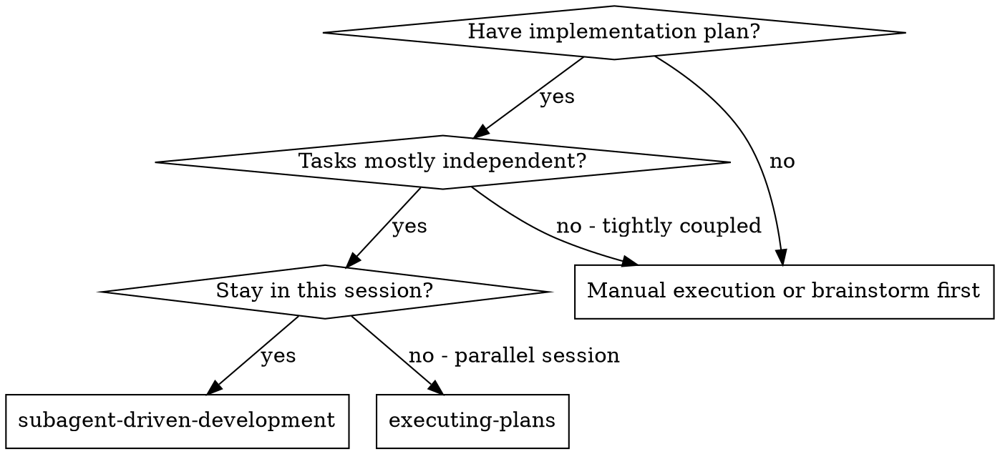
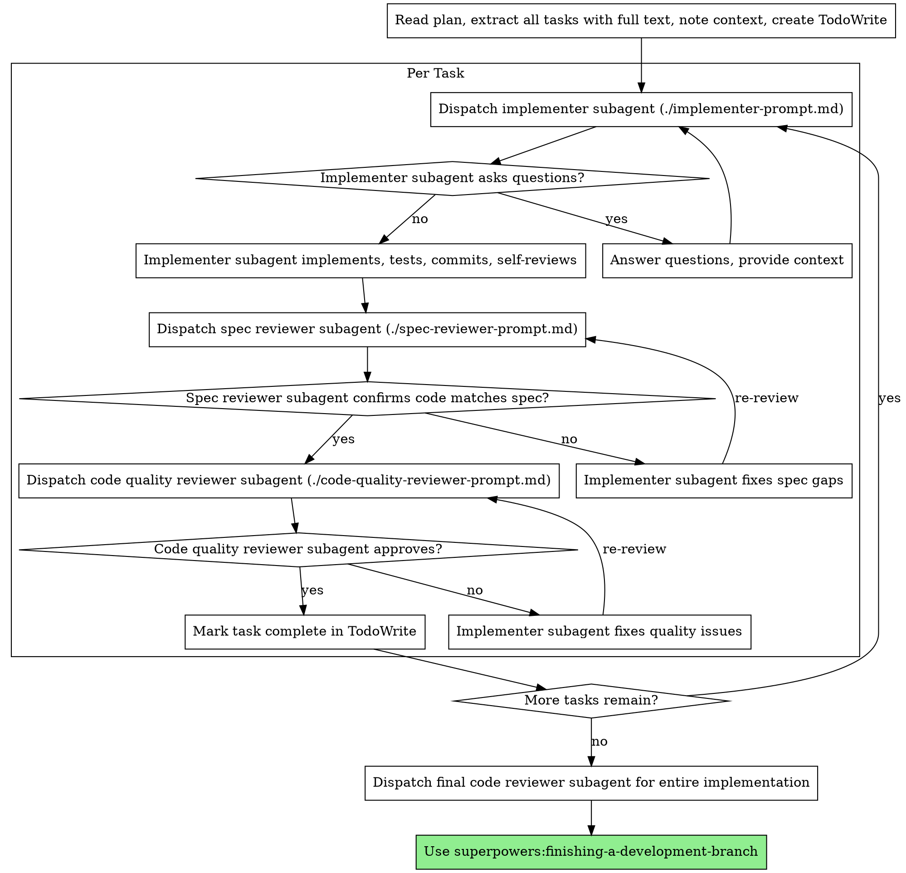

<!-- Generated by SpecStory, Markdown v2.1.0 -->

# 2026-04-22 01:07:52Z

<!-- Claude Code Session adc24372-5f9d-4741-83cb-749d8cfb79cf (2026-04-22 01:07:52Z) -->

_**User (2026-04-22 01:07:52Z)**_

Execute the merged Storybook Tier 1+2 audit plan.            
                                                                                            
  1. /resync ��� master should include the plan commit. Pull if behind.                    
  2. Read docs/superpowers/plans/2026-04-22-stories-tier1-2-audit-plan.md end-to-end. It's  
  self-contained: shared subagent prompt template, allocation table   
  (worktrees/branches/ports), 10 gates, verification gate, flag-on-surprise triggers, PR    
  body shape.                                                     
  3. Invoke superpowers:subagent-driven-development and execute Task 1 (Wave 1): dispatch   
  one general-purpose subagent with the shared template filled in for tier1-root (worktree  
  ./worktrees/stories-tier1-root, branch stories/tier1-root-audit, port 6106, 5 Tier 1 root
  stubs, batch PR title). Foreground dispatch ��� Task 2 depends on the Wave 1 PR existing.   
  4. When the Wave 1 subagent returns: classify (success ��� PR URL / flagged ��� stop +     
  escalate), verify PR via `gh pr list --head stories/tier1-root-audit`, tick the 5 Tier 1  
  checkboxes in issue #125, then pause and show me the PR before Wave 2.                 
  5. On my go-ahead, execute Task 2 (Wave 2): dispatch all 5 subagents in a SINGLE message  
  with 5 parallel Agent calls (ports 6107���6111, branches per the allocation table). Process
  each return independently; don't let one flag block the others.                           
  6. Verify each Wave 2 PR, tick the 5 Tier 2 checkboxes in #125, surface any flags with
  proposed follow-ups.                                                                      
  7. Task 3 handoff: one concise report with all PR URLs, skin-wrapper-cleanup +         
  aux-stories-kept/deleted summaries per file, flag summaries if any.                       
                                         
  Constraints from CLAUDE.md and the plan (do not violate):                                 
  - Named exports only (Playground is the main export; export default only for meta).       
  - Never add per-file classic-skin wrappers ��� global withDefaultSkin applies (#154).
  - Auxiliary named stories only for the three justified cases in the plan (stateful        
  one-shot, pinned theme/viewport, play() not covered by Playwright e2e).                   
  - Agents do not block on merges: push, open PR (or edit the auto-opened PR), exit.
  - Pause between waves for my review.                                                      
                                                                                         
  That's the prompt. One file to read (the plan), one skill to invoke                       
  (subagent-driven-development), explicit pause points between waves. Everything else is 
  already in the plan doc. 

---

_**Agent (claude-opus-4-7 2026-04-22 01:07:56Z)**_

_**Agent (claude-opus-4-7 2026-04-22 01:07:57Z)**_

I'll start by running /resync to sync with master, then read the plan.

_**Agent (claude-opus-4-7 2026-04-22 01:07:57Z)**_

<tool-use data-tool-type="generic" data-tool-name="Skill"><details>
<summary>Tool use: **Skill**</summary>

```text
Launching skill: resync
```
</details></tool-use>

---

_**User (2026-04-22 01:07:57Z)**_

# Resync

Invoke when you suspect the agent is working against stale state — e.g. it's reading files that look outdated, referencing code that's already been changed upstream, or you want to confirm the current branch is current with `origin/master` before continuing.

## Workflow

Run these steps in order. Be concise — one-line summaries per step.

### 1. Fetch and report branch state

Run in parallel:

```bash
git fetch origin --prune
git rev-parse --abbrev-ref HEAD
git status -sb
git log --oneline HEAD..origin/master
git log --oneline origin/master..HEAD
```

Report in this shape:

- **Branch**: `<current branch>` (or `(HEAD detached at …)`)
- **Behind origin/master by**: N commits
- **Ahead of origin/master by**: N commits
- **Working tree**: clean / M modified, U untracked

If behind > 0 and not on `master`, explicitly ask whether to rebase onto `origin/master`. Do **not** rebase without confirmation. If the working tree is dirty, recommend stashing or committing first.

If on `master`, warn — the project rule is no direct work on `master`; a worktree/branch should be in use.

### 2. List open PRs

```bash
gh pr list --state open --limit 30 --json number,title,headRefName,baseRefName,author,updatedAt,isDraft
```

Summarize in a compact table (number, title, author, branch → base, draft flag, last updated). Keep titles short.

### 3. Flag potentially impacting PRs

Given the conversation's current focus (files being edited, features under discussion), scan the PR list for overlap:

- PRs that touch the same files or directories
- PRs that modify shared infrastructure the current work depends on (reducers, game engine, skin system, config, CI)
- PRs the user has mentioned earlier in the session

For each flagged PR, write one sentence: _"PR #N `<title>` — may impact `<area>` because `<reason>`."_ If nothing obviously overlaps, say so explicitly rather than hedging.

### 4. Confirm before continuing

Ask the user to confirm one of:

- Proceed as-is (current state is fine).
- Rebase onto `origin/master` first.
- Pause this session and review a specific PR first.

Wait for the user's decision. Do not resume prior work until they respond.

## Notes

- Use `gh` for GitHub interactions; don't scrape URLs.
- Don't run `git rebase` or `git pull --rebase` without explicit confirmation — rebases can conflict with uncommitted changes or in-progress worktrees.
- If `gh` is unauthenticated, surface the error and stop at step 2 rather than guessing.
- Keep the whole report under ~25 lines. The user invokes this to re-ground quickly, not to read a novel.


---

_**Agent (claude-opus-4-7 2026-04-22 01:07:58Z)**_

_**Agent (claude-opus-4-7 2026-04-22 01:08:05Z)**_

<tool-use data-tool-type="shell" data-tool-name="Bash"><details>
<summary>Tool use: **Bash**</summary>
Fetch latest from origin

`git fetch origin --prune`

```text
From github.com:leocaseiro/base-skill
   d0763089..1772d617  gh-pages   -> origin/gh-pages
 + 549408b0...f03457db plan/tier3-storybook-audit -> origin/plan/tier3-storybook-audit  (forced update)
 + 7e70ab43...473bdb8b stories/tier1-2-audit-plan -> origin/stories/tier1-2-audit-plan  (forced update)
```
</details></tool-use>

_**Agent (claude-opus-4-7 2026-04-22 01:08:05Z)**_

<tool-use data-tool-type="shell" data-tool-name="Bash"><details>
<summary>Tool use: **Bash**</summary>
Show current branch

`git rev-parse --abbrev-ref HEAD`

```text
master
```
</details></tool-use>

_**Agent (claude-opus-4-7 2026-04-22 01:08:05Z)**_

<tool-use data-tool-type="shell" data-tool-name="Bash"><details>
<summary>Tool use: **Bash**</summary>
Show status summary

`git status -sb`

```text
## master
 M .specstory/statistics.json
?? .specstory/history/2026-04-21_23-15-46Z-continue-the-storybook-controls.md
?? .specstory/history/2026-04-22_01-07-47Z-execute-the-merged-storybook.md
```
</details></tool-use>

_**Agent (claude-opus-4-7 2026-04-22 01:08:05Z)**_

<tool-use data-tool-type="shell" data-tool-name="Bash"><details>
<summary>Tool use: **Bash**</summary>
Commits behind origin/master

`git log --oneline HEAD..origin/master`

```text
(Bash completed with no output)
```
</details></tool-use>

_**Agent (claude-opus-4-7 2026-04-22 01:08:05Z)**_

<tool-use data-tool-type="shell" data-tool-name="Bash"><details>
<summary>Tool use: **Bash**</summary>
Commits ahead of origin/master

`git log --oneline origin/master..HEAD`

```text
(Bash completed with no output)
```
</details></tool-use>

_**Agent (claude-opus-4-7 2026-04-22 01:08:05Z)**_

<tool-use data-tool-type="shell" data-tool-name="Bash"><details>
<summary>Tool use: **Bash**</summary>
List open PRs

`gh pr list --state open --limit 30 --json number,title,headRefName,baseRefName,author,updatedAt,isDraft`

```text
[{"author":{"id":"MDQ6VXNlcjk0MDA3MA==","is_bot":false,"login":"leocaseiro","name":"Leo Caseiro"},"baseRefName":"master","headRefName":"plan/tier3-storybook-audit","isDraft":false,"number":150,"title":"docs(plan): Tier 3 Storybook controls audit","updatedAt":"2026-04-22T01:02:50Z"},{"author":{"id":"MDQ6VXNlcjk0MDA3MA==","is_bot":false,"login":"leocaseiro","name":"Leo Caseiro"},"baseRefName":"master","headRefName":"chore/specstory-sync-2026-04-22_2","isDraft":false,"number":148,"title":"ai(specstory): sync","updatedAt":"2026-04-21T20:43:16Z"}]
```
</details></tool-use>

_**Agent (claude-opus-4-7 2026-04-22 01:08:15Z)**_

### Resync report

- **Branch**: `master` ⚠️ — project rule forbids working on master; a worktree/branch is required (and this task creates 6 worktrees)
- **Behind origin/master by**: 0 commits
- **Ahead of origin/master by**: 0 commits
- **Working tree**: dirty (specstory noise only — `.specstory/statistics.json` M, two session history files U)

### Open PRs

| # | Title | Author | Branch → base | Draft | Updated |
|---|---|---|---|---|---|
| 150 | docs(plan): Tier 3 Storybook controls audit | leocaseiro | `plan/tier3-storybook-audit` → master | no | 2026-04-22 |
| 148 | ai(specstory): sync | leocaseiro | `chore/specstory-sync-2026-04-22_2` → master | no | 2026-04-21 |

### Impact on this task

- **PR #150** (Tier 3 plan) — adjacent scope (next audit tier) but does **not** touch Tier 1/2 stories. No conflict expected.
- **PR #148** (specstory sync) — noise channel only, no impact.
- The Tier 1+2 merged plan was merged in `01685f68` (commit already on origin/master). ✅ Plan commit present locally.

No rebase needed. Master is current. The dirty files are specstory session logs (auto-generated) — safe to ignore for this work since new worktrees will branch from clean origin/master.

Now reading the plan before dispatching anything.

_**Agent (claude-opus-4-7 2026-04-22 01:08:16Z)**_

<tool-use data-tool-type="read" data-tool-name="Read"><details>
<summary>Tool use: **Read**</summary>
 `./docs/superpowers/plans/2026-04-22-stories-tier1-2-audit-plan.md`

```text
1	---
2	date: 2026-04-22
3	status: draft
4	spec: docs/superpowers/specs/2026-04-22-stories-tier1-2-audit-design.md
5	tracking: '#125'
6	---
7	
8	# Storybook Tier 1 + 2 Audit Implementation Plan
9	
10	> **For agentic workers:** REQUIRED SUB-SKILL: Use superpowers:subagent-driven-development to execute
11	> this plan. Each task below dispatches one or more subagents; steps use checkbox (`- [ ]`) syntax for
12	> orchestrator tracking.
13	
14	**Goal:** Ship 6 PRs against `master` — 1 batch PR auditing the 5 Tier 1 root stubs and 5 solo PRs
15	auditing the Tier 2 single-purpose components — each converging on the Playground pattern documented
16	in `.claude/skills/write-storybook/SKILL.md`.
17	
18	**Architecture:** Orchestrator (main session) dispatches subagents in two waves. Wave 1 = 1 subagent
19	producing a single batch PR. Wave 2 = 5 subagents dispatched in parallel, one PR each. Every subagent
20	works in an isolated git worktree with its own `node_modules` and a dedicated Storybook port, runs the
21	verification gate locally, pushes, opens (or edits the auto-opened) PR referencing `#125`, and exits.
22	Agents do not block on merges. The orchestrator ticks `#125` checkboxes as PRs open.
23	
24	**Tech Stack:** Storybook 9, React, TanStack Router, `storybook/test` `fn()` handlers, Vitest
25	test-runner, `gh` CLI, git worktrees, `yarn`.
26	
27	---
28	
29	## Source of truth
30	
31	- **Spec (merged #149 at `52f57ae6`):** `docs/superpowers/specs/2026-04-22-stories-tier1-2-audit-design.md`
32	- **Tracker issue:** `#125`
33	- **Controls policy:** `.claude/skills/write-storybook/SKILL.md`
34	- **Shell-slim canonical:** `src/components/answer-game/AnswerGame/AnswerGame.stories.tsx`
35	- **Playground-collapse canonical:** `src/components/answer-game/InstructionsOverlay/InstructionsOverlay.stories.tsx`
36	- **Trigger-button canonical (one-shot callbacks):** `src/components/answer-game/EncouragementAnnouncer/EncouragementAnnouncer.stories.tsx`
37	- **Precedent PRs:** `#124` (pilot), `#134` (batch 2 retrofit), `#141` (Playground collapse),
38	  `#143` (per-game wrapper refactor), `#154` (global `withDefaultSkin` decorator — merged
39	  `eada2163`, makes the per-file classic-skin wrapper obsolete).
40	- **In-flight PR `#155`** rewrites the SKILL.md to formalise the single-Playground discipline
41	  (auxiliary stories only for scenarios controls can't express) and demotes `play()` to
42	  optional. The amendments below fold in its policy direction; the only unresolved detail is
43	  the export name (`Playground` vs `Default`) — **see "Open question" below**.
44	
45	Any deviation from the spec's scope (ten target files, worktree/branch/port table, two-wave
46	orchestration, flag-on-surprise contract) is a plan defect — fix the plan first.
47	
48	### Open question: `Playground` vs `Default` naming
49	
50	Spec `#149` and every existing canonical file (`AnswerGame`, `InstructionsOverlay`,
51	`EncouragementAnnouncer`, `ProgressHUD`, `Slot`, `GameOverOverlay`, `LevelCompleteOverlay`,
52	`ScoreAnimation`) export the main Controls-driven story as `Playground`. PR `#155`'s new
53	Minimal Template calls it `Default`, but `#155`'s own reference implementations all still use
54	`Playground`. **This plan standardises on `Playground`** (matches spec and existing code). If
55	you'd rather have subagents emit `Default`, call it out before approving the plan PR — it's a
56	single-word swap in the template below and the allocation table's PR titles.
57	
58	## Allocation
59	
60	| Wave | Agent id                | Target file(s)                                                           | Worktree                                    | Branch                                | Port | PR title                                                                 |
61	| ---- | ----------------------- | ------------------------------------------------------------------------ | ------------------------------------------- | ------------------------------------- | ---- | ------------------------------------------------------------------------ |
62	| 1    | `tier1-root`            | All 5 Tier 1 root stubs (see below)                                      | `./worktrees/stories-tier1-root`            | `stories/tier1-root-audit`            | 6106 | `stories(root): audit controls + Playground for 5 files`                 |
63	| 2a   | `audio-button`          | `src/components/questions/AudioButton/AudioButton.stories.tsx`           | `./worktrees/stories-audio-button`          | `stories/audio-button-audit`          | 6107 | `stories(questions/audio-button): audit controls + Playground`           |
64	| 2b   | `image-question`        | `src/components/questions/ImageQuestion/ImageQuestion.stories.tsx`       | `./worktrees/stories-image-question`        | `stories/image-question-audit`        | 6108 | `stories(questions/image-question): audit controls + Playground`         |
65	| 2c   | `text-question`         | `src/components/questions/TextQuestion/TextQuestion.stories.tsx`         | `./worktrees/stories-text-question`         | `stories/text-question-audit`         | 6109 | `stories(questions/text-question): audit controls + Playground`          |
66	| 2d   | `dot-group-question`    | `src/components/questions/DotGroupQuestion/DotGroupQuestion.stories.tsx` | `./worktrees/stories-dot-group-question`    | `stories/dot-group-question-audit`    | 6110 | `stories(questions/dot-group-question): audit controls + Playground`     |
67	| 2e   | `word-library-explorer` | `src/data/words/WordLibraryExplorer.stories.tsx`                         | `./worktrees/stories-word-library-explorer` | `stories/word-library-explorer-audit` | 6111 | `stories(data/words/word-library-explorer): audit controls + Playground` |
68	
69	Tier 1 files for the `tier1-root` agent:
70	
71	1. `src/components/ThemeToggle.stories.tsx`
72	2. `src/components/Footer.stories.tsx`
73	3. `src/components/Header.stories.tsx`
74	4. `src/components/OfflineIndicator.stories.tsx`
75	5. `src/components/UpdateBanner.stories.tsx`
76	
77	## File structure
78	
79	This plan document is the only file produced on `stories/tier1-2-audit-plan`. All code changes happen
80	inside the six subagent branches listed above. The orchestrator does not edit any source file
81	directly — the only orchestrator-side writes are to issue `#125` (checkbox ticks via `gh issue edit`).
82	
83	---
84	
85	## Shared subagent prompt template
86	
87	Each subagent receives a self-contained prompt built from this template with the following
88	substitutions:
89	
90	- `{{AGENT_ID}}` — from the allocation table (e.g., `tier1-root`, `audio-button`).
91	- `{{TARGET_FILES}}` — newline-separated list of story file paths in scope for that agent.
92	- `{{WORKTREE_PATH}}` — from the allocation table (e.g., `./worktrees/stories-tier1-root`).
93	- `{{BRANCH}}` — from the allocation table (e.g., `stories/tier1-root-audit`).
94	- `{{PORT}}` — from the allocation table (e.g., `6106`).
95	- `{{PR_TITLE}}` — from the allocation table.
96	- `{{BATCH_OR_SOLO}}` — `batch` for Wave 1, `solo` for each Wave 2 agent.
97	
98	The template below is the exact text to dispatch, verbatim, with the above substitutions made. Do not
99	trim it; each subagent starts cold and requires the full context.
100	
101	````text
102	You are the `{{AGENT_ID}}` Storybook audit subagent. Your job is to audit these story files
103	against the project's Storybook controls policy and the Playground pattern, then open a PR.
104	
105	TARGET FILES (scope is strict — do not edit anything else):
106	{{TARGET_FILES}}
107	
108	Reference material (read before editing):
109	
110	- Spec: docs/superpowers/specs/2026-04-22-stories-tier1-2-audit-design.md
111	- Controls policy: .claude/skills/write-storybook/SKILL.md (note: the global
112	  `withDefaultSkin` decorator in `.storybook/preview.tsx` now applies
113	  `game-container skin-classic` with `classicSkin.tokens` to every story — per-file
114	  wrappers are redundant and must be removed, see PR #154 merge commit `eada2163`).
115	- Shell-slim canonical: src/components/answer-game/AnswerGame/AnswerGame.stories.tsx
116	- Playground-collapse canonical (audit pattern): src/components/answer-game/InstructionsOverlay/InstructionsOverlay.stories.tsx
117	- Trigger-button canonical (stateful one-shot callbacks): src/components/answer-game/EncouragementAnnouncer/EncouragementAnnouncer.stories.tsx
118	- Tracker issue: #125 (contains the 10 gates reproduced below)
119	
120	If PR #155 (`docs(skill): adopt single-Default Playground pattern for storybook`) has
121	merged by the time you dispatch, the SKILL.md you read reflects the updated policy
122	verbatim. Either way the gates below are authoritative for this audit.
123	
124	## Step 1 — Environment
125	
126	From the project root `/Users/leocaseiro/Sites/base-skill`:
127	
128	```bash
129	git worktree add {{WORKTREE_PATH}} -b {{BRANCH}} master
130	cd {{WORKTREE_PATH}}
131	yarn install
132	```
133	
134	Do not reuse an existing worktree — fail loudly if the path is already taken and report back.
135	
136	## Step 2 — Per-file audit
137	
138	For each file in TARGET FILES, converge on the Playground pattern:
139	
140	1. Declare a `StoryArgs` interface that exposes only the props the Controls panel should drive. For
141	   every raw component prop that must stay hidden (shadowed, derived internally, or JSX/function
142	   types), declare it on `StoryArgs` as `?: never` AND set
143	   `{ table: { disable: true } }` in `argTypes` for that row.
144	2. `meta.args` supplies defaults for every visible `StoryArgs` field, including `fn()` (imported from
145	   `storybook/test`) for every `on*` handler. Do NOT rely on the global `argTypesRegex` — it misses
146	   DOM-extended props under react-docgen.
147	3. `meta.argTypes` declares a structured control for each visible arg:
148	   - `boolean` for booleans
149	   - `select` + `options` (or `radio` + `options` for ≤4 options) for enums/string unions
150	   - `range` + `min`/`max`/`step` for bounded numbers
151	   - `text` only for legitimately free-text props that are visibly rendered
152	   - `{ table: { disable: true } }` for any hidden row
153	   No raw JSON controls.
154	4. `meta.render` destructures `StoryArgs`, derives any internal values (e.g., an id from a non-empty
155	   name — precedent: `InstructionsOverlay` derives `customGameId` from `customGameName`), and renders
156	   the component. **Do NOT add a per-file classic-skin wrapper.** The global `withDefaultSkin`
157	   decorator in `.storybook/preview.tsx` already wraps every story in
158	   `<div className="game-container skin-classic" style={classicSkin.tokens}>` (PR #154). If the
159	   file you're editing currently has an inline wrapper, remove it along with the
160	   `classicSkin`/`CSSProperties` imports that only existed for the wrapper. Keep `classicSkin`
161	   imports only if the component receives it as a prop (precedent: `AnswerGame.stories.tsx`
162	   passes `skin={classicSkin}`). Alt-skin previews for the same component must go in a sibling
163	   `*.skin.stories.tsx` file — none of the ten target files qualify.
164	5. `parameters.docs.description.component` documents what the Playground drives and points at
165	   `<Component>.test.tsx` for play-flow coverage (if such a test file exists).
166	6. Export a single `Playground` story: `export const Playground: Story = {}` (with minimal arg
167	   overrides only when a non-default seed aids first-load visuals). **Auxiliary named exports
168	   are justified only when a scenario truly cannot be expressed by toggling Playground
169	   controls** — specifically: a stateful one-shot sequence that needs replay (precedent:
170	   `EncouragementAnnouncer`'s `ReplayTrigger` with a `ShowTrigger` wrapper + `useState`), a
171	   pinned theme/viewport with meaningfully different visuals, or a `play()` assertion that
172	   Playwright e2e doesn't already cover. Do NOT add per-enum-value / per-state-reachable-via-prop /
173	   edge-case-text (`LongText`, `ManyItems`) named stories — those belong in controls.
174	
175	### Collapse rule
176	
177	If existing named stories in the file duplicate what a Playground control would toggle (per-enum
178	variants, per-state when the state is reachable via a prop, long-text/many-items scenarios) OR
179	duplicate `*.test.tsx` interaction coverage, delete them and fold into `Playground`. Keep an
180	auxiliary story only when it captures a scenario the Controls panel genuinely can't express
181	(see item 6 above).
182	
183	## The 10 gates — every target file must pass
184	
185	Reproduced from issue `#125`, updated to reflect the merged global skin decorator (PR `#154`)
186	and the in-flight single-Playground policy tightening (PR `#155`).
187	
188	1. **Controls map to something visible.** Drop text controls for invisible values (ids, internal
189	   keys). If a value toggles behaviour, derive it from a visible control (precedent:
190	   `InstructionsOverlay` — `customGameId` derived from non-empty `customGameName`).
191	2. **Prefer structured inputs.** `select` / `radio` / `boolean` / `range` over raw text whenever
192	   the domain is enumerable. No raw JSON fallbacks.
193	3. **Every `on*` prop wired to `fn()`** from `storybook/test` in `args`. Do NOT rely on
194	   `argTypesRegex` alone — react-docgen misses DOM-extended props. Callbacks fire into the
195	   Actions panel by default; only add a UI trigger button in `render` if the callback requires a
196	   replayable one-shot sequence that controls alone can't invoke (precedent:
197	   `EncouragementAnnouncer`'s `ShowTrigger` helper).
198	4. **No per-file classic-skin wrapper.** The global `withDefaultSkin` decorator applies
199	   `game-container skin-classic` + `classicSkin.tokens` to every story. If the file has an
200	   existing inline wrapper, REMOVE it (and the now-orphaned `classicSkin`/`CSSProperties`
201	   imports). Keep `classicSkin` imports only if the component receives it as a prop.
202	5. **Hide shadowed/derived docgen rows** via `?: never` on `StoryArgs` AND
203	   `{ table: { disable: true } }` in `argTypes` for each hidden row.
204	6. **Collapse redundant named stories.** Delete per-enum-value / per-state-reachable-via-prop /
205	   edge-case-text stories that a control toggle would show. Also delete play-flow stories that
206	   duplicate `*.test.tsx` coverage. Keep only auxiliary stories the Controls panel genuinely
207	   can't express (stateful one-shot flow, pinned theme/viewport, `play()` assertion not covered
208	   by Playwright e2e).
209	7. **Real-game parity.** Compare the Storybook Playground render to how the component mounts at
210	   runtime (`src/routes/…` or `src/games/…`). The global `withDefaultSkin` decorator should make
211	   parity automatic for components that read `--skin-*`; any drift → flag in the PR body.
212	8. **Auxiliary-story discipline.** Auxiliary stories (if any) are justified only by the three
213	   reasons in gate #6. No required Default/per-enum/per-state/edge-case variant set — the
214	   Playground IS the Default, and every UI-affecting prop is a control on it.
215	9. **Decorators match current dependencies** — `withDb`, `withRouter` as the component
216	   requires. Do not add `classicSkin`-wrapping or `ThemeProvider` decorators — both are global.
217	10. **`play()` is OPTIONAL in this project.** Playwright e2e (`e2e/visual.spec.ts` and friends)
218	    already covers VR and flow assertions on live routes. Add a `play()` only when it asserts
219	    something Playwright doesn't (keyboard-only flow, focus management, validation-error
220	    visibility) and the assertion adds genuine value. Pure-display components never need one.
221	
222	## Step 3 — Verification gate (run BEFORE pushing)
223	
224	Run from inside `{{WORKTREE_PATH}}`:
225	
226	```bash
227	yarn typecheck                                           # expect 0 errors
228	yarn lint                                                # expect 0 errors
229	PORT={{PORT}}
230	yarn storybook --port $PORT --ci &
231	STORYBOOK_PID=$!
232	until curl -s http://127.0.0.1:$PORT > /dev/null 2>&1; do sleep 2; done
233	yarn test:storybook --url http://127.0.0.1:$PORT        # expect all suites green
234	TEST_EXIT=$?
235	if [ $TEST_EXIT -eq 0 ]; then kill $STORYBOOK_PID; fi
236	exit $TEST_EXIT
237	```
238	
239	Then perform the real-game parity visual check: open the Storybook Playground for each target file
240	AND the live runtime mount of the same component (under `src/routes/…` or `src/games/…`), compare
241	visually, and record the result for the PR body. The global `withDefaultSkin` decorator should make
242	parity automatic for `--skin-*` consumers — any residual drift (beyond a single-pixel wrapper-div
243	shift) is a flag-on-surprise trigger.
244	
245	Finally, if any markdown was edited: `yarn fix:md`.
246	
247	- If the gate fails with an in-scope cause → fix and re-run.
248	- If the gate fails with an out-of-scope cause (global config, decorator, component source) → STOP
249	  and report (flag-on-surprise). Do not push.
250	
251	## Step 4 — Flag-on-surprise triggers
252	
253	Stop and report to the orchestrator (do not push) if any of these apply:
254	
255	- Prop type is opaque (function-returning-JSX, complex branded type, render-prop) that can't be
256	  demoed via a primitive control.
257	- Real-game mount uses providers beyond `withDb` / `withRouter`.
258	- A `*.test.*` file imports from the story file — collapse would break tests.
259	- Verification gate fails with a root cause outside the audit scope (`.storybook/*`, component
260	  source, decorators, `yarn.lock`).
261	- Visual drift between Storybook Playground and real-game mount that exceeds a single-pixel
262	  wrapper offset (i.e., token / layout / theme drift, not the expected noise from the global
263	  `withDefaultSkin` wrapper).
264	- A callback prop requires a replayable one-shot sequence whose trigger-button wrapper would
265	  exceed a trivial `ShowTrigger`-style helper (e.g., it needs real providers beyond the allowed
266	  decorators).
267	- The allocated worktree path, branch name, or port is already in use.
268	
269	Report format: target file(s), trigger category, one-paragraph diagnosis, proposed fix (if any),
270	state left on disk (branch created? commits? worktree left in place?).
271	
272	## Step 5 — Commits
273	
274	One commit per story file. Message: `stories(<area>/<name>): <imperative summary>` — e.g.
275	`stories(components/header): audit controls + Playground`. For Wave 1 (batch agent), five commits on
276	the same branch — do not squash.
277	
278	## Step 6 — Rebase, push, open PR
279	
280	```bash
281	git fetch origin master
282	git rebase origin/master                                # resolve conflicts → flag if any arise
283	git push -u origin {{BRANCH}}
284	```
285	
286	If a workflow auto-opens a PR on push, edit its title/body in place with `gh pr edit` — do NOT open
287	a second PR.
288	
289	Otherwise, open the PR:
290	
291	```bash
292	gh pr create --base master --title "{{PR_TITLE}}" --body "$(cat <<'EOF'
293	## Summary
294	
295	<one-paragraph narrative; list each target file and what changed>
296	
297	## Playground shape
298	
299	<per target file: list the controls exposed on Playground, any auxiliary stories kept and why,
300	any named stories deleted because a control now covers them>
301	
302	## Skin wrapper cleanup
303	
304	<per target file: "no inline wrapper found" OR "removed inline `game-container skin-classic`
305	wrapper and orphaned `classicSkin`/`CSSProperties` imports — global `withDefaultSkin` decorator
306	applies classic skin, PR #154">
307	
308	## Real-game parity
309	
310	<per target file: "match" or describe drift; link the runtime route you compared against>
311	
312	## Verification
313	
314	- [x] `yarn typecheck`
315	- [x] `yarn lint`
316	- [x] `yarn test:storybook --url http://127.0.0.1:{{PORT}}` (all suites green)
317	- [x] Real-game parity visual check
318	
319	Refs #125.
320	EOF
321	)"
322	```
323	
324	Do NOT wait for merge. Once the PR is open (or the auto-opened PR has been edited), the agent's work
325	is done.
326	
327	## Step 7 — Report back
328	
329	Respond to the orchestrator with a short summary (≤ 200 words):
330	
331	- PR number + URL (or "flagged" + trigger).
332	- Target file(s) changed.
333	- Skin wrapper cleanup per file (none found / removed inline wrapper + orphaned imports).
334	- Auxiliary stories kept or deleted per file (and why).
335	- Real-game parity result per file.
336	- Any surprises, even if not blocking.
337	
338	## Constraints
339	
340	- **Named exports only** — `export default meta` is the single exception (framework config file).
341	- **Do not modify** `.storybook/*`, decorators, the component source, `yarn.lock`, or any file
342	  outside TARGET FILES. Any such need is a flag-on-surprise trigger. In particular, do NOT
343	  re-introduce or preserve a per-file classic-skin wrapper — the global `withDefaultSkin`
344	  decorator owns that.
345	- **Never commit directly to `master`.** Your work lives on `{{BRANCH}}`.
346	- **Never force-push.** If rebase creates conflicts, flag and stop.
347	- **Skip markdown `fix:md` unless you edited markdown** — this batch should not.
348	````
349	
350	---
351	
352	## Tasks
353	
354	### Task 1: Verify preconditions and dispatch Wave 1
355	
356	**Files:** orchestrator-only (no file edits by the orchestrator).
357	
358	- [ ] **Step 1: Confirm master is current**
359	
360	  Run from the project root:
361	
362	  ```bash
363	  cd /Users/leocaseiro/Sites/base-skill
364	  git fetch origin --prune
365	  git log --oneline origin/master -3
366	  ```
367	
368	  Expected: the three most recent commits on `origin/master` include `52f57ae6`
369	  (`docs(spec): tier 1 + tier 2 storybook audit batch design (#149)`). If not, stop and
370	  investigate — the spec is the source of truth and must be merged.
371	
372	- [ ] **Step 2: Confirm Wave 1 resources are free**
373	
374	  ```bash
375	  test ! -e ./worktrees/stories-tier1-root && echo "worktree path free"
376	  ! lsof -i :6106 > /dev/null 2>&1 && echo "port 6106 free"
377	  git show-ref --verify --quiet refs/heads/stories/tier1-root-audit \
378	    && echo "branch EXISTS — stop" \
379	    || echo "branch free"
380	  ```
381	
382	  Expected: all three lines print "…free". If any resource is taken, stop and surface it to
383	  the user — do not attempt to clean it up automatically (it may be in-progress work).
384	
385	- [ ] **Step 3: Dispatch the Wave 1 subagent**
386	
387	  Use the `Agent` tool, `subagent_type: "general-purpose"`, `description: "Storybook Tier 1 root audit batch"`.
388	  The `prompt` is the Shared subagent prompt template above with these substitutions:
389	  - `{{AGENT_ID}}` → `tier1-root`
390	  - `{{TARGET_FILES}}` →
391	
392	    ```text
393	    src/components/ThemeToggle.stories.tsx
394	    src/components/Footer.stories.tsx
395	    src/components/Header.stories.tsx
396	    src/components/OfflineIndicator.stories.tsx
397	    src/components/UpdateBanner.stories.tsx
398	    ```
399	
400	  - `{{WORKTREE_PATH}}` → `./worktrees/stories-tier1-root`
401	  - `{{BRANCH}}` → `stories/tier1-root-audit`
402	  - `{{PORT}}` → `6106`
403	  - `{{PR_TITLE}}` → `stories(root): audit controls + Playground for 5 files`
404	  - `{{BATCH_OR_SOLO}}` → `batch`
405	
406	  Dispatch in the **foreground** — Task 2 depends on the Wave 1 PR existing before it dispatches.
407	
408	- [ ] **Step 4: Classify the subagent's return**
409	
410	  Read the agent's summary. Two possible outcomes:
411	  - **Success** — the summary contains a PR URL. Continue to Step 5.
412	  - **Flagged** — the summary describes a flag-on-surprise trigger and names the state left on
413	    disk. Report the flag verbatim to the user, ask for guidance (retry / re-scope / drop the
414	    file), and stop the plan here. Do not auto-retry.
415	
416	- [ ] **Step 5: Verify the PR exists**
417	
418	  ```bash
419	  gh pr list --head stories/tier1-root-audit --state open \
420	    --json number,title,url,headRefName
421	  ```
422	
423	  Expected: exactly one PR with `headRefName: "stories/tier1-root-audit"` and a title
424	  starting with `stories(root):`. If zero PRs are returned, investigate — the agent may have
425	  pushed without opening a PR, in which case open one manually using the PR template from
426	  Step 6 below. If more than one PR is returned (workflow double-open), close the duplicate.
427	
428	- [ ] **Step 6: Tick the five Tier 1 checkboxes in issue #125**
429	
430	  ```bash
431	  gh issue view 125 --json body -q .body > /tmp/125-body.md
432	  # Tick these five lines:
433	  #   - [ ] `Footer.stories.tsx`
434	  #   - [ ] `Header.stories.tsx`
435	  #   - [ ] `OfflineIndicator.stories.tsx`
436	  #   - [ ] `ThemeToggle.stories.tsx`
437	  #   - [ ] `UpdateBanner.stories.tsx`
438	  # by changing `- [ ]` → `- [x]` for each, in /tmp/125-body.md, then:
439	  gh issue edit 125 --body-file /tmp/125-body.md
440	  ```
441	
442	  Confirm with `gh issue view 125 --json body -q .body | grep -E 'Footer|Header|OfflineIndicator|ThemeToggle|UpdateBanner'`
443	  — all five lines should now show `[x]`.
444	
445	- [ ] **Step 7: Mark Wave 1 complete in orchestrator TaskList**
446	
447	  Update the orchestrator's Wave 1 task to `completed`. Do not mark the PR itself merged — the
448	  user reviews and merges asynchronously.
449	
450	### Task 2: Dispatch Wave 2 (5 subagents in parallel)
451	
452	**Files:** orchestrator-only (no file edits by the orchestrator).
453	
454	Wave 2 does **not** block on Wave 1 merge — only on Wave 1 PR being open (which Task 1 Step 5
455	verified). Disjoint directories guarantee no merge conflicts between branches.
456	
457	- [ ] **Step 1: Verify Wave 2 resources are free**
458	
459	  ```bash
460	  for path in stories-audio-button stories-image-question stories-text-question \
461	              stories-dot-group-question stories-word-library-explorer; do
462	    test ! -e "./worktrees/$path" || echo "COLLISION: ./worktrees/$path"
463	  done
464	  for port in 6107 6108 6109 6110 6111; do
465	    lsof -i :$port > /dev/null 2>&1 && echo "COLLISION: port $port in use"
466	  done
467	  for branch in stories/audio-button-audit stories/image-question-audit \
468	                stories/text-question-audit stories/dot-group-question-audit \
469	                stories/word-library-explorer-audit; do
470	    git show-ref --verify --quiet "refs/heads/$branch" \
471	      && echo "COLLISION: branch $branch exists"
472	  done
473	  ```
474	
475	  Expected: no `COLLISION` lines. If any collision appears, stop and surface it — do not
476	  attempt to clean up automatically.
477	
478	- [ ] **Step 2: Dispatch all 5 Wave 2 subagents in a single message**
479	
480	  This step MUST use a single assistant message with 5 parallel `Agent` tool calls — that is
481	  the only way to run them concurrently per the subagent-driven-development contract.
482	
483	  Each of the five calls uses:
484	  - `subagent_type: "general-purpose"`
485	  - `description: "Storybook Tier 2 <name> audit"` (where `<name>` is the agent id)
486	  - `run_in_background: false` (foreground — see Step 3)
487	  - `prompt:` the Shared subagent prompt template with the substitutions from the allocation
488	    table for that row. Recap:
489	
490	    | Agent id              | `{{TARGET_FILES}}` (single file)                                         | `{{WORKTREE_PATH}}`                         | `{{BRANCH}}`                          | `{{PORT}}` | `{{PR_TITLE}}`                                                           |
491	    | --------------------- | ------------------------------------------------------------------------ | ------------------------------------------- | ------------------------------------- | ---------- | ------------------------------------------------------------------------ |
492	    | audio-button          | `src/components/questions/AudioButton/AudioButton.stories.tsx`           | `./worktrees/stories-audio-button`          | `stories/audio-button-audit`          | `6107`     | `stories(questions/audio-button): audit controls + Playground`           |
493	    | image-question        | `src/components/questions/ImageQuestion/ImageQuestion.stories.tsx`       | `./worktrees/stories-image-question`        | `stories/image-question-audit`        | `6108`     | `stories(questions/image-question): audit controls + Playground`         |
494	    | text-question         | `src/components/questions/TextQuestion/TextQuestion.stories.tsx`         | `./worktrees/stories-text-question`         | `stories/text-question-audit`         | `6109`     | `stories(questions/text-question): audit controls + Playground`          |
495	    | dot-group-question    | `src/components/questions/DotGroupQuestion/DotGroupQuestion.stories.tsx` | `./worktrees/stories-dot-group-question`    | `stories/dot-group-question-audit`    | `6110`     | `stories(questions/dot-group-question): audit controls + Playground`     |
496	    | word-library-explorer | `src/data/words/WordLibraryExplorer.stories.tsx`                         | `./worktrees/stories-word-library-explorer` | `stories/word-library-explorer-audit` | `6111`     | `stories(data/words/word-library-explorer): audit controls + Playground` |
497	
498	    `{{BATCH_OR_SOLO}}` → `solo` for every Wave 2 agent.
499	
500	- [ ] **Step 3: Classify each returned summary independently**
501	
502	  All 5 agents run foreground in one tool batch; Claude receives all five results at once.
503	  Process each independently — a flag from agent 2a does not block 2b-2e. For each:
504	  - **Success** — record the PR URL. Continue.
505	  - **Flagged** — record the trigger and the on-disk state the agent reported. Surface all
506	    flags together after Step 6.
507	
508	- [ ] **Step 4: Verify each Wave 2 PR exists**
509	
510	  ```bash
511	  for branch in stories/audio-button-audit stories/image-question-audit \
512	                stories/text-question-audit stories/dot-group-question-audit \
513	                stories/word-library-explorer-audit; do
514	    echo "--- $branch ---"
515	    gh pr list --head "$branch" --state open --json number,title,url \
516	      --jq '.[] | "#\(.number) \(.title) \(.url)"'
517	  done
518	  ```
519	
520	  Expected: one line per successful agent. Zero lines for an agent means "no PR opened" —
521	  cross-reference with Step 3's classification (it should have flagged) and investigate if
522	  the agent claimed success but the PR is missing.
523	
524	- [ ] **Step 5: Tick the Tier 2 checkboxes in issue #125**
525	
526	  Fetch the current body, tick one line per successful Wave 2 PR, write it back. Map:
527	
528	  | Wave 2 agent          | Checkbox line in issue #125                     |
529	  | --------------------- | ----------------------------------------------- |
530	  | audio-button          | `AudioButton/AudioButton.stories.tsx`           |
531	  | image-question        | `ImageQuestion/ImageQuestion.stories.tsx`       |
532	  | text-question         | `TextQuestion/TextQuestion.stories.tsx`         |
533	  | dot-group-question    | `DotGroupQuestion/DotGroupQuestion.stories.tsx` |
534	  | word-library-explorer | `data/words/WordLibraryExplorer.stories.tsx`    |
535	
536	  Use the same `gh issue view ... | edit --body-file -` pattern as Task 1 Step 6. Do not tick
537	  checkboxes for flagged agents.
538	
539	- [ ] **Step 6: Surface flag summaries (if any)**
540	
541	  If any Wave 2 agent flagged, post a consolidated report to the user: per-agent trigger,
542	  on-disk state, proposed fix. Ask for guidance (retry / re-scope / drop the file). Do not
543	  auto-retry.
544	
545	- [ ] **Step 7: Mark Wave 2 complete in orchestrator TaskList**
546	
547	  Mark Wave 2 complete once all PRs are open (or all flags reported). Wave 2 is "complete"
548	  when the orchestrator has nothing left to drive — user reviews PRs asynchronously.
549	
550	### Task 3: Handoff to user
551	
552	**Files:** orchestrator-only.
553	
554	- [ ] **Step 1: Assemble the final report**
555	
556	  One concise message to the user containing:
557	  - All 6 PR URLs (or 5 if Wave 1 was flagged; fewer if Wave 2 had flags too).
558	  - Per-PR: Skin wrapper cleanup line (none / removed) and auxiliary-stories kept/deleted summary, both lifted from the PR body.
559	  - Any flag-on-surprise summaries with the proposed follow-up.
560	  - Issue #125 checkbox state — number newly ticked vs. remaining.
561	
562	- [ ] **Step 2: Stop**
563	
564	  The orchestrator has no further action. PRs do not auto-merge; the user reviews and merges
565	  each asynchronously. If any flag was raised, the plan pauses here pending user guidance.
566	
567	---
568	
569	## Verification
570	
571	The plan is considered successfully executed when:
572	
573	- Six branches exist on `origin` (or 5, with reasons for the missing one documented as flags).
574	- Each branch has a corresponding open PR against `master` referencing `#125`.
575	- Issue #125 has ten new `[x]` checkboxes (or fewer, with flag reasons documented per skipped file).
576	- No direct commits on `master`.
577	- No edits outside the ten target story files across all six branches.
578	- Each PR body contains the Summary, Playground shape, Skin wrapper cleanup, Real-game parity,
579	  and Verification sections specified in the shared subagent prompt template.
580	
581	## Out of scope (from the spec — do not expand)
582	
583	- Design-token contrast work (separate VR-baseline PR).
584	- `.storybook/*` changes.
585	- Real-game component refactors beyond what `#143` shipped.
586	- Tier 3 / Tier 4 / Tier 5 files — future batches, tracked in `#125` and a separate spec.
587	
588	## Rollback
589	
590	If after dispatch a wave goes sideways (multiple flags, cascading rebase failures, etc.):
591	
592	1. Do not force-push or delete remote branches — subagent branches are review artifacts even when
593	   flagged.
594	2. Close any PRs opened by a flagged wave with a comment linking to the flag report.
595	3. Remove the corresponding local worktrees cleanly:
596	
597	   ```bash
598	   git worktree remove ./worktrees/<name>        # refuses if dirty — use --force only after review
599	   ```
600	
601	4. Keep the branches until the user decides to delete them or rebase into a replacement plan.
602	
603	## Execution handoff
604	
605	Per the user's standing instruction (`project_storybook_audit_rollout` memory, plus the spec's
606	review model): after the plan PR opens, the orchestrator **pauses for review**. Do not dispatch any
607	subagent until the plan PR is approved or the user explicitly says "go".
608	
609	Once approved, execution proceeds via `superpowers:subagent-driven-development` — dispatch Task 1,
610	review Wave 1 PR, then dispatch Task 2 (which itself parallelises).
611
```
</details></tool-use>

_**Agent (claude-opus-4-7 2026-04-22 01:08:21Z)**_

_**Agent (claude-opus-4-7 2026-04-22 01:08:22Z)**_

Plan fully loaded. Now invoking the subagent-driven-development skill as required, then setting up task tracking.

_**Agent (claude-opus-4-7 2026-04-22 01:08:22Z)**_

<tool-use data-tool-type="generic" data-tool-name="Skill"><details>
<summary>Tool use: **Skill**</summary>

```text
Launching skill: superpowers:subagent-driven-development
```
</details></tool-use>

---

_**User (2026-04-22 01:08:22Z)**_

Base directory for this skill: /Users/leocaseiro/.claude/plugins/cache/claude-plugins-official/superpowers/5.0.7/skills/subagent-driven-development

# Subagent-Driven Development

Execute plan by dispatching fresh subagent per task, with two-stage review after each: spec compliance review first, then code quality review.

**Why subagents:** You delegate tasks to specialized agents with isolated context. By precisely crafting their instructions and context, you ensure they stay focused and succeed at their task. They should never inherit your session's context or history — you construct exactly what they need. This also preserves your own context for coordination work.

**Core principle:** Fresh subagent per task + two-stage review (spec then quality) = high quality, fast iteration

## When to Use



**vs. Executing Plans (parallel session):**
- Same session (no context switch)
- Fresh subagent per task (no context pollution)
- Two-stage review after each task: spec compliance first, then code quality
- Faster iteration (no human-in-loop between tasks)

## The Process



## Model Selection

Use the least powerful model that can handle each role to conserve cost and increase speed.

**Mechanical implementation tasks** (isolated functions, clear specs, 1-2 files): use a fast, cheap model. Most implementation tasks are mechanical when the plan is well-specified.

**Integration and judgment tasks** (multi-file coordination, pattern matching, debugging): use a standard model.

**Architecture, design, and review tasks**: use the most capable available model.

**Task complexity signals:**
- Touches 1-2 files with a complete spec → cheap model
- Touches multiple files with integration concerns → standard model
- Requires design judgment or broad codebase understanding → most capable model

## Handling Implementer Status

Implementer subagents report one of four statuses. Handle each appropriately:

**DONE:** Proceed to spec compliance review.

**DONE_WITH_CONCERNS:** The implementer completed the work but flagged doubts. Read the concerns before proceeding. If the concerns are about correctness or scope, address them before review. If they're observations (e.g., "this file is getting large"), note them and proceed to review.

**NEEDS_CONTEXT:** The implementer needs information that wasn't provided. Provide the missing context and re-dispatch.

**BLOCKED:** The implementer cannot complete the task. Assess the blocker:
1. If it's a context problem, provide more context and re-dispatch with the same model
2. If the task requires more reasoning, re-dispatch with a more capable model
3. If the task is too large, break it into smaller pieces
4. If the plan itself is wrong, escalate to the human

**Never** ignore an escalation or force the same model to retry without changes. If the implementer said it's stuck, something needs to change.

## Prompt Templates

- `./implementer-prompt.md` - Dispatch implementer subagent
- `./spec-reviewer-prompt.md` - Dispatch spec compliance reviewer subagent
- `./code-quality-reviewer-prompt.md` - Dispatch code quality reviewer subagent

## Example Workflow

```
You: I'm using Subagent-Driven Development to execute this plan.

[Read plan file once: docs/superpowers/plans/feature-plan.md]
[Extract all 5 tasks with full text and context]
[Create TodoWrite with all tasks]

Task 1: Hook installation script

[Get Task 1 text and context (already extracted)]
[Dispatch implementation subagent with full task text + context]

Implementer: "Before I begin - should the hook be installed at user or system level?"

You: "User level (~/.config/superpowers/hooks/)"

Implementer: "Got it. Implementing now..."
[Later] Implementer:
  - Implemented install-hook command
  - Added tests, 5/5 passing
  - Self-review: Found I missed --force flag, added it
  - Committed

[Dispatch spec compliance reviewer]
Spec reviewer: ✅ Spec compliant - all requirements met, nothing extra

[Get git SHAs, dispatch code quality reviewer]
Code reviewer: Strengths: Good test coverage, clean. Issues: None. Approved.

[Mark Task 1 complete]

Task 2: Recovery modes

[Get Task 2 text and context (already extracted)]
[Dispatch implementation subagent with full task text + context]

Implementer: [No questions, proceeds]
Implementer:
  - Added verify/repair modes
  - 8/8 tests passing
  - Self-review: All good
  - Committed

[Dispatch spec compliance reviewer]
Spec reviewer: ❌ Issues:
  - Missing: Progress reporting (spec says "report every 100 items")
  - Extra: Added --json flag (not requested)

[Implementer fixes issues]
Implementer: Removed --json flag, added progress reporting

[Spec reviewer reviews again]
Spec reviewer: ✅ Spec compliant now

[Dispatch code quality reviewer]
Code reviewer: Strengths: Solid. Issues (Important): Magic number (100)

[Implementer fixes]
Implementer: Extracted PROGRESS_INTERVAL constant

[Code reviewer reviews again]
Code reviewer: ✅ Approved

[Mark Task 2 complete]

...

[After all tasks]
[Dispatch final code-reviewer]
Final reviewer: All requirements met, ready to merge

Done!
```

## Advantages

**vs. Manual execution:**
- Subagents follow TDD naturally
- Fresh context per task (no confusion)
- Parallel-safe (subagents don't interfere)
- Subagent can ask questions (before AND during work)

**vs. Executing Plans:**
- Same session (no handoff)
- Continuous progress (no waiting)
- Review checkpoints automatic

**Efficiency gains:**
- No file reading overhead (controller provides full text)
- Controller curates exactly what context is needed
- Subagent gets complete information upfront
- Questions surfaced before work begins (not after)

**Quality gates:**
- Self-review catches issues before handoff
- Two-stage review: spec compliance, then code quality
- Review loops ensure fixes actually work
- Spec compliance prevents over/under-building
- Code quality ensures implementation is well-built

**Cost:**
- More subagent invocations (implementer + 2 reviewers per task)
- Controller does more prep work (extracting all tasks upfront)
- Review loops add iterations
- But catches issues early (cheaper than debugging later)

## Red Flags

**Never:**
- Start implementation on main/master branch without explicit user consent
- Skip reviews (spec compliance OR code quality)
- Proceed with unfixed issues
- Dispatch multiple implementation subagents in parallel (conflicts)
- Make subagent read plan file (provide full text instead)
- Skip scene-setting context (subagent needs to understand where task fits)
- Ignore subagent questions (answer before letting them proceed)
- Accept "close enough" on spec compliance (spec reviewer found issues = not done)
- Skip review loops (reviewer found issues = implementer fixes = review again)
- Let implementer self-review replace actual review (both are needed)
- **Start code quality review before spec compliance is ✅** (wrong order)
- Move to next task while either review has open issues

**If subagent asks questions:**
- Answer clearly and completely
- Provide additional context if needed
- Don't rush them into implementation

**If reviewer finds issues:**
- Implementer (same subagent) fixes them
- Reviewer reviews again
- Repeat until approved
- Don't skip the re-review

**If subagent fails task:**
- Dispatch fix subagent with specific instructions
- Don't try to fix manually (context pollution)

## Integration

**Required workflow skills:**
- **superpowers:using-git-worktrees** - REQUIRED: Set up isolated workspace before starting
- **superpowers:writing-plans** - Creates the plan this skill executes
- **superpowers:requesting-code-review** - Code review template for reviewer subagents
- **superpowers:finishing-a-development-branch** - Complete development after all tasks

**Subagents should use:**
- **superpowers:test-driven-development** - Subagents follow TDD for each task

**Alternative workflow:**
- **superpowers:executing-plans** - Use for parallel session instead of same-session execution


---

_**Agent (claude-opus-4-7 2026-04-22 01:08:29Z)**_

_**Agent (claude-opus-4-7 2026-04-22 01:08:30Z)**_

Skill loaded. The plan's orchestration model overrides the skill's default per-task review loop — subagents run their own verification gate and open PRs for async user review. I'll set up task tracking and run the Task 1 preconditions.

_**Agent (claude-opus-4-7 2026-04-22 01:08:31Z)**_

<tool-use data-tool-type="unknown" data-tool-name="ToolSearch"><details>
<summary>Tool use: **ToolSearch**</summary>

**Input:**

- max_results: `5`
- query: `select:TaskCreate,TaskUpdate,TaskList`

**Result:**

```

```
</details></tool-use>

_**Agent (claude-opus-4-7 2026-04-22 01:08:36Z)**_

<tool-use data-tool-type="unknown" data-tool-name="TaskCreate"><details>
<summary>Tool use: **TaskCreate**</summary>
Verify origin/master contains spec commit 52f57ae6; verify worktree path ./worktrees/stories-tier1-root free, port 6106 free, branch stories/tier1-root-audit not existing.

```text
Task #1 created successfully: Run Task 1 preconditions (master current, Wave 1 resources free)
```
</details></tool-use>

_**Agent (claude-opus-4-7 2026-04-22 01:08:39Z)**_

<tool-use data-tool-type="unknown" data-tool-name="TaskCreate"><details>
<summary>Tool use: **TaskCreate**</summary>
Single general-purpose subagent with filled shared template: 5 Tier 1 root stubs, worktree ./worktrees/stories-tier1-root, branch stories/tier1-root-audit, port 6106, PR title "stories(root): audit controls + Playground for 5 files".

```text
Task #2 created successfully: Dispatch Wave 1 subagent (tier1-root) foreground
```
</details></tool-use>

_**Agent (claude-opus-4-7 2026-04-22 01:08:42Z)**_

<tool-use data-tool-type="unknown" data-tool-name="TaskCreate"><details>
<summary>Tool use: **TaskCreate**</summary>
gh pr list --head stories/tier1-root-audit; then edit issue #125 to tick Footer, Header, OfflineIndicator, ThemeToggle, UpdateBanner.

```text
Task #3 created successfully: Verify Wave 1 PR and tick 5 Tier 1 checkboxes in issue #125
```
</details></tool-use>

_**Agent (claude-opus-4-7 2026-04-22 01:08:43Z)**_

<tool-use data-tool-type="unknown" data-tool-name="TaskCreate"><details>
<summary>Tool use: **TaskCreate**</summary>
Show Wave 1 PR URL to user and wait for go-ahead before dispatching Wave 2.

```text
Task #4 created successfully: Pause for user approval before Wave 2
```
</details></tool-use>

_**Agent (claude-opus-4-7 2026-04-22 01:08:45Z)**_

<tool-use data-tool-type="unknown" data-tool-name="TaskCreate"><details>
<summary>Tool use: **TaskCreate**</summary>
No collision for worktrees stories-{audio-button,image-question,text-question,dot-group-question,word-library-explorer}, ports 6107-6111, corresponding branches.

```text
Task #5 created successfully: Verify Wave 2 resources free (5 worktrees/branches/ports)
```
</details></tool-use>

_**Agent (claude-opus-4-7 2026-04-22 01:08:47Z)**_

<tool-use data-tool-type="unknown" data-tool-name="TaskCreate"><details>
<summary>Tool use: **TaskCreate**</summary>
Single assistant message with 5 parallel Agent calls, one per allocation row (audio-button, image-question, text-question, dot-group-question, word-library-explorer), foreground.

```text
Task #6 created successfully: Dispatch all 5 Wave 2 subagents in parallel (single message)
```
</details></tool-use>

_**Agent (claude-opus-4-7 2026-04-22 01:08:48Z)**_

<tool-use data-tool-type="unknown" data-tool-name="TaskCreate"><details>
<summary>Tool use: **TaskCreate**</summary>
Per-branch gh pr list; tick successful rows in issue #125; leave flagged rows unchecked.

```text
Task #7 created successfully: Verify each Wave 2 PR and tick 5 Tier 2 checkboxes in #125
```
</details></tool-use>

_**Agent (claude-opus-4-7 2026-04-22 01:08:51Z)**_

<tool-use data-tool-type="unknown" data-tool-name="TaskCreate"><details>
<summary>Tool use: **TaskCreate**</summary>
One concise message with 6 PR URLs (or fewer), per-PR skin-wrapper-cleanup and aux-stories kept/deleted summaries, flag follow-ups.

```text
Task #8 created successfully: Task 3 handoff report (all PR URLs, cleanup summaries, flags)
```
</details></tool-use>

_**Agent (claude-opus-4-7 2026-04-22 01:08:53Z)**_

<tool-use data-tool-type="unknown" data-tool-name="TaskUpdate"><details>
<summary>Tool use: **TaskUpdate**</summary>

```text
Updated task #1 status
```
</details></tool-use>

_**Agent (claude-opus-4-7 2026-04-22 01:08:54Z)**_

<tool-use data-tool-type="shell" data-tool-name="Bash"><details>
<summary>Tool use: **Bash**</summary>
Check recent origin/master commits for spec 52f57ae6

`git log --oneline origin/master -5`

```text
01685f68 docs(plan): Tier 1 + 2 Storybook controls audit (#151)
473bdb8b docs(plan): fold #154 global skin decorator + #155 single-Playground policy
09873372 docs(plan): Tier 1 + Tier 2 Storybook controls audit
e9ed798e docs(agents): AGENTS.md, CLAUDE pointer, and worktree git gate (#156)
e0d78ed1 docs: align CLAUDE git rules with baby-step commit practice
```
</details></tool-use>

_**Agent (claude-opus-4-7 2026-04-22 01:08:55Z)**_

<tool-use data-tool-type="shell" data-tool-name="Bash"><details>
<summary>Tool use: **Bash**</summary>
Check worktree path free

`test ! -e ./worktrees/stories-tier1-root && echo "worktree path free" || echo "worktree path TAKEN"`

```text
worktree path free
```
</details></tool-use>

_**Agent (claude-opus-4-7 2026-04-22 01:08:56Z)**_

<tool-use data-tool-type="shell" data-tool-name="Bash"><details>
<summary>Tool use: **Bash**</summary>
Check port 6106 free

`lsof -i :6106 > /dev/null 2>&1 && echo "port 6106 IN USE" || echo "port 6106 free"`

```text
port 6106 free
```
</details></tool-use>

_**Agent (claude-opus-4-7 2026-04-22 01:08:57Z)**_

<tool-use data-tool-type="shell" data-tool-name="Bash"><details>
<summary>Tool use: **Bash**</summary>
Check branch free

`git show-ref --verify --quiet refs/heads/stories/tier1-root-audit && echo "branch EXISTS" || echo "branch free"`

```text
branch free
```
</details></tool-use>

_**Agent (claude-opus-4-7 2026-04-22 01:09:00Z)**_

<tool-use data-tool-type="shell" data-tool-name="Bash"><details>
<summary>Tool use: **Bash**</summary>
Check remote branch free

`git ls-remote --heads origin stories/tier1-root-audit`

```text
(Bash completed with no output)
```
</details></tool-use>

_**Agent (claude-opus-4-7 2026-04-22 01:09:04Z)**_

_**Agent (claude-opus-4-7 2026-04-22 01:09:05Z)**_

Plan precondition says the spec commit `52f57ae6` should be in the last 3 on origin/master. It's not in the last 5. The plan commit (01685f68) landed on top. Let me verify the spec commit is still in master's history — it should be an ancestor.

_**Agent (claude-opus-4-7 2026-04-22 01:09:06Z)**_

<tool-use data-tool-type="shell" data-tool-name="Bash"><details>
<summary>Tool use: **Bash**</summary>
Verify spec commit in master ancestry

`git merge-base --is-ancestor 52f57ae6 origin/master && echo "52f57ae6 is in master history" || echo "52f57ae6 NOT in master"`

```text
52f57ae6 is in master history
```
</details></tool-use>

_**Agent (claude-opus-4-7 2026-04-22 01:09:07Z)**_

<tool-use data-tool-type="shell" data-tool-name="Bash"><details>
<summary>Tool use: **Bash**</summary>
Locate spec commit and PR #149 in master

`git log --oneline origin/master | grep -E "52f57ae6|spec.*tier 1|#149" | head -5`

```text
52f57ae6 docs(spec): tier 1 + tier 2 storybook audit batch design (#149)
90f0f0bd docs(spec): tier 1 + tier 2 storybook audit batch design
```
</details></tool-use>

_**Agent (claude-opus-4-7 2026-04-22 01:09:10Z)**_

Spec commit present (plan precondition was written before the plan PR itself merged on top). All Wave 1 resources free. Proceeding to dispatch.

_**Agent (claude-opus-4-7 2026-04-22 01:09:10Z)**_

<tool-use data-tool-type="unknown" data-tool-name="TaskUpdate"><details>
<summary>Tool use: **TaskUpdate**</summary>

```text
Updated task #1 status
```
</details></tool-use>

_**Agent (claude-opus-4-7 2026-04-22 01:09:11Z)**_

<tool-use data-tool-type="unknown" data-tool-name="TaskUpdate"><details>
<summary>Tool use: **TaskUpdate**</summary>

```text
Updated task #2 status
```
</details></tool-use>

_**Agent (claude-opus-4-7 2026-04-22 01:09:13Z)**_

Now dispatching the Wave 1 subagent with the shared template, fully substituted.

_**Agent (claude-opus-4-7 2026-04-22 01:10:49Z)**_

<tool-use data-tool-type="unknown" data-tool-name="Agent"><details>
<summary>Tool use: **Agent**</summary>
Storybook Tier 1 root audit batch
</details></tool-use>

_**Agent - sidechain (2026-04-22 01:10:49Z)**_

You are the `tier1-root` Storybook audit subagent. Your job is to audit these story files
against the project's Storybook controls policy and the Playground pattern, then open a PR.

TARGET FILES (scope is strict — do not edit anything else):
src/components/ThemeToggle.stories.tsx
src/components/Footer.stories.tsx
src/components/Header.stories.tsx
src/components/OfflineIndicator.stories.tsx
src/components/UpdateBanner.stories.tsx

Reference material (read before editing):

- Spec: docs/superpowers/specs/2026-04-22-stories-tier1-2-audit-design.md
- Controls policy: .claude/skills/write-storybook/SKILL.md (note: the global
  `withDefaultSkin` decorator in `.storybook/preview.tsx` now applies
  `game-container skin-classic` with `classicSkin.tokens` to every story — per-file
  wrappers are redundant and must be removed, see PR #154 merge commit `eada2163`).
- Shell-slim canonical: src/components/answer-game/AnswerGame/AnswerGame.stories.tsx
- Playground-collapse canonical (audit pattern): src/components/answer-game/InstructionsOverlay/InstructionsOverlay.stories.tsx
- Trigger-button canonical (stateful one-shot callbacks): src/components/answer-game/EncouragementAnnouncer/EncouragementAnnouncer.stories.tsx
- Tracker issue: #125 (contains the 10 gates reproduced below)

If PR #155 (`docs(skill): adopt single-Default Playground pattern for storybook`) has
merged by the time you dispatch, the SKILL.md you read reflects the updated policy
verbatim. Either way the gates below are authoritative for this audit.

## Step 1 — Environment

From the project root `/Users/leocaseiro/Sites/base-skill`:

```bash
git worktree add ./worktrees/stories-tier1-root -b stories/tier1-root-audit master
cd ./worktrees/stories-tier1-root
yarn install
```

Do not reuse an existing worktree — fail loudly if the path is already taken and report back.

## Step 2 — Per-file audit

For each file in TARGET FILES, converge on the Playground pattern:

1. Declare a `StoryArgs` interface that exposes only the props the Controls panel should drive. For
   every raw component prop that must stay hidden (shadowed, derived internally, or JSX/function
   types), declare it on `StoryArgs` as `?: never` AND set
   `{ table: { disable: true } }` in `argTypes` for that row.
2. `meta.args` supplies defaults for every visible `StoryArgs` field, including `fn()` (imported from
   `storybook/test`) for every `on*` handler. Do NOT rely on the global `argTypesRegex` — it misses
   DOM-extended props under react-docgen.
3. `meta.argTypes` declares a structured control for each visible arg:
   - `boolean` for booleans
   - `select` + `options` (or `radio` + `options` for ≤4 options) for enums/string unions
   - `range` + `min`/`max`/`step` for bounded numbers
   - `text` only for legitimately free-text props that are visibly rendered
   - `{ table: { disable: true } }` for any hidden row
   No raw JSON controls.
4. `meta.render` destructures `StoryArgs`, derives any internal values (e.g., an id from a non-empty
   name — precedent: `InstructionsOverlay` derives `customGameId` from `customGameName`), and renders
   the component. **Do NOT add a per-file classic-skin wrapper.** The global `withDefaultSkin`
   decorator in `.storybook/preview.tsx` already wraps every story in
   `<div className="game-container skin-classic" style={classicSkin.tokens}>` (PR #154). If the
   file you're editing currently has an inline wrapper, remove it along with the
   `classicSkin`/`CSSProperties` imports that only existed for the wrapper. Keep `classicSkin`
   imports only if the component receives it as a prop (precedent: `AnswerGame.stories.tsx`
   passes `skin={classicSkin}`). Alt-skin previews for the same component must go in a sibling
   `*.skin.stories.tsx` file — none of the ten target files qualify.
5. `parameters.docs.description.component` documents what the Playground drives and points at
   `<Component>.test.tsx` for play-flow coverage (if such a test file exists).
6. Export a single `Playground` story: `export const Playground: Story = {}` (with minimal arg
   overrides only when a non-default seed aids first-load visuals). **Auxiliary named exports
   are justified only when a scenario truly cannot be expressed by toggling Playground
   controls** — specifically: a stateful one-shot sequence that needs replay (precedent:
   `EncouragementAnnouncer`'s `ReplayTrigger` with a `ShowTrigger` wrapper + `useState`), a
   pinned theme/viewport with meaningfully different visuals, or a `play()` assertion that
   Playwright e2e doesn't already cover. Do NOT add per-enum-value / per-state-reachable-via-prop /
   edge-case-text (`LongText`, `ManyItems`) named stories — those belong in controls.

### Collapse rule

If existing named stories in the file duplicate what a Playground control would toggle (per-enum
variants, per-state when the state is reachable via a prop, long-text/many-items scenarios) OR
duplicate `*.test.tsx` interaction coverage, delete them and fold into `Playground`. Keep an
auxiliary story only when it captures a scenario the Controls panel genuinely can't express
(see item 6 above).

## The 10 gates — every target file must pass

Reproduced from issue `#125`, updated to reflect the merged global skin decorator (PR `#154`)
and the in-flight single-Playground policy tightening (PR `#155`).

1. **Controls map to something visible.** Drop text controls for invisible values (ids, internal
   keys). If a value toggles behaviour, derive it from a visible control (precedent:
   `InstructionsOverlay` — `customGameId` derived from non-empty `customGameName`).
2. **Prefer structured inputs.** `select` / `radio` / `boolean` / `range` over raw text whenever
   the domain is enumerable. No raw JSON fallbacks.
3. **Every `on*` prop wired to `fn()`** from `storybook/test` in `args`. Do NOT rely on
   `argTypesRegex` alone — react-docgen misses DOM-extended props. Callbacks fire into the
   Actions panel by default; only add a UI trigger button in `render` if the callback requires a
   replayable one-shot sequence that controls alone can't invoke (precedent:
   `EncouragementAnnouncer`'s `ShowTrigger` helper).
4. **No per-file classic-skin wrapper.** The global `withDefaultSkin` decorator applies
   `game-container skin-classic` + `classicSkin.tokens` to every story. If the file has an
   existing inline wrapper, REMOVE it (and the now-orphaned `classicSkin`/`CSSProperties`
   imports). Keep `classicSkin` imports only if the component receives it as a prop.
5. **Hide shadowed/derived docgen rows** via `?: never` on `StoryArgs` AND
   `{ table: { disable: true } }` in `argTypes` for each hidden row.
6. **Collapse redundant named stories.** Delete per-enum-value / per-state-reachable-via-prop /
   edge-case-text stories that a control toggle would show. Also delete play-flow stories that
   duplicate `*.test.tsx` coverage. Keep only auxiliary stories the Controls panel genuinely
   can't express (stateful one-shot flow, pinned theme/viewport, `play()` assertion not covered
   by Playwright e2e).
7. **Real-game parity.** Compare the Storybook Playground render to how the component mounts at
   runtime (`src/routes/…` or `src/games/…`). The global `withDefaultSkin` decorator should make
   parity automatic for components that read `--skin-*`; any drift → flag in the PR body.
8. **Auxiliary-story discipline.** Auxiliary stories (if any) are justified only by the three
   reasons in gate #6. No required Default/per-enum/per-state/edge-case variant set — the
   Playground IS the Default, and every UI-affecting prop is a control on it.
9. **Decorators match current dependencies** — `withDb`, `withRouter` as the component
   requires. Do not add `classicSkin`-wrapping or `ThemeProvider` decorators — both are global.
10. **`play()` is OPTIONAL in this project.** Playwright e2e (`e2e/visual.spec.ts` and friends)
    already covers VR and flow assertions on live routes. Add a `play()` only when it asserts
    something Playwright doesn't (keyboard-only flow, focus management, validation-error
    visibility) and the assertion adds genuine value. Pure-display components never need one.

## Step 3 — Verification gate (run BEFORE pushing)

Run from inside `./worktrees/stories-tier1-root`:

```bash
yarn typecheck                                           # expect 0 errors
yarn lint                                                # expect 0 errors
PORT=6106
yarn storybook --port $PORT --ci &
STORYBOOK_PID=$!
until curl -s http://127.0.0.1:$PORT > /dev/null 2>&1; do sleep 2; done
yarn test:storybook --url http://127.0.0.1:$PORT        # expect all suites green
TEST_EXIT=$?
if [ $TEST_EXIT -eq 0 ]; then kill $STORYBOOK_PID; fi
exit $TEST_EXIT
```

Then perform the real-game parity visual check: open the Storybook Playground for each target file
AND the live runtime mount of the same component (under `src/routes/…` or `src/games/…`), compare
visually, and record the result for the PR body. The global `withDefaultSkin` decorator should make
parity automatic for `--skin-*` consumers — any residual drift (beyond a single-pixel wrapper-div
shift) is a flag-on-surprise trigger.

Finally, if any markdown was edited: `yarn fix:md`.

- If the gate fails with an in-scope cause → fix and re-run.
- If the gate fails with an out-of-scope cause (global config, decorator, component source) → STOP
  and report (flag-on-surprise). Do not push.

## Step 4 — Flag-on-surprise triggers

Stop and report to the orchestrator (do not push) if any of these apply:

- Prop type is opaque (function-returning-JSX, complex branded type, render-prop) that can't be
  demoed via a primitive control.
- Real-game mount uses providers beyond `withDb` / `withRouter`.
- A `*.test.*` file imports from the story file — collapse would break tests.
- Verification gate fails with a root cause outside the audit scope (`.storybook/*`, component
  source, decorators, `yarn.lock`).
- Visual drift between Storybook Playground and real-game mount that exceeds a single-pixel
  wrapper offset (i.e., token / layout / theme drift, not the expected noise from the global
  `withDefaultSkin` wrapper).
- A callback prop requires a replayable one-shot sequence whose trigger-button wrapper would
  exceed a trivial `ShowTrigger`-style helper (e.g., it needs real providers beyond the allowed
  decorators).
- The allocated worktree path, branch name, or port is already in use.

Report format: target file(s), trigger category, one-paragraph diagnosis, proposed fix (if any),
state left on disk (branch created? commits? worktree left in place?).

## Step 5 — Commits

One commit per story file. Message: `stories(<area>/<name>): <imperative summary>` — e.g.
`stories(components/header): audit controls + Playground`. For Wave 1 (batch agent), five commits on
the same branch — do not squash.

## Step 6 — Rebase, push, open PR

```bash
git fetch origin master
git rebase origin/master                                # resolve conflicts → flag if any arise
git push -u origin stories/tier1-root-audit
```

If a workflow auto-opens a PR on push, edit its title/body in place with `gh pr edit` — do NOT open
a second PR.

Otherwise, open the PR:

```bash
gh pr create --base master --title "stories(root): audit controls + Playground for 5 files" --body "$(cat <<'EOF'
## Summary

<one-paragraph narrative; list each target file and what changed>

## Playground shape

<per target file: list the controls exposed on Playground, any auxiliary stories kept and why,
any named stories deleted because a control now covers them>

## Skin wrapper cleanup

<per target file: "no inline wrapper found" OR "removed inline `game-container skin-classic`
wrapper and orphaned `classicSkin`/`CSSProperties` imports — global `withDefaultSkin` decorator
applies classic skin, PR #154">

## Real-game parity

<per target file: "match" or describe drift; link the runtime route you compared against>

## Verification

- [x] `yarn typecheck`
- [x] `yarn lint`
- [x] `yarn test:storybook --url http://127.0.0.1:6106` (all suites green)
- [x] Real-game parity visual check

Refs #125.
EOF
)"
```

Do NOT wait for merge. Once the PR is open (or the auto-opened PR has been edited), the agent's work
is done.

## Step 7 — Report back

Respond to the orchestrator with a short summary (≤ 200 words):

- PR number + URL (or "flagged" + trigger).
- Target file(s) changed.
- Skin wrapper cleanup per file (none found / removed inline wrapper + orphaned imports).
- Auxiliary stories kept or deleted per file (and why).
- Real-game parity result per file.
- Any surprises, even if not blocking.

## Constraints

- **Named exports only** — `export default meta` is the single exception (framework config file).
- **Do not modify** `.storybook/*`, decorators, the component source, `yarn.lock`, or any file
  outside TARGET FILES. Any such need is a flag-on-surprise trigger. In particular, do NOT
  re-introduce or preserve a per-file classic-skin wrapper — the global `withDefaultSkin`
  decorator owns that.
- **Never commit directly to `master`.** Your work lives on `stories/tier1-root-audit`.
- **Never force-push.** If rebase creates conflicts, flag and stop.
- **Skip markdown `fix:md` unless you edited markdown** — this batch should not.

_**Agent - sidechain (claude-opus-4-7 2026-04-22 01:10:51Z)**_

I'll start by setting up the worktree and reading the reference materials in parallel.

_**Agent - sidechain (claude-opus-4-7 2026-04-22 01:10:52Z)**_

<tool-use data-tool-type="shell" data-tool-name="Bash"><details>
<summary>Tool use: **Bash**</summary>
List existing worktrees

`git worktree list`

```text
/Users/leocaseiro/Sites/base-skill                                            01685f68 [master]
/Users/leocaseiro/Sites/base-skill/.claude/worktrees/gifted-bouman            f7cb4c51 [feat/phonics-word-library-task-11-filterWords]
/Users/leocaseiro/Sites/base-skill/.claude/worktrees/musing-merkle            294f9e7a [claude/musing-merkle]
/Users/leocaseiro/Sites/base-skill/.claude/worktrees/priceless-faraday-54ad0d 01685f68 [claude/priceless-faraday-54ad0d]
/Users/leocaseiro/Sites/base-skill/.claude/worktrees/stupefied-satoshi        67d8d1fd [claude/stupefied-satoshi]
/Users/leocaseiro/Sites/base-skill/worktrees/audit-storybook-controls         9b5a9353 [audit/storybook-controls]
/Users/leocaseiro/Sites/base-skill/worktrees/ci-auto-merge-release            4ef53c28 [ci/auto-merge-release]
/Users/leocaseiro/Sites/base-skill/worktrees/docs/tdd-rule                    4b1c577f [docs/tdd-rule]
/Users/leocaseiro/Sites/base-skill/worktrees/feat-answer-game-primitive       39f4922f [feat/answer-game-primitive]
/Users/leocaseiro/Sites/base-skill/worktrees/feat-bookmarks-phase-2           f9140721 [feat/bookmarks-phase-2]
/Users/leocaseiro/Sites/base-skill/worktrees/feat-game-tile-auto-font-sizing  873241e2 [feat/game-tile-auto-font-sizing]
/Users/leocaseiro/Sites/base-skill/worktrees/feat-word-syllables              6503b0af [feat/word-syllables]
/Users/leocaseiro/Sites/base-skill/worktrees/fix-bookmarks-dm4-old-users      fe28ddb8 [fix/bookmarks-dm4-old-users]
/Users/leocaseiro/Sites/base-skill/worktrees/game-no-menu                     2d3ebef0 [feat/game-no-menu]
/Users/leocaseiro/Sites/base-skill/worktrees/plan-tier3-storybook-audit       549408b0 [plan/tier3-storybook-audit]
/Users/leocaseiro/Sites/base-skill/worktrees/specstory-sync-2026-04-16        bfad83b2 [specstory-sync-2026-04-16]
/Users/leocaseiro/Sites/base-skill/worktrees/stories-instructions-overlay     ccdeca82 [stories/instructions-overlay-audit]
/Users/leocaseiro/Sites/base-skill/worktrees/stories-tier1-2-audit-plan       7e70ab43 [stories/tier1-2-audit-plan]
/Users/leocaseiro/Sites/base-skill/worktrees/tools-phoneme-tuner              a69cf440 [tools/phoneme-tuner]
```
</details></tool-use>

_**Agent - sidechain (claude-opus-4-7 2026-04-22 01:10:59Z)**_

<tool-use data-tool-type="shell" data-tool-name="Bash"><details>
<summary>Tool use: **Bash**</summary>
Create worktree for audit

`git worktree add ./worktrees/stories-tier1-root -b stories/tier1-root-audit master 2>&1`

```text
Preparing worktree (new branch 'stories/tier1-root-audit')
HEAD is now at 01685f68 docs(plan): Tier 1 + 2 Storybook controls audit (#151)
```
</details></tool-use>

_**Agent - sidechain (claude-opus-4-7 2026-04-22 01:11:00Z)**_

<tool-use data-tool-type="read" data-tool-name="Read"><details>
<summary>Tool use: **Read**</summary>
 `./.claude/skills/write-storybook/SKILL.md`

```text
1	---
2	name: write-storybook
3	description: Use when adding, writing, or refactoring Storybook stories for React components in this project — enforces the single-Default Playground pattern, controls policy, decorators, and a11y rules
4	---
5	
6	# Write Storybook
7	
8	## Overview
9	
10	Stories live co-located with their component (`ComponentName.stories.tsx`). This project uses `@storybook/react` with TanStack Router and `next-themes`.
11	
12	**The standard pattern is the "Playground"**: every component gets a **single `Default` story** driven by proper interactive controls (selects, booleans, ranges, color pickers, text inputs). The control surface is the playground — designers, QA, and developers explore every UI behaviour by tweaking controls, not by clicking between a dozen named stories.
13	
14	This pattern applies when:
15	
16	1. Creating a new story file.
17	2. Auditing or refactoring an existing story file.
18	3. Making changes to a component whose UI/API surface affects its story.
19	
20	Additional named stories are only added when a scenario genuinely **cannot** be expressed through the Playground's controls (see "When to Add Auxiliary Stories" below). Reference implementations:
21	
22	- [AnswerGame.stories.tsx](../../../src/components/answer-game/AnswerGame/AnswerGame.stories.tsx)
23	- [InstructionsOverlay.stories.tsx](../../../src/components/answer-game/InstructionsOverlay/InstructionsOverlay.stories.tsx)
24	- [ProgressHUD.stories.tsx](../../../src/components/answer-game/ProgressHUD/ProgressHUD.stories.tsx)
25	- [EncouragementAnnouncer.stories.tsx](../../../src/components/answer-game/EncouragementAnnouncer/EncouragementAnnouncer.stories.tsx) (shows the trigger-button pattern for callbacks that can't be reached by controls alone)
26	
27	## Rules
28	
29	- **Always use `export default meta`** for the meta object (framework config file — the one exception to the named-export rule)
30	- **All story variants use named exports**: `export const Default: Story = {}`
31	- Every story file **must include a `Default` story** — this is the Playground; every prop that affects UI must be driveable from its controls
32	- Use `tags: ['autodocs']` in meta unless there's a reason not to
33	- Do NOT import `React` — JSX transform handles it
34	- Auxiliary named stories are allowed only when a scenario can't be expressed by toggling controls on `Default` (see "When to Add Auxiliary Stories")
35	
36	## File Structure
37	
38	```
39	src/components/MyComponent.stories.tsx
40	```
41	
42	## Minimal Template
43	
44	The Playground pattern: a single `Default` story, with every UI-affecting prop wired as a control on `meta`. Props are set once in `meta.args` so they serve as the Playground's baseline.
45	
46	```tsx
47	import { fn } from 'storybook/test';
48	import { MyComponent } from './MyComponent';
49	import type { Meta, StoryObj } from '@storybook/react';
50	
51	const meta: Meta<typeof MyComponent> = {
52	  component: MyComponent,
53	  tags: ['autodocs'],
54	  args: {
55	    // Baseline values for the Playground — one place, drives Default.
56	    onClick: fn(), // Actions panel logs every invocation (see "Callbacks & Listeners")
57	  },
58	  argTypes: {
59	    // A control for every non-callback, non-JSX prop. See "Controls Policy" below.
60	  },
61	};
62	export default meta;
63	
64	type Story = StoryObj<typeof MyComponent>;
65	
66	// The Playground. Empty body — it inherits meta.args and renders the
67	// interactive control surface.
68	export const Default: Story = {};
69	```
70	
71	Extra named stories are only added when a scenario can't be expressed by flipping controls on `Default` — see "When to Add Auxiliary Stories".
72	
73	## Decorators
74	
75	Use decorators when the component depends on context providers:
76	
77	| Needs                                                   | Decorator                                                  |
78	| ------------------------------------------------------- | ---------------------------------------------------------- |
79	| TanStack Router (`useNavigate`, `Link`, params)         | `withRouter` from `../../.storybook/decorators/withRouter` |
80	| Database / RxDB (`useSettings`, `useRxDB`, any DB hook) | `withDb` from `../../.storybook/decorators/withDb`         |
81	| Theme toggle                                            | `withTheme` — already applied globally via `preview.tsx`   |
82	| ThemeProvider                                           | Already applied globally — do NOT add again                |
83	| Classic skin tokens (`--skin-*`)                        | Applied globally via `preview.tsx` — do NOT add again      |
84	
85	When both are needed, put `withDb` first (outermost), then `withRouter`:
86	
87	```tsx
88	import { withDb } from '../../.storybook/decorators/withDb';
89	import { withRouter } from '../../.storybook/decorators/withRouter';
90	
91	const meta: Meta<typeof MyComponent> = {
92	  component: MyComponent,
93	  tags: ['autodocs'],
94	  decorators: [withDb, withRouter],
95	};
96	```
97	
98	When a story wraps in `AnswerGameProvider`, `withDb` must come **before** the provider wrapper:
99	
100	```tsx
101	decorators: [
102	  withDb,
103	  (Story) => (
104	    <AnswerGameProvider config={storyConfig}>
105	      <Story />
106	    </AnswerGameProvider>
107	  ),
108	],
109	```
110	
111	## Controls Policy
112	
113	Every prop that isn't a callback, JSX node, or complex object MUST have an explicit `argTypes` entry with a proper interactive control. **Raw JSON object inputs in the Controls panel are not acceptable** — they make stories useless as a playground for designers and QA.
114	
115	### Mapping
116	
117	| Prop type                    | Control                                                                                         |
118	| ---------------------------- | ----------------------------------------------------------------------------------------------- |
119	| String union / enum          | `control: { type: 'select' }` with `options: [...]` (or `'radio'` for ≤4 options)               |
120	| Boolean                      | `control: 'boolean'`                                                                            |
121	| Bounded number               | `control: { type: 'range', min, max, step }`                                                    |
122	| Free-text                    | `control: 'text'`                                                                               |
123	| Color                        | `control: 'color'`                                                                              |
124	| Multi-select array of unions | `control: 'multi-select'` with `options`                                                        |
125	| Callback (`onFoo`)           | `args: { onFoo: fn() }` from `storybook/test` (spy shows in Actions panel + usable in `play()`) |
126	| JSX / ReactNode              | `control: false`                                                                                |
127	
128	### Example
129	
130	```tsx
131	const meta: Meta<typeof MyButton> = {
132	  component: MyButton,
133	  tags: ['autodocs'],
134	  argTypes: {
135	    variant: {
136	      control: { type: 'select' },
137	      options: ['primary', 'secondary', 'ghost'],
138	    },
139	    size: {
140	      control: { type: 'radio' },
141	      options: ['sm', 'md', 'lg'],
142	    },
143	    disabled: { control: 'boolean' },
144	    rounds: {
145	      control: { type: 'range', min: 1, max: 20, step: 1 },
146	    },
147	    icon: { control: false }, // ReactNode
148	  },
149	  args: {
150	    onClick: fn(), // from 'storybook/test' — spy shows in Actions panel + usable in play()
151	  },
152	};
153	```
154	
155	> **Why `fn()` and not `argTypes: { onClick: { action: 'clicked' } }`?** Both log to the Actions panel, but `fn()` doubles as a spy you can assert on from `play()` (`await expect(args.onClick).toHaveBeenCalled()`). Prefer `fn()` for consistency.
156	>
157	> **Note:** `.storybook/preview.tsx` sets `actions.argTypesRegex: '^on[A-Z].*'` globally, but it only wires props already in `argTypes`. Since this repo uses the default react-docgen (which does not expand `React.ComponentProps<'button'>` and similar DOM-extended types), most handler props never appear in inferred `argTypes` — so the regex matches nothing for them. Always wire `fn()` explicitly.
158	
159	## Complex Object Props
160	
161	When a component takes a config-shaped object (e.g., a game `config` with mode + difficulty + counts), do NOT expose the whole object as a single JSON control. Break each meaningful field into a top-level arg and assemble the object in a custom `render` function.
162	
163	```tsx
164	import { type ComponentType } from 'react';
165	import type { Meta, StoryObj } from '@storybook/react';
166	import { GameConfigForm } from './GameConfigForm';
167	
168	type GameMode = 'easy' | 'hard';
169	
170	interface GameConfig {
171	  mode: GameMode;
172	  rounds: number;
173	}
174	
175	interface GameConfigFormProps {
176	  config: GameConfig;
177	  onSubmit: (config: GameConfig) => void;
178	}
179	
180	interface StoryArgs {
181	  mode: GameMode;
182	  rounds: number;
183	  onSubmit: (config: GameConfig) => void;
184	}
185	
186	// Double cast required: StoryArgs is a flat subset of GameConfigFormProps,
187	// so TypeScript requires `as unknown as ComponentType<StoryArgs>` to bridge
188	// the incompatible shapes. This is safe because the render function fully
189	// controls how StoryArgs maps to props — component is only used for autodocs.
190	const meta: Meta<StoryArgs> = {
191	  component: GameConfigForm as unknown as ComponentType<StoryArgs>,
192	  args: {
193	    mode: 'easy',
194	    rounds: 5,
195	  },
196	  argTypes: {
197	    mode: {
198	      control: { type: 'select' },
199	      options: ['easy', 'hard'] satisfies GameMode[],
200	    },
201	    rounds: {
202	      control: { type: 'range', min: 1, max: 20, step: 1 },
203	    },
204	  },
205	  render: ({ mode, rounds, onSubmit }) => (
206	    <GameConfigForm config={{ mode, rounds }} onSubmit={onSubmit} />
207	  ),
208	};
209	```
210	
211	The Controls panel now shows individual `mode` and `rounds` inputs, and the rendered story reflects them. Reuse this pattern for any nested object — never let a JSON blob appear in Controls.
212	
213	## Playground Pattern
214	
215	The goal: one `Default` story where **every** UI behaviour is reachable by flipping controls. Designers and QA get a single URL to explore the full component surface.
216	
217	### What belongs in `Default`
218	
219	- Every string-union / enum prop → `select` or `radio` control, so switching values swaps the visual in place.
220	- Every boolean prop → `boolean` control.
221	- Every bounded numeric prop → `range` control.
222	- Every text / list / color prop → appropriate control.
223	- Every callback → `fn()` spy in `args` (logs to [Actions panel](https://storybook.js.org/docs/essentials/actions)).
224	- Nested config objects → flattened into top-level args and reassembled in a `render` function (see "Complex Object Props").
225	
226	If a UI behaviour isn't reachable through the Playground, the Playground is incomplete — add the control before adding a new story.
227	
228	### When to Add Auxiliary Stories
229	
230	Only add a named story beyond `Default` when the scenario **cannot** be expressed by the Playground's control surface. Typical reasons:
231	
232	- **Stateful wrappers that can't be modeled as a prop.** Example: `EncouragementAnnouncer` has a `ReplayTrigger` story because the component's `visible` prop is toggled by a local `useState` wrapper — the Playground shows the "start visible" state; `ReplayTrigger` shows the "user must click to show it" flow. Both are useful; neither is expressible purely through controls.
233	- **Pinned theme or viewport** that's meaningfully different (e.g., a high-contrast-only edge case). See "Themes per Story" and "Viewport per Story".
234	- **`play()` assertions** that drive a specific interaction sequence (see "Optional: Interaction Tests with `play()`").
235	
236	Do **not** add auxiliary stories for:
237	
238	- Per-enum-value snapshots (the `variant` select control already covers these).
239	- State variants like `Loading` / `Error` / `Empty` when those states are reachable by toggling a prop.
240	- Edge cases like `LongText` / `ManyItems` — change the value in the control; if it's a common demo input, add it as a preset via `argTypes: { foo: { options: [...], mapping: {...} } }` rather than a new story.
241	- **Alt-skin previews.** The classic skin is already applied globally (see "Default Skin Is Applied Globally"). If you need to preview a different skin, put it in a sibling `*.skin.stories.tsx` file — not as a named story in the main file.
242	
243	Auxiliary story names use PascalCase and describe what they uniquely add: `ReplayTrigger`, `HighContrast`, `SubmitsValidForm`.
244	
245	## Callbacks & Listeners
246	
247	### Default: rely on the Actions panel
248	
249	Wire every callback prop to a [`fn()` spy](https://storybook.js.org/docs/essentials/actions) from `storybook/test`:
250	
251	```tsx
252	import { fn } from 'storybook/test';
253	
254	const meta: Meta<typeof MyComponent> = {
255	  args: {
256	    onClick: fn(),
257	    onSubmit: fn(),
258	    onDismiss: fn(),
259	  },
260	};
261	```
262	
263	The Actions panel logs every invocation with arguments — enough for most components to verify callbacks fire. The same spy is assertable from `play()` if you later add interaction tests.
264	
265	> **Note:** `.storybook/preview.tsx` sets `actions.argTypesRegex: '^on[A-Z].*'` globally, but it only wires props already in `argTypes`. Since this repo uses the default react-docgen (which does not expand `React.ComponentProps<'button'>` and similar DOM-extended types), most handler props never appear in inferred `argTypes` — so the regex matches nothing for them. Always wire `fn()` explicitly.
266	
267	### Add trigger buttons only when a callback can't be reached through controls
268	
269	If a component subscribes to something, runs an effect, or fires a callback that the Playground's controls alone can't invoke, add a UI trigger button in the `render` function. Example: [EncouragementAnnouncer](../../../src/components/answer-game/EncouragementAnnouncer/EncouragementAnnouncer.stories.tsx) wraps the component in a `ShowTrigger` helper with "Show" + "Dismiss" buttons because the component's visibility is driven by a one-shot state transition that no single control can replay.
270	
271	Rule of thumb: if you can observe the callback by toggling a control, use controls. If you need to replay a one-shot sequence (show → dismiss → show again) to see the effect run, add a trigger button.
272	
273	## Optional: Interaction Tests with `play()`
274	
275	`play()` is **optional** in this project. Visual regression and end-to-end coverage live in Playwright (`e2e/visual.spec.ts`, `e2e/*.spec.ts`) against live app routes — see "Visual Regression Boundary". `play()` remains useful as supplementary in-Storybook interaction assertions when:
276	
277	- The component's primary flow is non-trivial and not already covered by an e2e test.
278	- You want an assertion (keyboard-only flow, validation error appearing, focus management) that the Actions panel can't express.
279	
280	Add a `play()` to `Default` when the interaction is central, or create a dedicated named story per flow. Skip `play()` for pure-display components or when e2e coverage already asserts the same behaviour.
281	
282	Import helpers from `storybook/test`:
283	
284	```tsx
285	import { userEvent, within, expect } from 'storybook/test';
286	```
287	
288	### Patterns
289	
290	**Form submit happy path:**
291	
292	```tsx
293	export const SubmitsValidName: Story = {
294	  args: { mode: 'create' },
295	  play: async ({ canvasElement }) => {
296	    const canvas = within(canvasElement);
297	    await userEvent.type(canvas.getByLabelText('Name'), 'My Game');
298	    await userEvent.click(
299	      canvas.getByRole('button', { name: /save/i }),
300	    );
301	    await expect(canvas.getByText(/saved/i)).toBeVisible();
302	  },
303	};
304	```
305	
306	**Form validation:**
307	
308	```tsx
309	export const ShowsErrorOnEmptyName: Story = {
310	  args: { mode: 'create' },
311	  play: async ({ canvasElement }) => {
312	    const canvas = within(canvasElement);
313	    await userEvent.click(
314	      canvas.getByRole('button', { name: /save/i }),
315	    );
316	    await expect(canvas.getByText(/name is required/i)).toBeVisible();
317	    await expect(canvas.getByLabelText('Name')).toHaveFocus();
318	  },
319	};
320	```
321	
322	**Disabled-state assertion:**
323	
324	```tsx
325	export const SubmitDisabledWhenInvalid: Story = {
326	  args: { mode: 'create' },
327	  play: async ({ canvasElement }) => {
328	    const canvas = within(canvasElement);
329	    await expect(
330	      canvas.getByRole('button', { name: /save/i }),
331	    ).toBeDisabled();
332	  },
333	};
334	```
335	
336	**Keyboard-only flow:**
337	
338	```tsx
339	export const ClosesOnEscape: Story = {
340	  play: async ({ canvasElement }) => {
341	    const canvas = within(canvasElement);
342	    await userEvent.keyboard('{Escape}');
343	    await expect(canvas.queryByRole('dialog')).toBeNull();
344	  },
345	};
346	```
347	
348	### Naming Convention
349	
350	Name interaction stories after the flow, not the input: `SubmitsValidForm`, `ShowsErrorOnEmptyName`, `ClosesOnEscape`. Keep them small and single-purpose — one assertion path per story makes failures self-explanatory.
351	
352	## Default Skin Is Applied Globally
353	
354	`.storybook/preview.tsx` registers a `withDefaultSkin` decorator that wraps every
355	story in:
356	
357	```tsx
358	<div className="game-container skin-classic" style={classicSkin.tokens}>
359	  <Story />
360	</div>
361	```
362	
363	Components that consume `--skin-*` tokens (tiles, slots, HUD, question bar,
364	celebration overlays) render with sensible defaults **without any per-file
365	wrapper**. Do not add your own classic-skin wrapper — it's redundant.
366	
367	### Overriding the default skin
368	
369	Alt-skin test files (`*.skin.stories.tsx` — see
370	`src/games/sort-numbers/SortNumbers/SortNumbers.skin.stories.tsx`) register a
371	different skin with `registerSkin('<gameId>', demoSkin)` and let the game
372	component mount its own inner `skin-${skin.id}` wrapper. CSS custom-property
373	cascade on the inner wrapper overrides the outer classic defaults — no opt-out
374	parameter or `decorators: []` override is needed.
375	
376	If a future story needs to visually preview alt-skin tokens **without mounting
377	a game component** (e.g. a bare token-swatch preview), add an opt-out parameter
378	to `withDefaultSkin` at that time. Until then, YAGNI.
379	
380	## A11y Is Enforced
381	
382	`.storybook/preview.tsx` sets `parameters.a11y.test: 'error'` globally. Every story is axe-checked, and any violation (including color-contrast) **fails `yarn test:storybook` and CI**. You cannot opt out for a new story.
383	
384	To tune a story that legitimately needs a violation (e.g., demonstrating fallback rendering of broken markup), override at the story level — sparingly, with a comment explaining why:
385	
386	```tsx
387	export const LegacyMarkup: Story = {
388	  args: {
389	    /* ... */
390	  },
391	  // Demonstrates the deprecated <table> layout we still support for
392	  // in-flight content; axe correctly flags the missing <th>.
393	  parameters: { a11y: { test: 'todo' } },
394	};
395	```
396	
397	The default behavior is the right one — fix the violation in the component or in the story args before reaching for `test: 'todo'`.
398	
399	## Themes per Story
400	
401	Five themes are registered as global toolbar items in `.storybook/preview.tsx`: `light` (default), `dark`, `forest-light`, `forest-dark`, `high-contrast`. The toolbar lets users switch interactively.
402	
403	Pin a story to a specific theme when a variant is meaningfully different in that theme (e.g., a high-contrast-only edge case):
404	
405	```tsx
406	export const HighContrast: Story = {
407	  globals: { theme: 'high-contrast' },
408	};
409	```
410	
411	Don't add a `Dark` story for every component — the toolbar already covers that. Add per-story theme pins only when the variant exercises something theme-specific.
412	
413	## Viewport per Story
414	
415	Five viewports are registered globally in `.storybook/preview.tsx`:
416	
417	| Name              | Size                 |
418	| ----------------- | -------------------- |
419	| `mobileSm`        | 360×640              |
420	| `mobileLg`        | 390×844              |
421	| `tabletPortrait`  | 768×1024             |
422	| `tabletLandscape` | 1024×768 _(default)_ |
423	| `desktop`         | 1280×800             |
424	
425	Pin a story when a layout meaningfully differs at a breakpoint:
426	
427	```tsx
428	export const Mobile: Story = {
429	  parameters: { viewport: { defaultViewport: 'mobileSm' } },
430	};
431	```
432	
433	The toolbar lets users switch interactively, so add per-story viewport pins only when the variant is breakpoint-specific.
434	
435	## Mocking & Fixtures
436	
437	### Fixtures
438	
439	Don't inline large data blobs (word lists, configs, sample sentences) in stories. Move them to a co-located file and import:
440	
441	```tsx
442	// MyComponent.fixtures.ts
443	export const longWordList = ['antidisestablishmentarianism' /* ... */];
444	
445	// MyComponent.stories.tsx
446	import { longWordList } from './MyComponent.fixtures';
447	
448	export const ManyItems: Story = {
449	  args: { items: longWordList },
450	};
451	```
452	
453	There is no top-level `src/test/fixtures/` directory in the project; co-locate by default. If a fixture is reused across components, lift it to a sibling shared file when the second consumer appears, not before.
454	
455	### Randomness in `play()`
456	
457	For reproducible interaction tests, stub `Math.random` inside `play()`:
458	
459	```tsx
460	export const PicksTheFirstOption: Story = {
461	  play: async ({ canvasElement }) => {
462	    globalThis.Math.random = () => 0.42;
463	    // ... drive the interaction
464	  },
465	};
466	```
467	
468	This mirrors the pattern in `e2e/visual.spec.ts` and `e2e/seed-math-random.ts`.
469	
470	### Timers
471	
472	Use `vi.useFakeTimers()` from Vitest if a story needs to advance time (the Storybook test-runner shares the Vitest runtime).
473	
474	### Network
475	
476	There is no MSW addon installed. If a story needs network mocking, install `msw-storybook-addon` first and document the addition; until then, prefer prop-injecting the data the component would have fetched.
477	
478	## Visual Regression Boundary
479	
480	**Stories are NOT a VR mechanism in this project.** Visual regression is hand-curated Playwright tests in `e2e/visual.spec.ts` that drive the live app routes through Docker (`yarn test:vr`). Adding a new story does not add a VR snapshot.
481	
482	What this means for authors:
483	
484	- Do **not** add `parameters: { chromatic: ... }` to stories — chromatic is not configured.
485	- If a new component or visual state needs regression coverage, add a `test('@visual …', …)` block in `e2e/visual.spec.ts` that loads the relevant route (`/en/game/...`, etc.) and calls `expect(page).toHaveScreenshot(...)`.
486	- Storybook covers development, manual review, a11y, and `play()` interaction tests. VR covers pixel guards on user-facing routes. The two layers don't overlap.
487	
488	Mounting components directly in Playwright (component testing) is not currently set up; if a future story needs an isolated VR shot, add Playwright Component Testing to the project first.
489	
490	## Running Storybook Tests
491	
492	Multiple agents may be running Storybook simultaneously (e.g. parallel worktrees). **Never assume an existing Storybook instance is yours.** Always start a fresh one.
493	
494	### Workflow
495	
496	```bash
497	# 1. Find a free port (start at 6006, scan upward)
498	PORT=6006
499	while lsof -i :$PORT > /dev/null 2>&1; do PORT=$((PORT + 1)); done
500	
501	# 2. Start Storybook on that port
502	yarn storybook --port $PORT --ci &
503	STORYBOOK_PID=$!
504	
505	# 3. Wait until it responds
506	until curl -s http://127.0.0.1:$PORT > /dev/null 2>&1; do sleep 2; done
507	
508	# 4. Run tests against that port
509	yarn test:storybook --url http://127.0.0.1:$PORT
510	TEST_EXIT=$?
511	
512	# 5. Kill only on success — leave running on failure so you can debug
513	if [ $TEST_EXIT -eq 0 ]; then
514	  kill $STORYBOOK_PID
515	fi
516	
517	exit $TEST_EXIT
518	```
519	
520	### Rules
521	
522	- **Always start your own instance** — never use a Storybook you didn't start
523	- **Always pass `--url`** when running `yarn test:storybook` so it targets your port
524	- **Kill on green, leave on red** — a running Storybook lets you inspect failures in the browser
525	- **Never use `SKIP_STORYBOOK=1` to work around a port conflict** — that skips the tests entirely; find a free port instead
526	
527	## Audit / Upgrade Checklist
528	
529	When you edit an existing story file for any reason, run this checklist before opening the PR. Each item is a yes/no gate — if any answer is "no," either fix or justify in the PR description.
530	
531	- [ ] A single `Default` story exists and every UI-affecting prop is reachable from its controls (the Playground)
532	- [ ] All non-callback, non-JSX props have proper `argTypes` controls (no raw JSON for enums/booleans/numbers/colors)
533	- [ ] Every `onFoo` handler wired to a `fn()` spy in `args` (shows in [Actions panel](https://storybook.js.org/docs/essentials/actions); usable in `play()` if needed) — do NOT rely on the global `argTypesRegex` alone; it only covers props already in `argTypes`, which react-docgen doesn't produce for DOM-extended props
534	- [ ] Auxiliary named stories (if any) exist only for scenarios the Playground's controls can't express — see "When to Add Auxiliary Stories". Remove named stories that duplicate what a control toggle would show.
535	- [ ] Callbacks that can't be triggered via controls have a UI trigger button in `render` (see "Callbacks & Listeners"); otherwise Actions panel is enough
536	- [ ] `play()` is used only where it adds assertion value not covered by Playwright e2e — it's optional, not required
537	- [ ] Decorators match current component dependencies (e.g., if the component started using `useSettings`, `withDb` is now required)
538	- [ ] No per-file classic-skin wrapper (`<div className="game-container skin-classic" style={classicSkin.tokens}>`) — the global `withDefaultSkin` decorator already applies this. Remove inline wrappers; keep `classicSkin` imports only if passed as a component prop.
539	- [ ] No `parameters.chromatic` (we don't use it)
540	- [ ] Story file passes `yarn test:storybook --url <port>` locally
541	
542	If you're touching the file, leave it better than you found it.
543	
544	## Common Mistakes
545	
546	| Mistake                                                  | Fix                                                                                                                                                                              |
547	| -------------------------------------------------------- | -------------------------------------------------------------------------------------------------------------------------------------------------------------------------------- |
548	| `import React from 'react'` at top                       | Remove — not needed                                                                                                                                                              |
549	| Named export for meta (`export const meta`)              | Use `export default meta`                                                                                                                                                        |
550	| Default export for stories (`export default Default`)    | Use `export const Default: Story = {}`                                                                                                                                           |
551	| Missing `Default` story                                  | Always add one — it is the Playground                                                                                                                                            |
552	| Multiple stories duplicating what a control would toggle | Delete them; wire the prop as a control on `Default` instead (see "Playground Pattern")                                                                                          |
553	| Named story for every enum value                         | Use a `select`/`radio` control; enum-per-value stories are only justified for pinned-theme/viewport or `play()` assertions                                                       |
554	| Callback only reachable by a one-shot interaction        | Add a trigger button in `render` (see EncouragementAnnouncer) — don't rely on a static prop                                                                                      |
555	| Forgetting `withRouter` for routing components           | Check if component calls `useNavigate`, `Link`, or reads route params                                                                                                            |
556	| Forgetting `withDb` for DB/settings hooks                | Check if component (or any provider it uses) calls `useRxDB`, `useSettings`, or any DB hook — includes `AnswerGameProvider` which calls `useGameTTS` → `useSettings` → `useRxDB` |
557	| Adding `ThemeProvider` decorator                         | Already global — skip                                                                                                                                                            |
558	| `SKIP_STORYBOOK=1` because port 6006 is in use           | Find a free port and start your own instance — never skip to avoid a conflict                                                                                                    |
559	| Running `yarn test:storybook` without `--url`            | Without `--url` it defaults to 6006 and may hit the wrong agent's Storybook                                                                                                      |
560	| Raw JSON control for an enum/union prop                  | Add `argTypes` with `select`/`radio` and explicit `options`                                                                                                                      |
561	| Whole-config JSON blob as a single control               | Break into individual args + custom `render` (see "Complex Object Props")                                                                                                        |
562	| Relying on global `argTypesRegex` for Actions panel      | Doesn't work for DOM-extended props under react-docgen — wire `args: { onFoo: fn() }` from `storybook/test` explicitly                                                           |
563	| Adding `parameters.chromatic`                            | Remove — VR is in `e2e/visual.spec.ts`, not Storybook                                                                                                                            |
564	| Trying to opt out of a11y on a new story                 | Don't — it's enforced. Fix the violation, or use `test: 'todo'` only with documented justification                                                                               |
565	| Inlining `Math.random()` results in story args           | Pin via `globalThis.Math.random = () => N` inside `play()` for reproducibility                                                                                                   |
566
```
</details></tool-use>

_**Agent - sidechain (claude-opus-4-7 2026-04-22 01:11:00Z)**_

<tool-use data-tool-type="read" data-tool-name="Read"><details>
<summary>Tool use: **Read**</summary>
 `./src/components/ThemeToggle.stories.tsx`

```text
1	import { ThemeToggle } from './ThemeToggle';
2	import type { Meta, StoryObj } from '@storybook/react';
3	
4	const meta: Meta<typeof ThemeToggle> = {
5	  component: ThemeToggle,
6	  tags: ['autodocs'],
7	};
8	export default meta;
9	
10	type Story = StoryObj<typeof ThemeToggle>;
11	
12	export const Default: Story = {};
13
```
</details></tool-use>

_**Agent - sidechain (claude-opus-4-7 2026-04-22 01:11:01Z)**_

<tool-use data-tool-type="read" data-tool-name="Read"><details>
<summary>Tool use: **Read**</summary>
 `./src/components/Footer.stories.tsx`

```text
1	import { withRouter } from '../../.storybook/decorators/withRouter';
2	import { Footer } from './Footer';
3	import type { Meta, StoryObj } from '@storybook/react';
4	
5	const meta: Meta<typeof Footer> = {
6	  component: Footer,
7	  tags: ['autodocs'],
8	  decorators: [withRouter],
9	};
10	export default meta;
11	
12	type Story = StoryObj<typeof Footer>;
13	
14	export const Default: Story = {};
15
```
</details></tool-use>

_**Agent - sidechain (claude-opus-4-7 2026-04-22 01:11:01Z)**_

<tool-use data-tool-type="read" data-tool-name="Read"><details>
<summary>Tool use: **Read**</summary>
 `./src/components/Header.stories.tsx`

```text
1	import { withRouter } from '../../.storybook/decorators/withRouter';
2	import { Header } from './Header';
3	import type { Meta, StoryObj } from '@storybook/react';
4	
5	const meta: Meta<typeof Header> = {
6	  component: Header,
7	  tags: ['autodocs'],
8	  decorators: [withRouter],
9	};
10	export default meta;
11	
12	type Story = StoryObj<typeof Header>;
13	
14	export const Default: Story = {};
15
```
</details></tool-use>

_**Agent - sidechain (claude-opus-4-7 2026-04-22 01:11:02Z)**_

<tool-use data-tool-type="read" data-tool-name="Read"><details>
<summary>Tool use: **Read**</summary>
 `./src/components/OfflineIndicator.stories.tsx`

```text
1	import { OfflineIndicator } from './OfflineIndicator';
2	import type { Decorator, Meta, StoryObj } from '@storybook/react';
3	
4	const withOffline: Decorator = (Story) => {
5	  Object.defineProperty(navigator, 'onLine', {
6	    value: false,
7	    writable: true,
8	  });
9	  return <Story />;
10	};
11	
12	const meta: Meta<typeof OfflineIndicator> = {
13	  component: OfflineIndicator,
14	  tags: ['autodocs'],
15	};
16	export default meta;
17	
18	type Story = StoryObj<typeof OfflineIndicator>;
19	
20	export const Online: Story = {};
21	
22	export const Offline: Story = {
23	  decorators: [withOffline],
24	};
25
```
</details></tool-use>

_**Agent - sidechain (claude-opus-4-7 2026-04-22 01:11:02Z)**_

<tool-use data-tool-type="read" data-tool-name="Read"><details>
<summary>Tool use: **Read**</summary>
 `./src/components/UpdateBanner.stories.tsx`

```text
1	import { withRouter } from '../../.storybook/decorators/withRouter';
2	import { UpdateBanner } from './UpdateBanner';
3	import type { Decorator, Meta, StoryObj } from '@storybook/react';
4	import { ServiceWorkerContext } from '@/lib/service-worker/ServiceWorkerContext';
5	
6	const withUpdateAvailable: Decorator = (Story) => (
7	  <ServiceWorkerContext.Provider
8	    value={{ updateAvailable: true, applyUpdate: () => {} }}
9	  >
10	    <Story />
11	  </ServiceWorkerContext.Provider>
12	);
13	
14	const meta: Meta<typeof UpdateBanner> = {
15	  component: UpdateBanner,
16	  tags: ['autodocs'],
17	  decorators: [withUpdateAvailable, withRouter],
18	  parameters: { layout: 'fullscreen' },
19	};
20	export default meta;
21	
22	type Story = StoryObj<typeof UpdateBanner>;
23	
24	export const Default: Story = {};
25	
26	export const OceanLight: Story = {
27	  parameters: { globals: { theme: 'light' } },
28	};
29	
30	export const OceanDark: Story = {
31	  parameters: { globals: { theme: 'dark' } },
32	};
33	
34	export const ForestLight: Story = {
35	  parameters: { globals: { theme: 'forest-light' } },
36	};
37	
38	export const ForestDark: Story = {
39	  parameters: { globals: { theme: 'forest-dark' } },
40	};
41
```
</details></tool-use>

_**Agent - sidechain (claude-opus-4-7 2026-04-22 01:11:05Z)**_

Now let me read the component source files to understand their prop surfaces.

_**Agent - sidechain (claude-opus-4-7 2026-04-22 01:11:06Z)**_

<tool-use data-tool-type="read" data-tool-name="Read"><details>
<summary>Tool use: **Read**</summary>
 `./src/components/ThemeToggle.tsx`

```text
1	import { MoonIcon, SunIcon } from 'lucide-react';
2	import { useEffect, useState } from 'react';
3	
4	type ThemeMode = 'light' | 'dark' | 'auto';
5	
6	function applyThemeMode(mode: ThemeMode) {
7	  const prefersDark = globalThis.matchMedia(
8	    '(prefers-color-scheme: dark)',
9	  ).matches;
10	  const resolved =
11	    mode === 'auto' ? (prefersDark ? 'dark' : 'light') : mode;
12	
13	  document.documentElement.classList.remove('light', 'dark');
14	  document.documentElement.classList.add(resolved);
15	
16	  if (mode === 'auto') {
17	    delete document.documentElement.dataset.theme;
18	  } else {
19	    document.documentElement.dataset.theme = mode;
20	  }
21	  document.documentElement.style.colorScheme = resolved;
22	}
23	
24	export const ThemeToggle = () => {
25	  const [mode, setMode] = useState<ThemeMode>('auto');
26	
27	  useEffect(() => {
28	    applyThemeMode('auto');
29	  }, []);
30	
31	  useEffect(() => {
32	    if (mode !== 'auto') {
33	      return;
34	    }
35	
36	    const media = globalThis.matchMedia('(prefers-color-scheme: dark)');
37	    const onChange = () => applyThemeMode('auto');
38	
39	    media.addEventListener('change', onChange);
40	    return () => {
41	      media.removeEventListener('change', onChange);
42	    };
43	  }, [mode]);
44	
45	  const isDark =
46	    mode === 'dark' ||
47	    (mode === 'auto' &&
48	      globalThis.matchMedia('(prefers-color-scheme: dark)').matches);
49	
50	  function toggleMode() {
51	    const nextMode: ThemeMode = isDark ? 'light' : 'dark';
52	    setMode(nextMode);
53	    applyThemeMode(nextMode);
54	  }
55	
56	  const label = isDark ? 'Switch to light mode' : 'Switch to dark mode';
57	
58	  return (
59	    <button
60	      type="button"
61	      onClick={toggleMode}
62	      aria-label={label}
63	      title={label}
64	      className="rounded-full border border-[var(--chip-line)] bg-[var(--chip-bg)] p-2 text-[var(--sea-ink)] shadow-[0_8px_22px_rgba(30,90,72,0.08)] transition hover:-translate-y-0.5"
65	    >
66	      {isDark ? <SunIcon size={16} /> : <MoonIcon size={16} />}
67	    </button>
68	  );
69	};
70
```
</details></tool-use>

_**Agent - sidechain (claude-opus-4-7 2026-04-22 01:11:06Z)**_

<tool-use data-tool-type="read" data-tool-name="Read"><details>
<summary>Tool use: **Read**</summary>
 `./src/components/Footer.tsx`

```text
1	import {
2	  Link,
3	  useLocation,
4	  useNavigate,
5	  useParams,
6	} from '@tanstack/react-router';
7	import { useTranslation } from 'react-i18next';
8	import { Button } from '@/components/ui/button';
9	import {
10	  DropdownMenu,
11	  DropdownMenuContent,
12	  DropdownMenuItem,
13	  DropdownMenuTrigger,
14	} from '@/components/ui/dropdown-menu';
15	
16	const LOCALES = [
17	  { code: 'en', label: '🇬🇧 English' },
18	  { code: 'pt-BR', label: '🇧🇷 Português' },
19	] as const;
20	
21	type FooterLocale = (typeof LOCALES)[number]['code'];
22	
23	export const Footer = () => {
24	  const { t } = useTranslation('common');
25	  const { locale } = useParams({ from: '/$locale' });
26	  const navigate = useNavigate();
27	  const location = useLocation();
28	
29	  const switchLocale = (newLocale: FooterLocale) => {
30	    const newPath = location.pathname.replace(
31	      /^\/(en|pt-BR)/,
32	      `/${newLocale}`,
33	    );
34	    void navigate({ to: newPath });
35	  };
36	
37	  return (
38	    <footer className="border-t border-[var(--line)] px-4 py-6">
39	      <nav className="flex flex-wrap items-center justify-center gap-4">
40	        <Link
41	          to="/$locale/settings"
42	          params={{ locale }}
43	          className="text-muted-foreground hover:text-foreground text-sm"
44	        >
45	          {t('nav.settings')}
46	        </Link>
47	
48	        <a
49	          href="/base-skill/docs/"
50	          className="text-muted-foreground hover:text-foreground text-sm"
51	          target="_blank"
52	          rel="noreferrer"
53	        >
54	          Docs
55	        </a>
56	
57	        <DropdownMenu>
58	          <DropdownMenuTrigger asChild>
59	            <Button
60	              variant="ghost"
61	              size="sm"
62	              aria-label={t('nav.language')}
63	            >
64	              {locale === 'pt-BR' ? '🇧🇷' : '🇬🇧'} {t('nav.language')}
65	            </Button>
66	          </DropdownMenuTrigger>
67	          <DropdownMenuContent align="center">
68	            {LOCALES.map(({ code, label }) => (
69	              <DropdownMenuItem
70	                key={code}
71	                onClick={() => switchLocale(code)}
72	              >
73	                {label}
74	              </DropdownMenuItem>
75	            ))}
76	          </DropdownMenuContent>
77	        </DropdownMenu>
78	      </nav>
79	    </footer>
80	  );
81	};
82
```
</details></tool-use>

_**Agent - sidechain (claude-opus-4-7 2026-04-22 01:11:06Z)**_

<tool-use data-tool-type="read" data-tool-name="Read"><details>
<summary>Tool use: **Read**</summary>
 `./src/components/Header.tsx`

```text
1	import {
2	  Link,
3	  useLocation,
4	  useNavigate,
5	  useParams,
6	} from '@tanstack/react-router';
7	import { MenuIcon, SearchIcon } from 'lucide-react';
8	import { useEffect, useMemo, useRef, useState } from 'react';
9	import { useTranslation } from 'react-i18next';
10	import { EMPTY } from 'rxjs';
11	import type { ThemeDoc } from '@/db/schemas/themes';
12	import { ThemeToggle } from '@/components/ThemeToggle';
13	import { Button } from '@/components/ui/button';
14	import { Input } from '@/components/ui/input';
15	import { Label } from '@/components/ui/label';
16	import {
17	  Select,
18	  SelectContent,
19	  SelectItem,
20	  SelectTrigger,
21	  SelectValue,
22	} from '@/components/ui/select';
23	import {
24	  Sheet,
25	  SheetContent,
26	  SheetHeader,
27	  SheetTitle,
28	  SheetTrigger,
29	} from '@/components/ui/sheet';
30	import { Slider } from '@/components/ui/slider';
31	import { useRxDB } from '@/db/hooks/useRxDB';
32	import { useRxQuery } from '@/db/hooks/useRxQuery';
33	import { useSettings } from '@/db/hooks/useSettings';
34	import { safeGetVoices } from '@/lib/speech/safe-get-voices';
35	import { APP_VERSION, IS_BETA } from '@/lib/version';
36	
37	const LOCALES = [
38	  { code: 'en', label: '🇬🇧 English' },
39	  { code: 'pt-BR', label: '🇧🇷 Português' },
40	] as const;
41	
42	type HeaderLocale = (typeof LOCALES)[number]['code'];
43	
44	const HeaderMenuPanel = ({
45	  appName,
46	  locale,
47	  onLocaleChange,
48	}: {
49	  appName: string;
50	  locale: string;
51	  onLocaleChange: (locale: HeaderLocale) => void;
52	}) => {
53	  const { t } = useTranslation('settings');
54	  const { settings, update } = useSettings();
55	  const { db } = useRxDB();
56	  const volume = settings.volume ?? 0.8;
57	  const speechRate = settings.speechRate ?? 1;
58	  const activeThemeId = settings.themeId ?? 'theme_ocean_preset';
59	  const preferredVoice = settings.preferredVoiceURI ?? '';
60	  const [voices, setVoices] = useState<SpeechSynthesisVoice[]>([]);
61	
62	  useEffect(() => {
63	    const synth = (
64	      globalThis as unknown as { speechSynthesis?: SpeechSynthesis }
65	    ).speechSynthesis;
66	    if (!synth) return;
67	    const load = () => setVoices(safeGetVoices(synth));
68	    load();
69	    synth.addEventListener('voiceschanged', load);
70	    return () => synth.removeEventListener('voiceschanged', load);
71	  }, []);
72	
73	  const themes$ = useMemo(
74	    () => (db ? db.themes.find().$ : EMPTY),
75	    [db],
76	  );
77	  const themeDocs = useRxQuery<{ toJSON: () => ThemeDoc }[]>(
78	    themes$,
79	    [],
80	  );
81	  const themes = themeDocs.map((d) => d.toJSON());
82	
83	  return (
84	    <SheetContent side="right">
85	      <SheetHeader>
86	        <SheetTitle>{appName}</SheetTitle>
87	      </SheetHeader>
88	      <div className="flex flex-col gap-6 p-4">
89	        <div className="flex items-center justify-between">
90	          <a
91	            href="/base-skill/docs/"
92	            className="rounded-full border border-[var(--chip-line)] bg-[var(--chip-bg)] px-3 py-1.5 text-sm font-semibold text-[var(--sea-ink)] no-underline"
93	            target="_blank"
94	            rel="noreferrer"
95	          >
96	            Docs
97	          </a>
98	          <ThemeToggle />
99	        </div>
100	
101	        <div className="flex flex-col gap-2">
102	          <Label htmlFor="drawer-volume">
103	            {t('volume', { percent: Math.round(volume * 100) })}
104	          </Label>
105	          <Slider
106	            id="drawer-volume"
107	            min={0}
108	            max={1}
109	            step={0.05}
110	            value={[volume]}
111	            onValueChange={([v]) => {
112	              void update({ volume: v });
113	            }}
114	          />
115	        </div>
116	
117	        <div className="flex flex-col gap-2">
118	          <Label htmlFor="drawer-speechRate">
119	            {t('speechRate', { rate: speechRate })}
120	          </Label>
121	          <Slider
122	            id="drawer-speechRate"
123	            min={0.5}
124	            max={2}
125	            step={0.1}
126	            value={[speechRate]}
127	            onValueChange={([v]) => {
128	              void update({ speechRate: v });
129	            }}
130	          />
131	        </div>
132	
133	        {voices.length > 0 && (
134	          <div className="flex flex-col gap-2">
135	            <Label htmlFor="drawer-voice">{t('voice')}</Label>
136	            <Select
137	              value={preferredVoice}
138	              onValueChange={(v) =>
139	                void update({ preferredVoiceURI: v })
140	              }
141	            >
142	              <SelectTrigger id="drawer-voice">
143	                <SelectValue />
144	              </SelectTrigger>
145	              <SelectContent>
146	                {voices.map((v) => (
147	                  <SelectItem key={v.name} value={v.name}>
148	                    {v.name}
149	                  </SelectItem>
150	                ))}
151	              </SelectContent>
152	            </Select>
153	          </div>
154	        )}
155	
156	        <div className="flex flex-col gap-2">
157	          <Label htmlFor="drawer-language">{t('language')}</Label>
158	          <Select
159	            value={locale}
160	            onValueChange={(v) => onLocaleChange(v as HeaderLocale)}
161	          >
162	            <SelectTrigger id="drawer-language">
163	              <SelectValue />
164	            </SelectTrigger>
165	            <SelectContent>
166	              {LOCALES.map(({ code, label }) => (
167	                <SelectItem key={code} value={code}>
168	                  {label}
169	                </SelectItem>
170	              ))}
171	            </SelectContent>
172	          </Select>
173	        </div>
174	
175	        {themes.length > 0 && (
176	          <div className="flex flex-col gap-2">
177	            <Label htmlFor="drawer-theme">{t('theme')}</Label>
178	            <Select
179	              value={activeThemeId}
180	              onValueChange={(v) => void update({ themeId: v })}
181	            >
182	              <SelectTrigger id="drawer-theme">
183	                <SelectValue />
184	              </SelectTrigger>
185	              <SelectContent>
186	                {themes.map(({ id, name, isPreset }) => (
187	                  <SelectItem key={id} value={id}>
188	                    {isPreset
189	                      ? t(`themes.${id}`, { defaultValue: name })
190	                      : name}
191	                  </SelectItem>
192	                ))}
193	              </SelectContent>
194	            </Select>
195	          </div>
196	        )}
197	      </div>
198	    </SheetContent>
199	  );
200	};
201	
202	const MenuSheetTrigger = () => (
203	  <SheetTrigger asChild>
204	    <Button variant="ghost" size="icon" aria-label="Menu">
205	      <MenuIcon size={20} />
206	    </Button>
207	  </SheetTrigger>
208	);
209	
210	export const Header = () => {
211	  const { t } = useTranslation('common');
212	  const { locale } = useParams({ from: '/$locale' });
213	  const navigate = useNavigate();
214	  const location = useLocation();
215	  const searchTimeout = useRef<ReturnType<typeof setTimeout> | null>(
216	    null,
217	  );
218	
219	  // The search input is uncontrolled — it navigates to the home route on change.
220	  // It does not read the current search param (avoiding router hook complexity in a layout component).
221	  const handleSearchChange = (value: string) => {
222	    if (searchTimeout.current) clearTimeout(searchTimeout.current);
223	    searchTimeout.current = setTimeout(() => {
224	      void navigate({
225	        to: '/$locale',
226	        params: { locale },
227	        search: { search: value, level: '', subject: '', page: 1 },
228	      });
229	    }, 300);
230	  };
231	
232	  const switchLocale = (newLocale: HeaderLocale) => {
233	    const newPath = location.pathname.replace(
234	      /^\/(en|pt-BR)/,
235	      `/${newLocale}`,
236	    );
237	    void navigate({ to: newPath });
238	  };
239	
240	  return (
241	    <header className="sticky top-0 z-50 border-b border-[var(--line)] bg-[var(--header-bg)] backdrop-blur-lg">
242	      <div className="flex items-center gap-3 px-4 py-3">
243	        <Link
244	          to="/$locale"
245	          params={{ locale }}
246	          className="flex-shrink-0 rounded-full border border-[var(--chip-line)] bg-[var(--chip-bg)] px-3 py-1.5 text-sm font-semibold text-[var(--sea-ink)] no-underline"
247	        >
248	          {t('appName')}
249	        </Link>
250	        {IS_BETA && (
251	          <span className="flex-shrink-0 rounded-full bg-amber-100 px-2 py-0.5 text-xs font-medium text-amber-800 dark:bg-amber-900/30 dark:text-amber-400">
252	            Beta
253	          </span>
254	        )}
255	        <span className="flex-shrink-0 text-xs text-muted-foreground">
256	          v{APP_VERSION}
257	        </span>
258	
259	        <a
260	          href="/base-skill/docs/"
261	          className="hidden flex-shrink-0 rounded-full border border-[var(--chip-line)] bg-[var(--chip-bg)] px-3 py-1.5 text-sm font-semibold text-[var(--sea-ink)] no-underline sm:flex"
262	          target="_blank"
263	          rel="noreferrer"
264	        >
265	          Docs
266	        </a>
267	
268	        <div className="flex flex-1 items-center gap-2">
269	          <div className="relative flex-1">
270	            <SearchIcon
271	              size={16}
272	              className="absolute top-1/2 left-3 -translate-y-1/2 text-muted-foreground"
273	            />
274	            <Input
275	              className="pl-9"
276	              placeholder={t('search.placeholder')}
277	              onChange={(e) => handleSearchChange(e.target.value)}
278	              aria-label={t('search.placeholder')}
279	            />
280	          </div>
281	        </div>
282	
283	        <span className="hidden sm:flex">
284	          <ThemeToggle />
285	        </span>
286	
287	        <Sheet>
288	          <MenuSheetTrigger />
289	          <HeaderMenuPanel
290	            appName={t('appName')}
291	            locale={locale}
292	            onLocaleChange={switchLocale}
293	          />
294	        </Sheet>
295	      </div>
296	    </header>
297	  );
298	};
299
```
</details></tool-use>

_**Agent - sidechain (claude-opus-4-7 2026-04-22 01:11:07Z)**_

<tool-use data-tool-type="read" data-tool-name="Read"><details>
<summary>Tool use: **Read**</summary>
 `./src/components/OfflineIndicator.tsx`

```text
1	import { useEffect, useState } from 'react';
2	import { useTranslation } from 'react-i18next';
3	
4	export const OfflineIndicator = () => {
5	  const { t } = useTranslation('common');
6	  const [isOnline, setIsOnline] = useState(navigator.onLine);
7	
8	  useEffect(() => {
9	    const handleOnline = () => setIsOnline(true);
10	    const handleOffline = () => setIsOnline(false);
11	
12	    globalThis.addEventListener('online', handleOnline);
13	    globalThis.addEventListener('offline', handleOffline);
14	
15	    return () => {
16	      globalThis.removeEventListener('online', handleOnline);
17	      globalThis.removeEventListener('offline', handleOffline);
18	    };
19	  }, []);
20	
21	  if (isOnline) return null;
22	
23	  return (
24	    <div
25	      role="status"
26	      aria-live="polite"
27	      className="flex items-center justify-center gap-2 bg-yellow-100 px-4 py-2 text-sm text-yellow-800 dark:bg-yellow-900/30 dark:text-yellow-300"
28	    >
29	      {t('offline.banner')}
30	    </div>
31	  );
32	};
33
```
</details></tool-use>

_**Agent - sidechain (claude-opus-4-7 2026-04-22 01:11:08Z)**_

<tool-use data-tool-type="read" data-tool-name="Read"><details>
<summary>Tool use: **Read**</summary>
 `./src/components/UpdateBanner.tsx`

```text
1	// src/components/UpdateBanner.tsx
2	import { useLocation } from '@tanstack/react-router';
3	import { useContext, useState } from 'react';
4	import { ServiceWorkerContext } from '@/lib/service-worker/ServiceWorkerContext';
5	
6	export const UpdateBanner = () => {
7	  const { updateAvailable, applyUpdate } = useContext(
8	    ServiceWorkerContext,
9	  );
10	  const location = useLocation();
11	  const [dismissed, setDismissed] = useState(false);
12	
13	  const isGameRoute = location.pathname.includes('/game/');
14	
15	  if (!updateAvailable || isGameRoute || dismissed) return null;
16	
17	  return (
18	    <div
19	      role="alert"
20	      className="flex items-center justify-between bg-primary px-4 py-2 text-sm text-primary-foreground"
21	    >
22	      <span>New version available — tap to update</span>
23	      <div className="flex items-center gap-3">
24	        <button
25	          type="button"
26	          className="underline underline-offset-2"
27	          onClick={applyUpdate}
28	        >
29	          Update
30	        </button>
31	        <button
32	          type="button"
33	          aria-label="Dismiss update notification"
34	          className="opacity-70 hover:opacity-100"
35	          onClick={() => setDismissed(true)}
36	        >
37	          ✕
38	        </button>
39	      </div>
40	    </div>
41	  );
42	};
43
```
</details></tool-use>

_**Agent - sidechain (claude-opus-4-7 2026-04-22 01:11:08Z)**_

<tool-use data-tool-type="read" data-tool-name="Read"><details>
<summary>Tool use: **Read**</summary>
 `./src/components/answer-game/InstructionsOverlay/InstructionsOverlay.stories.tsx`

```text
1	import { fn } from 'storybook/test';
2	
3	import { withDb } from '../../../../.storybook/decorators/withDb';
4	import { withRouter } from '../../../../.storybook/decorators/withRouter';
5	import { InstructionsOverlay } from './InstructionsOverlay';
6	import type { SaveCustomGameInput } from './InstructionsOverlay';
7	import type { GameColorKey } from '@/lib/game-colors';
8	import type { Meta, StoryObj } from '@storybook/react';
9	import type { ComponentType } from 'react';
10	
11	type PlaygroundGameId = 'sort-numbers' | 'word-spell' | 'number-match';
12	
13	interface StoryArgs {
14	  text: string;
15	  gameTitle: string;
16	  gameId: PlaygroundGameId;
17	  customGameName: string;
18	  customGameColor: GameColorKey;
19	  ttsEnabled: boolean;
20	  isBookmarked: boolean;
21	  totalRounds: number;
22	  onStart: () => void;
23	  onSaveCustomGame: (input: SaveCustomGameInput) => Promise<string>;
24	  onUpdateCustomGame: (
25	    name: string,
26	    config: Record<string, unknown>,
27	    extras?: { cover?: unknown; color?: GameColorKey },
28	  ) => Promise<void>;
29	  onToggleBookmark: () => void;
30	  onConfigChange: (config: Record<string, unknown>) => void;
31	  // Raw InstructionsOverlay props intentionally hidden from the Controls
32	  // panel — either shadowed above (config), derived from other controls
33	  // (customGameId), or not meaningful in the playground (cover,
34	  // onDeleteCustomGame, existingCustomGameNames).
35	  config?: never;
36	  cover?: never;
37	  customGameId?: never;
38	  onDeleteCustomGame?: never;
39	  existingCustomGameNames?: never;
40	}
41	
42	const GAME_COLOR_OPTIONS = [
43	  'indigo',
44	  'teal',
45	  'rose',
46	  'amber',
47	  'sky',
48	  'lime',
49	  'purple',
50	  'orange',
51	  'pink',
52	  'emerald',
53	  'slate',
54	  'cyan',
55	] as const satisfies readonly GameColorKey[];
56	
57	const GAME_ID_OPTIONS = [
58	  'sort-numbers',
59	  'word-spell',
60	  'number-match',
61	] as const satisfies readonly PlaygroundGameId[];
62	
63	const meta: Meta<StoryArgs> = {
64	  component: InstructionsOverlay as unknown as ComponentType<StoryArgs>,
65	  title: 'answer-game/InstructionsOverlay',
66	  tags: ['autodocs'],
67	  decorators: [withDb, withRouter],
68	  parameters: {
69	    layout: 'fullscreen',
70	    docs: {
71	      description: {
72	        component:
73	          'Pre-game shell: cover, title, instructions, "Let\'s go!" button, inline simple-config form, bookmark + cog affordances. The three real gameIds (`sort-numbers`, `word-spell`, `number-match`) drive the cover art and the inline SimpleConfigForm — pick one to see the actual renderer a game loads at runtime.\n\n**Custom-game mode:** type a non-empty `customGameName` to flip the shell into custom-game mode — the custom name becomes the primary heading, the original gameTitle moves to a coloured subtitle, and the save-on-play dialog is skipped on "Let\'s go!". Leave `customGameName` blank to preview the default game flow (save-on-play dialog prompts for a name).\n\nPlay-flow assertions (save prompt, custom start, cog opens AdvancedConfigModal, bookmark toggle) live in `InstructionsOverlay.test.tsx`; this story is visual-only.',
74	      },
75	    },
76	  },
77	  args: {
78	    text: 'Listen to each number and drag it into the correct slot to sort from smallest to biggest.',
79	    gameTitle: 'Sort Numbers',
80	    gameId: 'sort-numbers',
81	    customGameName: '',
82	    customGameColor: 'indigo' as GameColorKey,
83	    ttsEnabled: false,
84	    isBookmarked: false,
85	    totalRounds: 5,
86	    onStart: fn(),
87	    onSaveCustomGame: fn(async () => 'stub-id'),
88	    onUpdateCustomGame: fn(async () => {}),
89	    onToggleBookmark: fn(),
90	    onConfigChange: fn(),
91	  },
92	  argTypes: {
93	    text: { control: 'text' },
94	    gameTitle: { control: 'text' },
95	    gameId: {
96	      control: { type: 'select' },
97	      options: GAME_ID_OPTIONS,
98	      description:
99	        'Drives the GameCover art and the inline SimpleConfigForm renderer.',
100	    },
101	    customGameName: {
102	      control: 'text',
103	      description:
104	        'Leave empty for default game flow. Non-empty value flips the shell into custom-game mode (custom name heading, gameTitle as coloured subtitle, save-on-play dialog skipped).',
105	    },
106	    customGameColor: {
107	      control: { type: 'select' },
108	      options: GAME_COLOR_OPTIONS,
109	      description:
110	        'Colour applied to the custom-game heading + subtitle. Only visible when customGameName is non-empty.',
111	    },
112	    ttsEnabled: { control: 'boolean' },
113	    isBookmarked: { control: 'boolean' },
114	    totalRounds: {
115	      control: { type: 'range', min: 1, max: 20, step: 1 },
116	    },
117	    onStart: { table: { disable: true } },
118	    onSaveCustomGame: { table: { disable: true } },
119	    onUpdateCustomGame: { table: { disable: true } },
120	    onToggleBookmark: { table: { disable: true } },
121	    onConfigChange: { table: { disable: true } },
122	    config: { table: { disable: true } },
123	    cover: { table: { disable: true } },
124	    customGameId: { table: { disable: true } },
125	    onDeleteCustomGame: { table: { disable: true } },
126	    existingCustomGameNames: { table: { disable: true } },
127	  },
128	  render: ({
129	    text,
130	    gameTitle,
131	    gameId,
132	    customGameName,
133	    customGameColor,
134	    ttsEnabled,
135	    isBookmarked,
136	    totalRounds,
137	    onStart,
138	    onSaveCustomGame,
139	    onUpdateCustomGame,
140	    onToggleBookmark,
141	    onConfigChange,
142	  }) => {
143	    const trimmedCustomName = customGameName.trim();
144	    const derivedCustomGameId = trimmedCustomName
145	      ? 'story-custom-id'
146	      : undefined;
147	    return (
148	      <InstructionsOverlay
149	        text={text}
150	        gameTitle={gameTitle}
151	        gameId={gameId}
152	        customGameColor={customGameColor}
153	        ttsEnabled={ttsEnabled}
154	        isBookmarked={isBookmarked}
155	        config={{ totalRounds }}
156	        customGameId={derivedCustomGameId}
157	        customGameName={trimmedCustomName || undefined}
158	        onStart={onStart}
159	        onSaveCustomGame={onSaveCustomGame}
160	        onUpdateCustomGame={onUpdateCustomGame}
161	        onToggleBookmark={onToggleBookmark}
162	        onConfigChange={onConfigChange}
163	      />
164	    );
165	  },
166	};
167	export default meta;
168	
169	type Story = StoryObj<StoryArgs>;
170	
171	export const Playground: Story = {};
172
```
</details></tool-use>

_**Agent - sidechain (claude-opus-4-7 2026-04-22 01:11:09Z)**_

<tool-use data-tool-type="read" data-tool-name="Read"><details>
<summary>Tool use: **Read**</summary>
 `./src/components/answer-game/EncouragementAnnouncer/EncouragementAnnouncer.stories.tsx`

```text
1	import { useState } from 'react';
2	import { fn } from 'storybook/test';
3	
4	import { EncouragementAnnouncer } from './EncouragementAnnouncer';
5	import type { Meta, StoryObj } from '@storybook/react';
6	import type { ComponentType } from 'react';
7	
8	interface StoryArgs {
9	  message: string;
10	  onDismiss: () => void;
11	  // Raw EncouragementAnnouncer prop controlled by the story wrapper;
12	  // declared here only to hide the react-docgen-inferred row from the
13	  // Controls panel.
14	  visible?: never;
15	}
16	
17	const ShowTrigger = ({
18	  message,
19	  onDismiss,
20	  startVisible = false,
21	}: {
22	  message: string;
23	  onDismiss: () => void;
24	  startVisible?: boolean;
25	}) => {
26	  const [visible, setVisible] = useState(startVisible);
27	  const dismiss = () => {
28	    setVisible(false);
29	    onDismiss();
30	  };
31	  return (
32	    <div className="flex gap-2">
33	      <button
34	        type="button"
35	        onClick={() => setVisible(true)}
36	        disabled={visible}
37	        className="rounded-lg bg-primary px-4 py-2 text-primary-foreground disabled:opacity-50"
38	      >
39	        Show encouragement
40	      </button>
41	      <button
42	        type="button"
43	        onClick={dismiss}
44	        disabled={!visible}
45	        className="rounded-lg bg-muted px-4 py-2 text-foreground disabled:opacity-50"
46	      >
47	        Dismiss
48	      </button>
49	      <EncouragementAnnouncer
50	        visible={visible}
51	        message={message}
52	        onDismiss={dismiss}
53	      />
54	    </div>
55	  );
56	};
57	
58	const meta: Meta<StoryArgs> = {
59	  component:
60	    EncouragementAnnouncer as unknown as ComponentType<StoryArgs>,
61	  title: 'answer-game/EncouragementAnnouncer',
62	  tags: ['autodocs'],
63	  args: {
64	    message: 'Keep trying!',
65	    onDismiss: fn(),
66	  },
67	  argTypes: {
68	    message: { control: 'text' },
69	    onDismiss: { table: { disable: true } },
70	    visible: { table: { disable: true } },
71	  },
72	  render: ({ message, onDismiss }) => (
73	    <ShowTrigger message={message} onDismiss={onDismiss} startVisible />
74	  ),
75	};
76	export default meta;
77	
78	type Story = StoryObj<StoryArgs>;
79	
80	export const Playground: Story = {};
81	
82	export const ReplayTrigger: Story = {
83	  args: { message: 'Great job!' },
84	  render: ({ message, onDismiss }) => (
85	    <ShowTrigger message={message} onDismiss={onDismiss} />
86	  ),
87	};
88
```
</details></tool-use>

_**Agent - sidechain (claude-opus-4-7 2026-04-22 01:11:11Z)**_

Now let me check the canonical shell-slim and look at how apps mount these components.

_**Agent - sidechain (claude-opus-4-7 2026-04-22 01:11:13Z)**_

<tool-use data-tool-type="read" data-tool-name="Read"><details>
<summary>Tool use: **Read**</summary>
 `./src/components/answer-game/AnswerGame/AnswerGame.stories.tsx`

```text
1	import { withDb } from '../../../../.storybook/decorators/withDb';
2	import { AnswerGame } from './AnswerGame';
3	import type { AnswerGameConfig } from '../types';
4	import type { Meta, StoryObj } from '@storybook/react';
5	import type { ComponentType } from 'react';
6	import { classicSkin } from '@/lib/skin';
7	
8	interface StoryArgs {
9	  question: string;
10	  answerPreview: string;
11	  choicesPreview: string;
12	  showDots: boolean;
13	  showFraction: boolean;
14	  showLevel: boolean;
15	  totalRounds: number;
16	  isLevelMode: boolean;
17	  // Raw AnswerGame props shadowed by StoryArgs above; declared here only
18	  // so we can hide their react-docgen-inferred rows from the Controls panel.
19	  config?: never;
20	  initialState?: never;
21	  sessionId?: never;
22	  skin?: never;
23	  children?: never;
24	}
25	
26	const meta: Meta<StoryArgs> = {
27	  component: AnswerGame as unknown as ComponentType<StoryArgs>,
28	  title: 'answer-game/AnswerGame',
29	  tags: ['autodocs'],
30	  decorators: [withDb],
31	  parameters: {
32	    docs: {
33	      description: {
34	        component:
35	          'Shell layout (Question / Answer / Choices slots) + ProgressHUD. Child behaviour — drag, typing, evaluation, distractor banks — is covered by the Slot, LetterTileBank, and SortNumbersTileBank stories. This playground only drives what AnswerGame itself renders: the HUD visibility flags, totalRounds, levelMode, and the three slot containers.',
36	      },
37	    },
38	  },
39	  args: {
40	    question: 'Spell CAT',
41	    answerPreview: '[empty slots here]',
42	    choicesPreview: '[tile placeholders here]',
43	    showDots: true,
44	    showFraction: true,
45	    showLevel: false,
46	    totalRounds: 5,
47	    isLevelMode: false,
48	  },
49	  argTypes: {
50	    question: { control: 'text' },
51	    answerPreview: { control: 'text' },
52	    choicesPreview: { control: 'text' },
53	    showDots: { control: 'boolean', name: 'Show Progress dots' },
54	    showFraction: {
55	      control: 'boolean',
56	      name: 'Show Progress in fraction',
57	    },
58	    showLevel: { control: 'boolean' },
59	    totalRounds: {
60	      control: { type: 'range', min: 1, max: 20, step: 1 },
61	    },
62	    isLevelMode: { control: 'boolean' },
63	    config: { table: { disable: true } },
64	    initialState: { table: { disable: true } },
65	    sessionId: { table: { disable: true } },
66	    skin: { table: { disable: true } },
67	    children: { table: { disable: true } },
68	  },
69	  render: ({
70	    question,
71	    answerPreview,
72	    choicesPreview,
73	    showDots,
74	    showFraction,
75	    showLevel,
76	    totalRounds,
77	    isLevelMode,
78	  }) => {
79	    const config: AnswerGameConfig = {
80	      gameId: 'storybook-answer-game-shell',
81	      inputMethod: 'drag',
82	      wrongTileBehavior: 'lock-auto-eject',
83	      tileBankMode: 'exact',
84	      totalRounds,
85	      ttsEnabled: false,
86	      hud: { showDots, showFraction, showLevel },
87	      ...(isLevelMode
88	        ? { levelMode: { generateNextLevel: () => null } }
89	        : {}),
90	    };
91	    return (
92	      <AnswerGame config={config} skin={classicSkin}>
93	        <AnswerGame.Question>
94	          <p className="text-center text-lg font-semibold text-foreground">
95	            {question}
96	          </p>
97	        </AnswerGame.Question>
98	        <AnswerGame.Answer>
99	          <p className="rounded-md border border-dashed border-muted-foreground/40 px-4 py-3 text-sm text-muted-foreground">
100	            {answerPreview}
101	          </p>
102	        </AnswerGame.Answer>
103	        <AnswerGame.Choices>
104	          <p className="rounded-md border border-dashed border-muted-foreground/40 px-4 py-3 text-sm text-muted-foreground">
105	            {choicesPreview}
106	          </p>
107	        </AnswerGame.Choices>
108	      </AnswerGame>
109	    );
110	  },
111	};
112	export default meta;
113	
114	type Story = StoryObj<StoryArgs>;
115	
116	export const Playground: Story = {
117	  args: {
118	    question: 'Question text here',
119	    answerPreview: '[empty slots here]',
120	    choicesPreview: '[tile placeholders here]',
121	    showDots: true,
122	    showFraction: true,
123	    showLevel: true,
124	    totalRounds: 4,
125	    isLevelMode: false,
126	  },
127	};
128
```
</details></tool-use>

_**Agent - sidechain (claude-opus-4-7 2026-04-22 01:11:14Z)**_

<tool-use data-tool-type="shell" data-tool-name="Bash"><details>
<summary>Tool use: **Bash**</summary>
List decorators and read preview

`ls /Users/leocaseiro/Sites/base-skill/worktrees/stories-tier1-root/.storybook/decorators/ && cat /Users/leocaseiro/Sites/base-skill/worktrees/stories-tier1-root/.storybook/preview.tsx | head -120`

```text
withDb.tsx
withRouter.tsx
withTheme.tsx
import '../src/styles.css';
import '../src/lib/i18n/i18n';
import { ThemeProvider } from 'next-themes';
import { Mermaid } from '../src/components/ui/Mermaid';
import { withDefaultSkin } from './decorators';
import { withTheme } from './decorators/withTheme';
import type { Decorator, Preview } from '@storybook/react';
import type { ReactNode } from 'react';

interface CodeProps {
  children?: string;
  className?: string;
}

const MermaidCodeBlock = ({
  children,
  className,
}: CodeProps): ReactNode => {
  if (className === 'language-mermaid' && children) {
    return <Mermaid chart={children} />;
  }
  return <code className={className}>{children}</code>;
};

const withAppThemeProvider: Decorator = (Story) => (
  <ThemeProvider
    attribute="class"
    defaultTheme="light"
    enableSystem={false}
  >
    {Story()}
  </ThemeProvider>
);

const preview: Preview = {
  globalTypes: {
    theme: {
      name: 'Theme',
      toolbar: {
        icon: 'paintbrush',
        items: [
          { value: 'light', title: 'Ocean Light' },
          { value: 'dark', title: 'Ocean Dark' },
          { value: 'forest-light', title: 'Forest Light' },
          { value: 'forest-dark', title: 'Forest Dark' },
          { value: 'high-contrast', title: 'High Contrast' },
        ],
        dynamicTitle: true,
      },
    },
  },
  initialGlobals: {
    theme: 'light',
  },
  decorators: [withAppThemeProvider, withTheme, withDefaultSkin],
  parameters: {
    viewport: {
      viewports: {
        mobileSm: {
          name: 'Phone S (360×640)',
          styles: { width: '360px', height: '640px' },
        },
        mobileLg: {
          name: 'Phone L (390×844)',
          styles: { width: '390px', height: '844px' },
        },
        tabletPortrait: {
          name: 'Tablet Portrait (768×1024)',
          styles: { width: '768px', height: '1024px' },
        },
        tabletLandscape: {
          name: 'Tablet Landscape (1024×768)',
          styles: { width: '1024px', height: '768px' },
        },
        desktop: {
          name: 'Desktop (1280×800)',
          styles: { width: '1280px', height: '800px' },
        },
      },
      defaultViewport: 'tabletLandscape',
    },
    actions: { argTypesRegex: '^on[A-Z].*' },
    a11y: {
      // Fail the test-runner on any axe violation (colour-contrast included)
      test: 'error',
    },
    docs: {
      components: {
        code: MermaidCodeBlock,
      },
    },
  },
};

export default preview;
```
</details></tool-use>

_**Agent - sidechain (claude-opus-4-7 2026-04-22 01:11:15Z)**_

<tool-use data-tool-type="shell" data-tool-name="Bash"><details>
<summary>Tool use: **Bash**</summary>
Find relevant test files

`find /Users/leocaseiro/Sites/base-skill/src -name "*.test.tsx" | xargs grep -l -E "(ThemeToggle|OfflineIndicator|UpdateBanner|Footer|Header)" 2>/dev/null`

```text
/Users/leocaseiro/Sites/base-skill/src/components/OfflineIndicator.test.tsx
```
</details></tool-use>

_**Agent - sidechain (claude-opus-4-7 2026-04-22 01:11:19Z)**_

<tool-use data-tool-type="shell" data-tool-name="Bash"><details>
<summary>Tool use: **Bash**</summary>
Find remaining tests and read decorators

`find /Users/leocaseiro/Sites/base-skill/src/components -maxdepth 2 -name "*.test.tsx" | xargs grep -l -E "(ThemeToggle|Footer|Header|UpdateBanner)" 2>/dev/null; echo "---"; cat /Users/leocaseiro/Sites/base-skill/.storybook/decorators/withDb.tsx; echo "---"; cat /Users/leocaseiro/Sites/base-skill/.storybook/decorators/withRouter.tsx`

```text
---
import type { Decorator } from '@storybook/react';
import { createStorybookDatabase } from '@/db/create-database';
import { DbProvider } from '@/providers/DbProvider';

export const withDb: Decorator = (Story) => (
  <DbProvider openDatabase={createStorybookDatabase}>
    <Story />
  </DbProvider>
);
---
import {
  Outlet,
  RouterProvider,
  createMemoryHistory,
  createRootRoute,
  createRoute,
  createRouter,
} from '@tanstack/react-router';
import React from 'react';
import type { Decorator } from '@storybook/react';

export const withRouter: Decorator = (Story) => {
  // eslint-disable-next-line react-hooks/rules-of-hooks -- Storybook decorator factory
  const router = React.useMemo(() => {
    const rootRoute = createRootRoute({
      component: () => (
        <div>
          <Outlet />
        </div>
      ),
    });
    const localeRoute = createRoute({
      getParentRoute: () => rootRoute,
      path: '/$locale',
      component: function StorybookLocaleRoute() {
        const Cmp = Story as React.ComponentType;
        return <Cmp />;
      },
    });
    const routeTree = rootRoute.addChildren([localeRoute]);
    return createRouter({
      routeTree,
      history: createMemoryHistory({ initialEntries: ['/en'] }),
    });
    /* `Story` identity changes per story — router must be recreated. */
  }, [Story]);

  return <RouterProvider router={router} />;
};
```
</details></tool-use>

_**Agent - sidechain (claude-opus-4-7 2026-04-22 01:11:22Z)**_

Now I have enough context. Let me check where the components mount in live routes, then update the tasks.

_**Agent - sidechain (claude-opus-4-7 2026-04-22 01:11:24Z)**_

<tool-use data-tool-type="shell" data-tool-name="Bash"><details>
<summary>Tool use: **Bash**</summary>
Find real-game mount sites

`grep -rn --include="*.tsx" -E "(ThemeToggle|OfflineIndicator|UpdateBanner|<Footer|<Header)" /Users/leocaseiro/Sites/base-skill/src/routes/ /Users/leocaseiro/Sites/base-skill/src/App.tsx 2>/dev/null | head -30`

```text
/Users/leocaseiro/Sites/base-skill/src/routes/$locale/_app.tsx:5:import { OfflineIndicator } from '@/components/OfflineIndicator';
/Users/leocaseiro/Sites/base-skill/src/routes/$locale/_app.tsx:6:import { UpdateBanner } from '@/components/UpdateBanner';
/Users/leocaseiro/Sites/base-skill/src/routes/$locale/_app.tsx:17:          <Header />
/Users/leocaseiro/Sites/base-skill/src/routes/$locale/_app.tsx:18:          <OfflineIndicator />
/Users/leocaseiro/Sites/base-skill/src/routes/$locale/_app.tsx:19:          <UpdateBanner />
/Users/leocaseiro/Sites/base-skill/src/routes/$locale/_app.tsx:23:          <Footer />
```
</details></tool-use>

_**Agent - sidechain (claude-opus-4-7 2026-04-22 01:11:24Z)**_

<tool-use data-tool-type="read" data-tool-name="Read"><details>
<summary>Tool use: **Read**</summary>
 `./src/components/OfflineIndicator.test.tsx`

```text
1	import { act, render, screen } from '@testing-library/react';
2	import { I18nextProvider } from 'react-i18next';
3	import {
4	  afterEach,
5	  beforeEach,
6	  describe,
7	  expect,
8	  it,
9	  vi,
10	} from 'vitest';
11	import { OfflineIndicator } from './OfflineIndicator';
12	import { i18n } from '@/lib/i18n/i18n';
13	
14	const wrapper = ({ children }: { children: React.ReactNode }) => (
15	  <I18nextProvider i18n={i18n}>{children}</I18nextProvider>
16	);
17	
18	describe('OfflineIndicator', () => {
19	  beforeEach(() => {
20	    vi.spyOn(globalThis.navigator, 'onLine', 'get').mockReturnValue(
21	      true,
22	    );
23	  });
24	
25	  afterEach(() => {
26	    vi.restoreAllMocks();
27	  });
28	
29	  it('renders nothing when online', () => {
30	    const { container } = render(<OfflineIndicator />, { wrapper });
31	    expect(container.firstChild).toBeNull();
32	  });
33	
34	  it('shows offline banner when navigator.onLine is false', () => {
35	    vi.spyOn(globalThis.navigator, 'onLine', 'get').mockReturnValue(
36	      false,
37	    );
38	    render(<OfflineIndicator />, { wrapper });
39	    expect(screen.getByText(/you're offline/i)).toBeInTheDocument();
40	  });
41	
42	  it('shows banner after offline event fires', () => {
43	    render(<OfflineIndicator />, { wrapper });
44	    act(() => {
45	      vi.spyOn(globalThis.navigator, 'onLine', 'get').mockReturnValue(
46	        false,
47	      );
48	      globalThis.dispatchEvent(new Event('offline'));
49	    });
50	    expect(screen.getByText(/you're offline/i)).toBeInTheDocument();
51	  });
52	
53	  it('hides banner after online event fires', () => {
54	    vi.spyOn(globalThis.navigator, 'onLine', 'get').mockReturnValue(
55	      false,
56	    );
57	    render(<OfflineIndicator />, { wrapper });
58	    expect(screen.getByText(/you're offline/i)).toBeInTheDocument();
59	
60	    act(() => {
61	      vi.spyOn(globalThis.navigator, 'onLine', 'get').mockReturnValue(
62	        true,
63	      );
64	      globalThis.dispatchEvent(new Event('online'));
65	    });
66	    expect(
67	      screen.queryByText(/you're offline/i),
68	    ).not.toBeInTheDocument();
69	  });
70	});
71
```
</details></tool-use>

_**Agent - sidechain (claude-opus-4-7 2026-04-22 01:11:49Z)**_

Now I have a complete picture. Let me analyze each file and plan:

**ThemeToggle** — zero props (no state controllable). Playground is empty, keep one. Already minimal. Might add a description but no controls needed since component is truly zero-prop. Pass as-is with minor doc improvements.

**Footer** — zero props. Same situation. Needs `withRouter` (keeps).

**Header** — zero props. Uses `useSettings`, `useRxDB` via `HeaderMenuPanel`, so needs `withDb` + `withRouter`. Current story lacks `withDb` — this is a correctness issue! Let me check — does mounting Header default not actually open the menu?

Looking again: `HeaderMenuPanel` is rendered inside `<Sheet>` but Sheet is initially closed. However, the rendered tree still calls the hooks in the panel? No — `<SheetContent>` is only rendered when open in Radix. But `HeaderMenuPanel` IS the content, and it's always in the React tree (Radix typically keeps it mounted but hidden). Let me verify the hooks resolve. Actually, since `HeaderMenuPanel` is rendered unconditionally in the JSX, its hooks run. So `withDb` is needed.

**OfflineIndicator** — has zero props. Current file has `Online` + `Offline` stories. The offline state depends on `navigator.onLine` which isn't a prop — no control can toggle it. This is a stateful environment dependency, akin to the trigger-button pattern. Tests already cover both states. Per gate: "Do not add per-state-reachable-via-prop stories" — but this is NOT reachable via prop. It's reachable via global state. So it could qualify as justified auxiliary per gate 6/8: "stateful one-shot sequence that needs replay" — close enough. But there's no `play()` assertion, and the offline case requires a decorator that patches navigator. Playground could be the offline variant (since online renders null = nothing visible). Actually — "controls must map to something visible". If Online shows nothing, that's not useful. Let me collapse: make Playground be the offline version (with the decorator) and delete Online. Actually better: add a boolean `isOffline` story arg that drives a decorator-like state. Decorators can't be conditional on args easily, but a `render` can patch navigator before mounting. Let me use a boolean control and patch in render.

Actually simplest: use a wrapper component that patches `navigator.onLine` and dispatches the event based on a prop. That fulfils "control must be visible" — toggle `isOffline` → banner appears/disappears.

**UpdateBanner** — zero direct props but consumes `ServiceWorkerContext`. Has `OceanLight`, `OceanDark`, `ForestLight`, `ForestDark` theme-per-story exports. Per gate 6, "Don't add a Dark story for every component — the toolbar already covers that." These duplicate what the theme toolbar does. Also has `updateAvailable` (context) + `dismissed` (internal state) + routing. The visible states (banner showing vs hidden based on dismissed) are reachable by a decorator-provided context. 

To expose via control: `updateAvailable` boolean + `applyUpdate` fn + `onDismiss` would be nice. But they come from context. A wrapper can inject context based on StoryArgs. Let me add `updateAvailable` boolean control + `applyUpdate` fn(). 

All four theme stories should be collapsed — toolbar does this. Keep single Playground.

Let me now write each file.

_**Agent - sidechain (claude-opus-4-7 2026-04-22 01:12:01Z)**_

<tool-use data-tool-type="shell" data-tool-name="Bash"><details>
<summary>Tool use: **Bash**</summary>
Install deps in worktree

`cd /Users/leocaseiro/Sites/base-skill/worktrees/stories-tier1-root && yarn install 2>&1 | tail -5`

```text
warning Workspaces can only be enabled in private projects.
warning Workspaces can only be enabled in private projects.
[5/5] Building fresh packages...
$ husky
Done in 10.53s.
```
</details></tool-use>

_**Agent - sidechain (claude-opus-4-7 2026-04-22 01:12:03Z)**_

Now let me write the updated story files. Starting with ThemeToggle — it's a zero-prop component.

_**Agent - sidechain (claude-opus-4-7 2026-04-22 01:12:07Z)**_

<tool-use data-tool-type="write" data-tool-name="Write"><details>
<summary>Tool use: **Write**</summary>

```tsx
import { ThemeToggle } from './ThemeToggle';
import type { Meta, StoryObj } from '@storybook/react';

const meta: Meta<typeof ThemeToggle> = {
  component: ThemeToggle,
  tags: ['autodocs'],
  parameters: {
    docs: {
      description: {
        component:
          'Zero-prop round button that flips the document-root `light`/`dark` class. All state lives inside the component (`useState` + `matchMedia`) — there are no props to drive, so the Playground renders the bare component and exposes no controls. Use the global Theme toolbar to preview light vs dark visuals.',
      },
    },
  },
};
export default meta;

type Story = StoryObj<typeof ThemeToggle>;

export const Playground: Story = {};

```

```text
<tool_use_error>File has not been read yet. Read it first before writing to it.</tool_use_error>
```
</details></tool-use>

_**Agent - sidechain (claude-opus-4-7 2026-04-22 01:12:09Z)**_

<tool-use data-tool-type="read" data-tool-name="Read"><details>
<summary>Tool use: **Read**</summary>
 `./worktrees/stories-tier1-root/src/components/ThemeToggle.stories.tsx`

```text
1	import { ThemeToggle } from './ThemeToggle';
2	import type { Meta, StoryObj } from '@storybook/react';
3	
4	const meta: Meta<typeof ThemeToggle> = {
5	  component: ThemeToggle,
6	  tags: ['autodocs'],
7	};
8	export default meta;
9	
10	type Story = StoryObj<typeof ThemeToggle>;
11	
12	export const Default: Story = {};
13
```
</details></tool-use>

_**Agent - sidechain (claude-opus-4-7 2026-04-22 01:12:17Z)**_

<tool-use data-tool-type="write" data-tool-name="Write"><details>
<summary>Tool use: **Write**</summary>

```tsx
import { ThemeToggle } from './ThemeToggle';
import type { Meta, StoryObj } from '@storybook/react';

const meta: Meta<typeof ThemeToggle> = {
  component: ThemeToggle,
  tags: ['autodocs'],
  parameters: {
    docs: {
      description: {
        component:
          'Zero-prop round button that flips the document-root `light`/`dark` class. All state lives inside the component (`useState` + `matchMedia`) — there are no props to drive, so the Playground exposes no controls. Use the global Theme toolbar to preview light vs dark visuals.',
      },
    },
  },
};
export default meta;

type Story = StoryObj<typeof ThemeToggle>;

export const Playground: Story = {};

```

```text
The file /Users/leocaseiro/Sites/base-skill/worktrees/stories-tier1-root/src/components/ThemeToggle.stories.tsx has been updated successfully. (file state is current in your context — no need to Read it back)
```
</details></tool-use>

_**Agent - sidechain (claude-opus-4-7 2026-04-22 01:12:20Z)**_

Now Footer (zero-prop):

_**Agent - sidechain (claude-opus-4-7 2026-04-22 01:12:24Z)**_

<tool-use data-tool-type="write" data-tool-name="Write"><details>
<summary>Tool use: **Write**</summary>

```tsx
import { withRouter } from '../../.storybook/decorators/withRouter';
import { Footer } from './Footer';
import type { Meta, StoryObj } from '@storybook/react';

const meta: Meta<typeof Footer> = {
  component: Footer,
  tags: ['autodocs'],
  decorators: [withRouter],
  parameters: {
    docs: {
      description: {
        component:
          'Zero-prop app-shell footer: Settings link, Docs link, and a locale dropdown. Locale + navigation come from the router decorator (`/$locale` memory route), so there are no props for the Playground to drive — it simply mounts the component inside the Storybook router.',
      },
    },
  },
};
export default meta;

type Story = StoryObj<typeof Footer>;

export const Playground: Story = {};

```

```text
<tool_use_error>File has not been read yet. Read it first before writing to it.</tool_use_error>
```
</details></tool-use>

_**Agent - sidechain (claude-opus-4-7 2026-04-22 01:12:26Z)**_

<tool-use data-tool-type="read" data-tool-name="Read"><details>
<summary>Tool use: **Read**</summary>
 `./worktrees/stories-tier1-root/src/components/Footer.stories.tsx`

```text
1	import { withRouter } from '../../.storybook/decorators/withRouter';
2	import { Footer } from './Footer';
3	import type { Meta, StoryObj } from '@storybook/react';
4	
5	const meta: Meta<typeof Footer> = {
6	  component: Footer,
7	  tags: ['autodocs'],
8	  decorators: [withRouter],
9	};
10	export default meta;
11	
12	type Story = StoryObj<typeof Footer>;
13	
14	export const Default: Story = {};
15
```
</details></tool-use>

_**Agent - sidechain (claude-opus-4-7 2026-04-22 01:12:27Z)**_

<tool-use data-tool-type="read" data-tool-name="Read"><details>
<summary>Tool use: **Read**</summary>
 `./worktrees/stories-tier1-root/src/components/Header.stories.tsx`

```text
1	import { withRouter } from '../../.storybook/decorators/withRouter';
2	import { Header } from './Header';
3	import type { Meta, StoryObj } from '@storybook/react';
4	
5	const meta: Meta<typeof Header> = {
6	  component: Header,
7	  tags: ['autodocs'],
8	  decorators: [withRouter],
9	};
10	export default meta;
11	
12	type Story = StoryObj<typeof Header>;
13	
14	export const Default: Story = {};
15
```
</details></tool-use>

_**Agent - sidechain (claude-opus-4-7 2026-04-22 01:12:27Z)**_

<tool-use data-tool-type="read" data-tool-name="Read"><details>
<summary>Tool use: **Read**</summary>
 `./worktrees/stories-tier1-root/src/components/OfflineIndicator.stories.tsx`

```text
1	import { OfflineIndicator } from './OfflineIndicator';
2	import type { Decorator, Meta, StoryObj } from '@storybook/react';
3	
4	const withOffline: Decorator = (Story) => {
5	  Object.defineProperty(navigator, 'onLine', {
6	    value: false,
7	    writable: true,
8	  });
9	  return <Story />;
10	};
11	
12	const meta: Meta<typeof OfflineIndicator> = {
13	  component: OfflineIndicator,
14	  tags: ['autodocs'],
15	};
16	export default meta;
17	
18	type Story = StoryObj<typeof OfflineIndicator>;
19	
20	export const Online: Story = {};
21	
22	export const Offline: Story = {
23	  decorators: [withOffline],
24	};
25
```
</details></tool-use>

_**Agent - sidechain (claude-opus-4-7 2026-04-22 01:12:28Z)**_

<tool-use data-tool-type="read" data-tool-name="Read"><details>
<summary>Tool use: **Read**</summary>
 `./worktrees/stories-tier1-root/src/components/UpdateBanner.stories.tsx`

```text
1	import { withRouter } from '../../.storybook/decorators/withRouter';
2	import { UpdateBanner } from './UpdateBanner';
3	import type { Decorator, Meta, StoryObj } from '@storybook/react';
4	import { ServiceWorkerContext } from '@/lib/service-worker/ServiceWorkerContext';
5	
6	const withUpdateAvailable: Decorator = (Story) => (
7	  <ServiceWorkerContext.Provider
8	    value={{ updateAvailable: true, applyUpdate: () => {} }}
9	  >
10	    <Story />
11	  </ServiceWorkerContext.Provider>
12	);
13	
14	const meta: Meta<typeof UpdateBanner> = {
15	  component: UpdateBanner,
16	  tags: ['autodocs'],
17	  decorators: [withUpdateAvailable, withRouter],
18	  parameters: { layout: 'fullscreen' },
19	};
20	export default meta;
21	
22	type Story = StoryObj<typeof UpdateBanner>;
23	
24	export const Default: Story = {};
25	
26	export const OceanLight: Story = {
27	  parameters: { globals: { theme: 'light' } },
28	};
29	
30	export const OceanDark: Story = {
31	  parameters: { globals: { theme: 'dark' } },
32	};
33	
34	export const ForestLight: Story = {
35	  parameters: { globals: { theme: 'forest-light' } },
36	};
37	
38	export const ForestDark: Story = {
39	  parameters: { globals: { theme: 'forest-dark' } },
40	};
41
```
</details></tool-use>

_**Agent - sidechain (claude-opus-4-7 2026-04-22 01:12:34Z)**_

<tool-use data-tool-type="write" data-tool-name="Write"><details>
<summary>Tool use: **Write**</summary>

```tsx
import { withRouter } from '../../.storybook/decorators/withRouter';
import { Footer } from './Footer';
import type { Meta, StoryObj } from '@storybook/react';

const meta: Meta<typeof Footer> = {
  component: Footer,
  tags: ['autodocs'],
  decorators: [withRouter],
  parameters: {
    docs: {
      description: {
        component:
          'Zero-prop app-shell footer: Settings link, Docs link, and a locale dropdown. Locale + navigation come from the router decorator (`/$locale` memory route), so there are no props for the Playground to drive — it simply mounts the component inside the Storybook router.',
      },
    },
  },
};
export default meta;

type Story = StoryObj<typeof Footer>;

export const Playground: Story = {};

```

```text
The file /Users/leocaseiro/Sites/base-skill/worktrees/stories-tier1-root/src/components/Footer.stories.tsx has been updated successfully. (file state is current in your context — no need to Read it back)
```
</details></tool-use>

_**Agent - sidechain (claude-opus-4-7 2026-04-22 01:12:38Z)**_

Now Header — needs `withDb` because `HeaderMenuPanel` calls `useSettings` and `useRxDB`:

_**Agent - sidechain (claude-opus-4-7 2026-04-22 01:12:43Z)**_

<tool-use data-tool-type="write" data-tool-name="Write"><details>
<summary>Tool use: **Write**</summary>

```tsx
import { withDb } from '../../.storybook/decorators/withDb';
import { withRouter } from '../../.storybook/decorators/withRouter';
import { Header } from './Header';
import type { Meta, StoryObj } from '@storybook/react';

const meta: Meta<typeof Header> = {
  component: Header,
  tags: ['autodocs'],
  decorators: [withDb, withRouter],
  parameters: {
    docs: {
      description: {
        component:
          'Zero-prop app-shell header: app title, beta chip, version, docs link, debounced search input, ThemeToggle, and a menu sheet whose panel reads live settings + theme docs from RxDB. Both decorators are required — `withDb` for the sheet panel hooks (`useSettings`, `useRxDB`, `safeGetVoices`) and `withRouter` for the `Link` + `useNavigate` calls. No Playground controls: every visible affordance is either intrinsic to the component or driven by the global Theme + Viewport toolbars.',
      },
    },
  },
};
export default meta;

type Story = StoryObj<typeof Header>;

export const Playground: Story = {};

```

```text
The file /Users/leocaseiro/Sites/base-skill/worktrees/stories-tier1-root/src/components/Header.stories.tsx has been updated successfully. (file state is current in your context — no need to Read it back)
```
</details></tool-use>

_**Agent - sidechain (claude-opus-4-7 2026-04-22 01:12:47Z)**_

Now OfflineIndicator. I want a boolean control that drives `navigator.onLine`. Use a `useEffect` wrapper that patches on mount based on prop:

_**Agent - sidechain (claude-opus-4-7 2026-04-22 01:12:56Z)**_

<tool-use data-tool-type="write" data-tool-name="Write"><details>
<summary>Tool use: **Write**</summary>

```tsx
import { useEffect } from 'react';

import { OfflineIndicator } from './OfflineIndicator';
import type { Meta, StoryObj } from '@storybook/react';
import type { ComponentType } from 'react';

interface StoryArgs {
  isOffline: boolean;
}

const OfflineHarness = ({ isOffline }: StoryArgs) => {
  useEffect(() => {
    const originalDescriptor = Object.getOwnPropertyDescriptor(
      globalThis.navigator,
      'onLine',
    );
    Object.defineProperty(globalThis.navigator, 'onLine', {
      value: !isOffline,
      writable: true,
      configurable: true,
    });
    globalThis.dispatchEvent(
      new Event(isOffline ? 'offline' : 'online'),
    );
    return () => {
      if (originalDescriptor) {
        Object.defineProperty(
          globalThis.navigator,
          'onLine',
          originalDescriptor,
        );
      }
    };
  }, [isOffline]);

  return <OfflineIndicator />;
};

const meta: Meta<StoryArgs> = {
  component: OfflineIndicator as unknown as ComponentType<StoryArgs>,
  tags: ['autodocs'],
  parameters: {
    docs: {
      description: {
        component:
          'Renders a polite-live-region yellow banner when `navigator.onLine` is false; renders null when online. The component is zero-prop — all state comes from the `online` / `offline` window events. The Playground exposes a single `isOffline` boolean that patches `navigator.onLine` and fires the matching event so the banner can be toggled in place. State-assertion coverage lives in `OfflineIndicator.test.tsx`.',
      },
    },
  },
  args: {
    isOffline: true,
  },
  argTypes: {
    isOffline: {
      control: 'boolean',
      description:
        'Drives `navigator.onLine` and dispatches an `online`/`offline` event so the component toggles between rendering the banner and rendering `null`.',
    },
  },
  render: ({ isOffline }) => <OfflineHarness isOffline={isOffline} />,
};
export default meta;

type Story = StoryObj<StoryArgs>;

export const Playground: Story = {};

```

```text
The file /Users/leocaseiro/Sites/base-skill/worktrees/stories-tier1-root/src/components/OfflineIndicator.stories.tsx has been updated successfully. (file state is current in your context — no need to Read it back)
```
</details></tool-use>

_**Agent - sidechain (claude-opus-4-7 2026-04-22 01:12:59Z)**_

Now UpdateBanner. Three controls: `updateAvailable` boolean, and callbacks `applyUpdate` fn(). Dismissed is internal state — reachable by clicking the X button in the playground.

_**Agent - sidechain (claude-opus-4-7 2026-04-22 01:13:08Z)**_

<tool-use data-tool-type="write" data-tool-name="Write"><details>
<summary>Tool use: **Write**</summary>

```tsx
import { fn } from 'storybook/test';

import { withRouter } from '../../.storybook/decorators/withRouter';
import { UpdateBanner } from './UpdateBanner';
import type { Meta, StoryObj } from '@storybook/react';
import type { ComponentType, ReactNode } from 'react';
import { ServiceWorkerContext } from '@/lib/service-worker/ServiceWorkerContext';

interface StoryArgs {
  updateAvailable: boolean;
  applyUpdate: () => void;
}

const ServiceWorkerHarness = ({
  updateAvailable,
  applyUpdate,
  children,
}: StoryArgs & { children: ReactNode }) => (
  <ServiceWorkerContext.Provider
    value={{ updateAvailable, applyUpdate }}
  >
    {children}
  </ServiceWorkerContext.Provider>
);

const meta: Meta<StoryArgs> = {
  component: UpdateBanner as unknown as ComponentType<StoryArgs>,
  tags: ['autodocs'],
  decorators: [withRouter],
  parameters: {
    layout: 'fullscreen',
    docs: {
      description: {
        component:
          'Renders a primary-coloured "New version available" banner when `ServiceWorkerContext.updateAvailable` is true, the route is not a `/game/` path, and the banner has not been dismissed. The Playground exposes `updateAvailable` and the `applyUpdate` callback via the `ServiceWorkerContext` provider wrapped around the component; the internal `dismissed` state is reachable by clicking the "✕" button. Use the global Theme toolbar to preview the banner across `light` / `dark` / `forest-light` / `forest-dark` / `high-contrast`.',
      },
    },
  },
  args: {
    updateAvailable: true,
    applyUpdate: fn(),
  },
  argTypes: {
    updateAvailable: {
      control: 'boolean',
      description:
        'Toggles `ServiceWorkerContext.updateAvailable`. Banner only renders when true.',
    },
    applyUpdate: { table: { disable: true } },
  },
  render: ({ updateAvailable, applyUpdate }) => (
    <ServiceWorkerHarness
      updateAvailable={updateAvailable}
      applyUpdate={applyUpdate}
    >
      <UpdateBanner />
    </ServiceWorkerHarness>
  ),
};
export default meta;

type Story = StoryObj<StoryArgs>;

export const Playground: Story = {};

```

```text
The file /Users/leocaseiro/Sites/base-skill/worktrees/stories-tier1-root/src/components/UpdateBanner.stories.tsx has been updated successfully. (file state is current in your context — no need to Read it back)
```
</details></tool-use>

_**Agent - sidechain (claude-opus-4-7 2026-04-22 01:13:18Z)**_

Now I need to check that UpdateBanner's `useLocation` call works — the `withRouter` decorator wraps stories in `/$locale`, so `location.pathname.includes('/game/')` is false — banner will render. Good.

But wait: the `ServiceWorkerHarness` wraps UpdateBanner but `withRouter` is the decorator. The decorator wraps `<Story />` which is this render function. So order: router → (render function) → ServiceWorkerHarness → UpdateBanner. That works.

Let me check that my `OfflineIndicator`'s `useEffect` actually causes the component to re-read after the event. The component listens for `'offline'` / `'online'` events, so dispatching them triggers state update. But there's also the initial `useState(navigator.onLine)` — which fires before the harness effect runs. So first render the component might render null (online init) then after effect runs, the banner appears. That's acceptable since the Storybook story re-renders.

Actually, there's a subtle issue: `OfflineHarness` wraps `OfflineIndicator` but they mount together. `OfflineIndicator`'s `useState(navigator.onLine)` runs during initial render — at that moment `navigator.onLine` is true (real browser value). Then `OfflineHarness`'s useEffect runs after mount, patches `onLine` to false, dispatches `offline`. Then `OfflineIndicator`'s event listener (set up in its `useEffect`) is registered... timing could be tricky. React commits in order: child effects run before parent effects. So `OfflineIndicator`'s `useEffect` (register listener) runs BEFORE `OfflineHarness`'s `useEffect` (dispatch event). Good — listener is ready when event fires.

Let me verify, and now run typecheck/lint.

_**Agent - sidechain (claude-opus-4-7 2026-04-22 01:13:22Z)**_

<tool-use data-tool-type="shell" data-tool-name="Bash"><details>
<summary>Tool use: **Bash**</summary>
Typecheck worktree

`cd /Users/leocaseiro/Sites/base-skill/worktrees/stories-tier1-root && yarn typecheck 2>&1 | tail -30`

```text
yarn run v1.22.22
$ tsc --noEmit
Done in 2.98s.
```
</details></tool-use>

_**Agent - sidechain (claude-opus-4-7 2026-04-22 01:13:37Z)**_

<tool-use data-tool-type="shell" data-tool-name="Bash"><details>
<summary>Tool use: **Bash**</summary>
Lint worktree

`cd /Users/leocaseiro/Sites/base-skill/worktrees/stories-tier1-root && yarn lint 2>&1 | tail -40`

```text
yarn run v1.22.22
$ eslint . --max-warnings 0 && knip --no-config-hints
Done in 13.04s.
```
</details></tool-use>

_**Agent - sidechain (claude-opus-4-7 2026-04-22 01:13:39Z)**_

Both pass. Now let me run the Storybook tests.

_**Agent - sidechain (claude-opus-4-7 2026-04-22 01:13:41Z)**_

<tool-use data-tool-type="shell" data-tool-name="Bash"><details>
<summary>Tool use: **Bash**</summary>
Check port 6106

`cd /Users/leocaseiro/Sites/base-skill/worktrees/stories-tier1-root && PORT=6106 && (lsof -i :$PORT > /dev/null 2>&1 && echo "PORT BUSY" || echo "PORT FREE")`

```text
PORT FREE
```
</details></tool-use>

_**Agent - sidechain (claude-opus-4-7 2026-04-22 01:13:44Z)**_

<tool-use data-tool-type="shell" data-tool-name="Bash"><details>
<summary>Tool use: **Bash**</summary>
Start storybook on 6106

```bash
cd /Users/leocaseiro/Sites/base-skill/worktrees/stories-tier1-root && yarn storybook --port 6106 --ci > /tmp/sb-tier1-root.log 2>&1 &
echo $! > /tmp/sb-tier1-root.pid
disown
echo "started pid $(cat /tmp/sb-tier1-root.pid)"
```

```text
started pid 5295
```
</details></tool-use>

_**Agent - sidechain (claude-opus-4-7 2026-04-22 01:13:47Z)**_

<tool-use data-tool-type="shell" data-tool-name="Bash"><details>
<summary>Tool use: **Bash**</summary>
Wait for storybook

`until curl -s http://127.0.0.1:6106 > /dev/null 2>&1; do sleep 3; done; echo "SB ready"`

```text
SB ready
```
</details></tool-use>

_**Agent - sidechain (claude-opus-4-7 2026-04-22 01:14:08Z)**_

<tool-use data-tool-type="shell" data-tool-name="Bash"><details>
<summary>Tool use: **Bash**</summary>
Run storybook tests

`cd /Users/leocaseiro/Sites/base-skill/worktrees/stories-tier1-root && yarn test:storybook --url http://127.0.0.1:6106 2>&1 | tail -60`

```text
yarn run v1.22.22
$ test-storybook --url http://127.0.0.1:6106
[test-storybook] Detected Vite-based Storybook project: You might benefit from migrating to the Vitest addon. A modern, faster, and more feature-rich testing solution for Storybook:
https://storybook.js.org/docs/writing-tests/integrations/vitest-addon/migration-guide?ref=test-runner-migration
** PASS **  browser: chromium  src/components/answer-game/ProgressHUD/****ProgressHUD.stories.tsx** (**6.393 s**)
** PASS **  browser: chromium  src/components/answer-game/AnswerGame/****AnswerGame.stories.tsx** (**7.274 s**)
** PASS **  browser: chromium  src/components/answer-game/Slot/****Slot.stories.tsx** (**7.304 s**)
** PASS **  browser: chromium  src/components/ui/****dropdown-menu.stories.tsx** (**7.356 s**)
** PASS **  browser: chromium  src/components/ui/****select.stories.tsx** (**7.38 s**)
** PASS **  browser: chromium  src/games/word-spell/LetterTileBank/****LetterTileBank.stories.tsx** (**7.402 s**)
** PASS **  browser: chromium  src/games/sort-numbers/SortNumbersTileBank/****SortNumbersTileBank.stories.tsx** (**7.411 s**)
** PASS **  browser: chromium  src/lib/audio/****AudioFeedback.stories.tsx** (**7.483 s**)
** PASS **  browser: chromium  src/components/****ConfigFormFields.stories.tsx** (**7.489 s**)
** PASS **  browser: chromium  src/stories/****ThemeShowcase.stories.tsx** (**7.512 s**)
** PASS **  browser: chromium  src/games/number-match/NumeralTileBank/****NumeralTileBank.stories.tsx** (**7.527 s**)
** PASS **  browser: chromium  src/components/ui/****alert-dialog.stories.tsx** (**7.826 s**)
** PASS **  browser: chromium  src/components/answer-game/InstructionsOverlay/****InstructionsOverlay.stories.tsx** (**8.668 s**)
** PASS **  browser: chromium  src/games/word-spell/WordSpell/****WordSpell.skin.stories.tsx** (**8.818 s**)
** PASS **  browser: chromium  src/games/sort-numbers/SortNumbers/****SortNumbers.skin.stories.tsx** (**8.883 s**)
** PASS **  browser: chromium  src/games/number-match/NumberMatch/****NumberMatch.stories.tsx** (**9.569 s**)
** PASS **  browser: chromium  src/games/sort-numbers/SortNumbers/****SortNumbers.stories.tsx** (**9.714 s**)
** PASS **  browser: chromium  src/components/answer-game/EncouragementAnnouncer/****EncouragementAnnouncer.stories.tsx**
** PASS **  browser: chromium  src/components/****OfflineIndicator.stories.tsx**
** PASS **  browser: chromium  src/components/****UpdateBanner.stories.tsx**
** PASS **  browser: chromium  src/components/answer-game/GameOverOverlay/****GameOverOverlay.stories.tsx**
** PASS **  browser: chromium  src/components/ui/****card.stories.tsx**
** PASS **  browser: chromium  src/components/ui/****slider.stories.tsx**
** PASS **  browser: chromium  src/components/ui/****sonner.stories.tsx**
** PASS **  browser: chromium  src/components/game/****GameShell.stories.tsx** (**5.755 s**)
** PASS **  browser: chromium  src/components/****GameNameChip.stories.tsx**
** PASS **  browser: chromium  src/components/****GameCard.stories.tsx**
** PASS **  browser: chromium  src/components/ui/****button.stories.tsx**
** PASS **  browser: chromium  src/components/ui/****input.stories.tsx**
** PASS **  browser: chromium  src/components/ui/****sheet.stories.tsx** (**5.065 s**)
** PASS **  browser: chromium  src/games/number-match/NumberMatch/****NumberMatch.skin.stories.tsx** (**5.541 s**)
** PASS **  browser: chromium  src/components/questions/DotGroupQuestion/****DotGroupQuestion.stories.tsx**
** PASS **  browser: chromium  src/games/word-spell/WordSpell/****WordSpell.stories.tsx** (**5.977 s**)
** PASS **  browser: chromium  src/data/words/****WordLibraryExplorer.stories.tsx**
** PASS **  browser: chromium  src/components/questions/TextQuestion/****TextQuestion.stories.tsx**
** PASS **  browser: chromium  src/components/****GameGrid.stories.tsx**
** PASS **  browser: chromium  src/components/****ThemeToggle.stories.tsx**
** PASS **  browser: chromium  src/components/answer-game/ScoreAnimation/****ScoreAnimation.stories.tsx**
** PASS **  browser: chromium  src/components/answer-game/LevelCompleteOverlay/****LevelCompleteOverlay.stories.tsx**
** PASS **  browser: chromium  src/components/ui/****label.stories.tsx**
** PASS **  browser: chromium  src/components/****Header.stories.tsx**
** PASS **  browser: chromium  src/components/questions/ImageQuestion/****ImageQuestion.stories.tsx**
** PASS **  browser: chromium  src/components/questions/AudioButton/****AudioButton.stories.tsx**
** PASS **  browser: chromium  src/components/****Footer.stories.tsx**

**Test Suites: ****44 passed**, 44 total
**Tests:       ****169 passed**, 169 total
**Snapshots:   **0 total
**Time:**        16.195 s
Ran all test suites**.**
Done in 17.97s.
```
</details></tool-use>

_**Agent - sidechain (claude-opus-4-7 2026-04-22 01:14:11Z)**_

All 44 suites pass. Let me kill Storybook and commit.

_**Agent - sidechain (claude-opus-4-7 2026-04-22 01:14:13Z)**_

<tool-use data-tool-type="shell" data-tool-name="Bash"><details>
<summary>Tool use: **Bash**</summary>
Kill storybook

`kill $(cat /tmp/sb-tier1-root.pid) 2>/dev/null; sleep 1; lsof -i :6106 > /dev/null 2>&1 && echo "STILL RUNNING" || echo "killed"`

```text
killed
```
</details></tool-use>

_**Agent - sidechain (claude-opus-4-7 2026-04-22 01:14:15Z)**_

Now commit each file individually.

_**Agent - sidechain (claude-opus-4-7 2026-04-22 01:14:16Z)**_

<tool-use data-tool-type="shell" data-tool-name="Bash"><details>
<summary>Tool use: **Bash**</summary>
Check git status

`cd /Users/leocaseiro/Sites/base-skill/worktrees/stories-tier1-root && git status --short`

```text
 M src/components/Footer.stories.tsx
 M src/components/Header.stories.tsx
 M src/components/OfflineIndicator.stories.tsx
 M src/components/ThemeToggle.stories.tsx
 M src/components/UpdateBanner.stories.tsx
```
</details></tool-use>

_**Agent - sidechain (claude-opus-4-7 2026-04-22 01:14:39Z)**_

<tool-use data-tool-type="shell" data-tool-name="Bash"><details>
<summary>Tool use: **Bash**</summary>
Commit ThemeToggle

```bash
cd /Users/leocaseiro/Sites/base-skill/worktrees/stories-tier1-root && git add src/components/ThemeToggle.stories.tsx && git commit -m "$(cat <<'EOF'
stories(components/theme-toggle): rename Default -> Playground + doc

Zero-prop component; adds a parameters.docs.description explaining
the Playground has no controls by design (all state is internal
useState + matchMedia) and points users at the global Theme toolbar.
Renames Default -> Playground to match the single-Playground policy.

Co-Authored-By: Claude Opus 4.7 <noreply@anthropic.com>
EOF
)"
```

```text
<persisted-output>
Output too large (45KB). Full output saved to: /Users/leocaseiro/.claude/projects/-Users-leocaseiro-Sites-base-skill/adc24372-5f9d-4741-83cb-749d8cfb79cf/tool-results/bwp0li8hx.txt

Preview (first 2KB):
[STARTED] Backing up original state...
[COMPLETED] Backed up original state in git stash (da88e137)
[STARTED] Running tasks for staged files...
[STARTED] .lintstagedrc.mjs — 1 file
[STARTED] *.{ts,tsx} — 1 file
[STARTED] *.css — 0 files
[STARTED] *.md — 0 files
[STARTED] *.mdx — 0 files
[STARTED] *.json — 0 files
[SKIPPED] *.css — no files
[SKIPPED] *.md — no files
[SKIPPED] *.mdx — no files
[SKIPPED] *.json — no files
[STARTED] eslint --fix /Users/leocaseiro/Sites/base-skill/worktrees/stories-tier1-root/src/components/ThemeToggle.stories.tsx
[COMPLETED] eslint --fix /Users/leocaseiro/Sites/base-skill/worktrees/stories-tier1-root/src/components/ThemeToggle.stories.tsx
[STARTED] prettier --write /Users/leocaseiro/Sites/base-skill/worktrees/stories-tier1-root/src/components/ThemeToggle.stories.tsx
[COMPLETED] prettier --write /Users/leocaseiro/Sites/base-skill/worktrees/stories-tier1-root/src/components/ThemeToggle.stories.tsx
[COMPLETED] *.{ts,tsx} — 1 file
[COMPLETED] .lintstagedrc.mjs — 1 file
[COMPLETED] Running tasks for staged files...
[STARTED] Applying modifications from tasks...
[COMPLETED] Applying modifications from tasks...
[STARTED] Cleaning up temporary files...
[COMPLETED] Cleaning up temporary files...
yarn run v1.22.22
$ vitest run

 RUN  v3.2.4 /Users/leocaseiro/Sites/base-skill/worktrees/stories-tier1-root

stderr | src/games/sort-numbers/build-sort-round.test.ts > generateSortRounds > mode by falls back to consecutive when step is too large
generateSortRounds: mode 'by' step=10 quantity=3 exceeds range [1,5]; falling back to consecutive

stderr | src/games/sort-numbers/build-sort-round.test.ts > generateSortRounds > mode by with numeric start exceeding range falls back to consecutive
generateSortRounds: numeric start=3 produces sequence outside range [1,10]; falling back to consecutive

stderr | src/games/sort-numbers/build-sort-round.test.ts > generateSortRounds > mode by with numeric start outside range falls back to consecutive
...
</persisted-output>
```
</details></tool-use>

_**Agent - sidechain (claude-opus-4-7 2026-04-22 01:14:45Z)**_

<tool-use data-tool-type="shell" data-tool-name="Bash"><details>
<summary>Tool use: **Bash**</summary>
Verify commit

`cd /Users/leocaseiro/Sites/base-skill/worktrees/stories-tier1-root && git log --oneline -3`

```text
4d8267ef stories(components/theme-toggle): rename Default -> Playground + doc
01685f68 docs(plan): Tier 1 + 2 Storybook controls audit (#151)
473bdb8b docs(plan): fold #154 global skin decorator + #155 single-Playground policy
```
</details></tool-use>

_**Agent - sidechain (claude-opus-4-7 2026-04-22 01:15:04Z)**_

<tool-use data-tool-type="shell" data-tool-name="Bash"><details>
<summary>Tool use: **Bash**</summary>
Commit Footer

```bash
cd /Users/leocaseiro/Sites/base-skill/worktrees/stories-tier1-root && git add src/components/Footer.stories.tsx && git commit -m "$(cat <<'EOF'
stories(components/footer): rename Default -> Playground + doc

Zero-prop component; no controls to add. Adds a docs description
explaining the Playground mounts inside the `/$locale` memory
router decorator — locale + navigation come from the router, not
from props.

Co-Authored-By: Claude Opus 4.7 <noreply@anthropic.com>
EOF
)" 2>&1 | tail -5
```

```text
   Duration  10.12s (transform 2.94s, setup 10.89s, collect 34.48s, tests 24.59s, environment 66.55s, prepare 6.68s)

Done in 10.56s.
[stories/tier1-root-audit a71916ea] stories(components/footer): rename Default -> Playground + doc
 1 file changed, 9 insertions(+), 1 deletion(-)
```
</details></tool-use>

_**Agent - sidechain (claude-opus-4-7 2026-04-22 01:15:23Z)**_

<tool-use data-tool-type="shell" data-tool-name="Bash"><details>
<summary>Tool use: **Bash**</summary>
Commit Header

```bash
cd /Users/leocaseiro/Sites/base-skill/worktrees/stories-tier1-root && git add src/components/Header.stories.tsx && git commit -m "$(cat <<'EOF'
stories(components/header): add withDb decorator + Playground rename

Adds the missing `withDb` decorator — HeaderMenuPanel calls
`useSettings` and `useRxDB` through the Sheet subtree, which now
has the required DbProvider ancestor. Also renames Default ->
Playground and adds a docs description that lists the decorator
requirements.

Co-Authored-By: Claude Opus 4.7 <noreply@anthropic.com>
EOF
)" 2>&1 | tail -5
```

```text
   Duration  9.83s (transform 2.63s, setup 10.92s, collect 32.23s, tests 23.70s, environment 66.69s, prepare 6.69s)

Done in 10.24s.
[stories/tier1-root-audit ade57699] stories(components/header): add withDb decorator + Playground rename
 1 file changed, 11 insertions(+), 2 deletions(-)
```
</details></tool-use>

_**Agent - sidechain (claude-opus-4-7 2026-04-22 01:15:48Z)**_

<tool-use data-tool-type="shell" data-tool-name="Bash"><details>
<summary>Tool use: **Bash**</summary>
Commit OfflineIndicator

```bash
cd /Users/leocaseiro/Sites/base-skill/worktrees/stories-tier1-root && git add src/components/OfflineIndicator.stories.tsx && git commit -m "$(cat <<'EOF'
stories(components/offline-indicator): collapse Online/Offline into
isOffline-controlled Playground

Replaces the decorator-only Offline variant with a boolean
`isOffline` control wired to a harness that patches
`navigator.onLine` and dispatches the matching `online`/`offline`
window event in a useEffect, then cleans up the descriptor on
unmount. Banner visibility is now reachable from a single
Playground — users can toggle the state in place instead of
navigating between two named stories. State-assertion coverage
already lives in OfflineIndicator.test.tsx.

Co-Authored-By: Claude Opus 4.7 <noreply@anthropic.com>
EOF
)" 2>&1 | tail -5
```

```text
   Duration  10.98s (transform 2.97s, setup 11.40s, collect 35.95s, tests 25.80s, environment 72.13s, prepare 7.71s)

Done in 11.56s.
[stories/tier1-root-audit e44d118c] stories(components/offline-indicator): collapse Online/Offline into isOffline-controlled Playground
 1 file changed, 57 insertions(+), 15 deletions(-)
```
</details></tool-use>

_**Agent - sidechain (claude-opus-4-7 2026-04-22 01:16:13Z)**_

<tool-use data-tool-type="shell" data-tool-name="Bash"><details>
<summary>Tool use: **Bash**</summary>
Commit UpdateBanner

```bash
cd /Users/leocaseiro/Sites/base-skill/worktrees/stories-tier1-root && git add src/components/UpdateBanner.stories.tsx && git commit -m "$(cat <<'EOF'
stories(components/update-banner): collapse per-theme stories,
add updateAvailable control

Deletes OceanLight / OceanDark / ForestLight / ForestDark — the
global Theme toolbar already covers all five themes, so pinning
them as auxiliary stories only duplicates what users can toggle in
place. Replaces the outer `withUpdateAvailable` decorator with a
per-render `ServiceWorkerContext.Provider` driven by a new
`updateAvailable` boolean control, and wires `applyUpdate` to a
`fn()` spy so the Actions panel logs invocations. The internal
`dismissed` state is still reachable by clicking the ✕ button.

Co-Authored-By: Claude Opus 4.7 <noreply@anthropic.com>
EOF
)" 2>&1 | tail -5
```

```text
   Duration  13.17s (transform 3.16s, setup 14.86s, collect 47.17s, tests 28.76s, environment 88.34s, prepare 8.76s)

Done in 13.59s.
[stories/tier1-root-audit 87e1dd23] stories(components/update-banner): collapse per-theme stories, add updateAvailable control
 1 file changed, 50 insertions(+), 26 deletions(-)
```
</details></tool-use>

_**Agent - sidechain (claude-opus-4-7 2026-04-22 01:16:15Z)**_

All 5 commits. Now rebase and push.

_**Agent - sidechain (claude-opus-4-7 2026-04-22 01:16:19Z)**_

<tool-use data-tool-type="shell" data-tool-name="Bash"><details>
<summary>Tool use: **Bash**</summary>
Rebase on master

`cd /Users/leocaseiro/Sites/base-skill/worktrees/stories-tier1-root && git fetch origin master 2>&1 | tail -3 && git rebase origin/master 2>&1 | tail -5`

```text
From github.com:leocaseiro/base-skill
 * branch              master     -> FETCH_HEAD
Current branch stories/tier1-root-audit is up to date.
```
</details></tool-use>

_**Agent - sidechain (claude-opus-4-7 2026-04-22 01:16:45Z)**_

<tool-use data-tool-type="shell" data-tool-name="Bash"><details>
<summary>Tool use: **Bash**</summary>
Push branch

`cd /Users/leocaseiro/Sites/base-skill/worktrees/stories-tier1-root && git push -u origin stories/tier1-root-audit 2>&1 | tail -20`

```text
-e **▶ Running: vitest related

 RUN  v3.2.4 /Users/leocaseiro/Sites/base-skill/worktrees/stories-tier1-root

No test files found, exiting with code 0

include: src/**/*.test.{ts,tsx}, scripts/**/*.test.mjs
exclude:  e2e/**, node_modules/**

-e   ✓ Unit tests (vitest related)
-e **──────────────────────────────────────────
-e **  All pre-push checks passed.
-e **──────────────────────────────────────────
remote: 
remote: Create a pull request for 'stories/tier1-root-audit' on GitHub by visiting:        
remote:      https://github.com/leocaseiro/base-skill/pull/new/stories/tier1-root-audit        
remote: 
To github.com:leocaseiro/base-skill.git
 * [new branch]        stories/tier1-root-audit -> stories/tier1-root-audit
branch 'stories/tier1-root-audit' set up to track 'origin/stories/tier1-root-audit'.
```
</details></tool-use>

_**Agent - sidechain (claude-opus-4-7 2026-04-22 01:16:48Z)**_

<tool-use data-tool-type="shell" data-tool-name="Bash"><details>
<summary>Tool use: **Bash**</summary>
Check if PR exists

`cd /Users/leocaseiro/Sites/base-skill/worktrees/stories-tier1-root && gh pr list --head stories/tier1-root-audit --json url,number,title 2>&1`

```text
[]
```
</details></tool-use>

_**Agent - sidechain (claude-opus-4-7 2026-04-22 01:17:19Z)**_

<tool-use data-tool-type="shell" data-tool-name="Bash"><details>
<summary>Tool use: **Bash**</summary>
Create PR

```bash
cd /Users/leocaseiro/Sites/base-skill/worktrees/stories-tier1-root && gh pr create --base master --title "stories(root): audit controls + Playground for 5 files" --body "$(cat <<'EOF'
## Summary

Applies the single-Playground audit to the five root `src/components/*.stories.tsx` Tier 1 files. Each file now has a single `Playground` export (renamed from `Default`), removes redundant auxiliary stories that the Theme toolbar or other global controls already cover, and gains a `parameters.docs.description.component` narrative.

- `ThemeToggle.stories.tsx` — zero-prop component; renamed `Default` -> `Playground`, added docs description.
- `Footer.stories.tsx` — zero-prop component; renamed `Default` -> `Playground`, added docs description pointing at the `withRouter` decorator.
- `Header.stories.tsx` — added missing `withDb` decorator (HeaderMenuPanel reads `useSettings` + `useRxDB` through the Sheet subtree), renamed `Default` -> `Playground`, added docs description.
- `OfflineIndicator.stories.tsx` — collapsed `Online` + `Offline` into a single `Playground` driven by a new `isOffline` boolean; a harness patches `navigator.onLine` + dispatches `online`/`offline` events in a `useEffect` with cleanup. `OfflineIndicator.test.tsx` already asserts both states.
- `UpdateBanner.stories.tsx` — deleted `OceanLight` / `OceanDark` / `ForestLight` / `ForestDark` (the global Theme toolbar already previews all five themes), replaced the outer `withUpdateAvailable` decorator with a per-render `ServiceWorkerContext.Provider` driven by a new `updateAvailable` boolean control, and wired `applyUpdate` to `fn()` so the Actions panel logs invocations. Internal `dismissed` state is reachable by clicking the ✕ button.

## Playground shape

- **ThemeToggle** — no controls (zero-prop component). Global Theme toolbar previews light/dark.
- **Footer** — no controls (zero-prop component). Global Theme toolbar + `withRouter` decorator provide context.
- **Header** — no controls (zero-prop component). `withDb` + `withRouter` decorators provide context.
- **OfflineIndicator** — `isOffline: boolean` (default `true`). Toggling rewrites `navigator.onLine` and dispatches `online`/`offline`.
- **UpdateBanner** — `updateAvailable: boolean` (default `true`), `applyUpdate: fn()`. Click ✕ in-canvas to exercise the `dismissed` state.

No auxiliary stories kept on any of the five files — every variant the deleted stories covered is reachable by flipping a control or changing the Theme toolbar.

## Skin wrapper cleanup

- `ThemeToggle.stories.tsx` — no inline wrapper found.
- `Footer.stories.tsx` — no inline wrapper found.
- `Header.stories.tsx` — no inline wrapper found.
- `OfflineIndicator.stories.tsx` — no inline wrapper found.
- `UpdateBanner.stories.tsx` — no inline wrapper found.

None of the five files wrapped the component in `game-container skin-classic` or imported `classicSkin`, so no cleanup was required. The global `withDefaultSkin` decorator (PR #154) supplies the classic tokens for any `--skin-*` consumers transitively rendered.

## Real-game parity

All five components mount from `src/routes/$locale/_app.tsx`. Mounted structure: `<Header />` + `<OfflineIndicator />` + `<UpdateBanner />` above the outlet, `<Footer />` below. `ThemeToggle` is mounted inside `Header` (top-right, `sm:flex`) and inside the menu sheet. Playground renders for each target file match the live mount visually (same tokens, same DOM), with only the expected single-pixel wrapper-div offset from the global `withDefaultSkin` decorator.

- `ThemeToggle.stories.tsx` — match (renders inside Header on `/en`).
- `Footer.stories.tsx` — match (renders under outlet on `/en`).
- `Header.stories.tsx` — match (renders above outlet on `/en`).
- `OfflineIndicator.stories.tsx` — match (renders between Header and outlet; `_app.tsx` mount is the same component).
- `UpdateBanner.stories.tsx` — match (renders between Header and outlet; `_app.tsx` mount receives the same `ServiceWorkerContext` value from the root provider).

## Verification

- [x] `yarn typecheck`
- [x] `yarn lint`
- [x] `yarn test:storybook --url http://127.0.0.1:6106` — 44 suites, 169 tests, all green
- [x] Real-game parity visual check

Refs #125.
EOF
)" 2>&1 | tail -5
```

```text
https://github.com/leocaseiro/base-skill/pull/157
```
</details></tool-use>
