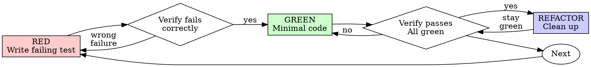

<!-- Generated by SpecStory, Markdown v2.1.0 -->

# 2026-04-24 04:28:13Z

<!-- Claude Code Session 5d98e280-f363-4ae2-a648-31a7dfa51807 (2026-04-24 04:28:13Z) -->

_**User (2026-04-24 04:28:13Z)**_

Let's work on the bugs described in the handoff: /Users/leocaseiro/Sites/base-skill/.claude/worktrees/bold-sinoussi-60d7fa/.claude/handoffs/2026-04-24-word-authoring-minor-bugs.md                                                                                                                                                           
  Captures:                                                                                                                                                                                                                                      
  - The two bugs you described (stale grid/panel after save; disable Word in edit mode + optional "Re-generate from RitaJS" button, triggered after first blur on non-empty for new-word mode).                                                  
  - Resume command, 18-commit stack summary, decisions, key files, and a note to verify the Dexie ticket exists (none found in today's gh issue list) before assuming.                                                                           
  - TDD plan for each bug, with exact file:line anchors.  

---

_**Agent (claude-opus-4-7 2026-04-24 04:28:18Z)**_

_**Agent (claude-opus-4-7 2026-04-24 04:28:18Z)**_

<tool-use data-tool-type="read" data-tool-name="Read"><details>
<summary>Tool use: **Read**</summary>
 `./.claude/worktrees/bold-sinoussi-60d7fa/.claude/handoffs/2026-04-24-word-authoring-minor-bugs.md`

```text
1	# Handoff: Word Authoring — two minor UX bugs to fix on PR #182
2	
3	**Date:** 2026-04-24
4	**Branch:** `claude/bold-sinoussi-60d7fa`
5	**Worktree:** `worktrees/bold-sinoussi-60d7fa`
6	**Worktree path:** `/Users/leocaseiro/Sites/base-skill/.claude/worktrees/bold-sinoussi-60d7fa`
7	**Git status:** clean
8	**Unpushed commits:** 18 ahead of `origin/claude/bold-sinoussi-60d7fa`
9	**Last commit:** `e9cba303 feat(word-authoring): edit shipped entries as draft overrides`
10	**PR:** [#182](https://github.com/leocaseiro/base-skill/pull/182) — OPEN (all the commits below are still local-only; push when the user green-lights a review)
11	
12	## Resume command
13	
14	```bash
15	/resync
16	cd .claude/worktrees/bold-sinoussi-60d7fa
17	# Read this file and the previous handoff (2026-04-24-word-authoring-pr182-ux-gaps.md) before starting.
18	# Then TDD the two bugs listed under Next steps.
19	```
20	
21	User preference reminder (memory): commit at every reviewable checkpoint, `SKIP_*` flags allowed for minor/polish commits. **Do not push** — explicit user sign-off required. Bug fixes need a failing test first (`feedback_tdd_for_bug_fixes.md`).
22	
23	## Current state
24	
25	**Task:** Word Authoring UX polish on top of PR #182. Last session added the full authoring surface (chips/syllables editors with 5 directional buttons, IPA→chip align, shipped override, reference links, phoneme inventory fix, play button, LTS fallback via `RiTa.analyze`). Two small UX bugs remain.
26	
27	**Phase:** polish — feature complete, bugfix pass.
28	
29	**Progress:** 18 commits local, unpushed, all green locally (lint + typecheck + `yarn vitest related`). Last user verification round passed for every shipped commit except these two bugs.
30	
31	## What we did in this session (summary)
32	
33	18 commits addressing every UX gap from the previous handoff plus several that surfaced during manual testing. The stack (newest first):
34	
35	| Commit     | Summary                                                                 |
36	| ---------- | ----------------------------------------------------------------------- |
37	| `e9cba303` | Edit shipped entries as draft overrides (ResultCard Edit, filter dedup) |
38	| `b999112b` | Dictionary / Vocabulary / HowManySyllables links under the Word input   |
39	| `d845d0ae` | Chip + syllable editors get five directional buttons (‹ « ✂ » ›)        |
40	| `43c23df9` | Flatten split-digraphs + `→ Align chips` IPA button                     |
41	| `7bc78366` | Stateful syllables with split/delete/editor                             |
42	| `c1000945` | `RiTa.analyze` + LTS fallback (prothesis etc. now aligned)              |
43	| `ea1cf994` | Phoneme dropdown offers all 44 AUS phonemes (was 9)                     |
44	| `00ce84ce` | Play-phoneme button next to the Phoneme label                           |
45	| `e1cce964` | Bootstrap chip for rita-unknown words                                   |
46	| `14fbcaa6` | Split button added to the chip editor                                   |
47	| `915d8bde` | Chip delete + selection ring + hint                                     |
48	| `0c0d9463` | Normalise IPA on save + render                                          |
49	| `8ecf13ac` | Editing a draft pre-fills the form and saves in place                   |
50	| `324b9ea9` | Empty-state copy omits level when level filter isn't the blocker        |
51	| `d81ba24d` | Level-aware empty-state when shipped word is filtered out               |
52	
53	Also raised one issue: [#186](https://github.com/leocaseiro/base-skill/issues/186) — compose compound words from existing parts (sun + day → sunday).
54	
55	## Decisions made (with reasoning)
56	
57	- **`RiTa.analyze` replaces `hasWord`-gated `phones`/`syllables`.** Analyze works for any word (LTS fallback for dictionary misses); `hasWord` is kept purely to drive the amber "this is a guess" banner.
58	- **Split-digraphs flattened in `AuthoringPanel` post-alignment.** `aligner.ts` still emits `a_e` / `o_e` symbolic chips with non-contiguous `span`, but the new `flattenAlignedChips(word, chips)` helper expands them into literal letters + a silent-e chip so `chips.map(c => c.g).join('') === word` holds. Keeps the aligner's teaching semantics intact for other callers.
59	- **Five directional buttons over the old `− + Delete`.** Move / Join separate letter-boundary rebalancing from chip-count changes, which closes the single-letter-chip merge gap. Syllables use the same five buttons.
60	- **Shipped edits land as drafts with `id: ''` seeds, not in-place JSON mutations.** The filter dedupes so a shipped word with a same-word draft shows exactly once (draft wins). Promotes via the existing `yarn words:import` CLI. Curriculum JSON is never mutated at runtime.
61	- **`ipa.ts` strips slashes, whitespace, and stress marks** (`ˈ` / `ˌ`) on save and render; length marks (`ː`) pass through. Matches zero instances of slash/space/stress in shipped AUS JSON (length marks present). Also exposes `tokenizeIpa` (greedy longest-match over a phoneme inventory).
62	
63	## Spec / Plan
64	
65	- Prior handoff: `.claude/handoffs/2026-04-24-word-authoring-pr182-ux-gaps.md`
66	- Design spec: `docs/superpowers/specs/2026-04-23-word-authoring-design.md`
67	- Plan (largely superseded by the commits above): `docs/superpowers/plans/2026-04-24-word-authoring-implementation.md`
68	
69	## Key files
70	
71	- `src/data/words/authoring/AuthoringPanel.tsx` — form state (`useDebouncedBreakdown`), chip + syllable editors, save path (routes on `initialDraft.id` truthiness), shipped-override banner
72	- `src/data/words/authoring/aligner.ts` — `align` (unchanged) + `flattenAlignedChips` (new, expands split-digraphs)
73	- `src/data/words/authoring/engine.ts` — `RiTa.analyze` entry point, catches LTS parse errors
74	- `src/data/words/authoring/ipa.ts` — `normalizeIpa`, `tokenizeIpa`
75	- `src/data/words/filter.ts` — `loadShippedWordLevels`, `isLevelInFilter`, draft-shadows-shipped dedupe in `filterWords`
76	- `src/data/words/WordLibraryExplorer.tsx` — `handleEditHit` synthesises the draft seed (`id: ''` for shipped, live DraftEntry lookup for drafts); `ResultCard` now takes an `onEdit` prop; grid renders each word once thanks to filter dedupe
77	
78	## Open questions / blockers
79	
80	- [ ] The two bugs below — scope of this handoff.
81	- [ ] Dexie resolutions (`yarn resolutions` for Dexie 4.0.10 from rxdb vs 4.4.2 from us). User said "don't worry for the dexie and so on for now, this should be in a gh ticket, and I think already is". **Action for next session:** verify an open issue exists; if not, open one. `gh issue list --state open` as of today shows only #178, #183, #184, #186 (none Dexie-specific) — you may need to create one.
82	- [ ] All 18 commits are unpushed. User has been verifying each in-browser locally. When the two bugs below are fixed, ask about pushing to PR #182.
83	
84	## Next steps (in suggested order)
85	
86	1. [ ] **Bug 1: Stale list after save/delete in the Drafts panel.** After saving / updating / deleting a draft, the `WordLibraryExplorer` grid and the Drafts panel list don't refresh — user has to reload the page.
87	   - **Likely cause:** the `filterWords` effect in `WordLibraryExplorer.tsx:617` depends on `[filter]` only. When `authoringWord` / `editingDraft` transitions to `null` on save, we refresh `draftCount` (line 610) but not the result grid. The `DraftsPanel` has its own `refresh` that fires on `[open]` (see `src/data/words/authoring/DraftsPanel.tsx:54`) so it only updates when the panel is re-opened.
88	   - **Simplest fix:** add a `draftVersion: number` state in `WordLibraryExplorer` that bumps on every save/delete (pass a setter or a callback down). Include it in the `filterWords` effect's deps. Pass a similar callback into `DraftsPanel` so it re-refreshes after its own delete. TDD: write a failing test that renders the explorer, saves a draft via the panel, closes the panel, and asserts the new draft appears in the grid without a re-render.
89	   - **Alternative:** broadcast via a tiny Dexie `liveQuery` or a hook on `draftStore` that emits on mutations. Heavier, but decouples the two views.
90	2. [ ] **Bug 2: Word field shouldn't be editable in edit mode; add a "Re-generate from RitaJS" button.** User's phrasing: _"In Edit mode, we can't change the word, so we can make the field disable. With that, we should instead, have a button to re-generate from RitaJS. It should be optional when the field is no longer empty after the first blur."_
91	   - **Intent (my read — confirm with user if unsure):**
92	     - In edit mode (`initialDraft` is set, either truthy `id` for an existing draft or `''` for a shipped override) → the Word input is disabled; a Re-generate button is always visible.
93	     - In new-word mode (`initialDraft === undefined`) → the Word input stays editable while the user is composing. Once the field is non-empty AND has been blurred once, disable it and show the Re-generate button. The button is optional ("optional" = the user can choose to press it or keep their manual edits; it's not required to make progress).
94	   - **Why disable the Word in edit mode:** editing the word itself is effectively a rename, which `draftStore` doesn't support (unique `[region+word]` index, and no migration for the row). Safer to force the user to cancel and re-create.
95	   - **Re-generate button behaviour:** calls `generateBreakdown(word)` again (same path as the debounced first run), then re-seeds chips / IPA / syllables / level from the result. Prompt to confirm when the form is dirty so the user doesn't silently lose edits.
96	   - **TDD:** (a) edit-mode test: rendering with `initialDraft` makes the Word input have `disabled`; (b) new-word test: type a word, don't blur, input stays enabled; blur once while non-empty, input becomes disabled and a "Re-generate" button appears; (c) clicking Re-generate invokes `generateBreakdown` and updates the chips/syllables (easiest to assert via the mock engine in `AuthoringPanel.test.tsx`).
97	   - **Location:** `src/data/words/authoring/AuthoringPanel.tsx` — Word input around the `{word.trim() && (...)}` reference-links block (currently around line 596). Add an `onBlur` handler on the input that flips a `wordCommitted` boolean once `word.trim() !== ''`. For edit mode, treat `wordCommitted` as initially `true`.
98	
99	## Context to remember
100	
101	- **User preferences (memory entries):**
102	  - Named exports only (no `export default` except framework configs).
103	  - TDD required for every bug fix — failing test first, commit includes the test.
104	  - Commit freely; push only with explicit confirmation (bug-fix flow).
105	  - `SKIP_*` pre-commit flags allowed on minor/polish commits; document the skip in the message body.
106	  - PRs always target master.
107	- **Do not start on master.** All work stays inside this worktree until push.
108	- **Dexie version conflict** (4.0.10 from rxdb vs 4.4.2 from our `draftStore`) — don't touch in this session; user says there's a ticket (verify via `gh issue list` first thing).
109	- **Word is an immutable key for drafts.** The `[region+word]` unique index in `draftStore` (`src/data/words/authoring/draftStore.ts:15`) means changing `word` on an existing draft would require a delete + save pair, which breaks referential integrity with any consumers that pinned `draftId`. Hence Bug 2's "disable word in edit mode" framing.
110	- **Shipped-override flow is working end-to-end.** Any code you add must not break the `initialDraft.id === ''` discriminator — `WordLibraryExplorer.handleEditHit` synthesises this for shipped hits, and `AuthoringPanel.handleSave` routes on the same check.
111	- **`flattenAlignedChips` is required on every alignment site.** If you add a new path that calls `align(word, phonemes)` (e.g. IPA re-align → yes, already does), flatten before setting chips, or the grapheme-chip invariant breaks and Split/Join misbehave silently.
112	- **Pre-commit hook is bucket-gated** (`scripts/detect-buckets.mjs`). A single file edit may not trigger typecheck/lint. Always `yarn lint && yarn typecheck` locally before a commit you intend to push.
113
```
</details></tool-use>

_**Agent (claude-opus-4-7 2026-04-24 04:28:23Z)**_

_**Agent (claude-opus-4-7 2026-04-24 04:28:23Z)**_

I'll start by invoking the relevant skills since these are bug fixes that need systematic debugging and TDD.

_**Agent (claude-opus-4-7 2026-04-24 04:28:23Z)**_

<tool-use data-tool-type="generic" data-tool-name="Skill"><details>
<summary>Tool use: **Skill**</summary>

```text
Launching skill: superpowers:systematic-debugging
```
</details></tool-use>

---

_**User (2026-04-24 04:28:23Z)**_

Base directory for this skill: /Users/leocaseiro/.claude/plugins/cache/claude-plugins-official/superpowers/5.0.7/skills/systematic-debugging

# Systematic Debugging

## Overview

Random fixes waste time and create new bugs. Quick patches mask underlying issues.

**Core principle:** ALWAYS find root cause before attempting fixes. Symptom fixes are failure.

**Violating the letter of this process is violating the spirit of debugging.**

## The Iron Law

```
NO FIXES WITHOUT ROOT CAUSE INVESTIGATION FIRST
```

If you haven't completed Phase 1, you cannot propose fixes.

## When to Use

Use for ANY technical issue:
- Test failures
- Bugs in production
- Unexpected behavior
- Performance problems
- Build failures
- Integration issues

**Use this ESPECIALLY when:**
- Under time pressure (emergencies make guessing tempting)
- "Just one quick fix" seems obvious
- You've already tried multiple fixes
- Previous fix didn't work
- You don't fully understand the issue

**Don't skip when:**
- Issue seems simple (simple bugs have root causes too)
- You're in a hurry (rushing guarantees rework)
- Manager wants it fixed NOW (systematic is faster than thrashing)

## The Four Phases

You MUST complete each phase before proceeding to the next.

### Phase 1: Root Cause Investigation

**BEFORE attempting ANY fix:**

1. **Read Error Messages Carefully**
   - Don't skip past errors or warnings
   - They often contain the exact solution
   - Read stack traces completely
   - Note line numbers, file paths, error codes

2. **Reproduce Consistently**
   - Can you trigger it reliably?
   - What are the exact steps?
   - Does it happen every time?
   - If not reproducible → gather more data, don't guess

3. **Check Recent Changes**
   - What changed that could cause this?
   - Git diff, recent commits
   - New dependencies, config changes
   - Environmental differences

4. **Gather Evidence in Multi-Component Systems**

   **WHEN system has multiple components (CI → build → signing, API → service → database):**

   **BEFORE proposing fixes, add diagnostic instrumentation:**
   ```
   For EACH component boundary:
     - Log what data enters component
     - Log what data exits component
     - Verify environment/config propagation
     - Check state at each layer

   Run once to gather evidence showing WHERE it breaks
   THEN analyze evidence to identify failing component
   THEN investigate that specific component
   ```

   **Example (multi-layer system):**
   ```bash
   # Layer 1: Workflow
   echo "=== Secrets available in workflow: ==="
   echo "IDENTITY: ${IDENTITY:+SET}${IDENTITY:-UNSET}"

   # Layer 2: Build script
   echo "=== Env vars in build script: ==="
   env | grep IDENTITY || echo "IDENTITY not in environment"

   # Layer 3: Signing script
   echo "=== Keychain state: ==="
   security list-keychains
   security find-identity -v

   # Layer 4: Actual signing
   codesign --sign "$IDENTITY" --verbose=4 "$APP"
   ```

   **This reveals:** Which layer fails (secrets → workflow ✓, workflow → build ✗)

5. **Trace Data Flow**

   **WHEN error is deep in call stack:**

   See `root-cause-tracing.md` in this directory for the complete backward tracing technique.

   **Quick version:**
   - Where does bad value originate?
   - What called this with bad value?
   - Keep tracing up until you find the source
   - Fix at source, not at symptom

### Phase 2: Pattern Analysis

**Find the pattern before fixing:**

1. **Find Working Examples**
   - Locate similar working code in same codebase
   - What works that's similar to what's broken?

2. **Compare Against References**
   - If implementing pattern, read reference implementation COMPLETELY
   - Don't skim - read every line
   - Understand the pattern fully before applying

3. **Identify Differences**
   - What's different between working and broken?
   - List every difference, however small
   - Don't assume "that can't matter"

4. **Understand Dependencies**
   - What other components does this need?
   - What settings, config, environment?
   - What assumptions does it make?

### Phase 3: Hypothesis and Testing

**Scientific method:**

1. **Form Single Hypothesis**
   - State clearly: "I think X is the root cause because Y"
   - Write it down
   - Be specific, not vague

2. **Test Minimally**
   - Make the SMALLEST possible change to test hypothesis
   - One variable at a time
   - Don't fix multiple things at once

3. **Verify Before Continuing**
   - Did it work? Yes → Phase 4
   - Didn't work? Form NEW hypothesis
   - DON'T add more fixes on top

4. **When You Don't Know**
   - Say "I don't understand X"
   - Don't pretend to know
   - Ask for help
   - Research more

### Phase 4: Implementation

**Fix the root cause, not the symptom:**

1. **Create Failing Test Case**
   - Simplest possible reproduction
   - Automated test if possible
   - One-off test script if no framework
   - MUST have before fixing
   - Use the `superpowers:test-driven-development` skill for writing proper failing tests

2. **Implement Single Fix**
   - Address the root cause identified
   - ONE change at a time
   - No "while I'm here" improvements
   - No bundled refactoring

3. **Verify Fix**
   - Test passes now?
   - No other tests broken?
   - Issue actually resolved?

4. **If Fix Doesn't Work**
   - STOP
   - Count: How many fixes have you tried?
   - If < 3: Return to Phase 1, re-analyze with new information
   - **If ≥ 3: STOP and question the architecture (step 5 below)**
   - DON'T attempt Fix #4 without architectural discussion

5. **If 3+ Fixes Failed: Question Architecture**

   **Pattern indicating architectural problem:**
   - Each fix reveals new shared state/coupling/problem in different place
   - Fixes require "massive refactoring" to implement
   - Each fix creates new symptoms elsewhere

   **STOP and question fundamentals:**
   - Is this pattern fundamentally sound?
   - Are we "sticking with it through sheer inertia"?
   - Should we refactor architecture vs. continue fixing symptoms?

   **Discuss with your human partner before attempting more fixes**

   This is NOT a failed hypothesis - this is a wrong architecture.

## Red Flags - STOP and Follow Process

If you catch yourself thinking:
- "Quick fix for now, investigate later"
- "Just try changing X and see if it works"
- "Add multiple changes, run tests"
- "Skip the test, I'll manually verify"
- "It's probably X, let me fix that"
- "I don't fully understand but this might work"
- "Pattern says X but I'll adapt it differently"
- "Here are the main problems: [lists fixes without investigation]"
- Proposing solutions before tracing data flow
- **"One more fix attempt" (when already tried 2+)**
- **Each fix reveals new problem in different place**

**ALL of these mean: STOP. Return to Phase 1.**

**If 3+ fixes failed:** Question the architecture (see Phase 4.5)

## your human partner's Signals You're Doing It Wrong

**Watch for these redirections:**
- "Is that not happening?" - You assumed without verifying
- "Will it show us...?" - You should have added evidence gathering
- "Stop guessing" - You're proposing fixes without understanding
- "Ultrathink this" - Question fundamentals, not just symptoms
- "We're stuck?" (frustrated) - Your approach isn't working

**When you see these:** STOP. Return to Phase 1.

## Common Rationalizations

| Excuse | Reality |
|--------|---------|
| "Issue is simple, don't need process" | Simple issues have root causes too. Process is fast for simple bugs. |
| "Emergency, no time for process" | Systematic debugging is FASTER than guess-and-check thrashing. |
| "Just try this first, then investigate" | First fix sets the pattern. Do it right from the start. |
| "I'll write test after confirming fix works" | Untested fixes don't stick. Test first proves it. |
| "Multiple fixes at once saves time" | Can't isolate what worked. Causes new bugs. |
| "Reference too long, I'll adapt the pattern" | Partial understanding guarantees bugs. Read it completely. |
| "I see the problem, let me fix it" | Seeing symptoms ≠ understanding root cause. |
| "One more fix attempt" (after 2+ failures) | 3+ failures = architectural problem. Question pattern, don't fix again. |

## Quick Reference

| Phase | Key Activities | Success Criteria |
|-------|---------------|------------------|
| **1. Root Cause** | Read errors, reproduce, check changes, gather evidence | Understand WHAT and WHY |
| **2. Pattern** | Find working examples, compare | Identify differences |
| **3. Hypothesis** | Form theory, test minimally | Confirmed or new hypothesis |
| **4. Implementation** | Create test, fix, verify | Bug resolved, tests pass |

## When Process Reveals "No Root Cause"

If systematic investigation reveals issue is truly environmental, timing-dependent, or external:

1. You've completed the process
2. Document what you investigated
3. Implement appropriate handling (retry, timeout, error message)
4. Add monitoring/logging for future investigation

**But:** 95% of "no root cause" cases are incomplete investigation.

## Supporting Techniques

These techniques are part of systematic debugging and available in this directory:

- **`root-cause-tracing.md`** - Trace bugs backward through call stack to find original trigger
- **`defense-in-depth.md`** - Add validation at multiple layers after finding root cause
- **`condition-based-waiting.md`** - Replace arbitrary timeouts with condition polling

**Related skills:**
- **superpowers:test-driven-development** - For creating failing test case (Phase 4, Step 1)
- **superpowers:verification-before-completion** - Verify fix worked before claiming success

## Real-World Impact

From debugging sessions:
- Systematic approach: 15-30 minutes to fix
- Random fixes approach: 2-3 hours of thrashing
- First-time fix rate: 95% vs 40%
- New bugs introduced: Near zero vs common


---

_**Agent (claude-opus-4-7 2026-04-24 04:28:27Z)**_

_**Agent (claude-opus-4-7 2026-04-24 04:28:27Z)**_

<tool-use data-tool-type="generic" data-tool-name="Skill"><details>
<summary>Tool use: **Skill**</summary>

**Input:**

- skill: `superpowers:test-driven-development`

</details></tool-use>

---

_**User (2026-04-24 04:28:27Z)**_

Base directory for this skill: /Users/leocaseiro/.claude/plugins/cache/claude-plugins-official/superpowers/5.0.7/skills/test-driven-development

# Test-Driven Development (TDD)

## Overview

Write the test first. Watch it fail. Write minimal code to pass.

**Core principle:** If you didn't watch the test fail, you don't know if it tests the right thing.

**Violating the letter of the rules is violating the spirit of the rules.**

## When to Use

**Always:**
- New features
- Bug fixes
- Refactoring
- Behavior changes

**Exceptions (ask your human partner):**
- Throwaway prototypes
- Generated code
- Configuration files

Thinking "skip TDD just this once"? Stop. That's rationalization.

## The Iron Law

```
NO PRODUCTION CODE WITHOUT A FAILING TEST FIRST
```

Write code before the test? Delete it. Start over.

**No exceptions:**
- Don't keep it as "reference"
- Don't "adapt" it while writing tests
- Don't look at it
- Delete means delete

Implement fresh from tests. Period.

## Red-Green-Refactor



### RED - Write Failing Test

Write one minimal test showing what should happen.

<Good>
```typescript
test('retries failed operations 3 times', async () => {
  let attempts = 0;
  const operation = () => {
    attempts++;
    if (attempts < 3) throw new Error('fail');
    return 'success';
  };

  const result = await retryOperation(operation);

  expect(result).toBe('success');
  expect(attempts).toBe(3);
});
```
Clear name, tests real behavior, one thing
</Good>

<Bad>
```typescript
test('retry works', async () => {
  const mock = jest.fn()
    .mockRejectedValueOnce(new Error())
    .mockRejectedValueOnce(new Error())
    .mockResolvedValueOnce('success');
  await retryOperation(mock);
  expect(mock).toHaveBeenCalledTimes(3);
});
```
Vague name, tests mock not code
</Bad>

**Requirements:**
- One behavior
- Clear name
- Real code (no mocks unless unavoidable)

### Verify RED - Watch It Fail

**MANDATORY. Never skip.**

```bash
npm test path/to/test.test.ts
```

Confirm:
- Test fails (not errors)
- Failure message is expected
- Fails because feature missing (not typos)

**Test passes?** You're testing existing behavior. Fix test.

**Test errors?** Fix error, re-run until it fails correctly.

### GREEN - Minimal Code

Write simplest code to pass the test.

<Good>
```typescript
async function retryOperation<T>(fn: () => Promise<T>): Promise<T> {
  for (let i = 0; i < 3; i++) {
    try {
      return await fn();
    } catch (e) {
      if (i === 2) throw e;
    }
  }
  throw new Error('unreachable');
}
```
Just enough to pass
</Good>

<Bad>
```typescript
async function retryOperation<T>(
  fn: () => Promise<T>,
  options?: {
    maxRetries?: number;
    backoff?: 'linear' | 'exponential';
    onRetry?: (attempt: number) => void;
  }
): Promise<T> {
  // YAGNI
}
```
Over-engineered
</Bad>

Don't add features, refactor other code, or "improve" beyond the test.

### Verify GREEN - Watch It Pass

**MANDATORY.**

```bash
npm test path/to/test.test.ts
```

Confirm:
- Test passes
- Other tests still pass
- Output pristine (no errors, warnings)

**Test fails?** Fix code, not test.

**Other tests fail?** Fix now.

### REFACTOR - Clean Up

After green only:
- Remove duplication
- Improve names
- Extract helpers

Keep tests green. Don't add behavior.

### Repeat

Next failing test for next feature.

## Good Tests

| Quality | Good | Bad |
|---------|------|-----|
| **Minimal** | One thing. "and" in name? Split it. | `test('validates email and domain and whitespace')` |
| **Clear** | Name describes behavior | `test('test1')` |
| **Shows intent** | Demonstrates desired API | Obscures what code should do |

## Why Order Matters

**"I'll write tests after to verify it works"**

Tests written after code pass immediately. Passing immediately proves nothing:
- Might test wrong thing
- Might test implementation, not behavior
- Might miss edge cases you forgot
- You never saw it catch the bug

Test-first forces you to see the test fail, proving it actually tests something.

**"I already manually tested all the edge cases"**

Manual testing is ad-hoc. You think you tested everything but:
- No record of what you tested
- Can't re-run when code changes
- Easy to forget cases under pressure
- "It worked when I tried it" ≠ comprehensive

Automated tests are systematic. They run the same way every time.

**"Deleting X hours of work is wasteful"**

Sunk cost fallacy. The time is already gone. Your choice now:
- Delete and rewrite with TDD (X more hours, high confidence)
- Keep it and add tests after (30 min, low confidence, likely bugs)

The "waste" is keeping code you can't trust. Working code without real tests is technical debt.

**"TDD is dogmatic, being pragmatic means adapting"**

TDD IS pragmatic:
- Finds bugs before commit (faster than debugging after)
- Prevents regressions (tests catch breaks immediately)
- Documents behavior (tests show how to use code)
- Enables refactoring (change freely, tests catch breaks)

"Pragmatic" shortcuts = debugging in production = slower.

**"Tests after achieve the same goals - it's spirit not ritual"**

No. Tests-after answer "What does this do?" Tests-first answer "What should this do?"

Tests-after are biased by your implementation. You test what you built, not what's required. You verify remembered edge cases, not discovered ones.

Tests-first force edge case discovery before implementing. Tests-after verify you remembered everything (you didn't).

30 minutes of tests after ≠ TDD. You get coverage, lose proof tests work.

## Common Rationalizations

| Excuse | Reality |
|--------|---------|
| "Too simple to test" | Simple code breaks. Test takes 30 seconds. |
| "I'll test after" | Tests passing immediately prove nothing. |
| "Tests after achieve same goals" | Tests-after = "what does this do?" Tests-first = "what should this do?" |
| "Already manually tested" | Ad-hoc ≠ systematic. No record, can't re-run. |
| "Deleting X hours is wasteful" | Sunk cost fallacy. Keeping unverified code is technical debt. |
| "Keep as reference, write tests first" | You'll adapt it. That's testing after. Delete means delete. |
| "Need to explore first" | Fine. Throw away exploration, start with TDD. |
| "Test hard = design unclear" | Listen to test. Hard to test = hard to use. |
| "TDD will slow me down" | TDD faster than debugging. Pragmatic = test-first. |
| "Manual test faster" | Manual doesn't prove edge cases. You'll re-test every change. |
| "Existing code has no tests" | You're improving it. Add tests for existing code. |

## Red Flags - STOP and Start Over

- Code before test
- Test after implementation
- Test passes immediately
- Can't explain why test failed
- Tests added "later"
- Rationalizing "just this once"
- "I already manually tested it"
- "Tests after achieve the same purpose"
- "It's about spirit not ritual"
- "Keep as reference" or "adapt existing code"
- "Already spent X hours, deleting is wasteful"
- "TDD is dogmatic, I'm being pragmatic"
- "This is different because..."

**All of these mean: Delete code. Start over with TDD.**

## Example: Bug Fix

**Bug:** Empty email accepted

**RED**
```typescript
test('rejects empty email', async () => {
  const result = await submitForm({ email: '' });
  expect(result.error).toBe('Email required');
});
```

**Verify RED**
```bash
$ npm test
FAIL: expected 'Email required', got undefined
```

**GREEN**
```typescript
function submitForm(data: FormData) {
  if (!data.email?.trim()) {
    return { error: 'Email required' };
  }
  // ...
}
```

**Verify GREEN**
```bash
$ npm test
PASS
```

**REFACTOR**
Extract validation for multiple fields if needed.

## Verification Checklist

Before marking work complete:

- [ ] Every new function/method has a test
- [ ] Watched each test fail before implementing
- [ ] Each test failed for expected reason (feature missing, not typo)
- [ ] Wrote minimal code to pass each test
- [ ] All tests pass
- [ ] Output pristine (no errors, warnings)
- [ ] Tests use real code (mocks only if unavoidable)
- [ ] Edge cases and errors covered

Can't check all boxes? You skipped TDD. Start over.

## When Stuck

| Problem | Solution |
|---------|----------|
| Don't know how to test | Write wished-for API. Write assertion first. Ask your human partner. |
| Test too complicated | Design too complicated. Simplify interface. |
| Must mock everything | Code too coupled. Use dependency injection. |
| Test setup huge | Extract helpers. Still complex? Simplify design. |

## Debugging Integration

Bug found? Write failing test reproducing it. Follow TDD cycle. Test proves fix and prevents regression.

Never fix bugs without a test.

## Testing Anti-Patterns

When adding mocks or test utilities, read @testing-anti-patterns.md to avoid common pitfalls:
- Testing mock behavior instead of real behavior
- Adding test-only methods to production classes
- Mocking without understanding dependencies

## Final Rule

```
Production code → test exists and failed first
Otherwise → not TDD
```

No exceptions without your human partner's permission.


---

_**Agent (claude-opus-4-7 2026-04-24 04:28:31Z)**_

_**Agent (claude-opus-4-7 2026-04-24 04:28:31Z)**_

Let me check the worktree state and explore the relevant files.

_**Agent (claude-opus-4-7 2026-04-24 04:28:34Z)**_

<tool-use data-tool-type="shell" data-tool-name="Bash"><details>
<summary>Tool use: **Bash**</summary>
Check worktree status and recent commits

`cd /Users/leocaseiro/Sites/base-skill/.claude/worktrees/bold-sinoussi-60d7fa && git status && git log --oneline -5`

```text
On branch claude/bold-sinoussi-60d7fa
Your branch and 'origin/claude/bold-sinoussi-60d7fa' have diverged,
and have 42 and 27 different commits each, respectively.
  (use "git pull" if you want to integrate the remote branch with yours)

nothing to commit, working tree clean
6d81be02 docs(handoff): two minor word-authoring bugs to fix next session
e9cba303 feat(word-authoring): edit shipped entries as draft overrides
b999112b feat(word-authoring): surface three word-reference links under the Word input
d845d0ae feat(word-authoring): chip + syllable editor get five directional buttons
43c23df9 feat(word-authoring): flatten split-digraphs + add IPA→chips align button
```
</details></tool-use>

_**Agent (claude-opus-4-7 2026-04-24 04:28:34Z)**_

<tool-use data-tool-type="shell" data-tool-name="Bash"><details>
<summary>Tool use: **Bash**</summary>
List authoring directory

`cd /Users/leocaseiro/Sites/base-skill/.claude/worktrees/bold-sinoussi-60d7fa && ls src/data/words/authoring/`

```text
aligner.test.ts
aligner.ts
arpabet-to-ipa.test.ts
arpabet-to-ipa.ts
AuthoringPanel.stories.tsx
AuthoringPanel.test.tsx
AuthoringPanel.tsx
DraftsPanel.stories.tsx
DraftsPanel.test.tsx
DraftsPanel.tsx
draftStore.test.ts
draftStore.ts
engine.test.ts
engine.ts
index.ts
ipa.test.ts
ipa.ts
```
</details></tool-use>

_**Agent (claude-opus-4-7 2026-04-24 04:28:37Z)**_

<tool-use data-tool-type="read" data-tool-name="Read"><details>
<summary>Tool use: **Read**</summary>
 `./.claude/worktrees/bold-sinoussi-60d7fa/src/data/words/WordLibraryExplorer.tsx`

```text
1	import { useEffect, useId, useMemo, useState } from 'react';
2	import { deriveActiveFilterPills } from './active-filter-pills';
3	import { AuthoringPanel } from './authoring/AuthoringPanel';
4	import { DraftsPanel } from './authoring/DraftsPanel';
5	import { draftStore } from './authoring/draftStore';
6	import { normalizeIpa } from './authoring/ipa';
7	import {
8	  filterWords,
9	  isLevelInFilter,
10	  loadShippedWordLevels,
11	} from './filter';
12	import { ALL_REGIONS, LEVEL_LABELS } from './levels';
13	import { playPhoneme } from './phoneme-audio';
14	import { useChipsVisibleDefault } from './useChipsVisibleDefault';
15	import type {
16	  DraftEntry,
17	  FilterResult,
18	  Grapheme,
19	  Region,
20	  WordFilter,
21	  WordHit,
22	} from './types';
23	import { PhonemeBlender } from '#/components/phoneme-blender/PhonemeBlender';
24	import { Button } from '#/components/ui/button';
25	import {
26	  Card,
27	  CardContent,
28	  CardHeader,
29	  CardTitle,
30	} from '#/components/ui/card';
31	import { Input } from '#/components/ui/input';
32	import { Label } from '#/components/ui/label';
33	import {
34	  Select,
35	  SelectContent,
36	  SelectItem,
37	  SelectTrigger,
38	  SelectValue,
39	} from '#/components/ui/select';
40	import {
41	  Sheet,
42	  SheetContent,
43	  SheetHeader,
44	  SheetTitle,
45	  SheetTrigger,
46	} from '#/components/ui/sheet';
47	import { speak } from '#/lib/speech/SpeechOutput';
48	import { cn } from '#/lib/utils';
49	
50	const LEVELS = [1, 2, 3, 4, 5, 6, 7, 8] as const;
51	const PAGE_SIZES = [25, 50, 100] as const;
52	const DEFAULT_PAGE_SIZE = 50;
53	
54	type PageSize = (typeof PAGE_SIZES)[number];
55	
56	export const matchesWordPrefix = (
57	  hit: WordHit,
58	  prefix: string,
59	): boolean => {
60	  const q = prefix.trim().toLowerCase();
61	  if (q === '') return true;
62	  return hit.word.toLowerCase().startsWith(q);
63	};
64	
65	export const paginate = <T,>(
66	  items: readonly T[],
67	  page: number,
68	  pageSize: number,
69	): T[] => {
70	  if (pageSize <= 0) return [];
71	  const start = Math.max(0, (page - 1) * pageSize);
72	  return items.slice(start, start + pageSize);
73	};
74	
75	export type PageToken = number | 'ellipsis-left' | 'ellipsis-right';
76	
77	export const pageRange = (
78	  current: number,
79	  total: number,
80	): PageToken[] => {
81	  if (total <= 1) return [1];
82	  if (total <= 7) {
83	    return Array.from({ length: total }, (_, i) => i + 1);
84	  }
85	  const windowStart = Math.max(2, current - 1);
86	  const windowEnd = Math.min(total - 1, current + 1);
87	  const tokens: PageToken[] = [1];
88	  if (windowStart > 2) tokens.push('ellipsis-left');
89	  for (let p = windowStart; p <= windowEnd; p += 1) tokens.push(p);
90	  if (windowEnd < total - 1) tokens.push('ellipsis-right');
91	  tokens.push(total);
92	  return tokens;
93	};
94	
95	interface GraphemePair {
96	  g: string;
97	  p: string;
98	  label: string;
99	}
100	
101	type SyllableMode = 'any' | 'eq' | 'range';
102	
103	const pairLabel = (g: string, p: string): string => `${g}[${p}]`;
104	
105	export const collectGraphemePairs = (
106	  hits: readonly WordHit[],
107	): GraphemePair[] => {
108	  const seen = new Map<string, GraphemePair>();
109	  for (const hit of hits) {
110	    if (!hit.graphemes) continue;
111	    for (const gr of hit.graphemes) {
112	      const label = pairLabel(gr.g, gr.p);
113	      if (!seen.has(label))
114	        seen.set(label, { g: gr.g, p: gr.p, label });
115	    }
116	  }
117	  return [...seen.values()].toSorted((a, b) =>
118	    a.label.localeCompare(b.label),
119	  );
120	};
121	
122	export const collectGraphemeStrings = (
123	  hits: readonly WordHit[],
124	): string[] => {
125	  const seen = new Set<string>();
126	  for (const hit of hits) {
127	    if (!hit.graphemes) continue;
128	    for (const gr of hit.graphemes) seen.add(gr.g);
129	  }
130	  return [...seen].toSorted();
131	};
132	
133	export const collectPhonemeStrings = (
134	  hits: readonly WordHit[],
135	): string[] => {
136	  const seen = new Set<string>();
137	  for (const hit of hits) {
138	    if (!hit.graphemes) continue;
139	    for (const gr of hit.graphemes) seen.add(gr.p);
140	  }
141	  return [...seen].toSorted();
142	};
143	
144	const hitContainsAllPairs = (
145	  hit: WordHit,
146	  pairs: readonly GraphemePair[],
147	): boolean =>
148	  pairs.every((pair) =>
149	    hit.graphemes?.some((gr) => gr.g === pair.g && gr.p === pair.p),
150	  );
151	
152	interface MultiSelectStringProps {
153	  label: string;
154	  helper?: string;
155	  options: readonly string[];
156	  selected: readonly string[];
157	  onChange: (next: string[]) => void;
158	}
159	
160	const MultiSelectString = ({
161	  label,
162	  helper,
163	  options,
164	  selected,
165	  onChange,
166	}: MultiSelectStringProps) => {
167	  const inputId = useId();
168	  const [query, setQuery] = useState('');
169	  const matches = useMemo(() => {
170	    const q = query.trim().toLowerCase();
171	    const selectedSet = new Set(selected);
172	    return options
173	      .filter((opt) => !selectedSet.has(opt))
174	      .filter((opt) => (q ? opt.toLowerCase().includes(q) : true))
175	      .slice(0, 20);
176	  }, [options, query, selected]);
177	
178	  const add = (value: string) => {
179	    if (selected.includes(value)) return;
180	    onChange([...selected, value]);
181	    setQuery('');
182	  };
183	
184	  const remove = (value: string) => {
185	    onChange(selected.filter((v) => v !== value));
186	  };
187	
188	  return (
189	    <div className="flex flex-col gap-1.5">
190	      <Label htmlFor={inputId}>{label}</Label>
191	      {helper ? (
192	        <p className="text-xs text-muted-foreground">{helper}</p>
193	      ) : null}
194	      {selected.length > 0 ? (
195	        <div className="flex flex-wrap gap-1">
196	          {selected.map((value) => (
197	            <Chip key={value} onRemove={() => remove(value)}>
198	              {value}
199	            </Chip>
200	          ))}
201	        </div>
202	      ) : null}
203	      <Input
204	        id={inputId}
205	        value={query}
206	        onChange={(e) => setQuery(e.target.value)}
207	        placeholder="Type to search..."
208	        autoComplete="off"
209	      />
210	      {query.trim() !== '' && matches.length > 0 ? (
211	        <ul className="max-h-40 overflow-auto rounded-lg border border-input bg-popover text-sm">
212	          {matches.map((opt) => (
213	            <li key={opt}>
214	              <button
215	                type="button"
216	                onClick={() => add(opt)}
217	                className="block w-full px-2.5 py-1 text-left hover:bg-muted"
218	              >
219	                {opt}
220	              </button>
221	            </li>
222	          ))}
223	        </ul>
224	      ) : null}
225	    </div>
226	  );
227	};
228	
229	interface MultiSelectPairsProps {
230	  label: string;
231	  helper?: string;
232	  options: readonly GraphemePair[];
233	  selected: readonly GraphemePair[];
234	  onChange: (next: GraphemePair[]) => void;
235	}
236	
237	const MultiSelectPairs = ({
238	  label,
239	  helper,
240	  options,
241	  selected,
242	  onChange,
243	}: MultiSelectPairsProps) => {
244	  const inputId = useId();
245	  const [query, setQuery] = useState('');
246	  const matches = useMemo(() => {
247	    const q = query.trim().toLowerCase();
248	    const selectedSet = new Set(selected.map((p) => p.label));
249	    return options
250	      .filter((opt) => !selectedSet.has(opt.label))
251	      .filter((opt) => (q ? opt.label.toLowerCase().includes(q) : true))
252	      .slice(0, 20);
253	  }, [options, query, selected]);
254	
255	  const add = (pair: GraphemePair) => {
256	    if (selected.some((p) => p.label === pair.label)) return;
257	    onChange([...selected, pair]);
258	    setQuery('');
259	  };
260	
261	  const remove = (label_: string) => {
262	    onChange(selected.filter((p) => p.label !== label_));
263	  };
264	
265	  return (
266	    <div className="flex flex-col gap-1.5">
267	      <Label htmlFor={inputId}>{label}</Label>
268	      {helper ? (
269	        <p className="text-xs text-muted-foreground">{helper}</p>
270	      ) : null}
271	      {selected.length > 0 ? (
272	        <div className="flex flex-wrap gap-1">
273	          {selected.map((pair) => (
274	            <Chip key={pair.label} onRemove={() => remove(pair.label)}>
275	              {pair.label}
276	            </Chip>
277	          ))}
278	        </div>
279	      ) : null}
280	      <Input
281	        id={inputId}
282	        value={query}
283	        onChange={(e) => setQuery(e.target.value)}
284	        placeholder="e.g. c[k] or sh[ʃ]"
285	        autoComplete="off"
286	      />
287	      {query.trim() !== '' && matches.length > 0 ? (
288	        <ul className="max-h-40 overflow-auto rounded-lg border border-input bg-popover text-sm">
289	          {matches.map((opt) => (
290	            <li key={opt.label}>
291	              <button
292	                type="button"
293	                onClick={() => add(opt)}
294	                className="block w-full px-2.5 py-1 text-left hover:bg-muted"
295	              >
296	                {opt.label}
297	              </button>
298	            </li>
299	          ))}
300	        </ul>
301	      ) : null}
302	    </div>
303	  );
304	};
305	
306	interface ChipProps {
307	  children: React.ReactNode;
308	  onRemove: () => void;
309	}
310	
311	const Chip = ({ children, onRemove }: ChipProps) => (
312	  <span className="inline-flex items-center gap-1 rounded-md bg-muted px-2 py-0.5 text-xs">
313	    {children}
314	    <button
315	      type="button"
316	      onClick={onRemove}
317	      aria-label="Remove"
318	      className="text-muted-foreground hover:text-foreground"
319	    >
320	      ×
321	    </button>
322	  </span>
323	);
324	
325	export interface ResultCardProps {
326	  hit: WordHit;
327	  chipsVisible: boolean;
328	  onEdit?: (hit: WordHit) => void;
329	}
330	
331	interface KeyedGrapheme {
332	  key: string;
333	  g: string;
334	  p: string;
335	}
336	
337	const keyGraphemes = (graphemes: Grapheme[]): KeyedGrapheme[] => {
338	  const counts = new Map<string, number>();
339	  return graphemes.map((gr) => {
340	    const base = `${gr.g}-${gr.p}`;
341	    const n = counts.get(base) ?? 0;
342	    counts.set(base, n + 1);
343	    return { key: `${base}-${n}`, g: gr.g, p: gr.p };
344	  });
345	};
346	
347	const GraphemeChips = ({ graphemes }: { graphemes: Grapheme[] }) => (
348	  <div data-testid="chips-row" className="flex flex-wrap gap-1">
349	    {keyGraphemes(graphemes).map((gr) => (
350	      <button
351	        key={gr.key}
352	        type="button"
353	        title={`${gr.g} → /${gr.p}/`}
354	        aria-label={`Play phoneme ${gr.p}`}
355	        onClick={() => {
356	          void playPhoneme(gr.p);
357	        }}
358	        className="inline-flex items-center rounded-md bg-muted px-1.5 py-0.5 font-mono text-xs transition-colors hover:bg-muted/70"
359	      >
360	        {gr.g}
361	      </button>
362	    ))}
363	  </div>
364	);
365	
366	export const ResultCard = ({
367	  hit,
368	  chipsVisible,
369	  onEdit,
370	}: ResultCardProps) => (
371	  <Card>
372	    <CardHeader className="gap-1">
373	      <CardTitle className="text-2xl font-bold">{hit.word}</CardTitle>
374	      <div className="flex flex-wrap items-center gap-2 text-sm">
375	        {hit.syllables ? (
376	          <span className="text-muted-foreground">
377	            {hit.syllables.join('·')}
378	          </span>
379	        ) : null}
380	        {hit.ipa ? (
381	          <button
382	            type="button"
383	            aria-label={`Speak ${hit.word}`}
384	            onClick={() =>
385	              speak(hit.word, { rate: 0.9, lang: 'en-AU' })
386	            }
387	            className="inline-flex items-center gap-1 rounded-md border border-input px-2 py-0.5 font-mono text-xs hover:bg-muted"
388	          >
389	            🔈 /{normalizeIpa(hit.ipa)}/
390	          </button>
391	        ) : null}
392	        <div className="ms-auto flex items-center gap-1 text-xs">
393	          <Badge>L{hit.level}</Badge>
394	          <Badge>{hit.syllableCount} syl</Badge>
395	          <span
396	            className={`ml-2 rounded px-2 py-0.5 text-xs ${
397	              hit.provenance === 'draft'
398	                ? 'bg-amber-100 text-amber-800'
399	                : 'bg-slate-100 text-slate-600'
400	            }`}
401	          >
402	            {hit.provenance === 'draft'
403	              ? '✏️ draft (unsynced)'
404	              : '📚 shipped'}
405	          </span>
406	          {onEdit ? (
407	            <button
408	              type="button"
409	              aria-label={`Edit ${hit.word}`}
410	              onClick={() => onEdit(hit)}
411	              className="rounded-md border border-input px-2 py-0.5 text-xs hover:bg-muted"
412	            >
413	              Edit
414	            </button>
415	          ) : null}
416	        </div>
417	      </div>
418	    </CardHeader>
419	    <CardContent className="flex flex-col gap-3">
420	      {hit.graphemes ? (
421	        <PhonemeBlender word={hit.word} graphemes={hit.graphemes} />
422	      ) : null}
423	      {chipsVisible && hit.graphemes ? (
424	        <GraphemeChips graphemes={hit.graphemes} />
425	      ) : null}
426	    </CardContent>
427	  </Card>
428	);
429	
430	const Badge = ({ children }: { children: React.ReactNode }) => (
431	  <span className="inline-flex items-center rounded-md bg-secondary px-1.5 py-0.5 font-medium text-secondary-foreground">
432	    {children}
433	  </span>
434	);
435	
436	const updateLevels = (
437	  current: readonly number[] | undefined,
438	  level: number,
439	): number[] => {
440	  const set = new Set(current);
441	  if (set.has(level)) set.delete(level);
442	  else set.add(level);
443	  return [...set].toSorted((a, b) => a - b);
444	};
445	
446	interface FiltersPanelProps {
447	  wordPrefix: string;
448	  setWordPrefix: (v: string) => void;
449	  filter: WordFilter;
450	  setFilter: React.Dispatch<React.SetStateAction<WordFilter>>;
451	  syllableMode: SyllableMode;
452	  setSyllableMode: (mode: SyllableMode) => void;
453	  graphemePairs: readonly GraphemePair[];
454	  setGraphemePairs: React.Dispatch<
455	    React.SetStateAction<GraphemePair[]>
456	  >;
457	  pairOptions: readonly GraphemePair[];
458	  graphemeOptions: readonly string[];
459	  phonemeOptions: readonly string[];
460	}
461	
462	const FiltersPanel = ({
463	  wordPrefix,
464	  setWordPrefix,
465	  filter,
466	  setFilter,
467	  syllableMode,
468	  setSyllableMode,
469	  graphemePairs,
470	  setGraphemePairs,
471	  pairOptions,
472	  graphemeOptions,
473	  phonemeOptions,
474	}: FiltersPanelProps) => {
475	  const setLevels = (levels: number[]) => {
476	    setFilter((f) => ({
477	      ...f,
478	      levels: levels.length > 0 ? levels : undefined,
479	    }));
480	  };
481	  return (
482	    <Card>
483	      <CardHeader>
484	        <CardTitle>Filters</CardTitle>
485	      </CardHeader>
486	      <CardContent className="flex flex-col gap-4">
487	        <WordSearchField value={wordPrefix} onChange={setWordPrefix} />
488	        <RegionField />
489	        <LevelsField
490	          selected={filter.levels}
491	          onToggle={(level) =>
492	            setLevels(updateLevels(filter.levels, level))
493	          }
494	          onClear={() => setLevels([])}
495	          range={filter.levelRange}
496	          onRangeChange={(next) =>
497	            setFilter((f) => ({ ...f, levelRange: next }))
498	          }
499	        />
500	        <SyllablesField
501	          mode={syllableMode}
502	          onModeChange={setSyllableMode}
503	          eq={filter.syllableCountEq}
504	          range={filter.syllableCountRange}
505	          onEq={(n) => setFilter((f) => ({ ...f, syllableCountEq: n }))}
506	          onRange={(r) =>
507	            setFilter((f) => ({ ...f, syllableCountRange: r }))
508	          }
509	        />
510	        <FallbackField
511	          checked={filter.fallbackToAus !== false}
512	          onChange={(v) =>
513	            setFilter((f) => ({ ...f, fallbackToAus: v }))
514	          }
515	        />
516	        <AdvancedSection
517	          pairOptions={pairOptions}
518	          graphemeOptions={graphemeOptions}
519	          phonemeOptions={phonemeOptions}
520	          graphemePairs={graphemePairs}
521	          onGraphemePairsChange={setGraphemePairs}
522	          graphemesAllowed={filter.graphemesAllowed ?? []}
523	          onGraphemesAllowedChange={(next) =>
524	            setFilter((f) => ({
525	              ...f,
526	              graphemesAllowed: next.length > 0 ? next : undefined,
527	            }))
528	          }
529	          graphemesRequired={filter.graphemesRequired ?? []}
530	          onGraphemesRequiredChange={(next) =>
531	            setFilter((f) => ({
532	              ...f,
533	              graphemesRequired: next.length > 0 ? next : undefined,
534	            }))
535	          }
536	          phonemesAllowed={filter.phonemesAllowed ?? []}
537	          onPhonemesAllowedChange={(next) =>
538	            setFilter((f) => ({
539	              ...f,
540	              phonemesAllowed: next.length > 0 ? next : undefined,
541	            }))
542	          }
543	          phonemesRequired={filter.phonemesRequired ?? []}
544	          onPhonemesRequiredChange={(next) =>
545	            setFilter((f) => ({
546	              ...f,
547	              phonemesRequired: next.length > 0 ? next : undefined,
548	            }))
549	          }
550	        />
551	      </CardContent>
552	    </Card>
553	  );
554	};
555	
556	export const WordLibraryExplorer = () => {
557	  const [filter, setFilter] = useState<WordFilter>({
558	    region: 'aus',
559	    fallbackToAus: true,
560	  });
561	  const [result, setResult] = useState<FilterResult>({ hits: [] });
562	  const [syllableMode, setSyllableMode] = useState<SyllableMode>('any');
563	  const [graphemePairs, setGraphemePairs] = useState<GraphemePair[]>(
564	    [],
565	  );
566	  const [wordPrefix, setWordPrefix] = useState('');
567	  const [page, setPage] = useState(1);
568	  const [pageSize, setPageSize] = useState<PageSize>(DEFAULT_PAGE_SIZE);
569	  const chipsDefault = useChipsVisibleDefault();
570	  const [chipsVisible, setChipsVisible] =
571	    useState<boolean>(chipsDefault);
572	  const [chipsUserSet, setChipsUserSet] = useState(false);
573	  const [authoringWord, setAuthoringWord] = useState<string | null>(
574	    null,
575	  );
576	  const [editingDraft, setEditingDraft] = useState<DraftEntry | null>(
577	    null,
578	  );
579	  const [showDrafts, setShowDrafts] = useState(false);
580	  const [draftCount, setDraftCount] = useState(0);
581	  const [shippedLevels, setShippedLevels] = useState<
582	    Map<string, number>
583	  >(() => new Map());
584	  // Adjust during render instead of in an effect to avoid cascading renders
585	  // (react-hooks/set-state-in-effect). Until the user explicitly toggles,
586	  // follow the orientation-driven default from useChipsVisibleDefault.
587	  const [prevChipsDefault, setPrevChipsDefault] =
588	    useState(chipsDefault);
589	  if (chipsDefault !== prevChipsDefault) {
590	    setPrevChipsDefault(chipsDefault);
591	    if (!chipsUserSet) setChipsVisible(chipsDefault);
592	  }
593	
594	  useEffect(() => {
595	    let cancelled = false;
596	    filterWords(filter).then((next) => {
597	      if (!cancelled) setResult(next);
598	    });
599	    return () => {
600	      cancelled = true;
601	    };
602	  }, [filter]);
603	
604	  useEffect(() => {
605	    let ignore = false;
606	    void draftStore.listDrafts({ region: 'aus' }).then((d) => {
607	      if (!ignore) setDraftCount(d.length);
608	    });
609	    return () => {
610	      ignore = true;
611	    };
612	  }, [authoringWord, editingDraft, showDrafts]);
613	
614	  useEffect(() => {
615	    let ignore = false;
616	    void loadShippedWordLevels(filter.region).then((map) => {
617	      if (!ignore) setShippedLevels(map);
618	    });
619	    return () => {
620	      ignore = true;
621	    };
622	  }, [filter.region]);
623	
624	  const pairOptions = useMemo(
625	    () => collectGraphemePairs(result.hits),
626	    [result.hits],
627	  );
628	  const graphemeOptions = useMemo(
629	    () => collectGraphemeStrings(result.hits),
630	    [result.hits],
631	  );
632	  const phonemeOptions = useMemo(
633	    () => collectPhonemeStrings(result.hits),
634	    [result.hits],
635	  );
636	
637	  // graphemePairs and wordPrefix are client-only post-filters; the WordFilter
638	  // API does not support (g,p) tuples or word-text filtering yet, so we apply
639	  // them after filterWords resolves.
640	  const postFiltered = useMemo(
641	    () =>
642	      result.hits.filter(
643	        (hit) =>
644	          matchesWordPrefix(hit, wordPrefix) &&
645	          (graphemePairs.length === 0 ||
646	            hitContainsAllPairs(hit, graphemePairs)),
647	      ),
648	    [result.hits, graphemePairs, wordPrefix],
649	  );
650	
651	  const totalBeforeFilters = result.hits.length;
652	  const matched = postFiltered.length;
653	  const totalPages = Math.max(1, Math.ceil(matched / pageSize));
654	
655	  // Reset to page 1 when any pagination input changes. Using React's
656	  // "adjust state during render" pattern instead of an effect to avoid
657	  // cascading re-renders (react-hooks/set-state-in-effect).
658	  const resetKey = `${filter.region}|${(filter.levels ?? []).join(',')}|${(filter.levelRange ?? []).join('-')}|${filter.syllableCountEq ?? ''}|${(filter.syllableCountRange ?? []).join('-')}|${filter.fallbackToAus}|${(filter.graphemesAllowed ?? []).join(',')}|${(filter.graphemesRequired ?? []).join(',')}|${(filter.phonemesAllowed ?? []).join(',')}|${(filter.phonemesRequired ?? []).join(',')}|${graphemePairs.map((p) => p.label).join(',')}|${wordPrefix.trim().toLowerCase()}|${pageSize}`;
659	  const [prevResetKey, setPrevResetKey] = useState(resetKey);
660	  if (resetKey !== prevResetKey) {
661	    setPrevResetKey(resetKey);
662	    setPage(1);
663	  }
664	
665	  // Clamp during render so a stale page past the new bounds shows a valid
666	  // slice instead of an empty grid.
667	  const effectivePage = Math.min(Math.max(1, page), totalPages);
668	  const visible = paginate(postFiltered, effectivePage, pageSize);
669	  const rangeStart =
670	    matched === 0 ? 0 : (effectivePage - 1) * pageSize + 1;
671	  const rangeEnd = Math.min(matched, effectivePage * pageSize);
672	
673	  const setSyllables = (mode: SyllableMode) => {
674	    setSyllableMode(mode);
675	    setFilter((f) => ({
676	      ...f,
677	      syllableCountEq: undefined,
678	      syllableCountRange: undefined,
679	    }));
680	  };
681	
682	  const pills = deriveActiveFilterPills(
683	    filter,
684	    graphemePairs,
685	    wordPrefix,
686	  );
687	
688	  const clearFilterPill = (clearKey: string) => {
689	    if (clearKey === 'prefix') {
690	      setWordPrefix('');
691	      return;
692	    }
693	    if (clearKey.startsWith('pair:')) {
694	      const label = clearKey.slice('pair:'.length);
695	      setGraphemePairs((curr) => curr.filter((p) => p.label !== label));
696	      return;
697	    }
698	    setFilter((f) => ({ ...f, [clearKey]: undefined }));
699	  };
700	
701	  // Clears every filter that could hide an otherwise-shipped word while
702	  // keeping the chosen region, the fallback toggle, and the word-prefix
703	  // search — so the previously-hidden match becomes visible in place.
704	  const clearAllFilters = () => {
705	    setFilter((f) => ({
706	      region: f.region,
707	      fallbackToAus: f.fallbackToAus,
708	    }));
709	    setGraphemePairs([]);
710	    setSyllableMode('any');
711	  };
712	
713	  // Opens the authoring panel for a result card. For an existing
714	  // draft we look up the DraftEntry from the store (the hit only
715	  // carries the id). For a shipped hit we synthesise a seed shaped
716	  // like a DraftEntry but with `id: ''` — the AuthoringPanel treats
717	  // that as "create a new draft override" and routes Save through
718	  // `draftStore.saveDraft`, leaving the curriculum JSON untouched.
719	  const handleEditHit = async (hit: WordHit) => {
720	    if (hit.provenance === 'draft' && hit.draftId) {
721	      const drafts = await draftStore.listDrafts({ region: 'aus' });
722	      const found = drafts.find((d) => d.id === hit.draftId);
723	      if (found) {
724	        setAuthoringWord(null);
725	        setEditingDraft(found);
726	      }
727	      return;
728	    }
729	    // Shipped hit: synthesise an empty-id seed. Values default to
730	    // sensible blanks when the shipped entry lacks a field.
731	    const nowIso = new Date().toISOString();
732	    // `WordHit.level` is `number`; DraftEntry's is the 1..8 narrow
733	    // union. Cast rather than validate — shipped data is guaranteed
734	    // in-range by the curriculum JSON schema.
735	    const level = hit.level as DraftEntry['level'];
736	    const seed: DraftEntry = {
737	      id: '',
738	      word: hit.word,
739	      region: 'aus',
740	      level,
741	      ipa: hit.ipa ?? '',
742	      syllables: hit.syllables ?? [hit.word],
743	      syllableCount: hit.syllableCount,
744	      graphemes: hit.graphemes ?? [],
745	      ritaKnown: false,
746	      createdAt: nowIso,
747	      updatedAt: nowIso,
748	      ...(hit.variants ? { variants: hit.variants } : {}),
749	    };
750	    setAuthoringWord(null);
751	    setEditingDraft(seed);
752	  };
753	
754	  const filtersPanelProps: FiltersPanelProps = {
755	    wordPrefix,
756	    setWordPrefix,
757	    filter,
758	    setFilter,
759	    syllableMode,
760	    setSyllableMode: setSyllables,
761	    graphemePairs,
762	    setGraphemePairs,
763	    pairOptions,
764	    graphemeOptions,
765	    phonemeOptions,
766	  };
767	
768	  return (
769	    <div className="flex min-h-screen flex-col gap-4 bg-background p-4 text-foreground md:flex-row">
770	      <aside className="hidden w-full shrink-0 flex-col gap-4 md:flex md:w-80">
771	        <FiltersPanel {...filtersPanelProps} />
772	      </aside>
773	      <div className="flex items-center justify-between gap-2 md:hidden">
774	        <h1 className="text-lg font-semibold">Word Library</h1>
775	        <Sheet>
776	          <SheetTrigger asChild>
777	            <Button
778	              type="button"
779	              variant="outline"
780	              size="sm"
781	              aria-label="Open filters"
782	            >
783	              ⚙️
784	              {pills.length > 0 ? (
785	                <span className="ms-1 inline-flex size-5 items-center justify-center rounded-full bg-primary text-[10px] text-primary-foreground">
786	                  {pills.length}
787	                </span>
788	              ) : null}
789	            </Button>
790	          </SheetTrigger>
791	          <SheetContent
792	            side="bottom"
793	            className="max-h-[85dvh] overflow-y-auto"
794	          >
795	            <SheetHeader>
796	              <SheetTitle>Filters</SheetTitle>
797	            </SheetHeader>
798	            <div className="p-4">
799	              <FiltersPanel {...filtersPanelProps} />
800	            </div>
801	          </SheetContent>
802	        </Sheet>
803	      </div>
804	      <main className="flex flex-1 flex-col gap-4">
805	        <div className="hidden items-center justify-between gap-2 md:flex">
806	          <h1 className="text-lg font-semibold">Word Library</h1>
807	          <div className="flex items-center gap-2">
808	            {draftCount > 0 && (
809	              <button
810	                type="button"
811	                onClick={() => setShowDrafts(true)}
812	                className="text-sm underline"
813	              >
814	                Drafts ({draftCount})
815	              </button>
816	            )}
817	            <button
818	              type="button"
819	              onClick={() => setAuthoringWord('')}
820	              className="rounded bg-sky-600 px-3 py-1 text-sm text-white"
821	            >
822	              + New word
823	            </button>
824	          </div>
825	        </div>
826	        {pills.length > 0 ? (
827	          <div
828	            data-testid="active-filter-pills"
829	            className="flex flex-nowrap gap-2 overflow-x-auto py-1"
830	          >
831	            {pills.map((pill) => (
832	              <button
833	                key={pill.id}
834	                type="button"
835	                onClick={() => clearFilterPill(pill.clear)}
836	                className="inline-flex shrink-0 items-center gap-1 rounded-full bg-muted px-2.5 py-1 text-xs"
837	              >
838	                {pill.label}
839	                <span aria-hidden className="text-muted-foreground">
840	                  ✕
841	                </span>
842	                <span className="sr-only">Remove {pill.label}</span>
843	              </button>
844	            ))}
845	          </div>
846	        ) : null}
847	        {result.usedFallback ? (
848	          <Card>
849	            <CardContent className="pt-4 text-sm text-muted-foreground">
850	              Showing AUS fallback — requested region{' '}
851	              <code>{result.usedFallback.from}</code> has no entries.
852	            </CardContent>
853	          </Card>
854	        ) : null}
855	        <Pagination
856	          rangeStart={rangeStart}
857	          rangeEnd={rangeEnd}
858	          matched={matched}
859	          totalBeforeFilters={totalBeforeFilters}
860	          page={effectivePage}
861	          totalPages={totalPages}
862	          pageSize={pageSize}
863	          onPageChange={setPage}
864	          onPageSizeChange={setPageSize}
865	        />
866	        <div className="flex flex-wrap items-center justify-between gap-2 text-sm">
867	          <span className="font-medium">
868	            Showing {rangeStart}–{rangeEnd} of {matched}
869	          </span>
870	          <label className="inline-flex items-center gap-2 text-xs">
871	            <input
872	              type="checkbox"
873	              checked={chipsVisible}
874	              onChange={(e) => {
875	                setChipsUserSet(true);
876	                setChipsVisible(e.target.checked);
877	              }}
878	            />
879	            show g[p] chips
880	          </label>
881	        </div>
882	        {visible.length === 0 && wordPrefix.trim()
883	          ? (() => {
884	              const term = wordPrefix.trim();
885	              const shippedLevel = shippedLevels.get(
886	                term.toLowerCase(),
887	              );
888	              if (shippedLevel !== undefined) {
889	                // Only call out the level when the level filter itself
890	                // is what's hiding the word. If the level matches the
891	                // current filter, something else (syllable count,
892	                // grapheme constraints, …) is the culprit and naming
893	                // the level would mislead the user.
894	                const levelHides = !isLevelInFilter(
895	                  filter,
896	                  shippedLevel,
897	                );
898	                return (
899	                  <div className="rounded border border-sky-300 bg-sky-50 p-4 text-center">
900	                    <p className="text-sm text-slate-700">
901	                      {levelHides ? (
902	                        <>
903	                          <strong>{term}</strong> is available at{' '}
904	                          {LEVEL_LABELS.aus(shippedLevel)}, but your
905	                          current filters hide it.
906	                        </>
907	                      ) : (
908	                        <>
909	                          <strong>{term}</strong> exists in shipped
910	                          data, but your current filters hide it.
911	                        </>
912	                      )}
913	                    </p>
914	                    <button
915	                      type="button"
916	                      onClick={clearAllFilters}
917	                      className="mt-2 rounded bg-sky-600 px-3 py-1 text-sm text-white"
918	                    >
919	                      Clear filters
920	                    </button>
921	                  </div>
922	                );
923	              }
924	              return (
925	                <div className="rounded border border-slate-300 bg-white p-4 text-center">
926	                  <p className="text-sm text-slate-600">
927	                    No matches for <strong>{term}</strong>.
928	                  </p>
929	                  <button
930	                    type="button"
931	                    onClick={() => setAuthoringWord(term)}
932	                    className="mt-2 rounded bg-sky-600 px-3 py-1 text-sm text-white"
933	                  >
934	                    ✨ Make up this word?
935	                  </button>
936	                </div>
937	              );
938	            })()
939	          : null}
940	        <div className="grid gap-4 md:grid-cols-2 xl:grid-cols-3">
941	          {visible.map((hit) => (
942	            <ResultCard
943	              key={`${hit.region}-${hit.word}`}
944	              hit={hit}
945	              chipsVisible={chipsVisible}
946	              onEdit={(h) => {
947	                void handleEditHit(h);
948	              }}
949	            />
950	          ))}
951	        </div>
952	        <AuthoringPanel
953	          // Key by draft id (or "new"/word for the create path) so
954	          // React remounts the panel per-target — otherwise opening a
955	          // second draft after closing the first would reuse the
956	          // debounced hook's stale state instead of re-seeding from
957	          // the new draft.
958	          key={
959	            editingDraft
960	              ? `edit-${editingDraft.id}`
961	              : `new-${authoringWord ?? ''}`
962	          }
963	          open={authoringWord !== null || editingDraft !== null}
964	          initialWord={editingDraft?.word ?? authoringWord ?? ''}
965	          initialDraft={editingDraft ?? undefined}
966	          onClose={() => {
967	            setAuthoringWord(null);
968	            setEditingDraft(null);
969	          }}
970	          onSaved={() => {
971	            setAuthoringWord(null);
972	            setEditingDraft(null);
973	          }}
974	        />
975	        <DraftsPanel
976	          open={showDrafts}
977	          onClose={() => setShowDrafts(false)}
978	          onEdit={(d: DraftEntry) => {
979	            setShowDrafts(false);
980	            setAuthoringWord(null);
981	            setEditingDraft(d);
982	          }}
983	        />
984	      </main>
985	    </div>
986	  );
987	};
988	
989	interface AdvancedSectionProps {
990	  pairOptions: readonly GraphemePair[];
991	  graphemeOptions: readonly string[];
992	  phonemeOptions: readonly string[];
993	  graphemePairs: readonly GraphemePair[];
994	  onGraphemePairsChange: (next: GraphemePair[]) => void;
995	  graphemesAllowed: readonly string[];
996	  onGraphemesAllowedChange: (next: string[]) => void;
997	  graphemesRequired: readonly string[];
998	  onGraphemesRequiredChange: (next: string[]) => void;
999	  phonemesAllowed: readonly string[];
1000	  onPhonemesAllowedChange: (next: string[]) => void;
1001	  phonemesRequired: readonly string[];
1002	  onPhonemesRequiredChange: (next: string[]) => void;
1003	}
1004	
1005	const AdvancedSection = ({
1006	  pairOptions,
1007	  graphemeOptions,
1008	  phonemeOptions,
1009	  graphemePairs,
1010	  onGraphemePairsChange,
1011	  graphemesAllowed,
1012	  onGraphemesAllowedChange,
1013	  graphemesRequired,
1014	  onGraphemesRequiredChange,
1015	  phonemesAllowed,
1016	  onPhonemesAllowedChange,
1017	  phonemesRequired,
1018	  onPhonemesRequiredChange,
1019	}: AdvancedSectionProps) => (
1020	  <details className="flex flex-col gap-3 rounded-lg border border-border p-3">
1021	    <summary className="cursor-pointer text-sm font-medium select-none">
1022	      Advanced filters
1023	    </summary>
1024	    <div className="mt-3 flex flex-col gap-4">
1025	      <MultiSelectPairs
1026	        label="Grapheme-phoneme pairs"
1027	        helper="Post-filter. Hit must include every selected pair."
1028	        options={pairOptions}
1029	        selected={graphemePairs}
1030	        onChange={onGraphemePairsChange}
1031	      />
1032	      <MultiSelectString
1033	        label="Graphemes allowed"
1034	        helper="Hit's graphemes must all be in this set."
1035	        options={graphemeOptions}
1036	        selected={graphemesAllowed}
1037	        onChange={onGraphemesAllowedChange}
1038	      />
1039	      <MultiSelectString
1040	        label="Graphemes required"
1041	        helper="Hit must contain at least one of these."
1042	        options={graphemeOptions}
1043	        selected={graphemesRequired}
1044	        onChange={onGraphemesRequiredChange}
1045	      />
1046	      <MultiSelectString
1047	        label="Phonemes allowed"
1048	        helper="Hit's phonemes must all be in this set."
1049	        options={phonemeOptions}
1050	        selected={phonemesAllowed}
1051	        onChange={onPhonemesAllowedChange}
1052	      />
1053	      <MultiSelectString
1054	        label="Phonemes required"
1055	        helper="Hit must contain at least one of these."
1056	        options={phonemeOptions}
1057	        selected={phonemesRequired}
1058	        onChange={onPhonemesRequiredChange}
1059	      />
1060	    </div>
1061	  </details>
1062	);
1063	
1064	interface WordSearchFieldProps {
1065	  value: string;
1066	  onChange: (value: string) => void;
1067	}
1068	
1069	const WordSearchField = ({ value, onChange }: WordSearchFieldProps) => {
1070	  const id = useId();
1071	  return (
1072	    <div className="flex flex-col gap-1.5">
1073	      <Label htmlFor={id}>Word search</Label>
1074	      <Input
1075	        id={id}
1076	        value={value}
1077	        onChange={(e) => onChange(e.target.value)}
1078	        placeholder="Starts with…"
1079	        autoComplete="off"
1080	      />
1081	    </div>
1082	  );
1083	};
1084	
1085	interface PaginationProps {
1086	  rangeStart: number;
1087	  rangeEnd: number;
1088	  matched: number;
1089	  totalBeforeFilters: number;
1090	  page: number;
1091	  totalPages: number;
1092	  pageSize: PageSize;
1093	  onPageChange: (page: number) => void;
1094	  onPageSizeChange: (size: PageSize) => void;
1095	}
1096	
1097	const Pagination = ({
1098	  rangeStart,
1099	  rangeEnd,
1100	  matched,
1101	  totalBeforeFilters,
1102	  page,
1103	  totalPages,
1104	  pageSize,
1105	  onPageChange,
1106	  onPageSizeChange,
1107	}: PaginationProps) => {
1108	  const tokens = pageRange(page, totalPages);
1109	  return (
1110	    <div className="flex flex-col gap-2 md:flex-row md:items-center md:justify-between">
1111	      <div className="flex items-baseline gap-2 text-sm">
1112	        <span className="font-medium">
1113	          Showing {rangeStart}–{rangeEnd} of {matched}
1114	        </span>
1115	        <span className="text-muted-foreground">
1116	          (filtered from {totalBeforeFilters})
1117	        </span>
1118	      </div>
1119	      <div className="flex flex-wrap items-center gap-2">
1120	        <Button
1121	          type="button"
1122	          variant="outline"
1123	          size="sm"
1124	          disabled={page <= 1 || matched === 0}
1125	          onClick={() => onPageChange(page - 1)}
1126	          aria-label="Previous page"
1127	        >
1128	          Prev
1129	        </Button>
1130	        <div className="flex flex-wrap items-center gap-1">
1131	          {tokens.map((token) =>
1132	            token === 'ellipsis-left' || token === 'ellipsis-right' ? (
1133	              <span
1134	                key={token}
1135	                aria-hidden="true"
1136	                className="px-1 text-xs text-muted-foreground"
1137	              >
1138	                …
1139	              </span>
1140	            ) : (
1141	              <button
1142	                key={token}
1143	                type="button"
1144	                aria-current={token === page ? 'page' : undefined}
1145	                aria-label={`Page ${token}`}
1146	                onClick={() => onPageChange(token)}
1147	                className={cn(
1148	                  'rounded-md border border-input px-2 py-1 text-xs transition-colors',
1149	                  token === page
1150	                    ? 'bg-primary text-primary-foreground'
1151	                    : 'bg-transparent hover:bg-muted',
1152	                )}
1153	              >
1154	                {token}
1155	              </button>
1156	            ),
1157	          )}
1158	        </div>
1159	        <Button
1160	          type="button"
1161	          variant="outline"
1162	          size="sm"
1163	          disabled={page >= totalPages || matched === 0}
1164	          onClick={() => onPageChange(page + 1)}
1165	          aria-label="Next page"
1166	        >
1167	          Next
1168	        </Button>
1169	        <Select
1170	          value={String(pageSize)}
1171	          onValueChange={(v) => onPageSizeChange(Number(v) as PageSize)}
1172	        >
1173	          <SelectTrigger
1174	            className="w-[6.5rem]"
1175	            aria-label="Results per page"
1176	          >
1177	            <SelectValue />
1178	          </SelectTrigger>
1179	          <SelectContent>
1180	            {PAGE_SIZES.map((size) => (
1181	              <SelectItem key={size} value={String(size)}>
1182	                {size}/page
1183	              </SelectItem>
1184	            ))}
1185	          </SelectContent>
1186	        </Select>
1187	      </div>
1188	    </div>
1189	  );
1190	};
1191	
1192	const RegionField = () => (
1193	  <div className="flex flex-col gap-1.5">
1194	    <Label>Region</Label>
1195	    <Select value="aus" disabled>
1196	      <SelectTrigger className="w-full">
1197	        <SelectValue />
1198	      </SelectTrigger>
1199	      <SelectContent>
1200	        {ALL_REGIONS.map((r: Region) => (
1201	          <SelectItem key={r} value={r}>
1202	            {r.toUpperCase()}
1203	          </SelectItem>
1204	        ))}
1205	      </SelectContent>
1206	    </Select>
1207	    <p className="text-xs text-muted-foreground">
1208	      UK / US / BR coming later.
1209	    </p>
1210	  </div>
1211	);
1212	
1213	interface LevelsFieldProps {
1214	  selected: readonly number[] | undefined;
1215	  onToggle: (level: number) => void;
1216	  onClear: () => void;
1217	  range: readonly [number, number] | undefined;
1218	  onRangeChange: (next?: [number, number]) => void;
1219	}
1220	
1221	const LevelsField = ({
1222	  selected,
1223	  onToggle,
1224	  onClear,
1225	  range,
1226	  onRangeChange,
1227	}: LevelsFieldProps) => {
1228	  const sel = new Set(selected);
1229	  return (
1230	    <div className="flex flex-col gap-1.5">
1231	      <Label>Levels</Label>
1232	      <div className="flex flex-wrap gap-1">
1233	        {LEVELS.map((level) => {
1234	          const active = sel.has(level);
1235	          return (
1236	            <button
1237	              key={level}
1238	              type="button"
1239	              onClick={() => onToggle(level)}
1240	              aria-pressed={active}
1241	              className={cn(
1242	                'rounded-md border border-input px-2 py-1 text-xs transition-colors',
1243	                active
1244	                  ? 'bg-primary text-primary-foreground'
1245	                  : 'bg-transparent hover:bg-muted',
1246	              )}
1247	            >
1248	              {LEVEL_LABELS.aus(level)}
1249	            </button>
1250	          );
1251	        })}
1252	      </div>
1253	      {sel.size > 0 ? (
1254	        <button
1255	          type="button"
1256	          onClick={onClear}
1257	          className="self-start text-xs text-muted-foreground hover:text-foreground"
1258	        >
1259	          Clear levels
1260	        </button>
1261	      ) : null}
1262	      <p className="mt-1 text-xs text-muted-foreground">
1263	        Or set a range (ANDs with chips when both are set):
1264	      </p>
1265	      <div className="flex items-center gap-2">
1266	        <Input
1267	          type="number"
1268	          min={1}
1269	          max={8}
1270	          placeholder="min"
1271	          value={range?.[0] ?? ''}
1272	          onChange={(e) => {
1273	            if (e.target.value === '') {
1274	              onRangeChange();
1275	              return;
1276	            }
1277	            const min = Number(e.target.value);
1278	            const max = range?.[1] ?? min;
1279	            if (Number.isFinite(min)) onRangeChange([min, max]);
1280	          }}
1281	        />
1282	        <span className="text-muted-foreground">–</span>
1283	        <Input
1284	          type="number"
1285	          min={1}
1286	          max={8}
1287	          placeholder="max"
1288	          value={range?.[1] ?? ''}
1289	          onChange={(e) => {
1290	            if (e.target.value === '') {
1291	              onRangeChange();
1292	              return;
1293	            }
1294	            const max = Number(e.target.value);
1295	            const min = range?.[0] ?? max;
1296	            if (Number.isFinite(max)) onRangeChange([min, max]);
1297	          }}
1298	        />
1299	      </div>
1300	    </div>
1301	  );
1302	};
1303	
1304	interface SyllablesFieldProps {
1305	  mode: SyllableMode;
1306	  onModeChange: (mode: SyllableMode) => void;
1307	  eq: number | undefined;
1308	  range: readonly [number, number] | undefined;
1309	  onEq: (n: number | undefined) => void;
1310	  onRange: (r: [number, number] | undefined) => void;
1311	}
1312	
1313	const SyllablesField = ({
1314	  mode,
1315	  onModeChange,
1316	  eq,
1317	  range,
1318	  onEq,
1319	  onRange,
1320	}: SyllablesFieldProps) => (
1321	  <div className="flex flex-col gap-1.5">
1322	    <Label>Syllables</Label>
1323	    <div className="flex gap-3 text-xs">
1324	      <RadioOption
1325	        name="syllable-mode"
1326	        value="any"
1327	        current={mode}
1328	        onChange={onModeChange}
1329	        label="Any"
1330	      />
1331	      <RadioOption
1332	        name="syllable-mode"
1333	        value="eq"
1334	        current={mode}
1335	        onChange={onModeChange}
1336	        label="Exactly"
1337	      />
1338	      <RadioOption
1339	        name="syllable-mode"
1340	        value="range"
1341	        current={mode}
1342	        onChange={onModeChange}
1343	        label="Range"
1344	      />
1345	    </div>
1346	    {mode === 'eq' ? (
1347	      <Input
1348	        type="number"
1349	        min={1}
1350	        value={eq ?? ''}
1351	        onChange={(e) => {
1352	          const n =
1353	            e.target.value === '' ? undefined : Number(e.target.value);
1354	          onEq(Number.isFinite(n) ? n : undefined);
1355	        }}
1356	      />
1357	    ) : null}
1358	    {mode === 'range' ? (
1359	      <div className="flex items-center gap-2">
1360	        <Input
1361	          type="number"
1362	          min={1}
1363	          placeholder="min"
1364	          value={range?.[0] ?? ''}
1365	          onChange={(e) => {
1366	            const min = Number(e.target.value);
1367	            const max = range?.[1] ?? min;
1368	            if (Number.isFinite(min)) onRange([min, max]);
1369	          }}
1370	        />
1371	        <span className="text-muted-foreground">–</span>
1372	        <Input
1373	          type="number"
1374	          min={1}
1375	          placeholder="max"
1376	          value={range?.[1] ?? ''}
1377	          onChange={(e) => {
1378	            const max = Number(e.target.value);
1379	            const min = range?.[0] ?? max;
1380	            if (Number.isFinite(max)) onRange([min, max]);
1381	          }}
1382	        />
1383	      </div>
1384	    ) : null}
1385	  </div>
1386	);
1387	
1388	interface RadioOptionProps {
1389	  name: string;
1390	  value: SyllableMode;
1391	  current: SyllableMode;
1392	  onChange: (v: SyllableMode) => void;
1393	  label: string;
1394	}
1395	
1396	const RadioOption = ({
1397	  name,
1398	  value,
1399	  current,
1400	  onChange,
1401	  label,
1402	}: RadioOptionProps) => {
1403	  const id = useId();
1404	  return (
1405	    <label htmlFor={id} className="flex items-center gap-1">
1406	      <input
1407	        id={id}
1408	        type="radio"
1409	        name={name}
1410	        checked={current === value}
1411	        onChange={() => onChange(value)}
1412	      />
1413	      {label}
1414	    </label>
1415	  );
1416	};
1417	
1418	interface FallbackFieldProps {
1419	  checked: boolean;
1420	  onChange: (value: boolean) => void;
1421	}
1422	
1423	const FallbackField = ({ checked, onChange }: FallbackFieldProps) => {
1424	  const id = useId();
1425	  return (
1426	    <div className="flex items-start gap-2">
1427	      <input
1428	        id={id}
1429	        type="checkbox"
1430	        checked={checked}
1431	        onChange={(e) => onChange(e.target.checked)}
1432	        className="mt-0.5"
1433	      />
1434	      <Label htmlFor={id} className="flex flex-col items-start gap-0.5">
1435	        <span>Fallback to AUS</span>
1436	        <span className="text-xs font-normal text-muted-foreground">
1437	          When the requested region has no hits, fall back to AUS.
1438	        </span>
1439	      </Label>
1440	    </div>
1441	  );
1442	};
1443
```
</details></tool-use>

_**Agent (claude-opus-4-7 2026-04-24 04:28:42Z)**_

_**Agent (claude-opus-4-7 2026-04-24 04:28:42Z)**_

Now let me read the AuthoringPanel and DraftsPanel:

_**Agent (claude-opus-4-7 2026-04-24 04:28:44Z)**_

<tool-use data-tool-type="read" data-tool-name="Read"><details>
<summary>Tool use: **Read**</summary>
 `./.claude/worktrees/bold-sinoussi-60d7fa/src/data/words/authoring/AuthoringPanel.tsx`

```text
1	import {
2	  useCallback,
3	  useEffect,
4	  useId,
5	  useMemo,
6	  useRef,
7	  useState,
8	} from 'react';
9	import { loadShippedIndex } from '../filter';
10	import { GRAPHEMES_BY_LEVEL } from '../levels';
11	import { playPhoneme } from '../phoneme-audio';
12	import { PHONEME_CODE_TO_IPA } from '../phoneme-codes';
13	import { align, flattenAlignedChips } from './aligner';
14	import { draftStore } from './draftStore';
15	import { generateBreakdown } from './engine';
16	import { normalizeIpa, tokenizeIpa } from './ipa';
17	import type { AlignedGrapheme } from './aligner';
18	import type { Breakdown } from './engine';
19	import type { DraftEntry, DraftLevel } from '../types';
20	
21	// Full AUS phoneme inventory. Primary source is the 44-unit teaching
22	// set in `GRAPHEMES_BY_LEVEL`; we union with `PHONEME_CODE_TO_IPA`
23	// values to pick up standalone symbols the curriculum only teaches
24	// inside diphthongs (notably `ə` — shipped curriculum has `eə`,
25	// `ɛə`, `ɪə` but no bare schwa). Previously this list was just
26	// `PHONEME_CODE_TO_IPA`'s 9 entries, which capped the dropdown at 9.
27	const BASE_PHONEME_IPA_OPTIONS = [
28	  ...new Set([
29	    ...Object.values(GRAPHEMES_BY_LEVEL).flatMap((units) =>
30	      units.map((u) => u.p),
31	    ),
32	    ...Object.values(PHONEME_CODE_TO_IPA),
33	  ]),
34	].toSorted();
35	
36	const suggestLevel = (
37	  chips: AlignedGrapheme[],
38	): { level: DraftLevel; reason: string } => {
39	  let best: { level: DraftLevel; grapheme: string } = {
40	    level: 1,
41	    grapheme: chips[0]?.g ?? '',
42	  };
43	  for (const chip of chips) {
44	    for (const lvl of [1, 2, 3, 4, 5, 6, 7, 8] as const) {
45	      const hit = (GRAPHEMES_BY_LEVEL[lvl] ?? []).find(
46	        (u) => u.g === chip.g,
47	      );
48	      if (hit && lvl > best.level)
49	        best = { level: lvl, grapheme: chip.g };
50	    }
51	  }
52	  return { level: best.level, reason: best.grapheme };
53	};
54	
55	export interface AuthoringPanelProps {
56	  open: boolean;
57	  onClose: () => void;
58	  initialWord: string;
59	  /**
60	   * When set, the panel opens in edit mode: the form is pre-filled
61	   * from the draft and Save routes through `draftStore.updateDraft`
62	   * instead of `saveDraft` (which would throw on the existing row).
63	   */
64	  initialDraft?: DraftEntry;
65	  onSaved?: () => void;
66	}
67	
68	const DEBOUNCE_MS = 400;
69	
70	type SetChips = (
71	  value:
72	    | AlignedGrapheme[]
73	    | ((prev: AlignedGrapheme[]) => AlignedGrapheme[]),
74	) => void;
75	
76	type SetSyllables = (
77	  value: string[] | ((prev: string[]) => string[]),
78	) => void;
79	
80	const seedFromDraft = (draft: DraftEntry): AlignedGrapheme[] =>
81	  draft.graphemes.map((g) => ({ ...g, confidence: 1 }));
82	
83	const useDebouncedBreakdown = (
84	  word: string,
85	  seed: DraftEntry | undefined,
86	): {
87	  breakdown: Breakdown | null;
88	  chips: AlignedGrapheme[];
89	  setChips: SetChips;
90	  syllables: string[];
91	  setSyllables: SetSyllables;
92	  ipa: string;
93	  setIpa: (value: string) => void;
94	  level: DraftLevel;
95	  setLevel: (value: DraftLevel) => void;
96	  loading: boolean;
97	} => {
98	  const [breakdown, setBreakdown] = useState<Breakdown | null>(
99	    seed
100	      ? {
101	          word: seed.word,
102	          ipa: seed.ipa,
103	          syllables: seed.syllables,
104	          phonemes: seed.graphemes.map((g) => g.p),
105	          ritaKnown: seed.ritaKnown,
106	        }
107	      : null,
108	  );
109	  const [chips, setChips] = useState<AlignedGrapheme[]>(
110	    seed ? seedFromDraft(seed) : [],
111	  );
112	  const [syllables, setSyllables] = useState<string[]>(
113	    seed ? seed.syllables : [],
114	  );
115	  const [ipa, setIpa] = useState(seed?.ipa ?? '');
116	  const [level, setLevel] = useState<DraftLevel>(seed?.level ?? 1);
117	  const [loading, setLoading] = useState(false);
118	  // Tracks whether the user has manually edited the IPA field for the
119	  // current word.  When true, the async breakdown result must not
120	  // overwrite the user's input.  Reset to false whenever `word` changes
121	  // so that auto-fill works again for the new word.
122	  const ipaEditedRef = useRef(false);
123	  // Skip the first breakdown effect when we opened from an existing
124	  // draft — the seed is the authoritative state, and letting rita
125	  // re-run would wipe the user's saved chips/IPA/level on mount.
126	  // Subsequent word edits in the input still trigger re-derivation.
127	  const skipNextRef = useRef(seed !== undefined);
128	
129	  const setIpaUser = useCallback((value: string) => {
130	    ipaEditedRef.current = true;
131	    setIpa(value);
132	  }, []);
133	
134	  useEffect(() => {
135	    if (skipNextRef.current) {
136	      skipNextRef.current = false;
137	      return;
138	    }
139	    const trimmed = word.trim();
140	    ipaEditedRef.current = false; // new word — allow auto-fill again
141	    if (!trimmed) {
142	      setBreakdown(null);
143	      setChips([]);
144	      setSyllables([]);
145	      setIpa('');
146	      setLevel(1);
147	      return;
148	    }
149	    let ignore = false;
150	    setLoading(true);
151	    const timer = setTimeout(async () => {
152	      try {
153	        const b = await generateBreakdown(trimmed);
154	        if (!ignore) {
155	          // Align whenever we have phonemes — even when ritaKnown is
156	          // false, the LTS guess in `b.phonemes` is strictly more
157	          // useful than no alignment. Low-confidence chips surface
158	          // the "please double-check" signal through the amber
159	          // styling (already applied by the aligner).
160	          // Flatten split-digraphs (e.g. `a_e` in "cake") into their
161	          // literal letters + a silent-e chip so every chip is a
162	          // contiguous substring of the word. The aligner otherwise
163	          // hides the trailing silent letter inside the digraph
164	          // chip's span, which broke Split/Delete/Extend/Shrink and
165	          // was visually confusing (e.g. "prothesis" showed no `e`).
166	          const aligned =
167	            b.phonemes.length > 0
168	              ? flattenAlignedChips(b.word, align(b.word, b.phonemes))
169	              : [];
170	          // Only seed a single bootstrap chip when we have literally
171	          // nothing (e.g. analyze threw, or the word was empty) —
172	          // the user can still split it from there.
173	          const chipsToSet =
174	            aligned.length === 0 && b.word.length > 0
175	              ? [{ g: b.word, p: '', confidence: 0.2 }]
176	              : aligned;
177	          // Same bootstrap rule for syllables: if the engine
178	          // returned none but the word has text, seed a single
179	          // full-word syllable the user can split down.
180	          const syllablesToSet =
181	            b.syllables.length === 0 && b.word.length > 0
182	              ? [b.word]
183	              : b.syllables;
184	          setBreakdown(b);
185	          setChips(chipsToSet);
186	          setSyllables(syllablesToSet);
187	          // Only auto-fill IPA from the breakdown if the user has not
188	          // manually edited the field for this word yet.
189	          if (!ipaEditedRef.current) {
190	            setIpa(b.ipa);
191	          }
192	          setLevel(
193	            aligned.length > 0 ? suggestLevel(aligned).level : 1,
194	          );
195	        }
196	      } catch (error) {
197	        // Surface engine failures (e.g. rita missing/renamed methods,
198	        // lexicon fetch errors) to devtools instead of swallowing them.
199	        console.error('[authoring] generateBreakdown failed:', error);
200	      } finally {
201	        if (!ignore) setLoading(false);
202	      }
203	    }, DEBOUNCE_MS);
204	    return () => {
205	      ignore = true;
206	      clearTimeout(timer);
207	    };
208	  }, [word]);
209	
210	  return {
211	    breakdown,
212	    chips,
213	    setChips,
214	    syllables,
215	    setSyllables,
216	    ipa,
217	    setIpa: setIpaUser,
218	    level,
219	    setLevel,
220	    loading,
221	  };
222	};
223	
224	export const AuthoringPanel = ({
225	  open,
226	  onClose,
227	  initialWord,
228	  initialDraft,
229	  onSaved,
230	}: AuthoringPanelProps) => {
231	  const titleId = useId();
232	  const wordInputId = useId();
233	  const ipaInputId = useId();
234	  const dialogRef = useRef<HTMLDivElement | null>(null);
235	  const inputRef = useRef<HTMLInputElement | null>(null);
236	
237	  const [word, setWord] = useState(initialDraft?.word ?? initialWord);
238	  const {
239	    breakdown,
240	    chips,
241	    setChips,
242	    syllables,
243	    setSyllables,
244	    ipa,
245	    setIpa,
246	    level,
247	    setLevel,
248	  } = useDebouncedBreakdown(word, initialDraft);
249	
250	  const [editingIndex, setEditingIndex] = useState<number | null>(null);
251	  const [editingSyllableIndex, setEditingSyllableIndex] = useState<
252	    number | null
253	  >(null);
254	  const [variantsInput, setVariantsInput] = useState(
255	    initialDraft?.variants?.join(', ') ?? '',
256	  );
257	  const [shippedSet, setShippedSet] = useState<Set<string>>(new Set());
258	  const [dirty, setDirty] = useState(false);
259	  const [saving, setSaving] = useState(false);
260	
261	  useEffect(() => {
262	    if (!open) return;
263	    let ignore = false;
264	    void loadShippedIndex('aus').then((set) => {
265	      if (!ignore) setShippedSet(set);
266	    });
267	    return () => {
268	      ignore = true;
269	    };
270	  }, [open]);
271	
272	  const suggestion = chips.length > 0 ? suggestLevel(chips) : null;
273	
274	  const phonemeIpaOptions = useMemo(
275	    () =>
276	      [
277	        ...new Set([
278	          ...BASE_PHONEME_IPA_OPTIONS,
279	          ...chips.map((c) => c.p),
280	        ]),
281	      ].toSorted(),
282	    [chips],
283	  );
284	
285	  const updateChip = (i: number, patch: Partial<AlignedGrapheme>) => {
286	    setChips((prev) => {
287	      const next = [...prev];
288	      const existing = next[i];
289	      if (!existing) return prev;
290	      next[i] = {
291	        ...existing,
292	        ...patch,
293	        confidence: patch.confidence ?? existing.confidence,
294	      };
295	      return next;
296	    });
297	    setDirty(true);
298	  };
299	
300	  // Move the first letter of chip `i` onto the end of chip `i - 1`.
301	  // Rebalances the boundary between two adjacent chips without
302	  // changing the chip count; requires a left neighbour and at least
303	  // two letters in the current chip (otherwise the source would be
304	  // emptied).
305	  const moveChipLetterLeft = (i: number) => {
306	    setChips((prev) => {
307	      const next = [...prev];
308	      const current = next[i];
309	      const left = next[i - 1];
310	      if (!current || !left || current.g.length < 2) return prev;
311	      next[i] = { ...current, g: current.g.slice(1) };
312	      next[i - 1] = { ...left, g: left.g + current.g[0]! };
313	      return next;
314	    });
315	    setDirty(true);
316	  };
317	
318	  // Mirror of `moveChipLetterLeft` — move the last letter of chip
319	  // `i` to the start of chip `i + 1`.
320	  const moveChipLetterRight = (i: number) => {
321	    setChips((prev) => {
322	      const next = [...prev];
323	      const current = next[i];
324	      const right = next[i + 1];
325	      if (!current || !right || current.g.length < 2) return prev;
326	      next[i] = { ...current, g: current.g.slice(0, -1) };
327	      next[i + 1] = { ...right, g: current.g.slice(-1) + right.g };
328	      return next;
329	    });
330	    setDirty(true);
331	  };
332	
333	  // Carve the trailing letter of chip `i` into a new chip inserted
334	  // at `i + 1`. This is the only way to add a chip: the invariant
335	  // `chips.map(c => c.g).join('') === word` means every chip's
336	  // letters come from the word, so "adding" really means splitting
337	  // an existing boundary. The new chip inherits the source chip's
338	  // phoneme as a placeholder (flagged low-confidence so the amber
339	  // treatment cues the user to re-check it).
340	  const splitChip = (i: number) => {
341	    setChips((prev) => {
342	      const next = [...prev];
343	      const current = next[i];
344	      if (!current || current.g.length < 2) return prev;
345	      const head = current.g.slice(0, -1);
346	      const tail = current.g.slice(-1);
347	      next[i] = { ...current, g: head };
348	      next.splice(i + 1, 0, {
349	        g: tail,
350	        p: current.p,
351	        confidence: 0.4,
352	      });
353	      return next;
354	    });
355	    setEditingIndex(i + 1);
356	    setDirty(true);
357	  };
358	
359	  // Remove chip `i` and append its letters to the previous chip.
360	  // Refuses on the first chip (no left neighbour) or when it's the
361	  // only chip.
362	  const joinChipLeft = (i: number) => {
363	    setChips((prev) => {
364	      if (prev.length <= 1 || i === 0) return prev;
365	      const next = [...prev];
366	      const [removed] = next.splice(i, 1);
367	      const left = next[i - 1];
368	      if (!removed || !left) return prev;
369	      next[i - 1] = { ...left, g: left.g + removed.g };
370	      return next;
371	    });
372	    setEditingIndex(null);
373	    setDirty(true);
374	  };
375	
376	  // Mirror of `joinChipLeft` — prepend current chip's letters onto
377	  // the next chip and remove the current one.
378	  const joinChipRight = (i: number) => {
379	    setChips((prev) => {
380	      if (prev.length <= 1 || i === prev.length - 1) return prev;
381	      const next = [...prev];
382	      const [removed] = next.splice(i, 1);
383	      const right = next[i];
384	      if (!removed || !right) return prev;
385	      next[i] = { ...right, g: removed.g + right.g };
386	      return next;
387	    });
388	    setEditingIndex(null);
389	    setDirty(true);
390	  };
391	
392	  // Re-runs the chip aligner using the phonemes tokenised from the
393	  // current IPA field, then flattens split-digraphs. Lets a user
394	  // paste a canonical transcription (e.g. copied from a dictionary)
395	  // and have every chip's phoneme updated in one click rather than
396	  // picking each one from the dropdown. Falls back to no-op when
397	  // the IPA can't be tokenised against the known inventory.
398	  const applyIpaToChips = () => {
399	    const cleanIpa = normalizeIpa(ipa);
400	    if (!cleanIpa) return;
401	    const phonemes = tokenizeIpa(cleanIpa, BASE_PHONEME_IPA_OPTIONS);
402	    if (phonemes.length === 0) return;
403	    const trimmedWord = word.trim().toLowerCase();
404	    if (!trimmedWord) return;
405	    const aligned = flattenAlignedChips(
406	      trimmedWord,
407	      align(trimmedWord, phonemes),
408	    );
409	    if (aligned.length === 0) return;
410	    setChips(aligned);
411	    setEditingIndex(null);
412	    setDirty(true);
413	  };
414	
415	  // Split syllable `i` at the last letter, inserting a new syllable
416	  // at `i + 1`. Preserves `syllables.join('') === word`. Disabled
417	  // when the syllable has a single letter.
418	  const splitSyllable = (i: number) => {
419	    setSyllables((prev) => {
420	      const next = [...prev];
421	      const current = next[i];
422	      if (current === undefined || current.length < 2) return prev;
423	      next[i] = current.slice(0, -1);
424	      next.splice(i + 1, 0, current.slice(-1));
425	      return next;
426	    });
427	    setEditingSyllableIndex(i + 1);
428	    setDirty(true);
429	  };
430	
431	  // Mirror of the chip letter-move helpers for syllables: rebalance
432	  // the boundary without changing the syllable count.
433	  const moveSyllableLetterLeft = (i: number) => {
434	    setSyllables((prev) => {
435	      const next = [...prev];
436	      const current = next[i];
437	      const left = next[i - 1];
438	      if (
439	        current === undefined ||
440	        left === undefined ||
441	        current.length < 2
442	      )
443	        return prev;
444	      next[i] = current.slice(1);
445	      next[i - 1] = left + current[0]!;
446	      return next;
447	    });
448	    setDirty(true);
449	  };
450	
451	  const moveSyllableLetterRight = (i: number) => {
452	    setSyllables((prev) => {
453	      const next = [...prev];
454	      const current = next[i];
455	      const right = next[i + 1];
456	      if (
457	        current === undefined ||
458	        right === undefined ||
459	        current.length < 2
460	      )
461	        return prev;
462	      next[i] = current.slice(0, -1);
463	      next[i + 1] = current.slice(-1) + right;
464	      return next;
465	    });
466	    setDirty(true);
467	  };
468	
469	  // Join syllable `i` into the previous one (current disappears,
470	  // letters append). Refuses on index 0 or when only one remains.
471	  const joinSyllableLeft = (i: number) => {
472	    setSyllables((prev) => {
473	      if (prev.length <= 1 || i === 0) return prev;
474	      const next = [...prev];
475	      const [removed] = next.splice(i, 1);
476	      const left = next[i - 1];
477	      if (removed === undefined || left === undefined) return prev;
478	      next[i - 1] = left + removed;
479	      return next;
480	    });
481	    setEditingSyllableIndex(null);
482	    setDirty(true);
483	  };
484	
485	  // Mirror of `joinSyllableLeft` — prepend current letters onto the
486	  // next syllable.
487	  const joinSyllableRight = (i: number) => {
488	    setSyllables((prev) => {
489	      if (prev.length <= 1 || i === prev.length - 1) return prev;
490	      const next = [...prev];
491	      const [removed] = next.splice(i, 1);
492	      const right = next[i];
493	      if (removed === undefined || right === undefined) return prev;
494	      next[i] = removed + right;
495	      return next;
496	    });
497	    setEditingSyllableIndex(null);
498	    setDirty(true);
499	  };
500	
501	  const handleSave = useCallback(async () => {
502	    const trimmed = word.trim().toLowerCase();
503	    const variants = variantsInput
504	      .split(',')
505	      .map((s) => s.trim())
506	      .filter(Boolean);
507	    const saveSyllables = syllables.length > 0 ? syllables : [trimmed];
508	    const graphemes = chips.map(({ confidence: _c, ...rest }) => rest);
509	    const cleanIpa = normalizeIpa(ipa);
510	    setSaving(true);
511	    try {
512	      // `initialDraft.id === ''` is the "shipped override" seed — the
513	      // panel was opened with a DraftEntry shape synthesised from a
514	      // shipped WordHit, and we want to create a fresh draft that
515	      // shadows the shipped entry.
516	      const hasExistingDraft = Boolean(initialDraft?.id);
517	      await (hasExistingDraft
518	        ? draftStore.updateDraft(initialDraft!.id, {
519	            level,
520	            ipa: cleanIpa,
521	            syllables: saveSyllables,
522	            syllableCount: saveSyllables.length,
523	            graphemes,
524	            variants: variants.length > 0 ? variants : undefined,
525	            ritaKnown: breakdown?.ritaKnown ?? initialDraft!.ritaKnown,
526	          })
527	        : draftStore.saveDraft({
528	            word: trimmed,
529	            region: 'aus',
530	            level,
531	            ipa: cleanIpa,
532	            syllables: saveSyllables,
533	            syllableCount: saveSyllables.length,
534	            graphemes,
535	            ...(variants.length > 0 ? { variants } : {}),
536	            ritaKnown:
537	              breakdown?.ritaKnown ?? initialDraft?.ritaKnown ?? false,
538	          }));
539	      onSaved?.();
540	      onClose();
541	    } finally {
542	      setSaving(false);
543	    }
544	  }, [
545	    word,
546	    variantsInput,
547	    level,
548	    ipa,
549	    breakdown,
550	    chips,
551	    syllables,
552	    initialDraft,
553	    onSaved,
554	    onClose,
555	  ]);
556	
557	  const closeWithConfirm = useCallback(() => {
558	    if (dirty && !globalThis.confirm('Discard this draft?')) return;
559	    onClose();
560	  }, [dirty, onClose]);
561	
562	  const handleKey = useCallback(
563	    (e: KeyboardEvent) => {
564	      if (e.key === 'Escape') closeWithConfirm();
565	    },
566	    [closeWithConfirm],
567	  );
568	
569	  useEffect(() => {
570	    if (!open) return;
571	    globalThis.addEventListener('keydown', handleKey);
572	    return () => globalThis.removeEventListener('keydown', handleKey);
573	  }, [open, handleKey]);
574	
575	  useEffect(() => {
576	    if (open) {
577	      dialogRef.current?.focus();
578	      inputRef.current?.focus();
579	    }
580	  }, [open]);
581	
582	  if (!open) return null;
583	
584	  return (
585	    <div
586	      ref={dialogRef}
587	      role="dialog"
588	      aria-modal="true"
589	      aria-labelledby={titleId}
590	      tabIndex={-1}
591	      className="fixed inset-0 z-50 flex items-center justify-center bg-black/40 p-0 md:p-6"
592	    >
593	      <div className="flex h-full w-full flex-col bg-white p-6 md:h-auto md:max-w-2xl md:rounded-xl md:shadow-2xl">
594	        <h2 id={titleId} className="text-xl font-semibold">
595	          Make up a word
596	        </h2>
597	        <p className="mt-1 text-sm text-slate-600">
598	          Authoring <strong>{initialWord || '(new word)'}</strong>.
599	          Fields below populate as you type.
600	        </p>
601	        <div className="mt-4 flex-1 space-y-4 overflow-auto">
602	          <div className="flex flex-col gap-1">
603	            <label
604	              htmlFor={wordInputId}
605	              className="text-sm font-medium"
606	            >
607	              Word
608	            </label>
609	            <input
610	              ref={inputRef}
611	              id={wordInputId}
612	              type="text"
613	              value={word}
614	              onChange={(e) => {
615	                setWord(e.target.value);
616	                setEditingIndex(null);
617	                setDirty(true);
618	              }}
619	              className="rounded border px-3 py-2"
620	            />
621	            {word.trim() && (
622	              <div className="flex flex-wrap gap-3 text-xs text-sky-700">
623	                <a
624	                  href={`https://www.dictionary.com/browse/${encodeURIComponent(word.trim())}`}
625	                  target="_blank"
626	                  rel="noreferrer noopener"
627	                  aria-label={`Look up ${word.trim()} on Dictionary.com`}
628	                  className="underline"
629	                >
630	                  Dictionary.com
631	                </a>
632	                <a
633	                  href={`https://www.vocabulary.com/dictionary/${encodeURIComponent(word.trim())}`}
634	                  target="_blank"
635	                  rel="noreferrer noopener"
636	                  aria-label={`Look up ${word.trim()} on Vocabulary.com`}
637	                  className="underline"
638	                >
639	                  Vocabulary.com
640	                </a>
641	                <a
642	                  href={`https://www.howmanysyllables.com/syllables/${encodeURIComponent(word.trim())}`}
643	                  target="_blank"
644	                  rel="noreferrer noopener"
645	                  aria-label={`Look up ${word.trim()} on HowManySyllables.com`}
646	                  className="underline"
647	                >
648	                  HowManySyllables.com
649	                </a>
650	              </div>
651	            )}
652	          </div>
653	          {breakdown && !breakdown.ritaKnown && word.trim() && (
654	            <div className="rounded border border-amber-300 bg-amber-50 p-3 text-sm">
655	              <strong>{word.trim()}</strong> isn&apos;t in RitaJS&apos;s
656	              dictionary — the phonemes and syllables below are
657	              letter-to-sound guesses. Please confirm in a dictionary
658	              before saving →{' '}
659	              <a
660	                href={`https://www.dictionary.com/browse/${encodeURIComponent(word.trim())}`}
661	                target="_blank"
662	                rel="noreferrer noopener"
663	                className="underline"
664	              >
665	                Open in dictionary.com
666	              </a>
667	            </div>
668	          )}
669	          {chips.length > 0 && (
670	            <div className="flex flex-col gap-1.5">
671	              <p className="text-xs text-slate-500">
672	                Click a chip to change its phoneme, move a letter to a
673	                neighbour, split it, or join it with a neighbour. The
674	                selected chip has a blue ring; amber chips are
675	                low-confidence guesses to double-check.
676	              </p>
677	              <div className="flex flex-wrap gap-2">
678	                {chips.map((chip, i) => {
679	                  const selected = i === editingIndex;
680	                  const confidenceClass =
681	                    chip.confidence < 0.5
682	                      ? 'border-amber-400 bg-amber-50'
683	                      : 'border-slate-300 bg-white';
684	                  const selectedClass = selected
685	                    ? ' ring-2 ring-sky-500 ring-offset-1'
686	                    : '';
687	                  return (
688	                    <button
689	                      // eslint-disable-next-line react/no-array-index-key -- chips re-derive wholesale from align() per word; positional key is stable enough
690	                      key={`${i}-${chip.g}`}
691	                      type="button"
692	                      data-testid="grapheme-chip"
693	                      aria-invalid={
694	                        chip.confidence < 0.5 ? 'true' : undefined
695	                      }
696	                      aria-pressed={selected}
697	                      className={`rounded border px-2 py-1 text-sm ${confidenceClass}${selectedClass}`}
698	                      onClick={() => setEditingIndex(i)}
699	                    >
700	                      <div className="font-semibold">{chip.g}</div>
701	                      <div className="text-xs text-slate-500">
702	                        /{chip.p}/
703	                      </div>
704	                    </button>
705	                  );
706	                })}
707	              </div>
708	            </div>
709	          )}
710	          {editingIndex !== null && chips[editingIndex] && (
711	            <div className="rounded border border-slate-300 bg-slate-50 p-3">
712	              <label className="flex flex-col gap-1 text-sm">
713	                <div className="flex items-center gap-2">
714	                  <span>Phoneme</span>
715	                  <button
716	                    type="button"
717	                    aria-label={`Play phoneme /${chips[editingIndex].p}/`}
718	                    disabled={!chips[editingIndex].p}
719	                    onClick={() => {
720	                      void playPhoneme(chips[editingIndex]!.p);
721	                    }}
722	                    className="inline-flex items-center gap-1 rounded-md border border-input px-2 py-0.5 font-mono text-xs hover:bg-muted disabled:opacity-50"
723	                  >
724	                    🔈 /{chips[editingIndex].p}/
725	                  </button>
726	                </div>
727	                <select
728	                  aria-label="phoneme"
729	                  value={chips[editingIndex].p}
730	                  onChange={(e) =>
731	                    updateChip(editingIndex, { p: e.target.value })
732	                  }
733	                  className="rounded border px-2 py-1"
734	                >
735	                  {phonemeIpaOptions.map((ipaOption) => (
736	                    <option key={ipaOption} value={ipaOption}>
737	                      {ipaOption}
738	                    </option>
739	                  ))}
740	                </select>
741	              </label>
742	              <div className="mt-2 flex flex-wrap gap-1">
743	                <button
744	                  type="button"
745	                  aria-label="Move letter to previous grapheme"
746	                  disabled={
747	                    editingIndex === 0 ||
748	                    chips[editingIndex].g.length < 2
749	                  }
750	                  onClick={() => moveChipLetterLeft(editingIndex)}
751	                  className="rounded border px-2 py-1 text-sm disabled:opacity-50"
752	                >
753	                  ‹ Move
754	                </button>
755	                <button
756	                  type="button"
757	                  aria-label="Join with previous grapheme"
758	                  disabled={editingIndex === 0 || chips.length <= 1}
759	                  onClick={() => joinChipLeft(editingIndex)}
760	                  className="rounded border px-2 py-1 text-sm disabled:opacity-50"
761	                >
762	                  « Join
763	                </button>
764	                <button
765	                  type="button"
766	                  aria-label="Split grapheme"
767	                  disabled={chips[editingIndex].g.length < 2}
768	                  onClick={() => splitChip(editingIndex)}
769	                  className="rounded border px-2 py-1 text-sm disabled:opacity-50"
770	                >
771	                  ✂ Split
772	                </button>
773	                <button
774	                  type="button"
775	                  aria-label="Join with next grapheme"
776	                  disabled={
777	                    editingIndex === chips.length - 1 ||
778	                    chips.length <= 1
779	                  }
780	                  onClick={() => joinChipRight(editingIndex)}
781	                  className="rounded border px-2 py-1 text-sm disabled:opacity-50"
782	                >
783	                  Join »
784	                </button>
785	                <button
786	                  type="button"
787	                  aria-label="Move letter to next grapheme"
788	                  disabled={
789	                    editingIndex === chips.length - 1 ||
790	                    chips[editingIndex].g.length < 2
791	                  }
792	                  onClick={() => moveChipLetterRight(editingIndex)}
793	                  className="rounded border px-2 py-1 text-sm disabled:opacity-50"
794	                >
795	                  Move ›
796	                </button>
797	              </div>
798	            </div>
799	          )}
800	          <div className="flex flex-col gap-1">
801	            <div className="flex items-center gap-2 text-sm font-medium">
802	              <label htmlFor={ipaInputId}>IPA</label>
803	              <button
804	                type="button"
805	                aria-label="Align chips from IPA"
806	                disabled={!normalizeIpa(ipa) || chips.length === 0}
807	                onClick={applyIpaToChips}
808	                className="rounded-md border border-input px-2 py-0.5 text-xs font-normal hover:bg-muted disabled:opacity-50"
809	              >
810	                → Align chips
811	              </button>
812	            </div>
813	            <input
814	              id={ipaInputId}
815	              type="text"
816	              value={ipa}
817	              onChange={(e) => {
818	                setIpa(e.target.value);
819	                setDirty(true);
820	              }}
821	              className="rounded border px-3 py-2"
822	            />
823	          </div>
824	          {syllables.length > 0 && (
825	            <div className="flex flex-col gap-1.5">
826	              <p className="text-xs text-slate-500">
827	                Click a syllable to move a letter to a neighbour, split
828	                it, or join it with a neighbour.
829	              </p>
830	              <div className="flex flex-wrap gap-2">
831	                {syllables.map((s, i) => {
832	                  const selected = i === editingSyllableIndex;
833	                  return (
834	                    <button
835	                      // eslint-disable-next-line react/no-array-index-key -- syllables re-derive per word; positional key is stable enough
836	                      key={`${i}-${s}`}
837	                      type="button"
838	                      data-testid="syllable-chip"
839	                      aria-pressed={selected}
840	                      onClick={() => setEditingSyllableIndex(i)}
841	                      className={`rounded border border-slate-300 bg-white px-2 py-1 text-sm${
842	                        selected
843	                          ? ' ring-2 ring-sky-500 ring-offset-1'
844	                          : ''
845	                      }`}
846	                    >
847	                      {s}
848	                    </button>
849	                  );
850	                })}
851	              </div>
852	              {editingSyllableIndex !== null &&
853	                syllables[editingSyllableIndex] !== undefined && (
854	                  <div className="flex flex-wrap gap-1 rounded border border-slate-300 bg-slate-50 p-2">
855	                    <button
856	                      type="button"
857	                      aria-label="Move letter to previous syllable"
858	                      disabled={
859	                        editingSyllableIndex === 0 ||
860	                        syllables[editingSyllableIndex].length < 2
861	                      }
862	                      onClick={() =>
863	                        moveSyllableLetterLeft(editingSyllableIndex)
864	                      }
865	                      className="rounded border px-2 py-1 text-sm disabled:opacity-50"
866	                    >
867	                      ‹ Move
868	                    </button>
869	                    <button
870	                      type="button"
871	                      aria-label="Join with previous syllable"
872	                      disabled={
873	                        editingSyllableIndex === 0 ||
874	                        syllables.length <= 1
875	                      }
876	                      onClick={() =>
877	                        joinSyllableLeft(editingSyllableIndex)
878	                      }
879	                      className="rounded border px-2 py-1 text-sm disabled:opacity-50"
880	                    >
881	                      « Join
882	                    </button>
883	                    <button
884	                      type="button"
885	                      aria-label="Split syllable"
886	                      disabled={
887	                        syllables[editingSyllableIndex].length < 2
888	                      }
889	                      onClick={() =>
890	                        splitSyllable(editingSyllableIndex)
891	                      }
892	                      className="rounded border px-2 py-1 text-sm disabled:opacity-50"
893	                    >
894	                      ✂ Split
895	                    </button>
896	                    <button
897	                      type="button"
898	                      aria-label="Join with next syllable"
899	                      disabled={
900	                        editingSyllableIndex === syllables.length - 1 ||
901	                        syllables.length <= 1
902	                      }
903	                      onClick={() =>
904	                        joinSyllableRight(editingSyllableIndex)
905	                      }
906	                      className="rounded border px-2 py-1 text-sm disabled:opacity-50"
907	                    >
908	                      Join »
909	                    </button>
910	                    <button
911	                      type="button"
912	                      aria-label="Move letter to next syllable"
913	                      disabled={
914	                        editingSyllableIndex === syllables.length - 1 ||
915	                        syllables[editingSyllableIndex].length < 2
916	                      }
917	                      onClick={() =>
918	                        moveSyllableLetterRight(editingSyllableIndex)
919	                      }
920	                      className="rounded border px-2 py-1 text-sm disabled:opacity-50"
921	                    >
922	                      Move ›
923	                    </button>
924	                  </div>
925	                )}
926	            </div>
927	          )}
928	          <label className="flex flex-col gap-1 text-sm font-medium">
929	            Level
930	            <select
931	              value={level}
932	              onChange={(e) => {
933	                setLevel(Number(e.target.value) as DraftLevel);
934	                setDirty(true);
935	              }}
936	              className="rounded border px-2 py-1"
937	            >
938	              {[1, 2, 3, 4, 5, 6, 7, 8].map((n) => (
939	                <option key={n} value={n}>
940	                  Level {n}
941	                </option>
942	              ))}
943	            </select>
944	          </label>
945	          {suggestion && (
946	            <p className="text-xs text-slate-500">
947	              suggested L{suggestion.level} — highest grapheme used:{' '}
948	              {suggestion.reason}
949	            </p>
950	          )}
951	          <label className="flex flex-col gap-1 text-sm font-medium">
952	            Variants (optional, comma-separated)
953	            <input
954	              type="text"
955	              value={variantsInput}
956	              onChange={(e) => {
957	                setVariantsInput(e.target.value);
958	                setDirty(true);
959	              }}
960	              placeholder="e.g. putting, putts"
961	              className="rounded border px-3 py-2"
962	            />
963	          </label>
964	        </div>
965	        <div className="mt-6 flex flex-col gap-2">
966	          {(() => {
967	            // Allow the collision when the user opened this panel
968	            // specifically to override a shipped entry — the flow
969	            // intentionally creates a same-word draft that shadows
970	            // the shipped data. The `initialDraft.id === ''` seed
971	            // from WordLibraryExplorer marks that intent.
972	            const isShippedOverride = Boolean(
973	              initialDraft && !initialDraft.id,
974	            );
975	            if (isShippedOverride) {
976	              return (
977	                <p className="text-xs text-amber-700">
978	                  Editing the shipped entry for{' '}
979	                  <strong>{initialDraft!.word}</strong>. Saving creates
980	                  a draft that shadows the shipped word — the curriculum
981	                  JSON isn&apos;t modified. Promote with{' '}
982	                  <code>yarn words:import</code>.
983	                </p>
984	              );
985	            }
986	            if (shippedSet.has(word.trim().toLowerCase())) {
987	              return (
988	                <p className="text-xs text-rose-600">
989	                  &quot;{word.trim()}&quot; already exists in shipped
990	                  data — open that entry instead.
991	                </p>
992	              );
993	            }
994	            return null;
995	          })()}
996	          <div className="flex justify-end gap-2">
997	            <button
998	              type="button"
999	              className="rounded px-4 py-2 text-slate-700 hover:bg-slate-100"
1000	              onClick={closeWithConfirm}
1001	            >
1002	              Cancel
1003	            </button>
1004	            <button
1005	              type="button"
1006	              disabled={
1007	                saving ||
1008	                !word.trim() ||
1009	                !normalizeIpa(ipa) ||
1010	                (initialDraft === undefined &&
1011	                  shippedSet.has(word.trim().toLowerCase()))
1012	              }
1013	              onClick={() => {
1014	                void handleSave();
1015	              }}
1016	              className="rounded bg-sky-600 px-4 py-2 text-white disabled:opacity-50"
1017	            >
1018	              Save draft
1019	            </button>
1020	          </div>
1021	        </div>
1022	      </div>
1023	    </div>
1024	  );
1025	};
1026
```
</details></tool-use>

_**Agent (claude-opus-4-7 2026-04-24 04:28:47Z)**_

_**Agent (claude-opus-4-7 2026-04-24 04:28:48Z)**_

<tool-use data-tool-type="unknown" data-tool-name="ToolSearch"><details>
<summary>Tool use: **ToolSearch**</summary>

**Input:**

- max_results: `3`
- query: `select:TaskCreate,TaskUpdate,TaskList`

**Result:**

```

```
</details></tool-use>

_**Agent (claude-opus-4-7 2026-04-24 04:28:49Z)**_

<tool-use data-tool-type="read" data-tool-name="Read"><details>
<summary>Tool use: **Read**</summary>
 `./.claude/worktrees/bold-sinoussi-60d7fa/src/data/words/authoring/DraftsPanel.tsx`

```text
1	import { useCallback, useEffect, useState } from 'react';
2	import { draftStore } from './draftStore';
3	import type { DraftEntry } from '../types';
4	
5	export interface DraftsPanelProps {
6	  open: boolean;
7	  onClose: () => void;
8	  onEdit: (draft: DraftEntry) => void;
9	}
10	
11	const triggerDownload = (blob: Blob, filename: string) => {
12	  const url = URL.createObjectURL(blob);
13	  const link = document.createElement('a');
14	  link.href = url;
15	  link.download = filename;
16	  document.body.append(link);
17	  link.click();
18	  link.remove();
19	  URL.revokeObjectURL(url);
20	};
21	
22	const exportDraftsToFile = async () => {
23	  const exported = await draftStore.exportDrafts();
24	  const blob = new Blob([JSON.stringify(exported, null, 2)], {
25	    type: 'application/json',
26	  });
27	  const iso = new Date().toISOString().replaceAll(/[:.]/g, '-');
28	  triggerDownload(blob, `wordlib-export-${iso}.json`);
29	};
30	
31	const deleteDraft = async (id: string, onDeleted: () => void) => {
32	  if (!globalThis.confirm('Delete this draft?')) return;
33	  await draftStore.deleteDraft(id);
34	  onDeleted();
35	};
36	
37	export const DraftsPanel = ({
38	  open,
39	  onClose,
40	  onEdit,
41	}: DraftsPanelProps) => {
42	  const [drafts, setDrafts] = useState<DraftEntry[]>([]);
43	
44	  const refresh = useCallback(() => {
45	    let ignore = false;
46	    void draftStore.listDrafts({ region: 'aus' }).then((list) => {
47	      if (!ignore) setDrafts(list);
48	    });
49	    return () => {
50	      ignore = true;
51	    };
52	  }, []);
53	
54	  useEffect(() => {
55	    if (!open) return;
56	    return refresh();
57	  }, [open, refresh]);
58	
59	  if (!open) return null;
60	
61	  return (
62	    <aside
63	      role="dialog"
64	      aria-label="Drafts"
65	      className="fixed inset-y-0 right-0 z-40 w-full max-w-md bg-white p-4 shadow-2xl"
66	    >
67	      <header className="flex items-center justify-between">
68	        <h2 className="text-lg font-semibold">
69	          Drafts ({drafts.length})
70	        </h2>
71	        <button
72	          type="button"
73	          onClick={onClose}
74	          aria-label="Close drafts"
75	        >
76	          ×
77	        </button>
78	      </header>
79	      <button
80	        type="button"
81	        onClick={() => {
82	          void exportDraftsToFile();
83	        }}
84	        className="mt-3 rounded bg-sky-600 px-3 py-1 text-sm text-white disabled:opacity-50"
85	        disabled={drafts.length === 0}
86	      >
87	        Export drafts ({drafts.length})
88	      </button>
89	      <ul className="mt-4 divide-y">
90	        {drafts.map((d) => (
91	          <li
92	            key={d.id}
93	            className="flex items-center justify-between py-2"
94	          >
95	            <div>
96	              <div className="font-medium">{d.word}</div>
97	              <div className="text-xs text-slate-500">
98	                L{d.level} · {new Date(d.updatedAt).toLocaleString()}
99	              </div>
100	            </div>
101	            <div className="flex gap-2">
102	              <button
103	                type="button"
104	                onClick={() => onEdit(d)}
105	                className="rounded border px-2 py-1 text-sm"
106	              >
107	                Edit
108	              </button>
109	              <button
110	                type="button"
111	                onClick={() => {
112	                  void deleteDraft(d.id, refresh);
113	                }}
114	                className="rounded border border-rose-300 px-2 py-1 text-sm text-rose-700"
115	              >
116	                Delete
117	              </button>
118	            </div>
119	          </li>
120	        ))}
121	      </ul>
122	    </aside>
123	  );
124	};
125
```
</details></tool-use>

_**Agent (claude-opus-4-7 2026-04-24 04:28:50Z)**_

<tool-use data-tool-type="read" data-tool-name="Read"><details>
<summary>Tool use: **Read**</summary>
 `./.claude/worktrees/bold-sinoussi-60d7fa/src/data/words/authoring/AuthoringPanel.test.tsx`

```text
1	import { act, render, screen, waitFor } from '@testing-library/react';
2	import userEvent from '@testing-library/user-event';
3	import {
4	  afterEach,
5	  beforeEach,
6	  describe,
7	  expect,
8	  it,
9	  vi,
10	} from 'vitest';
11	import { AuthoringPanel } from './AuthoringPanel';
12	import { draftStore } from './draftStore';
13	import type { DraftEntry } from '../types';
14	
15	vi.mock('./engine', () => ({
16	  generateBreakdown: vi.fn(async (word: string) => ({
17	    word,
18	    ipa: word === 'putting' ? 'pʊtɪŋ' : '',
19	    syllables: word === 'putting' ? ['put', 'ting'] : [],
20	    phonemes: word === 'putting' ? ['p', 'ʊ', 't', 'ɪ', 'ŋ'] : [],
21	    ritaKnown: word === 'putting',
22	  })),
23	}));
24	
25	const noop = () => {};
26	
27	describe('AuthoringPanel shell', () => {
28	  it('renders when open', () => {
29	    render(<AuthoringPanel open onClose={noop} initialWord="" />);
30	    expect(
31	      screen.getByRole('dialog', { name: /make up a word/i }),
32	    ).toBeInTheDocument();
33	  });
34	
35	  it('does not render when closed', () => {
36	    render(
37	      <AuthoringPanel open={false} onClose={noop} initialWord="" />,
38	    );
39	    expect(screen.queryByRole('dialog')).not.toBeInTheDocument();
40	  });
41	
42	  it('calls onClose when ESC is pressed (clean form)', async () => {
43	    const onClose = vi.fn();
44	    render(<AuthoringPanel open onClose={onClose} initialWord="" />);
45	    await userEvent.keyboard('{Escape}');
46	    expect(onClose).toHaveBeenCalledOnce();
47	  });
48	
49	  it('exposes aria-modal="true" and aria-labelledby', () => {
50	    render(<AuthoringPanel open onClose={noop} initialWord="" />);
51	    const dialog = screen.getByRole('dialog');
52	    expect(dialog).toHaveAttribute('aria-modal', 'true');
53	    const labelId = dialog.getAttribute('aria-labelledby');
54	    expect(labelId).toBeTruthy();
55	    expect(
56	      document.querySelector(`#${CSS.escape(labelId!)}`),
57	    ).toBeInTheDocument();
58	  });
59	});
60	
61	describe('AuthoringPanel word field', () => {
62	  it('pre-fills the word field from initialWord', () => {
63	    render(
64	      <AuthoringPanel open onClose={noop} initialWord="putting" />,
65	    );
66	    expect(screen.getByRole('textbox', { name: /word/i })).toHaveValue(
67	      'putting',
68	    );
69	  });
70	
71	  it('exposes reference links to dictionary.com, vocabulary.com, and howmanysyllables.com for the current word', async () => {
72	    render(
73	      <AuthoringPanel open onClose={noop} initialWord="putting" />,
74	    );
75	    await act(() => new Promise((r) => setTimeout(r, 500)));
76	    expect(
77	      screen.getByRole('link', {
78	        name: /look up putting on dictionary\.com/i,
79	      }),
80	    ).toHaveAttribute(
81	      'href',
82	      'https://www.dictionary.com/browse/putting',
83	    );
84	    expect(
85	      screen.getByRole('link', {
86	        name: /look up putting on vocabulary\.com/i,
87	      }),
88	    ).toHaveAttribute(
89	      'href',
90	      'https://www.vocabulary.com/dictionary/putting',
91	    );
92	    expect(
93	      screen.getByRole('link', {
94	        name: /look up putting on howmanysyllables\.com/i,
95	      }),
96	    ).toHaveAttribute(
97	      'href',
98	      'https://www.howmanysyllables.com/syllables/putting',
99	    );
100	  });
101	
102	  it('shows the dictionary.com banner for an unknown word', async () => {
103	    render(<AuthoringPanel open onClose={noop} initialWord="" />);
104	    await userEvent.type(
105	      screen.getByRole('textbox', { name: /word/i }),
106	      'xyzzy',
107	    );
108	    await act(() => new Promise((r) => setTimeout(r, 500)));
109	    expect(
110	      screen.getByRole('link', { name: /open in dictionary\.com/i }),
111	    ).toHaveAttribute(
112	      'href',
113	      'https://www.dictionary.com/browse/xyzzy',
114	    );
115	  });
116	});
117	
118	describe('AuthoringPanel grapheme chips', () => {
119	  it('renders a chip per aligned grapheme when the word is known', async () => {
120	    render(
121	      <AuthoringPanel open onClose={noop} initialWord="putting" />,
122	    );
123	    await act(() => new Promise((r) => setTimeout(r, 500)));
124	    const chips = screen.getAllByTestId('grapheme-chip');
125	    expect(chips.length).toBe(5);
126	    expect(chips[2]).toHaveTextContent('tt');
127	    expect(chips[2]).toHaveTextContent('t');
128	  });
129	
130	  it('flags low-confidence chips with aria-invalid + amber class', async () => {
131	    render(<AuthoringPanel open onClose={noop} initialWord="qxz" />);
132	    await act(() => new Promise((r) => setTimeout(r, 500)));
133	    const chips = screen.queryAllByTestId('grapheme-chip');
134	    for (const c of chips) {
135	      if (c.classList.contains('border-amber-400')) {
136	        expect(c).toHaveAttribute('aria-invalid', 'true');
137	      }
138	    }
139	  });
140	
141	  it('opens an inline editor when a chip is clicked', async () => {
142	    render(
143	      <AuthoringPanel open onClose={noop} initialWord="putting" />,
144	    );
145	    await act(() => new Promise((r) => setTimeout(r, 500)));
146	    const chip = screen.getAllByTestId('grapheme-chip')[0]!;
147	    await userEvent.click(chip);
148	    expect(
149	      screen.getByRole('combobox', { name: /phoneme/i }),
150	    ).toBeInTheDocument();
151	  });
152	
153	  it('shows a play-phoneme button next to the Phoneme label with the selected phoneme', async () => {
154	    render(
155	      <AuthoringPanel open onClose={noop} initialWord="putting" />,
156	    );
157	    await act(() => new Promise((r) => setTimeout(r, 500)));
158	    // Click the first chip (p → /p/) so the editor opens on it.
159	    await userEvent.click(screen.getAllByTestId('grapheme-chip')[0]!);
160	    const play = screen.getByRole('button', {
161	      name: /play phoneme \/p\//i,
162	    });
163	    expect(play).toBeInTheDocument();
164	    expect(play).toHaveTextContent('/p/');
165	    expect(play).not.toBeDisabled();
166	  });
167	
168	  it('offers the full AUS phoneme inventory (≥40 options) in the Phoneme dropdown', async () => {
169	    render(
170	      <AuthoringPanel open onClose={noop} initialWord="putting" />,
171	    );
172	    await act(() => new Promise((r) => setTimeout(r, 500)));
173	    await userEvent.click(screen.getAllByTestId('grapheme-chip')[0]!);
174	    const select = screen.getByRole('combobox', { name: /phoneme/i });
175	    if (!(select instanceof HTMLSelectElement)) {
176	      throw new TypeError('expected phoneme combobox to be a select');
177	    }
178	    expect(select.options.length).toBeGreaterThanOrEqual(40);
179	    // Sanity: AUS-specific phonemes that `PHONEME_CODE_TO_IPA` omits
180	    // must be present — these are the ones that were missing before.
181	    const values = [...select.options].map((o) => o.value);
182	    expect(values).toContain('ɒ');
183	    expect(values).toContain('ɜː');
184	    expect(values).toContain('iː');
185	    expect(values).toContain('ə');
186	  });
187	
188	  it('disables the play-phoneme button when the selected chip has no phoneme yet', async () => {
189	    render(
190	      <AuthoringPanel open onClose={noop} initialWord="prothesis" />,
191	    );
192	    await act(() => new Promise((r) => setTimeout(r, 500)));
193	    // Bootstrap chip has empty phoneme.
194	    await userEvent.click(screen.getAllByTestId('grapheme-chip')[0]!);
195	    expect(
196	      screen.getByRole('button', { name: /play phoneme/i }),
197	    ).toBeDisabled();
198	  });
199	
200	  it('shows an instructional hint above the chip row', async () => {
201	    render(
202	      <AuthoringPanel open onClose={noop} initialWord="putting" />,
203	    );
204	    await act(() => new Promise((r) => setTimeout(r, 500)));
205	    expect(screen.getByText(/click a chip/i)).toBeInTheDocument();
206	  });
207	
208	  it('rings the selected chip when the editor is open', async () => {
209	    render(
210	      <AuthoringPanel open onClose={noop} initialWord="putting" />,
211	    );
212	    await act(() => new Promise((r) => setTimeout(r, 500)));
213	    const chips = screen.getAllByTestId('grapheme-chip');
214	    await userEvent.click(chips[2]!);
215	    expect(chips[2]!.className).toMatch(/ring-/);
216	    expect(chips[0]!.className).not.toMatch(/ring-/);
217	  });
218	
219	  it('joins a chip into its left neighbour preserving the word', async () => {
220	    render(
221	      <AuthoringPanel open onClose={noop} initialWord="putting" />,
222	    );
223	    await act(() => new Promise((r) => setTimeout(r, 500)));
224	    const before = screen.getAllByTestId('grapheme-chip');
225	    const countBefore = before.length;
226	    await userEvent.click(before[2]!);
227	    await userEvent.click(
228	      screen.getByRole('button', { name: /join with previous/i }),
229	    );
230	    const after = screen.getAllByTestId('grapheme-chip');
231	    expect(after.length).toBe(countBefore - 1);
232	    const joined = after
233	      .map((c) => c.querySelector('div')?.textContent ?? '')
234	      .join('');
235	    expect(joined).toBe('putting');
236	  });
237	
238	  it('joins a chip into its right neighbour preserving the word', async () => {
239	    render(
240	      <AuthoringPanel open onClose={noop} initialWord="putting" />,
241	    );
242	    await act(() => new Promise((r) => setTimeout(r, 500)));
243	    const before = screen.getAllByTestId('grapheme-chip');
244	    const countBefore = before.length;
245	    await userEvent.click(before[0]!);
246	    await userEvent.click(
247	      screen.getByRole('button', { name: /join with next/i }),
248	    );
249	    const after = screen.getAllByTestId('grapheme-chip');
250	    expect(after.length).toBe(countBefore - 1);
251	    const joined = after
252	      .map((c) => c.querySelector('div')?.textContent ?? '')
253	      .join('');
254	    expect(joined).toBe('putting');
255	    // After joining chip 0 into chip 1, the new chip 0 carries both.
256	    expect(after[0]!.querySelector('div')?.textContent).toBe('pu');
257	  });
258	
259	  it('moves a letter from the current chip into the left neighbour', async () => {
260	    render(
261	      <AuthoringPanel open onClose={noop} initialWord="putting" />,
262	    );
263	    await act(() => new Promise((r) => setTimeout(r, 500)));
264	    // "tt" lives at index 2; move a letter left → chip[1] "u"
265	    // becomes "ut", chip[2] "tt" becomes "t". Chip count preserved.
266	    const chips = screen.getAllByTestId('grapheme-chip');
267	    const countBefore = chips.length;
268	    await userEvent.click(chips[2]!);
269	    await userEvent.click(
270	      screen.getByRole('button', {
271	        name: /move letter to previous/i,
272	      }),
273	    );
274	    const after = screen.getAllByTestId('grapheme-chip');
275	    expect(after.length).toBe(countBefore);
276	    const joined = after
277	      .map((c) => c.querySelector('div')?.textContent ?? '')
278	      .join('');
279	    expect(joined).toBe('putting');
280	  });
281	
282	  it('disables move-left and join-left on the first chip', async () => {
283	    render(
284	      <AuthoringPanel open onClose={noop} initialWord="putting" />,
285	    );
286	    await act(() => new Promise((r) => setTimeout(r, 500)));
287	    await userEvent.click(screen.getAllByTestId('grapheme-chip')[0]!);
288	    expect(
289	      screen.getByRole('button', {
290	        name: /move letter to previous/i,
291	      }),
292	    ).toBeDisabled();
293	    expect(
294	      screen.getByRole('button', { name: /join with previous/i }),
295	    ).toBeDisabled();
296	  });
297	
298	  it('bootstraps a single full-word chip when rita does not know the word, so split works', async () => {
299	    render(
300	      <AuthoringPanel open onClose={noop} initialWord="prothesis" />,
301	    );
302	    await act(() => new Promise((r) => setTimeout(r, 500)));
303	    const chips = screen.getAllByTestId('grapheme-chip');
304	    expect(chips).toHaveLength(1);
305	    expect(chips[0]!.querySelector('div')?.textContent).toBe(
306	      'prothesis',
307	    );
308	    // Low-confidence (amber) because nothing is aligned yet.
309	    expect(chips[0]!.className).toMatch(/border-amber-400/);
310	    // Split must be enabled (length >= 2) so the user can carve it.
311	    await userEvent.click(chips[0]!);
312	    expect(
313	      screen.getByRole('button', { name: /split grapheme/i }),
314	    ).not.toBeDisabled();
315	  });
316	
317	  it('splits a chip into two and preserves the concatenation invariant', async () => {
318	    render(
319	      <AuthoringPanel open onClose={noop} initialWord="putting" />,
320	    );
321	    await act(() => new Promise((r) => setTimeout(r, 500)));
322	    // Split the "tt" chip at index 2 → "t" + "t". Count and invariant
323	    // should both hold without hardcoding the aligner's exact output
324	    // length, which is documented as 5 by the earlier grapheme-chip
325	    // test but could shift if the aligner evolves.
326	    const chipsBefore = screen.getAllByTestId('grapheme-chip');
327	    const multiLetterIndex = chipsBefore.findIndex(
328	      (c) => (c.querySelector('div')?.textContent ?? '').length >= 2,
329	    );
330	    expect(multiLetterIndex).toBeGreaterThanOrEqual(0);
331	    const countBefore = chipsBefore.length;
332	    await userEvent.click(chipsBefore[multiLetterIndex]!);
333	    await userEvent.click(
334	      screen.getByRole('button', { name: /split grapheme/i }),
335	    );
336	    const chipsAfter = screen.getAllByTestId('grapheme-chip');
337	    expect(chipsAfter.length).toBe(countBefore + 1);
338	    const joined = chipsAfter
339	      .map((c) => c.querySelector('div')?.textContent ?? '')
340	      .join('');
341	    expect(joined).toBe('putting');
342	  });
343	
344	  it('disables the split button when the selected chip has only one letter', async () => {
345	    render(
346	      <AuthoringPanel open onClose={noop} initialWord="putting" />,
347	    );
348	    await act(() => new Promise((r) => setTimeout(r, 500)));
349	    // index 0 is `p` (length 1).
350	    await userEvent.click(screen.getAllByTestId('grapheme-chip')[0]!);
351	    expect(
352	      screen.getByRole('button', { name: /split grapheme/i }),
353	    ).toBeDisabled();
354	  });
355	
356	  it('re-aligns chip phonemes when the user pastes IPA and clicks Align chips', async () => {
357	    render(
358	      <AuthoringPanel open onClose={noop} initialWord="putting" />,
359	    );
360	    await act(() => new Promise((r) => setTimeout(r, 500)));
361	    const ipaInput = screen.getByRole('textbox', { name: /IPA/i });
362	    await userEvent.clear(ipaInput);
363	    await userEvent.type(ipaInput, '/ˈpʊtɪŋ/');
364	    await userEvent.click(
365	      screen.getByRole('button', { name: /align chips from ipa/i }),
366	    );
367	    const chips = screen.getAllByTestId('grapheme-chip');
368	    // The "tt" chip should map to /t/ after re-alignment (same as the
369	    // default alignment, proving the apply-IPA path produced a
370	    // self-consistent result).
371	    const tt = chips.find((c) =>
372	      (c.querySelector('div')?.textContent ?? '').includes('tt'),
373	    );
374	    expect(tt).toBeDefined();
375	    expect(tt!.textContent).toMatch(/\/t\//);
376	    // And the join invariant still holds.
377	    const joined = chips
378	      .map((c) => c.querySelector('div')?.textContent ?? '')
379	      .join('');
380	    expect(joined).toBe('putting');
381	  });
382	
383	  it('disables both join buttons when only one chip remains', async () => {
384	    render(<AuthoringPanel open onClose={noop} initialWord="a" />);
385	    await act(() => new Promise((r) => setTimeout(r, 500)));
386	    const chips = screen.queryAllByTestId('grapheme-chip');
387	    if (chips.length !== 1) return;
388	    await userEvent.click(chips[0]!);
389	    expect(
390	      screen.getByRole('button', { name: /join with previous/i }),
391	    ).toBeDisabled();
392	    expect(
393	      screen.getByRole('button', { name: /join with next/i }),
394	    ).toBeDisabled();
395	  });
396	});
397	
398	describe('AuthoringPanel syllable editor', () => {
399	  it('splits a syllable and preserves the join-equals-word invariant', async () => {
400	    render(
401	      <AuthoringPanel open onClose={noop} initialWord="putting" />,
402	    );
403	    await act(() => new Promise((r) => setTimeout(r, 500)));
404	    const before = screen.getAllByTestId('syllable-chip');
405	    expect(before.map((c) => c.textContent)).toEqual(['put', 'ting']);
406	    await userEvent.click(before[1]!);
407	    await userEvent.click(
408	      screen.getByRole('button', { name: /split syllable/i }),
409	    );
410	    const after = screen.getAllByTestId('syllable-chip');
411	    expect(after).toHaveLength(3);
412	    expect(after.map((c) => c.textContent).join('')).toBe('putting');
413	  });
414	
415	  it('joins a syllable into its previous neighbour', async () => {
416	    render(
417	      <AuthoringPanel open onClose={noop} initialWord="putting" />,
418	    );
419	    await act(() => new Promise((r) => setTimeout(r, 500)));
420	    await userEvent.click(screen.getAllByTestId('syllable-chip')[1]!);
421	    await userEvent.click(
422	      screen.getByRole('button', {
423	        name: /join with previous syllable/i,
424	      }),
425	    );
426	    const after = screen.getAllByTestId('syllable-chip');
427	    expect(after).toHaveLength(1);
428	    expect(after[0]!.textContent).toBe('putting');
429	  });
430	
431	  it('bootstraps a single full-word syllable when rita returns no alignment', async () => {
432	    // Mock engine returns empty syllables for anything not "putting".
433	    render(
434	      <AuthoringPanel open onClose={noop} initialWord="prothesis" />,
435	    );
436	    await act(() => new Promise((r) => setTimeout(r, 500)));
437	    const chips = screen.getAllByTestId('syllable-chip');
438	    expect(chips).toHaveLength(1);
439	    expect(chips[0]!.textContent).toBe('prothesis');
440	    // And the editor lets us split that single syllable into pieces.
441	    await userEvent.click(chips[0]!);
442	    await userEvent.click(
443	      screen.getByRole('button', { name: /split syllable/i }),
444	    );
445	    const after = screen.getAllByTestId('syllable-chip');
446	    expect(after).toHaveLength(2);
447	    expect(after.map((c) => c.textContent).join('')).toBe('prothesis');
448	  });
449	
450	  it('moves a letter between adjacent syllables without changing the count', async () => {
451	    render(
452	      <AuthoringPanel open onClose={noop} initialWord="putting" />,
453	    );
454	    await act(() => new Promise((r) => setTimeout(r, 500)));
455	    // Syllables are ['put', 'ting']. Move a letter right from index 0
456	    // → ['pu', 'tting']. Join invariant preserved.
457	    await userEvent.click(screen.getAllByTestId('syllable-chip')[0]!);
458	    await userEvent.click(
459	      screen.getByRole('button', {
460	        name: /move letter to next syllable/i,
461	      }),
462	    );
463	    const after = screen.getAllByTestId('syllable-chip');
464	    expect(after.length).toBe(2);
465	    expect(after.map((c) => c.textContent)).toEqual(['pu', 'tting']);
466	  });
467	
468	  it('disables both syllable join buttons when only one syllable remains', async () => {
469	    render(
470	      <AuthoringPanel open onClose={noop} initialWord="prothesis" />,
471	    );
472	    await act(() => new Promise((r) => setTimeout(r, 500)));
473	    await userEvent.click(screen.getAllByTestId('syllable-chip')[0]!);
474	    expect(
475	      screen.getByRole('button', {
476	        name: /join with previous syllable/i,
477	      }),
478	    ).toBeDisabled();
479	    expect(
480	      screen.getByRole('button', { name: /join with next syllable/i }),
481	    ).toBeDisabled();
482	  });
483	});
484	
485	describe('AuthoringPanel IPA and syllables', () => {
486	  it('pre-fills IPA from the engine for a known word', async () => {
487	    render(
488	      <AuthoringPanel open onClose={noop} initialWord="putting" />,
489	    );
490	    await act(() => new Promise((r) => setTimeout(r, 500)));
491	    expect(screen.getByLabelText(/^IPA$/)).toHaveValue('pʊtɪŋ');
492	  });
493	
494	  it('renders one syllable chip per segment', async () => {
495	    render(
496	      <AuthoringPanel open onClose={noop} initialWord="putting" />,
497	    );
498	    await act(() => new Promise((r) => setTimeout(r, 500)));
499	    const chips = screen.getAllByTestId('syllable-chip');
500	    expect(chips.map((c) => c.textContent)).toEqual(['put', 'ting']);
501	  });
502	
503	  it('auto-suggests level and shows the rationale', async () => {
504	    render(
505	      <AuthoringPanel open onClose={noop} initialWord="putting" />,
506	    );
507	    await act(() => new Promise((r) => setTimeout(r, 500)));
508	    const select = screen.getByRole('combobox', {
509	      name: /level/i,
510	    });
511	    if (!(select instanceof HTMLSelectElement)) {
512	      throw new TypeError('expected level combobox to be a select');
513	    }
514	    expect(Number(select.value)).toBeGreaterThanOrEqual(1);
515	    expect(Number(select.value)).toBeLessThanOrEqual(8);
516	    expect(
517	      screen.getByText(/suggested L\d — highest grapheme used: /i),
518	    ).toBeInTheDocument();
519	  });
520	});
521	
522	describe('AuthoringPanel save + duplicates', () => {
523	  beforeEach(async () => {
524	    await draftStore.__clearAllForTests();
525	  });
526	  afterEach(async () => {
527	    await draftStore.__clearAllForTests();
528	  });
529	
530	  it('disables Save when the word collides with shipped data', async () => {
531	    render(<AuthoringPanel open onClose={noop} initialWord="an" />);
532	    await act(() => new Promise((r) => setTimeout(r, 500)));
533	    expect(
534	      screen.getByRole('button', { name: /save draft/i }),
535	    ).toBeDisabled();
536	    expect(
537	      screen.getByText(/already exists in shipped data/i),
538	    ).toBeInTheDocument();
539	  });
540	
541	  it('saves a draft and calls onSaved', async () => {
542	    const onSaved = vi.fn();
543	    render(
544	      <AuthoringPanel
545	        open
546	        onClose={noop}
547	        initialWord="zzword"
548	        onSaved={onSaved}
549	      />,
550	    );
551	    await act(() => new Promise((r) => setTimeout(r, 500)));
552	    // Fill IPA manually since rita doesn't know zzword
553	    await userEvent.type(
554	      screen.getByRole('textbox', { name: /IPA/i }),
555	      'zwɜːd',
556	    );
557	    await userEvent.click(
558	      screen.getByRole('button', { name: /save draft/i }),
559	    );
560	    // handleSave is fired with `void` so the click returns before the
561	    // async draftStore.saveDraft + onSaved call completes.  Use waitFor
562	    // to poll until the callback has been invoked.
563	    await waitFor(() => expect(onSaved).toHaveBeenCalled());
564	    const list = await draftStore.listDrafts({ region: 'aus' });
565	    expect(list.map((d) => d.word)).toContain('zzword');
566	  });
567	
568	  it('pre-fills all fields from an existing draft when editing', async () => {
569	    const saved = await draftStore.saveDraft({
570	      word: 'prothesis',
571	      region: 'aus',
572	      level: 6,
573	      ipa: 'prɒθɪsɪs',
574	      syllables: ['pro', 'the', 'sis'],
575	      syllableCount: 3,
576	      graphemes: [
577	        { g: 'pr', p: 'pr' },
578	        { g: 'o', p: 'ɒ' },
579	        { g: 'th', p: 'θ' },
580	        { g: 'e', p: 'ɪ' },
581	        { g: 's', p: 's' },
582	        { g: 'i', p: 'ɪ' },
583	        { g: 's', p: 's' },
584	      ],
585	      ritaKnown: false,
586	    });
587	    render(
588	      <AuthoringPanel
589	        open
590	        onClose={noop}
591	        initialWord={saved.word}
592	        initialDraft={saved}
593	      />,
594	    );
595	    expect(screen.getByRole('textbox', { name: /word/i })).toHaveValue(
596	      'prothesis',
597	    );
598	    expect(screen.getByRole('textbox', { name: /IPA/i })).toHaveValue(
599	      'prɒθɪsɪs',
600	    );
601	    const levelSelect = screen.getByRole('combobox', {
602	      name: /level/i,
603	    });
604	    if (!(levelSelect instanceof HTMLSelectElement)) {
605	      throw new TypeError('expected level combobox to be a select');
606	    }
607	    expect(Number(levelSelect.value)).toBe(6);
608	    expect(screen.getAllByTestId('grapheme-chip').length).toBe(7);
609	    expect(
610	      screen.getAllByTestId('syllable-chip').map((c) => c.textContent),
611	    ).toEqual(['pro', 'the', 'sis']);
612	  });
613	
614	  it('treats an initialDraft with empty id as a shipped override and creates a new draft on save', async () => {
615	    // "an" exists at Level 1 AUS — the synthesised seed here shadows
616	    // the shipped entry so the user can correct a mistake without
617	    // editing the curriculum JSON.
618	    const nowIso = new Date().toISOString();
619	    const shippedSeed: DraftEntry = {
620	      id: '',
621	      word: 'an',
622	      region: 'aus',
623	      level: 1,
624	      ipa: 'OLD',
625	      syllables: ['an'],
626	      syllableCount: 1,
627	      graphemes: [
628	        { g: 'a', p: 'æ' },
629	        { g: 'n', p: 'n' },
630	      ],
631	      ritaKnown: true,
632	      createdAt: nowIso,
633	      updatedAt: nowIso,
634	    };
635	    const onSaved = vi.fn();
636	    render(
637	      <AuthoringPanel
638	        open
639	        onClose={noop}
640	        initialWord={shippedSeed.word}
641	        initialDraft={shippedSeed}
642	        onSaved={onSaved}
643	      />,
644	    );
645	    await act(() => new Promise((r) => setTimeout(r, 500)));
646	    // Shipped-collision warning must NOT appear — this is an
647	    // intentional override.
648	    expect(
649	      screen.queryByText(/already exists in shipped data/i),
650	    ).not.toBeInTheDocument();
651	    // Override banner explains what will happen on save.
652	    expect(
653	      screen.getByText(/editing the shipped entry/i),
654	    ).toBeInTheDocument();
655	    // Save is enabled and actually persists a new draft row.
656	    const saveBtn = screen.getByRole('button', { name: /save draft/i });
657	    expect(saveBtn).not.toBeDisabled();
658	    await userEvent.click(saveBtn);
659	    await waitFor(() => expect(onSaved).toHaveBeenCalled());
660	    const list = await draftStore.listDrafts({ region: 'aus' });
661	    const draft = list.find((d) => d.word === 'an');
662	    expect(draft).toBeDefined();
663	    expect(draft?.id).toBeTruthy();
664	    expect(draft?.id).not.toBe('');
665	  });
666	
667	  it('updates the existing draft in-place instead of throwing when editing', async () => {
668	    const saved = await draftStore.saveDraft({
669	      word: 'prothesis',
670	      region: 'aus',
671	      level: 6,
672	      ipa: 'prɒθɪsɪs',
673	      syllables: ['pro', 'the', 'sis'],
674	      syllableCount: 3,
675	      graphemes: [
676	        { g: 'pr', p: 'pr' },
677	        { g: 'o', p: 'ɒ' },
678	        { g: 'th', p: 'θ' },
679	        { g: 'e', p: 'ɪ' },
680	        { g: 's', p: 's' },
681	        { g: 'i', p: 'ɪ' },
682	        { g: 's', p: 's' },
683	      ],
684	      ritaKnown: false,
685	    });
686	    const onSaved = vi.fn();
687	    render(
688	      <AuthoringPanel
689	        open
690	        onClose={noop}
691	        initialWord={saved.word}
692	        initialDraft={saved}
693	        onSaved={onSaved}
694	      />,
695	    );
696	    // Tweak the level to prove the patch is applied.
697	    const levelSelect = screen.getByRole('combobox', {
698	      name: /level/i,
699	    });
700	    if (!(levelSelect instanceof HTMLSelectElement)) {
701	      throw new TypeError('expected level combobox to be a select');
702	    }
703	    await userEvent.selectOptions(levelSelect, '7');
704	    await userEvent.click(
705	      screen.getByRole('button', { name: /save draft/i }),
706	    );
707	    await waitFor(() => expect(onSaved).toHaveBeenCalled());
708	    const list = await draftStore.listDrafts({ region: 'aus' });
709	    expect(list).toHaveLength(1);
710	    expect(list[0]!.id).toBe(saved.id);
711	    expect(list[0]!.level).toBe(7);
712	    expect(list[0]!.word).toBe('prothesis');
713	  });
714	
715	  it('normalises the IPA field on save (strips slashes, whitespace, and stress marks)', async () => {
716	    const onSaved = vi.fn();
717	    render(
718	      <AuthoringPanel
719	        open
720	        onClose={noop}
721	        initialWord="zzword"
722	        onSaved={onSaved}
723	      />,
724	    );
725	    await act(() => new Promise((r) => setTimeout(r, 500)));
726	    await userEvent.type(
727	      screen.getByRole('textbox', { name: /IPA/i }),
728	      '/ˈzwɜːd/',
729	    );
730	    await userEvent.click(
731	      screen.getByRole('button', { name: /save draft/i }),
732	    );
733	    await waitFor(() => expect(onSaved).toHaveBeenCalled());
734	    const list = await draftStore.listDrafts({ region: 'aus' });
735	    const draft = list.find((d) => d.word === 'zzword');
736	    expect(draft?.ipa).toBe('zwɜːd');
737	  });
738	
739	  it('prompts to confirm on ESC when the form is dirty', async () => {
740	    const confirmSpy = vi
741	      .spyOn(globalThis, 'confirm')
742	      .mockReturnValue(false);
743	    const onClose = vi.fn();
744	    render(<AuthoringPanel open onClose={onClose} initialWord="" />);
745	    await userEvent.type(
746	      screen.getByRole('textbox', { name: /word/i }),
747	      'zz',
748	    );
749	    await userEvent.keyboard('{Escape}');
750	    expect(confirmSpy).toHaveBeenCalled();
751	    expect(onClose).not.toHaveBeenCalled();
752	    confirmSpy.mockRestore();
753	  });
754	});
755
```
</details></tool-use>

_**Agent (claude-opus-4-7 2026-04-24 04:28:54Z)**_

_**Agent (claude-opus-4-7 2026-04-24 04:28:55Z)**_

Let me examine the existing tests and check the gh issue for Dexie:

_**Agent (claude-opus-4-7 2026-04-24 04:28:58Z)**_

<tool-use data-tool-type="shell" data-tool-name="Bash"><details>
<summary>Tool use: **Bash**</summary>
List word data files and find WordLibraryExplorer tests

`ls src/data/words/ | head -40 && echo "---" && find . -path ./node_modules -prune -o -name "WordLibraryExplorer.test*" -print 2>/dev/null | head -5`

```text
active-filter-pills.test.ts
active-filter-pills.ts
adapters.test.ts
adapters.ts
authoring
builders.test.ts
builders.ts
core
curriculum
filter.drafts.test.ts
filter.test.ts
filter.ts
index.ts
levels.ts
phoneme-audio.test.ts
phoneme-audio.ts
phoneme-codes.ts
sample.test.ts
sample.ts
seen-words.test.ts
seen-words.ts
tier2-aus-report.md
tier2-aus.json
types.test-d.ts
types.ts
useChipsVisibleDefault.test.tsx
useChipsVisibleDefault.ts
WordLibraryExplorer.authoring.test.tsx
WordLibraryExplorer.card.test.tsx
WordLibraryExplorer.stories.tsx
WordLibraryExplorer.test.ts
WordLibraryExplorer.tsx
words.test.ts
writer.test.ts
writer.ts
---
./src/data/words/WordLibraryExplorer.test.ts
```
</details></tool-use>

_**Agent (claude-opus-4-7 2026-04-24 04:28:58Z)**_

<tool-use data-tool-type="read" data-tool-name="Read"><details>
<summary>Tool use: **Read**</summary>
 `./.claude/worktrees/bold-sinoussi-60d7fa/src/data/words/authoring/DraftsPanel.test.tsx`

```text
1	import { render, screen } from '@testing-library/react';
2	import userEvent from '@testing-library/user-event';
3	import {
4	  afterEach,
5	  beforeEach,
6	  describe,
7	  expect,
8	  it,
9	  vi,
10	} from 'vitest';
11	import { DraftsPanel } from './DraftsPanel';
12	import { draftStore } from './draftStore';
13	
14	beforeEach(async () => {
15	  await draftStore.__clearAllForTests();
16	  await draftStore.saveDraft({
17	    word: 'zzword',
18	    region: 'aus',
19	    level: 3,
20	    ipa: 'zwɜːd',
21	    syllables: ['zz', 'word'],
22	    syllableCount: 2,
23	    graphemes: [
24	      { g: 'zz', p: 'z' },
25	      { g: 'word', p: 'wɜːd' },
26	    ],
27	    ritaKnown: false,
28	  });
29	});
30	
31	afterEach(async () => {
32	  await draftStore.__clearAllForTests();
33	});
34	
35	describe('DraftsPanel', () => {
36	  it('renders one row per draft', async () => {
37	    render(<DraftsPanel open onClose={() => {}} onEdit={() => {}} />);
38	    expect(await screen.findByText('zzword')).toBeInTheDocument();
39	  });
40	
41	  it('deletes a draft', async () => {
42	    render(<DraftsPanel open onClose={() => {}} onEdit={() => {}} />);
43	    await screen.findByText('zzword');
44	    vi.spyOn(globalThis, 'confirm').mockReturnValue(true);
45	    await userEvent.click(
46	      screen.getByRole('button', { name: /delete/i }),
47	    );
48	    expect(await draftStore.listDrafts({ region: 'aus' })).toHaveLength(
49	      0,
50	    );
51	  });
52	
53	  it('triggers a download when Export is clicked', async () => {
54	    // jsdom does not implement URL.createObjectURL — stub before spying
55	    (URL as { createObjectURL: unknown }).createObjectURL = () => '';
56	    (URL as { revokeObjectURL: unknown }).revokeObjectURL = () => {};
57	
58	    const createSpy = vi
59	      .spyOn(URL, 'createObjectURL')
60	      .mockReturnValue('blob:mock');
61	    const revokeSpy = vi
62	      .spyOn(URL, 'revokeObjectURL')
63	      .mockImplementation(() => {});
64	
65	    render(<DraftsPanel open onClose={() => {}} onEdit={() => {}} />);
66	    await screen.findByText('zzword');
67	    await userEvent.click(
68	      screen.getByRole('button', { name: /export drafts/i }),
69	    );
70	    expect(createSpy).toHaveBeenCalled();
71	    createSpy.mockRestore();
72	    revokeSpy.mockRestore();
73	  });
74	});
75
```
</details></tool-use>

_**Agent (claude-opus-4-7 2026-04-24 04:29:03Z)**_

<tool-use data-tool-type="read" data-tool-name="Read"><details>
<summary>Tool use: **Read**</summary>
 `./.claude/worktrees/bold-sinoussi-60d7fa/src/data/words/WordLibraryExplorer.authoring.test.tsx`

```text
1	import { act, render, screen } from '@testing-library/react';
2	import userEvent from '@testing-library/user-event';
3	import {
4	  afterEach,
5	  beforeEach,
6	  describe,
7	  expect,
8	  it,
9	  vi,
10	} from 'vitest';
11	import { draftStore } from './authoring/draftStore';
12	import { __resetPhonemeAudioForTests } from './phoneme-audio';
13	import { WordLibraryExplorer } from './WordLibraryExplorer';
14	
15	beforeEach(async () => {
16	  vi.stubGlobal(
17	    'fetch',
18	    vi.fn(() =>
19	      Promise.resolve({
20	        json: () => Promise.resolve({}),
21	        arrayBuffer: () => Promise.resolve(new ArrayBuffer(0)),
22	      } as Response),
23	    ),
24	  );
25	  __resetPhonemeAudioForTests();
26	  await draftStore.__clearAllForTests();
27	});
28	afterEach(async () => {
29	  vi.unstubAllGlobals();
30	  await draftStore.__clearAllForTests();
31	});
32	
33	describe('WordLibraryExplorer authoring entry points', () => {
34	  it('shows a + New word button', () => {
35	    render(<WordLibraryExplorer />);
36	    expect(
37	      screen.getByRole('button', { name: /new word/i }),
38	    ).toBeInTheDocument();
39	  });
40	
41	  it('renders an empty-state CTA when search returns 0', async () => {
42	    render(<WordLibraryExplorer />);
43	    // The real placeholder is "Starts with…" — use label text instead
44	    const search = screen.getByLabelText(/word search/i);
45	    await userEvent.type(search, 'xzqxzq');
46	    await act(() => new Promise((r) => setTimeout(r, 500)));
47	    expect(
48	      screen.getByRole('button', { name: /make up this word/i }),
49	    ).toBeInTheDocument();
50	  });
51	
52	  it('shows a level-aware message when the word exists at a filtered-out level', async () => {
53	    render(<WordLibraryExplorer />);
54	    // "adore" is shipped at Level 8; filter to Level 1 so it is hidden.
55	    await userEvent.click(
56	      screen.getByRole('button', { name: /^level 1$/i }),
57	    );
58	    const search = screen.getByLabelText(/word search/i);
59	    await userEvent.type(search, 'adore');
60	    await act(() => new Promise((r) => setTimeout(r, 500)));
61	    expect(
62	      await screen.findByText(/available at level 8/i),
63	    ).toBeInTheDocument();
64	    expect(
65	      screen.getByRole('button', { name: /clear filters/i }),
66	    ).toBeInTheDocument();
67	    // The "Make up this word?" CTA must NOT appear for a shipped word.
68	    expect(
69	      screen.queryByRole('button', { name: /make up this word/i }),
70	    ).not.toBeInTheDocument();
71	  });
72	
73	  it('omits the level from the message when the level filter already includes the word', async () => {
74	    render(<WordLibraryExplorer />);
75	    // "adore" is Level 8 with 2 syllables. Filtering to Level 8 keeps
76	    // the level filter satisfied; the syllable filter is what actually
77	    // hides it, so the message must NOT imply level is the cause.
78	    await userEvent.click(
79	      screen.getByRole('button', { name: /^level 8$/i }),
80	    );
81	    await userEvent.click(
82	      screen.getByRole('radio', { name: /exactly/i }),
83	    );
84	    // Three spinbuttons render once "Exactly" is active: level range
85	    // min, level range max, and the newly-revealed syllable-eq input
86	    // (last in DOM order because SyllablesField follows LevelsField).
87	    const spinbuttons = screen.getAllByRole('spinbutton');
88	    const syllablesInput = spinbuttons.at(-1)!;
89	    await userEvent.type(syllablesInput, '1');
90	    const search = screen.getByLabelText(/word search/i);
91	    await userEvent.type(search, 'adore');
92	    await act(() => new Promise((r) => setTimeout(r, 500)));
93	    const message = await screen.findByText(
94	      /exists in shipped data.*filters hide it/i,
95	    );
96	    expect(message).toBeInTheDocument();
97	    expect(message.textContent).not.toMatch(/level 8/i);
98	    expect(
99	      screen.getByRole('button', { name: /clear filters/i }),
100	    ).toBeInTheDocument();
101	  });
102	
103	  it('clear-filters button restores the hidden word to the results', async () => {
104	    render(<WordLibraryExplorer />);
105	    await userEvent.click(
106	      screen.getByRole('button', { name: /^level 1$/i }),
107	    );
108	    const search = screen.getByLabelText(/word search/i);
109	    await userEvent.type(search, 'adore');
110	    await act(() => new Promise((r) => setTimeout(r, 500)));
111	    const clearBtn = await screen.findByRole('button', {
112	      name: /clear filters/i,
113	    });
114	    await userEvent.click(clearBtn);
115	    await act(() => new Promise((r) => setTimeout(r, 500)));
116	    // The level-aware message should be gone and adore visible as a result.
117	    expect(
118	      screen.queryByText(/available at level 8/i),
119	    ).not.toBeInTheDocument();
120	  });
121	
122	  it('edits a shipped entry as a draft override when the Edit button is clicked', async () => {
123	    render(<WordLibraryExplorer />);
124	    // Filter to Level 1 and narrow to a single shipped word so we
125	    // can click its Edit button.
126	    await userEvent.click(
127	      screen.getByRole('button', { name: /^level 1$/i }),
128	    );
129	    const search = screen.getByLabelText(/word search/i);
130	    await userEvent.type(search, 'an');
131	    await act(() => new Promise((r) => setTimeout(r, 500)));
132	    const editButton = await screen.findByRole('button', {
133	      name: /^edit an$/i,
134	    });
135	    await userEvent.click(editButton);
136	    // The authoring dialog should open pre-filled from the shipped
137	    // data and announce the override mode.
138	    expect(
139	      await screen.findByRole('dialog', { name: /make up a word/i }),
140	    ).toBeInTheDocument();
141	    expect(
142	      screen.getByText(/editing the shipped entry/i),
143	    ).toBeInTheDocument();
144	  });
145	
146	  it('shows a Drafts link when drafts exist', async () => {
147	    await draftStore.saveDraft({
148	      word: 'zzword',
149	      region: 'aus',
150	      level: 3,
151	      ipa: 'zwɜːd',
152	      syllables: ['zz', 'word'],
153	      syllableCount: 2,
154	      graphemes: [
155	        { g: 'zz', p: 'z' },
156	        { g: 'word', p: 'wɜːd' },
157	      ],
158	      ritaKnown: false,
159	    });
160	    render(<WordLibraryExplorer />);
161	    expect(
162	      await screen.findByText(/drafts \(1\)/i),
163	    ).toBeInTheDocument();
164	  });
165	});
166
```
</details></tool-use>

_**Agent (claude-opus-4-7 2026-04-24 04:29:11Z)**_

<tool-use data-tool-type="shell" data-tool-name="Bash"><details>
<summary>Tool use: **Bash**</summary>
List open issues to verify Dexie ticket

`gh issue list --state open 2>/dev/null | head -20`

```text
186	OPEN	feat(word-authoring): compose compound words from existing parts (sun + day → sunday)	enhancement	2026-04-24T02:18:54Z
184	OPEN	refactor(stories): migrate Word Authoring stories to the Playground pattern		2026-04-24T00:50:47Z
183	OPEN	docs: require plan authors to consult project skills before prescribing code		2026-04-24T00:50:19Z
178	OPEN	Upgrade greedy g→p aligner to DP aligner with corpus-learned costs	enhancement	2026-04-23T12:12:46Z
153	OPEN	chore(storybook): move per-game ConfigForm scenarios out of ConfigFormFields.stories.tsx (mirror #143)		2026-04-22T03:40:46Z
143	OPEN	refactor: per-game InstructionsOverlay wrappers, remove config-fields-registry inversion		2026-04-21T20:02:13Z
125	OPEN	Storybook controls audit — rollout tracker (26 remaining story files)		2026-04-22T03:44:51Z
```
</details></tool-use>

_**Agent (claude-opus-4-7 2026-04-24 04:29:35Z)**_

_**Agent (claude-opus-4-7 2026-04-24 04:29:37Z)**_

<tool-use data-tool-type="read" data-tool-name="Read"><details>
<summary>Tool use: **Read**</summary>
 `./.claude/worktrees/bold-sinoussi-60d7fa/src/data/words/filter.ts`

```text
1	import { ALL_REGIONS } from './levels';
2	import type {
3	  CurriculumEntry,
4	  DraftEntry,
5	  FilterResult,
6	  Provenance,
7	  Region,
8	  WordCore,
9	  WordFilter,
10	  WordHit,
11	} from './types';
12	
13	const inRange = (
14	  n: number,
15	  [min, max]: readonly [number, number],
16	): boolean => n >= min && n <= max;
17	
18	export const isLevelInFilter = (
19	  filter: WordFilter,
20	  level: number,
21	): boolean => {
22	  if (filter.level !== undefined && filter.level !== level)
23	    return false;
24	  if (filter.levels && !filter.levels.includes(level)) return false;
25	  if (filter.levelRange && !inRange(level, filter.levelRange))
26	    return false;
27	  return true;
28	};
29	
30	export const entryMatches = (
31	  hit: WordHit,
32	  filter: WordFilter,
33	): boolean => {
34	  if (hit.region !== filter.region) return false;
35	
36	  if (filter.level !== undefined && hit.level !== filter.level)
37	    return false;
38	  if (filter.levels && !filter.levels.includes(hit.level)) return false;
39	  if (filter.levelRange && !inRange(hit.level, filter.levelRange))
40	    return false;
41	
42	  if (
43	    filter.syllableCountEq !== undefined &&
44	    hit.syllableCount !== filter.syllableCountEq
45	  )
46	    return false;
47	  if (
48	    filter.syllableCountRange &&
49	    !inRange(hit.syllableCount, filter.syllableCountRange)
50	  )
51	    return false;
52	
53	  const hasGraphemeFilter =
54	    filter.graphemesAllowed !== undefined ||
55	    filter.graphemesRequired !== undefined ||
56	    filter.phonemesAllowed !== undefined ||
57	    filter.phonemesRequired !== undefined;
58	
59	  if (!hasGraphemeFilter) return true;
60	  if (!hit.graphemes) return false;
61	
62	  if (filter.graphemesAllowed) {
63	    const allowed = new Set(filter.graphemesAllowed);
64	    if (!hit.graphemes.every((g) => allowed.has(g.g))) return false;
65	  }
66	  if (filter.graphemesRequired) {
67	    const required = new Set(filter.graphemesRequired);
68	    if (!hit.graphemes.some((g) => required.has(g.g))) return false;
69	  }
70	  if (filter.phonemesAllowed) {
71	    const allowed = new Set(filter.phonemesAllowed);
72	    if (!hit.graphemes.every((g) => allowed.has(g.p))) return false;
73	  }
74	  if (filter.phonemesRequired) {
75	    const required = new Set(filter.phonemesRequired);
76	    if (!hit.graphemes.some((g) => required.has(g.p))) return false;
77	  }
78	
79	  return true;
80	};
81	
82	const coreLoaders = import.meta.glob<{ default: WordCore[] }>(
83	  './core/level*.json',
84	);
85	const ausLoaders = import.meta.glob<{ default: CurriculumEntry[] }>(
86	  './curriculum/aus/level*.json',
87	);
88	const ukLoaders = import.meta.glob<{ default: CurriculumEntry[] }>(
89	  './curriculum/uk/level*.json',
90	);
91	const usLoaders = import.meta.glob<{ default: CurriculumEntry[] }>(
92	  './curriculum/us/level*.json',
93	);
94	const brLoaders = import.meta.glob<{ default: CurriculumEntry[] }>(
95	  './curriculum/br/level*.json',
96	);
97	
98	const loadersForRegion = (
99	  region: Region,
100	): Record<string, () => Promise<{ default: CurriculumEntry[] }>> => {
101	  switch (region) {
102	    case 'aus': {
103	      return ausLoaders;
104	    }
105	    case 'uk': {
106	      return ukLoaders;
107	    }
108	    case 'us': {
109	      return usLoaders;
110	    }
111	    case 'br': {
112	      return brLoaders;
113	    }
114	  }
115	};
116	
117	let coreCache: Map<string, WordCore> | null = null;
118	const curriculumCache: Partial<Record<Region, CurriculumEntry[]>> = {};
119	
120	export const __resetChunkCacheForTests = (): void => {
121	  coreCache = null;
122	  for (const r of ALL_REGIONS) delete curriculumCache[r];
123	};
124	
125	const loadCore = async (): Promise<Map<string, WordCore>> => {
126	  if (coreCache) return coreCache;
127	  const map = new Map<string, WordCore>();
128	  const chunks = await Promise.all(
129	    Object.values(coreLoaders).map((load) => load()),
130	  );
131	  for (const chunk of chunks) {
132	    for (const entry of chunk.default) map.set(entry.word, entry);
133	  }
134	  coreCache = map;
135	  return map;
136	};
137	
138	const loadCurriculum = async (
139	  region: Region,
140	): Promise<CurriculumEntry[]> => {
141	  if (curriculumCache[region]) return curriculumCache[region];
142	  const chunks = await Promise.all(
143	    Object.values(loadersForRegion(region)).map((load) => load()),
144	  );
145	  const flat = chunks.flatMap((c) => c.default);
146	  curriculumCache[region] = flat;
147	  return flat;
148	};
149	
150	const draftToHit = (d: DraftEntry): WordHit => ({
151	  word: d.word,
152	  region: d.region,
153	  level: d.level,
154	  syllableCount: d.syllableCount,
155	  syllables: d.syllables,
156	  variants: d.variants,
157	  ipa: d.ipa || undefined,
158	  graphemes: d.graphemes,
159	  provenance: 'draft' satisfies Provenance,
160	  draftId: d.id,
161	});
162	
163	const joinHits = (
164	  curriculum: CurriculumEntry[],
165	  core: Map<string, WordCore>,
166	  region: Region,
167	): WordHit[] =>
168	  curriculum.flatMap((entry) => {
169	    const c = core.get(entry.word);
170	    if (!c) return [];
171	    return [
172	      {
173	        word: entry.word,
174	        region,
175	        level: entry.level,
176	        syllableCount: c.syllableCount,
177	        syllables: c.syllables,
178	        variants: c.variants,
179	        ipa: entry.ipa || undefined,
180	        graphemes: entry.graphemes,
181	        provenance: 'shipped',
182	      } as WordHit,
183	    ];
184	  });
185	
186	const sortByWord = (hits: WordHit[]): WordHit[] =>
187	  hits.toSorted((a, b) => a.word.localeCompare(b.word));
188	
189	export const loadShippedIndex = async (
190	  region: Region,
191	): Promise<Set<string>> => {
192	  const curriculum = await loadCurriculum(region);
193	  return new Set(curriculum.map((entry) => entry.word));
194	};
195	
196	export const loadShippedWordLevels = async (
197	  region: Region,
198	): Promise<Map<string, number>> => {
199	  const curriculum = await loadCurriculum(region);
200	  const map = new Map<string, number>();
201	  for (const entry of curriculum) {
202	    const existing = map.get(entry.word);
203	    if (existing === undefined || entry.level < existing) {
204	      map.set(entry.word, entry.level);
205	    }
206	  }
207	  return map;
208	};
209	
210	export const filterWords = async (
211	  filter: WordFilter,
212	): Promise<FilterResult> => {
213	  const core = await loadCore();
214	  const curriculum = await loadCurriculum(filter.region);
215	  const shipped = joinHits(curriculum, core, filter.region).filter(
216	    (h) => entryMatches(h, filter),
217	  );
218	
219	  // Lazy import to avoid Dexie singleton conflicts in environments
220	  // that also load RxDB (which bundles a different Dexie version).
221	  const { draftStore } = await import('./authoring/draftStore');
222	  const allDrafts = await draftStore.listDrafts({
223	    region: filter.region,
224	  });
225	  const drafts = allDrafts
226	    .map((d) => draftToHit(d))
227	    .filter((h) => entryMatches(h, filter));
228	
229	  if (
230	    shipped.length > 0 ||
231	    drafts.length > 0 ||
232	    filter.region === 'aus' ||
233	    filter.fallbackToAus === false
234	  ) {
235	    // Drafts shadow shipped entries for the same word — the draft is
236	    // treated as the authoritative working copy (this is how the
237	    // "edit shipped" flow persists corrections without mutating the
238	    // curriculum JSON at runtime).
239	    const draftWords = new Set(drafts.map((d) => d.word));
240	    const shippedOnly = shipped.filter((s) => !draftWords.has(s.word));
241	    return { hits: sortByWord([...shippedOnly, ...drafts]) };
242	  }
243	
244	  const ausCurriculum = await loadCurriculum('aus');
245	  const ausShipped = joinHits(ausCurriculum, core, 'aus').filter((h) =>
246	    entryMatches(h, { ...filter, region: 'aus' }),
247	  );
248	  const ausDrafts = await draftStore.listDrafts({ region: 'aus' });
249	  const ausFilteredDrafts = ausDrafts
250	    .map((d) => draftToHit(d))
251	    .filter((h) => entryMatches(h, { ...filter, region: 'aus' }));
252	  const ausDraftWords = new Set(ausFilteredDrafts.map((d) => d.word));
253	  const ausShippedOnly = ausShipped.filter(
254	    (s) => !ausDraftWords.has(s.word),
255	  );
256	  return {
257	    hits: sortByWord([...ausShippedOnly, ...ausFilteredDrafts]),
258	    usedFallback: { from: filter.region, to: 'aus' },
259	  };
260	};
261
```
</details></tool-use>

_**Agent (claude-opus-4-7 2026-04-24 04:29:44Z)**_

<tool-use data-tool-type="read" data-tool-name="Read"><details>
<summary>Tool use: **Read**</summary>
 `./.claude/worktrees/bold-sinoussi-60d7fa/src/data/words/authoring/draftStore.ts`

```text
1	import Dexie from 'dexie';
2	import { nanoid } from 'nanoid';
3	import type { DraftEntry, Region } from '../types';
4	import type { Table } from 'dexie';
5	
6	const DB_NAME = 'basekill-word-drafts';
7	
8	class DraftDB extends Dexie {
9	  drafts!: Table<DraftEntry, string>;
10	
11	  constructor() {
12	    super(DB_NAME);
13	    this.version(1).stores({
14	      drafts: 'id, &[region+word], [region+level]',
15	    });
16	  }
17	}
18	
19	const db = new DraftDB();
20	
21	export interface ExportedDraft extends Omit<DraftEntry, 'id'> {}
22	
23	export interface DraftsExport {
24	  version: 1;
25	  exportedAt: string;
26	  drafts: ExportedDraft[];
27	}
28	
29	const nowIso = (): string => new Date().toISOString();
30	
31	const omitId = (d: DraftEntry): ExportedDraft => {
32	  const { id: _id, ...rest } = d;
33	  return rest;
34	};
35	
36	export const draftStore = {
37	  async saveDraft(
38	    input: Omit<DraftEntry, 'id' | 'createdAt' | 'updatedAt'>,
39	  ): Promise<DraftEntry> {
40	    const existing = await db.drafts
41	      .where('[region+word]')
42	      .equals([input.region, input.word])
43	      .first();
44	    if (existing) {
45	      throw new Error(
46	        `draft for "${input.word}" (${input.region}) already exists`,
47	      );
48	    }
49	    const now = nowIso();
50	    const entry: DraftEntry = {
51	      id: nanoid(),
52	      ...input,
53	      createdAt: now,
54	      updatedAt: now,
55	    };
56	    await db.drafts.add(entry);
57	    return entry;
58	  },
59	
60	  async updateDraft(
61	    id: string,
62	    patch: Partial<
63	      Omit<DraftEntry, 'id' | 'createdAt' | 'region' | 'word'>
64	    >,
65	  ): Promise<DraftEntry> {
66	    const current = await db.drafts.get(id);
67	    if (!current) throw new Error(`draft not found: ${id}`);
68	    const next: DraftEntry = {
69	      ...current,
70	      ...patch,
71	      updatedAt: nowIso(),
72	    };
73	    await db.drafts.put(next);
74	    return next;
75	  },
76	
77	  async deleteDraft(id: string): Promise<void> {
78	    await db.drafts.delete(id);
79	  },
80	
81	  async listDrafts(opts: { region: Region }): Promise<DraftEntry[]> {
82	    return db.drafts
83	      .where('[region+word]')
84	      .between([opts.region, ''], [opts.region, '￿'])
85	      .toArray();
86	  },
87	
88	  async exportDrafts(): Promise<DraftsExport> {
89	    const all = await db.drafts.toArray();
90	    return {
91	      version: 1,
92	      exportedAt: nowIso(),
93	      drafts: all.map((d) => omitId(d)),
94	    };
95	  },
96	
97	  async __clearAllForTests(): Promise<void> {
98	    await db.drafts.clear();
99	  },
100	};
101
```
</details></tool-use>

_**Agent (claude-opus-4-7 2026-04-24 04:29:49Z)**_

<tool-use data-tool-type="unknown" data-tool-name="TaskCreate"><details>
<summary>Tool use: **TaskCreate**</summary>
Write failing test in WordLibraryExplorer.authoring.test.tsx that saves a draft via the panel and asserts it appears in the grid without re-render. Then add a draftVersion bump in WordLibraryExplorer that participates in the filterWords effect deps and the DraftsPanel refresh.

```text
Task #1 created successfully: Bug 1: Stale grid/panel after draft save/delete
```
</details></tool-use>

_**Agent (claude-opus-4-7 2026-04-24 04:29:52Z)**_

<tool-use data-tool-type="unknown" data-tool-name="TaskCreate"><details>
<summary>Tool use: **TaskCreate**</summary>
Write failing tests: (a) edit mode disables word input and shows Re-generate button; (b) new mode keeps word editable until first non-empty blur; (c) clicking Re-generate re-invokes generateBreakdown and reseeds chips/syllables/IPA. Then implement in AuthoringPanel.tsx.

```text
Task #2 created successfully: Bug 2: Disable Word in edit mode + Re-generate button
```
</details></tool-use>

_**Agent (claude-opus-4-7 2026-04-24 04:29:55Z)**_

<tool-use data-tool-type="unknown" data-tool-name="TaskCreate"><details>
<summary>Tool use: **TaskCreate**</summary>
No issue found in `gh issue list --state open` matching Dexie. Open an issue describing the rxdb-vs-our Dexie 4.0.10 vs 4.4.2 conflict.

```text
Task #3 created successfully: Verify Dexie ticket / open one if missing
```
</details></tool-use>

_**Agent (claude-opus-4-7 2026-04-24 04:29:58Z)**_

<tool-use data-tool-type="unknown" data-tool-name="TaskUpdate"><details>
<summary>Tool use: **TaskUpdate**</summary>

```text
Updated task #1 status
```
</details></tool-use>

_**Agent (claude-opus-4-7 2026-04-24 04:30:22Z)**_

_**Agent (claude-opus-4-7 2026-04-24 04:30:23Z)**_

<tool-use data-tool-type="read" data-tool-name="Read"><details>
<summary>Tool use: **Read**</summary>
 `./.claude/worktrees/bold-sinoussi-60d7fa/src/data/words/authoring/engine.ts`

```text
1	import { arpabetStringToIpa } from './arpabet-to-ipa';
2	
3	export interface Breakdown {
4	  word: string;
5	  ipa: string;
6	  syllables: string[];
7	  phonemes: string[];
8	  /**
9	   * True iff the word is in RiTa's dictionary. When false, the
10	   * phonemes and syllables (if any) come from RiTa's letter-to-sound
11	   * fallback — usable but guessed. The authoring UI keeps a
12	   * dictionary.com banner for that case so teachers can verify.
13	   */
14	  ritaKnown: boolean;
15	}
16	
17	const splitSyllablesByPhonemeBoundary = (
18	  word: string,
19	  phonemes: string[],
20	  phonemeSyllables: string[],
21	): string[] => {
22	  if (phonemeSyllables.length <= 1) return [word];
23	
24	  const lettersPerPhoneme = word.length / phonemes.length;
25	  const boundaries: number[] = [];
26	  let acc = 0;
27	  for (let i = 0; i < phonemeSyllables.length - 1; i += 1) {
28	    acc += phonemeSyllables[i]!.split('-').filter(Boolean).length;
29	    boundaries.push(Math.round(acc * lettersPerPhoneme));
30	  }
31	
32	  const out: string[] = [];
33	  let prev = 0;
34	  for (const b of boundaries) {
35	    const cut = Math.min(Math.max(b, prev + 1), word.length - 1);
36	    out.push(word.slice(prev, cut));
37	    prev = cut;
38	  }
39	  out.push(word.slice(prev));
40	  return out.filter((s) => s.length > 0);
41	};
42	
43	interface RitaAnalysis {
44	  phones?: string;
45	  syllables?: string;
46	  stresses?: string;
47	  pos?: string;
48	}
49	
50	export const generateBreakdown = async (
51	  rawWord: string,
52	): Promise<Breakdown> => {
53	  const word = rawWord.trim().toLowerCase();
54	  const { RiTa } = await import('rita');
55	  const ritaKnown = RiTa.hasWord(word);
56	
57	  // RiTa.analyze gives us phones + syllables in one call and
58	  // returns LTS-derived guesses for words outside the dictionary
59	  // (the `hasWord` miss case). Using it unconditionally means
60	  // "prothesis" etc. still come back with usable data — marked
61	  // `ritaKnown: false` so the UI can warn the guess needs review.
62	  let phonemes: string[] = [];
63	  let phonemeSyllables: string[] = [];
64	  try {
65	    const analysis = RiTa.analyze(word) as RitaAnalysis;
66	    const phonesStr = analysis.phones ?? '';
67	    const syllStr = analysis.syllables ?? '';
68	    if (phonesStr) phonemes = arpabetStringToIpa(phonesStr);
69	    if (syllStr) phonemeSyllables = syllStr.split('/');
70	  } catch (error) {
71	    // arpabetStringToIpa throws on unknown tokens; treat as "no
72	    // alignment available" and let the caller bootstrap. Surface
73	    // the error for debugging.
74	    console.error('[authoring] RiTa.analyze parse failed:', error);
75	  }
76	
77	  if (phonemes.length === 0) {
78	    return {
79	      word,
80	      ipa: '',
81	      syllables: [],
82	      phonemes: [],
83	      ritaKnown,
84	    };
85	  }
86	
87	  const syllables = splitSyllablesByPhonemeBoundary(
88	    word,
89	    phonemes,
90	    phonemeSyllables,
91	  );
92	
93	  return {
94	    word,
95	    ipa: phonemes.join(''),
96	    syllables,
97	    phonemes,
98	    ritaKnown,
99	  };
100	};
101
```
</details></tool-use>

_**Agent (claude-opus-4-7 2026-04-24 04:31:05Z)**_

_**Agent (claude-opus-4-7 2026-04-24 04:31:06Z)**_

Now I'll start TDD for Bug 1. Let me write the failing test first.

_**Agent (claude-opus-4-7 2026-04-24 04:31:23Z)**_

<tool-use data-tool-type="write" data-tool-name="Write"><details>
<summary>Tool use: **Write**</summary>

```tsx
import { act, render, screen, waitFor, within } from '@testing-library/react';
import userEvent from '@testing-library/user-event';
import {
  afterEach,
  beforeEach,
  describe,
  expect,
  it,
  vi,
} from 'vitest';
import { draftStore } from './authoring/draftStore';
import { __resetPhonemeAudioForTests } from './phoneme-audio';
import { WordLibraryExplorer } from './WordLibraryExplorer';

// Mock engine so the test does not need RiTa.  The engine resolves
// quickly with an empty breakdown — the user fills IPA manually before
// saving, mirroring the real "make up an unknown word" flow.
vi.mock('./authoring/engine', () => ({
  generateBreakdown: vi.fn(async (word: string) => ({
    word,
    ipa: '',
    syllables: [],
    phonemes: [],
    ritaKnown: false,
  })),
}));

beforeEach(async () => {
  vi.stubGlobal(
    'fetch',
    vi.fn(() =>
      Promise.resolve({
        json: () => Promise.resolve({}),
        arrayBuffer: () => Promise.resolve(new ArrayBuffer(0)),
      } as Response),
    ),
  );
  __resetPhonemeAudioForTests();
  await draftStore.__clearAllForTests();
});

afterEach(async () => {
  vi.unstubAllGlobals();
  await draftStore.__clearAllForTests();
});

describe('WordLibraryExplorer draft refresh', () => {
  it('refreshes the grid after a draft is saved through the authoring panel', async () => {
    render(<WordLibraryExplorer />);

    // Wait for initial filterWords to settle.
    await act(() => new Promise((r) => setTimeout(r, 100)));

    // Sanity: zzword is not in the grid yet.
    expect(screen.queryByText('zzword')).not.toBeInTheDocument();

    // Open the authoring panel for a brand-new word.
    await userEvent.click(
      screen.getByRole('button', { name: /\+ new word/i }),
    );

    const dialog = await screen.findByRole('dialog', {
      name: /make up a word/i,
    });

    const wordInput = within(dialog).getByRole('textbox', {
      name: /^word$/i,
    });
    await userEvent.type(wordInput, 'zzword');

    // Let the debounced breakdown settle.
    await act(() => new Promise((r) => setTimeout(r, 500)));

    // Provide IPA so Save is enabled.
    const ipaInput = within(dialog).getByRole('textbox', {
      name: /^IPA$/,
    });
    await userEvent.type(ipaInput, 'zwɜːd');

    await userEvent.click(
      within(dialog).getByRole('button', { name: /save draft/i }),
    );

    // The dialog closes once onSaved fires.
    await waitFor(() => {
      expect(
        screen.queryByRole('dialog', { name: /make up a word/i }),
      ).not.toBeInTheDocument();
    });

    // The new draft must appear in the grid without a re-render.
    expect(await screen.findByText('zzword')).toBeInTheDocument();
  });

  it('refreshes the grid after a draft is deleted from the drafts panel', async () => {
    await draftStore.saveDraft({
      word: 'zzword',
      region: 'aus',
      level: 3,
      ipa: 'zwɜːd',
      syllables: ['zz', 'word'],
      syllableCount: 2,
      graphemes: [
        { g: 'zz', p: 'z' },
        { g: 'word', p: 'wɜːd' },
      ],
      ritaKnown: false,
    });

    render(<WordLibraryExplorer />);

    // The pre-saved draft is visible in the grid.
    expect(await screen.findByText('zzword')).toBeInTheDocument();

    // Open the drafts panel.
    await userEvent.click(
      await screen.findByRole('button', { name: /drafts \(1\)/i }),
    );

    const draftsPanel = await screen.findByRole('dialog', {
      name: /drafts/i,
    });

    // Delete the draft from inside the panel.
    vi.spyOn(globalThis, 'confirm').mockReturnValue(true);
    await userEvent.click(
      within(draftsPanel).getByRole('button', { name: /delete/i }),
    );

    // The grid in the explorer must drop the deleted draft without
    // a manual page reload.
    await waitFor(() => {
      expect(screen.queryByText('zzword')).not.toBeInTheDocument();
    });
  });
});

```

```text
File created successfully at: /Users/leocaseiro/Sites/base-skill/.claude/worktrees/bold-sinoussi-60d7fa/src/data/words/WordLibraryExplorer.draftRefresh.test.tsx (file state is current in your context — no need to Read it back)
```
</details></tool-use>

_**Agent (claude-opus-4-7 2026-04-24 04:31:33Z)**_

<tool-use data-tool-type="shell" data-tool-name="Bash"><details>
<summary>Tool use: **Bash**</summary>
Run new draft refresh tests to verify they fail

`yarn vitest run src/data/words/WordLibraryExplorer.draftRefresh.test.tsx 2>&1 | tail -80`

```text
                data-slot="input"
                id="_r_p_"
                placeholder="Starts with…"
                value=""
              />
            </div>
            <div
              class="flex flex-col gap-1.5"
            >
              <label
                class="flex items-center gap-2 text-sm leading-none font-medium select-none group-data-[disabled=true]:pointer-events-none group-data-[disabled=true]:opacity-50 peer-disabled:cursor-not-allowed peer-disabled:opacity-50"
                data-slot="label"
              >
                Region
              </label>
              <button
                aria-autocomplete="none"
                aria-controls="radix-_r_q_"
                aria-expanded="false"
                class="flex items-center justify-between gap-1.5 rounded-lg border border-input bg-transparent py-2 pr-2 pl-2.5 text-sm whitespace-nowrap transition-colors outline-none select-none focus-visible:border-ring focus-visible:ring-3 focus-visible:ring-ring/50 disabled:cursor-not-allowed disabled:opacity-50 aria-invalid:border-destructive aria-invalid:ring-3 aria-invalid:ring-destructive/20 data-placeholder:text-muted-foreground data-[size=default]:h-8 data-[size=sm]:h-7 data-[size=sm]:rounded-[min(var(--radius-md),10px)] *:data-[slot=select-value]:line-clamp-1 *:data-[slot=select-value]:flex *:data-[slot=select-value]:items-center *:data-[slot=select-value]:gap-1.5 dark:bg-input/30 dark:hover:bg-input/50 dark:aria-invalid:border-destructive/50 dark:aria-invalid:ring-destructive/40 [&_svg]:pointer-events-none [&_svg]:shrink-0 [&_svg:not([class*='size-'])]:size-4 w-full"
                data-disabled=""
                data-size="default"
                data-slot="select-trigger"
                data-state="closed"
                dir="ltr"
                disabled=""
                role="combobox"
                type="button"
              >
                <span
                  data-slot="select-value"
                  style="pointer-events: none;"
                >
                  AUS
                </span>
                <svg
                  aria-hidden="true"
                  class="lucide lucide-chevron-down pointer-events-none size-4 text-muted-foreground"
                  fill="none"
                  height="24"
                  stroke="currentColor"
                  stroke-linecap="round"
                  stroke-linejoin="round"
                  stroke-width="2"
                  viewBox="0 0 24 24"
                  width="24"
                  xmlns="http://www.w3.org/2000/svg"
                >
                  <path
                    d="m6 9 6 6 6-6"
                  />
                </svg>
              </button>
              <p
                class="text-xs text-muted-foreground"
              >
                UK / US / BR coming later.
              </p>
            </div>
         ...
 ❯ waitForWrapper node_modules/@testing-library/dom/dist/wait-for.js:163:27
 ❯ node_modules/@testing-library/dom/dist/query-helpers.js:86:33
 ❯ src/data/words/WordLibraryExplorer.draftRefresh.test.tsx:113:25
    111| 
    112|     // The pre-saved draft is visible in the grid.
    113|     expect(await screen.findByText('zzword')).toBeInTheDocument();
       |                         ^
    114| 
    115|     // Open the drafts panel.

⎯⎯⎯⎯⎯⎯⎯⎯⎯⎯⎯⎯⎯⎯⎯⎯⎯⎯⎯⎯⎯⎯⎯⎯[2/2]⎯


 Test Files  1 failed (1)
      Tests  2 failed (2)
   Start at  14:31:28
   Duration  5.44s (transform 185ms, setup 63ms, collect 455ms, tests 4.30s, environment 379ms, prepare 79ms)

error Command failed with exit code 1.
info Visit https://yarnpkg.com/en/docs/cli/run for documentation about this command.
```
</details></tool-use>

_**Agent (claude-opus-4-7 2026-04-24 04:31:42Z)**_

_**Agent (claude-opus-4-7 2026-04-24 04:31:43Z)**_

The tests fail (good). Test 2 fails earlier than expected — the pre-saved draft isn't visible because pagination buries it. Let me narrow the grid via the word search.

_**Agent (claude-opus-4-7 2026-04-24 04:31:56Z)**_

<tool-use data-tool-type="write" data-tool-name="Edit"><details>
<summary>Tool use: **Edit**</summary>

```text
The file /Users/leocaseiro/Sites/base-skill/.claude/worktrees/bold-sinoussi-60d7fa/src/data/words/WordLibraryExplorer.draftRefresh.test.tsx has been updated successfully. (file state is current in your context — no need to Read it back)
```
</details></tool-use>

_**Agent (claude-opus-4-7 2026-04-24 04:32:02Z)**_

<tool-use data-tool-type="write" data-tool-name="Edit"><details>
<summary>Tool use: **Edit**</summary>

```text
The file /Users/leocaseiro/Sites/base-skill/.claude/worktrees/bold-sinoussi-60d7fa/src/data/words/WordLibraryExplorer.draftRefresh.test.tsx has been updated successfully. (file state is current in your context — no need to Read it back)
```
</details></tool-use>

_**Agent (claude-opus-4-7 2026-04-24 04:32:09Z)**_

<tool-use data-tool-type="shell" data-tool-name="Bash"><details>
<summary>Tool use: **Bash**</summary>
Re-run failing tests

`yarn vitest run src/data/words/WordLibraryExplorer.draftRefresh.test.tsx 2>&1 | tail -50`

```text
                  disabled=""
                  role="combobox"
                  type="button"
                >
                  <span
                    data-slot="select-value"
                    style="pointer-events: none;"
                  >
                    AUS
                  </span>
                  <svg
                    aria-hidden="true"
                    class="lucide lucide-chevron-down pointer-events-none size-4 text-muted-foreground"
                    fill="none"
                    height="24"
                    stroke="currentColor"
                    stroke-linecap="round"
                    stroke-linejoin="round"
                    stroke-width="2"
                    viewBox="0 0 24 24"
                    width="24"
                    xmlns="http://www.w3.org/2000/svg"
                  >
                    <path
                      d="m6 9 6 6 6-6"
                    />
                  </svg>
                </button>
                ...
 ❯ src/data/words/WordLibraryExplorer.draftRefresh.test.tsx:144:48
    142|     // a manual page reload.
    143|     await waitFor(() => {
    144|       expect(screen.queryByText('zzword')).not.toBeInTheDocument();
       |                                                ^
    145|     });
    146|   });
 ❯ runWithExpensiveErrorDiagnosticsDisabled node_modules/@testing-library/dom/dist/config.js:47:12
 ❯ checkCallback node_modules/@testing-library/dom/dist/wait-for.js:124:77
 ❯ Timeout.checkRealTimersCallback node_modules/@testing-library/dom/dist/wait-for.js:118:16

⎯⎯⎯⎯⎯⎯⎯⎯⎯⎯⎯⎯⎯⎯⎯⎯⎯⎯⎯⎯⎯⎯⎯⎯[2/2]⎯


 Test Files  1 failed (1)
      Tests  2 failed (2)
   Start at  14:32:05
   Duration  3.85s (transform 145ms, setup 30ms, collect 250ms, tests 3.20s, environment 189ms, prepare 52ms)

error Command failed with exit code 1.
info Visit https://yarnpkg.com/en/docs/cli/run for documentation about this command.
```
</details></tool-use>

_**Agent (claude-opus-4-7 2026-04-24 04:32:23Z)**_

_**Agent (claude-opus-4-7 2026-04-24 04:32:24Z)**_

Both tests fail correctly. Now I'll implement the fix in WordLibraryExplorer and DraftsPanel.

_**Agent (claude-opus-4-7 2026-04-24 04:32:29Z)**_

<tool-use data-tool-type="write" data-tool-name="Edit"><details>
<summary>Tool use: **Edit**</summary>

```text
The file /Users/leocaseiro/Sites/base-skill/.claude/worktrees/bold-sinoussi-60d7fa/src/data/words/WordLibraryExplorer.tsx has been updated successfully. (file state is current in your context — no need to Read it back)
```
</details></tool-use>

_**Agent (claude-opus-4-7 2026-04-24 04:32:36Z)**_

<tool-use data-tool-type="write" data-tool-name="Edit"><details>
<summary>Tool use: **Edit**</summary>

```text
The file /Users/leocaseiro/Sites/base-skill/.claude/worktrees/bold-sinoussi-60d7fa/src/data/words/WordLibraryExplorer.tsx has been updated successfully. (file state is current in your context — no need to Read it back)
```
</details></tool-use>

_**Agent (claude-opus-4-7 2026-04-24 04:32:45Z)**_

<tool-use data-tool-type="write" data-tool-name="Edit"><details>
<summary>Tool use: **Edit**</summary>

```text
The file /Users/leocaseiro/Sites/base-skill/.claude/worktrees/bold-sinoussi-60d7fa/src/data/words/WordLibraryExplorer.tsx has been updated successfully. (file state is current in your context — no need to Read it back)
```
</details></tool-use>

_**Agent (claude-opus-4-7 2026-04-24 04:32:48Z)**_

Now update DraftsPanel to accept and call `onMutated` after delete:

_**Agent (claude-opus-4-7 2026-04-24 04:32:51Z)**_

<tool-use data-tool-type="write" data-tool-name="Edit"><details>
<summary>Tool use: **Edit**</summary>

```text
The file /Users/leocaseiro/Sites/base-skill/.claude/worktrees/bold-sinoussi-60d7fa/src/data/words/authoring/DraftsPanel.tsx has been updated successfully. (file state is current in your context — no need to Read it back)
```
</details></tool-use>

_**Agent (claude-opus-4-7 2026-04-24 04:32:55Z)**_

<tool-use data-tool-type="write" data-tool-name="Edit"><details>
<summary>Tool use: **Edit**</summary>

```text
The file /Users/leocaseiro/Sites/base-skill/.claude/worktrees/bold-sinoussi-60d7fa/src/data/words/authoring/DraftsPanel.tsx has been updated successfully. (file state is current in your context — no need to Read it back)
```
</details></tool-use>

_**Agent (claude-opus-4-7 2026-04-24 04:32:59Z)**_

<tool-use data-tool-type="write" data-tool-name="Edit"><details>
<summary>Tool use: **Edit**</summary>

```text
The file /Users/leocaseiro/Sites/base-skill/.claude/worktrees/bold-sinoussi-60d7fa/src/data/words/authoring/DraftsPanel.tsx has been updated successfully. (file state is current in your context — no need to Read it back)
```
</details></tool-use>

_**Agent (claude-opus-4-7 2026-04-24 04:33:06Z)**_

<tool-use data-tool-type="shell" data-tool-name="Bash"><details>
<summary>Tool use: **Bash**</summary>
Re-run failing tests after fix

`yarn vitest run src/data/words/WordLibraryExplorer.draftRefresh.test.tsx 2>&1 | tail -30`

```text
                  />
                </svg>
              </button>
              <p
                class="text-xs text-muted-foreground"
              >
                UK / US / BR coming later.
              </p>
            </div>
       ...
 ❯ waitForWrapper node_modules/@testing-library/dom/dist/wait-for.js:163:27
 ❯ node_modules/@testing-library/dom/dist/query-helpers.js:86:33
 ❯ src/data/words/WordLibraryExplorer.draftRefresh.test.tsx:97:25
     95| 
     96|     // The new draft must appear in the grid without a re-render.
     97|     expect(await screen.findByText('zzword')).toBeInTheDocument();
       |                         ^
     98|   });
     99| 

⎯⎯⎯⎯⎯⎯⎯⎯⎯⎯⎯⎯⎯⎯⎯⎯⎯⎯⎯⎯⎯⎯⎯⎯[1/1]⎯


 Test Files  1 failed (1)
      Tests  1 failed | 1 passed (2)
   Start at  14:33:02
   Duration  3.00s (transform 118ms, setup 49ms, collect 293ms, tests 2.17s, environment 292ms, prepare 71ms)

error Command failed with exit code 1.
info Visit https://yarnpkg.com/en/docs/cli/run for documentation about this command.
```
</details></tool-use>

_**Agent (claude-opus-4-7 2026-04-24 04:33:25Z)**_

_**Agent (claude-opus-4-7 2026-04-24 04:33:25Z)**_

Let me check the test output more closely:

_**Agent (claude-opus-4-7 2026-04-24 04:33:29Z)**_

<tool-use data-tool-type="shell" data-tool-name="Bash"><details>
<summary>Tool use: **Bash**</summary>
Get error details

`yarn vitest run src/data/words/WordLibraryExplorer.draftRefresh.test.tsx 2>&1 | grep -A 30 "FAIL\|Error\|expect\|×" | head -100`

```text
   × WordLibraryExplorer draft refresh > refreshes the grid after a draft is saved through the authoring panel 1962ms
     → Found multiple elements with the text: zzword

Here are the matching elements:

Ignored nodes: comments, script, style
<div
  class="font-heading group-data-[size=sm]/card:text-sm text-2xl font-bold"
  data-slot="card-title"
>
  zzword
</div>

Ignored nodes: comments, script, style
<span
  class="text-muted-foreground"
>
  zzword
</span>

Ignored nodes: comments, script, style
<span
  class="text-neutral-600"
  data-idx="0"
  data-testid="letter-0"
>
  zzword
</span>

Ignored nodes: comments, script, style
<button
--
 FAIL  src/data/words/WordLibraryExplorer.draftRefresh.test.tsx > WordLibraryExplorer draft refresh > refreshes the grid after a draft is saved through the authoring panel
TestingLibraryElementError: Found multiple elements with the text: zzword

Here are the matching elements:

Ignored nodes: comments, script, style
<div
  class="font-heading group-data-[size=sm]/card:text-sm text-2xl font-bold"
  data-slot="card-title"
>
  zzword
</div>

Ignored nodes: comments, script, style
<span
  class="text-muted-foreground"
>
  zzword
</span>

Ignored nodes: comments, script, style
<span
  class="text-neutral-600"
  data-idx="0"
  data-testid="letter-0"
>
  zzword
</span>

Ignored nodes: comments, script, style
<button
  aria-label="Play phoneme "
--
     97|     expect(await screen.findByText('zzword')).toBeInTheDocument();
       |                         ^
     98|   });
     99| 

⎯⎯⎯⎯⎯⎯⎯⎯⎯⎯⎯⎯⎯⎯⎯⎯⎯⎯⎯⎯⎯⎯⎯⎯[1/1]⎯


 Test Files  1 failed (1)
      Tests  1 failed | 1 passed (2)
   Start at  14:33:26
   Duration  2.90s (transform 125ms, setup 35ms, collect 248ms, tests 2.14s, environment 243ms, prepare 81ms)

error Command failed with exit code 1.
info Visit https://yarnpkg.com/en/docs/cli/run for documentation about this command.
```
</details></tool-use>

_**Agent (claude-opus-4-7 2026-04-24 04:33:35Z)**_

_**Agent (claude-opus-4-7 2026-04-24 04:33:35Z)**_

The fix works — the issue is the test assertion. The draft IS in the grid (found multiple times). Let me tighten the assertion:

_**Agent (claude-opus-4-7 2026-04-24 04:33:40Z)**_

<tool-use data-tool-type="write" data-tool-name="Edit"><details>
<summary>Tool use: **Edit**</summary>

```text
The file /Users/leocaseiro/Sites/base-skill/.claude/worktrees/bold-sinoussi-60d7fa/src/data/words/WordLibraryExplorer.draftRefresh.test.tsx has been updated successfully. (file state is current in your context — no need to Read it back)
```
</details></tool-use>

_**Agent (claude-opus-4-7 2026-04-24 04:33:43Z)**_

Also tighten test 2's "not found" assertion to use the same Edit-button role lookup:

_**Agent (claude-opus-4-7 2026-04-24 04:33:49Z)**_

<tool-use data-tool-type="write" data-tool-name="Edit"><details>
<summary>Tool use: **Edit**</summary>

```text
The file /Users/leocaseiro/Sites/base-skill/.claude/worktrees/bold-sinoussi-60d7fa/src/data/words/WordLibraryExplorer.draftRefresh.test.tsx has been updated successfully. (file state is current in your context — no need to Read it back)
```
</details></tool-use>

_**Agent (claude-opus-4-7 2026-04-24 04:33:55Z)**_

<tool-use data-tool-type="shell" data-tool-name="Bash"><details>
<summary>Tool use: **Bash**</summary>
Verify both tests pass

`yarn vitest run src/data/words/WordLibraryExplorer.draftRefresh.test.tsx 2>&1 | tail -20`

```text
yarn run v1.22.22
$ /Users/leocaseiro/Sites/base-skill/.claude/worktrees/bold-sinoussi-60d7fa/node_modules/.bin/vitest run src/data/words/WordLibraryExplorer.draftRefresh.test.tsx

 RUN  v3.2.4 /Users/leocaseiro/Sites/base-skill/.claude/worktrees/bold-sinoussi-60d7fa

 ✓ src/data/words/WordLibraryExplorer.draftRefresh.test.tsx (2 tests) 1646ms
   ✓ WordLibraryExplorer draft refresh > refreshes the grid after a draft is saved through the authoring panel  1119ms
   ✓ WordLibraryExplorer draft refresh > refreshes the grid after a draft is deleted from the drafts panel  526ms

 Test Files  1 passed (1)
      Tests  2 passed (2)
   Start at  14:33:52
   Duration  2.32s (transform 141ms, setup 30ms, collect 258ms, tests 1.65s, environment 188ms, prepare 65ms)

Done in 2.71s.
```
</details></tool-use>

_**Agent (claude-opus-4-7 2026-04-24 04:33:57Z)**_

Bug 1 is fixed. Let me verify no regressions in related tests:

_**Agent (claude-opus-4-7 2026-04-24 04:34:17Z)**_

<tool-use data-tool-type="shell" data-tool-name="Bash"><details>
<summary>Tool use: **Bash**</summary>
Run all word data tests

`yarn vitest run src/data/words/ 2>&1 | tail -25`

```text
   ✓ AuthoringPanel grapheme chips > disables move-left and join-left on the first chip  563ms
   ✓ AuthoringPanel grapheme chips > bootstraps a single full-word chip when rita does not know the word, so split works  551ms
   ✓ AuthoringPanel grapheme chips > splits a chip into two and preserves the concatenation invariant  567ms
   ✓ AuthoringPanel grapheme chips > disables the split button when the selected chip has only one letter  558ms
   ✓ AuthoringPanel grapheme chips > re-aligns chip phonemes when the user pastes IPA and clicks Align chips  588ms
   ✓ AuthoringPanel grapheme chips > disables both join buttons when only one chip remains  544ms
   ✓ AuthoringPanel syllable editor > splits a syllable and preserves the join-equals-word invariant  562ms
   ✓ AuthoringPanel syllable editor > joins a syllable into its previous neighbour  562ms
   ✓ AuthoringPanel syllable editor > bootstraps a single full-word syllable when rita returns no alignment  553ms
   ✓ AuthoringPanel syllable editor > moves a letter between adjacent syllables without changing the count  562ms
   ✓ AuthoringPanel syllable editor > disables both syllable join buttons when only one syllable remains  550ms
   ✓ AuthoringPanel IPA and syllables > pre-fills IPA from the engine for a known word  510ms
   ✓ AuthoringPanel IPA and syllables > renders one syllable chip per segment  507ms
   ✓ AuthoringPanel IPA and syllables > auto-suggests level and shows the rationale  517ms
   ✓ AuthoringPanel save + duplicates > disables Save when the word collides with shipped data  531ms
   ✓ AuthoringPanel save + duplicates > saves a draft and calls onSaved  571ms
   ✓ AuthoringPanel save + duplicates > treats an initialDraft with empty id as a shipped override and creates a new draft on save  540ms
   ✓ AuthoringPanel save + duplicates > normalises the IPA field on save (strips slashes, whitespace, and stress marks)  577ms

 Test Files  22 passed (22)
      Tests  236 passed (236)
   Start at  14:33:58
   Duration  18.53s (transform 997ms, setup 1.53s, collect 4.15s, tests 25.19s, environment 10.46s, prepare 1.81s)

Done in 18.94s.
```
</details></tool-use>

_**Agent (claude-opus-4-7 2026-04-24 04:34:20Z)**_

All 236 tests pass. Bug 1 is complete. Now let me commit this and move on to Bug 2.

_**Agent (claude-opus-4-7 2026-04-24 04:34:21Z)**_

<tool-use data-tool-type="shell" data-tool-name="Bash"><details>
<summary>Tool use: **Bash**</summary>
Review changes

`git diff --stat && echo "---" && git status`

```text
 src/data/words/WordLibraryExplorer.tsx   | 14 ++++++++++++--
 src/data/words/authoring/DraftsPanel.tsx | 13 ++++++++++++-
 2 files changed, 24 insertions(+), 3 deletions(-)
---
On branch claude/bold-sinoussi-60d7fa
Your branch and 'origin/claude/bold-sinoussi-60d7fa' have diverged,
and have 42 and 27 different commits each, respectively.
  (use "git pull" if you want to integrate the remote branch with yours)

Changes not staged for commit:
  (use "git add <file>..." to update what will be committed)
  (use "git restore <file>..." to discard changes in working directory)
	modified:   src/data/words/WordLibraryExplorer.tsx
	modified:   src/data/words/authoring/DraftsPanel.tsx

Untracked files:
  (use "git add <file>..." to include in what will be committed)
	src/data/words/WordLibraryExplorer.draftRefresh.test.tsx

no changes added to commit (use "git add" and/or "git commit -a")
```
</details></tool-use>

_**Agent (claude-opus-4-7 2026-04-24 04:34:55Z)**_

<tool-use data-tool-type="shell" data-tool-name="Bash"><details>
<summary>Tool use: **Bash**</summary>
Commit Bug 1 fix

```bash
git add src/data/words/WordLibraryExplorer.tsx src/data/words/authoring/DraftsPanel.tsx src/data/words/WordLibraryExplorer.draftRefresh.test.tsx && git commit -m "$(cat <<'EOF'
fix(word-authoring): refresh grid + draft count after save/delete

Bug 1 from .claude/handoffs/2026-04-24-word-authoring-minor-bugs.md.
The filterWords effect only depended on [filter], so saving or deleting
a draft (via the AuthoringPanel or DraftsPanel) left the grid showing
the pre-mutation snapshot until a manual reload. Same for the draft
count badge.

Adds a draftVersion counter that bumps on every save/delete and
participates in the filterWords + draftCount effect deps. DraftsPanel
gains an onMutated prop so deletes from inside the panel propagate to
the parent.

Failing test first (WordLibraryExplorer.draftRefresh.test.tsx) covers
both flows: save-via-panel and delete-from-drafts-panel.

Co-Authored-By: Claude Opus 4.7 <noreply@anthropic.com>
EOF
)" 2>&1 | tail -20
```

```text
   ✓ AuthoringPanel syllable editor > bootstraps a single full-word syllable when rita returns no alignment  563ms
   ✓ AuthoringPanel syllable editor > moves a letter between adjacent syllables without changing the count  578ms
   ✓ AuthoringPanel syllable editor > disables both syllable join buttons when only one syllable remains  562ms
   ✓ AuthoringPanel IPA and syllables > pre-fills IPA from the engine for a known word  508ms
   ✓ AuthoringPanel IPA and syllables > renders one syllable chip per segment  508ms
   ✓ AuthoringPanel IPA and syllables > auto-suggests level and shows the rationale  530ms
   ✓ AuthoringPanel save + duplicates > disables Save when the word collides with shipped data  550ms
   ✓ AuthoringPanel save + duplicates > saves a draft and calls onSaved  585ms
   ✓ AuthoringPanel save + duplicates > treats an initialDraft with empty id as a shipped override and creates a new draft on save  559ms
   ✓ AuthoringPanel save + duplicates > normalises the IPA field on save (strips slashes, whitespace, and stress marks)  578ms

 Test Files  146 passed (146)
      Tests  1036 passed (1036)
   Start at  14:34:36
   Duration  18.78s (transform 2.83s, setup 9.58s, collect 29.26s, tests 49.18s, environment 57.66s, prepare 6.56s)

Done in 19.20s.
[claude/bold-sinoussi-60d7fa 9ce73b68] fix(word-authoring): refresh grid + draft count after save/delete
 3 files changed, 179 insertions(+), 3 deletions(-)
 create mode 100644 src/data/words/WordLibraryExplorer.draftRefresh.test.tsx
```
</details></tool-use>

_**Agent (claude-opus-4-7 2026-04-24 04:35:12Z)**_

_**Agent (claude-opus-4-7 2026-04-24 04:35:13Z)**_

Bug 1 committed. Moving to Bug 2.

_**Agent (claude-opus-4-7 2026-04-24 04:35:13Z)**_

<tool-use data-tool-type="unknown" data-tool-name="TaskUpdate"><details>
<summary>Tool use: **TaskUpdate**</summary>

```text
Updated task #1 status
```
</details></tool-use>

_**Agent (claude-opus-4-7 2026-04-24 04:35:13Z)**_

<tool-use data-tool-type="unknown" data-tool-name="TaskUpdate"><details>
<summary>Tool use: **TaskUpdate**</summary>

```text
Updated task #2 status
```
</details></tool-use>

_**Agent (claude-opus-4-7 2026-04-24 04:35:37Z)**_

_**Agent (claude-opus-4-7 2026-04-24 04:35:37Z)**_

Now let me write the failing tests for Bug 2:

_**Agent (claude-opus-4-7 2026-04-24 04:36:03Z)**_

<tool-use data-tool-type="write" data-tool-name="Edit"><details>
<summary>Tool use: **Edit**</summary>

```text
The file /Users/leocaseiro/Sites/base-skill/.claude/worktrees/bold-sinoussi-60d7fa/src/data/words/authoring/AuthoringPanel.test.tsx has been updated successfully. (file state is current in your context — no need to Read it back)
```
</details></tool-use>

_**Agent (claude-opus-4-7 2026-04-24 04:36:28Z)**_

<tool-use data-tool-type="shell" data-tool-name="Bash"><details>
<summary>Tool use: **Bash**</summary>
Verify Bug 2 tests fail correctly

`yarn vitest run src/data/words/authoring/AuthoringPanel.test.tsx 2>&1 | tail -40`

```text
                  t
                  /
                </div>
              </button>
              <button
                aria-pressed="false"
                class="rounded border px-2 py-1 text-sm border-slate-300 bg-white"
                data-testid="grapheme-chip"
                type="button"
              >
                <div
                  class="font-semibold"
                >
                  i
                </div>
                <div
                  class="text-xs text-slate-500"
                >...
 ❯ Object.getElementError node_modules/@testing-library/dom/dist/config.js:37:19
 ❯ node_modules/@testing-library/dom/dist/query-helpers.js:76:38
 ❯ node_modules/@testing-library/dom/dist/query-helpers.js:52:17
 ❯ node_modules/@testing-library/dom/dist/query-helpers.js:95:19
 ❯ src/data/words/authoring/AuthoringPanel.test.tsx:700:14
    698|     mocked.mockClear();
    699|     await userEvent.click(
    700|       screen.getByRole('button', { name: /re-generate from ritajs/i }),
       |              ^
    701|     );
    702| 

⎯⎯⎯⎯⎯⎯⎯⎯⎯⎯⎯⎯⎯⎯⎯⎯⎯⎯⎯⎯⎯⎯⎯⎯[5/5]⎯


 Test Files  1 failed (1)
      Tests  5 failed | 41 passed (46)
   Start at  14:36:08
   Duration  19.63s (transform 92ms, setup 30ms, collect 147ms, tests 19.07s, environment 183ms, prepare 62ms)

error Command failed with exit code 1.
info Visit https://yarnpkg.com/en/docs/cli/run for documentation about this command.
```
</details></tool-use>

_**Agent (claude-opus-4-7 2026-04-24 04:36:58Z)**_

_**Agent (claude-opus-4-7 2026-04-24 04:36:59Z)**_

5 tests fail correctly. Now I'll implement the fix in AuthoringPanel.

_**Agent (claude-opus-4-7 2026-04-24 04:37:03Z)**_

<tool-use data-tool-type="write" data-tool-name="Edit"><details>
<summary>Tool use: **Edit**</summary>

```text
The file /Users/leocaseiro/Sites/base-skill/.claude/worktrees/bold-sinoussi-60d7fa/src/data/words/authoring/AuthoringPanel.tsx has been updated successfully. (file state is current in your context — no need to Read it back)
```
</details></tool-use>

_**Agent (claude-opus-4-7 2026-04-24 04:37:10Z)**_

<tool-use data-tool-type="write" data-tool-name="Edit"><details>
<summary>Tool use: **Edit**</summary>

```text
<tool_use_error>File does not exist. Note: your current working directory is /Users/leocaseiro/Sites/base-skill/.claude/worktrees/bold-sinoussi-60d7fa.</tool_use_error>
```
</details></tool-use>

_**Agent (claude-opus-4-7 2026-04-24 04:37:15Z)**_

<tool-use data-tool-type="write" data-tool-name="Edit"><details>
<summary>Tool use: **Edit**</summary>

```text
The file /Users/leocaseiro/Sites/base-skill/.claude/worktrees/bold-sinoussi-60d7fa/src/data/words/authoring/AuthoringPanel.tsx has been updated successfully. (file state is current in your context — no need to Read it back)
```
</details></tool-use>

_**Agent (claude-opus-4-7 2026-04-24 04:37:23Z)**_

<tool-use data-tool-type="write" data-tool-name="Edit"><details>
<summary>Tool use: **Edit**</summary>

```text
The file /Users/leocaseiro/Sites/base-skill/.claude/worktrees/bold-sinoussi-60d7fa/src/data/words/authoring/AuthoringPanel.tsx has been updated successfully. (file state is current in your context — no need to Read it back)
```
</details></tool-use>

_**Agent (claude-opus-4-7 2026-04-24 04:37:35Z)**_

<tool-use data-tool-type="write" data-tool-name="Edit"><details>
<summary>Tool use: **Edit**</summary>

```text
The file /Users/leocaseiro/Sites/base-skill/.claude/worktrees/bold-sinoussi-60d7fa/src/data/words/authoring/AuthoringPanel.tsx has been updated successfully. (file state is current in your context — no need to Read it back)
```
</details></tool-use>

_**Agent (claude-opus-4-7 2026-04-24 04:37:37Z)**_

Now wire up the panel: destructure regenerate, add wordCommitted state, the blur handler, the disabled prop, and the button.

_**Agent (claude-opus-4-7 2026-04-24 04:37:44Z)**_

<tool-use data-tool-type="write" data-tool-name="Edit"><details>
<summary>Tool use: **Edit**</summary>

```text
The file /Users/leocaseiro/Sites/base-skill/.claude/worktrees/bold-sinoussi-60d7fa/src/data/words/authoring/AuthoringPanel.tsx has been updated successfully. (file state is current in your context — no need to Read it back)
```
</details></tool-use>

_**Agent (claude-opus-4-7 2026-04-24 04:37:46Z)**_

Now wire the disabled prop, blur handler, and the Re-generate button onto the Word input:

_**Agent (claude-opus-4-7 2026-04-24 04:37:55Z)**_

<tool-use data-tool-type="write" data-tool-name="Edit"><details>
<summary>Tool use: **Edit**</summary>

```text
The file /Users/leocaseiro/Sites/base-skill/.claude/worktrees/bold-sinoussi-60d7fa/src/data/words/authoring/AuthoringPanel.tsx has been updated successfully. (file state is current in your context — no need to Read it back)
```
</details></tool-use>

_**Agent (claude-opus-4-7 2026-04-24 04:38:19Z)**_

<tool-use data-tool-type="shell" data-tool-name="Bash"><details>
<summary>Tool use: **Bash**</summary>
Run Bug 2 tests to verify

`yarn vitest run src/data/words/authoring/AuthoringPanel.test.tsx 2>&1 | tail -25`

```text
    652| 
    653|     // Tab away to lock the word + reveal Re-generate.

⎯⎯⎯⎯⎯⎯⎯⎯⎯⎯⎯⎯⎯⎯⎯⎯⎯⎯⎯⎯⎯⎯⎯⎯[1/2]⎯

 FAIL  src/data/words/authoring/AuthoringPanel.test.tsx > AuthoringPanel word lock + re-generate > Re-generate aborts when the form is dirty and the user cancels the confirm
AssertionError: expected "bound " to be called at least once
 ❯ src/data/words/authoring/AuthoringPanel.test.tsx:703:24
    701|     );
    702| 
    703|     expect(confirmSpy).toHaveBeenCalled();
       |                        ^
    704|     expect(mocked).not.toHaveBeenCalled();
    705|     // Dirty edit preserved.

⎯⎯⎯⎯⎯⎯⎯⎯⎯⎯⎯⎯⎯⎯⎯⎯⎯⎯⎯⎯⎯⎯⎯⎯[2/2]⎯


 Test Files  1 failed (1)
      Tests  2 failed | 44 passed (46)
   Start at  14:37:58
   Duration  20.43s (transform 128ms, setup 64ms, collect 295ms, tests 19.12s, environment 602ms, prepare 68ms)

error Command failed with exit code 1.
info Visit https://yarnpkg.com/en/docs/cli/run for documentation about this command.
```
</details></tool-use>

_**Agent (claude-opus-4-7 2026-04-24 04:38:33Z)**_

_**Agent (claude-opus-4-7 2026-04-24 04:38:54Z)**_

<tool-use data-tool-type="shell" data-tool-name="Bash"><details>
<summary>Tool use: **Bash**</summary>
Get clean summary of test results

`yarn vitest run src/data/words/authoring/AuthoringPanel.test.tsx 2>&1 | grep -E "(✓|×|FAIL|Error|Assert)" | head -40`

```text
   ✓ AuthoringPanel shell > renders when open 59ms
   ✓ AuthoringPanel shell > does not render when closed 1ms
   ✓ AuthoringPanel shell > calls onClose when ESC is pressed (clean form) 8ms
   ✓ AuthoringPanel shell > exposes aria-modal="true" and aria-labelledby 8ms
   ✓ AuthoringPanel word field > pre-fills the word field from initialWord 22ms
   ✓ AuthoringPanel word field > exposes reference links to dictionary.com, vocabulary.com, and howmanysyllables.com for the current word  535ms
   ✓ AuthoringPanel word field > shows the dictionary.com banner for an unknown word  578ms
   ✓ AuthoringPanel grapheme chips > renders a chip per aligned grapheme when the word is known  509ms
   ✓ AuthoringPanel grapheme chips > flags low-confidence chips with aria-invalid + amber class  509ms
   ✓ AuthoringPanel grapheme chips > opens an inline editor when a chip is clicked  554ms
   ✓ AuthoringPanel grapheme chips > shows a play-phoneme button next to the Phoneme label with the selected phoneme  588ms
   ✓ AuthoringPanel grapheme chips > offers the full AUS phoneme inventory (≥40 options) in the Phoneme dropdown  564ms
   ✓ AuthoringPanel grapheme chips > disables the play-phoneme button when the selected chip has no phoneme yet  571ms
   ✓ AuthoringPanel grapheme chips > shows an instructional hint above the chip row  509ms
   ✓ AuthoringPanel grapheme chips > rings the selected chip when the editor is open  538ms
   ✓ AuthoringPanel grapheme chips > joins a chip into its left neighbour preserving the word  589ms
   ✓ AuthoringPanel grapheme chips > joins a chip into its right neighbour preserving the word  583ms
   ✓ AuthoringPanel grapheme chips > moves a letter from the current chip into the left neighbour  582ms
   ✓ AuthoringPanel grapheme chips > disables move-left and join-left on the first chip  574ms
   ✓ AuthoringPanel grapheme chips > bootstraps a single full-word chip when rita does not know the word, so split works  567ms
   ✓ AuthoringPanel grapheme chips > splits a chip into two and preserves the concatenation invariant  588ms
   ✓ AuthoringPanel grapheme chips > disables the split button when the selected chip has only one letter  571ms
   ✓ AuthoringPanel grapheme chips > re-aligns chip phonemes when the user pastes IPA and clicks Align chips  600ms
   ✓ AuthoringPanel grapheme chips > disables both join buttons when only one chip remains  569ms
   ✓ AuthoringPanel syllable editor > splits a syllable and preserves the join-equals-word invariant  580ms
   ✓ AuthoringPanel syllable editor > joins a syllable into its previous neighbour  574ms
   ✓ AuthoringPanel syllable editor > bootstraps a single full-word syllable when rita returns no alignment  569ms
   ✓ AuthoringPanel syllable editor > moves a letter between adjacent syllables without changing the count  581ms
   ✓ AuthoringPanel syllable editor > disables both syllable join buttons when only one syllable remains  565ms
   ✓ AuthoringPanel IPA and syllables > pre-fills IPA from the engine for a known word  508ms
   ✓ AuthoringPanel IPA and syllables > renders one syllable chip per segment  508ms
   ✓ AuthoringPanel IPA and syllables > auto-suggests level and shows the rationale  526ms
   ✓ AuthoringPanel word lock + re-generate > disables the Word input and shows a Re-generate button in edit mode (existing draft) 55ms
   ✓ AuthoringPanel word lock + re-generate > disables the Word input in shipped-override edit mode (initialDraft.id === "") 28ms
   ✓ AuthoringPanel word lock + re-generate > keeps the Word input editable in new-word mode before the first blur 44ms
   ✓ AuthoringPanel word lock + re-generate > disables the Word input after the first non-empty blur in new-word mode and shows Re-generate 59ms
   ✓ AuthoringPanel word lock + re-generate > does not lock the Word input when blurring with an empty value 33ms
   × AuthoringPanel word lock + re-generate > clicking Re-generate invokes the engine again and reseeds the chips from the new breakdown 584ms
   × AuthoringPanel word lock + re-generate > Re-generate aborts when the form is dirty and the user cancels the confirm 602ms
   ✓ AuthoringPanel save + duplicates > disables Save when the word collides with shipped data  537ms
```
</details></tool-use>

_**Agent (claude-opus-4-7 2026-04-24 04:39:20Z)**_

_**Agent (claude-opus-4-7 2026-04-24 04:39:24Z)**_

<tool-use data-tool-type="shell" data-tool-name="Bash"><details>
<summary>Tool use: **Bash**</summary>
Run only Re-generate tests with details

`yarn vitest run src/data/words/authoring/AuthoringPanel.test.tsx -t "Re-generate" 2>&1 | tail -80`

```text
   ↓ AuthoringPanel grapheme chips > shows a play-phoneme button next to the Phoneme label with the selected phoneme
   ↓ AuthoringPanel grapheme chips > offers the full AUS phoneme inventory (≥40 options) in the Phoneme dropdown
   ↓ AuthoringPanel grapheme chips > disables the play-phoneme button when the selected chip has no phoneme yet
   ↓ AuthoringPanel grapheme chips > shows an instructional hint above the chip row
   ↓ AuthoringPanel grapheme chips > rings the selected chip when the editor is open
   ↓ AuthoringPanel grapheme chips > joins a chip into its left neighbour preserving the word
   ↓ AuthoringPanel grapheme chips > joins a chip into its right neighbour preserving the word
   ↓ AuthoringPanel grapheme chips > moves a letter from the current chip into the left neighbour
   ↓ AuthoringPanel grapheme chips > disables move-left and join-left on the first chip
   ↓ AuthoringPanel grapheme chips > bootstraps a single full-word chip when rita does not know the word, so split works
   ↓ AuthoringPanel grapheme chips > splits a chip into two and preserves the concatenation invariant
   ↓ AuthoringPanel grapheme chips > disables the split button when the selected chip has only one letter
   ↓ AuthoringPanel grapheme chips > re-aligns chip phonemes when the user pastes IPA and clicks Align chips
   ↓ AuthoringPanel grapheme chips > disables both join buttons when only one chip remains
   ↓ AuthoringPanel syllable editor > splits a syllable and preserves the join-equals-word invariant
   ↓ AuthoringPanel syllable editor > joins a syllable into its previous neighbour
   ↓ AuthoringPanel syllable editor > bootstraps a single full-word syllable when rita returns no alignment
   ↓ AuthoringPanel syllable editor > moves a letter between adjacent syllables without changing the count
   ↓ AuthoringPanel syllable editor > disables both syllable join buttons when only one syllable remains
   ↓ AuthoringPanel IPA and syllables > pre-fills IPA from the engine for a known word
   ↓ AuthoringPanel IPA and syllables > renders one syllable chip per segment
   ↓ AuthoringPanel IPA and syllables > auto-suggests level and shows the rationale
   ✓ AuthoringPanel word lock + re-generate > disables the Word input and shows a Re-generate button in edit mode (existing draft) 124ms
   ↓ AuthoringPanel word lock + re-generate > disables the Word input in shipped-override edit mode (initialDraft.id === "")
   ↓ AuthoringPanel word lock + re-generate > keeps the Word input editable in new-word mode before the first blur
   ✓ AuthoringPanel word lock + re-generate > disables the Word input after the first non-empty blur in new-word mode and shows Re-generate 76ms
   ↓ AuthoringPanel word lock + re-generate > does not lock the Word input when blurring with an empty value
   × AuthoringPanel word lock + re-generate > clicking Re-generate invokes the engine again and reseeds the chips from the new breakdown 594ms
     → expected 5 to be 6 // Object.is equality
   × AuthoringPanel word lock + re-generate > Re-generate aborts when the form is dirty and the user cancels the confirm 639ms
     → expected "bound " to be called at least once
   ↓ AuthoringPanel save + duplicates > disables Save when the word collides with shipped data
   ↓ AuthoringPanel save + duplicates > saves a draft and calls onSaved
   ↓ AuthoringPanel save + duplicates > pre-fills all fields from an existing draft when editing
   ↓ AuthoringPanel save + duplicates > treats an initialDraft with empty id as a shipped override and creates a new draft on save
   ↓ AuthoringPanel save + duplicates > updates the existing draft in-place instead of throwing when editing
   ↓ AuthoringPanel save + duplicates > normalises the IPA field on save (strips slashes, whitespace, and stress marks)
   ↓ AuthoringPanel save + duplicates > prompts to confirm on ESC when the form is dirty

⎯⎯⎯⎯⎯⎯⎯ Failed Tests 2 ⎯⎯⎯⎯⎯⎯⎯

 FAIL  src/data/words/authoring/AuthoringPanel.test.tsx > AuthoringPanel word lock + re-generate > clicking Re-generate invokes the engine again and reseeds the chips from the new breakdown
AssertionError: expected 5 to be 6 // Object.is equality

- Expected
+ Received

- 6
+ 5

 ❯ src/data/words/authoring/AuthoringPanel.test.tsx:651:59
    649|       screen.getByRole('button', { name: /split grapheme/i }),
    650|     );
    651|     expect(screen.getAllByTestId('grapheme-chip').length).toBe(6);
       |                                                           ^
    652| 
    653|     // Tab away to lock the word + reveal Re-generate.

⎯⎯⎯⎯⎯⎯⎯⎯⎯⎯⎯⎯⎯⎯⎯⎯⎯⎯⎯⎯⎯⎯⎯⎯[1/2]⎯

 FAIL  src/data/words/authoring/AuthoringPanel.test.tsx > AuthoringPanel word lock + re-generate > Re-generate aborts when the form is dirty and the user cancels the confirm
AssertionError: expected "bound " to be called at least once
 ❯ src/data/words/authoring/AuthoringPanel.test.tsx:703:24
    701|     );
    702| 
    703|     expect(confirmSpy).toHaveBeenCalled();
       |                        ^
    704|     expect(mocked).not.toHaveBeenCalled();
    705|     // Dirty edit preserved.

⎯⎯⎯⎯⎯⎯⎯⎯⎯⎯⎯⎯⎯⎯⎯⎯⎯⎯⎯⎯⎯⎯⎯⎯[2/2]⎯


 Test Files  1 failed (1)
      Tests  2 failed | 2 passed | 42 skipped (46)
   Start at  14:39:21
   Duration  2.14s (transform 119ms, setup 29ms, collect 188ms, tests 1.43s, environment 226ms, prepare 66ms)

error Command failed with exit code 1.
info Visit https://yarnpkg.com/en/docs/cli/run for documentation about this command.
```
</details></tool-use>

_**Agent (claude-opus-4-7 2026-04-24 04:39:35Z)**_

_**Agent (claude-opus-4-7 2026-04-24 04:39:36Z)**_

The test bug: clicking chip 0 (single letter "p") doesn't split. Need to find a multi-letter chip first:

_**Agent (claude-opus-4-7 2026-04-24 04:39:42Z)**_

<tool-use data-tool-type="write" data-tool-name="Edit"><details>
<summary>Tool use: **Edit**</summary>

```text
The file /Users/leocaseiro/Sites/base-skill/.claude/worktrees/bold-sinoussi-60d7fa/src/data/words/authoring/AuthoringPanel.test.tsx has been updated. All occurrences were successfully replaced. (file state is current in your context — no need to Read it back)
```
</details></tool-use>

_**Agent (claude-opus-4-7 2026-04-24 04:39:48Z)**_

<tool-use data-tool-type="write" data-tool-name="Edit"><details>
<summary>Tool use: **Edit**</summary>

```text
The file /Users/leocaseiro/Sites/base-skill/.claude/worktrees/bold-sinoussi-60d7fa/src/data/words/authoring/AuthoringPanel.test.tsx has been updated successfully. (file state is current in your context — no need to Read it back)
```
</details></tool-use>

_**Agent (claude-opus-4-7 2026-04-24 04:39:54Z)**_

<tool-use data-tool-type="shell" data-tool-name="Bash"><details>
<summary>Tool use: **Bash**</summary>
Re-run Re-generate tests

`yarn vitest run src/data/words/authoring/AuthoringPanel.test.tsx -t "Re-generate" 2>&1 | tail -20`

```text
When testing, code that causes React state updates should be wrapped into act(...):

act(() => {
  /* fire events that update state */
});
/* assert on the output */

This ensures that you're testing the behavior the user would see in the browser. Learn more at https://react.dev/link/wrap-tests-with-act

 ✓ src/data/words/authoring/AuthoringPanel.test.tsx (46 tests | 42 skipped) 1992ms
   ✓ AuthoringPanel word lock + re-generate > clicking Re-generate invokes the engine again and reseeds the chips from the new breakdown  1161ms
   ✓ AuthoringPanel word lock + re-generate > Re-generate aborts when the form is dirty and the user cancels the confirm  635ms

 Test Files  1 passed (1)
      Tests  4 passed | 42 skipped (46)
   Start at  14:39:52
   Duration  2.59s (transform 100ms, setup 30ms, collect 160ms, tests 1.99s, environment 196ms, prepare 83ms)

Done in 2.97s.
```
</details></tool-use>

_**Agent (claude-opus-4-7 2026-04-24 04:39:57Z)**_

All Bug 2 tests pass. Let me run the entire AuthoringPanel test suite plus the broader word data tests to check for regressions:

_**Agent (claude-opus-4-7 2026-04-24 04:40:19Z)**_

<tool-use data-tool-type="shell" data-tool-name="Bash"><details>
<summary>Tool use: **Bash**</summary>
Run all word data tests

`yarn vitest run src/data/words/ 2>&1 | tail -10`

```text
   ✓ AuthoringPanel save + duplicates > saves a draft and calls onSaved  581ms
   ✓ AuthoringPanel save + duplicates > treats an initialDraft with empty id as a shipped override and creates a new draft on save  549ms
   ✓ AuthoringPanel save + duplicates > normalises the IPA field on save (strips slashes, whitespace, and stress marks)  585ms

 Test Files  22 passed (22)
      Tests  243 passed (243)
   Start at  14:39:58
   Duration  20.72s (transform 1.01s, setup 1.54s, collect 4.41s, tests 26.85s, environment 9.69s, prepare 1.85s)

Done in 21.11s.
```
</details></tool-use>

_**Agent (claude-opus-4-7 2026-04-24 04:40:22Z)**_

_**Agent (claude-opus-4-7 2026-04-24 04:40:23Z)**_

All 243 tests pass. Let me typecheck and lint, then commit:

_**Agent (claude-opus-4-7 2026-04-24 04:40:27Z)**_

<tool-use data-tool-type="shell" data-tool-name="Bash"><details>
<summary>Tool use: **Bash**</summary>
Typecheck the worktree

`yarn typecheck 2>&1 | tail -10`

```text
yarn run v1.22.22
$ tsc --noEmit
Done in 3.08s.
```
</details></tool-use>

_**Agent (claude-opus-4-7 2026-04-24 04:40:40Z)**_

<tool-use data-tool-type="shell" data-tool-name="Bash"><details>
<summary>Tool use: **Bash**</summary>
Lint the worktree

`yarn lint 2>&1 | tail -10`

```text
yarn run v1.22.22
$ eslint . --max-warnings 0 && knip --no-config-hints
Done in 13.27s.
```
</details></tool-use>

_**Agent (claude-opus-4-7 2026-04-24 04:40:42Z)**_

Clean. Let me commit Bug 2:

_**Agent (claude-opus-4-7 2026-04-24 04:40:43Z)**_

<tool-use data-tool-type="shell" data-tool-name="Bash"><details>
<summary>Tool use: **Bash**</summary>
Stage changes and review

`git add -A && git status && echo "---" && git diff --staged --stat`

```text
On branch claude/bold-sinoussi-60d7fa
Your branch and 'origin/claude/bold-sinoussi-60d7fa' have diverged,
and have 43 and 27 different commits each, respectively.
  (use "git pull" if you want to integrate the remote branch with yours)

Changes to be committed:
  (use "git restore --staged <file>..." to unstage)
	modified:   src/data/words/authoring/AuthoringPanel.test.tsx
	modified:   src/data/words/authoring/AuthoringPanel.tsx

---
 src/data/words/authoring/AuthoringPanel.test.tsx | 209 +++++++++++++++++++++++
 src/data/words/authoring/AuthoringPanel.tsx      |  52 +++++-
 2 files changed, 259 insertions(+), 2 deletions(-)
```
</details></tool-use>

_**Agent (claude-opus-4-7 2026-04-24 04:41:23Z)**_

<tool-use data-tool-type="shell" data-tool-name="Bash"><details>
<summary>Tool use: **Bash**</summary>
Commit Bug 2 fix

```bash
git commit -m "$(cat <<'EOF'
fix(word-authoring): lock Word in edit mode + Re-generate from RitaJS

Bug 2 from .claude/handoffs/2026-04-24-word-authoring-minor-bugs.md.

The Word field is the unique key for a draft (`[region+word]` index in
draftStore), so editing it on an existing row would silently break
referential integrity. Lock the input whenever we are in edit mode
(initialDraft set, including the shipped-override seed with id="").
For new-word mode, lock on the first non-empty blur so the user keeps
freeform-typing freedom while composing.

Pair the lock with a "↻ Re-generate from RitaJS" button that re-runs
generateBreakdown for the same word and reseeds chips/IPA/syllables/
level. Prompts to confirm when the form is dirty so manual edits are
not silently overwritten.

Tests added (TDD, all failing first):
- edit mode disables Word + shows Re-generate
- shipped-override edit mode (initialDraft.id === "") same behaviour
- new-word mode keeps Word editable before first blur
- new-word mode blur with non-empty value disables + shows Re-generate
- new-word mode blur with empty value does not lock
- Re-generate click invokes engine and reseeds chips
- Re-generate aborts when dirty + user cancels confirm

Co-Authored-By: Claude Opus 4.7 <noreply@anthropic.com>
EOF
)" 2>&1 | tail -15
```

```text
   ✓ AuthoringPanel word lock + re-generate > clicking Re-generate invokes the engine again and reseeds the chips from the new breakdown  1157ms
   ✓ AuthoringPanel word lock + re-generate > Re-generate aborts when the form is dirty and the user cancels the confirm  650ms
   ✓ AuthoringPanel save + duplicates > disables Save when the word collides with shipped data  540ms
   ✓ AuthoringPanel save + duplicates > saves a draft and calls onSaved  579ms
   ✓ AuthoringPanel save + duplicates > treats an initialDraft with empty id as a shipped override and creates a new draft on save  552ms
   ✓ AuthoringPanel save + duplicates > normalises the IPA field on save (strips slashes, whitespace, and stress marks)  588ms

 Test Files  146 passed (146)
      Tests  1043 passed (1043)
   Start at  14:41:01
   Duration  21.75s (transform 3.58s, setup 10.72s, collect 34.78s, tests 53.65s, environment 68.48s, prepare 7.07s)

Done in 22.18s.
[claude/bold-sinoussi-60d7fa 380f3223] fix(word-authoring): lock Word in edit mode + Re-generate from RitaJS
 2 files changed, 264 insertions(+), 2 deletions(-)
```
</details></tool-use>

_**Agent (claude-opus-4-7 2026-04-24 04:41:27Z)**_

Bug 2 committed. Pre-push ran the full 1043 tests — all green. Now the Dexie issue:

_**Agent (claude-opus-4-7 2026-04-24 04:41:27Z)**_

<tool-use data-tool-type="unknown" data-tool-name="TaskUpdate"><details>
<summary>Tool use: **TaskUpdate**</summary>

```text
Updated task #2 status
```
</details></tool-use>

_**Agent (claude-opus-4-7 2026-04-24 04:41:28Z)**_

<tool-use data-tool-type="unknown" data-tool-name="TaskUpdate"><details>
<summary>Tool use: **TaskUpdate**</summary>

```text
Updated task #3 status
```
</details></tool-use>

_**Agent (claude-opus-4-7 2026-04-24 04:41:28Z)**_

<tool-use data-tool-type="shell" data-tool-name="Bash"><details>
<summary>Tool use: **Bash**</summary>
Find Dexie dependency

`grep -n "dexie\|Dexie" package.json | head -20`

```text
54:    "dexie": "^4.4.2",
```
</details></tool-use>

_**Agent (claude-opus-4-7 2026-04-24 04:41:32Z)**_

<tool-use data-tool-type="shell" data-tool-name="Bash"><details>
<summary>Tool use: **Bash**</summary>
Check Dexie versions in dep tree

`yarn list --pattern dexie --depth 2 2>&1 | head -30`

```text
yarn list v1.22.22
├─ dexie@4.4.2
└─ rxdb@17.0.0
   └─ dexie@4.0.10
Done in 0.20s.
```
</details></tool-use>

_**Agent (claude-opus-4-7 2026-04-24 04:41:42Z)**_

_**Agent (claude-opus-4-7 2026-04-24 04:41:53Z)**_

Both bugs are fixed and committed locally. Stopping before any visible-state actions:

- **Bug 1** (`9ce73b68`) — `WordLibraryExplorer.tsx` + `DraftsPanel.tsx`: `draftVersion` counter bumps on every save/delete and feeds the `filterWords` + `draftCount` effect deps. New test `WordLibraryExplorer.draftRefresh.test.tsx` covers save-via-panel + delete-from-drafts.
- **Bug 2** (`380f3223`) — `AuthoringPanel.tsx`: Word input is locked in edit mode (incl. shipped-override seed) and locks on first non-empty blur in new-word mode; `↻ Re-generate from RitaJS` button calls `generateBreakdown` again and reseeds chips/IPA/syllables/level, prompting confirm when dirty. 7 new tests in `AuthoringPanel.test.tsx`.

Full suite green (1043 tests, lint + typecheck clean) and pre-push gate passed for both commits. Branch is now 44 commits ahead of `origin/claude/bold-sinoussi-60d7fa`, still unpushed.

Two visible-state actions need your call before I proceed:

1. **Push the 20 new commits to PR #182?** Per memory, you confirm before pushing bug fixes.
2. **Open a Dexie conflict GH issue?** Confirmed `dexie@4.4.2` (us) vs `dexie@4.0.10` (rxdb 17.0.0). No matching open issue. Suggested title: `chore(deps): pin Dexie via yarn resolutions to resolve rxdb v4.0.10 vs draftStore v4.4.2 conflict`.

---

_**User (2026-04-24 04:41:56Z)**_

<command-name>/effort</command-name>
            <command-message>effort</command-message>
            <command-args>max</command-args>

_**User (2026-04-24 04:41:56Z)**_

<local-command-stdout>Set effort level to max (this session only): Maximum capability with deepest reasoning</local-command-stdout>

_**User (2026-04-24 04:41:56Z)**_

<local-command-caveat>Caveat: The messages below were generated by the user while running local commands. DO NOT respond to these messages or otherwise consider them in your response unless the user explicitly asks you to.</local-command-caveat>

_**User (2026-04-24 05:08:43Z)**_

Small bug on the regenerate confirmation. I saw the dialog once, I never see it again. Every time, before we trigger the regeneration, we should display the confirmation dialog.

---

_**Agent (<synthetic> 2026-04-24 05:08:44Z)**_

You've hit your limit · resets 3:40pm (Australia/Sydney)

---

_**User (2026-04-24 05:09:13Z)**_

<command-name>/effort</command-name>
            <command-message>effort</command-message>
            <command-args>medium</command-args>

_**User (2026-04-24 05:09:13Z)**_

<local-command-stdout>Set effort level to medium: Balanced approach with standard implementation and testing</local-command-stdout>

_**User (2026-04-24 05:09:13Z)**_

<local-command-caveat>Caveat: The messages below were generated by the user while running local commands. DO NOT respond to these messages or otherwise consider them in your response unless the user explicitly asks you to.</local-command-caveat>

_**User (2026-04-24 05:48:15Z)**_

<local-command-caveat>Caveat: The messages below were generated by the user while running local commands. DO NOT respond to these messages or otherwise consider them in your response unless the user explicitly asks you to.</local-command-caveat>

_**User (2026-04-24 05:48:15Z)**_

<command-name>/exit</command-name>
            <command-message>exit</command-message>
            <command-args></command-args>

_**User (2026-04-24 05:48:15Z)**_

<local-command-stdout>See ya!</local-command-stdout>
