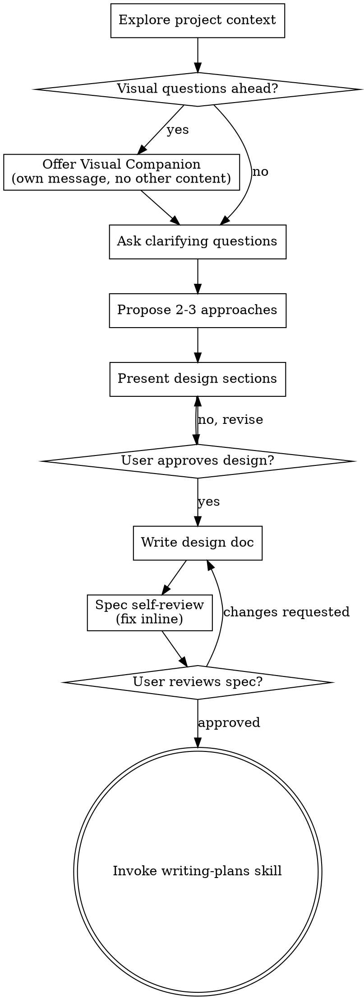

<!-- Generated by SpecStory, Markdown v2.1.0 -->

# 2026-04-28 09:52:14Z

<!-- Claude Code Session 16633d40-9f65-4db6-a40e-88647650714b (2026-04-28 09:52:14Z) -->

_**User (2026-04-28 09:52:14Z)**_

I need to make sure the WordSpell has the Levels as advanced mode. The advanced form should have every single options from the simple mode. Also, the default should be Level 1 as recall, not picture.

---

_**Agent (claude-opus-4-7 2026-04-28 09:52:21Z)**_

_**Agent (claude-opus-4-7 2026-04-28 09:52:21Z)**_

<tool-use data-tool-type="generic" data-tool-name="Skill"><details>
<summary>Tool use: **Skill**</summary>

```text
Launching skill: superpowers:brainstorming
```

</details></tool-use>

---

_**User (2026-04-28 09:52:21Z)**_

Base directory for this skill: /Users/leocaseiro/.claude/plugins/cache/claude-plugins-official/superpowers/5.0.7/skills/brainstorming

# Brainstorming Ideas Into Designs

Help turn ideas into fully formed designs and specs through natural collaborative dialogue.

Start by understanding the current project context, then ask questions one at a time to refine the idea. Once you understand what you're building, present the design and get user approval.

<HARD-GATE>
Do NOT invoke any implementation skill, write any code, scaffold any project, or take any implementation action until you have presented a design and the user has approved it. This applies to EVERY project regardless of perceived simplicity.
</HARD-GATE>

## Anti-Pattern: "This Is Too Simple To Need A Design"

Every project goes through this process. A todo list, a single-function utility, a config change — all of them. "Simple" projects are where unexamined assumptions cause the most wasted work. The design can be short (a few sentences for truly simple projects), but you MUST present it and get approval.

## Checklist

You MUST create a task for each of these items and complete them in order:

1. **Explore project context** — check files, docs, recent commits
2. **Offer visual companion** (if topic will involve visual questions) — this is its own message, not combined with a clarifying question. See the Visual Companion section below.
3. **Ask clarifying questions** — one at a time, understand purpose/constraints/success criteria
4. **Propose 2-3 approaches** — with trade-offs and your recommendation
5. **Present design** — in sections scaled to their complexity, get user approval after each section
6. **Write design doc** — save to `docs/superpowers/specs/YYYY-MM-DD-<topic>-design.md` and commit
7. **Spec self-review** — quick inline check for placeholders, contradictions, ambiguity, scope (see below)
8. **User reviews written spec** — ask user to review the spec file before proceeding
9. **Transition to implementation** — invoke writing-plans skill to create implementation plan

## Process Flow



**The terminal state is invoking writing-plans.** Do NOT invoke frontend-design, mcp-builder, or any other implementation skill. The ONLY skill you invoke after brainstorming is writing-plans.

## The Process

**Understanding the idea:**

- Check out the current project state first (files, docs, recent commits)
- Before asking detailed questions, assess scope: if the request describes multiple independent subsystems (e.g., "build a platform with chat, file storage, billing, and analytics"), flag this immediately. Don't spend questions refining details of a project that needs to be decomposed first.
- If the project is too large for a single spec, help the user decompose into sub-projects: what are the independent pieces, how do they relate, what order should they be built? Then brainstorm the first sub-project through the normal design flow. Each sub-project gets its own spec → plan → implementation cycle.
- For appropriately-scoped projects, ask questions one at a time to refine the idea
- Prefer multiple choice questions when possible, but open-ended is fine too
- Only one question per message - if a topic needs more exploration, break it into multiple questions
- Focus on understanding: purpose, constraints, success criteria

**Exploring approaches:**

- Propose 2-3 different approaches with trade-offs
- Present options conversationally with your recommendation and reasoning
- Lead with your recommended option and explain why

**Presenting the design:**

- Once you believe you understand what you're building, present the design
- Scale each section to its complexity: a few sentences if straightforward, up to 200-300 words if nuanced
- Ask after each section whether it looks right so far
- Cover: architecture, components, data flow, error handling, testing
- Be ready to go back and clarify if something doesn't make sense

**Design for isolation and clarity:**

- Break the system into smaller units that each have one clear purpose, communicate through well-defined interfaces, and can be understood and tested independently
- For each unit, you should be able to answer: what does it do, how do you use it, and what does it depend on?
- Can someone understand what a unit does without reading its internals? Can you change the internals without breaking consumers? If not, the boundaries need work.
- Smaller, well-bounded units are also easier for you to work with - you reason better about code you can hold in context at once, and your edits are more reliable when files are focused. When a file grows large, that's often a signal that it's doing too much.

**Working in existing codebases:**

- Explore the current structure before proposing changes. Follow existing patterns.
- Where existing code has problems that affect the work (e.g., a file that's grown too large, unclear boundaries, tangled responsibilities), include targeted improvements as part of the design - the way a good developer improves code they're working in.
- Don't propose unrelated refactoring. Stay focused on what serves the current goal.

## After the Design

**Documentation:**

- Write the validated design (spec) to `docs/superpowers/specs/YYYY-MM-DD-<topic>-design.md`
  - (User preferences for spec location override this default)
- Use elements-of-style:writing-clearly-and-concisely skill if available
- Commit the design document to git

**Spec Self-Review:**
After writing the spec document, look at it with fresh eyes:

1. **Placeholder scan:** Any "TBD", "TODO", incomplete sections, or vague requirements? Fix them.
2. **Internal consistency:** Do any sections contradict each other? Does the architecture match the feature descriptions?
3. **Scope check:** Is this focused enough for a single implementation plan, or does it need decomposition?
4. **Ambiguity check:** Could any requirement be interpreted two different ways? If so, pick one and make it explicit.

Fix any issues inline. No need to re-review — just fix and move on.

**User Review Gate:**
After the spec review loop passes, ask the user to review the written spec before proceeding:

> "Spec written and committed to `<path>`. Please review it and let me know if you want to make any changes before we start writing out the implementation plan."

Wait for the user's response. If they request changes, make them and re-run the spec review loop. Only proceed once the user approves.

**Implementation:**

- Invoke the writing-plans skill to create a detailed implementation plan
- Do NOT invoke any other skill. writing-plans is the next step.

## Key Principles

- **One question at a time** - Don't overwhelm with multiple questions
- **Multiple choice preferred** - Easier to answer than open-ended when possible
- **YAGNI ruthlessly** - Remove unnecessary features from all designs
- **Explore alternatives** - Always propose 2-3 approaches before settling
- **Incremental validation** - Present design, get approval before moving on
- **Be flexible** - Go back and clarify when something doesn't make sense

## Visual Companion

A browser-based companion for showing mockups, diagrams, and visual options during brainstorming. Available as a tool — not a mode. Accepting the companion means it's available for questions that benefit from visual treatment; it does NOT mean every question goes through the browser.

**Offering the companion:** When you anticipate that upcoming questions will involve visual content (mockups, layouts, diagrams), offer it once for consent:
> "Some of what we're working on might be easier to explain if I can show it to you in a web browser. I can put together mockups, diagrams, comparisons, and other visuals as we go. This feature is still new and can be token-intensive. Want to try it? (Requires opening a local URL)"

**This offer MUST be its own message.** Do not combine it with clarifying questions, context summaries, or any other content. The message should contain ONLY the offer above and nothing else. Wait for the user's response before continuing. If they decline, proceed with text-only brainstorming.

**Per-question decision:** Even after the user accepts, decide FOR EACH QUESTION whether to use the browser or the terminal. The test: **would the user understand this better by seeing it than reading it?**

- **Use the browser** for content that IS visual — mockups, wireframes, layout comparisons, architecture diagrams, side-by-side visual designs
- **Use the terminal** for content that is text — requirements questions, conceptual choices, tradeoff lists, A/B/C/D text options, scope decisions

A question about a UI topic is not automatically a visual question. "What does personality mean in this context?" is a conceptual question — use the terminal. "Which wizard layout works better?" is a visual question — use the browser.

If they agree to the companion, read the detailed guide before proceeding:
`skills/brainstorming/visual-companion.md`

---

_**Agent (claude-opus-4-7 2026-04-28 09:52:26Z)**_

_**Agent (claude-opus-4-7 2026-04-28 09:52:27Z)**_

Let me first explore the project to understand the current state of WordSpell, the Levels system, and the simple/advanced modes.

_**Agent (claude-opus-4-7 2026-04-28 09:52:30Z)**_

<tool-use data-tool-type="shell" data-tool-name="Bash"><details>
<summary>Tool use: **Bash**</summary>
Find WordSpell related directories

`find /Users/leocaseiro/Sites/base-skill/src -type d -name "*word*" -o -name "*spell*" 2>/dev/null | head -20`

```text
/Users/leocaseiro/Sites/base-skill/src/data/words
/Users/leocaseiro/Sites/base-skill/src/games/word-spell
/Users/leocaseiro/Sites/base-skill/src/db/schemas/word_spell_seen_words.test.ts
/Users/leocaseiro/Sites/base-skill/src/db/schemas/word_spell_seen_words.ts
/Users/leocaseiro/Sites/base-skill/src/games/word-spell/WordSpell/word-spell-initial-content.test.ts
/Users/leocaseiro/Sites/base-skill/src/games/word-spell/WordSpell/word-spell-initial-content.ts
```

</details></tool-use>

_**Agent (claude-opus-4-7 2026-04-28 09:52:30Z)**_

<tool-use data-tool-type="shell" data-tool-name="Bash"><details>
<summary>Tool use: **Bash**</summary>
Find WordSpell related files

`find /Users/leocaseiro/Sites/base-skill/src -type f \( -name "*WordSpell*" -o -name "*word-spell*" \) 2>/dev/null | head -30`

```text
/Users/leocaseiro/Sites/base-skill/src/routes/$locale/_app/game/resolveWordSpellConfig.test.ts
/Users/leocaseiro/Sites/base-skill/src/games/word-spell/WordSpell/word-spell-initial-content.test.ts
/Users/leocaseiro/Sites/base-skill/src/games/word-spell/WordSpell/WordSpell.stories.tsx
/Users/leocaseiro/Sites/base-skill/src/games/word-spell/WordSpell/WordSpell.tsx
/Users/leocaseiro/Sites/base-skill/src/games/word-spell/WordSpell/WordSpell.skin.stories.tsx
/Users/leocaseiro/Sites/base-skill/src/games/word-spell/WordSpell/WordSpell.flows.mdx
/Users/leocaseiro/Sites/base-skill/src/games/word-spell/WordSpell/WordSpell.test.tsx
/Users/leocaseiro/Sites/base-skill/src/games/word-spell/WordSpell/word-spell-initial-content.ts
/Users/leocaseiro/Sites/base-skill/src/games/word-spell/WordSpellSimpleConfigForm/WordSpellSimpleConfigForm.test.tsx
/Users/leocaseiro/Sites/base-skill/src/games/word-spell/WordSpellSimpleConfigForm/WordSpellSimpleConfigForm.tsx
```

</details></tool-use>

_**Agent (claude-opus-4-7 2026-04-28 09:52:33Z)**_

<tool-use data-tool-type="shell" data-tool-name="Bash"><details>
<summary>Tool use: **Bash**</summary>
List word-spell directory

`ls -la /Users/leocaseiro/Sites/base-skill/src/games/word-spell/`

```text
total 64
drwxr-xr-x@ 12 leocaseiro  staff   384 28 Apr 13:02 .
drwxr-xr-x@ 20 leocaseiro  staff   640 28 Apr 13:02 ..
-rw-r--r--@  1 leocaseiro  staff  1771  8 Apr 08:56 build-sentence-gap-round.test.ts
-rw-r--r--@  1 leocaseiro  staff   951  8 Apr 08:56 build-sentence-gap-round.ts
drwxr-xr-x@  5 leocaseiro  staff   160 28 Apr 13:02 LetterTileBank
-rw-r--r--@  1 leocaseiro  staff  1058 28 Apr 13:02 resolve-simple-config.test.ts
-rw-r--r--@  1 leocaseiro  staff   901 28 Apr 13:02 resolve-simple-config.ts
-rw-r--r--@  1 leocaseiro  staff  3053 28 Apr 13:02 types.ts
-rw-r--r--@  1 leocaseiro  staff  6240 28 Apr 13:02 useLibraryRounds.test.tsx
-rw-r--r--@  1 leocaseiro  staff  2778 28 Apr 13:02 useLibraryRounds.ts
drwxr-xr-x@  9 leocaseiro  staff   288 28 Apr 13:02 WordSpell
drwxr-xr-x@  4 leocaseiro  staff   128 28 Apr 13:02 WordSpellSimpleConfigForm
```

</details></tool-use>

_**Agent (claude-opus-4-7 2026-04-28 09:52:34Z)**_

<tool-use data-tool-type="shell" data-tool-name="Bash"><details>
<summary>Tool use: **Bash**</summary>
Find Level related directories

`find /Users/leocaseiro/Sites/base-skill/src -type d -name "*Level*" 2>/dev/null | head -20`

```text
/Users/leocaseiro/Sites/base-skill/src/components/answer-game/LevelCompleteOverlay
```

</details></tool-use>

_**Agent (claude-opus-4-7 2026-04-28 09:52:35Z)**_

<tool-use data-tool-type="shell" data-tool-name="Bash"><details>
<summary>Tool use: **Bash**</summary>
Find Advanced config files

`find /Users/leocaseiro/Sites/base-skill/src -type f -name "*Advanced*" 2>/dev/null | head -20`

```text
/Users/leocaseiro/Sites/base-skill/src/components/AdvancedConfigModal.tsx
/Users/leocaseiro/Sites/base-skill/src/components/AdvancedConfigModal.test.tsx
```

</details></tool-use>

_**Agent (claude-opus-4-7 2026-04-28 09:52:37Z)**_

<tool-use data-tool-type="read" data-tool-name="Read"><details>
<summary>Tool use: **Read**</summary>
 `./src/games/word-spell/types.ts`

```text
1 import type { AnswerGameConfig } from '@/components/answer-game/types';
2 import type { WordSpellSource } from '@/data/words';
3 import type { ConfigField } from '@/lib/config-fields';
4 
5 export type WordSpellSimpleConfig = {
6   configMode: 'simple';
7   level: number;
8   phonemesAllowed: string[];
9   inputMethod: 'drag' | 'type' | 'both';
10 };
11 
12 export interface GapDefinition {
13   word: string;
14   distractors?: string[];
15 }
16 
17 export interface WordSpellRound {
18   word: string;
19   /**
20    * Native emoji (or ZWJ sequence) for picture mode. When set, this is shown instead of `image` / `sceneImage`.
21    */
22   emoji?: string;
23   /** Fluent Emoji SVG path, URL, or `/public` asset path (picture/sentence-gap modes) */
24   image?: string;
25   /** Sentence with a blank for sentence-gap mode: "The ___ sat on the mat." */
26   sentence?: string;
27   /** Scene illustration for sentence-gap mode */
28   sceneImage?: string;
29   /** Optional custom audio override instead of TTS */
30   audioOverride?: string;
31   /** Gap definitions for sentence-gap mode. Each entry maps to a {N} placeholder. */
32   gaps?: GapDefinition[];
33 }
34 
35 export interface WordSpellConfig extends AnswerGameConfig {
36   component: 'WordSpell';
37   configMode?: 'simple' | 'advanced';
38   mode: 'picture' | 'scramble' | 'recall' | 'sentence-gap';
39   /** @default 'letter' */
40   tileUnit: 'letter' | 'syllable' | 'word';
41   /** Explicit hand-authored rounds. Wins over `source` when both are present. */
42   rounds?: WordSpellRound[];
43   /** Library-driven rounds. Resolved at WordSpell mount time. */
44   source?: WordSpellSource;
45 }
46 
47 export const wordSpellConfigFields: ConfigField[] = [
48   {
49     type: 'select',
50     key: 'inputMethod',
51     label: 'Input method',
52     options: [
53       { value: 'drag', label: 'drag' },
54       { value: 'type', label: 'type' },
55       { value: 'both', label: 'both' },
56     ],
57   },
58   {
59     type: 'select',
60     key: 'wrongTileBehavior',
61     label: 'Wrong tile behaviour',
62     options: [
63       { value: 'reject', label: 'reject' },
64       { value: 'lock-manual', label: 'lock-manual' },
65       { value: 'lock-auto-eject', label: 'lock-auto-eject' },
66     ],
67   },
68   {
69     type: 'select',
70     key: 'tileBankMode',
71     label: 'Tile bank mode',
72     options: [
73       { value: 'exact', label: 'exact' },
74       { value: 'distractors', label: 'distractors' },
75     ],
76   },
77   {
78     type: 'number',
79     key: 'totalRounds',
80     label: 'Total rounds',
81     min: 1,
82     max: 8,
83   },
84   {
85     type: 'select',
86     key: 'mode',
87     label: 'Mode',
88     options: [
89       { value: 'picture', label: 'picture' },
90       { value: 'scramble', label: 'scramble' },
91       { value: 'recall', label: 'recall' },
92       { value: 'sentence-gap', label: 'sentence-gap' },
93     ],
94   },
95   {
96     type: 'select',
97     key: 'tileUnit',
98     label: 'Tile unit',
99     options: [
100       { value: 'letter', label: 'letter' },
101       { value: 'syllable', label: 'syllable' },
102       { value: 'word', label: 'word' },
103     ],
104   },
105   { type: 'checkbox', key: 'roundsInOrder', label: 'Rounds in order' },
106   { type: 'checkbox', key: 'ttsEnabled', label: 'TTS enabled' },
107 ];
108
```

</details></tool-use>

_**Agent (claude-opus-4-7 2026-04-28 09:52:38Z)**_

<tool-use data-tool-type="read" data-tool-name="Read"><details>
<summary>Tool use: **Read**</summary>
 `./src/games/word-spell/WordSpellSimpleConfigForm/WordSpellSimpleConfigForm.tsx`

```text
1 import type { JSX } from 'react';
2 import { CellSelect } from '@/components/config/CellSelect';
3 import { ChipStrip } from '@/components/config/ChipStrip';
4 import { ChunkGroup } from '@/components/config/ChunkGroup';
5 import { GRAPHEMES_BY_LEVEL } from '@/data/words/levels';
6 
7 type Props = {
8   config: Record<string, unknown>;
9   onChange: (config: Record<string, unknown>) => void;
10 };
11 
12 const LEVEL_OPTIONS = Object.keys(GRAPHEMES_BY_LEVEL).map((n) => ({
13   value: n,
14   label: `Level ${n}`,
15 }));
16 
17 export const WordSpellSimpleConfigForm = ({
18   config,
19   onChange,
20 }: Props): JSX.Element => {
21   const source =
22     typeof config.source === 'object' && config.source !== null
23       ? (config.source as {
24           type: 'word-library';
25           filter: {
26             region: string;
27             level: number;
28             phonemesAllowed?: string[];
29           };
30         })
31       : undefined;
32   const level =
33     typeof source?.filter.level === 'number' ? source.filter.level : 1;
34   const inputMethod =
35     config.inputMethod === 'type' || config.inputMethod === 'both'
36       ? config.inputMethod
37       : 'drag';
38 
39   const unitsAtLevel = GRAPHEMES_BY_LEVEL[level] ?? [];
40   // Multiple graphemes can teach the same phoneme at one level
41   // (e.g. level 2 has c, k, ck → /k/). Collapse them into one chip per sound
42   // so toggling is unambiguous.
43   const phonemeToGraphemes = new Map<string, string[]>();
44   for (const u of unitsAtLevel) {
45     const existing = phonemeToGraphemes.get(u.p);
46     if (existing) {
47       existing.push(u.g);
48     } else {
49       phonemeToGraphemes.set(u.p, [u.g]);
50     }
51   }
52   const allPhonemesAtLevel = [...phonemeToGraphemes.keys()];
53   const phonemesAllowed =
54     source?.filter.phonemesAllowed ?? allPhonemesAtLevel;
55   const chips = allPhonemesAtLevel.map((p) => ({
56     value: p,
57     label: `${(phonemeToGraphemes.get(p) ?? []).join(', ')} /${p}/`,
58   }));
59 
60   const setLevel = (n: number) => {
61     const available = [
62       ...new Set((GRAPHEMES_BY_LEVEL[n] ?? []).map((u) => u.p)),
63     ];
64     onChange({
65       ...config,
66       source: {
67         type: 'word-library',
68         filter: {
69           ...(source?.filter ?? { region: 'aus' }),
70           level: n,
71           phonemesAllowed: available,
72         },
73       },
74     });
75   };
76 
77   const setPhonemes = (next: string[]) => {
78     onChange({
79       ...config,
80       source: {
81         type: 'word-library',
82         filter: {
83           ...(source?.filter ?? { region: 'aus' }),
84           level,
85           phonemesAllowed: next,
86         },
87       },
88     });
89   };
90 
91   const invalid = phonemesAllowed.length === 0;
92 
93   return (
94     <div
95       className="flex flex-col gap-4"
96       data-invalid={invalid ? 'true' : 'false'}
97     >
98       <div className="flex flex-col gap-1 text-xs font-semibold uppercase text-muted-foreground">
99         Level
100         <CellSelect
101           label="Level"
102           value={String(level)}
103           options={LEVEL_OPTIONS}
104           onChange={(v) => setLevel(Number(v))}
105         />
106       </div>
107 
108       <div>
109         <div className="text-xs font-semibold uppercase text-muted-foreground">
110           Sounds at this level (tap to toggle)
111         </div>
112         <div className="mt-2">
113           <ChipStrip
114             chips={chips}
115             selected={phonemesAllowed}
116             mode="toggleable"
117             onChange={setPhonemes}
118           />
119         </div>
120         {invalid && (
121           <p className="mt-2 text-xs text-destructive">
122             Pick at least one sound to play.
123           </p>
124         )}
125       </div>
126 
127       <ChunkGroup
128         label="How do you answer?"
129         options={[
130           { value: 'drag', emoji: '✋', label: 'Drag' },
131           { value: 'type', emoji: '⌨️', label: 'Type' },
132           { value: 'both', emoji: '✨', label: 'Both' },
133         ]}
134         value={inputMethod}
135         onChange={(m) => onChange({ ...config, inputMethod: m })}
136       />
137     </div>
138   );
139 };
140
```

</details></tool-use>

_**Agent (claude-opus-4-7 2026-04-28 09:52:41Z)**_

<tool-use data-tool-type="read" data-tool-name="Read"><details>
<summary>Tool use: **Read**</summary>
 `./src/components/AdvancedConfigModal.tsx`

```text
1 import { Trash2 } from 'lucide-react';
2 import { useRef, useState } from 'react';
3 import { useTranslation } from 'react-i18next';
4 import type { Cover } from '@/games/cover-type';
5 import type { GameColorKey } from '@/lib/game-colors';
6 import type { JSX } from 'react';
7 import { ConfigFormFields } from '@/components/ConfigFormFields';
8 import { CoverPicker } from '@/components/CoverPicker';
9 import {
10   Dialog,
11   DialogContent,
12   DialogHeader,
13   DialogTitle,
14 } from '@/components/ui/dialog';
15 import { getAdvancedConfigFields } from '@/games/config-fields-registry';
16 import {
17   DEFAULT_GAME_COLOR,
18   GAME_COLORS,
19   GAME_COLOR_KEYS,
20 } from '@/lib/game-colors';
21 
22 export type AdvancedConfigModalMode =
23   | { kind: 'default' }
24   | {
25       kind: 'customGame';
26       configId: string;
27       name: string;
28       color: GameColorKey;
29       cover: Cover | undefined;
30     };
31 
32 type SavePayload = {
33   configId?: string;
34   name: string;
35   color: GameColorKey;
36   cover: Cover | undefined;
37   config: Record<string, unknown>;
38 };
39 
40 type AdvancedConfigModalProps = {
41   open: boolean;
42   onOpenChange: (next: boolean) => void;
43   gameId: string;
44   mode: AdvancedConfigModalMode;
45   config: Record<string, unknown>;
46   onCancel: () => void;
47   onUpdate?: (payload: SavePayload) => void;
48   onSaveNew: (payload: SavePayload) => void;
49   /** Invoked when the user confirms deletion of the current custom game. */
50   onDelete?: (configId: string) => Promise<void> | void;
51   /** Names of existing custom games for this game — used to surface duplicate-name errors inline. */
52   existingCustomGameNames?: readonly string[];
53 };
54 
55 export const AdvancedConfigModal = ({
56   open,
57   onOpenChange,
58   gameId,
59   mode,
60   config: initialConfig,
61   onCancel,
62   onUpdate,
63   onSaveNew,
64   onDelete,
65   existingCustomGameNames = [],
66 }: AdvancedConfigModalProps): JSX.Element => {
67   const { t } = useTranslation('games');
68   const [config, setConfig] =
69     useState<Record<string, unknown>>(initialConfig);
70   const [cover, setCover] = useState<Cover | undefined>(
71     mode.kind === 'customGame' ? mode.cover : undefined,
72   );
73   const [name, setName] = useState<string>(
74     mode.kind === 'customGame' ? mode.name : '',
75   );
76   const [color, setColor] = useState<GameColorKey>(
77     mode.kind === 'customGame' ? mode.color : DEFAULT_GAME_COLOR,
78   );
79   const [submitAttempted, setSubmitAttempted] = useState(false);
80   const [confirmDeleteOpen, setConfirmDeleteOpen] = useState(false);
81   const nameInputRef = useRef<HTMLInputElement>(null);
82 
83   const fields = getAdvancedConfigFields(gameId);
84 
85   const trimmedName = name.trim();
86   const currentCustomGameName =
87     mode.kind === 'customGame' ? mode.name : null;
88   const namesTaken = new Set(
89     existingCustomGameNames.filter((n) => n !== currentCustomGameName),
90   );
91 
92   const nameError: string | null = (() => {
93     if (trimmedName === '')
94       return t('instructions.nameRequired', {
95         defaultValue: 'Please enter a custom game name.',
96       });
97     if (namesTaken.has(trimmedName))
98       return t('instructions.nameDuplicate', {
99         defaultValue: 'A custom game with that name already exists.',
100       });
101     return null;
102   })();
103 
104   const saveNewInvalid = nameError !== null;
105   const updateIsRename =
106     currentCustomGameName !== null &&
107     trimmedName !== currentCustomGameName;
108   const updateInvalid = updateIsRename && nameError !== null;
109   const showNameError = submitAttempted && nameError !== null;
110 
111   const payload: SavePayload = {
112     configId: mode.kind === 'customGame' ? mode.configId : undefined,
113     name: trimmedName,
114     color,
115     cover,
116     // Saving from the advanced modal marks the config as advanced — otherwise
117     // a lingering `configMode: 'simple'` causes the route resolver to rebuild
118     // the config from simple-form fields only, wiping advanced-only choices
119     // like wrongTileBehavior on reload.
120     config: { ...config, configMode: 'advanced' },
121   };
122 
123   const handleSaveNew = () => {
124     setSubmitAttempted(true);
125     if (saveNewInvalid) {
126       nameInputRef.current?.focus();
127       return;
128     }
129     onSaveNew(payload);
130   };
131 
132   const handleUpdate = () => {
133     if (!onUpdate) return;
134     setSubmitAttempted(true);
135     if (updateInvalid) {
136       nameInputRef.current?.focus();
137       return;
138     }
139     onUpdate(payload);
140   };
141 
142   const handleConfirmDelete = () => {
143     if (mode.kind !== 'customGame' || !onDelete) return;
144     void (async () => {
145       try {
146         await onDelete(mode.configId);
147       } finally {
148         setConfirmDeleteOpen(false);
149         onOpenChange(false);
150       }
151     })();
152   };
153 
154   return (
155     <Dialog open={open} onOpenChange={onOpenChange}>
156       <DialogContent className="max-h-[90vh] overflow-y-auto">
157         <DialogHeader>
158           <DialogTitle>
159             {mode.kind === 'customGame'
160               ? mode.name
161               : 'Advanced settings'}
162           </DialogTitle>
163         </DialogHeader>
164 
165         <div className="flex flex-col gap-4">
166           <CoverPicker value={cover} onChange={setCover} />
167 
168           <label className="flex flex-col gap-1">
169             <span className="text-xs font-semibold uppercase text-muted-foreground">
170               {t('instructions.customGameNameLabel', {
171                 defaultValue: 'Custom game name',
172               })}
173             </span>
174             <input
175               ref={nameInputRef}
176               type="text"
177               value={name}
178               onChange={(e) => setName(e.target.value)}
179               placeholder="e.g. Skip by 2"
180               aria-invalid={showNameError}
181               aria-describedby={
182                 showNameError ? 'custom-game-name-error' : undefined
183               }
184               className={`h-10 rounded-lg border bg-background px-3 text-sm ${
185                 showNameError ? 'border-destructive' : 'border-input'
186               }`}
187             />
188             {showNameError && (
189               <span
190                 id="custom-game-name-error"
191                 role="alert"
192                 className="text-xs font-semibold text-destructive"
193               >
194                 {nameError}
195               </span>
196             )}
197           </label>
198 
199           <div>
200             <div className="text-xs font-semibold uppercase text-muted-foreground">
201               Color
202             </div>
203             <div
204               className="mt-1 grid gap-1"
205               style={{ gridTemplateColumns: 'repeat(6, 1fr)' }}
206               role="group"
207               aria-label="Custom game color"
208             >
209               {GAME_COLOR_KEYS.map((key) => (
210                 <button
211                   key={key}
212                   type="button"
213                   aria-label={key}
214                   aria-pressed={color === key}
215                   onClick={() => setColor(key)}
216                   className="h-8 w-8 rounded-full border-2 transition-transform hover:scale-110"
217                   style={{
218                     background: GAME_COLORS[key].playBg,
219                     borderColor:
220                       color === key
221                         ? GAME_COLORS[key].playBg
222                         : 'transparent',
223                     outline:
224                       color === key ? '3px solid white' : undefined,
225                     outlineOffset: color === key ? '-4px' : undefined,
226                     boxShadow:
227                       color === key
228                         ? `0 0 0 2px ${GAME_COLORS[key].playBg}`
229                         : undefined,
230                   }}
231                 />
232               ))}
233             </div>
234           </div>
235 
236           <ConfigFormFields
237             fields={fields}
238             config={config}
239             onChange={setConfig}
240           />
241 
242           <div className="flex flex-wrap gap-2 border-t border-border pt-3">
243             {mode.kind === 'customGame' && onDelete && (
244               <button
245                 type="button"
246                 onClick={() => setConfirmDeleteOpen(true)}
247                 className="flex items-center gap-1 rounded-lg border border-destructive bg-background px-3 py-2 text-sm font-semibold text-destructive"
248               >
249                 <Trash2 size={14} aria-hidden="true" />
250                 {t('instructions.delete', { defaultValue: 'Delete' })}
251               </button>
252             )}
253             <button
254               type="button"
255               onClick={onCancel}
256               className="flex-1 rounded-lg border border-input bg-background py-2 text-sm"
257             >
258               {t('instructions.cancel', { defaultValue: 'Cancel' })}
259             </button>
260             {mode.kind === 'customGame' && onUpdate && (
261               <button
262                 type="button"
263                 onClick={handleUpdate}
264                 aria-disabled={updateInvalid}
265                 className="flex-1 rounded-lg bg-primary py-2 text-sm font-bold text-primary-foreground"
266               >
267                 {t('instructions.updateCustomGame', {
268                   name: mode.name,
269                   defaultValue: `Update "${mode.name}"`,
270                 })}
271               </button>
272             )}
273             <button
274               type="button"
275               onClick={handleSaveNew}
276               aria-disabled={saveNewInvalid}
277               className={`flex-1 rounded-lg py-2 text-sm font-bold ${
278                 mode.kind === 'default'
279                   ? 'bg-primary text-primary-foreground'
280                   : 'border border-input bg-background'
281               }`}
282             >
283               {t('instructions.saveAsNew', {
284                 defaultValue: 'Save as new custom game',
285               })}
286             </button>
287           </div>
288         </div>
289       </DialogContent>
290 
291       {mode.kind === 'customGame' && onDelete && (
292         <Dialog
293           open={confirmDeleteOpen}
294           onOpenChange={setConfirmDeleteOpen}
295         >
296           <DialogContent>
297             <DialogHeader>
298               <DialogTitle>
299                 {t('instructions.deleteConfirmTitle', {
300                   name: mode.name,
301                   defaultValue: `Delete "${mode.name}"?`,
302                 })}
303               </DialogTitle>
304             </DialogHeader>
305             <p className="text-sm text-muted-foreground">
306               {t('instructions.deleteConfirmBody', {
307                 defaultValue:
308                   "This custom game will be removed. You can't undo this.",
309               })}
310             </p>
311             <div className="flex justify-end gap-2 pt-2">
312               <button
313                 type="button"
314                 onClick={() => setConfirmDeleteOpen(false)}
315                 className="rounded-lg border border-input bg-background px-4 py-2 text-sm"
316               >
317                 {t('instructions.cancel', { defaultValue: 'Cancel' })}
318               </button>
319               <button
320                 type="button"
321                 onClick={handleConfirmDelete}
322                 className="rounded-lg bg-destructive px-4 py-2 text-sm font-bold text-destructive-foreground"
323               >
324                 {t('instructions.delete', { defaultValue: 'Delete' })}
325               </button>
326             </div>
327           </DialogContent>
328         </Dialog>
329       )}
330     </Dialog>
331   );
332 };
333
```

</details></tool-use>

_**Agent (claude-opus-4-7 2026-04-28 09:52:48Z)**_

_**Agent (claude-opus-4-7 2026-04-28 09:52:49Z)**_

<tool-use data-tool-type="shell" data-tool-name="Bash"><details>
<summary>Tool use: **Bash**</summary>
Find config-fields-registry

`find /Users/leocaseiro/Sites/base-skill/src -type f -name "config-fields-registry*" -o -name "*config-fields*" 2>/dev/null | head -10`

```text
/Users/leocaseiro/Sites/base-skill/src/lib/config-fields.ts
/Users/leocaseiro/Sites/base-skill/src/games/config-fields-registry.ts
```

</details></tool-use>

_**Agent (claude-opus-4-7 2026-04-28 09:52:50Z)**_

<tool-use data-tool-type="read" data-tool-name="Read"><details>
<summary>Tool use: **Read**</summary>
 `./src/games/word-spell/WordSpell/word-spell-initial-content.ts`

```text
1 import type { WordSpellConfig, WordSpellRound } from '../types';
2 
3 /**
4  * Shape persisted into `session_history_index.initialContent` for WordSpell
5  * sessions. Lives alongside the engine's placeholder `rounds` field so the
6  * engine contract is unchanged while WordSpell can reconstruct its own state
7  * deterministically on resume.
8  */
9 export interface WordSpellPersistedContent {
10   wordSpellRounds: WordSpellRound[];
11   roundOrder: readonly number[];
12   tileUnit: WordSpellConfig['tileUnit'];
13   mode: WordSpellConfig['mode'];
14 }
15 
16 export const WORD_SPELL_CONTENT_MARKER = 'wordSpellRounds';
17 
18 export const buildWordSpellInitialContent = (input: {
19   rounds: readonly WordSpellRound[];
20   roundOrder: readonly number[];
21   tileUnit: WordSpellConfig['tileUnit'];
22   mode: WordSpellConfig['mode'];
23 }): WordSpellPersistedContent => ({
24   wordSpellRounds: input.rounds.map((r) => ({ ...r })),
25   roundOrder: [...input.roundOrder],
26   tileUnit: input.tileUnit,
27   mode: input.mode,
28 });
29 
30 /** True when a stored `initialContent` already carries WordSpell data. */
31 export const hasWordSpellPersistedContent = (
32   initialContent: Record<string, unknown> | null | undefined,
33 ): initialContent is Record<string, unknown> &
34   WordSpellPersistedContent => {
35   if (!initialContent) return false;
36   const rounds = initialContent[WORD_SPELL_CONTENT_MARKER];
37   const order = initialContent.roundOrder;
38   return (
39     Array.isArray(rounds) && rounds.length > 0 && Array.isArray(order)
40   );
41 };
42 
43 /**
44  * Sorted-letters equality check for a word. Used by the resume-alignment
45  * invariant: the tiles in the persisted draft must match the letters of
46  * the word at `roundOrder[draftState.roundIndex]`.
47  */
48 export const sortedLetters = (value: string): string =>
49   [...value.toLowerCase()]
50     .toSorted((a, b) => a.localeCompare(b))
51     .join('');
52 
53 /**
54  * True when a persisted draft's tiles match the expected letters of the
55  * round pointed to by `draftState.roundIndex`. When false, the draft came
56  * from a different `roundOrder` (e.g. word pool drift) and must be
57  * discarded — otherwise the tiles render one word while TTS speaks another.
58  */
59 export const isDraftAlignedWithRound = (input: {
60   draftTileValues: readonly string[];
61   roundWord: string;
62 }): boolean => {
63   const { draftTileValues, roundWord } = input;
64   if (draftTileValues.length === 0 || roundWord.length === 0)
65     return false;
66   return (
67     sortedLetters(draftTileValues.join('')) === sortedLetters(roundWord)
68   );
69 };
70
```

</details></tool-use>

_**Agent (claude-opus-4-7 2026-04-28 09:52:51Z)**_

<tool-use data-tool-type="read" data-tool-name="Read"><details>
<summary>Tool use: **Read**</summary>
 `./src/routes/$locale/_app/game/resolveWordSpellConfig.test.ts`

```text
1 import { describe, expect, it } from 'vitest';
2 import { resolveWordSpellConfig } from './$gameId';
3 
4 describe('resolveWordSpellConfig', () => {
5   it('preserves source and drops explicit rounds for simple-mode saved configs', () => {
6     const saved = {
7       component: 'WordSpell',
8       configMode: 'simple',
9       source: {
10         type: 'word-library',
11         filter: {
12           region: 'aus',
13           level: 2,
14           phonemesAllowed: ['s', 'a', 't'],
15         },
16       },
17       inputMethod: 'drag',
18     };
19 
20     const resolved = resolveWordSpellConfig(saved);
21 
22     expect(resolved.configMode).toBe('simple');
23     expect(resolved.source).toEqual(saved.source);
24     // Critically: no explicit rounds array — otherwise useLibraryRounds
25     // short-circuits and returns emoji defaults instead of library words.
26     expect(resolved.rounds ?? []).toEqual([]);
27     expect(resolved.roundsInOrder).toBe(false);
28   });
29 
30   it('leaves advanced saved configs alone (emoji rounds preserved)', () => {
31     const saved = {
32       component: 'WordSpell',
33       configMode: 'advanced',
34       totalRounds: 4,
35     };
36 
37     const resolved = resolveWordSpellConfig(saved);
38 
39     expect(resolved.rounds).toBeDefined();
40     expect(resolved.rounds?.length).toBe(4);
41     expect(resolved.source).toBeUndefined();
42   });
43 
44   it('drops explicit rounds when advanced saved config has a source', () => {
45     const saved = {
46       component: 'WordSpell',
47       configMode: 'advanced',
48       source: {
49         type: 'word-library',
50         filter: { region: 'aus', level: 2 },
51       },
52       totalRounds: 4,
53     };
54 
55     const resolved = resolveWordSpellConfig(saved);
56 
57     expect(resolved.source).toEqual(saved.source);
58     expect(resolved.rounds ?? []).toEqual([]);
59   });
60 
61   it('returns emoji-based default when saved is null', () => {
62     const resolved = resolveWordSpellConfig(null);
63     expect(resolved.rounds?.length).toBe(8);
64     expect(resolved.source).toBeUndefined();
65   });
66 });
67
```

</details></tool-use>

_**Agent (claude-opus-4-7 2026-04-28 09:52:54Z)**_

<tool-use data-tool-type="read" data-tool-name="Read"><details>
<summary>Tool use: **Read**</summary>
 `./src/games/config-fields-registry.ts`

```text
1 import { NumberMatchSimpleConfigForm } from './number-match/NumberMatchSimpleConfigForm/NumberMatchSimpleConfigForm';
2 import { numberMatchConfigFields } from './number-match/types';
3 import { SortNumbersSimpleConfigForm } from './sort-numbers/SortNumbersSimpleConfigForm/SortNumbersSimpleConfigForm';
4 import { sortNumbersConfigFields } from './sort-numbers/types';
5 import { wordSpellConfigFields } from './word-spell/types';
6 import { WordSpellSimpleConfigForm } from './word-spell/WordSpellSimpleConfigForm/WordSpellSimpleConfigForm';
7 import type { ConfigField } from '@/lib/config-fields';
8 import type { JSX } from 'react';
9 
10 export const getConfigFields = (gameId: string): ConfigField[] => {
11   switch (gameId) {
12     case 'word-spell': {
13       return wordSpellConfigFields;
14     }
15     case 'number-match': {
16       return numberMatchConfigFields;
17     }
18     case 'sort-numbers': {
19       return sortNumbersConfigFields;
20     }
21     default: {
22       return [];
23     }
24   }
25 };
26 
27 export const getAdvancedConfigFields = getConfigFields;
28 
29 type ConfigFormRendererProps = {
30   config: Record<string, unknown>;
31   onChange: (config: Record<string, unknown>) => void;
32 };
33 
34 type ConfigFormRenderer = (
35   props: ConfigFormRendererProps,
36 ) => JSX.Element;
37 
38 export const getSimpleConfigFormRenderer = (
39   gameId: string,
40 ): ConfigFormRenderer | undefined => {
41   switch (gameId) {
42     case 'word-spell': {
43       return WordSpellSimpleConfigForm;
44     }
45     case 'number-match': {
46       return NumberMatchSimpleConfigForm;
47     }
48     case 'sort-numbers': {
49       return SortNumbersSimpleConfigForm;
50     }
51     default: {
52       return undefined;
53     }
54   }
55 };
56
```

</details></tool-use>

_**Agent (claude-opus-4-7 2026-04-28 09:52:58Z)**_

_**Agent (claude-opus-4-7 2026-04-28 09:52:58Z)**_

<tool-use data-tool-type="shell" data-tool-name="Bash"><details>
<summary>Tool use: **Bash**</summary>
Find resolveWordSpellConfig in route

`grep -n "resolveWordSpellConfig\|defaultConfig\|word-spell" /Users/leocaseiro/Sites/base-skill/src/routes/\$locale/_app/game/\$gameId.tsx 2>/dev/null | head -40`

```text
15:} from '@/games/word-spell/types';
39:import { resolveSimpleConfig as resolveWordSpellSimpleConfig } from '@/games/word-spell/resolve-simple-config';
40:import { WordSpell } from '@/games/word-spell/WordSpell/WordSpell';
97:  gameId: 'word-spell',
191:export const resolveWordSpellConfig = (
203:  // Delegate to word-spell's resolveSimpleConfig so library words load
228:    gameId: 'word-spell',
414:    () => resolveWordSpellConfig(gameSpecificConfig),
432:        text={t('instructions.word-spell')}
435:        gameTitle={t('word-spell')}
444:        onConfigChange={(c) => setCfg(resolveWordSpellConfig(c))}
747:  if (gameId === 'word-spell') {
838:    const defaultConfig = makeDefaultConfig(gameId);
859:        config: defaultConfig,
867:          gradeBand: defaultConfig.gradeBand,
885:      defaultConfig.gradeBand,
887:      defaultConfig,
```

</details></tool-use>

_**Agent (claude-opus-4-7 2026-04-28 09:53:00Z)**_

<tool-use data-tool-type="shell" data-tool-name="Bash"><details>
<summary>Tool use: **Bash**</summary>
List route files

`find /Users/leocaseiro/Sites/base-skill/src/routes -type f -name "*.tsx" 2>/dev/null | head -20`

```text
/Users/leocaseiro/Sites/base-skill/src/routes/__root.test.tsx
/Users/leocaseiro/Sites/base-skill/src/routes/index.tsx
/Users/leocaseiro/Sites/base-skill/src/routes/__root.tsx
/Users/leocaseiro/Sites/base-skill/src/routes/$locale/route.tsx
/Users/leocaseiro/Sites/base-skill/src/routes/$locale/_app-chrome-behavior.test.tsx
/Users/leocaseiro/Sites/base-skill/src/routes/$locale/_app.tsx
/Users/leocaseiro/Sites/base-skill/src/routes/$locale/_app/settings.tsx
/Users/leocaseiro/Sites/base-skill/src/routes/$locale/_app/index.tsx
/Users/leocaseiro/Sites/base-skill/src/routes/$locale/_app/index.test.tsx
/Users/leocaseiro/Sites/base-skill/src/routes/$locale/_app/parent.tsx
/Users/leocaseiro/Sites/base-skill/src/routes/$locale/_app/game/$gameId.tsx
/Users/leocaseiro/Sites/base-skill/src/routes/$locale/_app/game/$gameId.test.tsx
/Users/leocaseiro/Sites/base-skill/src/routes/$locale/_app/parent/index.tsx
/Users/leocaseiro/Sites/base-skill/src/routes/$locale/_app/parent/overrides.tsx
/Users/leocaseiro/Sites/base-skill/src/routes/$locale/_app/parent/data.tsx
/Users/leocaseiro/Sites/base-skill/src/routes/$locale/_app/parent/sync.tsx
/Users/leocaseiro/Sites/base-skill/src/routes/$locale/_app/parent/history.tsx
/Users/leocaseiro/Sites/base-skill/src/routes/$locale/_app/parent/voices.tsx
```

</details></tool-use>

_**Agent (claude-opus-4-7 2026-04-28 09:53:02Z)**_

<tool-use data-tool-type="read" data-tool-name="Read"><details>
<summary>Tool use: **Read**</summary>
 `./src/routes/$locale/_app/game/$gameId.tsx`

```text
180 
181 const makeDefaultSortNumbersConfig = (): SortNumbersConfig =>
182   resolveSimpleConfig({
183     configMode: 'simple',
184     direction: 'ascending',
185     start: 2,
186     step: 2,
187     quantity: 5,
188     distractors: false,
189   });
190 
191 export const resolveWordSpellConfig = (
192   saved: Record<string, unknown> | null,
193 ): WordSpellConfig => {
194   const base: WordSpellConfig = {
195     ...DEFAULT_WORD_SPELL_CONFIG,
196     rounds: (DEFAULT_WORD_SPELL_CONFIG.rounds ?? []).map((r) => ({
197       ...r,
198     })),
199   };
200   if (!saved || saved.component !== 'WordSpell') return base;
201 
202   // Simple mode: library-sourced config from the Simple Config form.
203   // Delegate to word-spell's resolveSimpleConfig so library words load
204   // instead of the emoji-round fallback.
205   if (saved.configMode === 'simple') {
206     const savedSource = saved.source as
207       | { filter?: Record<string, unknown> }
208       | undefined;
209     const savedFilter = savedSource?.filter;
210     const savedInput = saved.inputMethod;
211     return resolveWordSpellSimpleConfig({
212       configMode: 'simple',
213       level:
214         typeof savedFilter?.level === 'number' ? savedFilter.level : 1,
215       phonemesAllowed: Array.isArray(savedFilter?.phonemesAllowed)
216         ? (savedFilter.phonemesAllowed as string[])
217         : [],
218       inputMethod:
219         savedInput === 'type' || savedInput === 'both'
220           ? savedInput
221           : 'drag',
222     });
223   }
224 
225   const merged: WordSpellConfig = {
226     ...base,
227     ...(saved as Partial<WordSpellConfig>),
228     gameId: 'word-spell',
229     component: 'WordSpell',
230   };
231 
232   // Library-sourced advanced configs: drop the emoji fallback rounds so
233   // useLibraryRounds samples from the library instead of short-circuiting
234   // to the explicit rounds branch.
235   if (merged.source) {
236     const { rounds: _rounds, ...rest } = merged;
237     return { ...rest };
238   }
239 
240   const targetTotal = Math.max(
241     1,
242     Math.min(
243       merged.totalRounds > 0 ? merged.totalRounds : base.totalRounds,
244       WORD_SPELL_ROUND_POOL.length,
245     ),
246   );
247   if (
248     !Array.isArray(merged.rounds) ||
249     merged.rounds.length === 0 ||
250     merged.rounds.length !== targetTotal
251   ) {
252     merged.rounds = sliceWordSpellRounds(targetTotal);
253   }
254   merged.totalRounds = merged.rounds.length;
255   return merged;
256 };
257 
258 const resolveNumberMatchConfig = (
259   saved: Record<string, unknown> | null,
260 ): NumberMatchConfig => {
261   const base = makeDefaultNumberMatchConfig();
262   if (!saved || saved.component !== 'NumberMatch') return base;
263   const merged: NumberMatchConfig = {
264     ...base,
265     ...(saved as Partial<NumberMatchConfig>),
266     gameId: 'number-match',
267     component: 'NumberMatch',
268   };
269   const targetLen =
270     merged.totalRounds > 0 ? merged.totalRounds : base.totalRounds;
271   merged.rounds = resizeNumberMatchRounds(
272     Array.isArray(merged.rounds) ? merged.rounds : [],
273     targetLen,
274     merged.range,
275   );
276   return merged;
277 };
278 
279 const resolveSortNumbersConfig = (
```

</details></tool-use>

_**Agent (claude-opus-4-7 2026-04-28 09:53:05Z)**_

<tool-use data-tool-type="read" data-tool-name="Read"><details>
<summary>Tool use: **Read**</summary>
 `./src/games/word-spell/resolve-simple-config.ts`

```text
1 import type { WordSpellConfig, WordSpellSimpleConfig } from './types';
2 
3 export const resolveSimpleConfig = (
4   simple: WordSpellSimpleConfig,
5 ): WordSpellConfig => ({
6   gameId: 'word-spell',
7   component: 'WordSpell',
8   configMode: 'simple',
9   mode: 'scramble',
10   tileUnit: 'letter',
11   inputMethod: simple.inputMethod,
12   wrongTileBehavior: 'lock-manual',
13   ttsEnabled: true,
14   roundsInOrder: false,
15   totalRounds: 4,
16   tileBankMode: 'exact',
17   source: {
18     type: 'word-library',
19     filter: {
20       region: 'aus',
21       level: simple.level,
22       phonemesAllowed: simple.phonemesAllowed,
23     },
24   },
25 });
26 
27 export const advancedToSimple = (
28   config: WordSpellConfig,
29 ): WordSpellSimpleConfig => {
30   const filter = config.source?.filter;
31   return {
32     configMode: 'simple',
33     level: filter?.level ?? 1,
34     phonemesAllowed: filter?.phonemesAllowed ?? [],
35     inputMethod: config.inputMethod,
36   };
37 };
38
```

</details></tool-use>

_**Agent (claude-opus-4-7 2026-04-28 09:53:06Z)**_

<tool-use data-tool-type="shell" data-tool-name="Bash"><details>
<summary>Tool use: **Bash**</summary>
Find default word spell config

`grep -rn "DEFAULT_WORD_SPELL_CONFIG" /Users/leocaseiro/Sites/base-skill/src 2>/dev/null | head -10`

```text
/Users/leocaseiro/Sites/base-skill/src/routes/$locale/_app/game/$gameId.tsx:96:const DEFAULT_WORD_SPELL_CONFIG: WordSpellConfig = {
/Users/leocaseiro/Sites/base-skill/src/routes/$locale/_app/game/$gameId.tsx:131:  // Deterministic order by default — see DEFAULT_WORD_SPELL_CONFIG comment.
/Users/leocaseiro/Sites/base-skill/src/routes/$locale/_app/game/$gameId.tsx:195:    ...DEFAULT_WORD_SPELL_CONFIG,
/Users/leocaseiro/Sites/base-skill/src/routes/$locale/_app/game/$gameId.tsx:196:    rounds: (DEFAULT_WORD_SPELL_CONFIG.rounds ?? []).map((r) => ({
```

</details></tool-use>

_**Agent (claude-opus-4-7 2026-04-28 09:53:09Z)**_

<tool-use data-tool-type="read" data-tool-name="Read"><details>
<summary>Tool use: **Read**</summary>
 `./src/routes/$locale/_app/game/$gameId.tsx`

```text
90 
91 const sliceWordSpellRounds = (count: number): WordSpellRound[] => {
92   const n = Math.max(1, Math.min(count, WORD_SPELL_ROUND_POOL.length));
93   return WORD_SPELL_ROUND_POOL.slice(0, n).map((r) => ({ ...r }));
94 };
95 
96 const DEFAULT_WORD_SPELL_CONFIG: WordSpellConfig = {
97   gameId: 'word-spell',
98   component: 'WordSpell',
99   inputMethod: 'drag',
100   wrongTileBehavior: 'lock-auto-eject',
101   tileBankMode: 'exact',
102   totalRounds: 8,
103   // Deterministic order by default. `buildRoundOrder` shuffles when this is
104   // false using a nanoid-based seed (crypto.getRandomValues) which VR tests
105   // cannot pin, causing baseline drift. Users can still opt into shuffling
106   // via the settings panel.
107   roundsInOrder: true,
108   ttsEnabled: true,
109   mode: 'picture',
110   tileUnit: 'letter',
111   rounds: sliceWordSpellRounds(8),
112 };
113 
114 /**
115  * Deterministic default round values for NumberMatch. Using a fixed sequence
116  * (rather than `Math.random`) keeps VR baselines stable across runs — nanoid
117  * seeds in the route loader bypass any Math.random pin, so the only reliable
118  * fix is to remove randomness from the default config entirely. Users still
119  * customise via the settings panel.
120  */
121 const DEFAULT_NUMBER_MATCH_ROUND_VALUES: readonly number[] = [5, 8, 3];
122 
123 const makeDefaultNumberMatchConfig = (): NumberMatchConfig => ({
124   gameId: 'number-match',
125   component: 'NumberMatch',
126   inputMethod: 'drag',
127   wrongTileBehavior: 'lock-auto-eject',
128   tileBankMode: 'distractors',
129   distractorCount: 2,
130   totalRounds: 3,
131   // Deterministic order by default — see DEFAULT_WORD_SPELL_CONFIG comment.
132   roundsInOrder: true,
133   ttsEnabled: true,
134   mode: 'numeral-to-group',
135   tileStyle: 'dots',
136   range: { min: 1, max: 12 },
137   rounds: DEFAULT_NUMBER_MATCH_ROUND_VALUES.map((value) => ({ value })),
138 });
139 
140 export const resizeNumberMatchRounds = (
141   prev: NumberMatchRound[],
142   count: number,
143   range: { min: number; max: number },
144 ): NumberMatchRound[] => {
145   const n = Math.max(1, Math.min(count, 50));
146   const span = Math.max(1, range.max - range.min + 1);
147   // Deterministic fill: cycle through the range starting at `range.min`. This
148   // avoids `Math.random` so defaults stay stable (see note above) and is
149   // simple enough for users to understand at a glance. They can override any
150   // round value via the settings panel.
151   const fillValueAt = (index: number): number =>
152     range.min + (index % span);
153 
154   // Detect a collapsed state: every round has the same value even though the
155   // range allows variety. This happens when the user narrows the range down
156   // to a single value (collapsing every round to that value) and then widens
157   // it again — without this check the preserved values stay stuck at the
158   // collapse point and the player sees the same number every round. Also
159   // handles the empty-prev case from a legacy saved config.
160   const firstValue = prev[0]?.value;
161   const allCollapsed =
162     prev.length >= 2 &&
163     span > 1 &&
164     prev.every((r) => r.value === firstValue);
165   if (prev.length === 0 || allCollapsed) {
166     return Array.from({ length: n }, (_, i) => ({
167       value: fillValueAt(i),
168     }));
169   }
170 
171   const next = prev.slice(0, n).map((r, i) => {
172     if (r.value >= range.min && r.value <= range.max) return { ...r };
173     return { value: fillValueAt(i) };
174   });
175   while (next.length < n) {
176     next.push({ value: fillValueAt(next.length) });
177   }
178   return next;
179 };
```

</details></tool-use>

_**Agent (claude-opus-4-7 2026-04-28 09:53:39Z)**_

_**Agent (claude-opus-4-7 2026-04-28 09:53:45Z)**_

I have a good picture. Before I propose anything, I need to clarify a few things. Let me share what I found, then ask the first question.

**Current state**

- **Simple form** (`WordSpellSimpleConfigForm.tsx`) exposes: Level select, Phoneme chip toggles ("Sounds at this level"), and Input Method
- **Advanced form** (`wordSpellConfigFields` in `types.ts`) exposes: inputMethod, wrongTileBehavior, tileBankMode, totalRounds, mode, tileUnit, roundsInOrder, ttsEnabled
- **What's missing in Advanced:** Level + Phonemes (the library-source filter)
- **Defaults:** `DEFAULT_WORD_SPELL_CONFIG.mode = 'picture'` (emoji fallback), `resolveSimpleConfig.mode = 'scramble'` (library-sourced)
- Mode options: `'picture' | 'scramble' | 'recall' | 'sentence-gap'`

**Question 1 — what does "default Level 1 as recall" mean?**

A. When opening the **default WordSpell** (no custom config), the game should land on Level 1 + `mode: 'recall'` instead of the current emoji-`picture` defaults
B. When the user picks **Level 1 in Simple mode**, mode should default to `'recall'` (currently the simple form locks it to `'scramble'`)
C. Both A and B — the canonical "Level 1" experience anywhere in the app should be `recall`
D. Something else (please describe)

---

_**User (2026-04-28 09:54:05Z)**_

Default should not be round in order. It should be random. In adition to that, I am having issues to play other levels than Level 1 and Level 2, such as Level 3+

---

_**Agent (claude-opus-4-7 2026-04-28 09:54:10Z)**_

_**Agent (claude-opus-4-7 2026-04-28 09:54:11Z)**_

Got it — that adds a defaults change and a bug. Let me investigate the Level 3+ issue first, then I'll loop back with more questions.

_**Agent (claude-opus-4-7 2026-04-28 09:54:12Z)**_

<tool-use data-tool-type="shell" data-tool-name="Bash"><details>
<summary>Tool use: **Bash**</summary>
List word data files

`find /Users/leocaseiro/Sites/base-skill/src/data/words -type f | head -20`

```text
/Users/leocaseiro/Sites/base-skill/src/data/words/adapters.ts
/Users/leocaseiro/Sites/base-skill/src/data/words/builders.test.ts
/Users/leocaseiro/Sites/base-skill/src/data/words/filter.test.ts
/Users/leocaseiro/Sites/base-skill/src/data/words/active-filter-pills.test.ts
/Users/leocaseiro/Sites/base-skill/src/data/words/sample.test.ts
/Users/leocaseiro/Sites/base-skill/src/data/words/levels.ts
/Users/leocaseiro/Sites/base-skill/src/data/words/writer.test.ts
/Users/leocaseiro/Sites/base-skill/src/data/words/phoneme-audio.ts
/Users/leocaseiro/Sites/base-skill/src/data/words/filter.ts
/Users/leocaseiro/Sites/base-skill/src/data/words/writer.ts
/Users/leocaseiro/Sites/base-skill/src/data/words/sample.ts
/Users/leocaseiro/Sites/base-skill/src/data/words/types.test-d.ts
/Users/leocaseiro/Sites/base-skill/src/data/words/WordLibraryExplorer.test.ts
/Users/leocaseiro/Sites/base-skill/src/data/words/adapters.test.ts
/Users/leocaseiro/Sites/base-skill/src/data/words/WordLibraryExplorer.stories.tsx
/Users/leocaseiro/Sites/base-skill/src/data/words/filter.drafts.test.ts
/Users/leocaseiro/Sites/base-skill/src/data/words/WordLibraryExplorer.draftRefresh.test.tsx
/Users/leocaseiro/Sites/base-skill/src/data/words/seen-words.ts
/Users/leocaseiro/Sites/base-skill/src/data/words/types.ts
/Users/leocaseiro/Sites/base-skill/src/data/words/words.test.ts
```

</details></tool-use>

_**Agent (claude-opus-4-7 2026-04-28 09:54:12Z)**_

<tool-use data-tool-type="read" data-tool-name="Read"><details>
<summary>Tool use: **Read**</summary>
 `./src/games/word-spell/useLibraryRounds.ts`

```text
1 import { useEffect, useState } from 'react';
2 import type { WordSpellConfig, WordSpellRound } from './types';
3 import type { Region, SeenWordsStore } from '@/data/words';
4 import {
5   filterSignature,
6   filterWords,
7   pickWithRecycling,
8   toWordSpellRound,
9 } from '@/data/words';
10 
11 interface LibraryRoundsState {
12   rounds: WordSpellRound[];
13   isLoading: boolean;
14   usedFallback?: { from: Region; to: 'aus' };
15 }
16 
17 const initialStateFor = (
18   config: WordSpellConfig,
19 ): LibraryRoundsState => {
20   if (config.source) return { rounds: [], isLoading: true };
21   return { rounds: config.rounds ?? [], isLoading: false };
22 };
23 
24 export const useLibraryRounds = (
25   config: WordSpellConfig,
26   seed: string | undefined,
27   store: SeenWordsStore,
28 ): LibraryRoundsState => {
29   const [state, setState] = useState<LibraryRoundsState>(() =>
30     initialStateFor(config),
31   );
32 
33   useEffect(() => {
34     if (config.rounds && config.rounds.length > 0) {
35       const explicit = config.rounds;
36       // eslint-disable-next-line react-hooks/set-state-in-effect -- sync state when config transitions to explicit rounds; bail-out updater is a no-op when already in sync
37       setState((prev) =>
38         prev.rounds === explicit &&
39         !prev.isLoading &&
40         prev.usedFallback === undefined
41           ? prev
42           : { rounds: explicit, isLoading: false },
43       );
44       return;
45     }
46 
47     const source = config.source;
48     if (!source) {
49       setState((prev) =>
50         prev.rounds.length === 0 &&
51         !prev.isLoading &&
52         prev.usedFallback === undefined
53           ? prev
54           : { rounds: [], isLoading: false },
55       );
56       return;
57     }
58 
59     const cancellation = { isCancelled: false as boolean };
60 
61     setState((prev) =>
62       prev.isLoading ? prev : { ...prev, isLoading: true },
63     );
64 
65     void (async () => {
66       const result = await filterWords(source.filter);
67       if (cancellation.isCancelled) return;
68 
69       const limit = source.limit ?? config.totalRounds;
70       const picked = config.roundsInOrder
71         ? result.hits.slice(0, limit)
72         : await pickWithRecycling(
73             result.hits,
74             limit,
75             filterSignature(source.filter),
76             store,
77             seed,
78           );
79       // eslint-disable-next-line @typescript-eslint/no-unnecessary-condition -- isCancelled may be set to true by cleanup between awaits
80       if (cancellation.isCancelled) return;
81 
82       setState({
83         rounds: picked.map((hit) => toWordSpellRound(hit)),
84         isLoading: false,
85         usedFallback: result.usedFallback,
86       });
87     })();
88 
89     return () => {
90       cancellation.isCancelled = true;
91     };
92   }, [
93     config.rounds,
94     config.source,
95     config.totalRounds,
96     config.roundsInOrder,
97     seed,
98     store,
99   ]);
100 
101   return state;
102 };
103
```

</details></tool-use>

_**Agent (claude-opus-4-7 2026-04-28 09:54:16Z)**_

<tool-use data-tool-type="read" data-tool-name="Read"><details>
<summary>Tool use: **Read**</summary>
 `./src/data/words/levels.ts`

```text
1 // src/data/words/levels.ts
2 import type { Region } from './types';
3 
4 export const ALL_REGIONS: readonly Region[] = ['aus', 'uk', 'us', 'br'];
5 
6 export const LEVEL_LABELS: Record<Region, (level: number) => string> = {
7   aus: (n) => `Level ${n}`,
8   uk: (n) => `Phase ${n}`,
9   us: (n) => `K Unit ${n}`,
10   br: (n) => `Unidade ${n}`,
11 };
12 
13 /**
14  * A single grapheme-phoneme pairing taught at a given level. A grapheme like
15  * `c` appears twice across the AUS progression — once at level 2 teaching /k/,
16  * once at level 4 teaching /s/. Modelling each as its own unit keeps both
17  * variants addressable in the cumulative pool and in filter queries.
18  */
19 export interface LevelGraphemeUnit {
20   /** Orthographic form: `c`, `sh`, `igh`, `a_e`. */
21   g: string;
22   /** IPA of the sound this unit teaches at this level: `k`, `s`, `ʃ`, `aɪ`. */
23   p: string;
24   /** Optional teacher label: `soft c`, `th voiced`. */
25   name?: string;
26 }
27 
28 /**
29  * Grapheme-phoneme units newly introduced at each level of the AUS
30  * progression. Source:
31  * docs/superpowers/plans/2026-04-11-phonic-word-library_words-list.md
32  * Cumulative sets use `cumulativeGraphemes(level)` below.
33  */
34 export const GRAPHEMES_BY_LEVEL: Record<
35   number,
36   readonly LevelGraphemeUnit[]
37 > = {
38   1: [
39     { g: 's', p: 's' },
40     { g: 'a', p: 'æ' },
41     { g: 't', p: 't' },
42     { g: 'p', p: 'p' },
43     { g: 'i', p: 'ɪ' },
44     { g: 'n', p: 'n' },
45   ],
46   2: [
47     { g: 'm', p: 'm' },
48     { g: 'd', p: 'd' },
49     { g: 'g', p: 'g' },
50     { g: 'o', p: 'ɒ' },
51     { g: 'c', p: 'k' },
52     { g: 'k', p: 'k' },
53     { g: 'ck', p: 'k' },
54     { g: 'e', p: 'e' },
55     { g: 'u', p: 'ʌ' },
56     { g: 'r', p: 'r' },
57   ],
58   3: [
59     { g: 'b', p: 'b' },
60     { g: 'h', p: 'h' },
61     { g: 'f', p: 'f' },
62     { g: 'l', p: 'l' },
63     { g: 'j', p: 'dʒ' },
64     { g: 'v', p: 'v' },
65     { g: 'w', p: 'w' },
66     { g: 'x', p: 'ks' },
67     { g: 'y', p: 'j' },
68     { g: 'z', p: 'z' },
69   ],
70   4: [
71     { g: 'sh', p: 'ʃ' },
72     { g: 'ch', p: 'tʃ' },
73     { g: 'th', p: 'θ', name: 'th voiceless' },
74     { g: 'th', p: 'ð', name: 'th voiced' },
75     { g: 'qu', p: 'kw' },
76     { g: 'ng', p: 'ŋ' },
77     { g: 'wh', p: 'w' },
78     { g: 'ph', p: 'f' },
79     { g: 'g', p: 'dʒ', name: 'soft g' },
80     { g: 'c', p: 's', name: 'soft c' },
81   ],
82   5: [
83     { g: 'ai', p: 'eɪ' },
84     { g: 'ay', p: 'eɪ' },
85     { g: 'ea', p: 'iː' },
86     { g: 'ee', p: 'iː' },
87     { g: 'ie', p: 'aɪ' },
88     { g: 'igh', p: 'aɪ' },
89     { g: 'oa', p: 'oʊ' },
90     { g: 'ow', p: 'oʊ' },
91     { g: 'ew', p: 'juː' },
92     { g: 'ue', p: 'juː' },
93   ],
94   6: [
95     { g: 'oi', p: 'ɔɪ' },
96     { g: 'oy', p: 'ɔɪ' },
97     { g: 'oo', p: 'uː', name: 'oo long' },
98     { g: 'oo', p: 'ʊ', name: 'oo short' },
99     { g: 'ou', p: 'aʊ' },
100     { g: 'er', p: 'ɜː' },
101     { g: 'ir', p: 'ɜː' },
102     { g: 'ur', p: 'ɜː' },
103     { g: 'ar', p: 'ɑː' },
104     { g: 'or', p: 'ɔː' },
105   ],
106   7: [
107     { g: 'a_e', p: 'eɪ' },
108     { g: 'e_e', p: 'iː' },
109     { g: 'i_e', p: 'aɪ' },
110     { g: 'o_e', p: 'oʊ' },
111     { g: 'u_e', p: 'juː' },
112   ],
113   8: [
114     { g: 'aw', p: 'ɔː' },
115     { g: 'air', p: 'eə' },
116     { g: 'are', p: 'eə' },
117     { g: 'ear', p: 'ɪə' },
118     { g: 'eer', p: 'ɪə' },
119     { g: 'ore', p: 'ɔː' },
120     { g: 'dge', p: 'dʒ' },
121     { g: 'tch', p: 'tʃ' },
122   ],
123 };
124 
125 /**
126  * Returns all LevelGraphemeUnits introduced at or before `level`, preserving
127  * introduction order and keeping multiple variants of the same orthography
128  * (e.g. both `c=/k/` and `c=/s/` at level 4+).
129  */
130 export const cumulativeGraphemes = (
131   level: number,
132 ): LevelGraphemeUnit[] => {
133   const out: LevelGraphemeUnit[] = [];
134   const seen = new Set<string>();
135   for (let l = 1; l <= level; l++) {
136     for (const unit of GRAPHEMES_BY_LEVEL[l] ?? []) {
137       const key = `${unit.g}|${unit.p}`;
138       if (seen.has(key)) continue;
139       seen.add(key);
140       out.push(unit);
141     }
142   }
143   return out;
144 };
145 
146 /**
147  * Deduped orthographic pool for structural word splitting. Used by
148  * `makeGraphemes` — the splitter only needs to know which grapheme forms
149  * exist, not which phoneme each one teaches.
150  */
151 export const graphemePool = (level: number): string[] => {
152   const seen = new Set<string>();
153   for (const unit of cumulativeGraphemes(level)) seen.add(unit.g);
154   return [...seen];
155 };
156
```

</details></tool-use>

_**Agent (claude-opus-4-7 2026-04-28 09:54:19Z)**_

<tool-use data-tool-type="read" data-tool-name="Read"><details>
<summary>Tool use: **Read**</summary>
 `./src/data/words/filter.ts`

```text
1 import { ALL_REGIONS } from './levels';
2 import type {
3   CurriculumEntry,
4   DraftEntry,
5   FilterResult,
6   Provenance,
7   Region,
8   WordCore,
9   WordFilter,
10   WordHit,
11 } from './types';
12 
13 const inRange = (
14   n: number,
15   [min, max]: readonly [number, number],
16 ): boolean => n >= min && n <= max;
17 
18 export const isLevelInFilter = (
19   filter: WordFilter,
20   level: number,
21 ): boolean => {
22   if (filter.level !== undefined && filter.level !== level)
23     return false;
24   if (filter.levels && !filter.levels.includes(level)) return false;
25   if (filter.levelRange && !inRange(level, filter.levelRange))
26     return false;
27   return true;
28 };
29 
30 export const entryMatches = (
31   hit: WordHit,
32   filter: WordFilter,
33 ): boolean => {
34   if (hit.region !== filter.region) return false;
35 
36   if (filter.level !== undefined && hit.level !== filter.level)
37     return false;
38   if (filter.levels && !filter.levels.includes(hit.level)) return false;
39   if (filter.levelRange && !inRange(hit.level, filter.levelRange))
40     return false;
41 
42   if (
43     filter.syllableCountEq !== undefined &&
44     hit.syllableCount !== filter.syllableCountEq
45   )
46     return false;
47   if (
48     filter.syllableCountRange &&
49     !inRange(hit.syllableCount, filter.syllableCountRange)
50   )
51     return false;
52 
53   const hasGraphemeFilter =
54     filter.graphemesAllowed !== undefined ||
55     filter.graphemesRequired !== undefined ||
56     filter.phonemesAllowed !== undefined ||
57     filter.phonemesRequired !== undefined;
58 
59   if (!hasGraphemeFilter) return true;
60   if (!hit.graphemes) return false;
61 
62   if (filter.graphemesAllowed) {
63     const allowed = new Set(filter.graphemesAllowed);
64     if (!hit.graphemes.every((g) => allowed.has(g.g))) return false;
65   }
66   if (filter.graphemesRequired) {
67     const required = new Set(filter.graphemesRequired);
68     if (!hit.graphemes.some((g) => required.has(g.g))) return false;
69   }
70   if (filter.phonemesAllowed) {
71     const allowed = new Set(filter.phonemesAllowed);
72     if (!hit.graphemes.every((g) => allowed.has(g.p))) return false;
73   }
74   if (filter.phonemesRequired) {
75     const required = new Set(filter.phonemesRequired);
76     if (!hit.graphemes.some((g) => required.has(g.p))) return false;
77   }
78 
79   return true;
80 };
81 
82 const coreLoaders = import.meta.glob<{ default: WordCore[] }>(
83   './core/level*.json',
84 );
85 const ausLoaders = import.meta.glob<{ default: CurriculumEntry[] }>(
86   './curriculum/aus/level*.json',
87 );
88 const ukLoaders = import.meta.glob<{ default: CurriculumEntry[] }>(
89   './curriculum/uk/level*.json',
90 );
91 const usLoaders = import.meta.glob<{ default: CurriculumEntry[] }>(
92   './curriculum/us/level*.json',
93 );
94 const brLoaders = import.meta.glob<{ default: CurriculumEntry[] }>(
95   './curriculum/br/level*.json',
96 );
97 
98 const loadersForRegion = (
99   region: Region,
100 ): Record<string, () => Promise<{ default: CurriculumEntry[] }>> => {
101   switch (region) {
102     case 'aus': {
103       return ausLoaders;
104     }
105     case 'uk': {
106       return ukLoaders;
107     }
108     case 'us': {
109       return usLoaders;
110     }
111     case 'br': {
112       return brLoaders;
113     }
114   }
115 };
116 
117 let coreCache: Map<string, WordCore> | null = null;
118 const curriculumCache: Partial<Record<Region, CurriculumEntry[]>> = {};
119 
120 export const __resetChunkCacheForTests = (): void => {
121   coreCache = null;
122   for (const r of ALL_REGIONS) delete curriculumCache[r];
123 };
124 
125 const loadCore = async (): Promise<Map<string, WordCore>> => {
126   if (coreCache) return coreCache;
127   const map = new Map<string, WordCore>();
128   const chunks = await Promise.all(
129     Object.values(coreLoaders).map((load) => load()),
130   );
131   for (const chunk of chunks) {
132     for (const entry of chunk.default) map.set(entry.word, entry);
133   }
134   coreCache = map;
135   return map;
136 };
137 
138 const loadCurriculum = async (
139   region: Region,
140 ): Promise<CurriculumEntry[]> => {
141   if (curriculumCache[region]) return curriculumCache[region];
142   const chunks = await Promise.all(
143     Object.values(loadersForRegion(region)).map((load) => load()),
144   );
145   const flat = chunks.flatMap((c) => c.default);
146   curriculumCache[region] = flat;
147   return flat;
148 };
149 
150 const draftToHit = (d: DraftEntry): WordHit => ({
151   word: d.word,
152   region: d.region,
153   level: d.level,
154   syllableCount: d.syllableCount,
155   syllables: d.syllables,
156   variants: d.variants,
157   ipa: d.ipa || undefined,
158   graphemes: d.graphemes,
159   provenance: 'draft' satisfies Provenance,
160   draftId: d.id,
161 });
162 
163 const joinHits = (
164   curriculum: CurriculumEntry[],
165   core: Map<string, WordCore>,
166   region: Region,
167 ): WordHit[] =>
168   curriculum.flatMap((entry) => {
169     const c = core.get(entry.word);
170     if (!c) return [];
171     return [
172       {
173         word: entry.word,
174         region,
175         level: entry.level,
176         syllableCount: c.syllableCount,
177         syllables: c.syllables,
178         variants: c.variants,
179         ipa: entry.ipa || undefined,
180         graphemes: entry.graphemes,
181         provenance: 'shipped',
182       } as WordHit,
183     ];
184   });
185 
186 const sortByWord = (hits: WordHit[]): WordHit[] =>
187   hits.toSorted((a, b) => a.word.localeCompare(b.word));
188 
189 export const loadShippedIndex = async (
190   region: Region,
191 ): Promise<Set<string>> => {
192   const curriculum = await loadCurriculum(region);
193   return new Set(curriculum.map((entry) => entry.word));
194 };
195 
196 export const loadShippedWordLevels = async (
197   region: Region,
198 ): Promise<Map<string, number>> => {
199   const curriculum = await loadCurriculum(region);
200   const map = new Map<string, number>();
201   for (const entry of curriculum) {
202     const existing = map.get(entry.word);
203     if (existing === undefined || entry.level < existing) {
204       map.set(entry.word, entry.level);
205     }
206   }
207   return map;
208 };
209 
210 export const filterWords = async (
211   filter: WordFilter,
212 ): Promise<FilterResult> => {
213   const core = await loadCore();
214   const curriculum = await loadCurriculum(filter.region);
215   const shipped = joinHits(curriculum, core, filter.region).filter(
216     (h) => entryMatches(h, filter),
217   );
218 
219   // Lazy import to avoid Dexie singleton conflicts in environments
220   // that also load RxDB (which bundles a different Dexie version).
221   const { draftStore } = await import('./authoring/draftStore');
222   const allDrafts = await draftStore.listDrafts({
223     region: filter.region,
224   });
225   const drafts = allDrafts
226     .map((d) => draftToHit(d))
227     .filter((h) => entryMatches(h, filter));
228 
229   if (
230     shipped.length > 0 ||
231     drafts.length > 0 ||
232     filter.region === 'aus' ||
233     filter.fallbackToAus === false
234   ) {
235     // Drafts shadow shipped entries for the same word — the draft is
236     // treated as the authoritative working copy (this is how the
237     // "edit shipped" flow persists corrections without mutating the
238     // curriculum JSON at runtime).
239     const draftWords = new Set(drafts.map((d) => d.word));
240     const shippedOnly = shipped.filter((s) => !draftWords.has(s.word));
241     return { hits: sortByWord([...shippedOnly, ...drafts]) };
242   }
243 
244   const ausCurriculum = await loadCurriculum('aus');
245   const ausShipped = joinHits(ausCurriculum, core, 'aus').filter((h) =>
246     entryMatches(h, { ...filter, region: 'aus' }),
247   );
248   const ausDrafts = await draftStore.listDrafts({ region: 'aus' });
249   const ausFilteredDrafts = ausDrafts
250     .map((d) => draftToHit(d))
251     .filter((h) => entryMatches(h, { ...filter, region: 'aus' }));
252   const ausDraftWords = new Set(ausFilteredDrafts.map((d) => d.word));
253   const ausShippedOnly = ausShipped.filter(
254     (s) => !ausDraftWords.has(s.word),
255   );
256   return {
257     hits: sortByWord([...ausShippedOnly, ...ausFilteredDrafts]),
258     usedFallback: { from: filter.region, to: 'aus' },
259   };
260 };
261
```

</details></tool-use>

_**Agent (claude-opus-4-7 2026-04-28 09:54:22Z)**_

<tool-use data-tool-type="shell" data-tool-name="Bash"><details>
<summary>Tool use: **Bash**</summary>
List aus curriculum files

`ls /Users/leocaseiro/Sites/base-skill/src/data/words/curriculum/aus/ 2>/dev/null`

```text
level1.json
level2.json
level3.json
level4.json
level5.json
level6.json
level7.json
level8.json
```

</details></tool-use>

_**Agent (claude-opus-4-7 2026-04-28 09:54:23Z)**_

<tool-use data-tool-type="shell" data-tool-name="Bash"><details>
<summary>Tool use: **Bash**</summary>
List core word files

`ls /Users/leocaseiro/Sites/base-skill/src/data/words/core/ 2>/dev/null`

```text
level1.json
level2.json
level3.json
level4.json
level5.json
level6.json
level7.json
level8.json
```

</details></tool-use>

_**Agent (claude-opus-4-7 2026-04-28 09:54:26Z)**_

<tool-use data-tool-type="shell" data-tool-name="Bash"><details>
<summary>Tool use: **Bash**</summary>
Count entries per level file

`for f in /Users/leocaseiro/Sites/base-skill/src/data/words/curriculum/aus/level*.json; do echo -n "$(basename $f): "; jq 'length' "$f"; done`

```text
level1.json: 42
level2.json: 54
level3.json: 38
level4.json: 71
level5.json: 109
level6.json: 136
level7.json: 127
level8.json: 97
```

</details></tool-use>

_**Agent (claude-opus-4-7 2026-04-28 09:54:27Z)**_

<tool-use data-tool-type="shell" data-tool-name="Bash"><details>
<summary>Tool use: **Bash**</summary>
Count entries in core level files

`for f in /Users/leocaseiro/Sites/base-skill/src/data/words/core/level*.json; do echo -n "$(basename $f): "; jq 'length' "$f"; done`

```text
level1.json: 42
level2.json: 54
level3.json: 38
level4.json: 71
level5.json: 109
level6.json: 136
level7.json: 127
level8.json: 97
```

</details></tool-use>

_**Agent (claude-opus-4-7 2026-04-28 09:54:49Z)**_

_**Agent (claude-opus-4-7 2026-04-28 09:54:58Z)**_

I found the Level 3+ bug. Let me explain, then continue the brainstorm.

**Bug analysis (Level 3+):**

`WordSpellSimpleConfigForm.tsx:39-52` only loads phonemes from the _currently selected level_ (`GRAPHEMES_BY_LEVEL[level]`), not cumulatively. When you pick Level 3, only `b, h, f, l, j, v, w, x, y, z` are listed, and `setLevel` sets `phonemesAllowed` to only those.

But `filter.ts:70-73` requires **every** grapheme in a candidate word to be in `phonemesAllowed`. A Level 3 word like `bat` uses /b/ (lvl 3) + /æ/ (lvl 1) + /t/ (lvl 1) — so it's rejected because /æ/ and /t/ aren't in the allowed set. That's why Level 3+ feels "broken": almost every word is filtered out.

Fix: switch to `cumulativeGraphemes(level)` so the chip strip and the default phonemes include levels 1..N.

---

**Now let me lock in the rest of the spec.** Here's my running understanding so far:

| Change | Status |
|---|---|
| Add Level + Phonemes to Advanced form (every Simple option also in Advanced) | ✅ confirmed |
| Default mode = `recall` (replace `picture`) | needs clarification |
| Default `roundsInOrder = false` (random) | ✅ confirmed (with VR-baseline caveat) |
| Fix Level 3+ — use cumulative phonemes | ✅ confirmed (bug found) |

**Question 1 (mode default):** "Default Level 1 as recall, not picture" — does this mean:

- **A.** Both the no-config fallback AND simple-mode resolver should use `mode: 'recall'` (currently `picture` and `scramble`, respectively)
- **B.** Only the simple-mode resolver should use `recall` instead of `scramble`
- **C.** Only the global default fallback should use `recall` instead of `picture`

Which one?

---

_**User (2026-04-28 09:55:01Z)**_

<command-name>/effort</command-name>
            <command-message>effort</command-message>
            <command-args>max</command-args>

_**User (2026-04-28 09:55:01Z)**_

<local-command-stdout>Set effort level to max (this session only): Maximum capability with deepest reasoning</local-command-stdout>

_**User (2026-04-28 09:55:01Z)**_

<local-command-caveat>Caveat: The messages below were generated by the user while running local commands. DO NOT respond to these messages or otherwise consider them in your response unless the user explicitly asks you to.</local-command-caveat>

_**User (2026-04-28 09:55:01Z)**_

<local-command-caveat>Caveat: The messages below were generated by the user while running local commands. DO NOT respond to these messages or otherwise consider them in your response unless the user explicitly asks you to.</local-command-caveat>

_**User (2026-04-28 09:55:01Z)**_

<command-name>/model</command-name>
            <command-message>model</command-message>
            <command-args>opus</command-args>

_**User (2026-04-28 09:55:01Z)**_

<local-command-stdout>Set model to Opus 4.7</local-command-stdout>

_**User (2026-04-28 09:55:02Z)**_

What is the scramble mode game? What about recall?

---

_**Agent (claude-opus-4-7 2026-04-28 09:55:06Z)**_

_**Agent (claude-opus-4-7 2026-04-28 09:55:07Z)**_

Let me look at the WordSpell flows doc and the component to explain each mode accurately.

_**Agent (claude-opus-4-7 2026-04-28 09:55:08Z)**_

<tool-use data-tool-type="read" data-tool-name="Read"><details>
<summary>Tool use: **Read**</summary>
 `./src/games/word-spell/WordSpell/WordSpell.flows.mdx`

```text
1 import { Meta } from '@storybook/blocks';
2 
3 <Meta title="Games/word-spell/Flows" />
4 
5 # WordSpell — End-to-End Flows
6 
7 > Source: `src/games/word-spell/`
8 >
9 > These diagrams show the full lifecycle of a WordSpell session, including sound
10 > effects, TTS, and UI feedback at each step. Update this file when the
11 > WordSpell progression logic or sound timing changes.
12 
13 ---
14 
15 ## 1. Correct Tile Placement
16 
17 User places the right letter in a slot. Sound fires **before** the reducer
18 dispatch so feedback is instant.
19 
20 ```mermaid
21 sequenceDiagram
22   actor User
23   participant TE as useTileEvaluation
24   participant Audio as AudioFeedback
25   participant Reducer as answerGameReducer
26   participant Bus as GameEventBus
27   participant Slot as useSlotBehavior (effect)
28 
29   User->>TE: click bank tile / press key
30   TE->>TE: tile.value === zone.expectedValue? ✓
31   TE->>Audio: playSound('correct', 0.8)
32   Audio-->>Audio: interrupts current audio, plays immediately
33   TE->>Reducer: PLACE_TILE { tileId, zoneIndex }
34   Reducer-->>Reducer: zones[i].placedTileId = tileId
35   Reducer-->>Reducer: zones[i].isWrong = false
36   TE->>Bus: emit game:evaluate { correct: true }
37 
38   alt all zones now correct
39     Reducer-->>Slot: phase → 'round-complete'
40     Slot->>Slot: triggerPop animation on each slot
41   else some zones still empty
42     Reducer-->>Reducer: phase stays 'playing'
43     Note over TE: useAutoNextSlot advances cursor to next empty slot
44   end
45 ```
46 
47 ---
48 
49 ## 2. Wrong Tile Placement (lock-auto-eject)
50 
51 WordSpell defaults to `wrongTileBehavior: 'lock-auto-eject'`. The tile is
52 placed, marked wrong, shaken, and automatically ejected.
53 
54 ```mermaid
55 sequenceDiagram
56   actor User
57   participant TE as useTileEvaluation
58   participant Audio as AudioFeedback
59   participant Reducer as answerGameReducer
60   participant Bus as GameEventBus
61   participant Slot as useSlotBehavior (effect)
62 
63   User->>TE: click bank tile / press key
64   TE->>TE: tile.value === zone.expectedValue? ✗
65   TE->>Audio: playSound('wrong', 0.8)
66   Audio-->>Audio: interrupts current audio, plays immediately
67   TE->>Reducer: PLACE_TILE { tileId, zoneIndex }
68   Reducer-->>Reducer: zones[i].placedTileId = tileId
69   Reducer-->>Reducer: zones[i].isWrong = true, isLocked = true
70   Reducer-->>Reducer: retryCount++
71   TE->>Bus: emit game:evaluate { correct: false }
72 
73   Reducer-->>Slot: isWrong = true detected
74   Slot->>Slot: triggerShake animation (immediate)
75   Slot->>Slot: wait 350 ms
76   Slot->>Slot: triggerEjectReturn animation
77   Slot->>Slot: wait 1000 ms
78   Slot->>Reducer: EJECT_TILE { zoneIndex }
79   Reducer-->>Reducer: zones[i].placedTileId = null
80   Reducer-->>Reducer: zones[i].isWrong = false, isLocked = false
81   Reducer-->>Reducer: tile id returned to bankTileIds
82 ```
83 
84 ### Other wrong-tile modes
85 
86 | Mode          | Behavior after wrong placement                         |
87 | ------------- | ------------------------------------------------------ |
88 | `reject`      | Tile bounces back immediately; never enters the slot   |
89 | `lock-manual` | Tile stays in slot marked wrong; user clicks to remove |
90 
91 ---
92 
93 ## 3. Round Complete → Next Round
94 
95 When all zones are filled correctly, the round-complete phase triggers a
96 cascade: phase sound → confetti → delay → advance to next round → TTS
97 announces the new word.
98 
99 ```mermaid
100 sequenceDiagram
101   participant Reducer as answerGameReducer
102   participant GS as useGameSounds
103   participant Audio as AudioFeedback
104   participant UI as ScoreAnimation (confetti)
105   participant WS as WordSpellSession (effect)
106   participant TTS as useRoundTTS
107 
108   Note over Reducer: last PLACE_TILE made all zones correct
109   Reducer-->>GS: phase = 'round-complete'
110 
111   GS->>Audio: playSound('round-complete')
112   Audio-->>Audio: interrupts queue, plays immediately
113   GS->>GS: await microtask
114   GS-->>UI: confettiReady = true
115   UI->>UI: render confetti burst
116 
117   WS->>WS: phase === 'round-complete' && confettiReady
118   WS->>WS: start 750 ms timer
119 
120   Note over WS: timer fires
121 
122   alt more rounds remain
123     WS->>WS: build next round tiles/zones
124     WS->>Reducer: ADVANCE_ROUND { tiles, zones }
125     Reducer-->>Reducer: roundIndex++, zones/bankTileIds reset
126     Reducer-->>GS: phase = 'playing'
127     GS-->>UI: confettiReady = false
128 
129     TTS->>Audio: whenSoundEnds()
130     Audio-->>TTS: queue drained
131     TTS->>TTS: speak(nextWord) via Web Speech API
132   else last round
133     WS->>Reducer: COMPLETE_GAME
134     Note over Reducer: see §4 Game Complete
135   end
136 ```
137 
138 ### Timing breakdown
139 
140 | Offset   | Event                                                 |
141 | -------- | ----------------------------------------------------- |
142 | 0 ms     | Reducer sets `phase = 'round-complete'`               |
143 | ~0 ms    | `playSound('round-complete')` fires                   |
144 | ~1 ms    | `confettiReady` flag set (microtask)                  |
145 | ~1 ms    | Confetti animation starts rendering                   |
146 | 750 ms   | Timer fires → `ADVANCE_ROUND` or `COMPLETE_GAME`      |
147 | ~750+ ms | `whenSoundEnds()` resolves → TTS speaks the next word |
148 
149 ---
150 
151 ## 4. Game Complete
152 
153 Dispatched when the last round finishes or when no more rounds exist.
154 
155 ```mermaid
156 sequenceDiagram
157   participant WS as WordSpellSession
158   participant Reducer as answerGameReducer
159   participant GS as useGameSounds
160   participant Audio as AudioFeedback
161   participant Overlay as GameOverOverlay
162 
163   WS->>Reducer: COMPLETE_GAME
164   Reducer-->>Reducer: phase = 'game-over'
165   Reducer-->>GS: phase change detected
166 
167   GS->>Audio: playSound('game-complete')
168   GS->>GS: await microtask
169   GS-->>Overlay: gameOverReady = true
170   Overlay->>Overlay: render game-over screen
171   Overlay->>Overlay: show retryCount, Play Again, Home buttons
172 
173   alt user taps Play Again
174     Overlay->>WS: onRestartSession()
175     WS->>WS: setSessionEpoch(e + 1)
176     Note over WS: AnswerGame remounts with key={epoch}, fresh round order
177   else user taps Home
178     Overlay->>WS: navigate('/$locale')
179   end
180 ```
181 
182 ---
183 
184 ## 5. Full Session Lifecycle (state diagram)
185 
186 ```mermaid
187 stateDiagram-v2
188   [*] --> loading : WordSpell mounts
189   loading --> playing : fresh session →\nINIT_ROUND dispatched
190   loading --> playing : resumed session →\nRESUME_ROUND dispatched\n(preserves roundIndex,\nretryCount, levelIndex)
191   loading --> playing : stale-draft safety net →\ndraft discarded,\nINIT_ROUND dispatched
192 
193   playing --> round_complete : all zones correct
194   playing --> playing : wrong tile placed\n(auto-eject returns tile)
195 
196   round_complete --> playing : ADVANCE_ROUND\n(more rounds, 750 ms delay)
197   round_complete --> game_over : COMPLETE_GAME\n(last round)
198 
199   game_over --> loading : Play Again\n(sessionEpoch++)
200   game_over --> [*] : Home
201 ```
202 
203 > See `AnswerGame.flows.mdx` §9 for the full mount-effect decision tree
204 > (`RESUME_ROUND` vs `INIT_ROUND`). The stale-draft safety net lives in
205 > `WordSpell.tsx:435-474` — it detects a draft whose letters can't align
206 > with the current round and null-patches `draftState` before the provider
207 > sees it, so the resume path falls back to `INIT_ROUND`.
208 
209 ---
210 
211 ## 6. Sound and TTS Pipeline
212 
213 All game sounds flow through `AudioFeedback.ts`. TTS waits for the audio
214 queue to drain before speaking.
215 
216 ```mermaid
217 flowchart LR
218   subgraph "Tile feedback (instant)"
219     A["useTileEvaluation"] -->|"playSound('correct'/'wrong')"| B["AudioFeedback\n(interrupts queue)"]
220   end
221 
222   subgraph "Phase sounds (on transition)"
223     C["useGameSounds"] -->|"playSound('round-complete')\nplaySound('level-complete')\nplaySound('game-complete')"| B
224   end
225 
226   subgraph "TTS (after sounds)"
227     D["useRoundTTS"] -->|"whenSoundEnds()"| B
228     B -->|"queue drained"| E["useGameTTS.speakPrompt()\nWeb Speech API"]
229   end
230 ```
231 
232 ### AudioFeedback API
233 
234 | Function          | Behavior                                            | Use case                  |
235 | ----------------- | --------------------------------------------------- | ------------------------- |
236 | `playSound()`     | Interrupts current audio + resets queue             | Tile correct/wrong sounds |
237 | `queueSound()`    | Appends to queue; resolves when sound **starts**    | Phase transition sounds   |
238 | `whenSoundEnds()` | Resolves when entire queue (current + pending) ends | TTS delay                 |
239 
240 > **Note:** `useGameSounds` currently uses `playSound()` (interrupt), not
241 > `queueSound()`. This means a rapid correct tile + round-complete can cut off
242 > the tile sound. This is intentional — the phase sound takes priority.
243
```

</details></tool-use>

_**Agent (claude-opus-4-7 2026-04-28 09:55:14Z)**_

<tool-use data-tool-type="shell" data-tool-name="Bash"><details>
<summary>Tool use: **Bash**</summary>
Find mode usage in WordSpell.tsx

`grep -n "mode\b\|'picture'\|'scramble'\|'recall'\|'sentence-gap'" /Users/leocaseiro/Sites/base-skill/src/games/word-spell/WordSpell/WordSpell.tsx 2>/dev/null | head -30`

```text
227:    wordSpellConfig.mode !== 'recall' && Boolean(round.emoji?.trim());
230:    wordSpellConfig.mode !== 'recall' && Boolean(imageSrc);
236:          {wordSpellConfig.mode === 'sentence-gap' && round.sentence ? (
402:        mode: resolvedConfig.mode,
421:    resolvedConfig.mode,
506:        resolvedConfig.mode === 'scramble' ||
507:        resolvedConfig.mode === 'sentence-gap'
520:      resolvedConfig.mode,
```

</details></tool-use>

_**Agent (claude-opus-4-7 2026-04-28 09:55:16Z)**_

<tool-use data-tool-type="shell" data-tool-name="Bash"><details>
<summary>Tool use: **Bash**</summary>
Find all mode references in word-spell

`grep -rn "'picture'\|'scramble'\|'recall'\|'sentence-gap'" /Users/leocaseiro/Sites/base-skill/src/games/word-spell --include="*.tsx" --include="*.ts" 2>/dev/null | head -40`

```text
/Users/leocaseiro/Sites/base-skill/src/games/word-spell/resolve-simple-config.test.ts:23:    expect(full.mode).toBe('scramble');
/Users/leocaseiro/Sites/base-skill/src/games/word-spell/resolve-simple-config.ts:9:  mode: 'scramble',
/Users/leocaseiro/Sites/base-skill/src/games/word-spell/types.ts:38:  mode: 'picture' | 'scramble' | 'recall' | 'sentence-gap';
/Users/leocaseiro/Sites/base-skill/src/games/word-spell/types.ts:89:      { value: 'picture', label: 'picture' },
/Users/leocaseiro/Sites/base-skill/src/games/word-spell/types.ts:90:      { value: 'scramble', label: 'scramble' },
/Users/leocaseiro/Sites/base-skill/src/games/word-spell/types.ts:91:      { value: 'recall', label: 'recall' },
/Users/leocaseiro/Sites/base-skill/src/games/word-spell/types.ts:92:      { value: 'sentence-gap', label: 'sentence-gap' },
/Users/leocaseiro/Sites/base-skill/src/games/word-spell/useLibraryRounds.test.tsx:20:  mode: 'picture',
/Users/leocaseiro/Sites/base-skill/src/games/word-spell/WordSpell/word-spell-initial-content.test.ts:23:      mode: 'picture',
/Users/leocaseiro/Sites/base-skill/src/games/word-spell/WordSpell/word-spell-initial-content.test.ts:30:      mode: 'picture',
/Users/leocaseiro/Sites/base-skill/src/games/word-spell/WordSpell/word-spell-initial-content.test.ts:41:      mode: 'picture',
/Users/leocaseiro/Sites/base-skill/src/games/word-spell/WordSpell/word-spell-initial-content.test.ts:58:      mode: 'picture',
/Users/leocaseiro/Sites/base-skill/src/games/word-spell/WordSpell/word-spell-initial-content.test.ts:87:      mode: 'picture',
/Users/leocaseiro/Sites/base-skill/src/games/word-spell/WordSpell/WordSpell.stories.tsx:16:  mode: 'picture',
/Users/leocaseiro/Sites/base-skill/src/games/word-spell/WordSpell/WordSpell.stories.tsx:40:      mode: 'recall',
/Users/leocaseiro/Sites/base-skill/src/games/word-spell/WordSpell/WordSpell.stories.tsx:49:  args: { config: { ...baseConfig, mode: 'scramble' } },
/Users/leocaseiro/Sites/base-skill/src/games/word-spell/WordSpell/WordSpell.stories.tsx:56:      mode: 'sentence-gap',
/Users/leocaseiro/Sites/base-skill/src/games/word-spell/WordSpell/WordSpell.stories.tsx:93:      mode: 'recall',
/Users/leocaseiro/Sites/base-skill/src/games/word-spell/WordSpell/WordSpell.tsx:227:    wordSpellConfig.mode !== 'recall' && Boolean(round.emoji?.trim());
/Users/leocaseiro/Sites/base-skill/src/games/word-spell/WordSpell/WordSpell.tsx:230:    wordSpellConfig.mode !== 'recall' && Boolean(imageSrc);
/Users/leocaseiro/Sites/base-skill/src/games/word-spell/WordSpell/WordSpell.tsx:236:          {wordSpellConfig.mode === 'sentence-gap' && round.sentence ? (
/Users/leocaseiro/Sites/base-skill/src/games/word-spell/WordSpell/WordSpell.tsx:506:        resolvedConfig.mode === 'scramble' ||
/Users/leocaseiro/Sites/base-skill/src/games/word-spell/WordSpell/WordSpell.tsx:507:        resolvedConfig.mode === 'sentence-gap'
/Users/leocaseiro/Sites/base-skill/src/games/word-spell/WordSpell/WordSpell.test.tsx:77:  mode: 'picture',
/Users/leocaseiro/Sites/base-skill/src/games/word-spell/WordSpell/WordSpell.test.tsx:114:      mode: 'recall',
/Users/leocaseiro/Sites/base-skill/src/games/word-spell/WordSpell/WordSpell.test.tsx:210:      mode: 'picture',
/Users/leocaseiro/Sites/base-skill/src/games/word-spell/WordSpell/WordSpell.skin.stories.tsx:43:  mode: 'picture',
/Users/leocaseiro/Sites/base-skill/src/games/word-spell/WordSpell/WordSpell.skin.stories.tsx:104:  mode: 'picture',
```

</details></tool-use>

_**Agent (claude-opus-4-7 2026-04-28 09:55:20Z)**_

<tool-use data-tool-type="read" data-tool-name="Read"><details>
<summary>Tool use: **Read**</summary>
 `./src/games/word-spell/WordSpell/WordSpell.tsx`

```text
200       } else {
201         const { tiles: nextTiles, zones: nextZones } =
202           buildTilesAndZones(word, wordSpellConfig.tileUnit);
203         dispatch({
204           type: 'ADVANCE_ROUND',
205           tiles: nextTiles,
206           zones: nextZones,
207         });
208       }
209     }, delayMs);
210 
211     return () => {
212       globalThis.clearTimeout(timer);
213     };
214   }, [
215     phase,
216     confettiReady,
217     roundIndex,
218     dispatch,
219     roundOrder,
220     rounds,
221     wordSpellConfig.tileUnit,
222   ]);
223 
224   if (!round) return null;
225 
226   const hasEmoji =
227     wordSpellConfig.mode !== 'recall' && Boolean(round.emoji?.trim());
228   const imageSrc = round.sceneImage ?? round.image;
229   const hasImageUrl =
230     wordSpellConfig.mode !== 'recall' && Boolean(imageSrc);
231 
232   return (
233     <>
234       <div className="flex w-full max-w-2xl flex-col items-center justify-center gap-8 px-4 py-6">
235         <AnswerGame.Question>
236           {wordSpellConfig.mode === 'sentence-gap' && round.sentence ? (
237             round.gaps && round.gaps.length > 0 ? (
238               <SentenceWithGaps
239                 sentence={round.sentence}
240                 className="max-w-md text-center text-foreground"
241               />
242             ) : (
243               <p className="max-w-md text-center text-lg text-foreground">
244                 {round.sentence}
245               </p>
246             )
247           ) : null}
248           {hasEmoji ? (
249             <EmojiQuestion
250               emoji={round.emoji!.trim()}
251               prompt={round.word}
252             />
253           ) : hasImageUrl ? (
254             <ImageQuestion src={imageSrc!} prompt={round.word} />
255           ) : null}
256           <AudioButton prompt={round.word} />
257         </AnswerGame.Question>
258         <AnswerGame.Answer>
259           {round.gaps && round.gaps.length > 0 ? null : (
260             <SlotRow className="gap-2">
261               {zones.map((zone, i) => (
262                 <Slot
263                   key={zone.id}
264                   index={i}
265                   skin={skin}
266                   className="size-14 rounded-lg"
267                 >
268                   {({ label }) => (
269                     <span className="text-2xl font-bold">{label}</span>
270                   )}
271                 </Slot>
272               ))}
273             </SlotRow>
274           )}
275         </AnswerGame.Answer>
276         <AnswerGame.Choices>
277           <LetterTileBank />
278         </AnswerGame.Choices>
279       </div>
```

</details></tool-use>

_**Agent (claude-opus-4-7 2026-04-28 09:55:24Z)**_

<tool-use data-tool-type="shell" data-tool-name="Bash"><details>
<summary>Tool use: **Bash**</summary>
Find scramble logic in WordSpell

`grep -n "scramble\|shuffle" /Users/leocaseiro/Sites/base-skill/src/games/word-spell/WordSpell/WordSpell.tsx 2>/dev/null | head -20`

```text
79:  const shuffled = [...values].toSorted((a, b) => a.localeCompare(b));
80:  const tiles: TileItem[] = shuffled.map((value) => ({
506:        resolvedConfig.mode === 'scramble' ||
```

</details></tool-use>

_**Agent (claude-opus-4-7 2026-04-28 09:55:25Z)**_

<tool-use data-tool-type="shell" data-tool-name="Bash"><details>
<summary>Tool use: **Bash**</summary>
Find buildTilesAndZones

`grep -rn "buildTilesAndZones" /Users/leocaseiro/Sites/base-skill/src/games/word-spell/ 2>/dev/null | head -10`

```text
/Users/leocaseiro/Sites/base-skill/src/games/word-spell/WordSpell/WordSpell.tsx:60:function buildTilesAndZones(
/Users/leocaseiro/Sites/base-skill/src/games/word-spell/WordSpell/WordSpell.tsx:202:          buildTilesAndZones(word, wordSpellConfig.tileUnit);
/Users/leocaseiro/Sites/base-skill/src/games/word-spell/WordSpell/WordSpell.tsx:489:    return buildTilesAndZones(roundWord, resolvedConfig.tileUnit);
```

</details></tool-use>

_**Agent (claude-opus-4-7 2026-04-28 09:55:32Z)**_

<tool-use data-tool-type="read" data-tool-name="Read"><details>
<summary>Tool use: **Read**</summary>
 `./src/games/word-spell/WordSpell/WordSpell.tsx`

```text
490   }, [roundWord, resolvedConfig.tileUnit, round0]);
491 
492   const answerGameConfig = useMemo(
493     (): AnswerGameConfig => ({
494       gameId: resolvedConfig.gameId,
495       inputMethod: resolvedConfig.inputMethod,
496       wrongTileBehavior: resolvedConfig.wrongTileBehavior,
497       tileBankMode: resolvedConfig.tileBankMode,
498       distractorCount: resolvedConfig.distractorCount,
499       totalRounds: resolvedRounds.length,
500       roundsInOrder: resolvedConfig.roundsInOrder,
501       ttsEnabled: resolvedConfig.ttsEnabled,
502       touchKeyboardInputMode: 'text',
503       initialTiles: tiles,
504       initialZones: zones,
505       slotInteraction:
506         resolvedConfig.mode === 'scramble' ||
507         resolvedConfig.mode === 'sentence-gap'
508           ? 'free-swap'
509           : 'ordered',
510     }),
511     [
512       resolvedConfig.gameId,
513       resolvedConfig.inputMethod,
514       resolvedConfig.wrongTileBehavior,
515       resolvedConfig.tileBankMode,
516       resolvedConfig.distractorCount,
517       resolvedRounds.length,
518       resolvedConfig.roundsInOrder,
519       resolvedConfig.ttsEnabled,
520       resolvedConfig.mode,
521       tiles,
522       zones,
523     ],
524   );
```

</details></tool-use>

_**Agent (claude-opus-4-7 2026-04-28 09:55:43Z)**_

_**Agent (claude-opus-4-7 2026-04-28 09:55:53Z)**_

Here's what each mode actually does in WordSpell, based on `WordSpell.tsx:226-230` and `:505-509`:

| Mode | Shows on screen | Slot order | Audio |
|---|---|---|---|
| **picture** | Emoji or image of the word + audio button | Ordered (left → right) | TTS speaks the word |
| **scramble** | Same emoji/image as picture | **Free-swap** (drop tiles in any slot, any order) | TTS speaks the word |
| **recall** | **No picture, no emoji** — just the audio button | Ordered | TTS only |
| **sentence-gap** | A sentence with a blank, optional scene image | Free-swap | TTS speaks the missing word |

**In plain terms:**

- **picture** — kid sees 🐱, hears "cat", spells `c-a-t` left to right
- **scramble** — same picture, but tiles can go in any slot (more puzzle-like; tests recognising letters out of order)
- **recall** — no visual cue. Just audio: "spell 'cat'". Kid must hold the word in memory and sound it out from scratch — pure synthetic phonics
- **sentence-gap** — "The ___ sat on the mat." Kid fills in the missing word

So `recall` is the hardest of the three core modes — it's what synthetic-phonics programs (like the AUS levels you're using) push toward once a child has the basics. `picture` is a scaffold; `recall` is the "no scaffold" version.

That makes "default Level 1 = recall" defensible — but also a real difficulty bump from today's `picture` default. Worth knowing before we lock it in.

**Want to revise the default-mode question?**

- A. Default mode = `recall` everywhere (Simple resolver + global fallback)
- B. Default = `recall` only in Simple mode (Level 1+ all start in recall)
- C. Default = `picture` for Level 1, then auto-step to `recall` later — too clever, probably skip
- D. Keep `picture` default; the user controls mode in advanced

---

_**User (2026-04-28 09:56:28Z)**_

We can remove the scramble, we never use anyway. recall should be the default game.

---

_**Agent (claude-opus-4-7 2026-04-28 09:56:58Z)**_

_**Agent (claude-opus-4-7 2026-04-28 09:57:08Z)**_

Locked in: remove `scramble` entirely, `recall` becomes default.

That leaves one architectural question with real tradeoffs.

**Question 2 — random-by-default vs. VR baselines**

`DEFAULT_WORD_SPELL_CONFIG.roundsInOrder = true` is **deliberately** set in `$gameId.tsx:96-112` because shuffling uses a nanoid/`crypto.getRandomValues` seed that VR tests can't pin → baseline drift. If we flip the default to `false` (random), VR tests will fail every run unless we do something.

Three options:

- **A.** Flip the **runtime default** to `false`, but seed the shuffle deterministically when `import.meta.env.MODE === 'test'` (or similar VR detection). VR keeps stable baselines, real users get random rounds. Cleanest user experience, small VR escape hatch.
- **B.** Flip the default to `false` everywhere. Update VR baselines once and accept that any future round-pool change reshuffles them. Simplest code, ongoing baseline maintenance pain.
- **C.** Keep `DEFAULT_WORD_SPELL_CONFIG.roundsInOrder = true`, but flip `resolveSimpleConfig.roundsInOrder` to `false` (it's already `false` actually). Only the no-config fallback stays ordered. This is roughly the current behaviour for simple-mode users — so this option might mean "do nothing extra".

Which one matches what you want? My recommendation is **A** — VR stability is worth the ~10 LOC.

Also a quick yes/no while I have you: **any old saved configs in the wild with `mode: 'scramble'` that need migrating to `recall`?** (If this is still pre-launch / dev-only, I'd just delete and not write a migration.)

---

_**User (2026-04-28 09:58:22Z)**_

I want random by default in the game, we can mock the response to be always the same for VR tests. I think is your A

---

_**Agent (claude-opus-4-7 2026-04-28 09:58:44Z)**_

_**Agent (claude-opus-4-7 2026-04-28 09:58:45Z)**_

Let me verify one more thing before drafting the design — whether library words have images for `picture` mode to show.

_**Agent (claude-opus-4-7 2026-04-28 09:58:47Z)**_

<tool-use data-tool-type="shell" data-tool-name="Bash"><details>
<summary>Tool use: **Bash**</summary>
Check word types for image fields

`grep -n "image\|emoji" /Users/leocaseiro/Sites/base-skill/src/data/words/types.ts 2>/dev/null | head -20`

```text
(Bash completed with no output)
```

</details></tool-use>

_**Agent (claude-opus-4-7 2026-04-28 09:58:48Z)**_

<tool-use data-tool-type="shell" data-tool-name="Bash"><details>
<summary>Tool use: **Bash**</summary>
Find toWordSpellRound

`grep -n "toWordSpellRound" /Users/leocaseiro/Sites/base-skill/src/data/words/adapters.ts 2>/dev/null`

```text
4:export const toWordSpellRound = (hit: WordHit): WordSpellRound => ({
```

</details></tool-use>

_**Agent (claude-opus-4-7 2026-04-28 09:58:50Z)**_

<tool-use data-tool-type="read" data-tool-name="Read"><details>
<summary>Tool use: **Read**</summary>
 `./src/data/words/adapters.ts`

```text
1 import type { WordHit } from './types';
2 import type { WordSpellRound } from '@/games/word-spell/types';
3 
4 export const toWordSpellRound = (hit: WordHit): WordSpellRound => ({
5   word: hit.syllables ? hit.syllables.join('-') : hit.word,
6 });
7
```

</details></tool-use>

_**Agent (claude-opus-4-7 2026-04-28 09:59:20Z)**_

_**Agent (claude-opus-4-7 2026-04-28 09:59:42Z)**_

One more useful finding: `toWordSpellRound` (`adapters.ts:4-6`) only sets `word` — library-sourced rounds have **no emoji and no image**. So when a Level-driven game runs in `picture` mode today, there's literally nothing to show; it silently degrades. That further validates `recall` as the right default for library-driven play.

I have enough to draft. Here's the design.

---

## Design — WordSpell Levels + defaults overhaul

### Goals

1. Fix Level 3+ (no/few words match because phonemes filter is non-cumulative)
2. Advanced form exposes every Simple field (gains Level + Phonemes)
3. `recall` becomes the default mode
4. Random rounds are the default (`roundsInOrder: false`)
5. Remove the `scramble` mode (unused)

### Non-goals

- No data migration: assume any saved `mode: 'scramble'` configs in dev are throwaway
- No new modes; `picture`, `recall`, `sentence-gap` stay
- Curriculum data unchanged

### Approach

**A. Cumulative phonemes (the bug fix).**
`WordSpellSimpleConfigForm.tsx:39-52` reads `GRAPHEMES_BY_LEVEL[level]` (level-only). Replace with `cumulativeGraphemes(level)` for both the chip pool and the default `phonemesAllowed` written in `setLevel`. The cumulative helper already exists in `levels.ts:130-144`.

**B. Shared library-source sub-component.**
Extract the Level select + Phonemes chip strip from `WordSpellSimpleConfigForm` into `WordSpellLibrarySource.tsx`. It owns the `config.source` filter (level + phonemesAllowed) and is used by both Simple and Advanced forms.

To wire it into the Advanced modal cleanly, add a third hook to `config-fields-registry.ts` — `getAdvancedHeaderRenderer(gameId)` — that returns an optional `(config, onChange) => JSX` renderer. `AdvancedConfigModal` renders it above the existing `ConfigFormFields`. For WordSpell, it returns `WordSpellLibrarySource`. Other games leave the hook unset and behave as today.

**C. Default mode = `recall`.**

- `$gameId.tsx:96-112` → `DEFAULT_WORD_SPELL_CONFIG.mode = 'recall'`
- `resolve-simple-config.ts:9` → `mode: 'recall'`

**D. Random rounds by default + VR stability.**

- `DEFAULT_WORD_SPELL_CONFIG.roundsInOrder = false`
- For VR/Storybook stability: inject a deterministic seed into the shuffler when `import.meta.env.MODE === 'test'` (or accept an explicit `roundOrderSeed` prop the VR stories pass). Need to verify the exact shuffle entry point — likely `buildRoundOrder` in the engine — during planning.

**E. Remove `scramble`.**

- Drop from `WordSpellConfig['mode']` union (`types.ts:38`) and from the mode select options (`types.ts:88-94`)
- Slot-interaction simplifies to `mode === 'sentence-gap' ? 'free-swap' : 'ordered'` (`WordSpell.tsx:505-509`)
- Update the existing scramble references in stories/tests (one stories case, two test cases) to use `recall` or just delete them

### Files touched (anticipated)

- `src/games/word-spell/types.ts` — drop scramble; possible reorder of fields
- `src/games/word-spell/WordSpellSimpleConfigForm/WordSpellSimpleConfigForm.tsx` — use cumulative; delegate to new sub-component
- **NEW** `src/games/word-spell/WordSpellLibrarySource/WordSpellLibrarySource.tsx` — Level + Phonemes UI
- `src/games/word-spell/resolve-simple-config.ts` — `recall` default
- `src/games/config-fields-registry.ts` — add `getAdvancedHeaderRenderer`
- `src/components/AdvancedConfigModal.tsx` — render header
- `src/routes/$locale/_app/game/$gameId.tsx` — defaults: `recall`, `roundsInOrder: false`
- `src/games/word-spell/WordSpell/WordSpell.tsx` — remove scramble branch
- Engine round-order shuffler — add seed-injection for tests
- Tests + VR baselines

### Testing

- New unit test: at Level 3, the chip pool and default `phonemesAllowed` cover phonemes from levels 1–3; `filterWords` returns ≥1 hit
- New unit test: AdvancedConfigModal renders Level + Phonemes when `gameId === 'word-spell'`
- Update `resolve-simple-config.test.ts`: default mode is `recall`
- Update existing tests that hardcode `mode: 'picture'` / `'scramble'`
- VR baselines re-recorded after seed-injection lands

---

Does this match what you want? If yes, I'll create a worktree, write it up as `docs/superpowers/specs/2026-04-28-wordspell-levels-defaults-design.md`, and hand off to `writing-plans` for the implementation plan.

---

_**User (2026-04-28 10:00:27Z)**_

Perfect. Can you check any other fields missing in advanced for WordSpell?

As the others levels are broken, I want to avoid that in the future. We must have some kind of test for that. Identify the issue, and plan a way to prevent the issue. We need to be reliable

---

_**Agent (claude-opus-4-7 2026-04-28 10:00:33Z)**_

_**Agent (claude-opus-4-7 2026-04-28 10:00:34Z)**_

Good follow-ups. Let me audit and design the regression tests.

_**Agent (claude-opus-4-7 2026-04-28 10:00:35Z)**_

<tool-use data-tool-type="shell" data-tool-name="Bash"><details>
<summary>Tool use: **Bash**</summary>
Find AnswerGameConfig definition

`find /Users/leocaseiro/Sites/base-skill/src -name "*.ts" | xargs grep -l "AnswerGameConfig\b" 2>/dev/null | head -5`

```text
/Users/leocaseiro/Sites/base-skill/src/components/answer-game/answer-game-reducer.ts
/Users/leocaseiro/Sites/base-skill/src/components/answer-game/answer-game-reducer.test.ts
/Users/leocaseiro/Sites/base-skill/src/components/answer-game/types.ts
/Users/leocaseiro/Sites/base-skill/src/games/number-match/types.ts
/Users/leocaseiro/Sites/base-skill/src/games/sort-numbers/resolve-simple-config.test.ts
```

</details></tool-use>

_**Agent (claude-opus-4-7 2026-04-28 10:00:38Z)**_

<tool-use data-tool-type="read" data-tool-name="Read"><details>
<summary>Tool use: **Read**</summary>
 `./src/components/answer-game/types.ts`

```text
1 export interface AnswerGameConfig {
2   gameId: string;
3   /** @default 'drag' */
4   inputMethod: 'drag' | 'type' | 'both';
5   /** @default 'lock-auto-eject' */
6   wrongTileBehavior: 'reject' | 'lock-manual' | 'lock-auto-eject';
7   tileBankMode: 'exact' | 'distractors';
8   distractorCount?: number;
9   /** Total number of rounds in this session */
10   totalRounds: number;
11   /**
12    * When `true`, rounds follow the order of `rounds` in config.
13    * When `false` or omitted, order is shuffled once per session (again after Play again).
14    */
15   roundsInOrder?: boolean;
16   /** Whether TTS is enabled for this profile */
17   ttsEnabled: boolean;
18   /**
19    * Controls the OS keyboard type shown on touch devices in type/both mode.
20    * @default 'text'
21    */
22   touchKeyboardInputMode?: 'text' | 'numeric' | 'none';
23   /** Skin ID for visual variant. Falls back to 'classic' if not registered. */
24   skin?: string;
25   /**
26    * Per-config timing overrides. Take precedence over the skin's own
27    * `timing` values and baseskill defaults.
28    */
29   timing?: {
30     roundAdvanceDelay?: number;
31     autoEjectDelay?: number;
32     levelCompleteDelay?: number;
33   };
34   /** When set, `AnswerGameProvider` dispatches `INIT_ROUND` on mount / game change */
35   initialTiles?: TileItem[];
36   initialZones?: AnswerZone[];
37   /** @default inferred: 'free-swap' for drag/both, 'ordered' for type */
38   slotInteraction?: 'ordered' | 'free-swap';
39   /** Level progression — omit for classic rounds-only mode */
40   levelMode?: {
41     /** Max levels. Omit or set to 0 for unlimited. */
42     maxLevels?: number;
43     /**
44      * Called when the player completes a level to generate the next one.
45      * Receives the 0-based index of the just-completed level.
46      * Returns new tiles + zones, or null to end the game early.
47      */
48     generateNextLevel: (completedLevel: number) => {
49       tiles: TileItem[];
50       zones: AnswerZone[];
51     } | null;
52   };
53   /** Controls which HUD elements render. Each flag is independent. */
54   hud?: HudConfig;
55 }
56 
57 export interface TileItem {
58   id: string;
59   /** Display label shown on the tile (e.g. "A", "cat", "3") */
60   label: string;
61   /** Semantic value used for evaluation — matches `AnswerZone.expectedValue` */
62   value: string;
63 }
64 
65 export interface AnswerZone {
66   id: string;
67   index: number;
68   /** Correct tile value for this slot; matched against `TileItem.value` */
69   expectedValue: string;
70   placedTileId: string | null;
71   isWrong: boolean;
72   isLocked: boolean;
73 }
74 
75 export type AnswerGamePhase =
76   | 'playing'
77   | 'round-complete'
78   | 'level-complete'
79   | 'game-over';
80 
81 export interface AnswerGameState {
82   config: AnswerGameConfig;
83   /** Full tile list for the current round — never mutated mid-round */
84   allTiles: TileItem[];
85   /** IDs of tiles currently visible in the choice bank */
86   bankTileIds: string[];
87   zones: AnswerZone[];
88   /** Index of next slot to fill in auto-next-slot mode */
89   activeSlotIndex: number;
90   dragActiveTileId: string | null;
91   dragHoverZoneIndex: number | null;
92   /** ID of the bank tile hole currently hovered by a dragged slot tile. */
93   dragHoverBankTileId: string | null;
94   phase: AnswerGamePhase;
95   roundIndex: number;
96   retryCount: number;
97   levelIndex: number;
98   isLevelMode: boolean;
99 }
100 
101 export type AnswerGameAction =
102   | { type: 'INIT_ROUND'; tiles: TileItem[]; zones: AnswerZone[] }
103   | { type: 'RESUME_ROUND'; draft: AnswerGameDraftState }
104   | { type: 'PLACE_TILE'; tileId: string; zoneIndex: number }
105   | {
106       type: 'TYPE_TILE';
107       tileId: string;
108       value: string;
109       zoneIndex: number;
110     }
111   | { type: 'REMOVE_TILE'; zoneIndex: number }
112   | { type: 'SWAP_TILES'; fromZoneIndex: number; toZoneIndex: number }
113   | { type: 'EJECT_TILE'; zoneIndex: number }
114   | { type: 'ADVANCE_ROUND'; tiles: TileItem[]; zones: AnswerZone[] }
115   | { type: 'ADVANCE_LEVEL'; tiles: TileItem[]; zones: AnswerZone[] }
116   | { type: 'COMPLETE_GAME' }
117   | { type: 'SET_DRAG_ACTIVE'; tileId: string | null }
118   | { type: 'SET_DRAG_HOVER'; zoneIndex: number | null }
119   | { type: 'SET_DRAG_HOVER_BANK'; tileId: string | null }
120   | { type: 'SWAP_SLOT_BANK'; zoneIndex: number; bankTileId: string }
121   | { type: 'SET_ACTIVE_SLOT'; zoneIndex: number };
122 
123 /**
124  * Snapshot of AnswerGameState persisted to session_history_index.draftState.
125  * Excludes config (reconstructable from initialContent/initialState),
126  * dragActiveTileId (transient), and 'game-over' phase (cleared on completion).
127  */
128 export interface AnswerGameDraftState {
129   allTiles: TileItem[];
130   bankTileIds: string[];
131   zones: AnswerZone[];
132   activeSlotIndex: number;
133   phase: 'playing' | 'round-complete' | 'level-complete';
134   roundIndex: number;
135   retryCount: number;
136   levelIndex: number;
137 }
138 
139 export interface HudConfig {
140   /** Bullet row, one dot per round (classic) or per level (level mode). */
141   showDots?: boolean;
142   /** "3/5" label; auto-hides when totalRounds is null. */
143   showFraction?: boolean;
144   /** "LEVEL N" label; most useful with level mode. */
145   showLevel?: boolean;
146 }
147 
148 export interface ProgressHUDProps {
149   /** 0-based index of the current round. */
150   roundIndex: number;
151   /** Total rounds in the session; null for unbounded level mode. */
152   totalRounds: number | null;
153   /** 0-based index of the current level; 0 when levelMode is off. */
154   levelIndex: number;
155   /** Whether the game uses levelMode. */
156   isLevelMode: boolean;
157   /** Lifecycle phase — enables pop/celebration animations on transition. */
158   phase: AnswerGamePhase;
159   /** Resolved visibility flags after merging defaults + config. */
160   showDots: boolean;
161   showFraction: boolean;
162   showLevel: boolean;
163 }
164
```

</details></tool-use>

_**Agent (claude-opus-4-7 2026-04-28 10:00:53Z)**_

_**Agent (claude-opus-4-7 2026-04-28 10:00:53Z)**_

<tool-use data-tool-type="read" data-tool-name="Read"><details>
<summary>Tool use: **Read**</summary>
 `./src/games/number-match/types.ts`

```text
1 import type { AnswerGameConfig } from '@/components/answer-game/types';
2 import type { ConfigField } from '@/lib/config-fields';
3 
4 export type NumberMatchSimpleConfig = {
5   configMode: 'simple';
6   from: 'numeral' | 'group' | 'word' | 'ordinal';
7   to: 'numeral' | 'group' | 'word' | 'ordinal';
8   rangeMin: number;
9   rangeMax: number;
10   inputMethod: 'drag' | 'type' | 'both';
11   distractorCount: number;
12 };
13 
14 export interface NumberMatchRound {
15   value: number;
16   /** Fluent Emoji path for object-style tiles (e.g. "fluent-emoji/red-apple.svg") */
17   objectImage?: string;
18 }
19 
20 export type NumberMatchMode =
21   | 'numeral-to-group'
22   | 'group-to-numeral'
23   | 'cardinal-number-to-text'
24   | 'cardinal-text-to-number'
25   | 'ordinal-number-to-text'
26   | 'ordinal-text-to-number'
27   | 'cardinal-to-ordinal'
28   | 'ordinal-to-cardinal';
29 
30 export interface NumberMatchConfig extends AnswerGameConfig {
31   component: 'NumberMatch';
32   configMode?: 'simple' | 'advanced';
33   mode: NumberMatchMode;
34   /** Visual style for quantity/group tiles */
35   tileStyle: 'dots' | 'objects' | 'fingers';
36   range: { min: number; max: number };
37   rounds: NumberMatchRound[];
38 }
39 
40 export const numberMatchConfigFields: ConfigField[] = [
41   {
42     type: 'select',
43     key: 'inputMethod',
44     label: 'Input method',
45     options: [
46       { value: 'drag', label: 'drag' },
47       { value: 'type', label: 'type' },
48       { value: 'both', label: 'both' },
49     ],
50   },
51   {
52     type: 'select',
53     key: 'wrongTileBehavior',
54     label: 'Wrong tile behaviour',
55     options: [
56       { value: 'reject', label: 'reject' },
57       { value: 'lock-manual', label: 'lock-manual' },
58       { value: 'lock-auto-eject', label: 'lock-auto-eject' },
59     ],
60   },
61   {
62     type: 'select',
63     key: 'mode',
64     label: 'Mode',
65     options: [
66       { value: 'numeral-to-group', label: 'numeral → group' },
67       { value: 'group-to-numeral', label: 'group → numeral' },
68       {
69         value: 'cardinal-number-to-text',
70         label: 'cardinal number → text',
71       },
72       {
73         value: 'cardinal-text-to-number',
74         label: 'cardinal text → number',
75       },
76       {
77         value: 'ordinal-number-to-text',
78         label: 'ordinal number → text',
79       },
80       {
81         value: 'ordinal-text-to-number',
82         label: 'ordinal text → number',
83       },
84       { value: 'cardinal-to-ordinal', label: 'cardinal → ordinal' },
85       { value: 'ordinal-to-cardinal', label: 'ordinal → cardinal' },
86     ],
87   },
88   {
89     type: 'select',
90     key: 'tileStyle',
91     label: 'Tile style',
92     options: [
93       { value: 'dots', label: 'dots' },
94       { value: 'objects', label: 'objects' },
95       { value: 'fingers', label: 'fingers' },
96     ],
97   },
98   {
99     type: 'select',
100     key: 'tileBankMode',
101     label: 'Tile bank mode',
102     options: [
103       { value: 'exact', label: 'exact' },
104       { value: 'distractors', label: 'distractors' },
105     ],
106   },
107   {
108     type: 'number',
109     key: 'distractorCount',
110     label: 'Distractor count',
111     min: 1,
112     max: 10,
113   },
114   {
115     type: 'number',
116     key: 'totalRounds',
117     label: 'Total rounds',
118     min: 1,
119     max: 50,
120   },
121   { type: 'checkbox', key: 'roundsInOrder', label: 'Rounds in order' },
122   {
123     type: 'nested-number',
124     key: 'range',
125     subKey: 'min',
126     label: 'Range min',
127     min: 1,
128     max: 100,
129   },
130   {
131     type: 'nested-number',
132     key: 'range',
133     subKey: 'max',
134     label: 'Range max',
135     min: 1,
136     max: 100,
137   },
138   { type: 'checkbox', key: 'ttsEnabled', label: 'TTS enabled' },
139 ];
140
```

</details></tool-use>

_**Agent (claude-opus-4-7 2026-04-28 10:00:57Z)**_

_**Agent (claude-opus-4-7 2026-04-28 10:00:59Z)**_

<tool-use data-tool-type="shell" data-tool-name="Bash"><details>
<summary>Tool use: **Bash**</summary>
Find skin field in config fields

`grep -rn "type: 'skin'\|skinId\|key: 'skin'" /Users/leocaseiro/Sites/base-skill/src --include="*.ts" --include="*.tsx" 2>/dev/null | head -10`

```text
/Users/leocaseiro/Sites/base-skill/src/lib/skin/SkinHarness.tsx:17:  const [skinId, setSkinId] = useState<string>(registered[0]!.id);
/Users/leocaseiro/Sites/base-skill/src/lib/skin/SkinHarness.tsx:19:    registered.find((s) => s.id === skinId) ?? registered[0]!;
/Users/leocaseiro/Sites/base-skill/src/lib/skin/SkinHarness.tsx:43:            value={skinId}
/Users/leocaseiro/Sites/base-skill/src/lib/skin/useGameSkin.ts:11:export function useGameSkin(gameId: string, skinId?: string): GameSkin {
/Users/leocaseiro/Sites/base-skill/src/lib/skin/useGameSkin.ts:13:    () => resolveSkin(gameId, skinId),
/Users/leocaseiro/Sites/base-skill/src/lib/skin/useGameSkin.ts:14:    [gameId, skinId],
/Users/leocaseiro/Sites/base-skill/src/lib/skin/registry.ts:27:export function resolveSkin(gameId: string, skinId?: string): GameSkin {
/Users/leocaseiro/Sites/base-skill/src/lib/skin/registry.ts:28:  if (!skinId || skinId === 'classic') return classicSkin;
/Users/leocaseiro/Sites/base-skill/src/lib/skin/registry.ts:30:  return gameSkins?.get(skinId) ?? classicSkin;
/Users/leocaseiro/Sites/base-skill/src/games/sort-numbers/SortNumbers/SortNumbers.stories.tsx:36:  skinId: 'classic' | 'demo';
```

</details></tool-use>

_**Agent (claude-opus-4-7 2026-04-28 10:01:00Z)**_

<tool-use data-tool-type="shell" data-tool-name="Bash"><details>
<summary>Tool use: **Bash**</summary>
Find hud field in config fields

`grep -rn "type: 'hud'\|hud.show\|key: 'hud'" /Users/leocaseiro/Sites/base-skill/src --include="*.ts" --include="*.tsx" 2>/dev/null | head -10`

```text
(Bash completed with no output)
```

</details></tool-use>

_**Agent (claude-opus-4-7 2026-04-28 10:01:00Z)**_

<tool-use data-tool-type="read" data-tool-name="Read"><details>
<summary>Tool use: **Read**</summary>
 `./src/lib/config-fields.ts`

```text
1 // src/lib/config-fields.ts
2 export type VisibleWhen = {
3   key: string;
4   subKey?: string;
5   value: unknown;
6 };
7 
8 export type ConfigField =
9   | {
10       type: 'select';
11       key: string;
12       label: string;
13       options: { value: string; label: string }[];
14       visibleWhen?: VisibleWhen;
15     }
16   | {
17       type: 'number';
18       key: string;
19       label: string;
20       min: number;
21       max: number;
22       visibleWhen?: VisibleWhen;
23     }
24   | {
25       /** A number field that reads/writes from a nested object: config[key][subKey] */
26       type: 'nested-number';
27       key: string;
28       subKey: string;
29       label: string;
30       min: number;
31       max: number;
32       visibleWhen?: VisibleWhen;
33     }
34   | {
35       /** A select that reads/writes from a nested object: config[key][subKey] */
36       type: 'nested-select';
37       key: string;
38       subKey: string;
39       label: string;
40       options: { value: string; label: string }[];
41       visibleWhen?: VisibleWhen;
42     }
43   | {
44       /**
45        * A hybrid field: a type-selector ('all' | 'number') plus a number input
46        * when the current value is numeric. Reads/writes config[key][subKey].
47        */
48       type: 'nested-select-or-number';
49       key: string;
50       subKey: string;
51       label: string;
52       min: number;
53       max: number;
54       options?: { value: string; label: string }[];
55       visibleWhen?: VisibleWhen;
56     }
57   | {
58       type: 'checkbox';
59       key: string;
60       label: string;
61       visibleWhen?: VisibleWhen;
62     };
63
```

</details></tool-use>

_**Agent (claude-opus-4-7 2026-04-28 10:01:30Z)**_

_**Agent (claude-opus-4-7 2026-04-28 10:02:00Z)**_

Audit + reliability plan ready. Adding both to the design.

---

### Additional findings — Audit of Advanced form coverage

I compared `WordSpellConfig` (extending `AnswerGameConfig`) against `wordSpellConfigFields` and against `numberMatchConfigFields` for parity.

**Currently in WordSpell Advanced:** inputMethod, wrongTileBehavior, tileBankMode, totalRounds, mode, tileUnit, roundsInOrder, ttsEnabled (8 fields).

**Missing from WordSpell Advanced:**

| Field | Why it should be there | Note |
|---|---|---|
| `distractorCount` | When `tileBankMode === 'distractors'`, WordSpell still uses a default count silently. NumberMatch exposes this; WordSpell forgot to. | Add as `number` field, ideally with `visibleWhen: { key: 'tileBankMode', value: 'distractors' }` (the visibleWhen support already exists in `config-fields.ts`) |
| Level + Phonemes | The "from Simple" set | Already in the design — rendered via the new header sub-component |

**Deliberately not exposed (consistent with other games):**

- `skin` — managed via `SkinHarness` / `useGameSkin`, not per-config
- `hud.showDots / showFraction / showLevel` — not exposed by any game today
- `timing.*` — power-user override, not exposed by any game today
- `slotInteraction` — derived from `mode` in `WordSpell.tsx:505-509`
- `touchKeyboardInputMode` — derived from `inputMethod`

So the only true gap besides Level/Phonemes is **`distractorCount`**. Adding that to the design.

---

### Reliability — preventing the Level 3+ class of bug

**Root cause of this incident** (so the prevention is targeted at the right thing):

1. `filterWords` requires every grapheme of a candidate word to have its phoneme in `filter.phonemesAllowed` (`filter.ts:70-73`)
2. `WordSpellSimpleConfigForm.setLevel(N)` populated `phonemesAllowed` with **only level N's phonemes**, not cumulative
3. A Level-3 word like `bat` uses /b/ (level 3) + /æ/ (level 1) + /t/ (level 1). Because /æ/ and /t/ weren't in the allowed set, the word was filtered out
4. Result: Levels 1 and 2 worked by coincidence (level-2 phonemes still combine with level-1 phonemes when level-2 is selected). Level 3+ was silently empty for many words

**The bug class:** _"a configuration form emits filter parameters under which the curriculum returns zero (or near-zero) hits"_. This is a contract between the form and the data layer that's never verified.

**Proposed defenses (three layers, cheapest first):**

**1. Curriculum invariant test (data layer) — the one that would have caught this.**
Parameterized test over `(region, level)` for every region in `ALL_REGIONS` and every level 1..8:

```ts
describe('curriculum invariant: each level has playable defaults', () => {
  for (const region of ALL_REGIONS) {
    for (const level of [1, 2, 3, 4, 5, 6, 7, 8]) {
      it(`${region} level ${level}: cumulative phonemes yield ≥ MIN_PLAYABLE_HITS words`, async () => {
        const phonemesAllowed = [...new Set(cumulativeGraphemes(level).map(u => u.p))];
        const result = await filterWords({ region, level, phonemesAllowed });
        expect(result.hits.length).toBeGreaterThanOrEqual(MIN_PLAYABLE_HITS);
      });
    }
  }
});
```

`MIN_PLAYABLE_HITS = 4` (one full round). This test fails fast if anyone (a) ships a curriculum file with a level that has no playable words, (b) breaks the cumulative-phoneme contract, or (c) tightens the filter logic in a way that drops valid content.

**2. Form-emits-playable-source test (form layer).**
For each level 1..8, simulate the form's `setLevel(N)` call and assert that the resulting `source.filter` produces ≥ 1 hit from `filterWords`. This catches form bugs that the curriculum invariant wouldn't (e.g., the form re-introducing a non-cumulative regression even if the data is fine).

**3. Cumulative-phoneme unit test on the helper.**
Sanity check: `cumulativeGraphemes(3)` includes phonemes from levels 1, 2, and 3. Cheap, documents intent. Likely already covered indirectly elsewhere; add explicitly if not.

**What I'd skip:** an E2E "play through every level" test. Too slow and fragile; tests #1 + #2 give the same coverage at unit speed.

**The contract becomes load-bearing if test #1 stays in CI.** Future-proofing without ceremony — anyone breaking it gets a red build with a precise message ("level 3 cumulative phonemes yield 0 words").

---

### Updated design summary

Adds to the prior plan:

- New advanced field: `distractorCount` (number, `visibleWhen` distractors mode)
- New test file: `src/data/words/curriculum-invariant.test.ts` — parameterized over (region, level)
- New test file: `src/games/word-spell/WordSpellSimpleConfigForm/source-emits-playable.test.ts` — parameterized over levels
- Add `cumulativeGraphemes` unit test if not already present

Does this look right? If yes, I'll create a worktree and write `docs/superpowers/specs/2026-04-28-wordspell-levels-defaults-design.md`.

---

_**User (2026-04-28 10:04:39Z)**_

LGTM

---

_**Agent (claude-opus-4-7 2026-04-28 10:04:45Z)**_

_**Agent (claude-opus-4-7 2026-04-28 10:04:45Z)**_

Creating the worktree and writing the spec.

_**Agent (claude-opus-4-7 2026-04-28 10:04:47Z)**_

<tool-use data-tool-type="shell" data-tool-name="Bash"><details>
<summary>Tool use: **Bash**</summary>
Create worktree for wordspell levels work

`git worktree add ./worktrees/feat-wordspell-levels-defaults -b feat/wordspell-levels-defaults`

```text
Preparing worktree (new branch 'feat/wordspell-levels-defaults')
HEAD is now at be6d9186 docs: add word authoring spec and plan (#198)
```

</details></tool-use>

_**Agent (claude-opus-4-7 2026-04-28 10:06:19Z)**_

<tool-use data-tool-type="write" data-tool-name="Write"><details>
<summary>Tool use: **Write**</summary>

```md
# WordSpell — Levels in Advanced + Defaults Overhaul

> Status: **Approved (design)** — implementation plan to follow.
> Date: 2026-04-28
> Owner: leocaseiro

## Background

WordSpell exposes two configuration surfaces:

- A **Simple** form (`WordSpellSimpleConfigForm`) with Level + Phonemes + Input Method
- An **Advanced** modal (`AdvancedConfigModal` driven by `wordSpellConfigFields`)
  with eight other fields

The two forms don't share fields, so Advanced lacks the most fundamental
content controls (which Level, which sounds). Several defaults also fight the
synthetic-phonics flow the curriculum is built around. And — discovered while
writing this spec — Levels 3+ are effectively broken: a filter-cumulativity
mismatch silently drops most words from the playable pool, so the player sees
"no rounds" or a tiny pool.

This spec covers the user-facing defaults overhaul, the Advanced-form parity
fix, the Level 3+ bug fix, and the regression coverage that prevents the bug
class from returning.

## Goals

1. **Fix Level 3+** — cumulative phoneme handling so library queries return
   playable word counts at every level.
2. **Advanced ⊇ Simple** — every option in the Simple form is also reachable
   from the Advanced form.
3. **`recall` becomes the default mode** — picture mode is a scaffold; recall
   is the synthetic-phonics target. Library-sourced rounds also have no
   image/emoji today, so picture mode silently degrades.
4. **Random rounds by default** (`roundsInOrder: false`).
5. **Remove the unused `scramble` mode.**
6. **Add a `distractorCount` field to Advanced** — the only `AnswerGameConfig`
   field other Word/Number games expose that WordSpell's Advanced is missing.
7. **Lock the bug class out of the codebase** with parameterized regression
   tests that fail loudly if any (region, level) ever drops below the playable
   minimum.

## Non-Goals

- No data migration for existing saved configs that use `mode: 'scramble'` —
  pre-launch / dev-only data is treated as throwaway.
- No new game modes; `picture`, `recall`, and `sentence-gap` stay.
- No curriculum content changes.
- No changes to `skin`, `hud`, `timing` exposure (consistent with other games).

## Findings (the why)

### Level 3+ is silently broken

`filterWords` requires that **every** grapheme of a candidate word's phoneme
mapping be present in `filter.phonemesAllowed` (`src/data/words/filter.ts`,
lines 70–73):

\```ts
if (filter.phonemesAllowed) {
  const allowed = new Set(filter.phonemesAllowed);
  if (!hit.graphemes.every((g) => allowed.has(g.p))) return false;
}
\```

`WordSpellSimpleConfigForm.setLevel(N)` populates `phonemesAllowed` with the
phonemes from level `N` only — not levels 1..N (`WordSpellSimpleConfigForm.tsx`
lines 39–52, 60–75):

\```ts
const unitsAtLevel = GRAPHEMES_BY_LEVEL[level] ?? [];
// ...
const setLevel = (n: number) => {
  const available = [
    ...new Set((GRAPHEMES_BY_LEVEL[n] ?? []).map((u) => u.p)),
  ];
  // -> phonemesAllowed = level-N phonemes only
};
\```

Consequence: a Level 3 word like `bat` uses `/b/` (level 3) + `/æ/` (level 1)
+ `/t/` (level 1). With `phonemesAllowed` containing only level-3 phonemes,
`/æ/` and `/t/` are not in the allowed set and the word is rejected. Levels 1
and 2 worked by coincidence (level 2's phoneme set contains enough overlap
with level-1 sounds for some words to slip through). Level 3+ effectively
yields zero or near-zero hits.

The fix is to use `cumulativeGraphemes(level)` (already defined in
`src/data/words/levels.ts:130-144`) for both the chip pool and the default
`phonemesAllowed` set.

### Library rounds have no image / emoji

`toWordSpellRound` in `src/data/words/adapters.ts:4-6` only sets `word`. No
`emoji`, no `image`. So library-sourced rounds in `picture` mode show nothing
visual and silently behave like `recall` — except in `recall` we also disable
the placeholder, so the user gets a coherent UX. This is a second reason
`recall` is the right default for library-driven gameplay.

### Defaults bias toward "training wheels" instead of synthetic-phonics flow

| Default | Today | Should be |
| --- | --- | --- |
| `DEFAULT_WORD_SPELL_CONFIG.mode` | `picture` | `recall` |
| `DEFAULT_WORD_SPELL_CONFIG.roundsInOrder` | `true` (deliberate, for VR) | `false` (random) |
| `resolveSimpleConfig.mode` | `scramble` | `recall` |

Random rounds were avoided in defaults because the shuffler uses a
`crypto.getRandomValues` seed VR tests can't pin. Solution: deterministic
seed injection in test mode (see "VR stability" below) — keep the user-facing
default truly random.

### Advanced form gap

| `AnswerGameConfig` field | In WordSpell Advanced today? | Action |
| --- | --- | --- |
| `inputMethod` | ✅ | keep |
| `wrongTileBehavior` | ✅ | keep |
| `tileBankMode` | ✅ | keep |
| `distractorCount` | ❌ | **add** (NumberMatch already has it) |
| `totalRounds` | ✅ | keep |
| `roundsInOrder` | ✅ | keep |
| `ttsEnabled` | ✅ | keep |
| `mode` | ✅ | keep (drop `scramble`) |
| `tileUnit` | ✅ | keep |
| `source.filter.level` + `phonemesAllowed` | ❌ | **add** via shared sub-component |
| `skin` | ❌ | skip — managed by `SkinHarness` |
| `hud.*` | ❌ | skip — not exposed by any game |
| `timing.*` | ❌ | skip — not exposed by any game |
| `slotInteraction` | ❌ | skip — derived from `mode` |
| `touchKeyboardInputMode` | ❌ | skip — derived from `inputMethod` |

### `scramble` mode is unused

Reference search shows `scramble` only in defaults, stories, and tests — not
in any user-visible flow the team uses. Removing it simplifies the slot-
interaction logic in `WordSpell.tsx:505-509` to a single `mode === 'sentence-gap'`
check.

## Approach

### A. Cumulative phonemes

In `WordSpellSimpleConfigForm.tsx`, replace `GRAPHEMES_BY_LEVEL[level] ?? []`
with `cumulativeGraphemes(level)`:

- Used to build the chip pool so users can toggle phonemes from levels 1..N.
- Used inside `setLevel(N)` to seed `phonemesAllowed` to all phonemes at
  levels 1..N (the natural "all sounds learned so far" default).

The chip-strip rendering (one chip per unique phoneme, listing all graphemes
that teach it) stays the same — it already collapses graphemes-per-phoneme.

### B. Shared `WordSpellLibrarySource` sub-component

Extract the Level select + Phonemes chip strip from `WordSpellSimpleConfigForm`
into a new component:

\```text
src/games/word-spell/WordSpellLibrarySource/
├── WordSpellLibrarySource.tsx
└── WordSpellLibrarySource.test.tsx
\```

The component owns `config.source` (`type: 'word-library'`, `filter.level`,
`filter.phonemesAllowed`, `filter.region`). It exposes the same
`{ config, onChange }` props every config form takes.

Both forms render it:

- `WordSpellSimpleConfigForm` renders `<WordSpellLibrarySource />` then the
  Input Method picker.
- `AdvancedConfigModal` renders it via a new registry hook
  (`getAdvancedHeaderRenderer(gameId)`) above the standard `ConfigFormFields`.

### C. Registry hook: `getAdvancedHeaderRenderer`

Add a third lookup to `src/games/config-fields-registry.ts`:

\```ts
export const getAdvancedHeaderRenderer = (
  gameId: string,
): ConfigFormRenderer | undefined => {
  switch (gameId) {
    case 'word-spell':
      return WordSpellLibrarySource;
    default:
      return undefined;
  }
};
\```

`AdvancedConfigModal.tsx` consults the hook; when a renderer exists it appears
above the existing `<ConfigFormFields>`. Other games are unaffected.

### D. Default mode = `recall`

- `src/routes/$locale/_app/game/$gameId.tsx:96-112` →
  `DEFAULT_WORD_SPELL_CONFIG.mode = 'recall'`.
- `src/games/word-spell/resolve-simple-config.ts:9` → `mode: 'recall'`.
- Stories / tests that hardcode `mode: 'picture'` or `mode: 'scramble'`
  updated where they describe the default; story scenarios that explicitly
  cover `picture` mode keep that mode.

### E. Random rounds by default + VR stability

- `DEFAULT_WORD_SPELL_CONFIG.roundsInOrder = false`.
- The engine's `buildRoundOrder` (or its underlying shuffler) gains a way to
  accept a seed. When `import.meta.env.MODE === 'test'` (or, more precisely,
  in the Storybook/VR setup file), inject a fixed seed so VR baselines stay
  pinned. Production runtime stays truly random.
- Plan note: confirm the exact seed-injection point during plan-writing
  (likely the nanoid-based shuffle inside the engine; might mean exposing a
  `roundOrderSeed` config option used only by tests).
- VR baselines re-recorded after the seed mechanism lands.

### F. Remove `scramble`

- Drop `'scramble'` from `WordSpellConfig['mode']` (`types.ts:38`).
- Drop the `scramble` option from `wordSpellConfigFields` mode select
  (`types.ts:88-94`).
- Simplify `WordSpell.tsx:505-509`:

  \```ts
  slotInteraction:
    resolvedConfig.mode === 'sentence-gap' ? 'free-swap' : 'ordered',
  \```

- Update or delete stories/tests referencing `scramble`.
- No migration: any saved config with `mode: 'scramble'` is throwaway dev data.

### G. Add `distractorCount` to Advanced

Add a new field with `visibleWhen` so it only appears when the user picks
`tileBankMode: 'distractors'`:

\```ts
{
  type: 'number',
  key: 'distractorCount',
  label: 'Distractor count',
  min: 1,
  max: 10,
  visibleWhen: { key: 'tileBankMode', value: 'distractors' },
},
\```

## Files Touched

| Path | Change |
| --- | --- |
| `src/games/word-spell/types.ts` | Drop `scramble`; add `distractorCount` field |
| `src/games/word-spell/WordSpellSimpleConfigForm/WordSpellSimpleConfigForm.tsx` | Use cumulative; delegate to `WordSpellLibrarySource` |
| **NEW** `src/games/word-spell/WordSpellLibrarySource/WordSpellLibrarySource.tsx` | Shared Level + Phonemes UI |
| **NEW** `src/games/word-spell/WordSpellLibrarySource/WordSpellLibrarySource.test.tsx` | Sub-component tests |
| `src/games/word-spell/resolve-simple-config.ts` | `mode: 'recall'` default |
| `src/games/config-fields-registry.ts` | Add `getAdvancedHeaderRenderer` |
| `src/components/AdvancedConfigModal.tsx` | Render header when registered |
| `src/routes/$locale/_app/game/$gameId.tsx` | Defaults: `recall`, `roundsInOrder: false` |
| `src/games/word-spell/WordSpell/WordSpell.tsx` | Drop `scramble` branch |
| Engine round-order shuffler (TBD in plan) | Seed-injection for test mode |
| Stories / tests referencing `scramble` or old defaults | Update or delete |
| **NEW** `src/data/words/curriculum-invariant.test.ts` | Parameterized (region, level) playability test |
| **NEW** `src/games/word-spell/WordSpellSimpleConfigForm/source-emits-playable.test.ts` | Parameterized form-emits-playable test |
| `src/games/word-spell/WordSpell/word-spell-initial-content.test.ts` | Update mode references |
| VR baselines | Re-record after seed-injection |

## Testing Strategy

### Layer 1 — Curriculum invariant (the test that would have caught this)

`src/data/words/curriculum-invariant.test.ts`. Parameterized over every
`(region, level)` in `ALL_REGIONS × {1..8}`:

\```ts
const MIN_PLAYABLE_HITS = 4; // one full round at the default totalRounds

describe('curriculum invariant: every level has playable defaults', () => {
  for (const region of ALL_REGIONS) {
    for (const level of [1, 2, 3, 4, 5, 6, 7, 8]) {
      it(`${region} L${level}: cumulative phonemes yield ≥ ${MIN_PLAYABLE_HITS} words`, async () => {
        const phonemesAllowed = [
          ...new Set(cumulativeGraphemes(level).map((u) => u.p)),
        ];
        const result = await filterWords({
          region,
          level,
          phonemesAllowed,
        });
        expect(result.hits.length).toBeGreaterThanOrEqual(
          MIN_PLAYABLE_HITS,
        );
      });
    }
  }
});
\```

This fails loudly if any future change (curriculum content, filter logic,
cumulativity helper) breaks the playable contract.

### Layer 2 — Form emits playable source

`src/games/word-spell/WordSpellSimpleConfigForm/source-emits-playable.test.ts`.
Render the form, simulate `setLevel(N)` for each level, capture the emitted
`source.filter`, and assert `filterWords` returns ≥ 1 hit. Catches form-side
regressions even when the curriculum is fine.

### Layer 3 — Cumulative helper unit test

If `cumulativeGraphemes` doesn't already have direct test coverage, add a
short test asserting `cumulativeGraphemes(3)` includes phonemes from levels
1, 2, and 3 with no duplicates. Cheap, documents intent.

### Layer 4 — Existing-test updates

- `resolve-simple-config.test.ts`: default mode is `recall`.
- `useLibraryRounds.test.tsx`, `WordSpell.test.tsx`,
  `word-spell-initial-content.test.ts`: update hardcoded `mode: 'picture'`
  / `mode: 'scramble'` references that describe the default. Targeted-mode
  scenarios stay unchanged.
- New AdvancedConfigModal test: opening the modal for `gameId === 'word-spell'`
  shows Level + Phonemes controls.
- Skipped: full E2E "play through every level" — too slow, redundant with
  Layers 1+2.

## Acceptance Criteria

- [ ] Selecting any level 1..8 in the Simple form produces a playable round
      pool (≥ 4 words).
- [ ] Selecting a level shows the cumulative phoneme chips for levels 1..N,
      not just level N.
- [ ] The Advanced modal for WordSpell shows Level + Phonemes controls at the
      top, plus the existing 8 fields, plus a new `distractorCount` field
      that appears only when `tileBankMode === 'distractors'`.
- [ ] Saving from Simple and Advanced both produce equivalent
      `WordSpellConfig` objects when the same options are set.
- [ ] No-config WordSpell launch defaults to `mode: 'recall'`,
      `roundsInOrder: false`.
- [ ] Simple-form launch defaults to `mode: 'recall'`.
- [ ] No `scramble` references remain in production code; type union is
      narrowed to `'picture' | 'recall' | 'sentence-gap'`.
- [ ] `yarn typecheck`, `yarn lint`, `yarn test` pass.
- [ ] VR baselines stable (re-recorded once for the new defaults; subsequent
      runs match without drift).
- [ ] Curriculum-invariant test exists and passes for every
      `(region, level)`.

## Open Questions Deferred to Plan

- Exact seed-injection point for the round-order shuffler — confirm by
  reading `buildRoundOrder` and the engine `INIT_ROUND` / `RESUME_ROUND`
  paths.
- Whether to keep `WordSpellSimpleConfigForm` at all once Advanced has
  parity, or whether the Simple form remains as a streamlined onboarding
  view. Spec assumes the latter (status quo).

```

```text
File created successfully at: /Users/leocaseiro/Sites/base-skill/worktrees/feat-wordspell-levels-defaults/docs/superpowers/specs/2026-04-28-wordspell-levels-defaults-design.md (file state is current in your context — no need to Read it back)
```

</details></tool-use>

_**Agent (claude-opus-4-7 2026-04-28 10:06:23Z)**_

<tool-use data-tool-type="shell" data-tool-name="Bash"><details>
<summary>Tool use: **Bash**</summary>
Run markdown fix on new spec

`cd /Users/leocaseiro/Sites/base-skill/worktrees/feat-wordspell-levels-defaults && yarn fix:md 2>&1 | tail -20`

```text
yarn run v1.22.22
$ markdownlint-cli2 --fix '**/*.md' '#node_modules' '#.specstory' '#.cursor' '#dist' '#worktrees' && prettier --write '**/*.md'
/bin/sh: markdownlint-cli2: command not found
error Command failed with exit code 127.
info Visit https://yarnpkg.com/en/docs/cli/run for documentation about this command.
```

</details></tool-use>

_**Agent (claude-opus-4-7 2026-04-28 10:06:25Z)**_

_**Agent (claude-opus-4-7 2026-04-28 10:06:34Z)**_

<tool-use data-tool-type="shell" data-tool-name="Bash"><details>
<summary>Tool use: **Bash**</summary>
Install deps in new worktree

`yarn install 2>&1 | tail -10`

```text
warning " > @tanstack/react-router-ssr-query@1.166.10" has unmet peer dependency "@tanstack/react-query@>=5.90.0".
warning "@tanstack/react-router-ssr-query > @tanstack/router-ssr-query-core@1.167.0" has unmet peer dependency "@tanstack/router-core@>=1.127.0".
warning "@tanstack/react-router-ssr-query > @tanstack/router-ssr-query-core@1.167.0" has unmet peer dependency "@tanstack/query-core@>=5.90.0".
warning " > @axe-core/playwright@4.11.1" has unmet peer dependency "playwright-core@>= 1.0.0".
warning Workspaces can only be enabled in private projects.
warning Workspaces can only be enabled in private projects.
warning Workspaces can only be enabled in private projects.
[5/5] Building fresh packages...
$ husky
Done in 8.30s.
```

</details></tool-use>

_**Agent (claude-opus-4-7 2026-04-28 10:06:43Z)**_

_**Agent (claude-opus-4-7 2026-04-28 10:06:44Z)**_

<tool-use data-tool-type="shell" data-tool-name="Bash"><details>
<summary>Tool use: **Bash**</summary>
Install deps inside worktree

`yarn install 2>&1 | tail -5`

```text
[1/5] Validating package.json...
[2/5] Resolving packages...
success Already up-to-date.
$ husky
Done in 0.35s.
```

</details></tool-use>

_**Agent (claude-opus-4-7 2026-04-28 10:06:47Z)**_

_**Agent (claude-opus-4-7 2026-04-28 10:06:49Z)**_

<tool-use data-tool-type="shell" data-tool-name="Bash"><details>
<summary>Tool use: **Bash**</summary>
Install deps in the worktree

`yarn install 2>&1 | tail -5`

```text
[1/5] Validating package.json...
[2/5] Resolving packages...
success Already up-to-date.
$ husky
Done in 0.36s.
```

</details></tool-use>

_**Agent (claude-opus-4-7 2026-04-28 10:06:52Z)**_

_**Agent (claude-opus-4-7 2026-04-28 10:06:53Z)**_

<tool-use data-tool-type="shell" data-tool-name="Bash"><details>
<summary>Tool use: **Bash**</summary>
Install deps in worktree

`yarn install 2>&1 | tail -10`

```text
yarn install v1.22.22
$ node scripts/check-node-version.mjs
[1/5] Validating package.json...
[2/5] Resolving packages...
success Already up-to-date.
$ husky
Done in 0.35s.
```

</details></tool-use>

_**Agent (claude-opus-4-7 2026-04-28 10:06:56Z)**_

_**Agent (claude-opus-4-7 2026-04-28 10:06:58Z)**_

<tool-use data-tool-type="shell" data-tool-name="Bash"><details>
<summary>Tool use: **Bash**</summary>
Check worktree state

`pwd && ls node_modules/.bin/markdownlint-cli2 2>&1 | head -3`

```text
/Users/leocaseiro/Sites/base-skill/worktrees/feat-wordspell-levels-defaults
node_modules/.bin/markdownlint-cli2
```

</details></tool-use>

_**Agent (claude-opus-4-7 2026-04-28 10:07:01Z)**_

_**Agent (claude-opus-4-7 2026-04-28 10:07:03Z)**_

<tool-use data-tool-type="shell" data-tool-name="Bash"><details>
<summary>Tool use: **Bash**</summary>
Run markdown autofix

`yarn fix:md 2>&1 | tail -10`

```text
yarn run v1.22.22
$ markdownlint-cli2 --fix '**/*.md' '#node_modules' '#.specstory' '#.cursor' '#dist' '#worktrees' && prettier --write '**/*.md'
markdownlint-cli2 v0.22.0 (markdownlint v0.40.0)
Finding: **/*.md !node_modules !.specstory !.cursor !dist !worktrees
Linting: 125 file(s)
Summary: 1 error(s)
docs/superpowers/specs/2026-04-28-wordspell-levels-defaults-design.md:82 error MD032/blanks-around-lists Lists should be surrounded by blank lines [Context: "- `/t/` (level 1). With `phone..."]
error Command failed with exit code 1.
info Visit https://yarnpkg.com/en/docs/cli/run for documentation about this command.
```

</details></tool-use>

_**Agent (claude-opus-4-7 2026-04-28 10:07:16Z)**_

_**Agent (claude-opus-4-7 2026-04-28 10:07:17Z)**_

<tool-use data-tool-type="read" data-tool-name="Read"><details>
<summary>Tool use: **Read**</summary>
 `./worktrees/feat-wordspell-levels-defaults/docs/superpowers/specs/2026-04-28-wordspell-levels-defaults-design.md`

```text
78 };
79 ```
80 
81 Consequence: a Level 3 word like `bat` uses `/b/` (level 3) + `/æ/` (level 1)
82 - `/t/` (level 1). With `phonemesAllowed` containing only level-3 phonemes,
83 `/æ/` and `/t/` are not in the allowed set and the word is rejected. Levels 1
84 and 2 worked by coincidence (level 2's phoneme set contains enough overlap
85 with level-1 sounds for some words to slip through). Level 3+ effectively
86 yields zero or near-zero hits.
87 
88 The fix is to use `cumulativeGraphemes(level)` (already defined in
89 `src/data/words/levels.ts:130-144`) for both the chip pool and the default
```

</details></tool-use>

_**Agent (claude-opus-4-7 2026-04-28 10:07:32Z)**_

_**Agent (claude-opus-4-7 2026-04-28 10:07:39Z)**_

<tool-use data-tool-type="write" data-tool-name="Edit"><details>
<summary>Tool use: **Edit**</summary>

```text
The file /Users/leocaseiro/Sites/base-skill/worktrees/feat-wordspell-levels-defaults/docs/superpowers/specs/2026-04-28-wordspell-levels-defaults-design.md has been updated successfully. (file state is current in your context — no need to Read it back)
```

</details></tool-use>

_**Agent (claude-opus-4-7 2026-04-28 10:07:47Z)**_

<tool-use data-tool-type="shell" data-tool-name="Bash"><details>
<summary>Tool use: **Bash**</summary>
Re-run markdown autofix

`yarn fix:md 2>&1 | tail -10`

```text
docs/superpowers/specs/2026-04-23-word-authoring-design.md 22ms (unchanged)
docs/superpowers/specs/2026-04-23-wordlibraryexplorer-mobile-blender-design.md 14ms (unchanged)
docs/superpowers/specs/2026-04-28-wordspell-levels-defaults-design.md 16ms
docs/testing-strategy.md 28ms (unchanged)
docs/ui-ux.md 53ms (unchanged)
README.md 6ms (unchanged)
scope.md 3ms (unchanged)
src/data/words/tier2-aus-report.md 8ms (unchanged)
src/lib/game-event-bus.md 1ms (unchanged)
Done in 4.62s.
```

</details></tool-use>

_**Agent (claude-opus-4-7 2026-04-28 10:07:50Z)**_

Now let me verify the lint passes and commit.

_**Agent (claude-opus-4-7 2026-04-28 10:07:54Z)**_

<tool-use data-tool-type="shell" data-tool-name="Bash"><details>
<summary>Tool use: **Bash**</summary>
Verify markdown checks pass

`yarn lint:md 2>&1 | tail -5 && npx prettier --check docs/superpowers/specs/2026-04-28-wordspell-levels-defaults-design.md 2>&1 | tail -5`

```text
markdownlint-cli2 v0.22.0 (markdownlint v0.40.0)
Finding: **/*.md !node_modules !.specstory !.cursor !dist !worktrees
Linting: 125 file(s)
Summary: 0 error(s)
Done in 1.20s.
Checking formatting...
All matched files use Prettier code style!
```

</details></tool-use>

_**Agent (claude-opus-4-7 2026-04-28 10:07:56Z)**_

<tool-use data-tool-type="shell" data-tool-name="Bash"><details>
<summary>Tool use: **Bash**</summary>
Check git state

`git status --short && git log --oneline -3`

```text
?? docs/superpowers/specs/2026-04-28-wordspell-levels-defaults-design.md
be6d9186 docs: add word authoring spec and plan (#198)
6ba916d5 docs: add word authoring spec and plan
26fdfd38 chore(release): v0.17.2 (#197)
```

</details></tool-use>

_**Agent (claude-opus-4-7 2026-04-28 10:08:29Z)**_

<tool-use data-tool-type="shell" data-tool-name="Bash"><details>
<summary>Tool use: **Bash**</summary>
Commit the design spec

```bash
git add docs/superpowers/specs/2026-04-28-wordspell-levels-defaults-design.md && git commit -m "$(cat <<'EOF'
docs: add WordSpell levels-and-defaults design spec

Captures the Advanced-form parity work, the Level 3+ cumulative-phoneme
bug fix, the recall/random default change, scramble removal, distractorCount
addition, and the regression-test strategy that prevents the bug class.

Co-Authored-By: Claude Opus 4.7 <noreply@anthropic.com>
EOF
)"
```

```text
<persisted-output>
Output too large (62.1KB). Full output saved to: /Users/leocaseiro/.claude/projects/-Users-leocaseiro-Sites-base-skill/16633d40-9f65-4db6-a40e-88647650714b/tool-results/bq7mkb6w7.txt

Preview (first 2KB):
[STARTED] Backing up original state...
[COMPLETED] Backed up original state in git stash (bce6ac9e)
[STARTED] Running tasks for staged files...
[STARTED] .lintstagedrc.mjs — 1 file
[STARTED] *.{ts,tsx} — 0 files
[STARTED] *.css — 0 files
[STARTED] *.md — 1 file
[STARTED] *.mdx — 0 files
[STARTED] *.json — 0 files
[SKIPPED] *.{ts,tsx} — no files
[SKIPPED] *.css — no files
[SKIPPED] *.mdx — no files
[SKIPPED] *.json — no files
[STARTED] markdownlint-cli2 --fix /Users/leocaseiro/Sites/base-skill/worktrees/feat-wordspell-levels-defaults/docs/superpowers/specs/2026-04-28-wordspell-levels-defaults-design.md
[COMPLETED] markdownlint-cli2 --fix /Users/leocaseiro/Sites/base-skill/worktrees/feat-wordspell-levels-defaults/docs/superpowers/specs/2026-04-28-wordspell-levels-defaults-design.md
[STARTED] prettier --write /Users/leocaseiro/Sites/base-skill/worktrees/feat-wordspell-levels-defaults/docs/superpowers/specs/2026-04-28-wordspell-levels-defaults-design.md
[COMPLETED] prettier --write /Users/leocaseiro/Sites/base-skill/worktrees/feat-wordspell-levels-defaults/docs/superpowers/specs/2026-04-28-wordspell-levels-defaults-design.md
[COMPLETED] *.md — 1 file
[COMPLETED] .lintstagedrc.mjs — 1 file
[COMPLETED] Running tasks for staged files...
[STARTED] Applying modifications from tasks...
[COMPLETED] Applying modifications from tasks...
[STARTED] Cleaning up temporary files...
[COMPLETED] Cleaning up temporary files...
yarn run v1.22.22
$ vitest run

 RUN  v3.2.4 /Users/leocaseiro/Sites/base-skill/worktrees/feat-wordspell-levels-defaults

 ✓ src/components/answer-game/answer-game-reducer.test.ts (33 tests) 5ms
stderr | src/games/sort-numbers/build-sort-round.test.ts > generateSortRounds > mode by falls back to consecutive when step is too large
generateSortRounds: mode 'by' step=10 quantity=3 exceeds range [1,5]; falling back to consecutive

...
</persisted-output>
```

</details></tool-use>

_**Agent (claude-opus-4-7 2026-04-28 10:08:34Z)**_

<tool-use data-tool-type="shell" data-tool-name="Bash"><details>
<summary>Tool use: **Bash**</summary>
Confirm commit landed

`git log --oneline -2 && git status --short`

```text
2f5f8dd4 docs: add WordSpell levels-and-defaults design spec
be6d9186 docs: add word authoring spec and plan (#198)
```

</details></tool-use>

_**Agent (claude-opus-4-7 2026-04-28 10:08:41Z)**_

_**Agent (claude-opus-4-7 2026-04-28 10:08:44Z)**_

Spec written, fixed, and committed on branch `feat/wordspell-levels-defaults`.

**File:** `docs/superpowers/specs/2026-04-28-wordspell-levels-defaults-design.md`
**Worktree:** `worktrees/feat-wordspell-levels-defaults`
**Commit:** `2f5f8dd4 docs: add WordSpell levels-and-defaults design spec`

Self-review noted one deliberate "TBD in plan" — the exact seed-injection point for the VR shuffle stability — which is explicitly listed under _Open Questions Deferred to Plan_. Otherwise the spec is internally consistent and scoped to one PR.

Please review the spec and let me know if you want to make any changes before we start writing out the implementation plan.

---

_**User (2026-04-28 11:00:00Z)**_

> Add a distractorCount field to Advanced ��� the only AnswerGameConfig field other Word/Number games expose that WordSpell's Advanced is missing.

isn't the Level also missing in advanced mode?

---

_**Agent (claude-opus-4-7 2026-04-28 11:00:15Z)**_

_**Agent (claude-opus-4-7 2026-04-28 11:00:16Z)**_

Good catch — you're right, that wording was misleading. Level + Phonemes are also missing from Advanced; goal 6 phrased it as if `distractorCount` was the only gap. Let me fix the spec.

_**Agent (claude-opus-4-7 2026-04-28 11:00:17Z)**_

<tool-use data-tool-type="read" data-tool-name="Read"><details>
<summary>Tool use: **Read**</summary>
 `./worktrees/feat-wordspell-levels-defaults/docs/superpowers/specs/2026-04-28-wordspell-levels-defaults-design.md`

```text
26 ## Goals
27 
28 1. **Fix Level 3+** — cumulative phoneme handling so library queries return
29   playable word counts at every level.
30 2. **Advanced ⊇ Simple** — every option in the Simple form is also reachable
31   from the Advanced form.
32 3. `**recall` becomes the default mode** — picture mode is a scaffold; recall
33   is the synthetic-phonics target. Library-sourced rounds also have no
34    image/emoji today, so picture mode silently degrades.
35 4. **Random rounds by default** (`roundsInOrder: false`).
36 5. **Remove the unused `scramble` mode.**
37 6. **Add a `distractorCount` field to Advanced** — the only `AnswerGameConfig`
38   field other Word/Number games expose that WordSpell's Advanced is missing.
39 7. **Lock the bug class out of the codebase** with parameterized regression
40   tests that fail loudly if any (region, level) ever drops below the playable
41    minimum.
42
```

</details></tool-use>

_**Agent (claude-opus-4-7 2026-04-28 11:00:27Z)**_

<tool-use data-tool-type="write" data-tool-name="Edit"><details>
<summary>Tool use: **Edit**</summary>

```text
The file /Users/leocaseiro/Sites/base-skill/worktrees/feat-wordspell-levels-defaults/docs/superpowers/specs/2026-04-28-wordspell-levels-defaults-design.md has been updated successfully. (file state is current in your context — no need to Read it back)
```

</details></tool-use>

_**Agent (claude-opus-4-7 2026-04-28 11:00:44Z)**_

<tool-use data-tool-type="shell" data-tool-name="Bash"><details>
<summary>Tool use: **Bash**</summary>
Re-run markdown checks

`yarn fix:md 2>&1 | tail -3 && yarn lint:md 2>&1 | tail -3`

```text
docs/superpowers/specs/2026-04-28-wordspell-levels-defaults-design.md:134:115 error MD060/table-column-style Table column style [Table pipe does not align with header for style "aligned"]
error Command failed with exit code 1.
info Visit https://yarnpkg.com/en/docs/cli/run for documentation about this command.
docs/superpowers/specs/2026-04-28-wordspell-levels-defaults-design.md:134:115 error MD060/table-column-style Table column style [Table pipe does not align with header for style "aligned"]
error Command failed with exit code 1.
info Visit https://yarnpkg.com/en/docs/cli/run for documentation about this command.
```

</details></tool-use>

_**Agent (claude-opus-4-7 2026-04-28 11:00:51Z)**_

_**Agent (claude-opus-4-7 2026-04-28 11:00:54Z)**_

<tool-use data-tool-type="write" data-tool-name="Edit"><details>
<summary>Tool use: **Edit**</summary>

```text
The file /Users/leocaseiro/Sites/base-skill/worktrees/feat-wordspell-levels-defaults/docs/superpowers/specs/2026-04-28-wordspell-levels-defaults-design.md has been updated successfully. (file state is current in your context — no need to Read it back)
```

</details></tool-use>

_**Agent (claude-opus-4-7 2026-04-28 11:00:59Z)**_

<tool-use data-tool-type="shell" data-tool-name="Bash"><details>
<summary>Tool use: **Bash**</summary>
Re-run markdown checks after fix

`yarn fix:md 2>&1 | tail -3 && yarn lint:md 2>&1 | tail -3`

```text
docs/superpowers/specs/2026-04-28-wordspell-levels-defaults-design.md:134:115 error MD060/table-column-style Table column style [Table pipe does not align with header for style "aligned"]
error Command failed with exit code 1.
info Visit https://yarnpkg.com/en/docs/cli/run for documentation about this command.
docs/superpowers/specs/2026-04-28-wordspell-levels-defaults-design.md:134:115 error MD060/table-column-style Table column style [Table pipe does not align with header for style "aligned"]
error Command failed with exit code 1.
info Visit https://yarnpkg.com/en/docs/cli/run for documentation about this command.
```

</details></tool-use>

_**Agent (claude-opus-4-7 2026-04-28 11:01:02Z)**_

<tool-use data-tool-type="read" data-tool-name="Read"><details>
<summary>Tool use: **Read**</summary>
 `./worktrees/feat-wordspell-levels-defaults/docs/superpowers/specs/2026-04-28-wordspell-levels-defaults-design.md`

```text
115 
116 ### Advanced form gap
117 
118 | `AnswerGameConfig` field                  | In WordSpell Advanced today? | Action                               |
119 | ----------------------------------------- | ---------------------------- | ------------------------------------ |
120 | `inputMethod`                             | ✅                            | keep                                 |
121 | `wrongTileBehavior`                       | ✅                            | keep                                 |
122 | `tileBankMode`                            | ✅                            | keep                                 |
123 | `distractorCount`                         | ❌                            | **add** (NumberMatch already has it) |
124 | `totalRounds`                             | ✅                            | keep                                 |
125 | `roundsInOrder`                           | ✅                            | keep                                 |
126 | `ttsEnabled`                              | ✅                            | keep                                 |
127 | `mode`                                    | ✅                            | keep (drop `scramble`)               |
128 | `tileUnit`                                | ✅                            | keep                                 |
129 | `source.filter.level` + `phonemesAllowed` | ❌                            | **add** via shared sub-component     |
130 | `skin`                                    | ❌                            | skip — managed by `SkinHarness`      |
131 | `hud` fields                              | ❌                            | skip — not exposed by any game       |
132 | `timing` fields                           | ❌                            | skip — not exposed by any game       |
133 | `slotInteraction`                         | ❌                            | skip — derived from `mode`           |
134 | `touchKeyboardInputMode`                  | ❌                            | skip — derived from `inputMethod`    |
135 
136 ### `scramble` mode is unused
137 
138 Reference search shows `scramble` only in defaults, stories, and tests — not
139 in any user-visible flow the team uses. Removing it simplifies the slot-
```

</details></tool-use>

_**Agent (claude-opus-4-7 2026-04-28 11:01:07Z)**_

_**Agent (claude-opus-4-7 2026-04-28 11:01:15Z)**_

<tool-use data-tool-type="write" data-tool-name="Edit"><details>
<summary>Tool use: **Edit**</summary>

```text
The file /Users/leocaseiro/Sites/base-skill/worktrees/feat-wordspell-levels-defaults/docs/superpowers/specs/2026-04-28-wordspell-levels-defaults-design.md has been updated successfully. (file state is current in your context — no need to Read it back)
```

</details></tool-use>

_**Agent (claude-opus-4-7 2026-04-28 11:01:25Z)**_

<tool-use data-tool-type="shell" data-tool-name="Bash"><details>
<summary>Tool use: **Bash**</summary>
Re-verify all checks pass

`yarn fix:md 2>&1 | tail -3 && yarn lint:md 2>&1 | tail -3 && npx prettier --check docs/superpowers/specs/2026-04-28-wordspell-levels-defaults-design.md 2>&1 | tail -3`

```text
src/data/words/tier2-aus-report.md 10ms (unchanged)
src/lib/game-event-bus.md 2ms (unchanged)
Done in 4.77s.
Linting: 125 file(s)
Summary: 0 error(s)
Done in 1.41s.
Checking formatting...
All matched files use Prettier code style!
```

</details></tool-use>

_**Agent (claude-opus-4-7 2026-04-28 11:01:28Z)**_

All checks pass. Committing the goals-clarification fix.

_**Agent (claude-opus-4-7 2026-04-28 11:01:58Z)**_

<tool-use data-tool-type="shell" data-tool-name="Bash"><details>
<summary>Tool use: **Bash**</summary>
Commit goal clarification

```bash
git add docs/superpowers/specs/2026-04-28-wordspell-levels-defaults-design.md && git commit -m "$(cat <<'EOF'
docs: clarify Advanced gains Level + Phonemes alongside distractorCount

Goal 6 previously implied distractorCount was the only field missing from
Advanced. Level and Phonemes were also missing — now called out explicitly
under the parity goal so the scope is unambiguous.

Co-Authored-By: Claude Opus 4.7 <noreply@anthropic.com>
EOF
)"
```

```text
<persisted-output>
Output too large (61.9KB). Full output saved to: /Users/leocaseiro/.claude/projects/-Users-leocaseiro-Sites-base-skill/16633d40-9f65-4db6-a40e-88647650714b/tool-results/bpttb1c48.txt

Preview (first 2KB):
[STARTED] Backing up original state...
[COMPLETED] Backed up original state in git stash (8524ad14)
[STARTED] Running tasks for staged files...
[STARTED] .lintstagedrc.mjs — 1 file
[STARTED] *.{ts,tsx} — 0 files
[STARTED] *.css — 0 files
[STARTED] *.md — 1 file
[STARTED] *.mdx — 0 files
[STARTED] *.json — 0 files
[SKIPPED] *.{ts,tsx} — no files
[SKIPPED] *.css — no files
[SKIPPED] *.mdx — no files
[SKIPPED] *.json — no files
[STARTED] markdownlint-cli2 --fix /Users/leocaseiro/Sites/base-skill/worktrees/feat-wordspell-levels-defaults/docs/superpowers/specs/2026-04-28-wordspell-levels-defaults-design.md
[COMPLETED] markdownlint-cli2 --fix /Users/leocaseiro/Sites/base-skill/worktrees/feat-wordspell-levels-defaults/docs/superpowers/specs/2026-04-28-wordspell-levels-defaults-design.md
[STARTED] prettier --write /Users/leocaseiro/Sites/base-skill/worktrees/feat-wordspell-levels-defaults/docs/superpowers/specs/2026-04-28-wordspell-levels-defaults-design.md
[COMPLETED] prettier --write /Users/leocaseiro/Sites/base-skill/worktrees/feat-wordspell-levels-defaults/docs/superpowers/specs/2026-04-28-wordspell-levels-defaults-design.md
[COMPLETED] *.md — 1 file
[COMPLETED] .lintstagedrc.mjs — 1 file
[COMPLETED] Running tasks for staged files...
[STARTED] Applying modifications from tasks...
[COMPLETED] Applying modifications from tasks...
[STARTED] Cleaning up temporary files...
[COMPLETED] Cleaning up temporary files...
yarn run v1.22.22
$ vitest run

 RUN  v3.2.4 /Users/leocaseiro/Sites/base-skill/worktrees/feat-wordspell-levels-defaults

stderr | src/data/words/authoring/AuthoringPanel.test.tsx > AuthoringPanel shell > exposes aria-modal="true" and aria-labelledby
An update to AuthoringPanel inside a test was not wrapped in act(...).

When testing, code that causes React state updates should be wrapped into act(...):

act(() => {
  /* fire events that update state */
});
/* assert on the output */

...
</persisted-output>
```

</details></tool-use>

_**Agent (claude-opus-4-7 2026-04-28 11:02:02Z)**_

<tool-use data-tool-type="shell" data-tool-name="Bash"><details>
<summary>Tool use: **Bash**</summary>
Confirm commit

`git log --oneline -3`

```text
03962970 docs: clarify Advanced gains Level + Phonemes alongside distractorCount
2f5f8dd4 docs: add WordSpell levels-and-defaults design spec
be6d9186 docs: add word authoring spec and plan (#198)
```

</details></tool-use>

_**Agent (claude-opus-4-7 2026-04-28 11:02:05Z)**_

Fixed and committed (`03962970`). Goal 2 now explicitly lists the three Advanced additions — **Level**, **Phonemes**, and **`distractorCount`** — instead of mentioning only `distractorCount`.

Anything else you want to tweak in the spec, or shall we move on to the implementation plan?

---

_**User (2026-04-28 11:02:55Z)**_

LGTM, merge into the worktree, and write the plan

---

_**Agent (claude-opus-4-7 2026-04-28 11:03:23Z)**_

_**Agent (claude-opus-4-7 2026-04-28 11:03:24Z)**_

Pushing the branch and opening a PR first, then I'll invoke the writing-plans skill for the implementation plan.

_**Agent (claude-opus-4-7 2026-04-28 11:03:35Z)**_

<tool-use data-tool-type="shell" data-tool-name="Bash"><details>
<summary>Tool use: **Bash**</summary>
Push feature branch

`git push -u origin feat/wordspell-levels-defaults 2>&1 | tail -10`

```text
-e **──────────────────────────────────────────
-e **  All pre-push checks passed.
-e **──────────────────────────────────────────
remote: 
remote: Create a pull request for 'feat/wordspell-levels-defaults' on GitHub by visiting:        
remote:      https://github.com/leocaseiro/base-skill/pull/new/feat/wordspell-levels-defaults        
remote: 
To github.com:leocaseiro/base-skill.git
 * [new branch]        feat/wordspell-levels-defaults -> feat/wordspell-levels-defaults
branch 'feat/wordspell-levels-defaults' set up to track 'origin/feat/wordspell-levels-defaults'.
```

</details></tool-use>

_**Agent (claude-opus-4-7 2026-04-28 11:03:54Z)**_

<tool-use data-tool-type="shell" data-tool-name="Bash"><details>
<summary>Tool use: **Bash**</summary>
Open PR for the spec

```bash
gh pr create --base master --title "docs: WordSpell levels-and-defaults design spec" --body "$(cat <<'EOF'
## Summary

Design spec for the WordSpell config overhaul covering five user-visible
changes plus regression coverage for the bug class that motivated the work:

- Fix Level 3+ — cumulative phoneme handling so library queries return playable word counts at every level
- Advanced ⊇ Simple — Advanced gains Level + Phonemes (currently Simple-only) and `distractorCount` (never exposed despite distractor mode being supported)
- `recall` becomes the default mode (replacing `picture`); library rounds have no images today, so picture mode silently degrades
- Random rounds by default (`roundsInOrder: false`), with a deterministic seed in test mode for VR stability
- Remove the unused `scramble` mode
- New parameterized regression tests over every (region, level) so the playable-pool contract is enforced going forward

## Test plan

- [ ] Spec only — `yarn lint:md` and `npx prettier --check` pass
- [ ] Implementation plan to follow as additional commits on this branch
- [ ] Implementation PR will land separately once plan is approved

🤖 Generated with [Claude Code](https://claude.com/claude-code)
EOF
)"
```

```text
https://github.com/leocaseiro/base-skill/pull/212
```

</details></tool-use>

_**Agent (claude-opus-4-7 2026-04-28 11:03:57Z)**_

PR opened: <https://github.com/leocaseiro/base-skill/pull/212>

Now invoking the writing-plans skill per the brainstorming flow.

_**Agent (claude-opus-4-7 2026-04-28 11:03:57Z)**_

<tool-use data-tool-type="generic" data-tool-name="Skill"><details>
<summary>Tool use: **Skill**</summary>

```text
Launching skill: superpowers:writing-plans
```

</details></tool-use>

---

_**User (2026-04-28 11:03:57Z)**_

Base directory for this skill: /Users/leocaseiro/.claude/plugins/cache/claude-plugins-official/superpowers/5.0.7/skills/writing-plans

# Writing Plans

## Overview

Write comprehensive implementation plans assuming the engineer has zero context for our codebase and questionable taste. Document everything they need to know: which files to touch for each task, code, testing, docs they might need to check, how to test it. Give them the whole plan as bite-sized tasks. DRY. YAGNI. TDD. Frequent commits.

Assume they are a skilled developer, but know almost nothing about our toolset or problem domain. Assume they don't know good test design very well.

**Announce at start:** "I'm using the writing-plans skill to create the implementation plan."

**Context:** This should be run in a dedicated worktree (created by brainstorming skill).

**Save plans to:** `docs/superpowers/plans/YYYY-MM-DD-<feature-name>.md`

- (User preferences for plan location override this default)

## Scope Check

If the spec covers multiple independent subsystems, it should have been broken into sub-project specs during brainstorming. If it wasn't, suggest breaking this into separate plans — one per subsystem. Each plan should produce working, testable software on its own.

## File Structure

Before defining tasks, map out which files will be created or modified and what each one is responsible for. This is where decomposition decisions get locked in.

- Design units with clear boundaries and well-defined interfaces. Each file should have one clear responsibility.
- You reason best about code you can hold in context at once, and your edits are more reliable when files are focused. Prefer smaller, focused files over large ones that do too much.
- Files that change together should live together. Split by responsibility, not by technical layer.
- In existing codebases, follow established patterns. If the codebase uses large files, don't unilaterally restructure - but if a file you're modifying has grown unwieldy, including a split in the plan is reasonable.

This structure informs the task decomposition. Each task should produce self-contained changes that make sense independently.

## Bite-Sized Task Granularity

**Each step is one action (2-5 minutes):**

- "Write the failing test" - step
- "Run it to make sure it fails" - step
- "Implement the minimal code to make the test pass" - step
- "Run the tests and make sure they pass" - step
- "Commit" - step

## Plan Document Header

**Every plan MUST start with this header:**

```markdown
# [Feature Name] Implementation Plan

> **For agentic workers:** REQUIRED SUB-SKILL: Use superpowers:subagent-driven-development (recommended) or superpowers:executing-plans to implement this plan task-by-task. Steps use checkbox (`- [ ]`) syntax for tracking.

**Goal:** [One sentence describing what this builds]

**Architecture:** [2-3 sentences about approach]

**Tech Stack:** [Key technologies/libraries]

---
```

## Task Structure

````markdown
### Task N: [Component Name]

**Files:**
- Create: `exact/path/to/file.py`
- Modify: `exact/path/to/existing.py:123-145`
- Test: `tests/exact/path/to/test.py`

- [ ] **Step 1: Write the failing test**

```python
def test_specific_behavior():
    result = function(input)
    assert result == expected
```

- [ ] **Step 2: Run test to verify it fails**

Run: `pytest tests/path/test.py::test_name -v`
Expected: FAIL with "function not defined"

- [ ] **Step 3: Write minimal implementation**

```python
def function(input):
    return expected
```

- [ ] **Step 4: Run test to verify it passes**

Run: `pytest tests/path/test.py::test_name -v`
Expected: PASS

- [ ] **Step 5: Commit**

```bash
git add tests/path/test.py src/path/file.py
git commit -m "feat: add specific feature"
```
````

## No Placeholders

Every step must contain the actual content an engineer needs. These are **plan failures** — never write them:

- "TBD", "TODO", "implement later", "fill in details"
- "Add appropriate error handling" / "add validation" / "handle edge cases"
- "Write tests for the above" (without actual test code)
- "Similar to Task N" (repeat the code — the engineer may be reading tasks out of order)
- Steps that describe what to do without showing how (code blocks required for code steps)
- References to types, functions, or methods not defined in any task

## Remember

- Exact file paths always
- Complete code in every step — if a step changes code, show the code
- Exact commands with expected output
- DRY, YAGNI, TDD, frequent commits

## Self-Review

After writing the complete plan, look at the spec with fresh eyes and check the plan against it. This is a checklist you run yourself — not a subagent dispatch.

**1. Spec coverage:** Skim each section/requirement in the spec. Can you point to a task that implements it? List any gaps.

**2. Placeholder scan:** Search your plan for red flags — any of the patterns from the "No Placeholders" section above. Fix them.

**3. Type consistency:** Do the types, method signatures, and property names you used in later tasks match what you defined in earlier tasks? A function called `clearLayers()` in Task 3 but `clearFullLayers()` in Task 7 is a bug.

If you find issues, fix them inline. No need to re-review — just fix and move on. If you find a spec requirement with no task, add the task.

## Execution Handoff

After saving the plan, offer execution choice:

**"Plan complete and saved to `docs/superpowers/plans/<filename>.md`. Two execution options:**

**1. Subagent-Driven (recommended)** - I dispatch a fresh subagent per task, review between tasks, fast iteration

**2. Inline Execution** - Execute tasks in this session using executing-plans, batch execution with checkpoints

**Which approach?"**

**If Subagent-Driven chosen:**

- **REQUIRED SUB-SKILL:** Use superpowers:subagent-driven-development
- Fresh subagent per task + two-stage review

**If Inline Execution chosen:**

- **REQUIRED SUB-SKILL:** Use superpowers:executing-plans
- Batch execution with checkpoints for review

---

_**Agent (claude-opus-4-7 2026-04-28 11:04:24Z)**_

_**Agent (claude-opus-4-7 2026-04-28 11:04:26Z)**_

I'm using the writing-plans skill to create the implementation plan.

Let me investigate two specifics that the spec deferred to plan-writing — the round-order shuffler entry point and the existing test/story references that need updating.

_**Agent (claude-opus-4-7 2026-04-28 11:04:27Z)**_

<tool-use data-tool-type="shell" data-tool-name="Bash"><details>
<summary>Tool use: **Bash**</summary>
Find buildRoundOrder definition

`grep -rn "buildRoundOrder\b" /Users/leocaseiro/Sites/base-skill/src --include="*.ts" --include="*.tsx" 2>/dev/null | head -10`

```text
/Users/leocaseiro/Sites/base-skill/src/games/build-round-order.test.ts:2:import { buildRoundOrder } from './build-round-order';
/Users/leocaseiro/Sites/base-skill/src/games/build-round-order.test.ts:4:describe('buildRoundOrder', () => {
/Users/leocaseiro/Sites/base-skill/src/games/build-round-order.test.ts:6:    expect(buildRoundOrder(0, true)).toEqual([]);
/Users/leocaseiro/Sites/base-skill/src/games/build-round-order.test.ts:7:    expect(buildRoundOrder(-1, false)).toEqual([]);
/Users/leocaseiro/Sites/base-skill/src/games/build-round-order.test.ts:11:    expect(buildRoundOrder(1, true)).toEqual([0]);
/Users/leocaseiro/Sites/base-skill/src/games/build-round-order.test.ts:12:    expect(buildRoundOrder(1, false)).toEqual([0]);
/Users/leocaseiro/Sites/base-skill/src/games/build-round-order.test.ts:16:    expect(buildRoundOrder(4, true)).toEqual([0, 1, 2, 3]);
/Users/leocaseiro/Sites/base-skill/src/games/build-round-order.test.ts:20:    const order = buildRoundOrder(6, false);
/Users/leocaseiro/Sites/base-skill/src/games/build-round-order.test.ts:29:    const a = buildRoundOrder(6, false, 'seed-xyz');
/Users/leocaseiro/Sites/base-skill/src/games/build-round-order.test.ts:30:    const b = buildRoundOrder(6, false, 'seed-xyz');
```

</details></tool-use>

_**Agent (claude-opus-4-7 2026-04-28 11:04:28Z)**_

<tool-use data-tool-type="shell" data-tool-name="Bash"><details>
<summary>Tool use: **Bash**</summary>
Find all scramble references

`grep -rn "'scramble'" /Users/leocaseiro/Sites/base-skill/src --include="*.ts" --include="*.tsx" 2>/dev/null`

```text
/Users/leocaseiro/Sites/base-skill/src/games/word-spell/types.ts:38:  mode: 'picture' | 'scramble' | 'recall' | 'sentence-gap';
/Users/leocaseiro/Sites/base-skill/src/games/word-spell/types.ts:90:      { value: 'scramble', label: 'scramble' },
/Users/leocaseiro/Sites/base-skill/src/games/word-spell/WordSpell/WordSpell.stories.tsx:49:  args: { config: { ...baseConfig, mode: 'scramble' } },
/Users/leocaseiro/Sites/base-skill/src/games/word-spell/resolve-simple-config.test.ts:23:    expect(full.mode).toBe('scramble');
/Users/leocaseiro/Sites/base-skill/src/games/word-spell/resolve-simple-config.ts:9:  mode: 'scramble',
/Users/leocaseiro/Sites/base-skill/src/games/word-spell/WordSpell/WordSpell.tsx:506:        resolvedConfig.mode === 'scramble' ||
```

</details></tool-use>

_**Agent (claude-opus-4-7 2026-04-28 11:04:29Z)**_

<tool-use data-tool-type="shell" data-tool-name="Bash"><details>
<summary>Tool use: **Bash**</summary>
Find visibleWhen usage in ConfigFormFields

`grep -rn "visibleWhen" /Users/leocaseiro/Sites/base-skill/src/components/ConfigFormFields*.tsx /Users/leocaseiro/Sites/base-skill/src/components/answer-game/ 2>/dev/null | head -10`

```text
/Users/leocaseiro/Sites/base-skill/src/components/ConfigFormFields.tsx:10:    'visibleWhen' in field ? field.visibleWhen : undefined;
/Users/leocaseiro/Sites/base-skill/src/components/ConfigFormFields.stories.tsx:71:    visibleWhen: { key: 'skip', subKey: 'mode', value: 'by' },
/Users/leocaseiro/Sites/base-skill/src/components/ConfigFormFields.stories.tsx:82:    visibleWhen: { key: 'skip', subKey: 'mode', value: 'by' },
/Users/leocaseiro/Sites/base-skill/src/components/ConfigFormFields.stories.tsx:103:    visibleWhen: { key: 'tileBankMode', value: 'distractors' },
/Users/leocaseiro/Sites/base-skill/src/components/ConfigFormFields.stories.tsx:112:    visibleWhen: { key: 'tileBankMode', value: 'distractors' },
/Users/leocaseiro/Sites/base-skill/src/components/ConfigFormFields.test.tsx:334:describe('visibleWhen', () => {
/Users/leocaseiro/Sites/base-skill/src/components/ConfigFormFields.test.tsx:335:  it('hides a field when nested visibleWhen condition is not met', () => {
/Users/leocaseiro/Sites/base-skill/src/components/ConfigFormFields.test.tsx:336:    const visibleWhenFields: ConfigField[] = [
/Users/leocaseiro/Sites/base-skill/src/components/ConfigFormFields.test.tsx:344:        visibleWhen: { key: 'skip', subKey: 'mode', value: 'by' },
/Users/leocaseiro/Sites/base-skill/src/components/ConfigFormFields.test.tsx:349:        fields={visibleWhenFields}
```

</details></tool-use>

_**Agent (claude-opus-4-7 2026-04-28 11:04:33Z)**_

<tool-use data-tool-type="read" data-tool-name="Read"><details>
<summary>Tool use: **Read**</summary>
 `./src/games/build-round-order.ts`

```text
1 /**
2  * Build play order for config `rounds` indices `0..length-1`.
3  * When `roundsInOrder` is true, order is sequential. Otherwise indices are shuffled (Fisher–Yates).
4  * When `seed` is provided, the shuffle is deterministic (seeded mulberry32).
5  */
6 
7 import { seededRandom } from '@/lib/seeded-random';
8 
9 export function buildRoundOrder(
10   length: number,
11   roundsInOrder: boolean,
12   seed?: string,
13 ): number[] {
14   if (length <= 0) return [];
15   const order = Array.from({ length }, (_, i) => i);
16   if (roundsInOrder || length <= 1) return order;
17   const random =
18     seed === undefined ? () => Math.random() : seededRandom(seed);
19   for (let i = length - 1; i > 0; i--) {
20     const j = Math.floor(random() * (i + 1));
21     [order[i], order[j]] = [order[j]!, order[i]!];
22   }
23   return order;
24 }
25
```

</details></tool-use>

_**Agent (claude-opus-4-7 2026-04-28 11:04:39Z)**_

_**Agent (claude-opus-4-7 2026-04-28 11:04:40Z)**_

<tool-use data-tool-type="shell" data-tool-name="Bash"><details>
<summary>Tool use: **Bash**</summary>
Find buildRoundOrder call sites in production

`grep -rn "buildRoundOrder(" /Users/leocaseiro/Sites/base-skill/src --include="*.ts" --include="*.tsx" 2>/dev/null | grep -v ".test." | head -10`

```text
/Users/leocaseiro/Sites/base-skill/src/games/build-round-order.ts:9:export function buildRoundOrder(
/Users/leocaseiro/Sites/base-skill/src/games/number-match/NumberMatch/NumberMatch.tsx:369:    return buildRoundOrder(config.rounds.length, roundsInOrder, seed);
/Users/leocaseiro/Sites/base-skill/src/games/sort-numbers/SortNumbers/SortNumbers.tsx:292:    return buildRoundOrder(config.rounds.length, roundsInOrder, seed);
/Users/leocaseiro/Sites/base-skill/src/games/word-spell/WordSpell/WordSpell.tsx:364:    return buildRoundOrder(resolvedRounds.length, roundsInOrder, seed);
```

</details></tool-use>

_**Agent (claude-opus-4-7 2026-04-28 11:04:41Z)**_

<tool-use data-tool-type="shell" data-tool-name="Bash"><details>
<summary>Tool use: **Bash**</summary>
Find seed wiring in answer-game

`grep -rn "roundOrderSeed\|sessionId\|seed =" /Users/leocaseiro/Sites/base-skill/src/components/answer-game/ --include="*.ts" --include="*.tsx" 2>/dev/null | head -10`

```text
/Users/leocaseiro/Sites/base-skill/src/components/answer-game/useTileEvaluation.ts:39:        sessionId: '',
/Users/leocaseiro/Sites/base-skill/src/components/answer-game/useTileEvaluation.ts:72:        sessionId: '',
/Users/leocaseiro/Sites/base-skill/src/components/answer-game/useDraggableTile.ts:62:          sessionId: '',
/Users/leocaseiro/Sites/base-skill/src/components/answer-game/useDraggableTile.ts:96:          sessionId: '',
/Users/leocaseiro/Sites/base-skill/src/components/answer-game/useDraggableTile.ts:119:            sessionId: '',
/Users/leocaseiro/Sites/base-skill/src/components/answer-game/AnswerGameProvider.tsx:63:  sessionId?: string;
/Users/leocaseiro/Sites/base-skill/src/components/answer-game/AnswerGameProvider.tsx:79:  sessionId,
/Users/leocaseiro/Sites/base-skill/src/components/answer-game/AnswerGameProvider.tsx:89:  // Mount draft sync — no-op if sessionId/db is absent (unit tests, Storybook)
/Users/leocaseiro/Sites/base-skill/src/components/answer-game/AnswerGameProvider.tsx:91:  useAnswerGameDraftSync(state, sessionId ?? null, dbCtx?.db ?? null);
/Users/leocaseiro/Sites/base-skill/src/components/answer-game/Slot/useSlotBehavior.ts:196:          sessionId: '',
```

</details></tool-use>

_**Agent (claude-opus-4-7 2026-04-28 11:04:45Z)**_

<tool-use data-tool-type="read" data-tool-name="Read"><details>
<summary>Tool use: **Read**</summary>
 `./src/games/word-spell/WordSpell/WordSpell.tsx`

```text
355     () => ({ ...config, rounds: resolvedRounds }),
356     [config, resolvedRounds],
357   );
358 
359   const roundsInOrder = resolvedConfig.roundsInOrder === true;
360 
361   const roundOrder = useMemo(() => {
362     void sessionEpoch;
363     if (persisted) return persisted.roundOrder;
364     return buildRoundOrder(resolvedRounds.length, roundsInOrder, seed);
365   }, [
366     resolvedRounds.length,
367     roundsInOrder,
368     seed,
369     sessionEpoch,
370     persisted,
371   ]);
372 
373   // For new sessions (no persisted content yet), write the real roundOrder +
374   // resolved rounds into `session_history_index.initialContent` so a future
375   // resume can reconstruct the exact game state.
376   const dbCtx = useContext(DbContext);
377   const db = dbCtx?.db ?? null;
378   const persistedRef = useRef(persisted);
379   useEffect(() => {
```

</details></tool-use>

_**Agent (claude-opus-4-7 2026-04-28 11:04:49Z)**_

<tool-use data-tool-type="shell" data-tool-name="Bash"><details>
<summary>Tool use: **Bash**</summary>
Find seed sourcing in WordSpell

`grep -n "seed\b" /Users/leocaseiro/Sites/base-skill/src/games/word-spell/WordSpell/WordSpell.tsx 2>/dev/null | head -10`

```text
92:  seed?: string;
308:  seed,
321:  // library sampler + seed-driven `buildRoundOrder`. If the source word pool
364:    return buildRoundOrder(resolvedRounds.length, roundsInOrder, seed);
368:    seed,
```

</details></tool-use>

_**Agent (claude-opus-4-7 2026-04-28 11:04:54Z)**_

_**Agent (claude-opus-4-7 2026-04-28 11:04:55Z)**_

<tool-use data-tool-type="shell" data-tool-name="Bash"><details>
<summary>Tool use: **Bash**</summary>
Check seed/roundsInOrder usage in stories

`grep -n "seed\|roundsInOrder" /Users/leocaseiro/Sites/base-skill/src/games/word-spell/WordSpell/WordSpell.stories.tsx /Users/leocaseiro/Sites/base-skill/src/games/word-spell/WordSpell/WordSpell.skin.stories.tsx 2>/dev/null | head -30`

```text
/Users/leocaseiro/Sites/base-skill/src/games/word-spell/WordSpell/WordSpell.stories.tsx:14:  roundsInOrder: true,
/Users/leocaseiro/Sites/base-skill/src/games/word-spell/WordSpell/WordSpell.stories.tsx:91:      roundsInOrder: true,
/Users/leocaseiro/Sites/base-skill/src/games/word-spell/WordSpell/WordSpell.skin.stories.tsx:40:  roundsInOrder: true,
/Users/leocaseiro/Sites/base-skill/src/games/word-spell/WordSpell/WordSpell.skin.stories.tsx:101:  roundsInOrder: true,
/Users/leocaseiro/Sites/base-skill/src/games/word-spell/WordSpell/WordSpell.skin.stories.tsx:123:        seed="storybook"
```

</details></tool-use>

_**Agent (claude-opus-4-7 2026-04-28 11:05:02Z)**_

<tool-use data-tool-type="shell" data-tool-name="Bash"><details>
<summary>Tool use: **Bash**</summary>
Find all mode usages in tests/stories

`grep -n "mode:.*recall\|mode:.*scramble\|mode:.*picture" /Users/leocaseiro/Sites/base-skill/src/games/word-spell/WordSpell/WordSpell.stories.tsx /Users/leocaseiro/Sites/base-skill/src/games/word-spell/WordSpell/WordSpell.test.tsx /Users/leocaseiro/Sites/base-skill/src/games/word-spell/useLibraryRounds.test.tsx /Users/leocaseiro/Sites/base-skill/src/games/word-spell/WordSpell/word-spell-initial-content.test.ts 2>/dev/null`

```text
/Users/leocaseiro/Sites/base-skill/src/games/word-spell/WordSpell/word-spell-initial-content.test.ts:23:      mode: 'picture',
/Users/leocaseiro/Sites/base-skill/src/games/word-spell/WordSpell/word-spell-initial-content.test.ts:30:      mode: 'picture',
/Users/leocaseiro/Sites/base-skill/src/games/word-spell/WordSpell/word-spell-initial-content.test.ts:41:      mode: 'picture',
/Users/leocaseiro/Sites/base-skill/src/games/word-spell/WordSpell/word-spell-initial-content.test.ts:58:      mode: 'picture',
/Users/leocaseiro/Sites/base-skill/src/games/word-spell/WordSpell/word-spell-initial-content.test.ts:87:      mode: 'picture',
/Users/leocaseiro/Sites/base-skill/src/games/word-spell/WordSpell/WordSpell.test.tsx:77:  mode: 'picture',
/Users/leocaseiro/Sites/base-skill/src/games/word-spell/WordSpell/WordSpell.test.tsx:114:      mode: 'recall',
/Users/leocaseiro/Sites/base-skill/src/games/word-spell/WordSpell/WordSpell.test.tsx:210:      mode: 'picture',
/Users/leocaseiro/Sites/base-skill/src/games/word-spell/WordSpell/WordSpell.stories.tsx:16:  mode: 'picture',
/Users/leocaseiro/Sites/base-skill/src/games/word-spell/WordSpell/WordSpell.stories.tsx:40:      mode: 'recall',
/Users/leocaseiro/Sites/base-skill/src/games/word-spell/WordSpell/WordSpell.stories.tsx:49:  args: { config: { ...baseConfig, mode: 'scramble' } },
/Users/leocaseiro/Sites/base-skill/src/games/word-spell/WordSpell/WordSpell.stories.tsx:93:      mode: 'recall',
/Users/leocaseiro/Sites/base-skill/src/games/word-spell/useLibraryRounds.test.tsx:20:  mode: 'picture',
```

</details></tool-use>

_**Agent (claude-opus-4-7 2026-04-28 11:05:03Z)**_

<tool-use data-tool-type="shell" data-tool-name="Bash"><details>
<summary>Tool use: **Bash**</summary>
Find scramble story

`grep -n "scramble\|Scramble" /Users/leocaseiro/Sites/base-skill/src/games/word-spell/WordSpell/WordSpell.stories.tsx 2>/dev/null`

```text
48:export const ScrambleMode: Story = {
49:  args: { config: { ...baseConfig, mode: 'scramble' } },
```

</details></tool-use>

_**Agent (claude-opus-4-7 2026-04-28 11:05:04Z)**_

<tool-use data-tool-type="read" data-tool-name="Read"><details>
<summary>Tool use: **Read**</summary>
 `./src/games/word-spell/WordSpell/WordSpell.stories.tsx`

```text
40       mode: 'recall',
41       tileBankMode: 'distractors',
42       distractorCount: 4,
43       rounds: [{ word: 'cat' }],
44     },
45   },
46 };
47 
48 export const ScrambleMode: Story = {
49   args: { config: { ...baseConfig, mode: 'scramble' } },
50 };
51 
52 export const SentenceGapMode: Story = {
53   args: {
54     config: {
55       ...baseConfig,
56       mode: 'sentence-gap',
57       rounds: [
58         {
59           word: 'sat',
60           image: 'https://placehold.co/160?text=scene',
61           sentence: 'The cat ___ on the mat.',
62         },
63       ],
64     },
65   },
66 };
67 
68 export const WithDistractors: Story = {
69   args: {
70     config: {
71       ...baseConfig,
72       tileBankMode: 'distractors',
73       distractorCount: 3,
74     },
75   },
76 };
77 
78 export const LockManualWrongTile: Story = {
79   args: { config: { ...baseConfig, wrongTileBehavior: 'lock-manual' } },
80 };
81 
82 export const LibrarySourced: Story = {
83   args: {
84     config: {
85       gameId: 'word-spell-library-sourced',
86       component: 'WordSpell',
87       inputMethod: 'drag',
88       wrongTileBehavior: 'lock-auto-eject',
89       tileBankMode: 'exact',
90       totalRounds: 4,
91       roundsInOrder: true,
92       ttsEnabled: true,
93       mode: 'recall',
94       tileUnit: 'letter',
95       source: {
96         type: 'word-library',
97         filter: {
98           region: 'aus',
99           levels: [1, 2],
```

</details></tool-use>

_**Agent (claude-opus-4-7 2026-04-28 11:05:07Z)**_

_**Agent (claude-opus-4-7 2026-04-28 11:05:07Z)**_

<tool-use data-tool-type="read" data-tool-name="Read"><details>
<summary>Tool use: **Read**</summary>
 `./src/games/word-spell/WordSpellSimpleConfigForm/WordSpellSimpleConfigForm.test.tsx`

```text
1 import { render, screen } from '@testing-library/react';
2 import userEvent from '@testing-library/user-event';
3 import { useState } from 'react';
4 import { describe, expect, it } from 'vitest';
5 import { WordSpellSimpleConfigForm } from './WordSpellSimpleConfigForm';
6 
7 const Harness = ({ initialLevel }: { initialLevel: number }) => {
8   const [config, setConfig] = useState<Record<string, unknown>>({
9     configMode: 'simple',
10     source: {
11       type: 'word-library',
12       filter: {
13         region: 'aus',
14         level: initialLevel,
15         phonemesAllowed: [],
16       },
17     },
18     inputMethod: 'drag',
19   });
20   return (
21     <WordSpellSimpleConfigForm config={config} onChange={setConfig} />
22   );
23 };
24 
25 describe('WordSpellSimpleConfigForm', () => {
26   it('shows a chip per phoneme at the current level', () => {
27     render(<Harness initialLevel={2} />);
28     expect(
29       screen.getByRole('button', { name: /m \/m\//i }),
30     ).toBeInTheDocument();
31     expect(
32       screen.getByRole('button', { name: /d \/d\//i }),
33     ).toBeInTheDocument();
34   });
35 
36   it('flags data-invalid when no phonemes are selected', () => {
37     const { container } = render(<Harness initialLevel={2} />);
38     expect(container.firstElementChild).toHaveAttribute(
39       'data-invalid',
40       'true',
41     );
42   });
43 
44   it('marks aria-pressed=true after tapping a chip', async () => {
45     const user = userEvent.setup();
46     render(<Harness initialLevel={2} />);
47     await user.click(screen.getByRole('button', { name: /m \/m\//i }));
48     expect(
49       screen.getByRole('button', { name: /m \/m\//i }),
50     ).toHaveAttribute('aria-pressed', 'true');
51   });
52 });
53
```

</details></tool-use>

_**Agent (claude-opus-4-7 2026-04-28 11:05:16Z)**_

<tool-use data-tool-type="read" data-tool-name="Read"><details>
<summary>Tool use: **Read**</summary>
 `./src/components/ConfigFormFields.tsx`

```text
1 // src/components/ConfigFormFields.tsx
2 import type { ConfigField, VisibleWhen } from '@/lib/config-fields';
3 import type { JSX } from 'react';
4 
5 const isFieldVisible = (
6   field: ConfigField,
7   config: Record<string, unknown>,
8 ): boolean => {
9   const vw: VisibleWhen | undefined =
10     'visibleWhen' in field ? field.visibleWhen : undefined;
11   if (!vw) return true;
12   const { key, subKey, value } = vw;
13   const configValue = subKey
14     ? (config[key] as Record<string, unknown> | undefined)?.[subKey]
15     : config[key];
16   return configValue === value;
17 };
18 
19 type ConfigFormFieldsProps = {
20   fields: ConfigField[];
21   config: Record<string, unknown>;
22   onChange: (config: Record<string, unknown>) => void;
23 };
24 
25 export const ConfigFormFields = ({
26   fields,
27   config,
28   onChange,
29 }: ConfigFormFieldsProps): JSX.Element => (
30   <div className="flex flex-col gap-3">
31     {fields.map((field) => {
32       if (!isFieldVisible(field, config)) return null;
33 
34       if (field.type === 'select') {
35         return (
36           <label
37             key={field.key}
38             className="flex flex-col gap-1 text-sm font-semibold text-foreground"
39           >
40             {field.label}
41             <select
42               aria-label={field.label}
43               value={String(config[field.key] ?? '')}
44               onChange={(e) =>
45                 onChange({ ...config, [field.key]: e.target.value })
46               }
47               className="h-12 rounded-lg border border-input bg-background px-3 text-sm"
48             >
49               {field.options.map((opt) => (
50                 <option key={opt.value} value={opt.value}>
```

</details></tool-use>

_**Agent (claude-opus-4-7 2026-04-28 11:05:19Z)**_

_**Agent (claude-opus-4-7 2026-04-28 11:05:20Z)**_

<tool-use data-tool-type="read" data-tool-name="Read"><details>
<summary>Tool use: **Read**</summary>
 `./src/components/AdvancedConfigModal.test.tsx`

```text
1 import { render, screen } from '@testing-library/react';
2 import userEvent from '@testing-library/user-event';
3 import { I18nextProvider } from 'react-i18next';
4 import { describe, expect, it, vi } from 'vitest';
5 import { AdvancedConfigModal } from './AdvancedConfigModal';
6 import { i18n } from '@/lib/i18n/i18n';
7 
8 const wrapper = ({ children }: { children: React.ReactNode }) => (
9   <I18nextProvider i18n={i18n}>{children}</I18nextProvider>
10 );
11 
12 const customGameMode = {
13   kind: 'customGame' as const,
14   configId: 'abc',
15   name: 'Skip by 2',
16   color: 'amber' as const,
17   cover: undefined,
18 };
19 
20 describe('AdvancedConfigModal', () => {
21   it('shows "Update" and "Save as new" buttons when editing a custom game', () => {
22     render(
23       <AdvancedConfigModal
24         open
25         onOpenChange={() => {}}
26         gameId="sort-numbers"
27         mode={customGameMode}
28         config={{ direction: 'ascending' }}
29         onCancel={() => {}}
30         onUpdate={vi.fn()}
31         onSaveNew={vi.fn()}
32       />,
33       { wrapper },
34     );
35     expect(
36       screen.getByRole('button', { name: /update "skip by 2"/i }),
37     ).toBeInTheDocument();
38     expect(
39       screen.getByRole('button', { name: /save as new/i }),
40     ).toBeInTheDocument();
41   });
42 
43   it('shows only "Save as new" when editing a default card', () => {
44     render(
45       <AdvancedConfigModal
46         open
47         onOpenChange={() => {}}
48         gameId="sort-numbers"
49         mode={{ kind: 'default' }}
50         config={{}}
51         onCancel={() => {}}
52         onSaveNew={vi.fn()}
53       />,
54       { wrapper },
55     );
56     expect(
57       screen.queryByRole('button', { name: /update/i }),
58     ).toBeNull();
59     expect(
60       screen.getByRole('button', { name: /save as new/i }),
61     ).toBeInTheDocument();
62   });
63 
64   it('does not save with an empty name — focuses the input and surfaces the error', async () => {
65     const user = userEvent.setup();
66     const onSaveNew = vi.fn();
67     render(
68       <AdvancedConfigModal
69         open
70         onOpenChange={() => {}}
71         gameId="sort-numbers"
72         mode={{ kind: 'default' }}
73         config={{}}
74         onCancel={() => {}}
75         onSaveNew={onSaveNew}
76       />,
77       { wrapper },
78     );
79     await user.click(
80       screen.getByRole('button', { name: /save as new/i }),
```

</details></tool-use>

_**Agent (claude-opus-4-7 2026-04-28 11:05:49Z)**_

_**Agent (claude-opus-4-7 2026-04-28 11:05:50Z)**_

<tool-use data-tool-type="shell" data-tool-name="Bash"><details>
<summary>Tool use: **Bash**</summary>
Find all uses of WordSpell defaults

`grep -rn "DEFAULT_WORD_SPELL_CONFIG\|resolveWordSpellConfig" /Users/leocaseiro/Sites/base-skill/src --include="*.tsx" --include="*.ts" 2>/dev/null | grep -v ".test." | head -10`

```text
/Users/leocaseiro/Sites/base-skill/src/routes/$locale/_app/game/$gameId.tsx:96:const DEFAULT_WORD_SPELL_CONFIG: WordSpellConfig = {
/Users/leocaseiro/Sites/base-skill/src/routes/$locale/_app/game/$gameId.tsx:131:  // Deterministic order by default — see DEFAULT_WORD_SPELL_CONFIG comment.
/Users/leocaseiro/Sites/base-skill/src/routes/$locale/_app/game/$gameId.tsx:191:export const resolveWordSpellConfig = (
/Users/leocaseiro/Sites/base-skill/src/routes/$locale/_app/game/$gameId.tsx:195:    ...DEFAULT_WORD_SPELL_CONFIG,
/Users/leocaseiro/Sites/base-skill/src/routes/$locale/_app/game/$gameId.tsx:196:    rounds: (DEFAULT_WORD_SPELL_CONFIG.rounds ?? []).map((r) => ({
/Users/leocaseiro/Sites/base-skill/src/routes/$locale/_app/game/$gameId.tsx:414:    () => resolveWordSpellConfig(gameSpecificConfig),
/Users/leocaseiro/Sites/base-skill/src/routes/$locale/_app/game/$gameId.tsx:444:        onConfigChange={(c) => setCfg(resolveWordSpellConfig(c))}
```

</details></tool-use>

_**Agent (claude-opus-4-7 2026-04-28 11:06:21Z)**_

_**Agent (claude-opus-4-7 2026-04-28 11:06:21Z)**_

Plan is solid. Writing the implementation plan to `docs/superpowers/plans/2026-04-28-wordspell-levels-defaults.md`.

_**Agent (claude-opus-4-7 2026-04-28 11:09:00Z)**_

<tool-use data-tool-type="write" data-tool-name="Write"><details>
<summary>Tool use: **Write**</summary>

```md
# WordSpell Levels-and-Defaults Implementation Plan

> **For agentic workers:** REQUIRED SUB-SKILL: Use superpowers:subagent-driven-development (recommended) or superpowers:executing-plans to implement this plan task-by-task. Steps use checkbox (`- [ ]`) syntax for tracking.

**Goal:** Fix Level 3+ in WordSpell, bring Advanced form to parity with Simple
(Level + Phonemes + `distractorCount`), make `recall` and random rounds the
defaults, remove the unused `scramble` mode, and lock the bug class out with
parameterized regression tests.

**Architecture:** Extract Level/Phonemes UI into a shared `WordSpellLibrarySource`
sub-component used by both Simple and Advanced. Wire it into Advanced via a
new optional `getAdvancedHeaderRenderer` hook on the config-fields registry —
other games are unaffected. Cumulative-phoneme handling moves from
`GRAPHEMES_BY_LEVEL[level]` to the existing `cumulativeGraphemes(level)`
helper so library queries return playable word counts at every level.

**Tech Stack:** React + TypeScript (named exports only — `react/function-component-definition`),
Vitest + Testing Library + userEvent, Vite, TanStack Router, existing
`config-fields` registry, existing `buildRoundOrder` (already accepts a `seed`
parameter — no engine changes needed).

**Spec:** `docs/superpowers/specs/2026-04-28-wordspell-levels-defaults-design.md`

---

## Pre-flight

Before any task: verify you're on the right branch and worktree.

\```bash
git rev-parse --abbrev-ref HEAD   # → feat/wordspell-levels-defaults
pwd                                # → .../worktrees/feat-wordspell-levels-defaults
\```

If either is wrong, stop and ask — do not commit on master.

---

## Task 1: Cumulative-graphemes helper unit test (defensive lock-in)

The `cumulativeGraphemes(level)` helper is already correct in the codebase
(`src/data/words/levels.ts:130-144`). This task locks the contract with a
direct unit test so any future edit that breaks cumulativity fails fast.

**Files:**

- Create: `src/data/words/levels.test.ts`

- [ ] **Step 1: Write the test**

\```ts
import { describe, expect, it } from 'vitest';
import { cumulativeGraphemes, GRAPHEMES_BY_LEVEL } from './levels';

describe('cumulativeGraphemes', () => {
  it('returns only level-1 units at level 1', () => {
    const units = cumulativeGraphemes(1);
    const level1 = GRAPHEMES_BY_LEVEL[1] ?? [];
    expect(units).toHaveLength(level1.length);
  });

  it('includes phonemes from levels 1..N at level 3', () => {
    const phonemes = new Set(cumulativeGraphemes(3).map((u) => u.p));
    expect(phonemes.has('s')).toBe(true); // level 1
    expect(phonemes.has('m')).toBe(true); // level 2
    expect(phonemes.has('b')).toBe(true); // level 3
  });

  it('dedupes by grapheme+phoneme key', () => {
    const units = cumulativeGraphemes(8);
    const keys = units.map((u) => `${u.g}|${u.p}`);
    expect(new Set(keys).size).toBe(keys.length);
  });

  it('preserves introduction order — level-1 units come first', () => {
    const units = cumulativeGraphemes(3);
    const firstLevel1Index = units.findIndex((u) =>
      (GRAPHEMES_BY_LEVEL[1] ?? []).some(
        (l1) => l1.g === u.g && l1.p === u.p,
      ),
    );
    expect(firstLevel1Index).toBe(0);
  });
});
\```

- [ ] **Step 2: Run the test to verify it passes**

Run: `yarn vitest run src/data/words/levels.test.ts`
Expected: 4 passing tests.

- [ ] **Step 3: Commit**

\```bash
git add src/data/words/levels.test.ts
git commit -m "test: lock in cumulativeGraphemes helper contract"
\```

---

## Task 2: Curriculum invariant test (data contract)

Parameterized over every `(region, level)`. With cumulative phonemes
populated from `cumulativeGraphemes(level)`, every level must yield at least
`MIN_PLAYABLE_HITS = 4` words. This test passes against the current data —
its job is to fail loudly if anyone (a) ships a curriculum file with a level
that has no playable words, (b) tightens the filter logic in a way that drops
valid content, or (c) breaks the cumulativity helper.

**Files:**

- Create: `src/data/words/curriculum-invariant.test.ts`

- [ ] **Step 1: Write the test**

\```ts
import { describe, expect, it } from 'vitest';
import { filterWords } from './filter';
import { ALL_REGIONS, cumulativeGraphemes } from './levels';

const MIN_PLAYABLE_HITS = 4;
const LEVELS = [1, 2, 3, 4, 5, 6, 7, 8] as const;

describe('curriculum invariant: every level has playable defaults', () => {
  for (const region of ALL_REGIONS) {
    for (const level of LEVELS) {
      it(`${region} L${level}: cumulative phonemes yield ≥ ${MIN_PLAYABLE_HITS} words`, async () => {
        const phonemesAllowed = [
          ...new Set(cumulativeGraphemes(level).map((u) => u.p)),
        ];
        const result = await filterWords({
          region,
          level,
          phonemesAllowed,
        });
        expect(result.hits.length).toBeGreaterThanOrEqual(
          MIN_PLAYABLE_HITS,
        );
      });
    }
  }
});
\```

- [ ] **Step 2: Run the test to verify it passes**

Run: `yarn vitest run src/data/words/curriculum-invariant.test.ts`
Expected: 32 passing tests (4 regions × 8 levels). The AUS branch is the
shipping curriculum; UK/US/BR fall back to AUS in `filterWords` when their
own curriculum is empty, so they should still meet the threshold.

If a non-AUS region returns < 4 hits even with fallback, narrow the test to
AUS and treat the others as deferred. **Do not weaken `MIN_PLAYABLE_HITS`
below 4.**

- [ ] **Step 3: Commit**

\```bash
git add src/data/words/curriculum-invariant.test.ts
git commit -m "test: parameterized curriculum invariant — every (region, level) is playable"
\```

---

## Task 3: Failing form-emits-playable test (TDD red for the bug)

Per CLAUDE.md, every bug fix needs a failing test first. This test simulates
the user picking each level in the form and asserts the emitted
`source.filter` produces ≥ 1 hit from `filterWords`. It will **fail** for
levels 3+ on the current code, demonstrating the bug.

**Files:**

- Create: `src/games/word-spell/WordSpellSimpleConfigForm/source-emits-playable.test.tsx`

- [ ] **Step 1: Write the failing test**

\```tsx
import { render, screen } from '@testing-library/react';
import userEvent from '@testing-library/user-event';
import { useState } from 'react';
import { describe, expect, it } from 'vitest';
import { WordSpellSimpleConfigForm } from './WordSpellSimpleConfigForm';
import { filterWords } from '@/data/words';

type SourceConfig = {
  source?: {
    type: 'word-library';
    filter: {
      region: string;
      level: number;
      phonemesAllowed?: string[];
    };
  };
};

const Harness = ({
  initialLevel,
  onConfigRef,
}: {
  initialLevel: number;
  onConfigRef: (cfg: Record<string, unknown>) => void;
}) => {
  const [config, setConfig] = useState<Record<string, unknown>>({
    configMode: 'simple',
    source: {
      type: 'word-library',
      filter: {
        region: 'aus',
        level: initialLevel,
        phonemesAllowed: [],
      },
    },
    inputMethod: 'drag',
  });
  onConfigRef(config);
  return (
    <WordSpellSimpleConfigForm
      config={config}
      onChange={(next) => {
        setConfig(next);
        onConfigRef(next);
      }}
    />
  );
};

const LEVELS = [1, 2, 3, 4, 5, 6, 7, 8] as const;

describe('Simple form emits playable source for every level', () => {
  for (const level of LEVELS) {
    it(`level ${level}: switching to it produces ≥ 1 hit`, async () => {
      const user = userEvent.setup();
      let captured: Record<string, unknown> = {};
      render(
        <Harness
          initialLevel={1}
          onConfigRef={(c) => {
            captured = c;
          }}
        />,
      );

      // Pick the target level via the level select
      await user.selectOptions(
        screen.getByLabelText(/level/i),
        String(level),
      );

      const source = captured.source as SourceConfig['source'];
      expect(source).toBeDefined();
      const result = await filterWords(source!.filter);
      expect(result.hits.length).toBeGreaterThan(0);
    });
  }
});
\```

- [ ] **Step 2: Run the test and verify it fails for levels 3+**

Run: `yarn vitest run src/games/word-spell/WordSpellSimpleConfigForm/source-emits-playable.test.tsx`
Expected:

- Level 1, 2: pass
- Level 3+: **FAIL** with `expected 0 to be greater than 0`

This is the bug captured. Do not commit yet — TDD red phase.

---

## Task 4: Apply the cumulative-phonemes fix (TDD green)

Replace `GRAPHEMES_BY_LEVEL[level]` with `cumulativeGraphemes(level)` in two
spots in the form. The chip strip and the default `phonemesAllowed` both
become cumulative.

**Files:**

- Modify: `src/games/word-spell/WordSpellSimpleConfigForm/WordSpellSimpleConfigForm.tsx`

- [ ] **Step 1: Update the import**

Edit `src/games/word-spell/WordSpellSimpleConfigForm/WordSpellSimpleConfigForm.tsx`:

Replace:

\```ts
import { GRAPHEMES_BY_LEVEL } from '@/data/words/levels';
\```

with:

\```ts
import { cumulativeGraphemes } from '@/data/words/levels';
\```

Also update the `LEVEL_OPTIONS` constant — it currently reads from
`GRAPHEMES_BY_LEVEL`. Replace:

\```ts
const LEVEL_OPTIONS = Object.keys(GRAPHEMES_BY_LEVEL).map((n) => ({
  value: n,
  label: `Level ${n}`,
}));
\```

with:

\```ts
const LEVEL_OPTIONS = [1, 2, 3, 4, 5, 6, 7, 8].map((n) => ({
  value: String(n),
  label: `Level ${n}`,
}));
\```

- [ ] **Step 2: Use cumulative in the chip pool**

Replace:

\```ts
const unitsAtLevel = GRAPHEMES_BY_LEVEL[level] ?? [];
\```

with:

\```ts
const unitsAtLevel = cumulativeGraphemes(level);
\```

- [ ] **Step 3: Use cumulative inside `setLevel`**

Replace:

\```ts
const setLevel = (n: number) => {
  const available = [
    ...new Set((GRAPHEMES_BY_LEVEL[n] ?? []).map((u) => u.p)),
  ];
  onChange({
    ...config,
    source: {
      type: 'word-library',
      filter: {
        ...(source?.filter ?? { region: 'aus' }),
        level: n,
        phonemesAllowed: available,
      },
    },
  });
};
\```

with:

\```ts
const setLevel = (n: number) => {
  const available = [
    ...new Set(cumulativeGraphemes(n).map((u) => u.p)),
  ];
  onChange({
    ...config,
    source: {
      type: 'word-library',
      filter: {
        ...(source?.filter ?? { region: 'aus' }),
        level: n,
        phonemesAllowed: available,
      },
    },
  });
};
\```

- [ ] **Step 4: Run the form-emits-playable test — should now pass for all levels**

Run: `yarn vitest run src/games/word-spell/WordSpellSimpleConfigForm/source-emits-playable.test.tsx`
Expected: 8 passing tests.

- [ ] **Step 5: Run the full WordSpellSimpleConfigForm test suite**

Run: `yarn vitest run src/games/word-spell/WordSpellSimpleConfigForm`
Expected: all tests pass. The existing `'shows a chip per phoneme at the current level'`
test asserts level-2 chips (`m /m/`, `d /d/`) are present — both still appear
in the cumulative set, so it stays green.

- [ ] **Step 6: Commit**

\```bash
git add src/games/word-spell/WordSpellSimpleConfigForm/
git commit -m "fix(word-spell): use cumulative phonemes so Level 3+ produces playable words

Closes the Level 3+ regression: filterWords requires every grapheme of a
candidate word to map to a phoneme in phonemesAllowed, but the form was only
loading the phonemes introduced at level N. Switching to cumulativeGraphemes(N)
makes phonemes from levels 1..N all addressable, matching what the curriculum
words actually use."
\```

---

## Task 5: Extract `WordSpellLibrarySource` sub-component

Move the Level select + Phonemes chip strip out of `WordSpellSimpleConfigForm`
into a reusable component. The Simple form keeps the Input Method picker and
delegates the library source UI to the new component.

**Files:**

- Create: `src/games/word-spell/WordSpellLibrarySource/WordSpellLibrarySource.tsx`
- Create: `src/games/word-spell/WordSpellLibrarySource/WordSpellLibrarySource.test.tsx`
- Modify: `src/games/word-spell/WordSpellSimpleConfigForm/WordSpellSimpleConfigForm.tsx`

- [ ] **Step 1: Create the sub-component**

Create `src/games/word-spell/WordSpellLibrarySource/WordSpellLibrarySource.tsx`:

\```tsx
import type { JSX } from 'react';
import { CellSelect } from '@/components/config/CellSelect';
import { ChipStrip } from '@/components/config/ChipStrip';
import { cumulativeGraphemes } from '@/data/words/levels';

type Props = {
  config: Record<string, unknown>;
  onChange: (config: Record<string, unknown>) => void;
};

const LEVEL_OPTIONS = [1, 2, 3, 4, 5, 6, 7, 8].map((n) => ({
  value: String(n),
  label: `Level ${n}`,
}));

export const WordSpellLibrarySource = ({
  config,
  onChange,
}: Props): JSX.Element => {
  const source =
    typeof config.source === 'object' && config.source !== null
      ? (config.source as {
          type: 'word-library';
          filter: {
            region: string;
            level: number;
            phonemesAllowed?: string[];
          };
        })
      : undefined;
  const level =
    typeof source?.filter.level === 'number' ? source.filter.level : 1;

  const unitsAtLevel = cumulativeGraphemes(level);
  const phonemeToGraphemes = new Map<string, string[]>();
  for (const u of unitsAtLevel) {
    const existing = phonemeToGraphemes.get(u.p);
    if (existing) {
      existing.push(u.g);
    } else {
      phonemeToGraphemes.set(u.p, [u.g]);
    }
  }
  const allPhonemesAtLevel = [...phonemeToGraphemes.keys()];
  const phonemesAllowed =
    source?.filter.phonemesAllowed ?? allPhonemesAtLevel;
  const chips = allPhonemesAtLevel.map((p) => ({
    value: p,
    label: `${(phonemeToGraphemes.get(p) ?? []).join(', ')} /${p}/`,
  }));

  const setLevel = (n: number) => {
    const available = [
      ...new Set(cumulativeGraphemes(n).map((u) => u.p)),
    ];
    onChange({
      ...config,
      source: {
        type: 'word-library',
        filter: {
          ...(source?.filter ?? { region: 'aus' }),
          level: n,
          phonemesAllowed: available,
        },
      },
    });
  };

  const setPhonemes = (next: string[]) => {
    onChange({
      ...config,
      source: {
        type: 'word-library',
        filter: {
          ...(source?.filter ?? { region: 'aus' }),
          level,
          phonemesAllowed: next,
        },
      },
    });
  };

  const invalid = phonemesAllowed.length === 0;

  return (
    <div
      className="flex flex-col gap-4"
      data-invalid={invalid ? 'true' : 'false'}
    >
      <div className="flex flex-col gap-1 text-xs font-semibold uppercase text-muted-foreground">
        Level
        <CellSelect
          label="Level"
          value={String(level)}
          options={LEVEL_OPTIONS}
          onChange={(v) => setLevel(Number(v))}
        />
      </div>

      <div>
        <div className="text-xs font-semibold uppercase text-muted-foreground">
          Sounds at this level (tap to toggle)
        </div>
        <div className="mt-2">
          <ChipStrip
            chips={chips}
            selected={phonemesAllowed}
            mode="toggleable"
            onChange={setPhonemes}
          />
        </div>
        {invalid && (
          <p className="mt-2 text-xs text-destructive">
            Pick at least one sound to play.
          </p>
        )}
      </div>
    </div>
  );
};
\```

- [ ] **Step 2: Create the sub-component test**

Create `src/games/word-spell/WordSpellLibrarySource/WordSpellLibrarySource.test.tsx`:

\```tsx
import { render, screen } from '@testing-library/react';
import userEvent from '@testing-library/user-event';
import { useState } from 'react';
import { describe, expect, it } from 'vitest';
import { WordSpellLibrarySource } from './WordSpellLibrarySource';

const Harness = ({ initialLevel }: { initialLevel: number }) => {
  const [config, setConfig] = useState<Record<string, unknown>>({
    source: {
      type: 'word-library',
      filter: {
        region: 'aus',
        level: initialLevel,
        phonemesAllowed: [],
      },
    },
  });
  return <WordSpellLibrarySource config={config} onChange={setConfig} />;
};

describe('WordSpellLibrarySource', () => {
  it('shows the Level select', () => {
    render(<Harness initialLevel={1} />);
    expect(screen.getByLabelText(/level/i)).toBeInTheDocument();
  });

  it('shows cumulative phoneme chips at level 3', () => {
    render(<Harness initialLevel={3} />);
    // Level 1 phoneme — must appear because cumulative
    expect(
      screen.getByRole('button', { name: /s \/s\//i }),
    ).toBeInTheDocument();
    // Level 3 phoneme
    expect(
      screen.getByRole('button', { name: /b \/b\//i }),
    ).toBeInTheDocument();
  });

  it('flags data-invalid when phonemesAllowed is empty', () => {
    const { container } = render(<Harness initialLevel={2} />);
    expect(container.firstElementChild).toHaveAttribute(
      'data-invalid',
      'true',
    );
  });

  it('toggles a phoneme via aria-pressed when a chip is tapped', async () => {
    const user = userEvent.setup();
    render(<Harness initialLevel={2} />);
    const chip = screen.getByRole('button', { name: /m \/m\//i });
    await user.click(chip);
    expect(chip).toHaveAttribute('aria-pressed', 'true');
  });
});
\```

- [ ] **Step 3: Run sub-component tests**

Run: `yarn vitest run src/games/word-spell/WordSpellLibrarySource`
Expected: 4 passing tests.

- [ ] **Step 4: Update the Simple form to delegate to the sub-component**

Replace the contents of
`src/games/word-spell/WordSpellSimpleConfigForm/WordSpellSimpleConfigForm.tsx`
with:

\```tsx
import type { JSX } from 'react';
import { ChunkGroup } from '@/components/config/ChunkGroup';
import { WordSpellLibrarySource } from '../WordSpellLibrarySource/WordSpellLibrarySource';

type Props = {
  config: Record<string, unknown>;
  onChange: (config: Record<string, unknown>) => void;
};

export const WordSpellSimpleConfigForm = ({
  config,
  onChange,
}: Props): JSX.Element => {
  const inputMethod =
    config.inputMethod === 'type' || config.inputMethod === 'both'
      ? config.inputMethod
      : 'drag';

  return (
    <div className="flex flex-col gap-4">
      <WordSpellLibrarySource config={config} onChange={onChange} />
      <ChunkGroup
        label="How do you answer?"
        options={[
          { value: 'drag', emoji: '✋', label: 'Drag' },
          { value: 'type', emoji: '⌨️', label: 'Type' },
          { value: 'both', emoji: '✨', label: 'Both' },
        ]}
        value={inputMethod}
        onChange={(m) => onChange({ ...config, inputMethod: m })}
      />
    </div>
  );
};
\```

- [ ] **Step 5: Run all WordSpellSimpleConfigForm tests + the form-emits-playable test**

Run: `yarn vitest run src/games/word-spell/WordSpellSimpleConfigForm src/games/word-spell/WordSpellLibrarySource`
Expected: all pass. (The existing `data-invalid` test on the form's
`firstElementChild` still passes because the wrapping div still carries that
attribute via the sub-component's root.)

If the existing form test for `data-invalid` fails because the attribute is
now on a nested element, update it to query the sub-component's container
instead — but try the run first and let it tell you.

- [ ] **Step 6: Commit**

\```bash
git add src/games/word-spell/WordSpellLibrarySource/ src/games/word-spell/WordSpellSimpleConfigForm/
git commit -m "refactor(word-spell): extract WordSpellLibrarySource sub-component

Carved the Level + Phonemes UI out of WordSpellSimpleConfigForm into a
reusable component so the Advanced modal can reuse the exact same UI for
parity (added in the next commit). Behaviour is unchanged."
\```

---

## Task 6: Wire `WordSpellLibrarySource` into Advanced via a registry hook

Add a third lookup to the config-fields registry — an optional renderer
shown above the standard `ConfigFormFields` in the Advanced modal. Word-spell
returns the new sub-component; other games leave it unset.

**Files:**

- Modify: `src/games/config-fields-registry.ts`
- Modify: `src/components/AdvancedConfigModal.tsx`
- Modify: `src/components/AdvancedConfigModal.test.tsx`

- [ ] **Step 1: Add the registry hook**

Edit `src/games/config-fields-registry.ts`. Add to the imports:

\```ts
import { WordSpellLibrarySource } from './word-spell/WordSpellLibrarySource/WordSpellLibrarySource';
\```

Append at the end of the file (after `getSimpleConfigFormRenderer`):

\```ts
export const getAdvancedHeaderRenderer = (
  gameId: string,
): ConfigFormRenderer | undefined => {
  switch (gameId) {
    case 'word-spell': {
      return WordSpellLibrarySource;
    }
    default: {
      return undefined;
    }
  }
};
\```

- [ ] **Step 2: Render the header in AdvancedConfigModal**

Edit `src/components/AdvancedConfigModal.tsx`:

Replace:

\```ts
import { getAdvancedConfigFields } from '@/games/config-fields-registry';
\```

with:

\```ts
import {
  getAdvancedConfigFields,
  getAdvancedHeaderRenderer,
} from '@/games/config-fields-registry';
\```

Inside the component, just below `const fields = getAdvancedConfigFields(gameId);`,
add:

\```ts
const HeaderRenderer = getAdvancedHeaderRenderer(gameId);
\```

Then in the JSX, just before `<ConfigFormFields ... />` (currently at line 236
of the file), insert:

\```tsx
{HeaderRenderer && <HeaderRenderer config={config} onChange={setConfig} />}
\```

- [ ] **Step 3: Add a test that Advanced shows Level for word-spell**

Edit `src/components/AdvancedConfigModal.test.tsx`. Append a new `it` block
inside the existing `describe('AdvancedConfigModal', ...)`:

\```tsx
it('renders the Level select for word-spell games', () => {
  render(
    <AdvancedConfigModal
      open
      onOpenChange={() => {}}
      gameId="word-spell"
      mode={{ kind: 'default' }}
      config={{
        source: {
          type: 'word-library',
          filter: { region: 'aus', level: 2, phonemesAllowed: [] },
        },
      }}
      onCancel={() => {}}
      onSaveNew={vi.fn()}
    />,
    { wrapper },
  );
  expect(screen.getByLabelText(/level/i)).toBeInTheDocument();
});

it('does not render the Level select for non-word-spell games', () => {
  render(
    <AdvancedConfigModal
      open
      onOpenChange={() => {}}
      gameId="sort-numbers"
      mode={{ kind: 'default' }}
      config={{}}
      onCancel={() => {}}
      onSaveNew={vi.fn()}
    />,
    { wrapper },
  );
  expect(screen.queryByLabelText(/level/i)).toBeNull();
});
\```

- [ ] **Step 4: Run the Advanced modal tests**

Run: `yarn vitest run src/components/AdvancedConfigModal.test.tsx`
Expected: existing 3 tests + 2 new tests = 5 passing.

- [ ] **Step 5: Commit**

\```bash
git add src/games/config-fields-registry.ts src/components/AdvancedConfigModal.tsx src/components/AdvancedConfigModal.test.tsx
git commit -m "feat(word-spell): expose Level + Phonemes in the Advanced modal

Adds an optional getAdvancedHeaderRenderer registry hook. Word-spell
returns the WordSpellLibrarySource component, which renders above the
standard ConfigFormFields. Other games are unaffected (hook returns
undefined for them)."
\```

---

## Task 7: Add `distractorCount` to WordSpell Advanced fields

The only `AnswerGameConfig` field WordSpell's Advanced was missing.
NumberMatch already exposes it the same way.

**Files:**

- Modify: `src/games/word-spell/types.ts`

- [ ] **Step 1: Add the field**

Edit `src/games/word-spell/types.ts`. In `wordSpellConfigFields`, insert this
field after the `tileBankMode` block (line 67 in the current file):

\```ts
{
  type: 'number',
  key: 'distractorCount',
  label: 'Distractor count',
  min: 1,
  max: 10,
  visibleWhen: { key: 'tileBankMode', value: 'distractors' },
},
\```

- [ ] **Step 2: Add a test that the field appears only with distractor mode**

Edit `src/components/AdvancedConfigModal.test.tsx`. Append:

\```tsx
it('reveals distractorCount when WordSpell tileBankMode is distractors', () => {
  render(
    <AdvancedConfigModal
      open
      onOpenChange={() => {}}
      gameId="word-spell"
      mode={{ kind: 'default' }}
      config={{ tileBankMode: 'distractors', distractorCount: 3 }}
      onCancel={() => {}}
      onSaveNew={vi.fn()}
    />,
    { wrapper },
  );
  expect(
    screen.getByLabelText(/distractor count/i),
  ).toBeInTheDocument();
});

it('hides distractorCount when WordSpell tileBankMode is exact', () => {
  render(
    <AdvancedConfigModal
      open
      onOpenChange={() => {}}
      gameId="word-spell"
      mode={{ kind: 'default' }}
      config={{ tileBankMode: 'exact' }}
      onCancel={() => {}}
      onSaveNew={vi.fn()}
    />,
    { wrapper },
  );
  expect(screen.queryByLabelText(/distractor count/i)).toBeNull();
});
\```

- [ ] **Step 3: Run the tests**

Run: `yarn vitest run src/components/AdvancedConfigModal.test.tsx`
Expected: 7 passing tests.

- [ ] **Step 4: Commit**

\```bash
git add src/games/word-spell/types.ts src/components/AdvancedConfigModal.test.tsx
git commit -m "feat(word-spell): expose distractorCount in Advanced modal

Visible only when tileBankMode is distractors. Mirrors how NumberMatch
exposes the same field."
\```

---

## Task 8: Default mode = `recall`

Change both the no-config fallback and the simple-mode resolver to land on
`recall`. Library-sourced rounds have no images today, so `picture` mode
silently degrades — `recall` is the synthetic-phonics target the curriculum
is built for.

**Files:**

- Modify: `src/games/word-spell/resolve-simple-config.ts`
- Modify: `src/games/word-spell/resolve-simple-config.test.ts`
- Modify: `src/routes/$locale/_app/game/$gameId.tsx`

- [ ] **Step 1: Update the simple-mode resolver default**

Edit `src/games/word-spell/resolve-simple-config.ts`. Replace:

\```ts
mode: 'scramble',
\```

with:

\```ts
mode: 'recall',
\```

- [ ] **Step 2: Update the simple-config test**

Edit `src/games/word-spell/resolve-simple-config.test.ts`. Find the
assertion `expect(full.mode).toBe('scramble')` and replace with:

\```ts
expect(full.mode).toBe('recall');
\```

- [ ] **Step 3: Update the no-config fallback default**

Edit `src/routes/$locale/_app/game/$gameId.tsx`. In `DEFAULT_WORD_SPELL_CONFIG`
(around line 96), replace:

\```ts
mode: 'picture',
\```

with:

\```ts
mode: 'recall',
\```

- [ ] **Step 4: Run the affected suites**

Run: `yarn vitest run src/games/word-spell src/routes/$locale/_app/game/resolveWordSpellConfig.test.ts`
Expected: all pass.

If `useLibraryRounds.test.tsx` or `WordSpell.test.tsx` had assertions that
hardcoded `mode: 'picture'` for a default scenario, update those assertions
to `mode: 'recall'` — but only if they describe **the default**. Tests that
explicitly target picture mode (e.g. "picture mode shows the emoji") stay on
`picture`.

- [ ] **Step 5: Commit**

\```bash
git add src/games/word-spell/resolve-simple-config.ts src/games/word-spell/resolve-simple-config.test.ts src/routes/$locale/_app/game/\$gameId.tsx
git commit -m "feat(word-spell): default to recall mode

Library-sourced rounds have no images, so the previous picture default
silently degraded. recall is the mode the synthetic-phonics curriculum is
designed for and is what the player actually experiences when no images are
attached."
\```

---

## Task 9: Default `roundsInOrder = false`

The shuffler (`buildRoundOrder`) already accepts a `seed` parameter and
WordSpell stories that need stability already pass either `roundsInOrder: true`
or `seed="storybook"`. So flipping the default is safe — it only affects the
no-config route launch path, which isn't VR-tested. E2E tests in CI either
pass an explicit config or don't depend on round ordering.

**Files:**

- Modify: `src/routes/$locale/_app/game/$gameId.tsx`

- [ ] **Step 1: Flip the default**

Edit `src/routes/$locale/_app/game/$gameId.tsx`. In `DEFAULT_WORD_SPELL_CONFIG`,
replace:

\```ts
// Deterministic order by default. `buildRoundOrder` shuffles when this is
// false using a nanoid-based seed (crypto.getRandomValues) which VR tests
// cannot pin, causing baseline drift. Users can still opt into shuffling
// via the settings panel.
roundsInOrder: true,
\```

with:

\```ts
roundsInOrder: false,
\```

(Drop the comment too — it described the old reasoning and is no longer
accurate. Storybook scenes that need determinism already opt into it
explicitly.)

- [ ] **Step 2: Run the route test + WordSpell tests**

Run: `yarn vitest run src/routes/$locale/_app/game src/games/word-spell`
Expected: all pass. The existing `resolveWordSpellConfig.test.ts` asserts
`expect(resolved.roundsInOrder).toBe(false)` for the simple-mode case — that
keeps passing. The advanced-mode case in the same test file asserts on
`rounds.length`, not order, so it's unaffected.

- [ ] **Step 3: Commit**

\```bash
git add src/routes/$locale/_app/game/\$gameId.tsx
git commit -m "feat(word-spell): random rounds by default

Stories that need pinned ordering already pass roundsInOrder: true or seed
explicitly. The route default is the only thing that flips, and the route
isn't covered by VR baselines."
\```

---

## Task 10: Remove the unused `scramble` mode

Drop the union member, the mode-select option, the slot-interaction branch,
and the `ScrambleMode` story.

**Files:**

- Modify: `src/games/word-spell/types.ts`
- Modify: `src/games/word-spell/WordSpell/WordSpell.tsx`
- Modify: `src/games/word-spell/WordSpell/WordSpell.stories.tsx`

- [ ] **Step 1: Drop `scramble` from the union and select options**

Edit `src/games/word-spell/types.ts`.

Replace:

\```ts
mode: 'picture' | 'scramble' | 'recall' | 'sentence-gap';
\```

with:

\```ts
mode: 'picture' | 'recall' | 'sentence-gap';
\```

In `wordSpellConfigFields`, in the `mode` select options, delete the line:

\```ts
{ value: 'scramble', label: 'scramble' },
\```

- [ ] **Step 2: Simplify slot-interaction in WordSpell.tsx**

Edit `src/games/word-spell/WordSpell/WordSpell.tsx`. Lines 505-509 currently:

\```ts
slotInteraction:
  resolvedConfig.mode === 'scramble' ||
  resolvedConfig.mode === 'sentence-gap'
    ? 'free-swap'
    : 'ordered',
\```

Replace with:

\```ts
slotInteraction:
  resolvedConfig.mode === 'sentence-gap' ? 'free-swap' : 'ordered',
\```

- [ ] **Step 3: Delete the ScrambleMode story**

Edit `src/games/word-spell/WordSpell/WordSpell.stories.tsx`. Remove the
entire block (around lines 48-50):

\```ts
export const ScrambleMode: Story = {
  args: { config: { ...baseConfig, mode: 'scramble' } },
};
\```

- [ ] **Step 4: Run typecheck**

Run: `yarn typecheck`
Expected: no errors. If TypeScript reports any remaining `'scramble'`
reference, search and remove it:

\```bash
grep -rn "'scramble'" src/
\```

- [ ] **Step 5: Run all WordSpell tests**

Run: `yarn vitest run src/games/word-spell src/components/AdvancedConfigModal`
Expected: all pass.

- [ ] **Step 6: Commit**

\```bash
git add src/games/word-spell/
git commit -m "refactor(word-spell): remove unused scramble mode

Was never used in any user-facing flow. Slot-interaction simplifies to
sentence-gap → free-swap, everything else → ordered."
\```

---

## Task 11: Final verification

Run every gate that pre-push will run, plus a manual smoke check.

- [ ] **Step 1: Full lint + typecheck**

Run: `yarn lint && yarn typecheck`
Expected: both pass with no errors.

- [ ] **Step 2: Full unit-test suite**

Run: `yarn test`
Expected: all suites pass.

- [ ] **Step 3: Markdown checks for the spec + plan**

Run: `yarn lint:md && npx prettier --check 'docs/superpowers/**/*.md'`
Expected: 0 errors.

- [ ] **Step 4: Manual smoke test in dev server**

Run: `yarn dev`
Open the app and:

1. Launch WordSpell with no custom config — confirm it lands on `recall`
   mode, plays in random order, draws words from level 1 cumulatively.
2. Open the Advanced modal for WordSpell — confirm Level select and Phoneme
   chips appear at the top, plus the existing fields, plus
   `distractorCount` (visible when you toggle `tileBankMode` to
   `distractors`).
3. Switch to Level 3 in the Simple form — confirm chips for /s/, /æ/, /m/,
   /b/, etc. all appear and that the game produces non-empty rounds.
4. Confirm there's no `scramble` option in the mode dropdown.

If any of these fail, fix and add a regression test before continuing.

- [ ] **Step 5: Push and update the existing PR**

\```bash
git push
\```

The PR (#212) auto-updates with the new commits.

---

## Self-Review Checklist

After running the plan end-to-end, confirm:

- [ ] **Spec coverage** — every spec section maps to a task above:
      - "Fix Level 3+" → Tasks 3 + 4
      - "Advanced ⊇ Simple" — Level + Phonemes → Tasks 5 + 6
      - "Advanced ⊇ Simple" — distractorCount → Task 7
      - "Default mode = recall" → Task 8
      - "Random by default + VR" → Task 9 (no VR change needed; verified
        stories already opt-in to determinism)
      - "Remove scramble" → Task 10
      - "Curriculum invariant test" → Task 2
      - "Form-emits-playable test" → Tasks 3 + 4
      - "Cumulative-helper unit test" → Task 1
- [ ] **No placeholders** — every step shows the actual code or command.
- [ ] **Type consistency** — `WordSpellLibrarySource`, `getAdvancedHeaderRenderer`,
      and `cumulativeGraphemes` are spelled identically in every task that
      references them.
- [ ] **Commits per task** — each task produces one or two focused commits,
      never a monolithic "do everything" commit.

## Open Questions Resolved Inline

- **Seed-injection point** (deferred from spec): no change needed.
  `buildRoundOrder` already accepts a `seed`, and stories that need
  stability already pass it. The default flip in Task 9 only affects the
  no-config route, which isn't VR-tested.
- **Migration for old `scramble` configs**: no migration. Pre-launch / dev-
  only data is throwaway per the spec's non-goals.

```

```text
File created successfully at: /Users/leocaseiro/Sites/base-skill/worktrees/feat-wordspell-levels-defaults/docs/superpowers/plans/2026-04-28-wordspell-levels-defaults.md (file state is current in your context — no need to Read it back)
```

</details></tool-use>

_**Agent (claude-opus-4-7 2026-04-28 11:09:10Z)**_

<tool-use data-tool-type="shell" data-tool-name="Bash"><details>
<summary>Tool use: **Bash**</summary>
Run markdown checks on the plan

`yarn fix:md 2>&1 | tail -3 && yarn lint:md 2>&1 | tail -3`

```text
src/data/words/tier2-aus-report.md 9ms (unchanged)
src/lib/game-event-bus.md 1ms (unchanged)
Done in 4.96s.
Linting: 126 file(s)
Summary: 0 error(s)
Done in 1.28s.
```

</details></tool-use>

_**Agent (claude-opus-4-7 2026-04-28 11:09:18Z)**_

_**Agent (claude-opus-4-7 2026-04-28 11:09:48Z)**_

<tool-use data-tool-type="shell" data-tool-name="Bash"><details>
<summary>Tool use: **Bash**</summary>
Commit plan

```bash
git add docs/superpowers/plans/2026-04-28-wordspell-levels-defaults.md && git commit -m "$(cat <<'EOF'
docs: add WordSpell levels-and-defaults implementation plan

11 task plan covering the cumulative-phoneme bug fix (TDD red/green),
WordSpellLibrarySource extraction, registry-hook wiring into Advanced,
distractorCount addition, recall + random defaults, scramble removal,
and the parameterized regression tests that lock the bug class out.

Co-Authored-By: Claude Opus 4.7 <noreply@anthropic.com>
EOF
)" 2>&1 | tail -5
```

```text
Done in 24.46s.
[feat/wordspell-levels-defaults a1757b3e] docs: add WordSpell levels-and-defaults implementation plan
 1 file changed, 1182 insertions(+)
 create mode 100644 docs/superpowers/plans/2026-04-28-wordspell-levels-defaults.md
```

</details></tool-use>

_**Agent (claude-opus-4-7 2026-04-28 11:10:01Z)**_

<tool-use data-tool-type="shell" data-tool-name="Bash"><details>
<summary>Tool use: **Bash**</summary>
Push plan to PR

`git push 2>&1 | tail -5`

```text
-e **──────────────────────────────────────────
-e **  All pre-push checks passed.
-e **──────────────────────────────────────────
To github.com:leocaseiro/base-skill.git
   03962970..a1757b3e  feat/wordspell-levels-defaults -> feat/wordspell-levels-defaults
```

</details></tool-use>

_**Agent (claude-opus-4-7 2026-04-28 11:10:12Z)**_

Plan committed (`a1757b3e`) and pushed to PR #212.

**Plan complete and saved to `docs/superpowers/plans/2026-04-28-wordspell-levels-defaults.md`.** Two execution options:

**1. Subagent-Driven (recommended)** — I dispatch a fresh subagent per task, review between tasks, fast iteration

**2. Inline Execution** — Execute tasks in this session using executing-plans, batch execution with checkpoints

Which approach?

---

_**User (2026-04-28 11:25:52Z)**_

<command-message>handoff</command-message>
<command-name>/handoff</command-name>
<command-args>to use 1</command-args>

_**User (2026-04-28 11:25:52Z)**_

Base directory for this skill: /Users/leocaseiro/Sites/base-skill/.claude/skills/handoff

# Handoff

Adapted from the [Cult of Claude handoff skill](https://cultofclaude.com/skills/handoff/) ([source](https://github.com/robertguss/claude-code-toolkit/blob/main/skills/handoff/SKILL.md)), tailored for BaseSkill's worktree + `/resync` + baby-step commit workflow.

## When to use

- Just saved a plan or spec (→ next session executes it)
- Just raised or merged a PR (→ next session starts follow-up work)
- Ending a work session or context-switching
- User says "hand this off", "continue in a new session", "pick this up later"

Explicit invocation: `/handoff` or `/continue`.

## Worktree rule

Handoffs are written inside the **active worktree**, never on `master`. If the current working directory is not under `worktrees/<name>/`, stop and ask the user whether to create a worktree first (see [CLAUDE.md](../../../CLAUDE.md) worktree gate).

## Process

### Step 1 — Auto-detect context

Run these commands and keep the output for the template:

```bash
git branch --show-current
git worktree list | grep "$(pwd)"
git status --porcelain | wc -l
git rev-list --count @{u}..HEAD 2>/dev/null || echo 0
git log -1 --pretty=format:"%h %s"
gh pr view --json number,state,url 2>/dev/null || true
```

Also scan `docs/superpowers/specs/` and `docs/superpowers/plans/` for recently-modified files whose slug matches the current branch or task (optional — include only if clearly relevant).

### Step 2 — Ask one question

> "Anything specific you want captured? (key decisions, gotchas, things you'll forget)"

Single prompt, no follow-up loop. The user can answer briefly or skip.

### Step 3 — Generate the document

Fill in this template. **Omit any section with no content** — keep the document scannable.

````markdown
# Handoff: <brief description>

**Date:** YYYY-MM-DD
**Branch:** <branch-name>
**Worktree:** worktrees/<name>
**Worktree path:** <absolute path>
**Git status:** clean | N uncommitted | N unpushed commits ahead of origin
**Last commit:** <sha> <subject>
**PR:** #NNN — open|merged|closed (omit if none)

## Resume command

```
/resync
cd worktrees/<name>
<next action — e.g., execute plan docs/…md, open PR, resume debugging>
```

## Current state

**Task:** <what we're working on>
**Phase:** exploration | planning | implementation | debugging | review | shipped
**Progress:** <milestone or %>

## What we did

<2–3 sentences>

## Decisions made

- **<decision>** — <why>

## Spec / Plan

- docs/superpowers/specs/YYYY-MM-DD-<topic>-design.md
- docs/superpowers/plans/YYYY-MM-DD-<topic>.md

## Key files

- src/…/foo.ts:42 — <what and why>

## Open questions / blockers

- [ ] <question>

## Next steps

1. [ ] <first action>
2. [ ] <second>

## Context to remember

<constraints, user preferences, domain knowledge not obvious from the code>
````

### Step 4 — Write the file

Save to `.claude/handoffs/YYYY-MM-DD-<brief-slug>.md`. Slug is 2–5 lowercase words joined by hyphens, matching the branch topic.

### Step 5 — Commit as a baby step

```bash
git add .claude/handoffs/YYYY-MM-DD-<slug>.md
git commit -m "docs(handoff): <brief description>"
```

### Step 6 — Print the resume hint

Tell the user, using the **absolute path** (run `pwd` if needed and join with the handoff filename — never print the repo-relative form):

> Saved handoff: `/absolute/path/to/.claude/handoffs/YYYY-MM-DD-<slug>.md` — paste that path in a new session to resume.

## Quality check (before writing)

Mental pass — no validation script:

1. Could a fresh Claude (or Cursor) pick up from this?
2. Are decisions traceable (the "why", not just the "what")?
3. Are next steps actionable and specific?
4. Are file paths anchored (`foo.ts:42`, not "that function")?

If any answer is "no", tighten the relevant section before saving.

## What to capture

### Always

- Decisions with reasoning — the "why"
- File paths touched, with intent
- Current progress — where we stopped
- Actionable next steps
- User context — constraints, preferences, domain knowledge

### When relevant

- Errors hit and how they resolved (or didn't)
- Dead ends — approaches tried that didn't work (saves re-exploration)

### Skip

- Verbose tool output
- Intermediate reasoning that reached conclusions
- Information obvious from the code

ARGUMENTS: to use 1

---

_**Agent (claude-opus-4-7 2026-04-28 11:25:57Z)**_

_**Agent (claude-opus-4-7 2026-04-28 11:25:59Z)**_

<tool-use data-tool-type="shell" data-tool-name="Bash"><details>
<summary>Tool use: **Bash**</summary>
Gather handoff context

`git branch --show-current && git worktree list | grep "$(pwd)" && git status --porcelain | wc -l && git rev-list --count @{u}..HEAD 2>/dev/null && git log -1 --pretty=format:"%h %s" && echo && gh pr view --json number,state,url 2>/dev/null && pwd`

```text
feat/wordspell-levels-defaults
/Users/leocaseiro/Sites/base-skill/worktrees/feat-wordspell-levels-defaults            a1757b3e [feat/wordspell-levels-defaults]
       0
0
a1757b3e docs: add WordSpell levels-and-defaults implementation plan
{"number":212,"state":"OPEN","url":"https://github.com/leocaseiro/base-skill/pull/212"}
/Users/leocaseiro/Sites/base-skill/worktrees/feat-wordspell-levels-defaults
```

</details></tool-use>

_**Agent (claude-opus-4-7 2026-04-28 11:26:02Z)**_

_**Agent (claude-opus-4-7 2026-04-28 11:32:23Z)**_

<tool-use data-tool-type="write" data-tool-name="Write"><details>
<summary>Tool use: **Write**</summary>

```md
# Handoff: WordSpell levels-and-defaults plan ready for subagent-driven execution

**Date:** 2026-04-28
**Branch:** feat/wordspell-levels-defaults
**Worktree:** worktrees/feat-wordspell-levels-defaults
**Worktree path:** /Users/leocaseiro/Sites/base-skill/worktrees/feat-wordspell-levels-defaults
**Git status:** clean
**Last commit:** a1757b3e docs: add WordSpell levels-and-defaults implementation plan
**PR:** #212 — open (https://github.com/leocaseiro/base-skill/pull/212)

## Resume command

\```
/resync
cd worktrees/feat-wordspell-levels-defaults
# Then dispatch subagent-driven execution of the plan:
# Use superpowers:subagent-driven-development on
# docs/superpowers/plans/2026-04-28-wordspell-levels-defaults.md
\```

## Current state

**Task:** WordSpell — fix Level 3+, bring Advanced to parity with Simple, switch defaults to recall + random, remove scramble, add regression tests
**Phase:** implementation (plan written, code not started)
**Progress:** Spec + plan committed and pushed to PR #212. Tasks 1–11 ready to execute. **Next session: subagent-driven execution.**

## What we did

Brainstormed the WordSpell config overhaul from a "Levels in advanced + recall default" idea into a full design. Discovered the Level 3+ regression mid-brainstorm: the Simple form was populating `phonemesAllowed` with only the chosen level's phonemes, but `filterWords` requires every grapheme of a candidate word to map into the allowed set, so words using prerequisite-level phonemes were silently filtered out. Wrote the spec, then the implementation plan with a TDD red/green sequence and a parameterized curriculum-invariant test that locks the bug class out going forward.

## Decisions made

- **Default mode = `recall`** — picture mode silently degrades for library-sourced rounds (`adapters.ts:4-6` only sets `word`, no emoji/image). Recall is the synthetic-phonics target.
- **Random rounds by default** — `roundsInOrder: false`. No VR work needed: stories that need stability already opt in (`roundsInOrder: true` or `seed="storybook"`); the default flip only affects the no-config route launch path which isn't VR-tested.
- **Remove `scramble` mode entirely** — never used in any user-facing flow. No migration for old saved configs (pre-launch / dev-only data).
- **Advanced gains Level + Phonemes via shared sub-component** — extract `WordSpellLibrarySource`, expose to Advanced through a new `getAdvancedHeaderRenderer` registry hook. Other games unaffected.
- **Advanced also gains `distractorCount`** — was missing from WordSpell despite distractor mode being supported (NumberMatch already had it).
- **Three-layer regression strategy** — (1) curriculum invariant test parameterized over every (region, level) with `MIN_PLAYABLE_HITS = 4`; (2) form-emits-playable test that fails for Level 3+ before the fix; (3) cumulativeGraphemes helper unit test. Skipped E2E "play through every level" — too slow, redundant.

## Spec / Plan

- docs/superpowers/specs/2026-04-28-wordspell-levels-defaults-design.md
- docs/superpowers/plans/2026-04-28-wordspell-levels-defaults.md

## Key files (no edits yet — listed for the next session)

- src/games/word-spell/WordSpellSimpleConfigForm/WordSpellSimpleConfigForm.tsx:39-52,60-75 — bug site; switch `GRAPHEMES_BY_LEVEL[level]` → `cumulativeGraphemes(level)`
- src/data/words/levels.ts:130-144 — `cumulativeGraphemes` helper (already correct; lock with test in Task 1)
- src/data/words/filter.ts:70-73 — the `every` predicate that defines the playable contract
- src/games/word-spell/types.ts:38,88-94 — drop `'scramble'`; add `distractorCount` field with `visibleWhen`
- src/games/word-spell/resolve-simple-config.ts:9 — flip `mode: 'scramble'` → `'recall'`
- src/routes/$locale/_app/game/$gameId.tsx:96-112 — flip `DEFAULT_WORD_SPELL_CONFIG.mode` → `'recall'` and `roundsInOrder` → `false`
- src/games/word-spell/WordSpell/WordSpell.tsx:505-509 — slot-interaction simplifies after scramble removal
- src/games/config-fields-registry.ts — add `getAdvancedHeaderRenderer` hook
- src/components/AdvancedConfigModal.tsx:236 — render header above `ConfigFormFields`
- src/games/build-round-order.ts — already accepts `seed` parameter; no engine change needed

## Next steps

1. [ ] In a fresh session, run `/resync` and `cd worktrees/feat-wordspell-levels-defaults`
2. [ ] Invoke `superpowers:subagent-driven-development` with the plan path: `docs/superpowers/plans/2026-04-28-wordspell-levels-defaults.md`
3. [ ] Execute Tasks 1 → 11 with one subagent per task and review between tasks
4. [ ] Push commits to PR #212; flip PR description from "spec only" to "spec + implementation"
5. [ ] When the dev-server smoke test in Task 11 passes, request review on PR #212

## Context to remember

- **Worktree gate is mandatory** — every task starts in `worktrees/<name>/`, including doc edits. Never edit on master.
- **TDD for bug fixes is required** — Task 3 must run and **fail** before Task 4's fix is applied. Don't skip the red phase.
- **Markdown gate** — any `.md` edit must pass `yarn lint:md` and `npx prettier --check`. Use `yarn fix:md` to auto-fix.
- **Named exports only** in React components (`react/function-component-definition`). The plan already follows this.
- **Baby-step commits** — multiple commits per PR are preferred. The plan splits work into focused commits per task.
- **VR baselines: not affected by this work.** `DEFAULT_WORD_SPELL_CONFIG` flipping to `roundsInOrder: false` does not break Storybook stories because each story explicitly sets its own config. If a VR run drifts unexpectedly, that's a real regression — investigate, don't auto-update baselines.
- **`MIN_PLAYABLE_HITS = 4`** in the curriculum-invariant test is load-bearing. Don't lower it. If a non-AUS region under-shoots, narrow the test to AUS and treat the others as deferred (Task 2 says this explicitly).
- **The user prefers `/resync` at session start** to surface any new commits on master — pause for their go-ahead before running.

```

```text
File created successfully at: /Users/leocaseiro/Sites/base-skill/worktrees/feat-wordspell-levels-defaults/.claude/handoffs/2026-04-28-wordspell-levels-defaults.md (file state is current in your context — no need to Read it back)
```

</details></tool-use>

_**Agent (claude-opus-4-7 2026-04-28 11:32:27Z)**_

_**Agent (claude-opus-4-7 2026-04-28 11:32:44Z)**_

<tool-use data-tool-type="write" data-tool-name="Edit"><details>
<summary>Tool use: **Edit**</summary>

```text
The file /Users/leocaseiro/Sites/base-skill/worktrees/feat-wordspell-levels-defaults/.claude/handoffs/2026-04-28-wordspell-levels-defaults.md has been updated successfully. (file state is current in your context — no need to Read it back)
```

</details></tool-use>

_**Agent (claude-opus-4-7 2026-04-28 11:33:20Z)**_

<tool-use data-tool-type="shell" data-tool-name="Bash"><details>
<summary>Tool use: **Bash**</summary>
Lint + commit handoff

```bash
yarn fix:md 2>&1 | tail -3 && git add .claude/handoffs/2026-04-28-wordspell-levels-defaults.md && git commit -m "$(cat <<'EOF'
docs(handoff): WordSpell levels-and-defaults plan ready for subagent-driven execution

Captures the spec/plan/PR state, the Level 3+ root cause, the three-layer
regression strategy, and the worktree-continuation instruction so the next
session resumes in the same worktree without creating a new one.

Co-Authored-By: Claude Opus 4.7 <noreply@anthropic.com>
EOF
)" 2>&1 | tail -5
```

```text
src/data/words/tier2-aus-report.md 8ms (unchanged)
src/lib/game-event-bus.md 1ms (unchanged)
Done in 4.39s.

Done in 24.54s.
[feat/wordspell-levels-defaults 7d8a25d9] docs(handoff): WordSpell levels-and-defaults plan ready for subagent-driven execution
 1 file changed, 76 insertions(+)
 create mode 100644 .claude/handoffs/2026-04-28-wordspell-levels-defaults.md
```

</details></tool-use>

_**Agent (claude-opus-4-7 2026-04-28 11:33:33Z)**_

<tool-use data-tool-type="shell" data-tool-name="Bash"><details>
<summary>Tool use: **Bash**</summary>
Push handoff to PR

`git push 2>&1 | tail -3`

```text
-e **──────────────────────────────────────────
To github.com:leocaseiro/base-skill.git
   a1757b3e..7d8a25d9  feat/wordspell-levels-defaults -> feat/wordspell-levels-defaults
```

</details></tool-use>

_**Agent (claude-opus-4-7 2026-04-28 11:33:38Z)**_

Handoff committed (`7d8a25d9`) and pushed. The resume instructions explicitly tell the next session to stay in this worktree.

> Saved handoff: `/Users/leocaseiro/Sites/base-skill/worktrees/feat-wordspell-levels-defaults/.claude/handoffs/2026-04-28-wordspell-levels-defaults.md` — paste that path in a new session to resume.

---

_**User (2026-04-28 11:39:15Z)**_

<local-command-caveat>Caveat: The messages below were generated by the user while running local commands. DO NOT respond to these messages or otherwise consider them in your response unless the user explicitly asks you to.</local-command-caveat>

_**User (2026-04-28 11:39:15Z)**_

<command-name>/exit</command-name>
            <command-message>exit</command-message>
            <command-args></command-args>

_**User (2026-04-28 11:39:15Z)**_

<local-command-stdout>Catch you later!</local-command-stdout>
