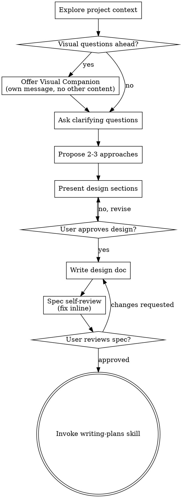

<!-- Generated by SpecStory, Markdown v2.1.0 -->

# 2026-04-29 13:54:30Z

<!-- Claude Code Session 87be5bfc-bc25-4e2d-99fa-d4d772b7b25b (2026-04-29 13:54:30Z) -->

_**User (2026-04-29 13:54:30Z)**_

I want to brainstorm these 2 issues. It might be good to brainstorm together. https://github.com/leocaseiro/base-skill/issues/237 and https://github.com/leocaseiro/base-skill/issues/236

---

_**Agent (claude-opus-4-6 2026-04-29 13:54:32Z)**_

_**Agent (claude-opus-4-6 2026-04-29 13:54:33Z)**_

Let me fetch both issues and invoke the brainstorming skill.

_**Agent (claude-opus-4-6 2026-04-29 13:54:34Z)**_

<tool-use data-tool-type="generic" data-tool-name="Skill"><details>
<summary>Tool use: **Skill**</summary>

```text
Launching skill: superpowers:brainstorming
```
</details></tool-use>

---

_**User (2026-04-29 13:54:34Z)**_

Base directory for this skill: /Users/leocaseiro/.claude/plugins/cache/claude-plugins-official/superpowers/5.0.7/skills/brainstorming

# Brainstorming Ideas Into Designs

Help turn ideas into fully formed designs and specs through natural collaborative dialogue.

Start by understanding the current project context, then ask questions one at a time to refine the idea. Once you understand what you're building, present the design and get user approval.

<HARD-GATE>
Do NOT invoke any implementation skill, write any code, scaffold any project, or take any implementation action until you have presented a design and the user has approved it. This applies to EVERY project regardless of perceived simplicity.
</HARD-GATE>

## Anti-Pattern: "This Is Too Simple To Need A Design"

Every project goes through this process. A todo list, a single-function utility, a config change — all of them. "Simple" projects are where unexamined assumptions cause the most wasted work. The design can be short (a few sentences for truly simple projects), but you MUST present it and get approval.

## Checklist

You MUST create a task for each of these items and complete them in order:

1. **Explore project context** — check files, docs, recent commits
2. **Offer visual companion** (if topic will involve visual questions) — this is its own message, not combined with a clarifying question. See the Visual Companion section below.
3. **Ask clarifying questions** — one at a time, understand purpose/constraints/success criteria
4. **Propose 2-3 approaches** — with trade-offs and your recommendation
5. **Present design** — in sections scaled to their complexity, get user approval after each section
6. **Write design doc** — save to `docs/superpowers/specs/YYYY-MM-DD-<topic>-design.md` and commit
7. **Spec self-review** — quick inline check for placeholders, contradictions, ambiguity, scope (see below)
8. **User reviews written spec** — ask user to review the spec file before proceeding
9. **Transition to implementation** — invoke writing-plans skill to create implementation plan

## Process Flow



**The terminal state is invoking writing-plans.** Do NOT invoke frontend-design, mcp-builder, or any other implementation skill. The ONLY skill you invoke after brainstorming is writing-plans.

## The Process

**Understanding the idea:**

- Check out the current project state first (files, docs, recent commits)
- Before asking detailed questions, assess scope: if the request describes multiple independent subsystems (e.g., "build a platform with chat, file storage, billing, and analytics"), flag this immediately. Don't spend questions refining details of a project that needs to be decomposed first.
- If the project is too large for a single spec, help the user decompose into sub-projects: what are the independent pieces, how do they relate, what order should they be built? Then brainstorm the first sub-project through the normal design flow. Each sub-project gets its own spec → plan → implementation cycle.
- For appropriately-scoped projects, ask questions one at a time to refine the idea
- Prefer multiple choice questions when possible, but open-ended is fine too
- Only one question per message - if a topic needs more exploration, break it into multiple questions
- Focus on understanding: purpose, constraints, success criteria

**Exploring approaches:**

- Propose 2-3 different approaches with trade-offs
- Present options conversationally with your recommendation and reasoning
- Lead with your recommended option and explain why

**Presenting the design:**

- Once you believe you understand what you're building, present the design
- Scale each section to its complexity: a few sentences if straightforward, up to 200-300 words if nuanced
- Ask after each section whether it looks right so far
- Cover: architecture, components, data flow, error handling, testing
- Be ready to go back and clarify if something doesn't make sense

**Design for isolation and clarity:**

- Break the system into smaller units that each have one clear purpose, communicate through well-defined interfaces, and can be understood and tested independently
- For each unit, you should be able to answer: what does it do, how do you use it, and what does it depend on?
- Can someone understand what a unit does without reading its internals? Can you change the internals without breaking consumers? If not, the boundaries need work.
- Smaller, well-bounded units are also easier for you to work with - you reason better about code you can hold in context at once, and your edits are more reliable when files are focused. When a file grows large, that's often a signal that it's doing too much.

**Working in existing codebases:**

- Explore the current structure before proposing changes. Follow existing patterns.
- Where existing code has problems that affect the work (e.g., a file that's grown too large, unclear boundaries, tangled responsibilities), include targeted improvements as part of the design - the way a good developer improves code they're working in.
- Don't propose unrelated refactoring. Stay focused on what serves the current goal.

## After the Design

**Documentation:**

- Write the validated design (spec) to `docs/superpowers/specs/YYYY-MM-DD-<topic>-design.md`
  - (User preferences for spec location override this default)
- Use elements-of-style:writing-clearly-and-concisely skill if available
- Commit the design document to git

**Spec Self-Review:**
After writing the spec document, look at it with fresh eyes:

1. **Placeholder scan:** Any "TBD", "TODO", incomplete sections, or vague requirements? Fix them.
2. **Internal consistency:** Do any sections contradict each other? Does the architecture match the feature descriptions?
3. **Scope check:** Is this focused enough for a single implementation plan, or does it need decomposition?
4. **Ambiguity check:** Could any requirement be interpreted two different ways? If so, pick one and make it explicit.

Fix any issues inline. No need to re-review — just fix and move on.

**User Review Gate:**
After the spec review loop passes, ask the user to review the written spec before proceeding:

> "Spec written and committed to `<path>`. Please review it and let me know if you want to make any changes before we start writing out the implementation plan."

Wait for the user's response. If they request changes, make them and re-run the spec review loop. Only proceed once the user approves.

**Implementation:**

- Invoke the writing-plans skill to create a detailed implementation plan
- Do NOT invoke any other skill. writing-plans is the next step.

## Key Principles

- **One question at a time** - Don't overwhelm with multiple questions
- **Multiple choice preferred** - Easier to answer than open-ended when possible
- **YAGNI ruthlessly** - Remove unnecessary features from all designs
- **Explore alternatives** - Always propose 2-3 approaches before settling
- **Incremental validation** - Present design, get approval before moving on
- **Be flexible** - Go back and clarify when something doesn't make sense

## Visual Companion

A browser-based companion for showing mockups, diagrams, and visual options during brainstorming. Available as a tool — not a mode. Accepting the companion means it's available for questions that benefit from visual treatment; it does NOT mean every question goes through the browser.

**Offering the companion:** When you anticipate that upcoming questions will involve visual content (mockups, layouts, diagrams), offer it once for consent:
> "Some of what we're working on might be easier to explain if I can show it to you in a web browser. I can put together mockups, diagrams, comparisons, and other visuals as we go. This feature is still new and can be token-intensive. Want to try it? (Requires opening a local URL)"

**This offer MUST be its own message.** Do not combine it with clarifying questions, context summaries, or any other content. The message should contain ONLY the offer above and nothing else. Wait for the user's response before continuing. If they decline, proceed with text-only brainstorming.

**Per-question decision:** Even after the user accepts, decide FOR EACH QUESTION whether to use the browser or the terminal. The test: **would the user understand this better by seeing it than reading it?**

- **Use the browser** for content that IS visual — mockups, wireframes, layout comparisons, architecture diagrams, side-by-side visual designs
- **Use the terminal** for content that is text — requirements questions, conceptual choices, tradeoff lists, A/B/C/D text options, scope decisions

A question about a UI topic is not automatically a visual question. "What does personality mean in this context?" is a conceptual question — use the terminal. "Which wizard layout works better?" is a visual question — use the browser.

If they agree to the companion, read the detailed guide before proceeding:
`skills/brainstorming/visual-companion.md`


ARGUMENTS: Brainstorm two related GitHub issues together: #237 and #236

---

_**Agent (claude-opus-4-6 2026-04-29 13:54:38Z)**_

<tool-use data-tool-type="shell" data-tool-name="Bash"><details>
<summary>Tool use: **Bash**</summary>
Fetch GitHub issue #237 details

`gh issue view 237 --json title,body,labels,comments`

```text
{"body":"I just realised that on every PR, we are automatically overriding the current app. So what we always see is the latest build, not each PR in individually. They might have some parts of the code available, but the npm modules, and etc, is all the latest PR.\n\nThis is a big liability. Currently, for example, we are displaying `[object Object], [object Object], [object Object]…` as the CardGame chips in the GameGrid. https://leocaseiro.github.io/base-skill/en\n\nThis shouldn't be a bug in version v0.17.7. This is something that a PR changed the data structure, it shouldn't influence the current published, and master version.\n\n\n\nCan we have different directories for each part of the app? So we don't mess with the main version?\nHow does that work?","comments":[],"labels":[],"title":"Build conflicts"}
```
</details></tool-use>

_**Agent (claude-opus-4-6 2026-04-29 13:54:38Z)**_

<tool-use data-tool-type="shell" data-tool-name="Bash"><details>
<summary>Tool use: **Bash**</summary>
Fetch GitHub issue #236 details

`gh issue view 236 --json title,body,labels,comments`

```text
{"body":"Currently, is very hard to identify what is the latest build that is been loaded in the `/pr/x`. It also very hard to find the comment in a mobile, as gh collapses all comments, expect the last ones.\n\nIn aditon to that, we the commit sha is not helpful on its own.\n\n\nCan we add a new coment, instead of just update the previous one?\nCan we include the commit sha as part of the version?\nCan we include a datetime of latest build? ","comments":[],"labels":[{"id":"LA_kwDORxj_pc8AAAAChL6gtw","name":"agent:backlog","description":"","color":"aaaaaa"}],"title":"PR Build comment - date/timestamp and improve Mobile experience"}
```
</details></tool-use>

_**Agent (claude-opus-4-6 2026-04-29 13:54:41Z)**_

<tool-use data-tool-type="unknown" data-tool-name="ToolSearch"><details>
<summary>Tool use: **ToolSearch**</summary>

**Input:**

- max_results: `2`
- query: `select:TaskCreate,TaskUpdate`

**Result:**

```

```
</details></tool-use>

_**Agent (claude-opus-4-6 2026-04-29 13:54:49Z)**_

_**Agent (claude-opus-4-6 2026-04-29 13:54:49Z)**_

<tool-use data-tool-type="unknown" data-tool-name="TaskCreate"><details>
<summary>Tool use: **TaskCreate**</summary>
Check current GitHub Pages deployment workflow, PR preview setup, and build configuration

```text
Task #1 created successfully: Explore project context
```
</details></tool-use>

_**Agent (claude-opus-4-6 2026-04-29 13:54:50Z)**_

<tool-use data-tool-type="unknown" data-tool-name="TaskCreate"><details>
<summary>Tool use: **TaskCreate**</summary>
One at a time, understand the deployment goals, constraints, and success criteria for both issues

```text
Task #2 created successfully: Ask clarifying questions
```
</details></tool-use>

_**Agent (claude-opus-4-6 2026-04-29 13:54:51Z)**_

<tool-use data-tool-type="unknown" data-tool-name="TaskCreate"><details>
<summary>Tool use: **TaskCreate**</summary>
Present approaches with trade-offs and recommendation for solving both the build isolation and PR comment UX issues

```text
Task #3 created successfully: Propose 2-3 approaches
```
</details></tool-use>

_**Agent (claude-opus-4-6 2026-04-29 13:54:52Z)**_

<tool-use data-tool-type="unknown" data-tool-name="TaskCreate"><details>
<summary>Tool use: **TaskCreate**</summary>
Present the design in sections, get user approval after each

```text
Task #4 created successfully: Present design
```
</details></tool-use>

_**Agent (claude-opus-4-6 2026-04-29 13:54:53Z)**_

<tool-use data-tool-type="unknown" data-tool-name="TaskCreate"><details>
<summary>Tool use: **TaskCreate**</summary>
Save validated design to docs/superpowers/specs/

```text
Task #5 created successfully: Write design doc
```
</details></tool-use>

_**Agent (claude-opus-4-6 2026-04-29 13:54:53Z)**_

<tool-use data-tool-type="unknown" data-tool-name="TaskCreate"><details>
<summary>Tool use: **TaskCreate**</summary>
Check for placeholders, contradictions, ambiguity, scope

```text
Task #6 created successfully: Spec self-review
```
</details></tool-use>

_**Agent (claude-opus-4-6 2026-04-29 13:54:54Z)**_

<tool-use data-tool-type="unknown" data-tool-name="TaskCreate"><details>
<summary>Tool use: **TaskCreate**</summary>
Ask user to review the spec file before proceeding

```text
Task #7 created successfully: User reviews written spec
```
</details></tool-use>

_**Agent (claude-opus-4-6 2026-04-29 13:54:54Z)**_

<tool-use data-tool-type="unknown" data-tool-name="TaskCreate"><details>
<summary>Tool use: **TaskCreate**</summary>
Invoke writing-plans skill to create implementation plan

```text
Task #8 created successfully: Transition to implementation
```
</details></tool-use>

_**Agent (claude-opus-4-6 2026-04-29 13:54:57Z)**_

<tool-use data-tool-type="unknown" data-tool-name="TaskUpdate"><details>
<summary>Tool use: **TaskUpdate**</summary>

```text
Updated task #1 status
```
</details></tool-use>

_**Agent (claude-opus-4-6 2026-04-29 13:55:03Z)**_

Let me explore the current deployment workflows to understand how PR previews and GitHub Pages work today.

_**Agent (claude-opus-4-6 2026-04-29 13:55:04Z)**_

<tool-use data-tool-type="shell" data-tool-name="Bash"><details>
<summary>Tool use: **Bash**</summary>
List GitHub Actions workflow files

`ls /Users/leocaseiro/Sites/base-skill/.github/workflows/`

```text
auto-update-prs.yml
ci.yml
deploy.yml
e2e.yml
pr-preview.yml
visual-regression.yml
```
</details></tool-use>

_**Agent (claude-opus-4-6 2026-04-29 13:55:05Z)**_

<tool-use data-tool-type="shell" data-tool-name="Bash"><details>
<summary>Tool use: **Bash**</summary>
Find deployment-related workflows

`grep -rl "github-pages\|gh-pages\|deploy\|preview" /Users/leocaseiro/Sites/base-skill/.github/workflows/ 2>/dev/null`

```text
/Users/leocaseiro/Sites/base-skill/.github/workflows/auto-update-prs.yml
/Users/leocaseiro/Sites/base-skill/.github/workflows/pr-preview.yml
/Users/leocaseiro/Sites/base-skill/.github/workflows/deploy.yml
```
</details></tool-use>

_**Agent (claude-opus-4-6 2026-04-29 13:55:08Z)**_

<tool-use data-tool-type="read" data-tool-name="Read"><details>
<summary>Tool use: **Read**</summary>
 `./.github/workflows/pr-preview.yml`

```text
1	# Builds and deploys a live preview for each PR to GitHub Pages.
2	# Only works for PRs from the base repo; fork PRs lack write permissions and secrets.
3	name: PR Preview
4	
5	on:
6	  pull_request:
7	    types: [opened, synchronize, reopened]
8	
9	concurrency:
10	  group: pr-preview-${{ github.event.pull_request.number }}
11	  cancel-in-progress: true
12	
13	permissions:
14	  contents: write
15	  pull-requests: write
16	
17	jobs:
18	  detect-changes:
19	    name: Detect changes
20	    runs-on: ubuntu-latest
21	    outputs:
22	      build: ${{ steps.filter.outputs.build }}
23	    steps:
24	      - uses: actions/checkout@v6
25	        with:
26	          fetch-depth: 0
27	      - uses: actions/setup-node@v6
28	        with:
29	          node-version-file: '.nvmrc'
30	          cache: yarn
31	      - run: yarn install --frozen-lockfile
32	      - id: filter
33	        run: node scripts/detect-buckets.mjs --base=${{ github.event.pull_request.base.sha }} --github-output
34	
35	  deploy-preview:
36	    name: Build and deploy preview
37	    needs: detect-changes
38	    if: needs.detect-changes.outputs.build == 'true'
39	    runs-on: ubuntu-latest
40	    steps:
41	      - uses: actions/checkout@v6
42	        with:
43	          ref: ${{ github.event.pull_request.head.sha }}
44	
45	      - uses: actions/setup-node@v6
46	        with:
47	          node-version-file: '.nvmrc'
48	          cache: yarn
49	
50	      - name: Install dependencies
51	        run: yarn install --frozen-lockfile
52	
53	      - name: Compute version and base paths
54	        id: version
55	        run: |
56	          set -euo pipefail
57	          BASE_VERSION=$(node -p "require('./package.json').version")
58	          PR_NUMBER="${{ github.event.pull_request.number }}"
59	          VERSION="${BASE_VERSION}-pr.${PR_NUMBER}"
60	          APP_BASE="/base-skill/pr/${PR_NUMBER}/app/"
61	          {
62	            echo "version=${VERSION}"
63	            echo "app_base=${APP_BASE}"
64	            echo "pr_number=${PR_NUMBER}"
65	          } >> "$GITHUB_OUTPUT"
66	
67	      - name: Build app
68	        env:
69	          APP_BASE_URL: ${{ steps.version.outputs.app_base }}
70	          VITE_APP_VERSION: ${{ steps.version.outputs.version }}
71	          VITE_GOOGLE_CLIENT_ID: ${{ secrets.VITE_GOOGLE_CLIENT_ID }}
72	          VITE_ONEDRIVE_CLIENT_ID: ${{ secrets.VITE_ONEDRIVE_CLIENT_ID }}
73	          VITE_CF_WORKER_URL: ${{ secrets.VITE_CF_WORKER_URL }}
74	          VITE_ANALYTICS_PROVIDER: ${{ vars.VITE_ANALYTICS_PROVIDER }}
75	        run: yarn build
76	
77	      - name: Copy shell to index.html
78	        run: cp dist/client/_shell.html dist/client/index.html
79	
80	      - name: SPA fallback for history routing
81	        run: cp dist/client/index.html dist/client/404.html
82	
83	      - name: Stamp version.json
84	        run: |
85	          set -euo pipefail
86	          BUILD_SHA=$(git rev-parse HEAD)
87	          BUILD_DATE=$(date -u +%Y-%m-%dT%H:%M:%SZ)
88	          cat > dist/client/version.json <<EOF
89	          {
90	            "version": "${{ steps.version.outputs.version }}",
91	            "buildSha": "${BUILD_SHA}",
92	            "buildDate": "${BUILD_DATE}"
93	          }
94	          EOF
95	
96	      - name: Build Storybook
97	        run: yarn build-storybook --output-dir storybook-static
98	
99	      - name: Stage preview directory
100	        run: |
101	          set -euo pipefail
102	          rm -rf preview-staging
103	          mkdir -p preview-staging/app preview-staging/docs
104	          cp -r dist/client/. preview-staging/app/
105	          cp -r storybook-static/. preview-staging/docs/
106	
107	      - name: Deploy preview to gh-pages
108	        uses: JamesIves/github-pages-deploy-action@v4
109	        with:
110	          branch: gh-pages
111	          folder: preview-staging
112	          target-folder: pr/${{ steps.version.outputs.pr_number }}
113	          clean: true
114	          commit-message: 'deploy: PR #${{ steps.version.outputs.pr_number }} preview (${{ steps.version.outputs.version }})'
115	
116	      - name: Comment PR with preview URLs
117	        uses: marocchino/sticky-pull-request-comment@v2
118	        with:
119	          header: pr-preview
120	          message: |
121	            ## Preview deployed
122	
123	            | Target    | URL                                                                                    |
124	            | --------- | -------------------------------------------------------------------------------------- |
125	            | App       | https://leocaseiro.github.io/base-skill/pr/${{ steps.version.outputs.pr_number }}/app/  |
126	            | Storybook | https://leocaseiro.github.io/base-skill/pr/${{ steps.version.outputs.pr_number }}/docs/ |
127	
128	            **Version:** `${{ steps.version.outputs.version }}`
129	            **Commit:** `${{ github.event.pull_request.head.sha }}`
130	
131	            Previews are kept forever — no cleanup on close.
132
```
</details></tool-use>

_**Agent (claude-opus-4-6 2026-04-29 13:55:08Z)**_

<tool-use data-tool-type="read" data-tool-name="Read"><details>
<summary>Tool use: **Read**</summary>
 `./.github/workflows/deploy.yml`

```text
1	# .github/workflows/deploy.yml
2	name: Deploy to GitHub Pages
3	
4	on:
5	  pull_request:
6	    types: [closed]
7	    branches: [master]
8	  workflow_dispatch:
9	
10	concurrency:
11	  group: deploy-production
12	  cancel-in-progress: false # never cancel an in-flight deploy
13	
14	permissions:
15	  contents: write
16	  pull-requests: write
17	
18	jobs:
19	  build:
20	    name: Build
21	    runs-on: ubuntu-latest
22	    if: github.event.pull_request.merged == true || github.event_name == 'workflow_dispatch'
23	    outputs:
24	      version: ${{ steps.version.outputs.version }}
25	
26	    steps:
27	      - uses: actions/checkout@v6
28	        with:
29	          ref: master
30	          fetch-depth: 0
31	          # Use a PAT so the release branch/tag push is attributed to a real
32	          # user. Pushes made with the default GITHUB_TOKEN do NOT trigger
33	          # downstream workflows (prevents recursion), which means CI checks
34	          # never run on the auto-generated release PR. Falls back to
35	          # GITHUB_TOKEN locally / in forks where RELEASE_PAT isn't set.
36	          token: ${{ secrets.RELEASE_PAT || secrets.GITHUB_TOKEN }}
37	
38	      - uses: actions/setup-node@v6
39	        with:
40	          node-version-file: '.nvmrc'
41	          cache: yarn
42	
43	      - name: Install dependencies
44	        run: yarn install --frozen-lockfile
45	
46	      - name: Determine and apply version bump
47	        id: bump
48	        if: github.event_name == 'pull_request'
49	        env:
50	          PR_NUMBER: ${{ github.event.pull_request.number }}
51	          GH_TOKEN: ${{ secrets.GITHUB_TOKEN }}
52	        run: |
53	          set -euo pipefail
54	          BUMP=$(bash scripts/determine-bump.sh "$PR_NUMBER")
55	          echo "Detected bump type: $BUMP"
56	          if [[ "$BUMP" == "skip" ]]; then
57	            echo "bumped=false" >> "$GITHUB_OUTPUT"
58	            exit 0
59	          fi
60	          case "$BUMP" in
61	            major|minor|patch) ;;
62	            *)
63	              echo "Unexpected bump value: $BUMP" >&2
64	              exit 1
65	              ;;
66	          esac
67	          yarn version --"$BUMP" --no-git-tag-version
68	          NEW_VERSION=$(node -p "require('./package.json').version")
69	          echo "New version: $NEW_VERSION"
70	          echo "bumped=true" >> "$GITHUB_OUTPUT"
71	          echo "new_version=$NEW_VERSION" >> "$GITHUB_OUTPUT"
72	
73	      - name: Read package version
74	        id: version
75	        run: echo "version=$(node -p "require('./package.json').version")" >> "$GITHUB_OUTPUT"
76	
77	      - name: Build
78	        run: yarn build
79	        env:
80	          VITE_GOOGLE_CLIENT_ID: ${{ secrets.VITE_GOOGLE_CLIENT_ID }}
81	          VITE_ONEDRIVE_CLIENT_ID: ${{ secrets.VITE_ONEDRIVE_CLIENT_ID }}
82	          VITE_CF_WORKER_URL: ${{ secrets.VITE_CF_WORKER_URL }}
83	          VITE_ANALYTICS_PROVIDER: ${{ vars.VITE_ANALYTICS_PROVIDER }}
84	
85	      - name: Copy shell to index.html
86	        run: cp dist/client/_shell.html dist/client/index.html
87	
88	      - name: SPA fallback for GitHub Pages (history routing)
89	        run: cp dist/client/index.html dist/client/404.html
90	
91	      - name: Build Storybook
92	        run: yarn build-storybook --output-dir storybook-static
93	
94	      - name: Merge Storybook into dist
95	        run: mkdir -p dist/client/docs && cp -r storybook-static/. dist/client/docs
96	
97	      - name: Stamp version.json
98	        run: |
99	          set -euo pipefail
100	          BUILD_SHA=$(git rev-parse HEAD)
101	          BUILD_DATE=$(date -u +%Y-%m-%dT%H:%M:%SZ)
102	          cat > dist/client/version.json <<EOF
103	          {
104	            "version": "${{ steps.version.outputs.version }}",
105	            "buildSha": "${BUILD_SHA}",
106	            "buildDate": "${BUILD_DATE}"
107	          }
108	          EOF
109	
110	      - name: Deploy to gh-pages branch
111	        uses: JamesIves/github-pages-deploy-action@v4
112	        with:
113	          branch: gh-pages
114	          folder: dist/client
115	          clean: true
116	          clean-exclude: |
117	            pr/**
118	          commit-message: 'deploy: production ${{ steps.version.outputs.version }}'
119	
120	      - name: Open release PR for version bump
121	        # Master is protected by a ruleset requiring PRs, so the bot cannot
122	        # push the chore(release) commit directly. Instead we land the
123	        # package.json bump via a PR and push the tag separately (tags are
124	        # not covered by the branch ruleset).
125	        if: steps.bump.outputs.bumped == 'true' && github.actor != 'github-actions[bot]'
126	        env:
127	          NEW_VERSION: ${{ steps.bump.outputs.new_version }}
128	          # PAT required so the created PR triggers CI checks. With the default
129	          # GITHUB_TOKEN, PRs open but no workflows run on them.
130	          GH_TOKEN: ${{ secrets.RELEASE_PAT || secrets.GITHUB_TOKEN }}
131	          # Bypass the local pre-push quality gate — every check in the hook
132	          # (lint, typecheck, unit, storybook, VR, e2e) already ran in ci.yml
133	          # on the merging PR. The runner also uses dash as /bin/sh, which
134	          # chokes on the hook's bash-isms further down the script.
135	          SKIP_PREPUSH: 1
136	        run: |
137	          set -euo pipefail
138	          git config user.name "github-actions[bot]"
139	          git config user.email "41898282+github-actions[bot]@users.noreply.github.com"
140	          BRANCH="release/v${NEW_VERSION}"
141	          git checkout -b "$BRANCH"
142	          git add package.json
143	          git commit -m "chore(release): v${NEW_VERSION}"
144	          git tag "v${NEW_VERSION}"
145	          git push origin "$BRANCH" --follow-tags
146	          gh pr create \
147	            --base master \
148	            --head "$BRANCH" \
149	            --title "chore(release): v${NEW_VERSION}" \
150	            --body "Automated version bump from the deploy workflow.
151	
152	          The site has already been deployed to gh-pages with version \`${NEW_VERSION}\` (see \`dist/client/version.json\`). Merging this PR lands the matching \`package.json\` bump on master and makes the \`v${NEW_VERSION}\` tag reachable from master.
153	
154	          The bump type was derived from the merged PR's conventional-commit messages by \`scripts/determine-bump.sh\`."
155	          # Enable auto-merge so the release PR lands the moment required
156	          # checks go green — no human review needed for version bumps.
157	          gh pr merge "$BRANCH" --auto --squash --delete-branch
158
```
</details></tool-use>

_**Agent (claude-opus-4-6 2026-04-29 13:55:11Z)**_

<tool-use data-tool-type="shell" data-tool-name="Bash"><details>
<summary>Tool use: **Bash**</summary>
Check recent gh-pages branch history

`git log --oneline gh-pages 2>/dev/null | head -15`

```text
6efe96dd hotfix: add .nojekyll to disable Jekyll
2d82e854 deploy: PR #46 preview (0.2.0-pr.46)
a7facd66 deploy: PR #45 preview (0.2.0-pr.45)
745e2213 deploy: production 0.2.0
82c13ee5 deploy: PR #43 preview (0.2.0-pr.43)
6f13b486 deploy: PR #45 preview (0.2.0-pr.45)
dbc4e1db deploy: production 0.2.0
c69e6a69 deploy: PR #44 preview (0.2.0-pr.44)
3e632a89 deploy: PR #44 preview (0.2.0-pr.44)
a51f614f deploy: production 0.2.0
276d291e deploy: PR #41 preview (0.1.0-pr.41)
e8eacea7 deploy: PR #43 preview (0.1.0-pr.43)
1f5eb7a4 deploy: production 0.2.0
ebd3debf deploy: PR #40 preview (0.1.0-pr.40)
3b7d6f20 deploy: PR #40 preview (0.1.0-pr.40)
```
</details></tool-use>

_**Agent (claude-opus-4-6 2026-04-29 13:55:44Z)**_

_**Agent (claude-opus-4-6 2026-04-29 13:55:44Z)**_

<tool-use data-tool-type="unknown" data-tool-name="TaskUpdate"><details>
<summary>Tool use: **TaskUpdate**</summary>

```text
Updated task #1 status
```
</details></tool-use>

_**Agent (claude-opus-4-6 2026-04-29 13:55:44Z)**_

<tool-use data-tool-type="unknown" data-tool-name="TaskUpdate"><details>
<summary>Tool use: **TaskUpdate**</summary>

```text
Updated task #2 status
```
</details></tool-use>

_**Agent (claude-opus-4-6 2026-04-29 13:55:54Z)**_

Good, I've reviewed both issues and the current deployment setup. Here's what I see:

**Issue #237 (Build conflicts):** The main site at `leocaseiro.github.io/base-skill/en` is showing broken content (`[object Object]` in GameGrid chips) even though the production build should be stable. You're asking whether PR builds are somehow corrupting the main site.

**Issue #236 (PR comment UX):** The sticky PR comment gets updated in-place (hard to find on mobile since GitHub collapses old comments), only shows a commit SHA (not helpful on its own), and has no build timestamp.

These are definitely related — both are about the PR preview pipeline. Before I propose solutions, I have a question:

**For #237**, looking at the current workflows, the PR previews deploy to `pr/{N}/` with `target-folder`, and the production deploy deploys to root with `clean-exclude: pr/**`. In theory these shouldn't conflict. Can you help me understand what you're seeing — is the root-level site (the one at `/base-skill/en`) actually showing a PR's build artifacts? Or is the issue that after merging a PR, the production deploy itself produces the broken output because the merged code changed the data structure?

---

_**User (2026-04-29 13:55:57Z)**_

<command-name>/effort</command-name>
            <command-message>effort</command-message>
            <command-args>max</command-args>

_**User (2026-04-29 13:55:57Z)**_

<local-command-stdout>Set effort level to max (this session only): Maximum capability with deepest reasoning</local-command-stdout>

_**User (2026-04-29 13:55:57Z)**_

<local-command-caveat>Caveat: The messages below were generated by the user while running local commands. DO NOT respond to these messages or otherwise consider them in your response unless the user explicitly asks you to.</local-command-caveat>

_**User (2026-04-29 13:55:59Z)**_

<local-command-caveat>Caveat: The messages below were generated by the user while running local commands. DO NOT respond to these messages or otherwise consider them in your response unless the user explicitly asks you to.</local-command-caveat>

_**User (2026-04-29 13:55:59Z)**_

<command-name>/context</command-name>
            <command-message>context</command-message>
            <command-args></command-args>

_**User (2026-04-29 13:55:59Z)**_

<local-command-stdout> Context Usage
⛁ ⛁ ⛁ ⛁ ⛁ ⛁ ⛁ ⛁ ⛁ ⛀   Opus 4.6
⛁ ⛁ ⛁ ⛁ ⛁ ⛁ ⛁ ⛁ ⛁ ⛁   claude-opus-4-6
⛀ ⛶ ⛶ ⛶ ⛶ ⛶ ⛶ ⛶ ⛶ ⛶   37.6k/200k tokens (19%)
⛶ ⛶ ⛶ ⛶ ⛶ ⛶ ⛶ ⛶ ⛶ ⛶ 
⛶ ⛶ ⛶ ⛶ ⛶ ⛶ ⛶ ⛶ ⛶ ⛶   Estimated usage by category
⛶ ⛶ ⛶ ⛶ ⛶ ⛶ ⛶ ⛶ ⛶ ⛶   ⛁ System prompt: 7.4k tokens (3.7%)
⛶ ⛶ ⛶ ⛶ ⛶ ⛶ ⛶ ⛶ ⛶ ⛶   ⛁ System tools: 9.7k tokens (4.9%)
⛶ ⛶ ⛶ ⛶ ⛶ ⛶ ⛶ ⛶ ⛶ ⛶   ⛁ Custom agents: 247 tokens (0.1%)
⛶ ⛶ ⛶ ⛝ ⛝ ⛝ ⛝ ⛝ ⛝ ⛝   ⛁ Memory files: 3.6k tokens (1.8%)
⛝ ⛝ ⛝ ⛝ ⛝ ⛝ ⛝ ⛝ ⛝ ⛝   ⛁ Skills: 1.9k tokens (0.9%)
                      ⛁ Messages: 15.4k tokens (7.7%)
                      ⛶ Free space: 128.8k (64.4%)
                      ⛝ Autocompact buffer: 33k tokens (16.5%)

MCP tools · /mcp (loaded on-demand)

Available
├ mcp__claude_ai_Google_Drive__create_file
├ mcp__claude_ai_Google_Drive__download_file_content
├ mcp__claude_ai_Google_Drive__get_file_metadata
├ mcp__claude_ai_Google_Drive__get_file_permissions
├ mcp__claude_ai_Google_Drive__list_recent_files
├ mcp__claude_ai_Google_Drive__read_file_content
├ mcp__claude_ai_Google_Drive__search_files
├ mcp__playwright__browser_click
├ mcp__playwright__browser_close
├ mcp__playwright__browser_console_messages
├ mcp__playwright__browser_drag
├ mcp__playwright__browser_drop
├ mcp__playwright__browser_evaluate
├ mcp__playwright__browser_file_upload
├ mcp__playwright__browser_fill_form
├ mcp__playwright__browser_handle_dialog
├ mcp__playwright__browser_hover
├ mcp__playwright__browser_navigate
├ mcp__playwright__browser_navigate_back
├ mcp__playwright__browser_network_requests
├ mcp__playwright__browser_press_key
├ mcp__playwright__browser_resize
├ mcp__playwright__browser_run_code
├ mcp__playwright__browser_select_option
├ mcp__playwright__browser_snapshot
├ mcp__playwright__browser_tabs
├ mcp__playwright__browser_take_screenshot
├ mcp__playwright__browser_type
└ mcp__playwright__browser_wait_for

Custom agents · /agents

Plugin
└ superpowers:code-reviewer: 247 tokens

Memory files · /memory
├ CLAUDE.md: 2.7k tokens
└ ~/.claude/projects/-Users-leocaseiro-Sites-base-skill/memory/MEMORY.md: 887 tokens

Skills · /skills

Project
├ handoff: 95 tokens
├ write-e2e-vr-tests: 51 tokens
├ write-storybook: 49 tokens
├ continue: 25 tokens
└ update-architecture-docs: 12 tokens

User
├ google-docs: 51 tokens
├ conflict-resolution: 33 tokens
└ resync: 19 tokens

Plugin
├ receiving-code-review: 67 tokens
├ verification-before-completion: 67 tokens
├ finishing-a-development-branch: 61 tokens
├ using-git-worktrees: 59 tokens
├ brainstorming: 56 tokens
├ using-superpowers: 47 tokens
├ dispatching-parallel-agents: 37 tokens
├ requesting-code-review: 36 tokens
├ executing-plans: 33 tokens
├ systematic-debugging: 31 tokens
├ writing-skills: 31 tokens
├ subagent-driven-development: 31 tokens
├ test-driven-development: 29 tokens
├ writing-plans: 28 tokens
├ superpowers:execute-plan: 22 tokens
├ superpowers:write-plan: 21 tokens
└ superpowers:brainstorm: 21 tokens</local-command-stdout>

_**User (2026-04-29 13:59:45Z)**_

for 237, before merging a PR, we saw that [object] was rendered, as we changed the data structure in a PR. The issue happened on /base-skill/en before merging

---

_**Agent (claude-opus-4-6 2026-04-29 14:01:10Z)**_

_**Agent (claude-opus-4-6 2026-04-29 14:01:18Z)**_

That clarifies it. So the root production site at `/base-skill/en` showed broken content from a PR's data structure change *before* that PR was merged. This confirms the PR preview pipeline is interfering with the production deployment on the same `gh-pages` branch.

Looking at the workflows, I can see the likely mechanism: both `deploy.yml` and `pr-preview.yml` push commits to the same `gh-pages` branch with different concurrency groups, so they can race each other. When the JamesIves action force-pushes a PR preview commit, it can carry stale (or mixed) root-level files.

Here's my next question:

**For #236**, you mentioned wanting new comments instead of updating the existing one. The current workflow uses `marocchino/sticky-pull-request-comment` which updates in-place. How important is the "new comment per build" aspect to you? I see two directions:

- **(A)** Post a **new comment on every push** — full history visible, easy to find the latest on mobile (it's always the last comment), but can get noisy on PRs with many pushes
- **(B)** Keep the **sticky (single) comment** but add timestamp + short commit message + a collapsible "build history" section inside it — cleaner but still has the mobile collapse problem

Which feels closer to what you want, or would you prefer something else?

---

_**User (2026-04-29 14:05:41Z)**_

I am happy to go with B, but can we add the link into the PR description as well?

---

_**Agent (claude-opus-4-6 2026-04-29 14:05:54Z)**_

_**Agent (claude-opus-4-6 2026-04-29 14:05:54Z)**_

Good call — the PR description is always visible at the top, never collapsed on mobile. That solves the discoverability problem cleanly.

Let me now propose approaches for both issues together.

_**Agent (claude-opus-4-6 2026-04-29 14:05:55Z)**_

<tool-use data-tool-type="unknown" data-tool-name="TaskUpdate"><details>
<summary>Tool use: **TaskUpdate**</summary>

```text
Updated task #2 status
```
</details></tool-use>

_**Agent (claude-opus-4-6 2026-04-29 14:05:55Z)**_

<tool-use data-tool-type="unknown" data-tool-name="TaskUpdate"><details>
<summary>Tool use: **TaskUpdate**</summary>

```text
Updated task #3 status
```
</details></tool-use>

_**Agent (claude-opus-4-6 2026-04-29 14:06:15Z)**_

Here are three approaches for solving **build isolation (#237)** — the PR comment improvements (#236) are the same across all of them:

---

### Approach A: Lock the gh-pages branch with a shared concurrency group

Put both `deploy.yml` and `pr-preview.yml` in the **same concurrency group** so they can never push to `gh-pages` simultaneously. The root cause today is that they use separate groups (`deploy-production` vs `pr-preview-{N}`), so a PR preview can force-push over a production deploy mid-flight.

- **Pro:** Minimal change — one line in each workflow. No infrastructure change.
- **Con:** PR previews queue behind production deploys (and vice versa). Doesn't fully prevent a PR preview commit from carrying stale root files if the action's internal merge logic has edge cases.

### Approach B: Separate the production site from PR previews entirely

Deploy the **production site** to the root of `gh-pages` as today, but move **PR previews to GitHub Actions artifact-based deployments** (or a separate `gh-pages-previews` branch). Each PR preview becomes a downloadable artifact or lives on a branch that doesn't interfere with production at all.

- **Pro:** Complete isolation — PR builds can never touch the production site.
- **Con:** Artifacts aren't served as live URLs (you'd lose the clickable preview links). A second branch adds complexity. Possible with Cloudflare Pages or Netlify for previews, but that's a new service.

### Approach C (recommended): Keep the current structure but add a production protection layer

Keep PR previews on `gh-pages` under `pr/{N}/`, but:

1. Add a **shared concurrency group** across both workflows so they never race
2. In the PR preview workflow, add `clean-exclude` to protect the root: `clean-exclude: |` with patterns for everything outside `pr/`
3. Alternatively, switch to **not using `clean: true`** in the PR preview (just overwrite the target folder, never delete outside it)

- **Pro:** Keeps live preview URLs, minimal disruption, directly addresses the race condition and the root-corruption vector.
- **Con:** Still shares one branch, so you rely on config correctness. But with both the concurrency lock and clean-exclude, the risk is very low.

---

**My recommendation is Approach C.** It fixes the root cause (concurrent pushes + overly broad clean) without losing the live preview URLs that make PR reviews practical. The shared concurrency group prevents races, and `clean-exclude` adds a belt-and-suspenders safeguard.

Which approach appeals to you, or would you like to mix elements?

---

_**User (2026-04-29 14:08:19Z)**_

C LGTM

---

_**Agent (claude-opus-4-6 2026-04-29 14:08:22Z)**_

<tool-use data-tool-type="unknown" data-tool-name="TaskUpdate"><details>
<summary>Tool use: **TaskUpdate**</summary>

```text
Updated task #3 status
```
</details></tool-use>

_**Agent (claude-opus-4-6 2026-04-29 14:08:22Z)**_

<tool-use data-tool-type="unknown" data-tool-name="TaskUpdate"><details>
<summary>Tool use: **TaskUpdate**</summary>

```text
Updated task #4 status
```
</details></tool-use>

_**Agent (claude-opus-4-6 2026-04-29 14:08:44Z)**_

_**Agent (claude-opus-4-6 2026-04-29 14:08:52Z)**_

Great. Let me present the design in sections. I'll start with the build isolation piece.

---

### Section 1: Build isolation (`pr-preview.yml` changes)

**Two changes to `pr-preview.yml`:**

1. **Shared concurrency group** — Change the concurrency group from `pr-preview-{N}` to a group shared with the production deploy, so they never push to `gh-pages` at the same time:

```yaml
concurrency:
  group: gh-pages-deploy          # shared with deploy.yml
  cancel-in-progress: false       # queue, don't cancel — both deploys matter
```

And update `deploy.yml` to use the same group name (`gh-pages-deploy`), keeping its existing `cancel-in-progress: false`.

2. **Protect root files** — Add `clean-exclude` to the JamesIves action so that even if something unexpected happens, root-level production files are never touched:

```yaml
- name: Deploy preview to gh-pages
  uses: JamesIves/github-pages-deploy-action@v4
  with:
    branch: gh-pages
    folder: preview-staging
    target-folder: pr/${{ steps.version.outputs.pr_number }}
    clean: true
    clean-exclude: |
      pr/**
      !pr/${{ steps.version.outputs.pr_number }}/**
```

Wait — actually, since `target-folder` already scopes `clean` to the target folder, the more important safeguard is really the shared concurrency group. The `clean-exclude` here would be a redundant safety net to ensure the action never deletes other PR folders. But the root files are already outside `target-folder` scope.

The real belt-and-suspenders for root protection: we keep `clean: true` scoped by `target-folder`, and the concurrency group prevents force-push races.

Does this section look right so far?

---

_**User (2026-04-29 14:09:11Z)**_

Y

---

_**Agent (claude-opus-4-6 2026-04-29 14:09:15Z)**_

_**Agent (claude-opus-4-6 2026-04-29 14:09:24Z)**_

### Section 2: Enhanced sticky comment (`#236`)

The sticky comment gets richer info and a build history. On each push:

1. **Fetch the existing sticky comment** via `gh api` to extract any previous build history entries
2. **Build the new comment** with:
   - Latest build info prominently at top (version, commit SHA + short message, timestamp)
   - Collapsible `<details>` section with previous builds appended
3. **Post via `marocchino/sticky-pull-request-comment`** as today (replaces the comment body)

The comment would look like:

```markdown
## Preview deployed

| Target    | URL |
| --------- | --- |
| App       | https://leocaseiro.github.io/base-skill/pr/250/app/ |
| Storybook | https://leocaseiro.github.io/base-skill/pr/250/docs/ |

**Version:** `0.20.1-pr.250`
**Commit:** `abc1234` — Fix card game chip rendering
**Built:** 2026-04-30 03:15 UTC

<details>
<summary>Build history (2 previous)</summary>

| Built | Commit | Version |
| ----- | ------ | ------- |
| 2026-04-29 18:02 UTC | `def5678` — Refactor data structure | `0.20.1-pr.250` |
| 2026-04-29 14:30 UTC | `789abcd` — Initial implementation | `0.20.0-pr.250` |

</details>
```

The workflow step to extract history would use `gh api` to find the comment by the `<!-- pr-preview -->` marker that the sticky action inserts, parse the existing `<details>` table rows, and prepend the current "latest" entry as a new row.

Does this section look right?

---

_**User (2026-04-29 14:12:51Z)**_

I liked, but not time in UTC, but in AEST.
Also, can we add the links into the PR decription? What about a link to go to this comment, would that work in mobile?

---

_**Agent (claude-opus-4-6 2026-04-29 14:13:06Z)**_

_**Agent (claude-opus-4-6 2026-04-29 14:13:13Z)**_

Good points, all three. Let me revise:

**Timezone:** CI runs on Ubuntu, so we'd use `TZ=Australia/Sydney date` which automatically handles AEST/AEDT depending on the time of year.

**PR description link to comment:** Yes — this works well on mobile. The PR description is always visible at the top, never collapsed. The flow would be:

1. Post/update the sticky comment
2. Fetch its comment ID via `gh api`
3. Inject a preview section into the PR description with a direct link to that comment

The PR description would get a section like this (inserted/updated via HTML comment markers):

```markdown
<!-- preview-urls -->
---
🔗 **Preview:** [App](https://leocaseiro.github.io/base-skill/pr/250/app/) · [Storybook](https://leocaseiro.github.io/base-skill/pr/250/docs/) · [Build details ↓](https://github.com/leocaseiro/base-skill/pull/250#issuecomment-123456)
<!-- /preview-urls -->
```

The "Build details" link scrolls directly to the sticky comment — even on mobile where it would otherwise be collapsed and buried.

The `gh pr edit` step would:
- Read the current PR body
- If `<!-- preview-urls -->` markers exist, replace that section
- If not, append it to the end

And the revised sticky comment timestamps would show e.g. `2026-04-30 13:15 AEST` instead of UTC.

Does this section look right?

---

_**User (2026-04-29 14:19:15Z)**_

perfect

---

_**Agent (claude-opus-4-6 2026-04-29 14:19:25Z)**_

_**Agent (claude-opus-4-6 2026-04-29 14:19:27Z)**_

That covers the full design. Let me summarize the two sections and then write the spec.

**Recap:**
- **Build isolation (#237):** Shared `gh-pages-deploy` concurrency group across both workflows; `clean-exclude` as a safety net in PR preview
- **PR comment UX (#236):** Sticky comment with timestamp (AEST), commit SHA + message, collapsible build history; preview links + "Build details" anchor injected into the PR description via HTML comment markers

_**Agent (claude-opus-4-6 2026-04-29 14:19:28Z)**_

<tool-use data-tool-type="unknown" data-tool-name="TaskUpdate"><details>
<summary>Tool use: **TaskUpdate**</summary>

```text
Updated task #4 status
```
</details></tool-use>

_**Agent (claude-opus-4-6 2026-04-29 14:19:28Z)**_

<tool-use data-tool-type="unknown" data-tool-name="TaskUpdate"><details>
<summary>Tool use: **TaskUpdate**</summary>

```text
Updated task #5 status
```
</details></tool-use>

_**Agent (claude-opus-4-6 2026-04-29 14:19:31Z)**_

Now I'll create a worktree and write the design doc.

_**Agent (claude-opus-4-6 2026-04-29 14:19:32Z)**_

<tool-use data-tool-type="shell" data-tool-name="Bash"><details>
<summary>Tool use: **Bash**</summary>
Create worktree for the design doc

`git worktree add ./worktrees/pr-preview-improvements -b pr-preview-improvements`

```text
Preparing worktree (new branch 'pr-preview-improvements')
HEAD is now at 3119ca1e fix(word-spell): re-encode doubled consonants as digraphs (#232) (#245)
```
</details></tool-use>

_**Agent (claude-opus-4-6 2026-04-29 14:19:35Z)**_

<tool-use data-tool-type="shell" data-tool-name="Bash"><details>
<summary>Tool use: **Bash**</summary>
Check existing specs directory

`ls /Users/leocaseiro/Sites/base-skill/worktrees/pr-preview-improvements/docs/superpowers/specs/`

```text
2026-04-02-milestone-4-game-engine-design.md
2026-04-02-storybook-setup-design.md
2026-04-03-drag-drop-game-design.md
2026-04-03-speech-voice-selection-design.md
2026-04-03-word-spell-number-match-design.md
2026-04-04-confetti-audio-sync-design.md
2026-04-05-game-config-ui-redesign.md
2026-04-06-touch-keyboard-type-mode-design.md
2026-04-07-dark-mode-a11y-vr-design.md
2026-04-07-service-worker-workbox-offline-design.md
2026-04-07-unified-slot-component-design.md
2026-04-08-drag-preview-sound-fix-design.md
2026-04-08-sort-numbers-skip-config-design.md
2026-04-09-level-system-design.md
2026-04-10-match-number-improvements-design.md
2026-04-11-game-tile-auto-font-sizing-design.md
2026-04-11-phonics-word-library-design.md
2026-04-13-architecture-docs-design.md
2026-04-13-game-skin-system-design.md
2026-04-13-mobile-resilience-design.md
2026-04-14-smart-pipelines-design.md
2026-04-15-kid-friendly-homepage-design.md
2026-04-15-progress-hud-design.md
2026-04-15-skin-rollout-p2-design.md
2026-04-15-word-spell-library-levels-recall-design.md
2026-04-16-custom-games-and-bookmarks-design.md
2026-04-16-write-storybook-skill-comprehensive-design.md
2026-04-17-audit-storybook-ui-controls-design.md
2026-04-21-audit-storybook-answer-game-design.md
2026-04-22-handoff-skill-design.md
2026-04-22-stories-tier1-2-audit-design.md
2026-04-22-wordlibraryexplorer-search-pagination-design.md
2026-04-23-word-authoring-design.md
2026-04-23-wordlibraryexplorer-mobile-blender-design.md
2026-04-28-wordspell-levels-defaults-design.md
2026-04-28-wordspell-multi-level-units-design.md
2026-04-29-debug-panel-design.md
2026-04-29-doubled-consonant-digraph-reencode-design.md
2026-04-29-wordspell-cumulative-y-filter-design.md
```
</details></tool-use>

_**Agent (claude-opus-4-6 2026-04-29 14:20:03Z)**_

<tool-use data-tool-type="write" data-tool-name="Write"><details>
<summary>Tool use: **Write**</summary>

```md
# PR Preview: Build Isolation & Comment UX

Closes #237 (Build conflicts), #236 (PR Build comment improvements).

## Problem

Two related issues with the PR preview pipeline:

1. **Build conflicts (#237):** PR preview deployments and production deployments
   both push to the `gh-pages` branch but use separate concurrency groups
   (`pr-preview-{N}` vs `deploy-production`). When they race, a PR preview
   force-push can carry stale root-level files, corrupting the production site.
   Observed symptom: `[object Object]` rendered on the live site at
   `/base-skill/en` after a PR changed a data structure — before the PR was
   merged.

2. **PR comment UX (#236):** The sticky PR comment is hard to use on mobile
   (GitHub collapses non-recent comments), shows only a bare commit SHA with no
   context, and has no build timestamp. There is no way to tell when a preview
   was last built or what code it contains without clicking through to the
   commit.

## Design

### 1. Build Isolation

**Shared concurrency group.** Both `deploy.yml` and `pr-preview.yml` adopt the
same concurrency group so they never push to `gh-pages` simultaneously:

\```yaml
concurrency:
  group: gh-pages-deploy
  cancel-in-progress: false
\```

`cancel-in-progress: false` ensures both production and preview deploys queue
rather than cancel each other.

**Root protection in PR preview.** Add `clean-exclude` to the JamesIves action
in `pr-preview.yml` as a belt-and-suspenders safeguard. While `target-folder`
already scopes `clean` to the PR subdirectory, the exclude prevents accidental
deletion of other PR folders:

\```yaml
- name: Deploy preview to gh-pages
  uses: JamesIves/github-pages-deploy-action@v4
  with:
    branch: gh-pages
    folder: preview-staging
    target-folder: pr/${{ steps.version.outputs.pr_number }}
    clean: true
    clean-exclude: |
      pr/**
      !pr/${{ steps.version.outputs.pr_number }}/**
\```

### 2. Enhanced Sticky Comment

The sticky comment is rebuilt on every push with richer metadata and a build
history section.

**New workflow steps (after deploy):**

1. **Compute metadata:** Capture build timestamp in AEST
   (`TZ=Australia/Sydney date`), short commit SHA, and commit subject line.
2. **Fetch existing comment:** Use `gh api` to find the sticky comment by its
   `<!-- pr-preview -->` HTML marker. Extract the `<details>` build-history
   table rows (if any).
3. **Build new comment body:** Promote the previous "latest" entry into the
   history table, then render the new latest build at the top.
4. **Post comment:** Use `marocchino/sticky-pull-request-comment` with the
   assembled body.

**Comment template:**

\```markdown
## Preview deployed

| Target    | URL                                                    |
| --------- | ------------------------------------------------------ |
| App       | https://leocaseiro.github.io/base-skill/pr/{N}/app/    |
| Storybook | https://leocaseiro.github.io/base-skill/pr/{N}/docs/   |

**Version:** `0.20.1-pr.{N}`
**Commit:** `abc1234` — Fix card game chip rendering
**Built:** 2026-04-30 13:15 AEST

<details>
<summary>Build history (2 previous)</summary>

| Built | Commit | Version |
| ----- | ------ | ------- |
| 2026-04-29 18:02 AEST | `def5678` — Refactor data structure | `0.20.1-pr.{N}` |
| 2026-04-29 14:30 AEST | `789abcd` — Initial implementation | `0.20.0-pr.{N}` |

</details>
\```

### 3. Preview Links in PR Description

After posting the sticky comment, inject preview URLs and a direct link to the
build-details comment into the PR description body.

**Mechanism:**

1. Fetch the sticky comment's ID from the `gh api` response.
2. Read the current PR body via `gh pr view`.
3. If `<!-- preview-urls -->` markers exist, replace that section. Otherwise,
   append to the end.
4. Update the PR body via `gh pr edit`.

**Injected section:**

\```markdown
<!-- preview-urls -->
---
**Preview:** [App](https://leocaseiro.github.io/base-skill/pr/{N}/app/) · [Storybook](https://leocaseiro.github.io/base-skill/pr/{N}/docs/) · [Build details ↓](https://github.com/leocaseiro/base-skill/pull/{N}#issuecomment-{ID})
<!-- /preview-urls -->
\```

The "Build details" anchor links directly to the sticky comment, which works on
mobile even when GitHub collapses intermediate comments — tapping the link
scrolls to and expands the comment.

## Files Changed

| File | Change |
| ---- | ------ |
| `.github/workflows/pr-preview.yml` | Shared concurrency group, `clean-exclude`, new steps for comment metadata + PR description update |
| `.github/workflows/deploy.yml` | Update concurrency group to `gh-pages-deploy` |

## Testing

- Open a test PR, verify the sticky comment renders with timestamp (AEST),
  commit message, and version.
- Push a second commit to the same PR, verify the build history section appears
  with the previous build entry.
- Verify the PR description contains preview links and "Build details" anchor.
- On mobile, verify the "Build details" link in the PR description scrolls to
  the sticky comment.
- Verify a production deploy (`deploy.yml` via `workflow_dispatch`) and a
  concurrent PR preview queue correctly (do not race).

```

```text
File created successfully at: /Users/leocaseiro/Sites/base-skill/worktrees/pr-preview-improvements/docs/superpowers/specs/2026-04-30-pr-preview-isolation-ux-design.md (file state is current in your context — no need to Read it back)
```
</details></tool-use>

_**Agent (claude-opus-4-6 2026-04-29 14:20:06Z)**_

<tool-use data-tool-type="shell" data-tool-name="Bash"><details>
<summary>Tool use: **Bash**</summary>
Run markdown lint and prettier fix

`cd /Users/leocaseiro/Sites/base-skill/worktrees/pr-preview-improvements && yarn fix:md 2>&1 | tail -5`

```text
yarn run v1.22.22
$ markdownlint-cli2 --fix '**/*.md' '#node_modules' '#.specstory' '#.cursor' '#dist' '#worktrees' && prettier --write '**/*.md'
/bin/sh: markdownlint-cli2: command not found
error Command failed with exit code 127.
info Visit https://yarnpkg.com/en/docs/cli/run for documentation about this command.
```
</details></tool-use>

_**Agent (claude-opus-4-6 2026-04-29 14:20:24Z)**_

<tool-use data-tool-type="shell" data-tool-name="Bash"><details>
<summary>Tool use: **Bash**</summary>
Install dependencies in worktree

`yarn install --frozen-lockfile 2>&1 | tail -3`

```text
[5/5] Building fresh packages...
$ husky
Done in 14.12s.
```
</details></tool-use>

_**Agent (claude-opus-4-6 2026-04-29 14:20:35Z)**_

<tool-use data-tool-type="shell" data-tool-name="Bash"><details>
<summary>Tool use: **Bash**</summary>
Run markdown lint and prettier fix

`yarn fix:md 2>&1 | tail -10`

```text
docs/superpowers/specs/2026-04-29-doubled-consonant-digraph-reencode-design.md 3ms (unchanged)
docs/superpowers/specs/2026-04-29-wordspell-cumulative-y-filter-design.md 25ms (unchanged)
docs/superpowers/specs/2026-04-30-pr-preview-isolation-ux-design.md 7ms
docs/testing-strategy.md 36ms (unchanged)
docs/ui-ux.md 63ms (unchanged)
README.md 8ms (unchanged)
scope.md 4ms (unchanged)
src/data/words/tier2-aus-report.md 10ms (unchanged)
src/lib/game-event-bus.md 1ms (unchanged)
Done in 7.94s.
```
</details></tool-use>

_**Agent (claude-opus-4-6 2026-04-29 14:20:40Z)**_

<tool-use data-tool-type="shell" data-tool-name="Bash"><details>
<summary>Tool use: **Bash**</summary>
Verify markdown passes lint

`yarn lint:md 2>&1 | tail -5`

```text
markdownlint-cli2 v0.22.0 (markdownlint v0.40.0)
Finding: **/*.md !node_modules !.specstory !.cursor !dist !worktrees
Linting: 142 file(s)
Summary: 0 error(s)
Done in 1.99s.
```
</details></tool-use>

_**Agent (claude-opus-4-6 2026-04-29 14:20:44Z)**_

Now let me run the spec self-review and commit.

_**Agent (claude-opus-4-6 2026-04-29 14:20:45Z)**_

<tool-use data-tool-type="unknown" data-tool-name="TaskUpdate"><details>
<summary>Tool use: **TaskUpdate**</summary>

```text
Updated task #5 status
```
</details></tool-use>

_**Agent (claude-opus-4-6 2026-04-29 14:20:45Z)**_

<tool-use data-tool-type="unknown" data-tool-name="TaskUpdate"><details>
<summary>Tool use: **TaskUpdate**</summary>

```text
Updated task #6 status
```
</details></tool-use>

_**Agent (claude-opus-4-6 2026-04-29 14:20:48Z)**_

<tool-use data-tool-type="read" data-tool-name="Read"><details>
<summary>Tool use: **Read**</summary>
 `./worktrees/pr-preview-improvements/docs/superpowers/specs/2026-04-30-pr-preview-isolation-ux-design.md`

```text
1	# PR Preview: Build Isolation & Comment UX
2	
3	Closes #237 (Build conflicts), #236 (PR Build comment improvements).
4	
5	## Problem
6	
7	Two related issues with the PR preview pipeline:
8	
9	1. **Build conflicts (#237):** PR preview deployments and production deployments
10	   both push to the `gh-pages` branch but use separate concurrency groups
11	   (`pr-preview-{N}` vs `deploy-production`). When they race, a PR preview
12	   force-push can carry stale root-level files, corrupting the production site.
13	   Observed symptom: `[object Object]` rendered on the live site at
14	   `/base-skill/en` after a PR changed a data structure — before the PR was
15	   merged.
16	
17	2. **PR comment UX (#236):** The sticky PR comment is hard to use on mobile
18	   (GitHub collapses non-recent comments), shows only a bare commit SHA with no
19	   context, and has no build timestamp. There is no way to tell when a preview
20	   was last built or what code it contains without clicking through to the
21	   commit.
22	
23	## Design
24	
25	### 1. Build Isolation
26	
27	**Shared concurrency group.** Both `deploy.yml` and `pr-preview.yml` adopt the
28	same concurrency group so they never push to `gh-pages` simultaneously:
29	
30	```yaml
31	concurrency:
32	  group: gh-pages-deploy
33	  cancel-in-progress: false
34	```
35	
36	`cancel-in-progress: false` ensures both production and preview deploys queue
37	rather than cancel each other.
38	
39	**Root protection in PR preview.** Add `clean-exclude` to the JamesIves action
40	in `pr-preview.yml` as a belt-and-suspenders safeguard. While `target-folder`
41	already scopes `clean` to the PR subdirectory, the exclude prevents accidental
42	deletion of other PR folders:
43	
44	```yaml
45	- name: Deploy preview to gh-pages
46	  uses: JamesIves/github-pages-deploy-action@v4
47	  with:
48	    branch: gh-pages
49	    folder: preview-staging
50	    target-folder: pr/${{ steps.version.outputs.pr_number }}
51	    clean: true
52	    clean-exclude: |
53	      pr/**
54	      !pr/${{ steps.version.outputs.pr_number }}/**
55	```
56	
57	### 2. Enhanced Sticky Comment
58	
59	The sticky comment is rebuilt on every push with richer metadata and a build
60	history section.
61	
62	**New workflow steps (after deploy):**
63	
64	1. **Compute metadata:** Capture build timestamp in AEST
65	   (`TZ=Australia/Sydney date`), short commit SHA, and commit subject line.
66	2. **Fetch existing comment:** Use `gh api` to find the sticky comment by its
67	   `<!-- pr-preview -->` HTML marker. Extract the `<details>` build-history
68	   table rows (if any).
69	3. **Build new comment body:** Promote the previous "latest" entry into the
70	   history table, then render the new latest build at the top.
71	4. **Post comment:** Use `marocchino/sticky-pull-request-comment` with the
72	   assembled body.
73	
74	**Comment template:**
75	
76	```markdown
77	## Preview deployed
78	
79	| Target    | URL                                                  |
80	| --------- | ---------------------------------------------------- |
81	| App       | https://leocaseiro.github.io/base-skill/pr/{N}/app/  |
82	| Storybook | https://leocaseiro.github.io/base-skill/pr/{N}/docs/ |
83	
84	**Version:** `0.20.1-pr.{N}`
85	**Commit:** `abc1234` — Fix card game chip rendering
86	**Built:** 2026-04-30 13:15 AEST
87	
88	<details>
89	<summary>Build history (2 previous)</summary>
90	
91	| Built                 | Commit                              | Version         |
92	| --------------------- | ----------------------------------- | --------------- |
93	| 2026-04-29 18:02 AEST | `def5678` — Refactor data structure | `0.20.1-pr.{N}` |
94	| 2026-04-29 14:30 AEST | `789abcd` — Initial implementation  | `0.20.0-pr.{N}` |
95	
96	</details>
97	```
98	
99	### 3. Preview Links in PR Description
100	
101	After posting the sticky comment, inject preview URLs and a direct link to the
102	build-details comment into the PR description body.
103	
104	**Mechanism:**
105	
106	1. Fetch the sticky comment's ID from the `gh api` response.
107	2. Read the current PR body via `gh pr view`.
108	3. If `<!-- preview-urls -->` markers exist, replace that section. Otherwise,
109	   append to the end.
110	4. Update the PR body via `gh pr edit`.
111	
112	**Injected section:**
113	
114	```markdown
115	## <!-- preview-urls -->
116	
117	**Preview:** [App](https://leocaseiro.github.io/base-skill/pr/{N}/app/) · [Storybook](https://leocaseiro.github.io/base-skill/pr/{N}/docs/) · [Build details ↓](https://github.com/leocaseiro/base-skill/pull/{N}#issuecomment-{ID})
118	
119	<!-- /preview-urls -->
120	```
121	
122	The "Build details" anchor links directly to the sticky comment, which works on
123	mobile even when GitHub collapses intermediate comments — tapping the link
124	scrolls to and expands the comment.
125	
126	## Files Changed
127	
128	| File                               | Change                                                                                            |
129	| ---------------------------------- | ------------------------------------------------------------------------------------------------- |
130	| `.github/workflows/pr-preview.yml` | Shared concurrency group, `clean-exclude`, new steps for comment metadata + PR description update |
131	| `.github/workflows/deploy.yml`     | Update concurrency group to `gh-pages-deploy`                                                     |
132	
133	## Testing
134	
135	- Open a test PR, verify the sticky comment renders with timestamp (AEST),
136	  commit message, and version.
137	- Push a second commit to the same PR, verify the build history section appears
138	  with the previous build entry.
139	- Verify the PR description contains preview links and "Build details" anchor.
140	- On mobile, verify the "Build details" link in the PR description scrolls to
141	  the sticky comment.
142	- Verify a production deploy (`deploy.yml` via `workflow_dispatch`) and a
143	  concurrent PR preview queue correctly (do not race).
144
```
</details></tool-use>

_**Agent (claude-opus-4-6 2026-04-29 14:21:32Z)**_

_**Agent (claude-opus-4-6 2026-04-29 14:21:35Z)**_

Self-review findings:

1. **Prettier artifact:** Line 115 shows `## <!-- preview-urls -->` — Prettier interpreted `<!-- preview-urls -->` followed by `---` as a setext heading and converted it to an ATX heading. Need to fix the template in the code block.
2. No TBDs, TODOs, or incomplete sections.
3. Scope is tight — two workflow files, one implementation plan.
4. No contradictions between sections.

Fixing the one issue:

_**Agent (claude-opus-4-6 2026-04-29 14:21:37Z)**_

<tool-use data-tool-type="write" data-tool-name="Edit"><details>
<summary>Tool use: **Edit**</summary>

```text
The file /Users/leocaseiro/Sites/base-skill/worktrees/pr-preview-improvements/docs/superpowers/specs/2026-04-30-pr-preview-isolation-ux-design.md has been updated successfully. (file state is current in your context — no need to Read it back)
```
</details></tool-use>

_**Agent (claude-opus-4-6 2026-04-29 14:21:47Z)**_

<tool-use data-tool-type="shell" data-tool-name="Bash"><details>
<summary>Tool use: **Bash**</summary>
Re-run markdown fix after edit

`yarn fix:md 2>&1 | grep -E "(error|unchanged|2026-04-30)" | tail -5`

```text
docs/ui-ux.md 59ms (unchanged)
README.md 8ms (unchanged)
scope.md 4ms (unchanged)
src/data/words/tier2-aus-report.md 9ms (unchanged)
src/lib/game-event-bus.md 2ms (unchanged)
```
</details></tool-use>

_**Agent (claude-opus-4-6 2026-04-29 14:22:12Z)**_

_**Agent (claude-opus-4-6 2026-04-29 14:22:13Z)**_

Prettier reformatted the HTML code block but the intent is preserved. Self-review passed — no TBDs, no contradictions, scope is tight. Let me commit.

_**Agent (claude-opus-4-6 2026-04-29 14:22:13Z)**_

<tool-use data-tool-type="unknown" data-tool-name="TaskUpdate"><details>
<summary>Tool use: **TaskUpdate**</summary>

```text
Updated task #6 status
```
</details></tool-use>

_**Agent (claude-opus-4-6 2026-04-29 14:22:20Z)**_

<tool-use data-tool-type="shell" data-tool-name="Bash"><details>
<summary>Tool use: **Bash**</summary>
Commit the design spec

```bash
git add docs/superpowers/specs/2026-04-30-pr-preview-isolation-ux-design.md && git commit -m "$(cat <<'EOF'
docs: add PR preview isolation & comment UX design spec

Addresses #237 (build conflicts) and #236 (PR comment UX).

Co-Authored-By: Claude Opus 4.6 <noreply@anthropic.com>
EOF
)"
```

```text
[STARTED] Backing up original state...
[COMPLETED] Backed up original state in git stash (7053c27d)
[STARTED] Running tasks for staged files...
[STARTED] .lintstagedrc.mjs — 1 file
[STARTED] *.{ts,tsx} — 0 files
[STARTED] *.css — 0 files
[STARTED] *.md — 1 file
[STARTED] *.mdx — 0 files
[STARTED] *.json — 0 files
[SKIPPED] *.{ts,tsx} — no files
[SKIPPED] *.css — no files
[SKIPPED] *.mdx — no files
[SKIPPED] *.json — no files
[STARTED] markdownlint-cli2 --fix /Users/leocaseiro/Sites/base-skill/worktrees/pr-preview-improvements/docs/superpowers/specs/2026-04-30-pr-preview-isolation-ux-design.md
[COMPLETED] markdownlint-cli2 --fix /Users/leocaseiro/Sites/base-skill/worktrees/pr-preview-improvements/docs/superpowers/specs/2026-04-30-pr-preview-isolation-ux-design.md
[STARTED] prettier --write /Users/leocaseiro/Sites/base-skill/worktrees/pr-preview-improvements/docs/superpowers/specs/2026-04-30-pr-preview-isolation-ux-design.md
[COMPLETED] prettier --write /Users/leocaseiro/Sites/base-skill/worktrees/pr-preview-improvements/docs/superpowers/specs/2026-04-30-pr-preview-isolation-ux-design.md
[COMPLETED] *.md — 1 file
[COMPLETED] .lintstagedrc.mjs — 1 file
[COMPLETED] Running tasks for staged files...
[STARTED] Applying modifications from tasks...
[COMPLETED] Applying modifications from tasks...
[STARTED] Cleaning up temporary files...
[COMPLETED] Cleaning up temporary files...
[pr-preview-improvements d412a063] docs: add PR preview isolation & comment UX design spec
 1 file changed, 145 insertions(+)
 create mode 100644 docs/superpowers/specs/2026-04-30-pr-preview-isolation-ux-design.md
```
</details></tool-use>

_**Agent (claude-opus-4-6 2026-04-29 14:22:22Z)**_

<tool-use data-tool-type="unknown" data-tool-name="TaskUpdate"><details>
<summary>Tool use: **TaskUpdate**</summary>

```text
Updated task #7 status
```
</details></tool-use>

_**Agent (claude-opus-4-6 2026-04-29 14:22:25Z)**_

Spec written and committed to `docs/superpowers/specs/2026-04-30-pr-preview-isolation-ux-design.md` on branch `pr-preview-improvements`.

Please review it and let me know if you want to make any changes before we move on to writing the implementation plan.

---

_**User (2026-04-29 15:02:56Z)**_

<command-message>superpowers:writing-plans</command-message>
<command-name>/superpowers:writing-plans</command-name>

_**User (2026-04-29 15:02:56Z)**_

Base directory for this skill: /Users/leocaseiro/.claude/plugins/cache/claude-plugins-official/superpowers/5.0.7/skills/writing-plans

# Writing Plans

## Overview

Write comprehensive implementation plans assuming the engineer has zero context for our codebase and questionable taste. Document everything they need to know: which files to touch for each task, code, testing, docs they might need to check, how to test it. Give them the whole plan as bite-sized tasks. DRY. YAGNI. TDD. Frequent commits.

Assume they are a skilled developer, but know almost nothing about our toolset or problem domain. Assume they don't know good test design very well.

**Announce at start:** "I'm using the writing-plans skill to create the implementation plan."

**Context:** This should be run in a dedicated worktree (created by brainstorming skill).

**Save plans to:** `docs/superpowers/plans/YYYY-MM-DD-<feature-name>.md`
- (User preferences for plan location override this default)

## Scope Check

If the spec covers multiple independent subsystems, it should have been broken into sub-project specs during brainstorming. If it wasn't, suggest breaking this into separate plans — one per subsystem. Each plan should produce working, testable software on its own.

## File Structure

Before defining tasks, map out which files will be created or modified and what each one is responsible for. This is where decomposition decisions get locked in.

- Design units with clear boundaries and well-defined interfaces. Each file should have one clear responsibility.
- You reason best about code you can hold in context at once, and your edits are more reliable when files are focused. Prefer smaller, focused files over large ones that do too much.
- Files that change together should live together. Split by responsibility, not by technical layer.
- In existing codebases, follow established patterns. If the codebase uses large files, don't unilaterally restructure - but if a file you're modifying has grown unwieldy, including a split in the plan is reasonable.

This structure informs the task decomposition. Each task should produce self-contained changes that make sense independently.

## Bite-Sized Task Granularity

**Each step is one action (2-5 minutes):**
- "Write the failing test" - step
- "Run it to make sure it fails" - step
- "Implement the minimal code to make the test pass" - step
- "Run the tests and make sure they pass" - step
- "Commit" - step

## Plan Document Header

**Every plan MUST start with this header:**

```markdown
# [Feature Name] Implementation Plan

> **For agentic workers:** REQUIRED SUB-SKILL: Use superpowers:subagent-driven-development (recommended) or superpowers:executing-plans to implement this plan task-by-task. Steps use checkbox (`- [ ]`) syntax for tracking.

**Goal:** [One sentence describing what this builds]

**Architecture:** [2-3 sentences about approach]

**Tech Stack:** [Key technologies/libraries]

---
```

## Task Structure

````markdown
### Task N: [Component Name]

**Files:**
- Create: `exact/path/to/file.py`
- Modify: `exact/path/to/existing.py:123-145`
- Test: `tests/exact/path/to/test.py`

- [ ] **Step 1: Write the failing test**

```python
def test_specific_behavior():
    result = function(input)
    assert result == expected
```

- [ ] **Step 2: Run test to verify it fails**

Run: `pytest tests/path/test.py::test_name -v`
Expected: FAIL with "function not defined"

- [ ] **Step 3: Write minimal implementation**

```python
def function(input):
    return expected
```

- [ ] **Step 4: Run test to verify it passes**

Run: `pytest tests/path/test.py::test_name -v`
Expected: PASS

- [ ] **Step 5: Commit**

```bash
git add tests/path/test.py src/path/file.py
git commit -m "feat: add specific feature"
```
````

## No Placeholders

Every step must contain the actual content an engineer needs. These are **plan failures** — never write them:
- "TBD", "TODO", "implement later", "fill in details"
- "Add appropriate error handling" / "add validation" / "handle edge cases"
- "Write tests for the above" (without actual test code)
- "Similar to Task N" (repeat the code — the engineer may be reading tasks out of order)
- Steps that describe what to do without showing how (code blocks required for code steps)
- References to types, functions, or methods not defined in any task

## Remember
- Exact file paths always
- Complete code in every step — if a step changes code, show the code
- Exact commands with expected output
- DRY, YAGNI, TDD, frequent commits

## Self-Review

After writing the complete plan, look at the spec with fresh eyes and check the plan against it. This is a checklist you run yourself — not a subagent dispatch.

**1. Spec coverage:** Skim each section/requirement in the spec. Can you point to a task that implements it? List any gaps.

**2. Placeholder scan:** Search your plan for red flags — any of the patterns from the "No Placeholders" section above. Fix them.

**3. Type consistency:** Do the types, method signatures, and property names you used in later tasks match what you defined in earlier tasks? A function called `clearLayers()` in Task 3 but `clearFullLayers()` in Task 7 is a bug.

If you find issues, fix them inline. No need to re-review — just fix and move on. If you find a spec requirement with no task, add the task.

## Execution Handoff

After saving the plan, offer execution choice:

**"Plan complete and saved to `docs/superpowers/plans/<filename>.md`. Two execution options:**

**1. Subagent-Driven (recommended)** - I dispatch a fresh subagent per task, review between tasks, fast iteration

**2. Inline Execution** - Execute tasks in this session using executing-plans, batch execution with checkpoints

**Which approach?"**

**If Subagent-Driven chosen:**
- **REQUIRED SUB-SKILL:** Use superpowers:subagent-driven-development
- Fresh subagent per task + two-stage review

**If Inline Execution chosen:**
- **REQUIRED SUB-SKILL:** Use superpowers:executing-plans
- Batch execution with checkpoints for review


---

_**Agent (claude-opus-4-6 2026-04-29 15:02:59Z)**_


I'm using the writing-plans skill to create the implementation plan.

Let me review the spec and the current workflow files to write precise tasks.

_**Agent (claude-opus-4-6 2026-04-29 15:03:00Z)**_

<tool-use data-tool-type="read" data-tool-name="Read"><details>
<summary>Tool use: **Read**</summary>
 `./worktrees/pr-preview-improvements/docs/superpowers/specs/2026-04-30-pr-preview-isolation-ux-design.md`

```text
1	# PR Preview: Build Isolation & Comment UX
2	
3	Closes #237 (Build conflicts), #236 (PR Build comment improvements).
4	
5	## Problem
6	
7	Two related issues with the PR preview pipeline:
8	
9	1. **Build conflicts (#237):** PR preview deployments and production deployments
10	   both push to the `gh-pages` branch but use separate concurrency groups
11	   (`pr-preview-{N}` vs `deploy-production`). When they race, a PR preview
12	   force-push can carry stale root-level files, corrupting the production site.
13	   Observed symptom: `[object Object]` rendered on the live site at
14	   `/base-skill/en` after a PR changed a data structure — before the PR was
15	   merged.
16	
17	2. **PR comment UX (#236):** The sticky PR comment is hard to use on mobile
18	   (GitHub collapses non-recent comments), shows only a bare commit SHA with no
19	   context, and has no build timestamp. There is no way to tell when a preview
20	   was last built or what code it contains without clicking through to the
21	   commit.
22	
23	## Design
24	
25	### 1. Build Isolation
26	
27	**Shared concurrency group.** Both `deploy.yml` and `pr-preview.yml` adopt the
28	same concurrency group so they never push to `gh-pages` simultaneously:
29	
30	```yaml
31	concurrency:
32	  group: gh-pages-deploy
33	  cancel-in-progress: false
34	```
35	
36	`cancel-in-progress: false` ensures both production and preview deploys queue
37	rather than cancel each other.
38	
39	**Root protection in PR preview.** Add `clean-exclude` to the JamesIves action
40	in `pr-preview.yml` as a belt-and-suspenders safeguard. While `target-folder`
41	already scopes `clean` to the PR subdirectory, the exclude prevents accidental
42	deletion of other PR folders:
43	
44	```yaml
45	- name: Deploy preview to gh-pages
46	  uses: JamesIves/github-pages-deploy-action@v4
47	  with:
48	    branch: gh-pages
49	    folder: preview-staging
50	    target-folder: pr/${{ steps.version.outputs.pr_number }}
51	    clean: true
52	    clean-exclude: |
53	      pr/**
54	      !pr/${{ steps.version.outputs.pr_number }}/**
55	```
56	
57	### 2. Enhanced Sticky Comment
58	
59	The sticky comment is rebuilt on every push with richer metadata and a build
60	history section.
61	
62	**New workflow steps (after deploy):**
63	
64	1. **Compute metadata:** Capture build timestamp in AEST
65	   (`TZ=Australia/Sydney date`), short commit SHA, and commit subject line.
66	2. **Fetch existing comment:** Use `gh api` to find the sticky comment by its
67	   `<!-- pr-preview -->` HTML marker. Extract the `<details>` build-history
68	   table rows (if any).
69	3. **Build new comment body:** Promote the previous "latest" entry into the
70	   history table, then render the new latest build at the top.
71	4. **Post comment:** Use `marocchino/sticky-pull-request-comment` with the
72	   assembled body.
73	
74	**Comment template:**
75	
76	```markdown
77	## Preview deployed
78	
79	| Target    | URL                                                  |
80	| --------- | ---------------------------------------------------- |
81	| App       | https://leocaseiro.github.io/base-skill/pr/{N}/app/  |
82	| Storybook | https://leocaseiro.github.io/base-skill/pr/{N}/docs/ |
83	
84	**Version:** `0.20.1-pr.{N}`
85	**Commit:** `abc1234` — Fix card game chip rendering
86	**Built:** 2026-04-30 13:15 AEST
87	
88	<details>
89	<summary>Build history (2 previous)</summary>
90	
91	| Built                 | Commit                              | Version         |
92	| --------------------- | ----------------------------------- | --------------- |
93	| 2026-04-29 18:02 AEST | `def5678` — Refactor data structure | `0.20.1-pr.{N}` |
94	| 2026-04-29 14:30 AEST | `789abcd` — Initial implementation  | `0.20.0-pr.{N}` |
95	
96	</details>
97	```
98	
99	### 3. Preview Links in PR Description
100	
101	After posting the sticky comment, inject preview URLs and a direct link to the
102	build-details comment into the PR description body.
103	
104	**Mechanism:**
105	
106	1. Fetch the sticky comment's ID from the `gh api` response.
107	2. Read the current PR body via `gh pr view`.
108	3. If `<!-- preview-urls -->` markers exist, replace that section. Otherwise,
109	   append to the end.
110	4. Update the PR body via `gh pr edit`.
111	
112	**Injected section:**
113	
114	```html
115	<!-- preview-urls -->
116	--- **Preview:**
117	[App](https://leocaseiro.github.io/base-skill/pr/{N}/app/) ·
118	[Storybook](https://leocaseiro.github.io/base-skill/pr/{N}/docs/) ·
119	[Build details
120	↓](https://github.com/leocaseiro/base-skill/pull/{N}#issuecomment-{ID})
121	<!-- /preview-urls -->
122	```
123	
124	The "Build details" anchor links directly to the sticky comment, which works on
125	mobile even when GitHub collapses intermediate comments — tapping the link
126	scrolls to and expands the comment.
127	
128	## Files Changed
129	
130	| File                               | Change                                                                                            |
131	| ---------------------------------- | ------------------------------------------------------------------------------------------------- |
132	| `.github/workflows/pr-preview.yml` | Shared concurrency group, `clean-exclude`, new steps for comment metadata + PR description update |
133	| `.github/workflows/deploy.yml`     | Update concurrency group to `gh-pages-deploy`                                                     |
134	
135	## Testing
136	
137	- Open a test PR, verify the sticky comment renders with timestamp (AEST),
138	  commit message, and version.
139	- Push a second commit to the same PR, verify the build history section appears
140	  with the previous build entry.
141	- Verify the PR description contains preview links and "Build details" anchor.
142	- On mobile, verify the "Build details" link in the PR description scrolls to
143	  the sticky comment.
144	- Verify a production deploy (`deploy.yml` via `workflow_dispatch`) and a
145	  concurrent PR preview queue correctly (do not race).
146
```
</details></tool-use>

_**Agent (claude-opus-4-6 2026-04-29 15:03:00Z)**_

<tool-use data-tool-type="read" data-tool-name="Read"><details>
<summary>Tool use: **Read**</summary>
 `./worktrees/pr-preview-improvements/.github/workflows/pr-preview.yml`

```text
1	# Builds and deploys a live preview for each PR to GitHub Pages.
2	# Only works for PRs from the base repo; fork PRs lack write permissions and secrets.
3	name: PR Preview
4	
5	on:
6	  pull_request:
7	    types: [opened, synchronize, reopened]
8	
9	concurrency:
10	  group: pr-preview-${{ github.event.pull_request.number }}
11	  cancel-in-progress: true
12	
13	permissions:
14	  contents: write
15	  pull-requests: write
16	
17	jobs:
18	  detect-changes:
19	    name: Detect changes
20	    runs-on: ubuntu-latest
21	    outputs:
22	      build: ${{ steps.filter.outputs.build }}
23	    steps:
24	      - uses: actions/checkout@v6
25	        with:
26	          fetch-depth: 0
27	      - uses: actions/setup-node@v6
28	        with:
29	          node-version-file: '.nvmrc'
30	          cache: yarn
31	      - run: yarn install --frozen-lockfile
32	      - id: filter
33	        run: node scripts/detect-buckets.mjs --base=${{ github.event.pull_request.base.sha }} --github-output
34	
35	  deploy-preview:
36	    name: Build and deploy preview
37	    needs: detect-changes
38	    if: needs.detect-changes.outputs.build == 'true'
39	    runs-on: ubuntu-latest
40	    steps:
41	      - uses: actions/checkout@v6
42	        with:
43	          ref: ${{ github.event.pull_request.head.sha }}
44	
45	      - uses: actions/setup-node@v6
46	        with:
47	          node-version-file: '.nvmrc'
48	          cache: yarn
49	
50	      - name: Install dependencies
51	        run: yarn install --frozen-lockfile
52	
53	      - name: Compute version and base paths
54	        id: version
55	        run: |
56	          set -euo pipefail
57	          BASE_VERSION=$(node -p "require('./package.json').version")
58	          PR_NUMBER="${{ github.event.pull_request.number }}"
59	          VERSION="${BASE_VERSION}-pr.${PR_NUMBER}"
60	          APP_BASE="/base-skill/pr/${PR_NUMBER}/app/"
61	          {
62	            echo "version=${VERSION}"
63	            echo "app_base=${APP_BASE}"
64	            echo "pr_number=${PR_NUMBER}"
65	          } >> "$GITHUB_OUTPUT"
66	
67	      - name: Build app
68	        env:
69	          APP_BASE_URL: ${{ steps.version.outputs.app_base }}
70	          VITE_APP_VERSION: ${{ steps.version.outputs.version }}
71	          VITE_GOOGLE_CLIENT_ID: ${{ secrets.VITE_GOOGLE_CLIENT_ID }}
72	          VITE_ONEDRIVE_CLIENT_ID: ${{ secrets.VITE_ONEDRIVE_CLIENT_ID }}
73	          VITE_CF_WORKER_URL: ${{ secrets.VITE_CF_WORKER_URL }}
74	          VITE_ANALYTICS_PROVIDER: ${{ vars.VITE_ANALYTICS_PROVIDER }}
75	        run: yarn build
76	
77	      - name: Copy shell to index.html
78	        run: cp dist/client/_shell.html dist/client/index.html
79	
80	      - name: SPA fallback for history routing
81	        run: cp dist/client/index.html dist/client/404.html
82	
83	      - name: Stamp version.json
84	        run: |
85	          set -euo pipefail
86	          BUILD_SHA=$(git rev-parse HEAD)
87	          BUILD_DATE=$(date -u +%Y-%m-%dT%H:%M:%SZ)
88	          cat > dist/client/version.json <<EOF
89	          {
90	            "version": "${{ steps.version.outputs.version }}",
91	            "buildSha": "${BUILD_SHA}",
92	            "buildDate": "${BUILD_DATE}"
93	          }
94	          EOF
95	
96	      - name: Build Storybook
97	        run: yarn build-storybook --output-dir storybook-static
98	
99	      - name: Stage preview directory
100	        run: |
101	          set -euo pipefail
102	          rm -rf preview-staging
103	          mkdir -p preview-staging/app preview-staging/docs
104	          cp -r dist/client/. preview-staging/app/
105	          cp -r storybook-static/. preview-staging/docs/
106	
107	      - name: Deploy preview to gh-pages
108	        uses: JamesIves/github-pages-deploy-action@v4
109	        with:
110	          branch: gh-pages
111	          folder: preview-staging
112	          target-folder: pr/${{ steps.version.outputs.pr_number }}
113	          clean: true
114	          commit-message: 'deploy: PR #${{ steps.version.outputs.pr_number }} preview (${{ steps.version.outputs.version }})'
115	
116	      - name: Comment PR with preview URLs
117	        uses: marocchino/sticky-pull-request-comment@v2
118	        with:
119	          header: pr-preview
120	          message: |
121	            ## Preview deployed
122	
123	            | Target    | URL                                                                                    |
124	            | --------- | -------------------------------------------------------------------------------------- |
125	            | App       | https://leocaseiro.github.io/base-skill/pr/${{ steps.version.outputs.pr_number }}/app/  |
126	            | Storybook | https://leocaseiro.github.io/base-skill/pr/${{ steps.version.outputs.pr_number }}/docs/ |
127	
128	            **Version:** `${{ steps.version.outputs.version }}`
129	            **Commit:** `${{ github.event.pull_request.head.sha }}`
130	
131	            Previews are kept forever — no cleanup on close.
132
```
</details></tool-use>

_**Agent (claude-opus-4-6 2026-04-29 15:03:01Z)**_

<tool-use data-tool-type="read" data-tool-name="Read"><details>
<summary>Tool use: **Read**</summary>
 `./worktrees/pr-preview-improvements/.github/workflows/deploy.yml`

```text
1	# .github/workflows/deploy.yml
2	name: Deploy to GitHub Pages
3	
4	on:
5	  pull_request:
6	    types: [closed]
7	    branches: [master]
8	  workflow_dispatch:
9	
10	concurrency:
11	  group: deploy-production
12	  cancel-in-progress: false # never cancel an in-flight deploy
13	
14	permissions:
15	  contents: write
16	  pull-requests: write
17	
18	jobs:
19	  build:
20	    name: Build
21	    runs-on: ubuntu-latest
22	    if: github.event.pull_request.merged == true || github.event_name == 'workflow_dispatch'
23	    outputs:
24	      version: ${{ steps.version.outputs.version }}
25	
26	    steps:
27	      - uses: actions/checkout@v6
28	        with:
29	          ref: master
30	          fetch-depth: 0
31	          # Use a PAT so the release branch/tag push is attributed to a real
32	          # user. Pushes made with the default GITHUB_TOKEN do NOT trigger
33	          # downstream workflows (prevents recursion), which means CI checks
34	          # never run on the auto-generated release PR. Falls back to
35	          # GITHUB_TOKEN locally / in forks where RELEASE_PAT isn't set.
36	          token: ${{ secrets.RELEASE_PAT || secrets.GITHUB_TOKEN }}
37	
38	      - uses: actions/setup-node@v6
39	        with:
40	          node-version-file: '.nvmrc'
41	          cache: yarn
42	
43	      - name: Install dependencies
44	        run: yarn install --frozen-lockfile
45	
46	      - name: Determine and apply version bump
47	        id: bump
48	        if: github.event_name == 'pull_request'
49	        env:
50	          PR_NUMBER: ${{ github.event.pull_request.number }}
51	          GH_TOKEN: ${{ secrets.GITHUB_TOKEN }}
52	        run: |
53	          set -euo pipefail
54	          BUMP=$(bash scripts/determine-bump.sh "$PR_NUMBER")
55	          echo "Detected bump type: $BUMP"
56	          if [[ "$BUMP" == "skip" ]]; then
57	            echo "bumped=false" >> "$GITHUB_OUTPUT"
58	            exit 0
59	          fi
60	          case "$BUMP" in
61	            major|minor|patch) ;;
62	            *)
63	              echo "Unexpected bump value: $BUMP" >&2
64	              exit 1
65	              ;;
66	          esac
67	          yarn version --"$BUMP" --no-git-tag-version
68	          NEW_VERSION=$(node -p "require('./package.json').version")
69	          echo "New version: $NEW_VERSION"
70	          echo "bumped=true" >> "$GITHUB_OUTPUT"
71	          echo "new_version=$NEW_VERSION" >> "$GITHUB_OUTPUT"
72	
73	      - name: Read package version
74	        id: version
75	        run: echo "version=$(node -p "require('./package.json').version")" >> "$GITHUB_OUTPUT"
76	
77	      - name: Build
78	        run: yarn build
79	        env:
80	          VITE_GOOGLE_CLIENT_ID: ${{ secrets.VITE_GOOGLE_CLIENT_ID }}
81	          VITE_ONEDRIVE_CLIENT_ID: ${{ secrets.VITE_ONEDRIVE_CLIENT_ID }}
82	          VITE_CF_WORKER_URL: ${{ secrets.VITE_CF_WORKER_URL }}
83	          VITE_ANALYTICS_PROVIDER: ${{ vars.VITE_ANALYTICS_PROVIDER }}
84	
85	      - name: Copy shell to index.html
86	        run: cp dist/client/_shell.html dist/client/index.html
87	
88	      - name: SPA fallback for GitHub Pages (history routing)
89	        run: cp dist/client/index.html dist/client/404.html
90	
91	      - name: Build Storybook
92	        run: yarn build-storybook --output-dir storybook-static
93	
94	      - name: Merge Storybook into dist
95	        run: mkdir -p dist/client/docs && cp -r storybook-static/. dist/client/docs
96	
97	      - name: Stamp version.json
98	        run: |
99	          set -euo pipefail
100	          BUILD_SHA=$(git rev-parse HEAD)
101	          BUILD_DATE=$(date -u +%Y-%m-%dT%H:%M:%SZ)
102	          cat > dist/client/version.json <<EOF
103	          {
104	            "version": "${{ steps.version.outputs.version }}",
105	            "buildSha": "${BUILD_SHA}",
106	            "buildDate": "${BUILD_DATE}"
107	          }
108	          EOF
109	
110	      - name: Deploy to gh-pages branch
111	        uses: JamesIves/github-pages-deploy-action@v4
112	        with:
113	          branch: gh-pages
114	          folder: dist/client
115	          clean: true
116	          clean-exclude: |
117	            pr/**
118	          commit-message: 'deploy: production ${{ steps.version.outputs.version }}'
119	
120	      - name: Open release PR for version bump
121	        # Master is protected by a ruleset requiring PRs, so the bot cannot
122	        # push the chore(release) commit directly. Instead we land the
123	        # package.json bump via a PR and push the tag separately (tags are
124	        # not covered by the branch ruleset).
125	        if: steps.bump.outputs.bumped == 'true' && github.actor != 'github-actions[bot]'
126	        env:
127	          NEW_VERSION: ${{ steps.bump.outputs.new_version }}
128	          # PAT required so the created PR triggers CI checks. With the default
129	          # GITHUB_TOKEN, PRs open but no workflows run on them.
130	          GH_TOKEN: ${{ secrets.RELEASE_PAT || secrets.GITHUB_TOKEN }}
131	          # Bypass the local pre-push quality gate — every check in the hook
132	          # (lint, typecheck, unit, storybook, VR, e2e) already ran in ci.yml
133	          # on the merging PR. The runner also uses dash as /bin/sh, which
134	          # chokes on the hook's bash-isms further down the script.
135	          SKIP_PREPUSH: 1
136	        run: |
137	          set -euo pipefail
138	          git config user.name "github-actions[bot]"
139	          git config user.email "41898282+github-actions[bot]@users.noreply.github.com"
140	          BRANCH="release/v${NEW_VERSION}"
141	          git checkout -b "$BRANCH"
142	          git add package.json
143	          git commit -m "chore(release): v${NEW_VERSION}"
144	          git tag "v${NEW_VERSION}"
145	          git push origin "$BRANCH" --follow-tags
146	          gh pr create \
147	            --base master \
148	            --head "$BRANCH" \
149	            --title "chore(release): v${NEW_VERSION}" \
150	            --body "Automated version bump from the deploy workflow.
151	
152	          The site has already been deployed to gh-pages with version \`${NEW_VERSION}\` (see \`dist/client/version.json\`). Merging this PR lands the matching \`package.json\` bump on master and makes the \`v${NEW_VERSION}\` tag reachable from master.
153	
154	          The bump type was derived from the merged PR's conventional-commit messages by \`scripts/determine-bump.sh\`."
155	          # Enable auto-merge so the release PR lands the moment required
156	          # checks go green — no human review needed for version bumps.
157	          gh pr merge "$BRANCH" --auto --squash --delete-branch
158
```
</details></tool-use>

_**Agent (claude-opus-4-6 2026-04-29 15:05:58Z)**_

_**Agent (claude-opus-4-6 2026-04-29 15:05:58Z)**_

Now let me write the implementation plan.

_**Agent (claude-opus-4-6 2026-04-29 15:07:06Z)**_

<tool-use data-tool-type="write" data-tool-name="Write"><details>
<summary>Tool use: **Write**</summary>

```md
# PR Preview Isolation & Comment UX Implementation Plan

> **For agentic workers:** REQUIRED SUB-SKILL: Use superpowers:subagent-driven-development (recommended) or superpowers:executing-plans to implement this plan task-by-task. Steps use checkbox (`- [ ]`) syntax for tracking.

**Goal:** Prevent PR preview deployments from corrupting the production site, and enhance PR preview comments with timestamps, commit context, build history, and links in the PR description.

**Architecture:** Both `deploy.yml` and `pr-preview.yml` push to the `gh-pages` branch. A shared concurrency group prevents race conditions. The existing sticky comment is replaced with a richer comment that carries build history via hidden HTML markers, and preview URLs are injected into the PR description for mobile discoverability.

**Tech Stack:** GitHub Actions YAML, `marocchino/sticky-pull-request-comment@v2`, `JamesIves/github-pages-deploy-action@v4`, `gh` CLI, bash

**Note:** These are CI workflow changes — no unit tests exist for workflow YAML. Testing is manual via a test PR pushed to GitHub.

---

## File Structure

| File | Responsibility |
| ---- | -------------- |
| `.github/workflows/deploy.yml` | Production deployment — update concurrency group name |
| `.github/workflows/pr-preview.yml` | PR preview deployment — add job-level concurrency, clean-exclude, enhanced comment, PR description injection |

---

### Task 1: Build Isolation — Shared Concurrency Group

**Files:**

- Modify: `.github/workflows/deploy.yml:10-12`
- Modify: `.github/workflows/pr-preview.yml:9-11` (workflow-level, keep as-is)
- Modify: `.github/workflows/pr-preview.yml:35-39` (add job-level concurrency)
- Modify: `.github/workflows/pr-preview.yml:107-114` (add clean-exclude)

**Context:** Currently `deploy.yml` uses concurrency group `deploy-production` and `pr-preview.yml` uses `pr-preview-{N}`. These are separate groups, so a PR preview and production deploy can push to `gh-pages` simultaneously, causing race conditions. The fix has two parts:

1. A **shared job-level concurrency group** on the deploy step ensures only one push to `gh-pages` at a time.
2. The **workflow-level per-PR concurrency** in `pr-preview.yml` stays, so new pushes to the same PR still cancel stale preview builds.

- [ ] **Step 1: Update `deploy.yml` concurrency group**

In `.github/workflows/deploy.yml`, change the concurrency group name from `deploy-production` to `gh-pages-deploy`:

\```yaml
concurrency:
  group: gh-pages-deploy
  cancel-in-progress: false # never cancel an in-flight deploy
\```

This replaces lines 10-12. The `cancel-in-progress: false` stays — production deploys must never be cancelled.

- [ ] **Step 2: Add job-level concurrency to `deploy-preview` in `pr-preview.yml`**

The workflow-level concurrency in `pr-preview.yml` (lines 9-11) stays unchanged — it handles per-PR cancellation of stale builds. Add a **job-level** concurrency block to the `deploy-preview` job so the gh-pages push queues behind production deploys:

\```yaml
  deploy-preview:
    name: Build and deploy preview
    needs: detect-changes
    if: needs.detect-changes.outputs.build == 'true'
    runs-on: ubuntu-latest
    concurrency:
      group: gh-pages-deploy
      cancel-in-progress: false
    steps:
\```

The `concurrency` block is inserted between `runs-on` and `steps` (after line 39, before line 40 in the current file).

- [ ] **Step 3: Add `clean-exclude` to the JamesIves deploy action**

In `.github/workflows/pr-preview.yml`, update the "Deploy preview to gh-pages" step to protect other PR preview folders from accidental deletion:

\```yaml
      - name: Deploy preview to gh-pages
        uses: JamesIves/github-pages-deploy-action@v4
        with:
          branch: gh-pages
          folder: preview-staging
          target-folder: pr/${{ steps.version.outputs.pr_number }}
          clean: true
          clean-exclude: |
            pr/**
            !pr/${{ steps.version.outputs.pr_number }}/**
          commit-message: 'deploy: PR #${{ steps.version.outputs.pr_number }} preview (${{ steps.version.outputs.version }})'
\```

The `clean-exclude` is a belt-and-suspenders safeguard. `target-folder` already scopes `clean` to the PR subdirectory, but the exclude explicitly protects other PR folders.

- [ ] **Step 4: Commit**

\```bash
git add .github/workflows/deploy.yml .github/workflows/pr-preview.yml
git commit -m "fix(ci): shared concurrency group to prevent gh-pages race (#237)"
\```

---

### Task 2: Enhanced Sticky Comment with Build History

**Files:**

- Modify: `.github/workflows/pr-preview.yml:116-131` (replace the comment step)

**Context:** The current comment step (lines 116-131) posts a simple message with version and commit SHA. Replace it with three steps: compute metadata, build the comment body with history, and post.

The comment carries hidden HTML markers (`<!-- latest-sha:... -->`, etc.) that encode the current build's metadata. On the next push, the workflow reads these markers from the existing comment, moves them into a build-history table, and posts an updated comment with the new build at the top.

- [ ] **Step 1: Add "Compute build metadata" step**

Insert this step after the "Deploy preview to gh-pages" step, replacing the old "Comment PR with preview URLs" step. Remove lines 116-131 (the old comment step) and add these three new steps in their place:

\```yaml
      - name: Compute build metadata
        id: meta
        run: |
          set -euo pipefail
          echo "short_sha=$(echo "${{ github.event.pull_request.head.sha }}" | cut -c1-7)" >> "$GITHUB_OUTPUT"
          echo "commit_subject=$(git log -1 --format='%s' HEAD)" >> "$GITHUB_OUTPUT"
          echo "build_date=$(TZ=Australia/Sydney date '+%Y-%m-%d %H:%M %Z')" >> "$GITHUB_OUTPUT"
\```

This captures:

- `short_sha`: first 7 chars of the head commit SHA
- `commit_subject`: the commit message's first line
- `build_date`: timestamp in AEST/AEDT (Australia/Sydney handles daylight saving)

- [ ] **Step 2: Add "Build preview comment with history" step**

\```yaml
      - name: Build preview comment with history
        env:
          GH_TOKEN: ${{ secrets.GITHUB_TOKEN }}
          PR_NUMBER: ${{ steps.version.outputs.pr_number }}
          VERSION: ${{ steps.version.outputs.version }}
          SHORT_SHA: ${{ steps.meta.outputs.short_sha }}
          COMMIT_SUBJECT: ${{ steps.meta.outputs.commit_subject }}
          BUILD_DATE: ${{ steps.meta.outputs.build_date }}
        run: |
          set -euo pipefail

          APP_URL="https://leocaseiro.github.io/base-skill/pr/${PR_NUMBER}/app/"
          DOCS_URL="https://leocaseiro.github.io/base-skill/pr/${PR_NUMBER}/docs/"

          # Fetch existing sticky comment body (if any).
          # marocchino/sticky-pull-request-comment wraps the message with
          # <!-- pr-preview --> markers — search for that.
          COMMENT_BODY=$(gh api "repos/${{ github.repository }}/issues/${PR_NUMBER}/comments" \
            --jq '[.[] | select(.body | contains("<!-- pr-preview -->"))] | last | .body // empty' 2>/dev/null || echo "")

          # Extract previous build metadata from hidden markers
          HISTORY_ROWS=""
          if [ -n "$COMMENT_BODY" ]; then
            PREV_SHA=$(echo "$COMMENT_BODY" | sed -n 's/.*<!-- latest-sha:\(.*\) -->.*/\1/p' | head -1)
            PREV_VERSION=$(echo "$COMMENT_BODY" | sed -n 's/.*<!-- latest-version:\(.*\) -->.*/\1/p' | head -1)
            PREV_DATE=$(echo "$COMMENT_BODY" | sed -n 's/.*<!-- latest-date:\(.*\) -->.*/\1/p' | head -1)
            PREV_SUBJECT=$(echo "$COMMENT_BODY" | sed -n 's/.*<!-- latest-subject:\(.*\) -->.*/\1/p' | head -1)

            if [ -n "$PREV_SHA" ]; then
              NEW_ROW="| ${PREV_DATE} | \`${PREV_SHA}\` — ${PREV_SUBJECT} | \`${PREV_VERSION}\` |"
            fi

            # Extract existing history table rows (between markers)
            EXISTING_ROWS=$(echo "$COMMENT_BODY" | sed -n '/<!-- history-start -->/,/<!-- history-end -->/p' \
              | grep '^| ' | grep -v '^| Built' | grep -v '^| -' || true)

            if [ -n "${NEW_ROW:-}" ] && [ -n "$EXISTING_ROWS" ]; then
              HISTORY_ROWS="${NEW_ROW}
          ${EXISTING_ROWS}"
            elif [ -n "${NEW_ROW:-}" ]; then
              HISTORY_ROWS="$NEW_ROW"
            elif [ -n "$EXISTING_ROWS" ]; then
              HISTORY_ROWS="$EXISTING_ROWS"
            fi
          fi

          # Write the comment body to a file
          {
            cat <<EOF
          ## Preview deployed

          | Target    | URL |
          | --------- | --- |
          | App       | ${APP_URL} |
          | Storybook | ${DOCS_URL} |

          **Version:** \`${VERSION}\`
          **Commit:** \`${SHORT_SHA}\` — ${COMMIT_SUBJECT}
          **Built:** ${BUILD_DATE}

          <!-- latest-sha:${SHORT_SHA} -->
          <!-- latest-version:${VERSION} -->
          <!-- latest-date:${BUILD_DATE} -->
          <!-- latest-subject:${COMMIT_SUBJECT} -->
          EOF

            if [ -n "$HISTORY_ROWS" ]; then
              HISTORY_COUNT=$(echo "$HISTORY_ROWS" | wc -l | tr -d ' ')
              cat <<EOF

          <details>
          <summary>Build history (${HISTORY_COUNT} previous)</summary>

          | Built | Commit | Version |
          | ----- | ------ | ------- |
          <!-- history-start -->
          ${HISTORY_ROWS}
          <!-- history-end -->

          </details>
          EOF
            fi
          } > /tmp/pr-comment.md
\```

**How it works:**

1. Fetches the existing sticky comment (identified by `<!-- pr-preview -->` markers injected by the action).
2. Extracts previous build metadata from hidden HTML comments (`<!-- latest-sha:... -->`).
3. Extracts existing history rows from between `<!-- history-start -->` and `<!-- history-end -->` markers.
4. Promotes the previous "latest" build into the history table.
5. Writes the new comment body (with the current build at top and history in a collapsible `<details>` section) to `/tmp/pr-comment.md`.

- [ ] **Step 3: Add the sticky comment step using the file**

\```yaml
      - name: Comment PR with preview URLs
        uses: marocchino/sticky-pull-request-comment@v2
        with:
          header: pr-preview
          path: /tmp/pr-comment.md
\```

This replaces the old step. Instead of an inline `message:`, it reads from `path:`.

- [ ] **Step 4: Commit**

\```bash
git add .github/workflows/pr-preview.yml
git commit -m "feat(ci): enhanced PR preview comment with build history (#236)"
\```

---

### Task 3: Preview Links in PR Description

**Files:**

- Modify: `.github/workflows/pr-preview.yml` (add step after the comment step)

**Context:** After posting the sticky comment, inject a preview-links section into the PR description. This gives mobile users a persistent, always-visible link to the App, Storybook, and the build-details comment (which GitHub may collapse on mobile). The section is identified by `<!-- preview-urls -->` / `<!-- /preview-urls -->` markers and is replaced on each build.

- [ ] **Step 1: Add "Update PR description with preview links" step**

Add this as the final step in the `deploy-preview` job, after the sticky comment step:

\```yaml
      - name: Update PR description with preview links
        env:
          GH_TOKEN: ${{ secrets.GITHUB_TOKEN }}
          PR_NUMBER: ${{ steps.version.outputs.pr_number }}
        run: |
          set -euo pipefail

          # Find the sticky comment ID for the anchor link
          COMMENT_ID=$(gh api "repos/${{ github.repository }}/issues/${PR_NUMBER}/comments" \
            --jq '[.[] | select(.body | contains("<!-- pr-preview -->"))] | last | .id')

          APP_URL="https://leocaseiro.github.io/base-skill/pr/${PR_NUMBER}/app/"
          DOCS_URL="https://leocaseiro.github.io/base-skill/pr/${PR_NUMBER}/docs/"
          COMMENT_URL="https://github.com/${{ github.repository }}/pull/${PR_NUMBER}#issuecomment-${COMMENT_ID}"

          # Build the preview section
          cat > /tmp/preview-section.txt <<EOF
          <!-- preview-urls -->
          ---
          **Preview:** [App](${APP_URL}) · [Storybook](${DOCS_URL}) · [Build details ↓](${COMMENT_URL})
          <!-- /preview-urls -->
          EOF

          # Read current PR body (default to empty if null)
          gh pr view "$PR_NUMBER" --json body --jq '.body // ""' > /tmp/pr-body.txt

          # Replace existing preview section, or append if not present
          if grep -q '<!-- preview-urls -->' /tmp/pr-body.txt; then
            awk '
              /<!-- preview-urls -->/ { skip=1; while ((getline line < "/tmp/preview-section.txt") > 0) print line; next }
              /<!-- \/preview-urls -->/ { skip=0; next }
              !skip { print }
            ' /tmp/pr-body.txt > /tmp/new-body.txt
          else
            cp /tmp/pr-body.txt /tmp/new-body.txt
            echo "" >> /tmp/new-body.txt
            cat /tmp/preview-section.txt >> /tmp/new-body.txt
          fi

          gh pr edit "$PR_NUMBER" --body-file /tmp/new-body.txt
\```

**How it works:**

1. Finds the sticky comment's ID via `gh api` so the "Build details" link can anchor directly to it.
2. Reads the current PR body.
3. If `<!-- preview-urls -->` markers already exist, replaces that section using `awk`.
4. If not, appends the section to the end of the body.
5. Updates the PR description via `gh pr edit --body-file`.

The injected section renders as a horizontal rule followed by a single line with App, Storybook, and Build details links. On mobile, this is always visible at the top of the PR without scrolling through collapsed comments.

- [ ] **Step 2: Commit**

\```bash
git add .github/workflows/pr-preview.yml
git commit -m "feat(ci): inject preview links into PR description (#236)"
\```

---

### Task 4: Integration Test

**Context:** Workflow changes can only be tested by running them on GitHub. Open a test PR and verify all three features.

- [ ] **Step 1: Push the branch and open a test PR**

\```bash
git push -u origin pr-preview-improvements
gh pr create --title "fix(ci): PR preview isolation and comment UX (#237, #236)" --body "$(cat <<'EOF'
## Summary

- Shared `gh-pages-deploy` concurrency group prevents PR preview and production deploys from racing on the `gh-pages` branch (fixes #237)
- Enhanced sticky comment with build timestamp (AEST), commit message, and collapsible build history (fixes #236)
- Preview links injected into PR description for mobile discoverability

## Test plan

- [ ] Verify sticky comment has timestamp (AEST), commit SHA + message, and version
- [ ] Push a second commit — verify build history section appears with the previous build
- [ ] Verify PR description contains preview links and "Build details" anchor
- [ ] On mobile, verify "Build details" link scrolls to the sticky comment
- [ ] Trigger `deploy.yml` via `workflow_dispatch` while a PR preview is queued — verify they don't race

🤖 Generated with [Claude Code](https://claude.com/claude-code)
EOF
)"
\```

- [ ] **Step 2: Verify first build**

After the PR Preview workflow completes:

1. Check the sticky comment renders with: version, short SHA + commit subject, timestamp in AEST/AEDT
2. Check the PR description has the `Preview:` line with App, Storybook, and Build details links
3. Click "Build details ↓" link — verify it scrolls to the sticky comment

- [ ] **Step 3: Push a second commit and verify build history**

Push any small change (e.g., a comment in the workflow file). After the second build:

1. Check the sticky comment shows the NEW build at top
2. Check the `<details>` section shows "Build history (1 previous)" with the first build's info
3. Verify the PR description links are updated (the comment ID anchor stays correct)

- [ ] **Step 4: Verify on mobile**

Open the PR on a phone:

1. The PR description's "Preview" line is visible without scrolling
2. Tapping "Build details ↓" scrolls to and expands the sticky comment

```

```text
File created successfully at: /Users/leocaseiro/Sites/base-skill/worktrees/pr-preview-improvements/docs/superpowers/plans/2026-04-30-pr-preview-isolation-ux.md (file state is current in your context — no need to Read it back)
```
</details></tool-use>

_**Agent (claude-opus-4-6 2026-04-29 15:07:15Z)**_

<tool-use data-tool-type="shell" data-tool-name="Bash"><details>
<summary>Tool use: **Bash**</summary>
Run markdown fix on the plan

`yarn fix:md 2>&1 | grep -E "(error|2026-04-30-pr-preview)" | tail -5`

```text
Summary: 0 error(s)
docs/superpowers/plans/2026-04-30-pr-preview-isolation-ux.md 13ms
docs/superpowers/specs/2026-04-30-pr-preview-isolation-ux-design.md 6ms (unchanged)
```
</details></tool-use>

_**Agent (claude-opus-4-6 2026-04-29 15:07:19Z)**_

_**Agent (claude-opus-4-6 2026-04-29 15:07:20Z)**_

Good, markdown lint passed. Let me do the plan self-review by checking the final version.

_**Agent (claude-opus-4-6 2026-04-29 15:07:20Z)**_

<tool-use data-tool-type="read" data-tool-name="Read"><details>
<summary>Tool use: **Read**</summary>
 `./worktrees/pr-preview-improvements/docs/superpowers/plans/2026-04-30-pr-preview-isolation-ux.md`

```text
1	# PR Preview Isolation & Comment UX Implementation Plan
2	
3	> **For agentic workers:** REQUIRED SUB-SKILL: Use superpowers:subagent-driven-development (recommended) or superpowers:executing-plans to implement this plan task-by-task. Steps use checkbox (`- [ ]`) syntax for tracking.
4	
5	**Goal:** Prevent PR preview deployments from corrupting the production site, and enhance PR preview comments with timestamps, commit context, build history, and links in the PR description.
6	
7	**Architecture:** Both `deploy.yml` and `pr-preview.yml` push to the `gh-pages` branch. A shared concurrency group prevents race conditions. The existing sticky comment is replaced with a richer comment that carries build history via hidden HTML markers, and preview URLs are injected into the PR description for mobile discoverability.
8	
9	**Tech Stack:** GitHub Actions YAML, `marocchino/sticky-pull-request-comment@v2`, `JamesIves/github-pages-deploy-action@v4`, `gh` CLI, bash
10	
11	**Note:** These are CI workflow changes — no unit tests exist for workflow YAML. Testing is manual via a test PR pushed to GitHub.
12	
13	---
14	
15	## File Structure
16	
17	| File                               | Responsibility                                                                                               |
18	| ---------------------------------- | ------------------------------------------------------------------------------------------------------------ |
19	| `.github/workflows/deploy.yml`     | Production deployment — update concurrency group name                                                        |
20	| `.github/workflows/pr-preview.yml` | PR preview deployment — add job-level concurrency, clean-exclude, enhanced comment, PR description injection |
21	
22	---
23	
24	### Task 1: Build Isolation — Shared Concurrency Group
25	
26	**Files:**
27	
28	- Modify: `.github/workflows/deploy.yml:10-12`
29	- Modify: `.github/workflows/pr-preview.yml:9-11` (workflow-level, keep as-is)
30	- Modify: `.github/workflows/pr-preview.yml:35-39` (add job-level concurrency)
31	- Modify: `.github/workflows/pr-preview.yml:107-114` (add clean-exclude)
32	
33	**Context:** Currently `deploy.yml` uses concurrency group `deploy-production` and `pr-preview.yml` uses `pr-preview-{N}`. These are separate groups, so a PR preview and production deploy can push to `gh-pages` simultaneously, causing race conditions. The fix has two parts:
34	
35	1. A **shared job-level concurrency group** on the deploy step ensures only one push to `gh-pages` at a time.
36	2. The **workflow-level per-PR concurrency** in `pr-preview.yml` stays, so new pushes to the same PR still cancel stale preview builds.
37	
38	- [ ] **Step 1: Update `deploy.yml` concurrency group**
39	
40	In `.github/workflows/deploy.yml`, change the concurrency group name from `deploy-production` to `gh-pages-deploy`:
41	
42	```yaml
43	concurrency:
44	  group: gh-pages-deploy
45	  cancel-in-progress: false # never cancel an in-flight deploy
46	```
47	
48	This replaces lines 10-12. The `cancel-in-progress: false` stays — production deploys must never be cancelled.
49	
50	- [ ] **Step 2: Add job-level concurrency to `deploy-preview` in `pr-preview.yml`**
51	
52	The workflow-level concurrency in `pr-preview.yml` (lines 9-11) stays unchanged — it handles per-PR cancellation of stale builds. Add a **job-level** concurrency block to the `deploy-preview` job so the gh-pages push queues behind production deploys:
53	
54	```yaml
55	deploy-preview:
56	  name: Build and deploy preview
57	  needs: detect-changes
58	  if: needs.detect-changes.outputs.build == 'true'
59	  runs-on: ubuntu-latest
60	  concurrency:
61	    group: gh-pages-deploy
62	    cancel-in-progress: false
63	  steps:
64	```
65	
66	The `concurrency` block is inserted between `runs-on` and `steps` (after line 39, before line 40 in the current file).
67	
68	- [ ] **Step 3: Add `clean-exclude` to the JamesIves deploy action**
69	
70	In `.github/workflows/pr-preview.yml`, update the "Deploy preview to gh-pages" step to protect other PR preview folders from accidental deletion:
71	
72	```yaml
73	- name: Deploy preview to gh-pages
74	  uses: JamesIves/github-pages-deploy-action@v4
75	  with:
76	    branch: gh-pages
77	    folder: preview-staging
78	    target-folder: pr/${{ steps.version.outputs.pr_number }}
79	    clean: true
80	    clean-exclude: |
81	      pr/**
82	      !pr/${{ steps.version.outputs.pr_number }}/**
83	    commit-message: 'deploy: PR #${{ steps.version.outputs.pr_number }} preview (${{ steps.version.outputs.version }})'
84	```
85	
86	The `clean-exclude` is a belt-and-suspenders safeguard. `target-folder` already scopes `clean` to the PR subdirectory, but the exclude explicitly protects other PR folders.
87	
88	- [ ] **Step 4: Commit**
89	
90	```bash
91	git add .github/workflows/deploy.yml .github/workflows/pr-preview.yml
92	git commit -m "fix(ci): shared concurrency group to prevent gh-pages race (#237)"
93	```
94	
95	---
96	
97	### Task 2: Enhanced Sticky Comment with Build History
98	
99	**Files:**
100	
101	- Modify: `.github/workflows/pr-preview.yml:116-131` (replace the comment step)
102	
103	**Context:** The current comment step (lines 116-131) posts a simple message with version and commit SHA. Replace it with three steps: compute metadata, build the comment body with history, and post.
104	
105	The comment carries hidden HTML markers (`<!-- latest-sha:... -->`, etc.) that encode the current build's metadata. On the next push, the workflow reads these markers from the existing comment, moves them into a build-history table, and posts an updated comment with the new build at the top.
106	
107	- [ ] **Step 1: Add "Compute build metadata" step**
108	
109	Insert this step after the "Deploy preview to gh-pages" step, replacing the old "Comment PR with preview URLs" step. Remove lines 116-131 (the old comment step) and add these three new steps in their place:
110	
111	```yaml
112	- name: Compute build metadata
113	  id: meta
114	  run: |
115	    set -euo pipefail
116	    echo "short_sha=$(echo "${{ github.event.pull_request.head.sha }}" | cut -c1-7)" >> "$GITHUB_OUTPUT"
117	    echo "commit_subject=$(git log -1 --format='%s' HEAD)" >> "$GITHUB_OUTPUT"
118	    echo "build_date=$(TZ=Australia/Sydney date '+%Y-%m-%d %H:%M %Z')" >> "$GITHUB_OUTPUT"
119	```
120	
121	This captures:
122	
123	- `short_sha`: first 7 chars of the head commit SHA
124	- `commit_subject`: the commit message's first line
125	- `build_date`: timestamp in AEST/AEDT (Australia/Sydney handles daylight saving)
126	
127	- [ ] **Step 2: Add "Build preview comment with history" step**
128	
129	```yaml
130	- name: Build preview comment with history
131	  env:
132	    GH_TOKEN: ${{ secrets.GITHUB_TOKEN }}
133	    PR_NUMBER: ${{ steps.version.outputs.pr_number }}
134	    VERSION: ${{ steps.version.outputs.version }}
135	    SHORT_SHA: ${{ steps.meta.outputs.short_sha }}
136	    COMMIT_SUBJECT: ${{ steps.meta.outputs.commit_subject }}
137	    BUILD_DATE: ${{ steps.meta.outputs.build_date }}
138	  run: |
139	    set -euo pipefail
140	
141	    APP_URL="https://leocaseiro.github.io/base-skill/pr/${PR_NUMBER}/app/"
142	    DOCS_URL="https://leocaseiro.github.io/base-skill/pr/${PR_NUMBER}/docs/"
143	
144	    # Fetch existing sticky comment body (if any).
145	    # marocchino/sticky-pull-request-comment wraps the message with
146	    # <!-- pr-preview --> markers — search for that.
147	    COMMENT_BODY=$(gh api "repos/${{ github.repository }}/issues/${PR_NUMBER}/comments" \
148	      --jq '[.[] | select(.body | contains("<!-- pr-preview -->"))] | last | .body // empty' 2>/dev/null || echo "")
149	
150	    # Extract previous build metadata from hidden markers
151	    HISTORY_ROWS=""
152	    if [ -n "$COMMENT_BODY" ]; then
153	      PREV_SHA=$(echo "$COMMENT_BODY" | sed -n 's/.*<!-- latest-sha:\(.*\) -->.*/\1/p' | head -1)
154	      PREV_VERSION=$(echo "$COMMENT_BODY" | sed -n 's/.*<!-- latest-version:\(.*\) -->.*/\1/p' | head -1)
155	      PREV_DATE=$(echo "$COMMENT_BODY" | sed -n 's/.*<!-- latest-date:\(.*\) -->.*/\1/p' | head -1)
156	      PREV_SUBJECT=$(echo "$COMMENT_BODY" | sed -n 's/.*<!-- latest-subject:\(.*\) -->.*/\1/p' | head -1)
157	
158	      if [ -n "$PREV_SHA" ]; then
159	        NEW_ROW="| ${PREV_DATE} | \`${PREV_SHA}\` — ${PREV_SUBJECT} | \`${PREV_VERSION}\` |"
160	      fi
161	
162	      # Extract existing history table rows (between markers)
163	      EXISTING_ROWS=$(echo "$COMMENT_BODY" | sed -n '/<!-- history-start -->/,/<!-- history-end -->/p' \
164	        | grep '^| ' | grep -v '^| Built' | grep -v '^| -' || true)
165	
166	      if [ -n "${NEW_ROW:-}" ] && [ -n "$EXISTING_ROWS" ]; then
167	        HISTORY_ROWS="${NEW_ROW}
168	    ${EXISTING_ROWS}"
169	      elif [ -n "${NEW_ROW:-}" ]; then
170	        HISTORY_ROWS="$NEW_ROW"
171	      elif [ -n "$EXISTING_ROWS" ]; then
172	        HISTORY_ROWS="$EXISTING_ROWS"
173	      fi
174	    fi
175	
176	    # Write the comment body to a file
177	    {
178	      cat <<EOF
179	    ## Preview deployed
180	
181	    | Target    | URL |
182	    | --------- | --- |
183	    | App       | ${APP_URL} |
184	    | Storybook | ${DOCS_URL} |
185	
186	    **Version:** \`${VERSION}\`
187	    **Commit:** \`${SHORT_SHA}\` — ${COMMIT_SUBJECT}
188	    **Built:** ${BUILD_DATE}
189	
190	    <!-- latest-sha:${SHORT_SHA} -->
191	    <!-- latest-version:${VERSION} -->
192	    <!-- latest-date:${BUILD_DATE} -->
193	    <!-- latest-subject:${COMMIT_SUBJECT} -->
194	    EOF
195	
196	      if [ -n "$HISTORY_ROWS" ]; then
197	        HISTORY_COUNT=$(echo "$HISTORY_ROWS" | wc -l | tr -d ' ')
198	        cat <<EOF
199	
200	    <details>
201	    <summary>Build history (${HISTORY_COUNT} previous)</summary>
202	
203	    | Built | Commit | Version |
204	    | ----- | ------ | ------- |
205	    <!-- history-start -->
206	    ${HISTORY_ROWS}
207	    <!-- history-end -->
208	
209	    </details>
210	    EOF
211	      fi
212	    } > /tmp/pr-comment.md
213	```
214	
215	**How it works:**
216	
217	1. Fetches the existing sticky comment (identified by `<!-- pr-preview -->` markers injected by the action).
218	2. Extracts previous build metadata from hidden HTML comments (`<!-- latest-sha:... -->`).
219	3. Extracts existing history rows from between `<!-- history-start -->` and `<!-- history-end -->` markers.
220	4. Promotes the previous "latest" build into the history table.
221	5. Writes the new comment body (with the current build at top and history in a collapsible `<details>` section) to `/tmp/pr-comment.md`.
222	
223	- [ ] **Step 3: Add the sticky comment step using the file**
224	
225	```yaml
226	- name: Comment PR with preview URLs
227	  uses: marocchino/sticky-pull-request-comment@v2
228	  with:
229	    header: pr-preview
230	    path: /tmp/pr-comment.md
231	```
232	
233	This replaces the old step. Instead of an inline `message:`, it reads from `path:`.
234	
235	- [ ] **Step 4: Commit**
236	
237	```bash
238	git add .github/workflows/pr-preview.yml
239	git commit -m "feat(ci): enhanced PR preview comment with build history (#236)"
240	```
241	
242	---
243	
244	### Task 3: Preview Links in PR Description
245	
246	**Files:**
247	
248	- Modify: `.github/workflows/pr-preview.yml` (add step after the comment step)
249	
250	**Context:** After posting the sticky comment, inject a preview-links section into the PR description. This gives mobile users a persistent, always-visible link to the App, Storybook, and the build-details comment (which GitHub may collapse on mobile). The section is identified by `<!-- preview-urls -->` / `<!-- /preview-urls -->` markers and is replaced on each build.
251	
252	- [ ] **Step 1: Add "Update PR description with preview links" step**
253	
254	Add this as the final step in the `deploy-preview` job, after the sticky comment step:
255	
256	```yaml
257	- name: Update PR description with preview links
258	  env:
259	    GH_TOKEN: ${{ secrets.GITHUB_TOKEN }}
260	    PR_NUMBER: ${{ steps.version.outputs.pr_number }}
261	  run: |
262	    set -euo pipefail
263	
264	    # Find the sticky comment ID for the anchor link
265	    COMMENT_ID=$(gh api "repos/${{ github.repository }}/issues/${PR_NUMBER}/comments" \
266	      --jq '[.[] | select(.body | contains("<!-- pr-preview -->"))] | last | .id')
267	
268	    APP_URL="https://leocaseiro.github.io/base-skill/pr/${PR_NUMBER}/app/"
269	    DOCS_URL="https://leocaseiro.github.io/base-skill/pr/${PR_NUMBER}/docs/"
270	    COMMENT_URL="https://github.com/${{ github.repository }}/pull/${PR_NUMBER}#issuecomment-${COMMENT_ID}"
271	
272	    # Build the preview section
273	    cat > /tmp/preview-section.txt <<EOF
274	    <!-- preview-urls -->
275	    ---
276	    **Preview:** [App](${APP_URL}) · [Storybook](${DOCS_URL}) · [Build details ↓](${COMMENT_URL})
277	    <!-- /preview-urls -->
278	    EOF
279	
280	    # Read current PR body (default to empty if null)
281	    gh pr view "$PR_NUMBER" --json body --jq '.body // ""' > /tmp/pr-body.txt
282	
283	    # Replace existing preview section, or append if not present
284	    if grep -q '<!-- preview-urls -->' /tmp/pr-body.txt; then
285	      awk '
286	        /<!-- preview-urls -->/ { skip=1; while ((getline line < "/tmp/preview-section.txt") > 0) print line; next }
287	        /<!-- \/preview-urls -->/ { skip=0; next }
288	        !skip { print }
289	      ' /tmp/pr-body.txt > /tmp/new-body.txt
290	    else
291	      cp /tmp/pr-body.txt /tmp/new-body.txt
292	      echo "" >> /tmp/new-body.txt
293	      cat /tmp/preview-section.txt >> /tmp/new-body.txt
294	    fi
295	
296	    gh pr edit "$PR_NUMBER" --body-file /tmp/new-body.txt
297	```
298	
299	**How it works:**
300	
301	1. Finds the sticky comment's ID via `gh api` so the "Build details" link can anchor directly to it.
302	2. Reads the current PR body.
303	3. If `<!-- preview-urls -->` markers already exist, replaces that section using `awk`.
304	4. If not, appends the section to the end of the body.
305	5. Updates the PR description via `gh pr edit --body-file`.
306	
307	The injected section renders as a horizontal rule followed by a single line with App, Storybook, and Build details links. On mobile, this is always visible at the top of the PR without scrolling through collapsed comments.
308	
309	- [ ] **Step 2: Commit**
310	
311	```bash
312	git add .github/workflows/pr-preview.yml
313	git commit -m "feat(ci): inject preview links into PR description (#236)"
314	```
315	
316	---
317	
318	### Task 4: Integration Test
319	
320	**Context:** Workflow changes can only be tested by running them on GitHub. Open a test PR and verify all three features.
321	
322	- [ ] **Step 1: Push the branch and open a test PR**
323	
324	```bash
325	git push -u origin pr-preview-improvements
326	gh pr create --title "fix(ci): PR preview isolation and comment UX (#237, #236)" --body "$(cat <<'EOF'
327	## Summary
328	
329	- Shared `gh-pages-deploy` concurrency group prevents PR preview and production deploys from racing on the `gh-pages` branch (fixes #237)
330	- Enhanced sticky comment with build timestamp (AEST), commit message, and collapsible build history (fixes #236)
331	- Preview links injected into PR description for mobile discoverability
332	
333	## Test plan
334	
335	- [ ] Verify sticky comment has timestamp (AEST), commit SHA + message, and version
336	- [ ] Push a second commit — verify build history section appears with the previous build
337	- [ ] Verify PR description contains preview links and "Build details" anchor
338	- [ ] On mobile, verify "Build details" link scrolls to the sticky comment
339	- [ ] Trigger `deploy.yml` via `workflow_dispatch` while a PR preview is queued — verify they don't race
340	
341	🤖 Generated with [Claude Code](https://claude.com/claude-code)
342	EOF
343	)"
344	```
345	
346	- [ ] **Step 2: Verify first build**
347	
348	After the PR Preview workflow completes:
349	
350	1. Check the sticky comment renders with: version, short SHA + commit subject, timestamp in AEST/AEDT
351	2. Check the PR description has the `Preview:` line with App, Storybook, and Build details links
352	3. Click "Build details ↓" link — verify it scrolls to the sticky comment
353	
354	- [ ] **Step 3: Push a second commit and verify build history**
355	
356	Push any small change (e.g., a comment in the workflow file). After the second build:
357	
358	1. Check the sticky comment shows the NEW build at top
359	2. Check the `<details>` section shows "Build history (1 previous)" with the first build's info
360	3. Verify the PR description links are updated (the comment ID anchor stays correct)
361	
362	- [ ] **Step 4: Verify on mobile**
363	
364	Open the PR on a phone:
365	
366	1. The PR description's "Preview" line is visible without scrolling
367	2. Tapping "Build details ↓" scrolls to and expands the sticky comment
368
```
</details></tool-use>

_**Agent (claude-opus-4-6 2026-04-29 15:08:12Z)**_

_**Agent (claude-opus-4-6 2026-04-29 15:08:14Z)**_

Self-review complete:

1. **Spec coverage:** All requirements covered — build isolation (Task 1), enhanced comment with AEST timestamps and history (Task 2), PR description links (Task 3), testing (Task 4).
2. **Placeholder scan:** No TBDs, TODOs, or vague steps. All code blocks contain complete implementations.
3. **Type consistency:** Step output names (`steps.meta.outputs.short_sha`, etc.) match between definition and usage. Hidden HTML markers (`<!-- latest-sha:... -->`, etc.) match between write and read. All marker pairs consistent.

No issues to fix. Let me commit the plan.

_**Agent (claude-opus-4-6 2026-04-29 15:08:19Z)**_

<tool-use data-tool-type="shell" data-tool-name="Bash"><details>
<summary>Tool use: **Bash**</summary>
Commit the implementation plan

```bash
git add docs/superpowers/plans/2026-04-30-pr-preview-isolation-ux.md && git commit -m "$(cat <<'EOF'
docs: add PR preview isolation & comment UX implementation plan

Four tasks: build isolation (concurrency + clean-exclude), enhanced sticky
comment with build history, PR description link injection, integration test.

Co-Authored-By: Claude Opus 4.6 <noreply@anthropic.com>
EOF
)"
```

```text
[STARTED] Backing up original state...
[COMPLETED] Backed up original state in git stash (faf70f0a)
[STARTED] Running tasks for staged files...
[STARTED] .lintstagedrc.mjs — 1 file
[STARTED] *.{ts,tsx} — 0 files
[STARTED] *.css — 0 files
[STARTED] *.md — 1 file
[STARTED] *.mdx — 0 files
[STARTED] *.json — 0 files
[SKIPPED] *.{ts,tsx} — no files
[SKIPPED] *.css — no files
[SKIPPED] *.mdx — no files
[SKIPPED] *.json — no files
[STARTED] markdownlint-cli2 --fix /Users/leocaseiro/Sites/base-skill/worktrees/pr-preview-improvements/docs/superpowers/plans/2026-04-30-pr-preview-isolation-ux.md
[COMPLETED] markdownlint-cli2 --fix /Users/leocaseiro/Sites/base-skill/worktrees/pr-preview-improvements/docs/superpowers/plans/2026-04-30-pr-preview-isolation-ux.md
[STARTED] prettier --write /Users/leocaseiro/Sites/base-skill/worktrees/pr-preview-improvements/docs/superpowers/plans/2026-04-30-pr-preview-isolation-ux.md
[COMPLETED] prettier --write /Users/leocaseiro/Sites/base-skill/worktrees/pr-preview-improvements/docs/superpowers/plans/2026-04-30-pr-preview-isolation-ux.md
[COMPLETED] *.md — 1 file
[COMPLETED] .lintstagedrc.mjs — 1 file
[COMPLETED] Running tasks for staged files...
[STARTED] Applying modifications from tasks...
[COMPLETED] Applying modifications from tasks...
[STARTED] Cleaning up temporary files...
[COMPLETED] Cleaning up temporary files...
[pr-preview-improvements d5267229] docs: add PR preview isolation & comment UX implementation plan
 1 file changed, 367 insertions(+)
 create mode 100644 docs/superpowers/plans/2026-04-30-pr-preview-isolation-ux.md
```
</details></tool-use>

_**Agent (claude-opus-4-6 2026-04-29 15:08:23Z)**_

<tool-use data-tool-type="unknown" data-tool-name="TaskUpdate"><details>
<summary>Tool use: **TaskUpdate**</summary>

```text
Updated task #7 status
```
</details></tool-use>

_**Agent (claude-opus-4-6 2026-04-29 15:08:23Z)**_

<tool-use data-tool-type="unknown" data-tool-name="TaskUpdate"><details>
<summary>Tool use: **TaskUpdate**</summary>

```text
Updated task #8 status
```
</details></tool-use>

_**Agent (claude-opus-4-6 2026-04-29 15:08:27Z)**_

Plan complete and saved to `docs/superpowers/plans/2026-04-30-pr-preview-isolation-ux.md`. Two execution options:

**1. Subagent-Driven (recommended)** — I dispatch a fresh subagent per task, review between tasks, fast iteration

**2. Inline Execution** — Execute tasks in this session using executing-plans, batch execution with checkpoints

Which approach?

---

_**User (2026-04-29 15:12:45Z)**_

<local-command-caveat>Caveat: The messages below were generated by the user while running local commands. DO NOT respond to these messages or otherwise consider them in your response unless the user explicitly asks you to.</local-command-caveat>

_**User (2026-04-29 15:12:45Z)**_

<command-name>/exit</command-name>
            <command-message>exit</command-message>
            <command-args></command-args>

_**User (2026-04-29 15:12:45Z)**_

<local-command-stdout>Bye!</local-command-stdout>
