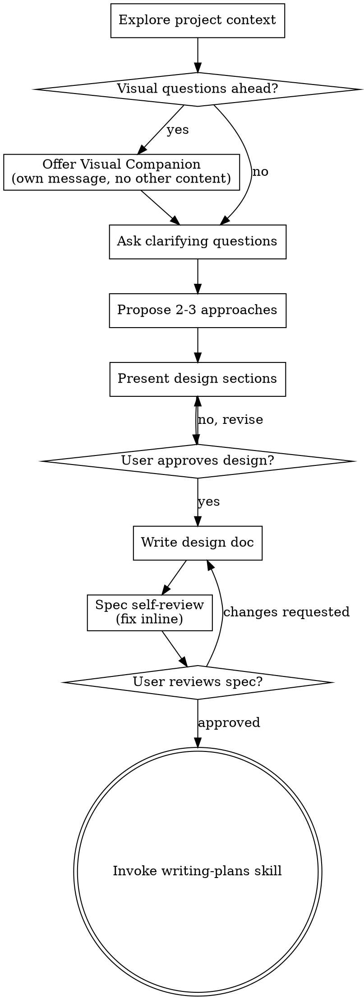

<!-- Generated by SpecStory, Markdown v2.1.0 -->

# 2026-04-30 00:16:29Z

<!-- Claude Code Session 2d6f3bb0-3a50-4c6a-aef2-43b624701329 (2026-04-30 00:16:29Z) -->

_**User (2026-04-30 00:16:29Z)**_

<local-command-caveat>Caveat: The messages below were generated by the user while running local commands. DO NOT respond to these messages or otherwise consider them in your response unless the user explicitly asks you to.</local-command-caveat>

_**User (2026-04-30 00:16:29Z)**_

Unknown command: /mode. Did you mean /model?

_**User (2026-04-30 00:16:33Z)**_

<local-command-caveat>Caveat: The messages below were generated by the user while running local commands. DO NOT respond to these messages or otherwise consider them in your response unless the user explicitly asks you to.</local-command-caveat>

_**User (2026-04-30 00:16:33Z)**_

<command-name>/model</command-name>
            <command-message>model</command-message>
            <command-args>opus</command-args>

_**User (2026-04-30 00:16:33Z)**_

<local-command-stdout>Set model to Opus 4.7</local-command-stdout>

_**User (2026-04-30 00:16:37Z)**_

<command-name>/effort</command-name>
            <command-message>effort</command-message>
            <command-args>max</command-args>

_**User (2026-04-30 00:16:37Z)**_

<local-command-stdout>Set effort level to max (this session only): Maximum capability with deepest reasoning</local-command-stdout>

_**User (2026-04-30 00:16:37Z)**_

<local-command-caveat>Caveat: The messages below were generated by the user while running local commands. DO NOT respond to these messages or otherwise consider them in your response unless the user explicitly asks you to.</local-command-caveat>

_**User (2026-04-30 00:16:45Z)**_

I want to redo, and fix some issues with the implementation of /Users/leocaseiro/Sites/base-skill/docs/brainstorms/2026-04-30-confusable-characters-spotall-requirements.md                                                                       
/Users/leocaseiro/Sites/base-skill/docs/plans/2026-04-30-001-feat-confusable-spotall-plan.md which was done on this git branch and worktree ~/Sites/base-skill/worktrees/feat/confusable-spotall (feat/confusable-spotall). WE have a PR up at    
https://github.com/leocaseiro/base-skill/pull/252, but some of the UI was not proper defined, as well as the customConfig are not working, and we missed some features such as the - R5b. Separate "reversible characters" list for characters    
commonly written backwards (same character, CSS-flipped ��������� e.g. backwards 6, backwards 2)                                                                                                                                                        
                                                                                                                                                                                                                                                  
                                                                                                                                                                                                                                                  
I want to first review what was missed, and also identify what has been used by the current game engine already in the games WordSpell, NumberMatch, and SortNumbers, and plan a refactoring of those. For example, the HUD is not using the      
dots. There isn't a storybook, etc etc.                                                                                                                                                                                                           
                                                                                                                                                                                                                                                  
We can use the same location and worktree/branch/PR etc                                   

---

_**Agent (claude-opus-4-7 2026-04-30 00:16:54Z)**_

_**Agent (claude-opus-4-7 2026-04-30 00:16:54Z)**_

I'll start with the brainstorming skill since we need to explore the gaps and refactoring scope before planning.

_**Agent (claude-opus-4-7 2026-04-30 00:16:54Z)**_

<tool-use data-tool-type="generic" data-tool-name="Skill"><details>
<summary>Tool use: **Skill**</summary>

```text
Launching skill: superpowers:brainstorming
```
</details></tool-use>

---

_**User (2026-04-30 00:16:54Z)**_

Base directory for this skill: /Users/leocaseiro/.claude/plugins/cache/claude-plugins-official/superpowers/5.0.7/skills/brainstorming

# Brainstorming Ideas Into Designs

Help turn ideas into fully formed designs and specs through natural collaborative dialogue.

Start by understanding the current project context, then ask questions one at a time to refine the idea. Once you understand what you're building, present the design and get user approval.

<HARD-GATE>
Do NOT invoke any implementation skill, write any code, scaffold any project, or take any implementation action until you have presented a design and the user has approved it. This applies to EVERY project regardless of perceived simplicity.
</HARD-GATE>

## Anti-Pattern: "This Is Too Simple To Need A Design"

Every project goes through this process. A todo list, a single-function utility, a config change — all of them. "Simple" projects are where unexamined assumptions cause the most wasted work. The design can be short (a few sentences for truly simple projects), but you MUST present it and get approval.

## Checklist

You MUST create a task for each of these items and complete them in order:

1. **Explore project context** — check files, docs, recent commits
2. **Offer visual companion** (if topic will involve visual questions) — this is its own message, not combined with a clarifying question. See the Visual Companion section below.
3. **Ask clarifying questions** — one at a time, understand purpose/constraints/success criteria
4. **Propose 2-3 approaches** — with trade-offs and your recommendation
5. **Present design** — in sections scaled to their complexity, get user approval after each section
6. **Write design doc** — save to `docs/superpowers/specs/YYYY-MM-DD-<topic>-design.md` and commit
7. **Spec self-review** — quick inline check for placeholders, contradictions, ambiguity, scope (see below)
8. **User reviews written spec** — ask user to review the spec file before proceeding
9. **Transition to implementation** — invoke writing-plans skill to create implementation plan

## Process Flow



**The terminal state is invoking writing-plans.** Do NOT invoke frontend-design, mcp-builder, or any other implementation skill. The ONLY skill you invoke after brainstorming is writing-plans.

## The Process

**Understanding the idea:**

- Check out the current project state first (files, docs, recent commits)
- Before asking detailed questions, assess scope: if the request describes multiple independent subsystems (e.g., "build a platform with chat, file storage, billing, and analytics"), flag this immediately. Don't spend questions refining details of a project that needs to be decomposed first.
- If the project is too large for a single spec, help the user decompose into sub-projects: what are the independent pieces, how do they relate, what order should they be built? Then brainstorm the first sub-project through the normal design flow. Each sub-project gets its own spec → plan → implementation cycle.
- For appropriately-scoped projects, ask questions one at a time to refine the idea
- Prefer multiple choice questions when possible, but open-ended is fine too
- Only one question per message - if a topic needs more exploration, break it into multiple questions
- Focus on understanding: purpose, constraints, success criteria

**Exploring approaches:**

- Propose 2-3 different approaches with trade-offs
- Present options conversationally with your recommendation and reasoning
- Lead with your recommended option and explain why

**Presenting the design:**

- Once you believe you understand what you're building, present the design
- Scale each section to its complexity: a few sentences if straightforward, up to 200-300 words if nuanced
- Ask after each section whether it looks right so far
- Cover: architecture, components, data flow, error handling, testing
- Be ready to go back and clarify if something doesn't make sense

**Design for isolation and clarity:**

- Break the system into smaller units that each have one clear purpose, communicate through well-defined interfaces, and can be understood and tested independently
- For each unit, you should be able to answer: what does it do, how do you use it, and what does it depend on?
- Can someone understand what a unit does without reading its internals? Can you change the internals without breaking consumers? If not, the boundaries need work.
- Smaller, well-bounded units are also easier for you to work with - you reason better about code you can hold in context at once, and your edits are more reliable when files are focused. When a file grows large, that's often a signal that it's doing too much.

**Working in existing codebases:**

- Explore the current structure before proposing changes. Follow existing patterns.
- Where existing code has problems that affect the work (e.g., a file that's grown too large, unclear boundaries, tangled responsibilities), include targeted improvements as part of the design - the way a good developer improves code they're working in.
- Don't propose unrelated refactoring. Stay focused on what serves the current goal.

## After the Design

**Documentation:**

- Write the validated design (spec) to `docs/superpowers/specs/YYYY-MM-DD-<topic>-design.md`
  - (User preferences for spec location override this default)
- Use elements-of-style:writing-clearly-and-concisely skill if available
- Commit the design document to git

**Spec Self-Review:**
After writing the spec document, look at it with fresh eyes:

1. **Placeholder scan:** Any "TBD", "TODO", incomplete sections, or vague requirements? Fix them.
2. **Internal consistency:** Do any sections contradict each other? Does the architecture match the feature descriptions?
3. **Scope check:** Is this focused enough for a single implementation plan, or does it need decomposition?
4. **Ambiguity check:** Could any requirement be interpreted two different ways? If so, pick one and make it explicit.

Fix any issues inline. No need to re-review — just fix and move on.

**User Review Gate:**
After the spec review loop passes, ask the user to review the written spec before proceeding:

> "Spec written and committed to `<path>`. Please review it and let me know if you want to make any changes before we start writing out the implementation plan."

Wait for the user's response. If they request changes, make them and re-run the spec review loop. Only proceed once the user approves.

**Implementation:**

- Invoke the writing-plans skill to create a detailed implementation plan
- Do NOT invoke any other skill. writing-plans is the next step.

## Key Principles

- **One question at a time** - Don't overwhelm with multiple questions
- **Multiple choice preferred** - Easier to answer than open-ended when possible
- **YAGNI ruthlessly** - Remove unnecessary features from all designs
- **Explore alternatives** - Always propose 2-3 approaches before settling
- **Incremental validation** - Present design, get approval before moving on
- **Be flexible** - Go back and clarify when something doesn't make sense

## Visual Companion

A browser-based companion for showing mockups, diagrams, and visual options during brainstorming. Available as a tool — not a mode. Accepting the companion means it's available for questions that benefit from visual treatment; it does NOT mean every question goes through the browser.

**Offering the companion:** When you anticipate that upcoming questions will involve visual content (mockups, layouts, diagrams), offer it once for consent:
> "Some of what we're working on might be easier to explain if I can show it to you in a web browser. I can put together mockups, diagrams, comparisons, and other visuals as we go. This feature is still new and can be token-intensive. Want to try it? (Requires opening a local URL)"

**This offer MUST be its own message.** Do not combine it with clarifying questions, context summaries, or any other content. The message should contain ONLY the offer above and nothing else. Wait for the user's response before continuing. If they decline, proceed with text-only brainstorming.

**Per-question decision:** Even after the user accepts, decide FOR EACH QUESTION whether to use the browser or the terminal. The test: **would the user understand this better by seeing it than reading it?**

- **Use the browser** for content that IS visual — mockups, wireframes, layout comparisons, architecture diagrams, side-by-side visual designs
- **Use the terminal** for content that is text — requirements questions, conceptual choices, tradeoff lists, A/B/C/D text options, scope decisions

A question about a UI topic is not automatically a visual question. "What does personality mean in this context?" is a conceptual question — use the terminal. "Which wizard layout works better?" is a visual question — use the browser.

If they agree to the companion, read the detailed guide before proceeding:
`skills/brainstorming/visual-companion.md`


---

_**Agent (claude-opus-4-7 2026-04-30 00:17:01Z)**_

_**Agent (claude-opus-4-7 2026-04-30 00:17:01Z)**_

I need to set up tasks for the brainstorming checklist and start exploring context. Let me load the task tools and begin.

_**Agent (claude-opus-4-7 2026-04-30 00:17:02Z)**_

<tool-use data-tool-type="unknown" data-tool-name="ToolSearch"><details>
<summary>Tool use: **ToolSearch**</summary>

**Input:**

- max_results: `3`
- query: `select:TaskCreate,TaskList,TaskUpdate`

**Result:**

```

```
</details></tool-use>

_**Agent (claude-opus-4-7 2026-04-30 00:17:05Z)**_

_**Agent (claude-opus-4-7 2026-04-30 00:17:07Z)**_

<tool-use data-tool-type="unknown" data-tool-name="TaskCreate"><details>
<summary>Tool use: **TaskCreate**</summary>
Read brainstorm + plan docs, examine worktree implementation, explore WordSpell/NumberMatch/SortNumbers for shared patterns, identify gaps and refactor scope

```text
Task #1 created successfully: Explore project context
```
</details></tool-use>

_**Agent (claude-opus-4-7 2026-04-30 00:17:08Z)**_

<tool-use data-tool-type="unknown" data-tool-name="TaskCreate"><details>
<summary>Tool use: **TaskCreate**</summary>
Visual UI mockups likely to come up — offer companion in its own message

```text
Task #2 created successfully: Decide on visual companion
```
</details></tool-use>

_**Agent (claude-opus-4-7 2026-04-30 00:17:10Z)**_

<tool-use data-tool-type="unknown" data-tool-name="TaskCreate"><details>
<summary>Tool use: **TaskCreate**</summary>
One at a time — purpose, constraints, scope of refactor, R5b reversible characters, customConfig fixes, HUD dots, Storybook coverage

```text
Task #3 created successfully: Ask clarifying questions
```
</details></tool-use>

_**Agent (claude-opus-4-7 2026-04-30 00:17:12Z)**_

<tool-use data-tool-type="unknown" data-tool-name="TaskCreate"><details>
<summary>Tool use: **TaskCreate**</summary>
Options for fixing PR #252 and refactoring shared engine pieces

```text
Task #4 created successfully: Propose 2-3 approaches with tradeoffs
```
</details></tool-use>

_**Agent (claude-opus-4-7 2026-04-30 00:17:13Z)**_

<tool-use data-tool-type="unknown" data-tool-name="TaskCreate"><details>
<summary>Tool use: **TaskCreate**</summary>
Architecture, components, data flow, error handling, testing — get approval per section

```text
Task #5 created successfully: Present design in sections
```
</details></tool-use>

_**Agent (claude-opus-4-7 2026-04-30 00:17:14Z)**_

<tool-use data-tool-type="unknown" data-tool-name="TaskCreate"><details>
<summary>Tool use: **TaskCreate**</summary>
Save to docs/superpowers/specs/2026-04-30-confusable-spotall-redesign-design.md and commit

```text
Task #6 created successfully: Write design doc
```
</details></tool-use>

_**Agent (claude-opus-4-7 2026-04-30 00:17:15Z)**_

<tool-use data-tool-type="unknown" data-tool-name="TaskCreate"><details>
<summary>Tool use: **TaskCreate**</summary>
Placeholder scan, internal consistency, scope check, ambiguity check; fix inline

```text
Task #7 created successfully: Spec self-review
```
</details></tool-use>

_**Agent (claude-opus-4-7 2026-04-30 00:17:17Z)**_

<tool-use data-tool-type="unknown" data-tool-name="TaskCreate"><details>
<summary>Tool use: **TaskCreate**</summary>
Ask user to review the saved spec file before proceeding

```text
Task #8 created successfully: User reviews written spec
```
</details></tool-use>

_**Agent (claude-opus-4-7 2026-04-30 00:17:17Z)**_

<tool-use data-tool-type="unknown" data-tool-name="TaskCreate"><details>
<summary>Tool use: **TaskCreate**</summary>
Invoke writing-plans skill to create implementation plan

```text
Task #9 created successfully: Transition to writing-plans skill
```
</details></tool-use>

_**Agent (claude-opus-4-7 2026-04-30 00:17:19Z)**_

<tool-use data-tool-type="unknown" data-tool-name="TaskUpdate"><details>
<summary>Tool use: **TaskUpdate**</summary>

```text
Updated task #1 status
```
</details></tool-use>

_**Agent (claude-opus-4-7 2026-04-30 00:17:23Z)**_

Let me read the brainstorm requirements, plan, and explore the worktree state.

_**Agent (claude-opus-4-7 2026-04-30 00:17:24Z)**_

<tool-use data-tool-type="read" data-tool-name="Read"><details>
<summary>Tool use: **Read**</summary>
 `./docs/brainstorms/2026-04-30-confusable-characters-spotall-requirements.md`

```text
1	---
2	date: 2026-04-30
3	topic: confusable-characters-spotall
4	---
5	
6	# Confusable Characters Data Layer + SpotAll Game
7	
8	## Problem Frame
9	
10	Young children frequently confuse visually similar characters — writing `b`
11	as `d`, mixing up `3` and `E`, or reversing `p`/`q`. Existing games in
12	BaseSkill don't target this specific skill. We need a dedicated data model
13	for confusable characters and a new game (SpotAll) that exercises visual
14	discrimination.
15	
16	---
17	
18	## Requirements
19	
20	**Confusable characters data layer**
21	
22	- R1. A confusable-sets data structure stores groups of characters or sequences that children commonly confuse (e.g. `{b, d, p, q}`, `{I, l, 1}`, `{6, 9}`, `{3, E}`, `{15, 51}`, `{oa, ao}`).
23	- R2. Each set contains pairwise relationship metadata tagging how each pair within the group is confusable: `mirror-horizontal`, `mirror-vertical`, `rotation-180`, `visual-similarity`, or `transposition` (inverted order, e.g. `15` vs `51`, `oa` vs `ao`).
24	- R3. A set may contain any number of members (not limited to pairs). Members can be single characters or multi-character sequences (digraphs, number pairs).
25	- R4. Games can query the data by character ("give me confusables for 'b'") and optionally filter by relationship type ("only mirrors").
26	- R5. The data layer ships with a curated initial dataset covering common letter and number confusions relevant to early learners.
27	- R5b. A separate "reversible characters" list identifies characters commonly written backwards by children (e.g. `6`, `2`, `3`, `5`, `7`, `J`, `S`, `Z`). Each entry specifies the transform that produces the incorrect form (e.g. `mirror-horizontal`). This is distinct from confusable sets — it represents the same character rendered incorrectly, not confusion between two different characters.
28	
29	**SpotAll game — v1 ("select all correct")**
30	
31	- R6. The game presents a prompt (e.g. "Select all the **d** tiles") and a grid of character tiles.
32	- R7. The grid contains multiple correct tiles (showing the prompted character) and distractor tiles drawn from two sources: confusable characters (different characters that look similar) and/or reversed versions of the target character itself (same character, CSS-flipped).
33	- R8. Correct tiles are displayed in varied visual styles (different fonts, sizes, colors) to force shape recognition rather than pixel-matching.
34	- R9. The child taps/selects all tiles they believe are correct. The game validates when the child submits or after all correct tiles are found.
35	- R10. Distractor tiles are rendered using CSS transforms (mirror, rotate) or show visually similar characters, depending on the relationship type in the confusable set.
36	
37	**Presets and configuration**
38	
39	- R11. The system provides preset game configurations for SpotAll (e.g. "Mirror Letters Easy", "All Confusables Hard") that bundle: which confusable sets to use, how many correct/distractor tiles, which relationship types to include.
40	- R12. Presets are reusable — designed so future games can reference the same confusable-set data and preset structure when adding distractor support.
41	
42	---
43	
44	## Success Criteria
45	
46	- A child using SpotAll consistently demonstrates improved ability to distinguish confusable characters (measured by game accuracy over time).
47	- The confusable-sets data is decoupled from SpotAll and queryable by any game, making future integration into WordSpell/NumberMatch straightforward.
48	
49	---
50	
51	## Scope Boundaries
52	
53	- Existing game integration (WordSpell, NumberMatch distractor injection) is deferred — the data layer supports it but we don't wire it up in v1.
54	- The "find the imposter" mode is already covered by NumberMatch's existing mechanic.
55	- The "sort into buckets" mode is out of scope — it overlaps with issue #228 (connect/categorize game).
56	- Automatic difficulty progression (auto-escalating relationship types by level) is deferred to a later pass.
57	- SVG/image-based rendering of mirrored characters is deferred — v1 uses CSS transforms on text.
58	
59	---
60	
61	## Key Decisions
62	
63	- **Data model:** Approach A (confusable sets with pairwise relationship metadata) chosen over tagged-groups-only or character-centric metadata, because it preserves family groupings while expressing mixed relationship types without redundancy.
64	- **Self-reversal as separate data:** Characters commonly written backwards (6, 2, 3, etc.) are stored in a separate "reversible characters" list rather than forced into the confusable-sets model. Rationale: a pair of ["6", "6"] in confusable sets would make the query API confusing; separating the concepts keeps each data source clean and independently queryable.
65	- **Game name:** SpotAll — avoids confusion with NumberMatch, communicates the "find all correct" mechanic.
66	- **v1 game mode:** "Select all correct" only. Other modes (imposter, sort) are either covered elsewhere or deferred.
67	- **Visual variation purpose:** Preventing pattern-matching. Correct tiles intentionally vary in surface appearance so the child must recognize the underlying shape.
68	
69	---
70	
71	## Dependencies / Assumptions
72	
73	- CSS transforms (`scaleX(-1)`, `rotate(180deg)`, etc.) render readable mirrored/rotated characters in the fonts used by the app.
74	- The curated confusable-sets dataset is manageable in size (estimated 10-20 families) and can be authored as static JSON.
75	
76	---
77	
78	## Outstanding Questions
79	
80	### Deferred to Planning
81	
82	- _(Affects R5, needs research)_ What is the full initial dataset of confusable character families for early learners? Literature review may help prioritize.
83	- _(Affects R8, technical)_ Which fonts render mirrored characters readably via CSS transform? Some fonts may produce ambiguous or ugly results when flipped.
84	- _(Affects R10, technical)_ Should rotation/mirror transforms be applied at the character level (CSS on a `<span>`) or at the tile level (entire tile flipped)?
85	- _(Affects R11, technical)_ How do presets integrate with the existing game config/registration system?
86	- _(Affects R9, needs research)_ What feedback model works best pedagogically — validate on submit, validate on each tap, or validate after all correct found?
87	
88	---
89	
90	## Next Steps
91	
92	-> `ce-plan` for structured implementation planning
93
```
</details></tool-use>

_**Agent (claude-opus-4-7 2026-04-30 00:17:25Z)**_

<tool-use data-tool-type="read" data-tool-name="Read"><details>
<summary>Tool use: **Read**</summary>
 `./docs/plans/2026-04-30-001-feat-confusable-spotall-plan.md`

```text
1	---
2	title: 'feat: Confusable characters data layer + SpotAll game'
3	type: feat
4	status: active
5	date: 2026-04-30
6	origin: docs/brainstorms/2026-04-30-confusable-characters-spotall-requirements.md
7	---
8	
9	## Overview
10	
11	Add a reusable confusable-character data layer (static JSON with query utilities) and a new game called SpotAll where children identify correct characters from a grid of visually confusable tiles. SpotAll uses a "tap all correct" mechanic distinct from the existing drag-to-slot AnswerGame system.
12	
13	---
14	
15	## Problem Frame
16	
17	Young children frequently confuse visually similar characters — writing `b` as `d`, mixing up `3` and `E`, reversing `p`/`q`, or transposing sequences like `15`/`51`. Existing BaseSkill games (WordSpell, NumberMatch, SortNumbers) don't target visual discrimination directly. This plan delivers a standalone data layer for confusable characters and the first game (SpotAll) that exercises this skill. (see origin: `docs/brainstorms/2026-04-30-confusable-characters-spotall-requirements.md`)
18	
19	---
20	
21	## Requirements Trace
22	
23	- R1. Confusable-sets data structure storing groups of confusable characters/sequences
24	- R2. Pairwise relationship metadata (mirror-horizontal, mirror-vertical, rotation-180, visual-similarity, transposition)
25	- R3. Sets with any number of members including multi-character sequences
26	- R4. Query by character with optional relationship-type filter
27	- R5. Curated initial dataset for early learners
28	- R5b. Separate "reversible characters" list for characters commonly written backwards (same character, CSS-flipped — e.g. backwards 6, backwards 2)
29	- R6. SpotAll presents a prompt + grid of character tiles
30	- R7. Grid has correct tiles + distractor tiles from two sources: confusable characters (different chars) and/or reversed target character (same char, CSS-flipped)
31	- R8. Correct tiles vary in visual style (font, size, color) to force shape recognition
32	- R9. Child taps/selects all correct tiles; game validates on submission
33	- R10. Distractor tiles rendered via CSS transforms or as visually similar characters
34	- R11. Preset game configurations (set + difficulty bundles)
35	- R12. Presets reusable by future games
36	
37	---
38	
39	## Scope Boundaries
40	
41	- Existing game integration (WordSpell, NumberMatch distractor injection) is deferred — the data layer supports it but no wiring in v1
42	- "Find the imposter" mode is already covered by NumberMatch
43	- "Sort into buckets" mode is out of scope (overlaps with issue #228)
44	- Automatic difficulty progression deferred to a later pass
45	- SVG/image-based rendering deferred — v1 uses CSS transforms on text
46	
47	### Deferred to Follow-Up Work
48	
49	- WordSpell/NumberMatch integration with confusable distractors: separate PR once data layer is proven
50	- Additional game modes for SpotAll (imposter, sorting): separate issue
51	
52	---
53	
54	## Context & Research
55	
56	### Relevant Code and Patterns
57	
58	- `src/games/registry.ts` — `GAME_CATALOG` array with `{id, titleKey, descriptionKey, levels, subject, defaultCover}`
59	- `src/games/config-fields-registry.tsx` — maps gameId to config field definitions
60	- `src/routes/$locale/_app/game/$gameId.tsx` — `GameBody` switch dispatches to game-specific body components
61	- `src/components/answer-game/types.ts` — `TileItem {id, label, value}`, `AnswerZone`, `AnswerGameConfig`
62	- `src/games/number-match/build-numeral-round.ts` — `pickDistractorNumerals()` pattern for generating wrong answers
63	- `src/data/words/core/level1.json` — static JSON data pattern (simple objects, imported at build time)
64	- `src/components/answer-game/answer-game-reducer.ts` — slot-based state machine (NOT suitable for tap-to-select)
65	- `src/lib/game-engine/` — `GameEngineProvider` for outer lifecycle, scoring, session recording (reusable)
66	- `src/components/game/GameShell` — wraps games with engine provider
67	
68	### Key Insight: AnswerGame Is Not Suitable for SpotAll
69	
70	The existing `AnswerGameProvider` + `answerGameReducer` is purpose-built for drag-to-slot interactions: tiles have `value` matched against `AnswerZone.expectedValue`, input methods are `drag | type | both`, and state tracks `activeSlotIndex`, `dragActiveTileId`, etc.
71	
72	SpotAll's "tap all correct from a grid" mechanic is fundamentally different:
73	
74	- No slots/zones — tiles are selected in-place
75	- Multi-select (many correct tiles, not one-per-zone)
76	- No drag — tap/click toggle
77	- Completion = all correct found (not all slots filled)
78	
79	SpotAll will create its own lightweight reducer while reusing `GameShell`/`GameEngineProvider` for the outer game lifecycle.
80	
81	---
82	
83	## Key Technical Decisions
84	
85	- **SpotAll has its own state management:** A `spotAllReducer` handles tile selection, validation, and round completion. Does NOT use `AnswerGameProvider`. Rationale: the tap-multi-select pattern doesn't map to the drag-to-slot paradigm.
86	- **SpotAll reuses GameShell/GameEngineProvider:** For rounds, scoring, session recording, and the outer game chrome (HUD, instructions overlay, game-over). Rationale: avoid duplicating lifecycle management.
87	- **Confusable data is static JSON:** Similar to word lists in `src/data/words/`. Loaded at build time, no runtime fetching. Rationale: dataset is small (10-20 families), stable, and doesn't need dynamic updates.
88	- **Two distractor data sources:** Confusable sets (different characters) and reversible characters (same character flipped). Kept separate because "6 confused with itself mirrored" is a fundamentally different concept from "6 confused with 9". The round builder draws from both.
89	- **CSS transforms for mirror/rotation:** `scaleX(-1)` for horizontal mirror, `scaleY(-1)` for vertical mirror, `rotate(180deg)` for rotation. Applied at the character level inside a tile. Rationale: simple, no extra assets needed, works with any font.
90	- **Visual variation on correct tiles:** Randomly assigned inline styles (font-family, font-size, color) per correct tile at round-build time. Rationale: prevents pixel-matching without changing the character shape.
91	- **Validation on submit:** Child selects tiles freely, then taps a "Check" button. Rationale: allows self-correction before committing, reduces frustration from accidental taps, and is the simplest model for v1.
92	
93	---
94	
95	## Open Questions
96	
97	### Resolved During Planning
98	
99	- **Should SpotAll use AnswerGameProvider?** No — the interaction model is fundamentally different (tap-multi-select vs drag-to-slot). Own reducer needed.
100	- **Where does confusable data live?** `src/data/confusables/` — follows the `src/data/words/` pattern of static JSON with TypeScript query utilities.
101	- **Feedback model (R9)?** Validate on submit (child taps "Check" button). Simplest, least frustrating, allows self-correction.
102	- **CSS transforms at what level (R10)?** Character level (`<span>` inside tile). The tile frame stays upright; only the character content is transformed. This keeps the tile visually consistent in the grid.
103	
104	### Deferred to Implementation
105	
106	- Exact visual variation parameters (which fonts, size range, color palette) — best determined by seeing them rendered
107	- Whether `GameEngineProvider` needs any adapter for the tap-select model or if it works unchanged
108	- Exact number of initial confusable families in v1 dataset — author as many as practical
109	
110	---
111	
112	## High-Level Technical Design
113	
114	> _This illustrates the intended approach and is directional guidance for review, not implementation specification. The implementing agent should treat it as context, not code to reproduce._
115	
116	```
117	DATA LAYER
118	┌─────────────────────────────────────────────────────┐
119	│ src/data/confusables/                               │
120	│   confusable-sets.json      ← groups of different   │
121	│                                confusable chars      │
122	│   reversible-characters.json← chars commonly written│
123	│                                backwards (self-flip) │
124	│   types.ts                  ← ConfusableSet,        │
125	│                                ReversibleCharacter   │
126	│   query.ts                  ← getConfusablesFor(),  │
127	│                                getReversalTransform()│
128	└─────────────────────────────────────────────────────┘
129	         │
130	         ▼ (imported by)
131	ROUND BUILDER
132	┌─────────────────────────────────────────────────────┐
133	│ src/games/spot-all/                                 │
134	│   build-spot-all-round.ts                           │
135	│     → picks target character                        │
136	│     → queries confusable sets (different chars)     │
137	│     → queries reversible list (same char flipped)   │
138	│     → assigns visual variation to correct tiles     │
139	│     → assigns CSS transforms to distractor tiles    │
140	│     → returns SpotAllRound {tiles[], target}        │
141	└─────────────────────────────────────────────────────┘
142	         │
143	         ▼ (fed into)
144	GAME STATE
145	┌─────────────────────────────────────────────────────┐
146	│ spot-all-reducer.ts                                 │
147	│   State: tiles[], selectedIds[], phase, roundIndex  │
148	│   Actions: SELECT_TILE, DESELECT_TILE, SUBMIT,      │
149	│            ADVANCE_ROUND, COMPLETE_GAME             │
150	│   On SUBMIT: compare selectedIds vs correctIds     │
151	│     → all correct + no extras = round-complete     │
152	│     → else = show feedback, allow retry            │
153	└─────────────────────────────────────────────────────┘
154	         │
155	         ▼ (renders)
156	COMPONENTS
157	┌─────────────────────────────────────────────────────┐
158	│ SpotAll.tsx ← main game, wraps in GameShell         │
159	│ SpotAllGrid.tsx ← renders tile grid                 │
160	│ SpotAllTile.tsx ← single tile with transforms/style │
161	│ SpotAllPrompt.tsx ← "Select all the d tiles"        │
162	└─────────────────────────────────────────────────────┘
163	```
164	
165	---
166	
167	## Output Structure
168	
169	```
170	src/data/confusables/
171	├── confusable-sets.json
172	├── reversible-characters.json
173	├── types.ts
174	├── query.ts
175	└── query.test.ts
176	
177	src/games/spot-all/
178	├── types.ts
179	├── build-spot-all-round.ts
180	├── build-spot-all-round.test.ts
181	├── spot-all-reducer.ts
182	├── spot-all-reducer.test.ts
183	├── resolve-simple-config.ts
184	├── SpotAll/
185	│   └── SpotAll.tsx
186	├── SpotAllGrid/
187	│   └── SpotAllGrid.tsx
188	├── SpotAllTile/
189	│   └── SpotAllTile.tsx
190	├── SpotAllPrompt/
191	│   └── SpotAllPrompt.tsx
192	└── SpotAllConfigForm/
193	    └── SpotAllConfigForm.tsx
194	```
195	
196	---
197	
198	## Implementation Units
199	
200	- [ ] U1. **Confusable sets data types and initial dataset**
201	
202	**Goal:** Create the confusable-sets data structure and reversible-characters list with TypeScript types and initial curated JSON datasets.
203	
204	**Requirements:** R1, R2, R3, R5, R5b
205	
206	**Dependencies:** None
207	
208	**Files:**
209	
210	- Create: `src/data/confusables/types.ts`
211	- Create: `src/data/confusables/confusable-sets.json`
212	- Create: `src/data/confusables/reversible-characters.json`
213	
214	**Approach:**
215	
216	- Define `ConfusableSet` type: `{id, name, members: string[], relationships: {pair: [string, string], type: RelationshipType}[]}`
217	- Define `RelationshipType` union: `'mirror-horizontal' | 'mirror-vertical' | 'rotation-180' | 'visual-similarity' | 'transposition'`
218	- Define `ReversibleCharacter` type: `{char: string, transform: 'mirror-horizontal' | 'mirror-vertical' | 'rotation-180'}` — characters commonly written backwards by children
219	- Author confusable-sets dataset covering: `{b,d,p,q}`, `{I,l,1}`, `{6,9}`, `{3,E}`, `{m,w}`, `{n,u}`, `{S,5}`, `{O,0}`, `{15,51}`, `{oa,ao}`
220	- Author reversible-characters dataset: `6`, `2`, `3`, `5`, `7`, `J`, `S`, `Z` (all `mirror-horizontal`)
221	- Export typed constants from the JSON files
222	
223	**Patterns to follow:**
224	
225	- `src/data/words/core/level1.json` — static JSON data authored by hand
226	- TypeScript `as const satisfies` for type-safe JSON imports
227	
228	**Test scenarios:**
229	
230	- Test expectation: none — pure data/type definitions with no runtime logic
231	
232	**Verification:**
233	
234	- Types compile without error
235	- JSON validates against the TypeScript types
236	- Confusable-sets dataset covers at least 8 families spanning all 5 relationship types
237	- Reversible-characters dataset covers at least 6 commonly reversed characters
238	
239	---
240	
241	- [ ] U2. **Confusable query utility**
242	
243	**Goal:** Create a query module that games can use to look up confusable characters and reversible characters by input.
244	
245	**Requirements:** R4, R5b
246	
247	**Dependencies:** U1
248	
249	**Files:**
250	
251	- Create: `src/data/confusables/query.ts`
252	- Create: `src/data/confusables/query.test.ts`
253	
254	**Approach:**
255	
256	- `getConfusablesFor(member: string, options?: {type?: RelationshipType}): string[]` — returns all characters confusable with `member`, optionally filtered
257	- `getConfusableSet(setId: string): ConfusableSet | undefined` — direct set lookup
258	- `getAllSets(): ConfusableSet[]` — full dataset access
259	- `getReversalTransform(char: string): ReversibleCharacter | undefined` — returns the transform for a commonly reversed character, or undefined if not reversible
260	- `isReversible(char: string): boolean` — quick check if a character is commonly written backwards
261	- Build an index on first call (member → sets containing it) for fast lookup
262	
263	**Patterns to follow:**
264	
265	- `src/games/number-match/build-numeral-round.ts` `pickDistractorNumerals` — simple utility with clear input/output
266	
267	**Test scenarios:**
268	
269	- Happy path: `getConfusablesFor('b')` returns `['d', 'p', 'q']`
270	- Happy path: `getConfusablesFor('b', {type: 'mirror-horizontal'})` returns `['d']` only
271	- Happy path: `getConfusablesFor('15')` returns `['51']` (multi-char sequence)
272	- Edge case: `getConfusablesFor('z')` returns `[]` (character not in any set)
273	- Edge case: `getConfusablesFor('')` returns `[]` (empty input)
274	- Happy path: `getConfusableSet('bdpq')` returns the full set with all members and relationships
275	- Edge case: `getConfusableSet('nonexistent')` returns `undefined`
276	- Happy path: `getReversalTransform('6')` returns `{char: '6', transform: 'mirror-horizontal'}`
277	- Happy path: `isReversible('6')` returns `true`
278	- Edge case: `isReversible('a')` returns `false` (not in reversible list)
279	
280	**Verification:**
281	
282	- All test scenarios pass
283	- Query results are consistent with the JSON dataset
284	
285	---
286	
287	- [ ] U3. **SpotAll game types and registration**
288	
289	**Goal:** Define the SpotAll config type and register the game in the catalog and route.
290	
291	**Requirements:** R6, R11
292	
293	**Dependencies:** U1
294	
295	**Files:**
296	
297	- Create: `src/games/spot-all/types.ts`
298	- Modify: `src/games/registry.ts`
299	- Modify: `src/games/config-fields-registry.tsx`
300	- Modify: `src/routes/$locale/_app/game/$gameId.tsx`
301	
302	**Approach:**
303	
304	- `SpotAllConfig` type extending game-specific fields: target confusable sets, relationship type filter, grid size, correct tile count, distractor count, visual variation toggle
305	- Add `spot-all` entry to `GAME_CATALOG` with `subject: 'letters'`, appropriate levels, emoji cover
306	- Add stub config fields registration
307	- Add `SpotAllGameBody` component (placeholder) and `if (gameId === 'spot-all')` branch in `GameBody`
308	
309	**Patterns to follow:**
310	
311	- `src/games/number-match/types.ts` — game config type structure
312	- `GAME_CATALOG` entries in `src/games/registry.ts` — field shape
313	- `GameBody` switch in route file — conditional rendering pattern
314	
315	**Test scenarios:**
316	
317	- Happy path: `GAME_CATALOG.find(g => g.id === 'spot-all')` exists with correct fields
318	- Happy path: navigating to `/en/game/spot-all` renders the SpotAll game body (not "Game not found")
319	
320	**Verification:**
321	
322	- TypeScript compiles cleanly with the new types
323	- Game appears in catalog and route renders without error
324	
325	---
326	
327	- [ ] U4. **SpotAll round builder**
328	
329	**Goal:** Create a round builder that generates a tile grid with correct tiles (visually varied) and distractor tiles (from confusable data and/or self-reversals).
330	
331	**Requirements:** R6, R7, R8, R10
332	
333	**Dependencies:** U1, U2
334	
335	**Files:**
336	
337	- Create: `src/games/spot-all/build-spot-all-round.ts`
338	- Create: `src/games/spot-all/build-spot-all-round.test.ts`
339	
340	**Approach:**
341	
342	- `buildSpotAllRound(config)` returns `SpotAllRound {target: string, tiles: SpotAllTile[], correctCount: number}`
343	- Each `SpotAllTile` has: `id`, `label`, `isCorrect`, `visualVariation?` (for correct tiles: font, size, color), `transform?` (for distractor tiles: CSS transform string), `distractorSource: 'confusable' | 'self-reversal' | null`
344	- Distractor generation draws from TWO sources:
345	  1. **Confusable sets** — different characters that look similar (query `getConfusablesFor`)
346	  2. **Reversible characters** — the target character itself, CSS-flipped (query `getReversalTransform`)
347	- If target is in reversible-characters list, include self-mirrored version(s) as distractors
348	- Assign random visual variations to correct tiles (from a palette)
349	- Assign appropriate CSS transform based on source for distractor tiles
350	- Shuffle all tiles into final grid order
351	
352	**Patterns to follow:**
353	
354	- `src/games/number-match/build-numeral-round.ts` — round building with distractor injection and Fisher-Yates shuffle
355	
356	**Test scenarios:**
357	
358	- Happy path: round for target 'b' with 3 correct + 3 distractors returns 6 tiles, 3 marked correct
359	- Happy path: distractor tiles for 'b' are drawn from `{d, p, q}` (confusable set members)
360	- Happy path: round for target '6' includes a self-mirrored '6' distractor (same label, with `transform: 'scaleX(-1)'`)
361	- Happy path: round for target '6' can include BOTH a '9' (confusable) AND a mirrored '6' (self-reversal) as distractors
362	- Happy path: correct tiles each have different `visualVariation` values
363	- Happy path: mirror-type distractors have `transform: 'scaleX(-1)'` or equivalent
364	- Happy path: transposition distractors show the transposed sequence as label (e.g. 'ao' for target 'oa')
365	- Edge case: target with no confusables AND not in reversible list falls back to random characters
366	- Edge case: requesting more distractors than available sources caps at available count
367	
368	**Verification:**
369	
370	- All test scenarios pass
371	- Round always returns the correct number of tiles with proper correct/distractor split
372	
373	---
374	
375	- [ ] U5. **SpotAll game state reducer**
376	
377	**Goal:** Implement the tap-to-select state machine for SpotAll gameplay.
378	
379	**Requirements:** R9
380	
381	**Dependencies:** U4
382	
383	**Files:**
384	
385	- Create: `src/games/spot-all/spot-all-reducer.ts`
386	- Create: `src/games/spot-all/spot-all-reducer.test.ts`
387	
388	**Approach:**
389	
390	- State: `{tiles: SpotAllTile[], selectedIds: Set<string>, phase, roundIndex, feedback: 'none' | 'correct' | 'incorrect'}`
391	- Actions: `INIT_ROUND`, `TOGGLE_TILE` (select/deselect), `SUBMIT` (validate), `ADVANCE_ROUND`, `COMPLETE_GAME`
392	- On `SUBMIT`: compare selectedIds against correct tile IDs
393	  - All correct + no extras → mark round complete
394	  - Missing or extras → show feedback, allow retry
395	- On `ADVANCE_ROUND`: load next round tiles, reset selections
396	
397	**Patterns to follow:**
398	
399	- `src/components/answer-game/answer-game-reducer.ts` — reducer structure, phase transitions, `resolveCompletionPhase` pattern
400	
401	**Test scenarios:**
402	
403	- Happy path: selecting all correct tiles and submitting transitions to round-complete
404	- Happy path: selecting a mix of correct and incorrect tiles and submitting shows incorrect feedback
405	- Happy path: toggling a tile twice deselects it
406	- Happy path: ADVANCE_ROUND resets selectedIds and loads new tiles
407	- Edge case: submitting with no selections shows incorrect feedback
408	- Edge case: selecting more tiles than correct count still validates correctly (extras count as wrong)
409	- Integration: completing the last round triggers COMPLETE_GAME phase
410	
411	**Verification:**
412	
413	- All test scenarios pass
414	- Reducer is pure (no side effects)
415	
416	---
417	
418	- [ ] U6. **SpotAll game component and tile rendering**
419	
420	**Goal:** Build the main SpotAll component with tile grid, prompt, and visual variation/transform rendering.
421	
422	**Requirements:** R6, R8, R9, R10
423	
424	**Dependencies:** U3, U4, U5
425	
426	**Files:**
427	
428	- Create: `src/games/spot-all/SpotAll/SpotAll.tsx`
429	- Create: `src/games/spot-all/SpotAllGrid/SpotAllGrid.tsx`
430	- Create: `src/games/spot-all/SpotAllTile/SpotAllTile.tsx`
431	- Create: `src/games/spot-all/SpotAllPrompt/SpotAllPrompt.tsx`
432	
433	**Approach:**
434	
435	- `SpotAll` wraps content in `GameShell` with `GameEngineProvider`, manages rounds via the spot-all reducer
436	- `SpotAllPrompt` displays "Select all the **X** tiles" with the target character highlighted
437	- `SpotAllGrid` renders a responsive grid of `SpotAllTile` components
438	- `SpotAllTile` renders the character with:
439	  - `visualVariation` applied as inline styles (font-family, font-size, color) for correct tiles
440	  - `transform` applied as CSS transform for distractor tiles (scaleX(-1), rotate, etc.)
441	  - Selected state (outline/highlight), correct feedback (green), incorrect feedback (red)
442	- A "Check" button triggers SUBMIT action
443	- Wire into the `SpotAllGameBody` placeholder from U3
444	
445	**Patterns to follow:**
446	
447	- `src/games/number-match/NumberMatch/NumberMatch.tsx` — game component structure with rounds
448	- `src/games/number-match/NumeralTileBank/NumeralTileBank.tsx` — tile rendering with button elements
449	- Tailwind classes for grid layout, transitions, and state-driven styling
450	
451	**Test scenarios:**
452	
453	- Happy path: renders prompt with target character
454	- Happy path: renders correct number of tiles in grid
455	- Happy path: tapping a tile toggles its selected state visually
456	- Happy path: submitting correct selection shows success feedback
457	- Happy path: distractor tiles display with CSS transform applied
458	- Happy path: correct tiles display with varied visual styles
459	- Integration: completing all rounds shows game-over state via GameShell
460	
461	**Verification:**
462	
463	- Component renders without error
464	- Interactive flow works end-to-end (tap → select → submit → feedback → advance)
465	
466	---
467	
468	- [ ] U7. **SpotAll config form and presets**
469	
470	**Goal:** Create the config form UI and preset configurations for SpotAll.
471	
472	**Requirements:** R11, R12
473	
474	**Dependencies:** U3, U6
475	
476	**Files:**
477	
478	- Create: `src/games/spot-all/SpotAllConfigForm/SpotAllConfigForm.tsx`
479	- Create: `src/games/spot-all/resolve-simple-config.ts`
480	- Modify: `src/games/config-fields-registry.tsx`
481	
482	**Approach:**
483	
484	- Simple config: difficulty selector (easy/medium/hard) that maps to preset bundles
485	- Advanced config: select confusable sets, relationship types, grid size, correct/distractor counts
486	- Presets: "Mirror Letters Easy" (b/d only, 4 correct + 2 distractor), "All Confusables Hard" (multiple sets, mixed types, larger grid)
487	- Wire into `config-fields-registry.tsx` (replace stub from U3)
488	
489	**Patterns to follow:**
490	
491	- `src/games/number-match/resolve-simple-config.ts` — simple-to-full config mapping
492	- Existing config form components in `src/games/*/`
493	
494	**Test scenarios:**
495	
496	- Happy path: "easy" preset generates config with single confusable set, small grid
497	- Happy path: "hard" preset generates config with multiple sets, mixed relationship types
498	- Happy path: advanced form allows selecting specific confusable sets
499	- Edge case: config with no sets selected falls back to default preset
500	
501	**Verification:**
502	
503	- Config form renders and produces valid SpotAllConfig
504	- Presets generate playable game configurations
505	
506	---
507	
508	## System-Wide Impact
509	
510	- **Interaction graph:** SpotAll operates independently. It reads from `src/data/confusables/` (static import) and plugs into `GameShell`/`GameEngineProvider` at the same level as NumberMatch. No callbacks or middleware affected.
511	- **Error propagation:** If confusable data is missing/malformed, round builder should fail gracefully with a fallback (random characters as distractors). No cascading failures.
512	- **State lifecycle risks:** SpotAll's reducer is self-contained. Session persistence via `GameEngineProvider` should work without adapter if the engine stores opaque round data.
513	- **API surface parity:** New game ID `spot-all` must be added to route, catalog, and config registry — three integration points.
514	- **Integration coverage:** The round builder → reducer → component pipeline should be tested as a flow, not just unit-by-unit.
515	- **Unchanged invariants:** Existing games (WordSpell, NumberMatch, SortNumbers) are not modified. The confusable data layer is additive only.
516	
517	---
518	
519	## Risks & Dependencies
520	
521	| Risk                                                                              | Mitigation                                                                                                                              |
522	| --------------------------------------------------------------------------------- | --------------------------------------------------------------------------------------------------------------------------------------- |
523	| CSS transforms may render poorly with some fonts (flipped characters look broken) | Test with the app's actual font stack early in U6; fall back to showing the confusable character literally if transforms are unreadable |
524	| GameEngineProvider may expect AnswerGame-shaped state for session recording       | U6 implementation will verify; worst case, SpotAll handles its own session persistence                                                  |
525	| Multi-character sequences (e.g. "oa") displayed in a single tile may look cramped | Grid tile sizing should accommodate 2-3 character labels; test in Storybook                                                             |
526	
527	---
528	
529	## Sources & References
530	
531	- **Origin document:** [docs/brainstorms/2026-04-30-confusable-characters-spotall-requirements.md](docs/brainstorms/2026-04-30-confusable-characters-spotall-requirements.md)
532	- Related code: `src/games/registry.ts`, `src/games/number-match/build-numeral-round.ts`
533	- Related issues: #234 (Game: identify the correct one), #228 (connect answers — deferred)
534
```
</details></tool-use>

_**Agent (claude-opus-4-7 2026-04-30 00:17:27Z)**_

_**Agent (claude-opus-4-7 2026-04-30 00:17:28Z)**_

Now let me check the actual worktree state to see what was implemented vs what's missing.

_**Agent (claude-opus-4-7 2026-04-30 00:17:31Z)**_

<tool-use data-tool-type="shell" data-tool-name="Bash"><details>
<summary>Tool use: **Bash**</summary>
Check worktree branch state and commits

`cd /Users/leocaseiro/Sites/base-skill/worktrees/feat/confusable-spotall && git status && echo "---BRANCH---" && git branch --show-current && echo "---LOG---" && git log --oneline master..HEAD 2>/dev/null | head -40`

```text
On branch feat/confusable-spotall
Your branch is up to date with 'origin/feat/confusable-spotall'.

nothing to commit, working tree clean
---BRANCH---
feat/confusable-spotall
---LOG---
51d6e4e7 feat(spot-all): add confusables data layer and playable SpotAll game
710f3d1c chore(release): v0.20.2 (#248)
d5d74c4f chore(specstory): sync history 2026-04-29_1 (#249)
ff62aaa2 chore(specstory): sync history from all branches and worktrees
0cad7090 fix(curriculum): IPA accuracy audit for AUS curriculum (#247)
42d0e45a fix(curriculum): correct IPA for open-syllable vowels, ow=/aʊ/, and ew=/uː/ (#243)
cf88d03c chore(release): v0.20.1 (#246)
```
</details></tool-use>

_**Agent (claude-opus-4-7 2026-04-30 00:17:31Z)**_

<tool-use data-tool-type="shell" data-tool-name="Bash"><details>
<summary>Tool use: **Bash**</summary>
Inspect SpotAll directory + confusables data

`ls -la /Users/leocaseiro/Sites/base-skill/worktrees/feat/confusable-spotall/src/games/spot-all/ 2>/dev/null && echo "---DATA---" && ls -la /Users/leocaseiro/Sites/base-skill/worktrees/feat/confusable-spotall/src/data/confusables/ 2>/dev/null`

```text
total 64
drwxr-xr-x@ 14 leocaseiro  staff   448 30 Apr 01:29 .
drwxr-xr-x@ 20 leocaseiro  staff   640 30 Apr 01:29 ..
-rw-r--r--@  1 leocaseiro  staff  3204 30 Apr 01:30 build-spot-all-round.test.ts
-rw-r--r--@  1 leocaseiro  staff  4384 30 Apr 01:30 build-spot-all-round.ts
-rw-r--r--@  1 leocaseiro  staff  1182 30 Apr 01:30 resolve-simple-config.test.ts
-rw-r--r--@  1 leocaseiro  staff  1690 30 Apr 01:29 resolve-simple-config.ts
-rw-r--r--@  1 leocaseiro  staff  3677 30 Apr 01:30 spot-all-reducer.test.ts
-rw-r--r--@  1 leocaseiro  staff  2977 30 Apr 01:29 spot-all-reducer.ts
drwxr-xr-x@  4 leocaseiro  staff   128 30 Apr 01:29 SpotAll
drwxr-xr-x@  3 leocaseiro  staff    96 30 Apr 01:29 SpotAllConfigForm
drwxr-xr-x@  3 leocaseiro  staff    96 30 Apr 01:29 SpotAllGrid
drwxr-xr-x@  3 leocaseiro  staff    96 30 Apr 01:29 SpotAllPrompt
drwxr-xr-x@  3 leocaseiro  staff    96 30 Apr 01:29 SpotAllTile
-rw-r--r--@  1 leocaseiro  staff  1419 30 Apr 01:29 types.ts
---DATA---
total 32
drwxr-xr-x@ 6 leocaseiro  staff   192 30 Apr 01:29 .
drwxr-xr-x@ 4 leocaseiro  staff   128 30 Apr 01:29 ..
-rw-r--r--@ 1 leocaseiro  staff  2083 30 Apr 01:29 confusable-sets.json
-rw-r--r--@ 1 leocaseiro  staff  1211 30 Apr 01:29 query.test.ts
-rw-r--r--@ 1 leocaseiro  staff  3348 30 Apr 01:30 query.ts
-rw-r--r--@ 1 leocaseiro  staff   368 30 Apr 01:29 types.ts
```
</details></tool-use>

_**Agent (claude-opus-4-7 2026-04-30 00:17:32Z)**_

<tool-use data-tool-type="shell" data-tool-name="Bash"><details>
<summary>Tool use: **Bash**</summary>
List files changed on branch vs master

`git diff --stat master..HEAD 2>/dev/null | tail -100`

```text
 ...2026-04-07_04-59-12Z-implement-the-dark-mode.md | 39730 ++++++-------
 ...-04-07_06-13-12Z-fix-failing-storybook-tests.md |   761 +-
 .../2026-04-07_06-32-31Z-pull-master-and-start.md  |  6529 +--
 .../2026-04-07_07-08-28Z-this-session-is-being.md  |  3320 +-
 .../2026-04-07_08-32-53Z-specstory-sync-claude.md  |    88 +-
 .../2026-04-07_08-54-17Z-this-session-is-being.md  |   811 +-
 .../history/2026-04-07_09-27-50Z-we-are-using-a.md | 30482 +++++-----
 ...04-07_09-46-03Z-superpowers-writing-plans-we.md |  5249 +-
 ...-56Z-superpowers-subagent-driven-development.md | 45822 +++++++--------
 ...6-04-07_10-30-37Z-critical-respond-with-text.md |  1213 +-
 .../2026-04-07_10-51-59Z-we-have-been-fixing.md    |  6348 +--
 ...2026-04-07_11-03-51Z-you-are-completing-task.md | 13639 ++---
 .../2026-04-07_12-29-50Z-this-session-is-being.md  |  2972 +-
 .../2026-04-07_13-20-56Z-bug-fix-session-drag.md   |  3864 +-
 .../history/2026-04-07_15-54-14Z-i-am-trying-to.md |  5580 +-
 .../2026-04-07_16-34-23Z-i-have-been-trying.md     |  7643 +--
 .../2026-04-07_17-15-20Z-i-have-been-trying.md     |  5663 +-
 .../2026-04-07_17-42-40Z-i-have-been-trying.md     |  3580 +-
 ...6-04-07_18-06-06Z-brainstorm-drag-preview-in.md |  3145 +-
 .../2026-04-07_18-29-25Z-write-the-plan-for.md     |  7778 +--
 .specstory/history/2026-04-07_18-40-22Z.md         | 26882 ++++-----
 ...04-07_19-32-20Z-finish-the-investigation-and.md |  4383 +-
 ...26-04-07_19-40-00Z-please-pull-master-before.md |  1196 +-
 .../2026-04-07_20-42-11Z-this-session-is-being.md  |  4425 +-
 ...6-04-07_21-14-04Z-critical-respond-with-text.md |  3564 +-
 .../2026-04-07_22-45-38Z-can-you-pull-master.md    |  6448 +--
 .specstory/history/2026-04-08_07-19-45Z.md         |    14 +-
 ...4-08_07-33-32Z-drag-preview-and-swap-testing.md |   336 +-
 .../history/2026-04-08_07-38-19Z-i-want-to-pull.md |  4038 +-
 ...2026-04-08_08-50-28Z-pull-master-and-execute.md | 32416 +++++------
 ...026-04-08_08-57-35Z-since-we-implemented-the.md |  2643 +-
 ...026-04-08_12-03-55Z-the-latest-changes-tried.md |  8599 +--
 .../2026-04-08_12-47-38Z-use-the-spec-users.md     |  9815 ++--
 .../history/2026-04-08_13-15-49Z-let-s-work-on.md  | 13978 ++---
 .specstory/history/2026-04-08_20-59-46Z.md         |    55 +-
 ...6-04-09_00-14-47Z-you-are-implementing-tasks.md | 20630 +++----
 .../2026-04-09_12-49-51Z-this-session-is-being.md  |  4338 +-
 .../history/2026-04-09_19-25-12Z-help-me-to-fix.md |    58 +-
 .../history/2026-04-09_19-42-10Z-i-want-to-make.md |  9189 +--
 .../2026-04-09_21-32-10Z-we-are-working-on.md      |  1277 +-
 ...53-56Z-continue-writing-implementation-plans.md |  3475 +-
 .../history/2026-04-09_23-40-44Z-i-want-to-add.md  |  7994 +--
 .specstory/history/2026-04-10_01-30-04Z.md         |   717 +-
 .specstory/history/2026-04-10_02-05-34Z.md         | 14320 ++---
 .../2026-04-10_04-46-41Z-ci-re-running-on.md       |  8562 +--
 .../history/2026-04-10_08-50-51Z-i-am-trying-to.md |  1066 +-
 .../2026-04-10_10-09-22Z-this-session-is-being.md  |  3586 +-
 .../2026-04-10_11-19-58Z-this-session-is-being.md  |   273 +-
 .../2026-04-10_21-52-29Z-i-want-to-improve.md      |  4263 +-
 .../history/2026-04-10_23-17-08Z-i-want-to-work.md | 29986 +++++-----
 .../history/2026-04-11_00-29-33Z-i-want-to-plan.md | 11086 ++--
 ...026-04-11_12-52-56Z-execute-the-phonics-word.md | 55675 ++++++++++---------
 ...-04-11_22-08-17Z-phoneme-tuner-fresh-session.md |  1581 +-
 .../2026-04-21_01-39-29Z-since-i-started-the.md    |   195 +
 ...21_14-33-19Z-continue-the-storybook-controls.md |   748 +
 .specstory/history/2026-04-21_19-46-54Z.md         |    19 +
 ...026-04-22_04-19-31Z-handoff-tier-3-storybook.md |    16 +
 .../2026-04-22_04-19-31Z-hash-handoff-tier-3.md    |  1557 +
 ...3-08-21Z-cotinue-claude-worktrees-suspicious.md |    16 +
 .../history/2026-04-24_09-45-59Z-can-you-fix-my.md |    16 +
 .../2026-04-28_00-52-20Z-i-want-to-merge.md        |  2652 +
 ...2026-04-28_04-41-22Z-review-the-https-github.md | 10813 ++++
 .../history/2026-04-28_08-05-13Z-the-app-is-no.md  |  3158 ++
 .../history/2026-04-28_09-51-04Z-i-need-to-make.md |  6910 +++
 .../2026-04-28_10-18-49Z-why-is-claude-settings.md |   218 +
 .../history/2026-04-28_10-40-01Z-isn-t-this-a.md   |   286 +
 .../history/2026-04-28_11-07-58Z-i-am-trying-to.md |  2522 +
 .../2026-04-28_11-39-20Z-what-is-with-all.md       |   737 +
 ...6-04-28_20-38-28Z-while-testing-https-github.md | 10833 ++++
 ...26-04-28_22-18-55Z-continue-the-handoff-from.md | 36687 ++++++++++++
 .../2026-04-28_23-56-15Z-i-am-currently-using.md   |  1759 +
 .../2026-04-29_00-45-24Z-continue-the-work-from.md |  9642 ++++
 .specstory/history/2026-04-29_04-32-21Z.md         |  2970 +
 .specstory/history/2026-04-29_10-59-19Z.md         |    19 +
 package.json                                       |     2 +-
 src/data/confusables/confusable-sets.json          |    79 +
 src/data/confusables/query.test.ts                 |    42 +
 src/data/confusables/query.ts                      |   129 +
 src/data/confusables/types.ts                      |    18 +
 src/data/words/curriculum/aus/level6.json          |    52 +-
 src/data/words/curriculum/aus/level7.json          |   198 +-
 src/data/words/curriculum/aus/level8.json          |    46 +-
 src/data/words/levels.ts                           |     6 +
 src/games/config-fields-registry.tsx               |     8 +
 src/games/registry.ts                              |    12 +
 src/games/spot-all/SpotAll/SpotAll.test.tsx        |    64 +
 src/games/spot-all/SpotAll/SpotAll.tsx             |    94 +
 .../SpotAllConfigForm/SpotAllConfigForm.tsx        |    55 +
 src/games/spot-all/SpotAllGrid/SpotAllGrid.tsx     |    23 +
 src/games/spot-all/SpotAllPrompt/SpotAllPrompt.tsx |    15 +
 src/games/spot-all/SpotAllTile/SpotAllTile.tsx     |    47 +
 src/games/spot-all/build-spot-all-round.test.ts    |   114 +
 src/games/spot-all/build-spot-all-round.ts         |   170 +
 src/games/spot-all/resolve-simple-config.test.ts   |    35 +
 src/games/spot-all/resolve-simple-config.ts        |    64 +
 src/games/spot-all/spot-all-reducer.test.ts        |   131 +
 src/games/spot-all/spot-all-reducer.ts             |   112 +
 src/games/spot-all/types.ts                        |    70 +
 src/routes/$locale/_app/game/$gameId.tsx           |   182 +
 178 files changed, 485875 insertions(+), 369263 deletions(-)
```
</details></tool-use>

_**Agent (claude-opus-4-7 2026-04-30 00:17:39Z)**_

_**Agent (claude-opus-4-7 2026-04-30 00:17:40Z)**_

Let me read the existing implementation to identify gaps.

_**Agent (claude-opus-4-7 2026-04-30 00:17:41Z)**_

<tool-use data-tool-type="read" data-tool-name="Read"><details>
<summary>Tool use: **Read**</summary>
 `./worktrees/feat/confusable-spotall/src/games/spot-all/SpotAll/SpotAll.tsx`

```text
1	import { useNavigate, useParams } from '@tanstack/react-router';
2	import { useEffect, useMemo, useReducer, useState } from 'react';
3	import { buildSpotAllRound } from '../build-spot-all-round';
4	import {
5	  createInitialSpotAllState,
6	  spotAllReducer,
7	} from '../spot-all-reducer';
8	import { SpotAllGrid } from '../SpotAllGrid/SpotAllGrid';
9	import { SpotAllPrompt } from '../SpotAllPrompt/SpotAllPrompt';
10	import type { SpotAllConfig } from '../types';
11	import type { JSX } from 'react';
12	import { GameOverOverlay } from '@/components/answer-game/GameOverOverlay/GameOverOverlay';
13	import { buildRoundOrder } from '@/games/build-round-order';
14	
15	export const SpotAll = ({
16	  config,
17	  seed,
18	}: {
19	  config: SpotAllConfig;
20	  seed?: string;
21	}): JSX.Element => {
22	  const navigate = useNavigate();
23	  const { locale } = useParams({ from: '/$locale' });
24	  const [sessionEpoch, setSessionEpoch] = useState(0);
25	
26	  const rounds = useMemo(() => {
27	    void sessionEpoch;
28	    const ordered = Array.from({ length: config.totalRounds }, () =>
29	      buildSpotAllRound(config),
30	    );
31	    const order = buildRoundOrder(
32	      ordered.length,
33	      config.roundsInOrder === true,
34	      seed,
35	    );
36	    return order.map((index) => ordered[index]!).filter(Boolean);
37	  }, [config, seed, sessionEpoch]);
38	
39	  const [state, dispatch] = useReducer(
40	    spotAllReducer,
41	    rounds,
42	    createInitialSpotAllState,
43	  );
44	
45	  useEffect(() => {
46	    dispatch({ type: 'INIT_ROUNDS', rounds });
47	  }, [rounds]);
48	
49	  useEffect(() => {
50	    if (state.phase !== 'round-complete') return;
51	    const timer = globalThis.setTimeout(() => {
52	      dispatch({ type: 'ADVANCE_ROUND' });
53	    }, 700);
54	    return () => {
55	      globalThis.clearTimeout(timer);
56	    };
57	  }, [state.phase]);
58	
59	  if (state.phase === 'game-over') {
60	    return (
61	      <GameOverOverlay
62	        retryCount={0}
63	        onPlayAgain={() => setSessionEpoch((value) => value + 1)}
64	        onHome={() =>
65	          void navigate({ to: '/$locale', params: { locale } })
66	        }
67	      />
68	    );
69	  }
70	
71	  return (
72	    <div className="mx-auto flex w-full max-w-4xl flex-col gap-6 px-4 py-6">
73	      <SpotAllPrompt target={rounds[state.roundIndex]?.target ?? '?'} />
74	      <SpotAllGrid
75	        state={state}
76	        onToggleTile={(tileId) => {
77	          dispatch({ type: 'TOGGLE_TILE', tileId });
78	        }}
79	      />
80	      <div className="flex items-center justify-center">
81	        <button
82	          type="button"
83	          className="rounded-xl bg-primary px-5 py-2 font-semibold text-primary-foreground hover:bg-primary/90"
84	          onClick={() => dispatch({ type: 'SUBMIT' })}
85	        >
86	          Check
87	        </button>
88	      </div>
89	      <p className="text-center text-sm text-muted-foreground">
90	        Round {state.roundIndex + 1} of {rounds.length}
91	      </p>
92	    </div>
93	  );
94	};
95
```
</details></tool-use>

_**Agent (claude-opus-4-7 2026-04-30 00:17:42Z)**_

<tool-use data-tool-type="read" data-tool-name="Read"><details>
<summary>Tool use: **Read**</summary>
 `./worktrees/feat/confusable-spotall/src/games/spot-all/SpotAllTile/SpotAllTile.tsx`

```text
1	import type { SpotAllTile as SpotAllTileData } from '../types';
2	import type { JSX } from 'react';
3	import { cn } from '@/lib/utils';
4	
5	export const SpotAllTile = ({
6	  tile,
7	  isSelected,
8	  feedback,
9	  onToggle,
10	}: {
11	  tile: SpotAllTileData;
12	  isSelected: boolean;
13	  feedback: 'none' | 'correct' | 'incorrect';
14	  onToggle: () => void;
15	}): JSX.Element => {
16	  const showCorrect = feedback === 'correct' && tile.isCorrect;
17	  const showIncorrect =
18	    feedback === 'incorrect' && isSelected && !tile.isCorrect;
19	
20	  return (
21	    <button
22	      type="button"
23	      onClick={onToggle}
24	      className={cn(
25	        'flex min-h-24 min-w-24 items-center justify-center rounded-2xl border-2 bg-card px-3 py-2 shadow-sm transition-all',
26	        isSelected
27	          ? 'border-primary ring-2 ring-primary/25'
28	          : 'border-border',
29	        showCorrect && 'border-emerald-500 bg-emerald-50',
30	        showIncorrect && 'border-rose-500 bg-rose-50',
31	      )}
32	    >
33	      <span
34	        style={{
35	          fontFamily: tile.visualVariation?.fontFamily,
36	          fontSize: tile.visualVariation?.fontSizePx,
37	          color: tile.visualVariation?.color,
38	          transform: tile.transform,
39	          display: 'inline-block',
40	        }}
41	        className="font-bold leading-none"
42	      >
43	        {tile.label}
44	      </span>
45	    </button>
46	  );
47	};
48
```
</details></tool-use>

_**Agent (claude-opus-4-7 2026-04-30 00:17:42Z)**_

<tool-use data-tool-type="read" data-tool-name="Read"><details>
<summary>Tool use: **Read**</summary>
 `./worktrees/feat/confusable-spotall/src/games/spot-all/SpotAllGrid/SpotAllGrid.tsx`

```text
1	import { SpotAllTile } from '../SpotAllTile/SpotAllTile';
2	import type { SpotAllState } from '../spot-all-reducer';
3	import type { JSX } from 'react';
4	
5	export const SpotAllGrid = ({
6	  state,
7	  onToggleTile,
8	}: {
9	  state: SpotAllState;
10	  onToggleTile: (tileId: string) => void;
11	}): JSX.Element => (
12	  <div className="grid grid-cols-3 gap-3 sm:grid-cols-4">
13	    {state.tiles.map((tile) => (
14	      <SpotAllTile
15	        key={tile.id}
16	        tile={tile}
17	        isSelected={state.selectedIds.has(tile.id)}
18	        feedback={state.feedback}
19	        onToggle={() => onToggleTile(tile.id)}
20	      />
21	    ))}
22	  </div>
23	);
24
```
</details></tool-use>

_**Agent (claude-opus-4-7 2026-04-30 00:17:43Z)**_

<tool-use data-tool-type="read" data-tool-name="Read"><details>
<summary>Tool use: **Read**</summary>
 `./worktrees/feat/confusable-spotall/src/games/spot-all/SpotAllPrompt/SpotAllPrompt.tsx`

```text
1	import type { JSX } from 'react';
2	
3	export const SpotAllPrompt = ({
4	  target,
5	}: {
6	  target: string;
7	}): JSX.Element => (
8	  <p className="text-center text-2xl font-semibold text-foreground">
9	    Select all the{' '}
10	    <span className="rounded bg-primary/10 px-2 py-1 font-bold text-primary">
11	      {target}
12	    </span>{' '}
13	    tiles
14	  </p>
15	);
16
```
</details></tool-use>

_**Agent (claude-opus-4-7 2026-04-30 00:17:43Z)**_

<tool-use data-tool-type="read" data-tool-name="Read"><details>
<summary>Tool use: **Read**</summary>
 `./worktrees/feat/confusable-spotall/src/games/spot-all/SpotAllConfigForm/SpotAllConfigForm.tsx`

```text
1	import { resolveSimpleConfig } from '../resolve-simple-config';
2	import type { JSX } from 'react';
3	import { ChunkGroup } from '@/components/config/ChunkGroup';
4	
5	export const SpotAllConfigForm = ({
6	  config,
7	  onChange,
8	}: {
9	  config: Record<string, unknown>;
10	  onChange: (config: Record<string, unknown>) => void;
11	}): JSX.Element => {
12	  const difficulty =
13	    config.difficulty === 'easy' || config.difficulty === 'hard'
14	      ? config.difficulty
15	      : 'medium';
16	
17	  return (
18	    <div className="flex flex-col gap-4">
19	      <ChunkGroup
20	        label="Difficulty"
21	        options={[
22	          {
23	            value: 'easy',
24	            emoji: '🧩',
25	            label: 'Mirror Letters Easy',
26	            subtitle: 'Focus on b/d with fewer distractors',
27	          },
28	          {
29	            value: 'medium',
30	            emoji: '🎯',
31	            label: 'Balanced',
32	            subtitle: 'Mix of common confusables',
33	          },
34	          {
35	            value: 'hard',
36	            emoji: '🔥',
37	            label: 'All Confusables Hard',
38	            subtitle: 'Large grid with mixed relationship types',
39	          },
40	        ]}
41	        value={difficulty}
42	        onChange={(selectedDifficulty) => {
43	          const resolved = resolveSimpleConfig({
44	            configMode: 'simple',
45	            difficulty: selectedDifficulty as
46	              | 'easy'
47	              | 'medium'
48	              | 'hard',
49	          });
50	          onChange({ ...resolved, difficulty: selectedDifficulty });
51	        }}
52	      />
53	    </div>
54	  );
55	};
56
```
</details></tool-use>

_**Agent (claude-opus-4-7 2026-04-30 00:17:44Z)**_

<tool-use data-tool-type="read" data-tool-name="Read"><details>
<summary>Tool use: **Read**</summary>
 `./worktrees/feat/confusable-spotall/src/games/spot-all/types.ts`

```text
1	import type { RelationshipType } from '@/data/confusables/types';
2	import type { ConfigField } from '@/lib/config-fields';
3	
4	export type SpotAllSimpleConfig = {
5	  configMode: 'simple';
6	  difficulty: 'easy' | 'medium' | 'hard';
7	};
8	
9	export interface SpotAllVisualVariation {
10	  fontFamily: string;
11	  fontSizePx: number;
12	  color: string;
13	}
14	
15	export interface SpotAllTile {
16	  id: string;
17	  label: string;
18	  isCorrect: boolean;
19	  transform?: string;
20	  visualVariation?: SpotAllVisualVariation;
21	}
22	
23	export interface SpotAllRound {
24	  target: string;
25	  tiles: SpotAllTile[];
26	  correctCount: number;
27	}
28	
29	export interface SpotAllConfig {
30	  gameId: 'spot-all';
31	  component: 'SpotAll';
32	  configMode?: 'simple' | 'advanced';
33	  totalRounds: number;
34	  roundsInOrder?: boolean;
35	  ttsEnabled: boolean;
36	  targetSetIds: string[];
37	  relationshipTypes: RelationshipType[];
38	  correctTileCount: number;
39	  distractorCount: number;
40	  visualVariationEnabled: boolean;
41	}
42	
43	export const spotAllConfigFields: ConfigField[] = [
44	  {
45	    type: 'number',
46	    key: 'totalRounds',
47	    label: 'Total rounds',
48	    min: 1,
49	    max: 20,
50	  },
51	  {
52	    type: 'number',
53	    key: 'correctTileCount',
54	    label: 'Correct tiles',
55	    min: 1,
56	    max: 8,
57	  },
58	  {
59	    type: 'number',
60	    key: 'distractorCount',
61	    label: 'Distractor tiles',
62	    min: 1,
63	    max: 16,
64	  },
65	  {
66	    type: 'checkbox',
67	    key: 'visualVariationEnabled',
68	    label: 'Visual variation',
69	  },
70	];
71
```
</details></tool-use>

_**Agent (claude-opus-4-7 2026-04-30 00:17:45Z)**_

<tool-use data-tool-type="read" data-tool-name="Read"><details>
<summary>Tool use: **Read**</summary>
 `./worktrees/feat/confusable-spotall/src/games/spot-all/build-spot-all-round.ts`

```text
1	import { nanoid } from 'nanoid';
2	import type {
3	  SpotAllConfig,
4	  SpotAllRound,
5	  SpotAllTile,
6	  SpotAllVisualVariation,
7	} from './types';
8	import type { RelationshipType } from '@/data/confusables/types';
9	import { getAllSets } from '@/data/confusables/query';
10	
11	type BuildSpotAllRoundOptions = SpotAllConfig & {
12	  forceTarget?: string;
13	};
14	
15	type DistractorCandidate = {
16	  label: string;
17	  relationshipType: RelationshipType;
18	};
19	
20	const FALLBACK_DISTRACTORS = [
21	  'A',
22	  'B',
23	  'C',
24	  'D',
25	  'E',
26	  'F',
27	  'G',
28	  'H',
29	  'J',
30	  'K',
31	];
32	
33	const VISUAL_VARIATIONS: readonly SpotAllVisualVariation[] = [
34	  { fontFamily: 'serif', fontSizePx: 42, color: '#2563eb' },
35	  { fontFamily: 'monospace', fontSizePx: 48, color: '#dc2626' },
36	  { fontFamily: 'sans-serif', fontSizePx: 44, color: '#059669' },
37	  { fontFamily: 'cursive', fontSizePx: 46, color: '#7c3aed' },
38	  { fontFamily: 'system-ui', fontSizePx: 40, color: '#ea580c' },
39	];
40	
41	const transformForType = (
42	  type: RelationshipType,
43	): string | undefined => {
44	  switch (type) {
45	    case 'mirror-horizontal': {
46	      return 'scaleX(-1)';
47	    }
48	    case 'mirror-vertical': {
49	      return 'scaleY(-1)';
50	    }
51	    case 'rotation-180': {
52	      return 'rotate(180deg)';
53	    }
54	    default: {
55	      return undefined;
56	    }
57	  }
58	};
59	
60	const shuffle = <T>(items: T[]): T[] => {
61	  const copy = [...items];
62	  for (let i = copy.length - 1; i > 0; i--) {
63	    const j = Math.floor(Math.random() * (i + 1));
64	    [copy[i], copy[j]] = [copy[j]!, copy[i]!];
65	  }
66	  return copy;
67	};
68	
69	const pickTarget = (config: BuildSpotAllRoundOptions): string => {
70	  if (config.forceTarget) return config.forceTarget;
71	
72	  const sets = getAllSets().filter(
73	    (set) =>
74	      config.targetSetIds.length === 0 ||
75	      config.targetSetIds.includes(set.id),
76	  );
77	  const members = sets.flatMap((set) => set.members);
78	  if (members.length === 0) return 'b';
79	  return members[Math.floor(Math.random() * members.length)]!;
80	};
81	
82	const gatherDistractorCandidates = (
83	  target: string,
84	  config: BuildSpotAllRoundOptions,
85	): DistractorCandidate[] => {
86	  const filteredSets = getAllSets().filter(
87	    (set) =>
88	      set.members.includes(target) &&
89	      (config.targetSetIds.length === 0 ||
90	        config.targetSetIds.includes(set.id)),
91	  );
92	
93	  const out: DistractorCandidate[] = [];
94	  for (const set of filteredSets) {
95	    for (const relationship of set.relationships) {
96	      if (!config.relationshipTypes.includes(relationship.type))
97	        continue;
98	
99	      const [left, right] = relationship.pair;
100	      if (left === target) {
101	        out.push({
102	          label: right,
103	          relationshipType: relationship.type,
104	        });
105	      } else if (right === target) {
106	        out.push({
107	          label: left,
108	          relationshipType: relationship.type,
109	        });
110	      }
111	    }
112	  }
113	
114	  const dedup = new Map<string, DistractorCandidate>();
115	  for (const candidate of out) {
116	    if (!dedup.has(candidate.label))
117	      dedup.set(candidate.label, candidate);
118	  }
119	  return [...dedup.values()];
120	};
121	
122	export const buildSpotAllRound = (
123	  config: BuildSpotAllRoundOptions,
124	): SpotAllRound => {
125	  const target = pickTarget(config);
126	  const candidates = gatherDistractorCandidates(target, config);
127	
128	  const distractorCount =
129	    candidates.length > 0
130	      ? Math.min(config.distractorCount, candidates.length)
131	      : config.distractorCount;
132	
133	  const distractorTiles: SpotAllTile[] =
134	    candidates.length > 0
135	      ? shuffle(candidates)
136	          .slice(0, distractorCount)
137	          .map((candidate) => ({
138	            id: nanoid(),
139	            label: candidate.label,
140	            isCorrect: false,
141	            transform: transformForType(candidate.relationshipType),
142	          }))
143	      : shuffle(FALLBACK_DISTRACTORS)
144	          .filter((symbol) => symbol !== target)
145	          .slice(0, distractorCount)
146	          .map((label) => ({
147	            id: nanoid(),
148	            label,
149	            isCorrect: false,
150	          }));
151	
152	  const correctTiles: SpotAllTile[] = Array.from(
153	    { length: config.correctTileCount },
154	    (_, index) => ({
155	      id: nanoid(),
156	      label: target,
157	      isCorrect: true,
158	      visualVariation: config.visualVariationEnabled
159	        ? VISUAL_VARIATIONS[index % VISUAL_VARIATIONS.length]
160	        : undefined,
161	    }),
162	  );
163	
164	  const tiles = shuffle([...correctTiles, ...distractorTiles]);
165	  return {
166	    target,
167	    tiles,
168	    correctCount: correctTiles.length,
169	  };
170	};
171
```
</details></tool-use>

_**Agent (claude-opus-4-7 2026-04-30 00:17:51Z)**_

_**Agent (claude-opus-4-7 2026-04-30 00:17:51Z)**_

Let me continue exploring. Need to examine other games' HUD, config forms, and Storybook patterns.

_**Agent (claude-opus-4-7 2026-04-30 00:17:54Z)**_

<tool-use data-tool-type="shell" data-tool-name="Bash"><details>
<summary>Tool use: **Bash**</summary>
List game directories

`ls src/games/word-spell/ 2>/dev/null && echo "---NUMBER-MATCH---" && ls src/games/number-match/ 2>/dev/null && echo "---SORT-NUMBERS---" && ls src/games/sort-numbers/ 2>/dev/null`

```text
build-sentence-gap-round.test.ts
build-sentence-gap-round.ts
LetterTileBank
level-unit-selection.test.ts
level-unit-selection.ts
resolve-simple-config.test.ts
resolve-simple-config.ts
types.ts
useFilteredWords.test.tsx
useFilteredWords.ts
useLibraryRounds.test.tsx
useLibraryRounds.ts
WordPreviewBar
WordSpell
WordSpell.config-form.stories.tsx
WordSpellLibrarySource
WordSpellSimpleConfigForm
---NUMBER-MATCH---
build-numeral-round.test.ts
build-numeral-round.ts
number-words.test.ts
number-words.ts
NumberMatch
NumberMatch.config-form.stories.tsx
NumberMatchSimpleConfigForm
NumeralTileBank
pair-to-mode.test.ts
pair-to-mode.ts
resolve-simple-config.test.ts
resolve-simple-config.ts
types.ts
---SORT-NUMBERS---
advanced-level-generator.test.ts
advanced-level-generator.ts
build-sort-round.test.ts
build-sort-round.ts
is-rounds-stale.test.ts
is-rounds-stale.ts
resolve-simple-config.test.ts
resolve-simple-config.ts
sort-numbers-level-generator.test.ts
sort-numbers-level-generator.ts
SortNumbers
SortNumbers.config-form.stories.tsx
SortNumbersSimpleConfigForm
SortNumbersTileBank
types.ts
```
</details></tool-use>

_**Agent (claude-opus-4-7 2026-04-30 00:17:55Z)**_

<tool-use data-tool-type="shell" data-tool-name="Bash"><details>
<summary>Tool use: **Bash**</summary>
Find Storybook stories and HUD/Shell components

`find src/games -name "*.stories.tsx" | head -40 && echo "---HUD---" && find src/components -name "*HUD*" -o -name "*Hud*" 2>/dev/null | head -20 && echo "---SHELL---" && find src/components -name "*GameShell*" 2>/dev/null | head -10`

```text
src/games/number-match/NumberMatch.config-form.stories.tsx
src/games/sort-numbers/SortNumbers.config-form.stories.tsx
src/games/word-spell/WordSpell.config-form.stories.tsx
src/games/number-match/NumeralTileBank/NumeralTileBank.stories.tsx
src/games/number-match/NumberMatch/NumberMatch.stories.tsx
src/games/number-match/NumberMatch/NumberMatch.skin.stories.tsx
src/games/sort-numbers/SortNumbersTileBank/SortNumbersTileBank.stories.tsx
src/games/sort-numbers/SortNumbers/SortNumbers.stories.tsx
src/games/sort-numbers/SortNumbers/SortNumbers.skin.stories.tsx
src/games/word-spell/LetterTileBank/LetterTileBank.stories.tsx
src/games/word-spell/WordSpell/WordSpell.stories.tsx
src/games/word-spell/WordSpell/WordSpell.skin.stories.tsx
---HUD---
src/components/answer-game/ProgressHUD
src/components/answer-game/ProgressHUD/ProgressHUD.test.tsx
src/components/answer-game/ProgressHUD/ProgressHUD.tsx
src/components/answer-game/ProgressHUD/ProgressHUD.stories.tsx
src/components/answer-game/ProgressHUD/ProgressHUDRoot.test.tsx
src/components/answer-game/ProgressHUD/ProgressHUDRoot.tsx
---SHELL---
src/components/game/GameShell.test.tsx
src/components/game/GameShell.tsx
src/components/game/GameShell.stories.tsx
```
</details></tool-use>

_**Agent (claude-opus-4-7 2026-04-30 00:17:57Z)**_

<tool-use data-tool-type="shell" data-tool-name="Bash"><details>
<summary>Tool use: **Bash**</summary>
Read confusables data and query module

`cat src/data/confusables/types.ts && echo "---SETS-JSON---" && cat src/data/confusables/confusable-sets.json && echo "---QUERY---" && cat src/data/confusables/query.ts`

```text
export type RelationshipType =
  | 'mirror-horizontal'
  | 'mirror-vertical'
  | 'rotation-180'
  | 'visual-similarity'
  | 'transposition';

export interface ConfusableRelationship {
  pair: [string, string];
  type: RelationshipType;
}

export interface ConfusableSet {
  id: string;
  name: string;
  members: string[];
  relationships: ConfusableRelationship[];
}
---SETS-JSON---
[
  {
    "id": "bdpq",
    "name": "Mirror lowercase stems",
    "members": ["b", "d", "p", "q"],
    "relationships": [
      { "pair": ["b", "d"], "type": "mirror-horizontal" },
      { "pair": ["b", "p"], "type": "mirror-vertical" },
      { "pair": ["d", "q"], "type": "mirror-vertical" },
      { "pair": ["p", "q"], "type": "mirror-horizontal" },
      { "pair": ["b", "q"], "type": "rotation-180" },
      { "pair": ["d", "p"], "type": "rotation-180" }
    ]
  },
  {
    "id": "il1",
    "name": "I l 1 lookalikes",
    "members": ["I", "l", "1"],
    "relationships": [
      { "pair": ["I", "l"], "type": "visual-similarity" },
      { "pair": ["I", "1"], "type": "visual-similarity" },
      { "pair": ["l", "1"], "type": "visual-similarity" }
    ]
  },
  {
    "id": "69",
    "name": "Six and nine inversion",
    "members": ["6", "9"],
    "relationships": [{ "pair": ["6", "9"], "type": "rotation-180" }]
  },
  {
    "id": "3e",
    "name": "Three and capital E",
    "members": ["3", "E"],
    "relationships": [
      { "pair": ["3", "E"], "type": "visual-similarity" }
    ]
  },
  {
    "id": "mw",
    "name": "m and w rotation",
    "members": ["m", "w"],
    "relationships": [{ "pair": ["m", "w"], "type": "rotation-180" }]
  },
  {
    "id": "nu",
    "name": "n and u inversion",
    "members": ["n", "u"],
    "relationships": [{ "pair": ["n", "u"], "type": "rotation-180" }]
  },
  {
    "id": "s5",
    "name": "S and 5 lookalikes",
    "members": ["S", "5"],
    "relationships": [
      { "pair": ["S", "5"], "type": "visual-similarity" }
    ]
  },
  {
    "id": "o0",
    "name": "Letter O and zero",
    "members": ["O", "0"],
    "relationships": [
      { "pair": ["O", "0"], "type": "visual-similarity" }
    ]
  },
  {
    "id": "15-51",
    "name": "Transposed one-five",
    "members": ["15", "51"],
    "relationships": [{ "pair": ["15", "51"], "type": "transposition" }]
  },
  {
    "id": "oa-ao",
    "name": "Transposed oa/ao",
    "members": ["oa", "ao"],
    "relationships": [{ "pair": ["oa", "ao"], "type": "transposition" }]
  }
]
---QUERY---
import confusableSetsJson from './confusable-sets.json';
import type {
  ConfusableRelationship,
  ConfusableSet,
  RelationshipType,
} from './types';

const RELATIONSHIP_TYPES: ReadonlySet<RelationshipType> = new Set([
  'mirror-horizontal',
  'mirror-vertical',
  'rotation-180',
  'visual-similarity',
  'transposition',
]);

const isRelationshipType = (value: string): value is RelationshipType =>
  RELATIONSHIP_TYPES.has(value as RelationshipType);

const normalizeRelationship = (
  relationship: (typeof confusableSetsJson)[number]['relationships'][number],
): ConfusableRelationship | null => {
  if (relationship.pair.length !== 2) return null;
  if (!isRelationshipType(relationship.type)) return null;
  const left = relationship.pair[0];
  const right = relationship.pair[1];
  if (left === undefined || right === undefined) return null;

  return {
    pair: [left, right],
    type: relationship.type,
  };
};

const normalizeSet = (
  set: (typeof confusableSetsJson)[number],
): ConfusableSet => ({
  id: set.id,
  name: set.name,
  members: [...set.members],
  relationships: set.relationships
    .map((relationship) => normalizeRelationship(relationship))
    .filter(
      (relationship): relationship is ConfusableRelationship =>
        relationship !== null,
    ),
});

const CONFUSABLE_SETS: ConfusableSet[] = confusableSetsJson.map((set) =>
  normalizeSet(set),
);

let memberToSetIndexes: Map<string, number[]> | null = null;

const getIndex = (): Map<string, number[]> => {
  if (memberToSetIndexes) return memberToSetIndexes;

  const next = new Map<string, number[]>();
  for (const [setIndex, set] of CONFUSABLE_SETS.entries()) {
    for (const member of set.members) {
      const indexes = next.get(member) ?? [];
      indexes.push(setIndex);
      next.set(member, indexes);
    }
  }

  memberToSetIndexes = next;
  return next;
};

export const getAllSets = (): ConfusableSet[] =>
  CONFUSABLE_SETS.map((set) => ({
    ...set,
    members: [...set.members],
    relationships: set.relationships.map((relationship) => ({
      ...relationship,
      pair: [...relationship.pair] as [string, string],
    })),
  }));

export const getConfusableSet = (
  setId: string,
): ConfusableSet | undefined => {
  const set = CONFUSABLE_SETS.find(
    (candidate) => candidate.id === setId,
  );
  if (!set) return undefined;
  return {
    ...set,
    members: [...set.members],
    relationships: set.relationships.map((relationship) => ({
      ...relationship,
      pair: [...relationship.pair] as [string, string],
    })),
  };
};

export const getConfusablesFor = (
  member: string,
  options?: { type?: RelationshipType },
): string[] => {
  if (!member) return [];

  const setIndexes = getIndex().get(member);
  if (!setIndexes || setIndexes.length === 0) return [];

  const results = new Set<string>();
  for (const setIndex of setIndexes) {
    const set = CONFUSABLE_SETS[setIndex];
    if (!set) continue;

    for (const relationship of set.relationships) {
      if (
        options?.type !== undefined &&
        relationship.type !== options.type
      ) {
        continue;
      }

      const [left, right] = relationship.pair;
      if (left === member) {
        results.add(right);
      } else if (right === member) {
        results.add(left);
      }
    }
  }

  return [...results];
};
```
</details></tool-use>

_**Agent (claude-opus-4-7 2026-04-30 00:18:04Z)**_

_**Agent (claude-opus-4-7 2026-04-30 00:18:05Z)**_

<tool-use data-tool-type="read" data-tool-name="Read"><details>
<summary>Tool use: **Read**</summary>
 `./src/components/answer-game/ProgressHUD/ProgressHUD.tsx`

```text
1	import type { ProgressHUDProps } from '../types';
2	
3	export const ProgressHUD = ({
4	  roundIndex,
5	  totalRounds,
6	  levelIndex,
7	  isLevelMode,
8	  phase,
9	  showDots,
10	  showFraction,
11	  showLevel,
12	}: ProgressHUDProps) => {
13	  if (!showDots && !showFraction && !showLevel) return null;
14	
15	  const dotCount = isLevelMode ? levelIndex + 1 : (totalRounds ?? 0);
16	  const filledIndex = isLevelMode ? levelIndex : roundIndex;
17	  const canShowFraction = showFraction && totalRounds !== null;
18	
19	  return (
20	    <div
21	      className="skin-hud group flex items-center gap-[var(--skin-hud-gap)] rounded-[var(--skin-hud-radius)] bg-[var(--skin-hud-bg)] px-[0.75rem] py-[0.25rem]"
22	      data-phase={phase}
23	    >
24	      {showLevel ? (
25	        <span
26	          className="skin-hud__level font-extrabold tracking-widest text-[color:var(--skin-hud-level-color)]"
27	          aria-live="polite"
28	        >
29	          LEVEL {levelIndex + 1}
30	        </span>
31	      ) : null}
32	      {showDots ? (
33	        <ol
34	          className="skin-hud__dots flex items-center gap-[var(--skin-hud-gap)]"
35	          aria-label="round progress"
36	        >
37	          {Array.from({ length: dotCount }).map((_, i) => (
38	            <li
39	              // eslint-disable-next-line react/no-array-index-key -- dots are positional and never reordered; index is the stable key
40	              key={`dot-${i}`}
41	              className="skin-hud__dot block size-[var(--skin-hud-dot-size)] rounded-full border border-[color:var(--skin-hud-dot-border)] data-[state=done]:bg-[color:var(--skin-hud-dot-fill)] data-[state=current]:border-2 data-[state=current]:border-[color:var(--skin-hud-dot-current-border)] data-[state=current]:bg-[color:var(--skin-hud-dot-fill)] data-[state=todo]:bg-[color:var(--skin-hud-dot-empty)] motion-safe:data-[state=current]:group-data-[phase=round-complete]:animate-pulse"
42	              data-state={
43	                i < filledIndex
44	                  ? 'done'
45	                  : i === filledIndex
46	                    ? 'current'
47	                    : 'todo'
48	              }
49	            />
50	          ))}
51	        </ol>
52	      ) : null}
53	      {canShowFraction ? (
54	        <span
55	          className="skin-hud__fraction font-extrabold text-[color:var(--skin-hud-fraction-color)]"
56	          aria-live="polite"
57	        >
58	          {roundIndex + 1}
59	          <span className="skin-hud__fraction-sep mx-0.5 text-[color:var(--skin-hud-fraction-sep-color)]">
60	            /
61	          </span>
62	          {totalRounds}
63	        </span>
64	      ) : null}
65	    </div>
66	  );
67	};
68
```
</details></tool-use>

_**Agent (claude-opus-4-7 2026-04-30 00:18:05Z)**_

<tool-use data-tool-type="read" data-tool-name="Read"><details>
<summary>Tool use: **Read**</summary>
 `./src/components/game/GameShell.tsx`

```text
1	// src/components/game/GameShell.tsx
2	import { useNavigate, useParams } from '@tanstack/react-router';
3	import { X } from 'lucide-react';
4	import { useState } from 'react';
5	import { createPortal } from 'react-dom';
6	import { useTranslation } from 'react-i18next';
7	import type {
8	  GameEngineState,
9	  MoveHandler,
10	  MoveLog,
11	  ResolvedGameConfig,
12	  SessionMeta,
13	} from '@/lib/game-engine/types';
14	import type { JSX, ReactNode } from 'react';
15	import {
16	  AlertDialog,
17	  AlertDialogAction,
18	  AlertDialogCancel,
19	  AlertDialogContent,
20	  AlertDialogDescription,
21	  AlertDialogFooter,
22	  AlertDialogHeader,
23	  AlertDialogTitle,
24	} from '@/components/ui/alert-dialog';
25	import { useRxDB } from '@/db/hooks/useRxDB';
26	import { GameEngineProvider } from '@/lib/game-engine/index';
27	
28	export interface GameShellProps {
29	  config: ResolvedGameConfig;
30	  moves: Record<string, MoveHandler>;
31	  initialState: GameEngineState;
32	  sessionId: string;
33	  meta: SessionMeta;
34	  initialLog?: MoveLog;
35	  children: ReactNode;
36	}
37	
38	interface GameShellChromeProps {
39	  config: ResolvedGameConfig;
40	  sessionId: string;
41	  children: ReactNode;
42	}
43	
44	const GameShellChrome = ({
45	  config,
46	  sessionId,
47	  children,
48	}: GameShellChromeProps): JSX.Element => {
49	  const navigate = useNavigate();
50	  const { t } = useTranslation('games');
51	  const { locale } = useParams({ from: '/$locale' });
52	  const { db } = useRxDB();
53	  const [exitOpen, setExitOpen] = useState(false);
54	
55	  const handleConfirmExit = async () => {
56	    if (db) {
57	      const doc = await db.session_history_index
58	        .findOne(sessionId)
59	        .exec();
60	      if (doc && doc.status === 'in-progress') {
61	        await doc.incrementalPatch({ status: 'abandoned' });
62	      }
63	    }
64	    void navigate({ to: '/$locale', params: { locale } });
65	  };
66	
67	  const showTimer =
68	    config.timerVisible && config.timerDurationSeconds !== null;
69	
70	  // Portaled to `body` so the close control stays above the instructions overlay
71	  // (also portaled, z-40). z-[45] is below the exit AlertDialog (z-50).
72	  const topChrome = (
73	    <div className="pointer-events-none fixed inset-x-0 top-0 z-[45] flex items-start justify-between gap-3 px-4 pt-[max(1rem,env(safe-area-inset-top,0px))]">
74	      {showTimer ? (
75	        <div
76	          className="pointer-events-none text-sm tabular-nums text-foreground"
77	          data-testid="game-timer"
78	        >
79	          ⏱ {config.timerDurationSeconds}s
80	        </div>
81	      ) : (
82	        <span className="min-w-0 flex-1" aria-hidden />
83	      )}
84	      <button
85	        className="pointer-events-auto flex size-10 shrink-0 items-center justify-center rounded-full bg-background/90 text-foreground opacity-80 shadow-sm ring-1 ring-border transition-opacity hover:opacity-100 focus-visible:ring-2 focus-visible:ring-ring focus-visible:outline-none"
86	        type="button"
87	        onClick={() => setExitOpen(true)}
88	        aria-label={t('shell.exit')}
89	      >
90	        <X aria-hidden className="size-5" strokeWidth={2.25} />
91	      </button>
92	    </div>
93	  );
94	
95	  return (
96	    <div className="relative flex h-full flex-col">
97	      {createPortal(topChrome, document.body)}
98	
99	      {/* Game area (div, not main — app layout already has a single page <main>) */}
100	      <div className="flex min-h-0 flex-1 flex-col overflow-auto p-4 pt-[max(4.5rem,calc(env(safe-area-inset-top,0px)+3.25rem))]">
101	        <div className="flex w-full flex-1 flex-col items-center justify-center">
102	          {children}
103	        </div>
104	      </div>
105	
106	      {/* Exit confirmation */}
107	      <AlertDialog open={exitOpen} onOpenChange={setExitOpen}>
108	        <AlertDialogContent>
109	          <AlertDialogHeader>
110	            <AlertDialogTitle>Want to leave the game?</AlertDialogTitle>
111	            <AlertDialogDescription>
112	              That&apos;s okay! You can start a new game from the home
113	              screen.
114	            </AlertDialogDescription>
115	          </AlertDialogHeader>
116	          <AlertDialogFooter>
117	            <AlertDialogCancel>Keep Playing</AlertDialogCancel>
118	            <AlertDialogAction
119	              variant="destructive"
120	              onClick={() => {
121	                void handleConfirmExit();
122	              }}
123	            >
124	              Leave Game
125	            </AlertDialogAction>
126	          </AlertDialogFooter>
127	        </AlertDialogContent>
128	      </AlertDialog>
129	    </div>
130	  );
131	};
132	
133	export const GameShell = ({
134	  config,
135	  moves,
136	  initialState,
137	  sessionId,
138	  meta,
139	  initialLog,
140	  children,
141	}: GameShellProps): JSX.Element => (
142	  <GameEngineProvider
143	    config={config}
144	    moves={moves}
145	    initialState={initialState}
146	    sessionId={sessionId}
147	    meta={meta}
148	    initialLog={initialLog}
149	  >
150	    <GameShellChrome config={config} sessionId={sessionId}>
151	      {children}
152	    </GameShellChrome>
153	  </GameEngineProvider>
154	);
155
```
</details></tool-use>

_**Agent (claude-opus-4-7 2026-04-30 00:18:09Z)**_

_**Agent (claude-opus-4-7 2026-04-30 00:18:10Z)**_

<tool-use data-tool-type="read" data-tool-name="Read"><details>
<summary>Tool use: **Read**</summary>
 `./src/games/number-match/NumberMatch/NumberMatch.tsx`

```text
1	import { useNavigate, useParams } from '@tanstack/react-router';
2	import { useEffect, useMemo, useRef, useState } from 'react';
3	import { buildNumeralRound } from '../build-numeral-round';
4	import {
5	  toCardinalText,
6	  toOrdinalNumber,
7	  toOrdinalText,
8	} from '../number-words';
9	import {
10	  DominoTile,
11	  NumeralTileBank,
12	} from '../NumeralTileBank/NumeralTileBank';
13	import type { NumberMatchConfig, NumberMatchMode } from '../types';
14	import type {
15	  AnswerGameConfig,
16	  AnswerGameDraftState,
17	  AnswerZone,
18	  TileItem,
19	} from '@/components/answer-game/types';
20	import type { GameSkin } from '@/lib/skin';
21	import { AnswerGame } from '@/components/answer-game/AnswerGame/AnswerGame';
22	import { GameOverOverlay } from '@/components/answer-game/GameOverOverlay/GameOverOverlay';
23	import { ScoreAnimation } from '@/components/answer-game/ScoreAnimation/ScoreAnimation';
24	import { Slot } from '@/components/answer-game/Slot/Slot';
25	import { SlotRow } from '@/components/answer-game/Slot/SlotRow';
26	import { getNumericTileFontClass } from '@/components/answer-game/tile-font';
27	import { useAnswerGameContext } from '@/components/answer-game/useAnswerGameContext';
28	import { useAnswerGameDispatch } from '@/components/answer-game/useAnswerGameDispatch';
29	import { useGameSounds } from '@/components/answer-game/useGameSounds';
30	import { useRoundTTS } from '@/components/answer-game/useRoundTTS';
31	import { AudioButton } from '@/components/questions/AudioButton/AudioButton';
32	import { DotGroupQuestion } from '@/components/questions/DotGroupQuestion/DotGroupQuestion';
33	import { TextQuestion } from '@/components/questions/TextQuestion/TextQuestion';
34	import { buildRoundOrder } from '@/games/build-round-order';
35	import { getGameEventBus } from '@/lib/game-event-bus';
36	import { useGameSkin } from '@/lib/skin';
37	
38	type NumberWordsLocale = 'en' | 'pt-BR';
39	
40	const WORD_MODES: ReadonlySet<NumberMatchMode> =
41	  new Set<NumberMatchMode>([
42	    'cardinal-number-to-text',
43	    'cardinal-text-to-number',
44	    'ordinal-number-to-text',
45	    'ordinal-text-to-number',
46	    'cardinal-to-ordinal',
47	    'ordinal-to-cardinal',
48	  ]);
49	
50	const isWordMode = (mode: NumberMatchMode): boolean =>
51	  WORD_MODES.has(mode);
52	
53	/** Text shown in the question area for word/ordinal modes. */
54	const questionTextForMode = (
55	  value: number,
56	  mode: NumberMatchMode,
57	  locale: NumberWordsLocale,
58	): string => {
59	  switch (mode) {
60	    case 'cardinal-number-to-text': {
61	      return String(value);
62	    }
63	    case 'cardinal-text-to-number': {
64	      return toCardinalText(value, locale);
65	    }
66	    case 'ordinal-number-to-text': {
67	      return toOrdinalNumber(value, locale);
68	    }
69	    case 'ordinal-text-to-number': {
70	      return toOrdinalText(value, locale);
71	    }
72	    case 'cardinal-to-ordinal': {
73	      return toCardinalText(value, locale);
74	    }
75	    case 'ordinal-to-cardinal': {
76	      return toOrdinalText(value, locale);
77	    }
78	    default: {
79	      return String(value);
80	    }
81	  }
82	};
83	
84	interface NumberMatchProps {
85	  config: NumberMatchConfig;
86	  initialState?: AnswerGameDraftState;
87	  sessionId?: string;
88	  seed?: string;
89	}
90	
91	const NumberMatchSession = ({
92	  numberMatchConfig,
93	  roundOrder,
94	  skin,
95	  onRestartSession,
96	}: {
97	  numberMatchConfig: NumberMatchConfig;
98	  roundOrder: readonly number[];
99	  skin: GameSkin;
100	  onRestartSession: () => void;
101	}) => {
102	  const { phase, roundIndex, retryCount, zones } =
103	    useAnswerGameContext();
104	  const dispatch = useAnswerGameDispatch();
105	  const { confettiReady, gameOverReady } = useGameSounds();
106	  const navigate = useNavigate();
107	  const { locale } = useParams({ from: '/$locale' });
108	  const numberWordsLocale: NumberWordsLocale =
109	    locale === 'pt-BR' ? 'pt-BR' : 'en';
110	  const completionToken = useRef(0);
111	
112	  const configRoundIndex = roundOrder[roundIndex];
113	  const round =
114	    configRoundIndex === undefined
115	      ? undefined
116	      : numberMatchConfig.rounds[configRoundIndex];
117	
118	  useRoundTTS(String(round?.value ?? ''));
119	
120	  const handleHome = () => {
121	    void navigate({ to: '/$locale', params: { locale } });
122	  };
123	
124	  const handlePlayAgain = () => {
125	    onRestartSession();
126	  };
127	
128	  useEffect(() => {
129	    if (phase !== 'game-over') return;
130	    getGameEventBus().emit({
131	      type: 'game:end',
132	      gameId: numberMatchConfig.gameId,
133	      sessionId: '',
134	      profileId: '',
135	      timestamp: Date.now(),
136	      roundIndex,
137	      finalScore: 0,
138	      totalRounds: roundOrder.length,
139	      correctCount: 0,
140	      durationMs: 0,
141	      retryCount,
142	    });
143	  }, [
144	    phase,
145	    numberMatchConfig.gameId,
146	    roundIndex,
147	    roundOrder.length,
148	    retryCount,
149	  ]);
150	
151	  useEffect(() => {
152	    if (phase !== 'round-complete' || !confettiReady) return;
153	
154	    const token = ++completionToken.current;
155	    const delayMs = 750;
156	    const timer = globalThis.setTimeout(() => {
157	      if (completionToken.current !== token) return;
158	
159	      const isLastRound = roundIndex >= roundOrder.length - 1;
160	      if (isLastRound) {
161	        dispatch({ type: 'COMPLETE_GAME' });
162	        return;
163	      }
164	
165	      const nextConfigIndex = roundOrder[roundIndex + 1];
166	      const nextRound =
167	        nextConfigIndex === undefined
168	          ? undefined
169	          : numberMatchConfig.rounds[nextConfigIndex];
170	      const value = nextRound?.value;
171	      if (value === undefined) {
172	        dispatch({ type: 'COMPLETE_GAME' });
173	        return;
174	      }
175	      const { tiles: nextTiles, zones: nextZones } = buildNumeralRound(
176	        value,
177	        {
178	          tileBankMode: numberMatchConfig.tileBankMode,
179	          distractorCount: numberMatchConfig.distractorCount,
180	          range: numberMatchConfig.range,
181	          mode: numberMatchConfig.mode,
182	          locale: numberWordsLocale,
183	        },
184	      );
185	      dispatch({
186	        type: 'ADVANCE_ROUND',
187	        tiles: nextTiles,
188	        zones: nextZones,
189	      });
190	    }, delayMs);
191	
192	    return () => {
193	      globalThis.clearTimeout(timer);
194	    };
195	  }, [
196	    phase,
197	    confettiReady,
198	    roundIndex,
199	    dispatch,
200	    roundOrder,
201	    numberMatchConfig.rounds,
202	    numberMatchConfig.tileBankMode,
203	    numberMatchConfig.distractorCount,
204	    numberMatchConfig.range,
205	    numberMatchConfig.mode,
206	    numberWordsLocale,
207	  ]);
208	
209	  if (!round) return null;
210	
211	  const { mode, tileStyle } = numberMatchConfig;
212	  const tilesShowGroup = mode === 'numeral-to-group';
213	  const dotsDominoMode = tilesShowGroup && tileStyle === 'dots';
214	  const wordMode = isWordMode(mode);
215	
216	  const slotClass = dotsDominoMode
217	    ? 'h-[136px] w-[72px] rounded-2xl'
218	    : wordMode
219	      ? 'min-w-[80px] h-20 rounded-2xl px-2'
220	      : 'size-20 rounded-2xl';
221	
222	  const questionText = questionTextForMode(
223	    round.value,
224	    mode,
225	    numberWordsLocale,
226	  );
227	  const ttsPrompt =
228	    mode === 'group-to-numeral' || mode === 'numeral-to-group'
229	      ? String(round.value)
230	      : questionText;
231	
232	  return (
233	    <>
234	      <div className="flex w-full max-w-4xl flex-col items-center justify-center gap-8 px-4 py-6">
235	        <AnswerGame.Question>
236	          {mode === 'group-to-numeral' ? (
237	            <DotGroupQuestion
238	              // Remount per round so per-dot count state fully resets,
239	              // even when two consecutive rounds share the same value.
240	              key={`round-${roundIndex}`}
241	              count={round.value}
242	              prompt={String(round.value)}
243	            />
244	          ) : (
245	            <TextQuestion text={questionText} />
246	          )}
247	          <AudioButton prompt={ttsPrompt} />
248	        </AnswerGame.Question>
249	        <AnswerGame.Answer>
250	          <SlotRow className="gap-4">
251	            {zones.map((zone, i) => (
252	              <Slot
253	                key={zone.id}
254	                index={i}
255	                skin={skin}
256	                className={slotClass}
257	                renderPreview={(previewLabel) => {
258	                  if (dotsDominoMode) {
259	                    const n = Number.parseInt(previewLabel, 10);
260	                    if (!Number.isNaN(n)) {
261	                      return (
262	                        <div className="opacity-50">
263	                          <DominoTile value={n} />
264	                        </div>
265	                      );
266	                    }
267	                  }
268	                  if (wordMode) {
269	                    return (
270	                      <span
271	                        className={[
272	                          'block text-center font-bold leading-tight hyphens-auto break-words opacity-50',
273	                          previewLabel.length > 6
274	                            ? 'text-sm'
275	                            : 'text-xl',
276	                        ].join(' ')}
277	                      >
278	                        {previewLabel}
279	                      </span>
280	                    );
281	                  }
282	                  return (
283	                    <span
284	                      className={`${getNumericTileFontClass(previewLabel.length, 80)} font-bold tabular-nums opacity-50`}
285	                    >
286	                      {previewLabel}
287	                    </span>
288	                  );
289	                }}
290	              >
291	                {({ label }) => {
292	                  if (!label) return null;
293	                  if (dotsDominoMode) {
294	                    const n = Number.parseInt(label, 10);
295	                    if (!Number.isNaN(n)) {
296	                      return <DominoTile value={n} />;
297	                    }
298	                  }
299	                  if (wordMode) {
300	                    return (
301	                      <span
302	                        className={[
303	                          'block text-center font-bold leading-tight hyphens-auto break-words',
304	                          label.length > 6 ? 'text-sm' : 'text-xl',
305	                        ].join(' ')}
306	                      >
307	                        {label}
308	                      </span>
309	                    );
310	                  }
311	                  return (
312	                    <span
313	                      className={`${getNumericTileFontClass(label.length, 80)} font-bold tabular-nums`}
314	                    >
315	                      {label}
316	                    </span>
317	                  );
318	                }}
319	              </Slot>
320	            ))}
321	          </SlotRow>
322	        </AnswerGame.Answer>
323	        <AnswerGame.Choices>
324	          <NumeralTileBank
325	            tileStyle={tileStyle}
326	            tilesShowGroup={tilesShowGroup}
327	          />
328	        </AnswerGame.Choices>
329	      </div>
330	      {skin.RoundCompleteEffect ? (
331	        <skin.RoundCompleteEffect visible={confettiReady} />
332	      ) : (
333	        <ScoreAnimation visible={confettiReady} />
334	      )}
335	      {gameOverReady ? (
336	        skin.CelebrationOverlay ? (
337	          <skin.CelebrationOverlay
338	            retryCount={retryCount}
339	            onPlayAgain={handlePlayAgain}
340	            onHome={handleHome}
341	          />
342	        ) : (
343	          <GameOverOverlay
344	            retryCount={retryCount}
345	            onPlayAgain={handlePlayAgain}
346	            onHome={handleHome}
347	          />
348	        )
349	      ) : null}
350	    </>
351	  );
352	};
353	
354	export const NumberMatch = ({
355	  config,
356	  initialState,
357	  sessionId,
358	  seed,
359	}: NumberMatchProps) => {
360	  const skin = useGameSkin('number-match', config.skin);
361	  const roundsInOrder = config.roundsInOrder === true;
362	  const [sessionEpoch, setSessionEpoch] = useState(0);
363	  const { locale } = useParams({ from: '/$locale' });
364	  const numberWordsLocale: NumberWordsLocale =
365	    locale === 'pt-BR' ? 'pt-BR' : 'en';
366	
367	  const roundOrder = useMemo(() => {
368	    void sessionEpoch;
369	    return buildRoundOrder(config.rounds.length, roundsInOrder, seed);
370	  }, [config.rounds.length, roundsInOrder, seed, sessionEpoch]);
371	
372	  const firstConfigIndex = roundOrder[0];
373	  const round0 =
374	    firstConfigIndex === undefined
375	      ? undefined
376	      : config.rounds[firstConfigIndex];
377	  const roundValue = round0?.value;
378	
379	  const { tiles, zones } = useMemo(() => {
380	    if (roundValue === undefined) {
381	      return { tiles: [] as TileItem[], zones: [] as AnswerZone[] };
382	    }
383	    return buildNumeralRound(roundValue, {
384	      tileBankMode: config.tileBankMode,
385	      distractorCount: config.distractorCount,
386	      range: config.range,
387	      mode: config.mode,
388	      locale: numberWordsLocale,
389	    });
390	  }, [
391	    roundValue,
392	    config.tileBankMode,
393	    config.distractorCount,
394	    config.range,
395	    config.mode,
396	    numberWordsLocale,
397	  ]);
398	
399	  const answerGameConfig = useMemo(
400	    (): AnswerGameConfig => ({
401	      gameId: config.gameId,
402	      inputMethod: config.inputMethod,
403	      wrongTileBehavior: config.wrongTileBehavior,
404	      tileBankMode: config.tileBankMode,
405	      distractorCount: config.distractorCount,
406	      totalRounds: config.rounds.length,
407	      roundsInOrder: config.roundsInOrder,
408	      ttsEnabled: config.ttsEnabled,
409	      initialTiles: tiles,
410	      initialZones: zones,
411	      slotInteraction: 'free-swap' as const,
412	    }),
413	    [
414	      config.gameId,
415	      config.inputMethod,
416	      config.wrongTileBehavior,
417	      config.tileBankMode,
418	      config.distractorCount,
419	      config.rounds.length,
420	      config.roundsInOrder,
421	      config.ttsEnabled,
422	      tiles,
423	      zones,
424	    ],
425	  );
426	
427	  if (!round0) return null;
428	
429	  return (
430	    <div
431	      className={`game-container skin-${skin.id}`}
432	      style={skin.tokens as React.CSSProperties}
433	    >
434	      {skin.SceneBackground ? <skin.SceneBackground /> : null}
435	      <AnswerGame
436	        key={sessionEpoch}
437	        config={answerGameConfig}
438	        initialState={sessionEpoch === 0 ? initialState : undefined}
439	        sessionId={sessionId}
440	        skin={skin}
441	      >
442	        <NumberMatchSession
443	          numberMatchConfig={config}
444	          roundOrder={roundOrder}
445	          skin={skin}
446	          onRestartSession={() => {
447	            setSessionEpoch((e) => e + 1);
448	          }}
449	        />
450	      </AnswerGame>
451	    </div>
452	  );
453	};
454
```
</details></tool-use>

_**Agent (claude-opus-4-7 2026-04-30 00:18:11Z)**_

<tool-use data-tool-type="shell" data-tool-name="Bash"><details>
<summary>Tool use: **Bash**</summary>
Read NumberMatch types and resolve

`cat src/games/number-match/types.ts | head -120 && echo "---NM-RESOLVE---" && cat src/games/number-match/resolve-simple-config.ts`

```text
import type { AnswerGameConfig } from '@/components/answer-game/types';
import type { ConfigField } from '@/lib/config-fields';

export type NumberMatchSimpleConfig = {
  configMode: 'simple';
  from: 'numeral' | 'group' | 'word' | 'ordinal';
  to: 'numeral' | 'group' | 'word' | 'ordinal';
  rangeMin: number;
  rangeMax: number;
  inputMethod: 'drag' | 'type' | 'both';
  distractorCount: number;
};

export interface NumberMatchRound {
  value: number;
  /** Fluent Emoji path for object-style tiles (e.g. "fluent-emoji/red-apple.svg") */
  objectImage?: string;
}

export type NumberMatchMode =
  | 'numeral-to-group'
  | 'group-to-numeral'
  | 'cardinal-number-to-text'
  | 'cardinal-text-to-number'
  | 'ordinal-number-to-text'
  | 'ordinal-text-to-number'
  | 'cardinal-to-ordinal'
  | 'ordinal-to-cardinal';

export interface NumberMatchConfig extends AnswerGameConfig {
  component: 'NumberMatch';
  configMode?: 'simple' | 'advanced';
  mode: NumberMatchMode;
  /** Visual style for quantity/group tiles */
  tileStyle: 'dots' | 'objects' | 'fingers';
  range: { min: number; max: number };
  rounds: NumberMatchRound[];
}

export const numberMatchConfigFields: ConfigField[] = [
  {
    type: 'select',
    key: 'inputMethod',
    label: 'Input method',
    options: [
      { value: 'drag', label: 'drag' },
      { value: 'type', label: 'type' },
      { value: 'both', label: 'both' },
    ],
  },
  {
    type: 'select',
    key: 'wrongTileBehavior',
    label: 'Wrong tile behaviour',
    options: [
      { value: 'reject', label: 'reject' },
      { value: 'lock-manual', label: 'lock-manual' },
      { value: 'lock-auto-eject', label: 'lock-auto-eject' },
    ],
  },
  {
    type: 'select',
    key: 'mode',
    label: 'Mode',
    options: [
      { value: 'numeral-to-group', label: 'numeral → group' },
      { value: 'group-to-numeral', label: 'group → numeral' },
      {
        value: 'cardinal-number-to-text',
        label: 'cardinal number → text',
      },
      {
        value: 'cardinal-text-to-number',
        label: 'cardinal text → number',
      },
      {
        value: 'ordinal-number-to-text',
        label: 'ordinal number → text',
      },
      {
        value: 'ordinal-text-to-number',
        label: 'ordinal text → number',
      },
      { value: 'cardinal-to-ordinal', label: 'cardinal → ordinal' },
      { value: 'ordinal-to-cardinal', label: 'ordinal → cardinal' },
    ],
  },
  {
    type: 'select',
    key: 'tileStyle',
    label: 'Tile style',
    options: [
      { value: 'dots', label: 'dots' },
      { value: 'objects', label: 'objects' },
      { value: 'fingers', label: 'fingers' },
    ],
  },
  {
    type: 'select',
    key: 'tileBankMode',
    label: 'Tile bank mode',
    options: [
      { value: 'exact', label: 'exact' },
      { value: 'distractors', label: 'distractors' },
    ],
  },
  {
    type: 'number',
    key: 'distractorCount',
    label: 'Distractor count',
    min: 1,
    max: 10,
  },
  {
    type: 'number',
    key: 'totalRounds',
    label: 'Total rounds',
    min: 1,
    max: 50,
  },
---NM-RESOLVE---
import { modeToPair, pairToMode } from './pair-to-mode';
import type {
  NumberMatchConfig,
  NumberMatchSimpleConfig,
} from './types';

export const resolveSimpleConfig = (
  simple: NumberMatchSimpleConfig,
): NumberMatchConfig => {
  const mode = pairToMode(simple.from, simple.to);
  const tileBankMode =
    simple.distractorCount > 0 ? 'distractors' : 'exact';

  return {
    gameId: 'number-match',
    component: 'NumberMatch',
    configMode: 'simple',
    mode,
    tileStyle: 'dots',
    tileBankMode,
    distractorCount: simple.distractorCount,
    range: { min: simple.rangeMin, max: simple.rangeMax },
    inputMethod: simple.inputMethod,
    wrongTileBehavior: 'lock-manual',
    ttsEnabled: true,
    roundsInOrder: false,
    totalRounds: 1,
    rounds: [],
  };
};

export const advancedToSimple = (
  config: NumberMatchConfig,
): NumberMatchSimpleConfig => {
  const { from, to } = modeToPair(config.mode);
  return {
    configMode: 'simple',
    from,
    to,
    rangeMin: config.range.min,
    rangeMax: config.range.max,
    inputMethod: config.inputMethod,
    distractorCount: config.distractorCount ?? 0,
  };
};
```
</details></tool-use>

_**Agent (claude-opus-4-7 2026-04-30 00:18:12Z)**_

<tool-use data-tool-type="shell" data-tool-name="Bash"><details>
<summary>Tool use: **Bash**</summary>
Read NumberMatch Simple Config Form

`cat src/games/number-match/NumberMatchSimpleConfigForm/*.tsx 2>/dev/null | head -150`

```text
import { render, screen, within } from '@testing-library/react';
import userEvent from '@testing-library/user-event';
import { useState } from 'react';
import { describe, expect, it } from 'vitest';
import { NumberMatchSimpleConfigForm } from './NumberMatchSimpleConfigForm';

const Harness = () => {
  const [config, setConfig] = useState<Record<string, unknown>>({
    configMode: 'simple',
    mode: 'numeral-to-group',
    range: { min: 1, max: 10 },
    inputMethod: 'drag',
    distractorCount: 3,
    tileStyle: 'dots',
    tileBankMode: 'distractors',
  });
  return (
    <NumberMatchSimpleConfigForm config={config} onChange={setConfig} />
  );
};

describe('NumberMatchSimpleConfigForm', () => {
  it('resets "to" when "from" change leaves it invalid', async () => {
    const user = userEvent.setup();
    render(<Harness />);
    await user.selectOptions(
      screen.getByLabelText(/what you see/i),
      'group',
    );
    const toSelect = screen.getByLabelText(/what you match/i);
    expect(toSelect).toHaveValue('numeral');
  });

  it('clamps max below min', async () => {
    const user = userEvent.setup();
    render(<Harness />);
    const minGroup = screen.getByRole('group', { name: /min/i });
    for (let i = 0; i < 15; i++) {
      await user.click(
        within(minGroup).getByRole('button', { name: /increase/i }),
      );
    }
    expect(
      Number(
        screen
          .getByRole('group', { name: /max/i })
          .textContent.match(/\d+/)?.[0],
      ),
    ).toBeGreaterThanOrEqual(16);
  });
});
import { modeToPair, pairToMode, validToValues } from '../pair-to-mode';
import type { Primitive } from '../pair-to-mode';
import type { NumberMatchMode } from '../types';
import type { JSX } from 'react';
import { CellSelect } from '@/components/config/CellSelect';
import { ChunkGroup } from '@/components/config/ChunkGroup';
import { Stepper } from '@/components/config/Stepper';

const PRIMITIVE_LABELS: Record<Primitive, string> = {
  numeral: '5',
  group: '●●●●●',
  word: 'five',
  ordinal: '5th',
};

const PRIMITIVE_OPTIONS = [
  { value: 'numeral', label: '5 (numeral)' },
  { value: 'group', label: '●●●●● (group)' },
  { value: 'word', label: 'five (word)' },
  { value: 'ordinal', label: '5th (ordinal)' },
];

type Props = {
  config: Record<string, unknown>;
  onChange: (config: Record<string, unknown>) => void;
};

export const NumberMatchSimpleConfigForm = ({
  config,
  onChange,
}: Props): JSX.Element => {
  const mode =
    typeof config.mode === 'string'
      ? (config.mode as NumberMatchMode)
      : 'numeral-to-group';
  const { from, to } = modeToPair(mode);
  const rangeObj =
    typeof config.range === 'object' && config.range !== null
      ? (config.range as { min?: number; max?: number })
      : { min: 1, max: 10 };
  const min = typeof rangeObj.min === 'number' ? rangeObj.min : 1;
  const max = typeof rangeObj.max === 'number' ? rangeObj.max : 10;
  const inputMethod =
    config.inputMethod === 'type' || config.inputMethod === 'both'
      ? config.inputMethod
      : 'drag';
  const distractorCount =
    typeof config.distractorCount === 'number'
      ? config.distractorCount
      : 3;

  const setPair = (nextFrom: Primitive, nextTo: Primitive) => {
    const valid = validToValues(nextFrom);
    const fallback = valid[0];
    const finalTo = valid.includes(nextTo)
      ? nextTo
      : fallback === undefined
        ? nextTo
        : fallback;
    onChange({
      ...config,
      mode: pairToMode(nextFrom, finalTo),
    });
  };

  return (
    <div className="flex flex-col gap-4">
      <div>
        <span className="text-xs font-semibold uppercase text-muted-foreground">
          What you see → What you match
        </span>
        <div className="mt-2 grid grid-cols-[1fr_auto_1fr] items-center gap-2">
          <CellSelect
            label="what you see"
            value={from}
            options={PRIMITIVE_OPTIONS}
            onChange={(v) => setPair(v as Primitive, to)}
          />
          <span aria-hidden="true" className="text-xl">
            →
          </span>
          <CellSelect
            label="what you match"
            value={to}
            options={PRIMITIVE_OPTIONS.filter((o) =>
              validToValues(from).includes(o.value as Primitive),
            )}
            onChange={(v) => setPair(from, v as Primitive)}
          />
        </div>
        <p className="mt-2 text-center text-xs italic text-muted-foreground">
          {PRIMITIVE_LABELS[from]} → {PRIMITIVE_LABELS[to]}
        </p>
      </div>

      <div className="grid grid-cols-2 gap-3">
        <div
          role="group"
          aria-label="min"
```
</details></tool-use>

_**Agent (claude-opus-4-7 2026-04-30 00:18:19Z)**_

_**Agent (claude-opus-4-7 2026-04-30 00:18:21Z)**_

<tool-use data-tool-type="read" data-tool-name="Read"><details>
<summary>Tool use: **Read**</summary>
 `./worktrees/feat/confusable-spotall/src/games/config-fields-registry.tsx`

```text
1	import { NumberMatchSimpleConfigForm } from './number-match/NumberMatchSimpleConfigForm/NumberMatchSimpleConfigForm';
2	import { numberMatchConfigFields } from './number-match/types';
3	import { SortNumbersSimpleConfigForm } from './sort-numbers/SortNumbersSimpleConfigForm/SortNumbersSimpleConfigForm';
4	import { sortNumbersConfigFields } from './sort-numbers/types';
5	import { SpotAllConfigForm } from './spot-all/SpotAllConfigForm/SpotAllConfigForm';
6	import { spotAllConfigFields } from './spot-all/types';
7	import { wordSpellConfigFields } from './word-spell/types';
8	import { WordSpellLibrarySource } from './word-spell/WordSpellLibrarySource/WordSpellLibrarySource';
9	import { WordSpellSimpleConfigForm } from './word-spell/WordSpellSimpleConfigForm/WordSpellSimpleConfigForm';
10	import type { ConfigField } from '@/lib/config-fields';
11	import type { JSX } from 'react';
12	
13	export const getConfigFields = (gameId: string): ConfigField[] => {
14	  switch (gameId) {
15	    case 'word-spell': {
16	      return wordSpellConfigFields;
17	    }
18	    case 'number-match': {
19	      return numberMatchConfigFields;
20	    }
21	    case 'sort-numbers': {
22	      return sortNumbersConfigFields;
23	    }
24	    case 'spot-all': {
25	      return spotAllConfigFields;
26	    }
27	    default: {
28	      return [];
29	    }
30	  }
31	};
32	
33	export const getAdvancedConfigFields = getConfigFields;
34	
35	type ConfigFormRendererProps = {
36	  config: Record<string, unknown>;
37	  onChange: (config: Record<string, unknown>) => void;
38	};
39	
40	type ConfigFormRenderer = (
41	  props: ConfigFormRendererProps,
42	) => JSX.Element;
43	
44	export const getSimpleConfigFormRenderer = (
45	  gameId: string,
46	): ConfigFormRenderer | undefined => {
47	  switch (gameId) {
48	    case 'word-spell': {
49	      return WordSpellSimpleConfigForm;
50	    }
51	    case 'number-match': {
52	      return NumberMatchSimpleConfigForm;
53	    }
54	    case 'sort-numbers': {
55	      return SortNumbersSimpleConfigForm;
56	    }
57	    case 'spot-all': {
58	      return SpotAllConfigForm;
59	    }
60	    default: {
61	      return undefined;
62	    }
63	  }
64	};
65	
66	const WordSpellAdvancedHeader = (props: {
67	  config: Record<string, unknown>;
68	  onChange: (config: Record<string, unknown>) => void;
69	}): JSX.Element => <WordSpellLibrarySource {...props} />;
70	
71	export const getAdvancedHeaderRenderer = (
72	  gameId: string,
73	): ConfigFormRenderer | undefined => {
74	  switch (gameId) {
75	    case 'word-spell': {
76	      return WordSpellAdvancedHeader;
77	    }
78	    default: {
79	      return undefined;
80	    }
81	  }
82	};
83
```
</details></tool-use>

_**Agent (claude-opus-4-7 2026-04-30 00:18:23Z)**_

<tool-use data-tool-type="shell" data-tool-name="Bash"><details>
<summary>Tool use: **Bash**</summary>
Check how SpotAll wires into routing and registry

`grep -n "spot-all\|SpotAll" src/games/registry.ts && echo "---ROUTE-CHANGE---" && git -C /Users/leocaseiro/Sites/base-skill/worktrees/feat/confusable-spotall diff master..HEAD -- src/routes/\$locale/_app/game/\$gameId.tsx | head -200`

```text
53:    id: 'spot-all',
54:    titleKey: 'spot-all',
55:    descriptionKey: 'spot-all-description',
---ROUTE-CHANGE---
diff --git a/src/routes/$locale/_app/game/$gameId.tsx b/src/routes/$locale/_app/game/$gameId.tsx
index 9f3c56d2..d0ea6a12 100644
--- a/src/routes/$locale/_app/game/$gameId.tsx
+++ b/src/routes/$locale/_app/game/$gameId.tsx
@@ -9,6 +9,7 @@ import type {
   NumberMatchRound,
 } from '@/games/number-match/types';
 import type { SortNumbersConfig } from '@/games/sort-numbers/types';
+import type { SpotAllConfig } from '@/games/spot-all/types';
 import type {
   WordSpellConfig,
   WordSpellRound,
@@ -38,6 +39,8 @@ import { generateSortRounds } from '@/games/sort-numbers/build-sort-round';
 import { isRoundsStale } from '@/games/sort-numbers/is-rounds-stale';
 import { resolveSimpleConfig } from '@/games/sort-numbers/resolve-simple-config';
 import { SortNumbers } from '@/games/sort-numbers/SortNumbers/SortNumbers';
+import { resolveSimpleConfig as resolveSpotAllSimpleConfig } from '@/games/spot-all/resolve-simple-config';
+import { SpotAll } from '@/games/spot-all/SpotAll/SpotAll';
 import { defaultSelection } from '@/games/word-spell/level-unit-selection';
 import { resolveSimpleConfig as resolveWordSpellSimpleConfig } from '@/games/word-spell/resolve-simple-config';
 import { WordSpell } from '@/games/word-spell/WordSpell/WordSpell';
@@ -160,6 +163,12 @@ const makeDefaultNumberMatchConfig = (): NumberMatchConfig => ({
   rounds: DEFAULT_NUMBER_MATCH_ROUND_VALUES.map((value) => ({ value })),
 });
 
+const makeDefaultSpotAllConfig = (): SpotAllConfig =>
+  resolveSpotAllSimpleConfig({
+    configMode: 'simple',
+    difficulty: 'medium',
+  });
+
 export const resizeNumberMatchRounds = (
   prev: NumberMatchRound[],
   count: number,
@@ -319,6 +328,30 @@ const resolveNumberMatchConfig = (
   return merged;
 };
 
+const resolveSpotAllConfig = (
+  saved: Record<string, unknown> | null,
+): SpotAllConfig => {
+  const base = makeDefaultSpotAllConfig();
+  if (!saved || saved.component !== 'SpotAll') return base;
+  if (saved.configMode === 'simple') {
+    const difficulty =
+      saved.difficulty === 'easy' || saved.difficulty === 'hard'
+        ? saved.difficulty
+        : 'medium';
+    return resolveSpotAllSimpleConfig({
+      configMode: 'simple',
+      difficulty,
+    });
+  }
+
+  return {
+    ...base,
+    ...(saved as Partial<SpotAllConfig>),
+    gameId: 'spot-all',
+    component: 'SpotAll',
+  };
+};
+
 const resolveSortNumbersConfig = (
   saved: Record<string, unknown> | null,
 ): SortNumbersConfig => {
@@ -703,6 +736,139 @@ const NumberMatchGameBody = ({
   );
 };
 
+const SpotAllGameBody = ({
+  gameId,
+  sessionId,
+  seed,
+  gameSpecificConfig,
+  customGameId,
+  customGameName,
+  customGameColor,
+  customGameCover,
+  debug,
+}: {
+  gameId: string;
+  sessionId: string;
+  seed: string;
+  gameSpecificConfig: Record<string, unknown> | null;
+  customGameId: string | null;
+  customGameName: string | null;
+  customGameColor: string | null;
+  customGameCover: Cover | null;
+  debug: boolean;
+}): JSX.Element => {
+  const { t } = useTranslation('games');
+  const { save, update, remove, customGames } = useCustomGames();
+  const { isBookmarked, toggle } = useBookmarks();
+  const bookmarkTarget = customGameId
+    ? ({ targetType: 'customGame', targetId: customGameId } as const)
+    : ({ targetType: 'game', targetId: gameId } as const);
+  const navigate = useNavigate({ from: '/$locale/game/$gameId' });
+  const existingCustomGameNames = useMemo(
+    () =>
+      customGames.filter((d) => d.gameId === gameId).map((d) => d.name),
+    [customGames, gameId],
+  );
+  const initial = useMemo(
+    () => resolveSpotAllConfig(gameSpecificConfig),
+    [gameSpecificConfig],
+  );
+  const [cfg, setCfg] = useState(initial);
+  const [showInstructions, setShowInstructions] = useState(true);
+  useEffect(() => {
+    setCfg(initial);
+  }, [initial]);
+  usePersistLastGameConfig(
+    gameId,
+    cfg as unknown as Record<string, unknown>,
+  );
+
+  const debugPanel = debug ? (
+    <DebugPanel
+      gameId={gameId}
+      resolvedConfig={cfg as unknown as Record<string, unknown>}
+      rawSavedConfig={gameSpecificConfig}
+      customGame={{
+        id: customGameId,
+        name: customGameName,
+        color: customGameColor,
+        cover: customGameCover,
+      }}
+      session={{
+        sessionId,
+        seed,
+        draftState: null,
+        persistedContent: null,
+      }}
+      rounds={[]}
+    />
+  ) : null;
+
+  if (showInstructions) {
+    return (
+      <>
+        <InstructionsOverlay
+          text={t('instructions.spot-all')}
+          onStart={() => setShowInstructions(false)}
+          ttsEnabled={cfg.ttsEnabled}
+          gameTitle={t('spot-all')}
+          gameId={gameId}
+          cover={customGameCover ?? undefined}
+          customGameId={customGameId ?? undefined}
+          customGameName={customGameName ?? undefined}
+          customGameColor={
+            (customGameColor ?? undefined) as GameColorKey | undefined
+          }
+          config={cfg as unknown as Record<string, unknown>}
+          onConfigChange={(config) =>
+            setCfg(resolveSpotAllConfig(config))
+          }
+          onSaveCustomGame={async ({ name, color, config, cover }) =>
+            save({
+              gameId,
+              name,
+              color,
+              config,
+              cover,
+            })
+          }
+          onUpdateCustomGame={
+            customGameId
+              ? async (name, config, extras) => {
+                  await update(customGameId, config, name, extras);
+                }
+              : undefined
+          }
+          onDeleteCustomGame={
+            customGameId
+              ? async (id) => {
+                  await remove(id);
+                  await navigate({
+                    search: (prev) => ({
+                      ...prev,
+                      configId: undefined,
+                    }),
+                  });
+                }
+              : undefined
+          }
+          existingCustomGameNames={existingCustomGameNames}
+          isBookmarked={isBookmarked(bookmarkTarget)}
+          onToggleBookmark={() => void toggle(bookmarkTarget)}
+        />
+        {debugPanel}
+      </>
+    );
+  }
+
+  return (
+    <>
+      <SpotAll config={cfg} seed={seed} />
+      {debugPanel}
+    </>
+  );
```
</details></tool-use>

_**Agent (claude-opus-4-7 2026-04-30 00:18:24Z)**_

<tool-use data-tool-type="read" data-tool-name="Read"><details>
<summary>Tool use: **Read**</summary>
 `./worktrees/feat/confusable-spotall/src/games/spot-all/spot-all-reducer.ts`

```text
1	import type { SpotAllRound, SpotAllTile } from './types';
2	
3	export type SpotAllPhase = 'playing' | 'round-complete' | 'game-over';
4	export type SpotAllFeedback = 'none' | 'correct' | 'incorrect';
5	
6	export interface SpotAllState {
7	  rounds: SpotAllRound[];
8	  roundIndex: number;
9	  tiles: SpotAllTile[];
10	  selectedIds: Set<string>;
11	  phase: SpotAllPhase;
12	  feedback: SpotAllFeedback;
13	}
14	
15	export type SpotAllAction =
16	  | { type: 'INIT_ROUNDS'; rounds: SpotAllRound[] }
17	  | { type: 'TOGGLE_TILE'; tileId: string }
18	  | { type: 'SUBMIT' }
19	  | { type: 'ADVANCE_ROUND' }
20	  | { type: 'COMPLETE_GAME' };
21	
22	export const createInitialSpotAllState = (
23	  rounds: SpotAllRound[],
24	): SpotAllState => ({
25	  rounds,
26	  roundIndex: 0,
27	  tiles: rounds[0]?.tiles ?? [],
28	  selectedIds: new Set<string>(),
29	  phase: 'playing',
30	  feedback: 'none',
31	});
32	
33	const evaluateSelection = (state: SpotAllState): SpotAllState => {
34	  const correctIds = new Set(
35	    state.tiles.filter((tile) => tile.isCorrect).map((tile) => tile.id),
36	  );
37	  if (correctIds.size === 0 || state.selectedIds.size === 0) {
38	    return { ...state, feedback: 'incorrect', phase: 'playing' };
39	  }
40	
41	  if (state.selectedIds.size !== correctIds.size) {
42	    return { ...state, feedback: 'incorrect', phase: 'playing' };
43	  }
44	
45	  for (const selectedId of state.selectedIds) {
46	    if (!correctIds.has(selectedId)) {
47	      return { ...state, feedback: 'incorrect', phase: 'playing' };
48	    }
49	  }
50	
51	  return { ...state, feedback: 'correct', phase: 'round-complete' };
52	};
53	
54	export const spotAllReducer = (
55	  state: SpotAllState,
56	  action: SpotAllAction,
57	): SpotAllState => {
58	  switch (action.type) {
59	    case 'INIT_ROUNDS': {
60	      return createInitialSpotAllState(action.rounds);
61	    }
62	    case 'TOGGLE_TILE': {
63	      if (state.phase === 'game-over') return state;
64	      const nextSelected = new Set(state.selectedIds);
65	      if (nextSelected.has(action.tileId)) {
66	        nextSelected.delete(action.tileId);
67	      } else {
68	        nextSelected.add(action.tileId);
69	      }
70	      return {
71	        ...state,
72	        selectedIds: nextSelected,
73	        feedback: 'none',
74	        phase: 'playing',
75	      };
76	    }
77	    case 'SUBMIT': {
78	      if (state.phase === 'game-over') return state;
79	      return evaluateSelection(state);
80	    }
81	    case 'ADVANCE_ROUND': {
82	      if (state.phase !== 'round-complete') return state;
83	      const nextRoundIndex = state.roundIndex + 1;
84	      const nextRound = state.rounds[nextRoundIndex];
85	      if (!nextRound) {
86	        return {
87	          ...state,
88	          phase: 'game-over',
89	          feedback: 'none',
90	          selectedIds: new Set<string>(),
91	        };
92	      }
93	      return {
94	        ...state,
95	        roundIndex: nextRoundIndex,
96	        tiles: nextRound.tiles,
97	        selectedIds: new Set<string>(),
98	        phase: 'playing',
99	        feedback: 'none',
100	      };
101	    }
102	    case 'COMPLETE_GAME': {
103	      return {
104	        ...state,
105	        phase: 'game-over',
106	      };
107	    }
108	    default: {
109	      return state;
110	    }
111	  }
112	};
113
```
</details></tool-use>

_**Agent (claude-opus-4-7 2026-04-30 00:18:33Z)**_

_**Agent (claude-opus-4-7 2026-04-30 00:18:36Z)**_

<tool-use data-tool-type="shell" data-tool-name="Bash"><details>
<summary>Tool use: **Bash**</summary>
Check skin system and i18n patterns

`ls src/lib/skin/ 2>/dev/null && echo "---SKIN-INDEX---" && head -60 src/lib/skin/index.ts 2>/dev/null && echo "---I18N-GAMES---" && grep -E "spot-all" src/locales/en/games.json 2>/dev/null && echo "---I18N-EN---" && head -30 src/locales/en/games.json`

```text
Exit code 2
classic-skin.ts
game-skin.ts
index.ts
registry.test.ts
registry.ts
resolve-timing.test.ts
resolve-timing.ts
SkinHarness.tsx
useGameSkin.test.tsx
useGameSkin.ts
---SKIN-INDEX---
export { classicSkin } from './classic-skin';
export { SkinHarness } from './SkinHarness';
export type { SkinHarnessProps } from './SkinHarness';
export type {
  GameSkin,
  GameSkinCelebrationOverlayProps,
  GameSkinLevelCompleteOverlayProps,
  GameSkinTileSnapshot,
  GameSkinTiming,
  GameSkinZoneSnapshot,
} from './game-skin';
export {
  __resetSkinRegistryForTests,
  getRegisteredSkins,
  registerSkin,
  resolveSkin,
} from './registry';
export { DEFAULT_SKIN_TIMING, resolveTiming } from './resolve-timing';
export { useGameSkin } from './useGameSkin';
---I18N-GAMES---
```
</details></tool-use>

_**Agent (claude-opus-4-7 2026-04-30 00:18:36Z)**_

<tool-use data-tool-type="shell" data-tool-name="Bash"><details>
<summary>Tool use: **Bash**</summary>
See game registry entry for spot-all

`grep -n "spot-all" src/games/registry.ts && echo "---REGISTRY---" && sed -n '40,85p' src/games/registry.ts`

```text
<tool_use_error>Cancelled: parallel tool call Bash(ls src/lib/skin/ 2>/dev/null && echo "--…) errored</tool_use_error>
```
</details></tool-use>

_**Agent (claude-opus-4-7 2026-04-30 00:18:38Z)**_

<tool-use data-tool-type="shell" data-tool-name="Bash"><details>
<summary>Tool use: **Bash**</summary>
Check InstructionsOverlay component

`grep -l "InstructionsOverlay" src/components/answer-game/InstructionsOverlay/*.tsx 2>/dev/null && echo "---INSTR---" && head -80 src/components/answer-game/InstructionsOverlay/InstructionsOverlay.tsx 2>/dev/null`

```text
<tool_use_error>Cancelled: parallel tool call Bash(ls src/lib/skin/ 2>/dev/null && echo "--…) errored</tool_use_error>
```
</details></tool-use>

_**Agent (claude-opus-4-7 2026-04-30 00:18:41Z)**_

<tool-use data-tool-type="shell" data-tool-name="Bash"><details>
<summary>Tool use: **Bash**</summary>
See game registry entry for spot-all

`grep -n "spot-all" src/games/registry.ts && echo "---REGISTRY---" && sed -n '40,90p' src/games/registry.ts`

```text
53:    id: 'spot-all',
54:    titleKey: 'spot-all',
55:    descriptionKey: 'spot-all-description',
---REGISTRY---
  {
    id: 'sort-numbers',
    titleKey: 'sort-numbers',
    descriptionKey: 'sort-numbers-description',
    levels: ['K', '1', '2'],
    subject: 'math',
    defaultCover: {
      kind: 'emoji',
      emoji: '📊',
      gradient: ['#bbf7d0', '#10b981'],
    },
  },
  {
    id: 'spot-all',
    titleKey: 'spot-all',
    descriptionKey: 'spot-all-description',
    levels: ['PK', 'K', '1'],
    subject: 'letters',
    defaultCover: {
      kind: 'emoji',
      emoji: '🕵️',
      gradient: ['#ddd6fe', '#60a5fa'],
    },
  },
];
```
</details></tool-use>

_**Agent (claude-opus-4-7 2026-04-30 00:18:41Z)**_

<tool-use data-tool-type="shell" data-tool-name="Bash"><details>
<summary>Tool use: **Bash**</summary>
Find i18n game translations

`find src/locales -name "games.json" | head -5`

```text
bfs: error: src/locales: No such file or directory.
```
</details></tool-use>

_**Agent (claude-opus-4-7 2026-04-30 00:18:45Z)**_

<tool-use data-tool-type="shell" data-tool-name="Bash"><details>
<summary>Tool use: **Bash**</summary>
Locate i18n files

`find src -path "*/locales/*" -name "*.json" 2>/dev/null | head -10; echo "---LOCATIONS---"; find src -type d -name "i18n" -o -type d -name "locales" -o -type d -name "translations" 2>/dev/null | head`

```text
src/lib/i18n/locales/pt-BR/settings.json
src/lib/i18n/locales/pt-BR/games.json
src/lib/i18n/locales/pt-BR/common.json
src/lib/i18n/locales/pt-BR/encouragements.json
src/lib/i18n/locales/en/settings.json
src/lib/i18n/locales/en/games.json
src/lib/i18n/locales/en/common.json
src/lib/i18n/locales/en/encouragements.json
---LOCATIONS---
src/lib/i18n
src/lib/i18n/locales
```
</details></tool-use>

_**Agent (claude-opus-4-7 2026-04-30 00:18:46Z)**_

<tool-use data-tool-type="shell" data-tool-name="Bash"><details>
<summary>Tool use: **Bash**</summary>
Find instructions.spot-all i18n key

`grep -rln "instructions.spot-all" --include="*.json" --include="*.ts" --include="*.tsx" 2>/dev/null | head -10`

```text
src/routes/$locale/_app/game/$gameId.tsx
```
</details></tool-use>

_**Agent (claude-opus-4-7 2026-04-30 00:18:50Z)**_

<tool-use data-tool-type="shell" data-tool-name="Bash"><details>
<summary>Tool use: **Bash**</summary>
Inspect i18n games.json for spot-all keys

`grep -E "\"spot-all" src/lib/i18n/locales/en/games.json && echo "---SPOT-ALL-LINES---" && grep -n "spot-all\|number-match\|word-spell\|sort-numbers\|instructions" src/lib/i18n/locales/en/games.json | head -30`

```text
Exit code 1
```
</details></tool-use>

_**Agent (claude-opus-4-7 2026-04-30 00:18:52Z)**_

<tool-use data-tool-type="shell" data-tool-name="Bash"><details>
<summary>Tool use: **Bash**</summary>
Read SpotAll resolve+form

`cat /Users/leocaseiro/Sites/base-skill/worktrees/feat/confusable-spotall/src/games/spot-all/resolve-simple-config.ts && echo "---FORM---" && cat /Users/leocaseiro/Sites/base-skill/worktrees/feat/confusable-spotall/src/games/spot-all/SpotAllConfigForm/SpotAllConfigForm.tsx`

```text
<tool_use_error>Cancelled: parallel tool call Bash(grep -E "\"spot-all" src/lib/i18n/locale…) errored</tool_use_error>
```
</details></tool-use>

_**Agent (claude-opus-4-7 2026-04-30 00:18:54Z)**_

<tool-use data-tool-type="shell" data-tool-name="Bash"><details>
<summary>Tool use: **Bash**</summary>
Inspect i18n games.json

`grep -n "spot-all\|number-match\|word-spell\|sort-numbers\|instructions" src/lib/i18n/locales/en/games.json | head -40`

```text
2:  "word-spell": "Spell It!",
3:  "word-spell-description": "Drag letter tiles to spell the word.",
4:  "number-match": "Match the Number!",
5:  "number-match-description": "Match numerals to groups by dragging tiles.",
6:  "sort-numbers": "Count in Order",
7:  "sort-numbers-description": "Put the numbers in order!",
20:  "instructions": {
21:    "word-spell": "Drag the letters into the boxes to spell the word. Tap the picture or the speaker to hear the word.",
22:    "number-match": "Drag the tiles to match each number. Tap the number to hear it.",
23:    "sort-numbers": "Put the numbers in order! Drag each number to the right place.",
42:  "sort-numbers-ui": {
```
</details></tool-use>

_**Agent (claude-opus-4-7 2026-04-30 00:18:55Z)**_

<tool-use data-tool-type="shell" data-tool-name="Bash"><details>
<summary>Tool use: **Bash**</summary>
Read SpotAll resolve simple config

`cat /Users/leocaseiro/Sites/base-skill/worktrees/feat/confusable-spotall/src/games/spot-all/resolve-simple-config.ts`

```text
import type { SpotAllConfig, SpotAllSimpleConfig } from './types';

export const resolveSimpleConfig = (
  simple: SpotAllSimpleConfig,
): SpotAllConfig => {
  switch (simple.difficulty) {
    case 'easy': {
      return {
        gameId: 'spot-all',
        component: 'SpotAll',
        configMode: 'simple',
        totalRounds: 4,
        roundsInOrder: false,
        ttsEnabled: true,
        targetSetIds: ['bdpq'],
        relationshipTypes: ['mirror-horizontal', 'mirror-vertical'],
        correctTileCount: 4,
        distractorCount: 2,
        visualVariationEnabled: true,
      };
    }
    case 'hard': {
      return {
        gameId: 'spot-all',
        component: 'SpotAll',
        configMode: 'simple',
        totalRounds: 8,
        roundsInOrder: false,
        ttsEnabled: true,
        targetSetIds: ['bdpq', 'il1', '69', '3e', 'oa-ao', '15-51'],
        relationshipTypes: [
          'mirror-horizontal',
          'mirror-vertical',
          'rotation-180',
          'visual-similarity',
          'transposition',
        ],
        correctTileCount: 5,
        distractorCount: 7,
        visualVariationEnabled: true,
      };
    }
    default: {
      return {
        gameId: 'spot-all',
        component: 'SpotAll',
        configMode: 'simple',
        totalRounds: 6,
        roundsInOrder: false,
        ttsEnabled: true,
        targetSetIds: ['bdpq', 'il1', '69', '3e'],
        relationshipTypes: [
          'mirror-horizontal',
          'mirror-vertical',
          'rotation-180',
          'visual-similarity',
        ],
        correctTileCount: 4,
        distractorCount: 4,
        visualVariationEnabled: true,
      };
    }
  }
};
```
</details></tool-use>

_**Agent (claude-opus-4-7 2026-04-30 00:19:28Z)**_

_**Agent (claude-opus-4-7 2026-04-30 00:19:29Z)**_

I have a clear picture of the gaps. Let me complete exploration and offer the visual companion.

_**Agent (claude-opus-4-7 2026-04-30 00:19:29Z)**_

<tool-use data-tool-type="unknown" data-tool-name="TaskUpdate"><details>
<summary>Tool use: **TaskUpdate**</summary>

```text
Updated task #1 status
```
</details></tool-use>

_**Agent (claude-opus-4-7 2026-04-30 00:19:29Z)**_

<tool-use data-tool-type="unknown" data-tool-name="TaskUpdate"><details>
<summary>Tool use: **TaskUpdate**</summary>

```text
Updated task #2 status
```
</details></tool-use>

_**Agent (claude-opus-4-7 2026-04-30 00:19:35Z)**_

I have a clear picture of what was missed. Before I move to clarifying questions, one offer:

Some of what we're working on (HUD layout, tile grid, mirrored characters, round-complete celebration) might be easier to discuss if I can show it to you in a web browser. I can put together mockups, diagrams, and side-by-side comparisons as we go. This feature is still new and can be token-intensive. Want to try it? (Requires opening a local URL.)

---

_**User (2026-04-30 01:07:35Z)**_

y

---

_**Agent (<synthetic> 2026-04-30 01:07:40Z)**_

Please run /login · API Error: 403 {"type":"error","error":{"type":"permission_error","message":"Account is no longer a member of the organization associated with this token."},"request_id":"req_011CaZ4U6e54ctQPxJut4kMa"}

---

_**User (2026-04-30 02:02:38Z)**_

y

---

_**Agent (claude-opus-4-7 2026-04-30 02:02:42Z)**_

_**Agent (claude-opus-4-7 2026-04-30 02:02:43Z)**_

<tool-use data-tool-type="read" data-tool-name="Read"><details>
<summary>Tool use: **Read**</summary>
 `/Users/leocaseiro/.claude/plugins/cache/claude-plugins-official/superpowers/5.0.7/skills/brainstorming/visual-companion.md`

```text
1	# Visual Companion Guide
2	
3	Browser-based visual brainstorming companion for showing mockups, diagrams, and options.
4	
5	## When to Use
6	
7	Decide per-question, not per-session. The test: **would the user understand this better by seeing it than reading it?**
8	
9	**Use the browser** when the content itself is visual:
10	
11	- **UI mockups** — wireframes, layouts, navigation structures, component designs
12	- **Architecture diagrams** — system components, data flow, relationship maps
13	- **Side-by-side visual comparisons** — comparing two layouts, two color schemes, two design directions
14	- **Design polish** — when the question is about look and feel, spacing, visual hierarchy
15	- **Spatial relationships** — state machines, flowcharts, entity relationships rendered as diagrams
16	
17	**Use the terminal** when the content is text or tabular:
18	
19	- **Requirements and scope questions** — "what does X mean?", "which features are in scope?"
20	- **Conceptual A/B/C choices** — picking between approaches described in words
21	- **Tradeoff lists** — pros/cons, comparison tables
22	- **Technical decisions** — API design, data modeling, architectural approach selection
23	- **Clarifying questions** — anything where the answer is words, not a visual preference
24	
25	A question *about* a UI topic is not automatically a visual question. "What kind of wizard do you want?" is conceptual — use the terminal. "Which of these wizard layouts feels right?" is visual — use the browser.
26	
27	## How It Works
28	
29	The server watches a directory for HTML files and serves the newest one to the browser. You write HTML content to `screen_dir`, the user sees it in their browser and can click to select options. Selections are recorded to `state_dir/events` that you read on your next turn.
30	
31	**Content fragments vs full documents:** If your HTML file starts with `<!DOCTYPE` or `<html`, the server serves it as-is (just injects the helper script). Otherwise, the server automatically wraps your content in the frame template — adding the header, CSS theme, selection indicator, and all interactive infrastructure. **Write content fragments by default.** Only write full documents when you need complete control over the page.
32	
33	## Starting a Session
34	
35	```bash
36	# Start server with persistence (mockups saved to project)
37	scripts/start-server.sh --project-dir /path/to/project
38	
39	# Returns: {"type":"server-started","port":52341,"url":"http://localhost:52341",
40	#           "screen_dir":"/path/to/project/.superpowers/brainstorm/12345-1706000000/content",
41	#           "state_dir":"/path/to/project/.superpowers/brainstorm/12345-1706000000/state"}
42	```
43	
44	Save `screen_dir` and `state_dir` from the response. Tell user to open the URL.
45	
46	**Finding connection info:** The server writes its startup JSON to `$STATE_DIR/server-info`. If you launched the server in the background and didn't capture stdout, read that file to get the URL and port. When using `--project-dir`, check `<project>/.superpowers/brainstorm/` for the session directory.
47	
48	**Note:** Pass the project root as `--project-dir` so mockups persist in `.superpowers/brainstorm/` and survive server restarts. Without it, files go to `/tmp` and get cleaned up. Remind the user to add `.superpowers/` to `.gitignore` if it's not already there.
49	
50	**Launching the server by platform:**
51	
52	**Claude Code (macOS / Linux):**
53	```bash
54	# Default mode works — the script backgrounds the server itself
55	scripts/start-server.sh --project-dir /path/to/project
56	```
57	
58	**Claude Code (Windows):**
59	```bash
60	# Windows auto-detects and uses foreground mode, which blocks the tool call.
61	# Use run_in_background: true on the Bash tool call so the server survives
62	# across conversation turns.
63	scripts/start-server.sh --project-dir /path/to/project
64	```
65	When calling this via the Bash tool, set `run_in_background: true`. Then read `$STATE_DIR/server-info` on the next turn to get the URL and port.
66	
67	**Codex:**
68	```bash
69	# Codex reaps background processes. The script auto-detects CODEX_CI and
70	# switches to foreground mode. Run it normally — no extra flags needed.
71	scripts/start-server.sh --project-dir /path/to/project
72	```
73	
74	**Gemini CLI:**
75	```bash
76	# Use --foreground and set is_background: true on your shell tool call
77	# so the process survives across turns
78	scripts/start-server.sh --project-dir /path/to/project --foreground
79	```
80	
81	**Other environments:** The server must keep running in the background across conversation turns. If your environment reaps detached processes, use `--foreground` and launch the command with your platform's background execution mechanism.
82	
83	If the URL is unreachable from your browser (common in remote/containerized setups), bind a non-loopback host:
84	
85	```bash
86	scripts/start-server.sh \
87	  --project-dir /path/to/project \
88	  --host 0.0.0.0 \
89	  --url-host localhost
90	```
91	
92	Use `--url-host` to control what hostname is printed in the returned URL JSON.
93	
94	## The Loop
95	
96	1. **Check server is alive**, then **write HTML** to a new file in `screen_dir`:
97	   - Before each write, check that `$STATE_DIR/server-info` exists. If it doesn't (or `$STATE_DIR/server-stopped` exists), the server has shut down — restart it with `start-server.sh` before continuing. The server auto-exits after 30 minutes of inactivity.
98	   - Use semantic filenames: `platform.html`, `visual-style.html`, `layout.html`
99	   - **Never reuse filenames** — each screen gets a fresh file
100	   - Use Write tool — **never use cat/heredoc** (dumps noise into terminal)
101	   - Server automatically serves the newest file
102	
103	2. **Tell user what to expect and end your turn:**
104	   - Remind them of the URL (every step, not just first)
105	   - Give a brief text summary of what's on screen (e.g., "Showing 3 layout options for the homepage")
106	   - Ask them to respond in the terminal: "Take a look and let me know what you think. Click to select an option if you'd like."
107	
108	3. **On your next turn** — after the user responds in the terminal:
109	   - Read `$STATE_DIR/events` if it exists — this contains the user's browser interactions (clicks, selections) as JSON lines
110	   - Merge with the user's terminal text to get the full picture
111	   - The terminal message is the primary feedback; `state_dir/events` provides structured interaction data
112	
113	4. **Iterate or advance** — if feedback changes current screen, write a new file (e.g., `layout-v2.html`). Only move to the next question when the current step is validated.
114	
115	5. **Unload when returning to terminal** — when the next step doesn't need the browser (e.g., a clarifying question, a tradeoff discussion), push a waiting screen to clear the stale content:
116	
117	   ```html
118	   <!-- filename: waiting.html (or waiting-2.html, etc.) -->
119	   <div style="display:flex;align-items:center;justify-content:center;min-height:60vh">
120	     <p class="subtitle">Continuing in terminal...</p>
121	   </div>
122	   ```
123	
124	   This prevents the user from staring at a resolved choice while the conversation has moved on. When the next visual question comes up, push a new content file as usual.
125	
126	6. Repeat until done.
127	
128	## Writing Content Fragments
129	
130	Write just the content that goes inside the page. The server wraps it in the frame template automatically (header, theme CSS, selection indicator, and all interactive infrastructure).
131	
132	**Minimal example:**
133	
134	```html
135	<h2>Which layout works better?</h2>
136	<p class="subtitle">Consider readability and visual hierarchy</p>
137	
138	<div class="options">
139	  <div class="option" data-choice="a" onclick="toggleSelect(this)">
140	    <div class="letter">A</div>
141	    <div class="content">
142	      <h3>Single Column</h3>
143	      <p>Clean, focused reading experience</p>
144	    </div>
145	  </div>
146	  <div class="option" data-choice="b" onclick="toggleSelect(this)">
147	    <div class="letter">B</div>
148	    <div class="content">
149	      <h3>Two Column</h3>
150	      <p>Sidebar navigation with main content</p>
151	    </div>
152	  </div>
153	</div>
154	```
155	
156	That's it. No `<html>`, no CSS, no `<script>` tags needed. The server provides all of that.
157	
158	## CSS Classes Available
159	
160	The frame template provides these CSS classes for your content:
161	
162	### Options (A/B/C choices)
163	
164	```html
165	<div class="options">
166	  <div class="option" data-choice="a" onclick="toggleSelect(this)">
167	    <div class="letter">A</div>
168	    <div class="content">
169	      <h3>Title</h3>
170	      <p>Description</p>
171	    </div>
172	  </div>
173	</div>
174	```
175	
176	**Multi-select:** Add `data-multiselect` to the container to let users select multiple options. Each click toggles the item. The indicator bar shows the count.
177	
178	```html
179	<div class="options" data-multiselect>
180	  <!-- same option markup — users can select/deselect multiple -->
181	</div>
182	```
183	
184	### Cards (visual designs)
185	
186	```html
187	<div class="cards">
188	  <div class="card" data-choice="design1" onclick="toggleSelect(this)">
189	    <div class="card-image"><!-- mockup content --></div>
190	    <div class="card-body">
191	      <h3>Name</h3>
192	      <p>Description</p>
193	    </div>
194	  </div>
195	</div>
196	```
197	
198	### Mockup container
199	
200	```html
201	<div class="mockup">
202	  <div class="mockup-header">Preview: Dashboard Layout</div>
203	  <div class="mockup-body"><!-- your mockup HTML --></div>
204	</div>
205	```
206	
207	### Split view (side-by-side)
208	
209	```html
210	<div class="split">
211	  <div class="mockup"><!-- left --></div>
212	  <div class="mockup"><!-- right --></div>
213	</div>
214	```
215	
216	### Pros/Cons
217	
218	```html
219	<div class="pros-cons">
220	  <div class="pros"><h4>Pros</h4><ul><li>Benefit</li></ul></div>
221	  <div class="cons"><h4>Cons</h4><ul><li>Drawback</li></ul></div>
222	</div>
223	```
224	
225	### Mock elements (wireframe building blocks)
226	
227	```html
228	<div class="mock-nav">Logo | Home | About | Contact</div>
229	<div style="display: flex;">
230	  <div class="mock-sidebar">Navigation</div>
231	  <div class="mock-content">Main content area</div>
232	</div>
233	<button class="mock-button">Action Button</button>
234	<input class="mock-input" placeholder="Input field">
235	<div class="placeholder">Placeholder area</div>
236	```
237	
238	### Typography and sections
239	
240	- `h2` — page title
241	- `h3` — section heading
242	- `.subtitle` — secondary text below title
243	- `.section` — content block with bottom margin
244	- `.label` — small uppercase label text
245	
246	## Browser Events Format
247	
248	When the user clicks options in the browser, their interactions are recorded to `$STATE_DIR/events` (one JSON object per line). The file is cleared automatically when you push a new screen.
249	
250	```jsonl
251	{"type":"click","choice":"a","text":"Option A - Simple Layout","timestamp":1706000101}
252	{"type":"click","choice":"c","text":"Option C - Complex Grid","timestamp":1706000108}
253	{"type":"click","choice":"b","text":"Option B - Hybrid","timestamp":1706000115}
254	```
255	
256	The full event stream shows the user's exploration path — they may click multiple options before settling. The last `choice` event is typically the final selection, but the pattern of clicks can reveal hesitation or preferences worth asking about.
257	
258	If `$STATE_DIR/events` doesn't exist, the user didn't interact with the browser — use only their terminal text.
259	
260	## Design Tips
261	
262	- **Scale fidelity to the question** — wireframes for layout, polish for polish questions
263	- **Explain the question on each page** — "Which layout feels more professional?" not just "Pick one"
264	- **Iterate before advancing** — if feedback changes current screen, write a new version
265	- **2-4 options max** per screen
266	- **Use real content when it matters** — for a photography portfolio, use actual images (Unsplash). Placeholder content obscures design issues.
267	- **Keep mockups simple** — focus on layout and structure, not pixel-perfect design
268	
269	## File Naming
270	
271	- Use semantic names: `platform.html`, `visual-style.html`, `layout.html`
272	- Never reuse filenames — each screen must be a new file
273	- For iterations: append version suffix like `layout-v2.html`, `layout-v3.html`
274	- Server serves newest file by modification time
275	
276	## Cleaning Up
277	
278	```bash
279	scripts/stop-server.sh $SESSION_DIR
280	```
281	
282	If the session used `--project-dir`, mockup files persist in `.superpowers/brainstorm/` for later reference. Only `/tmp` sessions get deleted on stop.
283	
284	## Reference
285	
286	- Frame template (CSS reference): `scripts/frame-template.html`
287	- Helper script (client-side): `scripts/helper.js`
288
```
</details></tool-use>

_**Agent (claude-opus-4-7 2026-04-30 02:02:49Z)**_

_**Agent (claude-opus-4-7 2026-04-30 02:02:51Z)**_

<tool-use data-tool-type="shell" data-tool-name="Bash"><details>
<summary>Tool use: **Bash**</summary>
Find visual companion script and check gitignore

`ls /Users/leocaseiro/.claude/plugins/cache/claude-plugins-official/superpowers/5.0.7/skills/brainstorming/scripts/ 2>/dev/null && echo "---GITIGNORE---" && grep -E "superpowers|brainstorm" /Users/leocaseiro/Sites/base-skill/.gitignore 2>/dev/null`

```text
frame-template.html
helper.js
server.cjs
start-server.sh
stop-server.sh
---GITIGNORE---
.superpowers/
```
</details></tool-use>

_**Agent (claude-opus-4-7 2026-04-30 02:02:56Z)**_

<tool-use data-tool-type="shell" data-tool-name="Bash"><details>
<summary>Tool use: **Bash**</summary>
Start visual companion server

`/Users/leocaseiro/.claude/plugins/cache/claude-plugins-official/superpowers/5.0.7/skills/brainstorming/scripts/start-server.sh --project-dir /Users/leocaseiro/Sites/base-skill`

```text
{"type":"server-started","port":58416,"host":"127.0.0.1","url_host":"localhost","url":"http://localhost:58416","screen_dir":"/Users/leocaseiro/Sites/base-skill/.superpowers/brainstorm/57395-1777514574/content","state_dir":"/Users/leocaseiro/Sites/base-skill/.superpowers/brainstorm/57395-1777514574/state"}
```
</details></tool-use>

_**Agent (claude-opus-4-7 2026-04-30 02:03:05Z)**_

_**Agent (claude-opus-4-7 2026-04-30 02:03:07Z)**_

<tool-use data-tool-type="write" data-tool-name="Write"><details>
<summary>Tool use: **Write**</summary>

```html
<div style="display:flex;align-items:center;justify-content:center;min-height:60vh">
  <p class="subtitle">Reviewing gaps in terminal — visuals coming for the UI/HUD discussion.</p>
</div>

```

```text
File created successfully at: /Users/leocaseiro/Sites/base-skill/.superpowers/brainstorm/57395-1777514574/content/waiting.html (file state is current in your context — no need to Read it back)
```
</details></tool-use>

_**Agent (claude-opus-4-7 2026-04-30 02:03:08Z)**_

<tool-use data-tool-type="unknown" data-tool-name="TaskUpdate"><details>
<summary>Tool use: **TaskUpdate**</summary>

```text
Updated task #2 status
```
</details></tool-use>

_**Agent (claude-opus-4-7 2026-04-30 02:03:08Z)**_

<tool-use data-tool-type="unknown" data-tool-name="TaskUpdate"><details>
<summary>Tool use: **TaskUpdate**</summary>

```text
Updated task #3 status
```
</details></tool-use>

_**Agent (claude-opus-4-7 2026-04-30 02:03:42Z)**_

Browser companion is up at http://localhost:58416 (currently showing a waiting screen — I'll push visuals when we discuss UI). Here's what I found in PR #252.

## Gap analysis — what's missing or broken

**Spec gaps (R5b never landed):**
- `src/data/confusables/reversible-characters.json` was never created — only `confusable-sets.json` exists.
- `getReversalTransform()` and `isReversible()` query helpers from U2 are missing.
- `build-spot-all-round.ts` only pulls from confusable sets; it doesn't include self-mirrored copies of the target as distractors. The U4 test "round for target '6' includes a self-mirrored '6'" was never written or implemented.

**Game shell / engine integration (your "HUD not using dots" item):**
- `SpotAll.tsx` builds its own `<div>` wrapper and skips `GameShell` entirely. No exit X, no exit confirmation dialog, no portal chrome.
- No `GameEngineProvider` → no session recording, no scoring, no telemetry, no `game:end` event on the bus.
- No `ProgressHUD` — replaced with a tiny "Round X of Y" text footer. Hence no dots.
- No skin support (`useGameSkin`, `SceneBackground`, `CelebrationOverlay` skin slots).
- No round‑complete confetti or `ScoreAnimation`.
- No TTS / `AudioButton` for the prompt despite `ttsEnabled: true` in config.

**i18n & a11y:**
- Hardcoded "Select all the X tiles" and "Check" — no i18n keys.
- `instructions.spot-all`, the `spot-all` title, and `spot-all-description` strings are missing from `src/lib/i18n/locales/en/games.json` and `pt-BR/games.json`. The `t('instructions.spot-all')` call in the route currently returns the raw key.

**Custom config / advanced mode:**
- `SpotAllConfigForm` is just three difficulty buttons (easy/medium/hard). No way to pick sets, relationship types, grid size, or counts.
- `spotAllConfigFields` (advanced) is only 4 fields (totalRounds, correctTileCount, distractorCount, visualVariationEnabled) — missing `targetSetIds`, `relationshipTypes`, `roundsInOrder`, `ttsEnabled`.
- The route's `resolveSpotAllConfig` advanced branch is `{ ...base, ...(saved as Partial<SpotAllConfig>) }` — no validation, no coercion, so saved custom configs don't reliably round-trip.

**Storybook & VR/E2E:**
- Zero `*.stories.tsx` files for SpotAll. Compare to NumberMatch which has `NumberMatch.stories.tsx`, `NumberMatch.skin.stories.tsx`, `NumberMatch.config-form.stories.tsx`, plus `NumeralTileBank.stories.tsx`.
- No VR tests under `tests-vr/`, no E2E under `tests-e2e/`.

**Misc:**
- `FALLBACK_DISTRACTORS = ['A', 'B', 'C', ...]` in the round builder — capital-letter fallback for a lowercase 'b' target is pedagogically wrong.
- `fontFamily: 'cursive'` in visual variation is non-deterministic across systems.
- No level-mode integration with `ProgressHUDRoot`.

---

Now my first clarifying question — about scope. Pick one:

**A. Bring SpotAll up to standard, leave existing games alone.** Add R5b, wire `GameShell` + `ProgressHUD` (dots) + `GameEngineProvider` into SpotAll, build a proper advanced config form, add stories/VR/E2E, fix i18n. Other games keep their current code unchanged. ~1 PR.

**B. Same as A, plus extract a shared "non-AnswerGame" runtime.** Move `ProgressHUD`, `GameOverOverlay`, `ScoreAnimation`, the round-advance lifecycle hooks out from under `src/components/answer-game/` into a neutral `src/components/game/` (or `src/lib/game-engine/`) location, since they're not coupled to drag-to-slot. WordSpell/NumberMatch/SortNumbers continue to import them from the new path (or via re-exports). ~1-2 PRs.

**C. Same as B, plus actively refactor WordSpell/NumberMatch/SortNumbers** so each game uses the shared runtime explicitly (not just by re-export). Heavier refactor — touches all four games. ~3-4 PRs.

Which scope do you want? (A is fastest to ship; B is the cleanest if SpotAll really is the second non-AnswerGame style; C is the biggest investment but the most uniform.)

---

_**User (2026-04-30 02:06:44Z)**_

If C and B mean that we are using composition and reusing our "game engine", this is exactly what I am always after. I am happy to delegate C (create an issue for each game or all at once). I am willing to B.

---

_**Agent (claude-opus-4-7 2026-04-30 02:07:20Z)**_

_**Agent (claude-opus-4-7 2026-04-30 02:07:34Z)**_

Good — B + (C deferred to per-game issues). Let me lock down what the "shared runtime" actually exposes before we start designing.

**Question 2 — what's the minimum shared surface for SpotAll v2 + future games?**

Looking at what AnswerGame currently owns, here are pieces that aren't drag-to-slot–specific. Pick which ones move into a shared `src/lib/game-engine/` (or stay co-located if you'd rather):

| Piece                                   | Currently lives in           | Coupled to drag-to-slot? |
| --------------------------------------- | ---------------------------- | ------------------------ |
| `ProgressHUD` (dots/fraction/level)     | `components/answer-game/`    | No — pure view           |
| `ProgressHUDRoot` (level/round wiring)  | `components/answer-game/`    | Reads phase/levelIndex   |
| `GameOverOverlay`                       | `components/answer-game/`    | No                       |
| `ScoreAnimation` (round-complete sfx)   | `components/answer-game/`    | No                       |
| `useGameSounds` (confetti/gameover)     | `components/answer-game/`    | No                       |
| `useRoundTTS`                           | `components/answer-game/`    | No                       |
| `InstructionsOverlay`                   | `components/answer-game/`    | No                       |
| `AnswerGame`, `Slot`, `SlotRow`         | `components/answer-game/`    | **Yes — keep there**     |
| `useAnswerGameContext/Dispatch`         | `components/answer-game/`    | **Yes — keep there**     |
| `GameShell` + `GameEngineProvider`      | `components/game/` + `lib/`  | Already neutral          |

Three options:

**A. Minimal extraction — only what SpotAll uses today.** Move `ProgressHUD`, `GameOverOverlay`, `ScoreAnimation`, `InstructionsOverlay`, `useGameSounds`, `useRoundTTS` to a neutral home. Existing games update imports (one-line changes). SpotAll uses them via `GameShell`/`GameEngineProvider`.

**B. Same as A + a `useGameRound(rounds, advanceDelay)` hook** that any game can call to get round lifecycle (init/advance/complete) without rewriting the dispatcher each time. SpotAll uses it; AnswerGame keeps its own internal lifecycle.

**C. Same as B + introduce a `GameRuntime` container** (think: `<GameRuntime config={...} reducer={spotAllReducer}>...</GameRuntime>`) that wraps `GameShell` + `GameEngineProvider` + HUD + overlays in one place. Both AnswerGame and SpotAll consume it. Bigger blast radius — touches all four games even if the C-issues stay deferred.

My recommendation is **A** for this PR. It covers the user-visible problems (dots, exit X, session recording, celebration) without rewriting AnswerGame. **B** is tempting but the round-advance code in NumberMatch is intertwined with `buildNumeralRound` calls — extracting it cleanly without touching games is hard. **C** is what the per-game refactor issues should propose.

Which do you want?

---

_**User (2026-04-30 02:16:12Z)**_

I am happy with A, but write a GH issue for both B and C. link the dependencies in the issues. I also wanted to know if we can make usage of answergame. I mean, we have multiple answers, but isn't also a question, and answers? I also think we should reuse the slots that can be tapped. What are your thoughts on that?

---

_**Agent (claude-opus-4-7 2026-04-30 02:17:41Z)**_

_**Agent (claude-opus-4-7 2026-04-30 02:17:42Z)**_

Smart question — let me check the actual coupling first before answering.

_**Agent (claude-opus-4-7 2026-04-30 02:17:43Z)**_

<tool-use data-tool-type="shell" data-tool-name="Bash"><details>
<summary>Tool use: **Bash**</summary>
Check AnswerGame and Slot context coupling

`grep -n "useAnswerGameContext\|useAnswerGameDispatch" src/components/answer-game/AnswerGame/*.tsx src/components/answer-game/Slot/*.tsx 2>/dev/null | head -20`

```text
src/components/answer-game/Slot/SentenceWithGaps.test.tsx:5:import { useAnswerGameDispatch } from '../useAnswerGameDispatch';
src/components/answer-game/Slot/SentenceWithGaps.test.tsx:63:    const dispatch = useAnswerGameDispatch();
src/components/answer-game/Slot/Slot.test.tsx:5:import { useAnswerGameDispatch } from '../useAnswerGameDispatch';
src/components/answer-game/Slot/Slot.test.tsx:89:    const dispatch = useAnswerGameDispatch();
src/components/answer-game/Slot/Slot.test.tsx:111:  const dispatch = useAnswerGameDispatch();
src/components/answer-game/Slot/Slot.tsx:2:import { useAnswerGameContext } from '../useAnswerGameContext';
src/components/answer-game/Slot/Slot.tsx:38:  const { zones } = useAnswerGameContext();
src/components/answer-game/Slot/Slot.stories.tsx:5:import { useAnswerGameDispatch } from '../useAnswerGameDispatch';
src/components/answer-game/Slot/Slot.stories.tsx:96:  const dispatch = useAnswerGameDispatch();
src/components/answer-game/Slot/useSlotBehavior.test.tsx:12:import { useAnswerGameContext } from '../useAnswerGameContext';
src/components/answer-game/Slot/useSlotBehavior.test.tsx:13:import { useAnswerGameDispatch } from '../useAnswerGameDispatch';
src/components/answer-game/Slot/useSlotBehavior.test.tsx:75:  const dispatch = useAnswerGameDispatch();
src/components/answer-game/Slot/useSlotBehavior.test.tsx:76:  const state = useAnswerGameContext();
src/components/answer-game/Slot/useSlotBehavior.test.tsx:88:  const dispatch = useAnswerGameDispatch();
src/components/answer-game/Slot/useSlotBehavior.test.tsx:89:  const state = useAnswerGameContext();
```
</details></tool-use>

_**Agent (claude-opus-4-7 2026-04-30 02:17:44Z)**_

<tool-use data-tool-type="shell" data-tool-name="Bash"><details>
<summary>Tool use: **Bash**</summary>
List AnswerGame component files

`find src/components/answer-game/AnswerGame -name "*.tsx" -not -name "*.test.*" -not -name "*.stories.*" | head -10`

```text
src/components/answer-game/AnswerGame/AnswerGame.tsx
```
</details></tool-use>

_**Agent (claude-opus-4-7 2026-04-30 02:17:45Z)**_

<tool-use data-tool-type="shell" data-tool-name="Bash"><details>
<summary>Tool use: **Bash**</summary>
Check sizes

`wc -l src/components/answer-game/Slot/Slot.tsx src/components/answer-game/AnswerGame/AnswerGame.tsx 2>/dev/null`

```text
     215 src/components/answer-game/Slot/Slot.tsx
      62 src/components/answer-game/AnswerGame/AnswerGame.tsx
     277 total
```
</details></tool-use>

_**Agent (claude-opus-4-7 2026-04-30 02:17:48Z)**_

<tool-use data-tool-type="read" data-tool-name="Read"><details>
<summary>Tool use: **Read**</summary>
 `./src/components/answer-game/AnswerGame/AnswerGame.tsx`

```text
1	import { AnswerGameProvider } from '../AnswerGameProvider';
2	import { ProgressHUDRoot } from '../ProgressHUD/ProgressHUDRoot';
3	import type { AnswerGameConfig, AnswerGameDraftState } from '../types';
4	import type { GameSkin } from '@/lib/skin';
5	import type { ReactNode } from 'react';
6	
7	interface AnswerGameProps {
8	  config: AnswerGameConfig;
9	  initialState?: AnswerGameDraftState;
10	  sessionId?: string;
11	  /**
12	   * Optional skin. When provided, `skin.ProgressHUD` (if defined) replaces
13	   * the default HUD; otherwise the default HUD renders. `skin.tokens` are
14	   * applied by individual game components on their own game container, not
15	   * here.
16	   */
17	  skin?: GameSkin;
18	  children: ReactNode;
19	}
20	
21	const AnswerGameRoot = ({
22	  config,
23	  initialState,
24	  sessionId,
25	  skin,
26	  children,
27	}: AnswerGameProps) => (
28	  <AnswerGameProvider
29	    config={config}
30	    initialState={initialState}
31	    sessionId={sessionId}
32	  >
33	    <div className="flex min-h-0 w-full flex-col items-center">
34	      <ProgressHUDRoot skin={skin} />
35	      {children}
36	    </div>
37	  </AnswerGameProvider>
38	);
39	
40	const Question = ({ children }: { children?: ReactNode }) => (
41	  <div className="game-question-zone flex flex-col items-center gap-4 px-4 py-6">
42	    {children}
43	  </div>
44	);
45	
46	const Answer = ({ children }: { children?: ReactNode }) => (
47	  <div className="game-answer-zone flex flex-wrap justify-center gap-2 px-4 py-4">
48	    {children}
49	  </div>
50	);
51	
52	const Choices = ({ children }: { children?: ReactNode }) => (
53	  <div className="game-choices-zone flex flex-wrap justify-center gap-3 px-4 py-4">
54	    {children}
55	  </div>
56	);
57	
58	export const AnswerGame = Object.assign(AnswerGameRoot, {
59	  Question,
60	  Answer,
61	  Choices,
62	});
63
```
</details></tool-use>

_**Agent (claude-opus-4-7 2026-04-30 02:17:49Z)**_

<tool-use data-tool-type="read" data-tool-name="Read"><details>
<summary>Tool use: **Read**</summary>
 `./src/components/answer-game/Slot/Slot.tsx`

```text
1	import { tileStyle } from '../styles';
2	import { useAnswerGameContext } from '../useAnswerGameContext';
3	import { useSlotBehavior } from './useSlotBehavior';
4	import type { SlotRenderProps } from './useSlotBehavior';
5	import type { GameSkin } from '@/lib/skin';
6	import type { ReactNode, Ref } from 'react';
7	
8	interface SlotProps {
9	  index: number;
10	  as?: 'li' | 'span' | 'div';
11	  className?: string;
12	  style?: React.CSSProperties;
13	  children: (props: SlotRenderProps) => ReactNode;
14	  /**
15	   * Optional custom preview renderer. Invoked during drag-hover or swap
16	   * preview when there is a `previewLabel`. Lets a game render a visual
17	   * preview (e.g. a domino face) instead of the default bold text. Must
18	   * apply its own opacity/styling. When omitted, the default
19	   * `<span>{previewLabel}</span>` is used.
20	   */
21	  renderPreview?: (previewLabel: string) => ReactNode;
22	  /**
23	   * Optional skin whose `slotDecoration` renderer runs inside the slot.
24	   * When undefined, no decoration is rendered.
25	   */
26	  skin?: GameSkin;
27	}
28	
29	export const Slot = ({
30	  index,
31	  as: Tag = 'li',
32	  className,
33	  style,
34	  children,
35	  renderPreview,
36	  skin,
37	}: SlotProps) => {
38	  const { zones } = useAnswerGameContext();
39	  const zone = zones[index];
40	  const {
41	    renderProps,
42	    outerRef,
43	    slotRef,
44	    dragRef,
45	    handleClick,
46	    pointerHandlers,
47	    isBeingDragged,
48	  } = useSlotBehavior(index);
49	
50	  const {
51	    label,
52	    isEmpty,
53	    isWrong,
54	    showCursor,
55	    isPreview,
56	    previewLabel,
57	  } = renderProps;
58	
59	  // When the slot is used inline (as="span", e.g. SentenceWithGaps inside <p>),
60	  // the inner visual element must also be a <span> to avoid invalid
61	  // block-in-inline HTML nesting. For list/block contexts, <div> is correct.
62	  const InnerTag = Tag === 'span' ? 'span' : 'div';
63	
64	  const ariaLabel = isEmpty
65	    ? `Slot ${index + 1}, empty`
66	    : `Slot ${index + 1}, filled with ${label}`;
67	
68	  const stateClasses = [
69	    'relative flex items-center justify-center border-2 transition-all overflow-hidden',
70	    showCursor && isWrong
71	      ? 'ring-2 ring-destructive ring-offset-2'
72	      : showCursor
73	        ? 'ring-2 ring-primary ring-offset-2'
74	        : '',
75	  ]
76	    .filter(Boolean)
77	    .join(' ');
78	
79	  const baseStyle: React.CSSProperties = {
80	    background: 'var(--skin-slot-bg)',
81	    borderColor: 'var(--skin-slot-border)',
82	    borderRadius: 'var(--skin-slot-radius)',
83	  };
84	
85	  const wrongStyle: React.CSSProperties = isWrong
86	    ? {
87	        background: 'var(--skin-wrong-bg)',
88	        borderColor: 'var(--skin-wrong-border)',
89	        color: 'var(--skin-wrong-color)',
90	      }
91	    : {};
92	
93	  const previewStyle: React.CSSProperties = isPreview
94	    ? {
95	        borderColor: 'var(--skin-hover-border-color)',
96	        borderStyle:
97	          'var(--skin-hover-border-style)' as React.CSSProperties['borderStyle'],
98	        animation: 'pulse-ring 1.5s ease-in-out infinite',
99	      }
100	    : {};
101	
102	  const correctStyle: React.CSSProperties =
103	    !isEmpty && !isWrong && !isPreview
104	      ? {
105	          background: 'var(--skin-correct-bg)',
106	          borderColor: 'var(--skin-correct-border)',
107	          color: 'var(--skin-correct-border)',
108	        }
109	      : {};
110	
111	  const finalStyle: React.CSSProperties = {
112	    ...baseStyle,
113	    ...correctStyle,
114	    ...wrongStyle,
115	    ...previewStyle,
116	    ...style,
117	  };
118	
119	  return (
120	    // Outer wrapper: the drop target. p-1.5 expands the hit area ~6 px beyond
121	    // the visual slot on all sides (pragmatic-board card pattern). data-zone-index
122	    // here ensures touch elementsFromPoint also covers the expanded region.
123	    <Tag
124	      ref={
125	        outerRef as Ref<
126	          HTMLLIElement & HTMLSpanElement & HTMLDivElement
127	        >
128	      }
129	      aria-label={ariaLabel}
130	      data-zone-index={index}
131	      className="relative p-1.5"
132	    >
133	      {/* Inner visual slot: carries the state-dependent styling. */}
134	      <InnerTag
135	        ref={slotRef as Ref<HTMLDivElement>}
136	        className={[stateClasses, className].filter(Boolean).join(' ')}
137	        style={finalStyle}
138	      >
139	        {skin?.slotDecoration?.(
140	          {
141	            isLocked: zone?.isLocked ?? false,
142	            isWrong: zone?.isWrong ?? false,
143	            placedTileId: zone?.placedTileId ?? null,
144	          },
145	          index,
146	        )}
147	        {isEmpty ? (
148	          <>
149	            {isPreview && previewLabel !== null ? (
150	              renderPreview ? (
151	                renderPreview(previewLabel)
152	              ) : (
153	                <span className="text-xl font-bold opacity-50">
154	                  {previewLabel}
155	                </span>
156	              )
157	            ) : (
158	              children(renderProps)
159	            )}
160	            {showCursor ? (
161	              <span
162	                aria-hidden="true"
163	                className="pointer-events-none absolute bottom-2 left-1/2 h-0.5 w-7 -translate-x-1/2 rounded-sm bg-primary animate-blink"
164	              />
165	            ) : null}
166	          </>
167	        ) : (
168	          <>
169	            <div
170	              className="absolute inset-0"
171	              style={{
172	                background: 'var(--skin-bank-hole-bg)',
173	                boxShadow: 'var(--skin-bank-hole-shadow)',
174	                borderRadius: 'inherit',
175	              }}
176	              aria-hidden="true"
177	            />
178	            <button
179	              ref={dragRef}
180	              type="button"
181	              className={`absolute inset-0 flex touch-none select-none cursor-grab items-center justify-center rounded-[inherit] text-card-foreground${isBeingDragged && !isPreview ? ' invisible pointer-events-none' : ''}${isPreview ? ' opacity-50' : ''}`}
182	              aria-hidden={
183	                isBeingDragged && !isPreview ? 'true' : undefined
184	              }
185	              style={tileStyle()}
186	              onClick={handleClick}
187	              onPointerDown={pointerHandlers.onPointerDown}
188	              onPointerMove={pointerHandlers.onPointerMove}
189	              onPointerUp={pointerHandlers.onPointerUp}
190	              onPointerCancel={pointerHandlers.onPointerCancel}
191	            >
192	              {isPreview && previewLabel !== null ? (
193	                renderPreview ? (
194	                  renderPreview(previewLabel)
195	                ) : (
196	                  <span className="text-xl font-bold">
197	                    {previewLabel}
198	                  </span>
199	                )
200	              ) : (
201	                children(renderProps)
202	              )}
203	            </button>
204	            {showCursor ? (
205	              <span
206	                aria-hidden="true"
207	                className="pointer-events-none absolute bottom-2 left-1/2 h-0.5 w-7 -translate-x-1/2 rounded-sm bg-destructive animate-blink"
208	              />
209	            ) : null}
210	          </>
211	        )}
212	      </InnerTag>
213	    </Tag>
214	  );
215	};
216
```
</details></tool-use>

_**Agent (claude-opus-4-7 2026-04-30 02:18:19Z)**_

_**Agent (claude-opus-4-7 2026-04-30 02:18:19Z)**_

<tool-use data-tool-type="read" data-tool-name="Read"><details>
<summary>Tool use: **Read**</summary>
 `./src/components/answer-game/ProgressHUD/ProgressHUDRoot.tsx`

```text
1	import { useAnswerGameContext } from '../useAnswerGameContext';
2	import { ProgressHUD } from './ProgressHUD';
3	import { resolveHudFlags } from './resolve-hud-flags';
4	import type { ProgressHUDProps } from '../types';
5	import type { GameSkin } from '@/lib/skin';
6	
7	interface ProgressHUDRootProps {
8	  skin?: GameSkin;
9	}
10	
11	export const ProgressHUDRoot = ({ skin }: ProgressHUDRootProps) => {
12	  const { config, phase, roundIndex, levelIndex, isLevelMode } =
13	    useAnswerGameContext();
14	
15	  const flags = resolveHudFlags(config.hud, isLevelMode);
16	
17	  const props: ProgressHUDProps = {
18	    roundIndex,
19	    totalRounds: isLevelMode ? null : config.totalRounds,
20	    levelIndex,
21	    isLevelMode,
22	    phase,
23	    ...flags,
24	  };
25	
26	  if (skin?.ProgressHUD) {
27	    const SkinHud = skin.ProgressHUD;
28	    return <SkinHud {...props} />;
29	  }
30	
31	  return <ProgressHUD {...props} />;
32	};
33
```
</details></tool-use>

_**Agent (claude-opus-4-7 2026-04-30 02:18:26Z)**_

_**Agent (claude-opus-4-7 2026-04-30 02:18:27Z)**_

Let me show you the coupling map visually.

_**Agent (claude-opus-4-7 2026-04-30 02:18:49Z)**_

<tool-use data-tool-type="write" data-tool-name="Write"><details>
<summary>Tool use: **Write**</summary>

```html
<h2>Can SpotAll reuse AnswerGame? Yes, partially.</h2>
<p class="subtitle">Three buckets of AnswerGame internals — what SpotAll can grab today, what needs a refactor.</p>

<div class="section">
  <div class="cards">
    <div class="card" style="border-left: 4px solid #10b981;">
      <div class="card-body">
        <h3 style="color:#10b981">✓ REUSE NOW (no coupling)</h3>
        <ul style="font-size:0.9em; line-height:1.6">
          <li><b>AnswerGame.Question</b><br><span style="color:#666">Pure &lt;div&gt; with layout classes. Zero context.</span></li>
          <li><b>AnswerGame.Answer</b><br><span style="color:#666">Pure layout wrapper.</span></li>
          <li><b>AnswerGame.Choices</b><br><span style="color:#666">Pure layout wrapper.</span></li>
          <li><b>ProgressHUD</b> (leaf only)<br><span style="color:#666">Takes plain props {roundIndex, totalRounds, phase, showDots…}. Fully reusable.</span></li>
          <li><b>GameOverOverlay</b><br><span style="color:#666">No coupling — props in, JSX out.</span></li>
          <li><b>ScoreAnimation</b>, <b>InstructionsOverlay</b><br><span style="color:#666">Display only.</span></li>
          <li><b>useGameSounds</b>, <b>useRoundTTS</b><br><span style="color:#666">Self-contained hooks.</span></li>
          <li><b>Skin tokens</b> (--skin-slot-*, --skin-tile-*)<br><span style="color:#666">CSS variables only. Apply to any element.</span></li>
        </ul>
      </div>
    </div>

    <div class="card" style="border-left: 4px solid #f59e0b;">
      <div class="card-body">
        <h3 style="color:#f59e0b">⚠ REUSE SHAPE, NOT CODE</h3>
        <ul style="font-size:0.9em; line-height:1.6">
          <li><b>Slot</b> (215 LoC)<br><span style="color:#666">Calls useAnswerGameContext, useSlotBehavior — drag/drop, swap preview, type-mode cursor. Tightly bound.</span></li>
          <li><b>ProgressHUDRoot</b><br><span style="color:#666">Wraps ProgressHUD with context readout. SpotAll feeds the leaf directly instead.</span></li>
        </ul>
        <p style="font-size:0.85em; color:#666; margin-top:1em">
          <b>For this PR:</b> SpotAllTile is its own component but uses the same skin tokens (--skin-slot-bg, --skin-slot-border, --skin-slot-radius). Same look, no shared code.
        </p>
      </div>
    </div>

    <div class="card" style="border-left: 4px solid #ef4444;">
      <div class="card-body">
        <h3 style="color:#ef4444">✗ DON'T TOUCH IN PR</h3>
        <ul style="font-size:0.9em; line-height:1.6">
          <li><b>AnswerGameRoot</b> ({"<AnswerGame>"} container)<br><span style="color:#666">Wraps in AnswerGameProvider — assumes drag-to-slot reducer.</span></li>
          <li><b>AnswerGameProvider</b><br><span style="color:#666">State model is zones[].placedTileId — not multi-select.</span></li>
          <li><b>answerGameReducer</b><br><span style="color:#666">Actions: PLACE_TILE, SWAP, EJECT — slot-fill semantics.</span></li>
          <li><b>useSlotBehavior</b>, <b>useTileBehavior</b>, <b>useAnswerGameDispatch</b><br><span style="color:#666">All drag/drop mechanics.</span></li>
        </ul>
      </div>
    </div>
  </div>
</div>

<div class="section" style="background:#f0f9ff; padding:1.5em; border-radius:8px; border:1px solid #0ea5e9">
  <h3 style="margin-top:0">Recommended outcome</h3>
  <p style="margin:0">SpotAll wraps in <code>GameShell</code> + <code>GameEngineProvider</code>, uses <code>AnswerGame.Question/Answer/Choices</code> for layout, and <code>ProgressHUD</code> (leaf) with dots driven by its own reducer. <code>SpotAllTile</code> is a new component that <strong>looks</strong> like a Slot (same skin tokens) but is a tappable button. <strong>Shape unified, code not yet shared.</strong></p>
  <p style="margin:1em 0 0 0; font-size:0.9em; color:#666">
    Issue B (later): generalize <code>Slot</code> with a <code>mode: 'drag' | 'tap-select'</code> prop and let AnswerGameProvider hold a <code>selectedSlotIds</code> set. Then SpotAll wraps in <code>&lt;AnswerGame&gt;</code> too, and <code>SpotAllTile</code> goes away.
  </p>
</div>

```

```text
File created successfully at: /Users/leocaseiro/Sites/base-skill/.superpowers/brainstorm/57395-1777514574/content/answergame-coupling.html (file state is current in your context — no need to Read it back)
```
</details></tool-use>

_**Agent (claude-opus-4-7 2026-04-30 02:19:03Z)**_

Open http://localhost:58416 — there's a 3-column coupling map showing what SpotAll can grab from AnswerGame today versus what needs Issue B before it can be shared.

**Short answer to your question:** Yes — partial reuse, with concrete boundaries.

- **Reuse now (free):** `AnswerGame.Question/Answer/Choices` are pure layout `<div>`s with zero context — SpotAll's prompt + grid + check button get the same shape as NumberMatch. `ProgressHUD` (the leaf) takes plain props, so SpotAll feeds it directly from its own reducer (skipping `ProgressHUDRoot` which is context-bound).
- **Reuse the shape, not the code:** `Slot` is 215 LoC of drag/drop machinery — extracting "tap-only" cleanly = Issue B work. **Within this PR**, `SpotAllTile` is its own component that uses the **same skin tokens** (`--skin-slot-bg`, `--skin-slot-border`, `--skin-slot-radius`). Visually identical, no shared code.
- **Don't touch:** `AnswerGameProvider` + reducer assumes slot-fill state; SpotAll keeps its own reducer for now.

**Issue B then becomes concrete:** generalize `Slot` with `mode: 'drag' | 'tap-select'` and add `selectedSlotIds` to `AnswerGameProvider`. Once that lands, SpotAll wraps in `<AnswerGame>` like every other game, `SpotAllTile` deletes itself, and we get full unification. **Issue C** is the per-game migration work for WordSpell/NumberMatch/SortNumbers, blocked on B.

Sound right? Two confirmations needed:

1. **Within this PR**, you're fine with `SpotAllTile` being its own component (visually unified via skin tokens, not yet sharing code with `Slot`)?
2. **Issue B** is "generalize Slot + AnswerGame for tap-select" (not just the runtime extraction I described before). Should I bundle that into B, or split B into B1 (runtime extraction) and B2 (Slot generalization)?

---

_**User (2026-04-30 02:36:14Z)**_

I don't like the current spot tile layout. I prefer the one we have in NumberMatch. Also need the animation feedabcks, and audio when togglinh. Lastly, user shouldn't have to press a button to confirm. It should be on toggle on/off. until all of them are finished. Than, celebrate and next round. Just like other games.

It's okay to Slot games have draggable tiles. We aren't using now, but in the future we could aks users to add all the correct tiles in a single spot, instead of tapping.

---

_**Agent (claude-opus-4-7 2026-04-30 02:37:11Z)**_

_**Agent (claude-opus-4-7 2026-04-30 02:37:12Z)**_

Got it — that changes the mechanic significantly. Let me check NumberMatch's tile style to mockup faithfully.

_**Agent (claude-opus-4-7 2026-04-30 02:37:13Z)**_

<tool-use data-tool-type="shell" data-tool-name="Bash"><details>
<summary>Tool use: **Bash**</summary>
Read NumeralTileBank and shared styles

`head -100 src/games/number-match/NumeralTileBank/NumeralTileBank.tsx 2>/dev/null && echo "---STYLES---" && cat src/components/answer-game/styles.ts 2>/dev/null`

```text
import type { TileItem } from '@/components/answer-game/types';
import { tileStyle as tileSurfaceStyle } from '@/components/answer-game/styles';
import { getNumericTileFontClass } from '@/components/answer-game/tile-font';
import { useAnswerGameContext } from '@/components/answer-game/useAnswerGameContext';
import { useBankDropTarget } from '@/components/answer-game/useBankDropTarget';
import { useDraggableTile } from '@/components/answer-game/useDraggableTile';

type TileStyle = 'dots' | 'objects' | 'fingers';

/** Pip positions (0–8) for each die value in a 3×3 grid. */
const DICE_PIPS: Record<number, number[]> = {
  0: [],
  1: [4],
  2: [2, 6],
  3: [2, 4, 6],
  4: [0, 2, 6, 8],
  5: [0, 2, 4, 6, 8],
  6: [0, 2, 3, 5, 6, 8],
};

/** Top/bottom split for domino tiles (smaller value on top). */
const DOMINO_SPLIT: Record<number, [number, number]> = {
  1: [1, 0],
  2: [2, 0],
  3: [3, 0],
  4: [4, 0],
  5: [5, 0],
  6: [6, 0],
  7: [2, 5],
  8: [4, 4],
  9: [4, 5],
  10: [5, 5],
  11: [5, 6],
  12: [6, 6],
};

/** Renders one half of a domino (a 3x3 pip grid). */
export const DiceFace = ({ value }: { value: number }) => {
  const pips = DICE_PIPS[value] ?? [];
  return (
    <div
      className="grid grid-cols-3 grid-rows-3 gap-1 py-3 px-1"
      aria-hidden="true"
    >
      {Array.from({ length: 9 }, (_, i) => (
        <span
          key={i}
          data-cell=""
          data-pip={pips.includes(i) ? '' : undefined}
          className="size-2.5 rounded-full"
          style={{
            background: pips.includes(i)
              ? 'var(--skin-pip-color)'
              : 'transparent',
          }}
        />
      ))}
    </div>
  );
};

export const DominoTile = ({ value }: { value: number }) => {
  const [top, bottom] = DOMINO_SPLIT[value] ?? [value, 0];
  return (
    <div className="flex flex-col items-center py-3" aria-hidden="true">
      <DiceFace value={top} />
      <span
        data-divider=""
        className="h-px w-11 shrink-0"
        style={{
          background: 'var(--skin-pip-divider-color)',
          opacity: 'var(--skin-pip-divider-opacity)',
        }}
      />
      <DiceFace value={bottom} />
    </div>
  );
};

const isLongWord = (label: string): boolean => label.length > 6;

const NumeralTile = ({
  tile,
  tileStyle,
  tilesShowGroup,
}: {
  tile: TileItem;
  tileStyle: TileStyle;
  tilesShowGroup: boolean;
}) => {
  const {
    ref,
    handleClick,
    onPointerDown,
    onPointerMove,
    onPointerUp,
    onPointerCancel,
  } = useDraggableTile(tile);
  const numericValue = Number.parseInt(tile.value, 10);

---STYLES---
import type { CSSProperties } from 'react';

export function tileStyle(): CSSProperties {
  return {
    background:
      'linear-gradient(180deg, transparent 70.48%, var(--skin-tile-highlight, rgba(255,255,255,1)) 93.62%, transparent 100%), var(--skin-tile-surface, #FAFAFA)',
    boxShadow:
      'var(--skin-tile-ring, rgba(0,0,0,0.08)) 0 0 0 1px, var(--skin-tile-inset-bottom, rgba(0,0,0,0.08)) 0 -2px 1px 0 inset, var(--skin-tile-inset-top, rgba(255,255,255,0.5)) 0 2px 1px 0 inset, 0 2px 5px -1px rgba(0,0,0,0.05), 0 1px 3px -1px rgba(0,0,0,0.3)',
    textShadow:
      '0px 1px 1px var(--skin-tile-text-shadow, rgba(0,0,0,0.12))',
  };
}
```
</details></tool-use>

_**Agent (claude-opus-4-7 2026-04-30 02:37:14Z)**_

<tool-use data-tool-type="shell" data-tool-name="Bash"><details>
<summary>Tool use: **Bash**</summary>
Check AnswerGame wrong-tile + input config types

`grep -n "wrongTileBehavior\|inputMethod" src/components/answer-game/types.ts | head -20`

```text
4:  inputMethod: 'drag' | 'type' | 'both';
6:  wrongTileBehavior: 'reject' | 'lock-manual' | 'lock-auto-eject';
```
</details></tool-use>

_**Agent (claude-opus-4-7 2026-04-30 02:37:19Z)**_

_**Agent (claude-opus-4-7 2026-04-30 02:37:51Z)**_

<tool-use data-tool-type="write" data-tool-name="Write"><details>
<summary>Tool use: **Write**</summary>

```html
<h2>Tile style + tap-to-validate flow</h2>
<p class="subtitle">NumberMatch tile chrome adopted; per-tap validation; no Check button. Pick the wrong-tap behavior below.</p>

<div class="section">
  <h3>Proposed tile style (matches NumberMatch via skin tokens)</h3>
  <div class="mockup">
    <div class="mockup-header">SpotAll — target: <b>d</b> · selected: 2/4 · tap-to-validate · "lock-auto-eject" wrong behavior</div>
    <div class="mockup-body" style="padding:1.5em; background:#fafafa">
      <div style="display:grid; grid-template-columns: repeat(4, 1fr); gap:1rem; max-width:520px; margin:0 auto">
        <!-- correct, selected -->
        <button style="aspect-ratio:1; border-radius:1rem; background:linear-gradient(180deg, transparent 70%, rgba(255,255,255,1) 94%, transparent), #d1fae5; box-shadow: rgba(0,0,0,0.08) 0 0 0 1px, rgba(16,185,129,0.4) 0 0 0 3px, 0 2px 5px -1px rgba(0,0,0,0.1); display:flex; align-items:center; justify-content:center; font-size:2.5rem; font-weight:bold; color:#059669; text-shadow:0 1px 1px rgba(0,0,0,0.12); cursor:pointer">d</button>
        <!-- correct, unselected -->
        <button style="aspect-ratio:1; border-radius:1rem; background:linear-gradient(180deg, transparent 70%, rgba(255,255,255,1) 94%, transparent), #FAFAFA; box-shadow: rgba(0,0,0,0.08) 0 0 0 1px, 0 2px 5px -1px rgba(0,0,0,0.05), 0 1px 3px -1px rgba(0,0,0,0.3); display:flex; align-items:center; justify-content:center; font-size:2.5rem; font-weight:bold; text-shadow:0 1px 1px rgba(0,0,0,0.12); cursor:pointer">d</button>
        <!-- distractor (mirror) -->
        <button style="aspect-ratio:1; border-radius:1rem; background:linear-gradient(180deg, transparent 70%, rgba(255,255,255,1) 94%, transparent), #FAFAFA; box-shadow: rgba(0,0,0,0.08) 0 0 0 1px, 0 2px 5px -1px rgba(0,0,0,0.05), 0 1px 3px -1px rgba(0,0,0,0.3); display:flex; align-items:center; justify-content:center; font-size:2.5rem; font-weight:bold; text-shadow:0 1px 1px rgba(0,0,0,0.12); cursor:pointer"><span style="display:inline-block; transform:scaleX(-1)">d</span></button>
        <!-- correct, selected (different visual variation) -->
        <button style="aspect-ratio:1; border-radius:1rem; background:linear-gradient(180deg, transparent 70%, rgba(255,255,255,1) 94%, transparent), #d1fae5; box-shadow: rgba(0,0,0,0.08) 0 0 0 1px, rgba(16,185,129,0.4) 0 0 0 3px, 0 2px 5px -1px rgba(0,0,0,0.1); display:flex; align-items:center; justify-content:center; font-family:serif; color:#7c3aed; font-size:2.8rem; font-weight:bold; cursor:pointer">d</button>

        <!-- WRONG flash mid-shake -->
        <button style="aspect-ratio:1; border-radius:1rem; background:linear-gradient(180deg, transparent 70%, rgba(255,255,255,1) 94%, transparent), #fee2e2; box-shadow: rgba(0,0,0,0.08) 0 0 0 1px, rgba(239,68,68,0.5) 0 0 0 3px, 0 2px 5px -1px rgba(0,0,0,0.1); display:flex; align-items:center; justify-content:center; font-size:2.5rem; font-weight:bold; color:#dc2626; transform:translateX(-3px); cursor:pointer">b</button>
        <!-- distractor (b) -->
        <button style="aspect-ratio:1; border-radius:1rem; background:linear-gradient(180deg, transparent 70%, rgba(255,255,255,1) 94%, transparent), #FAFAFA; box-shadow: rgba(0,0,0,0.08) 0 0 0 1px, 0 2px 5px -1px rgba(0,0,0,0.05), 0 1px 3px -1px rgba(0,0,0,0.3); display:flex; align-items:center; justify-content:center; font-size:2.5rem; font-weight:bold; text-shadow:0 1px 1px rgba(0,0,0,0.12); cursor:pointer">b</button>
        <!-- correct, unselected variation -->
        <button style="aspect-ratio:1; border-radius:1rem; background:linear-gradient(180deg, transparent 70%, rgba(255,255,255,1) 94%, transparent), #FAFAFA; box-shadow: rgba(0,0,0,0.08) 0 0 0 1px, 0 2px 5px -1px rgba(0,0,0,0.05), 0 1px 3px -1px rgba(0,0,0,0.3); display:flex; align-items:center; justify-content:center; font-family:monospace; font-size:2.4rem; font-weight:bold; color:#dc2626; cursor:pointer">d</button>
        <!-- distractor (p) -->
        <button style="aspect-ratio:1; border-radius:1rem; background:linear-gradient(180deg, transparent 70%, rgba(255,255,255,1) 94%, transparent), #FAFAFA; box-shadow: rgba(0,0,0,0.08) 0 0 0 1px, 0 2px 5px -1px rgba(0,0,0,0.05), 0 1px 3px -1px rgba(0,0,0,0.3); display:flex; align-items:center; justify-content:center; font-size:2.5rem; font-weight:bold; text-shadow:0 1px 1px rgba(0,0,0,0.12); cursor:pointer">p</button>
      </div>
      <p style="text-align:center; margin-top:1.5em; font-size:0.85em; color:#666">No "Check" button. Round auto-completes when all 4 correct tiles are selected.</p>
    </div>
  </div>
</div>

<div class="section">
  <h3>Pick the wrong-tap behavior</h3>
  <p class="subtitle">All three exist in AnswerGame already (<code>wrongTileBehavior</code>). Same default applies here.</p>
  <div class="options">
    <div class="option" data-choice="reject" onclick="toggleSelect(this)">
      <div class="letter">A</div>
      <div class="content">
        <h3>reject (auto-bounce)</h3>
        <p>Tap wrong → red flash + shake animation + wrong sound + tile stays unselected. Forgiving and self-correcting. Most playful.</p>
      </div>
    </div>
    <div class="option" data-choice="lock-auto-eject" onclick="toggleSelect(this)">
      <div class="letter">B</div>
      <div class="content">
        <h3>lock-auto-eject</h3>
        <p>Tap wrong → tile flashes red + wrong sound + briefly stays "wrong" (~600ms) → auto-deselects. Slightly more emphasis on the mistake before clearing.</p>
      </div>
    </div>
    <div class="option" data-choice="lock-manual" onclick="toggleSelect(this)">
      <div class="letter">C</div>
      <div class="content">
        <h3>lock-manual</h3>
        <p>Tap wrong → tile stays selected with red border. Child must explicitly tap again to deselect. Round can't complete until all wrong selections are cleared. Stricter / more pedagogical.</p>
      </div>
    </div>
  </div>
</div>

<div class="section">
  <h3>Confirmed flow (auto-validate, no button)</h3>
  <div class="mockup">
    <div class="mockup-body" style="padding:1.5em">
      <ol style="font-size:0.95em; line-height:1.8">
        <li><b>Tap unselected correct tile</b> → green outline + correct sound + tile stays selected</li>
        <li><b>Tap selected correct tile</b> → deselects (silent or soft click)</li>
        <li><b>Tap wrong tile</b> → behavior per option A/B/C above</li>
        <li><b>All correct tiles selected, no extras</b> → confetti + round-complete sound + advance after 750ms (matches NumberMatch)</li>
        <li><b>Last round done</b> → CelebrationOverlay (skin slot) or fallback GameOverOverlay</li>
      </ol>
    </div>
  </div>
</div>

```

```text
File created successfully at: /Users/leocaseiro/Sites/base-skill/.superpowers/brainstorm/57395-1777514574/content/spotall-mechanic.html (file state is current in your context — no need to Read it back)
```
</details></tool-use>

_**Agent (claude-opus-4-7 2026-04-30 02:38:04Z)**_

Open http://localhost:58416 — proposed tile chrome (NumberMatch-style via skin tokens) plus the auto-validate flow.

**Confirmed (no question):**
- Adopt NumberMatch-style tile chrome (gradient surface, ring shadow, text shadow) via the same `--skin-tile-*` CSS vars; `SpotAllTile` is its own component but visually identical to NumeralTile.
- No Check button. Per-tap validation, round auto-completes when correct count matches and no extras.
- Sounds on every tap (correct chime / wrong buzz via `useGameSounds`).
- Round-complete confetti + 750ms delay (mirrors NumberMatch).
- Skin support — register a classic skin for `spot-all`.
- Slot stays draggable for future "drop all correct here" variant. Issue B will add `mode: 'tap-select'` *alongside* drag.

**Question 3 — wrong-tap behavior?** Three existing AnswerGame options (`wrongTileBehavior`):

- **A. reject** — wrong tap bounces, never enters selectedIds. Forgiving.
- **B. lock-auto-eject** — wrong tap stays "wrong" briefly (~600ms) then deselects.
- **C. lock-manual** — wrong tap sticks until child taps it again to clear. Round can't complete with wrong selected.

Click in the browser or just tell me. (My pick is **A** — kids tap a lot, A keeps the loop tight; B and C are valuable as advanced-config options later.)

---

_**User (2026-04-30 03:01:31Z)**_

I thought that lock-manual also would bounce in other games, if not, let's raise a GH issue for that. All LGTM

---

_**Agent (claude-opus-4-7 2026-04-30 03:01:36Z)**_

_**Agent (claude-opus-4-7 2026-04-30 03:01:37Z)**_

Let me check how `lock-manual` actually behaves in the AnswerGame today.

_**Agent (claude-opus-4-7 2026-04-30 03:01:38Z)**_

<tool-use data-tool-type="shell" data-tool-name="Bash"><details>
<summary>Tool use: **Bash**</summary>
Find wrongTileBehavior references in answer-game

`grep -rn "wrongTileBehavior\|lock-manual\|lock-auto-eject" src/components/answer-game --include="*.ts" --include="*.tsx" | grep -v ".test\|.stories" | head -40`

```text
src/components/answer-game/answer-game-reducer.ts:119:      if (!correct && state.config.wrongTileBehavior === 'reject') {
src/components/answer-game/answer-game-reducer.ts:180:        state.config.wrongTileBehavior === 'lock-manual' ||
src/components/answer-game/answer-game-reducer.ts:181:        state.config.wrongTileBehavior === 'lock-auto-eject';
src/components/answer-game/answer-game-reducer.ts:237:      if (!correct && state.config.wrongTileBehavior === 'reject') {
src/components/answer-game/answer-game-reducer.ts:353:        state.config.wrongTileBehavior === 'lock-manual' ||
src/components/answer-game/answer-game-reducer.ts:354:        state.config.wrongTileBehavior === 'lock-auto-eject';
src/components/answer-game/useTileEvaluation.ts:13:   * no matching bank tile exists. Used with lock-manual / lock-auto-eject
src/components/answer-game/useAutoNextSlot.ts:16:      // just placed with lock-auto-eject), block further placements until it
src/components/answer-game/types.ts:5:  /** @default 'lock-auto-eject' */
src/components/answer-game/types.ts:6:  wrongTileBehavior: 'reject' | 'lock-manual' | 'lock-auto-eject';
src/components/answer-game/Slot/useSlotBehavior.ts:291:      if (config.wrongTileBehavior === 'lock-auto-eject') {
src/components/answer-game/Slot/useSlotBehavior.ts:326:    config.wrongTileBehavior,
src/components/answer-game/Slot/useSlotBehavior.ts:335:    if (!isWrong || config.wrongTileBehavior !== 'lock-auto-eject')
src/components/answer-game/Slot/useSlotBehavior.ts:355:    config.wrongTileBehavior,
```
</details></tool-use>

_**Agent (claude-opus-4-7 2026-04-30 03:01:41Z)**_

<tool-use data-tool-type="read" data-tool-name="Read"><details>
<summary>Tool use: **Read**</summary>
 `./src/components/answer-game/answer-game-reducer.ts`

```text
110	
111	      const correct = tile.value === zone.expectedValue;
112	
113	      // A tile placement always ends any active drag for that tile.
114	      const dragActiveTileId =
115	        state.dragActiveTileId === action.tileId
116	          ? null
117	          : state.dragActiveTileId;
118	
119	      if (!correct && state.config.wrongTileBehavior === 'reject') {
120	        return {
121	          ...state,
122	          dragActiveTileId,
123	          retryCount: state.retryCount + 1,
124	        };
125	      }
126	
127	      if (correct) {
128	        const previousId = zone.placedTileId;
129	        const prevIsVirtual = previousId?.startsWith('typed-');
130	        let newBankTileIds = state.bankTileIds.filter(
131	          (id) => id !== action.tileId,
132	        );
133	        if (
134	          previousId !== null &&
135	          previousId !== action.tileId && // Virtual tiles are discarded; real tiles return to the bank.
136	          !prevIsVirtual
137	        ) {
138	          newBankTileIds = [...newBankTileIds, previousId];
139	        }
140	        // Remove displaced virtual tile from allTiles
141	        const newAllTiles = prevIsVirtual
142	          ? state.allTiles.filter((t) => t.id !== previousId)
143	          : state.allTiles;
144	        const newZone: AnswerZone = {
145	          ...zone,
146	          placedTileId: action.tileId,
147	          isWrong: false,
148	          isLocked: false,
149	        };
150	        const newZones =
151	          newAllTiles === state.allTiles
152	            ? state.zones.map((z, i) =>
153	                i === action.zoneIndex ? newZone : z,
154	              )
155	            : state.zones.map((z, i) =>
156	                i === action.zoneIndex ? newZone : z,
157	              );
158	        const allFilledCorrectly = newZones.every(
159	          (z) => z.placedTileId !== null && !z.isWrong,
160	        );
161	        return {
162	          ...state,
163	          allTiles: newAllTiles,
164	          dragActiveTileId,
165	          zones: newZones,
166	          bankTileIds: newBankTileIds,
167	          activeSlotIndex: findNextActiveSlot(
168	            newZones,
169	            action.zoneIndex,
170	            state.activeSlotIndex,
171	          ),
172	          retryCount: state.retryCount,
173	          phase: allFilledCorrectly
174	            ? resolveCompletionPhase(state)
175	            : 'playing',
176	        };
177	      }
178	
179	      const shouldLock =
180	        state.config.wrongTileBehavior === 'lock-manual' ||
181	        state.config.wrongTileBehavior === 'lock-auto-eject';
182	      const previousId = zone.placedTileId;
183	      const prevIsVirtual = previousId?.startsWith('typed-');
184	      const newZone: AnswerZone = {
```
</details></tool-use>

_**Agent (claude-opus-4-7 2026-04-30 03:02:11Z)**_

_**Agent (claude-opus-4-7 2026-04-30 03:02:13Z)**_

Confirmed — `lock-manual` and `lock-auto-eject` both *stick* the wrong tile with red styling. Neither does a shake/bounce animation. Only `reject` bounces (because it never places). I'll raise that as a separate GH issue ("Add bounce animation to lock-* wrong-tile behaviors").

So:
- Wrong-tap behavior = **A. reject** (default for SpotAll v1).
- Lock-mode bounce = follow-up GH issue, not in this PR.

_**Agent (claude-opus-4-7 2026-04-30 03:02:13Z)**_

<tool-use data-tool-type="unknown" data-tool-name="TaskUpdate"><details>
<summary>Tool use: **TaskUpdate**</summary>

```text
Updated task #3
```
</details></tool-use>

_**Agent (claude-opus-4-7 2026-04-30 03:02:29Z)**_

**Question 4 — R5b: reversible characters dataset.** This is the missing feature. Original plan listed `6, 2, 3, 5, 7, J, S, Z` all as `mirror-horizontal`, but reality is more nuanced:

| Character | Common kid mistake | Transform        |
| --------- | ------------------ | ---------------- |
| `2`       | Backwards (mirror) | mirror-horizontal |
| `3`       | Backwards (mirror) | mirror-horizontal |
| `5`       | Backwards (mirror) | mirror-horizontal |
| `6`       | Upside-down → 9    | rotation-180 (**not** mirror — already a confusable, careful) |
| `7`       | Backwards (mirror) | mirror-horizontal |
| `9`       | Upside-down → 6    | rotation-180 (same caveat) |
| `J`       | Backwards (mirror) | mirror-horizontal |
| `S`       | Backwards (mirror) | mirror-horizontal |
| `Z`       | Backwards (mirror) | mirror-horizontal |
| `b`/`d`/`p`/`q` | covered by confusable-sets, not here | — |

Two design questions bundled:

**4a. Scope of `reversible-characters.json`:**
- **A.** Conservative — letters/numbers truly written backwards by children: `2, 3, 5, 7, J, S, Z` (all `mirror-horizontal`). Exclude `6/9` because they're already in the `69` confusable set (rotation-180) — including them as reversibles too would double-count.
- **B.** Same as A + lowercase letters that get flipped: `e` (sometimes mirror), `f` (sometimes), `g`, `s`. (Less reliably documented.)
- **C.** A + 6/9 as `rotation-180` reversibles (accept the double-count with confusable set).

**4b. When does a self-reversal appear as a distractor in a round?**
- **X.** Always when target is reversible — round for target `2` always includes a flipped `2` distractor, plus confusable-set distractors.
- **Y.** Only when the round's relationship-type filter includes the reversal's transform — e.g., `2` only appears flipped if config includes `mirror-horizontal`.
- **Z.** Configurable per preset — easy preset = no self-reversals, hard preset = include them.

My recommendation: **4a → A** (conservative, avoid double-counting) and **4b → Y** (respects the relationship-type filter so the "Mirror Letters Easy" preset stays focused).

Pick or counter?

---

_**User (2026-04-30 03:02:41Z)**_

A reject default is good for me, so do we fade out after a few seconds? It should display red and bounce, and make wrong sound.

---

_**Agent (claude-opus-4-7 2026-04-30 03:03:02Z)**_

_**Agent (claude-opus-4-7 2026-04-30 03:03:03Z)**_

<tool-use data-tool-type="shell" data-tool-name="Bash"><details>
<summary>Tool use: **Bash**</summary>
Find auto-eject delay in useSlotBehavior

`grep -n "auto-eject\|setTimeout\|EJECT" src/components/answer-game/Slot/useSlotBehavior.ts | head -20`

```text
122:  // it when EJECT_TILE fires and the tile is back in the bank.
291:      if (config.wrongTileBehavior === 'lock-auto-eject') {
293:        const animationTimerId = setTimeout(() => {
331:  // EJECT_TILE dispatch lives in its own effect (no DOM ref needed) so the
335:    if (!isWrong || config.wrongTileBehavior !== 'lock-auto-eject')
337:    const timerId = setTimeout(() => {
340:      dispatch({ type: 'EJECT_TILE', zoneIndex: index });
```
</details></tool-use>

_**Agent (claude-opus-4-7 2026-04-30 03:03:07Z)**_

<tool-use data-tool-type="read" data-tool-name="Read"><details>
<summary>Tool use: **Read**</summary>
 `./src/components/answer-game/Slot/useSlotBehavior.ts`

```text
280	    ) {
281	      // Tile swapped between slots — animate per zone; sound played once in handleDrop.
282	      if (isWrong) {
283	        triggerShake(el);
284	      } else {
285	        triggerPop(el);
286	      }
287	    } else if (isWrong && !wasWrong) {
288	      // Newly wrong via PLACE_TILE (sound already played by useTileEvaluation).
289	      triggerShake(el);
290	
291	      if (config.wrongTileBehavior === 'lock-auto-eject') {
292	        // Start the eject animation after the shake settles.
293	        const animationTimerId = setTimeout(() => {
294	          const tileEl = dragRef.current;
295	          if (!tileEl) return;
296	          const { startFade } = triggerEjectReturn(
297	            tileEl,
298	            tileId,
299	            () => {},
300	          );
301	          startFadeRef.current = startFade;
302	        }, 350);
303	        return () => clearTimeout(animationTimerId);
304	      }
305	    } else if (freshlyPlaced && !isWrong) {
306	      // Correctly placed from bank (sound already played by useTileEvaluation).
307	      triggerPop(el);
308	    } else if (tileId === null && prevTileId !== null) {
309	      // Tile left this slot.
310	      // Suppress the sound only when the tile moved to another slot (swap/move),
311	      // where handleDrop already played the sound. If the tile went back to the
312	      // bank (REMOVE_TILE via drag), play 'tile-place' here.
313	      const movedToSlot =
314	        prevTileId === prevDragActiveTileId &&
315	        !bankTileIds.includes(prevTileId);
316	      if (!movedToSlot) {
317	        playSound('tile-place');
318	      }
319	      startFadeRef.current?.();
320	      startFadeRef.current = null;
321	    }
322	  }, [
323	    isWrong,
324	    tileId,
325	    bankTileIds,
326	    config.wrongTileBehavior,
327	    dragRef,
328	    dragActiveTileId,
329	  ]);
330	
331	  // EJECT_TILE dispatch lives in its own effect (no DOM ref needed) so the
332	  // timer survives when the bank tile unmounts after PLACE_TILE. The animation
333	  // effect above also uses isWrong/tileId so both fire on the same transition.
334	  useEffect(() => {
335	    if (!isWrong || config.wrongTileBehavior !== 'lock-auto-eject')
336	      return;
337	    const timerId = setTimeout(() => {
338	      const ejectedTileId =
339	        stateRef.current.zones[index]?.placedTileId ?? null;
```
</details></tool-use>

_**Agent (claude-opus-4-7 2026-04-30 03:03:14Z)**_

_**Agent (claude-opus-4-7 2026-04-30 03:03:26Z)**_

Yes — exact spec for wrong-tap on `reject`:

**Wrong-tap feedback (timing matches AnswerGame's existing patterns):**

| Time | What happens |
| --- | --- |
| 0ms | Tile flashes red (`bg`+`border` = wrong tokens) + `triggerShake()` (existing util in `useSlotBehavior`) + `playSound('wrong')` via `useGameSounds` |
| 0–350ms | Shake animation runs. Tile is **debounced** — re-taps during this window are no-ops (prevents re-triggering sound + animation on rapid taps) |
| 350–600ms | Red fades back to neutral (`transition-all`, ~250ms ease-out) |
| 600ms+ | Tile is fully neutral and tappable again. Never enters `selectedIds` (per `reject` semantics) |

So total window = **~600ms** from tap to "tappable again". This matches the 350ms shake constant already used in AnswerGame's `lock-auto-eject` path, with an extra ~250ms fade.

Why not "a few seconds"? Kids tap fast and 2s+ feels broken/unresponsive. 600ms is long enough to register cognitively, short enough to keep the loop tight. We can expose this as `wrongTapCooldownMs` in the config if you want to tune it later.

Now back to **Question 4** (R5b dataset + when self-reversal appears):

- **4a.** Conservative dataset = `2, 3, 5, 7, J, S, Z` all `mirror-horizontal`. Excludes `6/9` (already in confusable-set as `rotation-180`).
- **4b.** Self-reversals only appear as distractors when the round's `relationshipTypes` filter includes the reversal's transform.

OK with both? Or want to expand the reversible list (add `e`, `f`, `g` etc.)?

---

_**User (2026-04-30 03:09:00Z)**_

4a I want to keep mirror-horizontal for 6 and 9 too. ��� is not the same as 9. it's a mirrored 6, and I have seen my son writing like that. I want both 6 vs ��� and 6 vs 9. Does that make sense?
4b I don't know what self-reversals mean, can you show me some examples?

---

_**Agent (claude-opus-4-7 2026-04-30 03:09:15Z)**_

_**Agent (claude-opus-4-7 2026-04-30 03:09:16Z)**_

That makes total sense — they're different mistakes pedagogically, so they belong in different datasets. Let me show you what "self-reversal distractor" means visually.

_**Agent (claude-opus-4-7 2026-04-30 03:09:59Z)**_

<tool-use data-tool-type="write" data-tool-name="Write"><details>
<summary>Tool use: **Write**</summary>

```html
<h2>Confusable distractor vs. self-reversal distractor</h2>
<p class="subtitle">Two different mistakes, two different distractor sources. Both belong in SpotAll rounds.</p>

<div class="section">
  <div class="split">
    <div class="mockup">
      <div class="mockup-header">CONFUSABLE distractor — target: <b>b</b></div>
      <div class="mockup-body" style="padding:1em">
        <p style="font-size:0.85em; color:#666; margin-top:0">"I confused b with d" — different character that looks similar</p>
        <div style="display:grid; grid-template-columns:repeat(3,1fr); gap:0.6rem; margin:1em 0">
          <button style="aspect-ratio:1; border-radius:0.75rem; background:#FAFAFA; box-shadow:rgba(0,0,0,0.08) 0 0 0 1px, 0 1px 3px -1px rgba(0,0,0,0.3); display:flex; align-items:center; justify-content:center; font-size:2.2rem; font-weight:bold">b</button>
          <button style="aspect-ratio:1; border-radius:0.75rem; background:#FAFAFA; box-shadow:rgba(0,0,0,0.08) 0 0 0 1px, 0 1px 3px -1px rgba(0,0,0,0.3); display:flex; align-items:center; justify-content:center; font-size:2.2rem; font-weight:bold; color:#dc2626">d</button>
          <button style="aspect-ratio:1; border-radius:0.75rem; background:#FAFAFA; box-shadow:rgba(0,0,0,0.08) 0 0 0 1px, 0 1px 3px -1px rgba(0,0,0,0.3); display:flex; align-items:center; justify-content:center; font-size:2.2rem; font-weight:bold">b</button>
          <button style="aspect-ratio:1; border-radius:0.75rem; background:#FAFAFA; box-shadow:rgba(0,0,0,0.08) 0 0 0 1px, 0 1px 3px -1px rgba(0,0,0,0.3); display:flex; align-items:center; justify-content:center; font-size:2.2rem; font-weight:bold; color:#dc2626">p</button>
          <button style="aspect-ratio:1; border-radius:0.75rem; background:#FAFAFA; box-shadow:rgba(0,0,0,0.08) 0 0 0 1px, 0 1px 3px -1px rgba(0,0,0,0.3); display:flex; align-items:center; justify-content:center; font-size:2.2rem; font-weight:bold">b</button>
          <button style="aspect-ratio:1; border-radius:0.75rem; background:#FAFAFA; box-shadow:rgba(0,0,0,0.08) 0 0 0 1px, 0 1px 3px -1px rgba(0,0,0,0.3); display:flex; align-items:center; justify-content:center; font-size:2.2rem; font-weight:bold; color:#dc2626">q</button>
        </div>
        <p style="font-size:0.8em; color:#666; margin:0">Distractors (red): <code>d, p, q</code> — pulled from <code>confusable-sets.json</code> (set "bdpq"). Each is a <strong>different character</strong>.</p>
      </div>
    </div>

    <div class="mockup">
      <div class="mockup-header">SELF-REVERSAL distractor — target: <b>2</b></div>
      <div class="mockup-body" style="padding:1em">
        <p style="font-size:0.85em; color:#666; margin-top:0">"I wrote 2 backwards" — same character, CSS-flipped</p>
        <div style="display:grid; grid-template-columns:repeat(3,1fr); gap:0.6rem; margin:1em 0">
          <button style="aspect-ratio:1; border-radius:0.75rem; background:#FAFAFA; box-shadow:rgba(0,0,0,0.08) 0 0 0 1px, 0 1px 3px -1px rgba(0,0,0,0.3); display:flex; align-items:center; justify-content:center; font-size:2.2rem; font-weight:bold">2</button>
          <button style="aspect-ratio:1; border-radius:0.75rem; background:#FAFAFA; box-shadow:rgba(0,0,0,0.08) 0 0 0 1px, 0 1px 3px -1px rgba(0,0,0,0.3); display:flex; align-items:center; justify-content:center; font-size:2.2rem; font-weight:bold; color:#dc2626"><span style="display:inline-block; transform:scaleX(-1)">2</span></button>
          <button style="aspect-ratio:1; border-radius:0.75rem; background:#FAFAFA; box-shadow:rgba(0,0,0,0.08) 0 0 0 1px, 0 1px 3px -1px rgba(0,0,0,0.3); display:flex; align-items:center; justify-content:center; font-size:2.2rem; font-weight:bold">2</button>
          <button style="aspect-ratio:1; border-radius:0.75rem; background:#FAFAFA; box-shadow:rgba(0,0,0,0.08) 0 0 0 1px, 0 1px 3px -1px rgba(0,0,0,0.3); display:flex; align-items:center; justify-content:center; font-size:2.2rem; font-weight:bold; color:#dc2626"><span style="display:inline-block; transform:scaleX(-1)">2</span></button>
          <button style="aspect-ratio:1; border-radius:0.75rem; background:#FAFAFA; box-shadow:rgba(0,0,0,0.08) 0 0 0 1px, 0 1px 3px -1px rgba(0,0,0,0.3); display:flex; align-items:center; justify-content:center; font-size:2.2rem; font-weight:bold">2</button>
          <button style="aspect-ratio:1; border-radius:0.75rem; background:#FAFAFA; box-shadow:rgba(0,0,0,0.08) 0 0 0 1px, 0 1px 3px -1px rgba(0,0,0,0.3); display:flex; align-items:center; justify-content:center; font-size:2.2rem; font-weight:bold">2</button>
        </div>
        <p style="font-size:0.8em; color:#666; margin:0">Distractors (red): "2" with CSS <code>scaleX(-1)</code>. Same <strong>character</strong>, transformed visually. Pulled from <code>reversible-characters.json</code>.</p>
      </div>
    </div>
  </div>
</div>

<div class="section">
  <h3>Mixed round example (your son's case): target <b>6</b></h3>
  <div class="mockup">
    <div class="mockup-body" style="padding:1.5em">
      <p style="font-size:0.85em; color:#666; margin-top:0">A "6" round at hard difficulty pulls from <em>both</em> sources because 6 belongs to both datasets.</p>
      <div style="display:grid; grid-template-columns:repeat(4,1fr); gap:0.6rem; margin:1em 0; max-width:520px">
        <button style="aspect-ratio:1; border-radius:0.75rem; background:#FAFAFA; box-shadow:rgba(0,0,0,0.08) 0 0 0 1px, 0 1px 3px -1px rgba(0,0,0,0.3); display:flex; align-items:center; justify-content:center; font-size:2.2rem; font-weight:bold">6</button>
        <button style="aspect-ratio:1; border-radius:0.75rem; background:#FAFAFA; box-shadow:rgba(0,0,0,0.08) 0 0 0 1px, 0 1px 3px -1px rgba(0,0,0,0.3); display:flex; align-items:center; justify-content:center; font-size:2.2rem; font-weight:bold; color:#dc2626"><span style="display:inline-block; transform:scaleX(-1)">6</span></button>
        <button style="aspect-ratio:1; border-radius:0.75rem; background:#FAFAFA; box-shadow:rgba(0,0,0,0.08) 0 0 0 1px, 0 1px 3px -1px rgba(0,0,0,0.3); display:flex; align-items:center; justify-content:center; font-size:2.2rem; font-weight:bold">6</button>
        <button style="aspect-ratio:1; border-radius:0.75rem; background:#FAFAFA; box-shadow:rgba(0,0,0,0.08) 0 0 0 1px, 0 1px 3px -1px rgba(0,0,0,0.3); display:flex; align-items:center; justify-content:center; font-size:2.2rem; font-weight:bold; color:#dc2626">9</button>
        <button style="aspect-ratio:1; border-radius:0.75rem; background:#FAFAFA; box-shadow:rgba(0,0,0,0.08) 0 0 0 1px, 0 1px 3px -1px rgba(0,0,0,0.3); display:flex; align-items:center; justify-content:center; font-size:2.2rem; font-weight:bold">6</button>
        <button style="aspect-ratio:1; border-radius:0.75rem; background:#FAFAFA; box-shadow:rgba(0,0,0,0.08) 0 0 0 1px, 0 1px 3px -1px rgba(0,0,0,0.3); display:flex; align-items:center; justify-content:center; font-size:2.2rem; font-weight:bold; color:#dc2626"><span style="display:inline-block; transform:scaleX(-1)">6</span></button>
        <button style="aspect-ratio:1; border-radius:0.75rem; background:#FAFAFA; box-shadow:rgba(0,0,0,0.08) 0 0 0 1px, 0 1px 3px -1px rgba(0,0,0,0.3); display:flex; align-items:center; justify-content:center; font-size:2.2rem; font-weight:bold">6</button>
        <button style="aspect-ratio:1; border-radius:0.75rem; background:#FAFAFA; box-shadow:rgba(0,0,0,0.08) 0 0 0 1px, 0 1px 3px -1px rgba(0,0,0,0.3); display:flex; align-items:center; justify-content:center; font-size:2.2rem; font-weight:bold; color:#dc2626">9</button>
      </div>
      <ul style="font-size:0.85em; color:#444; margin-top:1em">
        <li><b>Correct (4):</b> upright <code>6</code> tiles — child must select all four</li>
        <li><b>Self-reversal distractors (2):</b> backwards <code>6</code> (mirror) — pulled from <code>reversible-characters.json</code></li>
        <li><b>Confusable distractors (2):</b> <code>9</code> — pulled from <code>confusable-sets.json</code> (set "69", rotation-180)</li>
      </ul>
    </div>
  </div>
</div>

<div class="section">
  <h3>Updated 4a — final reversible-characters dataset</h3>
  <pre style="background:#1f2937; color:#e5e7eb; padding:1em; border-radius:6px; overflow-x:auto; font-size:0.85em">[
  { "char": "2", "transform": "mirror-horizontal" },
  { "char": "3", "transform": "mirror-horizontal" },
  { "char": "5", "transform": "mirror-horizontal" },
  { "char": "6", "transform": "mirror-horizontal" },  // backwards 6 ≠ rotated 9
  { "char": "7", "transform": "mirror-horizontal" },
  { "char": "9", "transform": "mirror-horizontal" },  // backwards 9 ≠ rotated 6
  { "char": "J", "transform": "mirror-horizontal" },
  { "char": "S", "transform": "mirror-horizontal" },
  { "char": "Z", "transform": "mirror-horizontal" }
]</pre>
  <p style="font-size:0.85em; color:#666">No conflict with confusable-sets — they're tracking different mistakes (writing-direction vs. character-confusion).</p>
</div>

<div class="section">
  <h3>4b options re-stated</h3>
  <p class="subtitle">When does a self-reversal distractor (backwards same character) appear in a round?</p>
  <div class="options">
    <div class="option" data-choice="X" onclick="toggleSelect(this)">
      <div class="letter">X</div>
      <div class="content">
        <h3>Always when target is reversible</h3>
        <p>Round for "2" always includes at least one backwards-2. Mixed with confusable distractors if any exist for that character.</p>
      </div>
    </div>
    <div class="option" data-choice="Y" onclick="toggleSelect(this)">
      <div class="letter">Y</div>
      <div class="content">
        <h3>Only if relationship-type filter allows it</h3>
        <p>Round for "2" includes backwards-2 only if config's <code>relationshipTypes</code> includes <code>mirror-horizontal</code>. Lets a "Visual Similarity Only" preset skip mirrors entirely.</p>
      </div>
    </div>
    <div class="option" data-choice="Z" onclick="toggleSelect(this)">
      <div class="letter">Z</div>
      <div class="content">
        <h3>Configurable per preset</h3>
        <p>Add explicit <code>useReversibleDistractors: boolean</code> to config. Easy preset = false, Hard preset = true. Most explicit, slightly more config knobs.</p>
      </div>
    </div>
  </div>
</div>

```

```text
File created successfully at: /Users/leocaseiro/Sites/base-skill/.superpowers/brainstorm/57395-1777514574/content/self-reversal-explained.html (file state is current in your context — no need to Read it back)
```
</details></tool-use>

_**Agent (claude-opus-4-7 2026-04-30 03:10:09Z)**_

Open http://localhost:58416 — side-by-side: confusable distractor (target `b`, distractors `d/p/q`), self-reversal distractor (target `2`, distractors are backwards `2`), and the mixed `6` case where both sources contribute.

**Updated 4a — final dataset includes 6 and 9:**

```json
[
  { "char": "2", "transform": "mirror-horizontal" },
  { "char": "3", "transform": "mirror-horizontal" },
  { "char": "5", "transform": "mirror-horizontal" },
  { "char": "6", "transform": "mirror-horizontal" },
  { "char": "7", "transform": "mirror-horizontal" },
  { "char": "9", "transform": "mirror-horizontal" },
  { "char": "J", "transform": "mirror-horizontal" },
  { "char": "S", "transform": "mirror-horizontal" },
  { "char": "Z", "transform": "mirror-horizontal" }
]
```

No double-count problem — `confusable-sets.json` says "6 vs 9" (rotation-180, two different chars), `reversible-characters.json` says "6 vs backwards-6" (mirror-horizontal, same char). Different mistakes, different datasets.

**Now 4b** (still need your pick):

- **X.** Always include self-reversal when target is reversible.
- **Y.** Only if `relationshipTypes` filter includes `mirror-horizontal`.
- **Z.** Explicit `useReversibleDistractors` boolean in config.

My recommendation is now **Y** — it lets the existing `relationshipTypes` filter govern both confusable AND reversible distractors uniformly (one knob, two effects). Z adds an extra config dimension that does almost the same thing.

Pick X / Y / Z?

---

_**User (2026-04-30 03:26:37Z)**_

This site can���t be reached

---

_**Agent (claude-opus-4-7 2026-04-30 03:26:43Z)**_

_**Agent (claude-opus-4-7 2026-04-30 03:26:44Z)**_

Let me check the server and restart if needed.

_**Agent (claude-opus-4-7 2026-04-30 03:26:46Z)**_

<tool-use data-tool-type="shell" data-tool-name="Bash"><details>
<summary>Tool use: **Bash**</summary>
Check server state and port

`ls /Users/leocaseiro/Sites/base-skill/.superpowers/brainstorm/57395-1777514574/state/ 2>/dev/null && echo "---PORT-CHECK---" && lsof -nP -iTCP:58416 -sTCP:LISTEN 2>/dev/null | head -3`

```text
server-stopped
server.log
server.pid
---PORT-CHECK---
```
</details></tool-use>

_**Agent (claude-opus-4-7 2026-04-30 03:26:48Z)**_

_**Agent (claude-opus-4-7 2026-04-30 03:26:48Z)**_

Server timed out. Restarting it.

_**Agent (claude-opus-4-7 2026-04-30 03:26:52Z)**_

<tool-use data-tool-type="shell" data-tool-name="Bash"><details>
<summary>Tool use: **Bash**</summary>
Restart visual companion server

`/Users/leocaseiro/.claude/plugins/cache/claude-plugins-official/superpowers/5.0.7/skills/brainstorming/scripts/start-server.sh --project-dir /Users/leocaseiro/Sites/base-skill`

```text
{"type":"server-started","port":53114,"host":"127.0.0.1","url_host":"localhost","url":"http://localhost:53114","screen_dir":"/Users/leocaseiro/Sites/base-skill/.superpowers/brainstorm/24212-1777519610/content","state_dir":"/Users/leocaseiro/Sites/base-skill/.superpowers/brainstorm/24212-1777519610/state"}
```
</details></tool-use>

_**Agent (claude-opus-4-7 2026-04-30 03:26:56Z)**_

_**Agent (claude-opus-4-7 2026-04-30 03:27:38Z)**_

<tool-use data-tool-type="write" data-tool-name="Write"><details>
<summary>Tool use: **Write**</summary>

```html
<h2>Confusable distractor vs. self-reversal distractor</h2>
<p class="subtitle">Two different mistakes, two different distractor sources. Both belong in SpotAll rounds.</p>

<div class="section">
  <div class="split">
    <div class="mockup">
      <div class="mockup-header">CONFUSABLE distractor — target: <b>b</b></div>
      <div class="mockup-body" style="padding:1em">
        <p style="font-size:0.85em; color:#666; margin-top:0">"I confused b with d" — different character that looks similar</p>
        <div style="display:grid; grid-template-columns:repeat(3,1fr); gap:0.6rem; margin:1em 0">
          <button style="aspect-ratio:1; border-radius:0.75rem; background:#FAFAFA; box-shadow:rgba(0,0,0,0.08) 0 0 0 1px, 0 1px 3px -1px rgba(0,0,0,0.3); display:flex; align-items:center; justify-content:center; font-size:2.2rem; font-weight:bold">b</button>
          <button style="aspect-ratio:1; border-radius:0.75rem; background:#FAFAFA; box-shadow:rgba(0,0,0,0.08) 0 0 0 1px, 0 1px 3px -1px rgba(0,0,0,0.3); display:flex; align-items:center; justify-content:center; font-size:2.2rem; font-weight:bold; color:#dc2626">d</button>
          <button style="aspect-ratio:1; border-radius:0.75rem; background:#FAFAFA; box-shadow:rgba(0,0,0,0.08) 0 0 0 1px, 0 1px 3px -1px rgba(0,0,0,0.3); display:flex; align-items:center; justify-content:center; font-size:2.2rem; font-weight:bold">b</button>
          <button style="aspect-ratio:1; border-radius:0.75rem; background:#FAFAFA; box-shadow:rgba(0,0,0,0.08) 0 0 0 1px, 0 1px 3px -1px rgba(0,0,0,0.3); display:flex; align-items:center; justify-content:center; font-size:2.2rem; font-weight:bold; color:#dc2626">p</button>
          <button style="aspect-ratio:1; border-radius:0.75rem; background:#FAFAFA; box-shadow:rgba(0,0,0,0.08) 0 0 0 1px, 0 1px 3px -1px rgba(0,0,0,0.3); display:flex; align-items:center; justify-content:center; font-size:2.2rem; font-weight:bold">b</button>
          <button style="aspect-ratio:1; border-radius:0.75rem; background:#FAFAFA; box-shadow:rgba(0,0,0,0.08) 0 0 0 1px, 0 1px 3px -1px rgba(0,0,0,0.3); display:flex; align-items:center; justify-content:center; font-size:2.2rem; font-weight:bold; color:#dc2626">q</button>
        </div>
        <p style="font-size:0.8em; color:#666; margin:0">Distractors (red): <code>d, p, q</code> — pulled from <code>confusable-sets.json</code> (set "bdpq"). Each is a <strong>different character</strong>.</p>
      </div>
    </div>

    <div class="mockup">
      <div class="mockup-header">SELF-REVERSAL distractor — target: <b>2</b></div>
      <div class="mockup-body" style="padding:1em">
        <p style="font-size:0.85em; color:#666; margin-top:0">"I wrote 2 backwards" — same character, CSS-flipped</p>
        <div style="display:grid; grid-template-columns:repeat(3,1fr); gap:0.6rem; margin:1em 0">
          <button style="aspect-ratio:1; border-radius:0.75rem; background:#FAFAFA; box-shadow:rgba(0,0,0,0.08) 0 0 0 1px, 0 1px 3px -1px rgba(0,0,0,0.3); display:flex; align-items:center; justify-content:center; font-size:2.2rem; font-weight:bold">2</button>
          <button style="aspect-ratio:1; border-radius:0.75rem; background:#FAFAFA; box-shadow:rgba(0,0,0,0.08) 0 0 0 1px, 0 1px 3px -1px rgba(0,0,0,0.3); display:flex; align-items:center; justify-content:center; font-size:2.2rem; font-weight:bold; color:#dc2626"><span style="display:inline-block; transform:scaleX(-1)">2</span></button>
          <button style="aspect-ratio:1; border-radius:0.75rem; background:#FAFAFA; box-shadow:rgba(0,0,0,0.08) 0 0 0 1px, 0 1px 3px -1px rgba(0,0,0,0.3); display:flex; align-items:center; justify-content:center; font-size:2.2rem; font-weight:bold">2</button>
          <button style="aspect-ratio:1; border-radius:0.75rem; background:#FAFAFA; box-shadow:rgba(0,0,0,0.08) 0 0 0 1px, 0 1px 3px -1px rgba(0,0,0,0.3); display:flex; align-items:center; justify-content:center; font-size:2.2rem; font-weight:bold; color:#dc2626"><span style="display:inline-block; transform:scaleX(-1)">2</span></button>
          <button style="aspect-ratio:1; border-radius:0.75rem; background:#FAFAFA; box-shadow:rgba(0,0,0,0.08) 0 0 0 1px, 0 1px 3px -1px rgba(0,0,0,0.3); display:flex; align-items:center; justify-content:center; font-size:2.2rem; font-weight:bold">2</button>
          <button style="aspect-ratio:1; border-radius:0.75rem; background:#FAFAFA; box-shadow:rgba(0,0,0,0.08) 0 0 0 1px, 0 1px 3px -1px rgba(0,0,0,0.3); display:flex; align-items:center; justify-content:center; font-size:2.2rem; font-weight:bold">2</button>
        </div>
        <p style="font-size:0.8em; color:#666; margin:0">Distractors (red): "2" with CSS <code>scaleX(-1)</code>. Same <strong>character</strong>, transformed visually. Pulled from <code>reversible-characters.json</code>.</p>
      </div>
    </div>
  </div>
</div>

<div class="section">
  <h3>Mixed round example (your son's case): target <b>6</b></h3>
  <div class="mockup">
    <div class="mockup-body" style="padding:1.5em">
      <p style="font-size:0.85em; color:#666; margin-top:0">A "6" round at hard difficulty pulls from <em>both</em> sources because 6 belongs to both datasets.</p>
      <div style="display:grid; grid-template-columns:repeat(4,1fr); gap:0.6rem; margin:1em 0; max-width:520px">
        <button style="aspect-ratio:1; border-radius:0.75rem; background:#FAFAFA; box-shadow:rgba(0,0,0,0.08) 0 0 0 1px, 0 1px 3px -1px rgba(0,0,0,0.3); display:flex; align-items:center; justify-content:center; font-size:2.2rem; font-weight:bold">6</button>
        <button style="aspect-ratio:1; border-radius:0.75rem; background:#FAFAFA; box-shadow:rgba(0,0,0,0.08) 0 0 0 1px, 0 1px 3px -1px rgba(0,0,0,0.3); display:flex; align-items:center; justify-content:center; font-size:2.2rem; font-weight:bold; color:#dc2626"><span style="display:inline-block; transform:scaleX(-1)">6</span></button>
        <button style="aspect-ratio:1; border-radius:0.75rem; background:#FAFAFA; box-shadow:rgba(0,0,0,0.08) 0 0 0 1px, 0 1px 3px -1px rgba(0,0,0,0.3); display:flex; align-items:center; justify-content:center; font-size:2.2rem; font-weight:bold">6</button>
        <button style="aspect-ratio:1; border-radius:0.75rem; background:#FAFAFA; box-shadow:rgba(0,0,0,0.08) 0 0 0 1px, 0 1px 3px -1px rgba(0,0,0,0.3); display:flex; align-items:center; justify-content:center; font-size:2.2rem; font-weight:bold; color:#dc2626">9</button>
        <button style="aspect-ratio:1; border-radius:0.75rem; background:#FAFAFA; box-shadow:rgba(0,0,0,0.08) 0 0 0 1px, 0 1px 3px -1px rgba(0,0,0,0.3); display:flex; align-items:center; justify-content:center; font-size:2.2rem; font-weight:bold">6</button>
        <button style="aspect-ratio:1; border-radius:0.75rem; background:#FAFAFA; box-shadow:rgba(0,0,0,0.08) 0 0 0 1px, 0 1px 3px -1px rgba(0,0,0,0.3); display:flex; align-items:center; justify-content:center; font-size:2.2rem; font-weight:bold; color:#dc2626"><span style="display:inline-block; transform:scaleX(-1)">6</span></button>
        <button style="aspect-ratio:1; border-radius:0.75rem; background:#FAFAFA; box-shadow:rgba(0,0,0,0.08) 0 0 0 1px, 0 1px 3px -1px rgba(0,0,0,0.3); display:flex; align-items:center; justify-content:center; font-size:2.2rem; font-weight:bold">6</button>
        <button style="aspect-ratio:1; border-radius:0.75rem; background:#FAFAFA; box-shadow:rgba(0,0,0,0.08) 0 0 0 1px, 0 1px 3px -1px rgba(0,0,0,0.3); display:flex; align-items:center; justify-content:center; font-size:2.2rem; font-weight:bold; color:#dc2626">9</button>
      </div>
      <ul style="font-size:0.85em; color:#444; margin-top:1em">
        <li><b>Correct (4):</b> upright <code>6</code> tiles — child must select all four</li>
        <li><b>Self-reversal distractors (2):</b> backwards <code>6</code> (mirror) — pulled from <code>reversible-characters.json</code></li>
        <li><b>Confusable distractors (2):</b> <code>9</code> — pulled from <code>confusable-sets.json</code> (set "69", rotation-180)</li>
      </ul>
    </div>
  </div>
</div>

<div class="section">
  <h3>Updated 4a — final reversible-characters dataset</h3>
  <pre style="background:#1f2937; color:#e5e7eb; padding:1em; border-radius:6px; overflow-x:auto; font-size:0.85em">[
  { "char": "2", "transform": "mirror-horizontal" },
  { "char": "3", "transform": "mirror-horizontal" },
  { "char": "5", "transform": "mirror-horizontal" },
  { "char": "6", "transform": "mirror-horizontal" },
  { "char": "7", "transform": "mirror-horizontal" },
  { "char": "9", "transform": "mirror-horizontal" },
  { "char": "J", "transform": "mirror-horizontal" },
  { "char": "S", "transform": "mirror-horizontal" },
  { "char": "Z", "transform": "mirror-horizontal" }
]</pre>
  <p style="font-size:0.85em; color:#666">No conflict with confusable-sets — they're tracking different mistakes (writing-direction vs. character-confusion).</p>
</div>

<div class="section">
  <h3>4b — when does a self-reversal appear in a round?</h3>
  <div class="options">
    <div class="option" data-choice="X" onclick="toggleSelect(this)">
      <div class="letter">X</div>
      <div class="content">
        <h3>Always when target is reversible</h3>
        <p>Round for "2" always includes at least one backwards-2. Mixed with confusable distractors if any exist.</p>
      </div>
    </div>
    <div class="option" data-choice="Y" onclick="toggleSelect(this)">
      <div class="letter">Y</div>
      <div class="content">
        <h3>Only if relationship-type filter allows it</h3>
        <p>Round for "2" includes backwards-2 only if config's <code>relationshipTypes</code> includes <code>mirror-horizontal</code>. Lets a "Visual Similarity Only" preset skip mirrors.</p>
      </div>
    </div>
    <div class="option" data-choice="Z" onclick="toggleSelect(this)">
      <div class="letter">Z</div>
      <div class="content">
        <h3>Configurable per preset</h3>
        <p>Add explicit <code>useReversibleDistractors: boolean</code>. Easy preset = false, Hard preset = true.</p>
      </div>
    </div>
  </div>
</div>

```

```text
File created successfully at: /Users/leocaseiro/Sites/base-skill/.superpowers/brainstorm/24212-1777519610/content/self-reversal-explained.html (file state is current in your context — no need to Read it back)
```
</details></tool-use>

_**Agent (claude-opus-4-7 2026-04-30 03:27:50Z)**_

Server back up — new URL is **http://localhost:53114**. Same content (confusable vs self-reversal explanation, mixed `6` example, updated 4a dataset, 4b options).

Quick recap of where we are:

**Confirmed so far:**
- Scope A this PR; B + C as separate GH issues with linked dependencies
- SpotAll uses `GameShell` + `GameEngineProvider` + `AnswerGame.Question/Answer/Choices` layout + `ProgressHUD` (leaf, dot-mode) + skin tokens
- NumberMatch-style tile chrome (`--skin-tile-*`)
- Auto-validate per-tap; no Check button; sounds, confetti, celebration
- Wrong-tap = `reject` with red flash + shake + wrong sound + ~600ms cooldown
- New GH issue: "Add bounce animation to lock-* wrong-tile behaviors"
- 4a dataset: `2,3,5,6,7,9,J,S,Z` all `mirror-horizontal`

**Still pending: 4b.**
- **X** = always include self-reversal when target is reversible
- **Y** = only if `relationshipTypes` includes `mirror-horizontal` (my recommendation — one knob governs both distractor sources)
- **Z** = explicit boolean

Pick one and we'll move to question 5 (advanced config form scope).

---

_**User (2026-04-30 03:43:17Z)**_

4b Z. I see what you mean, we don't need to have the rotate180 for 6 and 9, as changing from one to another is enough.

---

_**Agent (claude-opus-4-7 2026-04-30 03:44:02Z)**_

_**Agent (claude-opus-4-7 2026-04-30 03:44:10Z)**_

Excellent point — and that's actually a bug in the *existing* round builder I should call out: when target is "6", it picks "9" as the distractor candidate AND applies `rotate(180deg)` to it. Rotating "9" by 180° → looks like "6" → child gets confused into tapping a tile that *visually shows the target*. Same bug with `mirror-horizontal` (distractor "d" rendered with `scaleX(-1)` = looks like "b"). Both get fixed.

**Corrected distractor rendering rule:**
- **Confusable distractor** → render the candidate character **upright, no transform**. The character's natural shape is what makes it confusable.
- **Self-reversal distractor** → render the **target character** with the reversible's CSS transform applied (e.g., `scaleX(-1)` on "2"). Same character, visually flipped.

So `relationship.type` in `confusable-sets.json` becomes pure metadata (used by the relationship-type filter to decide which sets to draw from) — never a CSS transform.

**Locked decisions so far (re-stated):**
- 4a: dataset = `2,3,5,6,7,9,J,S,Z` (mirror-horizontal)
- 4b: **Z** — explicit `useReversibleDistractors: boolean` in config. Easy preset = false, Medium/Hard = true.
- Round builder fix: confusable distractors never get a CSS transform.

_**Agent (claude-opus-4-7 2026-04-30 03:44:10Z)**_

<tool-use data-tool-type="unknown" data-tool-name="TaskUpdate"><details>
<summary>Tool use: **TaskUpdate**</summary>

```text
Updated task #3
```
</details></tool-use>

_**Agent (claude-opus-4-7 2026-04-30 03:44:14Z)**_

Now **Question 5 — advanced config form fields.** Let me show a proposed layout and you trim.

_**Agent (claude-opus-4-7 2026-04-30 03:44:50Z)**_

<tool-use data-tool-type="write" data-tool-name="Write"><details>
<summary>Tool use: **Write**</summary>

```html
<h2>SpotAll — advanced config form</h2>
<p class="subtitle">Mirror of WordSpell/NumberMatch advanced forms. Toggle which fields to include.</p>

<div class="section">
  <div class="mockup">
    <div class="mockup-header">Advanced config (proposed)</div>
    <div class="mockup-body" style="padding:1.5em; max-width:560px">

      <div style="margin-bottom:1.5em">
        <div class="label">CONFUSABLE SETS (multi-select chunks)</div>
        <div style="display:flex; gap:0.5em; flex-wrap:wrap; margin-top:0.5em">
          <span style="padding:0.4em 0.8em; border-radius:0.5em; background:#dbeafe; border:2px solid #3b82f6; font-size:0.9em">b d p q ✓</span>
          <span style="padding:0.4em 0.8em; border-radius:0.5em; background:#dbeafe; border:2px solid #3b82f6; font-size:0.9em">I l 1 ✓</span>
          <span style="padding:0.4em 0.8em; border-radius:0.5em; background:#fff; border:2px solid #cbd5e1; font-size:0.9em">6 9</span>
          <span style="padding:0.4em 0.8em; border-radius:0.5em; background:#fff; border:2px solid #cbd5e1; font-size:0.9em">3 E</span>
          <span style="padding:0.4em 0.8em; border-radius:0.5em; background:#fff; border:2px solid #cbd5e1; font-size:0.9em">m w</span>
          <span style="padding:0.4em 0.8em; border-radius:0.5em; background:#fff; border:2px solid #cbd5e1; font-size:0.9em">n u</span>
          <span style="padding:0.4em 0.8em; border-radius:0.5em; background:#fff; border:2px solid #cbd5e1; font-size:0.9em">S 5</span>
          <span style="padding:0.4em 0.8em; border-radius:0.5em; background:#fff; border:2px solid #cbd5e1; font-size:0.9em">O 0</span>
          <span style="padding:0.4em 0.8em; border-radius:0.5em; background:#fff; border:2px solid #cbd5e1; font-size:0.9em">15 51</span>
          <span style="padding:0.4em 0.8em; border-radius:0.5em; background:#fff; border:2px solid #cbd5e1; font-size:0.9em">oa ao</span>
        </div>
      </div>

      <div style="margin-bottom:1.5em">
        <div class="label">RELATIONSHIP TYPES (multi-select)</div>
        <div style="display:flex; gap:0.5em; flex-wrap:wrap; margin-top:0.5em">
          <span style="padding:0.4em 0.8em; border-radius:0.5em; background:#dbeafe; border:2px solid #3b82f6; font-size:0.9em">mirror-horizontal ✓</span>
          <span style="padding:0.4em 0.8em; border-radius:0.5em; background:#dbeafe; border:2px solid #3b82f6; font-size:0.9em">mirror-vertical ✓</span>
          <span style="padding:0.4em 0.8em; border-radius:0.5em; background:#fff; border:2px solid #cbd5e1; font-size:0.9em">rotation-180</span>
          <span style="padding:0.4em 0.8em; border-radius:0.5em; background:#dbeafe; border:2px solid #3b82f6; font-size:0.9em">visual-similarity ✓</span>
          <span style="padding:0.4em 0.8em; border-radius:0.5em; background:#fff; border:2px solid #cbd5e1; font-size:0.9em">transposition</span>
        </div>
      </div>

      <div style="margin-bottom:1.5em">
        <div class="label">REVERSIBLE CHARACTERS (multi-select)</div>
        <div style="display:flex; gap:0.5em; flex-wrap:wrap; margin-top:0.5em">
          <span style="padding:0.4em 0.8em; border-radius:0.5em; background:#dbeafe; border:2px solid #3b82f6; font-size:0.9em">2 ✓</span>
          <span style="padding:0.4em 0.8em; border-radius:0.5em; background:#dbeafe; border:2px solid #3b82f6; font-size:0.9em">3 ✓</span>
          <span style="padding:0.4em 0.8em; border-radius:0.5em; background:#dbeafe; border:2px solid #3b82f6; font-size:0.9em">5 ✓</span>
          <span style="padding:0.4em 0.8em; border-radius:0.5em; background:#fff; border:2px solid #cbd5e1; font-size:0.9em">6</span>
          <span style="padding:0.4em 0.8em; border-radius:0.5em; background:#fff; border:2px solid #cbd5e1; font-size:0.9em">7</span>
          <span style="padding:0.4em 0.8em; border-radius:0.5em; background:#fff; border:2px solid #cbd5e1; font-size:0.9em">9</span>
          <span style="padding:0.4em 0.8em; border-radius:0.5em; background:#fff; border:2px solid #cbd5e1; font-size:0.9em">J</span>
          <span style="padding:0.4em 0.8em; border-radius:0.5em; background:#fff; border:2px solid #cbd5e1; font-size:0.9em">S</span>
          <span style="padding:0.4em 0.8em; border-radius:0.5em; background:#fff; border:2px solid #cbd5e1; font-size:0.9em">Z</span>
        </div>
      </div>

      <div style="display:grid; grid-template-columns:1fr 1fr; gap:1em; margin-bottom:1.5em">
        <div>
          <div class="label">CORRECT TILES</div>
          <div style="display:flex; align-items:center; gap:0.5em; margin-top:0.5em">
            <button style="padding:0.3em 0.7em; border:1px solid #cbd5e1; border-radius:0.3em; background:#fff">−</button>
            <span style="font-weight:bold; min-width:30px; text-align:center">4</span>
            <button style="padding:0.3em 0.7em; border:1px solid #cbd5e1; border-radius:0.3em; background:#fff">+</button>
          </div>
        </div>
        <div>
          <div class="label">DISTRACTOR TILES</div>
          <div style="display:flex; align-items:center; gap:0.5em; margin-top:0.5em">
            <button style="padding:0.3em 0.7em; border:1px solid #cbd5e1; border-radius:0.3em; background:#fff">−</button>
            <span style="font-weight:bold; min-width:30px; text-align:center">4</span>
            <button style="padding:0.3em 0.7em; border:1px solid #cbd5e1; border-radius:0.3em; background:#fff">+</button>
          </div>
        </div>
        <div>
          <div class="label">TOTAL ROUNDS</div>
          <div style="display:flex; align-items:center; gap:0.5em; margin-top:0.5em">
            <button style="padding:0.3em 0.7em; border:1px solid #cbd5e1; border-radius:0.3em; background:#fff">−</button>
            <span style="font-weight:bold; min-width:30px; text-align:center">6</span>
            <button style="padding:0.3em 0.7em; border:1px solid #cbd5e1; border-radius:0.3em; background:#fff">+</button>
          </div>
        </div>
        <div>
          <div class="label">WRONG-TAP BEHAVIOR</div>
          <select style="margin-top:0.5em; padding:0.4em; border:1px solid #cbd5e1; border-radius:0.3em; width:100%">
            <option>reject (default)</option>
            <option>lock-auto-eject</option>
            <option>lock-manual</option>
          </select>
        </div>
      </div>

      <div style="display:flex; flex-direction:column; gap:0.6em">
        <label style="font-size:0.9em; display:flex; align-items:center; gap:0.5em">
          <input type="checkbox" checked> Use reversible distractors (backwards same character)
        </label>
        <label style="font-size:0.9em; display:flex; align-items:center; gap:0.5em">
          <input type="checkbox" checked> Visual variation on correct tiles (vary font, size, color)
        </label>
        <label style="font-size:0.9em; display:flex; align-items:center; gap:0.5em">
          <input type="checkbox"> Rounds in order (off = shuffle)
        </label>
        <label style="font-size:0.9em; display:flex; align-items:center; gap:0.5em">
          <input type="checkbox" checked> TTS enabled
        </label>
      </div>

    </div>
  </div>
</div>

<div class="section">
  <h3>Pick the field set to ship in this PR</h3>
  <div class="options">
    <div class="option" data-choice="full" onclick="toggleSelect(this)">
      <div class="letter">A</div>
      <div class="content">
        <h3>Full form (everything above)</h3>
        <p>Confusable sets multi-select, relationship types multi-select, reversible characters multi-select, correct/distractor counts, total rounds, wrong-tap behavior, all toggles.</p>
      </div>
    </div>
    <div class="option" data-choice="reduced" onclick="toggleSelect(this)">
      <div class="letter">B</div>
      <div class="content">
        <h3>Reduced (skip wrong-tap behavior + reversible chars multi-select)</h3>
        <p>Includes confusable sets, relationship types, correct/distractor counts, total rounds, useReversibleDistractors toggle, visualVariation, roundsInOrder, ttsEnabled. Wrong-tap stays "reject" only. Reversible characters are all-or-none via the toggle (no per-char picker).</p>
      </div>
    </div>
    <div class="option" data-choice="minimal" onclick="toggleSelect(this)">
      <div class="letter">C</div>
      <div class="content">
        <h3>Minimal (just the counts + sets)</h3>
        <p>Confusable sets multi-select, useReversibleDistractors toggle, correct/distractor counts, total rounds. Drops relationship-type picker (all enabled), drops visualVariation toggle (always on), drops wrong-tap selector (reject only). Closer to NumberMatch's simple form scope.</p>
      </div>
    </div>
  </div>
</div>

<div class="section" style="background:#fff7ed; padding:1em; border-radius:6px; border-left:4px solid #f59e0b">
  <p style="margin:0; font-size:0.9em"><b>Note:</b> The <em>simple</em> config (3 difficulty buttons) stays as-is and resolves to one of the presets internally. The advanced form is the new piece.</p>
</div>

```

```text
File created successfully at: /Users/leocaseiro/Sites/base-skill/.superpowers/brainstorm/24212-1777519610/content/advanced-config.html (file state is current in your context — no need to Read it back)
```
</details></tool-use>

_**Agent (claude-opus-4-7 2026-04-30 03:44:56Z)**_

Open http://localhost:53114 — proposed advanced config form mockup with three field-set options (Full / Reduced / Minimal).

My pick: **B (Reduced)**. Wrong-tap behavior stays `reject` for v1 — three options is one decision too many for non-developers and the lock-modes need the "bounce" issue resolved first to feel right. The per-char reversible picker is overkill for v1; the on/off toggle is enough to gate the feature.

Pick A / B / C?

---

_**User (2026-04-30 03:51:28Z)**_

I would prefer do something similar we did for WordSpell Levels. So with groups, and select the ones within the group. The UI should show all options with their confusions.

---

_**Agent (claude-opus-4-7 2026-04-30 03:51:38Z)**_

_**Agent (claude-opus-4-7 2026-04-30 03:51:38Z)**_

Let me check WordSpell's level-unit selection pattern.

_**Agent (claude-opus-4-7 2026-04-30 03:51:40Z)**_

<tool-use data-tool-type="shell" data-tool-name="Bash"><details>
<summary>Tool use: **Bash**</summary>
Read WordSpell selection pattern

`cat src/games/word-spell/level-unit-selection.ts | head -80 && echo "---FORM---" && head -180 src/games/word-spell/WordSpellSimpleConfigForm/WordSpellSimpleConfigForm.tsx 2>/dev/null`

```text
import type { LevelGraphemeUnit } from '@/data/words';
import { GRAPHEMES_BY_LEVEL } from '@/data/words';

const sameUnit = (
  a: LevelGraphemeUnit,
  b: LevelGraphemeUnit,
): boolean => a.g === b.g && a.p === b.p;

const unitsAt = (level: number): LevelGraphemeUnit[] =>
  (GRAPHEMES_BY_LEVEL[level] ?? []) as LevelGraphemeUnit[];

export const toggleLevel = (
  level: number,
  selected: readonly LevelGraphemeUnit[],
  next: 'checked' | 'unchecked',
): LevelGraphemeUnit[] => {
  const units = unitsAt(level);
  const withoutLevel = selected.filter(
    (s) => !units.some((u) => sameUnit(u, s)),
  );
  return next === 'checked'
    ? [...withoutLevel, ...units]
    : withoutLevel;
};

export const toggleUnit = (
  unit: LevelGraphemeUnit,
  selected: readonly LevelGraphemeUnit[],
): LevelGraphemeUnit[] => {
  const present = selected.some((s) => sameUnit(s, unit));
  return present
    ? selected.filter((s) => !sameUnit(s, unit))
    : [...selected, unit];
};

export const defaultSelection = (): LevelGraphemeUnit[] => unitsAt(1);

export const unitLevel = (
  unit: LevelGraphemeUnit,
): number | undefined => {
  for (const lvl of [1, 2, 3, 4, 5, 6, 7, 8] as const) {
    const units = unitsAt(lvl);
    if (units.some((u) => sameUnit(u, unit))) return lvl;
  }
  return undefined;
};

export type LevelHeaderState =
  | { kind: 'all-on'; count: number; total: number }
  | { kind: 'partial'; count: number; total: number }
  | { kind: 'tiles-only'; total: number }
  | { kind: 'not-in-scope'; total: number };

export const headerStateForLevel = (
  level: number,
  selected: readonly LevelGraphemeUnit[],
  maxLevel: number,
): LevelHeaderState => {
  const units = unitsAt(level).filter((u) => u.p !== '');
  const total = units.length;
  const count = units.filter((u) =>
    selected.some((s) => sameUnit(s, u)),
  ).length;

  if (count === total && total > 0)
    return { kind: 'all-on', count, total };
  if (count > 0) return { kind: 'partial', count, total };
  if (level <= maxLevel) return { kind: 'tiles-only', total };
  return { kind: 'not-in-scope', total };
};
---FORM---
import { WordSpellLibrarySource } from '../WordSpellLibrarySource/WordSpellLibrarySource';
import type { JSX } from 'react';
import { ChunkGroup } from '@/components/config/ChunkGroup';

type Props = {
  config: Record<string, unknown>;
  onChange: (config: Record<string, unknown>) => void;
};

export const WordSpellSimpleConfigForm = ({
  config,
  onChange,
}: Props): JSX.Element => {
  const inputMethod =
    config.inputMethod === 'type' || config.inputMethod === 'both'
      ? config.inputMethod
      : 'drag';

  return (
    <div className="flex flex-col gap-4">
      <WordSpellLibrarySource config={config} onChange={onChange} />
      <ChunkGroup
        label="How do you answer?"
        options={[
          { value: 'drag', emoji: '✋', label: 'Drag' },
          { value: 'type', emoji: '⌨️', label: 'Type' },
          { value: 'both', emoji: '✨', label: 'Both' },
        ]}
        value={inputMethod}
        onChange={(m) => onChange({ ...config, inputMethod: m })}
      />
    </div>
  );
};
```
</details></tool-use>

_**Agent (claude-opus-4-7 2026-04-30 03:51:43Z)**_

<tool-use data-tool-type="shell" data-tool-name="Bash"><details>
<summary>Tool use: **Bash**</summary>
Find WordSpellLibrarySource component files

`find src/games/word-spell/WordSpellLibrarySource -type f -name "*.tsx" -not -name "*.test.*" -not -name "*.stories.*" | head -10`

```text
src/games/word-spell/WordSpellLibrarySource/WordSpellLibrarySource.tsx
```
</details></tool-use>

_**Agent (claude-opus-4-7 2026-04-30 03:51:44Z)**_

<tool-use data-tool-type="shell" data-tool-name="Bash"><details>
<summary>Tool use: **Bash**</summary>
Find group/expand UI patterns

`grep -lE "level.*group|expand|collapse|accordion" src/games/word-spell/WordSpellLibrarySource/*.tsx 2>/dev/null | head -5`

```text
(Bash completed with no output)
```
</details></tool-use>

_**Agent (claude-opus-4-7 2026-04-30 03:51:47Z)**_

<tool-use data-tool-type="read" data-tool-name="Read"><details>
<summary>Tool use: **Read**</summary>
 `./src/games/word-spell/WordSpellLibrarySource/WordSpellLibrarySource.tsx`

```text
1	import {
2	  defaultSelection,
3	  headerStateForLevel,
4	  toggleLevel,
5	  toggleUnit,
6	  unitLevel,
7	} from '../level-unit-selection';
8	import { resolveSimpleConfig } from '../resolve-simple-config';
9	import { WordPreviewBar } from '../WordPreviewBar/WordPreviewBar';
10	import type {
11	  LevelGraphemeUnit,
12	  Region,
13	  WordFilter,
14	} from '@/data/words';
15	import type { JSX } from 'react';
16	import { GRAPHEMES_BY_LEVEL } from '@/data/words';
17	
18	type Props = {
19	  config: Record<string, unknown>;
20	  onChange: (config: Record<string, unknown>) => void;
21	};
22	
23	const LEVELS = [1, 2, 3, 4, 5, 6, 7, 8] as const;
24	
25	const readSelected = (
26	  config: Record<string, unknown>,
27	): LevelGraphemeUnit[] => {
28	  const raw = config.selectedUnits;
29	  return Array.isArray(raw)
30	    ? (raw as LevelGraphemeUnit[])
31	    : defaultSelection();
32	};
33	
34	const readRegion = (config: Record<string, unknown>): Region =>
35	  typeof config.region === 'string' ? (config.region as Region) : 'aus';
36	
37	const maxLevelOf = (units: readonly LevelGraphemeUnit[]): number => {
38	  if (units.length === 0) return 1;
39	  let max = 1;
40	  for (const u of units) {
41	    const lvl = unitLevel(u);
42	    if (lvl !== undefined && lvl > max) max = lvl;
43	  }
44	  return max;
45	};
46	
47	const chipsForLevel = (
48	  level: number,
49	): { value: string; label: string; units: LevelGraphemeUnit[] }[] => {
50	  const byPhoneme = new Map<string, LevelGraphemeUnit[]>();
51	  for (const u of GRAPHEMES_BY_LEVEL[level] ?? []) {
52	    if (u.p === '') continue;
53	    const existing = byPhoneme.get(u.p);
54	    if (existing) existing.push(u);
55	    else byPhoneme.set(u.p, [u]);
56	  }
57	  return [...byPhoneme.entries()].map(([p, units]) => ({
58	    value: `${level}|${p}`,
59	    label: `${units.map((u) => u.g).join(', ')} /${p}/`,
60	    units,
61	  }));
62	};
63	
64	const headerAriaPressed = (
65	  state: ReturnType<typeof headerStateForLevel>,
66	): 'true' | 'false' | 'mixed' => {
67	  if (state.kind === 'all-on') return 'true';
68	  if (state.kind === 'partial') return 'mixed';
69	  return 'false';
70	};
71	
72	const headerSubtitle = (
73	  state: ReturnType<typeof headerStateForLevel>,
74	): string => {
75	  switch (state.kind) {
76	    case 'all-on': {
77	      return `${state.count} / ${state.total} sounds`;
78	    }
79	    case 'partial': {
80	      return `partial ${state.count} / ${state.total} sounds`;
81	    }
82	    case 'tiles-only': {
83	      return 'tiles only';
84	    }
85	    case 'not-in-scope': {
86	      return 'not in scope';
87	    }
88	  }
89	};
90	
91	const headerBgClass = (
92	  state: ReturnType<typeof headerStateForLevel>,
93	): string => {
94	  switch (state.kind) {
95	    case 'all-on': {
96	      return 'bg-primary text-primary-foreground';
97	    }
98	    case 'partial': {
99	      return 'bg-primary/40 text-foreground';
100	    }
101	    case 'tiles-only': {
102	      return 'bg-muted text-foreground';
103	    }
104	    case 'not-in-scope': {
105	      return 'bg-muted/40 text-muted-foreground';
106	    }
107	  }
108	};
109	
110	const LevelRow = ({
111	  level,
112	  selected,
113	  maxLevel,
114	  onChange,
115	}: {
116	  level: number;
117	  selected: LevelGraphemeUnit[];
118	  maxLevel: number;
119	  onChange: (next: LevelGraphemeUnit[]) => void;
120	}): JSX.Element => {
121	  const state = headerStateForLevel(level, selected, maxLevel);
122	  const chips = chipsForLevel(level);
123	
124	  const isUnitOn = (u: LevelGraphemeUnit): boolean =>
125	    selected.some((s) => s.g === u.g && s.p === u.p);
126	
127	  const handleHeader = () => {
128	    onChange(
129	      toggleLevel(
130	        level,
131	        selected,
132	        state.kind === 'all-on' ? 'unchecked' : 'checked',
133	      ),
134	    );
135	  };
136	
137	  const handleChip = (units: LevelGraphemeUnit[]) => {
138	    let acc = selected;
139	    for (const u of units) acc = toggleUnit(u, acc);
140	    onChange(acc);
141	  };
142	
143	  return (
144	    <div className="flex flex-col gap-2">
145	      <button
146	        type="button"
147	        onClick={handleHeader}
148	        aria-pressed={headerAriaPressed(state)}
149	        className={`flex items-center justify-between rounded-md px-3 py-2 text-sm font-semibold ${headerBgClass(state)}`}
150	      >
151	        <span>Level {level}</span>
152	        <span className="text-xs font-normal">
153	          {headerSubtitle(state)}
154	        </span>
155	      </button>
156	
157	      <div className="flex flex-wrap gap-1">
158	        {chips.map((c) => {
159	          const on = c.units.every((u) => isUnitOn(u));
160	          const base = 'rounded-full px-2.5 py-1 text-xs font-bold';
161	          const cls = on
162	            ? `${base} bg-primary text-primary-foreground`
163	            : `${base} border border-border bg-muted text-foreground`;
164	          return (
165	            <button
166	              key={c.value}
167	              type="button"
168	              onClick={() => handleChip(c.units)}
169	              aria-pressed={on}
170	              aria-label={c.label}
171	              className={cls}
172	            >
173	              {c.label}
174	            </button>
175	          );
176	        })}
177	      </div>
178	    </div>
179	  );
180	};
181	
182	const buildPreviewFilter = (
183	  selected: LevelGraphemeUnit[],
184	  region: Region,
185	): WordFilter => {
186	  const resolved = resolveSimpleConfig({
187	    configMode: 'simple',
188	    selectedUnits: selected,
189	    region,
190	    inputMethod: 'drag',
191	  });
192	  return resolved.source!.filter;
193	};
194	
195	export const WordSpellLibrarySource = ({
196	  config,
197	  onChange,
198	}: Props): JSX.Element => {
199	  const selected = readSelected(config);
200	  const region = readRegion(config);
201	  const invalid = selected.length === 0;
202	  const maxLevel = maxLevelOf(selected);
203	
204	  const setSelected = (next: LevelGraphemeUnit[]) => {
205	    onChange({ ...config, selectedUnits: next });
206	  };
207	
208	  return (
209	    <div
210	      className="flex flex-col gap-4"
211	      data-invalid={invalid ? 'true' : 'false'}
212	    >
213	      {LEVELS.map((n) => (
214	        <LevelRow
215	          key={n}
216	          level={n}
217	          selected={selected}
218	          maxLevel={maxLevel}
219	          onChange={setSelected}
220	        />
221	      ))}
222	      <WordPreviewBar filter={buildPreviewFilter(selected, region)} />
223	      {invalid && (
224	        <p className="mt-2 text-xs text-destructive">
225	          Pick at least one sound to play.
226	        </p>
227	      )}
228	    </div>
229	  );
230	};
231
```
</details></tool-use>

_**Agent (claude-opus-4-7 2026-04-30 03:52:52Z)**_

_**Agent (claude-opus-4-7 2026-04-30 03:52:53Z)**_

Got it — WordSpell's `LevelRow` pattern with header (toggles all-in-group) + chips below (toggles individual). Each chip shows the actual confused characters. Let me mockup that for SpotAll.

_**Agent (claude-opus-4-7 2026-04-30 03:53:44Z)**_

<tool-use data-tool-type="write" data-tool-name="Write"><details>
<summary>Tool use: **Write**</summary>

```html
<h2>Grouped picker (WordSpell-style)</h2>
<p class="subtitle">Header per relationship type · chips show actual confusion pairs · header toggles all in group · chip toggles one pair.</p>

<div class="section">
  <div class="mockup">
    <div class="mockup-header">SpotAll — advanced config (preview)</div>
    <div class="mockup-body" style="padding:1.5em; max-width:580px; background:#fafafa">

      <!-- Group 1: Mirror Horizontal -->
      <div style="margin-bottom:1em">
        <button style="display:flex; justify-content:space-between; align-items:center; width:100%; padding:0.5em 0.75em; border-radius:0.375em; background:#3b82f6; color:#fff; font-size:0.85em; font-weight:bold; border:none; cursor:pointer">
          <span>Mirror Horizontal</span>
          <span style="font-weight:normal; font-size:0.8em">2 / 2 pairs</span>
        </button>
        <div style="display:flex; flex-wrap:wrap; gap:0.3em; margin-top:0.5em">
          <button style="padding:0.25em 0.7em; border-radius:9999px; background:#3b82f6; color:#fff; font-size:0.75em; font-weight:bold; border:none; cursor:pointer">b ↔ d</button>
          <button style="padding:0.25em 0.7em; border-radius:9999px; background:#3b82f6; color:#fff; font-size:0.75em; font-weight:bold; border:none; cursor:pointer">p ↔ q</button>
        </div>
      </div>

      <!-- Group 2: Mirror Vertical -->
      <div style="margin-bottom:1em">
        <button style="display:flex; justify-content:space-between; align-items:center; width:100%; padding:0.5em 0.75em; border-radius:0.375em; background:rgba(59,130,246,0.4); color:#1f2937; font-size:0.85em; font-weight:bold; border:none; cursor:pointer">
          <span>Mirror Vertical</span>
          <span style="font-weight:normal; font-size:0.8em">partial 1 / 2</span>
        </button>
        <div style="display:flex; flex-wrap:wrap; gap:0.3em; margin-top:0.5em">
          <button style="padding:0.25em 0.7em; border-radius:9999px; background:#3b82f6; color:#fff; font-size:0.75em; font-weight:bold; border:none; cursor:pointer">b ↔ p</button>
          <button style="padding:0.25em 0.7em; border-radius:9999px; background:#f3f4f6; color:#1f2937; font-size:0.75em; font-weight:bold; border:1px solid #d1d5db; cursor:pointer">d ↔ q</button>
        </div>
      </div>

      <!-- Group 3: Rotation 180 -->
      <div style="margin-bottom:1em">
        <button style="display:flex; justify-content:space-between; align-items:center; width:100%; padding:0.5em 0.75em; border-radius:0.375em; background:#f3f4f6; color:#1f2937; font-size:0.85em; font-weight:bold; border:none; cursor:pointer">
          <span>Rotation 180°</span>
          <span style="font-weight:normal; font-size:0.8em">0 / 5</span>
        </button>
        <div style="display:flex; flex-wrap:wrap; gap:0.3em; margin-top:0.5em">
          <button style="padding:0.25em 0.7em; border-radius:9999px; background:#f3f4f6; color:#1f2937; font-size:0.75em; font-weight:bold; border:1px solid #d1d5db; cursor:pointer">b ↔ q</button>
          <button style="padding:0.25em 0.7em; border-radius:9999px; background:#f3f4f6; color:#1f2937; font-size:0.75em; font-weight:bold; border:1px solid #d1d5db; cursor:pointer">d ↔ p</button>
          <button style="padding:0.25em 0.7em; border-radius:9999px; background:#f3f4f6; color:#1f2937; font-size:0.75em; font-weight:bold; border:1px solid #d1d5db; cursor:pointer">6 ↔ 9</button>
          <button style="padding:0.25em 0.7em; border-radius:9999px; background:#f3f4f6; color:#1f2937; font-size:0.75em; font-weight:bold; border:1px solid #d1d5db; cursor:pointer">m ↔ w</button>
          <button style="padding:0.25em 0.7em; border-radius:9999px; background:#f3f4f6; color:#1f2937; font-size:0.75em; font-weight:bold; border:1px solid #d1d5db; cursor:pointer">n ↔ u</button>
        </div>
      </div>

      <!-- Group 4: Visual Similarity -->
      <div style="margin-bottom:1em">
        <button style="display:flex; justify-content:space-between; align-items:center; width:100%; padding:0.5em 0.75em; border-radius:0.375em; background:rgba(59,130,246,0.4); color:#1f2937; font-size:0.85em; font-weight:bold; border:none; cursor:pointer">
          <span>Visual Similarity</span>
          <span style="font-weight:normal; font-size:0.8em">partial 2 / 4</span>
        </button>
        <div style="display:flex; flex-wrap:wrap; gap:0.3em; margin-top:0.5em">
          <button style="padding:0.25em 0.7em; border-radius:9999px; background:#3b82f6; color:#fff; font-size:0.75em; font-weight:bold; border:none; cursor:pointer">I, l, 1</button>
          <button style="padding:0.25em 0.7em; border-radius:9999px; background:#f3f4f6; color:#1f2937; font-size:0.75em; font-weight:bold; border:1px solid #d1d5db; cursor:pointer">3 ↔ E</button>
          <button style="padding:0.25em 0.7em; border-radius:9999px; background:#3b82f6; color:#fff; font-size:0.75em; font-weight:bold; border:none; cursor:pointer">S ↔ 5</button>
          <button style="padding:0.25em 0.7em; border-radius:9999px; background:#f3f4f6; color:#1f2937; font-size:0.75em; font-weight:bold; border:1px solid #d1d5db; cursor:pointer">O ↔ 0</button>
        </div>
      </div>

      <!-- Group 5: Transposition -->
      <div style="margin-bottom:1em">
        <button style="display:flex; justify-content:space-between; align-items:center; width:100%; padding:0.5em 0.75em; border-radius:0.375em; background:#f3f4f6; color:#1f2937; font-size:0.85em; font-weight:bold; border:none; cursor:pointer">
          <span>Transposition</span>
          <span style="font-weight:normal; font-size:0.8em">0 / 2</span>
        </button>
        <div style="display:flex; flex-wrap:wrap; gap:0.3em; margin-top:0.5em">
          <button style="padding:0.25em 0.7em; border-radius:9999px; background:#f3f4f6; color:#1f2937; font-size:0.75em; font-weight:bold; border:1px solid #d1d5db; cursor:pointer">15 ↔ 51</button>
          <button style="padding:0.25em 0.7em; border-radius:9999px; background:#f3f4f6; color:#1f2937; font-size:0.75em; font-weight:bold; border:1px solid #d1d5db; cursor:pointer">oa ↔ ao</button>
        </div>
      </div>

      <!-- Group 6: Reversible (self-mirror) -->
      <div style="margin-bottom:1em; border-top:1px solid #e5e7eb; padding-top:1em">
        <button style="display:flex; justify-content:space-between; align-items:center; width:100%; padding:0.5em 0.75em; border-radius:0.375em; background:rgba(59,130,246,0.4); color:#1f2937; font-size:0.85em; font-weight:bold; border:none; cursor:pointer">
          <span>Reversible (self-mirror)</span>
          <span style="font-weight:normal; font-size:0.8em">partial 3 / 9</span>
        </button>
        <p style="font-size:0.7em; color:#666; margin:0.3em 0">Same character written backwards. Each tile renders as <code>scaleX(-1)</code> of the target.</p>
        <div style="display:flex; flex-wrap:wrap; gap:0.3em; margin-top:0.5em">
          <button style="padding:0.25em 0.7em; border-radius:9999px; background:#3b82f6; color:#fff; font-size:0.75em; font-weight:bold; border:none; cursor:pointer">2 ↔ <span style="display:inline-block; transform:scaleX(-1)">2</span></button>
          <button style="padding:0.25em 0.7em; border-radius:9999px; background:#3b82f6; color:#fff; font-size:0.75em; font-weight:bold; border:none; cursor:pointer">3 ↔ <span style="display:inline-block; transform:scaleX(-1)">3</span></button>
          <button style="padding:0.25em 0.7em; border-radius:9999px; background:#f3f4f6; color:#1f2937; font-size:0.75em; font-weight:bold; border:1px solid #d1d5db; cursor:pointer">5 ↔ <span style="display:inline-block; transform:scaleX(-1)">5</span></button>
          <button style="padding:0.25em 0.7em; border-radius:9999px; background:#3b82f6; color:#fff; font-size:0.75em; font-weight:bold; border:none; cursor:pointer">6 ↔ <span style="display:inline-block; transform:scaleX(-1)">6</span></button>
          <button style="padding:0.25em 0.7em; border-radius:9999px; background:#f3f4f6; color:#1f2937; font-size:0.75em; font-weight:bold; border:1px solid #d1d5db; cursor:pointer">7 ↔ <span style="display:inline-block; transform:scaleX(-1)">7</span></button>
          <button style="padding:0.25em 0.7em; border-radius:9999px; background:#f3f4f6; color:#1f2937; font-size:0.75em; font-weight:bold; border:1px solid #d1d5db; cursor:pointer">9 ↔ <span style="display:inline-block; transform:scaleX(-1)">9</span></button>
          <button style="padding:0.25em 0.7em; border-radius:9999px; background:#f3f4f6; color:#1f2937; font-size:0.75em; font-weight:bold; border:1px solid #d1d5db; cursor:pointer">J ↔ <span style="display:inline-block; transform:scaleX(-1)">J</span></button>
          <button style="padding:0.25em 0.7em; border-radius:9999px; background:#f3f4f6; color:#1f2937; font-size:0.75em; font-weight:bold; border:1px solid #d1d5db; cursor:pointer">S ↔ <span style="display:inline-block; transform:scaleX(-1)">S</span></button>
          <button style="padding:0.25em 0.7em; border-radius:9999px; background:#f3f4f6; color:#1f2937; font-size:0.75em; font-weight:bold; border:1px solid #d1d5db; cursor:pointer">Z ↔ <span style="display:inline-block; transform:scaleX(-1)">Z</span></button>
        </div>
      </div>

      <hr style="margin:1em 0">

      <div style="display:grid; grid-template-columns:1fr 1fr; gap:1em">
        <div>
          <div class="label">CORRECT TILES</div>
          <div style="display:flex; align-items:center; gap:0.5em; margin-top:0.3em">
            <button style="padding:0.3em 0.7em; border:1px solid #cbd5e1; border-radius:0.3em; background:#fff">−</button>
            <span style="font-weight:bold; min-width:30px; text-align:center">4</span>
            <button style="padding:0.3em 0.7em; border:1px solid #cbd5e1; border-radius:0.3em; background:#fff">+</button>
          </div>
        </div>
        <div>
          <div class="label">DISTRACTORS</div>
          <div style="display:flex; align-items:center; gap:0.5em; margin-top:0.3em">
            <button style="padding:0.3em 0.7em; border:1px solid #cbd5e1; border-radius:0.3em; background:#fff">−</button>
            <span style="font-weight:bold; min-width:30px; text-align:center">4</span>
            <button style="padding:0.3em 0.7em; border:1px solid #cbd5e1; border-radius:0.3em; background:#fff">+</button>
          </div>
        </div>
        <div>
          <div class="label">TOTAL ROUNDS</div>
          <div style="display:flex; align-items:center; gap:0.5em; margin-top:0.3em">
            <button style="padding:0.3em 0.7em; border:1px solid #cbd5e1; border-radius:0.3em; background:#fff">−</button>
            <span style="font-weight:bold; min-width:30px; text-align:center">6</span>
            <button style="padding:0.3em 0.7em; border:1px solid #cbd5e1; border-radius:0.3em; background:#fff">+</button>
          </div>
        </div>
      </div>

      <div style="display:flex; flex-direction:column; gap:0.5em; margin-top:1em">
        <label style="font-size:0.85em; display:flex; align-items:center; gap:0.5em"><input type="checkbox" checked> Visual variation on correct tiles</label>
        <label style="font-size:0.85em; display:flex; align-items:center; gap:0.5em"><input type="checkbox"> Rounds in order</label>
        <label style="font-size:0.85em; display:flex; align-items:center; gap:0.5em"><input type="checkbox" checked> TTS enabled</label>
      </div>
    </div>
  </div>
</div>

<div class="section">
  <h3>Data model</h3>
  <pre style="background:#1f2937; color:#e5e7eb; padding:1em; border-radius:6px; overflow-x:auto; font-size:0.85em">type SpotAllConfig = {
  // Selected pairs (from confusable-sets) — each chip toggles one entry
  selectedConfusablePairs: Array&lt;{
    setId: string;             // "bdpq", "il1", ...
    pair: [string, string];    // ["b","d"] · for 3-way sets like "I,l,1" the chip
                               //   adds all pairs from that set in one go
    type: RelationshipType;    // "mirror-horizontal" | ...
  }&gt;;

  // Selected reversible characters (R5b)
  selectedReversibleChars: string[]; // ["2","3","6","9"]

  // Counts
  correctTileCount: number;
  distractorCount: number;
  totalRounds: number;

  // Toggles
  visualVariationEnabled: boolean;
  roundsInOrder: boolean;
  ttsEnabled: boolean;
}</pre>
  <p style="font-size:0.85em; color:#666">Removes <code>targetSetIds</code> + <code>relationshipTypes</code> (replaced by per-pair selection — finer control). Removes <code>useReversibleDistractors</code> boolean (replaced by the multi-select; empty array = off).</p>
</div>

<div class="section">
  <h3>Confirm</h3>
  <div class="options">
    <div class="option" data-choice="ok" onclick="toggleSelect(this)">
      <div class="letter">A</div>
      <div class="content">
        <h3>Ship as drawn</h3>
        <p>6 group rows (5 confusable types + 1 reversible). Per-pair chips. WordSpell-style header states.</p>
      </div>
    </div>
    <div class="option" data-choice="reorganize" onclick="toggleSelect(this)">
      <div class="letter">B</div>
      <div class="content">
        <h3>Group by SET, not relationship type</h3>
        <p>One row per set (bdpq, il1, 69, etc.); chips inside = relationships within that set. Less repetition for sets with multiple types but loses the "drill mirrors only" affordance.</p>
      </div>
    </div>
    <div class="option" data-choice="iterate" onclick="toggleSelect(this)">
      <div class="letter">C</div>
      <div class="content">
        <h3>Adjust something</h3>
        <p>Tell me what to change.</p>
      </div>
    </div>
  </div>
</div>

```

```text
File created successfully at: /Users/leocaseiro/Sites/base-skill/.superpowers/brainstorm/24212-1777519610/content/grouped-config.html (file state is current in your context — no need to Read it back)
```
</details></tool-use>

_**Agent (claude-opus-4-7 2026-04-30 03:53:53Z)**_

Open http://localhost:53114 — grouped picker following the WordSpell `LevelRow` shape:

- **6 group rows:** Mirror Horizontal, Mirror Vertical, Rotation 180°, Visual Similarity, Transposition, Reversible (self-mirror)
- Each header shows `count / total` and toggles all chips below it.
- Each chip is a specific pair (e.g., "b ↔ d") and toggles individually.
- Header states (all-on / partial / not-in-scope) reuse the WordSpell color logic.
- Reversible group chips show the literal flip preview (e.g., `2 ↔ 2` with the second `2` mirrored).

**Data model change:** `targetSetIds` + `relationshipTypes` + `useReversibleDistractors` → replaced by `selectedConfusablePairs[]` + `selectedReversibleChars[]`. Empty reversible array = no self-reversal distractors. Finer control.

**Pick A / B / C** — A ships the layout as drawn; B groups by SET instead (one row per `bdpq/il1/69/…`); C means tell me what to change.

---

_**User (2026-04-30 03:59:22Z)**_

A, but we also want to have a setting with the fonts to choose from. Otherwise, all fonts by default only. 

Q: What does Visual variation on correct tiles do?

---

_**Agent (claude-opus-4-7 2026-04-30 03:59:37Z)**_

_**Agent (claude-opus-4-7 2026-04-30 03:59:38Z)**_

Let me check what fonts the project has available, then mockup the font picker.

_**Agent (claude-opus-4-7 2026-04-30 03:59:39Z)**_

<tool-use data-tool-type="shell" data-tool-name="Bash"><details>
<summary>Tool use: **Bash**</summary>
Find font-family declarations

`grep -rE "font-family|fontFamily" --include="*.css" --include="*.ts" --include="*.tsx" src/ 2>/dev/null | grep -v ".test\|.stories\|node_modules\|spot-all" | head -20`

```text
src/styles.css:  font-family: var(--font-sans);
src/styles.css:  font-family: Fraunces, Georgia, serif;
src/components/answer-game/useSlotTileDrag.ts:              fontFamily: computed.fontFamily,
src/db/seed-themes.ts:    fontFamily: 'Andika, Edu NSW ACT Foundation, Nunito, Manrope',
src/db/seed-themes.ts:  typography: { fontFamily: 'Nunito', baseSize: 18 },
src/db/schemas/themes.ts:  fontFamily: string;
src/db/schemas/themes.ts:        fontFamily: { type: 'string' },
src/db/schemas/themes.ts:      required: ['fontFamily', 'baseSize'],
```
</details></tool-use>

_**Agent (claude-opus-4-7 2026-04-30 03:59:41Z)**_

<tool-use data-tool-type="shell" data-tool-name="Bash"><details>
<summary>Tool use: **Bash**</summary>
Find Tailwind/CSS config and font assets

`find src -name "*tailwind*" -o -name "globals.css" -o -name "*.css" | head -10 && echo "---ROOT---" && ls /Users/leocaseiro/Sites/base-skill/*.css 2>/dev/null && echo "---PUBLIC-FONTS---" && ls /Users/leocaseiro/Sites/base-skill/public/fonts 2>/dev/null`

```text
Exit code 1
src/styles.css
---ROOT---
(eval):1: no matches found: /Users/leocaseiro/Sites/base-skill/*.css
```
</details></tool-use>

_**Agent (claude-opus-4-7 2026-04-30 03:59:45Z)**_

<tool-use data-tool-type="shell" data-tool-name="Bash"><details>
<summary>Tool use: **Bash**</summary>
Check font definitions in main stylesheet

`grep -E "^@font-face|font-family|\-\-font" src/styles.css | head -30`

```text
  --font-sans:
  font-family: var(--font-sans);
  font-family: Fraunces, Georgia, serif;
  --font-heading: var(--font-sans);
  --font-sans:
```
</details></tool-use>

_**Agent (claude-opus-4-7 2026-04-30 03:59:45Z)**_

<tool-use data-tool-type="shell" data-tool-name="Bash"><details>
<summary>Tool use: **Bash**</summary>
Check theme font registry

`cat src/db/seed-themes.ts | head -80`

```text
import type { ThemeDoc } from './schemas/themes';
import type { BaseSkillDatabase } from './types';

const OCEAN_ID = 'theme_ocean_preset';
const FOREST_ID = 'theme_forest_preset';

const now = '2024-01-01T00:00:00.000Z';

const oceanPreset: ThemeDoc = {
  id: OCEAN_ID,
  name: 'Ocean',
  isPreset: true,
  ownedByProfileId: null,
  ownedByFamily: false,
  colors: {
    primary: '#0077B6',
    secondary: '#00B4D8',
    background: '#CAF0F8',
    surface: '#FFFFFF',
    text: '#03045E',
    accent: '#F77F00',
  },
  typography: {
    fontFamily: 'Andika, Edu NSW ACT Foundation, Nunito, Manrope',
    baseSize: 18,
  },
  backgroundPattern: 'waves',
  createdAt: now,
  updatedAt: now,
};

const forestPreset: ThemeDoc = {
  id: FOREST_ID,
  name: 'Forest',
  isPreset: true,
  ownedByProfileId: null,
  ownedByFamily: false,
  colors: {
    primary: '#2D6A4F',
    secondary: '#52B788',
    background: '#F0F7F0',
    surface: '#FFFFFF',
    text: '#1A3A2A',
    accent: '#D4A017',
  },
  typography: { fontFamily: 'Nunito', baseSize: 18 },
  backgroundPattern: 'dots',
  createdAt: now,
  updatedAt: now,
};

/** Inserts the two M2 preset themes if missing (stable ids). */
export async function seedThemesOnce(
  db: BaseSkillDatabase,
): Promise<void> {
  for (const doc of [oceanPreset, forestPreset]) {
    const existing = await db.themes.findOne(doc.id).exec();
    if (!existing) {
      await db.themes.insert(doc);
    }
  }
}
```
</details></tool-use>

_**Agent (claude-opus-4-7 2026-04-30 04:00:08Z)**_

_**Agent (claude-opus-4-7 2026-04-30 04:00:11Z)**_

**A. Visual variation explained** — when `visualVariationEnabled = true`, each correct tile in a round gets a randomly assigned (font, size, color) combo from a pool. Distractor tiles always use the default style. The pedagogical goal (R8 in the spec) is to force *shape recognition* — the child can't just match by "blue serif tile" because the next correct `d` might be "red sans-serif at a different size". They have to recognize the underlying letter shape.

When **off**, all correct tiles look identical.

Let me show that and the font picker.

_**Agent (claude-opus-4-7 2026-04-30 04:00:52Z)**_

<tool-use data-tool-type="write" data-tool-name="Write"><details>
<summary>Tool use: **Write**</summary>

```html
<h2>Visual variation + font picker</h2>
<p class="subtitle">What "visual variation" does, plus the new font-selection setting.</p>

<div class="section">
  <div class="split">
    <div class="mockup">
      <div class="mockup-header">visualVariation: OFF — target <b>d</b></div>
      <div class="mockup-body" style="padding:1.2em">
        <p style="font-size:0.8em; color:#666; margin-top:0">All correct tiles look the same. Child can pattern-match.</p>
        <div style="display:grid; grid-template-columns:repeat(4,1fr); gap:0.5rem; margin:1em 0; max-width:380px">
          <div style="aspect-ratio:1; border-radius:0.6rem; background:linear-gradient(180deg,transparent 70%,rgba(255,255,255,1) 94%,transparent),#FAFAFA; box-shadow:rgba(0,0,0,0.08) 0 0 0 1px,0 1px 3px -1px rgba(0,0,0,0.3); display:flex; align-items:center; justify-content:center; font-size:1.8rem; font-weight:bold; font-family:Nunito,sans-serif; color:#1f2937">d</div>
          <div style="aspect-ratio:1; border-radius:0.6rem; background:linear-gradient(180deg,transparent 70%,rgba(255,255,255,1) 94%,transparent),#FAFAFA; box-shadow:rgba(0,0,0,0.08) 0 0 0 1px,0 1px 3px -1px rgba(0,0,0,0.3); display:flex; align-items:center; justify-content:center; font-size:1.8rem; font-weight:bold; font-family:Nunito,sans-serif; color:#dc2626">b</div>
          <div style="aspect-ratio:1; border-radius:0.6rem; background:linear-gradient(180deg,transparent 70%,rgba(255,255,255,1) 94%,transparent),#FAFAFA; box-shadow:rgba(0,0,0,0.08) 0 0 0 1px,0 1px 3px -1px rgba(0,0,0,0.3); display:flex; align-items:center; justify-content:center; font-size:1.8rem; font-weight:bold; font-family:Nunito,sans-serif; color:#1f2937">d</div>
          <div style="aspect-ratio:1; border-radius:0.6rem; background:linear-gradient(180deg,transparent 70%,rgba(255,255,255,1) 94%,transparent),#FAFAFA; box-shadow:rgba(0,0,0,0.08) 0 0 0 1px,0 1px 3px -1px rgba(0,0,0,0.3); display:flex; align-items:center; justify-content:center; font-size:1.8rem; font-weight:bold; font-family:Nunito,sans-serif; color:#dc2626">p</div>
          <div style="aspect-ratio:1; border-radius:0.6rem; background:linear-gradient(180deg,transparent 70%,rgba(255,255,255,1) 94%,transparent),#FAFAFA; box-shadow:rgba(0,0,0,0.08) 0 0 0 1px,0 1px 3px -1px rgba(0,0,0,0.3); display:flex; align-items:center; justify-content:center; font-size:1.8rem; font-weight:bold; font-family:Nunito,sans-serif; color:#1f2937">d</div>
          <div style="aspect-ratio:1; border-radius:0.6rem; background:linear-gradient(180deg,transparent 70%,rgba(255,255,255,1) 94%,transparent),#FAFAFA; box-shadow:rgba(0,0,0,0.08) 0 0 0 1px,0 1px 3px -1px rgba(0,0,0,0.3); display:flex; align-items:center; justify-content:center; font-size:1.8rem; font-weight:bold; font-family:Nunito,sans-serif; color:#dc2626">q</div>
        </div>
      </div>
    </div>

    <div class="mockup">
      <div class="mockup-header">visualVariation: ON — target <b>d</b></div>
      <div class="mockup-body" style="padding:1.2em">
        <p style="font-size:0.8em; color:#666; margin-top:0">Each correct tile has different (font, size, color). Child must recognize the SHAPE.</p>
        <div style="display:grid; grid-template-columns:repeat(4,1fr); gap:0.5rem; margin:1em 0; max-width:380px">
          <div style="aspect-ratio:1; border-radius:0.6rem; background:linear-gradient(180deg,transparent 70%,rgba(255,255,255,1) 94%,transparent),#FAFAFA; box-shadow:rgba(0,0,0,0.08) 0 0 0 1px,0 1px 3px -1px rgba(0,0,0,0.3); display:flex; align-items:center; justify-content:center; font-size:1.6rem; font-weight:bold; font-family:Andika,sans-serif; color:#2563eb">d</div>
          <div style="aspect-ratio:1; border-radius:0.6rem; background:linear-gradient(180deg,transparent 70%,rgba(255,255,255,1) 94%,transparent),#FAFAFA; box-shadow:rgba(0,0,0,0.08) 0 0 0 1px,0 1px 3px -1px rgba(0,0,0,0.3); display:flex; align-items:center; justify-content:center; font-size:1.8rem; font-weight:bold; font-family:Nunito,sans-serif; color:#dc2626">b</div>
          <div style="aspect-ratio:1; border-radius:0.6rem; background:linear-gradient(180deg,transparent 70%,rgba(255,255,255,1) 94%,transparent),#FAFAFA; box-shadow:rgba(0,0,0,0.08) 0 0 0 1px,0 1px 3px -1px rgba(0,0,0,0.3); display:flex; align-items:center; justify-content:center; font-size:2rem; font-weight:bold; font-family:Fraunces,serif; color:#7c3aed">d</div>
          <div style="aspect-ratio:1; border-radius:0.6rem; background:linear-gradient(180deg,transparent 70%,rgba(255,255,255,1) 94%,transparent),#FAFAFA; box-shadow:rgba(0,0,0,0.08) 0 0 0 1px,0 1px 3px -1px rgba(0,0,0,0.3); display:flex; align-items:center; justify-content:center; font-size:1.8rem; font-weight:bold; font-family:Nunito,sans-serif; color:#dc2626">p</div>
          <div style="aspect-ratio:1; border-radius:0.6rem; background:linear-gradient(180deg,transparent 70%,rgba(255,255,255,1) 94%,transparent),#FAFAFA; box-shadow:rgba(0,0,0,0.08) 0 0 0 1px,0 1px 3px -1px rgba(0,0,0,0.3); display:flex; align-items:center; justify-content:center; font-size:1.5rem; font-weight:bold; font-family:'Edu NSW ACT Foundation',cursive; color:#059669">d</div>
          <div style="aspect-ratio:1; border-radius:0.6rem; background:linear-gradient(180deg,transparent 70%,rgba(255,255,255,1) 94%,transparent),#FAFAFA; box-shadow:rgba(0,0,0,0.08) 0 0 0 1px,0 1px 3px -1px rgba(0,0,0,0.3); display:flex; align-items:center; justify-content:center; font-size:1.8rem; font-weight:bold; font-family:Nunito,sans-serif; color:#dc2626">q</div>
        </div>
        <p style="font-size:0.75em; color:#888; margin:0">Note: distractors stay default-styled. Variation is correct-tiles only.</p>
      </div>
    </div>
  </div>
</div>

<div class="section">
  <h3>Font picker (new — 7th group in the form)</h3>
  <p class="subtitle">Default: all fonts on. Toggle individual fonts off to restrict the variation pool.</p>
  <div class="mockup">
    <div class="mockup-header">VISUAL STYLE</div>
    <div class="mockup-body" style="padding:1.2em">
      <label style="display:flex; align-items:center; gap:0.5em; font-size:0.9em; margin-bottom:0.7em">
        <input type="checkbox" checked> <b>Visual variation on correct tiles</b>
      </label>
      <p style="font-size:0.8em; color:#666; margin:0 0 0.7em 1.5em">Vary font, size, and color per correct tile to force shape recognition (recommended).</p>

      <div style="margin-top:0.5em; padding-left:1.5em; border-left:2px solid #e5e7eb">
        <div class="label">FONT POOL (multi-select · default = all on)</div>
        <div style="display:flex; flex-wrap:wrap; gap:0.4em; margin-top:0.5em">
          <button style="padding:0.4em 0.9em; border-radius:9999px; background:#3b82f6; color:#fff; font-size:0.85em; font-weight:bold; border:none; font-family:Andika,sans-serif">Andika</button>
          <button style="padding:0.4em 0.9em; border-radius:9999px; background:#3b82f6; color:#fff; font-size:0.85em; font-weight:bold; border:none; font-family:'Edu NSW ACT Foundation',cursive">Edu NSW</button>
          <button style="padding:0.4em 0.9em; border-radius:9999px; background:#3b82f6; color:#fff; font-size:0.85em; font-weight:bold; border:none; font-family:Nunito,sans-serif">Nunito</button>
          <button style="padding:0.4em 0.9em; border-radius:9999px; background:#3b82f6; color:#fff; font-size:0.85em; font-weight:bold; border:none; font-family:Fraunces,serif">Fraunces</button>
          <button style="padding:0.4em 0.9em; border-radius:9999px; background:#3b82f6; color:#fff; font-size:0.85em; font-weight:bold; border:none; font-family:Manrope,sans-serif">Manrope</button>
          <button style="padding:0.4em 0.9em; border-radius:9999px; background:#f3f4f6; color:#1f2937; font-size:0.85em; font-weight:bold; border:1px solid #d1d5db; font-family:monospace">Monospace</button>
        </div>
        <p style="font-size:0.75em; color:#888; margin-top:0.5em">All 6 fonts on by default. Empty pool = visual variation falls back to color/size only (font stays default).</p>
      </div>
    </div>
  </div>
</div>

<div class="section">
  <h3>Curated font pool</h3>
  <pre style="background:#1f2937; color:#e5e7eb; padding:1em; border-radius:6px; overflow-x:auto; font-size:0.85em">const FONT_POOL = [
  { id: 'andika',     family: 'Andika, sans-serif',                 label: 'Andika' },
  { id: 'edu-nsw',    family: '"Edu NSW ACT Foundation", cursive',  label: 'Edu NSW' },
  { id: 'nunito',     family: 'Nunito, sans-serif',                 label: 'Nunito' },
  { id: 'fraunces',   family: 'Fraunces, Georgia, serif',           label: 'Fraunces' },
  { id: 'manrope',    family: 'Manrope, sans-serif',                label: 'Manrope' },
  { id: 'monospace',  family: 'ui-monospace, "SF Mono", monospace', label: 'Monospace' },
];

// All already loaded by the app — no new font imports needed in v1.
// Generic 'cursive'/'serif' (the buggy non-deterministic strings) are removed.</pre>
  <p style="font-size:0.85em; color:#666">All six fonts are already in the app via theme presets / styles.css. No web-font import work needed. The non-deterministic generic family names from the current implementation get replaced with the curated, named-stack list.</p>
</div>

<div class="section">
  <h3>Updated SpotAllConfig</h3>
  <pre style="background:#1f2937; color:#e5e7eb; padding:1em; border-radius:6px; overflow-x:auto; font-size:0.85em">type SpotAllConfig = {
  // ... pair selection from before ...

  visualVariationEnabled: boolean;     // default true
  enabledFontIds: string[];            // default all 6 ids; [] = no font variation
  // (size + color pools are fixed — only font is user-tunable in v1)

  roundsInOrder: boolean;
  ttsEnabled: boolean;
}</pre>
</div>

```

```text
File created successfully at: /Users/leocaseiro/Sites/base-skill/.superpowers/brainstorm/24212-1777519610/content/visual-variation.html (file state is current in your context — no need to Read it back)
```
</details></tool-use>

_**Agent (claude-opus-4-7 2026-04-30 04:01:09Z)**_

Open http://localhost:53114 — left side shows what the same round looks like with variation OFF (uniform Nunito) vs ON (Andika/Nunito/Fraunces/Edu NSW at varying sizes and colors), and the new font picker section below.

**Visual variation answer:** It's the spec's R8 — "force shape recognition rather than pixel-matching." Each correct tile gets a different (font, size, color). Off → all correct tiles look identical. Distractors are always default-styled (their *transform* is the visual difference, not the variation).

**Font picker added:**
- 6-font curated pool: `Andika`, `Edu NSW ACT Foundation`, `Nunito`, `Fraunces`, `Manrope`, `Monospace` — all already loaded by the app, none require new web-font imports.
- Default = all 6 enabled.
- Multi-select chip toggles like the confusable picker. Empty pool = font stays default, only size + color vary.
- Removes the buggy generic `cursive`/`serif`/`system-ui` strings from current code (non-deterministic across OSes).
- Added `enabledFontIds: string[]` to config.

Sound right? If yes, I have one more bundle of small questions to close out before drafting the spec — happy to roll them into one message:

**Question 6 (bundled — quick):**
1. **Storybook coverage** for this PR: stories for `SpotAll`, `SpotAllTile`, `SpotAllPrompt`, `SpotAllConfigForm`, plus a `SpotAll.skin.stories.tsx` skin variant. OK?
2. **VR/E2E**: add `tests-vr/spot-all/spot-all.test.ts` (single happy-path screenshot per skin) and `tests-e2e/spot-all/spot-all.e2e.ts` (full round flow). OK or skip E2E?
3. **i18n keys**: add `spot-all`, `spot-all-description`, `instructions.spot-all` to both `en` and `pt-BR` games.json. OK?
4. **Issues to file**: B (extract `useGameRound` + Slot tap-mode), C-WordSpell, C-NumberMatch, C-SortNumbers (per-game adoption, blocked on B), plus the `lock-* bounce animation` issue — five issues total. OK or trim?

---

_**User (2026-04-30 04:06:01Z)**_

Ok, but R8 should also allow for wrong tiles have different font. otherwise users/kids will identify that only correct ones uses different fonts.

6 LGTM


Note that we are creating a type of distractions, and they can be used in any game later on. Are we counting that? We would later include more distractions such as: `numbers/letters random between`, etc etc

---

_**Agent (claude-opus-4-7 2026-04-30 04:07:06Z)**_

_**Agent (claude-opus-4-7 2026-04-30 04:07:25Z)**_

Both excellent points. Let me lock both in.

**1. Visual variation applies to ALL tiles, not just correct ones.**

You're right — if only correct tiles vary, kids learn "varied = correct." Fix: when `visualVariationEnabled = true`, every tile (correct + distractor) draws (font, size, color) from the pools. Distractor tiles still get their CSS transform on top (for self-reversals). The only thing that distinguishes a tile is its underlying *character shape* — not its styling. That's the actual pedagogical goal.

(One small risk worth noting: a distractor `d` rendered in Edu NSW cursive might shape-shift toward `b` more than `d` in Nunito. The 6-font pool we picked is education-focused so this is mostly safe, but I'll document it as a known visual edge case in the spec.)

**2. Distractor sources are a reusable subsystem, not SpotAll-specific.**

This is the right call architecturally. Here's the proposed layering:

```
src/data/confusables/          ← raw data (this PR adds reversible-characters.json)
├── confusable-sets.json
├── reversible-characters.json (NEW for R5b)
├── types.ts
└── query.ts

src/lib/distractors/           ← NEW · game-agnostic infrastructure
├── types.ts                     (DistractorSource, DistractorCandidate)
├── registry.ts                  (registerSource, getSources)
├── sources/
│   ├── confusable-pairs.ts      ← uses src/data/confusables (this PR)
│   └── reversible-chars.ts      ← uses src/data/confusables (this PR)
└── compose.ts                   (merge enabled sources → dedupe → shuffle → slice)

src/games/spot-all/
└── build-spot-all-round.ts      ← imports compose() + selected sources
```

Source interface (small, stable):

```ts
type DistractorCandidate = {
  label: string;                    // character to display
  transform?: string;               // optional CSS transform (for flips)
  sourceId: string;                 // 'confusable-pairs' | 'reversible-chars' | …
  meta?: Record<string, unknown>;   // source-specific (relationship type, etc.)
};

type DistractorSource = {
  id: string;
  getCandidates(target: string, ctx: { selectedPairs?, selectedReversibles?, … }): DistractorCandidate[];
};
```

**Future sources file separate issues** (post-this-PR):
- **Issue: random-other source** — pick uniformly from a corpus of unrelated chars (your "numbers/letters random between" idea). Useful for easy rounds and degenerate fallback when target has no confusables.
- **Issue: phonemic-confusable source** — characters that *sound* similar (useful for WordSpell). Needs new data file.
- **Issue: case-confusable source** — `a` ↔ `A`, `e` ↔ `E`, etc. Needs new data file or convention.

These plug in without touching `compose.ts` or any game.

**Issues list updated (now 6 to file):**
1. B — extract `useGameRound` + Slot `mode='tap-select'`
2. C-WordSpell — adopt B (blocked on B)
3. C-NumberMatch — adopt B (blocked on B)
4. C-SortNumbers — adopt B (blocked on B)
5. lock-* wrong-tile bounce animation
6. **Distractor library expansion** — meta-issue listing future sources (random-other, phonemic, case). Each future source becomes a sub-issue.

**One quick decision** — for *this* PR:

**Option α** — build the full `src/lib/distractors/` subsystem (types + registry + 2 sources + compose). Adds ~5 files; ~half a day of extra work. Future sources just register. SpotAll round builder is thin.

**Option β** — keep the 2 sources inline in `src/games/spot-all/distractor-sources.ts`. No registry yet. When the second consumer (e.g. WordSpell distractor support) lands, refactor to `lib/distractors/` then. Less code now, harder migration later.

My pick: **α**. The user-visible cost is small, and the pattern locks in the "distractor sources are infrastructure" framing you just described — so future work doesn't need a separate refactor PR.

α / β?

---

_**User (2026-04-30 04:10:04Z)**_

 ��.

---

_**Agent (claude-opus-4-7 2026-04-30 04:10:31Z)**_

_**Agent (claude-opus-4-7 2026-04-30 04:10:31Z)**_

Locked in α. We've made all the core decisions — moving to design presentation now.

_**Agent (claude-opus-4-7 2026-04-30 04:10:32Z)**_

<tool-use data-tool-type="unknown" data-tool-name="TaskUpdate"><details>
<summary>Tool use: **TaskUpdate**</summary>

```text
Updated task #3 status
```
</details></tool-use>

_**Agent (claude-opus-4-7 2026-04-30 04:10:32Z)**_

<tool-use data-tool-type="unknown" data-tool-name="TaskUpdate"><details>
<summary>Tool use: **TaskUpdate**</summary>

```text
Updated task #4 status
```
</details></tool-use>

_**Agent (claude-opus-4-7 2026-04-30 04:10:32Z)**_

<tool-use data-tool-type="unknown" data-tool-name="TaskUpdate"><details>
<summary>Tool use: **TaskUpdate**</summary>

```text
Updated task #5 status
```
</details></tool-use>

_**Agent (claude-opus-4-7 2026-04-30 04:10:58Z)**_

<tool-use data-tool-type="write" data-tool-name="Write"><details>
<summary>Tool use: **Write**</summary>

```html
<h2>Section 1 of 6 — Architecture overview</h2>
<p class="subtitle">Layered design. Each layer has one job and a clear contract with the next.</p>

<div class="section">
  <div class="mockup">
    <div class="mockup-header">Layer stack (bottom = stable, top = game-specific)</div>
    <div class="mockup-body" style="padding:1.5em; font-family:monospace; font-size:0.85em">

<pre style="margin:0; line-height:1.5">
┌──────────────────────────────────────────────────────────────┐
│ L5  src/games/spot-all/                                      │
│     SpotAll.tsx · SpotAllTile · SpotAllPrompt · ConfigForm   │
│     spot-all-reducer.ts · build-spot-all-round.ts            │
│     resolve-simple-config · types                             │
└──────────────────────────────┬───────────────────────────────┘
                               │ uses
                               ▼
┌──────────────────────────────────────────────────────────────┐
│ L4  src/lib/distractors/  (NEW)                              │
│     types · registry · compose                                │
│     sources/confusable-pairs · sources/reversible-chars       │
└──────────────────────────────┬───────────────────────────────┘
                               │ reads
                               ▼
┌──────────────────────────────────────────────────────────────┐
│ L3  src/data/confusables/                                    │
│     confusable-sets.json · reversible-characters.json (NEW)  │
│     types · query                                             │
└──────────────────────────────────────────────────────────────┘

┌──────────────────────────────────────────────────────────────┐
│ L2  Reused from existing AnswerGame (no code changes)        │
│     · AnswerGame.Question/Answer/Choices  (pure layout)      │
│     · ProgressHUD  (leaf only — fed from SpotAll state)      │
│     · GameOverOverlay · ScoreAnimation · InstructionsOverlay │
│     · useGameSounds · useRoundTTS                             │
│     · skin tokens (--skin-tile-*, --skin-slot-*)              │
└──────────────────────────────┬───────────────────────────────┘
                               │ wraps via
                               ▼
┌──────────────────────────────────────────────────────────────┐
│ L1  src/components/game/GameShell + GameEngineProvider       │
│     Exit X · session recording · scoring · skin context      │
└──────────────────────────────────────────────────────────────┘
</pre>
    </div>
  </div>
</div>

<div class="section">
  <h3>Boundaries (single responsibility per layer)</h3>
  <ul style="font-size:0.9em; line-height:1.7">
    <li><b>L1 GameShell</b> — generic chrome any game can mount inside (existing, unchanged).</li>
    <li><b>L2 AnswerGame primitives</b> — visual + sensory (sounds, TTS, layout slots, skins). Reused as-is; <em>no edits</em> to AnswerGame's reducer or providers.</li>
    <li><b>L3 Confusables data</b> — raw static JSON + query helpers. No game knowledge.</li>
    <li><b>L4 Distractor library</b> — game-agnostic source pipeline. Exposes <code>compose(sources, target, ctx, count)</code>. Future sources (random-other, phonemic) plug in here.</li>
    <li><b>L5 SpotAll</b> — its own reducer and tile component. Imports <code>compose()</code> with <code>[confusablePairs, reversibleChars]</code> sources to build rounds.</li>
  </ul>
</div>

<div class="section">
  <h3>What's <em>not</em> in this PR</h3>
  <ul style="font-size:0.9em; color:#666; line-height:1.7">
    <li>Generalising Slot to <code>mode='tap-select'</code> → Issue B</li>
    <li>WordSpell / NumberMatch / SortNumbers adopting <code>useGameRound</code> → Issues C-WordSpell / C-NM / C-SN (blocked on B)</li>
    <li>Bounce animation for <code>lock-manual</code> / <code>lock-auto-eject</code> in AnswerGame → its own issue</li>
    <li>Random-other / phonemic / case distractor sources → meta-issue with sub-issues</li>
    <li>Tap-mode AnswerGame container (so SpotAll wraps in <code>&lt;AnswerGame&gt;</code> like other games) → part of Issue B</li>
  </ul>
</div>

```

```text
File created successfully at: /Users/leocaseiro/Sites/base-skill/.superpowers/brainstorm/24212-1777519610/content/architecture.html (file state is current in your context — no need to Read it back)
```
</details></tool-use>

_**Agent (claude-opus-4-7 2026-04-30 04:11:05Z)**_

Open http://localhost:53114 — Section 1: 5-layer architecture diagram with single-responsibility boundaries plus what's *not* in this PR (deferred to issues).

The shape, briefly:
- **L5 SpotAll** is a thin game module — its own reducer, its own tile component, its own round builder.
- **L4 `src/lib/distractors/`** is new infrastructure — sources + registry + compose. Game-agnostic.
- **L3** is data; **L2** is sensory/visual primitives reused from AnswerGame untouched; **L1** is the existing GameShell.
- The vertical lines are **read-only / use-only** — no upward dependencies, no cyclic imports.

Approve Section 1 and I'll move to Section 2 (Data layer + Distractor library specifics)?

---

_**User (2026-04-30 04:19:45Z)**_

LGTM

---

_**Agent (claude-opus-4-7 2026-04-30 04:19:49Z)**_

_**Agent (claude-opus-4-7 2026-04-30 04:20:29Z)**_

<tool-use data-tool-type="write" data-tool-name="Write"><details>
<summary>Tool use: **Write**</summary>

```html
<h2>Section 2 of 6 — Data layer + Distractor library</h2>
<p class="subtitle">Static JSON, query helpers, and the new pluggable distractor pipeline.</p>

<div class="section">
  <h3>L3 — Data layer (src/data/confusables/)</h3>

  <p style="font-size:0.9em; margin-bottom:0.5em"><code>confusable-sets.json</code> is unchanged from the current PR. <strong>New file</strong> for R5b:</p>

  <pre style="background:#1f2937; color:#e5e7eb; padding:1em; border-radius:6px; overflow-x:auto; font-size:0.82em">// src/data/confusables/reversible-characters.json
[
  { "char": "2", "transform": "mirror-horizontal" },
  { "char": "3", "transform": "mirror-horizontal" },
  { "char": "5", "transform": "mirror-horizontal" },
  { "char": "6", "transform": "mirror-horizontal" },
  { "char": "7", "transform": "mirror-horizontal" },
  { "char": "9", "transform": "mirror-horizontal" },
  { "char": "J", "transform": "mirror-horizontal" },
  { "char": "S", "transform": "mirror-horizontal" },
  { "char": "Z", "transform": "mirror-horizontal" }
]</pre>

  <p style="font-size:0.85em; margin:1em 0 0.3em"><b>New types in <code>types.ts</code>:</b></p>
  <pre style="background:#1f2937; color:#e5e7eb; padding:1em; border-radius:6px; overflow-x:auto; font-size:0.82em">export type ReversibleTransform = 'mirror-horizontal' | 'mirror-vertical' | 'rotation-180';

export interface ReversibleCharacter {
  char: string;
  transform: ReversibleTransform;
}</pre>

  <p style="font-size:0.85em; margin:1em 0 0.3em"><b>New helpers in <code>query.ts</code>:</b></p>
  <pre style="background:#1f2937; color:#e5e7eb; padding:1em; border-radius:6px; overflow-x:auto; font-size:0.82em">export const getAllReversibles = (): ReversibleCharacter[] =&gt; [...]
export const getReversalTransform = (char: string): ReversibleCharacter | undefined =&gt; ...
export const isReversible = (char: string): boolean =&gt; ...</pre>
</div>

<div class="section">
  <h3>L4 — Distractor library (src/lib/distractors/, NEW)</h3>

  <p style="font-size:0.9em; margin-bottom:0.5em"><b>types.ts</b> — the contract every source implements:</p>

  <pre style="background:#1f2937; color:#e5e7eb; padding:1em; border-radius:6px; overflow-x:auto; font-size:0.82em">export type CssTransform = 'scaleX(-1)' | 'scaleY(-1)' | 'rotate(180deg)';

export interface DistractorCandidate {
  /** Character (or sequence) shown on the tile. */
  label: string;
  /** Optional CSS transform applied at render time (self-reversal only). */
  transform?: CssTransform;
  /** Which source produced this candidate (for telemetry/debugging). */
  sourceId: string;
  /** Source-specific metadata. SpotAll stores relationship.type for confusables. */
  meta?: Record&lt;string, unknown&gt;;
}

export interface DistractorSourceContext {
  /** Selected pairs from confusable-sets (consumer-provided). */
  selectedConfusablePairs?: Array&lt;{ pair: [string, string]; type: RelationshipType }&gt;;
  /** Selected reversible characters (consumer-provided). */
  selectedReversibleChars?: string[];
  /** Open extension point for future sources (random-other, phonemic, …). */
  [key: string]: unknown;
}

export interface DistractorSource {
  id: string;
  getCandidates(target: string, ctx: DistractorSourceContext): DistractorCandidate[];
}</pre>

  <p style="font-size:0.85em; margin:1em 0 0.3em"><b>sources/confusable-pairs.ts</b> (the bug-fixed version):</p>

  <pre style="background:#1f2937; color:#e5e7eb; padding:1em; border-radius:6px; overflow-x:auto; font-size:0.82em">export const confusablePairsSource: DistractorSource = {
  id: 'confusable-pairs',
  getCandidates(target, { selectedConfusablePairs = [] }) {
    const out: DistractorCandidate[] = [];
    for (const sel of selectedConfusablePairs) {
      const [left, right] = sel.pair;
      if (left === target) {
        out.push({ label: right, sourceId: 'confusable-pairs',
                   meta: { relationshipType: sel.type } });
      } else if (right === target) {
        out.push({ label: left, sourceId: 'confusable-pairs',
                   meta: { relationshipType: sel.type } });
      }
    }
    // NOTE: no CSS transform applied — character itself provides the visual difference.
    return out;
  },
};</pre>

  <p style="font-size:0.85em; margin:1em 0 0.3em"><b>sources/reversible-chars.ts</b>:</p>

  <pre style="background:#1f2937; color:#e5e7eb; padding:1em; border-radius:6px; overflow-x:auto; font-size:0.82em">const TRANSFORM_MAP: Record&lt;ReversibleTransform, CssTransform&gt; = {
  'mirror-horizontal': 'scaleX(-1)',
  'mirror-vertical':   'scaleY(-1)',
  'rotation-180':      'rotate(180deg)',
};

export const reversibleCharsSource: DistractorSource = {
  id: 'reversible-chars',
  getCandidates(target, { selectedReversibleChars = [] }) {
    if (!selectedReversibleChars.includes(target)) return [];
    const r = getReversalTransform(target);
    if (!r) return [];
    // Same character as target, with the CSS transform that makes it look "wrong".
    return [{
      label: target,
      transform: TRANSFORM_MAP[r.transform],
      sourceId: 'reversible-chars',
      meta: { reversalTransform: r.transform },
    }];
  },
};</pre>

  <p style="font-size:0.85em; margin:1em 0 0.3em"><b>compose.ts</b> — merge, dedupe, shuffle, slice:</p>

  <pre style="background:#1f2937; color:#e5e7eb; padding:1em; border-radius:6px; overflow-x:auto; font-size:0.82em">export const composeDistractors = (
  sources: DistractorSource[],
  target: string,
  ctx: DistractorSourceContext,
  count: number,
  rng?: () =&gt; number,
): DistractorCandidate[] =&gt; {
  const pool: DistractorCandidate[] = [];
  for (const s of sources) pool.push(...s.getCandidates(target, ctx));

  // Dedupe by (label, transform) so the same flipped-2 doesn't appear twice.
  const seen = new Set&lt;string&gt;();
  const unique = pool.filter((c) =&gt; {
    const key = `${c.label}|${c.transform ?? ''}`;
    if (seen.has(key)) return false;
    seen.add(key);
    return true;
  });

  return shuffle(unique, rng).slice(0, count);
};</pre>

  <p style="font-size:0.85em; margin:1em 0 0.3em"><b>registry.ts</b> — minimal:</p>

  <pre style="background:#1f2937; color:#e5e7eb; padding:1em; border-radius:6px; overflow-x:auto; font-size:0.82em">const SOURCES = new Map&lt;string, DistractorSource&gt;();

export const registerSource = (s: DistractorSource): void =&gt; { SOURCES.set(s.id, s); };
export const getSource = (id: string): DistractorSource | undefined =&gt; SOURCES.get(id);
export const listSources = (): DistractorSource[] =&gt; [...SOURCES.values()];

// Built-in sources auto-registered on module load:
registerSource(confusablePairsSource);
registerSource(reversibleCharsSource);</pre>
</div>

<div class="section">
  <h3>L5 — How SpotAll uses it</h3>
  <pre style="background:#1f2937; color:#e5e7eb; padding:1em; border-radius:6px; overflow-x:auto; font-size:0.82em">// build-spot-all-round.ts
import { composeDistractors } from '@/lib/distractors/compose';
import { confusablePairsSource } from '@/lib/distractors/sources/confusable-pairs';
import { reversibleCharsSource } from '@/lib/distractors/sources/reversible-chars';

export const buildSpotAllRound = (config, rng?) =&gt; {
  const target = pickTarget(config, rng);
  const distractors = composeDistractors(
    [confusablePairsSource, reversibleCharsSource],
    target,
    {
      selectedConfusablePairs: config.selectedConfusablePairs,
      selectedReversibleChars: config.selectedReversibleChars,
    },
    config.distractorCount,
    rng,
  );
  // ... build correct tiles, apply visual variation to BOTH groups, shuffle, return round
};</pre>
</div>

<div class="section">
  <h3>Test coverage (this section)</h3>
  <ul style="font-size:0.9em; line-height:1.7">
    <li><code>src/data/confusables/query.test.ts</code> — adds <code>getReversalTransform</code>, <code>isReversible</code>, <code>getAllReversibles</code> cases</li>
    <li><code>src/lib/distractors/sources/confusable-pairs.test.ts</code> — bug-fix regression: target "b" with "b↔d" pair selected returns label "d" with <strong>no</strong> transform</li>
    <li><code>src/lib/distractors/sources/reversible-chars.test.ts</code> — target "2" with "2" selected returns label "2" with transform <code>scaleX(-1)</code></li>
    <li><code>src/lib/distractors/compose.test.ts</code> — dedupe, shuffle determinism with seeded rng, count cap</li>
    <li><code>src/games/spot-all/build-spot-all-round.test.ts</code> — replaces the existing test; adds the "target 6 with both sources" scenario</li>
  </ul>
</div>

```

```text
File created successfully at: /Users/leocaseiro/Sites/base-skill/.superpowers/brainstorm/24212-1777519610/content/section-2-data.html (file state is current in your context — no need to Read it back)
```
</details></tool-use>

_**Agent (claude-opus-4-7 2026-04-30 04:20:39Z)**_

Section 2 up at http://localhost:53114 — full L3/L4 spec:

- **Data layer adds:** `reversible-characters.json` (9 chars, all `mirror-horizontal`), `ReversibleCharacter` type, `getAllReversibles` / `getReversalTransform` / `isReversible` query helpers.
- **Distractor library** (`src/lib/distractors/`, new): `types.ts` (DistractorSource + Candidate), `registry.ts` (auto-registers built-ins), `compose.ts` (merge → dedupe → shuffle → slice), `sources/confusable-pairs.ts` (bug-fixed: no transform applied), `sources/reversible-chars.ts` (uses target char + CSS transform).
- **SpotAll consumes via** `composeDistractors([confusablePairsSource, reversibleCharsSource], target, ctx, count, rng)`.
- **Tests:** unit tests at every layer; the bug-fix regression test ("target b returns d with no transform") is explicit.

The seeded `rng?` parameter is intentional — lets `buildSpotAllRound` accept the existing `seed` prop deterministically (matches NumberMatch's `buildRoundOrder` pattern).

Approve Section 2 and I'll move to Section 3 (Game state, lifecycle, GameShell integration)?

---

_**User (2026-04-30 07:26:28Z)**_

what is rng?

---

_**Agent (claude-opus-4-7 2026-04-30 07:26:42Z)**_

_**Agent (claude-opus-4-7 2026-04-30 07:26:49Z)**_

`rng` = **random number generator** — a function that returns a number between 0 and 1, used to drive shuffles. The signature is `() => number`. Same idea as `Math.random()`, but injectable.

Why pass it as a parameter:

```ts
// Default: real randomness
composeDistractors(sources, target, ctx, 4);              // uses Math.random internally

// Tests: deterministic, reproducible
const seededRng = mulberry32(12345);
const result = composeDistractors(sources, target, ctx, 4, seededRng);
expect(result).toEqual([...]);  // same output every test run

// Production replay: child plays the same seed, gets the same round
buildSpotAllRound(config, seedToRng(props.seed));
```

The project already does this — `src/games/build-round-order.ts` (used by NumberMatch) accepts a `seed` and turns it into a deterministic shuffle. SpotAll's existing `seed?: string` prop already flows in; we just thread it through to `composeDistractors` so distractor selection is also deterministic per seed.

If you'd rather not introduce the `rng?` parameter to keep the API smaller, I can have `compose.ts` always call `Math.random` directly — then tests would have to mock the global or use `vi.spyOn(Math, 'random')`. Slightly less clean for testing but fewer parameters in the public API. Your call.

Want me to keep `rng?` in the signature, or drop it?

---

_**User (2026-04-30 07:27:19Z)**_

yeah, sounds great. rng

---

_**Agent (claude-opus-4-7 2026-04-30 07:27:26Z)**_

_**Agent (claude-opus-4-7 2026-04-30 07:28:18Z)**_

<tool-use data-tool-type="write" data-tool-name="Write"><details>
<summary>Tool use: **Write**</summary>

```html
<h2>Section 3 of 6 — Game state, lifecycle &amp; shell integration</h2>
<p class="subtitle">Reducer, per-tap auto-validate flow, GameShell + ProgressHUD wiring.</p>

<div class="section">
  <h3>State shape</h3>
  <pre style="background:#1f2937; color:#e5e7eb; padding:1em; border-radius:6px; overflow-x:auto; font-size:0.82em">interface SpotAllState {
  rounds: SpotAllRound[];
  roundIndex: number;
  tiles: SpotAllTile[];
  selectedIds: Set&lt;string&gt;;
  /** Tile IDs currently in 'wrong cooldown' (red flash + shake, ignoring taps). */
  wrongCooldownIds: Set&lt;string&gt;;
  phase: 'playing' | 'round-complete' | 'game-over';
  retryCount: number;          // wrong taps this session — for telemetry
}</pre>
  <p style="font-size:0.85em; color:#666"><b>Removed:</b> <code>feedback: 'none'|'correct'|'incorrect'</code> from current PR — replaced by per-tile <code>wrongCooldownIds</code> + per-tile <code>isCorrect</code>. No global feedback state because validation is per-tap, not per-submit.</p>
</div>

<div class="section">
  <h3>Actions</h3>
  <pre style="background:#1f2937; color:#e5e7eb; padding:1em; border-radius:6px; overflow-x:auto; font-size:0.82em">type SpotAllAction =
  | { type: 'INIT_ROUNDS'; rounds: SpotAllRound[] }
  | { type: 'TAP_TILE'; tileId: string }                    // user input
  | { type: 'CLEAR_WRONG_COOLDOWN'; tileId: string }        // fired ~600ms after wrong tap
  | { type: 'ADVANCE_ROUND' }                               // fired ~750ms after round-complete
  | { type: 'COMPLETE_GAME' };</pre>
  <p style="font-size:0.85em; color:#666"><b>Removed:</b> <code>TOGGLE_TILE</code> + <code>SUBMIT</code> from current PR. Replaced by <code>TAP_TILE</code> which auto-validates inline.</p>
</div>

<div class="section">
  <h3>TAP_TILE reducer logic</h3>
  <pre style="background:#1f2937; color:#e5e7eb; padding:1em; border-radius:6px; overflow-x:auto; font-size:0.82em">case 'TAP_TILE': {
  if (state.phase !== 'playing') return state;
  if (state.wrongCooldownIds.has(action.tileId)) return state;        // debounced

  const tile = state.tiles.find((t) =&gt; t.id === action.tileId);
  if (!tile) return state;

  // Tapping an already-selected correct tile = deselect (silent)
  if (tile.isCorrect &amp;&amp; state.selectedIds.has(action.tileId)) {
    const next = new Set(state.selectedIds); next.delete(action.tileId);
    return { ...state, selectedIds: next };
  }

  // Tapping an unselected correct tile = add to selection
  if (tile.isCorrect) {
    const next = new Set(state.selectedIds); next.add(action.tileId);
    const allCorrectFound = state.tiles
      .filter((t) =&gt; t.isCorrect)
      .every((t) =&gt; next.has(t.id));
    return {
      ...state,
      selectedIds: next,
      phase: allCorrectFound ? 'round-complete' : 'playing',
    };
  }

  // Wrong tap — 'reject' behavior: never enter selectedIds, enter cooldown
  const cooldown = new Set(state.wrongCooldownIds); cooldown.add(action.tileId);
  return {
    ...state,
    wrongCooldownIds: cooldown,
    retryCount: state.retryCount + 1,
  };
}</pre>
</div>

<div class="section">
  <h3>Lifecycle (effects in SpotAll.tsx)</h3>
  <div class="mockup">
    <div class="mockup-body" style="padding:1.2em; font-size:0.9em">
      <ol style="line-height:1.8">
        <li><b>Mount</b> → build rounds via <code>buildSpotAllRound(config, rngFromSeed)</code> for each of <code>totalRounds</code> → <code>dispatch({type: 'INIT_ROUNDS'})</code></li>
        <li><b>User taps</b> → <code>dispatch({type: 'TAP_TILE'})</code> → reducer auto-validates</li>
        <li><b>Correct tap</b> → <code>useGameSounds().playCorrect()</code> · tile renders selected (skin "correct" tokens) · pop animation</li>
        <li><b>Wrong tap</b> → <code>useGameSounds().playWrong()</code> · tile renders red ("wrong" tokens) · shake animation · effect schedules <code>setTimeout(() =&gt; dispatch CLEAR_WRONG_COOLDOWN, 600)</code></li>
        <li><b>Last correct tile selected</b> → phase becomes <code>round-complete</code> → confetti via <code>useGameSounds().confettiReady</code> + <code>ScoreAnimation</code> · effect schedules <code>setTimeout(() =&gt; dispatch ADVANCE_ROUND, 750)</code></li>
        <li><b>ADVANCE_ROUND on last round</b> → reducer transitions phase to <code>game-over</code> directly</li>
        <li><b>game-over phase</b> → render <code>skin.CelebrationOverlay ?? GameOverOverlay</code> with retryCount</li>
      </ol>
      <p style="font-size:0.85em; color:#666; margin-top:1em">All timing constants (<code>WRONG_COOLDOWN_MS=600</code>, <code>ROUND_ADVANCE_MS=750</code>) defined as named exports in the reducer module so they're testable + skin-overridable.</p>
    </div>
  </div>
</div>

<div class="section">
  <h3>Shell &amp; HUD integration</h3>
  <pre style="background:#1f2937; color:#e5e7eb; padding:1em; border-radius:6px; overflow-x:auto; font-size:0.82em">// SpotAll.tsx (composition tree)
&lt;GameEngineProvider config={engineConfig} moves={spotAllMoves} initialState={...} sessionId meta&gt;
  &lt;GameShell&gt;                                                  {/* Exit X · session abandon · skin context */}
    &lt;div className={`game-container skin-${skin.id}`} style={skin.tokens}&gt;
      {skin.SceneBackground ? &lt;skin.SceneBackground /&gt; : null}

      &lt;ProgressHUD                                               {/* dots + fraction · driven by SpotAll state */}
        roundIndex={state.roundIndex}
        totalRounds={config.totalRounds}
        levelIndex={0} isLevelMode={false}
        phase={state.phase === 'round-complete' ? 'round-complete' : 'playing'}
        showDots showFraction showLevel={false} /&gt;

      &lt;AnswerGame.Question&gt;                                      {/* pure layout — no provider needed */}
        &lt;SpotAllPrompt target={round.target} /&gt;
        &lt;AudioButton prompt={`Select all the ${round.target}`} /&gt;
      &lt;/AnswerGame.Question&gt;

      &lt;AnswerGame.Answer&gt;
        &lt;SpotAllGrid state={state} onTap={...} /&gt;                {/* tappable tiles */}
      &lt;/AnswerGame.Answer&gt;

      {skin.RoundCompleteEffect
        ? &lt;skin.RoundCompleteEffect visible={state.phase === 'round-complete'} /&gt;
        : &lt;ScoreAnimation visible={state.phase === 'round-complete'} /&gt;}

      {state.phase === 'game-over' &amp;&amp; (
        skin.CelebrationOverlay
          ? &lt;skin.CelebrationOverlay retryCount={state.retryCount} ... /&gt;
          : &lt;GameOverOverlay retryCount={state.retryCount} ... /&gt;
      )}
    &lt;/div&gt;
  &lt;/GameShell&gt;
&lt;/GameEngineProvider&gt;

// InstructionsOverlay still owned by route's SpotAllGameBody (existing pattern,
// kept unchanged — overlay shows before SpotAll mounts).</pre>
  <p style="font-size:0.85em; color:#666">
    <b>What changed vs current PR:</b> SpotAll now wraps in <code>GameEngineProvider</code> (session recording, scoring, telemetry, exit-abandon all work). <code>ProgressHUD</code> renders dots from SpotAll state — leaf is context-free, fed via props. <code>AnswerGame.Question/Answer</code> used for layout only (no provider). Skin tokens applied to outer container so <code>SpotAllTile</code> picks up <code>--skin-tile-*</code> automatically.
  </p>
</div>

<div class="section">
  <h3>GameEngineProvider config — what does SpotAll need?</h3>
  <ul style="font-size:0.9em; line-height:1.7">
    <li>SpotAll passes a stripped-down <code>ResolvedGameConfig</code>: <code>gameId='spot-all'</code>, <code>totalRounds</code>, <code>ttsEnabled</code>, <code>timerVisible=false</code> (no timer in v1), <code>hud.showDots=true</code>, <code>hud.showFraction=true</code>.</li>
    <li><code>moves</code> = <code>{ tap: tapMoveHandler }</code> — single move type that records <code>{tileId, isCorrect, target}</code> for analytics.</li>
    <li><code>initialState</code> = an opaque <code>{ phase: 'playing' }</code> stub — the engine doesn't need to understand SpotAll's internal state, just track phase &amp; session lifecycle. SpotAll's reducer state lives in <code>useReducer</code> alongside.</li>
  </ul>
  <p style="font-size:0.85em; color:#666">If <code>GameEngineProvider</code> turns out to require a richer state contract, this is where we discover it during U6 implementation. Mitigation flagged in the plan's risks section.</p>
</div>

<div class="section">
  <h3>Skin registration</h3>
  <p style="font-size:0.9em">Register <code>spot-all</code> with the existing <code>classicSkin</code> in <code>src/lib/skin/registry.ts</code>. Same defaults as NumberMatch / WordSpell. Future custom skins (e.g., per Issue C-SpotAll) plug in here.</p>
  <pre style="background:#1f2937; color:#e5e7eb; padding:1em; border-radius:6px; overflow-x:auto; font-size:0.82em">// src/lib/skin/registry.ts (modify)
registerSkin('spot-all', classicSkin);</pre>
</div>

```

```text
File created successfully at: /Users/leocaseiro/Sites/base-skill/.superpowers/brainstorm/24212-1777519610/content/section-3-state-lifecycle.html (file state is current in your context — no need to Read it back)
```
</details></tool-use>

_**Agent (claude-opus-4-7 2026-04-30 07:28:29Z)**_

Section 3 at http://localhost:53114 — state shape, action set, the per-tap auto-validate reducer logic, the lifecycle (taps → cooldown → round-complete → advance → game-over), and the full GameShell + GameEngineProvider + ProgressHUD composition tree.

Highlights:
- `wrongCooldownIds: Set<string>` replaces the global `feedback` field — per-tile cooldown state means multiple tiles can be in different states simultaneously.
- `TAP_TILE` is the only user input; reducer auto-validates (correct → add to selected; wrong → cooldown set + retryCount++; selected-correct → deselect silent).
- Round completes the moment the last correct tile is selected (no Check button). Confetti fires automatically.
- `WRONG_COOLDOWN_MS=600` and `ROUND_ADVANCE_MS=750` exported as named constants.
- SpotAll mounts inside `<GameEngineProvider>` + `<GameShell>` + skin-token container — exit X, session recording, telemetry, abandon-tracking all work for free.
- `ProgressHUD` (leaf only) gets dots driven from SpotAll state via plain props; no `useAnswerGameContext` needed.
- `classicSkin` registered for `spot-all` so it inherits the same default look.

Approve Section 3 → Section 4 (UI components: SpotAllTile, Grid, Prompt, ConfigForm)?

---

_**User (2026-04-30 07:37:36Z)**_

LGTM. Please use visual-companion for UI only.

---

_**Agent (claude-opus-4-7 2026-04-30 07:37:47Z)**_

_**Agent (claude-opus-4-7 2026-04-30 07:37:47Z)**_

Got it — UI mockups to the browser, code/structure to terminal.

_**Agent (claude-opus-4-7 2026-04-30 07:38:46Z)**_

<tool-use data-tool-type="write" data-tool-name="Write"><details>
<summary>Tool use: **Write**</summary>

```html
<h2>Section 4 of 6 — UI states (tile, prompt, grid)</h2>
<p class="subtitle">All visual states the new components render.</p>

<div class="section">
  <h3>SpotAllTile — 6 visual states</h3>
  <div class="mockup">
    <div class="mockup-body" style="padding:1.5em; background:#fafafa">
      <div style="display:grid; grid-template-columns:repeat(3,1fr); gap:1.2rem; max-width:560px; margin:0 auto">

        <div style="display:flex; flex-direction:column; align-items:center; gap:0.4em">
          <button style="aspect-ratio:1; width:90px; border-radius:1rem; background:linear-gradient(180deg,transparent 70%,rgba(255,255,255,1) 94%,transparent),#FAFAFA; box-shadow:rgba(0,0,0,0.08) 0 0 0 1px,0 -2px 1px 0 inset rgba(0,0,0,0.08),0 2px 1px 0 inset rgba(255,255,255,0.5),0 2px 5px -1px rgba(0,0,0,0.05),0 1px 3px -1px rgba(0,0,0,0.3); display:flex; align-items:center; justify-content:center; font-size:2.2rem; font-weight:bold; text-shadow:0 1px 1px rgba(0,0,0,0.12); border:none; cursor:pointer">d</button>
          <span style="font-size:0.8em; color:#666; text-align:center">1. default<br><span style="color:#999; font-size:0.85em">(unselected)</span></span>
        </div>

        <div style="display:flex; flex-direction:column; align-items:center; gap:0.4em">
          <button style="aspect-ratio:1; width:90px; border-radius:1rem; background:linear-gradient(180deg,transparent 70%,rgba(255,255,255,1) 94%,transparent),#d1fae5; box-shadow:rgba(0,0,0,0.08) 0 0 0 1px,rgba(16,185,129,0.5) 0 0 0 3px,0 2px 5px -1px rgba(0,0,0,0.1); display:flex; align-items:center; justify-content:center; font-size:2.2rem; font-weight:bold; color:#059669; text-shadow:0 1px 1px rgba(0,0,0,0.12); border:none; cursor:pointer">d</button>
          <span style="font-size:0.8em; color:#666; text-align:center">2. selected<br><span style="color:#999; font-size:0.85em">(correct, in selectedIds)</span></span>
        </div>

        <div style="display:flex; flex-direction:column; align-items:center; gap:0.4em">
          <button style="aspect-ratio:1; width:90px; border-radius:1rem; background:linear-gradient(180deg,transparent 70%,rgba(255,255,255,1) 94%,transparent),#fee2e2; box-shadow:rgba(0,0,0,0.08) 0 0 0 1px,rgba(239,68,68,0.55) 0 0 0 3px,0 2px 5px -1px rgba(0,0,0,0.1); display:flex; align-items:center; justify-content:center; font-size:2.2rem; font-weight:bold; color:#dc2626; transform:translateX(-3px); border:none; cursor:pointer">b</button>
          <span style="font-size:0.8em; color:#666; text-align:center">3. wrong-cooldown<br><span style="color:#999; font-size:0.85em">(red + shake, 600ms)</span></span>
        </div>

        <div style="display:flex; flex-direction:column; align-items:center; gap:0.4em">
          <button style="aspect-ratio:1; width:90px; border-radius:1rem; background:linear-gradient(180deg,transparent 70%,rgba(255,255,255,1) 94%,transparent),#FAFAFA; box-shadow:rgba(0,0,0,0.08) 0 0 0 1px,0 1px 3px -1px rgba(0,0,0,0.3); display:flex; align-items:center; justify-content:center; font-size:2.2rem; font-weight:bold; border:none; cursor:pointer"><span style="display:inline-block; transform:scaleX(-1)">d</span></button>
          <span style="font-size:0.8em; color:#666; text-align:center">4. with transform<br><span style="color:#999; font-size:0.85em">(self-reversal distractor)</span></span>
        </div>

        <div style="display:flex; flex-direction:column; align-items:center; gap:0.4em">
          <button style="aspect-ratio:1; width:90px; border-radius:1rem; background:linear-gradient(180deg,transparent 70%,rgba(255,255,255,1) 94%,transparent),#FAFAFA; box-shadow:rgba(0,0,0,0.08) 0 0 0 1px,0 1px 3px -1px rgba(0,0,0,0.3); display:flex; align-items:center; justify-content:center; font-family:Fraunces,serif; font-size:2.5rem; color:#7c3aed; font-weight:bold; border:none; cursor:pointer">d</button>
          <span style="font-size:0.8em; color:#666; text-align:center">5. with variation<br><span style="color:#999; font-size:0.85em">(font + size + color)</span></span>
        </div>

        <div style="display:flex; flex-direction:column; align-items:center; gap:0.4em">
          <button style="aspect-ratio:1; width:90px; border-radius:1rem; background:linear-gradient(180deg,transparent 70%,rgba(255,255,255,1) 94%,transparent),#d1fae5; box-shadow:rgba(0,0,0,0.08) 0 0 0 1px,rgba(16,185,129,0.5) 0 0 0 3px,0 2px 5px -1px rgba(0,0,0,0.1); display:flex; align-items:center; justify-content:center; font-family:Andika,sans-serif; font-size:1.9rem; color:#2563eb; font-weight:bold; border:none; cursor:pointer">d</button>
          <span style="font-size:0.8em; color:#666; text-align:center">6. selected + variation<br><span style="color:#999; font-size:0.85em">(both 2 + 5)</span></span>
        </div>

      </div>
    </div>
  </div>
</div>

<div class="section">
  <h3>SpotAllPrompt — with audio button</h3>
  <div class="mockup">
    <div class="mockup-body" style="padding:1.5em; background:#fafafa; text-align:center">
      <div style="display:inline-flex; align-items:center; gap:0.6em; font-size:1.5rem; font-weight:600; color:#111">
        <span>Select all the</span>
        <span style="display:inline-flex; align-items:center; justify-content:center; min-width:48px; height:48px; padding:0 0.5em; border-radius:0.5em; background:rgba(59,130,246,0.12); color:#2563eb; font-weight:800; font-size:2rem; line-height:1">d</span>
        <span>tiles</span>
        <button style="display:inline-flex; align-items:center; justify-content:center; width:40px; height:40px; border-radius:9999px; background:#fff; border:1px solid #e5e7eb; box-shadow:0 1px 3px rgba(0,0,0,0.1); color:#2563eb; cursor:pointer; font-size:1.1rem">🔊</button>
      </div>
      <p style="font-size:0.8em; color:#888; margin:1em 0 0">Target char in default font (consistent reference shape — variations don't apply here). Audio button uses existing <code>&lt;AudioButton&gt;</code>.</p>
    </div>
  </div>
</div>

<div class="section">
  <h3>SpotAllGrid — responsive layout</h3>
  <div class="split">

    <div class="mockup">
      <div class="mockup-header">Mobile (≤640px) · 3 cols</div>
      <div class="mockup-body" style="padding:1em; background:#fafafa">
        <div style="display:grid; grid-template-columns:repeat(3,1fr); gap:0.5rem; max-width:280px; margin:0 auto">
          <div style="aspect-ratio:1; border-radius:0.6rem; background:#FAFAFA; box-shadow:rgba(0,0,0,0.08) 0 0 0 1px, 0 1px 3px -1px rgba(0,0,0,0.3); display:flex; align-items:center; justify-content:center; font-size:1.4rem; font-weight:bold">d</div>
          <div style="aspect-ratio:1; border-radius:0.6rem; background:#FAFAFA; box-shadow:rgba(0,0,0,0.08) 0 0 0 1px, 0 1px 3px -1px rgba(0,0,0,0.3); display:flex; align-items:center; justify-content:center; font-size:1.4rem; font-weight:bold">b</div>
          <div style="aspect-ratio:1; border-radius:0.6rem; background:#d1fae5; box-shadow:rgba(0,0,0,0.08) 0 0 0 1px, rgba(16,185,129,0.5) 0 0 0 2px; display:flex; align-items:center; justify-content:center; font-size:1.4rem; font-weight:bold; color:#059669">d</div>
          <div style="aspect-ratio:1; border-radius:0.6rem; background:#FAFAFA; box-shadow:rgba(0,0,0,0.08) 0 0 0 1px, 0 1px 3px -1px rgba(0,0,0,0.3); display:flex; align-items:center; justify-content:center; font-size:1.4rem; font-weight:bold">p</div>
          <div style="aspect-ratio:1; border-radius:0.6rem; background:#FAFAFA; box-shadow:rgba(0,0,0,0.08) 0 0 0 1px, 0 1px 3px -1px rgba(0,0,0,0.3); display:flex; align-items:center; justify-content:center; font-size:1.4rem; font-weight:bold">d</div>
          <div style="aspect-ratio:1; border-radius:0.6rem; background:#FAFAFA; box-shadow:rgba(0,0,0,0.08) 0 0 0 1px, 0 1px 3px -1px rgba(0,0,0,0.3); display:flex; align-items:center; justify-content:center; font-size:1.4rem; font-weight:bold">q</div>
          <div style="aspect-ratio:1; border-radius:0.6rem; background:#FAFAFA; box-shadow:rgba(0,0,0,0.08) 0 0 0 1px, 0 1px 3px -1px rgba(0,0,0,0.3); display:flex; align-items:center; justify-content:center; font-size:1.4rem; font-weight:bold">d</div>
          <div style="aspect-ratio:1; border-radius:0.6rem; background:#FAFAFA; box-shadow:rgba(0,0,0,0.08) 0 0 0 1px, 0 1px 3px -1px rgba(0,0,0,0.3); display:flex; align-items:center; justify-content:center; font-size:1.4rem; font-weight:bold">b</div>
        </div>
      </div>
    </div>

    <div class="mockup">
      <div class="mockup-header">Tablet+ (≥640px) · 4 cols</div>
      <div class="mockup-body" style="padding:1em; background:#fafafa">
        <div style="display:grid; grid-template-columns:repeat(4,1fr); gap:0.5rem; max-width:380px; margin:0 auto">
          <div style="aspect-ratio:1; border-radius:0.6rem; background:#FAFAFA; box-shadow:rgba(0,0,0,0.08) 0 0 0 1px, 0 1px 3px -1px rgba(0,0,0,0.3); display:flex; align-items:center; justify-content:center; font-size:1.6rem; font-weight:bold">d</div>
          <div style="aspect-ratio:1; border-radius:0.6rem; background:#FAFAFA; box-shadow:rgba(0,0,0,0.08) 0 0 0 1px, 0 1px 3px -1px rgba(0,0,0,0.3); display:flex; align-items:center; justify-content:center; font-size:1.6rem; font-weight:bold">b</div>
          <div style="aspect-ratio:1; border-radius:0.6rem; background:#d1fae5; box-shadow:rgba(0,0,0,0.08) 0 0 0 1px, rgba(16,185,129,0.5) 0 0 0 2px; display:flex; align-items:center; justify-content:center; font-size:1.6rem; font-weight:bold; color:#059669">d</div>
          <div style="aspect-ratio:1; border-radius:0.6rem; background:#FAFAFA; box-shadow:rgba(0,0,0,0.08) 0 0 0 1px, 0 1px 3px -1px rgba(0,0,0,0.3); display:flex; align-items:center; justify-content:center; font-size:1.6rem; font-weight:bold">p</div>
          <div style="aspect-ratio:1; border-radius:0.6rem; background:#FAFAFA; box-shadow:rgba(0,0,0,0.08) 0 0 0 1px, 0 1px 3px -1px rgba(0,0,0,0.3); display:flex; align-items:center; justify-content:center; font-size:1.6rem; font-weight:bold">d</div>
          <div style="aspect-ratio:1; border-radius:0.6rem; background:#FAFAFA; box-shadow:rgba(0,0,0,0.08) 0 0 0 1px, 0 1px 3px -1px rgba(0,0,0,0.3); display:flex; align-items:center; justify-content:center; font-size:1.6rem; font-weight:bold">q</div>
          <div style="aspect-ratio:1; border-radius:0.6rem; background:#FAFAFA; box-shadow:rgba(0,0,0,0.08) 0 0 0 1px, 0 1px 3px -1px rgba(0,0,0,0.3); display:flex; align-items:center; justify-content:center; font-size:1.6rem; font-weight:bold">d</div>
          <div style="aspect-ratio:1; border-radius:0.6rem; background:#FAFAFA; box-shadow:rgba(0,0,0,0.08) 0 0 0 1px, 0 1px 3px -1px rgba(0,0,0,0.3); display:flex; align-items:center; justify-content:center; font-size:1.6rem; font-weight:bold">b</div>
        </div>
      </div>
    </div>

  </div>
</div>

<div class="section">
  <h3>Full screen — round in progress</h3>
  <div class="mockup">
    <div class="mockup-header">SpotAll · target d · 2/4 selected · skin: classic</div>
    <div class="mockup-body" style="padding:1em; background:linear-gradient(180deg,#fafafa,#fff)">

      <div style="display:flex; justify-content:space-between; padding:0 1em 0.5em; border-bottom:1px solid #f0f0f0">
        <div style="display:flex; gap:0.4em; align-items:center">
          <span style="display:inline-block; width:10px; height:10px; border-radius:50%; background:#3b82f6"></span>
          <span style="display:inline-block; width:10px; height:10px; border-radius:50%; background:#3b82f6"></span>
          <span style="display:inline-block; width:12px; height:12px; border-radius:50%; background:#3b82f6; border:2px solid #1e40af"></span>
          <span style="display:inline-block; width:10px; height:10px; border-radius:50%; background:#fff; border:1px solid #d1d5db"></span>
          <span style="display:inline-block; width:10px; height:10px; border-radius:50%; background:#fff; border:1px solid #d1d5db"></span>
          <span style="display:inline-block; width:10px; height:10px; border-radius:50%; background:#fff; border:1px solid #d1d5db"></span>
          <span style="margin-left:0.5em; font-size:0.85em; font-weight:bold; color:#444">3 / 6</span>
        </div>
        <button style="width:32px; height:32px; border-radius:9999px; background:#fff; border:1px solid #e5e7eb; box-shadow:0 1px 2px rgba(0,0,0,0.05); font-size:0.9em">✕</button>
      </div>

      <div style="text-align:center; padding:1.5em 1em 1em">
        <div style="display:inline-flex; align-items:center; gap:0.5em; font-size:1.2rem; font-weight:600">
          <span>Select all the</span>
          <span style="display:inline-flex; align-items:center; justify-content:center; min-width:36px; height:36px; padding:0 0.4em; border-radius:0.4em; background:rgba(59,130,246,0.12); color:#2563eb; font-weight:800; font-size:1.5rem">d</span>
          <span>tiles</span>
          <button style="width:32px; height:32px; border-radius:9999px; background:#fff; border:1px solid #e5e7eb; color:#2563eb; cursor:pointer">🔊</button>
        </div>
      </div>

      <div style="padding:0 1em 1em">
        <div style="display:grid; grid-template-columns:repeat(4,1fr); gap:0.6rem; max-width:420px; margin:0 auto">
          <div style="aspect-ratio:1; border-radius:0.8rem; background:#d1fae5; box-shadow:rgba(0,0,0,0.08) 0 0 0 1px, rgba(16,185,129,0.5) 0 0 0 3px; display:flex; align-items:center; justify-content:center; font-family:Andika,sans-serif; font-size:1.7rem; font-weight:bold; color:#059669">d</div>
          <div style="aspect-ratio:1; border-radius:0.8rem; background:#FAFAFA; box-shadow:rgba(0,0,0,0.08) 0 0 0 1px, 0 1px 3px -1px rgba(0,0,0,0.3); display:flex; align-items:center; justify-content:center; font-family:Nunito,sans-serif; font-size:1.7rem; font-weight:bold">b</div>
          <div style="aspect-ratio:1; border-radius:0.8rem; background:#FAFAFA; box-shadow:rgba(0,0,0,0.08) 0 0 0 1px, 0 1px 3px -1px rgba(0,0,0,0.3); display:flex; align-items:center; justify-content:center; font-family:Fraunces,serif; font-size:2rem; font-weight:bold; color:#7c3aed">d</div>
          <div style="aspect-ratio:1; border-radius:0.8rem; background:#FAFAFA; box-shadow:rgba(0,0,0,0.08) 0 0 0 1px, 0 1px 3px -1px rgba(0,0,0,0.3); display:flex; align-items:center; justify-content:center; font-family:Manrope,sans-serif; font-size:1.7rem; font-weight:bold">p</div>
          <div style="aspect-ratio:1; border-radius:0.8rem; background:#FAFAFA; box-shadow:rgba(0,0,0,0.08) 0 0 0 1px, 0 1px 3px -1px rgba(0,0,0,0.3); display:flex; align-items:center; justify-content:center; font-family:'Edu NSW ACT Foundation',cursive; font-size:1.6rem; font-weight:bold; color:#ea580c">d</div>
          <div style="aspect-ratio:1; border-radius:0.8rem; background:#FAFAFA; box-shadow:rgba(0,0,0,0.08) 0 0 0 1px, 0 1px 3px -1px rgba(0,0,0,0.3); display:flex; align-items:center; justify-content:center; font-family:Nunito,sans-serif; font-size:1.7rem; font-weight:bold">q</div>
          <div style="aspect-ratio:1; border-radius:0.8rem; background:#d1fae5; box-shadow:rgba(0,0,0,0.08) 0 0 0 1px, rgba(16,185,129,0.5) 0 0 0 3px; display:flex; align-items:center; justify-content:center; font-family:Manrope,sans-serif; font-size:1.9rem; font-weight:bold; color:#059669">d</div>
          <div style="aspect-ratio:1; border-radius:0.8rem; background:#FAFAFA; box-shadow:rgba(0,0,0,0.08) 0 0 0 1px, 0 1px 3px -1px rgba(0,0,0,0.3); display:flex; align-items:center; justify-content:center; font-family:Andika,sans-serif; font-size:1.7rem; font-weight:bold">b</div>
        </div>
      </div>

    </div>
  </div>
</div>

```

```text
File created successfully at: /Users/leocaseiro/Sites/base-skill/.superpowers/brainstorm/24212-1777519610/content/section-4-ui-states.html (file state is current in your context — no need to Read it back)
```
</details></tool-use>

_**Agent (claude-opus-4-7 2026-04-30 07:39:04Z)**_

Section 4 mockups at http://localhost:53114 — six tile states (default, selected, wrong-cooldown, with transform, with variation, selected+variation), the prompt with audio button, responsive grid (3 cols mobile / 4 cols tablet+), and a full round-in-progress screen including the dotted HUD + exit X.

**File / props summary (terminal):**

```
src/games/spot-all/
├── SpotAll/
│   ├── SpotAll.tsx                     ← REWRITE — wraps GameEngineProvider+GameShell, owns reducer, lifecycle effects
│   └── SpotAll.test.tsx                ← keep + extend (per-tap auto-validate test)
├── SpotAllGrid/SpotAllGrid.tsx         ← REWRITE — responsive grid (3 col / 4 col), accepts onTap callback
├── SpotAllTile/SpotAllTile.tsx         ← REWRITE — uses --skin-tile-* tokens; props { tile, isSelected, inCooldown, onTap }
├── SpotAllPrompt/SpotAllPrompt.tsx     ← UPDATE — adds <AudioButton> + i18n
├── SpotAllConfigForm/SpotAllConfigForm.tsx ← REWRITE — WordSpell-style grouped picker (6 groups + counts + font pool + toggles)
└── visual-variation/                   ← NEW
    ├── pools.ts                          (FONT_POOL, COLOR_POOL, SIZE_POOL constants)
    ├── pick-variation.ts                 (pickVariation(rng, enabledFontIds): SpotAllVisualVariation)
    └── pick-variation.test.ts
```

**Key prop changes:**
- `SpotAllTile` no longer takes `feedback` (global). Takes `inCooldown: boolean` instead, derived per-tile from `state.wrongCooldownIds.has(tile.id)`.
- `SpotAllGrid` no longer reads global `state.feedback`; only forwards `tile`, `isSelected`, `inCooldown`, `onTap`.
- `SpotAllConfigForm` props match other config forms (`{ config, onChange }`).
- Visual variation moved out of `build-spot-all-round.ts` into a dedicated module so the same picker can later vary distractors uniformly.

Approve Section 4 → Section 5 (Config form details + i18n + presets)?

---

_**User (2026-04-30 07:43:51Z)**_

perfect. the HUD should be in center, like others, but game slots are awesome

---

_**Agent (claude-opus-4-7 2026-04-30 07:44:04Z)**_

_**Agent (claude-opus-4-7 2026-04-30 07:44:06Z)**_

Got it — HUD centered, matching NumberMatch/WordSpell/SortNumbers. The exit X stays top-right via `GameShell`'s portal (no change there); `ProgressHUD` renders centered above the prompt instead of in the top bar. I'll update the diagram in the spec.

Moving to Section 5 — config form, presets, i18n.

_**Agent (claude-opus-4-7 2026-04-30 07:44:55Z)**_

<tool-use data-tool-type="write" data-tool-name="Write"><details>
<summary>Tool use: **Write**</summary>

```html
<h2>Section 5 of 6 — Config form (full)</h2>
<p class="subtitle">Final mockup combining grouped picker, counts, font pool, and toggles.</p>

<div class="section">
  <div class="mockup">
    <div class="mockup-header">SpotAll — advanced config</div>
    <div class="mockup-body" style="padding:1.5em; max-width:580px; background:#fff">

      <!-- Group 1 -->
      <div style="margin-bottom:1em">
        <button style="display:flex; justify-content:space-between; align-items:center; width:100%; padding:0.5em 0.75em; border-radius:0.375em; background:#3b82f6; color:#fff; font-size:0.85em; font-weight:bold; border:none">
          <span>Mirror Horizontal</span><span style="font-weight:normal; font-size:0.8em">2 / 2 pairs</span>
        </button>
        <div style="display:flex; flex-wrap:wrap; gap:0.3em; margin-top:0.5em">
          <span style="padding:0.25em 0.7em; border-radius:9999px; background:#3b82f6; color:#fff; font-size:0.75em; font-weight:bold">b ↔ d</span>
          <span style="padding:0.25em 0.7em; border-radius:9999px; background:#3b82f6; color:#fff; font-size:0.75em; font-weight:bold">p ↔ q</span>
        </div>
      </div>

      <!-- Group 2 -->
      <div style="margin-bottom:1em">
        <button style="display:flex; justify-content:space-between; align-items:center; width:100%; padding:0.5em 0.75em; border-radius:0.375em; background:rgba(59,130,246,0.4); color:#1f2937; font-size:0.85em; font-weight:bold; border:none">
          <span>Mirror Vertical</span><span style="font-weight:normal; font-size:0.8em">partial 1 / 2</span>
        </button>
        <div style="display:flex; flex-wrap:wrap; gap:0.3em; margin-top:0.5em">
          <span style="padding:0.25em 0.7em; border-radius:9999px; background:#3b82f6; color:#fff; font-size:0.75em; font-weight:bold">b ↔ p</span>
          <span style="padding:0.25em 0.7em; border-radius:9999px; background:#f3f4f6; color:#1f2937; font-size:0.75em; font-weight:bold; border:1px solid #d1d5db">d ↔ q</span>
        </div>
      </div>

      <!-- Group 3 -->
      <div style="margin-bottom:1em">
        <button style="display:flex; justify-content:space-between; align-items:center; width:100%; padding:0.5em 0.75em; border-radius:0.375em; background:#f3f4f6; color:#1f2937; font-size:0.85em; font-weight:bold; border:none">
          <span>Rotation 180°</span><span style="font-weight:normal; font-size:0.8em">0 / 5</span>
        </button>
        <div style="display:flex; flex-wrap:wrap; gap:0.3em; margin-top:0.5em">
          <span style="padding:0.25em 0.7em; border-radius:9999px; background:#f3f4f6; color:#1f2937; font-size:0.75em; font-weight:bold; border:1px solid #d1d5db">b ↔ q</span>
          <span style="padding:0.25em 0.7em; border-radius:9999px; background:#f3f4f6; color:#1f2937; font-size:0.75em; font-weight:bold; border:1px solid #d1d5db">d ↔ p</span>
          <span style="padding:0.25em 0.7em; border-radius:9999px; background:#f3f4f6; color:#1f2937; font-size:0.75em; font-weight:bold; border:1px solid #d1d5db">6 ↔ 9</span>
          <span style="padding:0.25em 0.7em; border-radius:9999px; background:#f3f4f6; color:#1f2937; font-size:0.75em; font-weight:bold; border:1px solid #d1d5db">m ↔ w</span>
          <span style="padding:0.25em 0.7em; border-radius:9999px; background:#f3f4f6; color:#1f2937; font-size:0.75em; font-weight:bold; border:1px solid #d1d5db">n ↔ u</span>
        </div>
      </div>

      <!-- Group 4 -->
      <div style="margin-bottom:1em">
        <button style="display:flex; justify-content:space-between; align-items:center; width:100%; padding:0.5em 0.75em; border-radius:0.375em; background:rgba(59,130,246,0.4); color:#1f2937; font-size:0.85em; font-weight:bold; border:none">
          <span>Visual Similarity</span><span style="font-weight:normal; font-size:0.8em">partial 2 / 4</span>
        </button>
        <div style="display:flex; flex-wrap:wrap; gap:0.3em; margin-top:0.5em">
          <span style="padding:0.25em 0.7em; border-radius:9999px; background:#3b82f6; color:#fff; font-size:0.75em; font-weight:bold">I, l, 1</span>
          <span style="padding:0.25em 0.7em; border-radius:9999px; background:#f3f4f6; color:#1f2937; font-size:0.75em; font-weight:bold; border:1px solid #d1d5db">3 ↔ E</span>
          <span style="padding:0.25em 0.7em; border-radius:9999px; background:#3b82f6; color:#fff; font-size:0.75em; font-weight:bold">S ↔ 5</span>
          <span style="padding:0.25em 0.7em; border-radius:9999px; background:#f3f4f6; color:#1f2937; font-size:0.75em; font-weight:bold; border:1px solid #d1d5db">O ↔ 0</span>
        </div>
      </div>

      <!-- Group 5 -->
      <div style="margin-bottom:1em">
        <button style="display:flex; justify-content:space-between; align-items:center; width:100%; padding:0.5em 0.75em; border-radius:0.375em; background:#f3f4f6; color:#1f2937; font-size:0.85em; font-weight:bold; border:none">
          <span>Transposition</span><span style="font-weight:normal; font-size:0.8em">0 / 2</span>
        </button>
        <div style="display:flex; flex-wrap:wrap; gap:0.3em; margin-top:0.5em">
          <span style="padding:0.25em 0.7em; border-radius:9999px; background:#f3f4f6; color:#1f2937; font-size:0.75em; font-weight:bold; border:1px solid #d1d5db">15 ↔ 51</span>
          <span style="padding:0.25em 0.7em; border-radius:9999px; background:#f3f4f6; color:#1f2937; font-size:0.75em; font-weight:bold; border:1px solid #d1d5db">oa ↔ ao</span>
        </div>
      </div>

      <!-- Group 6: Reversibles -->
      <div style="margin-bottom:1em; border-top:1px solid #e5e7eb; padding-top:0.7em">
        <button style="display:flex; justify-content:space-between; align-items:center; width:100%; padding:0.5em 0.75em; border-radius:0.375em; background:rgba(59,130,246,0.4); color:#1f2937; font-size:0.85em; font-weight:bold; border:none">
          <span>Reversible (self-mirror)</span><span style="font-weight:normal; font-size:0.8em">partial 3 / 9</span>
        </button>
        <div style="display:flex; flex-wrap:wrap; gap:0.3em; margin-top:0.5em">
          <span style="padding:0.25em 0.7em; border-radius:9999px; background:#3b82f6; color:#fff; font-size:0.75em; font-weight:bold">2 ↔ <span style="display:inline-block; transform:scaleX(-1)">2</span></span>
          <span style="padding:0.25em 0.7em; border-radius:9999px; background:#3b82f6; color:#fff; font-size:0.75em; font-weight:bold">3 ↔ <span style="display:inline-block; transform:scaleX(-1)">3</span></span>
          <span style="padding:0.25em 0.7em; border-radius:9999px; background:#f3f4f6; color:#1f2937; font-size:0.75em; font-weight:bold; border:1px solid #d1d5db">5 ↔ <span style="display:inline-block; transform:scaleX(-1)">5</span></span>
          <span style="padding:0.25em 0.7em; border-radius:9999px; background:#3b82f6; color:#fff; font-size:0.75em; font-weight:bold">6 ↔ <span style="display:inline-block; transform:scaleX(-1)">6</span></span>
          <span style="padding:0.25em 0.7em; border-radius:9999px; background:#f3f4f6; color:#1f2937; font-size:0.75em; font-weight:bold; border:1px solid #d1d5db">7 ↔ <span style="display:inline-block; transform:scaleX(-1)">7</span></span>
          <span style="padding:0.25em 0.7em; border-radius:9999px; background:#f3f4f6; color:#1f2937; font-size:0.75em; font-weight:bold; border:1px solid #d1d5db">9 ↔ <span style="display:inline-block; transform:scaleX(-1)">9</span></span>
          <span style="padding:0.25em 0.7em; border-radius:9999px; background:#f3f4f6; color:#1f2937; font-size:0.75em; font-weight:bold; border:1px solid #d1d5db">J ↔ <span style="display:inline-block; transform:scaleX(-1)">J</span></span>
          <span style="padding:0.25em 0.7em; border-radius:9999px; background:#f3f4f6; color:#1f2937; font-size:0.75em; font-weight:bold; border:1px solid #d1d5db">S ↔ <span style="display:inline-block; transform:scaleX(-1)">S</span></span>
          <span style="padding:0.25em 0.7em; border-radius:9999px; background:#f3f4f6; color:#1f2937; font-size:0.75em; font-weight:bold; border:1px solid #d1d5db">Z ↔ <span style="display:inline-block; transform:scaleX(-1)">Z</span></span>
        </div>
      </div>

      <hr style="margin:1em 0; border-color:#e5e7eb">

      <div style="display:grid; grid-template-columns:repeat(3,1fr); gap:1em">
        <div>
          <div class="label">CORRECT TILES</div>
          <div style="display:flex; align-items:center; gap:0.5em; margin-top:0.3em">
            <button style="padding:0.3em 0.7em; border:1px solid #cbd5e1; border-radius:0.3em; background:#fff">−</button>
            <span style="font-weight:bold; min-width:30px; text-align:center">4</span>
            <button style="padding:0.3em 0.7em; border:1px solid #cbd5e1; border-radius:0.3em; background:#fff">+</button>
          </div>
        </div>
        <div>
          <div class="label">DISTRACTORS</div>
          <div style="display:flex; align-items:center; gap:0.5em; margin-top:0.3em">
            <button style="padding:0.3em 0.7em; border:1px solid #cbd5e1; border-radius:0.3em; background:#fff">−</button>
            <span style="font-weight:bold; min-width:30px; text-align:center">4</span>
            <button style="padding:0.3em 0.7em; border:1px solid #cbd5e1; border-radius:0.3em; background:#fff">+</button>
          </div>
        </div>
        <div>
          <div class="label">TOTAL ROUNDS</div>
          <div style="display:flex; align-items:center; gap:0.5em; margin-top:0.3em">
            <button style="padding:0.3em 0.7em; border:1px solid #cbd5e1; border-radius:0.3em; background:#fff">−</button>
            <span style="font-weight:bold; min-width:30px; text-align:center">6</span>
            <button style="padding:0.3em 0.7em; border:1px solid #cbd5e1; border-radius:0.3em; background:#fff">+</button>
          </div>
        </div>
      </div>

      <hr style="margin:1em 0; border-color:#e5e7eb">

      <div style="margin-bottom:0.7em">
        <label style="font-size:0.9em; display:flex; align-items:center; gap:0.5em">
          <input type="checkbox" checked> <b>Visual variation on tiles</b>
        </label>
        <p style="font-size:0.78em; color:#666; margin:0.2em 0 0.3em 1.5em">Each tile (correct + distractor) gets a random font, size, and color from the pools.</p>

        <div style="margin-top:0.4em; padding-left:1.5em; border-left:2px solid #e5e7eb">
          <div class="label">FONT POOL</div>
          <div style="display:flex; flex-wrap:wrap; gap:0.4em; margin-top:0.4em">
            <span style="padding:0.3em 0.8em; border-radius:9999px; background:#3b82f6; color:#fff; font-size:0.8em; font-weight:bold; font-family:Andika,sans-serif">Andika</span>
            <span style="padding:0.3em 0.8em; border-radius:9999px; background:#3b82f6; color:#fff; font-size:0.8em; font-weight:bold; font-family:'Edu NSW ACT Foundation',cursive">Edu NSW</span>
            <span style="padding:0.3em 0.8em; border-radius:9999px; background:#3b82f6; color:#fff; font-size:0.8em; font-weight:bold; font-family:Nunito,sans-serif">Nunito</span>
            <span style="padding:0.3em 0.8em; border-radius:9999px; background:#3b82f6; color:#fff; font-size:0.8em; font-weight:bold; font-family:Fraunces,serif">Fraunces</span>
            <span style="padding:0.3em 0.8em; border-radius:9999px; background:#3b82f6; color:#fff; font-size:0.8em; font-weight:bold; font-family:Manrope,sans-serif">Manrope</span>
            <span style="padding:0.3em 0.8em; border-radius:9999px; background:#f3f4f6; color:#1f2937; font-size:0.8em; font-weight:bold; border:1px solid #d1d5db; font-family:monospace">Monospace</span>
          </div>
        </div>
      </div>

      <div style="display:flex; flex-direction:column; gap:0.5em; margin-top:1em">
        <label style="font-size:0.85em; display:flex; align-items:center; gap:0.5em"><input type="checkbox"> Rounds in order (off = shuffle)</label>
        <label style="font-size:0.85em; display:flex; align-items:center; gap:0.5em"><input type="checkbox" checked> TTS enabled</label>
      </div>

    </div>
  </div>
</div>

<div class="section">
  <h3>Simple form (3 difficulty buttons — unchanged)</h3>
  <div class="mockup">
    <div class="mockup-body" style="padding:1.2em">
      <div style="display:grid; grid-template-columns:repeat(3,1fr); gap:0.6em; max-width:560px">
        <button style="padding:0.7em; border-radius:0.5em; border:2px solid #3b82f6; background:#fff; text-align:center"><div style="font-size:1.4rem">🧩</div><b style="font-size:0.85em">Mirror Letters Easy</b><br><span style="font-size:0.7em; color:#666">b/d only · fewer distractors</span></button>
        <button style="padding:0.7em; border-radius:0.5em; border:2px solid #3b82f6; background:#3b82f6; color:#fff; text-align:center"><div style="font-size:1.4rem">🎯</div><b style="font-size:0.85em">Balanced</b><br><span style="font-size:0.7em; opacity:0.85">mix of common confusables</span></button>
        <button style="padding:0.7em; border-radius:0.5em; border:2px solid #3b82f6; background:#fff; text-align:center"><div style="font-size:1.4rem">🔥</div><b style="font-size:0.85em">All Confusables Hard</b><br><span style="font-size:0.7em; color:#666">large grid · mixed types</span></button>
      </div>
    </div>
  </div>
</div>

```

```text
File created successfully at: /Users/leocaseiro/Sites/base-skill/.superpowers/brainstorm/24212-1777519610/content/section-5-config-form.html (file state is current in your context — no need to Read it back)
```
</details></tool-use>

_**Agent (claude-opus-4-7 2026-04-30 07:45:06Z)**_

_**Agent (claude-opus-4-7 2026-04-30 07:45:12Z)**_

Yes, absolutely. Tailwind breakpoints make this trivial — proposed responsive cap:

| Breakpoint | Cols | Min tile size at 80px gap |
| --- | --- | --- |
| `<640px` (mobile) | 3 | ~95px |
| `sm 640px+` | 4 | ~140px |
| `md 768px+` | 5 | ~135px |
| `lg 1024px+` | 6 | ~150px |
| `xl 1280px+` | 8 | ~145px |
| `2xl 1536px+` | **10** | ~140px |

So `grid-cols-3 sm:grid-cols-4 md:grid-cols-5 lg:grid-cols-6 xl:grid-cols-8 2xl:grid-cols-10`. Tile size stays in the readable 130–150px range across breakpoints — no squashing.

I'll add this to Section 4 in the spec doc. Section 5 mockup is up at http://localhost:53114 with the full advanced form (6 group rows + counts + font pool + toggles) and the simple-mode 3-difficulty preset row.

Approve Section 5 → Section 6 (i18n + Storybook + VR/E2E + presets + issues to file)?

---

_**User (2026-04-30 07:48:15Z)**_

Approved

---

_**Agent (claude-opus-4-7 2026-04-30 07:48:20Z)**_

_**Agent (claude-opus-4-7 2026-04-30 07:48:22Z)**_

<tool-use data-tool-type="write" data-tool-name="Write"><details>
<summary>Tool use: **Write**</summary>

```html
<div style="display:flex; align-items:center; justify-content:center; min-height:60vh">
  <p class="subtitle">Section 6 (i18n / tests / issues) is text — staying in terminal.</p>
</div>

```

```text
File created successfully at: /Users/leocaseiro/Sites/base-skill/.superpowers/brainstorm/24212-1777519610/content/waiting-section6.html (file state is current in your context — no need to Read it back)
```
</details></tool-use>

_**Agent (claude-opus-4-7 2026-04-30 07:49:01Z)**_

**Section 6 — i18n, presets, testing, issues**

**i18n keys to add** (both `en/games.json` and `pt-BR/games.json`):

```jsonc
// top-level
"spot-all": "Spot the Match!",
"spot-all-description": "Tap all the tiles that match the prompt — watch out for backwards and look-alike letters.",

// instructions namespace
"instructions": {
  "spot-all": "Tap every tile that shows the highlighted character. Some tiles look similar but are flipped or different — only tap the correct ones."
}

// spot-all-ui namespace (consistent with sort-numbers-ui pattern)
"spot-all-ui": {
  "prompt": "Select all the {{target}} tiles",
  "config.groups.mirror-horizontal": "Mirror Horizontal",
  "config.groups.mirror-vertical": "Mirror Vertical",
  "config.groups.rotation-180": "Rotation 180°",
  "config.groups.visual-similarity": "Visual Similarity",
  "config.groups.transposition": "Transposition",
  "config.groups.reversible": "Reversible (self-mirror)",
  "config.font-pool.label": "Font pool",
  "config.visual-variation.label": "Visual variation on tiles"
}
```

**Simple presets** (`resolve-simple-config.ts` rewritten):

| Preset | Pairs | Reversibles | Correct | Distractors | Rounds | Variation |
| --- | --- | --- | --- | --- | --- | --- |
| `easy` | b↔d, p↔q | none | 4 | 2 | 4 | on |
| `medium` | b↔d, p↔q, b↔p, d↔q, 6↔9, m↔w, n↔u, I/l/1, S↔5 | 2,3,5,6 | 4 | 4 | 6 | on |
| `hard` | all 13 confusable pairs + 15↔51, oa↔ao | all 9 reversibles | 5 | 7 | 8 | on |

**Storybook coverage** (this PR):
```
src/games/spot-all/
├── SpotAll/SpotAll.stories.tsx              ← Playground (full game in classic skin)
├── SpotAll/SpotAll.skin.stories.tsx         ← skin variants (CSF storiesOf each registered skin)
├── SpotAllTile/SpotAllTile.stories.tsx      ← all 6 tile states as args
├── SpotAllPrompt/SpotAllPrompt.stories.tsx  ← prompt with target arg
└── SpotAll.config-form.stories.tsx          ← simple + advanced harness, like NumberMatch.config-form.stories.tsx
```

`write-storybook` skill applies (single-Playground pattern, argTypes for state, no raw JSON controls).

**VR coverage** (`tests-vr/spot-all/`):
- `spot-all.test.ts` — single happy-path screenshot of round-in-progress (deterministic seed)
- `spot-all.skin.test.ts` — one screenshot per registered skin (just classic for v1)

**E2E coverage** (`tests-e2e/spot-all/`):
- `spot-all.e2e.ts` — full flow: instructions overlay → start → tap correct tiles → round-complete confetti → next round → game-over overlay → Play Again

`write-e2e-vr-tests` skill applies (Docker requirement, file placement, deterministic seed).

**Issues to file** (6 total, with linked dependencies):

1. **B — Generalize Slot to support `mode='tap-select'`** + extract `useGameRound` hook. Lets SpotAll wrap in `<AnswerGame>` like other games.
2. **C-WordSpell — adopt useGameRound + tap-select Slot** (blocked on B)
3. **C-NumberMatch — adopt useGameRound + tap-select Slot** (blocked on B)
4. **C-SortNumbers — adopt useGameRound + tap-select Slot** (blocked on B)
5. **AnswerGame: bounce animation for `lock-manual` / `lock-auto-eject` wrong-tile behaviors** (independent, no dependency)
6. **Distractor library — future sources meta-issue** (independent). Sub-issues: `random-other`, `phonemic-confusable`, `case-confusable`. Each sub-issue adds one source to `src/lib/distractors/sources/`.

**Migration of current PR code** (what to delete vs keep):

| Current file | Action |
| --- | --- |
| `confusable-sets.json` | Keep (data unchanged) |
| `query.ts` | Extend (add reversibles helpers) |
| `types.ts` | Extend (add ReversibleCharacter) |
| `build-spot-all-round.ts` | Rewrite (use compose + sources, fix transform bug, apply variation to all tiles) |
| `spot-all-reducer.ts` | Rewrite (TAP_TILE auto-validate, wrongCooldownIds, no SUBMIT) |
| `SpotAll.tsx` | Rewrite (GameEngineProvider + GameShell + skin + ProgressHUD) |
| `SpotAllTile.tsx` | Rewrite (skin tokens, in-cooldown state) |
| `SpotAllGrid.tsx` | Update (responsive breakpoints up to 10 cols) |
| `SpotAllPrompt.tsx` | Update (add AudioButton, i18n) |
| `SpotAllConfigForm.tsx` | Rewrite (WordSpell-style grouped picker) |
| `resolve-simple-config.ts` | Rewrite (new preset shape) |
| `types.ts` (game) | Rewrite (selectedConfusablePairs[], selectedReversibleChars[], enabledFontIds[]) |

**Risks documented in spec:**
- `GameEngineProvider` may demand richer state than SpotAll exposes — discovered during U6 implementation; fallback is to record sessions ourselves. (Same risk as original plan.)
- Some fonts in the variation pool may render `d` ambiguously close to `b` — to validate during U6 by viewing in Storybook, swap font if needed.
- Self-reversal CSS transforms may render poorly for certain web-font weights — validate per font in pool.

---

Approve Section 6? If yes, I'll write the spec doc to `docs/superpowers/specs/2026-04-30-confusable-spotall-redesign-design.md`, run the self-review pass, and hand it back to you for review before transitioning to writing-plans.

---

_**User (2026-04-30 07:50:10Z)**_

We shouldn’t have presets like easy med etc, we only need to select the groups, just like we do for WordSpell

---

_**Agent (claude-opus-4-7 2026-04-30 07:50:42Z)**_

_**Agent (claude-opus-4-7 2026-04-30 07:50:52Z)**_

Good call — drop the 3-difficulty presets. Updated plan:

**Simple form** (matches WordSpell shape): the grouped picker only. Default selection = "Mirror Horizontal" group enabled (b↔d, p↔q) — minimal start, kid can play immediately, parent can extend the picker right there.

**Advanced form**: same grouped picker + counts (correct/distractor/totalRounds) + font pool + toggles (visualVariation, roundsInOrder, ttsEnabled).

**`resolve-simple-config.ts` simplifies to:**

```ts
export const resolveSimpleConfig = (simple: SpotAllSimpleConfig): SpotAllConfig => ({
  gameId: 'spot-all',
  component: 'SpotAll',
  configMode: 'simple',
  selectedConfusablePairs: simple.selectedConfusablePairs,    // from picker
  selectedReversibleChars: simple.selectedReversibleChars,   // from picker
  // Sensible defaults for the rest:
  correctTileCount: 4,
  distractorCount: 4,
  totalRounds: 6,
  visualVariationEnabled: true,
  enabledFontIds: ['andika', 'edu-nsw', 'nunito', 'fraunces', 'manrope', 'monospace'],
  roundsInOrder: false,
  ttsEnabled: true,
});
```

If `selectedConfusablePairs.length === 0 && selectedReversibleChars.length === 0`, the form shows a validation message ("Pick at least one group to play") — same pattern as WordSpell's `invalid && <p>Pick at least one sound to play.</p>`.

**Default initial selection** (when the user first opens the form) = `[{pair:["b","d"], type:"mirror-horizontal"}, {pair:["p","q"], type:"mirror-horizontal"}]`. Mirror Horizontal group all-on, all others off.

The 3-difficulty preset row from the original Section 5 mockup goes away — the simple form just shows the picker.

OK to proceed with this Section 6 update and write the spec doc?

---

_**User (2026-04-30 07:51:43Z)**_

Y

---

_**Agent (claude-opus-4-7 2026-04-30 07:51:53Z)**_

_**Agent (claude-opus-4-7 2026-04-30 07:51:54Z)**_

<tool-use data-tool-type="unknown" data-tool-name="TaskUpdate"><details>
<summary>Tool use: **TaskUpdate**</summary>

```text
Updated task #5 status
```
</details></tool-use>

_**Agent (claude-opus-4-7 2026-04-30 07:51:54Z)**_

<tool-use data-tool-type="unknown" data-tool-name="TaskUpdate"><details>
<summary>Tool use: **TaskUpdate**</summary>

```text
Updated task #6 status
```
</details></tool-use>

_**Agent (claude-opus-4-7 2026-04-30 07:51:55Z)**_

<tool-use data-tool-type="shell" data-tool-name="Bash"><details>
<summary>Tool use: **Bash**</summary>
Verify specs directory and worktree status

`ls /Users/leocaseiro/Sites/base-skill/worktrees/feat/confusable-spotall/docs/superpowers/specs/ 2>/dev/null | head -10 && echo "---WORKTREE-STATUS---" && git -C /Users/leocaseiro/Sites/base-skill/worktrees/feat/confusable-spotall status --short`

```text
2026-04-02-milestone-4-game-engine-design.md
2026-04-02-storybook-setup-design.md
2026-04-03-drag-drop-game-design.md
2026-04-03-speech-voice-selection-design.md
2026-04-03-word-spell-number-match-design.md
2026-04-04-confetti-audio-sync-design.md
2026-04-05-game-config-ui-redesign.md
2026-04-06-touch-keyboard-type-mode-design.md
2026-04-07-dark-mode-a11y-vr-design.md
2026-04-07-service-worker-workbox-offline-design.md
---WORKTREE-STATUS---
```
</details></tool-use>

_**Agent (claude-opus-4-7 2026-04-30 07:52:01Z)**_

_**Agent (claude-opus-4-7 2026-04-30 07:52:02Z)**_

<tool-use data-tool-type="shell" data-tool-name="Bash"><details>
<summary>Tool use: **Bash**</summary>
Check spec doc format

`head -100 /Users/leocaseiro/Sites/base-skill/worktrees/feat/confusable-spotall/docs/superpowers/specs/2026-04-07-dark-mode-a11y-vr-design.md 2>/dev/null`

```text
# Dark Mode Fix, A11Y Colour Enforcement & VR Tests

> _Renamed 2026-04-16: "bookmark" → "custom game". See `docs/superpowers/specs/2026-04-16-custom-games-and-bookmarks-design.md`._

**Date:** 2026-04-07  
**Branch strategy:** Single PR (`feat/dark-mode-a11y-vr`)  
**Status:** Approved — ready for implementation plan

---

## Problem Summary

1. **Dark mode backgrounds invisible** — `InstructionsOverlay` (ocean + forest themes) shows a near-white overlay in dark mode. Game config form inputs show white backgrounds with unreadable text.
2. **Root cause** — `ThemeRuntimeProvider` sets shadcn CSS vars (`--background`, `--primary`, etc.) as **inline styles** on `<html>`. Inline styles have higher specificity than the `.dark` class, so dark mode overrides in `styles.css` never apply.
3. **Hardcoded colours** — `BOOKMARK_COLORS` (12 palettes, all light-mode hex values), plus two isolated spots in `InstructionsOverlay` and `SavedConfigChip`.
4. **No enforcement** — nothing prevents new hardcoded colours being added to CSS or TSX inline styles.
5. **No dark-mode VR coverage** — all 4 existing E2E visual tests are light-mode only. `SortNumbers` has no VR tests at all.

---

## Section 1 — CSS Variable Architecture Fix

### Approach

Stop setting shadcn/Tailwind vars inline in the runtime. Only `--bs-*` vars are applied inline. CSS derives shadcn vars from `--bs-*` in the `:root` block; the `.dark` class then correctly wins via cascade order.

### Changes

**`src/lib/theme/css-vars.ts`** — remove these keys from the returned object:

- `--background`, `--primary`, `--primary-foreground`
- `--secondary`, `--secondary-foreground`
- `--border`, `--ring`

**`src/lib/theme/default-tokens.ts`** — remove the same keys.

**`src/styles.css`** — add to the existing `:root` block:

```css
/* Wire shadcn vars from theme bs-* tokens (inline style sets bs-* only; dark class overrides these) */
--foreground: var(--bs-text);
--background: var(--bs-background);
--primary: var(--bs-primary);
--primary-foreground: var(--bs-surface);
--secondary: var(--bs-secondary);
--secondary-foreground: var(--bs-surface);
--border: var(--bs-accent);
--ring: var(--bs-primary);
```

The `.dark {}` block (already present, already correct) now wins — no changes needed there.

### Result

- `InstructionsOverlay`'s `bg-background/95` goes dark automatically.
- `ConfigFormFields` inputs' `bg-background` go dark automatically.
- Zero component-level changes needed for this fix.

---

## Section 2 — BOOKMARK_COLORS Dark Mode

### Approach

`playBg` (strong saturated hex) is the single source of truth. Pale `bg`/`tagBg` tokens are replaced by CSS using `color-mix` to create transparent overlays from `playBg`. Text uses `playBg` directly (saturated colours read on both light and dark surfaces).

### Changes

**`src/lib/custom game-colors.ts`** — remove `bg`, `tagBg`, `tagText`, `headerText` from `ColorTokens`. Keep `border` and `playBg`.

```ts
export type ColorTokens = {
  border: string; // used for selected ring in colour picker
  playBg: string; // primary colour — all other uses derived from this
};
```

**`src/styles.css`** — add utility classes:

```css
.custom game-bg {
  background: color-mix(
    in srgb,
    var(--custom game-play) 12%,
    transparent
  );
}
.dark .custom game-bg {
  background: color-mix(
    in srgb,
    var(--custom game-play) 20%,
    transparent
  );
}

.custom game-tag-bg {
  background: color-mix(
    in srgb,
    var(--custom game-play) 18%,
    transparent
```
</details></tool-use>

_**Agent (claude-opus-4-7 2026-04-30 07:52:12Z)**_

_**Agent (claude-opus-4-7 2026-04-30 07:52:13Z)**_

Writing the spec now.

_**Agent (claude-opus-4-7 2026-04-30 07:55:57Z)**_

<tool-use data-tool-type="write" data-tool-name="Write"><details>
<summary>Tool use: **Write**</summary>

```md
# Confusable SpotAll Redesign — Engine Integration, R5b, Distractor Library

**Date:** 2026-04-30
**Branch:** `feat/confusable-spotall` (existing — PR #252)
**Status:** Approved — ready for implementation plan
**Origin:** `docs/brainstorms/2026-04-30-confusable-characters-spotall-requirements.md`,
`docs/plans/2026-04-30-001-feat-confusable-spotall-plan.md` (the original plan whose
implementation this spec supersedes for the listed components).

---

## Problem Summary

PR #252 ships R1–R12 of the SpotAll spec but missed R5b entirely and short-circuited the
game-engine integration:

1. **R5b never landed.** No `reversible-characters.json`. No `getReversalTransform` /
   `isReversible` query helpers. The round builder pulls only from confusable sets, so a
   round for target `2` can never include a backwards-`2` distractor.
2. **`SpotAll.tsx` bypasses `GameShell` and `GameEngineProvider`.** No exit-X chrome, no
   session recording / abandon tracking, no scoring telemetry, no skin context.
3. **No `ProgressHUD`.** Replaced with a "Round X of Y" text footer. The dotted HUD other
   games show is missing entirely.
4. **No skin support.** No `useGameSkin('spot-all', …)`, no `SceneBackground`, no
   `CelebrationOverlay`. Round-complete shows neither confetti nor the `ScoreAnimation`.
5. **No TTS / `AudioButton`** in the prompt despite `ttsEnabled: true` in config.
6. **Hardcoded English strings** ("Select all the X tiles", "Check"). Title,
   description, and instructions strings are missing from `games.json`, so
   `t('instructions.spot-all')` returns the raw key.
7. **Custom config broken.** `SpotAllConfigForm` is three difficulty buttons; the
   advanced fields are an incomplete 4-field stub. The route's advanced resolver is
   `{ ...base, ...(saved as Partial<SpotAllConfig>) }` with no validation.
8. **No Storybook coverage.** Compare to NumberMatch: 4 stories files including
   `*.skin.stories.tsx` and `*.config-form.stories.tsx`. SpotAll has zero.
9. **No VR / E2E tests.** No files under `tests-vr/spot-all/` or `tests-e2e/spot-all/`.
10. **Wrong distractor rendering.** Confusable distractors get a CSS transform applied
    on top of an already-different character. A "9" tile rendered with `rotate(180deg)`
    visually shows "6" (the target) — the child can't tell what's correct.
11. **Mechanic mismatch.** A "Check" submit button gates round completion. Mismatches the
    rest of the app (NumberMatch / WordSpell / SortNumbers all auto-validate per move).
12. **Visual variation only on correct tiles.** Distractor tiles are uniform — kids learn
    "varied = correct" instead of recognising shape.

---

## Locked Decisions

| Decision | Resolution |
| --- | --- |
| Scope | A — fix SpotAll in this PR. B (extract `useGameRound` + Slot tap-mode) and C-\* (per-game adoption) become separate GitHub issues. |
| AnswerGame reuse | `AnswerGame.Question/Answer/Choices` (pure layout) and `ProgressHUD` (leaf only) are reused. `Slot`/`AnswerGameProvider`/`answerGameReducer` stay drag-only — touched in Issue B. |
| Tile chrome | Same `--skin-tile-*` tokens NumberMatch uses. `SpotAllTile` is a new component but visually identical. |
| Mechanic | Per-tap auto-validate. No Check button. Round completes when all correct tiles selected. Confetti + 750 ms advance, matching NumberMatch. |
| Wrong-tap | `reject` semantics: red flash + shake + `playWrong()` + 600 ms tile cooldown (debounce). Tile never enters `selectedIds`. Bounce animation for `lock-*` modes is a separate AnswerGame issue. |
| R5b dataset | 9 reversible characters: `2, 3, 5, 6, 7, 9, J, S, Z` — all `mirror-horizontal`. No conflict with `confusable-sets.json` (different mistake categories). |
| Self-reversal selection | Driven by `selectedReversibleChars: string[]` in config (empty array = no self-reversal distractors). |
| Distractor render rule | Confusable distractors are rendered upright with **no CSS transform** (the character's own shape is the visual distractor). Self-reversal distractors render the **target character** with the reversible's CSS transform. |
| Config picker | WordSpell-style grouped picker with header + chips. 6 groups: 5 confusable types + Reversible. Each chip is a specific pair (or a 3-way set, e.g. `I, l, 1`). |
| Simple form | Same picker as advanced (no easy/medium/hard preset row). Default selection = Mirror Horizontal group enabled (`b↔d`, `p↔q`). Pattern matches WordSpell's simple form. |
| Visual variation | Applies to **all tiles** (correct + distractor) when enabled. Forces shape recognition. Distractor's CSS transform is layered on top of the variation. |
| Font pool | Curated 6-font list (Andika, Edu NSW ACT Foundation, Nunito, Fraunces, Manrope, Monospace). All already loaded by the app. The buggy generic `cursive`/`serif`/`system-ui` strings are removed. |
| Distractor architecture | New `src/lib/distractors/` library with `DistractorSource` interface, `registry`, `compose`. Confusable + reversible sources implemented now; future sources (random-other, phonemic, case) plug in via separate issues. |
| Distractor RNG | `composeDistractors(..., rng?)` accepts optional seeded RNG so SpotAll's existing `seed` prop deterministically drives tile order. |
| Skin | `classicSkin` registered for `spot-all` in `src/lib/skin/registry.ts`. |
| Storybook coverage | Per-component stories + a `SpotAll.skin.stories.tsx` and `SpotAll.config-form.stories.tsx` matching NumberMatch's pattern. |
| VR coverage | Single happy-path screenshot per skin (one screenshot for v1). Deterministic seed. |
| E2E coverage | Full flow: instructions → start → tap correct tiles → round-complete confetti → advance → game-over → Play Again. |
| i18n | Strings added to both `en/games.json` and `pt-BR/games.json`. |

---

## Section 1 — Architecture

Five layers, bottom-up. Each layer has one responsibility and a stable contract with the
next layer up.

\```text
L5  src/games/spot-all/                                        (game-specific)
    SpotAll · SpotAllTile · SpotAllPrompt · SpotAllGrid
    SpotAllConfigForm · spot-all-reducer · build-spot-all-round
    visual-variation/{pools,pick-variation}

L4  src/lib/distractors/  (NEW — game-agnostic)
    types · registry · compose
    sources/confusable-pairs · sources/reversible-chars

L3  src/data/confusables/                                      (data only)
    confusable-sets.json · reversible-characters.json (NEW)
    types · query

L2  Reused from existing AnswerGame (no edits)
    AnswerGame.Question/Answer/Choices, ProgressHUD (leaf),
    GameOverOverlay, ScoreAnimation, InstructionsOverlay,
    useGameSounds, useRoundTTS, AudioButton, skin tokens

L1  src/components/game/GameShell + GameEngineProvider
    Exit X · session recording · skin context
\```

**Single-responsibility boundaries:**

- L1: chrome + lifecycle. Existing, unchanged.
- L2: visual + sensory primitives. Reused as-is. **No edits.**
- L3: raw confusables data + query helpers. No game knowledge.
- L4: pluggable distractor pipeline. Future sources slot in here.
- L5: SpotAll-specific reducer, components, round building, config.

**No upward dependencies.** L5 imports from L1–L4. L4 imports from L3 only. L3 stands
alone.

### What's deferred to Issues (not in this PR)

- **Issue B** — generalise `Slot` with `mode='tap-select'` and extract a
  `useGameRound(rounds, advanceDelay)` hook. Lets SpotAll wrap in `<AnswerGame>` like
  every other game.
- **Issue C-WordSpell / C-NumberMatch / C-SortNumbers** — adopt B (blocked on B).
- **Issue: AnswerGame `lock-*` bounce animation** — `lock-manual` and `lock-auto-eject`
  currently stick the wrong tile without a shake-and-settle. Independent fix.
- **Issue: distractor library — future sources meta-issue** — placeholder for
  `random-other`, `phonemic-confusable`, `case-confusable`.

---

## Section 2 — Data layer (L3)

### `src/data/confusables/confusable-sets.json`

**Unchanged** from the current PR.

### `src/data/confusables/reversible-characters.json` (NEW)

\```json
[
  { "char": "2", "transform": "mirror-horizontal" },
  { "char": "3", "transform": "mirror-horizontal" },
  { "char": "5", "transform": "mirror-horizontal" },
  { "char": "6", "transform": "mirror-horizontal" },
  { "char": "7", "transform": "mirror-horizontal" },
  { "char": "9", "transform": "mirror-horizontal" },
  { "char": "J", "transform": "mirror-horizontal" },
  { "char": "S", "transform": "mirror-horizontal" },
  { "char": "Z", "transform": "mirror-horizontal" }
]
\```

**Rationale:** these are characters children commonly write **backwards** (same
character, mirrored). Distinct from `confusable-sets.json` which records pairs of
**different** characters. The 6/9 pair is in both (different mistakes).

### `src/data/confusables/types.ts` — additions

\```ts
export type ReversibleTransform =
  | 'mirror-horizontal'
  | 'mirror-vertical'
  | 'rotation-180';

export interface ReversibleCharacter {
  char: string;
  transform: ReversibleTransform;
}
\```

### `src/data/confusables/query.ts` — additions

\```ts
export const getAllReversibles = (): ReversibleCharacter[] => [...];
export const getReversalTransform = (char: string): ReversibleCharacter | undefined => ...;
export const isReversible = (char: string): boolean => ...;
\```

---

## Section 3 — Distractor library (L4, NEW)

### `src/lib/distractors/types.ts`

\```ts
export type CssTransform = 'scaleX(-1)' | 'scaleY(-1)' | 'rotate(180deg)';

export interface DistractorCandidate {
  /** Character (or sequence) shown on the tile. */
  label: string;
  /** Optional CSS transform (self-reversal only). */
  transform?: CssTransform;
  /** Source that produced the candidate (telemetry, debugging). */
  sourceId: string;
  /** Source-specific metadata (e.g., relationship type). */
  meta?: Record<string, unknown>;
}

export interface DistractorSourceContext {
  selectedConfusablePairs?: Array<{
    pair: [string, string];
    type: RelationshipType;
  }>;
  selectedReversibleChars?: string[];
  /** Open extension point for future sources. */
  [key: string]: unknown;
}

export interface DistractorSource {
  id: string;
  getCandidates(
    target: string,
    ctx: DistractorSourceContext,
  ): DistractorCandidate[];
}
\```

### `src/lib/distractors/sources/confusable-pairs.ts`

\```ts
export const confusablePairsSource: DistractorSource = {
  id: 'confusable-pairs',
  getCandidates(target, { selectedConfusablePairs = [] }) {
    const out: DistractorCandidate[] = [];
    for (const sel of selectedConfusablePairs) {
      const [left, right] = sel.pair;
      if (left === target) {
        out.push({
          label: right,
          sourceId: 'confusable-pairs',
          meta: { relationshipType: sel.type },
        });
      } else if (right === target) {
        out.push({
          label: left,
          sourceId: 'confusable-pairs',
          meta: { relationshipType: sel.type },
        });
      }
    }
    // No CSS transform — character itself provides the visual difference.
    return out;
  },
};
\```

### `src/lib/distractors/sources/reversible-chars.ts`

\```ts
const TRANSFORM_MAP: Record<ReversibleTransform, CssTransform> = {
  'mirror-horizontal': 'scaleX(-1)',
  'mirror-vertical': 'scaleY(-1)',
  'rotation-180': 'rotate(180deg)',
};

export const reversibleCharsSource: DistractorSource = {
  id: 'reversible-chars',
  getCandidates(target, { selectedReversibleChars = [] }) {
    if (!selectedReversibleChars.includes(target)) return [];
    const r = getReversalTransform(target);
    if (!r) return [];
    // Same character as target, with the CSS transform that makes it look "wrong".
    return [
      {
        label: target,
        transform: TRANSFORM_MAP[r.transform],
        sourceId: 'reversible-chars',
        meta: { reversalTransform: r.transform },
      },
    ];
  },
};
\```

### `src/lib/distractors/compose.ts`

\```ts
export const composeDistractors = (
  sources: DistractorSource[],
  target: string,
  ctx: DistractorSourceContext,
  count: number,
  rng?: () => number,
): DistractorCandidate[] => {
  const pool: DistractorCandidate[] = [];
  for (const s of sources) pool.push(...s.getCandidates(target, ctx));

  // Dedupe by (label, transform)
  const seen = new Set<string>();
  const unique = pool.filter((c) => {
    const key = `${c.label}|${c.transform ?? ''}`;
    if (seen.has(key)) return false;
    seen.add(key);
    return true;
  });

  return shuffle(unique, rng).slice(0, count);
};
\```

### `src/lib/distractors/registry.ts`

\```ts
const SOURCES = new Map<string, DistractorSource>();

export const registerSource = (s: DistractorSource): void => {
  SOURCES.set(s.id, s);
};
export const getSource = (id: string): DistractorSource | undefined =>
  SOURCES.get(id);
export const listSources = (): DistractorSource[] => [...SOURCES.values()];

// Auto-register built-ins
registerSource(confusablePairsSource);
registerSource(reversibleCharsSource);
\```

`rng?: () => number` is the same pattern `src/games/build-round-order.ts` uses. Tests
pass a deterministic generator (e.g. `mulberry32(seed)`); production omits it and
`Math.random` is used internally.

---

## Section 4 — Game state, lifecycle, shell integration (L5)

### State shape

\```ts
interface SpotAllState {
  rounds: SpotAllRound[];
  roundIndex: number;
  tiles: SpotAllTile[];
  selectedIds: Set<string>;
  /** Tile IDs in the wrong-tap cooldown window (red+shake, ignoring taps). */
  wrongCooldownIds: Set<string>;
  phase: 'playing' | 'round-complete' | 'game-over';
  retryCount: number;
}
\```

### Actions

\```ts
type SpotAllAction =
  | { type: 'INIT_ROUNDS'; rounds: SpotAllRound[] }
  | { type: 'TAP_TILE'; tileId: string }
  | { type: 'CLEAR_WRONG_COOLDOWN'; tileId: string }
  | { type: 'ADVANCE_ROUND' }
  | { type: 'COMPLETE_GAME' };
\```

### `TAP_TILE` reducer logic

\```ts
case 'TAP_TILE': {
  if (state.phase !== 'playing') return state;
  if (state.wrongCooldownIds.has(action.tileId)) return state; // debounced

  const tile = state.tiles.find((t) => t.id === action.tileId);
  if (!tile) return state;

  // Tapping an already-selected correct tile = silent deselect
  if (tile.isCorrect && state.selectedIds.has(action.tileId)) {
    const next = new Set(state.selectedIds);
    next.delete(action.tileId);
    return { ...state, selectedIds: next };
  }

  // Tapping an unselected correct tile = add to selection
  if (tile.isCorrect) {
    const next = new Set(state.selectedIds);
    next.add(action.tileId);
    const allCorrect = state.tiles
      .filter((t) => t.isCorrect)
      .every((t) => next.has(t.id));
    return {
      ...state,
      selectedIds: next,
      phase: allCorrect ? 'round-complete' : 'playing',
    };
  }

  // Wrong tap — reject behavior: enter cooldown, increment retry, no selection
  const cooldown = new Set(state.wrongCooldownIds);
  cooldown.add(action.tileId);
  return {
    ...state,
    wrongCooldownIds: cooldown,
    retryCount: state.retryCount + 1,
  };
}
\```

### Lifecycle effects

1. **Mount** → build `config.totalRounds` rounds via `buildSpotAllRound(config, rng)` → `dispatch INIT_ROUNDS`.
2. **TAP_TILE on correct, unselected** → `playCorrect()`, pop animation, tile renders selected.
3. **TAP_TILE on wrong** → `playWrong()`, red flash + shake, schedule
   `setTimeout(() => dispatch CLEAR_WRONG_COOLDOWN, WRONG_COOLDOWN_MS)`.
4. **Round-complete phase** → confetti + `ScoreAnimation`, schedule
   `setTimeout(() => dispatch ADVANCE_ROUND, ROUND_ADVANCE_MS)`.
5. **ADVANCE_ROUND on last round** → reducer transitions to `game-over` directly.
6. **`game-over`** → render `skin.CelebrationOverlay ?? GameOverOverlay`.

\```ts
export const WRONG_COOLDOWN_MS = 600;
export const ROUND_ADVANCE_MS = 750;
\```

Both exported as named constants from `spot-all-reducer.ts` for tests + skin overrides.

### Component composition

\```tsx
<GameEngineProvider config={engineConfig} moves={spotAllMoves} initialState={...} sessionId meta>
  <GameShell>                             {/* Exit X · session abandon · skin context */}
    <div className={`game-container skin-${skin.id}`} style={skin.tokens}>
      {skin.SceneBackground ? <skin.SceneBackground /> : null}

      {/* HUD centered, above prompt — matches NumberMatch/WordSpell/SortNumbers layout */}
      <div className="flex w-full max-w-4xl flex-col items-center gap-6">
        <ProgressHUD
          roundIndex={state.roundIndex}
          totalRounds={config.totalRounds}
          levelIndex={0}
          isLevelMode={false}
          phase={state.phase === 'round-complete' ? 'round-complete' : 'playing'}
          showDots
          showFraction
          showLevel={false}
        />

        <AnswerGame.Question>
          <SpotAllPrompt target={round.target} />
          <AudioButton prompt={t('spot-all-ui.prompt', { target: round.target })} />
        </AnswerGame.Question>

        <AnswerGame.Answer>
          <SpotAllGrid state={state} onTap={tileId => dispatch({ type: 'TAP_TILE', tileId })} />
        </AnswerGame.Answer>
      </div>

      {skin.RoundCompleteEffect
        ? <skin.RoundCompleteEffect visible={state.phase === 'round-complete'} />
        : <ScoreAnimation visible={state.phase === 'round-complete'} />}

      {state.phase === 'game-over' && (
        skin.CelebrationOverlay
          ? <skin.CelebrationOverlay retryCount={state.retryCount} ... />
          : <GameOverOverlay retryCount={state.retryCount} ... />
      )}
    </div>
  </GameShell>
</GameEngineProvider>
\```

`InstructionsOverlay` stays owned by the route's `SpotAllGameBody` (existing pattern,
unchanged — overlay shows before SpotAll mounts).

### `GameEngineProvider` config

SpotAll passes a stripped-down `ResolvedGameConfig`:

- `gameId='spot-all'`, `totalRounds`, `ttsEnabled`
- `timerVisible=false` (no timer in v1)
- `hud.showDots=true`, `hud.showFraction=true`
- `moves = { tap: tapMoveHandler }` — single move type recording `{tileId, isCorrect, target}`
- `initialState = { phase: 'playing' }` — opaque stub; SpotAll's reducer state lives in
  `useReducer` alongside.

If `GameEngineProvider` needs richer state than this, it's discovered during U6
implementation. Mitigation in the risks table.

### Skin registration

\```ts
// src/lib/skin/registry.ts — modify
registerSkin('spot-all', classicSkin);
\```

---

## Section 5 — UI components

### Tile states

`SpotAllTile` renders six states via props:

| # | State | Visual |
| --- | --- | --- |
| 1 | default unselected | `--skin-tile-*` neutral background, default font |
| 2 | selected (correct) | `--skin-correct-bg/-border` green |
| 3 | wrong-cooldown | `--skin-wrong-bg/-border` red + shake animation |
| 4 | with transform | character rendered with optional `tile.transform` |
| 5 | with variation | random (font, size, color) from pools applied inline |
| 6 | selected + variation | combinations of 2 + 5 |

\```ts
interface SpotAllTileProps {
  tile: SpotAllTile;
  isSelected: boolean;
  inCooldown: boolean;
  onTap: () => void;
}
\```

The previous `feedback: 'none' | 'correct' | 'incorrect'` prop is removed — per-tile
state replaces global feedback.

### Grid (responsive)

\```text
grid-cols-3  sm:grid-cols-4  md:grid-cols-5  lg:grid-cols-6  xl:grid-cols-8  2xl:grid-cols-10
\```

Tile size stays in the readable 130–150 px range across all breakpoints.

### Prompt

\```tsx
<p className="text-center text-2xl font-semibold">
  {t('spot-all-ui.prompt', { target })}
  <AudioButton prompt={t('spot-all-ui.prompt', { target })} />
</p>
\```

The target character inside the prompt is rendered in the **default font** so it stays a
consistent reference shape across rounds (variations apply only to grid tiles).

### File map

\```text
src/games/spot-all/
├── SpotAll/
│   ├── SpotAll.tsx                          ← REWRITE
│   ├── SpotAll.test.tsx                     ← keep + extend (per-tap auto-validate)
│   ├── SpotAll.stories.tsx                  ← NEW (Playground)
│   └── SpotAll.skin.stories.tsx             ← NEW (skin variants)
├── SpotAllGrid/
│   ├── SpotAllGrid.tsx                      ← REWRITE (responsive cols)
│   └── SpotAllGrid.stories.tsx              ← NEW (optional, can defer)
├── SpotAllTile/
│   ├── SpotAllTile.tsx                      ← REWRITE
│   └── SpotAllTile.stories.tsx              ← NEW (6 states)
├── SpotAllPrompt/
│   ├── SpotAllPrompt.tsx                    ← UPDATE (AudioButton + i18n)
│   └── SpotAllPrompt.stories.tsx            ← NEW
├── SpotAllConfigForm/
│   ├── SpotAllConfigForm.tsx                ← REWRITE (grouped picker)
│   └── SpotAllConfigForm.test.tsx           ← NEW
├── SpotAll.config-form.stories.tsx          ← NEW
├── visual-variation/
│   ├── pools.ts                             ← NEW (FONT_POOL, COLOR_POOL, SIZE_POOL)
│   ├── pick-variation.ts                    ← NEW
│   └── pick-variation.test.ts               ← NEW
├── confusable-pair-groups.ts                ← NEW (groups confusable-sets by relationship type)
├── confusable-pair-groups.test.ts           ← NEW
├── build-spot-all-round.ts                  ← REWRITE (uses compose, applies variation to all tiles)
├── build-spot-all-round.test.ts             ← REWRITE
├── spot-all-reducer.ts                      ← REWRITE
├── spot-all-reducer.test.ts                 ← REWRITE
├── resolve-simple-config.ts                 ← REWRITE (no easy/medium/hard)
├── resolve-simple-config.test.ts            ← keep + update
└── types.ts                                 ← REWRITE (new config shape)
\```

---

## Section 6 — Config form

### Grouped picker

WordSpell-style. Six group rows, each with a header (toggles all chips) and chips below
(toggle individual pair / set / reversible). Header states reuse the WordSpell color
classes:

| State | Background | Meaning |
| --- | --- | --- |
| `all-on` | primary | every chip in group selected |
| `partial` | primary/40 | some chips selected |
| `tiles-only` / `not-in-scope` | muted | none selected |

**Groups (in order):**

1. **Mirror Horizontal** — chips: `b ↔ d`, `p ↔ q`
2. **Mirror Vertical** — chips: `b ↔ p`, `d ↔ q`
3. **Rotation 180°** — chips: `b ↔ q`, `d ↔ p`, `6 ↔ 9`, `m ↔ w`, `n ↔ u`
4. **Visual Similarity** — chips: `I, l, 1` (3-way set, single chip), `3 ↔ E`, `S ↔ 5`, `O ↔ 0`
5. **Transposition** — chips: `15 ↔ 51`, `oa ↔ ao`
6. **Reversible (self-mirror)** — chips: `2 ↔ 2̄`, `3 ↔ 3̄`, …, `Z ↔ Z̄` (each chip
   shows the literal CSS-flipped preview)

The 3-way `I, l, 1` chip toggles all three pairs (`I↔l`, `I↔1`, `l↔1`) atomically.

### Simple form

The grouped picker only — same component as advanced. **No** easy/medium/hard preset
row. Default selection on first open: Mirror Horizontal group all-on
(`b↔d`, `p↔q`). Empty selection shows `<p class="text-destructive">Pick at least one
group to play</p>` (mirrors WordSpell's invalid-selection message).

### Advanced form

The grouped picker **plus** all knobs:

- Counts (steppers): `correctTileCount` 1–8, `distractorCount` 1–16, `totalRounds` 1–20
- `visualVariationEnabled` (checkbox) + nested font-pool multi-select (when enabled)
- `roundsInOrder` (checkbox)
- `ttsEnabled` (checkbox)

### `resolve-simple-config.ts`

\```ts
export const resolveSimpleConfig = (
  simple: SpotAllSimpleConfig,
): SpotAllConfig => ({
  gameId: 'spot-all',
  component: 'SpotAll',
  configMode: 'simple',
  selectedConfusablePairs: simple.selectedConfusablePairs,
  selectedReversibleChars: simple.selectedReversibleChars,
  correctTileCount: 4,
  distractorCount: 4,
  totalRounds: 6,
  visualVariationEnabled: true,
  enabledFontIds: [
    'andika',
    'edu-nsw',
    'nunito',
    'fraunces',
    'manrope',
    'monospace',
  ],
  roundsInOrder: false,
  ttsEnabled: true,
});
\```

### `types.ts`

\```ts
export interface SelectedConfusablePair {
  pair: [string, string];
  type: RelationshipType;
}

export interface SpotAllConfig {
  gameId: 'spot-all';
  component: 'SpotAll';
  configMode?: 'simple' | 'advanced';
  selectedConfusablePairs: SelectedConfusablePair[];
  selectedReversibleChars: string[];
  correctTileCount: number;
  distractorCount: number;
  totalRounds: number;
  visualVariationEnabled: boolean;
  enabledFontIds: string[];
  roundsInOrder: boolean;
  ttsEnabled: boolean;
}

export interface SpotAllSimpleConfig {
  configMode: 'simple';
  selectedConfusablePairs: SelectedConfusablePair[];
  selectedReversibleChars: string[];
}
\```

The previous `targetSetIds`, `relationshipTypes`, `useReversibleDistractors` fields are
removed.

---

## Section 7 — Visual variation

### Pools

\```ts
// src/games/spot-all/visual-variation/pools.ts
export const FONT_POOL = [
  { id: 'andika', family: 'Andika, sans-serif', label: 'Andika' },
  {
    id: 'edu-nsw',
    family: '"Edu NSW ACT Foundation", cursive',
    label: 'Edu NSW',
  },
  { id: 'nunito', family: 'Nunito, sans-serif', label: 'Nunito' },
  {
    id: 'fraunces',
    family: 'Fraunces, Georgia, serif',
    label: 'Fraunces',
  },
  { id: 'manrope', family: 'Manrope, sans-serif', label: 'Manrope' },
  {
    id: 'monospace',
    family: 'ui-monospace, "SF Mono", monospace',
    label: 'Monospace',
  },
] as const;

export const COLOR_POOL = [
  '#2563eb', // blue-600
  '#dc2626', // red-600
  '#059669', // emerald-600
  '#7c3aed', // violet-600
  '#ea580c', // orange-600
  '#0f172a', // slate-900 (default)
] as const;

export const SIZE_POOL = [38, 42, 46, 50] as const; // px
\```

All fonts already loaded by the app (no new web-font imports).

### Selection

\```ts
// src/games/spot-all/visual-variation/pick-variation.ts
export const pickVariation = (
  rng: () => number,
  enabledFontIds: readonly string[],
): SpotAllVisualVariation => {
  const fonts = FONT_POOL.filter((f) => enabledFontIds.includes(f.id));
  const font =
    fonts.length > 0
      ? fonts[Math.floor(rng() * fonts.length)]
      : null;
  return {
    fontFamily: font?.family,
    fontSizePx: SIZE_POOL[Math.floor(rng() * SIZE_POOL.length)],
    color: COLOR_POOL[Math.floor(rng() * COLOR_POOL.length)],
  };
};
\```

When the font pool is empty, font stays the default — only size and color vary.

### Application

When `visualVariationEnabled === true`, **every tile** (correct + distractor) gets a
variation. Distractor's `transform` is layered on top.

\```ts
// build-spot-all-round.ts (excerpt)
const correctTiles = Array.from({ length: config.correctTileCount }, () => ({
  id: nanoid(),
  label: target,
  isCorrect: true,
  visualVariation: config.visualVariationEnabled
    ? pickVariation(rng, config.enabledFontIds) : undefined,
}));

const distractorTiles = composeDistractors(...).map((c) => ({
  id: nanoid(),
  label: c.label,
  isCorrect: false,
  transform: c.transform,
  visualVariation: config.visualVariationEnabled
    ? pickVariation(rng, config.enabledFontIds) : undefined,
}));
\```

### Known visual edge case

Some font + character combinations may render ambiguously (e.g., a `d` in
Edu NSW cursive may shape-shift toward `b`). Validate during U6 by viewing the
six-state Storybook. If a combination is genuinely confusing, pull that font from the
default pool. Worst-case mitigation: shrink `FONT_POOL` to the four sans-serif faces.

---

## Section 8 — i18n

### `src/lib/i18n/locales/en/games.json`

Top-level additions:

\```jsonc
{
  "spot-all": "Spot the Match!",
  "spot-all-description": "Tap all the tiles that match the prompt — watch out for backwards and look-alike letters.",
  "instructions": {
    "spot-all": "Tap every tile that shows the highlighted character. Some tiles look similar but are flipped or different — only tap the correct ones."
  },
  "spot-all-ui": {
    "prompt": "Select all the {{target}} tiles",
    "config.groups.mirror-horizontal": "Mirror Horizontal",
    "config.groups.mirror-vertical": "Mirror Vertical",
    "config.groups.rotation-180": "Rotation 180°",
    "config.groups.visual-similarity": "Visual Similarity",
    "config.groups.transposition": "Transposition",
    "config.groups.reversible": "Reversible (self-mirror)",
    "config.font-pool.label": "Font pool",
    "config.visual-variation.label": "Visual variation on tiles",
    "config.invalid-selection": "Pick at least one group to play"
  }
}
\```

### `src/lib/i18n/locales/pt-BR/games.json`

Mirror keys with translations:

- `spot-all` → "Encontre Todos!"
- `spot-all-description` → "Toque em todas as peças que combinam com o pedido — cuidado com letras invertidas e parecidas."
- `instructions.spot-all` → "Toque em cada peça que mostra o caractere destacado. Algumas peças parecem similares mas estão invertidas ou são diferentes — toque apenas nas corretas."
- `spot-all-ui.prompt` → "Selecione todos os {{target}}"
- (group labels translated similarly)

---

## Section 9 — Testing

### Unit (Vitest)

| File | Coverage |
| --- | --- |
| `src/data/confusables/query.test.ts` | extend: `getReversalTransform`, `isReversible`, `getAllReversibles` |
| `src/lib/distractors/sources/confusable-pairs.test.ts` | regression: target `b` with `b↔d` selected returns `d` with no transform |
| `src/lib/distractors/sources/reversible-chars.test.ts` | target `2` with `2` selected returns label `2` + `scaleX(-1)` |
| `src/lib/distractors/compose.test.ts` | merge, dedupe `(label, transform)`, deterministic shuffle with seeded rng, count cap |
| `src/games/spot-all/build-spot-all-round.test.ts` | rewrite: target `6` with both sources → mix of `9` (no transform) and flipped `6` (transform) |
| `src/games/spot-all/spot-all-reducer.test.ts` | rewrite: TAP_TILE on correct/wrong/already-selected; cooldown blocks re-tap; round-complete on last correct selected |
| `src/games/spot-all/visual-variation/pick-variation.test.ts` | empty font pool returns undefined fontFamily; full pool varies on each call (with seeded rng asserting determinism) |
| `src/games/spot-all/SpotAll/SpotAll.test.tsx` | renders prompt + grid; tap correct → selected; tap wrong → cooldown + retryCount++; all correct → round-complete |
| `src/games/spot-all/SpotAllConfigForm/SpotAllConfigForm.test.tsx` | header toggle adds all chips; chip toggle adds one; empty selection shows invalid message |

### Storybook

Per `write-storybook` skill rules (single-Playground pattern, argTypes for state, no raw
JSON controls):

| File | Stories |
| --- | --- |
| `SpotAll/SpotAll.stories.tsx` | Playground (default classic skin, full game) |
| `SpotAll/SpotAll.skin.stories.tsx` | one story per registered skin (just classic for v1) |
| `SpotAllTile/SpotAllTile.stories.tsx` | Playground with argTypes for all 6 states |
| `SpotAllPrompt/SpotAllPrompt.stories.tsx` | Playground with target arg |
| `SpotAll.config-form.stories.tsx` | simple + advanced harness (mirrors `NumberMatch.config-form.stories.tsx`) |

### VR (Playwright + Docker)

Per `write-e2e-vr-tests` skill:

\```text
tests-vr/spot-all/
└── spot-all.test.ts            ← happy-path screenshot, deterministic seed
\```

### E2E (Playwright)

\```text
tests-e2e/spot-all/
└── spot-all.e2e.ts             ← instructions overlay → start → tap correct
                                 → confetti → advance → game-over → Play Again
\```

Deterministic seed; URL pattern matches existing E2E tests.

### Architecture docs

`update-architecture-docs` skill applies if any file under `src/components/answer-game/`
or `src/lib/game-engine/` is modified. **No edits expected** in this PR — but
`src/lib/distractors/` is new infrastructure. Add a brief `.mdx` description file at
`src/lib/distractors/distractors.mdx` describing the source/registry/compose pattern.

---

## Section 10 — Migration plan (current PR file disposition)

| Current file | Action |
| --- | --- |
| `src/data/confusables/confusable-sets.json` | Keep |
| `src/data/confusables/types.ts` | Extend (`ReversibleCharacter`, `ReversibleTransform`) |
| `src/data/confusables/query.ts` | Extend (3 reversibles helpers) |
| `src/data/confusables/query.test.ts` | Extend |
| `src/data/confusables/reversible-characters.json` | **NEW** |
| `src/lib/distractors/**` | **NEW** (entire subtree) |
| `src/games/spot-all/types.ts` | Rewrite (new config shape) |
| `src/games/spot-all/build-spot-all-round.ts` | Rewrite (uses compose, fixes transform bug, applies variation universally) |
| `src/games/spot-all/build-spot-all-round.test.ts` | Rewrite |
| `src/games/spot-all/spot-all-reducer.ts` | Rewrite (TAP_TILE auto-validate, wrongCooldownIds) |
| `src/games/spot-all/spot-all-reducer.test.ts` | Rewrite |
| `src/games/spot-all/SpotAll/SpotAll.tsx` | Rewrite (GameEngineProvider + GameShell + skin + ProgressHUD) |
| `src/games/spot-all/SpotAll/SpotAll.test.tsx` | Update for new mechanic |
| `src/games/spot-all/SpotAllTile/SpotAllTile.tsx` | Rewrite (skin tokens, in-cooldown state) |
| `src/games/spot-all/SpotAllGrid/SpotAllGrid.tsx` | Update (responsive breakpoints) |
| `src/games/spot-all/SpotAllPrompt/SpotAllPrompt.tsx` | Update (AudioButton + i18n) |
| `src/games/spot-all/SpotAllConfigForm/SpotAllConfigForm.tsx` | Rewrite (grouped picker) |
| `src/games/spot-all/resolve-simple-config.ts` | Rewrite (drop easy/medium/hard) |
| `src/games/spot-all/resolve-simple-config.test.ts` | Update |
| `src/games/spot-all/visual-variation/**` | **NEW** (pools, pick-variation) |
| `src/games/spot-all/confusable-pair-groups.ts` | **NEW** (groups confusable-sets by relationship type for the picker UI) |
| `src/games/spot-all/SpotAll/SpotAll.stories.tsx` | **NEW** |
| `src/games/spot-all/SpotAll/SpotAll.skin.stories.tsx` | **NEW** |
| `src/games/spot-all/SpotAllTile/SpotAllTile.stories.tsx` | **NEW** |
| `src/games/spot-all/SpotAllPrompt/SpotAllPrompt.stories.tsx` | **NEW** |
| `src/games/spot-all/SpotAll.config-form.stories.tsx` | **NEW** |
| `src/games/registry.ts` | Keep (entry already exists) |
| `src/games/config-fields-registry.tsx` | Update (advanced fields list reflects new schema) |
| `src/routes/$locale/_app/game/$gameId.tsx` | Update `resolveSpotAllConfig` to validate new schema |
| `src/lib/skin/registry.ts` | Update (register `spot-all` with `classicSkin`) |
| `src/lib/i18n/locales/en/games.json` | Add `spot-all*` keys |
| `src/lib/i18n/locales/pt-BR/games.json` | Add `spot-all*` keys |
| `tests-vr/spot-all/spot-all.test.ts` | **NEW** |
| `tests-e2e/spot-all/spot-all.e2e.ts` | **NEW** |
| `src/lib/distractors/distractors.mdx` | **NEW** |

---

## Section 11 — Issues to file

| ID | Title | Depends on | Notes |
| --- | --- | --- | --- |
| B | Generalise `Slot` with `mode='tap-select'` + extract `useGameRound` hook | — | Lets SpotAll wrap in `<AnswerGame>` like other games. Allows future "drop all correct here" variant of SpotAll because Slot stays draggable too. |
| C-WS | WordSpell: adopt `useGameRound` + reuse tap-select Slot for any future tap-input round | B | Per-game refactor, behaviour-preserving |
| C-NM | NumberMatch: adopt `useGameRound` | B | Per-game refactor |
| C-SN | SortNumbers: adopt `useGameRound` | B | Per-game refactor |
| AG-LK | AnswerGame: bounce animation for `lock-manual` / `lock-auto-eject` wrong-tile behaviors | — | Independent. Currently `reject` is the only mode that animates. |
| DS-FUT | Distractor library: future sources meta-issue | — | Sub-issues: `random-other` (random unrelated chars), `phonemic-confusable` (sound-similar chars, useful for WordSpell), `case-confusable` (`a↔A`, `e↔E`). Each adds one source under `src/lib/distractors/sources/`. |

All six issues filed during U-Final implementation step.

---

## Risks

| Risk | Mitigation |
| --- | --- |
| `GameEngineProvider` may demand a richer state contract than SpotAll's opaque `{phase}` stub | Discovered during U6; fallback is to bypass the engine's state recording and let SpotAll persist sessions itself (as it does today). Keeps PR scope contained. |
| Some `(font, character)` combos in the variation pool may render ambiguously (e.g. `d` in Edu NSW cursive looks too much like `b`) | U6 includes a Storybook viewing pass over all six tile states with each font. If a combo is unreadable, drop the font from the default `enabledFontIds`. |
| Self-reversal CSS transforms render differently on different web fonts | Per-font visual check via the `SpotAll.skin.stories.tsx` Storybook |
| 2-character sequences (`oa`, `15`) may not fit comfortably in tile chrome at large grid counts | Tile chrome uses `flex items-center`; multi-char labels auto-shrink. Validate via the responsive grid story. |
| Empty selection in simple-mode config could let the user start an unplayable round | `<SpotAllConfigForm>` shows the invalid-selection message; route-level `resolveSpotAllConfig` falls back to the Mirror-Horizontal default if `selectedConfusablePairs.length === 0 && selectedReversibleChars.length === 0` (defensive). |

---

## Appendix A — Group definitions for the picker

Source: `src/games/spot-all/confusable-pair-groups.ts`. Derived deterministically from
`confusable-sets.json` at module load — no manual duplication.

| Group | Chips | Source set(s) |
| --- | --- | --- |
| Mirror Horizontal | `b ↔ d`, `p ↔ q` | `bdpq` |
| Mirror Vertical | `b ↔ p`, `d ↔ q` | `bdpq` |
| Rotation 180° | `b ↔ q`, `d ↔ p`, `6 ↔ 9`, `m ↔ w`, `n ↔ u` | `bdpq`, `69`, `mw`, `nu` |
| Visual Similarity | `I, l, 1`, `3 ↔ E`, `S ↔ 5`, `O ↔ 0` | `il1`, `3e`, `s5`, `o0` |
| Transposition | `15 ↔ 51`, `oa ↔ ao` | `15-51`, `oa-ao` |
| Reversible (self-mirror) | each of the 9 reversible characters | `reversible-characters.json` |

The 3-way `I, l, 1` chip toggles all three pairs (`I↔l`, `I↔1`, `l↔1`) atomically.

---

## Appendix B — Font pool (final)

| ID | Family stack | Label |
| --- | --- | --- |
| `andika` | `Andika, sans-serif` | Andika |
| `edu-nsw` | `"Edu NSW ACT Foundation", cursive` | Edu NSW |
| `nunito` | `Nunito, sans-serif` | Nunito |
| `fraunces` | `Fraunces, Georgia, serif` | Fraunces |
| `manrope` | `Manrope, sans-serif` | Manrope |
| `monospace` | `ui-monospace, "SF Mono", monospace` | Monospace |

All loaded by the app today (theme presets + `styles.css`). No new web-font imports.

---

## Next Steps

1. User reviews this spec.
2. On approval → invoke `superpowers:writing-plans` to produce the implementation plan
   broken into U1, U2, …
3. The implementation plan respects the project skills:
   `write-storybook` for `*.stories.tsx`, `write-e2e-vr-tests` for VR/E2E,
   `update-architecture-docs` if any game-engine file is touched.

```

```text
File created successfully at: /Users/leocaseiro/Sites/base-skill/worktrees/feat/confusable-spotall/docs/superpowers/specs/2026-04-30-confusable-spotall-redesign-design.md (file state is current in your context — no need to Read it back)
```
</details></tool-use>

_**Agent (claude-opus-4-7 2026-04-30 07:56:01Z)**_

Now running the markdown lint + Prettier fix.

_**Agent (claude-opus-4-7 2026-04-30 07:56:07Z)**_

<tool-use data-tool-type="shell" data-tool-name="Bash"><details>
<summary>Tool use: **Bash**</summary>
Run markdown fix on the spec

`yarn fix:md 2>&1 | tail -30`

```text
docs/superpowers/specs/2026-04-13-architecture-docs-design.md 7ms (unchanged)
docs/superpowers/specs/2026-04-13-game-skin-system-design.md 29ms (unchanged)
docs/superpowers/specs/2026-04-13-mobile-resilience-design.md 6ms (unchanged)
docs/superpowers/specs/2026-04-14-smart-pipelines-design.md 10ms (unchanged)
docs/superpowers/specs/2026-04-15-kid-friendly-homepage-design.md 19ms (unchanged)
docs/superpowers/specs/2026-04-15-progress-hud-design.md 11ms (unchanged)
docs/superpowers/specs/2026-04-15-skin-rollout-p2-design.md 12ms (unchanged)
docs/superpowers/specs/2026-04-15-word-spell-library-levels-recall-design.md 16ms (unchanged)
docs/superpowers/specs/2026-04-16-custom-games-and-bookmarks-design.md 12ms (unchanged)
docs/superpowers/specs/2026-04-16-write-storybook-skill-comprehensive-design.md 11ms (unchanged)
docs/superpowers/specs/2026-04-17-audit-storybook-ui-controls-design.md 8ms (unchanged)
docs/superpowers/specs/2026-04-21-audit-storybook-answer-game-design.md 16ms (unchanged)
docs/superpowers/specs/2026-04-22-handoff-skill-design.md 9ms (unchanged)
docs/superpowers/specs/2026-04-22-stories-tier1-2-audit-design.md 8ms (unchanged)
docs/superpowers/specs/2026-04-22-wordlibraryexplorer-search-pagination-design.md 5ms (unchanged)
docs/superpowers/specs/2026-04-23-word-authoring-design.md 21ms (unchanged)
docs/superpowers/specs/2026-04-23-wordlibraryexplorer-mobile-blender-design.md 12ms (unchanged)
docs/superpowers/specs/2026-04-28-wordspell-levels-defaults-design.md 13ms (unchanged)
docs/superpowers/specs/2026-04-28-wordspell-multi-level-units-design.md 20ms (unchanged)
docs/superpowers/specs/2026-04-29-debug-panel-design.md 8ms (unchanged)
docs/superpowers/specs/2026-04-29-doubled-consonant-digraph-reencode-design.md 3ms (unchanged)
docs/superpowers/specs/2026-04-29-wordspell-cumulative-y-filter-design.md 20ms (unchanged)
docs/superpowers/specs/2026-04-30-confusable-spotall-redesign-design.md 29ms
docs/testing-strategy.md 22ms (unchanged)
docs/ui-ux.md 46ms (unchanged)
README.md 6ms (unchanged)
scope.md 4ms (unchanged)
src/data/words/tier2-aus-report.md 8ms (unchanged)
src/lib/game-event-bus.md 1ms (unchanged)
Done in 5.11s.
```
</details></tool-use>

_**Agent (claude-opus-4-7 2026-04-30 07:56:38Z)**_

_**Agent (claude-opus-4-7 2026-04-30 07:56:38Z)**_

Spec written. Now self-reviewing for placeholders, internal consistency, scope, and ambiguity.

_**Agent (claude-opus-4-7 2026-04-30 07:56:40Z)**_

<tool-use data-tool-type="shell" data-tool-name="Bash"><details>
<summary>Tool use: **Bash**</summary>
Scan for placeholder markers

`grep -nE "TBD|TODO|FIXME|XXX|\[\?\]|placeholder" /Users/leocaseiro/Sites/base-skill/worktrees/feat/confusable-spotall/docs/superpowers/specs/2026-04-30-confusable-spotall-redesign-design.md | head -10 || echo "No placeholders found"`

```text
119:- **Issue: distractor library — future sources meta-issue** — placeholder for
```
</details></tool-use>

_**Agent (claude-opus-4-7 2026-04-30 07:56:41Z)**_

<tool-use data-tool-type="shell" data-tool-name="Bash"><details>
<summary>Tool use: **Bash**</summary>
Check file length

`wc -l /Users/leocaseiro/Sites/base-skill/worktrees/feat/confusable-spotall/docs/superpowers/specs/2026-04-30-confusable-spotall-redesign-design.md`

```text
     974 /Users/leocaseiro/Sites/base-skill/worktrees/feat/confusable-spotall/docs/superpowers/specs/2026-04-30-confusable-spotall-redesign-design.md
```
</details></tool-use>

_**Agent (claude-opus-4-7 2026-04-30 07:57:06Z)**_

_**Agent (claude-opus-4-7 2026-04-30 07:57:07Z)**_

One small inconsistency — the C-WS issue description references "tap-select Slot" which only matters for SpotAll-style games, not WordSpell. Let me fix it.

_**Agent (claude-opus-4-7 2026-04-30 07:57:09Z)**_

<tool-use data-tool-type="write" data-tool-name="Edit"><details>
<summary>Tool use: **Edit**</summary>

```text
<tool_use_error>String to replace not found in file.
String: | C-WS   | WordSpell: adopt `useGameRound` + reuse tap-select Slot for any future tap-input round | B          | Per-game refactor, behaviour-preserving                                                                                                                                                                                       |</tool_use_error>
```
</details></tool-use>

_**Agent (claude-opus-4-7 2026-04-30 07:57:13Z)**_

_**Agent (claude-opus-4-7 2026-04-30 07:57:13Z)**_

<tool-use data-tool-type="shell" data-tool-name="Bash"><details>
<summary>Tool use: **Bash**</summary>
Find C-WS line

`grep -n "C-WS" /Users/leocaseiro/Sites/base-skill/worktrees/feat/confusable-spotall/docs/superpowers/specs/2026-04-30-confusable-spotall-redesign-design.md`

```text
912:| C-WS   | WordSpell: adopt `useGameRound` + reuse tap-select Slot for any future tap-input round  | B          | Per-game refactor, behaviour-preserving                                                                                                                                                                              |
```
</details></tool-use>

_**Agent (claude-opus-4-7 2026-04-30 07:57:17Z)**_

<tool-use data-tool-type="read" data-tool-name="Read"><details>
<summary>Tool use: **Read**</summary>
 `./worktrees/feat/confusable-spotall/docs/superpowers/specs/2026-04-30-confusable-spotall-redesign-design.md`

```text
910	| ------ | --------------------------------------------------------------------------------------- | ---------- | -------------------------------------------------------------------------------------------------------------------------------------------------------------------------------------------------------------------- |
911	| B      | Generalise `Slot` with `mode='tap-select'` + extract `useGameRound` hook                | —          | Lets SpotAll wrap in `<AnswerGame>` like other games. Allows future "drop all correct here" variant of SpotAll because Slot stays draggable too.                                                                     |
912	| C-WS   | WordSpell: adopt `useGameRound` + reuse tap-select Slot for any future tap-input round  | B          | Per-game refactor, behaviour-preserving                                                                                                                                                                              |
913	| C-NM   | NumberMatch: adopt `useGameRound`                                                       | B          | Per-game refactor                                                                                                                                                                                                    |
914	| C-SN   | SortNumbers: adopt `useGameRound`                                                       | B          | Per-game refactor                                                                                                                                                                                                    |
915	| AG-LK  | AnswerGame: bounce animation for `lock-manual` / `lock-auto-eject` wrong-tile behaviors | —          | Independent. Currently `reject` is the only mode that animates.                                                                                                                                                      |
916	| DS-FUT | Distractor library: future sources meta-issue                                           | —          | Sub-issues: `random-other` (random unrelated chars), `phonemic-confusable` (sound-similar chars, useful for WordSpell), `case-confusable` (`a↔A`, `e↔E`). Each adds one source under `src/lib/distractors/sources/`. |
917
```
</details></tool-use>

_**Agent (claude-opus-4-7 2026-04-30 07:57:25Z)**_

<tool-use data-tool-type="write" data-tool-name="Edit"><details>
<summary>Tool use: **Edit**</summary>

```text
The file /Users/leocaseiro/Sites/base-skill/worktrees/feat/confusable-spotall/docs/superpowers/specs/2026-04-30-confusable-spotall-redesign-design.md has been updated successfully. (file state is current in your context — no need to Read it back)
```
</details></tool-use>

_**Agent (claude-opus-4-7 2026-04-30 07:57:36Z)**_

<tool-use data-tool-type="shell" data-tool-name="Bash"><details>
<summary>Tool use: **Bash**</summary>
Re-run fix:md and lint:md after edit

`yarn fix:md 2>&1 | tail -5 && echo "---LINT---" && yarn lint:md 2>&1 | tail -5`

```text
README.md 6ms (unchanged)
scope.md 3ms (unchanged)
src/data/words/tier2-aus-report.md 8ms (unchanged)
src/lib/game-event-bus.md 1ms (unchanged)
Done in 4.79s.
---LINT---
markdownlint-cli2 v0.22.0 (markdownlint v0.40.0)
Finding: **/*.md !node_modules !.specstory !.cursor !dist !worktrees
Linting: 142 file(s)
Summary: 0 error(s)
Done in 1.40s.
```
</details></tool-use>

_**Agent (claude-opus-4-7 2026-04-30 07:57:48Z)**_

_**Agent (claude-opus-4-7 2026-04-30 07:57:49Z)**_

<tool-use data-tool-type="unknown" data-tool-name="TaskUpdate"><details>
<summary>Tool use: **TaskUpdate**</summary>

```text
Updated task #6 status
```
</details></tool-use>

_**Agent (claude-opus-4-7 2026-04-30 07:57:50Z)**_

<tool-use data-tool-type="unknown" data-tool-name="TaskUpdate"><details>
<summary>Tool use: **TaskUpdate**</summary>

```text
Updated task #7 status
```
</details></tool-use>

_**Agent (claude-opus-4-7 2026-04-30 07:57:50Z)**_

<tool-use data-tool-type="unknown" data-tool-name="TaskUpdate"><details>
<summary>Tool use: **TaskUpdate**</summary>

```text
Updated task #8 status
```
</details></tool-use>

_**Agent (claude-opus-4-7 2026-04-30 07:58:04Z)**_

Spec written and self-reviewed at:

**`docs/superpowers/specs/2026-04-30-confusable-spotall-redesign-design.md`** (974 lines, in the `feat/confusable-spotall` worktree)

Self-review pass:
- ✅ No `TBD` / `TODO` / `FIXME` markers
- ✅ Markdown lint passes (`yarn lint:md` → 0 errors)
- ✅ One internal inconsistency fixed (C-WS issue description no longer references tap-select Slot, since WordSpell doesn't use that mode)
- ✅ Scope sized for one PR
- ✅ All the locked decisions from our brainstorming captured in section "Locked Decisions"

**Spec covers:**

1. Problem summary (12 PR #252 gaps)
2. Locked decisions table
3. Section 1 — Architecture (5-layer diagram + boundaries)
4. Section 2 — Data layer (R5b dataset + helpers)
5. Section 3 — Distractor library (types, sources, compose, registry, with full code)
6. Section 4 — State, lifecycle, GameShell integration (TAP_TILE reducer, composition tree, HUD centered)
7. Section 5 — UI components (6 tile states, responsive grid up to 10 cols, prompt with audio button)
8. Section 6 — Config form (grouped picker, simple/advanced layout, `resolve-simple-config`)
9. Section 7 — Visual variation (font/color/size pools, applies to ALL tiles)
10. Section 8 — i18n (en + pt-BR keys)
11. Section 9 — Testing (unit + Storybook + VR + E2E)
12. Section 10 — Migration plan (per-file disposition table)
13. Section 11 — Issues to file (B, C-WS, C-NM, C-SN, AG-LK, DS-FUT)
14. Risks
15. Appendix A — Group definitions for picker
16. Appendix B — Final font pool

Please review and let me know if you want any changes before we move to writing the implementation plan. (I haven't committed yet — easier to edit first if you want changes.)

---

_**User (2026-04-30 07:58:44Z)**_

Nice. Always commit when you want me to review. Easier to undo later. Now create all the gh issues we discussed, than raise a PR with the spec and a /handoff , I’ll review and continue the work it later in a new session.

---

_**Agent (claude-opus-4-7 2026-04-30 07:59:11Z)**_

_**Agent (claude-opus-4-7 2026-04-30 07:59:12Z)**_

Saving the preference first, then committing.

_**Agent (claude-opus-4-7 2026-04-30 07:59:13Z)**_

<tool-use data-tool-type="read" data-tool-name="Read"><details>
<summary>Tool use: **Read**</summary>
 `/Users/leocaseiro/.claude/projects/-Users-leocaseiro-Sites-base-skill/memory/feedback_confirm_before_push.md`

```text

1	---
2	name: Commit freely; push freely for features, confirm for bug fixes
3	description: Commit without asking; push without asking for new features; only confirm before push when fixing bugs
4	type: feedback
5	---
6	
7	Commit changes without asking for permission — just do it.
8	For **new features**: push and raise PRs without asking first.
9	For **bug fixes**: confirm before `git push`.
10	
11	**Why:** New features are low-risk additions; pushing early gets CI/previews running sooner. Bug fixes may need more care to verify the fix is correct before sharing.
12	
13	**How to apply:** After completing a feature, commit and push immediately. For bug fixes, pause to confirm before `git push`.
14
```
</details></tool-use>

_**Agent (claude-opus-4-7 2026-04-30 07:59:21Z)**_

<tool-use data-tool-type="write" data-tool-name="Edit"><details>
<summary>Tool use: **Edit**</summary>

```text
The file /Users/leocaseiro/.claude/projects/-Users-leocaseiro-Sites-base-skill/memory/feedback_confirm_before_push.md has been updated successfully. (file state is current in your context — no need to Read it back)
```
</details></tool-use>

_**Agent (claude-opus-4-7 2026-04-30 07:59:23Z)**_

Now committing the spec on the worktree.

_**Agent (claude-opus-4-7 2026-04-30 07:59:25Z)**_

<tool-use data-tool-type="shell" data-tool-name="Bash"><details>
<summary>Tool use: **Bash**</summary>
Check worktree status before commit

`git status --short && echo "---LOG---" && git log --oneline -5`

```text
?? docs/superpowers/specs/2026-04-30-confusable-spotall-redesign-design.md
---LOG---
51d6e4e7 feat(spot-all): add confusables data layer and playable SpotAll game
710f3d1c chore(release): v0.20.2 (#248)
d5d74c4f chore(specstory): sync history 2026-04-29_1 (#249)
ff62aaa2 chore(specstory): sync history from all branches and worktrees
0cad7090 fix(curriculum): IPA accuracy audit for AUS curriculum (#247)
```
</details></tool-use>

_**Agent (claude-opus-4-7 2026-04-30 07:59:46Z)**_

_**Agent (claude-opus-4-7 2026-04-30 07:59:46Z)**_

<tool-use data-tool-type="shell" data-tool-name="Bash"><details>
<summary>Tool use: **Bash**</summary>
Check current working directory

`pwd`

```text
/Users/leocaseiro/Sites/base-skill/worktrees/feat/confusable-spotall
```
</details></tool-use>

_**Agent (claude-opus-4-7 2026-04-30 07:59:50Z)**_

_**Agent (claude-opus-4-7 2026-04-30 07:59:50Z)**_

Good — already in the worktree. Committing.

_**Agent (claude-opus-4-7 2026-04-30 08:00:00Z)**_

<tool-use data-tool-type="shell" data-tool-name="Bash"><details>
<summary>Tool use: **Bash**</summary>
Commit the spec to feat/confusable-spotall

```bash
git add docs/superpowers/specs/2026-04-30-confusable-spotall-redesign-design.md && git commit -m "$(cat <<'EOF'
docs(spot-all): redesign spec for engine integration, R5b, distractor library

Brainstormed and reviewed in 2026-04-30 session. Supersedes the implementation
in current PR for the listed file disposition. Captures:

- Gap analysis vs PR #252 (12 issues including missing R5b, no GameShell wiring,
  no ProgressHUD, no skin, no Storybook/VR/E2E, broken custom config, wrong
  distractor rendering, wrong-tile transform bug)
- 5-layer architecture (data → distractor lib → game)
- New src/lib/distractors/ subsystem (game-agnostic source/registry/compose)
- Per-tap auto-validate mechanic with reject + cooldown wrong-tap behavior
- Universal visual variation (correct + distractor tiles) with curated 6-font pool
- WordSpell-style grouped picker for confusable + reversible selection
- Migration plan, testing strategy, 6 follow-up issues to file
EOF
)"
```

```text
[STARTED] Backing up original state...
[COMPLETED] Backed up original state in git stash (61aef08d)
[STARTED] Running tasks for staged files...
[STARTED] .lintstagedrc.mjs — 1 file
[STARTED] *.{ts,tsx} — 0 files
[STARTED] *.css — 0 files
[STARTED] *.md — 1 file
[STARTED] *.mdx — 0 files
[STARTED] *.json — 0 files
[SKIPPED] *.{ts,tsx} — no files
[SKIPPED] *.css — no files
[SKIPPED] *.mdx — no files
[SKIPPED] *.json — no files
[STARTED] markdownlint-cli2 --fix /Users/leocaseiro/Sites/base-skill/worktrees/feat/confusable-spotall/docs/superpowers/specs/2026-04-30-confusable-spotall-redesign-design.md
[COMPLETED] markdownlint-cli2 --fix /Users/leocaseiro/Sites/base-skill/worktrees/feat/confusable-spotall/docs/superpowers/specs/2026-04-30-confusable-spotall-redesign-design.md
[STARTED] prettier --write /Users/leocaseiro/Sites/base-skill/worktrees/feat/confusable-spotall/docs/superpowers/specs/2026-04-30-confusable-spotall-redesign-design.md
[COMPLETED] prettier --write /Users/leocaseiro/Sites/base-skill/worktrees/feat/confusable-spotall/docs/superpowers/specs/2026-04-30-confusable-spotall-redesign-design.md
[COMPLETED] *.md — 1 file
[COMPLETED] .lintstagedrc.mjs — 1 file
[COMPLETED] Running tasks for staged files...
[STARTED] Applying modifications from tasks...
[COMPLETED] Applying modifications from tasks...
[STARTED] Cleaning up temporary files...
[COMPLETED] Cleaning up temporary files...
[feat/confusable-spotall ca41faf9] docs(spot-all): redesign spec for engine integration, R5b, distractor library
 1 file changed, 974 insertions(+)
 create mode 100644 docs/superpowers/specs/2026-04-30-confusable-spotall-redesign-design.md
```
</details></tool-use>

_**Agent (claude-opus-4-7 2026-04-30 08:00:04Z)**_

Now pushing and creating the 6 GH issues. I'll create them sequentially so I can wire dependencies.

_**Agent (claude-opus-4-7 2026-04-30 08:00:37Z)**_

<tool-use data-tool-type="shell" data-tool-name="Bash"><details>
<summary>Tool use: **Bash**</summary>
Push spec to remote

`git push 2>&1 | tail -10`

```text
-e **──────────────────────────────────────────
-e **  All pre-push checks passed.
-e **──────────────────────────────────────────
To github.com:leocaseiro/base-skill.git
 ! [rejected]          feat/confusable-spotall -> feat/confusable-spotall (non-fast-forward)
error: failed to push some refs to 'github.com:leocaseiro/base-skill.git'
hint: Updates were rejected because the tip of your current branch is behind
hint: its remote counterpart. If you want to integrate the remote changes,
hint: use 'git pull' before pushing again.
hint: See the 'Note about fast-forwards' in 'git push --help' for details.
```
</details></tool-use>

_**Agent (claude-opus-4-7 2026-04-30 08:00:41Z)**_

_**Agent (claude-opus-4-7 2026-04-30 08:00:45Z)**_

<tool-use data-tool-type="shell" data-tool-name="Bash"><details>
<summary>Tool use: **Bash**</summary>
Check local vs remote divergence

`git fetch origin && echo "---LOCAL---" && git log --oneline -3 && echo "---REMOTE---" && git log --oneline origin/feat/confusable-spotall -3 && echo "---DIVERGE---" && git log --oneline origin/feat/confusable-spotall ^HEAD 2>/dev/null | head -10`

```text
---LOCAL---
ca41faf9 docs(spot-all): redesign spec for engine integration, R5b, distractor library
51d6e4e7 feat(spot-all): add confusables data layer and playable SpotAll game
710f3d1c chore(release): v0.20.2 (#248)
---REMOTE---
7689193b feat(spot-all): add confusables data layer and playable SpotAll game
eea22aee chore(release): v0.21.0 (#253)
0ffc221f fix(ci): PR preview isolation and comment UX (#237, #236) (#251)
---DIVERGE---
7689193b feat(spot-all): add confusables data layer and playable SpotAll game
eea22aee chore(release): v0.21.0 (#253)
0ffc221f fix(ci): PR preview isolation and comment UX (#237, #236) (#251)
c9a42c45 fix(ci): group GITHUB_OUTPUT redirects to satisfy SC2129 (#236)
bcbbebee feat(ci): inject preview links into PR description (#236)
6734c973 feat(ci): enhanced PR preview comment with build history (#236)
c15a226b fix(ci): shared concurrency group to prevent gh-pages race (#237)
d5267229 docs: add PR preview isolation & comment UX implementation plan
d412a063 docs: add PR preview isolation & comment UX design spec
```
</details></tool-use>

_**Agent (claude-opus-4-7 2026-04-30 08:01:08Z)**_

_**Agent (claude-opus-4-7 2026-04-30 08:01:08Z)**_

Remote has been rebased — need to sync before push. Doing a fast-forward-safe rebase.

_**Agent (claude-opus-4-7 2026-04-30 08:01:12Z)**_

<tool-use data-tool-type="shell" data-tool-name="Bash"><details>
<summary>Tool use: **Bash**</summary>
Rebase local commits onto remote feat/confusable-spotall

`git pull --rebase origin feat/confusable-spotall 2>&1 | tail -15`

```text
From github.com:leocaseiro/base-skill
 * branch              feat/confusable-spotall -> FETCH_HEAD
Rebasing (1/1)
Successfully rebased and updated refs/heads/feat/confusable-spotall.
```
</details></tool-use>

_**Agent (claude-opus-4-7 2026-04-30 08:01:50Z)**_

<tool-use data-tool-type="shell" data-tool-name="Bash"><details>
<summary>Tool use: **Bash**</summary>
Verify and push

`git log --oneline -3 && echo "---PUSH---" && git push 2>&1 | tail -10`

```text
a378b958 docs(spot-all): redesign spec for engine integration, R5b, distractor library
7689193b feat(spot-all): add confusables data layer and playable SpotAll game
eea22aee chore(release): v0.21.0 (#253)
---PUSH---
      Tests  79 passed (79)
   Start at  18:01:45
   Duration  3.87s (transform 813ms, setup 1.49s, collect 6.40s, tests 3.67s, environment 7.18s, prepare 1.68s)

-e   ✓ Unit tests (vitest related)
-e **──────────────────────────────────────────
-e **  All pre-push checks passed.
-e **──────────────────────────────────────────
To github.com:leocaseiro/base-skill.git
   7689193b..a378b958  feat/confusable-spotall -> feat/confusable-spotall
```
</details></tool-use>

_**Agent (claude-opus-4-7 2026-04-30 08:02:35Z)**_

_**Agent (claude-opus-4-7 2026-04-30 08:02:35Z)**_

Pushed. Now filing the 6 GH issues — B first since others reference it.

_**Agent (claude-opus-4-7 2026-04-30 08:02:36Z)**_

<tool-use data-tool-type="shell" data-tool-name="Bash"><details>
<summary>Tool use: **Bash**</summary>
List repo labels for issue tagging

`gh label list --limit 20 2>&1 | head -20`

```text
bug	Something isn't working	#d73a4a
documentation	Improvements or additions to documentation	#0075ca
duplicate	This issue or pull request already exists	#cfd3d7
enhancement	New feature or request	#a2eeef
help wanted	Extra attention is needed	#008672
good first issue	Good for newcomers	#7057ff
invalid	This doesn't seem right	#e4e669
question	Further information is requested	#d876e3
wontfix	This will not be worked on	#ffffff
agent:backlog		#aaaaaa
priority:high	High priority — schedule sooner than later	#B60205
tech-debt	Tech debt: cleanup, refactoring, removing workarounds	#FBCA04
```
</details></tool-use>

_**Agent (claude-opus-4-7 2026-04-30 08:02:54Z)**_

<tool-use data-tool-type="shell" data-tool-name="Bash"><details>
<summary>Tool use: **Bash**</summary>
Create issue B

```bash
gh issue create --title "Generalise Slot with mode='tap-select' + extract useGameRound hook" --label "enhancement,tech-debt" --body "$(cat <<'EOF'
## Context

Filed as part of the SpotAll redesign — see spec at
`docs/superpowers/specs/2026-04-30-confusable-spotall-redesign-design.md` (PR #252).

## Problem

`AnswerGame` and `Slot` are currently drag-to-slot only. SpotAll v2 (in PR #252)
implements a tap-multi-select mechanic but cannot use `<AnswerGame>` or `<Slot>`
because the reducer state model is incompatible. SpotAll therefore ships its own
reducer and tile component as a workaround.

To unify the games, we need to:

1. **Generalise `Slot`** with a `mode: 'drag' | 'tap-select'` prop. In `tap-select`
   mode, the slot is a tap target (no `useDroppable`, no drag preview); tapping
   toggles a `selectedSlotIds` set on the answer-game state.
2. **Extend `AnswerGameProvider` / `answerGameReducer`** to support a
   `selectedSlotIds` set and a round-complete condition that's mode-aware
   (`mode === 'tap-select' ? allCorrectSelected : allSlotsFilled`).
3. **Extract a `useGameRound(rounds, advanceDelay)` hook** that any game can call to
   get round lifecycle (init / advance / complete) without rewriting the dispatcher.

## Done when

- [ ] `Slot` accepts `mode` prop; both `drag` and `tap-select` modes pass tests
- [ ] `AnswerGameProvider` handles tap-select state without breaking existing games
- [ ] `useGameRound` extracted; SpotAll migrates to it
- [ ] WordSpell / NumberMatch / SortNumbers compile and pass tests unchanged

## Blocks

- WordSpell adoption of `useGameRound` (separate issue)
- NumberMatch adoption of `useGameRound` (separate issue)
- SortNumbers adoption of `useGameRound` (separate issue)

## Why

Eliminates SpotAll's parallel infrastructure (own reducer, own tile component). Sets
up the C-* per-game adoption issues, and unblocks the future "drop all correct here"
SpotAll variant (since `Slot` stays draggable too — modes coexist).
EOF
)"
```

```text
https://github.com/leocaseiro/base-skill/issues/257
```
</details></tool-use>

_**Agent (claude-opus-4-7 2026-04-30 08:02:58Z)**_

_**Agent (claude-opus-4-7 2026-04-30 08:02:59Z)**_

Issue B = **#257**. Filing the rest in parallel.

_**Agent (claude-opus-4-7 2026-04-30 08:03:12Z)**_

<tool-use data-tool-type="shell" data-tool-name="Bash"><details>
<summary>Tool use: **Bash**</summary>
Create issue AG-LK (lock-* bounce animation)

```bash
gh issue create --title "AnswerGame: bounce animation for lock-manual / lock-auto-eject" --label "enhancement" --body "$(cat <<'EOF'
## Context

Filed as part of the SpotAll redesign — see spec at
`docs/superpowers/specs/2026-04-30-confusable-spotall-redesign-design.md` (PR #252).

## Problem

`AnswerGame`'s `wrongTileBehavior` modes have inconsistent visual feedback:

- **`reject`** — wrong tile bounces back to bank (drag library behavior). Has implicit
  shake animation.
- **`lock-manual`** — wrong tile sticks in slot with red styling. **No shake or bounce.**
- **`lock-auto-eject`** — wrong tile sticks briefly (350ms) then ejects with fade. **No
  shake on entry** — the eject is the only animation.

Both `lock-*` modes feel abrupt without a leading shake/bounce that signals "this is
wrong". SpotAll v2 (PR #252) chose `reject` partly because of this gap; the `lock-*`
modes need parity.

## Proposal

Add `triggerShake(el)` (existing util in `useSlotBehavior.ts`) at the moment a tile
becomes `isWrong` for `lock-manual` and `lock-auto-eject`. Same call as the implicit
behavior in `reject`.

## Done when

- [ ] `lock-manual`: wrong placement triggers shake before stuck-red state
- [ ] `lock-auto-eject`: wrong placement triggers shake (currently only triggers on the
      eject, not on entry)
- [ ] `reject` unaffected (already shakes)
- [ ] VR + unit tests cover all three modes

## Why

Consistency: `reject` is the only mode that signals the mistake immediately. Locked
modes should signal too, with the same animation.
EOF
)" 2>&1
```

```text
https://github.com/leocaseiro/base-skill/issues/258
```
</details></tool-use>

_**Agent (claude-opus-4-7 2026-04-30 08:03:18Z)**_

<tool-use data-tool-type="shell" data-tool-name="Bash"><details>
<summary>Tool use: **Bash**</summary>
Create issue DS-FUT (distractor sources meta)

```bash
gh issue create --title "Distractor library — future sources meta-issue (random-other, phonemic, case)" --label "enhancement" --body "$(cat <<'EOF'
## Context

Spec: `docs/superpowers/specs/2026-04-30-confusable-spotall-redesign-design.md` (PR #252)
introduces `src/lib/distractors/` — a game-agnostic library for generating distractor
candidates from named sources.

Two sources ship with the spec:
- `confusable-pairs` (different chars that look similar)
- `reversible-chars` (same char, CSS-flipped)

This meta-issue tracks future sources that any game can use.

## Future sources to file as sub-issues

- [ ] **`random-other`** — picks uniformly from a corpus of unrelated characters.
      Useful for easy rounds and degenerate fallback when target has no confusables.
- [ ] **`phonemic-confusable`** — characters that sound similar (useful for WordSpell).
      Needs a new data file, e.g. `src/data/confusables/phonemic-pairs.json`.
- [ ] **`case-confusable`** — `a ↔ A`, `e ↔ E`, etc. Needs a small data file or rule
      module.

Each future source plugs in by:

1. Adding a file under `src/lib/distractors/sources/<source-id>.ts` implementing the
   `DistractorSource` interface
2. Auto-registering in `src/lib/distractors/registry.ts`
3. Optionally extending `DistractorSourceContext` with new fields it consumes

## Done when

- [ ] All three sub-issues filed (or others as the project evolves)
- [ ] Each adds a source under `src/lib/distractors/sources/`

## Why

Sets up the path for any game to add distractor variety without reinventing the
pipeline. Sources are pluggable; consumers just decide which to compose.
EOF
)" 2>&1
```

```text
https://github.com/leocaseiro/base-skill/issues/259
```
</details></tool-use>

_**Agent (claude-opus-4-7 2026-04-30 08:03:22Z)**_

<tool-use data-tool-type="shell" data-tool-name="Bash"><details>
<summary>Tool use: **Bash**</summary>
Create issue C-WordSpell

```bash
gh issue create --title "WordSpell: adopt useGameRound" --label "enhancement,tech-debt" --body "$(cat <<'EOF'
## Context

Spec: `docs/superpowers/specs/2026-04-30-confusable-spotall-redesign-design.md` (PR #252).

**Blocked by #257** (Generalise Slot + extract useGameRound).

## Problem

WordSpell currently rolls its own round-advance lifecycle in `WordSpellSession`. After
issue #257 ships `useGameRound`, WordSpell should adopt it.

## Done when

- [ ] WordSpell's round-advance effect replaced with `useGameRound`
- [ ] No behaviour changes (snapshot tests pass)
- [ ] VR / E2E coverage unchanged

## Why

Per-game adoption of the unified round runtime introduced in #257. Removes
duplicated lifecycle code across games.
EOF
)" 2>&1
```

```text
https://github.com/leocaseiro/base-skill/issues/260
```
</details></tool-use>

_**Agent (claude-opus-4-7 2026-04-30 08:03:25Z)**_

<tool-use data-tool-type="shell" data-tool-name="Bash"><details>
<summary>Tool use: **Bash**</summary>
Create issue C-NumberMatch

```bash
gh issue create --title "NumberMatch: adopt useGameRound" --label "enhancement,tech-debt" --body "$(cat <<'EOF'
## Context

Spec: `docs/superpowers/specs/2026-04-30-confusable-spotall-redesign-design.md` (PR #252).

**Blocked by #257** (Generalise Slot + extract useGameRound).

## Problem

NumberMatch currently rolls its own round-advance lifecycle in `NumberMatchSession`.
After issue #257 ships `useGameRound`, NumberMatch should adopt it.

## Done when

- [ ] NumberMatch's round-advance effect replaced with `useGameRound`
- [ ] No behaviour changes (snapshot tests pass)
- [ ] VR / E2E coverage unchanged

## Why

Per-game adoption of the unified round runtime introduced in #257.
EOF
)" 2>&1
```

```text
https://github.com/leocaseiro/base-skill/issues/261
```
</details></tool-use>

_**Agent (claude-opus-4-7 2026-04-30 08:03:27Z)**_

<tool-use data-tool-type="shell" data-tool-name="Bash"><details>
<summary>Tool use: **Bash**</summary>
Create issue C-SortNumbers

```bash
gh issue create --title "SortNumbers: adopt useGameRound" --label "enhancement,tech-debt" --body "$(cat <<'EOF'
## Context

Spec: `docs/superpowers/specs/2026-04-30-confusable-spotall-redesign-design.md` (PR #252).

**Blocked by #257** (Generalise Slot + extract useGameRound).

## Problem

SortNumbers currently rolls its own round-advance lifecycle. After issue #257 ships
`useGameRound`, SortNumbers should adopt it.

## Done when

- [ ] SortNumbers' round-advance effect replaced with `useGameRound`
- [ ] No behaviour changes (snapshot tests pass)
- [ ] VR / E2E coverage unchanged

## Why

Per-game adoption of the unified round runtime introduced in #257.
EOF
)" 2>&1
```

```text
https://github.com/leocaseiro/base-skill/issues/262
```
</details></tool-use>

_**Agent (claude-opus-4-7 2026-04-30 08:03:35Z)**_

_**Agent (claude-opus-4-7 2026-04-30 08:03:36Z)**_

All filed: **#257** (B), **#258** (AG-LK), **#259** (DS-FUT), **#260** (C-WS), **#261** (C-NM), **#262** (C-SN). Updating #257 to list the actual blocks, then updating PR #252 and running handoff.

_**Agent (claude-opus-4-7 2026-04-30 08:03:50Z)**_

<tool-use data-tool-type="shell" data-tool-name="Bash"><details>
<summary>Tool use: **Bash**</summary>
Update issue #257 with actual block list

```bash
gh issue edit 257 --body "$(cat <<'EOF'
## Context

Filed as part of the SpotAll redesign — see spec at
`docs/superpowers/specs/2026-04-30-confusable-spotall-redesign-design.md` (PR #252).

## Problem

`AnswerGame` and `Slot` are currently drag-to-slot only. SpotAll v2 (in PR #252)
implements a tap-multi-select mechanic but cannot use `<AnswerGame>` or `<Slot>`
because the reducer state model is incompatible. SpotAll therefore ships its own
reducer and tile component as a workaround.

To unify the games, we need to:

1. **Generalise `Slot`** with a `mode: 'drag' | 'tap-select'` prop. In `tap-select`
   mode, the slot is a tap target (no `useDroppable`, no drag preview); tapping
   toggles a `selectedSlotIds` set on the answer-game state.
2. **Extend `AnswerGameProvider` / `answerGameReducer`** to support a
   `selectedSlotIds` set and a round-complete condition that's mode-aware
   (`mode === 'tap-select' ? allCorrectSelected : allSlotsFilled`).
3. **Extract a `useGameRound(rounds, advanceDelay)` hook** that any game can call to
   get round lifecycle (init / advance / complete) without rewriting the dispatcher.

## Done when

- [ ] `Slot` accepts `mode` prop; both `drag` and `tap-select` modes pass tests
- [ ] `AnswerGameProvider` handles tap-select state without breaking existing games
- [ ] `useGameRound` extracted; SpotAll migrates to it
- [ ] WordSpell / NumberMatch / SortNumbers compile and pass tests unchanged

## Blocks

- #260 — WordSpell adopt useGameRound
- #261 — NumberMatch adopt useGameRound
- #262 — SortNumbers adopt useGameRound

## Why

Eliminates SpotAll's parallel infrastructure (own reducer, own tile component). Sets
up the C-* per-game adoption issues (#260, #261, #262), and unblocks the future
"drop all correct here" SpotAll variant (since `Slot` stays draggable too — modes
coexist).
EOF
)" 2>&1 | tail -3
```

```text
https://github.com/leocaseiro/base-skill/issues/257
```
</details></tool-use>

_**Agent (claude-opus-4-7 2026-04-30 08:03:51Z)**_

<tool-use data-tool-type="shell" data-tool-name="Bash"><details>
<summary>Tool use: **Bash**</summary>
Inspect existing PR #252 state and body

`gh pr view 252 --json title,body,state,number 2>&1 | head -30`

```text
{"body":"## Summary\n- add `src/data/confusables` static dataset + typed query utilities for relationship-aware confusable lookups\n- implement new `spot-all` game (round builder, reducer, UI, simple presets) for tap-all-correct visual discrimination gameplay\n- wire SpotAll into catalog, config field registry, and game route so `/game/spot-all` is playable and configurable\n\n## Test plan\n- [x] `yarn typecheck`\n- [x] `yarn test src/data/confusables/query.test.ts src/games/spot-all/build-spot-all-round.test.ts src/games/spot-all/spot-all-reducer.test.ts src/games/spot-all/resolve-simple-config.test.ts src/games/spot-all/SpotAll/SpotAll.test.tsx`\n- [x] pre-commit hooks (eslint/prettier + typecheck) pass during commit\n\nMade with [Cursor](https://cursor.com)\n\n<!-- preview-urls -->\n---\n**Preview:** [App](https://leocaseiro.github.io/base-skill/pr/252/app/) · [Storybook](https://leocaseiro.github.io/base-skill/pr/252/docs/) · [Build details ↓](https://github.com/leocaseiro/base-skill/pull/252#issuecomment-)\n<!-- /preview-urls -->\n\n","number":252,"state":"OPEN","title":"feat: add confusables data layer and SpotAll game"}
```
</details></tool-use>

_**Agent (claude-opus-4-7 2026-04-30 08:03:56Z)**_

---

_**User (2026-04-30 08:03:58Z)**_

[Request interrupted by user]

_**User (2026-04-30 08:08:47Z)**_

<command-message>handoff</command-message>
<command-name>/handoff</command-name>

_**User (2026-04-30 08:08:47Z)**_

Base directory for this skill: /Users/leocaseiro/Sites/base-skill/.claude/skills/handoff

# Handoff

Adapted from the [Cult of Claude handoff skill](https://cultofclaude.com/skills/handoff/) ([source](https://github.com/robertguss/claude-code-toolkit/blob/main/skills/handoff/SKILL.md)), tailored for BaseSkill's worktree + `/resync` + baby-step commit workflow.

## When to use

- Just saved a plan or spec (→ next session executes it)
- Just raised or merged a PR (→ next session starts follow-up work)
- Ending a work session or context-switching
- User says "hand this off", "continue in a new session", "pick this up later"

Explicit invocation: `/handoff` or `/continue`.

## Worktree rule

Handoffs are written inside the **active worktree**, never on `master`. If the current working directory is not under `worktrees/<name>/`, stop and ask the user whether to create a worktree first (see [CLAUDE.md](../../../CLAUDE.md) worktree gate).

## Process

### Step 1 — Auto-detect context

Run these commands and keep the output for the template:

```bash
git branch --show-current
git worktree list | grep "$(pwd)"
git status --porcelain | wc -l
git rev-list --count @{u}..HEAD 2>/dev/null || echo 0
git log -1 --pretty=format:"%h %s"
gh pr view --json number,state,url 2>/dev/null || true
```

Also scan `docs/superpowers/specs/` and `docs/superpowers/plans/` for recently-modified files whose slug matches the current branch or task (optional — include only if clearly relevant).

### Step 2 — Ask one question

> "Anything specific you want captured? (key decisions, gotchas, things you'll forget)"

Single prompt, no follow-up loop. The user can answer briefly or skip.

### Step 3 — Generate the document

Fill in this template. **Omit any section with no content** — keep the document scannable.

````markdown
# Handoff: <brief description>

**Date:** YYYY-MM-DD
**Branch:** <branch-name>
**Worktree:** worktrees/<name>
**Worktree path:** <absolute path>
**Git status:** clean | N uncommitted | N unpushed commits ahead of origin
**Last commit:** <sha> <subject>
**PR:** #NNN — open|merged|closed (omit if none)

## Resume command

```
/resync
cd worktrees/<name>
<next action — e.g., execute plan docs/…md, open PR, resume debugging>
```

## Current state

**Task:** <what we're working on>
**Phase:** exploration | planning | implementation | debugging | review | shipped
**Progress:** <milestone or %>

## What we did

<2–3 sentences>

## Decisions made

- **<decision>** — <why>

## Spec / Plan

- docs/superpowers/specs/YYYY-MM-DD-<topic>-design.md
- docs/superpowers/plans/YYYY-MM-DD-<topic>.md

## Key files

- src/…/foo.ts:42 — <what and why>

## Open questions / blockers

- [ ] <question>

## Next steps

1. [ ] <first action>
2. [ ] <second>

## Context to remember

<constraints, user preferences, domain knowledge not obvious from the code>
````

### Step 4 — Write the file

Save to `.claude/handoffs/YYYY-MM-DD-<brief-slug>.md`. Slug is 2–5 lowercase words joined by hyphens, matching the branch topic.

### Step 5 — Commit as a baby step

```bash
git add .claude/handoffs/YYYY-MM-DD-<slug>.md
git commit -m "docs(handoff): <brief description>"
```

### Step 6 — Print the resume hint

Tell the user, using the **absolute path** (run `pwd` if needed and join with the handoff filename — never print the repo-relative form):

> Saved handoff: `/absolute/path/to/.claude/handoffs/YYYY-MM-DD-<slug>.md` — paste that path in a new session to resume.

## Quality check (before writing)

Mental pass — no validation script:

1. Could a fresh Claude (or Cursor) pick up from this?
2. Are decisions traceable (the "why", not just the "what")?
3. Are next steps actionable and specific?
4. Are file paths anchored (`foo.ts:42`, not "that function")?

If any answer is "no", tighten the relevant section before saving.

## What to capture

### Always

- Decisions with reasoning — the "why"
- File paths touched, with intent
- Current progress — where we stopped
- Actionable next steps
- User context — constraints, preferences, domain knowledge

### When relevant

- Errors hit and how they resolved (or didn't)
- Dead ends — approaches tried that didn't work (saves re-exploration)

### Skip

- Verbose tool output
- Intermediate reasoning that reached conclusions
- Information obvious from the code


---

_**Agent (claude-opus-4-7 2026-04-30 08:09:02Z)**_

_**Agent (claude-opus-4-7 2026-04-30 08:09:02Z)**_

Updating PR #252 description first to reflect the spec + issues.

_**Agent (claude-opus-4-7 2026-04-30 08:09:25Z)**_

<tool-use data-tool-type="shell" data-tool-name="Bash"><details>
<summary>Tool use: **Bash**</summary>
Update PR #252 description to reference spec + issues

```bash
gh pr edit 252 --body "$(cat <<'EOF'
## Summary

This PR ships the initial SpotAll game (Issue #234) and the confusables data layer.

**2026-04-30 update:** redesign spec added (`docs/superpowers/specs/2026-04-30-confusable-spotall-redesign-design.md`) addresses gaps found during review. The next session will execute the spec — rewriting the listed components on top of the data layer that landed.

## Original scope (initial commit)

- `src/data/confusables` static dataset + typed query utilities for relationship-aware confusable lookups
- New `spot-all` game (round builder, reducer, UI, simple presets) for tap-all-correct visual discrimination gameplay
- Wires SpotAll into catalog, config field registry, and game route

## Redesign scope (spec landed; implementation pending)

The spec captures 12 gaps in the initial implementation and locks the design for the rewrite:

- Add R5b — `reversible-characters.json` + query helpers (currently missing)
- Wire `GameShell` + `GameEngineProvider` so SpotAll gets the exit X, session recording, scoring, skin context
- Add `ProgressHUD` (the dotted HUD other games show — currently absent)
- Add skin support, TTS via `AudioButton`, i18n keys, confetti / round-complete celebration
- Switch mechanic from "submit Check button" → per-tap auto-validate (matches NumberMatch / WordSpell / SortNumbers)
- Fix wrong-tile transform bug (confusable distractors must NOT have CSS transforms applied)
- Apply visual variation to ALL tiles (not just correct) so kids can't pattern-match the variation itself
- New `src/lib/distractors/` library — game-agnostic source/registry/compose pipeline
- WordSpell-style grouped picker UI for confusable + reversible selection
- Storybook + VR + E2E coverage

## Follow-up issues filed

- #257 — Generalise Slot with `mode='tap-select'` + extract `useGameRound` (blocks the C-* issues)
- #258 — AnswerGame: bounce animation for `lock-manual` / `lock-auto-eject`
- #259 — Distractor library: future sources meta-issue (random-other, phonemic, case)
- #260 — WordSpell adopt `useGameRound` (blocked by #257)
- #261 — NumberMatch adopt `useGameRound` (blocked by #257)
- #262 — SortNumbers adopt `useGameRound` (blocked by #257)

## Test plan

- [x] Initial implementation: `yarn typecheck`, unit tests
- [ ] Redesign implementation (next session): rewrite per spec, full test pyramid (unit + Storybook + VR + E2E)

Made with [Cursor](https://cursor.com)

<!-- preview-urls -->
---
**Preview:** [App](https://leocaseiro.github.io/base-skill/pr/252/app/) · [Storybook](https://leocaseiro.github.io/base-skill/pr/252/docs/) · [Build details ↓](https://github.com/leocaseiro/base-skill/pull/252#issuecomment-)
<!-- /preview-urls -->
EOF
)" 2>&1 | tail -3
```

```text
https://github.com/leocaseiro/base-skill/pull/252
```
</details></tool-use>

_**Agent (claude-opus-4-7 2026-04-30 08:09:25Z)**_

<tool-use data-tool-type="shell" data-tool-name="Bash"><details>
<summary>Tool use: **Bash**</summary>
Auto-detect handoff context

`git status --porcelain | wc -l && echo "---UNPUSHED---" && git rev-list --count @{u}..HEAD 2>/dev/null && echo "---LAST---" && git log -1 --pretty=format:"%h %s" && echo "" && echo "---WORKTREE---" && git worktree list | grep "$(pwd)"`

```text
       0
---UNPUSHED---
0
---LAST---
a378b958 docs(spot-all): redesign spec for engine integration, R5b, distractor library
---WORKTREE---
/Users/leocaseiro/Sites/base-skill/worktrees/feat/confusable-spotall                   a378b958 [feat/confusable-spotall]
```
</details></tool-use>

_**Agent (claude-opus-4-7 2026-04-30 08:09:36Z)**_

_**Agent (claude-opus-4-7 2026-04-30 08:09:37Z)**_

<tool-use data-tool-type="shell" data-tool-name="Bash"><details>
<summary>Tool use: **Bash**</summary>
Check handoffs directory

`ls .claude/handoffs/ 2>/dev/null | head -5 || echo "needs-mkdir"`

```text
2026-04-22-handoff-skill.md
2026-04-22-tier3-storybook-audit-execution.md
2026-04-23-tier3-wave1-dispatch.md
2026-04-23-wordlibrary-explorer-blender.md
2026-04-24-word-authoring-minor-bugs.md
```
</details></tool-use>

_**Agent (claude-opus-4-7 2026-04-30 09:10:31Z)**_

<tool-use data-tool-type="write" data-tool-name="Write"><details>
<summary>Tool use: **Write**</summary>

```md
# Handoff: SpotAll redesign — spec landed, implementation next

**Date:** 2026-04-30
**Branch:** `feat/confusable-spotall`
**Worktree:** `worktrees/feat/confusable-spotall`
**Worktree path:** `/Users/leocaseiro/Sites/base-skill/worktrees/feat/confusable-spotall`
**Git status:** clean · 0 unpushed
**Last commit:** `a378b958` docs(spot-all): redesign spec for engine integration, R5b, distractor library
**PR:** [#252](https://github.com/leocaseiro/base-skill/pull/252) — open (description updated to reflect redesign + linked issues)

## Resume command

\```bash
/resync
cd worktrees/feat/confusable-spotall
# Review the spec first:
#   docs/superpowers/specs/2026-04-30-confusable-spotall-redesign-design.md
# Then start implementation plan via the writing-plans skill:
#   /skill superpowers:writing-plans
\```

## Current state

**Task:** Rewrite the SpotAll game per the redesign spec.
**Phase:** spec approved → ready for implementation plan
**Progress:** brainstorming + spec complete · plan + code not started

## What we did

Reviewed PR #252's initial SpotAll implementation, identified 12 gaps (notably missing
R5b, no `GameShell` / `GameEngineProvider` wiring, no `ProgressHUD`, no skin, no
Storybook/VR/E2E, broken custom config, wrong distractor rendering, and a "Check"
button mechanic that mismatches the rest of the app). Brainstormed the redesign over
several rounds with the visual companion. Wrote and committed the spec at
`docs/superpowers/specs/2026-04-30-confusable-spotall-redesign-design.md`. Filed 6
follow-up GitHub issues with linked dependencies.

## Decisions made

- **Scope = A (this PR rewrites SpotAll only).** Issue #257 (generalise `Slot` +
  extract `useGameRound`) is a separate refactor; per-game adoption (#260, #261,
  #262) is blocked on #257.
- **Reuse `AnswerGame.Question/Answer/Choices` (pure layout) + `ProgressHUD` (leaf).**
  Don't touch `Slot` / `AnswerGameProvider` in this PR — issue #257 generalises them
  later.
- **Mechanic: per-tap auto-validate, no Check button.** Matches NumberMatch /
  WordSpell / SortNumbers rhythm. Confetti + 750 ms advance.
- **Wrong-tap = `reject`** with red flash + shake + `playWrong()` + 600 ms tile
  cooldown. Bounce on `lock-*` modes is a separate AnswerGame issue (#258).
- **R5b dataset** = `2, 3, 5, 6, 7, 9, J, S, Z`, all `mirror-horizontal`. **No
  conflict** with `confusable-sets.json` — the user explicitly wanted both `6 ↔ 9`
  (rotation, in confusable-sets) AND `6 ↔ backwards-6` (mirror, in reversibles)
  because they're different mistakes children make.
- **Distractor render rule (bug fix in current PR):** confusable distractors render
  upright with **no CSS transform** (their character shape is the visual difference).
  Self-reversal distractors render the **target** character with a CSS transform.
  The current code applies transforms to confusable distractors too, which makes
  e.g. a `9` look like the target `6`.
- **Visual variation applies to ALL tiles** (correct + distractor) when enabled.
  Otherwise kids learn "varied = correct" instead of recognising shape.
- **Curated 6-font pool** (Andika, Edu NSW ACT Foundation, Nunito, Fraunces,
  Manrope, Monospace) — all already loaded by the app, no new web-font imports.
  Generic `cursive` / `serif` / `system-ui` strings (non-deterministic across
  systems) are removed.
- **WordSpell-style grouped picker** for the config form. 6 group rows (5
  relationship types + Reversible). Each chip = one pair (or 3-way set, e.g. `I, l, 1`).
  No easy/medium/hard preset row — simple form **is** the picker, default selection =
  Mirror Horizontal group.
- **New `src/lib/distractors/` library** (option α, not the inline option β).
  Game-agnostic with `DistractorSource` interface, `registry`, `compose`. Future
  sources slot in via #259 sub-issues without changing consumers.
- **Distractor compose accepts seeded RNG** (`composeDistractors(..., rng?)`) so
  SpotAll's existing `seed` prop deterministically drives tile order — same pattern
  as `src/games/build-round-order.ts`.

## Spec / Plan

- **Spec (this session):** [`docs/superpowers/specs/2026-04-30-confusable-spotall-redesign-design.md`](../../docs/superpowers/specs/2026-04-30-confusable-spotall-redesign-design.md)
- **Origin brainstorm:** [`docs/brainstorms/2026-04-30-confusable-characters-spotall-requirements.md`](../../docs/brainstorms/2026-04-30-confusable-characters-spotall-requirements.md)
- **Original plan (superseded for the listed components):** [`docs/plans/2026-04-30-001-feat-confusable-spotall-plan.md`](../../docs/plans/2026-04-30-001-feat-confusable-spotall-plan.md)

## Key files (in current PR — disposition table is in spec section 10)

- `src/data/confusables/confusable-sets.json` — keep as-is
- `src/data/confusables/reversible-characters.json` — **NEW (R5b)**
- `src/data/confusables/query.ts` — extend with `getAllReversibles`,
  `getReversalTransform`, `isReversible`
- `src/lib/distractors/**` — **NEW** subtree (types, registry, compose, sources/)
- `src/games/spot-all/build-spot-all-round.ts` — rewrite (uses `compose`, fixes
  transform bug, applies variation to all tiles)
- `src/games/spot-all/spot-all-reducer.ts` — rewrite (TAP_TILE auto-validate,
  `wrongCooldownIds: Set<string>`, no SUBMIT)
- `src/games/spot-all/SpotAll/SpotAll.tsx` — rewrite (wraps in
  `GameEngineProvider` + `GameShell`, centred `ProgressHUD`, skin tokens,
  confetti + game-over overlay)
- `src/games/spot-all/SpotAllTile/SpotAllTile.tsx` — rewrite (uses
  `--skin-tile-*` tokens, `inCooldown` prop, 6 visual states)
- `src/games/spot-all/SpotAllGrid/SpotAllGrid.tsx` — responsive
  `grid-cols-3 sm:grid-cols-4 md:grid-cols-5 lg:grid-cols-6 xl:grid-cols-8 2xl:grid-cols-10`
- `src/games/spot-all/SpotAllConfigForm/SpotAllConfigForm.tsx` — rewrite (grouped
  picker, mirrors `WordSpellLibrarySource` pattern at `src/games/word-spell/WordSpellLibrarySource/WordSpellLibrarySource.tsx`)
- `src/games/spot-all/visual-variation/{pools,pick-variation}.ts` — **NEW**
- `src/games/spot-all/confusable-pair-groups.ts` — **NEW** (groups
  `confusable-sets.json` by relationship type for the picker UI)
- `src/lib/skin/registry.ts` — register `spot-all` with `classicSkin`
- `src/lib/i18n/locales/{en,pt-BR}/games.json` — add `spot-all`,
  `spot-all-description`, `instructions.spot-all`, `spot-all-ui.*` keys
- `tests-vr/spot-all/spot-all.test.ts` — **NEW** (deterministic-seed VR)
- `tests-e2e/spot-all/spot-all.e2e.ts` — **NEW** (full flow E2E)

## Follow-up issues filed (with dependencies)

- [#257](https://github.com/leocaseiro/base-skill/issues/257) — Generalise `Slot`
  with `mode='tap-select'` + extract `useGameRound`. **Blocks #260 #261 #262.**
- [#258](https://github.com/leocaseiro/base-skill/issues/258) — AnswerGame: bounce
  animation for `lock-manual` / `lock-auto-eject`. Independent.
- [#259](https://github.com/leocaseiro/base-skill/issues/259) — Distractor library
  future sources meta-issue (random-other, phonemic, case). Independent.
- [#260](https://github.com/leocaseiro/base-skill/issues/260) — WordSpell adopt
  `useGameRound`. Blocked by #257.
- [#261](https://github.com/leocaseiro/base-skill/issues/261) — NumberMatch adopt
  `useGameRound`. Blocked by #257.
- [#262](https://github.com/leocaseiro/base-skill/issues/262) — SortNumbers adopt
  `useGameRound`. Blocked by #257.

## Open questions / blockers

- [ ] `GameEngineProvider` may demand richer state than SpotAll's opaque
      `{phase: 'playing'}` stub. Discovered during U6 implementation; the spec's
      risk table flags a fallback path (SpotAll persists sessions itself, as it does
      today).
- [ ] Some `(font, character)` combos in the variation pool may render
      ambiguously (e.g. lower-case `d` in Edu NSW cursive may shape-shift toward
      `b`). Validate during U6 by viewing the six-state Storybook of `SpotAllTile`.
      If a combo is genuinely confusing, drop the font from the default
      `enabledFontIds`.
- [ ] User wants to **review the spec** before plan execution starts. Don't run
      writing-plans until the user gives the green light in the new session.

## Next steps

1. [ ] **User review** of `docs/superpowers/specs/2026-04-30-confusable-spotall-redesign-design.md`.
       Adjust spec if needed; re-commit + re-push if so.
2. [ ] Invoke `superpowers:writing-plans` to produce the implementation plan
       (U1, U2, …). The plan must respect:
       - `write-storybook` skill for any `*.stories.tsx`
       - `write-e2e-vr-tests` skill for `tests-vr/**` and `tests-e2e/**`
       - Markdown rules in CLAUDE.md (`yarn fix:md` after writing each `.md`)
       - TDD per CLAUDE.md (failing test first for any bugfix portion)
3. [ ] Execute the plan via `superpowers:executing-plans` (or
       `superpowers:subagent-driven-development` if dispatching parallel work).
4. [ ] After implementation lands, request `superpowers:requesting-code-review`
       before merging PR #252.

## Context to remember

- **Worktree workflow:** all work stays on this worktree (`worktrees/feat/confusable-spotall`).
  PR #252 is the single delivery vehicle. Per CLAUDE.md, never commit to `master`.
- **User commit/push preference:** commit freely; push freely for features (this is
  a feature). Always commit before asking for review — "easier to undo later". See
  memory: `feedback_confirm_before_push.md`.
- **HUD must be centred**, like NumberMatch / WordSpell / SortNumbers — not in the
  top-bar row. Exit X is portaled separately by `GameShell`.
- **Distractor library is the architectural seed** for cross-game distractor reuse.
  Don't be tempted to inline the sources back into `src/games/spot-all/` to save a
  few files — the user explicitly approved option α (full subsystem at
  `src/lib/distractors/`) over option β (inline) for exactly this future-proofing
  reason.
- **Issue #259 is a meta-issue.** When implementing future distractor sources, file
  individual sub-issues that reference it. Each new source should be one PR.
- **Visual companion** is at `.superpowers/brainstorm/24212-1777519610/content/`
  with mockups generated this session (architecture, mechanic, self-reversal,
  grouped config, advanced config, visual variation, UI states, config form). Open
  http://localhost:53114 (server may have timed out — restart with
  `superpowers:brainstorming` server script if needed).
- **The `rng?` parameter** on `composeDistractors` is intentionally optional. Tests
  pass `mulberry32(seed)`; production omits it and uses `Math.random` internally.
  Same pattern as `src/games/build-round-order.ts`.
- **Empty-selection guard:** if the picker has no pairs and no reversibles,
  `<SpotAllConfigForm>` shows the invalid message. The route's `resolveSpotAllConfig`
  also has a defensive fallback to Mirror Horizontal default.

```

```text
File created successfully at: /Users/leocaseiro/Sites/base-skill/worktrees/feat/confusable-spotall/.claude/handoffs/2026-04-30-spotall-redesign-spec.md (file state is current in your context — no need to Read it back)
```
</details></tool-use>

_**Agent (claude-opus-4-7 2026-04-30 09:11:11Z)**_

<tool-use data-tool-type="shell" data-tool-name="Bash"><details>
<summary>Tool use: **Bash**</summary>
Commit + push handoff

`git add .claude/handoffs/2026-04-30-spotall-redesign-spec.md && git commit -m "docs(handoff): SpotAll redesign — spec landed, implementation next" 2>&1 | tail -10 && echo "---PUSH---" && git push 2>&1 | tail -5`

```text
[COMPLETED] *.md — 1 file
[COMPLETED] .lintstagedrc.mjs — 1 file
[COMPLETED] Running tasks for staged files...
[STARTED] Applying modifications from tasks...
[COMPLETED] Applying modifications from tasks...
[STARTED] Cleaning up temporary files...
[COMPLETED] Cleaning up temporary files...
[feat/confusable-spotall 8025b98d] docs(handoff): SpotAll redesign — spec landed, implementation next
 1 file changed, 181 insertions(+)
 create mode 100644 .claude/handoffs/2026-04-30-spotall-redesign-spec.md
---PUSH---
-e **──────────────────────────────────────────
-e **  All pre-push checks passed.
-e **──────────────────────────────────────────
To github.com:leocaseiro/base-skill.git
   a378b958..8025b98d  feat/confusable-spotall -> feat/confusable-spotall
```
</details></tool-use>

_**Agent (claude-opus-4-7 2026-04-30 09:11:18Z)**_

_**Agent (claude-opus-4-7 2026-04-30 09:11:19Z)**_

<tool-use data-tool-type="unknown" data-tool-name="TaskUpdate"><details>
<summary>Tool use: **TaskUpdate**</summary>

```text
Updated task #8 status
```
</details></tool-use>

_**Agent (claude-opus-4-7 2026-04-30 09:11:19Z)**_

<tool-use data-tool-type="unknown" data-tool-name="TaskUpdate"><details>
<summary>Tool use: **TaskUpdate**</summary>

```text
Updated task #9 status
```
</details></tool-use>

_**Agent (claude-opus-4-7 2026-04-30 09:11:21Z)**_

<tool-use data-tool-type="shell" data-tool-name="Bash"><details>
<summary>Tool use: **Bash**</summary>
Stop visual companion server

`/Users/leocaseiro/.claude/plugins/cache/claude-plugins-official/superpowers/5.0.7/skills/brainstorming/scripts/stop-server.sh /Users/leocaseiro/Sites/base-skill/.superpowers/brainstorm/24212-1777519610 2>&1 | tail -3`

```text
{"status": "stopped"}
```
</details></tool-use>

_**Agent (claude-opus-4-7 2026-04-30 09:11:31Z)**_

All wrapped up.

**Saved handoff:** `/Users/leocaseiro/Sites/base-skill/worktrees/feat/confusable-spotall/.claude/handoffs/2026-04-30-spotall-redesign-spec.md` — paste that path in a new session to resume.

### Summary of this session

| Artifact | Status |
| --- | --- |
| Spec | committed + pushed: `docs/superpowers/specs/2026-04-30-confusable-spotall-redesign-design.md` (974 lines, 16 sections + 2 appendices) |
| PR #252 | description updated with redesign scope + linked issues |
| Issue [#257](https://github.com/leocaseiro/base-skill/issues/257) | B — Generalise `Slot` + extract `useGameRound` |
| Issue [#258](https://github.com/leocaseiro/base-skill/issues/258) | AG-LK — bounce animation for `lock-*` modes |
| Issue [#259](https://github.com/leocaseiro/base-skill/issues/259) | DS-FUT — distractor sources meta (random-other, phonemic, case) |
| Issue [#260](https://github.com/leocaseiro/base-skill/issues/260) | C-WS — WordSpell adopt `useGameRound` (blocked by #257) |
| Issue [#261](https://github.com/leocaseiro/base-skill/issues/261) | C-NM — NumberMatch adopt `useGameRound` (blocked by #257) |
| Issue [#262](https://github.com/leocaseiro/base-skill/issues/262) | C-SN — SortNumbers adopt `useGameRound` (blocked by #257) |
| Handoff | committed + pushed |

When you come back, `/resync` then point a new session at the handoff path above. Per the spec's "Next Steps" section, the next move is `superpowers:writing-plans` to break the spec into U-units — but only after you've reviewed the spec and given the green light.

---

_**User (2026-04-30 10:21:18Z)**_

<command-name>/exit</command-name>
            <command-message>exit</command-message>
            <command-args></command-args>

_**User (2026-04-30 10:21:18Z)**_

<local-command-stdout>Goodbye!</local-command-stdout>

_**User (2026-04-30 10:21:18Z)**_

<local-command-caveat>Caveat: The messages below were generated by the user while running local commands. DO NOT respond to these messages or otherwise consider them in your response unless the user explicitly asks you to.</local-command-caveat>
