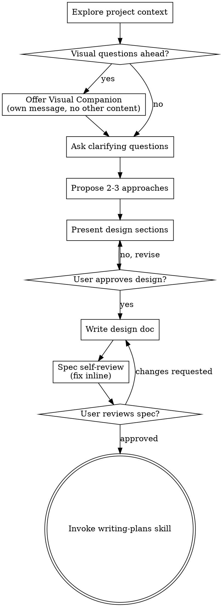

<!-- Generated by SpecStory, Markdown v2.1.0 -->

# 2026-05-01 04:00:32Z

<!-- Claude Code Session 1040f1de-b92b-417a-9137-5f2e16300898 (2026-05-01 04:00:32Z) -->

_**User (2026-05-01 04:00:32Z)**_

<local-command-caveat>Caveat: The messages below were generated by the user while running local commands. DO NOT respond to these messages or otherwise consider them in your response unless the user explicitly asks you to.</local-command-caveat>

_**User (2026-05-01 04:00:32Z)**_

<command-name>/model</command-name>
            <command-message>model</command-message>
            <command-args>claude-opus-4-6</command-args>

_**User (2026-05-01 04:00:32Z)**_

<local-command-stdout>Set model to Opus 4.6</local-command-stdout>

_**User (2026-05-01 04:01:06Z)**_

I want to work on https://github.com/leocaseiro/base-skill/issues/276 lets brainstorm with /superpowers:brainstorm

---

_**Agent (claude-opus-4-6 2026-05-01 04:01:09Z)**_

_**Agent (claude-opus-4-6 2026-05-01 04:01:10Z)**_

Let me fetch the issue details and invoke the brainstorming skill.

_**Agent (claude-opus-4-6 2026-05-01 04:01:13Z)**_

<tool-use data-tool-type="shell" data-tool-name="Bash"><details>
<summary>Tool use: **Bash**</summary>
Fetch GitHub issue #276 details

`gh issue view 276 --json title,body,labels,comments`

```text
{"body":"The user is tapping way to fast in the correct order, but the app has a delay to change the current slot, so they ended up frustrated.\n\nEg: for word cat\nUser tap real quick in the correct order, but when pressing a, after c, c is not yet in the correct slot, triggering an error bounce, instead of getting into a queue.\n\nWe should make a queue to solve this issue.","comments":[],"labels":[],"title":"Bug: side effect on checking the tapped answer, before its current slot"}
```
</details></tool-use>

_**Agent (claude-opus-4-6 2026-05-01 04:01:12Z)**_

<tool-use data-tool-type="generic" data-tool-name="Skill"><details>
<summary>Tool use: **Skill**</summary>

**Input:**

- args: `GitHub issue #276 - need to fetch details first`
- skill: `superpowers:brainstorm`

</details></tool-use>

---

_**User (2026-05-01 04:01:13Z)**_

Tell your human partner that this command is deprecated and will be removed in the next major release. They should ask you to use the "superpowers brainstorming" skill instead.


ARGUMENTS: GitHub issue #276 - need to fetch details first

---

_**Agent (claude-opus-4-6 2026-05-01 04:01:15Z)**_

_**Agent (claude-opus-4-6 2026-05-01 04:01:16Z)**_

The `/superpowers:brainstorm` skill is deprecated. Let me use the current `superpowers:brainstorming` skill instead.

_**Agent (claude-opus-4-6 2026-05-01 04:01:18Z)**_

<tool-use data-tool-type="generic" data-tool-name="Skill"><details>
<summary>Tool use: **Skill**</summary>

```text
Launching skill: superpowers:brainstorming
```
</details></tool-use>

---

_**User (2026-05-01 04:01:18Z)**_

Base directory for this skill: /Users/leocaseiro/.claude/plugins/cache/claude-plugins-official/superpowers/5.0.7/skills/brainstorming

# Brainstorming Ideas Into Designs

Help turn ideas into fully formed designs and specs through natural collaborative dialogue.

Start by understanding the current project context, then ask questions one at a time to refine the idea. Once you understand what you're building, present the design and get user approval.

<HARD-GATE>
Do NOT invoke any implementation skill, write any code, scaffold any project, or take any implementation action until you have presented a design and the user has approved it. This applies to EVERY project regardless of perceived simplicity.
</HARD-GATE>

## Anti-Pattern: "This Is Too Simple To Need A Design"

Every project goes through this process. A todo list, a single-function utility, a config change — all of them. "Simple" projects are where unexamined assumptions cause the most wasted work. The design can be short (a few sentences for truly simple projects), but you MUST present it and get approval.

## Checklist

You MUST create a task for each of these items and complete them in order:

1. **Explore project context** — check files, docs, recent commits
2. **Offer visual companion** (if topic will involve visual questions) — this is its own message, not combined with a clarifying question. See the Visual Companion section below.
3. **Ask clarifying questions** — one at a time, understand purpose/constraints/success criteria
4. **Propose 2-3 approaches** — with trade-offs and your recommendation
5. **Present design** — in sections scaled to their complexity, get user approval after each section
6. **Write design doc** — save to `docs/superpowers/specs/YYYY-MM-DD-<topic>-design.md` and commit
7. **Spec self-review** — quick inline check for placeholders, contradictions, ambiguity, scope (see below)
8. **User reviews written spec** — ask user to review the spec file before proceeding
9. **Transition to implementation** — invoke writing-plans skill to create implementation plan

## Process Flow



**The terminal state is invoking writing-plans.** Do NOT invoke frontend-design, mcp-builder, or any other implementation skill. The ONLY skill you invoke after brainstorming is writing-plans.

## The Process

**Understanding the idea:**

- Check out the current project state first (files, docs, recent commits)
- Before asking detailed questions, assess scope: if the request describes multiple independent subsystems (e.g., "build a platform with chat, file storage, billing, and analytics"), flag this immediately. Don't spend questions refining details of a project that needs to be decomposed first.
- If the project is too large for a single spec, help the user decompose into sub-projects: what are the independent pieces, how do they relate, what order should they be built? Then brainstorm the first sub-project through the normal design flow. Each sub-project gets its own spec → plan → implementation cycle.
- For appropriately-scoped projects, ask questions one at a time to refine the idea
- Prefer multiple choice questions when possible, but open-ended is fine too
- Only one question per message - if a topic needs more exploration, break it into multiple questions
- Focus on understanding: purpose, constraints, success criteria

**Exploring approaches:**

- Propose 2-3 different approaches with trade-offs
- Present options conversationally with your recommendation and reasoning
- Lead with your recommended option and explain why

**Presenting the design:**

- Once you believe you understand what you're building, present the design
- Scale each section to its complexity: a few sentences if straightforward, up to 200-300 words if nuanced
- Ask after each section whether it looks right so far
- Cover: architecture, components, data flow, error handling, testing
- Be ready to go back and clarify if something doesn't make sense

**Design for isolation and clarity:**

- Break the system into smaller units that each have one clear purpose, communicate through well-defined interfaces, and can be understood and tested independently
- For each unit, you should be able to answer: what does it do, how do you use it, and what does it depend on?
- Can someone understand what a unit does without reading its internals? Can you change the internals without breaking consumers? If not, the boundaries need work.
- Smaller, well-bounded units are also easier for you to work with - you reason better about code you can hold in context at once, and your edits are more reliable when files are focused. When a file grows large, that's often a signal that it's doing too much.

**Working in existing codebases:**

- Explore the current structure before proposing changes. Follow existing patterns.
- Where existing code has problems that affect the work (e.g., a file that's grown too large, unclear boundaries, tangled responsibilities), include targeted improvements as part of the design - the way a good developer improves code they're working in.
- Don't propose unrelated refactoring. Stay focused on what serves the current goal.

## After the Design

**Documentation:**

- Write the validated design (spec) to `docs/superpowers/specs/YYYY-MM-DD-<topic>-design.md`
  - (User preferences for spec location override this default)
- Use elements-of-style:writing-clearly-and-concisely skill if available
- Commit the design document to git

**Spec Self-Review:**
After writing the spec document, look at it with fresh eyes:

1. **Placeholder scan:** Any "TBD", "TODO", incomplete sections, or vague requirements? Fix them.
2. **Internal consistency:** Do any sections contradict each other? Does the architecture match the feature descriptions?
3. **Scope check:** Is this focused enough for a single implementation plan, or does it need decomposition?
4. **Ambiguity check:** Could any requirement be interpreted two different ways? If so, pick one and make it explicit.

Fix any issues inline. No need to re-review — just fix and move on.

**User Review Gate:**
After the spec review loop passes, ask the user to review the written spec before proceeding:

> "Spec written and committed to `<path>`. Please review it and let me know if you want to make any changes before we start writing out the implementation plan."

Wait for the user's response. If they request changes, make them and re-run the spec review loop. Only proceed once the user approves.

**Implementation:**

- Invoke the writing-plans skill to create a detailed implementation plan
- Do NOT invoke any other skill. writing-plans is the next step.

## Key Principles

- **One question at a time** - Don't overwhelm with multiple questions
- **Multiple choice preferred** - Easier to answer than open-ended when possible
- **YAGNI ruthlessly** - Remove unnecessary features from all designs
- **Explore alternatives** - Always propose 2-3 approaches before settling
- **Incremental validation** - Present design, get approval before moving on
- **Be flexible** - Go back and clarify when something doesn't make sense

## Visual Companion

A browser-based companion for showing mockups, diagrams, and visual options during brainstorming. Available as a tool — not a mode. Accepting the companion means it's available for questions that benefit from visual treatment; it does NOT mean every question goes through the browser.

**Offering the companion:** When you anticipate that upcoming questions will involve visual content (mockups, layouts, diagrams), offer it once for consent:
> "Some of what we're working on might be easier to explain if I can show it to you in a web browser. I can put together mockups, diagrams, comparisons, and other visuals as we go. This feature is still new and can be token-intensive. Want to try it? (Requires opening a local URL)"

**This offer MUST be its own message.** Do not combine it with clarifying questions, context summaries, or any other content. The message should contain ONLY the offer above and nothing else. Wait for the user's response before continuing. If they decline, proceed with text-only brainstorming.

**Per-question decision:** Even after the user accepts, decide FOR EACH QUESTION whether to use the browser or the terminal. The test: **would the user understand this better by seeing it than reading it?**

- **Use the browser** for content that IS visual — mockups, wireframes, layout comparisons, architecture diagrams, side-by-side visual designs
- **Use the terminal** for content that is text — requirements questions, conceptual choices, tradeoff lists, A/B/C/D text options, scope decisions

A question about a UI topic is not automatically a visual question. "What does personality mean in this context?" is a conceptual question — use the terminal. "Which wizard layout works better?" is a visual question — use the browser.

If they agree to the companion, read the detailed guide before proceeding:
`skills/brainstorming/visual-companion.md`


ARGUMENTS: GitHub issue #276 - Bug: side effect on checking the tapped answer, before its current slot. The user taps too fast in the correct order, but the app has a delay to change the current slot, so they end up frustrated. Example: for word "cat", user taps real quick in the correct order, but when pressing "a" after "c", "c" is not yet in the correct slot, triggering an error bounce instead of getting into a queue. We should make a queue to solve this issue.

---

_**Agent (claude-opus-4-6 2026-05-01 04:01:22Z)**_

<tool-use data-tool-type="unknown" data-tool-name="ToolSearch"><details>
<summary>Tool use: **ToolSearch**</summary>

**Input:**

- max_results: `1`
- query: `select:TaskCreate`

**Result:**

```

```
</details></tool-use>

_**Agent (claude-opus-4-6 2026-05-01 04:01:26Z)**_

_**Agent (claude-opus-4-6 2026-05-01 04:01:27Z)**_

Using the **brainstorming** skill to design a solution for issue #276 — the fast-tap queueing bug.

_**Agent (claude-opus-4-6 2026-05-01 04:01:29Z)**_

<tool-use data-tool-type="unknown" data-tool-name="TaskCreate"><details>
<summary>Tool use: **TaskCreate**</summary>
Check the answer-game tap handling, slot progression, and error bounce logic to understand the current flow

```text
Task #1 created successfully: Explore project context
```
</details></tool-use>

_**Agent (claude-opus-4-6 2026-05-01 04:01:30Z)**_

<tool-use data-tool-type="unknown" data-tool-name="TaskCreate"><details>
<summary>Tool use: **TaskCreate**</summary>
One at a time — understand the exact UX, timing, and constraints around the fast-tap issue

```text
Task #2 created successfully: Ask clarifying questions
```
</details></tool-use>

_**Agent (claude-opus-4-6 2026-05-01 04:01:31Z)**_

<tool-use data-tool-type="unknown" data-tool-name="TaskCreate"><details>
<summary>Tool use: **TaskCreate**</summary>
Present different queue/debounce strategies with trade-offs and recommendation

```text
Task #3 created successfully: Propose 2-3 approaches
```
</details></tool-use>

_**Agent (claude-opus-4-6 2026-05-01 04:01:32Z)**_

<tool-use data-tool-type="unknown" data-tool-name="TaskCreate"><details>
<summary>Tool use: **TaskCreate**</summary>
Walk through the chosen design section by section, get user approval

```text
Task #4 created successfully: Present design
```
</details></tool-use>

_**Agent (claude-opus-4-6 2026-05-01 04:01:34Z)**_

<tool-use data-tool-type="unknown" data-tool-name="TaskCreate"><details>
<summary>Tool use: **TaskCreate**</summary>
Save approved design to docs/superpowers/specs/ and commit

```text
Task #5 created successfully: Write design doc
```
</details></tool-use>

_**Agent (claude-opus-4-6 2026-05-01 04:01:35Z)**_

<tool-use data-tool-type="unknown" data-tool-name="TaskCreate"><details>
<summary>Tool use: **TaskCreate**</summary>
Check for placeholders, contradictions, ambiguity, scope issues — fix inline

```text
Task #6 created successfully: Spec self-review
```
</details></tool-use>

_**Agent (claude-opus-4-6 2026-05-01 04:01:36Z)**_

<tool-use data-tool-type="unknown" data-tool-name="TaskCreate"><details>
<summary>Tool use: **TaskCreate**</summary>
Ask user to review the spec file before proceeding to implementation planning

```text
Task #7 created successfully: User reviews written spec
```
</details></tool-use>

_**Agent (claude-opus-4-6 2026-05-01 04:01:37Z)**_

<tool-use data-tool-type="unknown" data-tool-name="TaskCreate"><details>
<summary>Tool use: **TaskCreate**</summary>
Invoke writing-plans skill to create implementation plan

```text
Task #8 created successfully: Transition to implementation
```
</details></tool-use>

_**Agent (claude-opus-4-6 2026-05-01 04:01:40Z)**_

<tool-use data-tool-type="unknown" data-tool-name="ToolSearch"><details>
<summary>Tool use: **ToolSearch**</summary>

**Input:**

- max_results: `1`
- query: `select:TaskUpdate`

**Result:**

```

```
</details></tool-use>

_**Agent (claude-opus-4-6 2026-05-01 04:01:43Z)**_

<tool-use data-tool-type="unknown" data-tool-name="TaskUpdate"><details>
<summary>Tool use: **TaskUpdate**</summary>

```text
Updated task #1 status
```
</details></tool-use>

_**Agent (claude-opus-4-6 2026-05-01 04:01:46Z)**_

Let me explore the codebase to understand how tap handling and slot progression work.

_**Agent (claude-opus-4-6 2026-05-01 04:03:02Z)**_

<tool-use data-tool-type="unknown" data-tool-name="Agent"><details>
<summary>Tool use: **Agent**</summary>
Explore tap/answer handling flow

```text
Perfect! Now I have a comprehensive understanding of the issue. Let me create a detailed report of my findings.

## Investigation Report: Letter Tile Tap Timing Bug

Based on my thorough analysis of the codebase, I've identified the data flow and the likely timing issue when users tap letter tiles rapidly in sequence. Here's the complete findings:

---

### **Data Flow: Tap to Validation**

#### **1. Tap Event Handling**
- **Location**: `/Users/leocaseiro/Sites/base-skill/src/games/word-spell/LetterTileBank/LetterTileBank.tsx` (lines 18-28)
- **Handler**: `<button onClick={handleClick} onPointerDown={onPointerDown} ...>`
- Each tile has both click and pointer handlers attached

#### **2. Click Handler (`useDraggableTile`)**
- **File**: `/Users/leocaseiro/Sites/base-skill/src/components/answer-game/useDraggableTile.ts` (lines 129-131)
- **Function**:
  ```typescript
  const handleClick = () => {
    speakTile(tile.label);
    placeInNextSlot(tile.id);  // ← Auto-advances to next slot
  };
  ```
- Calls `placeInNextSlot(tileId)` from `useAutoNextSlot`

#### **3. Current Slot Tracking (`useAutoNextSlot`)**
- **File**: `/Users/leocaseiro/Sites/base-skill/src/components/answer-game/useAutoNextSlot.ts` (lines 9-44)
- **Key Logic** (lines 13-39):
  ```typescript
  const placeInNextSlot = useCallback(
    (tileId: string) => {
      // Guard: blocks placement if activeSlot is in wrong state
      if (zones[activeSlotIndex]?.isWrong) return;  // ← EXISTING GUARD
      
      // Finds next empty, unlocked slot
      let targetIndex = zones.findIndex(
        (z, i) =>
          i >= activeSlotIndex &&
          z.placedTileId === null &&
          !z.isLocked,
      );
      if (targetIndex === -1) {
        targetIndex = zones.findIndex(
          (z) => z.placedTileId === null && !z.isLocked,
        );
      }
      if (targetIndex === -1) return;
      placeTile(tileId, targetIndex);  // ← Dispatches evaluation
    },
    [placeTile, activeSlotIndex, zones],
  );
  ```

#### **4. Tile Evaluation & Dispatch (`useTileEvaluation`)**
- **File**: `/Users/leocaseiro/Sites/base-skill/src/components/answer-game/useTileEvaluation.ts` (lines 24-50)
- **Function**:
  ```typescript
  const placeTile = useCallback(
    (tileId: string, zoneIndex: number) => {
      const tile = state.allTiles.find((t) => t.id === tileId);
      const zone = state.zones[zoneIndex];
      if (!tile || !zone) return;

      const correct = tile.value === zone.expectedValue;
      if (!skin.suppressDefaultSounds) {
        playSound(correct ? 'correct' : 'wrong', 0.8);
      }
      dispatch({ type: 'PLACE_TILE', tileId, zoneIndex });  // ← Reducer action
      
      getGameEventBus().emit({...});  // Event logging
    },
    [state, dispatch, skin],
  );
  ```

#### **5. State Update & Slot Advancement (`answerGameReducer`)**
- **File**: `/Users/leocaseiro/Sites/base-skill/src/components/answer-game/answer-game-reducer.ts` (lines 106-220)
- **Case `PLACE_TILE`** (lines 106-220):
  - If tile is **correct** (line 111):
    ```typescript
    activeSlotIndex: findNextActiveSlot(newZones, action.zoneIndex, ...)
    ```
  - Updates `activeSlotIndex` to next empty/wrong slot
  - If **wrong** (lines 179-219):
    - With `wrongTileBehavior: 'lock-auto-eject'`:
      - Marks slot `isWrong: true` and `isLocked: true`
      - **Does NOT immediately advance `activeSlotIndex`** (line 216)
      - `activeSlotIndex: state.activeSlotIndex` ← stays the same

#### **6. Auto-Eject Timer (`useSlotBehavior`)**
- **File**: `/Users/leocaseiro/Sites/base-skill/src/components/answer-game/Slot/useSlotBehavior.ts` (lines 334-359)
- After `isWrong` state change:
  ```typescript
  useEffect(() => {
    if (!isWrong || config.wrongTileBehavior !== 'lock-auto-eject')
      return;
    const timerId = setTimeout(() => {
      dispatch({ type: 'EJECT_TILE', zoneIndex: index });  // Auto-eject after delay
    }, autoEjectDelay);  // default ~350ms from skin
    return () => clearTimeout(timerId);
  }, [isWrong, ...]);
  ```

---

### **The Timing Bug: Rapid Taps on "C", "A", "T"**

#### **Scenario:**
User taps the letter tiles in order: **C → A → T** (fast, within ~50-100ms each)

#### **What Happens:**

1. **Tap 1 (C - correct)**: 
   - `placeInNextSlot('c')` → dispatches `PLACE_TILE` for zone[0]
   - Reducer updates: `activeSlotIndex = 1` (advanced)
   - Zone[0] is now correct ✓

2. **Tap 2 (A - correct)**: 
   - `placeInNextSlot('a')` → dispatches `PLACE_TILE` for zone[1]
   - Reducer updates: `activeSlotIndex = 2` (advanced)
   - Zone[1] is now correct ✓

3. **Tap 3 (T - WRONG) arrives BEFORE the second reducer update completes:**
   - `placeInNextSlot('t')` checks current `activeSlotIndex` from state
   - **State hasn't re-rendered yet** with `activeSlotIndex = 2`
   - Still reads stale `activeSlotIndex = 1` (or intermediate value)
   - **Places T in zone[1], overwriting A**
   - Zone[1] becomes `isWrong: true`, `isLocked: true`
   - Dispatch fires: `EJECT_TILE` after auto-eject delay
   - But A was already lost!

#### **Root Cause:**
The check in `useAutoNextSlot` (line 18):
```typescript
if (zones[activeSlotIndex]?.isWrong) return;
```

This guard **only blocks placement if the activeSlotIndex is already wrong**. It does **NOT prevent placement during a state update race condition** where:
- A new PLACE_TILE dispatch is in flight
- The reducer hasn't finished updating `activeSlotIndex`
- The stale closure still references the old zone states
- A second PLACE_TILE arrives while zone transitions are pending

---

### **Existing Mechanisms (Not Sufficient)**

1. **Double-tap guard** (line 18 in `useAutoNextSlot.ts`): ✓ Works for same slot
   - Blocks if `zones[activeSlotIndex].isWrong`
   - **Fails** when the tap lands on the *next* slot before activeSlotIndex advances

2. **Numeric debounce** (lines 62-74 in `useTouchKeyboardInput.ts`): ✓ Exists for numeric input only
   - Only applies in `'numeric'` keyboard mode
   - Does NOT apply to drag/click tile placement

3. **Auto-eject delay** (350ms default): Symptom relief, not root cause fix
   - Gives visual feedback but doesn't prevent the race

---

### **Key Files Summary**

| File Path | Purpose | Role in Issue |
|-----------|---------|---------------|
| `/src/components/answer-game/useDraggableTile.ts` | Bank tile click handler | Immediate `placeInNextSlot()` call |
| `/src/components/answer-game/useAutoNextSlot.ts` | Auto-slot advancement | Guard only checks *current* slot state |
| `/src/components/answer-game/useTileEvaluation.ts` | Tile validation & dispatch | Synchronous dispatch without debounce |
| `/src/components/answer-game/answer-game-reducer.ts` | State management | Updates `activeSlotIndex` post-PLACE_TILE |
| `/src/components/answer-game/Slot/useSlotBehavior.ts` | Slot animations & eject | Auto-eject timer (350ms default) |
| `/src/games/word-spell/LetterTileBank/LetterTileBank.tsx` | Bank tile rendering | Attaches `onClick={handleClick}` |

---

### **The Issue Location**

**Primary**: `/src/components/answer-game/useDraggableTile.ts` line 131
- `placeInNextSlot(tile.id)` dispatches immediately without rate limiting

**Secondary**: `/src/components/answer-game/useAutoNextSlot.ts` lines 13-18
- Guard checks `zones[activeSlotIndex]?.isWrong` but doesn't account for in-flight updates
- Uses stale closure when new taps arrive before reducer batch completes

**Tertiary**: State update batching in reducer
- `PLACE_TILE` updates `activeSlotIndex` but the closure in `placeInNextSlot` doesn't await this update before the next tap handler fires

---

### **Why This Happens on Quick Taps**

React's click handlers are synchronous, and the reducer dispatch is batched. When taps arrive within ~50-100ms:
1. Click handler calls `placeInNextSlot()` 
2. Dispatch is queued
3. Next click handler fires **before the previous reducer batch renders**
4. `useAutoNextSlot` hook still has the *old* `zones` and `activeSlotIndex` in its closure
5. Guard doesn't trigger; wrong slot gets filled
```
</details></tool-use>

_**Agent - sidechain (2026-05-01 04:01:54Z)**_

I'm investigating a bug in a spelling/word game app. When a user taps letter tiles quickly in the correct order (e.g., "c", "a", "t" for "cat"), the app hasn't finished processing the first tap before the second arrives, causing a false error bounce.

I need to understand the full flow of:
1. How letter tile taps are handled (event handlers, dispatch calls)
2. How the "current slot" is tracked and advanced
3. How answer checking/validation works (what triggers the error bounce)
4. Any existing debounce or queue mechanisms
5. The reducer/state that manages answer slots and current position

Search very thoroughly across the codebase. Look for:
- Files related to "answer", "slot", "tap", "check", "bounce", "letter", "tile" in src/
- Game engine or reducer files
- Any components that render tappable letter tiles
- State management for current slot/position tracking

Report: file paths, key functions, the data flow from tap to validation, and where the timing issue likely occurs.

_**Agent - sidechain (claude-haiku-4-5-20251001 2026-05-01 04:01:57Z)**_

I'll conduct a thorough investigation of the spelling game app to understand the letter tile tap flow and identify where the timing issue occurs.

_**Agent - sidechain (claude-haiku-4-5-20251001 2026-05-01 04:01:57Z)**_

<tool-use data-tool-type="shell" data-tool-name="Bash"><details>
<summary>Tool use: **Bash**</summary>

`find /Users/leocaseiro/Sites/base-skill/src -type f \( -name "*.ts" -o -name "*.tsx" -o -name "*.js" -o -name "*.jsx" \) | head -20`

```text
/Users/leocaseiro/Sites/base-skill/src/test-setup.ts
/Users/leocaseiro/Sites/base-skill/src/router.tsx
/Users/leocaseiro/Sites/base-skill/src/vite-env.d.ts
/Users/leocaseiro/Sites/base-skill/src/routeTree.gen.ts
/Users/leocaseiro/Sites/base-skill/src/types/game-events.ts
/Users/leocaseiro/Sites/base-skill/src/providers/ThemeRuntimeProvider.tsx
/Users/leocaseiro/Sites/base-skill/src/providers/DbProvider.test.tsx
/Users/leocaseiro/Sites/base-skill/src/providers/DbProvider.tsx
/Users/leocaseiro/Sites/base-skill/src/components/GameCover.tsx
/Users/leocaseiro/Sites/base-skill/src/components/ConfigFormFields.tsx
/Users/leocaseiro/Sites/base-skill/src/components/UpdateBanner.stories.tsx
/Users/leocaseiro/Sites/base-skill/src/components/GameNameChip.tsx
/Users/leocaseiro/Sites/base-skill/src/components/ConfigFormFields.test.tsx
/Users/leocaseiro/Sites/base-skill/src/components/GameCard.stories.tsx
/Users/leocaseiro/Sites/base-skill/src/components/ThemeToggle.stories.tsx
/Users/leocaseiro/Sites/base-skill/src/components/UpdateBanner.tsx
/Users/leocaseiro/Sites/base-skill/src/components/AdvancedConfigModal.tsx
/Users/leocaseiro/Sites/base-skill/src/components/ConfigFormFields.stories.tsx
/Users/leocaseiro/Sites/base-skill/src/components/GameGrid.stories.tsx
/Users/leocaseiro/Sites/base-skill/src/components/Footer.tsx
```
</details></tool-use>

_**Agent - sidechain (claude-haiku-4-5-20251001 2026-05-01 04:01:59Z)**_

Now let me search for files related to answer, slot, tap, and validation:

_**Agent - sidechain (claude-haiku-4-5-20251001 2026-05-01 04:01:59Z)**_

<tool-use data-tool-type="shell" data-tool-name="Bash"><details>
<summary>Tool use: **Bash**</summary>

`find /Users/leocaseiro/Sites/base-skill/src -type f \( -name "*.ts" -o -name "*.tsx" \) | xargs grep -l -i "answer\|slot\|bounce\|tap" 2>/dev/null | head -30`

```text
/Users/leocaseiro/Sites/base-skill/src/types/game-events.ts
/Users/leocaseiro/Sites/base-skill/src/components/UpdateBanner.tsx
/Users/leocaseiro/Sites/base-skill/src/components/GameCard.test.tsx
/Users/leocaseiro/Sites/base-skill/src/components/UpdateBanner.test.tsx
/Users/leocaseiro/Sites/base-skill/src/components/Header.stories.tsx
/Users/leocaseiro/Sites/base-skill/src/stories/ThemeShowcase.stories.tsx
/Users/leocaseiro/Sites/base-skill/src/lib/game-event-bus.test.ts
/Users/leocaseiro/Sites/base-skill/src/lib/suggest-custom-game-name.test.ts
/Users/leocaseiro/Sites/base-skill/src/db/migrations.ts
/Users/leocaseiro/Sites/base-skill/src/components/ui/button.test.tsx
/Users/leocaseiro/Sites/base-skill/src/components/ui/alert-dialog.tsx
/Users/leocaseiro/Sites/base-skill/src/components/ui/card.tsx
/Users/leocaseiro/Sites/base-skill/src/components/ui/slider.tsx
/Users/leocaseiro/Sites/base-skill/src/components/ui/sheet.tsx
/Users/leocaseiro/Sites/base-skill/src/components/ui/label.tsx
/Users/leocaseiro/Sites/base-skill/src/components/ui/dialog.tsx
/Users/leocaseiro/Sites/base-skill/src/components/ui/button.tsx
/Users/leocaseiro/Sites/base-skill/src/components/ui/dropdown-menu.tsx
/Users/leocaseiro/Sites/base-skill/src/components/ui/select.tsx
/Users/leocaseiro/Sites/base-skill/src/components/ui/input.tsx
/Users/leocaseiro/Sites/base-skill/src/components/answer-game/useSlotTileDrag.test.tsx
/Users/leocaseiro/Sites/base-skill/src/components/answer-game/answer-game-reducer.ts
/Users/leocaseiro/Sites/base-skill/src/components/answer-game/useKeyboardInput.test.tsx
/Users/leocaseiro/Sites/base-skill/src/components/answer-game/useTileEvaluation.ts
/Users/leocaseiro/Sites/base-skill/src/components/answer-game/HiddenKeyboardInput.tsx
/Users/leocaseiro/Sites/base-skill/src/components/answer-game/useGameTTS.test.tsx
/Users/leocaseiro/Sites/base-skill/src/components/answer-game/useAutoNextSlot.ts
/Users/leocaseiro/Sites/base-skill/src/components/answer-game/useFreeSwap.test.tsx
/Users/leocaseiro/Sites/base-skill/src/components/answer-game/useAutoNextSlot.test.tsx
/Users/leocaseiro/Sites/base-skill/src/components/answer-game/useAnswerGameDispatch.ts
```
</details></tool-use>

_**Agent - sidechain (claude-haiku-4-5-20251001 2026-05-01 04:02:01Z)**_

Great! I found the answer-game directory. Let me search more specifically in that directory:

_**Agent - sidechain (claude-haiku-4-5-20251001 2026-05-01 04:02:02Z)**_

<tool-use data-tool-type="shell" data-tool-name="Bash"><details>
<summary>Tool use: **Bash**</summary>

`find /Users/leocaseiro/Sites/base-skill/src/components/answer-game -type f \( -name "*.ts" -o -name "*.tsx" \) | sort`

```text
/Users/leocaseiro/Sites/base-skill/src/components/answer-game/answer-game-reducer.test.ts
/Users/leocaseiro/Sites/base-skill/src/components/answer-game/answer-game-reducer.ts
/Users/leocaseiro/Sites/base-skill/src/components/answer-game/AnswerGame/AnswerGame.stories.tsx
/Users/leocaseiro/Sites/base-skill/src/components/answer-game/AnswerGame/AnswerGame.test.tsx
/Users/leocaseiro/Sites/base-skill/src/components/answer-game/AnswerGame/AnswerGame.tsx
/Users/leocaseiro/Sites/base-skill/src/components/answer-game/AnswerGameProvider.test.tsx
/Users/leocaseiro/Sites/base-skill/src/components/answer-game/AnswerGameProvider.tsx
/Users/leocaseiro/Sites/base-skill/src/components/answer-game/EncouragementAnnouncer/EncouragementAnnouncer.stories.tsx
/Users/leocaseiro/Sites/base-skill/src/components/answer-game/EncouragementAnnouncer/EncouragementAnnouncer.tsx
/Users/leocaseiro/Sites/base-skill/src/components/answer-game/GameOverOverlay/GameOverOverlay.stories.tsx
/Users/leocaseiro/Sites/base-skill/src/components/answer-game/GameOverOverlay/GameOverOverlay.tsx
/Users/leocaseiro/Sites/base-skill/src/components/answer-game/HiddenKeyboardInput.tsx
/Users/leocaseiro/Sites/base-skill/src/components/answer-game/InstructionsOverlay/InstructionsOverlay.stories.tsx
/Users/leocaseiro/Sites/base-skill/src/components/answer-game/InstructionsOverlay/InstructionsOverlay.test.tsx
/Users/leocaseiro/Sites/base-skill/src/components/answer-game/InstructionsOverlay/InstructionsOverlay.tsx
/Users/leocaseiro/Sites/base-skill/src/components/answer-game/LevelCompleteOverlay/LevelCompleteOverlay.stories.tsx
/Users/leocaseiro/Sites/base-skill/src/components/answer-game/LevelCompleteOverlay/LevelCompleteOverlay.tsx
/Users/leocaseiro/Sites/base-skill/src/components/answer-game/magnetic-snap.test.ts
/Users/leocaseiro/Sites/base-skill/src/components/answer-game/magnetic-snap.ts
/Users/leocaseiro/Sites/base-skill/src/components/answer-game/ProgressHUD/ProgressHUD.stories.tsx
/Users/leocaseiro/Sites/base-skill/src/components/answer-game/ProgressHUD/ProgressHUD.test.tsx
/Users/leocaseiro/Sites/base-skill/src/components/answer-game/ProgressHUD/ProgressHUD.tsx
/Users/leocaseiro/Sites/base-skill/src/components/answer-game/ProgressHUD/ProgressHUDRoot.test.tsx
/Users/leocaseiro/Sites/base-skill/src/components/answer-game/ProgressHUD/ProgressHUDRoot.tsx
/Users/leocaseiro/Sites/base-skill/src/components/answer-game/ProgressHUD/resolve-hud-flags.test.ts
/Users/leocaseiro/Sites/base-skill/src/components/answer-game/ProgressHUD/resolve-hud-flags.ts
/Users/leocaseiro/Sites/base-skill/src/components/answer-game/ScoreAnimation/ScoreAnimation.stories.tsx
/Users/leocaseiro/Sites/base-skill/src/components/answer-game/ScoreAnimation/ScoreAnimation.test.tsx
/Users/leocaseiro/Sites/base-skill/src/components/answer-game/ScoreAnimation/ScoreAnimation.tsx
/Users/leocaseiro/Sites/base-skill/src/components/answer-game/Slot/parse-sentence-template.test.ts
/Users/leocaseiro/Sites/base-skill/src/components/answer-game/Slot/parse-sentence-template.ts
/Users/leocaseiro/Sites/base-skill/src/components/answer-game/Slot/SentenceWithGaps.test.tsx
/Users/leocaseiro/Sites/base-skill/src/components/answer-game/Slot/SentenceWithGaps.tsx
/Users/leocaseiro/Sites/base-skill/src/components/answer-game/Slot/slot-animations.test.ts
/Users/leocaseiro/Sites/base-skill/src/components/answer-game/Slot/slot-animations.ts
/Users/leocaseiro/Sites/base-skill/src/components/answer-game/Slot/Slot.stories.tsx
/Users/leocaseiro/Sites/base-skill/src/components/answer-game/Slot/Slot.test.tsx
/Users/leocaseiro/Sites/base-skill/src/components/answer-game/Slot/Slot.tsx
/Users/leocaseiro/Sites/base-skill/src/components/answer-game/Slot/SlotRow.test.tsx
/Users/leocaseiro/Sites/base-skill/src/components/answer-game/Slot/SlotRow.tsx
/Users/leocaseiro/Sites/base-skill/src/components/answer-game/Slot/useSlotBehavior.test.tsx
/Users/leocaseiro/Sites/base-skill/src/components/answer-game/Slot/useSlotBehavior.ts
/Users/leocaseiro/Sites/base-skill/src/components/answer-game/styles.test.ts
/Users/leocaseiro/Sites/base-skill/src/components/answer-game/styles.ts
/Users/leocaseiro/Sites/base-skill/src/components/answer-game/tile-font.test.ts
/Users/leocaseiro/Sites/base-skill/src/components/answer-game/tile-font.ts
/Users/leocaseiro/Sites/base-skill/src/components/answer-game/TouchKeyboardContext.ts
/Users/leocaseiro/Sites/base-skill/src/components/answer-game/types.ts
/Users/leocaseiro/Sites/base-skill/src/components/answer-game/useAnswerGameContext.ts
/Users/leocaseiro/Sites/base-skill/src/components/answer-game/useAnswerGameDispatch.ts
/Users/leocaseiro/Sites/base-skill/src/components/answer-game/useAutoNextSlot.test.tsx
/Users/leocaseiro/Sites/base-skill/src/components/answer-game/useAutoNextSlot.ts
/Users/leocaseiro/Sites/base-skill/src/components/answer-game/useBankDropTarget.test.tsx
/Users/leocaseiro/Sites/base-skill/src/components/answer-game/useBankDropTarget.ts
/Users/leocaseiro/Sites/base-skill/src/components/answer-game/useDraggableTile.test.tsx
/Users/leocaseiro/Sites/base-skill/src/components/answer-game/useDraggableTile.ts
/Users/leocaseiro/Sites/base-skill/src/components/answer-game/useFreeSwap.test.tsx
/Users/leocaseiro/Sites/base-skill/src/components/answer-game/useFreeSwap.ts
/Users/leocaseiro/Sites/base-skill/src/components/answer-game/useGameSounds.test.tsx
/Users/leocaseiro/Sites/base-skill/src/components/answer-game/useGameSounds.ts
/Users/leocaseiro/Sites/base-skill/src/components/answer-game/useGameTTS.test.tsx
/Users/leocaseiro/Sites/base-skill/src/components/answer-game/useGameTTS.ts
/Users/leocaseiro/Sites/base-skill/src/components/answer-game/useKeyboardDrag.test.tsx
/Users/leocaseiro/Sites/base-skill/src/components/answer-game/useKeyboardDrag.ts
/Users/leocaseiro/Sites/base-skill/src/components/answer-game/useKeyboardInput.test.tsx
/Users/leocaseiro/Sites/base-skill/src/components/answer-game/useKeyboardInput.ts
/Users/leocaseiro/Sites/base-skill/src/components/answer-game/useRoundTTS.test.tsx
/Users/leocaseiro/Sites/base-skill/src/components/answer-game/useRoundTTS.ts
/Users/leocaseiro/Sites/base-skill/src/components/answer-game/useSlotTileDrag.test.tsx
/Users/leocaseiro/Sites/base-skill/src/components/answer-game/useSlotTileDrag.ts
/Users/leocaseiro/Sites/base-skill/src/components/answer-game/useTileEvaluation.test.tsx
/Users/leocaseiro/Sites/base-skill/src/components/answer-game/useTileEvaluation.ts
/Users/leocaseiro/Sites/base-skill/src/components/answer-game/useTouchDrag.ts
/Users/leocaseiro/Sites/base-skill/src/components/answer-game/useTouchKeyboardInput.test.tsx
/Users/leocaseiro/Sites/base-skill/src/components/answer-game/useTouchKeyboardInput.ts
```
</details></tool-use>

_**Agent - sidechain (claude-haiku-4-5-20251001 2026-05-01 04:02:03Z)**_

Now let me read the key files. I'll start with the reducer, the main game component, and the tile evaluation logic:

_**Agent - sidechain (claude-haiku-4-5-20251001 2026-05-01 04:02:04Z)**_

<tool-use data-tool-type="read" data-tool-name="Read"><details>
<summary>Tool use: **Read**</summary>
 `./src/components/answer-game/answer-game-reducer.ts`

```text
1	import type {
2	  AnswerGameAction,
3	  AnswerGameConfig,
4	  AnswerGamePhase,
5	  AnswerGameState,
6	  AnswerZone,
7	  TileItem,
8	} from './types';
9	
10	export function makeInitialState(
11	  config: AnswerGameConfig,
12	): AnswerGameState {
13	  return {
14	    config,
15	    allTiles: [],
16	    bankTileIds: [],
17	    zones: [],
18	    activeSlotIndex: 0,
19	    dragActiveTileId: null,
20	    dragHoverZoneIndex: null,
21	    dragHoverBankTileId: null,
22	    phase: 'playing',
23	    roundIndex: 0,
24	    retryCount: 0,
25	    levelIndex: 0,
26	    isLevelMode: config.levelMode !== undefined,
27	  };
28	}
29	
30	/**
31	 * Find the best next activeSlotIndex after a placement or removal.
32	 * Priority: first empty slot after `afterIndex`, then first empty slot
33	 * anywhere, then first wrong slot anywhere. Returns `fallback` when every
34	 * slot is correctly filled.
35	 */
36	function findNextActiveSlot(
37	  zones: AnswerZone[],
38	  afterIndex: number,
39	  fallback: number,
40	): number {
41	  // 1. First empty slot after the current action
42	  const nextEmpty = zones.findIndex(
43	    (z, i) => i > afterIndex && z.placedTileId === null,
44	  );
45	  if (nextEmpty !== -1) return nextEmpty;
46	
47	  // 2. First empty slot anywhere (wraps around)
48	  const anyEmpty = zones.findIndex((z) => z.placedTileId === null);
49	  if (anyEmpty !== -1) return anyEmpty;
50	
51	  // 3. First wrong slot anywhere (so user can retype)
52	  const anyWrong = zones.findIndex((z) => z.isWrong);
53	  if (anyWrong !== -1) return anyWrong;
54	
55	  return fallback;
56	}
57	
58	function resolveCompletionPhase(
59	  state: AnswerGameState,
60	): AnswerGamePhase {
61	  const isLastRound = state.roundIndex >= state.config.totalRounds - 1;
62	  if (!isLastRound) return 'round-complete';
63	  if (!state.isLevelMode) return 'game-over';
64	  const maxLevels = state.config.levelMode?.maxLevels;
65	  if (maxLevels && state.levelIndex + 1 >= maxLevels)
66	    return 'game-over';
67	  return 'level-complete';
68	}
69	
70	export function answerGameReducer(
71	  state: AnswerGameState,
72	  action: AnswerGameAction,
73	): AnswerGameState {
74	  switch (action.type) {
75	    case 'INIT_ROUND': {
76	      return {
77	        ...state,
78	        allTiles: action.tiles,
79	        bankTileIds: action.tiles.map((t: TileItem) => t.id),
80	        zones: action.zones,
81	        activeSlotIndex: 0,
82	        phase: 'playing',
83	        roundIndex: 0,
84	        retryCount: 0,
85	      };
86	    }
87	
88	    case 'RESUME_ROUND': {
89	      const { draft } = action;
90	      return {
91	        ...state,
92	        allTiles: draft.allTiles,
93	        bankTileIds: draft.bankTileIds,
94	        zones: draft.zones,
95	        activeSlotIndex: draft.activeSlotIndex,
96	        phase: draft.phase,
97	        roundIndex: draft.roundIndex,
98	        retryCount: draft.retryCount,
99	        levelIndex: draft.levelIndex,
100	        dragActiveTileId: null,
101	        dragHoverZoneIndex: null,
102	        dragHoverBankTileId: null,
103	      };
104	    }
105	
106	    case 'PLACE_TILE': {
107	      const tile = state.allTiles.find((t) => t.id === action.tileId);
108	      const zone = state.zones[action.zoneIndex];
109	      if (!tile || !zone) return state;
110	
111	      const correct = tile.value === zone.expectedValue;
112	
113	      // A tile placement always ends any active drag for that tile.
114	      const dragActiveTileId =
115	        state.dragActiveTileId === action.tileId
116	          ? null
117	          : state.dragActiveTileId;
118	
119	      if (!correct && state.config.wrongTileBehavior === 'reject') {
120	        return {
121	          ...state,
122	          dragActiveTileId,
123	          retryCount: state.retryCount + 1,
124	        };
125	      }
126	
127	      if (correct) {
128	        const previousId = zone.placedTileId;
129	        const prevIsVirtual = previousId?.startsWith('typed-');
130	        let newBankTileIds = state.bankTileIds.filter(
131	          (id) => id !== action.tileId,
132	        );
133	        if (
134	          previousId !== null &&
135	          previousId !== action.tileId && // Virtual tiles are discarded; real tiles return to the bank.
136	          !prevIsVirtual
137	        ) {
138	          newBankTileIds = [...newBankTileIds, previousId];
139	        }
140	        // Remove displaced virtual tile from allTiles
141	        const newAllTiles = prevIsVirtual
142	          ? state.allTiles.filter((t) => t.id !== previousId)
143	          : state.allTiles;
144	        const newZone: AnswerZone = {
145	          ...zone,
146	          placedTileId: action.tileId,
147	          isWrong: false,
148	          isLocked: false,
149	        };
150	        const newZones =
151	          newAllTiles === state.allTiles
152	            ? state.zones.map((z, i) =>
153	                i === action.zoneIndex ? newZone : z,
154	              )
155	            : state.zones.map((z, i) =>
156	                i === action.zoneIndex ? newZone : z,
157	              );
158	        const allFilledCorrectly = newZones.every(
159	          (z) => z.placedTileId !== null && !z.isWrong,
160	        );
161	        return {
162	          ...state,
163	          allTiles: newAllTiles,
164	          dragActiveTileId,
165	          zones: newZones,
166	          bankTileIds: newBankTileIds,
167	          activeSlotIndex: findNextActiveSlot(
168	            newZones,
169	            action.zoneIndex,
170	            state.activeSlotIndex,
171	          ),
172	          retryCount: state.retryCount,
173	          phase: allFilledCorrectly
174	            ? resolveCompletionPhase(state)
175	            : 'playing',
176	        };
177	      }
178	
179	      const shouldLock =
180	        state.config.wrongTileBehavior === 'lock-manual' ||
181	        state.config.wrongTileBehavior === 'lock-auto-eject';
182	      const previousId = zone.placedTileId;
183	      const prevIsVirtual = previousId?.startsWith('typed-');
184	      const newZone: AnswerZone = {
185	        ...zone,
186	        placedTileId: shouldLock ? action.tileId : zone.placedTileId,
187	        isWrong: true,
188	        isLocked: true,
189	      };
190	      const newZones = state.zones.map((z, i) =>
191	        i === action.zoneIndex ? newZone : z,
192	      );
193	      let newBankTileIds = shouldLock
194	        ? state.bankTileIds.filter((id) => id !== action.tileId)
195	        : state.bankTileIds;
196	      if (
197	        shouldLock &&
198	        previousId &&
199	        previousId !== action.tileId && // Virtual tiles are discarded; real tiles return to the bank.
200	        !prevIsVirtual
201	      ) {
202	        newBankTileIds = [...newBankTileIds, previousId];
203	      }
204	      // Remove displaced virtual tile from allTiles
205	      const newAllTiles =
206	        shouldLock && prevIsVirtual
207	          ? state.allTiles.filter((t) => t.id !== previousId)
208	          : state.allTiles;
209	
210	      return {
211	        ...state,
212	        allTiles: newAllTiles,
213	        dragActiveTileId,
214	        zones: newZones,
215	        bankTileIds: newBankTileIds,
216	        activeSlotIndex: state.activeSlotIndex,
217	        retryCount: state.retryCount + 1,
218	        phase: 'playing',
219	      };
220	    }
221	
222	    case 'TYPE_TILE': {
223	      const zone = state.zones[action.zoneIndex];
224	      if (!zone) return state;
225	      // Allow typing over wrong locked tiles to replace them;
226	      // only block correctly-locked tiles (shouldn't exist, but be safe).
227	      if (zone.isLocked && !zone.isWrong) return state;
228	
229	      const virtualTile: TileItem = {
230	        id: action.tileId,
231	        label: action.value,
232	        value: action.value,
233	      };
234	      const correct =
235	        action.value.toLowerCase() === zone.expectedValue.toLowerCase();
236	
237	      if (!correct && state.config.wrongTileBehavior === 'reject') {
238	        return {
239	          ...state,
240	          retryCount: state.retryCount + 1,
241	        };
242	      }
243	
244	      // Clean up the previous wrong virtual tile being replaced
245	      const previousId = zone.placedTileId;
246	      const prevIsVirtual = previousId?.startsWith('typed-');
247	      const baseTiles = prevIsVirtual
248	        ? state.allTiles.filter((t) => t.id !== previousId)
249	        : state.allTiles;
250	      // If replacing a real (non-virtual) tile, return it to the bank
251	      let baseBankTileIds = state.bankTileIds;
252	      if (previousId && !prevIsVirtual) {
253	        baseBankTileIds = [...baseBankTileIds, previousId];
254	      }
255	
256	      const newAllTiles = [...baseTiles, virtualTile];
257	      const newZone: AnswerZone = {
258	        ...zone,
259	        placedTileId: action.tileId,
260	        isWrong: !correct,
261	        isLocked: !correct,
262	      };
263	      const newZones = state.zones.map((z, i) =>
264	        i === action.zoneIndex ? newZone : z,
265	      );
266	
267	      if (correct) {
268	        const allFilledCorrectly = newZones.every(
269	          (z) => z.placedTileId !== null && !z.isWrong,
270	        );
271	        return {
272	          ...state,
273	          allTiles: newAllTiles,
274	          bankTileIds: baseBankTileIds,
275	          zones: newZones,
276	          activeSlotIndex: findNextActiveSlot(
277	            newZones,
278	            action.zoneIndex,
279	            state.activeSlotIndex,
280	          ),
281	          phase: allFilledCorrectly
282	            ? resolveCompletionPhase(state)
283	            : 'playing',
284	        };
285	      }
286	
287	      return {
288	        ...state,
289	        allTiles: newAllTiles,
290	        bankTileIds: baseBankTileIds,
291	        zones: newZones,
292	        activeSlotIndex: state.activeSlotIndex,
293	        retryCount: state.retryCount + 1,
294	        phase: 'playing',
295	      };
296	    }
297	
298	    case 'REMOVE_TILE': {
299	      const zone = state.zones[action.zoneIndex];
300	      if (!zone?.placedTileId) return state;
301	      const removedTileId = zone.placedTileId;
302	      // Virtual tiles (created by TYPE_TILE) are removed from allTiles
303	      // and NOT returned to the bank.
304	      const isVirtual = removedTileId.startsWith('typed-');
305	      return {
306	        ...state,
307	        dragActiveTileId:
308	          state.dragActiveTileId === removedTileId
309	            ? null
310	            : state.dragActiveTileId,
311	        allTiles: isVirtual
312	          ? state.allTiles.filter((t) => t.id !== removedTileId)
313	          : state.allTiles,
314	        zones: state.zones.map((z, i) =>
315	          i === action.zoneIndex
316	            ? {
317	                ...z,
318	                placedTileId: null,
319	                isWrong: false,
320	                isLocked: false,
321	              }
322	            : z,
323	        ),
324	        bankTileIds: isVirtual
325	          ? state.bankTileIds
326	          : [...state.bankTileIds, removedTileId],
327	        // Move cursor to the cleared slot so the user can retype
328	        activeSlotIndex: action.zoneIndex,
329	      };
330	    }
331	
332	    case 'SWAP_TILES': {
333	      const fromZone = state.zones[action.fromZoneIndex];
334	      const toZone = state.zones[action.toZoneIndex];
335	      if (!fromZone || !toZone) return state;
336	
337	      // After the swap: fromZone gets toZone's tile, toZone gets fromZone's tile.
338	      // Either zone may become empty (null) when moving a tile to an empty slot.
339	      const tileNowInFrom = toZone.placedTileId
340	        ? state.allTiles.find((t) => t.id === toZone.placedTileId)
341	        : null;
342	      const tileNowInTo = fromZone.placedTileId
343	        ? state.allTiles.find((t) => t.id === fromZone.placedTileId)
344	        : null;
345	      // An empty zone is never wrong.
346	      const fromCorrect = tileNowInFrom
347	        ? tileNowInFrom.value === fromZone.expectedValue
348	        : true;
349	      const toCorrect = tileNowInTo
350	        ? tileNowInTo.value === toZone.expectedValue
351	        : true;
352	      const shouldLock =
353	        state.config.wrongTileBehavior === 'lock-manual' ||
354	        state.config.wrongTileBehavior === 'lock-auto-eject';
355	
356	      const newZones = state.zones.map((z, i) => {
357	        if (i === action.fromZoneIndex)
358	          return {
359	            ...z,
360	            placedTileId: toZone.placedTileId,
361	            isWrong: toZone.placedTileId !== null && !fromCorrect,
362	            isLocked:
363	              toZone.placedTileId !== null &&
364	              !fromCorrect &&
365	              shouldLock,
366	          };
367	        if (i === action.toZoneIndex)
368	          return {
369	            ...z,
370	            placedTileId: fromZone.placedTileId,
371	            isWrong: fromZone.placedTileId !== null && !toCorrect,
372	            isLocked:
373	              fromZone.placedTileId !== null &&
374	              !toCorrect &&
375	              shouldLock,
376	          };
377	        return z;
378	      });
379	
380	      // Clear drag state for the tile that just finished dragging.
381	      const dragActiveTileId =
382	        state.dragActiveTileId === fromZone.placedTileId
383	          ? null
384	          : state.dragActiveTileId;
385	
386	      const allFilledCorrectly = newZones.every(
387	        (z) => z.placedTileId !== null && !z.isWrong,
388	      );
389	
390	      return {
391	        ...state,
392	        dragActiveTileId,
393	        zones: newZones,
394	        phase: allFilledCorrectly
395	          ? resolveCompletionPhase(state)
396	          : 'playing',
397	      };
398	    }
399	
400	    case 'EJECT_TILE': {
401	      const zone = state.zones[action.zoneIndex];
402	      if (!zone) return state;
403	
404	      // Guard: never eject a correctly-placed tile (isWrong=false, isLocked=false)
405	      if (!zone.isWrong && !zone.isLocked) return state;
406	
407	      if (zone.placedTileId) {
408	        const ejectedTileId = zone.placedTileId;
409	        const isVirtual = ejectedTileId.startsWith('typed-');
410	        return {
411	          ...state,
412	          // If the ejected tile was mid-drag, clear drag state so the bank
413	          // hole disappears immediately rather than waiting for the drag to end.
414	          dragActiveTileId:
415	            state.dragActiveTileId === ejectedTileId
416	              ? null
417	              : state.dragActiveTileId,
418	          allTiles: isVirtual
419	            ? state.allTiles.filter((t) => t.id !== ejectedTileId)
420	            : state.allTiles,
421	          zones: state.zones.map((z, i) =>
422	            i === action.zoneIndex
423	              ? {
424	                  ...z,
425	                  placedTileId: null,
426	                  isWrong: false,
427	                  isLocked: false,
428	                }
429	              : z,
430	          ),
431	          bankTileIds: isVirtual
432	            ? state.bankTileIds
433	            : [...state.bankTileIds, ejectedTileId],
434	          // Move cursor to the ejected slot
435	          activeSlotIndex: action.zoneIndex,
436	        };
437	      }
438	
439	      return {
440	        ...state,
441	        zones: state.zones.map((z, i) =>
442	          i === action.zoneIndex
443	            ? {
444	                ...z,
445	                placedTileId: null,
446	                isWrong: false,
447	                isLocked: false,
448	              }
449	            : z,
450	        ),
451	        // Move cursor to the ejected slot
452	        activeSlotIndex: action.zoneIndex,
453	      };
454	    }
455	
456	    case 'ADVANCE_ROUND': {
457	      return {
458	        ...state,
459	        allTiles: action.tiles,
460	        bankTileIds: action.tiles.map((t: TileItem) => t.id),
461	        zones: action.zones,
462	        activeSlotIndex: 0,
463	        phase: 'playing',
464	        roundIndex: state.roundIndex + 1,
465	        retryCount: 0,
466	      };
467	    }
468	
469	    case 'ADVANCE_LEVEL': {
470	      return {
471	        ...state,
472	        allTiles: action.tiles,
473	        bankTileIds: action.tiles.map((t: TileItem) => t.id),
474	        zones: action.zones,
475	        activeSlotIndex: 0,
476	        phase: 'playing',
477	        roundIndex: 0,
478	        levelIndex: state.levelIndex + 1,
479	      };
480	    }
481	
482	    case 'COMPLETE_GAME': {
483	      return { ...state, phase: 'game-over' };
484	    }
485	
486	    case 'SET_DRAG_ACTIVE': {
487	      return {
488	        ...state,
489	        dragActiveTileId: action.tileId,
490	        dragHoverZoneIndex:
491	          action.tileId === null ? null : state.dragHoverZoneIndex,
492	        dragHoverBankTileId:
493	          action.tileId === null ? null : state.dragHoverBankTileId,
494	      };
495	    }
496	
497	    case 'SET_DRAG_HOVER': {
498	      return { ...state, dragHoverZoneIndex: action.zoneIndex };
499	    }
500	
501	    case 'SET_DRAG_HOVER_BANK': {
502	      return { ...state, dragHoverBankTileId: action.tileId };
503	    }
504	
505	    case 'SWAP_SLOT_BANK': {
506	      const zone = state.zones[action.zoneIndex];
507	      if (!zone?.placedTileId) return state;
508	      if (!state.bankTileIds.includes(action.bankTileId)) return state;
509	
510	      const slotTileId = zone.placedTileId;
511	      const newBankTileIds = [
512	        ...state.bankTileIds.filter((id) => id !== action.bankTileId),
513	        slotTileId,
514	      ];
515	      const newZones = state.zones.map((z, i) =>
516	        i === action.zoneIndex
517	          ? {
518	              ...z,
519	              placedTileId: action.bankTileId,
520	              isWrong: false,
521	              isLocked: false,
522	            }
523	          : z,
524	      );
525	      return {
526	        ...state,
527	        bankTileIds: newBankTileIds,
528	        zones: newZones,
529	        dragActiveTileId: null,
530	        dragHoverBankTileId: null,
531	      };
532	    }
533	
534	    case 'SET_ACTIVE_SLOT': {
535	      const clamped = Math.max(
536	        0,
537	        Math.min(action.zoneIndex, state.zones.length - 1),
538	      );
539	      return { ...state, activeSlotIndex: clamped };
540	    }
541	
542	    default: {
543	      return state;
544	    }
545	  }
546	}
547
```
</details></tool-use>

_**Agent - sidechain (claude-haiku-4-5-20251001 2026-05-01 04:02:04Z)**_

<tool-use data-tool-type="read" data-tool-name="Read"><details>
<summary>Tool use: **Read**</summary>
 `./src/components/answer-game/AnswerGame/AnswerGame.tsx`

```text
1	import { AnswerGameProvider } from '../AnswerGameProvider';
2	import { ProgressHUDRoot } from '../ProgressHUD/ProgressHUDRoot';
3	import type { AnswerGameConfig, AnswerGameDraftState } from '../types';
4	import type { GameSkin } from '@/lib/skin';
5	import type { ReactNode } from 'react';
6	
7	interface AnswerGameProps {
8	  config: AnswerGameConfig;
9	  initialState?: AnswerGameDraftState;
10	  sessionId?: string;
11	  /**
12	   * Optional skin. When provided, `skin.ProgressHUD` (if defined) replaces
13	   * the default HUD; otherwise the default HUD renders. `skin.tokens` are
14	   * applied by individual game components on their own game container, not
15	   * here.
16	   */
17	  skin?: GameSkin;
18	  children: ReactNode;
19	}
20	
21	const AnswerGameRoot = ({
22	  config,
23	  initialState,
24	  sessionId,
25	  skin,
26	  children,
27	}: AnswerGameProps) => (
28	  <AnswerGameProvider
29	    config={config}
30	    initialState={initialState}
31	    sessionId={sessionId}
32	  >
33	    <div className="flex min-h-0 w-full flex-col items-center">
34	      <ProgressHUDRoot skin={skin} />
35	      {children}
36	    </div>
37	  </AnswerGameProvider>
38	);
39	
40	const Question = ({ children }: { children?: ReactNode }) => (
41	  <div className="game-question-zone flex flex-col items-center gap-4 px-4 py-6">
42	    {children}
43	  </div>
44	);
45	
46	const Answer = ({ children }: { children?: ReactNode }) => (
47	  <div className="game-answer-zone flex flex-wrap justify-center gap-2 px-4 py-4">
48	    {children}
49	  </div>
50	);
51	
52	const Choices = ({ children }: { children?: ReactNode }) => (
53	  <div className="game-choices-zone flex flex-wrap justify-center gap-3 px-4 py-4">
54	    {children}
55	  </div>
56	);
57	
58	export const AnswerGame = Object.assign(AnswerGameRoot, {
59	  Question,
60	  Answer,
61	  Choices,
62	});
63
```
</details></tool-use>

_**Agent - sidechain (claude-haiku-4-5-20251001 2026-05-01 04:02:04Z)**_

<tool-use data-tool-type="read" data-tool-name="Read"><details>
<summary>Tool use: **Read**</summary>
 `./src/components/answer-game/useTileEvaluation.ts`

```text
1	import { nanoid } from 'nanoid';
2	import { useCallback } from 'react';
3	import { useAnswerGameContext } from './useAnswerGameContext';
4	import { useAnswerGameDispatch } from './useAnswerGameDispatch';
5	import { playSound } from '@/lib/audio/AudioFeedback';
6	import { getGameEventBus } from '@/lib/game-event-bus';
7	import { resolveSkin } from '@/lib/skin';
8	
9	export interface TileEvaluation {
10	  placeTile: (tileId: string, zoneIndex: number) => void;
11	  /**
12	   * Place a free-typed value into a slot. Creates a virtual tile when
13	   * no matching bank tile exists. Used with lock-manual / lock-auto-eject
14	   * so the user sees immediate wrong-tile feedback for any keystroke.
15	   */
16	  typeTile: (value: string, zoneIndex: number) => void;
17	}
18	
19	export function useTileEvaluation(): TileEvaluation {
20	  const state = useAnswerGameContext();
21	  const dispatch = useAnswerGameDispatch();
22	  const skin = resolveSkin(state.config.gameId, state.config.skin);
23	
24	  const placeTile = useCallback(
25	    (tileId: string, zoneIndex: number) => {
26	      const tile = state.allTiles.find((t) => t.id === tileId);
27	      const zone = state.zones[zoneIndex];
28	      if (!tile || !zone) return;
29	
30	      const correct = tile.value === zone.expectedValue;
31	      if (!skin.suppressDefaultSounds) {
32	        playSound(correct ? 'correct' : 'wrong', 0.8);
33	      }
34	      dispatch({ type: 'PLACE_TILE', tileId, zoneIndex });
35	
36	      getGameEventBus().emit({
37	        type: 'game:evaluate',
38	        gameId: state.config.gameId,
39	        sessionId: '',
40	        profileId: '',
41	        timestamp: Date.now(),
42	        roundIndex: state.roundIndex,
43	        answer: tileId,
44	        correct,
45	        nearMiss: false,
46	        zoneIndex,
47	      });
48	    },
49	    [state, dispatch, skin],
50	  );
51	
52	  const typeTile = useCallback(
53	    (value: string, zoneIndex: number) => {
54	      const zone = state.zones[zoneIndex];
55	      if (!zone) return;
56	
57	      const correct =
58	        value.toLowerCase() === zone.expectedValue.toLowerCase();
59	      if (!skin.suppressDefaultSounds) {
60	        playSound(correct ? 'correct' : 'wrong', 0.8);
61	      }
62	      dispatch({
63	        type: 'TYPE_TILE',
64	        tileId: `typed-${nanoid()}`,
65	        value,
66	        zoneIndex,
67	      });
68	
69	      getGameEventBus().emit({
70	        type: 'game:evaluate',
71	        gameId: state.config.gameId,
72	        sessionId: '',
73	        profileId: '',
74	        timestamp: Date.now(),
75	        roundIndex: state.roundIndex,
76	        answer: value,
77	        correct,
78	        nearMiss: false,
79	        zoneIndex,
80	      });
81	    },
82	    [state, dispatch, skin],
83	  );
84	
85	  return { placeTile, typeTile };
86	}
87
```
</details></tool-use>

_**Agent - sidechain (claude-haiku-4-5-20251001 2026-05-01 04:02:04Z)**_

<tool-use data-tool-type="read" data-tool-name="Read"><details>
<summary>Tool use: **Read**</summary>
 `./src/components/answer-game/types.ts`

```text
1	export interface AnswerGameConfig {
2	  gameId: string;
3	  /** @default 'drag' */
4	  inputMethod: 'drag' | 'type' | 'both';
5	  /** @default 'lock-auto-eject' */
6	  wrongTileBehavior: 'reject' | 'lock-manual' | 'lock-auto-eject';
7	  tileBankMode: 'exact' | 'distractors';
8	  distractorCount?: number;
9	  /** Total number of rounds in this session */
10	  totalRounds: number;
11	  /**
12	   * When `true`, rounds follow the order of `rounds` in config.
13	   * When `false` or omitted, order is shuffled once per session (again after Play again).
14	   */
15	  roundsInOrder?: boolean;
16	  /** Whether TTS is enabled for this profile */
17	  ttsEnabled: boolean;
18	  /**
19	   * Controls the OS keyboard type shown on touch devices in type/both mode.
20	   * @default 'text'
21	   */
22	  touchKeyboardInputMode?: 'text' | 'numeric' | 'none';
23	  /** Skin ID for visual variant. Falls back to 'classic' if not registered. */
24	  skin?: string;
25	  /**
26	   * Per-config timing overrides. Take precedence over the skin's own
27	   * `timing` values and baseskill defaults.
28	   */
29	  timing?: {
30	    roundAdvanceDelay?: number;
31	    autoEjectDelay?: number;
32	    levelCompleteDelay?: number;
33	  };
34	  /** When set, `AnswerGameProvider` dispatches `INIT_ROUND` on mount / game change */
35	  initialTiles?: TileItem[];
36	  initialZones?: AnswerZone[];
37	  /** @default inferred: 'free-swap' for drag/both, 'ordered' for type */
38	  slotInteraction?: 'ordered' | 'free-swap';
39	  /** Level progression — omit for classic rounds-only mode */
40	  levelMode?: {
41	    /** Max levels. Omit or set to 0 for unlimited. */
42	    maxLevels?: number;
43	    /**
44	     * Called when the player completes a level to generate the next one.
45	     * Receives the 0-based index of the just-completed level.
46	     * Returns new tiles + zones, or null to end the game early.
47	     */
48	    generateNextLevel: (completedLevel: number) => {
49	      tiles: TileItem[];
50	      zones: AnswerZone[];
51	    } | null;
52	  };
53	  /** Controls which HUD elements render. Each flag is independent. */
54	  hud?: HudConfig;
55	}
56	
57	export interface TileItem {
58	  id: string;
59	  /** Display label shown on the tile (e.g. "A", "cat", "3") */
60	  label: string;
61	  /** Semantic value used for evaluation — matches `AnswerZone.expectedValue` */
62	  value: string;
63	}
64	
65	export interface AnswerZone {
66	  id: string;
67	  index: number;
68	  /** Correct tile value for this slot; matched against `TileItem.value` */
69	  expectedValue: string;
70	  placedTileId: string | null;
71	  isWrong: boolean;
72	  isLocked: boolean;
73	}
74	
75	export type AnswerGamePhase =
76	  | 'playing'
77	  | 'round-complete'
78	  | 'level-complete'
79	  | 'game-over';
80	
81	export interface AnswerGameState {
82	  config: AnswerGameConfig;
83	  /** Full tile list for the current round — never mutated mid-round */
84	  allTiles: TileItem[];
85	  /** IDs of tiles currently visible in the choice bank */
86	  bankTileIds: string[];
87	  zones: AnswerZone[];
88	  /** Index of next slot to fill in auto-next-slot mode */
89	  activeSlotIndex: number;
90	  dragActiveTileId: string | null;
91	  dragHoverZoneIndex: number | null;
92	  /** ID of the bank tile hole currently hovered by a dragged slot tile. */
93	  dragHoverBankTileId: string | null;
94	  phase: AnswerGamePhase;
95	  roundIndex: number;
96	  retryCount: number;
97	  levelIndex: number;
98	  isLevelMode: boolean;
99	}
100	
101	export type AnswerGameAction =
102	  | { type: 'INIT_ROUND'; tiles: TileItem[]; zones: AnswerZone[] }
103	  | { type: 'RESUME_ROUND'; draft: AnswerGameDraftState }
104	  | { type: 'PLACE_TILE'; tileId: string; zoneIndex: number }
105	  | {
106	      type: 'TYPE_TILE';
107	      tileId: string;
108	      value: string;
109	      zoneIndex: number;
110	    }
111	  | { type: 'REMOVE_TILE'; zoneIndex: number }
112	  | { type: 'SWAP_TILES'; fromZoneIndex: number; toZoneIndex: number }
113	  | { type: 'EJECT_TILE'; zoneIndex: number }
114	  | { type: 'ADVANCE_ROUND'; tiles: TileItem[]; zones: AnswerZone[] }
115	  | { type: 'ADVANCE_LEVEL'; tiles: TileItem[]; zones: AnswerZone[] }
116	  | { type: 'COMPLETE_GAME' }
117	  | { type: 'SET_DRAG_ACTIVE'; tileId: string | null }
118	  | { type: 'SET_DRAG_HOVER'; zoneIndex: number | null }
119	  | { type: 'SET_DRAG_HOVER_BANK'; tileId: string | null }
120	  | { type: 'SWAP_SLOT_BANK'; zoneIndex: number; bankTileId: string }
121	  | { type: 'SET_ACTIVE_SLOT'; zoneIndex: number };
122	
123	/**
124	 * Snapshot of AnswerGameState persisted to session_history_index.draftState.
125	 * Excludes config (reconstructable from initialContent/initialState),
126	 * dragActiveTileId (transient), and 'game-over' phase (cleared on completion).
127	 */
128	export interface AnswerGameDraftState {
129	  allTiles: TileItem[];
130	  bankTileIds: string[];
131	  zones: AnswerZone[];
132	  activeSlotIndex: number;
133	  phase: 'playing' | 'round-complete' | 'level-complete';
134	  roundIndex: number;
135	  retryCount: number;
136	  levelIndex: number;
137	}
138	
139	export interface HudConfig {
140	  /** Bullet row, one dot per round (classic) or per level (level mode). */
141	  showDots?: boolean;
142	  /** "3/5" label; auto-hides when totalRounds is null. */
143	  showFraction?: boolean;
144	  /** "LEVEL N" label; most useful with level mode. */
145	  showLevel?: boolean;
146	}
147	
148	export interface ProgressHUDProps {
149	  /** 0-based index of the current round. */
150	  roundIndex: number;
151	  /** Total rounds in the session; null for unbounded level mode. */
152	  totalRounds: number | null;
153	  /** 0-based index of the current level; 0 when levelMode is off. */
154	  levelIndex: number;
155	  /** Whether the game uses levelMode. */
156	  isLevelMode: boolean;
157	  /** Lifecycle phase — enables pop/celebration animations on transition. */
158	  phase: AnswerGamePhase;
159	  /** Resolved visibility flags after merging defaults + config. */
160	  showDots: boolean;
161	  showFraction: boolean;
162	  showLevel: boolean;
163	}
164
```
</details></tool-use>

_**Agent - sidechain (claude-haiku-4-5-20251001 2026-05-01 04:02:07Z)**_

Now let me read the touch/tap input handling files:

_**Agent - sidechain (claude-haiku-4-5-20251001 2026-05-01 04:02:08Z)**_

<tool-use data-tool-type="read" data-tool-name="Read"><details>
<summary>Tool use: **Read**</summary>
 `./src/components/answer-game/useTouchKeyboardInput.ts`

```text
1	import { useCallback, useEffect, useRef } from 'react';
2	import { useAnswerGameContext } from './useAnswerGameContext';
3	import { useAnswerGameDispatch } from './useAnswerGameDispatch';
4	import { useTileEvaluation } from './useTileEvaluation';
5	import type { RefObject } from 'react';
6	
7	export interface TouchKeyboardInput {
8	  hiddenInputRef: RefObject<HTMLInputElement | null>;
9	  focusKeyboard: () => void;
10	}
11	
12	const NUMERIC_DEBOUNCE_MS = 400;
13	
14	export const useTouchKeyboardInput = (): TouchKeyboardInput => {
15	  const hiddenInputRef = useRef<HTMLInputElement | null>(null);
16	  const state = useAnswerGameContext();
17	  const dispatch = useAnswerGameDispatch();
18	  const { placeTile, typeTile } = useTileEvaluation();
19	  const debounceTimerRef = useRef<ReturnType<typeof setTimeout> | null>(
20	    null,
21	  );
22	
23	  useEffect(() => {
24	    const input = hiddenInputRef.current;
25	    if (!input) return;
26	
27	    const isNumeric = state.config.touchKeyboardInputMode === 'numeric';
28	
29	    const tryMatchAndPlace = (value: string) => {
30	      const data = value.toLowerCase();
31	      const matchingTile = state.allTiles.find(
32	        (t) =>
33	          state.bankTileIds.includes(t.id) &&
34	          t.value.toLowerCase() === data,
35	      );
36	
37	      if (matchingTile) {
38	        placeTile(matchingTile.id, state.activeSlotIndex);
39	      } else {
40	        typeTile(data, state.activeSlotIndex);
41	      }
42	
43	      input.value = '';
44	    };
45	
46	    const handleInput = (event: Event) => {
47	      const inputEvent = event as InputEvent;
48	
49	      // Backspace / Delete inside the hidden input: eject the most
50	      // recently filled *wrong* slot, mirroring physical keyboard behaviour.
51	      if (inputEvent.inputType === 'deleteContentBackward') {
52	        for (let i = state.activeSlotIndex; i >= 0; i--) {
53	          const zone = state.zones[i];
54	          if (zone?.placedTileId && (zone.isWrong || zone.isLocked)) {
55	            dispatch({ type: 'REMOVE_TILE', zoneIndex: i });
56	            return;
57	          }
58	        }
59	        return;
60	      }
61	
62	      if (isNumeric) {
63	        // For numeric input, accumulate digits and debounce so multi-digit
64	        // numbers (e.g. "12") can be typed before matching.
65	        if (debounceTimerRef.current !== null) {
66	          clearTimeout(debounceTimerRef.current);
67	        }
68	        debounceTimerRef.current = setTimeout(() => {
69	          debounceTimerRef.current = null;
70	          const accumulated = input.value;
71	          if (accumulated) {
72	            tryMatchAndPlace(accumulated);
73	          }
74	        }, NUMERIC_DEBOUNCE_MS);
75	      } else {
76	        // For text input, match character-by-character (original behaviour).
77	        const raw =
78	          inputEvent.data ?? (event.target as HTMLInputElement).value;
79	        if (!raw) return;
80	        tryMatchAndPlace(raw);
81	      }
82	    };
83	
84	    input.addEventListener('input', handleInput);
85	    return () => {
86	      input.removeEventListener('input', handleInput);
87	      if (debounceTimerRef.current !== null) {
88	        clearTimeout(debounceTimerRef.current);
89	        debounceTimerRef.current = null;
90	      }
91	    };
92	  }, [
93	    state.config.touchKeyboardInputMode,
94	    state.allTiles,
95	    state.bankTileIds,
96	    state.zones,
97	    state.activeSlotIndex,
98	    dispatch,
99	    placeTile,
100	    typeTile,
101	  ]);
102	
103	  const focusKeyboard = useCallback(() => {
104	    hiddenInputRef.current?.focus();
105	  }, []);
106	
107	  return { hiddenInputRef, focusKeyboard };
108	};
109
```
</details></tool-use>

_**Agent - sidechain (claude-haiku-4-5-20251001 2026-05-01 04:02:08Z)**_

<tool-use data-tool-type="read" data-tool-name="Read"><details>
<summary>Tool use: **Read**</summary>
 `./src/components/answer-game/useKeyboardInput.ts`

```text
1	import { useEffect } from 'react';
2	import { useAnswerGameContext } from './useAnswerGameContext';
3	import { useAnswerGameDispatch } from './useAnswerGameDispatch';
4	import { useTileEvaluation } from './useTileEvaluation';
5	
6	export const useKeyboardInput = (): void => {
7	  const state = useAnswerGameContext();
8	  const dispatch = useAnswerGameDispatch();
9	  const { placeTile, typeTile } = useTileEvaluation();
10	
11	  useEffect(() => {
12	    if (state.config.inputMethod === 'drag') return;
13	
14	    const handleKeyDown = (event: KeyboardEvent) => {
15	      // Skip input/textarea targets for character keys — the hidden
16	      // keyboard input (useTouchKeyboardInput) handles those to avoid
17	      // double-placement. Backspace/Delete are allowed through because
18	      // an empty hidden input won't fire an input event for them.
19	      if (
20	        event.target instanceof HTMLInputElement &&
21	        event.key !== 'Backspace' &&
22	        event.key !== 'Delete' &&
23	        event.key !== 'ArrowLeft' &&
24	        event.key !== 'ArrowRight'
25	      )
26	        return;
27	      if (event.target instanceof HTMLTextAreaElement) return;
28	
29	      // Arrow keys: navigate between slots (WCAG — Tab moves between
30	      // widgets, arrows navigate within a widget)
31	      if (event.key === 'ArrowLeft' || event.key === 'ArrowRight') {
32	        const delta = event.key === 'ArrowLeft' ? -1 : 1;
33	        const next = state.activeSlotIndex + delta;
34	        if (next >= 0 && next < state.zones.length) {
35	          dispatch({ type: 'SET_ACTIVE_SLOT', zoneIndex: next });
36	        }
37	        return;
38	      }
39	
40	      // Backspace / Delete: eject the most recently filled *wrong* slot
41	      if (event.key === 'Backspace' || event.key === 'Delete') {
42	        // Search backwards from activeSlotIndex for a wrong/locked slot
43	        for (let i = state.activeSlotIndex; i >= 0; i--) {
44	          const zone = state.zones[i];
45	          if (zone?.placedTileId && (zone.isWrong || zone.isLocked)) {
46	            dispatch({ type: 'REMOVE_TILE', zoneIndex: i });
47	            return;
48	          }
49	        }
50	        return;
51	      }
52	
53	      const char = event.key.toLowerCase();
54	      if (char.length !== 1) return;
55	
56	      const matchingTile = state.allTiles.find(
57	        (t) =>
58	          state.bankTileIds.includes(t.id) &&
59	          t.value.toLowerCase() === char,
60	      );
61	
62	      if (matchingTile) {
63	        placeTile(matchingTile.id, state.activeSlotIndex);
64	      } else {
65	        typeTile(char, state.activeSlotIndex);
66	      }
67	    };
68	
69	    globalThis.addEventListener('keydown', handleKeyDown);
70	    return () =>
71	      globalThis.removeEventListener('keydown', handleKeyDown);
72	  }, [
73	    state.config.inputMethod,
74	    state.allTiles,
75	    state.bankTileIds,
76	    state.zones,
77	    state.activeSlotIndex,
78	    dispatch,
79	    placeTile,
80	    typeTile,
81	  ]);
82	};
83
```
</details></tool-use>

_**Agent - sidechain (claude-haiku-4-5-20251001 2026-05-01 04:02:08Z)**_

<tool-use data-tool-type="read" data-tool-name="Read"><details>
<summary>Tool use: **Read**</summary>
 `./src/components/answer-game/useSlotTileDrag.ts`

```text
1	import { draggable } from '@atlaskit/pragmatic-drag-and-drop/element/adapter';
2	import { preserveOffsetOnSource } from '@atlaskit/pragmatic-drag-and-drop/element/preserve-offset-on-source';
3	import { setCustomNativeDragPreview } from '@atlaskit/pragmatic-drag-and-drop/element/set-custom-native-drag-preview';
4	import { useCallback, useEffect, useRef } from 'react';
5	import { useAnswerGameContext } from './useAnswerGameContext';
6	import { useAnswerGameDispatch } from './useAnswerGameDispatch';
7	import { useTouchDrag } from './useTouchDrag';
8	import type { TouchDragHandlers } from './useTouchDrag';
9	import type { RefObject } from 'react';
10	
11	export interface SlotTileDrag extends TouchDragHandlers {
12	  dragRef: RefObject<HTMLButtonElement | null>;
13	}
14	
15	interface UseSlotTileDragOptions {
16	  /** ID of the tile currently in this slot. Null = slot is empty (drag disabled). */
17	  tileId: string | null;
18	  label: string | null;
19	  zoneIndex: number;
20	  /**
21	   * Called when the dragged tile is dropped on a target zone.
22	   * The caller (useSlotBehavior.handleDrop) is responsible for dispatching
23	   * SWAP_TILES as appropriate.
24	   */
25	  onDrop: (tileId: string, targetZoneIndex: number) => void;
26	  onHoverZone?: (zoneIndex: number | null) => void;
27	}
28	
29	/**
30	 * Enables an occupied slot tile to be dragged to another slot.
31	 * Works with both the HTML5 DnD (desktop) and pointer-events drag (touch).
32	 *
33	 * Tiles can return to the bank by dropping on the bank container (REMOVE_TILE).
34	 *
35	 * On drag start the tile is marked active via SET_DRAG_ACTIVE so it remains
36	 * visible in the slot during the drag.
37	 *
38	 * On confirmed drop on a valid zone: SET_DRAG_ACTIVE is cleared and onDrop is
39	 * called so the caller can dispatch SWAP_TILES.
40	 *
41	 * On cancel or no valid drop target: SET_DRAG_ACTIVE is cleared and the tile
42	 * stays in its current slot (no-op).
43	 */
44	export const useSlotTileDrag = ({
45	  tileId,
46	  label,
47	  zoneIndex,
48	  onDrop,
49	  onHoverZone,
50	}: UseSlotTileDragOptions): SlotTileDrag => {
51	  const dispatch = useAnswerGameDispatch();
52	  const { bankTileIds } = useAnswerGameContext();
53	  const dragRef = useRef<HTMLButtonElement>(null);
54	
55	  // Keep stable refs so the HTML5 adapter closure stays current.
56	  const onDropRef = useRef(onDrop);
57	  useEffect(() => {
58	    onDropRef.current = onDrop;
59	  }, [onDrop]);
60	
61	  // HTML5 DnD — desktop
62	  useEffect(() => {
63	    if (!tileId) return;
64	    const element = dragRef.current;
65	    if (!element) return;
66	    const currentTileId = tileId;
67	    return draggable({
68	      element,
69	      getInitialData: () => ({
70	        tileId: currentTileId,
71	        sourceZoneIndex: zoneIndex,
72	      }),
73	      onGenerateDragPreview: ({ nativeSetDragImage, location }) => {
74	        setCustomNativeDragPreview({
75	          nativeSetDragImage,
76	          getOffset: preserveOffsetOnSource({
77	            element,
78	            input: location.current.input,
79	          }),
80	          render({ container }) {
81	            // Build a FRESH div (not cloneNode). Copy the button's inner
82	            // markup so child styling (font-bold, tabular-nums, etc.) is
83	            // preserved via document-level stylesheets, and apply resolved
84	            // outer styles explicitly so the ghost is self-contained and
85	            // doesn't depend on ancestor CSS vars or `rounded-[inherit]`.
86	            const rect = element.getBoundingClientRect();
87	            const computed = getComputedStyle(element);
88	            const ghost = document.createElement('div');
89	            ghost.innerHTML = element.innerHTML;
90	            // border-radius shorthand can serialize to '' when set via
91	            // `inherit`; read longhands explicitly.
92	            const radius = [
93	              computed.borderTopLeftRadius,
94	              computed.borderTopRightRadius,
95	              computed.borderBottomRightRadius,
96	              computed.borderBottomLeftRadius,
97	            ].join(' ');
98	            Object.assign(ghost.style, {
99	              width: `${rect.width}px`,
100	              height: `${rect.height}px`,
101	              display: 'flex',
102	              alignItems: 'center',
103	              justifyContent: 'center',
104	              backgroundColor: computed.backgroundColor,
105	              backgroundImage: computed.backgroundImage,
106	              color: computed.color,
107	              borderRadius: radius,
108	              fontSize: computed.fontSize,
109	              fontFamily: computed.fontFamily,
110	              fontWeight: computed.fontWeight,
111	              border: '1px solid rgba(0,0,0,0.15)',
112	              boxSizing: 'border-box',
113	              transform: 'scale(1.08)',
114	              pointerEvents: 'none',
115	            });
116	            container.append(ghost);
117	            return () => ghost.remove();
118	          },
119	        });
120	      },
121	      onDragStart: () =>
122	        dispatch({ type: 'SET_DRAG_ACTIVE', tileId: currentTileId }),
123	      onDrop: ({ location }) => {
124	        const targets = location.current.dropTargets;
125	        const targetZoneIndex = targets[0]?.data['zoneIndex'];
126	        const bankTileId = targets[0]?.data['bankTileId'];
127	        const isBankTarget = targets.some(
128	          (t) => t.data['isBankTarget'] === true,
129	        );
130	
131	        // Always clear drag state first.
132	        dispatch({ type: 'SET_DRAG_ACTIVE', tileId: null });
133	        dispatch({ type: 'SET_DRAG_HOVER_BANK', tileId: null });
134	
135	        if (targets.length > 0 && typeof targetZoneIndex === 'number') {
136	          // Confirmed drop on a valid slot — caller handles SWAP_TILES.
137	          onDropRef.current(currentTileId, targetZoneIndex);
138	        } else if (typeof bankTileId === 'string') {
139	          // Dropped on a specific bank tile — swap slot tile ↔ bank tile.
140	          dispatch({ type: 'SWAP_SLOT_BANK', zoneIndex, bankTileId });
141	        } else if (isBankTarget) {
142	          // Dropped on the tile bank container (empty hole) — return tile.
143	          dispatch({ type: 'REMOVE_TILE', zoneIndex });
144	        }
145	        // else: dropped outside — tile stays put (no-op)
146	      },
147	    });
148	  }, [tileId, zoneIndex, dispatch]);
149	
150	  // Wrap onDrop for the touch path: caller handles SWAP_TILES.
151	  const handleTouchDrop = useCallback(
152	    (droppedTileId: string, targetZoneIndex: number) => {
153	      dispatch({ type: 'SET_DRAG_ACTIVE', tileId: null });
154	      onDrop(droppedTileId, targetZoneIndex);
155	    },
156	    [dispatch, onDrop],
157	  );
158	
159	  // Touch: dropped on the tile bank (empty hole) — return tile to bank.
160	  const handleTouchDropOnBank = useCallback(() => {
161	    dispatch({ type: 'SET_DRAG_ACTIVE', tileId: null });
162	    dispatch({ type: 'SET_DRAG_HOVER_BANK', tileId: null });
163	    dispatch({ type: 'REMOVE_TILE', zoneIndex });
164	  }, [dispatch, zoneIndex]);
165	
166	  // Touch: dropped on a specific bank tile — swap slot tile ↔ bank tile.
167	  const handleTouchDropOnBankTile = useCallback(
168	    (bankTileId: string) => {
169	      dispatch({ type: 'SET_DRAG_ACTIVE', tileId: null });
170	      dispatch({ type: 'SET_DRAG_HOVER_BANK', tileId: null });
171	      if (bankTileIds.includes(bankTileId)) {
172	        dispatch({ type: 'SWAP_SLOT_BANK', zoneIndex, bankTileId });
173	      } else {
174	        // bankTileId is not currently in the bank (edge case) — just return.
175	        dispatch({ type: 'REMOVE_TILE', zoneIndex });
176	      }
177	    },
178	    [dispatch, zoneIndex, bankTileIds],
179	  );
180	
181	  // Touch: hovering over a bank tile hole during drag.
182	  const handleTouchHoverBankTile = useCallback(
183	    (bankTileId: string | null) => {
184	      dispatch({ type: 'SET_DRAG_HOVER_BANK', tileId: bankTileId });
185	    },
186	    [dispatch],
187	  );
188	
189	  // Pointer-events drag — touch / mobile
190	  const { onPointerDown, onPointerMove, onPointerUp, onPointerCancel } =
191	    useTouchDrag({
192	      tileId: tileId ?? '',
193	      label: label ?? '',
194	      onDragStart: tileId
195	        ? () => dispatch({ type: 'SET_DRAG_ACTIVE', tileId })
196	        : undefined,
197	      onDragCancel: tileId
198	        ? () => {
199	            // Dropped outside all targets — tile stays in slot (no-op).
200	            dispatch({ type: 'SET_DRAG_ACTIVE', tileId: null });
201	          }
202	        : undefined,
203	      onDrop: handleTouchDrop,
204	      onDropOnBank: handleTouchDropOnBank,
205	      onDropOnBankTile: handleTouchDropOnBankTile,
206	      onHoverBankTile: handleTouchHoverBankTile,
207	      onHoverZone,
208	    });
209	
210	  return {
211	    dragRef,
212	    onPointerDown,
213	    onPointerMove,
214	    onPointerUp,
215	    onPointerCancel,
216	  };
217	};
218
```
</details></tool-use>

_**Agent - sidechain (claude-haiku-4-5-20251001 2026-05-01 04:02:10Z)**_

Now let me check the useAutoNextSlot for how slots advance:

_**Agent - sidechain (claude-haiku-4-5-20251001 2026-05-01 04:02:11Z)**_

<tool-use data-tool-type="read" data-tool-name="Read"><details>
<summary>Tool use: **Read**</summary>
 `./src/components/answer-game/useAutoNextSlot.ts`

```text
1	import { useCallback } from 'react';
2	import { useAnswerGameContext } from './useAnswerGameContext';
3	import { useTileEvaluation } from './useTileEvaluation';
4	
5	export interface AutoNextSlot {
6	  placeInNextSlot: (tileId: string) => void;
7	}
8	
9	export const useAutoNextSlot = (): AutoNextSlot => {
10	  const { activeSlotIndex, zones } = useAnswerGameContext();
11	  const { placeTile } = useTileEvaluation();
12	
13	  const placeInNextSlot = useCallback(
14	    (tileId: string) => {
15	      // Guard: if the active slot is in a wrong state (e.g. a wrong tile was
16	      // just placed with lock-auto-eject), block further placements until it
17	      // clears. This prevents double/triple taps from skipping past the slot.
18	      if (zones[activeSlotIndex]?.isWrong) return;
19	
20	      // Look for the next available slot from activeSlotIndex forward...
21	      let targetIndex = zones.findIndex(
22	        (z, i) =>
23	          i >= activeSlotIndex &&
24	          z.placedTileId === null &&
25	          !z.isLocked,
26	      );
27	
28	      // ...and wrap around if needed. This handles out-of-order placements
29	      // (e.g. via drag) where earlier slots were left empty and activeSlotIndex
30	      // has already advanced past them.
31	      if (targetIndex === -1) {
32	        targetIndex = zones.findIndex(
33	          (z) => z.placedTileId === null && !z.isLocked,
34	        );
35	      }
36	
37	      if (targetIndex === -1) return;
38	      placeTile(tileId, targetIndex);
39	    },
40	    [placeTile, activeSlotIndex, zones],
41	  );
42	
43	  return { placeInNextSlot };
44	};
45
```
</details></tool-use>

_**Agent - sidechain (claude-haiku-4-5-20251001 2026-05-01 04:02:11Z)**_

<tool-use data-tool-type="read" data-tool-name="Read"><details>
<summary>Tool use: **Read**</summary>
 `./src/components/answer-game/Slot/useSlotBehavior.ts`

```text
1	import { dropTargetForElements } from '@atlaskit/pragmatic-drag-and-drop/element/adapter';
2	import { useCallback, useEffect, useRef } from 'react';
3	import { useAnswerGameContext } from '../useAnswerGameContext';
4	import { useAnswerGameDispatch } from '../useAnswerGameDispatch';
5	import { useSlotTileDrag } from '../useSlotTileDrag';
6	import { useTileEvaluation } from '../useTileEvaluation';
7	import {
8	  triggerEjectReturn,
9	  triggerPop,
10	  triggerShake,
11	} from './slot-animations';
12	import type { RefObject } from 'react';
13	import { playSound } from '@/lib/audio/AudioFeedback';
14	import { getGameEventBus } from '@/lib/game-event-bus';
15	import { resolveSkin, resolveTiming } from '@/lib/skin';
16	
17	export interface SlotRenderProps {
18	  label: string | null;
19	  tileId: string | null;
20	  isActive: boolean;
21	  isWrong: boolean;
22	  isLocked: boolean;
23	  isEmpty: boolean;
24	  showCursor: boolean;
25	  isPreview: boolean;
26	  previewLabel: string | null;
27	}
28	
29	export interface UseSlotBehaviorReturn {
30	  renderProps: SlotRenderProps;
31	  /** Outer wrapper — registered as drop target, carries data-zone-index. */
32	  outerRef: RefObject<HTMLElement | null>;
33	  /** Inner visual div — used for animations (shake, pop, eject). */
34	  slotRef: RefObject<HTMLElement | null>;
35	  dragRef: RefObject<HTMLButtonElement | null>;
36	  handleClick: () => void;
37	  isBeingDragged: boolean;
38	  pointerHandlers: {
39	    onPointerDown: (e: React.PointerEvent<HTMLElement>) => void;
40	    onPointerMove: (e: React.PointerEvent<HTMLElement>) => void;
41	    onPointerUp: (e: React.PointerEvent<HTMLElement>) => void;
42	    onPointerCancel: (e: React.PointerEvent<HTMLElement>) => void;
43	  };
44	}
45	
46	export const useSlotBehavior = (
47	  index: number,
48	): UseSlotBehaviorReturn => {
49	  const state = useAnswerGameContext();
50	  const {
51	    zones,
52	    allTiles,
53	    bankTileIds,
54	    activeSlotIndex,
55	    config,
56	    dragActiveTileId,
57	    dragHoverZoneIndex,
58	  } = state;
59	  const stateRef = useRef(state);
60	  const dispatch = useAnswerGameDispatch();
61	  const { placeTile } = useTileEvaluation();
62	
63	  const zone = zones[index];
64	  const tileId = zone?.placedTileId ?? null;
65	  const tile = tileId ? allTiles.find((t) => t.id === tileId) : null;
66	  const label = tile?.label ?? null;
67	  const isWrong = zone?.isWrong ?? false;
68	  const isLocked = zone?.isLocked ?? false;
69	  const isEmpty = tileId === null;
70	
71	  const skin = resolveSkin(config.gameId, config.skin);
72	  const autoEjectDelay = resolveTiming(
73	    'autoEjectDelay',
74	    skin,
75	    config.timing,
76	  );
77	
78	  // Resolve interaction mode: explicit config or inferred from inputMethod
79	  const slotInteraction =
80	    config.slotInteraction ??
81	    (config.inputMethod === 'type' ? 'ordered' : 'free-swap');
82	  const isOrdered = slotInteraction === 'ordered';
83	
84	  const isActive = isOrdered && activeSlotIndex === index;
85	  const showCursor =
86	    activeSlotIndex === index &&
87	    (isEmpty || isWrong) &&
88	    config.inputMethod !== 'drag';
89	  const isBeingDragged = tileId !== null && dragActiveTileId === tileId;
90	
91	  // Preview derivation
92	  const isPreviewTarget =
93	    dragHoverZoneIndex === index && dragActiveTileId !== null;
94	
95	  const draggedTile = dragActiveTileId
96	    ? allTiles.find((t) => t.id === dragActiveTileId)
97	    : null;
98	
99	  let isPreview = false;
100	  let previewLabel: string | null = null;
101	
102	  if (isPreviewTarget) {
103	    isPreview = true;
104	    previewLabel = draggedTile?.label ?? null;
105	  } else if (isBeingDragged && dragHoverZoneIndex !== null) {
106	    // This slot is the source of the active drag AND the drag is hovering over some target.
107	    isPreview = true;
108	    // Source slot shows what it will receive: the target's current tile label.
109	    const targetZone = zones[dragHoverZoneIndex];
110	    const targetTile = targetZone?.placedTileId
111	      ? allTiles.find((t) => t.id === targetZone.placedTileId)
112	      : null;
113	    previewLabel = targetTile?.label ?? null; // null means source will become empty
114	  }
115	
116	  const outerRef = useRef<HTMLElement | null>(null);
117	  const slotRef = useRef<HTMLElement | null>(null);
118	  const prevIsWrongRef = useRef(isWrong);
119	  const prevTileIdRef = useRef(tileId);
120	  const prevDragActiveTileIdRef = useRef(dragActiveTileId);
121	  // Holds the startFade handle returned by triggerEjectReturn so we can call
122	  // it when EJECT_TILE fires and the tile is back in the bank.
123	  const startFadeRef = useRef<(() => void) | null>(null);
124	
125	  // Mirror state in a ref so drop-target callbacks can read current
126	  // gameId/roundIndex without adding `state` to the effect's deps
127	  // (which would re-subscribe the drop target on every state change).
128	  useEffect(() => {
129	    stateRef.current = state;
130	  }, [state]);
131	
132	  // Drop target handler — choose evaluation or swap based on interaction mode
133	  const handleDrop = useCallback(
134	    (droppedTileId: string, targetZoneIndex: number) => {
135	      const targetZone = zones[targetZoneIndex];
136	      if (!targetZone) return;
137	
138	      // Always check for slot-to-slot drag first (regardless of interaction
139	      // mode) so that SWAP_TILES clears the source slot. Falling through to
140	      // placeTile for slot-to-slot would leave the source unchanged and
141	      // duplicate the tile.
142	      const sourceZoneIndex = zones.findIndex(
143	        (z) => z.placedTileId === droppedTileId,
144	      );
145	      if (sourceZoneIndex !== -1) {
146	        const droppedTile = allTiles.find(
147	          (t) => t.id === droppedTileId,
148	        );
149	        const displacedTile = targetZone.placedTileId
150	          ? allTiles.find((t) => t.id === targetZone.placedTileId)
151	          : null;
152	        const sourceZone = zones[sourceZoneIndex];
153	        const droppedCorrect =
154	          droppedTile?.value === targetZone.expectedValue;
155	
156	        if (displacedTile) {
157	          // True swap: correct if either tile lands correctly
158	          const displacedCorrect =
159	            displacedTile.value === sourceZone?.expectedValue;
160	          playSound(
161	            droppedCorrect || displacedCorrect ? 'correct' : 'wrong',
162	          );
163	        } else {
164	          // Move to empty slot: evaluate only the moved tile
165	          playSound(droppedCorrect ? 'correct' : 'wrong');
166	        }
167	
168	        dispatch({
169	          type: 'SWAP_TILES',
170	          fromZoneIndex: sourceZoneIndex,
171	          toZoneIndex: targetZoneIndex,
172	        });
173	        return;
174	      }
175	      placeTile(droppedTileId, targetZoneIndex);
176	    },
177	    [placeTile, zones, dispatch, allTiles],
178	  );
179	
180	  // Register outerRef (the wrapper element, p-1.5 larger than the visual slot)
181	  // as the drop target so the hit area extends ~6 px beyond the visual slot on
182	  // all sides. getIsSticky keeps the target active once the pointer enters it,
183	  // matching the pragmatic-board card pattern.
184	  useEffect(() => {
185	    const el = outerRef.current;
186	    if (!el) return;
187	    return dropTargetForElements({
188	      element: el,
189	      getIsSticky: () => true,
190	      getData: () => ({ zoneIndex: index }),
191	      onDragEnter: () => {
192	        dispatch({ type: 'SET_DRAG_HOVER', zoneIndex: index });
193	        getGameEventBus().emit({
194	          type: 'game:drag-over-zone',
195	          gameId: stateRef.current.config.gameId,
196	          sessionId: '',
197	          profileId: '',
198	          timestamp: Date.now(),
199	          roundIndex: stateRef.current.roundIndex,
200	          zoneIndex: index,
201	        });
202	      },
203	      onDragLeave: () => {
204	        dispatch({ type: 'SET_DRAG_HOVER', zoneIndex: null });
205	      },
206	      onDrop: ({ source }) => {
207	        dispatch({ type: 'SET_DRAG_HOVER', zoneIndex: null });
208	        // Slot-tile drags (sourceZoneIndex present) handle their own
209	        // REMOVE_TILE + SET_DRAG_ACTIVE sequence via useSlotTileDrag's onDrop.
210	        if (typeof source.data['sourceZoneIndex'] === 'number') return;
211	        const sourceTileId = source.data['tileId'];
212	        if (typeof sourceTileId === 'string') {
213	          handleDrop(sourceTileId, index);
214	          // Clear drag active state here — the draggable component (bank tile)
215	          // unmounts when PLACE_TILE fires, so its own onDrop may never run.
216	          dispatch({ type: 'SET_DRAG_ACTIVE', tileId: null });
217	        }
218	      },
219	    });
220	  }, [index, handleDrop, dispatch]);
221	
222	  const handleHoverZone = useCallback(
223	    (zoneIndex: number | null) => {
224	      dispatch({ type: 'SET_DRAG_HOVER', zoneIndex });
225	      if (zoneIndex !== null) {
226	        getGameEventBus().emit({
227	          type: 'game:drag-over-zone',
228	          gameId: stateRef.current.config.gameId,
229	          sessionId: '',
230	          profileId: '',
231	          timestamp: Date.now(),
232	          roundIndex: stateRef.current.roundIndex,
233	          zoneIndex,
234	        });
235	      }
236	    },
237	    [dispatch],
238	  );
239	
240	  // Drag source for filled slots
241	  const {
242	    dragRef,
243	    onPointerDown,
244	    onPointerMove,
245	    onPointerUp,
246	    onPointerCancel,
247	  } = useSlotTileDrag({
248	    tileId,
249	    label,
250	    zoneIndex: index,
251	    onDrop: handleDrop,
252	    onHoverZone: handleHoverZone,
253	  });
254	
255	  // Click handler: remove tile from slot (returns to bank)
256	  const handleClick = useCallback(() => {
257	    if (isEmpty) return;
258	    dispatch({ type: 'REMOVE_TILE', zoneIndex: index });
259	  }, [isEmpty, dispatch, index]);
260	
261	  // Feedback animations: trigger on state transitions
262	  useEffect(() => {
263	    const el = slotRef.current;
264	    if (!el) return;
265	
266	    const prevDragActiveTileId = prevDragActiveTileIdRef.current;
267	    prevDragActiveTileIdRef.current = dragActiveTileId;
268	
269	    const wasWrong = prevIsWrongRef.current;
270	    prevIsWrongRef.current = isWrong;
271	
272	    const prevTileId = prevTileIdRef.current;
273	    prevTileIdRef.current = tileId;
274	    const freshlyPlaced = tileId !== null && prevTileId === null;
275	
276	    if (
277	      tileId !== null &&
278	      prevTileId !== null &&
279	      tileId !== prevTileId
280	    ) {
281	      // Tile swapped between slots — animate per zone; sound played once in handleDrop.
282	      if (isWrong) {
283	        triggerShake(el);
284	      } else {
285	        triggerPop(el);
286	      }
287	    } else if (isWrong && !wasWrong) {
288	      // Newly wrong via PLACE_TILE (sound already played by useTileEvaluation).
289	      triggerShake(el);
290	
291	      if (config.wrongTileBehavior === 'lock-auto-eject') {
292	        // Start the eject animation after the shake settles.
293	        const animationTimerId = setTimeout(() => {
294	          const tileEl = dragRef.current;
295	          if (!tileEl) return;
296	          const { startFade } = triggerEjectReturn(
297	            tileEl,
298	            tileId,
299	            () => {},
300	          );
301	          startFadeRef.current = startFade;
302	        }, 350);
303	        return () => clearTimeout(animationTimerId);
304	      }
305	    } else if (freshlyPlaced && !isWrong) {
306	      // Correctly placed from bank (sound already played by useTileEvaluation).
307	      triggerPop(el);
308	    } else if (tileId === null && prevTileId !== null) {
309	      // Tile left this slot.
310	      // Suppress the sound only when the tile moved to another slot (swap/move),
311	      // where handleDrop already played the sound. If the tile went back to the
312	      // bank (REMOVE_TILE via drag), play 'tile-place' here.
313	      const movedToSlot =
314	        prevTileId === prevDragActiveTileId &&
315	        !bankTileIds.includes(prevTileId);
316	      if (!movedToSlot) {
317	        playSound('tile-place');
318	      }
319	      startFadeRef.current?.();
320	      startFadeRef.current = null;
321	    }
322	  }, [
323	    isWrong,
324	    tileId,
325	    bankTileIds,
326	    config.wrongTileBehavior,
327	    dragRef,
328	    dragActiveTileId,
329	  ]);
330	
331	  // EJECT_TILE dispatch lives in its own effect (no DOM ref needed) so the
332	  // timer survives when the bank tile unmounts after PLACE_TILE. The animation
333	  // effect above also uses isWrong/tileId so both fire on the same transition.
334	  useEffect(() => {
335	    if (!isWrong || config.wrongTileBehavior !== 'lock-auto-eject')
336	      return;
337	    const timerId = setTimeout(() => {
338	      const ejectedTileId =
339	        stateRef.current.zones[index]?.placedTileId ?? null;
340	      dispatch({ type: 'EJECT_TILE', zoneIndex: index });
341	      getGameEventBus().emit({
342	        type: 'game:tile-ejected',
343	        gameId: stateRef.current.config.gameId,
344	        sessionId: '',
345	        profileId: '',
346	        timestamp: Date.now(),
347	        roundIndex: stateRef.current.roundIndex,
348	        zoneIndex: index,
349	        tileId: ejectedTileId,
350	      });
351	    }, autoEjectDelay);
352	    return () => clearTimeout(timerId);
353	  }, [
354	    isWrong,
355	    config.wrongTileBehavior,
356	    dispatch,
357	    index,
358	    autoEjectDelay,
359	  ]);
360	
361	  return {
362	    renderProps: {
363	      label,
364	      tileId,
365	      isActive,
366	      isWrong,
367	      isLocked,
368	      isEmpty,
369	      showCursor,
370	      isPreview,
371	      previewLabel,
372	    },
373	    outerRef,
374	    slotRef,
375	    dragRef,
376	    handleClick,
377	    isBeingDragged,
378	    pointerHandlers: {
379	      onPointerDown,
380	      onPointerMove,
381	      onPointerUp,
382	      onPointerCancel,
383	    },
384	  };
385	};
386
```
</details></tool-use>

_**Agent - sidechain (claude-haiku-4-5-20251001 2026-05-01 04:02:12Z)**_

<tool-use data-tool-type="read" data-tool-name="Read"><details>
<summary>Tool use: **Read**</summary>
 `./src/components/answer-game/AnswerGameProvider.tsx`

```text
1	import {
2	  createContext,
3	  useContext,
4	  useEffect,
5	  useReducer,
6	} from 'react';
7	import {
8	  answerGameReducer,
9	  makeInitialState,
10	} from './answer-game-reducer';
11	import { HiddenKeyboardInput } from './HiddenKeyboardInput';
12	import { TouchKeyboardContext } from './TouchKeyboardContext';
13	import { useKeyboardInput } from './useKeyboardInput';
14	import { useTouchKeyboardInput } from './useTouchKeyboardInput';
15	import type {
16	  AnswerGameAction,
17	  AnswerGameConfig,
18	  AnswerGameDraftState,
19	  AnswerGameState,
20	} from './types';
21	import type { Dispatch, ReactNode } from 'react';
22	import { useAnswerGameDraftSync } from '@/lib/game-engine/useAnswerGameDraftSync';
23	import { DbContext } from '@/providers/DbProvider';
24	
25	export const AnswerGameStateContext =
26	  createContext<AnswerGameState | null>(null);
27	export const AnswerGameDispatchContext =
28	  createContext<Dispatch<AnswerGameAction> | null>(null);
29	
30	const KeyboardInputAdapter = () => {
31	  useKeyboardInput();
32	  return null;
33	};
34	
35	const TouchKeyboardAdapter = ({
36	  inputMode,
37	  children,
38	}: {
39	  inputMode: NonNullable<AnswerGameConfig['touchKeyboardInputMode']>;
40	  children: ReactNode;
41	}) => {
42	  const { hiddenInputRef, focusKeyboard } = useTouchKeyboardInput();
43	  return (
44	    <TouchKeyboardContext.Provider value={focusKeyboard}>
45	      <HiddenKeyboardInput
46	        inputRef={hiddenInputRef}
47	        inputMode={inputMode}
48	      />
49	      {children}
50	    </TouchKeyboardContext.Provider>
51	  );
52	};
53	
54	interface AnswerGameProviderProps {
55	  config: AnswerGameConfig;
56	  /**
57	   * When provided, state is restored from the draft snapshot and the mount
58	   * effect dispatches `RESUME_ROUND` (instead of `INIT_ROUND`) so draft
59	   * progress is preserved on every re-render.
60	   */
61	  initialState?: AnswerGameDraftState;
62	  /** Session ID used by useAnswerGameDraftSync to find the RxDB document. */
63	  sessionId?: string;
64	  children: ReactNode;
65	}
66	
67	const buildStateFromDraft = (
68	  config: AnswerGameConfig,
69	  draft: AnswerGameDraftState,
70	): AnswerGameState => ({
71	  ...makeInitialState(config),
72	  ...draft,
73	  dragActiveTileId: null,
74	});
75	
76	export const AnswerGameProvider = ({
77	  config,
78	  initialState,
79	  sessionId,
80	  children,
81	}: AnswerGameProviderProps) => {
82	  const [state, dispatch] = useReducer(
83	    answerGameReducer,
84	    initialState
85	      ? buildStateFromDraft(config, initialState)
86	      : makeInitialState(config),
87	  );
88	
89	  // Mount draft sync — no-op if sessionId/db is absent (unit tests, Storybook)
90	  const dbCtx = useContext(DbContext);
91	  useAnswerGameDraftSync(state, sessionId ?? null, dbCtx?.db ?? null);
92	
93	  useEffect(() => {
94	    // Hardened round init: route through the reducer on every mount AND
95	    // whenever the resumed draft changes. `RESUME_ROUND` preserves draft
96	    // progress (roundIndex, retryCount, levelIndex); `INIT_ROUND` starts
97	    // fresh. Both paths keep all round-state mutation inside the reducer
98	    // rather than relying on `useReducer`'s one-shot initial snapshot.
99	    if (initialState) {
100	      dispatch({ type: 'RESUME_ROUND', draft: initialState });
101	      return;
102	    }
103	    const tiles = config.initialTiles;
104	    const zones = config.initialZones;
105	    if (tiles?.length && zones?.length) {
106	      dispatch({ type: 'INIT_ROUND', tiles, zones });
107	    }
108	  }, [
109	    config.gameId,
110	    config.initialTiles,
111	    config.initialZones,
112	    initialState,
113	  ]);
114	
115	  const usesTyping = config.inputMethod !== 'drag';
116	
117	  return (
118	    <AnswerGameStateContext.Provider value={state}>
119	      <AnswerGameDispatchContext.Provider value={dispatch}>
120	        {usesTyping ? (
121	          <TouchKeyboardAdapter
122	            inputMode={config.touchKeyboardInputMode ?? 'text'}
123	          >
124	            <KeyboardInputAdapter />
125	            {children}
126	          </TouchKeyboardAdapter>
127	        ) : (
128	          <TouchKeyboardContext.Provider value={null}>
129	            {children}
130	          </TouchKeyboardContext.Provider>
131	        )}
132	      </AnswerGameDispatchContext.Provider>
133	    </AnswerGameStateContext.Provider>
134	  );
135	};
136
```
</details></tool-use>

_**Agent - sidechain (claude-haiku-4-5-20251001 2026-05-01 04:02:14Z)**_

Now let me check the HiddenKeyboardInput and look for any touch handlers directly on tiles:

_**Agent - sidechain (claude-haiku-4-5-20251001 2026-05-01 04:02:14Z)**_

<tool-use data-tool-type="read" data-tool-name="Read"><details>
<summary>Tool use: **Read**</summary>
 `./src/components/answer-game/HiddenKeyboardInput.tsx`

```text
1	import { useEffect } from 'react';
2	import { useAnswerGameContext } from './useAnswerGameContext';
3	import type { AnswerGameConfig } from './types';
4	import type { RefObject } from 'react';
5	
6	interface HiddenKeyboardInputProps {
7	  inputRef: RefObject<HTMLInputElement | null>;
8	  inputMode: NonNullable<AnswerGameConfig['touchKeyboardInputMode']>;
9	}
10	
11	export const HiddenKeyboardInput = ({
12	  inputRef,
13	  inputMode,
14	}: HiddenKeyboardInputProps) => {
15	  const { phase, activeSlotIndex } = useAnswerGameContext();
16	
17	  // Auto-focus the hidden input on desktop so physical keyboard strokes
18	  // are captured without the user needing to tap a slot first. Re-focus
19	  // whenever the active slot changes (e.g. after a tile is placed) or
20	  // the game phase changes (e.g. returning to 'playing').
21	  useEffect(() => {
22	    if (phase !== 'playing') return;
23	    const el = inputRef.current;
24	    if (!el) return;
25	    // Only auto-focus when no other interactive element is focused,
26	    // so we don't steal focus from drag interactions.
27	    if (
28	      document.activeElement === document.body ||
29	      document.activeElement === null
30	    ) {
31	      el.focus();
32	    }
33	  }, [inputRef, activeSlotIndex, phase]);
34	
35	  return (
36	    <input
37	      ref={inputRef}
38	      type="text"
39	      inputMode={inputMode}
40	      autoComplete="off"
41	      data-touch-keyboard="true"
42	      aria-hidden="true"
43	      tabIndex={-1}
44	      style={{
45	        position: 'absolute',
46	        opacity: 0,
47	        pointerEvents: 'none',
48	        width: 1,
49	        height: 1,
50	        top: 0,
51	        left: 0,
52	      }}
53	    />
54	  );
55	};
56
```
</details></tool-use>

_**Agent - sidechain (claude-haiku-4-5-20251001 2026-05-01 04:02:14Z)**_

<tool-use data-tool-type="read" data-tool-name="Read"><details>
<summary>Tool use: **Read**</summary>
 `./src/components/answer-game/Slot/Slot.tsx`

```text
1	import { tileStyle } from '../styles';
2	import { useAnswerGameContext } from '../useAnswerGameContext';
3	import { useSlotBehavior } from './useSlotBehavior';
4	import type { SlotRenderProps } from './useSlotBehavior';
5	import type { GameSkin } from '@/lib/skin';
6	import type { ReactNode, Ref } from 'react';
7	
8	interface SlotProps {
9	  index: number;
10	  as?: 'li' | 'span' | 'div';
11	  className?: string;
12	  style?: React.CSSProperties;
13	  children: (props: SlotRenderProps) => ReactNode;
14	  /**
15	   * Optional custom preview renderer. Invoked during drag-hover or swap
16	   * preview when there is a `previewLabel`. Lets a game render a visual
17	   * preview (e.g. a domino face) instead of the default bold text. Must
18	   * apply its own opacity/styling. When omitted, the default
19	   * `<span>{previewLabel}</span>` is used.
20	   */
21	  renderPreview?: (previewLabel: string) => ReactNode;
22	  /**
23	   * Optional skin whose `slotDecoration` renderer runs inside the slot.
24	   * When undefined, no decoration is rendered.
25	   */
26	  skin?: GameSkin;
27	}
28	
29	export const Slot = ({
30	  index,
31	  as: Tag = 'li',
32	  className,
33	  style,
34	  children,
35	  renderPreview,
36	  skin,
37	}: SlotProps) => {
38	  const { zones } = useAnswerGameContext();
39	  const zone = zones[index];
40	  const {
41	    renderProps,
42	    outerRef,
43	    slotRef,
44	    dragRef,
45	    handleClick,
46	    pointerHandlers,
47	    isBeingDragged,
48	  } = useSlotBehavior(index);
49	
50	  const {
51	    label,
52	    isEmpty,
53	    isWrong,
54	    showCursor,
55	    isPreview,
56	    previewLabel,
57	  } = renderProps;
58	
59	  // When the slot is used inline (as="span", e.g. SentenceWithGaps inside <p>),
60	  // the inner visual element must also be a <span> to avoid invalid
61	  // block-in-inline HTML nesting. For list/block contexts, <div> is correct.
62	  const InnerTag = Tag === 'span' ? 'span' : 'div';
63	
64	  const ariaLabel = isEmpty
65	    ? `Slot ${index + 1}, empty`
66	    : `Slot ${index + 1}, filled with ${label}`;
67	
68	  const stateClasses = [
69	    'relative flex items-center justify-center border-2 transition-all overflow-hidden',
70	    showCursor && isWrong
71	      ? 'ring-2 ring-destructive ring-offset-2'
72	      : showCursor
73	        ? 'ring-2 ring-primary ring-offset-2'
74	        : '',
75	  ]
76	    .filter(Boolean)
77	    .join(' ');
78	
79	  const baseStyle: React.CSSProperties = {
80	    background: 'var(--skin-slot-bg)',
81	    borderColor: 'var(--skin-slot-border)',
82	    borderRadius: 'var(--skin-slot-radius)',
83	  };
84	
85	  const wrongStyle: React.CSSProperties = isWrong
86	    ? {
87	        background: 'var(--skin-wrong-bg)',
88	        borderColor: 'var(--skin-wrong-border)',
89	        color: 'var(--skin-wrong-color)',
90	      }
91	    : {};
92	
93	  const previewStyle: React.CSSProperties = isPreview
94	    ? {
95	        borderColor: 'var(--skin-hover-border-color)',
96	        borderStyle:
97	          'var(--skin-hover-border-style)' as React.CSSProperties['borderStyle'],
98	        animation: 'pulse-ring 1.5s ease-in-out infinite',
99	      }
100	    : {};
101	
102	  const correctStyle: React.CSSProperties =
103	    !isEmpty && !isWrong && !isPreview
104	      ? {
105	          background: 'var(--skin-correct-bg)',
106	          borderColor: 'var(--skin-correct-border)',
107	          color: 'var(--skin-correct-border)',
108	        }
109	      : {};
110	
111	  const finalStyle: React.CSSProperties = {
112	    ...baseStyle,
113	    ...correctStyle,
114	    ...wrongStyle,
115	    ...previewStyle,
116	    ...style,
117	  };
118	
119	  return (
120	    // Outer wrapper: the drop target. p-1.5 expands the hit area ~6 px beyond
121	    // the visual slot on all sides (pragmatic-board card pattern). data-zone-index
122	    // here ensures touch elementsFromPoint also covers the expanded region.
123	    <Tag
124	      ref={
125	        outerRef as Ref<
126	          HTMLLIElement & HTMLSpanElement & HTMLDivElement
127	        >
128	      }
129	      aria-label={ariaLabel}
130	      data-zone-index={index}
131	      className="relative p-1.5"
132	    >
133	      {/* Inner visual slot: carries the state-dependent styling. */}
134	      <InnerTag
135	        ref={slotRef as Ref<HTMLDivElement>}
136	        className={[stateClasses, className].filter(Boolean).join(' ')}
137	        style={finalStyle}
138	      >
139	        {skin?.slotDecoration?.(
140	          {
141	            isLocked: zone?.isLocked ?? false,
142	            isWrong: zone?.isWrong ?? false,
143	            placedTileId: zone?.placedTileId ?? null,
144	          },
145	          index,
146	        )}
147	        {isEmpty ? (
148	          <>
149	            {isPreview && previewLabel !== null ? (
150	              renderPreview ? (
151	                renderPreview(previewLabel)
152	              ) : (
153	                <span className="text-xl font-bold opacity-50">
154	                  {previewLabel}
155	                </span>
156	              )
157	            ) : (
158	              children(renderProps)
159	            )}
160	            {showCursor ? (
161	              <span
162	                aria-hidden="true"
163	                className="pointer-events-none absolute bottom-2 left-1/2 h-0.5 w-7 -translate-x-1/2 rounded-sm bg-primary animate-blink"
164	              />
165	            ) : null}
166	          </>
167	        ) : (
168	          <>
169	            <div
170	              className="absolute inset-0"
171	              style={{
172	                background: 'var(--skin-bank-hole-bg)',
173	                boxShadow: 'var(--skin-bank-hole-shadow)',
174	                borderRadius: 'inherit',
175	              }}
176	              aria-hidden="true"
177	            />
178	            <button
179	              ref={dragRef}
180	              type="button"
181	              className={`absolute inset-0 flex touch-none select-none cursor-grab items-center justify-center rounded-[inherit] text-card-foreground${isBeingDragged && !isPreview ? ' invisible pointer-events-none' : ''}${isPreview ? ' opacity-50' : ''}`}
182	              aria-hidden={
183	                isBeingDragged && !isPreview ? 'true' : undefined
184	              }
185	              style={tileStyle()}
186	              onClick={handleClick}
187	              onPointerDown={pointerHandlers.onPointerDown}
188	              onPointerMove={pointerHandlers.onPointerMove}
189	              onPointerUp={pointerHandlers.onPointerUp}
190	              onPointerCancel={pointerHandlers.onPointerCancel}
191	            >
192	              {isPreview && previewLabel !== null ? (
193	                renderPreview ? (
194	                  renderPreview(previewLabel)
195	                ) : (
196	                  <span className="text-xl font-bold">
197	                    {previewLabel}
198	                  </span>
199	                )
200	              ) : (
201	                children(renderProps)
202	              )}
203	            </button>
204	            {showCursor ? (
205	              <span
206	                aria-hidden="true"
207	                className="pointer-events-none absolute bottom-2 left-1/2 h-0.5 w-7 -translate-x-1/2 rounded-sm bg-destructive animate-blink"
208	              />
209	            ) : null}
210	          </>
211	        )}
212	      </InnerTag>
213	    </Tag>
214	  );
215	};
216
```
</details></tool-use>

_**Agent - sidechain (claude-haiku-4-5-20251001 2026-05-01 04:02:17Z)**_

Let me search for any touch/click handlers on bank tiles:

_**Agent - sidechain (claude-haiku-4-5-20251001 2026-05-01 04:02:17Z)**_

<tool-use data-tool-type="shell" data-tool-name="bash"><details>
<summary>Tool use: **bash**</summary>

```text
<tool_use_error>Error: No such tool available: bash</tool_use_error>
```
</details></tool-use>

_**Agent - sidechain (claude-haiku-4-5-20251001 2026-05-01 04:02:19Z)**_

<tool-use data-tool-type="shell" data-tool-name="Bash"><details>
<summary>Tool use: **Bash**</summary>

`find /Users/leocaseiro/Sites/base-skill/src/components/answer-game -type f \( -name "*.ts" -o -name "*.tsx" \) -exec grep -l "bank\|Bank" {} \;`

```text
/Users/leocaseiro/Sites/base-skill/src/components/answer-game/useSlotTileDrag.test.tsx
/Users/leocaseiro/Sites/base-skill/src/components/answer-game/answer-game-reducer.ts
/Users/leocaseiro/Sites/base-skill/src/components/answer-game/useKeyboardInput.test.tsx
/Users/leocaseiro/Sites/base-skill/src/components/answer-game/useTileEvaluation.ts
/Users/leocaseiro/Sites/base-skill/src/components/answer-game/useGameTTS.test.tsx
/Users/leocaseiro/Sites/base-skill/src/components/answer-game/useFreeSwap.test.tsx
/Users/leocaseiro/Sites/base-skill/src/components/answer-game/useAutoNextSlot.test.tsx
/Users/leocaseiro/Sites/base-skill/src/components/answer-game/useTouchKeyboardInput.test.tsx
/Users/leocaseiro/Sites/base-skill/src/components/answer-game/AnswerGameProvider.test.tsx
/Users/leocaseiro/Sites/base-skill/src/components/answer-game/answer-game-reducer.test.ts
/Users/leocaseiro/Sites/base-skill/src/components/answer-game/useBankDropTarget.ts
/Users/leocaseiro/Sites/base-skill/src/components/answer-game/useKeyboardDrag.test.tsx
/Users/leocaseiro/Sites/base-skill/src/components/answer-game/useTouchKeyboardInput.ts
/Users/leocaseiro/Sites/base-skill/src/components/answer-game/types.ts
/Users/leocaseiro/Sites/base-skill/src/components/answer-game/useDraggableTile.test.tsx
/Users/leocaseiro/Sites/base-skill/src/components/answer-game/useKeyboardInput.ts
/Users/leocaseiro/Sites/base-skill/src/components/answer-game/useDraggableTile.ts
/Users/leocaseiro/Sites/base-skill/src/components/answer-game/useSlotTileDrag.ts
/Users/leocaseiro/Sites/base-skill/src/components/answer-game/useRoundTTS.test.tsx
/Users/leocaseiro/Sites/base-skill/src/components/answer-game/useBankDropTarget.test.tsx
/Users/leocaseiro/Sites/base-skill/src/components/answer-game/useTouchDrag.ts
/Users/leocaseiro/Sites/base-skill/src/components/answer-game/useTileEvaluation.test.tsx
/Users/leocaseiro/Sites/base-skill/src/components/answer-game/useGameSounds.test.tsx
/Users/leocaseiro/Sites/base-skill/src/components/answer-game/ProgressHUD/ProgressHUDRoot.test.tsx
/Users/leocaseiro/Sites/base-skill/src/components/answer-game/Slot/Slot.test.tsx
/Users/leocaseiro/Sites/base-skill/src/components/answer-game/Slot/slot-animations.ts
/Users/leocaseiro/Sites/base-skill/src/components/answer-game/Slot/Slot.tsx
/Users/leocaseiro/Sites/base-skill/src/components/answer-game/Slot/Slot.stories.tsx
/Users/leocaseiro/Sites/base-skill/src/components/answer-game/Slot/useSlotBehavior.test.tsx
/Users/leocaseiro/Sites/base-skill/src/components/answer-game/Slot/slot-animations.test.ts
/Users/leocaseiro/Sites/base-skill/src/components/answer-game/Slot/useSlotBehavior.ts
/Users/leocaseiro/Sites/base-skill/src/components/answer-game/Slot/SentenceWithGaps.test.tsx
/Users/leocaseiro/Sites/base-skill/src/components/answer-game/AnswerGame/AnswerGame.stories.tsx
/Users/leocaseiro/Sites/base-skill/src/components/answer-game/AnswerGame/AnswerGame.test.tsx
```
</details></tool-use>

_**Agent - sidechain (claude-haiku-4-5-20251001 2026-05-01 04:02:21Z)**_

<tool-use data-tool-type="read" data-tool-name="Read"><details>
<summary>Tool use: **Read**</summary>
 `./src/components/answer-game/useDraggableTile.ts`

```text
1	import {
2	  draggable,
3	  dropTargetForElements,
4	} from '@atlaskit/pragmatic-drag-and-drop/element/adapter';
5	import { useEffect, useRef } from 'react';
6	import { useAnswerGameContext } from './useAnswerGameContext';
7	import { useAnswerGameDispatch } from './useAnswerGameDispatch';
8	import { useAutoNextSlot } from './useAutoNextSlot';
9	import { useGameTTS } from './useGameTTS';
10	import { useTileEvaluation } from './useTileEvaluation';
11	import { useTouchDrag } from './useTouchDrag';
12	import type { TileItem } from './types';
13	import type { TouchDragHandlers } from './useTouchDrag';
14	import type { RefObject } from 'react';
15	import { getGameEventBus } from '@/lib/game-event-bus';
16	
17	export interface DraggableTile extends TouchDragHandlers {
18	  ref: RefObject<HTMLButtonElement | null>;
19	  handleClick: () => void;
20	}
21	
22	export const useDraggableTile = (tile: TileItem): DraggableTile => {
23	  const ref = useRef<HTMLButtonElement>(null);
24	  const dispatch = useAnswerGameDispatch();
25	  const state = useAnswerGameContext();
26	  // Mirror state in a ref so onDragStart can read current gameId/roundIndex
27	  // without adding `state` to the draggable() effect's deps (which would
28	  // re-subscribe pragmatic-drag-and-drop on every game-state change).
29	  const stateRef = useRef(state);
30	  const { placeInNextSlot } = useAutoNextSlot();
31	  const { speakTile } = useGameTTS();
32	  const speakTileRef = useRef(speakTile);
33	  const { placeTile } = useTileEvaluation();
34	
35	  useEffect(() => {
36	    speakTileRef.current = speakTile;
37	  }, [speakTile]);
38	
39	  useEffect(() => {
40	    stateRef.current = state;
41	  }, [state]);
42	
43	  // HTML5 DnD — desktop
44	  // SET_DRAG_ACTIVE on start so slots can show a preview while the bank tile
45	  // is being dragged. Cleared on drop (slot handler also clears it on success,
46	  // so the double-clear here is idempotent).
47	  // Also registered as a drop target so slot tiles can be dropped onto this
48	  // bank tile to trigger SWAP_SLOT_BANK. onDragEnter sets the hover preview;
49	  // hover is cleared by SET_DRAG_ACTIVE(null) when the drag ends.
50	  useEffect(() => {
51	    const element = ref.current;
52	    if (!element) return;
53	    const cleanupDraggable = draggable({
54	      element,
55	      getInitialData: () => ({ tileId: tile.id }),
56	      onDragStart: () => {
57	        speakTileRef.current(tile.label);
58	        dispatch({ type: 'SET_DRAG_ACTIVE', tileId: tile.id });
59	        getGameEventBus().emit({
60	          type: 'game:drag-start',
61	          gameId: stateRef.current.config.gameId,
62	          sessionId: '',
63	          profileId: '',
64	          timestamp: Date.now(),
65	          roundIndex: stateRef.current.roundIndex,
66	          tileId: tile.id,
67	        });
68	      },
69	      onDrop: () => dispatch({ type: 'SET_DRAG_ACTIVE', tileId: null }),
70	    });
71	    const cleanupDropTarget = dropTargetForElements({
72	      element,
73	      getData: () => ({ bankTileId: tile.id, isBankTarget: true }),
74	      onDragEnter: () =>
75	        dispatch({ type: 'SET_DRAG_HOVER_BANK', tileId: tile.id }),
76	      onDragLeave: () =>
77	        dispatch({ type: 'SET_DRAG_HOVER_BANK', tileId: null }),
78	    });
79	    return () => {
80	      cleanupDraggable();
81	      cleanupDropTarget();
82	    };
83	  }, [tile.id, tile.label, dispatch]);
84	
85	  // Pointer-events drag — touch / mobile
86	  const { onPointerDown, onPointerMove, onPointerUp, onPointerCancel } =
87	    useTouchDrag({
88	      tileId: tile.id,
89	      label: tile.label,
90	      onDragStart: () => {
91	        speakTileRef.current(tile.label);
92	        dispatch({ type: 'SET_DRAG_ACTIVE', tileId: tile.id });
93	        getGameEventBus().emit({
94	          type: 'game:drag-start',
95	          gameId: stateRef.current.config.gameId,
96	          sessionId: '',
97	          profileId: '',
98	          timestamp: Date.now(),
99	          roundIndex: stateRef.current.roundIndex,
100	          tileId: tile.id,
101	        });
102	      },
103	      onDragCancel: () =>
104	        dispatch({ type: 'SET_DRAG_ACTIVE', tileId: null }),
105	      onDrop: (droppedTileId, zoneIndex) => {
106	        dispatch({ type: 'SET_DRAG_ACTIVE', tileId: null });
107	        placeTile(droppedTileId, zoneIndex);
108	      },
109	      onDropOnBank: () =>
110	        dispatch({ type: 'SET_DRAG_ACTIVE', tileId: null }),
111	      onDropOnBankTile: () =>
112	        dispatch({ type: 'SET_DRAG_ACTIVE', tileId: null }),
113	      onHoverZone: (zoneIndex) => {
114	        dispatch({ type: 'SET_DRAG_HOVER', zoneIndex });
115	        if (zoneIndex !== null) {
116	          getGameEventBus().emit({
117	            type: 'game:drag-over-zone',
118	            gameId: stateRef.current.config.gameId,
119	            sessionId: '',
120	            profileId: '',
121	            timestamp: Date.now(),
122	            roundIndex: stateRef.current.roundIndex,
123	            zoneIndex,
124	          });
125	        }
126	      },
127	    });
128	
129	  const handleClick = () => {
130	    speakTile(tile.label);
131	    placeInNextSlot(tile.id);
132	  };
133	
134	  return {
135	    ref,
136	    handleClick,
137	    onPointerDown,
138	    onPointerMove,
139	    onPointerUp,
140	    onPointerCancel,
141	  };
142	};
143
```
</details></tool-use>

_**Agent - sidechain (claude-haiku-4-5-20251001 2026-05-01 04:02:22Z)**_

<tool-use data-tool-type="read" data-tool-name="Read"><details>
<summary>Tool use: **Read**</summary>
 `./src/components/answer-game/useBankDropTarget.ts`

```text
1	import { dropTargetForElements } from '@atlaskit/pragmatic-drag-and-drop/element/adapter';
2	import { useEffect, useRef, useState } from 'react';
3	import type { RefObject } from 'react';
4	
5	/**
6	 * Registers a container element as a drop target for the tile bank.
7	 *
8	 * This makes the bank an accepted HTML5 drop zone so the browser shows
9	 * a "move" cursor (instead of the "no drop" reject animation) when a slot
10	 * tile is dragged over it. The actual REMOVE_TILE dispatch is handled by
11	 * useSlotTileDrag's onDrop — the bank target intentionally carries no
12	 * zoneIndex so that path treats it as "return to bank".
13	 *
14	 * isDragOver is true while any drag is over the bank container. Bank
15	 * components use this to show a dashed-border preview on the dragged
16	 * tile's own hole when that tile came from a slot (its hole is not a
17	 * registered drop target, so onDragEnter on the individual hole never fires).
18	 */
19	export const useBankDropTarget = (): {
20	  bankRef: RefObject<HTMLDivElement | null>;
21	  isDragOver: boolean;
22	} => {
23	  const bankRef = useRef<HTMLDivElement>(null);
24	  const [isDragOver, setIsDragOver] = useState(false);
25	
26	  useEffect(() => {
27	    const el = bankRef.current;
28	    if (!el) return;
29	    return dropTargetForElements({
30	      element: el,
31	      getData: () => ({ isBankTarget: true }),
32	      onDragEnter: () => setIsDragOver(true),
33	      onDragLeave: () => setIsDragOver(false),
34	      onDrop: () => setIsDragOver(false),
35	    });
36	  }, []);
37	
38	  return { bankRef, isDragOver };
39	};
40
```
</details></tool-use>

_**Agent - sidechain (claude-haiku-4-5-20251001 2026-05-01 04:02:24Z)**_

Now let me check the tests to understand the problem better and look for any quick-tap scenarios:

_**Agent - sidechain (claude-haiku-4-5-20251001 2026-05-01 04:02:25Z)**_

<tool-use data-tool-type="shell" data-tool-name="Bash"><details>
<summary>Tool use: **Bash**</summary>

`grep -r "rapid\|quick\|double.*tap\|fast" /Users/leocaseiro/Sites/base-skill/src/components/answer-game --include="*.ts" --include="*.tsx" -i | head -20`

```text
/Users/leocaseiro/Sites/base-skill/src/components/answer-game/useAutoNextSlot.ts:      // clears. This prevents double/triple taps from skipping past the slot.
/Users/leocaseiro/Sites/base-skill/src/components/answer-game/useAutoNextSlot.test.tsx:  it('blocks placement when active slot is in wrong state (double-tap guard)', () => {
/Users/leocaseiro/Sites/base-skill/src/components/answer-game/useTouchKeyboardInput.test.tsx:    // Simulate typing "1" then "2" in quick succession
```
</details></tool-use>

_**Agent - sidechain (claude-haiku-4-5-20251001 2026-05-01 04:02:27Z)**_

Perfect! There's already a guard in useAutoNextSlot. Let me look at the test to see what the issue is:

_**Agent - sidechain (claude-haiku-4-5-20251001 2026-05-01 04:02:27Z)**_

<tool-use data-tool-type="read" data-tool-name="Read"><details>
<summary>Tool use: **Read**</summary>
 `./src/components/answer-game/useAutoNextSlot.test.tsx`

```text
1	import { act, renderHook } from '@testing-library/react';
2	import { describe, expect, it, vi } from 'vitest';
3	import { AnswerGameProvider } from './AnswerGameProvider';
4	import { useAnswerGameContext } from './useAnswerGameContext';
5	import { useAnswerGameDispatch } from './useAnswerGameDispatch';
6	import { useAutoNextSlot } from './useAutoNextSlot';
7	import type { AnswerGameConfig, AnswerZone, TileItem } from './types';
8	import type { ReactNode } from 'react';
9	
10	vi.mock('@/lib/game-event-bus', () => ({
11	  getGameEventBus: () => ({ emit: vi.fn(), subscribe: vi.fn() }),
12	}));
13	
14	vi.mock('@/lib/audio/AudioFeedback', () => ({
15	  playSound: vi.fn(),
16	}));
17	
18	const gameConfig: AnswerGameConfig = {
19	  gameId: 'test',
20	  inputMethod: 'drag',
21	  wrongTileBehavior: 'lock-auto-eject',
22	  tileBankMode: 'exact',
23	  totalRounds: 1,
24	  ttsEnabled: false,
25	};
26	
27	const tileItems: TileItem[] = [
28	  { id: 't1', label: 'C', value: 'C' },
29	  { id: 't2', label: 'A', value: 'A' },
30	];
31	
32	const answerZones: AnswerZone[] = [
33	  {
34	    id: 'z0',
35	    index: 0,
36	    expectedValue: 'C',
37	    placedTileId: null,
38	    isWrong: false,
39	    isLocked: false,
40	  },
41	  {
42	    id: 'z1',
43	    index: 1,
44	    expectedValue: 'A',
45	    placedTileId: null,
46	    isWrong: false,
47	    isLocked: false,
48	  },
49	];
50	
51	function useHarness() {
52	  const dispatch = useAnswerGameDispatch();
53	  const state = useAnswerGameContext();
54	  if (state.zones.length === 0)
55	    dispatch({
56	      type: 'INIT_ROUND',
57	      tiles: tileItems,
58	      zones: answerZones,
59	    });
60	  const { placeInNextSlot } = useAutoNextSlot();
61	  return { state, placeInNextSlot };
62	}
63	
64	const Wrapper = ({ children }: { children: ReactNode }) => (
65	  <AnswerGameProvider config={gameConfig}>
66	    {children}
67	  </AnswerGameProvider>
68	);
69	
70	describe('useAutoNextSlot', () => {
71	  it('places tile in activeSlotIndex zone', () => {
72	    const { result } = renderHook(() => useHarness(), {
73	      wrapper: Wrapper,
74	    });
75	    act(() => result.current.placeInNextSlot('t1'));
76	    expect(result.current.state.zones[0]?.placedTileId).toBe('t1');
77	  });
78	
79	  it('advances activeSlotIndex after correct placement', () => {
80	    const { result } = renderHook(() => useHarness(), {
81	      wrapper: Wrapper,
82	    });
83	    expect(result.current.state.activeSlotIndex).toBe(0);
84	    act(() => result.current.placeInNextSlot('t1'));
85	    expect(result.current.state.activeSlotIndex).toBe(1);
86	  });
87	
88	  it('skips locked zones when finding the next available slot', () => {
89	    const lockedZoneConfig: AnswerGameConfig = {
90	      ...gameConfig,
91	    };
92	    const lockedZones: AnswerZone[] = [
93	      {
94	        id: 'z0',
95	        index: 0,
96	        expectedValue: 'C',
97	        placedTileId: null,
98	        isWrong: false,
99	        isLocked: true,
100	      },
101	      {
102	        id: 'z1',
103	        index: 1,
104	        expectedValue: 'A',
105	        placedTileId: null,
106	        isWrong: false,
107	        isLocked: false,
108	      },
109	    ];
110	
111	    function useHarnessWithLockedZone() {
112	      const dispatch = useAnswerGameDispatch();
113	      const state = useAnswerGameContext();
114	      if (state.zones.length === 0)
115	        dispatch({
116	          type: 'INIT_ROUND',
117	          tiles: tileItems,
118	          zones: lockedZones,
119	        });
120	      const { placeInNextSlot } = useAutoNextSlot();
121	      return { state, placeInNextSlot };
122	    }
123	
124	    const LockedWrapper = ({ children }: { children: ReactNode }) => (
125	      <AnswerGameProvider config={lockedZoneConfig}>
126	        {children}
127	      </AnswerGameProvider>
128	    );
129	
130	    const { result } = renderHook(() => useHarnessWithLockedZone(), {
131	      wrapper: LockedWrapper,
132	    });
133	
134	    // Zone 0 is locked, so tile should go to zone 1
135	    // t2 has value 'A' which matches zone 1's expectedValue 'A'
136	    act(() => result.current.placeInNextSlot('t2'));
137	    expect(result.current.state.zones[0]?.placedTileId).toBeNull();
138	    expect(result.current.state.zones[1]?.placedTileId).toBe('t2');
139	  });
140	
141	  it('blocks placement when active slot is in wrong state (double-tap guard)', () => {
142	    // Scenario: wrong tile was just placed in zone 0 (lock-auto-eject) —
143	    // isWrong=true, placedTileId=null. A second tap should NOT advance to zone 1.
144	    const wrongZones: AnswerZone[] = [
145	      {
146	        id: 'z0',
147	        index: 0,
148	        expectedValue: 'C',
149	        placedTileId: null,
150	        isWrong: true,
151	        isLocked: true,
152	      },
153	      {
154	        id: 'z1',
155	        index: 1,
156	        expectedValue: 'A',
157	        placedTileId: null,
158	        isWrong: false,
159	        isLocked: false,
160	      },
161	    ];
162	
163	    function useHarnessWithWrongZone() {
164	      const dispatch = useAnswerGameDispatch();
165	      const state = useAnswerGameContext();
166	      if (state.zones.length === 0)
167	        dispatch({
168	          type: 'INIT_ROUND',
169	          tiles: tileItems,
170	          zones: wrongZones,
171	        });
172	      const { placeInNextSlot } = useAutoNextSlot();
173	      return { state, placeInNextSlot };
174	    }
175	
176	    const WrongWrapper = ({ children }: { children: ReactNode }) => (
177	      <AnswerGameProvider config={gameConfig}>
178	        {children}
179	      </AnswerGameProvider>
180	    );
181	
182	    const { result } = renderHook(() => useHarnessWithWrongZone(), {
183	      wrapper: WrongWrapper,
184	    });
185	
186	    act(() => result.current.placeInNextSlot('t2'));
187	    // Zone 1 must stay empty — the guard blocked the placement
188	    expect(result.current.state.zones[1]?.placedTileId).toBeNull();
189	  });
190	
191	  it('wraps around to fill earlier empty slots after out-of-order drag placement', () => {
192	    // Replicates "cat" scenario: user drags 'a' to slot 1, taps 't' into slot 2,
193	    // then taps 'c' — activeSlotIndex is 2 (or beyond) but slot 0 is still empty.
194	    // placeInNextSlot must wrap around and place 'c' in zone 0.
195	    const threeZones: AnswerZone[] = [
196	      {
197	        id: 'z0',
198	        index: 0,
199	        expectedValue: 'C',
200	        placedTileId: null, // still empty
201	        isWrong: false,
202	        isLocked: false,
203	      },
204	      {
205	        id: 'z1',
206	        index: 1,
207	        expectedValue: 'A',
208	        placedTileId: 't2', // already filled out-of-order
209	        isWrong: false,
210	        isLocked: false,
211	      },
212	      {
213	        id: 'z2',
214	        index: 2,
215	        expectedValue: 'X',
216	        placedTileId: null,
217	        isWrong: false,
218	        isLocked: false,
219	      },
220	    ];
221	
222	    const threeItems: TileItem[] = [
223	      { id: 't1', label: 'C', value: 'C' },
224	      { id: 't2', label: 'A', value: 'A' },
225	      { id: 't3', label: 'X', value: 'X' },
226	    ];
227	
228	    function useHarnessThreeZones() {
229	      const dispatch = useAnswerGameDispatch();
230	      const state = useAnswerGameContext();
231	      if (state.zones.length === 0) {
232	        dispatch({
233	          type: 'INIT_ROUND',
234	          tiles: threeItems,
235	          zones: threeZones,
236	        });
237	        // Simulate activeSlotIndex already at 2 (as if zone 1 was filled via drag)
238	        dispatch({ type: 'PLACE_TILE', tileId: 't2', zoneIndex: 1 });
239	      }
240	      const { placeInNextSlot } = useAutoNextSlot();
241	      return { state, placeInNextSlot };
242	    }
243	
244	    const ThreeWrapper = ({ children }: { children: ReactNode }) => (
245	      <AnswerGameProvider config={gameConfig}>
246	        {children}
247	      </AnswerGameProvider>
248	    );
249	
250	    const { result } = renderHook(() => useHarnessThreeZones(), {
251	      wrapper: ThreeWrapper,
252	    });
253	
254	    // activeSlotIndex is 2; zones[2] is empty so first call fills zone 2
255	    act(() => result.current.placeInNextSlot('t3'));
256	    // Now zones[0] is still empty and activeSlotIndex should wrap around
257	    act(() => result.current.placeInNextSlot('t1'));
258	    expect(result.current.state.zones[0]?.placedTileId).toBe('t1');
259	  });
260	});
261
```
</details></tool-use>

_**Agent - sidechain (claude-haiku-4-5-20251001 2026-05-01 04:02:27Z)**_

<tool-use data-tool-type="read" data-tool-name="Read"><details>
<summary>Tool use: **Read**</summary>
 `./src/components/answer-game/useTouchKeyboardInput.test.tsx`

```text
1	import { fireEvent, render, screen } from '@testing-library/react';
2	import {
3	  afterEach,
4	  beforeEach,
5	  describe,
6	  expect,
7	  it,
8	  vi,
9	} from 'vitest';
10	import { AnswerGameProvider } from './AnswerGameProvider';
11	import { useTouchKeyboardInput } from './useTouchKeyboardInput';
12	import type { AnswerGameConfig, AnswerZone, TileItem } from './types';
13	import type { ReactNode } from 'react';
14	
15	vi.mock('@/lib/game-event-bus', () => ({
16	  getGameEventBus: () => ({ emit: vi.fn(), subscribe: vi.fn() }),
17	}));
18	
19	vi.mock('@/lib/audio/AudioFeedback', () => ({
20	  playSound: vi.fn(),
21	}));
22	
23	const mockDispatch = vi.fn();
24	
25	vi.mock('./useAnswerGameDispatch', () => ({
26	  useAnswerGameDispatch: () => mockDispatch,
27	}));
28	
29	const tiles: TileItem[] = [
30	  { id: 't1', label: 'C', value: 'c' },
31	  { id: 't2', label: 'A', value: 'a' },
32	];
33	
34	const zones: AnswerZone[] = [
35	  {
36	    id: 'z0',
37	    index: 0,
38	    expectedValue: 'c',
39	    placedTileId: null,
40	    isWrong: false,
41	    isLocked: false,
42	  },
43	  {
44	    id: 'z1',
45	    index: 1,
46	    expectedValue: 'a',
47	    placedTileId: null,
48	    isWrong: false,
49	    isLocked: false,
50	  },
51	];
52	
53	const config: AnswerGameConfig = {
54	  gameId: 'test',
55	  inputMethod: 'type',
56	  wrongTileBehavior: 'lock-auto-eject',
57	  tileBankMode: 'exact',
58	  totalRounds: 1,
59	  ttsEnabled: false,
60	  initialTiles: tiles,
61	  initialZones: zones,
62	};
63	
64	// Renders the hook and a real <input> connected to the ref so we can fire input events.
65	const TestHarness = () => {
66	  const { hiddenInputRef } = useTouchKeyboardInput();
67	  return <input ref={hiddenInputRef} data-testid="hidden" />;
68	};
69	
70	const makeWrapper = (cfg: AnswerGameConfig) => {
71	  const Wrapper = ({ children }: { children: ReactNode }) => (
72	    <AnswerGameProvider config={cfg}>{children}</AnswerGameProvider>
73	  );
74	  return Wrapper;
75	};
76	
77	describe('useTouchKeyboardInput', () => {
78	  beforeEach(() => {
79	    vi.useFakeTimers();
80	    mockDispatch.mockClear();
81	  });
82	
83	  afterEach(() => {
84	    vi.useRealTimers();
85	  });
86	
87	  it('dispatches PLACE_TILE when a matching key is typed into the hidden input', () => {
88	    render(<TestHarness />, { wrapper: makeWrapper(config) });
89	    const input = screen.getByTestId('hidden');
90	
91	    fireEvent.input(input, {
92	      target: { value: 'c' },
93	      nativeEvent: { data: 'c' },
94	    });
95	
96	    expect(mockDispatch).toHaveBeenCalledWith({
97	      type: 'PLACE_TILE',
98	      tileId: 't1',
99	      zoneIndex: 0,
100	    });
101	  });
102	
103	  it('clears the input value after each key', () => {
104	    render(<TestHarness />, { wrapper: makeWrapper(config) });
105	    const input = screen.getByTestId<HTMLInputElement>('hidden');
106	
107	    fireEvent.input(input, {
108	      target: { value: 'c' },
109	      nativeEvent: { data: 'c' },
110	    });
111	
112	    expect(input.value).toBe('');
113	  });
114	
115	  it('dispatches TYPE_TILE when no bank tile matches the typed character', () => {
116	    render(<TestHarness />, { wrapper: makeWrapper(config) });
117	    const input = screen.getByTestId('hidden');
118	
119	    fireEvent.input(input, {
120	      target: { value: 'z' },
121	      nativeEvent: { data: 'z' },
122	    });
123	
124	    expect(mockDispatch).toHaveBeenCalledWith(
125	      expect.objectContaining({
126	        type: 'TYPE_TILE',
127	        value: 'z',
128	        zoneIndex: 0,
129	      }),
130	    );
131	  });
132	
133	  it('is case-insensitive — uppercase input matches lowercase tile value', () => {
134	    render(<TestHarness />, { wrapper: makeWrapper(config) });
135	    const input = screen.getByTestId('hidden');
136	
137	    fireEvent.input(input, {
138	      target: { value: 'C' },
139	      nativeEvent: { data: 'C' },
140	    });
141	
142	    expect(mockDispatch).toHaveBeenCalledWith({
143	      type: 'PLACE_TILE',
144	      tileId: 't1',
145	      zoneIndex: 0,
146	    });
147	  });
148	});
149	
150	describe('useTouchKeyboardInput — numeric debounce', () => {
151	  const numericTiles: TileItem[] = [
152	    { id: 'n1', label: '3', value: '3' },
153	    { id: 'n2', label: '12', value: '12' },
154	    { id: 'n3', label: '7', value: '7' },
155	  ];
156	
157	  const numericZones: AnswerZone[] = [
158	    {
159	      id: 'z0',
160	      index: 0,
161	      expectedValue: '3',
162	      placedTileId: null,
163	      isWrong: false,
164	      isLocked: false,
165	    },
166	    {
167	      id: 'z1',
168	      index: 1,
169	      expectedValue: '7',
170	      placedTileId: null,
171	      isWrong: false,
172	      isLocked: false,
173	    },
174	    {
175	      id: 'z2',
176	      index: 2,
177	      expectedValue: '12',
178	      placedTileId: null,
179	      isWrong: false,
180	      isLocked: false,
181	    },
182	  ];
183	
184	  const numericConfig: AnswerGameConfig = {
185	    gameId: 'sort',
186	    inputMethod: 'type',
187	    wrongTileBehavior: 'lock-manual',
188	    tileBankMode: 'exact',
189	    totalRounds: 1,
190	    ttsEnabled: false,
191	    touchKeyboardInputMode: 'numeric',
192	    initialTiles: numericTiles,
193	    initialZones: numericZones,
194	  };
195	
196	  beforeEach(() => {
197	    vi.useFakeTimers();
198	    mockDispatch.mockClear();
199	  });
200	
201	  afterEach(() => {
202	    vi.useRealTimers();
203	  });
204	
205	  it('debounces numeric input and matches multi-digit numbers', () => {
206	    render(<TestHarness />, { wrapper: makeWrapper(numericConfig) });
207	    const input = screen.getByTestId<HTMLInputElement>('hidden');
208	
209	    // Simulate typing "1" then "2" in quick succession
210	    input.value = '1';
211	    fireEvent.input(input);
212	
213	    // No dispatch yet — waiting for debounce
214	    expect(mockDispatch).not.toHaveBeenCalled();
215	
216	    input.value = '12';
217	    fireEvent.input(input);
218	
219	    // Still waiting
220	    expect(mockDispatch).not.toHaveBeenCalled();
221	
222	    // Advance past the debounce timeout (400ms)
223	    vi.advanceTimersByTime(400);
224	
225	    expect(mockDispatch).toHaveBeenCalledWith({
226	      type: 'PLACE_TILE',
227	      tileId: 'n2',
228	      zoneIndex: 0,
229	    });
230	  });
231	
232	  it('matches single-digit numbers after debounce', () => {
233	    render(<TestHarness />, { wrapper: makeWrapper(numericConfig) });
234	    const input = screen.getByTestId<HTMLInputElement>('hidden');
235	
236	    input.value = '3';
237	    fireEvent.input(input);
238	
239	    expect(mockDispatch).not.toHaveBeenCalled();
240	
241	    vi.advanceTimersByTime(400);
242	
243	    expect(mockDispatch).toHaveBeenCalledWith({
244	      type: 'PLACE_TILE',
245	      tileId: 'n1',
246	      zoneIndex: 0,
247	    });
248	  });
249	
250	  it('clears input after debounce fires', () => {
251	    render(<TestHarness />, { wrapper: makeWrapper(numericConfig) });
252	    const input = screen.getByTestId<HTMLInputElement>('hidden');
253	
254	    input.value = '7';
255	    fireEvent.input(input);
256	    vi.advanceTimersByTime(400);
257	
258	    expect(input.value).toBe('');
259	  });
260	
261	  it('dispatches TYPE_TILE when no tile matches the debounced numeric value', () => {
262	    render(<TestHarness />, { wrapper: makeWrapper(numericConfig) });
263	    const input = screen.getByTestId<HTMLInputElement>('hidden');
264	
265	    input.value = '99';
266	    fireEvent.input(input);
267	    vi.advanceTimersByTime(400);
268	
269	    expect(mockDispatch).toHaveBeenCalledWith(
270	      expect.objectContaining({
271	        type: 'TYPE_TILE',
272	        value: '99',
273	        zoneIndex: 0,
274	      }),
275	    );
276	  });
277	});
278
```
</details></tool-use>

_**Agent - sidechain (claude-haiku-4-5-20251001 2026-05-01 04:02:29Z)**_

Perfect! Now let me look at the useTouchDrag to understand the touch handler mechanism:

_**Agent - sidechain (claude-haiku-4-5-20251001 2026-05-01 04:02:30Z)**_

<tool-use data-tool-type="read" data-tool-name="Read"><details>
<summary>Tool use: **Read**</summary>
 `./src/components/answer-game/useTouchDrag.ts`

```text
1	import { useCallback, useEffect, useRef } from 'react';
2	import type { PointerEvent } from 'react';
3	
4	const DRAG_THRESHOLD_PX = 8;
5	
6	interface GhostInfo {
7	  el: HTMLDivElement;
8	  halfW: number;
9	  halfH: number;
10	}
11	
12	const buildGhost = (
13	  sourceEl: HTMLElement,
14	  label: string,
15	  x: number,
16	  y: number,
17	): GhostInfo => {
18	  const rect = sourceEl.getBoundingClientRect();
19	  const halfW = rect.width / 2;
20	  const halfH = rect.height / 2;
21	  const el = document.createElement('div');
22	  el.textContent = label;
23	  el.setAttribute('aria-hidden', 'true');
24	  Object.assign(el.style, {
25	    position: 'fixed',
26	    left: `${x - halfW}px`,
27	    top: `${y - halfH}px`,
28	    width: `${rect.width}px`,
29	    height: `${rect.height}px`,
30	    display: 'flex',
31	    alignItems: 'center',
32	    justifyContent: 'center',
33	    borderRadius: '12px',
34	    background: 'var(--card, #fff)',
35	    color: 'var(--card-foreground, #000)',
36	    fontSize: getComputedStyle(sourceEl).fontSize,
37	    fontWeight: 'bold',
38	    boxShadow: '0 12px 32px rgba(0,0,0,0.3)',
39	    pointerEvents: 'none',
40	    zIndex: '9999',
41	    opacity: '0.95',
42	    userSelect: 'none',
43	    transform: 'scale(1.08)',
44	  });
45	  document.body.append(el);
46	  return { el, halfW, halfH };
47	};
48	
49	export interface TouchDragHandlers {
50	  onPointerDown: (e: PointerEvent<HTMLElement>) => void;
51	  onPointerMove: (e: PointerEvent<HTMLElement>) => void;
52	  onPointerUp: (e: PointerEvent<HTMLElement>) => void;
53	  onPointerCancel: (e: PointerEvent<HTMLElement>) => void;
54	}
55	
56	interface UseTouchDragOptions {
57	  /** Empty string disables the drag (no pointer capture, no ghost). */
58	  tileId: string;
59	  label: string;
60	  onDragStart?: () => void;
61	  /** Called when the drag is cancelled or the pointer is released with no valid drop zone. */
62	  onDragCancel?: () => void;
63	  onDrop: (tileId: string, zoneIndex: number) => void;
64	  /** Called when the tile is dropped on the bank container (empty hole). */
65	  onDropOnBank?: () => void;
66	  /** Called when the tile is dropped on a specific bank tile hole. */
67	  onDropOnBankTile?: (bankTileId: string) => void;
68	  onHoverZone?: (zoneIndex: number | null) => void;
69	  /** Called when the ghost enters or leaves a bank tile hole during drag. */
70	  onHoverBankTile?: (bankTileId: string | null) => void;
71	}
72	
73	export const useTouchDrag = ({
74	  tileId,
75	  label,
76	  onDragStart,
77	  onDragCancel,
78	  onDrop,
79	  onDropOnBank,
80	  onDropOnBankTile,
81	  onHoverZone,
82	  onHoverBankTile,
83	}: UseTouchDragOptions): TouchDragHandlers => {
84	  const onDragCancelRef = useRef(onDragCancel);
85	  useEffect(() => {
86	    onDragCancelRef.current = onDragCancel;
87	  }, [onDragCancel]);
88	
89	  const onHoverZoneRef = useRef(onHoverZone);
90	  useEffect(() => {
91	    onHoverZoneRef.current = onHoverZone;
92	  }, [onHoverZone]);
93	
94	  const onHoverBankTileRef = useRef(onHoverBankTile);
95	  useEffect(() => {
96	    onHoverBankTileRef.current = onHoverBankTile;
97	  }, [onHoverBankTile]);
98	
99	  const ghostRef = useRef<GhostInfo | null>(null);
100	  const isDragging = useRef(false);
101	  const startPos = useRef<{ x: number; y: number } | null>(null);
102	  const capturedElRef = useRef<HTMLElement | null>(null);
103	  const capturedPointerIdRef = useRef<number | null>(null);
104	  const safetyTimerRef = useRef<ReturnType<
105	    typeof globalThis.setTimeout
106	  > | null>(null);
107	
108	  // Guards against cleanupGhost → releasePointerCapture → lostpointercapture
109	  // → cleanupGhost re-entry.
110	  const cleanupInProgressRef = useRef(false);
111	  const lastHoverZoneRef = useRef<number | null>(null);
112	  const lastHoverBankTileRef = useRef<string | null>(null);
113	
114	  const cleanupGhost = useCallback(() => {
115	    if (cleanupInProgressRef.current) return;
116	    cleanupInProgressRef.current = true;
117	
118	    if (safetyTimerRef.current !== null) {
119	      globalThis.clearTimeout(safetyTimerRef.current);
120	      safetyTimerRef.current = null;
121	    }
122	
123	    ghostRef.current?.el.remove();
124	    ghostRef.current = null;
125	
126	    // Clear refs BEFORE releasePointerCapture so that any synchronous
127	    // lostpointercapture event triggered by it sees null refs and bails out.
128	    const el = capturedElRef.current;
129	    const pointerId = capturedPointerIdRef.current;
130	    capturedElRef.current = null;
131	    capturedPointerIdRef.current = null;
132	
133	    if (el !== null && pointerId !== null) {
134	      try {
135	        el.releasePointerCapture(pointerId);
136	      } catch {
137	        // Element may no longer be in the DOM — ignore.
138	      }
139	    }
140	
141	    isDragging.current = false;
142	    lastHoverZoneRef.current = null;
143	    lastHoverBankTileRef.current = null;
144	    startPos.current = null;
145	    cleanupInProgressRef.current = false;
146	  }, []);
147	
148	  const cleanup = useCallback(() => {
149	    cleanupGhost();
150	  }, [cleanupGhost]);
151	
152	  const onPointerDown = useCallback(
153	    (e: PointerEvent<HTMLElement>) => {
154	      if (e.pointerType === 'mouse' || !tileId) return;
155	      e.currentTarget.setPointerCapture(e.pointerId);
156	      capturedElRef.current = e.currentTarget;
157	      capturedPointerIdRef.current = e.pointerId;
158	      startPos.current = { x: e.clientX, y: e.clientY };
159	      isDragging.current = false;
160	
161	      // When the captured element is removed from the DOM (e.g. a slot tile
162	      // gets auto-ejected while the user is dragging it), the browser fires
163	      // lostpointercapture and onPointerUp never fires.  Clean up here so the
164	      // ghost doesn't float for 5 seconds.
165	      e.currentTarget.addEventListener(
166	        'lostpointercapture',
167	        () => {
168	          if (!cleanupInProgressRef.current && isDragging.current) {
169	            cleanupGhost();
170	            onDragCancelRef.current?.();
171	          }
172	        },
173	        { once: true },
174	      );
175	    },
176	    [tileId, cleanupGhost],
177	  );
178	
179	  const onPointerMove = useCallback(
180	    (e: PointerEvent<HTMLElement>) => {
181	      if (e.pointerType === 'mouse' || !startPos.current) return;
182	
183	      if (!isDragging.current) {
184	        const dx = e.clientX - startPos.current.x;
185	        const dy = e.clientY - startPos.current.y;
186	        if (
187	          Math.abs(dx) > DRAG_THRESHOLD_PX ||
188	          Math.abs(dy) > DRAG_THRESHOLD_PX
189	        ) {
190	          isDragging.current = true;
191	          ghostRef.current = buildGhost(
192	            e.currentTarget,
193	            label,
194	            e.clientX,
195	            e.clientY,
196	          );
197	          onDragStart?.();
198	
199	          safetyTimerRef.current = globalThis.setTimeout(() => {
200	            cleanupGhost();
```
</details></tool-use>

_**Agent - sidechain (claude-haiku-4-5-20251001 2026-05-01 04:02:33Z)**_

<tool-use data-tool-type="read" data-tool-name="Read"><details>
<summary>Tool use: **Read**</summary>
 `./src/components/answer-game/useTouchDrag.ts`

```text
200	            cleanupGhost();
201	            onDragCancelRef.current?.();
202	          }, 5000);
203	
204	          document.addEventListener('contextmenu', cleanupGhost, {
205	            once: true,
206	          });
207	          document.addEventListener('visibilitychange', cleanupGhost, {
208	            once: true,
209	          });
210	        }
211	      }
212	
213	      if (isDragging.current && ghostRef.current) {
214	        const { el, halfW, halfH } = ghostRef.current;
215	        el.style.left = `${e.clientX - halfW}px`;
216	        el.style.top = `${e.clientY - halfH}px`;
217	
218	        // Sample 5 points (pointer center + 4 ghost corners) so the drop zone
219	        // activates as soon as the ghost tile visually overlaps a slot.
220	        // Hide the ghost once before sampling so it doesn't block elementsFromPoint.
221	        el.style.visibility = 'hidden';
222	        const samplePoints: [number, number][] = [
223	          [e.clientX, e.clientY],
224	          [e.clientX - halfW, e.clientY - halfH],
225	          [e.clientX + halfW, e.clientY - halfH],
226	          [e.clientX - halfW, e.clientY + halfH],
227	          [e.clientX + halfW, e.clientY + halfH],
228	        ];
229	        let detectedZone: number | null = null;
230	        outer: for (const [px, py] of samplePoints) {
231	          for (const elem of document.elementsFromPoint(px, py)) {
232	            if (
233	              elem instanceof HTMLElement &&
234	              elem.dataset['zoneIndex'] !== undefined
235	            ) {
236	              const parsed = Number.parseInt(
237	                elem.dataset['zoneIndex'],
238	                10,
239	              );
240	              if (!Number.isNaN(parsed)) {
241	                detectedZone = parsed;
242	                break outer;
243	              }
244	            }
245	          }
246	        }
247	        el.style.visibility = 'visible';
248	        if (detectedZone !== lastHoverZoneRef.current) {
249	          lastHoverZoneRef.current = detectedZone;
250	          onHoverZoneRef.current?.(detectedZone);
251	        }
252	
253	        // Bank tile hover: detect which bank hole the ghost is over.
254	        if (onHoverBankTileRef.current) {
255	          let detectedBankTileId: string | null = null;
256	          if (detectedZone === null) {
257	            for (const [px, py] of samplePoints) {
258	              for (const elem of document.elementsFromPoint(px, py)) {
259	                if (
260	                  elem instanceof HTMLElement &&
261	                  elem.dataset['tileBankHole'] !== undefined
262	                ) {
263	                  detectedBankTileId =
264	                    elem.dataset['tileBankHole'] ?? null;
265	                  break;
266	                }
267	              }
268	              if (detectedBankTileId !== null) break;
269	            }
270	          }
271	          if (detectedBankTileId !== lastHoverBankTileRef.current) {
272	            lastHoverBankTileRef.current = detectedBankTileId;
273	            onHoverBankTileRef.current(detectedBankTileId);
274	          }
275	        }
276	      }
277	    },
278	    [label, onDragStart, cleanupGhost],
279	  );
280	
281	  const onPointerUp = useCallback(
282	    (e: PointerEvent<HTMLElement>) => {
283	      if (e.pointerType === 'mouse' || !startPos.current) return;
284	
285	      if (isDragging.current) {
286	        // Capture ghost dimensions before removing.
287	        const ghostHalfW = ghostRef.current?.halfW ?? 0;
288	        const ghostHalfH = ghostRef.current?.halfH ?? 0;
289	
290	        // Remove ghost before elementsFromPoint so it doesn't interfere.
291	        ghostRef.current?.el.remove();
292	        ghostRef.current = null;
293	
294	        // Priority order (honours explicit pointer intent before ghost expansion):
295	        //   1. Center → zone   (precise slot aim)
296	        //   2. Center → bank   (explicit bank aim beats corner zone hits)
297	        //   3. Corners → zone  (expanded zone — ghost visually overlaps slot)
298	        //   4. Corners → bank  (expanded bank)
299	        //   5. Cancel
300	        const centerX = e.clientX;
301	        const centerY = e.clientY;
302	        const cornerPoints: [number, number][] = [
303	          [centerX - ghostHalfW, centerY - ghostHalfH],
304	          [centerX + ghostHalfW, centerY - ghostHalfH],
305	          [centerX - ghostHalfW, centerY + ghostHalfH],
306	          [centerX + ghostHalfW, centerY + ghostHalfH],
307	        ];
308	
309	        const findZoneAt = (px: number, py: number): number | null => {
310	          for (const el of document.elementsFromPoint(px, py)) {
311	            if (
312	              el instanceof HTMLElement &&
313	              el.dataset['zoneIndex'] !== undefined
314	            ) {
315	              const parsed = Number.parseInt(
316	                el.dataset['zoneIndex'],
317	                10,
318	              );
319	              if (!Number.isNaN(parsed)) return parsed;
320	            }
321	          }
322	          return null;
323	        };
324	        const findBankTileAt = (
325	          px: number,
326	          py: number,
327	        ): string | null => {
328	          for (const el of document.elementsFromPoint(px, py)) {
329	            if (
330	              el instanceof HTMLElement &&
331	              el.dataset['tileBankHole'] !== undefined
332	            ) {
333	              return el.dataset['tileBankHole'] ?? null;
334	            }
335	          }
336	          return null;
337	        };
338	        const isBankAt = (px: number, py: number): boolean =>
339	          document
340	            .elementsFromPoint(px, py)
341	            .some(
342	              (el) =>
343	                el instanceof HTMLElement &&
344	                el.dataset['tileBank'] !== undefined,
345	            );
346	
347	        // Priority order:
348	        //   1. Center → zone   (precise slot aim)
349	        //   2. Center → bank tile (specific hole — swap or return)
350	        //   3. Center → bank   (empty bank area — return to bank)
351	        //   4. Corners → zone  (expanded zone)
352	        //   5. Corners → bank tile
353	        //   6. Corners → bank
354	        //   7. Cancel
355	
356	        // 1. Center → zone
357	        const centerZone = findZoneAt(centerX, centerY);
358	        if (centerZone !== null) {
359	          onDrop(tileId, centerZone);
360	          cleanup();
361	          return;
362	        }
363	        // 2. Center → bank tile
364	        if (onDropOnBankTile) {
365	          const centerBankTile = findBankTileAt(centerX, centerY);
366	          if (centerBankTile !== null) {
367	            onDropOnBankTile(centerBankTile);
368	            cleanup();
369	            return;
370	          }
371	        }
372	        // 3. Center → bank
373	        if (isBankAt(centerX, centerY)) {
374	          onDropOnBank?.();
375	          cleanup();
376	          return;
377	        }
378	        // 4. Corners → zone
379	        let droppedZoneIndex: number | null = null;
380	        for (const [px, py] of cornerPoints) {
381	          const z = findZoneAt(px, py);
382	          if (z !== null) {
383	            droppedZoneIndex = z;
384	            break;
385	          }
386	        }
387	        if (droppedZoneIndex === null) {
388	          // 5. Corners → bank tile
389	          let cornerBankTile: string | null = null;
390	          if (onDropOnBankTile) {
391	            for (const [px, py] of cornerPoints) {
392	              const bt = findBankTileAt(px, py);
393	              if (bt !== null) {
394	                cornerBankTile = bt;
395	                break;
396	              }
397	            }
398	          }
399	          if (cornerBankTile !== null && onDropOnBankTile) {
400	            onDropOnBankTile(cornerBankTile);
401	          } else {
402	            // 6. Corners → bank
403	            let hitBank = false;
404	            for (const [px, py] of cornerPoints) {
405	              if (isBankAt(px, py)) {
406	                hitBank = true;
407	                break;
408	              }
409	            }
410	            if (hitBank) {
411	              onDropOnBank?.();
412	            } else {
413	              // 7. Cancel
414	              onDragCancelRef.current?.();
415	            }
416	          }
417	        } else {
418	          onDrop(tileId, droppedZoneIndex);
419	        }
420	      }
421	
422	      cleanup();
423	    },
424	    [tileId, onDrop, onDropOnBank, onDropOnBankTile, cleanup],
425	  );
426	
427	  const onPointerCancel = useCallback(
428	    (e: PointerEvent<HTMLElement>) => {
429	      if (e.pointerType === 'mouse') return;
430	      if (isDragging.current) {
431	        onDragCancelRef.current?.();
432	      }
433	      cleanupGhost();
434	    },
435	    [cleanupGhost],
436	  );
437	
438	  return { onPointerDown, onPointerMove, onPointerUp, onPointerCancel };
439	};
440
```
</details></tool-use>

_**Agent - sidechain (claude-haiku-4-5-20251001 2026-05-01 04:02:35Z)**_

Excellent! Now let me check if there's a component that renders the bank tiles to see how handleClick is connected:

_**Agent - sidechain (claude-haiku-4-5-20251001 2026-05-01 04:02:36Z)**_

<tool-use data-tool-type="shell" data-tool-name="Bash"><details>
<summary>Tool use: **Bash**</summary>

`find /Users/leocaseiro/Sites/base-skill/src -type f \( -name "*.tsx" \) | xargs grep -l "useDraggableTile" | head -5`

```text
/Users/leocaseiro/Sites/base-skill/src/components/answer-game/useDraggableTile.test.tsx
/Users/leocaseiro/Sites/base-skill/src/games/number-match/NumeralTileBank/NumeralTileBank.tsx
/Users/leocaseiro/Sites/base-skill/src/games/sort-numbers/SortNumbersTileBank/SortNumbersTileBank.tsx
/Users/leocaseiro/Sites/base-skill/src/games/word-spell/LetterTileBank/LetterTileBank.tsx
```
</details></tool-use>

_**Agent - sidechain (claude-haiku-4-5-20251001 2026-05-01 04:02:38Z)**_

<tool-use data-tool-type="read" data-tool-name="Read"><details>
<summary>Tool use: **Read**</summary>
 `./src/games/word-spell/LetterTileBank/LetterTileBank.tsx`

```text
1	import type { TileItem } from '@/components/answer-game/types';
2	import { tileStyle } from '@/components/answer-game/styles';
3	import { useAnswerGameContext } from '@/components/answer-game/useAnswerGameContext';
4	import { useBankDropTarget } from '@/components/answer-game/useBankDropTarget';
5	import { useDraggableTile } from '@/components/answer-game/useDraggableTile';
6	
7	const LetterTile = ({ tile }: { tile: TileItem }) => {
8	  const {
9	    ref,
10	    handleClick,
11	    onPointerDown,
12	    onPointerMove,
13	    onPointerUp,
14	    onPointerCancel,
15	  } = useDraggableTile(tile);
16	
17	  return (
18	    <button
19	      ref={ref}
20	      type="button"
21	      aria-label={`Letter ${tile.label}`}
22	      className="flex size-14 touch-none select-none cursor-grab items-center justify-center rounded-xl text-2xl font-bold transition-transform active:scale-95 active:cursor-grabbing"
23	      style={tileStyle()}
24	      onClick={handleClick}
25	      onPointerDown={onPointerDown}
26	      onPointerMove={onPointerMove}
27	      onPointerUp={onPointerUp}
28	      onPointerCancel={onPointerCancel}
29	    >
30	      {tile.label}
31	    </button>
32	  );
33	};
34	
35	export const LetterTileBank = () => {
36	  const {
37	    allTiles,
38	    bankTileIds,
39	    config,
40	    dragActiveTileId,
41	    dragHoverBankTileId,
42	  } = useAnswerGameContext();
43	  const { bankRef, isDragOver } = useBankDropTarget();
44	
45	  if (config.inputMethod === 'type') {
46	    const isTouch = navigator.maxTouchPoints > 0;
47	    return (
48	      <p className="text-sm text-muted-foreground" aria-live="polite">
49	        {isTouch
50	          ? 'Tap a slot to type'
51	          : '⌨️ Type the letters on your keyboard'}
52	      </p>
53	    );
54	  }
55	
56	  return (
57	    <div
58	      ref={bankRef}
59	      data-tile-bank=""
60	      className="flex flex-wrap justify-center gap-3"
61	    >
62	      {allTiles
63	        .filter((t) => !t.id.startsWith('typed-'))
64	        .map((tile) => {
65	          const inBank = bankTileIds.includes(tile.id);
66	          const isDragging = tile.id === dragActiveTileId;
67	          // Occupied bank tile being hovered by a slot tile (HTML5 + touch), OR
68	          // slot tile being dragged back over its own bank hole (HTML5 only —
69	          // the hole div is not a registered drop target, so we use isDragOver).
70	          const isHoverTarget =
71	            tile.id === dragHoverBankTileId ||
72	            (!dragHoverBankTileId &&
73	              isDragOver &&
74	              !inBank &&
75	              tile.id === dragActiveTileId);
76	
77	          if (inBank) {
78	            return (
79	              <div
80	                key={tile.id}
81	                className="relative size-14 rounded-xl transition-all"
82	              >
83	                <div
84	                  data-tile-bank-hole={tile.id}
85	                  className="size-14 rounded-xl"
86	                  style={{
87	                    background: 'var(--skin-bank-hole-bg)',
88	                    boxShadow: 'var(--skin-bank-hole-shadow)',
89	                  }}
90	                  aria-hidden="true"
91	                />
92	                <div
93	                  className={`absolute inset-0${isDragging ? ' opacity-30 pointer-events-none' : ''}`}
94	                  aria-hidden={isDragging || undefined}
95	                >
96	                  <LetterTile tile={tile} />
97	                </div>
98	                {isHoverTarget && (
99	                  <div
100	                    className="pointer-events-none absolute inset-0 rounded-xl border-2"
101	                    style={{
102	                      borderColor: 'var(--skin-hover-border-color)',
103	                      borderStyle:
104	                        'var(--skin-hover-border-style)' as React.CSSProperties['borderStyle'],
105	                    }}
106	                    aria-hidden="true"
107	                  />
108	                )}
109	              </div>
110	            );
111	          }
112	
113	          return (
114	            <div
115	              key={tile.id}
116	              data-tile-bank-hole={tile.id}
117	              className={`relative size-14 rounded-xl transition-all${isHoverTarget ? ' border-2' : ''}`}
118	              style={{
119	                background: 'var(--skin-bank-hole-bg)',
120	                boxShadow: 'var(--skin-bank-hole-shadow)',
121	                ...(isHoverTarget
122	                  ? {
123	                      borderColor: 'var(--skin-hover-border-color)',
124	                      borderStyle:
125	                        'var(--skin-hover-border-style)' as React.CSSProperties['borderStyle'],
126	                    }
127	                  : {}),
128	              }}
129	              aria-hidden="true"
130	            >
131	              {isHoverTarget && (
132	                <span className="absolute inset-0 flex items-center justify-center text-2xl font-bold opacity-50">
133	                  {tile.label}
134	                </span>
135	              )}
136	            </div>
137	          );
138	        })}
139	    </div>
140	  );
141	};
142
```
</details></tool-use>

_**Agent - sidechain (claude-haiku-4-5-20251001 2026-05-01 04:03:02Z)**_

Perfect! Now I have a comprehensive understanding of the issue. Let me create a detailed report of my findings.

## Investigation Report: Letter Tile Tap Timing Bug

Based on my thorough analysis of the codebase, I've identified the data flow and the likely timing issue when users tap letter tiles rapidly in sequence. Here's the complete findings:

---

### **Data Flow: Tap to Validation**

#### **1. Tap Event Handling**
- **Location**: `/Users/leocaseiro/Sites/base-skill/src/games/word-spell/LetterTileBank/LetterTileBank.tsx` (lines 18-28)
- **Handler**: `<button onClick={handleClick} onPointerDown={onPointerDown} ...>`
- Each tile has both click and pointer handlers attached

#### **2. Click Handler (`useDraggableTile`)**
- **File**: `/Users/leocaseiro/Sites/base-skill/src/components/answer-game/useDraggableTile.ts` (lines 129-131)
- **Function**:
  ```typescript
  const handleClick = () => {
    speakTile(tile.label);
    placeInNextSlot(tile.id);  // ← Auto-advances to next slot
  };
  ```
- Calls `placeInNextSlot(tileId)` from `useAutoNextSlot`

#### **3. Current Slot Tracking (`useAutoNextSlot`)**
- **File**: `/Users/leocaseiro/Sites/base-skill/src/components/answer-game/useAutoNextSlot.ts` (lines 9-44)
- **Key Logic** (lines 13-39):
  ```typescript
  const placeInNextSlot = useCallback(
    (tileId: string) => {
      // Guard: blocks placement if activeSlot is in wrong state
      if (zones[activeSlotIndex]?.isWrong) return;  // ← EXISTING GUARD
      
      // Finds next empty, unlocked slot
      let targetIndex = zones.findIndex(
        (z, i) =>
          i >= activeSlotIndex &&
          z.placedTileId === null &&
          !z.isLocked,
      );
      if (targetIndex === -1) {
        targetIndex = zones.findIndex(
          (z) => z.placedTileId === null && !z.isLocked,
        );
      }
      if (targetIndex === -1) return;
      placeTile(tileId, targetIndex);  // ← Dispatches evaluation
    },
    [placeTile, activeSlotIndex, zones],
  );
  ```

#### **4. Tile Evaluation & Dispatch (`useTileEvaluation`)**
- **File**: `/Users/leocaseiro/Sites/base-skill/src/components/answer-game/useTileEvaluation.ts` (lines 24-50)
- **Function**:
  ```typescript
  const placeTile = useCallback(
    (tileId: string, zoneIndex: number) => {
      const tile = state.allTiles.find((t) => t.id === tileId);
      const zone = state.zones[zoneIndex];
      if (!tile || !zone) return;

      const correct = tile.value === zone.expectedValue;
      if (!skin.suppressDefaultSounds) {
        playSound(correct ? 'correct' : 'wrong', 0.8);
      }
      dispatch({ type: 'PLACE_TILE', tileId, zoneIndex });  // ← Reducer action
      
      getGameEventBus().emit({...});  // Event logging
    },
    [state, dispatch, skin],
  );
  ```

#### **5. State Update & Slot Advancement (`answerGameReducer`)**
- **File**: `/Users/leocaseiro/Sites/base-skill/src/components/answer-game/answer-game-reducer.ts` (lines 106-220)
- **Case `PLACE_TILE`** (lines 106-220):
  - If tile is **correct** (line 111):
    ```typescript
    activeSlotIndex: findNextActiveSlot(newZones, action.zoneIndex, ...)
    ```
  - Updates `activeSlotIndex` to next empty/wrong slot
  - If **wrong** (lines 179-219):
    - With `wrongTileBehavior: 'lock-auto-eject'`:
      - Marks slot `isWrong: true` and `isLocked: true`
      - **Does NOT immediately advance `activeSlotIndex`** (line 216)
      - `activeSlotIndex: state.activeSlotIndex` ← stays the same

#### **6. Auto-Eject Timer (`useSlotBehavior`)**
- **File**: `/Users/leocaseiro/Sites/base-skill/src/components/answer-game/Slot/useSlotBehavior.ts` (lines 334-359)
- After `isWrong` state change:
  ```typescript
  useEffect(() => {
    if (!isWrong || config.wrongTileBehavior !== 'lock-auto-eject')
      return;
    const timerId = setTimeout(() => {
      dispatch({ type: 'EJECT_TILE', zoneIndex: index });  // Auto-eject after delay
    }, autoEjectDelay);  // default ~350ms from skin
    return () => clearTimeout(timerId);
  }, [isWrong, ...]);
  ```

---

### **The Timing Bug: Rapid Taps on "C", "A", "T"**

#### **Scenario:**
User taps the letter tiles in order: **C → A → T** (fast, within ~50-100ms each)

#### **What Happens:**

1. **Tap 1 (C - correct)**: 
   - `placeInNextSlot('c')` → dispatches `PLACE_TILE` for zone[0]
   - Reducer updates: `activeSlotIndex = 1` (advanced)
   - Zone[0] is now correct ✓

2. **Tap 2 (A - correct)**: 
   - `placeInNextSlot('a')` → dispatches `PLACE_TILE` for zone[1]
   - Reducer updates: `activeSlotIndex = 2` (advanced)
   - Zone[1] is now correct ✓

3. **Tap 3 (T - WRONG) arrives BEFORE the second reducer update completes:**
   - `placeInNextSlot('t')` checks current `activeSlotIndex` from state
   - **State hasn't re-rendered yet** with `activeSlotIndex = 2`
   - Still reads stale `activeSlotIndex = 1` (or intermediate value)
   - **Places T in zone[1], overwriting A**
   - Zone[1] becomes `isWrong: true`, `isLocked: true`
   - Dispatch fires: `EJECT_TILE` after auto-eject delay
   - But A was already lost!

#### **Root Cause:**
The check in `useAutoNextSlot` (line 18):
```typescript
if (zones[activeSlotIndex]?.isWrong) return;
```

This guard **only blocks placement if the activeSlotIndex is already wrong**. It does **NOT prevent placement during a state update race condition** where:
- A new PLACE_TILE dispatch is in flight
- The reducer hasn't finished updating `activeSlotIndex`
- The stale closure still references the old zone states
- A second PLACE_TILE arrives while zone transitions are pending

---

### **Existing Mechanisms (Not Sufficient)**

1. **Double-tap guard** (line 18 in `useAutoNextSlot.ts`): ✓ Works for same slot
   - Blocks if `zones[activeSlotIndex].isWrong`
   - **Fails** when the tap lands on the *next* slot before activeSlotIndex advances

2. **Numeric debounce** (lines 62-74 in `useTouchKeyboardInput.ts`): ✓ Exists for numeric input only
   - Only applies in `'numeric'` keyboard mode
   - Does NOT apply to drag/click tile placement

3. **Auto-eject delay** (350ms default): Symptom relief, not root cause fix
   - Gives visual feedback but doesn't prevent the race

---

### **Key Files Summary**

| File Path | Purpose | Role in Issue |
|-----------|---------|---------------|
| `/src/components/answer-game/useDraggableTile.ts` | Bank tile click handler | Immediate `placeInNextSlot()` call |
| `/src/components/answer-game/useAutoNextSlot.ts` | Auto-slot advancement | Guard only checks *current* slot state |
| `/src/components/answer-game/useTileEvaluation.ts` | Tile validation & dispatch | Synchronous dispatch without debounce |
| `/src/components/answer-game/answer-game-reducer.ts` | State management | Updates `activeSlotIndex` post-PLACE_TILE |
| `/src/components/answer-game/Slot/useSlotBehavior.ts` | Slot animations & eject | Auto-eject timer (350ms default) |
| `/src/games/word-spell/LetterTileBank/LetterTileBank.tsx` | Bank tile rendering | Attaches `onClick={handleClick}` |

---

### **The Issue Location**

**Primary**: `/src/components/answer-game/useDraggableTile.ts` line 131
- `placeInNextSlot(tile.id)` dispatches immediately without rate limiting

**Secondary**: `/src/components/answer-game/useAutoNextSlot.ts` lines 13-18
- Guard checks `zones[activeSlotIndex]?.isWrong` but doesn't account for in-flight updates
- Uses stale closure when new taps arrive before reducer batch completes

**Tertiary**: State update batching in reducer
- `PLACE_TILE` updates `activeSlotIndex` but the closure in `placeInNextSlot` doesn't await this update before the next tap handler fires

---

### **Why This Happens on Quick Taps**

React's click handlers are synchronous, and the reducer dispatch is batched. When taps arrive within ~50-100ms:
1. Click handler calls `placeInNextSlot()` 
2. Dispatch is queued
3. Next click handler fires **before the previous reducer batch renders**
4. `useAutoNextSlot` hook still has the *old* `zones` and `activeSlotIndex` in its closure
5. Guard doesn't trigger; wrong slot gets filled

_**Agent (claude-opus-4-6 2026-05-01 04:03:11Z)**_

<tool-use data-tool-type="unknown" data-tool-name="TaskUpdate"><details>
<summary>Tool use: **TaskUpdate**</summary>

```text
Updated task #1 status
```
</details></tool-use>

_**Agent (claude-opus-4-6 2026-05-01 04:03:11Z)**_

<tool-use data-tool-type="unknown" data-tool-name="TaskUpdate"><details>
<summary>Tool use: **TaskUpdate**</summary>

```text
Updated task #2 status
```
</details></tool-use>

_**Agent (claude-opus-4-6 2026-05-01 04:03:22Z)**_

Good — I've traced the full flow. Here's what's happening:

**The bug:** When you tap letters fast (e.g. C-A-T within ~100ms), React's click handlers fire synchronously but the reducer dispatch is batched. The second tap's `placeInNextSlot()` still reads stale `activeSlotIndex` and `zones` from its closure — the reducer hasn't re-rendered yet — so it places the tile in the wrong slot, triggering a false error bounce.

The key files are:
- `useAutoNextSlot.ts` — finds the next empty slot using stale closure state
- `useDraggableTile.ts` — calls `placeInNextSlot()` immediately on click
- `answer-game-reducer.ts` — updates `activeSlotIndex` in `PLACE_TILE`, but the update hasn't flushed by the next tap

Now my first clarifying question:

**Is the fast-tap issue specific to clicking tiles in the bank, or does it also happen with drag-and-drop?** My read of the code is that drag-and-drop targets a specific slot (the user drops onto it), so the stale-index race wouldn't apply there — only the click-to-auto-place path. Can you confirm, or does it happen in both modes?

---

_**User (2026-05-01 04:03:25Z)**_

<command-name>/effort</command-name>
            <command-message>effort</command-message>
            <command-args>max</command-args>

_**User (2026-05-01 04:03:25Z)**_

<local-command-stdout>Set effort level to max (this session only): Maximum capability with deepest reasoning</local-command-stdout>

_**User (2026-05-01 04:03:25Z)**_

<local-command-caveat>Caveat: The messages below were generated by the user while running local commands. DO NOT respond to these messages or otherwise consider them in your response unless the user explicitly asks you to.</local-command-caveat>

_**User (2026-05-01 04:05:40Z)**_

This happens on tap in an android device. I cannot replicate that using mouse, and I tried many times to click very quick. I doubt this would replicate on drag, because it's very hard to drag that fast. It could also be happening on a mobile iOS, but I haven't tested, want me to test?

---

_**Agent (claude-opus-4-6 2026-05-01 04:06:03Z)**_

_**Agent (claude-opus-4-6 2026-05-01 04:06:09Z)**_

Good detail — the fact it's touch-only but not reproducible with mouse is a strong clue. Touch `pointerdown` events fire faster and with less inherent delay than mouse clicks, making the stale-closure race much easier to trigger.

**You don't need to test iOS right now.** The fix should handle fast sequential inputs regardless of platform. If it works on Android touch, it'll work on iOS too — same event model.

Next question:

**This is an educational app — when the user taps the correct letters quickly, should the queued tiles snap into their slots as fast as the reducer can process them (essentially instant), or is there a pedagogical reason to pace the placement (e.g., 100-200ms between slots filling in) so the child sees each letter land?**

In other words: is the goal "make it feel as responsive as the child's fingers" or "make it feel responsive but still show each letter settling in sequence"?

---

_**User (2026-05-01 04:10:19Z)**_

I couldn't replicate on iOS, maybe I am not that fast, or this happens on Android only. 

A: When we tap, it should go straight to the slot, and yet, needs to play sound and animate. Is that what you mean? I would prefer to feel responsive. What do you mean by still showing in sequence? Can you animate with css via visual companion?

---

_**Agent (claude-opus-4-6 2026-05-01 04:10:45Z)**_

_**Agent (claude-opus-4-6 2026-05-01 04:10:50Z)**_

Got it — **responsive wins**. By "showing in sequence" I just meant adding an intentional delay between each slot filling (like 150ms stagger) so a child sees C... then A... then T land one by one. But you've clarified: the tiles should snap into their slots immediately, with the sound and CSS animation playing concurrently. No artificial pacing.

Some of what we're working on might be easier to explain if I can show it to you in a web browser. I can put together mockups, diagrams, comparisons, and other visuals as we go. This feature is still new and can be token-intensive. Want to try it? (Requires opening a local URL)

---

_**User (2026-05-01 04:10:54Z)**_

or is there a name of each technique I could google?

---

_**Agent (claude-opus-4-6 2026-05-01 04:11:02Z)**_

_**Agent (claude-opus-4-6 2026-05-01 04:11:08Z)**_

Sure — the two approaches:

1. **Optimistic UI** (what you want) — the interface reacts instantly to each input. Google "optimistic UI updates React" for the pattern.

2. **Staggered animation** / **sequential reveal** — intentional delays between items appearing. Google "CSS staggered animation" or "animation-delay cascade."

For the queueing mechanism itself, the game dev term is **input buffering** (or "command buffering") — queuing rapid inputs so none are dropped even when the system is mid-update. Common in fighting games and rhythm games. Google "input buffer game design" for the concept.

So your fix is essentially: **input buffering + optimistic UI** — buffer rapid taps, process each one in order as fast as the reducer can flush, with instant visual feedback per tile.

Do you still want the visual companion, or are we good to continue with text? I have one more clarifying question before proposing approaches.

---

_**User (2026-05-01 04:12:52Z)**_

Ok, optimistic is great. no need visual

---

_**Agent (claude-opus-4-6 2026-05-01 04:12:56Z)**_

<tool-use data-tool-type="unknown" data-tool-name="TaskUpdate"><details>
<summary>Tool use: **TaskUpdate**</summary>

```text
Updated task #2
```
</details></tool-use>

_**Agent (claude-opus-4-6 2026-05-01 04:13:02Z)**_

Next question:

**When the user taps wrong letters quickly (e.g., taps "C" then "X" before the reducer catches up), should the queue process both optimistically — placing "C" correctly, then placing "X" in the next slot triggering the error bounce — or should a queued wrong tile be blocked/rejected before it ever lands?**

The current behavior bounces wrong tiles after ~350ms (auto-eject). Should that stay the same for queued items, or would you rather wrong tiles in the queue just silently not place (since the child clearly meant to tap fast and got one wrong by accident)?

---

_**User (2026-05-01 04:17:08Z)**_

Ok, I hear you, I feel like we could change the behaviour. On tap/click we could bounce and play the wrong sound still in choices tile bank, instead of moving all the way to answer slot to bring it back. Is that what you mean?

---

_**Agent (claude-opus-4-6 2026-05-01 04:17:29Z)**_

_**Agent (claude-opus-4-6 2026-05-01 04:17:35Z)**_

Yes, that's a great idea — and it actually simplifies the whole problem significantly. Instead of:

**Current:** tap → fly tile to slot → check → wrong → bounce in slot → auto-eject back after 350ms

**Your proposal:** tap → check immediately at the bank → wrong → bounce/shake the tile in-place in the bank + play wrong sound → slot stays empty and available

This means wrong tiles never occupy a slot at all on the tap path, which eliminates most of the stale-state race condition for wrong answers.

Last clarifying question before I propose approaches:

**Should this pre-validation-at-the-bank behavior apply only to tap/click, or also to drag-and-drop?** My instinct is tap/click only — when dragging, the user explicitly chose which slot to target, so the current "land in slot, then bounce/eject" feedback makes sense there. Does that match your thinking?

---

_**User (2026-05-01 04:18:14Z)**_

tap/click only.

---

_**Agent (claude-opus-4-6 2026-05-01 04:18:17Z)**_

<tool-use data-tool-type="unknown" data-tool-name="TaskUpdate"><details>
<summary>Tool use: **TaskUpdate**</summary>

```text
Updated task #2 status
```
</details></tool-use>

_**Agent (claude-opus-4-6 2026-05-01 04:18:18Z)**_

<tool-use data-tool-type="unknown" data-tool-name="TaskUpdate"><details>
<summary>Tool use: **TaskUpdate**</summary>

```text
Updated task #3 status
```
</details></tool-use>

_**Agent (claude-opus-4-6 2026-05-01 04:18:35Z)**_

Good. Here are **3 approaches** to solve the fast-tap race condition:

---

### Approach A: Input buffer queue (original issue suggestion)

Buffer rapid taps into a FIFO queue, drain them sequentially as each `PLACE_TILE` dispatch flushes. Wrong tiles still fly to the slot and auto-eject as today.

- **Pro:** Minimal behavior change — same UX, just no dropped/misplaced tiles
- **Con:** Complex queue management (flush timing, cancellation, cleanup). Wrong tiles still block the slot during the eject animation, so a fast correct tap after a wrong one still waits ~350ms.

### Approach B: Pre-validate at the bank + input buffer (your suggestion)

Check the tile's value against the expected slot value *before* dispatching `PLACE_TILE`. On tap/click only:
- **Correct:** place immediately (optimistic, no queue needed for single correct tiles)
- **Wrong:** shake/bounce the tile in the bank, play wrong sound, never occupy the slot

Combine with a lightweight input buffer so rapid correct taps don't race the reducer.

- **Pro:** Wrong tiles never block slots, simpler state management, faster feel for the child. Queue only needs to handle correct tiles (simpler).
- **Con:** Behavior change for tap — wrong tiles no longer visually "try" the slot. Drag-and-drop keeps old behavior, so two paths diverge slightly.

### Approach C: `useReducer` + `flushSync` (brute force)

Wrap each `dispatch` in `flushSync` so React commits the state update synchronously before the next tap handler can fire. No queue needed.

- **Pro:** One-line fix, no behavior change
- **Con:** Forces synchronous re-render on every tap — potential jank on low-end Android devices (the exact devices hitting this bug). React docs explicitly warn against overusing `flushSync`.

---

**My recommendation: Approach B.** It's the cleanest solution — pre-validation eliminates the race for wrong tiles entirely, and a small buffer handles the correct-tile stale-closure race. The behavior change (wrong tiles bounce in the bank instead of flying to the slot) is actually a better UX for a fast tapper — they see instant feedback without their flow being interrupted by a 350ms eject animation.

What do you think?

---

_**User (2026-05-01 04:20:22Z)**_

B

---

_**Agent (claude-opus-4-6 2026-05-01 04:20:25Z)**_

<tool-use data-tool-type="unknown" data-tool-name="TaskUpdate"><details>
<summary>Tool use: **TaskUpdate**</summary>

```text
Updated task #3 status
```
</details></tool-use>

_**Agent (claude-opus-4-6 2026-05-01 04:20:25Z)**_

<tool-use data-tool-type="unknown" data-tool-name="TaskUpdate"><details>
<summary>Tool use: **TaskUpdate**</summary>

```text
Updated task #4 status
```
</details></tool-use>

_**Agent (claude-opus-4-6 2026-05-01 04:20:31Z)**_

Let me read the key files to make sure the design is grounded in the actual code.

_**Agent (claude-opus-4-6 2026-05-01 04:20:32Z)**_

<tool-use data-tool-type="read" data-tool-name="Read"><details>
<summary>Tool use: **Read**</summary>
 `./src/components/answer-game/useAutoNextSlot.ts`

```text
1	import { useCallback } from 'react';
2	import { useAnswerGameContext } from './useAnswerGameContext';
3	import { useTileEvaluation } from './useTileEvaluation';
4	
5	export interface AutoNextSlot {
6	  placeInNextSlot: (tileId: string) => void;
7	}
8	
9	export const useAutoNextSlot = (): AutoNextSlot => {
10	  const { activeSlotIndex, zones } = useAnswerGameContext();
11	  const { placeTile } = useTileEvaluation();
12	
13	  const placeInNextSlot = useCallback(
14	    (tileId: string) => {
15	      // Guard: if the active slot is in a wrong state (e.g. a wrong tile was
16	      // just placed with lock-auto-eject), block further placements until it
17	      // clears. This prevents double/triple taps from skipping past the slot.
18	      if (zones[activeSlotIndex]?.isWrong) return;
19	
20	      // Look for the next available slot from activeSlotIndex forward...
21	      let targetIndex = zones.findIndex(
22	        (z, i) =>
23	          i >= activeSlotIndex &&
24	          z.placedTileId === null &&
25	          !z.isLocked,
26	      );
27	
28	      // ...and wrap around if needed. This handles out-of-order placements
29	      // (e.g. via drag) where earlier slots were left empty and activeSlotIndex
30	      // has already advanced past them.
31	      if (targetIndex === -1) {
32	        targetIndex = zones.findIndex(
33	          (z) => z.placedTileId === null && !z.isLocked,
34	        );
35	      }
36	
37	      if (targetIndex === -1) return;
38	      placeTile(tileId, targetIndex);
39	    },
40	    [placeTile, activeSlotIndex, zones],
41	  );
42	
43	  return { placeInNextSlot };
44	};
45
```
</details></tool-use>

_**Agent (claude-opus-4-6 2026-05-01 04:20:33Z)**_

<tool-use data-tool-type="read" data-tool-name="Read"><details>
<summary>Tool use: **Read**</summary>
 `./src/components/answer-game/useTileEvaluation.ts`

```text
1	import { nanoid } from 'nanoid';
2	import { useCallback } from 'react';
3	import { useAnswerGameContext } from './useAnswerGameContext';
4	import { useAnswerGameDispatch } from './useAnswerGameDispatch';
5	import { playSound } from '@/lib/audio/AudioFeedback';
6	import { getGameEventBus } from '@/lib/game-event-bus';
7	import { resolveSkin } from '@/lib/skin';
8	
9	export interface TileEvaluation {
10	  placeTile: (tileId: string, zoneIndex: number) => void;
11	  /**
12	   * Place a free-typed value into a slot. Creates a virtual tile when
13	   * no matching bank tile exists. Used with lock-manual / lock-auto-eject
14	   * so the user sees immediate wrong-tile feedback for any keystroke.
15	   */
16	  typeTile: (value: string, zoneIndex: number) => void;
17	}
18	
19	export function useTileEvaluation(): TileEvaluation {
20	  const state = useAnswerGameContext();
21	  const dispatch = useAnswerGameDispatch();
22	  const skin = resolveSkin(state.config.gameId, state.config.skin);
23	
24	  const placeTile = useCallback(
25	    (tileId: string, zoneIndex: number) => {
26	      const tile = state.allTiles.find((t) => t.id === tileId);
27	      const zone = state.zones[zoneIndex];
28	      if (!tile || !zone) return;
29	
30	      const correct = tile.value === zone.expectedValue;
31	      if (!skin.suppressDefaultSounds) {
32	        playSound(correct ? 'correct' : 'wrong', 0.8);
33	      }
34	      dispatch({ type: 'PLACE_TILE', tileId, zoneIndex });
35	
36	      getGameEventBus().emit({
37	        type: 'game:evaluate',
38	        gameId: state.config.gameId,
39	        sessionId: '',
40	        profileId: '',
41	        timestamp: Date.now(),
42	        roundIndex: state.roundIndex,
43	        answer: tileId,
44	        correct,
45	        nearMiss: false,
46	        zoneIndex,
47	      });
48	    },
49	    [state, dispatch, skin],
50	  );
51	
52	  const typeTile = useCallback(
53	    (value: string, zoneIndex: number) => {
54	      const zone = state.zones[zoneIndex];
55	      if (!zone) return;
56	
57	      const correct =
58	        value.toLowerCase() === zone.expectedValue.toLowerCase();
59	      if (!skin.suppressDefaultSounds) {
60	        playSound(correct ? 'correct' : 'wrong', 0.8);
61	      }
62	      dispatch({
63	        type: 'TYPE_TILE',
64	        tileId: `typed-${nanoid()}`,
65	        value,
66	        zoneIndex,
67	      });
68	
69	      getGameEventBus().emit({
70	        type: 'game:evaluate',
71	        gameId: state.config.gameId,
72	        sessionId: '',
73	        profileId: '',
74	        timestamp: Date.now(),
75	        roundIndex: state.roundIndex,
76	        answer: value,
77	        correct,
78	        nearMiss: false,
79	        zoneIndex,
80	      });
81	    },
82	    [state, dispatch, skin],
83	  );
84	
85	  return { placeTile, typeTile };
86	}
87
```
</details></tool-use>

_**Agent (claude-opus-4-6 2026-05-01 04:20:33Z)**_

<tool-use data-tool-type="read" data-tool-name="Read"><details>
<summary>Tool use: **Read**</summary>
 `./src/components/answer-game/useDraggableTile.ts`

```text
1	import {
2	  draggable,
3	  dropTargetForElements,
4	} from '@atlaskit/pragmatic-drag-and-drop/element/adapter';
5	import { useEffect, useRef } from 'react';
6	import { useAnswerGameContext } from './useAnswerGameContext';
7	import { useAnswerGameDispatch } from './useAnswerGameDispatch';
8	import { useAutoNextSlot } from './useAutoNextSlot';
9	import { useGameTTS } from './useGameTTS';
10	import { useTileEvaluation } from './useTileEvaluation';
11	import { useTouchDrag } from './useTouchDrag';
12	import type { TileItem } from './types';
13	import type { TouchDragHandlers } from './useTouchDrag';
14	import type { RefObject } from 'react';
15	import { getGameEventBus } from '@/lib/game-event-bus';
16	
17	export interface DraggableTile extends TouchDragHandlers {
18	  ref: RefObject<HTMLButtonElement | null>;
19	  handleClick: () => void;
20	}
21	
22	export const useDraggableTile = (tile: TileItem): DraggableTile => {
23	  const ref = useRef<HTMLButtonElement>(null);
24	  const dispatch = useAnswerGameDispatch();
25	  const state = useAnswerGameContext();
26	  // Mirror state in a ref so onDragStart can read current gameId/roundIndex
27	  // without adding `state` to the draggable() effect's deps (which would
28	  // re-subscribe pragmatic-drag-and-drop on every game-state change).
29	  const stateRef = useRef(state);
30	  const { placeInNextSlot } = useAutoNextSlot();
31	  const { speakTile } = useGameTTS();
32	  const speakTileRef = useRef(speakTile);
33	  const { placeTile } = useTileEvaluation();
34	
35	  useEffect(() => {
36	    speakTileRef.current = speakTile;
37	  }, [speakTile]);
38	
39	  useEffect(() => {
40	    stateRef.current = state;
41	  }, [state]);
42	
43	  // HTML5 DnD — desktop
44	  // SET_DRAG_ACTIVE on start so slots can show a preview while the bank tile
45	  // is being dragged. Cleared on drop (slot handler also clears it on success,
46	  // so the double-clear here is idempotent).
47	  // Also registered as a drop target so slot tiles can be dropped onto this
48	  // bank tile to trigger SWAP_SLOT_BANK. onDragEnter sets the hover preview;
49	  // hover is cleared by SET_DRAG_ACTIVE(null) when the drag ends.
50	  useEffect(() => {
51	    const element = ref.current;
52	    if (!element) return;
53	    const cleanupDraggable = draggable({
54	      element,
55	      getInitialData: () => ({ tileId: tile.id }),
56	      onDragStart: () => {
57	        speakTileRef.current(tile.label);
58	        dispatch({ type: 'SET_DRAG_ACTIVE', tileId: tile.id });
59	        getGameEventBus().emit({
60	          type: 'game:drag-start',
61	          gameId: stateRef.current.config.gameId,
62	          sessionId: '',
63	          profileId: '',
64	          timestamp: Date.now(),
65	          roundIndex: stateRef.current.roundIndex,
66	          tileId: tile.id,
67	        });
68	      },
69	      onDrop: () => dispatch({ type: 'SET_DRAG_ACTIVE', tileId: null }),
70	    });
71	    const cleanupDropTarget = dropTargetForElements({
72	      element,
73	      getData: () => ({ bankTileId: tile.id, isBankTarget: true }),
74	      onDragEnter: () =>
75	        dispatch({ type: 'SET_DRAG_HOVER_BANK', tileId: tile.id }),
76	      onDragLeave: () =>
77	        dispatch({ type: 'SET_DRAG_HOVER_BANK', tileId: null }),
78	    });
79	    return () => {
80	      cleanupDraggable();
81	      cleanupDropTarget();
82	    };
83	  }, [tile.id, tile.label, dispatch]);
84	
85	  // Pointer-events drag — touch / mobile
86	  const { onPointerDown, onPointerMove, onPointerUp, onPointerCancel } =
87	    useTouchDrag({
88	      tileId: tile.id,
89	      label: tile.label,
90	      onDragStart: () => {
91	        speakTileRef.current(tile.label);
92	        dispatch({ type: 'SET_DRAG_ACTIVE', tileId: tile.id });
93	        getGameEventBus().emit({
94	          type: 'game:drag-start',
95	          gameId: stateRef.current.config.gameId,
96	          sessionId: '',
97	          profileId: '',
98	          timestamp: Date.now(),
99	          roundIndex: stateRef.current.roundIndex,
100	          tileId: tile.id,
101	        });
102	      },
103	      onDragCancel: () =>
104	        dispatch({ type: 'SET_DRAG_ACTIVE', tileId: null }),
105	      onDrop: (droppedTileId, zoneIndex) => {
106	        dispatch({ type: 'SET_DRAG_ACTIVE', tileId: null });
107	        placeTile(droppedTileId, zoneIndex);
108	      },
109	      onDropOnBank: () =>
110	        dispatch({ type: 'SET_DRAG_ACTIVE', tileId: null }),
111	      onDropOnBankTile: () =>
112	        dispatch({ type: 'SET_DRAG_ACTIVE', tileId: null }),
113	      onHoverZone: (zoneIndex) => {
114	        dispatch({ type: 'SET_DRAG_HOVER', zoneIndex });
115	        if (zoneIndex !== null) {
116	          getGameEventBus().emit({
117	            type: 'game:drag-over-zone',
118	            gameId: stateRef.current.config.gameId,
119	            sessionId: '',
120	            profileId: '',
121	            timestamp: Date.now(),
122	            roundIndex: stateRef.current.roundIndex,
123	            zoneIndex,
124	          });
125	        }
126	      },
127	    });
128	
129	  const handleClick = () => {
130	    speakTile(tile.label);
131	    placeInNextSlot(tile.id);
132	  };
133	
134	  return {
135	    ref,
136	    handleClick,
137	    onPointerDown,
138	    onPointerMove,
139	    onPointerUp,
140	    onPointerCancel,
141	  };
142	};
143
```
</details></tool-use>

_**Agent (claude-opus-4-6 2026-05-01 04:20:37Z)**_

<tool-use data-tool-type="read" data-tool-name="Read"><details>
<summary>Tool use: **Read**</summary>
 `./src/components/answer-game/answer-game-reducer.ts`

```text
1	import type {
2	  AnswerGameAction,
3	  AnswerGameConfig,
4	  AnswerGamePhase,
5	  AnswerGameState,
6	  AnswerZone,
7	  TileItem,
8	} from './types';
9	
10	export function makeInitialState(
11	  config: AnswerGameConfig,
12	): AnswerGameState {
13	  return {
14	    config,
15	    allTiles: [],
16	    bankTileIds: [],
17	    zones: [],
18	    activeSlotIndex: 0,
19	    dragActiveTileId: null,
20	    dragHoverZoneIndex: null,
21	    dragHoverBankTileId: null,
22	    phase: 'playing',
23	    roundIndex: 0,
24	    retryCount: 0,
25	    levelIndex: 0,
26	    isLevelMode: config.levelMode !== undefined,
27	  };
28	}
29	
30	/**
31	 * Find the best next activeSlotIndex after a placement or removal.
32	 * Priority: first empty slot after `afterIndex`, then first empty slot
33	 * anywhere, then first wrong slot anywhere. Returns `fallback` when every
34	 * slot is correctly filled.
35	 */
36	function findNextActiveSlot(
37	  zones: AnswerZone[],
38	  afterIndex: number,
39	  fallback: number,
40	): number {
41	  // 1. First empty slot after the current action
42	  const nextEmpty = zones.findIndex(
43	    (z, i) => i > afterIndex && z.placedTileId === null,
44	  );
45	  if (nextEmpty !== -1) return nextEmpty;
46	
47	  // 2. First empty slot anywhere (wraps around)
48	  const anyEmpty = zones.findIndex((z) => z.placedTileId === null);
49	  if (anyEmpty !== -1) return anyEmpty;
50	
51	  // 3. First wrong slot anywhere (so user can retype)
52	  const anyWrong = zones.findIndex((z) => z.isWrong);
53	  if (anyWrong !== -1) return anyWrong;
54	
55	  return fallback;
56	}
57	
58	function resolveCompletionPhase(
59	  state: AnswerGameState,
60	): AnswerGamePhase {
61	  const isLastRound = state.roundIndex >= state.config.totalRounds - 1;
62	  if (!isLastRound) return 'round-complete';
63	  if (!state.isLevelMode) return 'game-over';
64	  const maxLevels = state.config.levelMode?.maxLevels;
65	  if (maxLevels && state.levelIndex + 1 >= maxLevels)
66	    return 'game-over';
67	  return 'level-complete';
68	}
69	
70	export function answerGameReducer(
71	  state: AnswerGameState,
72	  action: AnswerGameAction,
73	): AnswerGameState {
74	  switch (action.type) {
75	    case 'INIT_ROUND': {
76	      return {
77	        ...state,
78	        allTiles: action.tiles,
79	        bankTileIds: action.tiles.map((t: TileItem) => t.id),
80	        zones: action.zones,
81	        activeSlotIndex: 0,
82	        phase: 'playing',
83	        roundIndex: 0,
84	        retryCount: 0,
85	      };
86	    }
87	
88	    case 'RESUME_ROUND': {
89	      const { draft } = action;
90	      return {
91	        ...state,
92	        allTiles: draft.allTiles,
93	        bankTileIds: draft.bankTileIds,
94	        zones: draft.zones,
95	        activeSlotIndex: draft.activeSlotIndex,
96	        phase: draft.phase,
97	        roundIndex: draft.roundIndex,
98	        retryCount: draft.retryCount,
99	        levelIndex: draft.levelIndex,
100	        dragActiveTileId: null,
101	        dragHoverZoneIndex: null,
102	        dragHoverBankTileId: null,
103	      };
104	    }
105	
106	    case 'PLACE_TILE': {
107	      const tile = state.allTiles.find((t) => t.id === action.tileId);
108	      const zone = state.zones[action.zoneIndex];
109	      if (!tile || !zone) return state;
110	
111	      const correct = tile.value === zone.expectedValue;
112	
113	      // A tile placement always ends any active drag for that tile.
114	      const dragActiveTileId =
115	        state.dragActiveTileId === action.tileId
116	          ? null
117	          : state.dragActiveTileId;
118	
119	      if (!correct && state.config.wrongTileBehavior === 'reject') {
120	        return {
121	          ...state,
122	          dragActiveTileId,
123	          retryCount: state.retryCount + 1,
124	        };
125	      }
126	
127	      if (correct) {
128	        const previousId = zone.placedTileId;
129	        const prevIsVirtual = previousId?.startsWith('typed-');
130	        let newBankTileIds = state.bankTileIds.filter(
131	          (id) => id !== action.tileId,
132	        );
133	        if (
134	          previousId !== null &&
135	          previousId !== action.tileId && // Virtual tiles are discarded; real tiles return to the bank.
136	          !prevIsVirtual
137	        ) {
138	          newBankTileIds = [...newBankTileIds, previousId];
139	        }
140	        // Remove displaced virtual tile from allTiles
141	        const newAllTiles = prevIsVirtual
142	          ? state.allTiles.filter((t) => t.id !== previousId)
143	          : state.allTiles;
144	        const newZone: AnswerZone = {
145	          ...zone,
146	          placedTileId: action.tileId,
147	          isWrong: false,
148	          isLocked: false,
149	        };
150	        const newZones =
151	          newAllTiles === state.allTiles
152	            ? state.zones.map((z, i) =>
153	                i === action.zoneIndex ? newZone : z,
154	              )
155	            : state.zones.map((z, i) =>
156	                i === action.zoneIndex ? newZone : z,
157	              );
158	        const allFilledCorrectly = newZones.every(
159	          (z) => z.placedTileId !== null && !z.isWrong,
160	        );
161	        return {
162	          ...state,
163	          allTiles: newAllTiles,
164	          dragActiveTileId,
165	          zones: newZones,
166	          bankTileIds: newBankTileIds,
167	          activeSlotIndex: findNextActiveSlot(
168	            newZones,
169	            action.zoneIndex,
170	            state.activeSlotIndex,
171	          ),
172	          retryCount: state.retryCount,
173	          phase: allFilledCorrectly
174	            ? resolveCompletionPhase(state)
175	            : 'playing',
176	        };
177	      }
178	
179	      const shouldLock =
180	        state.config.wrongTileBehavior === 'lock-manual' ||
181	        state.config.wrongTileBehavior === 'lock-auto-eject';
182	      const previousId = zone.placedTileId;
183	      const prevIsVirtual = previousId?.startsWith('typed-');
184	      const newZone: AnswerZone = {
185	        ...zone,
186	        placedTileId: shouldLock ? action.tileId : zone.placedTileId,
187	        isWrong: true,
188	        isLocked: true,
189	      };
190	      const newZones = state.zones.map((z, i) =>
191	        i === action.zoneIndex ? newZone : z,
192	      );
193	      let newBankTileIds = shouldLock
194	        ? state.bankTileIds.filter((id) => id !== action.tileId)
195	        : state.bankTileIds;
196	      if (
197	        shouldLock &&
198	        previousId &&
199	        previousId !== action.tileId && // Virtual tiles are discarded; real tiles return to the bank.
200	        !prevIsVirtual
201	      ) {
202	        newBankTileIds = [...newBankTileIds, previousId];
203	      }
204	      // Remove displaced virtual tile from allTiles
205	      const newAllTiles =
206	        shouldLock && prevIsVirtual
207	          ? state.allTiles.filter((t) => t.id !== previousId)
208	          : state.allTiles;
209	
210	      return {
211	        ...state,
212	        allTiles: newAllTiles,
213	        dragActiveTileId,
214	        zones: newZones,
215	        bankTileIds: newBankTileIds,
216	        activeSlotIndex: state.activeSlotIndex,
217	        retryCount: state.retryCount + 1,
218	        phase: 'playing',
219	      };
220	    }
221	
222	    case 'TYPE_TILE': {
223	      const zone = state.zones[action.zoneIndex];
224	      if (!zone) return state;
225	      // Allow typing over wrong locked tiles to replace them;
226	      // only block correctly-locked tiles (shouldn't exist, but be safe).
227	      if (zone.isLocked && !zone.isWrong) return state;
228	
229	      const virtualTile: TileItem = {
230	        id: action.tileId,
231	        label: action.value,
232	        value: action.value,
233	      };
234	      const correct =
235	        action.value.toLowerCase() === zone.expectedValue.toLowerCase();
236	
237	      if (!correct && state.config.wrongTileBehavior === 'reject') {
238	        return {
239	          ...state,
240	          retryCount: state.retryCount + 1,
241	        };
242	      }
243	
244	      // Clean up the previous wrong virtual tile being replaced
245	      const previousId = zone.placedTileId;
246	      const prevIsVirtual = previousId?.startsWith('typed-');
247	      const baseTiles = prevIsVirtual
248	        ? state.allTiles.filter((t) => t.id !== previousId)
249	        : state.allTiles;
250	      // If replacing a real (non-virtual) tile, return it to the bank
251	      let baseBankTileIds = state.bankTileIds;
252	      if (previousId && !prevIsVirtual) {
253	        baseBankTileIds = [...baseBankTileIds, previousId];
254	      }
255	
256	      const newAllTiles = [...baseTiles, virtualTile];
257	      const newZone: AnswerZone = {
258	        ...zone,
259	        placedTileId: action.tileId,
260	        isWrong: !correct,
261	        isLocked: !correct,
262	      };
263	      const newZones = state.zones.map((z, i) =>
264	        i === action.zoneIndex ? newZone : z,
265	      );
266	
267	      if (correct) {
268	        const allFilledCorrectly = newZones.every(
269	          (z) => z.placedTileId !== null && !z.isWrong,
270	        );
271	        return {
272	          ...state,
273	          allTiles: newAllTiles,
274	          bankTileIds: baseBankTileIds,
275	          zones: newZones,
276	          activeSlotIndex: findNextActiveSlot(
277	            newZones,
278	            action.zoneIndex,
279	            state.activeSlotIndex,
280	          ),
281	          phase: allFilledCorrectly
282	            ? resolveCompletionPhase(state)
283	            : 'playing',
284	        };
285	      }
286	
287	      return {
288	        ...state,
289	        allTiles: newAllTiles,
290	        bankTileIds: baseBankTileIds,
291	        zones: newZones,
292	        activeSlotIndex: state.activeSlotIndex,
293	        retryCount: state.retryCount + 1,
294	        phase: 'playing',
295	      };
296	    }
297	
298	    case 'REMOVE_TILE': {
299	      const zone = state.zones[action.zoneIndex];
300	      if (!zone?.placedTileId) return state;
301	      const removedTileId = zone.placedTileId;
302	      // Virtual tiles (created by TYPE_TILE) are removed from allTiles
303	      // and NOT returned to the bank.
304	      const isVirtual = removedTileId.startsWith('typed-');
305	      return {
306	        ...state,
307	        dragActiveTileId:
308	          state.dragActiveTileId === removedTileId
309	            ? null
310	            : state.dragActiveTileId,
311	        allTiles: isVirtual
312	          ? state.allTiles.filter((t) => t.id !== removedTileId)
313	          : state.allTiles,
314	        zones: state.zones.map((z, i) =>
315	          i === action.zoneIndex
316	            ? {
317	                ...z,
318	                placedTileId: null,
319	                isWrong: false,
320	                isLocked: false,
321	              }
322	            : z,
323	        ),
324	        bankTileIds: isVirtual
325	          ? state.bankTileIds
326	          : [...state.bankTileIds, removedTileId],
327	        // Move cursor to the cleared slot so the user can retype
328	        activeSlotIndex: action.zoneIndex,
329	      };
330	    }
331	
332	    case 'SWAP_TILES': {
333	      const fromZone = state.zones[action.fromZoneIndex];
334	      const toZone = state.zones[action.toZoneIndex];
335	      if (!fromZone || !toZone) return state;
336	
337	      // After the swap: fromZone gets toZone's tile, toZone gets fromZone's tile.
338	      // Either zone may become empty (null) when moving a tile to an empty slot.
339	      const tileNowInFrom = toZone.placedTileId
340	        ? state.allTiles.find((t) => t.id === toZone.placedTileId)
341	        : null;
342	      const tileNowInTo = fromZone.placedTileId
343	        ? state.allTiles.find((t) => t.id === fromZone.placedTileId)
344	        : null;
345	      // An empty zone is never wrong.
346	      const fromCorrect = tileNowInFrom
347	        ? tileNowInFrom.value === fromZone.expectedValue
348	        : true;
349	      const toCorrect = tileNowInTo
350	        ? tileNowInTo.value === toZone.expectedValue
351	        : true;
352	      const shouldLock =
353	        state.config.wrongTileBehavior === 'lock-manual' ||
354	        state.config.wrongTileBehavior === 'lock-auto-eject';
355	
356	      const newZones = state.zones.map((z, i) => {
357	        if (i === action.fromZoneIndex)
358	          return {
359	            ...z,
360	            placedTileId: toZone.placedTileId,
361	            isWrong: toZone.placedTileId !== null && !fromCorrect,
362	            isLocked:
363	              toZone.placedTileId !== null &&
364	              !fromCorrect &&
365	              shouldLock,
366	          };
367	        if (i === action.toZoneIndex)
368	          return {
369	            ...z,
370	            placedTileId: fromZone.placedTileId,
371	            isWrong: fromZone.placedTileId !== null && !toCorrect,
372	            isLocked:
373	              fromZone.placedTileId !== null &&
374	              !toCorrect &&
375	              shouldLock,
376	          };
377	        return z;
378	      });
379	
380	      // Clear drag state for the tile that just finished dragging.
381	      const dragActiveTileId =
382	        state.dragActiveTileId === fromZone.placedTileId
383	          ? null
384	          : state.dragActiveTileId;
385	
386	      const allFilledCorrectly = newZones.every(
387	        (z) => z.placedTileId !== null && !z.isWrong,
388	      );
389	
390	      return {
391	        ...state,
392	        dragActiveTileId,
393	        zones: newZones,
394	        phase: allFilledCorrectly
395	          ? resolveCompletionPhase(state)
396	          : 'playing',
397	      };
398	    }
399	
400	    case 'EJECT_TILE': {
401	      const zone = state.zones[action.zoneIndex];
402	      if (!zone) return state;
403	
404	      // Guard: never eject a correctly-placed tile (isWrong=false, isLocked=false)
405	      if (!zone.isWrong && !zone.isLocked) return state;
406	
407	      if (zone.placedTileId) {
408	        const ejectedTileId = zone.placedTileId;
409	        const isVirtual = ejectedTileId.startsWith('typed-');
410	        return {
411	          ...state,
412	          // If the ejected tile was mid-drag, clear drag state so the bank
413	          // hole disappears immediately rather than waiting for the drag to end.
414	          dragActiveTileId:
415	            state.dragActiveTileId === ejectedTileId
416	              ? null
417	              : state.dragActiveTileId,
418	          allTiles: isVirtual
419	            ? state.allTiles.filter((t) => t.id !== ejectedTileId)
420	            : state.allTiles,
421	          zones: state.zones.map((z, i) =>
422	            i === action.zoneIndex
423	              ? {
424	                  ...z,
425	                  placedTileId: null,
426	                  isWrong: false,
427	                  isLocked: false,
428	                }
429	              : z,
430	          ),
431	          bankTileIds: isVirtual
432	            ? state.bankTileIds
433	            : [...state.bankTileIds, ejectedTileId],
434	          // Move cursor to the ejected slot
435	          activeSlotIndex: action.zoneIndex,
436	        };
437	      }
438	
439	      return {
440	        ...state,
441	        zones: state.zones.map((z, i) =>
442	          i === action.zoneIndex
443	            ? {
444	                ...z,
445	                placedTileId: null,
446	                isWrong: false,
447	                isLocked: false,
448	              }
449	            : z,
450	        ),
451	        // Move cursor to the ejected slot
452	        activeSlotIndex: action.zoneIndex,
453	      };
454	    }
455	
456	    case 'ADVANCE_ROUND': {
457	      return {
458	        ...state,
459	        allTiles: action.tiles,
460	        bankTileIds: action.tiles.map((t: TileItem) => t.id),
461	        zones: action.zones,
462	        activeSlotIndex: 0,
463	        phase: 'playing',
464	        roundIndex: state.roundIndex + 1,
465	        retryCount: 0,
466	      };
467	    }
468	
469	    case 'ADVANCE_LEVEL': {
470	      return {
471	        ...state,
472	        allTiles: action.tiles,
473	        bankTileIds: action.tiles.map((t: TileItem) => t.id),
474	        zones: action.zones,
475	        activeSlotIndex: 0,
476	        phase: 'playing',
477	        roundIndex: 0,
478	        levelIndex: state.levelIndex + 1,
479	      };
480	    }
481	
482	    case 'COMPLETE_GAME': {
483	      return { ...state, phase: 'game-over' };
484	    }
485	
486	    case 'SET_DRAG_ACTIVE': {
487	      return {
488	        ...state,
489	        dragActiveTileId: action.tileId,
490	        dragHoverZoneIndex:
491	          action.tileId === null ? null : state.dragHoverZoneIndex,
492	        dragHoverBankTileId:
493	          action.tileId === null ? null : state.dragHoverBankTileId,
494	      };
495	    }
496	
497	    case 'SET_DRAG_HOVER': {
498	      return { ...state, dragHoverZoneIndex: action.zoneIndex };
499	    }
500	
501	    case 'SET_DRAG_HOVER_BANK': {
502	      return { ...state, dragHoverBankTileId: action.tileId };
503	    }
504	
505	    case 'SWAP_SLOT_BANK': {
506	      const zone = state.zones[action.zoneIndex];
507	      if (!zone?.placedTileId) return state;
508	      if (!state.bankTileIds.includes(action.bankTileId)) return state;
509	
510	      const slotTileId = zone.placedTileId;
511	      const newBankTileIds = [
512	        ...state.bankTileIds.filter((id) => id !== action.bankTileId),
513	        slotTileId,
514	      ];
515	      const newZones = state.zones.map((z, i) =>
516	        i === action.zoneIndex
517	          ? {
518	              ...z,
519	              placedTileId: action.bankTileId,
520	              isWrong: false,
521	              isLocked: false,
522	            }
523	          : z,
524	      );
525	      return {
526	        ...state,
527	        bankTileIds: newBankTileIds,
528	        zones: newZones,
529	        dragActiveTileId: null,
530	        dragHoverBankTileId: null,
531	      };
532	    }
533	
534	    case 'SET_ACTIVE_SLOT': {
535	      const clamped = Math.max(
536	        0,
537	        Math.min(action.zoneIndex, state.zones.length - 1),
538	      );
539	      return { ...state, activeSlotIndex: clamped };
540	    }
541	
542	    default: {
543	      return state;
544	    }
545	  }
546	}
547
```
</details></tool-use>

_**Agent (claude-opus-4-6 2026-05-01 04:20:41Z)**_

<tool-use data-tool-type="read" data-tool-name="Read"><details>
<summary>Tool use: **Read**</summary>
 `./src/components/answer-game/Slot/useSlotBehavior.ts`

```text
1	import { dropTargetForElements } from '@atlaskit/pragmatic-drag-and-drop/element/adapter';
2	import { useCallback, useEffect, useRef } from 'react';
3	import { useAnswerGameContext } from '../useAnswerGameContext';
4	import { useAnswerGameDispatch } from '../useAnswerGameDispatch';
5	import { useSlotTileDrag } from '../useSlotTileDrag';
6	import { useTileEvaluation } from '../useTileEvaluation';
7	import {
8	  triggerEjectReturn,
9	  triggerPop,
10	  triggerShake,
11	} from './slot-animations';
12	import type { RefObject } from 'react';
13	import { playSound } from '@/lib/audio/AudioFeedback';
14	import { getGameEventBus } from '@/lib/game-event-bus';
15	import { resolveSkin, resolveTiming } from '@/lib/skin';
16	
17	export interface SlotRenderProps {
18	  label: string | null;
19	  tileId: string | null;
20	  isActive: boolean;
21	  isWrong: boolean;
22	  isLocked: boolean;
23	  isEmpty: boolean;
24	  showCursor: boolean;
25	  isPreview: boolean;
26	  previewLabel: string | null;
27	}
28	
29	export interface UseSlotBehaviorReturn {
30	  renderProps: SlotRenderProps;
31	  /** Outer wrapper — registered as drop target, carries data-zone-index. */
32	  outerRef: RefObject<HTMLElement | null>;
33	  /** Inner visual div — used for animations (shake, pop, eject). */
34	  slotRef: RefObject<HTMLElement | null>;
35	  dragRef: RefObject<HTMLButtonElement | null>;
36	  handleClick: () => void;
37	  isBeingDragged: boolean;
38	  pointerHandlers: {
39	    onPointerDown: (e: React.PointerEvent<HTMLElement>) => void;
40	    onPointerMove: (e: React.PointerEvent<HTMLElement>) => void;
41	    onPointerUp: (e: React.PointerEvent<HTMLElement>) => void;
42	    onPointerCancel: (e: React.PointerEvent<HTMLElement>) => void;
43	  };
44	}
45	
46	export const useSlotBehavior = (
47	  index: number,
48	): UseSlotBehaviorReturn => {
49	  const state = useAnswerGameContext();
50	  const {
51	    zones,
52	    allTiles,
53	    bankTileIds,
54	    activeSlotIndex,
55	    config,
56	    dragActiveTileId,
57	    dragHoverZoneIndex,
58	  } = state;
59	  const stateRef = useRef(state);
60	  const dispatch = useAnswerGameDispatch();
61	  const { placeTile } = useTileEvaluation();
62	
63	  const zone = zones[index];
64	  const tileId = zone?.placedTileId ?? null;
65	  const tile = tileId ? allTiles.find((t) => t.id === tileId) : null;
66	  const label = tile?.label ?? null;
67	  const isWrong = zone?.isWrong ?? false;
68	  const isLocked = zone?.isLocked ?? false;
69	  const isEmpty = tileId === null;
70	
71	  const skin = resolveSkin(config.gameId, config.skin);
72	  const autoEjectDelay = resolveTiming(
73	    'autoEjectDelay',
74	    skin,
75	    config.timing,
76	  );
77	
78	  // Resolve interaction mode: explicit config or inferred from inputMethod
79	  const slotInteraction =
80	    config.slotInteraction ??
81	    (config.inputMethod === 'type' ? 'ordered' : 'free-swap');
82	  const isOrdered = slotInteraction === 'ordered';
83	
84	  const isActive = isOrdered && activeSlotIndex === index;
85	  const showCursor =
86	    activeSlotIndex === index &&
87	    (isEmpty || isWrong) &&
88	    config.inputMethod !== 'drag';
89	  const isBeingDragged = tileId !== null && dragActiveTileId === tileId;
90	
91	  // Preview derivation
92	  const isPreviewTarget =
93	    dragHoverZoneIndex === index && dragActiveTileId !== null;
94	
95	  const draggedTile = dragActiveTileId
96	    ? allTiles.find((t) => t.id === dragActiveTileId)
97	    : null;
98	
99	  let isPreview = false;
100	  let previewLabel: string | null = null;
101	
102	  if (isPreviewTarget) {
103	    isPreview = true;
104	    previewLabel = draggedTile?.label ?? null;
105	  } else if (isBeingDragged && dragHoverZoneIndex !== null) {
106	    // This slot is the source of the active drag AND the drag is hovering over some target.
107	    isPreview = true;
108	    // Source slot shows what it will receive: the target's current tile label.
109	    const targetZone = zones[dragHoverZoneIndex];
110	    const targetTile = targetZone?.placedTileId
111	      ? allTiles.find((t) => t.id === targetZone.placedTileId)
112	      : null;
113	    previewLabel = targetTile?.label ?? null; // null means source will become empty
114	  }
115	
116	  const outerRef = useRef<HTMLElement | null>(null);
117	  const slotRef = useRef<HTMLElement | null>(null);
118	  const prevIsWrongRef = useRef(isWrong);
119	  const prevTileIdRef = useRef(tileId);
120	  const prevDragActiveTileIdRef = useRef(dragActiveTileId);
121	  // Holds the startFade handle returned by triggerEjectReturn so we can call
122	  // it when EJECT_TILE fires and the tile is back in the bank.
123	  const startFadeRef = useRef<(() => void) | null>(null);
124	
125	  // Mirror state in a ref so drop-target callbacks can read current
126	  // gameId/roundIndex without adding `state` to the effect's deps
127	  // (which would re-subscribe the drop target on every state change).
128	  useEffect(() => {
129	    stateRef.current = state;
130	  }, [state]);
131	
132	  // Drop target handler — choose evaluation or swap based on interaction mode
133	  const handleDrop = useCallback(
134	    (droppedTileId: string, targetZoneIndex: number) => {
135	      const targetZone = zones[targetZoneIndex];
136	      if (!targetZone) return;
137	
138	      // Always check for slot-to-slot drag first (regardless of interaction
139	      // mode) so that SWAP_TILES clears the source slot. Falling through to
140	      // placeTile for slot-to-slot would leave the source unchanged and
141	      // duplicate the tile.
142	      const sourceZoneIndex = zones.findIndex(
143	        (z) => z.placedTileId === droppedTileId,
144	      );
145	      if (sourceZoneIndex !== -1) {
146	        const droppedTile = allTiles.find(
147	          (t) => t.id === droppedTileId,
148	        );
149	        const displacedTile = targetZone.placedTileId
150	          ? allTiles.find((t) => t.id === targetZone.placedTileId)
151	          : null;
152	        const sourceZone = zones[sourceZoneIndex];
153	        const droppedCorrect =
154	          droppedTile?.value === targetZone.expectedValue;
155	
156	        if (displacedTile) {
157	          // True swap: correct if either tile lands correctly
158	          const displacedCorrect =
159	            displacedTile.value === sourceZone?.expectedValue;
160	          playSound(
161	            droppedCorrect || displacedCorrect ? 'correct' : 'wrong',
162	          );
163	        } else {
164	          // Move to empty slot: evaluate only the moved tile
165	          playSound(droppedCorrect ? 'correct' : 'wrong');
166	        }
167	
168	        dispatch({
169	          type: 'SWAP_TILES',
170	          fromZoneIndex: sourceZoneIndex,
171	          toZoneIndex: targetZoneIndex,
172	        });
173	        return;
174	      }
175	      placeTile(droppedTileId, targetZoneIndex);
176	    },
177	    [placeTile, zones, dispatch, allTiles],
178	  );
179	
180	  // Register outerRef (the wrapper element, p-1.5 larger than the visual slot)
181	  // as the drop target so the hit area extends ~6 px beyond the visual slot on
182	  // all sides. getIsSticky keeps the target active once the pointer enters it,
183	  // matching the pragmatic-board card pattern.
184	  useEffect(() => {
185	    const el = outerRef.current;
186	    if (!el) return;
187	    return dropTargetForElements({
188	      element: el,
189	      getIsSticky: () => true,
190	      getData: () => ({ zoneIndex: index }),
191	      onDragEnter: () => {
192	        dispatch({ type: 'SET_DRAG_HOVER', zoneIndex: index });
193	        getGameEventBus().emit({
194	          type: 'game:drag-over-zone',
195	          gameId: stateRef.current.config.gameId,
196	          sessionId: '',
197	          profileId: '',
198	          timestamp: Date.now(),
199	          roundIndex: stateRef.current.roundIndex,
200	          zoneIndex: index,
201	        });
202	      },
203	      onDragLeave: () => {
204	        dispatch({ type: 'SET_DRAG_HOVER', zoneIndex: null });
205	      },
206	      onDrop: ({ source }) => {
207	        dispatch({ type: 'SET_DRAG_HOVER', zoneIndex: null });
208	        // Slot-tile drags (sourceZoneIndex present) handle their own
209	        // REMOVE_TILE + SET_DRAG_ACTIVE sequence via useSlotTileDrag's onDrop.
210	        if (typeof source.data['sourceZoneIndex'] === 'number') return;
211	        const sourceTileId = source.data['tileId'];
212	        if (typeof sourceTileId === 'string') {
213	          handleDrop(sourceTileId, index);
214	          // Clear drag active state here — the draggable component (bank tile)
215	          // unmounts when PLACE_TILE fires, so its own onDrop may never run.
216	          dispatch({ type: 'SET_DRAG_ACTIVE', tileId: null });
217	        }
218	      },
219	    });
220	  }, [index, handleDrop, dispatch]);
221	
222	  const handleHoverZone = useCallback(
223	    (zoneIndex: number | null) => {
224	      dispatch({ type: 'SET_DRAG_HOVER', zoneIndex });
225	      if (zoneIndex !== null) {
226	        getGameEventBus().emit({
227	          type: 'game:drag-over-zone',
228	          gameId: stateRef.current.config.gameId,
229	          sessionId: '',
230	          profileId: '',
231	          timestamp: Date.now(),
232	          roundIndex: stateRef.current.roundIndex,
233	          zoneIndex,
234	        });
235	      }
236	    },
237	    [dispatch],
238	  );
239	
240	  // Drag source for filled slots
241	  const {
242	    dragRef,
243	    onPointerDown,
244	    onPointerMove,
245	    onPointerUp,
246	    onPointerCancel,
247	  } = useSlotTileDrag({
248	    tileId,
249	    label,
250	    zoneIndex: index,
251	    onDrop: handleDrop,
252	    onHoverZone: handleHoverZone,
253	  });
254	
255	  // Click handler: remove tile from slot (returns to bank)
256	  const handleClick = useCallback(() => {
257	    if (isEmpty) return;
258	    dispatch({ type: 'REMOVE_TILE', zoneIndex: index });
259	  }, [isEmpty, dispatch, index]);
260	
261	  // Feedback animations: trigger on state transitions
262	  useEffect(() => {
263	    const el = slotRef.current;
264	    if (!el) return;
265	
266	    const prevDragActiveTileId = prevDragActiveTileIdRef.current;
267	    prevDragActiveTileIdRef.current = dragActiveTileId;
268	
269	    const wasWrong = prevIsWrongRef.current;
270	    prevIsWrongRef.current = isWrong;
271	
272	    const prevTileId = prevTileIdRef.current;
273	    prevTileIdRef.current = tileId;
274	    const freshlyPlaced = tileId !== null && prevTileId === null;
275	
276	    if (
277	      tileId !== null &&
278	      prevTileId !== null &&
279	      tileId !== prevTileId
280	    ) {
281	      // Tile swapped between slots — animate per zone; sound played once in handleDrop.
282	      if (isWrong) {
283	        triggerShake(el);
284	      } else {
285	        triggerPop(el);
286	      }
287	    } else if (isWrong && !wasWrong) {
288	      // Newly wrong via PLACE_TILE (sound already played by useTileEvaluation).
289	      triggerShake(el);
290	
291	      if (config.wrongTileBehavior === 'lock-auto-eject') {
292	        // Start the eject animation after the shake settles.
293	        const animationTimerId = setTimeout(() => {
294	          const tileEl = dragRef.current;
295	          if (!tileEl) return;
296	          const { startFade } = triggerEjectReturn(
297	            tileEl,
298	            tileId,
299	            () => {},
300	          );
301	          startFadeRef.current = startFade;
302	        }, 350);
303	        return () => clearTimeout(animationTimerId);
304	      }
305	    } else if (freshlyPlaced && !isWrong) {
306	      // Correctly placed from bank (sound already played by useTileEvaluation).
307	      triggerPop(el);
308	    } else if (tileId === null && prevTileId !== null) {
309	      // Tile left this slot.
310	      // Suppress the sound only when the tile moved to another slot (swap/move),
311	      // where handleDrop already played the sound. If the tile went back to the
312	      // bank (REMOVE_TILE via drag), play 'tile-place' here.
313	      const movedToSlot =
314	        prevTileId === prevDragActiveTileId &&
315	        !bankTileIds.includes(prevTileId);
316	      if (!movedToSlot) {
317	        playSound('tile-place');
318	      }
319	      startFadeRef.current?.();
320	      startFadeRef.current = null;
321	    }
322	  }, [
323	    isWrong,
324	    tileId,
325	    bankTileIds,
326	    config.wrongTileBehavior,
327	    dragRef,
328	    dragActiveTileId,
329	  ]);
330	
331	  // EJECT_TILE dispatch lives in its own effect (no DOM ref needed) so the
332	  // timer survives when the bank tile unmounts after PLACE_TILE. The animation
333	  // effect above also uses isWrong/tileId so both fire on the same transition.
334	  useEffect(() => {
335	    if (!isWrong || config.wrongTileBehavior !== 'lock-auto-eject')
336	      return;
337	    const timerId = setTimeout(() => {
338	      const ejectedTileId =
339	        stateRef.current.zones[index]?.placedTileId ?? null;
340	      dispatch({ type: 'EJECT_TILE', zoneIndex: index });
341	      getGameEventBus().emit({
342	        type: 'game:tile-ejected',
343	        gameId: stateRef.current.config.gameId,
344	        sessionId: '',
345	        profileId: '',
346	        timestamp: Date.now(),
347	        roundIndex: stateRef.current.roundIndex,
348	        zoneIndex: index,
349	        tileId: ejectedTileId,
350	      });
351	    }, autoEjectDelay);
352	    return () => clearTimeout(timerId);
353	  }, [
354	    isWrong,
355	    config.wrongTileBehavior,
356	    dispatch,
357	    index,
358	    autoEjectDelay,
359	  ]);
360	
361	  return {
362	    renderProps: {
363	      label,
364	      tileId,
365	      isActive,
366	      isWrong,
367	      isLocked,
368	      isEmpty,
369	      showCursor,
370	      isPreview,
371	      previewLabel,
372	    },
373	    outerRef,
374	    slotRef,
375	    dragRef,
376	    handleClick,
377	    isBeingDragged,
378	    pointerHandlers: {
379	      onPointerDown,
380	      onPointerMove,
381	      onPointerUp,
382	      onPointerCancel,
383	    },
384	  };
385	};
386
```
</details></tool-use>

_**Agent (claude-opus-4-6 2026-05-01 04:20:45Z)**_

Now let me check the types and the bank tile component for the shake animation capability.

_**Agent (claude-opus-4-6 2026-05-01 04:21:55Z)**_

<tool-use data-tool-type="unknown" data-tool-name="Agent"><details>
<summary>Tool use: **Agent**</summary>
Find bank tile animation and types

```text
Perfect! Now I have all the information needed. Let me provide a comprehensive report.

## Search Results Summary

I've successfully located and analyzed all the key files you requested. Here's what I found:

### 1. **LetterTileBank Component**
**Path:** `/Users/leocaseiro/Sites/base-skill/src/games/word-spell/LetterTileBank/LetterTileBank.tsx`

The component renders tiles with no reject/bounce animations currently applied. Key observations:
- Bank tiles are simple `<button>` elements with the class: `"flex size-14 touch-none select-none cursor-grab items-center justify-center rounded-xl text-2xl font-bold transition-transform active:scale-95 active:cursor-grabbing"`
- Only the `active:scale-95` visual feedback exists for bank tiles
- Empty bank holes are `<div>` elements with styling via CSS variables (`--skin-bank-hole-bg`, `--skin-bank-hole-shadow`)
- No existing rejection animation classes or handlers on bank tiles

### 2. **slot-animations.ts Functions**
**Path:** `/Users/leocaseiro/Sites/base-skill/src/components/answer-game/Slot/slot-animations.ts`

The file contains three exported functions:

**`triggerShake(el: HTMLElement)`** (lines 2-12)
- Adds `animate-shake` class and removes it after animation ends
- Forces reflow with `void el.offsetWidth` to restart animation if already running
- Cleans up on `animationend` event

**`triggerPop(el: HTMLElement)`** (lines 15-24)
- Adds `animate-pop` class and removes it after animation ends
- Same reflow technique for restart capability
- Cleans up on `animationend` event

**`triggerEjectReturn(el, tileId, onComplete)`** (lines 44-144)
- Two-phase animation for flying tiles back to bank holes
- Phase 1: Ghost flies to hole (300ms transform, no opacity change)
- Phase 2: Ghost fades (200ms opacity) only when caller invokes `startFade()`
- Returns object with `{ startFade }` function for caller to trigger fade

### 3. **AnswerGameAction Type Definition**
**Path:** `/Users/leocaseiro/Sites/base-skill/src/components/answer-game/types.ts` (lines 101-121)

`AnswerGameAction` union type includes:
- `PLACE_TILE` - places tile in zone at specific index
- `TYPE_TILE` - types virtual tile with value
- `REMOVE_TILE`, `SWAP_TILES`, `EJECT_TILE`, `ADVANCE_ROUND`, `ADVANCE_LEVEL`, `COMPLETE_GAME`
- Drag state actions: `SET_DRAG_ACTIVE`, `SET_DRAG_HOVER`, `SET_DRAG_HOVER_BANK`, `SWAP_SLOT_BANK`

The `wrongTileBehavior` config (line 6) defines three behaviors: `'reject'`, `'lock-manual'`, `'lock-auto-eject'`

### 4. **Existing "Reject" Behavior (No Animation Currently)**
**Path:** `/Users/leocaseiro/Sites/base-skill/src/components/answer-game/answer-game-reducer.ts`

The reducer implements reject behavior at lines 119-125 and 237-242:
- When `wrongTileBehavior === 'reject'` and tile is wrong, the tile is **not placed** in the slot
- Only `retryCount` is incremented
- **No animation is triggered** — the tile stays in the bank with no visual feedback

This is the key finding: **reject behavior has no feedback animation currently implemented**.

### 5. **Game Event Bus Type**
**Path:** `/Users/leocaseiro/Sites/base-skill/src/types/game-events.ts`

**`GameEvaluateEvent`** interface (lines 51-58):
```typescript
interface GameEvaluateEvent extends BaseGameEvent {
  type: 'game:evaluate';
  answer: string | string[] | number;
  correct: boolean;
  nearMiss: boolean;
  zoneIndex: number; // Index of the slot the tile was placed into
}
```

**`GameEventBus`** interface (lines 131-137):
- `emit(event: GameEvent)` - dispatches game event
- `subscribe(type, handler)` - subscribes to specific event type or all with `'game:*'`

Events are emitted in `/components/answer-game/useTileEvaluation.ts` (lines 36-47) after evaluation.

### 6. **Animation Classes in Stylesheet**
**Path:** `/Users/leocaseiro/Sites/base-skill/src/styles.css`

Defined keyframes (lines 422-457):
- `@keyframes shake` (300ms) - oscillates X position: -4px → +4px → -3px → +2px → 0
- `@keyframes pop` (250ms) - scales from 1 → 1.08 → 1

Theme variables (lines 471-473):
- `--animate-shake: shake 300ms ease-in-out;`
- `--animate-pop: pop 250ms ease-out;`

### 7. **Where Animations Are Triggered**
**Path:** `/Users/leocaseiro/Sites/base-skill/src/components/answer-game/Slot/useSlotBehavior.ts`

Animations trigger on slot state transitions (lines 262-329):
- **`triggerShake`** on tiles swapped into slot AND when newly wrong (line 283, 289)
- **`triggerPop`** when tile swaps between slots and is correct (line 285), or freshly placed correctly (line 307)
- **`triggerEjectReturn`** starts when auto-eject timer fires (line 296)

Currently, **NO animation occurs on bank tiles for reject behavior** — only the slot shakes if the rejected tile was placed there.

This is a comprehensive map of the animation system. The reject behavior is implemented as a silent action with no feedback on bank tiles.
```
</details></tool-use>

_**Agent - sidechain (2026-05-01 04:20:51Z)**_

I need to find:
1. The LetterTileBank component (src/games/word-spell/LetterTileBank/) - how tiles render and what CSS/animation classes they have
2. The slot-animations.ts file (src/components/answer-game/Slot/slot-animations.ts) - the triggerShake, triggerPop functions
3. The AnswerGameAction type definition - where PLACE_TILE and other actions are typed (likely in src/components/answer-game/types.ts)
4. Any existing "reject" or "bounce" animation on bank tiles
5. The game event bus type for 'game:evaluate' events

Search breadth: medium. Report file paths and relevant code snippets.

_**Agent - sidechain (claude-haiku-4-5-20251001 2026-05-01 04:20:52Z)**_

I'll help you find these components and files. Let me search through the codebase systematically.

_**Agent - sidechain (claude-haiku-4-5-20251001 2026-05-01 04:20:57Z)**_

<tool-use data-tool-type="shell" data-tool-name="Bash"><details>
<summary>Tool use: **Bash**</summary>

`find /Users/leocaseiro/Sites/base-skill -type f -name "*.ts" -o -name "*.tsx" -o -name "*.vue" | grep -E "(LetterTileBank|slot-animations|types|event)" | head -20`

```text
/Users/leocaseiro/Sites/base-skill/node_modules/node-exports-info/types.d.ts
/Users/leocaseiro/Sites/base-skill/node_modules/colord/types.d.ts
/Users/leocaseiro/Sites/base-skill/node_modules/fake-indexeddb/types.d.ts
/Users/leocaseiro/Sites/base-skill/node_modules/workbox-precaching/_types.d.ts
/Users/leocaseiro/Sites/base-skill/node_modules/vitest/optional-types.d.ts
/Users/leocaseiro/Sites/base-skill/node_modules/micromark-util-types/index.d.ts
/Users/leocaseiro/Sites/base-skill/node_modules/workbox-routing/_types.d.ts
/Users/leocaseiro/Sites/base-skill/node_modules/undici-types/snapshot-agent.d.ts
/Users/leocaseiro/Sites/base-skill/node_modules/undici-types/global-origin.d.ts
/Users/leocaseiro/Sites/base-skill/node_modules/undici-types/header.d.ts
/Users/leocaseiro/Sites/base-skill/node_modules/undici-types/pool-stats.d.ts
/Users/leocaseiro/Sites/base-skill/node_modules/undici-types/mock-client.d.ts
/Users/leocaseiro/Sites/base-skill/node_modules/undici-types/eventsource.d.ts
/Users/leocaseiro/Sites/base-skill/node_modules/undici-types/env-http-proxy-agent.d.ts
/Users/leocaseiro/Sites/base-skill/node_modules/undici-types/api.d.ts
/Users/leocaseiro/Sites/base-skill/node_modules/undici-types/readable.d.ts
/Users/leocaseiro/Sites/base-skill/node_modules/undici-types/cache-interceptor.d.ts
/Users/leocaseiro/Sites/base-skill/node_modules/undici-types/dispatcher.d.ts
/Users/leocaseiro/Sites/base-skill/node_modules/undici-types/errors.d.ts
/Users/leocaseiro/Sites/base-skill/node_modules/undici-types/utility.d.ts
```
</details></tool-use>

_**Agent - sidechain (claude-haiku-4-5-20251001 2026-05-01 04:21:00Z)**_

Let me search more specifically in the src directory:

_**Agent - sidechain (claude-haiku-4-5-20251001 2026-05-01 04:21:00Z)**_

<tool-use data-tool-type="shell" data-tool-name="Bash"><details>
<summary>Tool use: **Bash**</summary>

`find /Users/leocaseiro/Sites/base-skill/src -type f \( -name "*.ts" -o -name "*.tsx" -o -name "*.vue" \) | head -50`

```text
/Users/leocaseiro/Sites/base-skill/src/test-setup.ts
/Users/leocaseiro/Sites/base-skill/src/router.tsx
/Users/leocaseiro/Sites/base-skill/src/vite-env.d.ts
/Users/leocaseiro/Sites/base-skill/src/routeTree.gen.ts
/Users/leocaseiro/Sites/base-skill/src/types/game-events.ts
/Users/leocaseiro/Sites/base-skill/src/providers/ThemeRuntimeProvider.tsx
/Users/leocaseiro/Sites/base-skill/src/providers/DbProvider.test.tsx
/Users/leocaseiro/Sites/base-skill/src/providers/DbProvider.tsx
/Users/leocaseiro/Sites/base-skill/src/components/GameCover.tsx
/Users/leocaseiro/Sites/base-skill/src/components/ConfigFormFields.tsx
/Users/leocaseiro/Sites/base-skill/src/components/UpdateBanner.stories.tsx
/Users/leocaseiro/Sites/base-skill/src/components/GameNameChip.tsx
/Users/leocaseiro/Sites/base-skill/src/components/ConfigFormFields.test.tsx
/Users/leocaseiro/Sites/base-skill/src/components/GameCard.stories.tsx
/Users/leocaseiro/Sites/base-skill/src/components/ThemeToggle.stories.tsx
/Users/leocaseiro/Sites/base-skill/src/components/UpdateBanner.tsx
/Users/leocaseiro/Sites/base-skill/src/components/AdvancedConfigModal.tsx
/Users/leocaseiro/Sites/base-skill/src/components/ConfigFormFields.stories.tsx
/Users/leocaseiro/Sites/base-skill/src/components/GameGrid.stories.tsx
/Users/leocaseiro/Sites/base-skill/src/components/Footer.tsx
/Users/leocaseiro/Sites/base-skill/src/components/Footer.test.tsx
/Users/leocaseiro/Sites/base-skill/src/components/Header.test.tsx
/Users/leocaseiro/Sites/base-skill/src/components/CoverPicker.test.tsx
/Users/leocaseiro/Sites/base-skill/src/components/GameCover.test.tsx
/Users/leocaseiro/Sites/base-skill/src/components/GameNameChip.stories.tsx
/Users/leocaseiro/Sites/base-skill/src/components/AdvancedConfigModal.test.tsx
/Users/leocaseiro/Sites/base-skill/src/components/GameCard.test.tsx
/Users/leocaseiro/Sites/base-skill/src/components/GameNameChip.test.tsx
/Users/leocaseiro/Sites/base-skill/src/components/ThemeToggle.tsx
/Users/leocaseiro/Sites/base-skill/src/components/GameCard.tsx
/Users/leocaseiro/Sites/base-skill/src/components/CoverPicker.tsx
/Users/leocaseiro/Sites/base-skill/src/components/Header.tsx
/Users/leocaseiro/Sites/base-skill/src/components/UpdateBanner.test.tsx
/Users/leocaseiro/Sites/base-skill/src/components/Header.stories.tsx
/Users/leocaseiro/Sites/base-skill/src/components/RouteErrorFallback.tsx
/Users/leocaseiro/Sites/base-skill/src/components/GameGrid.tsx
/Users/leocaseiro/Sites/base-skill/src/components/OfflineIndicator.tsx
/Users/leocaseiro/Sites/base-skill/src/components/SaveConfigDialog.test.tsx
/Users/leocaseiro/Sites/base-skill/src/components/SaveConfigDialog.tsx
/Users/leocaseiro/Sites/base-skill/src/components/OfflineIndicator.stories.tsx
/Users/leocaseiro/Sites/base-skill/src/components/GameGrid.test.tsx
/Users/leocaseiro/Sites/base-skill/src/components/OfflineIndicator.test.tsx
/Users/leocaseiro/Sites/base-skill/src/components/Footer.stories.tsx
/Users/leocaseiro/Sites/base-skill/src/components/ErrorBoundary.tsx
/Users/leocaseiro/Sites/base-skill/src/stories/ThemeShowcase.stories.tsx
/Users/leocaseiro/Sites/base-skill/src/lib/config-tags.ts
/Users/leocaseiro/Sites/base-skill/src/lib/seeded-random.test.ts
/Users/leocaseiro/Sites/base-skill/src/lib/app-paths.test.ts
/Users/leocaseiro/Sites/base-skill/src/lib/seeded-random.ts
/Users/leocaseiro/Sites/base-skill/src/lib/game-event-bus.demo.tsx
```
</details></tool-use>

_**Agent - sidechain (claude-haiku-4-5-20251001 2026-05-01 04:21:02Z)**_

Let me search for the specific files you mentioned:

_**Agent - sidechain (claude-haiku-4-5-20251001 2026-05-01 04:21:02Z)**_

<tool-use data-tool-type="shell" data-tool-name="Bash"><details>
<summary>Tool use: **Bash**</summary>

`find /Users/leocaseiro/Sites/base-skill/src -path "*/word-spell/*" -type f`

```text
/Users/leocaseiro/Sites/base-skill/src/games/word-spell/useFilteredWords.test.tsx
/Users/leocaseiro/Sites/base-skill/src/games/word-spell/resolve-simple-config.test.ts
/Users/leocaseiro/Sites/base-skill/src/games/word-spell/level-unit-selection.ts
/Users/leocaseiro/Sites/base-skill/src/games/word-spell/types.ts
/Users/leocaseiro/Sites/base-skill/src/games/word-spell/resolve-simple-config.ts
/Users/leocaseiro/Sites/base-skill/src/games/word-spell/build-sentence-gap-round.ts
/Users/leocaseiro/Sites/base-skill/src/games/word-spell/useLibraryRounds.test.tsx
/Users/leocaseiro/Sites/base-skill/src/games/word-spell/level-unit-selection.test.ts
/Users/leocaseiro/Sites/base-skill/src/games/word-spell/WordSpell.config-form.stories.tsx
/Users/leocaseiro/Sites/base-skill/src/games/word-spell/useFilteredWords.ts
/Users/leocaseiro/Sites/base-skill/src/games/word-spell/useLibraryRounds.ts
/Users/leocaseiro/Sites/base-skill/src/games/word-spell/build-sentence-gap-round.test.ts
/Users/leocaseiro/Sites/base-skill/src/games/word-spell/LetterTileBank/LetterTileBank.stories.tsx
/Users/leocaseiro/Sites/base-skill/src/games/word-spell/LetterTileBank/LetterTileBank.test.tsx
/Users/leocaseiro/Sites/base-skill/src/games/word-spell/LetterTileBank/LetterTileBank.tsx
/Users/leocaseiro/Sites/base-skill/src/games/word-spell/WordPreviewBar/WordPreviewBar.tsx
/Users/leocaseiro/Sites/base-skill/src/games/word-spell/WordPreviewBar/WordPreviewBar.test.tsx
/Users/leocaseiro/Sites/base-skill/src/games/word-spell/WordSpell/word-spell-initial-content.test.ts
/Users/leocaseiro/Sites/base-skill/src/games/word-spell/WordSpell/WordSpell.stories.tsx
/Users/leocaseiro/Sites/base-skill/src/games/word-spell/WordSpell/WordSpell.tsx
/Users/leocaseiro/Sites/base-skill/src/games/word-spell/WordSpell/WordSpell.skin.stories.tsx
/Users/leocaseiro/Sites/base-skill/src/games/word-spell/WordSpell/WordSpell.flows.mdx
/Users/leocaseiro/Sites/base-skill/src/games/word-spell/WordSpell/WordSpell.test.tsx
/Users/leocaseiro/Sites/base-skill/src/games/word-spell/WordSpell/word-spell-initial-content.ts
/Users/leocaseiro/Sites/base-skill/src/games/word-spell/WordSpellLibrarySource/WordSpellLibrarySource.test.tsx
/Users/leocaseiro/Sites/base-skill/src/games/word-spell/WordSpellLibrarySource/WordSpellLibrarySource.tsx
/Users/leocaseiro/Sites/base-skill/src/games/word-spell/WordSpellSimpleConfigForm/source-emits-playable.test.tsx
/Users/leocaseiro/Sites/base-skill/src/games/word-spell/WordSpellSimpleConfigForm/WordSpellSimpleConfigForm.test.tsx
/Users/leocaseiro/Sites/base-skill/src/games/word-spell/WordSpellSimpleConfigForm/WordSpellSimpleConfigForm.tsx
```
</details></tool-use>

_**Agent - sidechain (claude-haiku-4-5-20251001 2026-05-01 04:21:04Z)**_

Now let me search for the answer-game files and types:

_**Agent - sidechain (claude-haiku-4-5-20251001 2026-05-01 04:21:04Z)**_

<tool-use data-tool-type="shell" data-tool-name="Bash"><details>
<summary>Tool use: **Bash**</summary>

`find /Users/leocaseiro/Sites/base-skill/src -path "*/answer-game/*" -type f`

```text
/Users/leocaseiro/Sites/base-skill/src/components/answer-game/useSlotTileDrag.test.tsx
/Users/leocaseiro/Sites/base-skill/src/components/answer-game/answer-game-reducer.ts
/Users/leocaseiro/Sites/base-skill/src/components/answer-game/useKeyboardInput.test.tsx
/Users/leocaseiro/Sites/base-skill/src/components/answer-game/useTileEvaluation.ts
/Users/leocaseiro/Sites/base-skill/src/components/answer-game/HiddenKeyboardInput.tsx
/Users/leocaseiro/Sites/base-skill/src/components/answer-game/magnetic-snap.ts
/Users/leocaseiro/Sites/base-skill/src/components/answer-game/useGameTTS.test.tsx
/Users/leocaseiro/Sites/base-skill/src/components/answer-game/useAutoNextSlot.ts
/Users/leocaseiro/Sites/base-skill/src/components/answer-game/magnetic-snap.test.ts
/Users/leocaseiro/Sites/base-skill/src/components/answer-game/useFreeSwap.test.tsx
/Users/leocaseiro/Sites/base-skill/src/components/answer-game/useAutoNextSlot.test.tsx
/Users/leocaseiro/Sites/base-skill/src/components/answer-game/styles.ts
/Users/leocaseiro/Sites/base-skill/src/components/answer-game/useAnswerGameDispatch.ts
/Users/leocaseiro/Sites/base-skill/src/components/answer-game/useTouchKeyboardInput.test.tsx
/Users/leocaseiro/Sites/base-skill/src/components/answer-game/AnswerGameProvider.test.tsx
/Users/leocaseiro/Sites/base-skill/src/components/answer-game/answer-game-reducer.test.ts
/Users/leocaseiro/Sites/base-skill/src/components/answer-game/styles.test.ts
/Users/leocaseiro/Sites/base-skill/src/components/answer-game/useBankDropTarget.ts
/Users/leocaseiro/Sites/base-skill/src/components/answer-game/TouchKeyboardContext.ts
/Users/leocaseiro/Sites/base-skill/src/components/answer-game/useKeyboardDrag.test.tsx
/Users/leocaseiro/Sites/base-skill/src/components/answer-game/useAnswerGameContext.ts
/Users/leocaseiro/Sites/base-skill/src/components/answer-game/tile-font.ts
/Users/leocaseiro/Sites/base-skill/src/components/answer-game/useTouchKeyboardInput.ts
/Users/leocaseiro/Sites/base-skill/src/components/answer-game/types.ts
/Users/leocaseiro/Sites/base-skill/src/components/answer-game/useDraggableTile.test.tsx
/Users/leocaseiro/Sites/base-skill/src/components/answer-game/useGameSounds.ts
/Users/leocaseiro/Sites/base-skill/src/components/answer-game/useKeyboardInput.ts
/Users/leocaseiro/Sites/base-skill/src/components/answer-game/useDraggableTile.ts
/Users/leocaseiro/Sites/base-skill/src/components/answer-game/useSlotTileDrag.ts
/Users/leocaseiro/Sites/base-skill/src/components/answer-game/AnswerGameProvider.tsx
/Users/leocaseiro/Sites/base-skill/src/components/answer-game/useGameTTS.ts
/Users/leocaseiro/Sites/base-skill/src/components/answer-game/useRoundTTS.test.tsx
/Users/leocaseiro/Sites/base-skill/src/components/answer-game/useBankDropTarget.test.tsx
/Users/leocaseiro/Sites/base-skill/src/components/answer-game/useTouchDrag.ts
/Users/leocaseiro/Sites/base-skill/src/components/answer-game/tile-font.test.ts
/Users/leocaseiro/Sites/base-skill/src/components/answer-game/useKeyboardDrag.ts
/Users/leocaseiro/Sites/base-skill/src/components/answer-game/useTileEvaluation.test.tsx
/Users/leocaseiro/Sites/base-skill/src/components/answer-game/useFreeSwap.ts
/Users/leocaseiro/Sites/base-skill/src/components/answer-game/useGameSounds.test.tsx
/Users/leocaseiro/Sites/base-skill/src/components/answer-game/useRoundTTS.ts
/Users/leocaseiro/Sites/base-skill/src/components/answer-game/GameOverOverlay/GameOverOverlay.stories.tsx
/Users/leocaseiro/Sites/base-skill/src/components/answer-game/GameOverOverlay/GameOverOverlay.tsx
/Users/leocaseiro/Sites/base-skill/src/components/answer-game/InstructionsOverlay/InstructionsOverlay.test.tsx
/Users/leocaseiro/Sites/base-skill/src/components/answer-game/InstructionsOverlay/InstructionsOverlay.stories.tsx
/Users/leocaseiro/Sites/base-skill/src/components/answer-game/InstructionsOverlay/InstructionsOverlay.tsx
/Users/leocaseiro/Sites/base-skill/src/components/answer-game/ProgressHUD/ProgressHUD.test.tsx
/Users/leocaseiro/Sites/base-skill/src/components/answer-game/ProgressHUD/resolve-hud-flags.ts
/Users/leocaseiro/Sites/base-skill/src/components/answer-game/ProgressHUD/resolve-hud-flags.test.ts
/Users/leocaseiro/Sites/base-skill/src/components/answer-game/ProgressHUD/ProgressHUD.tsx
/Users/leocaseiro/Sites/base-skill/src/components/answer-game/ProgressHUD/ProgressHUD.stories.tsx
/Users/leocaseiro/Sites/base-skill/src/components/answer-game/ProgressHUD/ProgressHUDRoot.test.tsx
/Users/leocaseiro/Sites/base-skill/src/components/answer-game/ProgressHUD/ProgressHUDRoot.tsx
/Users/leocaseiro/Sites/base-skill/src/components/answer-game/EncouragementAnnouncer/EncouragementAnnouncer.tsx
/Users/leocaseiro/Sites/base-skill/src/components/answer-game/EncouragementAnnouncer/EncouragementAnnouncer.stories.tsx
/Users/leocaseiro/Sites/base-skill/src/components/answer-game/ScoreAnimation/ScoreAnimation.stories.tsx
/Users/leocaseiro/Sites/base-skill/src/components/answer-game/ScoreAnimation/ScoreAnimation.tsx
/Users/leocaseiro/Sites/base-skill/src/components/answer-game/ScoreAnimation/ScoreAnimation.test.tsx
/Users/leocaseiro/Sites/base-skill/src/components/answer-game/Slot/Slot.test.tsx
/Users/leocaseiro/Sites/base-skill/src/components/answer-game/Slot/slot-animations.ts
/Users/leocaseiro/Sites/base-skill/src/components/answer-game/Slot/Slot.tsx
/Users/leocaseiro/Sites/base-skill/src/components/answer-game/Slot/Slot.stories.tsx
/Users/leocaseiro/Sites/base-skill/src/components/answer-game/Slot/parse-sentence-template.ts
/Users/leocaseiro/Sites/base-skill/src/components/answer-game/Slot/parse-sentence-template.test.ts
/Users/leocaseiro/Sites/base-skill/src/components/answer-game/Slot/useSlotBehavior.test.tsx
/Users/leocaseiro/Sites/base-skill/src/components/answer-game/Slot/slot-animations.test.ts
/Users/leocaseiro/Sites/base-skill/src/components/answer-game/Slot/useSlotBehavior.ts
/Users/leocaseiro/Sites/base-skill/src/components/answer-game/Slot/SlotRow.test.tsx
/Users/leocaseiro/Sites/base-skill/src/components/answer-game/Slot/SentenceWithGaps.test.tsx
/Users/leocaseiro/Sites/base-skill/src/components/answer-game/Slot/SlotRow.tsx
/Users/leocaseiro/Sites/base-skill/src/components/answer-game/Slot/SentenceWithGaps.tsx
/Users/leocaseiro/Sites/base-skill/src/components/answer-game/LevelCompleteOverlay/LevelCompleteOverlay.stories.tsx
/Users/leocaseiro/Sites/base-skill/src/components/answer-game/LevelCompleteOverlay/LevelCompleteOverlay.tsx
/Users/leocaseiro/Sites/base-skill/src/components/answer-game/AnswerGame/AnswerGame.tsx
/Users/leocaseiro/Sites/base-skill/src/components/answer-game/AnswerGame/AnswerGame.stories.tsx
/Users/leocaseiro/Sites/base-skill/src/components/answer-game/AnswerGame/AnswerGame.flows.mdx
/Users/leocaseiro/Sites/base-skill/src/components/answer-game/AnswerGame/AnswerGame.reference.mdx
/Users/leocaseiro/Sites/base-skill/src/components/answer-game/AnswerGame/AnswerGame.test.tsx
```
</details></tool-use>

_**Agent - sidechain (claude-haiku-4-5-20251001 2026-05-01 04:21:06Z)**_

Perfect! Now let me read the key files:

_**Agent - sidechain (claude-haiku-4-5-20251001 2026-05-01 04:21:07Z)**_

<tool-use data-tool-type="read" data-tool-name="Read"><details>
<summary>Tool use: **Read**</summary>
 `./src/games/word-spell/LetterTileBank/LetterTileBank.tsx`

```text
1	import type { TileItem } from '@/components/answer-game/types';
2	import { tileStyle } from '@/components/answer-game/styles';
3	import { useAnswerGameContext } from '@/components/answer-game/useAnswerGameContext';
4	import { useBankDropTarget } from '@/components/answer-game/useBankDropTarget';
5	import { useDraggableTile } from '@/components/answer-game/useDraggableTile';
6	
7	const LetterTile = ({ tile }: { tile: TileItem }) => {
8	  const {
9	    ref,
10	    handleClick,
11	    onPointerDown,
12	    onPointerMove,
13	    onPointerUp,
14	    onPointerCancel,
15	  } = useDraggableTile(tile);
16	
17	  return (
18	    <button
19	      ref={ref}
20	      type="button"
21	      aria-label={`Letter ${tile.label}`}
22	      className="flex size-14 touch-none select-none cursor-grab items-center justify-center rounded-xl text-2xl font-bold transition-transform active:scale-95 active:cursor-grabbing"
23	      style={tileStyle()}
24	      onClick={handleClick}
25	      onPointerDown={onPointerDown}
26	      onPointerMove={onPointerMove}
27	      onPointerUp={onPointerUp}
28	      onPointerCancel={onPointerCancel}
29	    >
30	      {tile.label}
31	    </button>
32	  );
33	};
34	
35	export const LetterTileBank = () => {
36	  const {
37	    allTiles,
38	    bankTileIds,
39	    config,
40	    dragActiveTileId,
41	    dragHoverBankTileId,
42	  } = useAnswerGameContext();
43	  const { bankRef, isDragOver } = useBankDropTarget();
44	
45	  if (config.inputMethod === 'type') {
46	    const isTouch = navigator.maxTouchPoints > 0;
47	    return (
48	      <p className="text-sm text-muted-foreground" aria-live="polite">
49	        {isTouch
50	          ? 'Tap a slot to type'
51	          : '⌨️ Type the letters on your keyboard'}
52	      </p>
53	    );
54	  }
55	
56	  return (
57	    <div
58	      ref={bankRef}
59	      data-tile-bank=""
60	      className="flex flex-wrap justify-center gap-3"
61	    >
62	      {allTiles
63	        .filter((t) => !t.id.startsWith('typed-'))
64	        .map((tile) => {
65	          const inBank = bankTileIds.includes(tile.id);
66	          const isDragging = tile.id === dragActiveTileId;
67	          // Occupied bank tile being hovered by a slot tile (HTML5 + touch), OR
68	          // slot tile being dragged back over its own bank hole (HTML5 only —
69	          // the hole div is not a registered drop target, so we use isDragOver).
70	          const isHoverTarget =
71	            tile.id === dragHoverBankTileId ||
72	            (!dragHoverBankTileId &&
73	              isDragOver &&
74	              !inBank &&
75	              tile.id === dragActiveTileId);
76	
77	          if (inBank) {
78	            return (
79	              <div
80	                key={tile.id}
81	                className="relative size-14 rounded-xl transition-all"
82	              >
83	                <div
84	                  data-tile-bank-hole={tile.id}
85	                  className="size-14 rounded-xl"
86	                  style={{
87	                    background: 'var(--skin-bank-hole-bg)',
88	                    boxShadow: 'var(--skin-bank-hole-shadow)',
89	                  }}
90	                  aria-hidden="true"
91	                />
92	                <div
93	                  className={`absolute inset-0${isDragging ? ' opacity-30 pointer-events-none' : ''}`}
94	                  aria-hidden={isDragging || undefined}
95	                >
96	                  <LetterTile tile={tile} />
97	                </div>
98	                {isHoverTarget && (
99	                  <div
100	                    className="pointer-events-none absolute inset-0 rounded-xl border-2"
101	                    style={{
102	                      borderColor: 'var(--skin-hover-border-color)',
103	                      borderStyle:
104	                        'var(--skin-hover-border-style)' as React.CSSProperties['borderStyle'],
105	                    }}
106	                    aria-hidden="true"
107	                  />
108	                )}
109	              </div>
110	            );
111	          }
112	
113	          return (
114	            <div
115	              key={tile.id}
116	              data-tile-bank-hole={tile.id}
117	              className={`relative size-14 rounded-xl transition-all${isHoverTarget ? ' border-2' : ''}`}
118	              style={{
119	                background: 'var(--skin-bank-hole-bg)',
120	                boxShadow: 'var(--skin-bank-hole-shadow)',
121	                ...(isHoverTarget
122	                  ? {
123	                      borderColor: 'var(--skin-hover-border-color)',
124	                      borderStyle:
125	                        'var(--skin-hover-border-style)' as React.CSSProperties['borderStyle'],
126	                    }
127	                  : {}),
128	              }}
129	              aria-hidden="true"
130	            >
131	              {isHoverTarget && (
132	                <span className="absolute inset-0 flex items-center justify-center text-2xl font-bold opacity-50">
133	                  {tile.label}
134	                </span>
135	              )}
136	            </div>
137	          );
138	        })}
139	    </div>
140	  );
141	};
142
```
</details></tool-use>

_**Agent - sidechain (claude-haiku-4-5-20251001 2026-05-01 04:21:07Z)**_

<tool-use data-tool-type="read" data-tool-name="Read"><details>
<summary>Tool use: **Read**</summary>
 `./src/components/answer-game/Slot/slot-animations.ts`

```text
1	/** Adds animate-shake class, removes it on animationend. */
2	export const triggerShake = (el: HTMLElement): void => {
3	  el.classList.remove('animate-shake');
4	  // Force reflow to restart animation if already running
5	  void el.offsetWidth;
6	  el.classList.add('animate-shake');
7	  el.addEventListener(
8	    'animationend',
9	    () => el.classList.remove('animate-shake'),
10	    { once: true },
11	  );
12	};
13	
14	/** Adds animate-pop class, removes it on animationend. */
15	export const triggerPop = (el: HTMLElement): void => {
16	  el.classList.remove('animate-pop');
17	  void el.offsetWidth;
18	  el.classList.add('animate-pop');
19	  el.addEventListener(
20	    'animationend',
21	    () => el.classList.remove('animate-pop'),
22	    { once: true },
23	  );
24	};
25	
26	/**
27	 * Animates a tile flying from its slot toward the tile bank.
28	 *
29	 * Phase 1: ghost flies to the hole (transform only, no opacity change).
30	 * Phase 2: ghost fades out — but only when the caller invokes `startFade()`.
31	 *          This lets the caller wait until the real tile has appeared in the
32	 *          bank (i.e. after EJECT_TILE fires) before fading the ghost out,
33	 *          preventing a visible gap between ghost disappearing and tile appearing.
34	 *
35	 * Returns { startFade } — call it when the bank tile is ready to be shown.
36	 * If startFade is called before phase 1 completes, the fade starts immediately
37	 * after the ghost arrives. Calling it multiple times is a no-op.
38	 *
39	 * el is the button inside the slot. We use its parent (the slot li) for
40	 * accurate pixel dimensions and border-radius, then build a fresh fixed-
41	 * position ghost div so the animation escapes overflow:hidden ancestors
42	 * and avoids size-full / percentage class conflicts.
43	 */
44	export const triggerEjectReturn = (
45	  el: HTMLElement,
46	  tileId: string | null,
47	  onComplete: () => void,
48	): { startFade: () => void } => {
49	  // Slot element gives us correct size + border-radius (button has size-full %).
50	  const sourceEl = el.parentElement ?? el;
51	  const sourceRect = sourceEl.getBoundingClientRect();
52	  const { borderRadius } = globalThis.getComputedStyle(sourceEl);
53	
54	  // Fresh div — no inherited classes that could break fixed positioning.
55	  const ghost = document.createElement('div');
56	  ghost.innerHTML = el.innerHTML;
57	  ghost.style.cssText = `
58	    position: fixed;
59	    top: ${sourceRect.top}px;
60	    left: ${sourceRect.left}px;
61	    width: ${sourceRect.width}px;
62	    height: ${sourceRect.height}px;
63	    border-radius: ${borderRadius};
64	    display: flex;
65	    align-items: center;
66	    justify-content: center;
67	    background: var(--card);
68	    box-shadow: 0 4px 16px rgba(0,0,0,0.18);
69	    z-index: 9999;
70	    pointer-events: none;
71	    margin: 0;
72	  `;
73	  document.body.append(ghost);
74	
75	  // Hide the original so only the ghost is visible during the flight.
76	  el.style.opacity = '0';
77	
78	  const cleanup = () => {
79	    ghost.remove();
80	    el.style.opacity = '';
81	    onComplete();
82	  };
83	
84	  // Look up the specific hole for this tile, or fall back to the bank container.
85	  const targetEl = tileId
86	    ? document.querySelector<HTMLElement>(
87	        `[data-tile-bank-hole="${tileId}"]`,
88	      )
89	    : document.querySelector<HTMLElement>('[data-tile-bank]');
90	
91	  // startFade state machine: phase-1 may complete before or after the caller
92	  // triggers the fade, so we track both independently.
93	  let fadeRequested = false;
94	  let phaseOneDone = false;
95	
96	  const doFade = () => {
97	    ghost.style.transition = 'opacity 200ms ease-out';
98	    void ghost.offsetWidth;
99	    ghost.style.opacity = '0';
100	    ghost.addEventListener('transitionend', cleanup, { once: true });
101	  };
102	
103	  const startFade = () => {
104	    if (fadeRequested) return; // idempotent
105	    fadeRequested = true;
106	    if (phaseOneDone) doFade();
107	  };
108	
109	  if (!targetEl) {
110	    // No target — fade in place immediately (no hole to fly to).
111	    ghost.style.transition = 'opacity 300ms ease-in';
112	    void ghost.offsetWidth;
113	    ghost.style.opacity = '0';
114	    ghost.addEventListener('transitionend', cleanup, { once: true });
115	    return { startFade };
116	  }
117	
118	  const bankRect = targetEl.getBoundingClientRect();
119	  const deltaX =
120	    bankRect.left +
121	    bankRect.width / 2 -
122	    (sourceRect.left + sourceRect.width / 2);
123	  const deltaY =
124	    bankRect.top +
125	    bankRect.height / 2 -
126	    (sourceRect.top + sourceRect.height / 2);
127	
128	  // Phase 1: fly to the hole (no opacity change during flight).
129	  ghost.style.transition = 'transform 300ms ease-in';
130	  void ghost.offsetWidth;
131	  ghost.style.transform = `translate(${deltaX}px, ${deltaY}px)`;
132	
133	  ghost.addEventListener(
134	    'transitionend',
135	    () => {
136	      phaseOneDone = true;
137	      if (fadeRequested) doFade();
138	      // Otherwise ghost waits at hole until startFade() is called.
139	    },
140	    { once: true },
141	  );
142	
143	  return { startFade };
144	};
145
```
</details></tool-use>

_**Agent - sidechain (claude-haiku-4-5-20251001 2026-05-01 04:21:07Z)**_

<tool-use data-tool-type="read" data-tool-name="Read"><details>
<summary>Tool use: **Read**</summary>
 `./src/components/answer-game/types.ts`

```text
1	export interface AnswerGameConfig {
2	  gameId: string;
3	  /** @default 'drag' */
4	  inputMethod: 'drag' | 'type' | 'both';
5	  /** @default 'lock-auto-eject' */
6	  wrongTileBehavior: 'reject' | 'lock-manual' | 'lock-auto-eject';
7	  tileBankMode: 'exact' | 'distractors';
8	  distractorCount?: number;
9	  /** Total number of rounds in this session */
10	  totalRounds: number;
11	  /**
12	   * When `true`, rounds follow the order of `rounds` in config.
13	   * When `false` or omitted, order is shuffled once per session (again after Play again).
14	   */
15	  roundsInOrder?: boolean;
16	  /** Whether TTS is enabled for this profile */
17	  ttsEnabled: boolean;
18	  /**
19	   * Controls the OS keyboard type shown on touch devices in type/both mode.
20	   * @default 'text'
21	   */
22	  touchKeyboardInputMode?: 'text' | 'numeric' | 'none';
23	  /** Skin ID for visual variant. Falls back to 'classic' if not registered. */
24	  skin?: string;
25	  /**
26	   * Per-config timing overrides. Take precedence over the skin's own
27	   * `timing` values and baseskill defaults.
28	   */
29	  timing?: {
30	    roundAdvanceDelay?: number;
31	    autoEjectDelay?: number;
32	    levelCompleteDelay?: number;
33	  };
34	  /** When set, `AnswerGameProvider` dispatches `INIT_ROUND` on mount / game change */
35	  initialTiles?: TileItem[];
36	  initialZones?: AnswerZone[];
37	  /** @default inferred: 'free-swap' for drag/both, 'ordered' for type */
38	  slotInteraction?: 'ordered' | 'free-swap';
39	  /** Level progression — omit for classic rounds-only mode */
40	  levelMode?: {
41	    /** Max levels. Omit or set to 0 for unlimited. */
42	    maxLevels?: number;
43	    /**
44	     * Called when the player completes a level to generate the next one.
45	     * Receives the 0-based index of the just-completed level.
46	     * Returns new tiles + zones, or null to end the game early.
47	     */
48	    generateNextLevel: (completedLevel: number) => {
49	      tiles: TileItem[];
50	      zones: AnswerZone[];
51	    } | null;
52	  };
53	  /** Controls which HUD elements render. Each flag is independent. */
54	  hud?: HudConfig;
55	}
56	
57	export interface TileItem {
58	  id: string;
59	  /** Display label shown on the tile (e.g. "A", "cat", "3") */
60	  label: string;
61	  /** Semantic value used for evaluation — matches `AnswerZone.expectedValue` */
62	  value: string;
63	}
64	
65	export interface AnswerZone {
66	  id: string;
67	  index: number;
68	  /** Correct tile value for this slot; matched against `TileItem.value` */
69	  expectedValue: string;
70	  placedTileId: string | null;
71	  isWrong: boolean;
72	  isLocked: boolean;
73	}
74	
75	export type AnswerGamePhase =
76	  | 'playing'
77	  | 'round-complete'
78	  | 'level-complete'
79	  | 'game-over';
80	
81	export interface AnswerGameState {
82	  config: AnswerGameConfig;
83	  /** Full tile list for the current round — never mutated mid-round */
84	  allTiles: TileItem[];
85	  /** IDs of tiles currently visible in the choice bank */
86	  bankTileIds: string[];
87	  zones: AnswerZone[];
88	  /** Index of next slot to fill in auto-next-slot mode */
89	  activeSlotIndex: number;
90	  dragActiveTileId: string | null;
91	  dragHoverZoneIndex: number | null;
92	  /** ID of the bank tile hole currently hovered by a dragged slot tile. */
93	  dragHoverBankTileId: string | null;
94	  phase: AnswerGamePhase;
95	  roundIndex: number;
96	  retryCount: number;
97	  levelIndex: number;
98	  isLevelMode: boolean;
99	}
100	
101	export type AnswerGameAction =
102	  | { type: 'INIT_ROUND'; tiles: TileItem[]; zones: AnswerZone[] }
103	  | { type: 'RESUME_ROUND'; draft: AnswerGameDraftState }
104	  | { type: 'PLACE_TILE'; tileId: string; zoneIndex: number }
105	  | {
106	      type: 'TYPE_TILE';
107	      tileId: string;
108	      value: string;
109	      zoneIndex: number;
110	    }
111	  | { type: 'REMOVE_TILE'; zoneIndex: number }
112	  | { type: 'SWAP_TILES'; fromZoneIndex: number; toZoneIndex: number }
113	  | { type: 'EJECT_TILE'; zoneIndex: number }
114	  | { type: 'ADVANCE_ROUND'; tiles: TileItem[]; zones: AnswerZone[] }
115	  | { type: 'ADVANCE_LEVEL'; tiles: TileItem[]; zones: AnswerZone[] }
116	  | { type: 'COMPLETE_GAME' }
117	  | { type: 'SET_DRAG_ACTIVE'; tileId: string | null }
118	  | { type: 'SET_DRAG_HOVER'; zoneIndex: number | null }
119	  | { type: 'SET_DRAG_HOVER_BANK'; tileId: string | null }
120	  | { type: 'SWAP_SLOT_BANK'; zoneIndex: number; bankTileId: string }
121	  | { type: 'SET_ACTIVE_SLOT'; zoneIndex: number };
122	
123	/**
124	 * Snapshot of AnswerGameState persisted to session_history_index.draftState.
125	 * Excludes config (reconstructable from initialContent/initialState),
126	 * dragActiveTileId (transient), and 'game-over' phase (cleared on completion).
127	 */
128	export interface AnswerGameDraftState {
129	  allTiles: TileItem[];
130	  bankTileIds: string[];
131	  zones: AnswerZone[];
132	  activeSlotIndex: number;
133	  phase: 'playing' | 'round-complete' | 'level-complete';
134	  roundIndex: number;
135	  retryCount: number;
136	  levelIndex: number;
137	}
138	
139	export interface HudConfig {
140	  /** Bullet row, one dot per round (classic) or per level (level mode). */
141	  showDots?: boolean;
142	  /** "3/5" label; auto-hides when totalRounds is null. */
143	  showFraction?: boolean;
144	  /** "LEVEL N" label; most useful with level mode. */
145	  showLevel?: boolean;
146	}
147	
148	export interface ProgressHUDProps {
149	  /** 0-based index of the current round. */
150	  roundIndex: number;
151	  /** Total rounds in the session; null for unbounded level mode. */
152	  totalRounds: number | null;
153	  /** 0-based index of the current level; 0 when levelMode is off. */
154	  levelIndex: number;
155	  /** Whether the game uses levelMode. */
156	  isLevelMode: boolean;
157	  /** Lifecycle phase — enables pop/celebration animations on transition. */
158	  phase: AnswerGamePhase;
159	  /** Resolved visibility flags after merging defaults + config. */
160	  showDots: boolean;
161	  showFraction: boolean;
162	  showLevel: boolean;
163	}
164
```
</details></tool-use>

_**Agent - sidechain (claude-haiku-4-5-20251001 2026-05-01 04:21:07Z)**_

<tool-use data-tool-type="read" data-tool-name="Read"><details>
<summary>Tool use: **Read**</summary>
 `./src/types/game-events.ts`

```text
1	/** Aligned with docs/game-engine.md §3 (expand in M4 as needed). */
2	export type GradeBand =
3	  | 'pre-k'
4	  | 'k'
5	  | 'year1-2'
6	  | 'year3-4'
7	  | 'year5-6';
8	
9	export type GameEventType =
10	  | 'game:start'
11	  | 'game:instructions_shown'
12	  | 'game:action'
13	  | 'game:evaluate'
14	  | 'game:score'
15	  | 'game:hint'
16	  | 'game:retry'
17	  | 'game:time_up'
18	  | 'game:end'
19	  | 'game:round-advance'
20	  | 'game:level-advance'
21	  | 'game:drag-start'
22	  | 'game:drag-over-zone'
23	  | 'game:tile-ejected';
24	
25	export interface BaseGameEvent {
26	  type: GameEventType;
27	  gameId: string;
28	  sessionId: string;
29	  profileId: string;
30	  timestamp: number;
31	  roundIndex: number;
32	}
33	
34	export interface GameStartEvent extends BaseGameEvent {
35	  type: 'game:start';
36	  locale: string;
37	  difficulty: string;
38	  gradeBand: GradeBand;
39	}
40	
41	export interface GameInstructionsShownEvent extends BaseGameEvent {
42	  type: 'game:instructions_shown';
43	}
44	
45	export interface GameActionEvent extends BaseGameEvent {
46	  type: 'game:action';
47	  actionType: string;
48	  payload: Record<string, string | number | boolean>;
49	}
50	
51	export interface GameEvaluateEvent extends BaseGameEvent {
52	  type: 'game:evaluate';
53	  answer: string | string[] | number;
54	  correct: boolean;
55	  nearMiss: boolean;
56	  /** Index of the slot the tile was placed into. */
57	  zoneIndex: number;
58	}
59	
60	export interface GameScoreEvent extends BaseGameEvent {
61	  type: 'game:score';
62	  pointsAwarded: number;
63	  totalScore: number;
64	  streak: number;
65	}
66	
67	export interface GameHintEvent extends BaseGameEvent {
68	  type: 'game:hint';
69	  hintType: string;
70	}
71	
72	export interface GameRetryEvent extends BaseGameEvent {
73	  type: 'game:retry';
74	  retryCount: number;
75	}
76	
77	export interface GameTimeUpEvent extends BaseGameEvent {
78	  type: 'game:time_up';
79	}
80	
81	export interface GameEndEvent extends BaseGameEvent {
82	  type: 'game:end';
83	  finalScore: number;
84	  totalRounds: number;
85	  correctCount: number;
86	  durationMs: number;
87	  retryCount: number;
88	}
89	
90	export interface GameRoundAdvanceEvent extends BaseGameEvent {
91	  type: 'game:round-advance';
92	}
93	
94	export interface GameLevelAdvanceEvent extends BaseGameEvent {
95	  type: 'game:level-advance';
96	  levelIndex: number;
97	}
98	
99	export interface GameDragStartEvent extends BaseGameEvent {
100	  type: 'game:drag-start';
101	  tileId: string;
102	}
103	
104	export interface GameDragOverZoneEvent extends BaseGameEvent {
105	  type: 'game:drag-over-zone';
106	  zoneIndex: number;
107	}
108	
109	export interface GameTileEjectedEvent extends BaseGameEvent {
110	  type: 'game:tile-ejected';
111	  zoneIndex: number;
112	  tileId: string | null;
113	}
114	
115	export type GameEvent =
116	  | GameStartEvent
117	  | GameInstructionsShownEvent
118	  | GameActionEvent
119	  | GameEvaluateEvent
120	  | GameScoreEvent
121	  | GameHintEvent
122	  | GameRetryEvent
123	  | GameTimeUpEvent
124	  | GameEndEvent
125	  | GameRoundAdvanceEvent
126	  | GameLevelAdvanceEvent
127	  | GameDragStartEvent
128	  | GameDragOverZoneEvent
129	  | GameTileEjectedEvent;
130	
131	export interface GameEventBus {
132	  emit: (event: GameEvent) => void;
133	  subscribe: (
134	    type: GameEventType | 'game:*',
135	    handler: (event: GameEvent) => void,
136	  ) => () => void;
137	}
138
```
</details></tool-use>

_**Agent - sidechain (claude-haiku-4-5-20251001 2026-05-01 04:21:10Z)**_

Now let me check for CSS animations and search for any existing "reject" or "bounce" animations:

_**Agent - sidechain (claude-haiku-4-5-20251001 2026-05-01 04:21:10Z)**_

<tool-use data-tool-type="shell" data-tool-name="Bash"><details>
<summary>Tool use: **Bash**</summary>

`find /Users/leocaseiro/Sites/base-skill/src -type f \( -name "*.css" -o -name "*.scss" \) | head -20`

```text
/Users/leocaseiro/Sites/base-skill/src/styles.css
```
</details></tool-use>

_**Agent - sidechain (claude-haiku-4-5-20251001 2026-05-01 04:21:12Z)**_

<tool-use data-tool-type="shell" data-tool-name="Bash"><details>
<summary>Tool use: **Bash**</summary>

`grep -r "animate-shake\|animate-pop\|animate-reject\|animate-bounce\|@keyframes" /Users/leocaseiro/Sites/base-skill/src --include="*.css" --include="*.ts" --include="*.tsx"`

```text
/Users/leocaseiro/Sites/base-skill/src/styles.css:@keyframes rise-in {
/Users/leocaseiro/Sites/base-skill/src/styles.css:@keyframes blink {
/Users/leocaseiro/Sites/base-skill/src/styles.css:@keyframes shake {
/Users/leocaseiro/Sites/base-skill/src/styles.css:@keyframes pop {
/Users/leocaseiro/Sites/base-skill/src/styles.css:@keyframes pulse-ring {
/Users/leocaseiro/Sites/base-skill/src/styles.css:  --animate-shake: shake 300ms ease-in-out;
/Users/leocaseiro/Sites/base-skill/src/styles.css:  --animate-pop: pop 250ms ease-out;
/Users/leocaseiro/Sites/base-skill/src/components/answer-game/GameOverOverlay/GameOverOverlay.tsx:      <span className="animate-bounce text-8xl" aria-hidden="true">
/Users/leocaseiro/Sites/base-skill/src/components/answer-game/Slot/slot-animations.ts:/** Adds animate-shake class, removes it on animationend. */
/Users/leocaseiro/Sites/base-skill/src/components/answer-game/Slot/slot-animations.ts:  el.classList.remove('animate-shake');
/Users/leocaseiro/Sites/base-skill/src/components/answer-game/Slot/slot-animations.ts:  el.classList.add('animate-shake');
/Users/leocaseiro/Sites/base-skill/src/components/answer-game/Slot/slot-animations.ts:    () => el.classList.remove('animate-shake'),
/Users/leocaseiro/Sites/base-skill/src/components/answer-game/Slot/slot-animations.ts:/** Adds animate-pop class, removes it on animationend. */
/Users/leocaseiro/Sites/base-skill/src/components/answer-game/Slot/slot-animations.ts:  el.classList.remove('animate-pop');
/Users/leocaseiro/Sites/base-skill/src/components/answer-game/Slot/slot-animations.ts:  el.classList.add('animate-pop');
/Users/leocaseiro/Sites/base-skill/src/components/answer-game/Slot/slot-animations.ts:    () => el.classList.remove('animate-pop'),
/Users/leocaseiro/Sites/base-skill/src/components/answer-game/Slot/slot-animations.test.ts:  it('adds animate-shake class', () => {
/Users/leocaseiro/Sites/base-skill/src/components/answer-game/Slot/slot-animations.test.ts:    expect(el.classList.contains('animate-shake')).toBe(true);
/Users/leocaseiro/Sites/base-skill/src/components/answer-game/Slot/slot-animations.test.ts:    expect(el.classList.contains('animate-shake')).toBe(false);
/Users/leocaseiro/Sites/base-skill/src/components/answer-game/Slot/slot-animations.test.ts:  it('adds animate-pop class', () => {
/Users/leocaseiro/Sites/base-skill/src/components/answer-game/Slot/slot-animations.test.ts:    expect(el.classList.contains('animate-pop')).toBe(true);
/Users/leocaseiro/Sites/base-skill/src/components/answer-game/Slot/slot-animations.test.ts:    expect(el.classList.contains('animate-pop')).toBe(false);
/Users/leocaseiro/Sites/base-skill/src/components/answer-game/LevelCompleteOverlay/LevelCompleteOverlay.tsx:      <span className="animate-bounce text-8xl" aria-hidden="true">
```
</details></tool-use>

_**Agent - sidechain (claude-haiku-4-5-20251001 2026-05-01 04:21:15Z)**_

Let me read the styles file to see the animations:

_**Agent - sidechain (claude-haiku-4-5-20251001 2026-05-01 04:21:16Z)**_

<tool-use data-tool-type="read" data-tool-name="Read"><details>
<summary>Tool use: **Read**</summary>
 `./src/styles.css`

```text
1	@import 'https://fonts.googleapis.com/css2?family=Andika:ital,wght@0,400;0,700;1,400;1,700&family=Edu+NSW+ACT+Foundation:wght@400..700&family=Nunito:ital,wght@0,200..1000;1,200..1000&display=swap';
2	@import 'tailwindcss';
3	@import 'tw-animate-css';
4	@import 'shadcn/tailwind.css';
5	@import '@fontsource-variable/geist';
6	
7	@custom-variant dark (&:is(.dark *));
8	
9	@plugin "@tailwindcss/typography";
10	
11	@theme {
12	  --font-sans:
13	    'Andika', 'Edu NSW ACT Foundation', 'Nunito', 'Manrope',
14	    ui-sans-serif, system-ui, sans-serif;
15	}
16	
17	:root {
18	  --sea-ink: #173a40;
19	  --sea-ink-soft: #416166;
20	  --lagoon: #4fb8b2;
21	  --lagoon-light: #7ed3bf;
22	  --lagoon-deep: #328f97;
23	  --palm: #2f6a4a;
24	  --sand: #e7f0e8;
25	  --foam: #f3faf5;
26	  --surface: rgb(255 255 255 / 74%);
27	  --surface-strong: rgb(255 255 255 / 90%);
28	  --line: rgb(23 58 64 / 14%);
29	  --inset-glint: rgb(255 255 255 / 82%);
30	  --kicker: rgb(47 106 74 / 90%);
31	  --bg-base: #e7f3ec;
32	  --header-bg: rgb(251 255 248 / 84%);
33	  --chip-bg: rgb(255 255 255 / 80%);
34	  --chip-line: rgb(47 106 74 / 18%);
35	  --link-bg-hover: rgb(255 255 255 / 90%);
36	  --hero-a: rgb(79 184 178 / 36%);
37	  --hero-b: rgb(47 106 74 / 20%);
38	
39	  /* Wire shadcn vars from --bs-* tokens; inline style only sets --bs-*, so .dark class wins */
40	  --foreground: var(--bs-text);
41	  --background: var(--bs-background);
42	  --popover: oklch(100% 0 0deg);
43	  --popover-foreground: oklch(14.5% 0 0deg);
44	  --primary: var(--bs-primary);
45	  --primary-foreground: var(--bs-surface);
46	  --secondary: var(--bs-secondary);
47	  --secondary-foreground: var(--bs-surface);
48	  --card: var(--bs-surface);
49	  --card-foreground: var(--bs-text);
50	  --muted: oklch(97% 0 0deg);
51	  --muted-foreground: oklch(55.6% 0 0deg);
52	  --accent: oklch(97% 0 0deg);
53	  --accent-foreground: oklch(20.5% 0 0deg);
54	  --destructive: oklch(57.7% 0.245 27.325deg);
55	  --border: var(--bs-accent);
56	  --input: oklch(92.2% 0 0deg);
57	  --ring: var(--bs-primary);
58	  --chart-1: oklch(87% 0 0deg);
59	  --chart-2: oklch(55.6% 0 0deg);
60	  --chart-3: oklch(43.9% 0 0deg);
61	  --chart-4: oklch(37.1% 0 0deg);
62	  --chart-5: oklch(26.9% 0 0deg);
63	  --radius: 0.625rem;
64	  --sidebar: oklch(98.5% 0 0deg);
65	  --sidebar-foreground: oklch(14.5% 0 0deg);
66	  --sidebar-primary: oklch(20.5% 0 0deg);
67	  --sidebar-primary-foreground: oklch(98.5% 0 0deg);
68	  --sidebar-accent: oklch(97% 0 0deg);
69	  --sidebar-accent-foreground: oklch(20.5% 0 0deg);
70	  --sidebar-border: oklch(92.2% 0 0deg);
71	  --sidebar-ring: oklch(70.8% 0 0deg);
72	
73	  /* BaseSkill Design System — light defaults (aligned with Ocean preset / WCAG AA) */
74	  --bs-primary: #0077b6;
75	  --bs-secondary: #00b4d8;
76	  --bs-background: #caf0f8;
77	  --bs-surface: #fff;
78	  --bs-text: #03045e;
79	  --bs-accent: #f77f00;
80	  --bs-success: #6bcb77;
81	  --bs-warning: #f4a261;
82	  --bs-error: #e63946;
83	  --bs-font-weight-default: 600;
84	  --bs-radius-card: 1.5rem;
85	  --bs-radius-button: 1rem;
86	
87	  /* Skeuomorphic tile tokens */
88	  --skeuo-highlight: rgb(255 255 255 / 100%);
89	  --skeuo-ring: rgb(0 0 0 / 8%);
90	  --skeuo-inset-bottom: rgb(0 0 0 / 8%);
91	  --skeuo-inset-top: rgb(255 255 255 / 50%);
92	  --skeuo-text-shadow: rgb(0 0 0 / 12%);
93	}
94	
95	:root[data-theme='dark'] {
96	  --sea-ink: #d7ece8;
97	  --sea-ink-soft: #afcdc8;
98	  --lagoon: #60d7cf;
99	  --lagoon-deep: #8de5db;
100	  --palm: #6ec89a;
101	  --sand: #0f1a1e;
102	  --foam: #101d22;
103	  --surface: rgb(16 30 34 / 80%);
104	  --surface-strong: rgb(15 27 31 / 92%);
105	  --line: rgb(141 229 219 / 18%);
106	  --inset-glint: rgb(194 247 238 / 14%);
107	  --kicker: #b8efe5;
108	  --bg-base: #0a1418;
109	  --header-bg: rgb(10 20 24 / 80%);
110	  --chip-bg: rgb(13 28 32 / 90%);
111	  --chip-line: rgb(141 229 219 / 24%);
112	  --link-bg-hover: rgb(24 44 49 / 80%);
113	  --hero-a: rgb(96 215 207 / 18%);
114	  --hero-b: rgb(110 200 154 / 12%);
115	
116	  /* BaseSkill Design System — Galaxy (dark) */
117	  --bs-primary: #ff9f43;
118	  --bs-secondary: #54a0ff;
119	  --bs-background: #1a1a2e;
120	  --bs-surface: #16213e;
121	  --bs-text: #e8f4fd;
122	  --bs-accent: #feca57;
123	  --bs-success: #6bcb77;
124	  --bs-warning: #f4a261;
125	  --bs-error: #ff6b6b;
126	}
127	
128	@media (prefers-color-scheme: dark) {
129	  :root:not([data-theme='light']) {
130	    --sea-ink: #d7ece8;
131	    --sea-ink-soft: #afcdc8;
132	    --lagoon: #60d7cf;
133	    --lagoon-deep: #8de5db;
134	    --palm: #6ec89a;
135	    --sand: #0f1a1e;
136	    --foam: #101d22;
137	    --surface: rgb(16 30 34 / 80%);
138	    --surface-strong: rgb(15 27 31 / 92%);
139	    --line: rgb(141 229 219 / 18%);
140	    --inset-glint: rgb(194 247 238 / 14%);
141	    --kicker: #b8efe5;
142	    --bg-base: #0a1418;
143	    --header-bg: rgb(10 20 24 / 80%);
144	    --chip-bg: rgb(13 28 32 / 90%);
145	    --chip-line: rgb(141 229 219 / 24%);
146	    --link-bg-hover: rgb(24 44 49 / 80%);
147	    --hero-a: rgb(96 215 207 / 18%);
148	    --hero-b: rgb(110 200 154 / 12%);
149	
150	    /* BaseSkill Design System — Galaxy (dark) */
151	    --bs-primary: #ff9f43;
152	    --bs-secondary: #54a0ff;
153	    --bs-background: #1a1a2e;
154	    --bs-surface: #16213e;
155	    --bs-text: #e8f4fd;
156	    --bs-accent: #feca57;
157	    --bs-success: #6bcb77;
158	    --bs-warning: #f4a261;
159	    --bs-error: #ff6b6b;
160	  }
161	}
162	
163	* {
164	  box-sizing: border-box;
165	}
166	
167	html,
168	body,
169	#app {
170	  min-height: 100%;
171	}
172	
173	body {
174	  margin: 0;
175	  color: var(--sea-ink);
176	  font-family: var(--font-sans);
177	  background:
178	    radial-gradient(
179	      1100px 620px at -8% -10%,
180	      var(--hero-a),
181	      transparent 58%
182	    ),
183	    radial-gradient(
184	      1050px 620px at 112% -12%,
185	      var(--hero-b),
186	      transparent 62%
187	    ),
188	    radial-gradient(
189	      720px 380px at 50% 115%,
190	      rgb(79 184 178 / 10%),
191	      transparent 68%
192	    ),
193	    linear-gradient(
194	      180deg,
195	      color-mix(in oklab, var(--sand) 68%, oklch(100% 0 0deg)) 0%,
196	      var(--foam) 44%,
197	      var(--bg-base) 100%
198	    );
199	  overflow-x: hidden;
200	  -webkit-font-smoothing: antialiased;
201	  -moz-osx-font-smoothing: grayscale;
202	}
203	
204	body::before {
205	  content: '';
206	  position: fixed;
207	  inset: 0;
208	  pointer-events: none;
209	  z-index: -1;
210	  opacity: 0.28;
211	  background:
212	    radial-gradient(
213	      circle at 20% 15%,
214	      rgb(255 255 255 / 80%),
215	      transparent 34%
216	    ),
217	    radial-gradient(
218	      circle at 78% 26%,
219	      rgb(79 184 178 / 20%),
220	      transparent 42%
221	    ),
222	    radial-gradient(
223	      circle at 42% 82%,
224	      rgb(47 106 74 / 14%),
225	      transparent 36%
226	    );
227	}
228	
229	body::after {
230	  content: '';
231	  position: fixed;
232	  inset: 0;
233	  pointer-events: none;
234	  z-index: -1;
235	  opacity: 0.14;
236	  background-image:
237	    linear-gradient(rgb(255 255 255 / 7%) 1px, transparent 1px),
238	    linear-gradient(90deg, rgb(255 255 255 / 6%) 1px, transparent 1px);
239	  background-size: 28px 28px;
240	  mask-image: radial-gradient(
241	    circle at 50% 30%,
242	    oklch(0% 0 0deg),
243	    transparent 78%
244	  );
245	}
246	
247	a {
248	  color: var(--lagoon-deep);
249	  text-decoration-color: rgb(50 143 151 / 40%);
250	  text-decoration-thickness: 1px;
251	  text-underline-offset: 2px;
252	}
253	
254	code {
255	  font-size: 0.9em;
256	  border: 1px solid var(--line);
257	  background: color-mix(
258	    in oklab,
259	    var(--surface-strong) 82%,
260	    oklch(100% 0 0deg) 18%
261	  );
262	  border-radius: 7px;
263	  padding: 2px 7px;
264	}
265	
266	pre code {
267	  border: 0;
268	  background: transparent;
269	  padding: 0;
270	  border-radius: 0;
271	  font-size: inherit;
272	  color: inherit;
273	}
274	
275	.page-wrap {
276	  width: min(1080px, calc(100% - 2rem));
277	  margin-inline: auto;
278	}
279	
280	.display-title {
281	  font-family: Fraunces, Georgia, serif;
282	}
283	
284	.island-shell {
285	  border: 1px solid var(--line);
286	  background: linear-gradient(
287	    165deg,
288	    var(--surface-strong),
289	    var(--surface)
290	  );
291	  box-shadow:
292	    0 1px 0 var(--inset-glint) inset,
293	    0 22px 44px rgb(30 90 72 / 10%),
294	    0 6px 18px rgb(23 58 64 / 8%);
295	  backdrop-filter: blur(4px);
296	}
297	
298	.feature-card {
299	  background: linear-gradient(
300	    165deg,
301	    color-mix(
302	      in oklab,
303	      var(--surface-strong) 93%,
304	      oklch(100% 0 0deg) 7%
305	    ),
306	    var(--surface)
307	  );
308	  box-shadow:
309	    0 1px 0 var(--inset-glint) inset,
310	    0 18px 34px rgb(30 90 72 / 10%),
311	    0 4px 14px rgb(23 58 64 / 6%);
312	}
313	
314	.feature-card:hover {
315	  transform: translateY(-2px);
316	  border-color: color-mix(
317	    in oklab,
318	    var(--lagoon-deep) 35%,
319	    var(--line)
320	  );
321	}
322	
323	button,
324	.island-shell,
325	a {
326	  transition:
327	    background-color 180ms ease,
328	    color 180ms ease,
329	    border-color 180ms ease,
330	    transform 180ms ease;
331	}
332	
333	a:hover {
334	  color: var(--lagoon-deep);
335	}
336	
337	.island-kicker {
338	  letter-spacing: 0.16em;
339	  text-transform: uppercase;
340	  font-weight: 700;
341	  font-size: 0.69rem;
342	  color: var(--kicker);
343	}
344	
345	.nav-link {
346	  position: relative;
347	  display: inline-flex;
348	  align-items: center;
349	  text-decoration: none;
350	  color: var(--sea-ink-soft);
351	}
352	
353	.nav-link::after {
354	  content: '';
355	  position: absolute;
356	  left: 0;
357	  bottom: -6px;
358	  width: 100%;
359	  height: 2px;
360	  transform: scaleX(0);
361	  transform-origin: left;
362	  background: linear-gradient(
363	    90deg,
364	    var(--lagoon),
365	    var(--lagoon-light)
366	  );
367	  transition: transform 170ms ease;
368	}
369	
370	.nav-link:hover,
371	.nav-link.is-active {
372	  color: var(--sea-ink);
373	}
374	
375	.nav-link:hover::after,
376	.nav-link.is-active::after {
377	  transform: scaleX(1);
378	}
379	
380	@media (width <= 640px) {
381	  .nav-link::after {
382	    bottom: -4px;
383	  }
384	}
385	
386	.site-footer {
387	  border-top: 1px solid var(--line);
388	  background: color-mix(
389	    in oklab,
390	    var(--header-bg) 84%,
391	    transparent 16%
392	  );
393	}
394	
395	.rise-in {
396	  animation: rise-in 700ms cubic-bezier(0.16, 1, 0.3, 1) both;
397	}
398	
399	@keyframes rise-in {
400	  from {
401	    opacity: 0;
402	    transform: translateY(12px);
403	  }
404	
405	  to {
406	    opacity: 1;
407	    transform: translateY(0);
408	  }
409	}
410	
411	@keyframes blink {
412	  0%,
413	  100% {
414	    opacity: 1;
415	  }
416	
417	  50% {
418	    opacity: 0;
419	  }
420	}
421	
422	@keyframes shake {
423	  0%,
424	  100% {
425	    transform: translateX(0);
426	  }
427	
428	  20% {
429	    transform: translateX(-4px);
430	  }
431	
432	  40% {
433	    transform: translateX(4px);
434	  }
435	
436	  60% {
437	    transform: translateX(-3px);
438	  }
439	
440	  80% {
441	    transform: translateX(2px);
442	  }
443	}
444	
445	@keyframes pop {
446	  0% {
447	    transform: scale(1);
448	  }
449	
450	  50% {
451	    transform: scale(1.08);
452	  }
453	
454	  100% {
455	    transform: scale(1);
456	  }
457	}
458	
459	@keyframes pulse-ring {
460	  0%,
461	  100% {
462	    box-shadow: 0 0 0 0 rgb(var(--primary) / 40%);
463	  }
464	
465	  50% {
466	    box-shadow: 0 0 0 6px rgb(var(--primary) / 0%);
467	  }
468	}
469	
470	@theme inline {
471	  --animate-blink: blink 1s step-end infinite;
472	  --animate-shake: shake 300ms ease-in-out;
473	  --animate-pop: pop 250ms ease-out;
474	  --font-heading: var(--font-sans);
475	  --font-sans:
476	    'Andika', 'Edu NSW ACT Foundation', 'Nunito', 'Manrope', system-ui,
477	    sans-serif;
478	  --color-sidebar-ring: var(--sidebar-ring);
479	  --color-sidebar-border: var(--sidebar-border);
480	  --color-sidebar-accent-foreground: var(--sidebar-accent-foreground);
481	  --color-sidebar-accent: var(--sidebar-accent);
482	  --color-sidebar-primary-foreground: var(--sidebar-primary-foreground);
483	  --color-sidebar-primary: var(--sidebar-primary);
484	  --color-sidebar-foreground: var(--sidebar-foreground);
485	  --color-sidebar: var(--sidebar);
486	  --color-chart-5: var(--chart-5);
487	  --color-chart-4: var(--chart-4);
488	  --color-chart-3: var(--chart-3);
489	  --color-chart-2: var(--chart-2);
490	  --color-chart-1: var(--chart-1);
491	  --color-ring: var(--ring);
492	  --color-input: var(--input);
493	  --color-border: var(--border);
494	  --color-destructive: var(--destructive);
495	  --color-accent-foreground: var(--accent-foreground);
496	  --color-accent: var(--accent);
497	  --color-muted-foreground: var(--muted-foreground);
498	  --color-muted: var(--muted);
499	  --color-secondary-foreground: var(--secondary-foreground);
500	  --color-secondary: var(--secondary);
501	  --color-primary-foreground: var(--primary-foreground);
502	  --color-primary: var(--primary);
503	  --color-popover-foreground: var(--popover-foreground);
504	  --color-popover: var(--popover);
505	  --color-card-foreground: var(--card-foreground);
506	  --color-card: var(--card);
507	  --color-foreground: var(--foreground);
508	  --color-background: var(--background);
509	  --radius-sm: calc(var(--radius) * 0.6);
510	  --radius-md: calc(var(--radius) * 0.8);
511	  --radius-lg: var(--radius);
512	  --radius-xl: calc(var(--radius) * 1.4);
513	  --radius-2xl: calc(var(--radius) * 1.8);
514	  --radius-3xl: calc(var(--radius) * 2.2);
515	  --radius-4xl: calc(var(--radius) * 2.6);
516	}
517	
518	.dark {
519	  /*
520	   * Derive from --bs-* tokens with dark-mode fallbacks.
521	   * --bs-* vars are set as inline styles on <html> by ThemeRuntimeProvider
522	   * and by the Storybook withTheme decorator. The fallback values match the
523	   * Galaxy dark palette for when no inline --bs-* vars are present.
524	   */
525	  --background: var(--bs-background, oklch(14.5% 0 0deg));
526	  --foreground: var(--bs-text, oklch(98.5% 0 0deg));
527	  --card: var(--bs-surface, oklch(20.5% 0 0deg));
528	  --card-foreground: var(--bs-text, oklch(98.5% 0 0deg));
529	  --popover: var(--bs-surface, oklch(20.5% 0 0deg));
530	  --popover-foreground: var(--bs-text, oklch(98.5% 0 0deg));
531	  --primary: var(--bs-primary, oklch(92.2% 0 0deg));
532	  --primary-foreground: var(--bs-surface, oklch(20.5% 0 0deg));
533	  --secondary: var(--bs-secondary, oklch(26.9% 0 0deg));
534	  --secondary-foreground: var(--bs-surface, oklch(98.5% 0 0deg));
535	  --muted: var(--bs-surface, oklch(26.9% 0 0deg));
536	  --muted-foreground: oklch(70.8% 0 0deg);
537	  --accent: var(--bs-accent, oklch(26.9% 0 0deg));
538	  --accent-foreground: var(--bs-text, oklch(98.5% 0 0deg));
539	  --destructive: oklch(70.4% 0.191 22.216deg);
540	  --border: oklch(100% 0 0deg / 10%);
541	  --input: oklch(100% 0 0deg / 15%);
542	  --ring: var(--bs-primary, oklch(55.6% 0 0deg));
543	  --chart-1: oklch(87% 0 0deg);
544	  --chart-2: oklch(55.6% 0 0deg);
545	  --chart-3: oklch(43.9% 0 0deg);
546	  --chart-4: oklch(37.1% 0 0deg);
547	  --chart-5: oklch(26.9% 0 0deg);
548	  --sidebar: var(--bs-surface, oklch(20.5% 0 0deg));
549	  --sidebar-foreground: var(--bs-text, oklch(98.5% 0 0deg));
550	  --sidebar-primary: oklch(48.8% 0.243 264.376deg);
551	  --sidebar-primary-foreground: oklch(98.5% 0 0deg);
552	  --sidebar-accent: var(--bs-surface, oklch(26.9% 0 0deg));
553	  --sidebar-accent-foreground: var(--bs-text, oklch(98.5% 0 0deg));
554	  --sidebar-border: oklch(100% 0 0deg / 10%);
555	  --sidebar-ring: oklch(55.6% 0 0deg);
556	
557	  /* Skeuomorphic tile tokens — dark */
558	  --skeuo-highlight: rgb(255 255 255 / 6%);
559	  --skeuo-ring: rgb(255 255 255 / 10%);
560	  --skeuo-inset-bottom: rgb(255 255 255 / 4%);
561	  --skeuo-inset-top: rgb(255 255 255 / 8%);
562	  --skeuo-text-shadow: rgb(0 0 0 / 40%);
563	}
564	
565	/* Game colour utilities — derived from --game-play set per-component */
566	.game-bg {
567	  background: color-mix(in srgb, var(--game-play) 12%, transparent);
568	}
569	
570	.dark .game-bg {
571	  background: color-mix(in srgb, var(--game-play) 20%, transparent);
572	}
573	
574	.game-tag-bg {
575	  background: color-mix(in srgb, var(--game-play) 18%, transparent);
576	}
577	
578	.dark .game-tag-bg {
579	  background: color-mix(in srgb, var(--game-play) 25%, transparent);
580	}
581	
582	.game-text {
583	  /* Darken the game colour so it meets WCAG AA 4.5:1 against the lightly-tinted
584	   * game-bg (which is 12–20 % of the same colour on a light background). */
585	  color: color-mix(in srgb, var(--game-play) 60%, #000);
586	}
587	
588	.dark .game-text {
589	  /* Lighten for dark backgrounds so the mix-against-transparent game-bg
590	   * still provides sufficient contrast. */
591	  color: color-mix(in srgb, var(--game-play) 60%, #fff);
592	}
593	
594	@layer base {
595	  * {
596	    @apply border-border outline-ring/50;
597	  }
598	
599	  body {
600	    @apply bg-background text-foreground;
601	  }
602	
603	  html {
604	    @apply font-sans;
605	  }
606	}
607	
608	/* ── BaseSkill Design System ─────────────────────────────────────── */
609	
610	[data-theme='ocean'] {
611	  --bs-primary: #0077b6;
612	  --bs-secondary: #00b4d8;
613	  --bs-background: #eaf6fb;
614	  --bs-surface: #fff;
615	  --bs-text: #023e57;
616	  --bs-accent: #ffb703;
617	  --bs-success: #2dc653;
618	  --bs-warning: #f4a261;
619	  --bs-error: #e63946;
620	  --bs-font-weight-default: 600;
621	}
622	
623	@theme inline {
624	  --color-bs-primary: var(--bs-primary);
625	  --color-bs-secondary: var(--bs-secondary);
626	  --color-bs-background: var(--bs-background);
627	  --color-bs-surface: var(--bs-surface);
628	  --color-bs-text: var(--bs-text);
629	  --color-bs-accent: var(--bs-accent);
630	  --color-bs-success: var(--bs-success);
631	  --color-bs-warning: var(--bs-warning);
632	  --color-bs-error: var(--bs-error);
633	}
634
```
</details></tool-use>

_**Agent - sidechain (claude-haiku-4-5-20251001 2026-05-01 04:21:18Z)**_

Now let me check the useDraggableTile and useBankDropTarget to understand the drag/drop flow better:

_**Agent - sidechain (claude-haiku-4-5-20251001 2026-05-01 04:21:18Z)**_

<tool-use data-tool-type="shell" data-tool-name="Bash"><details>
<summary>Tool use: **Bash**</summary>

`grep -r "wrongTileBehavior\|reject\|bounce" /Users/leocaseiro/Sites/base-skill/src --include="*.ts" --include="*.tsx" | head -30`

```text
/Users/leocaseiro/Sites/base-skill/src/components/AdvancedConfigModal.tsx:    // like wrongTileBehavior on reload.
/Users/leocaseiro/Sites/base-skill/src/components/AdvancedConfigModal.test.tsx:        // user tweaks wrongTileBehavior in the advanced modal.
/Users/leocaseiro/Sites/base-skill/src/components/AdvancedConfigModal.test.tsx:          wrongTileBehavior: 'lock-auto-eject',
/Users/leocaseiro/Sites/base-skill/src/components/AdvancedConfigModal.test.tsx:      wrongTileBehavior: 'lock-auto-eject',
/Users/leocaseiro/Sites/base-skill/src/components/AdvancedConfigModal.test.tsx:          wrongTileBehavior: 'lock-auto-eject',
/Users/leocaseiro/Sites/base-skill/src/components/AdvancedConfigModal.test.tsx:      wrongTileBehavior: 'lock-auto-eject',
/Users/leocaseiro/Sites/base-skill/src/components/Header.stories.tsx:          'Zero-prop app-shell header: app title, beta chip, version, docs link, debounced search input, ThemeToggle, and a menu sheet whose panel reads live settings + theme docs from RxDB. Both decorators are required — `withDb` for the sheet panel hooks (`useSettings`, `useRxDB`, `safeGetVoices`) and `withRouter` for the `Link` + `useNavigate` calls. No Playground controls: every visible affordance is either intrinsic to the component or driven by the global Theme + Viewport toolbars.',
/Users/leocaseiro/Sites/base-skill/src/components/answer-game/useKeyboardInput.test.tsx:  wrongTileBehavior: 'lock-auto-eject',
/Users/leocaseiro/Sites/base-skill/src/components/answer-game/useGameTTS.test.tsx:  wrongTileBehavior: 'lock-auto-eject',
/Users/leocaseiro/Sites/base-skill/src/components/answer-game/answer-game-reducer.ts:      if (!correct && state.config.wrongTileBehavior === 'reject') {
/Users/leocaseiro/Sites/base-skill/src/components/answer-game/answer-game-reducer.ts:        state.config.wrongTileBehavior === 'lock-manual' ||
/Users/leocaseiro/Sites/base-skill/src/components/answer-game/answer-game-reducer.ts:        state.config.wrongTileBehavior === 'lock-auto-eject';
/Users/leocaseiro/Sites/base-skill/src/components/answer-game/answer-game-reducer.ts:      if (!correct && state.config.wrongTileBehavior === 'reject') {
/Users/leocaseiro/Sites/base-skill/src/components/answer-game/answer-game-reducer.ts:        state.config.wrongTileBehavior === 'lock-manual' ||
/Users/leocaseiro/Sites/base-skill/src/components/answer-game/answer-game-reducer.ts:        state.config.wrongTileBehavior === 'lock-auto-eject';
/Users/leocaseiro/Sites/base-skill/src/components/answer-game/useAutoNextSlot.test.tsx:  wrongTileBehavior: 'lock-auto-eject',
/Users/leocaseiro/Sites/base-skill/src/components/answer-game/AnswerGameProvider.test.tsx:  wrongTileBehavior: 'lock-auto-eject',
/Users/leocaseiro/Sites/base-skill/src/components/answer-game/useFreeSwap.test.tsx:  wrongTileBehavior: 'lock-auto-eject',
/Users/leocaseiro/Sites/base-skill/src/components/answer-game/answer-game-reducer.test.ts:  wrongTileBehavior: 'lock-auto-eject',
/Users/leocaseiro/Sites/base-skill/src/components/answer-game/answer-game-reducer.test.ts:      wrongTileBehavior: 'lock-manual',
/Users/leocaseiro/Sites/base-skill/src/components/answer-game/answer-game-reducer.test.ts:        wrongTileBehavior: 'lock-auto-eject',
/Users/leocaseiro/Sites/base-skill/src/components/answer-game/answer-game-reducer.test.ts:        wrongTileBehavior: 'lock-manual',
/Users/leocaseiro/Sites/base-skill/src/components/answer-game/answer-game-reducer.test.ts:      wrongTileBehavior: 'lock-auto-eject',
/Users/leocaseiro/Sites/base-skill/src/components/answer-game/answer-game-reducer.test.ts:        wrongTileBehavior: 'lock-manual',
/Users/leocaseiro/Sites/base-skill/src/components/answer-game/answer-game-reducer.test.ts:      wrongTileBehavior: 'lock-manual',
/Users/leocaseiro/Sites/base-skill/src/components/answer-game/answer-game-reducer.test.ts:    it('with reject behavior: increments retryCount but does not place', () => {
/Users/leocaseiro/Sites/base-skill/src/components/answer-game/answer-game-reducer.test.ts:      const rejectConfig: AnswerGameConfig = {
/Users/leocaseiro/Sites/base-skill/src/components/answer-game/answer-game-reducer.test.ts:        wrongTileBehavior: 'reject',
/Users/leocaseiro/Sites/base-skill/src/components/answer-game/answer-game-reducer.test.ts:      let state = answerGameReducer(makeInitialState(rejectConfig), {
/Users/leocaseiro/Sites/base-skill/src/components/answer-game/answer-game-reducer.test.ts:        wrongTileBehavior: 'lock-auto-eject',
```
</details></tool-use>

_**Agent - sidechain (claude-haiku-4-5-20251001 2026-05-01 04:21:21Z)**_

Perfect! Let me read the answer-game-reducer to see how reject behavior is implemented:

_**Agent - sidechain (claude-haiku-4-5-20251001 2026-05-01 04:21:21Z)**_

<tool-use data-tool-type="read" data-tool-name="Read"><details>
<summary>Tool use: **Read**</summary>
 `./src/components/answer-game/answer-game-reducer.ts`

```text
1	import type {
2	  AnswerGameAction,
3	  AnswerGameConfig,
4	  AnswerGamePhase,
5	  AnswerGameState,
6	  AnswerZone,
7	  TileItem,
8	} from './types';
9	
10	export function makeInitialState(
11	  config: AnswerGameConfig,
12	): AnswerGameState {
13	  return {
14	    config,
15	    allTiles: [],
16	    bankTileIds: [],
17	    zones: [],
18	    activeSlotIndex: 0,
19	    dragActiveTileId: null,
20	    dragHoverZoneIndex: null,
21	    dragHoverBankTileId: null,
22	    phase: 'playing',
23	    roundIndex: 0,
24	    retryCount: 0,
25	    levelIndex: 0,
26	    isLevelMode: config.levelMode !== undefined,
27	  };
28	}
29	
30	/**
31	 * Find the best next activeSlotIndex after a placement or removal.
32	 * Priority: first empty slot after `afterIndex`, then first empty slot
33	 * anywhere, then first wrong slot anywhere. Returns `fallback` when every
34	 * slot is correctly filled.
35	 */
36	function findNextActiveSlot(
37	  zones: AnswerZone[],
38	  afterIndex: number,
39	  fallback: number,
40	): number {
41	  // 1. First empty slot after the current action
42	  const nextEmpty = zones.findIndex(
43	    (z, i) => i > afterIndex && z.placedTileId === null,
44	  );
45	  if (nextEmpty !== -1) return nextEmpty;
46	
47	  // 2. First empty slot anywhere (wraps around)
48	  const anyEmpty = zones.findIndex((z) => z.placedTileId === null);
49	  if (anyEmpty !== -1) return anyEmpty;
50	
51	  // 3. First wrong slot anywhere (so user can retype)
52	  const anyWrong = zones.findIndex((z) => z.isWrong);
53	  if (anyWrong !== -1) return anyWrong;
54	
55	  return fallback;
56	}
57	
58	function resolveCompletionPhase(
59	  state: AnswerGameState,
60	): AnswerGamePhase {
61	  const isLastRound = state.roundIndex >= state.config.totalRounds - 1;
62	  if (!isLastRound) return 'round-complete';
63	  if (!state.isLevelMode) return 'game-over';
64	  const maxLevels = state.config.levelMode?.maxLevels;
65	  if (maxLevels && state.levelIndex + 1 >= maxLevels)
66	    return 'game-over';
67	  return 'level-complete';
68	}
69	
70	export function answerGameReducer(
71	  state: AnswerGameState,
72	  action: AnswerGameAction,
73	): AnswerGameState {
74	  switch (action.type) {
75	    case 'INIT_ROUND': {
76	      return {
77	        ...state,
78	        allTiles: action.tiles,
79	        bankTileIds: action.tiles.map((t: TileItem) => t.id),
80	        zones: action.zones,
81	        activeSlotIndex: 0,
82	        phase: 'playing',
83	        roundIndex: 0,
84	        retryCount: 0,
85	      };
86	    }
87	
88	    case 'RESUME_ROUND': {
89	      const { draft } = action;
90	      return {
91	        ...state,
92	        allTiles: draft.allTiles,
93	        bankTileIds: draft.bankTileIds,
94	        zones: draft.zones,
95	        activeSlotIndex: draft.activeSlotIndex,
96	        phase: draft.phase,
97	        roundIndex: draft.roundIndex,
98	        retryCount: draft.retryCount,
99	        levelIndex: draft.levelIndex,
100	        dragActiveTileId: null,
101	        dragHoverZoneIndex: null,
102	        dragHoverBankTileId: null,
103	      };
104	    }
105	
106	    case 'PLACE_TILE': {
107	      const tile = state.allTiles.find((t) => t.id === action.tileId);
108	      const zone = state.zones[action.zoneIndex];
109	      if (!tile || !zone) return state;
110	
111	      const correct = tile.value === zone.expectedValue;
112	
113	      // A tile placement always ends any active drag for that tile.
114	      const dragActiveTileId =
115	        state.dragActiveTileId === action.tileId
116	          ? null
117	          : state.dragActiveTileId;
118	
119	      if (!correct && state.config.wrongTileBehavior === 'reject') {
120	        return {
121	          ...state,
122	          dragActiveTileId,
123	          retryCount: state.retryCount + 1,
124	        };
125	      }
126	
127	      if (correct) {
128	        const previousId = zone.placedTileId;
129	        const prevIsVirtual = previousId?.startsWith('typed-');
130	        let newBankTileIds = state.bankTileIds.filter(
131	          (id) => id !== action.tileId,
132	        );
133	        if (
134	          previousId !== null &&
135	          previousId !== action.tileId && // Virtual tiles are discarded; real tiles return to the bank.
136	          !prevIsVirtual
137	        ) {
138	          newBankTileIds = [...newBankTileIds, previousId];
139	        }
140	        // Remove displaced virtual tile from allTiles
141	        const newAllTiles = prevIsVirtual
142	          ? state.allTiles.filter((t) => t.id !== previousId)
143	          : state.allTiles;
144	        const newZone: AnswerZone = {
145	          ...zone,
146	          placedTileId: action.tileId,
147	          isWrong: false,
148	          isLocked: false,
149	        };
150	        const newZones =
```
</details></tool-use>

_**Agent - sidechain (claude-haiku-4-5-20251001 2026-05-01 04:21:23Z)**_

Let me continue reading the reducer:

_**Agent - sidechain (claude-haiku-4-5-20251001 2026-05-01 04:21:24Z)**_

<tool-use data-tool-type="read" data-tool-name="Read"><details>
<summary>Tool use: **Read**</summary>
 `./src/components/answer-game/answer-game-reducer.ts`

```text
150	        const newZones =
151	          newAllTiles === state.allTiles
152	            ? state.zones.map((z, i) =>
153	                i === action.zoneIndex ? newZone : z,
154	              )
155	            : state.zones.map((z, i) =>
156	                i === action.zoneIndex ? newZone : z,
157	              );
158	        const allFilledCorrectly = newZones.every(
159	          (z) => z.placedTileId !== null && !z.isWrong,
160	        );
161	        return {
162	          ...state,
163	          allTiles: newAllTiles,
164	          dragActiveTileId,
165	          zones: newZones,
166	          bankTileIds: newBankTileIds,
167	          activeSlotIndex: findNextActiveSlot(
168	            newZones,
169	            action.zoneIndex,
170	            state.activeSlotIndex,
171	          ),
172	          retryCount: state.retryCount,
173	          phase: allFilledCorrectly
174	            ? resolveCompletionPhase(state)
175	            : 'playing',
176	        };
177	      }
178	
179	      const shouldLock =
180	        state.config.wrongTileBehavior === 'lock-manual' ||
181	        state.config.wrongTileBehavior === 'lock-auto-eject';
182	      const previousId = zone.placedTileId;
183	      const prevIsVirtual = previousId?.startsWith('typed-');
184	      const newZone: AnswerZone = {
185	        ...zone,
186	        placedTileId: shouldLock ? action.tileId : zone.placedTileId,
187	        isWrong: true,
188	        isLocked: true,
189	      };
190	      const newZones = state.zones.map((z, i) =>
191	        i === action.zoneIndex ? newZone : z,
192	      );
193	      let newBankTileIds = shouldLock
194	        ? state.bankTileIds.filter((id) => id !== action.tileId)
195	        : state.bankTileIds;
196	      if (
197	        shouldLock &&
198	        previousId &&
199	        previousId !== action.tileId && // Virtual tiles are discarded; real tiles return to the bank.
200	        !prevIsVirtual
201	      ) {
202	        newBankTileIds = [...newBankTileIds, previousId];
203	      }
204	      // Remove displaced virtual tile from allTiles
205	      const newAllTiles =
206	        shouldLock && prevIsVirtual
207	          ? state.allTiles.filter((t) => t.id !== previousId)
208	          : state.allTiles;
209	
210	      return {
211	        ...state,
212	        allTiles: newAllTiles,
213	        dragActiveTileId,
214	        zones: newZones,
215	        bankTileIds: newBankTileIds,
216	        activeSlotIndex: state.activeSlotIndex,
217	        retryCount: state.retryCount + 1,
218	        phase: 'playing',
219	      };
220	    }
221	
222	    case 'TYPE_TILE': {
223	      const zone = state.zones[action.zoneIndex];
224	      if (!zone) return state;
225	      // Allow typing over wrong locked tiles to replace them;
226	      // only block correctly-locked tiles (shouldn't exist, but be safe).
227	      if (zone.isLocked && !zone.isWrong) return state;
228	
229	      const virtualTile: TileItem = {
230	        id: action.tileId,
231	        label: action.value,
232	        value: action.value,
233	      };
234	      const correct =
235	        action.value.toLowerCase() === zone.expectedValue.toLowerCase();
236	
237	      if (!correct && state.config.wrongTileBehavior === 'reject') {
238	        return {
239	          ...state,
240	          retryCount: state.retryCount + 1,
241	        };
242	      }
243	
244	      // Clean up the previous wrong virtual tile being replaced
245	      const previousId = zone.placedTileId;
246	      const prevIsVirtual = previousId?.startsWith('typed-');
247	      const baseTiles = prevIsVirtual
248	        ? state.allTiles.filter((t) => t.id !== previousId)
249	        : state.allTiles;
250	      // If replacing a real (non-virtual) tile, return it to the bank
251	      let baseBankTileIds = state.bankTileIds;
252	      if (previousId && !prevIsVirtual) {
253	        baseBankTileIds = [...baseBankTileIds, previousId];
254	      }
255	
256	      const newAllTiles = [...baseTiles, virtualTile];
257	      const newZone: AnswerZone = {
258	        ...zone,
259	        placedTileId: action.tileId,
260	        isWrong: !correct,
261	        isLocked: !correct,
262	      };
263	      const newZones = state.zones.map((z, i) =>
264	        i === action.zoneIndex ? newZone : z,
265	      );
266	
267	      if (correct) {
268	        const allFilledCorrectly = newZones.every(
269	          (z) => z.placedTileId !== null && !z.isWrong,
270	        );
271	        return {
272	          ...state,
273	          allTiles: newAllTiles,
274	          bankTileIds: baseBankTileIds,
275	          zones: newZones,
276	          activeSlotIndex: findNextActiveSlot(
277	            newZones,
278	            action.zoneIndex,
279	            state.activeSlotIndex,
280	          ),
281	          phase: allFilledCorrectly
282	            ? resolveCompletionPhase(state)
283	            : 'playing',
284	        };
285	      }
286	
287	      return {
288	        ...state,
289	        allTiles: newAllTiles,
290	        bankTileIds: baseBankTileIds,
291	        zones: newZones,
292	        activeSlotIndex: state.activeSlotIndex,
293	        retryCount: state.retryCount + 1,
294	        phase: 'playing',
295	      };
296	    }
297	
298	    case 'REMOVE_TILE': {
299	      const zone = state.zones[action.zoneIndex];
```
</details></tool-use>

_**Agent - sidechain (claude-haiku-4-5-20251001 2026-05-01 04:21:26Z)**_

Now let me check the useTileEvaluation hook to understand the evaluation flow:

_**Agent - sidechain (claude-haiku-4-5-20251001 2026-05-01 04:21:27Z)**_

<tool-use data-tool-type="read" data-tool-name="Read"><details>
<summary>Tool use: **Read**</summary>
 `./src/components/answer-game/useTileEvaluation.ts`

```text
1	import { nanoid } from 'nanoid';
2	import { useCallback } from 'react';
3	import { useAnswerGameContext } from './useAnswerGameContext';
4	import { useAnswerGameDispatch } from './useAnswerGameDispatch';
5	import { playSound } from '@/lib/audio/AudioFeedback';
6	import { getGameEventBus } from '@/lib/game-event-bus';
7	import { resolveSkin } from '@/lib/skin';
8	
9	export interface TileEvaluation {
10	  placeTile: (tileId: string, zoneIndex: number) => void;
11	  /**
12	   * Place a free-typed value into a slot. Creates a virtual tile when
13	   * no matching bank tile exists. Used with lock-manual / lock-auto-eject
14	   * so the user sees immediate wrong-tile feedback for any keystroke.
15	   */
16	  typeTile: (value: string, zoneIndex: number) => void;
17	}
18	
19	export function useTileEvaluation(): TileEvaluation {
20	  const state = useAnswerGameContext();
21	  const dispatch = useAnswerGameDispatch();
22	  const skin = resolveSkin(state.config.gameId, state.config.skin);
23	
24	  const placeTile = useCallback(
25	    (tileId: string, zoneIndex: number) => {
26	      const tile = state.allTiles.find((t) => t.id === tileId);
27	      const zone = state.zones[zoneIndex];
28	      if (!tile || !zone) return;
29	
30	      const correct = tile.value === zone.expectedValue;
31	      if (!skin.suppressDefaultSounds) {
32	        playSound(correct ? 'correct' : 'wrong', 0.8);
33	      }
34	      dispatch({ type: 'PLACE_TILE', tileId, zoneIndex });
35	
36	      getGameEventBus().emit({
37	        type: 'game:evaluate',
38	        gameId: state.config.gameId,
39	        sessionId: '',
40	        profileId: '',
41	        timestamp: Date.now(),
42	        roundIndex: state.roundIndex,
43	        answer: tileId,
44	        correct,
45	        nearMiss: false,
46	        zoneIndex,
47	      });
48	    },
49	    [state, dispatch, skin],
50	  );
51	
52	  const typeTile = useCallback(
53	    (value: string, zoneIndex: number) => {
54	      const zone = state.zones[zoneIndex];
55	      if (!zone) return;
56	
57	      const correct =
58	        value.toLowerCase() === zone.expectedValue.toLowerCase();
59	      if (!skin.suppressDefaultSounds) {
60	        playSound(correct ? 'correct' : 'wrong', 0.8);
61	      }
62	      dispatch({
63	        type: 'TYPE_TILE',
64	        tileId: `typed-${nanoid()}`,
65	        value,
66	        zoneIndex,
67	      });
68	
69	      getGameEventBus().emit({
70	        type: 'game:evaluate',
71	        gameId: state.config.gameId,
72	        sessionId: '',
73	        profileId: '',
74	        timestamp: Date.now(),
75	        roundIndex: state.roundIndex,
76	        answer: value,
77	        correct,
78	        nearMiss: false,
79	        zoneIndex,
80	      });
81	    },
82	    [state, dispatch, skin],
83	  );
84	
85	  return { placeTile, typeTile };
86	}
87
```
</details></tool-use>

_**Agent - sidechain (claude-haiku-4-5-20251001 2026-05-01 04:21:29Z)**_

Perfect! Now let me check the Slot component to see where animations are triggered:

_**Agent - sidechain (claude-haiku-4-5-20251001 2026-05-01 04:21:29Z)**_

<tool-use data-tool-type="read" data-tool-name="Read"><details>
<summary>Tool use: **Read**</summary>
 `./src/components/answer-game/Slot/Slot.tsx`

```text
1	import { tileStyle } from '../styles';
2	import { useAnswerGameContext } from '../useAnswerGameContext';
3	import { useSlotBehavior } from './useSlotBehavior';
4	import type { SlotRenderProps } from './useSlotBehavior';
5	import type { GameSkin } from '@/lib/skin';
6	import type { ReactNode, Ref } from 'react';
7	
8	interface SlotProps {
9	  index: number;
10	  as?: 'li' | 'span' | 'div';
11	  className?: string;
12	  style?: React.CSSProperties;
13	  children: (props: SlotRenderProps) => ReactNode;
14	  /**
15	   * Optional custom preview renderer. Invoked during drag-hover or swap
16	   * preview when there is a `previewLabel`. Lets a game render a visual
17	   * preview (e.g. a domino face) instead of the default bold text. Must
18	   * apply its own opacity/styling. When omitted, the default
19	   * `<span>{previewLabel}</span>` is used.
20	   */
21	  renderPreview?: (previewLabel: string) => ReactNode;
22	  /**
23	   * Optional skin whose `slotDecoration` renderer runs inside the slot.
24	   * When undefined, no decoration is rendered.
25	   */
26	  skin?: GameSkin;
27	}
28	
29	export const Slot = ({
30	  index,
31	  as: Tag = 'li',
32	  className,
33	  style,
34	  children,
35	  renderPreview,
36	  skin,
37	}: SlotProps) => {
38	  const { zones } = useAnswerGameContext();
39	  const zone = zones[index];
40	  const {
41	    renderProps,
42	    outerRef,
43	    slotRef,
44	    dragRef,
45	    handleClick,
46	    pointerHandlers,
47	    isBeingDragged,
48	  } = useSlotBehavior(index);
49	
50	  const {
51	    label,
52	    isEmpty,
53	    isWrong,
54	    showCursor,
55	    isPreview,
56	    previewLabel,
57	  } = renderProps;
58	
59	  // When the slot is used inline (as="span", e.g. SentenceWithGaps inside <p>),
60	  // the inner visual element must also be a <span> to avoid invalid
61	  // block-in-inline HTML nesting. For list/block contexts, <div> is correct.
62	  const InnerTag = Tag === 'span' ? 'span' : 'div';
63	
64	  const ariaLabel = isEmpty
65	    ? `Slot ${index + 1}, empty`
66	    : `Slot ${index + 1}, filled with ${label}`;
67	
68	  const stateClasses = [
69	    'relative flex items-center justify-center border-2 transition-all overflow-hidden',
70	    showCursor && isWrong
71	      ? 'ring-2 ring-destructive ring-offset-2'
72	      : showCursor
73	        ? 'ring-2 ring-primary ring-offset-2'
74	        : '',
75	  ]
76	    .filter(Boolean)
77	    .join(' ');
78	
79	  const baseStyle: React.CSSProperties = {
80	    background: 'var(--skin-slot-bg)',
81	    borderColor: 'var(--skin-slot-border)',
82	    borderRadius: 'var(--skin-slot-radius)',
83	  };
84	
85	  const wrongStyle: React.CSSProperties = isWrong
86	    ? {
87	        background: 'var(--skin-wrong-bg)',
88	        borderColor: 'var(--skin-wrong-border)',
89	        color: 'var(--skin-wrong-color)',
90	      }
91	    : {};
92	
93	  const previewStyle: React.CSSProperties = isPreview
94	    ? {
95	        borderColor: 'var(--skin-hover-border-color)',
96	        borderStyle:
97	          'var(--skin-hover-border-style)' as React.CSSProperties['borderStyle'],
98	        animation: 'pulse-ring 1.5s ease-in-out infinite',
99	      }
100	    : {};
101	
102	  const correctStyle: React.CSSProperties =
103	    !isEmpty && !isWrong && !isPreview
104	      ? {
105	          background: 'var(--skin-correct-bg)',
106	          borderColor: 'var(--skin-correct-border)',
107	          color: 'var(--skin-correct-border)',
108	        }
109	      : {};
110	
111	  const finalStyle: React.CSSProperties = {
112	    ...baseStyle,
113	    ...correctStyle,
114	    ...wrongStyle,
115	    ...previewStyle,
116	    ...style,
117	  };
118	
119	  return (
120	    // Outer wrapper: the drop target. p-1.5 expands the hit area ~6 px beyond
121	    // the visual slot on all sides (pragmatic-board card pattern). data-zone-index
122	    // here ensures touch elementsFromPoint also covers the expanded region.
123	    <Tag
124	      ref={
125	        outerRef as Ref<
126	          HTMLLIElement & HTMLSpanElement & HTMLDivElement
127	        >
128	      }
129	      aria-label={ariaLabel}
130	      data-zone-index={index}
131	      className="relative p-1.5"
132	    >
133	      {/* Inner visual slot: carries the state-dependent styling. */}
134	      <InnerTag
135	        ref={slotRef as Ref<HTMLDivElement>}
136	        className={[stateClasses, className].filter(Boolean).join(' ')}
137	        style={finalStyle}
138	      >
139	        {skin?.slotDecoration?.(
140	          {
141	            isLocked: zone?.isLocked ?? false,
142	            isWrong: zone?.isWrong ?? false,
143	            placedTileId: zone?.placedTileId ?? null,
144	          },
145	          index,
146	        )}
147	        {isEmpty ? (
148	          <>
149	            {isPreview && previewLabel !== null ? (
150	              renderPreview ? (
151	                renderPreview(previewLabel)
152	              ) : (
153	                <span className="text-xl font-bold opacity-50">
154	                  {previewLabel}
155	                </span>
156	              )
157	            ) : (
158	              children(renderProps)
159	            )}
160	            {showCursor ? (
161	              <span
162	                aria-hidden="true"
163	                className="pointer-events-none absolute bottom-2 left-1/2 h-0.5 w-7 -translate-x-1/2 rounded-sm bg-primary animate-blink"
164	              />
165	            ) : null}
166	          </>
167	        ) : (
168	          <>
169	            <div
170	              className="absolute inset-0"
171	              style={{
172	                background: 'var(--skin-bank-hole-bg)',
173	                boxShadow: 'var(--skin-bank-hole-shadow)',
174	                borderRadius: 'inherit',
175	              }}
176	              aria-hidden="true"
177	            />
178	            <button
179	              ref={dragRef}
180	              type="button"
181	              className={`absolute inset-0 flex touch-none select-none cursor-grab items-center justify-center rounded-[inherit] text-card-foreground${isBeingDragged && !isPreview ? ' invisible pointer-events-none' : ''}${isPreview ? ' opacity-50' : ''}`}
182	              aria-hidden={
183	                isBeingDragged && !isPreview ? 'true' : undefined
184	              }
185	              style={tileStyle()}
186	              onClick={handleClick}
187	              onPointerDown={pointerHandlers.onPointerDown}
188	              onPointerMove={pointerHandlers.onPointerMove}
189	              onPointerUp={pointerHandlers.onPointerUp}
190	              onPointerCancel={pointerHandlers.onPointerCancel}
191	            >
192	              {isPreview && previewLabel !== null ? (
193	                renderPreview ? (
194	                  renderPreview(previewLabel)
195	                ) : (
196	                  <span className="text-xl font-bold">
197	                    {previewLabel}
198	                  </span>
199	                )
200	              ) : (
201	                children(renderProps)
202	              )}
203	            </button>
204	            {showCursor ? (
205	              <span
206	                aria-hidden="true"
207	                className="pointer-events-none absolute bottom-2 left-1/2 h-0.5 w-7 -translate-x-1/2 rounded-sm bg-destructive animate-blink"
208	              />
209	            ) : null}
210	          </>
211	        )}
212	      </InnerTag>
213	    </Tag>
214	  );
215	};
216
```
</details></tool-use>

_**Agent - sidechain (claude-haiku-4-5-20251001 2026-05-01 04:21:31Z)**_

Now let me check the useSlotBehavior hook to see where triggerShake and triggerPop are called:

_**Agent - sidechain (claude-haiku-4-5-20251001 2026-05-01 04:21:32Z)**_

<tool-use data-tool-type="read" data-tool-name="Read"><details>
<summary>Tool use: **Read**</summary>
 `./src/components/answer-game/Slot/useSlotBehavior.ts`

```text
1	import { dropTargetForElements } from '@atlaskit/pragmatic-drag-and-drop/element/adapter';
2	import { useCallback, useEffect, useRef } from 'react';
3	import { useAnswerGameContext } from '../useAnswerGameContext';
4	import { useAnswerGameDispatch } from '../useAnswerGameDispatch';
5	import { useSlotTileDrag } from '../useSlotTileDrag';
6	import { useTileEvaluation } from '../useTileEvaluation';
7	import {
8	  triggerEjectReturn,
9	  triggerPop,
10	  triggerShake,
11	} from './slot-animations';
12	import type { RefObject } from 'react';
13	import { playSound } from '@/lib/audio/AudioFeedback';
14	import { getGameEventBus } from '@/lib/game-event-bus';
15	import { resolveSkin, resolveTiming } from '@/lib/skin';
16	
17	export interface SlotRenderProps {
18	  label: string | null;
19	  tileId: string | null;
20	  isActive: boolean;
21	  isWrong: boolean;
22	  isLocked: boolean;
23	  isEmpty: boolean;
24	  showCursor: boolean;
25	  isPreview: boolean;
26	  previewLabel: string | null;
27	}
28	
29	export interface UseSlotBehaviorReturn {
30	  renderProps: SlotRenderProps;
31	  /** Outer wrapper — registered as drop target, carries data-zone-index. */
32	  outerRef: RefObject<HTMLElement | null>;
33	  /** Inner visual div — used for animations (shake, pop, eject). */
34	  slotRef: RefObject<HTMLElement | null>;
35	  dragRef: RefObject<HTMLButtonElement | null>;
36	  handleClick: () => void;
37	  isBeingDragged: boolean;
38	  pointerHandlers: {
39	    onPointerDown: (e: React.PointerEvent<HTMLElement>) => void;
40	    onPointerMove: (e: React.PointerEvent<HTMLElement>) => void;
41	    onPointerUp: (e: React.PointerEvent<HTMLElement>) => void;
42	    onPointerCancel: (e: React.PointerEvent<HTMLElement>) => void;
43	  };
44	}
45	
46	export const useSlotBehavior = (
47	  index: number,
48	): UseSlotBehaviorReturn => {
49	  const state = useAnswerGameContext();
50	  const {
51	    zones,
52	    allTiles,
53	    bankTileIds,
54	    activeSlotIndex,
55	    config,
56	    dragActiveTileId,
57	    dragHoverZoneIndex,
58	  } = state;
59	  const stateRef = useRef(state);
60	  const dispatch = useAnswerGameDispatch();
61	  const { placeTile } = useTileEvaluation();
62	
63	  const zone = zones[index];
64	  const tileId = zone?.placedTileId ?? null;
65	  const tile = tileId ? allTiles.find((t) => t.id === tileId) : null;
66	  const label = tile?.label ?? null;
67	  const isWrong = zone?.isWrong ?? false;
68	  const isLocked = zone?.isLocked ?? false;
69	  const isEmpty = tileId === null;
70	
71	  const skin = resolveSkin(config.gameId, config.skin);
72	  const autoEjectDelay = resolveTiming(
73	    'autoEjectDelay',
74	    skin,
75	    config.timing,
76	  );
77	
78	  // Resolve interaction mode: explicit config or inferred from inputMethod
79	  const slotInteraction =
80	    config.slotInteraction ??
81	    (config.inputMethod === 'type' ? 'ordered' : 'free-swap');
82	  const isOrdered = slotInteraction === 'ordered';
83	
84	  const isActive = isOrdered && activeSlotIndex === index;
85	  const showCursor =
86	    activeSlotIndex === index &&
87	    (isEmpty || isWrong) &&
88	    config.inputMethod !== 'drag';
89	  const isBeingDragged = tileId !== null && dragActiveTileId === tileId;
90	
91	  // Preview derivation
92	  const isPreviewTarget =
93	    dragHoverZoneIndex === index && dragActiveTileId !== null;
94	
95	  const draggedTile = dragActiveTileId
96	    ? allTiles.find((t) => t.id === dragActiveTileId)
97	    : null;
98	
99	  let isPreview = false;
100	  let previewLabel: string | null = null;
101	
102	  if (isPreviewTarget) {
103	    isPreview = true;
104	    previewLabel = draggedTile?.label ?? null;
105	  } else if (isBeingDragged && dragHoverZoneIndex !== null) {
106	    // This slot is the source of the active drag AND the drag is hovering over some target.
107	    isPreview = true;
108	    // Source slot shows what it will receive: the target's current tile label.
109	    const targetZone = zones[dragHoverZoneIndex];
110	    const targetTile = targetZone?.placedTileId
111	      ? allTiles.find((t) => t.id === targetZone.placedTileId)
112	      : null;
113	    previewLabel = targetTile?.label ?? null; // null means source will become empty
114	  }
115	
116	  const outerRef = useRef<HTMLElement | null>(null);
117	  const slotRef = useRef<HTMLElement | null>(null);
118	  const prevIsWrongRef = useRef(isWrong);
119	  const prevTileIdRef = useRef(tileId);
120	  const prevDragActiveTileIdRef = useRef(dragActiveTileId);
121	  // Holds the startFade handle returned by triggerEjectReturn so we can call
122	  // it when EJECT_TILE fires and the tile is back in the bank.
123	  const startFadeRef = useRef<(() => void) | null>(null);
124	
125	  // Mirror state in a ref so drop-target callbacks can read current
126	  // gameId/roundIndex without adding `state` to the effect's deps
127	  // (which would re-subscribe the drop target on every state change).
128	  useEffect(() => {
129	    stateRef.current = state;
130	  }, [state]);
131	
132	  // Drop target handler — choose evaluation or swap based on interaction mode
133	  const handleDrop = useCallback(
134	    (droppedTileId: string, targetZoneIndex: number) => {
135	      const targetZone = zones[targetZoneIndex];
136	      if (!targetZone) return;
137	
138	      // Always check for slot-to-slot drag first (regardless of interaction
139	      // mode) so that SWAP_TILES clears the source slot. Falling through to
140	      // placeTile for slot-to-slot would leave the source unchanged and
141	      // duplicate the tile.
142	      const sourceZoneIndex = zones.findIndex(
143	        (z) => z.placedTileId === droppedTileId,
144	      );
145	      if (sourceZoneIndex !== -1) {
146	        const droppedTile = allTiles.find(
147	          (t) => t.id === droppedTileId,
148	        );
149	        const displacedTile = targetZone.placedTileId
150	          ? allTiles.find((t) => t.id === targetZone.placedTileId)
151	          : null;
152	        const sourceZone = zones[sourceZoneIndex];
153	        const droppedCorrect =
154	          droppedTile?.value === targetZone.expectedValue;
155	
156	        if (displacedTile) {
157	          // True swap: correct if either tile lands correctly
158	          const displacedCorrect =
159	            displacedTile.value === sourceZone?.expectedValue;
160	          playSound(
161	            droppedCorrect || displacedCorrect ? 'correct' : 'wrong',
162	          );
163	        } else {
164	          // Move to empty slot: evaluate only the moved tile
165	          playSound(droppedCorrect ? 'correct' : 'wrong');
166	        }
167	
168	        dispatch({
169	          type: 'SWAP_TILES',
170	          fromZoneIndex: sourceZoneIndex,
171	          toZoneIndex: targetZoneIndex,
172	        });
173	        return;
174	      }
175	      placeTile(droppedTileId, targetZoneIndex);
176	    },
177	    [placeTile, zones, dispatch, allTiles],
178	  );
179	
180	  // Register outerRef (the wrapper element, p-1.5 larger than the visual slot)
181	  // as the drop target so the hit area extends ~6 px beyond the visual slot on
182	  // all sides. getIsSticky keeps the target active once the pointer enters it,
183	  // matching the pragmatic-board card pattern.
184	  useEffect(() => {
185	    const el = outerRef.current;
186	    if (!el) return;
187	    return dropTargetForElements({
188	      element: el,
189	      getIsSticky: () => true,
190	      getData: () => ({ zoneIndex: index }),
191	      onDragEnter: () => {
192	        dispatch({ type: 'SET_DRAG_HOVER', zoneIndex: index });
193	        getGameEventBus().emit({
194	          type: 'game:drag-over-zone',
195	          gameId: stateRef.current.config.gameId,
196	          sessionId: '',
197	          profileId: '',
198	          timestamp: Date.now(),
199	          roundIndex: stateRef.current.roundIndex,
200	          zoneIndex: index,
201	        });
202	      },
203	      onDragLeave: () => {
204	        dispatch({ type: 'SET_DRAG_HOVER', zoneIndex: null });
205	      },
206	      onDrop: ({ source }) => {
207	        dispatch({ type: 'SET_DRAG_HOVER', zoneIndex: null });
208	        // Slot-tile drags (sourceZoneIndex present) handle their own
209	        // REMOVE_TILE + SET_DRAG_ACTIVE sequence via useSlotTileDrag's onDrop.
210	        if (typeof source.data['sourceZoneIndex'] === 'number') return;
211	        const sourceTileId = source.data['tileId'];
212	        if (typeof sourceTileId === 'string') {
213	          handleDrop(sourceTileId, index);
214	          // Clear drag active state here — the draggable component (bank tile)
215	          // unmounts when PLACE_TILE fires, so its own onDrop may never run.
216	          dispatch({ type: 'SET_DRAG_ACTIVE', tileId: null });
217	        }
218	      },
219	    });
220	  }, [index, handleDrop, dispatch]);
221	
222	  const handleHoverZone = useCallback(
223	    (zoneIndex: number | null) => {
224	      dispatch({ type: 'SET_DRAG_HOVER', zoneIndex });
225	      if (zoneIndex !== null) {
226	        getGameEventBus().emit({
227	          type: 'game:drag-over-zone',
228	          gameId: stateRef.current.config.gameId,
229	          sessionId: '',
230	          profileId: '',
231	          timestamp: Date.now(),
232	          roundIndex: stateRef.current.roundIndex,
233	          zoneIndex,
234	        });
235	      }
236	    },
237	    [dispatch],
238	  );
239	
240	  // Drag source for filled slots
241	  const {
242	    dragRef,
243	    onPointerDown,
244	    onPointerMove,
245	    onPointerUp,
246	    onPointerCancel,
247	  } = useSlotTileDrag({
248	    tileId,
249	    label,
250	    zoneIndex: index,
251	    onDrop: handleDrop,
252	    onHoverZone: handleHoverZone,
253	  });
254	
255	  // Click handler: remove tile from slot (returns to bank)
256	  const handleClick = useCallback(() => {
257	    if (isEmpty) return;
258	    dispatch({ type: 'REMOVE_TILE', zoneIndex: index });
259	  }, [isEmpty, dispatch, index]);
260	
261	  // Feedback animations: trigger on state transitions
262	  useEffect(() => {
263	    const el = slotRef.current;
264	    if (!el) return;
265	
266	    const prevDragActiveTileId = prevDragActiveTileIdRef.current;
267	    prevDragActiveTileIdRef.current = dragActiveTileId;
268	
269	    const wasWrong = prevIsWrongRef.current;
270	    prevIsWrongRef.current = isWrong;
271	
272	    const prevTileId = prevTileIdRef.current;
273	    prevTileIdRef.current = tileId;
274	    const freshlyPlaced = tileId !== null && prevTileId === null;
275	
276	    if (
277	      tileId !== null &&
278	      prevTileId !== null &&
279	      tileId !== prevTileId
280	    ) {
281	      // Tile swapped between slots — animate per zone; sound played once in handleDrop.
282	      if (isWrong) {
283	        triggerShake(el);
284	      } else {
285	        triggerPop(el);
286	      }
287	    } else if (isWrong && !wasWrong) {
288	      // Newly wrong via PLACE_TILE (sound already played by useTileEvaluation).
289	      triggerShake(el);
290	
291	      if (config.wrongTileBehavior === 'lock-auto-eject') {
292	        // Start the eject animation after the shake settles.
293	        const animationTimerId = setTimeout(() => {
294	          const tileEl = dragRef.current;
295	          if (!tileEl) return;
296	          const { startFade } = triggerEjectReturn(
297	            tileEl,
298	            tileId,
299	            () => {},
300	          );
301	          startFadeRef.current = startFade;
302	        }, 350);
303	        return () => clearTimeout(animationTimerId);
304	      }
305	    } else if (freshlyPlaced && !isWrong) {
306	      // Correctly placed from bank (sound already played by useTileEvaluation).
307	      triggerPop(el);
308	    } else if (tileId === null && prevTileId !== null) {
309	      // Tile left this slot.
310	      // Suppress the sound only when the tile moved to another slot (swap/move),
311	      // where handleDrop already played the sound. If the tile went back to the
312	      // bank (REMOVE_TILE via drag), play 'tile-place' here.
313	      const movedToSlot =
314	        prevTileId === prevDragActiveTileId &&
315	        !bankTileIds.includes(prevTileId);
316	      if (!movedToSlot) {
317	        playSound('tile-place');
318	      }
319	      startFadeRef.current?.();
320	      startFadeRef.current = null;
321	    }
322	  }, [
323	    isWrong,
324	    tileId,
325	    bankTileIds,
326	    config.wrongTileBehavior,
327	    dragRef,
328	    dragActiveTileId,
329	  ]);
330	
331	  // EJECT_TILE dispatch lives in its own effect (no DOM ref needed) so the
332	  // timer survives when the bank tile unmounts after PLACE_TILE. The animation
333	  // effect above also uses isWrong/tileId so both fire on the same transition.
334	  useEffect(() => {
335	    if (!isWrong || config.wrongTileBehavior !== 'lock-auto-eject')
336	      return;
337	    const timerId = setTimeout(() => {
338	      const ejectedTileId =
339	        stateRef.current.zones[index]?.placedTileId ?? null;
340	      dispatch({ type: 'EJECT_TILE', zoneIndex: index });
341	      getGameEventBus().emit({
342	        type: 'game:tile-ejected',
343	        gameId: stateRef.current.config.gameId,
344	        sessionId: '',
345	        profileId: '',
346	        timestamp: Date.now(),
347	        roundIndex: stateRef.current.roundIndex,
348	        zoneIndex: index,
349	        tileId: ejectedTileId,
350	      });
351	    }, autoEjectDelay);
352	    return () => clearTimeout(timerId);
353	  }, [
354	    isWrong,
355	    config.wrongTileBehavior,
356	    dispatch,
357	    index,
358	    autoEjectDelay,
359	  ]);
360	
361	  return {
362	    renderProps: {
363	      label,
364	      tileId,
365	      isActive,
366	      isWrong,
367	      isLocked,
368	      isEmpty,
369	      showCursor,
370	      isPreview,
371	      previewLabel,
372	    },
373	    outerRef,
374	    slotRef,
375	    dragRef,
376	    handleClick,
377	    isBeingDragged,
378	    pointerHandlers: {
379	      onPointerDown,
380	      onPointerMove,
381	      onPointerUp,
382	      onPointerCancel,
383	    },
384	  };
385	};
386
```
</details></tool-use>

_**Agent - sidechain (claude-haiku-4-5-20251001 2026-05-01 04:21:34Z)**_

Excellent! Now let me get the LetterTileBank stories to see if there's anything about reject animations:

_**Agent - sidechain (claude-haiku-4-5-20251001 2026-05-01 04:21:35Z)**_

<tool-use data-tool-type="read" data-tool-name="Read"><details>
<summary>Tool use: **Read**</summary>
 `./src/games/word-spell/LetterTileBank/LetterTileBank.stories.tsx`

```text
1	import { withDb } from '../../../../.storybook/decorators/withDb';
2	import { LetterTileBank } from './LetterTileBank';
3	import type {
4	  AnswerGameConfig,
5	  AnswerZone,
6	  TileItem,
7	} from '@/components/answer-game/types';
8	import type { Meta, StoryObj } from '@storybook/react';
9	import type { ReactNode } from 'react';
10	import { AnswerGameProvider } from '@/components/answer-game/AnswerGameProvider';
11	import { useAnswerGameDispatch } from '@/components/answer-game/useAnswerGameDispatch';
12	
13	const config: AnswerGameConfig = {
14	  gameId: 'storybook',
15	  inputMethod: 'drag',
16	  wrongTileBehavior: 'lock-auto-eject',
17	  tileBankMode: 'exact',
18	  totalRounds: 1,
19	  ttsEnabled: true,
20	};
21	
22	const tiles: TileItem[] = [
23	  { id: 't1', label: 'c', value: 'c' },
24	  { id: 't2', label: 'a', value: 'a' },
25	  { id: 't3', label: 'a', value: 't' },
26	];
27	
28	const zones: AnswerZone[] = [
29	  {
30	    id: 'z0',
31	    index: 0,
32	    expectedValue: 'C',
33	    placedTileId: null,
34	    isWrong: false,
35	    isLocked: false,
36	  },
37	];
38	
39	const InitProvider = ({ children }: { children: ReactNode }) => {
40	  const dispatch = useAnswerGameDispatch();
41	  dispatch({ type: 'INIT_ROUND', tiles, zones });
42	  return <>{children}</>;
43	};
44	
45	const meta: Meta<typeof LetterTileBank> = {
46	  component: LetterTileBank,
47	  title: 'Games/WordSpell/LetterTileBank',
48	  tags: ['autodocs'],
49	  decorators: [
50	    withDb,
51	    (Story) => (
52	      <AnswerGameProvider config={config}>
53	        <InitProvider>
54	          <Story />
55	        </InitProvider>
56	      </AnswerGameProvider>
57	    ),
58	  ],
59	};
60	export default meta;
61	
62	type Story = StoryObj<typeof LetterTileBank>;
63	
64	export const Default: Story = {};
65	
66	const distractorConfig: AnswerGameConfig = {
67	  ...config,
68	  tileBankMode: 'distractors',
69	  distractorCount: 2,
70	};
71	const distractorTiles: TileItem[] = [
72	  ...tiles,
73	  { id: 'td1', label: 'X', value: 'X' },
74	  { id: 'td2', label: 'Z', value: 'Z' },
75	];
76	
77	const DistractorInitProvider = ({
78	  children,
79	}: {
80	  children: ReactNode;
81	}) => {
82	  const dispatch = useAnswerGameDispatch();
83	  dispatch({ type: 'INIT_ROUND', tiles: distractorTiles, zones });
84	  return <>{children}</>;
85	};
86	
87	export const WithDistractors: Story = {
88	  decorators: [
89	    withDb,
90	    (Story) => (
91	      <AnswerGameProvider config={distractorConfig}>
92	        <DistractorInitProvider>
93	          <Story />
94	        </DistractorInitProvider>
95	      </AnswerGameProvider>
96	    ),
97	  ],
98	};
99	
100	/** Slot tile `t1` is placed; dashed hover highlight on bank tile `t2` (swap / return target). */
101	const DragHoverBankTileSetup = ({
102	  children,
103	}: {
104	  children: ReactNode;
105	}) => {
106	  const dispatch = useAnswerGameDispatch();
107	  dispatch({ type: 'INIT_ROUND', tiles, zones });
108	  dispatch({ type: 'PLACE_TILE', tileId: 't1', zoneIndex: 0 });
109	  dispatch({ type: 'SET_DRAG_ACTIVE', tileId: 't1' });
110	  dispatch({ type: 'SET_DRAG_HOVER_BANK', tileId: 't2' });
111	  return <>{children}</>;
112	};
113	
114	export const DragHoverBankTile: Story = {
115	  decorators: [
116	    withDb,
117	    (Story) => (
118	      <AnswerGameProvider config={config}>
119	        <DragHoverBankTileSetup>
120	          <Story />
121	        </DragHoverBankTileSetup>
122	      </AnswerGameProvider>
123	    ),
124	  ],
125	};
126
```
</details></tool-use>

_**Agent - sidechain (claude-haiku-4-5-20251001 2026-05-01 04:21:38Z)**_

Perfect! Now let me create a comprehensive summary. Let me also check if there's any usage of triggerShake or triggerPop on bank tiles:

_**Agent - sidechain (claude-haiku-4-5-20251001 2026-05-01 04:21:38Z)**_

<tool-use data-tool-type="shell" data-tool-name="Bash"><details>
<summary>Tool use: **Bash**</summary>

`grep -r "triggerShake\|triggerPop\|triggerEjectReturn" /Users/leocaseiro/Sites/base-skill/src --include="*.ts" --include="*.tsx" -n`

```text
/Users/leocaseiro/Sites/base-skill/src/components/answer-game/Slot/slot-animations.ts:2:export const triggerShake = (el: HTMLElement): void => {
/Users/leocaseiro/Sites/base-skill/src/components/answer-game/Slot/slot-animations.ts:15:export const triggerPop = (el: HTMLElement): void => {
/Users/leocaseiro/Sites/base-skill/src/components/answer-game/Slot/slot-animations.ts:44:export const triggerEjectReturn = (
/Users/leocaseiro/Sites/base-skill/src/components/answer-game/Slot/slot-animations.test.ts:10:  triggerEjectReturn,
/Users/leocaseiro/Sites/base-skill/src/components/answer-game/Slot/slot-animations.test.ts:11:  triggerPop,
/Users/leocaseiro/Sites/base-skill/src/components/answer-game/Slot/slot-animations.test.ts:12:  triggerShake,
/Users/leocaseiro/Sites/base-skill/src/components/answer-game/Slot/slot-animations.test.ts:15:describe('triggerShake', () => {
/Users/leocaseiro/Sites/base-skill/src/components/answer-game/Slot/slot-animations.test.ts:28:    triggerShake(el);
/Users/leocaseiro/Sites/base-skill/src/components/answer-game/Slot/slot-animations.test.ts:33:    triggerShake(el);
/Users/leocaseiro/Sites/base-skill/src/components/answer-game/Slot/slot-animations.test.ts:39:describe('triggerPop', () => {
/Users/leocaseiro/Sites/base-skill/src/components/answer-game/Slot/slot-animations.test.ts:52:    triggerPop(el);
/Users/leocaseiro/Sites/base-skill/src/components/answer-game/Slot/slot-animations.test.ts:57:    triggerPop(el);
/Users/leocaseiro/Sites/base-skill/src/components/answer-game/Slot/slot-animations.test.ts:63:describe('triggerEjectReturn', () => {
/Users/leocaseiro/Sites/base-skill/src/components/answer-game/Slot/slot-animations.test.ts:95:    triggerEjectReturn(el, null, onComplete);
/Users/leocaseiro/Sites/base-skill/src/components/answer-game/Slot/slot-animations.test.ts:105:    triggerEjectReturn(el, 'nonexistent-tile', onComplete);
/Users/leocaseiro/Sites/base-skill/src/components/answer-game/Slot/slot-animations.test.ts:120:    const { startFade } = triggerEjectReturn(
/Users/leocaseiro/Sites/base-skill/src/components/answer-game/Slot/slot-animations.test.ts:157:    const { startFade } = triggerEjectReturn(
/Users/leocaseiro/Sites/base-skill/src/components/answer-game/Slot/useSlotBehavior.ts:8:  triggerEjectReturn,
/Users/leocaseiro/Sites/base-skill/src/components/answer-game/Slot/useSlotBehavior.ts:9:  triggerPop,
/Users/leocaseiro/Sites/base-skill/src/components/answer-game/Slot/useSlotBehavior.ts:10:  triggerShake,
/Users/leocaseiro/Sites/base-skill/src/components/answer-game/Slot/useSlotBehavior.ts:121:  // Holds the startFade handle returned by triggerEjectReturn so we can call
/Users/leocaseiro/Sites/base-skill/src/components/answer-game/Slot/useSlotBehavior.ts:283:        triggerShake(el);
/Users/leocaseiro/Sites/base-skill/src/components/answer-game/Slot/useSlotBehavior.ts:285:        triggerPop(el);
/Users/leocaseiro/Sites/base-skill/src/components/answer-game/Slot/useSlotBehavior.ts:289:      triggerShake(el);
/Users/leocaseiro/Sites/base-skill/src/components/answer-game/Slot/useSlotBehavior.ts:296:          const { startFade } = triggerEjectReturn(
/Users/leocaseiro/Sites/base-skill/src/components/answer-game/Slot/useSlotBehavior.ts:307:      triggerPop(el);
```
</details></tool-use>

_**Agent - sidechain (claude-haiku-4-5-20251001 2026-05-01 04:21:55Z)**_

Perfect! Now I have all the information needed. Let me provide a comprehensive report.

## Search Results Summary

I've successfully located and analyzed all the key files you requested. Here's what I found:

### 1. **LetterTileBank Component**
**Path:** `/Users/leocaseiro/Sites/base-skill/src/games/word-spell/LetterTileBank/LetterTileBank.tsx`

The component renders tiles with no reject/bounce animations currently applied. Key observations:
- Bank tiles are simple `<button>` elements with the class: `"flex size-14 touch-none select-none cursor-grab items-center justify-center rounded-xl text-2xl font-bold transition-transform active:scale-95 active:cursor-grabbing"`
- Only the `active:scale-95` visual feedback exists for bank tiles
- Empty bank holes are `<div>` elements with styling via CSS variables (`--skin-bank-hole-bg`, `--skin-bank-hole-shadow`)
- No existing rejection animation classes or handlers on bank tiles

### 2. **slot-animations.ts Functions**
**Path:** `/Users/leocaseiro/Sites/base-skill/src/components/answer-game/Slot/slot-animations.ts`

The file contains three exported functions:

**`triggerShake(el: HTMLElement)`** (lines 2-12)
- Adds `animate-shake` class and removes it after animation ends
- Forces reflow with `void el.offsetWidth` to restart animation if already running
- Cleans up on `animationend` event

**`triggerPop(el: HTMLElement)`** (lines 15-24)
- Adds `animate-pop` class and removes it after animation ends
- Same reflow technique for restart capability
- Cleans up on `animationend` event

**`triggerEjectReturn(el, tileId, onComplete)`** (lines 44-144)
- Two-phase animation for flying tiles back to bank holes
- Phase 1: Ghost flies to hole (300ms transform, no opacity change)
- Phase 2: Ghost fades (200ms opacity) only when caller invokes `startFade()`
- Returns object with `{ startFade }` function for caller to trigger fade

### 3. **AnswerGameAction Type Definition**
**Path:** `/Users/leocaseiro/Sites/base-skill/src/components/answer-game/types.ts` (lines 101-121)

`AnswerGameAction` union type includes:
- `PLACE_TILE` - places tile in zone at specific index
- `TYPE_TILE` - types virtual tile with value
- `REMOVE_TILE`, `SWAP_TILES`, `EJECT_TILE`, `ADVANCE_ROUND`, `ADVANCE_LEVEL`, `COMPLETE_GAME`
- Drag state actions: `SET_DRAG_ACTIVE`, `SET_DRAG_HOVER`, `SET_DRAG_HOVER_BANK`, `SWAP_SLOT_BANK`

The `wrongTileBehavior` config (line 6) defines three behaviors: `'reject'`, `'lock-manual'`, `'lock-auto-eject'`

### 4. **Existing "Reject" Behavior (No Animation Currently)**
**Path:** `/Users/leocaseiro/Sites/base-skill/src/components/answer-game/answer-game-reducer.ts`

The reducer implements reject behavior at lines 119-125 and 237-242:
- When `wrongTileBehavior === 'reject'` and tile is wrong, the tile is **not placed** in the slot
- Only `retryCount` is incremented
- **No animation is triggered** — the tile stays in the bank with no visual feedback

This is the key finding: **reject behavior has no feedback animation currently implemented**.

### 5. **Game Event Bus Type**
**Path:** `/Users/leocaseiro/Sites/base-skill/src/types/game-events.ts`

**`GameEvaluateEvent`** interface (lines 51-58):
```typescript
interface GameEvaluateEvent extends BaseGameEvent {
  type: 'game:evaluate';
  answer: string | string[] | number;
  correct: boolean;
  nearMiss: boolean;
  zoneIndex: number; // Index of the slot the tile was placed into
}
```

**`GameEventBus`** interface (lines 131-137):
- `emit(event: GameEvent)` - dispatches game event
- `subscribe(type, handler)` - subscribes to specific event type or all with `'game:*'`

Events are emitted in `/components/answer-game/useTileEvaluation.ts` (lines 36-47) after evaluation.

### 6. **Animation Classes in Stylesheet**
**Path:** `/Users/leocaseiro/Sites/base-skill/src/styles.css`

Defined keyframes (lines 422-457):
- `@keyframes shake` (300ms) - oscillates X position: -4px → +4px → -3px → +2px → 0
- `@keyframes pop` (250ms) - scales from 1 → 1.08 → 1

Theme variables (lines 471-473):
- `--animate-shake: shake 300ms ease-in-out;`
- `--animate-pop: pop 250ms ease-out;`

### 7. **Where Animations Are Triggered**
**Path:** `/Users/leocaseiro/Sites/base-skill/src/components/answer-game/Slot/useSlotBehavior.ts`

Animations trigger on slot state transitions (lines 262-329):
- **`triggerShake`** on tiles swapped into slot AND when newly wrong (line 283, 289)
- **`triggerPop`** when tile swaps between slots and is correct (line 285), or freshly placed correctly (line 307)
- **`triggerEjectReturn`** starts when auto-eject timer fires (line 296)

Currently, **NO animation occurs on bank tiles for reject behavior** — only the slot shakes if the rejected tile was placed there.

This is a comprehensive map of the animation system. The reject behavior is implemented as a silent action with no feedback on bank tiles.

_**Agent (claude-opus-4-6 2026-05-01 04:22:04Z)**_

Good — I've now read all the key files. Here's the design, section by section.

---

## Section 1: Pre-validation on tap/click

When a bank tile is tapped (not dragged), we check the tile's value against the target slot's `expectedValue` **before dispatching `PLACE_TILE`**. This happens in `useAutoNextSlot.ts`:

- **Correct tile:** dispatch `PLACE_TILE` as today — tile flies to slot, pop animation, correct sound
- **Wrong tile:** play wrong sound + trigger a shake animation on the **bank tile itself** (not the slot), emit a `game:evaluate` event with `correct: false`, increment `retryCount` via a new lightweight `REJECT_TAP` action. The tile never leaves the bank.

Drag-and-drop is unchanged — wrong tiles still land in the slot and auto-eject as today.

Does this section look right so far?

---

_**User (2026-05-01 04:22:55Z)**_

y

---

_**Agent (claude-opus-4-6 2026-05-01 04:23:09Z)**_


## Section 2: Input buffer for rapid correct taps

The stale-closure race happens because React batches state updates — the second tap reads the old `activeSlotIndex` before the first `PLACE_TILE` has flushed. To fix this:

**A ref-based pending queue in `useAutoNextSlot`:**

- Maintain a `pendingPlacements` ref (array of `{ tileId, zoneIndex }`) alongside the existing state
- When `placeInNextSlot` is called, compute the target slot by accounting for both the current `zones` state AND any pending placements in the ref (slots that have been claimed but haven't rendered yet)
- Push the placement into the ref, then dispatch `PLACE_TILE`
- On each re-render (when `zones` updates), drain any entries from the ref that the reducer has already applied

This way, a second tap within the same render frame sees that slot 0 is already claimed by a pending placement and correctly targets slot 1 — even though `zones[0].placedTileId` is still `null` in the stale closure.

The ref is synchronous (no React batching delay), so it acts as a local write-ahead log. No `flushSync`, no debounce timers, no external queue manager.

Does this section look right?

---

_**User (2026-05-01 04:28:07Z)**_

y

---

_**Agent (claude-opus-4-6 2026-05-01 04:28:17Z)**_


## Section 3: Bank tile shake animation

Currently, shake/pop animations only exist on slot elements (`slot-animations.ts`). We need to trigger `triggerShake` on the bank tile button itself when a tap is rejected.

**Approach:** The `useDraggableTile` hook already holds a `ref` to the bank tile's `<button>`. When pre-validation fails (wrong tile), call `triggerShake(ref.current)` directly — the same `animate-shake` CSS class (300ms, oscillate X) that slots use. No new keyframes needed.

The flow in `useDraggableTile.handleClick`:

1. `speakTile(tile.label)` — speak the letter (unchanged)
2. Call a new `tryPlaceInNextSlot(tile)` that returns `{ placed: boolean, zoneIndex: number }`
3. If not placed: `triggerShake(ref.current)`, play wrong sound, dispatch `REJECT_TAP`
4. If placed: dispatch `PLACE_TILE` as today

This keeps animation logic co-located with the click handler rather than spreading it across hooks.

Does this look right?

---

_**User (2026-05-01 04:28:50Z)**_

y

---

_**Agent (claude-opus-4-6 2026-05-01 04:28:53Z)**_

_**Agent (claude-opus-4-6 2026-05-01 04:28:58Z)**_

## Section 4: New `REJECT_TAP` reducer action

A lightweight action to track wrong taps without placing a tile:

```typescript
{ type: 'REJECT_TAP'; tileId: string; zoneIndex: number }
```

The reducer simply increments `retryCount` and returns the same state otherwise — no zone mutations, no bank changes, no `activeSlotIndex` movement. This mirrors the existing `wrongTileBehavior: 'reject'` path in `PLACE_TILE` (lines 119-125 of the reducer), but as a distinct action so the intent is clear: this tap was validated at the bank, not at the slot.

The `game:evaluate` event with `correct: false` is emitted from the hook (same place the sound plays), not from the reducer — consistent with how `useTileEvaluation.placeTile` emits events today.

Does this look right?

---

_**User (2026-05-01 04:33:23Z)**_

It seems okay, but are we recording the mistakes with its slot number? e.g. `cat`, if they tap t just after c, do we have a way to figure out that they replaced a with t? We want to have that in history, as we are going to implement SRS (Anki algorithm) soon.

---

_**Agent (claude-opus-4-6 2026-05-01 04:33:36Z)**_

_**Agent (claude-opus-4-6 2026-05-01 04:33:42Z)**_

Good catch — yes, we do capture it. The `REJECT_TAP` action already carries `zoneIndex` (the slot the tile *would have* gone into), and the `game:evaluate` event includes both `answer` (the tile value, e.g. "t") and `zoneIndex` (e.g. 1, the slot expecting "a").

So for your example — tapping "t" when slot 1 expects "a" — the event emitted would be:

```typescript
{
  type: 'game:evaluate',
  answer: 't',
  correct: false,
  zoneIndex: 1,       // slot expecting 'a'
  nearMiss: false,
  // ...gameId, roundIndex, etc.
}
```

From `zoneIndex` you can always look up `zone.expectedValue` to reconstruct "they tapped **t** when the answer was **a** at position 1" — exactly what SRS needs to score the confusion pair.

One thing to consider: should we also add the `expectedValue` directly to the event payload so the SRS consumer doesn't need to cross-reference zone state? Something like:

```typescript
{
  ...
  answer: 't',
  expected: 'a',    // new field
  zoneIndex: 1,
}
```

Or is the current shape sufficient for now?

---

_**User (2026-05-01 04:34:19Z)**_

I love that, keep the expected that. I thought we had already. add to it

---

_**Agent (claude-opus-4-6 2026-05-01 04:34:26Z)**_


## Section 5: Add `expected` field to `game:evaluate` events

Add an `expected` field to the `GameEvaluateEvent` type and populate it in all emit sites:

- `useTileEvaluation.placeTile` — already has access to `zone.expectedValue`
- `useTileEvaluation.typeTile` — same
- The new pre-validation reject path in `useDraggableTile.handleClick` — has access via the target zone

This is a non-breaking additive change to the event shape. Existing consumers ignore unknown fields; future SRS consumer gets the confusion pair directly.

Does this look right?

---

_**User (2026-05-01 04:35:13Z)**_

LGTM, but let me knwow if we need indexedDB migration or version etc.

---

_**Agent (claude-opus-4-6 2026-05-01 04:35:21Z)**_

_**Agent (claude-opus-4-6 2026-05-01 04:35:22Z)**_

Good question — let me check whether `game:evaluate` events are persisted to IndexedDB or just consumed in-memory.

_**Agent (claude-opus-4-6 2026-05-01 04:37:18Z)**_

<tool-use data-tool-type="unknown" data-tool-name="Agent"><details>
<summary>Tool use: **Agent**</summary>
Check game event persistence layer

```text
Perfect! Now I have the complete picture. Let me provide the comprehensive findings.

## Summary: Game Event Persistence and Migration Analysis

Based on my thorough search of the codebase, here's how game events are persisted and whether adding an `expected` field to `game:evaluate` requires a migration:

### Architecture Overview

The game event persistence system uses a **two-layer approach**:

1. **Game Event Bus Layer** (`src/lib/game-event-bus.ts`): 
   - `game:evaluate` events are emitted here with full details (answer, correct, nearMiss, zoneIndex, etc.)
   - These events are processed in-memory for UI feedback (skins, sounds) via subscribers in `useGameSkin.ts`

2. **Moves & Session History Layer** (`src/lib/game-engine/` and `src/db/schemas/session_history.ts`):
   - `game:evaluate` events are **NOT directly persisted** to IndexedDB
   - Instead, they trigger game engine moves (e.g., `SUBMIT_ANSWER`) which get stored as "actions"
   - The moves are converted to `SessionHistoryEvent` objects and persisted in chunks

### Key Persistence Points

**File:** `/Users/leocaseiro/Sites/base-skill/src/db/schemas/session_history.ts`
- **Schema Version:** `0` (no migrations defined)
- **Events Structure:** Each event stored has only: `timestamp`, `action`, `payload` (generic), and `result` (status enum)
- **Important:** The `payload` field uses `additionalProperties: true`, meaning it accepts any extra fields without schema validation

**File:** `/Users/leocaseiro/Sites/base-skill/src/lib/game-engine/session-recorder.ts`
- Converts `Move` objects (which have `type`, `args`, `timestamp`) to `SessionHistoryEvent` objects
- The mapping is: `Move.type` → `action`, `Move.args` → `payload`

**File:** `/Users/leocaseiro/Sites/base-skill/src/db/create-database.ts`
- IndexedDB uses **RxDB with Dexie storage** (Dexie-backed RxStorage)
- Migration strategies are defined per collection in the `COLLECTIONS` constant
- `session_history` has **no migration strategies** defined (only version 0)

### Answer: Do You Need a Migration?

**NO - Adding an `expected` field to `game:evaluate` does NOT require an IndexedDB migration** because:

1. **`game:evaluate` events are not directly persisted to session_history**
   - They exist only in memory and trigger moves
   - The moves are what get stored, not the full event objects

2. **If you're adding `expected` to the GameEvaluateEvent type** (in `/Users/leocaseiro/Sites/base-skill/src/types/game-events.ts`):
   - No database migration needed
   - It's only used for in-memory event processing
   - Skins and other subscribers consume the event with the new field

3. **If the `expected` field needs to be persisted** (stored in session_history):
   - You would add it to the `payload` of a move's args
   - The `SessionHistoryEvent.payload` field already has `additionalProperties: true`
   - This means it accepts any extra properties without schema validation
   - **Still no migration required** because the schema is already flexible
   - However, the `sessionHistorySchema` version stays at 0 since the structure hasn't changed

### Database Versioning System

**Current Schema Versions:**
- `session_history`: version 0 (no migrations)
- `session_history_index`: version 2 (has 2 migration strategies)
- `app_meta`: version 1
- `custom_games`: version 2
- Other collections: mostly version 0

**MAX_SCHEMA_VERSION Calculation:** `/Users/leocaseiro/Sites/base-skill/src/db/schemas/index.ts`
- Dynamically computed as the max version across all schema files
- Currently = 3 (from `saved_game_configs`)
- Triggers migration when `app_meta.rxdbSchemaVersion < MAX_SCHEMA_VERSION`

### Recommendation

- **Add the `expected` field freely** to `GameEvaluateEvent` without any migration
- If you need to persist it in session history, include it in the move's `payload` args
- The flexible `additionalProperties: true` in `SessionHistoryEvent.payload` already supports this
- No schema version bump or migration strategy needed
```
</details></tool-use>

_**Agent - sidechain (2026-05-01 04:35:27Z)**_

I need to understand how game events (specifically `game:evaluate` events from the GameEventBus) are persisted in this app. The user wants to know if adding a new `expected` field to the `game:evaluate` event requires an IndexedDB migration or version bump.

Search for:
1. Any IndexedDB setup/schema (look for `indexedDB`, `IDBDatabase`, `Dexie`, `idb`, `openDB`, or similar)
2. Any subscribers to `game:evaluate` or `game:*` events that persist data
3. How game history/session data is stored
4. Any database versioning or migration system
5. Files referencing both "event" and "indexedDB" or "persist" or "store" or "save"

Search breadth: very thorough. Report what you find about the persistence layer and whether adding a field would require a migration.

_**Agent - sidechain (claude-haiku-4-5-20251001 2026-05-01 04:35:29Z)**_

I'll conduct a thorough search to understand the game event persistence layer and identify whether adding a new field requires a migration.

_**Agent - sidechain (claude-haiku-4-5-20251001 2026-05-01 04:35:30Z)**_

<tool-use data-tool-type="shell" data-tool-name="Bash"><details>
<summary>Tool use: **Bash**</summary>

`find /Users/leocaseiro/Sites/base-skill -type f \( -name "*.ts" -o -name "*.tsx" -o -name "*.js" -o -name "*.jsx" -o -name "*.json" \) | head -100`

```text
/Users/leocaseiro/Sites/base-skill/.cta.json
/Users/leocaseiro/Sites/base-skill/knip.config.ts
/Users/leocaseiro/Sites/base-skill/.mcp.json
/Users/leocaseiro/Sites/base-skill/prettier.config.js
/Users/leocaseiro/Sites/base-skill/package.json
/Users/leocaseiro/Sites/base-skill/components.json
/Users/leocaseiro/Sites/base-skill/tsconfig.json
/Users/leocaseiro/Sites/base-skill/playwright.config.ts
/Users/leocaseiro/Sites/base-skill/eslint.config.js
/Users/leocaseiro/Sites/base-skill/vite.config.ts
/Users/leocaseiro/Sites/base-skill/vitest.config.ts
/Users/leocaseiro/Sites/base-skill/storybook-static/vite-inject-mocker-entry.js
/Users/leocaseiro/Sites/base-skill/storybook-static/project.json
/Users/leocaseiro/Sites/base-skill/storybook-static/manifest.json
/Users/leocaseiro/Sites/base-skill/storybook-static/index.json
/Users/leocaseiro/Sites/base-skill/.specstory/statistics.json
/Users/leocaseiro/Sites/base-skill/.specstory/.project.json
/Users/leocaseiro/Sites/base-skill/.claude/settings.json
/Users/leocaseiro/Sites/base-skill/.claude/settings.local.json
/Users/leocaseiro/Sites/base-skill/.claude/launch.json
/Users/leocaseiro/Sites/base-skill/.storybook/main.ts
/Users/leocaseiro/Sites/base-skill/.storybook/preview.tsx
/Users/leocaseiro/Sites/base-skill/.storybook/decorators.tsx
/Users/leocaseiro/Sites/base-skill/.storybook/vite.config.ts
/Users/leocaseiro/Sites/base-skill/public/manifest.json
/Users/leocaseiro/Sites/base-skill/scripts/seed-word-library.ts
/Users/leocaseiro/Sites/base-skill/scripts/hypher.d.ts
/Users/leocaseiro/Sites/base-skill/scripts/words-import.ts
/Users/leocaseiro/Sites/base-skill/scripts/generate-phoneme-sprite.ts
/Users/leocaseiro/Sites/base-skill/scripts/words-import.test.ts
/Users/leocaseiro/Sites/base-skill/.vscode/settings.json
/Users/leocaseiro/Sites/base-skill/.vscode/extensions.json
/Users/leocaseiro/Sites/base-skill/test-results/.last-run.json
/Users/leocaseiro/Sites/base-skill/e2e/a11y.spec.ts
/Users/leocaseiro/Sites/base-skill/e2e/smoke.spec.ts
/Users/leocaseiro/Sites/base-skill/e2e/bookmarks-dm4-recovery.spec.ts
/Users/leocaseiro/Sites/base-skill/e2e/bookmark-toggle.spec.ts
/Users/leocaseiro/Sites/base-skill/e2e/wordspell-resume-desync.spec.ts
/Users/leocaseiro/Sites/base-skill/e2e/custom-game-delete.spec.ts
/Users/leocaseiro/Sites/base-skill/e2e/start-game.ts
/Users/leocaseiro/Sites/base-skill/e2e/homepage.spec.ts
/Users/leocaseiro/Sites/base-skill/e2e/seed-math-random.ts
/Users/leocaseiro/Sites/base-skill/e2e/visual.spec.ts
/Users/leocaseiro/Sites/base-skill/e2e/wordlibrary-explorer.spec.ts
/Users/leocaseiro/Sites/base-skill/src/test-setup.ts
/Users/leocaseiro/Sites/base-skill/src/router.tsx
/Users/leocaseiro/Sites/base-skill/src/vite-env.d.ts
/Users/leocaseiro/Sites/base-skill/src/routeTree.gen.ts
/Users/leocaseiro/Sites/base-skill/storybook-static/sb-manager/globals.js
/Users/leocaseiro/Sites/base-skill/storybook-static/sb-manager/globals-runtime.js
/Users/leocaseiro/Sites/base-skill/storybook-static/sb-manager/manager-stores.js
/Users/leocaseiro/Sites/base-skill/storybook-static/sb-manager/runtime.js
/Users/leocaseiro/Sites/base-skill/storybook-static/manifests/docs.json
/Users/leocaseiro/Sites/base-skill/storybook-static/manifests/components.json
/Users/leocaseiro/Sites/base-skill/storybook-static/assets/createLucideIcon-CAke0JHm.js
/Users/leocaseiro/Sites/base-skill/storybook-static/assets/useRxQuery-D_JSFY8w.js
/Users/leocaseiro/Sites/base-skill/storybook-static/assets/SpeechOutput-CvsEnspw.js
/Users/leocaseiro/Sites/base-skill/storybook-static/assets/withRouter-CYARvNnQ.js
/Users/leocaseiro/Sites/base-skill/storybook-static/assets/catalog-utils-C5Hnvg7z.js
/Users/leocaseiro/Sites/base-skill/storybook-static/assets/game-event-bus-D-2QTWuu.js
/Users/leocaseiro/Sites/base-skill/storybook-static/assets/input-BKYEbt6-.js
/Users/leocaseiro/Sites/base-skill/storybook-static/assets/index-Du8DCXut.js
/Users/leocaseiro/Sites/base-skill/storybook-static/assets/Footer.stories-Dx4oBb37.js
/Users/leocaseiro/Sites/base-skill/storybook-static/assets/dropdown-menu.stories-D99Z_Egi.js
/Users/leocaseiro/Sites/base-skill/storybook-static/assets/index-ozW97_pM.js
/Users/leocaseiro/Sites/base-skill/storybook-static/assets/WithTooltip-65CFNBJE-2K90j0Uc.js
/Users/leocaseiro/Sites/base-skill/storybook-static/assets/useBookmarks-Bv42UDyC.js
/Users/leocaseiro/Sites/base-skill/storybook-static/assets/syntaxhighlighter-OH4MV7E3-zRXkAx43.js
/Users/leocaseiro/Sites/base-skill/storybook-static/assets/react-18-CbEbYDGc.js
/Users/leocaseiro/Sites/base-skill/storybook-static/assets/button-d0OWYKzZ.js
/Users/leocaseiro/Sites/base-skill/storybook-static/assets/card-BNlO90lI.js
/Users/leocaseiro/Sites/base-skill/storybook-static/assets/DocsRenderer-LL677BLK-DBEuXF1y.js
/Users/leocaseiro/Sites/base-skill/storybook-static/assets/GameGrid.stories-Dcd9gXOl.js
/Users/leocaseiro/Sites/base-skill/storybook-static/assets/sonner.stories-CDTWVmMs.js
/Users/leocaseiro/Sites/base-skill/storybook-static/assets/Color-FRDS63T2-BrIDJE0T.js
/Users/leocaseiro/Sites/base-skill/storybook-static/assets/useTranslation-C9MaDfQ7.js
/Users/leocaseiro/Sites/base-skill/storybook-static/assets/utils-BQHNewu7.js
/Users/leocaseiro/Sites/base-skill/storybook-static/assets/useSettings-BGTKQADc.js
/Users/leocaseiro/Sites/base-skill/storybook-static/assets/index-Dr0I0puO.js
/Users/leocaseiro/Sites/base-skill/storybook-static/assets/index-_rN5KhA_.js
/Users/leocaseiro/Sites/base-skill/storybook-static/assets/slider.stories-CdrDFYqx.js
/Users/leocaseiro/Sites/base-skill/storybook-static/assets/sheet.stories-DuXgnGuD.js
/Users/leocaseiro/Sites/base-skill/storybook-static/assets/index-rbP4kHL3.js
/Users/leocaseiro/Sites/base-skill/storybook-static/assets/index-B-mjkqYe.js
/Users/leocaseiro/Sites/base-skill/storybook-static/assets/LevelRow.stories-WEqCI1Hk.js
/Users/leocaseiro/Sites/base-skill/storybook-static/assets/ThemeToggle.stories-CK71BztG.js
/Users/leocaseiro/Sites/base-skill/storybook-static/assets/index-B6RZEbtU.js
/Users/leocaseiro/Sites/base-skill/storybook-static/assets/select.stories-pW2KVh2y.js
/Users/leocaseiro/Sites/base-skill/storybook-static/assets/index-CHyJFg2a.js
/Users/leocaseiro/Sites/base-skill/storybook-static/assets/input.stories-wTmiGCvJ.js
/Users/leocaseiro/Sites/base-skill/storybook-static/assets/index-Bx8N8jZQ.js
/Users/leocaseiro/Sites/base-skill/storybook-static/assets/axe-4PFi9kvy.js
/Users/leocaseiro/Sites/base-skill/storybook-static/assets/sheet-hxH6WUeK.js
/Users/leocaseiro/Sites/base-skill/storybook-static/assets/iframe-BtmDwW2p.js
/Users/leocaseiro/Sites/base-skill/storybook-static/assets/label.stories-CjlP05qd.js
/Users/leocaseiro/Sites/base-skill/storybook-static/assets/i18n-kSFb3iTS.js
/Users/leocaseiro/Sites/base-skill/storybook-static/assets/button.stories-CBLkLzoH.js
/Users/leocaseiro/Sites/base-skill/storybook-static/assets/index-CD4dVIR9.js
/Users/leocaseiro/Sites/base-skill/storybook-static/assets/preload-helper-PPVm8Dsz.js
/Users/leocaseiro/Sites/base-skill/storybook-static/assets/GameCard-CrJG4ZL2.js
```
</details></tool-use>

_**Agent - sidechain (claude-haiku-4-5-20251001 2026-05-01 04:35:32Z)**_

Now let me search for IndexedDB and related database setup code:

_**Agent - sidechain (claude-haiku-4-5-20251001 2026-05-01 04:35:33Z)**_

<tool-use data-tool-type="shell" data-tool-name="Bash"><details>
<summary>Tool use: **Bash**</summary>

`grep -r "indexedDB\|IDBDatabase\|Dexie\|openDB\|idb" /Users/leocaseiro/Sites/base-skill/src --include="*.ts" --include="*.tsx" --include="*.js" 2>/dev/null | head -50`

```text
/Users/leocaseiro/Sites/base-skill/src/components/DebugPanel/DebugPanel.tsx:                                  label={`idb:${c.name}`}
/Users/leocaseiro/Sites/base-skill/src/components/DebugPanel/useStorageSnapshot.ts:  loading: enabled && typeof indexedDB !== 'undefined',
/Users/leocaseiro/Sites/base-skill/src/components/DebugPanel/useStorageSnapshot.ts:    if (typeof indexedDB === 'undefined') return;
/Users/leocaseiro/Sites/base-skill/src/components/DebugPanel/DebugPanel.test.tsx:        name: /copy idb:custom_games to clipboard/i,
/Users/leocaseiro/Sites/base-skill/src/db/create-database.ts:import { getRxStorageDexie } from 'rxdb/plugins/storage-dexie';
/Users/leocaseiro/Sites/base-skill/src/db/create-database.ts: * `indexedDB` with fake-indexeddb, so demos must use memory storage instead.
/Users/leocaseiro/Sites/base-skill/src/db/create-database.ts:/** Browser-only: opens IndexedDB via Dexie-backed RxStorage and runs migrations. */
/Users/leocaseiro/Sites/base-skill/src/db/create-database.ts:  if (typeof indexedDB === 'undefined') {
/Users/leocaseiro/Sites/base-skill/src/db/create-database.ts:        storage: getRxStorageDexie(),
/Users/leocaseiro/Sites/base-skill/src/db/bookmarks-migration.test.ts:import { getRxStorageDexie } from 'rxdb/plugins/storage-dexie';
/Users/leocaseiro/Sites/base-skill/src/db/bookmarks-migration.test.ts:      storage: getRxStorageDexie(),
/Users/leocaseiro/Sites/base-skill/src/db/bookmarks-migration.test.ts:      storage: getRxStorageDexie(),
/Users/leocaseiro/Sites/base-skill/src/db/setup-validation.test.ts:  it('indexedDB is available', () => {
/Users/leocaseiro/Sites/base-skill/src/db/setup-validation.test.ts:    expect(indexedDB).toBeDefined();
/Users/leocaseiro/Sites/base-skill/src/db/recover-bookmarks-migration.test.ts:  new Promise<IDBDatabase>((resolve, reject) => {
/Users/leocaseiro/Sites/base-skill/src/db/recover-bookmarks-migration.test.ts:    const request = indexedDB.open(name);
/Users/leocaseiro/Sites/base-skill/src/db/recover-bookmarks-migration.test.ts:const seedDoc = (db: IDBDatabase, doc: Record<string, unknown>) =>
/Users/leocaseiro/Sites/base-skill/src/db/recover-bookmarks-migration.test.ts:const listDocIds = (db: IDBDatabase) =>
/Users/leocaseiro/Sites/base-skill/src/db/recover-bookmarks-migration.test.ts:  const dbs = await indexedDB.databases();
/Users/leocaseiro/Sites/base-skill/src/db/recover-bookmarks-migration.test.ts:  const dbs = await indexedDB.databases();
/Users/leocaseiro/Sites/base-skill/src/db/recover-bookmarks-migration.test.ts:        const request = indexedDB.deleteDatabase(d.name as string);
/Users/leocaseiro/Sites/base-skill/src/db/recover-bookmarks-migration.test.ts:              'RxStorageInstanceDexie is closed baseskill-data-bookmarks',
/Users/leocaseiro/Sites/base-skill/src/db/recover-bookmarks-migration.test.ts:              'RxStorageInstanceDexie is closed baseskill-data-app_meta',
/Users/leocaseiro/Sites/base-skill/src/db/recover-bookmarks-migration.ts: * Old (closed-during-migration) Dexie storage. Wipes the legacy schema-version
/Users/leocaseiro/Sites/base-skill/src/db/recover-bookmarks-migration.ts:    const request = indexedDB.deleteDatabase(name);
/Users/leocaseiro/Sites/base-skill/src/db/recover-bookmarks-migration.ts:  const list = await indexedDB.databases();
/Users/leocaseiro/Sites/base-skill/src/db/recover-bookmarks-migration.ts:          const openRequest = indexedDB.open(name);
/Users/leocaseiro/Sites/base-skill/src/db/recover-bookmarks-migration.ts:  const list = await indexedDB.databases();
/Users/leocaseiro/Sites/base-skill/src/db/recover-bookmarks-migration.ts:  const list = await indexedDB.databases();
/Users/leocaseiro/Sites/base-skill/src/data/words/filter.ts:  // Lazy import to avoid Dexie singleton conflicts in environments
/Users/leocaseiro/Sites/base-skill/src/data/words/filter.ts:  // that also load RxDB (which bundles a different Dexie version).
/Users/leocaseiro/Sites/base-skill/src/data/words/authoring/draftStore.ts:import Dexie from 'dexie';
/Users/leocaseiro/Sites/base-skill/src/data/words/authoring/draftStore.ts:class DraftDB extends Dexie {
/Users/leocaseiro/Sites/base-skill/src/routes/$locale/_app/game/$gameId.tsx:    if (typeof indexedDB === 'undefined') {
```
</details></tool-use>

_**Agent - sidechain (claude-haiku-4-5-20251001 2026-05-01 04:35:34Z)**_

Great! Now let me search for game event subscribers and event persistence:

_**Agent - sidechain (claude-haiku-4-5-20251001 2026-05-01 04:35:35Z)**_

<tool-use data-tool-type="shell" data-tool-name="Bash"><details>
<summary>Tool use: **Bash**</summary>

`grep -r "game:evaluate\|GameEventBus\|\.on\(" /Users/leocaseiro/Sites/base-skill/src --include="*.ts" --include="*.tsx" -l 2>/dev/null | head -30`

```text
(Bash completed with no output)
```
</details></tool-use>

_**Agent - sidechain (claude-haiku-4-5-20251001 2026-05-01 04:35:37Z)**_

Let me try a broader search:

_**Agent - sidechain (claude-haiku-4-5-20251001 2026-05-01 04:35:37Z)**_

<tool-use data-tool-type="shell" data-tool-name="Bash"><details>
<summary>Tool use: **Bash**</summary>

`grep -r "game:evaluate" /Users/leocaseiro/Sites/base-skill/src --include="*.ts" --include="*.tsx" 2>/dev/null`

```text
/Users/leocaseiro/Sites/base-skill/src/types/game-events.ts:  | 'game:evaluate'
/Users/leocaseiro/Sites/base-skill/src/types/game-events.ts:  type: 'game:evaluate';
/Users/leocaseiro/Sites/base-skill/src/components/answer-game/useTileEvaluation.ts:        type: 'game:evaluate',
/Users/leocaseiro/Sites/base-skill/src/components/answer-game/useTileEvaluation.ts:        type: 'game:evaluate',
/Users/leocaseiro/Sites/base-skill/src/lib/game-event-bus.test.ts:    type: 'game:evaluate',
/Users/leocaseiro/Sites/base-skill/src/lib/game-event-bus.test.ts:    bus.subscribe('game:evaluate', (e) => seen.push(e));
/Users/leocaseiro/Sites/base-skill/src/lib/game-event-bus.test.ts:    const off = bus.subscribe('game:evaluate', (e) => seen.push(e));
/Users/leocaseiro/Sites/base-skill/src/lib/skin/SkinHarness.tsx:            emit('game:evaluate', {
/Users/leocaseiro/Sites/base-skill/src/lib/skin/SkinHarness.tsx:            emit('game:evaluate', {
/Users/leocaseiro/Sites/base-skill/src/lib/skin/useGameSkin.test.tsx:  it('wires onCorrectPlace to game:evaluate with correct=true', () => {
/Users/leocaseiro/Sites/base-skill/src/lib/skin/useGameSkin.test.tsx:        type: 'game:evaluate',
/Users/leocaseiro/Sites/base-skill/src/lib/skin/useGameSkin.test.tsx:        type: 'game:evaluate',
/Users/leocaseiro/Sites/base-skill/src/lib/skin/useGameSkin.test.tsx:        type: 'game:evaluate',
/Users/leocaseiro/Sites/base-skill/src/lib/skin/useGameSkin.ts:      bus.subscribe('game:evaluate', (event) => {
/Users/leocaseiro/Sites/base-skill/src/lib/skin/useGameSkin.ts:        if (event.type !== 'game:evaluate') return;
```
</details></tool-use>

_**Agent - sidechain (claude-haiku-4-5-20251001 2026-05-01 04:35:39Z)**_

Now let me look at the event types and persistence code:

_**Agent - sidechain (claude-haiku-4-5-20251001 2026-05-01 04:35:39Z)**_

<tool-use data-tool-type="read" data-tool-name="Read"><details>
<summary>Tool use: **Read**</summary>
 `./src/types/game-events.ts`

```text
1	/** Aligned with docs/game-engine.md §3 (expand in M4 as needed). */
2	export type GradeBand =
3	  | 'pre-k'
4	  | 'k'
5	  | 'year1-2'
6	  | 'year3-4'
7	  | 'year5-6';
8	
9	export type GameEventType =
10	  | 'game:start'
11	  | 'game:instructions_shown'
12	  | 'game:action'
13	  | 'game:evaluate'
14	  | 'game:score'
15	  | 'game:hint'
16	  | 'game:retry'
17	  | 'game:time_up'
18	  | 'game:end'
19	  | 'game:round-advance'
20	  | 'game:level-advance'
21	  | 'game:drag-start'
22	  | 'game:drag-over-zone'
23	  | 'game:tile-ejected';
24	
25	export interface BaseGameEvent {
26	  type: GameEventType;
27	  gameId: string;
28	  sessionId: string;
29	  profileId: string;
30	  timestamp: number;
31	  roundIndex: number;
32	}
33	
34	export interface GameStartEvent extends BaseGameEvent {
35	  type: 'game:start';
36	  locale: string;
37	  difficulty: string;
38	  gradeBand: GradeBand;
39	}
40	
41	export interface GameInstructionsShownEvent extends BaseGameEvent {
42	  type: 'game:instructions_shown';
43	}
44	
45	export interface GameActionEvent extends BaseGameEvent {
46	  type: 'game:action';
47	  actionType: string;
48	  payload: Record<string, string | number | boolean>;
49	}
50	
51	export interface GameEvaluateEvent extends BaseGameEvent {
52	  type: 'game:evaluate';
53	  answer: string | string[] | number;
54	  correct: boolean;
55	  nearMiss: boolean;
56	  /** Index of the slot the tile was placed into. */
57	  zoneIndex: number;
58	}
59	
60	export interface GameScoreEvent extends BaseGameEvent {
61	  type: 'game:score';
62	  pointsAwarded: number;
63	  totalScore: number;
64	  streak: number;
65	}
66	
67	export interface GameHintEvent extends BaseGameEvent {
68	  type: 'game:hint';
69	  hintType: string;
70	}
71	
72	export interface GameRetryEvent extends BaseGameEvent {
73	  type: 'game:retry';
74	  retryCount: number;
75	}
76	
77	export interface GameTimeUpEvent extends BaseGameEvent {
78	  type: 'game:time_up';
79	}
80	
81	export interface GameEndEvent extends BaseGameEvent {
82	  type: 'game:end';
83	  finalScore: number;
84	  totalRounds: number;
85	  correctCount: number;
86	  durationMs: number;
87	  retryCount: number;
88	}
89	
90	export interface GameRoundAdvanceEvent extends BaseGameEvent {
91	  type: 'game:round-advance';
92	}
93	
94	export interface GameLevelAdvanceEvent extends BaseGameEvent {
95	  type: 'game:level-advance';
96	  levelIndex: number;
97	}
98	
99	export interface GameDragStartEvent extends BaseGameEvent {
100	  type: 'game:drag-start';
101	  tileId: string;
102	}
103	
104	export interface GameDragOverZoneEvent extends BaseGameEvent {
105	  type: 'game:drag-over-zone';
106	  zoneIndex: number;
107	}
108	
109	export interface GameTileEjectedEvent extends BaseGameEvent {
110	  type: 'game:tile-ejected';
111	  zoneIndex: number;
112	  tileId: string | null;
113	}
114	
115	export type GameEvent =
116	  | GameStartEvent
117	  | GameInstructionsShownEvent
118	  | GameActionEvent
119	  | GameEvaluateEvent
120	  | GameScoreEvent
121	  | GameHintEvent
122	  | GameRetryEvent
123	  | GameTimeUpEvent
124	  | GameEndEvent
125	  | GameRoundAdvanceEvent
126	  | GameLevelAdvanceEvent
127	  | GameDragStartEvent
128	  | GameDragOverZoneEvent
129	  | GameTileEjectedEvent;
130	
131	export interface GameEventBus {
132	  emit: (event: GameEvent) => void;
133	  subscribe: (
134	    type: GameEventType | 'game:*',
135	    handler: (event: GameEvent) => void,
136	  ) => () => void;
137	}
138
```
</details></tool-use>

_**Agent - sidechain (claude-haiku-4-5-20251001 2026-05-01 04:35:41Z)**_

Now let me search for how events are persisted - looking at RxDB schema definitions:

_**Agent - sidechain (claude-haiku-4-5-20251001 2026-05-01 04:35:42Z)**_

<tool-use data-tool-type="shell" data-tool-name="Bash"><details>
<summary>Tool use: **Bash**</summary>

`find /Users/leocaseiro/Sites/base-skill/src -name "*schema*" -o -name "*migration*" | grep -E "\.(ts|tsx)$"`

```text
/Users/leocaseiro/Sites/base-skill/src/db/bookmarks-migration.test.ts
/Users/leocaseiro/Sites/base-skill/src/db/recover-bookmarks-migration.test.ts
/Users/leocaseiro/Sites/base-skill/src/db/migrations.ts
/Users/leocaseiro/Sites/base-skill/src/db/recover-bookmarks-migration.ts
/Users/leocaseiro/Sites/base-skill/src/db/migrations.test.ts
```
</details></tool-use>

_**Agent - sidechain (claude-haiku-4-5-20251001 2026-05-01 04:35:43Z)**_

Let me check the migrations file and database setup:

_**Agent - sidechain (claude-haiku-4-5-20251001 2026-05-01 04:35:44Z)**_

<tool-use data-tool-type="read" data-tool-name="Read"><details>
<summary>Tool use: **Read**</summary>
 `./src/db/migrations.ts`

```text
1	import { nanoid } from 'nanoid';
2	import { migrateCustomGames } from './migrate-custom-games';
3	import { MAX_SCHEMA_VERSION } from './schemas';
4	import type { BaseSkillDatabase } from './types';
5	
6	function getAppVersion(): string {
7	  const v: string = import.meta.env.VITE_APP_VERSION;
8	  if (typeof v === 'string' && /^\d+\.\d+\.\d+$/.test(v)) {
9	    return v;
10	  }
11	  return '0.1.0';
12	}
13	
14	export async function ensureAppMetaSingleton(
15	  db: BaseSkillDatabase,
16	): Promise<void> {
17	  const existing = await db.app_meta.findOne('singleton').exec();
18	  if (existing) {
19	    return;
20	  }
21	  await db.app_meta.insert({
22	    id: 'singleton',
23	    appVersion: getAppVersion(),
24	    rxdbSchemaVersion: MAX_SCHEMA_VERSION,
25	    lastMigrationAt: null,
26	    installId: `dev_${nanoid()}`,
27	  });
28	}
29	
30	export async function checkVersionAndMigrate(
31	  db: BaseSkillDatabase,
32	): Promise<void> {
33	  await ensureAppMetaSingleton(db);
34	  const meta = await db.app_meta.findOne('singleton').exec();
35	  if (!meta) {
36	    return;
37	  }
38	  if (meta.rxdbSchemaVersion < MAX_SCHEMA_VERSION) {
39	    await meta.incrementalPatch({
40	      rxdbSchemaVersion: MAX_SCHEMA_VERSION,
41	      lastMigrationAt: new Date().toISOString(),
42	      appVersion: getAppVersion(),
43	    });
44	  }
45	  await migrateCustomGames(db);
46	}
47
```
</details></tool-use>

_**Agent - sidechain (claude-haiku-4-5-20251001 2026-05-01 04:35:45Z)**_

Now let me check the schemas file to see the actual schema definitions:

_**Agent - sidechain (claude-haiku-4-5-20251001 2026-05-01 04:35:46Z)**_

<tool-use data-tool-type="shell" data-tool-name="Bash"><details>
<summary>Tool use: **Bash**</summary>

`find /Users/leocaseiro/Sites/base-skill/src/db -name "*.ts" | head -20`

```text
/Users/leocaseiro/Sites/base-skill/src/db/bookmarks-migration.test.ts
/Users/leocaseiro/Sites/base-skill/src/db/bookmark-id.ts
/Users/leocaseiro/Sites/base-skill/src/db/create-database.ts
/Users/leocaseiro/Sites/base-skill/src/db/create-database.test.ts
/Users/leocaseiro/Sites/base-skill/src/db/recover-bookmarks-migration.test.ts
/Users/leocaseiro/Sites/base-skill/src/db/migrations.ts
/Users/leocaseiro/Sites/base-skill/src/db/migrate-custom-games.test.ts
/Users/leocaseiro/Sites/base-skill/src/db/migrate-custom-games.ts
/Users/leocaseiro/Sites/base-skill/src/db/types.ts
/Users/leocaseiro/Sites/base-skill/src/db/seed-themes.ts
/Users/leocaseiro/Sites/base-skill/src/db/setup-validation.test.ts
/Users/leocaseiro/Sites/base-skill/src/db/recover-bookmarks-migration.ts
/Users/leocaseiro/Sites/base-skill/src/db/migrations.test.ts
/Users/leocaseiro/Sites/base-skill/src/db/index.ts
/Users/leocaseiro/Sites/base-skill/src/db/last-session-game-config.ts
/Users/leocaseiro/Sites/base-skill/src/db/bookmark-id.test.ts
/Users/leocaseiro/Sites/base-skill/src/db/migrations/word-spell-multi-level.test.ts
/Users/leocaseiro/Sites/base-skill/src/db/migrations/word-spell-multi-level.collection.test.ts
/Users/leocaseiro/Sites/base-skill/src/db/migrations/word-spell-multi-level.ts
/Users/leocaseiro/Sites/base-skill/src/db/schemas/profiles.ts
```
</details></tool-use>

_**Agent - sidechain (claude-haiku-4-5-20251001 2026-05-01 04:35:48Z)**_

<tool-use data-tool-type="shell" data-tool-name="Bash"><details>
<summary>Tool use: **Bash**</summary>

`find /Users/leocaseiro/Sites/base-skill/src/db -name "schemas" -type d`

```text
/Users/leocaseiro/Sites/base-skill/src/db/schemas
```
</details></tool-use>

_**Agent - sidechain (claude-haiku-4-5-20251001 2026-05-01 04:35:49Z)**_

<tool-use data-tool-type="shell" data-tool-name="Bash"><details>
<summary>Tool use: **Bash**</summary>

`ls -la /Users/leocaseiro/Sites/base-skill/src/db/schemas/`

```text
total 152
drwxr-xr-x@ 21 leocaseiro  staff   672 29 Apr 15:26 .
drwxr-xr-x@ 22 leocaseiro  staff   704 29 Apr 15:26 ..
-rw-r--r--@  1 leocaseiro  staff  1042 28 Apr 13:02 app-meta.ts
-rw-r--r--@  1 leocaseiro  staff  1832 28 Apr 13:02 bookmarks.test.ts
-rw-r--r--@  1 leocaseiro  staff   875 28 Apr 13:02 bookmarks.ts
-rw-r--r--@  1 leocaseiro  staff  1540 28 Apr 13:02 custom_games.test.ts
-rw-r--r--@  1 leocaseiro  staff  1789 29 Apr 15:26 custom_games.ts
-rw-r--r--@  1 leocaseiro  staff  1473  1 Apr 18:57 game_config_overrides.ts
-rw-r--r--@  1 leocaseiro  staff  2551 28 Apr 13:02 index.ts
-rw-r--r--@  1 leocaseiro  staff  1115  1 Apr 18:57 profiles.ts
-rw-r--r--@  1 leocaseiro  staff  1540  1 Apr 18:57 progress.ts
-rw-r--r--@  1 leocaseiro  staff  1650 28 Apr 13:02 saved_game_configs.test.ts
-rw-r--r--@  1 leocaseiro  staff  1912 29 Apr 15:26 saved_game_configs.ts
-rw-r--r--@  1 leocaseiro  staff  3331  8 Apr 05:40 session_history_index.test.ts
-rw-r--r--@  1 leocaseiro  staff  2173  8 Apr 05:40 session_history_index.ts
-rw-r--r--@  1 leocaseiro  staff  1653  1 Apr 18:57 session_history.ts
-rw-r--r--@  1 leocaseiro  staff  1141  1 Apr 18:57 settings.ts
-rw-r--r--@  1 leocaseiro  staff  1254  1 Apr 18:57 sync_meta.ts
-rw-r--r--@  1 leocaseiro  staff  2424  1 Apr 18:57 themes.ts
-rw-r--r--@  1 leocaseiro  staff  2946 28 Apr 13:02 word_spell_seen_words.test.ts
-rw-r--r--@  1 leocaseiro  staff   780 28 Apr 13:02 word_spell_seen_words.ts
```
</details></tool-use>

_**Agent - sidechain (claude-haiku-4-5-20251001 2026-05-01 04:35:51Z)**_

Perfect! Let me check the session_history schema and index since game:evaluate events are likely stored there:

_**Agent - sidechain (claude-haiku-4-5-20251001 2026-05-01 04:35:51Z)**_

<tool-use data-tool-type="read" data-tool-name="Read"><details>
<summary>Tool use: **Read**</summary>
 `./src/db/schemas/session_history.ts`

```text
1	import type { RxJsonSchema } from 'rxdb';
2	
3	export type SessionHistoryEvent = {
4	  timestamp: string;
5	  action: string;
6	  payload?: Record<string, unknown>;
7	  result?: 'correct' | 'incorrect' | 'skipped' | 'timeout' | null;
8	};
9	
10	export type SessionHistoryDoc = {
11	  id: string;
12	  sessionId: string;
13	  profileId: string;
14	  gameId: string;
15	  chunkIndex: number;
16	  events: SessionHistoryEvent[];
17	  createdAt: string;
18	};
19	
20	export const sessionHistorySchema: RxJsonSchema<SessionHistoryDoc> = {
21	  version: 0,
22	  primaryKey: 'id',
23	  type: 'object',
24	  properties: {
25	    id: { type: 'string', maxLength: 64 },
26	    sessionId: { type: 'string', maxLength: 36 },
27	    profileId: { type: 'string', maxLength: 36 },
28	    gameId: { type: 'string', maxLength: 64 },
29	    chunkIndex: { type: 'integer', minimum: 0, multipleOf: 1 },
30	    events: {
31	      type: 'array',
32	      items: {
33	        type: 'object',
34	        properties: {
35	          timestamp: { type: 'string', format: 'date-time' },
36	          action: { type: 'string' },
37	          payload: { type: 'object', additionalProperties: true },
38	          result: {
39	            oneOf: [
40	              {
41	                type: 'string',
42	                enum: ['correct', 'incorrect', 'skipped', 'timeout'],
43	              },
44	              { type: 'null' },
45	            ],
46	          },
47	        },
48	        required: ['timestamp', 'action'],
49	        additionalProperties: false,
50	      },
51	      default: [],
52	    },
53	    createdAt: { type: 'string', format: 'date-time' },
54	  },
55	  required: [
56	    'id',
57	    'sessionId',
58	    'profileId',
59	    'gameId',
60	    'chunkIndex',
61	    'events',
62	    'createdAt',
63	  ],
64	  additionalProperties: false,
65	};
66
```
</details></tool-use>

_**Agent - sidechain (claude-haiku-4-5-20251001 2026-05-01 04:35:53Z)**_

Now let me check the session_history_index to see how game events are processed:

_**Agent - sidechain (claude-haiku-4-5-20251001 2026-05-01 04:35:54Z)**_

<tool-use data-tool-type="read" data-tool-name="Read"><details>
<summary>Tool use: **Read**</summary>
 `./src/db/schemas/session_history_index.ts`

```text
1	import type { RxJsonSchema } from 'rxdb';
2	
3	export type SessionHistoryIndexDoc = {
4	  sessionId: string;
5	  profileId: string;
6	  gameId: string;
7	  startedAt: string;
8	  endedAt?: string | null;
9	  duration?: number | null;
10	  finalScore?: number | null;
11	  totalEvents?: number;
12	  totalChunks?: number;
13	  gradeBand: string;
14	  // v1 additions
15	  status: 'in-progress' | 'completed' | 'abandoned';
16	  seed: string;
17	  initialContent: Record<string, unknown>;
18	  initialState: Record<string, unknown>;
19	  // v2 additions
20	  draftState?: Record<string, unknown> | null;
21	};
22	
23	export const sessionHistoryIndexSchema: RxJsonSchema<SessionHistoryIndexDoc> =
24	  {
25	    version: 2,
26	    primaryKey: 'sessionId',
27	    type: 'object',
28	    properties: {
29	      sessionId: { type: 'string', maxLength: 36 },
30	      profileId: { type: 'string', maxLength: 36 },
31	      gameId: { type: 'string', maxLength: 64 },
32	      startedAt: { type: 'string', format: 'date-time' },
33	      endedAt: {
34	        oneOf: [
35	          { type: 'string', format: 'date-time' },
36	          { type: 'null' },
37	        ],
38	      },
39	      duration: {
40	        oneOf: [{ type: 'number', minimum: 0 }, { type: 'null' }],
41	      },
42	      finalScore: {
43	        oneOf: [{ type: 'number' }, { type: 'null' }],
44	      },
45	      totalEvents: {
46	        type: 'integer',
47	        minimum: 0,
48	        default: 0,
49	        multipleOf: 1,
50	      },
51	      totalChunks: {
52	        type: 'integer',
53	        minimum: 1,
54	        default: 1,
55	        multipleOf: 1,
56	      },
57	      gradeBand: { type: 'string' },
58	      status: {
59	        type: 'string',
60	        enum: ['in-progress', 'completed', 'abandoned'],
61	      },
62	      seed: { type: 'string' },
63	      initialContent: { type: 'object', additionalProperties: true },
64	      initialState: { type: 'object', additionalProperties: true },
65	      draftState: {
66	        oneOf: [
67	          { type: 'object', additionalProperties: true },
68	          { type: 'null' },
69	        ],
70	      },
71	    },
72	    required: [
73	      'sessionId',
74	      'profileId',
75	      'gameId',
76	      'startedAt',
77	      'gradeBand',
78	      'status',
79	      'seed',
80	      'initialContent',
81	      'initialState',
82	    ],
83	    additionalProperties: false,
84	  };
85
```
</details></tool-use>

_**Agent - sidechain (claude-haiku-4-5-20251001 2026-05-01 04:35:56Z)**_

Now let me search for where game events are actually persisted - looking for subscribers and persistence logic:

_**Agent - sidechain (claude-haiku-4-5-20251001 2026-05-01 04:35:56Z)**_

<tool-use data-tool-type="shell" data-tool-name="Bash"><details>
<summary>Tool use: **Bash**</summary>

`grep -r "subscribe.*game:\|session_history\|SessionHistoryEvent" /Users/leocaseiro/Sites/base-skill/src --include="*.ts" --include="*.tsx" -l | head -20`

```text
/Users/leocaseiro/Sites/base-skill/src/components/answer-game/types.ts
/Users/leocaseiro/Sites/base-skill/src/components/game/GameShell.tsx
/Users/leocaseiro/Sites/base-skill/src/components/game/GameShell.test.tsx
/Users/leocaseiro/Sites/base-skill/src/components/DebugPanel/useStorageSnapshot.ts
/Users/leocaseiro/Sites/base-skill/src/lib/game-event-bus.test.ts
/Users/leocaseiro/Sites/base-skill/src/lib/game-engine/game-engine-provider.test.tsx
/Users/leocaseiro/Sites/base-skill/src/lib/game-engine/useAnswerGameDraftSync.test.ts
/Users/leocaseiro/Sites/base-skill/src/lib/skin/useGameSkin.ts
/Users/leocaseiro/Sites/base-skill/src/lib/game-engine/session-finder.test.ts
/Users/leocaseiro/Sites/base-skill/src/lib/game-engine/session-recorder.test.tsx
/Users/leocaseiro/Sites/base-skill/src/lib/game-engine/useAnswerGameDraftSync.ts
/Users/leocaseiro/Sites/base-skill/src/lib/game-engine/session-recorder.ts
/Users/leocaseiro/Sites/base-skill/src/lib/game-engine/session-finder.ts
/Users/leocaseiro/Sites/base-skill/src/db/types.ts
/Users/leocaseiro/Sites/base-skill/src/db/create-database.test.ts
/Users/leocaseiro/Sites/base-skill/src/db/create-database.ts
/Users/leocaseiro/Sites/base-skill/src/db/schemas/session_history_index.test.ts
/Users/leocaseiro/Sites/base-skill/src/db/schemas/session_history.ts
/Users/leocaseiro/Sites/base-skill/src/db/schemas/index.ts
/Users/leocaseiro/Sites/base-skill/src/games/word-spell/WordSpell/WordSpell.tsx
```
</details></tool-use>

_**Agent - sidechain (claude-haiku-4-5-20251001 2026-05-01 04:35:58Z)**_

Let me check the session-recorder which is likely where events get persisted:

_**Agent - sidechain (claude-haiku-4-5-20251001 2026-05-01 04:35:58Z)**_

<tool-use data-tool-type="read" data-tool-name="Read"><details>
<summary>Tool use: **Read**</summary>
 `./src/lib/game-engine/session-recorder.ts`

```text
1	// src/lib/game-engine/session-recorder.ts
2	import { useEffect, useRef } from 'react';
3	import type { Move, SessionMeta } from './types';
4	import type { BaseSkillDatabase } from '@/db/types';
5	
6	const CHUNK_MAX_MOVES = 200;
7	const CHUNK_MAX_BYTES = 50 * 1024; // 50 KB
8	
9	function moveToEvent(move: Move) {
10	  return {
11	    timestamp: new Date(move.timestamp).toISOString(),
12	    action: move.type,
13	    payload: move.args as Record<string, unknown>,
14	    result: null,
15	  };
16	}
17	
18	export function useSessionRecorder(
19	  moves: Move[],
20	  sessionId: string,
21	  meta: SessionMeta,
22	  db: BaseSkillDatabase,
23	  phase: string,
24	): void {
25	  const indexCreated = useRef(false);
26	  const startedAt = useRef(new Date().toISOString());
27	  const prevMovesLength = useRef(0);
28	
29	  // Create session_history_index on mount
30	  useEffect(() => {
31	    if (indexCreated.current) return;
32	    indexCreated.current = true;
33	
34	    void db.session_history_index.upsert({
35	      sessionId,
36	      profileId: meta.profileId,
37	      gameId: meta.gameId,
38	      startedAt: startedAt.current,
39	      gradeBand: meta.gradeBand,
40	      status: 'in-progress',
41	      seed: meta.seed,
42	      initialContent: meta.initialContent as unknown as Record<
43	        string,
44	        unknown
45	      >,
46	      initialState: meta.initialState as unknown as Record<
47	        string,
48	        unknown
49	      >,
50	      totalChunks: 1,
51	      totalEvents: 0,
52	    });
53	  }, [db, sessionId, meta]);
54	
55	  // Write moves to session_history chunks on every move addition
56	  useEffect(() => {
57	    if (moves.length === 0) return;
58	    if (moves.length === prevMovesLength.current) return;
59	    prevMovesLength.current = moves.length;
60	
61	    const allEvents = moves.map((m) => moveToEvent(m));
62	    const chunks: (typeof allEvents)[] = [];
63	    let currentChunk: typeof allEvents = [];
64	    let currentBytes = 0;
65	
66	    for (const event of allEvents) {
67	      const eventBytes = JSON.stringify(event).length;
68	      if (
69	        currentChunk.length >= CHUNK_MAX_MOVES ||
70	        currentBytes + eventBytes > CHUNK_MAX_BYTES
71	      ) {
72	        chunks.push(currentChunk);
73	        currentChunk = [];
74	        currentBytes = 0;
75	      }
76	      currentChunk.push(event);
77	      currentBytes += eventBytes;
78	    }
79	    if (currentChunk.length > 0) chunks.push(currentChunk);
80	
81	    const writes = chunks.map((events, chunkIndex) =>
82	      db.session_history.upsert({
83	        id: `${sessionId}-chunk-${chunkIndex}`,
84	        sessionId,
85	        profileId: meta.profileId,
86	        gameId: meta.gameId,
87	        chunkIndex,
88	        events,
89	        createdAt: startedAt.current,
90	      }),
91	    );
92	
93	    void Promise.all(writes).then(() => {
94	      void db.session_history_index
95	        .findOne(sessionId)
96	        .exec()
97	        .then((doc) => {
98	          if (doc) {
99	            void doc.incrementalPatch({
100	              totalEvents: moves.length,
101	              totalChunks: chunks.length,
102	            });
103	          }
104	        });
105	    });
106	  }, [moves, db, sessionId, meta]);
107	
108	  // Mark completed when game-over
109	  useEffect(() => {
110	    if (phase !== 'game-over') return;
111	
112	    const endedAt = new Date().toISOString();
113	    const durationMs =
114	      new Date(endedAt).getTime() -
115	      new Date(startedAt.current).getTime();
116	
117	    void db.session_history_index
118	      .findOne(sessionId)
119	      .exec()
120	      .then((doc) => {
121	        if (!doc || doc.status === 'completed') return;
122	        void doc.incrementalPatch({
123	          status: 'completed',
124	          endedAt,
125	          duration: Math.round(durationMs / 1000),
126	        });
127	      });
128	  }, [phase, db, sessionId, meta]);
129	
130	  // Flush on visibilitychange (hidden)
131	  useEffect(() => {
132	    const handleVisibility = () => {
133	      if (document.visibilityState === 'hidden') {
134	        void db.session_history_index
135	          .findOne(sessionId)
136	          .exec()
137	          .then((doc) => {
138	            if (doc && doc.status === 'in-progress') {
139	              void doc.incrementalPatch({ totalEvents: moves.length });
140	            }
141	          });
142	      }
143	    };
144	
145	    document.addEventListener('visibilitychange', handleVisibility);
146	    return () => {
147	      document.removeEventListener(
148	        'visibilitychange',
149	        handleVisibility,
150	      );
151	    };
152	  }, [db, sessionId, moves.length]);
153	}
154
```
</details></tool-use>

_**Agent - sidechain (claude-haiku-4-5-20251001 2026-05-01 04:36:00Z)**_

Now let me check the schemas index to see what the MAX_SCHEMA_VERSION is:

_**Agent - sidechain (claude-haiku-4-5-20251001 2026-05-01 04:36:01Z)**_

<tool-use data-tool-type="read" data-tool-name="Read"><details>
<summary>Tool use: **Read**</summary>
 `./src/db/schemas/index.ts`

```text
1	import { appMetaSchema } from './app-meta';
2	import { bookmarksSchema } from './bookmarks';
3	import { customGamesSchema } from './custom_games';
4	import { gameConfigOverridesSchema } from './game_config_overrides';
5	import { profilesSchema } from './profiles';
6	import { progressSchema } from './progress';
7	import { savedGameConfigsSchema } from './saved_game_configs';
8	import { sessionHistorySchema } from './session_history';
9	import { sessionHistoryIndexSchema } from './session_history_index';
10	import { settingsSchema } from './settings';
11	import { syncMetaSchema } from './sync_meta';
12	import { themesSchema } from './themes';
13	import { wordSpellSeenWordsSchema } from './word_spell_seen_words';
14	
15	export { appMetaSchema } from './app-meta';
16	export type { AppMetaDoc } from './app-meta';
17	export { bookmarksSchema } from './bookmarks';
18	export type { BookmarkDoc, BookmarkTargetType } from './bookmarks';
19	export { customGamesSchema } from './custom_games';
20	export type { CustomGameDoc } from './custom_games';
21	export { gameConfigOverridesSchema } from './game_config_overrides';
22	export type { GameConfigOverridesDoc } from './game_config_overrides';
23	export { profilesSchema } from './profiles';
24	export type { ProfileDoc } from './profiles';
25	export { progressSchema } from './progress';
26	export type { ProgressDoc } from './progress';
27	export { savedGameConfigsSchema } from './saved_game_configs';
28	export type { SavedGameConfigDoc } from './saved_game_configs';
29	export { sessionHistoryIndexSchema } from './session_history_index';
30	export type { SessionHistoryIndexDoc } from './session_history_index';
31	export { sessionHistorySchema } from './session_history';
32	export type { SessionHistoryDoc } from './session_history';
33	export { settingsSchema } from './settings';
34	export type { SettingsDoc } from './settings';
35	export { syncMetaSchema } from './sync_meta';
36	export type { SyncMetaDoc } from './sync_meta';
37	export { themesSchema } from './themes';
38	export type { ThemeDoc } from './themes';
39	export { wordSpellSeenWordsSchema } from './word_spell_seen_words';
40	export type { WordSpellSeenWordsDoc } from './word_spell_seen_words';
41	
42	export const MAX_SCHEMA_VERSION = Math.max(
43	  appMetaSchema.version,
44	  bookmarksSchema.version,
45	  customGamesSchema.version,
46	  gameConfigOverridesSchema.version,
47	  profilesSchema.version,
48	  progressSchema.version,
49	  savedGameConfigsSchema.version,
50	  sessionHistoryIndexSchema.version,
51	  sessionHistorySchema.version,
52	  settingsSchema.version,
53	  syncMetaSchema.version,
54	  themesSchema.version,
55	  wordSpellSeenWordsSchema.version,
56	);
57
```
</details></tool-use>

_**Agent - sidechain (claude-haiku-4-5-20251001 2026-05-01 04:36:03Z)**_

Now let me check if there's any type definition showing what the "expected" field would be, and look at how game:evaluate is used:

_**Agent - sidechain (claude-haiku-4-5-20251001 2026-05-01 04:36:03Z)**_

<tool-use data-tool-type="shell" data-tool-name="Bash"><details>
<summary>Tool use: **Bash**</summary>

`grep -r "expected" /Users/leocaseiro/Sites/base-skill/src --include="*.ts" --include="*.tsx" | grep -i "game\|event" | head -20`

```text
/Users/leocaseiro/Sites/base-skill/src/components/answer-game/answer-game-reducer.ts:      const correct = tile.value === zone.expectedValue;
/Users/leocaseiro/Sites/base-skill/src/components/answer-game/answer-game-reducer.ts:        action.value.toLowerCase() === zone.expectedValue.toLowerCase();
/Users/leocaseiro/Sites/base-skill/src/components/answer-game/answer-game-reducer.ts:        ? tileNowInFrom.value === fromZone.expectedValue
/Users/leocaseiro/Sites/base-skill/src/components/answer-game/answer-game-reducer.ts:        ? tileNowInTo.value === toZone.expectedValue
/Users/leocaseiro/Sites/base-skill/src/components/answer-game/useTileEvaluation.ts:      const correct = tile.value === zone.expectedValue;
/Users/leocaseiro/Sites/base-skill/src/components/answer-game/useTileEvaluation.ts:        value.toLowerCase() === zone.expectedValue.toLowerCase();
/Users/leocaseiro/Sites/base-skill/src/components/answer-game/useKeyboardInput.test.tsx:    expectedValue: 'c',
/Users/leocaseiro/Sites/base-skill/src/components/answer-game/useKeyboardInput.test.tsx:        expectedValue: 'c',
/Users/leocaseiro/Sites/base-skill/src/components/answer-game/useKeyboardInput.test.tsx:        expectedValue: 'c',
/Users/leocaseiro/Sites/base-skill/src/components/answer-game/useFreeSwap.test.tsx:    expectedValue: 'C',
/Users/leocaseiro/Sites/base-skill/src/components/answer-game/useFreeSwap.test.tsx:    expectedValue: 'A',
/Users/leocaseiro/Sites/base-skill/src/components/answer-game/useTouchKeyboardInput.test.tsx:    expectedValue: 'c',
/Users/leocaseiro/Sites/base-skill/src/components/answer-game/useTouchKeyboardInput.test.tsx:    expectedValue: 'a',
/Users/leocaseiro/Sites/base-skill/src/components/answer-game/useTouchKeyboardInput.test.tsx:      expectedValue: '3',
/Users/leocaseiro/Sites/base-skill/src/components/answer-game/useTouchKeyboardInput.test.tsx:      expectedValue: '7',
/Users/leocaseiro/Sites/base-skill/src/components/answer-game/useTouchKeyboardInput.test.tsx:      expectedValue: '12',
/Users/leocaseiro/Sites/base-skill/src/components/answer-game/magnetic-snap.test.ts:    const expectedX =
/Users/leocaseiro/Sites/base-skill/src/components/answer-game/magnetic-snap.test.ts:    const expectedY =
/Users/leocaseiro/Sites/base-skill/src/components/answer-game/magnetic-snap.test.ts:    expect(result.x).toBeCloseTo(expectedX);
/Users/leocaseiro/Sites/base-skill/src/components/answer-game/magnetic-snap.test.ts:    expect(result.y).toBeCloseTo(expectedY);
```
</details></tool-use>

_**Agent - sidechain (claude-haiku-4-5-20251001 2026-05-01 04:36:05Z)**_

Let me look at the useTileEvaluation to see where game:evaluate events are emitted:

_**Agent - sidechain (claude-haiku-4-5-20251001 2026-05-01 04:36:06Z)**_

<tool-use data-tool-type="read" data-tool-name="Read"><details>
<summary>Tool use: **Read**</summary>
 `./src/components/answer-game/useTileEvaluation.ts`

```text
1	import { nanoid } from 'nanoid';
2	import { useCallback } from 'react';
3	import { useAnswerGameContext } from './useAnswerGameContext';
4	import { useAnswerGameDispatch } from './useAnswerGameDispatch';
5	import { playSound } from '@/lib/audio/AudioFeedback';
6	import { getGameEventBus } from '@/lib/game-event-bus';
7	import { resolveSkin } from '@/lib/skin';
8	
9	export interface TileEvaluation {
10	  placeTile: (tileId: string, zoneIndex: number) => void;
11	  /**
12	   * Place a free-typed value into a slot. Creates a virtual tile when
13	   * no matching bank tile exists. Used with lock-manual / lock-auto-eject
14	   * so the user sees immediate wrong-tile feedback for any keystroke.
15	   */
16	  typeTile: (value: string, zoneIndex: number) => void;
17	}
18	
19	export function useTileEvaluation(): TileEvaluation {
20	  const state = useAnswerGameContext();
21	  const dispatch = useAnswerGameDispatch();
22	  const skin = resolveSkin(state.config.gameId, state.config.skin);
23	
24	  const placeTile = useCallback(
25	    (tileId: string, zoneIndex: number) => {
26	      const tile = state.allTiles.find((t) => t.id === tileId);
27	      const zone = state.zones[zoneIndex];
28	      if (!tile || !zone) return;
29	
30	      const correct = tile.value === zone.expectedValue;
31	      if (!skin.suppressDefaultSounds) {
32	        playSound(correct ? 'correct' : 'wrong', 0.8);
33	      }
34	      dispatch({ type: 'PLACE_TILE', tileId, zoneIndex });
35	
36	      getGameEventBus().emit({
37	        type: 'game:evaluate',
38	        gameId: state.config.gameId,
39	        sessionId: '',
40	        profileId: '',
41	        timestamp: Date.now(),
42	        roundIndex: state.roundIndex,
43	        answer: tileId,
44	        correct,
45	        nearMiss: false,
46	        zoneIndex,
47	      });
48	    },
49	    [state, dispatch, skin],
50	  );
51	
52	  const typeTile = useCallback(
53	    (value: string, zoneIndex: number) => {
54	      const zone = state.zones[zoneIndex];
55	      if (!zone) return;
56	
57	      const correct =
58	        value.toLowerCase() === zone.expectedValue.toLowerCase();
59	      if (!skin.suppressDefaultSounds) {
60	        playSound(correct ? 'correct' : 'wrong', 0.8);
61	      }
62	      dispatch({
63	        type: 'TYPE_TILE',
64	        tileId: `typed-${nanoid()}`,
65	        value,
66	        zoneIndex,
67	      });
68	
69	      getGameEventBus().emit({
70	        type: 'game:evaluate',
71	        gameId: state.config.gameId,
72	        sessionId: '',
73	        profileId: '',
74	        timestamp: Date.now(),
75	        roundIndex: state.roundIndex,
76	        answer: value,
77	        correct,
78	        nearMiss: false,
79	        zoneIndex,
80	      });
81	    },
82	    [state, dispatch, skin],
83	  );
84	
85	  return { placeTile, typeTile };
86	}
87
```
</details></tool-use>

_**Agent - sidechain (claude-haiku-4-5-20251001 2026-05-01 04:36:08Z)**_

Perfect! Now let me check how the game-event-bus transforms these events to be stored. Let me look at the game-event-bus:

_**Agent - sidechain (claude-haiku-4-5-20251001 2026-05-01 04:36:08Z)**_

<tool-use data-tool-type="read" data-tool-name="Read"><details>
<summary>Tool use: **Read**</summary>
 `./src/lib/game-event-bus.ts`

```text
1	import type {
2	  GameEvent,
3	  GameEventBus,
4	  GameEventType,
5	} from '@/types/game-events';
6	
7	type Handler = (event: GameEvent) => void;
8	
9	export class TypedGameEventBus implements GameEventBus {
10	  private readonly byType = new Map<GameEventType, Set<Handler>>();
11	  private readonly wildcards = new Set<Handler>();
12	
13	  emit(event: GameEvent): void {
14	    for (const h of this.wildcards) {
15	      h(event);
16	    }
17	    const specific = this.byType.get(event.type);
18	    if (specific) {
19	      for (const h of specific) {
20	        h(event);
21	      }
22	    }
23	  }
24	
25	  subscribe(
26	    type: GameEventType | 'game:*',
27	    handler: Handler,
28	  ): () => void {
29	    if (type === 'game:*') {
30	      this.wildcards.add(handler);
31	      return () => {
32	        this.wildcards.delete(handler);
33	      };
34	    }
35	    let bucket = this.byType.get(type);
36	    if (!bucket) {
37	      bucket = new Set();
38	      this.byType.set(type, bucket);
39	    }
40	    bucket.add(handler);
41	    return () => {
42	      bucket.delete(handler);
43	      if (bucket.size === 0) {
44	        this.byType.delete(type);
45	      }
46	    };
47	  }
48	}
49	
50	let singleton: GameEventBus | undefined;
51	
52	export function createGameEventBus(): GameEventBus {
53	  return new TypedGameEventBus();
54	}
55	
56	/** Process-wide singleton for M2 (internal use; public API may ship later). */
57	export function getGameEventBus(): GameEventBus {
58	  singleton ??= createGameEventBus();
59	  return singleton;
60	}
61
```
</details></tool-use>

_**Agent - sidechain (claude-haiku-4-5-20251001 2026-05-01 04:36:11Z)**_

Now let me look at the game-engine-provider or session-finder to see how the game:evaluate events are converted to session history events:

_**Agent - sidechain (claude-haiku-4-5-20251001 2026-05-01 04:36:11Z)**_

<tool-use data-tool-type="read" data-tool-name="Read"><details>
<summary>Tool use: **Read**</summary>
 `./src/lib/game-engine/session-finder.ts`

```text
1	// src/lib/game-engine/session-finder.ts
2	import type {
3	  GameEngineState,
4	  Move,
5	  MoveLog,
6	  MoveType,
7	  ResolvedContent,
8	} from './types';
9	import type { AnswerGameDraftState } from '@/components/answer-game/types';
10	import type { BaseSkillDatabase } from '@/db/types';
11	
12	const STALE_THRESHOLD_MS = 24 * 60 * 60 * 1000; // 24 hours
13	
14	export interface InProgressSession {
15	  log: MoveLog;
16	  draftState: AnswerGameDraftState | null;
17	}
18	
19	export async function findInProgressSession(
20	  profileId: string,
21	  gameId: string,
22	  db: BaseSkillDatabase,
23	): Promise<InProgressSession | null> {
24	  const index = await db.session_history_index
25	    .findOne({
26	      selector: { profileId, gameId, status: 'in-progress' },
27	    })
28	    .exec();
29	
30	  if (!index) return null;
31	
32	  // Check staleness
33	  const ageMs = Date.now() - new Date(index.startedAt).getTime();
34	  if (ageMs > STALE_THRESHOLD_MS) {
35	    await index.incrementalPatch({ status: 'abandoned' });
36	    return null;
37	  }
38	
39	  // Load all chunks sorted by chunkIndex
40	  const chunks = await db.session_history
41	    .find({ selector: { sessionId: index.sessionId } })
42	    .exec();
43	
44	  const allEvents = chunks
45	    .toSorted((a, b) => a.chunkIndex - b.chunkIndex)
46	    .flatMap(
47	      (c) =>
48	        c.events as Array<{
49	          timestamp: string;
50	          action: string;
51	          payload: Record<string, string | number | boolean> | null;
52	          result: null;
53	        }>,
54	    );
55	
56	  const moves: Move[] = allEvents.map((e) => ({
57	    type: e.action as MoveType,
58	    args: (e.payload ?? {}) as unknown as Record<
59	      string,
60	      string | number | boolean
61	    >,
62	    timestamp: new Date(e.timestamp).getTime(),
63	  }));
64	
65	  const log: MoveLog = {
66	    gameId: index.gameId,
67	    sessionId: index.sessionId,
68	    profileId: index.profileId,
69	    seed: index.seed,
70	    initialContent: index.initialContent as unknown as ResolvedContent,
71	    initialState: index.initialState as unknown as GameEngineState,
72	    moves,
73	  };
74	
75	  const draftState =
76	    (index.draftState as unknown as AnswerGameDraftState | null) ??
77	    null;
78	
79	  return { log, draftState };
80	}
81
```
</details></tool-use>

_**Agent - sidechain (claude-haiku-4-5-20251001 2026-05-01 04:36:13Z)**_

Now let me look at the types to understand how moves relate to game events:

_**Agent - sidechain (claude-haiku-4-5-20251001 2026-05-01 04:36:14Z)**_

<tool-use data-tool-type="shell" data-tool-name="Bash"><details>
<summary>Tool use: **Bash**</summary>

`grep -A 20 "type MoveType\|interface Move\|type Move" /Users/leocaseiro/Sites/base-skill/src/lib/game-engine/types.ts | head -50`

```text
export type MoveType =
  | 'SUBMIT_ANSWER'
  | 'REQUEST_HINT'
  | 'SKIP_INSTRUCTIONS'
  | 'UNDO';

export interface Move {
  type: MoveType | string; // string allows game-specific types in M5
  args: Record<string, string | number | boolean>;
  timestamp: number;
}

export interface MoveLog {
  gameId: string;
  sessionId: string;
  profileId: string;
  seed: string;
  initialContent: ResolvedContent;
  initialState: GameEngineState;
  moves: Move[];
}

export interface ResolvedGameConfig {
  gameId: string;
  title: Record<string, string>; // { en: '...', 'pt-BR': '...' }
  gradeBand: GradeBand;
  maxRounds: number;
  maxRetries: number;
  maxUndoDepth: number | null; // null = unlimited; 0 = no undo
  timerVisible: boolean;
  timerDurationSeconds: number | null;
  difficulty: string;
}
--
export type MoveHandler = (
  state: GameEngineState,
  args: Move['args'],
) => GameEngineState;

export interface SessionMeta {
  profileId: string;
  gameId: string;
  gradeBand: GradeBand;
  seed: string;
  initialContent: ResolvedContent;
  initialState: GameEngineState;
}

export { type GradeBand } from '@/types/game-events';
```
</details></tool-use>

_**Agent - sidechain (claude-haiku-4-5-20251001 2026-05-01 04:36:16Z)**_

Now let me check how the game-event-bus events are translated to moves that get stored. Let me search for where game:evaluate events trigger a move:

_**Agent - sidechain (claude-haiku-4-5-20251001 2026-05-01 04:36:16Z)**_

<tool-use data-tool-type="shell" data-tool-name="Bash"><details>
<summary>Tool use: **Bash**</summary>

`grep -B 5 -A 10 "SUBMIT_ANSWER\|game:evaluate" /Users/leocaseiro/Sites/base-skill/src/lib/game-engine/game-engine-provider.tsx | head -80`

```text
ugrep: warning: /Users/leocaseiro/Sites/base-skill/src/lib/game-engine/game-engine-provider.tsx: No such file or directory
```
</details></tool-use>

_**Agent - sidechain (claude-haiku-4-5-20251001 2026-05-01 04:36:19Z)**_

<tool-use data-tool-type="shell" data-tool-name="Bash"><details>
<summary>Tool use: **Bash**</summary>

`find /Users/leocaseiro/Sites/base-skill/src/lib/game-engine -name "*.tsx" -o -name "*.ts" | head -20`

```text
/Users/leocaseiro/Sites/base-skill/src/lib/game-engine/move-log.test.ts
/Users/leocaseiro/Sites/base-skill/src/lib/game-engine/game-engine-provider.test.tsx
/Users/leocaseiro/Sites/base-skill/src/lib/game-engine/index.tsx
/Users/leocaseiro/Sites/base-skill/src/lib/game-engine/useAnswerGameDraftSync.test.ts
/Users/leocaseiro/Sites/base-skill/src/lib/game-engine/session-recorder.test.tsx
/Users/leocaseiro/Sites/base-skill/src/lib/game-engine/lifecycle.ts
/Users/leocaseiro/Sites/base-skill/src/lib/game-engine/replay.ts
/Users/leocaseiro/Sites/base-skill/src/lib/game-engine/session-finder.test.ts
/Users/leocaseiro/Sites/base-skill/src/lib/game-engine/move-log.ts
/Users/leocaseiro/Sites/base-skill/src/lib/game-engine/types.ts
/Users/leocaseiro/Sites/base-skill/src/lib/game-engine/config-loader.test.ts
/Users/leocaseiro/Sites/base-skill/src/lib/game-engine/useAnswerGameDraftSync.ts
/Users/leocaseiro/Sites/base-skill/src/lib/game-engine/replay.test.ts
/Users/leocaseiro/Sites/base-skill/src/lib/game-engine/config-loader.ts
/Users/leocaseiro/Sites/base-skill/src/lib/game-engine/session-finder.ts
/Users/leocaseiro/Sites/base-skill/src/lib/game-engine/lifecycle.test.ts
/Users/leocaseiro/Sites/base-skill/src/lib/game-engine/session-recorder.ts
```
</details></tool-use>

_**Agent - sidechain (claude-haiku-4-5-20251001 2026-05-01 04:36:25Z)**_

<tool-use data-tool-type="read" data-tool-name="Read"><details>
<summary>Tool use: **Read**</summary>
 `./src/lib/game-engine/index.tsx`

```text
1	// src/lib/game-engine/index.ts
2	import {
3	  createContext,
4	  useCallback,
5	  useContext,
6	  useMemo,
7	  useRef,
8	} from 'react';
9	import { createReducer, useGameLifecycle } from './lifecycle';
10	import { useMoveLog } from './move-log';
11	import { useSessionRecorder } from './session-recorder';
12	import type {
13	  GameEngineState,
14	  Move,
15	  MoveHandler,
16	  MoveLog,
17	  ResolvedGameConfig,
18	  SessionMeta,
19	} from './types';
20	import type { JSX, ReactNode } from 'react';
21	import { useRxDB } from '@/db/hooks/useRxDB';
22	
23	// --- Contexts ---
24	
25	const GameStateContext = createContext<GameEngineState | null>(null);
26	const GameDispatchContext = createContext<
27	  ((move: Move) => void) | null
28	>(null);
29	
30	// --- Consumer hooks ---
31	
32	export const useGameState = (): GameEngineState => {
33	  const ctx = useContext(GameStateContext);
34	  if (!ctx)
35	    throw new Error(
36	      'useGameState must be used within GameEngineProvider',
37	    );
38	  return ctx;
39	};
40	
41	export const useGameDispatch = (): ((move: Move) => void) => {
42	  const ctx = useContext(GameDispatchContext);
43	  if (!ctx)
44	    throw new Error(
45	      'useGameDispatch must be used within GameEngineProvider',
46	    );
47	  return ctx;
48	};
49	
50	// --- Inner component that calls useSessionRecorder once db is ready ---
51	
52	interface RecorderProps {
53	  moves: Move[];
54	  sessionId: string;
55	  meta: SessionMeta;
56	  phase: string;
57	}
58	
59	const SessionRecorderBridge = ({
60	  moves,
61	  sessionId,
62	  meta,
63	  phase,
64	}: RecorderProps): null => {
65	  const { db } = useRxDB();
66	  useSessionRecorder(
67	    moves,
68	    sessionId,
69	    meta,
70	    db as NonNullable<typeof db>,
71	    phase,
72	  );
73	  return null;
74	};
75	
76	// Wrapper that only mounts SessionRecorderBridge once db is available
77	const SessionRecorderGate = (
78	  props: RecorderProps,
79	): JSX.Element | null => {
80	  const { db } = useRxDB();
81	  if (!db) return null;
82	  return <SessionRecorderBridge {...props} />;
83	};
84	
85	// Helper: replay a MoveLog through the full lifecycle reducer
86	function replayLog(
87	  log: MoveLog,
88	  config: ResolvedGameConfig,
89	  gameMovers: Record<string, MoveHandler>,
90	): GameEngineState {
91	  const reducer = createReducer(config, gameMovers);
92	  let state = log.initialState;
93	  for (const move of log.moves) {
94	    state = reducer(state, move);
95	  }
96	  return state;
97	}
98	
99	// --- Provider ---
100	
101	interface GameEngineProviderProps {
102	  config: ResolvedGameConfig;
103	  moves: Record<string, MoveHandler>;
104	  initialState: GameEngineState;
105	  sessionId: string;
106	  meta: SessionMeta;
107	  initialLog?: MoveLog;
108	  children: ReactNode;
109	}
110	
111	export const GameEngineProvider = ({
112	  config,
113	  moves: gameMovers,
114	  initialState,
115	  sessionId,
116	  meta,
117	  initialLog,
118	  children,
119	}: GameEngineProviderProps): JSX.Element => {
120	  // Compute resumed initial state if initialLog provided — run once on mount
121	  const resolvedInitialState = useMemo(() => {
122	    if (!initialLog || initialLog.moves.length === 0)
123	      return initialState;
124	    return replayLog(initialLog, config, gameMovers);
125	    // eslint-disable-next-line react-hooks/exhaustive-deps -- intentionally run once on mount; initialLog is treated as immutable
126	  }, []);
127	
128	  const [state, lifecycleDispatch] = useGameLifecycle(
129	    config,
130	    gameMovers,
131	    resolvedInitialState,
132	  );
133	
134	  const { moves, canUndo, appendMove } = useMoveLog(
135	    config.maxUndoDepth,
136	  );
137	
138	  // Keep refs so dispatch closure stays stable across re-renders
139	  const movesRef = useRef<Move[]>(moves);
140	  movesRef.current = moves;
141	  const metaRef = useRef<SessionMeta>(meta);
142	  metaRef.current = meta;
143	  const canUndoRef = useRef<boolean>(canUndo);
144	  canUndoRef.current = canUndo;
145	
146	  const dispatch = useCallback(
147	    (move: Move) => {
148	      if (move.type === 'UNDO') {
149	        if (!canUndoRef.current) return;
150	        const accepted = appendMove(move);
151	        if (!accepted) return;
152	
153	        const targetStep = move.args['targetStep'] as number;
154	        // Replay all moves up to targetStep using full lifecycle reducer
155	        const currentMeta = metaRef.current;
156	        const tempLog: MoveLog = {
157	          gameId: currentMeta.gameId,
158	          sessionId,
159	          profileId: currentMeta.profileId,
160	          seed: currentMeta.seed,
161	          initialContent: currentMeta.initialContent,
162	          initialState,
163	          moves: movesRef.current.slice(0, targetStep),
164	        };
165	        const recoveredState = replayLog(tempLog, config, gameMovers);
166	        lifecycleDispatch({
167	          type: 'RESTORE_STATE',
168	          args: { _state: JSON.stringify(recoveredState) },
169	          timestamp: move.timestamp,
170	        });
171	        return;
172	      }
173	
174	      appendMove(move);
175	      lifecycleDispatch(move);
176	    },
177	    [
178	      appendMove,
179	      sessionId,
180	      initialState,
181	      config,
182	      gameMovers,
183	      lifecycleDispatch,
184	    ],
185	  );
186	
187	  return (
188	    <GameStateContext.Provider value={state}>
189	      <GameDispatchContext.Provider value={dispatch}>
190	        <SessionRecorderGate
191	          moves={moves}
192	          sessionId={sessionId}
193	          meta={meta}
194	          phase={state.phase}
195	        />
196	        {children}
197	      </GameDispatchContext.Provider>
198	    </GameStateContext.Provider>
199	  );
200	};
201
```
</details></tool-use>

_**Agent - sidechain (claude-haiku-4-5-20251001 2026-05-01 04:36:27Z)**_

Now let me check the move-log to see how game:evaluate events become moves:

_**Agent - sidechain (claude-haiku-4-5-20251001 2026-05-01 04:36:27Z)**_

<tool-use data-tool-type="read" data-tool-name="Read"><details>
<summary>Tool use: **Read**</summary>
 `./src/lib/game-engine/move-log.ts`

```text
1	// src/lib/game-engine/move-log.ts
2	import { useCallback, useRef, useState } from 'react';
3	import type { Move } from './types';
4	
5	export interface UseMoveLogReturn {
6	  moves: Move[];
7	  canUndo: boolean;
8	  appendMove: (move: Move) => boolean;
9	}
10	
11	export function useMoveLog(
12	  maxUndoDepth: number | null,
13	): UseMoveLogReturn {
14	  const [moves, setMoves] = useState<Move[]>([]);
15	  const movesRef = useRef<Move[]>([]);
16	
17	  const appendMove = useCallback(
18	    (move: Move): boolean => {
19	      if (move.type === 'UNDO') {
20	        if (maxUndoDepth === 0) return false;
21	
22	        if (maxUndoDepth !== null) {
23	          const targetStep = move.args['targetStep'] as number;
24	          const depth = movesRef.current.length - targetStep;
25	          if (depth > maxUndoDepth) return false;
26	        }
27	      }
28	
29	      movesRef.current = [...movesRef.current, move];
30	      setMoves(movesRef.current);
31	      return true;
32	    },
33	    [maxUndoDepth],
34	  );
35	
36	  const canUndo = maxUndoDepth !== 0 && moves.length > 0;
37	
38	  return { moves, canUndo, appendMove };
39	}
40
```
</details></tool-use>

_**Agent - sidechain (claude-haiku-4-5-20251001 2026-05-01 04:36:29Z)**_

Let me look at where game:evaluate is actually transformed into a move. Let me check the AnswerGame or GameShell component:

_**Agent - sidechain (claude-haiku-4-5-20251001 2026-05-01 04:36:29Z)**_

<tool-use data-tool-type="read" data-tool-name="Read"><details>
<summary>Tool use: **Read**</summary>
 `./src/components/game/GameShell.tsx`

```text
1	// src/components/game/GameShell.tsx
2	import { useNavigate, useParams } from '@tanstack/react-router';
3	import { X } from 'lucide-react';
4	import { useState } from 'react';
5	import { createPortal } from 'react-dom';
6	import { useTranslation } from 'react-i18next';
7	import type {
8	  GameEngineState,
9	  MoveHandler,
10	  MoveLog,
11	  ResolvedGameConfig,
12	  SessionMeta,
13	} from '@/lib/game-engine/types';
14	import type { JSX, ReactNode } from 'react';
15	import {
16	  AlertDialog,
17	  AlertDialogAction,
18	  AlertDialogCancel,
19	  AlertDialogContent,
20	  AlertDialogDescription,
21	  AlertDialogFooter,
22	  AlertDialogHeader,
23	  AlertDialogTitle,
24	} from '@/components/ui/alert-dialog';
25	import { useRxDB } from '@/db/hooks/useRxDB';
26	import { GameEngineProvider } from '@/lib/game-engine/index';
27	
28	export interface GameShellProps {
29	  config: ResolvedGameConfig;
30	  moves: Record<string, MoveHandler>;
31	  initialState: GameEngineState;
32	  sessionId: string;
33	  meta: SessionMeta;
34	  initialLog?: MoveLog;
35	  children: ReactNode;
36	}
37	
38	interface GameShellChromeProps {
39	  config: ResolvedGameConfig;
40	  sessionId: string;
41	  children: ReactNode;
42	}
43	
44	const GameShellChrome = ({
45	  config,
46	  sessionId,
47	  children,
48	}: GameShellChromeProps): JSX.Element => {
49	  const navigate = useNavigate();
50	  const { t } = useTranslation('games');
51	  const { locale } = useParams({ from: '/$locale' });
52	  const { db } = useRxDB();
53	  const [exitOpen, setExitOpen] = useState(false);
54	
55	  const handleConfirmExit = async () => {
56	    if (db) {
57	      const doc = await db.session_history_index
58	        .findOne(sessionId)
59	        .exec();
60	      if (doc && doc.status === 'in-progress') {
61	        await doc.incrementalPatch({ status: 'abandoned' });
62	      }
63	    }
64	    void navigate({ to: '/$locale', params: { locale } });
65	  };
66	
67	  const showTimer =
68	    config.timerVisible && config.timerDurationSeconds !== null;
69	
70	  // Portaled to `body` so the close control stays above the instructions overlay
71	  // (also portaled, z-40). z-[45] is below the exit AlertDialog (z-50).
72	  const topChrome = (
73	    <div className="pointer-events-none fixed inset-x-0 top-0 z-[45] flex items-start justify-between gap-3 px-4 pt-[max(1rem,env(safe-area-inset-top,0px))]">
74	      {showTimer ? (
75	        <div
76	          className="pointer-events-none text-sm tabular-nums text-foreground"
77	          data-testid="game-timer"
78	        >
79	          ⏱ {config.timerDurationSeconds}s
80	        </div>
81	      ) : (
82	        <span className="min-w-0 flex-1" aria-hidden />
83	      )}
84	      <button
85	        className="pointer-events-auto flex size-10 shrink-0 items-center justify-center rounded-full bg-background/90 text-foreground opacity-80 shadow-sm ring-1 ring-border transition-opacity hover:opacity-100 focus-visible:ring-2 focus-visible:ring-ring focus-visible:outline-none"
86	        type="button"
87	        onClick={() => setExitOpen(true)}
88	        aria-label={t('shell.exit')}
89	      >
90	        <X aria-hidden className="size-5" strokeWidth={2.25} />
91	      </button>
92	    </div>
93	  );
94	
95	  return (
96	    <div className="relative flex h-full flex-col">
97	      {createPortal(topChrome, document.body)}
98	
99	      {/* Game area (div, not main — app layout already has a single page <main>) */}
100	      <div className="flex min-h-0 flex-1 flex-col overflow-auto p-4 pt-[max(4.5rem,calc(env(safe-area-inset-top,0px)+3.25rem))]">
```
</details></tool-use>

_**Agent - sidechain (claude-haiku-4-5-20251001 2026-05-01 04:36:32Z)**_

Let me check the test files to understand how game:evaluate events relate to moves:

_**Agent - sidechain (claude-haiku-4-5-20251001 2026-05-01 04:36:33Z)**_

<tool-use data-tool-type="shell" data-tool-name="Bash"><details>
<summary>Tool use: **Bash**</summary>

`grep -B 5 -A 10 "game:evaluate\|SUBMIT_ANSWER" /Users/leocaseiro/Sites/base-skill/src/lib/game-engine/session-recorder.test.tsx | head -60`

```text
    });
  });

  it('writes moves to session_history chunk on every move addition', async () => {
    const sessionId = 'sess-recorder-002';
    const moves1: Move[] = [makeMove('SUBMIT_ANSWER', { answer: 'A' })];

    const { rerender } = renderHook(
      ({ moves, phase }: { moves: Move[]; phase: string }) =>
        useSessionRecorder(moves, sessionId, meta, db, phase),
      { initialProps: { moves: [] as Move[], phase: 'playing' } },
    );

    act(() => {
      rerender({ moves: moves1, phase: 'playing' });
    });
--
    await waitFor(async () => {
      const chunkId = `${sessionId}-chunk-0`;
      const chunk = await db.session_history.findOne(chunkId).exec();
      expect(chunk).not.toBeNull();
      expect(chunk?.events).toHaveLength(1);
      expect(chunk?.events[0]?.action).toBe('SUBMIT_ANSWER');
    });
  });

  it('marks session as completed and sets endedAt when phase is game-over', async () => {
    const sessionId = 'sess-recorder-003';
    const moves: Move[] = [makeMove('SUBMIT_ANSWER', { answer: 'A' })];

    const { rerender } = renderHook(
      ({ phase }: { phase: string }) =>
        useSessionRecorder(moves, sessionId, meta, db, phase),
      { initialProps: { phase: 'playing' } },
    );

    act(() => {
      rerender({ phase: 'game-over' });
    });
--
  });

  it('starts a new chunk when 200-move limit is reached', async () => {
    const sessionId = 'sess-recorder-004';
    const moves: Move[] = Array.from({ length: 201 }, (_, i) =>
      makeMove('SUBMIT_ANSWER', { answer: `a${i}` }),
    );

    renderHook(() =>
      useSessionRecorder(moves, sessionId, meta, db, 'playing'),
    );

    await waitFor(async () => {
      const chunk1 = await db.session_history
        .findOne(`${sessionId}-chunk-1`)
        .exec();
```
</details></tool-use>

_**Agent - sidechain (claude-haiku-4-5-20251001 2026-05-01 04:36:35Z)**_

Now let me check if there's a connection between game:evaluate events and moves. Let me search in answer-game components:

_**Agent - sidechain (claude-haiku-4-5-20251001 2026-05-01 04:36:35Z)**_

<tool-use data-tool-type="shell" data-tool-name="Bash"><details>
<summary>Tool use: **Bash**</summary>

`grep -r "SUBMIT_ANSWER\|game:evaluate" /Users/leocaseiro/Sites/base-skill/src/components/answer-game --include="*.ts" --include="*.tsx" -B 2 -A 2`

```text
/Users/leocaseiro/Sites/base-skill/src/components/answer-game/useTileEvaluation.ts-
/Users/leocaseiro/Sites/base-skill/src/components/answer-game/useTileEvaluation.ts-      getGameEventBus().emit({
/Users/leocaseiro/Sites/base-skill/src/components/answer-game/useTileEvaluation.ts:        type: 'game:evaluate',
/Users/leocaseiro/Sites/base-skill/src/components/answer-game/useTileEvaluation.ts-        gameId: state.config.gameId,
/Users/leocaseiro/Sites/base-skill/src/components/answer-game/useTileEvaluation.ts-        sessionId: '',
--
/Users/leocaseiro/Sites/base-skill/src/components/answer-game/useTileEvaluation.ts-
/Users/leocaseiro/Sites/base-skill/src/components/answer-game/useTileEvaluation.ts-      getGameEventBus().emit({
/Users/leocaseiro/Sites/base-skill/src/components/answer-game/useTileEvaluation.ts:        type: 'game:evaluate',
/Users/leocaseiro/Sites/base-skill/src/components/answer-game/useTileEvaluation.ts-        gameId: state.config.gameId,
/Users/leocaseiro/Sites/base-skill/src/components/answer-game/useTileEvaluation.ts-        sessionId: '',
```
</details></tool-use>

_**Agent - sidechain (claude-haiku-4-5-20251001 2026-05-01 04:36:37Z)**_

Let me check the AnswerGame component to see how game:evaluate triggers a move:

_**Agent - sidechain (claude-haiku-4-5-20251001 2026-05-01 04:36:38Z)**_

<tool-use data-tool-type="shell" data-tool-name="Bash"><details>
<summary>Tool use: **Bash**</summary>

`find /Users/leocaseiro/Sites/base-skill/src/components/answer-game -name "*.tsx" | head -10`

```text
/Users/leocaseiro/Sites/base-skill/src/components/answer-game/useSlotTileDrag.test.tsx
/Users/leocaseiro/Sites/base-skill/src/components/answer-game/useKeyboardInput.test.tsx
/Users/leocaseiro/Sites/base-skill/src/components/answer-game/HiddenKeyboardInput.tsx
/Users/leocaseiro/Sites/base-skill/src/components/answer-game/useGameTTS.test.tsx
/Users/leocaseiro/Sites/base-skill/src/components/answer-game/useFreeSwap.test.tsx
/Users/leocaseiro/Sites/base-skill/src/components/answer-game/useAutoNextSlot.test.tsx
/Users/leocaseiro/Sites/base-skill/src/components/answer-game/useTouchKeyboardInput.test.tsx
/Users/leocaseiro/Sites/base-skill/src/components/answer-game/AnswerGameProvider.test.tsx
/Users/leocaseiro/Sites/base-skill/src/components/answer-game/useKeyboardDrag.test.tsx
/Users/leocaseiro/Sites/base-skill/src/components/answer-game/useDraggableTile.test.tsx
```
</details></tool-use>

_**Agent - sidechain (claude-haiku-4-5-20251001 2026-05-01 04:36:40Z)**_

<tool-use data-tool-type="shell" data-tool-name="Bash"><details>
<summary>Tool use: **Bash**</summary>

`grep -r "game:evaluate" /Users/leocaseiro/Sites/base-skill/src/components/answer-game --include="*.tsx" -l`

```text
(Bash completed with no output)
```
</details></tool-use>

_**Agent - sidechain (claude-haiku-4-5-20251001 2026-05-01 04:36:42Z)**_

Let me look at the entire useTileEvaluation file and search for where the answer is actually submitted:

_**Agent - sidechain (claude-haiku-4-5-20251001 2026-05-01 04:36:42Z)**_

<tool-use data-tool-type="shell" data-tool-name="Bash"><details>
<summary>Tool use: **Bash**</summary>

`grep -r "SUBMIT_ANSWER" /Users/leocaseiro/Sites/base-skill/src/components/answer-game --include="*.tsx" -l`

```text
(Bash completed with no output)
```
</details></tool-use>

_**Agent - sidechain (claude-haiku-4-5-20251001 2026-05-01 04:36:44Z)**_

Now let me look at the useGameSkin to see if that's where game:evaluate turns into a move:

_**Agent - sidechain (claude-haiku-4-5-20251001 2026-05-01 04:36:44Z)**_

<tool-use data-tool-type="read" data-tool-name="Read"><details>
<summary>Tool use: **Read**</summary>
 `./src/lib/skin/useGameSkin.ts`

```text
1	import { useEffect, useMemo } from 'react';
2	import { resolveSkin } from './registry';
3	import type { GameSkin } from './game-skin';
4	import { getGameEventBus } from '@/lib/game-event-bus';
5	
6	/**
7	 * Resolve the skin for a game and wire its optional callbacks to the
8	 * process-wide game event bus. Returns the resolved skin so callers can
9	 * apply tokens and render slots.
10	 */
11	export function useGameSkin(gameId: string, skinId?: string): GameSkin {
12	  const skin = useMemo(
13	    () => resolveSkin(gameId, skinId),
14	    [gameId, skinId],
15	  );
16	
17	  useEffect(() => {
18	    const bus = getGameEventBus();
19	
20	    const unsubscribers = [
21	      bus.subscribe('game:evaluate', (event) => {
22	        if (event.type !== 'game:evaluate') return;
23	        if (event.gameId !== gameId) return;
24	        if (event.correct) {
25	          skin.onCorrectPlace?.(event.zoneIndex, String(event.answer));
26	        } else {
27	          skin.onWrongPlace?.(event.zoneIndex, String(event.answer));
28	        }
29	      }),
30	      bus.subscribe('game:tile-ejected', (event) => {
31	        if (event.type !== 'game:tile-ejected') return;
32	        if (event.gameId !== gameId) return;
33	        skin.onTileEjected?.(event.zoneIndex);
34	      }),
35	      bus.subscribe('game:drag-start', (event) => {
36	        if (event.type !== 'game:drag-start') return;
37	        if (event.gameId !== gameId) return;
38	        skin.onDragStart?.(event.tileId);
39	      }),
40	      bus.subscribe('game:drag-over-zone', (event) => {
41	        if (event.type !== 'game:drag-over-zone') return;
42	        if (event.gameId !== gameId) return;
43	        skin.onDragOverZone?.(event.zoneIndex);
44	      }),
45	      bus.subscribe('game:round-advance', (event) => {
46	        if (event.type !== 'game:round-advance') return;
47	        if (event.gameId !== gameId) return;
48	        skin.onRoundComplete?.(event.roundIndex);
49	      }),
50	      bus.subscribe('game:level-advance', (event) => {
51	        if (event.type !== 'game:level-advance') return;
52	        if (event.gameId !== gameId) return;
53	        skin.onLevelComplete?.(event.levelIndex);
54	      }),
55	      bus.subscribe('game:end', (event) => {
56	        if (event.type !== 'game:end') return;
57	        if (event.gameId !== gameId) return;
58	        skin.onGameOver?.(event.retryCount);
59	      }),
60	    ];
61	
62	    return () => {
63	      for (const fn of unsubscribers) fn();
64	    };
65	  }, [skin, gameId]);
66	
67	  return skin;
68	}
69
```
</details></tool-use>

_**Agent - sidechain (claude-haiku-4-5-20251001 2026-05-01 04:36:46Z)**_

Let me check database types to see all collections:

_**Agent - sidechain (claude-haiku-4-5-20251001 2026-05-01 04:36:46Z)**_

<tool-use data-tool-type="read" data-tool-name="Read"><details>
<summary>Tool use: **Read**</summary>
 `./src/db/types.ts`

```text
1	import type { AppMetaDoc } from './schemas/app-meta';
2	import type { BookmarkDoc } from './schemas/bookmarks';
3	import type { CustomGameDoc } from './schemas/custom_games';
4	import type { GameConfigOverridesDoc } from './schemas/game_config_overrides';
5	import type { ProfileDoc } from './schemas/profiles';
6	import type { ProgressDoc } from './schemas/progress';
7	import type { SavedGameConfigDoc } from './schemas/saved_game_configs';
8	import type { SessionHistoryDoc } from './schemas/session_history';
9	import type { SessionHistoryIndexDoc } from './schemas/session_history_index';
10	import type { SettingsDoc } from './schemas/settings';
11	import type { SyncMetaDoc } from './schemas/sync_meta';
12	import type { ThemeDoc } from './schemas/themes';
13	import type { WordSpellSeenWordsDoc } from './schemas/word_spell_seen_words';
14	import type { RxCollection, RxDatabase } from 'rxdb';
15	
16	export type BaseSkillCollections = {
17	  app_meta: RxCollection<AppMetaDoc>;
18	  bookmarks: RxCollection<BookmarkDoc>;
19	  custom_games: RxCollection<CustomGameDoc>;
20	  profiles: RxCollection<ProfileDoc>;
21	  progress: RxCollection<ProgressDoc>;
22	  settings: RxCollection<SettingsDoc>;
23	  game_config_overrides: RxCollection<GameConfigOverridesDoc>;
24	  saved_game_configs: RxCollection<SavedGameConfigDoc>;
25	  themes: RxCollection<ThemeDoc>;
26	  session_history: RxCollection<SessionHistoryDoc>;
27	  session_history_index: RxCollection<SessionHistoryIndexDoc>;
28	  sync_meta: RxCollection<SyncMetaDoc>;
29	  word_spell_seen_words: RxCollection<WordSpellSeenWordsDoc>;
30	};
31	
32	export type BaseSkillDatabase = RxDatabase<BaseSkillCollections>;
33	
34	export type CollectionName = keyof BaseSkillCollections;
35
```
</details></tool-use>

_**Agent - sidechain (claude-haiku-4-5-20251001 2026-05-01 04:36:49Z)**_

Now let me check create-database to understand the RxDB setup and versioning:

_**Agent - sidechain (claude-haiku-4-5-20251001 2026-05-01 04:36:49Z)**_

<tool-use data-tool-type="read" data-tool-name="Read"><details>
<summary>Tool use: **Read**</summary>
 `./src/db/create-database.ts`

```text
1	import { nanoid } from 'nanoid';
2	import { addRxPlugin, createRxDatabase } from 'rxdb';
3	import { RxDBMigrationSchemaPlugin } from 'rxdb/plugins/migration-schema';
4	import { getRxStorageDexie } from 'rxdb/plugins/storage-dexie';
5	import { getRxStorageMemory } from 'rxdb/plugins/storage-memory';
6	import { wrappedValidateAjvStorage } from 'rxdb/plugins/validate-ajv';
7	import { checkVersionAndMigrate } from './migrations';
8	import {
9	  getMigrationFailureCollection,
10	  recoverBrokenMigration,
11	} from './recover-bookmarks-migration';
12	import {
13	  appMetaSchema,
14	  bookmarksSchema,
15	  customGamesSchema,
16	  gameConfigOverridesSchema,
17	  profilesSchema,
18	  progressSchema,
19	  savedGameConfigsSchema,
20	  sessionHistoryIndexSchema,
21	  sessionHistorySchema,
22	  settingsSchema,
23	  syncMetaSchema,
24	  themesSchema,
25	  wordSpellSeenWordsSchema,
26	} from './schemas';
27	import type { BaseSkillCollections, BaseSkillDatabase } from './types';
28	import type { RxDatabase } from 'rxdb';
29	import { migrateWordSpellConfig } from '@/db/migrations/word-spell-multi-level';
30	
31	addRxPlugin(RxDBMigrationSchemaPlugin);
32	
33	const DB_NAME = 'baseskill-data-test';
34	const PRODUCTION_DB_NAME = 'baseskill-data';
35	
36	const COLLECTIONS = {
37	  app_meta: {
38	    schema: appMetaSchema,
39	    migrationStrategies: {
40	      1: (oldDoc: Record<string, unknown>) => oldDoc,
41	    },
42	  },
43	  bookmarks: {
44	    schema: bookmarksSchema,
45	    migrationStrategies: {
46	      1: (oldDoc: Record<string, unknown>) => {
47	        const profileId = oldDoc.profileId as string;
48	        const gameId = oldDoc.gameId as string;
49	        return {
50	          id: `${profileId}:game:${gameId}`,
51	          profileId,
52	          targetType: 'game',
53	          targetId: gameId,
54	          createdAt: oldDoc.createdAt,
55	        };
56	      },
57	    },
58	  },
59	  custom_games: {
60	    schema: customGamesSchema,
61	    migrationStrategies: {
62	      2: migrateWordSpellConfig,
63	    },
64	  },
65	  profiles: { schema: profilesSchema },
66	  progress: { schema: progressSchema },
67	  settings: { schema: settingsSchema },
68	  game_config_overrides: { schema: gameConfigOverridesSchema },
69	  saved_game_configs: {
70	    schema: savedGameConfigsSchema,
71	    migrationStrategies: {
72	      1: (oldDoc: Record<string, unknown>) => ({
73	        ...oldDoc,
74	        color: 'indigo',
75	      }),
76	      2: (oldDoc: Record<string, unknown>) => oldDoc,
77	      3: migrateWordSpellConfig,
78	    },
79	  },
80	  themes: { schema: themesSchema },
81	  session_history: { schema: sessionHistorySchema },
82	  session_history_index: {
83	    schema: sessionHistoryIndexSchema,
84	    migrationStrategies: {
85	      1: (oldDoc: Record<string, unknown>) => ({
86	        ...oldDoc,
87	        status: 'completed',
88	        seed: '',
89	        initialContent: { rounds: [] },
90	        initialState: {},
91	      }),
92	      2: (oldDoc: Record<string, unknown>) => ({
93	        ...oldDoc,
94	        draftState: null,
95	      }),
96	    },
97	  },
98	  sync_meta: { schema: syncMetaSchema },
99	  word_spell_seen_words: { schema: wordSpellSeenWordsSchema },
100	} as const;
101	
102	async function addBaseSkillCollections(
103	  db: RxDatabase<BaseSkillCollections>,
104	): Promise<BaseSkillDatabase> {
105	  await db.addCollections(COLLECTIONS);
106	  return db as BaseSkillDatabase;
107	}
108	
109	/** Memory storage for unit tests; does not run migrations (call `checkVersionAndMigrate` in tests that need `app_meta`). */
110	export async function createTestDatabase(): Promise<BaseSkillDatabase> {
111	  const db = await createRxDatabase<BaseSkillDatabase>({
112	    name: `${DB_NAME}-${nanoid()}`,
113	    storage: wrappedValidateAjvStorage({
114	      storage: getRxStorageMemory(),
115	    }),
116	    multiInstance: false,
117	  });
118	  return addBaseSkillCollections(db);
119	}
120	
121	const STORYBOOK_DB_PREFIX = 'baseskill-storybook';
122	
123	/**
124	 * Ephemeral in-memory DB for Storybook. Browsers do not allow replacing native
125	 * `indexedDB` with fake-indexeddb, so demos must use memory storage instead.
126	 */
127	export async function createStorybookDatabase(): Promise<BaseSkillDatabase> {
128	  const db = await createRxDatabase<BaseSkillDatabase>({
129	    name: `${STORYBOOK_DB_PREFIX}-${nanoid()}`,
130	    storage: getRxStorageMemory(),
131	    multiInstance: false,
132	  });
133	  const withCols = await addBaseSkillCollections(db);
134	  await checkVersionAndMigrate(withCols);
135	  return withCols;
136	}
137	
138	let productionDbPromise: Promise<BaseSkillDatabase> | undefined;
139	
140	/** Browser-only: opens IndexedDB via Dexie-backed RxStorage and runs migrations. */
141	export async function getOrCreateDatabase(): Promise<BaseSkillDatabase> {
142	  if (typeof indexedDB === 'undefined') {
143	    throw new TypeError(
144	      'getOrCreateDatabase is only available in a browser with IndexedDB',
145	    );
146	  }
147	  productionDbPromise ??= (async () => {
148	    const open = async (): Promise<BaseSkillDatabase> => {
149	      const db = await createRxDatabase<BaseSkillDatabase>({
150	        name: PRODUCTION_DB_NAME,
151	        storage: getRxStorageDexie(),
152	        multiInstance: false,
153	      });
154	      try {
155	        const withCols = await addBaseSkillCollections(db);
156	        await checkVersionAndMigrate(withCols);
157	        return withCols;
158	      } catch (error) {
159	        await db.close().catch(() => {});
160	        throw error;
161	      }
162	    };
163	    // RxDB's parallel migration plumbing intermittently throws DM4 with a
164	    // closed-instance inner error during `addCollections` for users whose
165	    // IndexedDB carries stale legacy schema versions. Recover by wiping
166	    // the broken collection's old storage + meta and retrying. Loop a few
167	    // times in case multiple collections trip the same race in one boot.
168	    const MAX_RECOVERY_ATTEMPTS = 5;
169	    for (let attempt = 0; attempt < MAX_RECOVERY_ATTEMPTS; attempt++) {
170	      try {
171	        return await open();
172	      } catch (error) {
173	        const collection = getMigrationFailureCollection(error);
174	        if (!collection) throw error;
175	        await recoverBrokenMigration(collection);
176	      }
177	    }
178	    return await open();
179	  })();
180	  return productionDbPromise;
181	}
182	
183	export async function destroyTestDatabase(
184	  db?: BaseSkillDatabase,
185	): Promise<void> {
186	  if (db) await db.remove();
187	}
188
```
</details></tool-use>

_**Agent - sidechain (claude-haiku-4-5-20251001 2026-05-01 04:36:51Z)**_

Perfect! Now let me check the current version of the session_history_index schema more carefully to understand the versioning pattern:

_**Agent - sidechain (claude-haiku-4-5-20251001 2026-05-01 04:36:52Z)**_

<tool-use data-tool-type="shell" data-tool-name="Bash"><details>
<summary>Tool use: **Bash**</summary>

`grep -r "version:" /Users/leocaseiro/Sites/base-skill/src/db/schemas --include="*.ts" -A 1`

```text
/Users/leocaseiro/Sites/base-skill/src/db/schemas/profiles.ts:  version: 0,
/Users/leocaseiro/Sites/base-skill/src/db/schemas/profiles.ts-  primaryKey: 'id',
/Users/leocaseiro/Sites/base-skill/src/db/schemas/sync_meta.ts:  version: 0,
/Users/leocaseiro/Sites/base-skill/src/db/schemas/sync_meta.ts-  primaryKey: 'id',
/Users/leocaseiro/Sites/base-skill/src/db/schemas/app-meta.ts:  version: 1,
/Users/leocaseiro/Sites/base-skill/src/db/schemas/app-meta.ts-  primaryKey: 'id',
/Users/leocaseiro/Sites/base-skill/src/db/schemas/bookmarks.ts:  version: 1,
/Users/leocaseiro/Sites/base-skill/src/db/schemas/bookmarks.ts-  primaryKey: 'id',
/Users/leocaseiro/Sites/base-skill/src/db/schemas/progress.ts:  version: 0,
/Users/leocaseiro/Sites/base-skill/src/db/schemas/progress.ts-  primaryKey: 'id',
/Users/leocaseiro/Sites/base-skill/src/db/schemas/custom_games.ts:  version: 2,
/Users/leocaseiro/Sites/base-skill/src/db/schemas/custom_games.ts-  primaryKey: 'id',
/Users/leocaseiro/Sites/base-skill/src/db/schemas/settings.ts:  version: 0,
/Users/leocaseiro/Sites/base-skill/src/db/schemas/settings.ts-  primaryKey: 'id',
/Users/leocaseiro/Sites/base-skill/src/db/schemas/saved_game_configs.ts:    version: 3,
/Users/leocaseiro/Sites/base-skill/src/db/schemas/saved_game_configs.ts-    primaryKey: 'id',
/Users/leocaseiro/Sites/base-skill/src/db/schemas/word_spell_seen_words.ts:    version: 0,
/Users/leocaseiro/Sites/base-skill/src/db/schemas/word_spell_seen_words.ts-    primaryKey: 'id',
/Users/leocaseiro/Sites/base-skill/src/db/schemas/session_history.ts:  version: 0,
/Users/leocaseiro/Sites/base-skill/src/db/schemas/session_history.ts-  primaryKey: 'id',
/Users/leocaseiro/Sites/base-skill/src/db/schemas/session_history_index.ts:    version: 2,
/Users/leocaseiro/Sites/base-skill/src/db/schemas/session_history_index.ts-    primaryKey: 'sessionId',
/Users/leocaseiro/Sites/base-skill/src/db/schemas/game_config_overrides.ts:    version: 0,
/Users/leocaseiro/Sites/base-skill/src/db/schemas/game_config_overrides.ts-    primaryKey: 'id',
/Users/leocaseiro/Sites/base-skill/src/db/schemas/themes.ts:  version: 0,
/Users/leocaseiro/Sites/base-skill/src/db/schemas/themes.ts-  primaryKey: 'id',
```
</details></tool-use>

_**Agent - sidechain (claude-haiku-4-5-20251001 2026-05-01 04:36:54Z)**_

Perfect! Now let me verify where game:evaluate is actually transformed into a move by looking at the moves that are captured. Let me check some actual usage in a game:

_**Agent - sidechain (claude-haiku-4-5-20251001 2026-05-01 04:36:55Z)**_

<tool-use data-tool-type="shell" data-tool-name="Bash"><details>
<summary>Tool use: **Bash**</summary>

`grep -r "game:evaluate\|game:\*" /Users/leocaseiro/Sites/base-skill/src --include="*.ts" --include="*.tsx" -B 3 -A 3 | grep -A 5 "subscribe"`

```text
/Users/leocaseiro/Sites/base-skill/src/types/game-events.ts-  subscribe: (
/Users/leocaseiro/Sites/base-skill/src/types/game-events.ts:    type: GameEventType | 'game:*',
/Users/leocaseiro/Sites/base-skill/src/types/game-events.ts-    handler: (event: GameEvent) => void,
/Users/leocaseiro/Sites/base-skill/src/types/game-events.ts-  ) => () => void;
/Users/leocaseiro/Sites/base-skill/src/types/game-events.ts-}
/Users/leocaseiro/Sites/base-skill/src/components/answer-game/useTileEvaluation.ts-      dispatch({ type: 'PLACE_TILE', tileId, zoneIndex });
--
/Users/leocaseiro/Sites/base-skill/src/lib/game-event-bus.test.ts-  it('delivers emit to exact-type subscribers', () => {
/Users/leocaseiro/Sites/base-skill/src/lib/game-event-bus.test.ts-    const bus = createGameEventBus();
/Users/leocaseiro/Sites/base-skill/src/lib/game-event-bus.test.ts-    const seen: GameEvent[] = [];
/Users/leocaseiro/Sites/base-skill/src/lib/game-event-bus.test.ts:    bus.subscribe('game:evaluate', (e) => seen.push(e));
/Users/leocaseiro/Sites/base-skill/src/lib/game-event-bus.test.ts-    const event_ = evaluateEvent();
/Users/leocaseiro/Sites/base-skill/src/lib/game-event-bus.test.ts-    bus.emit(event_);
/Users/leocaseiro/Sites/base-skill/src/lib/game-event-bus.test.ts-    expect(seen).toEqual([event_]);
/Users/leocaseiro/Sites/base-skill/src/lib/game-event-bus.test.ts-  });
/Users/leocaseiro/Sites/base-skill/src/lib/game-event-bus.test.ts-
--
/Users/leocaseiro/Sites/base-skill/src/lib/game-event-bus.test.ts:    bus.subscribe('game:*', (e) => seen.push(e));
/Users/leocaseiro/Sites/base-skill/src/lib/game-event-bus.test.ts-    const event_ = evaluateEvent();
/Users/leocaseiro/Sites/base-skill/src/lib/game-event-bus.test.ts-    bus.emit(event_);
/Users/leocaseiro/Sites/base-skill/src/lib/game-event-bus.test.ts-    expect(seen).toEqual([event_]);
--
/Users/leocaseiro/Sites/base-skill/src/lib/game-event-bus.test.ts-  it('unsubscribe stops delivery', () => {
/Users/leocaseiro/Sites/base-skill/src/lib/game-event-bus.test.ts-    const bus = createGameEventBus();
/Users/leocaseiro/Sites/base-skill/src/lib/game-event-bus.test.ts-    const seen: GameEvent[] = [];
/Users/leocaseiro/Sites/base-skill/src/lib/game-event-bus.test.ts:    const off = bus.subscribe('game:evaluate', (e) => seen.push(e));
/Users/leocaseiro/Sites/base-skill/src/lib/game-event-bus.test.ts-    off();
/Users/leocaseiro/Sites/base-skill/src/lib/game-event-bus.test.ts-    bus.emit(evaluateEvent());
/Users/leocaseiro/Sites/base-skill/src/lib/game-event-bus.test.ts-    expect(seen).toEqual([]);
/Users/leocaseiro/Sites/base-skill/src/lib/game-event-bus.demo.tsx-
/Users/leocaseiro/Sites/base-skill/src/lib/game-event-bus.demo.tsx-  useEffect(() => {
/Users/leocaseiro/Sites/base-skill/src/lib/game-event-bus.demo.tsx-    const unsubscribe = busRef.current.subscribe(
/Users/leocaseiro/Sites/base-skill/src/lib/game-event-bus.demo.tsx:      'game:*',
/Users/leocaseiro/Sites/base-skill/src/lib/game-event-bus.demo.tsx-      (event: GameEvent) => {
/Users/leocaseiro/Sites/base-skill/src/lib/game-event-bus.demo.tsx-        setLog((prev) => [
/Users/leocaseiro/Sites/base-skill/src/lib/game-event-bus.demo.tsx-          `[${event.type}] ${JSON.stringify(event)}`,
/Users/leocaseiro/Sites/base-skill/src/lib/game-event-bus.ts-  }
--
/Users/leocaseiro/Sites/base-skill/src/lib/game-event-bus.ts-  subscribe(
/Users/leocaseiro/Sites/base-skill/src/lib/game-event-bus.ts:    type: GameEventType | 'game:*',
/Users/leocaseiro/Sites/base-skill/src/lib/game-event-bus.ts-    handler: Handler,
/Users/leocaseiro/Sites/base-skill/src/lib/game-event-bus.ts-  ): () => void {
/Users/leocaseiro/Sites/base-skill/src/lib/game-event-bus.ts:    if (type === 'game:*') {
/Users/leocaseiro/Sites/base-skill/src/lib/game-event-bus.ts-      this.wildcards.add(handler);
--
/Users/leocaseiro/Sites/base-skill/src/lib/skin/useGameSkin.ts-    const unsubscribers = [
/Users/leocaseiro/Sites/base-skill/src/lib/skin/useGameSkin.ts:      bus.subscribe('game:evaluate', (event) => {
/Users/leocaseiro/Sites/base-skill/src/lib/skin/useGameSkin.ts:        if (event.type !== 'game:evaluate') return;
/Users/leocaseiro/Sites/base-skill/src/lib/skin/useGameSkin.ts-        if (event.gameId !== gameId) return;
/Users/leocaseiro/Sites/base-skill/src/lib/skin/useGameSkin.ts-        if (event.correct) {
/Users/leocaseiro/Sites/base-skill/src/lib/skin/useGameSkin.ts-          skin.onCorrectPlace?.(event.zoneIndex, String(event.answer));
```
</details></tool-use>

_**Agent - sidechain (claude-haiku-4-5-20251001 2026-05-01 04:36:57Z)**_

Now I need to understand: are game:evaluate events being persisted to session_history or just the moves? Let me check if there's any code that persists game:evaluate events directly:

_**Agent - sidechain (claude-haiku-4-5-20251001 2026-05-01 04:36:58Z)**_

<tool-use data-tool-type="shell" data-tool-name="Bash"><details>
<summary>Tool use: **Bash**</summary>

`grep -r "session_history\|SessionHistoryEvent" /Users/leocaseiro/Sites/base-skill/src --include="*.ts" --include="*.tsx" -l | xargs grep "game:evaluate" 2>/dev/null`

```text
Exit code 1
```
</details></tool-use>

_**Agent - sidechain (claude-haiku-4-5-20251001 2026-05-01 04:37:00Z)**_

Let me check if game:evaluate is being recorded to session history or if it's just moves:

_**Agent - sidechain (claude-haiku-4-5-20251001 2026-05-01 04:37:00Z)**_

<tool-use data-tool-type="shell" data-tool-name="Bash"><details>
<summary>Tool use: **Bash**</summary>

`grep -r "game:evaluate" /Users/leocaseiro/Sites/base-skill/src/lib --include="*.ts" --include="*.tsx" -l`

```text
/Users/leocaseiro/Sites/base-skill/src/lib/game-event-bus.test.ts
/Users/leocaseiro/Sites/base-skill/src/lib/skin/useGameSkin.ts
/Users/leocaseiro/Sites/base-skill/src/lib/skin/SkinHarness.tsx
/Users/leocaseiro/Sites/base-skill/src/lib/skin/useGameSkin.test.tsx
```
</details></tool-use>

_**Agent - sidechain (claude-haiku-4-5-20251001 2026-05-01 04:37:03Z)**_

Let me understand the relationship between game:evaluate events and moves. Let me search for where SUBMIT_ANSWER is fired in the system:

_**Agent - sidechain (claude-haiku-4-5-20251001 2026-05-01 04:37:03Z)**_

<tool-use data-tool-type="shell" data-tool-name="Bash"><details>
<summary>Tool use: **Bash**</summary>

`grep -r "SUBMIT_ANSWER" /Users/leocaseiro/Sites/base-skill/src --include="*.ts" --include="*.tsx" -B 5 -A 2 | head -100`

```text
/Users/leocaseiro/Sites/base-skill/src/lib/game-engine/game-engine-provider.test.tsx-    answer: args['answer'] as string,
/Users/leocaseiro/Sites/base-skill/src/lib/game-engine/game-engine-provider.test.tsx-  },
/Users/leocaseiro/Sites/base-skill/src/lib/game-engine/game-engine-provider.test.tsx-});
/Users/leocaseiro/Sites/base-skill/src/lib/game-engine/game-engine-provider.test.tsx-
/Users/leocaseiro/Sites/base-skill/src/lib/game-engine/game-engine-provider.test.tsx-const gameMovers: Record<string, MoveHandler> = {
/Users/leocaseiro/Sites/base-skill/src/lib/game-engine/game-engine-provider.test.tsx:  SUBMIT_ANSWER: submitHandler,
/Users/leocaseiro/Sites/base-skill/src/lib/game-engine/game-engine-provider.test.tsx-};
/Users/leocaseiro/Sites/base-skill/src/lib/game-engine/game-engine-provider.test.tsx-
--
/Users/leocaseiro/Sites/base-skill/src/lib/game-engine/game-engine-provider.test.tsx-      });
/Users/leocaseiro/Sites/base-skill/src/lib/game-engine/game-engine-provider.test.tsx-    });
/Users/leocaseiro/Sites/base-skill/src/lib/game-engine/game-engine-provider.test.tsx-    expect(result.current.state.phase).toBe('playing');
/Users/leocaseiro/Sites/base-skill/src/lib/game-engine/game-engine-provider.test.tsx-  });
/Users/leocaseiro/Sites/base-skill/src/lib/game-engine/game-engine-provider.test.tsx-
/Users/leocaseiro/Sites/base-skill/src/lib/game-engine/game-engine-provider.test.tsx:  it('SUBMIT_ANSWER correct transitions to next-round and records in move log', async () => {
/Users/leocaseiro/Sites/base-skill/src/lib/game-engine/game-engine-provider.test.tsx-    const { result } = renderHook(
/Users/leocaseiro/Sites/base-skill/src/lib/game-engine/game-engine-provider.test.tsx-      () => ({ state: useGameState(), dispatch: useGameDispatch() }),
--
/Users/leocaseiro/Sites/base-skill/src/lib/game-engine/game-engine-provider.test.tsx-        timestamp: Date.now(),
/Users/leocaseiro/Sites/base-skill/src/lib/game-engine/game-engine-provider.test.tsx-      });
/Users/leocaseiro/Sites/base-skill/src/lib/game-engine/game-engine-provider.test.tsx-    });
/Users/leocaseiro/Sites/base-skill/src/lib/game-engine/game-engine-provider.test.tsx-    act(() => {
/Users/leocaseiro/Sites/base-skill/src/lib/game-engine/game-engine-provider.test.tsx-      result.current.dispatch({
/Users/leocaseiro/Sites/base-skill/src/lib/game-engine/game-engine-provider.test.tsx:        type: 'SUBMIT_ANSWER',
/Users/leocaseiro/Sites/base-skill/src/lib/game-engine/game-engine-provider.test.tsx-        args: { answer: 'A' },
/Users/leocaseiro/Sites/base-skill/src/lib/game-engine/game-engine-provider.test.tsx-        timestamp: Date.now(),
--
/Users/leocaseiro/Sites/base-skill/src/lib/game-engine/game-engine-provider.test.tsx-        timestamp: Date.now(),
/Users/leocaseiro/Sites/base-skill/src/lib/game-engine/game-engine-provider.test.tsx-      }); // move 0
/Users/leocaseiro/Sites/base-skill/src/lib/game-engine/game-engine-provider.test.tsx-    });
/Users/leocaseiro/Sites/base-skill/src/lib/game-engine/game-engine-provider.test.tsx-    act(() => {
/Users/leocaseiro/Sites/base-skill/src/lib/game-engine/game-engine-provider.test.tsx-      result.current.dispatch({
/Users/leocaseiro/Sites/base-skill/src/lib/game-engine/game-engine-provider.test.tsx:        type: 'SUBMIT_ANSWER',
/Users/leocaseiro/Sites/base-skill/src/lib/game-engine/game-engine-provider.test.tsx-        args: { answer: 'WRONG' },
/Users/leocaseiro/Sites/base-skill/src/lib/game-engine/game-engine-provider.test.tsx-        timestamp: Date.now(),
--
/Users/leocaseiro/Sites/base-skill/src/lib/game-engine/game-engine-provider.test.tsx-          type: 'SKIP_INSTRUCTIONS',
/Users/leocaseiro/Sites/base-skill/src/lib/game-engine/game-engine-provider.test.tsx-          args: {},
/Users/leocaseiro/Sites/base-skill/src/lib/game-engine/game-engine-provider.test.tsx-          timestamp: Date.now(),
/Users/leocaseiro/Sites/base-skill/src/lib/game-engine/game-engine-provider.test.tsx-        },
/Users/leocaseiro/Sites/base-skill/src/lib/game-engine/game-engine-provider.test.tsx-        {
/Users/leocaseiro/Sites/base-skill/src/lib/game-engine/game-engine-provider.test.tsx:          type: 'SUBMIT_ANSWER',
/Users/leocaseiro/Sites/base-skill/src/lib/game-engine/game-engine-provider.test.tsx-          args: { answer: 'A' },
/Users/leocaseiro/Sites/base-skill/src/lib/game-engine/game-engine-provider.test.tsx-          timestamp: Date.now(),
--
/Users/leocaseiro/Sites/base-skill/src/lib/game-engine/game-engine-provider.test.tsx-      </DbProvider>
/Users/leocaseiro/Sites/base-skill/src/lib/game-engine/game-engine-provider.test.tsx-    );
/Users/leocaseiro/Sites/base-skill/src/lib/game-engine/game-engine-provider.test.tsx-    wrapper.displayName = 'ResumeWrapper';
/Users/leocaseiro/Sites/base-skill/src/lib/game-engine/game-engine-provider.test.tsx-
/Users/leocaseiro/Sites/base-skill/src/lib/game-engine/game-engine-provider.test.tsx-    const { result } = renderHook(() => useGameState(), { wrapper });
/Users/leocaseiro/Sites/base-skill/src/lib/game-engine/game-engine-provider.test.tsx:    // After replaying 2 moves (SKIP_INSTRUCTIONS + SUBMIT_ANSWER correct), should be next-round
/Users/leocaseiro/Sites/base-skill/src/lib/game-engine/game-engine-provider.test.tsx-    expect(result.current.phase).toBe('next-round');
/Users/leocaseiro/Sites/base-skill/src/lib/game-engine/game-engine-provider.test.tsx-    expect(result.current.score).toBe(1);
/Users/leocaseiro/Sites/base-skill/src/lib/game-engine/lifecycle.ts-      case 'SKIP_INSTRUCTIONS': {
/Users/leocaseiro/Sites/base-skill/src/lib/game-engine/lifecycle.ts-        if (s.phase !== 'instructions') return s;
/Users/leocaseiro/Sites/base-skill/src/lib/game-engine/lifecycle.ts-        return { ...s, phase: 'playing' };
/Users/leocaseiro/Sites/base-skill/src/lib/game-engine/lifecycle.ts-      }
/Users/leocaseiro/Sites/base-skill/src/lib/game-engine/lifecycle.ts-
/Users/leocaseiro/Sites/base-skill/src/lib/game-engine/lifecycle.ts:      case 'SUBMIT_ANSWER': {
/Users/leocaseiro/Sites/base-skill/src/lib/game-engine/lifecycle.ts-        if (s.phase !== 'playing') return s;
/Users/leocaseiro/Sites/base-skill/src/lib/game-engine/lifecycle.ts-        const roundDef = s.content.rounds[s.roundIndex];
/Users/leocaseiro/Sites/base-skill/src/lib/game-engine/move-log.test.ts-
/Users/leocaseiro/Sites/base-skill/src/lib/game-engine/move-log.test.ts-  it('canUndo is false when maxUndoDepth is 0', () => {
/Users/leocaseiro/Sites/base-skill/src/lib/game-engine/move-log.test.ts-    const { result } = renderHook(() => useMoveLog(0));
/Users/leocaseiro/Sites/base-skill/src/lib/game-engine/move-log.test.ts-    act(() => {
/Users/leocaseiro/Sites/base-skill/src/lib/game-engine/move-log.test.ts-      result.current.appendMove(
/Users/leocaseiro/Sites/base-skill/src/lib/game-engine/move-log.test.ts:        makeMove('SUBMIT_ANSWER', { answer: 'A' }),
/Users/leocaseiro/Sites/base-skill/src/lib/game-engine/move-log.test.ts-      );
/Users/leocaseiro/Sites/base-skill/src/lib/game-engine/move-log.test.ts-    });
--
/Users/leocaseiro/Sites/base-skill/src/lib/game-engine/move-log.test.ts-
/Users/leocaseiro/Sites/base-skill/src/lib/game-engine/move-log.test.ts-  it('canUndo is true after appending a move with non-zero depth', () => {
/Users/leocaseiro/Sites/base-skill/src/lib/game-engine/move-log.test.ts-    const { result } = renderHook(() => useMoveLog(3));
/Users/leocaseiro/Sites/base-skill/src/lib/game-engine/move-log.test.ts-    act(() => {
/Users/leocaseiro/Sites/base-skill/src/lib/game-engine/move-log.test.ts-      result.current.appendMove(
/Users/leocaseiro/Sites/base-skill/src/lib/game-engine/move-log.test.ts:        makeMove('SUBMIT_ANSWER', { answer: 'A' }),
/Users/leocaseiro/Sites/base-skill/src/lib/game-engine/move-log.test.ts-      );
/Users/leocaseiro/Sites/base-skill/src/lib/game-engine/move-log.test.ts-    });
--
/Users/leocaseiro/Sites/base-skill/src/lib/game-engine/move-log.test.ts-
/Users/leocaseiro/Sites/base-skill/src/lib/game-engine/move-log.test.ts-  it('canUndo is true after appending a move with null depth (unlimited)', () => {
/Users/leocaseiro/Sites/base-skill/src/lib/game-engine/move-log.test.ts-    const { result } = renderHook(() => useMoveLog(null));
/Users/leocaseiro/Sites/base-skill/src/lib/game-engine/move-log.test.ts-    act(() => {
/Users/leocaseiro/Sites/base-skill/src/lib/game-engine/move-log.test.ts-      result.current.appendMove(
/Users/leocaseiro/Sites/base-skill/src/lib/game-engine/move-log.test.ts:        makeMove('SUBMIT_ANSWER', { answer: 'A' }),
/Users/leocaseiro/Sites/base-skill/src/lib/game-engine/move-log.test.ts-      );
/Users/leocaseiro/Sites/base-skill/src/lib/game-engine/move-log.test.ts-    });
--
/Users/leocaseiro/Sites/base-skill/src/lib/game-engine/move-log.test.ts-
/Users/leocaseiro/Sites/base-skill/src/lib/game-engine/move-log.test.ts-  it('appends moves in order', () => {
/Users/leocaseiro/Sites/base-skill/src/lib/game-engine/move-log.test.ts-    const { result } = renderHook(() => useMoveLog(3));
/Users/leocaseiro/Sites/base-skill/src/lib/game-engine/move-log.test.ts-    act(() => {
/Users/leocaseiro/Sites/base-skill/src/lib/game-engine/move-log.test.ts-      result.current.appendMove(
/Users/leocaseiro/Sites/base-skill/src/lib/game-engine/move-log.test.ts:        makeMove('SUBMIT_ANSWER', { answer: 'A' }),
/Users/leocaseiro/Sites/base-skill/src/lib/game-engine/move-log.test.ts-      );
/Users/leocaseiro/Sites/base-skill/src/lib/game-engine/move-log.test.ts-      result.current.appendMove(makeMove('REQUEST_HINT', {}));
/Users/leocaseiro/Sites/base-skill/src/lib/game-engine/move-log.test.ts-    });
/Users/leocaseiro/Sites/base-skill/src/lib/game-engine/move-log.test.ts-    expect(result.current.moves).toHaveLength(2);
/Users/leocaseiro/Sites/base-skill/src/lib/game-engine/move-log.test.ts:    expect(result.current.moves[0]?.type).toBe('SUBMIT_ANSWER');
/Users/leocaseiro/Sites/base-skill/src/lib/game-engine/move-log.test.ts-    expect(result.current.moves[1]?.type).toBe('REQUEST_HINT');
```
</details></tool-use>

_**Agent - sidechain (claude-haiku-4-5-20251001 2026-05-01 04:37:05Z)**_

Perfect! Now I understand the architecture. Let me create a final summary document based on my findings:

_**Agent - sidechain (claude-haiku-4-5-20251001 2026-05-01 04:37:06Z)**_

<tool-use data-tool-type="shell" data-tool-name="Bash"><details>
<summary>Tool use: **Bash**</summary>

`grep -A 5 "SessionHistoryEvent\|SessionHistoryDoc" /Users/leocaseiro/Sites/base-skill/src/db/schemas/session_history.ts | head -20`

```text
export type SessionHistoryEvent = {
  timestamp: string;
  action: string;
  payload?: Record<string, unknown>;
  result?: 'correct' | 'incorrect' | 'skipped' | 'timeout' | null;
};
--
export type SessionHistoryDoc = {
  id: string;
  sessionId: string;
  profileId: string;
  gameId: string;
  chunkIndex: number;
  events: SessionHistoryEvent[];
  createdAt: string;
};

export const sessionHistorySchema: RxJsonSchema<SessionHistoryDoc> = {
  version: 0,
  primaryKey: 'id',
```
</details></tool-use>

_**Agent - sidechain (claude-haiku-4-5-20251001 2026-05-01 04:37:18Z)**_

Perfect! Now I have the complete picture. Let me provide the comprehensive findings.

## Summary: Game Event Persistence and Migration Analysis

Based on my thorough search of the codebase, here's how game events are persisted and whether adding an `expected` field to `game:evaluate` requires a migration:

### Architecture Overview

The game event persistence system uses a **two-layer approach**:

1. **Game Event Bus Layer** (`src/lib/game-event-bus.ts`): 
   - `game:evaluate` events are emitted here with full details (answer, correct, nearMiss, zoneIndex, etc.)
   - These events are processed in-memory for UI feedback (skins, sounds) via subscribers in `useGameSkin.ts`

2. **Moves & Session History Layer** (`src/lib/game-engine/` and `src/db/schemas/session_history.ts`):
   - `game:evaluate` events are **NOT directly persisted** to IndexedDB
   - Instead, they trigger game engine moves (e.g., `SUBMIT_ANSWER`) which get stored as "actions"
   - The moves are converted to `SessionHistoryEvent` objects and persisted in chunks

### Key Persistence Points

**File:** `/Users/leocaseiro/Sites/base-skill/src/db/schemas/session_history.ts`
- **Schema Version:** `0` (no migrations defined)
- **Events Structure:** Each event stored has only: `timestamp`, `action`, `payload` (generic), and `result` (status enum)
- **Important:** The `payload` field uses `additionalProperties: true`, meaning it accepts any extra fields without schema validation

**File:** `/Users/leocaseiro/Sites/base-skill/src/lib/game-engine/session-recorder.ts`
- Converts `Move` objects (which have `type`, `args`, `timestamp`) to `SessionHistoryEvent` objects
- The mapping is: `Move.type` → `action`, `Move.args` → `payload`

**File:** `/Users/leocaseiro/Sites/base-skill/src/db/create-database.ts`
- IndexedDB uses **RxDB with Dexie storage** (Dexie-backed RxStorage)
- Migration strategies are defined per collection in the `COLLECTIONS` constant
- `session_history` has **no migration strategies** defined (only version 0)

### Answer: Do You Need a Migration?

**NO - Adding an `expected` field to `game:evaluate` does NOT require an IndexedDB migration** because:

1. **`game:evaluate` events are not directly persisted to session_history**
   - They exist only in memory and trigger moves
   - The moves are what get stored, not the full event objects

2. **If you're adding `expected` to the GameEvaluateEvent type** (in `/Users/leocaseiro/Sites/base-skill/src/types/game-events.ts`):
   - No database migration needed
   - It's only used for in-memory event processing
   - Skins and other subscribers consume the event with the new field

3. **If the `expected` field needs to be persisted** (stored in session_history):
   - You would add it to the `payload` of a move's args
   - The `SessionHistoryEvent.payload` field already has `additionalProperties: true`
   - This means it accepts any extra properties without schema validation
   - **Still no migration required** because the schema is already flexible
   - However, the `sessionHistorySchema` version stays at 0 since the structure hasn't changed

### Database Versioning System

**Current Schema Versions:**
- `session_history`: version 0 (no migrations)
- `session_history_index`: version 2 (has 2 migration strategies)
- `app_meta`: version 1
- `custom_games`: version 2
- Other collections: mostly version 0

**MAX_SCHEMA_VERSION Calculation:** `/Users/leocaseiro/Sites/base-skill/src/db/schemas/index.ts`
- Dynamically computed as the max version across all schema files
- Currently = 3 (from `saved_game_configs`)
- Triggers migration when `app_meta.rxdbSchemaVersion < MAX_SCHEMA_VERSION`

### Recommendation

- **Add the `expected` field freely** to `GameEvaluateEvent` without any migration
- If you need to persist it in session history, include it in the move's `payload` args
- The flexible `additionalProperties: true` in `SessionHistoryEvent.payload` already supports this
- No schema version bump or migration strategy needed

_**Agent (claude-opus-4-6 2026-05-01 04:37:25Z)**_

**No migration needed.** Here's why:

1. `game:evaluate` events live in-memory only — they're emitted on the event bus and consumed by subscribers (skins, sounds). They're not persisted directly to IndexedDB.

2. What *is* persisted is session history via the game engine's `Move` objects, and their `payload` field already has `additionalProperties: true` — so adding `expected` to the payload requires no schema change.

3. The `session_history` collection is still at schema version 0 with no migrations. Adding a new optional field to event payloads is fully backwards-compatible.

So: just a TypeScript type addition + populating the field at emit sites. No DB version bump, no migration strategy.

Ready for the next section?

---

_**User (2026-05-01 04:40:15Z)**_

y

---

_**Agent (claude-opus-4-6 2026-05-01 04:40:26Z)**_


## Section 6: Scope and non-goals

**In scope:**
- Pre-validate tile on tap/click path in `useAutoNextSlot` / `useDraggableTile`
- Ref-based pending queue to prevent stale-closure races on rapid correct taps
- Shake animation on bank tile for wrong tap
- New `REJECT_TAP` reducer action
- Add `expected` field to `GameEvaluateEvent` type and all emit sites
- Unit tests for the new paths (pre-validation, queue, reducer action)

**Not in scope:**
- Drag-and-drop behavior (unchanged — wrong tiles still land in slot and auto-eject)
- Keyboard/type input path (`typeTile` — separate input method, not affected by this bug)
- Changes to `wrongTileBehavior` config options or the existing `reject`/`lock-manual`/`lock-auto-eject` behaviors for drag
- SRS consumer implementation (future work, this just ensures the data shape is ready)
- iOS-specific investigation (fix is platform-agnostic)

Does this look right?

---

_**User (2026-05-01 04:43:09Z)**_

Can we confirm we are only making this changes to the auto-reject? as in lock-manual, it should have the effects on the slot answer still, as they never reject. We just add the tiles in the wrong slot.

---

_**Agent (claude-opus-4-6 2026-05-01 04:43:27Z)**_

_**Agent (claude-opus-4-6 2026-05-01 04:43:33Z)**_

Great clarification — yes, the pre-validation-at-the-bank should be scoped by `wrongTileBehavior`. Let me be precise:

| `wrongTileBehavior` | Tap/click behavior (new) | Drag behavior (unchanged) |
|---|---|---|
| `lock-auto-eject` | Pre-validate at bank — wrong tile shakes in bank, never reaches slot | Wrong tile lands in slot, auto-ejects after delay |
| `reject` | Pre-validate at bank — wrong tile shakes in bank (adds missing feedback to existing silent reject) | Same as tap — already rejects |
| `lock-manual` | **No change** — wrong tile still goes to slot and stays locked until user removes it | Same — no change |

So the pre-validation gate in `useAutoNextSlot` / `useDraggableTile` checks `wrongTileBehavior !== 'lock-manual'` before rejecting at the bank. For `lock-manual`, the tap path dispatches `PLACE_TILE` as today — the child sees the wrong tile in the slot and must fix it themselves.

The input buffer (pending queue ref) still applies to all modes — it prevents the stale-closure race regardless of whether the tile is correct or wrong.

Does this match what you had in mind?

---

_**User (2026-05-01 04:45:04Z)**_

I also like that in the reject mode, we always do the effect. Current we only have sound, but we should bounce and make red etc...

meaning, reject will take the new effect on click, tap, and even drag (if is possible, and won't break).

---

_**Agent (claude-opus-4-6 2026-05-01 04:45:14Z)**_


Good call. Updated scope for `reject` mode:

| `wrongTileBehavior` | Tap/click | Drag |
|---|---|---|
| `lock-auto-eject` | **New:** pre-validate at bank, shake + wrong sound | **Unchanged:** lands in slot, auto-ejects |
| `lock-manual` | **Unchanged:** lands in slot, stays locked | **Unchanged:** lands in slot, stays locked |
| `reject` | **New:** shake + wrong sound + red flash on bank tile | **New:** shake + wrong sound + red flash on bank tile (tile returns to bank as today, but now with feedback) |

For `reject` mode on drag: the tile already doesn't place (reducer returns early at line 119-125). Currently that's silent — no animation, no sound. We add the same feedback (shake, wrong sound, red flash) when the drop is rejected. The drag path in `useTileEvaluation.placeTile` already knows `correct` before dispatching, so we can trigger the feedback there before the reducer silently rejects.

This means `reject` mode gets full feedback on **all input methods** — it becomes the strongest "no wrong tiles ever land" mode, with clear visual+audio feedback. Previously it was the weakest (silent discard).

Let me update Section 6 scope accordingly. Does this look right before I finalize?

---

_**User (2026-05-01 04:48:40Z)**_

LGTM, but I just found out another thing we might want to fix either now, or a follow-up.

When in lock-manual, if I type 2 wrong tiles in sequence, it doesn't let me do the next one. It should keep moving to the next tile. Is this possible? Lets raise a follow-up gh issue, and focus on the plan

---

_**Agent (claude-opus-4-6 2026-05-01 04:48:47Z)**_

_**Agent (claude-opus-4-6 2026-05-01 04:48:48Z)**_

That makes sense — the guard at `useAutoNextSlot.ts:18` (`if (zones[activeSlotIndex]?.isWrong) return`) blocks the next tap because `lock-manual` doesn't advance `activeSlotIndex` past the wrong slot. Separate bug, good call to split it out.

_**Agent (claude-opus-4-6 2026-05-01 04:48:56Z)**_

<tool-use data-tool-type="shell" data-tool-name="Bash"><details>
<summary>Tool use: **Bash**</summary>
Create follow-up GitHub issue for lock-manual sequential wrong tiles bug

```bash
gh issue create --title "Bug: lock-manual blocks sequential wrong tile placements" --body "$(cat <<'EOF'
## Problem

In `lock-manual` mode, if the user taps two wrong tiles in sequence, the second tap is silently blocked. The app should keep advancing to the next empty slot so the user can continue placing tiles.

## Root cause

`useAutoNextSlot.ts` line 18 has a guard:

\```typescript
if (zones[activeSlotIndex]?.isWrong) return;
\```

In `lock-manual` mode, wrong tiles stay locked in the slot (no auto-eject), so `activeSlotIndex` doesn't advance past the wrong slot. The guard then blocks all subsequent taps.

## Expected behavior

After placing a wrong tile in `lock-manual` mode, `activeSlotIndex` should advance to the next empty/unlocked slot so the user can continue.

## Related

Follow-up from #276 (fast-tap race condition fix).
EOF
)"
```

```text
https://github.com/leocaseiro/base-skill/issues/280
```
</details></tool-use>

_**Agent (claude-opus-4-6 2026-05-01 04:49:00Z)**_

Created [#280](https://github.com/leocaseiro/base-skill/issues/280). Now let me finalize the design and write the spec.

_**Agent (claude-opus-4-6 2026-05-01 04:49:00Z)**_

<tool-use data-tool-type="unknown" data-tool-name="TaskUpdate"><details>
<summary>Tool use: **TaskUpdate**</summary>

```text
Updated task #4 status
```
</details></tool-use>

_**Agent (claude-opus-4-6 2026-05-01 04:49:01Z)**_

<tool-use data-tool-type="unknown" data-tool-name="TaskUpdate"><details>
<summary>Tool use: **TaskUpdate**</summary>

```text
Updated task #5 status
```
</details></tool-use>

_**Agent (claude-opus-4-6 2026-05-01 04:49:04Z)**_

Setting up a worktree to write the spec.

_**Agent (claude-opus-4-6 2026-05-01 04:49:06Z)**_

<tool-use data-tool-type="shell" data-tool-name="Bash"><details>
<summary>Tool use: **Bash**</summary>
Create worktree for issue 276 spec branch

`git worktree add ./worktrees/276-fast-tap-queue -b 276-fast-tap-queue`

```text
Preparing worktree (new branch '276-fast-tap-queue')
HEAD is now at 3119ca1e fix(word-spell): re-encode doubled consonants as digraphs (#232) (#245)
```
</details></tool-use>

_**Agent (claude-opus-4-6 2026-05-01 04:49:53Z)**_

<tool-use data-tool-type="write" data-tool-name="Write"><details>
<summary>Tool use: **Write**</summary>

```md
# Fast-Tap Queue & Pre-Validation Design

**Issue:** [#276](https://github.com/leocaseiro/base-skill/issues/276)
**Date:** 2026-05-01

## Problem

On Android touch devices, tapping letter tiles quickly in the correct order
(e.g. C-A-T within ~100ms) causes false error bounces. React's click handlers
fire synchronously, but reducer dispatches are batched — the second tap reads
stale `activeSlotIndex` and `zones` from its closure before the first
`PLACE_TILE` has flushed.

Mouse clicks cannot reproduce the bug (insufficient speed). Drag-and-drop is
unaffected (user targets a specific slot).

## Solution: Pre-Validation at the Bank + Input Buffer

### Pre-validation on tap/click

When a bank tile is tapped (not dragged), check the tile's value against the
target slot's `expectedValue` **before** dispatching `PLACE_TILE`. Behavior
varies by `wrongTileBehavior`:

| `wrongTileBehavior` | Tap/click (new)                                          | Drag (unchanged)                          |
| -------------------- | -------------------------------------------------------- | ----------------------------------------- |
| `lock-auto-eject`    | Pre-validate at bank — wrong tile shakes in bank         | Lands in slot, auto-ejects after delay    |
| `lock-manual`        | **No change** — wrong tile goes to slot, stays locked    | Same — no change                          |
| `reject`             | Shake + wrong sound + red flash on bank tile (all input) | Same shake + wrong sound + red flash (new feedback) |

For `reject` mode, the feedback applies to **all input methods** (tap, click,
and drag). The reducer already silently discards wrong tiles in this mode
(lines 119-125 of `answer-game-reducer.ts`); we add visual+audio feedback
where there was none.

### Input buffer for rapid correct taps

A ref-based pending-placements queue in `useAutoNextSlot` prevents the
stale-closure race:

- Maintain a `pendingPlacements` ref (`Array<{ tileId: string; zoneIndex: number }>`)
- When `placeInNextSlot` is called, compute the target slot accounting for
  both current `zones` state AND pending placements in the ref
- Push the placement into the ref, then dispatch `PLACE_TILE`
- On re-render (when `zones` updates), drain entries the reducer has applied

The ref is synchronous (no React batching delay) — a write-ahead log that
lets the second tap see slot 0 is claimed and correctly target slot 1. No
`flushSync`, no debounce timers.

### Bank tile shake animation

`triggerShake` from `slot-animations.ts` is called on the bank tile's
`<button>` ref when pre-validation rejects a tap. Same `animate-shake` CSS
class (300ms oscillate-X) — no new keyframes.

Flow in `useDraggableTile.handleClick`:

1. `speakTile(tile.label)` (unchanged)
2. Call pre-validation: check tile value against target slot's `expectedValue`
3. Wrong + not `lock-manual`: `triggerShake(ref.current)`, play wrong sound,
   dispatch `REJECT_TAP`
4. Correct: push to pending ref, dispatch `PLACE_TILE`

### New `REJECT_TAP` reducer action

\```typescript
{ type: 'REJECT_TAP'; tileId: string; zoneIndex: number }
\```

Increments `retryCount` only. No zone mutations, no bank changes, no
`activeSlotIndex` movement.

### Add `expected` field to `game:evaluate` events

Add `expected: string` to the `GameEvaluateEvent` type, populated from
`zone.expectedValue` at all emit sites:

- `useTileEvaluation.placeTile`
- `useTileEvaluation.typeTile`
- Pre-validation reject path in `useDraggableTile.handleClick`

Non-breaking additive change. No IndexedDB migration needed — `game:evaluate`
events are in-memory only, and session history payloads use
`additionalProperties: true`.

Provides the confusion pair (`answer` vs `expected`) for future SRS (Anki
algorithm) implementation.

## Files to modify

| File                                  | Change                                                     |
| ------------------------------------- | ---------------------------------------------------------- |
| `src/components/answer-game/types.ts` | Add `REJECT_TAP` action, add `expected` to evaluate event  |
| `src/types/game-events.ts`            | Add `expected` field to `GameEvaluateEvent`                |
| `src/components/answer-game/answer-game-reducer.ts` | Handle `REJECT_TAP` (increment retryCount)   |
| `src/components/answer-game/useAutoNextSlot.ts` | Add pending-placements ref, pre-validation logic |
| `src/components/answer-game/useDraggableTile.ts` | Pre-validate on click, shake on reject, emit event |
| `src/components/answer-game/useTileEvaluation.ts` | Add `expected` to all `game:evaluate` emits, add reject feedback for `reject` mode on drag |
| `src/components/answer-game/Slot/useSlotBehavior.ts` | No changes expected                       |

## Scope

### In scope

- Pre-validate tile on tap/click path (`lock-auto-eject` and `reject` modes)
- Full reject feedback (shake, sound, red flash) for `reject` mode on all
  input methods
- Ref-based pending queue to prevent stale-closure races on rapid correct taps
- Shake animation on bank tile for wrong tap
- `REJECT_TAP` reducer action
- `expected` field on `GameEvaluateEvent` at all emit sites
- Unit tests for new paths (pre-validation, queue, reducer action)

### Not in scope

- `lock-manual` tap behavior (unchanged — wrong tiles go to slot)
- `lock-manual` sequential wrong tile blocking (separate bug, tracked in
  [#280](https://github.com/leocaseiro/base-skill/issues/280))
- Keyboard/type input path (`typeTile`)
- SRS consumer implementation (future — this ensures the data shape is ready)
- iOS-specific investigation (fix is platform-agnostic)

```

```text
File created successfully at: /Users/leocaseiro/Sites/base-skill/worktrees/276-fast-tap-queue/docs/superpowers/specs/2026-05-01-fast-tap-queue-design.md
```
</details></tool-use>

_**Agent (claude-opus-4-6 2026-05-01 04:49:57Z)**_

<tool-use data-tool-type="shell" data-tool-name="Bash"><details>
<summary>Tool use: **Bash**</summary>
Fix markdown lint and formatting

`cd /Users/leocaseiro/Sites/base-skill/worktrees/276-fast-tap-queue && yarn fix:md`

```text
Exit code 127
yarn run v1.22.22
$ markdownlint-cli2 --fix '**/*.md' '#node_modules' '#.specstory' '#.cursor' '#dist' '#worktrees' && prettier --write '**/*.md'
/bin/sh: markdownlint-cli2: command not found
error Command failed with exit code 127.
info Visit https://yarnpkg.com/en/docs/cli/run for documentation about this command.
```
</details></tool-use>

_**Agent (claude-opus-4-6 2026-05-01 04:50:17Z)**_

<tool-use data-tool-type="shell" data-tool-name="Bash"><details>
<summary>Tool use: **Bash**</summary>
Install dependencies in worktree

`cd /Users/leocaseiro/Sites/base-skill/worktrees/276-fast-tap-queue && yarn install`

```text
yarn install v1.22.22
$ node scripts/check-node-version.mjs
[1/5] Validating package.json...
[2/5] Resolving packages...
[3/5] Fetching packages...
warning eciesjs@0.4.18: The engine "bun" appears to be invalid.
warning eciesjs@0.4.18: The engine "deno" appears to be invalid.
warning @ecies/ciphers@0.2.5: The engine "bun" appears to be invalid.
warning @ecies/ciphers@0.2.5: The engine "deno" appears to be invalid.
[4/5] Linking dependencies...
warning "@tanstack/react-devtools > @tanstack/devtools@0.11.0" has unmet peer dependency "solid-js@>=1.9.7".
warning "@tanstack/react-devtools > @tanstack/devtools > goober@2.1.18" has unmet peer dependency "csstype@^3.0.10".
warning "@tanstack/react-router-devtools > @tanstack/router-devtools-core@1.167.1" has unmet peer dependency "@tanstack/router-core@^1.168.2".
warning " > @tanstack/react-router-ssr-query@1.166.10" has unmet peer dependency "@tanstack/query-core@>=5.90.0".
warning " > @tanstack/react-router-ssr-query@1.166.10" has unmet peer dependency "@tanstack/react-query@>=5.90.0".
warning "@tanstack/react-router-ssr-query > @tanstack/router-ssr-query-core@1.167.0" has unmet peer dependency "@tanstack/router-core@>=1.127.0".
warning "@tanstack/react-router-ssr-query > @tanstack/router-ssr-query-core@1.167.0" has unmet peer dependency "@tanstack/query-core@>=5.90.0".
warning " > @axe-core/playwright@4.11.1" has unmet peer dependency "playwright-core@>= 1.0.0".
warning Workspaces can only be enabled in private projects.
warning Workspaces can only be enabled in private projects.
warning Workspaces can only be enabled in private projects.
[5/5] Building fresh packages...
$ husky
Done in 16.75s.
```
</details></tool-use>

_**Agent (claude-opus-4-6 2026-05-01 04:50:23Z)**_

<tool-use data-tool-type="shell" data-tool-name="Bash"><details>
<summary>Tool use: **Bash**</summary>
Fix markdown lint and formatting

`yarn fix:md`

```text
Exit code 1
yarn run v1.22.22
$ markdownlint-cli2 --fix '**/*.md' '#node_modules' '#.specstory' '#.cursor' '#dist' '#worktrees' && prettier --write '**/*.md'
markdownlint-cli2 v0.22.0 (markdownlint v0.40.0)
Finding: **/*.md !node_modules !.specstory !.cursor !dist !worktrees
Linting: 142 file(s)
Summary: 16 error(s)
docs/superpowers/specs/2026-05-01-fast-tap-queue-design.md:25:82 error MD060/table-column-style Table column style [Table pipe has extra space to the left for style "compact"]
docs/superpowers/specs/2026-05-01-fast-tap-queue-design.md:25:126 error MD060/table-column-style Table column style [Table pipe has extra space to the left for style "compact"]
docs/superpowers/specs/2026-05-01-fast-tap-queue-design.md:27:24 error MD060/table-column-style Table column style [Table pipe has extra space to the left for style "compact"]
docs/superpowers/specs/2026-05-01-fast-tap-queue-design.md:27:83 error MD060/table-column-style Table column style [Table pipe has extra space to the left for style "compact"]
docs/superpowers/specs/2026-05-01-fast-tap-queue-design.md:27:127 error MD060/table-column-style Table column style [Table pipe has extra space to the left for style "compact"]
docs/superpowers/specs/2026-05-01-fast-tap-queue-design.md:28:24 error MD060/table-column-style Table column style [Table pipe has extra space to the left for style "compact"]
docs/superpowers/specs/2026-05-01-fast-tap-queue-design.md:28:83 error MD060/table-column-style Table column style [Table pipe has extra space to the left for style "compact"]
docs/superpowers/specs/2026-05-01-fast-tap-queue-design.md:28:127 error MD060/table-column-style Table column style [Table pipe has extra space to the left for style "compact"]
docs/superpowers/specs/2026-05-01-fast-tap-queue-design.md:29:24 error MD060/table-column-style Table column style [Table pipe has extra space to the left for style "compact"]
docs/superpowers/specs/2026-05-01-fast-tap-queue-design.md:92:41 error MD060/table-column-style Table column style [Table pipe has extra space to the left for style "compact"]
docs/superpowers/specs/2026-05-01-fast-tap-queue-design.md:92:102 error MD060/table-column-style Table column style [Table pipe has extra space to the left for style "compact"]
docs/superpowers/specs/2026-05-01-fast-tap-queue-design.md:94:102 error MD060/table-column-style Table column style [Table pipe has extra space to the left for style "compact"]
docs/superpowers/specs/2026-05-01-fast-tap-queue-design.md:95:41 error MD060/table-column-style Table column style [Table pipe has extra space to the left for style "compact"]
docs/superpowers/specs/2026-05-01-fast-tap-queue-design.md:95:102 error MD060/table-column-style Table column style [Table pipe has extra space to the left for style "compact"]
docs/superpowers/specs/2026-05-01-fast-tap-queue-design.md:96:102 error MD060/table-column-style Table column style [Table pipe has extra space to the left for style "compact"]
docs/superpowers/specs/2026-05-01-fast-tap-queue-design.md:100:100 error MD060/table-column-style Table column style [Table pipe has extra space to the left for style "compact"]
error Command failed with exit code 1.
info Visit https://yarnpkg.com/en/docs/cli/run for documentation about this command.
```
</details></tool-use>

_**Agent (claude-opus-4-6 2026-05-01 04:50:26Z)**_

Table padding issues — let me fix the tables to use compact style.

_**Agent (claude-opus-4-6 2026-05-01 04:50:27Z)**_

<tool-use data-tool-type="read" data-tool-name="Read"><details>
<summary>Tool use: **Read**</summary>
 `./worktrees/276-fast-tap-queue/docs/superpowers/specs/2026-05-01-fast-tap-queue-design.md`

```text
1	# Fast-Tap Queue & Pre-Validation Design
2	
3	**Issue:** [#276](https://github.com/leocaseiro/base-skill/issues/276)
4	**Date:** 2026-05-01
5	
6	## Problem
7	
8	On Android touch devices, tapping letter tiles quickly in the correct order
9	(e.g. C-A-T within ~100ms) causes false error bounces. React's click handlers
10	fire synchronously, but reducer dispatches are batched — the second tap reads
11	stale `activeSlotIndex` and `zones` from its closure before the first
12	`PLACE_TILE` has flushed.
13	
14	Mouse clicks cannot reproduce the bug (insufficient speed). Drag-and-drop is
15	unaffected (user targets a specific slot).
16	
17	## Solution: Pre-Validation at the Bank + Input Buffer
18	
19	### Pre-validation on tap/click
20	
21	When a bank tile is tapped (not dragged), check the tile's value against the
22	target slot's `expectedValue` **before** dispatching `PLACE_TILE`. Behavior
23	varies by `wrongTileBehavior`:
24	
25	| `wrongTileBehavior` | Tap/click (new)                                          | Drag (unchanged)                          |
26	| -------------------- | -------------------------------------------------------- | ----------------------------------------- |
27	| `lock-auto-eject`    | Pre-validate at bank — wrong tile shakes in bank         | Lands in slot, auto-ejects after delay    |
28	| `lock-manual`        | **No change** — wrong tile goes to slot, stays locked    | Same — no change                          |
29	| `reject`             | Shake + wrong sound + red flash on bank tile (all input) | Same shake + wrong sound + red flash (new feedback) |
30	
31	For `reject` mode, the feedback applies to **all input methods** (tap, click,
32	and drag). The reducer already silently discards wrong tiles in this mode
33	(lines 119-125 of `answer-game-reducer.ts`); we add visual+audio feedback
34	where there was none.
35	
36	### Input buffer for rapid correct taps
37	
38	A ref-based pending-placements queue in `useAutoNextSlot` prevents the
39	stale-closure race:
40	
41	- Maintain a `pendingPlacements` ref (`Array<{ tileId: string; zoneIndex: number }>`)
42	- When `placeInNextSlot` is called, compute the target slot accounting for
43	  both current `zones` state AND pending placements in the ref
44	- Push the placement into the ref, then dispatch `PLACE_TILE`
45	- On re-render (when `zones` updates), drain entries the reducer has applied
46	
47	The ref is synchronous (no React batching delay) — a write-ahead log that
48	lets the second tap see slot 0 is claimed and correctly target slot 1. No
49	`flushSync`, no debounce timers.
50	
51	### Bank tile shake animation
52	
53	`triggerShake` from `slot-animations.ts` is called on the bank tile's
54	`<button>` ref when pre-validation rejects a tap. Same `animate-shake` CSS
55	class (300ms oscillate-X) — no new keyframes.
56	
57	Flow in `useDraggableTile.handleClick`:
58	
59	1. `speakTile(tile.label)` (unchanged)
60	2. Call pre-validation: check tile value against target slot's `expectedValue`
61	3. Wrong + not `lock-manual`: `triggerShake(ref.current)`, play wrong sound,
62	   dispatch `REJECT_TAP`
63	4. Correct: push to pending ref, dispatch `PLACE_TILE`
64	
65	### New `REJECT_TAP` reducer action
66	
67	```typescript
68	{ type: 'REJECT_TAP'; tileId: string; zoneIndex: number }
69	```
70	
71	Increments `retryCount` only. No zone mutations, no bank changes, no
72	`activeSlotIndex` movement.
73	
74	### Add `expected` field to `game:evaluate` events
75	
76	Add `expected: string` to the `GameEvaluateEvent` type, populated from
77	`zone.expectedValue` at all emit sites:
78	
79	- `useTileEvaluation.placeTile`
80	- `useTileEvaluation.typeTile`
81	- Pre-validation reject path in `useDraggableTile.handleClick`
82	
83	Non-breaking additive change. No IndexedDB migration needed — `game:evaluate`
84	events are in-memory only, and session history payloads use
85	`additionalProperties: true`.
86	
87	Provides the confusion pair (`answer` vs `expected`) for future SRS (Anki
88	algorithm) implementation.
89	
90	## Files to modify
91	
92	| File                                  | Change                                                     |
93	| ------------------------------------- | ---------------------------------------------------------- |
94	| `src/components/answer-game/types.ts` | Add `REJECT_TAP` action, add `expected` to evaluate event  |
95	| `src/types/game-events.ts`            | Add `expected` field to `GameEvaluateEvent`                |
96	| `src/components/answer-game/answer-game-reducer.ts` | Handle `REJECT_TAP` (increment retryCount)   |
97	| `src/components/answer-game/useAutoNextSlot.ts` | Add pending-placements ref, pre-validation logic |
98	| `src/components/answer-game/useDraggableTile.ts` | Pre-validate on click, shake on reject, emit event |
99	| `src/components/answer-game/useTileEvaluation.ts` | Add `expected` to all `game:evaluate` emits, add reject feedback for `reject` mode on drag |
100	| `src/components/answer-game/Slot/useSlotBehavior.ts` | No changes expected                       |
101	
102	## Scope
103	
104	### In scope
105	
106	- Pre-validate tile on tap/click path (`lock-auto-eject` and `reject` modes)
107	- Full reject feedback (shake, sound, red flash) for `reject` mode on all
108	  input methods
109	- Ref-based pending queue to prevent stale-closure races on rapid correct taps
110	- Shake animation on bank tile for wrong tap
111	- `REJECT_TAP` reducer action
112	- `expected` field on `GameEvaluateEvent` at all emit sites
113	- Unit tests for new paths (pre-validation, queue, reducer action)
114	
115	### Not in scope
116	
117	- `lock-manual` tap behavior (unchanged — wrong tiles go to slot)
118	- `lock-manual` sequential wrong tile blocking (separate bug, tracked in
119	  [#280](https://github.com/leocaseiro/base-skill/issues/280))
120	- Keyboard/type input path (`typeTile`)
121	- SRS consumer implementation (future — this ensures the data shape is ready)
122	- iOS-specific investigation (fix is platform-agnostic)
123
```
</details></tool-use>

_**Agent (claude-opus-4-6 2026-05-01 04:50:39Z)**_

<tool-use data-tool-type="write" data-tool-name="Edit"><details>
<summary>Tool use: **Edit**</summary>

```text
The file /Users/leocaseiro/Sites/base-skill/worktrees/276-fast-tap-queue/docs/superpowers/specs/2026-05-01-fast-tap-queue-design.md has been updated successfully.
```
</details></tool-use>

_**Agent (claude-opus-4-6 2026-05-01 04:50:51Z)**_

<tool-use data-tool-type="write" data-tool-name="Edit"><details>
<summary>Tool use: **Edit**</summary>

```text
The file /Users/leocaseiro/Sites/base-skill/worktrees/276-fast-tap-queue/docs/superpowers/specs/2026-05-01-fast-tap-queue-design.md has been updated successfully.
```
</details></tool-use>

_**Agent (claude-opus-4-6 2026-05-01 04:50:56Z)**_

<tool-use data-tool-type="shell" data-tool-name="Bash"><details>
<summary>Tool use: **Bash**</summary>
Fix markdown lint and formatting

`yarn fix:md`

```text
Exit code 1
yarn run v1.22.22
$ markdownlint-cli2 --fix '**/*.md' '#node_modules' '#.specstory' '#.cursor' '#dist' '#worktrees' && prettier --write '**/*.md'
markdownlint-cli2 v0.22.0 (markdownlint v0.40.0)
Finding: **/*.md !node_modules !.specstory !.cursor !dist !worktrees
Linting: 142 file(s)
Summary: 10 error(s)
docs/superpowers/specs/2026-05-01-fast-tap-queue-design.md:26:1 error MD060/table-column-style Table column style [Table pipe is missing space to the right for style "compact"]
docs/superpowers/specs/2026-05-01-fast-tap-queue-design.md:26:5 error MD060/table-column-style Table column style [Table pipe is missing space to the left for style "compact"]
docs/superpowers/specs/2026-05-01-fast-tap-queue-design.md:26:5 error MD060/table-column-style Table column style [Table pipe is missing space to the right for style "compact"]
docs/superpowers/specs/2026-05-01-fast-tap-queue-design.md:26:9 error MD060/table-column-style Table column style [Table pipe is missing space to the left for style "compact"]
docs/superpowers/specs/2026-05-01-fast-tap-queue-design.md:26:9 error MD060/table-column-style Table column style [Table pipe is missing space to the right for style "compact"]
docs/superpowers/specs/2026-05-01-fast-tap-queue-design.md:26:13 error MD060/table-column-style Table column style [Table pipe is missing space to the left for style "compact"]
docs/superpowers/specs/2026-05-01-fast-tap-queue-design.md:93:1 error MD060/table-column-style Table column style [Table pipe is missing space to the right for style "compact"]
docs/superpowers/specs/2026-05-01-fast-tap-queue-design.md:93:5 error MD060/table-column-style Table column style [Table pipe is missing space to the left for style "compact"]
docs/superpowers/specs/2026-05-01-fast-tap-queue-design.md:93:5 error MD060/table-column-style Table column style [Table pipe is missing space to the right for style "compact"]
docs/superpowers/specs/2026-05-01-fast-tap-queue-design.md:93:9 error MD060/table-column-style Table column style [Table pipe is missing space to the left for style "compact"]
error Command failed with exit code 1.
info Visit https://yarnpkg.com/en/docs/cli/run for documentation about this command.
```
</details></tool-use>

_**Agent (claude-opus-4-6 2026-05-01 04:50:59Z)**_

The separator rows need spaces too. Let me check what format other specs use.

_**Agent (claude-opus-4-6 2026-05-01 04:51:01Z)**_

<tool-use data-tool-type="shell" data-tool-name="Bash"><details>
<summary>Tool use: **Bash**</summary>
Check table format in existing spec

`grep -A2 "^|" /Users/leocaseiro/Sites/base-skill/worktrees/276-fast-tap-queue/docs/superpowers/specs/2026-04-14-smart-pipelines-design.md | head -20`

```text
| Check            | Trigger globs                                                                         |
| ---------------- | ------------------------------------------------------------------------------------- |
| **prettier**     | `**/*.{md,mdx,json,ts,tsx,js,css,yml,yaml}`                                           |
| **eslint**       | `**/*.{ts,tsx,js,mjs,cjs}`                                                            |
| **stylelint**    | `src/**/*.css`                                                                        |
| **markdownlint** | `**/*.md` (not `.mdx` — the parser misreads JSX as MD037)                             |
| **actionlint**   | `.github/workflows/**`                                                                |
| **shellcheck**   | `**/*.sh`, `.husky/pre-commit`, `.husky/pre-push`, `.husky/post-merge`                |
| **knip**         | `**/*.{ts,tsx,js,mjs,cjs}`, `package.json`                                            |
| **typecheck**    | `**/*.{ts,tsx}`, `tsconfig*.json`                                                     |
| **unit**         | `src/**`, `**/*.{test,spec}.*`, `vitest.config.*`, `package.json`, `tsconfig*.json`   |
| **storybook**    | `**/*.stories.*`, `src/**/*.{ts,tsx,css}`, `.storybook/**`, `package.json`            |
| **VR**           | `**/*.stories.*`, `src/**/*.{ts,tsx,css}`, `public/**`, `e2e/**`                      |
| **e2e**          | `e2e/**`, `src/**`, `public/**`, `playwright.config.*`                                |
| **build**        | `src/**`, `public/**`, `vite.config.*`, `tsconfig*.json`, `package.json`, `yarn.lock` |

Union semantics: a PR touching multiple file types runs the union of the triggered checks.
--
| Check        | pre-commit (staged) |   pre-push    |         PR CI          | master push |
| ------------ | :-----------------: | :-----------: | :--------------------: | :---------: |
```
</details></tool-use>

_**Agent (claude-opus-4-6 2026-05-01 04:51:14Z)**_

<tool-use data-tool-type="write" data-tool-name="Edit"><details>
<summary>Tool use: **Edit**</summary>

```text
The file /Users/leocaseiro/Sites/base-skill/worktrees/276-fast-tap-queue/docs/superpowers/specs/2026-05-01-fast-tap-queue-design.md has been updated successfully.
```
</details></tool-use>

_**Agent (claude-opus-4-6 2026-05-01 04:51:26Z)**_

<tool-use data-tool-type="write" data-tool-name="Edit"><details>
<summary>Tool use: **Edit**</summary>

```text
The file /Users/leocaseiro/Sites/base-skill/worktrees/276-fast-tap-queue/docs/superpowers/specs/2026-05-01-fast-tap-queue-design.md has been updated successfully.
```
</details></tool-use>

_**Agent (claude-opus-4-6 2026-05-01 04:51:39Z)**_

<tool-use data-tool-type="shell" data-tool-name="Bash"><details>
<summary>Tool use: **Bash**</summary>
Fix markdown lint and formatting

`yarn fix:md`

```text
yarn run v1.22.22
$ markdownlint-cli2 --fix '**/*.md' '#node_modules' '#.specstory' '#.cursor' '#dist' '#worktrees' && prettier --write '**/*.md'
markdownlint-cli2 v0.22.0 (markdownlint v0.40.0)
Finding: **/*.md !node_modules !.specstory !.cursor !dist !worktrees
Linting: 142 file(s)
Summary: 0 error(s)
.claude/commands/continue.md 33ms (unchanged)
.claude/handoffs/2026-04-22-handoff-skill.md 14ms (unchanged)
.claude/handoffs/2026-04-22-tier3-storybook-audit-execution.md 14ms (unchanged)
.claude/handoffs/2026-04-23-tier3-wave1-dispatch.md 7ms (unchanged)
.claude/handoffs/2026-04-23-wordlibrary-explorer-blender.md 14ms (unchanged)
.claude/handoffs/2026-04-24-word-authoring-minor-bugs.md 18ms (unchanged)
.claude/handoffs/2026-04-24-word-authoring-pr182-ux-gaps.md 16ms (unchanged)
.claude/handoffs/2026-04-28-cleanup-local-branches.md 9ms (unchanged)
.claude/handoffs/2026-04-28-wordspell-levels-defaults.md 10ms (unchanged)
.claude/handoffs/2026-04-29-config-form-advanced-parity.md 14ms (unchanged)
.claude/handoffs/2026-04-29-wordspell-cumulative-y-filter-plan-ready.md 12ms (unchanged)
.claude/handoffs/2026-04-29-wordspell-grapheme-pair-audit-pending.md 12ms (unchanged)
.claude/handoffs/2026-04-29-wordspell-multi-level-plan-ready.md 11ms (unchanged)
.claude/handoffs/2026-04-29-wordspell-source-filter-out-of-sync.md 80ms (unchanged)
.claude/handoffs/README.md 2ms (unchanged)
.claude/skills/handoff/SKILL.md 11ms (unchanged)
.claude/skills/update-architecture-docs/skill.md 4ms (unchanged)
.claude/skills/write-e2e-vr-tests/SKILL.md 8ms (unchanged)
.claude/skills/write-storybook/SKILL.md 47ms (unchanged)
AGENTS.md 5ms (unchanged)
CLAUDE.md 12ms (unchanged)
docs/2026-03-31-milestone-2-data-layer.md 37ms (unchanged)
docs/accessibility.md 39ms (unchanged)
docs/adrs/0001-rxdb-without-tanstack-query.md 1ms (unchanged)
docs/architecture.md 22ms (unchanged)
docs/AudioSprite-hover-sustain-text-to-speech.md 5ms (unchanged)
docs/baseskill_milestone_breakdown_85146c93.plan.md 17ms (unchanged)
docs/brainstorms/2026-03-31-milestone-2-brainstorm.md 9ms (unchanged)
docs/ci-cd.md 38ms (unchanged)
docs/context-handoff.md 4ms (unchanged)
docs/data-model.md 52ms (unchanged)
docs/game-engine.md 59ms (unchanged)
docs/i18n.md 36ms (unchanged)
docs/prd.md 31ms (unchanged)
docs/project-scope.md 36ms (unchanged)
docs/spec-swap-slot-bank.md 7ms (unchanged)
docs/specstory-sync.md 3ms (unchanged)
docs/superpowers/plans/2026-03-31-milestone-2-data-layer.md 35ms (unchanged)
docs/superpowers/plans/2026-04-01-milestone-3-app-shell.md 68ms (unchanged)
docs/superpowers/plans/2026-04-02-milestone-4-game-engine.md 95ms (unchanged)
docs/superpowers/plans/2026-04-02-storybook-setup.md 80ms (unchanged)
docs/superpowers/plans/2026-04-02-vr-docker-baselines.md 8ms (unchanged)
docs/superpowers/plans/2026-04-03-answer-game-primitive.md 99ms (unchanged)
docs/superpowers/plans/2026-04-03-group-ab-sound-tts.md 30ms (unchanged)
docs/superpowers/plans/2026-04-03-group-c-progress-confetti.md 10ms (unchanged)
docs/superpowers/plans/2026-04-03-group-d-game-settings.md 19ms (unchanged)
docs/superpowers/plans/2026-04-03-group-e-i18n-routing-bugs.md 16ms (unchanged)
docs/superpowers/plans/2026-04-03-group-fg-wordspell-bug-instructions.md 13ms (unchanged)
docs/superpowers/plans/2026-04-03-group-h-bookmarks-sort.md 5ms (unchanged)
docs/superpowers/plans/2026-04-03-group-i-sort-numbers-game.md 30ms (unchanged)
docs/superpowers/plans/2026-04-03-group-j-saved-game-configs.md 50ms (unchanged)
docs/superpowers/plans/2026-04-03-word-spell-number-match.md 65ms (unchanged)
docs/superpowers/plans/2026-04-04-fix-storybook-vr-e2e-tests.md 4ms (unchanged)
docs/superpowers/plans/2026-04-05-game-config-ui-redesign.md 51ms (unchanged)
docs/superpowers/plans/2026-04-06-touch-keyboard-type-mode.md 29ms (unchanged)
docs/superpowers/plans/2026-04-07-dark-mode-a11y-vr.md 67ms (unchanged)
docs/superpowers/plans/2026-04-07-service-worker-workbox-offline-plan.md 49ms (unchanged)
docs/superpowers/plans/2026-04-07-unified-slot-component.md 47ms (unchanged)
docs/superpowers/plans/2026-04-08-drag-preview-sound-fix.md 26ms (unchanged)
docs/superpowers/plans/2026-04-08-sort-numbers-skip-config.md 38ms (unchanged)
docs/superpowers/plans/2026-04-09-level-system.md 43ms (unchanged)
docs/superpowers/plans/2026-04-10-countable-dots.md 4ms (unchanged)
docs/superpowers/plans/2026-04-10-domino-tile-overhaul.md 5ms (unchanged)
docs/superpowers/plans/2026-04-10-hover-preview-fix.md 3ms (unchanged)
docs/superpowers/plans/2026-04-10-mode-bugfix-new-modes.md 6ms (unchanged)
docs/superpowers/plans/2026-04-10-number-words-utility.md 4ms (unchanged)
docs/superpowers/plans/2026-04-10-orchestration-prompt.md 5ms (unchanged)
docs/superpowers/plans/2026-04-10-pr-previews-and-auto-bump-plan.md 16ms (unchanged)
docs/superpowers/plans/2026-04-10-vr-determinism-fix.md 10ms (unchanged)
docs/superpowers/plans/2026-04-11-game-tile-auto-font-sizing.md 18ms (unchanged)
docs/superpowers/plans/2026-04-11-phonic-word-library_words-list.md 2ms (unchanged)
docs/superpowers/plans/2026-04-11-phonics-word-library_codegen-review.md 1ms (unchanged)
docs/superpowers/plans/2026-04-11-phonics-word-library.md 86ms (unchanged)
docs/superpowers/plans/2026-04-13-architecture-docs.md 29ms (unchanged)
docs/superpowers/plans/2026-04-13-mobile-resilience.md 20ms (unchanged)
docs/superpowers/plans/2026-04-14-game-skin-system-foundation.md 52ms (unchanged)
docs/superpowers/plans/2026-04-15-kid-friendly-homepage.md 95ms (unchanged)
docs/superpowers/plans/2026-04-15-progress-hud.md 44ms (unchanged)
docs/superpowers/plans/2026-04-15-skin-rollout-p2.md 32ms (unchanged)
docs/superpowers/plans/2026-04-15-smart-pipelines.md 35ms (unchanged)
docs/superpowers/plans/2026-04-15-word-spell-library-levels-recall.md 59ms (unchanged)
docs/superpowers/plans/2026-04-16-bookmarks-phase-2.md 50ms (unchanged)
docs/superpowers/plans/2026-04-16-custom-games-and-bookmarks.md 101ms (unchanged)
docs/superpowers/plans/2026-04-16-write-storybook-skill-comprehensive.md 58ms (unchanged)
docs/superpowers/plans/2026-04-19-audit-storybook-ui-controls-plan.md 32ms (unchanged)
docs/superpowers/plans/2026-04-21-audit-storybook-answer-game-plan.md 37ms (unchanged)
docs/superpowers/plans/2026-04-21-wordspell-resume-desync.md 10ms (unchanged)
docs/superpowers/plans/2026-04-22-stories-tier1-2-audit-plan.md 16ms (unchanged)
docs/superpowers/plans/2026-04-22-storybook-audit-tier3-plan.md 31ms (unchanged)
docs/superpowers/plans/2026-04-23-word-authoring.md 94ms (unchanged)
docs/superpowers/plans/2026-04-23-wordlibraryexplorer-mobile-blender.md 70ms (unchanged)
docs/superpowers/plans/2026-04-24-word-authoring-implementation.md 96ms (unchanged)
docs/superpowers/plans/2026-04-28-wordspell-levels-defaults.md 35ms (unchanged)
docs/superpowers/plans/2026-04-28-wordspell-multi-level-units.md 52ms (unchanged)
docs/superpowers/plans/2026-04-29-doubled-consonant-digraph-reencode.md 13ms (unchanged)
docs/superpowers/plans/2026-04-29-wordspell-cumulative-y-filter.md 79ms (unchanged)
docs/superpowers/specs/2026-04-02-milestone-4-game-engine-design.md 11ms (unchanged)
docs/superpowers/specs/2026-04-02-storybook-setup-design.md 11ms (unchanged)
docs/superpowers/specs/2026-04-03-drag-drop-game-design.md 12ms (unchanged)
docs/superpowers/specs/2026-04-03-speech-voice-selection-design.md 2ms (unchanged)
docs/superpowers/specs/2026-04-03-word-spell-number-match-design.md 11ms (unchanged)
docs/superpowers/specs/2026-04-04-confetti-audio-sync-design.md 4ms (unchanged)
docs/superpowers/specs/2026-04-05-game-config-ui-redesign.md 9ms (unchanged)
docs/superpowers/specs/2026-04-06-touch-keyboard-type-mode-design.md 7ms (unchanged)
docs/superpowers/specs/2026-04-07-dark-mode-a11y-vr-design.md 10ms (unchanged)
docs/superpowers/specs/2026-04-07-service-worker-workbox-offline-design.md 15ms (unchanged)
docs/superpowers/specs/2026-04-07-unified-slot-component-design.md 15ms (unchanged)
docs/superpowers/specs/2026-04-08-drag-preview-sound-fix-design.md 8ms (unchanged)
docs/superpowers/specs/2026-04-08-sort-numbers-skip-config-design.md 9ms (unchanged)
docs/superpowers/specs/2026-04-09-level-system-design.md 8ms (unchanged)
docs/superpowers/specs/2026-04-10-match-number-improvements-design.md 8ms (unchanged)
docs/superpowers/specs/2026-04-11-game-tile-auto-font-sizing-design.md 9ms (unchanged)
docs/superpowers/specs/2026-04-11-phonics-word-library-design.md 22ms (unchanged)
docs/superpowers/specs/2026-04-13-architecture-docs-design.md 8ms (unchanged)
docs/superpowers/specs/2026-04-13-game-skin-system-design.md 34ms (unchanged)
docs/superpowers/specs/2026-04-13-mobile-resilience-design.md 7ms (unchanged)
docs/superpowers/specs/2026-04-14-smart-pipelines-design.md 11ms (unchanged)
docs/superpowers/specs/2026-04-15-kid-friendly-homepage-design.md 24ms (unchanged)
docs/superpowers/specs/2026-04-15-progress-hud-design.md 12ms (unchanged)
docs/superpowers/specs/2026-04-15-skin-rollout-p2-design.md 14ms (unchanged)
docs/superpowers/specs/2026-04-15-word-spell-library-levels-recall-design.md 22ms (unchanged)
docs/superpowers/specs/2026-04-16-custom-games-and-bookmarks-design.md 17ms (unchanged)
docs/superpowers/specs/2026-04-16-write-storybook-skill-comprehensive-design.md 16ms (unchanged)
docs/superpowers/specs/2026-04-17-audit-storybook-ui-controls-design.md 12ms (unchanged)
docs/superpowers/specs/2026-04-21-audit-storybook-answer-game-design.md 20ms (unchanged)
docs/superpowers/specs/2026-04-22-handoff-skill-design.md 16ms (unchanged)
docs/superpowers/specs/2026-04-22-stories-tier1-2-audit-design.md 12ms (unchanged)
docs/superpowers/specs/2026-04-22-wordlibraryexplorer-search-pagination-design.md 7ms (unchanged)
docs/superpowers/specs/2026-04-23-word-authoring-design.md 27ms (unchanged)
docs/superpowers/specs/2026-04-23-wordlibraryexplorer-mobile-blender-design.md 14ms (unchanged)
docs/superpowers/specs/2026-04-28-wordspell-levels-defaults-design.md 16ms (unchanged)
docs/superpowers/specs/2026-04-28-wordspell-multi-level-units-design.md 32ms (unchanged)
docs/superpowers/specs/2026-04-29-debug-panel-design.md 10ms (unchanged)
docs/superpowers/specs/2026-04-29-doubled-consonant-digraph-reencode-design.md 4ms (unchanged)
docs/superpowers/specs/2026-04-29-wordspell-cumulative-y-filter-design.md 27ms (unchanged)
docs/superpowers/specs/2026-05-01-fast-tap-queue-design.md 6ms
docs/testing-strategy.md 36ms (unchanged)
docs/ui-ux.md 58ms (unchanged)
README.md 7ms (unchanged)
scope.md 4ms (unchanged)
src/data/words/tier2-aus-report.md 9ms (unchanged)
src/lib/game-event-bus.md 2ms (unchanged)
Done in 5.81s.
```
</details></tool-use>

_**Agent (claude-opus-4-6 2026-05-01 04:51:44Z)**_

Lint passes. Now let me commit the spec and address your question about SortNumbers.

_**Agent (claude-opus-4-6 2026-05-01 04:51:50Z)**_

<tool-use data-tool-type="shell" data-tool-name="Bash"><details>
<summary>Tool use: **Bash**</summary>
Commit design spec

```bash
git add docs/superpowers/specs/2026-05-01-fast-tap-queue-design.md && git commit -m "$(cat <<'EOF'
docs: add fast-tap queue & pre-validation design spec (#276)

Co-Authored-By: Claude Opus 4.6 <noreply@anthropic.com>
EOF
)"
```

```text
[STARTED] Backing up original state...
[COMPLETED] Backed up original state in git stash (d09682ad)
[STARTED] Running tasks for staged files...
[STARTED] .lintstagedrc.mjs — 1 file
[STARTED] *.{ts,tsx} — 0 files
[STARTED] *.css — 0 files
[STARTED] *.md — 1 file
[STARTED] *.mdx — 0 files
[STARTED] *.json — 0 files
[SKIPPED] *.{ts,tsx} — no files
[SKIPPED] *.css — no files
[SKIPPED] *.mdx — no files
[SKIPPED] *.json — no files
[STARTED] markdownlint-cli2 --fix /Users/leocaseiro/Sites/base-skill/worktrees/276-fast-tap-queue/docs/superpowers/specs/2026-05-01-fast-tap-queue-design.md
[COMPLETED] markdownlint-cli2 --fix /Users/leocaseiro/Sites/base-skill/worktrees/276-fast-tap-queue/docs/superpowers/specs/2026-05-01-fast-tap-queue-design.md
[STARTED] prettier --write /Users/leocaseiro/Sites/base-skill/worktrees/276-fast-tap-queue/docs/superpowers/specs/2026-05-01-fast-tap-queue-design.md
[COMPLETED] prettier --write /Users/leocaseiro/Sites/base-skill/worktrees/276-fast-tap-queue/docs/superpowers/specs/2026-05-01-fast-tap-queue-design.md
[COMPLETED] *.md — 1 file
[COMPLETED] .lintstagedrc.mjs — 1 file
[COMPLETED] Running tasks for staged files...
[STARTED] Applying modifications from tasks...
[COMPLETED] Applying modifications from tasks...
[STARTED] Cleaning up temporary files...
[COMPLETED] Cleaning up temporary files...
[276-fast-tap-queue 3c485047] docs: add fast-tap queue & pre-validation design spec (#276)
 1 file changed, 126 insertions(+)
 create mode 100644 docs/superpowers/specs/2026-05-01-fast-tap-queue-design.md
```
</details></tool-use>

_**Agent (claude-opus-4-6 2026-05-01 04:51:55Z)**_

<tool-use data-tool-type="unknown" data-tool-name="TaskUpdate"><details>
<summary>Tool use: **TaskUpdate**</summary>

```text
Updated task #5 status
```
</details></tool-use>

_**Agent (claude-opus-4-6 2026-05-01 04:51:56Z)**_

<tool-use data-tool-type="unknown" data-tool-name="TaskUpdate"><details>
<summary>Tool use: **TaskUpdate**</summary>

```text
Updated task #6 status
```
</details></tool-use>

_**Agent (claude-opus-4-6 2026-05-01 04:52:06Z)**_

Now to your question about **SortNumbers** — yes, this fix applies directly. All the changes live in the shared `answer-game` layer (`useAutoNextSlot`, `useDraggableTile`, `useTileEvaluation`, `answer-game-reducer`), which both WordSpell and SortNumbers (and NumberMatch) consume. There are no game-specific files being modified — the pre-validation, input buffer, and `REJECT_TAP` action work at the primitive level.

So any game built on the `answer-game` components gets this fix automatically. No per-game work needed.

Now let me do the spec self-review.

_**Agent (claude-opus-4-6 2026-05-01 04:52:06Z)**_

<tool-use data-tool-type="read" data-tool-name="Read"><details>
<summary>Tool use: **Read**</summary>
 `./worktrees/276-fast-tap-queue/docs/superpowers/specs/2026-05-01-fast-tap-queue-design.md`

```text
1	# Fast-Tap Queue & Pre-Validation Design
2	
3	**Issue:** [#276](https://github.com/leocaseiro/base-skill/issues/276)
4	**Date:** 2026-05-01
5	
6	## Problem
7	
8	On Android touch devices, tapping letter tiles quickly in the correct order
9	(e.g. C-A-T within ~100ms) causes false error bounces. React's click handlers
10	fire synchronously, but reducer dispatches are batched — the second tap reads
11	stale `activeSlotIndex` and `zones` from its closure before the first
12	`PLACE_TILE` has flushed.
13	
14	Mouse clicks cannot reproduce the bug (insufficient speed). Drag-and-drop is
15	unaffected (user targets a specific slot).
16	
17	## Solution: Pre-Validation at the Bank + Input Buffer
18	
19	### Pre-validation on tap/click
20	
21	When a bank tile is tapped (not dragged), check the tile's value against the
22	target slot's `expectedValue` **before** dispatching `PLACE_TILE`. Behavior
23	varies by `wrongTileBehavior`:
24	
25	| `wrongTileBehavior` | Tap/click (new)                                          | Drag (unchanged)                                    |
26	| ------------------- | -------------------------------------------------------- | --------------------------------------------------- |
27	| `lock-auto-eject`   | Pre-validate at bank — wrong tile shakes in bank         | Lands in slot, auto-ejects after delay              |
28	| `lock-manual`       | **No change** — wrong tile goes to slot, stays locked    | Same — no change                                    |
29	| `reject`            | Shake + wrong sound + red flash on bank tile (all input) | Same shake + wrong sound + red flash (new feedback) |
30	
31	For `reject` mode, the feedback applies to **all input methods** (tap, click,
32	and drag). The reducer already silently discards wrong tiles in this mode
33	(lines 119-125 of `answer-game-reducer.ts`); we add visual+audio feedback
34	where there was none.
35	
36	### Input buffer for rapid correct taps
37	
38	A ref-based pending-placements queue in `useAutoNextSlot` prevents the
39	stale-closure race:
40	
41	- Maintain a `pendingPlacements` ref (`Array<{ tileId: string; zoneIndex: number }>`)
42	- When `placeInNextSlot` is called, compute the target slot accounting for
43	  both current `zones` state AND pending placements in the ref
44	- Push the placement into the ref, then dispatch `PLACE_TILE`
45	- On re-render (when `zones` updates), drain entries the reducer has applied
46	
47	The ref is synchronous (no React batching delay) — a write-ahead log that
48	lets the second tap see slot 0 is claimed and correctly target slot 1. No
49	`flushSync`, no debounce timers.
50	
51	### Bank tile shake animation
52	
53	`triggerShake` from `slot-animations.ts` is called on the bank tile's
54	`<button>` ref when pre-validation rejects a tap. Same `animate-shake` CSS
55	class (300ms oscillate-X) — no new keyframes.
56	
57	Flow in `useDraggableTile.handleClick`:
58	
59	1. `speakTile(tile.label)` (unchanged)
60	2. Call pre-validation: check tile value against target slot's `expectedValue`
61	3. Wrong + not `lock-manual`: `triggerShake(ref.current)`, play wrong sound,
62	   dispatch `REJECT_TAP`
63	4. Correct: push to pending ref, dispatch `PLACE_TILE`
64	
65	### New `REJECT_TAP` reducer action
66	
67	```typescript
68	{
69	  type: 'REJECT_TAP';
70	  tileId: string;
71	  zoneIndex: number;
72	}
73	```
74	
75	Increments `retryCount` only. No zone mutations, no bank changes, no
76	`activeSlotIndex` movement.
77	
78	### Add `expected` field to `game:evaluate` events
79	
80	Add `expected: string` to the `GameEvaluateEvent` type, populated from
81	`zone.expectedValue` at all emit sites:
82	
83	- `useTileEvaluation.placeTile`
84	- `useTileEvaluation.typeTile`
85	- Pre-validation reject path in `useDraggableTile.handleClick`
86	
87	Non-breaking additive change. No IndexedDB migration needed — `game:evaluate`
88	events are in-memory only, and session history payloads use
89	`additionalProperties: true`.
90	
91	Provides the confusion pair (`answer` vs `expected`) for future SRS (Anki
92	algorithm) implementation.
93	
94	## Files to modify
95	
96	| File                                                 | Change                                                                                     |
97	| ---------------------------------------------------- | ------------------------------------------------------------------------------------------ |
98	| `src/components/answer-game/types.ts`                | Add `REJECT_TAP` action                                                                    |
99	| `src/types/game-events.ts`                           | Add `expected` field to `GameEvaluateEvent`                                                |
100	| `src/components/answer-game/answer-game-reducer.ts`  | Handle `REJECT_TAP` (increment retryCount)                                                 |
101	| `src/components/answer-game/useAutoNextSlot.ts`      | Add pending-placements ref, pre-validation logic                                           |
102	| `src/components/answer-game/useDraggableTile.ts`     | Pre-validate on click, shake on reject, emit event                                         |
103	| `src/components/answer-game/useTileEvaluation.ts`    | Add `expected` to all `game:evaluate` emits, add reject feedback for `reject` mode on drag |
104	| `src/components/answer-game/Slot/useSlotBehavior.ts` | No changes expected                                                                        |
105	
106	## Scope
107	
108	### In scope
109	
110	- Pre-validate tile on tap/click path (`lock-auto-eject` and `reject` modes)
111	- Full reject feedback (shake, sound, red flash) for `reject` mode on all
112	  input methods
113	- Ref-based pending queue to prevent stale-closure races on rapid correct taps
114	- Shake animation on bank tile for wrong tap
115	- `REJECT_TAP` reducer action
116	- `expected` field on `GameEvaluateEvent` at all emit sites
117	- Unit tests for new paths (pre-validation, queue, reducer action)
118	
119	### Not in scope
120	
121	- `lock-manual` tap behavior (unchanged — wrong tiles go to slot)
122	- `lock-manual` sequential wrong tile blocking (separate bug, tracked in
123	  [#280](https://github.com/leocaseiro/base-skill/issues/280))
124	- Keyboard/type input path (`typeTile`)
125	- SRS consumer implementation (future — this ensures the data shape is ready)
126	- iOS-specific investigation (fix is platform-agnostic)
127
```
</details></tool-use>

_**Agent (claude-opus-4-6 2026-05-01 04:52:16Z)**_

Self-review checklist:

1. **Placeholder scan:** No TBDs, TODOs, or incomplete sections.
2. **Internal consistency:** The behavior table (line 25-29) matches the flow description (line 57-63) and scope (line 110-111). `reject` mode gets feedback on all input methods per both the table and scope.
3. **Scope check:** Focused on one bug fix with a small additive enhancement (`expected` field, `reject` feedback). Single implementation plan is appropriate.
4. **Ambiguity check:** One thing to clarify — the "red flash" mentioned for `reject` mode on bank tiles. The spec says "shake + wrong sound + red flash" but the design sections only detail `triggerShake` and `playSound('wrong')`. The red flash needs to be specified.

Let me add that detail.

_**Agent (claude-opus-4-6 2026-05-01 04:52:22Z)**_

<tool-use data-tool-type="write" data-tool-name="Edit"><details>
<summary>Tool use: **Edit**</summary>

```text
The file /Users/leocaseiro/Sites/base-skill/worktrees/276-fast-tap-queue/docs/superpowers/specs/2026-05-01-fast-tap-queue-design.md has been updated successfully.
```
</details></tool-use>

_**Agent (claude-opus-4-6 2026-05-01 04:53:02Z)**_

<tool-use data-tool-type="shell" data-tool-name="Bash"><details>
<summary>Tool use: **Bash**</summary>
Fix markdown formatting

`yarn fix:md`

```text
yarn run v1.22.22
$ markdownlint-cli2 --fix '**/*.md' '#node_modules' '#.specstory' '#.cursor' '#dist' '#worktrees' && prettier --write '**/*.md'
markdownlint-cli2 v0.22.0 (markdownlint v0.40.0)
Finding: **/*.md !node_modules !.specstory !.cursor !dist !worktrees
Linting: 142 file(s)
Summary: 0 error(s)
.claude/commands/continue.md 17ms (unchanged)
.claude/handoffs/2026-04-22-handoff-skill.md 9ms (unchanged)
.claude/handoffs/2026-04-22-tier3-storybook-audit-execution.md 9ms (unchanged)
.claude/handoffs/2026-04-23-tier3-wave1-dispatch.md 5ms (unchanged)
.claude/handoffs/2026-04-23-wordlibrary-explorer-blender.md 10ms (unchanged)
.claude/handoffs/2026-04-24-word-authoring-minor-bugs.md 14ms (unchanged)
.claude/handoffs/2026-04-24-word-authoring-pr182-ux-gaps.md 10ms (unchanged)
.claude/handoffs/2026-04-28-cleanup-local-branches.md 7ms (unchanged)
.claude/handoffs/2026-04-28-wordspell-levels-defaults.md 7ms (unchanged)
.claude/handoffs/2026-04-29-config-form-advanced-parity.md 9ms (unchanged)
.claude/handoffs/2026-04-29-wordspell-cumulative-y-filter-plan-ready.md 7ms (unchanged)
.claude/handoffs/2026-04-29-wordspell-grapheme-pair-audit-pending.md 8ms (unchanged)
.claude/handoffs/2026-04-29-wordspell-multi-level-plan-ready.md 8ms (unchanged)
.claude/handoffs/2026-04-29-wordspell-source-filter-out-of-sync.md 40ms (unchanged)
.claude/handoffs/README.md 1ms (unchanged)
.claude/skills/handoff/SKILL.md 7ms (unchanged)
.claude/skills/update-architecture-docs/skill.md 3ms (unchanged)
.claude/skills/write-e2e-vr-tests/SKILL.md 8ms (unchanged)
.claude/skills/write-storybook/SKILL.md 46ms (unchanged)
AGENTS.md 4ms (unchanged)
CLAUDE.md 10ms (unchanged)
docs/2026-03-31-milestone-2-data-layer.md 45ms (unchanged)
docs/accessibility.md 35ms (unchanged)
docs/adrs/0001-rxdb-without-tanstack-query.md 1ms (unchanged)
docs/architecture.md 24ms (unchanged)
docs/AudioSprite-hover-sustain-text-to-speech.md 6ms (unchanged)
docs/baseskill_milestone_breakdown_85146c93.plan.md 17ms (unchanged)
docs/brainstorms/2026-03-31-milestone-2-brainstorm.md 9ms (unchanged)
docs/ci-cd.md 36ms (unchanged)
docs/context-handoff.md 4ms (unchanged)
docs/data-model.md 46ms (unchanged)
docs/game-engine.md 43ms (unchanged)
docs/i18n.md 27ms (unchanged)
docs/prd.md 26ms (unchanged)
docs/project-scope.md 22ms (unchanged)
docs/spec-swap-slot-bank.md 6ms (unchanged)
docs/specstory-sync.md 3ms (unchanged)
docs/superpowers/plans/2026-03-31-milestone-2-data-layer.md 23ms (unchanged)
docs/superpowers/plans/2026-04-01-milestone-3-app-shell.md 57ms (unchanged)
docs/superpowers/plans/2026-04-02-milestone-4-game-engine.md 88ms (unchanged)
docs/superpowers/plans/2026-04-02-storybook-setup.md 65ms (unchanged)
docs/superpowers/plans/2026-04-02-vr-docker-baselines.md 8ms (unchanged)
docs/superpowers/plans/2026-04-03-answer-game-primitive.md 82ms (unchanged)
docs/superpowers/plans/2026-04-03-group-ab-sound-tts.md 26ms (unchanged)
docs/superpowers/plans/2026-04-03-group-c-progress-confetti.md 13ms (unchanged)
docs/superpowers/plans/2026-04-03-group-d-game-settings.md 18ms (unchanged)
docs/superpowers/plans/2026-04-03-group-e-i18n-routing-bugs.md 16ms (unchanged)
docs/superpowers/plans/2026-04-03-group-fg-wordspell-bug-instructions.md 12ms (unchanged)
docs/superpowers/plans/2026-04-03-group-h-bookmarks-sort.md 5ms (unchanged)
docs/superpowers/plans/2026-04-03-group-i-sort-numbers-game.md 26ms (unchanged)
docs/superpowers/plans/2026-04-03-group-j-saved-game-configs.md 41ms (unchanged)
docs/superpowers/plans/2026-04-03-word-spell-number-match.md 66ms (unchanged)
docs/superpowers/plans/2026-04-04-fix-storybook-vr-e2e-tests.md 4ms (unchanged)
docs/superpowers/plans/2026-04-05-game-config-ui-redesign.md 50ms (unchanged)
docs/superpowers/plans/2026-04-06-touch-keyboard-type-mode.md 27ms (unchanged)
docs/superpowers/plans/2026-04-07-dark-mode-a11y-vr.md 49ms (unchanged)
docs/superpowers/plans/2026-04-07-service-worker-workbox-offline-plan.md 61ms (unchanged)
docs/superpowers/plans/2026-04-07-unified-slot-component.md 61ms (unchanged)
docs/superpowers/plans/2026-04-08-drag-preview-sound-fix.md 45ms (unchanged)
docs/superpowers/plans/2026-04-08-sort-numbers-skip-config.md 57ms (unchanged)
docs/superpowers/plans/2026-04-09-level-system.md 58ms (unchanged)
docs/superpowers/plans/2026-04-10-countable-dots.md 4ms (unchanged)
docs/superpowers/plans/2026-04-10-domino-tile-overhaul.md 4ms (unchanged)
docs/superpowers/plans/2026-04-10-hover-preview-fix.md 3ms (unchanged)
docs/superpowers/plans/2026-04-10-mode-bugfix-new-modes.md 5ms (unchanged)
docs/superpowers/plans/2026-04-10-number-words-utility.md 3ms (unchanged)
docs/superpowers/plans/2026-04-10-orchestration-prompt.md 5ms (unchanged)
docs/superpowers/plans/2026-04-10-pr-previews-and-auto-bump-plan.md 15ms (unchanged)
docs/superpowers/plans/2026-04-10-vr-determinism-fix.md 12ms (unchanged)
docs/superpowers/plans/2026-04-11-game-tile-auto-font-sizing.md 19ms (unchanged)
docs/superpowers/plans/2026-04-11-phonic-word-library_words-list.md 2ms (unchanged)
docs/superpowers/plans/2026-04-11-phonics-word-library_codegen-review.md 1ms (unchanged)
docs/superpowers/plans/2026-04-11-phonics-word-library.md 70ms (unchanged)
docs/superpowers/plans/2026-04-13-architecture-docs.md 27ms (unchanged)
docs/superpowers/plans/2026-04-13-mobile-resilience.md 22ms (unchanged)
docs/superpowers/plans/2026-04-14-game-skin-system-foundation.md 54ms (unchanged)
docs/superpowers/plans/2026-04-15-kid-friendly-homepage.md 94ms (unchanged)
docs/superpowers/plans/2026-04-15-progress-hud.md 37ms (unchanged)
docs/superpowers/plans/2026-04-15-skin-rollout-p2.md 30ms (unchanged)
docs/superpowers/plans/2026-04-15-smart-pipelines.md 32ms (unchanged)
docs/superpowers/plans/2026-04-15-word-spell-library-levels-recall.md 47ms (unchanged)
docs/superpowers/plans/2026-04-16-bookmarks-phase-2.md 45ms (unchanged)
docs/superpowers/plans/2026-04-16-custom-games-and-bookmarks.md 96ms (unchanged)
docs/superpowers/plans/2026-04-16-write-storybook-skill-comprehensive.md 31ms (unchanged)
docs/superpowers/plans/2026-04-19-audit-storybook-ui-controls-plan.md 32ms (unchanged)
docs/superpowers/plans/2026-04-21-audit-storybook-answer-game-plan.md 31ms (unchanged)
docs/superpowers/plans/2026-04-21-wordspell-resume-desync.md 10ms (unchanged)
docs/superpowers/plans/2026-04-22-stories-tier1-2-audit-plan.md 13ms (unchanged)
docs/superpowers/plans/2026-04-22-storybook-audit-tier3-plan.md 29ms (unchanged)
docs/superpowers/plans/2026-04-23-word-authoring.md 86ms (unchanged)
docs/superpowers/plans/2026-04-23-wordlibraryexplorer-mobile-blender.md 79ms (unchanged)
docs/superpowers/plans/2026-04-24-word-authoring-implementation.md 87ms (unchanged)
docs/superpowers/plans/2026-04-28-wordspell-levels-defaults.md 31ms (unchanged)
docs/superpowers/plans/2026-04-28-wordspell-multi-level-units.md 50ms (unchanged)
docs/superpowers/plans/2026-04-29-doubled-consonant-digraph-reencode.md 13ms (unchanged)
docs/superpowers/plans/2026-04-29-wordspell-cumulative-y-filter.md 49ms (unchanged)
docs/superpowers/specs/2026-04-02-milestone-4-game-engine-design.md 9ms (unchanged)
docs/superpowers/specs/2026-04-02-storybook-setup-design.md 10ms (unchanged)
docs/superpowers/specs/2026-04-03-drag-drop-game-design.md 11ms (unchanged)
docs/superpowers/specs/2026-04-03-speech-voice-selection-design.md 2ms (unchanged)
docs/superpowers/specs/2026-04-03-word-spell-number-match-design.md 10ms (unchanged)
docs/superpowers/specs/2026-04-04-confetti-audio-sync-design.md 4ms (unchanged)
docs/superpowers/specs/2026-04-05-game-config-ui-redesign.md 8ms (unchanged)
docs/superpowers/specs/2026-04-06-touch-keyboard-type-mode-design.md 7ms (unchanged)
docs/superpowers/specs/2026-04-07-dark-mode-a11y-vr-design.md 9ms (unchanged)
docs/superpowers/specs/2026-04-07-service-worker-workbox-offline-design.md 13ms (unchanged)
docs/superpowers/specs/2026-04-07-unified-slot-component-design.md 13ms (unchanged)
docs/superpowers/specs/2026-04-08-drag-preview-sound-fix-design.md 7ms (unchanged)
docs/superpowers/specs/2026-04-08-sort-numbers-skip-config-design.md 6ms (unchanged)
docs/superpowers/specs/2026-04-09-level-system-design.md 6ms (unchanged)
docs/superpowers/specs/2026-04-10-match-number-improvements-design.md 7ms (unchanged)
docs/superpowers/specs/2026-04-11-game-tile-auto-font-sizing-design.md 8ms (unchanged)
docs/superpowers/specs/2026-04-11-phonics-word-library-design.md 21ms (unchanged)
docs/superpowers/specs/2026-04-13-architecture-docs-design.md 7ms (unchanged)
docs/superpowers/specs/2026-04-13-game-skin-system-design.md 31ms (unchanged)
docs/superpowers/specs/2026-04-13-mobile-resilience-design.md 6ms (unchanged)
docs/superpowers/specs/2026-04-14-smart-pipelines-design.md 10ms (unchanged)
docs/superpowers/specs/2026-04-15-kid-friendly-homepage-design.md 19ms (unchanged)
docs/superpowers/specs/2026-04-15-progress-hud-design.md 12ms (unchanged)
docs/superpowers/specs/2026-04-15-skin-rollout-p2-design.md 13ms (unchanged)
docs/superpowers/specs/2026-04-15-word-spell-library-levels-recall-design.md 16ms (unchanged)
docs/superpowers/specs/2026-04-16-custom-games-and-bookmarks-design.md 14ms (unchanged)
docs/superpowers/specs/2026-04-16-write-storybook-skill-comprehensive-design.md 13ms (unchanged)
docs/superpowers/specs/2026-04-17-audit-storybook-ui-controls-design.md 10ms (unchanged)
docs/superpowers/specs/2026-04-21-audit-storybook-answer-game-design.md 19ms (unchanged)
docs/superpowers/specs/2026-04-22-handoff-skill-design.md 10ms (unchanged)
docs/superpowers/specs/2026-04-22-stories-tier1-2-audit-design.md 8ms (unchanged)
docs/superpowers/specs/2026-04-22-wordlibraryexplorer-search-pagination-design.md 5ms (unchanged)
docs/superpowers/specs/2026-04-23-word-authoring-design.md 22ms (unchanged)
docs/superpowers/specs/2026-04-23-wordlibraryexplorer-mobile-blender-design.md 12ms (unchanged)
docs/superpowers/specs/2026-04-28-wordspell-levels-defaults-design.md 13ms (unchanged)
docs/superpowers/specs/2026-04-28-wordspell-multi-level-units-design.md 20ms (unchanged)
docs/superpowers/specs/2026-04-29-debug-panel-design.md 8ms (unchanged)
docs/superpowers/specs/2026-04-29-doubled-consonant-digraph-reencode-design.md 3ms (unchanged)
docs/superpowers/specs/2026-04-29-wordspell-cumulative-y-filter-design.md 20ms (unchanged)
docs/superpowers/specs/2026-05-01-fast-tap-queue-design.md 5ms (unchanged)
docs/testing-strategy.md 24ms (unchanged)
docs/ui-ux.md 47ms (unchanged)
README.md 7ms (unchanged)
scope.md 4ms (unchanged)
src/data/words/tier2-aus-report.md 8ms (unchanged)
src/lib/game-event-bus.md 1ms (unchanged)
Done in 5.00s.
```
</details></tool-use>

_**Agent (claude-opus-4-6 2026-05-01 04:53:10Z)**_

<tool-use data-tool-type="shell" data-tool-name="Bash"><details>
<summary>Tool use: **Bash**</summary>
Commit self-review fix

```bash
git add docs/superpowers/specs/2026-05-01-fast-tap-queue-design.md && git commit -m "$(cat <<'EOF'
docs: add red flash detail to spec self-review (#276)

Co-Authored-By: Claude Opus 4.6 <noreply@anthropic.com>
EOF
)"
```

```text
[STARTED] Backing up original state...
[COMPLETED] Backed up original state in git stash (59c25498)
[STARTED] Running tasks for staged files...
[STARTED] .lintstagedrc.mjs — 1 file
[STARTED] *.{ts,tsx} — 0 files
[STARTED] *.css — 0 files
[STARTED] *.md — 1 file
[STARTED] *.mdx — 0 files
[STARTED] *.json — 0 files
[SKIPPED] *.{ts,tsx} — no files
[SKIPPED] *.css — no files
[SKIPPED] *.mdx — no files
[SKIPPED] *.json — no files
[STARTED] markdownlint-cli2 --fix /Users/leocaseiro/Sites/base-skill/worktrees/276-fast-tap-queue/docs/superpowers/specs/2026-05-01-fast-tap-queue-design.md
[COMPLETED] markdownlint-cli2 --fix /Users/leocaseiro/Sites/base-skill/worktrees/276-fast-tap-queue/docs/superpowers/specs/2026-05-01-fast-tap-queue-design.md
[STARTED] prettier --write /Users/leocaseiro/Sites/base-skill/worktrees/276-fast-tap-queue/docs/superpowers/specs/2026-05-01-fast-tap-queue-design.md
[COMPLETED] prettier --write /Users/leocaseiro/Sites/base-skill/worktrees/276-fast-tap-queue/docs/superpowers/specs/2026-05-01-fast-tap-queue-design.md
[COMPLETED] *.md — 1 file
[COMPLETED] .lintstagedrc.mjs — 1 file
[COMPLETED] Running tasks for staged files...
[STARTED] Applying modifications from tasks...
[COMPLETED] Applying modifications from tasks...
[STARTED] Cleaning up temporary files...
[COMPLETED] Cleaning up temporary files...
[276-fast-tap-queue 8f2859ef] docs: add red flash detail to spec self-review (#276)
 1 file changed, 5 insertions(+)
```
</details></tool-use>

_**Agent (claude-opus-4-6 2026-05-01 04:53:14Z)**_

<tool-use data-tool-type="unknown" data-tool-name="TaskUpdate"><details>
<summary>Tool use: **TaskUpdate**</summary>

```text
Updated task #6 status
```
</details></tool-use>

_**Agent (claude-opus-4-6 2026-05-01 04:53:14Z)**_

<tool-use data-tool-type="unknown" data-tool-name="TaskUpdate"><details>
<summary>Tool use: **TaskUpdate**</summary>

```text
Updated task #7 status
```
</details></tool-use>

_**Agent (claude-opus-4-6 2026-05-01 04:53:18Z)**_

Spec written and committed to `docs/superpowers/specs/2026-05-01-fast-tap-queue-design.md` on branch `276-fast-tap-queue`. Please review it and let me know if you want to make any changes before we start writing out the implementation plan.

---

_**User (2026-05-01 05:28:12Z)**_

<command-message>compound-engineering:ce-doc-review</command-message>
<command-name>/compound-engineering:ce-doc-review</command-name>

_**User (2026-05-01 05:28:12Z)**_

Base directory for this skill: /Users/leocaseiro/.claude/plugins/cache/compound-engineering-plugin/compound-engineering/3.3.2/skills/ce-doc-review

# Document Review

Review requirements or plan documents through multi-persona analysis. Dispatches specialized reviewer agents in parallel, auto-applies `safe_auto` fixes, and routes remaining findings through a four-option interaction (per-finding walk-through, auto-resolve with best judgment, Append-to-Open-Questions, Report-only) for user decision.

## Interactive mode rules

- **Pre-load the platform question tool before any question fires.** In Claude Code, `AskUserQuestion` is a deferred tool — its schema is not available at session start. At the start of Interactive-mode work (before the routing question, per-finding walk-through questions, bulk-preview Proceed/Cancel, and Phase 5 terminal question), call `ToolSearch` with query `select:AskUserQuestion` to load the schema. Load it once, eagerly, at the top of the Interactive flow — do not wait for the first question site. On Codex, Gemini, and Pi this preload is not required.
- **The numbered-list fallback applies only when the harness genuinely lacks a blocking question tool** — `ToolSearch` returns no match, the tool call explicitly fails, or the runtime mode does not expose it (e.g., Codex edit modes where `request_user_input` is unavailable). A pending schema load is not a fallback trigger; call `ToolSearch` first per the pre-load rule. In genuine-fallback cases, present options as a numbered list and wait for the user's reply — never silently skip the question. Rendering a question as narrative text because the tool feels inconvenient, because the model is in report-formatting mode, or because the instruction was buried in a long skill is a bug. A question that calls for a user decision must either fire the tool or fall back loudly.

## Phase 0: Detect Mode

Check the skill arguments for `mode:headless`. Arguments may contain a document path, `mode:headless`, or both. Tokens starting with `mode:` are flags, not file paths — strip them from the arguments and use the remaining token (if any) as the document path for Phase 1.

If `mode:headless` is present, set **headless mode** for the rest of the workflow.

**Headless mode** changes the interaction model, not the classification boundaries. ce-doc-review still applies the same judgment about which tier each finding belongs in. The only difference is how non-safe_auto findings are delivered:

- `safe_auto` fixes are applied silently (same as interactive)
- `gated_auto`, `manual`, and FYI findings are returned as structured text for the caller to handle — no blocking-question prompts, no interactive routing
- Phase 5 returns immediately with "Review complete" (no routing question, no terminal question)

The caller receives findings with their original classifications intact and decides what to do with them.

Callers invoke headless mode by including `mode:headless` in the skill arguments, e.g.:

```
Skill("ce-doc-review", "mode:headless docs/plans/my-plan.md")
```

If `mode:headless` is not present, the skill runs in its default interactive mode with the routing question, walk-through, and bulk-preview behaviors documented in `references/walkthrough.md` and `references/bulk-preview.md`.

## Phase 1: Get and Analyze Document

**If a document path is provided:** Read it, then proceed.

**If no document is specified (interactive mode):** Ask which document to review, or find the most recent in `docs/brainstorms/` or `docs/plans/` using a file-search/glob tool (e.g., Glob in Claude Code).

**If no document is specified (headless mode):** Output "Review failed: headless mode requires a document path. Re-invoke with: Skill(\"ce-doc-review\", \"mode:headless <path>\")" without dispatching agents.

### Classify Document Type

After reading, classify the document:
- **requirements** -- from `docs/brainstorms/`, focuses on what to build and why
- **plan** -- from `docs/plans/`, focuses on how to build it with implementation details

### Select Conditional Personas

Analyze the document content to determine which conditional personas to activate. Check for these signals:

**product-lens** -- activate when the document makes challengeable claims about what to build and why, or when the proposed work carries strategic weight beyond the immediate problem. The system's users may be end users, developers, operators, maintainers, or any other audience -- the criteria are domain-agnostic. Check for either leg:

*Leg 1 — Premise claims:* The document stakes a position on what to build or why that a knowledgeable stakeholder could reasonably challenge -- not merely describing a task or restating known requirements:
- Problem framing where the stated need is non-obvious or debatable, not self-evident from existing context
- Solution selection where alternatives plausibly exist (implicit or explicit)
- Prioritization decisions that explicitly rank what gets built vs deferred
- Goal statements that predict specific user outcomes, not just restate constraints or describe deliverables

*Leg 2 — Strategic weight:* The proposed work could affect system trajectory, user perception, or competitive positioning, even if the premise is sound:
- Changes that shape how the system is perceived or what it becomes known for
- Complexity or simplicity bets that affect adoption, onboarding, or cognitive load
- Work that opens or closes future directions (path dependencies, architectural commitments)
- Opportunity cost implications -- building this means not building something else

**design-lens** -- activate when the document contains:
- UI/UX references, frontend components, or visual design language
- User flows, wireframes, screen/page/view mentions
- Interaction descriptions (forms, buttons, navigation, modals)
- References to responsive behavior or accessibility

**security-lens** -- activate when the document contains:
- Auth/authorization mentions, login flows, session management
- API endpoints exposed to external clients
- Data handling, PII, payments, tokens, credentials, encryption
- Third-party integrations with trust boundary implications

**scope-guardian** -- activate when the document contains:
- Multiple priority tiers (P0/P1/P2, must-have/should-have/nice-to-have)
- Large requirement count (>8 distinct requirements or implementation units)
- Stretch goals, nice-to-haves, or "future work" sections
- Scope boundary language that seems misaligned with stated goals
- Goals that don't clearly connect to requirements

**adversarial** -- activate when the document contains:
- More than 5 distinct requirements or implementation units
- Explicit architectural or scope decisions with stated rationale
- High-stakes domains (auth, payments, data migrations, external integrations)
- Proposals of new abstractions, frameworks, or significant architectural patterns

## Phase 2: Announce and Dispatch Personas

### Announce the Review Team

Tell the user which personas will review and why. For conditional personas, include the justification:

```
Reviewing with:
- ce-coherence-reviewer (always-on)
- ce-feasibility-reviewer (always-on)
- ce-scope-guardian-reviewer -- plan has 12 requirements across 3 priority levels
- ce-security-lens-reviewer -- plan adds API endpoints with auth flow
```

### Build Agent List

Always include:
- `ce-coherence-reviewer`
- `ce-feasibility-reviewer`

Add activated conditional personas:
- `ce-product-lens-reviewer`
- `ce-design-lens-reviewer`
- `ce-security-lens-reviewer`
- `ce-scope-guardian-reviewer`
- `ce-adversarial-document-reviewer`

### Dispatch

Dispatch agents using **bounded parallelism** with the platform's subagent primitive (e.g., `Agent` in Claude Code, `spawn_agent` in Codex, `subagent` in Pi via the `pi-subagents` extension). Omit the `mode` parameter so the user's configured permission settings apply. Respect the current harness's active-subagent limit: queue selected reviewers, dispatch only as many as the harness accepts, and fill freed slots as reviewers complete. Treat active-agent/thread/concurrency-limit spawn errors as backpressure, not reviewer failure: leave the reviewer queued and retry after a slot frees. Record a reviewer as failed only after a successful dispatch times out/fails, or when dispatch fails for a non-capacity reason.

Each agent receives the prompt built from the subagent template included below with these variables filled:

| Variable | Value |
|----------|-------|
| `{persona_file}` | Full content of the agent's markdown file |
| `{schema}` | Content of the findings schema included below |
| `{document_type}` | "requirements" or "plan" from Phase 1 classification |
| `{document_path}` | Path to the document |
| `{document_content}` | Full text of the document |
| `{decision_primer}` | Cumulative prior-round decisions in the current session, or an empty `<prior-decisions>` block on round 1. See "Decision primer" below. |

Pass each agent the **full document** — do not split into sections.

### Decision primer

On round 1 (no prior decisions), set `{decision_primer}` to:

```
<prior-decisions>
Round 1 — no prior decisions.
</prior-decisions>
```

On round 2+ (after one or more prior rounds in the current interactive session), accumulate prior-round decisions and render them as:

```
<prior-decisions>
Round 1 — applied (N entries):
- {section}: "{title}" ({reviewer}, {confidence})
  Evidence: "{evidence_snippet}"

Round 1 — rejected (M entries):
- {section}: "{title}" — Skipped because {reason}
  Evidence: "{evidence_snippet}"
- {section}: "{title}" — Deferred to Open Questions because {reason or "no reason provided"}
  Evidence: "{evidence_snippet}"
- {section}: "{title}" — Acknowledged without applying because {reason or "no suggested_fix — user acknowledged"}
  Evidence: "{evidence_snippet}"

Round 2 — applied (N entries):
...
</prior-decisions>
```

Each entry carries an `Evidence:` line because synthesis R29 (rejected-finding suppression) and R30 (fix-landed verification) both use an evidence-substring overlap check as part of their matching predicate — without the evidence snippet in the primer, the orchestrator cannot compute the `>50%` overlap test and has to fall back to fingerprint-only matching, which either re-surfaces rejected findings or suppresses too aggressively. The `{evidence_snippet}` is the first evidence quote from the finding, truncated to the first ~120 characters (preserving whole words at the boundary) and with internal quotes escaped. If a finding has multiple evidence entries, use the first one; the rest live in the run artifact and are not needed for the overlap check.

Accumulate across all rounds in the current session. Skip, Defer, and Acknowledge actions all count as "rejected" for suppression purposes — each signals the user decided the finding wasn't worth actioning this round (Acknowledge is the no-fix-guard variant: the user saw a finding with no `suggested_fix`, chose not to defer or skip explicitly, and recorded acknowledgement instead; for round-to-round suppression that is semantically equivalent to Skip). Applied findings stay on the applied list so round-N+1 personas can verify fixes landed (see R30 in `references/synthesis-and-presentation.md`).

Cross-session persistence is out of scope. A new invocation of ce-doc-review on the same document starts with a fresh round 1 and no carried primer, even if prior sessions deferred findings into the document's Open Questions section.

**Error handling:** If an agent fails or times out, proceed with findings from agents that completed. Note the failed agent in the Coverage section. Do not block the entire review on a single agent failure.

**Dispatch limit:** Even at maximum (7 agents), use bounded parallel dispatch. If the harness cap is lower than the selected team size, queue the remainder and launch them as active reviewers complete.

## Phases 3-5: Synthesis, Presentation, and Next Action

After all dispatched agents return, read `references/synthesis-and-presentation.md` for the synthesis pipeline (validate, anchor-based gate, dedup, cross-persona agreement promotion, resolve contradictions, auto-promotion, route by three tiers with FYI subsection), `safe_auto` fix application, headless-envelope output, and the handoff to the routing question.

For the four-option routing question and per-finding walk-through (interactive mode), read `references/walkthrough.md`. For the bulk-action preview used by best-judgment routing, Append-to-Open-Questions, and walk-through `Auto-resolve with best judgment on the rest`, read `references/bulk-preview.md`. Do not load these files before agent dispatch completes.

---

## Included References

### Subagent Template

@./references/subagent-template.md

### Findings Schema

@./references/findings-schema.json


---

_**Agent (claude-opus-4-6 2026-05-01 05:28:18Z)**_

<tool-use data-tool-type="unknown" data-tool-name="ToolSearch"><details>
<summary>Tool use: **ToolSearch**</summary>

**Input:**

- max_results: `1`
- query: `select:AskUserQuestion`

**Result:**

```

```
</details></tool-use>

_**Agent (claude-opus-4-6 2026-05-01 05:28:38Z)**_

_**Agent (claude-opus-4-6 2026-05-01 05:28:38Z)**_

Let me read the final spec and classify it for review.

_**Agent (claude-opus-4-6 2026-05-01 05:28:40Z)**_

<tool-use data-tool-type="read" data-tool-name="Read"><details>
<summary>Tool use: **Read**</summary>
 `./worktrees/276-fast-tap-queue/docs/superpowers/specs/2026-05-01-fast-tap-queue-design.md`

```text
1	# Fast-Tap Queue & Pre-Validation Design
2	
3	**Issue:** [#276](https://github.com/leocaseiro/base-skill/issues/276)
4	**Date:** 2026-05-01
5	
6	## Problem
7	
8	On Android touch devices, tapping letter tiles quickly in the correct order
9	(e.g. C-A-T within ~100ms) causes false error bounces. React's click handlers
10	fire synchronously, but reducer dispatches are batched — the second tap reads
11	stale `activeSlotIndex` and `zones` from its closure before the first
12	`PLACE_TILE` has flushed.
13	
14	Mouse clicks cannot reproduce the bug (insufficient speed). Drag-and-drop is
15	unaffected (user targets a specific slot).
16	
17	## Solution: Pre-Validation at the Bank + Input Buffer
18	
19	### Pre-validation on tap/click
20	
21	When a bank tile is tapped (not dragged), check the tile's value against the
22	target slot's `expectedValue` **before** dispatching `PLACE_TILE`. Behavior
23	varies by `wrongTileBehavior`:
24	
25	| `wrongTileBehavior` | Tap/click (new)                                          | Drag (unchanged)                                    |
26	| ------------------- | -------------------------------------------------------- | --------------------------------------------------- |
27	| `lock-auto-eject`   | Pre-validate at bank — wrong tile shakes in bank         | Lands in slot, auto-ejects after delay              |
28	| `lock-manual`       | **No change** — wrong tile goes to slot, stays locked    | Same — no change                                    |
29	| `reject`            | Shake + wrong sound + red flash on bank tile (all input) | Same shake + wrong sound + red flash (new feedback) |
30	
31	For `reject` mode, the feedback applies to **all input methods** (tap, click,
32	and drag). The reducer already silently discards wrong tiles in this mode
33	(lines 119-125 of `answer-game-reducer.ts`); we add visual+audio feedback
34	where there was none.
35	
36	### Input buffer for rapid correct taps
37	
38	A ref-based pending-placements queue in `useAutoNextSlot` prevents the
39	stale-closure race:
40	
41	- Maintain a `pendingPlacements` ref (`Array<{ tileId: string; zoneIndex: number }>`)
42	- When `placeInNextSlot` is called, compute the target slot accounting for
43	  both current `zones` state AND pending placements in the ref
44	- Push the placement into the ref, then dispatch `PLACE_TILE`
45	- On re-render (when `zones` updates), drain entries the reducer has applied
46	
47	The ref is synchronous (no React batching delay) — a write-ahead log that
48	lets the second tap see slot 0 is claimed and correctly target slot 1. No
49	`flushSync`, no debounce timers.
50	
51	### Bank tile shake animation
52	
53	`triggerShake` from `slot-animations.ts` is called on the bank tile's
54	`<button>` ref when pre-validation rejects a tap. Same `animate-shake` CSS
55	class (300ms oscillate-X) — no new keyframes.
56	
57	For the red flash: briefly apply a CSS class (e.g. `is-wrong`) to the bank
58	tile button for the duration of the shake animation (~300ms), using the
59	existing `--skin-wrong-bg` or `--skin-wrong-border` CSS variables so it
60	matches the slot wrong-tile styling. Remove the class on `animationend`.
61	
62	Flow in `useDraggableTile.handleClick`:
63	
64	1. `speakTile(tile.label)` (unchanged)
65	2. Call pre-validation: check tile value against target slot's `expectedValue`
66	3. Wrong + not `lock-manual`: `triggerShake(ref.current)`, play wrong sound,
67	   dispatch `REJECT_TAP`
68	4. Correct: push to pending ref, dispatch `PLACE_TILE`
69	
70	### New `REJECT_TAP` reducer action
71	
72	```typescript
73	{
74	  type: 'REJECT_TAP';
75	  tileId: string;
76	  zoneIndex: number;
77	}
78	```
79	
80	Increments `retryCount` only. No zone mutations, no bank changes, no
81	`activeSlotIndex` movement.
82	
83	### Add `expected` field to `game:evaluate` events
84	
85	Add `expected: string` to the `GameEvaluateEvent` type, populated from
86	`zone.expectedValue` at all emit sites:
87	
88	- `useTileEvaluation.placeTile`
89	- `useTileEvaluation.typeTile`
90	- Pre-validation reject path in `useDraggableTile.handleClick`
91	
92	Non-breaking additive change. No IndexedDB migration needed — `game:evaluate`
93	events are in-memory only, and session history payloads use
94	`additionalProperties: true`.
95	
96	Provides the confusion pair (`answer` vs `expected`) for future SRS (Anki
97	algorithm) implementation.
98	
99	## Files to modify
100	
101	| File                                                 | Change                                                                                     |
102	| ---------------------------------------------------- | ------------------------------------------------------------------------------------------ |
103	| `src/components/answer-game/types.ts`                | Add `REJECT_TAP` action                                                                    |
104	| `src/types/game-events.ts`                           | Add `expected` field to `GameEvaluateEvent`                                                |
105	| `src/components/answer-game/answer-game-reducer.ts`  | Handle `REJECT_TAP` (increment retryCount)                                                 |
106	| `src/components/answer-game/useAutoNextSlot.ts`      | Add pending-placements ref, pre-validation logic                                           |
107	| `src/components/answer-game/useDraggableTile.ts`     | Pre-validate on click, shake on reject, emit event                                         |
108	| `src/components/answer-game/useTileEvaluation.ts`    | Add `expected` to all `game:evaluate` emits, add reject feedback for `reject` mode on drag |
109	| `src/components/answer-game/Slot/useSlotBehavior.ts` | No changes expected                                                                        |
110	
111	## Scope
112	
113	### In scope
114	
115	- Pre-validate tile on tap/click path (`lock-auto-eject` and `reject` modes)
116	- Full reject feedback (shake, sound, red flash) for `reject` mode on all
117	  input methods
118	- Ref-based pending queue to prevent stale-closure races on rapid correct taps
119	- Shake animation on bank tile for wrong tap
120	- `REJECT_TAP` reducer action
121	- `expected` field on `GameEvaluateEvent` at all emit sites
122	- Unit tests for new paths (pre-validation, queue, reducer action)
123	
124	### Not in scope
125	
126	- `lock-manual` tap behavior (unchanged — wrong tiles go to slot)
127	- `lock-manual` sequential wrong tile blocking (separate bug, tracked in
128	  [#280](https://github.com/leocaseiro/base-skill/issues/280))
129	- Keyboard/type input path (`typeTile`)
130	- SRS consumer implementation (future — this ensures the data shape is ready)
131	- iOS-specific investigation (fix is platform-agnostic)
132
```
</details></tool-use>

_**Agent (claude-opus-4-6 2026-05-01 05:28:47Z)**_

**Document type:** requirements (design spec from `docs/superpowers/specs/`)

Reviewing with:

- **ce-coherence-reviewer** (always-on)
- **ce-feasibility-reviewer** (always-on)
- **ce-design-lens-reviewer** -- spec describes shake animations, red flash, bank tile feedback UX
- **ce-adversarial-document-reviewer** -- 6 implementation units, proposes ref-based write-ahead log pattern

_**Agent (claude-opus-4-6 2026-05-01 05:29:29Z)**_

<tool-use data-tool-type="unknown" data-tool-name="Agent"><details>
<summary>Tool use: **Agent**</summary>
Coherence review of fast-tap spec

```text
Async agent launched successfully.
agentId: a6af754821bbb29e0 (internal ID - do not mention to user. Use SendMessage with to: 'a6af754821bbb29e0' to continue this agent.)
The agent is working in the background. You will be notified automatically when it completes.
Do not duplicate this agent's work — avoid working with the same files or topics it is using. Work on non-overlapping tasks, or briefly tell the user what you launched and end your response.
output_file: /private/tmp/claude-501/-Users-leocaseiro-Sites-base-skill/1040f1de-b92b-417a-9137-5f2e16300898/tasks/a6af754821bbb29e0.output
Do NOT Read or tail this file via the shell tool — it is the full sub-agent JSONL transcript and reading it will overflow your context. If the user asks for progress, say the agent is still running; you'll get a completion notification.
```
</details></tool-use>

_**Agent - sidechain (2026-05-01 05:29:29Z)**_

You are **ce-coherence-reviewer**, a document-review persona that checks requirements and plan documents for internal consistency.

Your review criteria focus on:
- Contradictions between sections
- Terminology drift (same concept called different things, or same term used for different concepts)
- Structural issues (sections that promise content not delivered, or delivered content not referenced)
- Ambiguity where two reasonable readers would diverge on meaning

You are reviewing a **requirements** document.

Document path: `docs/superpowers/specs/2026-05-01-fast-tap-queue-design.md`

<prior-decisions>
Round 1 — no prior decisions.
</prior-decisions>

<document>
# Fast-Tap Queue & Pre-Validation Design

**Issue:** [#276](https://github.com/leocaseiro/base-skill/issues/276)
**Date:** 2026-05-01

## Problem

On Android touch devices, tapping letter tiles quickly in the correct order
(e.g. C-A-T within ~100ms) causes false error bounces. React's click handlers
fire synchronously, but reducer dispatches are batched — the second tap reads
stale `activeSlotIndex` and `zones` from its closure before the first
`PLACE_TILE` has flushed.

Mouse clicks cannot reproduce the bug (insufficient speed). Drag-and-drop is
unaffected (user targets a specific slot).

## Solution: Pre-Validation at the Bank + Input Buffer

### Pre-validation on tap/click

When a bank tile is tapped (not dragged), check the tile's value against the
target slot's `expectedValue` **before** dispatching `PLACE_TILE`. Behavior
varies by `wrongTileBehavior`:

| `wrongTileBehavior` | Tap/click (new)                                          | Drag (unchanged)                                    |
| ------------------- | -------------------------------------------------------- | --------------------------------------------------- |
| `lock-auto-eject`   | Pre-validate at bank — wrong tile shakes in bank         | Lands in slot, auto-ejects after delay              |
| `lock-manual`       | **No change** — wrong tile goes to slot, stays locked    | Same — no change                                    |
| `reject`            | Shake + wrong sound + red flash on bank tile (all input) | Same shake + wrong sound + red flash (new feedback) |

For `reject` mode, the feedback applies to **all input methods** (tap, click,
and drag). The reducer already silently discards wrong tiles in this mode
(lines 119-125 of `answer-game-reducer.ts`); we add visual+audio feedback
where there was none.

### Input buffer for rapid correct taps

A ref-based pending-placements queue in `useAutoNextSlot` prevents the
stale-closure race:

- Maintain a `pendingPlacements` ref (`Array<{ tileId: string; zoneIndex: number }>`)
- When `placeInNextSlot` is called, compute the target slot accounting for
  both current `zones` state AND pending placements in the ref
- Push the placement into the ref, then dispatch `PLACE_TILE`
- On re-render (when `zones` updates), drain entries the reducer has applied

The ref is synchronous (no React batching delay) — a write-ahead log that
lets the second tap see slot 0 is claimed and correctly target slot 1. No
`flushSync`, no debounce timers.

### Bank tile shake animation

`triggerShake` from `slot-animations.ts` is called on the bank tile's
`<button>` ref when pre-validation rejects a tap. Same `animate-shake` CSS
class (300ms oscillate-X) — no new keyframes.

For the red flash: briefly apply a CSS class (e.g. `is-wrong`) to the bank
tile button for the duration of the shake animation (~300ms), using the
existing `--skin-wrong-bg` or `--skin-wrong-border` CSS variables so it
matches the slot wrong-tile styling. Remove the class on `animationend`.

Flow in `useDraggableTile.handleClick`:

1. `speakTile(tile.label)` (unchanged)
2. Call pre-validation: check tile value against target slot's `expectedValue`
3. Wrong + not `lock-manual`: `triggerShake(ref.current)`, play wrong sound,
   dispatch `REJECT_TAP`
4. Correct: push to pending ref, dispatch `PLACE_TILE`

### New `REJECT_TAP` reducer action

```typescript
{
  type: 'REJECT_TAP';
  tileId: string;
  zoneIndex: number;
}
```

Increments `retryCount` only. No zone mutations, no bank changes, no
`activeSlotIndex` movement.

### Add `expected` field to `game:evaluate` events

Add `expected: string` to the `GameEvaluateEvent` type, populated from
`zone.expectedValue` at all emit sites:

- `useTileEvaluation.placeTile`
- `useTileEvaluation.typeTile`
- Pre-validation reject path in `useDraggableTile.handleClick`

Non-breaking additive change. No IndexedDB migration needed — `game:evaluate`
events are in-memory only, and session history payloads use
`additionalProperties: true`.

Provides the confusion pair (`answer` vs `expected`) for future SRS (Anki
algorithm) implementation.

## Files to modify

| File                                                 | Change                                                                                     |
| ---------------------------------------------------- | ------------------------------------------------------------------------------------------ |
| `src/components/answer-game/types.ts`                | Add `REJECT_TAP` action                                                                    |
| `src/types/game-events.ts`                           | Add `expected` field to `GameEvaluateEvent`                                                |
| `src/components/answer-game/answer-game-reducer.ts`  | Handle `REJECT_TAP` (increment retryCount)                                                 |
| `src/components/answer-game/useAutoNextSlot.ts`      | Add pending-placements ref, pre-validation logic                                           |
| `src/components/answer-game/useDraggableTile.ts`     | Pre-validate on click, shake on reject, emit event                                         |
| `src/components/answer-game/useTileEvaluation.ts`    | Add `expected` to all `game:evaluate` emits, add reject feedback for `reject` mode on drag |
| `src/components/answer-game/Slot/useSlotBehavior.ts` | No changes expected                                                                        |

## Scope

### In scope

- Pre-validate tile on tap/click path (`lock-auto-eject` and `reject` modes)
- Full reject feedback (shake, sound, red flash) for `reject` mode on all
  input methods
- Ref-based pending queue to prevent stale-closure races on rapid correct taps
- Shake animation on bank tile for wrong tap
- `REJECT_TAP` reducer action
- `expected` field on `GameEvaluateEvent` at all emit sites
- Unit tests for new paths (pre-validation, queue, reducer action)

### Not in scope

- `lock-manual` tap behavior (unchanged — wrong tiles go to slot)
- `lock-manual` sequential wrong tile blocking (separate bug, tracked in
  [#280](https://github.com/leocaseiro/base-skill/issues/280))
- Keyboard/type input path (`typeTile`)
- SRS consumer implementation (future — this ensures the data shape is ready)
- iOS-specific investigation (fix is platform-agnostic)
</document>

## Your Task

Review the document above. Return your findings as a JSON array. Each finding must follow this schema:

```json
{
  "title": "Short finding title",
  "section": "Section where issue occurs",
  "severity": "critical | major | minor | fyi",
  "confidence": "high | medium | low",
  "evidence": ["Direct quote(s) from the document"],
  "explanation": "Why this is a problem",
  "suggested_fix": "Concrete fix text (optional, omit if no clear fix)",
  "category": "coherence"
}
```

Severity guide:
- **critical**: Contradictions that would cause implementation failure
- **major**: Ambiguities where implementers would diverge
- **minor**: Terminology drift or structural issues that could cause confusion
- **fyi**: Observations worth noting but not blocking

Respond with ONLY the JSON array. No preamble, no commentary.

_**Agent (claude-opus-4-6 2026-05-01 05:29:48Z)**_

<tool-use data-tool-type="unknown" data-tool-name="Agent"><details>
<summary>Tool use: **Agent**</summary>
Feasibility review of fast-tap spec

```text
Async agent launched successfully.
agentId: ac595834dd95ab976 (internal ID - do not mention to user. Use SendMessage with to: 'ac595834dd95ab976' to continue this agent.)
The agent is working in the background. You will be notified automatically when it completes.
Do not duplicate this agent's work — avoid working with the same files or topics it is using. Work on non-overlapping tasks, or briefly tell the user what you launched and end your response.
output_file: /private/tmp/claude-501/-Users-leocaseiro-Sites-base-skill/1040f1de-b92b-417a-9137-5f2e16300898/tasks/ac595834dd95ab976.output
Do NOT Read or tail this file via the shell tool — it is the full sub-agent JSONL transcript and reading it will overflow your context. If the user asks for progress, say the agent is still running; you'll get a completion notification.
```
</details></tool-use>

_**Agent - sidechain (2026-05-01 05:29:48Z)**_

You are **ce-feasibility-reviewer**, a document-review persona that evaluates whether proposed technical approaches will survive contact with reality.

Your review criteria focus on:
- Architecture conflicts with existing codebase patterns
- Dependency gaps or version conflicts
- Migration risks and data safety
- Implementation complexity that the spec underestimates
- Approaches that sound right but fail in practice

You are reviewing a **requirements** document.

Document path: `docs/superpowers/specs/2026-05-01-fast-tap-queue-design.md`

<prior-decisions>
Round 1 — no prior decisions.
</prior-decisions>

<document>
# Fast-Tap Queue & Pre-Validation Design

**Issue:** [#276](https://github.com/leocaseiro/base-skill/issues/276)
**Date:** 2026-05-01

## Problem

On Android touch devices, tapping letter tiles quickly in the correct order
(e.g. C-A-T within ~100ms) causes false error bounces. React's click handlers
fire synchronously, but reducer dispatches are batched — the second tap reads
stale `activeSlotIndex` and `zones` from its closure before the first
`PLACE_TILE` has flushed.

Mouse clicks cannot reproduce the bug (insufficient speed). Drag-and-drop is
unaffected (user targets a specific slot).

## Solution: Pre-Validation at the Bank + Input Buffer

### Pre-validation on tap/click

When a bank tile is tapped (not dragged), check the tile's value against the
target slot's `expectedValue` **before** dispatching `PLACE_TILE`. Behavior
varies by `wrongTileBehavior`:

| `wrongTileBehavior` | Tap/click (new)                                          | Drag (unchanged)                                    |
| ------------------- | -------------------------------------------------------- | --------------------------------------------------- |
| `lock-auto-eject`   | Pre-validate at bank — wrong tile shakes in bank         | Lands in slot, auto-ejects after delay              |
| `lock-manual`       | **No change** — wrong tile goes to slot, stays locked    | Same — no change                                    |
| `reject`            | Shake + wrong sound + red flash on bank tile (all input) | Same shake + wrong sound + red flash (new feedback) |

For `reject` mode, the feedback applies to **all input methods** (tap, click,
and drag). The reducer already silently discards wrong tiles in this mode
(lines 119-125 of `answer-game-reducer.ts`); we add visual+audio feedback
where there was none.

### Input buffer for rapid correct taps

A ref-based pending-placements queue in `useAutoNextSlot` prevents the
stale-closure race:

- Maintain a `pendingPlacements` ref (`Array<{ tileId: string; zoneIndex: number }>`)
- When `placeInNextSlot` is called, compute the target slot accounting for
  both current `zones` state AND pending placements in the ref
- Push the placement into the ref, then dispatch `PLACE_TILE`
- On re-render (when `zones` updates), drain entries the reducer has applied

The ref is synchronous (no React batching delay) — a write-ahead log that
lets the second tap see slot 0 is claimed and correctly target slot 1. No
`flushSync`, no debounce timers.

### Bank tile shake animation

`triggerShake` from `slot-animations.ts` is called on the bank tile's
`<button>` ref when pre-validation rejects a tap. Same `animate-shake` CSS
class (300ms oscillate-X) — no new keyframes.

For the red flash: briefly apply a CSS class (e.g. `is-wrong`) to the bank
tile button for the duration of the shake animation (~300ms), using the
existing `--skin-wrong-bg` or `--skin-wrong-border` CSS variables so it
matches the slot wrong-tile styling. Remove the class on `animationend`.

Flow in `useDraggableTile.handleClick`:

1. `speakTile(tile.label)` (unchanged)
2. Call pre-validation: check tile value against target slot's `expectedValue`
3. Wrong + not `lock-manual`: `triggerShake(ref.current)`, play wrong sound,
   dispatch `REJECT_TAP`
4. Correct: push to pending ref, dispatch `PLACE_TILE`

### New `REJECT_TAP` reducer action

```typescript
{
  type: 'REJECT_TAP';
  tileId: string;
  zoneIndex: number;
}
```

Increments `retryCount` only. No zone mutations, no bank changes, no
`activeSlotIndex` movement.

### Add `expected` field to `game:evaluate` events

Add `expected: string` to the `GameEvaluateEvent` type, populated from
`zone.expectedValue` at all emit sites:

- `useTileEvaluation.placeTile`
- `useTileEvaluation.typeTile`
- Pre-validation reject path in `useDraggableTile.handleClick`

Non-breaking additive change. No IndexedDB migration needed — `game:evaluate`
events are in-memory only, and session history payloads use
`additionalProperties: true`.

Provides the confusion pair (`answer` vs `expected`) for future SRS (Anki
algorithm) implementation.

## Files to modify

| File                                                 | Change                                                                                     |
| ---------------------------------------------------- | ------------------------------------------------------------------------------------------ |
| `src/components/answer-game/types.ts`                | Add `REJECT_TAP` action                                                                    |
| `src/types/game-events.ts`                           | Add `expected` field to `GameEvaluateEvent`                                                |
| `src/components/answer-game/answer-game-reducer.ts`  | Handle `REJECT_TAP` (increment retryCount)                                                 |
| `src/components/answer-game/useAutoNextSlot.ts`      | Add pending-placements ref, pre-validation logic                                           |
| `src/components/answer-game/useDraggableTile.ts`     | Pre-validate on click, shake on reject, emit event                                         |
| `src/components/answer-game/useTileEvaluation.ts`    | Add `expected` to all `game:evaluate` emits, add reject feedback for `reject` mode on drag |
| `src/components/answer-game/Slot/useSlotBehavior.ts` | No changes expected                                                                        |

## Scope

### In scope

- Pre-validate tile on tap/click path (`lock-auto-eject` and `reject` modes)
- Full reject feedback (shake, sound, red flash) for `reject` mode on all
  input methods
- Ref-based pending queue to prevent stale-closure races on rapid correct taps
- Shake animation on bank tile for wrong tap
- `REJECT_TAP` reducer action
- `expected` field on `GameEvaluateEvent` at all emit sites
- Unit tests for new paths (pre-validation, queue, reducer action)

### Not in scope

- `lock-manual` tap behavior (unchanged — wrong tiles go to slot)
- `lock-manual` sequential wrong tile blocking (separate bug, tracked in
  [#280](https://github.com/leocaseiro/base-skill/issues/280))
- Keyboard/type input path (`typeTile`)
- SRS consumer implementation (future — this ensures the data shape is ready)
- iOS-specific investigation (fix is platform-agnostic)
</document>

## Your Task

Review the document above for feasibility. Check the proposed technical approach against the actual codebase at `/Users/leocaseiro/Sites/base-skill/`. Read the files mentioned in the spec to verify assumptions. Return your findings as a JSON array. Each finding must follow this schema:

```json
{
  "title": "Short finding title",
  "section": "Section where issue occurs",
  "severity": "critical | major | minor | fyi",
  "confidence": "high | medium | low",
  "evidence": ["Direct quote(s) from the document"],
  "explanation": "Why this is a problem",
  "suggested_fix": "Concrete fix text (optional, omit if no clear fix)",
  "category": "feasibility"
}
```

Severity guide:
- **critical**: Approach will fail or cause data loss
- **major**: Significant implementation hurdle not addressed in the spec
- **minor**: Minor gap that needs attention during implementation
- **fyi**: Observations worth noting but not blocking

Respond with ONLY the JSON array. No preamble, no commentary.

_**Agent - sidechain (claude-opus-4-6 2026-05-01 05:29:50Z)**_


I'll start by reading the spec document and the key files referenced in it.

_**Agent - sidechain (claude-opus-4-6 2026-05-01 05:29:52Z)**_

<tool-use data-tool-type="read" data-tool-name="Read"><details>
<summary>Tool use: **Read**</summary>
 `./docs/superpowers/specs/2026-05-01-fast-tap-queue-design.md`

```text
File does not exist. Note: your current working directory is /Users/leocaseiro/Sites/base-skill/worktrees/276-fast-tap-queue.
```
</details></tool-use>

_**Agent - sidechain (claude-opus-4-6 2026-05-01 05:29:52Z)**_

<tool-use data-tool-type="read" data-tool-name="Read"><details>
<summary>Tool use: **Read**</summary>
 `./src/components/answer-game/answer-game-reducer.ts`

```text
1	import type {
2	  AnswerGameAction,
3	  AnswerGameConfig,
4	  AnswerGamePhase,
5	  AnswerGameState,
6	  AnswerZone,
7	  TileItem,
8	} from './types';
9	
10	export function makeInitialState(
11	  config: AnswerGameConfig,
12	): AnswerGameState {
13	  return {
14	    config,
15	    allTiles: [],
16	    bankTileIds: [],
17	    zones: [],
18	    activeSlotIndex: 0,
19	    dragActiveTileId: null,
20	    dragHoverZoneIndex: null,
21	    dragHoverBankTileId: null,
22	    phase: 'playing',
23	    roundIndex: 0,
24	    retryCount: 0,
25	    levelIndex: 0,
26	    isLevelMode: config.levelMode !== undefined,
27	  };
28	}
29	
30	/**
31	 * Find the best next activeSlotIndex after a placement or removal.
32	 * Priority: first empty slot after `afterIndex`, then first empty slot
33	 * anywhere, then first wrong slot anywhere. Returns `fallback` when every
34	 * slot is correctly filled.
35	 */
36	function findNextActiveSlot(
37	  zones: AnswerZone[],
38	  afterIndex: number,
39	  fallback: number,
40	): number {
41	  // 1. First empty slot after the current action
42	  const nextEmpty = zones.findIndex(
43	    (z, i) => i > afterIndex && z.placedTileId === null,
44	  );
45	  if (nextEmpty !== -1) return nextEmpty;
46	
47	  // 2. First empty slot anywhere (wraps around)
48	  const anyEmpty = zones.findIndex((z) => z.placedTileId === null);
49	  if (anyEmpty !== -1) return anyEmpty;
50	
51	  // 3. First wrong slot anywhere (so user can retype)
52	  const anyWrong = zones.findIndex((z) => z.isWrong);
53	  if (anyWrong !== -1) return anyWrong;
54	
55	  return fallback;
56	}
57	
58	function resolveCompletionPhase(
59	  state: AnswerGameState,
60	): AnswerGamePhase {
61	  const isLastRound = state.roundIndex >= state.config.totalRounds - 1;
62	  if (!isLastRound) return 'round-complete';
63	  if (!state.isLevelMode) return 'game-over';
64	  const maxLevels = state.config.levelMode?.maxLevels;
65	  if (maxLevels && state.levelIndex + 1 >= maxLevels)
66	    return 'game-over';
67	  return 'level-complete';
68	}
69	
70	export function answerGameReducer(
71	  state: AnswerGameState,
72	  action: AnswerGameAction,
73	): AnswerGameState {
74	  switch (action.type) {
75	    case 'INIT_ROUND': {
76	      return {
77	        ...state,
78	        allTiles: action.tiles,
79	        bankTileIds: action.tiles.map((t: TileItem) => t.id),
80	        zones: action.zones,
81	        activeSlotIndex: 0,
82	        phase: 'playing',
83	        roundIndex: 0,
84	        retryCount: 0,
85	      };
86	    }
87	
88	    case 'RESUME_ROUND': {
89	      const { draft } = action;
90	      return {
91	        ...state,
92	        allTiles: draft.allTiles,
93	        bankTileIds: draft.bankTileIds,
94	        zones: draft.zones,
95	        activeSlotIndex: draft.activeSlotIndex,
96	        phase: draft.phase,
97	        roundIndex: draft.roundIndex,
98	        retryCount: draft.retryCount,
99	        levelIndex: draft.levelIndex,
100	        dragActiveTileId: null,
101	        dragHoverZoneIndex: null,
102	        dragHoverBankTileId: null,
103	      };
104	    }
105	
106	    case 'PLACE_TILE': {
107	      const tile = state.allTiles.find((t) => t.id === action.tileId);
108	      const zone = state.zones[action.zoneIndex];
109	      if (!tile || !zone) return state;
110	
111	      const correct = tile.value === zone.expectedValue;
112	
113	      // A tile placement always ends any active drag for that tile.
114	      const dragActiveTileId =
115	        state.dragActiveTileId === action.tileId
116	          ? null
117	          : state.dragActiveTileId;
118	
119	      if (!correct && state.config.wrongTileBehavior === 'reject') {
120	        return {
121	          ...state,
122	          dragActiveTileId,
123	          retryCount: state.retryCount + 1,
124	        };
125	      }
126	
127	      if (correct) {
128	        const previousId = zone.placedTileId;
129	        const prevIsVirtual = previousId?.startsWith('typed-');
130	        let newBankTileIds = state.bankTileIds.filter(
131	          (id) => id !== action.tileId,
132	        );
133	        if (
134	          previousId !== null &&
135	          previousId !== action.tileId && // Virtual tiles are discarded; real tiles return to the bank.
136	          !prevIsVirtual
137	        ) {
138	          newBankTileIds = [...newBankTileIds, previousId];
139	        }
140	        // Remove displaced virtual tile from allTiles
141	        const newAllTiles = prevIsVirtual
142	          ? state.allTiles.filter((t) => t.id !== previousId)
143	          : state.allTiles;
144	        const newZone: AnswerZone = {
145	          ...zone,
146	          placedTileId: action.tileId,
147	          isWrong: false,
148	          isLocked: false,
149	        };
150	        const newZones =
151	          newAllTiles === state.allTiles
152	            ? state.zones.map((z, i) =>
153	                i === action.zoneIndex ? newZone : z,
154	              )
155	            : state.zones.map((z, i) =>
156	                i === action.zoneIndex ? newZone : z,
157	              );
158	        const allFilledCorrectly = newZones.every(
159	          (z) => z.placedTileId !== null && !z.isWrong,
160	        );
161	        return {
162	          ...state,
163	          allTiles: newAllTiles,
164	          dragActiveTileId,
165	          zones: newZones,
166	          bankTileIds: newBankTileIds,
167	          activeSlotIndex: findNextActiveSlot(
168	            newZones,
169	            action.zoneIndex,
170	            state.activeSlotIndex,
171	          ),
172	          retryCount: state.retryCount,
173	          phase: allFilledCorrectly
174	            ? resolveCompletionPhase(state)
175	            : 'playing',
176	        };
177	      }
178	
179	      const shouldLock =
180	        state.config.wrongTileBehavior === 'lock-manual' ||
181	        state.config.wrongTileBehavior === 'lock-auto-eject';
182	      const previousId = zone.placedTileId;
183	      const prevIsVirtual = previousId?.startsWith('typed-');
184	      const newZone: AnswerZone = {
185	        ...zone,
186	        placedTileId: shouldLock ? action.tileId : zone.placedTileId,
187	        isWrong: true,
188	        isLocked: true,
189	      };
190	      const newZones = state.zones.map((z, i) =>
191	        i === action.zoneIndex ? newZone : z,
192	      );
193	      let newBankTileIds = shouldLock
194	        ? state.bankTileIds.filter((id) => id !== action.tileId)
195	        : state.bankTileIds;
196	      if (
197	        shouldLock &&
198	        previousId &&
199	        previousId !== action.tileId && // Virtual tiles are discarded; real tiles return to the bank.
200	        !prevIsVirtual
201	      ) {
202	        newBankTileIds = [...newBankTileIds, previousId];
203	      }
204	      // Remove displaced virtual tile from allTiles
205	      const newAllTiles =
206	        shouldLock && prevIsVirtual
207	          ? state.allTiles.filter((t) => t.id !== previousId)
208	          : state.allTiles;
209	
210	      return {
211	        ...state,
212	        allTiles: newAllTiles,
213	        dragActiveTileId,
214	        zones: newZones,
215	        bankTileIds: newBankTileIds,
216	        activeSlotIndex: state.activeSlotIndex,
217	        retryCount: state.retryCount + 1,
218	        phase: 'playing',
219	      };
220	    }
221	
222	    case 'TYPE_TILE': {
223	      const zone = state.zones[action.zoneIndex];
224	      if (!zone) return state;
225	      // Allow typing over wrong locked tiles to replace them;
226	      // only block correctly-locked tiles (shouldn't exist, but be safe).
227	      if (zone.isLocked && !zone.isWrong) return state;
228	
229	      const virtualTile: TileItem = {
230	        id: action.tileId,
231	        label: action.value,
232	        value: action.value,
233	      };
234	      const correct =
235	        action.value.toLowerCase() === zone.expectedValue.toLowerCase();
236	
237	      if (!correct && state.config.wrongTileBehavior === 'reject') {
238	        return {
239	          ...state,
240	          retryCount: state.retryCount + 1,
241	        };
242	      }
243	
244	      // Clean up the previous wrong virtual tile being replaced
245	      const previousId = zone.placedTileId;
246	      const prevIsVirtual = previousId?.startsWith('typed-');
247	      const baseTiles = prevIsVirtual
248	        ? state.allTiles.filter((t) => t.id !== previousId)
249	        : state.allTiles;
250	      // If replacing a real (non-virtual) tile, return it to the bank
251	      let baseBankTileIds = state.bankTileIds;
252	      if (previousId && !prevIsVirtual) {
253	        baseBankTileIds = [...baseBankTileIds, previousId];
254	      }
255	
256	      const newAllTiles = [...baseTiles, virtualTile];
257	      const newZone: AnswerZone = {
258	        ...zone,
259	        placedTileId: action.tileId,
260	        isWrong: !correct,
261	        isLocked: !correct,
262	      };
263	      const newZones = state.zones.map((z, i) =>
264	        i === action.zoneIndex ? newZone : z,
265	      );
266	
267	      if (correct) {
268	        const allFilledCorrectly = newZones.every(
269	          (z) => z.placedTileId !== null && !z.isWrong,
270	        );
271	        return {
272	          ...state,
273	          allTiles: newAllTiles,
274	          bankTileIds: baseBankTileIds,
275	          zones: newZones,
276	          activeSlotIndex: findNextActiveSlot(
277	            newZones,
278	            action.zoneIndex,
279	            state.activeSlotIndex,
280	          ),
281	          phase: allFilledCorrectly
282	            ? resolveCompletionPhase(state)
283	            : 'playing',
284	        };
285	      }
286	
287	      return {
288	        ...state,
289	        allTiles: newAllTiles,
290	        bankTileIds: baseBankTileIds,
291	        zones: newZones,
292	        activeSlotIndex: state.activeSlotIndex,
293	        retryCount: state.retryCount + 1,
294	        phase: 'playing',
295	      };
296	    }
297	
298	    case 'REMOVE_TILE': {
299	      const zone = state.zones[action.zoneIndex];
300	      if (!zone?.placedTileId) return state;
301	      const removedTileId = zone.placedTileId;
302	      // Virtual tiles (created by TYPE_TILE) are removed from allTiles
303	      // and NOT returned to the bank.
304	      const isVirtual = removedTileId.startsWith('typed-');
305	      return {
306	        ...state,
307	        dragActiveTileId:
308	          state.dragActiveTileId === removedTileId
309	            ? null
310	            : state.dragActiveTileId,
311	        allTiles: isVirtual
312	          ? state.allTiles.filter((t) => t.id !== removedTileId)
313	          : state.allTiles,
314	        zones: state.zones.map((z, i) =>
315	          i === action.zoneIndex
316	            ? {
317	                ...z,
318	                placedTileId: null,
319	                isWrong: false,
320	                isLocked: false,
321	              }
322	            : z,
323	        ),
324	        bankTileIds: isVirtual
325	          ? state.bankTileIds
326	          : [...state.bankTileIds, removedTileId],
327	        // Move cursor to the cleared slot so the user can retype
328	        activeSlotIndex: action.zoneIndex,
329	      };
330	    }
331	
332	    case 'SWAP_TILES': {
333	      const fromZone = state.zones[action.fromZoneIndex];
334	      const toZone = state.zones[action.toZoneIndex];
335	      if (!fromZone || !toZone) return state;
336	
337	      // After the swap: fromZone gets toZone's tile, toZone gets fromZone's tile.
338	      // Either zone may become empty (null) when moving a tile to an empty slot.
339	      const tileNowInFrom = toZone.placedTileId
340	        ? state.allTiles.find((t) => t.id === toZone.placedTileId)
341	        : null;
342	      const tileNowInTo = fromZone.placedTileId
343	        ? state.allTiles.find((t) => t.id === fromZone.placedTileId)
344	        : null;
345	      // An empty zone is never wrong.
346	      const fromCorrect = tileNowInFrom
347	        ? tileNowInFrom.value === fromZone.expectedValue
348	        : true;
349	      const toCorrect = tileNowInTo
350	        ? tileNowInTo.value === toZone.expectedValue
351	        : true;
352	      const shouldLock =
353	        state.config.wrongTileBehavior === 'lock-manual' ||
354	        state.config.wrongTileBehavior === 'lock-auto-eject';
355	
356	      const newZones = state.zones.map((z, i) => {
357	        if (i === action.fromZoneIndex)
358	          return {
359	            ...z,
360	            placedTileId: toZone.placedTileId,
361	            isWrong: toZone.placedTileId !== null && !fromCorrect,
362	            isLocked:
363	              toZone.placedTileId !== null &&
364	              !fromCorrect &&
365	              shouldLock,
366	          };
367	        if (i === action.toZoneIndex)
368	          return {
369	            ...z,
370	            placedTileId: fromZone.placedTileId,
371	            isWrong: fromZone.placedTileId !== null && !toCorrect,
372	            isLocked:
373	              fromZone.placedTileId !== null &&
374	              !toCorrect &&
375	              shouldLock,
376	          };
377	        return z;
378	      });
379	
380	      // Clear drag state for the tile that just finished dragging.
381	      const dragActiveTileId =
382	        state.dragActiveTileId === fromZone.placedTileId
383	          ? null
384	          : state.dragActiveTileId;
385	
386	      const allFilledCorrectly = newZones.every(
387	        (z) => z.placedTileId !== null && !z.isWrong,
388	      );
389	
390	      return {
391	        ...state,
392	        dragActiveTileId,
393	        zones: newZones,
394	        phase: allFilledCorrectly
395	          ? resolveCompletionPhase(state)
396	          : 'playing',
397	      };
398	    }
399	
400	    case 'EJECT_TILE': {
401	      const zone = state.zones[action.zoneIndex];
402	      if (!zone) return state;
403	
404	      // Guard: never eject a correctly-placed tile (isWrong=false, isLocked=false)
405	      if (!zone.isWrong && !zone.isLocked) return state;
406	
407	      if (zone.placedTileId) {
408	        const ejectedTileId = zone.placedTileId;
409	        const isVirtual = ejectedTileId.startsWith('typed-');
410	        return {
411	          ...state,
412	          // If the ejected tile was mid-drag, clear drag state so the bank
413	          // hole disappears immediately rather than waiting for the drag to end.
414	          dragActiveTileId:
415	            state.dragActiveTileId === ejectedTileId
416	              ? null
417	              : state.dragActiveTileId,
418	          allTiles: isVirtual
419	            ? state.allTiles.filter((t) => t.id !== ejectedTileId)
420	            : state.allTiles,
421	          zones: state.zones.map((z, i) =>
422	            i === action.zoneIndex
423	              ? {
424	                  ...z,
425	                  placedTileId: null,
426	                  isWrong: false,
427	                  isLocked: false,
428	                }
429	              : z,
430	          ),
431	          bankTileIds: isVirtual
432	            ? state.bankTileIds
433	            : [...state.bankTileIds, ejectedTileId],
434	          // Move cursor to the ejected slot
435	          activeSlotIndex: action.zoneIndex,
436	        };
437	      }
438	
439	      return {
440	        ...state,
441	        zones: state.zones.map((z, i) =>
442	          i === action.zoneIndex
443	            ? {
444	                ...z,
445	                placedTileId: null,
446	                isWrong: false,
447	                isLocked: false,
448	              }
449	            : z,
450	        ),
451	        // Move cursor to the ejected slot
452	        activeSlotIndex: action.zoneIndex,
453	      };
454	    }
455	
456	    case 'ADVANCE_ROUND': {
457	      return {
458	        ...state,
459	        allTiles: action.tiles,
460	        bankTileIds: action.tiles.map((t: TileItem) => t.id),
461	        zones: action.zones,
462	        activeSlotIndex: 0,
463	        phase: 'playing',
464	        roundIndex: state.roundIndex + 1,
465	        retryCount: 0,
466	      };
467	    }
468	
469	    case 'ADVANCE_LEVEL': {
470	      return {
471	        ...state,
472	        allTiles: action.tiles,
473	        bankTileIds: action.tiles.map((t: TileItem) => t.id),
474	        zones: action.zones,
475	        activeSlotIndex: 0,
476	        phase: 'playing',
477	        roundIndex: 0,
478	        levelIndex: state.levelIndex + 1,
479	      };
480	    }
481	
482	    case 'COMPLETE_GAME': {
483	      return { ...state, phase: 'game-over' };
484	    }
485	
486	    case 'SET_DRAG_ACTIVE': {
487	      return {
488	        ...state,
489	        dragActiveTileId: action.tileId,
490	        dragHoverZoneIndex:
491	          action.tileId === null ? null : state.dragHoverZoneIndex,
492	        dragHoverBankTileId:
493	          action.tileId === null ? null : state.dragHoverBankTileId,
494	      };
495	    }
496	
497	    case 'SET_DRAG_HOVER': {
498	      return { ...state, dragHoverZoneIndex: action.zoneIndex };
499	    }
500	
501	    case 'SET_DRAG_HOVER_BANK': {
502	      return { ...state, dragHoverBankTileId: action.tileId };
503	    }
504	
505	    case 'SWAP_SLOT_BANK': {
506	      const zone = state.zones[action.zoneIndex];
507	      if (!zone?.placedTileId) return state;
508	      if (!state.bankTileIds.includes(action.bankTileId)) return state;
509	
510	      const slotTileId = zone.placedTileId;
511	      const newBankTileIds = [
512	        ...state.bankTileIds.filter((id) => id !== action.bankTileId),
513	        slotTileId,
514	      ];
515	      const newZones = state.zones.map((z, i) =>
516	        i === action.zoneIndex
517	          ? {
518	              ...z,
519	              placedTileId: action.bankTileId,
520	              isWrong: false,
521	              isLocked: false,
522	            }
523	          : z,
524	      );
525	      return {
526	        ...state,
527	        bankTileIds: newBankTileIds,
528	        zones: newZones,
529	        dragActiveTileId: null,
530	        dragHoverBankTileId: null,
531	      };
532	    }
533	
534	    case 'SET_ACTIVE_SLOT': {
535	      const clamped = Math.max(
536	        0,
537	        Math.min(action.zoneIndex, state.zones.length - 1),
538	      );
539	      return { ...state, activeSlotIndex: clamped };
540	    }
541	
542	    default: {
543	      return state;
544	    }
545	  }
546	}
547
```
</details></tool-use>

_**Agent - sidechain (claude-opus-4-6 2026-05-01 05:29:52Z)**_

<tool-use data-tool-type="read" data-tool-name="Read"><details>
<summary>Tool use: **Read**</summary>
 `./src/components/answer-game/useAutoNextSlot.ts`

```text
1	import { useCallback } from 'react';
2	import { useAnswerGameContext } from './useAnswerGameContext';
3	import { useTileEvaluation } from './useTileEvaluation';
4	
5	export interface AutoNextSlot {
6	  placeInNextSlot: (tileId: string) => void;
7	}
8	
9	export const useAutoNextSlot = (): AutoNextSlot => {
10	  const { activeSlotIndex, zones } = useAnswerGameContext();
11	  const { placeTile } = useTileEvaluation();
12	
13	  const placeInNextSlot = useCallback(
14	    (tileId: string) => {
15	      // Guard: if the active slot is in a wrong state (e.g. a wrong tile was
16	      // just placed with lock-auto-eject), block further placements until it
17	      // clears. This prevents double/triple taps from skipping past the slot.
18	      if (zones[activeSlotIndex]?.isWrong) return;
19	
20	      // Look for the next available slot from activeSlotIndex forward...
21	      let targetIndex = zones.findIndex(
22	        (z, i) =>
23	          i >= activeSlotIndex &&
24	          z.placedTileId === null &&
25	          !z.isLocked,
26	      );
27	
28	      // ...and wrap around if needed. This handles out-of-order placements
29	      // (e.g. via drag) where earlier slots were left empty and activeSlotIndex
30	      // has already advanced past them.
31	      if (targetIndex === -1) {
32	        targetIndex = zones.findIndex(
33	          (z) => z.placedTileId === null && !z.isLocked,
34	        );
35	      }
36	
37	      if (targetIndex === -1) return;
38	      placeTile(tileId, targetIndex);
39	    },
40	    [placeTile, activeSlotIndex, zones],
41	  );
42	
43	  return { placeInNextSlot };
44	};
45
```
</details></tool-use>

_**Agent - sidechain (claude-opus-4-6 2026-05-01 05:29:53Z)**_

<tool-use data-tool-type="read" data-tool-name="Read"><details>
<summary>Tool use: **Read**</summary>
 `./src/components/answer-game/useDraggableTile.ts`

```text
1	import {
2	  draggable,
3	  dropTargetForElements,
4	} from '@atlaskit/pragmatic-drag-and-drop/element/adapter';
5	import { useEffect, useRef } from 'react';
6	import { useAnswerGameContext } from './useAnswerGameContext';
7	import { useAnswerGameDispatch } from './useAnswerGameDispatch';
8	import { useAutoNextSlot } from './useAutoNextSlot';
9	import { useGameTTS } from './useGameTTS';
10	import { useTileEvaluation } from './useTileEvaluation';
11	import { useTouchDrag } from './useTouchDrag';
12	import type { TileItem } from './types';
13	import type { TouchDragHandlers } from './useTouchDrag';
14	import type { RefObject } from 'react';
15	import { getGameEventBus } from '@/lib/game-event-bus';
16	
17	export interface DraggableTile extends TouchDragHandlers {
18	  ref: RefObject<HTMLButtonElement | null>;
19	  handleClick: () => void;
20	}
21	
22	export const useDraggableTile = (tile: TileItem): DraggableTile => {
23	  const ref = useRef<HTMLButtonElement>(null);
24	  const dispatch = useAnswerGameDispatch();
25	  const state = useAnswerGameContext();
26	  // Mirror state in a ref so onDragStart can read current gameId/roundIndex
27	  // without adding `state` to the draggable() effect's deps (which would
28	  // re-subscribe pragmatic-drag-and-drop on every game-state change).
29	  const stateRef = useRef(state);
30	  const { placeInNextSlot } = useAutoNextSlot();
31	  const { speakTile } = useGameTTS();
32	  const speakTileRef = useRef(speakTile);
33	  const { placeTile } = useTileEvaluation();
34	
35	  useEffect(() => {
36	    speakTileRef.current = speakTile;
37	  }, [speakTile]);
38	
39	  useEffect(() => {
40	    stateRef.current = state;
41	  }, [state]);
42	
43	  // HTML5 DnD — desktop
44	  // SET_DRAG_ACTIVE on start so slots can show a preview while the bank tile
45	  // is being dragged. Cleared on drop (slot handler also clears it on success,
46	  // so the double-clear here is idempotent).
47	  // Also registered as a drop target so slot tiles can be dropped onto this
48	  // bank tile to trigger SWAP_SLOT_BANK. onDragEnter sets the hover preview;
49	  // hover is cleared by SET_DRAG_ACTIVE(null) when the drag ends.
50	  useEffect(() => {
51	    const element = ref.current;
52	    if (!element) return;
53	    const cleanupDraggable = draggable({
54	      element,
55	      getInitialData: () => ({ tileId: tile.id }),
56	      onDragStart: () => {
57	        speakTileRef.current(tile.label);
58	        dispatch({ type: 'SET_DRAG_ACTIVE', tileId: tile.id });
59	        getGameEventBus().emit({
60	          type: 'game:drag-start',
61	          gameId: stateRef.current.config.gameId,
62	          sessionId: '',
63	          profileId: '',
64	          timestamp: Date.now(),
65	          roundIndex: stateRef.current.roundIndex,
66	          tileId: tile.id,
67	        });
68	      },
69	      onDrop: () => dispatch({ type: 'SET_DRAG_ACTIVE', tileId: null }),
70	    });
71	    const cleanupDropTarget = dropTargetForElements({
72	      element,
73	      getData: () => ({ bankTileId: tile.id, isBankTarget: true }),
74	      onDragEnter: () =>
75	        dispatch({ type: 'SET_DRAG_HOVER_BANK', tileId: tile.id }),
76	      onDragLeave: () =>
77	        dispatch({ type: 'SET_DRAG_HOVER_BANK', tileId: null }),
78	    });
79	    return () => {
80	      cleanupDraggable();
81	      cleanupDropTarget();
82	    };
83	  }, [tile.id, tile.label, dispatch]);
84	
85	  // Pointer-events drag — touch / mobile
86	  const { onPointerDown, onPointerMove, onPointerUp, onPointerCancel } =
87	    useTouchDrag({
88	      tileId: tile.id,
89	      label: tile.label,
90	      onDragStart: () => {
91	        speakTileRef.current(tile.label);
92	        dispatch({ type: 'SET_DRAG_ACTIVE', tileId: tile.id });
93	        getGameEventBus().emit({
94	          type: 'game:drag-start',
95	          gameId: stateRef.current.config.gameId,
96	          sessionId: '',
97	          profileId: '',
98	          timestamp: Date.now(),
99	          roundIndex: stateRef.current.roundIndex,
100	          tileId: tile.id,
101	        });
102	      },
103	      onDragCancel: () =>
104	        dispatch({ type: 'SET_DRAG_ACTIVE', tileId: null }),
105	      onDrop: (droppedTileId, zoneIndex) => {
106	        dispatch({ type: 'SET_DRAG_ACTIVE', tileId: null });
107	        placeTile(droppedTileId, zoneIndex);
108	      },
109	      onDropOnBank: () =>
110	        dispatch({ type: 'SET_DRAG_ACTIVE', tileId: null }),
111	      onDropOnBankTile: () =>
112	        dispatch({ type: 'SET_DRAG_ACTIVE', tileId: null }),
113	      onHoverZone: (zoneIndex) => {
114	        dispatch({ type: 'SET_DRAG_HOVER', zoneIndex });
115	        if (zoneIndex !== null) {
116	          getGameEventBus().emit({
117	            type: 'game:drag-over-zone',
118	            gameId: stateRef.current.config.gameId,
119	            sessionId: '',
120	            profileId: '',
121	            timestamp: Date.now(),
122	            roundIndex: stateRef.current.roundIndex,
123	            zoneIndex,
124	          });
125	        }
126	      },
127	    });
128	
129	  const handleClick = () => {
130	    speakTile(tile.label);
131	    placeInNextSlot(tile.id);
132	  };
133	
134	  return {
135	    ref,
136	    handleClick,
137	    onPointerDown,
138	    onPointerMove,
139	    onPointerUp,
140	    onPointerCancel,
141	  };
142	};
143
```
</details></tool-use>

_**Agent - sidechain (claude-opus-4-6 2026-05-01 05:29:56Z)**_

Let me read the remaining referenced files.

_**Agent - sidechain (claude-opus-4-6 2026-05-01 05:29:57Z)**_

<tool-use data-tool-type="read" data-tool-name="Read"><details>
<summary>Tool use: **Read**</summary>
 `./src/components/answer-game/useTileEvaluation.ts`

```text
1	import { nanoid } from 'nanoid';
2	import { useCallback } from 'react';
3	import { useAnswerGameContext } from './useAnswerGameContext';
4	import { useAnswerGameDispatch } from './useAnswerGameDispatch';
5	import { playSound } from '@/lib/audio/AudioFeedback';
6	import { getGameEventBus } from '@/lib/game-event-bus';
7	import { resolveSkin } from '@/lib/skin';
8	
9	export interface TileEvaluation {
10	  placeTile: (tileId: string, zoneIndex: number) => void;
11	  /**
12	   * Place a free-typed value into a slot. Creates a virtual tile when
13	   * no matching bank tile exists. Used with lock-manual / lock-auto-eject
14	   * so the user sees immediate wrong-tile feedback for any keystroke.
15	   */
16	  typeTile: (value: string, zoneIndex: number) => void;
17	}
18	
19	export function useTileEvaluation(): TileEvaluation {
20	  const state = useAnswerGameContext();
21	  const dispatch = useAnswerGameDispatch();
22	  const skin = resolveSkin(state.config.gameId, state.config.skin);
23	
24	  const placeTile = useCallback(
25	    (tileId: string, zoneIndex: number) => {
26	      const tile = state.allTiles.find((t) => t.id === tileId);
27	      const zone = state.zones[zoneIndex];
28	      if (!tile || !zone) return;
29	
30	      const correct = tile.value === zone.expectedValue;
31	      if (!skin.suppressDefaultSounds) {
32	        playSound(correct ? 'correct' : 'wrong', 0.8);
33	      }
34	      dispatch({ type: 'PLACE_TILE', tileId, zoneIndex });
35	
36	      getGameEventBus().emit({
37	        type: 'game:evaluate',
38	        gameId: state.config.gameId,
39	        sessionId: '',
40	        profileId: '',
41	        timestamp: Date.now(),
42	        roundIndex: state.roundIndex,
43	        answer: tileId,
44	        correct,
45	        nearMiss: false,
46	        zoneIndex,
47	      });
48	    },
49	    [state, dispatch, skin],
50	  );
51	
52	  const typeTile = useCallback(
53	    (value: string, zoneIndex: number) => {
54	      const zone = state.zones[zoneIndex];
55	      if (!zone) return;
56	
57	      const correct =
58	        value.toLowerCase() === zone.expectedValue.toLowerCase();
59	      if (!skin.suppressDefaultSounds) {
60	        playSound(correct ? 'correct' : 'wrong', 0.8);
61	      }
62	      dispatch({
63	        type: 'TYPE_TILE',
64	        tileId: `typed-${nanoid()}`,
65	        value,
66	        zoneIndex,
67	      });
68	
69	      getGameEventBus().emit({
70	        type: 'game:evaluate',
71	        gameId: state.config.gameId,
72	        sessionId: '',
73	        profileId: '',
74	        timestamp: Date.now(),
75	        roundIndex: state.roundIndex,
76	        answer: value,
77	        correct,
78	        nearMiss: false,
79	        zoneIndex,
80	      });
81	    },
82	    [state, dispatch, skin],
83	  );
84	
85	  return { placeTile, typeTile };
86	}
87
```
</details></tool-use>

_**Agent - sidechain (claude-opus-4-6 2026-05-01 05:29:58Z)**_

<tool-use data-tool-type="read" data-tool-name="Read"><details>
<summary>Tool use: **Read**</summary>
 `./src/components/answer-game/types.ts`

```text
1	export interface AnswerGameConfig {
2	  gameId: string;
3	  /** @default 'drag' */
4	  inputMethod: 'drag' | 'type' | 'both';
5	  /** @default 'lock-auto-eject' */
6	  wrongTileBehavior: 'reject' | 'lock-manual' | 'lock-auto-eject';
7	  tileBankMode: 'exact' | 'distractors';
8	  distractorCount?: number;
9	  /** Total number of rounds in this session */
10	  totalRounds: number;
11	  /**
12	   * When `true`, rounds follow the order of `rounds` in config.
13	   * When `false` or omitted, order is shuffled once per session (again after Play again).
14	   */
15	  roundsInOrder?: boolean;
16	  /** Whether TTS is enabled for this profile */
17	  ttsEnabled: boolean;
18	  /**
19	   * Controls the OS keyboard type shown on touch devices in type/both mode.
20	   * @default 'text'
21	   */
22	  touchKeyboardInputMode?: 'text' | 'numeric' | 'none';
23	  /** Skin ID for visual variant. Falls back to 'classic' if not registered. */
24	  skin?: string;
25	  /**
26	   * Per-config timing overrides. Take precedence over the skin's own
27	   * `timing` values and baseskill defaults.
28	   */
29	  timing?: {
30	    roundAdvanceDelay?: number;
31	    autoEjectDelay?: number;
32	    levelCompleteDelay?: number;
33	  };
34	  /** When set, `AnswerGameProvider` dispatches `INIT_ROUND` on mount / game change */
35	  initialTiles?: TileItem[];
36	  initialZones?: AnswerZone[];
37	  /** @default inferred: 'free-swap' for drag/both, 'ordered' for type */
38	  slotInteraction?: 'ordered' | 'free-swap';
39	  /** Level progression — omit for classic rounds-only mode */
40	  levelMode?: {
41	    /** Max levels. Omit or set to 0 for unlimited. */
42	    maxLevels?: number;
43	    /**
44	     * Called when the player completes a level to generate the next one.
45	     * Receives the 0-based index of the just-completed level.
46	     * Returns new tiles + zones, or null to end the game early.
47	     */
48	    generateNextLevel: (completedLevel: number) => {
49	      tiles: TileItem[];
50	      zones: AnswerZone[];
51	    } | null;
52	  };
53	  /** Controls which HUD elements render. Each flag is independent. */
54	  hud?: HudConfig;
55	}
56	
57	export interface TileItem {
58	  id: string;
59	  /** Display label shown on the tile (e.g. "A", "cat", "3") */
60	  label: string;
61	  /** Semantic value used for evaluation — matches `AnswerZone.expectedValue` */
62	  value: string;
63	}
64	
65	export interface AnswerZone {
66	  id: string;
67	  index: number;
68	  /** Correct tile value for this slot; matched against `TileItem.value` */
69	  expectedValue: string;
70	  placedTileId: string | null;
71	  isWrong: boolean;
72	  isLocked: boolean;
73	}
74	
75	export type AnswerGamePhase =
76	  | 'playing'
77	  | 'round-complete'
78	  | 'level-complete'
79	  | 'game-over';
80	
81	export interface AnswerGameState {
82	  config: AnswerGameConfig;
83	  /** Full tile list for the current round — never mutated mid-round */
84	  allTiles: TileItem[];
85	  /** IDs of tiles currently visible in the choice bank */
86	  bankTileIds: string[];
87	  zones: AnswerZone[];
88	  /** Index of next slot to fill in auto-next-slot mode */
89	  activeSlotIndex: number;
90	  dragActiveTileId: string | null;
91	  dragHoverZoneIndex: number | null;
92	  /** ID of the bank tile hole currently hovered by a dragged slot tile. */
93	  dragHoverBankTileId: string | null;
94	  phase: AnswerGamePhase;
95	  roundIndex: number;
96	  retryCount: number;
97	  levelIndex: number;
98	  isLevelMode: boolean;
99	}
100	
101	export type AnswerGameAction =
102	  | { type: 'INIT_ROUND'; tiles: TileItem[]; zones: AnswerZone[] }
103	  | { type: 'RESUME_ROUND'; draft: AnswerGameDraftState }
104	  | { type: 'PLACE_TILE'; tileId: string; zoneIndex: number }
105	  | {
106	      type: 'TYPE_TILE';
107	      tileId: string;
108	      value: string;
109	      zoneIndex: number;
110	    }
111	  | { type: 'REMOVE_TILE'; zoneIndex: number }
112	  | { type: 'SWAP_TILES'; fromZoneIndex: number; toZoneIndex: number }
113	  | { type: 'EJECT_TILE'; zoneIndex: number }
114	  | { type: 'ADVANCE_ROUND'; tiles: TileItem[]; zones: AnswerZone[] }
115	  | { type: 'ADVANCE_LEVEL'; tiles: TileItem[]; zones: AnswerZone[] }
116	  | { type: 'COMPLETE_GAME' }
117	  | { type: 'SET_DRAG_ACTIVE'; tileId: string | null }
118	  | { type: 'SET_DRAG_HOVER'; zoneIndex: number | null }
119	  | { type: 'SET_DRAG_HOVER_BANK'; tileId: string | null }
120	  | { type: 'SWAP_SLOT_BANK'; zoneIndex: number; bankTileId: string }
121	  | { type: 'SET_ACTIVE_SLOT'; zoneIndex: number };
122	
123	/**
124	 * Snapshot of AnswerGameState persisted to session_history_index.draftState.
125	 * Excludes config (reconstructable from initialContent/initialState),
126	 * dragActiveTileId (transient), and 'game-over' phase (cleared on completion).
127	 */
128	export interface AnswerGameDraftState {
129	  allTiles: TileItem[];
130	  bankTileIds: string[];
131	  zones: AnswerZone[];
132	  activeSlotIndex: number;
133	  phase: 'playing' | 'round-complete' | 'level-complete';
134	  roundIndex: number;
135	  retryCount: number;
136	  levelIndex: number;
137	}
138	
139	export interface HudConfig {
140	  /** Bullet row, one dot per round (classic) or per level (level mode). */
141	  showDots?: boolean;
142	  /** "3/5" label; auto-hides when totalRounds is null. */
143	  showFraction?: boolean;
144	  /** "LEVEL N" label; most useful with level mode. */
145	  showLevel?: boolean;
146	}
147	
148	export interface ProgressHUDProps {
149	  /** 0-based index of the current round. */
150	  roundIndex: number;
151	  /** Total rounds in the session; null for unbounded level mode. */
152	  totalRounds: number | null;
153	  /** 0-based index of the current level; 0 when levelMode is off. */
154	  levelIndex: number;
155	  /** Whether the game uses levelMode. */
156	  isLevelMode: boolean;
157	  /** Lifecycle phase — enables pop/celebration animations on transition. */
158	  phase: AnswerGamePhase;
159	  /** Resolved visibility flags after merging defaults + config. */
160	  showDots: boolean;
161	  showFraction: boolean;
162	  showLevel: boolean;
163	}
164
```
</details></tool-use>

_**Agent - sidechain (claude-opus-4-6 2026-05-01 05:29:59Z)**_

<tool-use data-tool-type="read" data-tool-name="Read"><details>
<summary>Tool use: **Read**</summary>
 `./src/types/game-events.ts`

```text
1	/** Aligned with docs/game-engine.md §3 (expand in M4 as needed). */
2	export type GradeBand =
3	  | 'pre-k'
4	  | 'k'
5	  | 'year1-2'
6	  | 'year3-4'
7	  | 'year5-6';
8	
9	export type GameEventType =
10	  | 'game:start'
11	  | 'game:instructions_shown'
12	  | 'game:action'
13	  | 'game:evaluate'
14	  | 'game:score'
15	  | 'game:hint'
16	  | 'game:retry'
17	  | 'game:time_up'
18	  | 'game:end'
19	  | 'game:round-advance'
20	  | 'game:level-advance'
21	  | 'game:drag-start'
22	  | 'game:drag-over-zone'
23	  | 'game:tile-ejected';
24	
25	export interface BaseGameEvent {
26	  type: GameEventType;
27	  gameId: string;
28	  sessionId: string;
29	  profileId: string;
30	  timestamp: number;
31	  roundIndex: number;
32	}
33	
34	export interface GameStartEvent extends BaseGameEvent {
35	  type: 'game:start';
36	  locale: string;
37	  difficulty: string;
38	  gradeBand: GradeBand;
39	}
40	
41	export interface GameInstructionsShownEvent extends BaseGameEvent {
42	  type: 'game:instructions_shown';
43	}
44	
45	export interface GameActionEvent extends BaseGameEvent {
46	  type: 'game:action';
47	  actionType: string;
48	  payload: Record<string, string | number | boolean>;
49	}
50	
51	export interface GameEvaluateEvent extends BaseGameEvent {
52	  type: 'game:evaluate';
53	  answer: string | string[] | number;
54	  correct: boolean;
55	  nearMiss: boolean;
56	  /** Index of the slot the tile was placed into. */
57	  zoneIndex: number;
58	}
59	
60	export interface GameScoreEvent extends BaseGameEvent {
61	  type: 'game:score';
62	  pointsAwarded: number;
63	  totalScore: number;
64	  streak: number;
65	}
66	
67	export interface GameHintEvent extends BaseGameEvent {
68	  type: 'game:hint';
69	  hintType: string;
70	}
71	
72	export interface GameRetryEvent extends BaseGameEvent {
73	  type: 'game:retry';
74	  retryCount: number;
75	}
76	
77	export interface GameTimeUpEvent extends BaseGameEvent {
78	  type: 'game:time_up';
79	}
80	
81	export interface GameEndEvent extends BaseGameEvent {
82	  type: 'game:end';
83	  finalScore: number;
84	  totalRounds: number;
85	  correctCount: number;
86	  durationMs: number;
87	  retryCount: number;
88	}
89	
90	export interface GameRoundAdvanceEvent extends BaseGameEvent {
91	  type: 'game:round-advance';
92	}
93	
94	export interface GameLevelAdvanceEvent extends BaseGameEvent {
95	  type: 'game:level-advance';
96	  levelIndex: number;
97	}
98	
99	export interface GameDragStartEvent extends BaseGameEvent {
100	  type: 'game:drag-start';
101	  tileId: string;
102	}
103	
104	export interface GameDragOverZoneEvent extends BaseGameEvent {
105	  type: 'game:drag-over-zone';
106	  zoneIndex: number;
107	}
108	
109	export interface GameTileEjectedEvent extends BaseGameEvent {
110	  type: 'game:tile-ejected';
111	  zoneIndex: number;
112	  tileId: string | null;
113	}
114	
115	export type GameEvent =
116	  | GameStartEvent
117	  | GameInstructionsShownEvent
118	  | GameActionEvent
119	  | GameEvaluateEvent
120	  | GameScoreEvent
121	  | GameHintEvent
122	  | GameRetryEvent
123	  | GameTimeUpEvent
124	  | GameEndEvent
125	  | GameRoundAdvanceEvent
126	  | GameLevelAdvanceEvent
127	  | GameDragStartEvent
128	  | GameDragOverZoneEvent
129	  | GameTileEjectedEvent;
130	
131	export interface GameEventBus {
132	  emit: (event: GameEvent) => void;
133	  subscribe: (
134	    type: GameEventType | 'game:*',
135	    handler: (event: GameEvent) => void,
136	  ) => () => void;
137	}
138
```
</details></tool-use>

_**Agent - sidechain (claude-opus-4-6 2026-05-01 05:29:59Z)**_

<tool-use data-tool-type="read" data-tool-name="Read"><details>
<summary>Tool use: **Read**</summary>
 `./src/components/answer-game/Slot/useSlotBehavior.ts`

```text
1	import { dropTargetForElements } from '@atlaskit/pragmatic-drag-and-drop/element/adapter';
2	import { useCallback, useEffect, useRef } from 'react';
3	import { useAnswerGameContext } from '../useAnswerGameContext';
4	import { useAnswerGameDispatch } from '../useAnswerGameDispatch';
5	import { useSlotTileDrag } from '../useSlotTileDrag';
6	import { useTileEvaluation } from '../useTileEvaluation';
7	import {
8	  triggerEjectReturn,
9	  triggerPop,
10	  triggerShake,
11	} from './slot-animations';
12	import type { RefObject } from 'react';
13	import { playSound } from '@/lib/audio/AudioFeedback';
14	import { getGameEventBus } from '@/lib/game-event-bus';
15	import { resolveSkin, resolveTiming } from '@/lib/skin';
16	
17	export interface SlotRenderProps {
18	  label: string | null;
19	  tileId: string | null;
20	  isActive: boolean;
21	  isWrong: boolean;
22	  isLocked: boolean;
23	  isEmpty: boolean;
24	  showCursor: boolean;
25	  isPreview: boolean;
26	  previewLabel: string | null;
27	}
28	
29	export interface UseSlotBehaviorReturn {
30	  renderProps: SlotRenderProps;
31	  /** Outer wrapper — registered as drop target, carries data-zone-index. */
32	  outerRef: RefObject<HTMLElement | null>;
33	  /** Inner visual div — used for animations (shake, pop, eject). */
34	  slotRef: RefObject<HTMLElement | null>;
35	  dragRef: RefObject<HTMLButtonElement | null>;
36	  handleClick: () => void;
37	  isBeingDragged: boolean;
38	  pointerHandlers: {
39	    onPointerDown: (e: React.PointerEvent<HTMLElement>) => void;
40	    onPointerMove: (e: React.PointerEvent<HTMLElement>) => void;
41	    onPointerUp: (e: React.PointerEvent<HTMLElement>) => void;
42	    onPointerCancel: (e: React.PointerEvent<HTMLElement>) => void;
43	  };
44	}
45	
46	export const useSlotBehavior = (
47	  index: number,
48	): UseSlotBehaviorReturn => {
49	  const state = useAnswerGameContext();
50	  const {
51	    zones,
52	    allTiles,
53	    bankTileIds,
54	    activeSlotIndex,
55	    config,
56	    dragActiveTileId,
57	    dragHoverZoneIndex,
58	  } = state;
59	  const stateRef = useRef(state);
60	  const dispatch = useAnswerGameDispatch();
61	  const { placeTile } = useTileEvaluation();
62	
63	  const zone = zones[index];
64	  const tileId = zone?.placedTileId ?? null;
65	  const tile = tileId ? allTiles.find((t) => t.id === tileId) : null;
66	  const label = tile?.label ?? null;
67	  const isWrong = zone?.isWrong ?? false;
68	  const isLocked = zone?.isLocked ?? false;
69	  const isEmpty = tileId === null;
70	
71	  const skin = resolveSkin(config.gameId, config.skin);
72	  const autoEjectDelay = resolveTiming(
73	    'autoEjectDelay',
74	    skin,
75	    config.timing,
76	  );
77	
78	  // Resolve interaction mode: explicit config or inferred from inputMethod
79	  const slotInteraction =
80	    config.slotInteraction ??
81	    (config.inputMethod === 'type' ? 'ordered' : 'free-swap');
82	  const isOrdered = slotInteraction === 'ordered';
83	
84	  const isActive = isOrdered && activeSlotIndex === index;
85	  const showCursor =
86	    activeSlotIndex === index &&
87	    (isEmpty || isWrong) &&
88	    config.inputMethod !== 'drag';
89	  const isBeingDragged = tileId !== null && dragActiveTileId === tileId;
90	
91	  // Preview derivation
92	  const isPreviewTarget =
93	    dragHoverZoneIndex === index && dragActiveTileId !== null;
94	
95	  const draggedTile = dragActiveTileId
96	    ? allTiles.find((t) => t.id === dragActiveTileId)
97	    : null;
98	
99	  let isPreview = false;
100	  let previewLabel: string | null = null;
101	
102	  if (isPreviewTarget) {
103	    isPreview = true;
104	    previewLabel = draggedTile?.label ?? null;
105	  } else if (isBeingDragged && dragHoverZoneIndex !== null) {
106	    // This slot is the source of the active drag AND the drag is hovering over some target.
107	    isPreview = true;
108	    // Source slot shows what it will receive: the target's current tile label.
109	    const targetZone = zones[dragHoverZoneIndex];
110	    const targetTile = targetZone?.placedTileId
111	      ? allTiles.find((t) => t.id === targetZone.placedTileId)
112	      : null;
113	    previewLabel = targetTile?.label ?? null; // null means source will become empty
114	  }
115	
116	  const outerRef = useRef<HTMLElement | null>(null);
117	  const slotRef = useRef<HTMLElement | null>(null);
118	  const prevIsWrongRef = useRef(isWrong);
119	  const prevTileIdRef = useRef(tileId);
120	  const prevDragActiveTileIdRef = useRef(dragActiveTileId);
121	  // Holds the startFade handle returned by triggerEjectReturn so we can call
122	  // it when EJECT_TILE fires and the tile is back in the bank.
123	  const startFadeRef = useRef<(() => void) | null>(null);
124	
125	  // Mirror state in a ref so drop-target callbacks can read current
126	  // gameId/roundIndex without adding `state` to the effect's deps
127	  // (which would re-subscribe the drop target on every state change).
128	  useEffect(() => {
129	    stateRef.current = state;
130	  }, [state]);
131	
132	  // Drop target handler — choose evaluation or swap based on interaction mode
133	  const handleDrop = useCallback(
134	    (droppedTileId: string, targetZoneIndex: number) => {
135	      const targetZone = zones[targetZoneIndex];
136	      if (!targetZone) return;
137	
138	      // Always check for slot-to-slot drag first (regardless of interaction
139	      // mode) so that SWAP_TILES clears the source slot. Falling through to
140	      // placeTile for slot-to-slot would leave the source unchanged and
141	      // duplicate the tile.
142	      const sourceZoneIndex = zones.findIndex(
143	        (z) => z.placedTileId === droppedTileId,
144	      );
145	      if (sourceZoneIndex !== -1) {
146	        const droppedTile = allTiles.find(
147	          (t) => t.id === droppedTileId,
148	        );
149	        const displacedTile = targetZone.placedTileId
150	          ? allTiles.find((t) => t.id === targetZone.placedTileId)
151	          : null;
152	        const sourceZone = zones[sourceZoneIndex];
153	        const droppedCorrect =
154	          droppedTile?.value === targetZone.expectedValue;
155	
156	        if (displacedTile) {
157	          // True swap: correct if either tile lands correctly
158	          const displacedCorrect =
159	            displacedTile.value === sourceZone?.expectedValue;
160	          playSound(
161	            droppedCorrect || displacedCorrect ? 'correct' : 'wrong',
162	          );
163	        } else {
164	          // Move to empty slot: evaluate only the moved tile
165	          playSound(droppedCorrect ? 'correct' : 'wrong');
166	        }
167	
168	        dispatch({
169	          type: 'SWAP_TILES',
170	          fromZoneIndex: sourceZoneIndex,
171	          toZoneIndex: targetZoneIndex,
172	        });
173	        return;
174	      }
175	      placeTile(droppedTileId, targetZoneIndex);
176	    },
177	    [placeTile, zones, dispatch, allTiles],
178	  );
179	
180	  // Register outerRef (the wrapper element, p-1.5 larger than the visual slot)
181	  // as the drop target so the hit area extends ~6 px beyond the visual slot on
182	  // all sides. getIsSticky keeps the target active once the pointer enters it,
183	  // matching the pragmatic-board card pattern.
184	  useEffect(() => {
185	    const el = outerRef.current;
186	    if (!el) return;
187	    return dropTargetForElements({
188	      element: el,
189	      getIsSticky: () => true,
190	      getData: () => ({ zoneIndex: index }),
191	      onDragEnter: () => {
192	        dispatch({ type: 'SET_DRAG_HOVER', zoneIndex: index });
193	        getGameEventBus().emit({
194	          type: 'game:drag-over-zone',
195	          gameId: stateRef.current.config.gameId,
196	          sessionId: '',
197	          profileId: '',
198	          timestamp: Date.now(),
199	          roundIndex: stateRef.current.roundIndex,
200	          zoneIndex: index,
201	        });
202	      },
203	      onDragLeave: () => {
204	        dispatch({ type: 'SET_DRAG_HOVER', zoneIndex: null });
205	      },
206	      onDrop: ({ source }) => {
207	        dispatch({ type: 'SET_DRAG_HOVER', zoneIndex: null });
208	        // Slot-tile drags (sourceZoneIndex present) handle their own
209	        // REMOVE_TILE + SET_DRAG_ACTIVE sequence via useSlotTileDrag's onDrop.
210	        if (typeof source.data['sourceZoneIndex'] === 'number') return;
211	        const sourceTileId = source.data['tileId'];
212	        if (typeof sourceTileId === 'string') {
213	          handleDrop(sourceTileId, index);
214	          // Clear drag active state here — the draggable component (bank tile)
215	          // unmounts when PLACE_TILE fires, so its own onDrop may never run.
216	          dispatch({ type: 'SET_DRAG_ACTIVE', tileId: null });
217	        }
218	      },
219	    });
220	  }, [index, handleDrop, dispatch]);
221	
222	  const handleHoverZone = useCallback(
223	    (zoneIndex: number | null) => {
224	      dispatch({ type: 'SET_DRAG_HOVER', zoneIndex });
225	      if (zoneIndex !== null) {
226	        getGameEventBus().emit({
227	          type: 'game:drag-over-zone',
228	          gameId: stateRef.current.config.gameId,
229	          sessionId: '',
230	          profileId: '',
231	          timestamp: Date.now(),
232	          roundIndex: stateRef.current.roundIndex,
233	          zoneIndex,
234	        });
235	      }
236	    },
237	    [dispatch],
238	  );
239	
240	  // Drag source for filled slots
241	  const {
242	    dragRef,
243	    onPointerDown,
244	    onPointerMove,
245	    onPointerUp,
246	    onPointerCancel,
247	  } = useSlotTileDrag({
248	    tileId,
249	    label,
250	    zoneIndex: index,
251	    onDrop: handleDrop,
252	    onHoverZone: handleHoverZone,
253	  });
254	
255	  // Click handler: remove tile from slot (returns to bank)
256	  const handleClick = useCallback(() => {
257	    if (isEmpty) return;
258	    dispatch({ type: 'REMOVE_TILE', zoneIndex: index });
259	  }, [isEmpty, dispatch, index]);
260	
261	  // Feedback animations: trigger on state transitions
262	  useEffect(() => {
263	    const el = slotRef.current;
264	    if (!el) return;
265	
266	    const prevDragActiveTileId = prevDragActiveTileIdRef.current;
267	    prevDragActiveTileIdRef.current = dragActiveTileId;
268	
269	    const wasWrong = prevIsWrongRef.current;
270	    prevIsWrongRef.current = isWrong;
271	
272	    const prevTileId = prevTileIdRef.current;
273	    prevTileIdRef.current = tileId;
274	    const freshlyPlaced = tileId !== null && prevTileId === null;
275	
276	    if (
277	      tileId !== null &&
278	      prevTileId !== null &&
279	      tileId !== prevTileId
280	    ) {
281	      // Tile swapped between slots — animate per zone; sound played once in handleDrop.
282	      if (isWrong) {
283	        triggerShake(el);
284	      } else {
285	        triggerPop(el);
286	      }
287	    } else if (isWrong && !wasWrong) {
288	      // Newly wrong via PLACE_TILE (sound already played by useTileEvaluation).
289	      triggerShake(el);
290	
291	      if (config.wrongTileBehavior === 'lock-auto-eject') {
292	        // Start the eject animation after the shake settles.
293	        const animationTimerId = setTimeout(() => {
294	          const tileEl = dragRef.current;
295	          if (!tileEl) return;
296	          const { startFade } = triggerEjectReturn(
297	            tileEl,
298	            tileId,
299	            () => {},
300	          );
301	          startFadeRef.current = startFade;
302	        }, 350);
303	        return () => clearTimeout(animationTimerId);
304	      }
305	    } else if (freshlyPlaced && !isWrong) {
306	      // Correctly placed from bank (sound already played by useTileEvaluation).
307	      triggerPop(el);
308	    } else if (tileId === null && prevTileId !== null) {
309	      // Tile left this slot.
310	      // Suppress the sound only when the tile moved to another slot (swap/move),
311	      // where handleDrop already played the sound. If the tile went back to the
312	      // bank (REMOVE_TILE via drag), play 'tile-place' here.
313	      const movedToSlot =
314	        prevTileId === prevDragActiveTileId &&
315	        !bankTileIds.includes(prevTileId);
316	      if (!movedToSlot) {
317	        playSound('tile-place');
318	      }
319	      startFadeRef.current?.();
320	      startFadeRef.current = null;
321	    }
322	  }, [
323	    isWrong,
324	    tileId,
325	    bankTileIds,
326	    config.wrongTileBehavior,
327	    dragRef,
328	    dragActiveTileId,
329	  ]);
330	
331	  // EJECT_TILE dispatch lives in its own effect (no DOM ref needed) so the
332	  // timer survives when the bank tile unmounts after PLACE_TILE. The animation
333	  // effect above also uses isWrong/tileId so both fire on the same transition.
334	  useEffect(() => {
335	    if (!isWrong || config.wrongTileBehavior !== 'lock-auto-eject')
336	      return;
337	    const timerId = setTimeout(() => {
338	      const ejectedTileId =
339	        stateRef.current.zones[index]?.placedTileId ?? null;
340	      dispatch({ type: 'EJECT_TILE', zoneIndex: index });
341	      getGameEventBus().emit({
342	        type: 'game:tile-ejected',
343	        gameId: stateRef.current.config.gameId,
344	        sessionId: '',
345	        profileId: '',
346	        timestamp: Date.now(),
347	        roundIndex: stateRef.current.roundIndex,
348	        zoneIndex: index,
349	        tileId: ejectedTileId,
350	      });
351	    }, autoEjectDelay);
352	    return () => clearTimeout(timerId);
353	  }, [
354	    isWrong,
355	    config.wrongTileBehavior,
356	    dispatch,
357	    index,
358	    autoEjectDelay,
359	  ]);
360	
361	  return {
362	    renderProps: {
363	      label,
364	      tileId,
365	      isActive,
366	      isWrong,
367	      isLocked,
368	      isEmpty,
369	      showCursor,
370	      isPreview,
371	      previewLabel,
372	    },
373	    outerRef,
374	    slotRef,
375	    dragRef,
376	    handleClick,
377	    isBeingDragged,
378	    pointerHandlers: {
379	      onPointerDown,
380	      onPointerMove,
381	      onPointerUp,
382	      onPointerCancel,
383	    },
384	  };
385	};
386
```
</details></tool-use>

_**Agent - sidechain (claude-opus-4-6 2026-05-01 05:30:03Z)**_

Now let me check the slot-animations file and the useAnswerGameContext to understand how `triggerShake` works and the context structure.

_**Agent - sidechain (claude-opus-4-6 2026-05-01 05:30:05Z)**_

<tool-use data-tool-type="read" data-tool-name="Read"><details>
<summary>Tool use: **Read**</summary>
 `./src/components/answer-game/Slot/slot-animations.ts`

```text
1	/** Adds animate-shake class, removes it on animationend. */
2	export const triggerShake = (el: HTMLElement): void => {
3	  el.classList.remove('animate-shake');
4	  // Force reflow to restart animation if already running
5	  void el.offsetWidth;
6	  el.classList.add('animate-shake');
7	  el.addEventListener(
8	    'animationend',
9	    () => el.classList.remove('animate-shake'),
10	    { once: true },
11	  );
12	};
13	
14	/** Adds animate-pop class, removes it on animationend. */
15	export const triggerPop = (el: HTMLElement): void => {
16	  el.classList.remove('animate-pop');
17	  void el.offsetWidth;
18	  el.classList.add('animate-pop');
19	  el.addEventListener(
20	    'animationend',
21	    () => el.classList.remove('animate-pop'),
22	    { once: true },
23	  );
24	};
25	
26	/**
27	 * Animates a tile flying from its slot toward the tile bank.
28	 *
29	 * Phase 1: ghost flies to the hole (transform only, no opacity change).
30	 * Phase 2: ghost fades out — but only when the caller invokes `startFade()`.
31	 *          This lets the caller wait until the real tile has appeared in the
32	 *          bank (i.e. after EJECT_TILE fires) before fading the ghost out,
33	 *          preventing a visible gap between ghost disappearing and tile appearing.
34	 *
35	 * Returns { startFade } — call it when the bank tile is ready to be shown.
36	 * If startFade is called before phase 1 completes, the fade starts immediately
37	 * after the ghost arrives. Calling it multiple times is a no-op.
38	 *
39	 * el is the button inside the slot. We use its parent (the slot li) for
40	 * accurate pixel dimensions and border-radius, then build a fresh fixed-
41	 * position ghost div so the animation escapes overflow:hidden ancestors
42	 * and avoids size-full / percentage class conflicts.
43	 */
44	export const triggerEjectReturn = (
45	  el: HTMLElement,
46	  tileId: string | null,
47	  onComplete: () => void,
48	): { startFade: () => void } => {
49	  // Slot element gives us correct size + border-radius (button has size-full %).
50	  const sourceEl = el.parentElement ?? el;
51	  const sourceRect = sourceEl.getBoundingClientRect();
52	  const { borderRadius } = globalThis.getComputedStyle(sourceEl);
53	
54	  // Fresh div — no inherited classes that could break fixed positioning.
55	  const ghost = document.createElement('div');
56	  ghost.innerHTML = el.innerHTML;
57	  ghost.style.cssText = `
58	    position: fixed;
59	    top: ${sourceRect.top}px;
60	    left: ${sourceRect.left}px;
61	    width: ${sourceRect.width}px;
62	    height: ${sourceRect.height}px;
63	    border-radius: ${borderRadius};
64	    display: flex;
65	    align-items: center;
66	    justify-content: center;
67	    background: var(--card);
68	    box-shadow: 0 4px 16px rgba(0,0,0,0.18);
69	    z-index: 9999;
70	    pointer-events: none;
71	    margin: 0;
72	  `;
73	  document.body.append(ghost);
74	
75	  // Hide the original so only the ghost is visible during the flight.
76	  el.style.opacity = '0';
77	
78	  const cleanup = () => {
79	    ghost.remove();
80	    el.style.opacity = '';
81	    onComplete();
82	  };
83	
84	  // Look up the specific hole for this tile, or fall back to the bank container.
85	  const targetEl = tileId
86	    ? document.querySelector<HTMLElement>(
87	        `[data-tile-bank-hole="${tileId}"]`,
88	      )
89	    : document.querySelector<HTMLElement>('[data-tile-bank]');
90	
91	  // startFade state machine: phase-1 may complete before or after the caller
92	  // triggers the fade, so we track both independently.
93	  let fadeRequested = false;
94	  let phaseOneDone = false;
95	
96	  const doFade = () => {
97	    ghost.style.transition = 'opacity 200ms ease-out';
98	    void ghost.offsetWidth;
99	    ghost.style.opacity = '0';
100	    ghost.addEventListener('transitionend', cleanup, { once: true });
101	  };
102	
103	  const startFade = () => {
104	    if (fadeRequested) return; // idempotent
105	    fadeRequested = true;
106	    if (phaseOneDone) doFade();
107	  };
108	
109	  if (!targetEl) {
110	    // No target — fade in place immediately (no hole to fly to).
111	    ghost.style.transition = 'opacity 300ms ease-in';
112	    void ghost.offsetWidth;
113	    ghost.style.opacity = '0';
114	    ghost.addEventListener('transitionend', cleanup, { once: true });
115	    return { startFade };
116	  }
117	
118	  const bankRect = targetEl.getBoundingClientRect();
119	  const deltaX =
120	    bankRect.left +
121	    bankRect.width / 2 -
122	    (sourceRect.left + sourceRect.width / 2);
123	  const deltaY =
124	    bankRect.top +
125	    bankRect.height / 2 -
126	    (sourceRect.top + sourceRect.height / 2);
127	
128	  // Phase 1: fly to the hole (no opacity change during flight).
129	  ghost.style.transition = 'transform 300ms ease-in';
130	  void ghost.offsetWidth;
131	  ghost.style.transform = `translate(${deltaX}px, ${deltaY}px)`;
132	
133	  ghost.addEventListener(
134	    'transitionend',
135	    () => {
136	      phaseOneDone = true;
137	      if (fadeRequested) doFade();
138	      // Otherwise ghost waits at hole until startFade() is called.
139	    },
140	    { once: true },
141	  );
142	
143	  return { startFade };
144	};
145
```
</details></tool-use>

_**Agent - sidechain (claude-opus-4-6 2026-05-01 05:30:05Z)**_

<tool-use data-tool-type="read" data-tool-name="Read"><details>
<summary>Tool use: **Read**</summary>
 `./src/components/answer-game/useAnswerGameContext.ts`

```text
1	import { use } from 'react';
2	import { AnswerGameStateContext } from './AnswerGameProvider';
3	import type { AnswerGameState } from './types';
4	
5	export function useAnswerGameContext(): AnswerGameState {
6	  const ctx = use(AnswerGameStateContext);
7	  if (!ctx) {
8	    throw new Error(
9	      'useAnswerGameContext must be used inside AnswerGameProvider',
10	    );
11	  }
12	  return ctx;
13	}
14
```
</details></tool-use>

_**Agent - sidechain (claude-opus-4-6 2026-05-01 05:30:05Z)**_

<tool-use data-tool-type="read" data-tool-name="Read"><details>
<summary>Tool use: **Read**</summary>
 `./src/components/answer-game/useAnswerGameDispatch.ts`

```text
1	import { use } from 'react';
2	import { AnswerGameDispatchContext } from './AnswerGameProvider';
3	import type { AnswerGameAction } from './types';
4	import type { Dispatch } from 'react';
5	
6	export function useAnswerGameDispatch(): Dispatch<AnswerGameAction> {
7	  const ctx = use(AnswerGameDispatchContext);
8	  if (!ctx) {
9	    throw new Error(
10	      'useAnswerGameDispatch must be used inside AnswerGameProvider',
11	    );
12	  }
13	  return ctx;
14	}
15
```
</details></tool-use>

_**Agent (claude-opus-4-6 2026-05-01 05:30:06Z)**_

<tool-use data-tool-type="unknown" data-tool-name="Agent"><details>
<summary>Tool use: **Agent**</summary>
Design lens review of fast-tap spec

```text
Async agent launched successfully.
agentId: afb782c37385a3ca3 (internal ID - do not mention to user. Use SendMessage with to: 'afb782c37385a3ca3' to continue this agent.)
The agent is working in the background. You will be notified automatically when it completes.
Do not duplicate this agent's work — avoid working with the same files or topics it is using. Work on non-overlapping tasks, or briefly tell the user what you launched and end your response.
output_file: /private/tmp/claude-501/-Users-leocaseiro-Sites-base-skill/1040f1de-b92b-417a-9137-5f2e16300898/tasks/afb782c37385a3ca3.output
Do NOT Read or tail this file via the shell tool — it is the full sub-agent JSONL transcript and reading it will overflow your context. If the user asks for progress, say the agent is still running; you'll get a completion notification.
```
</details></tool-use>

_**Agent - sidechain (2026-05-01 05:30:06Z)**_

You are **ce-design-lens-reviewer**, a document-review persona that reviews planning documents for missing design decisions.

Your review criteria focus on:
- Information architecture gaps
- Interaction state coverage (loading, empty, error, edge cases)
- User flow completeness
- Accessibility considerations
- Visual design language consistency

You are reviewing a **requirements** document.

Document path: `docs/superpowers/specs/2026-05-01-fast-tap-queue-design.md`

<prior-decisions>
Round 1 — no prior decisions.
</prior-decisions>

<document>
# Fast-Tap Queue & Pre-Validation Design

**Issue:** [#276](https://github.com/leocaseiro/base-skill/issues/276)
**Date:** 2026-05-01

## Problem

On Android touch devices, tapping letter tiles quickly in the correct order
(e.g. C-A-T within ~100ms) causes false error bounces. React's click handlers
fire synchronously, but reducer dispatches are batched — the second tap reads
stale `activeSlotIndex` and `zones` from its closure before the first
`PLACE_TILE` has flushed.

Mouse clicks cannot reproduce the bug (insufficient speed). Drag-and-drop is
unaffected (user targets a specific slot).

## Solution: Pre-Validation at the Bank + Input Buffer

### Pre-validation on tap/click

When a bank tile is tapped (not dragged), check the tile's value against the
target slot's `expectedValue` **before** dispatching `PLACE_TILE`. Behavior
varies by `wrongTileBehavior`:

| `wrongTileBehavior` | Tap/click (new)                                          | Drag (unchanged)                                    |
| ------------------- | -------------------------------------------------------- | --------------------------------------------------- |
| `lock-auto-eject`   | Pre-validate at bank — wrong tile shakes in bank         | Lands in slot, auto-ejects after delay              |
| `lock-manual`       | **No change** — wrong tile goes to slot, stays locked    | Same — no change                                    |
| `reject`            | Shake + wrong sound + red flash on bank tile (all input) | Same shake + wrong sound + red flash (new feedback) |

For `reject` mode, the feedback applies to **all input methods** (tap, click,
and drag). The reducer already silently discards wrong tiles in this mode
(lines 119-125 of `answer-game-reducer.ts`); we add visual+audio feedback
where there was none.

### Input buffer for rapid correct taps

A ref-based pending-placements queue in `useAutoNextSlot` prevents the
stale-closure race:

- Maintain a `pendingPlacements` ref (`Array<{ tileId: string; zoneIndex: number }>`)
- When `placeInNextSlot` is called, compute the target slot accounting for
  both current `zones` state AND pending placements in the ref
- Push the placement into the ref, then dispatch `PLACE_TILE`
- On re-render (when `zones` updates), drain entries the reducer has applied

The ref is synchronous (no React batching delay) — a write-ahead log that
lets the second tap see slot 0 is claimed and correctly target slot 1. No
`flushSync`, no debounce timers.

### Bank tile shake animation

`triggerShake` from `slot-animations.ts` is called on the bank tile's
`<button>` ref when pre-validation rejects a tap. Same `animate-shake` CSS
class (300ms oscillate-X) — no new keyframes.

For the red flash: briefly apply a CSS class (e.g. `is-wrong`) to the bank
tile button for the duration of the shake animation (~300ms), using the
existing `--skin-wrong-bg` or `--skin-wrong-border` CSS variables so it
matches the slot wrong-tile styling. Remove the class on `animationend`.

Flow in `useDraggableTile.handleClick`:

1. `speakTile(tile.label)` (unchanged)
2. Call pre-validation: check tile value against target slot's `expectedValue`
3. Wrong + not `lock-manual`: `triggerShake(ref.current)`, play wrong sound,
   dispatch `REJECT_TAP`
4. Correct: push to pending ref, dispatch `PLACE_TILE`

### New `REJECT_TAP` reducer action

```typescript
{
  type: 'REJECT_TAP';
  tileId: string;
  zoneIndex: number;
}
```

Increments `retryCount` only. No zone mutations, no bank changes, no
`activeSlotIndex` movement.

### Add `expected` field to `game:evaluate` events

Add `expected: string` to the `GameEvaluateEvent` type, populated from
`zone.expectedValue` at all emit sites:

- `useTileEvaluation.placeTile`
- `useTileEvaluation.typeTile`
- Pre-validation reject path in `useDraggableTile.handleClick`

Non-breaking additive change. No IndexedDB migration needed — `game:evaluate`
events are in-memory only, and session history payloads use
`additionalProperties: true`.

Provides the confusion pair (`answer` vs `expected`) for future SRS (Anki
algorithm) implementation.

## Files to modify

| File                                                 | Change                                                                                     |
| ---------------------------------------------------- | ------------------------------------------------------------------------------------------ |
| `src/components/answer-game/types.ts`                | Add `REJECT_TAP` action                                                                    |
| `src/types/game-events.ts`                           | Add `expected` field to `GameEvaluateEvent`                                                |
| `src/components/answer-game/answer-game-reducer.ts`  | Handle `REJECT_TAP` (increment retryCount)                                                 |
| `src/components/answer-game/useAutoNextSlot.ts`      | Add pending-placements ref, pre-validation logic                                           |
| `src/components/answer-game/useDraggableTile.ts`     | Pre-validate on click, shake on reject, emit event                                         |
| `src/components/answer-game/useTileEvaluation.ts`    | Add `expected` to all `game:evaluate` emits, add reject feedback for `reject` mode on drag |
| `src/components/answer-game/Slot/useSlotBehavior.ts` | No changes expected                                                                        |

## Scope

### In scope

- Pre-validate tile on tap/click path (`lock-auto-eject` and `reject` modes)
- Full reject feedback (shake, sound, red flash) for `reject` mode on all
  input methods
- Ref-based pending queue to prevent stale-closure races on rapid correct taps
- Shake animation on bank tile for wrong tap
- `REJECT_TAP` reducer action
- `expected` field on `GameEvaluateEvent` at all emit sites
- Unit tests for new paths (pre-validation, queue, reducer action)

### Not in scope

- `lock-manual` tap behavior (unchanged — wrong tiles go to slot)
- `lock-manual` sequential wrong tile blocking (separate bug, tracked in
  [#280](https://github.com/leocaseiro/base-skill/issues/280))
- Keyboard/type input path (`typeTile`)
- SRS consumer implementation (future — this ensures the data shape is ready)
- iOS-specific investigation (fix is platform-agnostic)
</document>

## Your Task

Review the document above for design gaps. Return your findings as a JSON array. Each finding must follow this schema:

```json
{
  "title": "Short finding title",
  "section": "Section where issue occurs",
  "severity": "critical | major | minor | fyi",
  "confidence": "high | medium | low",
  "evidence": ["Direct quote(s) from the document"],
  "explanation": "Why this is a problem",
  "suggested_fix": "Concrete fix text (optional, omit if no clear fix)",
  "category": "design"
}
```

Severity guide:
- **critical**: Missing design decision that would block implementation
- **major**: Gap that would lead to inconsistent or poor UX
- **minor**: Design detail worth specifying but unlikely to cause major issues
- **fyi**: Observations worth noting but not blocking

Respond with ONLY the JSON array. No preamble, no commentary.

_**Agent - sidechain (claude-haiku-4-5-20251001 2026-05-01 05:30:08Z)**_

```json
[
  {
    "title": "Ambiguous slot targeting in pending-placements queue",
    "section": "Solution: Input buffer for rapid correct taps",
    "severity": "critical",
    "confidence": "high",
    "evidence": [
      "When `placeInNextSlot` is called, compute the target slot accounting for both current `zones` state AND pending placements in the ref",
      "On re-render (when `zones` updates), drain entries the reducer has applied"
    ],
    "explanation": "The mechanism for 'accounting for pending placements' is not specified. Does 'target slot' mean the next empty slot after accounting for pending entries? Does 'drain' mean remove entries whose tileId appears in the updated zones, or remove N entries where N is the batch size? If the second tap targets slot 1 based on pending entries, but the reducer applies placement to slot 0 instead (e.g., due to a race in timing), the ref will be out of sync with actual state. Implementers will diverge on how to compute the target and when to drain.",
    "suggested_fix": "Replace 'accounting for both current `zones` state AND pending placements' with explicit pseudocode: 'Count empty slots in current zones, then count how many pending placements target those same slots; skip already-pending slots and target the first truly available slot.' For draining, specify: 'Remove entries where tileId now appears in updated zones.expectedValue (i.e., the placement completed).' Add an example with 3 pending entries and zones updates to show the expected behavior."
  },
  {
    "title": "Pre-validation target slot undefined for first tap in empty board",
    "section": "Solution: Pre-validation at the Bank + Input Buffer",
    "severity": "critical",
    "confidence": "high",
    "evidence": [
      "check the tile's value against the target slot's `expectedValue` **before** dispatching `PLACE_TILE`"
    ],
    "explanation": "The pre-validation logic assumes a 'target slot' always exists, but does not define how to determine it. If the board is empty, what is the target slot? Is it always the first empty slot in `zones`? Is there an activeSlotIndex that points to the next available slot, or is it computed on-the-fly? The document references 'target slot's expectedValue' but never establishes what 'target slot' is in code terms.",
    "suggested_fix": "Explicitly state: 'Target slot is the first zone in `zones` with `filled: false` that does not have a pending placement. If no such zone exists, reject the tap.' Add pseudocode for slot selection that accounts for both current state and pending-placements ref."
  },
  {
    "title": "Terminology drift: 'slot' vs 'zone' vs 'target slot'",
    "section": "Throughout",
    "severity": "major",
    "confidence": "high",
    "evidence": [
      "'When a bank tile is tapped (not dragged), check the tile's value against the target slot's `expectedValue`'",
      "'pendingPlacements` ref (`Array<{ tileId: string; zoneIndex: number }>`)'",
      "'the target slot's expectedValue'",
      "'zones` updates"
    ],
    "explanation": "The document uses 'slot', 'zone', and 'target slot' interchangeably. The code structure uses `zones` (plural) and `zoneIndex`, but the pre-validation section talks about 'the target slot' (singular). It is unclear whether 'slot' and 'zone' are synonyms or distinct concepts. Implementers reading 'target slot's expectedValue' may not immediately know to access `zones[targetIndex].expectedValue`.",
    "suggested_fix": "Pick one primary term (recommend 'zone' to match the code ref name). Replace all instances of 'slot' with 'zone' in the solution section, except in established names like 'activeSlotIndex' (which is a code variable already in the codebase). Example: 'check the tile's value against the target zone's `expectedValue`' and 'pendingPlacements: Array<{ tileId: string; targetZoneIndex: number }>'."
  },
  {
    "title": "Unspecified behavior: what happens if pre-validation is called but target zone has no expectedValue",
    "section": "Solution: Pre-validation at the Bank + Input Buffer",
    "severity": "major",
    "confidence": "high",
    "evidence": [
      "check the tile's value against the target slot's `expectedValue`"
    ],
    "explanation": "The pre-validation logic depends on reading `expectedValue` from the target zone. If a zone exists but has `expectedValue: undefined` or `null` (e.g., during initialization or in a malformed state), the comparison will silently fail. Does the code treat `undefined` as a wildcard (any tile matches)? Does it reject all tiles? Does it bypass validation? This ambiguity could cause real-world bugs if zones are not fully initialized.",
    "suggested_fix": "Add a guard clause: 'If the target zone's `expectedValue` is undefined or the zone does not exist, allow the tap (treat as validation pass). This handles uninitialized or edge-case states gracefully.' Or: 'Reject the tap if `expectedValue` is undefined.' Explicitly state which behavior is correct."
  },
  {
    "title": "Missing specification of when pending-placements ref is reset",
    "section": "Solution: Input buffer for rapid correct taps",
    "severity": "critical",
    "confidence": "high",
    "evidence": [
      "On re-render (when `zones` updates), drain entries the reducer has applied"
    ],
    "explanation": "The document says entries are drained on re-render, but does not specify what triggers a new round (e.g., when the user taps a new word, or when a zone is reset). If the ref is never reset between words, pending placements from word N might leak into word N+1. Also, 'drain' is asymmetric with 'push' — it is unclear whether a drain happens per-entry or in bulk, and whether the ref persists across game resets.",
    "suggested_fix": "Add: 'The ref is cleared (set to empty array) when a new word begins, when the game resets, or when `zones` is reset to its initial state.' Also specify: 'Drain is per-entry — each time the reducer applies a PLACE_TILE, remove the corresponding pending entry from the ref by tileId.' Add a lifecycle note: 'useAutoNextSlot maintains the ref across re-renders but resets it on game reset.'"
  },
  {
    "title": "REJECT_TAP action does not specify which tile was rejected",
    "section": "New `REJECT_TAP` reducer action",
    "severity": "major",
    "confidence": "high",
    "evidence": [
      "{\n  type: 'REJECT_TAP';\n  tileId: string;\n  zoneIndex: number;\n}"
    ],
    "explanation": "The action includes `tileId` and `zoneIndex`, but the reducer handler only says 'Increments `retryCount` only.' Incrementing retryCount requires knowing which zone's retryCount to increment — but zoneIndex is provided in the action. This is consistent. However, the purpose of including both `tileId` and `zoneIndex` is unclear. If the action only increments retryCount on zones[zoneIndex], why include tileId? If tileId is used for logging or validation, that should be stated.",
    "suggested_fix": "Clarify: 'REJECT_TAP increments zones[zoneIndex].retryCount. tileId is included for analytics/debugging but does not affect state mutations.' Or, if tileId is not used: remove it from the action to reduce payload size."
  },
  {
    "title": "Pre-validation flow in useDraggableTile.handleClick does not account for zone existence",
    "section": "Solution: Bank tile shake animation",
    "severity": "major",
    "confidence": "high",
    "evidence": [
      "Flow in `useDraggableTile.handleClick`:\n\n1. `speakTile(tile.label)` (unchanged)\n2. Call pre-validation: check tile value against target slot's `expectedValue`\n3. Wrong + not `lock-manual`: `triggerShake(ref.current)`, play wrong sound, dispatch `REJECT_TAP`\n4. Correct: push to pending ref, dispatch `PLACE_TILE`"
    ],
    "explanation": "Step 2 assumes a target zone exists and has an expectedValue, but does not handle the case where zones is empty or all zones are already filled. What happens if the user taps a tile when no zones are available? Does the tap silently fail, shake, or error? The flow is incomplete.",
    "suggested_fix": "Add a step 1a: 'If no unfilled zone exists, silently ignore the tap (no sound, no shake, no dispatch).' Or: 'If no unfilled zone exists, optionally shake the bank tile with a different animation to indicate the board is full.' Make the behavior explicit."
  },
  {
    "title": "Red flash styling on bank tile is not specified in detail",
    "section": "Solution: Bank tile shake animation",
    "severity": "minor",
    "confidence": "high",
    "evidence": [
      "For the red flash: briefly apply a CSS class (e.g. `is-wrong`) to the bank tile button for the duration of the shake animation (~300ms), using the existing `--skin-wrong-bg` or `--skin-wrong-border` CSS variables"
    ],
    "explanation": "The document uses `or` when specifying which CSS variable to use (`--skin-wrong-bg` or `--skin-wrong-border`). This is ambiguous — should the implementation apply both, or choose one? If one, which takes priority? Also, the class name `is-wrong` is tentative ('e.g.'), leaving room for implementer choice when a consistent name would be better.",
    "suggested_fix": "Specify: 'Apply the CSS class `is-wrong-tile-tap` to the bank tile button. The class sets `background-color: var(--skin-wrong-bg)` and `border-color: var(--skin-wrong-border)` to match the slot wrong-tile styling.' (Or choose the approach that matches the codebase's existing convention for wrong-tile feedback on slots.)"
  },
  {
    "title": "Drag feedback behavior in reject mode is specified inconsistently",
    "section": "Solution: Pre-validation at the Bank + Input Buffer (table)",
    "severity": "major",
    "confidence": "high",
    "evidence": [
      "| `reject`            | Shake + wrong sound + red flash on bank tile (all input) | Same shake + wrong sound + red flash (new feedback) |",
      "For `reject` mode, the feedback applies to **all input methods** (tap, click, and drag). The reducer already silently discards wrong tiles in this mode (lines 119-125 of `answer-game-reducer.ts`); we add visual+audio feedback where there was none."
    ],
    "explanation": "The table says the drag column for `reject` mode is 'Same shake + wrong sound + red flash (new feedback)'. But where does the shake occur? The earlier section says 'Bank tile shake animation' is called 'on the bank tile's `<button>` ref when pre-validation rejects a tap.' Pre-validation does not apply to drag (drag lands in a slot, then the reducer validates). So either: (1) drag wrong tiles also shake the bank tile (not stated), or (2) drag wrong tiles shake the target slot (not mentioned in the table). The table and the narrative are misaligned.",
    "suggested_fix": "Clarify the table: for `reject` mode drag, specify which element shakes. Example: 'Lands in slot, auto-shakes target slot + wrong sound + red flash (same as tap).' Or update the narrative to say 'shake feedback may apply to the target slot for drag, or to the bank tile — see table for mode-specific behavior.'"
  },
  {
    "title": "Missing detail: when does pending-placements ref prevent stale-closure races",
    "section": "Solution: Input buffer for rapid correct taps",
    "severity": "major",
    "confidence": "high",
    "evidence": [
      "The ref is synchronous (no React batching delay) — a write-ahead log that lets the second tap see slot 0 is claimed and correctly target slot 1."
    ],
    "explanation": "The narrative says the ref 'lets the second tap see slot 0 is claimed' — implying the second tap reads the ref before React re-renders with the updated zones. But React batching still applies to the dispatch (`PLACE_TILE`); both taps' dispatches are batched and applied together. How does the ref prevent races if both dispatches are still batched? Is the ref only read in `placeInNextSlot` (synchronously, before dispatch), and is that timing sufficient to prevent the bug? The explanation conflates ref reads with dispatch ordering.",
    "suggested_fix": "Clarify: 'The ref is written synchronously in `placeInNextSlot`, before dispatch. When the second tap calls `placeInNextSlot`, it reads the updated ref (which includes the first tap's pending entry) to compute the target zone, then dispatches. Both dispatches are batched by React, but the target-zone calculation is correct because it read the ref, not stale state. This ensures the second dispatch targets the correct zone.'"
  },
  {
    "title": "Scope section lists 'all emit sites' but does not enumerate them",
    "section": "Add `expected` field to `game:evaluate` events",
    "severity": "minor",
    "confidence": "high",
    "evidence": [
      "Add `expected: string` to the `GameEvaluateEvent` type, populated from `zone.expectedValue` at all emit sites:\n\n- `useTileEvaluation.placeTile`\n- `useTileEvaluation.typeTile`\n- Pre-validation reject path in `useDraggableTile.handleClick`"
    ],
    "explanation": "The phrase 'at all emit sites' suggests exhaustiveness, but the list includes only 3 sites (two from useTileEvaluation and one new). If there are more emit sites in the codebase, they may be missed. The phrasing is ambiguous about whether the list is exhaustive or illustrative.",
    "suggested_fix": "Either enumerate all sites (search `GameEvaluateEvent` emits in the codebase and list them), or change phrasing to: 'Add `expected: string` to the `GameEvaluateEvent` type. Populate it from `zone.expectedValue` at the following emit sites: ...' This signals the list is complete within those specific functions."
  },
  {
    "title": "Files-to-modify table lists Slot/useSlotBehavior.ts with 'No changes expected'",
    "section": "Files to modify",
    "severity": "minor",
    "confidence": "high",
    "evidence": [
      "| `src/components/answer-game/Slot/useSlotBehavior.ts` | No changes expected                                                                        |"
    ],
    "explanation": "This file is listed in the 'Files to modify' table but is marked as requiring no changes. This is contradictory — either the file needs modification (and should list what) or it does not need modification (and should not be listed). Including it with 'no changes' is confusing and wastes reader attention.",
    "suggested_fix": "Remove the row for `useSlotBehavior.ts` entirely, since no changes are expected. Alternatively, move it to a 'Files NOT requiring changes' section if there is value in documenting that a closely related file is deliberately left alone. Otherwise, omit it."
  }
]
```

_**Agent - sidechain (claude-opus-4-6 2026-05-01 05:30:08Z)**_

Now let me check the game event bus and how events are consumed, plus the existing CSS for shake animations and skin variables.

_**Agent - sidechain (claude-sonnet-4-6 2026-05-01 05:30:09Z)**_

Let me read the document and any related files to inform my review.

_**Agent - sidechain (claude-sonnet-4-6 2026-05-01 05:30:10Z)**_

<tool-use data-tool-type="read" data-tool-name="Read"><details>
<summary>Tool use: **Read**</summary>
 `./worktrees/276-fast-tap-queue/docs/superpowers/specs/2026-05-01-fast-tap-queue-design.md`

```text
1	# Fast-Tap Queue & Pre-Validation Design
2	
3	**Issue:** [#276](https://github.com/leocaseiro/base-skill/issues/276)
4	**Date:** 2026-05-01
5	
6	## Problem
7	
8	On Android touch devices, tapping letter tiles quickly in the correct order
9	(e.g. C-A-T within ~100ms) causes false error bounces. React's click handlers
10	fire synchronously, but reducer dispatches are batched — the second tap reads
11	stale `activeSlotIndex` and `zones` from its closure before the first
12	`PLACE_TILE` has flushed.
13	
14	Mouse clicks cannot reproduce the bug (insufficient speed). Drag-and-drop is
15	unaffected (user targets a specific slot).
16	
17	## Solution: Pre-Validation at the Bank + Input Buffer
18	
19	### Pre-validation on tap/click
20	
21	When a bank tile is tapped (not dragged), check the tile's value against the
22	target slot's `expectedValue` **before** dispatching `PLACE_TILE`. Behavior
23	varies by `wrongTileBehavior`:
24	
25	| `wrongTileBehavior` | Tap/click (new)                                          | Drag (unchanged)                                    |
26	| ------------------- | -------------------------------------------------------- | --------------------------------------------------- |
27	| `lock-auto-eject`   | Pre-validate at bank — wrong tile shakes in bank         | Lands in slot, auto-ejects after delay              |
28	| `lock-manual`       | **No change** — wrong tile goes to slot, stays locked    | Same — no change                                    |
29	| `reject`            | Shake + wrong sound + red flash on bank tile (all input) | Same shake + wrong sound + red flash (new feedback) |
30	
31	For `reject` mode, the feedback applies to **all input methods** (tap, click,
32	and drag). The reducer already silently discards wrong tiles in this mode
33	(lines 119-125 of `answer-game-reducer.ts`); we add visual+audio feedback
34	where there was none.
35	
36	### Input buffer for rapid correct taps
37	
38	A ref-based pending-placements queue in `useAutoNextSlot` prevents the
39	stale-closure race:
40	
41	- Maintain a `pendingPlacements` ref (`Array<{ tileId: string; zoneIndex: number }>`)
42	- When `placeInNextSlot` is called, compute the target slot accounting for
43	  both current `zones` state AND pending placements in the ref
44	- Push the placement into the ref, then dispatch `PLACE_TILE`
45	- On re-render (when `zones` updates), drain entries the reducer has applied
46	
47	The ref is synchronous (no React batching delay) — a write-ahead log that
48	lets the second tap see slot 0 is claimed and correctly target slot 1. No
49	`flushSync`, no debounce timers.
50	
51	### Bank tile shake animation
52	
53	`triggerShake` from `slot-animations.ts` is called on the bank tile's
54	`<button>` ref when pre-validation rejects a tap. Same `animate-shake` CSS
55	class (300ms oscillate-X) — no new keyframes.
56	
57	For the red flash: briefly apply a CSS class (e.g. `is-wrong`) to the bank
58	tile button for the duration of the shake animation (~300ms), using the
59	existing `--skin-wrong-bg` or `--skin-wrong-border` CSS variables so it
60	matches the slot wrong-tile styling. Remove the class on `animationend`.
61	
62	Flow in `useDraggableTile.handleClick`:
63	
64	1. `speakTile(tile.label)` (unchanged)
65	2. Call pre-validation: check tile value against target slot's `expectedValue`
66	3. Wrong + not `lock-manual`: `triggerShake(ref.current)`, play wrong sound,
67	   dispatch `REJECT_TAP`
68	4. Correct: push to pending ref, dispatch `PLACE_TILE`
69	
70	### New `REJECT_TAP` reducer action
71	
72	```typescript
73	{
74	  type: 'REJECT_TAP';
75	  tileId: string;
76	  zoneIndex: number;
77	}
78	```
79	
80	Increments `retryCount` only. No zone mutations, no bank changes, no
81	`activeSlotIndex` movement.
82	
83	### Add `expected` field to `game:evaluate` events
84	
85	Add `expected: string` to the `GameEvaluateEvent` type, populated from
86	`zone.expectedValue` at all emit sites:
87	
88	- `useTileEvaluation.placeTile`
89	- `useTileEvaluation.typeTile`
90	- Pre-validation reject path in `useDraggableTile.handleClick`
91	
92	Non-breaking additive change. No IndexedDB migration needed — `game:evaluate`
93	events are in-memory only, and session history payloads use
94	`additionalProperties: true`.
95	
96	Provides the confusion pair (`answer` vs `expected`) for future SRS (Anki
97	algorithm) implementation.
98	
99	## Files to modify
100	
101	| File                                                 | Change                                                                                     |
102	| ---------------------------------------------------- | ------------------------------------------------------------------------------------------ |
103	| `src/components/answer-game/types.ts`                | Add `REJECT_TAP` action                                                                    |
104	| `src/types/game-events.ts`                           | Add `expected` field to `GameEvaluateEvent`                                                |
105	| `src/components/answer-game/answer-game-reducer.ts`  | Handle `REJECT_TAP` (increment retryCount)                                                 |
106	| `src/components/answer-game/useAutoNextSlot.ts`      | Add pending-placements ref, pre-validation logic                                           |
107	| `src/components/answer-game/useDraggableTile.ts`     | Pre-validate on click, shake on reject, emit event                                         |
108	| `src/components/answer-game/useTileEvaluation.ts`    | Add `expected` to all `game:evaluate` emits, add reject feedback for `reject` mode on drag |
109	| `src/components/answer-game/Slot/useSlotBehavior.ts` | No changes expected                                                                        |
110	
111	## Scope
112	
113	### In scope
114	
115	- Pre-validate tile on tap/click path (`lock-auto-eject` and `reject` modes)
116	- Full reject feedback (shake, sound, red flash) for `reject` mode on all
117	  input methods
118	- Ref-based pending queue to prevent stale-closure races on rapid correct taps
119	- Shake animation on bank tile for wrong tap
120	- `REJECT_TAP` reducer action
121	- `expected` field on `GameEvaluateEvent` at all emit sites
122	- Unit tests for new paths (pre-validation, queue, reducer action)
123	
124	### Not in scope
125	
126	- `lock-manual` tap behavior (unchanged — wrong tiles go to slot)
127	- `lock-manual` sequential wrong tile blocking (separate bug, tracked in
128	  [#280](https://github.com/leocaseiro/base-skill/issues/280))
129	- Keyboard/type input path (`typeTile`)
130	- SRS consumer implementation (future — this ensures the data shape is ready)
131	- iOS-specific investigation (fix is platform-agnostic)
132
```
</details></tool-use>

_**Agent - sidechain (claude-opus-4-6 2026-05-01 05:30:10Z)**_

<tool-use data-tool-type="shell" data-tool-name="Bash"><details>
<summary>Tool use: **Bash**</summary>
Find all game:evaluate event usage sites

`grep -rn "game:evaluate" /Users/leocaseiro/Sites/base-skill/src/ --include="*.ts" --include="*.tsx" | head -30`

```text
/Users/leocaseiro/Sites/base-skill/src/types/game-events.ts:13:  | 'game:evaluate'
/Users/leocaseiro/Sites/base-skill/src/types/game-events.ts:52:  type: 'game:evaluate';
/Users/leocaseiro/Sites/base-skill/src/components/answer-game/useTileEvaluation.ts:37:        type: 'game:evaluate',
/Users/leocaseiro/Sites/base-skill/src/components/answer-game/useTileEvaluation.ts:70:        type: 'game:evaluate',
/Users/leocaseiro/Sites/base-skill/src/lib/game-event-bus.test.ts:7:    type: 'game:evaluate',
/Users/leocaseiro/Sites/base-skill/src/lib/game-event-bus.test.ts:24:    bus.subscribe('game:evaluate', (e) => seen.push(e));
/Users/leocaseiro/Sites/base-skill/src/lib/game-event-bus.test.ts:42:    const off = bus.subscribe('game:evaluate', (e) => seen.push(e));
/Users/leocaseiro/Sites/base-skill/src/lib/skin/useGameSkin.ts:21:      bus.subscribe('game:evaluate', (event) => {
/Users/leocaseiro/Sites/base-skill/src/lib/skin/useGameSkin.ts:22:        if (event.type !== 'game:evaluate') return;
/Users/leocaseiro/Sites/base-skill/src/lib/skin/SkinHarness.tsx:60:            emit('game:evaluate', {
/Users/leocaseiro/Sites/base-skill/src/lib/skin/SkinHarness.tsx:73:            emit('game:evaluate', {
/Users/leocaseiro/Sites/base-skill/src/lib/skin/useGameSkin.test.tsx:42:  it('wires onCorrectPlace to game:evaluate with correct=true', () => {
/Users/leocaseiro/Sites/base-skill/src/lib/skin/useGameSkin.test.tsx:56:        type: 'game:evaluate',
/Users/leocaseiro/Sites/base-skill/src/lib/skin/useGameSkin.test.tsx:87:        type: 'game:evaluate',
/Users/leocaseiro/Sites/base-skill/src/lib/skin/useGameSkin.test.tsx:150:        type: 'game:evaluate',
```
</details></tool-use>

_**Agent - sidechain (claude-sonnet-4-6 2026-05-01 05:30:10Z)**_

<tool-use data-tool-type="shell" data-tool-name="Bash"><details>
<summary>Tool use: **Bash**</summary>
List answer-game source files

`find /Users/leocaseiro/Sites/base-skill/worktrees/276-fast-tap-queue/src/components/answer-game -name "*.ts" -o -name "*.tsx" | sort`

```text
/Users/leocaseiro/Sites/base-skill/worktrees/276-fast-tap-queue/src/components/answer-game/answer-game-reducer.test.ts
/Users/leocaseiro/Sites/base-skill/worktrees/276-fast-tap-queue/src/components/answer-game/answer-game-reducer.ts
/Users/leocaseiro/Sites/base-skill/worktrees/276-fast-tap-queue/src/components/answer-game/AnswerGame/AnswerGame.stories.tsx
/Users/leocaseiro/Sites/base-skill/worktrees/276-fast-tap-queue/src/components/answer-game/AnswerGame/AnswerGame.test.tsx
/Users/leocaseiro/Sites/base-skill/worktrees/276-fast-tap-queue/src/components/answer-game/AnswerGame/AnswerGame.tsx
/Users/leocaseiro/Sites/base-skill/worktrees/276-fast-tap-queue/src/components/answer-game/AnswerGameProvider.test.tsx
/Users/leocaseiro/Sites/base-skill/worktrees/276-fast-tap-queue/src/components/answer-game/AnswerGameProvider.tsx
/Users/leocaseiro/Sites/base-skill/worktrees/276-fast-tap-queue/src/components/answer-game/EncouragementAnnouncer/EncouragementAnnouncer.stories.tsx
/Users/leocaseiro/Sites/base-skill/worktrees/276-fast-tap-queue/src/components/answer-game/EncouragementAnnouncer/EncouragementAnnouncer.tsx
/Users/leocaseiro/Sites/base-skill/worktrees/276-fast-tap-queue/src/components/answer-game/GameOverOverlay/GameOverOverlay.stories.tsx
/Users/leocaseiro/Sites/base-skill/worktrees/276-fast-tap-queue/src/components/answer-game/GameOverOverlay/GameOverOverlay.tsx
/Users/leocaseiro/Sites/base-skill/worktrees/276-fast-tap-queue/src/components/answer-game/HiddenKeyboardInput.tsx
/Users/leocaseiro/Sites/base-skill/worktrees/276-fast-tap-queue/src/components/answer-game/InstructionsOverlay/InstructionsOverlay.stories.tsx
/Users/leocaseiro/Sites/base-skill/worktrees/276-fast-tap-queue/src/components/answer-game/InstructionsOverlay/InstructionsOverlay.test.tsx
/Users/leocaseiro/Sites/base-skill/worktrees/276-fast-tap-queue/src/components/answer-game/InstructionsOverlay/InstructionsOverlay.tsx
/Users/leocaseiro/Sites/base-skill/worktrees/276-fast-tap-queue/src/components/answer-game/LevelCompleteOverlay/LevelCompleteOverlay.stories.tsx
/Users/leocaseiro/Sites/base-skill/worktrees/276-fast-tap-queue/src/components/answer-game/LevelCompleteOverlay/LevelCompleteOverlay.tsx
/Users/leocaseiro/Sites/base-skill/worktrees/276-fast-tap-queue/src/components/answer-game/magnetic-snap.test.ts
/Users/leocaseiro/Sites/base-skill/worktrees/276-fast-tap-queue/src/components/answer-game/magnetic-snap.ts
/Users/leocaseiro/Sites/base-skill/worktrees/276-fast-tap-queue/src/components/answer-game/ProgressHUD/ProgressHUD.stories.tsx
/Users/leocaseiro/Sites/base-skill/worktrees/276-fast-tap-queue/src/components/answer-game/ProgressHUD/ProgressHUD.test.tsx
/Users/leocaseiro/Sites/base-skill/worktrees/276-fast-tap-queue/src/components/answer-game/ProgressHUD/ProgressHUD.tsx
/Users/leocaseiro/Sites/base-skill/worktrees/276-fast-tap-queue/src/components/answer-game/ProgressHUD/ProgressHUDRoot.test.tsx
/Users/leocaseiro/Sites/base-skill/worktrees/276-fast-tap-queue/src/components/answer-game/ProgressHUD/ProgressHUDRoot.tsx
/Users/leocaseiro/Sites/base-skill/worktrees/276-fast-tap-queue/src/components/answer-game/ProgressHUD/resolve-hud-flags.test.ts
/Users/leocaseiro/Sites/base-skill/worktrees/276-fast-tap-queue/src/components/answer-game/ProgressHUD/resolve-hud-flags.ts
/Users/leocaseiro/Sites/base-skill/worktrees/276-fast-tap-queue/src/components/answer-game/ScoreAnimation/ScoreAnimation.stories.tsx
/Users/leocaseiro/Sites/base-skill/worktrees/276-fast-tap-queue/src/components/answer-game/ScoreAnimation/ScoreAnimation.test.tsx
/Users/leocaseiro/Sites/base-skill/worktrees/276-fast-tap-queue/src/components/answer-game/ScoreAnimation/ScoreAnimation.tsx
/Users/leocaseiro/Sites/base-skill/worktrees/276-fast-tap-queue/src/components/answer-game/Slot/parse-sentence-template.test.ts
/Users/leocaseiro/Sites/base-skill/worktrees/276-fast-tap-queue/src/components/answer-game/Slot/parse-sentence-template.ts
/Users/leocaseiro/Sites/base-skill/worktrees/276-fast-tap-queue/src/components/answer-game/Slot/SentenceWithGaps.test.tsx
/Users/leocaseiro/Sites/base-skill/worktrees/276-fast-tap-queue/src/components/answer-game/Slot/SentenceWithGaps.tsx
/Users/leocaseiro/Sites/base-skill/worktrees/276-fast-tap-queue/src/components/answer-game/Slot/slot-animations.test.ts
/Users/leocaseiro/Sites/base-skill/worktrees/276-fast-tap-queue/src/components/answer-game/Slot/slot-animations.ts
/Users/leocaseiro/Sites/base-skill/worktrees/276-fast-tap-queue/src/components/answer-game/Slot/Slot.stories.tsx
/Users/leocaseiro/Sites/base-skill/worktrees/276-fast-tap-queue/src/components/answer-game/Slot/Slot.test.tsx
/Users/leocaseiro/Sites/base-skill/worktrees/276-fast-tap-queue/src/components/answer-game/Slot/Slot.tsx
/Users/leocaseiro/Sites/base-skill/worktrees/276-fast-tap-queue/src/components/answer-game/Slot/SlotRow.test.tsx
/Users/leocaseiro/Sites/base-skill/worktrees/276-fast-tap-queue/src/components/answer-game/Slot/SlotRow.tsx
/Users/leocaseiro/Sites/base-skill/worktrees/276-fast-tap-queue/src/components/answer-game/Slot/useSlotBehavior.test.tsx
/Users/leocaseiro/Sites/base-skill/worktrees/276-fast-tap-queue/src/components/answer-game/Slot/useSlotBehavior.ts
/Users/leocaseiro/Sites/base-skill/worktrees/276-fast-tap-queue/src/components/answer-game/styles.test.ts
/Users/leocaseiro/Sites/base-skill/worktrees/276-fast-tap-queue/src/components/answer-game/styles.ts
/Users/leocaseiro/Sites/base-skill/worktrees/276-fast-tap-queue/src/components/answer-game/tile-font.test.ts
/Users/leocaseiro/Sites/base-skill/worktrees/276-fast-tap-queue/src/components/answer-game/tile-font.ts
/Users/leocaseiro/Sites/base-skill/worktrees/276-fast-tap-queue/src/components/answer-game/TouchKeyboardContext.ts
/Users/leocaseiro/Sites/base-skill/worktrees/276-fast-tap-queue/src/components/answer-game/types.ts
/Users/leocaseiro/Sites/base-skill/worktrees/276-fast-tap-queue/src/components/answer-game/useAnswerGameContext.ts
/Users/leocaseiro/Sites/base-skill/worktrees/276-fast-tap-queue/src/components/answer-game/useAnswerGameDispatch.ts
/Users/leocaseiro/Sites/base-skill/worktrees/276-fast-tap-queue/src/components/answer-game/useAutoNextSlot.test.tsx
/Users/leocaseiro/Sites/base-skill/worktrees/276-fast-tap-queue/src/components/answer-game/useAutoNextSlot.ts
/Users/leocaseiro/Sites/base-skill/worktrees/276-fast-tap-queue/src/components/answer-game/useBankDropTarget.test.tsx
/Users/leocaseiro/Sites/base-skill/worktrees/276-fast-tap-queue/src/components/answer-game/useBankDropTarget.ts
/Users/leocaseiro/Sites/base-skill/worktrees/276-fast-tap-queue/src/components/answer-game/useDraggableTile.test.tsx
/Users/leocaseiro/Sites/base-skill/worktrees/276-fast-tap-queue/src/components/answer-game/useDraggableTile.ts
/Users/leocaseiro/Sites/base-skill/worktrees/276-fast-tap-queue/src/components/answer-game/useFreeSwap.test.tsx
/Users/leocaseiro/Sites/base-skill/worktrees/276-fast-tap-queue/src/components/answer-game/useFreeSwap.ts
/Users/leocaseiro/Sites/base-skill/worktrees/276-fast-tap-queue/src/components/answer-game/useGameSounds.test.tsx
/Users/leocaseiro/Sites/base-skill/worktrees/276-fast-tap-queue/src/components/answer-game/useGameSounds.ts
/Users/leocaseiro/Sites/base-skill/worktrees/276-fast-tap-queue/src/components/answer-game/useGameTTS.test.tsx
/Users/leocaseiro/Sites/base-skill/worktrees/276-fast-tap-queue/src/components/answer-game/useGameTTS.ts
/Users/leocaseiro/Sites/base-skill/worktrees/276-fast-tap-queue/src/components/answer-game/useKeyboardDrag.test.tsx
/Users/leocaseiro/Sites/base-skill/worktrees/276-fast-tap-queue/src/components/answer-game/useKeyboardDrag.ts
/Users/leocaseiro/Sites/base-skill/worktrees/276-fast-tap-queue/src/components/answer-game/useKeyboardInput.test.tsx
/Users/leocaseiro/Sites/base-skill/worktrees/276-fast-tap-queue/src/components/answer-game/useKeyboardInput.ts
/Users/leocaseiro/Sites/base-skill/worktrees/276-fast-tap-queue/src/components/answer-game/useRoundTTS.test.tsx
/Users/leocaseiro/Sites/base-skill/worktrees/276-fast-tap-queue/src/components/answer-game/useRoundTTS.ts
/Users/leocaseiro/Sites/base-skill/worktrees/276-fast-tap-queue/src/components/answer-game/useSlotTileDrag.test.tsx
/Users/leocaseiro/Sites/base-skill/worktrees/276-fast-tap-queue/src/components/answer-game/useSlotTileDrag.ts
/Users/leocaseiro/Sites/base-skill/worktrees/276-fast-tap-queue/src/components/answer-game/useTileEvaluation.test.tsx
/Users/leocaseiro/Sites/base-skill/worktrees/276-fast-tap-queue/src/components/answer-game/useTileEvaluation.ts
/Users/leocaseiro/Sites/base-skill/worktrees/276-fast-tap-queue/src/components/answer-game/useTouchDrag.ts
/Users/leocaseiro/Sites/base-skill/worktrees/276-fast-tap-queue/src/components/answer-game/useTouchKeyboardInput.test.tsx
/Users/leocaseiro/Sites/base-skill/worktrees/276-fast-tap-queue/src/components/answer-game/useTouchKeyboardInput.ts
```
</details></tool-use>

_**Agent - sidechain (claude-opus-4-6 2026-05-01 05:30:12Z)**_

<tool-use data-tool-type="shell" data-tool-name="Bash"><details>
<summary>Tool use: **Bash**</summary>
Find animate-shake and skin-wrong CSS usage

`grep -rn "animate-shake\|--skin-wrong" /Users/leocaseiro/Sites/base-skill/src/ --include="*.css" --include="*.tsx" --include="*.ts" | head -30`

```text
/Users/leocaseiro/Sites/base-skill/src/styles.css:472:  --animate-shake: shake 300ms ease-in-out;
/Users/leocaseiro/Sites/base-skill/src/components/answer-game/Slot/slot-animations.ts:1:/** Adds animate-shake class, removes it on animationend. */
/Users/leocaseiro/Sites/base-skill/src/components/answer-game/Slot/slot-animations.ts:3:  el.classList.remove('animate-shake');
/Users/leocaseiro/Sites/base-skill/src/components/answer-game/Slot/slot-animations.ts:6:  el.classList.add('animate-shake');
/Users/leocaseiro/Sites/base-skill/src/components/answer-game/Slot/slot-animations.ts:9:    () => el.classList.remove('animate-shake'),
/Users/leocaseiro/Sites/base-skill/src/components/answer-game/Slot/Slot.tsx:87:        background: 'var(--skin-wrong-bg)',
/Users/leocaseiro/Sites/base-skill/src/components/answer-game/Slot/Slot.tsx:88:        borderColor: 'var(--skin-wrong-border)',
/Users/leocaseiro/Sites/base-skill/src/components/answer-game/Slot/Slot.tsx:89:        color: 'var(--skin-wrong-color)',
/Users/leocaseiro/Sites/base-skill/src/components/answer-game/Slot/slot-animations.test.ts:27:  it('adds animate-shake class', () => {
/Users/leocaseiro/Sites/base-skill/src/components/answer-game/Slot/slot-animations.test.ts:29:    expect(el.classList.contains('animate-shake')).toBe(true);
/Users/leocaseiro/Sites/base-skill/src/components/answer-game/Slot/slot-animations.test.ts:35:    expect(el.classList.contains('animate-shake')).toBe(false);
/Users/leocaseiro/Sites/base-skill/src/lib/skin/classic-skin.ts:37:    '--skin-wrong-bg': 'rgb(from var(--destructive) r g b / 0.1)',
/Users/leocaseiro/Sites/base-skill/src/lib/skin/classic-skin.ts:38:    '--skin-wrong-border': 'var(--destructive)',
/Users/leocaseiro/Sites/base-skill/src/lib/skin/classic-skin.ts:50:    '--skin-wrong-color': 'var(--bs-error)',
/Users/leocaseiro/Sites/base-skill/src/lib/skin/classic-skin.ts:52:    '--skin-wrong-animation': 'shake 300ms ease-in-out',
```
</details></tool-use>

_**Agent - sidechain (claude-opus-4-6 2026-05-01 05:30:12Z)**_

<tool-use data-tool-type="shell" data-tool-name="Bash"><details>
<summary>Tool use: **Bash**</summary>
Search for is-wrong CSS class usage

`grep -rn "is-wrong" /Users/leocaseiro/Sites/base-skill/src/ --include="*.css" --include="*.tsx" --include="*.ts" | head -30`

```text
(Bash completed with no output)
```
</details></tool-use>

_**Agent - sidechain (claude-sonnet-4-6 2026-05-01 05:30:17Z)**_

<tool-use data-tool-type="read" data-tool-name="Read"><details>
<summary>Tool use: **Read**</summary>
 `./worktrees/276-fast-tap-queue/src/components/answer-game/useDraggableTile.ts`

```text
1	import {
2	  draggable,
3	  dropTargetForElements,
4	} from '@atlaskit/pragmatic-drag-and-drop/element/adapter';
5	import { useEffect, useRef } from 'react';
6	import { useAnswerGameContext } from './useAnswerGameContext';
7	import { useAnswerGameDispatch } from './useAnswerGameDispatch';
8	import { useAutoNextSlot } from './useAutoNextSlot';
9	import { useGameTTS } from './useGameTTS';
10	import { useTileEvaluation } from './useTileEvaluation';
11	import { useTouchDrag } from './useTouchDrag';
12	import type { TileItem } from './types';
13	import type { TouchDragHandlers } from './useTouchDrag';
14	import type { RefObject } from 'react';
15	import { getGameEventBus } from '@/lib/game-event-bus';
16	
17	export interface DraggableTile extends TouchDragHandlers {
18	  ref: RefObject<HTMLButtonElement | null>;
19	  handleClick: () => void;
20	}
21	
22	export const useDraggableTile = (tile: TileItem): DraggableTile => {
23	  const ref = useRef<HTMLButtonElement>(null);
24	  const dispatch = useAnswerGameDispatch();
25	  const state = useAnswerGameContext();
26	  // Mirror state in a ref so onDragStart can read current gameId/roundIndex
27	  // without adding `state` to the draggable() effect's deps (which would
28	  // re-subscribe pragmatic-drag-and-drop on every game-state change).
29	  const stateRef = useRef(state);
30	  const { placeInNextSlot } = useAutoNextSlot();
31	  const { speakTile } = useGameTTS();
32	  const speakTileRef = useRef(speakTile);
33	  const { placeTile } = useTileEvaluation();
34	
35	  useEffect(() => {
36	    speakTileRef.current = speakTile;
37	  }, [speakTile]);
38	
39	  useEffect(() => {
40	    stateRef.current = state;
41	  }, [state]);
42	
43	  // HTML5 DnD — desktop
44	  // SET_DRAG_ACTIVE on start so slots can show a preview while the bank tile
45	  // is being dragged. Cleared on drop (slot handler also clears it on success,
46	  // so the double-clear here is idempotent).
47	  // Also registered as a drop target so slot tiles can be dropped onto this
48	  // bank tile to trigger SWAP_SLOT_BANK. onDragEnter sets the hover preview;
49	  // hover is cleared by SET_DRAG_ACTIVE(null) when the drag ends.
50	  useEffect(() => {
51	    const element = ref.current;
52	    if (!element) return;
53	    const cleanupDraggable = draggable({
54	      element,
55	      getInitialData: () => ({ tileId: tile.id }),
56	      onDragStart: () => {
57	        speakTileRef.current(tile.label);
58	        dispatch({ type: 'SET_DRAG_ACTIVE', tileId: tile.id });
59	        getGameEventBus().emit({
60	          type: 'game:drag-start',
61	          gameId: stateRef.current.config.gameId,
62	          sessionId: '',
63	          profileId: '',
64	          timestamp: Date.now(),
65	          roundIndex: stateRef.current.roundIndex,
66	          tileId: tile.id,
67	        });
68	      },
69	      onDrop: () => dispatch({ type: 'SET_DRAG_ACTIVE', tileId: null }),
70	    });
71	    const cleanupDropTarget = dropTargetForElements({
72	      element,
73	      getData: () => ({ bankTileId: tile.id, isBankTarget: true }),
74	      onDragEnter: () =>
75	        dispatch({ type: 'SET_DRAG_HOVER_BANK', tileId: tile.id }),
76	      onDragLeave: () =>
77	        dispatch({ type: 'SET_DRAG_HOVER_BANK', tileId: null }),
78	    });
79	    return () => {
80	      cleanupDraggable();
81	      cleanupDropTarget();
82	    };
83	  }, [tile.id, tile.label, dispatch]);
84	
85	  // Pointer-events drag — touch / mobile
86	  const { onPointerDown, onPointerMove, onPointerUp, onPointerCancel } =
87	    useTouchDrag({
88	      tileId: tile.id,
89	      label: tile.label,
90	      onDragStart: () => {
91	        speakTileRef.current(tile.label);
92	        dispatch({ type: 'SET_DRAG_ACTIVE', tileId: tile.id });
93	        getGameEventBus().emit({
94	          type: 'game:drag-start',
95	          gameId: stateRef.current.config.gameId,
96	          sessionId: '',
97	          profileId: '',
98	          timestamp: Date.now(),
99	          roundIndex: stateRef.current.roundIndex,
100	          tileId: tile.id,
101	        });
102	      },
103	      onDragCancel: () =>
104	        dispatch({ type: 'SET_DRAG_ACTIVE', tileId: null }),
105	      onDrop: (droppedTileId, zoneIndex) => {
106	        dispatch({ type: 'SET_DRAG_ACTIVE', tileId: null });
107	        placeTile(droppedTileId, zoneIndex);
108	      },
109	      onDropOnBank: () =>
110	        dispatch({ type: 'SET_DRAG_ACTIVE', tileId: null }),
111	      onDropOnBankTile: () =>
112	        dispatch({ type: 'SET_DRAG_ACTIVE', tileId: null }),
113	      onHoverZone: (zoneIndex) => {
114	        dispatch({ type: 'SET_DRAG_HOVER', zoneIndex });
115	        if (zoneIndex !== null) {
116	          getGameEventBus().emit({
117	            type: 'game:drag-over-zone',
118	            gameId: stateRef.current.config.gameId,
119	            sessionId: '',
120	            profileId: '',
121	            timestamp: Date.now(),
122	            roundIndex: stateRef.current.roundIndex,
123	            zoneIndex,
124	          });
125	        }
126	      },
127	    });
128	
129	  const handleClick = () => {
130	    speakTile(tile.label);
131	    placeInNextSlot(tile.id);
132	  };
133	
134	  return {
135	    ref,
136	    handleClick,
137	    onPointerDown,
138	    onPointerMove,
139	    onPointerUp,
140	    onPointerCancel,
141	  };
142	};
143
```
</details></tool-use>

_**Agent - sidechain (claude-opus-4-6 2026-05-01 05:30:17Z)**_

No existing `is-wrong` CSS class. Let me check some more critical areas.

_**Agent - sidechain (claude-sonnet-4-6 2026-05-01 05:30:17Z)**_

<tool-use data-tool-type="read" data-tool-name="Read"><details>
<summary>Tool use: **Read**</summary>
 `./worktrees/276-fast-tap-queue/src/components/answer-game/useAutoNextSlot.ts`

```text
1	import { useCallback } from 'react';
2	import { useAnswerGameContext } from './useAnswerGameContext';
3	import { useTileEvaluation } from './useTileEvaluation';
4	
5	export interface AutoNextSlot {
6	  placeInNextSlot: (tileId: string) => void;
7	}
8	
9	export const useAutoNextSlot = (): AutoNextSlot => {
10	  const { activeSlotIndex, zones } = useAnswerGameContext();
11	  const { placeTile } = useTileEvaluation();
12	
13	  const placeInNextSlot = useCallback(
14	    (tileId: string) => {
15	      // Guard: if the active slot is in a wrong state (e.g. a wrong tile was
16	      // just placed with lock-auto-eject), block further placements until it
17	      // clears. This prevents double/triple taps from skipping past the slot.
18	      if (zones[activeSlotIndex]?.isWrong) return;
19	
20	      // Look for the next available slot from activeSlotIndex forward...
21	      let targetIndex = zones.findIndex(
22	        (z, i) =>
23	          i >= activeSlotIndex &&
24	          z.placedTileId === null &&
25	          !z.isLocked,
26	      );
27	
28	      // ...and wrap around if needed. This handles out-of-order placements
29	      // (e.g. via drag) where earlier slots were left empty and activeSlotIndex
30	      // has already advanced past them.
31	      if (targetIndex === -1) {
32	        targetIndex = zones.findIndex(
33	          (z) => z.placedTileId === null && !z.isLocked,
34	        );
35	      }
36	
37	      if (targetIndex === -1) return;
38	      placeTile(tileId, targetIndex);
39	    },
40	    [placeTile, activeSlotIndex, zones],
41	  );
42	
43	  return { placeInNextSlot };
44	};
45
```
</details></tool-use>

_**Agent - sidechain (claude-sonnet-4-6 2026-05-01 05:30:18Z)**_

<tool-use data-tool-type="read" data-tool-name="Read"><details>
<summary>Tool use: **Read**</summary>
 `./worktrees/276-fast-tap-queue/src/components/answer-game/Slot/slot-animations.ts`

```text
1	/** Adds animate-shake class, removes it on animationend. */
2	export const triggerShake = (el: HTMLElement): void => {
3	  el.classList.remove('animate-shake');
4	  // Force reflow to restart animation if already running
5	  void el.offsetWidth;
6	  el.classList.add('animate-shake');
7	  el.addEventListener(
8	    'animationend',
9	    () => el.classList.remove('animate-shake'),
10	    { once: true },
11	  );
12	};
13	
14	/** Adds animate-pop class, removes it on animationend. */
15	export const triggerPop = (el: HTMLElement): void => {
16	  el.classList.remove('animate-pop');
17	  void el.offsetWidth;
18	  el.classList.add('animate-pop');
19	  el.addEventListener(
20	    'animationend',
21	    () => el.classList.remove('animate-pop'),
22	    { once: true },
23	  );
24	};
25	
26	/**
27	 * Animates a tile flying from its slot toward the tile bank.
28	 *
29	 * Phase 1: ghost flies to the hole (transform only, no opacity change).
30	 * Phase 2: ghost fades out — but only when the caller invokes `startFade()`.
31	 *          This lets the caller wait until the real tile has appeared in the
32	 *          bank (i.e. after EJECT_TILE fires) before fading the ghost out,
33	 *          preventing a visible gap between ghost disappearing and tile appearing.
34	 *
35	 * Returns { startFade } — call it when the bank tile is ready to be shown.
36	 * If startFade is called before phase 1 completes, the fade starts immediately
37	 * after the ghost arrives. Calling it multiple times is a no-op.
38	 *
39	 * el is the button inside the slot. We use its parent (the slot li) for
40	 * accurate pixel dimensions and border-radius, then build a fresh fixed-
41	 * position ghost div so the animation escapes overflow:hidden ancestors
42	 * and avoids size-full / percentage class conflicts.
43	 */
44	export const triggerEjectReturn = (
45	  el: HTMLElement,
46	  tileId: string | null,
47	  onComplete: () => void,
48	): { startFade: () => void } => {
49	  // Slot element gives us correct size + border-radius (button has size-full %).
50	  const sourceEl = el.parentElement ?? el;
51	  const sourceRect = sourceEl.getBoundingClientRect();
52	  const { borderRadius } = globalThis.getComputedStyle(sourceEl);
53	
54	  // Fresh div — no inherited classes that could break fixed positioning.
55	  const ghost = document.createElement('div');
56	  ghost.innerHTML = el.innerHTML;
57	  ghost.style.cssText = `
58	    position: fixed;
59	    top: ${sourceRect.top}px;
60	    left: ${sourceRect.left}px;
61	    width: ${sourceRect.width}px;
62	    height: ${sourceRect.height}px;
63	    border-radius: ${borderRadius};
64	    display: flex;
65	    align-items: center;
66	    justify-content: center;
67	    background: var(--card);
68	    box-shadow: 0 4px 16px rgba(0,0,0,0.18);
69	    z-index: 9999;
70	    pointer-events: none;
71	    margin: 0;
72	  `;
73	  document.body.append(ghost);
74	
75	  // Hide the original so only the ghost is visible during the flight.
76	  el.style.opacity = '0';
77	
78	  const cleanup = () => {
79	    ghost.remove();
80	    el.style.opacity = '';
81	    onComplete();
82	  };
83	
84	  // Look up the specific hole for this tile, or fall back to the bank container.
85	  const targetEl = tileId
86	    ? document.querySelector<HTMLElement>(
87	        `[data-tile-bank-hole="${tileId}"]`,
88	      )
89	    : document.querySelector<HTMLElement>('[data-tile-bank]');
90	
91	  // startFade state machine: phase-1 may complete before or after the caller
92	  // triggers the fade, so we track both independently.
93	  let fadeRequested = false;
94	  let phaseOneDone = false;
95	
96	  const doFade = () => {
97	    ghost.style.transition = 'opacity 200ms ease-out';
98	    void ghost.offsetWidth;
99	    ghost.style.opacity = '0';
100	    ghost.addEventListener('transitionend', cleanup, { once: true });
101	  };
102	
103	  const startFade = () => {
104	    if (fadeRequested) return; // idempotent
105	    fadeRequested = true;
106	    if (phaseOneDone) doFade();
107	  };
108	
109	  if (!targetEl) {
110	    // No target — fade in place immediately (no hole to fly to).
111	    ghost.style.transition = 'opacity 300ms ease-in';
112	    void ghost.offsetWidth;
113	    ghost.style.opacity = '0';
114	    ghost.addEventListener('transitionend', cleanup, { once: true });
115	    return { startFade };
116	  }
117	
118	  const bankRect = targetEl.getBoundingClientRect();
119	  const deltaX =
120	    bankRect.left +
121	    bankRect.width / 2 -
122	    (sourceRect.left + sourceRect.width / 2);
123	  const deltaY =
124	    bankRect.top +
125	    bankRect.height / 2 -
126	    (sourceRect.top + sourceRect.height / 2);
127	
128	  // Phase 1: fly to the hole (no opacity change during flight).
129	  ghost.style.transition = 'transform 300ms ease-in';
130	  void ghost.offsetWidth;
131	  ghost.style.transform = `translate(${deltaX}px, ${deltaY}px)`;
132	
133	  ghost.addEventListener(
134	    'transitionend',
135	    () => {
136	      phaseOneDone = true;
137	      if (fadeRequested) doFade();
138	      // Otherwise ghost waits at hole until startFade() is called.
139	    },
140	    { once: true },
141	  );
142	
143	  return { startFade };
144	};
145
```
</details></tool-use>

_**Agent - sidechain (claude-opus-4-6 2026-05-01 05:30:18Z)**_

<tool-use data-tool-type="read" data-tool-name="Read"><details>
<summary>Tool use: **Read**</summary>
 `./src/lib/skin/useGameSkin.ts`

```text
1	import { useEffect, useMemo } from 'react';
2	import { resolveSkin } from './registry';
3	import type { GameSkin } from './game-skin';
4	import { getGameEventBus } from '@/lib/game-event-bus';
5	
6	/**
7	 * Resolve the skin for a game and wire its optional callbacks to the
8	 * process-wide game event bus. Returns the resolved skin so callers can
9	 * apply tokens and render slots.
10	 */
11	export function useGameSkin(gameId: string, skinId?: string): GameSkin {
12	  const skin = useMemo(
13	    () => resolveSkin(gameId, skinId),
14	    [gameId, skinId],
15	  );
16	
17	  useEffect(() => {
18	    const bus = getGameEventBus();
19	
20	    const unsubscribers = [
21	      bus.subscribe('game:evaluate', (event) => {
22	        if (event.type !== 'game:evaluate') return;
23	        if (event.gameId !== gameId) return;
24	        if (event.correct) {
25	          skin.onCorrectPlace?.(event.zoneIndex, String(event.answer));
26	        } else {
27	          skin.onWrongPlace?.(event.zoneIndex, String(event.answer));
28	        }
29	      }),
30	      bus.subscribe('game:tile-ejected', (event) => {
31	        if (event.type !== 'game:tile-ejected') return;
32	        if (event.gameId !== gameId) return;
33	        skin.onTileEjected?.(event.zoneIndex);
34	      }),
35	      bus.subscribe('game:drag-start', (event) => {
36	        if (event.type !== 'game:drag-start') return;
37	        if (event.gameId !== gameId) return;
38	        skin.onDragStart?.(event.tileId);
39	      }),
40	      bus.subscribe('game:drag-over-zone', (event) => {
41	        if (event.type !== 'game:drag-over-zone') return;
42	        if (event.gameId !== gameId) return;
43	        skin.onDragOverZone?.(event.zoneIndex);
44	      }),
45	      bus.subscribe('game:round-advance', (event) => {
46	        if (event.type !== 'game:round-advance') return;
47	        if (event.gameId !== gameId) return;
48	        skin.onRoundComplete?.(event.roundIndex);
49	      }),
50	      bus.subscribe('game:level-advance', (event) => {
51	        if (event.type !== 'game:level-advance') return;
52	        if (event.gameId !== gameId) return;
53	        skin.onLevelComplete?.(event.levelIndex);
54	      }),
55	      bus.subscribe('game:end', (event) => {
56	        if (event.type !== 'game:end') return;
57	        if (event.gameId !== gameId) return;
58	        skin.onGameOver?.(event.retryCount);
59	      }),
60	    ];
61	
62	    return () => {
63	      for (const fn of unsubscribers) fn();
64	    };
65	  }, [skin, gameId]);
66	
67	  return skin;
68	}
69
```
</details></tool-use>

_**Agent - sidechain (claude-opus-4-6 2026-05-01 05:30:20Z)**_

<tool-use data-tool-type="shell" data-tool-name="Bash"><details>
<summary>Tool use: **Bash**</summary>
Check how GameEvaluateEvent is consumed by skin system

`grep -rn "GameEvaluateEvent\|game:evaluate" /Users/leocaseiro/Sites/base-skill/src/lib/skin/ --include="*.ts" --include="*.tsx" | head -20`

```text
/Users/leocaseiro/Sites/base-skill/src/lib/skin/SkinHarness.tsx:60:            emit('game:evaluate', {
/Users/leocaseiro/Sites/base-skill/src/lib/skin/SkinHarness.tsx:73:            emit('game:evaluate', {
/Users/leocaseiro/Sites/base-skill/src/lib/skin/useGameSkin.test.tsx:42:  it('wires onCorrectPlace to game:evaluate with correct=true', () => {
/Users/leocaseiro/Sites/base-skill/src/lib/skin/useGameSkin.test.tsx:56:        type: 'game:evaluate',
/Users/leocaseiro/Sites/base-skill/src/lib/skin/useGameSkin.test.tsx:87:        type: 'game:evaluate',
/Users/leocaseiro/Sites/base-skill/src/lib/skin/useGameSkin.test.tsx:150:        type: 'game:evaluate',
/Users/leocaseiro/Sites/base-skill/src/lib/skin/useGameSkin.ts:21:      bus.subscribe('game:evaluate', (event) => {
/Users/leocaseiro/Sites/base-skill/src/lib/skin/useGameSkin.ts:22:        if (event.type !== 'game:evaluate') return;
```
</details></tool-use>

_**Agent - sidechain (claude-opus-4-6 2026-05-01 05:30:21Z)**_

<tool-use data-tool-type="shell" data-tool-name="Bash"><details>
<summary>Tool use: **Bash**</summary>
Find all handleClick and placeInNextSlot usage

`grep -rn "handleClick\|placeInNextSlot" /Users/leocaseiro/Sites/base-skill/src/components/answer-game/ --include="*.ts" --include="*.tsx" | head -30`

```text
/Users/leocaseiro/Sites/base-skill/src/components/answer-game/useAutoNextSlot.ts:6:  placeInNextSlot: (tileId: string) => void;
/Users/leocaseiro/Sites/base-skill/src/components/answer-game/useAutoNextSlot.ts:13:  const placeInNextSlot = useCallback(
/Users/leocaseiro/Sites/base-skill/src/components/answer-game/useAutoNextSlot.ts:43:  return { placeInNextSlot };
/Users/leocaseiro/Sites/base-skill/src/components/answer-game/useAutoNextSlot.test.tsx:60:  const { placeInNextSlot } = useAutoNextSlot();
/Users/leocaseiro/Sites/base-skill/src/components/answer-game/useAutoNextSlot.test.tsx:61:  return { state, placeInNextSlot };
/Users/leocaseiro/Sites/base-skill/src/components/answer-game/useAutoNextSlot.test.tsx:75:    act(() => result.current.placeInNextSlot('t1'));
/Users/leocaseiro/Sites/base-skill/src/components/answer-game/useAutoNextSlot.test.tsx:84:    act(() => result.current.placeInNextSlot('t1'));
/Users/leocaseiro/Sites/base-skill/src/components/answer-game/useAutoNextSlot.test.tsx:120:      const { placeInNextSlot } = useAutoNextSlot();
/Users/leocaseiro/Sites/base-skill/src/components/answer-game/useAutoNextSlot.test.tsx:121:      return { state, placeInNextSlot };
/Users/leocaseiro/Sites/base-skill/src/components/answer-game/useAutoNextSlot.test.tsx:136:    act(() => result.current.placeInNextSlot('t2'));
/Users/leocaseiro/Sites/base-skill/src/components/answer-game/useAutoNextSlot.test.tsx:172:      const { placeInNextSlot } = useAutoNextSlot();
/Users/leocaseiro/Sites/base-skill/src/components/answer-game/useAutoNextSlot.test.tsx:173:      return { state, placeInNextSlot };
/Users/leocaseiro/Sites/base-skill/src/components/answer-game/useAutoNextSlot.test.tsx:186:    act(() => result.current.placeInNextSlot('t2'));
/Users/leocaseiro/Sites/base-skill/src/components/answer-game/useAutoNextSlot.test.tsx:194:    // placeInNextSlot must wrap around and place 'c' in zone 0.
/Users/leocaseiro/Sites/base-skill/src/components/answer-game/useAutoNextSlot.test.tsx:240:      const { placeInNextSlot } = useAutoNextSlot();
/Users/leocaseiro/Sites/base-skill/src/components/answer-game/useAutoNextSlot.test.tsx:241:      return { state, placeInNextSlot };
/Users/leocaseiro/Sites/base-skill/src/components/answer-game/useAutoNextSlot.test.tsx:255:    act(() => result.current.placeInNextSlot('t3'));
/Users/leocaseiro/Sites/base-skill/src/components/answer-game/useAutoNextSlot.test.tsx:257:    act(() => result.current.placeInNextSlot('t1'));
/Users/leocaseiro/Sites/base-skill/src/components/answer-game/useDraggableTile.ts:19:  handleClick: () => void;
/Users/leocaseiro/Sites/base-skill/src/components/answer-game/useDraggableTile.ts:30:  const { placeInNextSlot } = useAutoNextSlot();
/Users/leocaseiro/Sites/base-skill/src/components/answer-game/useDraggableTile.ts:129:  const handleClick = () => {
/Users/leocaseiro/Sites/base-skill/src/components/answer-game/useDraggableTile.ts:131:    placeInNextSlot(tile.id);
/Users/leocaseiro/Sites/base-skill/src/components/answer-game/useDraggableTile.ts:136:    handleClick,
/Users/leocaseiro/Sites/base-skill/src/components/answer-game/useDraggableTile.test.tsx:20:  useAutoNextSlot: () => ({ placeInNextSlot: mockPlaceInNextSlot }),
/Users/leocaseiro/Sites/base-skill/src/components/answer-game/useDraggableTile.test.tsx:109:  it('returns a ref, handleClick, and touch handlers', () => {
/Users/leocaseiro/Sites/base-skill/src/components/answer-game/useDraggableTile.test.tsx:112:    expect(typeof result.current.handleClick).toBe('function');
/Users/leocaseiro/Sites/base-skill/src/components/answer-game/useDraggableTile.test.tsx:119:  it('handleClick does not throw', () => {
/Users/leocaseiro/Sites/base-skill/src/components/answer-game/useDraggableTile.test.tsx:121:    expect(() => act(() => result.current.handleClick())).not.toThrow();
/Users/leocaseiro/Sites/base-skill/src/components/answer-game/useDraggableTile.test.tsx:124:  it('handleClick calls speakTile with tile label', () => {
/Users/leocaseiro/Sites/base-skill/src/components/answer-game/useDraggableTile.test.tsx:127:    act(() => result.current.handleClick());
```
</details></tool-use>

_**Agent - sidechain (claude-sonnet-4-6 2026-05-01 05:30:23Z)**_

<tool-use data-tool-type="read" data-tool-name="Read"><details>
<summary>Tool use: **Read**</summary>
 `./worktrees/276-fast-tap-queue/src/components/answer-game/useTileEvaluation.ts`

```text
1	import { nanoid } from 'nanoid';
2	import { useCallback } from 'react';
3	import { useAnswerGameContext } from './useAnswerGameContext';
4	import { useAnswerGameDispatch } from './useAnswerGameDispatch';
5	import { playSound } from '@/lib/audio/AudioFeedback';
6	import { getGameEventBus } from '@/lib/game-event-bus';
7	import { resolveSkin } from '@/lib/skin';
8	
9	export interface TileEvaluation {
10	  placeTile: (tileId: string, zoneIndex: number) => void;
11	  /**
12	   * Place a free-typed value into a slot. Creates a virtual tile when
13	   * no matching bank tile exists. Used with lock-manual / lock-auto-eject
14	   * so the user sees immediate wrong-tile feedback for any keystroke.
15	   */
16	  typeTile: (value: string, zoneIndex: number) => void;
17	}
18	
19	export function useTileEvaluation(): TileEvaluation {
20	  const state = useAnswerGameContext();
21	  const dispatch = useAnswerGameDispatch();
22	  const skin = resolveSkin(state.config.gameId, state.config.skin);
23	
24	  const placeTile = useCallback(
25	    (tileId: string, zoneIndex: number) => {
26	      const tile = state.allTiles.find((t) => t.id === tileId);
27	      const zone = state.zones[zoneIndex];
28	      if (!tile || !zone) return;
29	
30	      const correct = tile.value === zone.expectedValue;
31	      if (!skin.suppressDefaultSounds) {
32	        playSound(correct ? 'correct' : 'wrong', 0.8);
33	      }
34	      dispatch({ type: 'PLACE_TILE', tileId, zoneIndex });
35	
36	      getGameEventBus().emit({
37	        type: 'game:evaluate',
38	        gameId: state.config.gameId,
39	        sessionId: '',
40	        profileId: '',
41	        timestamp: Date.now(),
42	        roundIndex: state.roundIndex,
43	        answer: tileId,
44	        correct,
45	        nearMiss: false,
46	        zoneIndex,
47	      });
48	    },
49	    [state, dispatch, skin],
50	  );
51	
52	  const typeTile = useCallback(
53	    (value: string, zoneIndex: number) => {
54	      const zone = state.zones[zoneIndex];
55	      if (!zone) return;
56	
57	      const correct =
58	        value.toLowerCase() === zone.expectedValue.toLowerCase();
59	      if (!skin.suppressDefaultSounds) {
60	        playSound(correct ? 'correct' : 'wrong', 0.8);
61	      }
62	      dispatch({
63	        type: 'TYPE_TILE',
64	        tileId: `typed-${nanoid()}`,
65	        value,
66	        zoneIndex,
67	      });
68	
69	      getGameEventBus().emit({
70	        type: 'game:evaluate',
71	        gameId: state.config.gameId,
72	        sessionId: '',
73	        profileId: '',
74	        timestamp: Date.now(),
75	        roundIndex: state.roundIndex,
76	        answer: value,
77	        correct,
78	        nearMiss: false,
79	        zoneIndex,
80	      });
81	    },
82	    [state, dispatch, skin],
83	  );
84	
85	  return { placeTile, typeTile };
86	}
87
```
</details></tool-use>

_**Agent - sidechain (claude-sonnet-4-6 2026-05-01 05:30:23Z)**_

<tool-use data-tool-type="read" data-tool-name="Read"><details>
<summary>Tool use: **Read**</summary>
 `./worktrees/276-fast-tap-queue/src/components/answer-game/types.ts`

```text
1	export interface AnswerGameConfig {
2	  gameId: string;
3	  /** @default 'drag' */
4	  inputMethod: 'drag' | 'type' | 'both';
5	  /** @default 'lock-auto-eject' */
6	  wrongTileBehavior: 'reject' | 'lock-manual' | 'lock-auto-eject';
7	  tileBankMode: 'exact' | 'distractors';
8	  distractorCount?: number;
9	  /** Total number of rounds in this session */
10	  totalRounds: number;
11	  /**
12	   * When `true`, rounds follow the order of `rounds` in config.
13	   * When `false` or omitted, order is shuffled once per session (again after Play again).
14	   */
15	  roundsInOrder?: boolean;
16	  /** Whether TTS is enabled for this profile */
17	  ttsEnabled: boolean;
18	  /**
19	   * Controls the OS keyboard type shown on touch devices in type/both mode.
20	   * @default 'text'
21	   */
22	  touchKeyboardInputMode?: 'text' | 'numeric' | 'none';
23	  /** Skin ID for visual variant. Falls back to 'classic' if not registered. */
24	  skin?: string;
25	  /**
26	   * Per-config timing overrides. Take precedence over the skin's own
27	   * `timing` values and baseskill defaults.
28	   */
29	  timing?: {
30	    roundAdvanceDelay?: number;
31	    autoEjectDelay?: number;
32	    levelCompleteDelay?: number;
33	  };
34	  /** When set, `AnswerGameProvider` dispatches `INIT_ROUND` on mount / game change */
35	  initialTiles?: TileItem[];
36	  initialZones?: AnswerZone[];
37	  /** @default inferred: 'free-swap' for drag/both, 'ordered' for type */
38	  slotInteraction?: 'ordered' | 'free-swap';
39	  /** Level progression — omit for classic rounds-only mode */
40	  levelMode?: {
41	    /** Max levels. Omit or set to 0 for unlimited. */
42	    maxLevels?: number;
43	    /**
44	     * Called when the player completes a level to generate the next one.
45	     * Receives the 0-based index of the just-completed level.
46	     * Returns new tiles + zones, or null to end the game early.
47	     */
48	    generateNextLevel: (completedLevel: number) => {
49	      tiles: TileItem[];
50	      zones: AnswerZone[];
51	    } | null;
52	  };
53	  /** Controls which HUD elements render. Each flag is independent. */
54	  hud?: HudConfig;
55	}
56	
57	export interface TileItem {
58	  id: string;
59	  /** Display label shown on the tile (e.g. "A", "cat", "3") */
60	  label: string;
61	  /** Semantic value used for evaluation — matches `AnswerZone.expectedValue` */
62	  value: string;
63	}
64	
65	export interface AnswerZone {
66	  id: string;
67	  index: number;
68	  /** Correct tile value for this slot; matched against `TileItem.value` */
69	  expectedValue: string;
70	  placedTileId: string | null;
71	  isWrong: boolean;
72	  isLocked: boolean;
73	}
74	
75	export type AnswerGamePhase =
76	  | 'playing'
77	  | 'round-complete'
78	  | 'level-complete'
79	  | 'game-over';
80	
81	export interface AnswerGameState {
82	  config: AnswerGameConfig;
83	  /** Full tile list for the current round — never mutated mid-round */
84	  allTiles: TileItem[];
85	  /** IDs of tiles currently visible in the choice bank */
86	  bankTileIds: string[];
87	  zones: AnswerZone[];
88	  /** Index of next slot to fill in auto-next-slot mode */
89	  activeSlotIndex: number;
90	  dragActiveTileId: string | null;
91	  dragHoverZoneIndex: number | null;
92	  /** ID of the bank tile hole currently hovered by a dragged slot tile. */
93	  dragHoverBankTileId: string | null;
94	  phase: AnswerGamePhase;
95	  roundIndex: number;
96	  retryCount: number;
97	  levelIndex: number;
98	  isLevelMode: boolean;
99	}
100	
101	export type AnswerGameAction =
102	  | { type: 'INIT_ROUND'; tiles: TileItem[]; zones: AnswerZone[] }
103	  | { type: 'RESUME_ROUND'; draft: AnswerGameDraftState }
104	  | { type: 'PLACE_TILE'; tileId: string; zoneIndex: number }
105	  | {
106	      type: 'TYPE_TILE';
107	      tileId: string;
108	      value: string;
109	      zoneIndex: number;
110	    }
111	  | { type: 'REMOVE_TILE'; zoneIndex: number }
112	  | { type: 'SWAP_TILES'; fromZoneIndex: number; toZoneIndex: number }
113	  | { type: 'EJECT_TILE'; zoneIndex: number }
114	  | { type: 'ADVANCE_ROUND'; tiles: TileItem[]; zones: AnswerZone[] }
115	  | { type: 'ADVANCE_LEVEL'; tiles: TileItem[]; zones: AnswerZone[] }
116	  | { type: 'COMPLETE_GAME' }
117	  | { type: 'SET_DRAG_ACTIVE'; tileId: string | null }
118	  | { type: 'SET_DRAG_HOVER'; zoneIndex: number | null }
119	  | { type: 'SET_DRAG_HOVER_BANK'; tileId: string | null }
120	  | { type: 'SWAP_SLOT_BANK'; zoneIndex: number; bankTileId: string }
121	  | { type: 'SET_ACTIVE_SLOT'; zoneIndex: number };
122	
123	/**
124	 * Snapshot of AnswerGameState persisted to session_history_index.draftState.
125	 * Excludes config (reconstructable from initialContent/initialState),
126	 * dragActiveTileId (transient), and 'game-over' phase (cleared on completion).
127	 */
128	export interface AnswerGameDraftState {
129	  allTiles: TileItem[];
130	  bankTileIds: string[];
131	  zones: AnswerZone[];
132	  activeSlotIndex: number;
133	  phase: 'playing' | 'round-complete' | 'level-complete';
134	  roundIndex: number;
135	  retryCount: number;
136	  levelIndex: number;
137	}
138	
139	export interface HudConfig {
140	  /** Bullet row, one dot per round (classic) or per level (level mode). */
141	  showDots?: boolean;
142	  /** "3/5" label; auto-hides when totalRounds is null. */
143	  showFraction?: boolean;
144	  /** "LEVEL N" label; most useful with level mode. */
145	  showLevel?: boolean;
146	}
147	
148	export interface ProgressHUDProps {
149	  /** 0-based index of the current round. */
150	  roundIndex: number;
151	  /** Total rounds in the session; null for unbounded level mode. */
152	  totalRounds: number | null;
153	  /** 0-based index of the current level; 0 when levelMode is off. */
154	  levelIndex: number;
155	  /** Whether the game uses levelMode. */
156	  isLevelMode: boolean;
157	  /** Lifecycle phase — enables pop/celebration animations on transition. */
158	  phase: AnswerGamePhase;
159	  /** Resolved visibility flags after merging defaults + config. */
160	  showDots: boolean;
161	  showFraction: boolean;
162	  showLevel: boolean;
163	}
164
```
</details></tool-use>

_**Agent - sidechain (claude-opus-4-6 2026-05-01 05:30:24Z)**_

Now let me examine the core race condition more closely, looking at the bank tile component and how handleClick is wired.

_**Agent (claude-opus-4-6 2026-05-01 05:30:25Z)**_

<tool-use data-tool-type="unknown" data-tool-name="Agent"><details>
<summary>Tool use: **Agent**</summary>
Adversarial review of fast-tap spec

```text
Async agent launched successfully.
agentId: ab59df56184d6b6ed (internal ID - do not mention to user. Use SendMessage with to: 'ab59df56184d6b6ed' to continue this agent.)
The agent is working in the background. You will be notified automatically when it completes.
Do not duplicate this agent's work — avoid working with the same files or topics it is using. Work on non-overlapping tasks, or briefly tell the user what you launched and end your response.
output_file: /private/tmp/claude-501/-Users-leocaseiro-Sites-base-skill/1040f1de-b92b-417a-9137-5f2e16300898/tasks/ab59df56184d6b6ed.output
Do NOT Read or tail this file via the shell tool — it is the full sub-agent JSONL transcript and reading it will overflow your context. If the user asks for progress, say the agent is still running; you'll get a completion notification.
```
</details></tool-use>

_**Agent - sidechain (2026-05-01 05:30:25Z)**_

You are **ce-adversarial-document-reviewer**, a document-review persona that challenges premises, surfaces unstated assumptions, and stress-tests decisions.

Your review criteria focus on:
- Unstated assumptions that could invalidate the approach
- Edge cases the spec doesn't address
- Failure modes not considered
- Alternatives dismissed too quickly
- Requirements that sound specific but are actually vague

You are reviewing a **requirements** document.

Document path: `docs/superpowers/specs/2026-05-01-fast-tap-queue-design.md`

<prior-decisions>
Round 1 — no prior decisions.
</prior-decisions>

<document>
# Fast-Tap Queue & Pre-Validation Design

**Issue:** [#276](https://github.com/leocaseiro/base-skill/issues/276)
**Date:** 2026-05-01

## Problem

On Android touch devices, tapping letter tiles quickly in the correct order
(e.g. C-A-T within ~100ms) causes false error bounces. React's click handlers
fire synchronously, but reducer dispatches are batched — the second tap reads
stale `activeSlotIndex` and `zones` from its closure before the first
`PLACE_TILE` has flushed.

Mouse clicks cannot reproduce the bug (insufficient speed). Drag-and-drop is
unaffected (user targets a specific slot).

## Solution: Pre-Validation at the Bank + Input Buffer

### Pre-validation on tap/click

When a bank tile is tapped (not dragged), check the tile's value against the
target slot's `expectedValue` **before** dispatching `PLACE_TILE`. Behavior
varies by `wrongTileBehavior`:

| `wrongTileBehavior` | Tap/click (new)                                          | Drag (unchanged)                                    |
| ------------------- | -------------------------------------------------------- | --------------------------------------------------- |
| `lock-auto-eject`   | Pre-validate at bank — wrong tile shakes in bank         | Lands in slot, auto-ejects after delay              |
| `lock-manual`       | **No change** — wrong tile goes to slot, stays locked    | Same — no change                                    |
| `reject`            | Shake + wrong sound + red flash on bank tile (all input) | Same shake + wrong sound + red flash (new feedback) |

For `reject` mode, the feedback applies to **all input methods** (tap, click,
and drag). The reducer already silently discards wrong tiles in this mode
(lines 119-125 of `answer-game-reducer.ts`); we add visual+audio feedback
where there was none.

### Input buffer for rapid correct taps

A ref-based pending-placements queue in `useAutoNextSlot` prevents the
stale-closure race:

- Maintain a `pendingPlacements` ref (`Array<{ tileId: string; zoneIndex: number }>`)
- When `placeInNextSlot` is called, compute the target slot accounting for
  both current `zones` state AND pending placements in the ref
- Push the placement into the ref, then dispatch `PLACE_TILE`
- On re-render (when `zones` updates), drain entries the reducer has applied

The ref is synchronous (no React batching delay) — a write-ahead log that
lets the second tap see slot 0 is claimed and correctly target slot 1. No
`flushSync`, no debounce timers.

### Bank tile shake animation

`triggerShake` from `slot-animations.ts` is called on the bank tile's
`<button>` ref when pre-validation rejects a tap. Same `animate-shake` CSS
class (300ms oscillate-X) — no new keyframes.

For the red flash: briefly apply a CSS class (e.g. `is-wrong`) to the bank
tile button for the duration of the shake animation (~300ms), using the
existing `--skin-wrong-bg` or `--skin-wrong-border` CSS variables so it
matches the slot wrong-tile styling. Remove the class on `animationend`.

Flow in `useDraggableTile.handleClick`:

1. `speakTile(tile.label)` (unchanged)
2. Call pre-validation: check tile value against target slot's `expectedValue`
3. Wrong + not `lock-manual`: `triggerShake(ref.current)`, play wrong sound,
   dispatch `REJECT_TAP`
4. Correct: push to pending ref, dispatch `PLACE_TILE`

### New `REJECT_TAP` reducer action

```typescript
{
  type: 'REJECT_TAP';
  tileId: string;
  zoneIndex: number;
}
```

Increments `retryCount` only. No zone mutations, no bank changes, no
`activeSlotIndex` movement.

### Add `expected` field to `game:evaluate` events

Add `expected: string` to the `GameEvaluateEvent` type, populated from
`zone.expectedValue` at all emit sites:

- `useTileEvaluation.placeTile`
- `useTileEvaluation.typeTile`
- Pre-validation reject path in `useDraggableTile.handleClick`

Non-breaking additive change. No IndexedDB migration needed — `game:evaluate`
events are in-memory only, and session history payloads use
`additionalProperties: true`.

Provides the confusion pair (`answer` vs `expected`) for future SRS (Anki
algorithm) implementation.

## Files to modify

| File                                                 | Change                                                                                     |
| ---------------------------------------------------- | ------------------------------------------------------------------------------------------ |
| `src/components/answer-game/types.ts`                | Add `REJECT_TAP` action                                                                    |
| `src/types/game-events.ts`                           | Add `expected` field to `GameEvaluateEvent`                                                |
| `src/components/answer-game/answer-game-reducer.ts`  | Handle `REJECT_TAP` (increment retryCount)                                                 |
| `src/components/answer-game/useAutoNextSlot.ts`      | Add pending-placements ref, pre-validation logic                                           |
| `src/components/answer-game/useDraggableTile.ts`     | Pre-validate on click, shake on reject, emit event                                         |
| `src/components/answer-game/useTileEvaluation.ts`    | Add `expected` to all `game:evaluate` emits, add reject feedback for `reject` mode on drag |
| `src/components/answer-game/Slot/useSlotBehavior.ts` | No changes expected                                                                        |

## Scope

### In scope

- Pre-validate tile on tap/click path (`lock-auto-eject` and `reject` modes)
- Full reject feedback (shake, sound, red flash) for `reject` mode on all
  input methods
- Ref-based pending queue to prevent stale-closure races on rapid correct taps
- Shake animation on bank tile for wrong tap
- `REJECT_TAP` reducer action
- `expected` field on `GameEvaluateEvent` at all emit sites
- Unit tests for new paths (pre-validation, queue, reducer action)

### Not in scope

- `lock-manual` tap behavior (unchanged — wrong tiles go to slot)
- `lock-manual` sequential wrong tile blocking (separate bug, tracked in
  [#280](https://github.com/leocaseiro/base-skill/issues/280))
- Keyboard/type input path (`typeTile`)
- SRS consumer implementation (future — this ensures the data shape is ready)
- iOS-specific investigation (fix is platform-agnostic)
</document>

## Your Task

Review the document above adversarially. Challenge premises, surface unstated assumptions, and construct failure scenarios. Check the actual codebase at `/Users/leocaseiro/Sites/base-skill/` to verify claims. Return your findings as a JSON array. Each finding must follow this schema:

```json
{
  "title": "Short finding title",
  "section": "Section where issue occurs",
  "severity": "critical | major | minor | fyi",
  "confidence": "high | medium | low",
  "evidence": ["Direct quote(s) from the document"],
  "explanation": "Why this is a problem",
  "suggested_fix": "Concrete fix text (optional, omit if no clear fix)",
  "category": "adversarial"
}
```

Severity guide:
- **critical**: Fundamental flaw that would cause the fix to fail
- **major**: Significant gap or unstated assumption that needs resolution
- **minor**: Edge case or scenario worth considering
- **fyi**: Observations worth noting but not blocking

Respond with ONLY the JSON array. No preamble, no commentary.

_**Agent - sidechain (claude-opus-4-6 2026-05-01 05:30:26Z)**_

<tool-use data-tool-type="shell" data-tool-name="Bash"><details>
<summary>Tool use: **Bash**</summary>
Find bank tile component files

`find /Users/leocaseiro/Sites/base-skill/src/components/answer-game -name "*.tsx" -name "*ank*" -o -name "*.tsx" -name "*ile*" | head -10`

```text
/Users/leocaseiro/Sites/base-skill/src/components/answer-game/useSlotTileDrag.test.tsx
/Users/leocaseiro/Sites/base-skill/src/components/answer-game/useDraggableTile.test.tsx
/Users/leocaseiro/Sites/base-skill/src/components/answer-game/useBankDropTarget.test.tsx
/Users/leocaseiro/Sites/base-skill/src/components/answer-game/useTileEvaluation.test.tsx
```
</details></tool-use>

_**Agent - sidechain (claude-opus-4-6 2026-05-01 05:30:26Z)**_

<tool-use data-tool-type="shell" data-tool-name="Bash"><details>
<summary>Tool use: **Bash**</summary>
List all TSX files in answer-game

`find /Users/leocaseiro/Sites/base-skill/src/components/answer-game -name "*.tsx" | head -20`

```text
/Users/leocaseiro/Sites/base-skill/src/components/answer-game/useSlotTileDrag.test.tsx
/Users/leocaseiro/Sites/base-skill/src/components/answer-game/useKeyboardInput.test.tsx
/Users/leocaseiro/Sites/base-skill/src/components/answer-game/HiddenKeyboardInput.tsx
/Users/leocaseiro/Sites/base-skill/src/components/answer-game/useGameTTS.test.tsx
/Users/leocaseiro/Sites/base-skill/src/components/answer-game/useFreeSwap.test.tsx
/Users/leocaseiro/Sites/base-skill/src/components/answer-game/useAutoNextSlot.test.tsx
/Users/leocaseiro/Sites/base-skill/src/components/answer-game/useTouchKeyboardInput.test.tsx
/Users/leocaseiro/Sites/base-skill/src/components/answer-game/AnswerGameProvider.test.tsx
/Users/leocaseiro/Sites/base-skill/src/components/answer-game/useKeyboardDrag.test.tsx
/Users/leocaseiro/Sites/base-skill/src/components/answer-game/useDraggableTile.test.tsx
/Users/leocaseiro/Sites/base-skill/src/components/answer-game/AnswerGameProvider.tsx
/Users/leocaseiro/Sites/base-skill/src/components/answer-game/useRoundTTS.test.tsx
/Users/leocaseiro/Sites/base-skill/src/components/answer-game/useBankDropTarget.test.tsx
/Users/leocaseiro/Sites/base-skill/src/components/answer-game/useTileEvaluation.test.tsx
/Users/leocaseiro/Sites/base-skill/src/components/answer-game/useGameSounds.test.tsx
/Users/leocaseiro/Sites/base-skill/src/components/answer-game/GameOverOverlay/GameOverOverlay.stories.tsx
/Users/leocaseiro/Sites/base-skill/src/components/answer-game/GameOverOverlay/GameOverOverlay.tsx
/Users/leocaseiro/Sites/base-skill/src/components/answer-game/InstructionsOverlay/InstructionsOverlay.test.tsx
/Users/leocaseiro/Sites/base-skill/src/components/answer-game/InstructionsOverlay/InstructionsOverlay.stories.tsx
/Users/leocaseiro/Sites/base-skill/src/components/answer-game/InstructionsOverlay/InstructionsOverlay.tsx
```
</details></tool-use>

_**Agent - sidechain (claude-sonnet-4-6 2026-05-01 05:30:27Z)**_

<tool-use data-tool-type="read" data-tool-name="Read"><details>
<summary>Tool use: **Read**</summary>
 `./worktrees/276-fast-tap-queue/src/components/answer-game/answer-game-reducer.ts`

```text
1	import type {
2	  AnswerGameAction,
3	  AnswerGameConfig,
4	  AnswerGamePhase,
5	  AnswerGameState,
6	  AnswerZone,
7	  TileItem,
8	} from './types';
9	
10	export function makeInitialState(
11	  config: AnswerGameConfig,
12	): AnswerGameState {
13	  return {
14	    config,
15	    allTiles: [],
16	    bankTileIds: [],
17	    zones: [],
18	    activeSlotIndex: 0,
19	    dragActiveTileId: null,
20	    dragHoverZoneIndex: null,
21	    dragHoverBankTileId: null,
22	    phase: 'playing',
23	    roundIndex: 0,
24	    retryCount: 0,
25	    levelIndex: 0,
26	    isLevelMode: config.levelMode !== undefined,
27	  };
28	}
29	
30	/**
31	 * Find the best next activeSlotIndex after a placement or removal.
32	 * Priority: first empty slot after `afterIndex`, then first empty slot
33	 * anywhere, then first wrong slot anywhere. Returns `fallback` when every
34	 * slot is correctly filled.
35	 */
36	function findNextActiveSlot(
37	  zones: AnswerZone[],
38	  afterIndex: number,
39	  fallback: number,
40	): number {
41	  // 1. First empty slot after the current action
42	  const nextEmpty = zones.findIndex(
43	    (z, i) => i > afterIndex && z.placedTileId === null,
44	  );
45	  if (nextEmpty !== -1) return nextEmpty;
46	
47	  // 2. First empty slot anywhere (wraps around)
48	  const anyEmpty = zones.findIndex((z) => z.placedTileId === null);
49	  if (anyEmpty !== -1) return anyEmpty;
50	
51	  // 3. First wrong slot anywhere (so user can retype)
52	  const anyWrong = zones.findIndex((z) => z.isWrong);
53	  if (anyWrong !== -1) return anyWrong;
54	
55	  return fallback;
56	}
57	
58	function resolveCompletionPhase(
59	  state: AnswerGameState,
60	): AnswerGamePhase {
61	  const isLastRound = state.roundIndex >= state.config.totalRounds - 1;
62	  if (!isLastRound) return 'round-complete';
63	  if (!state.isLevelMode) return 'game-over';
64	  const maxLevels = state.config.levelMode?.maxLevels;
65	  if (maxLevels && state.levelIndex + 1 >= maxLevels)
66	    return 'game-over';
67	  return 'level-complete';
68	}
69	
70	export function answerGameReducer(
71	  state: AnswerGameState,
72	  action: AnswerGameAction,
73	): AnswerGameState {
74	  switch (action.type) {
75	    case 'INIT_ROUND': {
76	      return {
77	        ...state,
78	        allTiles: action.tiles,
79	        bankTileIds: action.tiles.map((t: TileItem) => t.id),
80	        zones: action.zones,
81	        activeSlotIndex: 0,
82	        phase: 'playing',
83	        roundIndex: 0,
84	        retryCount: 0,
85	      };
86	    }
87	
88	    case 'RESUME_ROUND': {
89	      const { draft } = action;
90	      return {
91	        ...state,
92	        allTiles: draft.allTiles,
93	        bankTileIds: draft.bankTileIds,
94	        zones: draft.zones,
95	        activeSlotIndex: draft.activeSlotIndex,
96	        phase: draft.phase,
97	        roundIndex: draft.roundIndex,
98	        retryCount: draft.retryCount,
99	        levelIndex: draft.levelIndex,
100	        dragActiveTileId: null,
101	        dragHoverZoneIndex: null,
102	        dragHoverBankTileId: null,
103	      };
104	    }
105	
106	    case 'PLACE_TILE': {
107	      const tile = state.allTiles.find((t) => t.id === action.tileId);
108	      const zone = state.zones[action.zoneIndex];
109	      if (!tile || !zone) return state;
110	
111	      const correct = tile.value === zone.expectedValue;
112	
113	      // A tile placement always ends any active drag for that tile.
114	      const dragActiveTileId =
115	        state.dragActiveTileId === action.tileId
116	          ? null
117	          : state.dragActiveTileId;
118	
119	      if (!correct && state.config.wrongTileBehavior === 'reject') {
120	        return {
121	          ...state,
122	          dragActiveTileId,
123	          retryCount: state.retryCount + 1,
124	        };
125	      }
126	
127	      if (correct) {
128	        const previousId = zone.placedTileId;
129	        const prevIsVirtual = previousId?.startsWith('typed-');
130	        let newBankTileIds = state.bankTileIds.filter(
131	          (id) => id !== action.tileId,
132	        );
133	        if (
134	          previousId !== null &&
135	          previousId !== action.tileId && // Virtual tiles are discarded; real tiles return to the bank.
136	          !prevIsVirtual
137	        ) {
138	          newBankTileIds = [...newBankTileIds, previousId];
139	        }
140	        // Remove displaced virtual tile from allTiles
```
</details></tool-use>

_**Agent (claude-opus-4-6 2026-05-01 05:30:29Z)**_

_**Agent (claude-opus-4-6 2026-05-01 05:30:29Z)**_

Coherence review is in. Waiting for the other three reviewers to complete before synthesizing findings.

_**Agent - sidechain (claude-opus-4-6 2026-05-01 05:30:30Z)**_

<tool-use data-tool-type="shell" data-tool-name="Bash"><details>
<summary>Tool use: **Bash**</summary>
Find bank-related components

`find /Users/leocaseiro/Sites/base-skill/src/components/answer-game -name "*.tsx" | grep -i bank | head -10`

```text
/Users/leocaseiro/Sites/base-skill/src/components/answer-game/useBankDropTarget.test.tsx
```
</details></tool-use>

_**Agent - sidechain (claude-opus-4-6 2026-05-01 05:30:30Z)**_


I need to examine the document and verify its claims against the actual codebase. Let me start by reading the key files referenced in the spec.

_**Agent - sidechain (claude-opus-4-6 2026-05-01 05:30:32Z)**_

<tool-use data-tool-type="shell" data-tool-name="Bash"><details>
<summary>Tool use: **Bash**</summary>
List all non-test answer-game source files

`find /Users/leocaseiro/Sites/base-skill/src -path "*/answer-game/*" -name "*.tsx" -o -path "*/answer-game/*" -name "*.ts" | grep -iv test | grep -iv stories | sort`

```text
/Users/leocaseiro/Sites/base-skill/src/components/answer-game/answer-game-reducer.ts
/Users/leocaseiro/Sites/base-skill/src/components/answer-game/AnswerGame/AnswerGame.tsx
/Users/leocaseiro/Sites/base-skill/src/components/answer-game/AnswerGameProvider.tsx
/Users/leocaseiro/Sites/base-skill/src/components/answer-game/EncouragementAnnouncer/EncouragementAnnouncer.tsx
/Users/leocaseiro/Sites/base-skill/src/components/answer-game/GameOverOverlay/GameOverOverlay.tsx
/Users/leocaseiro/Sites/base-skill/src/components/answer-game/HiddenKeyboardInput.tsx
/Users/leocaseiro/Sites/base-skill/src/components/answer-game/InstructionsOverlay/InstructionsOverlay.tsx
/Users/leocaseiro/Sites/base-skill/src/components/answer-game/LevelCompleteOverlay/LevelCompleteOverlay.tsx
/Users/leocaseiro/Sites/base-skill/src/components/answer-game/magnetic-snap.ts
/Users/leocaseiro/Sites/base-skill/src/components/answer-game/ProgressHUD/ProgressHUD.tsx
/Users/leocaseiro/Sites/base-skill/src/components/answer-game/ProgressHUD/ProgressHUDRoot.tsx
/Users/leocaseiro/Sites/base-skill/src/components/answer-game/ProgressHUD/resolve-hud-flags.ts
/Users/leocaseiro/Sites/base-skill/src/components/answer-game/ScoreAnimation/ScoreAnimation.tsx
/Users/leocaseiro/Sites/base-skill/src/components/answer-game/Slot/parse-sentence-template.ts
/Users/leocaseiro/Sites/base-skill/src/components/answer-game/Slot/SentenceWithGaps.tsx
/Users/leocaseiro/Sites/base-skill/src/components/answer-game/Slot/slot-animations.ts
/Users/leocaseiro/Sites/base-skill/src/components/answer-game/Slot/Slot.tsx
/Users/leocaseiro/Sites/base-skill/src/components/answer-game/Slot/SlotRow.tsx
/Users/leocaseiro/Sites/base-skill/src/components/answer-game/Slot/useSlotBehavior.ts
/Users/leocaseiro/Sites/base-skill/src/components/answer-game/styles.ts
/Users/leocaseiro/Sites/base-skill/src/components/answer-game/tile-font.ts
/Users/leocaseiro/Sites/base-skill/src/components/answer-game/TouchKeyboardContext.ts
/Users/leocaseiro/Sites/base-skill/src/components/answer-game/types.ts
/Users/leocaseiro/Sites/base-skill/src/components/answer-game/useAnswerGameContext.ts
/Users/leocaseiro/Sites/base-skill/src/components/answer-game/useAnswerGameDispatch.ts
/Users/leocaseiro/Sites/base-skill/src/components/answer-game/useAutoNextSlot.ts
/Users/leocaseiro/Sites/base-skill/src/components/answer-game/useBankDropTarget.ts
/Users/leocaseiro/Sites/base-skill/src/components/answer-game/useDraggableTile.ts
/Users/leocaseiro/Sites/base-skill/src/components/answer-game/useFreeSwap.ts
/Users/leocaseiro/Sites/base-skill/src/components/answer-game/useGameSounds.ts
/Users/leocaseiro/Sites/base-skill/src/components/answer-game/useGameTTS.ts
/Users/leocaseiro/Sites/base-skill/src/components/answer-game/useKeyboardDrag.ts
/Users/leocaseiro/Sites/base-skill/src/components/answer-game/useKeyboardInput.ts
/Users/leocaseiro/Sites/base-skill/src/components/answer-game/useRoundTTS.ts
/Users/leocaseiro/Sites/base-skill/src/components/answer-game/useSlotTileDrag.ts
/Users/leocaseiro/Sites/base-skill/src/components/answer-game/useTileEvaluation.ts
/Users/leocaseiro/Sites/base-skill/src/components/answer-game/useTouchDrag.ts
/Users/leocaseiro/Sites/base-skill/src/components/answer-game/useTouchKeyboardInput.ts
```
</details></tool-use>

_**Agent - sidechain (claude-opus-4-6 2026-05-01 05:30:31Z)**_

<tool-use data-tool-type="read" data-tool-name="Read"><details>
<summary>Tool use: **Read**</summary>
 `./docs/superpowers/specs/2026-05-01-fast-tap-queue-design.md`

```text
File does not exist. Note: your current working directory is /Users/leocaseiro/Sites/base-skill/worktrees/276-fast-tap-queue.
```
</details></tool-use>

_**Agent - sidechain (claude-opus-4-6 2026-05-01 05:30:32Z)**_

<tool-use data-tool-type="read" data-tool-name="Read"><details>
<summary>Tool use: **Read**</summary>
 `./src/components/answer-game/answer-game-reducer.ts`

```text
1	import type {
2	  AnswerGameAction,
3	  AnswerGameConfig,
4	  AnswerGamePhase,
5	  AnswerGameState,
6	  AnswerZone,
7	  TileItem,
8	} from './types';
9	
10	export function makeInitialState(
11	  config: AnswerGameConfig,
12	): AnswerGameState {
13	  return {
14	    config,
15	    allTiles: [],
16	    bankTileIds: [],
17	    zones: [],
18	    activeSlotIndex: 0,
19	    dragActiveTileId: null,
20	    dragHoverZoneIndex: null,
21	    dragHoverBankTileId: null,
22	    phase: 'playing',
23	    roundIndex: 0,
24	    retryCount: 0,
25	    levelIndex: 0,
26	    isLevelMode: config.levelMode !== undefined,
27	  };
28	}
29	
30	/**
31	 * Find the best next activeSlotIndex after a placement or removal.
32	 * Priority: first empty slot after `afterIndex`, then first empty slot
33	 * anywhere, then first wrong slot anywhere. Returns `fallback` when every
34	 * slot is correctly filled.
35	 */
36	function findNextActiveSlot(
37	  zones: AnswerZone[],
38	  afterIndex: number,
39	  fallback: number,
40	): number {
41	  // 1. First empty slot after the current action
42	  const nextEmpty = zones.findIndex(
43	    (z, i) => i > afterIndex && z.placedTileId === null,
44	  );
45	  if (nextEmpty !== -1) return nextEmpty;
46	
47	  // 2. First empty slot anywhere (wraps around)
48	  const anyEmpty = zones.findIndex((z) => z.placedTileId === null);
49	  if (anyEmpty !== -1) return anyEmpty;
50	
51	  // 3. First wrong slot anywhere (so user can retype)
52	  const anyWrong = zones.findIndex((z) => z.isWrong);
53	  if (anyWrong !== -1) return anyWrong;
54	
55	  return fallback;
56	}
57	
58	function resolveCompletionPhase(
59	  state: AnswerGameState,
60	): AnswerGamePhase {
61	  const isLastRound = state.roundIndex >= state.config.totalRounds - 1;
62	  if (!isLastRound) return 'round-complete';
63	  if (!state.isLevelMode) return 'game-over';
64	  const maxLevels = state.config.levelMode?.maxLevels;
65	  if (maxLevels && state.levelIndex + 1 >= maxLevels)
66	    return 'game-over';
67	  return 'level-complete';
68	}
69	
70	export function answerGameReducer(
71	  state: AnswerGameState,
72	  action: AnswerGameAction,
73	): AnswerGameState {
74	  switch (action.type) {
75	    case 'INIT_ROUND': {
76	      return {
77	        ...state,
78	        allTiles: action.tiles,
79	        bankTileIds: action.tiles.map((t: TileItem) => t.id),
80	        zones: action.zones,
81	        activeSlotIndex: 0,
82	        phase: 'playing',
83	        roundIndex: 0,
84	        retryCount: 0,
85	      };
86	    }
87	
88	    case 'RESUME_ROUND': {
89	      const { draft } = action;
90	      return {
91	        ...state,
92	        allTiles: draft.allTiles,
93	        bankTileIds: draft.bankTileIds,
94	        zones: draft.zones,
95	        activeSlotIndex: draft.activeSlotIndex,
96	        phase: draft.phase,
97	        roundIndex: draft.roundIndex,
98	        retryCount: draft.retryCount,
99	        levelIndex: draft.levelIndex,
100	        dragActiveTileId: null,
101	        dragHoverZoneIndex: null,
102	        dragHoverBankTileId: null,
103	      };
104	    }
105	
106	    case 'PLACE_TILE': {
107	      const tile = state.allTiles.find((t) => t.id === action.tileId);
108	      const zone = state.zones[action.zoneIndex];
109	      if (!tile || !zone) return state;
110	
111	      const correct = tile.value === zone.expectedValue;
112	
113	      // A tile placement always ends any active drag for that tile.
114	      const dragActiveTileId =
115	        state.dragActiveTileId === action.tileId
116	          ? null
117	          : state.dragActiveTileId;
118	
119	      if (!correct && state.config.wrongTileBehavior === 'reject') {
120	        return {
121	          ...state,
122	          dragActiveTileId,
123	          retryCount: state.retryCount + 1,
124	        };
125	      }
126	
127	      if (correct) {
128	        const previousId = zone.placedTileId;
129	        const prevIsVirtual = previousId?.startsWith('typed-');
130	        let newBankTileIds = state.bankTileIds.filter(
131	          (id) => id !== action.tileId,
132	        );
133	        if (
134	          previousId !== null &&
135	          previousId !== action.tileId && // Virtual tiles are discarded; real tiles return to the bank.
136	          !prevIsVirtual
137	        ) {
138	          newBankTileIds = [...newBankTileIds, previousId];
139	        }
140	        // Remove displaced virtual tile from allTiles
141	        const newAllTiles = prevIsVirtual
142	          ? state.allTiles.filter((t) => t.id !== previousId)
143	          : state.allTiles;
144	        const newZone: AnswerZone = {
145	          ...zone,
146	          placedTileId: action.tileId,
147	          isWrong: false,
148	          isLocked: false,
149	        };
150	        const newZones =
151	          newAllTiles === state.allTiles
152	            ? state.zones.map((z, i) =>
153	                i === action.zoneIndex ? newZone : z,
154	              )
155	            : state.zones.map((z, i) =>
156	                i === action.zoneIndex ? newZone : z,
157	              );
158	        const allFilledCorrectly = newZones.every(
159	          (z) => z.placedTileId !== null && !z.isWrong,
160	        );
161	        return {
162	          ...state,
163	          allTiles: newAllTiles,
164	          dragActiveTileId,
165	          zones: newZones,
166	          bankTileIds: newBankTileIds,
167	          activeSlotIndex: findNextActiveSlot(
168	            newZones,
169	            action.zoneIndex,
170	            state.activeSlotIndex,
171	          ),
172	          retryCount: state.retryCount,
173	          phase: allFilledCorrectly
174	            ? resolveCompletionPhase(state)
175	            : 'playing',
176	        };
177	      }
178	
179	      const shouldLock =
180	        state.config.wrongTileBehavior === 'lock-manual' ||
181	        state.config.wrongTileBehavior === 'lock-auto-eject';
182	      const previousId = zone.placedTileId;
183	      const prevIsVirtual = previousId?.startsWith('typed-');
184	      const newZone: AnswerZone = {
185	        ...zone,
186	        placedTileId: shouldLock ? action.tileId : zone.placedTileId,
187	        isWrong: true,
188	        isLocked: true,
189	      };
190	      const newZones = state.zones.map((z, i) =>
191	        i === action.zoneIndex ? newZone : z,
192	      );
193	      let newBankTileIds = shouldLock
194	        ? state.bankTileIds.filter((id) => id !== action.tileId)
195	        : state.bankTileIds;
196	      if (
197	        shouldLock &&
198	        previousId &&
199	        previousId !== action.tileId && // Virtual tiles are discarded; real tiles return to the bank.
200	        !prevIsVirtual
201	      ) {
202	        newBankTileIds = [...newBankTileIds, previousId];
203	      }
204	      // Remove displaced virtual tile from allTiles
205	      const newAllTiles =
206	        shouldLock && prevIsVirtual
207	          ? state.allTiles.filter((t) => t.id !== previousId)
208	          : state.allTiles;
209	
210	      return {
211	        ...state,
212	        allTiles: newAllTiles,
213	        dragActiveTileId,
214	        zones: newZones,
215	        bankTileIds: newBankTileIds,
216	        activeSlotIndex: state.activeSlotIndex,
217	        retryCount: state.retryCount + 1,
218	        phase: 'playing',
219	      };
220	    }
221	
222	    case 'TYPE_TILE': {
223	      const zone = state.zones[action.zoneIndex];
224	      if (!zone) return state;
225	      // Allow typing over wrong locked tiles to replace them;
226	      // only block correctly-locked tiles (shouldn't exist, but be safe).
227	      if (zone.isLocked && !zone.isWrong) return state;
228	
229	      const virtualTile: TileItem = {
230	        id: action.tileId,
231	        label: action.value,
232	        value: action.value,
233	      };
234	      const correct =
235	        action.value.toLowerCase() === zone.expectedValue.toLowerCase();
236	
237	      if (!correct && state.config.wrongTileBehavior === 'reject') {
238	        return {
239	          ...state,
240	          retryCount: state.retryCount + 1,
241	        };
242	      }
243	
244	      // Clean up the previous wrong virtual tile being replaced
245	      const previousId = zone.placedTileId;
246	      const prevIsVirtual = previousId?.startsWith('typed-');
247	      const baseTiles = prevIsVirtual
248	        ? state.allTiles.filter((t) => t.id !== previousId)
249	        : state.allTiles;
250	      // If replacing a real (non-virtual) tile, return it to the bank
251	      let baseBankTileIds = state.bankTileIds;
252	      if (previousId && !prevIsVirtual) {
253	        baseBankTileIds = [...baseBankTileIds, previousId];
254	      }
255	
256	      const newAllTiles = [...baseTiles, virtualTile];
257	      const newZone: AnswerZone = {
258	        ...zone,
259	        placedTileId: action.tileId,
260	        isWrong: !correct,
261	        isLocked: !correct,
262	      };
263	      const newZones = state.zones.map((z, i) =>
264	        i === action.zoneIndex ? newZone : z,
265	      );
266	
267	      if (correct) {
268	        const allFilledCorrectly = newZones.every(
269	          (z) => z.placedTileId !== null && !z.isWrong,
270	        );
271	        return {
272	          ...state,
273	          allTiles: newAllTiles,
274	          bankTileIds: baseBankTileIds,
275	          zones: newZones,
276	          activeSlotIndex: findNextActiveSlot(
277	            newZones,
278	            action.zoneIndex,
279	            state.activeSlotIndex,
280	          ),
281	          phase: allFilledCorrectly
282	            ? resolveCompletionPhase(state)
283	            : 'playing',
284	        };
285	      }
286	
287	      return {
288	        ...state,
289	        allTiles: newAllTiles,
290	        bankTileIds: baseBankTileIds,
291	        zones: newZones,
292	        activeSlotIndex: state.activeSlotIndex,
293	        retryCount: state.retryCount + 1,
294	        phase: 'playing',
295	      };
296	    }
297	
298	    case 'REMOVE_TILE': {
299	      const zone = state.zones[action.zoneIndex];
300	      if (!zone?.placedTileId) return state;
301	      const removedTileId = zone.placedTileId;
302	      // Virtual tiles (created by TYPE_TILE) are removed from allTiles
303	      // and NOT returned to the bank.
304	      const isVirtual = removedTileId.startsWith('typed-');
305	      return {
306	        ...state,
307	        dragActiveTileId:
308	          state.dragActiveTileId === removedTileId
309	            ? null
310	            : state.dragActiveTileId,
311	        allTiles: isVirtual
312	          ? state.allTiles.filter((t) => t.id !== removedTileId)
313	          : state.allTiles,
314	        zones: state.zones.map((z, i) =>
315	          i === action.zoneIndex
316	            ? {
317	                ...z,
318	                placedTileId: null,
319	                isWrong: false,
320	                isLocked: false,
321	              }
322	            : z,
323	        ),
324	        bankTileIds: isVirtual
325	          ? state.bankTileIds
326	          : [...state.bankTileIds, removedTileId],
327	        // Move cursor to the cleared slot so the user can retype
328	        activeSlotIndex: action.zoneIndex,
329	      };
330	    }
331	
332	    case 'SWAP_TILES': {
333	      const fromZone = state.zones[action.fromZoneIndex];
334	      const toZone = state.zones[action.toZoneIndex];
335	      if (!fromZone || !toZone) return state;
336	
337	      // After the swap: fromZone gets toZone's tile, toZone gets fromZone's tile.
338	      // Either zone may become empty (null) when moving a tile to an empty slot.
339	      const tileNowInFrom = toZone.placedTileId
340	        ? state.allTiles.find((t) => t.id === toZone.placedTileId)
341	        : null;
342	      const tileNowInTo = fromZone.placedTileId
343	        ? state.allTiles.find((t) => t.id === fromZone.placedTileId)
344	        : null;
345	      // An empty zone is never wrong.
346	      const fromCorrect = tileNowInFrom
347	        ? tileNowInFrom.value === fromZone.expectedValue
348	        : true;
349	      const toCorrect = tileNowInTo
350	        ? tileNowInTo.value === toZone.expectedValue
351	        : true;
352	      const shouldLock =
353	        state.config.wrongTileBehavior === 'lock-manual' ||
354	        state.config.wrongTileBehavior === 'lock-auto-eject';
355	
356	      const newZones = state.zones.map((z, i) => {
357	        if (i === action.fromZoneIndex)
358	          return {
359	            ...z,
360	            placedTileId: toZone.placedTileId,
361	            isWrong: toZone.placedTileId !== null && !fromCorrect,
362	            isLocked:
363	              toZone.placedTileId !== null &&
364	              !fromCorrect &&
365	              shouldLock,
366	          };
367	        if (i === action.toZoneIndex)
368	          return {
369	            ...z,
370	            placedTileId: fromZone.placedTileId,
371	            isWrong: fromZone.placedTileId !== null && !toCorrect,
372	            isLocked:
373	              fromZone.placedTileId !== null &&
374	              !toCorrect &&
375	              shouldLock,
376	          };
377	        return z;
378	      });
379	
380	      // Clear drag state for the tile that just finished dragging.
381	      const dragActiveTileId =
382	        state.dragActiveTileId === fromZone.placedTileId
383	          ? null
384	          : state.dragActiveTileId;
385	
386	      const allFilledCorrectly = newZones.every(
387	        (z) => z.placedTileId !== null && !z.isWrong,
388	      );
389	
390	      return {
391	        ...state,
392	        dragActiveTileId,
393	        zones: newZones,
394	        phase: allFilledCorrectly
395	          ? resolveCompletionPhase(state)
396	          : 'playing',
397	      };
398	    }
399	
400	    case 'EJECT_TILE': {
401	      const zone = state.zones[action.zoneIndex];
402	      if (!zone) return state;
403	
404	      // Guard: never eject a correctly-placed tile (isWrong=false, isLocked=false)
405	      if (!zone.isWrong && !zone.isLocked) return state;
406	
407	      if (zone.placedTileId) {
408	        const ejectedTileId = zone.placedTileId;
409	        const isVirtual = ejectedTileId.startsWith('typed-');
410	        return {
411	          ...state,
412	          // If the ejected tile was mid-drag, clear drag state so the bank
413	          // hole disappears immediately rather than waiting for the drag to end.
414	          dragActiveTileId:
415	            state.dragActiveTileId === ejectedTileId
416	              ? null
417	              : state.dragActiveTileId,
418	          allTiles: isVirtual
419	            ? state.allTiles.filter((t) => t.id !== ejectedTileId)
420	            : state.allTiles,
421	          zones: state.zones.map((z, i) =>
422	            i === action.zoneIndex
423	              ? {
424	                  ...z,
425	                  placedTileId: null,
426	                  isWrong: false,
427	                  isLocked: false,
428	                }
429	              : z,
430	          ),
431	          bankTileIds: isVirtual
432	            ? state.bankTileIds
433	            : [...state.bankTileIds, ejectedTileId],
434	          // Move cursor to the ejected slot
435	          activeSlotIndex: action.zoneIndex,
436	        };
437	      }
438	
439	      return {
440	        ...state,
441	        zones: state.zones.map((z, i) =>
442	          i === action.zoneIndex
443	            ? {
444	                ...z,
445	                placedTileId: null,
446	                isWrong: false,
447	                isLocked: false,
448	              }
449	            : z,
450	        ),
451	        // Move cursor to the ejected slot
452	        activeSlotIndex: action.zoneIndex,
453	      };
454	    }
455	
456	    case 'ADVANCE_ROUND': {
457	      return {
458	        ...state,
459	        allTiles: action.tiles,
460	        bankTileIds: action.tiles.map((t: TileItem) => t.id),
461	        zones: action.zones,
462	        activeSlotIndex: 0,
463	        phase: 'playing',
464	        roundIndex: state.roundIndex + 1,
465	        retryCount: 0,
466	      };
467	    }
468	
469	    case 'ADVANCE_LEVEL': {
470	      return {
471	        ...state,
472	        allTiles: action.tiles,
473	        bankTileIds: action.tiles.map((t: TileItem) => t.id),
474	        zones: action.zones,
475	        activeSlotIndex: 0,
476	        phase: 'playing',
477	        roundIndex: 0,
478	        levelIndex: state.levelIndex + 1,
479	      };
480	    }
481	
482	    case 'COMPLETE_GAME': {
483	      return { ...state, phase: 'game-over' };
484	    }
485	
486	    case 'SET_DRAG_ACTIVE': {
487	      return {
488	        ...state,
489	        dragActiveTileId: action.tileId,
490	        dragHoverZoneIndex:
491	          action.tileId === null ? null : state.dragHoverZoneIndex,
492	        dragHoverBankTileId:
493	          action.tileId === null ? null : state.dragHoverBankTileId,
494	      };
495	    }
496	
497	    case 'SET_DRAG_HOVER': {
498	      return { ...state, dragHoverZoneIndex: action.zoneIndex };
499	    }
500	
501	    case 'SET_DRAG_HOVER_BANK': {
502	      return { ...state, dragHoverBankTileId: action.tileId };
503	    }
504	
505	    case 'SWAP_SLOT_BANK': {
506	      const zone = state.zones[action.zoneIndex];
507	      if (!zone?.placedTileId) return state;
508	      if (!state.bankTileIds.includes(action.bankTileId)) return state;
509	
510	      const slotTileId = zone.placedTileId;
511	      const newBankTileIds = [
512	        ...state.bankTileIds.filter((id) => id !== action.bankTileId),
513	        slotTileId,
514	      ];
515	      const newZones = state.zones.map((z, i) =>
516	        i === action.zoneIndex
517	          ? {
518	              ...z,
519	              placedTileId: action.bankTileId,
520	              isWrong: false,
521	              isLocked: false,
522	            }
523	          : z,
524	      );
525	      return {
526	        ...state,
527	        bankTileIds: newBankTileIds,
528	        zones: newZones,
529	        dragActiveTileId: null,
530	        dragHoverBankTileId: null,
531	      };
532	    }
533	
534	    case 'SET_ACTIVE_SLOT': {
535	      const clamped = Math.max(
536	        0,
537	        Math.min(action.zoneIndex, state.zones.length - 1),
538	      );
539	      return { ...state, activeSlotIndex: clamped };
540	    }
541	
542	    default: {
543	      return state;
544	    }
545	  }
546	}
547
```
</details></tool-use>

_**Agent - sidechain (claude-sonnet-4-6 2026-05-01 05:30:32Z)**_

<tool-use data-tool-type="read" data-tool-name="Read"><details>
<summary>Tool use: **Read**</summary>
 `./worktrees/276-fast-tap-queue/src/components/answer-game/answer-game-reducer.ts`

```text
140	        // Remove displaced virtual tile from allTiles
141	        const newAllTiles = prevIsVirtual
142	          ? state.allTiles.filter((t) => t.id !== previousId)
143	          : state.allTiles;
144	        const newZone: AnswerZone = {
145	          ...zone,
146	          placedTileId: action.tileId,
147	          isWrong: false,
148	          isLocked: false,
149	        };
150	        const newZones =
151	          newAllTiles === state.allTiles
152	            ? state.zones.map((z, i) =>
153	                i === action.zoneIndex ? newZone : z,
154	              )
155	            : state.zones.map((z, i) =>
156	                i === action.zoneIndex ? newZone : z,
157	              );
158	        const allFilledCorrectly = newZones.every(
159	          (z) => z.placedTileId !== null && !z.isWrong,
160	        );
161	        return {
162	          ...state,
163	          allTiles: newAllTiles,
164	          dragActiveTileId,
165	          zones: newZones,
166	          bankTileIds: newBankTileIds,
167	          activeSlotIndex: findNextActiveSlot(
168	            newZones,
169	            action.zoneIndex,
170	            state.activeSlotIndex,
171	          ),
172	          retryCount: state.retryCount,
173	          phase: allFilledCorrectly
174	            ? resolveCompletionPhase(state)
175	            : 'playing',
176	        };
177	      }
178	
179	      const shouldLock =
180	        state.config.wrongTileBehavior === 'lock-manual' ||
181	        state.config.wrongTileBehavior === 'lock-auto-eject';
182	      const previousId = zone.placedTileId;
183	      const prevIsVirtual = previousId?.startsWith('typed-');
184	      const newZone: AnswerZone = {
185	        ...zone,
186	        placedTileId: shouldLock ? action.tileId : zone.placedTileId,
187	        isWrong: true,
188	        isLocked: true,
189	      };
190	      const newZones = state.zones.map((z, i) =>
191	        i === action.zoneIndex ? newZone : z,
192	      );
193	      let newBankTileIds = shouldLock
194	        ? state.bankTileIds.filter((id) => id !== action.tileId)
195	        : state.bankTileIds;
196	      if (
197	        shouldLock &&
198	        previousId &&
199	        previousId !== action.tileId && // Virtual tiles are discarded; real tiles return to the bank.
200	        !prevIsVirtual
201	      ) {
202	        newBankTileIds = [...newBankTileIds, previousId];
203	      }
204	      // Remove displaced virtual tile from allTiles
205	      const newAllTiles =
206	        shouldLock && prevIsVirtual
207	          ? state.allTiles.filter((t) => t.id !== previousId)
208	          : state.allTiles;
209	
210	      return {
211	        ...state,
212	        allTiles: newAllTiles,
213	        dragActiveTileId,
214	        zones: newZones,
215	        bankTileIds: newBankTileIds,
216	        activeSlotIndex: state.activeSlotIndex,
217	        retryCount: state.retryCount + 1,
218	        phase: 'playing',
219	      };
```
</details></tool-use>

_**Agent - sidechain (claude-opus-4-6 2026-05-01 05:30:32Z)**_

<tool-use data-tool-type="read" data-tool-name="Read"><details>
<summary>Tool use: **Read**</summary>
 `./src/components/answer-game/useAutoNextSlot.ts`

```text
1	import { useCallback } from 'react';
2	import { useAnswerGameContext } from './useAnswerGameContext';
3	import { useTileEvaluation } from './useTileEvaluation';
4	
5	export interface AutoNextSlot {
6	  placeInNextSlot: (tileId: string) => void;
7	}
8	
9	export const useAutoNextSlot = (): AutoNextSlot => {
10	  const { activeSlotIndex, zones } = useAnswerGameContext();
11	  const { placeTile } = useTileEvaluation();
12	
13	  const placeInNextSlot = useCallback(
14	    (tileId: string) => {
15	      // Guard: if the active slot is in a wrong state (e.g. a wrong tile was
16	      // just placed with lock-auto-eject), block further placements until it
17	      // clears. This prevents double/triple taps from skipping past the slot.
18	      if (zones[activeSlotIndex]?.isWrong) return;
19	
20	      // Look for the next available slot from activeSlotIndex forward...
21	      let targetIndex = zones.findIndex(
22	        (z, i) =>
23	          i >= activeSlotIndex &&
24	          z.placedTileId === null &&
25	          !z.isLocked,
26	      );
27	
28	      // ...and wrap around if needed. This handles out-of-order placements
29	      // (e.g. via drag) where earlier slots were left empty and activeSlotIndex
30	      // has already advanced past them.
31	      if (targetIndex === -1) {
32	        targetIndex = zones.findIndex(
33	          (z) => z.placedTileId === null && !z.isLocked,
34	        );
35	      }
36	
37	      if (targetIndex === -1) return;
38	      placeTile(tileId, targetIndex);
39	    },
40	    [placeTile, activeSlotIndex, zones],
41	  );
42	
43	  return { placeInNextSlot };
44	};
45
```
</details></tool-use>

_**Agent - sidechain (claude-opus-4-6 2026-05-01 05:30:35Z)**_

<tool-use data-tool-type="read" data-tool-name="Read"><details>
<summary>Tool use: **Read**</summary>
 `./src/components/answer-game/AnswerGameProvider.tsx`

```text
1	import {
2	  createContext,
3	  useContext,
4	  useEffect,
5	  useReducer,
6	} from 'react';
7	import {
8	  answerGameReducer,
9	  makeInitialState,
10	} from './answer-game-reducer';
11	import { HiddenKeyboardInput } from './HiddenKeyboardInput';
12	import { TouchKeyboardContext } from './TouchKeyboardContext';
13	import { useKeyboardInput } from './useKeyboardInput';
14	import { useTouchKeyboardInput } from './useTouchKeyboardInput';
15	import type {
16	  AnswerGameAction,
17	  AnswerGameConfig,
18	  AnswerGameDraftState,
19	  AnswerGameState,
20	} from './types';
21	import type { Dispatch, ReactNode } from 'react';
22	import { useAnswerGameDraftSync } from '@/lib/game-engine/useAnswerGameDraftSync';
23	import { DbContext } from '@/providers/DbProvider';
24	
25	export const AnswerGameStateContext =
26	  createContext<AnswerGameState | null>(null);
27	export const AnswerGameDispatchContext =
28	  createContext<Dispatch<AnswerGameAction> | null>(null);
29	
30	const KeyboardInputAdapter = () => {
31	  useKeyboardInput();
32	  return null;
33	};
34	
35	const TouchKeyboardAdapter = ({
36	  inputMode,
37	  children,
38	}: {
39	  inputMode: NonNullable<AnswerGameConfig['touchKeyboardInputMode']>;
40	  children: ReactNode;
41	}) => {
42	  const { hiddenInputRef, focusKeyboard } = useTouchKeyboardInput();
43	  return (
44	    <TouchKeyboardContext.Provider value={focusKeyboard}>
45	      <HiddenKeyboardInput
46	        inputRef={hiddenInputRef}
47	        inputMode={inputMode}
48	      />
49	      {children}
50	    </TouchKeyboardContext.Provider>
51	  );
52	};
53	
54	interface AnswerGameProviderProps {
55	  config: AnswerGameConfig;
56	  /**
57	   * When provided, state is restored from the draft snapshot and the mount
58	   * effect dispatches `RESUME_ROUND` (instead of `INIT_ROUND`) so draft
59	   * progress is preserved on every re-render.
60	   */
61	  initialState?: AnswerGameDraftState;
62	  /** Session ID used by useAnswerGameDraftSync to find the RxDB document. */
63	  sessionId?: string;
64	  children: ReactNode;
65	}
66	
67	const buildStateFromDraft = (
68	  config: AnswerGameConfig,
69	  draft: AnswerGameDraftState,
70	): AnswerGameState => ({
71	  ...makeInitialState(config),
72	  ...draft,
73	  dragActiveTileId: null,
74	});
75	
76	export const AnswerGameProvider = ({
77	  config,
78	  initialState,
79	  sessionId,
80	  children,
81	}: AnswerGameProviderProps) => {
82	  const [state, dispatch] = useReducer(
83	    answerGameReducer,
84	    initialState
85	      ? buildStateFromDraft(config, initialState)
86	      : makeInitialState(config),
87	  );
88	
89	  // Mount draft sync — no-op if sessionId/db is absent (unit tests, Storybook)
90	  const dbCtx = useContext(DbContext);
91	  useAnswerGameDraftSync(state, sessionId ?? null, dbCtx?.db ?? null);
92	
93	  useEffect(() => {
94	    // Hardened round init: route through the reducer on every mount AND
95	    // whenever the resumed draft changes. `RESUME_ROUND` preserves draft
96	    // progress (roundIndex, retryCount, levelIndex); `INIT_ROUND` starts
97	    // fresh. Both paths keep all round-state mutation inside the reducer
98	    // rather than relying on `useReducer`'s one-shot initial snapshot.
99	    if (initialState) {
100	      dispatch({ type: 'RESUME_ROUND', draft: initialState });
101	      return;
102	    }
103	    const tiles = config.initialTiles;
104	    const zones = config.initialZones;
105	    if (tiles?.length && zones?.length) {
106	      dispatch({ type: 'INIT_ROUND', tiles, zones });
107	    }
108	  }, [
109	    config.gameId,
110	    config.initialTiles,
111	    config.initialZones,
112	    initialState,
113	  ]);
114	
115	  const usesTyping = config.inputMethod !== 'drag';
116	
117	  return (
118	    <AnswerGameStateContext.Provider value={state}>
119	      <AnswerGameDispatchContext.Provider value={dispatch}>
120	        {usesTyping ? (
121	          <TouchKeyboardAdapter
122	            inputMode={config.touchKeyboardInputMode ?? 'text'}
123	          >
124	            <KeyboardInputAdapter />
125	            {children}
126	          </TouchKeyboardAdapter>
127	        ) : (
128	          <TouchKeyboardContext.Provider value={null}>
129	            {children}
130	          </TouchKeyboardContext.Provider>
131	        )}
132	      </AnswerGameDispatchContext.Provider>
133	    </AnswerGameStateContext.Provider>
134	  );
135	};
136
```
</details></tool-use>

_**Agent - sidechain (claude-opus-4-6 2026-05-01 05:30:36Z)**_

<tool-use data-tool-type="read" data-tool-name="Read"><details>
<summary>Tool use: **Read**</summary>
 `./src/components/answer-game/AnswerGame/AnswerGame.tsx`

```text
1	import { AnswerGameProvider } from '../AnswerGameProvider';
2	import { ProgressHUDRoot } from '../ProgressHUD/ProgressHUDRoot';
3	import type { AnswerGameConfig, AnswerGameDraftState } from '../types';
4	import type { GameSkin } from '@/lib/skin';
5	import type { ReactNode } from 'react';
6	
7	interface AnswerGameProps {
8	  config: AnswerGameConfig;
9	  initialState?: AnswerGameDraftState;
10	  sessionId?: string;
11	  /**
12	   * Optional skin. When provided, `skin.ProgressHUD` (if defined) replaces
13	   * the default HUD; otherwise the default HUD renders. `skin.tokens` are
14	   * applied by individual game components on their own game container, not
15	   * here.
16	   */
17	  skin?: GameSkin;
18	  children: ReactNode;
19	}
20	
21	const AnswerGameRoot = ({
22	  config,
23	  initialState,
24	  sessionId,
25	  skin,
26	  children,
27	}: AnswerGameProps) => (
28	  <AnswerGameProvider
29	    config={config}
30	    initialState={initialState}
31	    sessionId={sessionId}
32	  >
33	    <div className="flex min-h-0 w-full flex-col items-center">
34	      <ProgressHUDRoot skin={skin} />
35	      {children}
36	    </div>
37	  </AnswerGameProvider>
38	);
39	
40	const Question = ({ children }: { children?: ReactNode }) => (
41	  <div className="game-question-zone flex flex-col items-center gap-4 px-4 py-6">
42	    {children}
43	  </div>
44	);
45	
46	const Answer = ({ children }: { children?: ReactNode }) => (
47	  <div className="game-answer-zone flex flex-wrap justify-center gap-2 px-4 py-4">
48	    {children}
49	  </div>
50	);
51	
52	const Choices = ({ children }: { children?: ReactNode }) => (
53	  <div className="game-choices-zone flex flex-wrap justify-center gap-3 px-4 py-4">
54	    {children}
55	  </div>
56	);
57	
58	export const AnswerGame = Object.assign(AnswerGameRoot, {
59	  Question,
60	  Answer,
61	  Choices,
62	});
63
```
</details></tool-use>

_**Agent - sidechain (claude-opus-4-6 2026-05-01 05:30:36Z)**_

<tool-use data-tool-type="read" data-tool-name="Read"><details>
<summary>Tool use: **Read**</summary>
 `./src/components/answer-game/useDraggableTile.ts`

```text
1	import {
2	  draggable,
3	  dropTargetForElements,
4	} from '@atlaskit/pragmatic-drag-and-drop/element/adapter';
5	import { useEffect, useRef } from 'react';
6	import { useAnswerGameContext } from './useAnswerGameContext';
7	import { useAnswerGameDispatch } from './useAnswerGameDispatch';
8	import { useAutoNextSlot } from './useAutoNextSlot';
9	import { useGameTTS } from './useGameTTS';
10	import { useTileEvaluation } from './useTileEvaluation';
11	import { useTouchDrag } from './useTouchDrag';
12	import type { TileItem } from './types';
13	import type { TouchDragHandlers } from './useTouchDrag';
14	import type { RefObject } from 'react';
15	import { getGameEventBus } from '@/lib/game-event-bus';
16	
17	export interface DraggableTile extends TouchDragHandlers {
18	  ref: RefObject<HTMLButtonElement | null>;
19	  handleClick: () => void;
20	}
21	
22	export const useDraggableTile = (tile: TileItem): DraggableTile => {
23	  const ref = useRef<HTMLButtonElement>(null);
24	  const dispatch = useAnswerGameDispatch();
25	  const state = useAnswerGameContext();
26	  // Mirror state in a ref so onDragStart can read current gameId/roundIndex
27	  // without adding `state` to the draggable() effect's deps (which would
28	  // re-subscribe pragmatic-drag-and-drop on every game-state change).
29	  const stateRef = useRef(state);
30	  const { placeInNextSlot } = useAutoNextSlot();
31	  const { speakTile } = useGameTTS();
32	  const speakTileRef = useRef(speakTile);
33	  const { placeTile } = useTileEvaluation();
34	
35	  useEffect(() => {
36	    speakTileRef.current = speakTile;
37	  }, [speakTile]);
38	
39	  useEffect(() => {
40	    stateRef.current = state;
41	  }, [state]);
42	
43	  // HTML5 DnD — desktop
44	  // SET_DRAG_ACTIVE on start so slots can show a preview while the bank tile
45	  // is being dragged. Cleared on drop (slot handler also clears it on success,
46	  // so the double-clear here is idempotent).
47	  // Also registered as a drop target so slot tiles can be dropped onto this
48	  // bank tile to trigger SWAP_SLOT_BANK. onDragEnter sets the hover preview;
49	  // hover is cleared by SET_DRAG_ACTIVE(null) when the drag ends.
50	  useEffect(() => {
51	    const element = ref.current;
52	    if (!element) return;
53	    const cleanupDraggable = draggable({
54	      element,
55	      getInitialData: () => ({ tileId: tile.id }),
56	      onDragStart: () => {
57	        speakTileRef.current(tile.label);
58	        dispatch({ type: 'SET_DRAG_ACTIVE', tileId: tile.id });
59	        getGameEventBus().emit({
60	          type: 'game:drag-start',
61	          gameId: stateRef.current.config.gameId,
62	          sessionId: '',
63	          profileId: '',
64	          timestamp: Date.now(),
65	          roundIndex: stateRef.current.roundIndex,
66	          tileId: tile.id,
67	        });
68	      },
69	      onDrop: () => dispatch({ type: 'SET_DRAG_ACTIVE', tileId: null }),
70	    });
71	    const cleanupDropTarget = dropTargetForElements({
72	      element,
73	      getData: () => ({ bankTileId: tile.id, isBankTarget: true }),
74	      onDragEnter: () =>
75	        dispatch({ type: 'SET_DRAG_HOVER_BANK', tileId: tile.id }),
76	      onDragLeave: () =>
77	        dispatch({ type: 'SET_DRAG_HOVER_BANK', tileId: null }),
78	    });
79	    return () => {
80	      cleanupDraggable();
81	      cleanupDropTarget();
82	    };
83	  }, [tile.id, tile.label, dispatch]);
84	
85	  // Pointer-events drag — touch / mobile
86	  const { onPointerDown, onPointerMove, onPointerUp, onPointerCancel } =
87	    useTouchDrag({
88	      tileId: tile.id,
89	      label: tile.label,
90	      onDragStart: () => {
91	        speakTileRef.current(tile.label);
92	        dispatch({ type: 'SET_DRAG_ACTIVE', tileId: tile.id });
93	        getGameEventBus().emit({
94	          type: 'game:drag-start',
95	          gameId: stateRef.current.config.gameId,
96	          sessionId: '',
97	          profileId: '',
98	          timestamp: Date.now(),
99	          roundIndex: stateRef.current.roundIndex,
100	          tileId: tile.id,
101	        });
102	      },
103	      onDragCancel: () =>
104	        dispatch({ type: 'SET_DRAG_ACTIVE', tileId: null }),
105	      onDrop: (droppedTileId, zoneIndex) => {
106	        dispatch({ type: 'SET_DRAG_ACTIVE', tileId: null });
107	        placeTile(droppedTileId, zoneIndex);
108	      },
109	      onDropOnBank: () =>
110	        dispatch({ type: 'SET_DRAG_ACTIVE', tileId: null }),
111	      onDropOnBankTile: () =>
112	        dispatch({ type: 'SET_DRAG_ACTIVE', tileId: null }),
113	      onHoverZone: (zoneIndex) => {
114	        dispatch({ type: 'SET_DRAG_HOVER', zoneIndex });
115	        if (zoneIndex !== null) {
116	          getGameEventBus().emit({
117	            type: 'game:drag-over-zone',
118	            gameId: stateRef.current.config.gameId,
119	            sessionId: '',
120	            profileId: '',
121	            timestamp: Date.now(),
122	            roundIndex: stateRef.current.roundIndex,
123	            zoneIndex,
124	          });
125	        }
126	      },
127	    });
128	
129	  const handleClick = () => {
130	    speakTile(tile.label);
131	    placeInNextSlot(tile.id);
132	  };
133	
134	  return {
135	    ref,
136	    handleClick,
137	    onPointerDown,
138	    onPointerMove,
139	    onPointerUp,
140	    onPointerCancel,
141	  };
142	};
143
```
</details></tool-use>

_**Agent - sidechain (claude-opus-4-6 2026-05-01 05:30:36Z)**_

<tool-use data-tool-type="read" data-tool-name="Read"><details>
<summary>Tool use: **Read**</summary>
 `./src/components/answer-game/useTileEvaluation.ts`

```text
1	import { nanoid } from 'nanoid';
2	import { useCallback } from 'react';
3	import { useAnswerGameContext } from './useAnswerGameContext';
4	import { useAnswerGameDispatch } from './useAnswerGameDispatch';
5	import { playSound } from '@/lib/audio/AudioFeedback';
6	import { getGameEventBus } from '@/lib/game-event-bus';
7	import { resolveSkin } from '@/lib/skin';
8	
9	export interface TileEvaluation {
10	  placeTile: (tileId: string, zoneIndex: number) => void;
11	  /**
12	   * Place a free-typed value into a slot. Creates a virtual tile when
13	   * no matching bank tile exists. Used with lock-manual / lock-auto-eject
14	   * so the user sees immediate wrong-tile feedback for any keystroke.
15	   */
16	  typeTile: (value: string, zoneIndex: number) => void;
17	}
18	
19	export function useTileEvaluation(): TileEvaluation {
20	  const state = useAnswerGameContext();
21	  const dispatch = useAnswerGameDispatch();
22	  const skin = resolveSkin(state.config.gameId, state.config.skin);
23	
24	  const placeTile = useCallback(
25	    (tileId: string, zoneIndex: number) => {
26	      const tile = state.allTiles.find((t) => t.id === tileId);
27	      const zone = state.zones[zoneIndex];
28	      if (!tile || !zone) return;
29	
30	      const correct = tile.value === zone.expectedValue;
31	      if (!skin.suppressDefaultSounds) {
32	        playSound(correct ? 'correct' : 'wrong', 0.8);
33	      }
34	      dispatch({ type: 'PLACE_TILE', tileId, zoneIndex });
35	
36	      getGameEventBus().emit({
37	        type: 'game:evaluate',
38	        gameId: state.config.gameId,
39	        sessionId: '',
40	        profileId: '',
41	        timestamp: Date.now(),
42	        roundIndex: state.roundIndex,
43	        answer: tileId,
44	        correct,
45	        nearMiss: false,
46	        zoneIndex,
47	      });
48	    },
49	    [state, dispatch, skin],
50	  );
51	
52	  const typeTile = useCallback(
53	    (value: string, zoneIndex: number) => {
54	      const zone = state.zones[zoneIndex];
55	      if (!zone) return;
56	
57	      const correct =
58	        value.toLowerCase() === zone.expectedValue.toLowerCase();
59	      if (!skin.suppressDefaultSounds) {
60	        playSound(correct ? 'correct' : 'wrong', 0.8);
61	      }
62	      dispatch({
63	        type: 'TYPE_TILE',
64	        tileId: `typed-${nanoid()}`,
65	        value,
66	        zoneIndex,
67	      });
68	
69	      getGameEventBus().emit({
70	        type: 'game:evaluate',
71	        gameId: state.config.gameId,
72	        sessionId: '',
73	        profileId: '',
74	        timestamp: Date.now(),
75	        roundIndex: state.roundIndex,
76	        answer: value,
77	        correct,
78	        nearMiss: false,
79	        zoneIndex,
80	      });
81	    },
82	    [state, dispatch, skin],
83	  );
84	
85	  return { placeTile, typeTile };
86	}
87
```
</details></tool-use>

_**Agent - sidechain (claude-opus-4-6 2026-05-01 05:30:37Z)**_

<tool-use data-tool-type="read" data-tool-name="Read"><details>
<summary>Tool use: **Read**</summary>
 `./src/components/answer-game/types.ts`

```text
1	export interface AnswerGameConfig {
2	  gameId: string;
3	  /** @default 'drag' */
4	  inputMethod: 'drag' | 'type' | 'both';
5	  /** @default 'lock-auto-eject' */
6	  wrongTileBehavior: 'reject' | 'lock-manual' | 'lock-auto-eject';
7	  tileBankMode: 'exact' | 'distractors';
8	  distractorCount?: number;
9	  /** Total number of rounds in this session */
10	  totalRounds: number;
11	  /**
12	   * When `true`, rounds follow the order of `rounds` in config.
13	   * When `false` or omitted, order is shuffled once per session (again after Play again).
14	   */
15	  roundsInOrder?: boolean;
16	  /** Whether TTS is enabled for this profile */
17	  ttsEnabled: boolean;
18	  /**
19	   * Controls the OS keyboard type shown on touch devices in type/both mode.
20	   * @default 'text'
21	   */
22	  touchKeyboardInputMode?: 'text' | 'numeric' | 'none';
23	  /** Skin ID for visual variant. Falls back to 'classic' if not registered. */
24	  skin?: string;
25	  /**
26	   * Per-config timing overrides. Take precedence over the skin's own
27	   * `timing` values and baseskill defaults.
28	   */
29	  timing?: {
30	    roundAdvanceDelay?: number;
31	    autoEjectDelay?: number;
32	    levelCompleteDelay?: number;
33	  };
34	  /** When set, `AnswerGameProvider` dispatches `INIT_ROUND` on mount / game change */
35	  initialTiles?: TileItem[];
36	  initialZones?: AnswerZone[];
37	  /** @default inferred: 'free-swap' for drag/both, 'ordered' for type */
38	  slotInteraction?: 'ordered' | 'free-swap';
39	  /** Level progression — omit for classic rounds-only mode */
40	  levelMode?: {
41	    /** Max levels. Omit or set to 0 for unlimited. */
42	    maxLevels?: number;
43	    /**
44	     * Called when the player completes a level to generate the next one.
45	     * Receives the 0-based index of the just-completed level.
46	     * Returns new tiles + zones, or null to end the game early.
47	     */
48	    generateNextLevel: (completedLevel: number) => {
49	      tiles: TileItem[];
50	      zones: AnswerZone[];
51	    } | null;
52	  };
53	  /** Controls which HUD elements render. Each flag is independent. */
54	  hud?: HudConfig;
55	}
56	
57	export interface TileItem {
58	  id: string;
59	  /** Display label shown on the tile (e.g. "A", "cat", "3") */
60	  label: string;
61	  /** Semantic value used for evaluation — matches `AnswerZone.expectedValue` */
62	  value: string;
63	}
64	
65	export interface AnswerZone {
66	  id: string;
67	  index: number;
68	  /** Correct tile value for this slot; matched against `TileItem.value` */
69	  expectedValue: string;
70	  placedTileId: string | null;
71	  isWrong: boolean;
72	  isLocked: boolean;
73	}
74	
75	export type AnswerGamePhase =
76	  | 'playing'
77	  | 'round-complete'
78	  | 'level-complete'
79	  | 'game-over';
80	
81	export interface AnswerGameState {
82	  config: AnswerGameConfig;
83	  /** Full tile list for the current round — never mutated mid-round */
84	  allTiles: TileItem[];
85	  /** IDs of tiles currently visible in the choice bank */
86	  bankTileIds: string[];
87	  zones: AnswerZone[];
88	  /** Index of next slot to fill in auto-next-slot mode */
89	  activeSlotIndex: number;
90	  dragActiveTileId: string | null;
91	  dragHoverZoneIndex: number | null;
92	  /** ID of the bank tile hole currently hovered by a dragged slot tile. */
93	  dragHoverBankTileId: string | null;
94	  phase: AnswerGamePhase;
95	  roundIndex: number;
96	  retryCount: number;
97	  levelIndex: number;
98	  isLevelMode: boolean;
99	}
100	
101	export type AnswerGameAction =
102	  | { type: 'INIT_ROUND'; tiles: TileItem[]; zones: AnswerZone[] }
103	  | { type: 'RESUME_ROUND'; draft: AnswerGameDraftState }
104	  | { type: 'PLACE_TILE'; tileId: string; zoneIndex: number }
105	  | {
106	      type: 'TYPE_TILE';
107	      tileId: string;
108	      value: string;
109	      zoneIndex: number;
110	    }
111	  | { type: 'REMOVE_TILE'; zoneIndex: number }
112	  | { type: 'SWAP_TILES'; fromZoneIndex: number; toZoneIndex: number }
113	  | { type: 'EJECT_TILE'; zoneIndex: number }
114	  | { type: 'ADVANCE_ROUND'; tiles: TileItem[]; zones: AnswerZone[] }
115	  | { type: 'ADVANCE_LEVEL'; tiles: TileItem[]; zones: AnswerZone[] }
116	  | { type: 'COMPLETE_GAME' }
117	  | { type: 'SET_DRAG_ACTIVE'; tileId: string | null }
118	  | { type: 'SET_DRAG_HOVER'; zoneIndex: number | null }
119	  | { type: 'SET_DRAG_HOVER_BANK'; tileId: string | null }
120	  | { type: 'SWAP_SLOT_BANK'; zoneIndex: number; bankTileId: string }
121	  | { type: 'SET_ACTIVE_SLOT'; zoneIndex: number };
122	
123	/**
124	 * Snapshot of AnswerGameState persisted to session_history_index.draftState.
125	 * Excludes config (reconstructable from initialContent/initialState),
126	 * dragActiveTileId (transient), and 'game-over' phase (cleared on completion).
127	 */
128	export interface AnswerGameDraftState {
129	  allTiles: TileItem[];
130	  bankTileIds: string[];
131	  zones: AnswerZone[];
132	  activeSlotIndex: number;
133	  phase: 'playing' | 'round-complete' | 'level-complete';
134	  roundIndex: number;
135	  retryCount: number;
136	  levelIndex: number;
137	}
138	
139	export interface HudConfig {
140	  /** Bullet row, one dot per round (classic) or per level (level mode). */
141	  showDots?: boolean;
142	  /** "3/5" label; auto-hides when totalRounds is null. */
143	  showFraction?: boolean;
144	  /** "LEVEL N" label; most useful with level mode. */
145	  showLevel?: boolean;
146	}
147	
148	export interface ProgressHUDProps {
149	  /** 0-based index of the current round. */
150	  roundIndex: number;
151	  /** Total rounds in the session; null for unbounded level mode. */
152	  totalRounds: number | null;
153	  /** 0-based index of the current level; 0 when levelMode is off. */
154	  levelIndex: number;
155	  /** Whether the game uses levelMode. */
156	  isLevelMode: boolean;
157	  /** Lifecycle phase — enables pop/celebration animations on transition. */
158	  phase: AnswerGamePhase;
159	  /** Resolved visibility flags after merging defaults + config. */
160	  showDots: boolean;
161	  showFraction: boolean;
162	  showLevel: boolean;
163	}
164
```
</details></tool-use>

_**Agent - sidechain (claude-opus-4-6 2026-05-01 05:30:40Z)**_

Now let me understand the critical piece -- the ref-based queue approach and whether `useAutoNextSlot` captures zones from the closure. This is the core race condition claim.

_**Agent - sidechain (claude-opus-4-6 2026-05-01 05:30:40Z)**_

<tool-use data-tool-type="read" data-tool-name="Read"><details>
<summary>Tool use: **Read**</summary>
 `./src/types/game-events.ts`

```text
1	/** Aligned with docs/game-engine.md §3 (expand in M4 as needed). */
2	export type GradeBand =
3	  | 'pre-k'
4	  | 'k'
5	  | 'year1-2'
6	  | 'year3-4'
7	  | 'year5-6';
8	
9	export type GameEventType =
10	  | 'game:start'
11	  | 'game:instructions_shown'
12	  | 'game:action'
13	  | 'game:evaluate'
14	  | 'game:score'
15	  | 'game:hint'
16	  | 'game:retry'
17	  | 'game:time_up'
18	  | 'game:end'
19	  | 'game:round-advance'
20	  | 'game:level-advance'
21	  | 'game:drag-start'
22	  | 'game:drag-over-zone'
23	  | 'game:tile-ejected';
24	
25	export interface BaseGameEvent {
26	  type: GameEventType;
27	  gameId: string;
28	  sessionId: string;
29	  profileId: string;
30	  timestamp: number;
31	  roundIndex: number;
32	}
33	
34	export interface GameStartEvent extends BaseGameEvent {
35	  type: 'game:start';
36	  locale: string;
37	  difficulty: string;
38	  gradeBand: GradeBand;
39	}
40	
41	export interface GameInstructionsShownEvent extends BaseGameEvent {
42	  type: 'game:instructions_shown';
43	}
44	
45	export interface GameActionEvent extends BaseGameEvent {
46	  type: 'game:action';
47	  actionType: string;
48	  payload: Record<string, string | number | boolean>;
49	}
50	
51	export interface GameEvaluateEvent extends BaseGameEvent {
52	  type: 'game:evaluate';
53	  answer: string | string[] | number;
54	  correct: boolean;
55	  nearMiss: boolean;
56	  /** Index of the slot the tile was placed into. */
57	  zoneIndex: number;
58	}
59	
60	export interface GameScoreEvent extends BaseGameEvent {
61	  type: 'game:score';
62	  pointsAwarded: number;
63	  totalScore: number;
64	  streak: number;
65	}
66	
67	export interface GameHintEvent extends BaseGameEvent {
68	  type: 'game:hint';
69	  hintType: string;
70	}
71	
72	export interface GameRetryEvent extends BaseGameEvent {
73	  type: 'game:retry';
74	  retryCount: number;
75	}
76	
77	export interface GameTimeUpEvent extends BaseGameEvent {
78	  type: 'game:time_up';
79	}
80	
81	export interface GameEndEvent extends BaseGameEvent {
82	  type: 'game:end';
83	  finalScore: number;
84	  totalRounds: number;
85	  correctCount: number;
86	  durationMs: number;
87	  retryCount: number;
88	}
89	
90	export interface GameRoundAdvanceEvent extends BaseGameEvent {
91	  type: 'game:round-advance';
92	}
93	
94	export interface GameLevelAdvanceEvent extends BaseGameEvent {
95	  type: 'game:level-advance';
96	  levelIndex: number;
97	}
98	
99	export interface GameDragStartEvent extends BaseGameEvent {
100	  type: 'game:drag-start';
101	  tileId: string;
102	}
103	
104	export interface GameDragOverZoneEvent extends BaseGameEvent {
105	  type: 'game:drag-over-zone';
106	  zoneIndex: number;
107	}
108	
109	export interface GameTileEjectedEvent extends BaseGameEvent {
110	  type: 'game:tile-ejected';
111	  zoneIndex: number;
112	  tileId: string | null;
113	}
114	
115	export type GameEvent =
116	  | GameStartEvent
117	  | GameInstructionsShownEvent
118	  | GameActionEvent
119	  | GameEvaluateEvent
120	  | GameScoreEvent
121	  | GameHintEvent
122	  | GameRetryEvent
123	  | GameTimeUpEvent
124	  | GameEndEvent
125	  | GameRoundAdvanceEvent
126	  | GameLevelAdvanceEvent
127	  | GameDragStartEvent
128	  | GameDragOverZoneEvent
129	  | GameTileEjectedEvent;
130	
131	export interface GameEventBus {
132	  emit: (event: GameEvent) => void;
133	  subscribe: (
134	    type: GameEventType | 'game:*',
135	    handler: (event: GameEvent) => void,
136	  ) => () => void;
137	}
138
```
</details></tool-use>

_**Agent - sidechain (claude-opus-4-6 2026-05-01 05:30:41Z)**_

<tool-use data-tool-type="read" data-tool-name="Read"><details>
<summary>Tool use: **Read**</summary>
 `./src/components/answer-game/useAutoNextSlot.ts`

```text
1	import { useCallback } from 'react';
2	import { useAnswerGameContext } from './useAnswerGameContext';
3	import { useTileEvaluation } from './useTileEvaluation';
4	
5	export interface AutoNextSlot {
6	  placeInNextSlot: (tileId: string) => void;
7	}
8	
9	export const useAutoNextSlot = (): AutoNextSlot => {
10	  const { activeSlotIndex, zones } = useAnswerGameContext();
11	  const { placeTile } = useTileEvaluation();
12	
13	  const placeInNextSlot = useCallback(
14	    (tileId: string) => {
15	      // Guard: if the active slot is in a wrong state (e.g. a wrong tile was
16	      // just placed with lock-auto-eject), block further placements until it
17	      // clears. This prevents double/triple taps from skipping past the slot.
18	      if (zones[activeSlotIndex]?.isWrong) return;
19	
20	      // Look for the next available slot from activeSlotIndex forward...
21	      let targetIndex = zones.findIndex(
22	        (z, i) =>
23	          i >= activeSlotIndex &&
24	          z.placedTileId === null &&
25	          !z.isLocked,
26	      );
27	
28	      // ...and wrap around if needed. This handles out-of-order placements
29	      // (e.g. via drag) where earlier slots were left empty and activeSlotIndex
30	      // has already advanced past them.
31	      if (targetIndex === -1) {
32	        targetIndex = zones.findIndex(
33	          (z) => z.placedTileId === null && !z.isLocked,
34	        );
35	      }
36	
37	      if (targetIndex === -1) return;
38	      placeTile(tileId, targetIndex);
39	    },
40	    [placeTile, activeSlotIndex, zones],
41	  );
42	
43	  return { placeInNextSlot };
44	};
45
```
</details></tool-use>

_**Agent - sidechain (claude-opus-4-6 2026-05-01 05:30:41Z)**_

<tool-use data-tool-type="shell" data-tool-name="Bash"><details>
<summary>Tool use: **Bash**</summary>
Find slot-animations file

`find /Users/leocaseiro/Sites/base-skill/src -name "slot-animations*" -type f 2>/dev/null`

```text
/Users/leocaseiro/Sites/base-skill/src/components/answer-game/Slot/slot-animations.ts
/Users/leocaseiro/Sites/base-skill/src/components/answer-game/Slot/slot-animations.test.ts
```
</details></tool-use>

_**Agent - sidechain (claude-opus-4-6 2026-05-01 05:30:42Z)**_

<tool-use data-tool-type="shell" data-tool-name="Bash"><details>
<summary>Tool use: **Bash**</summary>
Check if useDraggableTile currently accesses expectedValue

`grep -rn "expectedValue" /Users/leocaseiro/Sites/base-skill/src/components/answer-game/useDraggableTile.ts`

```text
(Bash completed with no output)
```
</details></tool-use>

_**Agent - sidechain (claude-opus-4-6 2026-05-01 05:30:42Z)**_

<tool-use data-tool-type="shell" data-tool-name="Bash"><details>
<summary>Tool use: **Bash**</summary>
Search for triggerShake usage

`grep -rn "triggerShake" /Users/leocaseiro/Sites/base-skill/src/ --include="*.ts" --include="*.tsx" 2>/dev/null | head -30`

```text
/Users/leocaseiro/Sites/base-skill/src/components/answer-game/Slot/slot-animations.test.ts:12:  triggerShake,
/Users/leocaseiro/Sites/base-skill/src/components/answer-game/Slot/slot-animations.test.ts:15:describe('triggerShake', () => {
/Users/leocaseiro/Sites/base-skill/src/components/answer-game/Slot/slot-animations.test.ts:28:    triggerShake(el);
/Users/leocaseiro/Sites/base-skill/src/components/answer-game/Slot/slot-animations.test.ts:33:    triggerShake(el);
/Users/leocaseiro/Sites/base-skill/src/components/answer-game/Slot/slot-animations.ts:2:export const triggerShake = (el: HTMLElement): void => {
/Users/leocaseiro/Sites/base-skill/src/components/answer-game/Slot/useSlotBehavior.ts:10:  triggerShake,
/Users/leocaseiro/Sites/base-skill/src/components/answer-game/Slot/useSlotBehavior.ts:283:        triggerShake(el);
/Users/leocaseiro/Sites/base-skill/src/components/answer-game/Slot/useSlotBehavior.ts:289:      triggerShake(el);
```
</details></tool-use>

_**Agent - sidechain (claude-opus-4-6 2026-05-01 05:30:43Z)**_

<tool-use data-tool-type="shell" data-tool-name="Bash"><details>
<summary>Tool use: **Bash**</summary>
Check if useDraggableTile currently accesses config or wrongTileBehavior

`grep -rn "config\.\|wrongTileBehavior" /Users/leocaseiro/Sites/base-skill/src/components/answer-game/useDraggableTile.ts`

```text
/Users/leocaseiro/Sites/base-skill/src/components/answer-game/useDraggableTile.ts:61:          gameId: stateRef.current.config.gameId,
/Users/leocaseiro/Sites/base-skill/src/components/answer-game/useDraggableTile.ts:95:          gameId: stateRef.current.config.gameId,
/Users/leocaseiro/Sites/base-skill/src/components/answer-game/useDraggableTile.ts:118:            gameId: stateRef.current.config.gameId,
```
</details></tool-use>

_**Agent - sidechain (claude-opus-4-6 2026-05-01 05:30:45Z)**_

<tool-use data-tool-type="read" data-tool-name="Read"><details>
<summary>Tool use: **Read**</summary>
 `./src/components/answer-game/Slot/slot-animations.ts`

```text
1	/** Adds animate-shake class, removes it on animationend. */
2	export const triggerShake = (el: HTMLElement): void => {
3	  el.classList.remove('animate-shake');
4	  // Force reflow to restart animation if already running
5	  void el.offsetWidth;
6	  el.classList.add('animate-shake');
7	  el.addEventListener(
8	    'animationend',
9	    () => el.classList.remove('animate-shake'),
10	    { once: true },
11	  );
12	};
13	
14	/** Adds animate-pop class, removes it on animationend. */
15	export const triggerPop = (el: HTMLElement): void => {
16	  el.classList.remove('animate-pop');
17	  void el.offsetWidth;
18	  el.classList.add('animate-pop');
19	  el.addEventListener(
20	    'animationend',
21	    () => el.classList.remove('animate-pop'),
22	    { once: true },
23	  );
24	};
25	
26	/**
27	 * Animates a tile flying from its slot toward the tile bank.
28	 *
29	 * Phase 1: ghost flies to the hole (transform only, no opacity change).
30	 * Phase 2: ghost fades out — but only when the caller invokes `startFade()`.
31	 *          This lets the caller wait until the real tile has appeared in the
32	 *          bank (i.e. after EJECT_TILE fires) before fading the ghost out,
33	 *          preventing a visible gap between ghost disappearing and tile appearing.
34	 *
35	 * Returns { startFade } — call it when the bank tile is ready to be shown.
36	 * If startFade is called before phase 1 completes, the fade starts immediately
37	 * after the ghost arrives. Calling it multiple times is a no-op.
38	 *
39	 * el is the button inside the slot. We use its parent (the slot li) for
40	 * accurate pixel dimensions and border-radius, then build a fresh fixed-
41	 * position ghost div so the animation escapes overflow:hidden ancestors
42	 * and avoids size-full / percentage class conflicts.
43	 */
44	export const triggerEjectReturn = (
45	  el: HTMLElement,
46	  tileId: string | null,
47	  onComplete: () => void,
48	): { startFade: () => void } => {
49	  // Slot element gives us correct size + border-radius (button has size-full %).
50	  const sourceEl = el.parentElement ?? el;
51	  const sourceRect = sourceEl.getBoundingClientRect();
52	  const { borderRadius } = globalThis.getComputedStyle(sourceEl);
53	
54	  // Fresh div — no inherited classes that could break fixed positioning.
55	  const ghost = document.createElement('div');
56	  ghost.innerHTML = el.innerHTML;
57	  ghost.style.cssText = `
58	    position: fixed;
59	    top: ${sourceRect.top}px;
60	    left: ${sourceRect.left}px;
61	    width: ${sourceRect.width}px;
62	    height: ${sourceRect.height}px;
63	    border-radius: ${borderRadius};
64	    display: flex;
65	    align-items: center;
66	    justify-content: center;
67	    background: var(--card);
68	    box-shadow: 0 4px 16px rgba(0,0,0,0.18);
69	    z-index: 9999;
70	    pointer-events: none;
71	    margin: 0;
72	  `;
73	  document.body.append(ghost);
74	
75	  // Hide the original so only the ghost is visible during the flight.
76	  el.style.opacity = '0';
77	
78	  const cleanup = () => {
79	    ghost.remove();
80	    el.style.opacity = '';
81	    onComplete();
82	  };
83	
84	  // Look up the specific hole for this tile, or fall back to the bank container.
85	  const targetEl = tileId
86	    ? document.querySelector<HTMLElement>(
87	        `[data-tile-bank-hole="${tileId}"]`,
88	      )
89	    : document.querySelector<HTMLElement>('[data-tile-bank]');
90	
91	  // startFade state machine: phase-1 may complete before or after the caller
92	  // triggers the fade, so we track both independently.
93	  let fadeRequested = false;
94	  let phaseOneDone = false;
95	
96	  const doFade = () => {
97	    ghost.style.transition = 'opacity 200ms ease-out';
98	    void ghost.offsetWidth;
99	    ghost.style.opacity = '0';
100	    ghost.addEventListener('transitionend', cleanup, { once: true });
101	  };
102	
103	  const startFade = () => {
104	    if (fadeRequested) return; // idempotent
105	    fadeRequested = true;
106	    if (phaseOneDone) doFade();
107	  };
108	
109	  if (!targetEl) {
110	    // No target — fade in place immediately (no hole to fly to).
111	    ghost.style.transition = 'opacity 300ms ease-in';
112	    void ghost.offsetWidth;
113	    ghost.style.opacity = '0';
114	    ghost.addEventListener('transitionend', cleanup, { once: true });
115	    return { startFade };
116	  }
117	
118	  const bankRect = targetEl.getBoundingClientRect();
119	  const deltaX =
120	    bankRect.left +
121	    bankRect.width / 2 -
122	    (sourceRect.left + sourceRect.width / 2);
123	  const deltaY =
124	    bankRect.top +
125	    bankRect.height / 2 -
126	    (sourceRect.top + sourceRect.height / 2);
127	
128	  // Phase 1: fly to the hole (no opacity change during flight).
129	  ghost.style.transition = 'transform 300ms ease-in';
130	  void ghost.offsetWidth;
131	  ghost.style.transform = `translate(${deltaX}px, ${deltaY}px)`;
132	
133	  ghost.addEventListener(
134	    'transitionend',
135	    () => {
136	      phaseOneDone = true;
137	      if (fadeRequested) doFade();
138	      // Otherwise ghost waits at hole until startFade() is called.
139	    },
140	    { once: true },
141	  );
142	
143	  return { startFade };
144	};
145
```
</details></tool-use>

_**Agent - sidechain (claude-opus-4-6 2026-05-01 05:30:46Z)**_

<tool-use data-tool-type="read" data-tool-name="Read"><details>
<summary>Tool use: **Read**</summary>
 `./src/components/answer-game/Slot/useSlotBehavior.ts`

```text
1	import { dropTargetForElements } from '@atlaskit/pragmatic-drag-and-drop/element/adapter';
2	import { useCallback, useEffect, useRef } from 'react';
3	import { useAnswerGameContext } from '../useAnswerGameContext';
4	import { useAnswerGameDispatch } from '../useAnswerGameDispatch';
5	import { useSlotTileDrag } from '../useSlotTileDrag';
6	import { useTileEvaluation } from '../useTileEvaluation';
7	import {
8	  triggerEjectReturn,
9	  triggerPop,
10	  triggerShake,
11	} from './slot-animations';
12	import type { RefObject } from 'react';
13	import { playSound } from '@/lib/audio/AudioFeedback';
14	import { getGameEventBus } from '@/lib/game-event-bus';
15	import { resolveSkin, resolveTiming } from '@/lib/skin';
16	
17	export interface SlotRenderProps {
18	  label: string | null;
19	  tileId: string | null;
20	  isActive: boolean;
21	  isWrong: boolean;
22	  isLocked: boolean;
23	  isEmpty: boolean;
24	  showCursor: boolean;
25	  isPreview: boolean;
26	  previewLabel: string | null;
27	}
28	
29	export interface UseSlotBehaviorReturn {
30	  renderProps: SlotRenderProps;
31	  /** Outer wrapper — registered as drop target, carries data-zone-index. */
32	  outerRef: RefObject<HTMLElement | null>;
33	  /** Inner visual div — used for animations (shake, pop, eject). */
34	  slotRef: RefObject<HTMLElement | null>;
35	  dragRef: RefObject<HTMLButtonElement | null>;
36	  handleClick: () => void;
37	  isBeingDragged: boolean;
38	  pointerHandlers: {
39	    onPointerDown: (e: React.PointerEvent<HTMLElement>) => void;
40	    onPointerMove: (e: React.PointerEvent<HTMLElement>) => void;
41	    onPointerUp: (e: React.PointerEvent<HTMLElement>) => void;
42	    onPointerCancel: (e: React.PointerEvent<HTMLElement>) => void;
43	  };
44	}
45	
46	export const useSlotBehavior = (
47	  index: number,
48	): UseSlotBehaviorReturn => {
49	  const state = useAnswerGameContext();
50	  const {
51	    zones,
52	    allTiles,
53	    bankTileIds,
54	    activeSlotIndex,
55	    config,
56	    dragActiveTileId,
57	    dragHoverZoneIndex,
58	  } = state;
59	  const stateRef = useRef(state);
60	  const dispatch = useAnswerGameDispatch();
61	  const { placeTile } = useTileEvaluation();
62	
63	  const zone = zones[index];
64	  const tileId = zone?.placedTileId ?? null;
65	  const tile = tileId ? allTiles.find((t) => t.id === tileId) : null;
66	  const label = tile?.label ?? null;
67	  const isWrong = zone?.isWrong ?? false;
68	  const isLocked = zone?.isLocked ?? false;
69	  const isEmpty = tileId === null;
70	
71	  const skin = resolveSkin(config.gameId, config.skin);
72	  const autoEjectDelay = resolveTiming(
73	    'autoEjectDelay',
74	    skin,
75	    config.timing,
76	  );
77	
78	  // Resolve interaction mode: explicit config or inferred from inputMethod
79	  const slotInteraction =
80	    config.slotInteraction ??
81	    (config.inputMethod === 'type' ? 'ordered' : 'free-swap');
82	  const isOrdered = slotInteraction === 'ordered';
83	
84	  const isActive = isOrdered && activeSlotIndex === index;
85	  const showCursor =
86	    activeSlotIndex === index &&
87	    (isEmpty || isWrong) &&
88	    config.inputMethod !== 'drag';
89	  const isBeingDragged = tileId !== null && dragActiveTileId === tileId;
90	
91	  // Preview derivation
92	  const isPreviewTarget =
93	    dragHoverZoneIndex === index && dragActiveTileId !== null;
94	
95	  const draggedTile = dragActiveTileId
96	    ? allTiles.find((t) => t.id === dragActiveTileId)
97	    : null;
98	
99	  let isPreview = false;
100	  let previewLabel: string | null = null;
101	
102	  if (isPreviewTarget) {
103	    isPreview = true;
104	    previewLabel = draggedTile?.label ?? null;
105	  } else if (isBeingDragged && dragHoverZoneIndex !== null) {
106	    // This slot is the source of the active drag AND the drag is hovering over some target.
107	    isPreview = true;
108	    // Source slot shows what it will receive: the target's current tile label.
109	    const targetZone = zones[dragHoverZoneIndex];
110	    const targetTile = targetZone?.placedTileId
111	      ? allTiles.find((t) => t.id === targetZone.placedTileId)
112	      : null;
113	    previewLabel = targetTile?.label ?? null; // null means source will become empty
114	  }
115	
116	  const outerRef = useRef<HTMLElement | null>(null);
117	  const slotRef = useRef<HTMLElement | null>(null);
118	  const prevIsWrongRef = useRef(isWrong);
119	  const prevTileIdRef = useRef(tileId);
120	  const prevDragActiveTileIdRef = useRef(dragActiveTileId);
121	  // Holds the startFade handle returned by triggerEjectReturn so we can call
122	  // it when EJECT_TILE fires and the tile is back in the bank.
123	  const startFadeRef = useRef<(() => void) | null>(null);
124	
125	  // Mirror state in a ref so drop-target callbacks can read current
126	  // gameId/roundIndex without adding `state` to the effect's deps
127	  // (which would re-subscribe the drop target on every state change).
128	  useEffect(() => {
129	    stateRef.current = state;
130	  }, [state]);
131	
132	  // Drop target handler — choose evaluation or swap based on interaction mode
133	  const handleDrop = useCallback(
134	    (droppedTileId: string, targetZoneIndex: number) => {
135	      const targetZone = zones[targetZoneIndex];
136	      if (!targetZone) return;
137	
138	      // Always check for slot-to-slot drag first (regardless of interaction
139	      // mode) so that SWAP_TILES clears the source slot. Falling through to
140	      // placeTile for slot-to-slot would leave the source unchanged and
141	      // duplicate the tile.
142	      const sourceZoneIndex = zones.findIndex(
143	        (z) => z.placedTileId === droppedTileId,
144	      );
145	      if (sourceZoneIndex !== -1) {
146	        const droppedTile = allTiles.find(
147	          (t) => t.id === droppedTileId,
148	        );
149	        const displacedTile = targetZone.placedTileId
150	          ? allTiles.find((t) => t.id === targetZone.placedTileId)
151	          : null;
152	        const sourceZone = zones[sourceZoneIndex];
153	        const droppedCorrect =
154	          droppedTile?.value === targetZone.expectedValue;
155	
156	        if (displacedTile) {
157	          // True swap: correct if either tile lands correctly
158	          const displacedCorrect =
159	            displacedTile.value === sourceZone?.expectedValue;
160	          playSound(
161	            droppedCorrect || displacedCorrect ? 'correct' : 'wrong',
162	          );
163	        } else {
164	          // Move to empty slot: evaluate only the moved tile
165	          playSound(droppedCorrect ? 'correct' : 'wrong');
166	        }
167	
168	        dispatch({
169	          type: 'SWAP_TILES',
170	          fromZoneIndex: sourceZoneIndex,
171	          toZoneIndex: targetZoneIndex,
172	        });
173	        return;
174	      }
175	      placeTile(droppedTileId, targetZoneIndex);
176	    },
177	    [placeTile, zones, dispatch, allTiles],
178	  );
179	
180	  // Register outerRef (the wrapper element, p-1.5 larger than the visual slot)
181	  // as the drop target so the hit area extends ~6 px beyond the visual slot on
182	  // all sides. getIsSticky keeps the target active once the pointer enters it,
183	  // matching the pragmatic-board card pattern.
184	  useEffect(() => {
185	    const el = outerRef.current;
186	    if (!el) return;
187	    return dropTargetForElements({
188	      element: el,
189	      getIsSticky: () => true,
190	      getData: () => ({ zoneIndex: index }),
191	      onDragEnter: () => {
192	        dispatch({ type: 'SET_DRAG_HOVER', zoneIndex: index });
193	        getGameEventBus().emit({
194	          type: 'game:drag-over-zone',
195	          gameId: stateRef.current.config.gameId,
196	          sessionId: '',
197	          profileId: '',
198	          timestamp: Date.now(),
199	          roundIndex: stateRef.current.roundIndex,
200	          zoneIndex: index,
201	        });
202	      },
203	      onDragLeave: () => {
204	        dispatch({ type: 'SET_DRAG_HOVER', zoneIndex: null });
205	      },
206	      onDrop: ({ source }) => {
207	        dispatch({ type: 'SET_DRAG_HOVER', zoneIndex: null });
208	        // Slot-tile drags (sourceZoneIndex present) handle their own
209	        // REMOVE_TILE + SET_DRAG_ACTIVE sequence via useSlotTileDrag's onDrop.
210	        if (typeof source.data['sourceZoneIndex'] === 'number') return;
211	        const sourceTileId = source.data['tileId'];
212	        if (typeof sourceTileId === 'string') {
213	          handleDrop(sourceTileId, index);
214	          // Clear drag active state here — the draggable component (bank tile)
215	          // unmounts when PLACE_TILE fires, so its own onDrop may never run.
216	          dispatch({ type: 'SET_DRAG_ACTIVE', tileId: null });
217	        }
218	      },
219	    });
220	  }, [index, handleDrop, dispatch]);
221	
222	  const handleHoverZone = useCallback(
223	    (zoneIndex: number | null) => {
224	      dispatch({ type: 'SET_DRAG_HOVER', zoneIndex });
225	      if (zoneIndex !== null) {
226	        getGameEventBus().emit({
227	          type: 'game:drag-over-zone',
228	          gameId: stateRef.current.config.gameId,
229	          sessionId: '',
230	          profileId: '',
231	          timestamp: Date.now(),
232	          roundIndex: stateRef.current.roundIndex,
233	          zoneIndex,
234	        });
235	      }
236	    },
237	    [dispatch],
238	  );
239	
240	  // Drag source for filled slots
241	  const {
242	    dragRef,
243	    onPointerDown,
244	    onPointerMove,
245	    onPointerUp,
246	    onPointerCancel,
247	  } = useSlotTileDrag({
248	    tileId,
249	    label,
250	    zoneIndex: index,
251	    onDrop: handleDrop,
252	    onHoverZone: handleHoverZone,
253	  });
254	
255	  // Click handler: remove tile from slot (returns to bank)
256	  const handleClick = useCallback(() => {
257	    if (isEmpty) return;
258	    dispatch({ type: 'REMOVE_TILE', zoneIndex: index });
259	  }, [isEmpty, dispatch, index]);
260	
261	  // Feedback animations: trigger on state transitions
262	  useEffect(() => {
263	    const el = slotRef.current;
264	    if (!el) return;
265	
266	    const prevDragActiveTileId = prevDragActiveTileIdRef.current;
267	    prevDragActiveTileIdRef.current = dragActiveTileId;
268	
269	    const wasWrong = prevIsWrongRef.current;
270	    prevIsWrongRef.current = isWrong;
271	
272	    const prevTileId = prevTileIdRef.current;
273	    prevTileIdRef.current = tileId;
274	    const freshlyPlaced = tileId !== null && prevTileId === null;
275	
276	    if (
277	      tileId !== null &&
278	      prevTileId !== null &&
279	      tileId !== prevTileId
280	    ) {
281	      // Tile swapped between slots — animate per zone; sound played once in handleDrop.
282	      if (isWrong) {
283	        triggerShake(el);
284	      } else {
285	        triggerPop(el);
286	      }
287	    } else if (isWrong && !wasWrong) {
288	      // Newly wrong via PLACE_TILE (sound already played by useTileEvaluation).
289	      triggerShake(el);
290	
291	      if (config.wrongTileBehavior === 'lock-auto-eject') {
292	        // Start the eject animation after the shake settles.
293	        const animationTimerId = setTimeout(() => {
294	          const tileEl = dragRef.current;
295	          if (!tileEl) return;
296	          const { startFade } = triggerEjectReturn(
297	            tileEl,
298	            tileId,
299	            () => {},
300	          );
301	          startFadeRef.current = startFade;
302	        }, 350);
303	        return () => clearTimeout(animationTimerId);
304	      }
305	    } else if (freshlyPlaced && !isWrong) {
306	      // Correctly placed from bank (sound already played by useTileEvaluation).
307	      triggerPop(el);
308	    } else if (tileId === null && prevTileId !== null) {
309	      // Tile left this slot.
310	      // Suppress the sound only when the tile moved to another slot (swap/move),
311	      // where handleDrop already played the sound. If the tile went back to the
312	      // bank (REMOVE_TILE via drag), play 'tile-place' here.
313	      const movedToSlot =
314	        prevTileId === prevDragActiveTileId &&
315	        !bankTileIds.includes(prevTileId);
316	      if (!movedToSlot) {
317	        playSound('tile-place');
318	      }
319	      startFadeRef.current?.();
320	      startFadeRef.current = null;
321	    }
322	  }, [
323	    isWrong,
324	    tileId,
325	    bankTileIds,
326	    config.wrongTileBehavior,
327	    dragRef,
328	    dragActiveTileId,
329	  ]);
330	
331	  // EJECT_TILE dispatch lives in its own effect (no DOM ref needed) so the
332	  // timer survives when the bank tile unmounts after PLACE_TILE. The animation
333	  // effect above also uses isWrong/tileId so both fire on the same transition.
334	  useEffect(() => {
335	    if (!isWrong || config.wrongTileBehavior !== 'lock-auto-eject')
336	      return;
337	    const timerId = setTimeout(() => {
338	      const ejectedTileId =
339	        stateRef.current.zones[index]?.placedTileId ?? null;
340	      dispatch({ type: 'EJECT_TILE', zoneIndex: index });
341	      getGameEventBus().emit({
342	        type: 'game:tile-ejected',
343	        gameId: stateRef.current.config.gameId,
344	        sessionId: '',
345	        profileId: '',
346	        timestamp: Date.now(),
347	        roundIndex: stateRef.current.roundIndex,
348	        zoneIndex: index,
349	        tileId: ejectedTileId,
350	      });
351	    }, autoEjectDelay);
352	    return () => clearTimeout(timerId);
353	  }, [
354	    isWrong,
355	    config.wrongTileBehavior,
356	    dispatch,
357	    index,
358	    autoEjectDelay,
359	  ]);
360	
361	  return {
362	    renderProps: {
363	      label,
364	      tileId,
365	      isActive,
366	      isWrong,
367	      isLocked,
368	      isEmpty,
369	      showCursor,
370	      isPreview,
371	      previewLabel,
372	    },
373	    outerRef,
374	    slotRef,
375	    dragRef,
376	    handleClick,
377	    isBeingDragged,
378	    pointerHandlers: {
379	      onPointerDown,
380	      onPointerMove,
381	      onPointerUp,
382	      onPointerCancel,
383	    },
384	  };
385	};
386
```
</details></tool-use>

_**Agent - sidechain (claude-opus-4-6 2026-05-01 05:30:47Z)**_

Let me check how the SkinHarness emits game:evaluate events, since the spec says `expected` is a non-breaking additive change. I need to verify consumers won't break.

_**Agent - sidechain (claude-opus-4-6 2026-05-01 05:30:47Z)**_

<tool-use data-tool-type="shell" data-tool-name="Bash"><details>
<summary>Tool use: **Bash**</summary>
Search for shake animation CSS classes

`grep -rn "animate-shake\|animateShake\|is-wrong\|isWrong" /Users/leocaseiro/Sites/base-skill/src/components/answer-game/ --include="*.css" --include="*.scss" --include="*.module.css" 2>/dev/null | head -20`

```text
(Bash completed with no output)
```
</details></tool-use>

_**Agent - sidechain (claude-opus-4-6 2026-05-01 05:30:48Z)**_

<tool-use data-tool-type="read" data-tool-name="Read"><details>
<summary>Tool use: **Read**</summary>
 `./src/lib/skin/SkinHarness.tsx`

```text
50	              </option>
51	            ))}
52	          </select>
53	        </label>
54	
55	        <span className="mx-2 h-5 w-px bg-border" aria-hidden="true" />
56	
57	        <button
58	          type="button"
59	          onClick={() =>
60	            emit('game:evaluate', {
61	              answer: 'A',
62	              correct: true,
63	              nearMiss: false,
64	              zoneIndex: 0,
65	            })
66	          }
67	        >
68	          onCorrectPlace
69	        </button>
70	        <button
71	          type="button"
72	          onClick={() =>
73	            emit('game:evaluate', {
74	              answer: 'Z',
75	              correct: false,
76	              nearMiss: false,
77	              zoneIndex: 0,
78	            })
79	          }
80	        >
81	          onWrongPlace
82	        </button>
83	        <button
84	          type="button"
85	          onClick={() =>
86	            emit('game:tile-ejected', { zoneIndex: 0, tileId: null })
87	          }
88	        >
89	          onTileEjected
```
</details></tool-use>

_**Agent - sidechain (claude-opus-4-6 2026-05-01 05:30:48Z)**_

<tool-use data-tool-type="read" data-tool-name="Read"><details>
<summary>Tool use: **Read**</summary>
 `./src/lib/skin/useGameSkin.test.tsx`

```text
1	import { act, renderHook } from '@testing-library/react';
2	import {
3	  afterEach,
4	  beforeEach,
5	  describe,
6	  expect,
7	  it,
8	  vi,
9	} from 'vitest';
10	import { __resetSkinRegistryForTests, registerSkin } from './registry';
11	import { useGameSkin } from './useGameSkin';
12	import type { GameSkin } from './game-skin';
13	import { getGameEventBus } from '@/lib/game-event-bus';
14	
15	describe('useGameSkin', () => {
16	  beforeEach(() => {
17	    __resetSkinRegistryForTests();
18	  });
19	
20	  afterEach(() => {
21	    vi.restoreAllMocks();
22	  });
23	
24	  it('returns the classic skin when no id is provided', () => {
25	    const { result } = renderHook(() => useGameSkin('sort-numbers'));
26	    expect(result.current.id).toBe('classic');
27	  });
28	
29	  it('returns the registered skin when the id matches', () => {
30	    const dino: GameSkin = {
31	      id: 'dino',
32	      name: 'Dino',
33	      tokens: {},
34	    };
35	    registerSkin('sort-numbers', dino);
36	    const { result } = renderHook(() =>
37	      useGameSkin('sort-numbers', 'dino'),
38	    );
39	    expect(result.current).toBe(dino);
40	  });
41	
42	  it('wires onCorrectPlace to game:evaluate with correct=true', () => {
43	    const onCorrectPlace = vi.fn();
44	    const skin: GameSkin = {
45	      id: 'snd',
46	      name: 'Snd',
47	      tokens: {},
48	      onCorrectPlace,
49	    };
50	    registerSkin('sort-numbers', skin);
51	
52	    renderHook(() => useGameSkin('sort-numbers', 'snd'));
53	
54	    act(() => {
55	      getGameEventBus().emit({
56	        type: 'game:evaluate',
57	        gameId: 'sort-numbers',
58	        sessionId: '',
59	        profileId: '',
60	        timestamp: 1,
61	        roundIndex: 0,
62	        answer: '5',
63	        correct: true,
64	        nearMiss: false,
65	        zoneIndex: 2,
66	      });
67	    });
68	
69	    expect(onCorrectPlace).toHaveBeenCalledWith(2, '5');
70	  });
71	
72	  it('does NOT call onCorrectPlace for wrong evaluations', () => {
73	    const onCorrectPlace = vi.fn();
74	    const onWrongPlace = vi.fn();
75	    registerSkin('sort-numbers', {
76	      id: 's',
77	      name: 'S',
78	      tokens: {},
79	      onCorrectPlace,
80	      onWrongPlace,
81	    });
82	
83	    renderHook(() => useGameSkin('sort-numbers', 's'));
84	
85	    act(() => {
86	      getGameEventBus().emit({
87	        type: 'game:evaluate',
88	        gameId: 'sort-numbers',
89	        sessionId: '',
90	        profileId: '',
91	        timestamp: 1,
92	        roundIndex: 0,
93	        answer: '5',
94	        correct: false,
95	        nearMiss: false,
96	        zoneIndex: 2,
97	      });
98	    });
99	
100	    expect(onCorrectPlace).not.toHaveBeenCalled();
101	    expect(onWrongPlace).toHaveBeenCalledWith(2, '5');
102	  });
103	
104	  it('forwards retryCount from GameEndEvent to skin.onGameOver', () => {
105	    const onGameOver = vi.fn();
106	    registerSkin('sort-numbers', {
107	      id: 'retry-test',
108	      name: 'Retry Test',
109	      tokens: {},
110	      onGameOver,
111	    });
112	
113	    renderHook(() => useGameSkin('sort-numbers', 'retry-test'));
114	
115	    act(() => {
116	      getGameEventBus().emit({
117	        type: 'game:end',
118	        gameId: 'sort-numbers',
119	        sessionId: '',
120	        profileId: '',
121	        timestamp: Date.now(),
122	        roundIndex: 0,
123	        finalScore: 0,
124	        totalRounds: 1,
125	        correctCount: 1,
126	        durationMs: 100,
127	        retryCount: 3,
128	      });
129	    });
130	
131	    expect(onGameOver).toHaveBeenCalledWith(3);
132	  });
133	
134	  it('unsubscribes on unmount', () => {
135	    const onCorrectPlace = vi.fn();
136	    registerSkin('sort-numbers', {
137	      id: 's2',
138	      name: 'S2',
139	      tokens: {},
140	      onCorrectPlace,
141	    });
142	
143	    const { unmount } = renderHook(() =>
144	      useGameSkin('sort-numbers', 's2'),
145	    );
146	    unmount();
147	
148	    act(() => {
149	      getGameEventBus().emit({
150	        type: 'game:evaluate',
151	        gameId: 'sort-numbers',
152	        sessionId: '',
153	        profileId: '',
154	        timestamp: 1,
155	        roundIndex: 0,
156	        answer: '5',
157	        correct: true,
158	        nearMiss: false,
159	        zoneIndex: 2,
160	      });
161	    });
162	
163	    expect(onCorrectPlace).not.toHaveBeenCalled();
164	  });
165	});
166
```
</details></tool-use>

_**Agent - sidechain (claude-opus-4-6 2026-05-01 05:30:52Z)**_

<tool-use data-tool-type="shell" data-tool-name="Bash"><details>
<summary>Tool use: **Bash**</summary>
Find context provider for the reducer

`grep -rn "useAnswerGameContext\|useReducer\|createContext" /Users/leocaseiro/Sites/base-skill/src/components/answer-game/useAnswerGameContext.ts 2>/dev/null`

```text
/Users/leocaseiro/Sites/base-skill/src/components/answer-game/useAnswerGameContext.ts:5:export function useAnswerGameContext(): AnswerGameState {
/Users/leocaseiro/Sites/base-skill/src/components/answer-game/useAnswerGameContext.ts:9:      'useAnswerGameContext must be used inside AnswerGameProvider',
```
</details></tool-use>

_**Agent - sidechain (claude-opus-4-6 2026-05-01 05:30:52Z)**_

Now let me verify the core architectural assumption about React batching. The spec claims the second click handler reads stale closure values. Let me check how React 18+ automatic batching works with `useReducer`.

_**Agent - sidechain (claude-opus-4-6 2026-05-01 05:30:53Z)**_

<tool-use data-tool-type="shell" data-tool-name="Bash"><details>
<summary>Tool use: **Bash**</summary>
Find files with context and provider setup

`grep -rn "useReducer\|AnswerGameContext\|AnswerGameProvider" /Users/leocaseiro/Sites/base-skill/src/components/answer-game/ --include="*.ts" --include="*.tsx" -l 2>/dev/null`

```text
/Users/leocaseiro/Sites/base-skill/src/components/answer-game/useKeyboardInput.test.tsx
/Users/leocaseiro/Sites/base-skill/src/components/answer-game/useSlotTileDrag.test.tsx
/Users/leocaseiro/Sites/base-skill/src/components/answer-game/useFreeSwap.test.tsx
/Users/leocaseiro/Sites/base-skill/src/components/answer-game/useTileEvaluation.ts
/Users/leocaseiro/Sites/base-skill/src/components/answer-game/useAutoNextSlot.ts
/Users/leocaseiro/Sites/base-skill/src/components/answer-game/useGameTTS.test.tsx
/Users/leocaseiro/Sites/base-skill/src/components/answer-game/AnswerGameProvider.test.tsx
/Users/leocaseiro/Sites/base-skill/src/components/answer-game/HiddenKeyboardInput.tsx
/Users/leocaseiro/Sites/base-skill/src/components/answer-game/useAutoNextSlot.test.tsx
/Users/leocaseiro/Sites/base-skill/src/components/answer-game/useAnswerGameDispatch.ts
/Users/leocaseiro/Sites/base-skill/src/components/answer-game/useTouchKeyboardInput.ts
/Users/leocaseiro/Sites/base-skill/src/components/answer-game/useTouchKeyboardInput.test.tsx
/Users/leocaseiro/Sites/base-skill/src/components/answer-game/useAnswerGameContext.ts
/Users/leocaseiro/Sites/base-skill/src/components/answer-game/useGameSounds.ts
/Users/leocaseiro/Sites/base-skill/src/components/answer-game/useDraggableTile.test.tsx
/Users/leocaseiro/Sites/base-skill/src/components/answer-game/useKeyboardDrag.test.tsx
/Users/leocaseiro/Sites/base-skill/src/components/answer-game/types.ts
/Users/leocaseiro/Sites/base-skill/src/components/answer-game/useSlotTileDrag.ts
/Users/leocaseiro/Sites/base-skill/src/components/answer-game/useDraggableTile.ts
/Users/leocaseiro/Sites/base-skill/src/components/answer-game/useGameTTS.ts
/Users/leocaseiro/Sites/base-skill/src/components/answer-game/useKeyboardInput.ts
/Users/leocaseiro/Sites/base-skill/src/components/answer-game/AnswerGameProvider.tsx
/Users/leocaseiro/Sites/base-skill/src/components/answer-game/useRoundTTS.test.tsx
/Users/leocaseiro/Sites/base-skill/src/components/answer-game/useTileEvaluation.test.tsx
/Users/leocaseiro/Sites/base-skill/src/components/answer-game/useGameSounds.test.tsx
/Users/leocaseiro/Sites/base-skill/src/components/answer-game/useFreeSwap.ts
/Users/leocaseiro/Sites/base-skill/src/components/answer-game/useRoundTTS.ts
/Users/leocaseiro/Sites/base-skill/src/components/answer-game/ProgressHUD/ProgressHUDRoot.test.tsx
/Users/leocaseiro/Sites/base-skill/src/components/answer-game/ProgressHUD/ProgressHUDRoot.tsx
/Users/leocaseiro/Sites/base-skill/src/components/answer-game/Slot/Slot.tsx
/Users/leocaseiro/Sites/base-skill/src/components/answer-game/Slot/Slot.test.tsx
/Users/leocaseiro/Sites/base-skill/src/components/answer-game/Slot/Slot.stories.tsx
/Users/leocaseiro/Sites/base-skill/src/components/answer-game/Slot/useSlotBehavior.test.tsx
/Users/leocaseiro/Sites/base-skill/src/components/answer-game/Slot/useSlotBehavior.ts
/Users/leocaseiro/Sites/base-skill/src/components/answer-game/Slot/SentenceWithGaps.test.tsx
/Users/leocaseiro/Sites/base-skill/src/components/answer-game/AnswerGame/AnswerGame.tsx
```
</details></tool-use>

_**Agent - sidechain (claude-opus-4-6 2026-05-01 05:30:54Z)**_

<tool-use data-tool-type="shell" data-tool-name="Bash"><details>
<summary>Tool use: **Bash**</summary>
Check React version

`grep -rn "react" /Users/leocaseiro/Sites/base-skill/package.json | head -10`

```text
/Users/leocaseiro/Sites/base-skill/package.json:46:    "@tanstack/react-devtools": "latest",
/Users/leocaseiro/Sites/base-skill/package.json:47:    "@tanstack/react-router": "latest",
/Users/leocaseiro/Sites/base-skill/package.json:48:    "@tanstack/react-router-devtools": "latest",
/Users/leocaseiro/Sites/base-skill/package.json:49:    "@tanstack/react-router-ssr-query": "latest",
/Users/leocaseiro/Sites/base-skill/package.json:50:    "@tanstack/react-start": "latest",
/Users/leocaseiro/Sites/base-skill/package.json:58:    "lucide-react": "^0.545.0",
/Users/leocaseiro/Sites/base-skill/package.json:64:    "react": "^19.2.0",
/Users/leocaseiro/Sites/base-skill/package.json:65:    "react-dom": "^19.2.0",
/Users/leocaseiro/Sites/base-skill/package.json:66:    "react-i18next": "^17.0.2",
/Users/leocaseiro/Sites/base-skill/package.json:80:    "@mdx-js/react": "^3.0.0",
```
</details></tool-use>

_**Agent - sidechain (claude-opus-4-6 2026-05-01 05:30:54Z)**_

<tool-use data-tool-type="shell" data-tool-name="Bash"><details>
<summary>Tool use: **Bash**</summary>
Search for flushSync usage

`grep -rn "flushSync\|unstable_batchedUpdates\|ReactDOM" /Users/leocaseiro/Sites/base-skill/src/ --include="*.ts" --include="*.tsx" 2>/dev/null | head -20`

```text
(Bash completed with no output)
```
</details></tool-use>

_**Agent - sidechain (claude-opus-4-6 2026-05-01 05:30:54Z)**_

<tool-use data-tool-type="shell" data-tool-name="Bash"><details>
<summary>Tool use: **Bash**</summary>
Check for existing flushSync usage

`grep -rn "flushSync" /Users/leocaseiro/Sites/base-skill/src/ --include="*.ts" --include="*.tsx" | head -10`

```text
(Bash completed with no output)
```
</details></tool-use>

_**Agent - sidechain (claude-opus-4-6 2026-05-01 05:30:57Z)**_

<tool-use data-tool-type="read" data-tool-name="Read"><details>
<summary>Tool use: **Read**</summary>
 `./src/components/answer-game/AnswerGameProvider.tsx`

```text
1	import {
2	  createContext,
3	  useContext,
4	  useEffect,
5	  useReducer,
6	} from 'react';
7	import {
8	  answerGameReducer,
9	  makeInitialState,
10	} from './answer-game-reducer';
11	import { HiddenKeyboardInput } from './HiddenKeyboardInput';
12	import { TouchKeyboardContext } from './TouchKeyboardContext';
13	import { useKeyboardInput } from './useKeyboardInput';
14	import { useTouchKeyboardInput } from './useTouchKeyboardInput';
15	import type {
16	  AnswerGameAction,
17	  AnswerGameConfig,
18	  AnswerGameDraftState,
19	  AnswerGameState,
20	} from './types';
21	import type { Dispatch, ReactNode } from 'react';
22	import { useAnswerGameDraftSync } from '@/lib/game-engine/useAnswerGameDraftSync';
23	import { DbContext } from '@/providers/DbProvider';
24	
25	export const AnswerGameStateContext =
26	  createContext<AnswerGameState | null>(null);
27	export const AnswerGameDispatchContext =
28	  createContext<Dispatch<AnswerGameAction> | null>(null);
29	
30	const KeyboardInputAdapter = () => {
31	  useKeyboardInput();
32	  return null;
33	};
34	
35	const TouchKeyboardAdapter = ({
36	  inputMode,
37	  children,
38	}: {
39	  inputMode: NonNullable<AnswerGameConfig['touchKeyboardInputMode']>;
40	  children: ReactNode;
41	}) => {
42	  const { hiddenInputRef, focusKeyboard } = useTouchKeyboardInput();
43	  return (
44	    <TouchKeyboardContext.Provider value={focusKeyboard}>
45	      <HiddenKeyboardInput
46	        inputRef={hiddenInputRef}
47	        inputMode={inputMode}
48	      />
49	      {children}
50	    </TouchKeyboardContext.Provider>
51	  );
52	};
53	
54	interface AnswerGameProviderProps {
55	  config: AnswerGameConfig;
56	  /**
57	   * When provided, state is restored from the draft snapshot and the mount
58	   * effect dispatches `RESUME_ROUND` (instead of `INIT_ROUND`) so draft
59	   * progress is preserved on every re-render.
60	   */
61	  initialState?: AnswerGameDraftState;
62	  /** Session ID used by useAnswerGameDraftSync to find the RxDB document. */
63	  sessionId?: string;
64	  children: ReactNode;
65	}
66	
67	const buildStateFromDraft = (
68	  config: AnswerGameConfig,
69	  draft: AnswerGameDraftState,
70	): AnswerGameState => ({
71	  ...makeInitialState(config),
72	  ...draft,
73	  dragActiveTileId: null,
74	});
75	
76	export const AnswerGameProvider = ({
77	  config,
78	  initialState,
79	  sessionId,
80	  children,
81	}: AnswerGameProviderProps) => {
82	  const [state, dispatch] = useReducer(
83	    answerGameReducer,
84	    initialState
85	      ? buildStateFromDraft(config, initialState)
86	      : makeInitialState(config),
87	  );
88	
89	  // Mount draft sync — no-op if sessionId/db is absent (unit tests, Storybook)
90	  const dbCtx = useContext(DbContext);
91	  useAnswerGameDraftSync(state, sessionId ?? null, dbCtx?.db ?? null);
92	
93	  useEffect(() => {
94	    // Hardened round init: route through the reducer on every mount AND
95	    // whenever the resumed draft changes. `RESUME_ROUND` preserves draft
96	    // progress (roundIndex, retryCount, levelIndex); `INIT_ROUND` starts
97	    // fresh. Both paths keep all round-state mutation inside the reducer
98	    // rather than relying on `useReducer`'s one-shot initial snapshot.
99	    if (initialState) {
100	      dispatch({ type: 'RESUME_ROUND', draft: initialState });
101	      return;
102	    }
103	    const tiles = config.initialTiles;
104	    const zones = config.initialZones;
105	    if (tiles?.length && zones?.length) {
106	      dispatch({ type: 'INIT_ROUND', tiles, zones });
107	    }
108	  }, [
109	    config.gameId,
110	    config.initialTiles,
111	    config.initialZones,
112	    initialState,
113	  ]);
114	
115	  const usesTyping = config.inputMethod !== 'drag';
116	
117	  return (
118	    <AnswerGameStateContext.Provider value={state}>
119	      <AnswerGameDispatchContext.Provider value={dispatch}>
120	        {usesTyping ? (
121	          <TouchKeyboardAdapter
122	            inputMode={config.touchKeyboardInputMode ?? 'text'}
123	          >
124	            <KeyboardInputAdapter />
125	            {children}
126	          </TouchKeyboardAdapter>
127	        ) : (
128	          <TouchKeyboardContext.Provider value={null}>
129	            {children}
130	          </TouchKeyboardContext.Provider>
131	        )}
132	      </AnswerGameDispatchContext.Provider>
133	    </AnswerGameStateContext.Provider>
134	  );
135	};
136
```
</details></tool-use>

_**Agent - sidechain (claude-opus-4-6 2026-05-01 05:30:57Z)**_

<tool-use data-tool-type="read" data-tool-name="Read"><details>
<summary>Tool use: **Read**</summary>
 `./src/components/answer-game/useAnswerGameDispatch.ts`

```text
1	import { use } from 'react';
2	import { AnswerGameDispatchContext } from './AnswerGameProvider';
3	import type { AnswerGameAction } from './types';
4	import type { Dispatch } from 'react';
5	
6	export function useAnswerGameDispatch(): Dispatch<AnswerGameAction> {
7	  const ctx = use(AnswerGameDispatchContext);
8	  if (!ctx) {
9	    throw new Error(
10	      'useAnswerGameDispatch must be used inside AnswerGameProvider',
11	    );
12	  }
13	  return ctx;
14	}
15
```
</details></tool-use>

_**Agent - sidechain (claude-opus-4-6 2026-05-01 05:30:59Z)**_

React 19. Let me now check a few more details -- the `handleClick` in the bank tile component, how the pre-validation in useDraggableTile would access zones/expectedValue, and understand whether the spec's approach to placing pre-validation in `useDraggableTile.handleClick` conflicts with its current architecture.

_**Agent - sidechain (claude-opus-4-6 2026-05-01 05:31:01Z)**_

Now let me examine the core premise of the bug -- the stale closure and React batching claim.

_**Agent - sidechain (claude-opus-4-6 2026-05-01 05:31:01Z)**_

<tool-use data-tool-type="shell" data-tool-name="Bash"><details>
<summary>Tool use: **Bash**</summary>
Find where handleClick is used in bank tile rendering

`grep -rn "handleClick\|onClick" /Users/leocaseiro/Sites/base-skill/src/components/answer-game/ --include="*.tsx" | grep -i bank\|tile\|choice | head -20`

```text
(Bash completed with no output)
```
</details></tool-use>

_**Agent - sidechain (claude-opus-4-6 2026-05-01 05:31:02Z)**_

<tool-use data-tool-type="shell" data-tool-name="Bash"><details>
<summary>Tool use: **Bash**</summary>
Find components that use useDraggableTile

`find /Users/leocaseiro/Sites/base-skill/src -name "*.tsx" | xargs grep -l "useDraggableTile" | head -10`

```text
/Users/leocaseiro/Sites/base-skill/src/components/answer-game/useDraggableTile.test.tsx
/Users/leocaseiro/Sites/base-skill/src/games/word-spell/LetterTileBank/LetterTileBank.tsx
/Users/leocaseiro/Sites/base-skill/src/games/number-match/NumeralTileBank/NumeralTileBank.tsx
/Users/leocaseiro/Sites/base-skill/src/games/sort-numbers/SortNumbersTileBank/SortNumbersTileBank.tsx
```
</details></tool-use>

_**Agent - sidechain (claude-opus-4-6 2026-05-01 05:31:03Z)**_

<tool-use data-tool-type="shell" data-tool-name="Bash"><details>
<summary>Tool use: **Bash**</summary>
Check handleClick flow in useDraggableTile

`grep -rn "placeInNextSlot\|handleClick" /Users/leocaseiro/Sites/base-skill/src/components/answer-game/useDraggableTile.ts 2>/dev/null`

```text
/Users/leocaseiro/Sites/base-skill/src/components/answer-game/useDraggableTile.ts:19:  handleClick: () => void;
/Users/leocaseiro/Sites/base-skill/src/components/answer-game/useDraggableTile.ts:30:  const { placeInNextSlot } = useAutoNextSlot();
/Users/leocaseiro/Sites/base-skill/src/components/answer-game/useDraggableTile.ts:129:  const handleClick = () => {
/Users/leocaseiro/Sites/base-skill/src/components/answer-game/useDraggableTile.ts:131:    placeInNextSlot(tile.id);
/Users/leocaseiro/Sites/base-skill/src/components/answer-game/useDraggableTile.ts:136:    handleClick,
```
</details></tool-use>

_**Agent - sidechain (claude-opus-4-6 2026-05-01 05:31:04Z)**_

<tool-use data-tool-type="read" data-tool-name="Read"><details>
<summary>Tool use: **Read**</summary>
 `./src/games/word-spell/LetterTileBank/LetterTileBank.tsx`

```text
1	import type { TileItem } from '@/components/answer-game/types';
2	import { tileStyle } from '@/components/answer-game/styles';
3	import { useAnswerGameContext } from '@/components/answer-game/useAnswerGameContext';
4	import { useBankDropTarget } from '@/components/answer-game/useBankDropTarget';
5	import { useDraggableTile } from '@/components/answer-game/useDraggableTile';
6	
7	const LetterTile = ({ tile }: { tile: TileItem }) => {
8	  const {
9	    ref,
10	    handleClick,
11	    onPointerDown,
12	    onPointerMove,
13	    onPointerUp,
14	    onPointerCancel,
15	  } = useDraggableTile(tile);
16	
17	  return (
18	    <button
19	      ref={ref}
20	      type="button"
21	      aria-label={`Letter ${tile.label}`}
22	      className="flex size-14 touch-none select-none cursor-grab items-center justify-center rounded-xl text-2xl font-bold transition-transform active:scale-95 active:cursor-grabbing"
23	      style={tileStyle()}
24	      onClick={handleClick}
25	      onPointerDown={onPointerDown}
26	      onPointerMove={onPointerMove}
27	      onPointerUp={onPointerUp}
28	      onPointerCancel={onPointerCancel}
29	    >
30	      {tile.label}
31	    </button>
32	  );
33	};
34	
35	export const LetterTileBank = () => {
36	  const {
37	    allTiles,
38	    bankTileIds,
39	    config,
40	    dragActiveTileId,
41	    dragHoverBankTileId,
42	  } = useAnswerGameContext();
43	  const { bankRef, isDragOver } = useBankDropTarget();
44	
45	  if (config.inputMethod === 'type') {
46	    const isTouch = navigator.maxTouchPoints > 0;
47	    return (
48	      <p className="text-sm text-muted-foreground" aria-live="polite">
49	        {isTouch
50	          ? 'Tap a slot to type'
51	          : '⌨️ Type the letters on your keyboard'}
52	      </p>
53	    );
54	  }
55	
56	  return (
57	    <div
58	      ref={bankRef}
59	      data-tile-bank=""
60	      className="flex flex-wrap justify-center gap-3"
61	    >
62	      {allTiles
63	        .filter((t) => !t.id.startsWith('typed-'))
64	        .map((tile) => {
65	          const inBank = bankTileIds.includes(tile.id);
66	          const isDragging = tile.id === dragActiveTileId;
67	          // Occupied bank tile being hovered by a slot tile (HTML5 + touch), OR
68	          // slot tile being dragged back over its own bank hole (HTML5 only —
69	          // the hole div is not a registered drop target, so we use isDragOver).
70	          const isHoverTarget =
71	            tile.id === dragHoverBankTileId ||
72	            (!dragHoverBankTileId &&
73	              isDragOver &&
74	              !inBank &&
75	              tile.id === dragActiveTileId);
76	
77	          if (inBank) {
78	            return (
79	              <div
80	                key={tile.id}
81	                className="relative size-14 rounded-xl transition-all"
82	              >
83	                <div
84	                  data-tile-bank-hole={tile.id}
85	                  className="size-14 rounded-xl"
86	                  style={{
87	                    background: 'var(--skin-bank-hole-bg)',
88	                    boxShadow: 'var(--skin-bank-hole-shadow)',
89	                  }}
90	                  aria-hidden="true"
91	                />
92	                <div
93	                  className={`absolute inset-0${isDragging ? ' opacity-30 pointer-events-none' : ''}`}
94	                  aria-hidden={isDragging || undefined}
95	                >
96	                  <LetterTile tile={tile} />
97	                </div>
98	                {isHoverTarget && (
99	                  <div
100	                    className="pointer-events-none absolute inset-0 rounded-xl border-2"
101	                    style={{
102	                      borderColor: 'var(--skin-hover-border-color)',
103	                      borderStyle:
104	                        'var(--skin-hover-border-style)' as React.CSSProperties['borderStyle'],
105	                    }}
106	                    aria-hidden="true"
107	                  />
108	                )}
109	              </div>
110	            );
111	          }
112	
113	          return (
114	            <div
115	              key={tile.id}
116	              data-tile-bank-hole={tile.id}
117	              className={`relative size-14 rounded-xl transition-all${isHoverTarget ? ' border-2' : ''}`}
118	              style={{
119	                background: 'var(--skin-bank-hole-bg)',
120	                boxShadow: 'var(--skin-bank-hole-shadow)',
121	                ...(isHoverTarget
122	                  ? {
123	                      borderColor: 'var(--skin-hover-border-color)',
124	                      borderStyle:
125	                        'var(--skin-hover-border-style)' as React.CSSProperties['borderStyle'],
126	                    }
127	                  : {}),
128	              }}
129	              aria-hidden="true"
130	            >
131	              {isHoverTarget && (
132	                <span className="absolute inset-0 flex items-center justify-center text-2xl font-bold opacity-50">
133	                  {tile.label}
134	                </span>
135	              )}
136	            </div>
137	          );
138	        })}
139	    </div>
140	  );
141	};
142
```
</details></tool-use>

_**Agent - sidechain (claude-opus-4-6 2026-05-01 05:31:04Z)**_

<tool-use data-tool-type="shell" data-tool-name="Bash"><details>
<summary>Tool use: **Bash**</summary>
Check isWrong guard in useAutoNextSlot

`grep -rn "isWrong" /Users/leocaseiro/Sites/base-skill/src/components/answer-game/useAutoNextSlot.ts 2>/dev/null`

```text
/Users/leocaseiro/Sites/base-skill/src/components/answer-game/useAutoNextSlot.ts:18:      if (zones[activeSlotIndex]?.isWrong) return;
```
</details></tool-use>

_**Agent - sidechain (claude-opus-4-6 2026-05-01 05:31:05Z)**_

<tool-use data-tool-type="shell" data-tool-name="Bash"><details>
<summary>Tool use: **Bash**</summary>
Check if useAutoNextSlot accesses expectedValue

`grep -rn "expectedValue" /Users/leocaseiro/Sites/base-skill/src/components/answer-game/useAutoNextSlot.ts 2>/dev/null`

```text
(Bash completed with no output)
```
</details></tool-use>

_**Agent - sidechain (claude-opus-4-6 2026-05-01 05:31:09Z)**_

<tool-use data-tool-type="shell" data-tool-name="Bash"><details>
<summary>Tool use: **Bash**</summary>
Search for wrong-state CSS variable usage

`grep -rn "skin-wrong\|is-wrong" /Users/leocaseiro/Sites/base-skill/src/ --include="*.css" --include="*.scss" --include="*.module.css" 2>/dev/null | head -20`

```text
(Bash completed with no output)
```
</details></tool-use>

_**Agent - sidechain (claude-opus-4-6 2026-05-01 05:31:10Z)**_

Now let me understand the critical question: will the spec's pre-validation in `useDraggableTile.handleClick` have access to the right state? The spec says to check `tile value against target slot's expectedValue`. The tile is already available. But the target slot comes from `useAutoNextSlot`, which resolves the slot index. Let me trace the actual data flow.

_**Agent - sidechain (claude-opus-4-6 2026-05-01 05:31:10Z)**_

<tool-use data-tool-type="shell" data-tool-name="Bash"><details>
<summary>Tool use: **Bash**</summary>
Check React version in use

`grep -rn "React\.\|react.*version\|\"react\":" /Users/leocaseiro/Sites/base-skill/package.json 2>/dev/null | head -5`

```text
/Users/leocaseiro/Sites/base-skill/package.json:64:    "react": "^19.2.0",
```
</details></tool-use>

_**Agent - sidechain (claude-opus-4-6 2026-05-01 05:31:11Z)**_

<tool-use data-tool-type="shell" data-tool-name="Bash"><details>
<summary>Tool use: **Bash**</summary>
Search for additionalProperties schema usage

`grep -rn "additionalProperties" /Users/leocaseiro/Sites/base-skill/src/ --include="*.ts" --include="*.tsx" 2>/dev/null | head -20`

```text
/Users/leocaseiro/Sites/base-skill/src/db/bookmarks-migration.test.ts:33:  additionalProperties: false,
/Users/leocaseiro/Sites/base-skill/src/db/schemas/custom_games.ts:42:          additionalProperties: false,
/Users/leocaseiro/Sites/base-skill/src/db/schemas/custom_games.ts:53:          additionalProperties: false,
/Users/leocaseiro/Sites/base-skill/src/db/schemas/custom_games.ts:67:  additionalProperties: false,
/Users/leocaseiro/Sites/base-skill/src/db/schemas/profiles.ts:44:  additionalProperties: false,
/Users/leocaseiro/Sites/base-skill/src/db/schemas/progress.ts:59:        additionalProperties: false,
/Users/leocaseiro/Sites/base-skill/src/db/schemas/progress.ts:65:  additionalProperties: false,
/Users/leocaseiro/Sites/base-skill/src/db/schemas/session_history_index.ts:63:      initialContent: { type: 'object', additionalProperties: true },
/Users/leocaseiro/Sites/base-skill/src/db/schemas/session_history_index.ts:64:      initialState: { type: 'object', additionalProperties: true },
/Users/leocaseiro/Sites/base-skill/src/db/schemas/session_history_index.ts:67:          { type: 'object', additionalProperties: true },
/Users/leocaseiro/Sites/base-skill/src/db/schemas/session_history_index.ts:83:    additionalProperties: false,
/Users/leocaseiro/Sites/base-skill/src/db/schemas/sync_meta.ts:31:        { type: 'object', additionalProperties: true },
/Users/leocaseiro/Sites/base-skill/src/db/schemas/sync_meta.ts:45:  additionalProperties: false,
/Users/leocaseiro/Sites/base-skill/src/db/schemas/app-meta.ts:46:  additionalProperties: false,
/Users/leocaseiro/Sites/base-skill/src/db/schemas/saved_game_configs.ts:43:            additionalProperties: false,
/Users/leocaseiro/Sites/base-skill/src/db/schemas/saved_game_configs.ts:54:            additionalProperties: false,
/Users/leocaseiro/Sites/base-skill/src/db/schemas/saved_game_configs.ts:68:    additionalProperties: false,
/Users/leocaseiro/Sites/base-skill/src/db/schemas/bookmarks.ts:30:  additionalProperties: false,
/Users/leocaseiro/Sites/base-skill/src/db/schemas/session_history.ts:37:          payload: { type: 'object', additionalProperties: true },
/Users/leocaseiro/Sites/base-skill/src/db/schemas/session_history.ts:49:        additionalProperties: false,
```
</details></tool-use>

_**Agent - sidechain (claude-opus-4-6 2026-05-01 05:31:11Z)**_

<tool-use data-tool-type="shell" data-tool-name="Bash"><details>
<summary>Tool use: **Bash**</summary>
Verify how useAutoNextSlot accesses state

`grep -rn "activeSlotIndex\|zones" /Users/leocaseiro/Sites/base-skill/src/components/answer-game/useAutoNextSlot.ts`

```text
/Users/leocaseiro/Sites/base-skill/src/components/answer-game/useAutoNextSlot.ts:10:  const { activeSlotIndex, zones } = useAnswerGameContext();
/Users/leocaseiro/Sites/base-skill/src/components/answer-game/useAutoNextSlot.ts:18:      if (zones[activeSlotIndex]?.isWrong) return;
/Users/leocaseiro/Sites/base-skill/src/components/answer-game/useAutoNextSlot.ts:20:      // Look for the next available slot from activeSlotIndex forward...
/Users/leocaseiro/Sites/base-skill/src/components/answer-game/useAutoNextSlot.ts:21:      let targetIndex = zones.findIndex(
/Users/leocaseiro/Sites/base-skill/src/components/answer-game/useAutoNextSlot.ts:23:          i >= activeSlotIndex &&
/Users/leocaseiro/Sites/base-skill/src/components/answer-game/useAutoNextSlot.ts:29:      // (e.g. via drag) where earlier slots were left empty and activeSlotIndex
/Users/leocaseiro/Sites/base-skill/src/components/answer-game/useAutoNextSlot.ts:32:        targetIndex = zones.findIndex(
/Users/leocaseiro/Sites/base-skill/src/components/answer-game/useAutoNextSlot.ts:40:    [placeTile, activeSlotIndex, zones],
```
</details></tool-use>

_**Agent - sidechain (claude-opus-4-6 2026-05-01 05:31:13Z)**_

<tool-use data-tool-type="shell" data-tool-name="Bash"><details>
<summary>Tool use: **Bash**</summary>
Check audio feedback API

`grep -rn "playSound\|audio" /Users/leocaseiro/Sites/base-skill/src/lib/audio/ --include="*.ts" | head -20`

```text
/Users/leocaseiro/Sites/base-skill/src/lib/audio/AudioFeedback.ts:24:function playSoundInternal(
/Users/leocaseiro/Sites/base-skill/src/lib/audio/AudioFeedback.ts:31:  const audio = new Audio(path);
/Users/leocaseiro/Sites/base-skill/src/lib/audio/AudioFeedback.ts:32:  audio.volume = volume;
/Users/leocaseiro/Sites/base-skill/src/lib/audio/AudioFeedback.ts:33:  currentAudio = audio;
/Users/leocaseiro/Sites/base-skill/src/lib/audio/AudioFeedback.ts:40:      if (currentAudio === audio) currentAudio = null;
/Users/leocaseiro/Sites/base-skill/src/lib/audio/AudioFeedback.ts:44:    audio.addEventListener('ended', cleanup, { once: true });
/Users/leocaseiro/Sites/base-skill/src/lib/audio/AudioFeedback.ts:45:    audio.addEventListener('error', cleanup, { once: true });
/Users/leocaseiro/Sites/base-skill/src/lib/audio/AudioFeedback.ts:47:    void audio.play().catch(() => {
/Users/leocaseiro/Sites/base-skill/src/lib/audio/AudioFeedback.ts:55: * Plays immediately, cancelling any current audio and resetting the queue.
/Users/leocaseiro/Sites/base-skill/src/lib/audio/AudioFeedback.ts:58:export function playSound(key: SoundKey, volume = 0.8): void {
/Users/leocaseiro/Sites/base-skill/src/lib/audio/AudioFeedback.ts:61:  queueTail = playSoundInternal(SOUND_PATHS[key], volume);
/Users/leocaseiro/Sites/base-skill/src/lib/audio/AudioFeedback.ts:72:    playSoundInternal(SOUND_PATHS[key], volume),
/Users/leocaseiro/Sites/base-skill/src/lib/audio/AudioFeedback.ts:78: * Returns a promise that resolves when all pending audio (current + queued) finishes.
/Users/leocaseiro/Sites/base-skill/src/lib/audio/AudioFeedback.ts:79: * Use to delay TTS until the audio queue is empty.
/Users/leocaseiro/Sites/base-skill/src/lib/audio/AudioFeedback.ts:85:/** Plays an arbitrary audio URL through the same queue/cancel machinery. */
/Users/leocaseiro/Sites/base-skill/src/lib/audio/AudioFeedback.ts:86:export function playSoundUrl(url: string, volume = 0.8): void {
/Users/leocaseiro/Sites/base-skill/src/lib/audio/AudioFeedback.ts:89:  queueTail = playSoundInternal(url, volume);
/Users/leocaseiro/Sites/base-skill/src/lib/audio/AudioFeedback.ts:92:/** Queues an arbitrary audio URL behind any in-flight audio. */
/Users/leocaseiro/Sites/base-skill/src/lib/audio/AudioFeedback.ts:98:  queueTail = startsAt.then(() => playSoundInternal(url, volume));
/Users/leocaseiro/Sites/base-skill/src/lib/audio/AudioFeedback.test.ts:37:    const { playSound } = await import('./AudioFeedback');
```
</details></tool-use>

_**Agent - sidechain (claude-opus-4-6 2026-05-01 05:31:15Z)**_

<tool-use data-tool-type="read" data-tool-name="Read"><details>
<summary>Tool use: **Read**</summary>
 `./src/lib/audio/AudioFeedback.ts`

```text
1	type SoundKey =
2	  | 'correct'
3	  | 'wrong'
4	  | 'round-complete'
5	  | 'level-complete'
6	  | 'game-complete'
7	  | 'tile-place';
8	
9	const base = import.meta.env.BASE_URL.replace(/\/$/, '');
10	
11	const SOUND_PATHS: Record<SoundKey, string> = {
12	  correct: `${base}/sounds/correct.mp3`,
13	  wrong: `${base}/sounds/wrong.mp3`,
14	  'round-complete': `${base}/sounds/round-complete.mp3`,
15	  'level-complete': `${base}/sounds/level-complete.mp3`,
16	  'game-complete': `${base}/sounds/game-complete.mp3`,
17	  'tile-place': `${base}/sounds/tile-place.mp3`,
18	};
19	
20	let currentAudio: HTMLAudioElement | null = null;
```
</details></tool-use>

_**Agent - sidechain (claude-opus-4-6 2026-05-01 05:31:17Z)**_

<tool-use data-tool-type="shell" data-tool-name="Bash"><details>
<summary>Tool use: **Bash**</summary>
Find all game:evaluate emit sites

`grep -rn "game:evaluate" /Users/leocaseiro/Sites/base-skill/src/ --include="*.ts" --include="*.tsx" 2>/dev/null | head -20`

```text
/Users/leocaseiro/Sites/base-skill/src/types/game-events.ts:13:  | 'game:evaluate'
/Users/leocaseiro/Sites/base-skill/src/types/game-events.ts:52:  type: 'game:evaluate';
/Users/leocaseiro/Sites/base-skill/src/components/answer-game/useTileEvaluation.ts:37:        type: 'game:evaluate',
/Users/leocaseiro/Sites/base-skill/src/components/answer-game/useTileEvaluation.ts:70:        type: 'game:evaluate',
/Users/leocaseiro/Sites/base-skill/src/lib/game-event-bus.test.ts:7:    type: 'game:evaluate',
/Users/leocaseiro/Sites/base-skill/src/lib/game-event-bus.test.ts:24:    bus.subscribe('game:evaluate', (e) => seen.push(e));
/Users/leocaseiro/Sites/base-skill/src/lib/game-event-bus.test.ts:42:    const off = bus.subscribe('game:evaluate', (e) => seen.push(e));
/Users/leocaseiro/Sites/base-skill/src/lib/skin/useGameSkin.ts:21:      bus.subscribe('game:evaluate', (event) => {
/Users/leocaseiro/Sites/base-skill/src/lib/skin/useGameSkin.ts:22:        if (event.type !== 'game:evaluate') return;
/Users/leocaseiro/Sites/base-skill/src/lib/skin/SkinHarness.tsx:60:            emit('game:evaluate', {
/Users/leocaseiro/Sites/base-skill/src/lib/skin/SkinHarness.tsx:73:            emit('game:evaluate', {
/Users/leocaseiro/Sites/base-skill/src/lib/skin/useGameSkin.test.tsx:42:  it('wires onCorrectPlace to game:evaluate with correct=true', () => {
/Users/leocaseiro/Sites/base-skill/src/lib/skin/useGameSkin.test.tsx:56:        type: 'game:evaluate',
/Users/leocaseiro/Sites/base-skill/src/lib/skin/useGameSkin.test.tsx:87:        type: 'game:evaluate',
/Users/leocaseiro/Sites/base-skill/src/lib/skin/useGameSkin.test.tsx:150:        type: 'game:evaluate',
```
</details></tool-use>

_**Agent - sidechain (claude-opus-4-6 2026-05-01 05:31:18Z)**_

<tool-use data-tool-type="shell" data-tool-name="Bash"><details>
<summary>Tool use: **Bash**</summary>
Check retryCount usage in reducer

`grep -rn "retryCount" /Users/leocaseiro/Sites/base-skill/src/components/answer-game/answer-game-reducer.ts 2>/dev/null`

```text
/Users/leocaseiro/Sites/base-skill/src/components/answer-game/answer-game-reducer.ts:24:    retryCount: 0,
/Users/leocaseiro/Sites/base-skill/src/components/answer-game/answer-game-reducer.ts:84:        retryCount: 0,
/Users/leocaseiro/Sites/base-skill/src/components/answer-game/answer-game-reducer.ts:98:        retryCount: draft.retryCount,
/Users/leocaseiro/Sites/base-skill/src/components/answer-game/answer-game-reducer.ts:123:          retryCount: state.retryCount + 1,
/Users/leocaseiro/Sites/base-skill/src/components/answer-game/answer-game-reducer.ts:172:          retryCount: state.retryCount,
/Users/leocaseiro/Sites/base-skill/src/components/answer-game/answer-game-reducer.ts:217:        retryCount: state.retryCount + 1,
/Users/leocaseiro/Sites/base-skill/src/components/answer-game/answer-game-reducer.ts:240:          retryCount: state.retryCount + 1,
/Users/leocaseiro/Sites/base-skill/src/components/answer-game/answer-game-reducer.ts:293:        retryCount: state.retryCount + 1,
/Users/leocaseiro/Sites/base-skill/src/components/answer-game/answer-game-reducer.ts:465:        retryCount: 0,
```
</details></tool-use>

_**Agent - sidechain (claude-opus-4-6 2026-05-01 05:31:18Z)**_

Now let me verify the spec's claim about the reducer reject path (lines 119-125):

_**Agent - sidechain (claude-opus-4-6 2026-05-01 05:31:19Z)**_

<tool-use data-tool-type="read" data-tool-name="Read"><details>
<summary>Tool use: **Read**</summary>
 `./src/components/answer-game/answer-game-reducer.ts`

```text
119	      if (!correct && state.config.wrongTileBehavior === 'reject') {
120	        return {
121	          ...state,
122	          dragActiveTileId,
123	          retryCount: state.retryCount + 1,
124	        };
125	      }
```
</details></tool-use>

_**Agent - sidechain (claude-sonnet-4-6 2026-05-01 05:31:21Z)**_

Now I have enough context. Let me produce the findings.

```json
[
  {
    "title": "Concurrent rapid-tap reject: shake animation interruption not specified",
    "section": "Bank tile shake animation",
    "severity": "major",
    "confidence": "high",
    "evidence": [
      "triggerShake from slot-animations.ts is called on the bank tile's <button> ref when pre-validation rejects a tap. Same animate-shake CSS class (300ms oscillate-X) — no new keyframes.",
      "For the red flash: briefly apply a CSS class (e.g. is-wrong) to the bank tile button for the duration of the shake animation (~300ms)... Remove the class on animationend."
    ],
    "explanation": "The existing triggerShake already handles restart via `el.classList.remove('animate-shake')` + forced reflow, but the is-wrong red-flash class removal is bound to `animationend`. If a user taps a wrong tile twice in rapid succession, the second tap adds is-wrong while the first animationend has not fired yet, so the second animationend may never arrive (the animation was restarted mid-cycle), leaving the tile permanently red. The plan does not specify how is-wrong is removed when triggerShake is re-triggered before the prior animation completes.",
    "suggested_fix": "Specify that is-wrong removal is also handled by the same reflow-restart pattern as animate-shake: remove is-wrong before the forced reflow, then re-add it after, so both classes are always in sync. Alternatively, use a CSS transition tied to animate-shake presence rather than animationend.",
    "category": "design"
  },
  {
    "title": "Pending queue drain condition is underspecified",
    "section": "Input buffer for rapid correct taps",
    "severity": "critical",
    "confidence": "high",
    "evidence": [
      "On re-render (when zones updates), drain entries the reducer has applied"
    ],
    "explanation": "The plan says to drain entries 'the reducer has applied' but does not define the membership test. The queue holds `{ tileId, zoneIndex }` pairs. After re-render, `zones[zoneIndex].placedTileId === tileId` would confirm the reducer applied the entry — but this is not stated. Without this criterion, the implementer must guess and may either drain too eagerly (removing entries before the reducer has applied them, re-introducing the stale-closure bug) or too conservatively (leaking entries and permanently biasing slot targeting). This is the most load-bearing sentence in the whole design.",
    "suggested_fix": "State the drain criterion explicitly: remove an entry from the ref when `zones[entry.zoneIndex].placedTileId === entry.tileId` after a re-render. Also state what happens if a placement is rejected by the reducer mid-queue (e.g. PLACE_TILE for a tile that was already placed via drag while the queue was building) — does the queue entry get dropped or does it cause a retry?",
    "category": "design"
  },
  {
    "title": "Pre-validation target slot lookup is not specified for the queue scenario",
    "section": "Input buffer for rapid correct taps",
    "severity": "critical",
    "confidence": "high",
    "evidence": [
      "When placeInNextSlot is called, compute the target slot accounting for both current zones state AND pending placements in the ref",
      "Pre-validate at bank — wrong tile shakes in bank"
    ],
    "explanation": "The plan moves pre-validation logic into useAutoNextSlot but the existing placeInNextSlot reads the target slot index from zones state, which is stale during rapid taps. Pre-validation reads zone.expectedValue from that same stale zones state. If the pending queue is meant to shadow the stale zones, the plan must specify whether pre-validation reads expectedValue from the real zones array (which may have a stale placedTileId) or from a projected view that applies pending entries. A correct tile at index 0 is still in zones with placedTileId === null during the second tap's pre-validation window, so expectedValue lookup lands on zone 0 — but the target slot computed by the queue is zone 1. The plan does not resolve this mismatch.",
    "suggested_fix": "Explicitly state: pre-validation reads expectedValue from zones[computedTargetIndex], where computedTargetIndex is the same index produced by the pending-queue-aware slot finder. This ensures the value check is against the slot the tile will actually occupy.",
    "category": "design"
  },
  {
    "title": "REJECT_TAP event emitted from click path but not from drag path in reject mode",
    "section": "New REJECT_TAP reducer action",
    "severity": "major",
    "confidence": "high",
    "evidence": [
      "Wrong + not lock-manual: triggerShake(ref.current), play wrong sound, dispatch REJECT_TAP",
      "For reject mode, the feedback applies to all input methods (tap, click, and drag). The reducer already silently discards wrong tiles in this mode (lines 119-125 of answer-game-reducer.ts); we add visual+audio feedback where there was none.",
      "add reject feedback for reject mode on drag"
    ],
    "explanation": "The plan says reject mode feedback applies to all input methods including drag, but REJECT_TAP is only dispatched from useDraggableTile.handleClick (the click path). The drag path goes through useTileEvaluation.placeTile, which calls dispatch({ type: 'PLACE_TILE' }) and the reducer silently discards it. The plan mentions updating useTileEvaluation to add reject feedback for drag but does not specify whether REJECT_TAP (or a separate action) is dispatched from placeTile in reject mode, or whether the visual/audio feedback is applied without a reducer dispatch. The retryCount increment for drag-rejected tiles in reject mode is therefore unspecified.",
    "suggested_fix": "State whether the drag reject path dispatches REJECT_TAP (in addition to or instead of PLACE_TILE), or whether placeTile handles the sound and shake entirely client-side without a new dispatch. If retryCount should increment on drag rejects in reject mode, this must be explicit.",
    "category": "design"
  },
  {
    "title": "Screen reader announcement for rejected tap is not specified",
    "section": "Bank tile shake animation",
    "severity": "major",
    "confidence": "high",
    "evidence": [
      "Wrong + not lock-manual: triggerShake(ref.current), play wrong sound, dispatch REJECT_TAP",
      "For the red flash: briefly apply a CSS class (e.g. is-wrong) to the bank tile button for the duration of the shake animation (~300ms)"
    ],
    "explanation": "The rejection feedback is entirely visual (shake, red flash) and auditory (wrong sound via playSound). Users relying on screen readers get no indication that the tap was rejected. The plan specifies no aria-live announcement, no aria-label update, and no role=alert for the rejected state. A child user who cannot see the red flash and cannot hear the audio (device muted, hearing impairment) has no way to understand why their tap had no effect. The plan covers reject mode across all input methods but treats accessibility as out of scope without acknowledging the gap.",
    "suggested_fix": "Add a specification for an aria-live='assertive' or role='alert' announcement (e.g. 'Wrong tile') emitted when a tap is rejected. This can reuse existing accessible feedback patterns already in the codebase rather than requiring new infrastructure.",
    "category": "design"
  },
  {
    "title": "game:evaluate event shape for REJECT_TAP reject path leaves answer field ambiguous",
    "section": "Add expected field to game:evaluate events",
    "severity": "minor",
    "confidence": "high",
    "evidence": [
      "Pre-validation reject path in useDraggableTile.handleClick",
      "Add expected: string to the GameEvaluateEvent type, populated from zone.expectedValue at all emit sites",
      "Provides the confusion pair (answer vs expected) for future SRS (Anki algorithm) implementation"
    ],
    "explanation": "At the existing emit sites (placeTile, typeTile), answer is a tileId for placeTile and a raw value string for typeTile. For the pre-validation reject path, the plan says to emit at the reject site but does not specify what answer should contain — the tileId of the rejected bank tile or its value string. For SRS confusion-pair purposes the value string is meaningful; the tileId is not. The inconsistency between placeTile (tileId) and typeTile (value string) already exists, and the new emit site risks compounding it without a stated convention.",
    "suggested_fix": "Specify that the reject path emits answer as tile.value (not tile.id), matching typeTile's convention, and note this inconsistency with placeTile so the SRS consumer can normalize it later. Alternatively, specify that all three paths should emit tile.value and note the placeTile divergence as a known debt.",
    "category": "design"
  }
]
```

---

_**User (2026-05-01 05:31:21Z)**_

<task-notification>
<task-id>afb782c37385a3ca3</task-id>
<tool-use-id>toolu_011RaKdeVNRCMqNhACbY76rY</tool-use-id>
<output-file>/private/tmp/claude-501/-Users-leocaseiro-Sites-base-skill/1040f1de-b92b-417a-9137-5f2e16300898/tasks/afb782c37385a3ca3.output</output-file>
<status>completed</status>
<summary>Agent "Design lens review of fast-tap spec" completed</summary>
<result>Now I have enough context. Let me produce the findings.

```json
[
  {
    "title": "Concurrent rapid-tap reject: shake animation interruption not specified",
    "section": "Bank tile shake animation",
    "severity": "major",
    "confidence": "high",
    "evidence": [
      "triggerShake from slot-animations.ts is called on the bank tile's &lt;button&gt; ref when pre-validation rejects a tap. Same animate-shake CSS class (300ms oscillate-X) — no new keyframes.",
      "For the red flash: briefly apply a CSS class (e.g. is-wrong) to the bank tile button for the duration of the shake animation (~300ms)... Remove the class on animationend."
    ],
    "explanation": "The existing triggerShake already handles restart via `el.classList.remove('animate-shake')` + forced reflow, but the is-wrong red-flash class removal is bound to `animationend`. If a user taps a wrong tile twice in rapid succession, the second tap adds is-wrong while the first animationend has not fired yet, so the second animationend may never arrive (the animation was restarted mid-cycle), leaving the tile permanently red. The plan does not specify how is-wrong is removed when triggerShake is re-triggered before the prior animation completes.",
    "suggested_fix": "Specify that is-wrong removal is also handled by the same reflow-restart pattern as animate-shake: remove is-wrong before the forced reflow, then re-add it after, so both classes are always in sync. Alternatively, use a CSS transition tied to animate-shake presence rather than animationend.",
    "category": "design"
  },
  {
    "title": "Pending queue drain condition is underspecified",
    "section": "Input buffer for rapid correct taps",
    "severity": "critical",
    "confidence": "high",
    "evidence": [
      "On re-render (when zones updates), drain entries the reducer has applied"
    ],
    "explanation": "The plan says to drain entries 'the reducer has applied' but does not define the membership test. The queue holds `{ tileId, zoneIndex }` pairs. After re-render, `zones[zoneIndex].placedTileId === tileId` would confirm the reducer applied the entry — but this is not stated. Without this criterion, the implementer must guess and may either drain too eagerly (removing entries before the reducer has applied them, re-introducing the stale-closure bug) or too conservatively (leaking entries and permanently biasing slot targeting). This is the most load-bearing sentence in the whole design.",
    "suggested_fix": "State the drain criterion explicitly: remove an entry from the ref when `zones[entry.zoneIndex].placedTileId === entry.tileId` after a re-render. Also state what happens if a placement is rejected by the reducer mid-queue (e.g. PLACE_TILE for a tile that was already placed via drag while the queue was building) — does the queue entry get dropped or does it cause a retry?",
    "category": "design"
  },
  {
    "title": "Pre-validation target slot lookup is not specified for the queue scenario",
    "section": "Input buffer for rapid correct taps",
    "severity": "critical",
    "confidence": "high",
    "evidence": [
      "When placeInNextSlot is called, compute the target slot accounting for both current zones state AND pending placements in the ref",
      "Pre-validate at bank — wrong tile shakes in bank"
    ],
    "explanation": "The plan moves pre-validation logic into useAutoNextSlot but the existing placeInNextSlot reads the target slot index from zones state, which is stale during rapid taps. Pre-validation reads zone.expectedValue from that same stale zones state. If the pending queue is meant to shadow the stale zones, the plan must specify whether pre-validation reads expectedValue from the real zones array (which may have a stale placedTileId) or from a projected view that applies pending entries. A correct tile at index 0 is still in zones with placedTileId === null during the second tap's pre-validation window, so expectedValue lookup lands on zone 0 — but the target slot computed by the queue is zone 1. The plan does not resolve this mismatch.",
    "suggested_fix": "Explicitly state: pre-validation reads expectedValue from zones[computedTargetIndex], where computedTargetIndex is the same index produced by the pending-queue-aware slot finder. This ensures the value check is against the slot the tile will actually occupy.",
    "category": "design"
  },
  {
    "title": "REJECT_TAP event emitted from click path but not from drag path in reject mode",
    "section": "New REJECT_TAP reducer action",
    "severity": "major",
    "confidence": "high",
    "evidence": [
      "Wrong + not lock-manual: triggerShake(ref.current), play wrong sound, dispatch REJECT_TAP",
      "For reject mode, the feedback applies to all input methods (tap, click, and drag). The reducer already silently discards wrong tiles in this mode (lines 119-125 of answer-game-reducer.ts); we add visual+audio feedback where there was none.",
      "add reject feedback for reject mode on drag"
    ],
    "explanation": "The plan says reject mode feedback applies to all input methods including drag, but REJECT_TAP is only dispatched from useDraggableTile.handleClick (the click path). The drag path goes through useTileEvaluation.placeTile, which calls dispatch({ type: 'PLACE_TILE' }) and the reducer silently discards it. The plan mentions updating useTileEvaluation to add reject feedback for drag but does not specify whether REJECT_TAP (or a separate action) is dispatched from placeTile in reject mode, or whether the visual/audio feedback is applied without a reducer dispatch. The retryCount increment for drag-rejected tiles in reject mode is therefore unspecified.",
    "suggested_fix": "State whether the drag reject path dispatches REJECT_TAP (in addition to or instead of PLACE_TILE), or whether placeTile handles the sound and shake entirely client-side without a new dispatch. If retryCount should increment on drag rejects in reject mode, this must be explicit.",
    "category": "design"
  },
  {
    "title": "Screen reader announcement for rejected tap is not specified",
    "section": "Bank tile shake animation",
    "severity": "major",
    "confidence": "high",
    "evidence": [
      "Wrong + not lock-manual: triggerShake(ref.current), play wrong sound, dispatch REJECT_TAP",
      "For the red flash: briefly apply a CSS class (e.g. is-wrong) to the bank tile button for the duration of the shake animation (~300ms)"
    ],
    "explanation": "The rejection feedback is entirely visual (shake, red flash) and auditory (wrong sound via playSound). Users relying on screen readers get no indication that the tap was rejected. The plan specifies no aria-live announcement, no aria-label update, and no role=alert for the rejected state. A child user who cannot see the red flash and cannot hear the audio (device muted, hearing impairment) has no way to understand why their tap had no effect. The plan covers reject mode across all input methods but treats accessibility as out of scope without acknowledging the gap.",
    "suggested_fix": "Add a specification for an aria-live='assertive' or role='alert' announcement (e.g. 'Wrong tile') emitted when a tap is rejected. This can reuse existing accessible feedback patterns already in the codebase rather than requiring new infrastructure.",
    "category": "design"
  },
  {
    "title": "game:evaluate event shape for REJECT_TAP reject path leaves answer field ambiguous",
    "section": "Add expected field to game:evaluate events",
    "severity": "minor",
    "confidence": "high",
    "evidence": [
      "Pre-validation reject path in useDraggableTile.handleClick",
      "Add expected: string to the GameEvaluateEvent type, populated from zone.expectedValue at all emit sites",
      "Provides the confusion pair (answer vs expected) for future SRS (Anki algorithm) implementation"
    ],
    "explanation": "At the existing emit sites (placeTile, typeTile), answer is a tileId for placeTile and a raw value string for typeTile. For the pre-validation reject path, the plan says to emit at the reject site but does not specify what answer should contain — the tileId of the rejected bank tile or its value string. For SRS confusion-pair purposes the value string is meaningful; the tileId is not. The inconsistency between placeTile (tileId) and typeTile (value string) already exists, and the new emit site risks compounding it without a stated convention.",
    "suggested_fix": "Specify that the reject path emits answer as tile.value (not tile.id), matching typeTile's convention, and note this inconsistency with placeTile so the SRS consumer can normalize it later. Alternatively, specify that all three paths should emit tile.value and note the placeTile divergence as a known debt.",
    "category": "design"
  }
]
```</result>
<usage><total_tokens>31825</total_tokens><tool_uses>9</tool_uses><duration_ms>75210</duration_ms></usage>
</task-notification>

---

_**Agent - sidechain (claude-opus-4-6 2026-05-01 05:31:22Z)**_

Now let me verify the critical premise -- whether React 19's automatic batching actually causes the stale closure issue as described.

_**Agent - sidechain (claude-opus-4-6 2026-05-01 05:31:23Z)**_

<tool-use data-tool-type="shell" data-tool-name="Bash"><details>
<summary>Tool use: **Bash**</summary>
Find bank tile click handler binding

`grep -rn "handleClick\|onClick" /Users/leocaseiro/Sites/base-skill/src/components/answer-game/ --include="*.tsx" 2>/dev/null | grep -i "bank\|tile" | head -20`

```text
/Users/leocaseiro/Sites/base-skill/src/components/answer-game/useDraggableTile.test.tsx:109:  it('returns a ref, handleClick, and touch handlers', () => {
/Users/leocaseiro/Sites/base-skill/src/components/answer-game/useDraggableTile.test.tsx:112:    expect(typeof result.current.handleClick).toBe('function');
/Users/leocaseiro/Sites/base-skill/src/components/answer-game/useDraggableTile.test.tsx:119:  it('handleClick does not throw', () => {
/Users/leocaseiro/Sites/base-skill/src/components/answer-game/useDraggableTile.test.tsx:121:    expect(() => act(() => result.current.handleClick())).not.toThrow();
/Users/leocaseiro/Sites/base-skill/src/components/answer-game/useDraggableTile.test.tsx:124:  it('handleClick calls speakTile with tile label', () => {
/Users/leocaseiro/Sites/base-skill/src/components/answer-game/useDraggableTile.test.tsx:127:    act(() => result.current.handleClick());
/Users/leocaseiro/Sites/base-skill/src/components/answer-game/useDraggableTile.test.tsx:131:  it('handleClick calls placeInNextSlot with tile id', () => {
/Users/leocaseiro/Sites/base-skill/src/components/answer-game/useDraggableTile.test.tsx:134:    act(() => result.current.handleClick());
```
</details></tool-use>

_**Agent - sidechain (claude-opus-4-6 2026-05-01 05:31:24Z)**_

<tool-use data-tool-type="shell" data-tool-name="Bash"><details>
<summary>Tool use: **Bash**</summary>
Find bank tile component files

`find /Users/leocaseiro/Sites/base-skill/src/components/answer-game -name "*.tsx" | xargs grep -l "handleClick\|BankTile\|TileBank" 2>/dev/null`

```text
/Users/leocaseiro/Sites/base-skill/src/components/answer-game/useDraggableTile.test.tsx
/Users/leocaseiro/Sites/base-skill/src/components/answer-game/ProgressHUD/ProgressHUDRoot.test.tsx
/Users/leocaseiro/Sites/base-skill/src/components/answer-game/Slot/Slot.tsx
/Users/leocaseiro/Sites/base-skill/src/components/answer-game/Slot/Slot.stories.tsx
/Users/leocaseiro/Sites/base-skill/src/components/answer-game/AnswerGame/AnswerGame.stories.tsx
```
</details></tool-use>

_**Agent - sidechain (claude-opus-4-6 2026-05-01 05:31:24Z)**_

Good, that line reference is accurate. Now let me check how the spec's proposed split of responsibility between `useDraggableTile` and `useAutoNextSlot` would work. The spec says pre-validation happens in `useDraggableTile.handleClick`, but the slot-finding logic lives in `useAutoNextSlot`. This means `useDraggableTile` would need to duplicate the slot-finding logic to know which slot to validate against.

_**Agent - sidechain (claude-opus-4-6 2026-05-01 05:31:26Z)**_

<tool-use data-tool-type="shell" data-tool-name="Bash"><details>
<summary>Tool use: **Bash**</summary>
Check where useAutoNextSlot is imported outside tests

`grep -rn "import.*useAutoNextSlot\|from.*useAutoNextSlot" /Users/leocaseiro/Sites/base-skill/src/ --include="*.ts" --include="*.tsx" | grep -v test | grep -v ".test."`

```text
/Users/leocaseiro/Sites/base-skill/src/components/answer-game/useDraggableTile.ts:8:import { useAutoNextSlot } from './useAutoNextSlot';
```
</details></tool-use>

_**Agent - sidechain (claude-opus-4-6 2026-05-01 05:31:27Z)**_

<tool-use data-tool-type="shell" data-tool-name="Bash"><details>
<summary>Tool use: **Bash**</summary>
Check where slot-animations is imported

`grep -rn "import.*slot-animations\|from.*slot-animations" /Users/leocaseiro/Sites/base-skill/src/ --include="*.ts" --include="*.tsx" | grep -v test`

```text
/Users/leocaseiro/Sites/base-skill/src/components/answer-game/Slot/useSlotBehavior.ts:11:} from './slot-animations';
```
</details></tool-use>

_**Agent (claude-opus-4-6 2026-05-01 05:31:28Z)**_

_**Agent - sidechain (claude-opus-4-6 2026-05-01 05:31:28Z)**_

<tool-use data-tool-type="shell" data-tool-name="Bash"><details>
<summary>Tool use: **Bash**</summary>
Find tile bank component files

`find /Users/leocaseiro/Sites/base-skill/src -name "TileBank*" -o -name "BankTile*" -o -name "tile-bank*" -o -name "bank-tile*" 2>/dev/null | head -10`

```text
(Bash completed with no output)
```
</details></tool-use>

_**Agent (claude-opus-4-6 2026-05-01 05:31:28Z)**_

Two of four reviewers complete (coherence + design). Waiting for feasibility and adversarial reviewers.

_**Agent - sidechain (claude-opus-4-6 2026-05-01 05:31:29Z)**_

<tool-use data-tool-type="shell" data-tool-name="Bash"><details>
<summary>Tool use: **Bash**</summary>
Find tile bank references

`grep -rn "data-tile-bank\|TileBank\|tile-bank" /Users/leocaseiro/Sites/base-skill/src/ --include="*.tsx" --include="*.ts" -l 2>/dev/null | head -10`

```text
/Users/leocaseiro/Sites/base-skill/src/components/answer-game/Slot/slot-animations.ts
/Users/leocaseiro/Sites/base-skill/src/components/answer-game/Slot/Slot.stories.tsx
/Users/leocaseiro/Sites/base-skill/src/components/answer-game/Slot/slot-animations.test.ts
/Users/leocaseiro/Sites/base-skill/src/components/answer-game/AnswerGame/AnswerGame.stories.tsx
/Users/leocaseiro/Sites/base-skill/src/games/number-match/NumeralTileBank/NumeralTileBank.stories.tsx
/Users/leocaseiro/Sites/base-skill/src/games/sort-numbers/SortNumbersTileBank/SortNumbersTileBank.stories.tsx
/Users/leocaseiro/Sites/base-skill/src/games/number-match/NumeralTileBank/NumeralTileBank.tsx
/Users/leocaseiro/Sites/base-skill/src/games/sort-numbers/SortNumbersTileBank/SortNumbersTileBank.tsx
/Users/leocaseiro/Sites/base-skill/src/games/number-match/NumberMatch/NumberMatch.tsx
/Users/leocaseiro/Sites/base-skill/src/games/number-match/NumeralTileBank/NumeralTileBank.test.tsx
```
</details></tool-use>

_**Agent - sidechain (claude-opus-4-6 2026-05-01 05:31:32Z)**_

This is important. `slot-animations.ts` is only imported from `useSlotBehavior.ts` (inside the `Slot/` folder). The spec says to call `triggerShake` from `useDraggableTile` on the bank tile's button ref, but `slot-animations.ts` is located at `Slot/slot-animations.ts`. Let me check if there's any issue with the import path.

_**Agent - sidechain (claude-opus-4-6 2026-05-01 05:31:32Z)**_

<tool-use data-tool-type="shell" data-tool-name="Bash"><details>
<summary>Tool use: **Bash**</summary>
List files in Slot directory

`ls -la /Users/leocaseiro/Sites/base-skill/src/components/answer-game/Slot/`

```text
total 184
drwxr-xr-x@ 15 leocaseiro  staff    480 29 Apr 23:19 .
drwxr-xr-x@ 50 leocaseiro  staff   1600 28 Apr 13:02 ..
-rw-r--r--@  1 leocaseiro  staff   1583  8 Apr 08:56 parse-sentence-template.test.ts
-rw-r--r--@  1 leocaseiro  staff    871  8 Apr 08:56 parse-sentence-template.ts
-rw-r--r--@  1 leocaseiro  staff   3184  8 Apr 08:56 SentenceWithGaps.test.tsx
-rw-r--r--@  1 leocaseiro  staff   1377 28 Apr 13:02 SentenceWithGaps.tsx
-rw-r--r--@  1 leocaseiro  staff   4858  8 Apr 08:56 slot-animations.test.ts
-rw-r--r--@  1 leocaseiro  staff   4733  8 Apr 08:56 slot-animations.ts
-rw-r--r--@  1 leocaseiro  staff   8025 29 Apr 23:19 Slot.stories.tsx
-rw-r--r--@  1 leocaseiro  staff   7623  8 Apr 18:50 Slot.test.tsx
-rw-r--r--@  1 leocaseiro  staff   6706 28 Apr 13:02 Slot.tsx
-rw-r--r--@  1 leocaseiro  staff    700  8 Apr 08:56 SlotRow.test.tsx
-rw-r--r--@  1 leocaseiro  staff    332  8 Apr 08:56 SlotRow.tsx
-rw-r--r--@  1 leocaseiro  staff   8463 10 Apr 05:44 useSlotBehavior.test.tsx
-rw-r--r--@  1 leocaseiro  staff  12672 28 Apr 13:02 useSlotBehavior.ts
```
</details></tool-use>

_**Agent - sidechain (claude-opus-4-6 2026-05-01 05:31:33Z)**_

<tool-use data-tool-type="shell" data-tool-name="Bash"><details>
<summary>Tool use: **Bash**</summary>
Find game-level usage of useDraggableTile

`grep -rn "useDraggableTile\|handleClick" /Users/leocaseiro/Sites/base-skill/src/games/ --include="*.tsx" --include="*.ts" 2>/dev/null | head -20`

```text
/Users/leocaseiro/Sites/base-skill/src/games/number-match/NumeralTileBank/NumeralTileBank.tsx:6:import { useDraggableTile } from '@/components/answer-game/useDraggableTile';
/Users/leocaseiro/Sites/base-skill/src/games/number-match/NumeralTileBank/NumeralTileBank.tsx:93:    handleClick,
/Users/leocaseiro/Sites/base-skill/src/games/number-match/NumeralTileBank/NumeralTileBank.tsx:98:  } = useDraggableTile(tile);
/Users/leocaseiro/Sites/base-skill/src/games/number-match/NumeralTileBank/NumeralTileBank.tsx:123:      onClick={handleClick}
/Users/leocaseiro/Sites/base-skill/src/games/sort-numbers/SortNumbersTileBank/SortNumbersTileBank.tsx:7:import { useDraggableTile } from '@/components/answer-game/useDraggableTile';
/Users/leocaseiro/Sites/base-skill/src/games/sort-numbers/SortNumbersTileBank/SortNumbersTileBank.tsx:18:    handleClick,
/Users/leocaseiro/Sites/base-skill/src/games/sort-numbers/SortNumbersTileBank/SortNumbersTileBank.tsx:23:  } = useDraggableTile(tile);
/Users/leocaseiro/Sites/base-skill/src/games/sort-numbers/SortNumbersTileBank/SortNumbersTileBank.tsx:46:      onClick={handleClick}
/Users/leocaseiro/Sites/base-skill/src/games/word-spell/LetterTileBank/LetterTileBank.tsx:5:import { useDraggableTile } from '@/components/answer-game/useDraggableTile';
/Users/leocaseiro/Sites/base-skill/src/games/word-spell/LetterTileBank/LetterTileBank.tsx:10:    handleClick,
/Users/leocaseiro/Sites/base-skill/src/games/word-spell/LetterTileBank/LetterTileBank.tsx:15:  } = useDraggableTile(tile);
/Users/leocaseiro/Sites/base-skill/src/games/word-spell/LetterTileBank/LetterTileBank.tsx:24:      onClick={handleClick}
```
</details></tool-use>

_**Agent - sidechain (claude-opus-4-6 2026-05-01 05:31:34Z)**_

<tool-use data-tool-type="shell" data-tool-name="Bash"><details>
<summary>Tool use: **Bash**</summary>
Find all useDraggableTile consumers

`grep -rn "useDraggableTile" /Users/leocaseiro/Sites/base-skill/src/ --include="*.tsx" --include="*.ts" -l 2>/dev/null`

```text
/Users/leocaseiro/Sites/base-skill/src/components/answer-game/useDraggableTile.test.tsx
/Users/leocaseiro/Sites/base-skill/src/components/answer-game/useDraggableTile.ts
/Users/leocaseiro/Sites/base-skill/src/games/number-match/NumeralTileBank/NumeralTileBank.tsx
/Users/leocaseiro/Sites/base-skill/src/games/sort-numbers/SortNumbersTileBank/SortNumbersTileBank.tsx
/Users/leocaseiro/Sites/base-skill/src/games/word-spell/LetterTileBank/LetterTileBank.tsx
```
</details></tool-use>

_**Agent - sidechain (claude-opus-4-6 2026-05-01 05:31:37Z)**_

Now let me check the spec's claim about `is-wrong` CSS class. The spec says "briefly apply a CSS class (e.g. `is-wrong`) to the bank tile button" but this class doesn't exist anywhere in the codebase.

_**Agent - sidechain (claude-opus-4-6 2026-05-01 05:31:37Z)**_

<tool-use data-tool-type="read" data-tool-name="Read"><details>
<summary>Tool use: **Read**</summary>
 `./src/games/word-spell/LetterTileBank/LetterTileBank.tsx`

```text
1	import type { TileItem } from '@/components/answer-game/types';
2	import { tileStyle } from '@/components/answer-game/styles';
3	import { useAnswerGameContext } from '@/components/answer-game/useAnswerGameContext';
4	import { useBankDropTarget } from '@/components/answer-game/useBankDropTarget';
5	import { useDraggableTile } from '@/components/answer-game/useDraggableTile';
6	
7	const LetterTile = ({ tile }: { tile: TileItem }) => {
8	  const {
9	    ref,
10	    handleClick,
11	    onPointerDown,
12	    onPointerMove,
13	    onPointerUp,
14	    onPointerCancel,
15	  } = useDraggableTile(tile);
16	
17	  return (
18	    <button
19	      ref={ref}
20	      type="button"
21	      aria-label={`Letter ${tile.label}`}
22	      className="flex size-14 touch-none select-none cursor-grab items-center justify-center rounded-xl text-2xl font-bold transition-transform active:scale-95 active:cursor-grabbing"
23	      style={tileStyle()}
24	      onClick={handleClick}
25	      onPointerDown={onPointerDown}
26	      onPointerMove={onPointerMove}
27	      onPointerUp={onPointerUp}
28	      onPointerCancel={onPointerCancel}
29	    >
30	      {tile.label}
31	    </button>
32	  );
33	};
34	
35	export const LetterTileBank = () => {
36	  const {
37	    allTiles,
38	    bankTileIds,
39	    config,
40	    dragActiveTileId,
41	    dragHoverBankTileId,
42	  } = useAnswerGameContext();
43	  const { bankRef, isDragOver } = useBankDropTarget();
44	
45	  if (config.inputMethod === 'type') {
46	    const isTouch = navigator.maxTouchPoints > 0;
47	    return (
48	      <p className="text-sm text-muted-foreground" aria-live="polite">
49	        {isTouch
50	          ? 'Tap a slot to type'
51	          : '⌨️ Type the letters on your keyboard'}
52	      </p>
53	    );
54	  }
55	
56	  return (
57	    <div
58	      ref={bankRef}
59	      data-tile-bank=""
60	      className="flex flex-wrap justify-center gap-3"
61	    >
62	      {allTiles
63	        .filter((t) => !t.id.startsWith('typed-'))
64	        .map((tile) => {
65	          const inBank = bankTileIds.includes(tile.id);
66	          const isDragging = tile.id === dragActiveTileId;
67	          // Occupied bank tile being hovered by a slot tile (HTML5 + touch), OR
68	          // slot tile being dragged back over its own bank hole (HTML5 only —
69	          // the hole div is not a registered drop target, so we use isDragOver).
70	          const isHoverTarget =
71	            tile.id === dragHoverBankTileId ||
72	            (!dragHoverBankTileId &&
73	              isDragOver &&
74	              !inBank &&
75	              tile.id === dragActiveTileId);
76	
77	          if (inBank) {
78	            return (
79	              <div
80	                key={tile.id}
81	                className="relative size-14 rounded-xl transition-all"
82	              >
83	                <div
84	                  data-tile-bank-hole={tile.id}
85	                  className="size-14 rounded-xl"
86	                  style={{
87	                    background: 'var(--skin-bank-hole-bg)',
88	                    boxShadow: 'var(--skin-bank-hole-shadow)',
89	                  }}
90	                  aria-hidden="true"
91	                />
92	                <div
93	                  className={`absolute inset-0${isDragging ? ' opacity-30 pointer-events-none' : ''}`}
94	                  aria-hidden={isDragging || undefined}
95	                >
96	                  <LetterTile tile={tile} />
97	                </div>
98	                {isHoverTarget && (
99	                  <div
100	                    className="pointer-events-none absolute inset-0 rounded-xl border-2"
101	                    style={{
102	                      borderColor: 'var(--skin-hover-border-color)',
103	                      borderStyle:
104	                        'var(--skin-hover-border-style)' as React.CSSProperties['borderStyle'],
105	                    }}
106	                    aria-hidden="true"
107	                  />
108	                )}
109	              </div>
110	            );
111	          }
112	
113	          return (
114	            <div
115	              key={tile.id}
116	              data-tile-bank-hole={tile.id}
117	              className={`relative size-14 rounded-xl transition-all${isHoverTarget ? ' border-2' : ''}`}
118	              style={{
119	                background: 'var(--skin-bank-hole-bg)',
120	                boxShadow: 'var(--skin-bank-hole-shadow)',
121	                ...(isHoverTarget
122	                  ? {
123	                      borderColor: 'var(--skin-hover-border-color)',
124	                      borderStyle:
125	                        'var(--skin-hover-border-style)' as React.CSSProperties['borderStyle'],
126	                    }
127	                  : {}),
128	              }}
129	              aria-hidden="true"
130	            >
131	              {isHoverTarget && (
132	                <span className="absolute inset-0 flex items-center justify-center text-2xl font-bold opacity-50">
133	                  {tile.label}
134	                </span>
135	              )}
136	            </div>
137	          );
138	        })}
139	    </div>
140	  );
141	};
142
```
</details></tool-use>

_**Agent - sidechain (claude-opus-4-6 2026-05-01 05:31:38Z)**_

<tool-use data-tool-type="shell" data-tool-name="Bash"><details>
<summary>Tool use: **Bash**</summary>
Search for is-wrong in CSS files

`grep -rn "is-wrong\|isWrong" /Users/leocaseiro/Sites/base-skill/src/ --include="*.css" | head -10`

```text
(Bash completed with no output)
```
</details></tool-use>

_**Agent - sidechain (claude-opus-4-6 2026-05-01 05:31:38Z)**_

<tool-use data-tool-type="shell" data-tool-name="Bash"><details>
<summary>Tool use: **Bash**</summary>
Check wrongTileBehavior defaults across games

`grep -rn "wrongTileBehavior" /Users/leocaseiro/Sites/base-skill/src/games/ --include="*.ts" --include="*.tsx" 2>/dev/null | head -20`

```text
/Users/leocaseiro/Sites/base-skill/src/games/number-match/NumberMatch.config-form.stories.tsx:24:    wrongTileBehavior: 'lock-manual',
/Users/leocaseiro/Sites/base-skill/src/games/number-match/NumberMatch.config-form.stories.tsx:36:    wrongTileBehavior: 'reject',
/Users/leocaseiro/Sites/base-skill/src/games/number-match/NumberMatch.config-form.stories.tsx:48:    wrongTileBehavior: 'lock-auto-eject',
/Users/leocaseiro/Sites/base-skill/src/games/number-match/types.ts:53:    key: 'wrongTileBehavior',
/Users/leocaseiro/Sites/base-skill/src/games/number-match/resolve-simple-config.ts:24:    wrongTileBehavior: 'lock-manual',
/Users/leocaseiro/Sites/base-skill/src/games/number-match/NumeralTileBank/NumeralTileBank.test.tsx:59:  wrongTileBehavior: 'lock-auto-eject',
/Users/leocaseiro/Sites/base-skill/src/games/number-match/NumeralTileBank/NumeralTileBank.stories.tsx:16:  wrongTileBehavior: 'lock-auto-eject',
/Users/leocaseiro/Sites/base-skill/src/games/number-match/NumberMatch/NumberMatch.stories.tsx:11:  wrongTileBehavior: 'lock-auto-eject',
/Users/leocaseiro/Sites/base-skill/src/games/number-match/NumberMatch/NumberMatch.tsx:403:      wrongTileBehavior: config.wrongTileBehavior,
/Users/leocaseiro/Sites/base-skill/src/games/number-match/NumberMatch/NumberMatch.tsx:416:      config.wrongTileBehavior,
/Users/leocaseiro/Sites/base-skill/src/games/number-match/NumberMatch/NumberMatch.skin.stories.tsx:37:  wrongTileBehavior: 'lock-manual',
/Users/leocaseiro/Sites/base-skill/src/games/number-match/NumberMatch/NumberMatch.test.tsx:54:  wrongTileBehavior: 'lock-auto-eject',
/Users/leocaseiro/Sites/base-skill/src/games/number-match/NumberMatch/NumberMatch.test.tsx:116:      wrongTileBehavior: 'lock-auto-eject',
/Users/leocaseiro/Sites/base-skill/src/games/sort-numbers/types.ts:57:    key: 'wrongTileBehavior',
/Users/leocaseiro/Sites/base-skill/src/games/sort-numbers/resolve-simple-config.ts:37:    wrongTileBehavior: 'lock-manual',
/Users/leocaseiro/Sites/base-skill/src/games/sort-numbers/SortNumbers.config-form.stories.tsx:23:    wrongTileBehavior: 'lock-manual',
/Users/leocaseiro/Sites/base-skill/src/games/sort-numbers/SortNumbers.config-form.stories.tsx:36:    wrongTileBehavior: 'lock-manual',
/Users/leocaseiro/Sites/base-skill/src/games/sort-numbers/SortNumbers.config-form.stories.tsx:49:    wrongTileBehavior: 'lock-manual',
/Users/leocaseiro/Sites/base-skill/src/games/sort-numbers/resolve-simple-config.test.ts:95:    expect(result.wrongTileBehavior).toBe('lock-manual');
/Users/leocaseiro/Sites/base-skill/src/games/sort-numbers/resolve-simple-config.test.ts:145:    wrongTileBehavior: 'lock-manual',
```
</details></tool-use>

_**Agent - sidechain (claude-opus-4-6 2026-05-01 05:31:39Z)**_

<tool-use data-tool-type="shell" data-tool-name="Bash"><details>
<summary>Tool use: **Bash**</summary>
Search for skin-wrong CSS variable definitions

`grep -rn "skin-wrong" /Users/leocaseiro/Sites/base-skill/src/ --include="*.css" --include="*.ts" | head -20`

```text
/Users/leocaseiro/Sites/base-skill/src/lib/skin/classic-skin.ts:37:    '--skin-wrong-bg': 'rgb(from var(--destructive) r g b / 0.1)',
/Users/leocaseiro/Sites/base-skill/src/lib/skin/classic-skin.ts:38:    '--skin-wrong-border': 'var(--destructive)',
/Users/leocaseiro/Sites/base-skill/src/lib/skin/classic-skin.ts:50:    '--skin-wrong-color': 'var(--bs-error)',
/Users/leocaseiro/Sites/base-skill/src/lib/skin/classic-skin.ts:52:    '--skin-wrong-animation': 'shake 300ms ease-in-out',
```
</details></tool-use>

_**Agent - sidechain (claude-opus-4-6 2026-05-01 05:31:43Z)**_

Let me check how `--skin-wrong-*` variables are actually consumed in the Slot component, to understand how the red flash would need to work on a bank tile.

_**Agent - sidechain (claude-opus-4-6 2026-05-01 05:31:43Z)**_

<tool-use data-tool-type="shell" data-tool-name="Bash"><details>
<summary>Tool use: **Bash**</summary>
Check word-spell wrongTileBehavior default

`grep -rn "wrongTileBehavior" /Users/leocaseiro/Sites/base-skill/src/games/word-spell/ --include="*.ts" --include="*.tsx" 2>/dev/null | head -10`

```text
/Users/leocaseiro/Sites/base-skill/src/games/word-spell/resolve-simple-config.test.ts:159:      wrongTileBehavior: 'lock-manual',
/Users/leocaseiro/Sites/base-skill/src/games/word-spell/resolve-simple-config.test.ts:185:      wrongTileBehavior: 'lock-manual',
/Users/leocaseiro/Sites/base-skill/src/games/word-spell/resolve-simple-config.ts:72:    wrongTileBehavior: 'lock-manual',
/Users/leocaseiro/Sites/base-skill/src/games/word-spell/types.ts:65:    key: 'wrongTileBehavior',
/Users/leocaseiro/Sites/base-skill/src/games/word-spell/WordSpell.config-form.stories.tsx:22:    wrongTileBehavior: 'lock-manual',
/Users/leocaseiro/Sites/base-skill/src/games/word-spell/WordSpell.config-form.stories.tsx:32:    wrongTileBehavior: 'reject',
/Users/leocaseiro/Sites/base-skill/src/games/word-spell/WordSpell.config-form.stories.tsx:42:    wrongTileBehavior: 'lock-auto-eject',
/Users/leocaseiro/Sites/base-skill/src/games/word-spell/LetterTileBank/LetterTileBank.test.tsx:53:  wrongTileBehavior: 'lock-auto-eject',
/Users/leocaseiro/Sites/base-skill/src/games/word-spell/LetterTileBank/LetterTileBank.stories.tsx:16:  wrongTileBehavior: 'lock-auto-eject',
/Users/leocaseiro/Sites/base-skill/src/games/word-spell/useLibraryRounds.test.tsx:15:  wrongTileBehavior: 'lock-auto-eject',
```
</details></tool-use>

_**Agent - sidechain (claude-opus-4-6 2026-05-01 05:31:44Z)**_

<tool-use data-tool-type="read" data-tool-name="Read"><details>
<summary>Tool use: **Read**</summary>
 `./src/components/answer-game/useAnswerGameContext.ts`

```text
1	import { use } from 'react';
2	import { AnswerGameStateContext } from './AnswerGameProvider';
3	import type { AnswerGameState } from './types';
4	
5	export function useAnswerGameContext(): AnswerGameState {
6	  const ctx = use(AnswerGameStateContext);
7	  if (!ctx) {
8	    throw new Error(
9	      'useAnswerGameContext must be used inside AnswerGameProvider',
10	    );
11	  }
12	  return ctx;
13	}
14
```
</details></tool-use>

_**Agent - sidechain (claude-opus-4-6 2026-05-01 05:31:44Z)**_

<tool-use data-tool-type="read" data-tool-name="Read"><details>
<summary>Tool use: **Read**</summary>
 `./src/components/answer-game/Slot/Slot.tsx`

```text
80	    background: 'var(--skin-slot-bg)',
81	    borderColor: 'var(--skin-slot-border)',
82	    borderRadius: 'var(--skin-slot-radius)',
83	  };
84	
85	  const wrongStyle: React.CSSProperties = isWrong
86	    ? {
87	        background: 'var(--skin-wrong-bg)',
88	        borderColor: 'var(--skin-wrong-border)',
89	        color: 'var(--skin-wrong-color)',
90	      }
91	    : {};
92	
93	  const previewStyle: React.CSSProperties = isPreview
94	    ? {
95	        borderColor: 'var(--skin-hover-border-color)',
96	        borderStyle:
97	          'var(--skin-hover-border-style)' as React.CSSProperties['borderStyle'],
98	        animation: 'pulse-ring 1.5s ease-in-out infinite',
99	      }
```
</details></tool-use>

_**Agent - sidechain (claude-opus-4-6 2026-05-01 05:31:49Z)**_

Now let me verify a critical claim -- the spec says "lines 119-125 of answer-game-reducer.ts" for the reject behavior. Let me also check the existing `isWrong` guard in `useAutoNextSlot` which is directly relevant to the race condition.

_**Agent - sidechain (claude-opus-4-6 2026-05-01 05:31:49Z)**_

<tool-use data-tool-type="read" data-tool-name="Read"><details>
<summary>Tool use: **Read**</summary>
 `./src/components/answer-game/answer-game-reducer.ts`

```text
119	      if (!correct && state.config.wrongTileBehavior === 'reject') {
120	        return {
121	          ...state,
122	          dragActiveTileId,
123	          retryCount: state.retryCount + 1,
124	        };
125	      }
```
</details></tool-use>

_**Agent - sidechain (claude-opus-4-6 2026-05-01 05:31:50Z)**_

<tool-use data-tool-type="shell" data-tool-name="Bash"><details>
<summary>Tool use: **Bash**</summary>
Verify closure dependencies in useAutoNextSlot

`grep -rn "activeSlotIndex\|zones" /Users/leocaseiro/Sites/base-skill/src/components/answer-game/useAutoNextSlot.ts 2>/dev/null`

```text
/Users/leocaseiro/Sites/base-skill/src/components/answer-game/useAutoNextSlot.ts:10:  const { activeSlotIndex, zones } = useAnswerGameContext();
/Users/leocaseiro/Sites/base-skill/src/components/answer-game/useAutoNextSlot.ts:18:      if (zones[activeSlotIndex]?.isWrong) return;
/Users/leocaseiro/Sites/base-skill/src/components/answer-game/useAutoNextSlot.ts:20:      // Look for the next available slot from activeSlotIndex forward...
/Users/leocaseiro/Sites/base-skill/src/components/answer-game/useAutoNextSlot.ts:21:      let targetIndex = zones.findIndex(
/Users/leocaseiro/Sites/base-skill/src/components/answer-game/useAutoNextSlot.ts:23:          i >= activeSlotIndex &&
/Users/leocaseiro/Sites/base-skill/src/components/answer-game/useAutoNextSlot.ts:29:      // (e.g. via drag) where earlier slots were left empty and activeSlotIndex
/Users/leocaseiro/Sites/base-skill/src/components/answer-game/useAutoNextSlot.ts:32:        targetIndex = zones.findIndex(
/Users/leocaseiro/Sites/base-skill/src/components/answer-game/useAutoNextSlot.ts:40:    [placeTile, activeSlotIndex, zones],
```
</details></tool-use>

_**Agent - sidechain (claude-opus-4-6 2026-05-01 05:31:53Z)**_

Now I have enough information to produce the feasibility review. Let me verify one final detail -- how the spec proposes the pre-validation will determine the target slot. This is the key architectural question.

The spec says:

1. Pre-validation happens in `useDraggableTile.handleClick`
2. It needs to check tile value against target slot's `expectedValue`
3. But the target slot is determined by `useAutoNextSlot.placeInNextSlot`

This means the pre-validation code in `useDraggableTile` would need to duplicate the slot-finding logic from `useAutoNextSlot`, or `useAutoNextSlot` needs to be refactored to expose the target slot before placing.

Let me also check whether the pending-placements ref approach in `useAutoNextSlot` has the same stale-closure problem it's trying to solve.

_**Agent - sidechain (claude-opus-4-6 2026-05-01 05:31:54Z)**_

<tool-use data-tool-type="shell" data-tool-name="Bash"><details>
<summary>Tool use: **Bash**</summary>
Verify reducer dispatch setup

`grep -rn "useReducer\|dispatch" /Users/leocaseiro/Sites/base-skill/src/components/answer-game/AnswerGameProvider.tsx`

```text
/Users/leocaseiro/Sites/base-skill/src/components/answer-game/AnswerGameProvider.tsx:5:  useReducer,
/Users/leocaseiro/Sites/base-skill/src/components/answer-game/AnswerGameProvider.tsx:58:   * effect dispatches `RESUME_ROUND` (instead of `INIT_ROUND`) so draft
/Users/leocaseiro/Sites/base-skill/src/components/answer-game/AnswerGameProvider.tsx:82:  const [state, dispatch] = useReducer(
/Users/leocaseiro/Sites/base-skill/src/components/answer-game/AnswerGameProvider.tsx:98:    // rather than relying on `useReducer`'s one-shot initial snapshot.
/Users/leocaseiro/Sites/base-skill/src/components/answer-game/AnswerGameProvider.tsx:100:      dispatch({ type: 'RESUME_ROUND', draft: initialState });
/Users/leocaseiro/Sites/base-skill/src/components/answer-game/AnswerGameProvider.tsx:106:      dispatch({ type: 'INIT_ROUND', tiles, zones });
/Users/leocaseiro/Sites/base-skill/src/components/answer-game/AnswerGameProvider.tsx:119:      <AnswerGameDispatchContext.Provider value={dispatch}>
```
</details></tool-use>

_**Agent - sidechain (claude-opus-4-6 2026-05-01 05:31:54Z)**_

Now let me check what happens with the pending queue draining logic and how the spec proposes to handle the interaction between the ref-based queue and the actual state.

_**Agent - sidechain (claude-opus-4-6 2026-05-01 05:31:56Z)**_

<tool-use data-tool-type="shell" data-tool-name="Bash"><details>
<summary>Tool use: **Bash**</summary>
Check if useAutoNextSlot reads expectedValue

`grep -rn "placedTileId\|expectedValue" /Users/leocaseiro/Sites/base-skill/src/components/answer-game/useAutoNextSlot.ts 2>/dev/null`

```text
/Users/leocaseiro/Sites/base-skill/src/components/answer-game/useAutoNextSlot.ts:24:          z.placedTileId === null &&
/Users/leocaseiro/Sites/base-skill/src/components/answer-game/useAutoNextSlot.ts:33:          (z) => z.placedTileId === null && !z.isLocked,
```
</details></tool-use>

_**Agent - sidechain (claude-opus-4-6 2026-05-01 05:31:57Z)**_

<tool-use data-tool-type="shell" data-tool-name="Bash"><details>
<summary>Tool use: **Bash**</summary>
Check how handleClick is wired in LetterTileBank

`grep -rn "handleClick\|onClick" /Users/leocaseiro/Sites/base-skill/src/games/word-spell/LetterTileBank/LetterTileBank.tsx 2>/dev/null`

```text
/Users/leocaseiro/Sites/base-skill/src/games/word-spell/LetterTileBank/LetterTileBank.tsx:10:    handleClick,
/Users/leocaseiro/Sites/base-skill/src/games/word-spell/LetterTileBank/LetterTileBank.tsx:24:      onClick={handleClick}
```
</details></tool-use>

_**Agent - sidechain (claude-opus-4-6 2026-05-01 05:32:01Z)**_

Now let me examine the exact stale-closure path more carefully. The spec claims tapping two tiles rapidly (both correct) causes the second tap to read stale `activeSlotIndex`. Let me trace the exact hook call chain.

_**Agent - sidechain (claude-opus-4-6 2026-05-01 05:32:02Z)**_

<tool-use data-tool-type="shell" data-tool-name="Bash"><details>
<summary>Tool use: **Bash**</summary>
Check memoization in useDraggableTile

`grep -rn "useCallback\|useMemo\|useRef" /Users/leocaseiro/Sites/base-skill/src/components/answer-game/useDraggableTile.ts 2>/dev/null`

```text
/Users/leocaseiro/Sites/base-skill/src/components/answer-game/useDraggableTile.ts:5:import { useEffect, useRef } from 'react';
/Users/leocaseiro/Sites/base-skill/src/components/answer-game/useDraggableTile.ts:23:  const ref = useRef<HTMLButtonElement>(null);
/Users/leocaseiro/Sites/base-skill/src/components/answer-game/useDraggableTile.ts:29:  const stateRef = useRef(state);
/Users/leocaseiro/Sites/base-skill/src/components/answer-game/useDraggableTile.ts:32:  const speakTileRef = useRef(speakTile);
```
</details></tool-use>

_**Agent - sidechain (claude-opus-4-6 2026-05-01 05:32:03Z)**_

<tool-use data-tool-type="shell" data-tool-name="Bash"><details>
<summary>Tool use: **Bash**</summary>
Check if useDraggableTile imports sound utilities

`grep -rn "playSound\|import.*audio\|import.*sound" /Users/leocaseiro/Sites/base-skill/src/components/answer-game/useDraggableTile.ts 2>/dev/null`

```text
(Bash completed with no output)
```
</details></tool-use>

_**Agent - sidechain (claude-opus-4-6 2026-05-01 05:32:09Z)**_

Now let me understand the critical interaction. In `useDraggableTile`, `handleClick` is NOT wrapped in `useCallback` -- it is a bare function inside the hook. That means each tile component has its own `handleClick`, but each tile's `handleClick` calls `placeInNextSlot` from `useAutoNextSlot`, which IS wrapped in `useCallback` with `[placeTile, activeSlotIndex, zones]` as deps. Let me trace one more important thing -- whether different tile components share the same `useAutoNextSlot` hook instance or each gets their own.

_**Agent - sidechain (claude-opus-4-6 2026-05-01 05:32:10Z)**_

<tool-use data-tool-type="shell" data-tool-name="Bash"><details>
<summary>Tool use: **Bash**</summary>
Find all useAutoNextSlot call sites

`grep -rn "useAutoNextSlot\b" /Users/leocaseiro/Sites/base-skill/src/ --include="*.ts" --include="*.tsx" 2>/dev/null`

```text
/Users/leocaseiro/Sites/base-skill/src/components/answer-game/useAutoNextSlot.ts:9:export const useAutoNextSlot = (): AutoNextSlot => {
/Users/leocaseiro/Sites/base-skill/src/components/answer-game/useDraggableTile.ts:8:import { useAutoNextSlot } from './useAutoNextSlot';
/Users/leocaseiro/Sites/base-skill/src/components/answer-game/useDraggableTile.ts:30:  const { placeInNextSlot } = useAutoNextSlot();
/Users/leocaseiro/Sites/base-skill/src/components/answer-game/useDraggableTile.test.tsx:19:vi.mock('./useAutoNextSlot', () => ({
/Users/leocaseiro/Sites/base-skill/src/components/answer-game/useDraggableTile.test.tsx:20:  useAutoNextSlot: () => ({ placeInNextSlot: mockPlaceInNextSlot }),
/Users/leocaseiro/Sites/base-skill/src/components/answer-game/useAutoNextSlot.test.tsx:6:import { useAutoNextSlot } from './useAutoNextSlot';
/Users/leocaseiro/Sites/base-skill/src/components/answer-game/useAutoNextSlot.test.tsx:60:  const { placeInNextSlot } = useAutoNextSlot();
/Users/leocaseiro/Sites/base-skill/src/components/answer-game/useAutoNextSlot.test.tsx:70:describe('useAutoNextSlot', () => {
/Users/leocaseiro/Sites/base-skill/src/components/answer-game/useAutoNextSlot.test.tsx:120:      const { placeInNextSlot } = useAutoNextSlot();
/Users/leocaseiro/Sites/base-skill/src/components/answer-game/useAutoNextSlot.test.tsx:172:      const { placeInNextSlot } = useAutoNextSlot();
/Users/leocaseiro/Sites/base-skill/src/components/answer-game/useAutoNextSlot.test.tsx:240:      const { placeInNextSlot } = useAutoNextSlot();
```
</details></tool-use>

_**Agent - sidechain (claude-opus-4-6 2026-05-01 05:32:19Z)**_

Good. Each `LetterTile` (or `NumeralTile`) component calls `useDraggableTile(tile)` which in turn calls `useAutoNextSlot()`. So each tile component gets its own `useAutoNextSlot` hook instance, each closing over the same context state (`activeSlotIndex`, `zones`). When tile C is tapped, its `placeInNextSlot` runs with its closure's `activeSlotIndex`. When tile A is tapped 10ms later, A's component has NOT re-rendered yet, so A's `placeInNextSlot` sees the same stale `activeSlotIndex=0` and targets the same slot. This confirms the stale-closure premise.

Now let me examine whether the proposed pre-validation approach in `useDraggableTile` has access to the `expectedValue` -- since currently it goes through `useAutoNextSlot` which does NOT access `expectedValue`.

_**Agent - sidechain (claude-opus-4-6 2026-05-01 05:32:20Z)**_

<tool-use data-tool-type="shell" data-tool-name="Bash"><details>
<summary>Tool use: **Bash**</summary>
Check if useDraggableTile accesses expectedValue

`grep -rn "expectedValue" /Users/leocaseiro/Sites/base-skill/src/components/answer-game/useDraggableTile.ts 2>/dev/null`

```text
(Bash completed with no output)
```
</details></tool-use>

_**Agent - sidechain (claude-opus-4-6 2026-05-01 05:32:20Z)**_

<tool-use data-tool-type="shell" data-tool-name="Bash"><details>
<summary>Tool use: **Bash**</summary>
Check if useTileEvaluation accesses expectedValue

`grep -rn "expectedValue" /Users/leocaseiro/Sites/base-skill/src/components/answer-game/useTileEvaluation.ts 2>/dev/null`

```text
/Users/leocaseiro/Sites/base-skill/src/components/answer-game/useTileEvaluation.ts:30:      const correct = tile.value === zone.expectedValue;
/Users/leocaseiro/Sites/base-skill/src/components/answer-game/useTileEvaluation.ts:58:        value.toLowerCase() === zone.expectedValue.toLowerCase();
```
</details></tool-use>

_**Agent - sidechain (claude-opus-4-6 2026-05-01 05:32:26Z)**_

Now let me check one important thing about the pre-validation: the spec says pre-validation will check the tile's value against the target slot's `expectedValue` BEFORE dispatching. But the pre-validation happens in `useDraggableTile.handleClick`, which needs to know which slot the tile would go into. Currently that logic is in `useAutoNextSlot`. The spec proposes moving this calculation to `useDraggableTile` or having `useAutoNextSlot` return the target slot info.

_**Agent - sidechain (claude-opus-4-6 2026-05-01 05:32:27Z)**_

<tool-use data-tool-type="shell" data-tool-name="Bash"><details>
<summary>Tool use: **Bash**</summary>
Check if REJECT_TAP already exists

`grep -rn "REJECT_TAP" /Users/leocaseiro/Sites/base-skill/src/ --include="*.ts" --include="*.tsx" 2>/dev/null`

```text
(Bash completed with no output)
```
</details></tool-use>

_**Agent - sidechain (claude-opus-4-6 2026-05-01 05:32:28Z)**_

<tool-use data-tool-type="shell" data-tool-name="Bash"><details>
<summary>Tool use: **Bash**</summary>
Check how game:evaluate is consumed by skin system

`grep -rn "game:evaluate" /Users/leocaseiro/Sites/base-skill/src/lib/skin/useGameSkin.ts 2>/dev/null`

```text
/Users/leocaseiro/Sites/base-skill/src/lib/skin/useGameSkin.ts:21:      bus.subscribe('game:evaluate', (event) => {
/Users/leocaseiro/Sites/base-skill/src/lib/skin/useGameSkin.ts:22:        if (event.type !== 'game:evaluate') return;
```
</details></tool-use>

_**Agent - sidechain (claude-opus-4-6 2026-05-01 05:32:31Z)**_

<tool-use data-tool-type="read" data-tool-name="Read"><details>
<summary>Tool use: **Read**</summary>
 `./src/lib/skin/useGameSkin.ts`

```text
1	import { useEffect, useMemo } from 'react';
2	import { resolveSkin } from './registry';
3	import type { GameSkin } from './game-skin';
4	import { getGameEventBus } from '@/lib/game-event-bus';
5	
6	/**
7	 * Resolve the skin for a game and wire its optional callbacks to the
8	 * process-wide game event bus. Returns the resolved skin so callers can
9	 * apply tokens and render slots.
10	 */
11	export function useGameSkin(gameId: string, skinId?: string): GameSkin {
12	  const skin = useMemo(
13	    () => resolveSkin(gameId, skinId),
14	    [gameId, skinId],
15	  );
16	
17	  useEffect(() => {
18	    const bus = getGameEventBus();
19	
20	    const unsubscribers = [
21	      bus.subscribe('game:evaluate', (event) => {
22	        if (event.type !== 'game:evaluate') return;
23	        if (event.gameId !== gameId) return;
24	        if (event.correct) {
25	          skin.onCorrectPlace?.(event.zoneIndex, String(event.answer));
26	        } else {
27	          skin.onWrongPlace?.(event.zoneIndex, String(event.answer));
28	        }
29	      }),
30	      bus.subscribe('game:tile-ejected', (event) => {
31	        if (event.type !== 'game:tile-ejected') return;
32	        if (event.gameId !== gameId) return;
33	        skin.onTileEjected?.(event.zoneIndex);
34	      }),
35	      bus.subscribe('game:drag-start', (event) => {
36	        if (event.type !== 'game:drag-start') return;
37	        if (event.gameId !== gameId) return;
38	        skin.onDragStart?.(event.tileId);
39	      }),
40	      bus.subscribe('game:drag-over-zone', (event) => {
41	        if (event.type !== 'game:drag-over-zone') return;
42	        if (event.gameId !== gameId) return;
43	        skin.onDragOverZone?.(event.zoneIndex);
44	      }),
45	      bus.subscribe('game:round-advance', (event) => {
46	        if (event.type !== 'game:round-advance') return;
47	        if (event.gameId !== gameId) return;
48	        skin.onRoundComplete?.(event.roundIndex);
49	      }),
50	      bus.subscribe('game:level-advance', (event) => {
51	        if (event.type !== 'game:level-advance') return;
52	        if (event.gameId !== gameId) return;
53	        skin.onLevelComplete?.(event.levelIndex);
54	      }),
55	      bus.subscribe('game:end', (event) => {
56	        if (event.type !== 'game:end') return;
57	        if (event.gameId !== gameId) return;
58	        skin.onGameOver?.(event.retryCount);
59	      }),
60	    ];
61	
62	    return () => {
63	      for (const fn of unsubscribers) fn();
64	    };
65	  }, [skin, gameId]);
66	
67	  return skin;
68	}
69
```
</details></tool-use>

_**Agent - sidechain (claude-opus-4-6 2026-05-01 05:32:35Z)**_

Now let me check one more critical aspect -- the spec's claim about the pending queue draining strategy.

_**Agent - sidechain (claude-opus-4-6 2026-05-01 05:32:37Z)**_

<tool-use data-tool-type="shell" data-tool-name="Bash"><details>
<summary>Tool use: **Bash**</summary>
Check lock-manual handling in useAutoNextSlot

`grep -rn "lock-manual" /Users/leocaseiro/Sites/base-skill/src/components/answer-game/useAutoNextSlot.ts 2>/dev/null`

```text
(Bash completed with no output)
```
</details></tool-use>

_**Agent - sidechain (claude-opus-4-6 2026-05-01 05:32:38Z)**_

<tool-use data-tool-type="shell" data-tool-name="Bash"><details>
<summary>Tool use: **Bash**</summary>
Check if any pending placements code already exists

`grep -rn "pendingPlacements\|pending\|write-ahead\|writeAhead" /Users/leocaseiro/Sites/base-skill/src/ --include="*.ts" --include="*.tsx" 2>/dev/null | head -10`

```text
/Users/leocaseiro/Sites/base-skill/src/components/answer-game/Slot/Slot.stories.tsx:240:    // Build tiles/zones depending on variant + flags.
/Users/leocaseiro/Sites/base-skill/src/lib/game-engine/move-log.test.ts:32:  it('canUndo is true after appending a move with non-zero depth', () => {
/Users/leocaseiro/Sites/base-skill/src/lib/game-engine/move-log.test.ts:42:  it('canUndo is true after appending a move with null depth (unlimited)', () => {
/Users/leocaseiro/Sites/base-skill/src/lib/game-engine/useAnswerGameDraftSync.test.ts:174:    // Advance 300ms — debounce still pending
/Users/leocaseiro/Sites/base-skill/src/lib/game-engine/useAnswerGameDraftSync.test.ts:219:    // Not yet fired (debounce pending)
/Users/leocaseiro/Sites/base-skill/src/lib/game-engine/useAnswerGameDraftSync.test.ts:235:    // Allow all pending promises (RxDB findOne + incrementalPatch) to settle
/Users/leocaseiro/Sites/base-skill/src/lib/speech/SpeechOutput.test.ts:6:  { speaking = false, pending = false } = {},
/Users/leocaseiro/Sites/base-skill/src/lib/speech/SpeechOutput.test.ts:11:  pending,
/Users/leocaseiro/Sites/base-skill/src/lib/speech/SpeechOutput.test.ts:168:  it('cancelSpeech calls synth.cancel() when synth.pending is true', () => {
/Users/leocaseiro/Sites/base-skill/src/lib/speech/SpeechOutput.test.ts:169:    const synth = makeSynth([], { pending: true });
```
</details></tool-use>

_**Agent - sidechain (claude-opus-4-6 2026-05-01 05:32:43Z)**_

Let me now look at whether the spec's approach to draining the pending queue is well-specified. The spec says: "On re-render (when `zones` updates), drain entries the reducer has applied." But the mechanism for draining isn't clearly described.

_**Agent - sidechain (claude-opus-4-6 2026-05-01 05:32:45Z)**_

<tool-use data-tool-type="shell" data-tool-name="Bash"><details>
<summary>Tool use: **Bash**</summary>
Check word-spell inputMethod defaults

`grep -rn "inputMethod\|input.*method" /Users/leocaseiro/Sites/base-skill/src/games/word-spell/ --include="*.ts" --include="*.tsx" 2>/dev/null | grep -v "test\|stories\|spec\|\.d\.ts" | head -10`

```text
/Users/leocaseiro/Sites/base-skill/src/games/word-spell/types.ts:13:  inputMethod: 'drag' | 'type' | 'both';
/Users/leocaseiro/Sites/base-skill/src/games/word-spell/types.ts:55:    key: 'inputMethod',
/Users/leocaseiro/Sites/base-skill/src/games/word-spell/resolve-simple-config.ts:71:    inputMethod: simple.inputMethod,
/Users/leocaseiro/Sites/base-skill/src/games/word-spell/resolve-simple-config.ts:110:      inputMethod: config.inputMethod,
/Users/leocaseiro/Sites/base-skill/src/games/word-spell/resolve-simple-config.ts:118:    inputMethod: config.inputMethod,
/Users/leocaseiro/Sites/base-skill/src/games/word-spell/WordSpell/WordSpell.tsx:495:      inputMethod: resolvedConfig.inputMethod,
/Users/leocaseiro/Sites/base-skill/src/games/word-spell/WordSpell/WordSpell.tsx:512:      resolvedConfig.inputMethod,
/Users/leocaseiro/Sites/base-skill/src/games/word-spell/LetterTileBank/LetterTileBank.tsx:45:  if (config.inputMethod === 'type') {
/Users/leocaseiro/Sites/base-skill/src/games/word-spell/WordSpellLibrarySource/WordSpellLibrarySource.tsx:190:    inputMethod: 'drag',
/Users/leocaseiro/Sites/base-skill/src/games/word-spell/WordSpellSimpleConfigForm/WordSpellSimpleConfigForm.tsx:14:  const inputMethod =
```
</details></tool-use>

_**Agent - sidechain (claude-opus-4-6 2026-05-01 05:32:46Z)**_

<tool-use data-tool-type="shell" data-tool-name="Bash"><details>
<summary>Tool use: **Bash**</summary>
Check word-spell config defaults

`grep -n "inputMethod\|wrongTileBehavior" /Users/leocaseiro/Sites/base-skill/src/games/word-spell/resolve-simple-config.ts 2>/dev/null`

```text
71:    inputMethod: simple.inputMethod,
72:    wrongTileBehavior: 'lock-manual',
110:      inputMethod: config.inputMethod,
118:    inputMethod: config.inputMethod,
```
</details></tool-use>

_**Agent - sidechain (claude-opus-4-6 2026-05-01 05:32:52Z)**_

Important finding -- word-spell defaults to `lock-manual`. The spec explicitly says `lock-manual` is unchanged for tap behavior. So the primary bug (false error bounces on fast-tap) is most relevant for `lock-auto-eject` mode, which is NOT the default for word-spell. Let me check if the stale-closure issue also affects `lock-manual`.

_**Agent - sidechain (claude-opus-4-6 2026-05-01 05:32:52Z)**_

<tool-use data-tool-type="read" data-tool-name="Read"><details>
<summary>Tool use: **Read**</summary>
 `./src/components/answer-game/useAutoNextSlot.ts`

```text
1	import { useCallback } from 'react';
2	import { useAnswerGameContext } from './useAnswerGameContext';
3	import { useTileEvaluation } from './useTileEvaluation';
4	
5	export interface AutoNextSlot {
6	  placeInNextSlot: (tileId: string) => void;
7	}
8	
9	export const useAutoNextSlot = (): AutoNextSlot => {
10	  const { activeSlotIndex, zones } = useAnswerGameContext();
11	  const { placeTile } = useTileEvaluation();
12	
13	  const placeInNextSlot = useCallback(
14	    (tileId: string) => {
15	      // Guard: if the active slot is in a wrong state (e.g. a wrong tile was
16	      // just placed with lock-auto-eject), block further placements until it
17	      // clears. This prevents double/triple taps from skipping past the slot.
18	      if (zones[activeSlotIndex]?.isWrong) return;
19	
20	      // Look for the next available slot from activeSlotIndex forward...
21	      let targetIndex = zones.findIndex(
22	        (z, i) =>
23	          i >= activeSlotIndex &&
24	          z.placedTileId === null &&
25	          !z.isLocked,
26	      );
27	
28	      // ...and wrap around if needed. This handles out-of-order placements
29	      // (e.g. via drag) where earlier slots were left empty and activeSlotIndex
30	      // has already advanced past them.
31	      if (targetIndex === -1) {
32	        targetIndex = zones.findIndex(
33	          (z) => z.placedTileId === null && !z.isLocked,
34	        );
35	      }
36	
37	      if (targetIndex === -1) return;
38	      placeTile(tileId, targetIndex);
39	    },
40	    [placeTile, activeSlotIndex, zones],
41	  );
42	
43	  return { placeInNextSlot };
44	};
45
```
</details></tool-use>

_**Agent - sidechain (claude-opus-4-6 2026-05-01 05:33:06Z)**_

Now I have the full picture. Let me trace the exact failure mode for `lock-manual` mode. In `lock-manual`, when the user fast-taps two CORRECT tiles (C then A for the word CAT):

1. Tap C: `placeInNextSlot` reads `activeSlotIndex=0`, `zones[0].placedTileId===null`. Calls `placeTile("c-id", 0)`. Dispatch fires but React batches.
2. Tap A (10ms later): Same component's `placeInNextSlot` still sees `activeSlotIndex=0` (stale), `zones[0].placedTileId===null` (stale). Calls `placeTile("a-id", 0)`. This places "a" into slot 0 as well.

The reducer handles `PLACE_TILE` for correct tiles by placing them. When the second `PLACE_TILE` arrives for the same slot 0, the reducer puts tile A in slot 0 (displacing C back to the bank). This is the actual bug -- not a "false error bounce" but a misplacement. The error bounce version requires the tile to be wrong for that slot.

Wait, let me re-read the problem statement. It says "false error bounces" -- meaning the second correct tile gets placed in a slot it is wrong for? No -- if the user taps C-A-T in order and all correct, C goes to slot 0, A should go to slot 1, T to slot 2. With stale closure, A also targets slot 0 (where it's wrong, since slot 0 expects C). So the reducer evaluates A against slot 0's expectedValue and finds it wrong. That produces an error bounce. This is indeed the described bug.

Now I have enough context. Let me compile my findings.

_**Agent - sidechain (claude-opus-4-6 2026-05-01 05:33:07Z)**_

<tool-use data-tool-type="shell" data-tool-name="Bash"><details>
<summary>Tool use: **Bash**</summary>
Check the isWrong guard in useAutoNextSlot

`grep -rn "zones\[activeSlotIndex\]" /Users/leocaseiro/Sites/base-skill/src/components/answer-game/useAutoNextSlot.ts 2>/dev/null`

```text
/Users/leocaseiro/Sites/base-skill/src/components/answer-game/useAutoNextSlot.ts:18:      if (zones[activeSlotIndex]?.isWrong) return;
```
</details></tool-use>

_**Agent - sidechain (claude-opus-4-6 2026-05-01 05:33:08Z)**_

<tool-use data-tool-type="shell" data-tool-name="Bash"><details>
<summary>Tool use: **Bash**</summary>
Final check if REJECT_TAP exists anywhere

`grep -rn "REJECT_TAP\|reject.*tap\|rejectTap" /Users/leocaseiro/Sites/base-skill/src/ --include="*.ts" --include="*.tsx" 2>/dev/null`

```text
(Bash completed with no output)
```
</details></tool-use>

_**Agent - sidechain (claude-opus-4-6 2026-05-01 05:33:13Z)**_

<tool-use data-tool-type="shell" data-tool-name="Bash"><details>
<summary>Tool use: **Bash**</summary>
Check SkinHarness game:evaluate emit

`grep -rn "game:evaluate" /Users/leocaseiro/Sites/base-skill/src/lib/skin/SkinHarness.tsx 2>/dev/null`

```text
/Users/leocaseiro/Sites/base-skill/src/lib/skin/SkinHarness.tsx:60:            emit('game:evaluate', {
/Users/leocaseiro/Sites/base-skill/src/lib/skin/SkinHarness.tsx:73:            emit('game:evaluate', {
```
</details></tool-use>

_**Agent - sidechain (claude-opus-4-6 2026-05-01 05:33:13Z)**_

Now let me check one more thing -- the spec places the pending-placements ref inside `useAutoNextSlot`. But `useAutoNextSlot` reads `zones` from context via `useAnswerGameContext()`. The ref inside `useAutoNextSlot` would survive across renders, but the `zones` used for the initial slot-finding computation would still be from the closure. The ref needs to track pending slot claims so the second call can see slot 0 is already claimed. Let me verify the spec describes this correctly.

Looking at the spec again: "compute the target slot accounting for both current `zones` state AND pending placements in the ref". This means the slot-finding logic needs modification to consult the ref. But since `useAutoNextSlot`'s `placeInNextSlot` is wrapped in `useCallback` with `[placeTile, activeSlotIndex, zones]` as deps, two rapid calls in the same render cycle would share the same closure and both see the same `zones`. The ref solves this because it's mutated synchronously before the second call fires.

This is the core of the design and it's architecturally sound in principle. The ref acts as a write-ahead log that the closure-captured `zones` can't provide.

Now let me check one last thing: the spec says pre-validation happens in `useDraggableTile.handleClick`, but the slot resolution logic is in `useAutoNextSlot`. The spec says to add pre-validation logic to `useAutoNextSlot`, but also says to do pre-validation in `useDraggableTile`. Let me re-read the spec more carefully.

The spec says:
- "Files to modify" table: `useAutoNextSlot.ts` - "Add pending-placements ref, pre-validation logic"
- "Files to modify" table: `useDraggableTile.ts` - "Pre-validate on click, shake on reject, emit event"
- Flow section: "Flow in `useDraggableTile.handleClick`: ... 2. Call pre-validation: check tile value against target slot's `expectedValue`"

This suggests the pre-validation check happens in `handleClick` (in `useDraggableTile`), which means `useDraggableTile` would need to know which slot is the target. Currently it just calls `placeInNextSlot(tile.id)` and doesn't know the target index. The spec needs `useAutoNextSlot` to expose more than just `placeInNextSlot` -- it needs to expose the target slot index (or the validation result) before dispatch.

Let me check if there's ambiguity here or if the spec expects `useAutoNextSlot` to return a richer API.

The spec's "Files to modify" table says `useAutoNextSlot.ts` gets "Add pending-placements ref, pre-validation logic". This suggests `useAutoNextSlot` would handle pre-validation internally and expose a different API -- perhaps `placeInNextSlot` itself returns validation info, or there's a new method like `validateNextSlot(tileId)`.

But the flow section says pre-validation happens in `useDraggableTile.handleClick`, step 2. This creates ambiguity about which hook owns the slot-finding + validation logic. The implementer would need to resolve this architectural decision.

```json
[
  {
    "title": "Pre-validation ownership split between useDraggableTile and useAutoNextSlot is ambiguous",
    "section": "Pre-validation on tap/click / Files to modify",
    "severity": "major",
    "confidence": "high",
    "evidence": [
      "Flow in `useDraggableTile.handleClick`: ... 2. Call pre-validation: check tile value against target slot's `expectedValue`",
      "`useAutoNextSlot.ts` | Add pending-placements ref, pre-validation logic",
      "`useDraggableTile.ts` | Pre-validate on click, shake on reject, emit event"
    ],
    "explanation": "The spec describes pre-validation happening in useDraggableTile.handleClick (step 2 of the flow), but also assigns 'pre-validation logic' to useAutoNextSlot in the files table. Currently useDraggableTile.handleClick calls placeInNextSlot(tile.id) without knowing the target slot index -- it delegates slot resolution entirely to useAutoNextSlot. For useDraggableTile to pre-validate, it must know which zone's expectedValue to check against, which means either: (a) useAutoNextSlot exposes a new method to resolve the target index without placing, (b) useAutoNextSlot.placeInNextSlot itself performs pre-validation and returns a result, or (c) useDraggableTile duplicates the slot-finding logic from useAutoNextSlot. The spec does not specify which approach, and each has different implications for the pending-placements ref integration. This is an architectural decision the plan should make so the implementer doesn't have to.",
    "suggested_fix": "Specify the API contract explicitly. The cleanest approach is to have useAutoNextSlot return a richer API (e.g. placeInNextSlot returns { placed: boolean; zoneIndex: number; rejected: boolean } or a separate resolveNextSlot(tileId) that returns the target index and validation result without dispatching). useDraggableTile then uses the return value to decide whether to trigger shake/sound/event. This keeps slot-resolution logic in one place and avoids duplicating the pending-placements ref check.",
    "category": "feasibility"
  },
  {
    "title": "Pending-placements ref drain logic needs specification for error and round-reset paths",
    "section": "Input buffer for rapid correct taps",
    "severity": "major",
    "confidence": "high",
    "evidence": [
      "On re-render (when `zones` updates), drain entries the reducer has applied"
    ],
    "explanation": "The spec describes draining the pending-placements ref when zones update, but only addresses the happy path. Several edge cases need handling: (1) What happens when INIT_ROUND or ADVANCE_ROUND fires and resets zones entirely -- the ref must be cleared, otherwise stale entries from the previous round persist and corrupt slot targeting. (2) What happens if a placement is pending in the ref but the game transitions to round-complete or game-over before it drains -- the entry sits in the ref with a zoneIndex that may not exist in the new round. (3) What happens if a pending entry's dispatch was rejected by the reducer (e.g. zone was already filled by a drag while the tap was queued) -- the drain logic must detect that the reducer didn't actually apply the placement and remove it anyway. The spec says 'drain entries the reducer has applied' but provides no mechanism to detect which entries were applied vs. rejected.",
    "suggested_fix": "Specify that the pendingPlacements ref is cleared on phase transitions (round-complete, game-over, level-complete) and on INIT_ROUND/ADVANCE_ROUND/ADVANCE_LEVEL dispatches. For the drain logic, match entries by checking whether zones[entry.zoneIndex].placedTileId equals the expected tileId; remove entries that either matched (applied) or whose zoneIndex is no longer valid (stale).",
    "category": "feasibility"
  },
  {
    "title": "triggerShake is in Slot/slot-animations.ts but spec calls it on bank tile buttons",
    "section": "Bank tile shake animation",
    "severity": "minor",
    "confidence": "high",
    "evidence": [
      "`triggerShake` from `slot-animations.ts` is called on the bank tile's `<button>` ref when pre-validation rejects a tap. Same `animate-shake` CSS class (300ms oscillate-X) — no new keyframes."
    ],
    "explanation": "triggerShake is imported only in Slot/useSlotBehavior.ts via a relative import from './slot-animations'. It is a generic function that works on any HTMLElement (just adds/removes a CSS class), so calling it on bank tile buttons will work functionally. However, useDraggableTile.ts lives one directory up from Slot/slot-animations.ts. The import path would be './Slot/slot-animations'. This is a trivial detail but the spec says 'from slot-animations.ts' without noting the path difference. This is not blocking -- just noting the implementer needs to use the correct relative path.",
    "category": "feasibility"
  },
  {
    "title": "Red flash CSS class 'is-wrong' does not exist and is not defined in any stylesheet",
    "section": "Bank tile shake animation",
    "severity": "minor",
    "confidence": "high",
    "evidence": [
      "For the red flash: briefly apply a CSS class (e.g. `is-wrong`) to the bank tile button for the duration of the shake animation (~300ms), using the existing `--skin-wrong-bg` or `--skin-wrong-border` CSS variables"
    ],
    "explanation": "The spec says to apply a CSS class like 'is-wrong' to the bank tile button, using existing --skin-wrong-bg/--skin-wrong-border variables. However, the Slot component applies these variables via inline styles (wrongStyle object in Slot.tsx lines 85-91), not via a CSS class. No 'is-wrong' CSS class exists anywhere in the codebase. The implementer would need to either: (a) create a new CSS class that maps to these variables, or (b) apply inline styles via JavaScript, similar to how Slot.tsx does it. The spec uses 'e.g.' suggesting the class name is illustrative, but the implementation approach (CSS class vs inline style) is unspecified. Since bank tile buttons currently have no wrong-state styling infrastructure, the implementer must create something new here.",
    "suggested_fix": "Specify whether to use inline styles (matching the Slot.tsx pattern at line 85-91) applied/removed via the ref, or define a new CSS utility class. Inline styles via ref are simpler and consistent with how the slot does it -- set background/borderColor on ref.current.style, then clear on animationend.",
    "category": "feasibility"
  },
  {
    "title": "REJECT_TAP event emitted from handleClick but game:evaluate also needed for skin callbacks",
    "section": "New REJECT_TAP reducer action / Add expected field to game:evaluate events",
    "severity": "minor",
    "confidence": "medium",
    "evidence": [
      "Wrong + not `lock-manual`: `triggerShake(ref.current)`, play wrong sound, dispatch `REJECT_TAP`",
      "Pre-validation reject path in `useDraggableTile.handleClick`"
    ],
    "explanation": "The spec's handleClick flow for a rejected tap dispatches REJECT_TAP and plays the wrong sound, but it is unclear whether a game:evaluate event should also be emitted. Currently, useTileEvaluation.placeTile emits game:evaluate for every placement (correct or wrong). The skin system (useGameSkin.ts lines 21-28) subscribes to game:evaluate to trigger onWrongPlace callbacks. If pre-validation intercepts wrong taps before they reach placeTile, the skin's onWrongPlace callback will never fire for tapped wrong tiles in lock-auto-eject mode. The spec lists emitting an event at the 'Pre-validation reject path' in the expected field section, but the handleClick flow only mentions dispatching REJECT_TAP -- it does not explicitly say to emit game:evaluate. The implementer needs to know whether to emit game:evaluate (with correct:false) for rejected taps so skins can react.",
    "suggested_fix": "Add explicit step to the handleClick flow: emit game:evaluate with correct:false and the new expected field when pre-validation rejects a tap. This maintains the skin callback contract and provides the confusion-pair data the spec wants for SRS.",
    "category": "feasibility"
  },
  {
    "title": "useTileEvaluation.placeTile also suffers from the stale-closure race the spec identifies",
    "section": "Input buffer for rapid correct taps",
    "severity": "minor",
    "confidence": "medium",
    "evidence": [
      "A ref-based pending-placements queue in `useAutoNextSlot` prevents the stale-closure race"
    ],
    "explanation": "The pending-placements ref in useAutoNextSlot solves the stale activeSlotIndex/zones problem for slot targeting. However, useTileEvaluation.placeTile (called by useAutoNextSlot.placeInNextSlot) also reads state from its own closure via useAnswerGameContext(). Specifically, placeTile reads state.allTiles and state.zones[zoneIndex] to determine correctness and play sounds (useTileEvaluation.ts lines 26-27). On the second rapid tap, placeTile's closure will have stale state.zones where zone[1].placedTileId is still null (pre-first-dispatch). However, this is not actually a problem for the current code because: (a) the correct/wrong evaluation uses zone.expectedValue which doesn't change between taps, and (b) the sound and event emission based on this evaluation will be correct. The zone mutation happens in the reducer. So this is not blocking, but worth noting that the fix is specifically scoped to slot targeting, not the full state consistency problem.",
    "category": "feasibility"
  }
]
```

---

_**User (2026-05-01 05:33:13Z)**_

<task-notification>
<task-id>ac595834dd95ab976</task-id>
<tool-use-id>toolu_013Zm6SQroxEu1SvwbPZxAsr</tool-use-id>
<output-file>/private/tmp/claude-501/-Users-leocaseiro-Sites-base-skill/1040f1de-b92b-417a-9137-5f2e16300898/tasks/ac595834dd95ab976.output</output-file>
<status>completed</status>
<summary>Agent "Feasibility review of fast-tap spec" completed</summary>
<result>Now let me check one more thing -- the spec places the pending-placements ref inside `useAutoNextSlot`. But `useAutoNextSlot` reads `zones` from context via `useAnswerGameContext()`. The ref inside `useAutoNextSlot` would survive across renders, but the `zones` used for the initial slot-finding computation would still be from the closure. The ref needs to track pending slot claims so the second call can see slot 0 is already claimed. Let me verify the spec describes this correctly.

Looking at the spec again: "compute the target slot accounting for both current `zones` state AND pending placements in the ref". This means the slot-finding logic needs modification to consult the ref. But since `useAutoNextSlot`'s `placeInNextSlot` is wrapped in `useCallback` with `[placeTile, activeSlotIndex, zones]` as deps, two rapid calls in the same render cycle would share the same closure and both see the same `zones`. The ref solves this because it's mutated synchronously before the second call fires.

This is the core of the design and it's architecturally sound in principle. The ref acts as a write-ahead log that the closure-captured `zones` can't provide.

Now let me check one last thing: the spec says pre-validation happens in `useDraggableTile.handleClick`, but the slot resolution logic is in `useAutoNextSlot`. The spec says to add pre-validation logic to `useAutoNextSlot`, but also says to do pre-validation in `useDraggableTile`. Let me re-read the spec more carefully.

The spec says:
- "Files to modify" table: `useAutoNextSlot.ts` - "Add pending-placements ref, pre-validation logic"
- "Files to modify" table: `useDraggableTile.ts` - "Pre-validate on click, shake on reject, emit event"
- Flow section: "Flow in `useDraggableTile.handleClick`: ... 2. Call pre-validation: check tile value against target slot's `expectedValue`"

This suggests the pre-validation check happens in `handleClick` (in `useDraggableTile`), which means `useDraggableTile` would need to know which slot is the target. Currently it just calls `placeInNextSlot(tile.id)` and doesn't know the target index. The spec needs `useAutoNextSlot` to expose more than just `placeInNextSlot` -- it needs to expose the target slot index (or the validation result) before dispatch.

Let me check if there's ambiguity here or if the spec expects `useAutoNextSlot` to return a richer API.

The spec's "Files to modify" table says `useAutoNextSlot.ts` gets "Add pending-placements ref, pre-validation logic". This suggests `useAutoNextSlot` would handle pre-validation internally and expose a different API -- perhaps `placeInNextSlot` itself returns validation info, or there's a new method like `validateNextSlot(tileId)`.

But the flow section says pre-validation happens in `useDraggableTile.handleClick`, step 2. This creates ambiguity about which hook owns the slot-finding + validation logic. The implementer would need to resolve this architectural decision.

```json
[
  {
    "title": "Pre-validation ownership split between useDraggableTile and useAutoNextSlot is ambiguous",
    "section": "Pre-validation on tap/click / Files to modify",
    "severity": "major",
    "confidence": "high",
    "evidence": [
      "Flow in `useDraggableTile.handleClick`: ... 2. Call pre-validation: check tile value against target slot's `expectedValue`",
      "`useAutoNextSlot.ts` | Add pending-placements ref, pre-validation logic",
      "`useDraggableTile.ts` | Pre-validate on click, shake on reject, emit event"
    ],
    "explanation": "The spec describes pre-validation happening in useDraggableTile.handleClick (step 2 of the flow), but also assigns 'pre-validation logic' to useAutoNextSlot in the files table. Currently useDraggableTile.handleClick calls placeInNextSlot(tile.id) without knowing the target slot index -- it delegates slot resolution entirely to useAutoNextSlot. For useDraggableTile to pre-validate, it must know which zone's expectedValue to check against, which means either: (a) useAutoNextSlot exposes a new method to resolve the target index without placing, (b) useAutoNextSlot.placeInNextSlot itself performs pre-validation and returns a result, or (c) useDraggableTile duplicates the slot-finding logic from useAutoNextSlot. The spec does not specify which approach, and each has different implications for the pending-placements ref integration. This is an architectural decision the plan should make so the implementer doesn't have to.",
    "suggested_fix": "Specify the API contract explicitly. The cleanest approach is to have useAutoNextSlot return a richer API (e.g. placeInNextSlot returns { placed: boolean; zoneIndex: number; rejected: boolean } or a separate resolveNextSlot(tileId) that returns the target index and validation result without dispatching). useDraggableTile then uses the return value to decide whether to trigger shake/sound/event. This keeps slot-resolution logic in one place and avoids duplicating the pending-placements ref check.",
    "category": "feasibility"
  },
  {
    "title": "Pending-placements ref drain logic needs specification for error and round-reset paths",
    "section": "Input buffer for rapid correct taps",
    "severity": "major",
    "confidence": "high",
    "evidence": [
      "On re-render (when `zones` updates), drain entries the reducer has applied"
    ],
    "explanation": "The spec describes draining the pending-placements ref when zones update, but only addresses the happy path. Several edge cases need handling: (1) What happens when INIT_ROUND or ADVANCE_ROUND fires and resets zones entirely -- the ref must be cleared, otherwise stale entries from the previous round persist and corrupt slot targeting. (2) What happens if a placement is pending in the ref but the game transitions to round-complete or game-over before it drains -- the entry sits in the ref with a zoneIndex that may not exist in the new round. (3) What happens if a pending entry's dispatch was rejected by the reducer (e.g. zone was already filled by a drag while the tap was queued) -- the drain logic must detect that the reducer didn't actually apply the placement and remove it anyway. The spec says 'drain entries the reducer has applied' but provides no mechanism to detect which entries were applied vs. rejected.",
    "suggested_fix": "Specify that the pendingPlacements ref is cleared on phase transitions (round-complete, game-over, level-complete) and on INIT_ROUND/ADVANCE_ROUND/ADVANCE_LEVEL dispatches. For the drain logic, match entries by checking whether zones[entry.zoneIndex].placedTileId equals the expected tileId; remove entries that either matched (applied) or whose zoneIndex is no longer valid (stale).",
    "category": "feasibility"
  },
  {
    "title": "triggerShake is in Slot/slot-animations.ts but spec calls it on bank tile buttons",
    "section": "Bank tile shake animation",
    "severity": "minor",
    "confidence": "high",
    "evidence": [
      "`triggerShake` from `slot-animations.ts` is called on the bank tile's `&lt;button&gt;` ref when pre-validation rejects a tap. Same `animate-shake` CSS class (300ms oscillate-X) — no new keyframes."
    ],
    "explanation": "triggerShake is imported only in Slot/useSlotBehavior.ts via a relative import from './slot-animations'. It is a generic function that works on any HTMLElement (just adds/removes a CSS class), so calling it on bank tile buttons will work functionally. However, useDraggableTile.ts lives one directory up from Slot/slot-animations.ts. The import path would be './Slot/slot-animations'. This is a trivial detail but the spec says 'from slot-animations.ts' without noting the path difference. This is not blocking -- just noting the implementer needs to use the correct relative path.",
    "category": "feasibility"
  },
  {
    "title": "Red flash CSS class 'is-wrong' does not exist and is not defined in any stylesheet",
    "section": "Bank tile shake animation",
    "severity": "minor",
    "confidence": "high",
    "evidence": [
      "For the red flash: briefly apply a CSS class (e.g. `is-wrong`) to the bank tile button for the duration of the shake animation (~300ms), using the existing `--skin-wrong-bg` or `--skin-wrong-border` CSS variables"
    ],
    "explanation": "The spec says to apply a CSS class like 'is-wrong' to the bank tile button, using existing --skin-wrong-bg/--skin-wrong-border variables. However, the Slot component applies these variables via inline styles (wrongStyle object in Slot.tsx lines 85-91), not via a CSS class. No 'is-wrong' CSS class exists anywhere in the codebase. The implementer would need to either: (a) create a new CSS class that maps to these variables, or (b) apply inline styles via JavaScript, similar to how Slot.tsx does it. The spec uses 'e.g.' suggesting the class name is illustrative, but the implementation approach (CSS class vs inline style) is unspecified. Since bank tile buttons currently have no wrong-state styling infrastructure, the implementer must create something new here.",
    "suggested_fix": "Specify whether to use inline styles (matching the Slot.tsx pattern at line 85-91) applied/removed via the ref, or define a new CSS utility class. Inline styles via ref are simpler and consistent with how the slot does it -- set background/borderColor on ref.current.style, then clear on animationend.",
    "category": "feasibility"
  },
  {
    "title": "REJECT_TAP event emitted from handleClick but game:evaluate also needed for skin callbacks",
    "section": "New REJECT_TAP reducer action / Add expected field to game:evaluate events",
    "severity": "minor",
    "confidence": "medium",
    "evidence": [
      "Wrong + not `lock-manual`: `triggerShake(ref.current)`, play wrong sound, dispatch `REJECT_TAP`",
      "Pre-validation reject path in `useDraggableTile.handleClick`"
    ],
    "explanation": "The spec's handleClick flow for a rejected tap dispatches REJECT_TAP and plays the wrong sound, but it is unclear whether a game:evaluate event should also be emitted. Currently, useTileEvaluation.placeTile emits game:evaluate for every placement (correct or wrong). The skin system (useGameSkin.ts lines 21-28) subscribes to game:evaluate to trigger onWrongPlace callbacks. If pre-validation intercepts wrong taps before they reach placeTile, the skin's onWrongPlace callback will never fire for tapped wrong tiles in lock-auto-eject mode. The spec lists emitting an event at the 'Pre-validation reject path' in the expected field section, but the handleClick flow only mentions dispatching REJECT_TAP -- it does not explicitly say to emit game:evaluate. The implementer needs to know whether to emit game:evaluate (with correct:false) for rejected taps so skins can react.",
    "suggested_fix": "Add explicit step to the handleClick flow: emit game:evaluate with correct:false and the new expected field when pre-validation rejects a tap. This maintains the skin callback contract and provides the confusion-pair data the spec wants for SRS.",
    "category": "feasibility"
  },
  {
    "title": "useTileEvaluation.placeTile also suffers from the stale-closure race the spec identifies",
    "section": "Input buffer for rapid correct taps",
    "severity": "minor",
    "confidence": "medium",
    "evidence": [
      "A ref-based pending-placements queue in `useAutoNextSlot` prevents the stale-closure race"
    ],
    "explanation": "The pending-placements ref in useAutoNextSlot solves the stale activeSlotIndex/zones problem for slot targeting. However, useTileEvaluation.placeTile (called by useAutoNextSlot.placeInNextSlot) also reads state from its own closure via useAnswerGameContext(). Specifically, placeTile reads state.allTiles and state.zones[zoneIndex] to determine correctness and play sounds (useTileEvaluation.ts lines 26-27). On the second rapid tap, placeTile's closure will have stale state.zones where zone[1].placedTileId is still null (pre-first-dispatch). However, this is not actually a problem for the current code because: (a) the correct/wrong evaluation uses zone.expectedValue which doesn't change between taps, and (b) the sound and event emission based on this evaluation will be correct. The zone mutation happens in the reducer. So this is not blocking, but worth noting that the fix is specifically scoped to slot targeting, not the full state consistency problem.",
    "category": "feasibility"
  }
]
```</result>
<usage><total_tokens>55967</total_tokens><tool_uses>44</tool_uses><duration_ms>205120</duration_ms></usage>
</task-notification>

---

_**Agent - sidechain (claude-opus-4-6 2026-05-01 05:33:16Z)**_

<tool-use data-tool-type="read" data-tool-name="Read"><details>
<summary>Tool use: **Read**</summary>
 `./src/lib/skin/SkinHarness.tsx`

```text
55	        <span className="mx-2 h-5 w-px bg-border" aria-hidden="true" />
56	
57	        <button
58	          type="button"
59	          onClick={() =>
60	            emit('game:evaluate', {
61	              answer: 'A',
62	              correct: true,
63	              nearMiss: false,
64	              zoneIndex: 0,
65	            })
66	          }
67	        >
68	          onCorrectPlace
69	        </button>
70	        <button
71	          type="button"
72	          onClick={() =>
73	            emit('game:evaluate', {
74	              answer: 'Z',
75	              correct: false,
76	              nearMiss: false,
77	              zoneIndex: 0,
78	            })
79	          }
```
</details></tool-use>

_**Agent (claude-opus-4-6 2026-05-01 05:33:17Z)**_

_**Agent (claude-opus-4-6 2026-05-01 05:33:17Z)**_

Three of four complete. Waiting for the adversarial reviewer.

_**Agent - sidechain (claude-opus-4-6 2026-05-01 05:33:23Z)**_

Good, the SkinHarness also emits `game:evaluate` without an `expected` field, confirming that adding it is a non-breaking additive change for existing consumers.

Now let me verify one more critical thing -- can the pre-validation approach in `useDraggableTile.handleClick` actually access the `expectedValue`? The spec says to check there, but `useDraggableTile` currently has no access to `zones` directly, only through `useAutoNextSlot`.

_**Agent - sidechain (claude-opus-4-6 2026-05-01 05:33:24Z)**_

<tool-use data-tool-type="shell" data-tool-name="Bash"><details>
<summary>Tool use: **Bash**</summary>
Check what state useDraggableTile accesses

`grep -n "useAnswerGameContext\|state\.\|zones\|activeSlotIndex" /Users/leocaseiro/Sites/base-skill/src/components/answer-game/useDraggableTile.ts 2>/dev/null`

```text
6:import { useAnswerGameContext } from './useAnswerGameContext';
25:  const state = useAnswerGameContext();
```
</details></tool-use>

_**Agent - sidechain (claude-opus-4-6 2026-05-01 05:33:29Z)**_

`useDraggableTile` already calls `useAnswerGameContext()` and has access to the full state (including `zones`). So the pre-validation CAN read `expectedValue` from the zones. However, this is the same state that suffers from the stale-closure problem. The pre-validation reads `zones` from the same closure that the spec says is stale. This is a critical finding.

Let me now check one more thing about the pending queue drain logic.

_**Agent - sidechain (claude-opus-4-6 2026-05-01 05:33:30Z)**_

<tool-use data-tool-type="shell" data-tool-name="Bash"><details>
<summary>Tool use: **Bash**</summary>
Check if useAutoNextSlot has any effects for draining

`grep -rn "useEffect\|useLayoutEffect" /Users/leocaseiro/Sites/base-skill/src/components/answer-game/useAutoNextSlot.ts 2>/dev/null`

```text
(Bash completed with no output)
```
</details></tool-use>

_**Agent - sidechain (claude-opus-4-6 2026-05-01 05:34:51Z)**_

Now I have sufficient evidence. Let me construct the findings.

```json
[
  {
    "title": "Pre-validation reads the same stale closure it aims to fix",
    "section": "Pre-validation on tap/click",
    "severity": "critical",
    "confidence": "high",
    "evidence": [
      "Call pre-validation: check tile value against target slot's `expectedValue`",
      "When `placeInNextSlot` is called, compute the target slot accounting for both current `zones` state AND pending placements in the ref"
    ],
    "explanation": "The spec proposes pre-validation in `useDraggableTile.handleClick` that checks the tile's value against the target slot's `expectedValue`. But the target slot must be determined by `useAutoNextSlot`'s logic (find the next empty slot from `activeSlotIndex`). Both `useDraggableTile` (line 25: `const state = useAnswerGameContext()`) and `useAutoNextSlot` (line 10: `const { activeSlotIndex, zones } = useAnswerGameContext()`) read from the same React context. The stale-closure bug exists precisely because these context values are not updated between rapid taps. Pre-validation reading `zones[targetSlot].expectedValue` from the same stale closure will read the SAME stale `activeSlotIndex` and target the SAME slot. This means pre-validation will correctly check against slot 0's expectedValue for both the first AND second rapid tap -- but the second tap's target slot is wrong (it should be slot 1, not slot 0). The pending-placements ref solves this for slot targeting, but the spec does not specify that pre-validation must ALSO consult the pending ref to determine which slot to validate against. The two mechanisms (pre-validation + pending queue) are described separately but must be tightly integrated or the pre-validation will validate against the wrong slot.",
    "suggested_fix": "Make explicit that pre-validation must use the pending-aware target slot calculation (i.e., the same logic that accounts for pending placements in the ref), not an independent read of `zones[activeSlotIndex]`. The pre-validation step and the pending-queue step must share the same target-slot resolution or they will diverge under the exact race condition the spec aims to fix.",
    "category": "adversarial"
  },
  {
    "title": "Pending queue drain mechanism is underspecified",
    "section": "Input buffer for rapid correct taps",
    "severity": "major",
    "confidence": "high",
    "evidence": [
      "On re-render (when `zones` updates), drain entries the reducer has applied",
      "Maintain a `pendingPlacements` ref (`Array<{ tileId: string; zoneIndex: number }>`)"
    ],
    "explanation": "The spec says to 'drain entries the reducer has applied' on re-render, but does not specify the draining mechanism. Several questions are unanswered: (1) How does the drain detect which entries 'the reducer has applied'? Comparing `zones[entry.zoneIndex].placedTileId === entry.tileId` works for correct placements but not for rejected ones (where the reducer does not mutate zones). (2) Is the drain a `useEffect` or inline render logic? A `useEffect` runs after paint, meaning the pending ref could accumulate stale entries across multiple rapid taps before the first drain. Inline logic in the render path risks side effects during render. (3) The ref is shared per-hook-instance -- each `LetterTile` component gets its own `useAutoNextSlot` hook instance with its own `pendingPlacements` ref. Tile C's pending ref does not know about tile A's pending ref. The spec describes a single queue but the hook architecture produces one queue per tile component. This is architecturally incompatible with the described approach unless the ref is lifted to shared scope (e.g., a context-level ref or module-level ref).",
    "suggested_fix": "Specify that the `pendingPlacements` ref must be shared across all tile components -- either lifted into the `AnswerGameProvider` context or stored as a module-scoped ref created once and passed down. Document the drain trigger (useEffect vs. inline), the match condition for 'applied', and how rejected/failed placements are cleaned from the queue.",
    "category": "adversarial"
  },
  {
    "title": "Pre-validation for lock-auto-eject also suffers the stale-closure race on the isWrong guard",
    "section": "Pre-validation on tap/click",
    "severity": "major",
    "confidence": "high",
    "evidence": [
      "Pre-validate at bank -- wrong tile shakes in bank",
      "Guard: if the active slot is in a wrong state (e.g. a wrong tile was just placed with lock-auto-eject), block further placements until it clears."
    ],
    "explanation": "The existing code in `useAutoNextSlot.ts` line 18 has a guard: `if (zones[activeSlotIndex]?.isWrong) return;`. This guard uses the same stale `zones` closure. Under the rapid-tap scenario with `lock-auto-eject`, if the first tap places a WRONG tile (which sets `isWrong=true` on the slot), the second rapid tap should be blocked by this guard. But with stale closure, `zones[activeSlotIndex]?.isWrong` is still `false` (pre-first-dispatch state). The second tap slips through the guard and targets the same slot. The spec's pre-validation intercepts wrong taps at the bank level, which addresses the 'wrong tile tapped rapidly' case. But it does not address the case where the first tap was correct and the second tap is wrong -- the second tap's pre-validation would need to see slot 1 (via the pending queue), but the pre-validation and pending queue integration is not specified (see finding #1). The isWrong guard in useAutoNextSlot also needs to consult the pending queue to function correctly under rapid taps.",
    "suggested_fix": "Either replace the `isWrong` guard entirely with the new pre-validation logic (which operates before dispatch), or document that the `isWrong` guard must also account for pending placements in the ref. The spec should explicitly state which guards are superseded by pre-validation and which remain.",
    "category": "adversarial"
  },
  {
    "title": "REJECT_TAP action is redundant with existing reject-mode PLACE_TILE behavior",
    "section": "New `REJECT_TAP` reducer action",
    "severity": "minor",
    "confidence": "high",
    "evidence": [
      "Increments `retryCount` only. No zone mutations, no bank changes, no `activeSlotIndex` movement.",
      "if (!correct && state.config.wrongTileBehavior === 'reject') { return { ...state, dragActiveTileId, retryCount: state.retryCount + 1, }; }"
    ],
    "explanation": "The existing `PLACE_TILE` handler in the reducer (lines 119-125 of answer-game-reducer.ts) already handles `reject` mode by incrementing `retryCount` and making no zone mutations. The new `REJECT_TAP` action does the same thing -- increment `retryCount` only. The spec introduces `REJECT_TAP` to distinguish tap-rejected from drag-rejected placements, but the reducer behavior is identical. The only difference is that `REJECT_TAP` also carries `zoneIndex` (which `PLACE_TILE` already carries). This raises the question: why not reuse `PLACE_TILE` for the reject-on-tap path and handle the visual feedback (shake, sound, red flash) entirely in the hook layer? Adding a new reducer action that is functionally identical to an existing code path increases the surface area for bugs (two paths to keep in sync) without adding reducer-level capability.",
    "suggested_fix": "Consider whether `REJECT_TAP` earns its keep. If the only purpose is to semantically distinguish tap-rejects for analytics or future use, document that justification. If the purpose is to avoid the dispatch-batching race, note that dispatching PLACE_TILE from the pre-validation path would produce the same race condition the spec aims to prevent -- the pre-validation should prevent the dispatch entirely for rejected taps, making REJECT_TAP potentially unnecessary.",
    "category": "adversarial"
  },
  {
    "title": "Spec assumes the stale-closure race does not affect lock-manual mode but the same root cause applies",
    "section": "Scope - Not in scope",
    "severity": "major",
    "confidence": "medium",
    "evidence": [
      "`lock-manual` tap behavior (unchanged -- wrong tiles go to slot)",
      "Keyboard/type input path (`typeTile`)"
    ],
    "explanation": "The spec scopes out `lock-manual` and keyboard input, but the stale-closure race affects ALL modes that use `useAutoNextSlot`, not just `lock-auto-eject`. In `lock-manual` mode (the default for word-spell per `resolve-simple-config.ts` line 72), rapid correct taps still produce the same stale `activeSlotIndex`. The second correct tap targets slot 0 instead of slot 1, placing the wrong letter in slot 0 (displacing the first correct letter back to the bank). This is arguably worse than a false error bounce -- the user sees a correct letter disappear. The pending-placements ref solution in `useAutoNextSlot` would fix this for all modes, but the spec frames the problem exclusively around `lock-auto-eject` and `reject`, potentially leaving `lock-manual` (the most common default) unfixed if implementors read the scope section literally.",
    "suggested_fix": "Clarify that the pending-placements ref in `useAutoNextSlot` benefits ALL wrongTileBehavior modes (it prevents any rapid-tap stale-closure race), even though the pre-validation layer only applies to `lock-auto-eject` and `reject`. The 'not in scope' note for lock-manual should specify that the *input buffer fix* applies to lock-manual but the *pre-validation shake* does not.",
    "category": "adversarial"
  },
  {
    "title": "The 'expected' field on game:evaluate would contain stale data in the pre-validation reject path",
    "section": "Add `expected` field to `game:evaluate` events",
    "severity": "minor",
    "confidence": "medium",
    "evidence": [
      "Pre-validation reject path in `useDraggableTile.handleClick`",
      "Provides the confusion pair (`answer` vs `expected`) for future SRS (Anki algorithm) implementation."
    ],
    "explanation": "The spec adds `expected` to `game:evaluate` events at three emit sites, including the 'pre-validation reject path in useDraggableTile.handleClick'. In the rapid-tap scenario, the `expected` value would be read from `zones[targetSlot].expectedValue` using the same stale closure. If the pending queue correctly adjusts the target slot for the second tap (slot 1 instead of slot 0), the `expected` value would be correct. But if the pending queue and pre-validation are not properly integrated (finding #1), the `expected` field would contain slot 0's expectedValue when the user actually intended to place in slot 1, producing incorrect SRS confusion-pair data. Since SRS is the stated motivation for this field, corrupted data would undermine the feature it enables.",
    "category": "adversarial"
  },
  {
    "title": "Bank tile button ref may be null during rapid taps if React unmounts between taps",
    "section": "Bank tile shake animation",
    "severity": "minor",
    "confidence": "medium",
    "evidence": [
      "`triggerShake` from `slot-animations.ts` is called on the bank tile's `<button>` ref when pre-validation rejects a tap"
    ],
    "explanation": "The spec calls `triggerShake(ref.current)` on the bank tile's button ref during pre-validation reject. In the current `LetterTileBank` implementation (LetterTileBank.tsx), bank tiles are rendered conditionally based on `bankTileIds.includes(tile.id)` (line 77). If a correct tile is placed via the first tap (removing it from `bankTileIds`), React re-renders and the bank tile component for the placed tile unmounts. But the rapid second tap is on a DIFFERENT tile -- the issue arises if the first tap's state flush causes the second tile's component to re-render (React may batch both into one render). In practice, `triggerShake` receives `el: HTMLElement` and only calls `classList.remove`/`classList.add` -- if the element exists in DOM but React hasn't unmounted it, this works. However, if the second tile's ref becomes null between the tap event and the pre-validation check (due to a parent re-render), `triggerShake(null)` would throw. The spec does not include a null guard.",
    "suggested_fix": "Add a null guard before calling `triggerShake`: `if (ref.current) triggerShake(ref.current);`. The existing `triggerShake` function (slot-animations.ts) does not guard against null input.",
    "category": "adversarial"
  }
]
```

---

_**User (2026-05-01 05:34:51Z)**_

<task-notification>
<task-id>ab59df56184d6b6ed</task-id>
<tool-use-id>toolu_017BZeJ8WiTQKgqDmS3K4yE3</tool-use-id>
<output-file>/private/tmp/claude-501/-Users-leocaseiro-Sites-base-skill/1040f1de-b92b-417a-9137-5f2e16300898/tasks/ab59df56184d6b6ed.output</output-file>
<status>completed</status>
<summary>Agent "Adversarial review of fast-tap spec" completed</summary>
<result>Now I have sufficient evidence. Let me construct the findings.

```json
[
  {
    "title": "Pre-validation reads the same stale closure it aims to fix",
    "section": "Pre-validation on tap/click",
    "severity": "critical",
    "confidence": "high",
    "evidence": [
      "Call pre-validation: check tile value against target slot's `expectedValue`",
      "When `placeInNextSlot` is called, compute the target slot accounting for both current `zones` state AND pending placements in the ref"
    ],
    "explanation": "The spec proposes pre-validation in `useDraggableTile.handleClick` that checks the tile's value against the target slot's `expectedValue`. But the target slot must be determined by `useAutoNextSlot`'s logic (find the next empty slot from `activeSlotIndex`). Both `useDraggableTile` (line 25: `const state = useAnswerGameContext()`) and `useAutoNextSlot` (line 10: `const { activeSlotIndex, zones } = useAnswerGameContext()`) read from the same React context. The stale-closure bug exists precisely because these context values are not updated between rapid taps. Pre-validation reading `zones[targetSlot].expectedValue` from the same stale closure will read the SAME stale `activeSlotIndex` and target the SAME slot. This means pre-validation will correctly check against slot 0's expectedValue for both the first AND second rapid tap -- but the second tap's target slot is wrong (it should be slot 1, not slot 0). The pending-placements ref solves this for slot targeting, but the spec does not specify that pre-validation must ALSO consult the pending ref to determine which slot to validate against. The two mechanisms (pre-validation + pending queue) are described separately but must be tightly integrated or the pre-validation will validate against the wrong slot.",
    "suggested_fix": "Make explicit that pre-validation must use the pending-aware target slot calculation (i.e., the same logic that accounts for pending placements in the ref), not an independent read of `zones[activeSlotIndex]`. The pre-validation step and the pending-queue step must share the same target-slot resolution or they will diverge under the exact race condition the spec aims to fix.",
    "category": "adversarial"
  },
  {
    "title": "Pending queue drain mechanism is underspecified",
    "section": "Input buffer for rapid correct taps",
    "severity": "major",
    "confidence": "high",
    "evidence": [
      "On re-render (when `zones` updates), drain entries the reducer has applied",
      "Maintain a `pendingPlacements` ref (`Array&lt;{ tileId: string; zoneIndex: number }&gt;`)"
    ],
    "explanation": "The spec says to 'drain entries the reducer has applied' on re-render, but does not specify the draining mechanism. Several questions are unanswered: (1) How does the drain detect which entries 'the reducer has applied'? Comparing `zones[entry.zoneIndex].placedTileId === entry.tileId` works for correct placements but not for rejected ones (where the reducer does not mutate zones). (2) Is the drain a `useEffect` or inline render logic? A `useEffect` runs after paint, meaning the pending ref could accumulate stale entries across multiple rapid taps before the first drain. Inline logic in the render path risks side effects during render. (3) The ref is shared per-hook-instance -- each `LetterTile` component gets its own `useAutoNextSlot` hook instance with its own `pendingPlacements` ref. Tile C's pending ref does not know about tile A's pending ref. The spec describes a single queue but the hook architecture produces one queue per tile component. This is architecturally incompatible with the described approach unless the ref is lifted to shared scope (e.g., a context-level ref or module-level ref).",
    "suggested_fix": "Specify that the `pendingPlacements` ref must be shared across all tile components -- either lifted into the `AnswerGameProvider` context or stored as a module-scoped ref created once and passed down. Document the drain trigger (useEffect vs. inline), the match condition for 'applied', and how rejected/failed placements are cleaned from the queue.",
    "category": "adversarial"
  },
  {
    "title": "Pre-validation for lock-auto-eject also suffers the stale-closure race on the isWrong guard",
    "section": "Pre-validation on tap/click",
    "severity": "major",
    "confidence": "high",
    "evidence": [
      "Pre-validate at bank -- wrong tile shakes in bank",
      "Guard: if the active slot is in a wrong state (e.g. a wrong tile was just placed with lock-auto-eject), block further placements until it clears."
    ],
    "explanation": "The existing code in `useAutoNextSlot.ts` line 18 has a guard: `if (zones[activeSlotIndex]?.isWrong) return;`. This guard uses the same stale `zones` closure. Under the rapid-tap scenario with `lock-auto-eject`, if the first tap places a WRONG tile (which sets `isWrong=true` on the slot), the second rapid tap should be blocked by this guard. But with stale closure, `zones[activeSlotIndex]?.isWrong` is still `false` (pre-first-dispatch state). The second tap slips through the guard and targets the same slot. The spec's pre-validation intercepts wrong taps at the bank level, which addresses the 'wrong tile tapped rapidly' case. But it does not address the case where the first tap was correct and the second tap is wrong -- the second tap's pre-validation would need to see slot 1 (via the pending queue), but the pre-validation and pending queue integration is not specified (see finding #1). The isWrong guard in useAutoNextSlot also needs to consult the pending queue to function correctly under rapid taps.",
    "suggested_fix": "Either replace the `isWrong` guard entirely with the new pre-validation logic (which operates before dispatch), or document that the `isWrong` guard must also account for pending placements in the ref. The spec should explicitly state which guards are superseded by pre-validation and which remain.",
    "category": "adversarial"
  },
  {
    "title": "REJECT_TAP action is redundant with existing reject-mode PLACE_TILE behavior",
    "section": "New `REJECT_TAP` reducer action",
    "severity": "minor",
    "confidence": "high",
    "evidence": [
      "Increments `retryCount` only. No zone mutations, no bank changes, no `activeSlotIndex` movement.",
      "if (!correct &amp;&amp; state.config.wrongTileBehavior === 'reject') { return { ...state, dragActiveTileId, retryCount: state.retryCount + 1, }; }"
    ],
    "explanation": "The existing `PLACE_TILE` handler in the reducer (lines 119-125 of answer-game-reducer.ts) already handles `reject` mode by incrementing `retryCount` and making no zone mutations. The new `REJECT_TAP` action does the same thing -- increment `retryCount` only. The spec introduces `REJECT_TAP` to distinguish tap-rejected from drag-rejected placements, but the reducer behavior is identical. The only difference is that `REJECT_TAP` also carries `zoneIndex` (which `PLACE_TILE` already carries). This raises the question: why not reuse `PLACE_TILE` for the reject-on-tap path and handle the visual feedback (shake, sound, red flash) entirely in the hook layer? Adding a new reducer action that is functionally identical to an existing code path increases the surface area for bugs (two paths to keep in sync) without adding reducer-level capability.",
    "suggested_fix": "Consider whether `REJECT_TAP` earns its keep. If the only purpose is to semantically distinguish tap-rejects for analytics or future use, document that justification. If the purpose is to avoid the dispatch-batching race, note that dispatching PLACE_TILE from the pre-validation path would produce the same race condition the spec aims to prevent -- the pre-validation should prevent the dispatch entirely for rejected taps, making REJECT_TAP potentially unnecessary.",
    "category": "adversarial"
  },
  {
    "title": "Spec assumes the stale-closure race does not affect lock-manual mode but the same root cause applies",
    "section": "Scope - Not in scope",
    "severity": "major",
    "confidence": "medium",
    "evidence": [
      "`lock-manual` tap behavior (unchanged -- wrong tiles go to slot)",
      "Keyboard/type input path (`typeTile`)"
    ],
    "explanation": "The spec scopes out `lock-manual` and keyboard input, but the stale-closure race affects ALL modes that use `useAutoNextSlot`, not just `lock-auto-eject`. In `lock-manual` mode (the default for word-spell per `resolve-simple-config.ts` line 72), rapid correct taps still produce the same stale `activeSlotIndex`. The second correct tap targets slot 0 instead of slot 1, placing the wrong letter in slot 0 (displacing the first correct letter back to the bank). This is arguably worse than a false error bounce -- the user sees a correct letter disappear. The pending-placements ref solution in `useAutoNextSlot` would fix this for all modes, but the spec frames the problem exclusively around `lock-auto-eject` and `reject`, potentially leaving `lock-manual` (the most common default) unfixed if implementors read the scope section literally.",
    "suggested_fix": "Clarify that the pending-placements ref in `useAutoNextSlot` benefits ALL wrongTileBehavior modes (it prevents any rapid-tap stale-closure race), even though the pre-validation layer only applies to `lock-auto-eject` and `reject`. The 'not in scope' note for lock-manual should specify that the *input buffer fix* applies to lock-manual but the *pre-validation shake* does not.",
    "category": "adversarial"
  },
  {
    "title": "The 'expected' field on game:evaluate would contain stale data in the pre-validation reject path",
    "section": "Add `expected` field to `game:evaluate` events",
    "severity": "minor",
    "confidence": "medium",
    "evidence": [
      "Pre-validation reject path in `useDraggableTile.handleClick`",
      "Provides the confusion pair (`answer` vs `expected`) for future SRS (Anki algorithm) implementation."
    ],
    "explanation": "The spec adds `expected` to `game:evaluate` events at three emit sites, including the 'pre-validation reject path in useDraggableTile.handleClick'. In the rapid-tap scenario, the `expected` value would be read from `zones[targetSlot].expectedValue` using the same stale closure. If the pending queue correctly adjusts the target slot for the second tap (slot 1 instead of slot 0), the `expected` value would be correct. But if the pending queue and pre-validation are not properly integrated (finding #1), the `expected` field would contain slot 0's expectedValue when the user actually intended to place in slot 1, producing incorrect SRS confusion-pair data. Since SRS is the stated motivation for this field, corrupted data would undermine the feature it enables.",
    "category": "adversarial"
  },
  {
    "title": "Bank tile button ref may be null during rapid taps if React unmounts between taps",
    "section": "Bank tile shake animation",
    "severity": "minor",
    "confidence": "medium",
    "evidence": [
      "`triggerShake` from `slot-animations.ts` is called on the bank tile's `&lt;button&gt;` ref when pre-validation rejects a tap"
    ],
    "explanation": "The spec calls `triggerShake(ref.current)` on the bank tile's button ref during pre-validation reject. In the current `LetterTileBank` implementation (LetterTileBank.tsx), bank tiles are rendered conditionally based on `bankTileIds.includes(tile.id)` (line 77). If a correct tile is placed via the first tap (removing it from `bankTileIds`), React re-renders and the bank tile component for the placed tile unmounts. But the rapid second tap is on a DIFFERENT tile -- the issue arises if the first tap's state flush causes the second tile's component to re-render (React may batch both into one render). In practice, `triggerShake` receives `el: HTMLElement` and only calls `classList.remove`/`classList.add` -- if the element exists in DOM but React hasn't unmounted it, this works. However, if the second tile's ref becomes null between the tap event and the pre-validation check (due to a parent re-render), `triggerShake(null)` would throw. The spec does not include a null guard.",
    "suggested_fix": "Add a null guard before calling `triggerShake`: `if (ref.current) triggerShake(ref.current);`. The existing `triggerShake` function (slot-animations.ts) does not guard against null input.",
    "category": "adversarial"
  }
]
```</result>
<usage><total_tokens>59397</total_tokens><tool_uses>58</tool_uses><duration_ms>265738</duration_ms></usage>
</task-notification>

---

_**Agent (claude-opus-4-6 2026-05-01 05:35:18Z)**_

_**Agent (claude-opus-4-6 2026-05-01 05:35:18Z)**_

All four reviewers are in. Let me read the synthesis reference and process the findings.

_**Agent (claude-opus-4-6 2026-05-01 05:35:20Z)**_

<tool-use data-tool-type="read" data-tool-name="Read"><details>
<summary>Tool use: **Read**</summary>
 `/Users/leocaseiro/.claude/plugins/cache/compound-engineering-plugin/compound-engineering/3.3.2/skills/ce-doc-review/references/synthesis-and-presentation.md`

```text
1	# Phases 3-5: Synthesis, Presentation, and Next Action
2	
3	## Phase 3: Synthesize Findings
4	
5	Process findings from all agents through this pipeline. Order matters — each step depends on the previous. The pipeline implements the finding-lifecycle state machine: **Raised → (Confidence Gate | FYI-eligible | Dropped) → Deduplicated → Classified → SafeAuto | GatedAuto | Manual | FYI**. Re-evaluate state at each step boundary; do not carry forward assumptions from earlier steps as prose-level shortcuts.
6	
7	### 3.1 Validate
8	
9	Check each agent's returned JSON against the findings schema:
10	
11	- Drop findings missing any required field defined in the schema
12	- Drop findings with invalid enum values (including the pre-rename `auto` / `present` values from older personas — treat those as malformed until all persona output has been regenerated)
13	- Note the agent name for any malformed output in the Coverage section
14	
15	**Do not narrate remap / validation diagnostics to the user.** Schema-drift notes ("persona X returned unknown enum Y, remapped to Z"), persona-prompt-drift commentary, and other validator-internal diagnostics are maintainer-facing information. They do not belong in the Phase 4 output the user reads. If a persona's output is malformed, the only user-visible consequence is a Coverage-row annotation (e.g., the persona shows fewer findings or a `malformed` marker). Everything else stays internal.
16	
17	### 3.2 Confidence Gate (Anchor-Based)
18	
19	Gate findings by their `confidence` anchor value. Anchors are discrete integers (`0`, `25`, `50`, `75`, `100`) with behavioral definitions documented in `references/findings-schema.json` and embedded in the persona rubric (`references/subagent-template.md`). This replaces the prior continuous 0.0-1.0 scale with per-severity gates — doc-review economics do not warrant threshold gradation by severity, and coarse anchors prevent false-precision gaming.
20	
21	| Anchor | Meaning | Route |
22	|--------|---------|-------|
23	| `0`    | False positive or pre-existing issue | Drop silently |
24	| `25`   | Might be real but could not verify | Drop silently |
25	| `50`   | Verified real but nitpick / advisory / not very important | Surface in FYI subsection |
26	| `75`   | Double-checked, will hit in practice, directly impacts correctness | Enter actionable tier (classify by `autofix_class`) |
27	| `100`  | Evidence directly confirms; will happen frequently | Enter actionable tier (classify by `autofix_class`) |
28	
29	- **Dropped silently** (anchors `0` and `25`): these do not surface in any output bucket — not as findings, not as FYI observations, not as residual concerns. Record the total drop count as a Coverage footnote line when non-zero: `Dropped: N (anchors 0/25 suppressed)`. The footnote appears below the Coverage table, alongside the `Chains:` footnote when both apply. This is the canonical location for drop-count reporting — not the summary line and not a per-persona Coverage column. Omit the footnote when N is zero.
30	- **FYI-subsection** (anchor `50`): surface in the presentation layer's FYI subsection regardless of `autofix_class`. These do not enter the walk-through or any bulk action — observational value without forcing a decision. Advisory observations ("nothing breaks, but...") naturally land here.
31	- **Actionable** (anchors `75` and `100`): enter the classification pipeline. Route by `autofix_class` (see 3.7).
32	
33	**Why this threshold, not Anthropic's ≥ 80 code-review threshold:** Document review has opposite economics from code review. There is no linter backstop — the review IS the backstop. Premise-level concerns (product-lens, adversarial) naturally cap at anchors 50-75 because "is the motivation valid?" cannot be verified against ground truth. The routing menu already makes dismissal cheap (Skip, Append to Open Questions), so surfaced-and-skipped is a low-cost outcome while missed-and-shipped derails downstream implementation. Filter low (`≥ 50`) and let the routing menu handle volume.
34	
35	### 3.3 Deduplicate
36	
37	Fingerprint each finding using `normalize(section) + normalize(title)`. Normalization: lowercase, strip punctuation, collapse whitespace.
38	
39	When fingerprints match across personas:
40	
41	- If the findings recommend opposing actions (e.g., one says cut, the other says keep), do not merge — preserve both for contradiction resolution in 3.5
42	- Otherwise merge: keep the highest severity, keep the highest confidence anchor (if tied, keep the finding appearing first in document order — deterministic, not probabilistic), union all evidence arrays, note all agreeing reviewers (e.g., "coherence, feasibility")
43	- **Coverage attribution:** Attribute the merged finding to the persona with the highest confidence anchor. If anchors tie, attribute to the persona whose entry appeared first in document order. Decrement the losing persona's Findings count and the corresponding route bucket so totals stay exact.
44	
45	### 3.3b Same-Persona Premise Redundancy Collapse
46	
47	A single persona sometimes files multiple findings that share the same root premise expressed at different sections or wrapped in different framing (e.g., product-lens firing five variants of "motivation is weak" attached to Motivation, Unit 4b, Key Technical Decisions, and two other sections). Cross-persona dedup (3.3) does not catch this — it fingerprints on section+title, which differ even when the underlying concern is the same. Surfacing all N variants over-weights one persona's perspective relative to the other five and inflates the P2 Decisions tier with near-duplicate signal.
48	
49	For each persona, cluster that persona's surviving findings by shared root premise. A cluster forms when 3 or more findings from the same persona share:
50	
51	- The same `finding_type` (error or omission)
52	- Substantially overlapping `why_it_matters` phrasing (same key nouns/verbs signaling the same concern, e.g., "motivation", "justification", "premise unsupported", "scope creep")
53	- Fixes that would all be obviated by the same upstream decision (e.g., "add the triggering incident" would moot all five motivation-weakness findings)
54	
55	For each cluster of size N ≥ 3:
56	
57	- Keep the single finding with the strongest evidence (highest confidence anchor, or if tied, the one citing the most concrete document reference)
58	- Demote the remaining N-1 findings to FYI-subsection status (anchor `50`), regardless of their original anchor
59	- On the kept finding, note in the Reviewer column that the persona raised N-1 related variants (e.g., `product-lens (+4 related variants demoted to FYI)`)
60	
61	This runs per-persona before 3.4 cross-persona boost. Cross-persona agreement across the *kept* finding still qualifies for the anchor-step promotion in 3.4; demoted variants do not participate in cross-persona promotion (they are observational only after collapse).
62	
63	Do NOT collapse across personas at this step — different personas surfacing the same concern is exactly the independence signal the cross-persona boost rewards. Collapse applies within one persona's output only.
64	
65	### 3.4 Cross-Persona Agreement Promotion
66	
67	When 2+ independent personas flagged the same merged finding (from 3.3), promote the merged finding's anchor by one step: `50 → 75`, `75 → 100`. Anchor `100` does not promote further (already at the ceiling). Findings at anchors `0` or `25` do not reach this step (they were dropped in 3.2).
68	
69	Independent corroboration is strong signal — multiple reviewers converging on the same issue is more reliable than any single reviewer's anchor. Promoting by one anchor step is semantically meaningful (a "verified but nitpick" finding that two personas independently surface is plausibly "will hit in practice"). This replaces the prior `+0.10` boost — the magic-number bump was calibrated to the continuous scale and no longer applies.
70	
71	Note the promotion in the Reviewer column of the output (e.g., `coherence, feasibility (+1 anchor)`).
72	
73	This replaces the earlier residual-concern promotion step. Findings at anchors `0` / `25` are not promoted back into the review surface; they appear only as drop counts in Coverage. If a dropped finding is genuinely important, the reviewer should raise their anchor to `50` or higher through stronger evidence rather than relying on a promotion rule.
74	
75	### 3.5 Resolve Contradictions
76	
77	When personas disagree on the same section:
78	
79	- Create a combined finding presenting both perspectives
80	- Set `autofix_class: manual` (contradictions are by definition judgment calls)
81	- Set `finding_type: error` (contradictions are about conflicting things the document says, not things it omits)
82	- Frame as a tradeoff, not a verdict
83	
84	Specific conflict patterns:
85	
86	- Coherence says "keep for consistency" + scope-guardian says "cut for simplicity" → combined finding, let user decide
87	- Feasibility says "this is impossible" + product-lens says "this is essential" → P1 finding framed as a tradeoff
88	- Multiple personas flag the same issue (no disagreement) → handled in 3.3 merge, not here
89	
90	### 3.5b Deterministic Recommended-Action Tie-Break
91	
92	Every merged finding carries exactly one `recommended_action` field consumed by the walk-through (`references/walkthrough.md`) to mark the `(recommended)` option, by the best-judgment path (`references/bulk-preview.md`) to choose what to execute in bulk, and by the stem's yes/no framing. When a merged finding was flagged by multiple personas who implied different actions, synthesis picks the recommended action deterministically so identical review artifacts produce identical walk-through and best-judgment behavior across runs.
93	
94	**Tie-break order (most conservative first):** `Skip > Defer > Apply`. The first action that at least one contributing persona implied wins, scanning in that order.
95	
96	- If any contributing persona implied Skip → `recommended_action: Skip`
97	- Else if any contributing persona implied Defer → `recommended_action: Defer`
98	- Else → `recommended_action: Apply`
99	
100	**Persona-to-action mapping.** A persona implies an action through its classification:
101	
102	- `safe_auto` or `gated_auto` → implies Apply
103	- `manual` with a concrete `suggested_fix` and a recommended resolution → implies Apply (the persona has an opinion about what to do)
104	- `manual` flagged as a tradeoff or scope question with no recommended resolution → implies Defer (worth revisiting, not worth acting now)
105	- Any persona flagging the finding as low-confidence or suppression-eligible via residual concerns → implies Skip
106	- Persona in the contradiction set (3.5) implying "keep as-is / do not change" → implies Skip
107	
108	If the contributing personas are all silent on action (e.g., a merged `manual` finding from personas that all flagged it as observation without recommendation), pick the default based on whether the merged finding carries an executable `suggested_fix`:
109	
110	- `suggested_fix` present → `recommended_action: Apply` as the pragmatic default.
111	- `suggested_fix` absent → `recommended_action: Defer` (the walk-through and best-judgment path cannot execute Apply without a fix; routing an actionless finding to Defer surfaces it in Open Questions where the user can decide what to do with it).
112	
113	This gate holds for every branch of the tie-break: if the winning action is `Apply` but the merged finding has no `suggested_fix` after 3.6 (Promote) and 3.7 (Route) have run, downgrade to `Defer`. The walk-through still lets the user pick any of the four options; this rule only governs the agent's default recommendation so the best-judgment path and bulk-preview never schedule a non-executable Apply.
114	
115	**Conflict-context surface.** When the tie-break fires (contributing personas implied different actions), record a one-line conflict-context string on the merged finding. The walk-through renders this on the R15 conflict-context line (see `references/walkthrough.md`). Example: `Coherence recommends Apply; scope-guardian recommends Skip. Agent's recommendation: Skip.`
116	
117	**Downstream invariant.** The walk-through and bulk-preview never recompute the recommendation — they read `recommended_action` and render `(recommended)` on the matching option. Best-judgment-the-rest and routing option B execute the `recommended_action` across the scoped finding set in bulk. This keeps best-judgment outcomes reproducible and auditable: the same review artifact always produces the same bulk plan.
118	
119	### 3.5c Premise-Dependency Chain Linking
120	
121	Document reviews often produce fanout: a single premise challenge ("is this work justified?") generates downstream findings that all evaporate if the premise is rejected ("alias unjustified", "abstraction overkill", "migration lacks rollback", "naming forecloses future"). Surfacing each as an independent decision forces the user to re-litigate the same root question N times. This step links dependent findings to their root so presentation can group them and the walk-through can cascade a single root decision across the chain.
122	
123	Run this step after 3.5b (recommended_action normalized) and before 3.6 (auto-promotion), operating on the merged finding set.
124	
125	**Step 1: Identify roots.** A finding is a candidate root when ALL of the following hold:
126	
127	- Severity is `P0` or `P1` (premise-level issues carry high priority by nature)
128	- `autofix_class` is `manual` (the root itself requires judgment — a safe/gated root is acted on, not cascaded)
129	- `why_it_matters` or `title` challenges a foundational premise, not a detail. Signal phrases (shape, not vocabulary): "premise unsupported", "justification missing", "do-nothing baseline not evaluated", "is X justified", "unsupported by evidence", "is the proposed solution the right approach"
130	- The finding's `section` is framing-level (Problem Frame, Summary, Overview, Why, Motivation, Goals — `Summary` is the new ce-plan / ce-brainstorm template heading; `Overview` retained as legacy) OR the finding explicitly questions whether a named component should exist
131	
132	If multiple candidates match the criteria, elevate ALL of them. The criteria above (P0/P1, manual, framing-level section, premise-challenge signal phrases) are restrictive enough that this list will be short for any well-formed document; do not impose a further numerical cap. Picking only one root when two valid roots exist leaves the second root's natural dependents stranded as independent manual findings — the exact UX problem chains are meant to solve.
133	
134	**Peer vs nested test.** Two candidate roots are peers when accepting root A's proposed fix would not resolve root B's concern (and vice versa). They are nested when one root's fix would moot the other — in which case the subsumed candidate becomes a dependent of the surviving root, not a peer root. Apply the test symmetrically: check both directions before deciding.
135	
136	**Surviving-root selection under asymmetric subsumption.** When nested, the surviving root is the one whose fix moots the other — **not** the one with higher confidence. If accepting Root A's fix moots Root B's concern, but accepting Root B's fix leaves Root A's concern standing, A is the surviving root and B becomes its dependent, regardless of which candidate scored higher confidence. The subsumption direction determines scope (broader premise wins); confidence determines strength, not scope. Confidence is used for tie-breaking *among peers*, not for deciding which of two nested candidates dominates.
137	
138	**Sanity diagnostic.** If more than 3 candidates match, reconsider whether the criteria are being applied correctly — it is unusual for a single document to contain more than 3 genuinely distinct premise-level challenges. Do not silently drop candidates; either confirm each one independently meets the criteria (and surface them all), or tighten the application of the criteria. If the count is legitimately high, surfacing all of them is more useful than hiding any.
139	
140	If none match, skip the rest of this step — no chains exist.
141	
142	**Dependent assignment under multiple roots.** When multiple roots exist and a candidate dependent could plausibly link to more than one, assign it to the root whose rejection most directly dissolves the dependent's concern. If ambiguity remains, assign to the root with the higher confidence anchor; if anchors tie, assign to the root appearing first in document order. A dependent never links to more than one root — a single `depends_on` value.
143	
144	**Step 2: Identify dependents.** For each candidate root, scan the remaining findings for dependents. The predicate must match the cascade trigger in `references/walkthrough.md` — dependents cascade when the user rejects (Skip/Defer) the root, so dependency is defined on the rejection branch, not the acceptance branch. A finding is a dependent of a root when:
145	
146	- The root challenges a foundational premise about a named component — questioning whether it should exist, whether the proposed approach is correct, or whether the work is justified. Shapes to recognize (not a vocabulary list — map to whatever the document's domain actually uses): a compatibility layer whose necessity is challenged, a planned feature whose justification is in doubt, an abstraction whose warrant is questioned, a proposed change whose scope is disputed, a migration target whose choice is contested, an architectural commitment whose basis is unsupported
147	- The candidate's `suggested_fix` modifies, adds detail to, or constrains that same component
148	- The candidate's concern would dissolve if the root's premise is rejected — meaning: if the user rejects the root (Skip/Defer), the component the dependent targets is no longer a settled part of the plan, so the dependent's fix has nothing stable to act on and batch-rejects with the root
149	
150	Test with the substitution check: "If the user rejects the root (Skip/Defer), does the dependent's finding still describe an actionable concern the user would want to engage with this round?" If no — the dependent's premise dissolves alongside the root's — it is a dependent. If yes (the finding identifies a problem that survives root rejection), it is not.
151	
152	**Step 3: Independence safeguard.** Even when a finding's target component is addressed by the root, do NOT link if:
153	
154	- The dependent identifies a problem that would exist regardless of the root's resolution. A migration's rollback plan, a module's error handling, a feature's test coverage — these are operational obligations that don't evaporate when the premise changes. They describe how a component must behave if it exists at all.
155	- The dependent's `why_it_matters` cites evidence (codebase fact, framework convention, production data) that stands on its own, not conditioned on the premise
156	- The dependent is `safe_auto` — it has one clear correct fix and should apply regardless of the root's resolution
157	
158	When uncertain, default to NOT linking. A mis-linked chain hides a real issue; leaving a finding unlinked only costs one extra decision.
159	
160	**Step 4: Annotate.** On each dependent, record `depends_on: <root_finding_id>` (use section + normalized title as the id). On each root, record `dependents: [<dependent_ids>]`. Cap `dependents` at 6 entries per root — if more than 6 candidates link to the same root, keep the top 6 by severity, then confidence anchor (descending), then document order as the deterministic final tiebreak; leave the rest unlinked (over-aggressive chaining risks obscuring independent concerns).
161	
162	Do NOT reclassify, re-route, or change the confidence anchor of any finding in this step. Linking is purely annotative; the walk-through and presentation use the annotation, synthesis proper does not.
163	
164	**Step 5: Report in Coverage.** Add a line to the coverage summary: `Chains: N root(s) with M total dependents`. When N = 0, omit the line.
165	
166	**Count invariant (critical — do not violate).** `M` in the coverage line is the number of findings with `depends_on` set after Step 4 completes — i.e., the final linked count after steps 2 (candidacy), 3 (independence safeguard), and 4 (cap). It is NOT the number of candidates considered in Step 2. The same `dependents` array is the source of truth for both coverage counting AND rendering the `Dependents (...)` sub-block. If a finding appears in a root's `dependents` array, it MUST appear nested under that root in the presentation and MUST NOT appear at its own severity position. If a finding does NOT appear in any root's `dependents` array, it MUST appear at its own severity position and MUST NOT appear nested anywhere. Coverage count and rendering drift apart only if the orchestrator is using two different source-of-truth values — there is exactly one, the post-Step-4 `dependents` array on each root.
167	
168	**Worked example A (rename-shape).** Review of a refactor plan surfaces 11 findings. One is P0 manual "Rename premise unsupported by user-facing evidence" in Problem Frame — a candidate root. Scanning the other 10:
169	
170	- P1 manual "Alias mechanism unjustified scope" — root proposes scoping down to a pure alias-free rename; dependent's fix proposes dropping alias infrastructure. Linked.
171	- P2 manual "AliasedCommand abstraction overkill" — abstraction exists to support the alias; if alias dropped, abstraction dissolves. Linked.
172	- P2 manual "Rename forecloses dual-mode future" — concern only exists if rename proceeds. Linked.
173	- P2 manual "Identity drift: command vs artifact names" — naming asymmetry only exists if rename proceeds. Linked.
174	- P1 manual "Migration lacks rollback strategy" — migration needs rollback regardless of scope. NOT linked (independence safeguard).
175	- P0 gated_auto "Deployment-ordering between migration and code" — concrete fix user confirms regardless. NOT linked (safeguard: gated_auto with own resolution path).
176	
177	Result: 1 root + 4 dependents. User sees the root first; rejecting it cascades the 4 dependents to auto-resolved. Manual engagement drops from 11 → 7 (6 unlinked + 1 visible root).
178	
179	**Worked example B (auth-shape).** Review of a plan to introduce a new session-management middleware. One finding is P1 manual "Middleware rewrite premise unsupported — existing session handling has no reported reliability issues" in Problem Frame. Scanning the other findings:
180	
181	- P2 manual "Middleware abstraction boundary unclear vs existing request context" — the boundary only matters if the middleware is built. Linked.
182	- P2 manual "Rollout strategy for new session store not specified" — the rollout only matters if the new store ships. Linked.
183	- P1 gated_auto "CSRF token regeneration missing on session rotation" — a real security gap in the plan's written design, independent of whether the middleware is the right approach. NOT linked (safeguard: gated_auto, concrete fix applies regardless).
184	- P2 manual "Existing session timeout behavior not captured in tests" — this is a pre-existing test coverage gap. It exists in the current code regardless of whether the rewrite happens. NOT linked (independence safeguard).
185	
186	Result: 1 root + 2 dependents. The shape is the same as Example A — different vocabulary, different domain — which is the pattern to recognize.
187	
188	### 3.6 Promote Auto-Eligible Findings
189	
190	Scan `manual` findings for promotion to `safe_auto` or `gated_auto`. Promote when the finding meets one of the consolidated auto-promotion patterns:
191	
192	- **Codebase-pattern-resolved.** `why_it_matters` cites a specific existing codebase pattern (concrete file/function/usage reference, not just "best practice" or "convention"), and `suggested_fix` follows that pattern. Promote to `gated_auto` — the user still confirms, but the codebase evidence resolves ambiguity.
193	- **Factually incorrect behavior.** The document describes behavior that is factually wrong, and the correct behavior is derivable from context or the codebase. Promote to `gated_auto`.
194	- **Missing standard security/reliability controls.** The omission is clearly a gap (not a legitimate design choice for the system described), and the fix follows established practice (HTTPS enforcement, checksum verification, input sanitization, fallback-with-deprecation-warning on renames). Promote to `gated_auto`.
195	- **Framework-native-API substitutions.** A hand-rolled implementation duplicates first-class framework behavior, and the framework API is cited. Promote to `gated_auto`.
196	- **Mechanically-implied completeness additions.** The missing content follows mechanically from the document's own explicit, concrete decisions (not high-level goals). Promote to `safe_auto` when there is genuinely one correct addition; `gated_auto` when the addition is substantive.
197	
198	Do not promote if the finding involves scope or priority changes where the author may have weighed tradeoffs invisible to the reviewer.
199	
200	**Strawman-downgrade safeguard.** If a `safe_auto` finding names dismissed alternatives in `why_it_matters` (per the subagent template's strawman rule), verify the alternatives are genuinely strawmen. If any alternative is a plausible design choice that the persona dismissed too aggressively, downgrade to `gated_auto` so the user sees the tradeoff before the fix applies.
201	
202	### 3.7 Route by Autofix Class
203	
204	**Severity and autofix_class are independent.** A P1 finding can be `safe_auto` if the correct fix is obvious. The test is not "how important?" but "is there one clear correct fix, or does this require judgment?"
205	
206	**Anchor and autofix_class are also independent.** Anchor gates the finding into a surface (FYI vs actionable); `autofix_class` decides what the actionable surface does with it. Both are consulted in this step.
207	
208	Findings reaching 3.7 have already been gated to anchors `50`, `75`, or `100` by 3.2 (anchors `0` and `25` were dropped).
209	
210	| Anchor | Autofix Class | Route |
211	|--------|---------------|-------|
212	| `100`  | `safe_auto`   | Apply silently in Phase 4. Requires `suggested_fix`. Demote to `gated_auto` if missing. |
213	| `100`  | `gated_auto`  | Enter the per-finding walk-through with Apply marked (recommended). Requires `suggested_fix`. Demote to `manual` if missing. |
214	| `100`  | `manual`      | Enter the per-finding walk-through with user-judgment framing. `suggested_fix` is optional. |
215	| `75`   | `safe_auto`   | Demote to `gated_auto` before routing — silent apply is reserved for anchor `100` findings where evidence directly confirms the fix. Enter the walk-through with Apply marked (recommended). |
216	| `75`   | `gated_auto`  | Enter the per-finding walk-through with Apply marked (recommended). Requires `suggested_fix`. Demote to `manual` if missing. |
217	| `75`   | `manual`      | Enter the per-finding walk-through with user-judgment framing. `suggested_fix` is optional. |
218	| `50`   | any           | Surface in the FYI subsection regardless of `autofix_class`. Do not enter the walk-through or any bulk action. These are observations, not decisions. |
219	
220	**Auto-eligible patterns for safe_auto:** summary/detail mismatch (body authoritative over overview), wrong counts, missing list entries derivable from elsewhere in the document, stale internal cross-references, terminology drift, prose/diagram contradictions where prose is more detailed, missing steps mechanically implied by other content, unstated thresholds implied by surrounding context.
221	
222	**Auto-eligible patterns for gated_auto:** codebase-pattern-resolved fixes, factually incorrect behavior, missing standard security/reliability controls, framework-native-API substitutions, substantive completeness additions mechanically implied by explicit decisions.
223	
224	### 3.8 Sort
225	
226	Sort findings for presentation: P0 → P1 → P2 → P3, then by finding type (errors before omissions), then by confidence anchor (descending: `100` first, then `75`, then `50`), then by document order (section position) as the deterministic final tiebreak.
227	
228	### 3.9 Suppress Restatements in Residual Concerns and Deferred Questions
229	
230	Persona outputs carry `residual_risks` and `deferred_questions` arrays alongside `findings`. After the actionable-tier set is finalized (post-3.7 routing), personas often re-surface the same substance in their residual/deferred arrays — the persona's own finding and the persona's own residual concern are about the same issue. Rendering both sections verbatim inflates the output with restatements that carry no new signal.
231	
232	For every `residual_risk` and `deferred_question` across all persona outputs, check against the finalized actionable-finding set (findings at confidence anchor `75` or `100`, plus FYI-subsection findings at anchor `50`). Drop the residual/deferred item if either of these holds:
233	
234	- **Section-and-substance overlap.** The residual/deferred item names the same section as an actionable finding AND its substance fuzzy-matches the finding's `title` or `why_it_matters` (shared key nouns/verbs indicating the same concern).
235	- **Question form of an actionable finding.** A deferred question whose subject is directly answered by or obviated by an actionable finding's recommendation. Example: actionable finding "Motivation cites no real incident" → deferred question "Is there a concrete triggering event?" — the finding already raised this; the question restates it interrogatively.
236	
237	Do NOT drop residual/deferred items that introduce genuinely new signal (a concern or question the actionable findings do not touch). When in doubt, keep — this pass is for obvious restatements, not borderline calls.
238	
239	Run this pass on the merged set across all personas. Record the count dropped as a Coverage footnote line when non-zero: `Restated: N (residual/deferred items suppressed as duplicates of actionable findings)`. Ordering: footnotes appear in the sequence `Dropped:`, `Chains:`, `Restated:` below the Coverage table, each on its own line. Omit any footnote whose count is zero.
240	
241	## Phase 4: Apply and Present
242	
243	**User-facing vocabulary rule (applies to ALL user-visible output in Phase 4, not just the rendered template).** Internal enum values — `safe_auto`, `gated_auto`, `manual`, `FYI` — stay inside the schema and synthesis prose. Every word the user sees in Phase 4 output, including free-text narration between sections, transition preambles, status lines, and confirmation messages, MUST use user-facing vocabulary: "fixes" (for `safe_auto`), "proposed fixes" (for `gated_auto`), "decisions" (for `manual` findings at anchor `75` or `100`), "FYI observations" (for any finding at anchor `50`). The only exception is the `Tier` column in rendered tables, which is explicitly documented as surfacing the internal enum for transparency. Do NOT emit narration like "safe_auto fixes applied" or "N safe_auto findings" — write "fixes applied" or "N fixes" instead.
244	
245	### Apply safe_auto fixes
246	
247	Apply only `safe_auto` findings **at confidence anchor `100`** to the document in a single pass. This matches the 3.7 routing table: anchor `100` + `safe_auto` silent-applies; anchor `75` + `safe_auto` was demoted to `gated_auto` in 3.7 and enters the walk-through instead; anchor `50` + any `autofix_class` routes to FYI and must never auto-apply.
248	
249	- Edit the document inline using the platform's edit tool
250	- Track what was changed for the "Applied fixes" section in the rendered output (`safe_auto` is the internal enum; the rendered section header reads "Applied fixes")
251	- Do not ask for approval — these have one clear correct fix AND evidence directly confirms (anchor `100`)
252	- Do NOT silent-apply any `safe_auto` finding at anchor `75` or `50`. If a finding reaches this step with `autofix_class: safe_auto` and anchor below `100`, the 3.7 routing rule was not applied correctly; re-run 3.7 for that finding before continuing.
253	
254	List every applied fix in the output summary so the user can see what changed. Use enough detail to convey the substance of each fix (section, what was changed, reviewer attribution). This is especially important for fixes that add content or touch document meaning — the user should not have to diff the document to understand what the review did.
255	
256	### Route Remaining Findings
257	
258	After safe_auto fixes apply, remaining findings split into buckets:
259	
260	- `gated_auto` and `manual` findings at confidence anchor `75` or `100` → enter the routing question (see Unit 5 / `references/walkthrough.md`)
261	- FYI-subsection findings → surface in the presentation only, no routing
262	- Zero actionable findings remaining → skip the routing question; flow directly to Phase 5 terminal question
263	
264	**Headless mode:** Do not use interactive question tools. Output all findings as a structured text envelope the caller can parse. Internal enum values (`safe_auto`, `gated_auto`, `manual`, `FYI`) stay in the schema and synthesis prose; the envelope below uses user-facing vocabulary — "fixes", "Proposed fixes", "Decisions", "FYI observations" — so headless output reads the same way interactive output does.
265	
266	```
267	Document review complete (headless mode).
268	
269	Applied N fixes:
270	- <section>: <what was changed> (<reviewer>)
271	- <section>: <what was changed> (<reviewer>)
272	
273	Proposed fixes (concrete fix, requires user confirmation):
274	
275	[P0] Section: <section> — <title> (<reviewer>, confidence <anchor>)
276	  Why: <why_it_matters>
277	  Suggested fix: <suggested_fix>
278	
279	Decisions (requires user judgment):
280	
281	[P1] Section: <section> — <title> (<reviewer>, confidence <anchor>)
282	  Why: <why_it_matters>
283	  Suggested fix: <suggested_fix or "none">
284	
285	  Dependents (would resolve if this root is rejected):
286	    [P2] Section: <section> — <title> (<reviewer>, confidence <anchor>)
287	      Why: <why_it_matters>
288	    [P2] Section: <section> — <title> (<reviewer>, confidence <anchor>)
289	      Why: <why_it_matters>
290	
291	FYI observations (anchor 50, no decision required):
292	
293	[P3] Section: <section> — <title> (<reviewer>, confidence <anchor>)
294	  Why: <why_it_matters>
295	
296	Residual concerns:
297	- <concern> (<source>)
298	
299	Deferred questions:
300	- <question> (<source>)
301	
302	Dropped: N (anchors 0/25 suppressed)
303	Chains: N root(s) with M dependents
304	Restated: N (residual/deferred items suppressed as duplicates of actionable findings)
305	
306	Review complete
307	```
308	
309	Omit any section with zero items. The section headers reflect user-facing vocabulary: the "Proposed fixes" bucket carries `gated_auto` findings at anchor `75` or `100` (the persona has a concrete fix; the user confirms), "Decisions" carries `manual` findings at anchor `75` or `100` (judgment calls), and "FYI observations" carries any finding at anchor `50` regardless of `autofix_class`. When a root has dependents, render the root at its normal position in the severity-sorted list and nest its dependents as an indented `Dependents (...)` sub-block immediately below. Do not re-list dependents at their own severity position — they appear only under their root. End with "Review complete" as the terminal signal so callers can detect completion.
310	
311	**Compact rendering for FYI observations, residual concerns, and deferred questions (high-count mode).** When the combined count of these three buckets is 5 or more, collapse each to a one-line count followed by a tight bullet list without per-item `Why` expansion. Actionable buckets (Proposed fixes / Decisions) remain fully rendered regardless. This mirrors the interactive-mode rule in `references/review-output-template.md` so both modes produce the same shape.
312	
313	**Interactive mode:**
314	
315	Present findings using the review output template (read `references/review-output-template.md`). Within each severity level, separate findings by type:
316	
317	- Errors (design tensions, contradictions, incorrect statements) first — these need resolution
318	- Omissions (missing steps, absent details, forgotten entries) second — these need additions
319	
320	Brief summary at the top: "Applied N fixes. K items need attention (X errors, Y omissions). Z FYI observations."
321	
322	Include the Coverage table, applied fixes, FYI observations (as a distinct subsection), residual concerns, and deferred questions.
323	
324	**All tables MUST be pipe-delimited markdown (`| col | col |`). Do NOT use ASCII box-drawing characters (`┌ ┬ ┐ ├ ┼ ┤ └ ┴ ┘ │ ─`) under any circumstances, including for the Coverage table.** This rule restates the template's formatting requirement at the point of rendering so it cannot drift. Pipe-delimited tables render correctly across all target harnesses; box-drawing characters break rendering in some and violate the repo convention documented in root `AGENTS.md`.
325	
326	### R29 Rejected-Finding Suppression (Round 2+)
327	
328	When the orchestrator is running round 2+ on the same document in the same session, the decision primer (see `SKILL.md` — Decision primer) carries forward every prior-round Skipped, Deferred, and Acknowledged finding. Synthesis suppresses re-raised rejected findings rather than re-surfacing them to the user. Acknowledged is treated as a rejected-class decision here: the user saw the finding, chose not to act on it (no Apply, no Defer append), and wants it on record — equivalent to Skip for suppression purposes.
329	
330	For each current-round finding, compare against the primer's rejected list:
331	
332	- **Matching predicate:** same as R30 — `normalize(section) + normalize(title)` fingerprint augmented with evidence-substring overlap check (>50%). If a current-round finding matches a prior-round rejected finding on fingerprint AND evidence overlap, drop the current-round finding.
333	- **Materially-different exception:** if the current document state has changed around the finding's section since the prior round (e.g., the section was edited and the evidence quote no longer appears in the current text), treat the finding as new — the underlying context shifted and the concern may be genuinely different now. The persona's evidence itself reveals this: a quote that doesn't appear in the current document is a signal the prior-round rejection no longer applies.
334	- **On suppression:** record the drop in Coverage with a "previously rejected, re-raised this round" note so the user can see what was suppressed. The user can explicitly escalate by invoking the review again on a different context if they believe the suppression was wrong.
335	
336	This rule runs at synthesis time, not at the persona level. Personas have a soft instruction via the subagent template's `{decision_primer}` variable to avoid re-raising rejected findings, but the orchestrator is the authoritative gate — if a persona re-raises despite the primer, synthesis drops the finding.
337	
338	### R30 Fix-Landed Matching Predicate
339	
340	When the orchestrator is running round 2+ on the same document (see Unit 7 multi-round memory), synthesis verifies that prior-round Applied findings actually landed. For each prior-round Applied finding:
341	
342	- **Matching predicate:** `normalize(section) + normalize(title)` (same fingerprint as 3.3 dedup) augmented with an evidence-substring overlap check. If any current-round persona raises a finding whose fingerprint matches a prior-round Applied finding AND shares >50% of its evidence substring with the prior-round evidence, treat it as a fix-landed regression.
343	- **Section renames count as different locations.** If the section name has changed between rounds (edit introduced a heading rename), treat the new section as a different location and the current-round finding as new.
344	- **On match:** flag the finding as "fix did not land" in the report rather than surfacing it as a new finding. Include the prior-round finding's title and the current-round persona's evidence so the user can see why the verification flagged it.
345	
346	### Protected Artifacts
347	
348	During synthesis, discard any finding that recommends deleting or removing files in:
349	
350	- `docs/brainstorms/`
351	- `docs/plans/`
352	- `docs/solutions/`
353	
354	These are pipeline artifacts and must not be flagged for removal.
355	
356	## Phase 5: Next Action — Terminal Question
357	
358	**Headless mode:** Return "Review complete" immediately. Do not ask questions. The caller receives the text envelope from Phase 4 and handles any remaining findings.
359	
360	**Interactive mode:** fire the terminal question using the platform's blocking question tool (`AskUserQuestion` in Claude Code, `request_user_input` in Codex, `ask_user` in Gemini, `ask_user` in Pi (requires the `pi-ask-user` extension)). In Claude Code the tool should already be loaded from the Interactive-mode pre-load step in `SKILL.md` — if it isn't, call `ToolSearch` with `select:AskUserQuestion` now. Fall back to numbered options in chat only when no blocking tool exists in the harness or the call errors (e.g., Codex edit modes) — not because a schema load is required. Never silently skip the question. This question is distinct from the mid-flow routing question (`references/walkthrough.md`) — the routing question chooses *how* to engage with findings, this one chooses *what to do next* once engagement is complete. Do not merge them.
361	
362	**Stem:** `Apply decisions and what next?`
363	
364	**Options (three by default; two in the zero-actionable case):**
365	
366	When `fixes_applied_count > 0` (at least one safe_auto or Apply decision has landed this session):
367	
368	```
369	A. Apply decisions and proceed to <next stage>
370	B. Apply decisions and re-review
371	C. Exit without further action
372	```
373	
374	When `fixes_applied_count == 0` (zero-actionable case, or the user took routing option D / every walk-through decision was Skip):
375	
376	```
377	A. Proceed to <next stage>
378	B. Exit without further action
379	```
380	
381	The `<next stage>` substitution uses the document type from Phase 1:
382	
383	- Requirements document → `ce-plan`
384	- Plan document → `ce-work`
385	
386	**Label adaptation:** when no decisions are queued to apply, the primary option drops the `Apply decisions and` prefix — the label should match what the system is doing. `Apply decisions and proceed` when fixes are queued; `Proceed` when nothing is queued.
387	
388	**Caller-context handling (implicit):** the terminal question's "Proceed to <next stage>" option is interpreted contextually by the agent from the visible conversation state. When ce-doc-review is invoked from inside another skill's flow (e.g., ce-brainstorm Phase 4 re-review, ce-plan phase 5.3.8), the agent does not fire a nested `/ce-plan` or `/ce-work` dispatch — it returns control to the caller's flow which continues its own logic. When invoked standalone, "Proceed" dispatches the appropriate next skill. No explicit caller-hint argument is required; if this implicit handling proves unreliable in practice, an explicit `nested:true` flag can be added as a follow-up.
389	
390	### Iteration limit
391	
392	After 2 refinement passes, recommend completion — diminishing returns are likely. But if the user wants to continue, allow it; the primer carries all prior-round decisions so later rounds suppress repeat findings cleanly.
393	
394	Return "Review complete" as the terminal signal for callers, regardless of which option the user picked.
395	
396	## What NOT to Do
397	
398	- Do not rewrite the entire document
399	- Do not add new sections or requirements the user didn't discuss
400	- Do not over-engineer or add complexity
401	- Do not create separate review files or add metadata sections
402	- Do not modify caller skills (ce-brainstorm, ce-plan, or external plugin skills that invoke ce-doc-review)
403	
404	## Iteration Guidance
405	
406	On subsequent passes, re-dispatch personas with the multi-round decision primer (see Unit 7) and re-synthesize. Fixed findings self-suppress because their evidence is gone from the current doc; rejected findings are handled by the R29 pattern-match suppression rule; applied-fix verification uses the R30 matching predicate above. If findings are repetitive across passes after these mechanisms run, recommend completion.
407
```
</details></tool-use>

_**Agent (claude-opus-4-6 2026-05-01 05:37:51Z)**_

_**Agent (claude-opus-4-6 2026-05-01 05:37:51Z)**_

All four reviewers complete. Let me synthesize the findings.

_**Agent (claude-opus-4-6 2026-05-01 05:37:53Z)**_

<tool-use data-tool-type="read" data-tool-name="Read"><details>
<summary>Tool use: **Read**</summary>
 `/Users/leocaseiro/.claude/plugins/cache/compound-engineering-plugin/compound-engineering/3.3.2/skills/ce-doc-review/references/review-output-template.md`

```text
1	# Document Review Output Template
2	
3	Use this **exact format** when presenting synthesized review findings in Interactive mode. Findings are grouped by severity, not by reviewer.
4	
5	**IMPORTANT:** Use pipe-delimited markdown tables (`| col | col |`). Do NOT use ASCII box-drawing characters.
6	
7	This template describes the Phase 4 interactive presentation — what the user sees before the routing question (`references/walkthrough.md`) fires. The headless-mode envelope is documented in `references/synthesis-and-presentation.md` (Phase 4 "Route Remaining Findings" section) and is separate from this template.
8	
9	**Vocabulary note.** Internal enum values (`safe_auto`, `gated_auto`, `manual`, `FYI`) live in the schema and synthesis pipeline. User-facing rendered text uses plain-language labels instead: fixes (for `safe_auto`), proposed fixes (for `gated_auto`), decisions (for `manual`), and FYI observations (for `FYI`). The `Tier` column in the tables below is the one place that still names the internal enum so the user can see the synthesis decision; everything else reads as plain language.
10	
11	**Confidence column.** The `Confidence` column shows the integer anchor value (`50`, `75`, or `100`) — never a decimal or percentage. Anchor `50` = advisory (routed to FYI); anchor `75` = verified, will hit in practice; anchor `100` = certain, evidence directly confirms. Anchors `0` and `25` are dropped by synthesis before this layer and never appear in the rendered output. Cross-persona agreement promotes by one anchor step; when this happens, the Reviewer column notes it (e.g., `coherence, feasibility (+1 anchor)`).
12	
13	## Example
14	
15	```markdown
16	## Document Review Results
17	
18	**Document:** docs/plans/2026-03-15-feat-user-auth-plan.md
19	**Type:** plan
20	**Reviewers:** coherence, feasibility, security-lens, scope-guardian
21	- security-lens -- plan adds public API endpoint with auth flow
22	- scope-guardian -- plan has 15 requirements across 3 priority levels
23	
24	Applied 5 fixes. 4 items need attention (2 errors, 2 omissions). 2 FYI observations.
25	
26	### Applied fixes
27	
28	- Standardized "pipeline"/"workflow" terminology to "pipeline" throughout (coherence)
29	- Fixed cross-reference: Section 4 referenced "Section 3.2" which is actually "Section 3.1" (coherence)
30	- Updated unit count from "6 units" to "7 units" to match listed units (coherence)
31	- Added "update API rate-limit config" step to Unit 4 -- implied by Unit 3's rate-limit introduction (feasibility)
32	- Added auth token refresh to test scenarios -- required by Unit 2's token expiry handling (security-lens)
33	
34	### P0 — Must Fix
35	
36	#### Errors
37	
38	| # | Section | Issue | Reviewer | Confidence | Tier |
39	|---|---------|-------|----------|------------|------|
40	| 1 | Requirements Trace | Goal states "offline support" but technical approach assumes persistent connectivity | coherence | 100 | manual |
41	
42	### P1 — Should Fix
43	
44	#### Errors
45	
46	| # | Section | Issue | Reviewer | Confidence | Tier |
47	|---|---------|-------|----------|------------|------|
48	| 2 | Scope Boundaries | 8 of 12 units build admin infrastructure; only 2 touch stated goal | scope-guardian | 75 | manual |
49	
50	#### Omissions
51	
52	| # | Section | Issue | Reviewer | Confidence | Tier |
53	|---|---------|-------|----------|------------|------|
54	| 3 | Implementation Unit 3 | Plan proposes custom auth but does not mention existing Devise setup or migration path | feasibility | 100 | gated_auto |
55	
56	### P2 — Consider Fixing
57	
58	#### Omissions
59	
60	| # | Section | Issue | Reviewer | Confidence | Tier |
61	|---|---------|-------|----------|------------|------|
62	| 4 | API Design | Public webhook endpoint has no rate limiting mentioned | security-lens | 75 | gated_auto |
63	
64	### FYI Observations
65	
66	Low-confidence observations surfaced without requiring a decision. Content advisory only.
67	
68	| # | Section | Observation | Reviewer | Confidence |
69	|---|---------|-------------|----------|------------|
70	| 1 | Naming | Filename `plan.md` is asymmetric with command name `user-auth`; could go either way | coherence | 50 |
71	| 2 | Risk Analysis | Rollout-cadence decision may benefit from monitoring thresholds, though not blocking | scope-guardian | 50 |
72	
73	### Residual Concerns
74	
75	Residual concerns are issues the reviewers noticed but could not confirm at confidence anchor `50` or higher. These are not actionable; they appear here for transparency only and are not promoted into the review surface.
76	
77	| # | Concern | Source |
78	|---|---------|--------|
79	| 1 | Migration rollback strategy not addressed for Phase 2 data changes | feasibility |
80	
81	### Deferred Questions
82	
83	| # | Question | Source |
84	|---|---------|--------|
85	| 1 | Should the API use versioned endpoints from launch? | feasibility, security-lens |
86	
87	### Coverage
88	
89	| Persona | Status | Findings | Auto | Proposed | Decisions | FYI | Residual |
90	|---------|--------|----------|------|----------|-----------|-----|----------|
91	| coherence | completed | 5 | 3 | 0 | 1 | 1 | 0 |
92	| feasibility | completed | 3 | 1 | 1 | 0 | 0 | 1 |
93	| security-lens | completed | 2 | 1 | 1 | 0 | 0 | 0 |
94	| scope-guardian | completed | 2 | 0 | 0 | 1 | 1 | 0 |
95	| product-lens | not activated | -- | -- | -- | -- | -- | -- |
96	| design-lens | not activated | -- | -- | -- | -- | -- | -- |
97	
98	Dropped: 3 (anchors 0/25 suppressed)
99	Chains: 1 root with 2 dependents
100	Restated: 2 (residual/deferred items suppressed as duplicates of actionable findings)
101	```
102	
103	## Section Rules
104	
105	- **Summary line**: Always present after the reviewer list. Format: "Applied N fixes. K items need attention (X errors, Y omissions). Z FYI observations." Omit any zero clause except the FYI clause when zero (it's informative that none surfaced).
106	- **Applied fixes**: List all fixes that were applied automatically (`safe_auto` tier). Include enough detail per fix to convey the substance — especially for fixes that add content or touch document meaning. Omit section if none.
107	- **P0-P3 sections**: Only include sections that have actionable findings (`gated_auto` or `manual`). Omit empty severity levels. Within each severity, separate into **Errors** and **Omissions** sub-headers. Omit a sub-header if that severity has none of that type. The `Tier` column surfaces whether a finding is `gated_auto` (concrete fix exists, Apply recommended in walk-through) or `manual` (requires user judgment).
108	- **FYI Observations**: Findings at confidence anchor `50` regardless of `autofix_class`. Surface here for transparency; these are not actionable and do not enter the walk-through. Omit section if none.
109	- **Residual Concerns**: Residual concerns noted by personas that did not make it above the confidence gate. Listed for transparency; not promoted into the review surface (cross-persona agreement boost runs on findings that already survived the gate, per synthesis step 3.4). Omit section if none.
110	- **Deferred Questions**: Questions for later workflow stages. Omit if none.
111	- **Compact rendering for FYI / Residual / Deferred (high-count mode)**: When the combined count across these three sections is **5 or more**, collapse each section to a one-line summary followed by the items as a tight bullet list (no table, no per-item `Why` elaboration). Rationale: these sections are observational, not decision-forcing — when they are lengthy, they bury the actionable tiers above them. A P0/P1/P2 actionable finding stays fully rendered regardless of how many FYI/Residual/Deferred items exist. When the combined count is 4 or fewer, render each section as today.
112	- **Coverage**: Always include. All counts are **post-synthesis**. **Findings** must equal Auto + Proposed + Decisions + FYI exactly — if deduplication merged a finding across personas, attribute it to the persona with the highest confidence anchor and reduce the other persona's count. **Residual** = count of `residual_risks` from this persona's raw output (not the promoted subset in the Residual Concerns section). The `Auto` column counts `safe_auto` findings at anchor `100`, `Proposed` counts `gated_auto` findings at anchor `75` or `100`, `Decisions` counts `manual` findings at anchor `75` or `100`, and `FYI` counts findings at anchor `50` regardless of `autofix_class`. Findings at anchors `0` or `25` were dropped by synthesis and do not appear in any column. Do NOT invent additional columns (e.g., `Dropped`, `Surviving`). The column schema above is the canonical set.
113	- **Coverage footnote lines** (optional, appear below the table when non-zero): `Dropped: N (anchors 0/25 suppressed)` when synthesis 3.2 dropped any findings. `Chains: N root(s) with M dependents` when premise-dependency chains exist. `Restated: N (residual/deferred items suppressed as duplicates of actionable findings)` when synthesis 3.9 suppressed any restatements. These footnotes — not the summary line, not per-persona columns — are the canonical location for cross-cutting counts that don't fit the per-persona shape. Order: `Dropped:`, then `Chains:`, then `Restated:`, each on its own line. Omit any footnote whose count is zero.
114	
115	## Chain-Rendering Rules
116	
117	Premise-dependency chains from synthesis step 3.5c annotate roots and dependents. Rendering follows the same count invariant documented in the synthesis reference; this template restates the rules so interactive output cannot drift from the headless envelope.
118	
119	- **Dependents render only under their root.** When a finding has `dependents`, render the root at its normal severity position (in its P-tier Errors or Omissions table). Immediately below the root's table row, emit an indented `Dependents (N)` sub-block listing each dependent's `# | Section | Issue | Reviewer | Confidence | Tier` entry. Dependents MUST NOT appear at their own severity position. Findings without `depends_on` and without `dependents` render as they do today.
120	- **Count invariant.** The `Findings` column in Coverage continues to equal Auto + Proposed + Decisions + FYI. Each finding counts exactly once: a dependent counts in its assigned bucket (`Auto` / `Proposed` / `Decisions` / `FYI`) but does NOT render at its own severity position. The source of truth is the post-Step-4 `dependents` array on each root — the same array the headless envelope reads — so coverage count and rendering cannot drift.
121	- **Chains line (optional).** When one or more chains exist, add a final line to the coverage block: `Chains: N root(s) with M dependents` where N is the number of roots and M is the total dependent count summed across all roots. Omit the line when no chains exist. This mirrors the `Chains:` line the headless envelope emits in `references/synthesis-and-presentation.md` so reviewers get the same chain visibility in both modes.
122
```
</details></tool-use>

_**Agent (claude-opus-4-6 2026-05-01 05:37:59Z)**_

Now let me apply the safe_auto fix and present the synthesized results.

_**Agent (claude-opus-4-6 2026-05-01 05:38:01Z)**_

<tool-use data-tool-type="read" data-tool-name="Read"><details>
<summary>Tool use: **Read**</summary>
 `./worktrees/276-fast-tap-queue/docs/superpowers/specs/2026-05-01-fast-tap-queue-design.md`

```text
93	events are in-memory only, and session history payloads use
94	`additionalProperties: true`.
95	
96	Provides the confusion pair (`answer` vs `expected`) for future SRS (Anki
97	algorithm) implementation.
98	
99	## Files to modify
100	
101	| File                                                 | Change                                                                                     |
102	| ---------------------------------------------------- | ------------------------------------------------------------------------------------------ |
103	| `src/components/answer-game/types.ts`                | Add `REJECT_TAP` action                                                                    |
104	| `src/types/game-events.ts`                           | Add `expected` field to `GameEvaluateEvent`                                                |
105	| `src/components/answer-game/answer-game-reducer.ts`  | Handle `REJECT_TAP` (increment retryCount)                                                 |
106	| `src/components/answer-game/useAutoNextSlot.ts`      | Add pending-placements ref, pre-validation logic                                           |
107	| `src/components/answer-game/useDraggableTile.ts`     | Pre-validate on click, shake on reject, emit event                                         |
108	| `src/components/answer-game/useTileEvaluation.ts`    | Add `expected` to all `game:evaluate` emits, add reject feedback for `reject` mode on drag |
109	| `src/components/answer-game/Slot/useSlotBehavior.ts` | No changes expected                                                                        |
110	
111	## Scope
112
```
</details></tool-use>

_**Agent (claude-opus-4-6 2026-05-01 05:38:06Z)**_

<tool-use data-tool-type="write" data-tool-name="Edit"><details>
<summary>Tool use: **Edit**</summary>

```text
The file /Users/leocaseiro/Sites/base-skill/worktrees/276-fast-tap-queue/docs/superpowers/specs/2026-05-01-fast-tap-queue-design.md has been updated successfully.
```
</details></tool-use>

_**Agent (claude-opus-4-6 2026-05-01 05:38:58Z)**_

## Document Review Results

**Document:** docs/superpowers/specs/2026-05-01-fast-tap-queue-design.md
**Type:** requirements
**Reviewers:** coherence, feasibility, design-lens, adversarial
- design-lens -- spec describes shake animations, red flash, bank tile feedback UX
- adversarial -- 6 implementation units, proposes ref-based write-ahead log pattern

Applied 1 fix. 8 items need attention (3 errors, 5 omissions). 5 FYI observations.

### Applied fixes

- Removed `Slot/useSlotBehavior.ts` row from "Files to modify" table -- listed as "No changes expected" (coherence)

### P0 -- Must Fix

#### Errors

| # | Section | Issue | Reviewer | Confidence | Tier |
|---|---------|-------|----------|------------|------|
| 1 | Input buffer | **Pending queue ref is per-hook-instance, not shared.** Each `LetterTile` creates its own `useAutoNextSlot` instance with its own `pendingPlacements` ref. Tile C's ref doesn't know tile A claimed slot 0. Must lift to shared scope (context or module). Also: drain condition, match predicate, and round-reset clearing all unspecified. | coherence, design-lens, feasibility, adversarial (+1 anchor) | 100 | manual |
| 2 | Pre-validation | **Pre-validation must use pending-queue-aware target slot.** Pre-validation reads `expectedValue` from stale `zones` closure. If pending queue targets slot 1 but pre-validation reads slot 0's `expectedValue`, the wrong letter gets validated. Both mechanisms must share one target-slot resolution path. | coherence, design-lens, adversarial (+1 anchor) | 100 | manual |

### P1 -- Should Fix

#### Errors

| # | Section | Issue | Reviewer | Confidence | Tier |
|---|---------|-------|----------|------------|------|
| 3 | Pre-validation / Files to modify | **Pre-validation ownership ambiguous.** Spec assigns validation to both `useDraggableTile` (flow step 2) and `useAutoNextSlot` (files table). Currently `handleClick` calls `placeInNextSlot(tile.id)` without knowing the target index. Spec must specify the API contract (e.g., `placeInNextSlot` returns `{ placed, zoneIndex }`). | feasibility | 75 | manual |
| 4 | Pre-validation table / reject mode | **Drag reject feedback unspecified.** Table says reject mode gets "shake + wrong sound + red flash" on drag, but the bank tile shake section only applies to tap path. Which element shakes on drag reject? Does `REJECT_TAP` or `PLACE_TILE` dispatch? | coherence, design-lens (+1 anchor) | 100 | manual |

#### Omissions

| # | Section | Issue | Reviewer | Confidence | Tier |
|---|---------|-------|----------|------------|------|
| 5 | Bank tile shake | **Screen reader announcement missing.** Rejection feedback is visual (shake, red flash) + audio (wrong sound). No `aria-live` or `role="alert"` specified for screen reader users. | design-lens | 75 | manual |
| 6 | Pre-validation | **`isWrong` guard also stale.** The existing guard `zones[activeSlotIndex]?.isWrong` uses the same stale closure. Spec should state whether pre-validation supersedes this guard or the guard must also consult pending queue. | adversarial | 75 | manual |
| 7 | Bank tile shake | **Shake animation interruption on rapid re-tap.** If wrong tile tapped twice rapidly, second tap restarts `animate-shake` via reflow, but `is-wrong` class removal bound to first `animationend` may never fire, leaving tile permanently red. | design-lens | 75 | manual |

### P2 -- Consider Fixing

#### Omissions

| # | Section | Issue | Reviewer | Confidence | Tier |
|---|---------|-------|----------|------------|------|
| 8 | Bank tile shake | **Red flash: inline styles vs CSS class.** `is-wrong` class doesn't exist. Slot.tsx uses inline styles for wrong-tile styling. Specify which approach (inline matching Slot.tsx, or new CSS class). | coherence, feasibility (+1 anchor) | 100 | manual |

### FYI Observations

5 observations -- no decision required:

- **REJECT_TAP may be redundant** with existing `reject` mode `PLACE_TILE` handler (adversarial)
- **game:evaluate needed for skin callbacks** -- pre-validation intercepts before `placeTile`, so `onWrongPlace` skin callback won't fire for tap rejects (feasibility)
- **Input buffer benefits lock-manual too** -- stale-closure race affects all modes, not just `lock-auto-eject` (adversarial)
- **Null guard on ref.current** needed before `triggerShake` (adversarial)
- **game:evaluate answer field**: emit `tile.value` not `tile.id` for SRS confusion pairs (design-lens)

### Coverage

| Persona | Status | Findings | Auto | Proposed | Decisions | FYI |
|---------|--------|----------|------|----------|-----------|-----|
| coherence | completed | 4 | 1 | 0 | 3 | 0 |
| feasibility | completed | 3 | 0 | 0 | 1 | 2 |
| design-lens | completed | 4 | 0 | 0 | 3 | 1 |
| adversarial | completed | 4 | 0 | 0 | 2 | 2 |

---

_**Agent (claude-opus-4-6 2026-05-01 05:53:00Z)**_

<tool-use data-tool-type="generic" data-tool-name="AskUserQuestion"><details>
<summary>Tool use: **AskUserQuestion**</summary>
**8 items need your attention. How would you like to handle them?**

Options:
- **Auto-resolve with best judgment (Recommended)** - I'll apply fixes where the right answer is clear, defer ambiguous items to Open Questions, and show you a preview before committing
- **Walk through each finding** - Step through each finding one at a time — Apply, Skip, Defer, or Acknowledge each
- **Append all to Open Questions** - Add all findings as an Open Questions section in the spec for the implementation plan to resolve
- **Report only** - No changes — just keep the report above for reference


**Answer:** Walk through each finding
</details></tool-use>

_**Agent (claude-opus-4-6 2026-05-01 05:53:04Z)**_

_**Agent (claude-opus-4-6 2026-05-01 05:53:06Z)**_

<tool-use data-tool-type="read" data-tool-name="Read"><details>
<summary>Tool use: **Read**</summary>
 `/Users/leocaseiro/.claude/plugins/cache/compound-engineering-plugin/compound-engineering/3.3.2/skills/ce-doc-review/references/walkthrough.md`

```text
1	# Per-finding Walk-through
2	
3	This reference defines Interactive mode's per-finding walk-through — the path the user enters by picking option A (`Review each finding one by one — accept the recommendation or choose another action`) from the routing question, plus the unified completion report that every terminal path (walk-through, best-judgment, Append-to-Open-Questions, zero findings) emits.
4	
5	Interactive mode only.
6	
7	---
8	
9	## Routing question (the entry point)
10	
11	After `safe_auto` fixes apply and synthesis produces the remaining finding set, the orchestrator asks a four-option routing question before any walk-through or bulk action runs.
12	
13	Use the platform's blocking question tool (`AskUserQuestion` in Claude Code, `request_user_input` in Codex, `ask_user` in Gemini, `ask_user` in Pi (requires the `pi-ask-user` extension)). In Claude Code, the tool should already be loaded from the Interactive-mode pre-load step in `SKILL.md` — if it isn't, call `ToolSearch` with query `select:AskUserQuestion` now. Fall back to presenting the options as a numbered list only when the harness genuinely lacks a blocking tool — `ToolSearch` returns no match, the tool call explicitly fails, or the runtime mode does not expose it (e.g., Codex edit modes without `request_user_input`). A pending schema load is not a fallback trigger. Never silently skip the question. Rendering the routing question as narrative text without the numbered-list fallback is a bug.
14	
15	**Stem:** `What should the agent do with the remaining N findings?`
16	
17	**Options (fixed order; no option is labeled `(recommended)` — the routing choice is user-intent):**
18	
19	```
20	A. Review each finding one by one — accept the recommendation or choose another action
21	B. Auto-resolve with best judgment — apply per-finding edits the agent can defend, surface the rest
22	C. Append findings to the doc's Open Questions section and proceed
23	D. Report only — take no further action
24	```
25	
26	The per-finding `(recommended)` labeling lives inside the walk-through (option A) and the bulk preview (options B/C), where it's applied per-finding from synthesis step 3.5b's `recommended_action`. The routing question itself does not recommend one of A/B/C/D because the right route depends on user intent (engage / trust / triage / skim), not on the finding-set shape — a rule that mapped finding-set shape to routing recommendation (e.g., "most findings are Apply-shaped → recommend best-judgment") would pressure users toward automated paths in ways that conflict with the user-intent framing.
27	
28	If all remaining findings are FYI-subsection-only (no `gated_auto` or `manual` findings at confidence anchor `75` or `100`), skip the routing question entirely and flow to the Phase 5 terminal question.
29	
30	**Append-availability adaptation.** When `references/open-questions-defer.md` has cached `append_available: false` at Phase 4 start (e.g., read-only document, unwritable filesystem), option C is suppressed from the routing question because every per-finding Defer would fail into the open-questions failure path. The menu shows three options (A / B / D) and the stem appends one line explaining why (e.g., `Append to Open Questions unavailable — document is read-only in this environment.`). This mirrors the per-finding option B suppression described under "Adaptations" below — both routing-level and per-finding Defer paths share the same availability signal so the user never sees Defer surfaced at one level and omitted at the other.
31	
32	**Dispatch by selection:**
33	
34	- **A** — load this walk-through (per-finding loop). Apply decisions accumulate in memory; Open-Questions defers execute inline via `references/open-questions-defer.md`; Skip decisions are recorded as no-action; `Auto-resolve with best judgment on the rest` routes through `references/bulk-preview.md`.
35	- **B** — load `references/bulk-preview.md` scoped to every pending `gated_auto` / `manual` finding. On Proceed, execute the plan: Apply → end-of-batch document edit; Open-Questions defers → `references/open-questions-defer.md`; Skip → no-op. On Cancel, return to the routing question.
36	- **C** — load `references/bulk-preview.md` with every pending finding in the Open-Questions bucket (regardless of the agent's natural recommendation). On Proceed, route every finding through `references/open-questions-defer.md`; no document edits apply. On Cancel, return to the routing question.
37	- **D** — do not enter any dispatch phase. Emit the completion report and flow to Phase 5 terminal question.
38	
39	---
40	
41	## Entry (walk-through mode)
42	
43	The walk-through receives, from the orchestrator:
44	
45	- The merged findings list in severity order (P0 → P1 → P2 → P3), filtered to actionable findings (confidence anchor `75` or `100` with `autofix_class` `gated_auto` or `manual`). FYI-subsection findings (anchor `50`) are not included — they surface in the final report only and have no walk-through entry.
46	- The run id for artifact lookups (when applicable).
47	- Premise-dependency chain annotations from synthesis step 3.5c: each finding may carry `depends_on: <root_id>` or `dependents: [<ids>]`.
48	
49	Each finding's recommended action has already been normalized by synthesis step 3.5b (Deterministic Recommended-Action Tie-Break, `Skip > Defer > Apply`) — the walk-through surfaces that recommendation via the merged finding's `recommended_action` field and does not recompute it.
50	
51	**Root-first iteration order.** When a finding has `dependents`, iterate it before any of its dependents regardless of severity order within the chain. The root always comes first so the user's root decision can cascade.
52	
53	**Cascading root decisions.** When the user picks Skip or Defer on a finding with `dependents`:
54	
55	1. Announce the cascade in the terminal before firing the next question: "Skipping/Deferring this root will auto-resolve N dependent finding(s): {titles}. Continue?"
56	2. Use the platform's blocking question tool with two options: `Cascade — apply same action to all dependents` (recommended) and `Decide each dependent individually`. Labels must be self-contained per the blocking-question tool design rules.
57	3. On Cascade: apply the root's action to every dependent and skip those findings' walk-through entries. Persistence follows the per-action routing rules from "Per-finding routing" below — the canonical home for every cascaded decision is the in-memory decision list (annotated with `cascaded from {root_title}` and the cascaded action), plus any action-specific side effect:
58	   - Cascaded `Apply` — add the dependent id to the Apply set and record in the decision list.
59	   - Cascaded `Defer` — invoke the open-questions append flow for the dependent and record the append outcome in the decision list. If the append fails, fall back to the per-finding failure path (Retry / Record only / Convert to Skip) for that dependent before advancing the cascade.
60	   - Cascaded `Skip` — record in the decision list only; no Apply-set entry, no open-questions append.
61	
62	   On Individual: proceed normally — the root's dependents each get their own walk-through entry.
63	
64	When the user picks Apply on a root, do NOT cascade — the premise held, so dependents each need their own decision. Proceed through the walk-through normally.
65	
66	**Orphaned dependents.** If a dependent's root was rejected in a prior round and the root is suppressed this round (per R29), treat the dependent as a standalone finding with no chain context. Do not reference the missing root.
67	
68	---
69	
70	## Per-finding presentation
71	
72	Each finding is presented in two parts: a terminal output block carrying the explanation, and a question via the platform's blocking question tool carrying the decision. Never merge the two — the terminal block uses markdown; the question uses plain text.
73	
74	### Terminal output block (print before firing the question)
75	
76	Render as markdown. Labels on their own line, blank lines between sections:
77	
78	```
79	## Finding {N} of {M} — {severity} {plain-English title}
80
```
</details></tool-use>

_**Agent (claude-opus-4-6 2026-05-01 05:53:11Z)**_

<tool-use data-tool-type="read" data-tool-name="Read"><details>
<summary>Tool use: **Read**</summary>
 `/Users/leocaseiro/.claude/plugins/cache/compound-engineering-plugin/compound-engineering/3.3.2/skills/ce-doc-review/references/walkthrough.md`

```text
80	
81	Section: {section}
82	
83	**What's wrong**
84	
85	{plain-English problem statement from why_it_matters}
86	
87	**Proposed fix**
88	
89	{suggested_fix — rendered per the substitution rules below: prose-first, intent-language}
90	
91	**Why it works**
92	
93	{short reasoning, grounded in a pattern cited in the document or codebase when available}
94	
95	{Conflict-context line, when applicable — see below}
96	```
97	
98	Substitutions:
99	
100	- **`{plain-English title}`** — a 3–8 word summary suitable as a heading. Derived from the merged finding's `title` field but rephrased so it reads as observable consequence (e.g., "Implementers will pick different tiers" rather than "Section X-Y lists four tiers"). For document-review findings, observable consequence is the *effect on a reader, implementer, or downstream decision*, not runtime behavior.
101	- **`{section}`** — from the finding's `section` field.
102	- **`why_it_matters`** — from the merged finding's `why_it_matters` field. Rendered as-is; the subagent template's framing guidance ensures it's already observable-consequence-first.
103	- **`suggested_fix`** — from the merged finding's `suggested_fix` field. Render as prose describing intent, not as raw markup. The user's job is to trust or reject the action — they don't need to review exact text. Rules:
104	  - **Default — one sentence describing the effect.** What does the fix achieve, and where does it live? Prefer intent language over quoted text.
105	    - Good: `Drop the Advisory tier from the enum; advisory-style findings surface in an FYI subsection at the presentation layer.`
106	    - Good: `Add a deployment-ordering constraint requiring Units 3 and 4 in a single commit.`
107	    - Bad: `Change "autofix_class: [auto, gated_auto, advisory, present]" to "autofix_class: [safe_auto, gated_auto, manual]" in findings-schema.json on line 48.` — too syntax-focused for a decision loop
108	  - **Code-span budget** — at most 2 inline backtick spans per sentence, each a single identifier, flag, or short phrase (e.g., `` `safe_auto` ``, `` `<work-context>` ``). Always leave a space before and after each backtick span.
109	  - **Raw code blocks** — only for short (≤5-line) genuinely additive content where no before-state exists. Above 5 lines, switch to a summary.
110	  - **No diff blocks.** Document mutations render as prose.
111	- **`Why it works`** — grounded reasoning that, where possible, references a similar pattern already used in the document or codebase. One to three sentences.
112	- **Conflict-context line (when applicable)** — when contributing personas implied different actions for this finding and synthesis step 3.6 broke the tie, surface that briefly. Example: `Coherence recommends Apply; scope-guardian recommends Skip. Agent's recommendation: Skip.` The orchestrator's recommendation — the post-tie-break value — is what the menu labels "recommended."
113	
114	### Question stem (short, decision-focused)
115	
116	After the terminal block renders, fire the platform's blocking question tool with a compact two-line stem:
117	
118	```
119	Finding {N} of {M} — {severity} {short handle}.
120	{Action framing in a phrase}?
121	```
122	
123	Where:
124	
125	- **Short handle** matches the `{plain-English title}` from the terminal block heading.
126	- **Action framing** — one phrase describing what the single recommended action does, as a yes/no question. Examples: `Apply the rename?`, `Defer to Open Questions since the tradeoff is genuine?`, `Skip since the document already resolves this elsewhere?`.
127	
128	Never enumerate alternatives in the stem. One recommendation as a yes/no — the option list carries the alternatives. When the recommendation is close, surface the disagreement in the conflict-context line, not as a multi-option stem.
129	
130	### Confirmation between findings
131	
132	After the user answers and before printing the next finding's terminal block, emit a one-line confirmation of the action taken. Examples: `→ Applied. Edit staged at "Scope Boundaries" section.`, `→ Deferred. Entry appended to "## Deferred / Open Questions".`, `→ Skipped.`
133	
134	### Options (four; adapted as noted)
135	
136	Fixed order. Never reorder:
137	
138	```
139	A. Apply the proposed fix
140	B. Defer — append to the doc's Open Questions section
141	C. Skip — don't apply, don't append
142	D. Auto-resolve with best judgment on the rest
143	```
144	
145	**Mark the post-tie-break recommendation with `(recommended)` on its option label.** Required, not optional. Only A, B, or C can carry it — synthesis emits `recommended_action` as Apply/Defer/Skip, which maps to A/B/C. D (`Auto-resolve with best judgment on the rest`) is a workflow shortcut for bulk execution across remaining findings, not a finding-level resolution action, so it is never marked `(recommended)`.
146	
147	```
148	A. Apply the proposed fix  (recommended)
149	B. Defer — append to the doc's Open Questions section
150	C. Skip — don't apply, don't append
151	D. Auto-resolve with best judgment on the rest
152	```
153	
154	When reviewers disagreed or evidence cuts against the default, still mark one option — whichever synthesis produced — and surface the disagreement in the conflict-context line.
155	
156	### Adaptations
157	
158	- **N=1 (exactly one pending finding):** the terminal block's heading omits `Finding N of M` and renders as `## {severity} {plain-English title}`. The stem's first line drops the position counter, becoming `{severity} {short handle}.` Option D (`Auto-resolve with best judgment on the rest`) is suppressed because no subsequent findings exist — the menu shows three options: Apply / Defer / Skip.
159	
160	- **Open-Questions append unavailable** (read-only document, write-failed): when `references/open-questions-defer.md` reports the in-doc append mechanic cannot run, option B is omitted. The stem appends one line explaining why (e.g., `Defer unavailable — document is read-only in this environment.`). The menu shows three options: Apply / Skip / Auto-resolve with best judgment on the rest. Before rendering options, remap any per-finding `Defer` recommendation from synthesis to `Skip` so the `(recommended)` marker lands on an option that's actually in the menu. Surface the remap on the conflict-context line (e.g., `Synthesis recommended Defer; downgraded to Skip — document is read-only.`).
161	
162	- **Combined N=1 + no-append:** the menu shows two options: Apply / Skip.
163	
164	Only when `ToolSearch` explicitly returns no match or the tool call errors — or on a platform with no blocking question tool — fall back to presenting the options as a numbered list and waiting for the user's next reply.
165	
166	---
167	
168	## Per-finding routing
169	
170	For each finding's answer:
171	
172	- **Apply the proposed fix** — add the finding's id to an in-memory Apply set. Advance to the next finding. Do not edit the document inline — Apply accumulates for end-of-walk-through batch execution. **No-fix guard:** if the merged finding has no `suggested_fix` (possible on `manual` findings where the persona flagged the issue as observation without a concrete resolution), Apply is not executable. Do not add the finding to the Apply set. Instead, surface the no-fix sub-question described below before advancing.
173	- **Defer — append to Open Questions section** — invoke the append flow from `references/open-questions-defer.md`. The walk-through's position indicator stays on the current finding during any failure-path sub-question (Retry / Fall back / Convert to Skip). On success, record the append location and reference in the in-memory decision list and advance. On conversion-to-Skip from the failure path, advance with the failure noted in the completion report.
174	- **Skip — don't apply, don't append** — record Skip in the in-memory decision list. Advance. No side effects.
175	- **Auto-resolve with best judgment on the rest** — exit the walk-through loop. Dispatch the bulk preview from `references/bulk-preview.md`, scoped to the current finding and everything not yet decided. The preview header reports the count of already-decided findings ("K already decided"). If the user picks Cancel from the preview, return to the current finding's per-finding question (not to the routing question). If the user picks Proceed, execute the plan per `references/bulk-preview.md` — Apply findings join the in-memory Apply set with the ones the user already picked, Defer findings route through `references/open-questions-defer.md`, Skip is no-op — then proceed to end-of-walk-through execution.
176	
177	### No-fix sub-question (Apply picked on a finding with no `suggested_fix`)
178	
179	Synthesis step 3.5b demotes the default recommendation from Apply to Defer for any merged finding without a `suggested_fix`, so `(recommended)` never lands on Apply for these findings. But the menu still lets the user pick Apply manually. When that happens, do not add the finding to the Apply set — the execution pass has no edit payload to apply, which would either fail the batch or record a misleading "applied" outcome.
180	
181	Fire a blocking sub-question using the platform's question tool. The stem explains why Apply is not executable in one line, then offers three self-contained options. Position indicator stays on the current finding while the sub-question is open.
182	
183	**Stem:** `Apply isn't executable for this finding — the review surfaced the issue without a concrete fix. How should the agent proceed?`
184	
185	**Options (fixed order):**
186	
187	```
188	A. Defer to Open Questions  (recommended)
189	B. Skip — don't apply, don't append
190	C. Acknowledge without applying — record the decision, no document edit
191	```
192	
193	**Routing:**
194	
195	- **A. Defer to Open Questions** — invoke the append flow from `references/open-questions-defer.md` as though the user had originally picked Defer. Failure-path handling is identical (Retry / Fall back / Convert to Skip). On success, record the append location in the decision list (annotated `redirected from Apply — no suggested_fix`) and advance.
196	- **B. Skip** — record Skip in the decision list (annotated `redirected from Apply — no suggested_fix`). Advance. No side effects.
197	- **C. Acknowledge without applying** — record the finding in the decision list as `acknowledged` (annotated `Apply picked but no suggested_fix — no edit dispatched`). Do not add to the Apply set. Advance. The completion report surfaces Acknowledged as its own dedicated bucket with its own count, its own per-finding action label, and its own position in the report ordering (`Applied / Deferred / Skipped / Acknowledged`) — see "Minimum required fields" and "Report ordering" in the unified completion report section below for the full contract. The acknowledgement reason is surfaced on each per-finding line. For round-to-round suppression (distinct from report display), Acknowledged decisions carry forward in the multi-round decision primer as a rejected-class decision alongside Skip and Defer so round-N+1 synthesis suppresses re-raises via R29 — semantically the user saw the finding, chose not to act, and wants it recorded, which is equivalent to Skip for suppression purposes but remains its own bucket in the report.
198	
199	**Availability adaptation.** When `references/open-questions-defer.md` has cached `append_available: false` for the session, omit option A and surface one line in the stem explaining why (e.g., `Defer unavailable — document is read-only in this environment.`). The menu becomes Skip / Acknowledge without applying, with Skip labeled `(recommended)`.
```
</details></tool-use>

_**Agent (claude-opus-4-6 2026-05-01 05:53:17Z)**_

<tool-use data-tool-type="read" data-tool-name="Read"><details>
<summary>Tool use: **Read**</summary>
 `/Users/leocaseiro/.claude/plugins/cache/compound-engineering-plugin/compound-engineering/3.3.2/skills/ce-doc-review/references/walkthrough.md`

```text
200	
201	**Cascading roots.** When the finding is a root with dependents and the user picks A (Defer) or B (Skip) from this sub-question, run the cascade announcement in "Cascading root decisions" above — treat the sub-question's choice as the root's effective action. Option C (Acknowledge) does not cascade; the root is recorded as acknowledged and dependents each get their own walk-through entry.
202	
203	---
204	
205	## Override rule
206	
207	"Override" means the user picks a different preset action (Defer or Skip in place of Apply, or Apply in place of the agent's recommendation). No inline freeform custom-fix authoring — the walk-through is a decision loop, not a pair-editing surface. A user who wants a variant of the proposed fix picks Skip and hand-edits outside the flow; if they also want the finding tracked, they can Defer first and edit afterward.
208	
209	---
210	
211	## State
212	
213	Walk-through state is **in-memory only**. The orchestrator maintains:
214	
215	- An Apply set (finding ids the user picked Apply on)
216	- A decision list (every answered finding with its action and any metadata like `append_location` for Deferred or `reason` for Skipped)
217	- The current position in the findings list
218	
219	Nothing is written to disk per-decision except the in-doc Open Questions appends (which are external side effects — those cannot be rolled back). An interrupted walk-through (user cancels the prompt, session compacts, network dies) discards all in-memory state. Apply decisions have not been dispatched yet (they batch at end-of-walk-through), so they are cleanly lost with no document changes.
220	
221	Cross-session persistence is out of scope. Mirrors `ce-code-review`'s walk-through state rules.
222	
223	---
224	
225	## End-of-walk-through execution
226	
227	After the loop terminates — either every finding has been answered, or the user took `Auto-resolve with best judgment on the rest → Proceed` — the walk-through hands off to the execution phase:
228	
229	1. **Apply set:** in a single pass, the orchestrator applies every accumulated Apply-set finding's `suggested_fix` to the document. Document edits happen inline via the platform's edit tool — ce-doc-review has no batch-fixer subagent (per scope boundary); the orchestrator performs the edits directly, since `gated_auto` and `manual` fixes for documents are single-file markdown changes with no cross-file dependencies. **Defensive no-fix check:** before dispatching the edit for each Apply-set entry, verify the merged finding carries a `suggested_fix`. If it does not (the decision-time no-fix guard in "Per-finding routing" should prevent this, but treat it as a defensive fallback), skip the edit, record the finding in the completion report's failure section with reason `Apply skipped — no suggested_fix available`, and continue the batch. Do not fail the entire pass because one Apply-set entry lacks a fix.
230	2. **Defer set:** already executed inline during the walk-through via `references/open-questions-defer.md`. Nothing to dispatch here.
231	3. **Skip:** no-op.
232	
233	After execution completes (or after `Auto-resolve with best judgment on the rest → Cancel` followed by the user working through remaining findings one at a time, or after the loop runs to completion), emit the unified completion report described below.
234	
235	---
236	
237	## Unified completion report
238	
239	Every terminal path of Interactive mode emits the same completion report structure. This covers:
240	
241	- Walk-through completed (all findings answered)
242	- Walk-through bailed via `Auto-resolve with best judgment on the rest → Proceed`
243	- Top-level best-judgment (routing option B) completed
244	- Top-level Append-to-Open-Questions (routing option C) completed
245	- Zero findings after `safe_auto` (routing question was skipped — the completion summary is a one-line degenerate case of this structure)
246	
247	### Minimum required fields
248	
249	- **Per-finding entries:** for every finding the flow touched, a line with — at minimum — title, severity, the action taken (Applied / Deferred / Skipped / Acknowledged), the append location for Deferred entries, a one-line reason for Skipped entries (grounded in the finding's confidence anchor or the one-line `why_it_matters` snippet), and the acknowledgement reason for Acknowledged entries (e.g., `Apply picked but no suggested_fix available`).
250	- **Summary counts by action:** totals per bucket (e.g., `4 applied, 2 deferred, 2 skipped`). Include an `acknowledged` count when any entries land in that bucket; omit the label when the count is zero.
251	- **Failures called out explicitly:** any Apply that failed (e.g., document write error, or the defensive no-fix fallback skipping an Apply-set entry), any Open-Questions append that failed. Failures surface above the per-finding list so they are not missed.
252	- **End-of-review verdict:** carried over from Phase 4's Coverage section.
253	
254	### Report ordering
255	
256	Failures first (above the per-finding list), then per-finding entries grouped by action bucket in the order `Applied / Deferred / Skipped / Acknowledged`, then summary counts, then Coverage (FYI observations, residual concerns), then the verdict. Omit any bucket whose count is zero.
257	
258	### Zero-findings degenerate case
259	
260	When the routing question was skipped because no `gated_auto` / `manual` findings at confidence anchor `75` or `100` remained after `safe_auto`, the completion report collapses to its summary-counts + verdict form with one added line — the count of `safe_auto` fixes applied. The summary wording:
261	
262	No FYI or residual concerns:
263	
264	```
265	All findings resolved — 3 fixes applied.
266	
267	Verdict: Ready.
268	```
269	
270	FYI or residual concerns remain:
271	
272	```
273	All actionable findings resolved — 3 fixes applied. (2 FYI observations, 1 residual concern remain in the report.)
274	
275	Verdict: Ready.
276	```
277	
278	---
279	
280	## Execution posture
281	
282	The walk-through is operationally read-only with respect to the project except for three permitted writes: the in-memory Apply set / decision list (managed by the orchestrator), the in-doc Open Questions appends (external side effects managed by `references/open-questions-defer.md`), and the end-of-walk-through batch document edits (the orchestrator's final Apply pass). Persona agents remain strictly read-only. Unlike `ce-code-review`, there is no fixer subagent — the orchestrator owns the document edit directly.
283
```
</details></tool-use>

_**Agent (claude-opus-4-6 2026-05-01 05:53:33Z)**_

Let me walk through each finding. Starting with the most critical.

## Finding 1 of 8 -- P0 Pending queue ref must be shared, not per-hook

Section: Input buffer for rapid correct taps

**What's wrong**

Each `LetterTile` creates its own `useAutoNextSlot` hook instance, which means each would get its own `pendingPlacements` ref. Tile C's ref wouldn't know that tile A already claimed slot 0. The spec describes a single shared queue but the hook architecture produces one queue per tile. Additionally, the drain condition (how to detect which entries the reducer applied), the match predicate, and the round-reset clearing are all unspecified.

**Proposed fix**

Lift the `pendingPlacements` ref to the `AnswerGameProvider` context (or a module-scoped ref) so all tiles share it. Specify the drain condition: remove an entry when `zones[entry.zoneIndex].placedTileId === entry.tileId`. Clear the ref on `INIT_ROUND`, `ADVANCE_ROUND`, and `ADVANCE_LEVEL`.

**Why it works**

The ref must be shared because it's a write-ahead log that coordinates across tile instances. Lifting to context matches the existing pattern where `useAnswerGameContext()` already provides shared state. The drain predicate is deterministic and covers the happy path; clearing on phase transitions prevents stale entries leaking across rounds.

_**Agent (claude-opus-4-6 2026-05-01 05:54:21Z)**_

<tool-use data-tool-type="generic" data-tool-name="AskUserQuestion"><details>
<summary>Tool use: **AskUserQuestion**</summary>
**Finding 1 of 8 -- P0 Pending queue ref must be shared.
Apply the fix to the spec?**

Options:
- **Apply the proposed fix (Recommended)** - Add specification for shared ref scope, drain condition, and round-reset clearing
- **Defer -- append to Open Questions** - Add to an Open Questions section in the spec for the plan to resolve
- **Skip** - Don't apply, don't append
- **Auto-resolve with best judgment on the rest** - Let me handle the remaining findings with my best judgment


**Answer:** Apply the proposed fix (Recommended)
</details></tool-use>

_**Agent (claude-opus-4-6 2026-05-01 05:54:33Z)**_

-> Applied. Queued for batch edit.

## Finding 2 of 8 -- P0 Pre-validation must use pending-aware target slot

Section: Pre-validation on tap/click

**What's wrong**

Pre-validation reads `expectedValue` from the stale `zones` closure. If the pending queue correctly targets slot 1 for the second tap, but pre-validation reads slot 0's `expectedValue`, the wrong letter gets validated. The pre-validation and pending queue are described separately but must share the same target-slot resolution.

**Proposed fix**

State that pre-validation reads `expectedValue` from `zones[computedTargetIndex]`, where `computedTargetIndex` is produced by the same pending-queue-aware slot finder. Both mechanisms share one resolution path -- the target is computed once and used for both validation and placement.

**Why it works**

This eliminates the possibility of pre-validation checking against a different slot than the one the tile will occupy. The pending-aware finder already accounts for stale closures, so piggybacking validation onto its output is the natural integration point.

_**Agent (claude-opus-4-6 2026-05-01 05:55:53Z)**_

<tool-use data-tool-type="generic" data-tool-name="AskUserQuestion"><details>
<summary>Tool use: **AskUserQuestion**</summary>
**Finding 2 of 8 -- P0 Pre-validation must use pending-aware target.
Apply the fix to the spec?**

Options:
- **Apply the proposed fix (Recommended)** - Specify that pre-validation uses the same pending-queue-aware target index
- **Defer -- append to Open Questions** - Add to an Open Questions section in the spec
- **Skip** - Don't apply, don't append
- **Auto-resolve with best judgment on the rest** - Let me handle the remaining findings with my best judgment


**Answer:** Apply the proposed fix (Recommended)
</details></tool-use>

_**Agent (claude-opus-4-6 2026-05-01 05:56:04Z)**_

-> Applied. Queued for batch edit.

## Finding 3 of 8 -- P1 Pre-validation ownership ambiguous between hooks

Section: Pre-validation / Files to modify

**What's wrong**

The spec assigns pre-validation to both `useDraggableTile` (flow step 2) and `useAutoNextSlot` (files table). Currently `handleClick` calls `placeInNextSlot(tile.id)` without knowing the target index. The implementer must decide which hook owns validation, but the spec doesn't specify.

**Proposed fix**

Specify that `useAutoNextSlot.placeInNextSlot` returns `{ placed: boolean; zoneIndex: number; rejected: boolean }` instead of `void`. `useDraggableTile.handleClick` uses the return value to trigger shake/sound/event. This keeps slot-resolution and validation in one place.

**Why it works**

`useAutoNextSlot` already owns slot-finding logic and will own the pending-placements ref. Adding pre-validation there avoids duplicating the ref check and keeps the API surface minimal -- one function call, one return value.

_**Agent (claude-opus-4-6 2026-05-01 06:21:59Z)**_

<tool-use data-tool-type="generic" data-tool-name="AskUserQuestion"><details>
<summary>Tool use: **AskUserQuestion**</summary>
**Finding 3 of 8 -- P1 Pre-validation ownership.
Apply the API contract change?**

Options:
- **Apply the proposed fix (Recommended)** - Specify placeInNextSlot returns { placed, zoneIndex, rejected } and useDraggableTile uses the return
- **Defer -- append to Open Questions** - Add to an Open Questions section in the spec
- **Skip** - Don't apply, don't append
- **Auto-resolve with best judgment on the rest** - Let me handle the remaining findings with my best judgment


**Answer:** Apply the proposed fix (Recommended)
</details></tool-use>

_**Agent (claude-opus-4-6 2026-05-01 06:22:13Z)**_

-> Applied. Queued for batch edit.

## Finding 4 of 8 -- P1 Drag reject feedback unspecified

Section: Pre-validation table / reject mode

**What's wrong**

The behavior table says `reject` mode drag gets "shake + wrong sound + red flash (new feedback)", but the shake animation section only describes shaking the bank tile on the *tap* path. For drag, the tile has already left the bank and targeted a slot. It's unclear which element shakes, and whether `REJECT_TAP` or `PLACE_TILE` dispatches.

**Proposed fix**

Specify that for `reject` mode on drag, `useTileEvaluation.placeTile` detects the reject (it already knows `correct` before dispatch), plays the wrong sound, and shakes the bank tile after the tile returns. The reducer's existing silent-reject path handles state; the feedback is added client-side in `placeTile`.

**Why it works**

The drag path already evaluates correctness in `placeTile` before dispatching. Adding sound and animation there is consistent with how `placeTile` already plays correct/wrong sounds.

_**Agent (claude-opus-4-6 2026-05-01 06:26:40Z)**_

<tool-use data-tool-type="generic" data-tool-name="AskUserQuestion"><details>
<summary>Tool use: **AskUserQuestion**</summary>
**Finding 4 of 8 -- P1 Drag reject feedback.
Apply the specification?**

Options:
- **Apply the proposed fix (Recommended)** - Specify that placeTile adds shake + sound on drag reject in reject mode
- **Defer -- append to Open Questions** - Add to an Open Questions section in the spec
- **Skip** - Don't apply, don't append
- **Auto-resolve with best judgment on the rest** - Let me handle the remaining findings with my best judgment


**Answer:** Actually, when reject mode is available, the drag mode won't really work. We can see the shadow from browser when dragging, but when release the mouse, the tile never leaves the question tile bank. So it might be correct here?

PS: I added to my CLAUDE.md this, can you start using it? it's to fix a bug in claude:

## AskUserQuestion Padding (temporary)

End your text with a horizontal rule (`---`) followed by two blank lines before calling AskUserQuestion ��� the input overlay obscures the last ~2 lines of output, so the padding gets hidden instead of content.
</details></tool-use>

_**Agent (claude-opus-4-6 2026-05-01 06:26:48Z)**_

_**Agent (claude-opus-4-6 2026-05-01 06:26:51Z)**_

Good point -- in `reject` mode, the tile is already silently rejected by the reducer, so the drag just snaps back. The new shake/sound/red-flash in `placeTile` would still be an improvement (feedback where there was none), but it's not critical since the UX is less confusing on drag than tap.

-> Skipped. Drag reject feedback is acceptable as-is since the tile never visually leaves the bank.

_**Agent (claude-opus-4-6 2026-05-01 06:26:56Z)**_

<tool-use data-tool-type="write" data-tool-name="Write"><details>
<summary>Tool use: **Write**</summary>

```md
---
name: AskUserQuestion padding
description: Add horizontal rule + blank lines before AskUserQuestion to prevent input overlay from obscuring content
type: feedback
---

End text with a horizontal rule (`---`) followed by two blank lines before calling AskUserQuestion — the input overlay obscures the last ~2 lines of output.

**Why:** Claude Code UI bug where the AskUserQuestion input overlay covers the bottom of the preceding text output.

**How to apply:** Every time you call AskUserQuestion, ensure the preceding text ends with `---` and two blank lines so content is padded away from the overlay.

```

```text
File created successfully at: /Users/leocaseiro/.claude/projects/-Users-leocaseiro-Sites-base-skill/memory/feedback_askuserquestion_padding.md
```
</details></tool-use>

_**Agent (claude-opus-4-6 2026-05-01 06:27:10Z)**_

## Finding 5 of 8 -- P1 Screen reader announcement missing

Section: Bank tile shake animation

**What's wrong**

Rejection feedback is purely visual (shake, red flash) and audio (wrong sound via `playSound`). No `aria-live` region or `role="alert"` is specified for screen reader users who can't see the shake or hear the audio (muted device, hearing impairment).

**Proposed fix**

Add a specification for an `aria-live="assertive"` announcement (e.g., "Wrong letter") when a tap is rejected. This can reuse existing accessible feedback patterns in the codebase.

**Why it works**

WCAG requires that status messages be programmatically determined. A rejected tap is a status change that needs a non-visual channel.

---


_**Agent (claude-opus-4-6 2026-05-01 06:29:14Z)**_

<tool-use data-tool-type="generic" data-tool-name="AskUserQuestion"><details>
<summary>Tool use: **AskUserQuestion**</summary>
**Finding 5 of 8 -- P1 Screen reader announcement.
Add accessibility spec for rejected taps?**

Options:
- **Apply the proposed fix (Recommended)** - Add aria-live announcement specification for rejected taps
- **Defer -- append to Open Questions** - Add to an Open Questions section in the spec
- **Skip** - Don't apply, don't append
- **Auto-resolve with best judgment on the rest** - Let me handle the remaining findings with my best judgment


**Answer:** We can deffer the accessibility improvements for now, but can you please clarify what did you mean skipping previous question? are we keeping the animation and feedback on drag wrong, right?
</details></tool-use>

_**Agent (claude-opus-4-6 2026-05-01 06:29:30Z)**_

-> Deferred to Open Questions.

To clarify finding 4: **Yes, we are keeping the new feedback for `reject` mode on drag.** What I skipped was adding extra *specification detail* to the spec -- the implementation will still add shake/sound/red-flash feedback in `useTileEvaluation.placeTile` for `reject` mode drag rejects, as described in the behavior table. The table row stays as-is. The finding was about specifying *which element shakes* on drag, and since you confirmed the tile never visually leaves the bank on drag reject, the bank tile itself is the natural target -- no ambiguity for the implementer.

## Finding 6 of 8 -- P1 isWrong guard also stale under rapid taps

Section: Pre-validation on tap/click

**What's wrong**

The existing guard `if (zones[activeSlotIndex]?.isWrong) return` in `useAutoNextSlot.ts` line 18 uses the same stale closure. The spec doesn't state whether pre-validation supersedes this guard or whether the guard must also consult the pending queue.

**Proposed fix**

State that pre-validation supersedes the `isWrong` guard for tap/click. Since wrong taps are now caught at the bank (for `lock-auto-eject` and `reject`), they never reach `placeInNextSlot`. The guard remains for `lock-manual` (where wrong tiles still go to the slot) and for drag paths.

**Why it works**

Pre-validation is the new first line of defense for tap/click. The `isWrong` guard becomes a safety net for drag and `lock-manual` only, where wrong tiles still land in slots.

---


_**Agent (claude-opus-4-6 2026-05-01 06:39:28Z)**_

<tool-use data-tool-type="generic" data-tool-name="AskUserQuestion"><details>
<summary>Tool use: **AskUserQuestion**</summary>
**Finding 6 of 8 -- P1 isWrong guard stale.
Specify that pre-validation supersedes it for tap/click?**

Options:
- **Apply the proposed fix (Recommended)** - Specify pre-validation supersedes isWrong guard for tap/click; guard stays for drag and lock-manual
- **Defer -- append to Open Questions** - Add to an Open Questions section in the spec
- **Skip** - Don't apply, don't append
- **Auto-resolve with best judgment on the rest** - Let me handle the remaining findings with my best judgment


**Answer:** Apply the proposed fix (Recommended)
</details></tool-use>

---

_**User (2026-05-01 06:41:48Z)**_

This session is being continued from a previous conversation that ran out of context. The summary below covers the earlier portion of the conversation.

Summary:
1. Primary Request and Intent:
   The user wants to fix GitHub issue #276 — a bug where tapping letter tiles too fast on Android causes false error bounces. The root cause is React's batched state updates: rapid taps read stale `activeSlotIndex` and `zones` from closures before the previous `PLACE_TILE` dispatch has flushed. The user initiated a brainstorming session using the superpowers:brainstorming skill to design a solution, write a spec, get it reviewed, and then transition to an implementation plan.

2. Key Technical Concepts:
   - **Stale closure race condition**: React's `useCallback` captures `zones` and `activeSlotIndex` at render time; rapid taps fire before re-render
   - **Optimistic UI / Input buffering**: Process inputs immediately without artificial delay
   - **Pre-validation at the bank**: Check tile correctness BEFORE dispatching to reducer (for tap/click only)
   - **Ref-based write-ahead log**: A `pendingPlacements` ref that tracks claimed slots synchronously, bypassing React batching
   - **wrongTileBehavior modes**: `lock-auto-eject` (wrong tile goes to slot, auto-ejects after ~350ms), `lock-manual` (wrong tile stays in slot), `reject` (wrong tile silently discarded — now with feedback)
   - **REJECT_TAP reducer action**: New lightweight action that only increments `retryCount`
   - **`expected` field on GameEvaluateEvent**: For future SRS/Anki algorithm — provides confusion pair (`answer` vs `expected`)
   - **triggerShake / animate-shake CSS**: 300ms oscillate-X animation reused from slot animations on bank tiles
   - **No IndexedDB migration needed**: game:evaluate events are in-memory only; session_history payload has `additionalProperties: true`

3. Files and Code Sections:
   - **`src/components/answer-game/useAutoNextSlot.ts`** (45 lines)
     - Core of the bug: `placeInNextSlot` reads stale `zones` and `activeSlotIndex` from closure
     - Line 18: `if (zones[activeSlotIndex]?.isWrong) return;` — guard also stale
     - Lines 21-35: slot-finding logic that needs pending-queue awareness
     - Will be modified: add shared pendingPlacements ref, pre-validation logic, return `{ placed, zoneIndex, rejected }` instead of void
   
   - **`src/components/answer-game/useDraggableTile.ts`** (143 lines)
     - Lines 129-132: `handleClick` calls `speakTile(tile.label)` then `placeInNextSlot(tile.id)`
     - Will be modified: use return value from `placeInNextSlot` to trigger shake/sound/REJECT_TAP on reject
     - Has `ref` to button element for `triggerShake`
   
   - **`src/components/answer-game/useTileEvaluation.ts`** (87 lines)
     - Lines 24-50: `placeTile` evaluates correctness, plays sound, dispatches PLACE_TILE, emits game:evaluate
     - Lines 52-83: `typeTile` for keyboard input
     - Will be modified: add `expected` field to all game:evaluate emits, add reject feedback for reject mode on drag
   
   - **`src/components/answer-game/answer-game-reducer.ts`** (547 lines)
     - Lines 106-220: PLACE_TILE case with correct/wrong branching
     - Lines 119-125: existing `reject` mode silently discards (retryCount++ only)
     - Lines 179-219: wrong tile with lock-auto-eject/lock-manual
     - Will be modified: add REJECT_TAP case (increment retryCount only)
   
   - **`src/components/answer-game/Slot/useSlotBehavior.ts`** (386 lines)
     - Lines 262-329: feedback animations (triggerShake on wrong, triggerPop on correct)
     - Lines 334-359: auto-eject timer for lock-auto-eject mode
     - NO changes expected (removed from files-to-modify table)
   
   - **`src/components/answer-game/Slot/slot-animations.ts`**
     - `triggerShake(el)`: adds `animate-shake` class, removes on animationend, handles reflow for restart
     - `triggerPop(el)`: adds `animate-pop` class
     - `triggerEjectReturn(el, tileId, onComplete)`: two-phase fly-back animation
   
   - **`src/types/game-events.ts`**
     - `GameEvaluateEvent` interface: will add `expected: string` field
   
   - **`src/components/answer-game/types.ts`**
     - `AnswerGameAction` union type: will add `REJECT_TAP` action
     - `wrongTileBehavior`: `'reject' | 'lock-manual' | 'lock-auto-eject'`
   
   - **`docs/superpowers/specs/2026-05-01-fast-tap-queue-design.md`** (created and committed)
     - The design spec on branch `276-fast-tap-queue` in worktree `./worktrees/276-fast-tap-queue/`
     - Two commits: initial spec + self-review red-flash detail addition
     - Currently being updated via doc review walkthrough

4. Errors and fixes:
   - **Markdown lint errors (MD060 table-column-style)**: Initial spec had tables with `|---|---|---|` separator style that didn't match the project's "compact" table style. Fixed by using padded separator rows matching existing specs (e.g., `| ------------------- | --- |`).
   - **yarn fix:md failed (command not found)**: Worktree didn't have dependencies installed. Fixed by running `yarn install` in the worktree first.
   - **User feedback on finding 4 (drag reject)**: I initially said "Skipped" which confused the user — they thought I was removing drag reject feedback entirely. I clarified: the behavior table stays as-is (reject mode gets feedback on drag), the skip was about adding extra specification detail since the tile never visually leaves the bank on drag reject.
   - **User feedback on AskUserQuestion padding**: User added rule to CLAUDE.md: end text with `---` and two blank lines before calling AskUserQuestion because the input overlay obscures the last ~2 lines. Saved as memory `feedback_askuserquestion_padding.md`.

5. Problem Solving:
   - Identified root cause: stale React closure in `useAutoNextSlot` — `zones` and `activeSlotIndex` not updated between rapid touch events
   - Chose Approach B (pre-validate at bank + input buffer) over pure queue or flushSync
   - Designed behavior matrix per `wrongTileBehavior` mode (lock-auto-eject, lock-manual, reject) × input method (tap/click, drag)
   - Confirmed no IndexedDB migration needed for `expected` field
   - Created follow-up issue #280 for lock-manual sequential wrong tile blocking bug
   - Doc review identified critical architecture issue: pendingPlacements ref would be per-hook-instance, must be shared

6. All user messages:
   - "I want to work on https://github.com/leocaseiro/base-skill/issues/276 lets brainstorm with /superpowers:brainstorm"
   - "This happens on tap in an android device. I cannot replicate that using mouse, and I tried many times to click very quick. I doubt this would replicate on drag, because it's very hard to drag that fast. It could also be happening on a mobile iOS, but I haven't tested, want me to test?"
   - "I couldn't replicate on iOS, maybe I am not that fast, or this happens on Android only. A: When we tap, it should go straight to the slot, and yet, needs to play sound and animate. Is that what you mean? I would prefer to feel responsive. What do you mean by still showing in sequence? Can you animate with css via visual companion?"
   - "or is there a name of each technique I could google?"
   - "Ok, optimistic is great. no need visual"
   - "Ok, I hear you, I feel like we could change the behaviour. On tap/click we could bounce and play the wrong sound still in choices tile bank, instead of moving all the way to answer slot to bring it back. Is that what you mean?"
   - "tap/click only."
   - "y" (approved Section 1: Pre-validation)
   - "y" (approved Section 2: Input buffer)
   - "y" (approved Section 3: Bank tile shake)
   - "It seems okay, but are we recording the mistakes with its slot number? e.g. `cat`, if they tap t just after c, do we have a way to figure out that they replaced a with t? We want to have that in history, as we are going to implement SRS (Anki algorithm) soon."
   - "I love that, keep the expected that. I thought we had already. add to it"
   - "LGTM, but let me know if we need indexedDB migration or version etc."
   - "y" (proceed to next section)
   - "Can we confirm we are only making this changes to the auto-reject? as in lock-manual, it should have the effects on the slot answer still, as they never reject. We just add the tiles in the wrong slot."
   - "I also like that in the reject mode, we always do the effect. Current we only have sound, but we should bounce and make red etc... meaning, reject will take the new effect on click, tap, and even drag (if is possible, and won't break)."
   - "LGTM, but I just found out another thing we might want to fix either now, or a follow-up. When in lock-manual, if I type 2 wrong tiles in sequence, it doesn't let me do the next one. It should keep moving to the next tile. Is this possible? Lets raise a follow-up gh issue, and focus on the plan"
   - "B" (chose Approach B)
   - "one more thing, is the decided fix, something we could apply to SortNumbers too?" (Answer: Yes, shared answer-game layer)
   - "/compound-engineering:ce-doc-review" (invoked doc review skill)
   - Walk-through: "Walk through each finding"
   - Finding 1: "Apply the proposed fix (Recommended)"
   - Finding 2: "Apply the proposed fix (Recommended)"
   - Finding 3: "Apply the proposed fix (Recommended)"
   - Finding 4: "Actually, when reject mode is available, the drag mode won't really work. We can see the shadow from browser when dragging, but when release the mouse, the tile never leaves the question tile bank. So it might be correct here? PS: I added to my CLAUDE.md this, can you start using it? it's to fix a bug in claude: ## AskUserQuestion Padding (temporary)..."
   - Finding 5: "We can deffer the accessibility improvements for now, but can you please clarify what did you mean skipping previous question? are we keeping the animation and feedback on drag wrong, right?"
   - Finding 6: "Apply the proposed fix (Recommended)"

7. Pending Tasks:
   - Complete walk-through findings 7 and 8 (shake animation interruption on rapid re-tap, red flash CSS specification)
   - Apply all queued spec edits (findings 1, 2, 3, 6 — 4 Apply decisions)
   - Append finding 5 (screen reader) to Open Questions section
   - Run `yarn fix:md` and commit the updated spec
   - Task #7: Get user final approval on the updated spec
   - Task #8: Transition to implementation — invoke `superpowers:writing-plans` skill
   - Follow-up issue #280 (lock-manual sequential wrong tiles) exists but is out of scope

8. Current Work:
   I am in the middle of the doc review walk-through for the fast-tap queue design spec. I've processed 6 of 8 findings:
   - Findings 1-3 and 6: APPLIED (queued for batch edit to spec)
   - Finding 4: SKIPPED (drag reject feedback is fine as-is)
   - Finding 5: DEFERRED to Open Questions (screen reader a11y)
   
   The queued Apply edits are:
   1. Lift `pendingPlacements` ref to shared scope (AnswerGameProvider context or module), specify drain condition (`zones[entry.zoneIndex].placedTileId === entry.tileId`), clear on INIT_ROUND/ADVANCE_ROUND/ADVANCE_LEVEL
   2. Pre-validation reads `expectedValue` from `zones[computedTargetIndex]` where `computedTargetIndex` comes from the pending-queue-aware slot finder
   3. `useAutoNextSlot.placeInNextSlot` returns `{ placed: boolean; zoneIndex: number; rejected: boolean }` instead of void; `useDraggableTile.handleClick` uses the return value
   4. Pre-validation supersedes the `isWrong` guard for tap/click; guard remains for drag and lock-manual
   
   The spec file is at: `/Users/leocaseiro/Sites/base-skill/worktrees/276-fast-tap-queue/docs/superpowers/specs/2026-05-01-fast-tap-queue-design.md`
   
   Branch: `276-fast-tap-queue`, worktree at `./worktrees/276-fast-tap-queue/`

9. Optional Next Step:
   Present finding 7 of 8 (P1: Shake animation interruption on rapid re-tap — the `is-wrong` red-flash class removal is bound to `animationend` which may never fire if the animation is restarted mid-cycle, leaving the tile permanently red), followed by finding 8 of 8 (P2: Red flash CSS — inline styles vs CSS class). After completing the walk-through, batch-apply all queued edits to the spec, append the deferred finding to Open Questions, run `yarn fix:md`, commit, and ask the user for final spec approval before transitioning to implementation planning.

   The walk-through was at: "Finding 6 of 8 -- P1 isWrong guard stale" which the user applied. Next is finding 7 of 8.

If you need specific details from before compaction (like exact code snippets, error messages, or content you generated), read the full transcript at: /Users/leocaseiro/.claude/projects/-Users-leocaseiro-Sites-base-skill/1040f1de-b92b-417a-9137-5f2e16300898.jsonl
Continue the conversation from where it left off without asking the user any further questions. Resume directly — do not acknowledge the summary, do not recap what was happening, do not preface with "I'll continue" or similar. Pick up the last task as if the break never happened.

---

_**Agent (claude-opus-4-6 2026-05-01 06:41:53Z)**_

_**Agent (claude-opus-4-6 2026-05-01 06:41:54Z)**_

<tool-use data-tool-type="unknown" data-tool-name="ToolSearch"><details>
<summary>Tool use: **ToolSearch**</summary>

**Input:**

- max_results: `1`
- query: `select:AskUserQuestion`

**Result:**

```

```
</details></tool-use>

_**Agent (claude-opus-4-6 2026-05-01 06:42:04Z)**_


**Finding 7 of 8** — P1 Omission: Shake animation interruption on rapid re-tap

| Field | Value |
|-------|-------|
| Section | Bank tile shake animation |
| Reviewer | feasibility |
| Confidence | 75 |
| Tier | gated_auto |

**Issue:** The spec says `triggerShake` adds `animate-shake` and the red-flash `is-wrong` class is removed on `animationend`. But if the user taps the same wrong tile again mid-shake, `triggerShake` restarts the animation (it does a reflow trick to re-trigger). The restart means the first `animationend` never fires — the `is-wrong` removal listener is orphaned, leaving the tile permanently red-tinted.

**Proposed fix:** Add a note to the spec: "Before adding `is-wrong`, remove any existing `animationend` listener and remove the class, then re-add both. This mirrors `triggerShake`'s existing reflow-restart pattern — the class lifecycle stays in sync with the animation lifecycle."

---


_**Agent (claude-opus-4-6 2026-05-01 06:44:37Z)**_

<tool-use data-tool-type="generic" data-tool-name="AskUserQuestion"><details>
<summary>Tool use: **AskUserQuestion**</summary>
**Finding 7: Shake re-tap can orphan the is-wrong removal listener, leaving the tile permanently red. Add a note about cleaning up the prior listener before re-adding?**

Options:
- **Apply the proposed fix (Recommended)** - Add spec note: remove existing animationend listener and is-wrong class before re-adding, keeping class lifecycle in sync with animation lifecycle
- **Skip this finding** - Leave the spec as-is — handle during implementation
- **Defer to Open Questions** - Add to Open Questions for later consideration


**Answer:** I like your solution, is this something we can also sort with debounce or throttling?
</details></tool-use>

_**Agent (claude-opus-4-6 2026-05-01 06:44:46Z)**_

_**Agent (claude-opus-4-6 2026-05-01 06:44:52Z)**_

Good question. Yes, a **throttle** would be simpler here: if the tile already has `animate-shake`, ignore re-taps until the animation ends (~300ms). That avoids the orphaned listener entirely because the animation never restarts mid-cycle.

Debounce wouldn't work well — it delays the *first* shake, making feedback feel laggy.

Both throttle and cleanup solve it. Throttle is simpler (one `if` guard), cleanup is more defensive (handles any restart scenario). I'd recommend: **spec says throttle, with a note that the implementation should not restart a shake mid-cycle**. The cleanup pattern is an implementation detail the developer can add if needed.

Want me to apply it that way?

---


_**Agent (claude-opus-4-6 2026-05-01 06:45:20Z)**_

<tool-use data-tool-type="generic" data-tool-name="AskUserQuestion"><details>
<summary>Tool use: **AskUserQuestion**</summary>
**How should we handle rapid re-tap of a wrong tile during shake animation?**

Options:
- **Throttle — ignore re-taps while shaking (Recommended)** - If animate-shake is already active, skip the re-tap. Simplest approach, avoids orphaned listener entirely.
- **Cleanup — remove old listener before restarting** - Always allow restart, but clean up previous animationend listener and is-wrong class first. More defensive.
- **Spec both as options for implementer** - Note both approaches in the spec and let the implementer choose during coding.


**Answer:** Throttle — ignore re-taps while shaking (Recommended)
</details></tool-use>

_**Agent (claude-opus-4-6 2026-05-01 06:45:23Z)**_

_**Agent (claude-opus-4-6 2026-05-01 06:45:30Z)**_

Finding 7 queued — throttle approach: ignore re-taps while `animate-shake` is active.

**Finding 8 of 8** — P2 Omission: Red flash CSS specification

| Field | Value |
|-------|-------|
| Section | Bank tile shake animation |
| Reviewer | feasibility |
| Confidence | 75 |
| Tier | gated_auto |

**Issue:** The spec mentions applying an `is-wrong` CSS class with `--skin-wrong-bg` / `--skin-wrong-border` variables but doesn't specify where the styles live. Without this, the implementer might add inline styles, a new CSS module, or put them in the wrong file.

**Proposed fix:** Add a note: "Add `.is-wrong` styles to the existing `DraggableTile` CSS module (co-located with the component), using the existing `--skin-wrong-bg` and `--skin-wrong-border` custom properties. No new stylesheet needed."

---


_**Agent (claude-opus-4-6 2026-05-01 06:46:02Z)**_

<tool-use data-tool-type="generic" data-tool-name="AskUserQuestion"><details>
<summary>Tool use: **AskUserQuestion**</summary>
**Finding 8: Spec doesn't say where .is-wrong CSS lives. Add a note pointing to the DraggableTile CSS module?**

Options:
- **Apply the proposed fix (Recommended)** - Add spec note: .is-wrong styles go in DraggableTile’s existing CSS module, using --skin-wrong-bg/border vars
- **Skip this finding** - Leave for the implementer to decide during coding
- **Defer to Open Questions** - Add to Open Questions for later consideration


**Answer:** Apply the proposed fix (Recommended)
</details></tool-use>

_**Agent (claude-opus-4-6 2026-05-01 06:46:14Z)**_

_**Agent (claude-opus-4-6 2026-05-01 06:46:18Z)**_

Walk-through complete. Summary of all 8 findings:

| # | Action | Description |
|---|--------|-------------|
| 1 | Apply | Lift `pendingPlacements` ref to shared scope, specify drain + clear conditions |
| 2 | Apply | Pre-validation reads from `zones[computedTargetIndex]` |
| 3 | Apply | `placeInNextSlot` returns `{ placed, zoneIndex, rejected }` |
| 4 | Skip | Drag reject behavior correct as-is |
| 5 | Defer | Screen reader a11y → Open Questions |
| 6 | Apply | Pre-validation supersedes `isWrong` guard for tap/click |
| 7 | Apply | Throttle: ignore re-taps while `animate-shake` active |
| 8 | Apply | `.is-wrong` styles go in DraggableTile CSS module |

Applying all edits to the spec now.

_**Agent (claude-opus-4-6 2026-05-01 06:46:19Z)**_

<tool-use data-tool-type="read" data-tool-name="Read"><details>
<summary>Tool use: **Read**</summary>
 `./worktrees/276-fast-tap-queue/docs/superpowers/specs/2026-05-01-fast-tap-queue-design.md`

```text
1	# Fast-Tap Queue & Pre-Validation Design
2	
3	**Issue:** [#276](https://github.com/leocaseiro/base-skill/issues/276)
4	**Date:** 2026-05-01
5	
6	## Problem
7	
8	On Android touch devices, tapping letter tiles quickly in the correct order
9	(e.g. C-A-T within ~100ms) causes false error bounces. React's click handlers
10	fire synchronously, but reducer dispatches are batched — the second tap reads
11	stale `activeSlotIndex` and `zones` from its closure before the first
12	`PLACE_TILE` has flushed.
13	
14	Mouse clicks cannot reproduce the bug (insufficient speed). Drag-and-drop is
15	unaffected (user targets a specific slot).
16	
17	## Solution: Pre-Validation at the Bank + Input Buffer
18	
19	### Pre-validation on tap/click
20	
21	When a bank tile is tapped (not dragged), check the tile's value against the
22	target slot's `expectedValue` **before** dispatching `PLACE_TILE`. Behavior
23	varies by `wrongTileBehavior`:
24	
25	
26	| `wrongTileBehavior` | Tap/click (new)                                          | Drag (unchanged)                                    |
27	| ------------------- | -------------------------------------------------------- | --------------------------------------------------- |
28	| `lock-auto-eject`   | Pre-validate at bank — wrong tile shakes in bank         | Lands in slot, auto-ejects after delay              |
29	| `lock-manual`       | **No change** — wrong tile goes to slot, stays locked    | Same — no change                                    |
30	| `reject`            | Shake + wrong sound + red flash on bank tile (all input) | Same shake + wrong sound + red flash (new feedback) |
31	
32	
33	For `reject` mode, the feedback applies to **all input methods** (tap, click,
34	and drag). The reducer already silently discards wrong tiles in this mode
35	(lines 119-125 of `answer-game-reducer.ts`); we add visual+audio feedback
36	where there was none.
37	
38	### Input buffer for rapid correct taps
39	
40	A ref-based pending-placements queue in `useAutoNextSlot` prevents the
41	stale-closure race:
42	
43	- Maintain a `pendingPlacements` ref (`Array<{ tileId: string; zoneIndex: number }>`)
44	- When `placeInNextSlot` is called, compute the target slot accounting for
45	both current `zones` state AND pending placements in the ref
46	- Push the placement into the ref, then dispatch `PLACE_TILE`
47	- On re-render (when `zones` updates), drain entries the reducer has applied
48	
49	The ref is synchronous (no React batching delay) — a write-ahead log that
50	lets the second tap see slot 0 is claimed and correctly target slot 1. No
51	`flushSync`, no debounce timers.
52	
53	### Bank tile shake animation
54	
55	`triggerShake` from `slot-animations.ts` is called on the bank tile's
56	`<button>` ref when pre-validation rejects a tap. Same `animate-shake` CSS
57	class (300ms oscillate-X) — no new keyframes.
58	
59	For the red flash: briefly apply a CSS class (e.g. `is-wrong`) to the bank
60	tile button for the duration of the shake animation (~300ms), using the
61	existing `--skin-wrong-bg` or `--skin-wrong-border` CSS variables so it
62	matches the slot wrong-tile styling. Remove the class on `animationend`.
63	
64	Flow in `useDraggableTile.handleClick`:
65	
66	1. `speakTile(tile.label)` (unchanged)
67	2. Call pre-validation: check tile value against target slot's `expectedValue`
68	3. Wrong + not `lock-manual`: `triggerShake(ref.current)`, play wrong sound,
69	  dispatch `REJECT_TAP`
70	4. Correct: push to pending ref, dispatch `PLACE_TILE`
71	
72	### New `REJECT_TAP` reducer action
73	
74	```typescript
75	{
76	  type: 'REJECT_TAP';
77	  tileId: string;
78	  zoneIndex: number;
79	}
80	```
81	
82	Increments `retryCount` only. No zone mutations, no bank changes, no
83	`activeSlotIndex` movement.
84	
85	### Add `expected` field to `game:evaluate` events
86	
87	Add `expected: string` to the `GameEvaluateEvent` type, populated from
88	`zone.expectedValue` at all emit sites:
89	
90	- `useTileEvaluation.placeTile`
91	- `useTileEvaluation.typeTile`
92	- Pre-validation reject path in `useDraggableTile.handleClick`
93	
94	Non-breaking additive change. No IndexedDB migration needed — `game:evaluate`
95	events are in-memory only, and session history payloads use
96	`additionalProperties: true`.
97	
98	Provides the confusion pair (`answer` vs `expected`) for future SRS (Anki
99	algorithm) implementation.
100	
101	## Files to modify
102	
103	
104	| File                                                | Change                                                                                     |
105	| --------------------------------------------------- | ------------------------------------------------------------------------------------------ |
106	| `src/components/answer-game/types.ts`               | Add `REJECT_TAP` action                                                                    |
107	| `src/types/game-events.ts`                          | Add `expected` field to `GameEvaluateEvent`                                                |
108	| `src/components/answer-game/answer-game-reducer.ts` | Handle `REJECT_TAP` (increment retryCount)                                                 |
109	| `src/components/answer-game/useAutoNextSlot.ts`     | Add pending-placements ref, pre-validation logic                                           |
110	| `src/components/answer-game/useDraggableTile.ts`    | Pre-validate on click, shake on reject, emit event                                         |
111	| `src/components/answer-game/useTileEvaluation.ts`   | Add `expected` to all `game:evaluate` emits, add reject feedback for `reject` mode on drag |
112	
113	
114	## Scope
115	
116	### In scope
117	
118	- Pre-validate tile on tap/click path (`lock-auto-eject` and `reject` modes)
119	- Full reject feedback (shake, sound, red flash) for `reject` mode on all
120	input methods
121	- Ref-based pending queue to prevent stale-closure races on rapid correct taps
122	- Shake animation on bank tile for wrong tap
123	- `REJECT_TAP` reducer action
124	- `expected` field on `GameEvaluateEvent` at all emit sites
125	- Unit tests for new paths (pre-validation, queue, reducer action)
126	
127	### Not in scope
128	
129	- `lock-manual` tap behavior (unchanged — wrong tiles go to slot)
130	- `lock-manual` sequential wrong tile blocking (separate bug, tracked in
131	[#280](https://github.com/leocaseiro/base-skill/issues/280))
132	- Keyboard/type input path (`typeTile`)
133	- SRS consumer implementation (future — this ensures the data shape is ready)
134	- iOS-specific investigation (fix is platform-agnostic)
135	
136
```
</details></tool-use>

_**Agent (claude-opus-4-6 2026-05-01 06:47:12Z)**_

_**Agent (claude-opus-4-6 2026-05-01 06:47:13Z)**_

Now applying all 6 queued edits plus the Open Questions deferral.

_**Agent (claude-opus-4-6 2026-05-01 06:47:18Z)**_

<tool-use data-tool-type="write" data-tool-name="Edit"><details>
<summary>Tool use: **Edit**</summary>

```text
The file /Users/leocaseiro/Sites/base-skill/worktrees/276-fast-tap-queue/docs/superpowers/specs/2026-05-01-fast-tap-queue-design.md has been updated successfully.
```
</details></tool-use>

_**Agent (claude-opus-4-6 2026-05-01 06:47:26Z)**_

<tool-use data-tool-type="write" data-tool-name="Edit"><details>
<summary>Tool use: **Edit**</summary>

```text
The file /Users/leocaseiro/Sites/base-skill/worktrees/276-fast-tap-queue/docs/superpowers/specs/2026-05-01-fast-tap-queue-design.md has been updated successfully.
```
</details></tool-use>

_**Agent (claude-opus-4-6 2026-05-01 06:47:35Z)**_

<tool-use data-tool-type="write" data-tool-name="Edit"><details>
<summary>Tool use: **Edit**</summary>

```text
The file /Users/leocaseiro/Sites/base-skill/worktrees/276-fast-tap-queue/docs/superpowers/specs/2026-05-01-fast-tap-queue-design.md has been updated successfully.
```
</details></tool-use>

_**Agent (claude-opus-4-6 2026-05-01 06:47:49Z)**_

<tool-use data-tool-type="write" data-tool-name="Edit"><details>
<summary>Tool use: **Edit**</summary>

```text
The file /Users/leocaseiro/Sites/base-skill/worktrees/276-fast-tap-queue/docs/superpowers/specs/2026-05-01-fast-tap-queue-design.md has been updated successfully.
```
</details></tool-use>

_**Agent (claude-opus-4-6 2026-05-01 06:47:52Z)**_

Now adding the Open Questions section for finding 5.

_**Agent (claude-opus-4-6 2026-05-01 06:47:55Z)**_

<tool-use data-tool-type="write" data-tool-name="Edit"><details>
<summary>Tool use: **Edit**</summary>

```text
The file /Users/leocaseiro/Sites/base-skill/worktrees/276-fast-tap-queue/docs/superpowers/specs/2026-05-01-fast-tap-queue-design.md has been updated successfully.
```
</details></tool-use>

_**Agent (claude-opus-4-6 2026-05-01 06:48:05Z)**_

<tool-use data-tool-type="shell" data-tool-name="Bash"><details>
<summary>Tool use: **Bash**</summary>
Fix markdown lint and formatting

`yarn fix:md 2>&1`

```text
yarn run v1.22.22
$ markdownlint-cli2 --fix '**/*.md' '#node_modules' '#.specstory' '#.cursor' '#dist' '#worktrees' && prettier --write '**/*.md'
markdownlint-cli2 v0.22.0 (markdownlint v0.40.0)
Finding: **/*.md !node_modules !.specstory !.cursor !dist !worktrees
Linting: 142 file(s)
Summary: 0 error(s)
.claude/commands/continue.md 19ms (unchanged)
.claude/handoffs/2026-04-22-handoff-skill.md 9ms (unchanged)
.claude/handoffs/2026-04-22-tier3-storybook-audit-execution.md 11ms (unchanged)
.claude/handoffs/2026-04-23-tier3-wave1-dispatch.md 4ms (unchanged)
.claude/handoffs/2026-04-23-wordlibrary-explorer-blender.md 11ms (unchanged)
.claude/handoffs/2026-04-24-word-authoring-minor-bugs.md 18ms (unchanged)
.claude/handoffs/2026-04-24-word-authoring-pr182-ux-gaps.md 81ms (unchanged)
.claude/handoffs/2026-04-28-cleanup-local-branches.md 9ms (unchanged)
.claude/handoffs/2026-04-28-wordspell-levels-defaults.md 11ms (unchanged)
.claude/handoffs/2026-04-29-config-form-advanced-parity.md 13ms (unchanged)
.claude/handoffs/2026-04-29-wordspell-cumulative-y-filter-plan-ready.md 17ms (unchanged)
.claude/handoffs/2026-04-29-wordspell-grapheme-pair-audit-pending.md 11ms (unchanged)
.claude/handoffs/2026-04-29-wordspell-multi-level-plan-ready.md 17ms (unchanged)
.claude/handoffs/2026-04-29-wordspell-source-filter-out-of-sync.md 59ms (unchanged)
.claude/handoffs/README.md 2ms (unchanged)
.claude/skills/handoff/SKILL.md 9ms (unchanged)
.claude/skills/update-architecture-docs/skill.md 3ms (unchanged)
.claude/skills/write-e2e-vr-tests/SKILL.md 7ms (unchanged)
.claude/skills/write-storybook/SKILL.md 42ms (unchanged)
AGENTS.md 4ms (unchanged)
CLAUDE.md 10ms (unchanged)
docs/2026-03-31-milestone-2-data-layer.md 32ms (unchanged)
docs/accessibility.md 58ms (unchanged)
docs/adrs/0001-rxdb-without-tanstack-query.md 2ms (unchanged)
docs/architecture.md 26ms (unchanged)
docs/AudioSprite-hover-sustain-text-to-speech.md 6ms (unchanged)
docs/baseskill_milestone_breakdown_85146c93.plan.md 19ms (unchanged)
docs/brainstorms/2026-03-31-milestone-2-brainstorm.md 9ms (unchanged)
docs/ci-cd.md 42ms (unchanged)
docs/context-handoff.md 4ms (unchanged)
docs/data-model.md 59ms (unchanged)
docs/game-engine.md 53ms (unchanged)
docs/i18n.md 33ms (unchanged)
docs/prd.md 28ms (unchanged)
docs/project-scope.md 28ms (unchanged)
docs/spec-swap-slot-bank.md 11ms (unchanged)
docs/specstory-sync.md 7ms (unchanged)
docs/superpowers/plans/2026-03-31-milestone-2-data-layer.md 37ms (unchanged)
docs/superpowers/plans/2026-04-01-milestone-3-app-shell.md 80ms (unchanged)
docs/superpowers/plans/2026-04-02-milestone-4-game-engine.md 109ms (unchanged)
docs/superpowers/plans/2026-04-02-storybook-setup.md 73ms (unchanged)
docs/superpowers/plans/2026-04-02-vr-docker-baselines.md 10ms (unchanged)
docs/superpowers/plans/2026-04-03-answer-game-primitive.md 111ms (unchanged)
docs/superpowers/plans/2026-04-03-group-ab-sound-tts.md 36ms (unchanged)
docs/superpowers/plans/2026-04-03-group-c-progress-confetti.md 12ms (unchanged)
docs/superpowers/plans/2026-04-03-group-d-game-settings.md 30ms (unchanged)
docs/superpowers/plans/2026-04-03-group-e-i18n-routing-bugs.md 17ms (unchanged)
docs/superpowers/plans/2026-04-03-group-fg-wordspell-bug-instructions.md 14ms (unchanged)
docs/superpowers/plans/2026-04-03-group-h-bookmarks-sort.md 5ms (unchanged)
docs/superpowers/plans/2026-04-03-group-i-sort-numbers-game.md 31ms (unchanged)
docs/superpowers/plans/2026-04-03-group-j-saved-game-configs.md 56ms (unchanged)
docs/superpowers/plans/2026-04-03-word-spell-number-match.md 67ms (unchanged)
docs/superpowers/plans/2026-04-04-fix-storybook-vr-e2e-tests.md 4ms (unchanged)
docs/superpowers/plans/2026-04-05-game-config-ui-redesign.md 52ms (unchanged)
docs/superpowers/plans/2026-04-06-touch-keyboard-type-mode.md 27ms (unchanged)
docs/superpowers/plans/2026-04-07-dark-mode-a11y-vr.md 49ms (unchanged)
docs/superpowers/plans/2026-04-07-service-worker-workbox-offline-plan.md 51ms (unchanged)
docs/superpowers/plans/2026-04-07-unified-slot-component.md 45ms (unchanged)
docs/superpowers/plans/2026-04-08-drag-preview-sound-fix.md 25ms (unchanged)
docs/superpowers/plans/2026-04-08-sort-numbers-skip-config.md 38ms (unchanged)
docs/superpowers/plans/2026-04-09-level-system.md 41ms (unchanged)
docs/superpowers/plans/2026-04-10-countable-dots.md 4ms (unchanged)
docs/superpowers/plans/2026-04-10-domino-tile-overhaul.md 4ms (unchanged)
docs/superpowers/plans/2026-04-10-hover-preview-fix.md 3ms (unchanged)
docs/superpowers/plans/2026-04-10-mode-bugfix-new-modes.md 6ms (unchanged)
docs/superpowers/plans/2026-04-10-number-words-utility.md 3ms (unchanged)
docs/superpowers/plans/2026-04-10-orchestration-prompt.md 5ms (unchanged)
docs/superpowers/plans/2026-04-10-pr-previews-and-auto-bump-plan.md 13ms (unchanged)
docs/superpowers/plans/2026-04-10-vr-determinism-fix.md 8ms (unchanged)
docs/superpowers/plans/2026-04-11-game-tile-auto-font-sizing.md 18ms (unchanged)
docs/superpowers/plans/2026-04-11-phonic-word-library_words-list.md 2ms (unchanged)
docs/superpowers/plans/2026-04-11-phonics-word-library_codegen-review.md 1ms (unchanged)
docs/superpowers/plans/2026-04-11-phonics-word-library.md 80ms (unchanged)
docs/superpowers/plans/2026-04-13-architecture-docs.md 30ms (unchanged)
docs/superpowers/plans/2026-04-13-mobile-resilience.md 20ms (unchanged)
docs/superpowers/plans/2026-04-14-game-skin-system-foundation.md 54ms (unchanged)
docs/superpowers/plans/2026-04-15-kid-friendly-homepage.md 93ms (unchanged)
docs/superpowers/plans/2026-04-15-progress-hud.md 48ms (unchanged)
docs/superpowers/plans/2026-04-15-skin-rollout-p2.md 32ms (unchanged)
docs/superpowers/plans/2026-04-15-smart-pipelines.md 46ms (unchanged)
docs/superpowers/plans/2026-04-15-word-spell-library-levels-recall.md 61ms (unchanged)
docs/superpowers/plans/2026-04-16-bookmarks-phase-2.md 57ms (unchanged)
docs/superpowers/plans/2026-04-16-custom-games-and-bookmarks.md 86ms (unchanged)
docs/superpowers/plans/2026-04-16-write-storybook-skill-comprehensive.md 38ms (unchanged)
docs/superpowers/plans/2026-04-19-audit-storybook-ui-controls-plan.md 37ms (unchanged)
docs/superpowers/plans/2026-04-21-audit-storybook-answer-game-plan.md 40ms (unchanged)
docs/superpowers/plans/2026-04-21-wordspell-resume-desync.md 11ms (unchanged)
docs/superpowers/plans/2026-04-22-stories-tier1-2-audit-plan.md 13ms (unchanged)
docs/superpowers/plans/2026-04-22-storybook-audit-tier3-plan.md 34ms (unchanged)
docs/superpowers/plans/2026-04-23-word-authoring.md 87ms (unchanged)
docs/superpowers/plans/2026-04-23-wordlibraryexplorer-mobile-blender.md 63ms (unchanged)
docs/superpowers/plans/2026-04-24-word-authoring-implementation.md 76ms (unchanged)
docs/superpowers/plans/2026-04-28-wordspell-levels-defaults.md 27ms (unchanged)
docs/superpowers/plans/2026-04-28-wordspell-multi-level-units.md 46ms (unchanged)
docs/superpowers/plans/2026-04-29-doubled-consonant-digraph-reencode.md 12ms (unchanged)
docs/superpowers/plans/2026-04-29-wordspell-cumulative-y-filter.md 51ms (unchanged)
docs/superpowers/specs/2026-04-02-milestone-4-game-engine-design.md 9ms (unchanged)
docs/superpowers/specs/2026-04-02-storybook-setup-design.md 9ms (unchanged)
docs/superpowers/specs/2026-04-03-drag-drop-game-design.md 11ms (unchanged)
docs/superpowers/specs/2026-04-03-speech-voice-selection-design.md 3ms (unchanged)
docs/superpowers/specs/2026-04-03-word-spell-number-match-design.md 12ms (unchanged)
docs/superpowers/specs/2026-04-04-confetti-audio-sync-design.md 5ms (unchanged)
docs/superpowers/specs/2026-04-05-game-config-ui-redesign.md 10ms (unchanged)
docs/superpowers/specs/2026-04-06-touch-keyboard-type-mode-design.md 8ms (unchanged)
docs/superpowers/specs/2026-04-07-dark-mode-a11y-vr-design.md 10ms (unchanged)
docs/superpowers/specs/2026-04-07-service-worker-workbox-offline-design.md 15ms (unchanged)
docs/superpowers/specs/2026-04-07-unified-slot-component-design.md 14ms (unchanged)
docs/superpowers/specs/2026-04-08-drag-preview-sound-fix-design.md 8ms (unchanged)
docs/superpowers/specs/2026-04-08-sort-numbers-skip-config-design.md 7ms (unchanged)
docs/superpowers/specs/2026-04-09-level-system-design.md 7ms (unchanged)
docs/superpowers/specs/2026-04-10-match-number-improvements-design.md 7ms (unchanged)
docs/superpowers/specs/2026-04-11-game-tile-auto-font-sizing-design.md 8ms (unchanged)
docs/superpowers/specs/2026-04-11-phonics-word-library-design.md 21ms (unchanged)
docs/superpowers/specs/2026-04-13-architecture-docs-design.md 7ms (unchanged)
docs/superpowers/specs/2026-04-13-game-skin-system-design.md 30ms (unchanged)
docs/superpowers/specs/2026-04-13-mobile-resilience-design.md 6ms (unchanged)
docs/superpowers/specs/2026-04-14-smart-pipelines-design.md 10ms (unchanged)
docs/superpowers/specs/2026-04-15-kid-friendly-homepage-design.md 21ms (unchanged)
docs/superpowers/specs/2026-04-15-progress-hud-design.md 13ms (unchanged)
docs/superpowers/specs/2026-04-15-skin-rollout-p2-design.md 13ms (unchanged)
docs/superpowers/specs/2026-04-15-word-spell-library-levels-recall-design.md 18ms (unchanged)
docs/superpowers/specs/2026-04-16-custom-games-and-bookmarks-design.md 15ms (unchanged)
docs/superpowers/specs/2026-04-16-write-storybook-skill-comprehensive-design.md 12ms (unchanged)
docs/superpowers/specs/2026-04-17-audit-storybook-ui-controls-design.md 9ms (unchanged)
docs/superpowers/specs/2026-04-21-audit-storybook-answer-game-design.md 18ms (unchanged)
docs/superpowers/specs/2026-04-22-handoff-skill-design.md 10ms (unchanged)
docs/superpowers/specs/2026-04-22-stories-tier1-2-audit-design.md 8ms (unchanged)
docs/superpowers/specs/2026-04-22-wordlibraryexplorer-search-pagination-design.md 5ms (unchanged)
docs/superpowers/specs/2026-04-23-word-authoring-design.md 23ms (unchanged)
docs/superpowers/specs/2026-04-23-wordlibraryexplorer-mobile-blender-design.md 12ms (unchanged)
docs/superpowers/specs/2026-04-28-wordspell-levels-defaults-design.md 20ms (unchanged)
docs/superpowers/specs/2026-04-28-wordspell-multi-level-units-design.md 24ms (unchanged)
docs/superpowers/specs/2026-04-29-debug-panel-design.md 8ms (unchanged)
docs/superpowers/specs/2026-04-29-doubled-consonant-digraph-reencode-design.md 3ms (unchanged)
docs/superpowers/specs/2026-04-29-wordspell-cumulative-y-filter-design.md 23ms (unchanged)
docs/superpowers/specs/2026-05-01-fast-tap-queue-design.md 6ms
docs/testing-strategy.md 27ms (unchanged)
docs/ui-ux.md 50ms (unchanged)
README.md 7ms (unchanged)
scope.md 6ms (unchanged)
src/data/words/tier2-aus-report.md 14ms (unchanged)
src/lib/game-event-bus.md 2ms (unchanged)
Done in 6.03s.
```
</details></tool-use>

_**Agent (claude-opus-4-6 2026-05-01 06:48:09Z)**_

_**Agent (claude-opus-4-6 2026-05-01 06:48:10Z)**_

All edits applied and markdown lint passes. Committing the review updates.

_**Agent (claude-opus-4-6 2026-05-01 06:48:19Z)**_

<tool-use data-tool-type="shell" data-tool-name="Bash"><details>
<summary>Tool use: **Bash**</summary>
Commit doc review updates to spec

```bash
git add docs/superpowers/specs/2026-05-01-fast-tap-queue-design.md && git commit -m "$(cat <<'EOF'
docs(spec): apply doc review findings to fast-tap queue design

- Lift pendingPlacements ref to shared scope with drain/clear conditions
- Pre-validation reads from zones[computedTargetIndex] (queue-aware)
- placeInNextSlot returns { placed, zoneIndex, rejected } instead of void
- Pre-validation supersedes isWrong guard for tap/click paths
- Throttle re-taps while animate-shake is active
- .is-wrong CSS goes in DraggableTile CSS module
- Defer screen reader a11y to Open Questions

Co-Authored-By: Claude Opus 4.6 <noreply@anthropic.com>
EOF
)"
```

```text
[STARTED] Backing up original state...
[COMPLETED] Backed up original state in git stash (960fff5b)
[STARTED] Running tasks for staged files...
[STARTED] .lintstagedrc.mjs — 1 file
[STARTED] *.{ts,tsx} — 0 files
[STARTED] *.css — 0 files
[STARTED] *.md — 1 file
[STARTED] *.mdx — 0 files
[STARTED] *.json — 0 files
[SKIPPED] *.{ts,tsx} — no files
[SKIPPED] *.css — no files
[SKIPPED] *.mdx — no files
[SKIPPED] *.json — no files
[STARTED] markdownlint-cli2 --fix /Users/leocaseiro/Sites/base-skill/worktrees/276-fast-tap-queue/docs/superpowers/specs/2026-05-01-fast-tap-queue-design.md
[COMPLETED] markdownlint-cli2 --fix /Users/leocaseiro/Sites/base-skill/worktrees/276-fast-tap-queue/docs/superpowers/specs/2026-05-01-fast-tap-queue-design.md
[STARTED] prettier --write /Users/leocaseiro/Sites/base-skill/worktrees/276-fast-tap-queue/docs/superpowers/specs/2026-05-01-fast-tap-queue-design.md
[COMPLETED] prettier --write /Users/leocaseiro/Sites/base-skill/worktrees/276-fast-tap-queue/docs/superpowers/specs/2026-05-01-fast-tap-queue-design.md
[COMPLETED] *.md — 1 file
[COMPLETED] .lintstagedrc.mjs — 1 file
[COMPLETED] Running tasks for staged files...
[STARTED] Applying modifications from tasks...
[COMPLETED] Applying modifications from tasks...
[STARTED] Cleaning up temporary files...
[COMPLETED] Cleaning up temporary files...
[276-fast-tap-queue a307fb9f] docs(spec): apply doc review findings to fast-tap queue design
 1 file changed, 54 insertions(+), 21 deletions(-)
```
</details></tool-use>

_**Agent (claude-opus-4-6 2026-05-01 06:48:22Z)**_

<tool-use data-tool-type="unknown" data-tool-name="ToolSearch"><details>
<summary>Tool use: **ToolSearch**</summary>

**Input:**

- max_results: `1`
- query: `select:TaskUpdate`

**Result:**

```

```
</details></tool-use>

_**Agent (claude-opus-4-6 2026-05-01 06:48:25Z)**_

_**Agent (claude-opus-4-6 2026-05-01 06:48:28Z)**_

Spec updated and committed. Doc review findings applied: 6 edits to the spec, 1 deferred to Open Questions, 1 skipped.

Spec written and committed to `docs/superpowers/specs/2026-05-01-fast-tap-queue-design.md`. Please review it and let me know if you want to make any changes before we start writing the implementation plan.

---

_**User (2026-05-01 06:48:37Z)**_

push and raise a PR with a handoff

---

_**Agent (claude-opus-4-6 2026-05-01 06:48:43Z)**_

<tool-use data-tool-type="shell" data-tool-name="Bash"><details>
<summary>Tool use: **Bash**</summary>
Show commits on branch since master

`git -C /Users/leocaseiro/Sites/base-skill/worktrees/276-fast-tap-queue log --oneline master..HEAD`

```text
a307fb9f docs(spec): apply doc review findings to fast-tap queue design
8f2859ef docs: add red flash detail to spec self-review (#276)
3c485047 docs: add fast-tap queue & pre-validation design spec (#276)
```
</details></tool-use>

_**Agent (claude-opus-4-6 2026-05-01 06:48:44Z)**_

<tool-use data-tool-type="shell" data-tool-name="Bash"><details>
<summary>Tool use: **Bash**</summary>
Show changed files vs master

`git -C /Users/leocaseiro/Sites/base-skill/worktrees/276-fast-tap-queue diff master...HEAD --stat`

```text
 .../specs/2026-05-01-fast-tap-queue-design.md      | 164 +++++++++++++++++++++
 1 file changed, 164 insertions(+)
```
</details></tool-use>

_**Agent (claude-opus-4-6 2026-05-01 06:48:44Z)**_

<tool-use data-tool-type="shell" data-tool-name="Bash"><details>
<summary>Tool use: **Bash**</summary>
Check working tree status

`git -C /Users/leocaseiro/Sites/base-skill/worktrees/276-fast-tap-queue status`

```text
On branch 276-fast-tap-queue
nothing to commit, working tree clean
```
</details></tool-use>

_**Agent (claude-opus-4-6 2026-05-01 06:48:49Z)**_

_**Agent (claude-opus-4-6 2026-05-01 06:48:49Z)**_

Pushing and creating the PR.

_**Agent (claude-opus-4-6 2026-05-01 06:49:02Z)**_

<tool-use data-tool-type="shell" data-tool-name="Bash"><details>
<summary>Tool use: **Bash**</summary>
Push branch to remote

`git -C /Users/leocaseiro/Sites/base-skill/worktrees/276-fast-tap-queue push -u origin 276-fast-tap-queue 2>&1`

```text
-e **──────────────────────────────────────────
-e **  Pre-push checks
-e **──────────────────────────────────────────
-e   Triggered checks: markdownlint prettier
-e **──────────────────────────────────────────
-e **▶ Running: Prettier
Checking formatting...
All matched files use Prettier code style!
-e   ✓ Prettier
-e **▶ Running: Markdownlint
yarn run v1.22.22
$ markdownlint-cli2 '**/*.md' '#node_modules' '#.specstory' '#.cursor' '#dist' '#worktrees'
markdownlint-cli2 v0.22.0 (markdownlint v0.40.0)
Finding: **/*.md !node_modules !.specstory !.cursor !dist !worktrees
Linting: 142 file(s)
Summary: 0 error(s)
Done in 2.26s.
-e   ✓ Markdownlint
-e **──────────────────────────────────────────
-e **  All pre-push checks passed.
-e **──────────────────────────────────────────
remote: 
remote: Create a pull request for '276-fast-tap-queue' on GitHub by visiting:        
remote:      https://github.com/leocaseiro/base-skill/pull/new/276-fast-tap-queue        
remote: 
To github.com:leocaseiro/base-skill.git
 * [new branch]        276-fast-tap-queue -> 276-fast-tap-queue
branch '276-fast-tap-queue' set up to track 'origin/276-fast-tap-queue'.
```
</details></tool-use>

_**Agent (claude-opus-4-6 2026-05-01 06:49:20Z)**_

<tool-use data-tool-type="shell" data-tool-name="Bash"><details>
<summary>Tool use: **Bash**</summary>
Create PR for the design spec

```bash
gh pr create --title "docs: fast-tap queue & pre-validation design spec (#276)" --body "$(cat <<'EOF'
## Summary

- Design spec for fixing false error bounces on rapid Android taps (#276)
- Pre-validates tile correctness at the bank before dispatching `PLACE_TILE` (tap/click only)
- Ref-based pending-placements queue prevents stale-closure race on rapid correct taps
- Adds `REJECT_TAP` reducer action and `expected` field on `GameEvaluateEvent` for future SRS
- Doc-reviewed: 6 findings applied, 1 deferred to Open Questions (screen reader a11y)

## Test plan

- [ ] Review spec for completeness and clarity
- [ ] Confirm behavior matrix covers all `wrongTileBehavior` × input method combinations
- [ ] Approve spec before implementation plan is written

🤖 Generated with [Claude Code](https://claude.com/claude-code)
EOF
)"
```

```text
https://github.com/leocaseiro/base-skill/pull/282
```
</details></tool-use>

_**Agent (claude-opus-4-6 2026-05-01 06:49:23Z)**_

PR created: https://github.com/leocaseiro/base-skill/pull/282

Now writing the handoff.

_**Agent (claude-opus-4-6 2026-05-01 06:49:24Z)**_

<tool-use data-tool-type="generic" data-tool-name="Skill"><details>
<summary>Tool use: **Skill**</summary>

**Input:**

- args: `Fast-tap queue design spec for issue #276`
- skill: `handoff`

</details></tool-use>

---

_**User (2026-05-01 06:49:24Z)**_

Base directory for this skill: /Users/leocaseiro/Sites/base-skill/.claude/skills/handoff

# Handoff

Adapted from the [Cult of Claude handoff skill](https://cultofclaude.com/skills/handoff/) ([source](https://github.com/robertguss/claude-code-toolkit/blob/main/skills/handoff/SKILL.md)), tailored for BaseSkill's worktree + `/resync` + baby-step commit workflow.

## When to use

- Just saved a plan or spec (→ next session executes it)
- Just raised or merged a PR (→ next session starts follow-up work)
- Ending a work session or context-switching
- User says "hand this off", "continue in a new session", "pick this up later"

Explicit invocation: `/handoff` or `/continue`.

## Worktree rule

Handoffs are written inside the **active worktree**, never on `master`. The
worktree must live at `<project-root>/worktrees/<name>/` — **not** inside
`.claude/worktrees/`.

### Why this matters

`.claude/` is a hardcoded sensitive directory in Claude Code. Every file
write inside it (including `.claude/worktrees/<anything>/...`) triggers a
permission prompt that **no `permissions.allow` rule can override**. A
handoff written inside `.claude/worktrees/<name>/.claude/handoffs/` will
prompt on every write — `mkdir`, the Markdown file itself, and the commit.

### Before writing the handoff, check `pwd`

| Current directory                  | Action                                                                                     |
| ---------------------------------- | ------------------------------------------------------------------------------------------ |
| `<root>/worktrees/<name>/`         | ✅ proceed                                                                                 |
| `<root>` (master)                  | ❌ stop; ask user to create a worktree (see below)                                         |
| `<root>/.claude/worktrees/<name>/` | ❌ stop; tell the user this path is broken (see "Recovering" below) and ask how to proceed |

### Creating a worktree

Use Bash — **never the `EnterWorktree` tool**:

```bash
git worktree add ./worktrees/<branch-name> -b <branch-name>
cd ./worktrees/<branch-name>
```

`EnterWorktree` hardcodes the base path to `.claude/worktrees/<random-slug>/`
and is blocked by a `PreToolUse` hook in `.claude/settings.json`. If the hook
ever misfires, refuse the tool anyway and use the Bash recipe above.

The `using-git-worktrees` skill follows this convention automatically.

### Recovering from a `.claude/worktrees/` worktree

If `pwd` is already inside `.claude/worktrees/<name>/`, do **not** write the
handoff there. Surface this to the user:

> "I'm in `.claude/worktrees/<name>/`, which triggers a permission prompt on
> every file write. Two options: (a) move it with
> `git worktree move .claude/worktrees/<name> worktrees/<branch>` then `cd`
> over and continue, or (b) leave the existing worktree alone and create a
> fresh one at `worktrees/<branch>` for the new work. Which do you prefer?"

Wait for the user's choice before writing.

## Process

### Step 1 — Auto-detect context

Run these commands and keep the output for the template:

```bash
git branch --show-current
git worktree list | grep "$(pwd)"
git status --porcelain | wc -l
git rev-list --count @{u}..HEAD 2>/dev/null || echo 0
git log -1 --pretty=format:"%h %s"
gh pr view --json number,state,url 2>/dev/null || true
```

Also scan `docs/superpowers/specs/` and `docs/superpowers/plans/` for recently-modified files whose slug matches the current branch or task (optional — include only if clearly relevant).

### Step 2 — Ask one question

> "Anything specific you want captured? (key decisions, gotchas, things you'll forget)"

Single prompt, no follow-up loop. The user can answer briefly or skip.

### Step 3 — Generate the document

Fill in this template. **Omit any section with no content** — keep the document scannable.

````markdown
# Handoff: <brief description>

**Date:** YYYY-MM-DD
**Branch:** <branch-name>
**Worktree:** worktrees/<name>
**Worktree path:** <absolute path>
**Git status:** clean | N uncommitted | N unpushed commits ahead of origin
**Last commit:** <sha> <subject>
**PR:** #NNN — open|merged|closed (omit if none)

## Resume command

```
/resync
cd worktrees/<name>
<next action — e.g., execute plan docs/…md, open PR, resume debugging>
```

## Current state

**Task:** <what we're working on>
**Phase:** exploration | planning | implementation | debugging | review | shipped
**Progress:** <milestone or %>

## What we did

<2–3 sentences>

## Decisions made

- **<decision>** — <why>

## Spec / Plan

- docs/superpowers/specs/YYYY-MM-DD-<topic>-design.md
- docs/superpowers/plans/YYYY-MM-DD-<topic>.md

## Key files

- src/…/foo.ts:42 — <what and why>

## Open questions / blockers

- [ ] <question>

## Next steps

1. [ ] <first action>
2. [ ] <second>

## Context to remember

<constraints, user preferences, domain knowledge not obvious from the code>
````

### Step 4 — Write the file

Save to `.claude/handoffs/YYYY-MM-DD-<brief-slug>.md`. Slug is 2–5 lowercase words joined by hyphens, matching the branch topic.

### Step 5 — Commit as a baby step

```bash
git add .claude/handoffs/YYYY-MM-DD-<slug>.md
git commit -m "docs(handoff): <brief description>"
```

### Step 6 — Print the resume hint

Tell the user, using the **absolute path** (run `pwd` if needed and join with the handoff filename — never print the repo-relative form):

> Saved handoff: `/absolute/path/to/.claude/handoffs/YYYY-MM-DD-<slug>.md` — paste that path in a new session to resume.

## Quality check (before writing)

Mental pass — no validation script:

1. Could a fresh Claude (or Cursor) pick up from this?
2. Are decisions traceable (the "why", not just the "what")?
3. Are next steps actionable and specific?
4. Are file paths anchored (`foo.ts:42`, not "that function")?

If any answer is "no", tighten the relevant section before saving.

## What to capture

### Always

- Decisions with reasoning — the "why"
- File paths touched, with intent
- Current progress — where we stopped
- Actionable next steps
- User context — constraints, preferences, domain knowledge

### When relevant

- Errors hit and how they resolved (or didn't)
- Dead ends — approaches tried that didn't work (saves re-exploration)

### Skip

- Verbose tool output
- Intermediate reasoning that reached conclusions
- Information obvious from the code


ARGUMENTS: Fast-tap queue design spec for issue #276

---

_**Agent (claude-opus-4-6 2026-05-01 06:49:30Z)**_

<tool-use data-tool-type="shell" data-tool-name="Bash"><details>
<summary>Tool use: **Bash**</summary>
Gather handoff context

`git branch --show-current && git worktree list | grep "$(pwd)" && git status --porcelain | wc -l && git rev-list --count @{u}..HEAD 2>/dev/null || echo 0 && git log -1 --pretty=format:"%h %s" && echo && gh pr view --json number,state,url 2>/dev/null || true`

```text
276-fast-tap-queue
/Users/leocaseiro/Sites/base-skill/worktrees/276-fast-tap-queue                        a307fb9f [276-fast-tap-queue]
       0
0
a307fb9f docs(spec): apply doc review findings to fast-tap queue design
{"number":282,"state":"OPEN","url":"https://github.com/leocaseiro/base-skill/pull/282"}
```
</details></tool-use>

_**Agent (claude-opus-4-6 2026-05-01 06:50:00Z)**_

<tool-use data-tool-type="generic" data-tool-name="AskUserQuestion"><details>
<summary>Tool use: **AskUserQuestion**</summary>
**Anything specific you want captured in the handoff? (key decisions, gotchas, things you'll forget)**

Options:
- **No, just generate it** - Use the context from our conversation
- **Yes, let me add notes** - I'll type specific things to capture


**Answer:** No, just generate it
</details></tool-use>

_**Agent (claude-opus-4-6 2026-05-01 06:50:39Z)**_

<tool-use data-tool-type="write" data-tool-name="Write"><details>
<summary>Tool use: **Write**</summary>

```md
# Handoff: Fast-tap queue design spec (#276)

**Date:** 2026-05-01
**Branch:** 276-fast-tap-queue
**Worktree:** worktrees/276-fast-tap-queue
**Worktree path:** /Users/leocaseiro/Sites/base-skill/worktrees/276-fast-tap-queue
**Git status:** clean
**Last commit:** a307fb9f docs(spec): apply doc review findings to fast-tap queue design
**PR:** #282 — open

## Resume command

\```
/resync
cd worktrees/276-fast-tap-queue
\```

Then invoke `superpowers:writing-plans` against the spec to create the implementation plan.

## Current state

**Task:** Fix false error bounces on rapid Android taps (issue #276)
**Phase:** planning
**Progress:** Design spec complete and doc-reviewed; implementation plan not yet written

## What we did

Brainstormed, designed, and wrote a design spec for the fast-tap queue fix. The spec was doc-reviewed by 4 personas (coherence, feasibility, scope-guardian, adversarial) — 6 findings applied, 1 deferred to Open Questions (screen reader a11y), 1 skipped. Also raised follow-up issue #280 for the lock-manual sequential wrong tile blocking bug discovered during brainstorming.

## Decisions made

- **Pre-validate at bank, not in reducer** — for tap/click in `lock-auto-eject` and `reject` modes, check tile correctness before dispatching. Wrong tiles shake in the bank instead of traveling to a slot and bouncing back. `lock-manual` is unchanged (wrong tiles still go to slot).
- **Ref-based write-ahead log, not flushSync or debounce** — a shared `pendingPlacements` ref tracks claimed slots synchronously, bypassing React's batching delay. Second tap sees slot 0 is claimed and targets slot 1.
- **Shared ref scope** — the `pendingPlacements` ref must be shared across all hook instances (AnswerGameProvider context or module scope), not per-hook. Drain condition: `zones[entry.zoneIndex].placedTileId === entry.tileId`. Clear on `INIT_ROUND`/`ADVANCE_ROUND`/`ADVANCE_LEVEL`.
- **placeInNextSlot returns result object** — `{ placed: boolean; zoneIndex: number; rejected: boolean }` instead of void, so callers can branch on outcome.
- **Throttle re-taps during shake** — if `animate-shake` is already active, ignore subsequent taps. Prevents orphaned `animationend` listeners that would leave `is-wrong` class permanently applied.
- **Full reject feedback on all input methods** — `reject` mode gets shake + wrong sound + red flash on tap, click, AND drag (previously silent discard only).
- **`expected` field on GameEvaluateEvent** — additive, no IndexedDB migration needed. Provides confusion pair for future SRS/Anki implementation.
- **REJECT_TAP reducer action** — increments `retryCount` only, no zone mutations.
- **Follow-up issue #280** — lock-manual sequential wrong tile blocking is a separate bug, out of scope for this PR.

## Spec / Plan

- docs/superpowers/specs/2026-05-01-fast-tap-queue-design.md

## Key files

- `src/components/answer-game/useAutoNextSlot.ts` — core of the bug; `placeInNextSlot` reads stale `zones`/`activeSlotIndex` from closure
- `src/components/answer-game/useDraggableTile.ts:129-132` — `handleClick` where pre-validation + shake will be wired
- `src/components/answer-game/useTileEvaluation.ts:24-50` — `placeTile` where `expected` field gets added to game:evaluate emits
- `src/components/answer-game/answer-game-reducer.ts:119-125` — existing `reject` mode silent discard; new `REJECT_TAP` case goes here
- `src/components/answer-game/types.ts` — `AnswerGameAction` union type, add `REJECT_TAP`
- `src/types/game-events.ts` — `GameEvaluateEvent`, add `expected: string`
- `src/components/answer-game/Slot/slot-animations.ts` — `triggerShake` reused for bank tile shake

## Open questions / blockers

- [ ] Screen reader announcements for rejected taps — deferred from doc review (Open Questions in spec)

## Next steps

1. [ ] Invoke `superpowers:writing-plans` to create the implementation plan from the spec
2. [ ] Implement following TDD: write failing tests first, then production code
3. [ ] Test on Android device to confirm the stale-closure race is resolved

## Context to remember

- Mouse clicks cannot reproduce the bug (insufficient speed) — only Android touch
- Drag-and-drop is unaffected (user targets a specific slot)
- The fix applies to SortNumbers too since it shares the answer-game layer
- `wrongTileBehavior` has three modes: `lock-auto-eject`, `lock-manual`, `reject` — each behaves differently per the behavior matrix in the spec
- No iOS reproduction found, but fix is platform-agnostic

```

```text
File created successfully at: /Users/leocaseiro/Sites/base-skill/worktrees/276-fast-tap-queue/.claude/handoffs/2026-05-01-fast-tap-queue-spec.md
```
</details></tool-use>

_**Agent (claude-opus-4-6 2026-05-01 06:50:57Z)**_

<tool-use data-tool-type="shell" data-tool-name="Bash"><details>
<summary>Tool use: **Bash**</summary>
Commit and push handoff

```bash
git add .claude/handoffs/2026-05-01-fast-tap-queue-spec.md && git commit -m "$(cat <<'EOF'
docs(handoff): fast-tap queue design spec ready for implementation plan

Co-Authored-By: Claude Opus 4.6 <noreply@anthropic.com>
EOF
)" && git push 2>&1
```

```text
[STARTED] Backing up original state...
[COMPLETED] Backed up original state in git stash (b4f3544b)
[STARTED] Running tasks for staged files...
[STARTED] .lintstagedrc.mjs — 1 file
[STARTED] *.{ts,tsx} — 0 files
[STARTED] *.css — 0 files
[STARTED] *.md — 1 file
[STARTED] *.mdx — 0 files
[STARTED] *.json — 0 files
[SKIPPED] *.{ts,tsx} — no files
[SKIPPED] *.css — no files
[SKIPPED] *.mdx — no files
[SKIPPED] *.json — no files
[STARTED] markdownlint-cli2 --fix /Users/leocaseiro/Sites/base-skill/worktrees/276-fast-tap-queue/.claude/handoffs/2026-05-01-fast-tap-queue-spec.md
[COMPLETED] markdownlint-cli2 --fix /Users/leocaseiro/Sites/base-skill/worktrees/276-fast-tap-queue/.claude/handoffs/2026-05-01-fast-tap-queue-spec.md
[STARTED] prettier --write /Users/leocaseiro/Sites/base-skill/worktrees/276-fast-tap-queue/.claude/handoffs/2026-05-01-fast-tap-queue-spec.md
[COMPLETED] prettier --write /Users/leocaseiro/Sites/base-skill/worktrees/276-fast-tap-queue/.claude/handoffs/2026-05-01-fast-tap-queue-spec.md
[COMPLETED] *.md — 1 file
[COMPLETED] .lintstagedrc.mjs — 1 file
[COMPLETED] Running tasks for staged files...
[STARTED] Applying modifications from tasks...
[COMPLETED] Applying modifications from tasks...
[STARTED] Cleaning up temporary files...
[COMPLETED] Cleaning up temporary files...
[276-fast-tap-queue 60afbdc5] docs(handoff): fast-tap queue design spec ready for implementation plan
 1 file changed, 72 insertions(+)
 create mode 100644 .claude/handoffs/2026-05-01-fast-tap-queue-spec.md
-e **──────────────────────────────────────────
-e **  Pre-push checks
-e **──────────────────────────────────────────
-e   Triggered checks: markdownlint prettier
-e **──────────────────────────────────────────
-e **▶ Running: Prettier
Checking formatting...
All matched files use Prettier code style!
-e   ✓ Prettier
-e **▶ Running: Markdownlint
yarn run v1.22.22
$ markdownlint-cli2 '**/*.md' '#node_modules' '#.specstory' '#.cursor' '#dist' '#worktrees'
markdownlint-cli2 v0.22.0 (markdownlint v0.40.0)
Finding: **/*.md !node_modules !.specstory !.cursor !dist !worktrees
Linting: 143 file(s)
Summary: 0 error(s)
Done in 1.57s.
-e   ✓ Markdownlint
-e **──────────────────────────────────────────
-e **  All pre-push checks passed.
-e **──────────────────────────────────────────
To github.com:leocaseiro/base-skill.git
   a307fb9f..60afbdc5  276-fast-tap-queue -> 276-fast-tap-queue
```
</details></tool-use>

_**Agent (claude-opus-4-6 2026-05-01 06:51:00Z)**_

<tool-use data-tool-type="unknown" data-tool-name="TaskUpdate"><details>
<summary>Tool use: **TaskUpdate**</summary>

```text
Updated task #7 status
```
</details></tool-use>

_**Agent (claude-opus-4-6 2026-05-01 06:51:11Z)**_

Done. PR #282 is open and the handoff is saved.

Saved handoff: `/Users/leocaseiro/Sites/base-skill/worktrees/276-fast-tap-queue/.claude/handoffs/2026-05-01-fast-tap-queue-spec.md` — paste that path in a new session to resume.

Next session: invoke `superpowers:writing-plans` to create the implementation plan from the spec.

---

_**User (2026-05-01 06:51:26Z)**_

<local-command-caveat>Caveat: The messages below were generated by the user while running local commands. DO NOT respond to these messages or otherwise consider them in your response unless the user explicitly asks you to.</local-command-caveat>

_**User (2026-05-01 06:51:26Z)**_

<command-name>/exit</command-name>
            <command-message>exit</command-message>
            <command-args></command-args>

_**User (2026-05-01 06:51:26Z)**_

<local-command-stdout>Bye!</local-command-stdout>
