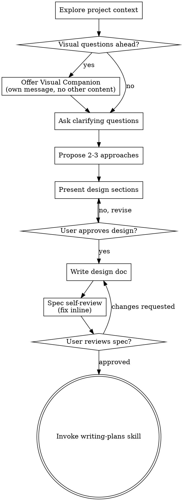

<!-- Generated by SpecStory, Markdown v2.1.0 -->

# 2026-05-02 11:30:57Z

<!-- Claude Code Session ef9e8bcf-6e89-4ebc-a5be-f410c709dfae (2026-05-02 11:30:57Z) -->

_**User (2026-05-02 11:30:57Z)**_

I just merged https://github.com/leocaseiro/base-skill/pull/302 create a new worktree to write the plan based on the .claude/handoffs/2026-05-02-srs-v1-spec-ready.md

Should I brainstorm https://github.com/leocaseiro/base-skill/issues/257 before you write the plan or after that?

---

_**Agent (claude-sonnet-4-6 2026-05-02 11:31:09Z)**_

_**Agent (claude-sonnet-4-6 2026-05-02 11:31:09Z)**_

Let me read the handoff document to understand what we're working with.

_**Agent (claude-sonnet-4-6 2026-05-02 11:31:10Z)**_

<tool-use data-tool-type="read" data-tool-name="Read"><details>
<summary>Tool use: **Read**</summary>
 `./.claude/handoffs/2026-05-02-srs-v1-spec-ready.md`

```text
File does not exist. Note: your current working directory is /Users/leocaseiro/Sites/base-skill.
```
</details></tool-use>

_**Agent (claude-sonnet-4-6 2026-05-02 11:31:14Z)**_

<tool-use data-tool-type="shell" data-tool-name="Bash"><details>
<summary>Tool use: **Bash**</summary>

`ls /Users/leocaseiro/Sites/base-skill/.claude/handoffs/`

```text
2026-04-22-handoff-skill.md
2026-04-22-tier3-storybook-audit-execution.md
2026-04-23-tier3-wave1-dispatch.md
2026-04-23-wordlibrary-explorer-blender.md
2026-04-24-word-authoring-minor-bugs.md
2026-04-24-word-authoring-pr182-ux-gaps.md
2026-04-28-cleanup-local-branches.md
2026-04-28-wordspell-levels-defaults.md
2026-04-29-config-form-advanced-parity.md
2026-04-29-wordspell-cumulative-y-filter-plan-ready.md
2026-04-29-wordspell-grapheme-pair-audit-pending.md
2026-04-29-wordspell-multi-level-plan-ready.md
2026-04-29-wordspell-source-filter-out-of-sync.md
README.md
```
</details></tool-use>

_**Agent (claude-sonnet-4-6 2026-05-02 11:31:22Z)**_

_**Agent (claude-sonnet-4-6 2026-05-02 11:31:22Z)**_

The handoff file doesn't exist yet — let me check what PR #302 contained and look at issue #257.

_**Agent (claude-sonnet-4-6 2026-05-02 11:31:26Z)**_

<tool-use data-tool-type="shell" data-tool-name="Bash"><details>
<summary>Tool use: **Bash**</summary>

`git pull origin master --quiet && ls .claude/handoffs/`

```text
Exit code 1
error: Your local changes to the following files would be overwritten by merge:
	.specstory/history/2026-04-08_07-33-32Z-drag-preview-and-swap-testing.md
	.specstory/history/2026-04-10_02-05-34Z.md
	.specstory/history/2026-04-10_08-50-51Z-i-am-trying-to.md
	.specstory/history/2026-04-21_01-39-29Z-since-i-started-the.md
	.specstory/history/2026-04-21_07-49-00Z-game-mobile-layout-improvements.md
	.specstory/history/2026-04-21_14-33-19Z-continue-the-storybook-controls.md
	.specstory/history/2026-04-22_04-19-31Z-handoff-tier-3-storybook.md
	.specstory/history/2026-04-23_13-08-21Z-cotinue-claude-worktrees-suspicious.md
	.specstory/history/2026-04-24_09-45-59Z-can-you-fix-my.md
	CLAUDE.md
Please commit your changes or stash them before you merge.
error: The following untracked working tree files would be overwritten by merge:
	.specstory/history/2026-04-22_04-19-31Z-hash-handoff-tier-3.md
	.specstory/history/2026-04-28_00-52-20Z-i-want-to-merge.md
	.specstory/history/2026-04-28_04-41-22Z-review-the-https-github.md
	.specstory/history/2026-04-28_08-05-13Z-the-app-is-no.md
	.specstory/history/2026-04-28_09-51-04Z-i-need-to-make.md
	.specstory/history/2026-04-28_10-18-49Z-why-is-claude-settings.md
	.specstory/history/2026-04-28_10-40-01Z-isn-t-this-a.md
	.specstory/history/2026-04-28_11-07-58Z-i-am-trying-to.md
	.specstory/history/2026-04-28_11-39-20Z-what-is-with-all.md
	.specstory/history/2026-04-28_20-38-28Z-while-testing-https-github.md
	.specstory/history/2026-04-28_22-18-55Z-continue-the-handoff-from.md
	.specstory/history/2026-04-28_23-56-15Z-i-am-currently-using.md
	.specstory/history/2026-04-29_00-45-24Z-continue-the-work-from.md
	.specstory/history/2026-04-29_04-29-30Z-i-am-so-sick.md
	.specstory/history/2026-04-29_04-32-21Z.md
	.specstory/history/2026-04-29_10-59-19Z.md
	.specstory/history/2026-04-29_13-53-51Z-i-want-to-brainstorm.md
	.specstory/history/2026-04-29_15-12-48Z.md
	.specstory/history/2026-04-30_00-10-59Z-unknown-command-mode-did.md
	.specstory/history/2026-04-30_10-21-22Z-continue-the-handoff-from.md
	.specstory/history/2026-04-30_12-23-15Z.md
	.specstory/history/2026-04-30_12-51-37Z-spot-all-redesign-implementation.md
	.specstory/history/2026-05-01_01-13-02Z-guarantees-for-correct-tile-count.md
	.specstory/history/2026-05-01_02-05-47Z.md
	.specstory/history/2026-05-01_02-12-43Z.md
	.specstory/history/2026-05-01_04-00-13Z.md
	.specstory/history/2026-05-01_05-54-39Z-continue-on-the-same.md
	.specstory/history/2026-05-01_06-51-32Z-use-the-same-git.md
	.specstory/history/2026-05-01_07-32-28Z.md
Please move or remove them before you merge.
Aborting
```
</details></tool-use>

_**Agent (claude-sonnet-4-6 2026-05-02 11:31:26Z)**_

<tool-use data-tool-type="shell" data-tool-name="Bash"><details>
<summary>Tool use: **Bash**</summary>

`gh pr view 302 --json title,body,files 2>/dev/null | head -100`

```text
<tool_use_error>Cancelled: parallel tool call Bash(git pull origin master --quiet && ls .cl…) errored</tool_use_error>
```
</details></tool-use>

_**Agent (claude-sonnet-4-6 2026-05-02 11:31:31Z)**_

<tool-use data-tool-type="shell" data-tool-name="Bash"><details>
<summary>Tool use: **Bash**</summary>

`gh pr view 302 --json title,body,files`

```text
{"body":"## Summary\n\n- Adds the SRS v1 (spaced-repetition scheduling) design spec at [docs/superpowers/specs/2026-05-01-srs-v1-design.md](docs/superpowers/specs/2026-05-01-srs-v1-design.md).\n- Captures the kid-tuned SM-2 algorithm, rich per-attempt recording schema, game-agnostic adapter pattern (WordSpell as v1 integrator), migration from `word_spell_seen_words`, and the soak / rollout strategy.\n- Incorporates feedback from a multi-persona doc review (coherence, feasibility, product-lens, scope-guardian, adversarial) — 24 findings surfaced and worked through.\n- Includes a handoff at [.claude/handoffs/2026-05-02-srs-v1-spec-ready.md](.claude/handoffs/2026-05-02-srs-v1-spec-ready.md) so the next session can pick up cleanly with `superpowers:writing-plans`.\n\n## Commits\n\n- \\`12ccc2aa docs(srs): add SRS v1 design spec\\` — initial spec from the brainstorming session.\n- \\`503de9e0 docs(srs): incorporate doc-review pass (24 findings)\\` — applies the doc-review fixes (migration shape against the actual legacy schema, lapse-forgiveness null-correctness fix, recording-without-scheduling semantics, profile-relative adapter thresholds, drag/type item split, retention guard, exit criteria, etc.).\n- \\`b31a982a docs(handoff): SRS v1 spec ready for plan-writing\\` — handoff doc.\n\n## Filed during the session\n\n- [#295](https://github.com/leocaseiro/base-skill/issues/295) — Onboarding: placement assessment (cold-start input source for SRS).\n- [#296](https://github.com/leocaseiro/base-skill/issues/296) — HUD + scoring: accuracy target (natural follow-up surface for SRS error data).\n- [#297](https://github.com/leocaseiro/base-skill/issues/297) — SRS v2 skill-pattern aggregation (`srs_skill_state` + `srs_mistake_patterns` tracking issue).\n- Comment on [#257](https://github.com/leocaseiro/base-skill/issues/257) enumerating the lifecycle events `useGameRound` must publish for SRS to function.\n\n## Test plan\n\nThis PR is documentation-only. No production code changes. Verification:\n\n- [x] \\`yarn lint:md\\` passes for the new files.\n- [x] \\`yarn fix:md\\` ran clean.\n- [x] No code edits, no schema changes, no test changes.\n- [x] Spec is internally consistent after the doc-review pass (re-derived worked examples, fixed type signatures, removed dead constants).\n\n## Next step\n\nContinue from the handoff. The next session invokes \\`superpowers:writing-plans\\` against the spec to produce the implementation plan, on this same branch / PR.\n\n🤖 Generated with [Claude Code](https://claude.com/claude-code)","files":[{"path":".claude/handoffs/2026-05-02-srs-v1-spec-ready.md","additions":107,"deletions":0,"changeType":"ADDED"},{"path":"docs/superpowers/specs/2026-05-01-srs-v1-design.md","additions":1270,"deletions":0,"changeType":"ADDED"}],"title":"docs(srs): SRS v1 design spec — brainstormed, reviewed, ready for plan"}
```
</details></tool-use>

_**Agent (claude-sonnet-4-6 2026-05-02 11:31:45Z)**_

_**Agent (claude-sonnet-4-6 2026-05-02 11:31:45Z)**_

The files are on remote master but haven't pulled locally. Let me read them directly from git.

_**Agent (claude-sonnet-4-6 2026-05-02 11:31:49Z)**_

<tool-use data-tool-type="shell" data-tool-name="Bash"><details>
<summary>Tool use: **Bash**</summary>

`git fetch origin master --quiet && git show origin/master:.claude/handoffs/2026-05-02-srs-v1-spec-ready.md`

```text
# Handoff: SRS v1 spec ready for plan-writing

**Date:** 2026-05-02
**Branch:** claude/suspicious-shockley-d53a5f
**Worktree:** `<project-root>/.claude/worktrees/suspicious-shockley-d53a5f`
**Git status:** 2 unpushed commits, clean working tree
**Last commit:** `503de9e0 docs(srs): incorporate doc-review pass (24 findings)`
**PR:** opened alongside this handoff (link added on push)

## Resume command

```bash
/resync
cd /Users/leocaseiro/Sites/base-skill/.claude/worktrees/suspicious-shockley-d53a5f

# Spec is reviewed and ready. Next step is to write the implementation plan:
/superpowers:writing-plans docs/superpowers/specs/2026-05-01-srs-v1-design.md
```

## Current state

**Task:** Build SRS v1 (spaced-repetition scheduling) for BaseSkill — kid-tuned SM-2 algorithm, rich per-attempt recording, game-agnostic adapter pattern, WordSpell as the v1 integrator.

**Phase:** Brainstorming + spec + multi-persona doc review complete. **Implementation plan NOT yet written.**

**Progress:**

- ✅ Brainstorming session ran end-to-end (6 sections)
- ✅ Spec written and committed: `12ccc2aa docs(srs): add SRS v1 design spec`
- ✅ ce-doc-review ran with 5 personas (coherence, feasibility, product-lens, scope-guardian, adversarial); 24 findings surfaced
- ✅ Walked through all 24 findings; applied agreed fixes; committed: `503de9e0 docs(srs): incorporate doc-review pass`
- ⏳ **Next: invoke `superpowers:writing-plans` skill against the spec to produce the implementation plan**

## What we did (this session, in order)

1. **Brainstormed** the SRS v1 design via the `superpowers:brainstorming` skill. Six sections, each with explicit sign-offs:
   - Section 1: Architecture overview (adapter pattern, file layout, `srs_items` supersedes `word_spell_seen_words`)
   - Section 2: Recording schema (the `srs_attempts` rich event log — flagged by the user as the part that matters most)
   - Section 3: `srs_items` schema + SM-2 algorithm (kid-tuned intervals, lapse forgiveness window)
   - Section 4: Grade derivation rules (decision-time + execution-time split, mistake patterns, TTS replays)
   - Section 5: Round selector (composeSession + in-session re-insertion with predictable session length)
   - Section 6: Integration & migration (feature flag, observability, testing, rollout)
2. **Filed three GH issues** during brainstorming:
   - [#295](https://github.com/leocaseiro/base-skill/issues/295) — Onboarding: placement assessment (cold-start input source)
   - [#296](https://github.com/leocaseiro/base-skill/issues/296) — HUD + scoring: accuracy target follow-up
   - [#297](https://github.com/leocaseiro/base-skill/issues/297) — SRS v2 skill-pattern aggregation
3. **Posted comments on [#257](https://github.com/leocaseiro/base-skill/issues/257)** — first the critical-path note, then the concrete event-publishing requirements (`round-shown`, `first-action`, `mistake`, `tts-played`, `visibility-change`, `round-resolved`).
4. **Wrote the spec** at `docs/superpowers/specs/2026-05-01-srs-v1-design.md`.
5. **Ran `/compound-engineering:ce-doc-review`** with 5 reviewer personas. 24 findings surfaced after dedup.
6. **Walked through every finding** via `AskUserQuestion`. Most were applied; some were skipped or merged into earlier fixes.

## Decisions made (during brainstorming)

- **Algorithm:** SM-2 (not FSRS, not Leitner). Right complexity for v1; deterministic; swap-able later because all input signals are recorded.
- **Game scope:** WordSpell first; foundation game-agnostic. Adapter pattern designed for SortNumbers, NumberMatch, SpotAll, Sort-by-Group, Connect-Answers.
- **Item identity:** `(gameId, contentSource, word, mode, inputMethod)`. Drag and type are **separate items** (revised during doc review).
- **Session entry UX:** Quietly woven into normal play; no separate review screen.
- **Layered v1 vs v2:** Item-SRS in v1; skill-aggregation collections (`srs_skill_state`, `srs_mistake_patterns`) deferred to v2 (revised during doc review).
- **Session shape:** Fixed `totalRounds`. In-session re-insertion displaces queue tail; lapsed items dropped from this session land in SM-2's cross-session schedule (30-min `LAPSE_INTERVAL_MS`).
- **Lapse forgiveness:** 14-day window, only for items that have been correct at least once.
- **Decision-time as grade signal:** Required for grade 5 (automaticity).
- **Mistake patterns:** `multiple-same` → grade 1; `multiple-varied` → grade 2.
- **Per-doc `schemaVersion`:** Yes, on every doc.
- **Feature flags:** Two on `settings` — `srsEnabled` (round-provider injection) + `srsRecordingEnabled` (opt-in pre-flip data capture). Both default false in v1.
- **Profile reset / cloud sync:** Deferred. Not on critical path.
- **Adapter `expectedExecution` / `expectedDecision`:** Profile-relative thresholds (per-kid running median) to avoid penalising slow decoders.
- **Storage retention:** 90 days OR 5,000 attempts per profile, whichever covers more. Long-term history pivots to cloud sync (future work).
- **Adapter contract maturity:** Provisional in v1. Implementation includes a paper-prototype gate against game #2 (likely SortNumbers).

## Spec / artefacts

- **Spec:** `docs/superpowers/specs/2026-05-01-srs-v1-design.md` (committed: `12ccc2aa` then revised in `503de9e0`)
- **Issues filed:** #295, #296, #297
- **Comments posted on:** #257 (twice — context note + event-publishing requirements)

## Open questions / blockers

- [ ] **#257 (`useGameRound`) is a critical-path dependency** for SRS v1. SRS v1 is bundled with WordSpell's adoption of `useGameRound` (#260) per the "Z" ordering decision. Confirm timing of #257 before locking the implementation plan's task ordering.
- [ ] **Plan must include the paper-prototype gate** — before WordSpell's adapter is "done", the implementation work writes a paper sketch of one future adapter (most likely SortNumbers) to stress-test the contract. This is in the spec but should land as an explicit task in the plan.
- [ ] **Plan must mark which spec changes will need updates if soak-period data drives them** — e.g. timing thresholds in `sm2-config.ts` and `round-selector-config.ts` are starting points, not final values.

## Next steps

1. [ ] **Invoke `superpowers:writing-plans`** against the spec to produce the implementation plan. Recommend the plan break the work into phases:
   - Foundation modules (`src/lib/srs/types.ts`, `sm2.ts`, `sm2-config.ts`, `grade-derivation.ts`)
   - Schemas (`src/db/schemas/srs_items.ts`, `srs_attempts.ts`) + `settings` schema bump for the two feature flags + `srsV1MigrationComplete`
   - Round selector (`composeSession` + `handleRoundResolved`)
   - WordSpell adapter (`src/lib/srs/adapters/word-spell.ts`, `word-spell-typing.ts`)
   - Recorder integration (`useSrsRecording`, plumbed via `useGameRound`)
   - Migration from `word_spell_seen_words` (with `dueAt` spread)
   - Settings UI (toggle for `srsEnabled` + parent-PIN-gated advanced page for `srsRecordingEnabled`)
   - Dev inspector (`/dev/srs-inspector`)
   - Paper-prototype gate (SortNumbers adapter sketch)
2. [ ] **Coordinate with #257** — bundling order is "Z" (SRS v1 + WordSpell adoption of `useGameRound` ship together). Plan should reference the events #257 must publish (already documented in the spec).
3. [ ] **Verify the spec passes `yarn lint:md` and `yarn fix:md`** — done as of last commit, but re-verify before any further edits.

## Files in this session (touched)

- `docs/superpowers/specs/2026-05-01-srs-v1-design.md` — the spec (created + revised)
- `.claude/handoffs/2026-05-02-srs-v1-spec-ready.md` — this handoff

## Session metadata

- Brainstorming session messages: ~80 turns total
- Findings reviewed: 24 (5 reviewer personas)
- Findings applied: 17 (some merged into earlier fixes)
- Findings deferred / skipped: 7 (mostly when earlier decisions held or were already resolved)
```
</details></tool-use>

_**Agent (claude-sonnet-4-6 2026-05-02 11:31:49Z)**_

<tool-use data-tool-type="shell" data-tool-name="Bash"><details>
<summary>Tool use: **Bash**</summary>

`gh issue view 257 --json title,body,comments 2>/dev/null | python3 -c "import json,sys; d=json.load(sys.stdin); print('TITLE:', d['title']); print('BODY:', d['body'][:2000]); print('COMMENTS:', len(d['comments'])); [print('---COMMENT:', c['body'][:1000]) for c in d['comments'][-3:]]"`

```text
TITLE: Generalise Slot with mode='tap-select' + extract useGameRound hook
BODY: ## Context

Filed as part of the SpotAll redesign — see spec at
`docs/superpowers/specs/2026-04-30-confusable-spotall-redesign-design.md` (PR #252).

## Problem

`AnswerGame` and `Slot` are currently drag-to-slot only. SpotAll v2 (in PR #252)
implements a tap-multi-select mechanic but cannot use `<AnswerGame>` or `<Slot>`
because the reducer state model is incompatible. SpotAll therefore ships its own
reducer and tile component as a workaround.

To unify the games, we need to:

1. **Generalise `Slot`** with a `mode: 'drag' | 'tap-select'` prop. In `tap-select`
   mode, the slot is a tap target (no `useDroppable`, no drag preview); tapping
   toggles a `selectedSlotIds` set on the answer-game state.
2. **Extend `AnswerGameProvider` / `answerGameReducer`** to support a
   `selectedSlotIds` set and a round-complete condition that's mode-aware
   (`mode === 'tap-select' ? allCorrectSelected : allSlotsFilled`).
3. **Extract a `useGameRound(rounds, advanceDelay)` hook** that any game can call to
   get round lifecycle (init / advance / complete) without rewriting the dispatcher.

## Done when

- [ ] `Slot` accepts `mode` prop; both `drag` and `tap-select` modes pass tests
- [ ] `AnswerGameProvider` handles tap-select state without breaking existing games
- [ ] `useGameRound` extracted; SpotAll migrates to it
- [ ] WordSpell / NumberMatch / SortNumbers compile and pass tests unchanged

## Blocks

- #260 — WordSpell adopt useGameRound
- #261 — NumberMatch adopt useGameRound
- #262 — SortNumbers adopt useGameRound

## Why

Eliminates SpotAll's parallel infrastructure (own reducer, own tile component). Sets
up the C-* per-game adoption issues (#260, #261, #262), and unblocks the future
"drop all correct here" SpotAll variant (since `Slot` stays draggable too — modes
coexist).
COMMENTS: 2
---COMMENT: **Note: critical-path dependency for the SRS v1 work currently being designed.**

The `useGameRound` hook this issue extracts is the planned integration point for the SRS (spaced-repetition) system. SRS will plumb into `useGameRound` so that recording attempts, requesting next-round content, and detecting round-complete all flow through one hook rather than three game-specific implementations.

Sequencing decision (option **Z** in the brainstorming session):

1. **#257 lands first** — `useGameRound` + tap-select `Slot` ship.
2. **SRS v1 + #260 ship together** — WordSpell adopts `useGameRound` *and* gains SRS in the same change-series, so the integration point exists by the time SRS needs it.
3. **#261 / #262 follow** — NumberMatch and SortNumbers adopt `useGameRound`. SRS adapters for those games can be added at the same time or shortly after.
4. **SpotAll adapter** comes later, once it has migrated to the unified hook (which #252 enables).

Implications for #257 scope:

- No SRS-speci
---COMMENT: **Concrete event-publishing requirements for SRS v1 (refines the comment above).**

The SRS recorder subscribes to a lifecycle event stream that does not yet exist in `src/types/game-events.ts`. The `useGameRound` extraction must add these event types and ensure existing emitters publish them. SRS v1 is blocked until these land.

| Event               | Payload                                                             | Where to add                                                                        |
| ------------------- | ------------------------------------------------------------------- | ----------------------------------------------------------------------------------- |
| `round-shown`       | `{ roundId, itemId, ts }`                                           | `useGameRound` on round mount                                                       |
| `first-action`      | `{ roundId, ts, kind }` where `kind` ∈ `'tile' \| 'key' \| 'tap'`   | First tile-place / first keystroke
```
</details></tool-use>

_**Agent (claude-sonnet-4-6 2026-05-02 11:32:04Z)**_

_**Agent (claude-sonnet-4-6 2026-05-02 11:32:08Z)**_

**Brainstorm #257 first.** The handoff is explicit about it:

> `#257 (useGameRound) is a critical-path dependency. Confirm timing of #257 before locking the implementation plan's task ordering.`

The SRS plan's task sequencing depends on #257 — specifically, whether `useGameRound` + its lifecycle events land before, together with, or after the SRS recorder. The "Z" ordering decision (SRS v1 + #260 ship together, after #257 lands) needs to be validated against how big #257 actually is before the plan can assign phases confidently.

**Recommended order:**

1. `superpowers:brainstorming` on #257 — scope the `useGameRound` extraction + `tap-select` Slot, confirm the event-publishing contract, estimate size
2. `superpowers:writing-plans` for SRS v1 — now the task ordering can reference concrete #257 phases rather than "TBD"

Shall I create the worktree and kick off the #257 brainstorm?

---

_**User (2026-05-02 11:35:00Z)**_

y

---

_**Agent (claude-sonnet-4-6 2026-05-02 11:35:07Z)**_

_**Agent (claude-sonnet-4-6 2026-05-02 11:35:07Z)**_

<tool-use data-tool-type="generic" data-tool-name="Skill"><details>
<summary>Tool use: **Skill**</summary>

```text
Launching skill: superpowers:brainstorming
```
</details></tool-use>

---

_**User (2026-05-02 11:35:07Z)**_

Base directory for this skill: /Users/leocaseiro/.claude/plugins/cache/claude-plugins-official/superpowers/5.0.7/skills/brainstorming

# Brainstorming Ideas Into Designs

Help turn ideas into fully formed designs and specs through natural collaborative dialogue.

Start by understanding the current project context, then ask questions one at a time to refine the idea. Once you understand what you're building, present the design and get user approval.

<HARD-GATE>
Do NOT invoke any implementation skill, write any code, scaffold any project, or take any implementation action until you have presented a design and the user has approved it. This applies to EVERY project regardless of perceived simplicity.
</HARD-GATE>

## Anti-Pattern: "This Is Too Simple To Need A Design"

Every project goes through this process. A todo list, a single-function utility, a config change — all of them. "Simple" projects are where unexamined assumptions cause the most wasted work. The design can be short (a few sentences for truly simple projects), but you MUST present it and get approval.

## Checklist

You MUST create a task for each of these items and complete them in order:

1. **Explore project context** — check files, docs, recent commits
2. **Offer visual companion** (if topic will involve visual questions) — this is its own message, not combined with a clarifying question. See the Visual Companion section below.
3. **Ask clarifying questions** — one at a time, understand purpose/constraints/success criteria
4. **Propose 2-3 approaches** — with trade-offs and your recommendation
5. **Present design** — in sections scaled to their complexity, get user approval after each section
6. **Write design doc** — save to `docs/superpowers/specs/YYYY-MM-DD-<topic>-design.md` and commit
7. **Spec self-review** — quick inline check for placeholders, contradictions, ambiguity, scope (see below)
8. **User reviews written spec** — ask user to review the spec file before proceeding
9. **Transition to implementation** — invoke writing-plans skill to create implementation plan

## Process Flow



**The terminal state is invoking writing-plans.** Do NOT invoke frontend-design, mcp-builder, or any other implementation skill. The ONLY skill you invoke after brainstorming is writing-plans.

## The Process

**Understanding the idea:**

- Check out the current project state first (files, docs, recent commits)
- Before asking detailed questions, assess scope: if the request describes multiple independent subsystems (e.g., "build a platform with chat, file storage, billing, and analytics"), flag this immediately. Don't spend questions refining details of a project that needs to be decomposed first.
- If the project is too large for a single spec, help the user decompose into sub-projects: what are the independent pieces, how do they relate, what order should they be built? Then brainstorm the first sub-project through the normal design flow. Each sub-project gets its own spec → plan → implementation cycle.
- For appropriately-scoped projects, ask questions one at a time to refine the idea
- Prefer multiple choice questions when possible, but open-ended is fine too
- Only one question per message - if a topic needs more exploration, break it into multiple questions
- Focus on understanding: purpose, constraints, success criteria

**Exploring approaches:**

- Propose 2-3 different approaches with trade-offs
- Present options conversationally with your recommendation and reasoning
- Lead with your recommended option and explain why

**Presenting the design:**

- Once you believe you understand what you're building, present the design
- Scale each section to its complexity: a few sentences if straightforward, up to 200-300 words if nuanced
- Ask after each section whether it looks right so far
- Cover: architecture, components, data flow, error handling, testing
- Be ready to go back and clarify if something doesn't make sense

**Design for isolation and clarity:**

- Break the system into smaller units that each have one clear purpose, communicate through well-defined interfaces, and can be understood and tested independently
- For each unit, you should be able to answer: what does it do, how do you use it, and what does it depend on?
- Can someone understand what a unit does without reading its internals? Can you change the internals without breaking consumers? If not, the boundaries need work.
- Smaller, well-bounded units are also easier for you to work with - you reason better about code you can hold in context at once, and your edits are more reliable when files are focused. When a file grows large, that's often a signal that it's doing too much.

**Working in existing codebases:**

- Explore the current structure before proposing changes. Follow existing patterns.
- Where existing code has problems that affect the work (e.g., a file that's grown too large, unclear boundaries, tangled responsibilities), include targeted improvements as part of the design - the way a good developer improves code they're working in.
- Don't propose unrelated refactoring. Stay focused on what serves the current goal.

## After the Design

**Documentation:**

- Write the validated design (spec) to `docs/superpowers/specs/YYYY-MM-DD-<topic>-design.md`
  - (User preferences for spec location override this default)
- Use elements-of-style:writing-clearly-and-concisely skill if available
- Commit the design document to git

**Spec Self-Review:**
After writing the spec document, look at it with fresh eyes:

1. **Placeholder scan:** Any "TBD", "TODO", incomplete sections, or vague requirements? Fix them.
2. **Internal consistency:** Do any sections contradict each other? Does the architecture match the feature descriptions?
3. **Scope check:** Is this focused enough for a single implementation plan, or does it need decomposition?
4. **Ambiguity check:** Could any requirement be interpreted two different ways? If so, pick one and make it explicit.

Fix any issues inline. No need to re-review — just fix and move on.

**User Review Gate:**
After the spec review loop passes, ask the user to review the written spec before proceeding:

> "Spec written and committed to `<path>`. Please review it and let me know if you want to make any changes before we start writing out the implementation plan."

Wait for the user's response. If they request changes, make them and re-run the spec review loop. Only proceed once the user approves.

**Implementation:**

- Invoke the writing-plans skill to create a detailed implementation plan
- Do NOT invoke any other skill. writing-plans is the next step.

## Key Principles

- **One question at a time** - Don't overwhelm with multiple questions
- **Multiple choice preferred** - Easier to answer than open-ended when possible
- **YAGNI ruthlessly** - Remove unnecessary features from all designs
- **Explore alternatives** - Always propose 2-3 approaches before settling
- **Incremental validation** - Present design, get approval before moving on
- **Be flexible** - Go back and clarify when something doesn't make sense

## Visual Companion

A browser-based companion for showing mockups, diagrams, and visual options during brainstorming. Available as a tool — not a mode. Accepting the companion means it's available for questions that benefit from visual treatment; it does NOT mean every question goes through the browser.

**Offering the companion:** When you anticipate that upcoming questions will involve visual content (mockups, layouts, diagrams), offer it once for consent:
> "Some of what we're working on might be easier to explain if I can show it to you in a web browser. I can put together mockups, diagrams, comparisons, and other visuals as we go. This feature is still new and can be token-intensive. Want to try it? (Requires opening a local URL)"

**This offer MUST be its own message.** Do not combine it with clarifying questions, context summaries, or any other content. The message should contain ONLY the offer above and nothing else. Wait for the user's response before continuing. If they decline, proceed with text-only brainstorming.

**Per-question decision:** Even after the user accepts, decide FOR EACH QUESTION whether to use the browser or the terminal. The test: **would the user understand this better by seeing it than reading it?**

- **Use the browser** for content that IS visual — mockups, wireframes, layout comparisons, architecture diagrams, side-by-side visual designs
- **Use the terminal** for content that is text — requirements questions, conceptual choices, tradeoff lists, A/B/C/D text options, scope decisions

A question about a UI topic is not automatically a visual question. "What does personality mean in this context?" is a conceptual question — use the terminal. "Which wizard layout works better?" is a visual question — use the browser.

If they agree to the companion, read the detailed guide before proceeding:
`skills/brainstorming/visual-companion.md`


---

_**Agent (claude-sonnet-4-6 2026-05-02 11:35:17Z)**_

_**Agent (claude-sonnet-4-6 2026-05-02 11:35:17Z)**_

<tool-use data-tool-type="unknown" data-tool-name="ToolSearch"><details>
<summary>Tool use: **ToolSearch**</summary>

**Input:**

- max_results: `2`
- query: `select:TaskCreate,TaskUpdate`

**Result:**

```

```
</details></tool-use>

_**Agent (claude-sonnet-4-6 2026-05-02 11:35:23Z)**_

_**Agent (claude-sonnet-4-6 2026-05-02 11:35:25Z)**_

<tool-use data-tool-type="unknown" data-tool-name="TaskCreate"><details>
<summary>Tool use: **TaskCreate**</summary>
Read issue #257, related files (AnswerGame, Slot, useGameRound area, game-events.ts), and the SRS v1 spec to understand the full context before brainstorming.

```text
Task #1 created successfully: Explore project context for #257
```
</details></tool-use>

_**Agent (claude-sonnet-4-6 2026-05-02 11:35:31Z)**_

<tool-use data-tool-type="unknown" data-tool-name="TaskCreate"><details>
<summary>Tool use: **TaskCreate**</summary>
Create git worktree at ./worktrees/feat/issue-257-use-game-round (or similar) for the brainstorm spec doc.

```text
Task #2 created successfully: Create worktree for #257 brainstorm
```
</details></tool-use>

_**Agent (claude-sonnet-4-6 2026-05-02 11:35:37Z)**_

<tool-use data-tool-type="unknown" data-tool-name="TaskCreate"><details>
<summary>Tool use: **TaskCreate**</summary>
One question per message to nail down scope, constraints, and success criteria for #257.

```text
Task #3 created successfully: Ask clarifying questions one at a time
```
</details></tool-use>

_**Agent (claude-sonnet-4-6 2026-05-02 11:35:41Z)**_

<tool-use data-tool-type="unknown" data-tool-name="TaskCreate"><details>
<summary>Tool use: **TaskCreate**</summary>
Present implementation approaches for useGameRound + tap-select Slot with recommendation.

```text
Task #4 created successfully: Propose 2-3 approaches with trade-offs
```
</details></tool-use>

_**Agent (claude-sonnet-4-6 2026-05-02 11:35:47Z)**_

<tool-use data-tool-type="unknown" data-tool-name="TaskCreate"><details>
<summary>Tool use: **TaskCreate**</summary>
Present design in sections (architecture, hook API, Slot changes, event contract, testing), get user approval after each.

```text
Task #5 created successfully: Present design sections and get approval
```
</details></tool-use>

_**Agent (claude-sonnet-4-6 2026-05-02 11:35:52Z)**_

<tool-use data-tool-type="unknown" data-tool-name="TaskCreate"><details>
<summary>Tool use: **TaskCreate**</summary>
Save spec to docs/superpowers/specs/YYYY-MM-DD-issue-257-use-game-round-design.md, run yarn fix:md, commit.

```text
Task #6 created successfully: Write design doc and commit
```
</details></tool-use>

_**Agent (claude-sonnet-4-6 2026-05-02 11:35:57Z)**_

<tool-use data-tool-type="unknown" data-tool-name="TaskCreate"><details>
<summary>Tool use: **TaskCreate**</summary>
Scan for TBDs, contradictions, ambiguity; fix inline. Then ask user to review before proceeding.

```text
Task #7 created successfully: Spec self-review and user review gate
```
</details></tool-use>

---

_**User (2026-05-02 11:36:01Z)**_

[Request interrupted by user]

_**User (2026-05-02 11:36:01Z)**_

<command-name>/model</command-name>
            <command-message>model</command-message>
            <command-args>opus</command-args>

_**User (2026-05-02 11:36:01Z)**_

<local-command-stdout>Set model to Opus 4.7</local-command-stdout>

_**User (2026-05-02 11:36:01Z)**_

<local-command-caveat>Caveat: The messages below were generated by the user while running local commands. DO NOT respond to these messages or otherwise consider them in your response unless the user explicitly asks you to.</local-command-caveat>

_**User (2026-05-02 11:36:01Z)**_

<command-name>/effort</command-name>
            <command-message>effort</command-message>
            <command-args>max</command-args>

_**User (2026-05-02 11:36:01Z)**_

<local-command-stdout>Set effort level to max (this session only): Maximum capability with deepest reasoning</local-command-stdout>

_**User (2026-05-02 11:36:01Z)**_

<local-command-caveat>Caveat: The messages below were generated by the user while running local commands. DO NOT respond to these messages or otherwise consider them in your response unless the user explicitly asks you to.</local-command-caveat>

_**User (2026-05-02 11:36:09Z)**_

<command-message>superpowers:brainstorming</command-message>
<command-name>/superpowers:brainstorming</command-name>

_**User (2026-05-02 11:36:09Z)**_

Base directory for this skill: /Users/leocaseiro/.claude/plugins/cache/claude-plugins-official/superpowers/5.0.7/skills/brainstorming

# Brainstorming Ideas Into Designs

Help turn ideas into fully formed designs and specs through natural collaborative dialogue.

Start by understanding the current project context, then ask questions one at a time to refine the idea. Once you understand what you're building, present the design and get user approval.

<HARD-GATE>
Do NOT invoke any implementation skill, write any code, scaffold any project, or take any implementation action until you have presented a design and the user has approved it. This applies to EVERY project regardless of perceived simplicity.
</HARD-GATE>

## Anti-Pattern: "This Is Too Simple To Need A Design"

Every project goes through this process. A todo list, a single-function utility, a config change — all of them. "Simple" projects are where unexamined assumptions cause the most wasted work. The design can be short (a few sentences for truly simple projects), but you MUST present it and get approval.

## Checklist

You MUST create a task for each of these items and complete them in order:

1. **Explore project context** — check files, docs, recent commits
2. **Offer visual companion** (if topic will involve visual questions) — this is its own message, not combined with a clarifying question. See the Visual Companion section below.
3. **Ask clarifying questions** — one at a time, understand purpose/constraints/success criteria
4. **Propose 2-3 approaches** — with trade-offs and your recommendation
5. **Present design** — in sections scaled to their complexity, get user approval after each section
6. **Write design doc** — save to `docs/superpowers/specs/YYYY-MM-DD-<topic>-design.md` and commit
7. **Spec self-review** — quick inline check for placeholders, contradictions, ambiguity, scope (see below)
8. **User reviews written spec** — ask user to review the spec file before proceeding
9. **Transition to implementation** — invoke writing-plans skill to create implementation plan

## Process Flow


**The terminal state is invoking writing-plans.** Do NOT invoke frontend-design, mcp-builder, or any other implementation skill. The ONLY skill you invoke after brainstorming is writing-plans.

## The Process

**Understanding the idea:**

- Check out the current project state first (files, docs, recent commits)
- Before asking detailed questions, assess scope: if the request describes multiple independent subsystems (e.g., "build a platform with chat, file storage, billing, and analytics"), flag this immediately. Don't spend questions refining details of a project that needs to be decomposed first.
- If the project is too large for a single spec, help the user decompose into sub-projects: what are the independent pieces, how do they relate, what order should they be built? Then brainstorm the first sub-project through the normal design flow. Each sub-project gets its own spec → plan → implementation cycle.
- For appropriately-scoped projects, ask questions one at a time to refine the idea
- Prefer multiple choice questions when possible, but open-ended is fine too
- Only one question per message - if a topic needs more exploration, break it into multiple questions
- Focus on understanding: purpose, constraints, success criteria

**Exploring approaches:**

- Propose 2-3 different approaches with trade-offs
- Present options conversationally with your recommendation and reasoning
- Lead with your recommended option and explain why

**Presenting the design:**

- Once you believe you understand what you're building, present the design
- Scale each section to its complexity: a few sentences if straightforward, up to 200-300 words if nuanced
- Ask after each section whether it looks right so far
- Cover: architecture, components, data flow, error handling, testing
- Be ready to go back and clarify if something doesn't make sense

**Design for isolation and clarity:**

- Break the system into smaller units that each have one clear purpose, communicate through well-defined interfaces, and can be understood and tested independently
- For each unit, you should be able to answer: what does it do, how do you use it, and what does it depend on?
- Can someone understand what a unit does without reading its internals? Can you change the internals without breaking consumers? If not, the boundaries need work.
- Smaller, well-bounded units are also easier for you to work with - you reason better about code you can hold in context at once, and your edits are more reliable when files are focused. When a file grows large, that's often a signal that it's doing too much.

**Working in existing codebases:**

- Explore the current structure before proposing changes. Follow existing patterns.
- Where existing code has problems that affect the work (e.g., a file that's grown too large, unclear boundaries, tangled responsibilities), include targeted improvements as part of the design - the way a good developer improves code they're working in.
- Don't propose unrelated refactoring. Stay focused on what serves the current goal.

## After the Design

**Documentation:**

- Write the validated design (spec) to `docs/superpowers/specs/YYYY-MM-DD-<topic>-design.md`
  - (User preferences for spec location override this default)
- Use elements-of-style:writing-clearly-and-concisely skill if available
- Commit the design document to git

**Spec Self-Review:**
After writing the spec document, look at it with fresh eyes:

1. **Placeholder scan:** Any "TBD", "TODO", incomplete sections, or vague requirements? Fix them.
2. **Internal consistency:** Do any sections contradict each other? Does the architecture match the feature descriptions?
3. **Scope check:** Is this focused enough for a single implementation plan, or does it need decomposition?
4. **Ambiguity check:** Could any requirement be interpreted two different ways? If so, pick one and make it explicit.

Fix any issues inline. No need to re-review — just fix and move on.

**User Review Gate:**
After the spec review loop passes, ask the user to review the written spec before proceeding:

> "Spec written and committed to `<path>`. Please review it and let me know if you want to make any changes before we start writing out the implementation plan."

Wait for the user's response. If they request changes, make them and re-run the spec review loop. Only proceed once the user approves.

**Implementation:**

- Invoke the writing-plans skill to create a detailed implementation plan
- Do NOT invoke any other skill. writing-plans is the next step.

## Key Principles

- **One question at a time** - Don't overwhelm with multiple questions
- **Multiple choice preferred** - Easier to answer than open-ended when possible
- **YAGNI ruthlessly** - Remove unnecessary features from all designs
- **Explore alternatives** - Always propose 2-3 approaches before settling
- **Incremental validation** - Present design, get approval before moving on
- **Be flexible** - Go back and clarify when something doesn't make sense

## Visual Companion

A browser-based companion for showing mockups, diagrams, and visual options during brainstorming. Available as a tool — not a mode. Accepting the companion means it's available for questions that benefit from visual treatment; it does NOT mean every question goes through the browser.

**Offering the companion:** When you anticipate that upcoming questions will involve visual content (mockups, layouts, diagrams), offer it once for consent:
> "Some of what we're working on might be easier to explain if I can show it to you in a web browser. I can put together mockups, diagrams, comparisons, and other visuals as we go. This feature is still new and can be token-intensive. Want to try it? (Requires opening a local URL)"

**This offer MUST be its own message.** Do not combine it with clarifying questions, context summaries, or any other content. The message should contain ONLY the offer above and nothing else. Wait for the user's response before continuing. If they decline, proceed with text-only brainstorming.

**Per-question decision:** Even after the user accepts, decide FOR EACH QUESTION whether to use the browser or the terminal. The test: **would the user understand this better by seeing it than reading it?**

- **Use the browser** for content that IS visual — mockups, wireframes, layout comparisons, architecture diagrams, side-by-side visual designs
- **Use the terminal** for content that is text — requirements questions, conceptual choices, tradeoff lists, A/B/C/D text options, scope decisions

A question about a UI topic is not automatically a visual question. "What does personality mean in this context?" is a conceptual question — use the terminal. "Which wizard layout works better?" is a visual question — use the browser.

If they agree to the companion, read the detailed guide before proceeding:
`skills/brainstorming/visual-companion.md`


---

_**Agent (claude-opus-4-7 2026-05-02 11:36:21Z)**_

_**Agent (claude-opus-4-7 2026-05-02 11:36:21Z)**_

<tool-use data-tool-type="unknown" data-tool-name="TaskUpdate"><details>
<summary>Tool use: **TaskUpdate**</summary>

```text
Updated task #2 status
```
</details></tool-use>

_**Agent (claude-opus-4-7 2026-05-02 11:36:24Z)**_

<tool-use data-tool-type="shell" data-tool-name="Bash"><details>
<summary>Tool use: **Bash**</summary>
Create worktree branched from origin/master

`git worktree add ./worktrees/feat-issue-257-use-game-round -b feat/issue-257-use-game-round origin/master 2>&1 | head -20`

```text
Preparing worktree (new branch 'feat/issue-257-use-game-round')
branch 'feat/issue-257-use-game-round' set up to track 'origin/master'.
HEAD is now at 3b6ff010b docs(srs): SRS v1 design spec — brainstormed, reviewed, ready for plan (#302)
```
</details></tool-use>

_**Agent (claude-opus-4-7 2026-05-02 11:36:26Z)**_

<tool-use data-tool-type="unknown" data-tool-name="TaskUpdate"><details>
<summary>Tool use: **TaskUpdate**</summary>

```text
Updated task #2 status
```
</details></tool-use>

_**Agent (claude-opus-4-7 2026-05-02 11:36:26Z)**_

<tool-use data-tool-type="unknown" data-tool-name="TaskUpdate"><details>
<summary>Tool use: **TaskUpdate**</summary>

```text
Updated task #1 status
```
</details></tool-use>

_**Agent (claude-opus-4-7 2026-05-02 11:36:32Z)**_

_**Agent (claude-opus-4-7 2026-05-02 11:36:33Z)**_

Working in the worktree now. Let me explore project context — SRS spec, issue #257, and the existing AnswerGame/Slot/round code in parallel.

_**Agent (claude-opus-4-7 2026-05-02 11:36:35Z)**_

<tool-use data-tool-type="shell" data-tool-name="Bash"><details>
<summary>Tool use: **Bash**</summary>
Get issue #257 with full comments

`cd /Users/leocaseiro/Sites/base-skill/worktrees/feat-issue-257-use-game-round && gh issue view 257 --comments 2>&1`

```text
author:	leocaseiro
association:	owner
edited:	false
status:	none
--
**Note: critical-path dependency for the SRS v1 work currently being designed.**

The `useGameRound` hook this issue extracts is the planned integration point for the SRS (spaced-repetition) system. SRS will plumb into `useGameRound` so that recording attempts, requesting next-round content, and detecting round-complete all flow through one hook rather than three game-specific implementations.

Sequencing decision (option **Z** in the brainstorming session):

1. **#257 lands first** — `useGameRound` + tap-select `Slot` ship.
2. **SRS v1 + #260 ship together** — WordSpell adopts `useGameRound` *and* gains SRS in the same change-series, so the integration point exists by the time SRS needs it.
3. **#261 / #262 follow** — NumberMatch and SortNumbers adopt `useGameRound`. SRS adapters for those games can be added at the same time or shortly after.
4. **SpotAll adapter** comes later, once it has migrated to the unified hook (which #252 enables).

Implications for #257 scope:

- No SRS-specific work is required in #257 itself.
- `useGameRound` should expose enough lifecycle hooks for an external observer to record round start, first action, and round resolve (these likely already exist as part of the hook's natural API — just calling it out so they're not collapsed away during refactor).
- If timing of #257 lands far ahead of SRS, no harm done — the SRS work just plugs in when ready.

Please tag the SRS spec PR (forthcoming under `docs/superpowers/specs/`) once this issue is close to landing, so the SRS work can sequence behind it.
--
author:	leocaseiro
association:	owner
edited:	false
status:	none
--
**Concrete event-publishing requirements for SRS v1 (refines the comment above).**

The SRS recorder subscribes to a lifecycle event stream that does not yet exist in `src/types/game-events.ts`. The `useGameRound` extraction must add these event types and ensure existing emitters publish them. SRS v1 is blocked until these land.

| Event               | Payload                                                             | Where to add                                                                        |
| ------------------- | ------------------------------------------------------------------- | ----------------------------------------------------------------------------------- |
| `round-shown`       | `{ roundId, itemId, ts }`                                           | `useGameRound` on round mount                                                       |
| `first-action`      | `{ roundId, ts, kind }` where `kind` ∈ `'tile' \| 'key' \| 'tap'`   | First tile-place / first keystroke / first tap                                      |
| `mistake`           | `{ roundId, ts, expectedTile, actualTile, slotId, distractorSource }` | `answer-game-reducer` wrong-placement branch + WordSpell typed-input checker        |
| `tts-played`        | `{ roundId, ts }`                                                   | `useGameTTS.speakPrompt` (currently uncounted)                                      |
| `visibility-change` | `{ ts, hidden }`                                                    | New listener bridging \`document.visibilitychange\`, scoped to the active session   |
| `round-resolved`    | `{ roundId, ts, outcome, finalAnswer? }`                            | `useGameRound` on round complete                                                    |

These events are also documented in the forthcoming SRS v1 spec under "Events `useGameRound` must publish (upstream requirement on #257)".

The `mistake` event in particular requires payload work in the existing reducers — currently wrong placements aren't surfaced as discrete events with the necessary fields. `tts-played` is a new counter inside `useGameTTS`. `visibility-change` is a new bridge from `document.visibilitychange`.
--
```
</details></tool-use>

_**Agent (claude-opus-4-7 2026-05-02 11:36:36Z)**_

<tool-use data-tool-type="shell" data-tool-name="Bash"><details>
<summary>Tool use: **Bash**</summary>
Check SRS spec size + AnswerGame folder

`wc -l docs/superpowers/specs/2026-05-01-srs-v1-design.md && ls src/components/answer-game/ 2>&1 | head -40`

```text
    1270 docs/superpowers/specs/2026-05-01-srs-v1-design.md
answer-game-reducer.test.ts
answer-game-reducer.ts
AnswerGame
AnswerGameProvider.test.tsx
AnswerGameProvider.tsx
bank-tile-reject-feedback.test.ts
bank-tile-reject-feedback.ts
EncouragementAnnouncer
GameOverOverlay
HiddenKeyboardInput.tsx
InstructionsOverlay
LevelCompleteOverlay
magnetic-snap.test.ts
magnetic-snap.ts
ProgressHUD
ScoreAnimation
Slot
styles.test.ts
styles.ts
tile-font.test.ts
tile-font.ts
TouchKeyboardContext.ts
types.ts
useAnswerGameContext.ts
useAnswerGameDispatch.ts
useAutoNextSlot.test.tsx
useAutoNextSlot.ts
useBankDropTarget.test.tsx
useBankDropTarget.ts
useDraggableTile.test.tsx
useDraggableTile.ts
useFreeSwap.test.tsx
useFreeSwap.ts
useGameSounds.test.tsx
useGameSounds.ts
useGameTTS.test.tsx
useGameTTS.ts
useKeyboardDrag.test.tsx
useKeyboardDrag.ts
useKeyboardInput.test.tsx
```
</details></tool-use>

_**Agent (claude-opus-4-7 2026-05-02 11:36:38Z)**_

<tool-use data-tool-type="shell" data-tool-name="Bash"><details>
<summary>Tool use: **Bash**</summary>
Find files using AnswerGame

`find src -type f \( -name "*.ts" -o -name "*.tsx" \) | xargs grep -l "AnswerGameProvider\|answerGameReducer\|useAnswerGame" 2>/dev/null | head -30`

```text
src/lib/game-engine/useAnswerGameDraftSync.test.ts
src/lib/game-engine/useAnswerGameDraftSync.ts
src/components/answer-game/useSlotTileDrag.test.tsx
src/components/answer-game/answer-game-reducer.ts
src/components/answer-game/useKeyboardInput.test.tsx
src/components/answer-game/useTileEvaluation.ts
src/components/answer-game/HiddenKeyboardInput.tsx
src/components/answer-game/useGameTTS.test.tsx
src/components/answer-game/useAutoNextSlot.ts
src/components/answer-game/useFreeSwap.test.tsx
src/components/answer-game/useAutoNextSlot.test.tsx
src/components/answer-game/useAnswerGameDispatch.ts
src/components/answer-game/useTouchKeyboardInput.test.tsx
src/components/answer-game/AnswerGameProvider.test.tsx
src/components/answer-game/answer-game-reducer.test.ts
src/components/answer-game/useKeyboardDrag.test.tsx
src/components/answer-game/useAnswerGameContext.ts
src/components/answer-game/useTouchKeyboardInput.ts
src/components/answer-game/types.ts
src/components/answer-game/useDraggableTile.test.tsx
src/components/answer-game/useGameSounds.ts
src/components/answer-game/useKeyboardInput.ts
src/components/answer-game/useDraggableTile.ts
src/components/answer-game/useSlotTileDrag.ts
src/components/answer-game/AnswerGameProvider.tsx
src/components/answer-game/useGameTTS.ts
src/components/answer-game/useRoundTTS.test.tsx
src/components/answer-game/useTileEvaluation.test.tsx
src/components/answer-game/useFreeSwap.ts
src/components/answer-game/useGameSounds.test.tsx
```
</details></tool-use>

_**Agent (claude-opus-4-7 2026-05-02 11:36:39Z)**_

<tool-use data-tool-type="shell" data-tool-name="Bash"><details>
<summary>Tool use: **Bash**</summary>
Check types/games dirs and game-events

`ls src/types/ src/games/ 2>&1 && echo "---" && find src -type f -name "game-events*" 2>/dev/null`

```text
src/games/:
build-round-order.test.ts
build-round-order.ts
catalog-utils.mdx
config-chips.test.ts
config-chips.ts
config-fields-registry.test.ts
config-fields-registry.tsx
cover-type.ts
cover.test.ts
cover.ts
level-system.mdx
number-match
registry.test.ts
registry.ts
simple-labels.test.ts
simple-labels.ts
sort-numbers
spot-all
word-spell

src/types/:
game-events.ts
---
src/types/game-events.ts
```
</details></tool-use>

_**Agent (claude-opus-4-7 2026-05-02 11:36:46Z)**_

_**Agent (claude-opus-4-7 2026-05-02 11:36:48Z)**_

<tool-use data-tool-type="read" data-tool-name="Read"><details>
<summary>Tool use: **Read**</summary>
 `./worktrees/feat-issue-257-use-game-round/src/components/answer-game/answer-game-reducer.ts`

```text
1	import type {
2	  AnswerGameAction,
3	  AnswerGameConfig,
4	  AnswerGamePhase,
5	  AnswerGameState,
6	  AnswerZone,
7	  TileItem,
8	} from './types';
9	
10	export function makeInitialState(
11	  config: AnswerGameConfig,
12	): AnswerGameState {
13	  return {
14	    config,
15	    allTiles: [],
16	    bankTileIds: [],
17	    zones: [],
18	    activeSlotIndex: 0,
19	    dragActiveTileId: null,
20	    dragHoverZoneIndex: null,
21	    dragHoverBankTileId: null,
22	    phase: 'playing',
23	    roundIndex: 0,
24	    retryCount: 0,
25	    levelIndex: 0,
26	    isLevelMode: config.levelMode !== undefined,
27	  };
28	}
29	
30	/**
31	 * Find the best next activeSlotIndex after a placement or removal.
32	 * Priority: first empty slot after `afterIndex`, then first empty slot
33	 * anywhere, then first wrong slot anywhere. Returns `fallback` when every
34	 * slot is correctly filled.
35	 */
36	function findNextActiveSlot(
37	  zones: AnswerZone[],
38	  afterIndex: number,
39	  fallback: number,
40	): number {
41	  // 1. First empty slot after the current action
42	  const nextEmpty = zones.findIndex(
43	    (z, i) => i > afterIndex && z.placedTileId === null,
44	  );
45	  if (nextEmpty !== -1) return nextEmpty;
46	
47	  // 2. First empty slot anywhere (wraps around)
48	  const anyEmpty = zones.findIndex((z) => z.placedTileId === null);
49	  if (anyEmpty !== -1) return anyEmpty;
50	
51	  // 3. First wrong slot anywhere (so user can retype)
52	  const anyWrong = zones.findIndex((z) => z.isWrong);
53	  if (anyWrong !== -1) return anyWrong;
54	
55	  return fallback;
56	}
57	
58	function resolveCompletionPhase(
59	  state: AnswerGameState,
60	): AnswerGamePhase {
61	  const isLastRound = state.roundIndex >= state.config.totalRounds - 1;
62	  if (!isLastRound) return 'round-complete';
63	  if (!state.isLevelMode) return 'game-over';
64	  const maxLevels = state.config.levelMode?.maxLevels;
65	  if (maxLevels && state.levelIndex + 1 >= maxLevels)
66	    return 'game-over';
67	  return 'level-complete';
68	}
69	
70	export function answerGameReducer(
71	  state: AnswerGameState,
72	  action: AnswerGameAction,
73	): AnswerGameState {
74	  switch (action.type) {
75	    case 'INIT_ROUND': {
76	      return {
77	        ...state,
78	        allTiles: action.tiles,
79	        bankTileIds: action.tiles.map((t: TileItem) => t.id),
80	        zones: action.zones,
81	        activeSlotIndex: 0,
82	        phase: 'playing',
83	        roundIndex: 0,
84	        retryCount: 0,
85	      };
86	    }
87	
88	    case 'RESUME_ROUND': {
89	      const { draft } = action;
90	      return {
91	        ...state,
92	        allTiles: draft.allTiles,
93	        bankTileIds: draft.bankTileIds,
94	        zones: draft.zones,
95	        activeSlotIndex: draft.activeSlotIndex,
96	        phase: draft.phase,
97	        roundIndex: draft.roundIndex,
98	        retryCount: draft.retryCount,
99	        levelIndex: draft.levelIndex,
100	        dragActiveTileId: null,
101	        dragHoverZoneIndex: null,
102	        dragHoverBankTileId: null,
103	      };
104	    }
105	
106	    case 'REJECT_TAP': {
107	      return {
108	        ...state,
109	        retryCount: state.retryCount + 1,
110	      };
111	    }
112	
113	    case 'PLACE_TILE': {
114	      const tile = state.allTiles.find((t) => t.id === action.tileId);
115	      const zone = state.zones[action.zoneIndex];
116	      if (!tile || !zone) return state;
117	
118	      const correct = tile.value === zone.expectedValue;
119	
120	      // A tile placement always ends any active drag for that tile.
121	      const dragActiveTileId =
122	        state.dragActiveTileId === action.tileId
123	          ? null
124	          : state.dragActiveTileId;
125	
126	      if (!correct && state.config.wrongTileBehavior === 'reject') {
127	        return {
128	          ...state,
129	          dragActiveTileId,
130	          retryCount: state.retryCount + 1,
131	        };
132	      }
133	
134	      if (correct) {
135	        const previousId = zone.placedTileId;
136	        const prevIsVirtual = previousId?.startsWith('typed-');
137	        let newBankTileIds = state.bankTileIds.filter(
138	          (id) => id !== action.tileId,
139	        );
140	        if (
141	          previousId !== null &&
142	          previousId !== action.tileId && // Virtual tiles are discarded; real tiles return to the bank.
143	          !prevIsVirtual
144	        ) {
145	          newBankTileIds = [...newBankTileIds, previousId];
146	        }
147	        // Remove displaced virtual tile from allTiles
148	        const newAllTiles = prevIsVirtual
149	          ? state.allTiles.filter((t) => t.id !== previousId)
150	          : state.allTiles;
151	        const newZone: AnswerZone = {
152	          ...zone,
153	          placedTileId: action.tileId,
154	          isWrong: false,
155	          isLocked: false,
156	        };
157	        const newZones =
158	          newAllTiles === state.allTiles
159	            ? state.zones.map((z, i) =>
160	                i === action.zoneIndex ? newZone : z,
161	              )
162	            : state.zones.map((z, i) =>
163	                i === action.zoneIndex ? newZone : z,
164	              );
165	        const allFilledCorrectly = newZones.every(
166	          (z) => z.placedTileId !== null && !z.isWrong,
167	        );
168	        return {
169	          ...state,
170	          allTiles: newAllTiles,
171	          dragActiveTileId,
172	          zones: newZones,
173	          bankTileIds: newBankTileIds,
174	          activeSlotIndex: findNextActiveSlot(
175	            newZones,
176	            action.zoneIndex,
177	            state.activeSlotIndex,
178	          ),
179	          retryCount: state.retryCount,
180	          phase: allFilledCorrectly
181	            ? resolveCompletionPhase(state)
182	            : 'playing',
183	        };
184	      }
185	
186	      const shouldLock =
187	        state.config.wrongTileBehavior === 'lock-manual' ||
188	        state.config.wrongTileBehavior === 'lock-auto-eject';
189	      const previousId = zone.placedTileId;
190	      const prevIsVirtual = previousId?.startsWith('typed-');
191	      const newZone: AnswerZone = {
192	        ...zone,
193	        placedTileId: shouldLock ? action.tileId : zone.placedTileId,
194	        isWrong: true,
195	        isLocked: true,
196	      };
197	      const newZones = state.zones.map((z, i) =>
198	        i === action.zoneIndex ? newZone : z,
199	      );
200	      let newBankTileIds = shouldLock
201	        ? state.bankTileIds.filter((id) => id !== action.tileId)
202	        : state.bankTileIds;
203	      if (
204	        shouldLock &&
205	        previousId &&
206	        previousId !== action.tileId && // Virtual tiles are discarded; real tiles return to the bank.
207	        !prevIsVirtual
208	      ) {
209	        newBankTileIds = [...newBankTileIds, previousId];
210	      }
211	      // Remove displaced virtual tile from allTiles
212	      const newAllTiles =
213	        shouldLock && prevIsVirtual
214	          ? state.allTiles.filter((t) => t.id !== previousId)
215	          : state.allTiles;
216	
217	      return {
218	        ...state,
219	        allTiles: newAllTiles,
220	        dragActiveTileId,
221	        zones: newZones,
222	        bankTileIds: newBankTileIds,
223	        activeSlotIndex: state.activeSlotIndex,
224	        retryCount: state.retryCount + 1,
225	        phase: 'playing',
226	      };
227	    }
228	
229	    case 'TYPE_TILE': {
230	      const zone = state.zones[action.zoneIndex];
231	      if (!zone) return state;
232	      // Allow typing over wrong locked tiles to replace them;
233	      // only block correctly-locked tiles (shouldn't exist, but be safe).
234	      if (zone.isLocked && !zone.isWrong) return state;
235	
236	      const virtualTile: TileItem = {
237	        id: action.tileId,
238	        label: action.value,
239	        value: action.value,
240	      };
241	      const correct =
242	        action.value.toLowerCase() === zone.expectedValue.toLowerCase();
243	
244	      if (!correct && state.config.wrongTileBehavior === 'reject') {
245	        return {
246	          ...state,
247	          retryCount: state.retryCount + 1,
248	        };
249	      }
250	
251	      // Clean up the previous wrong virtual tile being replaced
252	      const previousId = zone.placedTileId;
253	      const prevIsVirtual = previousId?.startsWith('typed-');
254	      const baseTiles = prevIsVirtual
255	        ? state.allTiles.filter((t) => t.id !== previousId)
256	        : state.allTiles;
257	      // If replacing a real (non-virtual) tile, return it to the bank
258	      let baseBankTileIds = state.bankTileIds;
259	      if (previousId && !prevIsVirtual) {
260	        baseBankTileIds = [...baseBankTileIds, previousId];
261	      }
262	
263	      const newAllTiles = [...baseTiles, virtualTile];
264	      const newZone: AnswerZone = {
265	        ...zone,
266	        placedTileId: action.tileId,
267	        isWrong: !correct,
268	        isLocked: !correct,
269	      };
270	      const newZones = state.zones.map((z, i) =>
271	        i === action.zoneIndex ? newZone : z,
272	      );
273	
274	      if (correct) {
275	        const allFilledCorrectly = newZones.every(
276	          (z) => z.placedTileId !== null && !z.isWrong,
277	        );
278	        return {
279	          ...state,
280	          allTiles: newAllTiles,
281	          bankTileIds: baseBankTileIds,
282	          zones: newZones,
283	          activeSlotIndex: findNextActiveSlot(
284	            newZones,
285	            action.zoneIndex,
286	            state.activeSlotIndex,
287	          ),
288	          phase: allFilledCorrectly
289	            ? resolveCompletionPhase(state)
290	            : 'playing',
291	        };
292	      }
293	
294	      return {
295	        ...state,
296	        allTiles: newAllTiles,
297	        bankTileIds: baseBankTileIds,
298	        zones: newZones,
299	        activeSlotIndex: state.activeSlotIndex,
300	        retryCount: state.retryCount + 1,
301	        phase: 'playing',
302	      };
303	    }
304	
305	    case 'REMOVE_TILE': {
306	      const zone = state.zones[action.zoneIndex];
307	      if (!zone?.placedTileId) return state;
308	      const removedTileId = zone.placedTileId;
309	      // Virtual tiles (created by TYPE_TILE) are removed from allTiles
310	      // and NOT returned to the bank.
311	      const isVirtual = removedTileId.startsWith('typed-');
312	      return {
313	        ...state,
314	        dragActiveTileId:
315	          state.dragActiveTileId === removedTileId
316	            ? null
317	            : state.dragActiveTileId,
318	        allTiles: isVirtual
319	          ? state.allTiles.filter((t) => t.id !== removedTileId)
320	          : state.allTiles,
321	        zones: state.zones.map((z, i) =>
322	          i === action.zoneIndex
323	            ? {
324	                ...z,
325	                placedTileId: null,
326	                isWrong: false,
327	                isLocked: false,
328	              }
329	            : z,
330	        ),
331	        bankTileIds: isVirtual
332	          ? state.bankTileIds
333	          : [...state.bankTileIds, removedTileId],
334	        // Move cursor to the cleared slot so the user can retype
335	        activeSlotIndex: action.zoneIndex,
336	      };
337	    }
338	
339	    case 'SWAP_TILES': {
340	      const fromZone = state.zones[action.fromZoneIndex];
341	      const toZone = state.zones[action.toZoneIndex];
342	      if (!fromZone || !toZone) return state;
343	
344	      // After the swap: fromZone gets toZone's tile, toZone gets fromZone's tile.
345	      // Either zone may become empty (null) when moving a tile to an empty slot.
346	      const tileNowInFrom = toZone.placedTileId
347	        ? state.allTiles.find((t) => t.id === toZone.placedTileId)
348	        : null;
349	      const tileNowInTo = fromZone.placedTileId
350	        ? state.allTiles.find((t) => t.id === fromZone.placedTileId)
351	        : null;
352	      // An empty zone is never wrong.
353	      const fromCorrect = tileNowInFrom
354	        ? tileNowInFrom.value === fromZone.expectedValue
355	        : true;
356	      const toCorrect = tileNowInTo
357	        ? tileNowInTo.value === toZone.expectedValue
358	        : true;
359	      const shouldLock =
360	        state.config.wrongTileBehavior === 'lock-manual' ||
361	        state.config.wrongTileBehavior === 'lock-auto-eject';
362	
363	      const newZones = state.zones.map((z, i) => {
364	        if (i === action.fromZoneIndex)
365	          return {
366	            ...z,
367	            placedTileId: toZone.placedTileId,
368	            isWrong: toZone.placedTileId !== null && !fromCorrect,
369	            isLocked:
370	              toZone.placedTileId !== null &&
371	              !fromCorrect &&
372	              shouldLock,
373	          };
374	        if (i === action.toZoneIndex)
375	          return {
376	            ...z,
377	            placedTileId: fromZone.placedTileId,
378	            isWrong: fromZone.placedTileId !== null && !toCorrect,
379	            isLocked:
380	              fromZone.placedTileId !== null &&
381	              !toCorrect &&
382	              shouldLock,
383	          };
384	        return z;
385	      });
386	
387	      // Clear drag state for the tile that just finished dragging.
388	      const dragActiveTileId =
389	        state.dragActiveTileId === fromZone.placedTileId
390	          ? null
391	          : state.dragActiveTileId;
392	
393	      const allFilledCorrectly = newZones.every(
394	        (z) => z.placedTileId !== null && !z.isWrong,
395	      );
396	
397	      return {
398	        ...state,
399	        dragActiveTileId,
400	        zones: newZones,
401	        phase: allFilledCorrectly
402	          ? resolveCompletionPhase(state)
403	          : 'playing',
404	      };
405	    }
406	
407	    case 'EJECT_TILE': {
408	      const zone = state.zones[action.zoneIndex];
409	      if (!zone) return state;
410	
411	      // Guard: never eject a correctly-placed tile (isWrong=false, isLocked=false)
412	      if (!zone.isWrong && !zone.isLocked) return state;
413	
414	      if (zone.placedTileId) {
415	        const ejectedTileId = zone.placedTileId;
416	        const isVirtual = ejectedTileId.startsWith('typed-');
417	        return {
418	          ...state,
419	          // If the ejected tile was mid-drag, clear drag state so the bank
420	          // hole disappears immediately rather than waiting for the drag to end.
421	          dragActiveTileId:
422	            state.dragActiveTileId === ejectedTileId
423	              ? null
424	              : state.dragActiveTileId,
425	          allTiles: isVirtual
426	            ? state.allTiles.filter((t) => t.id !== ejectedTileId)
427	            : state.allTiles,
428	          zones: state.zones.map((z, i) =>
429	            i === action.zoneIndex
430	              ? {
431	                  ...z,
432	                  placedTileId: null,
433	                  isWrong: false,
434	                  isLocked: false,
435	                }
436	              : z,
437	          ),
438	          bankTileIds: isVirtual
439	            ? state.bankTileIds
440	            : [...state.bankTileIds, ejectedTileId],
441	          // Move cursor to the ejected slot
442	          activeSlotIndex: action.zoneIndex,
443	        };
444	      }
445	
446	      return {
447	        ...state,
448	        zones: state.zones.map((z, i) =>
449	          i === action.zoneIndex
450	            ? {
451	                ...z,
452	                placedTileId: null,
453	                isWrong: false,
454	                isLocked: false,
455	              }
456	            : z,
457	        ),
458	        // Move cursor to the ejected slot
459	        activeSlotIndex: action.zoneIndex,
460	      };
461	    }
462	
463	    case 'ADVANCE_ROUND': {
464	      return {
465	        ...state,
466	        allTiles: action.tiles,
467	        bankTileIds: action.tiles.map((t: TileItem) => t.id),
468	        zones: action.zones,
469	        activeSlotIndex: 0,
470	        phase: 'playing',
471	        roundIndex: state.roundIndex + 1,
472	        retryCount: 0,
473	      };
474	    }
475	
476	    case 'ADVANCE_LEVEL': {
477	      return {
478	        ...state,
479	        allTiles: action.tiles,
480	        bankTileIds: action.tiles.map((t: TileItem) => t.id),
481	        zones: action.zones,
482	        activeSlotIndex: 0,
483	        phase: 'playing',
484	        roundIndex: 0,
485	        levelIndex: state.levelIndex + 1,
486	      };
487	    }
488	
489	    case 'COMPLETE_GAME': {
490	      return { ...state, phase: 'game-over' };
491	    }
492	
493	    case 'SET_DRAG_ACTIVE': {
494	      return {
495	        ...state,
496	        dragActiveTileId: action.tileId,
497	        dragHoverZoneIndex:
498	          action.tileId === null ? null : state.dragHoverZoneIndex,
499	        dragHoverBankTileId:
500	          action.tileId === null ? null : state.dragHoverBankTileId,
501	      };
502	    }
503	
504	    case 'SET_DRAG_HOVER': {
505	      return { ...state, dragHoverZoneIndex: action.zoneIndex };
506	    }
507	
508	    case 'SET_DRAG_HOVER_BANK': {
509	      return { ...state, dragHoverBankTileId: action.tileId };
510	    }
511	
512	    case 'SWAP_SLOT_BANK': {
513	      const zone = state.zones[action.zoneIndex];
514	      if (!zone?.placedTileId) return state;
515	      if (!state.bankTileIds.includes(action.bankTileId)) return state;
516	
517	      const slotTileId = zone.placedTileId;
518	      const newBankTileIds = [
519	        ...state.bankTileIds.filter((id) => id !== action.bankTileId),
520	        slotTileId,
521	      ];
522	      const newZones = state.zones.map((z, i) =>
523	        i === action.zoneIndex
524	          ? {
525	              ...z,
526	              placedTileId: action.bankTileId,
527	              isWrong: false,
528	              isLocked: false,
529	            }
530	          : z,
531	      );
532	      return {
533	        ...state,
534	        bankTileIds: newBankTileIds,
535	        zones: newZones,
536	        dragActiveTileId: null,
537	        dragHoverBankTileId: null,
538	      };
539	    }
540	
541	    case 'SET_ACTIVE_SLOT': {
542	      const clamped = Math.max(
543	        0,
544	        Math.min(action.zoneIndex, state.zones.length - 1),
545	      );
546	      return { ...state, activeSlotIndex: clamped };
547	    }
548	
549	    default: {
550	      return state;
551	    }
552	  }
553	}
554
```
</details></tool-use>

_**Agent (claude-opus-4-7 2026-05-02 11:36:48Z)**_

<tool-use data-tool-type="read" data-tool-name="Read"><details>
<summary>Tool use: **Read**</summary>
 `./worktrees/feat-issue-257-use-game-round/src/components/answer-game/AnswerGameProvider.tsx`

```text
1	import {
2	  createContext,
3	  useContext,
4	  useEffect,
5	  useReducer,
6	} from 'react';
7	import {
8	  answerGameReducer,
9	  makeInitialState,
10	} from './answer-game-reducer';
11	import { HiddenKeyboardInput } from './HiddenKeyboardInput';
12	import { TouchKeyboardContext } from './TouchKeyboardContext';
13	import { useKeyboardInput } from './useKeyboardInput';
14	import { useTouchKeyboardInput } from './useTouchKeyboardInput';
15	import type {
16	  AnswerGameAction,
17	  AnswerGameConfig,
18	  AnswerGameDraftState,
19	  AnswerGameState,
20	} from './types';
21	import type { Dispatch, ReactNode } from 'react';
22	import { useAnswerGameDraftSync } from '@/lib/game-engine/useAnswerGameDraftSync';
23	import { DbContext } from '@/providers/DbProvider';
24	
25	export const AnswerGameStateContext =
26	  createContext<AnswerGameState | null>(null);
27	export const AnswerGameDispatchContext =
28	  createContext<Dispatch<AnswerGameAction> | null>(null);
29	
30	const KeyboardInputAdapter = () => {
31	  useKeyboardInput();
32	  return null;
33	};
34	
35	const TouchKeyboardAdapter = ({
36	  inputMode,
37	  children,
38	}: {
39	  inputMode: NonNullable<AnswerGameConfig['touchKeyboardInputMode']>;
40	  children: ReactNode;
41	}) => {
42	  const { hiddenInputRef, focusKeyboard } = useTouchKeyboardInput();
43	  return (
44	    <TouchKeyboardContext.Provider value={focusKeyboard}>
45	      <HiddenKeyboardInput
46	        inputRef={hiddenInputRef}
47	        inputMode={inputMode}
48	      />
49	      {children}
50	    </TouchKeyboardContext.Provider>
51	  );
52	};
53	
54	interface AnswerGameProviderProps {
55	  config: AnswerGameConfig;
56	  /**
57	   * When provided, state is restored from the draft snapshot and the mount
58	   * effect dispatches `RESUME_ROUND` (instead of `INIT_ROUND`) so draft
59	   * progress is preserved on every re-render.
60	   */
61	  initialState?: AnswerGameDraftState;
62	  /** Session ID used by useAnswerGameDraftSync to find the RxDB document. */
63	  sessionId?: string;
64	  children: ReactNode;
65	}
66	
67	const buildStateFromDraft = (
68	  config: AnswerGameConfig,
69	  draft: AnswerGameDraftState,
70	): AnswerGameState => ({
71	  ...makeInitialState(config),
72	  ...draft,
73	  dragActiveTileId: null,
74	});
75	
76	export const AnswerGameProvider = ({
77	  config,
78	  initialState,
79	  sessionId,
80	  children,
81	}: AnswerGameProviderProps) => {
82	  const [state, dispatch] = useReducer(
83	    answerGameReducer,
84	    initialState
85	      ? buildStateFromDraft(config, initialState)
86	      : makeInitialState(config),
87	  );
88	
89	  // Mount draft sync — no-op if sessionId/db is absent (unit tests, Storybook)
90	  const dbCtx = useContext(DbContext);
91	  useAnswerGameDraftSync(state, sessionId ?? null, dbCtx?.db ?? null);
92	
93	  useEffect(() => {
94	    // Hardened round init: route through the reducer on every mount AND
95	    // whenever the resumed draft changes. `RESUME_ROUND` preserves draft
96	    // progress (roundIndex, retryCount, levelIndex); `INIT_ROUND` starts
97	    // fresh. Both paths keep all round-state mutation inside the reducer
98	    // rather than relying on `useReducer`'s one-shot initial snapshot.
99	    if (initialState) {
100	      dispatch({ type: 'RESUME_ROUND', draft: initialState });
101	      return;
102	    }
103	    const tiles = config.initialTiles;
104	    const zones = config.initialZones;
105	    if (tiles?.length && zones?.length) {
106	      dispatch({ type: 'INIT_ROUND', tiles, zones });
107	    }
108	  }, [
109	    config.gameId,
110	    config.initialTiles,
111	    config.initialZones,
112	    initialState,
113	  ]);
114	
115	  const usesTyping = config.inputMethod !== 'drag';
116	
117	  return (
118	    <AnswerGameStateContext.Provider value={state}>
119	      <AnswerGameDispatchContext.Provider value={dispatch}>
120	        {usesTyping ? (
121	          <TouchKeyboardAdapter
122	            inputMode={config.touchKeyboardInputMode ?? 'text'}
123	          >
124	            <KeyboardInputAdapter />
125	            {children}
126	          </TouchKeyboardAdapter>
127	        ) : (
128	          <TouchKeyboardContext.Provider value={null}>
129	            {children}
130	          </TouchKeyboardContext.Provider>
131	        )}
132	      </AnswerGameDispatchContext.Provider>
133	    </AnswerGameStateContext.Provider>
134	  );
135	};
136
```
</details></tool-use>

_**Agent (claude-opus-4-7 2026-05-02 11:36:49Z)**_

<tool-use data-tool-type="read" data-tool-name="Read"><details>
<summary>Tool use: **Read**</summary>
 `./worktrees/feat-issue-257-use-game-round/src/components/answer-game/types.ts`

```text
1	export interface AnswerGameConfig {
2	  gameId: string;
3	  /** @default 'drag' */
4	  inputMethod: 'drag' | 'type' | 'both';
5	  /** @default 'lock-auto-eject' */
6	  wrongTileBehavior: 'reject' | 'lock-manual' | 'lock-auto-eject';
7	  tileBankMode: 'exact' | 'distractors';
8	  distractorCount?: number;
9	  /** Total number of rounds in this session */
10	  totalRounds: number;
11	  /**
12	   * When `true`, rounds follow the order of `rounds` in config.
13	   * When `false` or omitted, order is shuffled once per session (again after Play again).
14	   */
15	  roundsInOrder?: boolean;
16	  /** Whether TTS is enabled for this profile */
17	  ttsEnabled: boolean;
18	  /**
19	   * Controls the OS keyboard type shown on touch devices in type/both mode.
20	   * @default 'text'
21	   */
22	  touchKeyboardInputMode?: 'text' | 'numeric' | 'none';
23	  /** Skin ID for visual variant. Falls back to 'classic' if not registered. */
24	  skin?: string;
25	  /**
26	   * Per-config timing overrides. Take precedence over the skin's own
27	   * `timing` values and baseskill defaults.
28	   */
29	  timing?: {
30	    roundAdvanceDelay?: number;
31	    autoEjectDelay?: number;
32	    levelCompleteDelay?: number;
33	  };
34	  /** When set, `AnswerGameProvider` dispatches `INIT_ROUND` on mount / game change */
35	  initialTiles?: TileItem[];
36	  initialZones?: AnswerZone[];
37	  /** @default inferred: 'free-swap' for drag/both, 'ordered' for type */
38	  slotInteraction?: 'ordered' | 'free-swap';
39	  /** Level progression — omit for classic rounds-only mode */
40	  levelMode?: {
41	    /** Max levels. Omit or set to 0 for unlimited. */
42	    maxLevels?: number;
43	    /**
44	     * Called when the player completes a level to generate the next one.
45	     * Receives the 0-based index of the just-completed level.
46	     * Returns new tiles + zones, or null to end the game early.
47	     */
48	    generateNextLevel: (completedLevel: number) => {
49	      tiles: TileItem[];
50	      zones: AnswerZone[];
51	    } | null;
52	  };
53	  /** Controls which HUD elements render. Each flag is independent. */
54	  hud?: HudConfig;
55	}
56	
57	export interface TileItem {
58	  id: string;
59	  /** Display label shown on the tile (e.g. "A", "cat", "3") */
60	  label: string;
61	  /** Semantic value used for evaluation — matches `AnswerZone.expectedValue` */
62	  value: string;
63	}
64	
65	export interface AnswerZone {
66	  id: string;
67	  index: number;
68	  /** Correct tile value for this slot; matched against `TileItem.value` */
69	  expectedValue: string;
70	  placedTileId: string | null;
71	  isWrong: boolean;
72	  isLocked: boolean;
73	}
74	
75	export type AnswerGamePhase =
76	  | 'playing'
77	  | 'round-complete'
78	  | 'level-complete'
79	  | 'game-over';
80	
81	export interface AnswerGameState {
82	  config: AnswerGameConfig;
83	  /** Full tile list for the current round — never mutated mid-round */
84	  allTiles: TileItem[];
85	  /** IDs of tiles currently visible in the choice bank */
86	  bankTileIds: string[];
87	  zones: AnswerZone[];
88	  /** Index of next slot to fill in auto-next-slot mode */
89	  activeSlotIndex: number;
90	  dragActiveTileId: string | null;
91	  dragHoverZoneIndex: number | null;
92	  /** ID of the bank tile hole currently hovered by a dragged slot tile. */
93	  dragHoverBankTileId: string | null;
94	  phase: AnswerGamePhase;
95	  roundIndex: number;
96	  retryCount: number;
97	  levelIndex: number;
98	  isLevelMode: boolean;
99	}
100	
101	export type AnswerGameAction =
102	  | { type: 'INIT_ROUND'; tiles: TileItem[]; zones: AnswerZone[] }
103	  | { type: 'RESUME_ROUND'; draft: AnswerGameDraftState }
104	  | { type: 'PLACE_TILE'; tileId: string; zoneIndex: number }
105	  | {
106	      type: 'TYPE_TILE';
107	      tileId: string;
108	      value: string;
109	      zoneIndex: number;
110	    }
111	  | { type: 'REMOVE_TILE'; zoneIndex: number }
112	  | { type: 'SWAP_TILES'; fromZoneIndex: number; toZoneIndex: number }
113	  | { type: 'EJECT_TILE'; zoneIndex: number }
114	  | { type: 'ADVANCE_ROUND'; tiles: TileItem[]; zones: AnswerZone[] }
115	  | { type: 'ADVANCE_LEVEL'; tiles: TileItem[]; zones: AnswerZone[] }
116	  | { type: 'COMPLETE_GAME' }
117	  | { type: 'SET_DRAG_ACTIVE'; tileId: string | null }
118	  | { type: 'SET_DRAG_HOVER'; zoneIndex: number | null }
119	  | { type: 'SET_DRAG_HOVER_BANK'; tileId: string | null }
120	  | { type: 'SWAP_SLOT_BANK'; zoneIndex: number; bankTileId: string }
121	  | { type: 'SET_ACTIVE_SLOT'; zoneIndex: number }
122	  | { type: 'REJECT_TAP'; tileId: string; zoneIndex: number };
123	
124	/**
125	 * Snapshot of AnswerGameState persisted to session_history_index.draftState.
126	 * Excludes config (reconstructable from initialContent/initialState),
127	 * dragActiveTileId (transient), and 'game-over' phase (cleared on completion).
128	 */
129	export interface AnswerGameDraftState {
130	  allTiles: TileItem[];
131	  bankTileIds: string[];
132	  zones: AnswerZone[];
133	  activeSlotIndex: number;
134	  phase: 'playing' | 'round-complete' | 'level-complete';
135	  roundIndex: number;
136	  retryCount: number;
137	  levelIndex: number;
138	}
139	
140	export interface HudConfig {
141	  /** Bullet row, one dot per round (classic) or per level (level mode). */
142	  showDots?: boolean;
143	  /** "3/5" label; auto-hides when totalRounds is null. */
144	  showFraction?: boolean;
145	  /** "LEVEL N" label; most useful with level mode. */
146	  showLevel?: boolean;
147	}
148	
149	export interface ProgressHUDProps {
150	  /** 0-based index of the current round. */
151	  roundIndex: number;
152	  /** Total rounds in the session; null for unbounded level mode. */
153	  totalRounds: number | null;
154	  /** 0-based index of the current level; 0 when levelMode is off. */
155	  levelIndex: number;
156	  /** Whether the game uses levelMode. */
157	  isLevelMode: boolean;
158	  /** Lifecycle phase — enables pop/celebration animations on transition. */
159	  phase: AnswerGamePhase;
160	  /** Resolved visibility flags after merging defaults + config. */
161	  showDots: boolean;
162	  showFraction: boolean;
163	  showLevel: boolean;
164	}
165
```
</details></tool-use>

_**Agent (claude-opus-4-7 2026-05-02 11:36:50Z)**_

<tool-use data-tool-type="read" data-tool-name="Read"><details>
<summary>Tool use: **Read**</summary>
 `./worktrees/feat-issue-257-use-game-round/src/types/game-events.ts`

```text
1	/** Aligned with docs/game-engine.md §3 (expand in M4 as needed). */
2	export type GradeBand =
3	  | 'pre-k'
4	  | 'k'
5	  | 'year1-2'
6	  | 'year3-4'
7	  | 'year5-6';
8	
9	export type GameEventType =
10	  | 'game:start'
11	  | 'game:instructions_shown'
12	  | 'game:action'
13	  | 'game:evaluate'
14	  | 'game:score'
15	  | 'game:hint'
16	  | 'game:retry'
17	  | 'game:time_up'
18	  | 'game:end'
19	  | 'game:round-advance'
20	  | 'game:level-advance'
21	  | 'game:drag-start'
22	  | 'game:drag-over-zone'
23	  | 'game:tile-ejected';
24	
25	export interface BaseGameEvent {
26	  type: GameEventType;
27	  gameId: string;
28	  sessionId: string;
29	  profileId: string;
30	  timestamp: number;
31	  roundIndex: number;
32	}
33	
34	export interface GameStartEvent extends BaseGameEvent {
35	  type: 'game:start';
36	  locale: string;
37	  difficulty: string;
38	  gradeBand: GradeBand;
39	}
40	
41	export interface GameInstructionsShownEvent extends BaseGameEvent {
42	  type: 'game:instructions_shown';
43	}
44	
45	export interface GameActionEvent extends BaseGameEvent {
46	  type: 'game:action';
47	  actionType: string;
48	  payload: Record<string, string | number | boolean>;
49	}
50	
51	export interface GameEvaluateEvent extends BaseGameEvent {
52	  type: 'game:evaluate';
53	  answer: string | string[] | number;
54	  correct: boolean;
55	  nearMiss: boolean;
56	  /** Index of the slot the tile was placed into. */
57	  zoneIndex: number;
58	  /** Expected value for the target slot — provides confusion pair for SRS. */
59	  expected?: string;
60	}
61	
62	export interface GameScoreEvent extends BaseGameEvent {
63	  type: 'game:score';
64	  pointsAwarded: number;
65	  totalScore: number;
66	  streak: number;
67	}
68	
69	export interface GameHintEvent extends BaseGameEvent {
70	  type: 'game:hint';
71	  hintType: string;
72	}
73	
74	export interface GameRetryEvent extends BaseGameEvent {
75	  type: 'game:retry';
76	  retryCount: number;
77	}
78	
79	export interface GameTimeUpEvent extends BaseGameEvent {
80	  type: 'game:time_up';
81	}
82	
83	export interface GameEndEvent extends BaseGameEvent {
84	  type: 'game:end';
85	  finalScore: number;
86	  totalRounds: number;
87	  correctCount: number;
88	  durationMs: number;
89	  retryCount: number;
90	}
91	
92	export interface GameRoundAdvanceEvent extends BaseGameEvent {
93	  type: 'game:round-advance';
94	}
95	
96	export interface GameLevelAdvanceEvent extends BaseGameEvent {
97	  type: 'game:level-advance';
98	  levelIndex: number;
99	}
100	
101	export interface GameDragStartEvent extends BaseGameEvent {
102	  type: 'game:drag-start';
103	  tileId: string;
104	}
105	
106	export interface GameDragOverZoneEvent extends BaseGameEvent {
107	  type: 'game:drag-over-zone';
108	  zoneIndex: number;
109	}
110	
111	export interface GameTileEjectedEvent extends BaseGameEvent {
112	  type: 'game:tile-ejected';
113	  zoneIndex: number;
114	  tileId: string | null;
115	}
116	
117	export type GameEvent =
118	  | GameStartEvent
119	  | GameInstructionsShownEvent
120	  | GameActionEvent
121	  | GameEvaluateEvent
122	  | GameScoreEvent
123	  | GameHintEvent
124	  | GameRetryEvent
125	  | GameTimeUpEvent
126	  | GameEndEvent
127	  | GameRoundAdvanceEvent
128	  | GameLevelAdvanceEvent
129	  | GameDragStartEvent
130	  | GameDragOverZoneEvent
131	  | GameTileEjectedEvent;
132	
133	export interface GameEventBus {
134	  emit: (event: GameEvent) => void;
135	  subscribe: (
136	    type: GameEventType | 'game:*',
137	    handler: (event: GameEvent) => void,
138	  ) => () => void;
139	}
140
```
</details></tool-use>

_**Agent (claude-opus-4-7 2026-05-02 11:36:58Z)**_

_**Agent (claude-opus-4-7 2026-05-02 11:36:59Z)**_

<tool-use data-tool-type="shell" data-tool-name="Bash"><details>
<summary>Tool use: **Bash**</summary>
List game folders

`ls src/games/word-spell/ src/games/number-match/ src/games/sort-numbers/ src/games/spot-all/ 2>&1 | head -80`

```text
src/games/number-match/:
build-numeral-round.test.ts
build-numeral-round.ts
number-words.test.ts
number-words.ts
NumberMatch
NumberMatch.config-form.stories.tsx
NumberMatchSimpleConfigForm
NumeralTileBank
pair-to-mode.test.ts
pair-to-mode.ts
resolve-simple-config.test.ts
resolve-simple-config.ts
types.ts

src/games/sort-numbers/:
advanced-level-generator.test.ts
advanced-level-generator.ts
build-sort-round.test.ts
build-sort-round.ts
is-rounds-stale.test.ts
is-rounds-stale.ts
resolve-simple-config.test.ts
resolve-simple-config.ts
sort-numbers-level-generator.test.ts
sort-numbers-level-generator.ts
SortNumbers
SortNumbers.config-form.stories.tsx
SortNumbersSimpleConfigForm
SortNumbersTileBank
types.ts

src/games/spot-all/:
build-spot-all-round.test.ts
build-spot-all-round.ts
confusable-pair-groups.test.ts
confusable-pair-groups.ts
resolve-simple-config.test.ts
resolve-simple-config.ts
spot-all-reducer.test.ts
spot-all-reducer.ts
SpotAll
SpotAll.config-form.stories.tsx
SpotAllConfigForm
SpotAllGrid
SpotAllPrompt
SpotAllTile
types.ts
visual-variation

src/games/word-spell/:
build-sentence-gap-round.test.ts
build-sentence-gap-round.ts
LetterTileBank
level-unit-selection.test.ts
level-unit-selection.ts
resolve-simple-config.test.ts
resolve-simple-config.ts
types.ts
useFilteredWords.test.tsx
useFilteredWords.ts
useLibraryRounds.test.tsx
useLibraryRounds.ts
WordPreviewBar
WordSpell
WordSpell.config-form.stories.tsx
WordSpellLibrarySource
WordSpellSimpleConfigForm
```
</details></tool-use>

_**Agent (claude-opus-4-7 2026-05-02 11:37:01Z)**_

<tool-use data-tool-type="shell" data-tool-name="Bash"><details>
<summary>Tool use: **Bash**</summary>
Find round-completion handling per game

`grep -rn "ADVANCE_ROUND\|round-complete\|roundIndex\|onRoundComplete\|onRoundResolved\|setTimeout.*advance\|handleAdvance" src/games/word-spell src/games/number-match src/games/sort-numbers src/games/spot-all 2>/dev/null | head -60`

```text
src/games/word-spell/WordSpell/word-spell-initial-content.test.ts:109:    // word was "sit" (fixture: session dMse6efjqDcJ4qanftGqY, roundIndex 1,
src/games/word-spell/WordSpell/WordSpell.tsx:74:  const { phase, roundIndex, retryCount, zones } =
src/games/word-spell/WordSpell/WordSpell.tsx:86:  const configRoundIndex = roundOrder[roundIndex];
src/games/word-spell/WordSpell/WordSpell.tsx:113:      roundIndex,
src/games/word-spell/WordSpell/WordSpell.tsx:123:    roundIndex,
src/games/word-spell/WordSpell/WordSpell.tsx:129:    if (phase !== 'round-complete' || !confettiReady) return;
src/games/word-spell/WordSpell/WordSpell.tsx:136:      const isLastRound = roundIndex >= roundOrder.length - 1;
src/games/word-spell/WordSpell/WordSpell.tsx:142:      const nextConfigIndex = roundOrder[roundIndex + 1];
src/games/word-spell/WordSpell/WordSpell.tsx:156:          type: 'ADVANCE_ROUND',
src/games/word-spell/WordSpell/WordSpell.tsx:164:          type: 'ADVANCE_ROUND',
src/games/word-spell/WordSpell/WordSpell.tsx:177:    roundIndex,
src/games/word-spell/WordSpell/WordSpell.tsx:399:    const draftRoundConfigIndex = roundOrder[initialState.roundIndex];
src/games/word-spell/WordSpell/WordSpell.skin.stories.tsx:54:const dogDraftState = (roundIndex: number): AnswerGameDraftState => ({
src/games/word-spell/WordSpell/WordSpell.skin.stories.tsx:89:  roundIndex,
src/games/word-spell/WordSpell/WordSpell.flows.mdx:39:    Reducer-->>Slot: phase → 'round-complete'
src/games/word-spell/WordSpell/WordSpell.flows.mdx:95:When all zones are filled correctly, the round-complete phase triggers a
src/games/word-spell/WordSpell/WordSpell.flows.mdx:109:  Reducer-->>GS: phase = 'round-complete'
src/games/word-spell/WordSpell/WordSpell.flows.mdx:111:  GS->>Audio: playSound('round-complete')
src/games/word-spell/WordSpell/WordSpell.flows.mdx:117:  WS->>WS: phase === 'round-complete' && confettiReady
src/games/word-spell/WordSpell/WordSpell.flows.mdx:124:    WS->>Reducer: ADVANCE_ROUND { tiles, zones }
src/games/word-spell/WordSpell/WordSpell.flows.mdx:125:    Reducer-->>Reducer: roundIndex++, zones/bankTileIds reset
src/games/word-spell/WordSpell/WordSpell.flows.mdx:142:| 0 ms     | Reducer sets `phase = 'round-complete'`               |
src/games/word-spell/WordSpell/WordSpell.flows.mdx:143:| ~0 ms    | `playSound('round-complete')` fires                   |
src/games/word-spell/WordSpell/WordSpell.flows.mdx:146:| 750 ms   | Timer fires → `ADVANCE_ROUND` or `COMPLETE_GAME`      |
src/games/word-spell/WordSpell/WordSpell.flows.mdx:190:  loading --> playing : resumed session →\nRESUME_ROUND dispatched\n(preserves roundIndex,\nretryCount, levelIndex)
src/games/word-spell/WordSpell/WordSpell.flows.mdx:196:  round_complete --> playing : ADVANCE_ROUND\n(more rounds, 750 ms delay)
src/games/word-spell/WordSpell/WordSpell.flows.mdx:223:    C["useGameSounds"] -->|"playSound('round-complete')\nplaySound('level-complete')\nplaySound('game-complete')"| B
src/games/word-spell/WordSpell/WordSpell.flows.mdx:241:> `queueSound()`. This means a rapid correct tile + round-complete can cut off
src/games/word-spell/WordSpell/WordSpell.test.tsx:154:    roundIndex: 0,
src/games/word-spell/WordSpell/WordSpell.test.tsx:169:    roundIndex: 0,
src/games/word-spell/WordSpell/word-spell-initial-content.ts:46: * the word at `roundOrder[draftState.roundIndex]`.
src/games/word-spell/WordSpell/word-spell-initial-content.ts:55: * round pointed to by `draftState.roundIndex`. When false, the draft came
src/games/number-match/NumberMatch/NumberMatch.tsx:102:  const { phase, roundIndex, retryCount, zones } =
src/games/number-match/NumberMatch/NumberMatch.tsx:112:  const configRoundIndex = roundOrder[roundIndex];
src/games/number-match/NumberMatch/NumberMatch.tsx:136:      roundIndex,
src/games/number-match/NumberMatch/NumberMatch.tsx:146:    roundIndex,
src/games/number-match/NumberMatch/NumberMatch.tsx:152:    if (phase !== 'round-complete' || !confettiReady) return;
src/games/number-match/NumberMatch/NumberMatch.tsx:159:      const isLastRound = roundIndex >= roundOrder.length - 1;
src/games/number-match/NumberMatch/NumberMatch.tsx:165:      const nextConfigIndex = roundOrder[roundIndex + 1];
src/games/number-match/NumberMatch/NumberMatch.tsx:186:        type: 'ADVANCE_ROUND',
src/games/number-match/NumberMatch/NumberMatch.tsx:198:    roundIndex,
src/games/number-match/NumberMatch/NumberMatch.tsx:240:              key={`round-${roundIndex}`}
src/games/sort-numbers/SortNumbers/SortNumbers.skin.stories.tsx:70:  roundIndex: 0,
src/games/sort-numbers/SortNumbers/SortNumbers.skin.stories.tsx:152:    initialState: levelDraftState(2, 'round-complete'),
src/games/sort-numbers/SortNumbers/SortNumbers.tsx:48:  const { phase, roundIndex, retryCount, zones, levelIndex } =
src/games/sort-numbers/SortNumbers/SortNumbers.tsx:57:  const configRoundIndex = roundOrder[roundIndex];
src/games/sort-numbers/SortNumbers/SortNumbers.tsx:96:        roundIndex: 0,
src/games/sort-numbers/SortNumbers/SortNumbers.tsx:116:      roundIndex,
src/games/sort-numbers/SortNumbers/SortNumbers.tsx:126:    roundIndex,
src/games/sort-numbers/SortNumbers/SortNumbers.tsx:132:    if (phase !== 'round-complete' || !confettiReady) return;
src/games/sort-numbers/SortNumbers/SortNumbers.tsx:143:      const isLastRound = roundIndex >= roundOrder.length - 1;
src/games/sort-numbers/SortNumbers/SortNumbers.tsx:149:      const nextConfigIndex = roundOrder[roundIndex + 1];
src/games/sort-numbers/SortNumbers/SortNumbers.tsx:174:        type: 'ADVANCE_ROUND',
src/games/sort-numbers/SortNumbers/SortNumbers.tsx:184:        roundIndex: roundIndex + 1,
src/games/sort-numbers/SortNumbers/SortNumbers.tsx:194:    roundIndex,
src/games/spot-all/spot-all-reducer.ts:3:export type SpotAllPhase = 'playing' | 'round-complete' | 'game-over';
src/games/spot-all/spot-all-reducer.ts:7:  roundIndex: number;
src/games/spot-all/spot-all-reducer.ts:19:  | { type: 'ADVANCE_ROUND' }
src/games/spot-all/spot-all-reducer.ts:29:  roundIndex: 0,
src/games/spot-all/spot-all-reducer.ts:67:          phase: allCorrect ? 'round-complete' : 'playing',
```
</details></tool-use>

_**Agent (claude-opus-4-7 2026-05-02 11:37:02Z)**_

<tool-use data-tool-type="read" data-tool-name="Read"><details>
<summary>Tool use: **Read**</summary>
 `./worktrees/feat-issue-257-use-game-round/src/components/answer-game/Slot`

```text
EISDIR: illegal operation on a directory, read '/Users/leocaseiro/Sites/base-skill/worktrees/feat-issue-257-use-game-round/src/components/answer-game/Slot'
```
</details></tool-use>

_**Agent (claude-opus-4-7 2026-05-02 11:37:12Z)**_

_**Agent (claude-opus-4-7 2026-05-02 11:37:13Z)**_

<tool-use data-tool-type="shell" data-tool-name="Bash"><details>
<summary>Tool use: **Bash**</summary>
List Slot directory

`ls src/components/answer-game/Slot/ && echo "---" && wc -l src/components/answer-game/Slot/*.{ts,tsx} 2>/dev/null`

```text
parse-sentence-template.test.ts
parse-sentence-template.ts
SentenceWithGaps.test.tsx
SentenceWithGaps.tsx
slot-animations.test.ts
slot-animations.ts
Slot.stories.tsx
Slot.test.tsx
Slot.tsx
SlotRow.test.tsx
SlotRow.tsx
useSlotBehavior.test.tsx
useSlotBehavior.ts
---
      53 src/components/answer-game/Slot/parse-sentence-template.test.ts
      33 src/components/answer-game/Slot/parse-sentence-template.ts
     177 src/components/answer-game/Slot/slot-animations.test.ts
     144 src/components/answer-game/Slot/slot-animations.ts
     394 src/components/answer-game/Slot/useSlotBehavior.ts
     112 src/components/answer-game/Slot/SentenceWithGaps.test.tsx
      47 src/components/answer-game/Slot/SentenceWithGaps.tsx
     291 src/components/answer-game/Slot/Slot.stories.tsx
     300 src/components/answer-game/Slot/Slot.test.tsx
     215 src/components/answer-game/Slot/Slot.tsx
      27 src/components/answer-game/Slot/SlotRow.test.tsx
      16 src/components/answer-game/Slot/SlotRow.tsx
     293 src/components/answer-game/Slot/useSlotBehavior.test.tsx
    2102 total
```
</details></tool-use>

_**Agent (claude-opus-4-7 2026-05-02 11:37:14Z)**_

<tool-use data-tool-type="read" data-tool-name="Read"><details>
<summary>Tool use: **Read**</summary>
 `./worktrees/feat-issue-257-use-game-round/src/games/spot-all/spot-all-reducer.ts`

```text
1	import type { SpotAllRound, SpotAllTile } from './types';
2	
3	export type SpotAllPhase = 'playing' | 'round-complete' | 'game-over';
4	
5	export interface SpotAllState {
6	  rounds: SpotAllRound[];
7	  roundIndex: number;
8	  tiles: SpotAllTile[];
9	  selectedIds: Set<string>;
10	  wrongCooldownIds: Set<string>;
11	  phase: SpotAllPhase;
12	  retryCount: number;
13	}
14	
15	export type SpotAllAction =
16	  | { type: 'INIT_ROUNDS'; rounds: SpotAllRound[] }
17	  | { type: 'TAP_TILE'; tileId: string }
18	  | { type: 'CLEAR_WRONG_COOLDOWN'; tileId: string }
19	  | { type: 'ADVANCE_ROUND' }
20	  | { type: 'COMPLETE_GAME' };
21	
22	export const WRONG_COOLDOWN_MS = 600;
23	export const ROUND_ADVANCE_MS = 750;
24	
25	export const createInitialSpotAllState = (
26	  rounds: SpotAllRound[],
27	): SpotAllState => ({
28	  rounds,
29	  roundIndex: 0,
30	  tiles: rounds[0]?.tiles ?? [],
31	  selectedIds: new Set<string>(),
32	  wrongCooldownIds: new Set<string>(),
33	  phase: 'playing',
34	  retryCount: 0,
35	});
36	
37	export const spotAllReducer = (
38	  state: SpotAllState,
39	  action: SpotAllAction,
40	): SpotAllState => {
41	  switch (action.type) {
42	    case 'INIT_ROUNDS': {
43	      return createInitialSpotAllState(action.rounds);
44	    }
45	    case 'TAP_TILE': {
46	      if (state.phase !== 'playing') return state;
47	      if (state.wrongCooldownIds.has(action.tileId)) return state;
48	
49	      const tile = state.tiles.find((t) => t.id === action.tileId);
50	      if (!tile) return state;
51	
52	      if (tile.isCorrect && state.selectedIds.has(action.tileId)) {
53	        const next = new Set(state.selectedIds);
54	        next.delete(action.tileId);
55	        return { ...state, selectedIds: next };
56	      }
57	
58	      if (tile.isCorrect) {
59	        const next = new Set(state.selectedIds);
60	        next.add(action.tileId);
61	        const allCorrect = state.tiles
62	          .filter((t) => t.isCorrect)
63	          .every((t) => next.has(t.id));
64	        return {
65	          ...state,
66	          selectedIds: next,
67	          phase: allCorrect ? 'round-complete' : 'playing',
68	        };
69	      }
70	
71	      const cooldown = new Set(state.wrongCooldownIds);
72	      cooldown.add(action.tileId);
73	      return {
74	        ...state,
75	        wrongCooldownIds: cooldown,
76	        retryCount: state.retryCount + 1,
77	      };
78	    }
79	    case 'CLEAR_WRONG_COOLDOWN': {
80	      if (!state.wrongCooldownIds.has(action.tileId)) return state;
81	      const next = new Set(state.wrongCooldownIds);
82	      next.delete(action.tileId);
83	      return { ...state, wrongCooldownIds: next };
84	    }
85	    case 'ADVANCE_ROUND': {
86	      if (state.phase !== 'round-complete') return state;
87	      const nextIndex = state.roundIndex + 1;
88	      const nextRound = state.rounds[nextIndex];
89	      if (!nextRound) {
90	        return { ...state, phase: 'game-over' };
91	      }
92	      return {
93	        ...state,
94	        roundIndex: nextIndex,
95	        tiles: nextRound.tiles,
96	        selectedIds: new Set<string>(),
97	        wrongCooldownIds: new Set<string>(),
98	        phase: 'playing',
99	      };
100	    }
101	    case 'COMPLETE_GAME': {
102	      return { ...state, phase: 'game-over' };
103	    }
104	    default: {
105	      return state;
106	    }
107	  }
108	};
109
```
</details></tool-use>

_**Agent (claude-opus-4-7 2026-05-02 11:37:15Z)**_

<tool-use data-tool-type="shell" data-tool-name="Bash"><details>
<summary>Tool use: **Bash**</summary>
List SpotAll v2 components

`ls src/games/spot-all/SpotAll/ src/games/spot-all/SpotAllTile/ src/games/spot-all/SpotAllGrid/ 2>&1 | head -40`

```text
src/games/spot-all/SpotAll/:
SpotAll.skin.stories.tsx
SpotAll.stories.tsx
SpotAll.test.tsx
SpotAll.tsx

src/games/spot-all/SpotAllGrid/:
SpotAllGrid.tsx

src/games/spot-all/SpotAllTile/:
SpotAllTile.stories.tsx
SpotAllTile.tsx
```
</details></tool-use>

_**Agent (claude-opus-4-7 2026-05-02 11:37:16Z)**_

<tool-use data-tool-type="read" data-tool-name="Read"><details>
<summary>Tool use: **Read**</summary>
 `./worktrees/feat-issue-257-use-game-round/src/games/word-spell/WordSpell/WordSpell.tsx`

```text
1	import { useNavigate } from '@tanstack/react-router';
2	import { nanoid } from 'nanoid';
3	import {
4	  useContext,
5	  useEffect,
6	  useMemo,
7	  useRef,
8	  useState,
9	} from 'react';
10	import { useTranslation } from 'react-i18next';
11	import { toast } from 'sonner';
12	import { buildSentenceGapRound } from '../build-sentence-gap-round';
13	import { LetterTileBank } from '../LetterTileBank/LetterTileBank';
14	import { useLibraryRounds } from '../useLibraryRounds';
15	import { buildTilesAndZones } from './build-tiles-and-zones';
16	import {
17	  buildWordSpellInitialContent,
18	  hasWordSpellPersistedContent,
19	  isDraftAlignedWithRound,
20	} from './word-spell-initial-content';
21	import type { WordSpellConfig } from '../types';
22	import type {
23	  AnswerGameConfig,
24	  AnswerGameDraftState,
25	  AnswerZone,
26	  TileItem,
27	} from '@/components/answer-game/types';
28	import type { GameSkin } from '@/lib/skin';
29	import { AnswerGame } from '@/components/answer-game/AnswerGame/AnswerGame';
30	import { GameOverOverlay } from '@/components/answer-game/GameOverOverlay/GameOverOverlay';
31	import { ScoreAnimation } from '@/components/answer-game/ScoreAnimation/ScoreAnimation';
32	import { SentenceWithGaps } from '@/components/answer-game/Slot/SentenceWithGaps';
33	import { Slot } from '@/components/answer-game/Slot/Slot';
34	import { SlotRow } from '@/components/answer-game/Slot/SlotRow';
35	import { useAnswerGameContext } from '@/components/answer-game/useAnswerGameContext';
36	import { useAnswerGameDispatch } from '@/components/answer-game/useAnswerGameDispatch';
37	import { useGameSounds } from '@/components/answer-game/useGameSounds';
38	import { useRoundTTS } from '@/components/answer-game/useRoundTTS';
39	import { AudioButton } from '@/components/questions/AudioButton/AudioButton';
40	import { EmojiQuestion } from '@/components/questions/EmojiQuestion/EmojiQuestion';
41	import { ImageQuestion } from '@/components/questions/ImageQuestion/ImageQuestion';
42	import { useSeenWordsStore } from '@/db/hooks/useSeenWordsStore';
43	import { buildRoundOrder } from '@/games/build-round-order';
44	import { getGameEventBus } from '@/lib/game-event-bus';
45	import { useGameSkin } from '@/lib/skin';
46	import { DbContext } from '@/providers/DbProvider';
47	
48	interface WordSpellProps {
49	  config: WordSpellConfig;
50	  initialState?: AnswerGameDraftState;
51	  sessionId?: string;
52	  seed?: string;
53	  /**
54	   * On resume, the persisted `session_history_index.initialContent` for this
55	   * session. When it carries WordSpell data (see `hasWordSpellPersistedContent`)
56	   * it overrides library re-sampling and round-order regeneration so the
57	   * resumed tiles/prompt stay in lockstep with the draft.
58	   */
59	  persistedContent?: Record<string, unknown> | null;
60	}
61	
62	/** Renders prompts + progression; must sit inside `AnswerGame` / provider. */
63	const WordSpellSession = ({
64	  wordSpellConfig,
65	  roundOrder,
66	  skin,
67	  onRestartSession,
68	}: {
69	  wordSpellConfig: WordSpellConfig;
70	  roundOrder: readonly number[];
71	  skin: GameSkin;
72	  onRestartSession: () => void;
73	}) => {
74	  const { phase, roundIndex, retryCount, zones } =
75	    useAnswerGameContext();
76	  const dispatch = useAnswerGameDispatch();
77	  const { confettiReady, gameOverReady } = useGameSounds();
78	  const navigate = useNavigate();
79	  const completionToken = useRef(0);
80	
81	  const rounds = useMemo(
82	    () => wordSpellConfig.rounds ?? [],
83	    [wordSpellConfig.rounds],
84	  );
85	
86	  const configRoundIndex = roundOrder[roundIndex];
87	  const round =
88	    configRoundIndex === undefined
89	      ? undefined
90	      : rounds[configRoundIndex];
91	
92	  useRoundTTS(round?.word ?? '');
93	
94	  const handleHome = () => {
95	    void navigate({
96	      to: '/$locale',
97	      params: { locale: 'en' },
98	    });
99	  };
100	
101	  const handlePlayAgain = () => {
102	    onRestartSession();
103	  };
104	
105	  useEffect(() => {
106	    if (phase !== 'game-over') return;
107	    getGameEventBus().emit({
108	      type: 'game:end',
109	      gameId: wordSpellConfig.gameId,
110	      sessionId: '',
111	      profileId: '',
112	      timestamp: Date.now(),
113	      roundIndex,
114	      finalScore: 0,
115	      totalRounds: roundOrder.length,
116	      correctCount: 0,
117	      durationMs: 0,
118	      retryCount,
119	    });
120	  }, [
121	    phase,
122	    wordSpellConfig.gameId,
123	    roundIndex,
124	    roundOrder.length,
125	    retryCount,
126	  ]);
127	
128	  useEffect(() => {
129	    if (phase !== 'round-complete' || !confettiReady) return;
130	
131	    const token = ++completionToken.current;
132	    const delayMs = 750;
133	    const timer = globalThis.setTimeout(() => {
134	      if (completionToken.current !== token) return;
135	
136	      const isLastRound = roundIndex >= roundOrder.length - 1;
137	      if (isLastRound) {
138	        dispatch({ type: 'COMPLETE_GAME' });
139	        return;
140	      }
141	
142	      const nextConfigIndex = roundOrder[roundIndex + 1];
143	      const nextRound =
144	        nextConfigIndex === undefined
145	          ? undefined
146	          : rounds[nextConfigIndex];
147	      const word = nextRound?.word.trim() ?? '';
148	      if (!word) {
149	        dispatch({ type: 'COMPLETE_GAME' });
150	        return;
151	      }
152	      if (nextRound?.gaps && nextRound.gaps.length > 0) {
153	        const { tiles: nextTiles, zones: nextZones } =
154	          buildSentenceGapRound(nextRound.gaps);
155	        dispatch({
156	          type: 'ADVANCE_ROUND',
157	          tiles: nextTiles,
158	          zones: nextZones,
159	        });
160	      } else {
161	        const { tiles: nextTiles, zones: nextZones } =
162	          buildTilesAndZones(word, wordSpellConfig.tileUnit);
163	        dispatch({
164	          type: 'ADVANCE_ROUND',
165	          tiles: nextTiles,
166	          zones: nextZones,
167	        });
168	      }
169	    }, delayMs);
170	
171	    return () => {
172	      globalThis.clearTimeout(timer);
173	    };
174	  }, [
175	    phase,
176	    confettiReady,
177	    roundIndex,
178	    dispatch,
179	    roundOrder,
180	    rounds,
181	    wordSpellConfig.tileUnit,
182	  ]);
183	
184	  if (!round) return null;
185	
186	  const hasEmoji =
187	    wordSpellConfig.mode !== 'recall' && Boolean(round.emoji?.trim());
188	  const imageSrc = round.sceneImage ?? round.image;
189	  const hasImageUrl =
190	    wordSpellConfig.mode !== 'recall' && Boolean(imageSrc);
191	
192	  return (
193	    <>
194	      <div className="flex w-full max-w-2xl flex-col items-center justify-center gap-8 px-4 py-6">
195	        <AnswerGame.Question>
196	          {wordSpellConfig.mode === 'sentence-gap' && round.sentence ? (
197	            round.gaps && round.gaps.length > 0 ? (
198	              <SentenceWithGaps
199	                sentence={round.sentence}
200	                className="max-w-md text-center text-foreground"
201	              />
202	            ) : (
203	              <p className="max-w-md text-center text-lg text-foreground">
204	                {round.sentence}
205	              </p>
206	            )
207	          ) : null}
208	          {hasEmoji ? (
209	            <EmojiQuestion
210	              emoji={round.emoji!.trim()}
211	              prompt={round.word}
212	            />
213	          ) : hasImageUrl ? (
214	            <ImageQuestion src={imageSrc!} prompt={round.word} />
215	          ) : null}
216	          <AudioButton prompt={round.word} />
217	        </AnswerGame.Question>
218	        <AnswerGame.Answer>
219	          {round.gaps && round.gaps.length > 0 ? null : (
220	            <SlotRow className="gap-2">
221	              {zones.map((zone, i) => (
222	                <Slot
223	                  key={zone.id}
224	                  index={i}
225	                  skin={skin}
226	                  className="size-14 rounded-lg"
227	                >
228	                  {({ label }) => (
229	                    <span className="text-2xl font-bold">{label}</span>
230	                  )}
231	                </Slot>
232	              ))}
233	            </SlotRow>
234	          )}
235	        </AnswerGame.Answer>
236	        <AnswerGame.Choices>
237	          <LetterTileBank />
238	        </AnswerGame.Choices>
239	      </div>
240	      {skin.RoundCompleteEffect ? (
241	        <skin.RoundCompleteEffect visible={confettiReady} />
242	      ) : (
243	        <ScoreAnimation visible={confettiReady} />
244	      )}
245	      {gameOverReady ? (
246	        skin.CelebrationOverlay ? (
247	          <skin.CelebrationOverlay
248	            retryCount={retryCount}
249	            onPlayAgain={handlePlayAgain}
250	            onHome={handleHome}
251	          />
252	        ) : (
253	          <GameOverOverlay
254	            retryCount={retryCount}
255	            onPlayAgain={handlePlayAgain}
256	            onHome={handleHome}
257	          />
258	        )
259	      ) : null}
260	    </>
261	  );
262	};
263	
264	export const WordSpell = ({
265	  config,
266	  initialState,
267	  sessionId,
268	  seed,
269	  persistedContent,
270	}: WordSpellProps) => {
271	  const { t } = useTranslation('common');
272	  const skin = useGameSkin('word-spell', config.skin);
273	  const [sessionEpoch, setSessionEpoch] = useState(0);
274	  const seenWordsStore = useSeenWordsStore();
275	  const sampleSeed = useMemo(() => {
276	    void sessionEpoch;
277	    return nanoid();
278	  }, [sessionEpoch]);
279	
280	  // On resume, the persisted `initialContent` is authoritative over the live
281	  // library sampler + seed-driven `buildRoundOrder`. If the source word pool
282	  // or sampling logic changed since the session was saved, the regenerated
283	  // rounds would desync from the in-progress draft (see plan 2026-04-21-wordspell-resume-desync).
284	  // `sessionEpoch > 0` means the user hit "Play again"; we discard persisted
285	  // content in that case so the new session samples fresh rounds.
286	  const persisted = useMemo(() => {
287	    if (sessionEpoch !== 0) return null;
288	    return hasWordSpellPersistedContent(persistedContent)
289	      ? persistedContent
290	      : null;
291	  }, [persistedContent, sessionEpoch]);
292	
293	  // When persisted content exists, short-circuit `useLibraryRounds` by
294	  // substituting its `config.rounds` with the persisted rounds. The hook's
295	  // own guard returns the explicit rounds synchronously when set.
296	  const sourceConfig = useMemo<WordSpellConfig>(
297	    () =>
298	      persisted
299	        ? {
300	            ...config,
301	            rounds: [...persisted.wordSpellRounds],
302	            source: undefined,
303	          }
304	        : config,
305	    [config, persisted],
306	  );
307	
308	  const { rounds: resolvedRounds, isLoading } = useLibraryRounds(
309	    sourceConfig,
310	    sampleSeed,
311	    seenWordsStore,
312	  );
313	
314	  const resolvedConfig = useMemo<WordSpellConfig>(
315	    () => ({ ...config, rounds: resolvedRounds }),
316	    [config, resolvedRounds],
317	  );
318	
319	  const roundsInOrder = resolvedConfig.roundsInOrder === true;
320	
321	  const roundOrder = useMemo(() => {
322	    void sessionEpoch;
323	    if (persisted) return persisted.roundOrder;
324	    return buildRoundOrder(resolvedRounds.length, roundsInOrder, seed);
325	  }, [
326	    resolvedRounds.length,
327	    roundsInOrder,
328	    seed,
329	    sessionEpoch,
330	    persisted,
331	  ]);
332	
333	  // For new sessions (no persisted content yet), write the real roundOrder +
334	  // resolved rounds into `session_history_index.initialContent` so a future
335	  // resume can reconstruct the exact game state.
336	  const dbCtx = useContext(DbContext);
337	  const db = dbCtx?.db ?? null;
338	  const persistedRef = useRef(persisted);
339	  useEffect(() => {
340	    persistedRef.current = persisted;
341	  }, [persisted]);
342	
343	  useEffect(() => {
344	    if (!db || !sessionId) return;
345	    if (persistedRef.current) return;
346	    if (resolvedRounds.length === 0) return;
347	    if (isLoading) return;
348	
349	    const cancellation = { isCancelled: false as boolean };
350	    void (async () => {
351	      const doc = await db.session_history_index
352	        .findOne(sessionId)
353	        .exec();
354	
355	      if (cancellation.isCancelled || !doc) return;
356	
357	      const patch = buildWordSpellInitialContent({
358	        rounds: resolvedRounds,
359	        roundOrder,
360	        tileUnit: resolvedConfig.tileUnit,
361	        mode: resolvedConfig.mode,
362	      });
363	      await doc.incrementalPatch({
364	        initialContent: {
365	          ...doc.initialContent,
366	          ...patch,
367	        },
368	      });
369	    })();
370	
371	    return () => {
372	      cancellation.isCancelled = true;
373	    };
374	  }, [
375	    db,
376	    sessionId,
377	    resolvedRounds,
378	    roundOrder,
379	    resolvedConfig.tileUnit,
380	    resolvedConfig.mode,
381	    isLoading,
382	  ]);
383	
384	  const firstConfigIndex = roundOrder[0];
385	  const round0 =
386	    firstConfigIndex === undefined
387	      ? undefined
388	      : resolvedRounds[firstConfigIndex];
389	  const roundWord = round0?.word.trim() ? round0.word : '';
390	
391	  // Safety net: detect a draft whose tiles don't match the round the resumed
392	  // index is pointing at. This covers legacy sessions (no persisted content,
393	  // draft authored against a different word pool) and any future divergence.
394	  // When stale, we ignore the draft and start from round 0, and surface a toast
395	  // so the player knows why their saved progress vanished.
396	  const staleDraft = useMemo(() => {
397	    if (!initialState || sessionEpoch !== 0) return false;
398	    if (resolvedRounds.length === 0 || isLoading) return false;
399	    const draftRoundConfigIndex = roundOrder[initialState.roundIndex];
400	    const draftRound =
401	      draftRoundConfigIndex === undefined
402	        ? undefined
403	        : resolvedRounds[draftRoundConfigIndex];
404	    if (!draftRound?.word) return true;
405	    if (draftRound.gaps && draftRound.gaps.length > 0) return false;
406	    return !isDraftAlignedWithRound({
407	      draftTileValues: initialState.allTiles.map((tile) => tile.value),
408	      roundWord: draftRound.word,
409	    });
410	  }, [
411	    initialState,
412	    resolvedRounds,
413	    roundOrder,
414	    sessionEpoch,
415	    isLoading,
416	  ]);
417	
418	  useEffect(() => {
419	    if (!staleDraft || !db || !sessionId) return;
420	    const cancellation = { isCancelled: false as boolean };
421	    void (async () => {
422	      const doc = await db.session_history_index
423	        .findOne(sessionId)
424	        .exec();
425	
426	      if (cancellation.isCancelled || !doc) return;
427	      if (doc.draftState == null) return;
428	      await doc.incrementalPatch({ draftState: null });
429	    })();
430	    return () => {
431	      cancellation.isCancelled = true;
432	    };
433	  }, [staleDraft, db, sessionId]);
434	
435	  useEffect(() => {
436	    if (!staleDraft) return;
437	    toast(t('toasts.wordSpellStaleDraftRecovered'));
438	  }, [staleDraft, t]);
439	
440	  const { tiles, zones } = useMemo(() => {
441	    if (!roundWord)
442	      return { tiles: [] as TileItem[], zones: [] as AnswerZone[] };
443	
444	    if (round0?.gaps && round0.gaps.length > 0) {
445	      return buildSentenceGapRound(round0.gaps);
446	    }
447	
448	    return buildTilesAndZones(roundWord, resolvedConfig.tileUnit);
449	  }, [roundWord, resolvedConfig.tileUnit, round0]);
450	
451	  const answerGameConfig = useMemo(
452	    (): AnswerGameConfig => ({
453	      gameId: resolvedConfig.gameId,
454	      inputMethod: resolvedConfig.inputMethod,
455	      wrongTileBehavior: resolvedConfig.wrongTileBehavior,
456	      tileBankMode: resolvedConfig.tileBankMode,
457	      distractorCount: resolvedConfig.distractorCount,
458	      totalRounds: resolvedRounds.length,
459	      roundsInOrder: resolvedConfig.roundsInOrder,
460	      ttsEnabled: resolvedConfig.ttsEnabled,
461	      touchKeyboardInputMode: 'text',
462	      initialTiles: tiles,
463	      initialZones: zones,
464	      slotInteraction:
465	        resolvedConfig.mode === 'sentence-gap'
466	          ? 'free-swap'
467	          : 'ordered',
468	    }),
469	    [
470	      resolvedConfig.gameId,
471	      resolvedConfig.inputMethod,
472	      resolvedConfig.wrongTileBehavior,
473	      resolvedConfig.tileBankMode,
474	      resolvedConfig.distractorCount,
475	      resolvedRounds.length,
476	      resolvedConfig.roundsInOrder,
477	      resolvedConfig.ttsEnabled,
478	      resolvedConfig.mode,
479	      tiles,
480	      zones,
481	    ],
482	  );
483	
484	  if (isLoading) {
485	    return (
486	      <div
487	        role="status"
488	        className="flex min-h-[200px] w-full items-center justify-center text-foreground"
489	      >
490	        Loading words…
491	      </div>
492	    );
493	  }
494	
495	  if (!round0) {
496	    if (import.meta.env.DEV) {
497	      console.warn(
498	        '[WordSpell] 0 rounds resolved. Filter returned no matching words.',
499	        { source: config.source, mode: config.mode },
500	      );
501	    }
502	    return (
503	      <div
504	        role="alert"
505	        className="flex min-h-[200px] w-full flex-col items-center justify-center gap-2 text-muted-foreground"
506	      >
507	        <p>No words matched the current filter.</p>
508	        {import.meta.env.DEV && (
509	          <pre className="max-w-md overflow-auto text-xs">
510	            {JSON.stringify(config.source?.filter, null, 2)}
511	          </pre>
512	        )}
513	      </div>
514	    );
515	  }
516	
517	  return (
518	    <div
519	      className={`game-container skin-${skin.id}`}
520	      style={skin.tokens as React.CSSProperties}
521	    >
522	      {skin.SceneBackground ? <skin.SceneBackground /> : null}
523	      <AnswerGame
524	        key={sessionEpoch}
525	        config={answerGameConfig}
526	        initialState={
527	          sessionEpoch === 0 && !staleDraft ? initialState : undefined
528	        }
529	        sessionId={sessionId}
530	        skin={skin}
531	      >
532	        <WordSpellSession
533	          wordSpellConfig={resolvedConfig}
534	          roundOrder={roundOrder}
535	          skin={skin}
536	          onRestartSession={() => {
537	            setSessionEpoch((e) => e + 1);
538	          }}
539	        />
540	      </AnswerGame>
541	    </div>
542	  );
543	};
544
```
</details></tool-use>

_**Agent (claude-opus-4-7 2026-05-02 11:38:04Z)**_

_**Agent (claude-opus-4-7 2026-05-02 11:38:05Z)**_

<tool-use data-tool-type="shell" data-tool-name="Bash"><details>
<summary>Tool use: **Bash**</summary>
Search git log for useGameRound

`git log --all --oneline --grep="useGameRound\|#257\|tap-select" -20 2>&1 | head -30`

```text
3b6ff010b docs(srs): SRS v1 design spec — brainstormed, reviewed, ready for plan (#302)
7b26d72ea docs(srs): incorporate doc-review pass (24 findings)
8c2c1caca docs(srs): add SRS v1 design spec
795d2da4f docs(srs): incorporate doc-review pass (24 findings)
86e3fadbe docs(srs): add SRS v1 design spec
503de9e0b docs(srs): incorporate doc-review pass (24 findings)
12ccc2aa4 docs(srs): add SRS v1 design spec
46e90b55a feat: add confusables data layer and SpotAll game (#252)
e88d3f6d5 docs(spot-all): make COLOR_POOL skin-token-driven, mark follow-up issues filed
12449f666 refactor(game-shell): retire hardcoded round label + progress bar
```
</details></tool-use>

_**Agent (claude-opus-4-7 2026-05-02 11:38:09Z)**_

<tool-use data-tool-type="shell" data-tool-name="Bash"><details>
<summary>Tool use: **Bash**</summary>
View #252 (SpotAll redesign) and #260 (WordSpell adopt useGameRound)

`gh issue view 252 --json title,body,state 2>&1 | python3 -c "import json,sys;d=json.load(sys.stdin);print('STATE:',d.get('state'));print('TITLE:',d.get('title'));print('BODY:',d.get('body','')[:1500])" && echo "---" && gh issue view 260 --json title,body,state 2>&1 | python3 -c "import json,sys;d=json.load(sys.stdin);print('STATE:',d.get('state'));print('TITLE:',d.get('title'));print('BODY:',d.get('body','')[:1500])"`

```text
STATE: MERGED
TITLE: feat: add confusables data layer and SpotAll game
BODY: ## Summary

Rewrites the SpotAll game per the redesign spec at
\`docs/superpowers/specs/2026-04-30-confusable-spotall-redesign-design.md\`.

Closes the 12 gaps from the original PR: missing R5b reversibles, no
GameShell/skin/ProgressHUD wiring, broken Check-button mechanic, distractor
transform bug, missing Storybook + VR + E2E coverage, hardcoded English
strings, and the broken difficulty-only config form.

## What changed

- **R5b reversibles** dataset + 3 query helpers (`getAllReversibles`,
  `getReversalTransform`, `isReversible`).
- **NEW `src/lib/distractors/`** library — `DistractorSource` interface +
  registry + deterministic `compose(...)` with seeded RNG. Two built-in
  sources: `confusable-pairs`, `reversible-chars`.
- **Per-tap auto-validate** mechanic; no Check button. Wrong tap = 600 ms tile
  cooldown with shake + `playWrong`.
- **Skin + ProgressHUD** integration via `useGameSkin`.
- **Grouped picker** config form (5 confusable groups + Reversible).
- **Visual variation** applies to every tile (correct + distractor); colour
  pool is CSS tokens (`--skin-variation-1..6`) so any future skin can
  override the palette without code changes.
- **Storybook** (5 new stories: SpotAllTile, SpotAllPrompt, SpotAll,
  SpotAll.skin, SpotAll.config-form).
- **VR** (`@visual spot-all-grid` in `e2e/visual.spec.ts`).
- **E2E** (`e2e/spot-all.spec.ts` — instructions → play → round advance).
- **i18n**: full `spot-all*` keys in `en` and `pt-BR`.

## Spec deltas

- VR/E2E paths f
---
STATE: OPEN
TITLE: WordSpell: adopt useGameRound
BODY: ## Context

Spec: `docs/superpowers/specs/2026-04-30-confusable-spotall-redesign-design.md` (PR #252).

**Blocked by #257** (Generalise Slot + extract useGameRound).

## Problem

WordSpell currently rolls its own round-advance lifecycle in `WordSpellSession`. After
issue #257 ships `useGameRound`, WordSpell should adopt it.

## Done when

- [ ] WordSpell's round-advance effect replaced with `useGameRound`
- [ ] No behaviour changes (snapshot tests pass)
- [ ] VR / E2E coverage unchanged

## Why

Per-game adoption of the unified round runtime introduced in #257. Removes
duplicated lifecycle code across games.
```
</details></tool-use>

_**Agent (claude-opus-4-7 2026-05-02 11:38:10Z)**_

<tool-use data-tool-type="shell" data-tool-name="Bash"><details>
<summary>Tool use: **Bash**</summary>
Check useGameTTS + event bus surface

`grep -n "speakPrompt\|tts-played\|ttsCount\|tts:played" src/components/answer-game/useGameTTS.ts src/components/answer-game/useRoundTTS.ts 2>/dev/null | head -20 && echo "---" && grep -rn "getGameEventBus\|game-event-bus" src/lib/ src/hooks/ 2>/dev/null | head -10`

```text
src/components/answer-game/useGameTTS.ts:9:  speakPrompt: (text: string) => void;
src/components/answer-game/useGameTTS.ts:40:  const speakPrompt = useCallback(
src/components/answer-game/useGameTTS.ts:59:  return { speakTile, speakPrompt };
src/components/answer-game/useRoundTTS.ts:8:  const { speakPrompt } = useGameTTS();
src/components/answer-game/useRoundTTS.ts:15:      if (!cancelled) speakPrompt(prompt);
src/components/answer-game/useRoundTTS.ts:20:    // eslint-disable-next-line react-hooks/exhaustive-deps -- intentionally omit speakPrompt and prompt to only re-speak on round change
---
src/lib/game-event-bus.demo.tsx:2:import { createGameEventBus } from './game-event-bus';
src/lib/game-event-bus.test.ts:2:import { createGameEventBus } from './game-event-bus';
src/lib/game-event-bus.ts:57:export function getGameEventBus(): GameEventBus {
src/lib/game-event-bus.md:5:- **Import:** `getGameEventBus()` from `@/lib/game-event-bus` (or construct `createGameEventBus()` for tests).
src/lib/game-event-bus.md:13:    Bus["TypedGameEventBus\ngetGameEventBus()"]
src/lib/game-event-bus.mdx:4:import { GameEventBusDemo } from './game-event-bus.demo';
src/lib/game-event-bus.mdx:17:| `getGameEventBus`    | `() => GameEventBus` | Returns the process-wide singleton |
src/lib/skin/useGameSkin.ts:4:import { getGameEventBus } from '@/lib/game-event-bus';
src/lib/skin/useGameSkin.ts:18:    const bus = getGameEventBus();
src/lib/skin/SkinHarness.tsx:5:import { getGameEventBus } from '@/lib/game-event-bus';
```
</details></tool-use>

_**Agent (claude-opus-4-7 2026-05-02 11:38:12Z)**_

<tool-use data-tool-type="shell" data-tool-name="Bash"><details>
<summary>Tool use: **Bash**</summary>
SRS spec head + useGameRound mentions

`sed -n '1,200p' docs/superpowers/specs/2026-05-01-srs-v1-design.md 2>/dev/null && echo "---SECTION 5+ BREAK---" && grep -n "useGameRound\|round-shown\|first-action\|round-resolved\|tts-played" docs/superpowers/specs/2026-05-01-srs-v1-design.md | head -40`

```text
# Spaced-Repetition Scheduling (SRS) v1 — Design

**Date:** 2026-05-01
**Games in scope (v1):** WordSpell only
**Game-agnostic foundation:** Yes — adapter pattern designed for SortNumbers,
NumberMatch, SpotAll, Sort-by-Group ([#250](https://github.com/leocaseiro/base-skill/issues/250)),
Connect-Answers ([#228](https://github.com/leocaseiro/base-skill/issues/228))

**Related issues:**

- [#257](https://github.com/leocaseiro/base-skill/issues/257) — `useGameRound`
  hook (SRS integration point; critical-path dependency)
- [#260](https://github.com/leocaseiro/base-skill/issues/260) — WordSpell
  adopts `useGameRound` (bundled with SRS v1 per the **Z** ordering decision)
- [#295](https://github.com/leocaseiro/base-skill/issues/295) — Onboarding:
  placement assessment (cold-start input source for SRS)
- [#296](https://github.com/leocaseiro/base-skill/issues/296) — HUD + scoring:
  accuracy target (natural follow-up surface for SRS error data)

## Problem

BaseSkill today picks rounds via per-game generators that are blind to the
player's history. A child who has nailed `"cat"` ten times sees it as often as
a child who has missed `"twirl"` five times in a row. There is no concept of
**when** a word should reappear, **which** mistakes are systematic, or **how
fluent** the child has become with each item.

Concretely, today the engine records:

- Session-level aggregates (`finalScore`, `duration`, `status`, `seed`) in
  `session_history_index`.
- Raw move events (`{action, payload, result: null}`) in `session_history`.
- A flat list of seen words per `(profile, signature)` in
  `word_spell_seen_words`.

What it does **not** record:

- Per-round correctness as an explicit flag (`result` is always `null`).
- Per-round response time (only session-wide duration is persisted).
- Which distractor was picked when a placement was wrong.
- Hint usage timing, undo events, TTS replays.
- Any per-item identity → per-item history mapping.

Without this data the app cannot decide which word to bring back, when, or
why. The goal of SRS v1 is to add that capability — modelled on Anki's SM-2
algorithm, adapted for kids — and to capture the rich per-attempt signal that
makes future skill-level diagnostics (the v2 layer) possible without schema
churn.

## Goals

- Per-item scheduling that brings struggled-with words back sooner and
  mastered words back later, using a kid-tuned SM-2 variant.
- Rich per-attempt event log that records every signal the algorithm and any
  future analytics could need (timing split, mistakes, distractor sources,
  TTS plays, hints, undos).
- Game-agnostic foundation under `src/lib/srs/` so SortNumbers, NumberMatch,
  SpotAll, and future games plug in via adapters.
- Schemas shaped from day one to absorb the v2 skill-pattern layer (grapheme
  / phoneme tagging, mistake-confusion aggregation) without migration.
- 100% client-side. No backend dependency. Storage in IndexedDB via RxDB.
- Predictable session length (no surprise stretching past `totalRounds`).
- Honest defaults that do not punish struggling readers or kids who skip
  days.
- Recording infrastructure that can be enabled independently of scheduling,
  so we can capture data before flipping the algorithm on.

## Non-goals

- **Skill-level / mistake-pattern aggregation** (the "always picks `u` for
  `oo`" behaviour). v1 records the data; v2 implements the aggregation and
  round-selector boost.
- **Adaptive difficulty for SpotAll, SortNumbers, NumberMatch** in v1. They
  inherit the foundation; their adapters land later.
- **Profile reset / SRS reset.** Deferred. No v1 work.
- **Cloud sync of SRS state.** Local-only in v1. A follow-up will decide
  whether to sync `srs_attempts` or just `srs_items`.
- **Echo reading** (auto-TTS the correct answer after a lapse). Filed as v2
  follow-up.
- **HUD accuracy target / star rating overhaul.** Tracked in
  [#296](https://github.com/leocaseiro/base-skill/issues/296).
- **Placement assessment.** Tracked in
  [#295](https://github.com/leocaseiro/base-skill/issues/295). v1 cold-starts
  with all-new items until placement ships.
- **FSRS algorithm.** SM-2 is intentionally simpler; FSRS can supersede later
  with no schema change because every input signal is recorded.

## Architecture

Three game-agnostic layers under `src/lib/srs/`, plus one adapter per game.
WordSpell is the only adapter for v1.

```text
src/lib/srs/                              (game-agnostic, pure)
├── types.ts                              Item, Attempt, ItemState, MistakeEvent, …
├── sm2.ts                                applyGrade(state, grade, now) — pure
├── sm2-config.ts                         All SM-2 constants, JSDoc'd
├── grade-derivation.ts                   deriveGrade(attempt, expected) — pure
├── round-selector.ts                     composeSession + handleRoundResolved
├── round-selector-config.ts              All round-selector constants
├── recorder.ts                           Subscribes to game lifecycle → writes
├── content-registry.ts                   ContentSource registry
└── adapters/
    ├── types.ts                          SrsAdapter interface
    └── word-spell.ts                     WordSpell adapter (v1)
        word-spell-typing.ts              Typed-input mistake helpers

src/db/schemas/                           (RxDB collections, all per-profile)
├── srs_items.ts                          Per-(profile, gameId, itemId) state
└── srs_attempts.ts                       Append-only attempt log
```

V2's skill-pattern aggregation will introduce two additional
collections (`srs_skill_state`, `srs_mistake_patterns`) but **they are
not declared in v1**. RxDB handles adding new collections cleanly; the
"shaped from day one" promise is satisfied by recording the input
fields v2 will aggregate (`confusionTags`, `skillTags`,
`distractorSource`) on `srs_attempts` from day one — not by declaring
empty collections that carry migration / test surface cost without
holding any data.

### The adapter contract

The seam that makes the foundation game-agnostic. Every game integrates by
implementing this interface:

```ts
interface SrsAdapter<TRound, TMove> {
  gameId: string;

  // -- selection side --
  candidateItems(
    profile: ProfileContext,
    gameConfig: TGameConfig,
  ): string[];
  instantiateRound(
    itemId: string,
    profile: ProfileContext,
    rng: Rng,
  ): TRound;

  // -- recording side --
  itemIdFor(round: TRound): string;
  skillsFor(round: TRound): SkillTag[];
  classifyMove(move: TMove, round: TRound): MoveClassification;
  buildAttempt(
    events: TMove[],
    round: TRound,
    timing: Timings,
  ): SrsAttempt;

  // -- grade-derivation expectations (profile-relative thresholds) --
  expectedExecution(
    round: TRound,
    ctx: { profileStats: ProfileStats },
  ): ExecutionExpectation;
  expectedDecision(
    round: TRound,
    ctx: { profileStats: ProfileStats },
  ): DecisionExpectation;
}
```

**Contract maturity.** The adapter interface is provisional in v1: it
is validated against WordSpell only. The next game to integrate
("game #2", which could be NumberMatch, SortNumbers, or SpotAll) is
expected to surface contract gaps — particularly SortNumbers, whose
items are skill descriptors rather than concrete rounds, and SpotAll,
whose mistake mechanics involve multiple correct slots per round.
Minor adapter-contract changes are pre-authorised when game #2 lands;
they should not require a new design-decision review.

**Paper-prototype gate during v1 implementation.** Before the WordSpell
adapter is considered "done", the implementation work must include a
**paper sketch** of one future adapter — most likely SortNumbers, since
its skill-descriptor item shape is the most divergent from WordSpell
and therefore the strongest stress-test for the contract. The paper
sketch is not shipped code: it walks every adapter method through a
representative SortNumbers round, identifies any contract changes
needed, and either (a) lands those changes in v1 alongside the
WordSpell adapter so the contract is proven against two games, or
(b) explicitly defers them with a note in this spec describing what
breaks. This is the v1 quality gate that prevents the "abstraction
proven against one game" risk.

### Why these specific layers

- **`sm2.ts`** is a pure function. No IO, no React, no DB. Trivially
  unit-testable. Easy to swap for FSRS later if data justifies.
- **`grade-derivation.ts`** is a rules engine, also pure. Translates the
  rich attempt signals into the discrete 0–5 grade SM-2 expects.
- **`round-selector.ts`** is the only layer that knows about session shape.
  Both pre-session composition and in-session re-insertion live here.
- **`recorder.ts`** is the only layer that touches the existing game-engine
  event stream. Subscribes; never mutates game state.
- **`content-registry.ts`** is the abstraction for "any game can consume any
  content library" — words, numbers, and future libraries register
  themselves; adapters resolve content sources by id.

### Game integration via `useGameRound` (post-#257)
---SECTION 5+ BREAK---
11:- [#257](https://github.com/leocaseiro/base-skill/issues/257) — `useGameRound`
14:  adopts `useGameRound` (bundled with SRS v1 per the **Z** ordering decision)
200:### Game integration via `useGameRound` (post-#257)
202:SRS plumbs into `useGameRound` (the unified hook from
205:1. **Round provider injection** — `useGameRound` accepts an optional
209:   subscribes to the lifecycle event stream (round-shown, first-action,
210:   mistake, tts-played, visibility-change, round-resolved) and writes
211:   `srs_attempts` + updates `srs_items`. `useGameRound` itself is not
967:Subscribes to the `useGameRound` lifecycle event stream. Does not modify
968:`useGameRound`. Writes `srs_attempts`, updates `srs_items`. Async,
972:### `roundProvider` — optional injection into `useGameRound`
974:When SRS is enabled, `useGameRound` receives a `roundProvider` whose
976:optional argument is omitted and `useGameRound` falls back to today's
979:### Events `useGameRound` must publish (upstream requirement on #257)
982:exist in `src/types/game-events.ts`. #257's `useGameRound` extraction
986:- **`round-shown`** — payload `{ roundId, itemId, ts }`. Emitted by
987:  `useGameRound` on round mount.
988:- **`first-action`** — payload `{ roundId, ts, kind }` where `kind` ∈
995:- **`tts-played`** — payload `{ roundId, ts }`. Emitted from
999:- **`round-resolved`** — payload `{ roundId, ts, outcome, finalAnswer? }`.
1000:  Emitted by `useGameRound` on round complete.
1235:  SortNumbers adopts `useGameRound` (post-#257; SRS adapter for SortNumbers
```
</details></tool-use>

_**Agent (claude-opus-4-7 2026-05-02 11:38:17Z)**_

_**Agent (claude-opus-4-7 2026-05-02 11:38:18Z)**_

<tool-use data-tool-type="read" data-tool-name="Read"><details>
<summary>Tool use: **Read**</summary>
 `./worktrees/feat-issue-257-use-game-round/docs/superpowers/specs/2026-05-01-srs-v1-design.md`

```text
200	### Game integration via `useGameRound` (post-#257)
201	
202	SRS plumbs into `useGameRound` (the unified hook from
203	[#257](https://github.com/leocaseiro/base-skill/issues/257)) at two points:
204	
205	1. **Round provider injection** — `useGameRound` accepts an optional
206	   `roundProvider` whose `composeInitial`, `handleResolved`, and
207	   `instantiateRound` come from the SRS round selector.
208	2. **Side-effect subscription** — a `useSrsRecording(adapter)` hook
209	   subscribes to the lifecycle event stream (round-shown, first-action,
210	   mistake, tts-played, visibility-change, round-resolved) and writes
211	   `srs_attempts` + updates `srs_items`. `useGameRound` itself is not
212	   modified.
213	
214	If `useSrsRecording` is unmounted (e.g. SRS feature flag off), gameplay is
215	unaffected.
216	
217	## Data model
218	
219	Two new RxDB collections, all keyed per-profile.
220	
221	### `srs_items` — per-item SM-2 state
222	
223	Lazy creation: a row exists once the player encounters the item for the first
224	time. Cold-start enumerates `candidateItems` and creates rows as needed.
225	
226	```ts
227	type ItemSrsState = {
228	  // identity
229	  id: string; // composite: `${profileId}:${itemId}`
230	  profileId: string;
231	  gameId: string;
232	  contentSource: string;
233	  itemId: string;
234	
235	  // SM-2 core state
236	  repetitions: number; // consecutive successful reviews
237	  easeFactor: number; // SM-2 EF; starts at STARTING_EASE
238	  intervalMs: number; // current interval (ms)
239	  dueAt: number; // ms epoch — when next due
240	
241	  // lifecycle
242	  createdAt: number;
243	  firstSeenAt: number | null;
244	  lastAttemptAt: number | null;
245	  lastCorrectAt: number | null;
246	  lastLapseAt: number | null; // set in applyGrade lapse branch; powers weakPool
247	
248	  // denormalized aggregates (fast queries without scanning attempts)
249	  attemptCount: number;
250	  correctCount: number;
251	  lapseCount: number;
252	  consecutiveCorrect: number;
253	
254	  // denormalized for round-selector convenience
255	  skillTags: string[];
256	
257	  schemaVersion: 1;
258	};
259	```
260	
261	### `srs_attempts` — append-only event log
262	
263	One document per round played. Never mutated, never deleted (except via
264	profile reset, when one ships). Indexed on
265	`(profileId, gameId, itemId, startedAt)`,
266	`(profileId, sessionId, roundIndex)`, and `(profileId, startedAt)`.
267	
268	```ts
269	type SrsAttempt = {
270	  // identity
271	  id: string; // UUID
272	  profileId: string;
273	  sessionId: string; // links to session_history_index
274	  gameId: string;
275	  contentSource: string;
276	  itemId: string;
277	  roundIndex: number;
278	  startedAt: number;
279	  schemaVersion: 1;
280	
281	  // skill tagging (recorded v1, read v2)
282	  skillTags: string[];
283	
284	  // timing
285	  firstActionAt: number | null;
286	  submittedAt: number;
287	  decisionMs: number;
288	  executionMs: number;
289	  visibilityHiddenMs: number;
290	  effectiveDecisionMs: number;
291	  effectiveExecutionMs: number;
292	
293	  // outcome
294	  outcome: 'correct' | 'incorrect' | 'gave-up' | 'timed-out';
295	  firstTryCorrect: boolean;
296	  mistakeCount: number;
297	  mistakePattern:
298	    | 'none'
299	    | 'single'
300	    | 'multiple-varied'
301	    | 'multiple-same'
302	    | 'multiple-rotating';
303	  hintCount: number;
304	  undoCount: number;
305	
306	  // mistake details (v1 records, v2 aggregates)
307	  mistakes: SrsMistakeEvent[];
308	
309	  // TTS replays — every invocation timestamped, played text NOT recorded
310	  // (derivable from itemId for analysis if needed)
311	  ttsPlays: {
312	    count: number;
313	    firstPlayAt: number | null;
314	    playTimestamps: number[];
315	  };
316	
317	  // derived grade
318	  derivedGrade: 0 | 1 | 2 | 3 | 4 | 5;
319	  gradeReason: string;
```
</details></tool-use>

_**Agent (claude-opus-4-7 2026-05-02 11:38:20Z)**_

<tool-use data-tool-type="read" data-tool-name="Read"><details>
<summary>Tool use: **Read**</summary>
 `./worktrees/feat-issue-257-use-game-round/docs/superpowers/specs/2026-05-01-srs-v1-design.md`

```text
960	WordSpell registers `'words'`. Future games register their own. Cross-
961	content games (#228) consume multiple sources via the registry.
962	
963	## Integration with existing code
964	
965	### `useSrsRecording` — side-effect hook
966	
967	Subscribes to the `useGameRound` lifecycle event stream. Does not modify
968	`useGameRound`. Writes `srs_attempts`, updates `srs_items`. Async,
969	fire-and-forget — recorder failures log and continue rather than blocking
970	round advance.
971	
972	### `roundProvider` — optional injection into `useGameRound`
973	
974	When SRS is enabled, `useGameRound` receives a `roundProvider` whose
975	methods are wired to the SRS round selector. When SRS is disabled, the
976	optional argument is omitted and `useGameRound` falls back to today's
977	generator.
978	
979	### Events `useGameRound` must publish (upstream requirement on #257)
980	
981	The recorder subscribes to a lifecycle event stream that does not yet
982	exist in `src/types/game-events.ts`. #257's `useGameRound` extraction
983	must add the following event types and ensure existing emitters publish
984	them. SRS v1 is blocked until these land.
985	
986	- **`round-shown`** — payload `{ roundId, itemId, ts }`. Emitted by
987	  `useGameRound` on round mount.
988	- **`first-action`** — payload `{ roundId, ts, kind }` where `kind` ∈
989	  `'tile' | 'key' | 'tap'`. Emitted on first tile-place / keystroke /
990	  tap.
991	- **`mistake`** — payload
992	  `{ roundId, ts, expectedTile, actualTile, slotId, distractorSource }`.
993	  Emitted from `answer-game-reducer` wrong-placement branch and the
994	  WordSpell typed-input checker.
995	- **`tts-played`** — payload `{ roundId, ts }`. Emitted from
996	  `useGameTTS.speakPrompt` (currently uncounted).
997	- **`visibility-change`** — payload `{ ts, hidden }`. New listener
998	  bridging `document.visibilitychange`, scoped to the active session.
999	- **`round-resolved`** — payload `{ roundId, ts, outcome, finalAnswer? }`.
1000	  Emitted by `useGameRound` on round complete.
1001	
1002	The SRS adapter's `classifyMove` consumes the `mistake` event payload
1003	to populate `confusionTags` for v2 skill aggregation. The
1004	`visibility-change` event powers `visibilityHiddenMs` on `srs_attempts`
1005	(idle correction, no permission prompts).
1006	
1007	### Migration from `word_spell_seen_words`
1008	
1009	One-time per-profile migration on first SRS-aware boot.
1010	
1011	**Idempotency mechanism.** Migration completion is recorded on the
1012	existing `settings` collection as a flat field — same place as the
1013	SRS feature flags — to avoid introducing a single-boolean collection:
1014	
1015	```ts
1016	settings.srsV1MigrationComplete: boolean; // default false
1017	```
1018	
1019	The `migrationFlag` utility used in the code below is a thin wrapper
1020	around this field (`isComplete(id, profileId) → settings.srsV1MigrationComplete`,
1021	`markComplete(id, profileId) → settings.srsV1MigrationComplete = true`).
1022	The `id` argument is reserved for forward compatibility with future
1023	SRS migrations — for v1 the only valid id is `'srs-v1'`. If the boot
1024	is interrupted between `bulkInsert` and `markComplete`, the next boot
1025	re-runs the migration; `bulkInsert` must therefore tolerate existing
1026	ids (use upsert semantics or check before insert).
1027	
1028	The legacy `WordSpellSeenWordsDoc` shape is
1029	`{ id, profileId, signature, words: string[], updatedAt }` — each
1030	document bundles N seen words for a `(profile, signature)` pair. There
1031	are no per-word timestamps and no per-word attempt counts. The
1032	migration is therefore intentionally lossy: `firstSeenAt` and
1033	`lastAttemptAt` both inherit `doc.updatedAt`, and `attemptCount`
1034	defaults to 1 as a floor.
1035	
1036	**`dueAt` is spread, not piled.** A naive `dueAt = now` for every
1037	migrated item produces a "200 items all due now" cliff: the round
1038	selector sees 200 ties at zero overdue, and the first SRS-aware session
1039	arbitrarily picks 7. To avoid this, migrated items get `dueAt`
```
</details></tool-use>

_**Agent (claude-opus-4-7 2026-05-02 11:38:21Z)**_

<tool-use data-tool-type="read" data-tool-name="Read"><details>
<summary>Tool use: **Read**</summary>
 `./worktrees/feat-issue-257-use-game-round/src/games/spot-all/SpotAll/SpotAll.tsx`

```text
1	import { useNavigate, useParams } from '@tanstack/react-router';
2	import {
3	  useEffect,
4	  useMemo,
5	  useReducer,
6	  useRef,
7	  useState,
8	} from 'react';
9	import { useTranslation } from 'react-i18next';
10	import { buildSpotAllRound } from '../build-spot-all-round';
11	import {
12	  ROUND_ADVANCE_MS,
13	  WRONG_COOLDOWN_MS,
14	  createInitialSpotAllState,
15	  spotAllReducer,
16	} from '../spot-all-reducer';
17	import { SpotAllGrid } from '../SpotAllGrid/SpotAllGrid';
18	import { SpotAllPrompt } from '../SpotAllPrompt/SpotAllPrompt';
19	import type { SpotAllConfig } from '../types';
20	import type { CSSProperties, JSX } from 'react';
21	import { GameOverOverlay } from '@/components/answer-game/GameOverOverlay/GameOverOverlay';
22	import { ProgressHUD } from '@/components/answer-game/ProgressHUD/ProgressHUD';
23	import { ScoreAnimation } from '@/components/answer-game/ScoreAnimation/ScoreAnimation';
24	import { buildRoundOrder } from '@/games/build-round-order';
25	import { playSound } from '@/lib/audio/AudioFeedback';
26	import { seededRandom } from '@/lib/seeded-random';
27	import { useGameSkin } from '@/lib/skin';
28	
29	export const SpotAll = ({
30	  config,
31	  seed,
32	}: {
33	  config: SpotAllConfig;
34	  seed?: string;
35	}): JSX.Element => {
36	  const { t } = useTranslation('games');
37	  const navigate = useNavigate();
38	  const { locale } = useParams({ from: '/$locale' });
39	  const skin = useGameSkin('spot-all');
40	  const [sessionEpoch, setSessionEpoch] = useState(0);
41	  const [scoreVisible, setScoreVisible] = useState(false);
42	  const [gameOverVisible, setGameOverVisible] = useState(false);
43	  const phaseRef = useRef<string>('');
44	
45	  const rounds = useMemo(() => {
46	    void sessionEpoch;
47	    const rng = seed === undefined ? Math.random : seededRandom(seed);
48	    const ordered = Array.from({ length: config.totalRounds }, () =>
49	      buildSpotAllRound(config, { rng }),
50	    );
51	    const order = buildRoundOrder(
52	      ordered.length,
53	      config.roundsInOrder,
54	      seed,
55	    );
56	    return order.map((index) => ordered[index]!).filter(Boolean);
57	  }, [config, seed, sessionEpoch]);
58	
59	  const [state, dispatch] = useReducer(
60	    spotAllReducer,
61	    rounds,
62	    createInitialSpotAllState,
63	  );
64	
65	  useEffect(() => {
66	    dispatch({ type: 'INIT_ROUNDS', rounds });
67	    const reset = globalThis.setTimeout(() => {
68	      setScoreVisible(false);
69	      setGameOverVisible(false);
70	    }, 0);
71	    return () => globalThis.clearTimeout(reset);
72	  }, [rounds]);
73	
74	  useEffect(() => {
75	    const prev = phaseRef.current;
76	    phaseRef.current = state.phase;
77	
78	    if (state.phase === 'round-complete' && prev !== 'round-complete') {
79	      const show = globalThis.setTimeout(() => {
80	        setScoreVisible(true);
81	        playSound('round-complete');
82	      }, 0);
83	      const hide = globalThis.setTimeout(() => {
84	        setScoreVisible(false);
85	        dispatch({ type: 'ADVANCE_ROUND' });
86	      }, ROUND_ADVANCE_MS);
87	      return () => {
88	        globalThis.clearTimeout(show);
89	        globalThis.clearTimeout(hide);
90	      };
91	    }
92	
93	    if (state.phase === 'game-over' && prev !== 'game-over') {
94	      const timer = globalThis.setTimeout(() => {
95	        setGameOverVisible(true);
96	        playSound('game-complete');
97	      }, 400);
98	      return () => globalThis.clearTimeout(timer);
99	    }
100	  }, [state.phase]);
101	
102	  useEffect(() => {
103	    if (state.wrongCooldownIds.size === 0) return;
104	    const timers = [...state.wrongCooldownIds].map((tileId) =>
105	      globalThis.setTimeout(() => {
106	        dispatch({ type: 'CLEAR_WRONG_COOLDOWN', tileId });
107	      }, WRONG_COOLDOWN_MS),
108	    );
109	    return () => {
110	      for (const timer of timers) globalThis.clearTimeout(timer);
111	    };
112	  }, [state.wrongCooldownIds]);
113	
114	  const handleTap = (tileId: string): void => {
115	    const tile = state.tiles.find((tl) => tl.id === tileId);
116	    if (!tile) return;
117	    if (state.wrongCooldownIds.has(tileId)) return;
118	    if (state.phase !== 'playing') return;
119	    if (tile.isCorrect && !state.selectedIds.has(tileId)) {
120	      playSound('correct');
121	    } else if (!tile.isCorrect) {
122	      playSound('wrong');
123	    }
124	    dispatch({ type: 'TAP_TILE', tileId });
125	  };
126	
127	  const handlePlayAgain = (): void => setSessionEpoch((e) => e + 1);
128	  const handleHome = (): void => {
129	    void navigate({ to: '/$locale', params: { locale } });
130	  };
131	
132	  const round = rounds[state.roundIndex];
133	
134	  if (!round) return <></>;
135	
136	  return (
137	    <div
138	      className={`game-container skin-${skin.id} flex w-full flex-col items-center gap-6`}
139	      style={skin.tokens as CSSProperties}
140	    >
141	      {skin.SceneBackground ? <skin.SceneBackground /> : null}
142	      <ProgressHUD
143	        roundIndex={state.roundIndex}
144	        totalRounds={rounds.length}
145	        levelIndex={0}
146	        isLevelMode={false}
147	        phase={
148	          state.phase === 'round-complete'
149	            ? 'round-complete'
150	            : 'playing'
151	        }
152	        showDots
153	        showFraction
154	        showLevel={false}
155	      />
156	      <SpotAllPrompt
157	        target={round.target}
158	        ttsEnabled={config.ttsEnabled}
159	      />
160	      <SpotAllGrid state={state} onTap={handleTap} />
161	      {skin.RoundCompleteEffect ? (
162	        <skin.RoundCompleteEffect visible={scoreVisible} />
163	      ) : (
164	        <ScoreAnimation visible={scoreVisible} />
165	      )}
166	      {gameOverVisible &&
167	        (skin.CelebrationOverlay ? (
168	          <skin.CelebrationOverlay
169	            retryCount={state.retryCount}
170	            onPlayAgain={handlePlayAgain}
171	            onHome={handleHome}
172	          />
173	        ) : (
174	          <GameOverOverlay
175	            retryCount={state.retryCount}
176	            onPlayAgain={handlePlayAgain}
177	            onHome={handleHome}
178	          />
179	        ))}
180	      <span className="sr-only" aria-live="polite">
181	        {t('spot-all-ui.prompt', { target: round.target })}
182	      </span>
183	    </div>
184	  );
185	};
186
```
</details></tool-use>

_**Agent (claude-opus-4-7 2026-05-02 11:38:21Z)**_

<tool-use data-tool-type="read" data-tool-name="Read"><details>
<summary>Tool use: **Read**</summary>
 `./worktrees/feat-issue-257-use-game-round/src/components/answer-game/Slot/Slot.tsx`

```text
1	import { tileStyle } from '../styles';
2	import { useAnswerGameContext } from '../useAnswerGameContext';
3	import { useSlotBehavior } from './useSlotBehavior';
4	import type { SlotRenderProps } from './useSlotBehavior';
5	import type { GameSkin } from '@/lib/skin';
6	import type { ReactNode, Ref } from 'react';
7	
8	interface SlotProps {
9	  index: number;
10	  as?: 'li' | 'span' | 'div';
11	  className?: string;
12	  style?: React.CSSProperties;
13	  children: (props: SlotRenderProps) => ReactNode;
14	  /**
15	   * Optional custom preview renderer. Invoked during drag-hover or swap
16	   * preview when there is a `previewLabel`. Lets a game render a visual
17	   * preview (e.g. a domino face) instead of the default bold text. Must
18	   * apply its own opacity/styling. When omitted, the default
19	   * `<span>{previewLabel}</span>` is used.
20	   */
21	  renderPreview?: (previewLabel: string) => ReactNode;
22	  /**
23	   * Optional skin whose `slotDecoration` renderer runs inside the slot.
24	   * When undefined, no decoration is rendered.
25	   */
26	  skin?: GameSkin;
27	}
28	
29	export const Slot = ({
30	  index,
31	  as: Tag = 'li',
32	  className,
33	  style,
34	  children,
35	  renderPreview,
36	  skin,
37	}: SlotProps) => {
38	  const { zones } = useAnswerGameContext();
39	  const zone = zones[index];
40	  const {
41	    renderProps,
42	    outerRef,
43	    slotRef,
44	    dragRef,
45	    handleClick,
46	    pointerHandlers,
47	    isBeingDragged,
48	  } = useSlotBehavior(index);
49	
50	  const {
51	    label,
52	    isEmpty,
53	    isWrong,
54	    showCursor,
55	    isPreview,
56	    previewLabel,
57	  } = renderProps;
58	
59	  // When the slot is used inline (as="span", e.g. SentenceWithGaps inside <p>),
60	  // the inner visual element must also be a <span> to avoid invalid
61	  // block-in-inline HTML nesting. For list/block contexts, <div> is correct.
62	  const InnerTag = Tag === 'span' ? 'span' : 'div';
63	
64	  const ariaLabel = isEmpty
65	    ? `Slot ${index + 1}, empty`
66	    : `Slot ${index + 1}, filled with ${label}`;
67	
68	  const stateClasses = [
69	    'relative flex items-center justify-center border-2 transition-all overflow-hidden',
70	    showCursor && isWrong
71	      ? 'ring-2 ring-destructive ring-offset-2'
72	      : showCursor
73	        ? 'ring-2 ring-primary ring-offset-2'
74	        : '',
75	  ]
76	    .filter(Boolean)
77	    .join(' ');
78	
79	  const baseStyle: React.CSSProperties = {
80	    background: 'var(--skin-slot-bg)',
81	    borderColor: 'var(--skin-slot-border)',
82	    borderRadius: 'var(--skin-slot-radius)',
83	  };
84	
85	  const wrongStyle: React.CSSProperties = isWrong
86	    ? {
87	        background: 'var(--skin-wrong-bg)',
88	        borderColor: 'var(--skin-wrong-border)',
89	        color: 'var(--skin-wrong-color)',
90	      }
91	    : {};
92	
93	  const previewStyle: React.CSSProperties = isPreview
94	    ? {
95	        borderColor: 'var(--skin-hover-border-color)',
96	        borderStyle:
97	          'var(--skin-hover-border-style)' as React.CSSProperties['borderStyle'],
98	        animation: 'pulse-ring 1.5s ease-in-out infinite',
99	      }
100	    : {};
101	
102	  const correctStyle: React.CSSProperties =
103	    !isEmpty && !isWrong && !isPreview
104	      ? {
105	          background: 'var(--skin-correct-bg)',
106	          borderColor: 'var(--skin-correct-border)',
107	          color: 'var(--skin-correct-border)',
108	        }
109	      : {};
110	
111	  const finalStyle: React.CSSProperties = {
112	    ...baseStyle,
113	    ...correctStyle,
114	    ...wrongStyle,
115	    ...previewStyle,
116	    ...style,
117	  };
118	
119	  return (
120	    // Outer wrapper: the drop target. p-1.5 expands the hit area ~6 px beyond
121	    // the visual slot on all sides (pragmatic-board card pattern). data-zone-index
122	    // here ensures touch elementsFromPoint also covers the expanded region.
123	    <Tag
124	      ref={
125	        outerRef as Ref<
126	          HTMLLIElement & HTMLSpanElement & HTMLDivElement
127	        >
128	      }
129	      aria-label={ariaLabel}
130	      data-zone-index={index}
131	      className="relative p-1.5"
132	    >
133	      {/* Inner visual slot: carries the state-dependent styling. */}
134	      <InnerTag
135	        ref={slotRef as Ref<HTMLDivElement>}
136	        className={[stateClasses, className].filter(Boolean).join(' ')}
137	        style={finalStyle}
138	      >
139	        {skin?.slotDecoration?.(
140	          {
141	            isLocked: zone?.isLocked ?? false,
142	            isWrong: zone?.isWrong ?? false,
143	            placedTileId: zone?.placedTileId ?? null,
144	          },
145	          index,
146	        )}
147	        {isEmpty ? (
148	          <>
149	            {isPreview && previewLabel !== null ? (
150	              renderPreview ? (
151	                renderPreview(previewLabel)
152	              ) : (
153	                <span className="text-xl font-bold opacity-50">
154	                  {previewLabel}
155	                </span>
156	              )
157	            ) : (
158	              children(renderProps)
159	            )}
160	            {showCursor ? (
161	              <span
162	                aria-hidden="true"
163	                className="pointer-events-none absolute bottom-2 left-1/2 h-0.5 w-7 -translate-x-1/2 rounded-sm bg-primary animate-blink"
164	              />
165	            ) : null}
166	          </>
167	        ) : (
168	          <>
169	            <div
170	              className="absolute inset-0"
171	              style={{
172	                background: 'var(--skin-bank-hole-bg)',
173	                boxShadow: 'var(--skin-bank-hole-shadow)',
174	                borderRadius: 'inherit',
175	              }}
176	              aria-hidden="true"
177	            />
178	            <button
179	              ref={dragRef}
180	              type="button"
181	              className={`absolute inset-0 flex touch-none select-none cursor-grab items-center justify-center rounded-[inherit] text-card-foreground${isBeingDragged && !isPreview ? ' invisible pointer-events-none' : ''}${isPreview ? ' opacity-50' : ''}`}
182	              aria-hidden={
183	                isBeingDragged && !isPreview ? 'true' : undefined
184	              }
185	              style={tileStyle()}
186	              onClick={handleClick}
187	              onPointerDown={pointerHandlers.onPointerDown}
188	              onPointerMove={pointerHandlers.onPointerMove}
189	              onPointerUp={pointerHandlers.onPointerUp}
190	              onPointerCancel={pointerHandlers.onPointerCancel}
191	            >
192	              {isPreview && previewLabel !== null ? (
193	                renderPreview ? (
194	                  renderPreview(previewLabel)
195	                ) : (
196	                  <span className="text-xl font-bold">
197	                    {previewLabel}
198	                  </span>
199	                )
200	              ) : (
201	                children(renderProps)
202	              )}
203	            </button>
204	            {showCursor ? (
205	              <span
206	                aria-hidden="true"
207	                className="pointer-events-none absolute bottom-2 left-1/2 h-0.5 w-7 -translate-x-1/2 rounded-sm bg-destructive animate-blink"
208	              />
209	            ) : null}
210	          </>
211	        )}
212	      </InnerTag>
213	    </Tag>
214	  );
215	};
216
```
</details></tool-use>

_**Agent (claude-opus-4-7 2026-05-02 11:39:13Z)**_

_**Agent (claude-opus-4-7 2026-05-02 11:39:13Z)**_

<tool-use data-tool-type="unknown" data-tool-name="TaskUpdate"><details>
<summary>Tool use: **TaskUpdate**</summary>

```text
Updated task #1 status
```
</details></tool-use>

_**Agent (claude-opus-4-7 2026-05-02 11:39:14Z)**_

<tool-use data-tool-type="unknown" data-tool-name="TaskUpdate"><details>
<summary>Tool use: **TaskUpdate**</summary>

```text
Updated task #3 status
```
</details></tool-use>

_**Agent (claude-opus-4-7 2026-05-02 11:39:14Z)**_

<tool-use data-tool-type="unknown" data-tool-name="ToolSearch"><details>
<summary>Tool use: **ToolSearch**</summary>

**Input:**

- max_results: `1`
- query: `select:AskUserQuestion`

**Result:**

```

```
</details></tool-use>

_**Agent (claude-opus-4-7 2026-05-02 11:39:28Z)**_

_**Agent (claude-opus-4-7 2026-05-02 11:39:32Z)**_

Got the full picture. Three games duplicate the same ~50-line round-advance effect; SpotAll runs a parallel reducer with `selectedIds`/`wrongCooldownIds` (no shared state shape with AnswerGameProvider); the Slot is hardcoded drag-only; the existing event bus uses `game:*` vocabulary, not what SRS wants. 

Before I ask anything detailed about API shapes, I need to nail down what's actually inside this PR — there are four logical units of work nested under #257, and the cheapest one already unblocks SRS v1. Let me ask the scope question first.

---


_**Agent (claude-opus-4-7 2026-05-02 11:48:30Z)**_

<tool-use data-tool-type="generic" data-tool-name="AskUserQuestion"><details>
<summary>Tool use: **AskUserQuestion**</summary>
**Which of these scope cuts do you want for #257? (The SRS spec only blocks on the hook + events; the Slot/reducer unification is independent and serves a different goal — eliminating SpotAll's parallel infrastructure.)**

Options:
- **A. Hook + SRS events only (Recommended)** - Extract useGameRound from WordSpell/NumberMatch/SortNumbers, add the 6 SRS event types + emitters, ship. Smallest PR, unblocks SRS v1 immediately. Slot tap-select + SpotAll migration get split into a follow-up issue (#257b).
- **B. Hook + events + Slot tap-select infra** - Everything in A, plus: generalize Slot with mode='drag'|'tap-select', extend reducer with selectedSlotIds + TAP_SLOT action, mode-aware completion. SpotAll migration NOT in scope (separate issue).
- **C. Full issue per its 'Done when' list** - Everything in B, plus migrate SpotAll to AnswerGameProvider + unified Slot. Retire spot-all-reducer.ts. Big PR; 'Done when' list satisfied; SRS v1 unblocked but at the cost of a much larger reviewable surface.
- **D. Decompose differently** - I have a different cut in mind. I'll describe it.


```text
The user doesn't want to proceed with this tool use. The tool use was rejected (eg. if it was a file edit, the new_string was NOT written to the file). To tell you how to proceed, the user said:
The user wants to clarify these questions.
    This means they may have additional information, context or questions for you.
    Take their response into account and then reformulate the questions if appropriate.
    Start by asking them what they would like to clarify.

    Questions asked:
- "Which of these scope cuts do you want for #257? (The SRS spec only blocks on the hook + events; the Slot/reducer unification is independent and serves a different goal — eliminating SpotAll's parallel infrastructure.)"
  (No answer provided)

Note: The user's next message may contain a correction or preference. Pay close attention — if they explain what went wrong or how they'd prefer you to work, consider saving that to memory for future sessions.
```
</details></tool-use>

_**Agent (claude-opus-4-7 2026-05-02 11:48:33Z)**_

_**Agent (claude-opus-4-7 2026-05-02 11:48:34Z)**_

What would you like to clarify about the scope question? Anything specific — the four options, the trade-offs, the LOC estimates, what each option leaves on the table, or something else?

---

_**User (2026-05-02 11:49:31Z)**_

can you give me more context on the options and what we are trying to solve? I love composition, and DRY, so anything on those lines I am happy. I also need to consider performance, and maintanability, but I can traid off the last one a little.

---

_**Agent (claude-opus-4-7 2026-05-02 11:50:24Z)**_

_**Agent (claude-opus-4-7 2026-05-02 11:50:56Z)**_

Sure — let me unpack what's actually being solved, then re-frame the options through the composition / DRY / performance / maintainability lens.

## What we're solving

There are **three independent problems** lumped under #257:

**Problem 1 — Round-advance is duplicated 3× (real DRY violation).**
WordSpell, NumberMatch, SortNumbers each carry a ~50-line `useEffect` that does the same dance: watch `phase === 'round-complete'`, debounce with `completionToken`, `setTimeout(750ms)`, build next round (game-specific), dispatch `ADVANCE_ROUND`. Same logic, different `buildNextRound()` callback. Classic candidate for extraction → one hook + a callback.

**Problem 2 — SpotAll has a parallel reducer (conceptually similar, structurally different).**
`spot-all-reducer.ts` (109 LOC) and `answer-game-reducer.ts` (553 LOC) feel like they should be one thing, but they manage **different state shapes**:

| AnswerGame                                                     | SpotAll                            |
| -------------------------------------------------------------- | ---------------------------------- |
| `zones[].placedTileId` (drag-into-slot)                        | `tiles[].selected` (tap-to-toggle) |
| `bankTileIds`, `dragHover*`, `dragActiveTileId`                | none                               |
| `wrongTileBehavior: reject \| lock-manual \| lock-auto-eject`  | per-tile `wrongCooldownIds` (600ms shake) |
| `levelMode`, `slotInteraction: ordered \| free-swap`           | none                               |
| 13 action types                                                | 5 action types                     |

The "unify into one reducer" plan asks each model to host the other's concepts. AnswerGame would need `wrongCooldownIds`; SpotAll-via-AnswerGame would need to pretend its tiles are pre-filled slots. Either way, ~half the unified reducer's surface is unused by any given game.

**Problem 3 — SRS recorder needs 6 new event types.**
`round-shown`, `first-action`, `mistake`, `tts-played`, `visibility-change`, `round-resolved`. None exist in `game-events.ts` today. The hook is the natural emitter for two of them.

## Options through your lens

**A. Hook + events only**

- **DRY**: ★★★ — kills the proven 3× duplication (~135 lines → one hook).
- **Composition**: clean. `useGameRound({ rounds, buildNextRound, advanceDelay })` is one focused unit. Events compose via the bus. SRS recorder composes via subscribe. Each piece has one job.
- **Performance**: zero impact, code reorg only.
- **Maintainability**: ★★★ — reducer stays 553 LOC; SpotAll's reducer stays 109 LOC; both clear and tested. Fix the round-advance bug in one place instead of three.
- **Cost**: SpotAll keeps a small parallel round-advance effect (~25 LOC). It's already shipped, has VR + e2e + unit tests, and works.

**B. A + Slot tap-select infra (no SpotAll migration)**

- **DRY**: ★ — *no current consumer*. We add `selectedSlotIds`, `TAP_SLOT`, `mode` prop... and nothing uses them. Pure speculative abstraction.
- **Composition**: you can't validate an abstraction without a real second consumer. We'd be designing an interface from one example.
- **Performance**: negligible.
- **Maintainability**: ★ — dead code paths in the reducer that need tests but no production exercise. This is the "premature abstraction" failure mode.
- **Honest take**: this is the worst of the three. Don't do this.

**C. Full unification (A + B + SpotAll migration)**

- **DRY**: ★★ — eliminates `spot-all-reducer.ts`, one reducer for all four games. But the "duplication" is mostly *conceptual* — the two reducers don't share much actual code, they share an idea ("a game has rounds with selectable items").
- **Composition**: ambitious but risky. The unified reducer hosts two mental models (drag-place + tap-toggle). Each game uses ~half the action surface. Some couplings will be awkward (e.g. `wrongCooldownIds` is meaningful for SpotAll only).
- **Performance**: negligible.
- **Maintainability**: ★★ on dedup, ★ on conceptual coherence. Reducer grows from 553 → ~800 LOC, hosts two distinct mechanics. A new contributor reading it has more to hold in their head. SpotAll regressions need to be re-validated against PR #252's just-landed VR baselines.

## The real question

Composition + DRY both reward **proven** duplication and punish **speculative** duplication. The round-advance effect is proven (you can `diff` the three games and see it). The reducer "duplication" between AnswerGame and SpotAll is more conceptual than literal — they manage different mechanics and the two files barely share three lines of code.

If we ship A, we can always do C later — and we'll know more by then because SRS v1 will have shipped through `useGameRound` and proven the hook's API. If we ship C, we lock in a unified reducer abstraction validated against… one extra game (SpotAll), where half the abstraction is unused.

My strong recommendation stays **A**. **B** is the YAGNI trap. **C** is defensible but I'd argue it should be its own follow-up issue once `useGameRound` has a year of mileage.

Want me to re-ask the scope question, or would you rather discuss something specific first?

---

_**User (2026-05-02 11:55:04Z)**_

I like A too. Just be in mind, that currently we have 4 "defined" games that are getting more and more modular, and my goal is to reuse a lot of each game, so we can use any data (current words, and numbers), and distractors. Anything to add on those lines?

---

_**Agent (claude-opus-4-7 2026-05-02 11:56:07Z)**_

_**Agent (claude-opus-4-7 2026-05-02 11:56:26Z)**_

Yes — and it actually sharpens the design *inside* A. Three observations worth flagging before we dive into API specifics.

## Cross-content reuse already has scaffolding

The codebase is further along on this trajectory than #257's wording implies:

- **`src/lib/distractors/`** (shipped in PR #252) — `DistractorSource` interface + registry + deterministic `compose(seed)`. Two sources today: `confusable-pairs`, `reversible-chars`. Any game can consume any source.
- **`getGameEventBus()`** — already a process-wide singleton. Skin events flow through it. SRS events will too.
- **`src/lib/srs/content-registry.ts`** (planned per SRS spec) — "any game can consume any content library — words, numbers, and future libraries register themselves; adapters resolve content sources by id."
- **`buildRoundOrder(...)`** — already shared across all four games (`src/games/build-round-order.ts`).

`useGameRound` slots cleanly into this stack as the **round-lifecycle layer**, sitting *above* content/distractor sources, *below* per-game tile/zone reducers. It doesn't duplicate any of the existing scaffolding; it composes with it.

## The hook becomes the seam for cross-game features

Right now, anything that wants to observe round lifecycle has to peek into each game's `useEffect` (or wait for it to emit `game:end`). After #257, every game using `useGameRound` automatically gets:

- Round-shown / round-resolved events at the bus level (gameId-agnostic).
- Whatever else we wire centrally — pause, idle detection, time-up, undo tracking, hint timing.

That's a lever for future cross-game features (a unified `PauseOverlay`, a global "play time today" tracker, the SRS recorder, future analytics) that don't have to be wired four times.

## Three design choices inside A that affect modularity

These are the within-A decisions where "design for cross-game reuse" actually shifts the answer:

1. **`RoundProvider` shape vs. `rounds` array.** SRS needs lazy round generation (next round depends on prior outcome). Today's games pre-compute the array. The hook can accept either with a thin abstraction — and once it does, any future "adaptive round selector" just implements the provider interface.

2. **Where the `mistake` event emits.** The SRS spec puts it in `answer-game-reducer` (drag/place wrong) + WordSpell typed-input checker. But that means SpotAll's wrong-tap, and any future game's wrong-action, each need bespoke wiring. Centralizing it at the `useGameRound` layer (state-diff observation) means new games adopting the hook get mistake events for free.

3. **Bus naming convention.** Existing events are `game:*` (`game:start`, `game:evaluate`). New events as `game:round-shown` etc. (one bus, one subscription) versus `round:*` namespace (separation but two subscribers). The first is simpler and consistent with existing code.

(2) is the most consequential for your "reuse a lot of each game" direction. If we put mistake-emission in each game's reducer, every new game pays a tax. If we centralize it via diff-observation, the hook quietly extends SRS to any new game just by adopting `useGameRound`.

Want me to lock in **A + scope it for cross-game reuse** and ask the next question (likely the `RoundProvider` shape)?

---

_**User (2026-05-02 11:59:34Z)**_

Also, can you confirm when we do A, we can work on https://github.com/leocaseiro/base-skill/issues/260 https://github.com/leocaseiro/base-skill/issues/261 and https://github.com/leocaseiro/base-skill/issues/262 at once, or it's a long term? Do we work on plan+implementation of those 3 before going with SRS?

---

_**Agent (claude-opus-4-7 2026-05-02 12:00:48Z)**_

_**Agent (claude-opus-4-7 2026-05-02 12:01:11Z)**_

Short answer: **#260, #261, #262 all complete inside #257's PR.** They aren't separate work items in Option A — they're how the hook gets validated.

## Why all three together (not staged)

Option A's preview already lists all three game files as touched. Reason:

- **A hook with no consumer is dead code.** The DRY win only counts when the duplication is actually gone. If we ship `useGameRound` with zero games adopting it, we've shipped infrastructure with no payoff.
- **Three consumers validate the API.** WordSpell alone could let us over-fit (it has no `levelMode`, simpler completion logic). SortNumbers has `levelMode` + `ADVANCE_LEVEL`. NumberMatch's setup is closest to WordSpell. Hitting all three catches abstraction misses before we lock in.
- **Per-game migration is small.** Each game replaces ~50 LOC of `useEffect` with one hook call (~5 LOC + the `buildNextRound` callback). The hook itself is the only non-trivial design work.
- **Multiple commits, one PR.** Per CLAUDE.md ("baby-step commits, multiple commits per PR preferred"), the PR can have 5+ commits — `feat(answer-game): extract useGameRound`, `refactor(word-spell): adopt useGameRound`, `refactor(number-match): adopt useGameRound`, etc. Each is reviewable in isolation; the PR ships as a unit.

## Sequencing relative to SRS

```text
#257 (hook + 3 game migrations + 6 SRS events + emitters)
    │
    │  ships, master gets:
    │   - useGameRound() proven against 3 games
    │   - round-shown/first-action/mistake/tts-played/visibility-change/round-resolved bus events
    │   - WordSpell/NumberMatch/SortNumbers all on the hook
    │
    └──> SRS v1 (per existing spec)
         - srs_items + srs_attempts schemas
         - sm2 + grade-derivation + round-selector
         - WordSpell adapter
         - useSrsRecording subscriber on the bus
         - roundProvider injected into useGameRound for WordSpell
```

No need to plan/implement #260/#261/#262 separately. They become "done by #257" with auto-close commits in the PR description (`Closes #260`, `Closes #261`, `Closes #262`).

## Parallelization at implementation time

Within #257, the three migrations can run in parallel via sub-agents once the hook is designed and committed:

1. Hook designed → committed (single chunk of work, not parallelizable).
2. Three sub-agents migrate WordSpell / NumberMatch / SortNumbers concurrently. Hook is the shared dependency; each migration is independent.
3. Tests + VR re-baseline per game.

Plan-wise, this lives in one plan doc with the hook as Phase 1 and the three migrations as Phase 2 (parallel sub-agents allowed).

## This deviates from the SRS handoff's "Z" ordering — and that's fine

The SRS handoff says #260 ships *with* SRS v1, not in #257. That made sense under the old framing where #257 was hook-only-no-migrations. Now that #257 includes all three migrations, "#260 ships with SRS" becomes redundant — WordSpell is already on the hook by then. Worth updating the SRS spec sequencing note when we write the #257 plan, so the SRS plan can simply reference `useGameRound` as a stable dependency.

## One wrinkle worth knowing now

SortNumbers has `levelMode` (multi-level mode). Its current effect dispatches `ADVANCE_LEVEL` instead of `ADVANCE_ROUND` when the round was the last in a level. The hook needs to express both — either via a more general callback (`buildNext({ kind: 'round' | 'level', ... })`) or by letting the caller decide what action to dispatch. This is a real design choice for the hook's API, not a blocker, but worth flagging early.

---

Ready to lock in A and start asking design-detail questions (RoundProvider shape, mistake event sourcing, bus naming)?

---

_**User (2026-05-02 14:27:26Z)**_

y

---

_**Agent (claude-opus-4-7 2026-05-02 14:28:51Z)**_

_**Agent (claude-opus-4-7 2026-05-02 14:28:52Z)**_

Locked in. Let me save the cross-game reuse direction to memory so future sessions inherit the trajectory, then ask the first design-detail question.

_**Agent (claude-opus-4-7 2026-05-02 14:29:02Z)**_

<tool-use data-tool-type="write" data-tool-name="Write"><details>
<summary>Tool use: **Write**</summary>

```md
---
name: Cross-game reuse direction
description: Long-term goal — any game consumes any content source + distractor source; useGameRound is the round-lifecycle seam
type: project
---

The four BaseSkill games (WordSpell, NumberMatch, SortNumbers, SpotAll) are
trending toward a modular composition where any game can consume any data
source (words, numerals, future libraries) and any distractor source.

**Why:** User stated goal during #257 brainstorm — "reuse a lot of each game,
so we can use any data (current words, and numbers), and distractors."

**How to apply:** When designing shared infrastructure (hooks, reducers,
providers, event surfaces), prefer composition seams that are content-source-
agnostic. Specifically:

- Round-lifecycle layer (`useGameRound`, post-#257) sits **above** content
  sources, **below** per-game tile/zone reducers. The hook does not know
  what "a round" means — it takes a `RoundProvider` callback shape.
- Distractor sources are already pluggable via `src/lib/distractors/`
  (`DistractorSource` interface + registry, shipped in PR #252).
- Content sources will be pluggable via `src/lib/srs/content-registry.ts`
  (planned per SRS v1 spec).
- New cross-game features (pause overlay, idle detection, SRS recorder,
  cross-content #228) wire centrally — every game using `useGameRound`
  gets them for free.

When proposing an abstraction, ask: "If a 5th game shipped tomorrow, does
this design force it to re-implement what existing games already have?"
If yes, generalize.

When proposing an abstraction with **no current consumer**, do NOT generalize
yet. Speculative abstractions (option B in the #257 brainstorm) were
explicitly rejected by user — premature work without a real second example
fails YAGNI.

```

```text
File created successfully at: /Users/leocaseiro/.claude/projects/-Users-leocaseiro-Sites-base-skill/memory/project_cross_game_reuse_direction.md
```
</details></tool-use>

_**Agent (claude-opus-4-7 2026-05-02 14:29:02Z)**_

<tool-use data-tool-type="read" data-tool-name="Read"><details>
<summary>Tool use: **Read**</summary>
 `/Users/leocaseiro/.claude/projects/-Users-leocaseiro-Sites-base-skill/memory/MEMORY.md`

```text
1	# Memory Index
2	
3	- [User role](user_role.md) — Senior developer building BaseSkill, strong preferences on code style
4	- [No export default preference](feedback_no_default_export.md) — Always use named exports; export default only allowed in framework config files
5	- [Storybook setup spec approved](project_storybook_spec.md) — Design spec committed, ready for implementation plan (new session, superpowers:writing-plans)
6	- [Web Speech API Chrome TTS crash findings](project_web_speech_api_findings.md) — Root cause, fixes applied, remaining issue (InstructionsOverlay), and alternatives
7	- [Worktree required even for docs/specs/plans](feedback_worktree_for_docs.md) — Create a worktree before ANY file edit, including planning docs
8	- [Commit freely; push freely for features, confirm for bug fixes](feedback_confirm_before_push.md) — Commit without asking; push/PR freely for features; only confirm before push for bug fixes
9	- [Skip pre-commit hooks for minor checkpoint commits](feedback_skip_hooks_minor.md) — SKIP_* flags OK on minor/polish commits; user prefers review checkpoints over every commit locally green
10	- [Run VR tests locally with Docker](feedback_vr_tests_local.md) — Ensure Docker running (or ask user to launch), then run `yarn test:vr:update` locally instead of CI dispatch
11	- [PRs always target master](feedback_pr_base_master.md) — Workflows only fire on PRs against master; default base is master unless user says otherwise
12	- [TDD required for every bug fix](feedback_tdd_for_bug_fixes.md) — Always write a failing test before fixing a bug; never open a bug-fix PR without regression test coverage
13	- [Skin pattern rollout (P2 shipped)](project_skin_rollout.md) — PR #101 propagates skin system to WordSpell + NumberMatch, unifies classic+custom token path
14	- [Session start sync & PR check](feedback_session_start_sync_check.md) — On new/resumed sessions, recommend `/resync` and ask — don't run sync checks proactively
15	- [Storybook controls must be proper inputs](feedback_storybook_controls.md) — Use argTypes with select/radio/boolean/range, never raw JSON; audit existing stories too
16	- [Storybook audit rollout tracker](project_storybook_audit_rollout.md) — Issue #125 tracks remaining 34 files post pilot PR #124; fn() wiring correction documented
17	- [agent-orchestrator black-terminal bug](project_agent_orchestrator_terminal_bug.md) — `@aoagents/ao@0.3.0` issue #1486 still bites; one-line resolveTmuxSession patch + restart `ao`
18	- [Worktree location convention](feedback_worktree_location.md) — Worktrees must live at `<project-root>/worktrees/<branch>`, not AO's `~/.worktrees/...` default
19	- [Storybook sidebar titles use PascalCase](feedback_storybook_title_pascalcase.md) — Story `title:` always PascalCase segments (`AnswerGame/X`, `Games/SortNumbers/X`); never mirror kebab-case filesystem
20	- [WordFilter graphemesAllowed/Required uses (g,p) pairs](feedback_word_filter_pair_contract.md) — Always check both g and p; never just grapheme letter
21	- [GRAPHEMES_BY_LEVEL must match curriculum JSON](project_graphemes_by_level_invariant.md) — levels.ts is reconciled against src/data/words/curriculum/<region>/levelN.json
22	- [Always use full worktree paths](feedback_full_worktree_paths.md) — Print full path including worktree dir when referencing files, not ambiguous relative paths
23
```
</details></tool-use>

_**Agent (claude-opus-4-7 2026-05-02 14:29:13Z)**_

<tool-use data-tool-type="write" data-tool-name="Edit"><details>
<summary>Tool use: **Edit**</summary>

```text
The file /Users/leocaseiro/.claude/projects/-Users-leocaseiro-Sites-base-skill/memory/MEMORY.md has been updated successfully.
```
</details></tool-use>

_**Agent (claude-opus-4-7 2026-05-02 14:29:23Z)**_

_**Agent (claude-opus-4-7 2026-05-02 14:29:24Z)**_

Memory updated. Now the first design question — the hook's input shape. This is foundational because every other piece (events, SRS provider injection, cross-game reuse) hangs off it.

---


_**Agent (claude-opus-4-7 2026-05-02 14:32:57Z)**_

<tool-use data-tool-type="generic" data-tool-name="AskUserQuestion"><details>
<summary>Tool use: **AskUserQuestion**</summary>
**What should the `useGameRound` API look like? Three flavors, all with the same hook *behavior* (round init, advance timing, event emission, dispatch) but different *input shape*. Trade-off is composition uniformity vs. minimal per-game change.**

Options:
- **1. Provider object (Recommended)** - Game constructs a RoundProvider — getInitial/getNext/buildContent/extractItemId. Hook takes one provider arg. SRS later: just inject a different provider. arrayProvider() helper covers today's array-iteration case in one line. Most composable; provider becomes a unit that future content registries / SRS / cross-content (#228) plug into uniformly.
- **2. Hybrid: array default + optional override** - Hook takes rounds[] + buildContent + extractItemId by default. Optional getNextRound callback overrides for SRS/dynamic. Closest to today's mental model. Two internal code paths (array iteration + callback) — slightly less DRY internally, but minimal disruption at call sites today.
- **3. Array-only, defer SRS plug** - Smallest possible API. Hook only knows about arrays. SRS adds the optional override later when SRS lands (small follow-up to #257). Maximum YAGNI today; small incremental change later. Risk: SRS PR has to touch the hook again, re-triggering review.


**Answer:** 1. Provider object (Recommended)" selected preview:
// useGameRound API
useGameRound<TRound>({
  provider: RoundProvider<TRound>,
  advanceDelay?: number,
})

// helper for today's games
const arrayProvider = ({
  rounds, buildContent, extractItemId,
}) => ({ ... });

// WordSpell call site
const provider = useMemo(
  () => arrayProvider({
    rounds: roundOrder.map(i => resolvedRounds[i]),
    buildContent: r => r.gaps?.length
      ? buildSentenceGapRound(r.gaps)
      : buildTilesAndZones(r.word, tileUnit),
    extractItemId: r => `word:${r.word}`,
  }),
  [resolvedRounds, roundOrder, tileUnit],
);
useGameRound({ provider });

// SRS-enabled WordSpell (later)
useGameRound({ provider: srsProvider(adapter) });

// Pros: uniform API, one code path, composable
// Cons: tiny boilerplate today (arrayProvider call)
</details></tool-use>

_**Agent (claude-opus-4-7 2026-05-02 14:34:34Z)**_

_**Agent (claude-opus-4-7 2026-05-02 14:34:36Z)**_

Provider locked. Next consequential decision — how the hook gets the data for `mistake` events (and `first-action` by extension). This is the choice that most affects your modularity goal: do new games "just work" with SRS or do they pay an integration tax?

---


_**Agent (claude-opus-4-7 2026-05-03 04:35:58Z)**_

<tool-use data-tool-type="generic" data-tool-name="AskUserQuestion"><details>
<summary>Tool use: **AskUserQuestion**</summary>
**How does the hook learn about in-round events (mistake, first-action) so it can emit them on the bus? The reducer is the source of truth, but who's responsible for surfacing the events?**

Options:
- **1. Reducer publishes structured state events; hook observes (Recommended)** - Each game's reducer appends to a 'mistakes: MistakeEvent[]' array on its state (and similar 'firstActionAt' field). Hook watches state for new entries, emits bus events. Reducer stays a pure function. New games opt in by populating the fields — then they get bus events + SRS-readiness for free.
- **2. Reducer emits directly to the event bus (impure)** - Each game's reducer calls 'getGameEventBus().emit(...)' from wrong-placement branches. No state changes needed for events. Simpler implementation; but reducer becomes impure (bus is a global side effect), making it harder to test. Each new game must wire emission — modularity tax.
- **3. Hook infers from state diffs (no reducer changes)** - Hook observes 'retryCount' increments and 'zones[].isWrong' transitions in state, infers a mistake event happened. Reducer untouched. But payload reconstruction is fragile — can miss multi-place mistakes, can't easily get 'distractorSource'; each game's state shape needs custom diff logic.


**Answer:** 1. Reducer publishes structured state events; hook observes (Recommended)
</details></tool-use>

_**Agent (claude-opus-4-7 2026-05-03 04:37:06Z)**_

_**Agent (claude-opus-4-7 2026-05-03 04:37:07Z)**_

Clear direction. Next: where the new events live on the bus and what they're called. Affects every future subscriber (SRS recorder first, but also any analytics/pause/idle code).

---


_**Agent (claude-opus-4-7 2026-05-03 04:38:10Z)**_

<tool-use data-tool-type="generic" data-tool-name="AskUserQuestion"><details>
<summary>Tool use: **AskUserQuestion**</summary>
**Where do the 6 new events (round-shown, first-action, mistake, tts-played, visibility-change, round-resolved) live, and how are they named?**

Options:
- **1. Extend `game:*` on the existing bus (Recommended)** - New events join the existing GameEventType union with the 'game:' prefix. Same getGameEventBus(). BaseGameEvent already carries gameId/sessionId/profileId/roundIndex; we add roundId where needed. One bus, one subscription pattern, no new infra. Future round-lifecycle features (pause overlay, SRS recorder, idle detector) all subscribe the same way.
- **2. New `round:*` namespace, same bus** - New events get the 'round:' prefix to distinguish from session-level events. Same getGameEventBus() instance, but subscribers can wildcard-filter by prefix ('round:*'). Slightly cleaner mental model: 'game:*' = session, 'round:*' = within-round. Adds a second prefix to the existing union.
- **3. Separate `RoundEventBus`, dedicated module** - New module 'src/types/round-events.ts' with its own RoundEventBus instance. Strict isolation — round-lifecycle events don't pollute the existing bus. SRS recorder subscribes to RoundEventBus only. Most decoupled but adds a second bus + a second subscription path for any code that wants both kinds of events.


**Answer:** Can you show me a lift and trimmed version graph on how the bus event works today? I need a refresh.
</details></tool-use>

_**Agent (claude-opus-4-7 2026-05-03 04:38:14Z)**_

_**Agent (claude-opus-4-7 2026-05-03 04:38:15Z)**_

Of course — let me pull the bus internals and emit/subscribe sites so I can show the actual flow.

_**Agent (claude-opus-4-7 2026-05-03 04:38:16Z)**_

<tool-use data-tool-type="read" data-tool-name="Read"><details>
<summary>Tool use: **Read**</summary>
 `./worktrees/feat-issue-257-use-game-round/src/lib/game-event-bus.ts`

```text
1	import type {
2	  GameEvent,
3	  GameEventBus,
4	  GameEventType,
5	} from '@/types/game-events';
6	
7	type Handler = (event: GameEvent) => void;
8	
9	export class TypedGameEventBus implements GameEventBus {
10	  private readonly byType = new Map<GameEventType, Set<Handler>>();
11	  private readonly wildcards = new Set<Handler>();
12	
13	  emit(event: GameEvent): void {
14	    for (const h of this.wildcards) {
15	      h(event);
16	    }
17	    const specific = this.byType.get(event.type);
18	    if (specific) {
19	      for (const h of specific) {
20	        h(event);
21	      }
22	    }
23	  }
24	
25	  subscribe(
26	    type: GameEventType | 'game:*',
27	    handler: Handler,
28	  ): () => void {
29	    if (type === 'game:*') {
30	      this.wildcards.add(handler);
31	      return () => {
32	        this.wildcards.delete(handler);
33	      };
34	    }
35	    let bucket = this.byType.get(type);
36	    if (!bucket) {
37	      bucket = new Set();
38	      this.byType.set(type, bucket);
39	    }
40	    bucket.add(handler);
41	    return () => {
42	      bucket.delete(handler);
43	      if (bucket.size === 0) {
44	        this.byType.delete(type);
45	      }
46	    };
47	  }
48	}
49	
50	let singleton: GameEventBus | undefined;
51	
52	export function createGameEventBus(): GameEventBus {
53	  return new TypedGameEventBus();
54	}
55	
56	/** Process-wide singleton for M2 (internal use; public API may ship later). */
57	export function getGameEventBus(): GameEventBus {
58	  singleton ??= createGameEventBus();
59	  return singleton;
60	}
61
```
</details></tool-use>

_**Agent (claude-opus-4-7 2026-05-03 04:38:17Z)**_

<tool-use data-tool-type="shell" data-tool-name="Bash"><details>
<summary>Tool use: **Bash**</summary>
Find live emit/subscribe call sites

`grep -rn "getGameEventBus\|emit({" src --include="*.ts" --include="*.tsx" 2>/dev/null | grep -v test | grep -v "\.md" | head -40`

```text
src/components/answer-game/useTileEvaluation.ts:6:import { getGameEventBus } from '@/lib/game-event-bus';
src/components/answer-game/useTileEvaluation.ts:46:      getGameEventBus().emit({
src/components/answer-game/useTileEvaluation.ts:82:      getGameEventBus().emit({
src/components/answer-game/useDraggableTile.ts:18:import { getGameEventBus } from '@/lib/game-event-bus';
src/components/answer-game/useDraggableTile.ts:65:        getGameEventBus().emit({
src/components/answer-game/useDraggableTile.ts:99:        getGameEventBus().emit({
src/components/answer-game/useDraggableTile.ts:132:          getGameEventBus().emit({
src/components/answer-game/useDraggableTile.ts:169:          getGameEventBus().emit({
src/components/answer-game/useDraggableTile.ts:215:      getGameEventBus().emit({
src/components/answer-game/Slot/useSlotBehavior.ts:15:import { getGameEventBus } from '@/lib/game-event-bus';
src/components/answer-game/Slot/useSlotBehavior.ts:202:        getGameEventBus().emit({
src/components/answer-game/Slot/useSlotBehavior.ts:235:        getGameEventBus().emit({
src/components/answer-game/Slot/useSlotBehavior.ts:350:      getGameEventBus().emit({
src/lib/game-event-bus.ts:57:export function getGameEventBus(): GameEventBus {
src/lib/skin/SkinHarness.tsx:5:import { getGameEventBus } from '@/lib/game-event-bus';
src/lib/skin/SkinHarness.tsx:21:  const bus = getGameEventBus();
src/lib/skin/SkinHarness.tsx:23:    bus.emit({
src/lib/skin/useGameSkin.ts:4:import { getGameEventBus } from '@/lib/game-event-bus';
src/lib/skin/useGameSkin.ts:18:    const bus = getGameEventBus();
src/games/number-match/NumberMatch/NumberMatch.tsx:35:import { getGameEventBus } from '@/lib/game-event-bus';
src/games/number-match/NumberMatch/NumberMatch.tsx:130:    getGameEventBus().emit({
src/games/sort-numbers/SortNumbers/SortNumbers.tsx:26:import { getGameEventBus } from '@/lib/game-event-bus';
src/games/sort-numbers/SortNumbers/SortNumbers.tsx:90:      getGameEventBus().emit({
src/games/sort-numbers/SortNumbers/SortNumbers.tsx:110:    getGameEventBus().emit({
src/games/sort-numbers/SortNumbers/SortNumbers.tsx:178:      getGameEventBus().emit({
src/games/word-spell/WordSpell/WordSpell.tsx:44:import { getGameEventBus } from '@/lib/game-event-bus';
src/games/word-spell/WordSpell/WordSpell.tsx:107:    getGameEventBus().emit({
```
</details></tool-use>

_**Agent (claude-opus-4-7 2026-05-03 04:38:18Z)**_

<tool-use data-tool-type="read" data-tool-name="Read"><details>
<summary>Tool use: **Read**</summary>
 `./worktrees/feat-issue-257-use-game-round/src/lib/game-event-bus.md`

```text
1	# Game event bus (Milestone 2)
2	
3	Internal-only typed pub/sub for game lifecycle and session recording. Matches `docs/game-engine.md` §3.
4	
5	- **Import:** `getGameEventBus()` from `@/lib/game-event-bus` (or construct `createGameEventBus()` for tests).
6	- **Future:** May become a stable public package export; until then treat as app-internal.
7	
8	## Event Flow
9	
10	```mermaid
11	flowchart LR
12	    GC["Game Component\n(emits events)"]
13	    Bus["TypedGameEventBus\ngetGameEventBus()"]
14	    SR["Session Recorder\n(M4)\nsubscribes game:*"]
15	    EA["EncouragementAnnouncer\n(M4)\nsubscribes game:score\ngame:evaluate"]
16	    SC["ScoreAnimation\n(M4)\nsubscribes game:score"]
17	
18	    GC -->|"emit('game:start', payload)"| Bus
19	    GC -->|"emit('game:evaluate', payload)"| Bus
20	    GC -->|"emit('game:score', payload)"| Bus
21	    GC -->|"emit('game:end', payload)"| Bus
22	
23	    Bus -->|"game:* (all events)"| SR
24	    Bus -->|"game:score / game:evaluate"| EA
25	    Bus -->|"game:score"| SC
26	```
27	
28	### Event Types
29	
30	| Event                     | Emitted when                    | Key payload fields                       |
31	| ------------------------- | ------------------------------- | ---------------------------------------- |
32	| `game:start`              | First round begins              | `gameId`, `profileId`, `timestamp`       |
33	| `game:instructions_shown` | TTS instructions play           | `gameId`                                 |
34	| `game:action`             | Any user interaction            | `action`, `data`                         |
35	| `game:evaluate`           | Answer submitted for evaluation | `answer`, `correct`, `durationMs`        |
36	| `game:score`              | Round scored                    | `score`, `streak`, `stars`               |
37	| `game:hint`               | Hint requested                  | `hintType`                               |
38	| `game:retry`              | Retry triggered                 | `attempt`                                |
39	| `game:time_up`            | Timer expired                   | —                                        |
40	| `game:end`                | Session ends                    | `finalScore`, `totalStars`, `durationMs` |
41
```
</details></tool-use>

_**Agent (claude-opus-4-7 2026-05-03 04:38:27Z)**_

_**Agent (claude-opus-4-7 2026-05-03 04:38:28Z)**_

<tool-use data-tool-type="shell" data-tool-name="Bash"><details>
<summary>Tool use: **Bash**</summary>
Find live subscribers

`grep -rn "\.subscribe(" src --include="*.ts" --include="*.tsx" 2>/dev/null | grep -v test | grep -v "\.md" | head -30`

```text
src/lib/game-event-bus.demo.tsx:19:    const unsubscribe = busRef.current.subscribe(
src/lib/skin/useGameSkin.ts:21:      bus.subscribe('game:evaluate', (event) => {
src/lib/skin/useGameSkin.ts:30:      bus.subscribe('game:tile-ejected', (event) => {
src/lib/skin/useGameSkin.ts:35:      bus.subscribe('game:drag-start', (event) => {
src/lib/skin/useGameSkin.ts:40:      bus.subscribe('game:drag-over-zone', (event) => {
src/lib/skin/useGameSkin.ts:45:      bus.subscribe('game:round-advance', (event) => {
src/lib/skin/useGameSkin.ts:50:      bus.subscribe('game:level-advance', (event) => {
src/lib/skin/useGameSkin.ts:55:      bus.subscribe('game:end', (event) => {
src/db/hooks/useRxQuery.ts:15:    const sub = source.subscribe({
```
</details></tool-use>

_**Agent (claude-opus-4-7 2026-05-03 04:38:38Z)**_

_**Agent (claude-opus-4-7 2026-05-03 04:38:55Z)**_

Here's the trimmed flow as it actually exists in the codebase today.

## The bus (60 LOC total)

```text
                  ┌──────────────────────────────────┐
                  │   TypedGameEventBus (singleton)  │
                  │                                  │
                  │   byType: Map<                   │
                  │     'game:start' | 'game:end'    │
                  │     | ... 13 types,              │
                  │     Set<Handler>                 │
                  │   >                              │
                  │   wildcards: Set<Handler>        │
                  │                                  │
                  │   emit(event)                    │
                  │     → fires wildcards            │
                  │     → fires byType[event.type]   │
                  │                                  │
                  │   subscribe(type, handler)       │
                  │     → returns unsubscribe()      │
                  └──────────────────────────────────┘
                              ▲              │
                       emit() │              │ subscribe()
                              │              ▼
```

## What emits today

```text
  ┌─────────────────────────────────────┐
  │ src/components/answer-game/         │
  │                                     │
  │  useTileEvaluation.ts               │ → game:evaluate, game:tile-ejected
  │  useDraggableTile.ts                │ → game:drag-start, game:drag-over-zone
  │  Slot/useSlotBehavior.ts            │ → game:drag-*, game:tile-ejected
  │                                     │
  └─────────────────────────────────────┘
  ┌─────────────────────────────────────┐
  │ src/games/                          │
  │                                     │
  │  word-spell/WordSpell.tsx           │ → game:end
  │  number-match/NumberMatch.tsx       │ → game:end
  │  sort-numbers/SortNumbers.tsx       │ → game:end
  │                                     │
  └─────────────────────────────────────┘
  ┌─────────────────────────────────────┐
  │ src/lib/skin/                       │
  │                                     │
  │  SkinHarness.tsx                    │ → game:start (debug instrumentation)
  │                                     │
  └─────────────────────────────────────┘
```

## What subscribes today

```text
  ┌─────────────────────────────────────┐
  │ src/lib/skin/useGameSkin.ts         │
  │                                     │
  │  subscribes to 7 specific types:    │
  │    game:evaluate                    │
  │    game:tile-ejected                │
  │    game:drag-start                  │
  │    game:drag-over-zone              │
  │    game:round-advance               │
  │    game:level-advance               │
  │    game:end                         │
  │                                     │
  │  Reason: skins react to gameplay    │
  │  (sound, particles, animations)     │
  └─────────────────────────────────────┘
```

That's the only production subscriber today. The `Session Recorder / EncouragementAnnouncer / ScoreAnimation` referenced in `game-event-bus.md` are M4 plans, not yet wired.

## Wildcard is hardcoded

This is the wrinkle for option 2 (`round:*` namespace). The bus's `subscribe()` only knows the literal string `'game:*'` for wildcards:

```ts
subscribe(type: GameEventType | 'game:*', handler) {
  if (type === 'game:*') { this.wildcards.add(handler); ... }
  // otherwise treats `type` as a single literal
}
```

So `subscribe('round:*', ...)` doesn't work today. Option 2 would need a small bus change (e.g. accept any string ending in `:*` and filter by prefix on emit), which is fine but worth knowing.

## Implications for the question

- **Option 1** (extend `game:*`): zero bus changes. Just add 6 entries to `GameEventType`. SRS recorder subscribes via `'game:*'` wildcard and filters, or to specific types.
- **Option 2** (`round:*` namespace): small bus change to support multi-prefix wildcards. Cleaner mental split between session-level and within-round events.
- **Option 3** (separate bus): ~60 LOC of new module + helpers. Two singletons.

Want to re-pick now that you've seen this, or does the picture suggest a different cut?

---

_**User (2026-05-03 04:53:01Z)**_

What is the best for the future, when that means more time?

---

_**Agent (claude-opus-4-7 2026-05-03 04:53:44Z)**_

_**Agent (claude-opus-4-7 2026-05-03 04:54:09Z)**_

**Option 2** — `round:*` namespace, same bus.

For the long-term lens (more time now, less pain later), Option 2 dominates the other two on every dimension except "zero infra change today" — which is a one-time cost vs. recurring benefit.

## Why Option 2 ages best

**Scales with event growth.** Today: 13 `game:*` types. After SRS v1: 19. After pause overlay, idle detection, time-up subtypes, hint variants, undo tracking, parental events, a11y announcements, etc.: easily 30–40. A single `game:*` union becomes a kitchen sink that every contributor has to wade through. Namespaced unions stay scannable — a new person reading `RoundEventType` knows immediately what scope they're in.

**Subscribers get focused streams.** SRS recorder subscribes to `'round:*'` and receives exactly the 6 events it cares about. No `if (event.type.startsWith('round:'))` filter inside every handler. Performance + clarity win — multiplied across every future cross-game subscriber (pause overlay, parental dashboard, analytics, accessibility announcer).

**Migration-friendly.** Adding a 7th `round:*` event doesn't change the bus interface or any unrelated subscriber. New namespaces (`session:*`, `app:*`) can be introduced when needed without re-architecting.

**Aligned with cross-game trajectory.** Each new cross-game feature gets its own namespace. The bus runtime stays simple (one singleton); the type vocabulary stays organized.

**Reversible.** If a namespace split turns out wrong, renaming event types is a `s/round:foo/round:bar/g` — bus mechanics don't change.

## Why Option 3 doesn't actually win on isolation

Option 3 (separate `RoundEventBus`) gets you "strict separation" but at runtime cost (two singletons, two test mocks, double subscription for any cross-cutting feature). The conceptual separation that makes Option 3 attractive is achieved by Option 2's namespaces without the runtime fragmentation. As more event categories appear, you'd be tempted to spawn yet more buses (`PageEventBus`, `SessionEventBus`...), and that compounds.

## Why Option 1 ages worst

The `GameEventType` union becomes the place where everything in the app eventually has to live. Type safety stays, but mental load grows linearly with every feature. The `'game:*'` wildcard subscribers get progressively noisier — SRS recorder filtering 60% of incoming events to find its 6.

## The one-time cost is small and bounded

The bus change for Option 2:

```ts
// game-event-bus.ts — one method changes:
subscribe(
  type: GameEventType | `${string}:*`,
  handler: Handler,
): () => void {
  if (type.endsWith(':*')) {
    const prefix = type.slice(0, -1); // e.g. 'round:'
    this.wildcards.add({ prefix, handler });
    return () => { this.wildcards.delete(...); };
  }
  // exact-type path unchanged
}

emit(event) {
  for (const { prefix, handler } of this.wildcards) {
    if (event.type.startsWith(prefix)) handler(event);
  }
  const specific = this.byType.get(event.type);
  if (specific) for (const h of specific) h(event);
}
```

~15 LOC change, fully backward-compatible (`'game:*'` keeps working). One bus test gets extended.

## One wrinkle to flag now

`visibility-change` is **page-level**, not round-level (`document.visibilitychange` fires whether or not a round is active). For SRS v1 it's scoped to the active round, but strictly it belongs in a third namespace. Two options:

- **Pragmatic**: ship it as `round:visibility-change` for v1 since SRS only consumes it between round-shown and round-resolved. Promote to `app:visibility-change` later if any other code needs it.
- **Correct now**: introduce `app:*` namespace today alongside `round:*`. One event in it (`app:visibility-change`); SRS recorder subscribes to both `'round:*'` and `'app:visibility-change'`.

I'd go pragmatic for v1 — one wrinkle is cheaper than introducing a third namespace right away. The bus mechanic supports either with the same change.

## Future cleanup path (not in #257)

Existing `game:*` events that are conceptually round-level (`game:drag-start`, `game:tile-ejected`, `game:round-advance`, `game:level-advance`) could be renamed to `round:*` in a follow-up PR. Out of scope for #257 — but the bus change makes the migration possible without any further bus work.

---

Locking in **Option 2 (`round:*` namespace, same bus, with the small bus change to support multi-prefix wildcards; `visibility-change` lives under `round:*` for v1)`**?

---

_**User (2026-05-03 05:40:40Z)**_

option 2

---

_**Agent (claude-opus-4-7 2026-05-03 05:41:44Z)**_

_**Agent (claude-opus-4-7 2026-05-03 05:41:45Z)**_

Let me check SortNumbers' level handling to make sure the provider question accounts for it.

_**Agent (claude-opus-4-7 2026-05-03 05:41:47Z)**_

<tool-use data-tool-type="read" data-tool-name="Read"><details>
<summary>Tool use: **Read**</summary>
 `./worktrees/feat-issue-257-use-game-round/src/games/sort-numbers/SortNumbers/SortNumbers.tsx`

```text
120	      durationMs: 0,
121	      retryCount,
122	    });
123	  }, [
124	    phase,
125	    sortNumbersConfig.gameId,
126	    roundIndex,
127	    roundOrder.length,
128	    retryCount,
129	  ]);
130	
131	  useEffect(() => {
132	    if (phase !== 'round-complete' || !confettiReady) return;
133	
134	    const token = ++completionToken.current;
135	    const delayMs = resolveTiming(
136	      'roundAdvanceDelay',
137	      skin,
138	      sortNumbersConfig.timing,
139	    );
140	    const timer = globalThis.setTimeout(() => {
141	      if (completionToken.current !== token) return;
142	
143	      const isLastRound = roundIndex >= roundOrder.length - 1;
144	      if (isLastRound) {
145	        dispatch({ type: 'COMPLETE_GAME' });
146	        return;
147	      }
148	
149	      const nextConfigIndex = roundOrder[roundIndex + 1];
150	      const nextRound =
151	        nextConfigIndex === undefined
152	          ? undefined
153	          : sortNumbersConfig.rounds[nextConfigIndex];
154	
155	      if (!nextRound) {
156	        dispatch({ type: 'COMPLETE_GAME' });
157	        return;
158	      }
159	
160	      const distractor =
161	        sortNumbersConfig.tileBankMode === 'distractors'
162	          ? {
163	              config: sortNumbersConfig.distractors,
164	              range: sortNumbersConfig.range,
165	            }
166	          : undefined;
167	
168	      const { tiles: nextTiles, zones: nextZones } = buildSortRound(
169	        nextRound.sequence,
170	        sortNumbersConfig.direction,
171	        distractor,
172	      );
173	      dispatch({
174	        type: 'ADVANCE_ROUND',
175	        tiles: nextTiles,
176	        zones: nextZones,
177	      });
178	      getGameEventBus().emit({
179	        type: 'game:round-advance',
180	        gameId: sortNumbersConfig.gameId,
181	        sessionId: '',
182	        profileId: '',
183	        timestamp: Date.now(),
184	        roundIndex: roundIndex + 1,
185	      });
186	    }, delayMs);
187	
188	    return () => {
189	      globalThis.clearTimeout(timer);
190	    };
191	  }, [
192	    phase,
193	    confettiReady,
194	    roundIndex,
195	    dispatch,
196	    roundOrder,
197	    skin,
198	    sortNumbersConfig.gameId,
199	    sortNumbersConfig.rounds,
200	    sortNumbersConfig.direction,
201	    sortNumbersConfig.tileBankMode,
202	    sortNumbersConfig.distractors,
203	    sortNumbersConfig.range,
204	    sortNumbersConfig.timing,
205	  ]);
206	
207	  if (!round) return null;
208	
209	  return (
```
</details></tool-use>

_**Agent (claude-opus-4-7 2026-05-03 05:41:54Z)**_

_**Agent (claude-opus-4-7 2026-05-03 05:41:55Z)**_

<tool-use data-tool-type="shell" data-tool-name="Bash"><details>
<summary>Tool use: **Bash**</summary>
Find ADVANCE_LEVEL dispatch sites

`grep -rn "ADVANCE_LEVEL\|level-complete" src/games src/components/answer-game --include="*.ts" --include="*.tsx" 2>/dev/null | grep -v test | grep -v "\.md\|\.mdx" | head -20`

```text
src/games/sort-numbers/SortNumbers/SortNumbers.tsx:86:        type: 'ADVANCE_LEVEL',
src/components/answer-game/answer-game-reducer.ts:67:  return 'level-complete';
src/components/answer-game/answer-game-reducer.ts:476:    case 'ADVANCE_LEVEL': {
src/components/answer-game/types.ts:78:  | 'level-complete'
src/components/answer-game/types.ts:115:  | { type: 'ADVANCE_LEVEL'; tiles: TileItem[]; zones: AnswerZone[] }
src/components/answer-game/types.ts:134:  phase: 'playing' | 'round-complete' | 'level-complete';
src/components/answer-game/useGameSounds.ts:34:      case 'level-complete': {
src/components/answer-game/useGameSounds.ts:35:        playSound('level-complete');
src/components/answer-game/ProgressHUD/ProgressHUD.stories.tsx:69:        'level-complete',
```
</details></tool-use>

_**Agent (claude-opus-4-7 2026-05-03 05:42:01Z)**_

<tool-use data-tool-type="read" data-tool-name="Read"><details>
<summary>Tool use: **Read**</summary>
 `./worktrees/feat-issue-257-use-game-round/src/games/sort-numbers/SortNumbers/SortNumbers.tsx`

```text
60	      ? undefined
61	      : sortNumbersConfig.rounds[configRoundIndex];
62	
63	  const directionLabel =
64	    sortNumbersConfig.direction === 'ascending'
65	      ? t('sort-numbers-ui.ascending-label')
66	      : t('sort-numbers-ui.descending-label');
67	
68	  useRoundTTS(directionLabel);
69	
70	  const handleHome = () => {
71	    void navigate({ to: '/$locale', params: { locale } });
72	  };
73	
74	  const handlePlayAgain = () => {
75	    onRestartSession();
76	  };
77	
78	  const handleNextLevel = () => {
79	    const generateNextLevel =
80	      sortNumbersConfig.levelMode?.generateNextLevel;
81	    if (!generateNextLevel) return;
82	
83	    const nextLevel = generateNextLevel(levelIndex);
84	    if (nextLevel) {
85	      dispatch({
86	        type: 'ADVANCE_LEVEL',
87	        tiles: nextLevel.tiles,
88	        zones: nextLevel.zones,
89	      });
90	      getGameEventBus().emit({
91	        type: 'game:level-advance',
92	        gameId: sortNumbersConfig.gameId,
93	        sessionId: '',
94	        profileId: '',
95	        timestamp: Date.now(),
96	        roundIndex: 0,
97	        levelIndex: levelIndex + 1,
98	      });
99	    } else {
100	      dispatch({ type: 'COMPLETE_GAME' });
101	    }
102	  };
103	
104	  const handleDone = () => {
105	    dispatch({ type: 'COMPLETE_GAME' });
106	  };
107	
108	  useEffect(() => {
109	    if (phase !== 'game-over') return;
110	    getGameEventBus().emit({
111	      type: 'game:end',
112	      gameId: sortNumbersConfig.gameId,
113	      sessionId: '',
114	      profileId: '',
115	      timestamp: Date.now(),
116	      roundIndex,
117	      finalScore: 0,
118	      totalRounds: roundOrder.length,
119	      correctCount: 0,
120	      durationMs: 0,
121	      retryCount,
122	    });
123	  }, [
124	    phase,
125	    sortNumbersConfig.gameId,
126	    roundIndex,
127	    roundOrder.length,
128	    retryCount,
129	  ]);
130	
131	  useEffect(() => {
132	    if (phase !== 'round-complete' || !confettiReady) return;
133	
134	    const token = ++completionToken.current;
135	    const delayMs = resolveTiming(
136	      'roundAdvanceDelay',
137	      skin,
138	      sortNumbersConfig.timing,
139	    );
140	    const timer = globalThis.setTimeout(() => {
141	      if (completionToken.current !== token) return;
142	
143	      const isLastRound = roundIndex >= roundOrder.length - 1;
144	      if (isLastRound) {
145	        dispatch({ type: 'COMPLETE_GAME' });
146	        return;
147	      }
148	
149	      const nextConfigIndex = roundOrder[roundIndex + 1];
150	      const nextRound =
151	        nextConfigIndex === undefined
152	          ? undefined
153	          : sortNumbersConfig.rounds[nextConfigIndex];
154	
155	      if (!nextRound) {
156	        dispatch({ type: 'COMPLETE_GAME' });
157	        return;
158	      }
159	
160	      const distractor =
161	        sortNumbersConfig.tileBankMode === 'distractors'
162	          ? {
163	              config: sortNumbersConfig.distractors,
164	              range: sortNumbersConfig.range,
165	            }
166	          : undefined;
167	
168	      const { tiles: nextTiles, zones: nextZones } = buildSortRound(
169	        nextRound.sequence,
170	        sortNumbersConfig.direction,
171	        distractor,
172	      );
173	      dispatch({
174	        type: 'ADVANCE_ROUND',
175	        tiles: nextTiles,
176	        zones: nextZones,
177	      });
178	      getGameEventBus().emit({
179	        type: 'game:round-advance',
```
</details></tool-use>

_**Agent (claude-opus-4-7 2026-05-03 05:42:24Z)**_

_**Agent (claude-opus-4-7 2026-05-03 05:42:25Z)**_

<tool-use data-tool-type="shell" data-tool-name="Bash"><details>
<summary>Tool use: **Bash**</summary>
Check confettiReady source

`grep -n "confettiReady\|gameOverReady" src/components/answer-game/useGameSounds.ts | head -10`

```text
7:  confettiReady: boolean;
9:  gameOverReady: boolean;
13:  const [confettiReady, setConfettiReady] = useState(false);
15:  const [gameOverReady, setGameOverReady] = useState(false);
66:  return { confettiReady, levelCompleteReady, gameOverReady };
```
</details></tool-use>

_**Agent (claude-opus-4-7 2026-05-03 05:42:25Z)**_

<tool-use data-tool-type="read" data-tool-name="Read"><details>
<summary>Tool use: **Read**</summary>
 `./worktrees/feat-issue-257-use-game-round/src/components/answer-game/useGameSounds.ts`

```text
1	import { useEffect, useRef, useState } from 'react';
2	import { useAnswerGameContext } from './useAnswerGameContext';
3	import type { AnswerGamePhase } from './types';
4	import { playSound } from '@/lib/audio/AudioFeedback';
5	
6	export const useGameSounds = (): {
7	  confettiReady: boolean;
8	  levelCompleteReady: boolean;
9	  gameOverReady: boolean;
10	} => {
11	  const { phase } = useAnswerGameContext();
12	  const prevPhaseRef = useRef<AnswerGamePhase>(phase);
13	  const [confettiReady, setConfettiReady] = useState(false);
14	  const [levelCompleteReady, setLevelCompleteReady] = useState(false);
15	  const [gameOverReady, setGameOverReady] = useState(false);
16	
17	  useEffect(() => {
18	    const prev = prevPhaseRef.current;
19	    prevPhaseRef.current = phase;
20	
21	    if (phase === prev) return;
22	
23	    let cancelled = false;
24	
25	    switch (phase) {
26	      case 'round-complete': {
27	        playSound('round-complete');
28	        void Promise.resolve().then(() => {
29	          if (!cancelled) setConfettiReady(true);
30	        });
31	
32	        break;
33	      }
34	      case 'level-complete': {
35	        playSound('level-complete');
36	        void Promise.resolve().then(() => {
37	          if (!cancelled) setLevelCompleteReady(true);
38	        });
39	
40	        break;
41	      }
42	      case 'game-over': {
43	        playSound('game-complete');
44	        void Promise.resolve().then(() => {
45	          if (!cancelled) setGameOverReady(true);
46	        });
47	
48	        break;
49	      }
50	      default: {
51	        void Promise.resolve().then(() => {
52	          if (!cancelled) {
53	            setConfettiReady(false);
54	            setLevelCompleteReady(false);
55	            setGameOverReady(false);
56	          }
57	        });
58	      }
59	    }
60	
61	    return () => {
62	      cancelled = true;
63	    };
64	  }, [phase]);
65	
66	  return { confettiReady, levelCompleteReady, gameOverReady };
67	};
68
```
</details></tool-use>

_**Agent (claude-opus-4-7 2026-05-03 05:43:19Z)**_

_**Agent (claude-opus-4-7 2026-05-03 05:43:20Z)**_

Good — SortNumbers' level transitions are button-driven (`handleNextLevel`), separate from the round-advance effect. So the hook only needs to handle round-level advance; level transitions stay in game components. That simplifies the provider.

One last clarifying question before I lay out the full design — the provider interface methods.

---


_**Agent (claude-opus-4-7 2026-05-03 06:24:39Z)**_

<tool-use data-tool-type="generic" data-tool-name="AskUserQuestion"><details>
<summary>Tool use: **AskUserQuestion**</summary>
**What methods does `RoundProvider<TRound>` expose? This defines the contract every game's adapter (today's array, future SRS, future cross-content) must implement.**

Options:
- **1. Minimal: getInitial + buildContent + extractItemId** - Provider returns a static array up front. Hook iterates by index. SRS later: SRS provider would need to expose a 'queue version' or rely on bus events to mutate its returned array — either works but the contract for dynamic queues isn't first-class. Simplest today; SRS plug-in path is functional but slightly indirect.
- **2. SRS-ready: + getRoundAt(i) for dynamic queues (Recommended)** - Adds 'getRoundAt(i)' so the hook always asks the provider for round N rather than indexing into a static array. SRS provider can return updated queue contents lazily. arrayProvider just returns 'rounds[i] ?? null'. One extra method, but dynamic queues become first-class — SRS, future adaptive-difficulty, A/B variants all plug in cleanly.
- **3. Full lifecycle: + onResolved + onCleanup callbacks** - Adds optional 'onResolved(round, outcome, timing)' for providers that need to react to round completion (SRS uses this to update srs_items), and 'onCleanup()' for unmount work. SRS recorder would still subscribe via the bus, but the provider has direct hooks too. More provider-direct lifecycle vs. bus subscription.


```text
The user doesn't want to proceed with this tool use. The tool use was rejected (eg. if it was a file edit, the new_string was NOT written to the file). To tell you how to proceed, the user said:
The user wants to clarify these questions.
    This means they may have additional information, context or questions for you.
    Take their response into account and then reformulate the questions if appropriate.
    Start by asking them what they would like to clarify.

    Questions asked:
- "What methods does `RoundProvider<TRound>` expose? This defines the contract every game's adapter (today's array, future SRS, future cross-content) must implement."
  (No answer provided)

Note: The user's next message may contain a correction or preference. Pay close attention — if they explain what went wrong or how they'd prefer you to work, consider saving that to memory for future sessions.
```
</details></tool-use>

_**Agent (claude-opus-4-7 2026-05-03 06:24:41Z)**_

_**Agent (claude-opus-4-7 2026-05-03 06:24:42Z)**_

What would you like to clarify? The provider concept itself, what each method does, the SRS plug-in mechanism, or something else?

---

_**User (2026-05-03 06:24:50Z)**_

Provide me pros and cons of each option

---

_**Agent (claude-opus-4-7 2026-05-03 06:25:31Z)**_

_**Agent (claude-opus-4-7 2026-05-03 06:25:56Z)**_

Sure — here's a clean breakdown. Recall: bus integration is now `round:*` events; the SRS recorder subscribes via the bus (per SRS spec). That decision shapes how I evaluate provider lifecycle hooks.

## Option 1 — Minimal (3 methods)

```ts
interface RoundProvider<TRound> {
  getInitial(): TRound[];
  buildContent(round, index): { tiles, zones };
  extractItemId(round): string;
}
```

**Pros**

- Smallest contract — easiest to learn, document, test.
- One way to do everything; no optional fields, no "what does undefined mean here?" branching.
- arrayProvider is 3 lines; nothing unused.
- Forces SRS plug-in to use the bus (no parallel integration path).

**Cons**

- Hook has to assume the queue is static — it indexes into the array `getInitial()` returned.
- For dynamic queues (SRS in-session re-insertion), the SRS provider has to **mutate the array it already returned** so future indexed reads pick up changes. Works but is fragile:
  - Hidden mutation, shared reference, no React signal that data changed.
  - Tests have to mock mutation timing.
- The SRS plug-in becomes "abuse the array mutability" rather than a first-class feature.
- If we later want adaptive-difficulty, A/B variants, or any dynamic-queue provider, each one has to invent its own mutation contract.

## Option 2 — SRS-ready (4 methods, no optionals) — Recommended

```ts
interface RoundProvider<TRound> {
  getInitial(): TRound[];                    // for totalRounds
  getRoundAt(i: number): TRound | null;      // lazy lookup
  buildContent(round, index): { tiles, zones };
  extractItemId(round): string;
}
```

**Pros**

- Dynamic queues are first-class — the hook commits to "ask the provider each round", provider commits to "return what's current". No hidden mutation contract.
- `getRoundAt` is the SRS hook point: provider's internal queue can update lazily (in response to bus events) and `getRoundAt` returns the latest.
- arrayProvider stays trivial: `getRoundAt: (i) => rounds[i] ?? null` — one extra line.
- React-friendly: hook calls `getRoundAt` on advance; provider's internal mutations don't need React-awareness because they're isolated to the provider closure.
- Future adaptive-difficulty, content-mix providers, live-experiment hooks all fit naturally.
- Still no optional methods — uniform contract, every provider implements all 4.

**Cons**

- One more method than option 1 (4 vs 3).
- `getInitial()` and `getRoundAt(0)` could feel redundant for static providers (they return the same round).
  - **Why both:** `getInitial()` is "what's the starting queue?" — used at session init for total rounds count + draft restoration alignment. `getRoundAt(i)` is "what's round N right now?" — called on every advance. For static providers they coincide; for dynamic they diverge after the first round resolves.
- Slight conceptual overhead — contributors have to grasp "the queue can change" even for static providers.

## Option 3 — Full lifecycle (4 required + 2 optional)

```ts
interface RoundProvider<TRound> {
  getInitial(): TRound[];
  getRoundAt(i: number): TRound | null;
  buildContent(round, index): { tiles, zones };
  extractItemId(round): string;
  onResolved?(round, outcome, timing): void;
  onCleanup?(): void;
}
```

**Pros**

- Provider has direct lifecycle hooks — for some providers (a logger, a metrics counter), a direct callback might feel simpler than wiring up a bus subscription inside the provider closure.
- Explicit cleanup contract for resources owned by the provider.

**Cons**

- **Redundant with the bus pattern we just locked in.** The SRS spec explicitly says the recorder subscribes via the bus. So `onResolved` becomes a parallel integration path that competes with `bus.subscribe('round:resolved')`. Two ways to do the same thing → confusion for contributors.
- Optional methods add surface: every callsite has to handle "may or may not have onResolved" branching, even if defensively.
- Encourages providers to be side-effectful (do work in `onResolved`) rather than pure (just provide content). Side effects belong in bus subscribers, not in providers.
- `onCleanup` is solvable inside the provider's closure already — capture refs in `getInitial`, return a disposable, etc. — so it doesn't earn its place in the interface.
- More methods = more spec, more tests, more docs.
- The user's stated philosophy ("composition + DRY, no speculative abstractions without consumers") flags this option: optional methods are speculative until a real consumer needs them.

## At a glance

| Dimension                     | Option 1 | Option 2 | Option 3 |
| ----------------------------- | -------- | -------- | -------- |
| Methods to implement          | 3        | 4        | 4 + 2 opt |
| arrayProvider boilerplate     | 3 lines  | 4 lines  | 4 lines  |
| Dynamic queue support         | hack     | first-class | first-class |
| SRS plug-in clarity           | ★★       | ★★★      | ★★ (two paths) |
| Single integration pattern    | yes      | yes      | no (provider + bus) |
| Optional fields               | 0        | 0        | 2        |
| Future-proof for adaptive/A·B | ★        | ★★★      | ★★★      |

**My recommendation stays Option 2** for the same reason you picked Option 2 on the bus naming: it's a tiny upfront cost that buys clean composition for everything that comes later. Option 1 collapses on first dynamic-queue provider; Option 3 dilutes the bus pattern.

Want me to re-ask the question, or do you want to discuss a specific row in the matrix first?

---

_**User (2026-05-03 11:53:30Z)**_

LGTM

---

_**Agent (claude-opus-4-7 2026-05-03 11:54:12Z)**_

_**Agent (claude-opus-4-7 2026-05-03 11:54:13Z)**_

All major decisions locked in. Let me update task tracking and start presenting the design in sections.

_**Agent (claude-opus-4-7 2026-05-03 11:54:13Z)**_

<tool-use data-tool-type="unknown" data-tool-name="TaskUpdate"><details>
<summary>Tool use: **TaskUpdate**</summary>

```text
Updated task #3 status
```
</details></tool-use>

_**Agent (claude-opus-4-7 2026-05-03 11:54:14Z)**_

<tool-use data-tool-type="unknown" data-tool-name="TaskUpdate"><details>
<summary>Tool use: **TaskUpdate**</summary>

```text
Updated task #4 status
```
</details></tool-use>

_**Agent (claude-opus-4-7 2026-05-03 11:54:14Z)**_

<tool-use data-tool-type="unknown" data-tool-name="TaskUpdate"><details>
<summary>Tool use: **TaskUpdate**</summary>

```text
Updated task #5 status
```
</details></tool-use>

_**Agent (claude-opus-4-7 2026-05-03 11:54:20Z)**_

_**Agent (claude-opus-4-7 2026-05-03 11:54:48Z)**_

## Section 1 of 7 — Architecture

#257 ships **three layers** that compose. No single new abstraction; each layer earns its keep against an existing pain point.

```text
┌──────────────────────────────────────────────────────────────┐
│  Per-game integration                                        │
│  src/games/{word-spell,number-match,sort-numbers}/...        │
│                                                              │
│  Each game constructs a RoundProvider<TRound> via            │
│  arrayProvider({ rounds, buildContent, extractItemId }) and  │
│  passes it to useGameRound. Replaces ~50-line setTimeout-    │
│  advance effect with one hook call.                          │
└──────────────────────────────────────────────────────────────┘
                              │
                              ▼
┌──────────────────────────────────────────────────────────────┐
│  Round-lifecycle hook + provider contract                    │
│  src/components/answer-game/                                 │
│    useGameRound.ts          (NEW)                            │
│    round-provider.ts        (NEW — interface + arrayProvider)│
│                                                              │
│  • Owns advance timing (delay + completion-token)            │
│  • Calls provider.getRoundAt(i+1) lazily                     │
│  • Dispatches ADVANCE_ROUND / COMPLETE_GAME                  │
│  • Emits round:shown, round:resolved                         │
│  • Observes state.mistakes / state.firstActionAt → emits     │
│    round:mistake, round:first-action                         │
│  • Mounts document.visibilitychange listener →               │
│    emits round:visibility-change (scoped to active round)    │
└──────────────────────────────────────────────────────────────┘
                              │
                              ▼
┌──────────────────────────────────────────────────────────────┐
│  Reducer state extension                                     │
│  src/components/answer-game/answer-game-reducer.ts           │
│                                                              │
│  + mistakes: MistakeEvent[]      (append-only, per round)    │
│  + firstActionAt: number | null  (per round)                 │
│  Cleared on ADVANCE_ROUND / ADVANCE_LEVEL / RESUME_ROUND.    │
│                                                              │
│  src/components/answer-game/useGameTTS.ts                    │
│  speakPrompt() → emits round:tts-played directly             │
│  (TTS is not reducer-driven; emits at call site)             │
└──────────────────────────────────────────────────────────────┘
                              │
                              ▼
┌──────────────────────────────────────────────────────────────┐
│  Bus + event types                                           │
│  src/lib/game-event-bus.ts                                   │
│                                                              │
│  • subscribe accepts `${string}:*` (multi-prefix wildcard)   │
│  • emit fires wildcards whose prefix matches event.type      │
│  • 'game:*' continues to work; 'round:*' newly works         │
│                                                              │
│  src/types/round-events.ts (NEW)                             │
│  • RoundEventType union: 6 entries                           │
│  • Payload interfaces extending BaseRoundEvent               │
│  • BaseRoundEvent has: gameId, sessionId, profileId, ts,     │
│    roundIndex, roundId                                       │
└──────────────────────────────────────────────────────────────┘
```

### What ships in this PR

| Phase | Work | Parallel? |
| ----- | ---- | --------- |
| **1. Foundation** | bus multi-prefix wildcards · `round-events.ts` types · `RoundProvider` interface · `arrayProvider` helper | sequential |
| **2. Hook + reducer extensions** | `useGameRound` hook · reducer state additions (`mistakes`, `firstActionAt`) · `useGameTTS` emit · visibility listener inside hook | sequential after 1 |
| **3. Game migrations** | WordSpell · NumberMatch · SortNumbers each adopt `useGameRound` | **parallelizable** (3 sub-agents possible) |
| **4. Tests + docs** | hook unit tests · reducer extension tests · bus wildcard tests · per-game VR/E2E re-baseline · `WordSpell.flows.mdx` etc. update | sequential after 3 |

### What's deliberately out of scope

- **Slot tap-select mode** + reducer `selectedSlotIds` (deferred to follow-up issue #257b)
- **SpotAll migration** to AnswerGameProvider (also #257b)
- **`round:level-advance`** event — levels are button-driven via `handleNextLevel`, not part of round-lifecycle. SortNumbers' level handling stays in its component.
- **Renaming existing `game:*` events** that are conceptually round-level (e.g. `game:tile-ejected`) — separate cleanup PR if desired.
- **SRS recorder + `srsProvider`** — these belong to SRS v1's PR, plugging into the hook + bus interfaces this PR ships.

### Why this composition

- **Hook is the only new abstraction.** Three games share its body; future games inherit SRS-readiness for free by adopting it.
- **Reducer stays pure.** Events are emitted from observation, not from inside reducer branches.
- **Bus stays one singleton.** Multi-prefix wildcards add ~15 LOC for namespace organization without bus fragmentation.
- **Provider is the seam for cross-content reuse.** Today's `arrayProvider` covers the static case; future SRS / adaptive / cross-content providers all implement the same 4-method interface.

---

Does this architecture look right? Anything to adjust before I move to Section 2 (`useGameRound` API)?

---

_**User (2026-05-03 11:56:33Z)**_

Can you read this next spec, and see if anything needs ajusts or have any conflicts? /Users/leocaseiro/Sites/base-skill/.claude/worktrees/nervous-hugle-bb31d8/docs/superpowers/specs/2026-05-03-instructions-tts-lifecycle-design.md

---

_**Agent (claude-opus-4-7 2026-05-03 11:56:46Z)**_

_**Agent (claude-opus-4-7 2026-05-03 11:56:47Z)**_

<tool-use data-tool-type="read" data-tool-name="Read"><details>
<summary>Tool use: **Read**</summary>
 `./.claude/worktrees/nervous-hugle-bb31d8/docs/superpowers/specs/2026-05-03-instructions-tts-lifecycle-design.md`

```text
1	# Instructions + TTS Lifecycle (Spec 1a)
2	
3	> **Spec ID:** `2026-05-03-instructions-tts-lifecycle`
4	> **Issue:** [#229 — Instructions + Text to Speech changes](https://github.com/leocaseiro/base-skill/issues/229)
5	> **Related:** [#230](https://github.com/leocaseiro/base-skill/issues/230) (hidden override slot consumer), [#300](https://github.com/leocaseiro/base-skill/issues/300) (simplified-form preset picker — separate spec), Spec 1b (phoneme speech + round-end explain sequence — separate spec), Spec 2 (how-to-play tour + `?` icon — separate spec).
6	
7	## 1. Summary
8	
9	Replace the ad-hoc "speak the instruction text on the pre-game overlay, then speak only the bare answer at each round" model with a **lifecycle-driven TTS layer** that:
10	
11	1. Renames `InstructionsOverlay` to a **Game Options panel** that no longer auto-speaks instructions.
12	2. Defines **12 canonical lifecycle events** (game.prepare, game.start, round.start, round.idle, round.error, round.correct, round.celebrate, round.advance, level.complete, game.pause, game.resume, game.over).
13	3. Introduces a **per-event verbosity model** (`off | brief | full`) with per-`(gameId, gradeBand)` defaults, customGame overrides, and skin-level themed copy overrides.
14	4. Adds a **per-game template registry** keyed by `(gameId, event, mode)` resolved through i18n.
15	5. Lays a **mobile-first inline AudioButton** layout (icon left of question text) that always re-explains in `full` mode regardless of the configured verbosity.
16	6. Splits the existing `ttsEnabled` flag into a clean **"auto-speak only" gate** so on-demand speech (the AudioButton) always works.
17	
18	The design is wired to subscribe to the **existing `GameEventBus`** (`src/types/game-events.ts:133`); it does not introduce a parallel event system. New events are added to the bus as needed.
19	
20	## 2. Goals
21	
22	- Move the instructional speech _inside_ the game (after "Let's go") rather than the pre-game panel.
23	- Let parents configure how chatty the game is — per-event, per customGame.
24	- Provide game-level defaults that vary by `gradeBand` (pre-K, k, year1-2, year3-4, year5-6).
25	- Make the in-round AudioButton a reliable "explain-it-again" affordance, decoupled from the auto-speak setting.
26	- Reserve forward-compatible schema slots so future presets ([#230](https://github.com/leocaseiro/base-skill/issues/230)) and themed skins can override copy without re-architecting.
27	- Keep the changes wireable into existing `GameEventBus` infrastructure.
28	
29	## 3. Non-Goals
30	
31	The following items are explicitly **out of scope** for Spec 1a; they ship in subsequent specs:
32	
33	| Item                                                                                                  | Lands in    |
34	| ----------------------------------------------------------------------------------------------------- | ----------- |
35	| WordSpell phoneme speech (replace letter-name speech with phonemes)                                   | **Spec 1b** |
36	| Round-end explain sequence (phoneme-by-phoneme highlight + whole word)                                | **Spec 1b** |
37	| How-to-play tour overlay (reactour-style or video)                                                    | **Spec 2**  |
38	| Persistent `?` help icon to revisit the tour                                                          | **Spec 2**  |
39	| Pre-custom configs UI ([#230](https://github.com/leocaseiro/base-skill/issues/230))                   | future      |
40	| Simplified per-customGame quick options ([#300](https://github.com/leocaseiro/base-skill/issues/300)) | separate    |
41	| SRS scoring impact of mid-game pause/resume                                                           | future      |
42	
43	Spec 1a _reserves_ schema slots for these (e.g. `customGame.tts?`, `skin.tts?`) but does not implement their UI.
44	
45	## 4. Lifecycle Event Vocabulary
46	
47	Canonical events that the TTS subscriber listens for. Engine emits the engine-owned events; games may emit game-specific extras (`round.idle` re-cues are game-driven).
48	
49	| Event             | Source | When                                                 | Notes                                                               |
50	| ----------------- | ------ | ---------------------------------------------------- | ------------------------------------------------------------------- |
51	| `game.prepare`    | engine | Game Options panel mounts                            | Light cue ("{{gameName}}. Tap Let's go to start, or pick a level.") |
52	| `game.start`      | engine | "Let's go" clicked, AnswerGame mounts                | Full how-to-play replaces pre-game speech                           |
53	| `round.start`     | engine | First round mount and on each `roundIndex` change    | Today's `useRoundTTS` becomes the first consumer                    |
54	| `round.idle`      | game   | After N seconds with no progress (per game)          | Re-cue for stuck kids; verbosity `off` for older grades by default  |
55	| `round.error`     | engine | `game:evaluate` with `correct: false`                | Future: "Try again — the word is {{word}}."                         |
56	| `round.correct`   | engine | `game:evaluate` with `correct: true`                 | Triggers Spec 1b explain sequence in pre-K/K mode                   |
57	| `round.celebrate` | engine | After `round.correct`, post-explain, pre-advance     | Slot for mini-games + praise; reserved for Spec 1b orchestration    |
58	| `round.advance`   | engine | `ADVANCE_ROUND` dispatched                           | Lets older players hear just the next target ("now: ascending")     |
59	| `level.complete`  | engine | `LevelCompleteOverlay` mounts                        | Speak summary                                                       |
60	| `game.pause`      | engine | Pause action, app backgrounded, route navigated away | Default `off`; reserved hook                                        |
61	| `game.resume`     | engine | Refresh-mid-game, return-from-background             | **Aliases `game.start`** (see §6.4)                                 |
62	| `game.over`       | engine | `GameOverOverlay` mounts                             | Final summary                                                       |
63	
64	### 4.1 Bus event additions
65	
66	Map the lifecycle to the existing `GameEventBus` (`src/types/game-events.ts`):
67	
68	| Lifecycle event   | Bus event                          | Action                 |
69	| ----------------- | ---------------------------------- | ---------------------- |
70	| `game.prepare`    | `game:prepare` (new)               | add to bus             |
71	| `game.start`      | `game:start`                       | reuse                  |
72	| `round.start`     | derived in subscriber              | wire from `roundIndex` |
73	| `round.idle`      | `game:round-idle` (new)            | add to bus             |
74	| `round.error`     | `game:evaluate` (`correct: false`) | reuse                  |
75	| `round.correct`   | `game:evaluate` (`correct: true`)  | reuse                  |
76	| `round.celebrate` | `game:round-celebrate` (new)       | add to bus             |
77	| `round.advance`   | `game:round-advance`               | reuse                  |
78	| `level.complete`  | `game:level-advance`               | reuse                  |
79	| `game.pause`      | `game:pause` (new)                 | add to bus             |
80	| `game.resume`     | `game:resume` (new)                | add to bus             |
81	| `game.over`       | `game:end`                         | reuse                  |
82	
83	Five new bus events: `game:prepare`, `game:round-idle`, `game:round-celebrate`, `game:pause`, `game:resume`. Each follows the existing `BaseGameEvent` shape; no payload changes for now.
84	
85	## 5. Verbosity Model & Resolution
86	
87	Verbosity = how chatty the lifecycle event is.
88	
89	```ts
90	type Verbosity = 'off' | 'brief' | 'full';
91	```
92	
93	Two **independent** resolution chains: one for the verbosity choice, one for the spoken string.
94	
95	### 5.1 Verbosity chain ("how chatty?")
96	
97	```text
98	customGame.events[event]                        ← per-event override (form)
99	  ↓ if undefined
100	gameRegistry[gameId].byGradeBand[gradeBand][event]   ← per-game per-grade default
101	  ↓ if undefined
102	gameRegistry[gameId].default[event]                  ← per-game baseline default
103	```
104	
105	There is **no engine-wide default**. Defaults live per-game.
106	
107	### 5.2 Copy chain ("what is spoken")
108	
109	Only consulted when verbosity is `'brief'` or `'full'` (not `'off'`).
110	
111	```text
112	customGame.tts?.[event]?.[mode]                ← free-text override (hidden, #230 future)
113	  ↓ if undefined
114	skin.tts?.[event]?.[mode]                       ← themed override
115	  ↓ if undefined
116	gameRegistry[gameId].tts[event][mode]           ← i18n key (default)
117	```
118	
119	Copy has **no grade dimension**. The grade picks the verbosity; the verbosity picks the cell. A single `brief` copy and a single `full` copy exist per `(gameId, event)`.
120	
121	### 5.3 Worked example
122	
123	WordSpell, year1-2 customGame, no overrides, default skin, on `round.start` with `word = "cat"`:
124	
125	- Verbosity: `customGame.events['round.start']` → undefined → `gameRegistry['word-spell'].byGradeBand['year1-2']['round.start']` → `'full'`.
126	- Copy: `customGame.tts` undefined → `skin.tts` undefined → `gameRegistry['word-spell'].tts['round.start']['full']` → i18n key `tts.word-spell.round-start.full` → `"Spell the word {{word}}."` → speaks **"Spell the word cat."**
127	
128	If parent flips `events['round.start'] = 'brief'`: same chain → `tts.word-spell.round-start.brief` → `"{{word}}"` → speaks **"cat"**.
129	
130	If skin = `pirate` with `tts: { 'round.start': { full: 'tts.pirate.round-start.full' } }` and verbosity is `'full'`: speaks **"Spell the treasure word, cat!"** (or whatever the pirate skin defines).
131	
132	## 6. Per-Game Template Registry
133	
134	### 6.1 Type shape
135	
136	```ts
137	type LifecycleEvent =
138	  | 'game.prepare'
139	  | 'game.start'
140	  | 'game.pause'
141	  | 'game.resume'
142	  | 'game.over'
143	  | 'round.start'
144	  | 'round.idle'
145	  | 'round.error'
146	  | 'round.correct'
147	  | 'round.celebrate'
148	  | 'round.advance'
149	  | 'level.complete';
150	
151	type Verbosity = 'off' | 'brief' | 'full';
152	
153	type EventTemplate =
154	  | { aliasOf: LifecycleEvent }
155	  | {
156	      tts: { brief: string; full: string }; // i18n keys
157	      byGradeBand: Record<GradeBand, Verbosity>;
158	      default: Verbosity;
159	    };
160	
161	type GameLifecycleRegistryEntry = {
162	  events: Record<LifecycleEvent, EventTemplate>;
163	};
164	
165	type GameLifecycleRegistry = Record<
166	  string /* gameId */,
167	  GameLifecycleRegistryEntry
168	>;
169	```
170	
171	### 6.2 Example: WordSpell registry entry (illustrative defaults)
172	
173	```ts
174	// src/lib/lifecycle-tts/registry/word-spell.ts
175	import type { GameLifecycleRegistryEntry } from '../types';
176	
177	export const wordSpellRegistry: GameLifecycleRegistryEntry = {
178	  events: {
179	    'game.prepare': {
180	      tts: {
181	        brief: 'tts.word-spell.game-prepare.brief',
182	        full: 'tts.word-spell.game-prepare.full',
183	      },
184	      byGradeBand: {
185	        'pre-k': 'brief',
186	        k: 'brief',
187	        'year1-2': 'brief',
188	        'year3-4': 'brief',
189	        'year5-6': 'brief',
190	      },
191	      default: 'brief',
192	    },
193	    'game.start': {
194	      tts: {
195	        brief: 'tts.word-spell.game-start.brief',
196	        full: 'tts.word-spell.game-start.full',
197	      },
198	      byGradeBand: {
199	        'pre-k': 'full',
200	        k: 'full',
201	        'year1-2': 'full',
202	        'year3-4': 'brief',
203	        'year5-6': 'brief',
204	      },
205	      default: 'full',
206	    },
207	    'round.start': {
208	      tts: {
209	        brief: 'tts.word-spell.round-start.brief',
210	        full: 'tts.word-spell.round-start.full',
211	      },
212	      byGradeBand: {
213	        'pre-k': 'full',
214	        k: 'full',
215	        'year1-2': 'full',
216	        'year3-4': 'brief',
217	        'year5-6': 'brief',
218	      },
219	      default: 'full',
220	    },
221	    'round.idle': {
222	      /* … */ default: 'brief',
223	      byGradeBand: {
224	        /* … */
225	      },
226	    },
227	    'round.error': {
228	      /* … */ default: 'full',
229	      byGradeBand: {
230	        /* … */
231	      },
232	    },
233	    'round.correct': {
234	      /* … */ default: 'brief',
235	      byGradeBand: {
236	        /* … */
237	      },
238	    },
239	    'round.celebrate': {
240	      /* … */ default: 'brief',
241	      byGradeBand: {
242	        /* … */
243	      },
244	    },
245	    'round.advance': {
246	      /* … */ default: 'brief',
247	      byGradeBand: {
248	        /* … */
249	      },
250	    },
251	    'level.complete': {
252	      /* … */ default: 'full',
253	      byGradeBand: {
254	        /* … */
255	      },
256	    },
257	    'game.pause': {
258	      tts: { brief: '', full: '' },
259	      default: 'off',
260	      byGradeBand: {
261	        'pre-k': 'off',
262	        k: 'off',
263	        'year1-2': 'off',
264	        'year3-4': 'off',
265	        'year5-6': 'off',
266	      },
267	    },
268	    'game.resume': { aliasOf: 'game.start' },
269	    'game.over': {
270	      /* … */ default: 'full',
271	      byGradeBand: {
272	        /* … */
273	      },
274	    },
275	  },
276	};
277	```
278	
279	The exact verbosity values per `(gameId, gradeBand)` are **placeholders** — game authors tune them. Storybook surfaces each game's table per stretch decision in §13.2 below.
280	
281	### 6.3 Resolver
282	
283	```ts
284	// src/lib/lifecycle-tts/resolve.ts
285	export const resolveLifecycle = (params: {
286	  gameId: string;
287	  event: LifecycleEvent;
288	  gradeBand: GradeBand;
289	  customGame: CustomGameTTSConfig | undefined;
290	  skin: GameSkin;
291	  registry: GameLifecycleRegistry;
292	}): { verbosity: Verbosity; i18nKey: string | null } => {
293	  /* walks the two chains; resolves aliasOf transparently */
294	};
295	```
296	
297	### 6.4 `aliasOf` semantics
298	
299	When `gameRegistry[gameId].events['game.resume']` is `{ aliasOf: 'game.start' }`, the resolver **redirects both chains** to `game.start`. CustomGame and skin overrides on `game.resume` are still consulted first; they only fall through to `game.start` when `game.resume` itself has no override.
300	
301	This means a customGame that explicitly sets `events['game.resume'] = 'off'` will silence resume even if `game.start = 'full'`. That's correct — overrides are by-event.
302	
303	## 7. CustomGame Schema Changes
304	
305	### 7.1 New shape
306	
307	```ts
308	// src/types/custom-game.ts (new file or augment existing)
309	import type {
310	  LifecycleEvent,
311	  Verbosity,
312	} from '@/lib/lifecycle-tts/types';
313	
314	export interface CustomGameTTSConfig {
315	  /**
316	   * Per-event verbosity override. When undefined, the registry's
317	   * byGradeBand default is used.
318	   */
319	  events?: Partial<Record<LifecycleEvent, Verbosity>>;
320	
321	  /**
322	   * Free-text copy override. Hidden from the form in Spec 1a.
323	   * Reserved for issue #230 (pre-custom configs).
324	   */
325	  tts?: Partial<
326	    Record<LifecycleEvent, { brief?: string; full?: string }>
327	  >;
328	}
329	```
330	
331	This nests under the existing `customGame.config` blob.
332	
333	### 7.2 `ttsEnabled` semantic change
334	
335	The existing `ttsEnabled: boolean` flag on the customGame config currently gates **all** speech (auto-speak and AudioButton). The new contract:
336	
337	| Setting             | Auto-speak (lifecycle events)  | On-demand AudioButton tap   |
338	| ------------------- | ------------------------------ | --------------------------- |
339	| `ttsEnabled: true`  | ✅ runs per resolved verbosity | ✅ always speaks `full`     |
340	| `ttsEnabled: false` | ❌ silenced everywhere         | ✅ **always speaks `full`** |
341	
342	The button is the user-driven mercy escape and must always work. This is a deliberate behavior change and must be called out in the changelog.
343	
344	**Migration / back-compat:** Existing customGames with `ttsEnabled: false` retain the silent auto-speak experience. The only observed change is that the AudioButton, which previously rendered `null` when `ttsEnabled=false`, now renders unconditionally. This is the _intended_ improvement.
345	
346	### 7.3 i18n form labels
347	
348	New `instructions.voiceAndInstructions.*` keys for the form (added in §10.4).
349	
350	## 8. Skin Schema Changes
351	
352	Augment `GameSkin` (`src/lib/skin/game-skin.ts`):
353	
354	```ts
355	export interface GameSkin {
356	  // … existing fields …
357	
358	  /**
359	   * Optional per-event copy override (i18n keys or raw strings).
360	   * Skins do not influence verbosity — only what is spoken.
361	   */
362	  tts?: Partial<
363	    Record<LifecycleEvent, { brief?: string; full?: string }>
364	  >;
365	}
366	```
367	
368	The default `classicSkin` does not set `tts`. Skin-shipped TTS lands in future themed skins (e.g. pirate, dino).
369	
370	## 9. UI Changes
371	
372	### 9.1 Game Options panel (renamed from `InstructionsOverlay`)
373	
374	**File / directory rename:**
375	
376	- `src/components/answer-game/InstructionsOverlay/InstructionsOverlay.tsx` → `src/components/answer-game/GameOptions/GameOptionsOverlay.tsx`
377	- Same for `.test.tsx`, `.stories.tsx`, and any `useConfigDraft.ts` co-located file.
378	- Storybook title: `'AnswerGame/InstructionsOverlay'` → `'AnswerGame/GameOptions/GameOptionsOverlay'` (PascalCase per CLAUDE.md).
379	- Update all imports across the codebase (e.g. `routes/$locale/_app/game/$gameId.tsx`).
380	
381	**Behavior change:**
382	
383	- Remove the `useEffect(() => { if (ttsEnabled) speak(text); … }, [])` block (`InstructionsOverlay.tsx:173-179`). Pre-game panel **does not auto-speak how-to-play instructions**.
384	- Subscribe to `game:prepare` instead — speaks the resolved `game.prepare` copy (default `brief` = `"{{gameName}}"`).
385	- Drop the `text` prop's instructional role. The visible content shifts to game name + simple-form preset slot + "Let's go".
386	- **No `?` help icon in Spec 1a** (Spec 2 adds the tour and the icon together).
387	
388	**Visible structure (target, simplified):**
389	
390	```text
391	┌─────────────────────────────────────────────┐
392	│         [GameCover, hero]                   │
393	├─────────────────────────────────────────────┤
394	│  WordSpell                       [⭐][⚙]    │
395	│  ─────────────────────────────────────────  │
396	│  ( placeholder slot for #300 preset picker )│
397	│  ─────────────────────────────────────────  │
398	│  ▶︎ Let's go                                 │
399	└─────────────────────────────────────────────┘
400	```
401	
402	### 9.2 In-round AudioButton: always inline, icon left
403	
404	**Layout — same on all breakpoints:**
405	
406	```text
407	[🔊]   <question text>
408	```
409	
410	- Introduce `<QuestionRow>` wrapper at `src/components/questions/QuestionRow/QuestionRow.tsx` that lays AudioButton + question content inline (icon left, content right).
411	- NumberMatch (`NumberMatch.tsx:243-247`) and WordSpell (`WordSpell.tsx:216`) consume `<QuestionRow>` instead of stacking siblings.
412	- AudioButton renders **unconditionally** (no `if (!config.ttsEnabled) return null`) — see §7.2.
413	
414	### 9.3 AudioButton always-full behavior
415	
416	Update `AudioButton` (`src/components/questions/AudioButton/AudioButton.tsx`):
417	
418	```tsx
419	export const AudioButton = ({ event = 'round.start' }: { event?: LifecycleEvent }) => {
420	  const { speakOnDemand } = useLifecycleTTS();
421	
422	  return (
423	    <button
424	      type="button"
425	      aria-label={t('common.audio.replay', { defaultValue: 'Hear the question' })}
426	      onClick={() => speakOnDemand(event, { mode: 'full' })}
427	      …
428	    />
429	  );
430	};
431	```
432	
433	The button no longer takes a raw `prompt` string. It takes a lifecycle event name (default `round.start`) and lets the resolver build the `full`-mode string from the per-game registry plus current round payload (e.g. word, count). Game callers stop passing prompt strings.
434	
435	### 9.4 Voice & Instructions form
436	
437	New section in `AdvancedConfigModal` titled **"Voice & Instructions"**. Grouped per phase, dropdowns per event:
438	
439	```text
440	Voice & Instructions                              [Reset to grade defaults]
441	
442	 GAME
443	  ▸ Game prepare        [Default ▾]   default for year1-2: brief
444	  ▸ Game start          [Default ▾]   default for year1-2: full
445	  ▸ Pause / Resume      [Default ▾]   default for year1-2: off / brief
446	  ▸ Game over           [Default ▾]   default for year1-2: full
447	
448	 ROUND
449	  ▸ Round start         [Default ▾]   default for year1-2: full
450	  ▸ Round idle (re-cue) [Default ▾]   default for year1-2: brief
451	  ▸ Round error         [Default ▾]   default for year1-2: full
452	  ▸ Round correct       [Default ▾]   default for year1-2: brief
453	  ▸ Round celebrate     [Default ▾]   default for year1-2: brief
454	  ▸ Round advance       [Default ▾]   default for year1-2: brief
455	
456	 LEVEL
457	  ▸ Level complete      [Default ▾]   default for year1-2: full
458	```
459	
460	- Each dropdown: `Default | Off | Brief | Full`. `Default` means "do not store an override; fall through to gradeBand baseline".
461	- The "default for `<gradeBand>`" hint reflects the customGame's currently-resolved gradeBand.
462	- "Reset to grade defaults" clears `customGame.events` entirely.
463	- `customGame.tts` (free-text) is **not exposed** — Spec 1a stores `null`/undefined; #230 will surface it.
464	
465	## 10. i18n Keys
466	
467	Pattern: `tts.<game-id>.<event-kebab>.<mode>`.
468	
469	Initial keys (illustrative):
470	
471	```jsonc
472	// src/lib/i18n/locales/en/games.json (add top-level "tts" key)
473	{
474	  "tts": {
475	    "word-spell": {
476	      "game-prepare": {
477	        "brief": "{{gameName}}",
478	        "full": "{{gameName}}. Tap Let's go to start, or pick a level.",
479	      },
480	      "game-start": {
481	        "brief": "Let's spell.",
482	        "full": "Let's spell some words. Drag the tiles to spell each word.",
483	      },
484	      "round-start": {
485	        "brief": "{{word}}",
486	        "full": "Spell the word {{word}}.",
487	      },
488	      "round-idle": {
489	        "brief": "{{word}}.",
490	        "full": "Drag a tile into a slot to spell {{word}}.",
491	      },
492	      "round-error": {
493	        "brief": "Try again.",
494	        "full": "Try again. The word is {{word}}.",
495	      },
496	      "round-correct": {
497	        "brief": "Yes!",
498	        "full": "Yes — {{word}}!",
499	      },
500	      "round-advance": {
501	        "brief": "{{word}}",
502	        "full": "Now spell {{word}}.",
503	      },
504	      "level-complete": {
505	        "brief": "Level complete.",
506	        "full": "Level complete. You spelled {{count}} words.",
507	      },
508	      "game-over": {
509	        "brief": "Done.",
510	        "full": "Game over. You spelled {{count}} words.",
511	      },
512	    },
513	    "number-match": {
514	      "round-start": {
515	        "brief": "{{count}}",
516	        "full": "Find the matching number for {{count}}.",
517	      },
518	      // … same shape …
519	    },
520	    "sort-numbers": {
521	      "round-start": {
522	        "brief": "{{direction}} from {{from}} to {{to}}",
523	        "full": "Sort these numbers in {{direction}} order, skip by {{step}}.",
524	      },
525	      // … same shape …
526	    },
527	  },
528	}
529	```
530	
531	Mirror keys exist in `pt-BR/games.json`. Translations are placeholder English at first; Portuguese values are filled by the translator in a follow-up.
532	
533	The `instructions.*` keys remain (still used by the renamed Game Options panel for non-TTS labels: name dialogs, save prompts, etc.).
534	
535	## 11. Implementation Plan Outline (file-level)
536	
537	> Fine-grained sequencing lands in the implementation plan (writing-plans skill, next step). This section is the architecture map.
538	
539	### 11.1 New files
540	
541	```text
542	src/lib/lifecycle-tts/
543	├── types.ts                  # LifecycleEvent, Verbosity, registry types
544	├── resolve.ts                # verbosity + copy chains, aliasOf handling
545	├── useLifecycleTTS.ts        # hook: subscribes to GameEventBus, calls speech
546	├── registry/
547	│   ├── index.ts              # GameLifecycleRegistry assembly
548	│   ├── word-spell.ts
549	│   ├── number-match.ts
550	│   ├── sort-numbers.ts
551	│   └── spot-all.ts
552	└── lifecycle-tts.test.ts
553	
554	src/components/questions/QuestionRow/
555	├── QuestionRow.tsx
556	├── QuestionRow.stories.tsx
557	└── QuestionRow.test.tsx
558	```
559	
560	### 11.2 Renamed / moved files
561	
562	```text
563	src/components/answer-game/InstructionsOverlay/
564	  → src/components/answer-game/GameOptions/
565	     ├── GameOptionsOverlay.tsx        (was InstructionsOverlay.tsx)
566	     ├── GameOptionsOverlay.stories.tsx
567	     ├── GameOptionsOverlay.test.tsx
568	     └── useConfigDraft.ts             (unchanged content)
569	```
570	
571	Update all imports across the codebase.
572	
573	### 11.3 Modified files
574	
575	| File                                                   | Change                                                                                            |
576	| ------------------------------------------------------ | ------------------------------------------------------------------------------------------------- |
577	| `src/types/game-events.ts`                             | Add 5 new bus events (prepare, round-idle, round-celebrate, pause, resume).                       |
578	| `src/lib/skin/game-skin.ts`                            | Add optional `tts` field on `GameSkin`.                                                           |
579	| `src/lib/skin/classic-skin.ts`                         | (no change — leaves `tts` undefined)                                                              |
580	| `src/components/questions/AudioButton/AudioButton.tsx` | Switch from `prompt` prop to lifecycle-event prop; always speak `full`; remove `ttsEnabled` gate. |
581	| `src/games/word-spell/WordSpell/WordSpell.tsx`         | Use `<QuestionRow>`; pass event prop to AudioButton.                                              |
582	| `src/games/number-match/NumberMatch/NumberMatch.tsx`   | Same.                                                                                             |
583	| `src/games/sort-numbers/SortNumbers/SortNumbers.tsx`   | Add `useLifecycleTTS` subscription (no AudioButton today).                                        |
584	| `src/games/spot-all/SpotAll/SpotAll.tsx`               | Same.                                                                                             |
585	| `src/components/answer-game/useGameTTS.ts`             | Split `speakAuto` (gated by `ttsEnabled`) and `speakOnDemand` (always).                           |
586	| `src/components/answer-game/useRoundTTS.ts`            | Becomes a thin wrapper over `useLifecycleTTS('round.start')`.                                     |
587	| `src/components/AdvancedConfigModal.tsx`               | Add "Voice & Instructions" section.                                                               |
588	| `src/lib/i18n/locales/{en,pt-BR}/games.json`           | Add `tts.*` keys + form labels under `instructions.*`.                                            |
589	| `src/routes/$locale/_app/game/$gameId.tsx`             | Update `InstructionsOverlay` import to `GameOptionsOverlay`.                                      |
590	
591	### 11.4 Tests
592	
593	- `lifecycle-tts.test.ts` — verbosity resolver, copy resolver, alias handling, missing-override fallthrough, `ttsEnabled` gate on auto-speak only.
594	- `useLifecycleTTS.test.tsx` — bus subscriptions, dedup of overlapping events.
595	- `GameOptionsOverlay.test.tsx` — no auto-speak; `game:prepare` emitted on mount.
596	- `AudioButton.test.tsx` — renders unconditionally; always calls `speakOnDemand` with mode `full`.
597	- `useRoundTTS.test.tsx` — extended to cover the lifecycle wrapper.
598	- New regression tests per the bug-fix discipline in CLAUDE.md (TDD).
599	
600	### 11.5 Storybook stories
601	
602	Per `write-storybook` skill conventions:
603	
604	- `GameOptionsOverlay.stories.tsx` — Playground with config draft control.
605	- `QuestionRow.stories.tsx` — Playground with text + audio button slot.
606	- `AudioButton.stories.tsx` — extend Playground to flip `event` and `customGame.events` config.
607	- `LifecycleTTSExplorer.stories.tsx` (new at `src/lib/lifecycle-tts/LifecycleTTSExplorer.stories.tsx`) — surfaces the per-game registry tables visually so the "CMS later" path has a starting point.
608	
609	### 11.6 Architecture docs
610	
611	Game-state engine touch-points trigger `update-architecture-docs` (per CLAUDE.md): the AnswerGame reducer, `useRoundTTS`, and any Behavior/Drag files modified must update co-located `.mdx` docs in the same PR.
612	
613	## 12. Spec 1b Preview (deferred — for awareness only)
614	
615	Spec 1a explicitly does **not** ship these; calling them out so the lifecycle event vocabulary supports them when 1b lands.
616	
617	1. **WordSpell phoneme speech.** `useGameTTS.speakTile` callers in WordSpell pass the phoneme `(p)` from word-data `(g, p)` pairs instead of letter names. No new data modeling — phoneme data already lives on word records (cf. WordFilter `graphemesAllowed` `(g, p)` contract).
618	2. **Round-end explain sequence.** On `round.correct` for `pre-k`/`k` verbosity ladder: for each placed grapheme cluster → highlight tile + speak phoneme → after final → highlight whole word + speak full word → fire `round.celebrate` (confetti).
619	3. **Highlight tokens.** Add `--skin-tile-speaking-bg`, `--skin-tile-speaking-fg`, and `--skin-tile-speaking-outline` skin tokens (default to `--skin-tile-bg` etc. so non-themed skins keep working). Tile component reads `data-speaking="true"`.
620	4. **Orchestration hook.** `useExplainSequence(word, phonemes)` driven by Web Speech `onstart`/`onend` events; returns `{ currentTileIndex, isWholeWord }` for tile components to consume.
621	5. **`round.error` "Try again — the word is X"** wiring: requires per-game error-detection contract that does not exist yet. Schema slot is already in 1a; behavior wiring is 1b or later.
622	
623	Spec 1b will reference Spec 1a as the foundation contract.
624	
625	## 13. Open Items / Future References
626	
627	### 13.1 Issue cross-links
628	
629	- Spec 1a depends on the existing `GameEventBus` infrastructure ([src/types/game-events.ts:133](src/types/game-events.ts:133)).
630	- The hidden `customGame.tts?` slot is reserved for [issue #230](https://github.com/leocaseiro/base-skill/issues/230). After the spec lands, comment on #230 noting the schema dependency.
631	- The simplified preset picker in the Game Options panel is a placeholder slot for [issue #300](https://github.com/leocaseiro/base-skill/issues/300).
632	- Spec 2 (tour + `?` icon) and Spec 1b (phoneme + round-end explain) are tracked separately under issue #229's umbrella.
633	
634	### 13.2 Storybook surface for the registry
635	
636	`LifecycleTTSExplorer.stories.tsx` (new) renders a table per gameId:
637	
638	```text
639	WordSpell                                                    [Switch gradeBand: year1-2 ▾]
640	
641	  Event              | Verbosity | brief                | full
642	  ------------------ | --------- | -------------------- | ------------------------------------
643	  game.prepare       | brief     | WordSpell            | WordSpell. Tap Let's go to start…
644	  game.start         | full      | Let's spell.         | Let's spell some words. Drag…
645	  round.start        | full      | cat                  | Spell the word cat.
646	  …
647	```
648	
649	This is the "CMS later" surface: a future migration moves these JSON tables into a CMS without changing the runtime resolver.
650	
651	### 13.3 SRS scoring on pause/resume
652	
653	Out of scope for Spec 1a. Flagged here so that whoever wires `game.pause`/`game.resume` to scoring later knows the lifecycle hooks already exist.
654	
655	## 14. Acceptance Criteria
656	
657	Spec 1a is complete when:
658	
659	- [ ] `InstructionsOverlay` is renamed to `GameOptionsOverlay` and **does not auto-speak** on mount.
660	- [ ] The 12 lifecycle events are subscribed via `useLifecycleTTS` (engine-driven for the canonical 9; game-driven for `round.idle`).
661	- [ ] Five new bus events are added to `GameEventBus`.
662	- [ ] CustomGame schema accepts `events?` and `tts?` overrides; only `events?` is surfaced in the Voice & Instructions form.
663	- [ ] `GameSkin` accepts an optional `tts?` field.
664	- [ ] AudioButton renders unconditionally and always speaks the resolved `full` copy for its event.
665	- [ ] `ttsEnabled: false` silences auto-speak only; AudioButton still works.
666	- [ ] `<QuestionRow>` renders inline (icon left, content right) on all breakpoints.
667	- [ ] Per-game registry entries exist for WordSpell, NumberMatch, SortNumbers, SpotAll with documented `byGradeBand` defaults.
668	- [ ] i18n keys for `tts.*` exist in `en` and `pt-BR` (Portuguese strings may be placeholder English pending translation).
669	- [ ] All tests pass; new TDD regression tests exist for verbosity resolution, copy resolution, alias handling, and `ttsEnabled` gate semantics.
670	- [ ] Storybook surfaces `LifecycleTTSExplorer` with the registry tables.
671	- [ ] Architecture docs (`.mdx`) co-located with modified game-state files are updated in the same PR per CLAUDE.md.
672	
673	---
674	
675	**Status:** Ready for implementation plan (writing-plans skill, next step).
676
```
</details></tool-use>

_**Agent (claude-opus-4-7 2026-05-03 11:58:06Z)**_

_**Agent (claude-opus-4-7 2026-05-03 11:58:38Z)**_

Read it. There are real conflicts that need resolution, but most of the overlaps are complementary — both specs are designing different layers on top of the same bus, and once we align on naming + event ownership, they fit together cleanly.

Spec 1a is at `worktrees/nervous-hugle-bb31d8/docs/superpowers/specs/2026-05-03-instructions-tts-lifecycle-design.md`.

## Verdict — 3 substantive conflicts, 2 minor coordination notes

### Conflict 1 — Bus namespace divergence (most important)

Spec 1a §4.1 says: *"The design is wired to subscribe to the **existing `GameEventBus`**; it does not introduce a parallel event system."* — and adds 5 events all under `game:*`:

```
game:prepare           game:round-idle      game:round-celebrate
game:pause             game:resume
```

But we just locked in for #257: round-level events use `round:*`, session-level stays `game:*`. Under that decision:

| Spec 1a event proposal | Goes where | Reason |
| --- | --- | --- |
| `game:prepare` | ✅ `game:*` | Session-level — panel mounts before any round |
| `game:pause` | ✅ `game:*` | Session-level — pauses the whole session |
| `game:resume` | ✅ `game:*` | Session-level |
| `game:round-idle` | ⚠ should be `round:idle` | Round-level — only meaningful within an active round |
| `game:round-celebrate` | ⚠ should be `round:celebrate` | Round-level — fires after `round:correct` within the round |

**Adjustment:** Spec 1a should rename its two round-level events to `round:*` and call out that it depends on #257's multi-prefix wildcard bus change.

### Conflict 2 — Two specs claim ownership of `round.start` / `round:shown`

Spec 1a §4 says `round.start` is *"derived in subscriber"* from `roundIndex` change. #257 says `round:shown` is emitted from `useGameRound` on round mount. Same conceptual moment, two emission sources.

**Adjustment:** Spec 1a's mapping table updates the `round.start` row from "derived in subscriber" to "reuse `round:shown` (added by #257)". Single source of truth — `useLifecycleTTS` subscribes to `round:shown` and treats it as `round.start`. Saves Spec 1a from having to track `roundIndex` change in the subscriber, and avoids the race where the subscriber and #257's hook might both fire on the same transition.

### Conflict 3 — Both specs modify `useGameTTS`

#257 adds: `speakPrompt()` emits `round:tts-played` (or `game:tts-played` depending on resolution above — see Open question below).

Spec 1a §11.3 says: split `useGameTTS` into `speakAuto` (gated by `ttsEnabled`) and `speakOnDemand` (always works).

These compose if explicitly coordinated. The post-split shape needs to be:

```ts
// after both specs land:
const speakAuto = (text, event) => {
  if (!ttsEnabled) return;
  speak(text);
  bus.emit({ type: 'round:tts-played', roundId, ts: Date.now(), ... });
};

const speakOnDemand = (text, event) => {
  speak(text);
  bus.emit({ type: 'round:tts-played', roundId, ts: Date.now(), ... });
};
```

Both functions emit, because the SRS recorder cares about every TTS playback (auto AND on-demand) — a kid who taps the AudioButton 5× before placing a tile is signaling difficulty.

**Adjustment:** Whichever spec lands second carries the explicit "preserve emit in both branches" requirement.

## Minor coordination notes

### Note A — `round:visibility-change` vs `game:pause`/`game:resume`

These look overlapping but operate at different abstraction levels:

- `round:visibility-change` (#257): low-level — bridges `document.visibilitychange` (tab switch, OS background, devtools open). Used by SRS for pause-time accounting.
- `game:pause` / `game:resume` (Spec 1a): high-level — engine-emitted, may be triggered by user pause action, route navigation, OR by visibility-change. Used by TTS for speech orchestration.

No conflict — they coexist. Worth a sentence in each spec acknowledging the other.

### Note B — `round:idle` is also useful for SRS v2

Spec 1a's `round:idle` (re-cue after N seconds with no progress) is a great signal for SRS grade derivation — "kid was stuck for 10s before acting" is informative. The SRS v1 spec doesn't list it as an input, but adding it as an optional grade-derivation input in v2 is essentially free if the event already exists on the bus.

Worth flagging in Spec 1a's §13 as a forward reference.

## Open question for you

Spec 1a hasn't seen our `round:*` decision. Two paths:

| Path | What happens |
| --- | --- |
| **Update Spec 1a now** to align with `round:*` namespace decision before its implementation plan starts. Cleaner. | Spec 1a edits §4.1 (rename `game:round-idle` → `round:idle`, etc.), §11.3 (preserve emit), §4 (`round.start` reuses `round:shown`). Adds "Depends on #257 bus change" note. |
| **Land #257 first**, Spec 1a inherits the world | Spec 1a's plan-writing phase picks up the `round:*` namespace as the established convention; the mapping table updates naturally during plan writing. Slightly more re-work in Spec 1a's spec doc later. |

If Spec 1a is in active spec-revision mode, **update it now** while we still have full context. If it's already in implementation, **land #257 first** and let Spec 1a reconcile during plan-writing.

## What does NOT conflict

- Verbosity model, registry, `aliasOf` semantics, AudioButton rewrite, `<QuestionRow>`, `GameOptionsOverlay` rename, `customGame.tts?` schema slot — all orthogonal to #257.
- `game:evaluate` reuse for `round.error` / `round.correct` — existing event, untouched by #257.
- `game:start` / `game:end` reuse — existing, untouched.
- The 12-event lifecycle vocabulary itself — Spec 1a's mental model. #257 doesn't care about it; we just emit a few events the model happens to use.

---

Want me to (a) continue presenting #257 design Section 2, (b) draft the specific edits to Spec 1a so they can be applied in that worktree, or (c) coordinate by re-asking sequencing first?

---

_**User (2026-05-03 12:07:20Z)**_

we just wrote the spec 1a, and we are still reviewing https://github.com/leocaseiro/base-skill/issues/229

---

_**Agent (claude-opus-4-7 2026-05-03 12:07:30Z)**_

_**Agent (claude-opus-4-7 2026-05-03 12:07:31Z)**_

Perfect timing — both specs in flux means we can align them cheaply now instead of paying conversion cost in implementation. Let me peek at #229 for any additional review context.

_**Agent (claude-opus-4-7 2026-05-03 12:07:34Z)**_

<tool-use data-tool-type="shell" data-tool-name="Bash"><details>
<summary>Tool use: **Bash**</summary>
Get issue #229 context + recent comments

`gh issue view 229 --json title,body,state,comments 2>&1 | python3 -c "import json,sys; d=json.load(sys.stdin); print('STATE:',d.get('state')); print('TITLE:',d.get('title')); print('BODY:',d.get('body','')[:1500]); print('---'); print('COMMENTS:',len(d.get('comments',[]))); [print(f'\\n--- {c[\"author\"][\"login\"]} ---\\n', c['body'][:800]) for c in d.get('comments',[])[-5:]]"`

```text
STATE: OPEN
TITLE: Instructions + Text to Speech changes
BODY: Currently, we are speaking the instructions in the custom config screen. We should read the instructions when the game starts, instead. We might need to make more UI changes for that.

Also, we shouldn't speak answers out loud. For example, on the MatchNumber game, selecting group -> numeral, when we have 5 dots, we are speaking `5`. We should instead say something like: count the number the dots, and select the one,

On the WordSpell, we should say something like: Spell the word "cat" using the tiles. Drag,blablabla.

Let's brainstorm the new changes to make it a better UX for our kid users.
---
COMMENTS: 0
```
</details></tool-use>

_**Agent (claude-opus-4-7 2026-05-03 12:08:14Z)**_

_**Agent (claude-opus-4-7 2026-05-03 12:08:46Z)**_

Right — perfect window. Issue #229 is the umbrella ("brainstorm new TTS UX"); no review comments yet on the spec itself. Let me draft the specific edits as a patch the user can apply (or I can apply directly in that worktree on confirm).

## Surgical edits to Spec 1a

**File:** `worktrees/nervous-hugle-bb31d8/docs/superpowers/specs/2026-05-03-instructions-tts-lifecycle-design.md`

### Edit 1 — §1 Summary (line 18)

```diff
-The design is wired to subscribe to the **existing `GameEventBus`**
-(`src/types/game-events.ts:133`); it does not introduce a parallel
-event system. New events are added to the bus as needed.
+The design is wired to subscribe to the **existing `GameEventBus`**
+(`src/types/game-events.ts:133`); it does not introduce a parallel
+event system. New events are added across two namespaces — session-
+level events under `game:*` and round-level events under `round:*`
+(the multi-prefix wildcard support is added by #257; this spec
+depends on it landing first or being co-implemented).
```

### Edit 2 — §4.1 Bus event additions (lines 64–83)

```diff
 | Lifecycle event   | Bus event                          | Action                 |
 | ----------------- | ---------------------------------- | ---------------------- |
 | `game.prepare`    | `game:prepare` (new)               | add to bus             |
 | `game.start`      | `game:start`                       | reuse                  |
-| `round.start`     | derived in subscriber              | wire from `roundIndex` |
-| `round.idle`      | `game:round-idle` (new)            | add to bus             |
+| `round.start`     | `round:shown` (added by #257)      | reuse                  |
+| `round.idle`      | `round:idle` (new)                 | add to bus             |
 | `round.error`     | `game:evaluate` (`correct: false`) | reuse                  |
 | `round.correct`   | `game:evaluate` (`correct: true`)  | reuse                  |
-| `round.celebrate` | `game:round-celebrate` (new)       | add to bus             |
+| `round.celebrate` | `round:celebrate` (new)            | add to bus             |
 | `round.advance`   | `game:round-advance`               | reuse                  |
 | `level.complete`  | `game:level-advance`               | reuse                  |
 | `game.pause`      | `game:pause` (new)                 | add to bus             |
 | `game.resume`     | `game:resume` (new)                | add to bus             |
 | `game.over`       | `game:end`                         | reuse                  |

-Five new bus events: `game:prepare`, `game:round-idle`,
-`game:round-celebrate`, `game:pause`, `game:resume`. Each follows the
-existing `BaseGameEvent` shape; no payload changes for now.
+Five new bus events split by namespace:
+
+- **`game:*`** (session-level): `game:prepare`, `game:pause`,
+  `game:resume`. Follow the existing `BaseGameEvent` shape.
+- **`round:*`** (round-level): `round:idle`, `round:celebrate`.
+  Follow the new `BaseRoundEvent` shape introduced by #257
+  (adds `roundId: string` on top of `BaseGameEvent` fields).
+
+`round.start` reuses `round:shown` from #257 instead of deriving
+from `roundIndex` change in the subscriber — single source of
+truth, no race between hook and subscriber.
```

### Edit 3 — §11.3 Modified files table (line 585)

```diff
-| `src/components/answer-game/useGameTTS.ts`             | Split `speakAuto` (gated by `ttsEnabled`) and `speakOnDemand` (always).                           |
+| `src/components/answer-game/useGameTTS.ts`             | Split `speakAuto` (gated by `ttsEnabled`) and `speakOnDemand` (always). **Both branches emit `round:tts-played` (added by #257) so SRS recording captures every TTS playback regardless of source.** |
```

### Edit 4 — §13 Open Items, add new subsection (after 13.3, around line 654)

```markdown
### 13.4 Coordination with #257 (`useGameRound`)

This spec and #257 share the bus and several event types. The contract:

- **#257 ships the multi-prefix wildcard bus change.** Without it,
  `subscribe('round:*', ...)` does not work. Spec 1a's
  `useLifecycleTTS` subscribes to `round:*` (via #257's bus change)
  and to specific `game:*` event types.
- **#257 emits `round:shown` from `useGameRound`.** Spec 1a's
  `round.start` lifecycle event maps to `round:shown` (single
  emission point, no roundIndex tracking in the subscriber).
- **#257 adds `round:tts-played` emit to `useGameTTS`.** Spec 1a's
  `useGameTTS` split must preserve the emit in both `speakAuto`
  and `speakOnDemand` branches.
- **`round:visibility-change` (#257) and `game:pause`/`game:resume`
  (this spec) coexist.** They operate at different abstraction levels:
  visibility-change is the low-level page-API signal (used by SRS
  recording for idle accounting); pause/resume are engine-level
  semantic events (used by lifecycle TTS for speech orchestration).
  A future engine routine may emit `game:pause` in response to
  `round:visibility-change` for app-backgrounding, but the events
  remain distinct.
- **`round:idle` is a useful SRS v2 input** (kid stuck for N seconds
  is a difficulty signal). The SRS v1 spec does not consume it; v2
  can subscribe without further bus work.

Sequencing recommendation: #257 lands first (or co-merges) so this
spec inherits the namespace + bus infrastructure on day one.
```

### Edit 5 — §11.4 Tests (after line 598)

Add one bullet:

```markdown
- `useGameTTS.test.tsx` — both `speakAuto` and `speakOnDemand`
  emit `round:tts-played`; `speakAuto` skips both speech and emit
  when `ttsEnabled=false`.
```

## Want me to apply these directly?

I can run the edits in the Spec 1a worktree at `worktrees/nervous-hugle-bb31d8/` — they're surgical, the worktree is on its own branch, and the edits don't change any code (markdown only). I'd also run `yarn fix:md` after per CLAUDE.md.

Three options:

1. **Apply edits directly now** in the Spec 1a worktree. I commit there with a message like `docs(spec-1a): align bus naming with #257 (round:* namespace + round:shown reuse)`. You review the commit before any push.
2. **Print the patch as text** so you can apply it however you want (manual edit, hand to another agent in that worktree).
3. **Defer** — note the conflicts and resolve when Spec 1a's plan is being written.

Recommendation: **Option 1**. Catches the alignment while context is hot; trivially revertable; markdown-only so no test risk.

Then I continue with #257 Section 2 (`useGameRound` API) — your call on order. Want me to apply the edits, or move on with #257 and queue the edits for after?

---

_**User (2026-05-03 12:08:49Z)**_

Add your findins as a comment, and I'll let the review know

---

_**Agent (claude-opus-4-7 2026-05-03 12:08:55Z)**_

_**Agent (claude-opus-4-7 2026-05-03 12:08:55Z)**_

Let me check whether there's an open PR for Spec 1a — that's likely the right target for the comment.

_**Agent (claude-opus-4-7 2026-05-03 12:08:57Z)**_

<tool-use data-tool-type="shell" data-tool-name="Bash"><details>
<summary>Tool use: **Bash**</summary>
Get Spec 1a branch name + recent commits

`cd /Users/leocaseiro/Sites/base-skill/.claude/worktrees/nervous-hugle-bb31d8 && git rev-parse --abbrev-ref HEAD 2>/dev/null && git log --oneline -3 2>/dev/null`

```text
claude/nervous-hugle-bb31d8
e9f6a720e docs(tts): brainstormed Spec 1a — Instructions + TTS Lifecycle
2c0591767 chore(release): v0.31.0 (#320)
e86ea1f50 feat(game): update app title based on game name (#311)
```
</details></tool-use>

_**Agent (claude-opus-4-7 2026-05-03 12:09:00Z)**_

<tool-use data-tool-type="shell" data-tool-name="Bash"><details>
<summary>Tool use: **Bash**</summary>
Find Spec 1a PR

`gh pr list --search "tts lifecycle OR instructions-tts OR 2026-05-03" --json number,title,headRefName,state --limit 5 2>&1 | head -20 && echo "---" && gh pr list --state open --json number,title,headRefName --limit 20 2>&1 | head -40`

```text
[{"headRefName":"mini-game/bubble-pop","number":316,"state":"OPEN","title":"feat(mini-games): BubblePop — pop all floating pastel bubbles"},{"headRefName":"mini-game/dino-egg-hatch","number":313,"state":"OPEN","title":"feat(mini-games): DinoEggHatch — tap egg to reveal surprise animal"},{"headRefName":"mini-game/fireworks","number":317,"state":"OPEN","title":"feat(mini-games): FireworksPainter — tap anywhere to shoot fireworks"},{"headRefName":"mini-game/ice-cream-pop","number":315,"state":"OPEN","title":"feat(mini-games): IceCreamPop — stack scoops before the tower topples"},{"headRefName":"mini-game/coin-tap","number":314,"state":"OPEN","title":"feat(mini-games): CoinTap — time-limited coin collecting with star rating"}]
---
[{"headRefName":"mini-game/fireworks","number":317,"title":"feat(mini-games): FireworksPainter — tap anywhere to shoot fireworks"},{"headRefName":"mini-game/bubble-pop","number":316,"title":"feat(mini-games): BubblePop — pop all floating pastel bubbles"},{"headRefName":"mini-game/ice-cream-pop","number":315,"title":"feat(mini-games): IceCreamPop — stack scoops before the tower topples"},{"headRefName":"mini-game/coin-tap","number":314,"title":"feat(mini-games): CoinTap — time-limited coin collecting with star rating"},{"headRefName":"mini-game/dino-egg-hatch","number":313,"title":"feat(mini-games): DinoEggHatch — tap egg to reveal surprise animal"}]
```
</details></tool-use>

_**Agent (claude-opus-4-7 2026-05-03 12:10:02Z)**_

_**Agent (claude-opus-4-7 2026-05-03 12:10:03Z)**_

No PR yet — Spec 1a is on branch `claude/nervous-hugle-bb31d8` but only a commit, no PR. The right target is issue #229 (umbrella for Spec 1a). Let me post.

_**Agent (claude-opus-4-7 2026-05-03 12:10:17Z)**_

<tool-use data-tool-type="shell" data-tool-name="Bash"><details>
<summary>Tool use: **Bash**</summary>
Post cross-spec review comment on #229

```bash
gh issue comment 229 --body "$(cat <<'EOF'
**Cross-spec review note: bus naming + event ownership conflicts with #257**

While brainstorming #257 (`useGameRound` extraction + SRS event surface) in parallel, I reviewed Spec 1a (`docs/superpowers/specs/2026-05-03-instructions-tts-lifecycle-design.md`). Both specs add events to `GameEventBus` and modify `useGameTTS`. There are three substantive conflicts and two coordination notes worth flagging before either spec moves to writing-plans.

**TL;DR:** Spec 1a was written before #257's bus-namespace decision was made. Aligning Spec 1a is a markdown-only edit — no behavior changes, no implementation rework — but it should happen now while both specs are still in review.

---

### Decision context (from #257 brainstorming, 2026-05-03)

#257 introduces a `round:*` namespace on the existing `GameEventBus`:

- `game:*` continues for **session-level** events (start, pause, resume, end).
- `round:*` for **round-level** events (within a single round's lifecycle).
- The bus gains multi-prefix wildcard support (~15 LOC change to `subscribe()`/`emit()`); `'game:*'` continues to work, `'round:*'` newly works.

#257 adds 6 events under `round:*`: `round:shown`, `round:first-action`, `round:mistake`, `round:tts-played`, `round:visibility-change`, `round:resolved`. The SRS v1 recorder subscribes to `round:*`.

### Conflicts with Spec 1a

**1. Two of Spec 1a's new events are round-level and should live under `round:*`.**

| Spec 1a (current)      | Should be          |
| ---------------------- | ------------------ |
| `game:round-idle`      | `round:idle`       |
| `game:round-celebrate` | `round:celebrate`  |

`game:prepare`, `game:pause`, `game:resume` correctly stay in `game:*` (session-level).

**2. \`round.start\` should reuse \`round:shown\` (#257) instead of being "derived in subscriber".**

Spec 1a §4.1 maps \`round.start\` to "derived in subscriber" from \`roundIndex\` change. #257 emits \`round:shown\` from \`useGameRound\` on round mount. Same conceptual moment — but two emission sources risks a race. Single source of truth: \`useLifecycleTTS\` subscribes to \`round:shown\`.

**3. \`useGameTTS\` split must preserve \`round:tts-played\` emit in BOTH branches.**

Spec 1a §11.3 splits \`useGameTTS.speakPrompt\` into \`speakAuto\` + \`speakOnDemand\`. #257 adds a \`round:tts-played\` emit in \`speakPrompt\`. Post-merge, both \`speakAuto\` and \`speakOnDemand\` need to emit, because the SRS recorder cares about every TTS playback (auto AND on-demand — a kid tapping the AudioButton 5× before placing a tile is signaling difficulty).

### Coordination notes (no conflict, just worth noting)

**A. \`round:visibility-change\` (#257) and \`game:pause\`/\`game:resume\` (Spec 1a) coexist.** They operate at different abstraction levels:

- \`round:visibility-change\`: low-level \`document.visibilitychange\` signal (used by SRS for idle accounting).
- \`game:pause\` / \`game:resume\`: engine-level semantic events (used by lifecycle TTS for speech orchestration).

A future engine routine could emit \`game:pause\` in response to \`round:visibility-change\` for app-backgrounding, but the events stay distinct.

**B. \`round:idle\` (Spec 1a) is a useful SRS v2 input.** "Kid stuck for N seconds" is a difficulty signal. SRS v1 spec doesn't consume it; v2 can subscribe without further bus work.

### Recommended edits to Spec 1a

Markdown-only patch — no implementation impact. Suggested locations:

- **§1 Summary** — note dependency on #257's multi-prefix wildcard bus change.
- **§4.1 Bus events table** — rename \`game:round-idle\`→\`round:idle\`, \`game:round-celebrate\`→\`round:celebrate\`. Update \`round.start\` row to reuse \`round:shown\`. Update count footnote to split by namespace.
- **§11.3 Modified files** — add "both branches emit \`round:tts-played\`" to the \`useGameTTS\` row.
- **§13.x Coordination with #257** — new subsection covering the shared namespace, the shared \`useGameTTS\` modification, the visibility-change/pause-resume relationship, and the \`round:idle\` → SRS v2 forward reference.
- **§11.4 Tests** — add a bullet for dual-branch \`tts-played\` emit.

Exact diffs available in the brainstorming session — happy to drop them in or implement directly in the Spec 1a worktree on confirm.

### Sequencing recommendation

#257 lands first (or co-merges) so Spec 1a inherits the bus + namespace + \`round:shown\` infrastructure on day one. If Spec 1a lands first, it adds two events under \`game:*\` that need a follow-up rename.

cc reviewers of Spec 1a.
EOF
)"
```

```text
https://github.com/leocaseiro/base-skill/issues/229#issuecomment-4366134960
```
</details></tool-use>

_**Agent (claude-opus-4-7 2026-05-03 12:10:24Z)**_

_**Agent (claude-opus-4-7 2026-05-03 12:10:24Z)**_

Posted: https://github.com/leocaseiro/base-skill/issues/229#issuecomment-4366134960

Ready to continue with #257 Section 2 (`useGameRound` API), or do you want to wait for review feedback on the Spec 1a coordination before locking in the API shape?

---

_**User (2026-05-03 12:10:35Z)**_

On the ��4.1 Bus event additions, why sometimes we have game:round*, and sometimes just round:*? can we set a standard for that?

---

_**Agent (claude-opus-4-7 2026-05-03 12:11:41Z)**_

_**Agent (claude-opus-4-7 2026-05-03 12:11:59Z)**_

Sharp catch. The inconsistency exists because the bus has *grown organically* — old events like `game:round-advance` were added when there was only one namespace, so "round" became part of the event name. With `round:*` namespace landing, we'd get two patterns coexisting unless we set a rule.

## Proposed standard

> **Bus event types follow `<namespace>:<event-name>` where:**
>
> 1. **`namespace`** is the scope:
>    - `game:` — **session-level** events (the whole session lifecycle: prepare, start, pause, resume, end).
>    - `round:` — **within-a-single-round** events (shown, mistake, resolved, idle, etc.).
>    - Future: `level:`, `app:` if/when needed.
>
> 2. **`event-name`** is the bare verb or noun, kebab-case for compounds. **Do not repeat the namespace word inside the event name.**
>
> 3. **Existing events** added before this standard (`game:round-advance`, `game:level-advance`, `game:drag-start`, `game:tile-ejected`, `game:drag-over-zone`) are *legacy*: they stay as-is for backward compat with the existing `useGameSkin` subscriber. A future cleanup PR may rename them to fit the new pattern. **#257 and Spec 1a do not rename them.**

## Examples

| ✅ Conforms                 | ❌ Violates              | Why violates                                |
| --------------------------- | ------------------------ | ------------------------------------------- |
| `round:shown`               | `round:round-shown`      | "round" repeated                            |
| `round:idle`                | `round:round-idle`       | "round" repeated                            |
| `round:first-action`        | `round:firstAction`      | not kebab-case                              |
| `game:start`                | `game:gameStart`         | "game" repeated + camelCase                 |
| `round:tts-played`          | `round:ttsPlayed`        | not kebab-case                              |

## Spec 1a's §4.1 table, applied to the standard

| Lifecycle event   | Bus event                                | Notes                                     |
| ----------------- | ---------------------------------------- | ----------------------------------------- |
| `game.prepare`    | `game:prepare` (new)                     | session-level — conforms                  |
| `game.start`      | `game:start`                             | existing — conforms                       |
| `round.start`     | `round:shown` (reuses #257)              | round-level — conforms                    |
| `round.idle`      | `round:idle` (new)                       | round-level — conforms                    |
| `round.error`     | `game:evaluate` (`correct: false`)       | existing — legacy name, stays             |
| `round.correct`   | `game:evaluate` (`correct: true`)        | existing — legacy name, stays             |
| `round.celebrate` | `round:celebrate` (new)                  | round-level — conforms                    |
| `round.advance`   | `game:round-advance`                     | existing — **legacy violation**, stays    |
| `level.complete`  | `game:level-advance`                     | existing — **legacy violation**, stays    |
| `game.pause`      | `game:pause` (new)                       | session-level — conforms                  |
| `game.resume`     | `game:resume` (new)                      | session-level — conforms                  |
| `game.over`       | `game:end`                               | existing — conforms                       |

The two legacy violations (`game:round-advance`, `game:level-advance`) would, under a strict reading, be `round:advance` and `level:complete` (or `round:level-complete`). They're tagged as candidates for future rename when the cleanup PR happens.

## Why not rename them in #257?

- They're consumed by `useGameSkin` at `src/lib/skin/useGameSkin.ts:45` (and 50). Renaming requires a coordinated update.
- #257's scope is already non-trivial (hook + 3 game migrations + 6 new events + bus change). Adding a rename + subscriber update increases blast radius.
- The standard says new events follow the rule; legacy events are tagged. We can rename in a follow-up PR without losing the standard's value today.

## Should I update the #229 comment to call out this standard explicitly?

I posted the cross-spec note without explicitly naming the standard. Two options:

1. **Edit the existing comment** to add a "Naming standard" sub-section so reviewers see the rule, not just the renames.
2. **Leave it** — the renames are concrete and reviewers can infer the rule.

Want me to edit it in?

---

_**User (2026-05-03 12:18:16Z)**_

ok, so can we make alias to start a migration?

---

_**Agent (claude-opus-4-7 2026-05-03 12:19:25Z)**_

_**Agent (claude-opus-4-7 2026-05-03 12:19:26Z)**_

Smart. Aliases are exactly the right migration tool. But before recommending a specific shape, let me check what the legacy subscriber does so the alias actually solves a real problem.

_**Agent (claude-opus-4-7 2026-05-03 12:19:27Z)**_

<tool-use data-tool-type="read" data-tool-name="Read"><details>
<summary>Tool use: **Read**</summary>
 `./worktrees/feat-issue-257-use-game-round/src/lib/skin/useGameSkin.ts`

```text
1	import { useEffect, useMemo } from 'react';
2	import { resolveSkin } from './registry';
3	import type { GameSkin } from './game-skin';
4	import { getGameEventBus } from '@/lib/game-event-bus';
5	
6	/**
7	 * Resolve the skin for a game and wire its optional callbacks to the
8	 * process-wide game event bus. Returns the resolved skin so callers can
9	 * apply tokens and render slots.
10	 */
11	export function useGameSkin(gameId: string, skinId?: string): GameSkin {
12	  const skin = useMemo(
13	    () => resolveSkin(gameId, skinId),
14	    [gameId, skinId],
15	  );
16	
17	  useEffect(() => {
18	    const bus = getGameEventBus();
19	
20	    const unsubscribers = [
21	      bus.subscribe('game:evaluate', (event) => {
22	        if (event.type !== 'game:evaluate') return;
23	        if (event.gameId !== gameId) return;
24	        if (event.correct) {
25	          skin.onCorrectPlace?.(event.zoneIndex, String(event.answer));
26	        } else {
27	          skin.onWrongPlace?.(event.zoneIndex, String(event.answer));
28	        }
29	      }),
30	      bus.subscribe('game:tile-ejected', (event) => {
31	        if (event.type !== 'game:tile-ejected') return;
32	        if (event.gameId !== gameId) return;
33	        skin.onTileEjected?.(event.zoneIndex);
34	      }),
35	      bus.subscribe('game:drag-start', (event) => {
36	        if (event.type !== 'game:drag-start') return;
37	        if (event.gameId !== gameId) return;
38	        skin.onDragStart?.(event.tileId);
39	      }),
40	      bus.subscribe('game:drag-over-zone', (event) => {
41	        if (event.type !== 'game:drag-over-zone') return;
42	        if (event.gameId !== gameId) return;
43	        skin.onDragOverZone?.(event.zoneIndex);
44	      }),
45	      bus.subscribe('game:round-advance', (event) => {
46	        if (event.type !== 'game:round-advance') return;
47	        if (event.gameId !== gameId) return;
48	        skin.onRoundComplete?.(event.roundIndex);
49	      }),
50	      bus.subscribe('game:level-advance', (event) => {
51	        if (event.type !== 'game:level-advance') return;
52	        if (event.gameId !== gameId) return;
53	        skin.onLevelComplete?.(event.levelIndex);
54	      }),
55	      bus.subscribe('game:end', (event) => {
56	        if (event.type !== 'game:end') return;
57	        if (event.gameId !== gameId) return;
58	        skin.onGameOver?.(event.retryCount);
59	      }),
60	    ];
61	
62	    return () => {
63	      for (const fn of unsubscribers) fn();
64	    };
65	  }, [skin, gameId]);
66	
67	  return skin;
68	}
69
```
</details></tool-use>

_**Agent (claude-opus-4-7 2026-05-03 12:21:22Z)**_

_**Agent (claude-opus-4-7 2026-05-03 12:21:50Z)**_

Yes, aliases work — but the right shape depends on whether the rename is **syntactic** (same payload, different name) or **semantic** (different payload too). The legacy events split across both kinds. Let me lay it out.

## Two flavors of alias

### Subscribe-time alias (for pure renames)

When a subscriber asks for the **old** name, the bus transparently registers them under the **new** name. Emit code switches first; subscribers migrate at their own pace.

```ts
// bus internals
const subscribeAliases = new Map<string, GameEventType>([
  ['game:tile-ejected', 'round:tile-ejected'],   // pure rename
  ['game:drag-start', 'round:drag-start'],       // pure rename
  ['game:drag-over-zone', 'round:drag-over-zone'], // pure rename
]);

subscribe(type, handler) {
  const canonical = subscribeAliases.get(type) ?? type;
  // register under canonical name
  ...
}
```

Works perfectly for events where the new and old names describe the **same thing** with the **same payload**. The subscriber's handler still sees `event.type === 'round:tile-ejected'` (canonical), but its subscription string can still be the legacy name.

### Emit-time fan-out (for semantic differences)

When the events have **different payloads**, a single canonical type doesn't work — we need to fire two distinct events. The hook dual-emits during migration, with the legacy event marked `@deprecated`.

```ts
// useGameRound.ts — on round complete:
bus.emit({
  type: 'round:resolved',
  roundId, outcome, ... // rich payload (#257)
});
bus.emit({
  type: 'game:round-advance', // @deprecated — kept for skin compat
  gameId, roundIndex, ...     // legacy payload, no roundId/outcome
});
```

```ts
// game-events.ts
/**
 * @deprecated Use `round:resolved` (added in #257) — has outcome,
 *   roundId, and lives under the `round:*` namespace. This event
 *   stays emitted for backward compat with skin subscribers and
 *   will be removed in a follow-up PR after `useGameSkin` migrates.
 */
export interface GameRoundAdvanceEvent extends BaseGameEvent {
  type: 'game:round-advance';
}
```

## The 5 legacy events, classified

| Legacy event            | New name (proposed)      | Rename kind | Migration tool              |
| ----------------------- | ------------------------ | ----------- | --------------------------- |
| `game:round-advance`    | `round:resolved` (#257)  | **semantic** (adds `outcome`, `roundId`) | dual-emit + `@deprecated`   |
| `game:level-advance`    | `level:advance`          | pure rename | subscribe-time alias        |
| `game:drag-start`       | `round:drag-start`       | pure rename | subscribe-time alias        |
| `game:drag-over-zone`   | `round:drag-over-zone`   | pure rename | subscribe-time alias        |
| `game:tile-ejected`     | `round:tile-ejected`     | pure rename | subscribe-time alias        |

So aliases handle 4 out of 5 cleanly. The fifth (`game:round-advance` → `round:resolved`) is a real semantic upgrade that needs dual-emit, not a simple alias.

## Concrete proposal for #257

Two flavors of work, on the same migration story:

**A. Dual-emit + deprecation (in #257 itself):**

- `useGameRound` emits `round:resolved` (new, full payload for SRS).
- `useGameRound` ALSO emits `game:round-advance` (legacy, original payload) so `useGameSkin` keeps working unchanged.
- `GameRoundAdvanceEvent` gets a `@deprecated` JSDoc pointing to `round:resolved`.
- ~10 LOC of dual-emit in the hook. Zero risk to existing skins.

**B. Subscribe-time alias mechanism (in #257, for the other 4 legacy events):**

- Bus gets a `subscribeAliases: Map<string, GameEventType>` (~10 LOC change).
- Pre-populated entries:
  - `'game:level-advance'` → `'level:advance'`
  - `'game:drag-start'` → `'round:drag-start'`
  - `'game:drag-over-zone'` → `'round:drag-over-zone'`
  - `'game:tile-ejected'` → `'round:tile-ejected'`
- BUT — the new event types have no emitters yet. The aliases are dormant until emitters migrate (next PR).
- This is the **YAGNI question**: is the mechanism worth shipping with no current entries actively in use?

## The YAGNI tension

Per your earlier preference (and the project memory I saved on speculative abstractions), B's mechanism is real infrastructure with no production consumer on day one. Either:

1. **Ship A only.** `useGameRound` dual-emits + `@deprecated`. Aliases come in the first follow-up PR that actually renames an emitter.
2. **Ship A + B.** Mechanism in place, primed with entries. Future emitter renames are 1-line PRs.

Argument for (1): aligned with "no speculative infra"; smaller #257.

Argument for (2): the alias mechanism is small (~10 LOC of well-tested map lookup), and shipping it with #257 establishes the pattern explicitly so reviewers and future contributors don't argue about it again. The dormant entries also serve as **documentation** — they declare the canonical names for future emit migrations.

I'd actually lean toward **(2)** here, because:

- The mechanism is genuinely tiny (~10 LOC).
- Without the mechanism, "start a migration" is half a slogan: dual-emit alone for `game:round-advance` doesn't help with the other 4 events at all. A standalone migration PR per event would have to reintroduce the same alias plumbing each time, OR accept big-bang renames.
- The dormant entries make the standard *self-documenting* — readers see `'game:tile-ejected' → 'round:tile-ejected'` in code, no archaeology needed.

It's the same trade-off as #257's bus-namespace decision earlier: small upfront cost (one-time, contained) buys clean composition + clear documentation forever.

But it's your call. Which do you want?

---

_**User (2026-05-03 12:23:32Z)**_

2

---

_**Agent (claude-opus-4-7 2026-05-03 12:23:56Z)**_

_**Agent (claude-opus-4-7 2026-05-03 12:24:26Z)**_

Locked. Section 1's Phase 1 updates to:

> **1. Foundation:** bus multi-prefix wildcards · **subscribe-time alias map (4 dormant entries seeded)** · `round-events.ts` types · `RoundProvider` interface · `arrayProvider` helper

Now Section 2.

## Section 2 of 7 — `useGameRound` API

### The hook signature

```ts
// src/components/answer-game/useGameRound.ts
interface UseGameRoundParams {
  /** Round source — see RoundProvider contract below. */
  provider: RoundProvider<unknown>;
  /**
   * Delay between round-resolved and ADVANCE_ROUND dispatch.
   * Honours skin/config timing overrides via resolveTiming().
   * Default: 750ms.
   */
  advanceDelay?: number;
}

export const useGameRound = (params: UseGameRoundParams): void;
```

The hook returns nothing. State lives in the existing `AnswerGameProvider` reducer; the hook orchestrates effects on top of it.

### `RoundProvider<TRound>` — the contract

```ts
// src/components/answer-game/round-provider.ts
export interface RoundProvider<TRound> {
  /** Initial queue. Used at session init to know totalRounds count
   *  and to align with persisted draft state. */
  getInitial(): TRound[];

  /** Hook calls this each time it needs round N's content.
   *  Return null to end the session early.
   *  For static array providers: getRoundAt(i) returns rounds[i] ?? null.
   *  For dynamic providers (SRS, future adaptive): may return updated
   *  content based on internal state. */
  getRoundAt(index: number): TRound | null;

  /** Build tiles + zones from a round. Game-specific. */
  buildContent(
    round: TRound,
    index: number,
  ): { tiles: TileItem[]; zones: AnswerZone[] };

  /** Stable item id for SRS event payload. e.g. `word:cat` for
   *  WordSpell, `numeral:5` for NumberMatch. */
  extractItemId(round: TRound): string;
}
```

### `arrayProvider` — helper for today's static-queue games

```ts
// src/components/answer-game/round-provider.ts
export const arrayProvider = <TRound>(params: {
  rounds: readonly TRound[];
  buildContent: RoundProvider<TRound>['buildContent'];
  extractItemId: RoundProvider<TRound>['extractItemId'];
}): RoundProvider<TRound> => ({
  getInitial: () => [...params.rounds],
  getRoundAt: (i) => params.rounds[i] ?? null,
  buildContent: params.buildContent,
  extractItemId: params.extractItemId,
});
```

Trivial wrapper — every game today uses this. Future SRS / adaptive providers implement the same 4-method interface directly.

### What the hook does

```text
mount
  ├── emit `round:shown` (round 0)
  └── start observing state.mistakes / state.firstActionAt

on state change
  ├── new state.mistakes entry  → emit `round:mistake`
  ├── state.firstActionAt set   → emit `round:first-action`
  └── state.phase = round-complete  → start advance timer

advance timer
  ├── wait `advanceDelay` ms (gated on confettiReady — see Section 3)
  ├── call provider.getRoundAt(roundIndex + 1)
  ├── if null → dispatch COMPLETE_GAME, emit `round:resolved` (last)
  ├── if next round → call provider.buildContent(nextRound, i+1)
  ├── dispatch ADVANCE_ROUND with new tiles + zones
  ├── emit `round:resolved` (current round, outcome=correct)
  ├── emit `game:round-advance` (legacy compat, @deprecated)
  └── emit `round:shown` (next round)

unmount / sessionEpoch change
  └── cleanup timers, unsubscribe visibility-change listener
```

### Per-game call site — WordSpell (illustrative)

**Before** (current WordSpell.tsx, lines 128–182):

```tsx
useEffect(() => {
  if (phase !== 'round-complete' || !confettiReady) return;
  const token = ++completionToken.current;
  const timer = globalThis.setTimeout(() => {
    if (completionToken.current !== token) return;
    const isLastRound = roundIndex >= roundOrder.length - 1;
    if (isLastRound) {
      dispatch({ type: 'COMPLETE_GAME' });
      return;
    }
    const nextConfigIndex = roundOrder[roundIndex + 1];
    const nextRound = ...;
    if (nextRound?.gaps?.length) {
      const { tiles, zones } = buildSentenceGapRound(nextRound.gaps);
      dispatch({ type: 'ADVANCE_ROUND', tiles, zones });
    } else {
      const { tiles, zones } = buildTilesAndZones(word, tileUnit);
      dispatch({ type: 'ADVANCE_ROUND', tiles, zones });
    }
  }, 750);
  return () => globalThis.clearTimeout(timer);
}, [phase, confettiReady, roundIndex, ...]);
```

**After** (~50 lines → ~10 lines):

```tsx
const provider = useMemo(
  () => arrayProvider({
    rounds: roundOrder.map((i) => resolvedRounds[i]),
    buildContent: (round) =>
      round.gaps?.length
        ? buildSentenceGapRound(round.gaps)
        : buildTilesAndZones(round.word, wordSpellConfig.tileUnit),
    extractItemId: (round) => `word-spell:${round.word}`,
  }),
  [resolvedRounds, roundOrder, wordSpellConfig.tileUnit],
);

useGameRound({ provider });
```

Same logic per game, swap the `buildContent` body for the game-specific builder. NumberMatch: `buildNumeralRound`. SortNumbers: `buildSortRound` + distractor config.

### What about SortNumbers level-mode?

Unchanged. `useGameRound` only handles round-level transitions. Level transitions stay in `handleNextLevel` (button-driven, dispatches `ADVANCE_LEVEL`). The hook is level-aware only insofar as it emits no advance during `phase === 'level-complete'` — that's the existing reducer's responsibility.

---

Does the hook API + provider shape look right? Anything to push back on before Section 3 (reducer state extension)?
