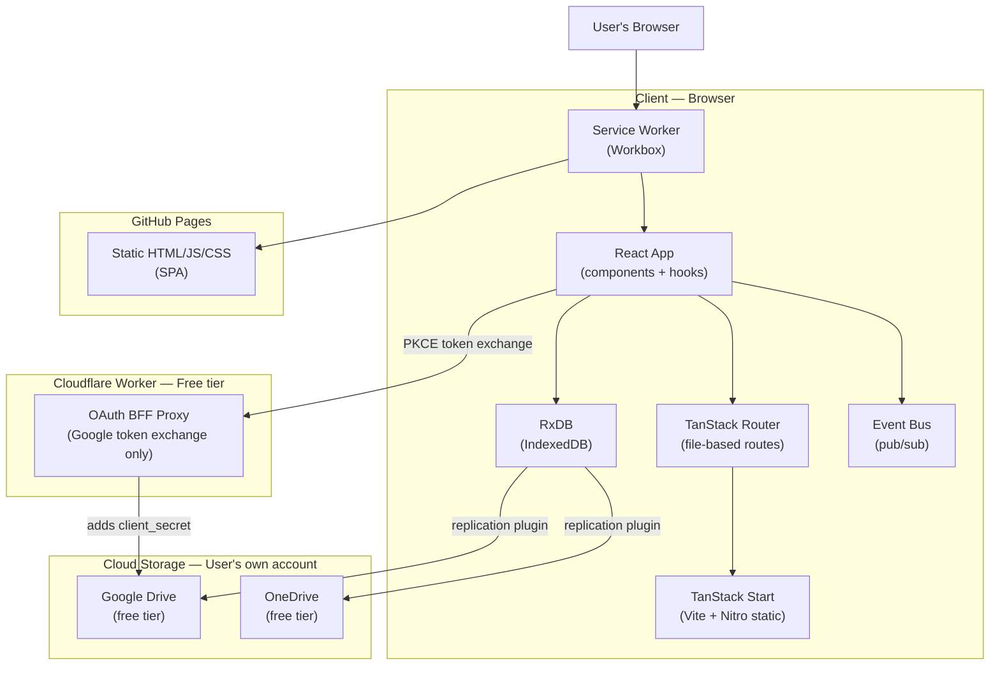
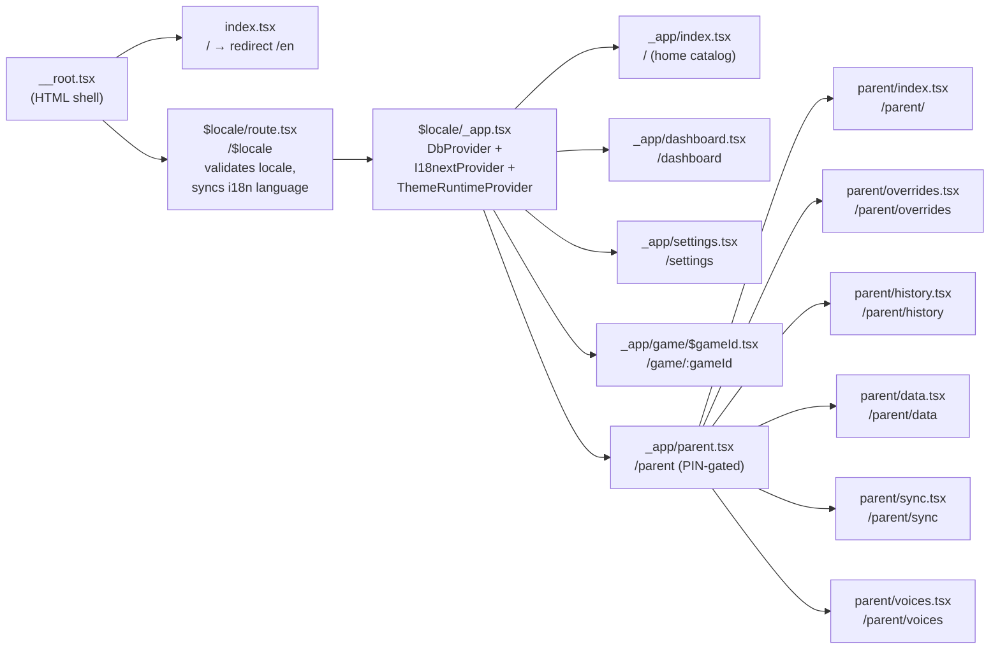
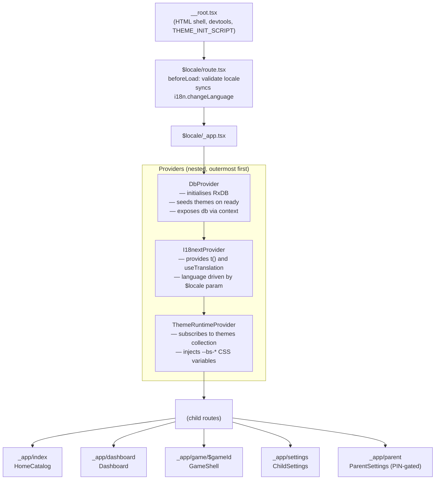
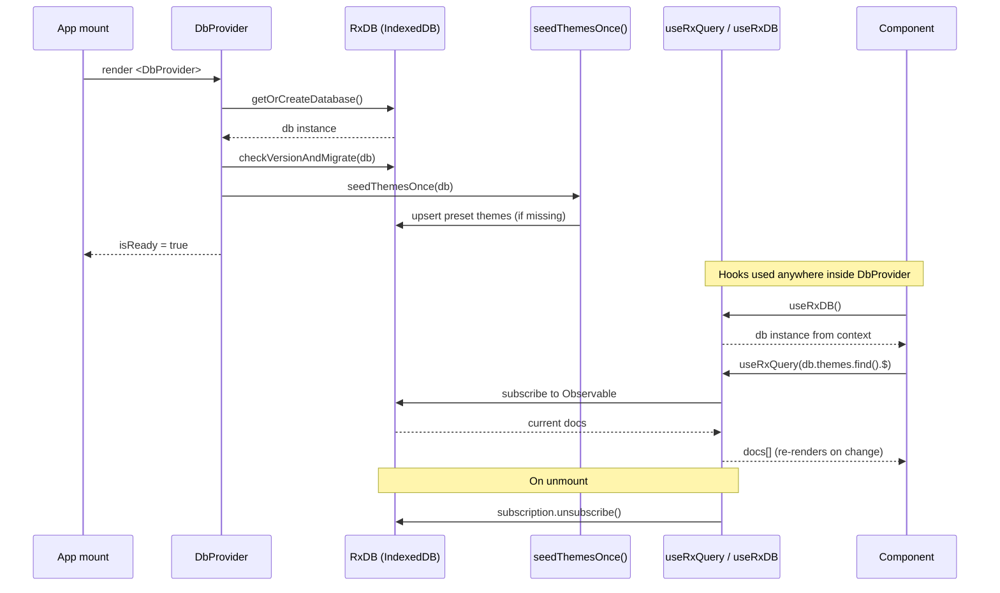
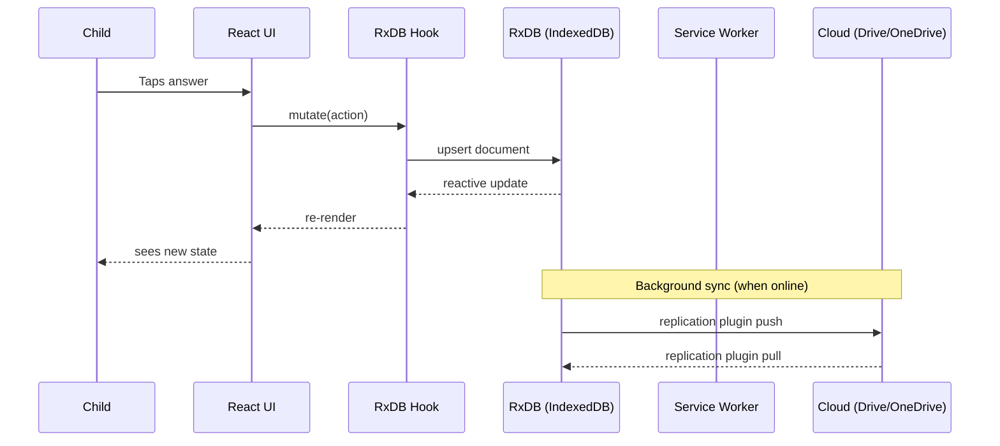
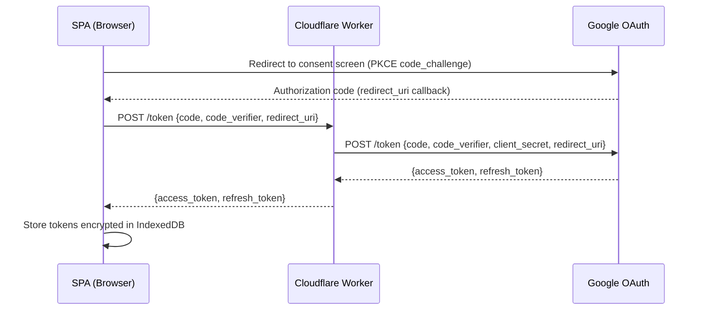
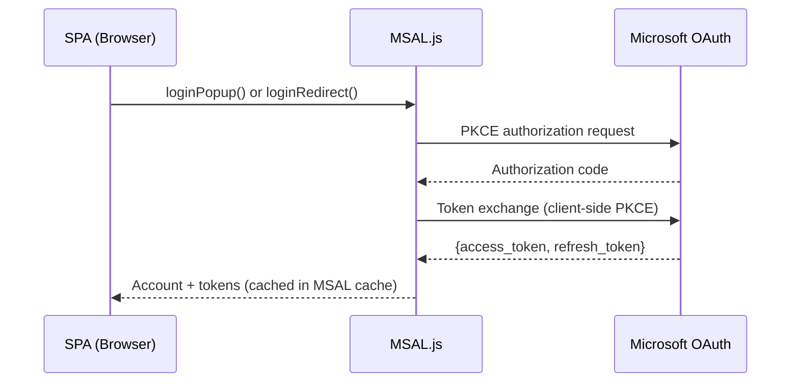
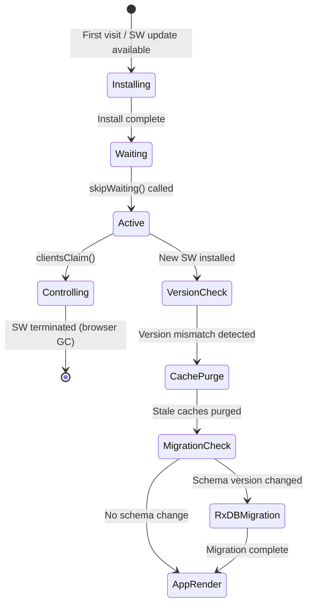

# BaseSkill — System Architecture

> **Meta-framework: TanStack Start.** Chosen for its Vite-native architecture, fully type-safe routing via TanStack Router, and a smooth server upgrade path (server functions, API routes) without a framework migration. Currently deployed as a static SPA to GitHub Pages; when server features are needed, TanStack Start's server capabilities activate without restructuring the client.

---

## 1. Tech Stack

| Layer                   | Technology                                  | Rationale                                                                                                                                |
| ----------------------- | ------------------------------------------- | ---------------------------------------------------------------------------------------------------------------------------------------- |
| **Meta-framework**      | TanStack Start                              | Vite-native, type-safe routing, static SPA + future server upgrade path                                                                  |
| **Router**              | TanStack Router (file-based)                | End-to-end type safety for routes, params, search, loaders                                                                               |
| **UI library**          | React 19                                    | Component model; hooks for RxDB reactive queries                                                                                         |
| **Language**            | TypeScript (strict mode)                    | `noImplicitAny`, no `any` ESLint rule, CI enforcement                                                                                    |
| **UI components**       | shadcn/ui                                   | Accessible, unstyled base; extended for kid-friendly defaults                                                                            |
| **Styling**             | Tailwind CSS v4                             | Utility-first; CSS variable injection for theme engine                                                                                   |
| **Local database**      | RxDB (Dexie storage)                        | Offline-first, reactive; IndexedDB via **Dexie-backed** RxStorage (free tier). See [ADR 0001](adrs/0001-rxdb-without-tanstack-query.md). |
| **Build tool**          | Vite (via TanStack Start)                   | Fast HMR, static SPA preset via Nitro                                                                                                    |
| **Service Worker**      | Workbox via vite-plugin-pwa                 | Pre-caches app shell and game assets                                                                                                     |
| **Cloud sync**          | RxDB replication plugins                    | Cloud storage (initially Google Drive + OneDrive) via PKCE OAuth                                                                         |
| **Auth (OneDrive)**     | MSAL.js                                     | Native PKCE SPA flow, no backend needed                                                                                                  |
| **Auth (Google Drive)** | Cloudflare Worker BFF                       | Proxy for `client_secret` (Google non-standard PKCE requirement)                                                                         |
| **i18n**                | react-i18next                               | Translation namespaces, TTS language routing                                                                                             |
| **Testing**             | Vitest + React Testing Library + Playwright | Unit, component, E2E, visual regression                                                                                                  |
| **CI/CD**               | GitHub Actions                              | Lint, type-check, test, build, deploy to GitHub Pages                                                                                    |

---

## 2. System Architecture Overview



**Key properties:**

- All application logic runs in the browser. No server required.
- RxDB is the single source of truth. State persists across refreshes automatically.
- **Data access (M2):** React hooks subscribe to RxDB queries; `@tanstack/react-query` is [deferred until M6](adrs/0001-rxdb-without-tanstack-query.md) when network sync arrives, to avoid a duplicate cache for local data.
- Each game is its own code-split bundle. The app shell loads instantly; game bundles are downloaded on first play or when the parent explicitly triggers a download. A "Download All Games" option exists in parent settings but is not triggered on first load.
- Service worker pre-caches the app shell. Game assets are cached per game on first play.
- Cloud sync is opt-in. The app functions identically without it.

---

## 3. TanStack Start Configuration

### Static SPA Preset

TanStack Start is configured with the Nitro static preset for GitHub Pages deployment:

```typescript
// app.config.ts
import { defineConfig } from '@tanstack/start/config';

export default defineConfig({
  server: {
    preset: 'static',
  },
  vite: {
    plugins: [
      // vite-plugin-pwa added here
    ],
  },
});
```

**Output:** A `dist/` directory of static HTML/JS/CSS files. Deployable to GitHub Pages, Netlify, Vercel, Cloudflare Pages, or any static host.

**Future server upgrade:** When server features are needed (auth, WebSockets, premium APIs), change `preset` to `'cloudflare-workers'`, `'vercel'`, or `'node-server'`. Client-side code is unchanged.

---

## 4. TanStack Router — Route Tree

### File-Based Routing Convention

Routes are defined as files in the `routes/` directory. TanStack Router generates a fully type-safe route tree at build time.

```
routes/
  __root.tsx                    # Root document (HTML shell, global providers)
  _app.tsx                      # App layout (offline indicator, theme, i18n provider)
  _app/
    index.tsx                   # Profile picker / home screen
    dashboard.tsx               # Game grid (requires active profile)
    game/
      $gameId.tsx               # Game shell (dynamic segment, type-safe)
    settings.tsx                # Child settings (volume, speech, theme, language)
    parent.tsx                  # Parent settings layout (PIN-gated)
    parent/
      index.tsx                 # Parent settings home
      overrides.tsx             # Game override controls
      history.tsx               # Session history viewer
      data.tsx                  # Data management (clear history/progress)
      sync.tsx                  # Cloud sync configuration
      voices.tsx                # TTS voice selector
```

### Route Guards

```typescript
// _app/dashboard.tsx — redirect to profile picker if no active profile
export const Route = createFileRoute('/_app/dashboard')({
  beforeLoad: ({ context }) => {
    if (!context.activeProfile) {
      throw redirect({ to: '/_app/' });
    }
  },
  loader: async ({ context }) => {
    // Pre-fetch game catalog + custom games from RxDB
    return {
      games: await context.db.games.find().exec(),
      custom games: await context.db.custom games
        .find({ selector: { profileId: context.activeProfile.id } })
        .exec(),
    };
  },
});

// _app/parent.tsx — PIN gate
export const Route = createFileRoute('/_app/parent')({
  beforeLoad: ({ context }) => {
    if (!context.parentUnlocked) {
      throw redirect({
        to: '/_app/dashboard',
        search: { pinRequired: true },
      });
    }
  },
});
```

### Type-Safe Route Parameters

```typescript
// _app/game/$gameId.tsx
export const Route = createFileRoute('/_app/game/$gameId')({
  params: {
    parse: (params) => ({ gameId: params.gameId }), // typed string
  },
  loader: async ({ params, context }) => {
    const config = await context.gameLoader.load(params.gameId);
    const overrides = await context.db.game_config_overrides
      .findOne({
        selector: {
          profileId: context.activeProfile.id,
          gameId: params.gameId,
        },
      })
      .exec();
    return { config, overrides };
  },
});
```

### Route Tree Diagram



---

## 5. Component Architecture

### Layout Hierarchy

```
__root.tsx
└── _app.tsx  (AppLayout)
    ├── OfflineIndicator
    ├── ThemeProvider (CSS variables from RxDB)
    ├── I18nProvider (react-i18next)
    └── [child route outlet]
        ├── _app/index.tsx     → ProfilePicker
        ├── _app/dashboard.tsx → Dashboard
        │   ├── Custom gameedGamesRow
        │   ├── RecentGamesRow
        │   └── GameGrid (by subject/grade)
        ├── _app/game/$gameId.tsx → GameShell
        │   ├── GameHeader (back, title, score, timer)
        │   ├── GameArea (game-specific component)
        │   └── GameControls (pause, exit)
        ├── _app/settings.tsx  → ChildSettings
        └── _app/parent.tsx    → ParentSettings
            ├── GameOverridesScreen
            ├── SessionHistoryViewer
            ├── DataManagementScreen
            ├── CloudSyncScreen
            └── VoiceSelectorScreen
```

### React Provider Hierarchy



### Reusable Game Components

These components are game-framework-level and used across multiple games:

| Component                | Description                                  | Used By                    |
| ------------------------ | -------------------------------------------- | -------------------------- |
| `DragAndDrop`            | Pointer events, magnetic snap, ghost preview | Number Match, Word Builder |
| `LetterTracer`           | Canvas tracing with touch/mouse              | Letter Tracing             |
| `MultipleChoice`         | Tap/click answer selection                   | Math Facts                 |
| `SpeechInput`            | STT with animated visual indicator (GIF)     | Read Aloud                 |
| `SpeechOutput`           | TTS wrapper with voice selection             | All games                  |
| `Timer`                  | Configurable, hideable per parent settings   | Math Facts (optional all)  |
| `EncouragementAnnouncer` | TTS + visual popup, event-triggered          | All games                  |
| `ScoreAnimation`         | CSS confetti/stars reward animations         | All games                  |
| `ProgressBar`            | In-game progress display                     | All games                  |
| `ScoreBoard`             | Current score display                        | All games                  |
| `OfflineIndicator`       | `navigator.onLine` banner                    | App shell                  |

---

## 6. State Management

### RxDB as Single Source of Truth

All persistent state lives in RxDB. Components subscribe to reactive queries; UI updates automatically when data changes.

```typescript
// Example: reactive profile hook
function useActiveProfile() {
  const [profile, setProfile] = useState<Profile | null>(null);

  useEffect(() => {
    const sub = db.profiles
      .findOne({ selector: { isActive: true } })
      .$.subscribe(setProfile);
    return () => sub.unsubscribe();
  }, []);

  return profile;
}
```

### TanStack Query Integration (Evaluation Point)

During Milestone 2, evaluate whether TanStack Query should wrap RxDB observables:

- **Option A**: RxDB reactive queries only (custom hooks). Simpler. RxDB handles caching natively.
- **Option B**: TanStack Query wraps RxDB `exec()` calls. Adds cache invalidation, loading/error states, suspense support.
- **Decision criteria**: If server data (Cloudflare Worker, future APIs) needs to be mixed with local RxDB data in the same loading lifecycle, TanStack Query is the natural bridge. For pure local data, RxDB hooks are sufficient.

**Provisional decision**: Use RxDB custom hooks for all local data. Add TanStack Query only when server-side data fetching is introduced (post-M6).

### Non-Persistent UI State

Non-persistent state (modal open/closed, current game step, animation state) uses React's `useState`/`useReducer` co-located with the component that owns it. No global UI state store.

### RxDB Provider and Hooks Setup



---

## 7. Data Flow



---

## 8. Cloud Sync Architecture

### Overview

RxDB provides [replication plugins](https://rxdb.info/replication.html) for Google Drive and OneDrive. These plugins:

1. Read the RxDB `checkpoint` (last sync position)
2. Push local changes to the cloud file
3. Pull remote changes and merge into local RxDB
4. Handle conflict resolution per collection strategy

### Google Drive Sync

**Challenge**: Google OAuth requires a `client_secret` even with PKCE (non-standard — violates RFC 7636).

**Solution**: A lightweight Cloudflare Worker (~50 lines) acts as a Backend-for-Frontend (BFF) proxy:



- The `client_secret` lives in Cloudflare Worker environment variables — never in the client bundle.
- The Worker is deployed separately and is **not** part of the GPL-licensed app repository.
- Cloudflare Workers free tier: 100,000 requests/day — sufficient for OAuth token exchanges.
- Token refresh follows the same proxy pattern.

### OneDrive Sync

MSAL.js handles the full PKCE flow natively for OneDrive — no backend proxy needed:



### Token Storage

OAuth tokens are stored **encrypted in IndexedDB** — never in `localStorage` or `sessionStorage`:

- Encryption key derived from device-specific entropy (e.g., a random key generated once and stored in IndexedDB with a separate namespace).
- Tokens are never exposed in URL fragments or query strings after the OAuth redirect.
- MSAL.js manages its own encrypted token cache internally.
- Google Drive tokens are stored in a separate encrypted RxDB document (`sync_meta` collection).

### Device-Aware Sync

Each synced record includes a `deviceId` field (generated once per device, stored in `sync_meta`):

- **Device-specific data** (e.g., available TTS voices) is tagged with `deviceId` and not applied on other devices.
- **Shared data** (progress, custom games, themes) syncs across all devices.
- On a new device, if the synced voice is unavailable, the app falls back to the OS default voice for that language.

### Conflict Resolution

| Collection              | Strategy                                                      |
| ----------------------- | ------------------------------------------------------------- |
| `profiles`              | Last-write-wins (by `updatedAt` timestamp)                    |
| `progress`              | Merge: take max score, sum stars, extend streaks              |
| `settings`              | Last-write-wins (per profile)                                 |
| `game_config_overrides` | Last-write-wins (by `updatedAt`)                              |
| `custom games`          | Union (all custom games from all devices kept)                |
| `themes`                | Last-write-wins (by `updatedAt`)                              |
| `session_history`       | Append-only; no conflicts (chunks are immutable once written) |
| `session_history_index` | Append-only; no conflicts                                     |
| `sync_meta`             | Device-local; not cross-device synced                         |
| `app_meta`              | Device-local; not cross-device synced                         |

---

## 9. PWA and Offline Strategy

### Service Worker Lifecycle



### Cache Strategy (Workbox)

| Asset Type                    | Strategy                                                                       | TTL        |
| ----------------------------- | ------------------------------------------------------------------------------ | ---------- |
| App shell (HTML, core JS/CSS) | Cache-first, update on install                                                 | SW version |
| Game bundles (JS per game)    | Cache-first, code-split per game, downloaded on first play or parent-triggered | SW version |
| Game assets (images, audio)   | Cache-first, lazy-loaded per game                                              | SW version |
| API calls (future)            | Network-first with fallback                                                    | 5 minutes  |
| Google Fonts (if used)        | Stale-while-revalidate                                                         | 30 days    |

### App Versioning

Every CD deploy stamps a semver version:

1. Version embedded in `app_meta` RxDB collection on first run.
2. New SW checks its version against the cached version.
3. On mismatch: `skipWaiting()` + `clientsClaim()` → purge old caches → run RxDB migrations if needed → render app.
4. Version displayed in Parent Settings > About.

### Offline/Online Detection

```typescript
// Global hook — used by OfflineIndicator and RxDB sync
function useOnlineStatus() {
  const [isOnline, setIsOnline] = useState(navigator.onLine);

  useEffect(() => {
    const handleOnline = () => setIsOnline(true);
    const handleOffline = () => setIsOnline(false);
    window.addEventListener('online', handleOnline);
    window.addEventListener('offline', handleOffline);
    return () => {
      window.removeEventListener('online', handleOnline);
      window.removeEventListener('offline', handleOffline);
    };
  }, []);

  return isOnline;
}
```

---

## 10. Event Bus and Extension Points

### Event Bus

A typed pub/sub system used for:

1. **Session recorder**: subscribes to game events, writes to `session_history`.
2. **Encouragement system**: listens for `game:evaluate` events, triggers TTS + animation.
3. **Plugin hooks**: external code subscribes without modifying app source.

```typescript
// Event type definitions
interface AppEvents {
  'game:start': {
    gameId: string;
    profileId: string;
    sessionId: string;
  };
  'game:action': {
    sessionId: string;
    action: string;
    payload: unknown;
  };
  'game:evaluate': {
    sessionId: string;
    result: 'correct' | 'incorrect' | 'near-miss';
  };
  'game:score': { sessionId: string; score: number; total: number };
  'game:hint': { sessionId: string; hintType: string };
  'game:end': {
    sessionId: string;
    finalScore: number;
    duration: number;
  };
  'profile:switch': {
    fromProfileId: string | null;
    toProfileId: string;
  };
  'sync:start': { provider: 'google-drive' | 'onedrive' };
  'sync:complete': {
    provider: 'google-drive' | 'onedrive';
    timestamp: number;
  };
  'sync:error': {
    provider: 'google-drive' | 'onedrive';
    error: string;
  };
}

interface EventBus {
  emit<K extends keyof AppEvents>(
    event: K,
    payload: AppEvents[K],
  ): void;
  on<K extends keyof AppEvents>(
    event: K,
    handler: (payload: AppEvents[K]) => void,
  ): () => void;
  off<K extends keyof AppEvents>(
    event: K,
    handler: (payload: AppEvents[K]) => void,
  ): void;
}
```

### Plugin Hook API

External plugins (from separate repos) register via a public API exposed on `window.__baseSkillPlugins`:

```typescript
interface PluginAPI {
  eventBus: Pick<EventBus, 'on' | 'off'>; // subscribe only, not emit
  registerUISlot: (
    slot: UISlot,
    component: React.ComponentType,
  ) => () => void;
  getConfig: () => ReadonlyAppConfig;
}

type UISlot =
  | 'dashboard:banner' // Above game grid
  | 'game:overlay' // Floating overlay during gameplay
  | 'parent:settings:section'; // Additional section in parent settings
```

Plugins cannot `emit` events — they can only subscribe. This ensures app state integrity.

### Analytics Abstraction

```typescript
interface AnalyticsAdapter {
  trackEvent(name: string, properties?: Record<string, unknown>): void;
  trackPageView(path: string): void;
  identify(profileId: string): void; // pseudonymous — no PII
  reset(): void;
}

// Default: no-op implementation
const noopAnalytics: AnalyticsAdapter = {
  trackEvent: () => {},
  trackPageView: () => {},
  identify: () => {},
  reset: () => {},
};
```

Provider is injected at app initialization via config. Swap providers by changing the config, not the code.

---

## 11. Directory Structure (Target)

```
base-skill/
├── app/
│   ├── routes/                     # TanStack Router file-based routes
│   │   ├── __root.tsx
│   │   ├── _app.tsx
│   │   ├── _app/
│   │   │   ├── index.tsx
│   │   │   ├── dashboard.tsx
│   │   │   ├── game/
│   │   │   │   └── $gameId.tsx
│   │   │   ├── settings.tsx
│   │   │   └── parent/
│   │   │       ├── index.tsx
│   │   │       ├── overrides.tsx
│   │   │       ├── history.tsx
│   │   │       ├── data.tsx
│   │   │       ├── sync.tsx
│   │   │       └── voices.tsx
│   ├── components/
│   │   ├── game/                   # Reusable game components
│   │   │   ├── DragAndDrop.tsx
│   │   │   ├── LetterTracer.tsx
│   │   │   ├── MultipleChoice.tsx
│   │   │   ├── SpeechInput.tsx
│   │   │   ├── SpeechOutput.tsx
│   │   │   ├── Timer.tsx
│   │   │   ├── EncouragementAnnouncer.tsx
│   │   │   ├── ScoreAnimation.tsx
│   │   │   ├── ProgressBar.tsx
│   │   │   └── ScoreBoard.tsx
│   │   ├── ui/                     # shadcn/ui components (generated)
│   │   ├── layout/
│   │   │   ├── AppLayout.tsx
│   │   │   ├── GameShell.tsx
│   │   │   └── OfflineIndicator.tsx
│   │   └── profile/
│   │       ├── ProfilePicker.tsx
│   │       └── AvatarPicker.tsx
│   ├── db/
│   │   ├── index.ts                # RxDB initialization
│   │   ├── schemas/                # JSON Schema definitions per collection
│   │   ├── hooks/                  # Reactive RxDB query hooks
│   │   └── migrations/             # Schema migration scripts
│   ├── games/                      # Individual game implementations
│   │   ├── letter-tracing/
│   │   ├── number-match/
│   │   ├── word-builder/
│   │   ├── read-aloud/
│   │   └── math-facts/
│   ├── lib/
│   │   ├── event-bus.ts
│   │   ├── analytics.ts
│   │   ├── theme.ts
│   │   ├── speech.ts               # TTS/STT wrappers
│   │   └── game-config-loader.ts
│   ├── i18n/
│   │   ├── index.ts
│   │   └── locales/
│   │       ├── en/
│   │       └── pt-BR/
│   └── styles/
│       └── globals.css             # Tailwind directives + CSS variables
├── public/
│   ├── manifest.json
│   └── icons/
├── tests/
│   ├── unit/
│   ├── e2e/                        # Playwright tests
│   └── fixtures/                   # RxDB seed data
├── docs/                           # Design documents (this folder)
├── app.config.ts                   # TanStack Start config
├── vite.config.ts
├── tsconfig.json
├── package.json
└── LICENSE
```

---

## 12. Security Considerations

| Risk                                 | Mitigation                                                                                                 |
| ------------------------------------ | ---------------------------------------------------------------------------------------------------------- |
| OAuth `client_secret` exposure       | Stored only in Cloudflare Worker env vars; never in client bundle                                          |
| Token storage in browser             | Encrypted IndexedDB; keys derived from device entropy; never in `localStorage`                             |
| XSS via game content                 | Game configs are JSON (no eval); content rendered as text nodes or via sanitized JSX                       |
| Plugin injection from external repos | Plugins receive read-only event bus (subscribe only); cannot emit events or modify RxDB directly           |
| Personal data in session history     | Session history contains gameplay events only — no PII. ProfileId is a UUID with no link to real identity. |
| Dependency supply chain              | `npm audit` in CI; pin major versions; Dependabot alerts                                                   |
