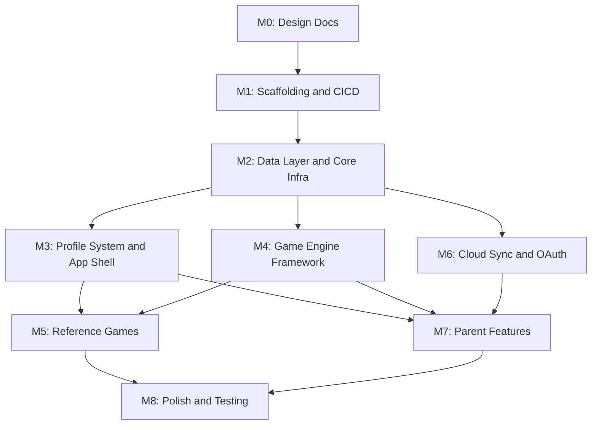

# BaseSkill: PRD to Completion Milestone Breakdown

**Meta Framework: TanStack Start** -- chosen for its Vite-native architecture, fully type-safe routing (TanStack Router), and full-stack upgrade path for future cloud/server features (auth, multiplayer, premium APIs) without a framework migration. Currently deployed as a static SPA to GitHub Pages; when server features are needed, TanStack Start's server functions and API routes activate without restructuring the app.

This plan organizes the project into 8 milestones. Within each milestone, work streams are labeled **ASYNC** (can be developed in parallel by different agents/developers) or **SYNC** (must be completed before the next step starts).

---

## Milestone 0 -- Design Documents (SYNC prerequisite)

Before any code is written, the 8 design docs outlined in [docs/prd-plan.md](docs/prd-plan.md) must be authored. Several can be written in parallel.

**ASYNC work streams:**

- `docs/prd.md` -- full PRD with user stories, feature requirements, constraints
- `docs/architecture.md` -- system diagram, TanStack Start app structure, TanStack Router route tree, component tree, state management, data flow, OAuth architecture, extension points
- `docs/data-model.md` -- RxDB schemas (JSON Schema), relationships, sync strategy, conflict resolution, chunking rules, token storage
- `docs/game-engine.md` -- game lifecycle, session recorder spec, config schema, parent override merging logic, 5 reference game specs
- `docs/ui-ux.md` -- design system, 4-6 theme definitions, core layouts, navigation, responsive strategy, encouragement system, session history viewer, data management screen
- `docs/i18n.md` -- i18n setup (react-i18next or TanStack-compatible alternative), translation file structure, TTS voice selection, device-aware voice sync
- `docs/accessibility.md` -- WCAG 2.1 AA checklist, screen reader, motor, cognitive, speech API fallbacks
- `docs/testing-strategy.md` -- Vitest + RTL + Playwright plan, coverage targets, test data fixtures
- `docs/ci-cd.md` -- GitHub Actions workflows, versioning, SW lifecycle, deploy, branch protection

**SYNC dependency:** `prd.md` and `architecture.md` should be drafted first (or at least outlined) since the other docs reference decisions made there.

---

## Milestone 1 -- Project Scaffolding and CI/CD

Bootstrap the repository and get a green CI pipeline on an empty app shell.

**SYNC (sequential):**

1. Scaffold project via `npx @tanstack/cli@latest create` (select Tailwind + ESLint options from the interactive prompts); this generates TanStack Start + TanStack Router with file-based routing pre-configured
2. Configure TypeScript strict mode (`noImplicitAny`, no `any` ESLint rule) on top of the generated config
3. Set up TanStack Router nested layouts for app shell / game shell / settings
4. Add `shadcn/ui` on top of the Tailwind CSS setup from the CLI scaffold
5. Add `LICENSE` (GPL v3)
6. Configure ESLint, Prettier, `@typescript-eslint/no-explicit-any` as error
7. Set up Vitest + React Testing Library
8. Set up Playwright (empty E2E suite)
9. GitHub Actions: lint, type-check, unit test, E2E, build, deploy to GitHub Pages
10. Configure static SPA output (TanStack Start with `server.preset: 'static'` or equivalent Nitro static preset) for GitHub Pages deployment
11. PWA manifest (`manifest.json`) + basic Workbox service worker via `vite-plugin-pwa` (pre-cache app shell only)
12. App versioning: semver stamp in build output

**Key TanStack decisions:**

- Use TanStack Router's file-based routing convention (`routes/` directory)
- Use TanStack Router's `beforeLoad` / `loader` for client-side data loading from RxDB
- Consider TanStack Query alongside RxDB for async state management (evaluate in M2)
- Static preset for now; switch to Cloudflare/Vercel/Node preset when server features are added

**Deliverable:** A deployable blank PWA on GitHub Pages with passing CI, type-safe routing, and nested layout structure.

---

## Milestone 2 -- Data Layer and Core Infrastructure

Set up RxDB and the foundational systems that everything else depends on.

**SYNC (must complete in order):**

1. RxDB database initialization and schema definitions for all collections (`profiles`, `progress`, `settings`, `game_config_overrides`, `bookmarks`, `themes`, `session_history`, `session_history_index`, `sync_meta`, `app_meta`)
2. Schema migration framework (version tracking via `app_meta`)
3. React hooks for reactive RxDB queries
4. Evaluate TanStack Query integration -- determine if TanStack Query should wrap RxDB observables for cache management, or if RxDB's reactive queries are sufficient via custom hooks. Decision impacts all downstream data access patterns.

**ASYNC (can proceed in parallel once RxDB is up):**

- **Event bus / plugin hook system** -- pub/sub for app events, extension point registration
- **i18n setup** -- react-i18next (or lighter alternative), `en` + `pt-BR` translation files, namespace structure (common, games, settings, encouragements); integrate with TanStack Router for locale-aware routes if needed
- **Theme engine** -- load themes from RxDB `themes` collection, **two** pre-defined theme seeds for M2 (more presets later), CSS variable injection, clone-and-modify logic
- **Speech services** -- TTS wrapper (`SpeechOutput`), STT wrapper (`SpeechInput`), voice enumeration, fallback handling

---

## Milestone 3 -- Profile System and App Shell UI

Build the user-facing shell: navigation, profile management, and dashboard. TanStack Router's nested layouts and type-safe routes drive the structure.

**SYNC (sequential):**

1. **Route tree structure** -- define TanStack Router file-based routes: `_app` (root layout), `_app/index` (profile picker), `_app/dashboard` (game grid), `_app/game/$gameId` (game shell), `_app/settings` (child settings), `_app/parent` (parent settings with nested routes)
2. **Profile picker / home screen** -- create profile, select profile, avatar picker, grade-level selector; use `beforeLoad` guard to redirect to profile picker if no active profile
3. **Family sharing** -- quick profile switching, parent PIN gate for settings (route guard on `/parent` routes)
4. **App layout shell** -- root layout with header, back button, breadcrumbs (parent view), grade-adaptive navigation (icons for Pre-K, text+icons for older)
5. **Dashboard** -- game grid by subject/grade, bookmarked games row, recently played row; use route `loader` to pre-fetch game catalog + bookmarks from RxDB
6. **Settings screen** -- volume, speech rate, active language, theme selector per profile
7. **Offline indicator** -- `navigator.onLine` listener, banner component, last-sync timestamp

**ASYNC (can start once profile + layout exist):**

- **Bookmark system** -- bookmark/unbookmark games, persist to `bookmarks` collection
- **Recents tracking** -- update `progress` collection with last-played timestamps, query for dashboard

---

## Milestone 4 -- Game Engine Framework

Build the reusable game infrastructure (no specific games yet).

**SYNC (sequential):**

1. **Game lifecycle manager** -- load, instructions (TTS), play, evaluate, score, next/retry state machine
2. **Game shell UI** -- consistent header, game area, controls, back/exit
3. **Game config loader** -- read game JSON config, merge with parent overrides (override > grade-band > global > default)
4. **Session recorder middleware** -- subscribe to event bus, write to `session_history`, automatic chunking (200 events / 50KB cap), write `session_history_index` summary on session end

**ASYNC (reusable components, independent of each other):**

- `DragAndDrop` -- pointer events, magnetic/snap, ghost preview, visual pulse on drop zones
- `LetterTracer` -- canvas-based tracing with touch/mouse, tap-to-place alternative
- `MultipleChoice` -- tap/click answer selection
- `Timer` -- configurable, hideable per parent settings
- `ScoreAnimation` -- confetti, stars, CSS-only reward animations
- `EncouragementAnnouncer` -- contextual TTS + visual popup, triggered by game events
- `ProgressBar` / `ScoreBoard` -- in-game progress display

---

## Milestone 5 -- Reference Games

Implement the 5 reference games. Each game is independent and can be built in parallel.

**ASYNC (all 5 are independent):**

- **Word Builder** (K-Year 2, Reading) -- uses `DragAndDrop` + TTS hints, per-language word lists
- **Number Match** (Pre-K/K, Math) -- uses `DragAndDrop` with snap, object-group visuals
- **Math Facts** (Year 1-4, Math) -- uses `MultipleChoice` + `Timer`, visual number line
- **Read Aloud** (Year 1-3, Reading) -- uses `SpeechInput` (STT), sentence display, evaluation
- **Letter Tracing** (Pre-K/K, Letters) -- uses `LetterTracer`, TTS for letter names

Each game should include: unit tests for game logic, integration test for full lifecycle, i18n content for `en` + `pt-BR`.

---

## Milestone 6 -- Cloud Sync and OAuth

Can begin in parallel with Milestones 4-5 (data layer is ready from Milestone 2).

**SYNC (sequential):**

1. **OneDrive sync** -- MSAL.js PKCE flow (no backend needed), RxDB replication plugin for OneDrive
2. **Google Drive sync** -- PKCE flow with Cloudflare Worker BFF proxy for token exchange, RxDB replication plugin for Google Drive
3. **Token management** -- encrypted IndexedDB storage, refresh token handling
4. **Device-aware sync** -- `deviceId` field on synced records, device-local voice preferences excluded from cross-device apply
5. **Conflict resolution** -- last-write-wins with merge for `progress`, append-only for `session_history`

**ASYNC (within this milestone):**

- Cloudflare Worker OAuth proxy (separate repo, non-GPL) can be developed independently
- OneDrive and Google Drive replication plugins can be developed in parallel once the replication interface is defined

---

## Milestone 7 -- Parent/Guardian Features

Depends on: profiles (M3), game engine (M4), session recorder (M4), data model (M2).

**ASYNC (independent screens):**

- **Parent settings: game overrides UI** -- per-game, per-grade-band, and global override controls (retries, timer, always-win, difficulty)
- **Parent settings: session history viewer** -- timeline view, filter by game/date/grade, expandable session detail with lazy-loaded chunks
- **Parent settings: data management** -- storage usage display, separate "Clear History" / "Clear Progress" buttons, date-range picker, confirmation dialogs, cascade delete
- **Parent settings: cloud sync config** -- connect/disconnect Google Drive / OneDrive, sync status, last sync timestamp
- **Parent settings: TTS voice selector** -- per-language voice picker from `speechSynthesis.getVoices()`, device-aware

---

## Milestone 8 -- Polish, Accessibility, and Testing

Final hardening pass. Most of this is ASYNC.

**ASYNC work streams:**

- **Accessibility audit** -- axe-core integration in component tests, Playwright accessibility audits on all pages, ARIA labels, focus management, keyboard navigation for all games, screen reader testing
- **Offline hardening** -- E2E tests for offline/online transitions, SW cache validation, RxDB queue-and-replay verification
- **Visual regression** -- Playwright screenshot baselines for all key screens across all 4-6 themes
- **i18n verification** -- snapshot tests for `en` and `pt-BR` on all screens, RTL placeholder if needed
- **Performance** -- Lighthouse audit, bundle analysis, lazy-load game assets, ensure CSS-only animations
- **Analytics abstraction** -- define analytics interface/adapter, implement one provider (decision deferred per PRD), ensure provider is swappable
- **PWA install prompt** -- custom install banner, iOS/Android handling
- **SW migration testing** -- version mismatch detection, cache purge, RxDB schema migration on upgrade

---

## Dependency Graph

---

## Summary: What Can Run in Parallel

| Phase | Parallel Streams                                |
| ----- | ----------------------------------------------- |
| M0    | Most design docs can be written concurrently    |
| M2    | Event bus, i18n, theme engine, speech services  |
| M3    | Bookmarks, recents (after shell exists)         |
| M4    | All 7 reusable game components                  |
| M5    | All 5 reference games                           |
| M6    | OneDrive plugin, Google Drive plugin, CF Worker |
| M7    | All 5 parent settings screens                   |
| M8    | All 8 polish work streams                       |

The critical path is: **M0 -> M1 -> M2 -> M4 -> M5 -> M8**, with M3, M6, and M7 as parallel branches off M2.

---

## Future: Server Upgrade Path (post-M8)

When premium/server features are needed, TanStack Start enables a smooth transition:

- Switch from static preset to Cloudflare Workers / Vercel / Node preset
- Add server functions for auth, multiplayer WebSocket coordination, premium content gating
- TanStack Start's server functions and API routes activate without restructuring the client-side app
- The GPL-licensed SPA remains unchanged; server features live in separate private repos communicating over network boundaries (per PRD licensing strategy)
