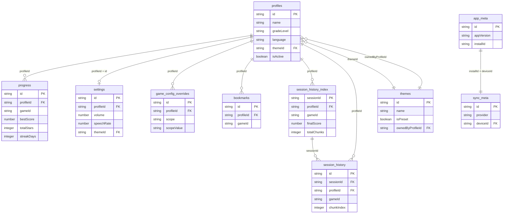

# BaseSkill — RxDB Data Model Design

**Version:** 1.0.0  
**Status:** Authoritative reference for all milestone implementations  
**Audience:** AI agents implementing Milestones 1–7

---

## Table of Contents

1. [Overview](#1-overview)
2. [Collection Schemas](#2-collection-schemas)
   - [profiles](#21-profiles)
   - [progress](#22-progress)
   - [settings](#23-settings)
   - [game_config_overrides](#24-game_config_overrides)
   - [bookmarks](#25-bookmarks)
   - [themes](#26-themes)
   - [session_history](#27-session_history)
   - [session_history_index](#28-session_history_index)
   - [sync_meta](#29-sync_meta)
   - [app_meta](#210-app_meta)
3. [Relationships Diagram](#3-relationships-diagram)
4. [Chunking Rules](#4-chunking-rules)
5. [Data Lifecycle and Cleanup](#5-data-lifecycle-and-cleanup)
6. [Version Tracking and Migrations](#6-version-tracking-and-migrations)
7. [Sync Strategy](#7-sync-strategy)
8. [Token Storage](#8-token-storage)
9. [RxDB Schema Versioning](#9-rxdb-schema-versioning)
10. [Implementation Notes](#10-implementation-notes)

---

## 1. Overview

### Single Source of Truth

RxDB is the **exclusive local data layer** for BaseSkill. All reads and writes go through RxDB — no direct IndexedDB access, no localStorage for user data. Components subscribe to RxDB observables and re-render reactively when data changes.

### Storage Backend

- **IndexedDB** via RxDB's `getRxStorageIndexedDB()` adapter (or `getRxStorageDexie()` for broader compatibility)
- Works fully offline; no network required for any core functionality
- Data persists across page reloads, app closes, and browser restarts

### Collections at a Glance

| Collection | Scope | Synced | Purpose |
|---|---|---|---|
| `profiles` | per-child | ✅ | Child identity and preferences |
| `progress` | per-profile + per-game | ✅ | Game progress, scores, badges |
| `settings` | per-profile | ✅ | App preferences |
| `game_config_overrides` | per-profile | ✅ | Parent-set game customizations |
| `bookmarks` | per-profile | ✅ | Favorited games |
| `themes` | global + per-family | ✅ | UI themes (presets and custom) |
| `session_history` | per-session chunk | ✅ | Raw event log chunks |
| `session_history_index` | per-session | ✅ | Session summary index |
| `sync_meta` | device-local | ❌ | Cloud sync state and tokens |
| `app_meta` | device-local | ❌ | App version and migration state |

### Primary Key Conventions

- All collections use `id` as the RxDB primary key (type: `string`)
- IDs are generated client-side using `nanoid()` (21 chars, URL-safe)
- `profileId`, `gameId`, `sessionId` are foreign-key references (strings, no DB-level enforcement)
- Timestamps are ISO 8601 strings (`2024-03-15T14:23:00.000Z`)

---

## 2. Collection Schemas

Each schema is expressed as a JSON Schema object compatible with RxDB's `jsonSchema` property. All schemas include a `version` number used for RxDB migrations.

---

### 2.1 `profiles`

Represents a single child's identity. One device may have multiple profiles (siblings). The active profile is determined by `isActive: true` (only one at a time).

**RxDB Schema Definition:**

```json
{
  "version": 0,
  "primaryKey": "id",
  "type": "object",
  "properties": {
    "id": {
      "type": "string",
      "maxLength": 36
    },
    "name": {
      "type": "string",
      "minLength": 1,
      "maxLength": 64
    },
    "avatar": {
      "type": "string",
      "description": "Avatar identifier key (e.g. 'cat', 'rocket', 'dragon') or data URI for custom avatar"
    },
    "gradeLevel": {
      "type": "string",
      "enum": ["pre-k", "k", "1", "2", "3", "4", "5", "6"],
      "description": "Grade level used to filter game content"
    },
    "language": {
      "type": "string",
      "description": "BCP 47 language tag, e.g. 'en-US', 'pt-BR', 'es-MX'"
    },
    "themeId": {
      "type": "string",
      "description": "References themes.id; falls back to default if not found"
    },
    "parentPinHash": {
      "type": "string",
      "description": "SHA-256 hex of parent PIN; empty string if no PIN set"
    },
    "isActive": {
      "type": "boolean",
      "default": false,
      "description": "True for the currently selected profile; only one profile may be active"
    },
    "createdAt": {
      "type": "string",
      "format": "date-time"
    },
    "updatedAt": {
      "type": "string",
      "format": "date-time"
    }
  },
  "required": ["id", "name", "gradeLevel", "language", "isActive", "createdAt", "updatedAt"],
  "additionalProperties": false
}
```

**Example document:**

```json
{
  "id": "p_Xk9mN2qR7tLwV4eA",
  "name": "Sofia",
  "avatar": "dragon",
  "gradeLevel": "2",
  "language": "pt-BR",
  "themeId": "theme_ocean_preset",
  "parentPinHash": "a665a45920422f9d417e4867efdc4fb8a04a1f3fff1fa07e998e86f7f7a27ae3",
  "isActive": true,
  "createdAt": "2024-03-01T10:00:00.000Z",
  "updatedAt": "2024-03-15T14:23:00.000Z"
}
```

---

### 2.2 `progress`

Tracks per-game progress for a profile. One document per `(profileId, gameId)` pair. Created on first game play; updated on every session completion.

**RxDB Schema Definition:**

```json
{
  "version": 0,
  "primaryKey": "id",
  "type": "object",
  "properties": {
    "id": {
      "type": "string",
      "maxLength": 36,
      "description": "Composite: '{profileId}_{gameId}'"
    },
    "profileId": {
      "type": "string",
      "maxLength": 36
    },
    "gameId": {
      "type": "string",
      "maxLength": 64
    },
    "lastScore": {
      "type": "number",
      "minimum": 0,
      "default": 0
    },
    "bestScore": {
      "type": "number",
      "minimum": 0,
      "default": 0
    },
    "totalStars": {
      "type": "integer",
      "minimum": 0,
      "default": 0,
      "description": "Cumulative stars earned across all sessions"
    },
    "streakDays": {
      "type": "integer",
      "minimum": 0,
      "default": 0,
      "description": "Consecutive calendar days with at least one session"
    },
    "lastPlayedAt": {
      "type": "string",
      "format": "date-time"
    },
    "completionCount": {
      "type": "integer",
      "minimum": 0,
      "default": 0,
      "description": "Number of full game completions (not partial sessions)"
    },
    "badges": {
      "type": "array",
      "items": {
        "type": "object",
        "properties": {
          "badgeId": { "type": "string" },
          "earnedAt": { "type": "string", "format": "date-time" }
        },
        "required": ["badgeId", "earnedAt"],
        "additionalProperties": false
      },
      "default": []
    }
  },
  "required": ["id", "profileId", "gameId"],
  "additionalProperties": false
}
```

**Example document:**

```json
{
  "id": "p_Xk9mN2qR7tLwV4eA_math-addition-grade2",
  "profileId": "p_Xk9mN2qR7tLwV4eA",
  "gameId": "math-addition-grade2",
  "lastScore": 850,
  "bestScore": 1200,
  "totalStars": 47,
  "streakDays": 5,
  "lastPlayedAt": "2024-03-15T14:23:00.000Z",
  "completionCount": 3,
  "badges": [
    { "badgeId": "first-win", "earnedAt": "2024-03-01T11:00:00.000Z" },
    { "badgeId": "streak-5", "earnedAt": "2024-03-10T09:00:00.000Z" }
  ]
}
```

**ID strategy:** Use `${profileId}_${gameId}` so that upsert operations are idempotent and lookups require no secondary index.

---

### 2.3 `settings`

Per-profile app preferences. One document per profile. Created with defaults on first profile activation; updated via the settings screen.

**RxDB Schema Definition:**

```json
{
  "version": 0,
  "primaryKey": "id",
  "type": "object",
  "properties": {
    "id": {
      "type": "string",
      "maxLength": 36,
      "description": "Equals profileId for easy lookup"
    },
    "profileId": {
      "type": "string",
      "maxLength": 36
    },
    "volume": {
      "type": "number",
      "minimum": 0,
      "maximum": 1,
      "default": 0.8,
      "description": "Master volume 0.0–1.0"
    },
    "speechRate": {
      "type": "number",
      "minimum": 0.5,
      "maximum": 2.0,
      "default": 1.0,
      "description": "Web Speech API speech rate"
    },
    "activeLanguage": {
      "type": "string",
      "description": "BCP 47 override; defaults to profile.language"
    },
    "ttsEnabled": {
      "type": "boolean",
      "default": true,
      "description": "TTS is enabled by default for all children. Parents can disable per profile to encourage reading practice."
    },
    "showSubtitles": {
      "type": "boolean",
      "default": true,
      "description": "Show TTS text as on-screen subtitles"
    },
    "themeId": {
      "type": "string",
      "description": "Active theme override; overrides profile.themeId if set"
    },
    "preferredVoiceURI": {
      "type": "string",
      "description": "SpeechSynthesisVoice.voiceURI; tagged as device-local (not synced as-is)"
    },
    "preferredVoiceDeviceId": {
      "type": "string",
      "description": "deviceId that selected this voice; on mismatch, fall back to default voice"
    },
    "updatedAt": {
      "type": "string",
      "format": "date-time"
    }
  },
  "required": ["id", "profileId", "updatedAt"],
  "additionalProperties": false
}
```

**Example document:**

```json
{
  "id": "p_Xk9mN2qR7tLwV4eA",
  "profileId": "p_Xk9mN2qR7tLwV4eA",
  "volume": 0.9,
  "speechRate": 0.85,
  "activeLanguage": "pt-BR",
  "showSubtitles": true,
  "themeId": "theme_ocean_preset",
  "preferredVoiceURI": "Microsoft Maria Online (Natural) - Portuguese (Brazil)",
  "preferredVoiceDeviceId": "dev_abc123",
  "updatedAt": "2024-03-15T14:23:00.000Z"
}
```

---

### 2.4 `game_config_overrides`

Parent-set customizations that override game defaults. Supports three scopes:
- `"global"` — applies to all games for this profile
- `"grade-band"` — applies to all games in a grade band (e.g., `"1-2"`)
- `"game"` — applies to one specific game

More specific scopes take precedence over less specific ones.

**RxDB Schema Definition:**

```json
{
  "version": 0,
  "primaryKey": "id",
  "type": "object",
  "properties": {
    "id": {
      "type": "string",
      "maxLength": 36
    },
    "profileId": {
      "type": "string",
      "maxLength": 36
    },
    "scope": {
      "type": "string",
      "enum": ["game", "grade-band", "global"]
    },
    "scopeValue": {
      "type": ["string", "null"],
      "description": "gameId when scope='game'; gradeBand string when scope='grade-band'; null when scope='global'"
    },
    "retries": {
      "type": ["integer", "null"],
      "minimum": 0,
      "maximum": 99,
      "description": "Override max retries; null = use game default"
    },
    "timerDuration": {
      "type": ["integer", "null"],
      "minimum": 0,
      "description": "Override timer in seconds; 0 = no timer; null = use game default"
    },
    "alwaysWin": {
      "type": ["boolean", "null"],
      "description": "If true, game always reports success regardless of answers; null = use game default"
    },
    "difficulty": {
      "type": ["string", "null"],
      "enum": ["easy", "medium", "hard", null],
      "description": "Override difficulty level; null = use game default"
    },
    "updatedAt": {
      "type": "string",
      "format": "date-time"
    }
  },
  "required": ["id", "profileId", "scope", "scopeValue", "updatedAt"],
  "additionalProperties": false
}
```

**Example documents:**

```json
[
  {
    "id": "gcf_global_p_Xk9mN2qR7tLwV4eA",
    "profileId": "p_Xk9mN2qR7tLwV4eA",
    "scope": "global",
    "scopeValue": null,
    "alwaysWin": false,
    "timerDuration": 0,
    "retries": null,
    "difficulty": null,
    "updatedAt": "2024-03-10T09:00:00.000Z"
  },
  {
    "id": "gcf_game_math-addition-grade2_p_Xk9mN2qR7tLwV4eA",
    "profileId": "p_Xk9mN2qR7tLwV4eA",
    "scope": "game",
    "scopeValue": "math-addition-grade2",
    "retries": 5,
    "timerDuration": 60,
    "alwaysWin": null,
    "difficulty": "easy",
    "updatedAt": "2024-03-12T11:30:00.000Z"
  }
]
```

**Precedence resolution:** When loading a game, query overrides for the profile and apply: global first, then grade-band, then game-specific. Game-specific fields overwrite grade-band, which overwrite global. Fields set to `null` do not override.

---

### 2.5 `bookmarks`

Games favorited by a profile. Simple join-table style; one document per `(profileId, gameId)` pair.

**RxDB Schema Definition:**

```json
{
  "version": 0,
  "primaryKey": "id",
  "type": "object",
  "properties": {
    "id": {
      "type": "string",
      "maxLength": 36,
      "description": "Composite: '{profileId}_{gameId}'"
    },
    "profileId": {
      "type": "string",
      "maxLength": 36
    },
    "gameId": {
      "type": "string",
      "maxLength": 64
    },
    "createdAt": {
      "type": "string",
      "format": "date-time"
    }
  },
  "required": ["id", "profileId", "gameId", "createdAt"],
  "additionalProperties": false
}
```

**Example document:**

```json
{
  "id": "p_Xk9mN2qR7tLwV4eA_math-addition-grade2",
  "profileId": "p_Xk9mN2qR7tLwV4eA",
  "gameId": "math-addition-grade2",
  "createdAt": "2024-03-05T16:00:00.000Z"
}
```

---

### 2.6 `themes`

Visual themes. Two types:
- **Presets** (`isPreset: true`): shipped with the app; `ownedByProfileId` and `ownedByFamily` are null; immutable by users
- **Custom** (`isPreset: false`): cloned from a preset by a parent; editable; scoped to a profile or a family

**RxDB Schema Definition:**

```json
{
  "version": 0,
  "primaryKey": "id",
  "type": "object",
  "properties": {
    "id": {
      "type": "string",
      "maxLength": 64
    },
    "name": {
      "type": "string",
      "minLength": 1,
      "maxLength": 64
    },
    "isPreset": {
      "type": "boolean",
      "default": false
    },
    "ownedByProfileId": {
      "type": ["string", "null"],
      "description": "Profile that owns this custom theme; null for presets or family-shared themes"
    },
    "ownedByFamily": {
      "type": "boolean",
      "default": false,
      "description": "True if theme is shared across all profiles on this device/family account"
    },
    "colors": {
      "type": "object",
      "properties": {
        "primary":    { "type": "string", "pattern": "^#[0-9A-Fa-f]{6}$" },
        "secondary":  { "type": "string", "pattern": "^#[0-9A-Fa-f]{6}$" },
        "background": { "type": "string", "pattern": "^#[0-9A-Fa-f]{6}$" },
        "surface":    { "type": "string", "pattern": "^#[0-9A-Fa-f]{6}$" },
        "text":       { "type": "string", "pattern": "^#[0-9A-Fa-f]{6}$" },
        "accent":     { "type": "string", "pattern": "^#[0-9A-Fa-f]{6}$" }
      },
      "required": ["primary", "secondary", "background", "surface", "text", "accent"],
      "additionalProperties": false
    },
    "typography": {
      "type": "object",
      "properties": {
        "fontFamily": { "type": "string" },
        "baseSize":   { "type": "number", "minimum": 12, "maximum": 32 }
      },
      "required": ["fontFamily", "baseSize"],
      "additionalProperties": false
    },
    "backgroundPattern": {
      "type": ["string", "null"],
      "enum": ["dots", "stars", "waves", "clouds", "none", null],
      "default": "none"
    },
    "createdAt": {
      "type": "string",
      "format": "date-time"
    },
    "updatedAt": {
      "type": "string",
      "format": "date-time"
    }
  },
  "required": ["id", "name", "isPreset", "colors", "typography", "createdAt", "updatedAt"],
  "additionalProperties": false
}
```

**Example documents:**

```json
[
  {
    "id": "theme_ocean_preset",
    "name": "Ocean",
    "isPreset": true,
    "ownedByProfileId": null,
    "ownedByFamily": false,
    "colors": {
      "primary":    "#0077B6",
      "secondary":  "#00B4D8",
      "background": "#CAF0F8",
      "surface":    "#FFFFFF",
      "text":       "#03045E",
      "accent":     "#F77F00"
    },
    "typography": { "fontFamily": "Edu NSW ACT Foundation", "baseSize": 18 },
    "backgroundPattern": "waves",
    "createdAt": "2024-01-01T00:00:00.000Z",
    "updatedAt": "2024-01-01T00:00:00.000Z"
  },
  {
    "id": "theme_custom_Xk9mN2qR7tLwV4eA_ocean",
    "name": "Sofia's Ocean",
    "isPreset": false,
    "ownedByProfileId": "p_Xk9mN2qR7tLwV4eA",
    "ownedByFamily": false,
    "colors": {
      "primary":    "#0077B6",
      "secondary":  "#90E0EF",
      "background": "#E8F8FF",
      "surface":    "#FFFFFF",
      "text":       "#03045E",
      "accent":     "#FFB703"
    },
    "typography": { "fontFamily": "Edu NSW ACT Foundation", "baseSize": 20 },
    "backgroundPattern": "stars",
    "createdAt": "2024-03-10T10:00:00.000Z",
    "updatedAt": "2024-03-14T08:30:00.000Z"
  }
]
```

---

### 2.7 `session_history`

Raw event log for a play session, split into chunks. Each chunk document holds up to ~200 events or ~50KB of data (whichever is reached first). Multiple `session_history` documents may share the same `sessionId`; they are distinguished by `chunkIndex`.

**RxDB Schema Definition:**

```json
{
  "version": 0,
  "primaryKey": "id",
  "type": "object",
  "properties": {
    "id": {
      "type": "string",
      "maxLength": 64,
      "description": "Composite: '{sessionId}_chunk_{chunkIndex}'"
    },
    "sessionId": {
      "type": "string",
      "maxLength": 36
    },
    "profileId": {
      "type": "string",
      "maxLength": 36
    },
    "gameId": {
      "type": "string",
      "maxLength": 64
    },
    "chunkIndex": {
      "type": "integer",
      "minimum": 0,
      "description": "0-based chunk number; chunk 0 is always created when session starts"
    },
    "events": {
      "type": "array",
      "items": {
        "type": "object",
        "properties": {
          "timestamp": {
            "type": "string",
            "format": "date-time"
          },
          "action": {
            "type": "string",
            "description": "Event type, e.g. 'answer_submitted', 'hint_used', 'timer_expired'"
          },
          "payload": {
            "type": "object",
            "description": "Action-specific data (question id, answer value, etc.)"
          },
          "result": {
            "type": ["string", "null"],
            "enum": ["correct", "incorrect", "skipped", "timeout", null]
          }
        },
        "required": ["timestamp", "action"],
        "additionalProperties": false
      },
      "default": []
    },
    "createdAt": {
      "type": "string",
      "format": "date-time"
    }
  },
  "required": ["id", "sessionId", "profileId", "gameId", "chunkIndex", "events", "createdAt"],
  "additionalProperties": false
}
```

**Example document:**

```json
{
  "id": "sess_Rq4bHjK2mX_chunk_0",
  "sessionId": "sess_Rq4bHjK2mX",
  "profileId": "p_Xk9mN2qR7tLwV4eA",
  "gameId": "math-addition-grade2",
  "chunkIndex": 0,
  "events": [
    {
      "timestamp": "2024-03-15T14:20:00.123Z",
      "action": "session_started",
      "payload": { "difficulty": "easy", "questionCount": 10 },
      "result": null
    },
    {
      "timestamp": "2024-03-15T14:20:05.456Z",
      "action": "answer_submitted",
      "payload": { "questionId": "q001", "answer": 7, "correct": 7 },
      "result": "correct"
    },
    {
      "timestamp": "2024-03-15T14:20:18.789Z",
      "action": "hint_used",
      "payload": { "questionId": "q002", "hintType": "visual" },
      "result": null
    }
  ],
  "createdAt": "2024-03-15T14:20:00.000Z"
}
```

---

### 2.8 `session_history_index`

One summary document per play session, regardless of how many `session_history` chunks were created. Written (or finalized) when the session ends.

**RxDB Schema Definition:**

```json
{
  "version": 0,
  "primaryKey": "sessionId",
  "type": "object",
  "properties": {
    "sessionId": {
      "type": "string",
      "maxLength": 36
    },
    "profileId": {
      "type": "string",
      "maxLength": 36
    },
    "gameId": {
      "type": "string",
      "maxLength": 64
    },
    "startedAt": {
      "type": "string",
      "format": "date-time"
    },
    "endedAt": {
      "type": ["string", "null"],
      "format": "date-time",
      "description": "Null if session is still in progress"
    },
    "duration": {
      "type": ["number", "null"],
      "minimum": 0,
      "description": "Session duration in seconds; null if not yet ended"
    },
    "finalScore": {
      "type": ["number", "null"],
      "description": "Final numeric score; null if not yet ended"
    },
    "totalEvents": {
      "type": "integer",
      "minimum": 0,
      "default": 0
    },
    "totalChunks": {
      "type": "integer",
      "minimum": 1,
      "default": 1,
      "description": "Total number of session_history chunk documents"
    },
    "gradeBand": {
      "type": "string",
      "description": "Grade band at time of play, e.g. '1-2', '3-4'"
    }
  },
  "required": ["sessionId", "profileId", "gameId", "startedAt", "gradeBand"],
  "additionalProperties": false
}
```

**Example document:**

```json
{
  "sessionId": "sess_Rq4bHjK2mX",
  "profileId": "p_Xk9mN2qR7tLwV4eA",
  "gameId": "math-addition-grade2",
  "startedAt": "2024-03-15T14:20:00.000Z",
  "endedAt": "2024-03-15T14:23:47.000Z",
  "duration": 227,
  "finalScore": 850,
  "totalEvents": 143,
  "totalChunks": 1,
  "gradeBand": "1-2"
}
```

---

### 2.9 `sync_meta`

Device-local only. Holds cloud sync configuration, last-sync checkpoint, and encrypted OAuth tokens. **Never synced to the cloud.** One document per configured provider.

**RxDB Schema Definition:**

```json
{
  "version": 0,
  "primaryKey": "id",
  "type": "object",
  "properties": {
    "id": {
      "type": "string",
      "maxLength": 36,
      "description": "Composite: '{provider}_{deviceId}'"
    },
    "provider": {
      "type": "string",
      "enum": ["google-drive", "onedrive"]
    },
    "deviceId": {
      "type": "string",
      "maxLength": 64,
      "description": "Stable random ID generated at install time; stored in app_meta"
    },
    "deviceName": {
      "type": "string",
      "maxLength": 128,
      "description": "Human-readable name shown in conflict resolution UI"
    },
    "lastSyncAt": {
      "type": ["string", "null"],
      "format": "date-time"
    },
    "checkpoint": {
      "type": ["object", "null"],
      "description": "Provider-specific checkpoint object (e.g. Google Drive pageToken, OneDrive deltaLink)"
    },
    "encryptedTokens": {
      "type": ["string", "null"],
      "description": "AES-GCM encrypted JSON string of OAuth tokens; key stored in separate IndexedDB namespace (see section 8)"
    },
    "status": {
      "type": "string",
      "enum": ["not-configured", "active", "paused", "error"],
      "default": "not-configured"
    }
  },
  "required": ["id", "provider", "deviceId", "status"],
  "additionalProperties": false
}
```

**Example document:**

```json
{
  "id": "google-drive_dev_abc123",
  "provider": "google-drive",
  "deviceId": "dev_abc123",
  "deviceName": "iPad (Casa)",
  "lastSyncAt": "2024-03-15T14:00:00.000Z",
  "checkpoint": { "pageToken": "AHWqTUk..." },
  "encryptedTokens": "eyJhbGciOiJBMjU2R0NNIn0...",
  "status": "active"
}
```

---

### 2.10 `app_meta`

Device-local only. One document per app install. Tracks the installed app version, RxDB schema version, last migration run, and the stable install ID used as `deviceId` everywhere.

**RxDB Schema Definition:**

```json
{
  "version": 0,
  "primaryKey": "id",
  "type": "object",
  "properties": {
    "id": {
      "type": "string",
      "maxLength": 36,
      "description": "Always 'singleton'; only one app_meta document exists"
    },
    "appVersion": {
      "type": "string",
      "pattern": "^\\d+\\.\\d+\\.\\d+$",
      "description": "Semver app version string, e.g. '1.2.3'"
    },
    "rxdbSchemaVersion": {
      "type": "integer",
      "minimum": 0,
      "description": "Maximum schema version across all collections; used to detect migration need"
    },
    "lastMigrationAt": {
      "type": ["string", "null"],
      "format": "date-time"
    },
    "installId": {
      "type": "string",
      "maxLength": 64,
      "description": "Stable random ID generated once at install; used as deviceId in sync_meta"
    }
  },
  "required": ["id", "appVersion", "rxdbSchemaVersion", "installId"],
  "additionalProperties": false
}
```

**Example document:**

```json
{
  "id": "singleton",
  "appVersion": "1.0.0",
  "rxdbSchemaVersion": 0,
  "lastMigrationAt": null,
  "installId": "dev_abc123"
}
```

---

## 3. Relationships Diagram



**Notes on relationships:**

- All foreign keys are plain string references. RxDB does not enforce referential integrity — application code is responsible.
- `progress.id` and `bookmarks.id` use `${profileId}_${gameId}` composite keys, making FK joins unnecessary for common queries.
- `settings.id` equals `profileId`, so lookup is a direct `findOne('settings', profileId)`.
- `session_history_index.sessionId` is the primary key, and all `session_history` docs reference it via `sessionId`.

---

## 4. Chunking Rules

### Why Chunking?

IndexedDB has no enforced document size limit, but large documents (>1MB) degrade read/write performance. Session event logs can grow unbounded during long play sessions. Chunking keeps each document small and allows streaming writes.

### Chunk Thresholds

A new chunk is started when **either** threshold is met for the current chunk:

| Threshold | Value | Rationale |
|---|---|---|
| Max events per chunk | 200 | Prevents unbounded arrays; 200 events ≈ ~20KB typical |
| Max chunk size | ~50KB | Raw JSON byte size of the `events` array |

In practice, the event count threshold will be reached first for typical sessions.

### Chunk ID Convention

```
{sessionId}_chunk_{chunkIndex}
```

Example: `sess_Rq4bHjK2mX_chunk_0`, `sess_Rq4bHjK2mX_chunk_1`

### Chunk Lifecycle

1. **Session start** → Create `session_history_index` (with `endedAt: null`) + first chunk `chunkIndex: 0`
2. **During play** → Append events to the active chunk via `atomicUpdate`
3. **Chunk full** → Finalize current chunk (immutable after this point); create next chunk with `chunkIndex + 1`
4. **Session end** → Finalize last chunk; update `session_history_index` with `endedAt`, `duration`, `finalScore`, `totalEvents`, `totalChunks`

### Immutability of Finalized Chunks

Once a chunk is sealed (either because it hit the threshold or the session ended), it must **never be mutated**. This is enforced by convention in application code. The append-only nature makes sync conflict resolution trivial (see Section 7).

### Querying All Events for a Session

```typescript
const chunks = await db.session_history
  .find({ selector: { sessionId: 'sess_Rq4bHjK2mX' } })
  .sort({ chunkIndex: 'asc' })
  .exec();

const allEvents = chunks.flatMap(chunk => chunk.events);
```

---

## 5. Data Lifecycle and Cleanup

### Cascade Delete: Profile Deletion

When a profile is deleted, all associated data must be deleted atomically in this order:

1. `session_history` — query `{ profileId }`, bulk delete
2. `session_history_index` — query `{ profileId }`, bulk delete
3. `progress` — query `{ profileId }`, bulk delete
4. `settings` — delete by `id = profileId`
5. `game_config_overrides` — query `{ profileId }`, bulk delete
6. `bookmarks` — query `{ profileId }`, bulk delete
7. `themes` — query `{ ownedByProfileId: profileId, isPreset: false }`, bulk delete (only non-preset custom themes owned by this profile)
8. `profiles` — delete the profile document itself

**Implementation pattern:**

```typescript
async function deleteProfile(db: RxDatabase, profileId: string): Promise<void> {
  await db.session_history.find({ selector: { profileId } }).remove();
  await db.session_history_index.find({ selector: { profileId } }).remove();
  await db.progress.find({ selector: { profileId } }).remove();
  await db.settings.findOne(profileId).remove();
  await db.game_config_overrides.find({ selector: { profileId } }).remove();
  await db.bookmarks.find({ selector: { profileId } }).remove();
  await db.themes.find({
    selector: { ownedByProfileId: profileId, isPreset: false }
  }).remove();
  await db.profiles.findOne(profileId).remove();
}
```

### Cascade Delete: Session History Index

Deleting a `session_history_index` document should trigger deletion of all its `session_history` chunks:

```typescript
async function deleteSession(db: RxDatabase, sessionId: string): Promise<void> {
  await db.session_history.find({ selector: { sessionId } }).remove();
  await db.session_history_index.findOne(sessionId).remove();
}
```

### Bulk Delete by Date Range

For storage management (e.g., "delete sessions older than 90 days"):

```typescript
async function deleteSessionsBefore(
  db: RxDatabase,
  profileId: string,
  beforeDate: string
): Promise<void> {
  const oldSessions = await db.session_history_index.find({
    selector: {
      profileId,
      startedAt: { $lt: beforeDate }
    }
  }).exec();

  for (const session of oldSessions) {
    await deleteSession(db, session.sessionId);
  }
}
```

### Storage Usage Estimation

Query collection counts and estimate size:

```typescript
async function estimateStorageUsage(db: RxDatabase, profileId: string) {
  const [sessionCount, chunkCount, progressCount] = await Promise.all([
    db.session_history_index.count({ selector: { profileId } }).exec(),
    db.session_history.count({ selector: { profileId } }).exec(),
    db.progress.count({ selector: { profileId } }).exec(),
  ]);

  return {
    sessionCount,
    estimatedSessionHistoryKB: chunkCount * 25, // ~25KB average per chunk
    progressCount,
    estimatedTotalKB: chunkCount * 25 + progressCount * 1,
  };
}
```

For accurate measurement, use the Storage API:

```typescript
const estimate = await navigator.storage.estimate();
const usedMB = ((estimate.usage ?? 0) / 1024 / 1024).toFixed(1);
```

---

## 6. Version Tracking and Migrations

### Startup Version Check

On every app boot, before rendering any UI:

```typescript
async function checkVersionAndMigrate(db: RxDatabase): Promise<void> {
  const meta = await db.app_meta.findOne('singleton').exec();
  const currentAppVersion = APP_VERSION; // from build-time env
  const currentSchemaVersion = MAX_SCHEMA_VERSION; // from collection definitions

  if (!meta) {
    // First install
    await db.app_meta.insert({
      id: 'singleton',
      appVersion: currentAppVersion,
      rxdbSchemaVersion: currentSchemaVersion,
      lastMigrationAt: null,
      installId: generateInstallId(),
    });
    return;
  }

  const needsMigration =
    meta.rxdbSchemaVersion < currentSchemaVersion ||
    isBreakingVersionChange(meta.appVersion, currentAppVersion);

  if (needsMigration) {
    await runMigrations(db, meta.rxdbSchemaVersion, currentSchemaVersion);
    await meta.atomicPatch({
      appVersion: currentAppVersion,
      rxdbSchemaVersion: currentSchemaVersion,
      lastMigrationAt: new Date().toISOString(),
    });
  }
}
```

### Schema Version Tracking

- `app_meta.rxdbSchemaVersion` stores the highest schema version number across all collections
- RxDB itself handles per-collection migrations via `migrationStrategies`
- `app_meta` is a secondary validation layer for detecting cross-collection migration needs

---

## 7. Sync Strategy

### What Syncs

| Collection | Syncs | Notes |
|---|---|---|
| `profiles` | ✅ | Full document sync |
| `progress` | ✅ | Merge conflict resolution |
| `settings` | ✅ | Last-write-wins; voice prefs are device-aware |
| `game_config_overrides` | ✅ | Last-write-wins |
| `bookmarks` | ✅ | Union merge |
| `themes` | ✅ | Last-write-wins for custom; presets are local |
| `session_history` | ✅ | Append-only; immutable chunks |
| `session_history_index` | ✅ | Full document sync |
| `sync_meta` | ❌ | Device-local only |
| `app_meta` | ❌ | Device-local only |

### Conflict Resolution by Collection

#### Last-Write-Wins (LWW)

Used for: `profiles`, `settings`, `game_config_overrides`, `themes`

The document with the most recent `updatedAt` timestamp wins. On conflict:

```typescript
function resolveLastWriteWins(local: RxDocument, remote: any): any {
  return local.updatedAt >= remote.updatedAt ? local.toJSON() : remote;
}
```

#### Merge: `progress`

On conflict, retain the best outcome for the child:

```typescript
function mergeProgress(local: ProgressDoc, remote: ProgressDoc): ProgressDoc {
  return {
    ...local,
    bestScore: Math.max(local.bestScore, remote.bestScore),
    totalStars: Math.max(local.totalStars, remote.totalStars),
    streakDays: Math.max(local.streakDays, remote.streakDays),
    completionCount: Math.max(local.completionCount, remote.completionCount),
    lastScore: local.lastPlayedAt >= remote.lastPlayedAt
      ? local.lastScore
      : remote.lastScore,
    lastPlayedAt: local.lastPlayedAt >= remote.lastPlayedAt
      ? local.lastPlayedAt
      : remote.lastPlayedAt,
    badges: unionBadges(local.badges, remote.badges),
    updatedAt: new Date().toISOString(),
  };
}
```

#### Union Merge: `bookmarks`

Bookmarks are never deleted during sync; new bookmarks from either device are added:

```typescript
function mergeBookmarks(
  localSet: BookmarkDoc[],
  remoteSet: BookmarkDoc[]
): BookmarkDoc[] {
  const seen = new Set(localSet.map(b => b.id));
  const merged = [...localSet];
  for (const bookmark of remoteSet) {
    if (!seen.has(bookmark.id)) {
      merged.push(bookmark);
      seen.add(bookmark.id);
    }
  }
  return merged;
}
```

#### Append-Only: `session_history`

Session history chunks are immutable after finalization. Sync simply transfers missing chunks identified by `id`. No conflict resolution needed — if a chunk exists on both devices with the same ID, it is identical.

### Device-Aware Voice Preferences

`settings.preferredVoiceURI` is a `SpeechSynthesisVoice.voiceURI` value, which is device-specific (voice availability varies by OS). On sync:

1. When reading settings on a new device, check `preferredVoiceDeviceId` against the local `installId`
2. If they differ, **ignore** `preferredVoiceURI` and fall back to the best available voice for `activeLanguage`
3. After the user selects a voice, update both `preferredVoiceURI` and `preferredVoiceDeviceId`

```typescript
function resolveVoice(settings: SettingsDoc, deviceId: string): SpeechSynthesisVoice | null {
  if (settings.preferredVoiceDeviceId === deviceId && settings.preferredVoiceURI) {
    const voices = speechSynthesis.getVoices();
    return voices.find(v => v.voiceURI === settings.preferredVoiceURI) ?? null;
  }
  return null; // caller should pick best available for settings.activeLanguage
}
```

### Sync Transport

The sync adapter connects to Google Drive Files API or Microsoft Graph OneDrive API. Sync operates as a background service:

1. **On app foreground** → trigger incremental sync
2. **On data write** → debounced sync after 30s idle
3. **Manual pull** → user-initiated in Settings

Sync state (status, checkpoint, tokens) is tracked exclusively in `sync_meta`.

---

## 8. Token Storage

### Requirements

- OAuth tokens (access token, refresh token) must never be stored in `localStorage` (XSS risk)
- Must persist across page reloads and browser restarts
- Must be encrypted at rest

### Implementation: AES-GCM in IndexedDB

**Two separate IndexedDB databases:**

1. `baseskill-data` — main RxDB database (all collections above)
2. `baseskill-keystore` — dedicated key storage (raw IndexedDB, not RxDB)

**Key derivation:**

```typescript
// Run once at install; stored in baseskill-keystore
async function generateEncryptionKey(): Promise<CryptoKey> {
  return await crypto.subtle.generateKey(
    { name: 'AES-GCM', length: 256 },
    false, // non-extractable
    ['encrypt', 'decrypt']
  );
}
```

**Encrypting tokens before storing in sync_meta:**

```typescript
async function encryptTokens(
  tokens: OAuthTokens,
  key: CryptoKey
): Promise<string> {
  const iv = crypto.getRandomValues(new Uint8Array(12));
  const encoded = new TextEncoder().encode(JSON.stringify(tokens));
  const ciphertext = await crypto.subtle.encrypt(
    { name: 'AES-GCM', iv },
    key,
    encoded
  );
  // Combine iv + ciphertext, encode as base64
  const combined = new Uint8Array(iv.byteLength + ciphertext.byteLength);
  combined.set(iv, 0);
  combined.set(new Uint8Array(ciphertext), iv.byteLength);
  return btoa(String.fromCharCode(...combined));
}

async function decryptTokens(
  encryptedBase64: string,
  key: CryptoKey
): Promise<OAuthTokens> {
  const combined = Uint8Array.from(atob(encryptedBase64), c => c.charCodeAt(0));
  const iv = combined.slice(0, 12);
  const ciphertext = combined.slice(12);
  const plaintext = await crypto.subtle.decrypt(
    { name: 'AES-GCM', iv },
    key,
    ciphertext
  );
  return JSON.parse(new TextDecoder().decode(plaintext));
}
```

**MSAL.js (OneDrive):** MSAL manages its own token cache using its own IndexedDB or sessionStorage. BaseSkill does not intercept or re-store MSAL tokens. The `encryptedTokens` field in `sync_meta` is used only for Google Drive tokens.

### Token Rotation

When OAuth tokens are refreshed (automatic), call `encryptTokens` with new values and update `sync_meta.encryptedTokens` immediately. Never leave stale plaintext in memory longer than needed.

---

## 9. RxDB Schema Versioning

### Schema Version in Collection Definition

Every RxDB collection has a `version` integer in its schema definition, starting at `0`. Incrementing this number requires a corresponding migration strategy.

**Example — adding a field to `profiles` (version 0 → 1):**

```typescript
import { createRxDatabase } from 'rxdb';

const profilesSchemaV1 = {
  version: 1, // bumped from 0
  primaryKey: 'id',
  type: 'object',
  properties: {
    id:            { type: 'string', maxLength: 36 },
    name:          { type: 'string' },
    avatar:        { type: 'string' },
    gradeLevel:    { type: 'string', enum: ['pre-k','k','1','2','3','4','5','6'] },
    language:      { type: 'string' },
    themeId:       { type: 'string' },
    parentPinHash: { type: 'string' },
    isActive:      { type: 'boolean', default: false },
    // NEW FIELD in v1:
    colorBlindMode: { type: 'string', enum: ['none', 'protanopia', 'deuteranopia', 'tritanopia'], default: 'none' },
    createdAt:     { type: 'string', format: 'date-time' },
    updatedAt:     { type: 'string', format: 'date-time' },
  },
  required: ['id', 'name', 'gradeLevel', 'language', 'isActive', 'createdAt', 'updatedAt'],
  additionalProperties: false,
};

const db = await createRxDatabase({ name: 'baseskill-data', storage: getRxStorageIndexedDB() });

await db.addCollections({
  profiles: {
    schema: profilesSchemaV1,
    migrationStrategies: {
      // Migration from version 0 to version 1
      1: (oldDoc) => {
        return {
          ...oldDoc,
          colorBlindMode: 'none', // default for all existing profiles
        };
      },
    },
  },
});
```

### Migration Rules

1. **Never skip versions.** Each integer bump requires an entry in `migrationStrategies`.
2. **Migrations run once per device** automatically when RxDB detects a schema version mismatch on collection open.
3. **Migration functions receive the old document** and must return a new document (or `null` to delete the document).
4. **After all collections migrate**, update `app_meta.rxdbSchemaVersion` to the new max and set `lastMigrationAt`.
5. **Test migrations** in isolation before releasing; bad migrations can corrupt local data.

### Determining Current Max Schema Version

```typescript
const MAX_SCHEMA_VERSION = Math.max(
  profilesSchemaV1.version,      // 1
  progressSchema.version,         // 0
  settingsSchema.version,         // 0
  gameConfigOverridesSchema.version, // 0
  bookmarksSchema.version,        // 0
  themesSchema.version,           // 0
  sessionHistorySchema.version,   // 0
  sessionHistoryIndexSchema.version, // 0
  syncMetaSchema.version,         // 0
  appMetaSchema.version,          // 0
);
// result: 1
```

---

## 10. Implementation Notes

### Database Initialization Order

```typescript
async function initDatabase(): Promise<RxDatabase> {
  // 1. Create DB with IndexedDB storage
  const db = await createRxDatabase({
    name: 'baseskill-data',
    storage: getRxStorageIndexedDB(),
    multiInstance: false,
    ignoreDuplicate: false,
  });

  // 2. Add all collections with their schemas and migration strategies
  await db.addCollections({ /* ... all 10 collections ... */ });

  // 3. Check and run version migrations
  await checkVersionAndMigrate(db);

  // 4. Ensure singleton app_meta exists (already handled in checkVersionAndMigrate)

  return db;
}
```

### Index Recommendations

Add these indexes to improve query performance:

```typescript
// In profiles schema
"indexes": ["isActive"]

// In progress schema  
"indexes": ["profileId", ["profileId", "gameId"]]

// In session_history schema
"indexes": ["sessionId", "profileId", ["profileId", "sessionId"], ["sessionId", "chunkIndex"]]

// In session_history_index schema
"indexes": ["profileId", ["profileId", "startedAt"]]

// In game_config_overrides schema
"indexes": ["profileId", ["profileId", "scope"]]

// In bookmarks schema
"indexes": ["profileId"]
```

### Reactive Query Patterns

```typescript
// Active profile (used app-wide)
const activeProfile$ = db.profiles
  .findOne({ selector: { isActive: true } })
  .$; // RxJS Observable

// All bookmarks for active profile
const bookmarks$ = activeProfile$.pipe(
  switchMap(profile =>
    profile
      ? db.bookmarks.find({ selector: { profileId: profile.id } }).$
      : of([])
  )
);

// Progress for a specific game
const gameProgress$ = db.progress
  .findOne(`${profileId}_${gameId}`)
  .$;
```

### Storage Quota Handling

If IndexedDB writes fail due to quota exceeded, catch the error and show a storage warning:

```typescript
try {
  await db.session_history.insert(chunkDoc);
} catch (err) {
  if (err.name === 'QuotaExceededError') {
    // Emit a storage-full event; UI shows "Clear old sessions" prompt
    storageEvents.emit('quota-exceeded');
  }
}
```

Consider requesting persistent storage at install time:

```typescript
if (navigator.storage?.persist) {
  const granted = await navigator.storage.persist();
  // If true, data won't be evicted under storage pressure
}
```

---

*Document maintained by AI agents. Update this file whenever collection schemas change, new fields are added, or migration strategies are introduced.*
