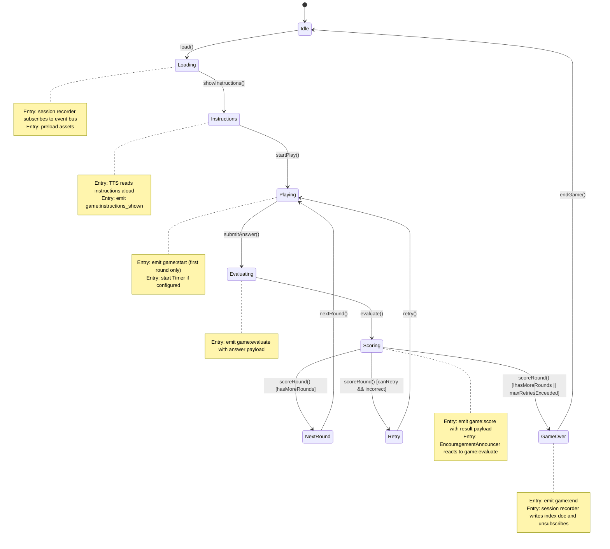

# BaseSkill Game Engine Design Document

> **Project**: BaseSkill — free, open-source, offline-first educational PWA for children  
> **Stack**: TanStack Start + TanStack Router + React + TypeScript (strict, no `any`)  
> **Audience**: AI agents implementing Milestone 1+ game features  
> **Status**: Authoritative design reference

---

## Table of Contents

1. [Overview](#1-overview)
2. [Game Lifecycle State Machine](#2-game-lifecycle-state-machine)
3. [Event Bus Integration](#3-event-bus-integration)
4. [Session Recorder Middleware](#4-session-recorder-middleware)
5. [Game Config JSON Schema](#5-game-config-json-schema)
6. [Parent Override Merging Logic](#6-parent-override-merging-logic)
7. [Reusable Game Components](#7-reusable-game-components)
8. [Difficulty Progression](#8-difficulty-progression)
9. [Reference Game Detailed Specs](#9-reference-game-detailed-specs)

---

## 1. Overview

The BaseSkill game engine is a **reusable, config-driven framework** that decouples game logic from presentation. All games share:

- A **common lifecycle state machine** governing transitions from idle to game-over
- A **typed event bus** for loose coupling between game components, analytics, and the session recorder
- A **JSON game config** that fully describes a game's identity, content, difficulty settings, and assets — no code changes required to add new content
- A set of **reusable React components** that implement common interaction patterns (drag-and-drop, letter tracing, multiple choice, speech I/O, etc.)

### Architectural Principles

| Principle           | Detail                                                                                             |
| ------------------- | -------------------------------------------------------------------------------------------------- |
| Config-driven       | Games are described as JSON configs; the engine renders the correct component                      |
| Offline-first       | All game assets and configs are bundled or cached via Service Worker; RxDB is the persistent store |
| No `any`            | All TypeScript is strict; `any` is forbidden                                                       |
| Accessibility-first | WCAG 2.1 AA minimum; every interactive element is keyboard navigable and has ARIA attributes       |
| Language-aware      | All user-visible strings live in localized config objects keyed by locale (`en`, `pt-BR`)          |
| Agent-observable    | Every meaningful game event is emitted on the event bus for session recording and future AI agents |

### High-Level Data Flow

```
GameConfig (JSON)
      │
      ▼
GameEngine (React)
  ├─ Lifecycle State Machine
  ├─ Event Bus (emits typed events)
  ├─ Reusable Game Component (DragAndDrop | LetterTracer | MultipleChoice | ...)
  └─ Session Recorder (subscribes to event bus → writes RxDB chunks)
```

---

## 2. Game Lifecycle State Machine

### State Diagram



### Transition Functions

| Function                | From State   | To State                       | Description                                          |
| ----------------------- | ------------ | ------------------------------ | ---------------------------------------------------- |
| `load(gameId)`          | Idle         | Loading                        | Fetch game config from RxDB / bundle; preload assets |
| `showInstructions()`    | Loading      | Instructions                   | Assets ready; TTS reads instructions                 |
| `startPlay()`           | Instructions | Playing                        | Child taps "Start" or instructions complete          |
| `submitAnswer(payload)` | Playing      | Evaluating                     | Child submits an answer                              |
| `evaluate(result)`      | Evaluating   | Scoring                        | Engine scores the answer                             |
| `scoreRound(score)`     | Scoring      | NextRound \| Retry \| GameOver | Engine decides next state                            |
| `nextRound()`           | NextRound    | Playing                        | Advance to next question/round                       |
| `retry()`               | Retry        | Playing                        | Replay current round                                 |
| `endGame()`             | GameOver     | Idle                           | Clean up; navigate back to game select               |

### TypeScript State Types

```typescript
export type GameState =
  | 'Idle'
  | 'Loading'
  | 'Instructions'
  | 'Playing'
  | 'Evaluating'
  | 'Scoring'
  | 'NextRound'
  | 'Retry'
  | 'GameOver';

export interface GameLifecycleContext {
  gameId: string;
  state: GameState;
  roundIndex: number;
  retryCount: number;
  score: number;
  maxRetries: number;
}
```

---

## 3. Event Bus Integration

The event bus is a **typed publish/subscribe singleton**. Game components emit events; any subscriber (session recorder, analytics, parent dashboard sync) can react without coupling.

### Event Bus Interface

```typescript
export type GameEventType =
  | 'game:start'
  | 'game:instructions_shown'
  | 'game:action'
  | 'game:evaluate'
  | 'game:score'
  | 'game:hint'
  | 'game:retry'
  | 'game:time_up'
  | 'game:end';

export interface BaseGameEvent {
  type: GameEventType;
  gameId: string;
  sessionId: string;
  profileId: string;
  timestamp: number; // Date.now()
  roundIndex: number;
}

export interface GameStartEvent extends BaseGameEvent {
  type: 'game:start';
  locale: string;
  difficulty: string;
  gradeBand: GradeBand;
}

export interface GameInstructionsShownEvent extends BaseGameEvent {
  type: 'game:instructions_shown';
}

export interface GameActionEvent extends BaseGameEvent {
  type: 'game:action';
  actionType: string; // e.g. "drag_drop", "tap", "trace_stroke"
  payload: Record<string, string | number | boolean>;
}

export interface GameEvaluateEvent extends BaseGameEvent {
  type: 'game:evaluate';
  answer: string | string[] | number;
  correct: boolean;
  nearMiss: boolean; // within 1 of correct, partial match, etc.
}

export interface GameScoreEvent extends BaseGameEvent {
  type: 'game:score';
  pointsAwarded: number;
  totalScore: number;
  streak: number;
}

export interface GameHintEvent extends BaseGameEvent {
  type: 'game:hint';
  hintType: string;
}

export interface GameRetryEvent extends BaseGameEvent {
  type: 'game:retry';
  retryCount: number;
}

export interface GameTimeUpEvent extends BaseGameEvent {
  type: 'game:time_up';
  roundIndex: number;
}

export interface GameEndEvent extends BaseGameEvent {
  type: 'game:end';
  finalScore: number;
  totalRounds: number;
  correctCount: number;
  durationMs: number;
}

export type GameEvent =
  | GameStartEvent
  | GameInstructionsShownEvent
  | GameActionEvent
  | GameEvaluateEvent
  | GameScoreEvent
  | GameHintEvent
  | GameRetryEvent
  | GameTimeUpEvent
  | GameEndEvent;

export interface GameEventBus {
  emit(event: GameEvent): void;
  subscribe(
    type: GameEventType | 'game:*',
    handler: (event: GameEvent) => void,
  ): () => void; // returns unsubscribe fn
}
```

### Emitting Events — Example

```typescript
// Inside MultipleChoice component after child selects answer
eventBus.emit({
  type: 'game:evaluate',
  gameId: config.id,
  sessionId: currentSession.id,
  profileId: profile.id,
  timestamp: Date.now(),
  roundIndex: lifecycle.roundIndex,
  answer: selectedOption,
  correct: selectedOption === correctAnswer,
  nearMiss: false,
});
```

### Wildcard Subscription

The session recorder and `EncouragementAnnouncer` subscribe with `"game:*"` to receive all game events:

```typescript
const unsubscribe = eventBus.subscribe('game:*', (event) => {
  sessionRecorder.record(event);
});
```

---

## 4. Session Recorder Middleware

The session recorder is a **side-effect middleware** that persists every game event to RxDB. It is transparent to game components — they only emit events on the bus.

### Behavior

1. **Subscribes** to all `game:*` events when the lifecycle enters `Loading` state
2. **Writes events** to the current `session_history` chunk document in RxDB
3. **Chunk rollover**: when the current chunk reaches **200 events** or **~50 KB** of JSON, creates a new document with `chunkIndex + 1`
4. **On `game:end`**: writes a `session_history_index` summary document and **unsubscribes** from the event bus
5. **Opt-in per game config** via `sessionRecorder.enabled` (defaults to `true`)

### RxDB Document Schemas

#### `session_history` chunk document

```typescript
export interface SessionHistoryChunk {
  id: string; // `${sessionId}_chunk_${chunkIndex}`
  sessionId: string;
  profileId: string;
  gameId: string;
  chunkIndex: number;
  events: GameEvent[];
  eventCount: number;
  byteSize: number; // approximate JSON byte length
  createdAt: number;
  updatedAt: number;
}
```

#### `session_history_index` summary document

```typescript
export interface SessionHistoryIndex {
  id: string; // `${sessionId}_index`
  sessionId: string;
  profileId: string;
  gameId: string;
  startedAt: number;
  endedAt: number;
  durationMs: number;
  totalChunks: number;
  totalEvents: number;
  finalScore: number;
  correctCount: number;
  totalRounds: number;
  locale: string;
  difficulty: string;
  gradeBand: GradeBand;
}
```

### Session Recorder Implementation Pseudocode

```typescript
class SessionRecorder {
  private unsubscribe: (() => void) | null = null;
  private currentChunk: SessionHistoryChunk | null = null;

  start(session: SessionHistoryIndex, db: RxDatabase, config: GameConfig): void {
    if (!config.sessionRecorder.enabled) return;

    this.currentChunk = this.createChunk(session, chunkIndex: 0);

    this.unsubscribe = eventBus.subscribe("game:*", async (event) => {
      await this.record(event, db);
    });
  }

  private async record(event: GameEvent, db: RxDatabase): Promise<void> {
    if (!this.currentChunk) return;

    this.currentChunk.events.push(event);
    this.currentChunk.eventCount++;
    this.currentChunk.byteSize = JSON.stringify(this.currentChunk.events).length;

    if (
      this.currentChunk.eventCount >= 200 ||
      this.currentChunk.byteSize >= 50_000
    ) {
      await db.session_history.upsert(this.currentChunk);
      this.currentChunk = this.createChunk(session, this.currentChunk.chunkIndex + 1);
    }

    if (event.type === "game:end") {
      await db.session_history.upsert(this.currentChunk);
      await db.session_history_index.upsert(buildIndex(event));
      this.unsubscribe?.();
      this.unsubscribe = null;
      this.currentChunk = null;
    }
  }
}
```

---

## 5. Game Config JSON Schema

### Full JSON Schema Definition

```json
{
  "$schema": "http://json-schema.org/draft-07/schema#",
  "title": "GameConfig",
  "type": "object",
  "required": [
    "id",
    "title",
    "subject",
    "gradeBands",
    "component",
    "instructions",
    "defaultSettings",
    "content",
    "sessionRecorder"
  ],
  "properties": {
    "id": {
      "type": "string",
      "description": "Unique snake_case identifier, e.g. 'math_facts'"
    },
    "title": {
      "type": "object",
      "description": "Localized display title",
      "required": ["en"],
      "properties": {
        "en": { "type": "string" },
        "pt-BR": { "type": "string" }
      },
      "additionalProperties": { "type": "string" }
    },
    "subject": {
      "type": "string",
      "enum": ["letters", "reading", "math", "science", "art", "music"],
      "description": "Curriculum subject area"
    },
    "gradeBands": {
      "type": "array",
      "minItems": 1,
      "items": {
        "type": "string",
        "enum": ["pre-k", "k", "year1-2", "year3-4", "year5-6"]
      }
    },
    "component": {
      "type": "string",
      "description": "React component name to render (must be registered in GameRegistry)"
    },
    "assets": {
      "type": "object",
      "properties": {
        "images": {
          "type": "array",
          "items": { "type": "string" },
          "description": "Relative paths to image assets"
        },
        "audio": {
          "type": "array",
          "items": { "type": "string" },
          "description": "Relative paths to audio assets"
        }
      }
    },
    "instructions": {
      "type": "object",
      "description": "Localized instruction text read aloud via TTS at game start",
      "required": ["en"],
      "properties": {
        "en": { "type": "string" },
        "pt-BR": { "type": "string" }
      },
      "additionalProperties": { "type": "string" }
    },
    "defaultSettings": {
      "type": "object",
      "required": ["retries", "alwaysWin", "difficulty"],
      "properties": {
        "retries": {
          "type": "integer",
          "minimum": 0,
          "description": "Number of retries allowed per round; 0 = no retries"
        },
        "timerDuration": {
          "type": ["integer", "null"],
          "minimum": 5,
          "description": "Timer duration in seconds; null = no timer"
        },
        "alwaysWin": {
          "type": "boolean",
          "description": "If true, every attempt is marked correct (accessibility mode)"
        },
        "difficulty": {
          "type": "string",
          "enum": ["easy", "medium", "hard"],
          "description": "Default difficulty level"
        }
      }
    },
    "content": {
      "type": "object",
      "description": "Game-specific content keyed by locale",
      "required": ["en"],
      "properties": {
        "en": { "type": "object" },
        "pt-BR": { "type": "object" }
      },
      "additionalProperties": { "type": "object" }
    },
    "difficultyProgression": {
      "type": "object",
      "description": "Per-difficulty content subset and parameter overrides",
      "properties": {
        "easy": { "$ref": "#/definitions/DifficultyLevel" },
        "medium": { "$ref": "#/definitions/DifficultyLevel" },
        "hard": { "$ref": "#/definitions/DifficultyLevel" }
      }
    },
    "gradeBandDefaults": {
      "type": "object",
      "description": "Default difficulty per grade band for this game",
      "properties": {
        "pre-k": {
          "type": "string",
          "enum": ["easy", "medium", "hard"]
        },
        "k": { "type": "string", "enum": ["easy", "medium", "hard"] },
        "year1-2": {
          "type": "string",
          "enum": ["easy", "medium", "hard"]
        },
        "year3-4": {
          "type": "string",
          "enum": ["easy", "medium", "hard"]
        },
        "year5-6": {
          "type": "string",
          "enum": ["easy", "medium", "hard"]
        }
      }
    },
    "sessionRecorder": {
      "type": "object",
      "required": ["enabled"],
      "properties": {
        "enabled": {
          "type": "boolean",
          "default": true,
          "description": "Whether session events are recorded to RxDB"
        }
      }
    }
  },
  "definitions": {
    "DifficultyLevel": {
      "type": "object",
      "properties": {
        "contentSubset": {
          "type": "object",
          "description": "Overrides to apply to content for this difficulty"
        },
        "parameterOverrides": {
          "type": "object",
          "description": "Setting overrides (e.g. timerDuration, retries)"
        }
      }
    }
  }
}
```

### TypeScript Types

```typescript
export type Subject =
  | 'letters'
  | 'reading'
  | 'math'
  | 'science'
  | 'art'
  | 'music';
export type GradeBand =
  | 'pre-k'
  | 'k'
  | 'year1-2'
  | 'year3-4'
  | 'year5-6';
export type Difficulty = 'easy' | 'medium' | 'hard';
export type Locale = 'en' | 'pt-BR';

export type LocalizedString = Record<string, string> & { en: string };

export interface GameDefaultSettings {
  retries: number;
  timerDuration: number | null;
  alwaysWin: boolean;
  difficulty: Difficulty;
}

export interface DifficultyLevel {
  contentSubset?: Record<string, unknown>;
  parameterOverrides?: Partial<GameDefaultSettings>;
}

export interface GameConfig {
  id: string;
  title: LocalizedString;
  subject: Subject;
  gradeBands: GradeBand[];
  component: string;
  assets: {
    images: string[];
    audio: string[];
  };
  instructions: LocalizedString;
  defaultSettings: GameDefaultSettings;
  content: Record<string, Record<string, unknown>>;
  difficultyProgression?: Record<Difficulty, DifficultyLevel>;
  gradeBandDefaults?: Partial<Record<GradeBand, Difficulty>>;
  sessionRecorder: {
    enabled: boolean;
  };
}
```

### Complete Worked Example — Math Facts Game

```json
{
  "id": "math_facts",
  "title": {
    "en": "Math Facts",
    "pt-BR": "Fatos Matemáticos"
  },
  "subject": "math",
  "gradeBands": ["year1-2", "year3-4"],
  "component": "MathFactsGame",
  "assets": {
    "images": ["assets/games/math_facts/number_line.svg"],
    "audio": []
  },
  "instructions": {
    "en": "Look at the math problem and choose the correct answer. You can use the number line to help!",
    "pt-BR": "Olhe o problema de matemática e escolha a resposta correta. Você pode usar a reta numérica para ajudar!"
  },
  "defaultSettings": {
    "retries": 1,
    "timerDuration": null,
    "alwaysWin": false,
    "difficulty": "easy"
  },
  "content": {
    "en": {
      "operations": {
        "year1-2": ["addition", "subtraction"],
        "year3-4": ["multiplication", "division"]
      },
      "ranges": {
        "year1-2": { "min": 0, "max": 20 },
        "year3-4": { "min": 1, "max": 12 }
      },
      "showNumberLine": {
        "year1-2": true,
        "year3-4": false
      }
    },
    "pt-BR": {
      "operations": {
        "year1-2": ["adição", "subtração"],
        "year3-4": ["multiplicação", "divisão"]
      },
      "ranges": {
        "year1-2": { "min": 0, "max": 20 },
        "year3-4": { "min": 1, "max": 12 }
      },
      "showNumberLine": {
        "year1-2": true,
        "year3-4": false
      }
    }
  },
  "difficultyProgression": {
    "easy": {
      "contentSubset": {
        "operations": ["addition"],
        "maxOperand": 5
      },
      "parameterOverrides": {
        "timerDuration": null,
        "retries": 2
      }
    },
    "medium": {
      "contentSubset": {
        "operations": ["addition", "subtraction"],
        "maxOperand": 10
      },
      "parameterOverrides": {
        "timerDuration": 30,
        "retries": 1
      }
    },
    "hard": {
      "contentSubset": {
        "operations": ["addition", "subtraction", "multiplication"],
        "maxOperand": 20
      },
      "parameterOverrides": {
        "timerDuration": 15,
        "retries": 0
      }
    }
  },
  "gradeBandDefaults": {
    "year1-2": "easy",
    "year3-4": "medium"
  },
  "sessionRecorder": {
    "enabled": true
  }
}
```

---

## 6. Parent Override Merging Logic

Parents can override game settings at multiple granularities. The engine resolves the final config by merging in priority order.

### Resolution Order (highest → lowest priority)

1. **Per-game override** — parent set a specific override for this exact `gameId`
2. **Grade-band override** — parent set an override for the child's current `gradeBand`
3. **Global override** — parent set a global override applying to all games
4. **Game default** — the `defaultSettings` from the `GameConfig`

### TypeScript Pseudocode

```typescript
export type SettingsOverride = Partial<GameDefaultSettings>;

export interface ParentProfile {
  id: string;
  globalOverride?: SettingsOverride;
  gradeBandOverrides?: Partial<Record<GradeBand, SettingsOverride>>;
  gameOverrides?: Record<string, SettingsOverride>; // keyed by gameId
}

export async function resolveGameConfig(
  gameId: string,
  gradeBand: GradeBand,
  profileId: string,
  db: RxDatabase,
): Promise<GameConfig> {
  // 1. Fetch base config
  const baseConfig = await db.game_configs.findOne(gameId).exec();
  if (!baseConfig) throw new Error(`Game config not found: ${gameId}`);

  // 2. Fetch parent profile
  const parentProfile = await db.parent_profiles
    .findOne(profileId)
    .exec();

  // 3. Build override layers (lowest to highest priority)
  const layers: SettingsOverride[] = [
    baseConfig.defaultSettings,
    parentProfile?.globalOverride ?? {},
    parentProfile?.gradeBandOverrides?.[gradeBand] ?? {},
    parentProfile?.gameOverrides?.[gameId] ?? {},
  ];

  // 4. Merge layers left-to-right (later entries win)
  const mergedSettings = layers.reduce<GameDefaultSettings>(
    (acc, override) => ({ ...acc, ...override }),
    baseConfig.defaultSettings,
  );

  return {
    ...baseConfig,
    defaultSettings: mergedSettings,
  };
}
```

### Example

Given `math_facts` with `defaultSettings.timerDuration = null`:

- Global override: `{ alwaysWin: false }`
- Grade-band override for `year1-2`: `{ timerDuration: 60 }`
- Per-game override for `math_facts`: `{ timerDuration: 30, retries: 3 }`

Result: `{ ..., timerDuration: 30, retries: 3, alwaysWin: false }`

---

## 7. Reusable Game Components

All components are in `src/components/game/`. They are **presentation components** — they receive config via props and emit events via the event bus. They never write to RxDB directly.

---

### 7.1 DragAndDrop

**Purpose**: Pointer-event-based drag and drop for matching, sorting, and building tasks.

#### Props Interface

```typescript
export interface DragItem {
  id: string;
  label: string;
  imageUrl?: string;
  ariaLabel: string;
}

export interface DropZone {
  id: string;
  label: string;
  acceptsItemId?: string; // if set, only this item can snap here
  ariaLabel: string;
}

export interface DragAndDropProps {
  gameId: string;
  sessionId: string;
  profileId: string;
  roundIndex: number;
  items: DragItem[];
  dropZones: DropZone[];
  snapThreshold?: number; // px, default 60
  showGhostPreview?: boolean; // default true
  onDrop: (itemId: string, zoneId: string) => void;
  disabled?: boolean;
}
```

#### Key Behaviors

- Uses `pointer` events exclusively (`pointerdown`, `pointermove`, `pointerup`) — not separate mouse/touch handlers
- Captures pointer via `setPointerCapture` for reliable drag tracking across element boundaries
- Ghost preview: a semi-transparent clone of the dragged item follows the pointer
- Drop zones pulse (CSS `@keyframes pulse-border`) when a draggable item is within `snapThreshold` pixels
- Magnetic snap: when pointer is released within `snapThreshold` of a drop zone center, item snaps to zone with an ease-out CSS transition
- On successful drop, emits `game:action` event with `actionType: "drag_drop"`, `payload: { itemId, zoneId }`
- Snap zones visually indicate acceptance/rejection via color change after evaluation

#### Accessibility

- All drag items have `role="button"` and `aria-grabbed` attribute
- Drop zones have `role="region"` and `aria-dropeffect="move"`
- Keyboard fallback: Tab to select item, Tab to drop zone, Enter to place — no mouse required
- Focus ring visible at all times (not suppressed with `outline: none`)

#### Event Bus Interactions

| Trigger              | Event Emitted                             |
| -------------------- | ----------------------------------------- |
| Item dropped on zone | `game:action` (`actionType: "drag_drop"`) |

---

### 7.2 LetterTracer

**Purpose**: HTML Canvas-based letter tracing for handwriting practice.

#### Props Interface

```typescript
export interface LetterTracerProps {
  gameId: string;
  sessionId: string;
  profileId: string;
  roundIndex: number;
  letter: string; // single character, upper or lower case
  showGuide?: boolean; // default true — show faint letter outline
  strokeCoverageThreshold?: number; // 0.0–1.0, default 0.7
  tapToPlaceEnabled?: boolean; // accessibility mode, default false
  onStrokeComplete: (
    coverage: number,
    directionCorrect: boolean,
  ) => void;
}
```

#### Key Behaviors

- Renders an HTML `<canvas>` element sized to fill its container
- Displays a faint guide letter (SVG path overlaid on canvas) when `showGuide` is true
- Records stroke paths via `pointer` events (`pointerdown → pointermove → pointerup`)
- On stroke complete, calculates:
  - **Coverage**: percentage of guide letter pixels covered by drawn strokes
  - **Direction**: whether stroke direction matches expected letter stroke order
- Evaluation: `coverage >= strokeCoverageThreshold && directionCorrect` → correct
- **Tap-to-place mode** (`tapToPlaceEnabled`): instead of drawing, child taps waypoints along the letter path in order; designed for children with motor impairments
- Canvas is cleared and redrawn on each new round; stroke history is not persisted

#### Accessibility

- `<canvas>` has `role="img"` with `aria-label` describing the letter to trace
- Tap-to-place mode is announced via `aria-live="polite"` when enabled
- Stroke completion announced via `aria-live`

#### Event Bus Interactions

| Trigger                  | Event Emitted                                                                           |
| ------------------------ | --------------------------------------------------------------------------------------- |
| Stroke drawn (each lift) | `game:action` (`actionType: "trace_stroke"`, `payload: { coverage, directionCorrect }`) |

---

### 7.3 MultipleChoice

**Purpose**: Grid of answer cards for selection-based questions.

#### Props Interface

```typescript
export interface ChoiceOption {
  id: string;
  label: string;
  imageUrl?: string;
  ariaLabel: string;
}

export interface MultipleChoiceProps {
  gameId: string;
  sessionId: string;
  profileId: string;
  roundIndex: number;
  question: string;
  questionImageUrl?: string;
  options: ChoiceOption[];
  correctOptionId: string;
  onSelect: (optionId: string) => void;
  evaluationResult?: 'correct' | 'incorrect' | null; // set after evaluation
  disabled?: boolean;
}
```

#### Key Behaviors

- Renders options in a responsive CSS Grid (2 or 4 columns based on option count)
- Keyboard navigation: arrow keys move between options; Enter or Space selects
- When `evaluationResult` is set:
  - Correct option gets green highlight + checkmark icon + audio feedback (success chime)
  - Incorrect selection gets red highlight + X icon + audio feedback (gentle error tone)
  - All options disabled after evaluation until next round
- Selection is announced immediately via `aria-live="polite"`

#### Accessibility

- Each option is a `<button>` (not a `<div>`) for native keyboard support
- `aria-pressed` reflects selected state
- `aria-live="polite"` region announces selection and evaluation result
- Images have descriptive `alt` text from `ariaLabel`

#### Event Bus Interactions

| Trigger         | Event Emitted                                                                   |
| --------------- | ------------------------------------------------------------------------------- |
| Option selected | `game:action` (`actionType: "multiple_choice_select"`, `payload: { optionId }`) |

---

### 7.4 SpeechInput (STT)

**Purpose**: Wraps Web Speech API `SpeechRecognition` for read-aloud and voice response games.

#### Props Interface

```typescript
export interface SpeechInputProps {
  gameId: string;
  sessionId: string;
  profileId: string;
  roundIndex: number;
  language: string; // BCP 47, e.g. "en-US", "pt-BR"
  onTranscript: (transcript: string, confidence: number) => void;
  onUnavailable: () => void; // called when STT not supported
  disabled?: boolean;
}
```

#### Key Behaviors

- Checks for `window.SpeechRecognition || window.webkitSpeechRecognition` availability
- If unavailable, calls `onUnavailable()` — callers must provide a text input fallback
- Shows a simple animated visual indicator (e.g., animated GIF or CSS-only pulsing icon) while listening — no complex waveform rendering required
- Sets `recognition.lang` from the `language` prop
- Sets `recognition.continuous = false` and `recognition.interimResults = false` for single-utterance capture
- On result, calls `onTranscript(transcript, confidence)`
- On error or no-match, retries once then reports empty transcript
- Cleans up `recognition.abort()` on component unmount

#### Accessibility

- Microphone button has `aria-label="Start listening"` / `aria-label="Listening..."` based on state
- `aria-live="polite"` region shows transcript after capture
- Visual + haptic feedback (if available) when listening starts/stops

#### Event Bus Interactions

| Trigger             | Event Emitted                                                                       |
| ------------------- | ----------------------------------------------------------------------------------- |
| Transcript captured | `game:action` (`actionType: "speech_input"`, `payload: { transcript, confidence }`) |

---

### 7.5 SpeechOutput (TTS)

**Purpose**: Wraps `window.SpeechSynthesis` for instruction reading and feedback.

#### Props Interface

```typescript
export interface SpeechOutputProps {
  text: string;
  language: string; // BCP 47
  voiceURI?: string; // from profile's selected voice
  rate?: number; // default 0.9 (slightly slower for children)
  pitch?: number; // default 1.0
  autoPlay?: boolean; // default false — call speak() imperatively
  onEnd?: () => void;
  onError?: () => void;
}

export interface SpeechOutputRef {
  speak: () => void;
  cancel: () => void;
}
```

#### Key Behaviors

- Uses `window.speechSynthesis.getVoices()` to find the voice matching `voiceURI`; falls back to default voice for `language`
- Queues utterances: if synthesis is already speaking, new utterance is appended to queue
- Cancels all pending utterances on component unmount to prevent speech after navigation
- If synthesis is entirely unavailable (some mobile browsers), renders the text visually as a subtitle
- `rate: 0.9` default ensures clear, slightly slower speech appropriate for children

#### Accessibility

- Text being spoken is also displayed in a visually-hidden `<span aria-live="polite">` for hearing-impaired users
- `autoPlay` is opt-in; game engine calls `speak()` at defined lifecycle points

#### Event Bus Interactions

None — TTS is a passive output component. The game lifecycle emits events before/after TTS.

---

### 7.6 Timer

**Purpose**: Countdown timer with a visual bar and numeric display.

#### Props Interface

```typescript
export interface TimerProps {
  gameId: string;
  sessionId: string;
  profileId: string;
  roundIndex: number;
  durationSeconds: number;
  hidden?: boolean; // parent override can hide timer
  onTimeUp: () => void;
  paused?: boolean;
}
```

#### Key Behaviors

- Renders a horizontal progress bar (CSS `transition: width`) and a numeric `MM:SS` countdown
- `hidden` prop: timer still runs and emits `game:time_up` even when visually hidden (parent requested no visual pressure, but time-limited gameplay still applies)
- Pauses when app enters background (`visibilitychange` event)
- Bar changes color at 50% (yellow) and 25% (red) remaining time
- On reaching zero, calls `onTimeUp()` and emits `game:time_up`

#### Accessibility

- `role="timer"` on container, `aria-live="off"` (numeric updates are not announced every second)
- At 10 seconds remaining, announces once via `aria-live="polite"`: "10 seconds remaining"

#### Event Bus Interactions

| Trigger            | Event Emitted  |
| ------------------ | -------------- |
| Timer reaches zero | `game:time_up` |

---

### 7.7 EncouragementAnnouncer

**Purpose**: TTS + animated popup reacting to game evaluation results.

#### Props Interface

```typescript
export interface EncouragementAnnouncerProps {
  gameId: string;
  sessionId: string;
  profileId: string;
  language: string;
  characterImageUrl: string; // mascot image
}
```

#### Key Behaviors

- **Subscribes** to `game:evaluate` events on mount; **unsubscribes** on unmount
- On correct: TTS says a random encouraging phrase (e.g., "Great job!", "Excellent!", "You got it!"); animated popup with mascot + speech bubble slides in from the side
- On near-miss: TTS says a supportive phrase (e.g., "Almost! Try again!", "So close!"); gentler animation
- On retry: TTS says an encouraging retry phrase (e.g., "Give it another try!", "You can do it!")
- Phrases are locale-aware, pulled from a localized phrase bank in `src/data/encouragement.ts`
- Animation is CSS keyframe (`@keyframes slide-in-bounce`); no external animation library
- Popup auto-dismisses after 2 seconds or when next round begins

#### Accessibility

- Popup has `role="alert"` for immediate screen reader announcement
- Animation respects `prefers-reduced-motion`: uses fade instead of slide-bounce

#### Event Bus Interactions

| Trigger                  | Reaction                           |
| ------------------------ | ---------------------------------- |
| Receives `game:evaluate` | Plays TTS and shows animated popup |

---

### 7.8 ScoreAnimation

**Purpose**: Pure CSS celebratory animation triggered on scoring.

#### Props Interface

```typescript
export interface ScoreAnimationProps {
  trigger: boolean; // set to true to play animation
  type: 'confetti' | 'star_burst' | 'simple_flash';
  pointsAwarded: number;
  onComplete?: () => void;
}
```

#### Key Behaviors

- **No canvas dependency** and **no external animation library** — pure CSS `@keyframes`
- **Confetti**: uses `clip-path` on a grid of small colored `<div>` elements to create confetti burst effect
- **Star burst**: radial burst of SVG star elements using `@keyframes` for scale + opacity
- **Simple flash**: screen border flashes green — used in low-stimulation accessibility mode
- Animation is triggered by `trigger` prop changing from `false` to `true`
- Calls `onComplete()` after animation finishes (via `animationend` event)
- All animated elements are `aria-hidden="true"` and `role="presentation"`

#### Accessibility

- `prefers-reduced-motion`: all animations replaced with a simple green checkmark fade-in
- Score points (`+5`, etc.) displayed as `aria-live="polite"` text

#### Event Bus Interactions

None — triggered imperatively by parent game component after `game:score` event.

---

## 8. Difficulty Progression

### Config-Driven Difficulty

Each game config defines a `difficultyProgression` object with three levels (`easy`, `medium`, `hard`). Each level specifies:

- **`contentSubset`**: overrides to the content object (e.g., limit to simpler words, smaller number range, fewer operations)
- **`parameterOverrides`**: overrides to `defaultSettings` (e.g., longer timer, more retries)

The engine applies these overrides via the same merging logic as parent overrides (see §6).

### Adaptive Difficulty Within Session

The engine tracks a **streak counter** within each session:

```typescript
interface SessionAdaptiveState {
  streak: number; // consecutive correct answers
  streakThreshold: number; // default 3
  currentDifficulty: Difficulty;
}
```

- **Suggest increase**: if `streak >= streakThreshold` and current difficulty is not `"hard"`, the engine emits a `game:score` event with `suggestDifficultyIncrease: true`
- The UI shows a gentle prompt: "You're doing great! Want to try something harder?"
- The child (or parent, if present) confirms; the engine updates `currentDifficulty` and resets the streak
- Difficulty never decreases automatically within a session (to avoid discouragement)
- Adaptive suggestions respect parent overrides: if parent locked difficulty, no suggestion is shown

### Grade-Band Defaults

Each game config specifies `gradeBandDefaults` — the starting difficulty for each applicable grade band:

```json
"gradeBandDefaults": {
  "pre-k": "easy",
  "k": "easy",
  "year1-2": "easy",
  "year3-4": "medium"
}
```

On first load, `resolveGameConfig` uses `gradeBandDefaults[gradeBand]` as the initial difficulty, before any parent overrides.

---

## 9. Reference Game Detailed Specs

---

### 9a. Letter Tracing

| Property              | Value               |
| --------------------- | ------------------- |
| Game ID               | `letter_tracing`    |
| Subject               | `letters`           |
| Grade Bands           | `pre-k`, `k`        |
| Component             | `LetterTracingGame` |
| Primary Sub-component | `LetterTracer`      |

#### Game Sequence

1. **Loading**: preload letter SVG outlines; session recorder subscribes
2. **Instructions**: TTS reads: _"Trace the letter with your finger!"_; `game:instructions_shown` emitted
3. **Playing**:
   - TTS says the letter name (e.g., "Capital A")
   - Show letter outline on canvas (`showGuide: true`)
   - Child traces the letter
4. **Evaluating**: `game:evaluate` emitted with `{ answer: tracedPath, correct: coverage >= threshold && directionCorrect }`
5. **Scoring**: `game:score` emitted; `ScoreAnimation` plays on correct
6. **NextRound / Retry / GameOver**: standard lifecycle

#### Content

```typescript
interface LetterTracingContent {
  sequence: string[]; // e.g. ["A", "B", "C", ...] or custom subset
  caseMode: 'uppercase' | 'lowercase' | 'both';
}
```

Default sequence: uppercase A–Z, then lowercase a–z.

#### Evaluation Logic

```
correct = strokeCoverage >= strokeCoverageThreshold AND directionCorrect
```

- `strokeCoverageThreshold`: `0.70` (configurable per game config)
- `directionCorrect`: strokes match expected stroke order for the letter (defined per-letter in `src/data/letter-strokes.ts`)

#### Config Example

```json
{
  "id": "letter_tracing",
  "title": { "en": "Letter Tracing", "pt-BR": "Traçado de Letras" },
  "subject": "letters",
  "gradeBands": ["pre-k", "k"],
  "component": "LetterTracingGame",
  "instructions": {
    "en": "Trace the letter on the screen with your finger!",
    "pt-BR": "Trace a letra na tela com o dedo!"
  },
  "defaultSettings": {
    "retries": 2,
    "timerDuration": null,
    "alwaysWin": false,
    "difficulty": "easy"
  },
  "content": {
    "en": {
      "sequence": [
        "A",
        "B",
        "C",
        "D",
        "E",
        "F",
        "G",
        "H",
        "I",
        "J",
        "K",
        "L",
        "M",
        "N",
        "O",
        "P",
        "Q",
        "R",
        "S",
        "T",
        "U",
        "V",
        "W",
        "X",
        "Y",
        "Z"
      ],
      "caseMode": "uppercase",
      "strokeCoverageThreshold": 0.7,
      "showGuide": true
    },
    "pt-BR": {
      "sequence": [
        "A",
        "B",
        "C",
        "D",
        "E",
        "F",
        "G",
        "H",
        "I",
        "J",
        "K",
        "L",
        "M",
        "N",
        "O",
        "P",
        "Q",
        "R",
        "S",
        "T",
        "U",
        "V",
        "W",
        "X",
        "Y",
        "Z"
      ],
      "caseMode": "uppercase",
      "strokeCoverageThreshold": 0.7,
      "showGuide": true
    }
  },
  "gradeBandDefaults": { "pre-k": "easy", "k": "medium" },
  "sessionRecorder": { "enabled": true }
}
```

---

### 9b. Number Match

| Property              | Value             |
| --------------------- | ----------------- |
| Game ID               | `number_match`    |
| Subject               | `math`            |
| Grade Bands           | `pre-k`, `k`      |
| Component             | `NumberMatchGame` |
| Primary Sub-component | `DragAndDrop`     |

#### Game Sequence

1. **Loading**: preload object images (apples, stars, etc.); session recorder subscribes
2. **Instructions**: TTS reads: _"Drag the number card to match the group of objects!"_
3. **Playing**:
   - Display a group of object images (e.g., 3 apples) with a drop zone below the group
   - Display shuffled number cards (e.g., 1–5) as draggable items
   - Child drags the correct number card to the group's drop zone
4. **Evaluating**: `game:evaluate` emitted with `{ answer: droppedNumber, correct: droppedNumber === objectCount }`
5. **Scoring** → **NextRound / Retry / GameOver**

#### Content

```typescript
interface NumberMatchContent {
  range: { min: number; max: number }; // pre-k: 1-10, k: 1-20
  objectCategories: string[]; // e.g. ["apples", "stars", "balls", "cars"]
  cardsPerRound: number; // number of distractor cards shown, default 4
}
```

Each round: one correct number + `cardsPerRound - 1` random distractors displayed.

#### Evaluation Logic

```
correct = droppedItemId === `number_${objectCount}`
```

#### Snap Zone Assignment

Each object group `<div>` has a corresponding `DropZone` with `acceptsItemId: \`number\_${count}\``. The snap zone visually pulses when the correct card is within threshold.

---

### 9c. Word Builder

| Property               | Value                         |
| ---------------------- | ----------------------------- |
| Game ID                | `word_builder`                |
| Subject                | `reading`                     |
| Grade Bands            | `k`, `year1-2`                |
| Component              | `WordBuilderGame`             |
| Primary Sub-components | `DragAndDrop`, `SpeechOutput` |

#### Game Sequence

1. **Loading**: preload word images; session recorder subscribes
2. **Instructions**: TTS reads: _"Drag the letters into the boxes to spell the word!"_
3. **Playing**:
   - Show a picture of the target word (e.g., a cat for "CAT")
   - Display scrambled letter tiles as draggable items
   - Display letter slot drop zones (one per letter in the word)
   - TTS hint button: reads the word aloud; emits `game:hint`
   - Child drags letter tiles into slots to spell the word
4. **Evaluating**: `game:evaluate` with `{ answer: spelledWord, correct: spelledWord === targetWord }`
5. **Scoring** → **NextRound / Retry / GameOver**

#### Content

```typescript
interface WordBuilderContent {
  words: string[]; // word list for this locale + grade band
  letterCount: { min: number; max: number }; // k: 3-4, year1-2: 3-6
}
```

Per-language word lists in `src/data/words/en.ts` and `src/data/words/pt-BR.ts`.

#### Evaluation Logic

```
spelledWord = slots.map(slot => slot.occupiedLetter).join("")
correct = spelledWord.toUpperCase() === targetWord.toUpperCase()
```

#### Hint Behavior

- TTS reads the target word aloud
- Emits `game:hint` with `{ hintType: "tts_word" }`
- Hint count per round is tracked (recorded in session for parent reporting)
- Configurable maximum hints per round (default: unlimited)

---

### 9d. Read Aloud

| Property               | Value                         |
| ---------------------- | ----------------------------- |
| Game ID                | `read_aloud`                  |
| Subject                | `reading`                     |
| Grade Bands            | `year1-2`, `year3-4`          |
| Component              | `ReadAloudGame`               |
| Primary Sub-components | `SpeechInput`, `SpeechOutput` |

#### Game Sequence

1. **Loading**: preload sentence set; session recorder subscribes
2. **Instructions**: TTS reads: _"Listen to the sentence, then read it aloud!"_
3. **Playing**:
   - Display sentence on screen in large, readable font
   - TTS reads the sentence first (SpeechOutput)
   - Child taps microphone button and reads aloud (SpeechInput)
   - STT captures transcript; if STT unavailable, a text input field appears
4. **Evaluating**: `game:evaluate` with `{ answer: transcript, correct: matchScore >= 0.80 }`
5. **Scoring** → **NextRound / Retry / GameOver**

#### Content

```typescript
interface ReadAloudContent {
  sentences: string[]; // grade-appropriate sentences for this locale
  readingLevel: 'grade1' | 'grade2' | 'grade3'; // mapped from gradeBand
}
```

#### Evaluation Logic

```typescript
function evaluateReadAloud(
  transcript: string,
  target: string,
): boolean {
  const normalize = (s: string) =>
    s
      .toLowerCase()
      .replace(/[^a-z\s]/g, '')
      .trim()
      .split(/\s+/);

  const targetWords = normalize(target);
  const transcriptWords = normalize(transcript);

  const matchCount = targetWords.filter((w) =>
    transcriptWords.includes(w),
  ).length;
  const matchRatio = matchCount / targetWords.length;

  return matchRatio >= 0.8;
}
```

#### STT Fallback

- `SpeechInput` calls `onUnavailable()` if `SpeechRecognition` is not available
- `ReadAloudGame` shows a `<textarea>` for manual text entry
- Evaluation logic is identical — text input is normalized the same way
- Fallback is noted in the session history chunk: `payload.inputMethod: "text_fallback"`

---

### 9e. Math Facts

| Property               | Value                     |
| ---------------------- | ------------------------- |
| Game ID                | `math_facts`              |
| Subject                | `math`                    |
| Grade Bands            | `year1-2`, `year3-4`      |
| Component              | `MathFactsGame`           |
| Primary Sub-components | `MultipleChoice`, `Timer` |

#### Game Sequence

1. **Loading**: generate problem set algorithmically; session recorder subscribes
2. **Instructions**: TTS reads: _"Look at the math problem and choose the correct answer!"_
3. **Playing**:
   - Display arithmetic problem (e.g., `7 + 5 = ?`) in large centered text
   - Display 4 answer choices via `MultipleChoice`
   - For `year1-2`: display a visual number line (0–20) below the problem
   - For `year3-4`: no number line; timer optional
   - `Timer` component runs if `timerDuration` is not null
4. **Evaluating**: `game:evaluate` with `{ answer: selectedOption, correct: selectedOption === correctAnswer }`
5. **Scoring** → **NextRound / Retry / GameOver**

#### Problem Generation

```typescript
function generateProblem(
  operations: string[],
  range: { min: number; max: number },
  difficulty: Difficulty,
): { question: string; answer: number; distractors: number[] } {
  // Select random operation and operands within range
  // Generate 3 plausible distractors (near the correct answer, not duplicates)
  // Distractors within ±5 of correct answer for harder difficulty
}
```

#### Number Line

- Rendered as an SVG for `year1-2`
- Highlights the relevant range for the current problem
- Shown below the question; hideable via `showNumberLine: false` in content config

#### Timer Behavior

- `Timer` component receives `durationSeconds` from resolved config
- If parent override sets `timerDuration: null`, Timer component still mounts but with `hidden: true` (timer runs, no visual; see Timer §7.6)
- On `game:time_up`, engine transitions: `Playing → Evaluating` with `answer: null, correct: false`

#### Distractor Strategy

| Difficulty | Distractor Range                                |
| ---------- | ----------------------------------------------- |
| `easy`     | ±1 or ±2 from correct answer                    |
| `medium`   | ±1 to ±5; one common error (e.g., off-by-ten)   |
| `hard`     | ±1 to ±10; one plausible wrong operation result |

---

## Appendix: File Structure

```
src/
  components/
    game/
      DragAndDrop.tsx
      LetterTracer.tsx
      MultipleChoice.tsx
      SpeechInput.tsx
      SpeechOutput.tsx
      Timer.tsx
      EncouragementAnnouncer.tsx
      ScoreAnimation.tsx
  games/
    LetterTracingGame.tsx
    NumberMatchGame.tsx
    WordBuilderGame.tsx
    ReadAloudGame.tsx
    MathFactsGame.tsx
  engine/
    GameEngine.tsx          // lifecycle state machine + event bus wiring
    eventBus.ts             // typed event bus singleton
    sessionRecorder.ts      // RxDB session recording middleware
    resolveGameConfig.ts    // parent override merging
    GameRegistry.ts         // component name → React component mapping
  data/
    letter-strokes.ts       // per-letter stroke order definitions
    encouragement.ts        // localized encouragement phrase banks
    words/
      en.ts
      pt-BR.ts
  types/
    game.ts                 // GameConfig, GameEvent, all shared types
public/
  game-configs/             // JSON config files per game
    letter_tracing.json
    number_match.json
    word_builder.json
    read_aloud.json
    math_facts.json
  assets/
    games/
      math_facts/
        number_line.svg
      number_match/
        objects/            // apple.svg, star.svg, ball.svg, car.svg, ...
```

---

_This document is the authoritative game engine design for BaseSkill. Update this document when making structural changes to the game framework before implementing._
