# Architecture Documentation System — Implementation Plan

> **For agentic workers:** REQUIRED SUB-SKILL: Use superpowers:subagent-driven-development
> (recommended) or superpowers:executing-plans to implement this plan task-by-task. Steps use
> checkbox (`- [ ]`) syntax for tracking.

**Goal:** Create living, co-located architecture docs for the `answer-game` and `game-engine`
domains, rendered in Storybook via a client-side Mermaid component, plus a skill and CLAUDE.md
rule to keep them updated.

**Architecture:** Four MDX files co-located with source code
(`AnswerGame.reference.mdx`, `AnswerGame.flows.mdx`, `GameEngine.reference.mdx`,
`GameEngine.flows.mdx`). A `<Mermaid>` React component lazy-loads the `mermaid` JS library
and is wired into Storybook's MDX code-block pipeline as an override for `language-mermaid`
blocks. An `/update-architecture-docs` skill reads git diffs and updates stale doc sections.

**Tech Stack:** MDX, mermaid JS library, React, Storybook 10
(`@storybook/addon-docs`), markdownlint-cli2, Prettier.

**Worktree:** `worktrees/architecture-docs` (branch `architecture-docs`)

---

## File Map

| Action | Path                                                             |
| ------ | ---------------------------------------------------------------- |
| Create | `src/components/ui/Mermaid.tsx`                                  |
| Modify | `.storybook/preview.tsx`                                         |
| Create | `.vscode/extensions.json`                                        |
| Create | `src/components/answer-game/AnswerGame/AnswerGame.reference.mdx` |
| Create | `src/components/answer-game/AnswerGame/AnswerGame.flows.mdx`     |
| Create | `src/lib/game-engine/GameEngine.reference.mdx`                   |
| Create | `src/lib/game-engine/GameEngine.flows.mdx`                       |
| Modify | `CLAUDE.md`                                                      |
| Create | `.claude/skills/update-architecture-docs/skill.md`               |

---

## Task 1: Mermaid rendering infrastructure

Set up the client-side Mermaid component and wire it into Storybook so `mermaid` code blocks
in all `.mdx` files render as diagrams.

**Files:**

- Create: `src/components/ui/Mermaid.tsx`
- Modify: `.storybook/preview.tsx`
- Create: `.vscode/extensions.json`

- [ ] **Step 1: Install mermaid**

```bash
cd worktrees/architecture-docs
yarn add mermaid
```

Expected: `mermaid` appears in `package.json` dependencies.

- [ ] **Step 2: Create `src/components/ui/Mermaid.tsx`**

```tsx
import { useEffect, useId, useRef } from 'react';

interface MermaidProps {
  chart: string;
}

export const Mermaid = ({ chart }: MermaidProps) => {
  // useId produces strings like ":r0:" — colons are invalid in SVG ids
  const rawId = useId();
  const id = `mermaid-${rawId.replace(/:/g, '')}`;
  const ref = useRef<HTMLDivElement>(null);

  useEffect(() => {
    let cancelled = false;
    const render = async () => {
      const mermaid = (await import('mermaid')).default;
      mermaid.initialize({ startOnLoad: false, theme: 'default' });
      if (!cancelled && ref.current) {
        try {
          const { svg } = await mermaid.render(id, chart.trim());
          if (!cancelled && ref.current) {
            ref.current.innerHTML = svg;
          }
        } catch {
          if (!cancelled && ref.current) {
            ref.current.textContent = chart;
          }
        }
      }
    };
    render();
    return () => {
      cancelled = true;
    };
  }, [chart, id]);

  return <div ref={ref} aria-label="Diagram" />;
};
```

- [ ] **Step 3: Add MermaidCodeBlock override to `.storybook/preview.tsx`**

Add the import after the existing imports and add `docs.components` to the `parameters`
object:

```tsx
import '../src/styles.css';
import '../src/lib/i18n/i18n';
import { ThemeProvider } from 'next-themes';
import { withTheme } from './decorators/withTheme';
import { Mermaid } from '../src/components/ui/Mermaid';
import type { Decorator, Preview } from '@storybook/react';

interface CodeProps {
  children?: string;
  className?: string;
}

const MermaidCodeBlock = ({ children, className }: CodeProps) => {
  if (className === 'language-mermaid' && children) {
    return <Mermaid chart={children} />;
  }
  return <code className={className}>{children}</code>;
};

const withAppThemeProvider: Decorator = (Story) => (
  <ThemeProvider
    attribute="class"
    defaultTheme="light"
    enableSystem={false}
  >
    {Story()}
  </ThemeProvider>
);

const preview: Preview = {
  // ... existing globalTypes and initialGlobals unchanged ...
  decorators: [withAppThemeProvider, withTheme],
  parameters: {
    // ... existing viewport and actions params unchanged ...
    docs: {
      components: {
        code: MermaidCodeBlock,
      },
    },
  },
};

export default preview;
```

- [ ] **Step 4: Create `.vscode/extensions.json`**

```json
{
  "recommendations": ["bierner.markdown-mermaid"]
}
```

- [ ] **Step 5: Typecheck**

```bash
cd worktrees/architecture-docs && yarn typecheck
```

Expected: no errors.

- [ ] **Step 6: Commit**

```bash
cd worktrees/architecture-docs
git add src/components/ui/Mermaid.tsx .storybook/preview.tsx .vscode/extensions.json package.json yarn.lock
git commit -m "feat(docs): add client-side Mermaid component for Storybook MDX rendering"
```

---

## Task 2: AnswerGame.reference.mdx

Write the reference document for the answer-game domain: state shape, all 14 actions,
hook index, context API, and config options.

**Files:**

- Create: `src/components/answer-game/AnswerGame/AnswerGame.reference.mdx`

- [ ] **Step 1: Create `AnswerGame.reference.mdx`**

````mdx
import { Meta } from '@storybook/blocks';

<Meta title="answer-game/Reference" />

# AnswerGame — Reference

> Source: `src/components/answer-game/`
>
> Audience: developers and AI agents modifying game state logic.
> Update this file whenever the reducer, hooks, or context API change.
> Run `/update-architecture-docs` for guided update prompts.

---

## State Shape

Defined in `src/components/answer-game/types.ts`.

| Field                 | Type               | Description                                                        |
| --------------------- | ------------------ | ------------------------------------------------------------------ |
| `config`              | `AnswerGameConfig` | Game configuration (immutable during play)                         |
| `allTiles`            | `TileItem[]`       | All tiles for the current round — never mutated mid-round          |
| `bankTileIds`         | `string[]`         | IDs of tiles currently visible in the choice bank                  |
| `zones`               | `AnswerZone[]`     | Slot definitions — contains `placedTileId`, `isWrong`, `isLocked`  |
| `activeSlotIndex`     | `number`           | Cursor position for auto-next-slot mode (ordered input)            |
| `dragActiveTileId`    | `string \| null`   | ID of the tile currently being dragged                             |
| `dragHoverZoneIndex`  | `number \| null`   | Zone index being hovered during a drag                             |
| `dragHoverBankTileId` | `string \| null`   | Bank tile hole being hovered by a dragged slot tile                |
| `phase`               | `AnswerGamePhase`  | `'playing' \| 'round-complete' \| 'level-complete' \| 'game-over'` |
| `roundIndex`          | `number`           | Current round (0-based)                                            |
| `retryCount`          | `number`           | Wrong placements in the current round                              |
| `levelIndex`          | `number`           | Current level (only used when `config.levelMode` is set)           |
| `isLevelMode`         | `boolean`          | Whether `config.levelMode` is configured                           |

### AnswerZone

```ts
interface AnswerZone {
  id: string;
  index: number;
  expectedValue: string; // correct tile value for this slot
  placedTileId: string | null;
  isWrong: boolean;
  isLocked: boolean; // true when wrongTileBehavior is 'lock-manual' or 'lock-auto-eject'
}
```
````

### TileItem

```ts
interface TileItem {
  id: string;
  label: string; // display text on the tile
  value: string; // semantic value matched against AnswerZone.expectedValue
}
```

---

## Action Catalog

Defined in `src/components/answer-game/types.ts` as `AnswerGameAction`.
Handled in `src/components/answer-game/answer-game-reducer.ts`.

| Action                | Payload                          | Dispatched by                                                                     | Effect                                                                                           |
| --------------------- | -------------------------------- | --------------------------------------------------------------------------------- | ------------------------------------------------------------------------------------------------ |
| `INIT_ROUND`          | `{ tiles, zones }`               | `AnswerGameProvider` (mount effect)                                               | Resets round state, populates tiles and zones                                                    |
| `PLACE_TILE`          | `{ tileId, zoneIndex }`          | `useTileEvaluation`                                                               | Places bank tile in slot; marks wrong if mismatch; sets `phase: 'round-complete'` if all correct |
| `TYPE_TILE`           | `{ tileId, value, zoneIndex }`   | `useTileEvaluation`                                                               | Creates a virtual typed tile (id `typed-${nanoid()}`); same evaluation as `PLACE_TILE`           |
| `REMOVE_TILE`         | `{ zoneIndex }`                  | `useSlotBehavior`, `useSlotTileDrag`, `useKeyboardInput`, `useTouchKeyboardInput` | Removes tile from slot; returns it to bank (virtual tiles are discarded)                         |
| `SWAP_TILES`          | `{ fromZoneIndex, toZoneIndex }` | `useSlotBehavior`, `useFreeSwap`                                                  | Exchanges tiles between two slots; re-evaluates both positions                                   |
| `EJECT_TILE`          | `{ zoneIndex }`                  | `useSlotBehavior` (auto timer)                                                    | Removes wrong tile after lock-auto-eject animation; returns tile to bank                         |
| `ADVANCE_ROUND`       | `{ tiles, zones }`               | `WordSpell`, `NumberMatch`, `SortNumbers`                                         | Increments `roundIndex`; replaces tiles and zones with next round data                           |
| `ADVANCE_LEVEL`       | `{ tiles, zones }`               | `SortNumbers`                                                                     | Increments `levelIndex`; resets `roundIndex` to 0; replaces tiles and zones                      |
| `COMPLETE_GAME`       | —                                | `WordSpell`, `NumberMatch`, `SortNumbers`                                         | Sets `phase: 'game-over'`                                                                        |
| `SET_DRAG_ACTIVE`     | `{ tileId: string \| null }`     | `useDraggableTile`, `useSlotTileDrag`, `useSlotBehavior`                          | Tracks the tile being dragged; `null` clears it on drop or cancel                                |
| `SET_DRAG_HOVER`      | `{ zoneIndex: number \| null }`  | `useSlotBehavior`, `useDraggableTile`                                             | Tracks which zone is hovered during drag for visual feedback                                     |
| `SET_DRAG_HOVER_BANK` | `{ tileId: string \| null }`     | `useDraggableTile`, `useSlotTileDrag`                                             | Tracks which bank tile hole is hovered by a dragged slot tile                                    |
| `SWAP_SLOT_BANK`      | `{ zoneIndex, bankTileId }`      | `useSlotTileDrag`                                                                 | Exchanges a slot tile with a specific bank tile                                                  |
| `SET_ACTIVE_SLOT`     | `{ zoneIndex }`                  | `useKeyboardInput`                                                                | Moves the keyboard cursor to a specific slot (ordered mode only)                                 |

---

## Hook Index

All hooks live in `src/components/answer-game/`.

| Hook                    | File                       | Purpose                                                                                       | Dispatches                                                                     |
| ----------------------- | -------------------------- | --------------------------------------------------------------------------------------------- | ------------------------------------------------------------------------------ |
| `useAnswerGameContext`  | `useAnswerGameContext.ts`  | Read `AnswerGameState` from context                                                           | —                                                                              |
| `useAnswerGameDispatch` | `useAnswerGameDispatch.ts` | Get `dispatch` from context                                                                   | —                                                                              |
| `useTileEvaluation`     | `useTileEvaluation.ts`     | Core tile placement — evaluates correctness, emits sound/events                               | `PLACE_TILE`, `TYPE_TILE`                                                      |
| `useAutoNextSlot`       | `useAutoNextSlot.ts`       | Places tile in the next available slot; wraps `useTileEvaluation`                             | via `useTileEvaluation`                                                        |
| `useFreeSwap`           | `useFreeSwap.ts`           | Bank tile click in free-swap mode — places or swaps                                           | `SWAP_TILES`; via `useTileEvaluation`                                          |
| `useDraggableTile`      | `useDraggableTile.ts`      | Enables bank tile drag (HTML5 DnD + touch pointer events)                                     | `SET_DRAG_ACTIVE`, `SET_DRAG_HOVER`, `SET_DRAG_HOVER_BANK`                     |
| `useSlotTileDrag`       | `useSlotTileDrag.ts`       | Enables slot tile drag; calls `onDrop` callback for SWAP dispatch                             | `SET_DRAG_ACTIVE`, `SET_DRAG_HOVER_BANK`, `SWAP_SLOT_BANK`, `REMOVE_TILE`      |
| `useSlotBehavior`       | `Slot/useSlotBehavior.ts`  | Complete slot interaction: drop targets, click-to-remove, auto-eject timer                    | `SET_DRAG_HOVER`, `SWAP_TILES`, `REMOVE_TILE`, `EJECT_TILE`, `SET_DRAG_ACTIVE` |
| `useKeyboardInput`      | `useKeyboardInput.ts`      | Global `keydown` listener for desktop input                                                   | `SET_ACTIVE_SLOT`, `REMOVE_TILE`; via `useTileEvaluation`                      |
| `useTouchKeyboardInput` | `useTouchKeyboardInput.ts` | Hidden `<input>` for mobile OS keyboard                                                       | `REMOVE_TILE`; via `useTileEvaluation`                                         |
| `useBankDropTarget`     | `useBankDropTarget.ts`     | Makes the bank a drop target for slot tiles (no dispatch — returns `isDragOver`)              | —                                                                              |
| `useTouchDrag`          | `useTouchDrag.ts`          | Low-level pointer event handler; calls `onDrop`, `onDropOnBank`, `onDropOnBankTile` callbacks | Callers dispatch                                                               |

---

## Context API

Defined in `src/components/answer-game/AnswerGameProvider.tsx`.

```ts
// State context — read-only
export const AnswerGameStateContext: React.Context<AnswerGameState | null>

// Dispatch context — write-only
export const AnswerGameDispatchContext: React.Context<Dispatch<AnswerGameAction> | null>

// Consumer hooks (throw if used outside provider)
export const useAnswerGameContext = (): AnswerGameState
export const useAnswerGameDispatch = (): Dispatch<AnswerGameAction>
```

The provider also supplies `GameRoundContext` with `{ current: number, total: number }`
for progress display.

---

## Config Options

`AnswerGameConfig` is defined in `src/components/answer-game/types.ts`.

| Option                   | Type                                             | Default             | Behavior                                                                                                                                                                 |
| ------------------------ | ------------------------------------------------ | ------------------- | ------------------------------------------------------------------------------------------------------------------------------------------------------------------------ |
| `inputMethod`            | `'drag' \| 'type' \| 'both'`                     | `'drag'`            | `'type'`/`'both'` activates `useKeyboardInput` + `useTouchKeyboardInput`                                                                                                 |
| `wrongTileBehavior`      | `'reject' \| 'lock-manual' \| 'lock-auto-eject'` | `'lock-auto-eject'` | `'reject'`: tile bounces back. `'lock-manual'`: tile stays, marked wrong, user must click to remove. `'lock-auto-eject'`: tile stays, shakes, auto-removed after ~1350ms |
| `tileBankMode`           | `'exact' \| 'distractors'`                       | —                   | `'exact'`: bank contains only correct tiles. `'distractors'`: adds `distractorCount` extra tiles                                                                         |
| `slotInteraction`        | `'ordered' \| 'free-swap'`                       | Inferred            | `'ordered'`: cursor moves slot-by-slot. `'free-swap'`: click any bank tile → fills any slot                                                                              |
| `levelMode`              | `{ generateNextLevel, maxLevels? }`              | `undefined`         | Enables level progression; `generateNextLevel(completedLevel)` returns next tiles/zones or `null` to end game                                                            |
| `roundsInOrder`          | `boolean`                                        | `false`             | When `true`, rounds play in config order; otherwise shuffled once per session                                                                                            |
| `ttsEnabled`             | `boolean`                                        | —                   | Enables TTS on tile pronounce and answer evaluation                                                                                                                      |
| `touchKeyboardInputMode` | `'text' \| 'numeric' \| 'none'`                  | `'text'`            | Sets the OS keyboard type hint for mobile input                                                                                                                          |

````

- [ ] **Step 2: Lint and format**

```bash
cd worktrees/architecture-docs && yarn fix:md
````

Expected: no errors on the new file (pre-existing failures in other files are ignored).

- [ ] **Step 3: Commit**

```bash
cd worktrees/architecture-docs
git add src/components/answer-game/AnswerGame/AnswerGame.reference.mdx
git commit -m "docs(answer-game): add AnswerGame.reference.mdx — state, actions, hooks, context"
```

---

## Task 3: AnswerGame.flows.mdx

Write the event chain diagrams for the answer-game domain.

**Files:**

- Create: `src/components/answer-game/AnswerGame/AnswerGame.flows.mdx`

- [ ] **Step 1: Create `AnswerGame.flows.mdx`**

````mdx
import { Meta } from '@storybook/blocks';

<Meta title="answer-game/Flows" />

# AnswerGame — Event Flows

> Source: `src/components/answer-game/`
>
> Each diagram shows the sequence of dispatches and effects triggered by a user action.
> Update this file when adding new dispatch chains or changing existing ones.
> Run `/update-architecture-docs` for guided update prompts.

---

## 1. Tile Placement

Bank tile click/tap or keyboard character press.

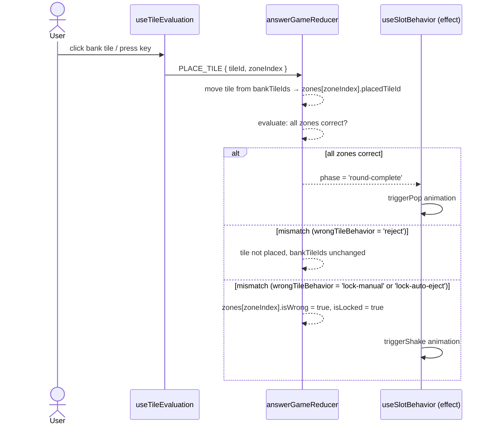

---

## 2. Wrong Tile Auto-Eject

Only when `config.wrongTileBehavior === 'lock-auto-eject'`.

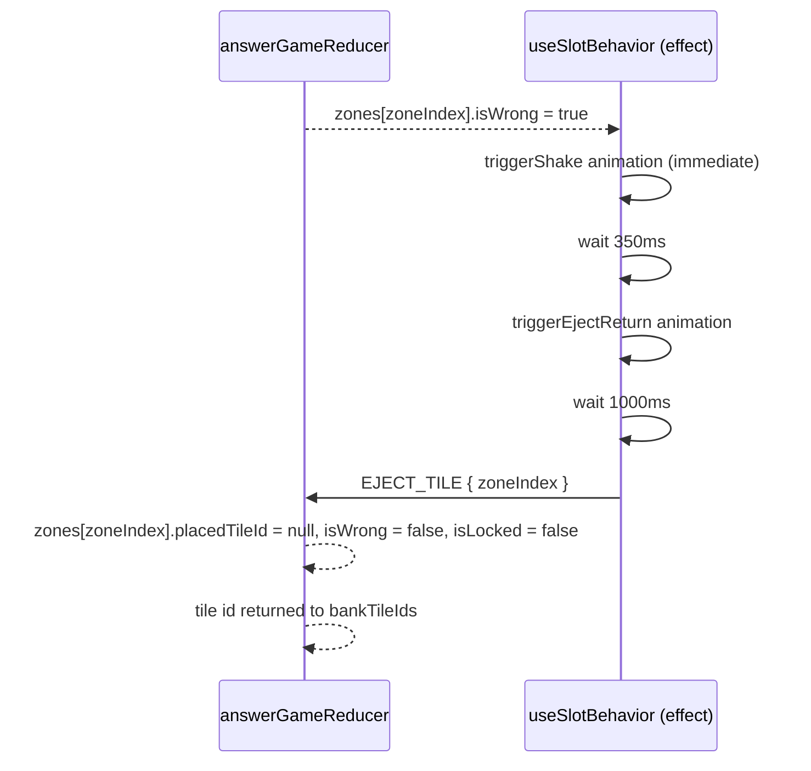

---

## 3. Drag and Drop

Dragging a bank tile or slot tile onto a slot.

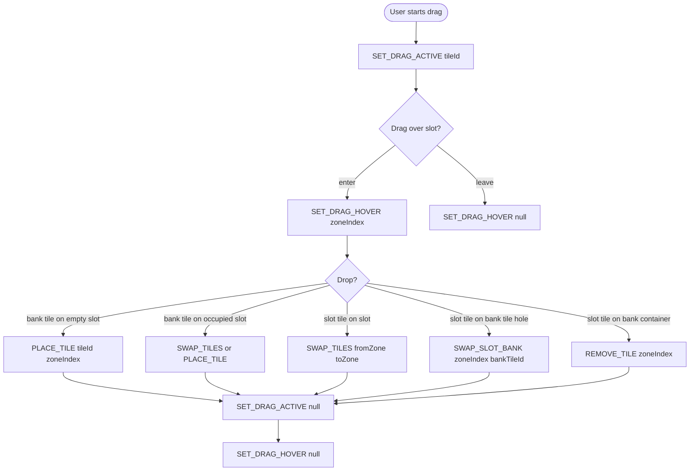

**Drag-over bank tile (slot tile being dragged):**

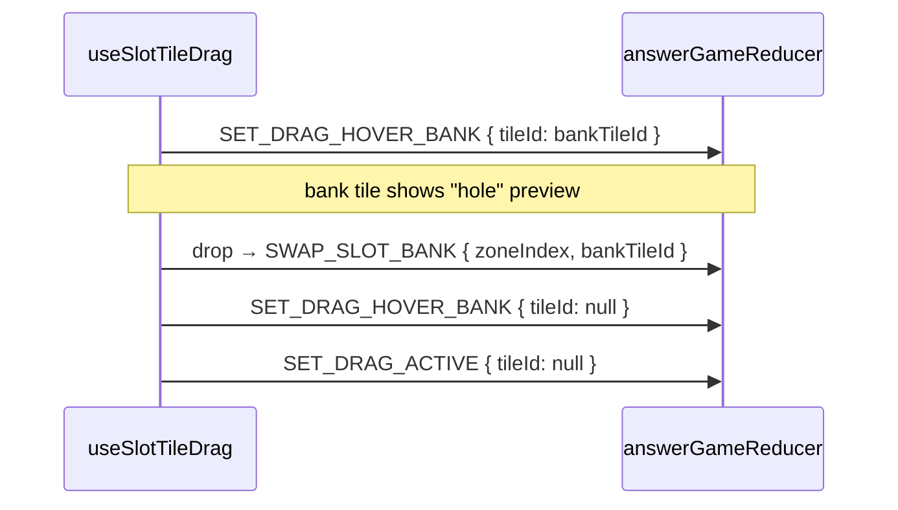

---

## 4. Keyboard and Touch Input

Desktop keyboard (`useKeyboardInput`) and mobile hidden input (`useTouchKeyboardInput`).

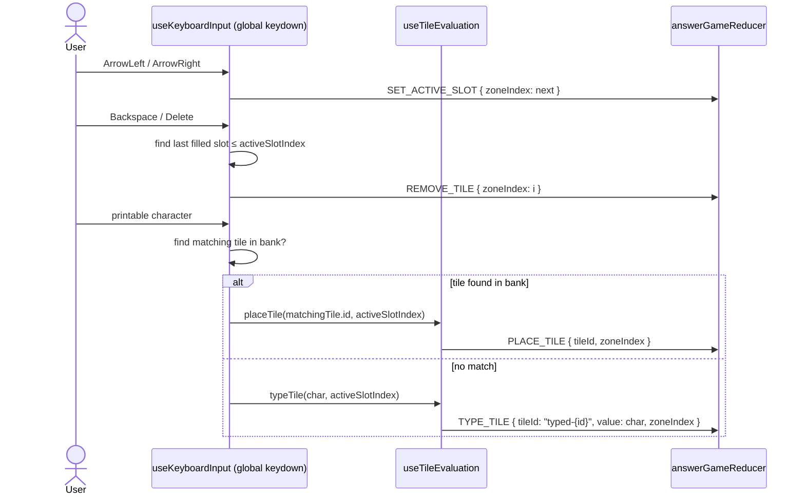

Touch keyboard follows the same path via `useTouchKeyboardInput`, using the hidden
`<input>` element's `input` event instead of global `keydown`.

---

## 5. Level Progression (SortNumbers only)

Only when `config.levelMode` is configured.

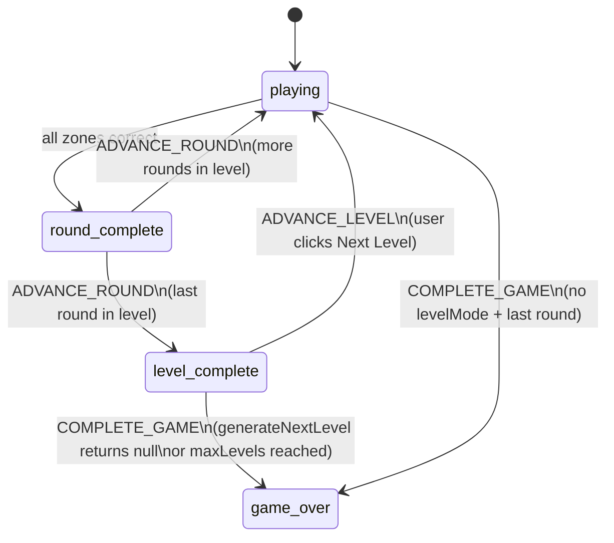

**Dispatch sequence for level transition:**

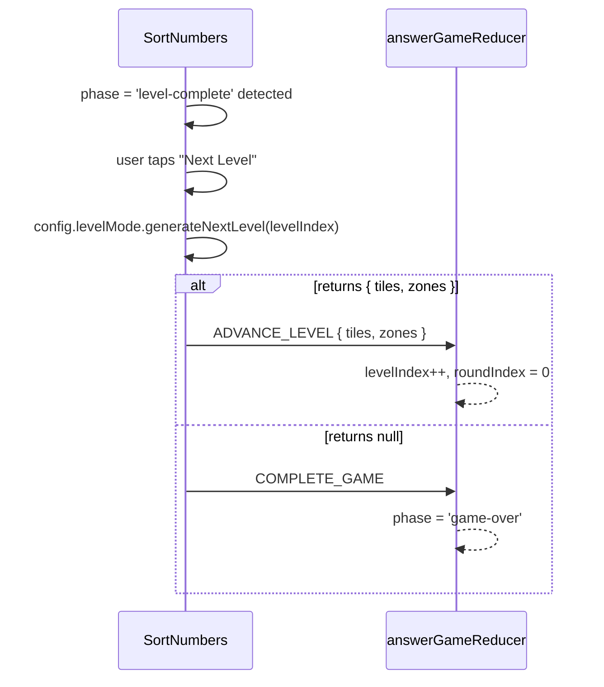

---

## 6. Round Progression

> **Status: planned — not yet fully implemented.**
> The phase transition to `'round-complete'` is implemented. The 750ms delay before
> `ADVANCE_ROUND` is implemented in `WordSpell`, `NumberMatch`, and `SortNumbers`.
> A shared round-progression hook is not yet extracted.

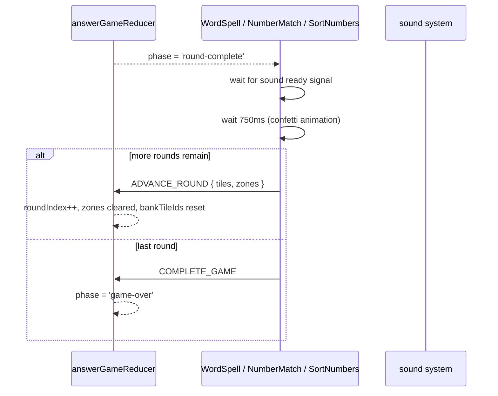
````

- [ ] **Step 2: Lint and format**

```bash
cd worktrees/architecture-docs && yarn fix:md
```

Expected: no errors on the new file.

- [ ] **Step 3: Commit**

```bash
cd worktrees/architecture-docs
git add src/components/answer-game/AnswerGame/AnswerGame.flows.mdx
git commit -m "docs(answer-game): add AnswerGame.flows.mdx — event chain Mermaid diagrams"
```

---

## Task 4: GameEngine.reference.mdx

Write the reference document for the game-engine domain.

**Files:**

- Create: `src/lib/game-engine/GameEngine.reference.mdx`

- [ ] **Step 1: Create `GameEngine.reference.mdx`**

````mdx
import { Meta } from '@storybook/blocks';

<Meta title="game-engine/Reference" />

# GameEngine — Reference

> Source: `src/lib/game-engine/`
>
> The game engine is the outer shell that wraps every game session. It manages the
> session lifecycle, records moves for replay, and persists draft state across page
> refreshes. Update this file when the engine API, move log structure, or session
> recording changes.

---

## Provider API

`GameEngineProvider` is defined in `src/lib/game-engine/index.tsx`.

```tsx
<GameEngineProvider
  config={ResolvedGameConfig}
  initialLog={MoveLog | null} // pass to resume a saved session
  sessionId={string}
  meta={SessionMeta}
>
  {children}
</GameEngineProvider>
```
````

### Contexts

```ts
// Read game state
const GameStateContext: React.Context<GameEngineState | null>
export const useGameState = (): GameEngineState

// Dispatch a move
const GameDispatchContext: React.Context<((move: Move) => void) | null>
export const useGameDispatch = (): (move: Move) => void
```

### GameEngineState

Defined in `src/lib/game-engine/types.ts`.

| Field          | Type              | Description                                                                                                                 |
| -------------- | ----------------- | --------------------------------------------------------------------------------------------------------------------------- |
| `phase`        | `GamePhase`       | `'idle' \| 'loading' \| 'instructions' \| 'playing' \| 'evaluating' \| 'scoring' \| 'next-round' \| 'retry' \| 'game-over'` |
| `roundIndex`   | `number`          | Current round (0-based)                                                                                                     |
| `score`        | `number`          | Cumulative score                                                                                                            |
| `streak`       | `number`          | Consecutive correct answers                                                                                                 |
| `retryCount`   | `number`          | Retries in current round                                                                                                    |
| `content`      | `ResolvedContent` | All round definitions for this session                                                                                      |
| `currentRound` | `RoundState`      | Active round: `{ roundId, answer, hintsUsed }`                                                                              |

### Move

All state changes go through a `Move`:

```ts
interface Move {
  type: MoveType | string; // 'SUBMIT_ANSWER' | 'REQUEST_HINT' | 'SKIP_INSTRUCTIONS' | 'UNDO' | custom
  args: Record<string, string | number | boolean>;
  timestamp: number;
}
```

---

## Round Context

`GameRoundContext` is a lightweight context providing round progress to any component
in the tree without importing the full engine state.

```ts
// src/lib/game-engine/GameRoundContext.ts
interface GameRoundContextValue {
  current: number; // 1-based current round
  total: number; // total rounds in session
}
```

Consumed by: `ProgressBar`, `GameHeader`, and any component that shows "Round N of M".

---

## Session Recording

`SessionRecorderBridge` (inside `GameEngineProvider`) subscribes to move dispatches
and writes them to RxDB via `useSessionRecorder`.

### MoveLog structure

```ts
interface MoveLog {
  gameId: string;
  sessionId: string;
  profileId: string;
  seed: string;
  initialContent: ResolvedContent;
  initialState: GameEngineState;
  moves: Move[]; // append-only list of every dispatched move
}
```

Stored in RxDB collection `session_history_index`. Replay by passing `initialLog` to
`GameEngineProvider`.

---

## Draft Sync

`useAnswerGameDraftSync` (in `src/components/answer-game/`) serialises the current
`AnswerGameState` to RxDB's `session_history_index.draftState` field on every state
change, and reads it back on mount when `initialState` is provided.

### AnswerGameDraftState (persisted subset)

```ts
interface AnswerGameDraftState {
  allTiles: TileItem[];
  bankTileIds: string[];
  zones: AnswerZone[];
  activeSlotIndex: number;
  phase: 'playing' | 'round-complete' | 'level-complete'; // 'game-over' never persisted
  roundIndex: number;
  retryCount: number;
  levelIndex: number;
}
```

Fields excluded from draft: `config` (reconstructed from game config), `dragActiveTileId`
(transient), `dragHoverZoneIndex`, `dragHoverBankTileId` (transient).

````

- [ ] **Step 2: Lint and format**

```bash
cd worktrees/architecture-docs && yarn fix:md
````

- [ ] **Step 3: Commit**

```bash
cd worktrees/architecture-docs
git add src/lib/game-engine/GameEngine.reference.mdx
git commit -m "docs(game-engine): add GameEngine.reference.mdx — state, moves, session recording"
```

---

## Task 5: GameEngine.flows.mdx

Write the session lifecycle and move log flow diagrams.

**Files:**

- Create: `src/lib/game-engine/GameEngine.flows.mdx`

- [ ] **Step 1: Create `GameEngine.flows.mdx`**

````mdx
import { Meta } from '@storybook/blocks';

<Meta title="game-engine/Flows" />

# GameEngine — Flows

> Source: `src/lib/game-engine/`
>
> Update this file when session lifecycle transitions or persistence behaviour change.

---

## 1. Session Lifecycle

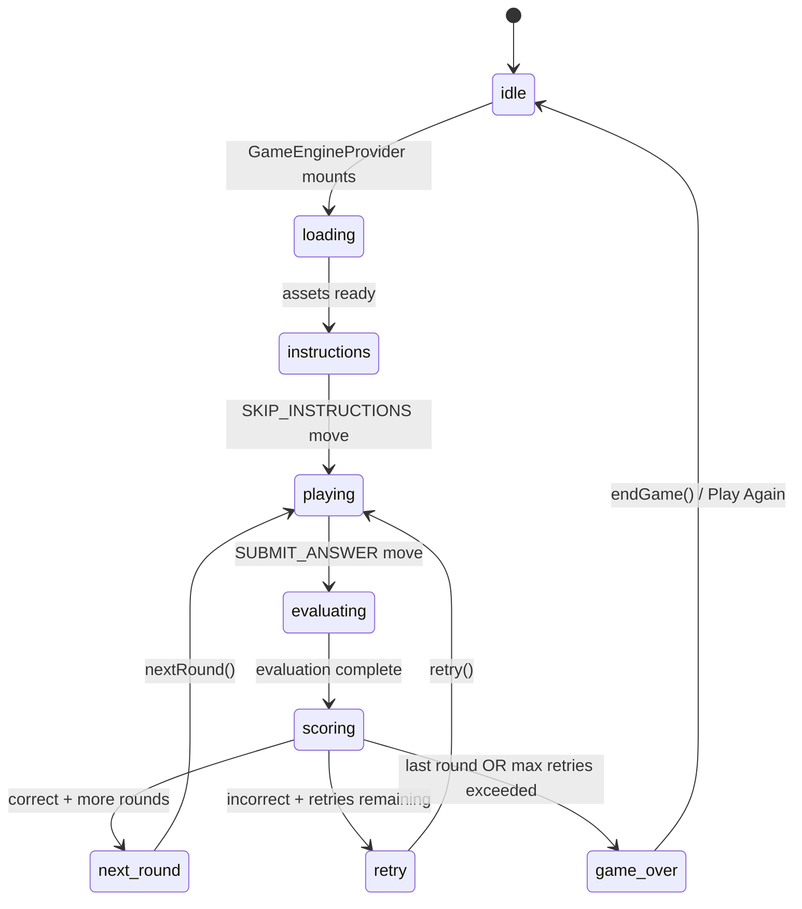

---

## 2. Move Dispatch and Recording

Every user action goes through a single `dispatch(move)` call.

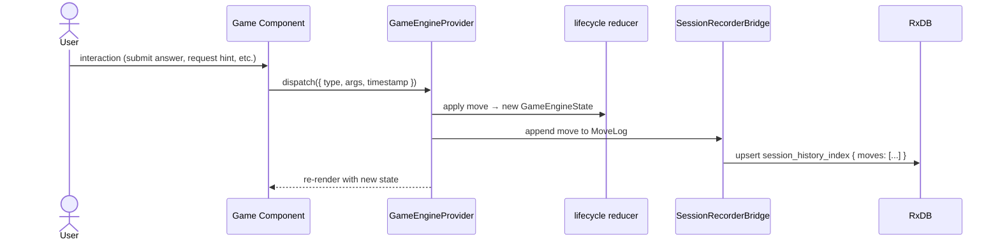

---

## 3. Session Resume (Move Log Replay)

When a player returns to an in-progress game, the route loader finds the saved `MoveLog`
and passes it as `initialLog` to `GameEngineProvider`.

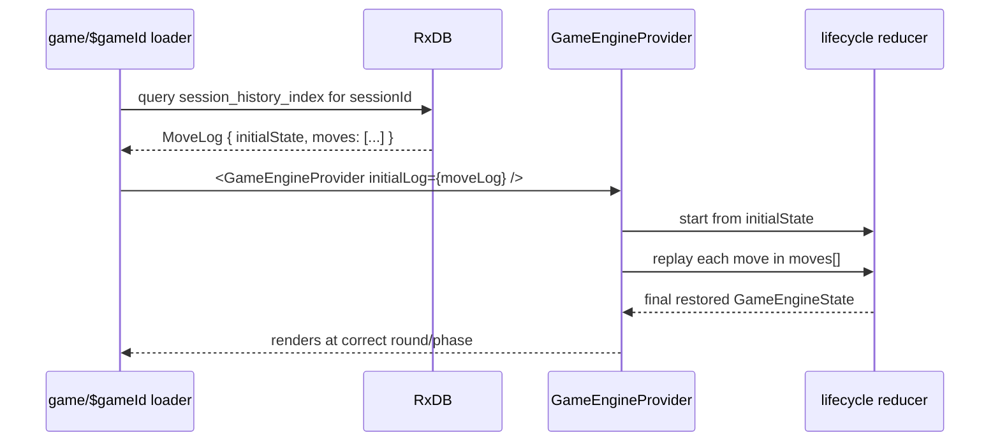

---

## 4. Draft State Sync (AnswerGame mid-round persistence)

`useAnswerGameDraftSync` keeps the `AnswerGameState` persisted so a mid-round refresh
restores exactly where the player left off.

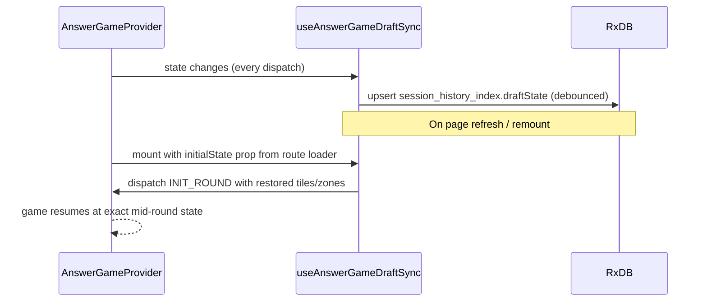
````

- [ ] **Step 2: Lint and format**

```bash
cd worktrees/architecture-docs && yarn fix:md
```

- [ ] **Step 3: Commit**

```bash
cd worktrees/architecture-docs
git add src/lib/game-engine/GameEngine.flows.mdx
git commit -m "docs(game-engine): add GameEngine.flows.mdx — session lifecycle and persistence flows"
```

---

## Task 6: CLAUDE.md update and `/update-architecture-docs` skill

Add the architecture docs maintenance rule to `CLAUDE.md` and create the skill agents
will invoke to update stale docs.

**Files:**

- Modify: `CLAUDE.md`
- Create: `.claude/skills/update-architecture-docs/skill.md`

- [ ] **Step 1: Add architecture docs section to `CLAUDE.md`**

Append this section after the existing "Pre-push Quality Gate" section:

```markdown
## Architecture Documentation

When modifying game state logic — any file in `src/components/answer-game/`,
`src/lib/game-engine/`, or any file matching `*reducer*`, `*dispatch*`,
`*Behavior*`, `*Drag*` — update the co-located `.mdx` docs in the same PR.

Run `/update-architecture-docs` to get guided prompts for what sections need updating.
```

- [ ] **Step 2: Create `.claude/skills/update-architecture-docs/skill.md`**

```markdown
# Update Architecture Docs

When this skill is invoked, follow these steps to check and update the co-located
architecture documentation.

## Step 1 — Find changed files

Run:

\`\`\`bash
git diff --name-only HEAD
\`\`\`

Note every changed file.

## Step 2 — Map changed files to docs

Use this lookup table to identify which doc files may be stale:

| Changed file pattern                                                          | Doc(s) to check                                                                                |
| ----------------------------------------------------------------------------- | ---------------------------------------------------------------------------------------------- |
| `answer-game-reducer.ts`                                                      | `src/components/answer-game/AnswerGame/AnswerGame.reference.mdx` — action catalog, state shape |
| `types.ts` (answer-game)                                                      | `AnswerGame.reference.mdx` — state shape, action catalog, config options                       |
| `use*Behavior*`, `use*Drag*`, `use*Tile*`, `useFreeSwap*`, `useAutoNextSlot*` | `AnswerGame.reference.mdx` (hook index) + `AnswerGame.flows.mdx`                               |
| `AnswerGameProvider.tsx`                                                      | `AnswerGame.reference.mdx` — context API section                                               |
| `useAnswerGameDraftSync*`                                                     | `src/lib/game-engine/GameEngine.reference.mdx` (draft sync) + `GameEngine.flows.mdx`           |
| `src/lib/game-engine/index.tsx`                                               | `GameEngine.reference.mdx` + `GameEngine.flows.mdx`                                            |
| `src/lib/game-engine/types.ts`                                                | `GameEngine.reference.mdx` — state shape, move types                                           |
| `src/lib/game-engine/lifecycle*`                                              | `GameEngine.flows.mdx` — session lifecycle diagram                                             |

## Step 3 — Read the relevant doc files

Read each doc file identified above.

## Step 4 — Check each section against the source code

For each doc file, check:

- **Action catalog**: does it list all current actions in `AnswerGameAction`? Are payload
  shapes correct? Is "dispatched by" still accurate?
- **State shape**: do all fields in `AnswerGameState` / `GameEngineState` appear in the
  table with correct types?
- **Hook index**: are all hooks present? Have any been added, removed, or renamed?
- **Config options**: do all `AnswerGameConfig` fields appear with correct types/defaults?
- **Mermaid diagrams**: do the dispatch sequences still match the hook implementations?
  Check timer durations, callback chains, and conditional branches.

## Step 5 — Edit stale sections

Update only the sections that are actually stale. Do not rewrite sections that are
accurate.

## Step 6 — Lint and format

\`\`\`bash
yarn fix:md
\`\`\`

## Step 7 — Report

List every section that was updated and why (e.g. "added SWAP_SLOT_BANK to action
catalog — was missing from table").
```

- [ ] **Step 3: Lint and format**

```bash
cd worktrees/architecture-docs && yarn fix:md
```

- [ ] **Step 4: Commit**

```bash
cd worktrees/architecture-docs
git add CLAUDE.md .claude/skills/update-architecture-docs/skill.md
git commit -m "docs(agents): add architecture docs maintenance rule to CLAUDE.md and update-architecture-docs skill"
```

---

## Task 7: Verify in Storybook

Smoke-test that the MDX files load, diagrams render, and no TypeScript errors exist.

**Files:** None created.

- [ ] **Step 1: Typecheck**

```bash
cd worktrees/architecture-docs && yarn typecheck
```

Expected: 0 errors.

- [ ] **Step 2: Start Storybook and verify manually**

```bash
cd worktrees/architecture-docs && yarn storybook
```

Open `http://localhost:6006`. Verify:

- Sidebar shows `answer-game/Reference`, `answer-game/Flows`,
  `game-engine/Reference`, `game-engine/Flows`
- Tables render correctly in all four pages
- Mermaid diagrams in `AnswerGame.flows.mdx` and `GameEngine.flows.mdx` render as
  SVG charts (not raw code blocks)

- [ ] **Step 3: Run unit tests to confirm no regressions**

```bash
cd worktrees/architecture-docs && yarn test
```

Expected: all pass.

- [ ] **Step 4: Open a PR**

```bash
cd worktrees/architecture-docs
gh pr create \
  --title "docs: co-located architecture docs for answer-game and game-engine" \
  --body "$(cat <<'EOF'
## Summary

- Adds `AnswerGame.reference.mdx` and `AnswerGame.flows.mdx` co-located with the answer-game component
- Adds `GameEngine.reference.mdx` and `GameEngine.flows.mdx` co-located with the game-engine module
- Installs `mermaid` + client-side `<Mermaid>` component for Storybook diagram rendering
- Adds `.vscode/extensions.json` recommending `bierner.markdown-mermaid`
- Adds architecture docs update rule to `CLAUDE.md` + `/update-architecture-docs` skill

## Test plan

- [ ] Storybook: all four doc pages visible in sidebar
- [ ] Storybook: Mermaid diagrams render as SVG (not raw code blocks)
- [ ] `yarn typecheck` passes
- [ ] `yarn test` passes
- [ ] `yarn lint:md` passes on new files

🤖 Generated with [Claude Code](https://claude.com/claude-code)
EOF
)"
```

---

## Self-Review

**Spec coverage check:**

| Spec requirement                                                              | Task                                                   |
| ----------------------------------------------------------------------------- | ------------------------------------------------------ |
| Co-located `.mdx` files per convention                                        | Tasks 2–5                                              |
| Storybook auto-discovery (no extra wiring)                                    | Task 1 (`.storybook/main.ts` already picks up `*.mdx`) |
| Mermaid renders in Storybook                                                  | Task 1                                                 |
| Mermaid renders on GitHub                                                     | Native — no task needed                                |
| `.vscode/extensions.json`                                                     | Task 1                                                 |
| `AnswerGame.reference.mdx` — state, actions, hooks, context, config           | Task 2                                                 |
| `AnswerGame.flows.mdx` — 6 diagrams (Round progression marked planned)        | Task 3                                                 |
| `GameEngine.reference.mdx` — provider, move, round ctx, session, draft        | Task 4                                                 |
| `GameEngine.flows.mdx` — session lifecycle, move dispatch, resume, draft sync | Task 5                                                 |
| CLAUDE.md update rule                                                         | Task 6                                                 |
| `/update-architecture-docs` skill                                             | Task 6                                                 |
| Lint passes on all new files                                                  | Every task has `yarn fix:md` step                      |

All 8 spec success criteria covered. No gaps.
