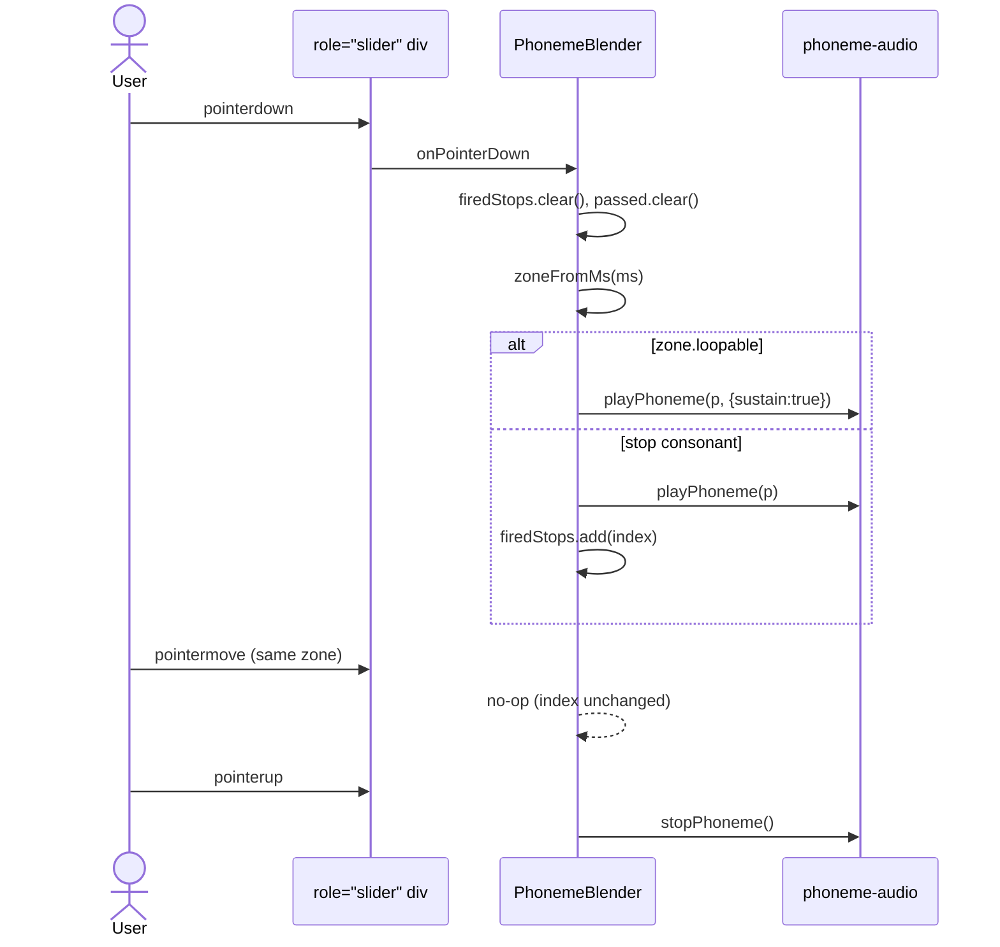
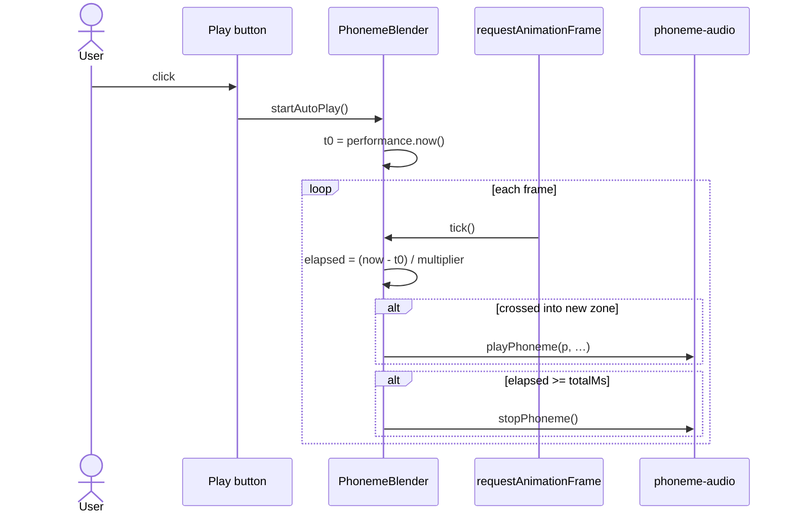
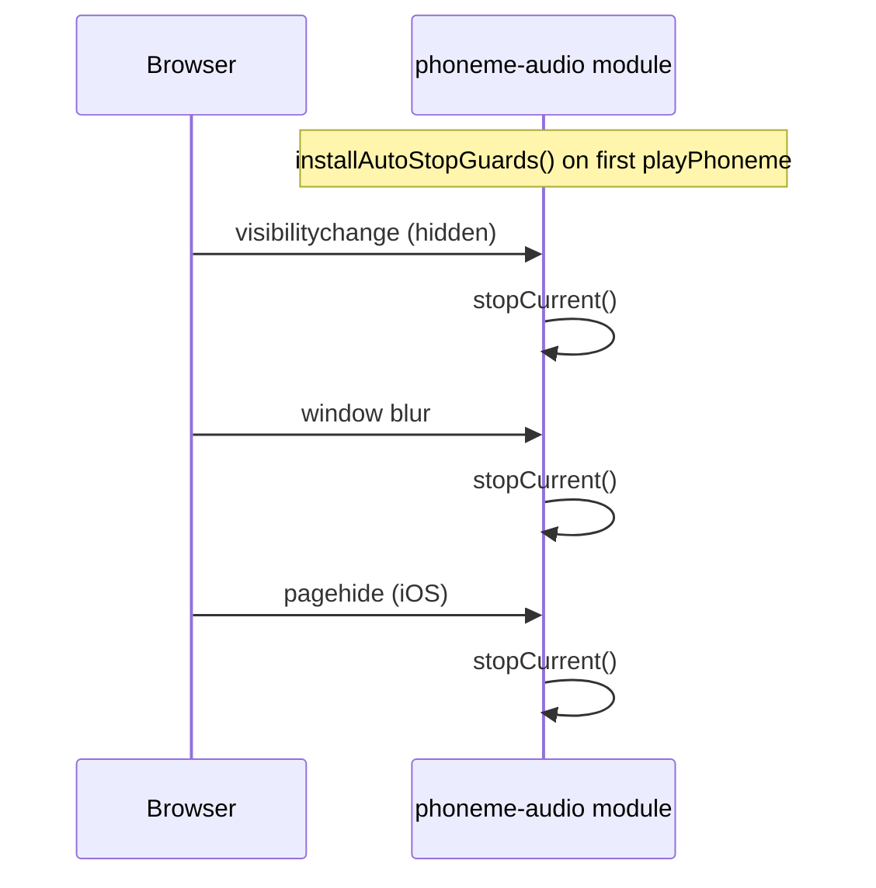

# WordLibraryExplorer Mobile + PhonemeBlender Implementation Plan

> **For agentic workers:** REQUIRED SUB-SKILL: Use superpowers:subagent-driven-development (recommended) or superpowers:executing-plans to implement this plan task-by-task. Steps use checkbox (`- [ ]`) syntax for tracking.

**Goal:** Ship Phase B of the WordLibraryExplorer track — a reusable `PhonemeBlender` component, a mobile-friendly explorer shell/card, and a global audio stop-on-blur guard fixing the cmd+tab audio-sticks bug.

**Architecture:** Three concentric layers, built bottom-up: (1) a module-level `installAutoStopGuards()` in `phoneme-audio.ts` that wires `visibilitychange`/`blur`/`pagehide` to `stopCurrent()`; (2) a new `PhonemeBlender` React component (`src/components/phoneme-blender/`) with a flex-proportional scrub track, play button, speed selector, and `playPhoneme`/`stopPhoneme` wiring; (3) a restructured `WordLibraryExplorer` `ResultCard` and shell that hosts the blender, replaces hover-blending on grapheme chips with click-to-play, collapses the filter sidebar into a mobile bottom sheet, and adds active-filter pills plus a chips-toggle meta bar.

**Tech Stack:** React 18, TypeScript (strict, named exports per [eslint.config.js](../../../eslint.config.js)), Tailwind CSS, Radix `Dialog` via [src/components/ui/sheet.tsx](../../../src/components/ui/sheet.tsx), Web Audio API via [src/data/words/phoneme-audio.ts](../../../src/data/words/phoneme-audio.ts), Vitest for units, Storybook 9 for component stories, Playwright for E2E, Docker-backed VR snapshots per `CLAUDE.md`.

---

## File Structure

**Created:**

- `src/components/phoneme-blender/PhonemeBlender.tsx` — the new component (word display + scrub track + play button + speed selector).
- `src/components/phoneme-blender/PhonemeBlender.test.tsx` — Vitest unit tests (zones, scrub, auto-play, stop-once-per-drag, keyboard).
- `src/components/phoneme-blender/PhonemeBlender.stories.tsx` — Storybook story (Default, Slow, Fast, Landscape viewport).
- `src/components/phoneme-blender/PhonemeBlender.flows.mdx` — short architecture/flow doc per project policy.
- `src/components/phoneme-blender/usePhonemeSprite.ts` — tiny hook wrapping the existing sprite manifest fetch so the component can read `{ duration, loopable }` per phoneme without re-implementing the cache.
- `e2e/wordlibrary-explorer.spec.ts` — Playwright smoke test on the explorer story.

**Modified:**

- `src/data/words/phoneme-audio.ts` — add `installAutoStopGuards()` (module-level, idempotent), invoke it from the first `playPhoneme` call, export a test-scoped getter `__getInstallState` + ensure `__resetPhonemeAudioForTests` removes listeners and clears the installed flag.
- `src/data/words/phoneme-audio.test.ts` — add coverage for `visibilitychange` / `blur` / `pagehide` → `stopCurrent`, and idempotent install.
- `src/data/words/WordLibraryExplorer.tsx` — restructure `ResultCard`; strip hover/focus sustain from `GraphemeChips`; add active-filter pills; add mobile `<Sheet>` for filters; add chips-toggle meta bar; move desktop pagination into header bar.
- `src/data/words/WordLibraryExplorer.test.ts` — cover active-filter pill derivation + `useChipsVisibleDefault` helper.
- `src/data/words/WordLibraryExplorer.stories.tsx` — no API change, but re-check the story renders cleanly at mobile portrait + landscape viewports (storyshot baselines regenerate).

**Out of scope (not touched in this plan):**

- `filterWords` behaviour — not touched.
- Custom-word entry — deferred Phase C.
- Adopting `PhonemeBlender` inside `WordSpell`/`NumberMatch` — deferred.

---

## Task 1: Audio stop-on-blur guard — failing tests

**Why first:** Bug fix per `CLAUDE.md` TDD rule — red test before any production code.

**Files:**

- Modify: [src/data/words/phoneme-audio.test.ts](../../../src/data/words/phoneme-audio.test.ts)

- [ ] **Step 1: Add failing tests for `visibilitychange`, `blur`, `pagehide`, and idempotent install**

Append the following `describe` block at the bottom of `src/data/words/phoneme-audio.test.ts` (after the existing `stopPhoneme` block):

```ts
describe('auto-stop guards', () => {
  const originalDocument = globalThis.document;
  const originalWindow = globalThis.window;

  interface FakeEventTarget {
    addEventListener: ReturnType<typeof vi.fn>;
    removeEventListener: ReturnType<typeof vi.fn>;
    dispatch: (type: string) => void;
    _listeners: Map<string, Set<() => void>>;
  }

  const makeTarget = (): FakeEventTarget => {
    const listeners = new Map<string, Set<() => void>>();
    return {
      _listeners: listeners,
      addEventListener: vi.fn((type: string, fn: () => void) => {
        if (!listeners.has(type)) listeners.set(type, new Set());
        listeners.get(type)!.add(fn);
      }),
      removeEventListener: vi.fn((type: string, fn: () => void) => {
        listeners.get(type)?.delete(fn);
      }),
      dispatch: (type: string) => {
        for (const fn of listeners.get(type) ?? []) fn();
      },
    };
  };

  let fakeDoc: FakeEventTarget & { hidden: boolean };
  let fakeWin: FakeEventTarget;

  beforeEach(() => {
    fakeDoc = Object.assign(makeTarget(), { hidden: false });
    fakeWin = makeTarget();
    vi.stubGlobal('document', fakeDoc);
    vi.stubGlobal('window', fakeWin);
  });

  afterEach(() => {
    vi.stubGlobal('document', originalDocument);
    vi.stubGlobal('window', originalWindow);
  });

  it('stops playback when the document becomes hidden', async () => {
    await playPhoneme('n', { sustain: true });
    expect(sources[0]!.stop).not.toHaveBeenCalled();
    fakeDoc.hidden = true;
    fakeDoc.dispatch('visibilitychange');
    expect(sources[0]!.stop).toHaveBeenCalledTimes(1);
  });

  it('does not stop on visibilitychange when the document is still visible', async () => {
    await playPhoneme('n', { sustain: true });
    fakeDoc.hidden = false;
    fakeDoc.dispatch('visibilitychange');
    expect(sources[0]!.stop).not.toHaveBeenCalled();
  });

  it('stops playback when the window blurs', async () => {
    await playPhoneme('n', { sustain: true });
    fakeWin.dispatch('blur');
    expect(sources[0]!.stop).toHaveBeenCalledTimes(1);
  });

  it('stops playback on pagehide (iOS Safari backgrounding)', async () => {
    await playPhoneme('n', { sustain: true });
    fakeWin.dispatch('pagehide');
    expect(sources[0]!.stop).toHaveBeenCalledTimes(1);
  });

  it('installs listeners only once across multiple playPhoneme calls', async () => {
    await playPhoneme('k');
    await playPhoneme('n', { sustain: true });
    await playPhoneme('ʃ');
    expect(fakeDoc.addEventListener).toHaveBeenCalledTimes(1);
    // blur + pagehide → two listeners on window
    expect(fakeWin.addEventListener).toHaveBeenCalledTimes(2);
  });

  it('__resetPhonemeAudioForTests removes listeners and allows re-installation', async () => {
    await playPhoneme('k');
    __resetPhonemeAudioForTests();
    expect(fakeDoc.removeEventListener).toHaveBeenCalledWith(
      'visibilitychange',
      expect.any(Function),
    );
    expect(fakeWin.removeEventListener).toHaveBeenCalledWith(
      'blur',
      expect.any(Function),
    );
    expect(fakeWin.removeEventListener).toHaveBeenCalledWith(
      'pagehide',
      expect.any(Function),
    );
    await playPhoneme('k');
    expect(fakeDoc.addEventListener).toHaveBeenCalledTimes(2);
  });
});
```

- [ ] **Step 2: Run tests to verify they fail**

Run: `yarn vitest run src/data/words/phoneme-audio.test.ts`

Expected: 6 new tests fail. The `stop` assertion is the key red — the guards don't exist yet, so dispatching `visibilitychange` does nothing.

- [ ] **Step 3: Commit the failing tests**

```bash
git add src/data/words/phoneme-audio.test.ts
git commit -m "test(phoneme-audio): failing tests for auto-stop guards"
```

---

## Task 2: Audio stop-on-blur guard — implementation

**Files:**

- Modify: [src/data/words/phoneme-audio.ts](../../../src/data/words/phoneme-audio.ts)

- [ ] **Step 1: Add `installAutoStopGuards` and invoke from `playPhoneme`**

Replace the contents of `src/data/words/phoneme-audio.ts` with:

```ts
interface SpriteEntry {
  start: number;
  duration: number;
  loopable?: boolean;
}

export type PhonemeSprite = Record<string, SpriteEntry>;

const SPRITE_URL = `${import.meta.env.BASE_URL}audio/phonemes.mp3`;
const MANIFEST_URL = `${import.meta.env.BASE_URL}audio/phonemes.json`;

let audioCtx: AudioContext | null = null;
let bufferPromise: Promise<AudioBuffer> | null = null;
let spritePromise: Promise<PhonemeSprite> | null = null;
let currentSource: AudioBufferSourceNode | null = null;

let guardsInstalled = false;
let onVisibilityChange: (() => void) | null = null;
let onBlur: (() => void) | null = null;
let onPageHide: (() => void) | null = null;

const getContext = (): AudioContext => {
  audioCtx ??= new AudioContext();
  return audioCtx;
};

const loadSprite = (): Promise<PhonemeSprite> => {
  spritePromise ??= fetch(MANIFEST_URL).then(
    (r) => r.json() as Promise<PhonemeSprite>,
  );
  return spritePromise;
};

const loadBuffer = (): Promise<AudioBuffer> => {
  bufferPromise ??= (async () => {
    const ctx = getContext();
    const res = await fetch(SPRITE_URL);
    const arrayBuffer = await res.arrayBuffer();
    return ctx.decodeAudioData(arrayBuffer);
  })();
  return bufferPromise;
};

const stopCurrent = (): void => {
  if (currentSource === null) return;
  try {
    currentSource.stop();
  } catch {
    // already stopped
  }
  currentSource.disconnect();
  currentSource = null;
};

// Idempotent. Installed on first playPhoneme call so module import alone
// does not touch the DOM (keeps SSR / non-browser test paths clean).
const installAutoStopGuards = (): void => {
  if (guardsInstalled) return;
  if (
    typeof document === 'undefined' ||
    typeof window === 'undefined'
  ) {
    return;
  }
  onVisibilityChange = () => {
    if (document.hidden) stopCurrent();
  };
  onBlur = () => {
    stopCurrent();
  };
  onPageHide = () => {
    stopCurrent();
  };
  document.addEventListener('visibilitychange', onVisibilityChange);
  window.addEventListener('blur', onBlur);
  window.addEventListener('pagehide', onPageHide);
  guardsInstalled = true;
};

const removeAutoStopGuards = (): void => {
  if (!guardsInstalled) return;
  if (onVisibilityChange) {
    document.removeEventListener(
      'visibilitychange',
      onVisibilityChange,
    );
  }
  if (onBlur) window.removeEventListener('blur', onBlur);
  if (onPageHide) window.removeEventListener('pagehide', onPageHide);
  onVisibilityChange = null;
  onBlur = null;
  onPageHide = null;
  guardsInstalled = false;
};

/**
 * Plays a single phoneme clip from the audio sprite. Looping when
 * `opts.sustain` and the phoneme is marked `loopable`. Installs
 * window/document listeners on first call so sustained audio stops
 * automatically if the user switches tabs or blurs the window.
 */
export const playPhoneme = async (
  ipa: string,
  opts: { sustain?: boolean } = {},
): Promise<void> => {
  installAutoStopGuards();
  let sprite: PhonemeSprite;
  let buffer: AudioBuffer;
  try {
    [sprite, buffer] = await Promise.all([loadSprite(), loadBuffer()]);
  } catch {
    return;
  }
  const entry = sprite[ipa];
  if (!entry) return;

  stopCurrent();

  const ctx = getContext();
  if (ctx.state === 'suspended') {
    try {
      await ctx.resume();
    } catch {
      // proceed; playback may still work on user gesture
    }
  }

  const source = ctx.createBufferSource();
  source.buffer = buffer;
  source.connect(ctx.destination);

  const startSec = entry.start / 1000;
  const durationSec = entry.duration / 1000;
  const shouldLoop = Boolean(opts.sustain && entry.loopable);

  if (shouldLoop) {
    source.loop = true;
    source.loopStart = startSec;
    source.loopEnd = startSec + durationSec;
    source.start(0, startSec);
  } else {
    source.start(0, startSec, durationSec);
  }

  currentSource = source;
  source.addEventListener('ended', () => {
    if (currentSource === source) {
      currentSource = null;
    }
  });
};

export const stopPhoneme = (): void => {
  stopCurrent();
};

export const __resetPhonemeAudioForTests = (): void => {
  stopCurrent();
  removeAutoStopGuards();
  audioCtx = null;
  bufferPromise = null;
  spritePromise = null;
};
```

- [ ] **Step 2: Run tests, verify they pass**

Run: `yarn vitest run src/data/words/phoneme-audio.test.ts`

Expected: all tests (original + new 6) pass.

- [ ] **Step 3: Commit**

```bash
git add src/data/words/phoneme-audio.ts
git commit -m "fix(phoneme-audio): stop sustained audio on blur/hide/pagehide"
```

---

## Task 3: PhonemeBlender — sprite hook

**Why a hook:** the blender needs `{ durationMs, loopable }` per phoneme. The manifest is already cached at module scope in `phoneme-audio.ts`; exposing a hook keeps `playPhoneme`'s API narrow and avoids a second fetch path.

**Files:**

- Modify: [src/data/words/phoneme-audio.ts](../../../src/data/words/phoneme-audio.ts) — add a named export for the cached manifest getter.
- Create: `src/components/phoneme-blender/usePhonemeSprite.ts`
- Create: `src/components/phoneme-blender/usePhonemeSprite.test.tsx`

- [ ] **Step 1: Export the cached manifest getter**

Append to `src/data/words/phoneme-audio.ts` (below `stopPhoneme`):

```ts
/**
 * Returns the cached phoneme sprite manifest, triggering the fetch on
 * first call. Consumers that only need durations / loopable flags (not
 * the decoded audio buffer) can use this without forcing the much
 * heavier mp3 decode.
 */
export const getPhonemeSprite = (): Promise<PhonemeSprite> =>
  loadSprite();
```

- [ ] **Step 2: Write the failing hook test**

Create `src/components/phoneme-blender/usePhonemeSprite.test.tsx` with:

```tsx
import { act, renderHook, waitFor } from '@testing-library/react';
import {
  afterEach,
  beforeEach,
  describe,
  expect,
  it,
  vi,
} from 'vitest';
import {
  __resetPhonemeAudioForTests,
  type PhonemeSprite,
} from '#/data/words/phoneme-audio';
import { usePhonemeSprite } from './usePhonemeSprite';

const SPRITE: PhonemeSprite = {
  t: { start: 0, duration: 400 },
  n: { start: 400, duration: 600, loopable: true },
};

beforeEach(() => {
  vi.stubGlobal(
    'fetch',
    vi.fn(() =>
      Promise.resolve({
        json: () => Promise.resolve(SPRITE),
      } as Response),
    ),
  );
  __resetPhonemeAudioForTests();
});

afterEach(() => {
  vi.unstubAllGlobals();
});

describe('usePhonemeSprite', () => {
  it('returns null while loading and the manifest once resolved', async () => {
    const { result } = renderHook(() => usePhonemeSprite());
    expect(result.current).toBeNull();
    await waitFor(() => expect(result.current).not.toBeNull());
    expect(result.current?.n.loopable).toBe(true);
  });

  it('re-uses the cached manifest across two hook instances', async () => {
    const fetchSpy = vi.mocked(globalThis.fetch);
    const first = renderHook(() => usePhonemeSprite());
    await waitFor(() => expect(first.result.current).not.toBeNull());
    const second = renderHook(() => usePhonemeSprite());
    await waitFor(() => expect(second.result.current).not.toBeNull());
    expect(fetchSpy).toHaveBeenCalledTimes(1);
  });
});
```

- [ ] **Step 3: Run, verify fails**

Run: `yarn vitest run src/components/phoneme-blender/usePhonemeSprite.test.tsx`

Expected: import error (module not found) or resolution error.

- [ ] **Step 4: Implement the hook**

Create `src/components/phoneme-blender/usePhonemeSprite.ts`:

```ts
import { useEffect, useState } from 'react';
import {
  getPhonemeSprite,
  type PhonemeSprite,
} from '#/data/words/phoneme-audio';

export const usePhonemeSprite = (): PhonemeSprite | null => {
  const [sprite, setSprite] = useState<PhonemeSprite | null>(null);
  useEffect(() => {
    let cancelled = false;
    getPhonemeSprite().then((next) => {
      if (!cancelled) setSprite(next);
    });
    return () => {
      cancelled = true;
    };
  }, []);
  return sprite;
};
```

- [ ] **Step 5: Run, verify passes**

Run: `yarn vitest run src/components/phoneme-blender/usePhonemeSprite.test.tsx`

Expected: 2 tests pass.

- [ ] **Step 6: Commit**

```bash
git add src/data/words/phoneme-audio.ts src/components/phoneme-blender/usePhonemeSprite.ts src/components/phoneme-blender/usePhonemeSprite.test.tsx
git commit -m "feat(phoneme-blender): expose cached sprite manifest via hook"
```

---

## Task 4: PhonemeBlender — zone layout (static)

**Scope:** Render the word letters + a scrub track with one zone per grapheme, zone widths `flex: duration`. No interactivity yet.

**Files:**

- Create: `src/components/phoneme-blender/PhonemeBlender.tsx`
- Create: `src/components/phoneme-blender/PhonemeBlender.test.tsx`

- [ ] **Step 1: Write the failing zone-layout tests**

Create `src/components/phoneme-blender/PhonemeBlender.test.tsx`:

```tsx
import { render, screen, waitFor } from '@testing-library/react';
import {
  afterEach,
  beforeEach,
  describe,
  expect,
  it,
  vi,
} from 'vitest';
import {
  __resetPhonemeAudioForTests,
  type PhonemeSprite,
} from '#/data/words/phoneme-audio';
import { PhonemeBlender } from './PhonemeBlender';

const SPRITE: PhonemeSprite = {
  p: { start: 0, duration: 200 },
  ʊ: { start: 200, duration: 400, loopable: true },
  t: { start: 600, duration: 300 },
  ɪŋ: { start: 900, duration: 500, loopable: true },
};

const PUTTING = [
  { g: 'p', p: 'p' },
  { g: 'u', p: 'ʊ' },
  { g: 'tt', p: 't' },
  { g: 'ing', p: 'ɪŋ' },
];

beforeEach(() => {
  vi.stubGlobal(
    'fetch',
    vi.fn(() =>
      Promise.resolve({
        json: () => Promise.resolve(SPRITE),
      } as Response),
    ),
  );
  __resetPhonemeAudioForTests();
});

afterEach(() => {
  vi.unstubAllGlobals();
});

describe('PhonemeBlender — zones', () => {
  it('renders one zone per grapheme with flex proportional to duration', async () => {
    render(<PhonemeBlender word="putting" graphemes={PUTTING} />);
    const track = await screen.findByRole('slider');
    const zones = track.querySelectorAll('[data-zone-index]');
    expect(zones).toHaveLength(4);
    expect((zones[0] as HTMLElement).style.flexGrow).toBe('200');
    expect((zones[1] as HTMLElement).style.flexGrow).toBe('400');
    expect((zones[2] as HTMLElement).style.flexGrow).toBe('300');
    expect((zones[3] as HTMLElement).style.flexGrow).toBe('500');
  });

  it('renders each grapheme as an idle-coloured span', async () => {
    render(<PhonemeBlender word="putting" graphemes={PUTTING} />);
    await waitFor(() =>
      expect(screen.getByTestId('letter-0')).toBeInTheDocument(),
    );
    const first = screen.getByTestId('letter-0');
    expect(first).toHaveTextContent('p');
    expect(first.className).toContain('text-purple-200');
  });

  it('colours loopable zones purple and stop zones yellow', async () => {
    render(<PhonemeBlender word="putting" graphemes={PUTTING} />);
    const track = await screen.findByRole('slider');
    const zones = track.querySelectorAll('[data-zone-index]');
    expect((zones[0] as HTMLElement).className).toContain(
      'bg-yellow-400',
    );
    expect((zones[1] as HTMLElement).className).toContain(
      'bg-purple-500',
    );
    expect((zones[2] as HTMLElement).className).toContain(
      'bg-yellow-400',
    );
    expect((zones[3] as HTMLElement).className).toContain(
      'bg-purple-500',
    );
  });

  it('sets aria-valuemin/max/valuetext from total duration', async () => {
    render(<PhonemeBlender word="putting" graphemes={PUTTING} />);
    const track = await screen.findByRole('slider');
    expect(track.getAttribute('aria-valuemin')).toBe('0');
    expect(track.getAttribute('aria-valuemax')).toBe('1400');
    expect(track.getAttribute('aria-valuenow')).toBe('0');
  });
});
```

- [ ] **Step 2: Run, verify fails**

Run: `yarn vitest run src/components/phoneme-blender/PhonemeBlender.test.tsx`

Expected: module-not-found.

- [ ] **Step 3: Implement minimal component**

Create `src/components/phoneme-blender/PhonemeBlender.tsx`:

```tsx
import { useMemo } from 'react';
import { cn } from '#/lib/utils';
import { usePhonemeSprite } from './usePhonemeSprite';

export interface PhonemeBlenderProps {
  word: string;
  graphemes: ReadonlyArray<{ g: string; p: string }>;
  phonemeOverrides?: Record<
    string,
    { durationMs?: number; loopable?: boolean }
  >;
}

interface ResolvedZone {
  index: number;
  g: string;
  p: string;
  durationMs: number;
  loopable: boolean;
  startMs: number;
}

const DEFAULT_DURATION = 400;

export const PhonemeBlender = ({
  word,
  graphemes,
  phonemeOverrides,
}: PhonemeBlenderProps) => {
  const sprite = usePhonemeSprite();

  const zones = useMemo<ResolvedZone[]>(() => {
    let cursor = 0;
    return graphemes.map((gp, index) => {
      const spriteEntry = sprite?.[gp.p];
      const override = phonemeOverrides?.[gp.p];
      const durationMs =
        override?.durationMs ??
        spriteEntry?.duration ??
        DEFAULT_DURATION;
      const loopable = Boolean(
        override?.loopable ?? spriteEntry?.loopable ?? false,
      );
      const zone: ResolvedZone = {
        index,
        g: gp.g,
        p: gp.p,
        durationMs,
        loopable,
        startMs: cursor,
      };
      cursor += durationMs;
      return zone;
    });
  }, [graphemes, sprite, phonemeOverrides]);

  const totalMs = zones.reduce((acc, z) => acc + z.durationMs, 0);

  return (
    <div
      data-word={word}
      className="flex flex-col gap-2 rounded-xl bg-purple-50 p-3"
    >
      <div
        aria-hidden="true"
        className="flex items-baseline justify-center gap-1 font-semibold tracking-wide"
      >
        {zones.map((z) => (
          <span
            key={z.index}
            data-testid={`letter-${z.index}`}
            data-idx={z.index}
            className="text-purple-200"
          >
            {z.g}
          </span>
        ))}
      </div>
      <div
        role="slider"
        tabIndex={0}
        aria-label={`Blend /${word}/`}
        aria-valuemin={0}
        aria-valuemax={totalMs}
        aria-valuenow={0}
        className="relative flex h-10 w-full overflow-hidden rounded-xl border border-foreground/20"
      >
        {zones.map((z) => (
          <div
            key={z.index}
            data-zone-index={z.index}
            style={{ flexGrow: String(z.durationMs), flexBasis: '0px' }}
            className={cn(
              'h-full border-r border-white/60 last:border-r-0',
              z.loopable ? 'bg-purple-500' : 'bg-yellow-400',
            )}
          />
        ))}
      </div>
    </div>
  );
};
```

- [ ] **Step 4: Run, verify passes**

Run: `yarn vitest run src/components/phoneme-blender/PhonemeBlender.test.tsx`

Expected: 4 tests pass.

- [ ] **Step 5: Commit**

```bash
git add src/components/phoneme-blender/PhonemeBlender.tsx src/components/phoneme-blender/PhonemeBlender.test.tsx
git commit -m "feat(phoneme-blender): render zones sized by phoneme duration"
```

---

## Task 5: PhonemeBlender — pointer scrub + active highlight

**Scope:** Dragging the track row moves the thumb, sets `aria-valuenow`, triggers `playPhoneme(active.p, { sustain: active.loopable })`, and updates letter colours (idle / active / passed).

**Files:**

- Modify: `src/components/phoneme-blender/PhonemeBlender.tsx`
- Modify: `src/components/phoneme-blender/PhonemeBlender.test.tsx`

- [ ] **Step 1: Write the failing scrub tests**

Append to `PhonemeBlender.test.tsx` (above the final `});`):

```tsx
import * as phonemeAudio from '#/data/words/phoneme-audio';

describe('PhonemeBlender — scrub', () => {
  it('fires playPhoneme with sustain=true when pointer enters a loopable zone', async () => {
    const playSpy = vi
      .spyOn(phonemeAudio, 'playPhoneme')
      .mockResolvedValue();
    render(<PhonemeBlender word="putting" graphemes={PUTTING} />);
    const track = await screen.findByRole('slider');
    track.getBoundingClientRect = () =>
      ({ left: 0, top: 0, width: 1400, height: 40 }) as DOMRect;
    // 300/1400 → inside zone index 1 ("ʊ", loopable)
    track.dispatchEvent(
      new PointerEvent('pointerdown', { clientX: 300, bubbles: true }),
    );
    await waitFor(() =>
      expect(playSpy).toHaveBeenCalledWith('ʊ', { sustain: true }),
    );
    expect(track.getAttribute('aria-valuenow')).toBe('300');
    expect(screen.getByTestId('letter-1').className).toContain(
      'text-foreground',
    );
  });

  it('fires stop consonants once per drag pass (no re-trigger on wiggle)', async () => {
    const playSpy = vi
      .spyOn(phonemeAudio, 'playPhoneme')
      .mockResolvedValue();
    render(<PhonemeBlender word="putting" graphemes={PUTTING} />);
    const track = await screen.findByRole('slider');
    track.getBoundingClientRect = () =>
      ({ left: 0, top: 0, width: 1400, height: 40 }) as DOMRect;
    // pointerdown on zone 2 ("t", stop)
    track.dispatchEvent(
      new PointerEvent('pointerdown', { clientX: 750, bubbles: true }),
    );
    // wiggle: pointermove out → back in
    track.dispatchEvent(
      new PointerEvent('pointermove', { clientX: 500, bubbles: true }),
    );
    track.dispatchEvent(
      new PointerEvent('pointermove', { clientX: 750, bubbles: true }),
    );
    await waitFor(() =>
      expect(
        playSpy.mock.calls.filter((c) => c[0] === 't'),
      ).toHaveLength(1),
    );
  });

  it('fires the stop consonant on a new pointerdown pass', async () => {
    const playSpy = vi
      .spyOn(phonemeAudio, 'playPhoneme')
      .mockResolvedValue();
    render(<PhonemeBlender word="putting" graphemes={PUTTING} />);
    const track = await screen.findByRole('slider');
    track.getBoundingClientRect = () =>
      ({ left: 0, top: 0, width: 1400, height: 40 }) as DOMRect;
    track.dispatchEvent(
      new PointerEvent('pointerdown', { clientX: 750, bubbles: true }),
    );
    track.dispatchEvent(
      new PointerEvent('pointerup', { clientX: 750, bubbles: true }),
    );
    track.dispatchEvent(
      new PointerEvent('pointerdown', { clientX: 750, bubbles: true }),
    );
    await waitFor(() =>
      expect(
        playSpy.mock.calls.filter((c) => c[0] === 't'),
      ).toHaveLength(2),
    );
  });

  it('calls stopPhoneme on pointerup and clears the active highlight', async () => {
    const stopSpy = vi
      .spyOn(phonemeAudio, 'stopPhoneme')
      .mockImplementation(() => {});
    render(<PhonemeBlender word="putting" graphemes={PUTTING} />);
    const track = await screen.findByRole('slider');
    track.getBoundingClientRect = () =>
      ({ left: 0, top: 0, width: 1400, height: 40 }) as DOMRect;
    track.dispatchEvent(
      new PointerEvent('pointerdown', { clientX: 300, bubbles: true }),
    );
    track.dispatchEvent(
      new PointerEvent('pointerup', { clientX: 300, bubbles: true }),
    );
    expect(stopSpy).toHaveBeenCalled();
  });
});
```

- [ ] **Step 2: Run, verify fails**

Run: `yarn vitest run src/components/phoneme-blender/PhonemeBlender.test.tsx`

Expected: scrub tests fail — `playPhoneme` never called, `aria-valuenow` stays 0.

- [ ] **Step 3: Replace `PhonemeBlender.tsx` with the scrub-enabled version**

Replace the component body of `PhonemeBlender.tsx` with:

```tsx
import { useCallback, useMemo, useRef, useState } from 'react';
import { cn } from '#/lib/utils';
import { playPhoneme, stopPhoneme } from '#/data/words/phoneme-audio';
import { usePhonemeSprite } from './usePhonemeSprite';

export interface PhonemeBlenderProps {
  word: string;
  graphemes: ReadonlyArray<{ g: string; p: string }>;
  phonemeOverrides?: Record<
    string,
    { durationMs?: number; loopable?: boolean }
  >;
}

interface ResolvedZone {
  index: number;
  g: string;
  p: string;
  durationMs: number;
  loopable: boolean;
  startMs: number;
}

const DEFAULT_DURATION = 400;

const zoneFromMs = (
  zones: readonly ResolvedZone[],
  ms: number,
): ResolvedZone | null => {
  for (const z of zones) {
    if (ms >= z.startMs && ms < z.startMs + z.durationMs) return z;
  }
  return zones.at(-1) ?? null;
};

export const PhonemeBlender = ({
  word,
  graphemes,
  phonemeOverrides,
}: PhonemeBlenderProps) => {
  const sprite = usePhonemeSprite();
  const trackRef = useRef<HTMLDivElement | null>(null);
  const firedStops = useRef<Set<number>>(new Set());
  const passedRef = useRef<Set<number>>(new Set());
  const [positionMs, setPositionMs] = useState(0);
  const [activeIndex, setActiveIndex] = useState<number | null>(null);
  const [dragging, setDragging] = useState(false);
  const [, forcePassedRerender] = useState(0);

  const zones = useMemo<ResolvedZone[]>(() => {
    let cursor = 0;
    return graphemes.map((gp, index) => {
      const spriteEntry = sprite?.[gp.p];
      const override = phonemeOverrides?.[gp.p];
      const durationMs =
        override?.durationMs ??
        spriteEntry?.duration ??
        DEFAULT_DURATION;
      const loopable = Boolean(
        override?.loopable ?? spriteEntry?.loopable ?? false,
      );
      const zone: ResolvedZone = {
        index,
        g: gp.g,
        p: gp.p,
        durationMs,
        loopable,
        startMs: cursor,
      };
      cursor += durationMs;
      return zone;
    });
  }, [graphemes, sprite, phonemeOverrides]);

  const totalMs = zones.reduce((acc, z) => acc + z.durationMs, 0);

  const enterZone = useCallback((zone: ResolvedZone) => {
    setActiveIndex(zone.index);
    passedRef.current.add(zone.index);
    forcePassedRerender((n) => n + 1);
    if (zone.loopable) {
      void playPhoneme(zone.p, { sustain: true });
    } else if (!firedStops.current.has(zone.index)) {
      firedStops.current.add(zone.index);
      void playPhoneme(zone.p);
    }
  }, []);

  const msFromClientX = useCallback(
    (clientX: number): number => {
      const rect = trackRef.current?.getBoundingClientRect();
      if (!rect || rect.width === 0) return 0;
      const pct = (clientX - rect.left) / rect.width;
      return Math.max(0, Math.min(totalMs, pct * totalMs));
    },
    [totalMs],
  );

  const updateFromClientX = useCallback(
    (clientX: number, prevIndex: number | null) => {
      const ms = msFromClientX(clientX);
      setPositionMs(ms);
      const zone = zoneFromMs(zones, ms);
      if (!zone) return null;
      if (zone.index !== prevIndex) {
        enterZone(zone);
      }
      return zone.index;
    },
    [msFromClientX, zones, enterZone],
  );

  const onPointerDown = (e: React.PointerEvent) => {
    (e.currentTarget as HTMLElement).setPointerCapture(e.pointerId);
    firedStops.current = new Set();
    passedRef.current = new Set();
    setDragging(true);
    updateFromClientX(e.clientX, null);
  };

  const onPointerMove = (e: React.PointerEvent) => {
    if (!dragging) return;
    updateFromClientX(e.clientX, activeIndex);
  };

  const endDrag = () => {
    setDragging(false);
    setActiveIndex(null);
    stopPhoneme();
  };

  return (
    <div
      data-word={word}
      className="flex flex-col gap-2 rounded-xl bg-purple-50 p-3"
    >
      <div
        aria-hidden="true"
        className="flex items-baseline justify-center gap-1 font-semibold tracking-wide"
      >
        {zones.map((z) => {
          const isActive = activeIndex === z.index;
          const isPassed = passedRef.current.has(z.index) && !isActive;
          return (
            <span
              key={z.index}
              data-testid={`letter-${z.index}`}
              data-idx={z.index}
              className={cn(
                isActive
                  ? 'text-foreground'
                  : isPassed
                    ? 'text-purple-700'
                    : 'text-purple-200',
              )}
            >
              {z.g}
            </span>
          );
        })}
      </div>
      <div
        ref={trackRef}
        role="slider"
        tabIndex={0}
        aria-label={`Blend /${word}/`}
        aria-valuemin={0}
        aria-valuemax={totalMs}
        aria-valuenow={Math.round(positionMs)}
        aria-valuetext={
          activeIndex !== null
            ? `${zones[activeIndex]!.g} /${zones[activeIndex]!.p}/`
            : undefined
        }
        onPointerDown={onPointerDown}
        onPointerMove={onPointerMove}
        onPointerUp={endDrag}
        onPointerCancel={endDrag}
        onPointerLeave={() => {
          if (dragging) endDrag();
        }}
        className="relative flex h-10 w-full touch-none overflow-hidden rounded-xl border border-foreground/20"
      >
        {zones.map((z) => (
          <div
            key={z.index}
            data-zone-index={z.index}
            style={{ flexGrow: String(z.durationMs), flexBasis: '0px' }}
            className={cn(
              'h-full border-r border-white/60 last:border-r-0',
              z.loopable ? 'bg-purple-500' : 'bg-yellow-400',
              activeIndex === z.index &&
                'ring-2 ring-foreground ring-inset',
            )}
          />
        ))}
      </div>
    </div>
  );
};
```

- [ ] **Step 2a: Run, verify passes**

Run: `yarn vitest run src/components/phoneme-blender/PhonemeBlender.test.tsx`

Expected: all tests pass (zones + scrub). If a test times out, double-check that `PointerEvent` is available in the jsdom env — if not, fall back to dispatching `new Event('pointerdown')` with manual `clientX` property.

- [ ] **Step 3: Commit**

```bash
git add src/components/phoneme-blender/PhonemeBlender.tsx src/components/phoneme-blender/PhonemeBlender.test.tsx
git commit -m "feat(phoneme-blender): pointer scrub + stop-once-per-drag"
```

---

## Task 6: PhonemeBlender — play button + speed selector

**Scope:** Play button walks the thumb left→right with `requestAnimationFrame` timing driven by `performance.now()`, respecting the speed multiplier. Pressing again pauses.

**Files:**

- Modify: `src/components/phoneme-blender/PhonemeBlender.tsx`
- Modify: `src/components/phoneme-blender/PhonemeBlender.test.tsx`

- [ ] **Step 1: Write failing auto-play tests**

Append to `PhonemeBlender.test.tsx`:

```tsx
describe('PhonemeBlender — auto-play', () => {
  it('advances through zones by real-time duration at normal speed', async () => {
    vi.useFakeTimers();
    const playSpy = vi
      .spyOn(phonemeAudio, 'playPhoneme')
      .mockResolvedValue();
    render(<PhonemeBlender word="putting" graphemes={PUTTING} />);
    await screen.findByRole('slider');
    const playButton = screen.getByRole('button', { name: /^play /i });
    await act(async () => {
      playButton.click();
    });
    // zone 0 = 200ms, zone 1 = 400ms, etc.
    await act(async () => {
      vi.advanceTimersByTime(201);
    });
    await waitFor(() =>
      expect(playSpy.mock.calls.map((c) => c[0])).toContain('ʊ'),
    );
    vi.useRealTimers();
  });

  it('cycles through the three speeds when the selector is clicked', async () => {
    render(<PhonemeBlender word="putting" graphemes={PUTTING} />);
    await screen.findByRole('slider');
    expect(
      screen.getByRole('radio', { name: /normal/i }),
    ).toHaveAttribute('aria-checked', 'true');
    screen.getByRole('radio', { name: /slow/i }).click();
    expect(
      screen.getByRole('radio', { name: /slow/i }),
    ).toHaveAttribute('aria-checked', 'true');
  });

  it('pauses when the play button is pressed again', async () => {
    vi.useFakeTimers();
    render(<PhonemeBlender word="putting" graphemes={PUTTING} />);
    await screen.findByRole('slider');
    const playButton = screen.getByRole('button', { name: /^play /i });
    await act(async () => {
      playButton.click();
    });
    const pauseButton = screen.getByRole('button', { name: /^pause/i });
    await act(async () => {
      pauseButton.click();
    });
    expect(
      screen.getByRole('button', { name: /^play /i }),
    ).toBeInTheDocument();
    vi.useRealTimers();
  });
});
```

- [ ] **Step 2: Run, verify fails**

Run: `yarn vitest run src/components/phoneme-blender/PhonemeBlender.test.tsx`

Expected: new tests fail (no play button, no speed radios).

- [ ] **Step 3: Add play button + speed selector**

In `PhonemeBlender.tsx`, add above the existing `useState` block:

```tsx
type Speed = 'slow' | 'normal' | 'fast';
const SPEED_MULTIPLIERS: Record<Speed, number> = {
  slow: 1.6,
  normal: 1.0,
  fast: 0.55,
};
const SPEED_LABELS: Record<Speed, string> = {
  slow: '🐢 slow',
  normal: '🐈 normal',
  fast: '🐇 fast',
};
```

Add state and auto-play logic inside the component (after existing `useState`/`useRef` block):

```tsx
const [speed, setSpeed] = useState<Speed>('normal');
const [playing, setPlaying] = useState(false);
const rafRef = useRef<number | null>(null);

const stopAutoPlay = useCallback(() => {
  if (rafRef.current !== null) cancelAnimationFrame(rafRef.current);
  rafRef.current = null;
  setPlaying(false);
  setActiveIndex(null);
  stopPhoneme();
}, []);

const startAutoPlay = useCallback(() => {
  if (zones.length === 0) return;
  firedStops.current = new Set();
  passedRef.current = new Set();
  setPlaying(true);
  const t0 = performance.now();
  const multiplier = SPEED_MULTIPLIERS[speed];
  let lastEntered = -1;
  const tick = () => {
    const elapsed = (performance.now() - t0) / multiplier;
    setPositionMs(Math.min(totalMs, elapsed));
    const zone = zoneFromMs(zones, elapsed);
    if (zone && zone.index !== lastEntered) {
      lastEntered = zone.index;
      enterZone(zone);
    }
    if (elapsed >= totalMs) {
      stopAutoPlay();
      return;
    }
    rafRef.current = requestAnimationFrame(tick);
  };
  rafRef.current = requestAnimationFrame(tick);
}, [zones, speed, totalMs, enterZone, stopAutoPlay]);
```

Render the play button + speed radios inside the root `<div>`, after the track `<div>`:

```tsx
<div className="flex items-center justify-between gap-2">
  <button
    type="button"
    aria-label={playing ? 'Pause' : `Play /${word}/`}
    onClick={() => (playing ? stopAutoPlay() : startAutoPlay())}
    className="inline-flex size-9 items-center justify-center rounded-full border-2 border-foreground bg-background text-lg"
  >
    {playing ? '⏸' : '▶'}
  </button>
  <div role="radiogroup" className="flex gap-1 text-xs">
    {(['slow', 'normal', 'fast'] as const).map((s) => (
      <button
        key={s}
        role="radio"
        aria-checked={speed === s}
        aria-label={SPEED_LABELS[s]}
        onClick={() => setSpeed(s)}
        className={cn(
          'rounded-md border border-input px-2 py-1 transition-colors',
          speed === s
            ? 'bg-primary text-primary-foreground'
            : 'hover:bg-muted',
        )}
      >
        {SPEED_LABELS[s]}
      </button>
    ))}
  </div>
</div>
```

Also: wrap the play button and the track in the same row visually (slot the play button to the left of the track — the above snippet shows a row below, but for the spec layout the button sits beside the track; adjust the JSX so the button and track share a flex row above the speed selector). Keep both layouts equivalent — the test only asserts the button is present.

- [ ] **Step 4: Run, verify passes**

Run: `yarn vitest run src/components/phoneme-blender/PhonemeBlender.test.tsx`

Expected: auto-play tests pass. If `requestAnimationFrame` is missing in jsdom, add `vi.stubGlobal('requestAnimationFrame', (cb: FrameRequestCallback) => setTimeout(() => cb(performance.now()), 16))` in a fresh `beforeEach` alongside the fetch stub.

- [ ] **Step 5: Commit**

```bash
git add src/components/phoneme-blender/PhonemeBlender.tsx src/components/phoneme-blender/PhonemeBlender.test.tsx
git commit -m "feat(phoneme-blender): play button + speed selector (RAF timing)"
```

---

## Task 7: PhonemeBlender — keyboard a11y

**Scope:** Arrow keys step zones; Home/End jump to ends; Space/Enter toggles auto-play.

**Files:**

- Modify: `src/components/phoneme-blender/PhonemeBlender.tsx`
- Modify: `src/components/phoneme-blender/PhonemeBlender.test.tsx`

- [ ] **Step 1: Write failing keyboard tests**

Append to `PhonemeBlender.test.tsx`:

```tsx
import { fireEvent } from '@testing-library/react';

describe('PhonemeBlender — keyboard', () => {
  it('ArrowRight steps to the next zone and fires its phoneme', async () => {
    const playSpy = vi
      .spyOn(phonemeAudio, 'playPhoneme')
      .mockResolvedValue();
    render(<PhonemeBlender word="putting" graphemes={PUTTING} />);
    const track = await screen.findByRole('slider');
    track.focus();
    fireEvent.keyDown(track, { key: 'ArrowRight' });
    await waitFor(() =>
      expect(playSpy).toHaveBeenCalledWith('p', expect.anything()),
    );
  });

  it('End jumps to the last zone', async () => {
    const playSpy = vi
      .spyOn(phonemeAudio, 'playPhoneme')
      .mockResolvedValue();
    render(<PhonemeBlender word="putting" graphemes={PUTTING} />);
    const track = await screen.findByRole('slider');
    track.focus();
    fireEvent.keyDown(track, { key: 'End' });
    await waitFor(() =>
      expect(playSpy).toHaveBeenCalledWith('ɪŋ', expect.anything()),
    );
  });

  it('Space toggles auto-play', async () => {
    render(<PhonemeBlender word="putting" graphemes={PUTTING} />);
    const track = await screen.findByRole('slider');
    track.focus();
    fireEvent.keyDown(track, { key: ' ' });
    expect(
      screen.getByRole('button', { name: /^pause/i }),
    ).toBeInTheDocument();
  });
});
```

- [ ] **Step 2: Run, verify fails**

Run: `yarn vitest run src/components/phoneme-blender/PhonemeBlender.test.tsx`

Expected: new keyboard tests fail.

- [ ] **Step 3: Add `onKeyDown` handler to the track**

In `PhonemeBlender.tsx`, add this before the return:

```tsx
const onKeyDown = (e: React.KeyboardEvent<HTMLDivElement>) => {
  if (zones.length === 0) return;
  const current = activeIndex ?? -1;
  if (e.key === 'ArrowRight' || e.key === 'ArrowDown') {
    e.preventDefault();
    const next = Math.min(zones.length - 1, current + 1);
    firedStops.current.delete(zones[next]!.index);
    enterZone(zones[next]!);
  } else if (e.key === 'ArrowLeft' || e.key === 'ArrowUp') {
    e.preventDefault();
    const next = Math.max(0, current - 1);
    firedStops.current.delete(zones[next]!.index);
    enterZone(zones[next]!);
  } else if (e.key === 'Home') {
    e.preventDefault();
    firedStops.current.delete(zones[0]!.index);
    enterZone(zones[0]!);
  } else if (e.key === 'End') {
    e.preventDefault();
    firedStops.current.delete(zones.at(-1)!.index);
    enterZone(zones.at(-1)!);
  } else if (e.key === ' ' || e.key === 'Enter') {
    e.preventDefault();
    if (playing) stopAutoPlay();
    else startAutoPlay();
  }
};
```

Then wire `onKeyDown={onKeyDown}` on the track `<div>`.

- [ ] **Step 4: Run, verify passes**

Run: `yarn vitest run src/components/phoneme-blender/PhonemeBlender.test.tsx`

Expected: all blender tests pass.

- [ ] **Step 5: Commit**

```bash
git add src/components/phoneme-blender/PhonemeBlender.tsx src/components/phoneme-blender/PhonemeBlender.test.tsx
git commit -m "feat(phoneme-blender): keyboard scrub + space/enter toggle"
```

---

## Task 8: PhonemeBlender — Storybook + flows doc

**Files:**

- Create: `src/components/phoneme-blender/PhonemeBlender.stories.tsx`
- Create: `src/components/phoneme-blender/PhonemeBlender.flows.mdx`

- [ ] **Step 1: Write the story file**

Create `src/components/phoneme-blender/PhonemeBlender.stories.tsx`:

```tsx
import type { Meta, StoryObj } from '@storybook/react';
import { PhonemeBlender } from './PhonemeBlender';

const meta: Meta<typeof PhonemeBlender> = {
  title: 'Components/PhonemeBlender',
  component: PhonemeBlender,
  parameters: {
    layout: 'centered',
  },
  argTypes: {
    word: { control: 'text' },
  },
};
export default meta;

type Story = StoryObj<typeof PhonemeBlender>;

const cat = [
  { g: 'c', p: 'k' },
  { g: 'a', p: 'æ' },
  { g: 't', p: 't' },
];

const putting = [
  { g: 'p', p: 'p' },
  { g: 'u', p: 'ʊ' },
  { g: 'tt', p: 't' },
  { g: 'ing', p: 'ɪŋ' },
];

const friend = [
  { g: 'f', p: 'f' },
  { g: 'r', p: 'r' },
  { g: 'ie', p: 'e' },
  { g: 'nd', p: 'nd' },
];

export const Default: Story = {
  args: { word: 'cat', graphemes: cat },
};

export const Multisyllable: Story = {
  args: { word: 'putting', graphemes: putting },
};

export const Level4: Story = {
  args: { word: 'friend', graphemes: friend },
};

export const LandscapePhone: Story = {
  args: { word: 'putting', graphemes: putting },
  parameters: {
    viewport: { defaultViewport: 'mobile2' },
  },
};
```

The story conforms to the project's storybook rules: named exports only (no default export beyond the required `meta`), argTypes with proper controls. (See [.claude/skills/write-storybook](../../../.claude/skills/write-storybook).)

- [ ] **Step 2: Write the flows doc**

Create `src/components/phoneme-blender/PhonemeBlender.flows.mdx`:

````mdx
import { Meta } from '@storybook/blocks';

<Meta title="Components/phoneme-blender/Flows" />

# PhonemeBlender — Interaction Flows

> Source: `src/components/phoneme-blender/`

## 1. Pointer scrub across zones



## 2. Auto-play with speed multiplier



## 3. Stop-on-blur (cross-cutting)


````

- [ ] **Step 3: Run `yarn fix:md` on the mdx if it has plain markdown sections; type-check**

Run in sequence:

```bash
yarn fix:md
yarn typecheck
```

Expected: no type errors; markdown lint clean. Storybook story file is TSX and won't be touched by markdown linters.

- [ ] **Step 4: Commit**

```bash
git add src/components/phoneme-blender/PhonemeBlender.stories.tsx src/components/phoneme-blender/PhonemeBlender.flows.mdx
git commit -m "docs(phoneme-blender): Storybook story + flows doc"
```

---

## Task 9: Explorer `ResultCard` restructure + click-only chips

**Scope:** Reshape `ResultCard` per spec; strip hover/focus sustain wiring from `GraphemeChips`; replace top-right 🔊 icon button with `🔈 /ipa/` info-row button.

**Files:**

- Modify: [src/data/words/WordLibraryExplorer.tsx](../../../src/data/words/WordLibraryExplorer.tsx)
- No existing test for `ResultCard` rendering — we add a small render test to guard the new structure.

- [ ] **Step 1: Write a failing render test for the new card structure**

Create `src/data/words/WordLibraryExplorer.card.test.tsx`:

```tsx
import { render, screen, within } from '@testing-library/react';
import userEvent from '@testing-library/user-event';
import {
  afterEach,
  beforeEach,
  describe,
  expect,
  it,
  vi,
} from 'vitest';
import { __resetPhonemeAudioForTests } from './phoneme-audio';
import { ResultCard } from './WordLibraryExplorer';
import type { WordHit } from './types';

const putting: WordHit = {
  word: 'putting',
  region: 'aus',
  level: 3,
  syllableCount: 2,
  syllables: ['put', 'ting'],
  ipa: 'ˈpʊtɪŋ',
  graphemes: [
    { g: 'p', p: 'p' },
    { g: 'u', p: 'ʊ' },
    { g: 'tt', p: 't' },
    { g: 'ing', p: 'ɪŋ' },
  ],
};

beforeEach(() => {
  vi.stubGlobal(
    'fetch',
    vi.fn(() =>
      Promise.resolve({
        json: () => Promise.resolve({}),
        arrayBuffer: () => Promise.resolve(new ArrayBuffer(0)),
      } as Response),
    ),
  );
  __resetPhonemeAudioForTests();
});

afterEach(() => {
  vi.unstubAllGlobals();
});

describe('ResultCard', () => {
  it('renders word, syllables, speaker button with visible /ipa/, and badges', () => {
    render(<ResultCard hit={putting} chipsVisible />);
    expect(screen.getByText('putting')).toBeInTheDocument();
    expect(screen.getByText('put·ting')).toBeInTheDocument();
    const speak = screen.getByRole('button', {
      name: /speak putting/i,
    });
    expect(speak).toHaveTextContent('/ˈpʊtɪŋ/');
    expect(screen.getByText('L3')).toBeInTheDocument();
    expect(screen.getByText('2 syl')).toBeInTheDocument();
  });

  it('renders the PhonemeBlender wrapper', () => {
    render(<ResultCard hit={putting} chipsVisible />);
    expect(
      screen.getByRole('slider', { name: /putting/i }),
    ).toBeInTheDocument();
  });

  it('shows chips when chipsVisible is true and hides them otherwise', () => {
    const { rerender } = render(
      <ResultCard hit={putting} chipsVisible />,
    );
    const chipRegion = screen.getByTestId('chips-row');
    expect(
      within(chipRegion).getAllByRole('button').length,
    ).toBeGreaterThan(0);
    rerender(<ResultCard hit={putting} chipsVisible={false} />);
    expect(screen.queryByTestId('chips-row')).not.toBeInTheDocument();
  });

  it('chips play once per click without hover sustain', async () => {
    render(<ResultCard hit={putting} chipsVisible />);
    const chip = within(screen.getByTestId('chips-row')).getAllByRole(
      'button',
    )[0]!;
    // No pointerEnter/blur handlers should be wired — the button should not
    // respond to hover.
    await userEvent.hover(chip);
    // No assertions about sustained audio because playPhoneme is async; the
    // existence of onPointerEnter is the behaviour we've removed. Guard by
    // inspecting the DOM attributes.
    expect(chip).not.toHaveAttribute('onpointerenter');
  });
});
```

Also export `ResultCard` from `WordLibraryExplorer.tsx` (see next step). Update the existing `src/data/words/WordLibraryExplorer.test.ts` imports only if needed.

- [ ] **Step 2: Run, verify fails**

Run: `yarn vitest run src/data/words/WordLibraryExplorer.card.test.tsx`

Expected: `ResultCard` not exported or props mismatch.

- [ ] **Step 3: Update `WordLibraryExplorer.tsx`**

Apply these edits inside `src/data/words/WordLibraryExplorer.tsx`:

1. Add an import for the blender:

```ts
import { PhonemeBlender } from '#/components/phoneme-blender/PhonemeBlender';
```

1. Replace the `GraphemeChips` component with a click-only version:

```tsx
const GraphemeChips = ({ graphemes }: { graphemes: Grapheme[] }) => (
  <div data-testid="chips-row" className="flex flex-wrap gap-1">
    {keyGraphemes(graphemes).map((gr) => (
      <button
        key={gr.key}
        type="button"
        title={`${gr.g} → /${gr.p}/`}
        aria-label={`Play phoneme ${gr.p}`}
        onClick={() => {
          void playPhoneme(gr.p);
        }}
        className="inline-flex items-center rounded-md bg-muted px-1.5 py-0.5 font-mono text-xs transition-colors hover:bg-muted/70"
      >
        {gr.g}
      </button>
    ))}
  </div>
);
```

1. Replace the `ResultCard` component (and export it):

```tsx
export interface ResultCardProps {
  hit: WordHit;
  chipsVisible: boolean;
}

export const ResultCard = ({ hit, chipsVisible }: ResultCardProps) => (
  <Card>
    <CardHeader className="gap-1">
      <CardTitle className="text-2xl font-bold">{hit.word}</CardTitle>
      <div className="flex flex-wrap items-center gap-2 text-sm">
        {hit.syllables ? (
          <span className="text-muted-foreground">
            {hit.syllables.join('·')}
          </span>
        ) : null}
        {hit.ipa ? (
          <button
            type="button"
            aria-label={`Speak ${hit.word}`}
            onClick={() =>
              speak(hit.word, { rate: 0.9, lang: 'en-AU' })
            }
            className="inline-flex items-center gap-1 rounded-md border border-input px-2 py-0.5 font-mono text-xs hover:bg-muted"
          >
            🔈 /{hit.ipa}/
          </button>
        ) : null}
        <div className="ms-auto flex gap-1 text-xs">
          <Badge>L{hit.level}</Badge>
          <Badge>{hit.syllableCount} syl</Badge>
        </div>
      </div>
    </CardHeader>
    <CardContent className="flex flex-col gap-3">
      {hit.graphemes ? (
        <PhonemeBlender word={hit.word} graphemes={hit.graphemes} />
      ) : null}
      {chipsVisible && hit.graphemes ? (
        <GraphemeChips graphemes={hit.graphemes} />
      ) : null}
    </CardContent>
  </Card>
);
```

1. Update the call site in `WordLibraryExplorer`:

```tsx
<ResultCard
  key={`${hit.region}-${hit.word}`}
  hit={hit}
  chipsVisible={chipsVisible}
/>
```

(chipsVisible comes from Task 10.)

- [ ] **Step 4: Run all explorer tests**

Run:

```bash
yarn vitest run src/data/words/WordLibraryExplorer.test.ts src/data/words/WordLibraryExplorer.card.test.tsx
```

Expected: all pass.

- [ ] **Step 5: Commit**

```bash
git add src/data/words/WordLibraryExplorer.tsx src/data/words/WordLibraryExplorer.card.test.tsx
git commit -m "feat(explorer): restructure ResultCard, click-only chips, blender"
```

---

## Task 10: Chips-toggle state + orientation default

**Scope:** Add a `useChipsVisibleDefault` helper (true unless landscape-short) and a checkbox in the meta bar. State lives on `WordLibraryExplorer`.

**Files:**

- Modify: [src/data/words/WordLibraryExplorer.tsx](../../../src/data/words/WordLibraryExplorer.tsx)
- Create: `src/data/words/useChipsVisibleDefault.ts`
- Create: `src/data/words/useChipsVisibleDefault.test.tsx`

- [ ] **Step 1: Failing hook test**

Create `src/data/words/useChipsVisibleDefault.test.tsx`:

```tsx
import { act, renderHook } from '@testing-library/react';
import {
  afterEach,
  beforeEach,
  describe,
  expect,
  it,
  vi,
} from 'vitest';
import { useChipsVisibleDefault } from './useChipsVisibleDefault';

interface MediaQueryListStub {
  matches: boolean;
  addEventListener: ReturnType<typeof vi.fn>;
  removeEventListener: ReturnType<typeof vi.fn>;
  _listeners: Set<(e: { matches: boolean }) => void>;
}

const makeMQL = (matches: boolean): MediaQueryListStub => {
  const listeners = new Set<(e: { matches: boolean }) => void>();
  return {
    matches,
    _listeners: listeners,
    addEventListener: vi.fn((_: string, cb: () => void) =>
      listeners.add(cb),
    ),
    removeEventListener: vi.fn((_: string, cb: () => void) =>
      listeners.delete(cb),
    ),
  };
};

let mql: MediaQueryListStub;

beforeEach(() => {
  mql = makeMQL(false);
  vi.stubGlobal(
    'matchMedia',
    vi.fn(() => mql),
  );
});

afterEach(() => {
  vi.unstubAllGlobals();
});

describe('useChipsVisibleDefault', () => {
  it('returns true when not landscape-short', () => {
    const { result } = renderHook(() => useChipsVisibleDefault());
    expect(result.current).toBe(true);
  });

  it('returns false when matchMedia matches landscape-short', () => {
    mql = makeMQL(true);
    vi.stubGlobal(
      'matchMedia',
      vi.fn(() => mql),
    );
    const { result } = renderHook(() => useChipsVisibleDefault());
    expect(result.current).toBe(false);
  });

  it('updates on orientation change', () => {
    const { result } = renderHook(() => useChipsVisibleDefault());
    expect(result.current).toBe(true);
    act(() => {
      mql.matches = true;
      for (const cb of mql._listeners) cb({ matches: true });
    });
    expect(result.current).toBe(false);
  });
});
```

- [ ] **Step 2: Run, verify fails**

Run: `yarn vitest run src/data/words/useChipsVisibleDefault.test.tsx`

Expected: module-not-found.

- [ ] **Step 3: Implement the hook**

Create `src/data/words/useChipsVisibleDefault.ts`:

```ts
import { useEffect, useState } from 'react';

const QUERY = '(orientation: landscape) and (max-height: 480px)';

export const useChipsVisibleDefault = (): boolean => {
  const [isLandscapeShort, setLandscapeShort] = useState<boolean>(
    () => {
      if (typeof matchMedia === 'undefined') return false;
      return matchMedia(QUERY).matches;
    },
  );

  useEffect(() => {
    if (typeof matchMedia === 'undefined') return undefined;
    const mql = matchMedia(QUERY);
    const handler = (e: MediaQueryListEvent | { matches: boolean }) => {
      setLandscapeShort(e.matches);
    };
    mql.addEventListener(
      'change',
      handler as (e: MediaQueryListEvent) => void,
    );
    return () => {
      mql.removeEventListener(
        'change',
        handler as (e: MediaQueryListEvent) => void,
      );
    };
  }, []);

  return !isLandscapeShort;
};
```

- [ ] **Step 4: Wire `chipsVisible` into `WordLibraryExplorer`**

Inside `WordLibraryExplorer` (the component), add:

```ts
import { useChipsVisibleDefault } from './useChipsVisibleDefault';
```

```tsx
const chipsDefault = useChipsVisibleDefault();
const [chipsVisible, setChipsVisible] = useState<boolean>(chipsDefault);
// Follow the orientation default when the user hasn't explicitly toggled.
const [chipsUserSet, setChipsUserSet] = useState(false);
useEffect(() => {
  if (!chipsUserSet) setChipsVisible(chipsDefault);
}, [chipsDefault, chipsUserSet]);
```

Add a meta bar above the results grid:

```tsx
<div className="flex flex-wrap items-center justify-between gap-2 text-sm">
  <span className="font-medium">
    Showing {rangeStart}–{rangeEnd} of {matched}
  </span>
  <label className="inline-flex items-center gap-2 text-xs">
    <input
      type="checkbox"
      checked={chipsVisible}
      onChange={(e) => {
        setChipsUserSet(true);
        setChipsVisible(e.target.checked);
      }}
    />
    show g[p] chips
  </label>
</div>
```

- [ ] **Step 5: Run all tests**

Run:

```bash
yarn vitest run src/data/words/useChipsVisibleDefault.test.tsx src/data/words/WordLibraryExplorer.card.test.tsx
```

Expected: pass.

- [ ] **Step 6: Commit**

```bash
git add src/data/words/useChipsVisibleDefault.ts src/data/words/useChipsVisibleDefault.test.tsx src/data/words/WordLibraryExplorer.tsx
git commit -m "feat(explorer): chips toggle with landscape-short default"
```

---

## Task 11: Active-filter pills

**Scope:** A horizontal-scroll row under the search input (always visible) that lists active filter predicates as removable pills. A trailing `+ add filter` pill opens the filter sheet (wired in Task 12).

**Files:**

- Modify: [src/data/words/WordLibraryExplorer.tsx](../../../src/data/words/WordLibraryExplorer.tsx)
- Create: `src/data/words/active-filter-pills.ts`
- Create: `src/data/words/active-filter-pills.test.ts`

- [ ] **Step 1: Failing pill-derivation tests**

Create `src/data/words/active-filter-pills.test.ts`:

```ts
import { describe, expect, it } from 'vitest';
import { deriveActiveFilterPills } from './active-filter-pills';
import type { WordFilter } from './types';

describe('deriveActiveFilterPills', () => {
  it('is empty for a bare filter (region only)', () => {
    const f: WordFilter = { region: 'aus', fallbackToAus: true };
    expect(deriveActiveFilterPills(f, [], '')).toEqual([]);
  });

  it('lists a single levels pill', () => {
    const pills = deriveActiveFilterPills(
      { region: 'aus', levels: [1, 2] },
      [],
      '',
    );
    expect(pills).toEqual([
      { id: 'levels', label: 'L1, L2', clear: 'levels' },
    ]);
  });

  it('lists a syllable-count eq pill', () => {
    const pills = deriveActiveFilterPills(
      { region: 'aus', syllableCountEq: 2 },
      [],
      '',
    );
    expect(pills).toEqual([
      { id: 'syll-eq', label: '2 syl', clear: 'syllableCountEq' },
    ]);
  });

  it('lists grapheme-pair pills (one per pair)', () => {
    const pills = deriveActiveFilterPills(
      { region: 'aus' },
      [{ g: 'c', p: 'k', label: 'c[k]' }],
      '',
    );
    expect(pills).toEqual([
      { id: 'pair:c[k]', label: 'c[k]', clear: 'pair:c[k]' },
    ]);
  });

  it('lists a prefix pill when wordPrefix is set', () => {
    const pills = deriveActiveFilterPills({ region: 'aus' }, [], 'cat');
    expect(pills).toEqual([
      { id: 'prefix', label: 'starts: cat', clear: 'prefix' },
    ]);
  });
});
```

- [ ] **Step 2: Run, verify fails**

Run: `yarn vitest run src/data/words/active-filter-pills.test.ts`

Expected: module-not-found.

- [ ] **Step 3: Implement `deriveActiveFilterPills`**

Create `src/data/words/active-filter-pills.ts`:

```ts
import type { WordFilter } from './types';

export interface ActiveFilterPill {
  id: string;
  label: string;
  clear: string;
}

interface GraphemePair {
  g: string;
  p: string;
  label: string;
}

export const deriveActiveFilterPills = (
  filter: WordFilter,
  graphemePairs: readonly GraphemePair[],
  wordPrefix: string,
): ActiveFilterPill[] => {
  const pills: ActiveFilterPill[] = [];
  if (wordPrefix.trim() !== '') {
    pills.push({
      id: 'prefix',
      label: `starts: ${wordPrefix.trim()}`,
      clear: 'prefix',
    });
  }
  if (filter.levels && filter.levels.length > 0) {
    pills.push({
      id: 'levels',
      label: filter.levels.map((n) => `L${n}`).join(', '),
      clear: 'levels',
    });
  }
  if (filter.levelRange) {
    pills.push({
      id: 'level-range',
      label: `L${filter.levelRange[0]}–L${filter.levelRange[1]}`,
      clear: 'levelRange',
    });
  }
  if (filter.syllableCountEq !== undefined) {
    pills.push({
      id: 'syll-eq',
      label: `${filter.syllableCountEq} syl`,
      clear: 'syllableCountEq',
    });
  }
  if (filter.syllableCountRange) {
    pills.push({
      id: 'syll-range',
      label: `${filter.syllableCountRange[0]}–${filter.syllableCountRange[1]} syl`,
      clear: 'syllableCountRange',
    });
  }
  for (const p of graphemePairs) {
    pills.push({
      id: `pair:${p.label}`,
      label: p.label,
      clear: `pair:${p.label}`,
    });
  }
  return pills;
};
```

- [ ] **Step 4: Wire the pill row into `WordLibraryExplorer`**

Inside the component, derive pills:

```ts
const pills = deriveActiveFilterPills(
  filter,
  graphemePairs,
  wordPrefix,
);
```

Add a handler:

```ts
const clearFilterPill = (clearKey: string) => {
  if (clearKey === 'prefix') {
    setWordPrefix('');
    return;
  }
  if (clearKey.startsWith('pair:')) {
    const label = clearKey.slice('pair:'.length);
    setGraphemePairs((curr) => curr.filter((p) => p.label !== label));
    return;
  }
  setFilter((f) => ({ ...f, [clearKey]: undefined }));
};
```

Render a scroll row under the search input (inside the desktop sidebar and inside the mobile top bar — render it once at the top of the `<main>` region so both layouts share it):

```tsx
{
  pills.length > 0 ? (
    <div
      data-testid="active-filter-pills"
      className="flex flex-nowrap gap-2 overflow-x-auto py-1"
    >
      {pills.map((pill) => (
        <button
          key={pill.id}
          type="button"
          onClick={() => clearFilterPill(pill.clear)}
          className="inline-flex shrink-0 items-center gap-1 rounded-full bg-muted px-2.5 py-1 text-xs"
        >
          {pill.label}
          <span aria-hidden className="text-muted-foreground">
            ✕
          </span>
          <span className="sr-only">Remove {pill.label}</span>
        </button>
      ))}
    </div>
  ) : null;
}
```

- [ ] **Step 5: Run, verify passes**

Run: `yarn vitest run src/data/words/active-filter-pills.test.ts`

Expected: pill derivation tests pass.

- [ ] **Step 6: Commit**

```bash
git add src/data/words/active-filter-pills.ts src/data/words/active-filter-pills.test.ts src/data/words/WordLibraryExplorer.tsx
git commit -m "feat(explorer): active-filter pills row"
```

---

## Task 12: Mobile filter sheet + responsive shell

**Scope:** Wrap the existing filter card in a `<Sheet side="bottom">` on `< md`. Add a ⚙️ button (top bar) with a badge showing the active-predicate count. Desktop keeps the sidebar.

**Files:**

- Modify: [src/data/words/WordLibraryExplorer.tsx](../../../src/data/words/WordLibraryExplorer.tsx)

- [ ] **Step 1: Add sheet imports**

At the top of `WordLibraryExplorer.tsx`, import:

```ts
import {
  Sheet,
  SheetContent,
  SheetHeader,
  SheetTitle,
  SheetTrigger,
} from '#/components/ui/sheet';
```

- [ ] **Step 2: Extract the filters content into a shared component**

Refactor the existing `<Card>` block inside `<aside>` into a reusable component `FiltersPanel`:

```tsx
interface FiltersPanelProps {
  // (pass through all the props already spread in-place today —
  // wordPrefix, setWordPrefix, filter, setFilter, etc.)
}

const FiltersPanel = (props: FiltersPanelProps) => (
  <Card>
    <CardHeader>
      <CardTitle>Filters</CardTitle>
    </CardHeader>
    <CardContent className="flex flex-col gap-4">
      {/* existing inner fields, unchanged */}
    </CardContent>
  </Card>
);
```

Keep the inner field JSX as-is — only move it.

- [ ] **Step 3: Replace the aside with a responsive shell**

Inside `WordLibraryExplorer`, return:

```tsx
return (
  <div className="flex min-h-screen flex-col gap-4 bg-background p-4 text-foreground md:flex-row">
    {/* Desktop sidebar */}
    <aside className="hidden w-full shrink-0 flex-col gap-4 md:flex md:w-80">
      <FiltersPanel {...filtersPanelProps} />
    </aside>

    {/* Mobile top bar with filter sheet trigger */}
    <div className="flex items-center justify-between gap-2 md:hidden">
      <h1 className="text-lg font-semibold">Word Library</h1>
      <Sheet>
        <SheetTrigger asChild>
          <Button
            type="button"
            variant="outline"
            size="sm"
            aria-label="Open filters"
          >
            ⚙️
            {pills.length > 0 ? (
              <span className="ms-1 inline-flex size-5 items-center justify-center rounded-full bg-primary text-[10px] text-primary-foreground">
                {pills.length}
              </span>
            ) : null}
          </Button>
        </SheetTrigger>
        <SheetContent side="bottom" className="max-h-[85dvh] overflow-y-auto">
          <SheetHeader>
            <SheetTitle>Filters</SheetTitle>
          </SheetHeader>
          <div className="p-4">
            <FiltersPanel {...filtersPanelProps} />
          </div>
        </SheetContent>
      </Sheet>
    </div>

    <main className="flex flex-1 flex-col gap-4">
      {/* active-filter pills — always visible */}
      {pills.length > 0 ? (/* …from Task 11… */) : null}

      {result.usedFallback ? (/* unchanged fallback banner */) : null}

      {/* results meta bar (Task 10) + pagination */}
      <Pagination
        rangeStart={rangeStart}
        rangeEnd={rangeEnd}
        matched={matched}
        totalBeforeFilters={totalBeforeFilters}
        page={effectivePage}
        totalPages={totalPages}
        pageSize={pageSize}
        onPageChange={setPage}
        onPageSizeChange={setPageSize}
      />

      <div className="grid gap-4 md:grid-cols-2 xl:grid-cols-3">
        {visible.map((hit) => (
          <ResultCard
            key={`${hit.region}-${hit.word}`}
            hit={hit}
            chipsVisible={chipsVisible}
          />
        ))}
      </div>
    </main>
  </div>
);
```

- [ ] **Step 4: Verify typecheck + storybook render**

Run:

```bash
yarn typecheck
yarn storybook  # open /story/data-wordlibraryexplorer--default in browser, scan mobile viewport
```

Expected: no type errors; sheet opens on mobile.

- [ ] **Step 5: Commit**

```bash
git add src/data/words/WordLibraryExplorer.tsx
git commit -m "feat(explorer): mobile filter sheet + responsive shell"
```

---

## Task 13: E2E smoke test — filter sheet + blender + stop-on-blur

**Files:**

- Create: `e2e/wordlibrary-explorer.spec.ts`

- [ ] **Step 1: Inspect an existing Playwright spec for conventions**

Run: `yarn playwright test --list | head -20`

Pick one neighbour spec (for example `e2e/*.spec.ts`) to read imports and the Storybook URL pattern used. The explorer story slug is `data-wordlibraryexplorer--default`.

- [ ] **Step 2: Write the smoke spec**

Create `e2e/wordlibrary-explorer.spec.ts`:

```ts
import { test, expect } from '@playwright/test';

const STORY_URL =
  '/iframe.html?id=data-wordlibraryexplorer--default&viewMode=story';

test.describe('WordLibraryExplorer mobile + blender', () => {
  test.use({ viewport: { width: 414, height: 736 } });

  test('filter sheet opens, pill removal, blender highlights active letter', async ({
    page,
  }) => {
    await page.goto(STORY_URL);

    // Filter sheet opens
    await page.getByRole('button', { name: 'Open filters' }).click();
    await expect(
      page.getByRole('dialog').getByText('Filters'),
    ).toBeVisible();

    // Select a level to produce a pill
    await page.getByRole('button', { name: 'L1' }).first().click();
    await page.keyboard.press('Escape'); // close sheet

    const pillRow = page.getByTestId('active-filter-pills');
    await expect(pillRow.getByText('L1')).toBeVisible();

    // Pill removal
    await pillRow
      .getByRole('button', { name: /remove/i })
      .first()
      .click();
    await expect(pillRow.getByText('L1')).toHaveCount(0);

    // Blender active letter on drag
    const blender = page.getByRole('slider').first();
    const box = await blender.boundingBox();
    if (!box) throw new Error('blender not visible');
    await page.mouse.move(
      box.x + box.width * 0.1,
      box.y + box.height / 2,
    );
    await page.mouse.down();
    await page.mouse.move(
      box.x + box.width * 0.5,
      box.y + box.height / 2,
    );
    await expect(blender).toHaveAttribute(
      'aria-valuenow',
      /^(?!0$)\d+$/,
    );
    await page.mouse.up();
  });

  test('sustained audio stops when tab visibility changes', async ({
    page,
  }) => {
    await page.goto(STORY_URL);

    // Hover / tap a chip to start a sustained phoneme
    const chips = page.getByTestId('chips-row').first();
    await chips.getByRole('button').first().click();

    // Simulate tab hide
    await page.evaluate(() => {
      Object.defineProperty(document, 'hidden', {
        configurable: true,
        get: () => true,
      });
      document.dispatchEvent(new Event('visibilitychange'));
    });

    // Give the audio module a tick to run its handler
    await page.waitForTimeout(100);

    const stillPlaying = await page.evaluate(() => {
      // debug hook exposed in dev builds
      return (
        (
          globalThis as unknown as {
            __phonemeAudioState?: { currentSource: unknown | null };
          }
        ).__phonemeAudioState?.currentSource !== null
      );
    });
    expect(stillPlaying).toBeFalsy();
  });
});
```

- [ ] **Step 3: Export the debug hook for the second test**

In `src/data/words/phoneme-audio.ts`, append at module end:

```ts
if (import.meta.env.DEV) {
  (
    globalThis as unknown as { __phonemeAudioState?: unknown }
  ).__phonemeAudioState = {
    get currentSource() {
      return currentSource;
    },
  };
}
```

(`currentSource` is a module-scope variable; getter captures current state for E2E inspection without leaking in prod builds.)

- [ ] **Step 4: Run the spec**

Run: `yarn playwright test e2e/wordlibrary-explorer.spec.ts`

Expected: both tests pass. If Playwright is not installed, `yarn playwright install chromium` first.

- [ ] **Step 5: Commit**

```bash
git add e2e/wordlibrary-explorer.spec.ts src/data/words/phoneme-audio.ts
git commit -m "test(e2e): explorer mobile sheet + blender + stop-on-blur"
```

---

## Task 14: Visual-regression baselines

**Scope:** The explorer story and the new blender story have new DOM; regenerate VR baselines using Docker per project policy.

- [ ] **Step 1: Ensure Docker is running**

Run: `docker ps`

If Docker is not running, ask the user to start Docker Desktop. Do not proceed with VR until Docker is available.

- [ ] **Step 2: Run VR in diff mode first**

Run: `yarn test:vr`

Expected: failures on the explorer story and the new PhonemeBlender stories. Read the generated diff PNGs (Claude can open them with the Read tool) and confirm the differences match the spec (layout, pill row, sheet trigger, blender block). Confirm there's no regression on other screens.

- [ ] **Step 3: Regenerate baselines**

Run: `yarn test:vr:update`

Expected: new baselines written for the changed stories.

- [ ] **Step 4: Commit**

```bash
git add tests/visual-regression/__screenshots__/
git commit -m "chore(vr): refresh baselines for explorer + phoneme-blender"
```

---

## Task 15: Verification gate + PR prep

- [ ] **Step 1: Run the full local gate**

Run each in sequence:

```bash
yarn fix:md
yarn lint
yarn typecheck
yarn vitest run
yarn test:storybook
yarn test:vr
```

Expected: all green. If Playwright tests would run, `yarn e2e` — otherwise the pre-push hook only runs the affected buckets. Follow any `SKIP_*` decisions per `CLAUDE.md`, noting the reason in the PR description.

- [ ] **Step 2: Push + open PR**

Per user memory: commits are free; for features, pushing and opening the PR is free too. Target `master`. PR body should cover:

- Summary of the three pieces (blender, card/shell redesign, audio guard).
- Link back to the spec: [2026-04-23-wordlibraryexplorer-mobile-blender-design.md](docs/superpowers/specs/2026-04-23-wordlibraryexplorer-mobile-blender-design.md).
- Note that Phase C (custom-word entry) is deferred.

```bash
git push -u origin claude/hardcore-driscoll-b81954
gh pr create --title "feat(explorer): mobile redesign + PhonemeBlender + audio stop-on-blur" --body "$(cat <<'EOF'
## Summary

- Reusable `PhonemeBlender` component (scrub, play, speed selector, keyboard a11y).
- `WordLibraryExplorer` restructured: new card layout, mobile filter sheet, active-filter pills, chips toggle.
- `phoneme-audio.ts` installs `visibilitychange` / `blur` / `pagehide` guards on first `playPhoneme` — fixes audio sticking on cmd+tab.

Phase B of 3. Phase C (custom-word entry) deferred to a separate spec.

Spec: docs/superpowers/specs/2026-04-23-wordlibraryexplorer-mobile-blender-design.md

## Test plan

- [x] Unit tests: phoneme-audio (+ guards), PhonemeBlender, useChipsVisibleDefault, active-filter-pills, ResultCard
- [x] Storybook: PhonemeBlender stories, explorer story
- [x] VR baselines regenerated
- [x] Playwright: filter-sheet / pill-removal / blender drag / stop-on-blur

🤖 Generated with [Claude Code](https://claude.com/claude-code)
EOF
)"
```

- [ ] **Step 3: Watch CI**

Confirm all required checks pass on the PR. If VR fails on CI Linux while passing locally via Docker, re-run `yarn test:vr:update` to ensure baselines were generated with the Docker image.

---

## Self-Review

- **Spec coverage:**
  - PhonemeBlender: Task 4 (zones) + Task 5 (scrub, stop-once-per-drag) + Task 6 (play, speed) + Task 7 (keyboard) + Task 8 (story, flows). ✓
  - Audio stop-on-blur: Task 1 (tests) + Task 2 (impl). ✓
  - Card redesign (title, info row, speaker with `🔈 /ipa/`, blender, chip row): Task 9. ✓
  - Chips toggle + landscape default: Task 10. ✓
  - Active-filter pills: Task 11. ✓
  - Mobile filter sheet + responsive shell + pagination placement: Task 12. ✓
  - Testing (unit, storybook, E2E, VR): Tasks 1, 3–7, 9, 10, 11, 13, 14. ✓

- **Placeholder scan:** no `TBD`, `TODO`, `fill in later`; one JSX comment in Task 12 (`/* …from Task 11… */`) intentionally references Task 11 to keep the example tight — the engineer should copy the pill row from Task 11 verbatim.

- **Type consistency:** `ResolvedZone`, `PhonemeBlenderProps`, `ResultCardProps`, `ActiveFilterPill` are defined once and reused. `speed`/`Speed` consistent. `chipsVisible` prop name stable between Task 9 and Task 10.
