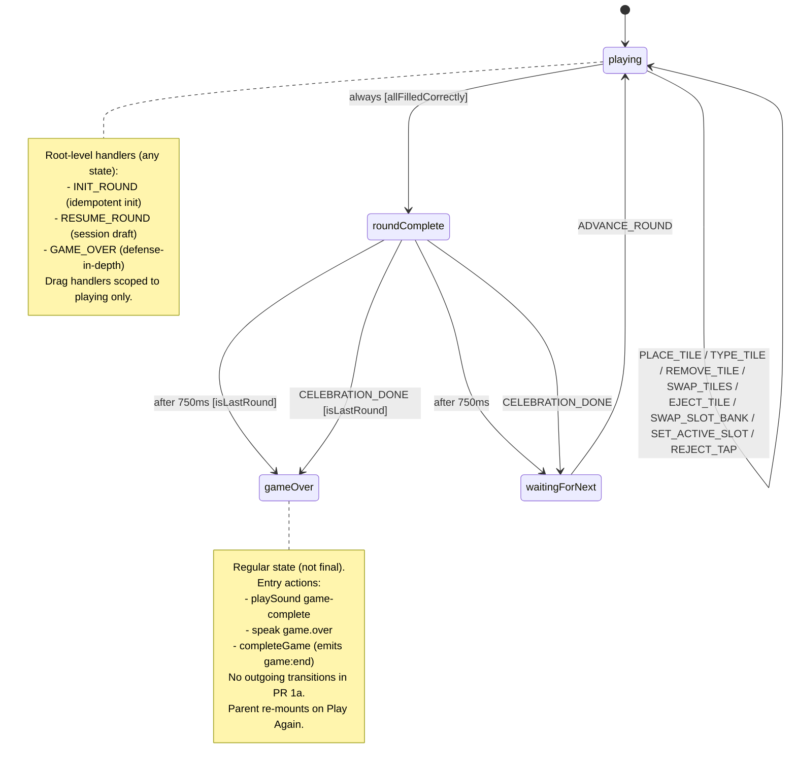

# NumberMatch XState Implementation

> **Type:** feat — **Status:** active — **Date:** 2026-05-11 — **Origin:** `docs/superpowers/plans/2026-05-10-spec-1a-pr1a-game-engine.md`

## Summary

Implement NumberMatch as the canonical XState-first game in BaseSkill: the machine owns the entire game state (tiles, zones, drag state, retry count, round/level indices, plus config values relevant to guard decisions); the component reads from `engine.context` and dispatches via `engine.send`; round-advance timing is driven by XState's built-in `after` transitions; correctness detection happens inside `assign` actions and an `always` transition with no React `useEffect` race; sound effects, voice prompts, and `game:end` emission are XState entry actions, not React side effects. Replaces the broken Tasks 8 + 9 of the existing PR 1a plan with an implementation-ready specification serving as the reference pattern for PR 1b (WordSpell + SortNumbers) and PR 1d (SpotAll).

---

## Problem Frame

PR #350 currently ships an XState-first migration of NumberMatch via Tasks 8 + 9 of `docs/superpowers/plans/2026-05-10-spec-1a-pr1a-game-engine.md`. An adversarial + feasibility review (now archived at `docs/superpowers/reviews/archive/2026-05-10-pr1a-tasks-8-9-adversarial-feasibility.md`) found four critical defects that would ship a non-working game:

- Guard placeholders that return `false` block both `NEXT` transitions, so round 2 never starts.
- `gameOver` declared `type: 'final'` plus a 60-second `gameOverActor`; `completeGame` runs 60s after the user sees the screen, and `type: 'final'` blocks `RESUME_ROUND` and any future restart event.
- Twenty-two `assign` actions are no-op stubs (`// Mirror reducer 'X' case` followed by `return context;`), and the plan's test step only checks state-name presence — so the executor would ship green tests with no behaviour.
- The merged `useGameRound` spec (`docs/superpowers/specs/2026-05-03-use-game-round-design.md`) is reducer-coupled while the design doc asserts the hook reads from the machine for migrated games — a contradiction that breaks PR 1b's integration.

This plan rewrites the NumberMatch slice with the four critical findings and six high-severity findings folded in, treating NumberMatch as the canonical pattern (no migration shortcuts, no transitional hacks) per the user directive captured in `docs/superpowers/plans/2026-05-10-spec-1a-pr1a-game-engine.md`'s Tasks 0–7 + 10–12 engine foundation. The `useGameRound` × XState seam is resolved by the Spec Delta appended to the merged spec (same file, dated 2026-05-11).

---

## Requirements

- R1. NumberMatch's per-game state lives entirely in the XState machine's context. The component does not call `useReducer` and does not call `useAnswerGameContext()` for state.
- R2. Round-advance timing is driven by the machine (`after: 750`), not by a React `setTimeout` in the component.
- R3. Round-complete detection is atomic: it happens inside the `assign` action that mutates zones, surfaced via an `always` transition. No `useEffect` watching `zones` to fire `ROUND_CORRECT` separately.
- R4. `gameOver` is a regular state, not `type: 'final'`. The root-level `GAME_OVER` handler stays as defense-in-depth for unexpected paths. The component does not send a redundant `engine.send({ type: 'GAME_OVER' })` after `NEXT`; the machine's guards are the sole authority.
- R5. Sound effects, voice prompts, and the `game:end` event are XState entry actions on the relevant states (`roundComplete`, `gameOver`). No `useGameSounds()` call in NumberMatch.
- R6. Each of the 22 reducer cases relevant to NumberMatch becomes a full `assign` action with the reducer's logic inlined. No `// Mirror reducer` stubs. The three subtle porting bugs flagged in the archived review (drag-clear in `placeTile`, phantom `phase` field in `swapTiles`, early-return guard in `ejectTile`) are addressed explicitly.
- R7. Machine-level behavior tests cover each of the 22 assign actions. Tests use the XState v5 `createActor` + `send` + `getSnapshot` pattern. Tests gate the plan's "verified" step.
- R8. Config values the assign actions need (`totalRounds`, `maxLevels`, `wrongTileBehavior`) live in machine context and are populated via `setup({ types: { input } })` and `useMachine(machine, { input: { ... } })`.
- R9. Drag-state events (`SET_DRAG_ACTIVE`, `SET_DRAG_HOVER`, `SET_DRAG_HOVER_BANK`) are scoped to `playing` only, not the machine root. Drag during celebration / game-over does not mutate context.
- R10. Setup-time placeholder bodies for guards and actors have type signatures that match the real implementations provided by `useGameEngine` at runtime. XState v5's `.provide()` does not widen placeholder signatures — placeholders define the type contract.
- R11. `firstActionAt: null` and `selectedSlotIds: new Set<string>()` exist as no-op placeholders in machine context, plus a `SELECT_SLOT` event with an empty `assign`. PR 1b populates the behavior alongside the `useGameRound` adoption; PR 1a only reserves the shape so PR 1b is a small diff.
- R12. NumberMatch passes its config through `useMachine`'s `input` so the merged useGameRound Spec Delta's `engine` parameter can be wired in PR 1b without re-prescribing context fields.

---

## Scope Boundaries

- No changes to `src/lib/game-engine/useGameEngine.ts` beyond what NumberMatch's `definition.ts` requires the engine to provide. The engine's `buildEngineGuards` already has correct guard bodies (PR 1a plan Task 6 lines 1064–1092); their logic is unchanged.
- No changes to `src/lib/game-engine/interaction-adapter.ts`. NumberMatch does not import `answerGameAdapter` (Spec Delta #4 of the existing PR 1a plan — NumberMatch dispatches directly via `engine.send`, not through the legacy reducer adapter). The adapter is consumed by WordSpell + SortNumbers in PR 1a, untouched.
- No changes to `src/components/answer-game/answer-game-reducer.ts`. The reducer continues to back WordSpell + SortNumbers in PR 1a; deletion is scoped to PR 1c.
- No `useGameRound` import in NumberMatch in PR 1a. The Spec Delta (in the merged spec doc) describes the contract for PR 1b adoption.
- No level mode for NumberMatch. The machine declares `maxLevels: null` in context; the level-related guards (`isMidLevelRound`, `isLastRoundOfLevel`) are exercised by other games in PR 1b. The `levelComplete` state is omitted from NumberMatch's machine.
- No fixes to M1–M5 from the archived review. They are tracked in Open Questions below.
- No removal of `useGameSounds` from the codebase. NumberMatch stops calling it; WordSpell + SortNumbers continue to call it in PR 1a. PR 1b removes the call site for those games when they migrate.

### Deferred to Follow-Up Work

- **Round-event emission semantics** (`round:first-action`, `round:mistake`, `round:resolved` from `assign` actions). The hook spec change is documented in the Spec Delta; the actual emission code lands alongside `useGameRound` adoption in PR 1b. PR 1a only reserves the placeholder fields (`firstActionAt`, `selectedSlotIds`) so PR 1b is structural-only.
- **`useGameSounds` deletion**. PR 1b removes the call from WordSpell + SortNumbers as they migrate; PR 1c deletes the hook source file.
- **`useAnswerGameContext` deletion**. Same sequencing — PR 1b removes its NumberMatch sibling-component consumers as they migrate; PR 1c deletes it.
- **Move celebration overlay mounting into a `CelebrationHost`**. Spec Delta #1 of the existing PR 1a plan defers this to PR 1c (after the pattern is validated across three games). This plan respects that boundary.

---

## Context & Research

### Relevant code and patterns

- **`src/components/answer-game/answer-game-reducer.ts`** — the canonical implementation of NumberMatch's per-round logic. Each of the 22 cases relevant to NumberMatch (lines 75–547) is the source of truth for the corresponding `assign` action in the new machine. The implementation units below cite reducer line ranges next to each ported action.
- **`src/components/answer-game/answer-game-reducer.test.ts`** — 35 test cases. Roughly 25–28 are NumberMatch-relevant (excludes level-mode cases and ADVANCE_LEVEL); they are ported to the new machine-level test file.
- **`src/games/number-match/NumberMatch/NumberMatch.tsx`** — current component; the existing `handlePlayAgain = () => onRestartSession()` and `handleHome` (navigates via `useRouter`) callbacks are preserved unchanged. Play Again works via parent re-mount; the machine never sees a RESTART event.
- **`src/components/answer-game/useGameSounds.ts`** — the hook whose phase-driven sound playback NumberMatch replaces with XState entry actions. The hook continues to exist for WordSpell + SortNumbers until PR 1b.
- **`docs/superpowers/plans/2026-05-10-spec-1a-pr1a-game-engine.md` Task 6** — defines `useGameEngine`, `buildEngineGuards` (with real guard bodies at lines 1064–1092), and the `.provide({ guards, actors, actions })` overrides. This plan consumes the engine; it does not modify it.
- **`docs/superpowers/plans/2026-05-07-game-definition-engine-design.md`** — architecture authority. Phase authority section (line 333) establishes XState-first. Composition with `useGameRound` (line 361) explains the per-game integration that this plan finalises for NumberMatch.

### XState v5 patterns adopted

This plan uses canonical XState v5 patterns researched during planning. The patterns are listed here so reviewers can spot deviations.

- `setup({ types: { context, events, input }, actors, guards, actions })` is the typed entrypoint. Placeholders for `actors`, `guards`, `actions` define the type contract; `.provide()` overrides bodies at runtime without widening types.
- Actor placeholders use `fromPromise(() => Promise.resolve())` typed with the resolved output the runtime version will return.
- `setup({ types: { input } })` plus `useMachine(machine, { input })` populates initial context via `context: ({ input }) => ({ ... })`. The XState v5 way to inject config; `withContext` no longer exists.
- `after: { 750: { target: '...' } }` is the first-class delayed-transition primitive. Replaces invoked timer actors for fixed delays.
- `always: [{ guard, target }]` is the eventless transition primitive. Re-evaluates whenever an `assign` mutates context. Used here to detect "all zones now correct" atomically.
- Parameterised actions: `entry: [{ type: 'playSound', params: { sound: 'round-complete' } }]` lets the action implementation receive typed `params` instead of inspecting events. Same pattern as the existing `speak` action.
- Top-level final states terminate the actor (`status: 'done'`); root-level `on:` handlers stop firing. `gameOver` is a regular state for this reason.
- `useMachine(machine.provide({ ... }))` re-creates the actor every render if `.provide()` is called inline. The engine wraps it in `useMemo` so this is a non-issue for NumberMatch.

### Institutional learnings

- **XState-first is binding for Phase 1** (project memory `project_xstate_first_commitment.md`). NumberMatch in PR 1a has no `useReducer` and no phase bridge; the machine is the sole state authority. WordSpell and SortNumbers migrate in PR 1b directly to the same shape.
- **Parent-PIN settings route not yet built** (project memory `project_parent_pin_route_pending.md`). Out of scope for this plan; flagged here only so executors don't expect a settings UI affordance for restart-confirmation flows.
- **PR base is master, never something else** (project memory `feedback_pr_base_master.md`). PR #350 (which absorbs this plan) bases on master.

---

## Key Technical Decisions

- **`gameOver` is a regular state.** Top-level `type: 'final'` terminates the machine, blocks `RESUME_ROUND` from a session draft, and disables root-level handlers. The `gameOver` state has entry actions (`playSound`, `speak`, `completeGame`) so the game-over side effects fire immediately when the user sees the screen, not after a delay. Play Again works via parent re-mount (existing pattern); the machine never needs to model RESTART.
- **`celebrationActor` and `gameOverActor` are dropped.** Their original purpose was to be timers; XState's built-in `after: { 750: ... }` and the entry-action pattern cover both purposes without invoked actors. Fewer moving parts, fewer typed placeholders to maintain.
- **Round-complete detection moves into the `playing.always` transition.** Each game-state `assign` action (PLACE_TILE, TYPE_TILE, SWAP_TILES) mutates zones, then XState re-evaluates `always` and transitions to `roundComplete` atomically when `allFilledCorrectly` is true. No `useEffect` race; no information loss between "just made it correct" and "was already correct."
- **Sound playback as XState entry actions.** `playSound` is a named action declared in `setup({ actions })` and parameterised via `{ type: 'playSound', params: { sound: 'round-complete' } }`. `useGameEngine.provide({ actions })` implements it as `(_, params) => playSound(params.sound)`. NumberMatch drops its `useGameSounds()` call entirely. WordSpell + SortNumbers keep `useGameSounds()` unchanged until PR 1b.
- **`game:end` emission moves to a `completeGame` entry action.** Currently emitted by a `useEffect` in NumberMatch.tsx (lines 2071–2094 of the existing plan). Under the ideal pattern, it's a machine-driven side effect on `gameOver` entry. The `useEffect` is deleted.
- **Config values flow through `setup({ types: { input } })`.** `totalRounds`, `maxLevels`, `wrongTileBehavior` are populated from `useMachine`'s `input` into machine context. Reducer logic that depended on `state.config.X` now reads `context.X`. Closure capture for guard logic (Task 6's `buildEngineGuards(totalRounds, levelSize)`) is unchanged — the engine retains its existing shape.
- **Setup-time placeholder signatures match real implementations.** Guards in `setup({ guards })` are declared as `({ context }: { context: NumberMatchEngineContext }) => false` so the XState v5 typecheck narrows the guard reference correctly. Actor placeholders are typed `fromPromise` calls returning the resolved output type the runtime version provides. Action placeholders match the parameterised shape (`(_, params: { sound: SoundId }) => undefined`).
- **`useGameRound × XState` seam is documented but not implemented in PR 1a.** The Spec Delta (sibling section in the merged useGameRound spec, dated 2026-05-11) adds the optional `engine?: UseGameEngineResult` parameter. PR 1b consumes it; PR 1a only ensures NumberMatch's machine context exposes `roundIndex`/`levelIndex`/`phase` in shapes the hook can read.
- **Single-PR atomicity.** This plan ships **inside** PR #350 alongside the engine foundation (Tasks 0–7 + 10–12 of the existing PR 1a plan). Tasks 8 + 9 of the existing plan are replaced by a one-line pointer to this plan. No NumberMatch behaviour change ships separately from the engine foundation.

---

## Open Questions

### Resolved during planning

- **`gameOver` final vs regular** → regular (XState v5 docs: top-level final terminates the actor and blocks root-level handlers).
- **Audio strategy for NumberMatch under XState-first** → option (d): `playSound` as a parameterised XState entry action implemented in `useGameEngine.provide({ actions })`.
- **Test strategy for 22 assign actions** → inline full bodies in the definition AND machine-level behavior tests in `definition.test.ts` (ported from `answer-game-reducer.test.ts`). Both, not either-or.
- **`useGameRound × XState` seam shape** → Shape A (optional `engine?: UseGameEngineResult` parameter, backward compatible). Codified in the Spec Delta appended to the merged spec.
- **Plan file location** → new standalone plan (this file); existing PR 1a plan's Tasks 8 + 9 become a pointer.

### Deferred to implementation

- **Whether `gameOverActor` should fire as a fallback at all.** Current proposal: drop it. If implementation reveals a real need (e.g., automatic dismiss after some long timeout), the executor adds it back as a clearly-scoped follow-up.
- **Exact mapping between `engine.phase` (camelCase) and the kebab-case enum `useGameRound` exposes.** Spec Delta names the mapping; implementation lands in PR 1b alongside hook adoption.
- **Whether to add a `RESTART` event to the machine for symmetry with future flows.** Today's "Play Again" works via parent re-mount; no need to model it in the machine. Revisit if a future flow needs in-place restart (e.g., "Replay last round").

### Tracked from the archived review (M1–M5)

These are not resolved in PR 1a; they are surfaced for tracking:

- **M1 — Reducer deletion safety vs SpotAll/SortNumbers shared types.** Before PR 1c (reducer deletion), audit `src/components/answer-game/types.ts` and `useAnswerGameContext.ts` for SpotAll consumers; split shared types into a leaf module that survives reducer deletion.
- **M2 — `buildRound` no-op convention copy-paste risk.** Add a TODO comment on the `buildRound` passthrough in `numberMatchDefinition` so PR 1b executors don't blindly copy the pattern to WordSpell.
- **M3 — `RESUME_ROUND` ignored from session draft.** The `resumeRound` `assign` restores fields but has no `target`; the machine stays in `playing` regardless of draft phase. Acceptable today (rare path); document explicitly.
- **M4 — `renderHook().toThrow()` unreliable in React 19 / RTL 16.** Out of scope for this plan; relevant to Task 6 of the existing plan.
- **M5 — Tasks 4 + 7 missing test steps.** Out of scope for this plan; relevant to Tasks 4 + 7 of the existing plan.

---

## High-Level Technical Design

> _This illustrates the intended state-machine shape and is directional guidance for review, not implementation specification. The implementing agent should treat it as context, not code to reproduce._

### State machine



### Event flow during a round

1. Component sends `INIT_ROUND { tiles, zones }` on mount.
2. User drags/types/swaps tiles — each event runs its inline `assign` action mutating `context.allTiles`, `context.zones`, `context.bankTileIds`, `context.dragActiveTileId`, etc.
3. After each game-state `assign`, XState re-evaluates `playing.always`. When `allFilledCorrectly(context)` becomes true, the machine transitions atomically to `roundComplete` — no `useEffect` race, no `ROUND_CORRECT` event roundtrip.
4. `roundComplete.entry` fires: `playSound('round-complete')`. (No `speak` for round-correct in PR 1a per existing plan; `useRoundTTS` continues to drive prompt speech.)
5. After 750 ms (or when the component sends `CELEBRATION_DONE` early):
   - If `isLastRound`, transition to `gameOver`.
   - Otherwise, transition to `waitingForNext`.
6. Component subscribes to `engine.phase === 'waitingForNext'`, computes next round's tiles via `buildNumeralRound` (an existing helper closure), and sends `ADVANCE_ROUND { tiles, zones }`.
7. `waitingForNext.ADVANCE_ROUND` runs `incrementRoundIndex` and `advanceRoundState` (the assign action that swaps in new tiles and resets per-round fields), then targets `playing`.
8. Cycle repeats from step 2 until the last round.
9. On entering `gameOver`: `playSound('game-complete')`, `speak('game.over')`, and `completeGame` fire as entry actions. The user sees the game-over overlay (rendered by NumberMatch.tsx gated on `engine.phase === 'gameOver'`). Tapping Play Again triggers `onRestartSession()` which re-mounts the parent component; the machine actor is destroyed and a fresh one is created. Tapping Go Home navigates away.

### Context shape

```ts
interface NumberMatchEngineContext {
  // Per-round game state (was AnswerGameState):
  allTiles: TileItem[];
  bankTileIds: string[];
  zones: AnswerZone[];
  activeSlotIndex: number;
  dragActiveTileId: string | null;
  dragHoverZoneIndex: number | null;
  dragHoverBankTileId: string | null;
  retryCount: number;
  // Session counters:
  roundIndex: number;
  levelIndex: number;
  // Config values populated via setup({ types: { input } }):
  totalRounds: number;
  maxLevels: number | null;
  wrongTileBehavior: 'reject' | 'lock-manual' | 'lock-auto-eject';
  isLevelMode: boolean; // derived from maxLevels !== null
  // Round-event placeholders (PR 1b populates):
  firstActionAt: number | null;
  selectedSlotIds: Set<string>;
  // Engine-managed:
  lastRoundOutput: RoundOutput;
  phaseContext: PhaseContext;
}
```

### Events

```text
Game-state events (from existing AnswerGameAction, with one rename and one addition):
  INIT_ROUND { tiles, zones }
  RESUME_ROUND { draft }
  PLACE_TILE { tileId, zoneIndex }
  TYPE_TILE { tileId, value, zoneIndex }
  REMOVE_TILE { zoneIndex }
  SWAP_TILES { fromZoneIndex, toZoneIndex }
  EJECT_TILE { zoneIndex }
  SWAP_SLOT_BANK { zoneIndex, bankTileId }
  SET_ACTIVE_SLOT { zoneIndex }
  REJECT_TAP { tileId, zoneIndex }
  SELECT_SLOT { zoneIndex } -- no-op placeholder for PR 1b
  SET_DRAG_ACTIVE { tileId: string | null }
  SET_DRAG_HOVER { zoneIndex: number | null }
  SET_DRAG_HOVER_BANK { tileId: string | null }
Lifecycle events:
  ADVANCE_ROUND { tiles, zones } -- component-driven from waitingForNext
  CELEBRATION_DONE { skipMethod?: 'play-again' | 'go-home' } -- early dismiss from roundComplete
  GAME_OVER -- root-level defense-in-depth handler; not sent in normal flow
```

`NEXT` from the original plan is dropped. The round-advance event is `ADVANCE_ROUND` (with payload) sent from the component when it sees `engine.phase === 'waitingForNext'`. The guard-driven routing happens **on the way out of `roundComplete`** (after the 750 ms wait or `CELEBRATION_DONE`), not on a `NEXT` event in `waitingForNext`.

---

## Implementation Units

### U1. NumberMatch GameDefinition

**Goal:** Create `src/games/number-match/definition.ts` implementing the full XState machine as described in the High-Level Technical Design above. The file is the canonical XState-first game definition; PR 1b uses it as the reference pattern when migrating WordSpell + SortNumbers.

**Requirements:** R1, R3, R4, R6, R8, R9, R10, R11, R12.

**Dependencies:** Existing PR 1a plan Tasks 0–6 must be complete (XState dependencies installed, GameDefinition types defined, `useGameEngine` implemented). This unit consumes them but does not modify them.

**Files:**

- Create: `src/games/number-match/definition.ts`

**Approach:**

- Declare `NumberMatchEngineContext` with the shape in the High-Level Technical Design.
- Declare the event union `NumberMatchEvent` covering all game-state events plus the four lifecycle events (`INIT_ROUND`, `RESUME_ROUND`, `ADVANCE_ROUND`, `CELEBRATION_DONE`, `GAME_OVER`). Drop `NEXT` (replaced by guard-driven routing out of `roundComplete`).
- Call `setup({ types: { context, events, input }, actors, guards, actions })` once. Declare placeholders for every named handler the machine references:
  - **Guards** (overridden at runtime by `useGameEngine.provide`): `isMidLevelRound`, `isLastRoundOfLevel`, `isLastRound`, plus a new in-definition guard `allFilledCorrectly` (read-only over context; not engine-injected). Placeholder signatures match the real shape: `({ context }: { context: NumberMatchEngineContext }) => boolean`.
  - **Actors** (overridden at runtime): none needed once `celebrationActor` and `gameOverActor` are dropped. The placeholder slot can be omitted entirely.
  - **Actions** (overridden at runtime by `useGameEngine.provide`): `speak`, `playSound`, `buildRound`, `advanceRound`, `completeGame`. Placeholders are typed no-ops with matching parameter shapes (notably `playSound: (_, params: { sound: SoundId }) => undefined`).
- Provide the initial context via `context: ({ input }) => ({ ... })`, reading `totalRounds`, `maxLevels`, `wrongTileBehavior` from `input`. Initialise `firstActionAt: null`, `selectedSlotIds: new Set<string>()`.
- Root-level `on:` handlers:
  - `INIT_ROUND`: idempotent initialisation, calls the `initRound` assign action.
  - `RESUME_ROUND`: restores fields from `draft`, calls the `resumeRound` assign action (no `target` — machine stays in current state; M3 documented).
  - `GAME_OVER`: targets `.gameOver` (defense-in-depth). Not sent in normal flow.
- States:
  - `playing` — owns the 14 game-state event handlers (each with its inline `assign`). Owns the four drag-state events (`SET_DRAG_ACTIVE`, `SET_DRAG_HOVER`, `SET_DRAG_HOVER_BANK`, `SWAP_SLOT_BANK`) — scoped here, not at the root, per R9. Has `always: [{ guard: 'allFilledCorrectly', target: 'roundComplete' }]`.
  - `roundComplete` — entry runs `[{ type: 'playSound', params: { sound: 'round-complete' } }]`. Has `after: { 750: [{ target: 'gameOver', guard: 'isLastRound' }, { target: 'waitingForNext' }] }`. Has `on: { CELEBRATION_DONE: [{ target: 'gameOver', guard: 'isLastRound' }, { target: 'waitingForNext' }] }` (same routing for early dismiss).
  - `waitingForNext` — owns `ADVANCE_ROUND` handler with `actions: ['incrementRoundIndex', 'advanceRoundState']` and `target: 'playing'`.
  - `gameOver` — regular state. Entry runs `[{ type: 'playSound', params: { sound: 'game-complete' } }, { type: 'speak', params: { lifecycleEvent: 'game.over' } }, 'completeGame']`. No outgoing transitions.
- Implement all 22 inline `assign` actions porting `answer-game-reducer.ts` cases (with reducer line ranges cited inline as comments for traceability). Account for the three subtle bugs:
  - `placeTile`: preserve the drag-clear conditional (`state.dragActiveTileId === action.tileId ? null : state.dragActiveTileId`). Reducer lines 121–124.
  - `swapTiles`: do **not** assign a `phase` field to context. The reducer's `phase: 'round-complete'` becomes implicit via the subsequent `always` transition. Reducer lines 393–404 — the `phase` line is intentionally dropped in the port.
  - `ejectTile`: express the early-return guard (`if (!zone.isWrong && !zone.isLocked) return state;`) as a transition guard, not as an `assign` returning `{}`. Use a new guard `canEject`: `EJECT_TILE: { guard: 'canEject', actions: 'ejectTile' }`. Reducer line 412.
- Export `numberMatchDefinition: GameDefinition<NumberMatchRound>` with the machine plus the same `tts` table from the existing plan (NumberMatch's TTS prompts have not changed). `buildRound` stays a passthrough `(ctx) => ({ roundIndex: ctx.roundIndex })` with a TODO comment per M2.

**Execution note:** Test-first. U2 lands the test file with failing tests; U1 implements until tests pass.

**Patterns to follow:**

- XState v5 setup() / typed placeholders / .provide() — see "XState v5 patterns adopted" in Context & Research above for canonical shapes.
- Existing `speak` action parameterisation in PR 1a Task 6 (lines 1132–1146) — `playSound` mirrors its shape.
- Reducer cases in `src/components/answer-game/answer-game-reducer.ts` lines 75–547 for assign-body logic.

**Test scenarios:** Covered in U2 (paired test file).

**Verification:**

- TypeScript typecheck passes (`yarn typecheck`).
- All U2 tests pass (`yarn test src/games/number-match/definition.test.ts`).
- Definition file imports cleanly from `numberMatchDefinition` in U3 (NumberMatch.tsx).

---

### U2. Machine-level behavior tests

**Goal:** Create `src/games/number-match/definition.test.ts` with comprehensive behavior tests for the new machine. Tests use XState v5's `createActor` / `send` / `getSnapshot` / `waitFor` primitives. Cover each of the 22 assign actions plus the lifecycle transitions (`always`, `after`, guard-driven routing).

**Requirements:** R7.

**Dependencies:** None (this is the failing-test step). U1 implements until tests pass.

**Files:**

- Create: `src/games/number-match/definition.test.ts`

**Approach:**

- Use `createActor(numberMatchDefinition.machine.provide({ guards, actors, actions }))` to construct a test actor with stub overrides for engine-injected handlers. The `playSound`, `speak`, `completeGame`, `buildRound`, `advanceRound` actions become `vi.fn()` mocks. Guards use real `buildEngineGuards(totalRounds, levelSize)` from `useGameEngine.ts` so guard logic gets exercised. The `canEject` and `allFilledCorrectly` guards are in-definition; no override needed.
- Construct the actor with `{ input: { totalRounds: 3, maxLevels: null, wrongTileBehavior: 'lock-auto-eject' } }`.
- Start with `actor.start()`, drive event sequences via `actor.send({ type: 'X', ... })`, assert on `actor.getSnapshot().context` and `actor.getSnapshot().value`.
- Use `waitFor(actor, (s) => s.matches('roundComplete'), { timeout: 1000 })` for async state assertions (the 750 ms `after` transition).
- Port NumberMatch-relevant cases from `src/components/answer-game/answer-game-reducer.test.ts` (35 cases total; ~25 relevant — excludes `level mode` describe block and any test that exercises `ADVANCE_LEVEL`).

**Patterns to follow:**

- The XState v5 testing pattern documented in the Context & Research subsection (createActor + send + getSnapshot).
- Existing `answer-game-reducer.test.ts` describe-block structure for parity.

**Test scenarios:**

_Happy path behaviours:_

- Initial state has `value === 'playing'` and `context.roundIndex === 0` after `INIT_ROUND { tiles, zones }`.
- `PLACE_TILE` on a correct slot updates `context.zones[i].placedTileId`, sets `isWrong: false`, advances `activeSlotIndex` per `findNextActiveSlot` semantics, and removes the tile from `bankTileIds`.
- `TYPE_TILE` on an empty slot creates a virtual tile in `allTiles` and assigns it to the zone. Correct value sets `isWrong: false`; wrong value with `wrongTileBehavior: 'reject'` bumps `retryCount` and leaves the slot empty.
- `REMOVE_TILE` on a placed slot returns the tile to the bank (or removes from `allTiles` for virtual tiles), sets the zone's `placedTileId: null`, and moves `activeSlotIndex` to the cleared slot.
- `SWAP_TILES` between two placed zones swaps `placedTileId` values, recomputes `isWrong` for both zones, and clears `dragActiveTileId` if it matched the moving tile.
- `SWAP_SLOT_BANK` exchanges a slot's tile with a bank tile, clears drag state, and updates both `zones` and `bankTileIds`.
- `SET_ACTIVE_SLOT` clamps the requested index to `[0, zones.length - 1]`.
- `REJECT_TAP` increments `retryCount` by 1 without changing other state.
- `INIT_ROUND` after any state resets per-round fields (`activeSlotIndex: 0`, `retryCount: 0`, drag state cleared) but does not reset `roundIndex` or `levelIndex`.
- `RESUME_ROUND { draft }` restores `allTiles`, `bankTileIds`, `zones`, `activeSlotIndex`, `retryCount`, `levelIndex`, `roundIndex` from the draft. `dragActiveTileId`, `dragHoverZoneIndex`, `dragHoverBankTileId` are cleared. The machine stays in `playing` (M3 documented).
- Completing all zones correctly via `PLACE_TILE` triggers the `playing.always` transition to `roundComplete` atomically — no intervening `playing` state with `allFilledCorrectly === true`.
- After 750 ms in `roundComplete`, on a non-last round, the machine transitions to `waitingForNext`. The `playSound` mock fires once with `params: { sound: 'round-complete' }`.
- After 750 ms in `roundComplete`, on the last round (`roundIndex + 1 >= totalRounds`), the machine transitions to `gameOver`. `playSound`, `speak`, and `completeGame` mocks fire once each on entry.
- `CELEBRATION_DONE` sent during `roundComplete` short-circuits the `after: 750` and routes via the same guards.
- From `waitingForNext`, sending `ADVANCE_ROUND { tiles, zones }` increments `roundIndex`, populates new `allTiles`/`bankTileIds`/`zones`, resets `activeSlotIndex`/`retryCount`/drag state, and transitions back to `playing`.

_Edge cases:_

- `PLACE_TILE` on a slot with an already-placed correct tile (replacing a correctly-placed tile): the replaced tile returns to the bank if it's a real tile; is removed from `allTiles` if it's virtual (`typed-` prefix).
- `PLACE_TILE` on a wrong slot with `wrongTileBehavior: 'lock-auto-eject'`: sets `isWrong: true, isLocked: true`, increments `retryCount`, keeps the tile in the slot.
- `PLACE_TILE` on a wrong slot with `wrongTileBehavior: 'reject'`: leaves the slot empty, increments `retryCount`, clears the drag for the placed tile.
- `EJECT_TILE` on a correct slot (`isWrong: false, isLocked: false`) is blocked by the `canEject` guard. Context is unchanged. (Confirms the ejectTile early-return fix from R6.)
- `EJECT_TILE` on a wrong-locked slot clears the slot, returns real tiles to bank or removes virtual tiles, and moves `activeSlotIndex` to the cleared slot.
- `SWAP_TILES` with one zone empty (placing a tile into an empty slot via swap) correctly handles the null-tile-id branch and computes `isWrong: false` for the empty resulting zone.
- Repeated `INIT_ROUND` events are idempotent — the same final context regardless of how many times they fire.
- `RESUME_ROUND` with a draft whose `phase: 'round-complete'`: machine stays in `playing` (acceptable known behavior per M3). `always` re-evaluates and re-fires the completion transition since zones are all correct in the draft.

_Error and failure paths:_

- `PLACE_TILE` with an unknown `tileId` (not in `allTiles`): assign returns `{}` (no-op), context unchanged. Mirrors reducer line 116.
- `PLACE_TILE` with an out-of-range `zoneIndex` (e.g., `zones.length`): assign returns `{}` (no-op), context unchanged.
- `REMOVE_TILE` on an empty slot (`zone.placedTileId === null`): assign returns `{}` (no-op).
- `SWAP_TILES` with one or both invalid zone indices: assign returns `{}` (no-op).
- `EJECT_TILE` with invalid `zoneIndex`: assign returns `{}` (no-op).
- `ADVANCE_ROUND` sent while in `playing` (not `waitingForNext`): not handled; context unchanged. Confirms the round-advance dispatch is correctly scoped.

_Integration scenarios:_

- Full three-round game: `INIT_ROUND` → complete all zones → `roundComplete` → wait 750ms → `waitingForNext` → `ADVANCE_ROUND` → complete → `roundComplete` → wait 750ms → `waitingForNext` → `ADVANCE_ROUND` → complete → `roundComplete` → wait 750ms → `gameOver`. All three `playSound` calls fire with `sound: 'round-complete'`; final entry fires `playSound game-complete`, `speak game.over`, `completeGame` once each. `roundIndex` ends at 2; `value === 'gameOver'`.
- Last-round `CELEBRATION_DONE` routing: in the third round, sending `CELEBRATION_DONE` while in `roundComplete` transitions directly to `gameOver` (via `isLastRound` guard), bypassing the 750ms wait.
- Drag during celebration: while in `roundComplete`, sending `SET_DRAG_ACTIVE { tileId: 'x' }` is not handled (no root-level drag handlers per R9). Context's `dragActiveTileId` stays at its pre-`roundComplete` value.
- Drag during gameOver: same as above. Confirms H3 fix.

**Verification:**

- `yarn test src/games/number-match/definition.test.ts` passes all enumerated scenarios.
- No test relies on the placeholder `actors` slot; the existing test asserts the machine works with engine-injected actions.
- Coverage of the three subtle porting bugs (drag-clear in `placeTile`, no phantom `phase` in `swapTiles`, `canEject` guard for `ejectTile`) is explicit.

---

### U3. NumberMatch component refactor

**Goal:** Refactor `NumberMatchSession` (inner component of `NumberMatch.tsx`) to drive all state through `useGameEngine(numberMatchDefinition, { input: { ... } })`. Drop `useReducer`, drop `useAnswerGameContext()` for state reads, drop `useGameSounds()`, drop the round-advance `setTimeout` block, drop the round-completion `useEffect`. Wire `INIT_ROUND` on mount and `ADVANCE_ROUND` on `engine.phase === 'waitingForNext'`. Gate overlays on `engine.phase` (camelCase).

**Requirements:** R1, R2, R3, R4, R5, R8, R9, R12.

**Dependencies:** U1 (the definition file must exist and export `numberMatchDefinition`).

**Files:**

- Modify: `src/games/number-match/NumberMatch/NumberMatch.tsx`

**Approach:**

- Replace the existing state-and-effect block in `NumberMatchSession` with:
  - `const engine = useGameEngine(numberMatchDefinition, { input: { totalRounds: roundOrder.length, maxLevels: null, wrongTileBehavior: numberMatchConfig.wrongTileBehavior } });`
  - Destructure state reads from `engine.context`: `zones`, `retryCount`, `roundIndex`, `allTiles`, `bankTileIds`, `activeSlotIndex`, `dragActiveTileId`, `dragHoverZoneIndex`, `dragHoverBankTileId`.
- Wire event-dispatch helpers as memoised callbacks: `handlePlaceTile`, `handleEjectTile`, `handleRemoveTile`, `handleSwapTiles`, `handleTypeTile`, `handleSwapSlotBank`, `handleSetActiveSlot`, `handleRejectTap`, `handleSetDragActive`, `handleSetDragHover`, `handleSetDragHoverBank`. Each `useCallback` calls `engine.send` with the appropriate event shape.
- INIT round on mount via `useEffect(() => { engine.send({ type: 'INIT_ROUND', tiles, zones }); }, [])` — same shape as the current implementation but routed through the engine. The initial `tiles`/`zones` come from `buildNumeralRound(...)` (existing helper closure unchanged).
- Add a single `useEffect` watching `engine.phase`:
  - When `engine.phase === 'waitingForNext'`: compute next round's `{ tiles, zones }` via `buildNumeralRound`, send `engine.send({ type: 'ADVANCE_ROUND', tiles, zones })`.
  - No `setTimeout`, no `CELEBRATION_DONE`/`NEXT`/`GAME_OVER` chain. The machine handles all timing.
- Delete the previous round-completion `useEffect` that watched `zones`/`allTiles` (the `playing.always` transition now handles correctness detection). H1 resolved.
- Delete the `useEffect` that emitted `game:end` watching `phase === 'game-over'` (the `completeGame` entry action now emits it). The existing event payload structure (gameId, sessionId, profileId, etc.) moves to the `useGameEngine` action implementation in the engine's `.provide({ actions })` call. (Alternatively: keep the `useEffect` and remove `completeGame` from the entry action — but the entry-action shape is cleaner; let the engine own the side effect.)
- Drop the `useGameSounds()` call entirely. Drop the `confettiReady`/`gameOverReady` destructuring. R5 resolved.
- Drop the redundant `engine.send({ type: 'GAME_OVER' })` from the round-advance sequence — the machine's `isLastRound` guard handles game-over routing automatically. R4 resolved.
- Overlay rendering — gate on `engine.phase` (camelCase):
  - `engine.phase === 'roundComplete'` → render `<skin.RoundCompleteEffect />` or fallback `<ScoreAnimation />`.
  - `engine.phase === 'gameOver'` → render `<skin.CelebrationOverlay />` or fallback `<GameOverOverlay />`. Both receive `onPlayAgain={handlePlayAgain}` and `onHome={handleHome}` callbacks unchanged.
- `handlePlayAgain` and `handleHome` are unchanged — they remain component-level callbacks. `handlePlayAgain` calls `onRestartSession()` (parent re-mount); `handleHome` calls `navigate(...)`.
- Keep `useRoundTTS` — it's orthogonal to the engine and continues driving prompt speech.
- The `AnswerGameProvider` wrapper around the component stays for now so sibling hooks (`useRoundTTS`) keep working. NumberMatch reads no state from `useAnswerGameContext()` — the provider is just a mount-point.

**Patterns to follow:**

- `@xstate/react@5` `useMachine` and `useSelector` patterns from the Context & Research section. Wrap `.provide()` in `useMemo` if needed (the engine does this already).
- Existing handler-callback patterns in the current `NumberMatchSession` (just with `engine.send` instead of `dispatch`).
- Existing `buildNumeralRound` closure call site (unchanged).

**Test scenarios:** Covered in U4 (paired test refactor). Manual smoke check enumerated in Verification.

**Verification:**

- `yarn typecheck` passes.
- `yarn test src/games/number-match/NumberMatch/NumberMatch.test.tsx` passes.
- Manual smoke check (`yarn dev`, open NumberMatch session):
  - First round renders, drag-and-drop works, completing the round shows the round-complete overlay exactly once (no flicker / no double-mount).
  - 750 ms after round-complete, next round's tiles render and the user can play again.
  - On the final round, the game-over overlay appears (not round-complete). The "Game over!" voice prompt fires once. The `game:end` event is emitted exactly once.
  - Tapping Play Again on the game-over overlay restarts the session from round 1.
  - Tapping Go Home on the game-over overlay navigates back to the menu.
  - Sound effects play: `round-complete` chime on each non-final round, `game-complete` chime on game-over.

---

### U4. NumberMatch test refactor

**Goal:** Refactor `src/games/number-match/NumberMatch/NumberMatch.test.tsx` to assert on `engine.context` and `engine.phase` instead of reducer-state shape. Add a regression test for single-mount of the round-complete overlay (defense against the previous double-mount race).

**Requirements:** R3, R5 (verification surface).

**Dependencies:** U3 (component must be refactored before tests can assert on engine state).

**Files:**

- Modify: `src/games/number-match/NumberMatch/NumberMatch.test.tsx`

**Approach:**

- Audit each existing test for assertions that reach into the reducer state (`useAnswerGameContext().phase`, `state.zones`, etc.). Rewrite them to render the component and inspect DOM (the user-visible outcome) — engine context is internal to `useGameEngine` and not directly inspectable from React Testing Library. Where direct context assertions are needed, expose a test-only data attribute (`data-testid="round-progress"` showing `roundIndex`) from the component.
- Add a new test: render NumberMatch with a 3-round config, simulate the first round's completion (place correct tiles via the existing drag harness), assert that `<RoundCompleteEffect data-testid="round-complete-effect">` is mounted exactly once (`screen.queryAllByTestId('round-complete-effect')` has length 1).
- Add an integration test for the full happy-path session: complete three rounds, assert game-over overlay appears once. Optional — only if existing test infrastructure makes it cheap.
- Keep the existing manual smoke check items in U3's Verification list documented as a checklist in the test file's leading comment, so anyone re-running the test suite knows what manual coverage is expected.

**Patterns to follow:**

- Existing React Testing Library patterns in `NumberMatch.test.tsx` (renders, queries, user events).
- Existing test helpers (`completeRound` if it exists; otherwise replicate the round-completion sequence from existing tests).

**Test scenarios:**

- The existing test suite passes after the refactor (no behaviour regression).
- The new single-mount regression test passes.
- (Optional integration test) Full three-round happy path completes with game-over visible.

**Verification:**

- `yarn test src/games/number-match/NumberMatch/NumberMatch.test.tsx` passes.

---

## System-Wide Impact

- **Interaction graph:** NumberMatch.tsx no longer routes through `useAnswerGameContext()`'s reducer dispatch. WordSpell + SortNumbers continue to route through it. No change to siblings.
- **Error propagation:** Engine actions that emit events (`game:end`) propagate through `GameEventBus` as today. The relocation of `game:end` emission from a component `useEffect` to a machine entry action does not change subscribers — the event payload and timing are equivalent.
- **State lifecycle risks:** Partial-state hazards during round transitions are eliminated by `always` + `after` atomic transitions. The previous `useEffect`-driven ROUND_CORRECT detection allowed a one-frame window where the user could send `EJECT_TILE` to a wrong-locked zone after `allFilledCorrectly` became true but before the effect ran; the new design closes this.
- **API surface parity:** No public API changes. `numberMatchDefinition` is a new internal export consumed only by `NumberMatch.tsx`. `useGameEngine` continues to take a `GameDefinition` per the existing Task 6 signature.
- **Integration coverage:** `useGameRound` is not imported by NumberMatch in PR 1a. SRS v1 and `useLifecycleTTS` subscriptions to `round:*` events are not affected — emission of those events lands in PR 1b alongside `useGameRound` adoption.
- **Unchanged invariants:** The `useGameEngine` API signature, `GameDefinition` types, `executeSideEffects`, `interaction-adapter.ts`, and all engine-foundation work from existing PR 1a Tasks 0–7 remain as specified. This plan adds a consumer of those APIs; it does not modify them.

---

## Risks & Dependencies

- **Porting bugs in the 22 assign actions** (drag-clear, virtual-tile cleanup, lock-vs-reject branches). _Mitigation:_ U2's machine-level behavior tests gate U1's pass. Test scenarios explicitly cover the three subtle bugs from the archived review.
- **`always` transition firing in an unexpected state** (e.g., during `INIT_ROUND` before tiles populate). _Mitigation:_ the `allFilledCorrectly` guard returns `false` when `zones.length === 0` or any zone has `placedTileId === null`. `INIT_ROUND`'s initial state has all zones empty, so `always` does not fire. U2 includes a test for this.
- **`useGameEngine.provide({ actions })` not injecting `playSound`.** _Mitigation:_ the engine's action map at `useGameEngine.ts:1132–1174` adds `playSound: (_, params) => playSound(params.sound)`. This is a one-line addition to the existing actions block (out-of-scope for this plan's units but flagged as a coordination point with the executor of existing Task 6).
- **`roundComplete.after` timing different from current 750 ms feel.** _Mitigation:_ the `after: 750` matches the current `delayMs = 750` in `NumberMatch.tsx` exactly. Manual smoke check confirms feel; visual regression tests catch unintended changes.
- **Manual smoke missing a regression in `useRoundTTS`** (still depends on reducer phase via `useAnswerGameContext`). _Mitigation:_ `useRoundTTS` reads round prompt text, not phase. NumberMatch still wraps in `AnswerGameProvider`, so `useRoundTTS` keeps working. Coordinate during U3 review.
- **XState v5 placeholder type-widening surprises.** _Mitigation:_ the XState v5 research established that `.provide()` does not widen placeholder signatures. Placeholders in U1 use typed shapes (`({ context }: { context: NumberMatchEngineContext }) => boolean` etc.) so the typecheck catches mismatches.
- **Visual regression baselines drift.** _Mitigation:_ the existing VR baselines for NumberMatch (`tests-vr/`) cover the round-complete and game-over overlays. Single-mount regression test in U4 plus VR run on PR catch any visual regression. Per memory `feedback_vr_tests_local.md`, run `yarn test:vr:update` locally with Docker if intentional.

---

## Documentation / Operational Notes

- **Architecture MDX:** Existing PR 1a plan's Task 11 already prescribes MDX updates for the engine flow diagram in `src/lib/game-engine/GameEngine.flows.mdx`. This plan's state-machine diagram (in the High-Level Technical Design section above) should be reflected there too. Run `/update-architecture-docs` if state diagram drifts.
- **Markdown lint:** Run `yarn fix:md` on this plan file and any other markdown touched in the PR. Project memory mandates `yarn lint:md` and `npx prettier --check` pass before commit.
- **Pre-push gate:** Per project memory `feedback_skip_hooks_minor.md`, `SKIP_*=1` flags are acceptable on minor checkpoint commits but should be documented in the commit message. The substantive U1, U2, U3, U4 commits run full pre-push.
- **TDD requirement:** Per project memory `feedback_tdd_for_bug_fixes.md` and CLAUDE.md's Test-Driven Development section, U1's implementation lands strictly after U2's test file is committed in a failing state.

---

## Sources & References

- **Origin (now archived):** `docs/superpowers/reviews/archive/2026-05-10-pr1a-tasks-8-9-adversarial-feasibility.md` — the FAIL verdict on the previous Tasks 8 + 9.
- **Origin (now archived):** `.claude/handoffs/archive/2026-05-10-pr350-tasks-8-9-replan.md` — the session handoff that scoped this replan.
- **Engine foundation (existing plan, sibling to this one):** `docs/superpowers/plans/2026-05-10-spec-1a-pr1a-game-engine.md` — Tasks 0–7 + 10–12. Tasks 8 + 9 of that plan now point to this file.
- **Architecture authority:** `docs/superpowers/plans/2026-05-07-game-definition-engine-design.md` — XState-first Phase authority (line 333), useGameRound composition (line 361).
- **Merged useGameRound spec + Spec Delta:** `docs/superpowers/specs/2026-05-03-use-game-round-design.md` — the optional `engine?` parameter is documented in the 2026-05-11 Spec Delta section appended to that file.
- **Reducer source of truth:** `src/components/answer-game/answer-game-reducer.ts` — lines 75–547 cover the 22 cases ported into the new machine.
- **Reducer tests (porting source):** `src/components/answer-game/answer-game-reducer.test.ts` — ~25 of the 35 cases are NumberMatch-relevant.
- **Existing NumberMatch component:** `src/games/number-match/NumberMatch/NumberMatch.tsx` — the surface being refactored in U3.
- **XState v5 patterns:** Research summary in the Context & Research section above. Authoritative docs: `https://stately.ai/docs/setup`, `https://stately.ai/docs/actors`, `https://stately.ai/docs/input`, `https://stately.ai/docs/actions`, `https://stately.ai/docs/eventless-transitions`, `https://stately.ai/docs/final-states`, `https://stately.ai/docs/xstate-react`.
