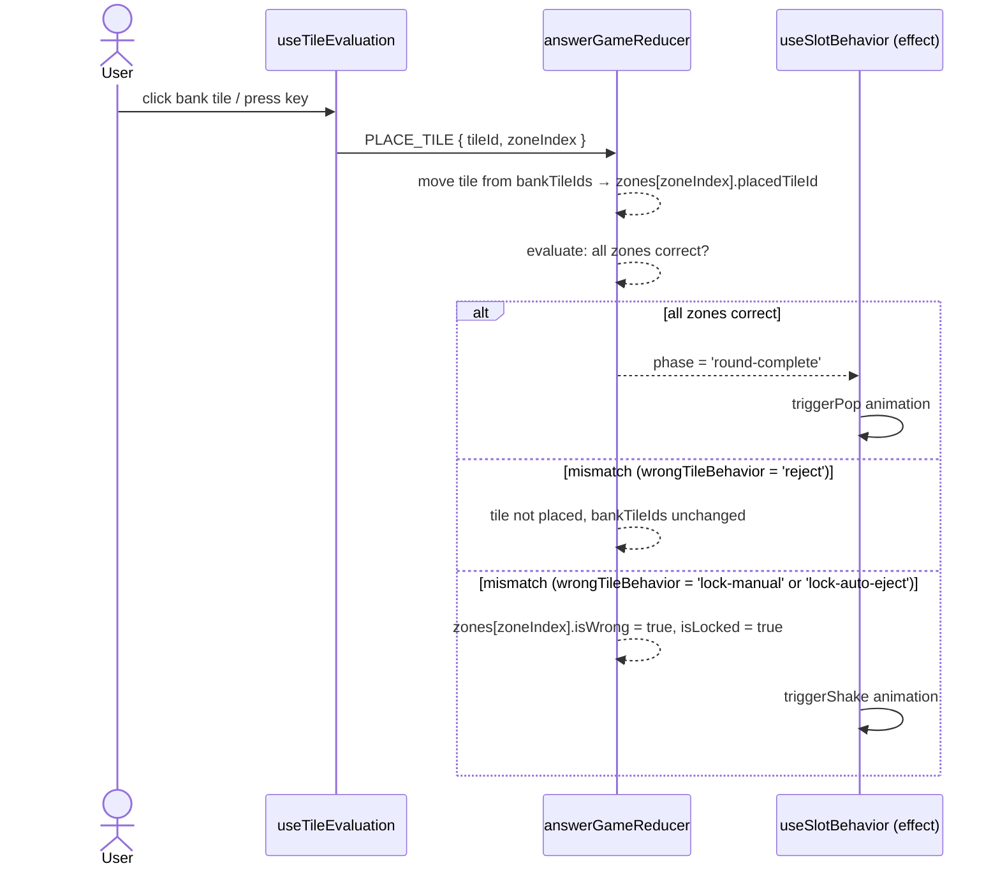
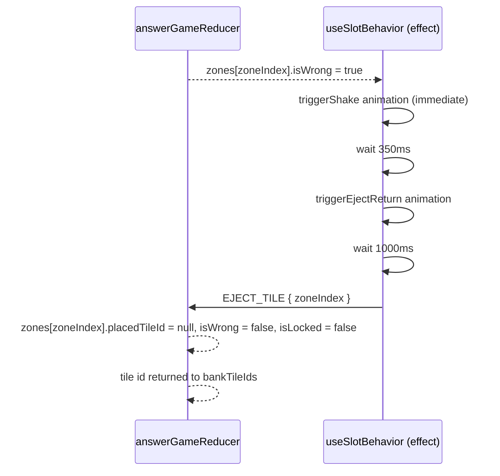
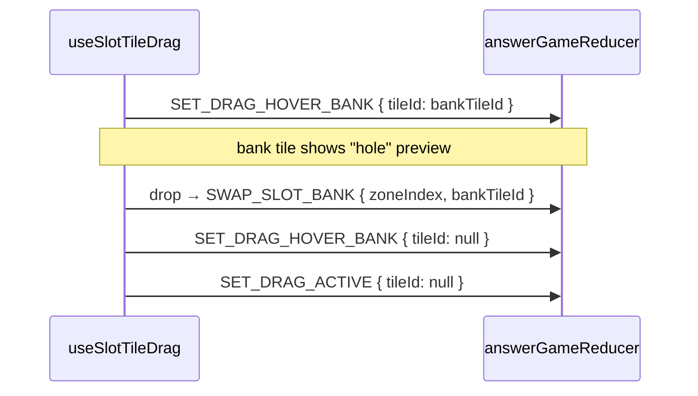
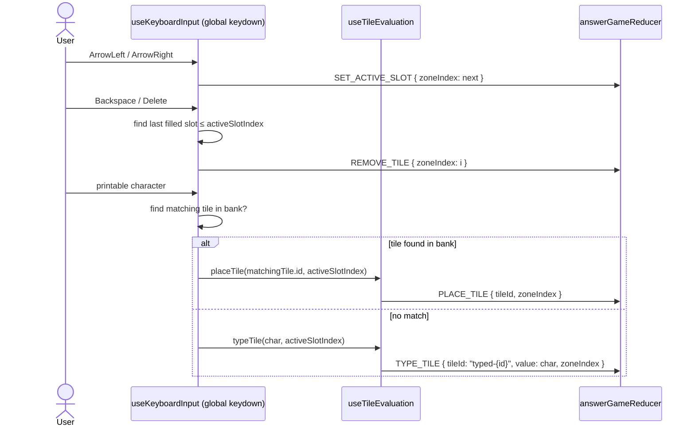
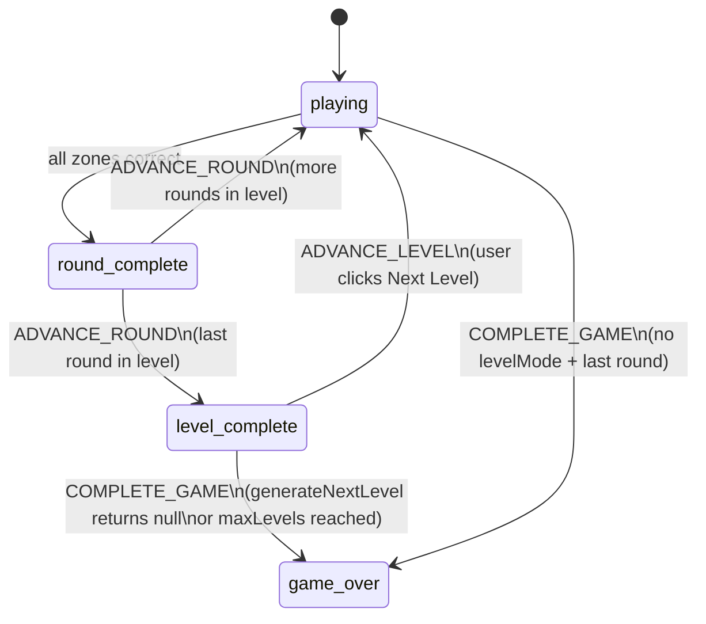
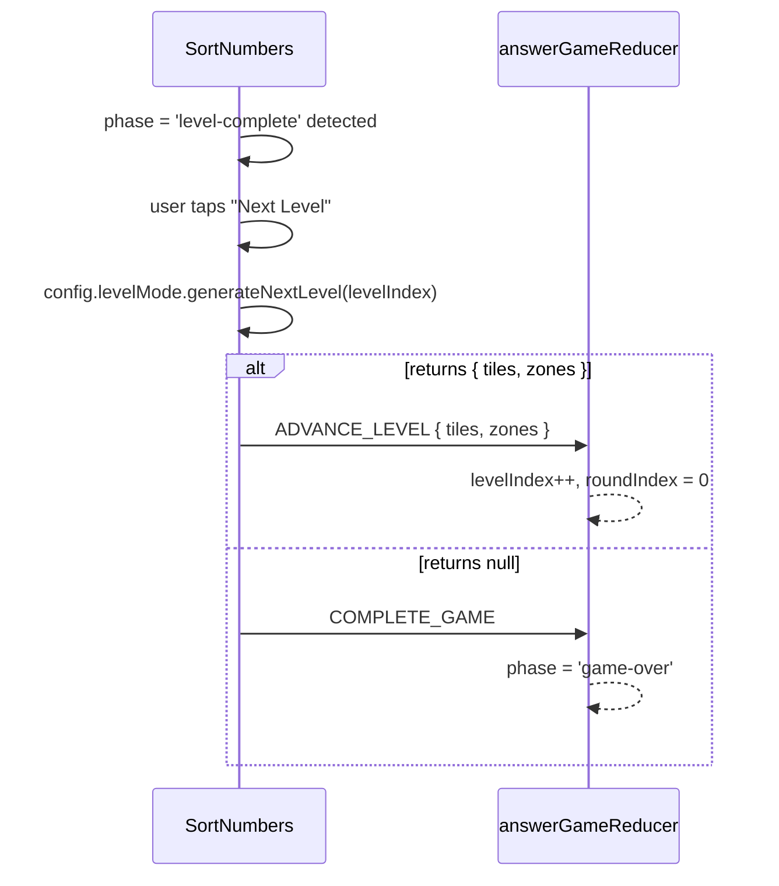
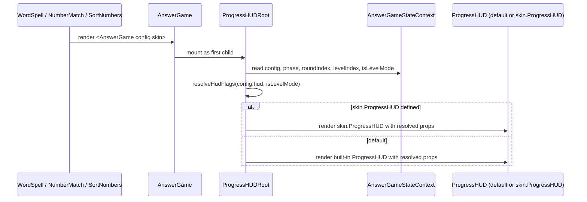
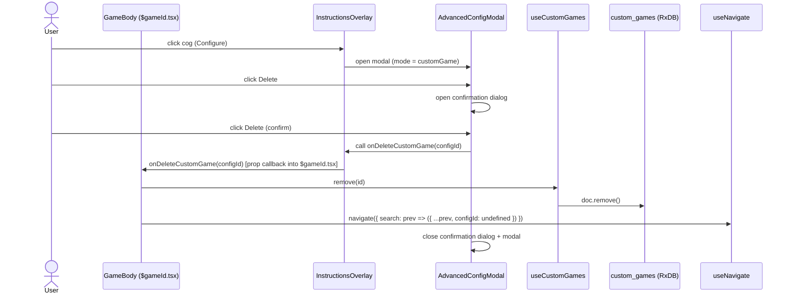
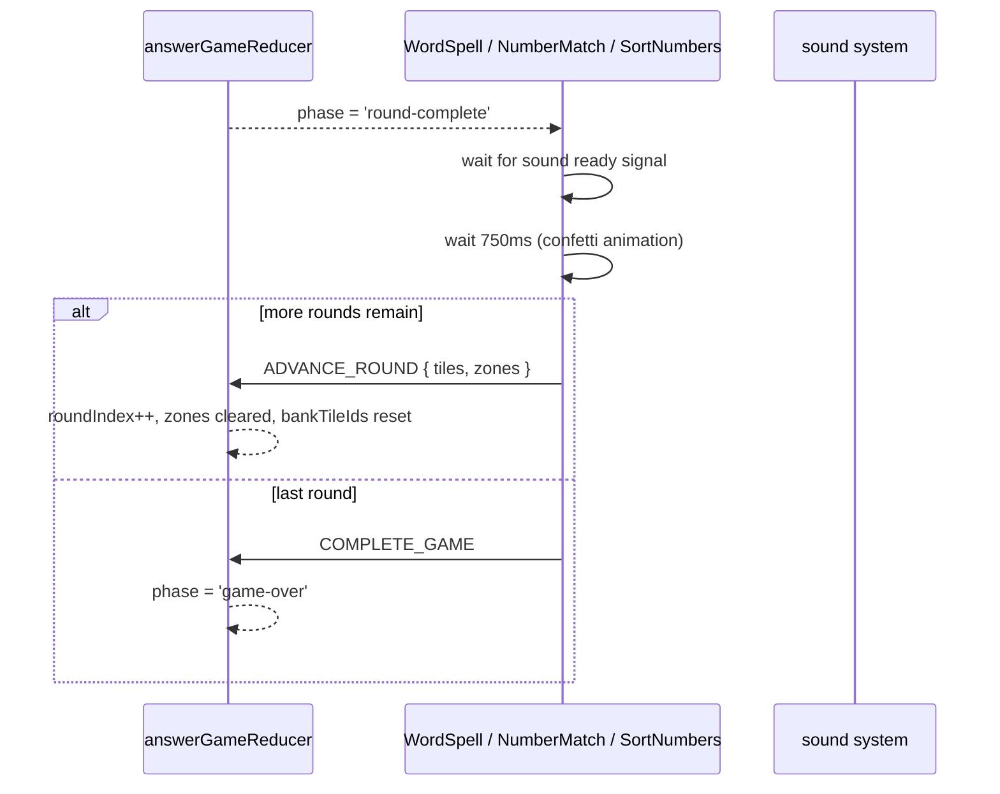
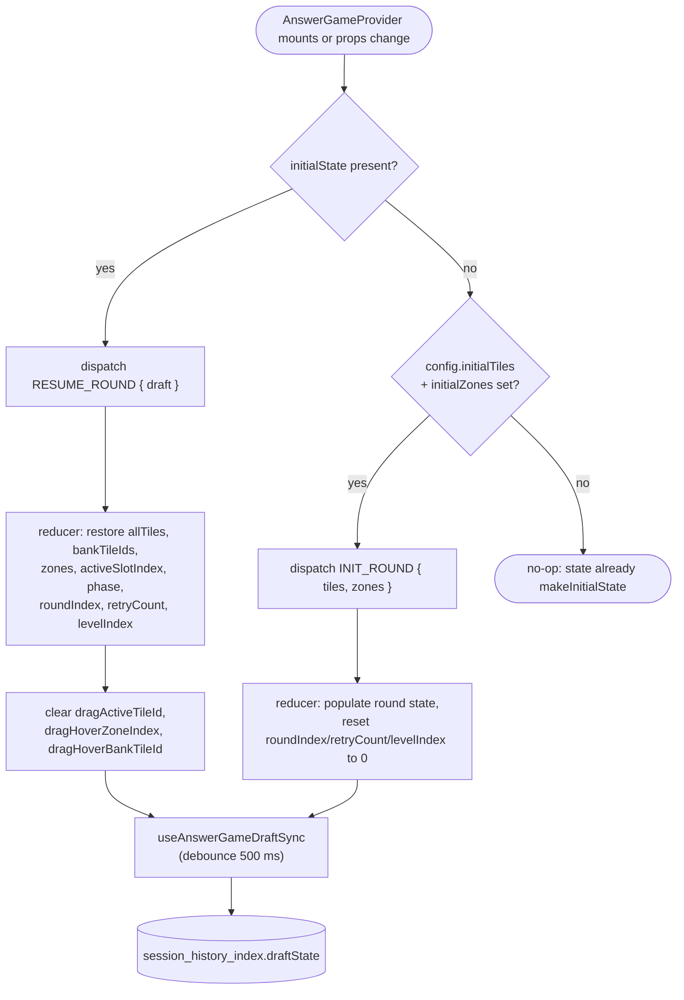

import { Meta } from '@storybook/blocks';

<Meta title="AnswerGame/Flows" />

# AnswerGame — Event Flows

> Source: `src/components/answer-game/`
>
> Each diagram shows the sequence of dispatches and effects triggered by a user action.
> Update this file when adding new dispatch chains or changing existing ones.
> Run `/update-architecture-docs` for guided update prompts.

---

## 1. Tile Placement

Bank tile click/tap or keyboard character press.

### Tap / click via `useAutoNextSlot` (ordered slots)

Bank **tap** (not drag) goes through `useDraggableTile.handleClick` → `useAutoNextSlot.placeInNextSlot`:

1. **`pendingPlacements`** (module-scoped write-ahead log) records `{ tileId, zoneIndex }` before React applies `PLACE_TILE`, so rapid taps see prior claims synchronously.
2. Entries are **drained** when `zones[entry.zoneIndex].placedTileId === entry.tileId`. The queue is **cleared** on round transitions (`roundIndex` / `zones.length` changes in `useEffect`).
3. **Pre-validation**: for `reject` and `lock-auto-eject`, wrong tiles never call `placeTile`; `handleClick` applies bank shake + wrong sound + **`REJECT_TAP`** + `game:evaluate` (with `expected`). For **`lock-manual`**, there is no bank pre-validation — wrong tiles still flow through `PLACE_TILE` into the slot.

### `REJECT_TAP`

Reducer increments **`retryCount`** only (no zone or bank mutation). Dispatched from **`handleClick`** on bank-side rejection, and from **`useTileEvaluation.placeTile`** for drag-drop wrong tiles when `wrongTileBehavior === 'reject'`.

---

## 2. Wrong Tile Auto-Eject

Only when `config.wrongTileBehavior === 'lock-auto-eject'`.

---

## 3. Drag and Drop

Dragging a bank tile or slot tile onto a slot.

**Drag-over bank tile (slot tile being dragged):**

---

## 4. Keyboard and Touch Input

Desktop keyboard (`useKeyboardInput`) and mobile hidden input (`useTouchKeyboardInput`).

Touch keyboard follows the same path via `useTouchKeyboardInput`, using the hidden
`<input>` element's `input` event instead of global `keydown`.

---

## 5. Level Progression (SortNumbers only)

Only when `config.levelMode` is configured.

**Dispatch sequence for level transition:**

---

## 6. HUD Auto-Mount

`AnswerGame` renders a `ProgressHUDRoot` as the first child of its outer
flex container every time a session mounts. No per-game wiring is
required.

---

## 7. Custom Game Delete

User deletes the current custom game from the `InstructionsOverlay` settings cog.

---

## 8. Round Progression

> **Status: planned — not yet fully implemented.**
> The phase transition to `'round-complete'` is implemented. The 750ms delay before
> `ADVANCE_ROUND` is implemented in `WordSpell`, `NumberMatch`, and `SortNumbers`.
> A shared round-progression hook is not yet extracted.

---

## 9. Session Resume (fresh mount vs. draft restore)

`AnswerGameProvider`'s mount effect routes every lifecycle change through
the reducer. On mount, and whenever `initialState` or `config.initialTiles/Zones`
change, exactly one of `RESUME_ROUND` or `INIT_ROUND` is dispatched.

`RESUME_ROUND` preserves draft progress (`roundIndex`, `retryCount`,
`levelIndex`), so a resumed mid-round session never resets to round 0 —
that was the pre-#139 failure mode the early-return guard was masking.

`useAnswerGameDraftSync` runs in parallel: it writes every state change
back to `session_history_index.draftState` (debounced 500 ms) so the
next mount has a fresh draft to hand to `RESUME_ROUND`.

### When each action fires

| Situation                                                         | Dispatched action | Reducer behavior                                                                                  |
| ----------------------------------------------------------------- | ----------------- | ------------------------------------------------------------------------------------------------- |
| First visit to a game (no persisted session)                      | `INIT_ROUND`      | Populate tiles/zones from config; reset progress counters to 0                                    |
| Reload mid-game with an aligned draft                             | `RESUME_ROUND`    | Restore the draft snapshot wholesale; keep `config`; clear drag state                             |
| Reload with a stale draft (WordSpell safety net drops the draft)  | `INIT_ROUND`      | `WordSpell.tsx` sets `initialState={undefined}` when `staleDraft` is true; provider sees no draft |
| Mid-mount `initialState` change (e.g. draft written by a sibling) | `RESUME_ROUND`    | Effect re-runs; draft flows into reducer without remounting                                       |
| Mid-mount `config.initialTiles` change (no draft)                 | `INIT_ROUND`      | Effect re-runs; new tiles populate the round                                                      |

The split exists so `INIT_ROUND`'s original "reset progress to 0" semantics
stay intact while resumed sessions get a dedicated action that cannot
accidentally drop `roundIndex`, `retryCount`, or `levelIndex`.
