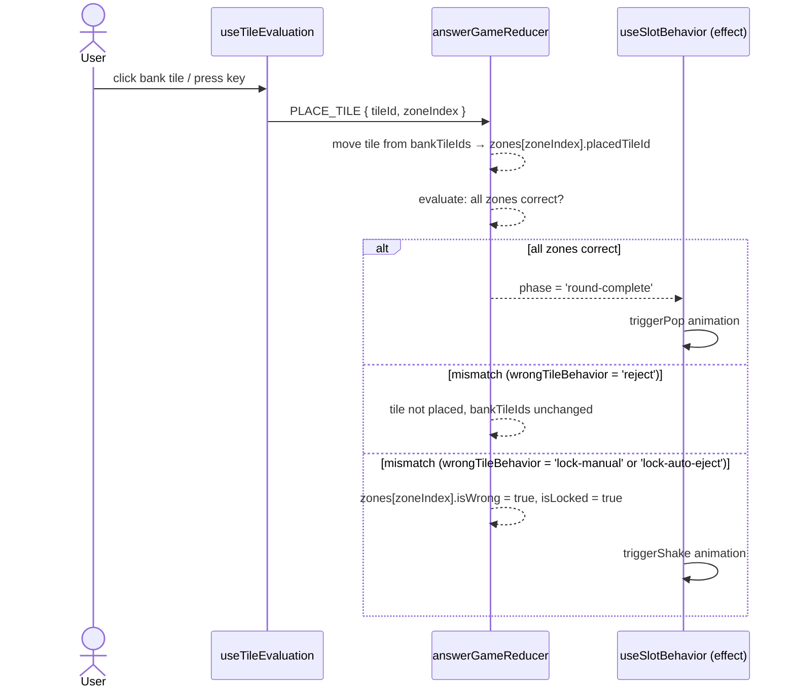
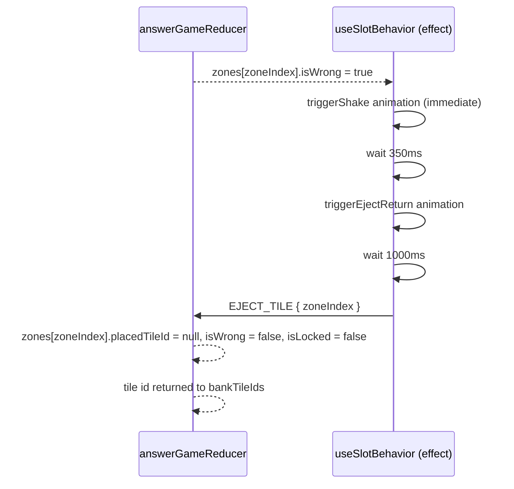
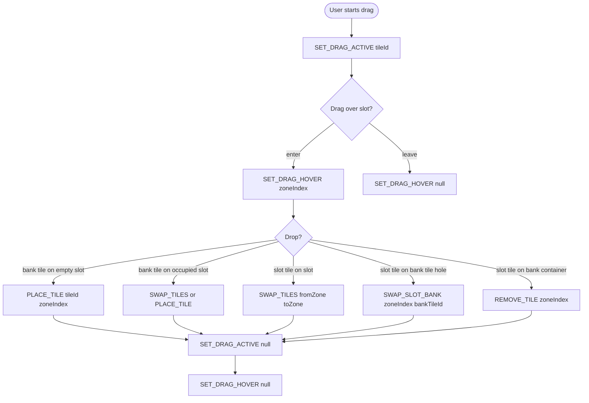
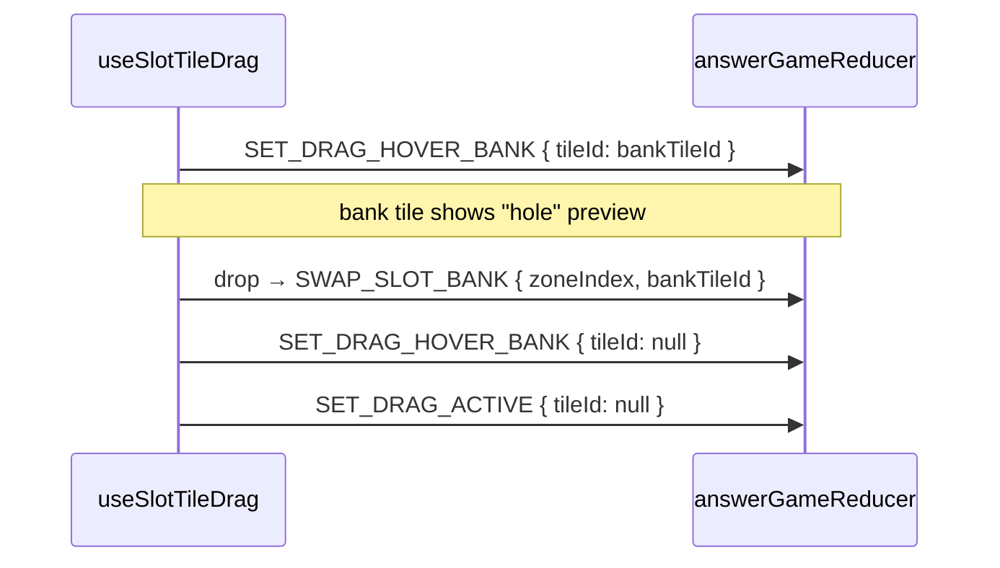
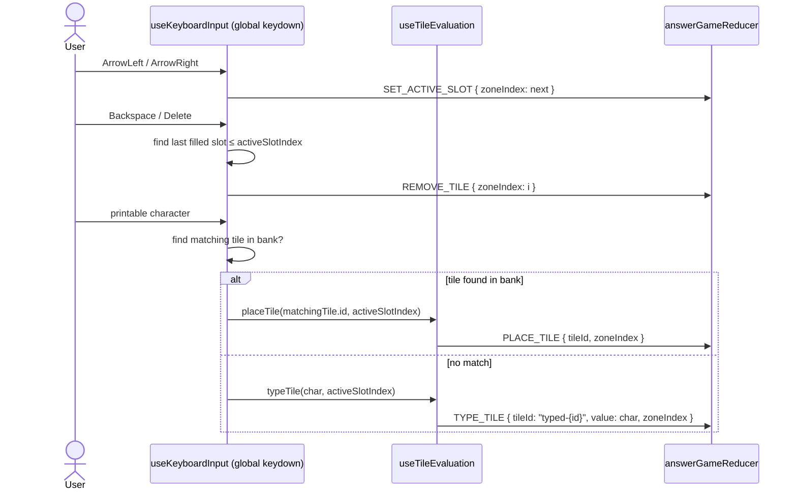
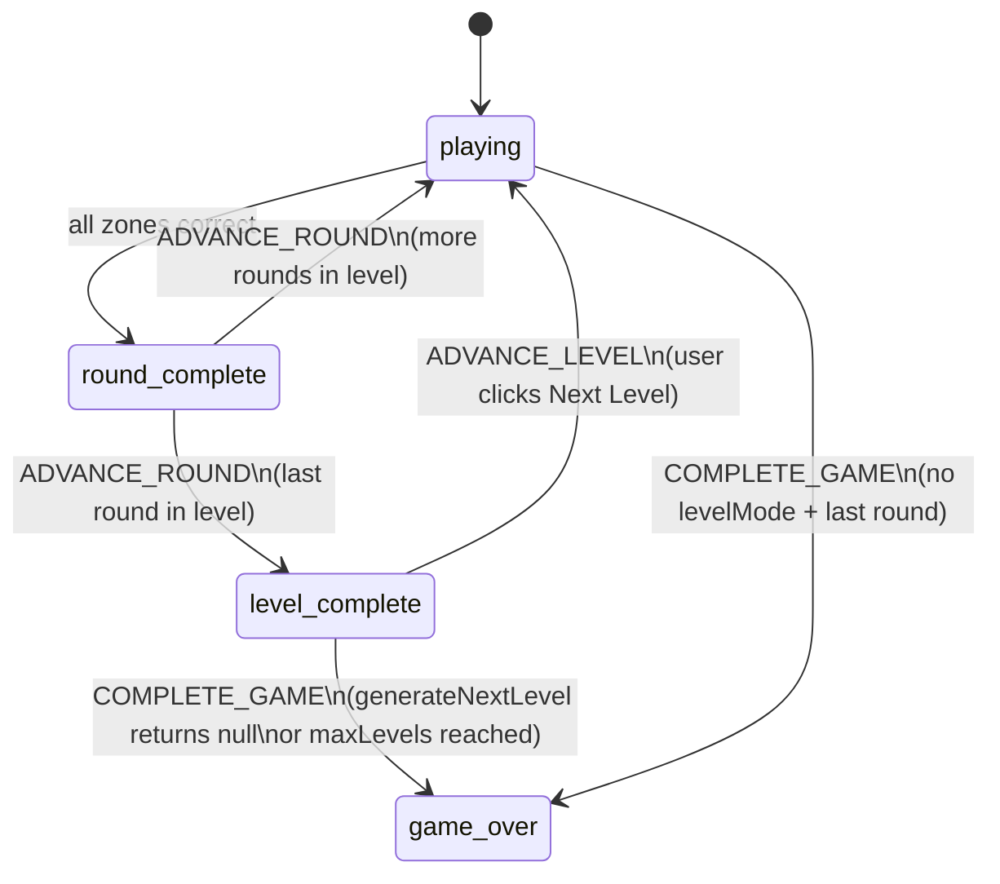
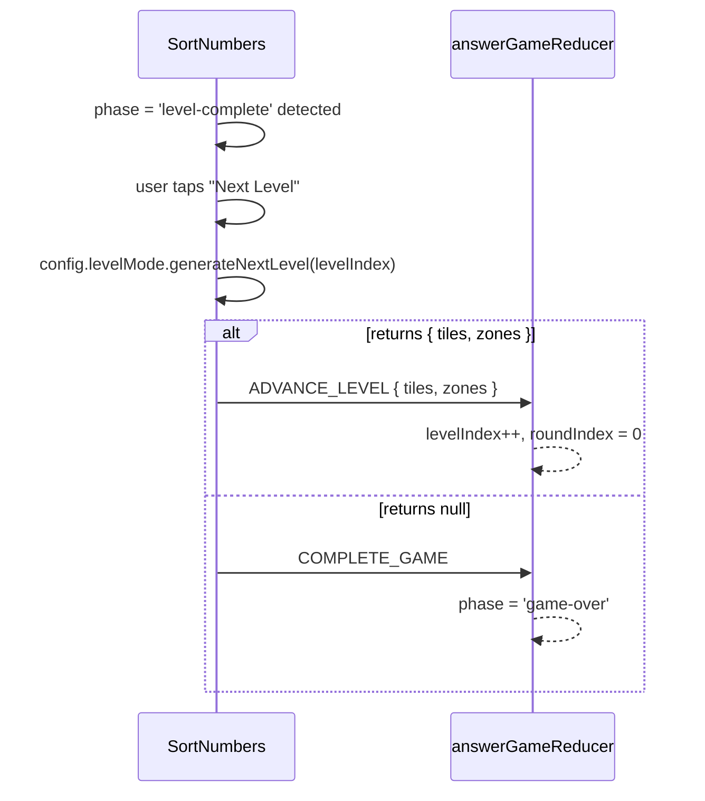
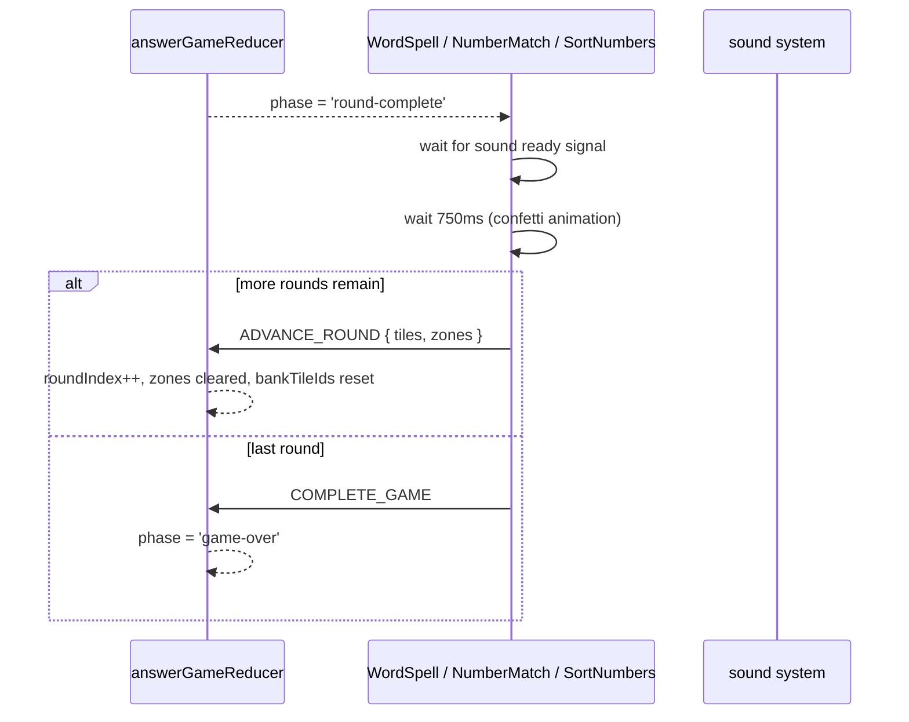

import { Meta } from '@storybook/blocks';

<Meta title="answer-game/Flows" />

# AnswerGame — Event Flows

> Source: `src/components/answer-game/`
>
> Each diagram shows the sequence of dispatches and effects triggered by a user action.
> Update this file when adding new dispatch chains or changing existing ones.
> Run `/update-architecture-docs` for guided update prompts.

---

## 1. Tile Placement

Bank tile click/tap or keyboard character press.

---

## 2. Wrong Tile Auto-Eject

Only when `config.wrongTileBehavior === 'lock-auto-eject'`.

---

## 3. Drag and Drop

Dragging a bank tile or slot tile onto a slot.

**Drag-over bank tile (slot tile being dragged):**

---

## 4. Keyboard and Touch Input

Desktop keyboard (`useKeyboardInput`) and mobile hidden input (`useTouchKeyboardInput`).

Touch keyboard follows the same path via `useTouchKeyboardInput`, using the hidden
`<input>` element's `input` event instead of global `keydown`.

---

## 5. Level Progression (SortNumbers only)

Only when `config.levelMode` is configured.

**Dispatch sequence for level transition:**

---

## 6. Round Progression

> **Status: planned — not yet fully implemented.**
> The phase transition to `'round-complete'` is implemented. The 750ms delay before
> `ADVANCE_ROUND` is implemented in `WordSpell`, `NumberMatch`, and `SortNumbers`.
> A shared round-progression hook is not yet extracted.

