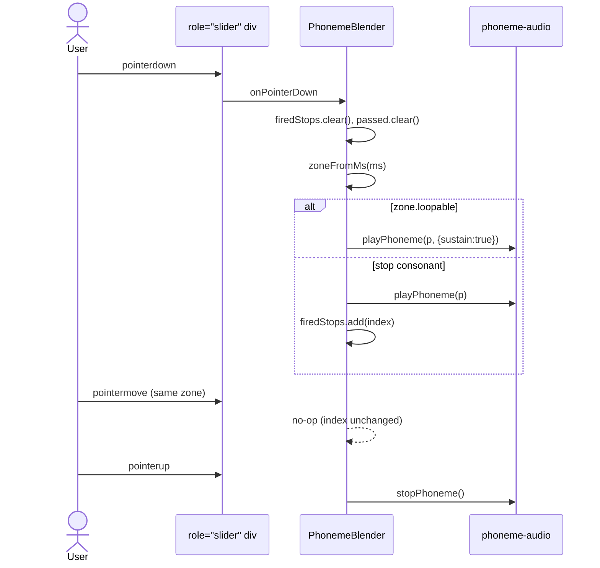
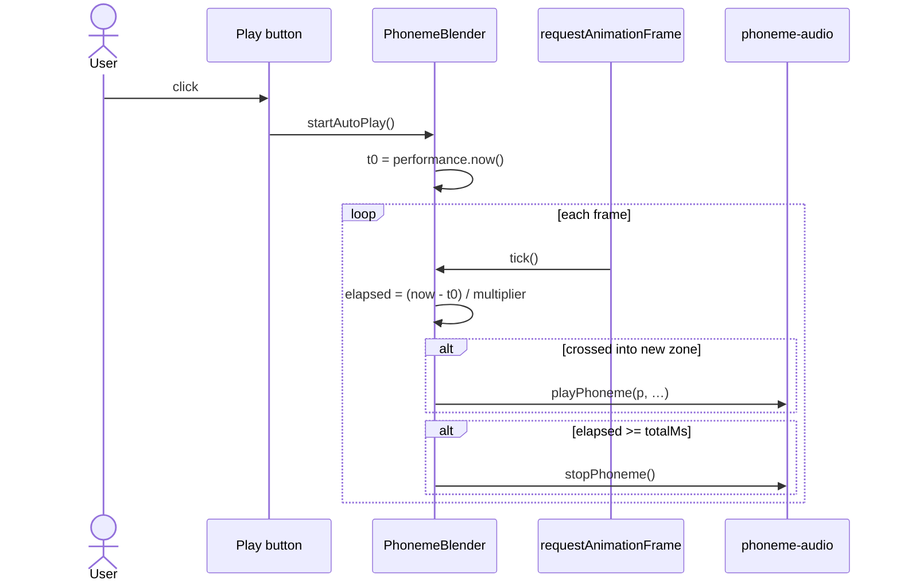
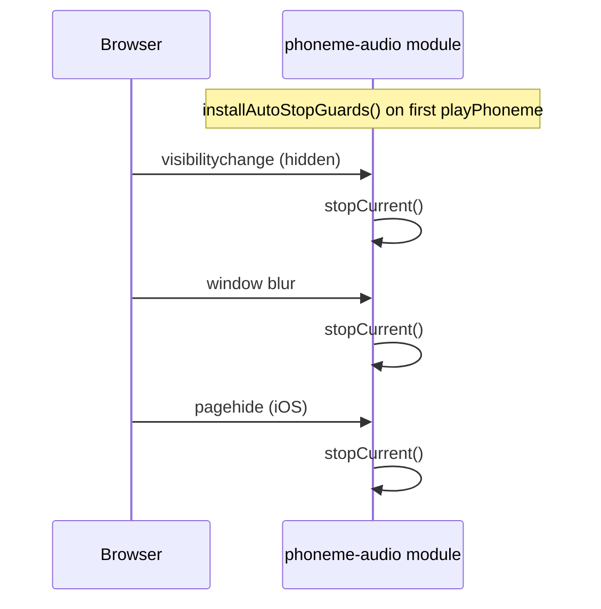

import { Meta } from '@storybook/blocks';

<Meta title="Components/phoneme-blender/Flows" />

# PhonemeBlender — Interaction Flows

> Source: `src/components/phoneme-blender/`

## 1. Pointer scrub across zones

## 2. Auto-play with speed multiplier

## 3. Stop-on-blur (cross-cutting)

