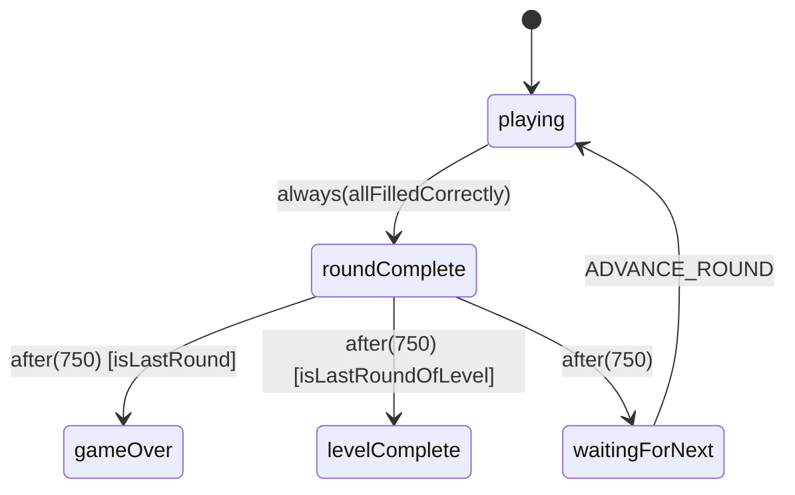
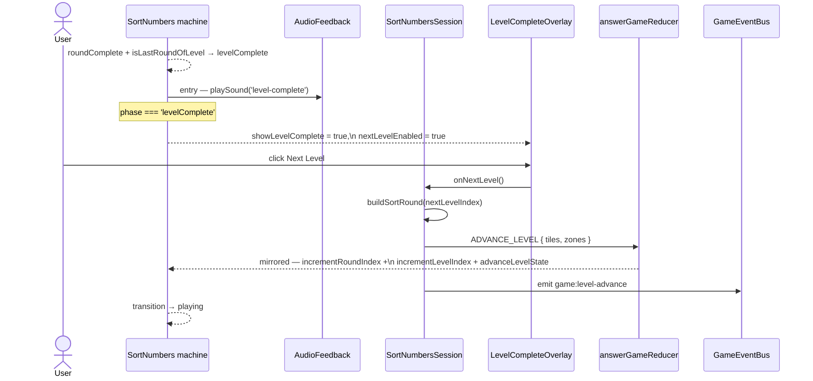
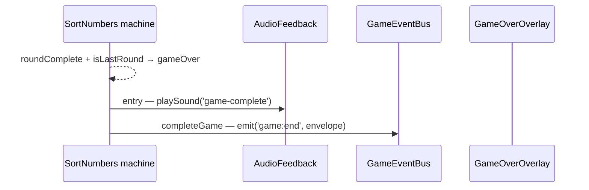
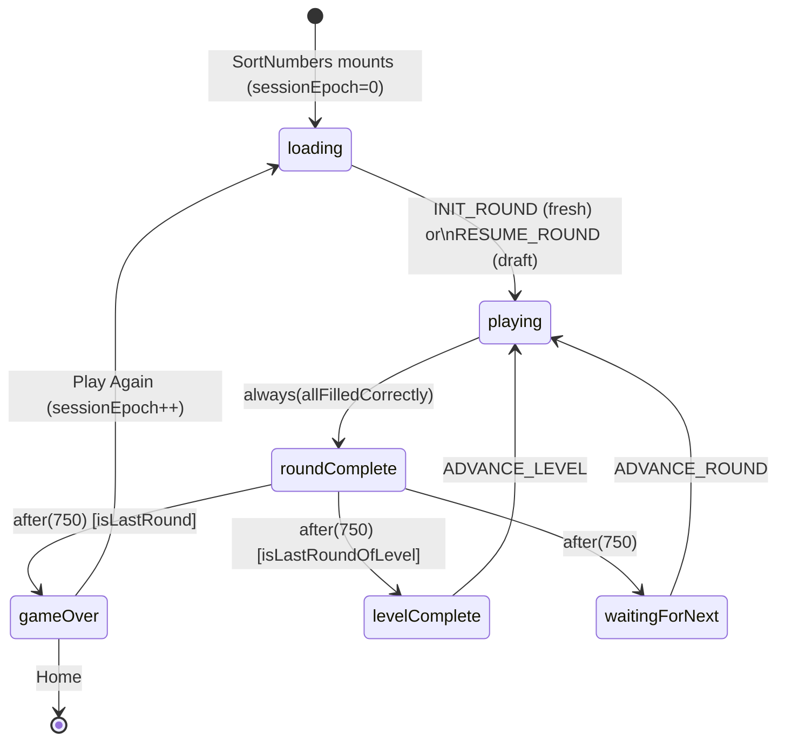

import { Meta } from '@storybook/blocks';

<Meta title="Games/SortNumbers/Flows" />

# SortNumbers — End-to-End Flows

> Source: `src/games/sort-numbers/`
>
> SortNumbers migrated to the XState-first engine in PR 1b alongside
> the new `levelComplete` machine state. The canonical per-round phase
> machine is documented in
> `src/lib/game-engine/GameEngine.flows.mdx` §5 (NumberMatch) and §5c
> (SortNumbers, including `levelComplete`). This file covers
> SortNumbers-specific flows: numeral-ordering evaluation and the
> level-progression `ADVANCE_LEVEL` cycle. Update this file when
> SortNumbers progression logic, audio timing, or level-advance
> behaviour changes.

---

## 1. Per-round phase machine (with levelComplete)

Identical to NumberMatch's phase machine plus a `levelComplete` state
and an `ADVANCE_LEVEL` event. See `GameEngine.flows.mdx` §5c for the
canonical diagram and event list.

SortNumbers-specific notes:

- `isLevelMode` is `true` when the config declares a level mode.
- `roundIndex` accumulates across level boundaries in the engine
  context. The reducer mirror still resets `roundIndex` per level for
  HUD display. PR 1c will collapse the reducer; the HUD will then
  compute per-level round from `engine.roundIndex % levelSize`.
- The `after(750)` transition out of `roundComplete` chooses
  `gameOver` (last round), `levelComplete` (last round of a non-final
  level), or `waitingForNext` (otherwise). Guards `isLastRound` /
  `isLastRoundOfLevel` are injected by `useGameEngine`.
- Round and level construction (`buildSortRound`) stays in
  `SortNumbers.tsx` per Spec Delta 4. The component dispatches
  `INIT_ROUND` / `ADVANCE_ROUND` / `ADVANCE_LEVEL` with the
  precomputed tiles + zones.

---

## 2. Correct tile placement

Same flow as WordSpell — synchronous evaluation in
`useTileEvaluation` mirrored to the engine via `engineDispatch`. See
`WordSpell.flows.mdx` §2 for the diagram. The only SortNumbers-specific
detail is that tile values are numeric strings and zones are ordered.

---

## 3. Round complete → next round

Round-advance is component-driven: a `useEffect` watches
`engine.phase === 'waitingForNext'`, builds the next round via
`buildSortRound`, and dispatches `ADVANCE_ROUND { tiles, zones }`.

---

## 4. Level complete → next level

When the after-timer fires `levelComplete`, the
`LevelCompleteOverlay` mounts. Its "Next level" button is gated by a
new `nextLevelEnabled` prop wired to
`engine.phase === 'levelComplete'`. This closes a reducer-mirror race:
the 750 ms after-timer advances reducer state synchronously while the
engine remains in `roundComplete` until the timer fires. Without the
prop gate, clicking during the race window would dispatch
`ADVANCE_LEVEL` to a machine that ignores it.

The `game:level-advance` event continues to fire — preserved from the
pre-PR-1b implementation. The emit lives in `handleNextLevel` in the
component (review #8) — the original plan to move it onto the engine's
`ADVANCE_LEVEL` handler is deferred to PR 1b-bis. Until then the
component is the canonical emit site.

---

## 5. Game complete

`isLastRound` fires when `roundIndex + 1 >= totalRounds`. Because the
engine accumulates `roundIndex` across level boundaries, the guard
fires correctly on the final round of the final level. The reducer
mirror's per-level reset is not consulted by the guard.

---

## 6. Full session lifecycle

> Mid-celebration tab-close + resume no longer replays the celebration:
> `useAnswerGameDraftSync.buildDraft` returns `null` during
> `round-complete` / `level-complete` / `game-over` reducer phases. See
> `GameEngine.flows.mdx` §4 (Draft State Sync).
