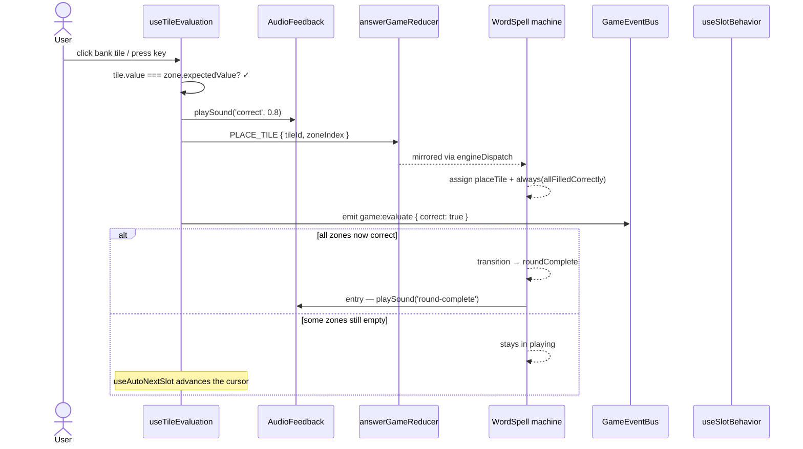
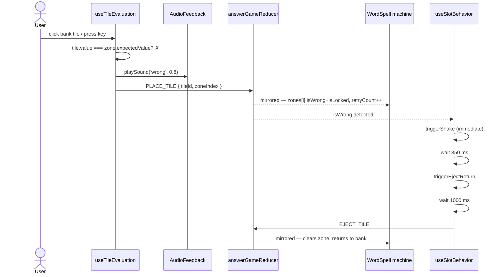
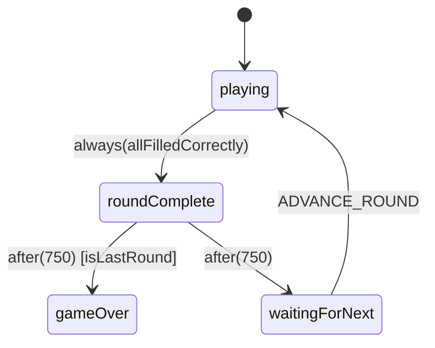
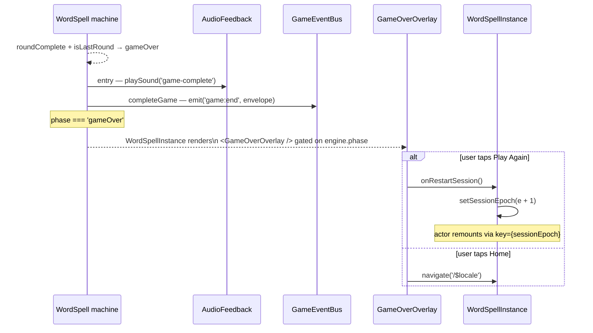
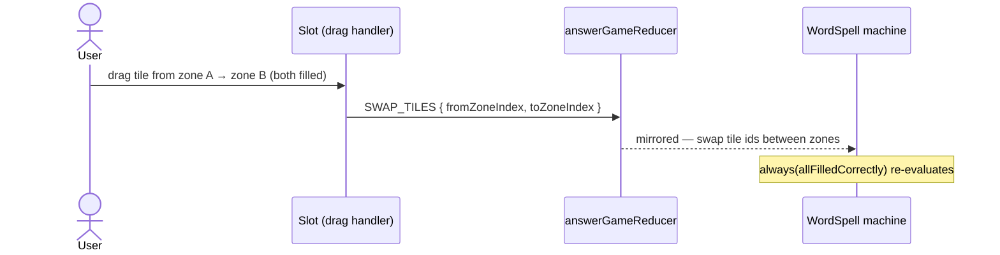
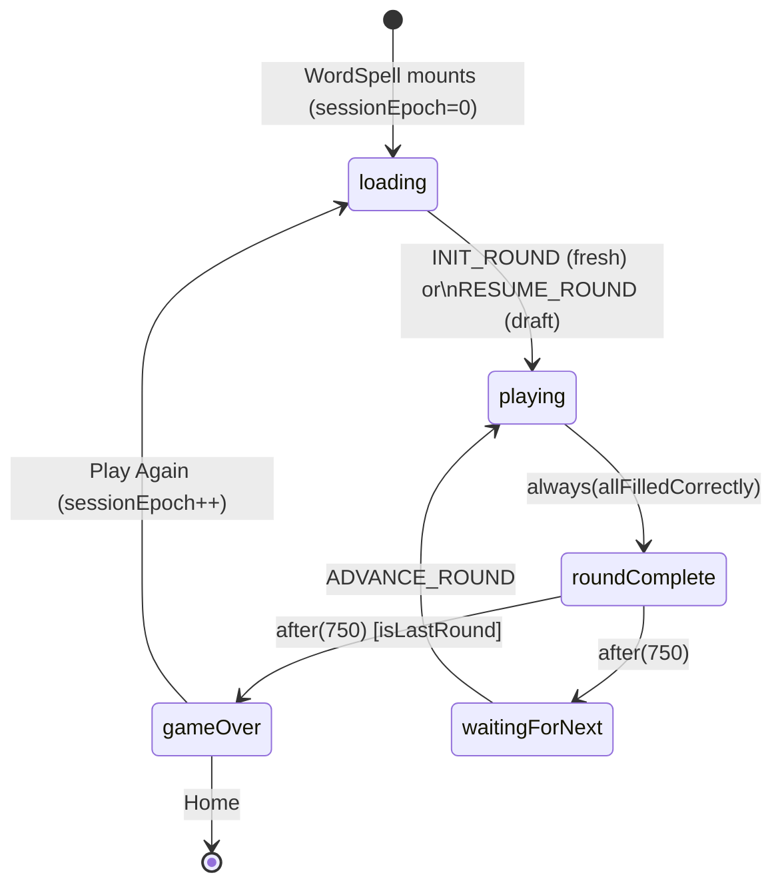

import { Meta } from '@storybook/blocks';

<Meta title="Games/WordSpell/Flows" />

# WordSpell — End-to-End Flows

> Source: `src/games/word-spell/`
>
> WordSpell migrated to the XState-first engine in PR 1b. The canonical
> per-round phase machine is documented in
> `src/lib/game-engine/GameEngine.flows.mdx` §5 (NumberMatch) and §5b
> (WordSpell). This file covers WordSpell-specific flows: letter-to-slot
> evaluation, wrong-tile-behavior modes, and the sentence-gap free-swap
> mode. Update this file when WordSpell progression logic, audio timing,
> or sentence-gap interaction changes.

---

## 1. Per-round phase machine

Identical to NumberMatch — same states (`playing`, `roundComplete`,
`waitingForNext`, `gameOver`), same events. See
`GameEngine.flows.mdx` §5b for the diagram and full event list.

WordSpell-specific notes:

- `isLevelMode` is always `false`; `levelIndex` is unused at runtime
  and the machine never enters `levelComplete`.
- `slotInteraction` is mode-driven: `'sentence-gap'` →
  `'free-swap'`; every other mode → `'ordered'`. The machine itself
  does not branch on the value — it is forwarded to
  `AnswerGameConfig` so `Slot` rendering and `useSlotBehavior` handle
  the swap UX.
- Round construction (`buildSentenceGapRound` and
  `buildTilesAndZones`) stays in `WordSpell.tsx` per Spec Delta 4.
  The component dispatches `INIT_ROUND` / `ADVANCE_ROUND` with the
  precomputed tiles + zones.

---

## 2. Correct tile placement

Synchronous evaluation in `useTileEvaluation` — the audio fires
before the dispatch so feedback feels instant.

---

## 3. Wrong tile placement (lock-auto-eject default)

WordSpell defaults to `wrongTileBehavior: 'lock-auto-eject'`. The tile
is marked wrong, shaken, and automatically ejected after a short
delay.

### Other wrong-tile modes

| Mode          | Behavior after wrong placement                         |
| ------------- | ------------------------------------------------------ |
| `reject`      | Tile bounces back immediately; never enters the slot   |
| `lock-manual` | Tile stays in slot marked wrong; user clicks to remove |

---

## 4. Round complete → next round

The engine drives this entirely. No more `useGameSounds`, no
microtask-deferred `confettiReady` flag — the machine fires sounds
from `entry` actions and the overlay gates on
`engine.phase === 'roundComplete'`.

Round-advance is component-driven: a `useEffect` watches
`engine.phase === 'waitingForNext'`, builds the next round's tiles +
zones via `buildSentenceGapRound` / `buildTilesAndZones`, and
dispatches `ADVANCE_ROUND { tiles, zones }` via the reducer (mirrored
to engine).

---

## 5. Game complete

Triggered by the `after(750)` transition out of `roundComplete` when
`isLastRound` is true.

---

## 6. Sentence-gap free-swap mode

In `sentence-gap` mode WordSpell uses
`slotInteraction: 'free-swap'` — the user can rearrange tiles between
filled slots without clearing them first.

For ordered modes (single-word, etc.), drops onto a filled zone are
rejected by `Slot`'s drop handler — `SWAP_TILES` never fires.

---

## 7. Full session lifecycle

> Mid-celebration tab-close + resume no longer replays the celebration:
> `useAnswerGameDraftSync.buildDraft` returns `null` during
> `round-complete` / `level-complete` / `game-over` reducer phases. See
> `GameEngine.flows.mdx` §4 (Draft State Sync).
