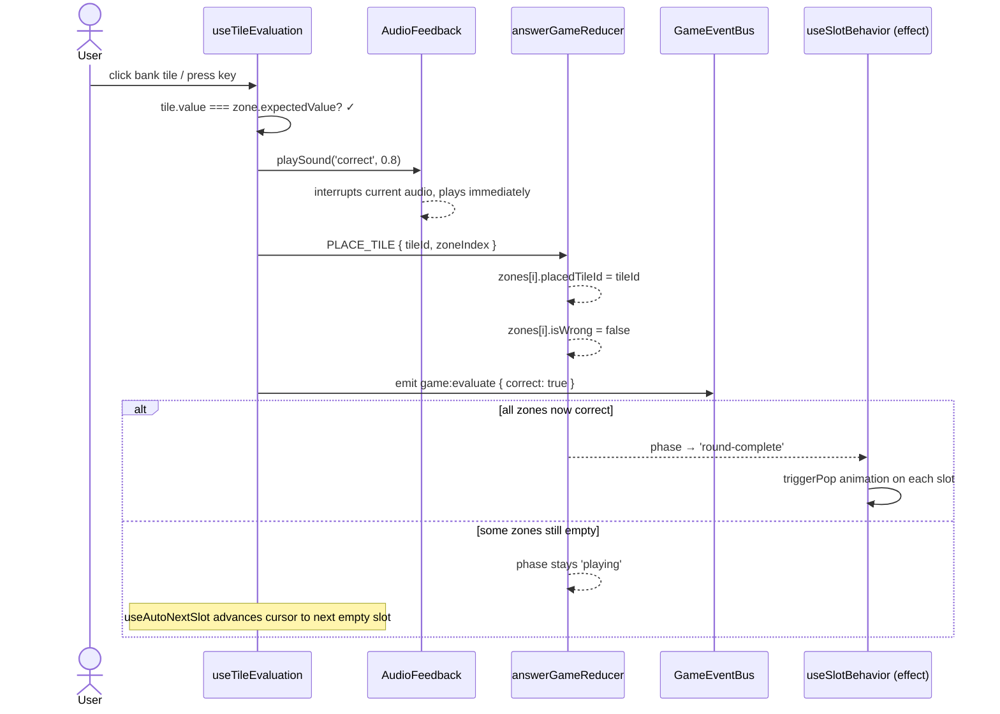
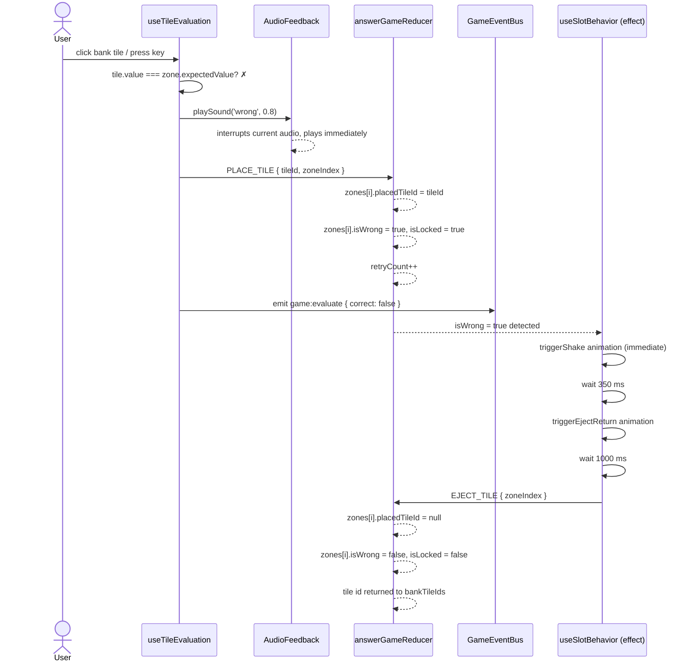
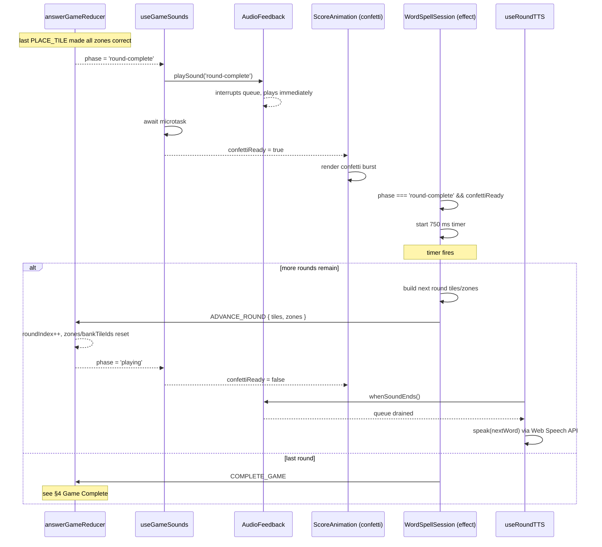
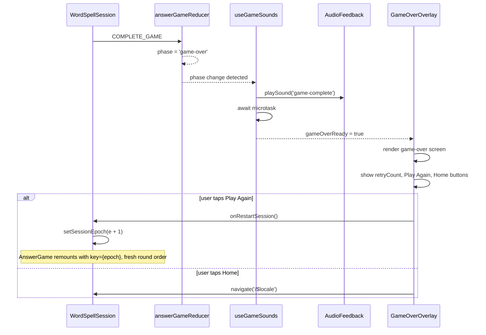
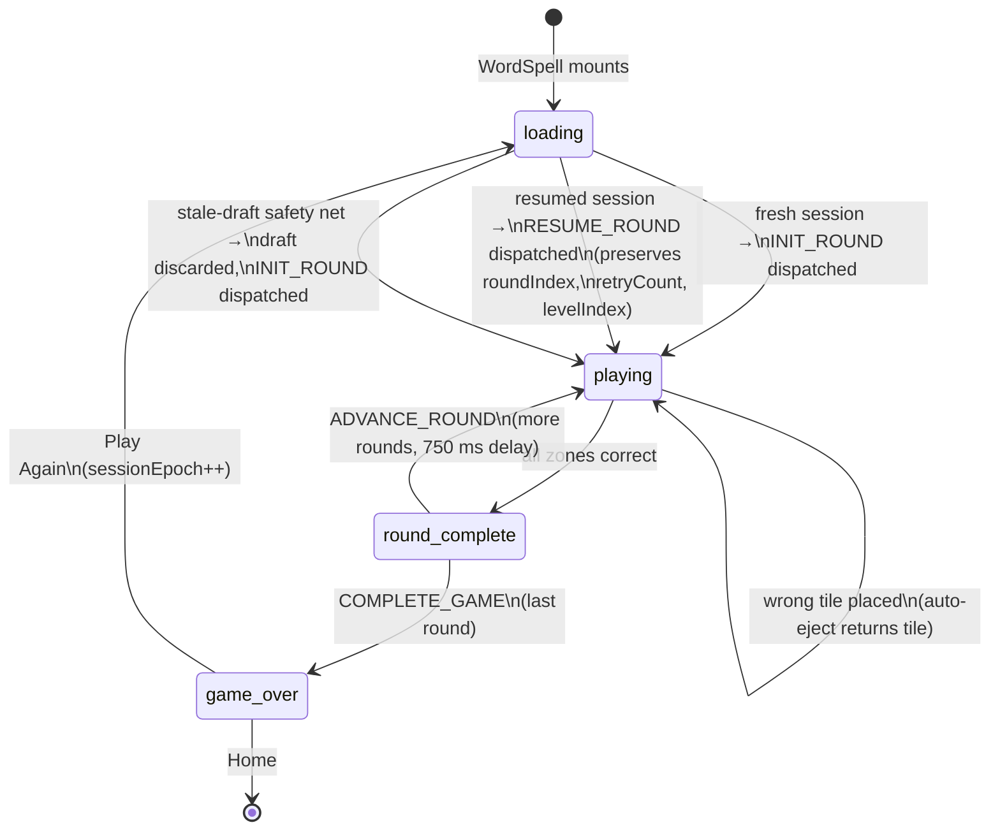
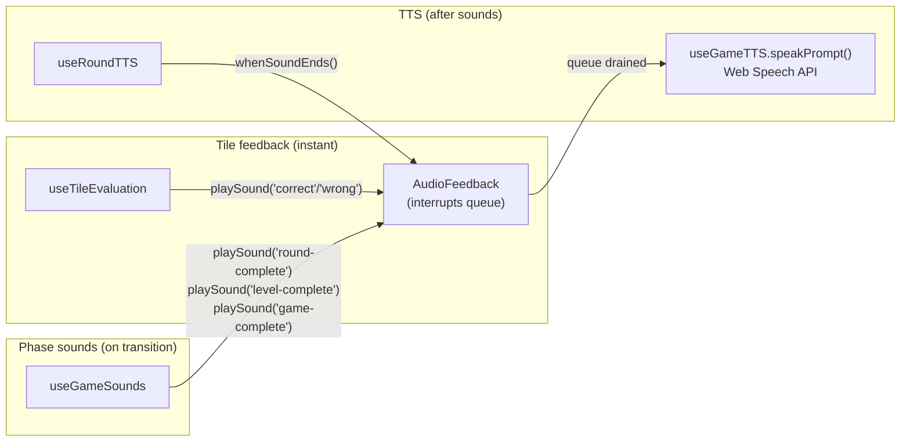

import { Meta } from '@storybook/blocks';

<Meta title="Games/WordSpell/Flows" />

# WordSpell — End-to-End Flows

> Source: `src/games/word-spell/`
>
> These diagrams show the full lifecycle of a WordSpell session, including sound
> effects, TTS, and UI feedback at each step. Update this file when the
> WordSpell progression logic or sound timing changes.

---

## 1. Correct Tile Placement

User places the right letter in a slot. Sound fires **before** the reducer
dispatch so feedback is instant.

---

## 2. Wrong Tile Placement (lock-auto-eject)

WordSpell defaults to `wrongTileBehavior: 'lock-auto-eject'`. The tile is
placed, marked wrong, shaken, and automatically ejected.

### Other wrong-tile modes

| Mode          | Behavior after wrong placement                         |
| ------------- | ------------------------------------------------------ |
| `reject`      | Tile bounces back immediately; never enters the slot   |
| `lock-manual` | Tile stays in slot marked wrong; user clicks to remove |

---

## 3. Round Complete → Next Round

When all zones are filled correctly, the round-complete phase triggers a
cascade: phase sound → confetti → delay → advance to next round → TTS
announces the new word.

### Timing breakdown

| Offset   | Event                                                 |
| -------- | ----------------------------------------------------- |
| 0 ms     | Reducer sets `phase = 'round-complete'`               |
| ~0 ms    | `playSound('round-complete')` fires                   |
| ~1 ms    | `confettiReady` flag set (microtask)                  |
| ~1 ms    | Confetti animation starts rendering                   |
| 750 ms   | Timer fires → `ADVANCE_ROUND` or `COMPLETE_GAME`      |
| ~750+ ms | `whenSoundEnds()` resolves → TTS speaks the next word |

---

## 4. Game Complete

Dispatched when the last round finishes or when no more rounds exist.

---

## 5. Full Session Lifecycle (state diagram)

> See `AnswerGame.flows.mdx` §9 for the full mount-effect decision tree
> (`RESUME_ROUND` vs `INIT_ROUND`). The stale-draft safety net lives in
> `WordSpell.tsx:435-474` — it detects a draft whose letters can't align
> with the current round and null-patches `draftState` before the provider
> sees it, so the resume path falls back to `INIT_ROUND`.

---

## 6. Sound and TTS Pipeline

All game sounds flow through `AudioFeedback.ts`. TTS waits for the audio
queue to drain before speaking.

### AudioFeedback API

| Function          | Behavior                                            | Use case                  |
| ----------------- | --------------------------------------------------- | ------------------------- |
| `playSound()`     | Interrupts current audio + resets queue             | Tile correct/wrong sounds |
| `queueSound()`    | Appends to queue; resolves when sound **starts**    | Phase transition sounds   |
| `whenSoundEnds()` | Resolves when entire queue (current + pending) ends | TTS delay                 |

> **Note:** `useGameSounds` currently uses `playSound()` (interrupt), not
> `queueSound()`. This means a rapid correct tile + round-complete can cut off
> the tile sound. This is intentional — the phase sound takes priority.
