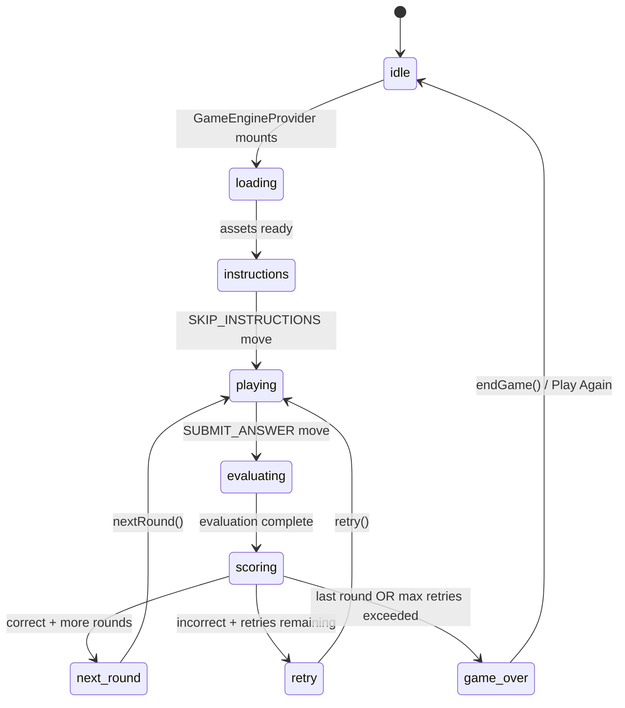
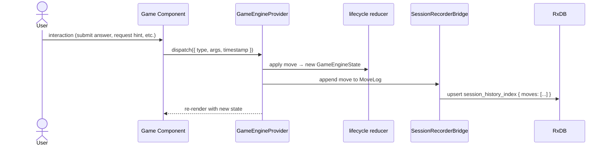
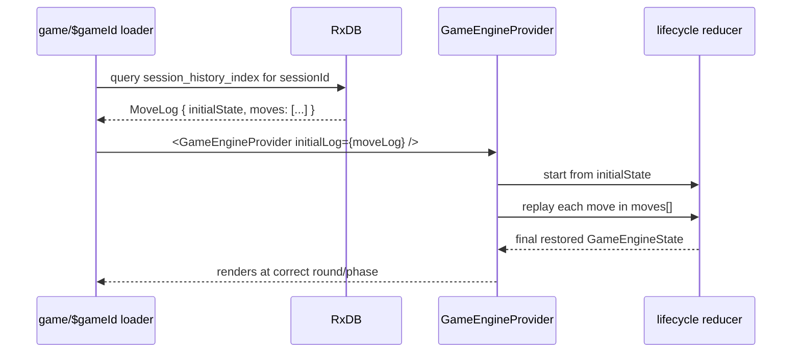
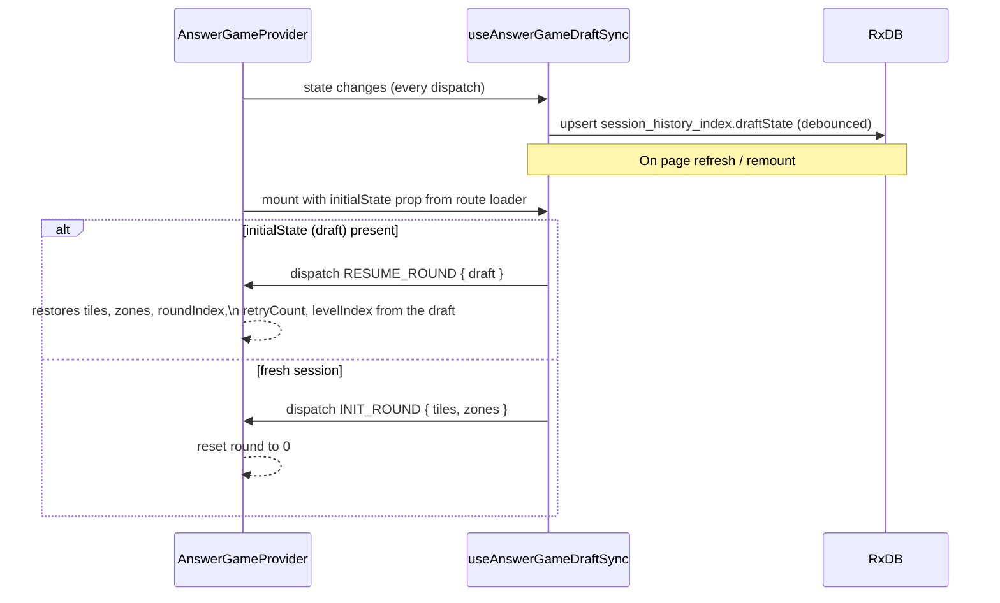
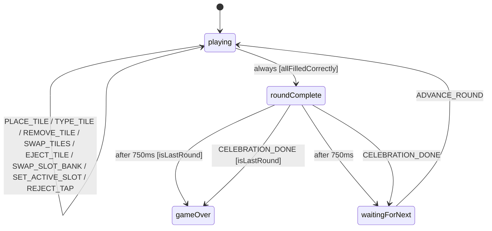
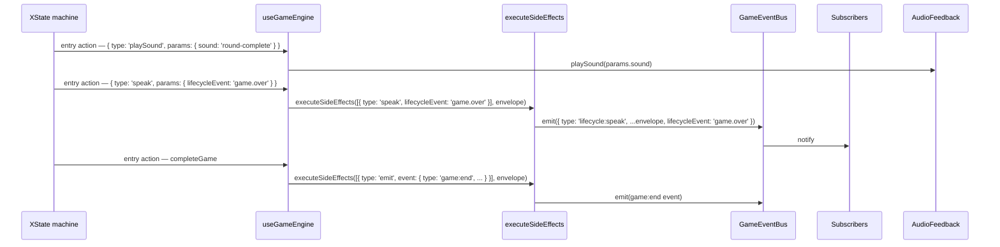
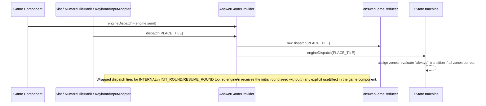

import { Meta } from '@storybook/blocks';

<Meta title="GameEngine/Flows" />

# GameEngine — Flows

> Source: `src/lib/game-engine/`
>
> Update this file when session lifecycle transitions or persistence behaviour change.

---

## 1. Session Lifecycle

---

## 2. Move Dispatch and Recording

Every user action goes through a single `dispatch(move)` call.

---

## 3. Session Resume (Move Log Replay)

When a player returns to an in-progress game, the route loader finds the saved `MoveLog`
and passes it as `initialLog` to `GameEngineProvider`.

---

## 4. Draft State Sync (AnswerGame mid-round persistence)

`useAnswerGameDraftSync` keeps the `AnswerGameState` persisted so a mid-round refresh
restores exactly where the player left off.

---

## XState engine (PR 1a foundation)

PR 1a introduces a per-game XState machine that owns the round-level
lifecycle (`playing` / `roundComplete` / `waitingForNext` / `gameOver`).
The legacy `lifecycle.ts` reducer above continues to drive the outer
session shell; the two coexist until PR 1c collapses them. The XState
machine is created by `useGameEngine(definition, options?)` and consumed
by the per-game component (NumberMatch is the canonical example for
PR 1a; WordSpell + SortNumbers migrate in PR 1b, SpotAll in PR 1d).

### 5. Per-round phase machine (NumberMatch as the canonical example)

- Round-complete detection is atomic: each game-state `assign` action
  mutates `context.zones`, XState re-evaluates `playing.always`, and the
  machine transitions to `roundComplete` in the same step. No React
  `useEffect` race window.
- `gameOver` is a regular state (not `type: 'final'`) so root-level
  handlers (`INIT_ROUND`, `RESUME_ROUND`) keep firing for defense in
  depth. "Play Again" works via parent re-mount; the machine never
  models RESTART.
- `levelComplete` is not in PR 1a's NumberMatch slice. PR 1b adds it
  alongside WordSpell + SortNumbers when they introduce level mode.

### 6. Side-effect flow

PR 1a has no subscriber for `lifecycle:speak` — `useLifecycleTTS`
lands in a follow-up task. The bus is the seam, so subscribers can be
added without touching the machine. Prompt TTS (`useRoundTTS`) is
unchanged from the legacy flow.

### 7. Dispatch bridge (AnswerGameProvider engineDispatch prop)

`useGameEngine` lives in the game component (e.g., `NumberMatch.tsx`).
`engine.send` is wrapped in a stable callback via `useRef` and passed
as `engineDispatch`. `AnswerGameProvider` wraps its `rawDispatch` with
a `useCallback` (empty deps; stable identity) that mirrors every
action to the latest `engineDispatch`. Internal dispatches
(`INIT_ROUND` from the mount effect, `RESUME_ROUND` from session
drafts) route through the same wrapped dispatch.

### 8. Celebration semantics (PR 1a scope)

PR 1a does **not** emit `celebration:start | complete | skip` events
from the engine; the overlay is rendered by the game component gated
on `engine.phase`:

- `engine.phase === 'roundComplete'` → render
  `<skin.RoundCompleteEffect />` or fallback `<ScoreAnimation />`
- `engine.phase === 'gameOver'` → render `<skin.CelebrationOverlay />`
  or fallback `<GameOverOverlay />`

PR 1b adds engine-emitted `celebration:*` events alongside `useGameRound`
adoption.

### 9. Coexistence note

The legacy `lifecycle.ts` reducer continues to drive the outer game
session shell (`idle → loading → instructions → playing → …`) until
PR 1c. The XState machine owns the per-round phase machine inside
`playing`. Two reducers run in parallel: the answer-game reducer for
tile positions (Slot/NumeralTileBank rendering) and the XState machine
for lifecycle/phase (overlay gating, round-advance timing,
`game:end` emission). The dispatch bridge (§7) keeps them in sync.
