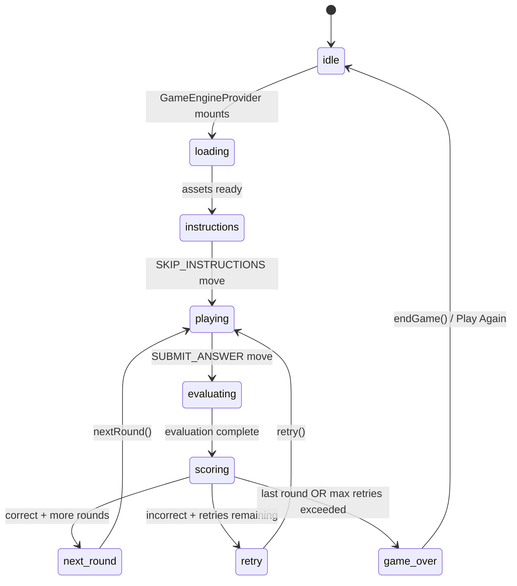
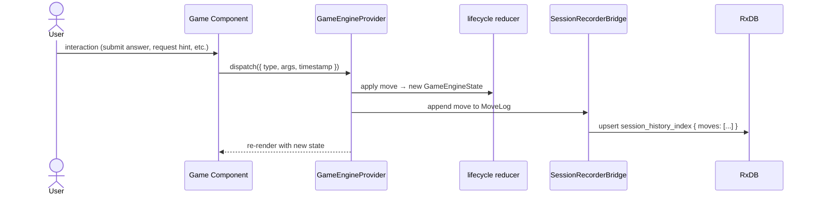
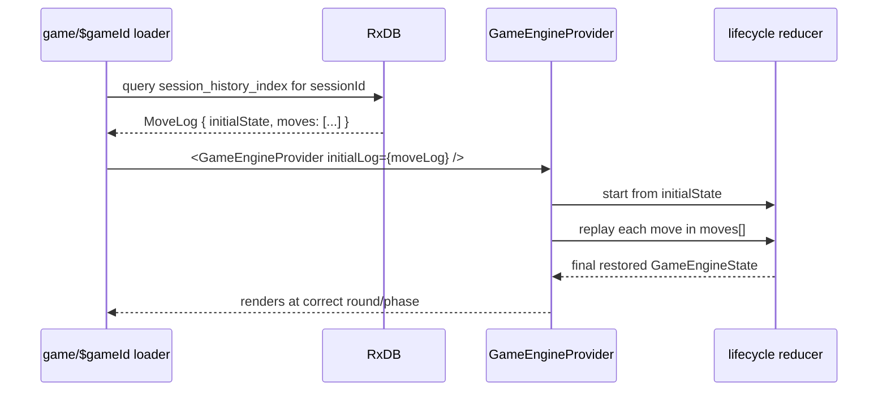
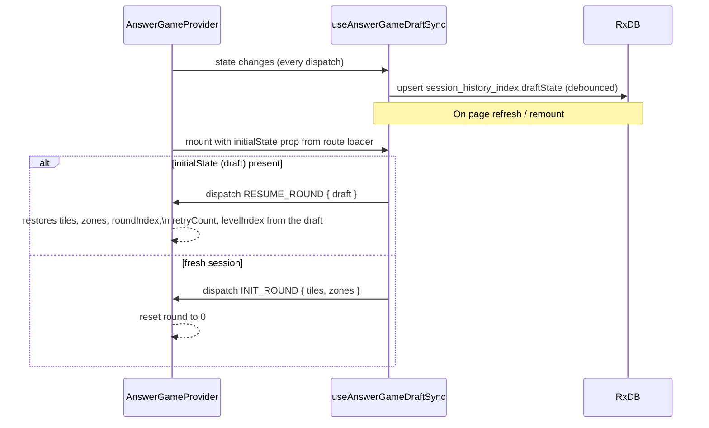

import { Meta } from '@storybook/blocks';

<Meta title="GameEngine/Flows" />

# GameEngine — Flows

> Source: `src/lib/game-engine/`
>
> Update this file when session lifecycle transitions or persistence behaviour change.

---

## 1. Session Lifecycle

---

## 2. Move Dispatch and Recording

Every user action goes through a single `dispatch(move)` call.

---

## 3. Session Resume (Move Log Replay)

When a player returns to an in-progress game, the route loader finds the saved `MoveLog`
and passes it as `initialLog` to `GameEngineProvider`.

---

## 4. Draft State Sync (AnswerGame mid-round persistence)

`useAnswerGameDraftSync` keeps the `AnswerGameState` persisted so a mid-round refresh
restores exactly where the player left off.

