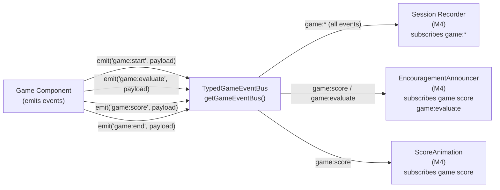

# Game event bus (Milestone 2)

Internal-only typed pub/sub for game lifecycle and session recording. Matches `docs/game-engine.md` §3.

- **Import:** `getGameEventBus()` from `@/lib/game-event-bus` (or construct `createGameEventBus()` for tests).
- **Future:** May become a stable public package export; until then treat as app-internal.

## Event Flow

### Event Types

| Event                     | Emitted when                    | Key payload fields                       |
| ------------------------- | ------------------------------- | ---------------------------------------- |
| `game:start`              | First round begins              | `gameId`, `profileId`, `timestamp`       |
| `game:instructions_shown` | TTS instructions play           | `gameId`                                 |
| `game:action`             | Any user interaction            | `action`, `data`                         |
| `game:evaluate`           | Answer submitted for evaluation | `answer`, `correct`, `durationMs`        |
| `game:score`              | Round scored                    | `score`, `streak`, `stars`               |
| `game:hint`               | Hint requested                  | `hintType`                               |
| `game:retry`              | Retry triggered                 | `attempt`                                |
| `game:time_up`            | Timer expired                   | —                                        |
| `game:end`                | Session ends                    | `finalScore`, `totalStars`, `durationMs` |
